# Laplacian Frequency Hierarchies for Efficient 3D Gaussian Splatting Training

Yixiong Yang1,\*, Sisheng Zhang1,\*, Qingsong Yan2, Shaohuai Shi1, Qiang Wang1,† 1Harbin Institute of Technology, Shenzhen, China, 2XGRIDS, China, \*Equal contribution, †Corresponding author

## Abstract

A key bottleneck in 3D Gaussian Splatting training is the continual growth of Gaussian primitives, which increases optimization cost and slows convergence, especially at high resolutions. We propose Laplacian Frequency Hierarchies, a simple yet efficient 3DGS scheme that combines Laplacian image decomposition with coarse-to-fine, frequency-staged training. After fitting lower-frequency structure, we archive the corresponding Gaussian field so that subsequent fields can optimize higher-frequency residuals without carrying the full primitive burden, and we compose the rendered components in the image domain via a Laplacian-style reconstruction at inference time. This design reduces the number of active Gaussians during training, thereby lowering optimization overhead and accelerating training. The proposed scheme is plugand-play and orthogonal to prior 3DGS accelerations: it can be directly combined with strong backbones such as Taming-3DGS and FastGS to improve training speed with competitive reconstruction quality. It achieves average training speedups of 1.73× and 1.21× at 1K, and 1.74× and 1.33× at 4K on Taming-3DGS and FastGS, with larger gains on more challenging scenes and increasingly pronounced benefits at higher resolutions. The project page and source code are available at https://sorenzhang574. github.io/Laplacian-GS/.

## 1. Introduction

Novel view synthesis (NVS) is a foundational problem in 3D reconstruction and scene representation, aiming to render photorealistic views of a scene from previously unseen camera poses. Starting from Neural Radiance Fields (NeRF) (Mildenhall et al., 2021), implicit representations have achieved impressive fidelity but often at the cost of expensive optimization and slow rendering. In contrast, 3D Gaussian Splatting (3DGS) (Kerbl et al., 2023) introduces an explicit primitive-based representation with differentiable rasterization, dramatically improving training and rendering efficiency, reducing optimization time from days to minutes while enabling real-time rendering. Owing to its favorable quality–speed balance, 3DGS has quickly become a backbone for a broad range of downstream tasks (Chen & Wang, 2025; Huang et al., 2024a; Zuo et al., 2025; Huang et al., 2024b; Matsuki et al., 2024; Guo et al., 2025).

Despite these advances, efficiency in practical applications remains a bottleneck. As scene complexity and target resolution increase, 3DGS typically requires more Gaussian primitives and incurs heavier Gaussian–tile interactions, increasing computation and peak memory usage. This has motivated acceleration methods based on rasterization optimization, scheduling, and primitive control. Taming 3DGS (Mallick et al., 2024) improves tile-level parallelization, while DashGaussian (Chen et al., 2025) uses resolution and primitive schedulers to delay expensive phases. Mini-Splatting (Fang & Wang, 2024) and FastGS (Ren et al., 2025) reduce training cost by controlling densification, pruning, or adaptive density. Taken together, these approaches aim to reduce the average Gaussian workload during training, e.g., by shrinking the Gaussian set, reducing Gaussian–tile pairs, or postponing expensive iterations.

However, many existing approaches do not fully eliminate a structural inefficiency. They still rely on a single Gaussian set to cover both coarse and fine image components across the entire optimization. Frequency-based methods (Chen et al., 2025; Nguyen et al., 2025; Zhang et al., 2024a; Zeng et al., 2025) typically use frequency cues to schedule supervision, for instance by changing the supervision order or adjusting the resolution. This changes the training curriculum but does not fundamentally decouple the representation, so the rendering workload can still grow with scene complexity and resolution. Crucially, coarse components that converge early are still carried through later training, leading to avoidable overhead when the optimization focuses on high-frequency details. This observation also resonates with recent explorations of Laplacian decomposition in Gaussianbased representations. Frequency hierarchies (Zhu et al., 2025) have shown promising gains in speed and quality for 2D Gaussian image representation (Zhang et al., 2024b), while Lavi et al. (Lavi et al., 2025) explored Laplacian decomposition in 3DGS for interpretability and artistic applications. Yet the role of Laplacian factorization as a practical strategy for improving training efficiency in 3DGS remains underexplored. This motivates us to revisit Laplacian factorization as a mechanism for reducing the active optimization burden during training.

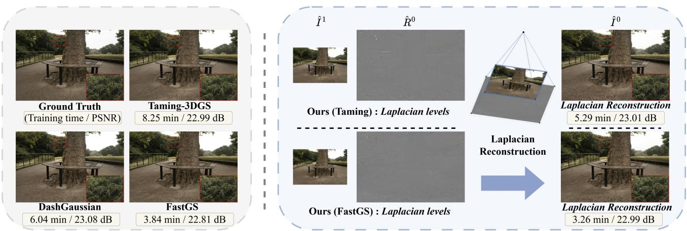  
Figure 1. We propose Laplacian Frequency Hierarchies, a frequency-factorized scheme for efficient 3D Gaussian Splatting training. We adopt a Laplacian image decomposition to split supervision into a low-frequency base and high-frequency residuals, and train a sequence of smaller, frequency-specific Gaussian fields. The framework is plug-and-play with strong accelerated backbones such as Taming-3DGS (Mallick et al., 2024) and FastGS (Ren et al., 2025), yielding faster optimization while maintaining comparable reconstruction quality.

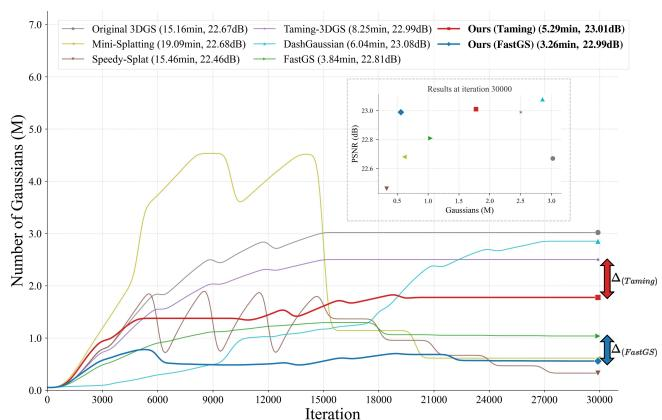  
Figure 2. Number of Gaussians across training iterations on the ’treehill’ scene of Mip-NeRF 360 (Barron et al., 2022). Since earlier stages are archived, our method maintains substantially fewer active Gaussians in later iterations.

In this work, we propose Laplacian Frequency Hierarchies, a frequency-decomposed framework for efficient 3D Gaussian Splatting. Our key observation is that NVS ultimately produces an image-plane signal with naturally structured frequency components. Low-frequency components capture global appearance and illumination, while highfrequency components primarily encode edges, textures, and fine details. Instead of forcing one Gaussian set to bear all frequencies at all times, we perform a Laplacian decomposition of the supervision signal and reformulate 3DGS as a hierarchy consisting of (i) a low-frequency base Gaussian field and (ii) multiple high-frequency residual Gaussian fields. Novel-view synthesis is then obtained by rendering each level and composing the final image via an imagedomain summation of the base rendering and residual renderings (see Fig. 1). This decomposition naturally enables afrequency-staged training scheme. We train the hierarchy from coarse to fine and archive each lower-frequency field once its training stage finishes. Each subsequent stage then focuses on the next frequency band without carrying the full primitive burden. Crucially, only the Gaussians of the current band are actively optimized at a time, leading to fewer active Gaussians during later iterations (Fig. 2) and reducing overall training workload. Beyond efficiency, this Laplacian-style factorization provides an interpretable view of the representation across frequencies and can support dynamic level-of-detail (LOD) rendering and frequency-aware artistic filtering, as explored in prior work (Lavi et al., 2025).

We demonstrate that Laplacian Frequency Hierarchies are plug-and-play and orthogonal to existing 3DGS accelerations across multiple backbones. Our framework does not alter the core rasterizer or density-control designs, and can be directly stacked onto strong implementations such as Taming-3DGS (Mallick et al., 2024) and FastGS (Ren et al., 2025). At 1K resolution, our framework matches state-ofthe-art reconstruction quality while providing a noticeable efficiency gain. Notably, the efficiency gains become more pronounced at higher resolutions. On 2K and 4K scenes, our method delivers larger speedups while maintaining comparable reconstruction quality, demonstrating strong scalability to high-resolution settings. Overall, our results suggest that frequency decomposition can serve as an effective training and optimization strategy for reducing the active Gaussian workload in 3DGS training. In summary, we make the following contributions:

• We propose Laplacian Frequency Hierarchies, a Laplacian-inspired training scheme for 3DGS that decomposes image supervision into a low-frequency base component and high-frequency residual components, which are optimized by frequency-specific Gaussian fields and composed in the image domain for NVS.

• We develop a coarse-to-fine frequency-staged training scheme that archives earlier levels and trains each subsequent level within its corresponding frequency band, reducing training workload and peak memory usage.

• Our method shows plug-and-play compatibility across multiple 3DGS backbones. It improves training efficiency in the 1K setting while maintaining competitive rendering quality, and becomes increasingly favorable at 2K and 4K, yielding larger training speedups.

## 2. Related Work

Novel view synthesis. NVS has long been a central problem in 3D vision. NeRF established neural implicit representations for this task, followed by efforts to improve their efficiency (Mildenhall et al., 2021; Muller et al.¨ , 2022). 3D Gaussian Splatting (3DGS) (Kerbl et al., 2023) further advances efficient NVS with explicit Gaussian primitives and differentiable splatting, enabling GPU-friendly rasterization. Its efficiency has enabled adoption in large-scale reconstruction (Liu et al., 2025b), avatars (Yang et al., 2024), surface reconstruction (Guedon & Lepetit´ , 2024; Wolf et al., 2024), world modeling (Zuo et al., 2025), SLAM (Matsuki et al., 2024; Hu & Han, 2025), and digital twinning (Guo et al., 2025).

Acceleration for 3DGS training. Existing efforts to accelerate 3DGS training can be broadly grouped into several directions. (i) Backpropagation and optimizers. Taming 3DGS (Mallick et al., 2024) replaces per-pixel backpropagation with a per-splat parallelization scheme, yielding substantial speedups with strong generality. Other works revisit optimizers and update rules, such as 3DGS-LM (Hollein et al.¨ , 2025), which replaces Adam with Levenberg– Marquardt to accelerate convergence, and $3 \mathrm { D G S ^ { 2 } }$ (Lan et al., 2025), which explores second-order optimization for faster training. (ii) Scheduling andfrequency-aware training. A related line improves efficiency by progressively changing the training signal or workload, including resolution or frequency scheduling and coarse-to-fine strategies (Chen et al., 2025; Farooq et al., 2025). DashGaussian (Chen et al., 2025) introduces resolution and primitive schedulers that defer rapid primitive growth to later iterations, reducing the total training cost. (iii) Densification control and pruning. Many methods explicitly manage densification and pruning to curb the growth of Gaussian primitives. Mini-Splatting (Fang & Wang, 2024) removes a large portion of Gaussians via simplification based on intersection preservation and sampling. Speedy-Splat (Hanson et al., 2025) prunes

Gaussians using a Hessian approximation aggregated across training views. FastGS (Ren et al., 2025) designs densification and pruning rules based on multi-view consistency and achieves strong efficiency–quality trade-offs. (iv) System and parallelization. System-oriented efforts explore parallel and distributed training (Zhao et al., 2024) as well as deployment-oriented designs for resource-constrained devices. Orthogonally, high-resolution settings introduce additional scalability challenges, motivating methods tailored for large images, such as (Liu et al., 2025a; Dhiman et al., 2024; Li et al., 2025). Our method is most closely related to frequency-based approaches. Unlike prior work that primarily uses frequency for scheduling or reweighting, we incorporate frequency at the representation level by decomposing the 3DGS scene into frequency-specific fields and composing their renderings in the image domain via a Laplacian-style reconstruction. This improves training efficiency and scales better to high-resolution settings.

Frequency-based methods in 3DGS. Several recent works exploit frequency or multi-scale priors to improve 3DGS training and rendering. FreGS (Zhang et al., 2024a) regularizes 3DGS in the Fourier domain to improve NVS fidelity and mitigate over-reconstruction artifacts. Opti3DGS and AutoOpti3DGS (Farooq et al., 2025; Nguyen et al., 2025) employ frequency-aware coarse-to-fine supervision while retaining a single Gaussian field. Zeng et al. (Zeng et al., 2025) introduce frequency-aware densification and deletion to allocate finer Gaussians to high-frequency regions, improving fidelity with fewer Gaussians. Lavi et al. (Lavi et al., 2025) use Laplacian subbands for LOD rendering and frequency-aware editing. In contrast, we factorize the scene into frequency-specific Gaussian fields and archive completed fields, so later stages optimize only the active frequency band, directly reducing the optimization workload for faster training.

## 3. Methodology

## 3.1. Preliminaries.

3D Gaussian Splatting (3DGS) represents a scene using a set of anisotropic Gaussian primitives $\mathcal { G } = \{ G _ { i } \} _ { i = } ^ { N }$ (Kerbl et al., 2023). Each primitive is parameterized by a 3D mean $\mu _ { i } \in \mathbb { R } ^ { 3 }$ , an opacity $\sigma _ { i } \in ( 0 , 1 ) .$ a covariance matrix $\Sigma _ { i } \in \mathbb { R } ^ { 3 \times 3 } ( \mathbf { e . g . } , \Sigma _ { i } = R _ { i } S _ { i } S _ { i } ^ { \top } R _ { i } ^ { \top }$ with rotation $R _ { i }$ and diagonal scale $S _ { i } = \mathrm { d i a g } ( s _ { i } ) )$ , and view-dependent appearance parameters. The Gaussian density is

$$
G _ { i } ( x ) = \exp { \left( - { \frac { 1 } { 2 } } ( x - \mu _ { i } ) ^ { \top } \Sigma _ { i } ^ { - 1 } ( x - \mu _ { i } ) \right) }\tag{1}
$$

To render an image from a camera view, 3DGS projects each 3D Gaussian onto the image plane using an affine approximation of the perspective projection, yielding an elliptical

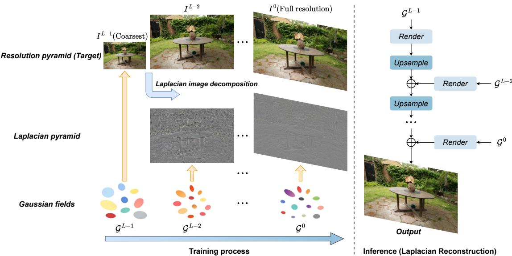  
Figure 3. Overview of our method. We decompose each training image into a resolution pyramid and the corresponding Laplacian residual pyramid. During training, a sequence of Gaussian fields $\mathcal { G } ^ {  { 1 } } , \breve { \mathcal { G } } ^ { L - 2 } , \dots , \mathcal { G } ^ { 0 }$ is optimized in a coarse-to-fine manner, with each field learning a specific frequency component. At inference time, the fields are rendered separately and their outputs are composed via Laplacian reconstruction to produce the full-resolution result.

2D footprint whose contribution at pixel coordinate $p$ is weighted by a 2D Gaussian kernel $G _ { i } ^ { \bar { 2 } D } ( p )$ . Each primitive contributes an alpha value $\alpha _ { i } ( p ) = \dot { \sigma } _ { i } \dot { G } _ { i } ^ { 2 D } ( p )$ and a viewdependent color $c _ { i } ( \mathbf { d } )$ . Given depth-sorted primitives along the viewing ray, the pixel color is computed by standard alpha compositing:

$$
\hat { I } ( p ) = \sum _ { i = 1 } ^ { N } T _ { i } ( p ) \alpha _ { i } ( p ) c _ { i } ( \mathbf { d } ) ,\tag{2}
$$

where $\begin{array} { r } { T _ { i } ( p ) \ = \ \prod _ { j = 1 } ^ { i - 1 } \left( 1 - \alpha _ { j } ( p ) \right) } \end{array}$ denotes the accumulated transmittance. For view-dependent appearance, 3DGS models color using spherical harmonics (SH) coefficients. Specifically, each primitive stores SH coefficients $\{ a _ { i , \ell m } \}$ and we evaluate

$$
c _ { i } ( \mathbf { d } ) = \sum _ { k = 0 } ^ { L _ { \mathrm { { s h } } } } \sum _ { m = - k } ^ { k } a _ { i , k m } Y _ { k m } ( \mathbf { d } ) ,\tag{3}
$$

where d denotes the viewing direction, $Y _ { k m }$ are SH basis functions, and $L _ { \mathrm { s h } }$ is the maximum SH degree. As the number of Gaussian primitives N grows and the rendering resolution increases, both the per-iteration rendering/backpropagation cost and the peak memory footprint rise substantially, which becomes a key bottleneck for efficient training.

## 3.2. Laplacian Frequency Hierarchy

Fig. 3 illustrates our Laplacian frequency hierarchy. Our goal is to reduce the training workload of 3DGS by factorizing a single scene representation into multiple frequencyspecific Gaussian fields and composing their renderings in the image domain.

Resolution pyramid and Laplacian decomposition. Our image-space decomposition and reconstruction follow the classical Laplacian pyramid formulation (Burt & Adelson, 1983). Let $\bar { I ^ { 0 } }$ denote the full-resolution ground-truth image for a training view. We construct an L-level resolution pyramid $\{ I ^ { \ell } \} _ { \ell = 0 } ^ { L - 1 }$ with an anti-aliased downsampling operator Down(·) (Gaussian filtering and subsampling), and define $\mathrm { U p } ( \cdot )$ as the paired upsampling operator used to construct the Laplacian residual targets $\{ R ^ { \ell } \} _ { \ell = 0 } ^ { L - 2 }$ and to perform the subsequent reconstruction. The corresponding relations are:

$$
I ^ { \ell + 1 } = \mathrm { D o w n } ( I ^ { \ell } ) , \qquad R ^ { \ell } = I ^ { \ell } - \mathrm { U p } ( I ^ { \ell + 1 } ) ,\tag{4}
$$

where $\ell \in \{ 0 , \ldots , L - 2 \}$ indexes pyramid levels (level 0 is full resolution and larger ℓ is coarser). In practice, we apply the same decomposition to every training view v, yielding a resolution pyramid (also referred to as a Gaussian image pyramid) $\big \{ I _ { v } ^ { 0 } , I _ { v } ^ { 1 } , \ldots , I _ { v } ^ { L - 1 } \big \}$ and Laplacian pyramids $\{ R _ { v } ^ { 0 } , R _ { v } ^ { 1 } , \ldots , \dot { R } _ { v } ^ { \bar { L } - 2 } , I _ { v } ^ { L - 1 } \}$

Frequency-specific Gaussian fields. We represent the scene with a hierarchy of Gaussian fields $\{ \mathcal { G } ^ { L - 1 } , \ldots , \mathcal { G } ^ { 0 } \}$ aligned with the Laplacian components. The coarsest field $\mathcal { G } ^ { \mathbf { { L } - 1 } }$ models the low-frequency content at level $L - 1$ (target $I ^ { L - 1 } )$ , while each field $\mathcal { G } ^ { \ell }$ for $\ell \in \{ 0 , \ldots , L - 2 \}$ models the residual band $R ^ { \ell }$ . A practical difference between the base and residual targets is their value range: $I ^ { L - 1 }$ lies in $[ 0 , 1 ]$ , whereas each residual $R ^ { \ell }$ is signed and lies in $[ - 1 , 1 ]$ Standard 3DGS rasterizers assume non-negative color outputs and commonly apply a post-processing step to map the predicted SH color to [0, 1], e.g., by shifting and clamping:

$$
c _ { i } ^ { \mathrm { r g b } } ( \mathbf { d } ) = \mathrm { c l a m p } ( c _ { i } ( \mathbf { d } ) + 0 . 5 , 0 , 1 ) .\tag{5}
$$

To support residual learning, we modify the rasterizer for

residual fields by removing the shift and clamp, so that the rendered color can take signed values and match the range.

Given a view v, we render each field using the corresponding splatting renderer and denote the resulting image by

$$
\begin{array} { r l r } {  { \hat { I } ^ { L - 1 } ( v ) = \mathrm { R e n d e r } _ { \mathrm { b a s e } } ( \mathcal { G } ^ { L - 1 } ; v ) , } } \\ & { } & { \hat { R } ^ { \ell } ( v ) = \mathrm { R e n d e r } _ { \mathrm { r e s } } ( \mathcal { G } ^ { \ell } ; v ) , \quad \quad } \end{array}\tag{6}
$$

where Rende $\mathrm { \Delta } _ { \mathrm { b a s e } }$ uses the standard color mapping in Eq. (5), and $\mathrm { R e n d e r } _ { \mathrm { r e s } }$ outputs signed residuals with the modified rasterizer.

Image-domain composition. We synthesize the final fullresolution image by composing the rendered coarsest level and residuals in the image domain via a Laplacian-style reconstruction:

$$
\hat { I } _ { v } ^ { \ell } = \mathrm { U p } ( \hat { I } _ { v } ^ { \ell + 1 } ) + \hat { R } _ { v } ^ { \ell } , \qquad \ell = L - 2 , \ldots , 0 ,\tag{7}
$$

where $\hat { I } _ { v } ^ { 0 }$ is the full-resolution prediction for view v.

## 3.3. Frequency-staged training with archiving

Coarse-to-fine training has been widely adopted in 3DGS to improve optimization efficiency (Chen et al., 2025; Farooq et al., 2025), since low-frequency structures typically converge earlier than high-frequency details. Building upon our Laplacian decomposition, we further introduce an archiving mechanism: once a frequency level has finished, we remove its Gaussian field from further optimization and memory residency. Unlike simple freezing, archiving allows a trained field to be moved off GPU memory (and optionally stored on CPU/disk), so that subsequent stages can dedicate computation and memory to the next frequency band. This reduces the number of Gaussians that remain active on the GPU at each stage, improving training throughput and lowering peak VRAM usage. The training procedure is summarized in Algorithm 1.

Stage-wise training objectives. A naive strategy is to train each field to directly match its Laplacian target, i.e., $\hat { I } ^ { L - 1 } ( v )$ to $I _ { v } ^ { L - 1 }$ and $\hat { R } ^ { \ell } ( v )$ to $R _ { v } ^ { \ell } .$ . In practice, we find that perlevel approximation errors can accumulate across levels and lead to degraded final reconstruction quality. To mitigate this issue, we supervise each stage using the reconstructed image at the corresponding resolution level. Specifically, after training the coarsest field $\mathcal { G } ^ { L - 1 }$ , we proceed from coarse to fine. For each finer level $\ell \in \{ L - 2 , \ldots , 0 \}$ we render the residual field to obtain $\hat { R } _ { v } ^ { \ell }$ and reconstruct $\hat { I } _ { v } ^ { \ell }$ using Eq. 7 together with the previous-level prediction $\hat { I } _ { v } ^ { \dot { \ell } + 1 }$ . In practice, we only cache $\hat { I } _ { v } ^ { \ell + 1 }$ in the dataloader, so the archived Gaussian field does not need to remain in memory. We then optimize $\mathcal { G } ^ { \ell }$ by comparing $\hat { I } _ { v } ^ { \ell }$ with the ground truth at the same pyramid level $I _ { v } ^ { \ell }$ using the standard 3DGS photometric loss (e.g., a weighted combination of $\ell _ { 1 }$ and SSIM). This supervision anchors each stage to the correct target resolution and reduces error accumulation across levels.

Algorithm 1 Frequency-staged Training with Archiving for   
Laplacian Frequency Hierarchies   
1: Precompute pyramids. For each training view v, build the   
resolution pyramid $\{ I _ { v } ^ { \ell } \} _ { \ell = 0 } ^ { L - 1 }$   
2: Initialize an empty cache for accumulated predictions $\{ \hat { I } _ { v } ^ { \ell } \}$   
3: for $\ell = L - 1 , \mathbf { \dot { L } } ^ { * } - 2 , \dots , 0$ do   
4: Initialize Gaussian field.   
5: $\mathbf { i f } \ \ell = L - 1$ then   
6: Initialize $\mathcal { G } ^ { L - 1 }$ from COLMAP (default 3DGS init).   
7: else   
8: Initialize $\mathcal { G } ^ { \ell }$ from the previous stage field $\mathcal { G } ^ { \ell + 1 }$   
9: end if   
10: for each training iteration do   
11: Sample a training view v.   
12: if $\ell \stackrel { \cdot } { = } L - 1$ then   
13: Render $\hat { I } _ { v } ^ { \ell } \gets$ Render $\scriptstyle \log ( \mathcal { G } ^ { L - 1 } ; v )$   
14: else   
15: Load cached $\hat { I } _ { v } ^ { \ell + 1 }$ and compute $\mathrm { U p } ( \hat { I } _ { v } ^ { \ell + 1 } )$   
16: Render residual $\hat { R } _ { v } ^ { \ell }  \mathrm { R e n d e r } _ { \mathrm { r e s } } ( \mathcal { G } ^ { \ell } ; v ) .$   
17: Reconstruct $\hat { I } _ { v } ^ { \ell } \gets \mathrm { U p } ( \hat { I } _ { v } ^ { \ell + 1 } ) + \hat { R } _ { v } ^ { \ell } .$   
18: end if   
19: Compute photometric loss $\mathcal { L } _ { \mathrm { p h o t o } } \bigg ( \hat { I } _ { v } ^ { \ell } , I _ { v } ^ { \ell } \bigg )$   
20: Backpropagate and update parameters.   
21: Apply densification and pruning.   
22: end for   
23: Cache the accumulated predictions $\hat { I } _ { v } ^ { \ell }$ for the next stage.   
24: Save the trained Gaussian field $\mathcal { G } ^ { \ell }$ and archive it.   
25: end for

Initialization and inheritance. For the coarsest field $\mathcal { G } ^ { L - 1 }$ we follow standard 3DGS and initialize Gaussian positions from the COLMAP point cloud. When moving from level ℓ + 1 to ℓ, we initialize the new field $\mathcal { G } ^ { \ell }$ by inheriting Gaussians from the previous level. Concretely, we copy only the 3D positions while reinitializing the remaining attributes such as scale, opacity, and colors, since different frequency bands exhibit different statistics. We also introduce an inheritance ratio $\rho \in ( 0 ,$ 1]: when $\rho = 1 . 0$ all Gaussians are inherited, and when $\rho < 1 . 0$ we randomly inherit a subset. Inheritance analysis is provided in Sec. B of the supplement.

## 4. Experiments

## 4.1. Experimental Setup

## 4.1.1. DATASETS AND METRICS.

Following vanilla 3DGS and prior work, we evaluate our method on three real-world benchmarks: Mip-NeRF 360 (Barron et al., 2022), Deep Blending (Hedman et al., 2018), and Tanks&Temples (Knapitsch et al., 2017). For Mip-NeRF 360, prior methods typically resize images to width 1600, which we refer to as the 1K setting. We also evaluate on full-resolution images (average width 4185), referred to as the 4K setting. We also include an intermediate 2K setting by resizing each scene to the midpoint between width

Table 1. Quantitative comparison on three datasets (1K setting). Time is measured in minutes. N denotes the number of Gaussians (in millions). The top-3 results in each column are highlighted with best , second-best , and third-best
<table><tr><td rowspan="2">Method</td><td colspan="6">Mip-NeRF 360</td><td colspan="6">Deep Blending</td><td colspan="6">Tanks &amp; Temples</td></tr><tr><td>Time↓PSNR↑SSIM↑LPIPS↓NGs (M)↓FPS↑Time↓PSNR↑SSIM↑LPIPS↓NGs (M)↓FPS↑Time↓PSNR↑SSIM↑LPIPS↓NGs (M)↓FPS↑</td><td></td><td></td><td></td><td></td><td></td><td></td><td></td><td></td><td></td><td></td><td></td><td></td><td></td><td></td><td></td><td></td><td></td></tr><tr><td>Original 3DGS 14.69</td><td></td><td>27.58</td><td>0.814</td><td>0.220</td><td>2.66</td><td>116</td><td>12.20</td><td>29.83</td><td>0.907</td><td>0.238</td><td>2.47</td><td>156</td><td>9.47</td><td>23.82</td><td>0.853</td><td>0.169</td><td>1.58</td><td>157</td></tr><tr><td>Opti3DGS</td><td>21.07</td><td>27.44</td><td>0.807</td><td>0.241</td><td>2.23</td><td>122</td><td>18.40</td><td>29.62 0.906</td><td>0.246</td><td></td><td>2.12</td><td>131</td><td>10.23</td><td>23.58</td><td>0.843</td><td>0.191</td><td>1.23</td><td>174</td></tr><tr><td>Mini-Splatting</td><td>19.66</td><td>27.36</td><td>0.822</td><td>0.216</td><td>0.53</td><td>172</td><td>14.15</td><td>30.01</td><td>0.908</td><td>0.253</td><td>0.35</td><td>231</td><td>10.55</td><td>23.28</td><td>0.835</td><td>0.203</td><td>0.20</td><td>250</td></tr><tr><td>Speedy-Splat</td><td>16.05</td><td>26.92</td><td>0.782</td><td>0.294</td><td>0.30</td><td>145</td><td>12.90</td><td>29.67</td><td>0.904</td><td>0.267</td><td>0.25</td><td>311</td><td>8.88</td><td>23.42</td><td>0.820</td><td>0.240</td><td>0.18</td><td>169</td></tr><tr><td>Taming-3DGS</td><td>8.88</td><td>27.73</td><td>0.810</td><td>0.228</td><td>2.29</td><td>97</td><td>6.84</td><td>29.29</td><td>0.899</td><td>0.246</td><td>2.23</td><td>123</td><td>6.33</td><td>24.36</td><td>0.860</td><td>0.165</td><td>1.49</td><td>142</td></tr><tr><td>DashGaussian</td><td>5.25</td><td>27.40</td><td>0.797</td><td>0.249</td><td>2.00</td><td>93</td><td>4.18</td><td>29.60</td><td>0.905</td><td>0.256</td><td>1.64</td><td>126</td><td>4.22</td><td>24.14</td><td>0.850</td><td>0.185</td><td>1.15</td><td>148</td></tr><tr><td>FastGS</td><td>4.82</td><td>27.96</td><td>0.820</td><td>0.216</td><td>1.17</td><td>198</td><td>3.34</td><td>30.24</td><td>0.911 0.240</td><td></td><td>0.65</td><td>237</td><td>3.44</td><td>24.34</td><td>0.858</td><td>0.173</td><td>0.53</td><td>208</td></tr><tr><td>Ours(Taming)</td><td>5.13</td><td>27.39</td><td>0.797</td><td>0.245</td><td>1.13/1.47</td><td>96</td><td>3.61</td><td>29.38</td><td>0.900 0.243</td><td></td><td>1.02/1.20</td><td>127</td><td>3.91</td><td>23.93</td><td>0.841</td><td>0.197</td><td>0.57/0.88</td><td>110</td></tr><tr><td>Ours(FastGS)</td><td>3.96</td><td>27.67</td><td>0.809</td><td>0.233</td><td>0.71/0.87</td><td>122</td><td>3.04</td><td>30.16</td><td>0.907</td><td>0.257</td><td>0.37/0.29</td><td>173</td><td>3.13</td><td>24.03</td><td>0.842</td><td>0.205</td><td>0.24/0.36</td><td>124</td></tr></table>

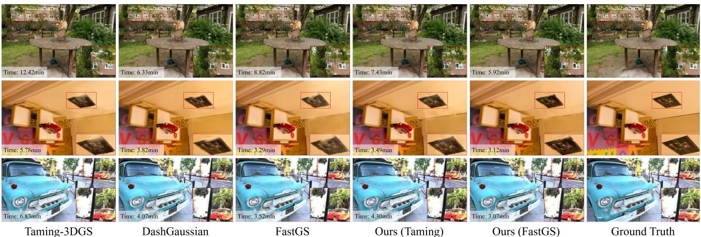  
Figure 4. Qualitative results on the “garden” scene (Mip-NeRF 360), the “playroom” scene (Deep Blending), and the “truck” scene (Tanks & Temples) under the 1K setting. For space constraints, we show only the top five methods by training time. Complete results and additional qualitative comparisons for the 2K/4K settings are provided in Sec. E of the supplementary material.

1600 and its full resolution (average width 2893).

For NVS quality, we report the PSNR (peak signal-to-noise ratio), SSIM (Wang et al., 2004), and LPIPS (Zhang et al., 2018) on each dataset. To measure optimization efficiency, we report average training time and the number of primitives NGS, with stage-wise counts for our method. The reported training time measures iterative optimization for all methods. A detailed runtime breakdown and timing boundary are provided in Sec. G of the supplement.

## 4.1.2. IMPLEMENTATION DETAILS.

We implement our method on top of two backbones, Taming-3DGS (Mallick et al., 2024) and FastGS (Ren et al., 2025). Taming-3DGS is a widely used and competitive backbone, while FastGS is a recent state-of-the-art baseline. Unless otherwise stated, all methods are run with their default settings for 30K training iterations using Adam (Kingma, 2014). Experiments in the 1K setting are conducted on an NVIDIA L40 GPU, while 2K and 4K experiments are run on an NVIDIA Pro6000 GPU to avoid out-of-memory failures for some methods. We use a two-level Laplacian decomposition with an iteration split of 10K/20K. Sec. 4.3.2 analyzes levels and iteration allocation.

## 4.2. Comparison with Fast Optimization Methods

## 4.2.1. BASELINES.

We compare against recent fast-training methods, including vanilla 3DGS (Kerbl et al., 2023), Opti3DGS (Farooq et al., 2025), Mini-Splatting (Fang & Wang, 2024), Speedy-Splat (Hanson et al., 2025), Taming-3DGS (Mallick et al., 2024), DashGaussian (Chen et al., 2025), and FastGS (Ren et al., 2025). These baselines represent different directions for accelerating 3DGS training. Taming-3DGS denotes the variant with the efficient backward implementation and the Sparse Adam optimizer. FastGS uses the “Big” setting from the original paper for a fairer comparison. EfficientGS (Liu et al., 2025a) is additionally included for high-resolution comparisons.

## 4.2.2. COMPARISON WITH OTHER METHODS ON 1K SETTING.

Tab. 1 reports quantitative comparisons on three datasets under the 1K setting. Our Laplacian framework improves training efficiency on both Taming-3DGS and FastGS backbones while largely preserving reconstruction quality. On Mip-NeRF 360, Ours(Taming) reduces training time from 8.88 to 5.13 minutes, yielding a 1.73× speedup with only a 0.34 dB PSNR drop. On the FastGS backbone, Ours(FastGS) further reduces time from 4.82 to 3.96 minutes, with a 0.29 dB PSNR drop. Changes in SSIM and LPIPS remain within a comparable range. On Deep Blending, Ours(Taming) is both faster and improves over the Taming baseline in quality metrics, while Ours(FastGS) also accelerates training with only minor metric degradation. Tanks & Temples shows a similar trend. Our method achieves the fastest training time across these benchmarks. We note that slight metric degradation can occur in some cases, which we attribute to additional approximation error introduced by the hierarchical rendering and composition.

Fig. 4 presents qualitative comparisons. Despite being faster, our method preserves comparable quality and in some cases produces better renderings than prior methods. For example, in the second row, the zoomed-in view shows clearer edges and finer details in our results. In addition to static comparisons, we provide trajectory videos in the supplement to inspect temporal stability under continuous viewpoint changes. The videos demonstrate stable rendering, with no flickering artifacts introduced by the image-domain Laplacian composition. An edge-preservation analysis is also provided in Sec. C of the supplement. Additional scenewise results are provided in Sec. D and Sec. E.

Tab. 1 also reports the number of Gaussian primitives $N _ { \mathrm { G S } }$ For our method, we provide the stage-wise counts for each level. Compared to the original backbones, our training is split into two smaller Gaussian fields, which reduces GPU memory requirements and is better suited to resourceconstrained settings. We report the peak Gaussian count and peak GPU memory in Sec. F of the supplement. The table further includes inference FPS. Since the final image is reconstructed from separately rendered frequency fields, the overall FPS can decrease despite the smaller size of each field. All reported FPS values for our method are measured using sequential rendering of the frequency fields. We include this metric to make the inference trade-off explicit.

## 4.2.3. ANALYSIS OF THE NUMBER OF GAUSSIANS ACROSS TRAINING.

Fig. 2 visualizes how the Gaussian count $N _ { \mathrm { G S } }$ evolves during training. The arrows indicate the shift in $N _ { \mathrm { G S } }$ when our framework is applied on top of two different backbones. We observe that in the early iterations, our curves closely follow the corresponding backbones, since the optimization behaves similarly before the densification of the first stage is completed. After densification is stopped at the base stage, the curves begin to diverge, and our method maintains a substantially lower Gaussian count thereafter. Thus, our approach yields a much lower $N _ { \mathrm { G S } }$ trajectory than the original backbones, reflecting reduced effective training workload and explaining the efficiency gains observed in our experiments.

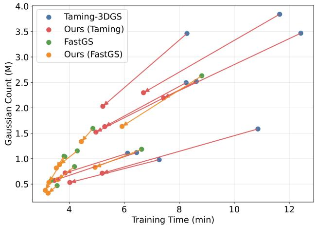  
Figure 5. Training Time vs $N _ { \mathrm { G S } }$ (paired before→after our method) on the Mip-NeRF 360 dataset. For our method, the $N _ { \mathrm { G S } }$ is computed as an iteration-weighted average under the iteration split.

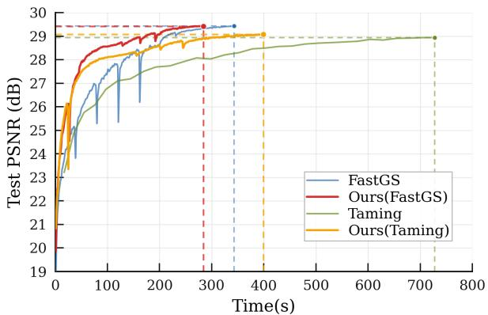  
Figure 6. PSNR versus training time on the counter scene of Mip-NeRF 360 under the 4K setting. Our method reaches comparable reconstruction quality earlier than the original backbones. The inset zooms into the early stage to highlight convergence differences.

## 4.2.4. ANALYSIS OF TRAINING TIME VS. GAUSSIAN COUNT.

Fig. 5 shows the paired changes in training time and average Gaussian count when applying our method on top of Taming-3DGS and FastGS. Each arrow connects a baseline run to the corresponding result with our method. Together with Tab. 10 of the supplement, we observe that the speedup depends on scene complexity, and scenes with more Gaussians tend to obtain larger time reductions. For example, under the Taming backbone, the bicycle scene is accelerated from 11.65 minutes to 6.70 minutes. Under the FastGS backbone, the garden scene is accelerated from 8.82 minutes to 5.92 minutes. When the average Gaussian count becomes sufficiently small, further reducing primitives yields a less noticeable speedup, suggesting diminishing returns for acceleration strategies that rely primarily on controlling Gaussian count. This points to an interesting direction for future work on reducing fixed rendering and optimization overheads in low-primitive regimes.

Table 2. Mip-NeRF 360 results under the 2K setting.
<table><tr><td>Method</td><td>Time↓</td><td>PSNR↑</td><td>SSIM↑</td><td>LPIPS↓</td><td> $N _ { \mathrm { G S } }$  (M)↓</td><td>FPS↑</td></tr><tr><td>Taming-3DGS</td><td>10.37</td><td>27.14</td><td>0.787</td><td>0.313</td><td>1.93</td><td>62</td></tr><tr><td>DashGaussian</td><td>5.66</td><td>26.76</td><td>0.774</td><td>0.332</td><td>1.70</td><td>60</td></tr><tr><td>FastGS</td><td>6.18</td><td>27.53</td><td>0.804</td><td>0.282</td><td>1.67</td><td>121</td></tr><tr><td>EfficientGS</td><td>33.35</td><td>27.07</td><td>0.803</td><td>0.283</td><td>1.26</td><td>76</td></tr><tr><td>Ours(Taming)</td><td>6.17</td><td>26.87</td><td>0.776</td><td>0.325</td><td>1.10/1.04</td><td>71</td></tr><tr><td>Ours(FastGS)</td><td>4.82</td><td>27.38</td><td>0.794</td><td>0.300</td><td>1.22/0.70</td><td>107</td></tr></table>

Table 3. Mip-NeRF 360 results under the 4K setting.
<table><tr><td>Method</td><td>Time↓</td><td>PSNR↑</td><td>SSIM↑</td><td>LPIPS↓</td><td> $N _ { \mathrm { G S } }$  (M)↓</td><td>FPS↑</td></tr><tr><td>Taming-3DGS</td><td>17.37</td><td>26.81</td><td>0.795</td><td>0.361</td><td>1.57</td><td>45</td></tr><tr><td>DashGaussian</td><td>8.37</td><td>26.45</td><td>0.786</td><td>0.374</td><td>1.43</td><td>40</td></tr><tr><td>FastGS</td><td>8.74</td><td>27.37</td><td>0.812</td><td>0.327</td><td>1.73</td><td>105</td></tr><tr><td>EfficientGS</td><td>68.07</td><td>26.96</td><td>0.812</td><td>0.327</td><td>1.24</td><td>60</td></tr><tr><td>Ours(Taming)</td><td>9.96</td><td>26.70</td><td>0.790</td><td>0.366</td><td>1.00/0.79</td><td>48</td></tr><tr><td>Ours(FastGS)</td><td>6.57</td><td>27.22</td><td>0.807</td><td>0.337</td><td>1.47/0.53</td><td>95</td></tr></table>

## 4.2.5. COMPARISONS ON HIGH-RESOLUTION SETTINGS(2K AND 4K)

Tabs 2 and 3 report quantitative comparisons on the Mip-NeRF 360 dataset under the 2K and 4K settings. The overall trend is consistent with the 1K results, while the efficiency advantage of our method becomes more pronounced at higher resolutions and the quality gaps become negligible. This is expected because the rendering workload in 3DGS grows rapidly with image resolution due to heavier Gaussian–tile interactions. In particular, the number of pixel–tile evaluations increases approximately quadratically with resolution, leading to significantly higher computation and memory pressure at 2K/4K. By reducing the effective training workload through our frequency hierarchy, our approach scales more favorably to high-resolution settings, achieving faster optimization while maintaining comparable reconstruction quality. The relative inference FPS gap becomes smaller at higher resolutions, especially under the 4K setting. More results can be found in the supplement.

Fig. 6 plots PSNR against training time under the 4K setting. Our method reaches comparable quality earlier on both backbones. These results show that the proposed framework improves not only the final training time, but also the convergence efficiency throughout optimization. Additional convergence results are provided in Sec. I of the supplement.

## 4.3. Ablation study

## 4.3.1. ITERATION ALLOCATION.

Tab. 4 evaluates different iteration splits between the two stages. It shows that performance is relatively insensitive to this split. This is consistent with our loss design, where the remaining reconstruction error from the previous stage is effectively delegated to the next stage. Thus, moderate reallocations of iterations mainly shift where the error is corrected rather than fundamentally changing the final quality. In our experiments, we adopt (10000, 20000) as the default since it achieves the fastest training time with comparable metrics.

Table 4. Ablation study over the iteration allocation between two stages on the Mip-NeRF 360 dataset.
<table><tr><td>Iteration Split</td><td>Time↓</td><td>PSNR↑</td><td>SSIM↑</td><td>LPIPS↓</td><td> $N _ { \mathrm { G S } } ( M ) \downarrow$ </td><td>FPS↑</td></tr><tr><td>(10000, 20000)</td><td>3.96</td><td>27.67</td><td>0.809</td><td>0.233</td><td>0.71/0.87</td><td>122</td></tr><tr><td>(15000, 15000)</td><td>4.10</td><td>27.79</td><td>0.811</td><td>0.233</td><td>0.79/0.83</td><td>138</td></tr><tr><td>(20000, 10000)</td><td>4.02</td><td>27.87</td><td>0.813</td><td>0.234</td><td>0.83/0.79</td><td>136</td></tr></table>

## 4.3.2. ANALYSIS OF THE NUMBER OF LAPLACIAN LEVELS.

We investigate the effect of the number of Laplacian levels L under both the 1K and 4K settings, as summarized in Tab. 5. Under the 1K setting, a two-level hierarchy achieves the best balance between training efficiency and reconstruction quality. While increasing the number of levels leads to faster training, it consistently degrades reconstruction quality. We attribute this degradation to the accumulation of structural misalignment errors across multiple frequency bands when using deeper hierarchies. This result is consistent with prior studies (Zhu et al., 2025) on 2D Gaussian splatting for images (Zhang et al., 2024b), which also report a two-level design as the most effective configuration.

Under the 4K setting, the quality degradation caused by deeper hierarchies becomes less pronounced, while the training speedup is significantly amplified. In particular, using four levels reduces the peak number of Gaussians from 1.74M (2 levels) to 0.49M, resulting in substantial savings in both memory usage and training time. These results indicate that our method benefits more evidently from deeper Laplacian hierarchies at higher resolutions, highlighting its scalability to high-resolution reconstruction.

Overall, these results suggest that shallow hierarchies are often the most effective choice in our current setting. Although deeper hierarchies can further reduce memory usage and training time, they also tend to introduce greater quality degradation. This degradation becomes less pronounced at higher resolutions. Additional results and analyses can be found in Sec. H of the supplement.

## 4.3.3. LOSS DESIGN.

We study different supervision designs for the residual levels. As shown in line 19 of Algorithm 1, our default design adopts reconstructed-image supervision, which optimizes $\begin{array} { r } { \mathcal { L } _ { \mathrm { r e c } } ^ { \ell } = \mathcal { L } _ { \mathrm { p h o t o } } ( \hat { I } _ { v } ^ { \ell } , I _ { v } ^ { \ell } ) } \end{array}$ . Alternatively, the loss can be applied directly to the rendered residual output $\hat { R } _ { v } ^ { \ell }$ . We consider two such variants. Online residual supervision compares the rendered residual with an online residual target computed from the previous prediction:

Table 5. Ablation studies on the number of Laplacian levels on the Mip-NeRF 360 dataset (1K and 4K settings). For better convergence, the 4K setting here uses 45,000 iterations.
<table><tr><td>L</td><td>Iteration Split</td><td></td><td>Time↓ 1 PSNR↑</td><td></td><td>SSIM↑ LPIPS↓</td><td>NGs(M)↓</td></tr><tr><td rowspan="3">2 1K3</td><td>(10000, 20000)</td><td>3.96</td><td>27.67</td><td>0.809</td><td>0.233</td><td>0.71/0.87</td></tr><tr><td>(10000, 5000, 15000)</td><td>3.59</td><td>27.37</td><td>0.796</td><td>0.255</td><td>0.31/0.39/0.82</td></tr><tr><td>(10000,5000,5000,10000)</td><td>3.31</td><td>26.90</td><td>0.781</td><td>0.274</td><td>0.13/0.18/0.33/0.71</td></tr><tr><td rowspan="3">2 4K3</td><td>(15000, 30000)</td><td>10.61</td><td>27.39</td><td>0.810</td><td>0.331</td><td>1.74/0.54</td></tr><tr><td></td><td>(15000, 7500, 22500)</td><td>8.65</td><td>27.27 0.803</td><td>0.353</td><td>1.07/0.63/0.38</td></tr><tr><td>4(15000, 7500, 7500, 15000)</td><td>7.54</td><td>26.97</td><td>0.795</td><td>0.370</td><td>0.49/0.46/0.47/0.35</td></tr></table>

Table 6. Ablation studies over the loss design on Mip-NeRF 360.
<table><tr><td>Method</td><td>Time↓</td><td>PSNR↑</td><td>SSIM↑</td><td>LPIPS↓</td><td>NGs(M)↓</td><td>FPS↑</td></tr><tr><td>Reconstructed-image supervision</td><td>3.96</td><td>27.67</td><td>0.809</td><td>0.233</td><td>0.71/0.87</td><td>122</td></tr><tr><td>Online residual supervision</td><td>4.07</td><td>27.70</td><td>0.781</td><td>0.250</td><td>0.71/0.79</td><td>136</td></tr><tr><td>GT Laplacian supervision</td><td>4.11</td><td>27.54</td><td>0.804</td><td>0.247</td><td>0.71/0.80</td><td>136</td></tr></table>

$$
\tilde { R } _ { v , \mathrm { o n l i n e } } ^ { \ell } = I _ { v } ^ { \ell } - \mathrm { U p } ( \hat { I } _ { v } ^ { \ell + 1 } ) , \qquad \mathcal { L } _ { \mathrm { o n l i n e - r e s } } ^ { \ell } = \mathcal { L } _ { \mathrm { p h o t o } } ( \hat { R } _ { v } ^ { \ell } , \tilde { R } _ { v , \mathrm { o n l } } ^ { \ell }
$$

GT Laplacian supervision directly compares the rendered residual with the fixed ground-truth Laplacian residual $R _ { v } ^ { \ell }$ defined in Eq. 4:

$$
\begin{array} { r } { \mathcal { L } _ { \mathrm { g t - l a p } } ^ { \ell } = \mathcal { L } _ { \mathrm { p h o t o } } ( \hat { R } _ { v } ^ { \ell } , R _ { v } ^ { \ell } ) . } \end{array}
$$

The results are shown in Tab. 6. They show that reconstructed-image supervision yields the best overall performance. Both residual-supervision variants underperform our default design, indicating that directly fitting the residual is less effective than supervising the final reconstructed image. These results support our choice of supervising the reconstructed image at each level rather than fitting the residual alone.

## 5. Discussion and Limitations

Our method is motivated by the observation that, in standard 3DGS training, coarse and low-frequency structures may converge earlier but still remain active and continue consuming optimization resources in later stages. This makes frequency-factorized training a meaningful direction for improving efficiency. However, the gain is not obtained for free. Reducing the active workload of coarse structures must be balanced against the extra cost introduced by cross-level bridging and high-frequency residual modeling. Our results also clarify both the gain and the boundary of this design space. In particular, deeper hierarchies tend to make finer residuals harder to represent efficiently with 3DGS, which may reduce the overall gain and lead to quality degradation. Our results therefore suggest that relatively shallow hierarchies already provide a better balance between speed and quality. To mitigate the inference overhead, the frequency fields, which are independent at inference, could be rendered in parallel. Further systems-level optimization may also improve inference efficiency, which we leave for future work.

## 6. Conclusion

We presented Laplacian Frequency Hierarchies, a simple and effective framework for accelerating 3DGS training by factorizing a scene into a low-frequency base field and a set of high-frequency residual fields. By combining Laplacian image decomposition with coarse-to-fine, frequency-staged training and archiving, our method reduces the number of Gaussians that remain active during optimization, improving training throughput and lowering peak GPU memory usage. The proposed framework is plug-and-play with strong 3DGS backbones, and experiments on multiple real-world benchmarks show consistent speed improvements while maintaining comparable reconstruction quality. The gains become more pronounced at higher resolutions (2K/4K), ine highlighting the practical scalability of our approach. Overall, our results suggest that frequency-factorized 3DGS is a practical direction for improving training efficiency, and we hope this work provides a useful basis for future exploration of frequency-aware 3DGS representations.

## Acknowledgments

This work was supported in part by the National Natural Science Foundation of China (NSFC) under Grant No. 62606123 and the Shenzhen Science and Technology Program under Grant No. KJZD20240903104103005.

## References

Barron, J. T., Mildenhall, B., Verbin, D., Srinivasan, P. P., and Hedman, P. Mip-nerf 360: Unbounded anti-aliased neural radiance fields. In Proceedings ofthe IEEE/CVF conference on computer vision and pattern recognition, pp. 5470–5479, 2022.

Burt, P. and Adelson, E. The laplacian pyramid as a compact image code. IEEE Transactions on Communications, 31 (4):532–540, 1983. doi: 10.1109/TCOM.1983.1095851.

Chen, G. and Wang, W. A survey on 3d gaussian splatting, 2025. URL https://arxiv.org/abs/2401. 03890.

Chen, Y., Jiang, J., Jiang, K., Tang, X., Li, Z., Liu, X., and Nie, Y. Dashgaussian: Optimizing 3d gaussian splatting in 200 seconds. arXiv preprint arXiv:2503.18402, 2025.

Dhiman, A., Lu, T., Srinath, R., Arslan, E., Xing, A., Xiangli, Y., Babu, R. V., and Sridhar, S. Turbo-gs: Acceler-

ating 3d gaussian fitting for high-quality radiance fields. arXiv preprint arXiv:2412.13547, 2024.

Fang, G. and Wang, B. Mini-splatting: Representing scenes with a constrained number of gaussians. In European Conference on Computer Vision, pp. 165–181. Springer, 2024.

Farooq, U., Guillemaut, J.-Y., Thomas, G., Hilton, A., and Volino, M. Optimized 3d gaussian splatting using coarseto-fine image frequency modulation. In Proceedings of the 22nd ACM SIGGRAPH European Conference on Visual Media Production, pp. 1–10, 2025.

Guedon, A. and Lepetit, V. Sugar: Surface-aligned gaussian´ splatting for efficient 3d mesh reconstruction and highquality mesh rendering. In Proceedings of the IEEE/CVF Conference on Computer Vision and Pattern Recognition (CVPR), pp. 5354–5363, June 2024.

Guo, J., Xin, Y., Liu, G., Xu, K., Liu, L., and Hu, R. Articulatedgs: Self-supervised digital twin modeling of articulated objects using 3d gaussian splatting. In Proceedings ofthe Computer Vision and Pattern Recognition Conference, pp. 27144–27153, 2025.

Hanson, A., Tu, A., Lin, G., Singla, V., Zwicker, M., and Goldstein, T. Speedy-splat: Fast 3d gaussian splatting with sparse pixels and sparse primitives. In Proceedings of the Computer Vision and Pattern Recognition Conference (CVPR), pp. 21537–21546, June 2025. URL https://speedysplat.github.io/.

Hedman, P., Philip, J., Price, T., Frahm, J.-M., Drettakis, G., and Brostow, G. Deep blending for free-viewpoint image-based rendering. ACM Transactions on Graphics (ToG), 37(6):1–15, 2018.

Hollein, L., Bo¨ ziˇ c, A., Zollhˇ ofer, M., and Nießner, M. 3dgs-¨ lm: Faster gaussian-splatting optimization with levenbergmarquardt. In Proceedings of the IEEE/CVF International Conference on Computer Vision (ICCV), 2025.

Hu, P. and Han, Z. Vtgaussian-slam: Rgbd slam for large scale scenes with splatting view-tied 3d gaussians. In Proceedings of the 42nd International Conference on Machine Learning, 2025.

Huang, B., Yu, Z., Chen, A., Geiger, A., and Gao, S. 2d gaussian splatting for geometrically accurate radiance fields. In SIGGRAPH 2024 Conference Papers. Association for Computing Machinery, 2024a. doi: 10.1145/3641519.3657428.

Huang, Y., Zheng, W., Zhang, Y., Zhou, J., and Lu, J. Gaussianformer: Scene as gaussians for vision-based 3d semantic occupancy prediction. In European Conference on Computer Vision, pp. 376–393. Springer, 2024b.

Kerbl, B., Kopanas, G., Leimkuhler, T., and Drettakis,¨ G. 3d gaussian splatting for real-time radiance field rendering. ACM Transactions on Graphics, 42(4), July 2023. URL https://repo-sam.inria.fr/ fungraph/3d-gaussian-splatting/.

Kingma, D. P. Adam: A method for stochastic optimization. arXiv preprint arXiv:1412.6980, 2014.

Knapitsch, A., Park, J., Zhou, Q.-Y., and Koltun, V. Tanks and temples: Benchmarking large-scale scene reconstruction. ACM Transactions on Graphics (ToG), 36(4):1–13, 2017.

Lan, L., Shao, T., Lu, Z., Zhang, Y., Jiang, C., and Yang, Y. 3dgs2: Near second-order converging 3d gaussian splatting. In Proceedings of the Special Interest Group on Computer Graphics and Interactive Techniques Conference Conference Papers, pp. 1–10, 2025.

Lavi, Y., Segre, L., and Avidan, S. Frequency-aware gaussian splatting decomposition, 2025. URL https: //arxiv.org/abs/2503.21226.

Li, C., Zhu, H., Chen, H., Zhang, J., Chen, T., Yang, S., Shao, S., Dong, W., and Zhang, B. Hrgs: Hierarchical gaussian splatting for memory-efficient high-resolution 3d reconstruction. arXiv preprint arXiv:2506.14229, 2025.

Liu, W., Guan, T., Zhu, B., Xu, L., Song, Z., Li, D., Wang, Y., and Yang, W. Efficientgs: Streamlining gaussian splatting for large-scale high-resolution scene representation. IEEE MultiMedia, 2025a.

Liu, Y., Luo, C., Fan, L., Wang, N., Peng, J., and Zhang, Z. Citygaussian: Real-time high-quality large-scale scene rendering with gaussians. In European Conference on Computer Vision, pp. 265–282. Springer, 2025b.

Mallick, S. S., Goel, R., Kerbl, B., Steinberger, M., Carrasco, F. V., and De La Torre, F. Taming 3dgs: High-quality radiance fields with limited resources. In SIGGRAPH Asia 2024 Conference Papers, pp. 1–11, 2024.

Matsuki, H., Murai, R., Kelly, P. H., and Davison, A. J. Gaussian splatting slam. In Proceedings of the IEEE/CVF Conference on Computer Vision and Pattern Recognition, pp. 18039–18048, 2024.

Mildenhall, B., Srinivasan, P. P., Tancik, M., Barron, J. T., Ramamoorthi, R., and Ng, R. Nerf: Representing scenes as neural radiance fields for view synthesis. Communications ofthe ACM, 65(1):99–106, 2021.

Muller, T., Evans, A., Schied, C., and Keller, A. Instant¨ neural graphics primitives with a multiresolution hash encoding. ACM Trans. Graph., 41(4):102:1–102:15, July

2022. doi: 10.1145/3528223.3530127. URL https: //doi.org/10.1145/3528223.3530127.

Nguyen, H., Le, A., Li, B. R., and Nguyen, T. From coarse to fine: Learnable discrete wavelet transforms for efficient 3d gaussian splatting. In Proceedings ofthe IEEE/CVF International Conference on Computer Vision, pp. 3139– 3148, 2025.

Ren, S., Wen, T., Fang, Y., and Lu, B. Fastgs: Training 3d gaussian splatting in 100 seconds. arXiv preprint arXiv:2511.04283, 2025.

Wang, Z., Bovik, A. C., Sheikh, H. R., and Simoncelli, E. P. Image quality assessment: from error visibility to structural similarity. IEEE transactions on image processing, 13(4):600–612, 2004.

Wolf, Y., Bracha, A., and Kimmel, R. GS2Mesh: Surface reconstruction from Gaussian splatting via novel stereo views. In European Conference on Computer Vision (ECCV), 2024.

Yang, Z., Gao, X., Zhou, W., Jiao, S., Zhang, Y., and Jin, X. Deformable 3d gaussians for high-fidelity monocular dynamic scene reconstruction. In Proceedings of the IEEE/CVF conference on computer vision and pattern recognition, pp. 20331–20341, 2024.

Zeng, Z., Wang, Y., Ju, L., and Guan, T. Frequency-aware density control via reparameterization for high-quality rendering of 3d gaussian splatting. In Proceedings of the AAAI Conference on Artificial Intelligence, volume 39, pp. 9833–9841, 2025.

Zhang, J., Zhan, F., Xu, M., Lu, S., and Xing, E. Fregs: 3d gaussian splatting with progressive frequency regularization. In Proceedings ofthe IEEE/CVF Conference on Computer Vision and Pattern Recognition, pp. 21424– 21433, 2024a.

Zhang, R., Isola, P., Efros, A. A., Shechtman, E., and Wang, O. The unreasonable effectiveness of deep features as a perceptual metric. In Proceedings of the IEEE conference on computer vision and pattern recognition, pp. 586–595, 2018.

Zhang, X., Ge, X., Xu, T., He, D., Wang, Y., Qin, H., Lu, G., Geng, J., and Zhang, J. Gaussianimage: 1000 fps image representation and compression by 2d gaussian splatting. In European Conference on Computer Vision, pp. 327–345. Springer, 2024b.

Zhao, H., Weng, H., Lu, D., Li, A., Li, J., Panda, A., and Xie, S. On scaling up 3d gaussian splatting training, 2024. URL https://arxiv.org/abs/2406.18533.

Zhu, L., Lin, G., Chen, J., Zhang, X., Jin, Z., Wang, Z., and Yu, L. Large images are gaussians: High-quality large image representation with levels of 2d gaussian splatting. In Proceedings of the AAAI Conference on Artificial Intelligence, volume 39, pp. 10977–10985, 2025.

Zuo, S., Zheng, W., Huang, Y., Zhou, J., and Lu, J. Gaussianworld: Gaussian world model for streaming 3d occupancy prediction. In Proceedings ofthe Computer Vision and Pattern Recognition Conference, pp. 6772–6781, 2025.

# Laplacian Frequency Hierarchies for Efficient 3D Gaussian Splatting Training Supplementary Material

## A. Implementation Details and Reproducibility

For reproducibility, we consolidate the main implementation settings here. Our framework is implemented on top of Taming-3DGS and FastGS. Unless otherwise stated, all experiments use 30K training iterations. Our default configuration uses a two-level Laplacian hierarchy with a 10K/20K iteration split. When transitioning between stages, we inherit only Gaussian positions with $\rho = 1 . 0$ and reinitialize the remaining attributes. Each finer stage is supervised using the reconstructed image rather than directly fitting the Laplacian residual. Experiments in the 1K setting are conducted on an NVIDIA L40 GPU, while the 2K and 4K settings use an NVIDIA Pro6000 GPU. Compared methods follow their default settings unless otherwise specified in the main paper. The source code, configurations, reproduction instructions, and supplementary video are publicly available at https://sorenzhang574.github.io/Laplacian-GS/.

The supplementary video contains trajectory comparisons for several scenes under continuous viewpoint changes, which are used to inspect the temporal stability of the image-domain Laplacian composition. The results show stable rendering without visible flickering. The video includes:

• a brief overview of the proposed frequency-staged training pipeline;

• trajectory comparisons on representative scenes;

• visualizations of the low-frequency, residual, and reconstructed components.

## B. Ablation Studies on Inheritance Design

This section presents ablation studies on the inheritance design, including the inheritance strategy and inheritance ratio.

## B.1. Inheritance strategy: xyz-only vs. full inheritance.

We study how different inheritance strategies affect performance when transitioning between levels. Specifically, we compare an xyz-only strategy with a full inheritance strategy that retains all parameters (e.g., scale, rotation, and optimizer states). Overall, the final reconstruction quality is relatively insensitive to this choice, which we attribute to the fact that subsequent optimization can largely correct differences in initialization. Nevertheless, the xyz-only strategy consistently yields slightly better results, so we adopt it as the default setting.

## B.2. Analysis of the inheritance ratio $\rho _ { \bullet }$

We evaluate the impact of the inheritance ratio ρ on rendering quality and efficiency. As ρ decreases, training becomes faster because fewer Gaussians are inherited and optimized in the next stage. However, this speedup comes at the cost of fidelity. Smaller ρ leads to a clear drop in reconstruction quality, since the model has fewer primitives to represent fine details. We therefore use $\rho = 1 . 0$ by default, which yields the best trade-off between efficiency and rendering performance.

Table 7. Ablation studies on inheritance design on Mip-NeRF 360.
<table><tr><td>Setting</td><td></td><td>Time↓ PSNR↑</td><td>SSIM↑</td><td>LPIPS↓</td><td> $N _ { \mathrm { G S } } ( M ) \downarrow$ </td><td>FPS↑</td></tr><tr><td colspan="7">Inheritance strategy (with  $\rho = 1 . 0 )$ </td></tr><tr><td>xyz-only (default)</td><td>3.96</td><td>27.67</td><td>0.809</td><td>0.233</td><td>0.71/0.87</td><td>122</td></tr><tr><td>full inheritance</td><td>4.02</td><td>27.59</td><td>0.806</td><td>0.239</td><td>0.71/0.89</td><td>141</td></tr><tr><td colspan="7">Inheritance ratio ρ (with xyz-only strategy)</td></tr><tr><td>ρ = 0.5</td><td>3.86</td><td>27.59</td><td>0.803</td><td>0.245</td><td>0.71/0.77</td><td>138</td></tr><tr><td>ρ = 0.25</td><td>3.70</td><td>27.56</td><td>0.795</td><td>0.256</td><td>0.71/0.68</td><td>141</td></tr><tr><td>ρ = 0.125</td><td>3.56</td><td>27.46</td><td>0.785</td><td>0.267</td><td>0.71/0.59</td><td>141</td></tr></table>

## C. Edge Preservation at Object Boundaries

We provide enlarged boundary regions to examine whether our method preserves sharp object boundaries rather than achieving stable rendering at the cost of boundary quality. As shown in Fig. 7, although the low-frequency prediction $\hat { I } ^ { 1 }$ is smoother around object boundaries, the high-frequency residual $\hat { R } ^ { 0 }$ restores the missing edge details. The fina reconstruction therefore preserves boundary sharpness and contrast comparable to those in FastGS and the GT across the three test views.

Although the image-space Laplacian is not a strictly view-invariant 3D property, Fig. 7 shows consistent boundary quality across different test views, while the video results in Sec. A show stable reconstruction without visible flickering under continuous viewpoint changes. In our training mechanism, each field retains the view-dependent appearance modeling of 3DGS. At each finer stage, the rendered residual is added to the cached prediction from the previous level, and the reconstructed image is directly supervised. Errors from previous levels, including viewpoint-dependent errors, can therefore be corrected by the current field. Tab. 6 further supports this design, as reconstructed-image supervision outperforms direct Laplacian-residual supervision.

## D. Scene-wise Quantitative Results

Tab. 10, Tab. 11, and Tab. 12 report scene-wise quantitative comparisons on three datasets, Mip-NeRF 360 (Barron et al., 2022), Deep Blending (Hedman et al., 2018), and Tanks&Temples (Knapitsch et al., 2017), under the 1K setting. These results complement Tab. 1 in the main paper by exposing per-scene behavior. We observe that our method tends to perform better on more challenging scenes that require a larger number of Gaussians, such as garden.

Tab. 13 and Tab. 14 provide scene-wise results on Mip-NeRF 360 for the 2K and 4K settings, complementing Tab. 2 and Tab. 3, respectively. Compared to the 1K setting, our method exhibits little performance degradation at higher resolutions, and in many scenes the reconstruction metrics remain comparable or improve. Meanwhile, the acceleration gains become more pronounced, indicating that the proposed method is particularly effective when resolution increases and the training workload becomes heavier. We attribute this trend to splitting optimization into smaller Gaussian fields, which reduces the per-stage training burden and helps stabilize training at high resolutions. Overall, these results suggest that our approach not only scales well, but also tends to benefit more from higher-resolution settings.

## E. Scene-wise Qualitative Results

Qualitative comparisons for the 1K, 2K, and 4K settings are shown in Fig. 8, Fig. 9, and Fig. 10, respectively. Across all settings, our method consistently maintains high visual quality. These results suggest that composing the final rendering by accumulating a sequence of components is a viable strategy and does not introduce noticeable artifacts in practice.

## F. Analysis of peak Gaussian count and peak GPU memory

In Tab. 8, we report the average peak number of Gaussians and the average peak GPU memory usage during training on the Mip-NeRF 360 dataset. Note that we measure only the memory footprint of the 3DGS training pipeline and exclude memory used to store the dataset on the GPU. Overall, peak GPU memory usage is positively correlated with peak Gaussian count. Among all methods, Ours(FastGS) achieves the lowest peak Gaussian number and the lowest peak GPU memory usage.

Table 8. Average peak Gaussian count and average peak GPU memory usage during training on Mip-NeRF 360.
<table><tr><td>Method</td><td>Average Peak  $N _ { \mathrm { G S } } \downarrow$ </td><td>Average Peak GPU (MB)↓</td></tr><tr><td>Taming-3DGS</td><td>2,294,880</td><td>4,320</td></tr><tr><td>DashGaussian</td><td>1,996,751</td><td>4,021</td></tr><tr><td>FastGS</td><td>1,477,507</td><td>2,623</td></tr><tr><td>Ours(Taming)</td><td>1,621,565</td><td>3,144</td></tr><tr><td>Ours(FastGS)</td><td>1,230,462</td><td>2,198</td></tr></table>

Table 9. Runtime breakdown of a 30K-iterations Ours(FastGS) run on the garden scene. Percentages are measured relative to the iterative optimization time.
<table><tr><td>Component</td><td>Time (ms/iter.)</td><td>Percentage</td></tr><tr><td>Forward rendering</td><td>2.198</td><td>18.2%</td></tr><tr><td>Composition + loss</td><td>0.418</td><td>3.5%</td></tr><tr><td>Backward propagation</td><td>6.810</td><td>56.5%</td></tr><tr><td>Densification + pruning</td><td>0.785</td><td>6.5%</td></tr><tr><td>Optimizer step</td><td>1.722</td><td>14.3%</td></tr><tr><td>Other</td><td>0.128</td><td>1.0%</td></tr><tr><td>Total</td><td>12.061</td><td>100%</td></tr></table>

## G. Runtime Breakdown and Timing Boundary

We profile a full Ours(FastGS) run of 30K iterations on the garden scene using CUDA events. The iterative optimization takes 361.84 s in total, corresponding to 12.061 ms per iteration. Table 9 reports the runtime breakdown per iteration. Backward propagation accounts for the largest portion (56.5%), followed by forward rendering (18.2%) and the optimizer step (14.3%). Composition and loss computation account for only 3.5% of the optimization time.

The training times reported in the main paper measure iterative optimization only. Pyramid preprocessing and archive I/O to disk are excluded. During iterative optimization, Laplacian calculation is included in the composition and loss time. The additional operations performed once consist of pyramid construction (0.018 s), construction of the stage cache in memory, including rendering and upsampling (0.405 s), and inheritance (0.136 s), totaling only 0.559 s, or 0.15% of the iterative optimization time.

Archive I/O to disk is also excluded from the reported training times, consistent with excluding model saving and checkpoint I/O for the compared methods. For reference, the two archive writes take 16.72 s in total.

## H. Additional analysis on Laplacian levels and training iterations

We provide additional ablation results on the number of Laplacian levels and training iterations in Tabs. 15 and 16. Tab. 15 reports detailed results under the 1K setting. Consistent with the main paper, a two-level hierarchy achieves the best overall trade-off, while deeper hierarchies reduce training time but lead to a gradual degradation in reconstruction quality and rendering speed.

Tab. 16 further investigates the effect of increasing the total training iterations under the 4K setting. We report results with both 30k and 45k iterations, where the two settings share identical split ratios across levels. We include 45k iterations to ensure better convergence in the high-resolution setting. As the iteration budget increases, reconstruction quality slightly improves across all level choices, while the relative trends among different hierarchies remain consistent. In particular, deeper Laplacian hierarchies consistently reduce the peak number of Gaussians and training time, and the associated degradation in rendering quality becomes less noticeable at higher resolutions. These results further support our observation that the proposed Laplacian decomposition is especially effective in high-resolution regimes.

## I. Additional results for PSNR versus training time

In the main paper, we present the PSNR versus training time curves under the 4K setting in Fig. 6. Due to space constraints, we provide the corresponding results for the 1K and 2K settings in Fig. 11. Similar to the 4K case, our method reaches comparable reconstruction quality earlier than the original backbones on both Taming-3DGS and FastGS. Together with the 4K result in the main paper, the advantage is more evident at higher resolutions, where the training workload is heavier and the benefit of reducing the active Gaussian workload is more pronounced. These results further support the convergence efficiency of the proposed framework throughout optimization.

Table 10. Results of the 1K setting. Scene-wise quantitative results over Mip-NeRF 360 dataset. Time is measured in minutes. $N _ { \mathrm { G S } }$ denotes the number of Gaussians (in millions).
<table><tr><td rowspan="2">Method</td><td colspan="6">bicycle</td><td colspan="6">bonsai</td><td colspan="6">counter</td></tr><tr><td>Time↓</td><td>PSNR↑</td><td>SSIM↑</td><td>LPIPS↓</td><td> $N _ { \mathrm { G S } } ( M ) \downarrow$ </td><td>FPS↑</td><td>Time↓</td><td>PSNR↑</td><td>SSIM↑</td><td>LPIPS↓</td><td> $N _ { \mathrm { G S } } ( M ) \downarrow$ </td><td>FPS↑</td><td>Time↓</td><td>PSNR↑</td><td>SSIM↑</td><td>LPIPS↓</td><td> $N _ { \mathrm { G S } } ( M ) \downarrow$ </td><td>FPS↑</td></tr><tr><td>Original 3DGS</td><td>23.27</td><td>25.18</td><td>0.748</td><td>0.242</td><td>4.78</td><td>79</td><td>8.02</td><td>32.40</td><td>0.947</td><td>0.180</td><td>1.07</td><td>123</td><td>9.10</td><td>29.17</td><td>0.916</td><td>0.183</td><td>1.05</td><td>104</td></tr><tr><td>Opti3DGS</td><td>30.37</td><td>25.08</td><td>0.734</td><td>0.277</td><td>4.26</td><td>60</td><td>15.63</td><td>32.03</td><td>0.944</td><td>0.186</td><td>0.97</td><td>199</td><td>16.35</td><td>29.03</td><td>0.910</td><td>0.194</td><td>0.79</td><td>160</td></tr><tr><td>Mini-Splatting</td><td>18.26</td><td>25.22</td><td>0.764</td><td>0.241</td><td>0.59</td><td>137</td><td>19.27</td><td>31.41</td><td>0.944</td><td>0.176</td><td>0.36</td><td>174</td><td>22.59</td><td>28.61</td><td>0.912</td><td>0.181</td><td>0.41</td><td>143</td></tr><tr><td>Speedy-Splat</td><td>19.87</td><td>24.72</td><td>0.704</td><td>0.333</td><td>0.58</td><td>130</td><td>13.16</td><td>31.28</td><td>0.926</td><td>0.227</td><td>0.13</td><td>185</td><td>13.81</td><td>28.30</td><td>0.877</td><td>0.258</td><td>0.10</td><td>128</td></tr><tr><td>Taming-3DGS</td><td>11.65</td><td>25.01</td><td>0.731</td><td>0.269</td><td>3.84</td><td>76</td><td>6.12</td><td>32.73</td><td>0.948</td><td>0.180</td><td>1.11</td><td>117</td><td>7.27</td><td>29.43</td><td>0.916</td><td>0.183</td><td>0.98</td><td>109</td></tr><tr><td>DashGaussian</td><td>6.96</td><td>24.91</td><td>0.723</td><td>0.284</td><td>3.78</td><td>71</td><td>3.87</td><td>32.01</td><td>0.941</td><td>0.192</td><td>0.80</td><td>122</td><td>4.31</td><td>28.94</td><td>0.907</td><td>0.202</td><td>0.72</td><td>96</td></tr><tr><td>FastGS</td><td>4.86</td><td>25.26</td><td>0.755</td><td>0.245</td><td>1.59</td><td>72</td><td>4.19</td><td>33.08</td><td>0.954</td><td>0.160</td><td>0.84</td><td>115</td><td>3.56</td><td>29.60</td><td>0.918</td><td>0.177</td><td>0.47</td><td>103</td></tr><tr><td>Ours (Taming)</td><td>6.70</td><td>24.76 25.00</td><td>0.720</td><td>0.282 0.267</td><td>1.74/2.57 1.11/1.45</td><td>72</td><td>3.85</td><td>32.17</td><td>0.942</td><td>0.188</td><td>0.87/0.64 0.74/0.52</td><td>115</td><td>4.02</td><td>29.22</td><td>0.908</td><td>0.198 0.189</td><td>0.58/0.51 0.39/0.29</td><td>103</td></tr><tr><td>Ours (FastGS)</td><td>4.44</td><td colspan="4">0.742</td><td>116</td><td>3.58 32.43</td><td colspan="4">0.948 0.171</td><td>117</td><td>3.23</td><td colspan="4">29.43 0.913</td><td>146</td></tr><tr><td>Method</td><td></td><td></td><td>flowers</td><td></td><td></td><td></td><td></td><td></td><td>garden</td><td></td><td></td><td></td><td></td><td></td><td>kitchen</td><td></td><td></td><td></td></tr><tr><td></td><td>Time↓</td><td>PSNR↑</td><td>SSIM↑</td><td>LPIPS↓</td><td> $N _ { \mathrm { G S } } ( M ) \downarrow$ </td><td>FPS↑</td><td>Time↓</td><td>PSNR↑</td><td>SSIM↑</td><td>LPIPS↓</td><td> $N _ { \mathrm { G S } } ( M ) \downarrow$ </td><td>FPS↑</td><td>Time↓</td><td>PSNR↑</td><td>SSIM↑</td><td>LPIPS↓</td><td> $N _ { \mathrm { G S } } ( M ) ,$ </td><td>FPS↑</td></tr><tr><td>Original 3DGS</td><td>14.58</td><td>21.38</td><td>0.588</td><td>0.358</td><td>2.85</td><td>138</td><td>22.83</td><td>27.36</td><td>0.858</td><td>0.122</td><td>4.21</td><td>98</td><td>11.93</td><td>31.56</td><td>0.933</td><td>0.116</td><td>1.55</td><td>133</td></tr><tr><td>Opti3DGS</td><td>21.53</td><td>21.61</td><td>0.595</td><td>0.359</td><td>2.62</td><td>110</td><td>22.73</td><td>27.11</td><td>0.835</td><td>0.171</td><td>3.05</td><td>83</td><td>18.50</td><td>31.33</td><td>0.928</td><td>0.126</td><td>1.00</td><td>153</td></tr><tr><td>Mini-Splatting</td><td>19.35</td><td>21.31</td><td>0.614</td><td>0.340</td><td>0.64</td><td>268</td><td>18.44</td><td>26.84</td><td>0.840</td><td>0.161</td><td>0.67</td><td>239</td><td>22.43</td><td>31.41</td><td>0.931</td><td>0.120</td><td>0.43</td><td>187</td></tr><tr><td>Speedy-Splat</td><td>16.20</td><td>21.17</td><td>0.560</td><td>0.418</td><td>0.34</td><td>135</td><td>19.72</td><td>26.74</td><td>0.815</td><td>0.213</td><td>0.52</td><td>134</td><td>15.16</td><td>29.94</td><td>0.895</td><td>0.194</td><td>0.11</td><td>162</td></tr><tr><td>Taming-3DGS</td><td>8.62</td><td>21.52</td><td>0.590</td><td>0.361</td><td>2.52</td><td>107</td><td>12.42</td><td>27.48</td><td>0.854</td><td>0.130</td><td>3.47</td><td>72</td><td>10.86</td><td>31.82</td><td>0.932</td><td>0.117</td><td>1.58</td><td>86</td></tr><tr><td>DashGaussian</td><td>5.75</td><td>21.18</td><td>0.564</td><td>0.386</td><td>2.35</td><td>98</td><td>6.33</td><td>27.17</td><td>0.836</td><td>0.165</td><td>2.53</td><td>74</td><td>5.05</td><td>31.53</td><td>0.925</td><td>0.131</td><td>1.07</td><td>94</td></tr><tr><td>FastGS</td><td>4.29</td><td>21.63</td><td>0.604 0.547</td><td>0.338</td><td>1.15</td><td>209</td><td>8.82</td><td>27.61</td><td>0.865</td><td>0.110</td><td>2.63</td><td>163</td><td>6.63</td><td>32.39</td><td>0.939</td><td>0.104</td><td>1.18</td><td>185</td></tr><tr><td>Ours (Taming) Ours (FastGS)</td><td>4.97</td><td>21.04 21.02</td><td>0.556</td><td>0.400 0.383</td><td>1.17/1.70 0.74/0.95</td><td>102</td><td>7.43</td><td>27.35</td><td>0.849</td><td>0.143 0.121</td><td>1.10/2.74 0.93/1.99</td><td>79</td><td>5.20</td><td>31.51</td><td>0.927</td><td>0.129 0.108</td><td>0.81/0.67</td><td>87</td></tr><tr><td></td><td>3.65</td><td colspan="4"></td><td>134</td><td>5.92 27.56</td><td colspan="4">0.862</td><td>86</td><td>4.94 32.27</td><td colspan="4">0.938</td><td>0.82/0.84 123</td></tr><tr><td>Method</td><td></td><td></td><td>room</td><td></td><td></td><td></td><td></td><td></td><td>stump</td><td></td><td></td><td></td><td></td><td></td><td>treehill</td><td></td><td></td><td>FPS↑</td></tr><tr><td>Original 3DGS</td><td>Time↓ 8.92</td><td>PSNR↑ 31.86</td><td>SSIM↑ 0.928</td><td>LPIPS↓ 0.196</td><td>NGs(M)↓</td><td>FPS↑</td><td>Time↓</td><td>PSNR↑ 26.66</td><td>SSIM↑ 0.768</td><td>LPIPS↓ 0.243</td><td>NGs(M)↓</td><td>FPS↑</td><td>Time↓ 15.16</td><td>PSNR↑ 22.67</td><td>SSIM↑</td><td>LPIPS↓</td><td>NGs(M)↓ 3.08</td></table>

Table 11. Results of the 1K setting. Scene-wise quantitative results over Deep Blending dataset. Time is measured in minutes. $N _ { \mathrm { G S } }$ denotes the number of Gaussians (in millions).
<table><tr><td rowspan="2">Method</td><td colspan="6">drjohnson</td><td colspan="6">playroom</td></tr><tr><td>Time↓</td><td>PSNR↑</td><td>SSIM↑</td><td>LPIPS↓</td><td> $N _ { \mathrm { G S } } ( M ) \downarrow$ </td><td>FPS↑</td><td> $\mathrm { T i m e } \downarrow$ </td><td>PSNR↑</td><td>SSIM↑</td><td>LPIPS↓</td><td> $N _ { \mathrm { G S } } ( M ) \downarrow$ </td><td>FPS↑</td></tr><tr><td>Original 3DGS</td><td>14.69</td><td>29.49</td><td>0.905</td><td>0.236</td><td>3.12</td><td>141</td><td>9.71</td><td>30.16</td><td>0.909</td><td>0.241</td><td>1.83</td><td>170</td></tr><tr><td>Opti3DGS</td><td>21.58</td><td>29.22</td><td>0.903</td><td>0.244</td><td>2.71</td><td>94</td><td>15.22</td><td>30.02</td><td>0.909</td><td>0.247</td><td>1.52</td><td>168</td></tr><tr><td>Mini-Splatting</td><td>15.25</td><td>29.55</td><td>0.904</td><td>0.256</td><td>0.38</td><td>293</td><td>13.04</td><td>30.47</td><td>0.912</td><td>0.249</td><td>0.32</td><td>169</td></tr><tr><td>Speedy-Splat</td><td>14.26</td><td>29.18</td><td>0.900</td><td>0.266</td><td>0.31</td><td>303</td><td>11.54</td><td>30.16</td><td>0.907</td><td>0.268</td><td>0.19</td><td>320</td></tr><tr><td>Taming-3DGS</td><td>7.89</td><td>29.37</td><td>0.904</td><td>0.241</td><td>2.81</td><td>107</td><td>5.78</td><td>29.21</td><td>0.893</td><td>0.251</td><td>1.66</td><td>139</td></tr><tr><td>DashGaussian</td><td>4.54</td><td>29.18</td><td>0.903</td><td>0.253</td><td>2.21</td><td>109</td><td>3.82</td><td>30.02</td><td>0.908</td><td>0.259</td><td>1.07</td><td>156</td></tr><tr><td>FastGS</td><td>3.39</td><td>29.74</td><td>0.907</td><td>0.244</td><td>0.71</td><td>265</td><td>3.29</td><td>30.75</td><td>0.915</td><td>0.237</td><td>0.58</td><td>210</td></tr><tr><td>Ours (Taming)</td><td>3.72</td><td>29.06</td><td>0.897</td><td>0.246</td><td>1.23/1.33</td><td>120</td><td>3.49</td><td>29.69</td><td>0.902</td><td>0.240</td><td>0.82/1.06</td><td>134</td></tr><tr><td>Ours (FastGS)</td><td>2.96</td><td>29.60</td><td>0.901</td><td>0.266</td><td>0.42/0.26</td><td>182</td><td>3.12</td><td>30.73</td><td>0.913</td><td>0.248</td><td>0.32/0.33</td><td>164</td></tr></table>

Table 12. Results of the 1K setting. Scene-wise quantitative results over Tanks & Temples dataset. Time is measured in minutes. $N _ { \mathrm { G S } }$ denotes the number of Gaussians (in millions).
<table><tr><td rowspan="2">Method</td><td colspan="6">train</td><td colspan="6">truck</td></tr><tr><td>Time↓</td><td>PSNR↑</td><td>SSIM↑</td><td>LPIPS↓</td><td> $N _ { \mathrm { G S } } ( M ) \downarrow$ </td><td>FPS↑</td><td>Time↓</td><td>PSNR↑</td><td>SSIM↑</td><td>LPIPS↓</td><td> $N _ { \mathrm { G S } } ( M ) \downarrow$ </td><td>FPS↑</td></tr><tr><td>Original 3DGS</td><td>7.65</td><td>22.17</td><td>0.821</td><td>0.196</td><td>1.09</td><td>159</td><td>11.29</td><td>25.47</td><td>0.885</td><td>0.142</td><td>2.06</td><td>154</td></tr><tr><td>Opti3DGS</td><td>8.83</td><td>21.69</td><td>0.806</td><td>0.221</td><td>0.78</td><td>218</td><td>11.62</td><td>25.47</td><td>0.879</td><td>0.161</td><td>1.68</td><td>130</td></tr><tr><td>Mini-Splatting</td><td>10.64</td><td>21.47</td><td>0.797</td><td>0.246</td><td>0.19</td><td>338</td><td>10.45</td><td>25.08</td><td>0.873</td><td>0.160</td><td>0.21</td><td>161</td></tr><tr><td>Speedy-Splat</td><td>7.91</td><td>21.71</td><td>0.773</td><td>0.291</td><td>0.11</td><td>192</td><td>9.85</td><td>25.12</td><td>0.867</td><td>0.190</td><td>0.25</td><td>146</td></tr><tr><td>Taming-3DGS</td><td>5.83</td><td>22.80</td><td>0.832</td><td>0.189</td><td>1.10</td><td>147</td><td>6.83</td><td>25.93</td><td>0.887</td><td>0.141</td><td>1.89</td><td>136</td></tr><tr><td>DashGaussian</td><td>4.37</td><td>22.46</td><td>0.819</td><td>0.209</td><td>0.94</td><td>140</td><td>4.07</td><td>25.83</td><td>0.881</td><td>0.162</td><td>1.36</td><td>156</td></tr><tr><td>FastGS</td><td>3.35</td><td>22.58</td><td>0.828</td><td>0.207</td><td>0.45</td><td>235</td><td>3.52</td><td>26.10</td><td>0.889</td><td>0.140</td><td>0.61</td><td>180</td></tr><tr><td>Ours (Taming)</td><td>3.52</td><td>22.28</td><td>0.801</td><td>0.239</td><td>0.47/0.47</td><td>110</td><td>4.30</td><td>25.59</td><td>0.880</td><td>0.155</td><td>0.67/1.29</td><td>109</td></tr><tr><td>Ours (FastGS)</td><td>3.19</td><td>22.43</td><td>0.805</td><td>0.244</td><td>0.22/0.26</td><td>130</td><td>3.07</td><td>25.63</td><td>0.880</td><td>0.166</td><td>0.26/0.46</td><td>118</td></tr></table>

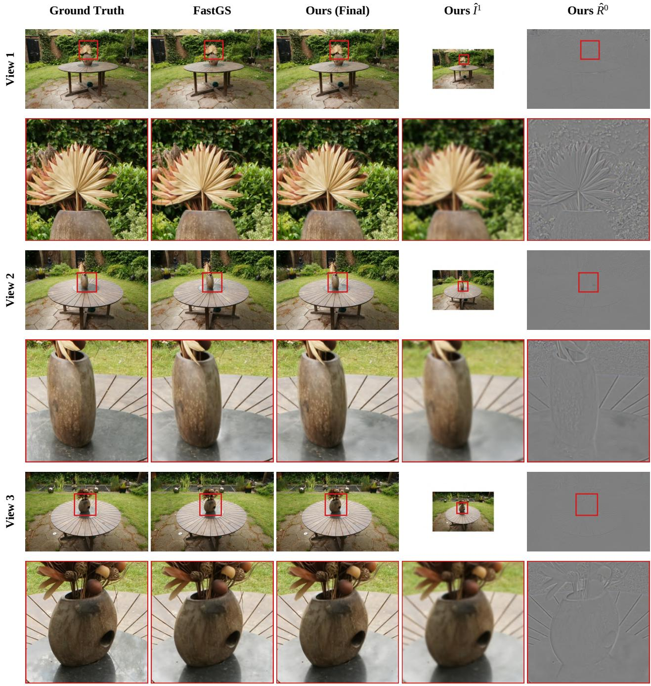  
Figure 7. Edge preservation at object boundaries on the garden scene. We show three test views with enlarged boundary regions. Although the low-frequency prediction $\hat { I } ^ { 1 }$ is smoother, the high-frequency residual $\hat { R } ^ { 0 }$ restores the missing edge details, producing final reconstructions comparable to FastGS and the GT.

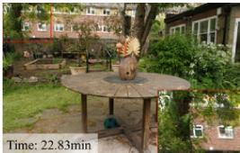

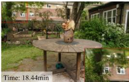

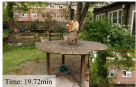

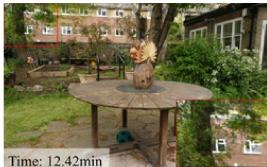

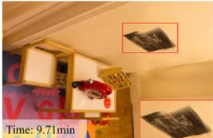

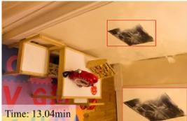

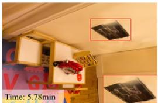

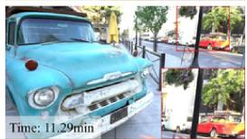

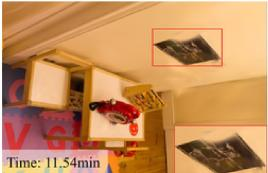

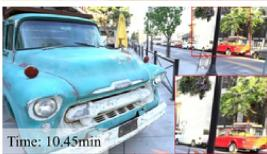  
Original 3DGS  
Mini-Splatting

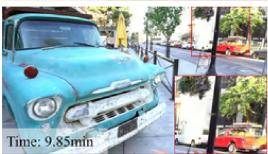  
Speedy-Splat

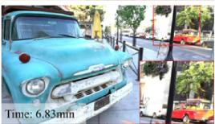

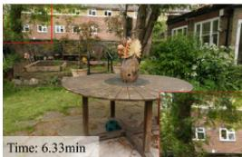

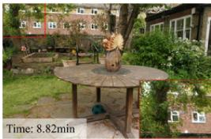

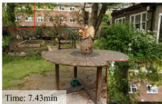

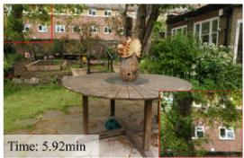

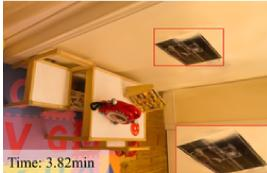

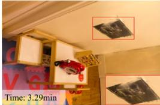

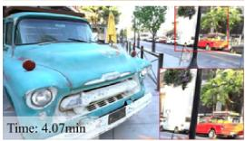  
DashGaussian

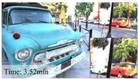  
FastGS

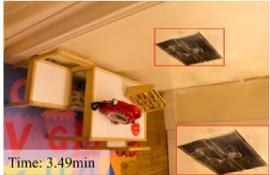

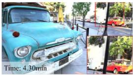  
Ours (Taming)

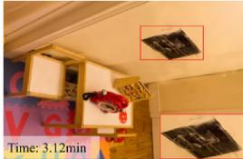

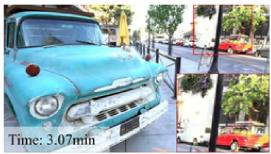  
Ours (FastGS)

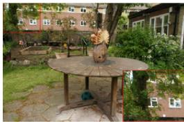

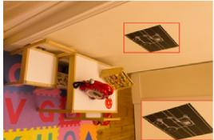

  
Ground Truth

Figure 8. Qualitative results of the 1K setting. Rendering results on the ”garden” scene (Mip-NeRF 360), the ”playroom” scene (Deep Blending), and the ”truck” scene (Tanks & Temples).

Table 13. Results of the 2K setting. Scene-wise quantitative results over Mip-NeRF 360 dataset. Time is measured in minutes. $N _ { \mathrm { G S } }$ denotes the number of Gaussians (in millions).
<table><tr><td rowspan="2">Method</td><td colspan="6">bicycle</td><td colspan="6">bonsai</td><td colspan="6">counter</td></tr><tr><td>Time↓</td><td>PSNR↑</td><td>SSIM↑</td><td>LPIPS↓</td><td> $N _ { \mathrm { G S } } ( M ) \downarrow$ </td><td>FPS↑</td><td>Time↓</td><td>PSNR↑</td><td>SSIM↑</td><td>LPIPS↓</td><td> $N _ { \mathrm { G S } } ( M ) \downarrow$ </td><td>FPS↑</td><td>Time↓</td><td>PSNR↑</td><td>SSIM↑</td><td>LPIPS↓</td><td>NGs(M)↓</td><td>FPS↑</td></tr><tr><td>Taming-3DGS</td><td>13.18</td><td>24.10</td><td>0.673</td><td>0.394</td><td>2.87</td><td>47</td><td>7.02</td><td>32.47</td><td>0.940</td><td>0.244</td><td>1.04</td><td>91</td><td>7.92</td><td>29.24</td><td>0.912</td><td>0.241</td><td>0.94</td><td>73</td></tr><tr><td>DashGaussian</td><td>6.51</td><td>23.88</td><td>0.665</td><td>0.398</td><td>2.76</td><td>38</td><td>4.70</td><td>31.72</td><td>0.933</td><td>0.255</td><td>0.78</td><td>78</td><td>4.88</td><td>28.77</td><td>0.904</td><td>0.259</td><td>0.71</td><td>79</td></tr><tr><td>FastGS</td><td>6.44</td><td>24.69</td><td>0.727</td><td>0.311</td><td>2.10</td><td>108</td><td>4.96</td><td>32.71</td><td>0.945</td><td>0.223</td><td>1.08</td><td>153</td><td>4.41</td><td>29.48</td><td>0.916</td><td>0.230</td><td>0.56</td><td>126</td></tr><tr><td>EfficientGS</td><td>42.72</td><td>24.73</td><td>0.735</td><td>0.293</td><td>2.18</td><td>53</td><td>19.25</td><td>31.53</td><td>0.933</td><td>0.253</td><td>0.36</td><td>121</td><td>23.19</td><td>28.65</td><td>0.903</td><td>0.257</td><td>0.30</td><td>83</td></tr><tr><td>Ours (Taming)</td><td>7.24</td><td>23.85</td><td>0.662</td><td>0.392</td><td>1.52/1.51</td><td>54</td><td>4.69</td><td>32.13</td><td>0.935</td><td>0.254</td><td>0.89/0.58</td><td>97</td><td>4.81</td><td>29.14</td><td>0.905</td><td>0.257</td><td>0.62/0.43</td><td>94</td></tr><tr><td>Ours (FastGS)</td><td>5.52</td><td>24.46</td><td>0.702</td><td>0.337</td><td>2.31/0.88</td><td>104</td><td>4.17</td><td>32.28</td><td>0.940</td><td>0.236</td><td>1.01/0.42</td><td>136</td><td>3.82</td><td>29.39</td><td>0.910</td><td>0.247</td><td>0.50/0.23</td><td>132</td></tr><tr><td rowspan="3">Method</td><td rowspan="3"></td><td colspan="4"></td><td colspan="7"></td><td colspan="7"></td></tr><tr><td>PSNR↑</td><td></td><td>flowers LPIPS↓</td><td>NGs(M)↓</td><td>FPS↑</td><td>Time↓</td><td>PSNR↑</td><td>SSIM↑</td><td>garden LPIPS↓</td><td>NGs(M)↓</td><td>FPS↑</td><td>Time↓</td><td>PSNR↑</td><td>SSIM↑</td><td>kitchen LPIPS↓</td><td>NGs(M)↓</td><td>FPS↑</td></tr><tr><td>Time↓</td><td></td><td>SSIM↑</td><td>0.453</td><td>2.00</td><td>53</td><td>15.06</td><td>26.48</td><td>0.794</td><td>0.232</td><td>3.84</td><td>44</td><td>9.98</td><td>31.57</td><td>0.923</td><td>0.164</td><td>1.54</td><td>73</td></tr><tr><td>Taming-3DGS</td><td>11.30 6.11</td><td>20.45 20.05</td><td>0.540 0.517</td><td>0.476</td><td>1.96</td><td>48</td><td>6.85</td><td>25.99</td><td>0.763</td><td>0.284</td><td>2.88</td><td>44</td><td>5.02</td><td>31.22</td><td>0.915</td><td>0.181</td><td>1.02</td><td>83</td></tr><tr><td>DashGaussian FastGS</td><td>6.27</td><td>20.97</td><td>0.564</td><td>0.423</td><td>1.62</td><td>97</td><td>11.92</td><td>26.55</td><td>0.817</td><td>0.180</td><td>5.18</td><td>99</td><td>6.42</td><td>32.17</td><td>0.932</td><td>0.146</td><td>1.43</td><td>164</td></tr><tr><td>EfficientGS</td><td>40.76</td><td>21.20</td><td>0.580</td><td>0.392</td><td>1.77</td><td>55</td><td>47.52</td><td>26.58</td><td>0.808</td><td>0.210</td><td>2.25</td><td>58</td><td>25.09</td><td>31.07</td><td>0.918</td><td>0.172</td><td>0.50</td><td>100</td></tr><tr><td>Ours (Taming)</td><td>6.93</td><td>20.38</td><td>0.526</td><td>0.463</td><td>1.13/1.18</td><td>61</td><td>8.56</td><td>26.33</td><td>0.783</td><td>0.249</td><td>1.62/2.35</td><td>45</td><td>5.37</td><td>31.13</td><td>0.916</td><td>0.184</td><td>0.88/0.51</td><td>84</td></tr><tr><td>Ours (FastGS)</td><td>5.18</td><td>20.82</td><td>0.546</td><td>0.441</td><td>1.32/0.68</td><td>101</td><td>6.82</td><td>26.72</td><td>0.809</td><td>0.212</td><td>2.23/2.25</td><td>74</td><td>5.03</td><td>32.13</td><td>0.930</td><td>0.155</td><td>1.14/0.71</td><td>139</td></tr><tr><td rowspan="3">Method</td><td rowspan="3"></td><td colspan="2"></td><td colspan="2">room</td><td colspan="2"></td><td colspan="2"></td><td colspan="2"></td><td colspan="2"></td><td colspan="2"></td><td colspan="3"></td><td></td></tr><tr><td></td><td></td><td></td><td></td><td></td><td></td><td></td><td></td><td>stump</td><td></td><td></td><td></td><td></td><td></td><td>treehill</td><td></td><td></td></tr><tr><td>Time↓</td><td>PSNR↑</td><td>SSIM↑</td><td>LPIPS↓</td><td>NGs(M)↓</td><td>FPS↑</td><td>Time↓</td><td>PSNR↑</td><td>SSIM↑</td><td>LPIPS↓</td><td>NGs(M)↓</td><td>FPS↑</td><td>Time↓</td><td>PSNR↑</td><td>SSIM↑</td><td>LPIPS↓</td><td>NGs(M)↓</td><td>FPS↑</td></tr><tr><td>Taming-3DGS</td><td>7.68</td><td>31.63</td><td>0.916</td><td>0.266</td><td>1.08</td><td>83</td><td>10.12</td><td>25.76</td><td>0.751</td><td>0.379</td><td>2.39</td><td>49</td><td>11.11</td><td>22.55</td><td>0.636</td><td>0.441</td><td>1.67</td><td>48 45</td></tr><tr><td>DashGaussian</td><td>4.74</td><td>31.39</td><td>0.911</td><td>0.278</td><td>0.81 0.71</td><td>75 139</td><td>5.84 5.57</td><td>25.42 26.90</td><td>0.734 0.785</td><td>0.402</td><td>2.49 1.25</td><td>48 108</td><td>6.28 5.46</td><td>22.42 22.42</td><td>0.624 0.633</td><td>0.456 0.452</td><td>1.92 1.11</td><td>92</td></tr><tr><td>FastGS</td><td>4.15 22.00</td><td>31.86 31.03</td><td>0.923 0.918</td><td>0.244 0.256</td><td>0.40</td><td>108</td><td>36.95</td><td>26.90</td><td>0.790</td><td>0.332 0.318</td><td>1.56</td><td>48</td><td>42.69</td><td>21.92</td><td>0.643</td><td>0.396</td><td>2.03</td><td>58</td></tr><tr><td>EfficientGS</td><td>4.14</td><td>31.20</td><td>0.911</td><td>0.276</td><td>0.60/0.46</td><td>102</td><td>6.62</td><td>25.31</td><td>0.730</td><td>0.394</td><td>1.60/1.31</td><td>54</td><td>7.13</td><td>22.40</td><td>0.618</td><td>0.453</td><td>1.08/1.00</td><td>59 79</td></tr><tr><td>Ours (Taming) Ours (FastGS)</td></table>

Table 14. Results of the 4K setting. Scene-wise quantitative results over Mip-NeRF 360 dataset. Time is measured in minutes. $N _ { \mathrm { G S } }$ denotes the number of Gaussians (in millions).
<table><tr><td rowspan="2">Method</td><td colspan="6">bicycle</td><td colspan="6">bonsai</td><td colspan="6">counter</td></tr><tr><td>Time↓</td><td>PSNR↑</td><td>SSIM↑</td><td>LPIPS↓</td><td> $N _ { \mathrm { G S } } ( M ) \downarrow$ </td><td>FPS↑</td><td>Time↓</td><td>PSNR↑</td><td>SSIM↑</td><td>LPIPS↓</td><td> $N _ { \mathrm { G S } } ( M ) \downarrow$ </td><td>FPS↑</td><td>Time↓</td><td>PSNR↑</td><td>SSIM↑</td><td>LPIPS↓</td><td> $N _ { \mathrm { G S } } ( M ) \downarrow$ </td><td>FPS↑</td></tr><tr><td>Taming-3DGS</td><td>23.28</td><td>23.66</td><td>0.686</td><td>0.441</td><td>2.19</td><td>29</td><td>9.80</td><td>32.07</td><td>0.935</td><td>0.293</td><td>0.96</td><td>72</td><td>11.21</td><td>28.95</td><td>0.910</td><td>0.286</td><td>0.88</td><td>65</td></tr><tr><td>DashGaussian</td><td>9.92</td><td>23.52</td><td>0.683</td><td>0.445</td><td>2.16</td><td>25</td><td>6.02</td><td>31.49</td><td>0.930</td><td>0.300</td><td>0.78</td><td>64</td><td>6.37</td><td>28.50</td><td>0.904</td><td>0.298</td><td>0.69</td><td>56</td></tr><tr><td>FastGS</td><td>9.55</td><td>24.53</td><td>0.734</td><td>0.366</td><td>1.92</td><td>109</td><td>6.20</td><td>32.74</td><td>0.942</td><td>0.271</td><td>1.24</td><td>122</td><td>5.56</td><td>29.43</td><td>0.916</td><td>0.270</td><td>0.60</td><td>129</td></tr><tr><td>EfficientGS</td><td>91.55</td><td>24.66</td><td>0.743</td><td>0.347</td><td>2.04</td><td>36</td><td>33.48</td><td>31.01</td><td>0.930</td><td>0.298</td><td>0.37</td><td>96</td><td>39.86</td><td>28.52</td><td>0.904</td><td>0.294</td><td>0.31</td><td>65</td></tr><tr><td>Ours (Taming)</td><td>12.16</td><td>23.65</td><td>0.683</td><td>0.437</td><td>1.25/1.06</td><td>35</td><td>6.50</td><td>31.91</td><td>0.930</td><td>0.301</td><td>0.88/0.53</td><td>65</td><td>6.68</td><td>29.03</td><td>0.905</td><td>0.297</td><td>0.62/0.40</td><td>67</td></tr><tr><td>Ours (FastGS)</td><td>8.38</td><td>24.43</td><td>0.729</td><td>0.358</td><td>2.78/0.68</td><td>83</td><td>4.94</td><td>31.98</td><td>0.935</td><td>0.284</td><td>1.22/0.41</td><td>78</td><td>4.55</td><td>29.39</td><td>0.912</td><td>0.286</td><td>0.58/0.20</td><td>144</td></tr><tr><td rowspan="3">Method</td><td rowspan="3"></td><td></td><td></td><td>flowers</td><td></td><td></td><td></td><td></td><td></td><td>garden</td><td></td><td></td><td></td><td></td><td></td><td>kitchen</td><td></td><td></td></tr><tr><td>Time↓</td><td>PSNR↑</td><td>SSIM↑</td><td>LPIPS↓</td><td> $N _ { \mathrm { G S } } ( M ) \downarrow$ </td><td>FPS↑</td><td>Time↓ PSNR↑</td><td>SSIM↑</td><td>LPIPS↓</td><td> $N _ { \mathrm { G S } } ( M ) \downarrow$ </td><td>FPS↑</td><td>Time↓</td><td>PSNR↑</td><td>SSIM↑</td><td>LPIPS↓</td><td>NGs(M)↓</td><td>FPS↑</td></tr><tr><td>21.16</td><td>20.07</td><td></td><td></td><td></td><td>33</td><td>25.96</td><td>0.774</td><td></td><td></td><td></td><td></td><td>31.22</td><td>0.918</td><td>0.204</td><td></td><td></td><td>61</td></tr><tr><td>Taming-3DGS DashGaussian</td><td>9.58</td><td>19.62</td><td>0.567 0.552</td><td>0.486 0.506</td><td>1.52 1.54</td><td>28</td><td>10.83</td><td>26.04 25.63</td><td>0.754</td><td>0.310 0.339</td><td>3.20 2.69</td><td>29 26</td><td>13.86 6.61</td><td>30.83</td><td>0.911</td><td>0.219</td><td>1.45 0.98</td><td>59</td></tr><tr><td>FastGS</td><td>9.66</td><td>20.76</td><td>0.587</td><td>0.461</td><td>1.57</td><td>107</td><td>17.47</td><td>26.60</td><td>0.810</td><td>0.227</td><td>5.93</td><td>80</td><td>7.94</td><td>31.94</td><td>0.928</td><td>0.182</td><td>1.53</td><td>113</td></tr><tr><td>EfficientGS</td><td>89.80</td><td>21.19</td><td>0.606</td><td>0.426</td><td>1.76</td><td>48</td><td>104.86</td><td>26.41</td><td>0.802</td><td>0.260</td><td>2.39</td><td>41</td><td>42.52</td><td>31.02</td><td>0.915</td><td>0.209</td><td>0.53</td><td>87</td></tr><tr><td>Ours (Taming) Ours (FastGS)</td><td>12.22 7.62</td><td>20.01 20.53</td><td>0.561</td><td>0.493</td><td>0.97/0.86</td><td>37</td><td>14.16</td><td>26.02 26.47</td><td>0.770</td><td>0.307</td><td>1.67/1.76</td><td>33</td><td>7.42</td><td>31.16</td><td>0.913</td><td>0.224</td><td>0.91/0.46</td><td>61 110</td></tr><tr><td></td><td></td><td></td><td>0.577</td><td>0.466 room</td><td>1.53/0.52</td><td>94</td><td>9.69</td><td></td><td>0.798</td><td>0.266</td><td>3.15/1.51</td><td>71</td><td>5.74</td><td>31.99</td><td>0.926</td><td>0.196</td><td>1.35/0.56</td><td></td></tr><tr><td rowspan="3">Method</td><td colspan="4"></td><td colspan="2"></td><td colspan="2"></td><td colspan="2">stump</td><td colspan="2"></td><td colspan="2"></td><td colspan="2">treehill</td><td colspan="2"></td></tr><tr><td>Time↓</td><td>PSNR↑</td><td>SSIM↑</td><td>LPIPS↓</td><td> $N _ { \mathrm { G S } } ( M ) \downarrow$ </td><td>FPS↑</td><td>Time↓</td><td>PSNR↑</td><td>SSIM↑</td><td>LPIPS↓</td><td> $N _ { \mathrm { G S } } ( M ) \downarrow$ </td><td>FPS↑</td><td>Time↓</td><td>PSNR↑</td><td>SSIM↑</td><td>LPIPS↓</td><td>NGs(M)↓</td><td>FPS↑</td></tr><tr><td></td><td></td><td></td><td></td><td></td><td></td><td></td><td></td><td></td><td></td><td></td><td></td><td></td><td></td><td></td><td></td><td></td><td>27</td></tr><tr><td>Taming-3DGS DashGaussian</td><td>10.84 6.42</td><td>31.49 31.20</td><td>0.912 0.908</td><td>0.306 0.312</td><td>1.04 0.80</td><td>60 51</td><td>18.40 9.81</td><td>25.51 25.04</td><td>0.779 0.766</td><td>0.438 0.457</td><td>1.72 1.79</td><td>33 28</td><td>21.79 9.80</td><td>22.31 22.24</td><td>0.673 0.665</td><td>0.481 0.490</td><td>1.20 1.42</td><td>25</td></tr><tr><td>FastGS</td><td>5.28</td><td>31.35</td><td>0.917</td><td>0.282</td><td>0.77</td><td>115</td><td>8.44</td><td>26.71</td><td>0.806</td><td>0.395</td><td>1.09</td><td>94</td><td>8.54</td><td>22.26</td><td>0.671</td><td>0.485</td><td>0.88</td><td>78</td></tr><tr><td>EfficientGS</td><td>37.69</td><td>30.98</td><td>0.915</td><td>0.293</td><td>0.42</td><td>99</td><td>79.42</td><td>26.88</td><td>0.812</td><td>0.376</td><td>1.47</td><td>39</td><td>93.48</td><td>22.01</td><td>0.684</td><td>0.440</td><td>1.87</td><td>33</td></tr><tr><td>Ours (Taming)</td><td>5.53 Ours (FastGS) 4.17</td><td>31.05 31.43</td><td>0.909 0.916</td><td>0.312 0.297</td><td>0.61/0.40 0.65/0.20</td><td>71 143</td><td>11.85</td><td>25.08</td><td>0.767</td><td>0.444</td><td>1.26/0.99</td><td>35</td><td>13.08</td><td>22.41</td><td>0.669 0.670</td><td>0.480 0.487</td><td>0.84/0.69 0.63/0.25</td><td>32 78</td></tr><tr></table>

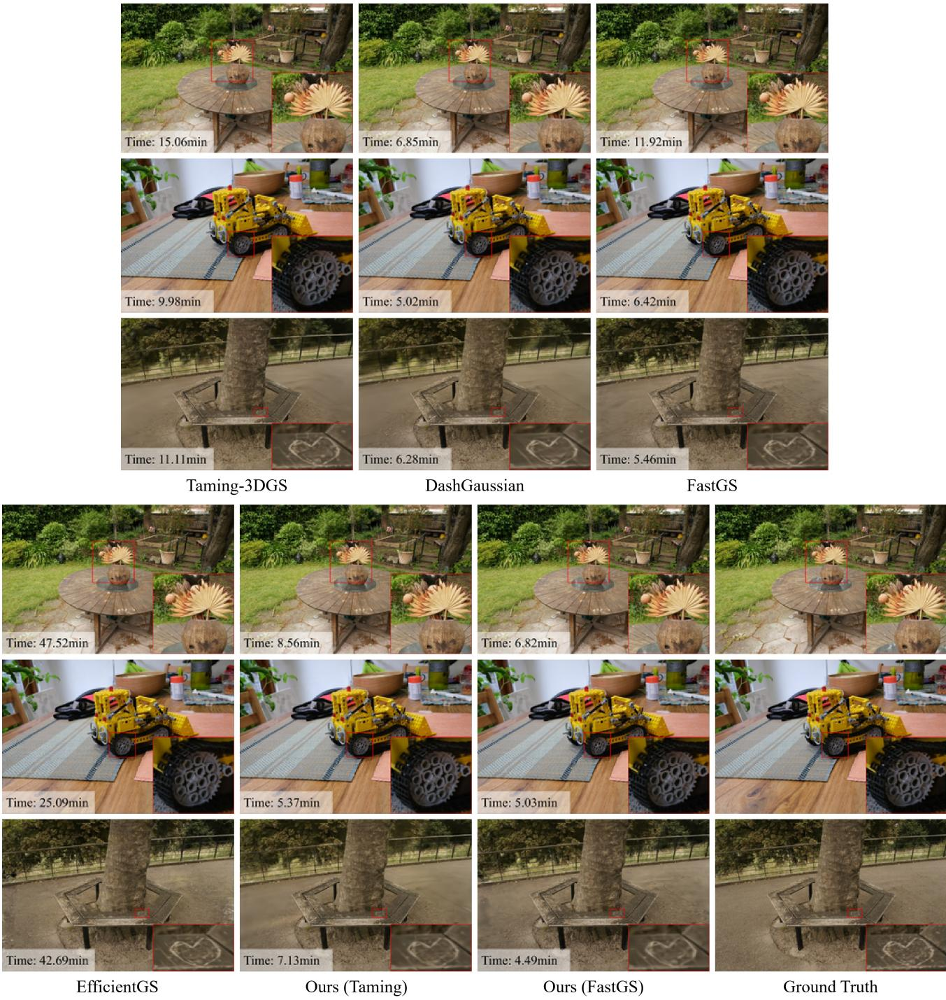  
Figure 9. Qualitative results of the 2K setting. Rendering results on the ”garden”, ”kitchen” and ”treehill” scenes of Mip-NeRF 360.

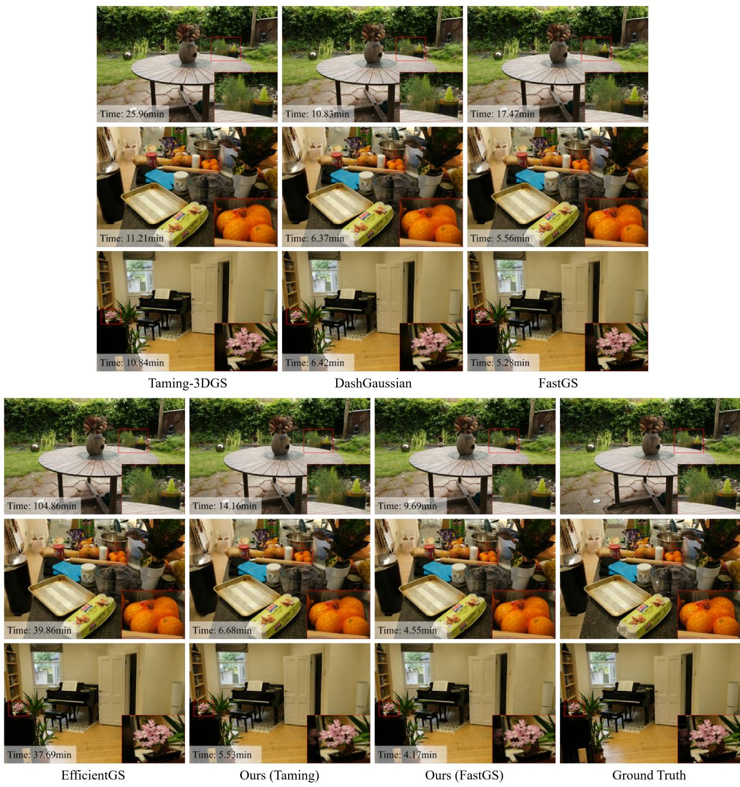  
Figure 10. Qualitative results of the 4K setting. Rendering results on the ”garden”, ”counter” and ”room” scenes of Mip-NeRF 360.

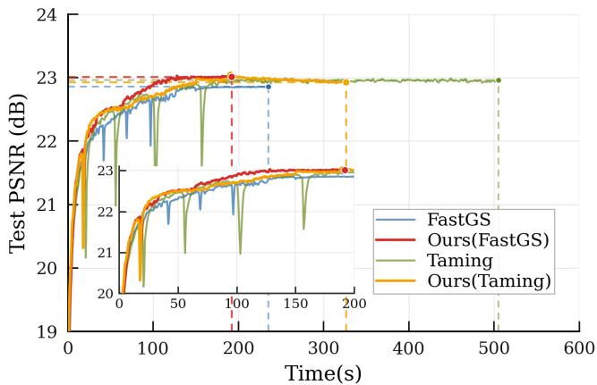  
(a) 1K setting (treehill)

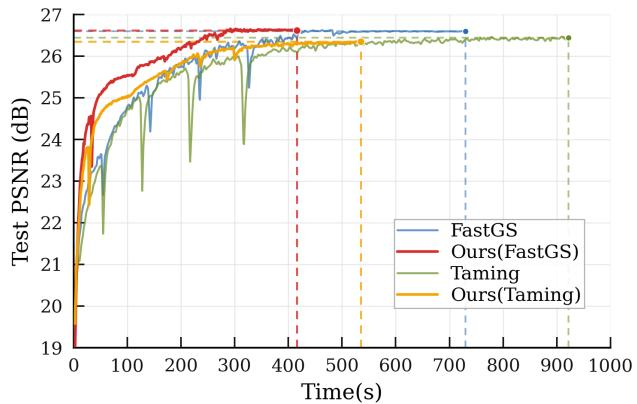  
(b) 2K setting (garden)  
Figure 11. PSNR versus training time under the 1K and 2K settings on Mip-NeRF 360 scenes. Similar to the 4K case in the main paper, our method reaches comparable reconstruction quality earlier than the original backbones.

Table 15. Ablation studies over the number of Laplacian levels on the Mip-NeRF 360 dataset. (1K setting)
<table><tr><td>Method</td><td>Iteration Split</td><td>Time↓</td><td>PSNR↑</td><td>SSIM↑</td><td>LPIPS↓</td><td> $N _ { \mathrm { G S } } ( M ) \downarrow$ </td><td>FPS↑</td></tr><tr><td>Two-level</td><td>(10000, 20000)</td><td>3.96</td><td>27.67</td><td>0.809</td><td>0.233</td><td>0.71/0.87</td><td>122</td></tr><tr><td>Three-level</td><td>(10000, 5000, 15000)</td><td>3.59</td><td>27.37</td><td>0.796</td><td>0.255</td><td>0.31/0.39/0.82</td><td>107</td></tr><tr><td>Four-level</td><td>(10000,5000,5000,10000)</td><td>3.31</td><td>26.90</td><td>0.781</td><td>0.274</td><td>0.13/0.18/0.33/0.71</td><td>89</td></tr></table>

Table 16. Effects of Laplacian levels and training iterations under the 4K setting on the Mip-NeRF 360 dataset. We report results with 30k iterations, and additionally with 45k iterations to improve convergence. Both settings use the same split ratios across levels.
<table><tr><td>Levels</td><td>Iteration</td><td>Iteration Split</td><td>Time↓</td><td>PSNR↑</td><td>SSIM↑</td><td>LPIPS↓</td><td> $N _ { \mathrm { G S } } ( M ) \downarrow$ </td><td>FPS↑</td></tr><tr><td>Two-level</td><td>30k</td><td>(10000, 20000)</td><td>6.57</td><td>27.22</td><td>0.807</td><td>0.337</td><td>1.47/0.53</td><td>95</td></tr><tr><td>Three-level</td><td>30k</td><td>(10000, 5000, 15000)</td><td>5.99</td><td>27.17</td><td>0.801</td><td>0.358</td><td>0.94/0.69/0.40</td><td>97</td></tr><tr><td>Four-level</td><td>30k</td><td>(10000, 5000, 5000, 10000)</td><td>5.09</td><td>26.84</td><td>0.792</td><td>0.376</td><td>0.45/0.46/0.48/0.35</td><td>74</td></tr><tr><td>Two-level</td><td>45k</td><td>(15000, 30000)</td><td>10.61</td><td>27.39</td><td>0.810</td><td>0.331</td><td>1.74/0.54</td><td>98</td></tr><tr><td>Three-level</td><td>45k</td><td>(15000, 7500, 22500)</td><td>8.65</td><td>27.27</td><td>0.803</td><td>0.353</td><td>1.07/0.63/0.38</td><td>88</td></tr><tr><td>Four-level</td><td>45k</td><td>(15000, 7500, 7500, 15000)</td><td>7.54</td><td>26.97</td><td>0.795</td><td>0.370</td><td>0.49/0.46/0.47/0.35</td><td>80</td></tr></table>