# OCR-EDR: Rendering-Aware Diagnosis and Repair for Closed-Loop OCR Improvement

Linnan Zhao, Kang Liu, Hao Yu, Jiabo Zhan, Chong Sun, Chen Li

Wechat Vision, Tencent

## Abstract

Although document OCR systems perform increasingly well on routine documents, complex formulas, structured text, and long-tail formats remain error-prone. OCR predictions may omit fine-grained content or hallucinate unsupported outputs, while equivalent encodings of the same visible content must be accommodated. Existing OCR evaluation methods mostly report aggregate metrics, ofering limited support for analyzing case-level errors and improving OCR performance. We propose OCR-EDR (OCR Error Diagnosis and Repair), a rendering-aware framework that advances from fine-grained diagnosis to iterative repair. Given a source image, an editable OCR prediction, and its rendered image, OCR-EDR first jointly assesses whether the prediction and its rendering are consistent with the source, preserving valid predictions, including rendering-equivalent ones, while diagnosing and localizing genuine errors. It then applies executable edits and may request an updated rendering for iterative reassessment. We construct OCRErrBench from diverse real OCR predictions, covering text and formulas, exact and renderingequivalent positives, and genuine errors, and develop the DocEDR model to execute the diagnosis–repair loop. On OCRErrBench, DocEDR achieves 94.78% diagnostic accuracy. It repairs 86.23% of erroneous inputs to visual consistency, raises formula Case-F1 by 30.99 percentage points over DOCR-Inspector-7B on DOCRcaseBench, and improves formula CDM by up to 4.62 percentage points on the identified Bad subsets of four OCR systems on UniMER-Test. These results show that OCR-EDR turns fine-grained OCR analysis into verified corrections and performance gains.

## Introduction

Although OCR systems perform well on routine documents, complex formulas, structured text, and long-tail formats remain error-prone. Specialized recognizers in traditional OCR pipelines are limited by their recognition capability and training coverage, and may miss fine-grained content or misrecognize characters, symbols, and structures. General vision– language models, in contrast, may hallucinate outputs unsupported by the source image (Liu et al. 2024; Fu et al. 2025; Ouyang et al. 2025). Complicating this analysis, structured OCR may represent the same visible content using diferent but equivalent encodings, which should not be treated as recognition errors. Current pipelines largely summarize such failures using aggregate scores and error counts, which reveal little about the specific error patterns in individual cases and provide limited guidance for improving predictions. Fine-grained diagnosis and repair of erroneous cases can both clarify model failure modes and directly improve predictions, providing more targeted feedback for subsequent OCR optimization.

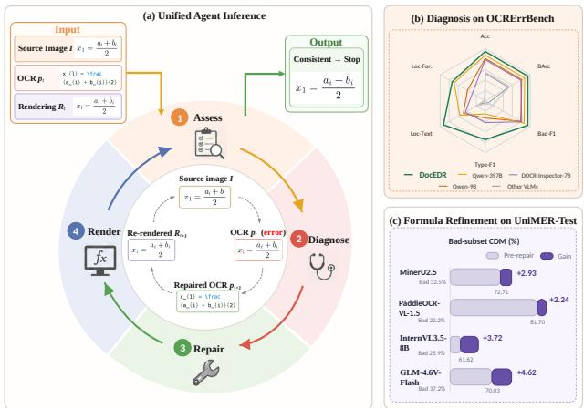  
Figure 1: Overview of the DocEDR model. (a) Unified diagnosis-and-repair loop. (b) Diagnostic performance on OCRErrBench using the results in Table 2; Loc-Text and Loc-Formula denote localization F1 over text character spans and normalized formula-token spans, respectively. (c) Formula CDM before and after refinement using the results in Table 6.

Existing work addresses individual components of this process but does not integrate them into a unified framework. Text-based post-correction maps noisy OCR sequences to cleaner text through statistical, neural, or language-model priors (Dong and Smith 2018; Schaefer and Neudecker 2020; Lyu et al. 2021; Soper, Fujimoto, and Yu 2021; Thomas, Gaizauskas, and Lu 2024), but cannot directly verify whether an edit restores the source document’s visual content. A recent diagnostic study, DOCR-Inspector, defines 28 real-world document OCR error types and provides fine-grained feedback (Zhang et al. 2025), but cannot autonomously repair the current prediction, inspect a new rendering, and decide whether to continue or stop. It is also sensitive to representational conventions: \to versus \rightarrow, and {\bfx} versus \textbf{x}, difer as strings but render identically. A formatbound diagnosis can therefore reject a valid output. LATTE introduces visual comparison into formula recognition by using rendered delta-view feedback to localize and iteratively refine LaTeX formulas and tables (Jiang et al. 2025), but operates only on identified errors and repairs them in taskspecific formats. It therefore does not unify correct-result preservation, diagnosis across text and formulas, and reuse of verified repairs. Closing the loop requires these capabilities to operate together.

We accordingly formulate OCR Error Diagnosis and Repair (OCR-EDR), illustrated in Figure 2. Given a source region I, an editable OCR prediction p, and its rendered image R(p), OCR-EDR jointly analyzes all three inputs. The source image supplies external visual evidence, the OCR sequence supports symbolic localization and editing, and the rendered image exposes the visual consequence of the current prediction. Their joint analysis allows the policy to preserve correct or rendering-equivalent predictions and to classify, localize, and repair genuine errors. Rather than treating p as a fixed output, OCR-EDR maintains it as an editable state whose revisions can be rerendered and visually reassessed.

To evaluate these capabilities, we construct OCRErrBench, a 900-case benchmark balanced across text and formulas. It comprises 457 valid (Good) and 443 erroneous (Bad) cases drawn from diverse real OCR predictions. Annotated for validity, error type, location, and target correction, OCRErrBench jointly evaluates preservation, diagnosis, localization, and repair across exact and rendering-equivalent positives and genuine OCR errors. Figure 3 summarizes its construction and verification.

OCR-EDR defines the task and closed-loop process; we further develop the DocEDR model as a unified policy that instantiates it. DocEDR first learns validity assessment, error classification, and localization, then acquires preservation, local or global editing, optional rerendering, visual reassessment, and stopping through staged repair training. Figure 1 summarizes this loop and its performance. On OCR-ErrBench, DocEDR achieves 94.78% diagnostic accuracy and repairs 86.23% of erroneous inputs to visual consistency. In zero-shot formula evaluation on DOCRcaseBench, it improves Case-F1 by 30.99 percentage points over the benchmark’s native DOCR-Inspector-7B. On the UniMER-Test printed-expression subsets, it improves formula CDM by up to 4.62 points on the identified Bad subsets of four OCR systems. Thus, DocEDR turns the capabilities defined by OCR-EDR into verified corrections across benchmarks and OCR systems.

Our main contributions are:

• We formulate OCR-EDR as a unified task and closed-loop paradigm that connects fine-grained diagnosis, executable correction, and rendering-based reassessment while preserving correct and rendering-equivalent predictions.

• We construct OCRErrBench and a unified evaluation protocol for preservation, diagnosis, localization, and repair across exact and rendering-equivalent positives and genuine OCR errors.

• We propose the DocEDR model and a staged training strategy that instantiate OCR-EDR as a unified policy for preservation, repair, visual reassessment, and stopping.

• We demonstrate that cross-benchmark diagnosis can be converted into verified inference-time corrections, yielding consistent gains on error subsets identified across diverse OCR systems.

## Related Work

## Document OCR

Document OCR aims to recover text and formulas from document pages. Traditional systems commonly adopt modular pipelines that combine general text recognition with specialized recognizers, as exemplified by early PP-OCR and MinerU systems (Du et al. 2020; Wang et al. 2024). OCRfree encoder–decoder models such as Donut, Pix2Struct, and mPLUG-DocOwl subsequently began generating document text directly from page inputs (Kim et al. 2022; Lee et al. 2023; Hu et al. 2024). Recent MinerU, PaddleOCR-VL, MonkeyOCR, and DeepSeek-OCR systems further combine highresolution visual encoding with end-to-end vision–language generation to accommodate increasingly diverse document content and complex formats (Niu et al. 2025; Wang et al. 2026; Cui et al. 2025b,a, 2026; Li et al. 2025; Liu et al. 2026; Wei, Sun, and Li 2025, 2026). As model capabilities have expanded, evaluation has progressed from isolated recognition accuracy toward more comprehensive document recognition and reasoning: OCRBench and OCRBench v2 evaluate both recognition and reasoning (Liu et al. 2024; Fu et al. 2025), while CC-OCR, OmniDocBench, and PureDocBench expose recognition failures in realistic document settings (Yang et al. 2025; Ouyang et al. 2025; Li et al. 2026). For formulas embedded in documents, image-to-markup generation established the end-to-end LaTeX transcription paradigm (Deng et al. 2017); MathNet subsequently addressed source normalization, font diversity, and formulas extracted from papers (Schmitt-Koopmann et al. 2024), while UniMERNet and PP-FormulaNet extended printed-formula recognition to broader real-world distributions (Gu et al. 2026; Liu et al. 2025). These advances continue to improve document OCR, but do not transform residual errors into diagnosable, repairable, and reusable supervision.

## OCR Post-Correction

OCR post-correction has evolved from noisy-channel and translation formulations to multi-output consensus and detect–then-correct pipelines (Kolak, Byrne, and Resnik 2003; Afli et al. 2016; Dong and Smith 2018; Schaefer and Neudecker 2020). Neural, byte-level, and pretrained language models improve character-level correction (Lyu et al. 2021; Soper, Fujimoto, and Yu 2021; Löfgren and Dannélls 2024), while recent work exploits synthetic errors and instruction-tuned LLMs (Guan and Greene 2024; Thomas, Gaizauskas, and Lu 2024). However, these methods remain largely text-based and do not verify the visual consequence of an edit. More recent work begins to introduce explicit diagnosis or visual feedback. DOCR-Inspector provides finegrained error types and locations, but cannot autonomously edit, rerender, reassess, and stop (Zhang et al. 2025). LATTE uses rendered delta views to localize and iteratively repair

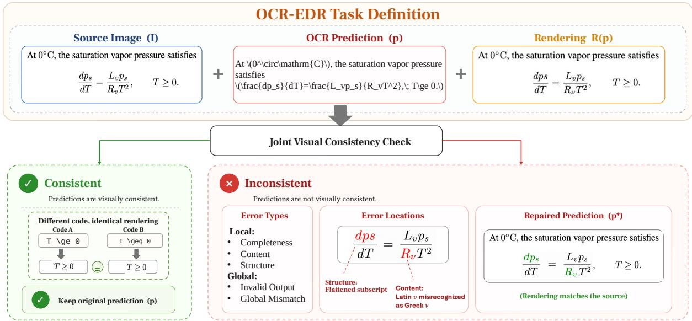  
Figure 2: OCR-EDR task definition. Given a source region I, an editable OCR prediction p, and its rendered image $\mathcal { R } ( \boldsymbol { p } )$ OCR-EDR jointly assesses visual consistency. A consistent prediction—including a non-canonical but rendering-equivalent one—is preserved, whereas an inconsistent prediction is diagnosed, localized, and corrected.

LaTeX formulas and tables (Jiang et al. 2025), but is restricted to identified errors in task-specific formats. Neither unifies correct-result preservation, diagnosis across text and formulas, and reuse of verified corrections. OCR-EDR brings these capabilities into one closed-loop process.

## Method

This section first formulates OCR-EDR as a stateful diagnosis-and-repair task and defines its error taxonomy and action space. We then describe how DocEDR executes the resulting interaction loop and present its staged training strategy.

## Task Formulation

OCR-EDR receives a document-region image I, an initial OCR result $p _ { 0 } ,$ , and its rendered image $R _ { 0 } = \mathbf { \bar { \mathcal { R } } } ( p _ { 0 } )$ , and returns a final OCR result pˆthat recovers the visible content and structure in I. Starting from $( p _ { 0 } , R _ { 0 } )$ , the policy compares the source image, the current OCR result, and its rendering throughout a trajectory τ. At turn t, it emits an Agent action $a _ { t }$ together with a structured payload $z _ { t } ,$ which records the action-specific content such as a diagnosis, an error location, or a textual repair. The policy may apply a local or global repair, request an updated rendering after editing, or stop. The refreshed rendering is fed back into the next turn, so each repair can be visually reassessed before a subsequent decision. The final result is considered valid whenever its content and visual structure agree with the source image, even if its underlying string difers from a canonical reference.

We distinguish two non-image rendering states: $\perp _ { \mathrm { s t a l e } }$ indicates that the current rendering becomes outdated after an edit, whereas $\mathsf { L } _ { \mathrm { f a i l } }$ denotes an explicit rendering failure. Accordingly, $\mathcal { R } ( \boldsymbol { p } )$ returns either a rendered image or ⊥fail.

Algorithm 1 OCR-EDR as a Stateful Correction Task   
Require: Region image I, OCR result p , rendering R , budget T   
1: p ← p0, R ← R0, τ ← [ ]   
2: for t = 0, . . . , T − 1 do   
3: ht ← (I, p, R, τ )   
4: at, zt ← π(ht)   
5: p′ ← p, R′ ← R   
6: if a ∈ {patch, global\_patch} then   
7: p′ ← Update(p, zt)   
8: R′ ← ⊥stale   
9: else if at = request\_render then   
10: R′ ← R(p)   
11: end if   
12: append (p, R, at, zt, p′, R′) to τ   
13: if at = stop then   
14: return p′, τ   
15: end if   
16: p ← p′, R ← R′   
17: end for   
18: return p, τ

We divide OCR errors into global failures and local errors. Every atomic error belongs to exactly one of the five classes in Table 1; a sample may contain multiple atomic errors, but a single error is never assigned more than one class. For local errors, OCR-EDR additionally identifies the erroneous span or image region and the corrected content. The resulting insert, delete, or replace operation describes the actual textual change, whereas a global rewrite is reserved for outputs that cannot be repaired reliably through localized edits.

An invalid\_output is empty, malformed, unparsable, or unrenderable in the required representation, whereas a global\_mismatch is inconsistent with the source as a whole. Among local errors, completeness covers missing or reduninspect, diagnose\_scope, localize, patch, global\_patch, request\_render, and stop.

<table><tr><td>Error class</td><td>Scope</td><td>Repair operation</td></tr><tr><td>invalid_output</td><td>Global</td><td>global_rewrite</td></tr><tr><td>global_mismatch</td><td>Global</td><td>global_rewrite</td></tr><tr><td>completeness</td><td>Local</td><td>insert/delete</td></tr><tr><td>content</td><td>Local</td><td>insert/delete/replace</td></tr><tr><td>structure</td><td>Local</td><td>insert/delete/replace</td></tr></table>

Policy-level action space

Table 1: Hierarchical output and action spaces of OCR-EDR. Error classes describe what is wrong, repair operations describe the textual change, and Agent actions control the diagnostic and repair process.

dant content, content covers incorrectly recognized characters, symbols, or tokens, and structure covers reading order, grouping, hierarchy, and spatial or markup relations. The policy-level actions in Table 1 organize this diagnosis and repair process; they are distinct from the insert, delete, replace, and global-rewrite operations applied to the OCR sequence.

## DocEDR

Built on Qwen3.5-9B (Qwen Team 2026), DocEDR realizes the stateful process in Algorithm 1 by evolving a single editable OCR hypothesis rather than mapping a fixed input directly to an output. At turn $t ,$ the policy operates on

$$
h _ { t } = ( I , p _ { t } , R _ { t } , \tau _ { < t } ) ,\tag{1}
$$

where $p _ { t }$ is the current OCR candidate, $R _ { t }$ is its rendering observation, and $\tau _ { < t }$ records the preceding state transitions. $\mathbf { A }$ rendering observation may be an image of the current candidate, $\perp _ { \mathrm { s t a l e } }$ after an edit invalidates the previous rendering, ${ \mathbf o } \mathbf r \perp _ { \mathrm { f a i l } }$ when rendering fails. The diagnostic actions inspect, diagnose\_scope, and localize append structured diagnostic evidence to the trajectory without modifying $p _ { t }$ . The patch action applies a localized insert, delete, or replace operation, whereas global\_patch reconstructs the candidate when localized editing is inappropriate; both mark the previous rendering as stale.

The request\_render action keeps $p _ { t }$ unchanged and updates the rendering observation with $\mathcal { R } ( p _ { t } )$ . Rendering is selected by the policy rather than triggered automatically after every edit: the policy may stop when no further visual reassessment is needed or request an updated rendering to inspect residual errors. The stop action returns the current candidate. This unified policy supports preservation of valid or rendering-equivalent predictions, targeted local repair, progressive reconstruction of global failures, and renderingguided iterative correction.

## Training Strategy

We train DocEDR by first establishing a diagnostic foundation and then transferring it through two stages of policy learning: curriculum repair SFT and reward optimization. This ordering separates three capabilities that are dificult to acquire from sparse trajectory rewards alone: recognizing a valid OCR result, executing a correction, and controlling visual reassessment and stopping. See Appendix C.

Verifier SFT. Starting from Qwen3.5-9B, we first train a vision-text consistency verifier. Given a source crop $I _ { i } ,$ an OCR candidate $p _ { i } ,$ and its rendering $R _ { i } = \mathcal { R } ( p _ { i } )$ , the verifier $V _ { \phi }$ predicts $\hat { d } _ { i } ^ { \star } = ( y _ { i } ^ { \star } , \mathcal { E } _ { i } ^ { \star } )$ . Here, $y _ { i } ^ { \star }$ denotes validity and $\mathcal { E } _ { i } ^ { \star } = \bar { \{ ( c _ { i j } ^ { \star } , \ell _ { i j } ^ { \star } , \dot { q } _ { i j } ^ { \star } ) \} } _ { j }$ is the set of atomic errors, each containing one class $c _ { i j } ^ { \star } \in \mathcal { C }$ , its location $\ell _ { i j } ^ { \star }$ , and a proposed correction $q _ { i j } ^ { \star }$ . We optimize

$$
\mathcal { L } _ { \mathrm { v e r } } = - \sum _ { i } \log P _ { \phi } \left( d _ { i } ^ { \star } \mid I _ { i } , p _ { i } , R _ { i } \right) .\tag{2}
$$

The resulting diagnostic checkpoint supplies two complementary foundations for subsequent agentization: a stable visual-consistency signal for reward optimization and an initialization that already encodes validity, error type, location, and correction cues.

Curriculum Repair SFT. We convert diagnosis into executable correction through three supervised curricula before reward optimization. Stage 1 learns single-turn direct repair without rendering. Stage 2 introduces the decision between requesting a rendering and stopping, so the policy does not equate every correction with a mandatory tool call. Stage 3 supplies real rendering feedback and supervises multi-turn residual repair and recovery from an unsuccessful edit. For curriculum $k \in \{ 1 , 2 , 3 \}$ , each supervised trajectory is written as $\tau ^ { \star } = \{ ( h _ { t } ^ { \star } , a _ { t } ^ { \star } , z _ { t } ^ { \star } ) \} _ { t = 0 } ^ { T ^ { \star } - 1 }$ . At state $h _ { t } ^ { \star } , a _ { t } ^ { \star }$ is the target action selected from the policy-level action space in Table 1, and $z _ { t } ^ { \star }$ contains its action-specific arguments or output, such as the diagnosed class and location for localize or the edited content for patch; it is empty for actions that require no payload. We successively optimize

$$
\mathcal { L } _ { \mathrm { C S F T } } ^ { ( k ) } = - \mathbb { E } _ { \tau ^ { \star } \sim \mathcal { D } _ { k } } \left[ \sum _ { { t = 0 } } ^ { T ^ { \star } - 1 } \log \pi _ { \theta } \left( a _ { t } ^ { \star } , z _ { t } ^ { \star } \mid h _ { t } ^ { \star } \right) \right] .\tag{3}
$$

The curriculum expands the decision space only after the preceding behavior is established: supervision first binds structured diagnoses to executable corrections, then introduces selective tool use, and finally closes the loop with actual renderer observations. Residual errors after partial correction and recovery trajectories turn visual reassessment into a state transition rather than a terminal check. The diagnostic checkpoint is copied along two paths: one copy is frozen as $V _ { \bar { \phi } } .$ , while the other is continually optimized by Eq. (3) to obtain the initial repair policy $\pi _ { \theta _ { 0 } }$ . This design combines a stable diagnostic signal with progressively acquired editing, tool-use, and recovery capabilities. Schedules and validation are in supplementary Table C1.

Reward Optimization. The second stage rolls out complete correction trajectories and optimizes them with a label-conditioned reward. Let $y _ { 0 } \in \mathsf { \bar { \{ g , b \} } }$ be the groundtruth validity of the initial prediction, where $g$ and b denote good and bad, respectively; let $p _ { T }$ be the final candidate and $p ^ { \star }$ the training reference. The terminal evidence is ${ \boldsymbol { e } } _ { T } ~ = ~ \bar { ( } I , p _ { T } , { \mathcal { R } } ( p _ { T } ) , p ^ { \star } )$ . We abbreviate preservation, verifier-aware terminal repair, and trajectory progress as $S _ { k } .$ $S _ { f } ^ { V }$ , and $S _ { p }$ , and summarize the branch-specific objective as

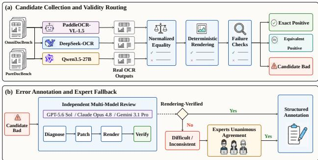  
Figure 3: OCRErrBench construction.

$$
R _ { y _ { 0 } } ( \tau ) = \left\{ \begin{array} { l l } { S _ { k } ( p _ { T } , p _ { 0 } ) - C _ { g } ( \tau ) , } & { y _ { 0 } = g , } \\ { S _ { f } ^ { V } ( e _ { T } ) + S _ { p } ( \tau ) - C _ { b } ( \tau ) , } & { y _ { 0 } = b . } \end{array} \right.\tag{4}
$$

For good inputs, $S _ { k }$ makes preservation the desired outcome, while $C _ { g }$ penalizes unnecessary editing, rendering, and additional turns. For bad inputs, $S _ { f } ^ { V } ( e _ { T } )$ combines reference agreement with the frozen verifier’s assessment of $( I , p _ { T } , \mathcal { R } ( p _ { T } ) )$ , whereas $S _ { p }$ rewards progress and penalizes regression along the trajectory. The interaction cost $C _ { b }$ penalizes incorrect or regressive modifications, nonproductive actions, excessive rendering calls, and trajectories that continue beyond the turns needed for recovery. Together, these terms favor reliable repair in fewer interaction turns, with rendering requested only when it contributes to reassessment, and encourage immediate stopping once consistency is restored. Equivalent positives remain in the preservation branch and are therefore not forced toward a canonical transcription.

The label-conditioned branches capture two asymmetric objectives: preserving an already valid representation and recovering an erroneous one. Fixed sample labels and references, together with the frozen verifier, provide stable external anchors, while trajectory terms optimize how eficiently the terminal outcome is reached. Reward details are in $\mathsf { A p - }$ pendix D.

For each input, GRPO (Shao et al. 2024) samples a group of G trajectories and computes the group-relative advantage

$$
\hat { A } _ { i } = \frac { R _ { i } - \bar { R } } { \mathrm { s t d } ( R ) + \epsilon } .\tag{5}
$$

We then apply the standard clipped GRPO objective with KL regularization against $\pi _ { \mathrm { r e f } } = \pi _ { \theta _ { 0 } }$ . This reference policy is a separate frozen copy used only to constrain policy drift and is distinct in role from the reward verifier $V _ { \bar { \phi } } .$ Group-relative advantages avoid training a separate value model, while clipping and KL regularization stabilize optimization. Diagnostic pretraining supplies the boundary, curriculum SFT turns it into repair capability, and GRPO finally optimizes when to edit, request visual feedback, reassess, and stop.

## Experiments

We first describe the construction of OCRErrBench and evaluate DocEDR’s diagnostic performance within and across benchmarks. We then assess its correction and preservation capabilities, its ability to improve external OCR predictions, and the contributions of input modalities and iterative rendering.

## OCRErrBench Construction

OCRErrBench is constructed exclusively from real text and formula predictions and supports validity judgment, error diagnosis, localization, and repair. Its frozen release contains 900 cases, balanced across text and formulas (450 each), with 457 Good and 443 Bad inputs. We collect predictions from DeepSeek-OCR, PaddleOCR-VL-1.5, and Qwen3.5-27B on OmniDocBench and PureDocBench (Wei, Sun, and Li 2025; Cui et al. 2026; Qwen Team 2026; Ouyang et al. 2025; Li et al. 2026). Predictions identical to the source-derived reference after normalization form exact positives. Source-diferent predictions are rendered with the reference in a fixed environment; visually identical outcomes form rendering-equivalent positives, while visually inconsistent predictions form the real-error pool. We enforce strict source-level isolation: all pages, regions, annotations, OCR outputs, and derived examples originating from OmniDocBench or PureDocBench are excluded from diagnostic SFT, curriculum repair SFT, and GRPO training.

For each candidate error, we run three annotation branches in parallel: one with GPT-5.6 Sol (OpenAI 2026), one with Claude Opus 4.8 (Anthropic 2026), and one with Gemini 3.1 Pro (Gemini Team 2026). Under the same instruction, each model independently observes the source crop, initial OCR result, and its own rendering feedback. Each branch returns a validity decision, a repair trajectory, and atomic error classes, locations, and corrected content. A case is accepted automatically only when all three branches agree on the complete annotation and converge to the same renderingverified correction. Inconsistent or dificult cases are independently reviewed by three domain experts. Unanimously agreed annotations are accepted directly, while residual disputed cases are retained only when repairs consistent with the defined error types recover the ground-truth transcription. All rendering-equivalent positives additionally undergo a separate manual audit. Figure 3 summarizes the process; construction details appear in Appendix A.

## Diagnostic Results on OCRErrBench

Table 2 compares reference-free learned methods on all 900 OCRErrBench cases. The general VLM baselines include Qwen3.5 (Qwen Team 2026), InternVL3.5-8B (Wang et al. 2025b), and GLM-4.6V-Flash (GLM-V Team et al. 2025); we also compare with DOCR-Inspector-7B (Zhang et al. 2025). Bad-F1 treats erroneous inputs as positive; balanced accuracy averages Good and Bad recall. Type-F1 is sample-level macro-F1 over completeness, content, and structure. Localization uses one-to-one event-level micro-F1 with a ±3 tolerance over normalized text-character or formula-token boundaries. All methods achieve 100% parse rate, but general VLMs remain weak at zero-shot typing and localization. Prompts, parsing, and DOCR alignment appear in Appendix B.

<table><tr><td>Method</td><td>Acc</td><td>BAcc</td><td>Bad-F1</td><td>Type-F1</td><td>Loc-Text</td><td>Loc-For.</td></tr><tr><td>Qwen3.5-9B</td><td>81.44</td><td>81.26</td><td>78.67</td><td>33.25</td><td>48.54</td><td>39.52</td></tr><tr><td>Qwen3.5-397B-A17B(FP8)</td><td>87.78</td><td>87.64</td><td>86.42</td><td>25.34</td><td>56.20</td><td>69.17</td></tr><tr><td>InternVL3.5-8B</td><td>52.67</td><td>51.92</td><td>7.39</td><td>4.35</td><td>12.20</td><td>1.23</td></tr><tr><td>GLM-4.6V-Flash</td><td>55.33</td><td>54.63</td><td>17.28</td><td>6.50</td><td>22.10</td><td>0.61</td></tr><tr><td>DOCR-Inspector-7B</td><td>78.78</td><td>78.99</td><td>81.07</td><td>41.85</td><td>44.00</td><td>28.45</td></tr><tr><td>DocEDR</td><td>94.78</td><td>94.75</td><td>94.59</td><td>74.88</td><td>92.72</td><td>73.26</td></tr></table>

Table 2: End-to-end diagnosis on OCRErrBench $( N = 9 0 0 )$ . Balanced accuracy (BAcc) averages Good and Bad recall. Type-F1 is macro-F1 over the three local error classes present in the frozen test set; Loc-Text and Loc-For. are event-level localization micro-F1 on eligible local-error cases. Best and second-best results are bolded and underlined, respectively. All values are percentages.

<table><tr><td>Method</td><td>Scope</td><td>Eq FP↓</td><td>Comp. FN↓</td><td>Cont. FN↓</td><td>Struct. FN↓</td></tr><tr><td>Edit dist. &gt; 0.1</td><td>Text</td><td>57.14</td><td>100.00</td><td>100.00</td><td>100.00</td></tr><tr><td>CDM &lt; 0.9</td><td>Formula</td><td>2.94</td><td>100.00</td><td>100.00</td><td>100.00</td></tr><tr><td>Qwen3.5-9B</td><td>All</td><td>53.23</td><td>31.48</td><td>26.81</td><td>36.26</td></tr><tr><td>DOCR-Ins.-7B</td><td>All</td><td>75.81</td><td>3.70</td><td>16.67</td><td>9.89</td></tr><tr><td>DocEDR</td><td>All</td><td>25.81</td><td>1.85</td><td>4.35</td><td>5.49</td></tr></table>

Table 3: Boundary diagnosis on rendering-equivalent positives and local errors drawn from OCRErrBench $( N = 3 9 9 )$ Eq-FP is the false-positive rate on equivalent positives; classwise FN is the false-negative rate. Static criteria access the reference and apply only to the indicated modality; learned methods are reference-free.

DocEDR reaches 94.78% accuracy and 94.59% Bad-F1 (bootstrap 95% CI: 93.00–96.06), outperforming Qwen3.5- 9B by 13.33 and 15.92 points $( p = \mathrm { { 3 . 4 8 \times 1 0 ^ { - 2 1 } ) } }$ and the 397B-A17B model by 7.00 and 8.17 points $( p = 2 . 9 5 \times$ $1 0 ^ { - 9 } )$ . It also reaches 74.88% Type-F1 and 92.72/73.26% text/formula localization F1, jointly improving validity judgment and actionable error descriptions.

## Boundary and Cross-Benchmark Diagnosis

Table 3 isolates rendering-equivalent positives and verified local errors, excluding exact positives and global errors. The reference-based thresholds are normalized edit distance > 0.1 for text and CDM (Wang et al. $2 0 2 5 \mathrm { a } ) < 0 . 9$ for formulas. Edit distance falsely rejects 57.14% of equivalent text, whereas CDM is tolerant of equivalent formulas (2.94% FP); both are nearly insensitive to the subtle local errors in this subset. DocEDR lowers equivalent-positive FP to 25.81% and completeness/content/structure FN to 1.85/4.35/5.49%.

We evaluate zero-shot transfer on 637 compatible DOCRcaseBench cases (Zhang et al. 2025) (445 text; 192 formula). Because its taxonomy difers, Table 4 compares the shared Good/Bad decision. Case-F1 is the support-weighted mean of Good- and Bad-class F1, also reported by modality. DocEDR improves accuracy, balanced accuracy, Bad-F1, and Case-F1 over DOCR-Inspector-7B by 9.11, 5.01, 7.96, and 7.73 points $( p \ : = \ : 0 . 0 0 1 2 2 )$ . Formula Case-F1 rises from 56.69% to 87.68%, corresponding to 61 additional correct cases (31.77% of the formula subset). Appendix B gives the protocol and examples.

<table><tr><td>Method</td><td>Acc</td><td>BAcc</td><td>B-F1</td><td>C-F1</td><td>Text</td><td>Fml.</td></tr><tr><td>DOCR-Ins.-7B</td><td>62.48</td><td>69.27</td><td>72.69</td><td>67.52</td><td>72.89</td><td>56.69</td></tr><tr><td>DocEDR</td><td>71.59</td><td>74.28</td><td>80.64</td><td>75.25</td><td>72.38</td><td>87.68</td></tr></table>

Table 4: Zero-shot diagnosis on DOCRcaseBench $( N \ =$ 637). Text and Formula denote modality-specific Case-F1.
<table><tr><td>Method</td><td>Exact Fix</td><td>Visual Fix</td><td>Text Fix</td><td>Formula Fix</td><td>Preserve</td></tr><tr><td>Qwen3.5-9B</td><td>16.70</td><td>51.02</td><td>72.00</td><td>40.27</td><td>83.59</td></tr><tr><td>Qwen3.5-397B</td><td>26.19</td><td>72.23</td><td>80.67</td><td>67.92</td><td>94.75</td></tr><tr><td>DOCR-guided</td><td>24.15</td><td>65.46</td><td>76.67</td><td>59.73</td><td>83.15</td></tr><tr><td>DocEDR</td><td>82.17</td><td>86.23</td><td>90.67</td><td>83.96</td><td>93.44</td></tr></table>

Table 5: Main repair results on OCRErrBench. Fix metrics are evaluated on 443 Bad inputs, while Preserve is evaluated on 457 Good inputs. Qwen3.5-9B and Qwen3.5- 397B are direct one-step baselines; DOCR-guided uses DOCR-Inspector-7B predictions to guide one-pass correction by Qwen3.5-9B. None uses online rerendering. Best and second-best results are bolded and underlined, respectively.

## Repair Results

Table 5 compares DocEDR after GRPO with direct one-step Qwen3.5 baselines and DOCR-guided one-pass correction. ExactFix requires normalized target agreement; VisFix requires pixel-level identity after compiling the repair and target with the same frozen compiler. TextFix and FormulaFix split VisFix by modality on 443 Bad cases, while Preserve evaluates 457 Good cases.

DocEDR achieves 82.17% ExactFix and 86.23% VisFix, exceeding the strongest direct baseline by 55.98 and 14.00 points; the VisFix gain has a paired 95% CI of 9.48–18.74 $\bar { ( p \mathrm { ~ = ~ } 6 . 4 4 \times 1 0 ^ { - 9 } ) }$ . Its 93.44% Preserve score combines strong correction with reliable preservation. Figure 4 shows updated rendering exposing a residual error and prompting a second targeted edit.

## Formula Recognition Refinement

Table 6 evaluates 12,683 formulas from the UniMER-Test (Gu et al. 2026) Simple and Complex Printed Expression subsets. DocEDR preserves predictions it judges correct and repairs those it judges erroneous; we report pre-repair CDM and the net change on each fixed Bad partition.

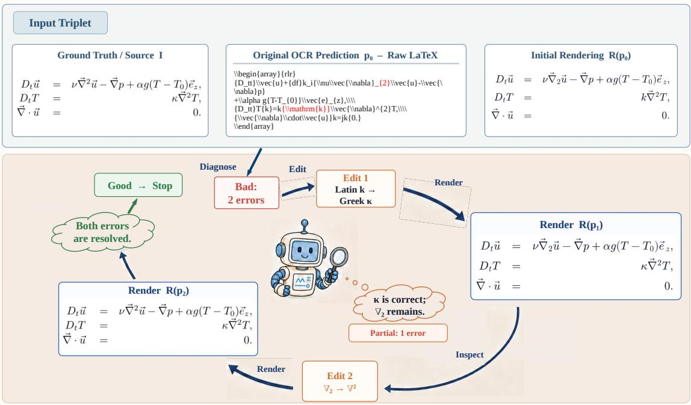

Figure 4: Iterative repair of a multi-error formula. DocEDR corrects one error, inspects the updated rendering, repairs the remaining error, and stops after visual consistency is restored.
<table><tr><td>Parser</td><td>All CDM</td><td>Good  $\%$ </td><td>Good CDM</td><td>Bad  $\%$ </td><td>Bad CDM (∆)</td></tr><tr><td>MinerU2.5 PaddleOCR-</td><td>90.52</td><td>67.50</td><td>99.09</td><td>32.50</td><td>72.71 (+2.93)</td></tr><tr><td>VL-1.5</td><td>94.12</td><td>77.81</td><td>97.65</td><td>22.19</td><td>81.70 (+2.24)</td></tr><tr><td>InternVL3.5-8B</td><td>65.59</td><td>74.08</td><td>66.97</td><td>25.92</td><td>61.62 (+3.72)</td></tr><tr><td>GLM-4.6V-Flash</td><td>75.45</td><td>62.82</td><td>78.65</td><td>37.18</td><td>70.03 (+4.62)</td></tr></table>

Table 6: Formula refinement on the UniMER-Test SPE+CPE subsets (N = 12,683 per parser). All and partitioned CDM values are measured before repair; ∆ is the net change after repair on the fixed Bad partition. Scores are percentages.

The Good partitions cover 62.82–77.81% of predictions. Their CDM remains high for MinerU2.5 and PaddleOCR-VL-1.5, while the lower absolute scores of InternVL3.5-8B and GLM-4.6V-Flash reflect their weaker initial recognition. Repair nevertheless improves every fixed Bad partition by 2.24–4.62 CDM points, with the largest gain on GLM-4.6V-Flash. Thus, diagnosis concentrates editing on lower-quality predictions and converts errors into downstream gains across parsers with substantially diferent baselines.

## Further Ablations

Input modality. The complete I + p + R input performs best, reaching 94.78% accuracy, 94.59% Bad-F1, and 74.88% Type-F1. Without the OCR sequence (I + R), text/formula localization falls to 80.54/55.25%; without rendering (I + p), equivalent-positive FP doubles from 4.75% to 8.86%. Rendering identifies genuine discrepancies, while the editable sequence supplies precise boundaries (supple-

mentary Table E1).

Interaction mechanism. The matched 2 × 2 study separates iteration from rendering feedback. Rendering adds 3.61 ExactFix and 3.39 VisFix points in one step; iteration without rendering lowers ExactFix to 66.82%, whereas the complete loop reaches 82.17% ExactFix and 86.23% VisFix. Initial rendering establishes the diagnostic boundary, and updated rendering closes the repair loop (supplementary Table E2).

## Conclusion

We introduce OCR-EDR for rendering-aware diagnosis, repair, and reuse of dificult OCR outputs. OCRErrBench establishes a unified evaluation of preservation, diagnosis, localization, and correction across text and formulas, while DocEDR turns these capabilities into an agentic edit–render– reassess loop. Its cross-benchmark diagnosis, high repair accuracy, and consistent gains on external OCR predictions demonstrate that dificult cases can serve as actionable feedback rather than terminal failures. We hope OCR-EDR advances OCR systems that continuously improve their predictions and data.

## References

Afli, H.; Qiu, Z.; Way, A.; and Sheridan, P. 2016. Using SMT for OCR Error Correction of Historical Texts. In Proceedings ofthe Tenth International Conference on Language Resources and Evaluation, 962–966.

Anthropic. 2026. Claude Opus 4.8 System Card. https://www-cdn.anthropic.com 0b4915911bb0d19eca5b5ee635c80fef830a37ea.pdf. Accessed July 2026.

Cui, C.; Sun, T.; Liang, S.; Gao, T.; Zhang, Z.; Liu, J.; Wang, X.; Zhou, C.; Liu, H.; Lin, M.; Zhang, Y.; Zhang, Y.; Liu, Y.; Yu, D.; and Ma, Y. 2026. PaddleOCR-VL-1.5: Towards a Multi-Task 0.9B VLM for Robust In-the-Wild Document Parsing. arXiv preprint arXiv:2601.21957.

Cui, C.; Sun, T.; Liang, S.; Gao, T.; Zhang, Z.; Liu, J.; Wang, X.; Zhou, C.; Liu, H.; Lin, M.; Zhang, Y.; Zhang, Y.; Zheng, H.; Zhang, J.; Zhang, J.; Liu, Y.; Yu, D.; and Ma, Y. 2025a. PaddleOCR-VL: Boosting Multilingual Document Parsing via a 0.9B Ultra-Compact Vision-Language Model. arXiv preprint arXiv:2510.14528.

Cui, C.; Sun, T.; Lin, M.; Gao, T.; Zhang, Y.; Liu, J.; Wang, X.; Zhang, Z.; Zhou, C.; Liu, H.; Zhang, Y.; Lv, W.; Huang, K.; Zhang, Y.; Zhang, J.; Zhang, J.; Liu, Y.; Yu, D.; and Ma, Y. 2025b. PaddleOCR 3.0 Technical Report. arXiv preprint arXiv:2507.05595.

Deng, Y.; Kanervisto, A.; Ling, J.; and Rush, A. M. 2017. Image-to-Markup Generation with Coarse-to-Fine Attention. In Proceedings of the 34th International Conference on Machine Learning, volume 70 of Proceedings of Machine Learning Research, 980–989.

Dong, R.; and Smith, D. 2018. Multi-Input Attention for Unsupervised OCR Correction. In Proceedings of the 56th Annual Meeting of the Association for Computational Linguistics, 2363–2372.

Du, Y.; Li, C.; Guo, R.; Yin, X.; Liu, W.; Zhou, J.; Bai, Y.; Yu, Z.; Yang, Y.; Dang, Q.; and Wang, H. 2020. PP-OCR: A Practical Ultra Lightweight OCR System. arXiv preprint arXiv:2009.09941.

Fu, L.; Kuang, Z.; Song, J.; Huang, M.; Yang, B.; Li, Y.; Zhu, L.; Luo, Q.; Wang, X.; Lu, H.; Li, Z.; Tang, G.; Shan, B.; Lin, C.; Liu, Q.; Wu, B.; Feng, H.; Liu, H.; Huang, C.; Tang, J.; Chen, W.; Jin, L.; Liu, Y.; and Bai, X. 2025. OCRBench v2: An Improved Benchmark for Evaluating Large Multimodal Models on Visual Text Localization and Reasoning. In Advances in Neural Information Processing Systems, volume 38.

Gemini Team. 2026. Gemini 3.1 Pro: A Smarter Model for Your Most Complex Tasks. https://blog.google/innovationand-ai/models-and-research/gemini-models/gemini-3-1- pro/. Accessed July 2026.

GLM-V Team; Hong, W.; Yu, W.; Gu, X.; Wang, G.; Gan, G.; Tang, H.; Cheng, J.; Qi, J.; Ji, J.; et al. 2025. GLM-4.5V and GLM-4.1V-Thinking: Towards Versatile Multimodal Reasoning with Scalable Reinforcement Learning. arXiv preprint arXiv:2507.01006.

Gu, Z.; Liang, G.; Wang, B.; Zhao, Z.; Zhang, Q.; Li, W.; Xu, C.; Zhang, B.; Shi, B.; Wu, J.; Zhang, W.; and He, C. 2026. UniMERNet: A Universal Network for Real-World Mathematical Expression Recognition. In Proceedings of the IEEE/CVF Conference on Computer Vision and Pattern Recognition, 34106–34115.

Guan, S.; and Greene, D. 2024. Advancing Post-OCR Correction: A Comparative Study of Synthetic Data. In Findings of the Association for Computational Linguistics: ACL 2024, 6036–6047.

Hu, A.; Xu, H.; Ye, J.; Yan, M.; Zhang, L.; Zhang, B.; Zhang, J.; Jin, Q.; Huang, F.; and Zhou, J. 2024. mPLUG-DocOwl 1.5: Unified Structure Learning for OCR-Free Document Understanding. In Findings ofthe Associationfor Computational Linguistics: EMNLP 2024, 3096–3120.

Jiang, N.; Liang, S.; Wang, C.; Wang, J.; and Tan, L. 2025. LATTE: Improving LaTeX Recognition for Tables and Formulae with Iterative Refinement. In Proceedings ofthe AAAI Conference onArtificial Intelligence, volume 39, 4030–4038.

Kim, G.; Hong, T.; Yim, M.; Nam, J.; Park, J.; Yim, J.; Hwang, W.; Yun, S.; Han, D.; and Park, S. 2022. OCR-Free Document Understanding Transformer. In Computer Vision–ECCV 2022, volume 13688, 498–517.

Kolak, O.; Byrne, W.; and Resnik, P. 2003. A Generative Probabilistic OCR Model for NLP Applications. In Proceedings of the 2003 Human Language Technology Conference of the North American Chapter of the Association for Computational Linguistics, 134–141.

Lee, K.; Joshi, M.; Turc, I. R.; Hu, H.; Liu, F.; Eisenschlos, J. M.; Khandelwal, U.; Shaw, P.; Chang, M.-W.; and Toutanova, K. 2023. Pix2Struct: Screenshot Parsing as Pretraining for Visual Language Understanding. In Proceedings of the 40th International Conference on Machine Learning, volume 202 of Proceedings of Machine Learning Research, 18893–18912.

Li, Z.; Liu, Y.; Liu, Q.; Ma, Z.; Zhang, Z.; Zhang, S.; Guo, Z.; Zhang, J.; Wang, X.; and Bai, X. 2025. MonkeyOCR: Document Parsing with a Structure-Recognition-Relation Triplet Paradigm. arXiv preprint arXiv:2506.05218.

Li, Z.; Ma, Z.; Chen, J.; Zhang, J.; Su, Z.; Zhang, Y.; Yu, Z.; Liu, R.; Lv, X.; Li, B.; Gao, J.; Zhang, Z.; Yuan, C.; Li, B.; and Hu, W. 2026. How Far Is Document Parsing from Solved? PureDocBench: A Source-Traceable Benchmark across Clean, Degraded, and Real-World Settings. arXiv preprint arXiv:2605.07492.

Liu, H.; Cui, C.; Du, Y.; Liu, Y.; and Pan, G. 2025. PP-FormulaNet: Bridging Accuracy and Eficiency in Advanced Formula Recognition. arXiv preprint arXiv:2503.18382.

Liu, Y.; Li, Z.; Huang, M.; Yang, B.; Yu, W.; Li, C.; Yin, X.; Liu, C.-L.; Jin, L.; and Bai, X. 2024. OCRBench: On the Hidden Mystery of OCR in Large Multimodal Models. Science China Information Sciences, 67(12): 220102.

Liu, Y.; Li, Z.; Zhang, Z.; Zhang, S.; Liu, Q.; Song, J.; Guo, Z.; Wang, X.; Zheng, H.; Liu, Y.; et al. 2026. MonkeyOCRv2: A Visual-Text Foundation Model for Document AI. arXiv preprint arXiv:2607.11562.

Löfgren, V.; and Dannélls, D. 2024. Post-OCR Correction of Digitized Swedish Newspapers with ByT5. In Proceedings of the 8th Joint SIGHUM Workshop on Computational Linguistics for Cultural Heritage, Social Sciences, Humanities and Literature, 237–242.

Lyu, L.; Koutraki, M.; Krickl, M.; and Fetahu, B. 2021. Neural OCR Post-Hoc Correction of Historical Corpora. Transactions of the Association for Computational Linguistics, 9: 479–493.

Niu, J.; Liu, Z.; Gu, Z.; Wang, B.; Ouyang, L.; Zhao, Z.; Chu, T.; He, T.; Wu, F.; Zhang, Q.; et al. 2025. MinerU2.5: A Decoupled Vision-Language Model for Efficient High-Resolution Document Parsing. arXiv preprint arXiv:2509.22186.

OpenAI. 2026. GPT-5.6: Frontier Intelligence That Scales with Your Ambition. https://openai.com/index/gpt-5-6/. Accessed July 2026.

Ouyang, L.; Qu, Y.; Zhou, H.; Zhu, J.; Zhang, R.; Lin, Q.; Wang, B.; Zhao, Z.; Jiang, M.; Zhao, X.; Shi, J.; Wu, F.; Chu, P.; Liu, M.; Li, Z.; Xu, C.; Zhang, B.; Shi, B.; Tu, Z.; and He, C. 2025. OmniDocBench: Benchmarking Diverse PDF Document Parsing with Comprehensive Annotations. In Proceedings of the IEEE/CVF Conference on Computer Vision and Pattern Recognition, 24838–24848.

Qwen Team. 2026. Qwen3.5: Towards Native Multimodal Agents. https://qwen.ai/blog?id=qwen3.5. Accessed July 2026.

Schaefer, R.; and Neudecker, C. 2020. A Two-Step Approach for Automatic OCR Post-Correction. In Proceedings of the 4th Joint SIGHUM Workshop on Computational Linguistics for Cultural Heritage, Social Sciences, Humanities and Literature, 52–57.

Schmitt-Koopmann, F. M.; Huang, E. M.; Hutter, H.-P.; Stadelmann, T.; and Darvishy, A. 2024. MathNet: A Data-Centric Approach for Printed Mathematical Expression Recognition. IEEE Access, 12: 76963–76974.

Shao, Z.; Wang, P.; Zhu, Q.; Xu, R.; Song, J.; Bi, X.; Zhang, H.; Zhang, M.; Li, Y. K.; Wu, Y.; and Guo, D. 2024. DeepSeekMath: Pushing the Limits of Mathematical Reasoning in Open Language Models. arXiv preprint arXiv:2402.03300.

Soper, E.; Fujimoto, S.; and Yu, Y.-Y. 2021. BART for Post-Correction of OCR Newspaper Text. In Proceedings of the Seventh Workshop on Noisy User-generated Text, 284–290.

Thomas, A.; Gaizauskas, R.; and Lu, H. 2024. Leveraging LLMs for Post-OCR Correction of Historical Newspapers. In Proceedings of the Third Workshop on Language Technologiesfor Historical and Ancient Languages, 116–121.

Wang, B.; He, T.; Ouyang, L.; Wu, F.; Zhao, Z.; Chu, T.; Qu, Y.; Jin, Z.; Zeng, W.; Miao, Z.; et al. 2026. MinerU2.5- Pro: Pushing the Limits of Data-Centric Document Parsing at Scale. arXiv preprint arXiv:2604.04771.

Wang, B.; Wu, F.; Ouyang, L.; Gu, Z.; Zhang, R.; Xia, R.; Shi, B.; Zhang, B.; and He, C. 2025a. Image Over Text: Transforming Formula Recognition Evaluation with Character Detection Matching. In Proceedings of the IEEE/CVF

Conference on Computer Vision and Pattern Recognition, 19681–19690.

Wang, B.; Xu, C.; Zhao, X.; Ouyang, L.; Wu, F.; Zhao, Z.; Xu, R.; Liu, K.; Qu, Y.; Shang, F.; Zhang, B.; Wei, L.; Sui, Z.; Li, W.; Shi, B.; Qiao, Y.; Lin, D.; and He, C. 2024. MinerU: An Open-Source Solution for Precise Document Content Extraction. arXiv preprint arXiv:2409.18839.

Wang, W.; Gao, Z.; Gu, L.; Pu, H.; Cui, L.; Wei, X.; Liu, Z.; Jing, L.; Ye, S.; Shao, J.; et al. 2025b. InternVL3.5: Advancing Open-Source Multimodal Models in Versatility, Reasoning, and Eficiency. arXivpreprint arXiv:2508.18265.

Wei, H.; Sun, Y.; and Li, Y. 2025. DeepSeek-OCR: Contexts Optical Compression. arXiv preprint arXiv:2510.18234.

Wei, H.; Sun, Y.; and Li, Y. 2026. DeepSeek-OCR 2: Visual Causal Flow. arXiv preprint arXiv:2601.20552.

Yang, Z.; Tang, J.; Li, Z.; Wang, P.; Wan, J.; Zhong, H.; Liu, X.; Yang, M.; Wang, P.; Bai, S.; Jin, L.; and Lin, J. 2025. CC-OCR: A Comprehensive and Challenging OCR Benchmark for Evaluating Large Multimodal Models in Literacy. In Proceedings of the IEEE/CVF International Conference on Computer Vision, 21744–21754.

Zhang, Q.; Zhang, J.; Ren, Z.; Ouyang, L.; Wen, Z.; Niu, J.; Qu, Y.; Wang, B.; Chow, K.-H.; He, C.; and Zhang, W. 2025. DOCR-Inspector: Fine-Grained and Automated Evaluation of Document Parsing with VLM. arXiv preprint arXiv:2512.10619.

## Appendix

## A OCRErrBench Details

OCRErrBench contains 900 real OCR outputs, balanced between text and formula crops. Candidate outputs are collected from DeepSeek-OCR, PaddleOCR-VL-1.5, and Qwen3.5- 27B on OmniDocBench and PureDocBench. Source regions are deduplicated by document, page, region, and crop hashes; predictions with the same normalized source for one crop are merged while retaining their model provenance. Sampling is completed before any diagnostic or repair model is evaluated. The final benchmark is isolated from Diagnostic SFT, all three Curriculum Repair SFT stages, and GRPO at the source-document level.

An exact positive matches the normalized reference source, whereas a rendering-equivalent positive difers in source form but produces the same visible content. The latter is admitted only after rendering comparison and manua audit. All remaining outputs enter the real-error pool and receive one primary class from invalid output, global mismatch, completeness, content, and structure; a sample may additionally contain multiple atomic events. Equivalence checks use a frozen local Playwright/Chromium environment with KaTeX 0.16.11, Markdown parsing, a 600-pixel canvas, a 16-pixel base font, fixed padding and background, and a fixed Fontconfig inventory including Fandol fonts. A rendering failure is never accepted as evidence of equivalence.

GPT-5.6 Sol, Claude Opus 4.8, and Gemini 3.1 Pro independently produce a verdict, atomic-error records, and a rendering-verified correction. Automatic acceptance requires complete three-way agreement and, for Bad cases, mutually consistent repairs that recover the reference under rendering. Dificult cases are reviewed independently by three experts. Unanimous annotations are accepted directly; residual disputes are retained only when the reconciled repair is consistent with the assigned errors and recovers the reference. All rendering-equivalent positives receive an additional manual audit.

## B Baseline Protocol and Qualitative Examples

## Unified VLM Protocol

All general-purpose VLM baselines receive the ordered triplet $( I , R ( p ) , p )$ , with the OCR source capped at 6,000 characters. Decoding uses temperature zero, disables explicit chain-of-thought output, and allows at most 2,048 output tokens. No reference text, label, correction, error class, or location is available at inference time. The parser removes reasoning blocks and Markdown fences, extracts the outermost JSON object, and applies a fixed JSON repair only when strict parsing fails. Unresolved local contexts remain missing rather than being completed from the ground truth. The first image is the original document element, the second image is a rendering of the OCR source, and the OCR source p is provided below. Judge whether the OCR faithfully preserves the visible content, completeness, and two-dimensional structure of the original. Equivalent notation and benign font, spacing, or line-wrapping variation are Good when the visible content and intended structure are preserved; use Bad only for a genuine OCR error. Return exactly one JSON object without Markdown or extra prose. The object must contain verdict, errors, and a brief explanation. Each atomic error must contain exactly one type from invalid\_output, global\_mismatch, completeness, content, and structure; one operation from insert, delete, replace, and global\_rewrite; and the fields context\_before, wrong, right, and context\_after. Invalid\_output denotes empty, malformed, truncated, or unrenderable OCR; global\_mismatch denotes OCR from the wrong region or content globally unrelated to the image; completeness denotes missing or extra visible content; content denotes incorrect characters, symbols, numbers, or words; and structure denotes incorrect spatial, superscript/subscript, fraction, layout, or markup relations. Use global\_rewrite only for invalid\_output or global\_mismatch. For a local error, use a minimal source-grounded context and an insert, delete, or replace operation. For Good, return an empty errors list.

<table><tr><td>Dimension</td><td>Subset</td><td>Count</td></tr><tr><td rowspan="2">Verdict</td><td>Good</td><td>457</td></tr><tr><td>Bad</td><td>443</td></tr><tr><td rowspan="2">Good subtype</td><td>Exact positive</td><td>141</td></tr><tr><td>Rendering-equivalent</td><td>316</td></tr><tr><td rowspan="2">Modality</td><td>Text</td><td>450</td></tr><tr><td>Formula</td><td>450</td></tr><tr><td rowspan="4">Primary Bad class</td><td>Invalid output</td><td>30</td></tr><tr><td>Global mismatch</td><td>40</td></tr><tr><td>Completeness</td><td>125</td></tr><tr><td>Content</td><td>110</td></tr><tr><td></td><td>Structure</td><td>138</td></tr></table>

Table A1: OCRErrBench composition. Error counts use mutually exclusive primary labels; a case may contain multiple atomic events.

## DOCR-Inspector Alignment

DOCR-Inspector-7B retains its oficial single-image protocol and decision rule: at least one nonempty native error type denotes Bad. A frozen, ground-truth-blind adapter maps its 28 native labels to OCR-EDR and resolves quoted erroneous strings against the OCR source. Table B1 summarizes the mapping; no native label directly represents a globally unrelated prediction.

For localization, explicitly quoted substrings in the DOCR output are matched exactly in the OCR source. The longest match is selected, with earliest occurrence breaking ties; unresolved outputs yield no location.

## Localization Metrics

Loc-Text records start and end character ofsets in the normalized OCR string: the start points to the first erroneous character, and the end points immediately after the last erroneous character. Loc-Formula removes an outer math wrapper and tokenizes $\mathrm { I A T } \mathrm { E } ^ { \mathrm { X } }$ commands, escaped symbols, delimiters, and non-whitespace characters. Global errors are excluded. Predicted and reference atomic events are matched one-toone and independently of order when their span boundary gap is at most three. For each modality m ∈ {Text, Formula}, let $M _ { m } , P _ { m }$ , and $G _ { m }$ denote the numbers of matched, predicted, and reference local error events, respectively:

<table><tr><td>OCR-EDR class</td><td>Domain</td><td>DOCR-Inspector native error types</td></tr><tr><td rowspan="2">Invalid output</td><td>Formula</td><td>Displayed-formula syntax error</td></tr><tr><td>Table</td><td>Globally corrupted table</td></tr><tr><td>Global mismatch</td><td>All</td><td>recognition None</td></tr><tr><td rowspan="3">Completeness</td><td>Text</td><td>Lost, redundant, or repeated text; lost characters or spaces</td></tr><tr><td>Formula</td><td>Missed or partially missing</td></tr><tr><td>Table</td><td>formulas Redundant regions; missing rows, columns, or cells</td></tr><tr><td rowspan="3">Content</td><td>Text</td><td>Punctuation or character errors</td></tr><tr><td>Formula</td><td>Inline or displayed formula</td></tr><tr><td>Table</td><td>character errors Cell-content errors</td></tr><tr><td rowspan="4">Structure</td><td>Cross-</td><td>Cross-type recognition errors</td></tr><tr><td>type Text</td><td>Title, list, paragraph, or citation</td></tr><tr><td></td><td>formatting errors</td></tr><tr><td>Formula</td><td>Inline or displayed formula structure errors</td></tr><tr><td></td><td>Table</td><td>Merged-cell errors</td></tr></table>

Table B1: Many-to-one mapping from the 28 DOCR-Inspector error types to the OCR-EDR taxonomy.

$$
\mathrm { L o c F } 1 _ { m } = \frac { 2 M _ { m } } { P _ { m } + G _ { m } } , \qquad m \in \{ \mathrm { T e x t , F o r m u l a } \} .\tag{6}
$$

## Qualitative Examples

Figures B1–B6, collected at the end of the supplement, cover delimiter sizing, wrapper and punctuation variation, command aliases, Unicode-equivalent symbols, and two text cases with equivalent content under benign typesetting diferences. In every case, DocEDR preserves the valid OCR prediction because its rendering agrees with the source, whereas DOCR-Inspector reports a nonexistent structural or content error. The examples show that rendering-aware diagnosis accommodates heterogeneous but visually equivalent source forms instead of enforcing a preferred serialization style.

## C Training Curriculum Details

All supervised stages use full-parameter Qwen3.5-9B training. Diagnostic SFT learns validity, the five error classes, three local edit operations, and source-grounded locations. Repair training proceeds sequentially: Stage 1 learns direct one-turn correction; Stage 2 learns whether to request an updated rendering or stop; and Stage 3 introduces genuine rendering feedback, residual-error repair, recovery from an unsuccessful edit, and stopping.

GRPO starts from the selected Stage-3 checkpoint and groups eight on-policy trajectories for each prompt. The frozen Verifier provides reward-side judgments, while the reference policy is a separate frozen copy of the initial Corrector policy. OCRErrBench remains source-isolated from

every training and validation split and is evaluated only after checkpoint identities are fixed.
<table><tr><td>Stage</td><td>ExactFix</td><td>VisFix</td><td>Preserve</td><td>Avg. turns</td><td>Bad renders</td></tr><tr><td>Stage 1</td><td>61.63</td><td>67.95</td><td>91.25</td><td>一</td><td>一</td></tr><tr><td>Stage 2</td><td>64.56</td><td>71.56</td><td>91.03</td><td></td><td></td></tr><tr><td>Stage 3</td><td>80.36</td><td>85.10</td><td>91.68</td><td>2.594</td><td>2.104</td></tr><tr><td>GRPO</td><td>82.17</td><td>86.23</td><td>93.44</td><td>2.313</td><td>1.598</td></tr></table>

Table C1: Stage-wise repair quality and action eficiency. Avg. turns is measured over all cases; Bad renders counts rendering calls on Bad inputs. Stages 1–3 denote Curriculum Repair SFT.

Table C1 shows that the supervised curriculum supplies the repair process itself: the largest quality gain appears when Stage 3 adds genuine updated-rendering feedback. GRPO then improves ExactFix, VisFix, and Preserve by 1.81, 1.13, and 1.76 points, respectively, while reducing the average trajectory from 2.594 to 2.313 turns and Bad-case rendering calls from 2.104 to 1.598. These reductions correspond to 10.8% fewer turns and 24.0% fewer render calls. The labelconditioned rewards and interaction penalties therefore refine the learned repair procedure into adaptive action selection: DocEDR requests a new rendering when it is informative, avoids redundant tool use, and stops earlier after suficient evidence.

Figure C1 illustrates recovery from an inefective edit. The updated rendering confirms that the original error remains, leading to a second localized repair before stopping. This connects the Stage-3 curriculum with GRPO’s more selective rendering and termination.

<table><tr><td>Stage</td><td>Span</td><td>Capability introduced</td></tr><tr><td>Diagnostic SFT</td><td>1 epoch</td><td>Validity, error classes, edit operations, and localization</td></tr><tr><td>Repair SFT Stage 1</td><td>1 epoch</td><td>Single-turn correction</td></tr><tr><td>Repair SFT Stage 2</td><td>2 epochs</td><td>Request-render versus direct stopping</td></tr><tr><td>Repair SFT Stage 3</td><td>2 epochs</td><td>Updated rendering, residual repair, recovery, and stopping</td></tr><tr><td>GRPO</td><td>400 updates</td><td>On-policy preservation, repair, reassessment, and stopping</td></tr></table>

Table C2: Sequential curriculum; 400 GRPO updates cover approximately 1.2 prompt-pool passes.

The curriculum turns diagnosis into an executable correction policy in increasing order of interaction complexity. Diagnostic SFT first establishes validity, error-type, operation, and localization supervision. Repair SFT Stage 1 grounds these predictions in direct corrections; Stage 2 introduces the decision between stopping and requesting visual feedback; and Stage 3 trains on updated renderings so that the policy can recognize residual errors, recover from an ineffective edit, and continue only when further action is useful.

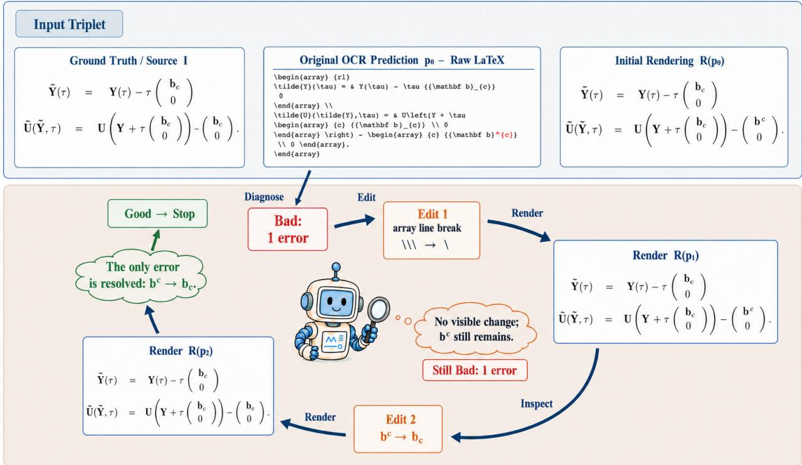  
Figure C1: A Stage-3/GRPO repair trajectory. The first edit produces no visible recovery; the updated rendering confirms that the original error remains, prompting a second targeted edit before stopping.

The stage-wise changes clarify where the closed-loop capability emerges. Moving from Stage 1 to Stage 2 raises ExactFix and VisFix by 2.93 and 3.61 points, respectively, while introducing the render-or-stop decision. Stage 3 contributes the largest jump—15.80 ExactFix and 13.54 VisFix points over Stage 2—after adding genuine post-edit renderings and residual-error trajectories. Its Preserve score also recovers from 91.03% to 91.68%, indicating that iterative repair is learned without sacrificing the ability to leave correct inputs unchanged. GRPO subsequently improves all three outcome metrics while reducing interaction, so its principal contribution is to refine when the learned loop should continue, invoke rendering, or stop.

The optimization schedule follows the same progression. Diagnostic SFT uses the shortest context because it produces a single structured assessment. Repair SFT expands the context to accommodate editable candidates and supervised action histories, and GRPO uses the longest context for grouped multi-turn rollouts. The learning rate is reduced after the first repair stage and again during GRPO, while all stages retain full-parameter BF16 optimization with ZeRO-2, gradient checkpointing, and the same random seed. This continuity preserves the diagnostic representation while progressively extending it from assessment to executable correction and then to eficient on-policy control.

## D Reward and Optimization Objective

## Label-Conditioned Reward

Let $y _ { 0 } ~ \in ~ \{ g , b \}$ be the frozen validity label of the initial prediction, $p ^ { \star }$ the reference correction, and τ the sampled trajectory. The two branches optimize preservation and recovery independently:

$$
\begin{array} { r } { R _ { y _ { 0 } } ( \tau ) = \left\{ \begin{array} { l l } { S _ { k } ( p _ { T } , p _ { 0 } ) - C _ { g } ( \tau ) , } & { y _ { 0 } = g , } \\ { S _ { f } ^ { V } ( e _ { T } ) + S _ { p } ( \tau ) - C _ { b } ( \tau ) , } & { y _ { 0 } = b , } \end{array} \right. } \\ { e _ { T } = ( I , p _ { T } , \mathcal { R } ( p _ { T } ) , p ^ { \star } ) . } \end{array}\tag{7}
$$

Here $e _ { T }$ combines the source image, final prediction, its terminal rendering, and the reference correction. The terminal rendering used by the reward evaluator is generated after rollout and is not appended to the policy trajectory as an additional observation. $S _ { k }$ rewards preservation of a valid input, $S _ { f } ^ { V }$ evaluates terminal recovery with reference agreement and the frozen Verifier, and $S _ { p }$ models progress and regression along the trajectory. $C _ { g }$ and $C _ { b }$ constrain unnecessary or ineficient interaction. The two label-conditioned branches share only the structural output contract.

Let $N ( \cdot )$ denote source normalization, $d _ { \mathrm { L e v } }$ Levenshtein distance, and $q _ { \mathrm { f m t } } ( \tau ) \in [ 0 , 1 ]$ the structural validity of the sampled output. Terminal repair quality combines a continuous edit signal,

$$
s _ { \mathrm { e d } } = 1 - \frac { d _ { \mathrm { L e v } } ( N ( p _ { T } ) , N ( p ^ { \star } ) ) } { \operatorname* { m a x } \{ | N ( p _ { T } ) | , | N ( p ^ { \star } ) | , 1 \} } ,\tag{8}
$$

exact normalized recovery,

$$
s _ { \mathrm { e x } } = \mathcal { H } [ N ( p _ { T } ) = N ( p ^ { \star } ) ] ,\tag{9}
$$

<table><tr><td>Setting</td><td>Diagnostic SFT</td><td>Repair SFT</td><td>GRPO</td></tr><tr><td>Learning rate</td><td> $5 \times 1 0 ^ { - 7 }$ </td><td> $1 0 ^ { - 6 } ( \mathrm { S t a g e } 1 ) ; 5 \times 1 0 ^ { - 7 }$  (Stages 2-3)</td><td> $1 0 ^ { - 7 }$ </td></tr><tr><td>Scheduler / warm-up</td><td>Cosine / 0.03</td><td>Cosine / 0.03</td><td>Cosine / 0.05</td></tr><tr><td>Global batch</td><td>160</td><td>64</td><td>24 prompts per update; 8 trajectories per prompt</td></tr><tr><td>Maximum context</td><td>5,120 tokens</td><td>12,288 tokens</td><td>32,768 tokens</td></tr><tr><td>Optimization Shared</td><td>Full tuning; BF16; ZeRO-2 Gradient checkpointing; FlashAttention; fused ÀdamW with</td><td>Full tuning; BF16; ZeRO-2  $\beta = ( 0 . 9 , 0 . 9 5 )$ </td><td>Full tuning; BF16; ZeRO-2</td></tr><tr><td colspan="4">implementation</td></tr><tr><td>Sampling / regularization</td><td></td><td></td><td>Temperature 0.7; group size 8; KL  $\beta = \mathsf { \bar { 0 } } . 4 ; \mathsf { c l i p } \epsilon _ { c } = 0 . \hat { 2 }$ </td></tr><tr><td>Random seed</td><td>42</td><td>42</td><td>42</td></tr></table>

Table C3: Optimization configurations for diagnostic learning, curriculum repair, and GRPO.

and a rendering-aware Verifier score,

$$
s _ { V } = \mathbb { k } \bigl [ \mathrm { V e r d i c t } \bigl ( V _ { \bar { \phi } } ( I , p _ { T } , \mathcal { R } ( p _ { T } ) ) \bigr ) = g \bigr ] .\tag{10}
$$

The terminal reward aggregates these complementary signals:

$$
\begin{array} { r l } & { S _ { f } ^ { V } ( e _ { T } ) = \alpha _ { \mathrm { e d } } s _ { \mathrm { e d } } + \alpha _ { \mathrm { e x } } s _ { \mathrm { e x } } } \\ & { ~ + \alpha _ { V } s _ { V } + \alpha _ { \mathrm { f m t } } q _ { \mathrm { f m t } } ( \tau ) . } \end{array}\tag{11}
$$

All α coeficients are nonnegative. The three signals provide progressively stricter supervision: character-level proximity, exact reference recovery, and visual consistency grounded in the source image and terminal rendering.

For inputs with $y _ { 0 } = g ,$ preservation is implemented as

$$
S _ { k } ( p _ { T } , p _ { 0 } ) = \eta _ { \mathrm { f m t } } q _ { \mathrm { f m t } } ( \tau ) + \eta _ { \mathrm { k e e p } } \mathcal { k } [ N ( p _ { T } ) = N ( p _ { 0 } ) ] .\tag{12}
$$

Let $n _ { \mathrm { t u r n } } , n _ { R }$ , and $n _ { \mathrm { r e p } }$ be the numbers of interaction turns, policy-issued rendering calls, and repeated edits, respectively; n excludes the initial rendering $R _ { 0 }$ supplied with the input. For Good inputs, the interaction cost is

$$
\begin{array} { r l } & { C _ { g } ( \tau ) = \lambda _ { e } \mathcal { k } [ N ( p _ { T } ) \neq N ( p _ { 0 } ) ] } \\ & { \quad \quad + \lambda _ { t } ( n _ { \mathrm { t u r n } } - 1 ) _ { + } + \lambda _ { R } n _ { R } . } \end{array}\tag{13}
$$

For Bad inputs, it is

$$
\begin{array} { r l } & { C _ { b } ( \tau ) = \mu _ { \mathrm { r e p } } n _ { \mathrm { r e p } } + \mu _ { 0 } \vert \mathcal { k } [ n _ { R } = 0 \wedge n _ { \mathrm { t u r n } } > 1 ] } \\ & { ~ + \mu _ { R } ( n _ { R } - K ) _ { + } + \mu _ { T } \vert \mathcal { k } [ \mathcal { E } _ { \mathrm { b u d g e t } } ] . } \end{array}\tag{14}
$$

All cost coeficients are positive. Here $\mathcal { E } _ { \mathrm { b u d g e t } }$ denotes budget exhaustion with a Bad terminal state, and $\bar { K }$ is the unpenalized rendering allowance. These terms penalize unnecessary modification of Good inputs, repeated edits, multi-turn reasoning without updated visual evidence, excessive rendering, and ineficient termination.

The process reward is computed from the nonempty sequence $\mathsf { \bar { \tau } } _ { v _ { 1 : m } } \in \{ b , g \} ^ { m } , m \geq 1$ , of frozen assessments on evaluated intermediate candidates. We define three mutually exclusive positive events: $\mathcal { E } _ { d } = \{ m = 1 , v _ { 1 } = g \}$ denotes single-evaluation recovery; $\mathcal { E } _ { r } = \mathit { \bar { \{ m \ge 2 , ~ } v } _ { 1 } = \bar { b } , \bar { \exists } j > 1  :$ $v _ { j } = g \}$ denotes recovery after one or more evaluated Bad states; and ${ \mathcal { E } } _ { s } = \{ m \geq 2 , v _ { 1 } = \cdots = v _ { m } = g \}$ denotes remaining Good across multiple evaluated candidates. We additionally define $\mathcal { E } _ { \mathrm { r e g } }$ for any $g \mathbf { - } \mathbf { { t o - } } b$ transition and $\mathcal { E } _ { \mathrm { a l l b a d } }$ when every evaluated state remains b. The process term is

$$
\begin{array} { r l } & { S _ { p } ( \tau ) = \rho _ { d } \lvert \mathcal { k } [ \mathcal { E } _ { d } ] + \rho _ { r } \rvert \lvert \mathcal { E } [ \mathcal { E } _ { r } ] + \rho _ { s } \rvert \lvert \mathcal { E } [ \mathcal { E } _ { s } ] } \\ & { ~ - ~ \rho _ { \mathrm { r e g } } \lvert \mathcal { k } [ \mathcal { E } _ { \mathrm { r e g } } ] - \rho _ { \mathrm { b a d } } \rvert \lvert \mathcal { k } [ \mathcal { E } _ { \mathrm { a l l b a d } } ] , } \end{array}\tag{15}
$$

where all $\rho$ coeficients are positive. This makes both useful Bad-to-Good progress and regression explicit at the trajectory level.

Because $v _ { 1 : m }$ indexes evaluated candidates rather than raw action turns, $S _ { p }$ credits observable state changes instead of merely favoring longer trajectories. It complements $S _ { f } ^ { V }$ the terminal term measures where a rollout ends, whereas the process events reveal whether intermediate revisions recover, remain correct, or regress. Together with $C _ { b } .$ , this favors evidence-backed recovery while discouraging redundant edits, rendering calls, and delayed stopping.

The reward is evaluated at two temporal resolutions. Terminal evidence compares $p _ { T }$ with the fixed reference and evaluates its fresh rendering, providing a stable target for final correctness. Process evidence is attached only to evaluated intermediate candidates and records the direction of change between successive states. A trajectory can therefore receive credit for recovering from an initially inefective edit, while a Good-to-Bad transition is penalized even if later actions partially recover. This separation makes final correctness, progress, and interaction eficiency individually observable during optimization.

<table><tr><td>Reward term</td><td>Principal evidence and optimization effect</td></tr><tr><td>Good:  $S _ { k }$ </td><td>Format validity and normalized equality of  $p _ { T }$  and po; rewards preservation.</td></tr><tr><td>Good:  $C _ { g }$ </td><td>Edits, turns, and rendering calls; penalizes unnecessary changes and tool use.</td></tr><tr><td>Bad:  $S _ { f } ^ { V }$ </td><td>Reference similarity, exact recovery, and the frozen Verifier; rewards terminal quality.</td></tr><tr><td>Bad:  $S _ { p }$ </td><td>Recovery, stable-Good, regression, and all-Bad events in Eq. (15).</td></tr><tr><td>Bad:  $C _ { b }$ </td><td>Repeated edits, render-free turns, render overuse and budget exhaustion.</td></tr></table>

Table D1: Reward design for independent preservation and recovery objectives.

Contract-invalid completions receive an isolated validity penalty without renderer or Verifier calls, separating format shaping from semantic trajectory rewards.

## GRPO Objective

For each prompt, GRPO samples a group of trajectories and normalizes their rewards:

$$
\widehat { A } _ { i } = \frac { R _ { i } - \overline { { R } } } { \mathrm { s t d } ( R _ { 1 } , \ldots , R _ { G } ) + \epsilon } .\tag{16}
$$

Let $r _ { i , t } ( \boldsymbol { \theta } )$ be the token-level likelihood ratio between the updated and rollout policies, and let $\pi _ { \mathrm { r e f } } = \pi _ { \theta _ { 0 } }$ be the repair policy frozen at GRPO initialization. The objective combines the clipped group-relative advantage with a reference-policy KL constraint:

$$
\begin{array} { r l } & { \ell _ { i , t } ^ { \mathrm { c l i p } } = \operatorname* { m i n } \bigr ( r _ { i , t } \widehat { A } _ { i } , } \\ & { \qquad \mathrm { c l i p } ( r _ { i , t } , 1 - \epsilon _ { c } , 1 + \epsilon _ { c } ) \widehat { A } _ { i } \bigr ) . } \end{array}\tag{17}
$$

$$
\mathcal { L } _ { \mathrm { G R P O } } = - \mathbb { E } \Big [ \ell _ { i , t } ^ { \mathrm { c l i p } } - \beta D _ { \mathrm { K L } } ( \pi _ { \theta } \| \pi _ { \mathrm { r e f } } ) \Big ] .\tag{18}
$$

The frozen reference policy is distinct from the frozen reward Verifier; Table C3 reports the remaining settings.

## E Additional Ablation Studies

## Input-Modality Ablation

Each variant is trained separately from the same Qwen3.5- 9B initialization, split, and one-epoch schedule rather than obtained by inference-time masking. For $I + R ,$ predicted erroneous context is deterministically aligned to the frozen OCR source without altering verdicts or types.

<table><tr><td>Input</td><td>Acc</td><td>Bad-F1</td><td>Type-F1</td><td>Loc-T</td><td>Loc-F</td><td> $\mathbf { E q - F P }$ </td></tr><tr><td> $I + p$ </td><td>93.00</td><td>92.83</td><td>73.53</td><td>95.02</td><td>75.75</td><td>8.86</td></tr><tr><td> $I + R$ </td><td>91.56</td><td>91.04</td><td>71.50</td><td>80.54</td><td>55.25</td><td>5.38</td></tr><tr><td> $I + p + R$ </td><td>94.78</td><td>94.59</td><td>74.88</td><td>92.72</td><td>73.26</td><td>4.75</td></tr></table>

Table E1: Input-modality ablation. Eq-FP is the false-positive rate on rendering-equivalent positives.

The editable source most strongly supports exact localization, while rendering improves validity and equivalence robustness. Thus, $I { + p }$ localizes best, but the complete triplet gives the strongest validity, type, and equivalence results.

## Iteration and Updated-Rendering Ablation

All settings receive $( I , p _ { 0 } , R ( p _ { 0 } ) )$ , and Updated R denotes post-edit feedback. It adds 3.61/3.39 one-step ExactFix/VisFix points; iteration alone falls to 66.82% ExactFix, while combining both reaches 82.17/86.23% Exact-Fix/VisFix.

<table><tr><td>Iter.</td><td>Updated R</td><td>ExactFix</td><td>VisFix</td><td>Preserve</td></tr><tr><td>X</td><td>X</td><td>72.46</td><td>77.20</td><td>91.47</td></tr><tr><td>X</td><td>√</td><td>76.07</td><td>80.59</td><td>92.12</td></tr><tr><td>√</td><td>X</td><td>66.82</td><td>74.94</td><td>90.81</td></tr><tr><td>√</td><td>V</td><td>82.17</td><td>86.23</td><td>93.44</td></tr></table>

Table E2: Iteration/rendering ablation.

Iteration without updated rendering reduces ExactFix and VisFix by 5.64 and 2.26 points, respectively, relative to the one-step no-feedback baseline, and also lowers Preserve by 0.66 points. This indicates that extra turns can amplify unsupported edits when the policy cannot observe their visual efect; in contrast, combining iteration with updated rendering improves ExactFix, VisFix, and Preserve by 9.71, 9.03, and 1.97 points over the same baseline, confirming that the gain comes from closing the edit–render–reassess loop rather than from additional turns alone.

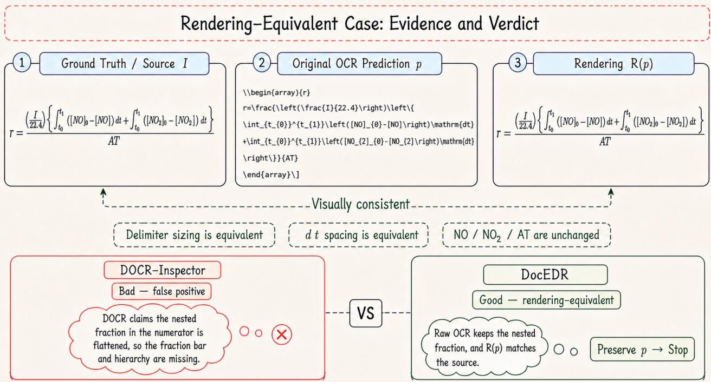  
Figure B1: Rendering-equivalent formula case with alternative delimiter sizing. DocEDR preserves the valid OCR source, whereas DOCR-Inspector incorrectly reports a missing fraction structure.

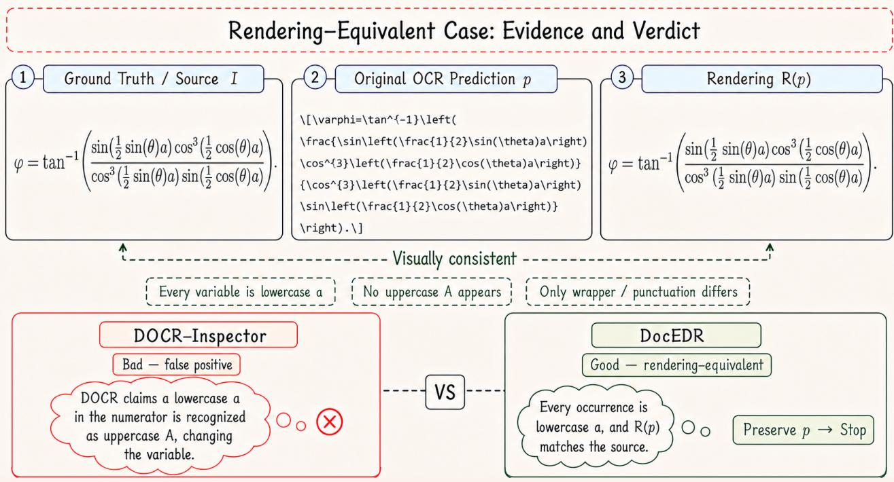  
Figure B2: Rendering-equivalent formula case with wrapper and punctuation variation. DocEDR preserves the valid OCR source, whereas DOCR-Inspector hallucinates a variable change.

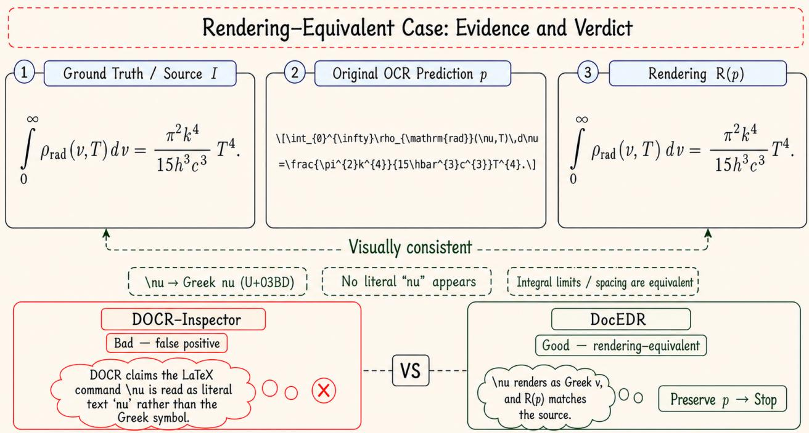  
Figure B3: Rendering-equivalent formula case using a LAT X command for the Greek symbol ν. DocEDR resolves the command through rendering, whereas DOCR-Inspector incorrectly treats it as literal text.

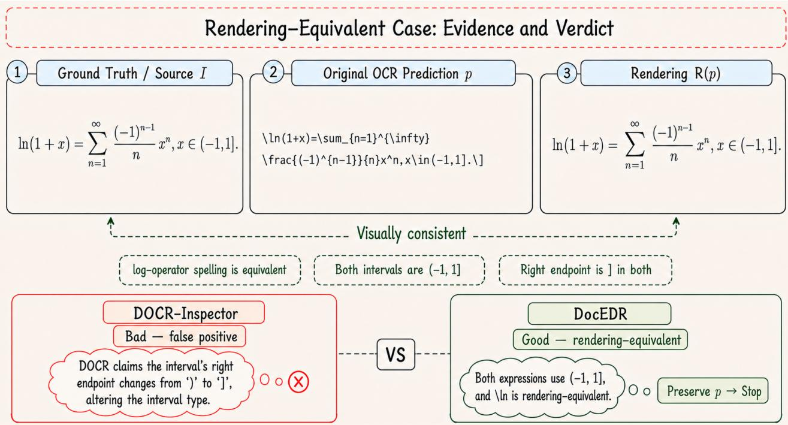  
Figure B4: Rendering-equivalent formula case with operator spelling and interval-wrapper variation. DocEDR preserves the valid OCR source, whereas DOCR-Inspector incorrectly reports a changed endpoint.

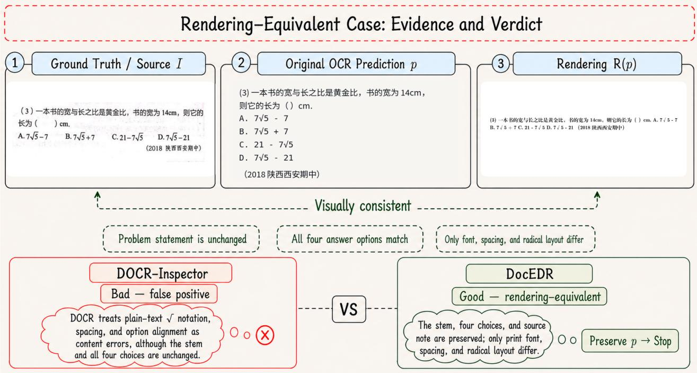  
Figure B5: Rendering-equivalent Chinese text case. The problem statement, four answer choices, and source note are preserved despite benign font, spacing, and radical-layout diferences; DocEDR therefore stops without editing.

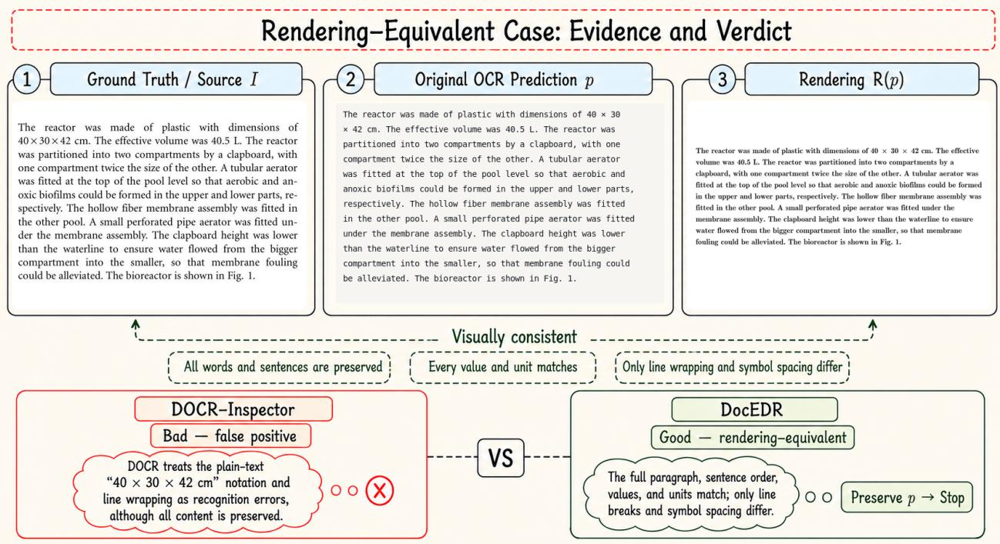  
Figure B6: Rendering-equivalent English paragraph case. All words, values, units, and sentence order are preserved despite benign line-wrapping and symbol-spacing diferences; DocEDR therefore stops without editing.