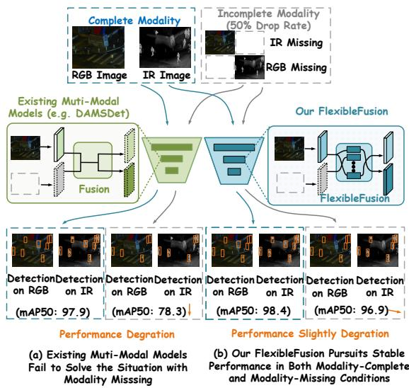
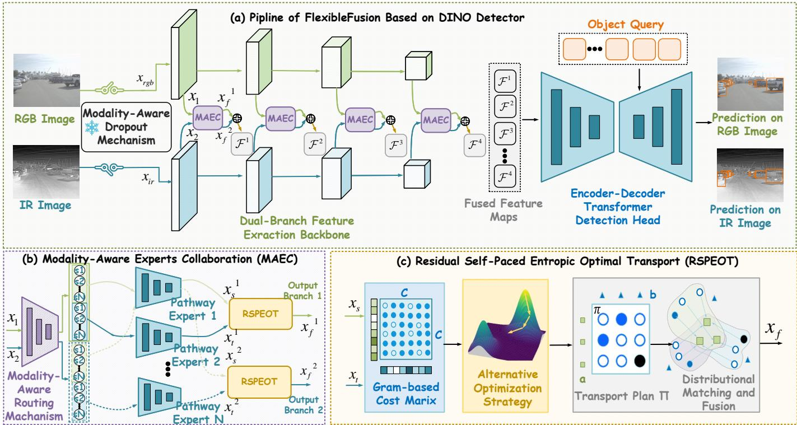
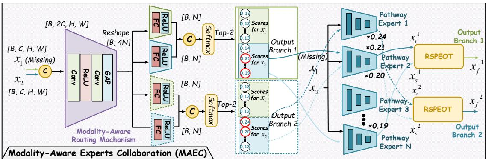
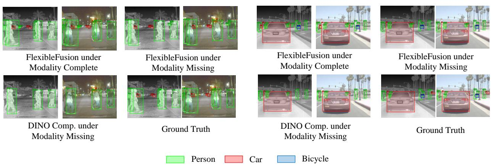
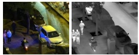
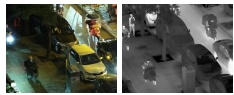
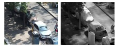

# Residual Optimal Transport-Based Experts Collaboration Towards Modality-Aware Infrared-Visible Object Detection

Yue Zhao, Hua Yu, Yukun Zhao, Yuzhi Zhang, Maoguo Gong, Fellow, IEEE, Xin Mei, Zhuping Hu, Yanchi Li and A. K. Qin, Fellow, IEEE

Abstract—Infrared–visible object detection (IVOD) integrates complementary evidence from visible and infrared sensors for reliable perception in challenging scenes. In practice, sensors may fail or drop frames, leaving one modality unavailable or intermittent. Existing methods for IVOD assume both modalities are always present, and fixed fusion collapses when one stream is missing. Furthermore, it remains a critical challenge to reliably estimate semantic correlation across heterogeneous modalities, especially under spectral distribution discrepancy. We present FlexibleFusion, a unified and adaptive method that flexibly allocates integration pathways and fusion strength, operating seamlessly across complete and missing-modality regimes. At its core, the Modality-Aware Experts Collaboration (MAEC) mechanism selectively activates and aggregates cross-modal or intra-modal expert pathways. It allows cross-modal fusion when full modalities are available and falls back to self-fusion under missing conditions. Additionally, we design Residual Self-Paced Entropic Optimal Transport (RSPEOT) to align heterogeneous feature distributions from a transport perspective. Instead of relying on the fixed sparsity coefficient in standard entropic optimal transport (EOT), RSPEOT introduces a residual-driven self-paced update that prioritizes reliable matches and progressively refines harder ones. This design alleviates the additional optimization burden of standard EOT while preserving reliable semantic alignment. Comprehensive experiments under complete and missing-modality protocols show consistent performance across arbitrary modality configurations. Code will be released upon publication.

Index Terms—Infrared-visible object detection, modality missing, experts collaboration, optimal transport, self-paced optimization.

## I. INTRODUCTION

NFRARED-VISIBLE object detection (IVOD), also known I as multispectral object detection, has emerged as a critical capability in safety-critical and all-weather applications such as autonomous driving, surveillance, and night-time scene understanding [1]–[3]. Visible (RGB) images offer fine-grained texture and color cues under favorable lighting conditions, whereas infrared (IR) images capture thermal radiation signatures that are robust to illumination changes and environmental obstructions such as smoke or darkness [4], [5]. Toward the synergy of complementary spectral cues from both modalities, a growing number of advanced techniques have been extensively explored to push the performance limits of IVOD, including data augmentation [6], [7], modality fusion [8], [9], architectural design [10], [11], and optimization strategies [1], [12]. Nevertheless, existing studies mainly assume complete modality availability, overlooking the challenge of unified fusion under modality incompleteness. Moreover, they lack a geometrically grounded mechanism to align heterogeneous spectral distributions, failing to establish reliable semantic correspondence under significant distribution shifts.

  
Fig. 1. Existing fusion strategies for IVOD fail to deal with modality missing. (a) The fixed fusion pathway inevitably incorporates invalid information from the missing modality, leading to significant performance degradation. (b) FlexibleFusion dynamically adapts to modality availability, performing crossmodal fusion when possible and reverting to self-fusion under absence.

In particular, real-world deployment environments are dynamic and unpredictable, leading to scenarios where both modalities are not always complete, one of the modalities may be entirely missing due to factors such as sensor failure, occlusion, or environmental interference [13], [14]. To maintain a unified data interface, when a modality is detected as unavailable or fails, missing modalities are typically handled by padded placeholders or masked inputs in existing work [15], [16], ensuring that the model can function normally without requiring the actual sensor observation. Fixed aggregation pathway takes the invalid information of missing modality into account and greatly lacks flexibility and adaptivity, even in the modality-complete state, leading to significant performance degradation. Therefore, how to develop a unified fusion strategy that can flexibly handle both modality-complete and modality-missing scenarios in IVOD remains a challenge (CH1). As shown in Fig. 1, beyond pursuing strong performance under complete modalities, we aim to ensure that accuracy under missing-modality scenarios remains at least comparable to single-modality detectors.

In addition, heterogeneous modalities observe the same semantic content, but they exhibit inherently different spectral distributions due to disparate sensing mechanisms [17], [18]. Static weighting or attention in existing works [2], [19], [20] struggles to explicitly handle this shift, leading to semantic gap and degraded fusion performance. A more robust solution should bridge content-irrelevant spectral discrepancies and ideally align modalities with remaining semantic affinity. Therefore, how to efficiently capture semantic correlations across heterogeneous modalities under spectral distribution shift remains a critical challenge (CH2).

Motivated by the aforementioned concerns, this paper presents FlexibleFusion, a versatile method that adaptively regulates integration pathways and strength across modalities, seamlessly accommodating both complete- and missingmodality scenarios. Specifically, to address CH1, we propose Modality-Aware Experts Collaboration (MAEC) mechanism, which dynamically adapts to modality availability, allowing cross-modal fusion when possible and falling back to self-fusion under missing conditions. A unique modalityaware routing strategy is designed to facilitate the collaboration of active pathway experts, enabling selective engagement of cross-modal or intra-modal fusion pathways depending on input completeness and contextual relevance. To address CH2, we propose the Residual Self-Paced Entropic Optimal Transport (RSPEOT) to bridge the spectral distribution gap and achieve semantic-aware alignment between heterogeneous modalities. Specifically, based on traditional entropic optimal transport (EOT) formulation, we design a residual-driven dynamic optimization schedule. This mechanism dynamically modulates the regularization strength based on optimization feedback, alleviating the computational burden introduced by the iterative optimization of standard EOT while preserving reliable modality-agnostic fusion. In summary, this work makes the following notable contributions:

• We propose FlexibleFusion, a unified modality-aware fusion method that dynamically adapts to both completeand missing-modality scenarios for robust IVOD.

• We develop the MAEC mechanism and RSPEOT module to selectively coordinate expert pathways based on modality availability and enable efficient semantic correlation estimation under spectral distribution shift.

• Extensive experiments on standard IVOD benchmarks show that FlexibleFusion achieves state-of-the-art (SOTA) accuracy and robustness in both complete- and missing-modality conditions.

## II. RELATED WORKS

## A. Complete-Modality Object Detection

IVOD has attracted increasing attention due to its potential to provide robust perception in adverse conditions. Early efforts primarily relied on dual-stream architectures, where IR and RGB images are processed separately and fused either at the feature level, e.g., early/mid fusion, [8], [21], [22] or decision level [23]. More recent approaches focus on learning adaptive fusion behaviors. Attention-based fusion modules have been widely introduced to softly aggregate modalities based on learned importance and contextual relevance. Fang et al. proposed to capture global cross-modal interactions via self-attention [19]. Zhang et al. applied multiple attention streams on IR, RGB, and fused features to better preserve modality-specific characteristics while enhancing fusion effectiveness [1]. Recent transformer-style designs further push fusion towards multi-scale interaction and query-level integration [2], [9]. Unlike prior methods with fixed fusion pathways and assumptions of complete modality availability, we seek a flexible interaction framework to adaptively configure both inter- and intra-modal information, making it more robust to real-world modality unavailability.

## B. Learning under Missing Modality

An increasing number of studies have investigated missingmodality learning in several domains, such as medical segmentation, emotion recognition, and text-audio tasks, where models are trained to handle inputs with incomplete modality information [24]. Existing solutions roughly fall into two categories. One line attempts to recover the absent modality by hallucination or imputation using generative models, so that downstream models can still operate on a “complete” input interface [25]–[28]. Another line focuses on robustness by designing training objectives or regularization strategies that reduce reliance on any single modality and encourage consistent predictions under varying modality configurations [29]–[31]. Beyond robustness training, robust representation learning is also essential for missing-modality scenarios. For example, Lau et al. proposed to learn a uniform representation that adapts to different downstream tasks and modality availability [32]. Despite these advances, missing-modality learning within IVOD remains relatively limited, and directly transferring existing strategies is non-trivial. A unified fusion framework that explicitly conditions interaction on modality availability and gracefully degrades to unimodal inference, while still maintaining strong complete-modality performance, remains underexplored.

## III. METHODOLOGY

## A. Overview of FlexibleFusion

As illustrated in Fig. 2, our FlexibleFusion framework is built upon two essential components, Modality-Aware Experts Collaboration (MAEC) mechanism and Residual Self-Paced Entropic Optimal Transport (RSPEOT). MAEC facilitates a unified and generalizable fusion strategy that remains effective under both complete- and missing-modality conditions in

  
Fig. 2. Framework of FlexibleFusion. (a) Visible and infrared images are passed through the dual-branch feature extraction backbone and the DINO detector under a modality-aware dropout mechanism. (b) Modality-Aware Experts Collaboration (MAEC) architecture, which comprises modality-aware routing mechanism, shared set of pathway experts, and (c) Residual Self-Paced Entropic Optimal Transport (RSPEOT). indicates this block is activated during the training phase and frozen during the inference.

IVOD, see in Section III-B. It introduces a dual-input dualoutput design, where two modalities are jointly processed to produce two output branches. A shared experts pool and a modality-aware routing mechanism enable adaptive crossmodal experts collaboration tailored to each output under both complete and missing modality conditions. Each output branch selects its top-2 experts via modality-aware routing and fuses them using our proposed RSPEOT. RSPEOT is designed to model content-affinitive feature correlations and align heterogeneous spectral distributions from a transport perspective, while replacing the fixed sparsity coefficient in vanilla EOT [33], [34] with a residual-guided progressive sparsity refinement strategy, mitigating the extra optimization cost of standard EOT, without compromising the reliability of semantic alignment, see in Section III-C.

In addition, most recent advanced DINO [35] is employed as our detector. During training, we employ a modality-aware dropout mechanism to simulate missing-modality scenarios. Specifically, for each training sample pair, we first sample a dropout flag $m \sim \mathrm { B e r n o u l l i } ( p _ { d } )$ , where $p _ { d } \in [ 0 , 1 ]$ controls the overall probability of dropping out. If activated, that is, $m = 1$ , the dropped modality $\mathcal { D } _ { m }$ is still sampled from a Bernoulli distribution, which follows the conditional distribution $p ( \mathcal { D } _ { m } | m = 1 ) \sim$ ${ \mathrm { B e r n o u l l i } } ( p _ { m } )$ , where $p _ { m }$ controls the likelihood of dropping the RGB modality (versus IR). This strategy is only applied during training, enabling diverse modality conditions. During testing, $p _ { d }$ and $p _ { m }$ allow for controlled evaluation of model performance under manual configuration to simulate varying scenarios.

## B. Modality-Aware Experts Collaboration Mechanism

The fixed fusion pathway inevitably incorporates invalid information from the missing modality. We introduce a MAEC mechanism that flexibly routes and aggregates information pathways, performing cross-modal fusion when both streams are available and reverting to intra-modal self-fusion when a modality is absent.

As shown in Fig. 3, we design the dual-input dual-output modality-aware experts collaboration and flexible routing mechanism for different modality input configurations. Given two input modalities features $\dot { x _ { 1 } } , \dot { x _ { 2 } } \in \mathbb { R } ^ { B \times C \times H \times W }$ and a shared pool of $\mathcal { N }$ experts, each modality first produces a set of expert scores through a routing module. The router contains two independent branches, each responsible for generating one final output. Each branch maintains two modality-specific scoring heads, assigning a score to each expert from both modalities’ perspectives. Specifically, we first concatenate $x _ { 1 }$ and x2 along the channel dimension. The concatenated features are first projected to a 4N -dimensional space via 1×1 convolutional blocks, and then spatially compressed using global average pooling. The process is denoted as:

$$
z = G A P ( C o n v B l o c k _ { 1 \times 1 } ( C o n c a t ( x _ { 1 } , x _ { 2 } ) ) ) \in \mathbb { R } ^ { B \times 4 N } .\tag{1}
$$

The resulting vector z is then fed into four independent fully connected layers, $\mathrm { F C } _ { i , j } ,$ where $i , j \in \{ 1 , 2 \}$ , to produce four groups of logical routing scores:

$$
S _ { b , i , j , : } = \mathrm { F C } _ { i , j } ( z _ { b } ) , \quad \mathrm { f o r } \ b = 1 , . . . , B .\tag{2}
$$

  
Fig. 3. Detailed framework of MAEC. C indicates the concat operation.

Here, $S _ { b , i , j , : } \in \mathbb { R } ^ { N }$ represents the scores from input branch i to output branch $j$ for the b-th sample. To obtain normalized expert selection probabilities for each output branch $j ,$ , we apply the softmax function over the input dimension i:

$$
\alpha _ { b , j , : , : } = \mathrm { S o f t m a x } \left( \left[ S _ { b , 1 , j , : } , \ S _ { b , 2 , j , : } \right] \right) \in \mathbb { R } ^ { 2 \times \mathcal { N } } .\tag{3}
$$

This yields two normalized weight matrices $\alpha _ { 1 } , \alpha _ { 2 } \in$ $\mathbb { R } ^ { B \times 2 \times N }$ corresponding to the expert routing distributions for output branches.

Finally, for each output branch, we select the top-k experts with the highest scores, and their outputs are fused, regardless of whether they originate from the same or different modalities. Since the downstream RSPEOT supports directed pairwise fusion between only two inputs at a time, we set $k = 2$ for simplicity and computational traceability. In Fig. 3, assuming the visible modality $( x _ { 1 } )$ is missing, the final dual-branch output degenerates into self-fusion of the infrared modality $\left( x _ { 2 } \right)$ instead of cross-modal fusion.

## C. Residual Self-Paced Entropic Optimal Transport

Although different modalities capture the same semantic concepts, their distinct sensing mechanisms often lead to heterogeneous spectral representations. In addition, under missing-modality conditions where MAEC degenerates into intra-modal self-fusion, different expert pathways may still generate non-identical feature distributions due to their specialized transformations. As a result, naive weighted averaging fusion methods fail to effectively reconcile these distributional disparities, potentially causing semantic misalignment and suboptimal fusion performance. EOT has the potential to establish reliable correspondences between distributions by minimizing the cost of transporting one distribution to another [36]–[38]. To mitigate spectral misalignment caused by inherent spectral distribution discrepancies, establish more reliable cross-modal correspondence, and alleviate the additional iterative optimization burden of standard EOT, we propose Residual Self-Paced Entropic Optimal Transport (RSPEOT). The original formulation of EOT is given as follows:

$$
\begin{array} { r l } & { \mathrm { O T } _ { \epsilon } ( a , b ) = \displaystyle \arg \underset { \pi \in \Delta } { \operatorname* { m i n } } \left[ \left. \pi , \Theta \right. - \epsilon \mathcal { H } ( \pi ) \right] } \\ & { ~ = \displaystyle \arg \underset { \pi \in \Delta } { \operatorname* { m i n } } \left[ \left. \pi , \Theta \right. + \epsilon \langle \pi , \log ( \pi ) - 1 \rangle \right] , } \\ & { ~ s . t . ~ \Delta = \left\{ \displaystyle \sum _ { j = 1 } ^ { N } \pi _ { i j } = a _ { i } , \quad \displaystyle \sum _ { i = 1 } ^ { M } \pi _ { i j } = b _ { j } , \quad \pi _ { i j } \geq 0 \right\} . } \end{array}\tag{4}
$$

In this context, a and b represent the source and target distributions, which is correlated with the spectral feature distributions of both inputs, respectively, while Θ denotes the cost matrix associated with the transport of the different distributions. $\pi ~ \in ~ \mathbb { R } _ { + } ^ { M \times N }$ denotes the transport coupling matrix between a and b. where $\mathcal { H } ( \pi ) = - \langle \pi , \log ( \pi ) - 1 \rangle$ denotes the entropy of the transport plan π, and $\epsilon > 0$ is a regularization parameter that controls the smoothness and sparsity of the solution. $\Delta$ denotes the set of feasible transport plans satisfying the marginal constraints, and $\langle \cdot , \cdot \rangle$ denotes the Frobenius inner product. A more detailed definition of typical EOT are provided in Supplementary Material.

In this work, to preserve content affinity and consider the spectral distribution correlation during cross-modal fusion, unlike traditional EOT that relies on rigid Euclidean distances for cost matrix computation, we propose constructing a non-Euclidean geometry on the channel manifold, the normalized Gram cost, to quantify the structural divergence between modalities. Based on the expert outputs $x _ { s } , x _ { t } ~ \in$ $\mathbb { R } ^ { B \times C \times H \times W }$ , we reshape it into matrices $\boldsymbol { x ^ { \prime } } \in \overset { \cdot } { \mathbb { R } } ^ { B \times C \times H \cdot W }$ Specifically, the Gram cost is as follows:

$$
\begin{array} { l } { \displaystyle \Theta = 1 - \frac { \mathcal { G } ( \boldsymbol { x } _ { s } ^ { \prime } ) } { \| \mathcal { G } ( \boldsymbol { x } _ { s } ^ { \prime } ) \| } \cdot \left( \frac { \mathcal { G } ( \boldsymbol { x } _ { t } ^ { \prime } ) } { \| \mathcal { G } ( \boldsymbol { x } _ { t } ^ { \prime } ) \| } \right) ^ { \top } , } \\ { \mathrm { w h e r e ~ } \mathcal { G } ( \boldsymbol { x } ) = \frac { 1 } { N } \boldsymbol { x } \boldsymbol { x } ^ { \top } \in \mathbb { R } ^ { B \times C \times C } . } \end{array}\tag{5}
$$

The above formulation encodes intra-channel dependencies via normalized Gram similarity. It encapsulates the second-order co-activation statistics over channels.

Note that ε in Eq. (4) controls the sparsity. A smaller ε corresponds to weaker regularization, leading the model closer to the original optimal transport problem, but at the cost of a more difficult and slower iterative optimization process. There exists a trade-off between optimization efficiency and solution accuracy, which often leads to slower convergence. Considering that each source-target pair in the transport plan matrix may have different convergence speeds, we dynamically adjust the sparsity level based on feedback from the optimization process. This allows the optimization process from the “easier” parts of the problem before gradually progressing to more “difficult” regions. Based on this operation, we introduce a residual information-driven self-paced sparse regularization to dynamically scale the sparse coefficient, thereby alleviating the iterative optimization burden of standard EOT. Specifically, the formulation in Eq. (4) can be improved and rewritten as:

$$
\begin{array} { r l } { ( \mathcal { T } _ { \mathrm { c } } \circ ( a , b )  \qquad } & { \mathrm { I m } } \\ & { \qquad < \mathrm { a r g } \underset { \pi \in \mathbb { Z } _ { \mathrm { a } } \times \mathbb { Z } _ { \mathrm { a } } } { \mathrm { m i n i t } } \underset { + \in \mathbb { Z } _ { \mathrm { a } } } { \mathrm { m a x } } [  \boldsymbol { \pi } , \Theta  -  \epsilon , \hat { \mathcal { H } } ( \pi )  + \mathcal { R } ( \epsilon ; \epsilon ^ { 0 } ) ]  } \\ & { \qquad = \mathrm { a r g } \underset { \pi \in \mathbb { Z } _ { \mathrm { a } } \times \mathbb { Z } _ { \mathrm { a } } } { \mathrm { m i n i t } } \underset { + \in \mathbb { Z } _ { \mathrm { a } } } { \mathrm { m a x } } \{  \boldsymbol { \pi } , \Theta  +  \epsilon , \boldsymbol { \pi } \odot ( \log ( \pi ) - 1 )  + } \\ & {  [ \boldsymbol { \pi } _ { \mathrm { p } / \mathrm { o } } \cdot \sum [ (  \hat { \mathcal { H } } ^ { ( i - 1 ) } + \frac { u } { 2 } | \boldsymbol { \eta }  | ) \odot \epsilon - \epsilon ^ { 0 } | \boldsymbol { \eta } | ]  ] ] } \\ & {  [ \boldsymbol { \pi } _ { \mathrm { p } / \mathrm { o } } \cdot \sum [ ( | \hat { \mathcal { H } } ^ { ( i - 1 ) } - \frac { u } { 2 } | \boldsymbol { \eta }  | ) \odot \epsilon + \epsilon ^ { 0 } | \boldsymbol { \eta } | ] ] \} , } \\ &  \qquad \times \boldsymbol { t } , \Delta = \{ \underset { + \tau = 1 } { \sum } \underset { \alpha = 1 } { \overset { C } { \longrightarrow } } [ \frac { C } { \sum _ { i = 1 } ^ { C } } \alpha _ { i } - \underset { i = 1 } { \overset { C } { \longrightarrow } } \alpha _ { i } - \delta _ { p } , \quad \pi _ \end{array}\tag{6}
$$

Sparse coefficient is expanded to sparse matrix $\pmb { \epsilon } \in \mathbb { R } _ { + } ^ { C \times C }$ Accordingly, $\hat { \mathcal { H } } ( \pi )$ is a modification of the entropy regularization. $\mathcal { R } ( \epsilon ; \epsilon ^ { 0 } )$ is the implicit defined self-paced regularization incorporating dynamic residual information to control the scaling schedule of the sparse matrix moving from large to small. It facilitates the objective in Eq. (6) to optimize from easy (larger $\epsilon _ { i j } )$ to complex (smaller $\epsilon _ { i j } )$ and thus accelerate convergence. I is an indicator function used to represent an on-off state based on condition. γ denotes the residual information. $\epsilon ^ { ( l ) }$ donates ϵ at current step $l . \ \epsilon ^ { 0 }$ is a lower bound on the convergence of ϵ referenced in advance. Eq. (6) can be optimized with the alternative optimization strategy (AOS) [39]. The proof that residual regularization satisfies explicit definition of self-paced function [40] will be provided in Supplementary Material.

With the fixed optimal $\pi ^ { ( l ) }$ , it only needs to calculate $\epsilon ^ { ( l + 1 ) }$ by solving the following problem:

$$
\begin{array} { r l } & { \epsilon ^ { ( l + 1 ) } = \arg \underset { \epsilon \in \Delta _ { 1 } } { \mathrm { m i n } } \underset { \epsilon \in \Delta _ { 2 } } { \mathrm { m a x } } \ell _ { \epsilon }  \langle \epsilon , - \hat { \mathcal { H } } ^ { l } \rangle +  } \\ & { \mathbb { I } _ { \gamma \geq 0 } \cdot \sum [ ( \hat { \mathcal { H } } ^ { ( l - 1 ) } + \frac { u } { 2 } \| \gamma \| ) \odot \epsilon - \epsilon ^ { 0 } \odot u \| \gamma \| ] + } \\ & { \mathbb { I } _ { \gamma < 0 } \cdot \sum [ ( \hat { \mathcal { H } } ^ { ( l - 1 ) } - \frac { u } { 2 } \| \gamma \| ) \odot \epsilon + \epsilon ^ { 0 } \odot u \| \gamma \| ]  . } \end{array}\tag{7}
$$

Eq. (7) is a convex function under $\Delta _ { 1 }$ and a concave function under $\Delta _ { 2 }$ of ϵ, and thus the global minimum can be obtained at $\nabla \ell _ { \epsilon } ( \epsilon ) = \mathbf { 0 }$ . The close-formed optimal solution for ϵ can be written as:

$$
\epsilon ^ { ( l + 1 ) } = \left( \epsilon ^ { ( l ) } - \epsilon ^ { 0 } \right) \odot \frac { \mid \hat { \mathcal { H } } ^ { ( l ) } - \hat { \mathcal { H } } ^ { ( l - 1 ) } \mid } { \big \| \hat { \mathcal { H } } ^ { ( l ) } - \hat { \mathcal { H } } ^ { ( l - 1 ) } \big \| } + \epsilon ^ { 0 } .\tag{8}
$$

It can be observed that for elements $\pi _ { i j }$ that are closer to convergence, the responses of the residual ${ \mid \hat { \mathcal { H } } ^ { ( l ) } - \hat { \mathcal { H } } ^ { ( l - 1 ) } \mid } ,$ the smaller their corresponding sparsity coefficients are, and are considered to be easier to optimize.

With the fixed optimal sparse metrix $\epsilon ^ { ( l + 1 ) }$ , the $\pi ^ { ( l + 1 ) }$ is expected to be optimized as:

$$
\pmb { \pi } ^ { ( l + 1 ) } = \arg \operatorname* { m i n } _ { \pmb { \pi } \in \Delta } \ \left[ \langle \pmb { \pi } , \pmb { \Theta } \rangle - \langle \pmb { \epsilon } ^ { ( l + 1 ) } , \hat { \pmb { \mathcal { H } } } ( \pmb { \pi } ) \rangle \right] .\tag{9}
$$

Algorithm 1: Overall Pipeline of FlexibleFusion   
Input: xrgb, xir, pd, pm, N , ϵini, ϵ0   
Output: $\tilde { Y } ^ { r g b } , \hat { Y } ^ { i \bar { r } }$   
1 Apply modality-aware dropout to simulate complete and   
incomplete inputs:   
2 Sample a dropout flag m ∼ Bernoulli $\cdot ( p _ { d } ) ;$   
3 if $m = 1$ then   
4 Sample the dropped modality $\mathcal { D } _ { m }$ from   
$p ( \bar { \mathcal { D } } _ { m } \mid m = \bar { 1 } )$ ∼ Bernoulli(pm);   
5 else   
6 Keep both modalities unchanged;   
7 Extract hierarchical dual-branch features $\{ x _ { 1 } ^ { \ell } , x _ { 2 } ^ { \ell } \} _ { \ell = 1 } ^ { L }$   
using Swin-Large backbone;   
8 for $\ell = 1$ to L do   
9 Compute modality-aware routing scores via Eq. (1-3)   
and select Top-2 pathway experts for each output   
branch;   
10 Invoke RSPEOT in Algorithm 2 to fuse the selected   
expert outputs for output branch 1;   
11 Invoke RSPEOT in Algorithm 2 to fuse the selected   
expert outputs for output branch 2;   
12 Aggregate fused feature maps and feed them into the   
DINO encoder-decoder head;   
13 Generate detection results ${ \hat { Y } } ^ { r g b }$ and $\hat { Y } ^ { i r }$   
14 return $\hat { Y } ^ { r g b } , \hat { Y } ^ { i r } ;$

We introduce Lagrange multipliers $f$ and q that account for the constraints imposed by the marginal distributions. The corresponding Lagrangian can be expressed as:

$$
\begin{array} { r l } & { \underset { \pmb { \mathscr { f } } , \pmb { q } } { \operatorname* { m a x } } \underset { \pmb { \mu } } { \operatorname* { m i n } } \ell = \langle \pmb { \pi } , \pmb { \Theta } \rangle - \langle \pmb { \epsilon } ^ { ( l + 1 ) } , \hat { \pmb { \mathscr { H } } } ( \pmb { \pi } ) \rangle } \\ & { - \langle \pmb { \mathscr { f } } , \pmb { \pi } \mathbf { 1 } _ { N } - \pmb { a } \rangle - \langle \pmb { q } , \pmb { \pi } ^ { \top } \mathbf { 1 } _ { M } - \pmb { b } \rangle . } \end{array}\tag{10}
$$

To derive the optimal transport plan, we differentiate the Lagrangian with respect to $\pi _ { i j }$ and express $\pi _ { i j }$ as:

$$
\pi _ { i j } ^ { ( l + 1 ) } = \exp \left( \frac { f _ { i } ^ { ( l + 1 ) } } { \epsilon _ { i j } ^ { ( l + 1 ) } } \right) \exp \left( \frac { q _ { j } ^ { ( l + 1 ) } } { \epsilon _ { i j } ^ { ( l + 1 ) } } \right) \exp \left( - \frac { \Theta _ { i j } } { \epsilon _ { i j } ^ { ( l + 1 ) } } \right) .\tag{11}
$$

Using the constraints imposed on the marginals, we derive:

$$
\left\{ \begin{array} { l l } { \displaystyle \sum _ { i = 1 } ^ { C } \pi _ { i j } ^ { ( l + 1 ) } = \sum _ { i = 1 } ^ { C } \exp \left( \frac { q _ { j } ^ { ( l + 1 ) } } { \epsilon _ { i j } ^ { ( l + 1 ) } } \right) \exp \left( \frac { f _ { i } ^ { ( l + 1 ) } - \Theta _ { i j } } { \epsilon _ { i j } ^ { ( l + 1 ) } } \right) = b _ { j } } \\ { \displaystyle \sum _ { j = 1 } ^ { C } \pi _ { i j } ^ { ( l + 1 ) } = \sum _ { j = 1 } ^ { C } \exp \left( \frac { f _ { i } ^ { ( l + 1 ) } } { \epsilon _ { i j } ^ { ( l + 1 ) } } \right) \exp \left( \frac { q _ { j } ^ { ( l + 1 ) } - \Theta _ { i j } } { \epsilon _ { i j } ^ { ( l + 1 ) } } \right) = a _ { i } . } \end{array} \right.
$$

where

(12)

$$
\left\{ \begin{array} { l l } { \displaystyle q _ { j } ^ { ( l + 1 ) } = \epsilon _ { i j } ^ { ( l + 1 ) } \log \left[ \frac { b _ { j } } { \displaystyle \sum _ { i = 1 } ^ { C } \exp \left( \frac { f _ { i } ^ { ( l ) } } { \epsilon _ { i j } ^ { ( l + 1 ) } } \right) \exp \left( - \frac { \Theta _ { i j } } { \epsilon _ { i j } ^ { ( l + 1 ) } } \right) } \right] } \\ { \displaystyle f _ { i } ^ { ( l + 1 ) } = \epsilon _ { i j } ^ { ( l + 1 ) } \log \left[ \frac { a _ { i } } { \displaystyle \sum _ { j = 1 } ^ { C } \exp \left( \frac { q _ { i } ^ { ( l + 1 ) } } { \epsilon _ { i j } ^ { ( l + 1 ) } } \right) \exp \left( - \frac { \Theta _ { i j } } { \epsilon _ { i j } ^ { ( l + 1 ) } } \right) } \right] } \end{array} \right.\tag{13}
$$

The resulting coupling $\pi ^ { * }$ characterizes a soft alignment between modality-specific spectral structures. To operational-

Algorithm 2: RESIDUAL SELF-PACED ENTROPIC   
OPTIMAL TRANSPORT (RSPEOT)   
Input: Source expert feature $x _ { s } ,$ target expert feature $x _ { t } ,$   
initial sparse coefficient $\epsilon ^ { i n i }$ , lower bound $\epsilon _ { \mathrm { 0 } }$   
Output: Fused feature xf   
1 Reshape $\mathbf { \Delta } _ { x _ { s } , x _ { t } } ^ { \mathbf { { a } } \mathbf { { s } } \mathbf { { a } } \mathbf { { c } } \mathbf { { a } } \mathbf { { c } } \mathbf { { a } } \mathbf { { c } } \mathbf { { c } } \mathbf { { \times } } \mathbf { { } } H \mathbf { \times } W }$ into channel matrices;   
2 Compute Gram-based transport cost Θ via Eq. (5);   
3 Initialize $\epsilon ^ { ( 0 ) }  \epsilon ^ { i n i }$   
4 for r = 0 to convergence do   
5 Compute entropy residual $\hat { H } ^ { ( r ) } - \hat { H } ^ { ( r - 1 ) } ;$   
6 Update sparse matrix $\boldsymbol { \epsilon } ^ { ( r + 1 ) }$ using residual-guided   
self-paced rule via Eq. (7-8);   
7 Optimize transport plan $\pi ^ { ( r + 1 ) }$ with alternating   
optimization under current $\boldsymbol { \epsilon } ^ { ( r + 1 ) }$ via Eq. (9-13);   
8 Obtain the final transport plan $\pi ^ { * } ;$   
9 Align and fuse source and target features via Eq. (14):   
$x _ { f } = \left( \pmb { \pi } ^ { * } \cdot \pmb { C } \right) ^ { \top } x _ { s } + x _ { t }$   
return $x _ { f } ;$

ize the expert outputs aggregation, we modulate the source features through:

$$
\boldsymbol { x } _ { f } = ( \pi ^ { * } \cdot \boldsymbol { C } ) ^ { \top } \boldsymbol { x } _ { s } + \boldsymbol { x } _ { t } ,\tag{14}
$$

where $x _ { t }$ and $x _ { s }$ denote the target and source expert features selected by the modality-aware router, respectively. Among the Top-2 selected expert outputs, the feature with the highest routing score is used as the target feature $x _ { t } ,$ while the one with the second-highest score is used as the source feature $x _ { s } , ~ C$ is the channel number and utilized to transform the joint probability distribution $\pi \sim p ( a , b )$ into a conditional distribution $p ( { \pmb a } \mid b _ { j } ) , i . e . , p ( { \pmb a } \mid b _ { j } ) = p ( { \pmb a } , b _ { j } ) / p ( b _ { j } )$ , so as to perform channel-by-channel normalization of the correlation scores, where b obeys a uniform distribution, $p ( b _ { j } ) = 1 / C$ Eq. (14) injects transported spectral components from the source into the target, preserving semantic coherence while respecting modality-specific channel priors. Notably, this fusion paradigm operates beyond conventional cross-attention, offering a grounded and geometrically coherent formulation for modality interaction.

To summarize the implementation procedure, the algorithmic workflow of the overall FlexibleFusion framework and the detailed RSPEOT module are provided in Algorithm 1 and Algorithm 2, respectively.

## IV. EXPERIMENTAL ANALYSIS

## A. Dataset Description and Evaluation

In the main paper, we evaluate our proposed FlexibleFusion framework on two widely used IVOD benchmarks, FLIR-Aligned and LLVIP, where it demonstrates its effectiveness and state-of-the-art performance.

FLIR-Aligned is a manually aligned subset derived from the FLIR ADAS dataset [52], consisting of paired infrared and visible images captured under various traffic scenarios. It contains approximately 5,142 pairs, annotated with three common object categories, person, bicycle, and car. The dataset includes diverse environmental conditions such as day, night, and thermal noise.

COMPARISON WITH STATE-OF-THE-ART MODELS ON THE FLIR-ALIGNED DATASET UNDER MODALITY-COMPLETE CONDITION. THE BEST RESULTS ARE HIGHLIGHTED IN BOLD, AND THE SECOND-BEST RESULTS ARE italicized.
<table><tr><td>Method</td><td colspan="4">ModalitymAP@50 ↑mAP@75 ↑mAP@:95 ↑</td></tr><tr><td rowspan="3">Faster R-CNN [41]</td><td>RGB</td><td>64.9</td><td>21.1</td><td>28.9</td></tr><tr><td>IR</td><td>74.4</td><td>32.5</td><td>37.6</td></tr><tr><td>Comp.</td><td>73.1</td><td>32.0</td><td>37.1</td></tr><tr><td rowspan="3">YOLO-V5 [42]</td><td>RGB</td><td>67.8</td><td>25.9</td><td>31.8</td></tr><tr><td>IR</td><td>73.9</td><td>35.7</td><td>39.5</td></tr><tr><td>Comp.</td><td>73.0</td><td>32.0</td><td>37.4</td></tr><tr><td rowspan="3">DINO [35]</td><td>RGB</td><td>70.9</td><td>25.9</td><td></td></tr><tr><td>IR</td><td>80.6</td><td>42.7</td><td>44.8</td></tr><tr><td>Comp.</td><td>83.7</td><td>47.2</td><td>48.5</td></tr><tr><td>CFT [19]</td><td>Comp.</td><td>78.7</td><td>35.5</td><td>40.2</td></tr><tr><td>TarDAL [12]</td><td>Comp.</td><td>79.9</td><td>37.9</td><td></td></tr><tr><td>MetaFusion [8]</td><td>Comp.</td><td>81.4</td><td>40.7</td><td></td></tr><tr><td>CSSA [43]</td><td>Comp.</td><td>79.2</td><td>37.4</td><td>41.3</td></tr><tr><td>TFDet [44]</td><td>Comp.</td><td>81.7</td><td>41.3</td><td></td></tr><tr><td>LRAFNet [45]</td><td>Comp.</td><td>80.5</td><td></td><td>42.8</td></tr><tr><td>ICAFusion [46]</td><td>Comp.</td><td>79.2</td><td>36.9</td><td>41.4</td></tr><tr><td>Fusion-Mamba [47]</td><td>Comp.</td><td>84.9</td><td>45.9</td><td>47.0</td></tr><tr><td>CAFF-DINO [20]</td><td>Comp.</td><td>85.5</td><td>51.6</td><td>50.0</td></tr><tr><td>DAMSDet [2]</td><td>Comp.</td><td>86.6</td><td>48.1</td><td>49.3</td></tr><tr><td>FD2Net [3]</td><td>Comp.</td><td>82.9</td><td>42.5</td><td></td></tr><tr><td>EI2Det [48]</td><td>Comp.</td><td>80.2</td><td></td><td></td></tr><tr><td>Scarf-Align-DETR [49]</td><td>Comp.</td><td>85.4</td><td>48.9</td><td>49.6</td></tr><tr><td>AlCE-FusionNet [50]</td><td>Comp.</td><td>80.4</td><td>47.1</td><td>47.1</td></tr><tr><td>FlexibleFusion</td><td>Comp.</td><td>87.0</td><td>53.4</td><td>51.3</td></tr></table>

LLVIP is a challenging dataset designed for human detection under low-light and night-time conditions [53]. It contains 15,488 image pairs captured in real-world surveillance environments with significant illumination variations. LLVIP focuses on single-class pedestrian detection.

For evaluation, we adopt the mean Average Precision (mAP) at IoU thresholds of 0.5 (mAP@50), 0.75 (mAP@75), and over 10 IoU thresholds from 0.5 to 0.95 (mAP@:95), following standard COCO-style metrics. These metrics measure detection performance under different levels of localization precision.

## B. Experimental Configuration

In experiment, SwinLarge [54] is selected as backbone, we initialize the modality-specific backbones and detection head with weights pre-trained on the COCO dataset. For more details such as loss function, data augmentation et al., refer to [35]. The Encoder-Decoder transformer detection head consists of 6 encoder and 6 decoder layers. The number of attention heads, sampling points, and selected queries are set to 8, 4, and 300, respectively. Additionally, the basic feedforward neural network (FNN) is employed as the expert architecture, and the number of experts is set to 4 on both datasets. Our proposal mainly includes two hyperparameters that need to be specified in advance, the initial sparse coefficient $\epsilon ^ { i n i }$ and the final lower bound $\epsilon ^ { 0 } .$ . Grid search and cross validation are performed to reach the best value. Ultimately, $\epsilon ^ { i n i }$ is set to 0.1 on both datasets, $\epsilon ^ { 0 }$ is set to 0.008 on FLIR-Aligned and 0.01 on LLVIP. More detailed training configurations, structural details of FNN expert and parameter sensitivity analysis including expert number $\mathcal { N }$ are given in Supplementary Material. Experiments are performed on a single NVIDIA RTX A6000 GPU with 48GB memory.

  
Fig. 4. Visualization examples on FLIR-Aligned dataset.

TABLE II  
COMPARISON WITH STATE-OF-THE-ART MODELS ON THE LLVIP DATASET UNDER MODALITY-COMPLETE CONDITION. THE BEST RESULTS ARE HIGHLIGHTED IN BOLD, AND THE SECOND-BEST RESULTS ARE italicized.
<table><tr><td>Method</td><td colspan="4">ModalitymAP@50 ↑mAP@75 ↑mAP@:95 ↑</td></tr><tr><td rowspan="3">Faster R-CNN [41]</td><td>RGB</td><td>91.4</td><td>48.0</td><td>49.2</td></tr><tr><td>IR</td><td>96.1</td><td>68.5</td><td>61.1</td></tr><tr><td>Comp.</td><td>93.7</td><td>62.8</td><td>55.4</td></tr><tr><td rowspan="3">YOLO-V5 [42]</td><td>RGB</td><td>90.8</td><td>51.9</td><td>50.0</td></tr><tr><td>IR</td><td>94.6</td><td>72.2</td><td>61.9</td></tr><tr><td>Comp.</td><td>95.8</td><td>71.4</td><td>62.3</td></tr><tr><td rowspan="3">DINO [35]</td><td>RGB</td><td>91.6</td><td>58.0</td><td>53.8</td></tr><tr><td>IR</td><td>96.8</td><td>70.6</td><td>62.9</td></tr><tr><td>Comp.</td><td>94.6</td><td>77.9</td><td>66.9</td></tr><tr><td>CFT [19]</td><td>Comp.</td><td>97.5</td><td>72.9</td><td>63.6</td></tr><tr><td>TarDAL [12]</td><td>Comp.</td><td>93.3</td><td>62.4</td><td></td></tr><tr><td>MetaFusion [8]</td><td>Comp.</td><td>92.7</td><td>65.5</td><td></td></tr><tr><td>CSSA [43]</td><td>Comp.</td><td>94.3</td><td>66.6</td><td>59.2</td></tr><tr><td>TFDet [44]</td><td>Comp.</td><td>95.4</td><td>68.9</td><td></td></tr><tr><td>LRAFNet [45]</td><td>Comp.</td><td>97.9</td><td>一</td><td>66.3</td></tr><tr><td>Fusion-Mamba [47]</td><td>Comp.</td><td>97.0</td><td></td><td>64.3</td></tr><tr><td>CAFF-DINO [20]</td><td>Comp.</td><td>98.1</td><td>79.0</td><td>68.5</td></tr><tr><td>DAMSDet [2]</td><td>Comp.</td><td>97.9</td><td>79.1</td><td>69.6</td></tr><tr><td>FD2Net [3]</td><td>Comp.</td><td>96.2</td><td>70.0</td><td></td></tr><tr><td>EI²Det [48]</td><td>Comp.</td><td>98.0</td><td>73.2</td><td>63.9</td></tr><tr><td>Scarf-Align-DETR [49]</td><td>Comp.</td><td>97.2</td><td>78.3</td><td>66.7</td></tr><tr><td>AlCE-FusionNet [50]</td><td>Comp.</td><td>96.6</td><td>73.2</td><td>65.3</td></tr><tr><td>FlexibleFusion</td><td>Comp.</td><td>98.4</td><td>81.5</td><td>69.7</td></tr></table>

## C. Comparison under Complete-Modality

We compare FlexibleFusion against a wide range of SOTA IVOD methods under modality-complete settings. The comparison includes classical architectures Faster R-CNN [41], YOLO-V5 [42] and DINO [35], as well as recent multimodal fusion methods CFT [19], TarDAL [12], MetaFusion [8], CSSA [43], TFDet [44], LRAFNet [45], ICAFusion [46], Fusion-Mamba [47], CAFF-DINO [20], DAMSDet [2], FD2Net [3], EI2Det [48], Scarf-Align-DETR [49] and AlCE-FusionNet [50]. They cover a diverse range of advanced object detection architectures, including Faster R-CNN, YOLO-V5, YOLO-V8, and DINO-DETR.

1) Performance on FLIR-Aligned Dataset: As shown in Table I, FlexibleFusion achieves the best overall performance, surpassing all baselines with 87.0 mAP@50, 53.4 mAP@75, and 51.3 mAP@:95. It notably exceeds DAMSDet by +0.4 mAP@50, +5.3 mAP@75, and +2.0 mAP@:95. Furthermore, classic frameworks like Faster R-CNN, YOLO-V5 and DINO perform worse with naive dual-modality fusion than with single modalities, highlighting the importance of effective cross-modal integration.

2) Performance on LLVIP Dataset: As summarized in Table II, LLVIP presents greater challenges due to low-light. While DAMSDet achieves strong results, FlexibleFusion attains the highest mAP@75 of 81.5 and excels in high-precision detection, with competitive mAP@50 (98.4) and mAP@:95 (69.7). CAFF-DINO, based on DINO-DETR, achieves the second highest mAP@50 (98.1). EI2Det also achieved competitive performance in terms of mAP@50, reaching 98.0. These results underscore FlexibleFusion’s superior performance in challenging cross-modal scenarios.

## D. Comparison under Missing-Modality

To evaluate robustness under missing-modality conditions, we vary the modality-missing rate $p _ { d }$ during inference while fixing $p _ { m } = 0 . 5$ . As shown in Table III, we compare Flexible-Fusion with both advanced IVOD detectors and representative methods specifically designed for missing-modality learning. Across all missing rates on both FLIR-Aligned and LLVIP, FlexibleFusion consistently achieves the best performance, demonstrating strong robustness against modality absence. On FLIR-Aligned, FlexibleFusion maintains 76.0 mAP@50 under complete modality absence $( p _ { d } ~ = ~ 1 . 0 )$ , outperforming the strongest competitor. Similar advantages are consistently observed in mAP@75 and mAP@95. On LLVIP, FlexibleFusion exhibits even stronger robustness, with mAP@50 decreasing only from 98.4 to 95.6 as $p _ { d }$ increases from 0 to 1.0. In contrast, most competing methods suffer noticeably larger performance degradation. Additional tests with varying $p _ { m }$ (0, 0.5, 1) and fixed $p _ { d } = 1$ during the inference stage are provided in the Supplementary Material. It further confirm that FlexibleFusion preserves strong robustness, even as $p _ { m }$ increases, never falling strongly below single-modality baselines.

TABLE III  
PERFORMANCE COMPARISON UNDER DIFFERENT MODALITY MISSING RATES ON THE FLIR-ALIGNED AND LLVIP DATASETS DURING INFERENCE, WITH $p _ { d } = 0 , 0 . 2 , 0 . 5 , 0 . 8 , 1 . 0 \mathrm { \ A N D \ } p _ { m } = 0 . 5 .$ THE BEST RESULTS ARE HIGHLIGHTED IN BOLD, AND THE SECOND-BEST RESULTS ARE italicized. METHODS MARKED WITH † ARE SPECIFICALLY DESIGNED FOR MISSING-MODALITY LEARNING.
<table><tr><td rowspan="2">Method</td><td rowspan="2">Metric</td><td colspan="5">FLIR-Aligned</td><td colspan="5">LLVIP</td></tr><tr><td> $p _ { d } = 0$ </td><td> $p _ { d } = 0 . 2$ </td><td> $p _ { d } = 0 . 5$ </td><td> $p _ { d } = 0 . 8$ </td><td> $p _ { d } = 1 . 0$ </td><td> $p _ { d } = 0$ </td><td> $p _ { d } = 0 . 2$ </td><td> $p _ { d } = 0 . 5$ </td><td> $p _ { d } = 0 . 8$ </td><td> $p _ { d } = 1 . 0$ </td></tr><tr><td rowspan="4">CFT [19]</td><td>mAP@50</td><td>78.7</td><td>67.6</td><td>55.3</td><td>43.0</td><td>35.0</td><td>97.5</td><td>86.8</td><td>75.8</td><td>59.6</td><td>51.7</td></tr><tr><td>mAP@75</td><td>35.5</td><td>28.8</td><td>22.6</td><td>16.1</td><td>11.7</td><td>72.9</td><td>64.3</td><td>54.5</td><td>40.6</td><td>33.7</td></tr><tr><td>mAP@:95</td><td>40.2</td><td>34.1</td><td>27.0</td><td>20.0</td><td>15.1</td><td>63.6</td><td>56.5</td><td>48.5</td><td>37.1</td><td>31.5</td></tr><tr><td>mAP@50</td><td>85.5</td><td>77.3</td><td>64.8</td><td>46.9</td><td>42.8</td><td>98.1</td><td>89.3</td><td>73.3</td><td>57.7</td><td>48.7</td></tr><tr><td rowspan="4">CAFF-DINO [20]</td><td>mAP@75</td><td>51.6</td><td>44.4</td><td>32.7</td><td>22.7</td><td>19.5</td><td>79.0</td><td>71.7</td><td>58.5</td><td>45.6</td><td>37.7</td></tr><tr><td>mAP@:95</td><td>50.0</td><td>44.9</td><td>36.5</td><td>25.6</td><td>22.7</td><td>68.5</td><td>62.2</td><td>50.9</td><td>39.8</td><td>33.1</td></tr><tr><td>mAP@50</td><td>86.6</td><td>80.7</td><td>70.8</td><td>64.3</td><td>60.6</td><td>97.9</td><td>90.0</td><td>78.3</td><td>67.4</td><td>58.8</td></tr><tr><td>mAP@75</td><td>48.1</td><td>43.0</td><td>35.4</td><td>30.5</td><td>25.8</td><td>79.1</td><td>70.7</td><td>59.3</td><td>48.2</td><td>40.5</td></tr><tr><td rowspan="4"></td><td>mAP@:95</td><td>49.3</td><td>45.2</td><td>38.3</td><td>33.5</td><td>30.3</td><td>69.6</td><td>62.9</td><td>53.5</td><td>44.7</td><td>38.0</td></tr><tr><td>mAP@50</td><td>80.4</td><td>72.7</td><td>60.1</td><td>52.0</td><td>46.0</td><td>96.6</td><td>86.0</td><td>74.0</td><td>55.6</td><td>47.8</td></tr><tr><td>mAP@75</td><td>47.1</td><td>42.4</td><td>33.9</td><td>28.3</td><td>24.6</td><td>73.2</td><td>65.9</td><td>56.5</td><td>42.1</td><td>36.5</td></tr><tr><td>mAP@:95</td><td>47.1</td><td>42.4</td><td>34.2</td><td>29.1</td><td>25.7</td><td>65.3</td><td>57.9</td><td>49.5</td><td>37.3</td><td>32.2</td></tr><tr><td rowspan="4">MSR† [51]</td><td>mAP@50</td><td>64.0</td><td>61.5</td><td>59.2</td><td>57.9</td><td>56.9</td><td>91.7</td><td>91.5</td><td>90.0</td><td>89.0</td><td>87.7</td></tr><tr><td>mAP@75</td><td>28.5</td><td>27.6</td><td>27.1</td><td>26.2</td><td>25.9</td><td>54.4</td><td>53.8</td><td>51.1</td><td>47.4</td><td>44.8</td></tr><tr><td>mAP@:95</td><td>34.9</td><td>33.5</td><td>32.4</td><td>31.7</td><td>31.2</td><td>51.6</td><td>51.3</td><td>49.6</td><td>48.0</td><td>46.5</td></tr><tr><td>mAP@50</td><td>84.7</td><td>79.1</td><td>70.0</td><td>58.7</td><td>53.3</td><td>97.6</td><td>91.3</td><td>81.3</td><td>70.1</td><td>61.9</td></tr><tr><td rowspan="4">M2DN† [16]</td><td>mAP@75</td><td>52.1</td><td>49.1</td><td>38.0</td><td>28.7</td><td>20.8</td><td>78.6</td><td>69.8</td><td>56.5</td><td>44.2</td><td>35.1</td></tr><tr><td>mAP@:95</td><td>50.4</td><td>47.2</td><td>37.8</td><td>31.8</td><td>24.8</td><td>68.0</td><td>61.6</td><td>51.9</td><td>42.2</td><td>35.1</td></tr><tr><td>mAP@50</td><td>85.2</td><td>81.4</td><td>78.1</td><td>74.1</td><td>73.0</td><td>97.4</td><td>96.6</td><td>95.4</td><td>94.4</td><td>93.4</td></tr><tr><td>mAP@75</td><td>51.2</td><td>49.5</td><td>45.5</td><td>38.7</td><td>36.5</td><td>76.9</td><td>74.5</td><td>71.6</td><td>66.3</td><td>64.1</td></tr><tr><td rowspan="4">Scarf-Align-DETR† [49]</td><td>mAP@:95</td><td>50.1</td><td>47.7</td><td>44.5</td><td>42.4</td><td>39.8</td><td>67.3</td><td>65.6</td><td>63.2</td><td>60.4</td><td>58.6</td></tr><tr><td>mAP@50</td><td>85.4</td><td>84.3</td><td>79.6</td><td>76.0</td><td>75.9</td><td>97.2</td><td>96.5</td><td>95.3</td><td>94.2</td><td>93.3</td></tr><tr><td>mAP@75</td><td>48.9</td><td>46.8</td><td>43.5</td><td>38.2</td><td>37.2</td><td>78.3</td><td>75.8</td><td>72.7</td><td>68.9</td><td>66.6</td></tr><tr><td>mAP@:95</td><td>49.6</td><td>48.1</td><td>45.5</td><td>42.1</td><td>41.6</td><td>66.7</td><td>65.3</td><td>63.0</td><td>60.5</td><td>59.1</td></tr><tr><td rowspan="3">FlexibleFusion</td><td>mAP@50</td><td>87.0</td><td>82.7</td><td>79.9</td><td>76.8</td><td>76.0</td><td>98.4</td><td>97.8</td><td>96.9</td><td>96.2</td><td>95.6</td></tr><tr><td>mAP@75</td><td>53.4</td><td>49.6</td><td>45.8</td><td>39.0</td><td>37.8</td><td>81.5</td><td>78.8</td><td>75.4</td><td>71.9</td><td>70.2</td></tr><tr><td>mAP@:95</td><td>51.3</td><td>48.2</td><td>45.5</td><td>42.5</td><td>41.7</td><td>69.7</td><td>67.9</td><td>65.9</td><td>63.9</td><td>62.6</td></tr></table>

TABLE IV

ABLATION STUDY OF FLEXIBLEFUSION ON FLIR-ALIGNED DATASET. THE BEST RESULTS ARE HIGHLIGHTED IN BOLD. #Iters. MEANS MAXIMUM NUMBER OF ITERATIONS DURING OPTIMAL TRANSPORT OPTIMIZATION.
<table><tr><td>Modality RGB</td><td>IR</td><td>Add.</td><td>MAEC</td><td>EOT</td><td>RSPEOT</td><td>mAP@75 ↑</td><td>mAP@:95 ↑</td><td>#Iters. ↓</td></tr><tr><td> $\surd$ </td><td>=</td><td>=</td><td></td><td>=</td><td></td><td>25.9</td><td>=</td><td></td></tr><tr><td></td><td> $\surd$ </td><td>=</td><td></td><td>=</td><td>=</td><td>42.7</td><td>44.8</td><td>1</td></tr><tr><td> $\overline { { \surd } }$ </td><td>√</td><td>小</td><td>1</td><td></td><td></td><td>47.2</td><td>48.5</td><td>1</td></tr><tr><td>7</td><td>√</td><td>=</td><td>√</td><td>1</td><td></td><td>52.5</td><td>50.0</td><td></td></tr><tr><td>L</td><td>√</td><td>=</td><td></td><td>√</td><td>1</td><td>53.1</td><td>50.3</td><td>85</td></tr><tr><td>」</td><td>√</td><td>=</td><td>1</td><td>=</td><td>√</td><td>53.1</td><td>50.3</td><td>15</td></tr><tr><td>1</td><td>√</td><td>I</td><td></td><td>√</td><td></td><td>53.4</td><td>51.3</td><td>85</td></tr><tr><td> $\surd$ </td><td>1</td><td>■</td><td>V</td><td>–</td><td> $\surd$ </td><td>53.4</td><td>51.3</td><td>15</td></tr></table>

TABLE V  
INSTANCE RECORDS OF PATHWAY ACTIVATION ON THE LLVIP DATASET.
<table><tr><td>Instance</td><td>Modality</td><td>MAEC 0</td><td>MAEC 1</td><td></td><td>MAEC 2</td><td>MAEC 3</td><td></td><td>MAEC 4</td></tr><tr><td></td><td>Comp. RGB IR</td><td>[7, 6 | 4, 3] [3, 0 | 3, 0] [6, 7 | 4, 5]</td><td>[5, 0 | 1, 2] [1, 3 | 3, 2] [7,5 |7,4]</td><td></td><td>[1, 2 | 2, 1] [1, 0 | 2, 1] [5, 4 | 6, 5]</td><td></td><td>[1, 6 | 6, 5] [3, 1 | 1, 2] [4, 5 | 6, 4]</td><td>[6, 4 | 6, 2] [2, 0 | 0, 1] [6, 7 | 6, 6]</td></tr><tr><td></td><td>Comp. RGB IR</td><td>[6, 7 | 4, 3] [3, 0 | 0, 3] [6, 7 | 4, 5]</td><td>[5, 0 |4,7] [1, 3 | 3,2] [7,5 | 7,4]</td><td></td><td>[5, 0 | 2,7] [1, 0 | 2, 1] [5, 4 | 6, 5]</td><td>[1, 6 | 5, 0] [3, 1 | 1, 2] [4, 5 | 6, 4]</td><td></td><td>[6, 4 | 6, 5] [2, 0 | 0, 0] [6, 7 | 6, 6]</td></tr><tr><td></td><td>Comp. RGB IR</td><td>[6, 7 | 4, 3] [3, 0 | 3, 0] [6, 7 | 4, 5]</td><td>[1, 3 | 3, 2]</td><td>[5, 4 | 4, 7] [7, 5 | 7, 4]</td><td>[5, 0 | 2, 1] [1, 0 | 2, 1] [5, 4 | 6, 5]</td><td></td><td>[1, 6 | 6, 4] [3, 1 | 1, 2] [4, 5 | 6, 4]</td><td>[6, 4 | 6, 2] [2, 0 | 0, 1] [6, 4 | 6, 6]</td></tr></table>

TABLE VI  
SPECTRAL GAP BEFORE AND AFTER APPLYING RSPEOT. THE BEST RESULTS ARE HIGHLIGHTED IN BOLD.
<table><tr><td>Dataset</td><td>w/o RSPEOT  $\mathcal { D } _ { f } \downarrow$   $\mathcal { D } _ { g } \downarrow$ </td><td> $\mathcal { D } _ { f }$ </td><td>w/ RSPEOT ↓  $\mathcal { D } _ { g } \downarrow$ </td></tr><tr><td>FLIR-Aligned</td><td>0.98</td><td>0.23 0.53</td><td>0.06</td></tr><tr><td>LLVIP</td><td>0.78</td><td>0.26 0.47</td><td>0.08</td></tr></table>

## E. Ablation Analysis

Table IV shows ablation results on the FLIR-Aligned dataset, highlighting the contribution of each FlexibleFusion component. Single-modality performance is much lower, and simple addition fusion yields only moderate gains. Adding MAEC significantly improves mAP@75 (from 47.2 to 52.5), while incorporating RSPEOT achieves the best overall accuracy on both mAP@75 and mAP@:95. To validate that our proposed RSPEOT can alleviate the iterative optimization burden, while maintaining smaller sparsity coefficient compared to classical EOT, we conduct evaluation on iterative number during OT optimization. Obviously, RSPEOT maintains solution accuracy with fewer iterations.

We visualize detection examples on the FLIR-Aligned dataset, as shown in Fig. 4. For the missing setting, it is $p _ { d } = 1 , p _ { m } = 0 . 5$ . The dual-branch DINO baseline fails to detect difficult objects such as the “Car” in Case 1 and the “Bicycle” in Case 2 under modality-missing conditions, resulting in missed detections. In contrast, our FlexibleFusion achieves comparable performance under both complete-modality and missing-modality scenarios.

## F. Mechanism Analysis of MAEC and RSPEOT

To demonstrate the effectiveness of MAEC, Table V records pathway activation examples on the LLVIP dataset. The number of experts is set to 4. MAEC 0–4 represents MAEC modules positioned at different hierarchical levels within the network depicted in Fig. 2. The values within $\left[ \nu _ { 1 } , \nu _ { 2 } \mid \nu _ { 3 } , \nu _ { 4 } \right]$ are assigned based on the number of experts, with four experts present, those processing input modality $x _ { 1 }$ are labeled 0– $^ { 3 , }$ while those handling input $x _ { 2 }$ are marked 4–7. However, they actually constitute a shared expert pool, where $\nu _ { 1 }$ and $\nu _ { 2 }$ denote expert Top-2 selections for output branch 1, and ν3 and $\nu _ { 4 }$ represent expert Top-2 selections for output branch 2. It can be observed that under missing-modality settings, masked (invalid) input is not routed into the fusion path, and, within a fixed modality combination, the activated routes remain consistent across MAEC layers while differing across other combinations.

We additionally quantify the cross-modal spectral discrepancy before and after applying RSPEOT; as shown in Table VI, it consistently reduces the spectral gap, measured by normalized feature $\ell _ { 2 }$ distance $\mathcal { D } _ { f }$ and Gram $\ell _ { 2 }$ distance $\mathcal { D } _ { g }$ (spectral differences).

## V. CONCLUSION

In this work, we presented FlexibleFusion, a unified and adaptive framework for IVOD that flexibly accommodates both complete- and missing-modality scenarios. By integrating MAEC and RSPEOT-based fusion, FlexibleFusion achieves robust and semantically consistent integration of heterogeneous modalities. Extensive experiments on public benchmarks demonstrate SOTA performance and superior robustness to modality absence. Future work will explore extending to more modality combinations and relaxing the alignment assumption.

## REFERENCES

[1] R. Zhang, L. Li, Q. Zhang, J. Zhang, L. Xu, B. Zhang, and B. Wang, “Differential feature awareness network within antagonistic learning for infrared-visible object detection,” IEEE Transactions on Circuits and Systems for Video Technology, 2023.

[2] J. Guo, C. Gao, F. Liu, D. Meng, and X. Gao, “Damsdet: Dynamic adaptive multispectral detection transformer with competitive query selection and adaptive feature fusion,” in European Conference on Computer Vision. Springer, 2024, pp. 464–481.

[3] K. Li, D. Wang, Z. Hu, S. Li, W. Ni, L. Zhao, and Q. Wang, “Fd2- net: Frequency-driven feature decomposition network for infrared-visible object detection,” in Proceedings of the AAAI Conference on Artificial Intelligence, vol. 39, no. 5, 2025, pp. 4797–4805.

[4] Q. Wang, P. Jin, Y. Wu, L. Zhou, and T. Shen, “Infrared image enhancement: A review,” IEEE Journal of Selected Topics in Applied Earth Observations and Remote Sensing, 2024.

[5] Y. Xiao, F. Meng, Q. Wu, L. Xu, M. He, and H. Li, “Gm-detr: Generalized muiltispectral detection transformer with efficient fusion encoder for visible-infrared detection,” in Proceedings of the IEEE/CVF Conference on Computer Vision and Pattern Recognition, 2024, pp. 5541–5549.

[6] D. Xia, H. Liu, L. Xu, and L. Wang, “Visible-infrared person reidentification with data augmentation via cycle-consistent adversarial network,” Neurocomputing, vol. 443, pp. 35–46, 2021.

[7] M. Ye, Z. Wu, C. Chen, and B. Du, “Channel augmentation for visibleinfrared re-identification,” IEEE Transactions on Pattern Analysis and Machine Intelligence, vol. 46, no. 4, pp. 2299–2315, 2023.

[8] W. Zhao, S. Xie, F. Zhao, Y. He, and H. Lu, “Metafusion: Infrared and visible image fusion via meta-feature embedding from object detection,” in Proceedings of the IEEE/CVF Conference on Computer Vision and Pattern Recognition, 2023, pp. 13 955–13 965.

[9] M. Yuan et al., “C 2 former: Calibrated and complementary transformer for rgb-infrared object detection,” IEEE Transactions on Geoscience and Remote Sensing, 2024.

[10] L. Zhang, X. Zhu, X. Chen, X. Yang, Z. Lei, and Z. Liu, “Weakly aligned cross-modal learning for multispectral pedestrian detection,” in Proceedings of the IEEE/CVF international conference on computer vision, 2019, pp. 5127–5137.

[11] Z. Tianyi, Y. Maoxun, J. Feng et al., “Removal and selection: improving rgb-infrared object detection via coarse-to-fine fusion [db/ol],” arXiv preprint arXiv:2401.10731, 2024.

[12] J. Liu, X. Fan, Z. Huang, G. Wu, R. Liu, W. Zhong, and Z. Luo, “Target-aware dual adversarial learning and a multi-scenario multimodality benchmark to fuse infrared and visible for object detection,” in Proceedings of the IEEE/CVF conference on computer vision and pattern recognition, 2022, pp. 5802–5811.

[13] M. K. Reza, A. Prater-Bennette, and M. S. Asif, “Robust multimodal learning with missing modalities via parameter-efficient adaptation,” IEEE Transactions on Pattern Analysis and Machine Intelligence, 2024.

[14] Y. Chen, M. Zhao, and L. Bruzzone, “A novel approach to incomplete multimodal learning for remote sensing data fusion,” IEEE Transactions on Geoscience and Remote Sensing, 2024.

[15] A. Sharma and G. Hamarneh, “Missing mri pulse sequence synthesis using multi-modal generative adversarial network,” IEEE transactions on medical imaging, vol. 39, no. 4, pp. 1170–1183, 2019.

[16] X. Meng, K. Sun, J. Xu, X. He, and D. Shen, “Multi-modal modalitymasked diffusion network for brain mri synthesis with random modality missing,” IEEE Transactions on Medical Imaging, 2024.

[17] N. Srivastava and R. R. Salakhutdinov, “Multimodal learning with deep boltzmann machines,” Advances in neural information processing systems, vol. 25, 2012.

[18] Y. Aytar, L. Castrejon, C. Vondrick, H. Pirsiavash, and A. Torralba, “Cross-modal scene networks,” IEEE transactions on pattern analysis and machine intelligence, vol. 40, no. 10, pp. 2303–2314, 2017.

[19] F. Qingyun, H. Dapeng, and W. Zhaokui, “Cross-modality fusion transformer for multispectral object detection,” arXiv preprint arXiv:2111.00273, 2021.

[20] K. Helvig, B. Abeloos, and P. Trouve-Peloux, “Caff-dino: Multi-spectral´ object detection transformers with cross-attention features fusion,” in Proceedings of the IEEE/CVF Conference on Computer Vision and Pattern Recognition, 2024, pp. 3037–3046.

[21] Y. Sun, B. Cao, P. Zhu, and Q. Hu, “Drone-based rgb-infrared crossmodality vehicle detection via uncertainty-aware learning,” IEEE Transactions on Circuits and Systems for Video Technology, vol. 32, no. 10, pp. 6700–6713, 2022.

[22] H. Li, Q. Hu, Y. Yao, K. Yang, and P. Chen, “Cfmw: Cross-modality fusion mamba for multispectral object detection under adverse weather conditions,” arXiv preprint arXiv:2404.16302, 2024.

[23] Y.-T. Chen, J. Shi, Z. Ye, C. Mertz, D. Ramanan, and S. Kong, “Multimodal object detection via probabilistic ensembling,” in European Conference on Computer Vision. Springer, 2022, pp. 139–158.

[24] R. Wu, H. Wang, H.-T. Chen, and G. Carneiro, “Deep multimodal learning with missing modality: A survey,” arXiv preprint arXiv:2409.07825, 2024.

[25] M. Ma, J. Ren, L. Zhao, S. Tulyakov, C. Wu, and X. Peng, “Smil: Multimodal learning with severely missing modality,” in Proceedings of the AAAI Conference on Artificial Intelligence, vol. 35, no. 3, 2021, pp. 2302–2310.

[26] Y. Wang, Y. Li, and Z. Cui, “Incomplete multimodality-diffused emotion recognition,” Advances in Neural Information Processing Systems, vol. 36, pp. 17 117–17 128, 2023.

[27] Y. Zhang, C. Peng, Q. Wang, D. Song, K. Li, and S. K. Zhou, “Unified multi-modal image synthesis for missing modality imputation,” IEEE Transactions on Medical Imaging, 2024.

[28] Q. Chen, J. Zhang, R. Meng, L. Zhou, Z. Li, Q. Feng, and D. Shen, “Modality-specific information disentanglement from multi-parametric mri for breast tumor segmentation and computer-aided diagnosis,” IEEE Transactions on Medical Imaging, vol. 43, no. 5, pp. 1958–1971, 2024.

[29] N. Neverova, C. Wolf, G. Taylor, and F. Nebout, “Moddrop: adaptive multi-modal gesture recognition,” IEEE Transactions on Pattern Analysis and Machine Intelligence, vol. 38, no. 8, pp. 1692–1706, 2015.

[30] S. Woo, S. Lee, Y. Park, M. A. Nugroho, and C. Kim, “Towards good practices for missing modality robust action recognition,” in Proceedings of the AAAI Conference on Artificial Intelligence, vol. 37, no. 3, 2023, pp. 2776–2784.

[31] H. Wang, S. Luo, G. Hu, and J. Zhang, “Gradient-guided modality decoupling for missing-modality robustness,” in Proceedings ofthe AAAI Conference on Artificial Intelligence, vol. 38, no. 14, 2024, pp. 15 483– 15 491.

[32] K. Lau, J. Adler, and J. Sjolund, “A unified representation net-¨ work for segmentation with missing modalities,” arXiv preprint arXiv:1908.06683, 2019.

[33] Y. Brenier, “Polar factorization and monotone rearrangement of vectorvalued functions,” Communications on pure and applied mathematics, vol. 44, no. 4, pp. 375–417, 1991.

[34] A. Korotin, D. Selikhanovych, and E. Burnaev, “Neural optimal transport,” in International Conference on Learning Representations, 2023. [Online]. Available: https://openreview.net/forum?id=d8CBRlWNkqH

[35] H. Zhang, F. Li, S. Liu, L. Zhang, H. Su, J. Zhu, L. M. Ni, and H.-Y. Shum, “Dino: Detr with improved denoising anchor boxes for end-toend object detection,” arXiv preprint arXiv:2203.03605, 2022.

[36] M. Cuturi, “Sinkhorn distances: Lightspeed computation of optimal transport,” Advances in neural information processing systems, vol. 26, 2013.

[37] W. Liu, C. Chen, X. Liao, M. Hu, Y. Tan, F. Wang, X. Zheng, and Y. S. Ong, “Learning accurate and bidirectional transformation via dynamic embedding transportation for cross-domain recommendation,” in Proceedings of the AAAI Conference on Artificial Intelligence, vol. 38, no. 8, 2024, pp. 8815–8823.

[38] H. Yu, W. Liu, J. Bai, X. Gui, Y. Hou, Y. Ong, and Q. Zhang, “Towards efficient and diverse generative model for unconditional human motion synthesis,” in Proceedings of the 32nd ACM International Conference on Multimedia, 2024, pp. 2535–2544.

[39] D. Meng, Q. Zhao, and L. Jiang, “A theoretical understanding of selfpaced learning,” Information Sciences, vol. 414, pp. 319–328, 2017.

[40] L. Jiang, D. Meng, T. Mitamura, and A. G. Hauptmann, “Easy samples first: Self-paced reranking for zero-example multimedia search,” in Proceedings of the 22nd ACM international conference on Multimedia, 2014, pp. 547–556.

[41] T.-Y. Lin, P. Dollar, R. Girshick, K. He, B. Hariharan, and S. Belongie,´ “Feature pyramid networks for object detection,” in Proceedings of the IEEE conference on computer vision and pattern recognition, 2017, pp. 2117–2125.

[42] Ultralytics, “Yolov5,” https://github.com/ultralytics/yolov5, 2020.

[43] Y. Cao, J. Bin, J. Hamari, E. Blasch, and Z. Liu, “Multimodal object detection by channel switching and spatial attention,” in Proceedings of the IEEE/CVF Conference on Computer Vision and Pattern Recognition, 2023, pp. 403–411.

[44] X. Zhang, X. Zhang, J. Wang, J. Ying, Z. Sheng, H. Yu, C. Li, and H.-L. Shen, “Tfdet: Target-aware fusion for rgb-t pedestrian detection,” IEEE Transactions on Neural Networks and Learning Systems, 2024.

[45] H. Fu, S. Wang, P. Duan, C. Xiao, R. Dian, S. Li, and Z. Li, “Lraf-net: Long-range attention fusion network for visible–infrared object detection,” IEEE Transactions on Neural Networks and Learning Systems, vol. 35, no. 10, pp. 13 232–13 245, 2023.

[46] J. Shen, Y. Chen, Y. Liu, X. Zuo, H. Fan, and W. Yang, “Icafusion: Iterative cross-attention guided feature fusion for multispectral object detection,” Pattern Recognition, vol. 145, p. 109913, 2024.

[47] W. Dong, H. Zhu, S. Lin, X. Luo, Y. Shen, X. Liu, J. Zhang, G. Guo, and B. Zhang, “Fusion-mamba for cross-modality object detection. arxiv 2024,” arXiv preprint arXiv:2404.09146, 2024.

[48] K. Hu, Y. He, Y. Li, J. Zhao, S. Chen, and Y. Kang, “Ei 2 det: Edge-guided illumination-aware interactive learning for visible-infrared object detection,” IEEE Transactions on Circuits and Systems for Video Technology, 2025.

[49] S. Yang, Y. Xing, S. Zhang, and Z. Niu, “On modality incomplete infrared-visible object detection: An architecture compatibility perspective,” arXiv preprint arXiv:2511.06406, 2025.

[50] H. Zhu, Y. Chen, X. Pan, Y. He, and J. Wu, “Modality-guided feature alignment and complementary enhancement for infrared-visible object detection,” IEEE Transactions on Circuits and Systems for Video Technology, 2026.

[51] J. U. Kim, S. Park, and Y. M. Ro, “Towards versatile pedestrian detector with multisensory-matching and multispectral recalling memory,” in Proceedings of the AAAI Conference on Artificial Intelligence, vol. 36, no. 1, 2022, pp. 1157–1165.

[52] H. Zhang, E. Fromont, S. Lefevre, and B. Avignon, “Multispectral fusion for object detection with cyclic fuse-and-refine blocks,” in 2020 IEEE International conference on image processing (ICIP). IEEE, 2020, pp. 276–280.

[53] X. Jia, C. Zhu, M. Li, W. Tang, and W. Zhou, “Llvip: A visible-infrared paired dataset for low-light vision,” in Proceedings of the IEEE/CVF international conference on computer vision, 2021, pp. 3496–3504.

[54] Z. Liu, Y. Lin, Y. Cao, H. Hu, Y. Wei, Z. Zhang, S. Lin, and B. Guo, “Swin transformer: Hierarchical vision transformer using shifted windows,” in Proceedings of the IEEE/CVF international conference on computer vision, 2021, pp. 10 012–10 022.