# Rethinking 3D Noise: Learning 3D-Aware Video Priors via Optimization-Free Morphological Perturbations

Onat S¸ahin1,2 Mohammad Altillawi2 George Eskandar3 Carlos Carbone2 Ziyuan Liu2

1Technical University of Munich 2Huawei Heisenberg Research Center 3Tavus

## Abstract

3D scene representations like NeRF and 3D Gaussian Splatting (3DGS) suffer severe artifacts in sparse-view settings. Recent generative 3D artifact fixers attempt to address this, but rely on paired corrupted and clean renders requiring costly, per-scene reconstructions across varying view configurations. While 2D image augmentations act as instant regularizers, no explicit equivalents existfor 3D representations to preserve spatial consistency across views, an essential property for 3D-aware training. We propose 3D Morphological Perturbations as an optimization-free regularizer that preserves spatial consistency. Leveraging explicit 3DGS, we treat each Gaussian as a fundamental building block—analogous to a 2D pixel—and apply perturbations across its morphological parameter space via scale, rotation, and pruning. Our method eliminates perscene 3DGS optimization loopsfrom dataset curation while enabling models to learn stronger geometric priors than sparse-view baselines in diagnostic ablations conducted on a lightweight video diffusion sandbox. Scaled to a 14Bparameter video model via ControlNet, our approach maintains visual fidelity while reducing mean depth error by 12.5% over state-of-the-art image-to-image 3D artifact refiners, ultimately boosting downstream robotics policy success rates by up to 8.0% across 3 of4 manipulation tasks.

## 1. Introduction

Recent advances in 3D scene representations—most notably Neural Radiance Fields (NeRF) [38] and 3D Gaussian Splatting (3DGS) [29]—have significantly improved the efficiency and fidelity of novel-view synthesis and scene reconstruction. These gains have advanced downstream domains like VR/AR [7, 17, 28] and robotics [1, 9, 15]. However, because these representations are designed to overfit to dense input views, they struggle to generalize to views unobserved during training. This often results in inconsistent geometry, structural distortions, and rendering artifacts, especially in sparse-view settings.

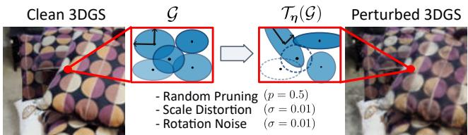

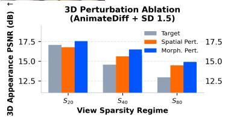

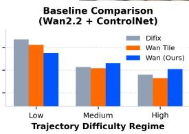  
Figure 1. 3D Morphological Perturbations: (Top) An optimization-free data augmentation generating spatially consistent paired renders without per-scene optimization. (Bottom) Training with our perturbed dataset instills superior geometric priors compared to sparse-view reconstructed pair sets. Adapting Wan [48] via ControlNet [63] using our dataset outperforms general video refiners and state-of-the-art image artifact fixers.

To address the sparse-view limitation, recent research broadly follows two paradigms [6, 25]. Regularizationbased methods inject explicit constraints—such as depth priors and cost volumes—into per-scene optimization [10, 32, 67]. Conversely, generalization-based methods leverage generative priors by incorporating them into reconstruction pipelines or fine-tuning feed-forward architectures to directly regress Gaussian properties [5, 45, 46, 55]. Yet, explicit regularization degrades under extreme view sparsity, while feed-forward regression struggles with highfrequency details. Building on this, a new state-of-theart paradigm—spearheaded by DiFix3D+ [52]—fine-tunes large image or video diffusion backbones specifically to clean up 3DGS artifacts and hallucinate missing geometry across scene trajectories [16, 20, 53, 62]. Despite their impressive results, these generative refinement models introduce a severe trade-off: 3DGS-specific artifact cleaning requires training on massive paired datasets of corruptedscene renders and clean ground-truth views. To curate such datasets, existing approaches perform repeated specialized 3DGS optimizations, such as sparse-view [52] or masked [53] reconstructions—a workflow that is computationally prohibitive to scale.

This bottleneck highlights a fundamental gap in simulating noise in 3D representations. In standard 2D computer vision, low-cost augmentations—such as Gaussian blur, color jitter, and random cropping—can be injected onthe-fly to implicitly regularize models [13, 43]. NeRFLiX [65] has used these to simulate NeRF reconstruction noise. However, no equivalent, optimization-free augmentations exist for 3D representations to obtain multi-view consistent render pairs: 2D frame-level noise violates multi-view consistency, while global sequence transforms cannot simulate camera-dependent scene artifacts.

To bridge this gap, we propose 3D Gaussian Perturbations as an optimization-free, 3D-aware regularizer. Our core idea is to leverage the explicit nature of 3D Gaussian Splatting, treating each Gaussian as a primitive unit of a scene, analogous to image pixels. Similar to how image data augmentations randomly perturb pixel values, we inject randomized noise directly into each Gaussian’s underlying parameters. Applying perturbations directly to clean 3D Gaussians yields a corrupted scene that maintains epipolar consistency, enabling curation of corrupted-clean trajectory videos without per-scene 3DGS optimizations. Prior work [21, 22] has perturbed 3D Gaussian positions during scene reconstruction for stability, and we expand this idea to the full parameter space of 3D Gaussians (position $( \pmb { \mu } _ { i } )$ orientation $\left( \mathbf { q } _ { i } \right)$ , scale $\left( \mathbf { s } _ { i } \right)$ , color $\left( \mathbf { c } _ { i } \right)$ , and opacity $\left( \alpha _ { i } \right) )$ Through controlled diagnostic ablations in a lightweight video diffusion sandbox [23], we isolate the effects of various combinations of parameter perturbations on motion module fine-tuning. We define 3D Morphological Perturbations (Fig. 1)—scale $( s _ { i } )$ and orientation $( q _ { i } )$ perturbations combined with random pruning—as an optimal regularizer for 3D awareness. This approach stabilizes training dynamics and enables the model to outperform baselines trained on matching sparse-view distributions.

To assess the scalability and practical utility of our regularizer, we evaluate trajectory refinement on noisy 3DGS scenes generated via sparse-view reconstruction. Specifically, we train a ControlNet [63] adapter for a 14-billionparameter video diffusion backbone [48] using morphologically perturbed 3DGS data. Our model consistently outperforms standard Tile ControlNet baselines. Furthermore, it outperforms the Difix [52] view-refiner model—reducing mean depth error by 12.5% while preserving visual fidelity under extreme view sparsity (Fig. 1). Finally, integrating our refinement model into a 3DGS-based scenario generator [2] translates these geometric gains into robotics impact, boosting imitation-learning policy success rates by up to 8.0% across 3 of 4 manipulation tasks $( \mathrm { e . g . }$ , jar closing).

We summarize our main contributions as:

• We propose 3D Gaussian Perturbations, an optimizationfree data augmentation method that directly noisecorrupts 3DGS primitives—analogous to 2D image blur—to generate spatially consistent training pairs without per-scene optimization loops.

• We isolate 3D Morphological Perturbations (scale, rotation, and primitive pruning) as a robust 3D regularizer, proving in video diffusion ablations that they yield stronger geometric priors than baselines trained on sparse-view reconstructions.

• We demonstrate scalability on a 14B video model via ControlNet adaptation, outperforming state-of-the-art artifact refiners with a 12.5% mean depth error reduction that translates to up to an 8.0% boost in downstream robotics policy success across tested manipulation tasks.

## 2. Related Works

Sparse-View 3DGS & Generative Refinement. Overcoming novel-view synthesis artifacts under sparse inputs in representations like NeRF [38] and 3D Gaussian Splatting (3DGS) [29] generally follows two paradigms [6, 25]: regularization-based methods that inject monocular depth or cost-volume constraints into per-scene optimization [10, 32, 67], and generalization-based approaches that feedforward regress 3D primitives [5, 45, 46, 55]. To recover high-frequency details lost in feed-forward prediction, recent works leverage 2D/3D generative diffusion priors for view and trajectory refinement. Early refiners applied image-to-image models conditioned on reference views [65, 66] or combined 2D refiners within iterative 3D update loops [36, 40, 50]. State-of-the-art frameworks—such as Difix3D+ [51, 52], GenFusion [51, 53], 3DGS-Enhancer [35], LM-Gaussian [60, 61], GuidedVD [64], and GSFixer [59]—fine-tune image or video diffusion backbones (e.g., CogVideoX [57]) using spatial/feature visual conditioning [39, 49] to resolve rendering corruptions [16, 20, 62]. However, training these generative models introduces a major bottleneck: curating massive paired corrupt-and-clean trajectory datasets requires repeated, optimization-heavy sparse-view or masked 3D reconstructions across every scene in the dataset. Our approach bypasses this costly curation pipeline entirely by synthesizing 3D-consistent training noise without per-scene optimization.

Data Perturbations as Implicit Regularization Stochastic noise injection provides foundational implicit regularization: Bishop [4] demonstrated that zero-mean input noise is locally equivalent to an explicit $L _ { 2 }$ gradient penalty, a principle generalized to feature and image spaces [37, 43, 47]. In 3D vision, AugNeRF [8] perturbs input coordinates and output features to enhance NeRF robustness, while NeRFLiX [65] applies image augmentations on ground-truth images to avoid expensive data collection for novel view refinement. Crucially, 3DGS representations are uniquely sensitive to parameter shifts, where small perturbations can cause severe degradation [54]. While prior works perturb only Gaussian positions $( \pmb { \mu } _ { i } )$ to stabilize per-scene reconstruction [21, 22], we generalize noise injection across all Gaussian parameters $( \mathbf { s } _ { i } , \mathbf { q } _ { i } , \mathbf { c } _ { i } , \alpha _ { i } )$ as an optimization-free data augmentation for 3D-aware video diffusion fine-tuning.

## 3. Methodology

To train 3D-aware generative video models without the bottleneck of running an expensive data curation process with repeated scene reconstructions to obtain corrupted-clean video pairs, we introduce 3D Morphological Perturbations—an optimization-free regularizer that injects stochastic noise directly into 3D primitive parameters to synthesize immediate, 3D-consistent scene degradations. In this section, we first briefly review 3D Gaussian Splatting, present the theoretical motivation behind 3D-aware perturbations, and detail our explicit parameter perturbation operations.

Preliminary: 3D Gaussian Splatting. 3DGS [29] models a scene using M primitives $\mathcal { G } = \{ G _ { i } \} _ { i = 1 } ^ { M }$ defined by $G _ { i } = \{ \mu _ { i } , { \bf q } _ { i } , { \bf s } _ { i } , { \bf c } _ { i } , \alpha _ { i } \}$ (position $\pmb { \mu } _ { i } \in \mathbb { R } ^ { 3 }$ , rotation $\mathbf { q } _ { i } ~ \in$ ${ \mathbb S } ^ { 3 }$ , scale $\mathbf { s } _ { i } \in \mathbb { R } ^ { 3 }$ , color $\mathbf { c } _ { i } \in \mathbb { R } ^ { K }$ , and opacity $\alpha _ { i } \in [ 0 , 1 ] )$ Differentiable rasterization $I _ { k } = \mathcal { R } ( \mathcal { G } , \pi _ { k } )$ projects primitives onto 2D screens for volumetric α-blending.

## 3.1. 3D Gaussian Perturbations as Regularization

Our formulation builds upon the theoretical foundation of using stochastic noise injection to induce implicit regularization. Bishop [4] originally established that adding zeromean noise is locally equivalent to training with an explicit input gradient penalty, a concept later generalized to feature-space corruptions [37, 47]. While these principles are widely applied in 2D image regularization [43] and NeRF noise simulation [65], optimization-free augmentations in 3D space remain unexplored. Unlike prior work that perturbs only Gaussian positions during optimization for stability [21, 22], we extend this analytical framework to the full parameter space of 3D Gaussians.

Consider a generative video refinement model $f _ { \theta } ( z _ { t } , t , V )$ predicting noise residuals, conditioned on a rendered trajectory sequence $V = \mathcal { R } ( \mathcal { G } , \Pi )$ , where represents the differentiable 3DGS rasterizer, $\mathcal { G }$ denotes the scene primitives, and Π specifies the camera path. In standard 2D data augmentation, pixel-space perturbations $\tilde { V } = V + \delta$ are injected directly into conditional inputs. In contrast, our approach injects stochastic perturbations $\eta \ \sim \ p ( \eta )$ directly into the primitive space , yielding perturbed renders $V ( \pmb { \eta } ) = \mathcal { R } ( \mathcal { T } _ { \pmb { \eta } } ( \mathcal { G } ) , \Pi )$

Assuming small noise η, we can approximate the rasterizer  around uncorrupted parameters $\mathcal { G }$ using a first-order Taylor expansion:

$$
V ( \pmb \eta ) \approx V _ { 0 } + \mathbf { J } _ { \mathcal { R } } \pmb \eta ,\tag{1}
$$

where $V _ { 0 } ~ = ~ \mathcal { R } ( \mathcal { G } , \Pi )$ is the clean render sequence, and $\begin{array} { r } { \mathbf { J } _ { \mathcal { R } } = \frac { \partial \mathcal { R } } { \partial \mathcal { G } } } \end{array}$ is the rasterizer Jacobian at $\mathcal { G }$ (valid outside sorting thresholds).

Let $\begin{array} { r c l } { e _ { 0 } } & { = } & { f _ { \theta } ( z _ { t } , t , V _ { 0 } ) \ - \ \epsilon } \end{array}$ be the clean diffusion prediction error. We similarly expand network output $f _ { \theta } ( z _ { t } , t , V ( \pmb { \eta } ) )$ under the perturbed render condition:

$$
f _ { \theta } ( z _ { t } , t , V ( \pmb { \eta } ) ) \approx f _ { \theta } ( z _ { t } , t , V _ { 0 } ) + \mathbf { J } _ { f } \mathbf { J } _ { \mathcal { R } } \pmb { \eta } ,\tag{2}
$$

where $\begin{array} { r } { \mathbf { J } _ { f } = \frac { \partial f _ { \theta } } { \partial V _ { 0 } } } \end{array}$ measures model sensitivity to conditional input variations. Under this local linear approximation, training $f _ { \theta }$ on 3D-perturbed renders optimizes an empirical surrogate for condition sensitivity:

$$
\begin{array} { r l } & { \mathcal { L } _ { \mathrm { p e r t } } ( \theta ) = \mathbb { E } _ { \pmb { \eta } } \left[ \| f _ { \theta } ( z _ { t } , t , V ( \pmb { \eta } ) ) - \epsilon \| _ { 2 } ^ { 2 } \right] } \\ & { \quad \quad \quad \approx \mathbb { E } _ { \pmb { \eta } } \left[ \| e _ { 0 } + \mathbf { J } _ { f } \mathbf { J } _ { \mathcal { R } } \pmb { \eta } \| _ { 2 } ^ { 2 } \right] \approx \mathcal { L } _ { \mathrm { c l e a n } } ( \theta ) + \mathcal { R } _ { \mathrm { m a n i f o l d } } ( \theta ) } \end{array}\tag{3}
$$

where $\mathcal { L } _ { \mathrm { c l e a n } } ( \theta ) = \mathbb { E } \left[ \| e _ { 0 } \| _ { 2 } ^ { 2 } \right]$ is the baseline noise-matching objective, and $\mathcal { R } _ { \mathrm { m a n i f o l d } } ( \theta ) \propto \mathbb { E } _ { \pmb { \eta } } \left\lceil \lVert \mathbf { J } _ { f } \mathbf { J } _ { \mathcal { R } } \pmb { \eta } \rVert _ { 2 } ^ { 2 } \right\rceil$ implicitly penalizes local predictions along the rendering manifold.

Eq. 3 shows that 3D primitive perturbations act as an implicit, manifold-constrained regularizer [4]. Projecting network sensitivity $( \mathbf { J } _ { f } )$ through the rasterizer Jacobian $( \mathbf { J } _ { \mathcal { R } } )$ ensures that regularization specifically targets geometryconsistent surface variations, rather than random 2D pixel noise. This trains the model to actively resolve 3D structural artifacts while maintaining strict multi-view consistency. Non-Gaussian operations like pruning build on this, forcing the network to recover missing geometry.

## 3.2. Perturbation Categories

To implement the regularizer derived in Section 3.1, we translate the theoretical noise vector η into concrete parameter operations $\mathcal { T } _ { \eta } ( \mathcal { G } )$ applied to each primitive $G _ { i } = $ $\{ \mu _ { i } , \mathbf { q } _ { i } , \mathbf { s } _ { i } , \mathbf { c } _ { i } , \alpha _ { i } \}$ . Rather than adding random noise everywhere, we divide these operations into three distinct categories—Spatial, Radiometric, and Morphological (Figure 2). Each category targets specific primitive attributes to model common 3D reconstruction artifacts.

## 3.2.1. 3D Spatial Perturbations

Inspired by [21, 22], we isolate physical translation noise across primitive centers:

Position Jitter. To account for spatial coordinate drift independently of scene scale, we perturb primitive centers $\pmb { \mu } _ { i }$ proportional to the bounding box extent $E _ { \mathrm { a v g } } =$ $\begin{array} { r } { \frac { 1 } { 3 } \sum _ { d \in \{ x , y , z \} } ( \operatorname* { m a x } { \pmb { \mu } } _ { \cdot , d } - \operatorname* { m i n } { \pmb { \mu } } _ { \cdot , d } ) \mathrm { . } } \end{array}$

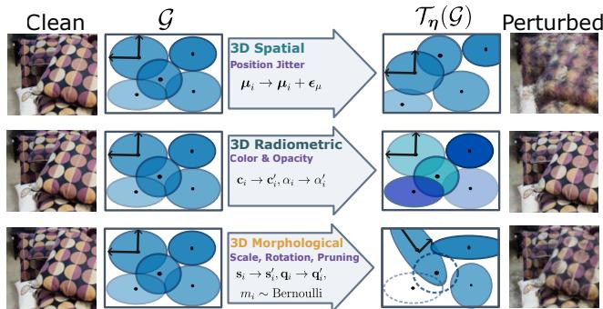  
Figure 2. Overview of proposed 3D primitive perturbations. Spatial noise perturbs primitive centers (µ); Radiometric noise alters appearance (c, α); Morphological perturbations modify local geometry (s, q) and structural density (m) to simulate 3D scene degradations.

$$
{ \pmb \mu } _ { i } ^ { \prime } = { \pmb \mu } _ { i } + { \epsilon } _ { \mu } , \quad { \epsilon } _ { \mu } \sim \mathcal { N } \left( { \bf 0 } , ( \gamma _ { \mathrm { x y z } } \cdot E _ { \mathrm { a v g } } ) ^ { 2 } { \bf I } _ { 3 } \right) ,\tag{4}
$$

where $\gamma _ { \mathrm { x y z } } = 0 . 0 0 2$ scales the spatial jitter relative to the scene domain.

## 3.2.2. 3D Radiometric Perturbations

Complementing spatial position jitter, we isolate nongeometric appearance noise across primitive color and opacity parameters:

Photometric Noise. To approximate illumination inconsistencies and sensor noise across views, additive zeromean Gaussian noise is applied to the RGB color coefficients $\mathbf { c } _ { i } ,$ clamped to the valid range [0, 1]:

$$
\mathbf { c } _ { i } ^ { \prime } = \mathrm { c l a m p } \left( \mathbf { c } _ { i } + \mathbf { \epsilon } _ { c } , 0 , 1 \right) , \quad \mathbf { \epsilon } _ { c } \sim \mathcal { N } ( \mathbf { 0 } , \sigma _ { \mathrm { c o l o r } } ^ { 2 } \mathbf { I } _ { 3 } ) ,\tag{5}
$$

where $\sigma _ { \mathrm { c o l o r } } = 0 . 0 5$ bounds color noise to 5% of the normalized range.

Opacity Noise. Density estimation errors and semitransparent rendering artifacts are modeled by perturbing primitive opacities $\alpha _ { i }$ , bounded strictly away from 0 and 1 to preserve numerical stability during rasterization:

$$
\alpha _ { i } ^ { \prime } = \mathrm { c l a m p } \left( \alpha _ { i } + \epsilon _ { \alpha } , \epsilon _ { 0 } , 1 - \epsilon _ { 0 } \right) , \quad \epsilon _ { \alpha } \sim \mathcal { N } ( 0 , \sigma _ { \mathrm { o p a c } } ^ { 2 } ) ,\tag{6}
$$

where $\sigma _ { \mathrm { o p a c } } = 0 . 0 5$ and $\epsilon _ { 0 } = 1 0 ^ { - 4 }$

## 3.2.3. 3D Morphological Perturbations

Unlike position-only spatial perturbations, we propose 3D morphological perturbations to alter primitive extents and density, simulating structural degradation and volume loss while preserving global alignment:

Random Pruning. Sparse-view reconstructions frequently exhibit missing geometry due to insufficient spatial coverage. To approximate this effect, we sample a binary retention mask $m _ { i } \in \{ 0 , 1 \}$ for each primitive:

$$
m _ { i } \sim { \bf B e r n o u l l i } ( 1 - p _ { \mathrm { p r u n e } } ) , \quad \mathcal { G } ^ { \prime } = \{ G _ { i } \in \mathcal { G } \mid m _ { i } = 1 \} ,
$$

where $p _ { \mathrm { p r u n e } }$ is the drop probability. Setting $p _ { \mathrm { p r u n e } } = 0 . 5$ reduces the expected scene density by half $( { \mathbb E } [ \dot { M } ^ { \prime } ] = 0 . 5 M )$ , forcing the model to reconstruct complete surfaces from sparse primitive coverage.

Scale Perturbation. To model inaccurate Gaussian proportion distortions while maintaining positive scales, additive zero-mean Gaussian noise is applied to each coordinate component $j \in \{ 1 , 2 , 3 \}$

$$
\begin{array} { r } { s _ { i , j } ^ { \prime } = \operatorname* { m a x } \left( s _ { i , j } + \epsilon _ { s , j } , 1 0 ^ { - 6 } \right) , \quad \epsilon _ { s , j } \sim \mathcal { N } ( 0 , \sigma _ { \mathrm { s c a l e } } ^ { 2 } ) , } \end{array}\tag{8}
$$

where $\sigma _ { \mathrm { s c a l e } } = 0 . 0 1$ models 1% anisotropic scale jitter, simulating shape distortion without degenerate primitives.

Rotation Perturbation. Local orientation misalignment is modeled by injecting element-wise Gaussian noise directly onto the quaternion coefficients followed by $\ell _ { 2 } -$ renormalization to maintain $ { \mathbf { q } } _ { i } ^ { \prime } \in \mathbb { S } ^ { 3 }$

$$
\mathbf { q } _ { i } ^ { \prime } = \frac { \mathbf { q } _ { i } + \boldsymbol { \epsilon } _ { q } } { \| \mathbf { q } _ { i } + \boldsymbol { \epsilon } _ { q } \| _ { 2 } } , \quad \boldsymbol { \epsilon } _ { q } \sim \mathcal { N } ( \mathbf { 0 } , \sigma _ { \mathrm { r o t } } ^ { 2 } \mathbf { I } _ { 4 } ) ,\tag{9}
$$

where $\sigma _ { \mathrm { r o t } } ~ = ~ 0 . 0 1$ introduces minor orientation drift ( $1 . 1 5 ^ { \circ }$ angular jitter) to model surface normal misalignment while preserving local geometry.

Injecting perturbations directly into 3D primitive space guarantees that rendering trajectory sequences $\mathcal { R } ( \mathcal { T } _ { \eta } ( \mathcal { G } ) , \pi _ { k } )$ across camera path $\Pi = \{ \pi _ { k } \} _ { k = 1 } ^ { K }$ maintain exact multi-view epipolar consistency, providing a regularizing signal without requiring optimization.

## 4. Experiments

We validate our perturbation framework across a three-stage experimental progression. First, Section 4.1 conducts a diagnostic ablation using a lightweight video diffusion sandbox to isolate the effect of individual perturbation categories (Section 3.2). Next, Section 4.2 scales this proof of concept to a video foundation model (Wan2.2 [48]) via ControlNet [63] adapters trained on our perturbed Gaussian data. Finally, Section 4.3 evaluates the downstream application of our refined trajectories for robotic imitation learning within a 3DGS-based scenario generator [2].

## 4.1. Diagnostic Ablation: Perturbation Categories

Model Architecture. We construct a lightweight video diffusion sandbox using a Stable Diffusion 1.5 [42] UNet augmented with AnimateDiff [24] temporal motion modules. To enable video-to-video refinement, the first convolutional layer is expanded to 8 input channels to ingest corrupted Gaussian conditioning latents $z _ { \mathrm { c o n d } }$ . Fine-tuning is strictly restricted to rank-r LoRA [26] adapters injected into spatial and temporal cross-attention blocks while base weights remain frozen. Because neither pre-trained model possesses knowledge of 3D geometric representations, the architecture relies on $z _ { \mathrm { c o n d } }$ for all spatial alignment, ensuring that scene geometry originates strictly from our 3D Gaussian renderings. Further implementation details are included in Supplementary Material.

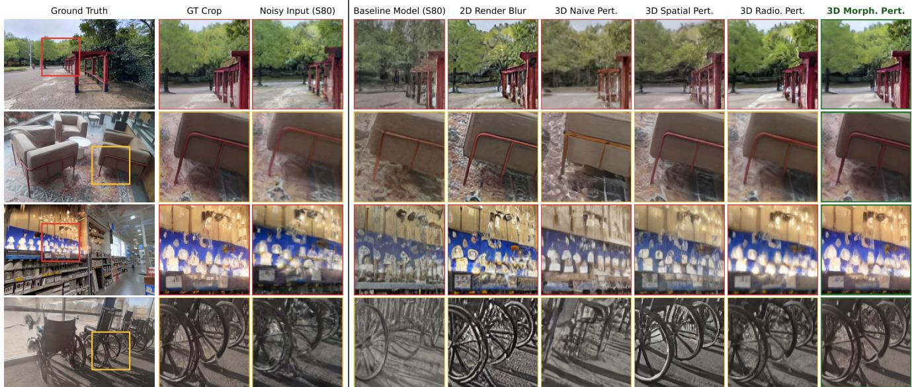  
Figure 3. Qualitative comparison of 3D scenes reconstructed from corrupted video trajectories refined by diffusion models trained on each perturbed dataset. Evaluated on $\boldsymbol { S } _ { 8 0 }$ test set using 3DGS representations re-optimized from refined output frames. 3D Morpho logical Perturbation best recovers fine geometry and appearance fidelity relative to ground truth.

Table 1. Ablation of 3D perturbation strategies across sparse-view regimes $( S _ { 2 0 } , S _ { 4 0 } ,$ and ${ \cal S } _ { 8 0 } )$ . Perturbation strategies are applied to clean 3DGS scenes during training dataset preparation, and a separate instance of our lightweight video diffusion model is trained on each resulting subset to isolate its effect. Evaluated on held-out test scenes across 2D Video Refinement $\mathrm { ( P S N R _ { 2 D } , S S I M _ { 2 D } , L P I P S _ { 2 D } , } E _ { \mathrm { f l o w } } \mathrm { ) }$ 3DGS Appearance $\mathrm { ( P S N R _ { 3 D } , S S I M _ { 3 D } , L P I P S _ { 3 D } ) }$ , and 3DGS Geometry (CD, F-Score). Best scores are in bold; second-best in italics.
<table><tr><td>Regime</td><td>Training Method</td><td> $\mathbf { P S N R } _ { 2 \mathrm { D } }$  ←</td><td> $\mathbf { S S I M } _ { 2 \mathrm { D } } \ ^ { \mathrm { ~ . ~ } }$  个</td><td> $\mathbf { L P I P S } _ { 2 \mathrm { D } } \downarrow$ </td><td> $E _ { \mathbf { f l o w } \downarrow }$ </td><td> $\mathbf { P S N R } _ { 3 \mathrm { D } }$  ←</td><td> $\mathbf { S S I M } _ { 3 \mathrm { D } } \uparrow$ </td><td> $\mathbf { L P I P S } _ { 3 \mathrm { D } } \downarrow$ </td><td>CD↓</td><td>F-Score↑</td></tr><tr><td rowspan="7"> $S _ { 2 0 }$ </td><td>* Stride 20 (Target)</td><td>17.018</td><td>0.572</td><td>0.412</td><td>0.252</td><td>17.074</td><td>0.594</td><td>0.392</td><td>0.009</td><td>0.771</td></tr><tr><td>2D Render Blur</td><td>16.590</td><td>0.490</td><td>0.431</td><td>0.235</td><td>16.855</td><td>0.516</td><td>0.412</td><td>0.010</td><td>0.751</td></tr><tr><td>3D Naive Pert.</td><td>15.100</td><td>0.375</td><td>0.554</td><td>0.311</td><td>15.193</td><td>0.407</td><td>0.543</td><td>0.011</td><td>0.730</td></tr><tr><td>3D Spatial Pert.</td><td>16.629</td><td>0.524</td><td>0.441</td><td>0.250</td><td>16.761</td><td>0.549</td><td>0.419</td><td>0.010</td><td>0.759</td></tr><tr><td>3D Radiometric Pert.</td><td>17.907</td><td>0.621</td><td>0.373</td><td>0.219</td><td>17.974</td><td>0.635</td><td>0.357</td><td>0.009</td><td>0.781</td></tr><tr><td>3D Morphological Pert.</td><td>17.487</td><td>0.601</td><td>0.397</td><td>0.229</td><td>17.546</td><td>0.616</td><td>0.379</td><td>0.009</td><td>0.786</td></tr><tr><td>* Stride 40 (Target)</td><td>14.503</td><td>0.428</td><td>0.525</td><td>0.331</td><td>14.552</td><td>0.454</td><td>0.508</td><td>0.011</td><td>0.733</td></tr><tr><td rowspan="7"> $S _ { 4 0 }$ </td><td>2D Render Blur</td><td>15.439</td><td>0.436</td><td>0.481</td><td>0.271</td><td>15.652</td><td>0.462</td><td>0.463</td><td>0.010</td><td>0.736</td></tr><tr><td>3D Naive Pert.</td><td>14.487</td><td>0.338</td><td>0.582</td><td>0.333</td><td>14.547</td><td>0.370</td><td>0.573</td><td>0.011</td><td>0.719</td></tr><tr><td>3D Spatial Pert.</td><td>15.548</td><td>0.476</td><td>0.484</td><td>0.283</td><td>15.616</td><td>0.500</td><td>0.464</td><td></td><td>0.749</td></tr><tr><td>3D Radiometric Pert.</td><td>16.366</td><td>0.560</td><td>0.431</td><td>0.254</td><td>16.365</td><td>0.574</td><td></td><td>0.010</td><td></td></tr><tr><td>3D Morphological Pert.</td><td>16.479</td><td>0.552</td><td>0.445</td><td>0.257</td><td>16.483</td><td>0.567</td><td>0.415 0.426</td><td>0.009 0.009</td><td>0.768 0.774</td></tr><tr><td></td><td></td><td></td><td></td><td></td><td></td><td></td><td></td><td></td><td></td></tr><tr><td>* Stride 80 (Target)</td><td>12.905</td><td>0.286</td><td>0.613</td><td>0.392</td><td>12.961</td><td>0.315</td><td>0.609</td><td>0.013</td><td>0.690</td></tr><tr><td rowspan="5"> $S _ { 8 0 }$ </td><td>2D Render Blur</td><td>14.103</td><td>0.389</td><td>0.528</td><td>0.312</td><td>14.260</td><td>0.414</td><td>0.510</td><td>0.011</td><td>0.724</td></tr><tr><td>3D Naive Pert.</td><td>13.788</td><td>0.315</td><td>0.605</td><td>0.357</td><td>13.819</td><td>0.346</td><td>0.597</td><td>0.012</td><td>0.710</td></tr><tr><td>3D Spatial Pert.</td><td>14.449</td><td>0.433</td><td>0.528</td><td>0.311</td><td>14.460</td><td>0.454</td><td>0.510</td><td>0.011</td><td>0.736</td></tr><tr><td>3D Radiometric Pert.</td><td>14.761</td><td>0.497</td><td>0.491</td><td>0.298</td><td>14.712</td><td>0.509</td><td>0.475</td><td>0.010</td><td>0.754</td></tr><tr><td>3D Morphological Pert.</td><td>14.936</td><td>0.502</td><td>0.497</td><td>0.298</td><td>14.907</td><td>0.517</td><td>0.481</td><td>0.010</td><td>0.762</td></tr></table>

Datasets and Baselines. We randomly sample 250 scenes from DL3DV-10K large-scale scene dataset [34] (200 train, 50 test). For training scenes, we reconstruct baseline 3D Gaussian Splatting [29] representations and individually apply each perturbation category from Section 3: Morphological (Pruning, Scale, Rotation), Spatial (Jitter), and Radiometric (Photometric, Opacity), alongside a Naive baseline applying all types simultaneously. Corrupted 16-frame conditioning sequences rendered along smooth trajectories are paired with uncorrupted ground-truth renders. As a 2D baseline, a 2D Render Blur set is synthesized via spatial Gaussian smoothing on clean ground-truth trajectories. We train separate model instances on each subset to isolate their individual effects. Held-out test scenes are reconstructed under three sparse-view regimes: Moderate $( S _ { 2 0 } )$ $H i g h \left( S _ { 4 0 } \right)$ , and Extreme $( S _ { 8 0 } )$ sparsities, where $\scriptstyle { S _ { k } }$ uses every k-th view from the training trajectory. Finally, we compare against model instances trained directly on matching

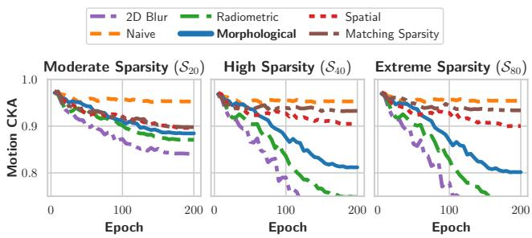  
Figure 4. Centered Kernel Analysis (CKA) similarity of AnimateDiff motion module features across models trained on different perturbed datasets. Measured relative to initialization on temporal attention feature maps throughout training to evaluate representation stability and activation drift under different perturbation strategies.

sparse-view reconstructions.

Metrics. We evaluate across three levels: 2D Video (PSNR, SSIM, LPIPS, flow error $E _ { \mathrm { f l o w } } ) { : }$ ; 3DGS Appearance (PSNR, SSIM, LPIPS on 2 held-out views per 16-frame render); and 3DGS Geometry (Chamfer Distance CD, F-Score). To monitor how internal representations evolve from initialization during training, we compute Centered Kernel Analysis (CKA) [30] similarity matrices on temporal attention maps over training time.

Results. As detailed in Table 1 and Figure 3, as view sparsity increases to $ { \boldsymbol { S } } _ { 8 0 }$ , target baselines fail to generalize due to severe overfitting, whereas all perturbation strategies effectively mitigate overfitting. However, perturbation choice is critical: 3D Naive Perturbation corrupts all Gaussian parameters simultaneously, failing to reconstruct coherent geometry or color, while 2D Render Blur violates multiview epipolar consistency and introduces non-photorealistic edge artifacts. Among isolated 3D perturbations, 3D Spatial Perturbation recovers sharp geometry with color degradation, whereas 3D Radiometric Perturbation preserves appearance but degrades in geometric fidelity (CD, F-Score) under extreme sparsity $( S _ { 8 0 } )$ . In contrast, 3D Morphological Perturbation achieves high geometric fidelity and appearance most accurate to ground truth, leading the model to infer missing structure rather than rely on color cues.

Examining temporal attention feature dynamics in Figure 4 further clarifies these optimization trends. When training our AnimateDiff-based model, 3D Naive Perturbation fails to drive meaningful feature learning, leaving activations stagnant at 95% similarity to initialization. In contrast, 2D Render Blur excessively alters internal activations, causing feature trajectories to diverge drastically from target baselines. The isolated 3D perturbations display the most consistent CKA curves, even surpassing the stability of matching baselines. Among them, 3D Morphological Perturbation results in the cleanest curve with the smallest fluctuations, while 3D Spatial Perturbation remains closest to the baseline feature dynamics. Given its robustness under extreme sparsity, dominant 3D geometric fidelity, and superior representation stability, we select 3D Morphological Perturbation as the optimal strategy for scaling to large foundation models in Section 4.2. Additional results across all sparsity settings are included in Suppl. Material.

## 4.2. Scaling to Video Foundation Models for Trajectory Render Refinement

Model Architecture and Training. To scale our 3D refinement framework, we build upon Wan2.2 [48], a DiTbased [41] text-to-video foundation model. We instantiate a dilated ControlNet [63] by copying 8 DiT blocks at a stride of 3 from the frozen Wan base model. Clean target frames are encoded using Wan2.2’s VAE, while text captions generated via Qwen2 [56] provide text conditioning. During the forward pass, the ControlNet processes corrupted 49-frame trajectory renderings (832 480 resolution) and injects its intermediate activations additively into the corresponding frozen base DiT blocks. The model is trained for 30 epochs across 8 GPUs with 80GB VRAM. Further implementation details are included in Supplementary Material.

Dataset Curation and Training. We train the Control-Net on 10K perturbed-clean 49-frame video pairs aggregated across DL3DV-10K [34] (75%), ScanNet [14] (15%), and ScanNet++ [58] (10%) (9, 866 pairs total). Each scene is perturbed with our 3D Morphological Perturbations (Sec. 3), except the ScanNet scenes taken directly from Scene-Splat7K [33]. For DL3DV-10K and ScanNet++, 49-frame sequences are rendered along smooth, interpolated camera trajectories, while ScanNet pairs ground-truth videos with noisy SceneSplat7K renders.

Evaluation Protocol. Following Difix3D+ [51], we evaluate trajectory-level video refinement on the DL3DV Benchmark [34] across three difficulty regimes defined by the number of training views and whether the test trajectory overlaps one of them: Low (9 views, 1 overlapping), Medium (3 views, 1 overlapping), and High (6 views, no overlap with test trajectory) difficulties. Models refine 49- frame trajectories rendered at $8 3 2 \times 4 8 0$ resolution, which are subsequently used to reconstruct 3DGS representations. Appearance fidelity is evaluated on RGB renders via PSNR, SSIM, and LPIPS. Geometric accuracy is evaluated on depth renders via Absolute Relative Error (AbsRel), Root Mean Squared Error (RMSE), and threshold accuracies $\delta _ { k }$ $( k \in \{ 1 , 2 , 3 \} )$ at $1 . 2 5 ^ { k }$ tolerances [19].

Baselines. We compare our model Wan + Ctrl (Morph.) against Difix and Fixer [51], state-of-the-art standalone image-to-image refinement models trained to specifically fix 3DGS rendering artifacts. To evaluate these singleimage baselines on trajectory-level sequences, we process every test frame independently. In addition, we compare against Wan+Tile [18], an off-the-shelf Wan2.2-based video refinement model sharing our ControlNet [63] architecture trained on spatial-temporal tiling strategies.

Ground Truth  
Noisy Input (High Diff.)  
Difix  
Fixer  
Wan + Tile Ctrl.  
Wan + Ctrl.(Morph.)  
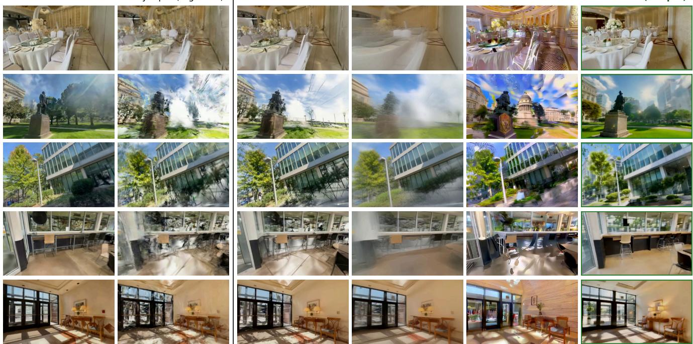  
Figure 5. Qualitative comparison on High difficulty (see Sec. 4.2) test scenes. Frame-by-frame baselines either fail to refine artifacts (Difix) or introduce severe blur (Fixer). Wan-Tile hallucinated features that diverge from the original scene. Our Wan + Ctrl (Morph.) successfully removes reconstruction artifacts and inpaints seamless, structure-preserving details that closely align with the true scene geometry.

Table 2. Quantitative evaluation of trajectory-level video refinement on the DL3DV benchmark across varying view sparsity and pose overlap regimes. Evaluated across 49-frame central trajectories rendered at 832 × 480. Standard RGB metrics evaluate appearance fidelity, while depth metrics assess geometric accuracy. Despite having a denser 6-view reconstruction, the High Difficulty setting poses the hardest refinement task because its test trajectory is rendered entirely off-reference (pure pose interpolation). Best proxy scores are in dark green; second-best in light green. (Wan2.2 + Contolnet scaled experiment)
<table><tr><td rowspan="3">Difficulty Regime Train views / Test overlap Metric</td><td colspan="4">Low Difficulty</td><td colspan="4">Medium Difficulty</td><td colspan="4">High Difficulty</td></tr><tr><td colspan="4">9 Views / 1 View Overlapping w. Test Traj.</td><td colspan="4">3 Views / 1 View Overlapping w. Test Traj.</td><td colspan="4">6 Views (No overlap w. Test Traj.)</td></tr><tr><td>Difix</td><td>Fixer</td><td>Wan-Tile</td><td>Wan (Morph.)</td><td>Difix</td><td>Fixer</td><td>Wan-Tile</td><td>Wan (Morph.)</td><td>Difix</td><td>Fixer</td><td>Wan-Tile</td><td>Wan (Morph.)</td></tr><tr><td>PSNR↑</td><td>18.39</td><td>18.63</td><td>14.48</td><td>16.90</td><td>15.34</td><td>16.07</td><td>13.56</td><td>15.76</td><td>14.48</td><td>15.19</td><td>13.23</td><td>15.11</td></tr><tr><td>SSIM↑</td><td>0.651</td><td>0.690</td><td>0.394</td><td>0.610</td><td>0.551</td><td>0.627</td><td>0.379</td><td>0.570</td><td>0.516</td><td>0.604</td><td>0.365</td><td>0.549</td></tr><tr><td>LPIPS↓</td><td>0.336</td><td>0.366</td><td>0.618</td><td>0.416</td><td>0.431</td><td>0.441</td><td>0.640</td><td>0.461</td><td>0.492</td><td>0.550</td><td>0.679</td><td>0.502</td></tr><tr><td>AbsRel↓</td><td>0.241</td><td>0.398</td><td>0.294</td><td>0.264</td><td>0.322</td><td>0.438</td><td>0.363</td><td>0.299</td><td>0.308</td><td>0.555</td><td>0.360</td><td>0.306</td></tr><tr><td>RMSE↓</td><td>24.20</td><td>43.68</td><td>27.58</td><td>16.18</td><td>31.67</td><td>48.20</td><td>35.08</td><td>30.65</td><td>29.87</td><td>54.24</td><td>32.03</td><td>29.53</td></tr><tr><td>δ1↑</td><td>0.684</td><td>0.564</td><td>0.626</td><td>0.657</td><td>0.544</td><td>0.457</td><td>0.465</td><td>0.587</td><td>0.553</td><td>0.424</td><td>0.524</td><td>0.576</td></tr><tr><td>δ2↑</td><td>0.868</td><td>0.767</td><td>0.848</td><td>0.843</td><td>0.783</td><td>0.700</td><td>0.766</td><td>0.794</td><td>0.806</td><td>0.627</td><td>0.787</td><td>0.821</td></tr><tr><td>δ3↑</td><td>0.928</td><td>0.858</td><td>0.918</td><td>0.928</td><td>0.889</td><td>0.841</td><td>0.886</td><td>0.908</td><td>0.922</td><td>0.765</td><td>0.886</td><td>0.924</td></tr></table>

Results. Table 2 and Figure 5 evaluate 3DGS reconstructions trained on refined trajectory videos across difficulty regimes. Comparing our Wan + Ctrl (Morph.) against Wan-Tile highlights the critical role of our training strategy: while Wan-Tile fails on both RGB appearance and depth geometry—filling artifacted regions with imagined details that significantly stray from the original scene—our morphologically perturbed dataset guides the ControlNet far more effectively. By conditioning on 3D morphological corruptions, Wan + Ctrl (Morph.) achieves superior artifact refinement and inpainting, generating details that blend naturally with the original scene while enforcing multi-view coherence. This translates into top performance across nearly all geometric metrics (AbsRel, RMSE, $\delta _ { 1 , 2 , 3 } )$ in Medium and High difficulty regimes, lowering depth RMSE to 16.18, 30.65, and 29.53, respectively. Singleimage baselines further underscore this trade-off: Difix produces sharp renders but fails to adequately refine structural artifacts, whereas Fixer removes artifacts at the cost of severe blurriness. Crucially, because these single-frame baselines lack cross-frame temporal awareness, using their refined outputs for 3DGS reconstruction leads to geometric degradation, whereas Wan + Ctrl (Morph.) maintains visual fidelity while delivering structurally accurate 3D representations. Additional qualitative results across all difficulty settings are available in Supplementary Material.

Original RLBench Task  
DREMA + Wan Ctrl.(Morph.)  
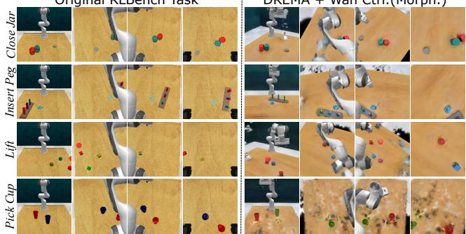  
Figure 6. Qualitative comparison between original tasks from RLBench [27] and tasks generated with DREMA + Wan Ctrl (Morph.) refinement. The reported four views: front, left shoulder, right shoulder and wrist.

Table 3. Success rate comparison across data augmentation methods for manipulation task episode generation (Mean↑ ± Std↓ and Max↑). DREMA+ref. uses refinement via Wan+Ctrl(Morph.).
<table><tr><td>Method</td><td colspan="2">Close Jar</td><td colspan="2">Insert Peg Mean±Std Max</td><td colspan="2">Lift</td><td colspan="2">Pick Cup</td></tr><tr><td></td><td>Mean±Std Max</td><td></td><td></td><td></td><td>Mean±Std Max</td><td></td><td>Mean±Std Max</td><td></td></tr><tr><td>PerAct</td><td>38.4±0.80</td><td>40</td><td>0.0±0.00</td><td>0</td><td>22.8±1.60</td><td>26</td><td>13.2±2.04</td><td>16</td></tr><tr><td>Patches</td><td>45.2±3.49</td><td>48</td><td>2.0±1.79</td><td>4</td><td>20.4±2.65</td><td>24</td><td>37.2±3.25</td><td>42</td></tr><tr><td>Table color</td><td>45.0±1.73</td><td>46</td><td>1.6±1.50</td><td>4</td><td>23.6±0.80</td><td>24</td><td>25.6±2.94</td><td>30</td></tr><tr><td>Distractors</td><td>36.4±0.80</td><td>38</td><td>0.4±0.80</td><td>2</td><td>22.8±1.60</td><td>24</td><td>41.2±2.99</td><td>44</td></tr><tr><td>DREMA</td><td>51.2±1.60</td><td>54</td><td>2.4±2.33</td><td>6</td><td>23.6±1.50</td><td>26</td><td>34.4±3.88</td><td>40</td></tr><tr><td>DREMA+ref.</td><td>59.2±5.45</td><td>66</td><td>1.6±1.49</td><td>4</td><td>24.4±1.96</td><td>24</td><td>38.0±2.19</td><td>40</td></tr></table>

## 4.3. Downstream Robotics Imitation Learning

Setup. We evaluate our Wan + Ctrl (Morph.) model (Sec. 4.2) on downstream imitation learning for tabletop manipulation. As our baseline, we use Dream-to-Manipulate (DREMA) [2], which reconstructs scenes as Gaussians, segments objects, and recomposes them in Py-Bullet [12] to synthesize novel interaction episodes. While raw simulator trajectories provide precise geometry, they suffer from flat textures and synthetic lighting. We integrate our model into DREMA by refining simulator-rendered trajectories prior to Gaussian reconstruction. Rather than fixing structural errors, our goal is enhancing renders with realistic lighting and natural textures while maintaining strict 3D consistency for subsequent scenario generation. Following DREMA, we train PerAct [44] agents on refined episodes across multi-view RLBench [27] camera streams (front, left/right shoulder, wrist).

Simulation Tasks. We evaluate policies across four RL-Bench tabletop manipulation tasks: Close Jar, Insert Peg, Lift, and Pick Cup. Crucially, we exclude tasks featuring fixed, static goal objects (e.g., Place Wine, Sort Shape), as zero appearance variation across episodes causes policies to overfit to static visual cues rather than spatial geometry.

Baselines & Metrics. We compare our pipeline (DREMA + ref.) directly against standard DREMA, unaugmented PerAct, and classical augmentations reported in DREMA (Random Patches [31], GenAug [11], and RoboAgent Distractors [3]). Policies are trained for 100K iterations and evaluated over 50 test episodes across 5 seeds to report mean, standard deviation, and maximum success rates.

Results. Table 3 compares policy performance across four manipulation tasks. Integrating our video refinement into baseline DREMA improves downstream policy performance, yielding gains of up to 8.0% over DREMA across 3 out of 4 tasks. Specifically, DREMA+ref. achieves higher mean success rates than all evaluated baselines on Close Jar (59.2% vs. 51.2% for DREMA) and Lift (24.4% vs. 23.6%), while also improving over DREMA on Pick Cup (38.0% vs. 34.4%). On precision-sensitive tasks like Insert Peg, performance remains constrained across all methods due to physical execution constraints rather than visual fidelity. As shown in Figure 6, our refinement pipeline introduces photorealistic lighting dynamics, color shifts, and table textures to synthetic PyBullet renders. By providing appearance diversity while enforcing strict 3D geometric consistency, our approach helps prevent policies from overfitting to flat simulator artifacts and encourages PerAct to rely on underlying scene geometry.

## 5. Conclusion

Leveraging the explicit nature of 3D Gaussian Splatting, we propose 3D Morphological Perturbations—an optimization-free augmentation that bypasses repeated perscene reconstructions to obtain corrupted 3D scenes. By perturbing scale, rotation, and pruning, our approach acts as a regularizer for generative model training, outperforming 2D blur and alternative perturbation strategies. Scaled to a 14B-parameter video model via ControlNet, our method achieves a 12.5% reduction in mean depth error over imagebased refiners and translates these geometric gains into an 8.0% boost in downstream robotics policy success. Our results highlight the effectiveness of 3D perturbations on increasing dataset curation efficiency for 3D-aware generative model training. We anticipate future work will extend these principles to other explicit 3D representations and implement them for on-the-fly training augmentations.

## References

[1] Michal Adamkiewicz, Timothy Chen, Adam Caccavale, Rachel Gardner, Preston Culbertson, Jeannette Bohg, and Mac Schwager. Vision-only robot navigation in a neural radiance world. IEEE Robotics and Automation Letters, 7(2): 4606–4613, 2022. 1

[2] Leonardo Barcellona, Andrii Zadaianchuk, Davide Allegro, Samuele Papa, Stefano Ghidoni, and Efstratios Gavves. Dream to manipulate: Compositional world models empowering robot imitation learning with imagination. In The Thirteenth International Conference on Learning Representations, 2025. 2, 4, 8, 3

[3] Homanga Bharadhwaj, Jay Vakil, Mohit Sharma, Abhinav Gupta, Shubham Tulsiani, and Vikash Kumar. Roboagent: Generalization and efficiency in robot manipulation via semantic augmentations and action chunking. In 2024 IEEE International Conference on Robotics and Automation (ICRA), pages 4788–4795. IEEE, 2024. 8

[4] Chris M. Bishop. Training with noise is equivalent to tikhonov regularization. Neural Computation, 7(1):108–116, 1995. 2, 3

[5] David Charatan, Sizhe Lester Li, Andrea Tagliasacchi, and Vincent Sitzmann. pixelsplat: 3d gaussian splats from image pairs for scalable generalizable 3d reconstruction. In 2024 IEEE/CVF Conference on Computer Vision and Pattern Recognition (CVPR), pages 19457–19467. IEEE, 2024. 1, 2

[6] Guikun Chen and Wenguan Wang. A survey on 3d gaussian splatting. ACM Computing Surveys, 58(12):1–39, 2026. 1, 2

[7] Jianchuan Chen, Jingchuan Hu, Gaige Wang, Zhonghua Jiang, Tiansong Zhou, Zhiwen Chen, and Chengfei Lv. Taoavatar: Real-time lifelike full-body talking avatars for augmented reality via 3d gaussian splatting. In 2025 IEEE/CVF Conference on Computer Vision and Pattern Recognition (CVPR), pages 10723–10734, 2025. 1

[8] Tianlong Chen, Peihao Wang, Zhiwen Fan, and Zhangyang Wang. Aug-nerf: Training stronger neural radiance fields with triple-level physically-grounded augmentations. In Proceedings of the IEEE/CVF Conference on Computer Vision and Pattern Recognition (CVPR), pages 15191–15202, 2022. 2

[9] Timothy Chen, Ola Shorinwa, Joseph Bruno, Aiden Swann, Javier Yu, Weijia Zeng, Keiko Nagami, Philip Dames, and Mac Schwager. Splat-nav: Safe real-time robot navigation in gaussian splatting maps. Trans. Rob., 41:2765–2784, 2025. 1

[10] Yuedong Chen, Haofei Xu, Chuanxia Zheng, Bohan Zhuang, Marc Pollefeys, Andreas Geiger, Tat-Jen Cham, and Jianfei Cai. Mvsplat: Efficient 3d gaussian splatting from sparse multi-view images. In European conference on computer vision, pages 370–386. Springer, 2024. 1, 2

[11] Zoey Chen, Sho Kiami, Abhishek Gupta, and Vikash Kumar. Genaug: Retargeting behaviors to unseen situations via generative augmentation. arXiv preprint arXiv:2302.06671, 2023. 8

[12] Erwin Coumans and Yunfei Bai. Pybullet, a python mod-

ule for physics simulation for games, robotics and machine learning, 2016. 8, 3

[13] Ekin Dogus Cubuk, Barret Zoph, Jon Shlens, and Quoc Le. Randaugment: Practical automated data augmentation with a reduced search space. Advances in neural information processing systems, 33:18613–18624, 2020. 2

[14] Angela Dai, Angel X. Chang, Manolis Savva, Maciej Halber, Thomas Funkhouser, and Matthias Nießner. Scannet: Richly-annotated 3d reconstructions of indoor scenes. In Proc. Computer Vision and Pattern Recognition (CVPR) IEEE, 2017. 6

[15] Qiyu Dai, Yan Zhu, Yiran Geng, Ciyu Ruan, Jiazhao Zhang, and He Wang. Graspnerf: Multiview-based 6-dof grasp detection for transparent and specular objects using generalizable nerf. In 2023 IEEE International Conference on Robotics and Automation (ICRA), pages 1757–1763, 2023. 1

[16] Riccardo De Lutio, Tobias Fischer, Yen-Yu Chang, Yuxuan Zhang, Zhangjie Wu, Xuanchi Ren, Tianchang Shen, Katar´ına Tothov´ a, Zan Gojcic, and Haithem Turki. Arti-´ fixer: Enhancing and extending 3d reconstruction with autoregressive diffusion models. In Proceedings of the Special Interest Group on Computer Graphics and Interactive Tech niques Conference Conference Papers, pages 1–12, 2026. 1, 2

[17] Nianchen Deng, Zhenyi He, Jiannan Ye, Budmonde Duinkharjav, Praneeth Chakravarthula, Xubo Yang, and Qi Sun. Fov-nerf: Foveated neural radiance fields for virtual reality. IEEE Transactions on Visualization and Computer Graphics, 28(11):3854–3864, 2022. 1

[18] Karachev Denis. Wan2.2 controlnet, 2025. 7, 3

[19] David Eigen, Christian Puhrsch, and Rob Fergus. Depth map prediction from a single image using a multi-scale deep network. Advances in neural information processing systems, 27, 2014. 6

[20] Tobias Fischer, Samuel Rota Bulo, Yung-Hsu Yang, Nikhil\` Keetha, Lorenzo Porzi, Norman Muller, Katja Schwarz,¨ Jonathon Luiten, Marc Pollefeys, and Peter Kontschieder. Flowr: Flowing from sparse to dense 3d reconstructions. In 2025 IEEE/CVF International Conference on Computer Vision (ICCV), pages 27702–27712. IEEE, 2025. 1, 2

[21] Jiaye Fu, Qiankun Gao, Chengxiang Wen, Yanmin Wu, Siwei Ma, Jiaqi Zhang, and Jian Zhang. Recon-gs: Continuum-preserved gaussian streaming for fast and com pact reconstruction of dynamic scenes. In Advances in Neu ral Information Processing Systems, pages 134751–134778. Curran Associates, Inc., 2025. 2, 3

[22] Qiankun Gao, Jiarui Meng, Chengxiang Wen, Jie Chen, and Jian Zhang. Hicom: Hierarchical coherent motion for dynamic streamable scenes with 3d gaussian splatting. In Advances in Neural Information Processing Systems, pages 80609–80633. Curran Associates, Inc., 2024. 2, 3

[23] Yuwei GUO, Ceyuan Yang, Anyi Rao, Zhengyang Liang, Yaohui Wang, Yu Qiao, Maneesh Agrawala, Dahua Lin, and Bo DAI. Animatediff: Animate your personalized textto-image diffusion models without specific tuning. In In ternational Conference on Learning Representations, pages 34630–34648, 2024. 2

[24] Yuwei Guo, Ceyuan Yang, Anyi Rao, Zhengyang Liang, Yaohui Wang, Yu Qiao, Maneesh Agrawala, Dahua Lin, and Bo Dai. Animatediff: Animate your personalized textto-image diffusion models without specific tuning. In The Twelfth International Conference on Learning Representations, 2024. 4, 1

[25] Shuting He, Peilin Ji, Yitong Yang, Changshuo Wang, Jiayi Ji, Yinglin Wang, and Henghui Ding. A survey on 3d gaussian splatting applications: Segmentation, editing, and generation. IEEE Transactions on Pattern Analysis and Machine Intelligence, 2026. 1, 2

[26] Edward J Hu, Yelong Shen, Phillip Wallis, Zeyuan Allen-Zhu, Yuanzhi Li, Shean Wang, Lu Wang, and Weizhu Chen. LoRA: Low-rank adaptation of large language models. In International Conference on Learning Representations, 2022. 4, 1

[27] Stephen James, Zicong Ma, David Rovick Arrojo, and Andrew J. Davison. Rlbench: The robot learning benchmark & learning environment. IEEE Robotics and Automation Letters, 2020. 8, 3

[28] Ying Jiang, Chang Yu, Tianyi Xie, Xuan Li, Yutao Feng, Huamin Wang, Minchen Li, Henry Lau, Feng Gao, Yin Yang, and Chenfanfu Jiang. Vr-gs: A physical dynamicsaware interactive gaussian splatting system in virtual reality. In ACM SIGGRAPH 2024 Conference Papers, New York, NY, USA, 2024. Association for Computing Machinery. 1

[29] Bernhard Kerbl, Georgios Kopanas, Thomas Leimkuhler,¨ and George Drettakis. 3d gaussian splatting for real-time radiance field rendering. ACM Transactions on Graphics, 42 (4), 2023. 1, 2, 3, 5

[30] Simon Kornblith, Mohammad Norouzi, Honglak Lee, and Geoffrey Hinton. Similarity of neural network representations revisited. In Proceedings of the 36th International Conference on Machine Learning, pages 3519–3529. PMLR, 2019. 6

[31] Misha Laskin, Kimin Lee, Adam Stooke, Lerrel Pinto, Pieter Abbeel, and Aravind Srinivas. Reinforcement learning with augmented data. Advances in neural information processing systems, 33:19884–19895, 2020. 8

[32] Jiahe Li, Jiawei Zhang, Xiao Bai, Jin Zheng, Xin Ning, Jun Zhou, and Lin Gu. Dngaussian: Optimizing sparse-view 3d gaussian radiance fields with global-local depth normalization. In 2024 IEEE/CVF Conference on Computer Vision and Pattern Recognition (CVPR), pages 20775–20785. IEEE, 2024. 1, 2

[33] Yue Li, Qi Ma, Runyi Yang, Huapeng Li, Mengjiao Ma, Bin Ren, Nikola Popovic, Nicu Sebe, Ender Konukoglu, Theo Gevers, et al. Scenesplat: Gaussian splatting-based scene understanding with vision-language pretraining. In Proceedings of the IEEE/CVF International Conference on Computer Vision (ICCV), 2025. 6

[34] Lu Ling, Yichen Sheng, Zhi Tu, Wentian Zhao, Cheng Xin, Kun Wan, Lantao Yu, Qianyu Guo, Zixun Yu, Yawen Lu, Xuanmao Li, Xingpeng Sun, Rohan Ashok, Aniruddha Mukherjee, Hao Kang, Xiangrui Kong, Gang Hua, Tianyi Zhang, Bedrich Benes, and Aniket Bera. Dl3dv-10k: A large-scale scene dataset for deep learning-based 3d vi-

sion. In Proceedings ofthe IEEE/CVF Conference on Com puter Vision and Pattern Recognition (CVPR), pages 22160– 22169, 2024. 5, 6, 1, 2

[35] Xi Liu, Chaoyi Zhou, and Siyu Huang. 3dgs-enhancer: Enhancing unbounded 3d gaussian splatting with viewconsistent 2d diffusion priors. In Advances in Neural Information Processing Systems, pages 133305–133327. Curran Associates, Inc., 2024. 2

[36] Xinhang Liu, Jiaben Chen, Shiu-Hong Kao, Yu-Wing Tai, and Chi-Keung Tang. Deceptive-nerf/3dgs: Diffusion generated pseudo-observations for high-quality sparse-view reconstruction. In Computer Vision – ECCV 2024, pages 337–355, Cham, 2025. Springer Nature Switzerland. 2

[37] Laurens Maaten, Minmin Chen, Stephen Tyree, and Kilian Weinberger. Learning with marginalized corrupted features. In Proceedings ofthe 30th International Conference on Ma chine Learning, pages 410–418, Atlanta, Georgia, USA, 2013. PMLR. 2, 3

[38] Ben Mildenhall, Pratul P. Srinivasan, Matthew Tancik, Jonathan T. Barron, Ravi Ramamoorthi, and Ren Ng. Nerf: Representing scenes as neural radiance fields for view syn thesis. In ECCV, 2020. 1, 2

[39] Maxime Oquab, Timothee Darcet, Th´ eo Moutakanni, Huy V.´ Vo, Marc Szafraniec, Vasil Khalidov, Pierre Fernandez, Daniel HAZIZA, Francisco Massa, Alaaeldin El-Nouby, Mido Assran, Nicolas Ballas, Wojciech Galuba, Russell Howes, Po-Yao Huang, Shang-Wen Li, Ishan Misra, Michael Rabbat, Vasu Sharma, Gabriel Synnaeve, Hu Xu, Herve Je gou, Julien Mairal, Patrick Labatut, Armand Joulin, and Piotr Bojanowski. DINOv2: Learning robust visual features without supervision. Transactions on Machine Learning Research, 2024. Featured Certification. 2

[40] Avinash Paliwal, Xilong Zhou, Wei Ye, Jinhui Xiong, Rakesh Ranjan, and Nima Khademi Kalantari. Ri3d: Fewshot gaussian splatting with repair and inpainting diffusion priors. In Proceedings of the IEEE/CVF International Con ference on Computer Vision (ICCV), pages 25094–25103, 2025. 2

[41] William Peebles and Saining Xie. Scalable diffusion models with transformers. In 2023 IEEE/CVF International Confer ence on Computer Vision (ICCV), pages 4172–4182. IEEE, 2023. 6

[42] Robin Rombach, Andreas Blattmann, Dominik Lorenz, Patrick Esser, and Bjorn Ommer. High-resolution image¨ synthesis with latent diffusion models. In Proceedings of the IEEE/CVF Conference on Computer Vision and Pattern Recognition (CVPR), pages 10684–10695, 2022. 4, 1

[43] Connor Shorten and Taghi M Khoshgoftaar. A survey on image data augmentation for deep learning. Journal of big data, 6(1):60, 2019. 2, 3

[44] Mohit Shridhar, Lucas Manuelli, and Dieter Fox. Perceiveractor: A multi-task transformer for robotic manipulation. In Proceedings of the 6th Conference on Robot Learning (CoRL), 2022. 8, 3

[45] Stanislaw Szymanowicz, Chrisitian Rupprecht, and Andrea Vedaldi. Splatter image: Ultra-fast single-view 3d reconstruction. In Proceedings of the IEEE/CVF conference

on computer vision and pattern recognition, pages 10208– 10217, 2024. 1, 2

[46] Stanislaw Szymanowicz, Eldar Insafutdinov, Chuanxia Zheng, Dylan Campbell, Joao F Henriques, Christian Rupprecht, and Andrea Vedaldi. Flash3d: Feed-forward generalisable 3d scene reconstruction from a single image. In 2025 International Conference on 3D Vision (3DV), pages 670– 681. IEEE, 2025. 1, 2

[47] Stefan Wager, Sida Wang, and Percy S Liang. Dropout training as adaptive regularization. In Advances in Neural Information Processing Systems. Curran Associates, Inc., 2013. 2, 3

[48] Team Wan, Ang Wang, Baole Ai, Bin Wen, Chaojie Mao, Chen-Wei Xie, Di Chen, Feiwu Yu, Haiming Zhao, Jianxiao Yang, et al. Wan: Open and advanced large-scale video generative models. arXiv preprint arXiv:2503.20314, 2025. 1, 2, 4, 6

[49] Jianyuan Wang, Minghao Chen, Nikita Karaev, Andrea Vedaldi, Christian Rupprecht, and David Novotny. Vggt: Visual geometry grounded transformer. In Proceedings of the IEEE/CVF Conference on Computer Vision and Pattern Recognition, 2025. 2

[50] Jiaxin Wei, Stefan Leutenegger, and Simon Schaefer. Gsfix3d: Diffusion-guided repair of novel views in gaussian splatting. 2025. 2

[51] Jay Zhangjie Wu, Yuxuan Zhang, Haithem Turki, Xuanchi Ren, Jun Gao, Mike Zheng Shou, Sanja Fidler, Zan Gojcic, and Huan Ling. Difix3d+: Improving 3d reconstructions with single-step diffusion models. In Proceedings of the Computer Vision and Pattern Recognition Conference (CVPR), pages 26024–26035, 2025. 2, 6

[52] Jay Zhangjie Wu, Yuxuan Zhang, Haithem Turki, Xuanchi Ren, Jun Gao, Mike Zheng Shou, Sanja Fidler, Zan Gojcic, and Huan Ling. Difix3d+: Improving 3d reconstructions with single-step diffusion models. In 2025 IEEE/CVF Conference on Computer Vision and Pattern Recognition (CVPR), pages 26024–26035. IEEE, 2025. 1, 2

[53] Sibo Wu, Congrong Xu, Binbin Huang, Andreas Geiger, and Anpei Chen. Genfusion: Closing the loop between reconstruction and generation via videos. In 2025 IEEE/CVF Conference on Computer Vision and Pattern Recognition (CVPR), pages 6078–6088. IEEE, 2025. 1, 2

[54] Yuelin Xin, Yuheng Liu, Xiaohui Xie, and Xinke Li. Learning unified representation of 3d gaussian splatting. In International Conference on Learning Representations, pages 1111–1123, 2026. 3

[55] Yinghao Xu, Zifan Shi, Wang Yifan, Hansheng Chen, Ceyuan Yang, Sida Peng, Yujun Shen, and Gordon Wetzstein. Grm: Large gaussian reconstruction model for efficient 3d reconstruction and generation. In European Conference on Computer Vision, pages 1–20. Springer, 2024. 1, 2

[56] An Yang, Baosong Yang, Binyuan Hui, Bo Zheng, Bowen Yu, Chang Zhou, Chengpeng Li, Chengyuan Li, Dayiheng Liu, Fei Huang, Guanting Dong, Haoran Wei, Huan Lin, Jialong Tang, Jialin Wang, Jian Yang, Jianhong Tu, Jianwei Zhang, Jianxin Ma, Jianxin Yang, Jin Xu, Jingren Zhou,

Jinze Bai, Jinzheng He, Junyang Lin, Kai Dang, Keming Lu, Keqin Chen, Kexin Yang, Mei Li, Mingfeng Xue, Na Ni, Pei Zhang, Peng Wang, Ru Peng, Rui Men, Ruize Gao, Runji Lin, Shijie Wang, Shuai Bai, Sinan Tan, Tianhang Zhu, Tian hao Li, Tianyu Liu, Wenbin Ge, Xiaodong Deng, Xiaohuan Zhou, Xingzhang Ren, Xinyu Zhang, Xipin Wei, Xuancheng Ren, Xuejing Liu, Yang Fan, Yang Yao, Yichang Zhang, Yu Wan, Yunfei Chu, Yuqiong Liu, Zeyu Cui, Zhenru Zhang, Zhifang Guo, and Zhihao Fan. Qwen2 technical report, 2024. 6, 2

[57] Zhuoyi Yang, Jiayan Teng, Wendi Zheng, Ming Ding, Shiyu Huang, Jiazheng Xu, Yuanming Yang, Wenyi Hong, Xiaohan Zhang, Guanyu Feng, Da Yin, Yuxuan.Zhang, Weihan Wang, Yean Cheng, Bin Xu, Xiaotao Gu, Yuxiao Dong, and Jie Tang. Cogvideox: Text-to-video diffusion models with an expert transformer. In The Thirteenth International Con ference on Learning Representations, 2025. 2

[58] Chandan Yeshwanth, Yueh-Cheng Liu, Matthias Nießner, and Angela Dai. Scannet++: A high-fidelity dataset of 3d indoor scenes. In Proceedings of the IEEE/CVF International Conference on Computer Vision, pages 12–22, 2023. 6

[59] Xingyilang Yin, Qi Zhang, Jiahao Chang, Ying Feng, Qingnan Fan, Xi Yang, Chi-Man Pun, Huaqi Zhang, and Xiaodong Cun. Gsfixer: Improving 3d gaussian splatting with reference-guided video diffusion priors. arXiv preprint arXiv:2508.09667, 2025. 2

[60] Hanyang Yu, Xiaoxiao Long, and Ping Tan. Lm-gaussian: Boost sparse-view 3d gaussian splatting with large model priors. ArXiv, abs/2409.03456, 2024. 2

[61] Hanyang Yu, Xiaoxiao Long, and Ping Tan. Lm-gaussian: Boost sparse-view 3d gaussian splatting with large model priors, 2025. 2

[62] Wangbo Yu, Jinbo Xing, Li Yuan, Wenbo Hu, Xiaoyu Li, Zhipeng Huang, Xiangjun Gao, Tien-Tsin Wong, Ying Shan, and Yonghong Tian. ViewCrafter: Taming Video Diffu sion Models for High-fidelity Novel View Synthesis . IEEE Transactions on Pattern Analysis & Machine Intelligence, (01):1–18, 5555. 1, 2

[63] Lvmin Zhang, Anyi Rao, and Maneesh Agrawala. Adding conditional control to text-to-image diffusion models, 2023. 1, 2, 4, 6, 7

[64] Yingji Zhong, Zhihao Li, Dave Zhenyu Chen, Lanqing Hong, and Dan Xu. Taming video diffusion prior with scenegrounding guidance for 3d gaussian splatting from sparse in puts. In Proceedings ofthe IEEE/CVF Conference on Computer Vision and Pattern Recognition (CVPR), pages 6133– 6143, 2025. 2

[65] Kun Zhou, Wenbo Li, Yi Wang, Tao Hu, Nianjuan Jiang, Xiaoguang Han, and Jiangbo Lu. Nerflix: High-quality neu ral view synthesis by learning a degradation-driven interviewpoint mixer. In Proceedings of the IEEE/CVF Conference on Computer Vision and Pattern Recognition, pages 12363–12374, 2023. 2, 3

[66] Kun Zhou, Wenbo Li, Nianjuan Jiang, Xiaoguang Han, and Jiangbo Lu. From nerflix to nerflix++: A general nerf agnostic restorer paradigm. IEEE Transactions on Pattern Analysis and Machine Intelligence, 46(5):3422–3437, 2024. 2

[67] Zehao Zhu, Zhiwen Fan, Yifan Jiang, and Zhangyang Wang. Fsgs: Real-time few-shot view synthesis using gaussian splatting. In European conference on computer vision, pages 145–163. Springer, 2024. 1, 2

# Rethinking 3D Noise: Learning 3D-Aware Video Priors via Optimization-Free Morphological Perturbations

Supplementary Material

## A. Diagnostic Ablation: Perturbation Categories

This section complements Section 4.1 of the main paper. Section A.1 details the architectural modifications, optimization parameters, and evaluation protocols for our AnimateDiff-based lightweight video diffusion model [24]. Section A.2 presents extended qualitative comparisons within all sparsity regimes $( \mathrm { S } _ { 2 0 } , \mathrm { S } _ { 4 0 }$ , and S80).

## A.1. AnimateDiff + Stable Diffusion + LoRA Implementation Details for Video-to-Video Refinement

We adopt Stable Diffusion v1.5 [42] combined with the AnimateDiff motion adapter v1.5.2 [24] as our base 3D UNet backbone ( ). Standard diffusion UNets accept a 4- channel latent representation $z _ { t } \in \mathbb { R } ^ { B \times C \times F \times H \times W }$ (where $C = 4 )$ . To inject spatial-temporal trajectory conditioning into a base UNet with no inherent 3D knowledge, we expand the input convolutional layer (conv in) from 4 to 8 channels to receive $z _ { \mathrm { c o n d } }$ , directly anchoring all scene geometry and spatial alignment to our 3D Gaussian renderings.

The extended 8-channel tensor represents the channelwise concatenation $[ z _ { t } , z _ { \mathrm { c o n d } } ]$ , where $z _ { \mathrm { c o n d } }$ contains the cached latents of noisy/perturbed 3D Gaussian renderings. The modified conv in layer weights $W _ { \mathrm { n e w } } \in$ $\mathbb { R } ^ { \breve { C } _ { \mathrm { o u t } } }$ ut×8×3×3 are initialized via weight surgery on original weights $W _ { \mathrm { b a s e } } \in \mathbb { R } ^ { C _ { \mathrm { o u t } } \times 4 \times 3 \times 3 }$

$$
W _ { \mathrm { n e w } } [ : , : 4 , \cdot , \cdot ] = W _ { \mathrm { b a s e } } , \quad W _ { \mathrm { n e w } } [ : , 4 : \cdot , \cdot , \cdot ] = 0 . 1 \times W _ { \mathrm { b a s e } } .\tag{10}
$$

Scaling the newly added conditioning channels by a factor of 0.1 prevents initial magnitude explosion in intermediate UNet activations while enabling immediate gradient flow into $z _ { \mathrm { c o n d } }$ features from the first optimization step.

To retain base feature representations and minimize computational overhead, the 2D UNet backbone and 1D temporal motion modules remain frozen during training. Parameter updates are strictly restricted to Low-Rank Adaptation (LoRA) [26] matrices injected into spatial and temporal attention blocks. Specifically, rank r = 64 and scaling factor $\alpha = 1 2 8$ (with dropout rate $p = 0 . 0 5 )$ are applied to projection matrices across both spatial attention $( \ t { \mathsf { c o } } _ { - } \mathsf { q } ,$ to k, to v, to out.0) and 1D temporal motion attention blocks (motion attn.to q, motion attn.to k, motion attn.to v, motion attn.to out.0), forcing the network to leverage $z _ { \mathrm { c o n d } }$ for spatial alignment while adapting only motion dynamics and surface appearance. Additionally, the non-pretrained 8-channel conv in layer parameters are explicitly set to requires grad=True and optimized concurrently with an elevated learning rate.

The complete training hyperparameter specification is detailed in Table A1. Optimization is performed using AdamW with cosine learning rate scheduling and a 5% linear warmup phase under Automatic Mixed Precision $( \mathtt { b } \mathtt { f } 1 \mathtt { o a t } 1 6 )$

To evaluate performance across varying camera displacement speeds, held-out validation is conducted across three temporal stride regimes: Stride 20 $\left( \mathsf { S } _ { 2 0 } \right)$ , Stride 40 $\left( { { \ S } _ { 4 0 } } \right)$ , and Stride 80 $\left( \mathsf { S } _ { 8 0 } \right)$ .

## A.2. Extended Qualitative Results

We present extended qualitative comparisons for the ablation study detailed in Section 4.1 of the main paper. Figure A3 expands upon Figure 3 from the main paper for the extreme sparsity setting $( S _ { 8 0 } )$ . Additionally, Figures A4 and A5 illustrate qualitative outputs under high $( S _ { 4 0 } )$ and moderate $( S _ { 2 0 } )$ input sparsity, respectively.

These expanded results align with our findings in Section 4.1, demonstrating consistent performance trends across all sparsity regimes. While higher input density $( S _ { 4 0 }$ and $S _ { 2 0 } )$ generally improves quality across all models compared to $ { \boldsymbol { S } } _ { 8 0 }$ , the model trained on 3D Morphological Perturbations remains the most consistent across all sparsities. Notably, models trained on 2D Render Blur and 3D Naive Perturbations show the least improvement, further highlighting the critical role of perturbation selection.

## B. Scaling to Video Foundation Models for Trajectory Render Refinement

This section complements Section 4.2 of the main paper by providing extended implementation details and qualitative evaluations for our trajectory refinement framework. Specifically, Section B.1 details the architecture, training formulation, and inference mechanics of our Wan + ControlNet (Morph.) model, while Section B.2 presents extended visual comparisons and depth renders across sparse-view difficulty regimes on the DL3DV-10K benchmark [34].

## B.1. Wan + ControlNet (Morph.) Model Details

In this section, we provide additional details on the implementation of our video-to-video diffusion refinement model, Wan + ControlNet (Morph.), as well as its training and inference pipelines.

Table A1. Hyperparameter specification for AnimateDiff + Stable Diffusion LoRA fine-tuning.
<table><tr><td>Parameter</td><td>Value</td></tr><tr><td>Base Architecture</td><td>SD v1.5 + AnimateDiff v1.5.2</td></tr><tr><td>Input Channels  $( C _ { \mathrm { i n } } )$ </td><td>8 (4 × Noisy Latents + 4 × Conditioning)</td></tr><tr><td>LoRA Rank (r) / Alpha (α)</td><td>64 /128</td></tr><tr><td>LoRA Target Modules</td><td>Spatial &amp; Motion Attn. (Q, K, V, Out)</td></tr><tr><td>LoRA Dropout Learning Rate (LoRA / conv_in)</td><td>0.05</td></tr><tr><td>Optimizer</td><td> $2 \times 1 0 ^ { - 4 } / 2 \times 1 0 ^ { - 4 }$  AdamW  $( \beta _ { 1 } { = } 0 . 9 , \beta _ { 2 } { = } 0 . 9 9 9$  , Weight Decay =10−2)</td></tr><tr><td>LR Schedule</td><td>Cosine w/ Warmup (5% total steps)</td></tr><tr><td>Batch Size / Grad. Accum.</td><td>1 / 4 (Effective Batch Size = 4)</td></tr><tr><td>Precision</td><td>Automatic Mixed Precision (bfloat16)</td></tr><tr><td>Grad. Clipping Norm</td><td>1.0</td></tr><tr><td>Training Epochs</td><td>200</td></tr></table>

For the base model, we adopt Wan2.2’s T2V-A14B model [48], a 14B-parameter text-to-video diffusion model capable of generating videos at 480P and 720P resolutions. In all experiments, both training and testing videos are formatted to 49-frame sequences resized to a resolution of $8 3 2 \times 4 8 0$

The architecture and training pipeline are illustrated in Figure A1. Prior to training, text caption embeddings generated via Qwen2 [56] and latent representations of the ground-truth trajectory videos are precomputed using Wan2.2’s VAE encoder and cached to accelerate training.

As described in Section 4.2 of the main paper, a dilated ControlNet [63] is initialized using eight DiT blocks copied from the base model with a dilation stride of 3. During training, random noise is added to the ground-truth latent representation $z _ { \mathrm { 0 } }$ using a Flow-Match Euler discrete scheduler, originally introduced in Stable Diffusion 3 [Esser et al., 2024]. Specifically, a timestep t is sampled and Gaussian noise $\epsilon \sim \mathcal { N } ( 0 , I )$ is added to obtain the noisy latent $z _ { t }$

The noisy latent $z _ { t }$ is provided as input to both the frozen base model and the ControlNet. In addition, the ControlNet receives the corresponding noisy trajectory video as conditioning input, while the base model is conditioned on the text caption embeddings. The ControlNet predicts activation offsets that are injected additively into the corresponding frozen blocks of the base model.

Conditioned on these activations, the base model predicts the noise residual $\hat { \epsilon } _ { \theta } ( z _ { t } , t )$ required to reconstruct the clean latent. The model is trained using the standard noise prediction objective:

$$
\mathcal { L } = \mathbb { E } _ { z _ { 0 } , \epsilon , t } \left[ \left\| \hat { \epsilon } _ { \theta } ( z _ { t } , t ) - \epsilon \right\| _ { 2 } ^ { 2 } \right] .\tag{11}
$$

Gradients from this loss are backpropagated exclusively through the ControlNet parameters, while the base Wan2.2 model remains frozen. Training is conducted for 30 epochs across 8 GPUs with 80GB VRAM.

The inference pipeline is illustrated in Figure A2. During inference, the trained ControlNet remains frozen. The input text caption is embedded using Qwen2, while the latent video representation is initialized with random noise $z _ { T }$ . The model then iteratively predicts the noise residual at each timestep, which is used by the scheduler to update the latent representation. This denoising process is repeated for 50 inference steps in all experiments.

Finally, the refined latent representation is decoded using Wan2.2’s VAE decoder to produce the output trajectory video. To eliminate subtle color saturation shifts between the noisy input trajectory and diffusion output, we perform global color correction in the CIELAB color space [Commission Internationale de l’Eclairage, 1978] by matching´ the first- and second-order color statistics between the predicted video and the sparse ground-truth images, following standard color transfer approaches [Reinhard et al., 2001].

## B.2. Extended Qualitative Results

We extend the trajectory refinement evaluations from Section 4.2 of the main paper with additional qualitative examples on the DL3DV-10K Benchmark [34]. Extended visual comparisons across High (6-view, no overlap), Medium (3- view, 1 overlap), and Low (9-view, 1 overlap) difficulty settings are shown in Figures A6, A8, and A10. We also provide corresponding depth renders in Figures A7, A9, and A11 respectively.

These additional results align with our findings in the main text. Single-frame baselines like Fixer [51] yield smooth outputs but lose underlying scene structure, whereas Difix deteriorates rapidly as multi-view consistency errors increase in harder regimes. Because both lack cross-frame temporal awareness, reconstructing 3DGS representations from their outputs causes severe geometric degradation.

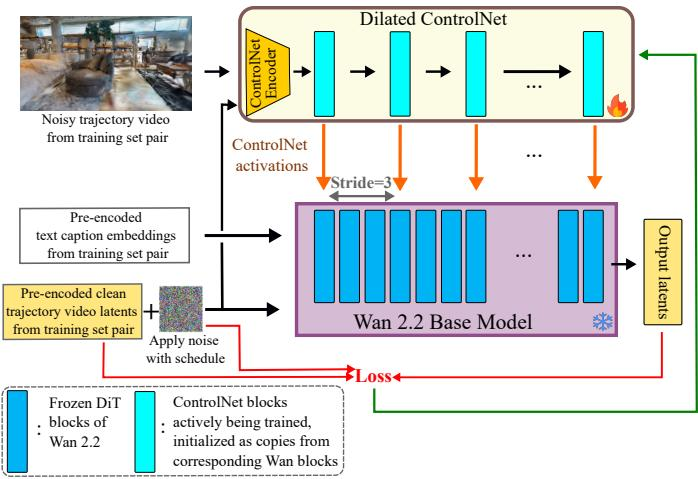  
Figure A1. The architecture and training procedure of our Wan + ControlNet (Morph.) video-to-video diffusion refinement model.

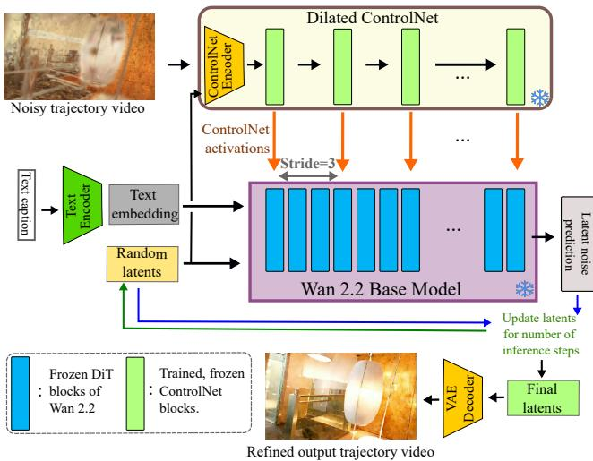  
Figure A2. The architecture and inference procedure of our Wan + ControlNet (Morph.) video-to-video diffusion refinement model.

Video baselines like Wan+Tile [18] fail to preserve multiview geometry, hallucinating details that stray from the ground truth. In contrast, Wan + ControlNet (Morph.) maintains stable visual quality, effectively eliminating rendering artifacts while preserving sharp details and multiview coherence across all difficulty levels.

## C. Downstream Robotics Imitation Learning

This section complements Section 4.3 of the main paper by providing additional visual comparisons for downstream policy learning on RLBench [27]. In Section 4.3, we integrate our video refinement model (Wan + Ctrl (Morph.)) into the pipeline of DREMA [2], a framework that reconstructs simulated manipulation tasks as 3D Gaussian Splatting scenes and interfaces with PyBullet [12] physics to recompose scenes into novel task episodes. In Figure A12, we present additional qualitative trajectories across key timesteps for synthetic episodes generated by baseline DREMA and DREMA+ref., accompanied by zoomed-in views of interaction objects. Consistent with the qualitative findings in Figure 6 of the main paper, these additional visual results demonstrate that our video refinement pipeline introduces photorealistic lighting dynamics, realistic color shifts, and enhanced surface textures to synthetic renders while preserving multi-view and temporal 3D geometric consistency. By augmenting appearance diversity—even in occasional instances where the refinement introduces noisy surfaces, such as the table in the Pick Cup task (Figure A12)—our approach acts as an effective regularizer, encouraging the downstream model (PerAct [44]) to rely on underlying scene geometry during evaluation.

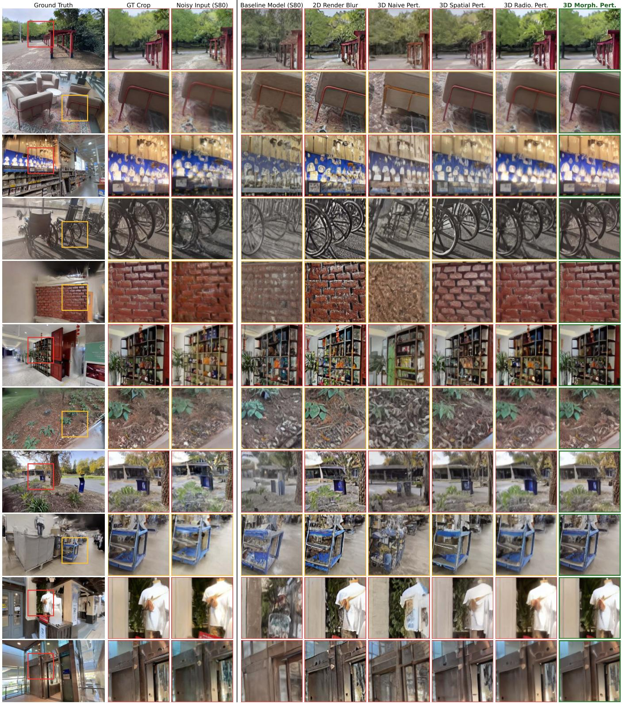  
Figure A3. Extended qualitative comparison of 3D scenes reconstructed from corrupted video trajectories refined by diffusion models trained on each perturbed dataset. Evaluated on $\boldsymbol { S } _ { 8 0 }$ test set (Extreme sparsity) using 3DGS representations re-optimized from refined output frames.

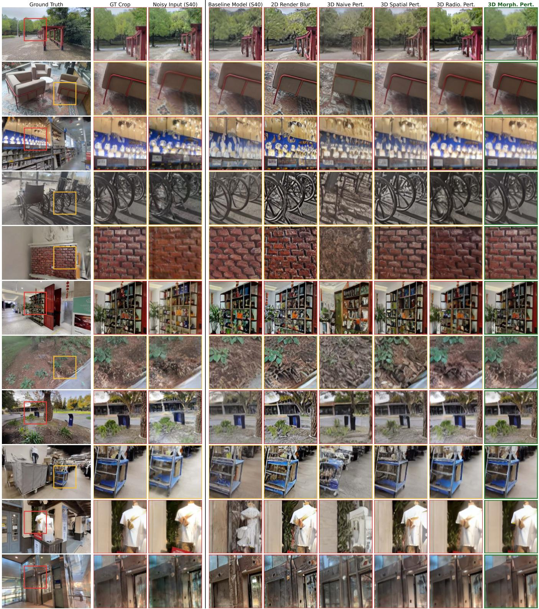  
Figure A4. Extended qualitative comparison of 3D scenes reconstructed from corrupted video trajectories refined by diffusion models trained on each perturbed dataset. Evaluated on $S _ { 4 0 }$ test set (High sparsity) using 3DGS representations re-optimized from refined output frames.

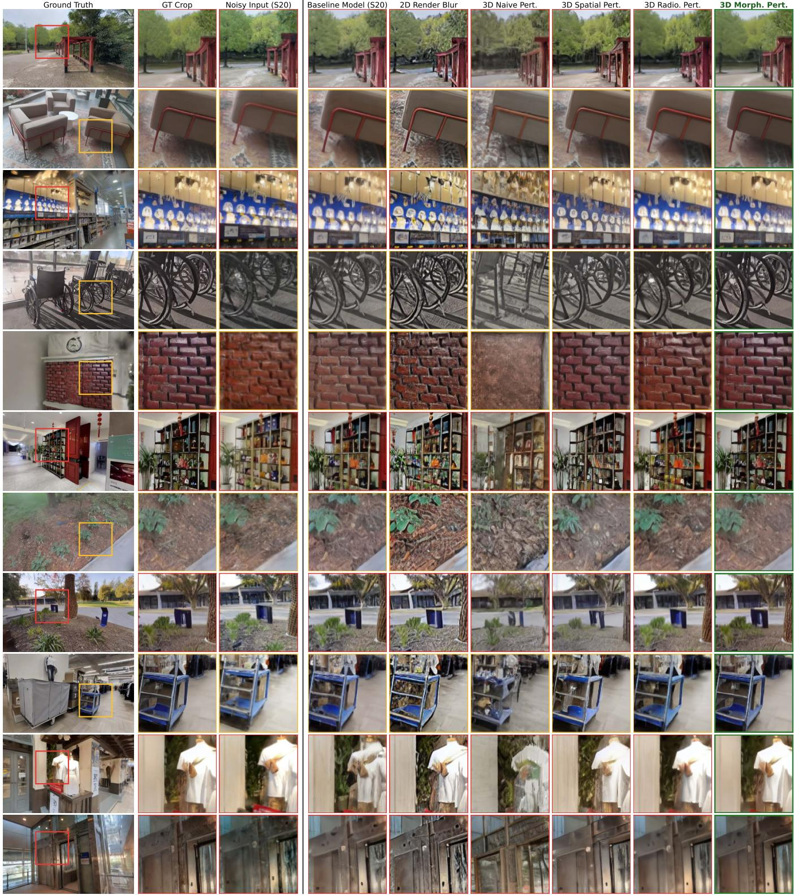  
Figure A5. Extended qualitative comparison of 3D scenes reconstructed from corrupted video trajectories refined by diffusion models trained on each perturbed dataset. Evaluated on $ { \boldsymbol { S } } _ { 2 0 }$ test set (Moderate Sparsity) using 3DGS representations re-optimized from refined output frames.

Ground Truth  
Noisy Input (High Diff.)  
Difix  
Fixer  
Wan + Tile Ctrl.  
Wan + Ctrl.(Morph.)  
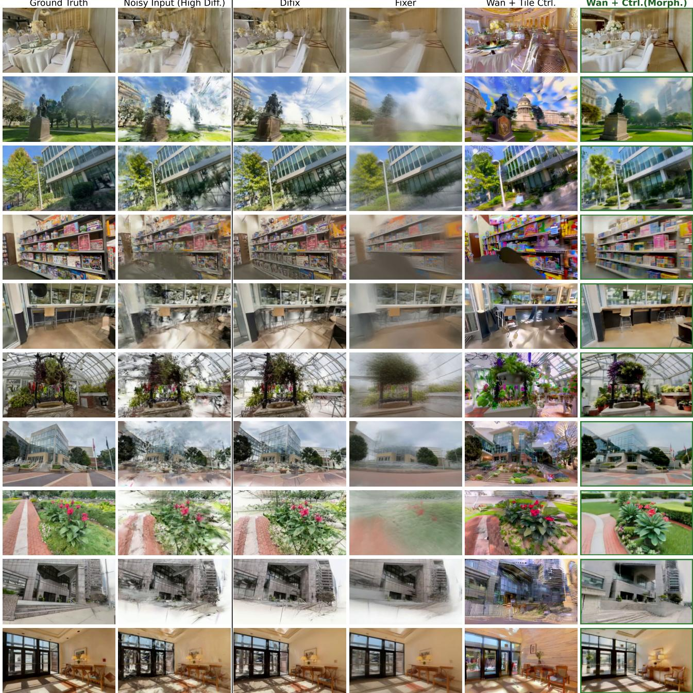  
Figure A6. Extended trajectory render refinement qualitative comparison on High difficulty (6 training views, no overlap w. test trajectory.) (see Sec. 4.2, B) test scenes.

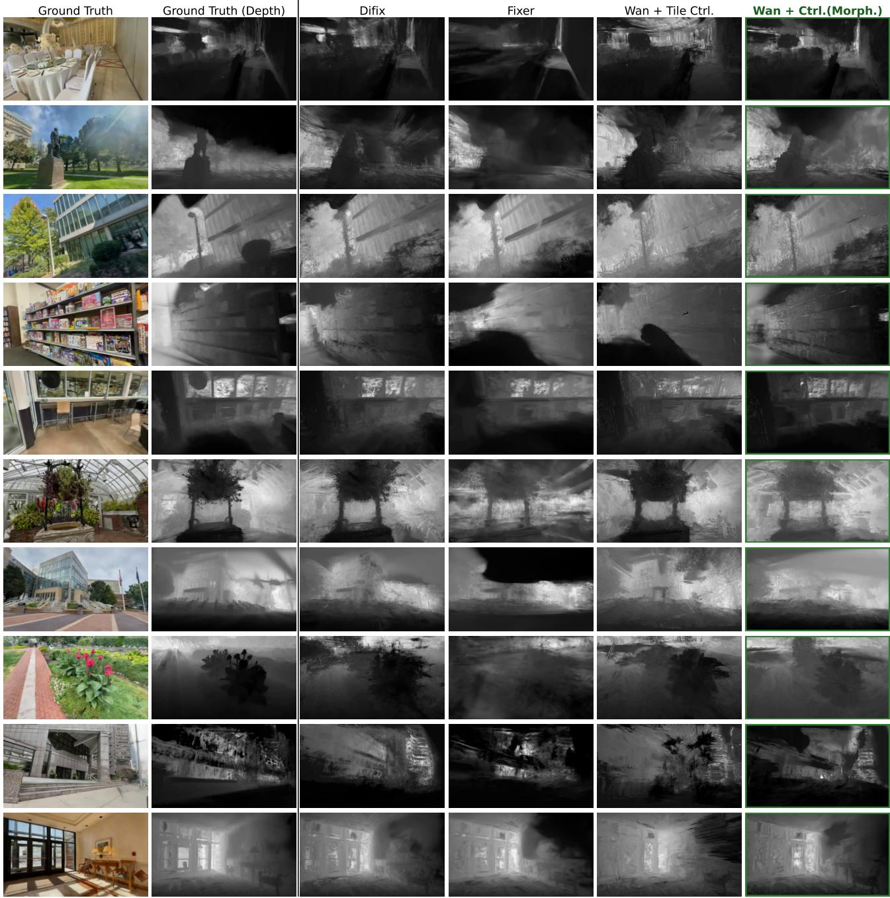  
Figure A7. Extended trajectory render refinement qualitative depth comparison on High difficulty (6 training views, no overlap w. test trajectory.) (see Sec. 4.2, B) test scenes.

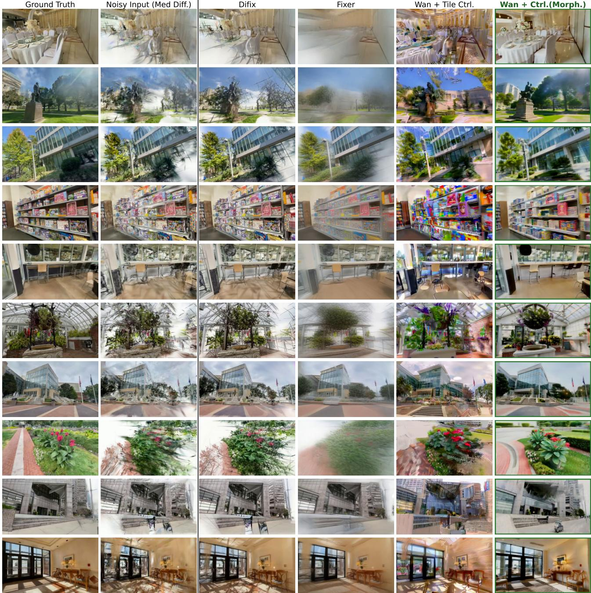  
Figure A8. Extended trajectory render refinement qualitative comparison on Medium difficulty (3 training views, 1 view overlapping w. tes trajectory ) (see Sec. 4.2, B) test scenes.

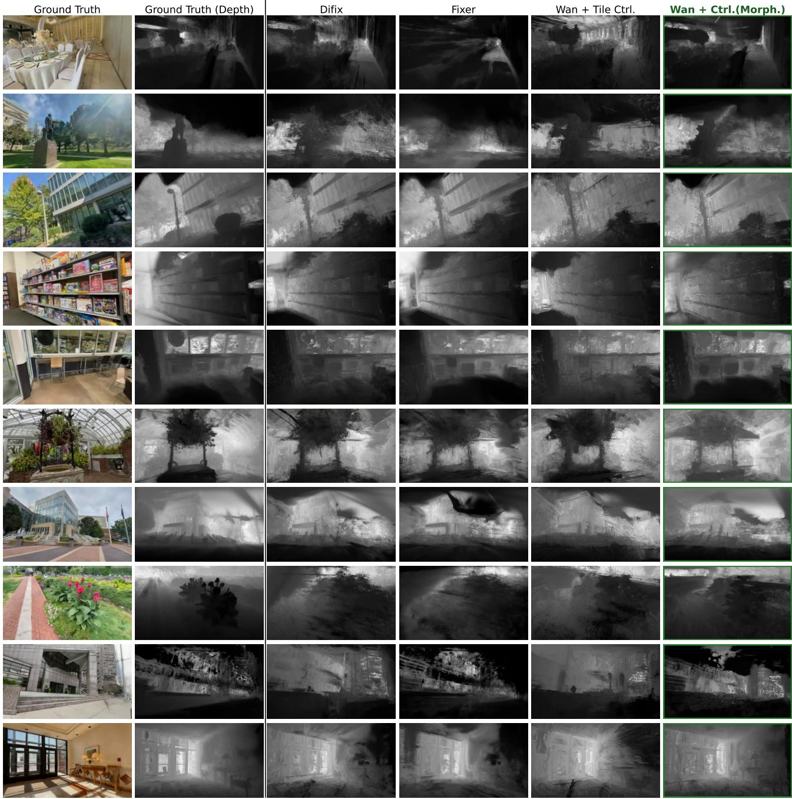  
Figure A9. Extended trajectory render refinement qualitative depth comparison on Medium difficulty (3 training views, 1 view overlapping w. test trajectory ) (see Sec. 4.2, B) test scenes.

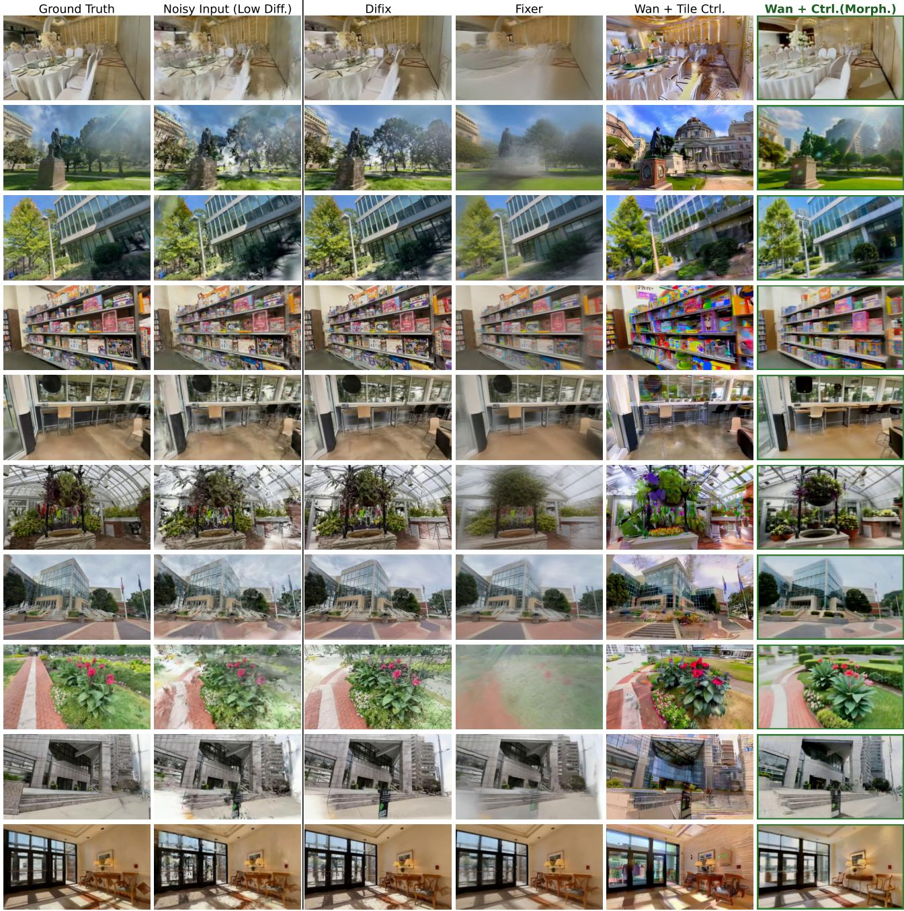  
Figure A10. Extended trajectory render refinement qualitative comparison on Low difficulty (9 training views, 1 view overlapping w. test trajectory ) (see Sec. 4.2, B) test scenes.

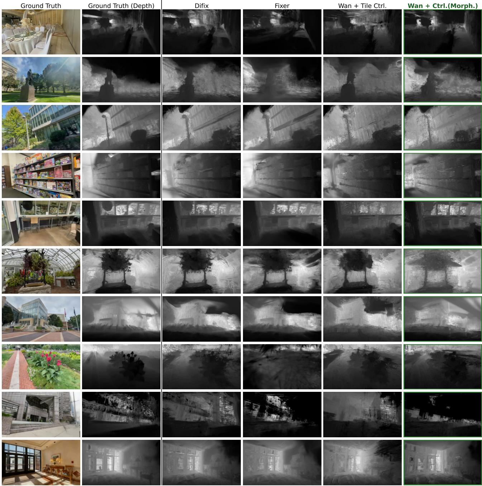  
Figure A11. Extended trajectory render refinement qualitative depth comparison on Low difficulty (9 training views, 1 view overlapping w. test trajectory ) (see Sec. 4.2, B) test scenes.

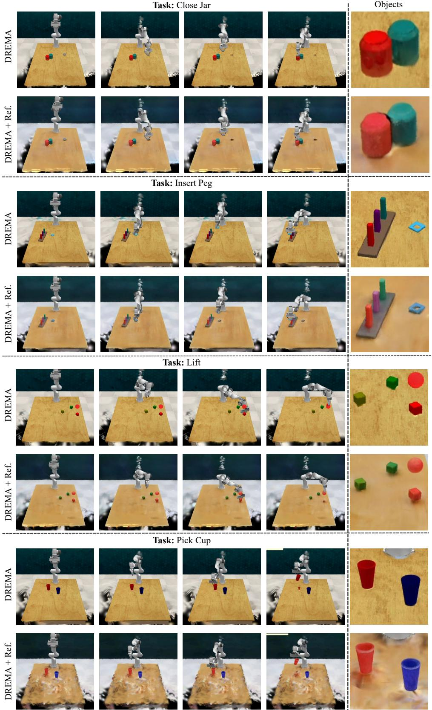  
Figure A12. Qualitative comparison of trajectory keyframes for synthetic manipulation task episodes generated by baseline DREMA and DREMA + ref. (Wan + ControlNet (Morph.)) on RLBench tasks, including close-ups of target objects.