# SAFERESTORE: DETECTOR-RELATIVE RISK CERTIFICATES FOR SELECTIVE INDUSTRIAL IMAGE RESTORATION

PREPRINT

Shaoliang Yang Santa Clara University Santa Clara, CA 95053, USA syang11@scu.edu

Jun Wang\* Santa Clara University Santa Clara, CA 95053, USA jwang22@scu.edu

## ABSTRACT

Industrial inspection pipelines often restore a measured image before a detector acts on it, yet restoration can suppress detector-supported defect structure or create clean-region activations. We formulate restoration as a selective action problem over the measured display, five restored candidates, and review. SafeRestore ranks candidates with action-specific fitted scores, chooses a gate on threshold-tuning data, and evaluates the fixed gate on a disjoint certification sample with two onesided exact binomial bounds: one for the positive-conditional evidence-loss incident rate and one for the all-accepted excess-activation incident rate. The guarantee is marginal for one policy fixed before its certification outcomes are observed, under an image-level i.i.d. working model. In a retrospective split-sample study of 4,591 public Carinthia-S images, the protocol yields auditable risk–coverage behavior. The primary all-action policy passes in one of five training repetitions (12.0% ± 26.9% pass-gated test coverage when failures count as zero), whereas fixed bicubic and reduced-complexity variants pass more often. On reserved morphologies, evidence-loss incidence rises to 81.1–90.3%, and KolektorSDD lacks both detector competence and enough positive certification images for the stated target. The contribution is therefore an auditable, detector-relative framework for deciding when a transformed image may be returned automatically and when review remains necessary—not a claim that adaptive routing outperforms simpler policies on the present evidence.

Keywords selective image restoration · exact binomial certification · industrial inspection · defect segmentation · abstention · uncertainty quantification

## 1 Introduction

Image restoration changes the observation on which an inspection decision is made. A transformation that improves visual sharpness or average reconstruction fidelity can still suppress a small defect, and a learned prior can introduce structure that activates a downstream detector [1, 2, 3]. These two failures have different operational consequences and are poorly summarized by PSNR or SSIM when the relevant structure occupies a small fraction of the image.

In an inspection pipeline, restoration is therefore a decision problem rather than only a reconstruction problem. For each observation, the pipeline may retain the measured display, return one of several restored candidates, or assign the case to review. The useful question is not only which candidate has the best mean quality, but whether a fixed policy has enough held-out evidence to return any candidate automatically while keeping two distinct incident rates below stated limits. Task-oriented restoration addresses downstream utility [4, 5, 6]; selective prediction and risk-control methods address abstention and finite-sample calibration [7, 8, 9]. SafeRestore joins these perspectives at the level of the returned image action.

SafeRestore is a detector-relative selective-restoration protocol. Its action set contains the raw display and five fixed or learned restorations. For each action, class-balanced logistic models produce two fitted ranking scores from detector and consistency features. One score ranks evidence-loss risk—detector recall falling below a specified floor on a defect-positive image. The other ranks excess-activation risk—clean-region detector activation exceeding a specified threshold. The scores select an action and order images for gating; they are ranking scores, not calibrated probabilities. A gate is chosen on one data role and evaluated once on a disjoint certification role using separate one-sided exact binomial bounds (Figure 1).

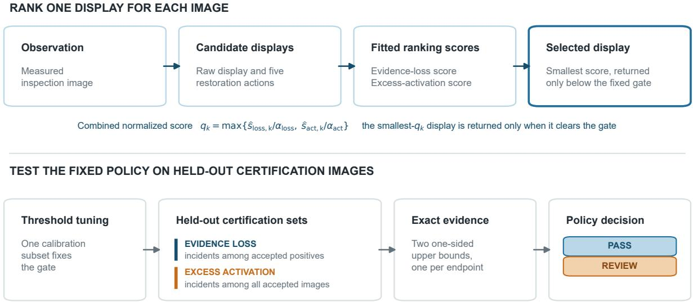  
Figure 1: SafeRestore separates action ranking from policy certification. The raw display and restored candidates receive two fitted ranking scores (not calibrated probabilities). Their worst normalized score selects the displayed candidate and defines a gate. A held-out certification sample supplies exact bounds for evidence loss among accepted positives and excess activation among all accepted images. The policy passes only when both upper bounds are at or below their targets; a passing fixed policy then returns its selected action, and all other cases are assigned to review.

The risk populations matter. Evidence loss is meaningful only on defect-positive images, whereas excess activation is defined on the clean region of every accepted image. Pooling clean images into the evidence-loss denominator would make apparent performance depend mechanically on defect prevalence. SafeRestore therefore records different denomi nators for the two endpoints, reports positive and clean coverage separately, and supplies a prevalence-standardized expression for excess-activation risk when the intended operating mixture differs from the study mixture.

The statistical statement is deliberately narrow. For one policy fixed before its certification outcomes are observed, an image-level i.i.d. working model and a Bonferroni allocation across the two endpoints yield a finite-sample bound on false certification. The statement is marginal for that policy. It does not cover choosing whichever detector/restorer seed, action pool, or ablation happens to pass. The empirical study therefore reports five marginal certificates as a sensitivity analysis and does not select a passing seed for deployment.

The contribution is a protocol, not a new restoration network or generic conformal theorem. Compact restorers and detectors are used as reproducible testbeds for the decision layer. On a retrospective split of 4,591 public Carinthia-S SEM image–mask pairs [10], the primary all-action policy passes in only one of five training repetitions, while fixed bicubic and several simpler variants pass more often. Certification therefore exposes training sensitivity and withholds automatic return when evidence is insufficient. Reserved morphologies and KolektorSDD further show where the nominal certificate does not transfer. Relationship to our earlier study of whether super-resolution preserves defect evidence [11] is summarized once in Table 1; the present estimand and records are new, but the Carinthia-S identity inventory is shared.

## The contributions are:

1. a detector-relative formulation of selective restoration with separate evidence-loss and excess-activation populations, component coverages, and an explicit prevalence-standardized activation risk;

2. a reproducible rank–tune–certify procedure with a finite-sample false-certification statement for one fixed policy, an explicit boundary on cross-policy selection, and record-level evidence sufficient to reconstruct every certificate; and

3. a five-repetition public-data study that reports risk–coverage behavior, compares every fixed action with adaptive pools, foregrounds the strongest simplifications, and diagnoses failure under stronger endpoints, limited certification evidence, reserved morphologies, and a second public dataset—and shows that the observed pass/fail pattern is unchanged under the examined alternative bound constructions.

## 2 Related Work

## 2.1 Restoration evaluated through downstream evidence

Modern restoration systems span convolutional, residual, adversarial, attention, and transformer designs [12, 13, 14, 15, 16, 17, 18]. Scientific-imaging studies and hallucination benchmarks distinguish plausible appearance from measured structure [1, 2, 3]. Task-oriented restoration optimizes a downstream objective rather than visual quality alone [4, 5, 6]. RL-Restore and Path-Restore learn image-dependent restoration programs or network paths [19, 20]. These methods principally optimize expected task performance, reconstruction quality, or computation. SafeRestore starts after the candidate transforms and downstream detector are trained. Its object is the selective policy that decides which image, if any, is returned without review under two detector-relative incident limits.

## 2.2 Uncertainty, selective prediction, and routing

Distribution-free image-to-image uncertainty methods construct pixelwise intervals for inverse problems [21]; taskdriven methods propagate uncertainty to downstream functionals [22]; and recent super-resolution work provides conformal confidence masks or reconstruction sets [23]; Bayesian alternatives instead estimate spectral uncertainty for super-resolution [24]. Industrial applications include conformal risk control for defect segmentation [25] and calibrated pixelwise intervals for layout-to-SEM reconstruction [26]. These works quantify uncertainty around an image or task output. The present endpoint is instead the incident rate of a discrete raw/restored/review policy.

Selective prediction supplies the reject-option perspective [7, 27]. Learning-to-defer methods optimize accuracy–cost tradeoffs when passing decisions to an expert [28, 29]. Risk-controlling prediction sets, Learn-then-Test, and conformal risk control provide general finite-sample tools for black-box losses [8, 9, 30]. Selective and joint extensions address selection-conditioned or simultaneous quantities [31, 32, 33].

LEC is especially close conceptually: it formulates selection-conditioned risk as a linear expectation constraint, computes a retention-maximizing threshold from held-out data, and extends the construction to two-model routing [34]. RACER likewise combines finite-sample calibration with model routing and abstention for set-valued largelanguage-model routing [35]. SafeRestore differs in the scientific endpoint, not in claiming a more general theorem. It selects among image transformations and controls two incident rates with different conditioning populations. The implementation uses a conservative split: tuning chooses one gate, and an independent certification role evaluates that fixed gate with two exact binomial bounds and a Bonferroni allocation. This construction is motivated by risk-control principles but is not the RCPS or Learn-then-Test algorithm.

## 2.3 Industrial inspection setting

Public defect datasets make reproducible evaluation possible without proprietary fabrication imagery. MVTec AD and KolektorSDD contain clean and defective surface images [36, 37], whereas Carinthia-S provides SEM image–mask pairs across six morphology classes [10]. Semiconductor-imaging work increasingly studies learned enhancement, hotspot imaging, segmentation under noisy and data-limited acquisition, and transfer under manufacturing constraints [38, 39, 40, 41, 42]. Our controlled transformations isolate the action decision; they are not a physical qualification of a scanner, recipe, or fabrication process.

## 2.4 Relationship to a prior Carinthia-S study

The closest empirical neighbor is our earlier study of whether super-resolution preserves defect evidence at a low false-call operating point [11]. It shares authorship, several transformations, and all 4,591 Carinthia-S image–mask identities. The overlap is complete and must be considered when judging empirical novelty. Table 1 separates the shared substrate from the new estimand and evidence. No fitted model, detector operating point, split, synthetic record, or numerical result from that study enters score fitting, threshold selection, or certification here. Conversely, the present work does not reuse the shared images as evidence of external-domain replication.

The two studies also reach compatible conclusions by different routes, and that relationship should be read carefully. The earlier study compared fixed reconstruction methods at a predeclared low-false-call operating point and found that the highest-fidelity learned reconstructions recovered fewer defect pixels than bicubic interpolation. The present study does not re-test that comparison. It asks whether an image-specific policy over comparable transformations can be certified for automatic return, and it uses different models—a compact U-Net detector and residual restorer here, rather than the DeepLabV3 detector and jointly trained reconstruction model there—so no operating point, threshold, or fidelity ranking is inherited. This is not a replication of the earlier ordering on new images. Within this separate retrospective study, allowing per-image adaptivity and abstention did not produce more passing marginal certificates than simple fixed interpolation.

Table 1: Provenance and claim boundary relative to [11]. Carinthia-S identity overlap is complete; novelty rests on the selective-policy estimand, disjoint certification role, and corresponding records rather than on new public images.
<table><tr><td>Dimension</td><td>Prior study</td><td>This study</td></tr><tr><td>Scientific question</td><td>Does each fixed super-resolution method preserve sparse defect evidence at a low false-call operating point?</td><td>Does one fixed image-specific raw/restored/review policy satisfy two stated incident limits on its accepted population?</td></tr><tr><td>Primary evidence</td><td>Ten repetitions on independently generated line/space and contact-hole structures; Carinthia-S is an unchanged-policy external stress.</td><td>A retrospective Carinthia-S train/validation/tune/certify/test partition; reserved morphologies and KolektorSDD are descriptive boundary checks.</td></tr><tr><td>Decision unit</td><td>A method-repetition pair is compared with other fixed methods.</td><td>Each image receives one selected action or review from a fixed policy.</td></tr><tr><td>Statistical claim</td><td>Paired preservation and operating-point comparisons; no image-specific selective-risk certificate.</td><td>Separate exact marginal bounds for evidence loss among accepted positives and excess activation among all accepted images.</td></tr><tr><td>Headline finding</td><td>Reconstruction fidelity and inspection utility diverge: learned reconstruction attains the highest similarity yet detects fewer defect pixels than bicubic interpolation.</td><td>In these five repetitions, per-image action selection with abstention passes fewer marginal certificates than fixed bicubic and several simplifications; training sensitivity and positive-evidence volume constrain the result.</td></tr><tr><td>Models</td><td>DeepLabV3 detector and a jointly trained reconstruction model.</td><td>Compact U-Net detector and residual restorer; no operating point or checkpoint is inherited from that study.</td></tr><tr><td>Shared material</td><td>Complete Carinthia-S identity inventory and several transformation families.</td><td>The same identities and related transformations; this paper does not present Carinthia-S as a new acquisition bank.</td></tr><tr><td>Distinct artifacts</td><td>Records, detectors, and operating points from that study.</td><td>New split manifests, trained checkpoints, action-level score records, tuned gates, certification counts, ablations, and policy outputs.</td></tr></table>

## 3 Decision Problem and Detector-Relative Risks

Let $Y \in [ 0 , 1 ] ^ { H \times W }$ be a reference inspection image with binary defect mask M. A controlled observation is

$$
X = { \mathcal { D } } _ { s } ( Y ; \epsilon ) ,\tag{1}
$$

where s indexes degradation severity. The policy receives $X ;$ the reference and mask are used only in their designated offline data roles. Equation (1) creates a matched counterfactual restoration test, not a second physical acquisition. One image is the statistical unit. Because the public manifest contains no wafer, lot, or specimen-group identifiers, physical independence cannot be verified; the certificate is stated under an image-level i.i.d. working model.

The non-review action set is

$$
\begin{array} { r } { \mathcal { A } _ { 0 } ( X ) = \{ a _ { \mathrm { r a w } } , a _ { \mathrm { b i l } } , a _ { \mathrm { b i c } } , a _ { \mathrm { s m o o t h } } , a _ { \mathrm { s h a r p } } , a _ { \mathrm { l e a r n e d } } \} . } \end{array}\tag{2}
$$

The raw action displays X by nearest-neighbor resizing; the other actions are fixed or learned transformations. A detector $f ,$ fixed within each training repetition, maps every candidate to a pixelwise score map. Review, $a _ { \mathrm { r e v i e w } }$ , is the terminal action when the selected candidate is not returned automatically.

## 3.1 Image-level incidents

At detector threshold $\tau ,$ define defect-pixel recall and clean-region false-positive rate for action a as

$$
\operatorname { R e c } ( a ) = { \frac { \sum _ { u } M _ { u } \mathbf { 1 } \{ f ( a ( X ) ) _ { u } \geq \tau \} } { \sum _ { u } M _ { u } } } , \qquad \sum _ { u } M _ { u } > 0 ,\tag{3}
$$

$$
\mathrm { F P R } _ { c } ( a ) = \frac { \sum _ { u } ( 1 - M _ { u } ) \mathbf { 1 } \{ f ( a ( X ) ) _ { u } \geq \tau \} } { \sum _ { u } ( 1 - M _ { u } ) } .\tag{4}
$$

The two incident indicators are

$$
\ell _ { \mathrm { l o s s } } ( a ) = \mathbf { 1 } \{ \mathrm { R e c } ( a ) < r _ { 0 } \} , \qquad \mathrm { ~ d e f i n e d ~ o n l y ~ w h e n ~ } M \neq 0 ,\tag{5}
$$

$$
\ell _ { \mathrm { a c t } } ( a ) = { \bf 1 } \{ { \mathrm { F P R } } _ { c } ( a ) > f _ { 0 } \} , \qquad \mathrm { ~ d e f i n e d ~ f o r ~ e v e r y ~ i m a g e . }\tag{6}
$$

The primary values are $r _ { 0 } = 0 . 2 5$ and $f _ { 0 } = 0 . 0 0 2 .$ The first endpoint marks severe loss of detector-supported evidence; it is not a claim that 25% recall is adequate segmentation. A 50% recall floor is analyzed separately. The second endpoint marks excessive detector activation outside annotated defects.

Both endpoints are detector-relative surrogates. An evidence-loss incident can reflect weak detector competence as well as suppression by a transformation, and it can occur for the raw display. An excess-activation incident is not proof that a restoration invented physical structure; it records detector calls on annotated clean pixels, including calls already present in the raw display. Consequently, the paper uses the terms evidence loss and excess activation, not causal claims of deletion or invention.

Let $a ^ { \star } ( X ) \in \mathcal A _ { 0 } ( X )$ be the candidate selected before certification, and let $G _ { \theta } ( X ) = \mathbf { 1 } \{ q ^ { \star } ( X ) \leq \theta \}$ be its fixed return gate. The policy risks are

$$
R _ { \mathrm { l o s s } } ( \theta ) = \mathrm { P r } \{ \ell _ { \mathrm { l o s s } } ( a ^ { \star } ) = 1 \mid G _ { \theta } = 1 , M \neq 0 \} ,\tag{7}
$$

$$
R _ { \mathrm { a c t } } ( \theta ) = \mathrm { P r } \{ \ell _ { \mathrm { a c t } } ( a ^ { \star } ) = 1 \mid G _ { \theta } = 1 \} .\tag{8}
$$

Conditioning evidence loss on $M \ne 0$ prevents accepted clean images from artificially lowering that risk. Excess activation uses all accepted images because every image contains a clean region.

## 3.2 Coverage and operating prevalence

Define positive and clean return coverage as

$$
C _ { + } ( \theta ) = \operatorname* { P r } \{ G _ { \theta } = 1 \mid M \neq 0 \} ,\tag{9}
$$

$$
C _ { 0 } ( \theta ) = \operatorname* { P r } \{ G _ { \theta } = 1 \mid M = 0 \} .\tag{10}
$$

For an operating defect prevalence $\pi ,$ , overall return coverage is

$$
C _ { \pi } ( \theta ) = \pi C _ { + } ( \theta ) + ( 1 - \pi ) C _ { 0 } ( \theta ) .\tag{11}
$$

Because the all-accepted activation risk changes with the accepted population mixture, define the component risks

$$
R _ { \mathrm { a c t , + } } ( \theta ) = \mathrm { P r } \{ \ell _ { \mathrm { a c t } } = 1 \mid G _ { \theta } = 1 , M \neq 0 \} ,\tag{12}
$$

$$
R _ { \mathrm { a c t , 0 } } ( \theta ) = \mathrm { P r } \{ \ell _ { \mathrm { a c t } } = 1 \mid G _ { \theta } = 1 , M = 0 \} .\tag{13}
$$

When $C _ { \pi } ( \theta ) > 0$ , the prevalence-standardized activation risk is

$$
R _ { \mathrm { a c t } , \pi } ( \theta ) = \frac { \pi C _ { + } ( \theta ) R _ { \mathrm { a c t , + } } ( \theta ) + ( 1 - \pi ) C _ { 0 } ( \theta ) R _ { \mathrm { a c t , 0 } } ( \theta ) } { C _ { \pi } ( \theta ) } .\tag{14}
$$

Equations (11)–(14) separate a change in workload mixture from a change in component behavior. A component risk is undefined if its conditioning event has zero probability; an empirical certificate with no accepted observations for a required endpoint is set to fail rather than treating the missing rate as zero.

The study targets are

$$
R _ { \mathrm { l o s s } } ( \theta ) \leq \alpha _ { \mathrm { l o s s } } = 0 . 1 5 , \qquad R _ { \mathrm { a c t } } ( \theta ) \leq \alpha _ { \mathrm { a c t } } = 0 . 1 5 .\tag{15}
$$

These are transparent research thresholds, not manufacturing acceptance limits. A deployment study must elicit endpoint definitions and tolerances from the costs of missed evidence, false detector activity, and review. The two limits are simultaneous constraints: improvement in one endpoint cannot compensate for failure of the other.

## 4 Selective Restoration Policy

## 4.1 Candidate actions and common detector

The action pool contains nearest-neighbor display of the controlled observation, bilinear and bicubic interpolation, Gaussian-smoothed bicubic, sharpened bicubic, and a compact learned residual restorer. The learned model applies an input convolution, six 32-channel residual blocks, and an output residual added to the bicubic image. Smoothing, sharpening, and learned priors are included because they induce visibly different evidence-loss–activation tradeoffs, not because they represent an exhaustive set of restoration models. Architecture breadth is not the scientific claim; the claim is the selective decision layer applied to a fixed candidate pool.

A compact three-level U-Net detector [43] is trained on reference-resolution training images. Within a repetition, the same detector checkpoint and pixel threshold are applied to all six actions. Candidate comparisons therefore change the image transformation while holding the pixel-level decision rule fixed. The policy is post-hoc with respect to the candidate transforms and detector, but application requires generating and scoring all candidates; no efficiency benefit is assumed.

## 4.2 Action-specific ranking scores

For candidate $a _ { k } ( X )$ , let $P _ { k } = f ( a _ { k } ( X ) )$ ) and let $P _ { \mathrm { r a w } }$ be the raw-action detector map. Six application-time features form $z _ { k } ( X )$ :

1. mean binary entropy of $P _ { k }$ ;

2. mean squared error after bicubic projection of $a _ { k } ( X )$ back to the observed low-resolution grid;

3. mean absolute detector-map difference $| P _ { k } - P _ { \mathrm { r a w } } | ;$

4. absolute change in mean detector score relative to $P _ { \mathrm { r a w } }$

5. mean absolute image residual from the raw action; and

6. fraction of pixels for which $P _ { k } \ge 0 . 5$

No reference image or defect mask is required to compute these features at application time.

For each action, two standardized, class-balanced logistic regressions are fit on the detector-validation role. The evidence-loss regression uses only positive images; the excess-activation regression uses all images. Denote their sigmoid outputs by ${ \widehat { s } } _ { \mathrm { l o s s } , k } ( X )$ and ${ \widehat { s } } _ { \mathrm { a c t } , k } ( X )$ . Class balancing changes the fitted class prior, so these outputs are treated only as ranking scores. They are neither claimed nor required to be calibrated probabilities.

Candidate k receives the normalized worst-endpoint score

$$
q _ { k } ( X ) = \operatorname* { m a x } \left\{ \frac { \widehat { s } _ { \mathrm { l o s s } , k } ( X ) } { \alpha _ { \mathrm { l o s s } } } , \frac { \widehat { s } _ { \mathrm { a c t } , k } ( X ) } { \alpha _ { \mathrm { a c t } } } \right\} .\tag{16}
$$

The selected action and gate score are

$$
a ^ { \star } ( X ) = \arg \operatorname* { m i n } _ { a _ { k } \in { \mathcal { A } } _ { 0 } ( X ) } q _ { k } ( X ) , \qquad q ^ { \star } ( X ) = \operatorname* { m i n } _ { k } q _ { k } ( X ) .\tag{17}
$$

Ties follow the fixed order raw, bilinear, bicubic, smoothed bicubic, sharpened bicubic, and learned. The raw display therefore competes directly with every restoration. The fitted scores determine an ordering; held-out incident counts determine whether the resulting gate passes certification.

## 4.3 Threshold selection and certification

The calibration inventory is partitioned by a deterministic, seed-independent identifier-hash rule into approximately 30% threshold-tuning and 70% certification roles. On the tuning role, candidate thresholds are the ordered unique values of $q ^ { \star }$ . For each prefix, the empirical evidence-loss rate is computed among accepted positives and the empirical excess-activation rate among all accepted images. A prefix is eligible only if it contains at least 15 accepted images and 15 accepted positives and satisfies

$$
\widehat { R } _ { \mathrm { l o s s } } \leq 0 . 5 \alpha _ { \mathrm { l o s s } } , \qquad \widehat { R } _ { \mathrm { a c t } } \leq 0 . 5 \alpha _ { \mathrm { a c t } } .\tag{18}
$$

The largest eligible prefix fixes ${ \widehat { \theta } } .$ If none is eligible, the policy has no automatic-return region. The half-target margin is a heuristic for choosing a candidate gate; it has no coverage guarantee. Statistical validity comes only from evaluating the fixed gate on the disjoint certification role.

Table 2: Rank–tune–certify procedure for one fixed policy.
<table><tr><td>Step</td><td>Operation</td></tr><tr><td>1</td><td>Fit action-specific evidence-loss scores on positive detector-validation images and excess-activation scores on all detector-</td></tr><tr><td></td><td>validation images. On threshold-tuning images, select  $a ^ { \star }$  and choose the largest prefix meeting the minimum-evidence and half-target criteria.</td></tr><tr><td>23</td><td>Fix the detector, score models, candidate order, and gate threshold without using certification outcomes.</td></tr><tr><td>4</td><td>On the certification role, count  $( e _ { \mathrm { l o s s } } , n _ { \mathrm { l o s s } } )$  among accepted positives and  $( e _ { \mathrm { a c t } } , n _ { \mathrm { a c t } } )$  among all accepted images; the policy passes only if both exact upper bounds meet their targets.</td></tr><tr><td>5</td><td>For a policy fixed in advance, return  $a ^ { \star } ( X )$  when its certificate passes and the gate accepts; otherwise assign the image to review.</td></tr></table>

Table 2 separates score fitting, threshold choice, certification, and the application decision. The reproducibility archive stores, for each image and candidate action, the six features, incident labels, selected action, gate score, threshold, certification counts, exact bounds, and population-specific coverage. These records are sufficient to reconstruct every policy comparison without retraining the detector or restorer.

## 5 Exact Marginal Certification Guarantee

Let $\mathcal { F } _ { 0 }$ denote all information used before certification, including the trained detector and restorer, fitted score models, action order, detector threshold, and gate threshold ${ \widehat { \theta } } .$ The guarantee concerns one policy for which these objects are $\mathcal { F } _ { 0 } .$ -measurable. Conditional on ${ \breve { F } } _ { 0 } .$ , let $Z _ { i } = ( X _ { i } , M _ { i } ) \bar { , } i = 1 , \ldots , N _ { \mathrm { c e r t } } .$ , be i.i.d. image-level units from the nominal distribution $\mathcal { D } _ { \mathrm { { : } } }$ independent of the data used to construct $\mathcal { F } _ { 0 }$ . This is the working sampling model. The public Carinthia-S metadata do not identify wafers, lots, specimens, or repeated fields of view, so the physical independence assumption cannot be audited from the manifest.

For the fixed policy, define

$$
n _ { \mathrm { l o s s } } = \sum _ { i = 1 } ^ { N _ { \mathrm { c e r t } } } \mathbf { 1 } \{ G _ { \widehat { \theta } } ( X _ { i } ) = 1 , M _ { i } \neq 0 \} ,\tag{19}
$$

$$
e _ { \mathrm { l o s s } } = \sum _ { i = 1 } ^ { N _ { \mathrm { c e r t } } } \mathbf { 1 } \{ G _ { \widehat { \theta } } ( X _ { i } ) = 1 , M _ { i } \neq 0 , \ell _ { \mathrm { l o s s } , i } = 1 \} ,\tag{20}
$$

$$
n _ { \mathrm { a c t } } = \sum _ { i = 1 } ^ { N _ { \mathrm { c e r t } } } \mathbf { 1 } \{ G _ { \widehat { \theta } } ( X _ { i } ) = 1 \} ,\tag{21}
$$

$$
e _ { \mathrm { a c t } } = \sum _ { i = 1 } ^ { N _ { \mathrm { c e r t } } } \mathbf { 1 } \{ G _ { \widehat { \theta } } ( X _ { i } ) = 1 , \ell _ { \mathrm { a c t } , i } = 1 \} .\tag{22}
$$

Conditional on $\mathcal { F } _ { 0 }$ and the corresponding accepted-sample size, $e _ { \mathrm { l o s s } }$ is binomial with parameter $R _ { \mathrm { l o s s } } ( { \widehat { \theta } } )$ , and $e _ { \mathrm { a c t } }$ is binomial with parameter $R _ { \mathrm { a c t } } ( { \widehat { \theta } } )$ . The two counts share observations and need not be independent.

For $0 < \gamma < 1$ , define the one-sided Clopper–Pearson upper bound [44]

$$
U ( e , n ; \gamma ) = \left\{ { \begin{array} { l l } { 1 , } & { n = 0 \mathrm { ~ o r ~ } e = n , } \\ { \operatorname { B e t a } ^ { - 1 } ( 1 - \gamma ; e + 1 , n - e ) , } & { 0 \leq e < n . } \end{array} } \right.\tag{23}
$$

The convention $U ( e , 0 ; \gamma ) = 1$ ensures that absence of endpoint evidence cannot produce a passing certificate. With joint error level δ, set

$$
U _ { \mathrm { l o s s } } = U ( e _ { \mathrm { l o s s } } , n _ { \mathrm { l o s s } } ; \delta / 2 ) , \qquad U _ { \mathrm { a c t } } = U ( e _ { \mathrm { a c t } } , n _ { \mathrm { a c t } } ; \delta / 2 ) .\tag{24}
$$

The fixed policy passes when $U _ { \mathrm { l o s s } } \leq \alpha _ { \mathrm { l o s s } }$ and $U _ { \mathrm { a c t } } \leq \alpha _ { \mathrm { a c t } } .$

Proposition 1 (False certification for one fixed policy). Under the conditional i.i.d. and data-separation conditions above,

$$
\mathrm { P r } \Big ( U _ { \mathrm { l o s s } } \leq \alpha _ { \mathrm { l o s s } } , U _ { \mathrm { a c t } } \leq \alpha _ { \mathrm { a c t } } ,
$$

$$
a n d [ R _ { \mathrm { l o s s } } ( \widehat \theta ) > \alpha _ { \mathrm { l o s s } } o r R _ { \mathrm { a c t } } ( \widehat \theta ) > \alpha _ { \mathrm { a c t } } ] \ | \ \mathcal { F } _ { 0 } ) \leq \delta .\tag{25}
$$

Proof. For either endpoint $j ,$ exact one-sided Clopper–Pearson coverage gives $\mathrm { P r } \{ R _ { j } > U _ { j } \mid \mathcal { F } _ { 0 } \} \le \delta / 2$ , including after conditioning on the accepted-sample size. If a policy passes while either target is false, at least one of the two upper bounds fails to cover its incident probability. A union bound over the two endpoints gives δ. Independence between the endpoint indicators is unnecessary. □

Policy-family boundary. Proposition 1 is marginal for one policy fixed without its certification outcomes. It does not cover searching across training seeds, action pools, feature sets, thresholds, or architecture families and then choosing a passing member. If five separately certified policies were treated as a menu and any passing policy could be selected, the direct union bound would be at most 5δ = 0.50 at δ = 0.10, not 0.10. A prospective study must therefore fix one policy, allocate an error budget across a prespecified family, use an appropriate familywise procedure, or collect a fresh certification sample after selection. In this paper, seed-level pass counts measure model-fitting sensitivity; no passing seed is selected for deployment.

Sampling and transport boundary. The proposition is a repeated-sampling statement, not a posterior probability that an individual returned image is safe. It also requires the stated sampling law; arbitrary exchangeability, correlated crops, or unrecorded wafer-level clustering do not automatically yield the conditional binomial model. Clustered production data require cluster-level sampling or a dependence-aware analysis. A certificate also does not transfer to a new morphology, scanner, recipe, or prevalence mixture without additional assumptions and evidence.

Retrospective evidence boundary. The Carinthia-S identities also appear in [11] (Table 1). The present train/validation/tune/certify/test roles and policy records are distinct, but the physical images are not a newly acquired confirmation set. The proposition states what the split-sample procedure controls under its working model; the empirical evidence should be interpreted as retrospective. Prospective, cluster-identified acquisitions are needed before making a production claim

## 6 Evaluation Design

The evaluation asks three questions, and Section 7 answers them in this order. First, does a fixed selective policy pass both held-out risk bounds, and how does it compare with simpler fixed actions? Second, do the candidate actions produce materially different fidelity and detector-incident profiles, so that there is something for a policy to exploit? Third, where does the result fail when the endpoint, feature set, evidence volume, morphology, architecture, or dataset is changed?

## 6.1 Carinthia-S population and data roles

Carinthia-S contains 4,591 public SEM image–mask pairs from six morphology classes [10]. Classes 3, 4, and 6 define the nominal population. A deterministic identifier-hash partition assigns 3,186 images to training, 431 to detector validation, 461 to calibration, and 446 to held-out test. A nonempty mask defines a positive image. The test role contains 430 positives and 16 clean images; one class-6 test image has a nonempty mask and is counted as positive. Classes 1, 2, and 5 form a disjoint 67-image morphology-shift diagnostic and are excluded from fitting, threshold selection, and nominal certification.

For each image, a fixed schedule assigns mild, moderate, or severe degradation. The reference is blurred with $\sigma _ { b } \in \{ 0 . 6 , 1 . 2 , 2 . 0 \}$ , downsampled by a factor of two, and corrupted with Gaussian noise $\sigma _ { n } \in \{ 0 . 0 1 0 , 0 . 0 2 5 , 0 . 0 4 5 \}$ respectively. Assignment depends only on the split role and image identifier, not on training seed or action; all actions therefore receive the same controlled observation for a given image. These matched transformations test restoration behavior under known information loss. They are not a specified SEM acquisition model (Figure 2).

Figure 3 illustrates the nominal–reserved appearance difference; the examples are qualitative and do not enter certification.

## 6.2 Models, repetitions, and endpoints

The primary family combines a compact three-level U-Net detector with a six-block residual restorer. An alternate family combines an attention-gated U-Net detector with a U-Net residual restorer under the same data roles and endpoints. Both families are trained from scratch at seeds 201, 203, 207, 211, and 223. The observation schedule and tune/certify membership remain fixed, so these repetitions vary model fitting rather than the test sample. Compact architectures are deliberate: they provide reproducible checkpoints for the decision protocol rather than a claim of state-of-the-art restoration quality.

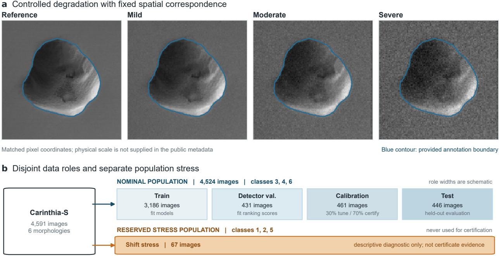  
Figure 2: Controlled observations and image-level data roles. (a) A reference image and the three blur–noise levels share pixel correspondence; the blue contour traces the provided annotation boundary. Physical scale is unavailable in the public metadata. (b) Nominal classes are partitioned into model fitting, score fitting, threshold tuning/certification, and held-out test roles. Reserved classes form a separate descriptive stress and never contribute to a nominal certificate.

Within each repetition, the detector pixel threshold is selected on clean regions of the detector-validation role to target a pixel-level false-positive rate of $1 0 ^ { - 3 }$ . It is then fixed for all actions. The primary evidence-loss incident is recall below 0.25; the boundary analysis refits the score model and policy at a 0.50 floor. Excess activation is clean-region FPR above 0.002. Both policy-risk targets are 0.15, with joint marginal false-certification level $\delta = 0 . 1 0$ . Calibration membership is divided approximately 30%/70% into tuning and certification using a deterministic seed-independent identifier-hash rule (Table 3).

Table 3: Evaluation specification and claim boundary.
<table><tr><td>Element</td><td>Setting</td></tr><tr><td>Statistical unit</td><td>One image under an i.i.d. working model; wafer/lot grouping is unavailable</td></tr><tr><td>Nominal population</td><td>Carinthia-S classes 3, 4, and 6; 461 calibration and 446 test images (430 positive, 16 clean)</td></tr><tr><td>Reserved population</td><td>Classes 1, 2, and 5; 67 positives; descriptive transfer diagnostic only</td></tr><tr><td>Repetitions</td><td>Seeds 201, 203, 207, 211, and 223; recurring identities; descriptive training sensitivity</td></tr><tr><td>Tune / certify</td><td>Deterministic identifier-hash split; one tuned threshold evaluated on the certification role</td></tr><tr><td>Primary incidents</td><td>Positive-conditional recall &lt; 0.25; all-accepted clean-region FPR &gt; 0.002</td></tr><tr><td>Boundary endpoint</td><td>Positive-conditional recall &lt; 0.50, with score refitting and threshold reselection</td></tr><tr><td>Risk limits</td><td>αloss = αact = 0.15, marginal joint δ = 0.10</td></tr><tr><td>Minimum tuning evidence</td><td>15 accepted images and 15 accepted positives</td></tr><tr><td>Second dataset</td><td>KolektorSDD finite-sample and detector-competence stress; no passing-policy claim</td></tr></table>

## 6.3 Comparators and outcomes

The all-action policy, which ranks the raw display together with all five restorations, is the primary adaptive comparator. Fixed-action policies use raw, bilinear, bicubic, smoothed bicubic, sharpened bicubic, or learned restoration alone. A restoration-only adaptive pool excludes raw. Supporting comparators include entropy-gated raw display and an outcome-informed oracle that tests whether even idealized action choice can rescue an accept-all gate. Every comparator is fit, tuned, and certified separately; none inherits the primary policy’s certificate.

a Nominal pit morphology (Carinthia-S class 4)

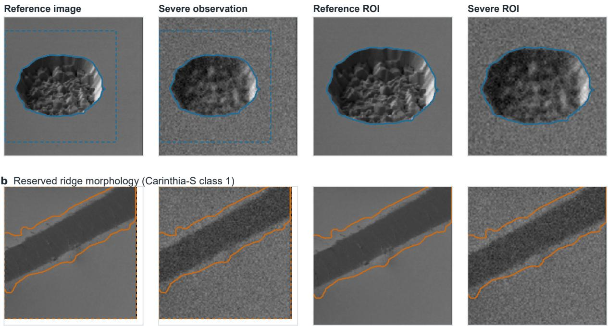  
Dashed boxes define the displayed pixel-space ROIs; physical scale is unavailable in the public metadata.

Figure 3: Image evidence for the nominal and reserved populations. Each row shows a full reference, its severe controlled observation, and matching pixel-space regions of interest. (a) A nominal pit morphology from the test population (Carinthia-S class 4). (b) A reserved ridge morphology (Carinthia-S class 1). Solid contours trace provided annotation boundaries; dashed boxes define the displayed regions of interest. The examples illustrate appearance shif and are not themselves certification evidence.

The main outcome is the number of marginal seed-level certificates that pass. Conditional coverage is the fraction below the tuned gate before applying the certificate decision. Pass-gated coverage equals conditional coverage for a passing policy and zero otherwise. Across seeds, its mean and standard deviation summarize training sensitivity, not confidence intervals or independent-factory replication. We also report positive and clean coverage, endpoint-specific certification counts and bounds, risk–coverage curves on the certification role, and incident rates on the held-out test role.

Feature ablations remove one or more score inputs and pool ablations remove candidate actions. They are distinct policies with separate marginal certificates. Their purpose is to test whether the all-action policy is actually supported over simpler alternatives. The study configuration was not externally preregistered. Split manifests, image–action records, exact counts, and figure source tables are released so all reported comparisons can be reconstructed.

## 6.4 KolektorSDD boundary study

KolektorSDD contains 399 images from 50 items [37]. We preserve item-level separation. Official fold 0 is too small for the minimum positive tuning requirement. A larger item-level diagnostic split contains 18 calibration positives, but its deterministic 30%/70% subdivision yields only five tuning positives and 13 certification positives. Five is below the method’s minimum of 15, and even zero incidents among 13 accepted certification positives gives $U ( 0 , 1 3 ; 0 . 0 5 ) = 0 . 2 0 6 > 0 . 1 5$ . The dataset therefore cannot support the stated certificate under this design; detector competence is reported as a second, independent diagnostic

## 7 Results

## 7.1 Most primary policies do not pass, and simpler policies do better

The primary all-action policy passes in one of five training repetitions (Figure 4 and Table 4). Seeds 201 and 203 have no tuning prefix with the required 15 accepted positives. Seed 207 fails both bounds, seed 223 fails the excess-activation bound, and seed 211 passes both. The seed-211 policy has 60.1% test coverage and certification bounds $U _ { \mathrm { l o s s } } = 0 . 1 3 5$

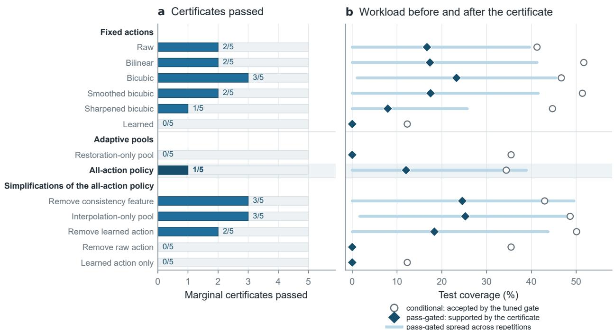  
Figure 4: Policy comparison under the same five training repetitions. Every row is fit, tuned, and certified separately; none inherits another row’s certificate. (a) Number of marginal certificates that pass. (b) Test coverage before the certificate decision (conditional, open circles) and the coverage the decision actually supports (pass-gated, diamonds), with segments spanning one standard deviation across repetitions, clipped at zero. The all-action policy (highlighted) passes fewer certificates than fixed bicubic and than three of its own simplifications. The rows are separate marginal statements.

Table 4: Nominal Carinthia-S results at the 25% recall floor for the primary compact U-Net + residual-restorer family. Each seed–policy pair has a separate marginal certificate. Conditional coverage is averaged before the certificate decision; pass-gated coverage is set to zero when that policy fails.
<table><tr><td>Policy</td><td>Pass/5</td><td>Cond. coverage (%)</td><td>Pass-gated coverage (%)</td></tr><tr><td>Raw</td><td>2</td><td>41.3</td><td> $1 6 . 7 \pm 2 2 . 9$ </td></tr><tr><td>Bilinear</td><td>2</td><td>51.7</td><td> $1 7 . 4 \pm 2 3 . 9$ </td></tr><tr><td>Bicubic</td><td>3</td><td>46.7</td><td> $2 3 . 3 \pm 2 2 . 2$ </td></tr><tr><td>Smoothed bicubic</td><td>2</td><td>51.4</td><td> $1 7 . 5 \pm 2 4 . 1$ </td></tr><tr><td>Sharpened bicubic</td><td>1</td><td>44.7</td><td> $7 . 9 \pm 1 7 . 7$ </td></tr><tr><td>Learned</td><td>0</td><td>12.3</td><td> $0 . 0 \pm 0 . 0$ </td></tr><tr><td>Restoration-only pool</td><td>0</td><td>35.5</td><td> $0 . 0 \pm 0 . 0$ </td></tr><tr><td>All-action policy</td><td>1</td><td>34.4</td><td> ${ \bf 1 2 . 0 \pm 2 6 . 9 }$ </td></tr></table>

and $U _ { \mathrm { a c t } } = 0 . 1 1 3$ . Its held-out test incident rates are 11.3% and 3.7%, respectively. These test rates describe the policy after the decision; they do not replace the certification counts in Table 5.

Table 5: Certification evidence for the primary all-action policy. A pass is a marginal decision for the stated seed; the table is not a menu from which a seed may be selected without multiplicity control. Test incident counts are descriptive outcomes after the certification decision.
<table><tr><td>Seed</td><td>Cert. loss e/n (U)</td><td>Cert. activation e/n (U)</td><td>Test loss  $e / n$ </td><td>Test activation  $e / n$ </td><td>Test C / result</td></tr><tr><td>201</td><td>− (1.000)</td><td>− (1.000)</td><td>一</td><td>一</td><td>0.0% / no gate</td></tr><tr><td>203</td><td>- (1.000)</td><td>− (1.000)</td><td></td><td></td><td>0.0% / no gate</td></tr><tr><td>207</td><td>20/169 (0.167)</td><td>21/182 (0.162)</td><td>30/270</td><td>33/282</td><td>63.2% / fails both</td></tr><tr><td>211</td><td>14/158 (0.135)</td><td>12/169 (0.113)</td><td>29/256</td><td>10/268</td><td>60.1% / passes</td></tr><tr><td>223</td><td>1/123 (0.038)</td><td>15/133 (0.168)</td><td>5/205</td><td>7/217</td><td>48.7% / fails activation</td></tr></table>

Worked certificate reading. For seed 211, the tuning-selected gate accepts 158 positive images, of which 14 have evidence-loss incidents, and 169 images overall, of which 12 have excess-activation incidents. With endpoint error allocation $\delta / 2 = 0 . 0 5$ , the one-sided Clopper–Pearson calculations give $U ( 1 4 , 1 5 8 ; 0 . 0 5 ) = 0 . 1 3 5$ and $\bar { U } ( 1 2 , 1 6 9 ; 0 . 0 5 ) = 0 . 1 \dot { 1 } 3$ . Both values are below the 0.15 targets, so this fixed policy passes its marginal certificate. Seed 223 illustrates why both endpoints are necessary: its evidence-loss bound is 0.038, but its excess-activation bound is 0.168 and the policy fails.

The key comparison is unfavorable to adaptivity (Figure 4). Fixed bicubic passes in three of five repetitions and reaches $2 3 . 3 \% \pm 2 2 . \dot { 2 } \%$ pass-gated coverage, compared with 1/5 and $1 2 . 0 \% \pm 2 6 . { \dot { 9 } } \%$ for the all-action policy, whose pass count is also exceeded by bilinear and smoothed bicubic. Panel (b) shows where the workload is lost: conditional coverage is broadly similar across policies, between 34% and 52% for everything except learned restoration, so the differences in supported workload come from the certificate decision rather than from how much each tuned gate accepts. These separately certified comparisons do not prove that bicubic is universally best, but they do not support adaptive-policy superiority in the present study.

## 7.2 Risk–coverage behavior and evidence sufficiency

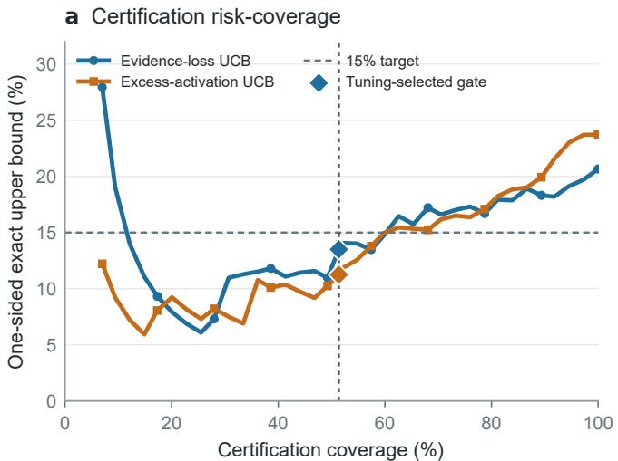

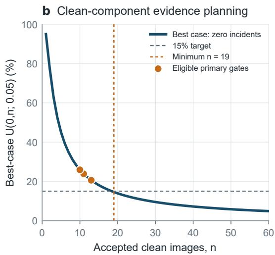  
Figure 5: Certification behavior and an evidence-planning diagnostic. (a) One-sided exact evidence-loss and excessactivation upper bounds versus actual certification coverage for seed 211. The vertical line and diamonds mark the gate selected on the disjoint tuning role; the curves at other prefixes are descriptive and were not candidate certificates. (b) Best-case clean-component bound $U ( 0 , n ; 0 . 0 5 )$ as a function of the number of accepted clean images. Dots mark accepted-clean counts for the three primary repetitions with eligible gates (seed 207: $n = 1 3 ;$ seed 211: $n = 1 1 ;$ seed $2 2 3 \colon n = 1 0 )$ ; seeds 201 and 203 have no eligible gate. This panel is a sample-planning diagnostic for the clean component, not a separately certified endpoint. The primary excess-activation certificate is evaluated over all accepted images.

Figure 5a separates the tuning decision from its held-out evaluation. At the tuning-selected gate, certification coverage is 51.4% and both upper bounds are below 15%. Expanding the accepted score prefix raises coverage but eventually carries both bounds above target. Because the off-gate prefixes use certification outcomes, the curve diagnoses score ordering only.

Panel (b) quantifies the information available for the clean-only activation component used in prevalence standardization. Even with zero incidents, at least 19 accepted clean images are needed for a one-sided 95% upper bound to reach 0.15. The eligible primary gates accept only 10–13 clean images on the certification role. Thus the clean component remains too imprecise for a separate 15% statement, even though the prespecified all-accepted activation endpoint has a much larger denominator.

## 7.3 Candidate fidelity and detector incidents are differently ordered

The action pool nevertheless contains real tradeoffs (Figure 6). Learned restoration reaches mean PSNR 39.7 dB and reduces evidence-loss incidence to 6.7%, compared with 46.1–48.7% for raw and fixed interpolation. Its mean excess-activation incidence is 51.3%, however, versus 3.0–3.8% for those actions. Sharpened bicubic has lower fidelity

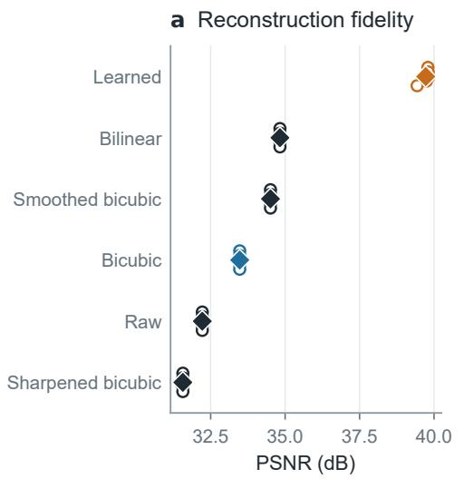

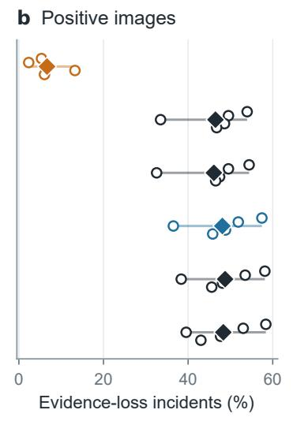

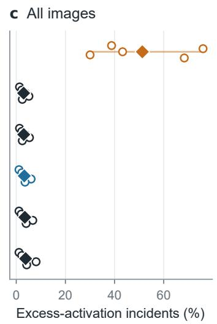  
Figure 6: Fidelity and detector-relative incidents for the six candidate actions on the nominal test role. Action rows are aligned across PSNR, evidence-loss incidence among positives, and excess-activation incidence among all images. Open circles are individual training repetitions, diamonds are five-repetition means, and thin segments show the observed range. High PSNR does not identify a dual-risk policy.

but a different detector profile. PSNR therefore does not identify a policy satisfying both incident limits. The practical failure is not lack of candidate diversity; it is that the primary all-action policy does not use that diversity reliably enough to pass more often than simple fixed transformations.

## 7.4 Fitted scores provide ordering, not probability calibration

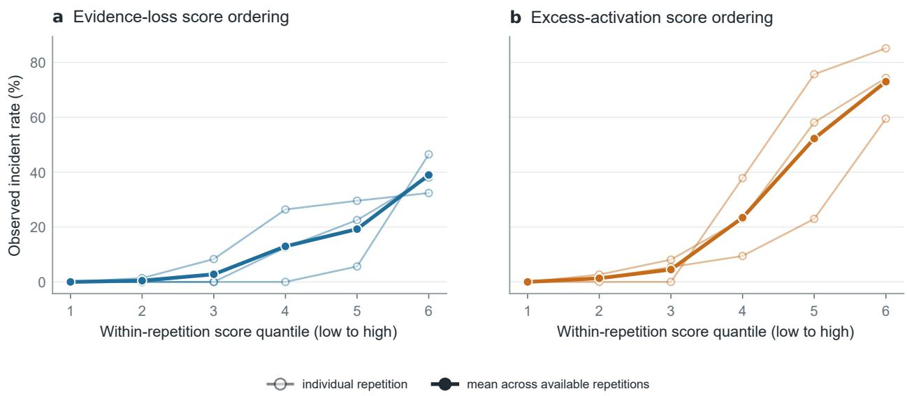  
Figure 7: Observed incident rate across equal-frequency bins of each fitted endpoint score for the action selected on an image. Bins are formed within each repetition having a defined gate. Light open curves show individual repetitions and the thick filled curve their mean. The horizontal coordinate is a within-repetition endpoint-score quantile, not a predicted probability or the minimax gate score; recurring identities make the cross-repetition curves descriptive.

Incident rates generally increase from low to high score quantiles for both endpoints (Figure 7), supporting use of the scores as rankers. The curves also vary materially by training repetition. Because the logistic fits use class balancing, their sigmoid outputs do not estimate the study-population probability without further correction and calibration. The

provided annotation boundary detector call

method accordingly uses only the induced ordering. A gate can pass solely from its held-out incident counts and exact bounds.

## 7.5 Illustrative decisions connect the gate to image evidence

a Returned learned display, severe observation

Reference context

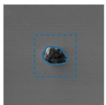  
Example A  
Raw ROI

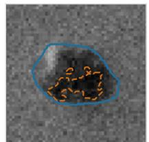  
recall 15% | clean FPR 0.00%  
Bicubic ROI

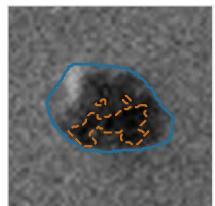  
recall 14% | clean FPR 0.00%  
Ranked-action ROI

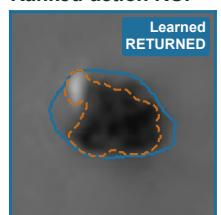  
recall 66% | clean FPR 0.02%  
b Returned display with activation incident, moderate observation

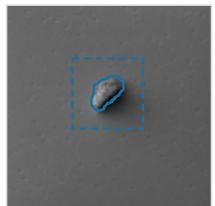  
Example B

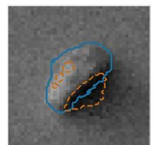  
recall 16% | clean FPR 0.2375%

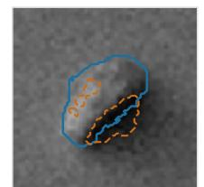  
recall 16% | clean FPR 0.2266%

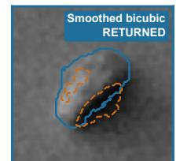  
recall 19% | clean FPR 0.2002% ACTIVATION INCIDENT clean FPR > 0.20%  
c Assigned to review, severe observation

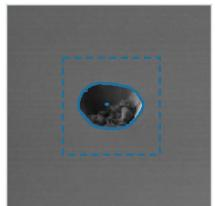  
Example C

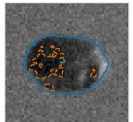  
recall 26% | clean FPR 0.00%

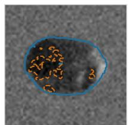  
recall 25% | clean FPR 0.00%

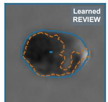  
Dashed boxes define pixel-space ROIs; physical scale is unavailable in the public metadata.  
recall 67% | clean FPR 0.02%

Figure 8: Illustrative test decisions for the seed-211 policy, the sole primary policy whose marginal certificate passes. The reference context identifies each pixel-space region of interest; solid blue contours trace provided annotation boundaries and dashed orange contours are detector calls. Metrics below each candidate are defect recall and clean-region FPR. (a) Example A: a learned action returned under severe degradation. (b) Example B: a returned smoothed-bicubic action whose clean-region FPR exceeds the 0.20% excess-activation incident threshold. (c) Example C: a learned action ranked first but assigned to review. The cases were selected to show these outcomes and are not a random sample.

Figure 8 shows why a policy needs both action choice and review. In panel (a), the learned candidate restores detectorsupported defect coverage relative to raw and bicubic. Panel (b) shows that a passing marginal policy can still make individual errors: the clean-region FPR crosses the 0.2% incident threshold. In panel (c), the ranked action improves recall but its gate score remains outside the automatic-return region. The certificate controls a population rate, not every returned image.

## 7.6 Feature and pool ablations expose unnecessary complexity

Removing the forward-consistency feature or restricting the pool to interpolation raises the pass count from 1/5 to 3/5 (Table 6). Conversely, removing raw eliminates all passes, as does using only the learned action. These results show that the added candidates and features did not improve certification in this design. The pattern is consistent with, but does not establish, greater score-model error from a larger action set. Because all variants reuse identities and were examined retrospectively, the table motivates a simpler prospective policy rather than selecting the best variant from this study.

Table 6: Most informative policy simplifications under the same five seeds and separate marginal certificates. Values are pass-gated test coverage; the complete ablation table and seed-level results appear in Tables S11 and S12.
<table><tr><td>Policy variant</td><td>Pass/5</td><td>Pass-gated coverage (%)</td></tr><tr><td>Full features, all actions</td><td>1</td><td> $1 2 . 0 \pm 2 6 . 9$ </td></tr><tr><td>Remove consistency feature</td><td>3</td><td> $2 4 . 6 \pm 2 4 . 9$ </td></tr><tr><td>Interpolation-only pool</td><td>3</td><td> $2 5 . 2 \pm 2 3 . 6$ </td></tr><tr><td>Remove learned action</td><td>2</td><td> $1 8 . 3 \pm 2 5 . 4$ </td></tr><tr><td>Remove raw action</td><td>0</td><td> $0 . 0 \pm 0 . 0$ </td></tr><tr><td>Learned action only</td><td>0</td><td> $0 . 0 \pm 0 . 0$ </td></tr></table>

Supporting baselines reinforce the same point. Entropy-gated raw display finds no eligible threshold in any seed. An outcome-informed oracle that chooses the action with the smallest observed dual-incident indicator also fails an accept-all certificate in every seed; for seed 211, $U _ { \mathrm { l o s s } } = 0 . 2 9 5$ (Supplementary Table S10). Even idealized action selection cannot compensate for a gate that returns too many high-risk positives.

## 7.7 Architecture and second-domain checks do not provide external confirmation

The alternate attention-gated detector + U-Net restorer family passes 3/5 repetitions, with $1 8 . 9 \% \pm 1 9 . 6 \%$ pass-gated coverage. Across its passing repetitions, the unweighted mean held-out incident rates are 0.8% evidence loss and 4.4% excess activation (Supplementary Table S3); denominators are not pooled. The family contrast shows architecture sensitivity, not architecture-independent validity; each seed–family pair remains a separate marginal policy.

KolektorSDD supplies no external certificate: detector-validation Dice is only approximately 0.033–0.042 across seeds, the split has five tuning positives (below the required 15), and 13 certification positives cannot attain the 15% target even with zero incidents. These detector-competence and evidence-volume failures preclude a test of a successfully fitted gate on a new domain (Supplementary Table S15).

## 7.8 Severity and population shift reveal where return becomes unreliable

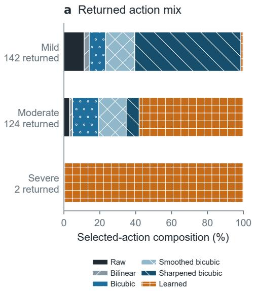

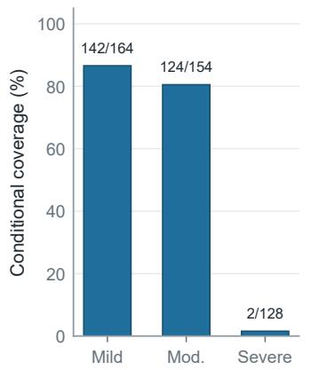

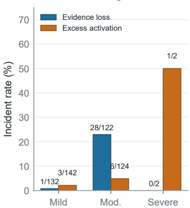  
Figure 9: Behavior of the seed-211 policy by controlled degradation severity. (a) Action composition among returned images. (b) Automatic-return workload with exact returned/total counts. (c) Descriptive incident rates and endpointspecific denominators among returned images. Severity groups were not certified separately.

The seed-211 gate returns 86.6% of mild observations (142/164), 80.5% of moderate observations (124/154), and 1.6% of severe observations (2/128) (Figure 9). Sharpened bicubic dominates mild returns (84/142), while learned restoration dominates moderate returns (72/124). Of the two severe images returned, one incurs an excess-activation incident.

These small subgroup counts emphasize why the aggregate certificate cannot be reassigned to a severity stratum. Panel (b) is the operational workload view: most automatic returns occur on mild and moderate observations, while severe cases are almost entirely reviewed.

a Endpoint sensitivity

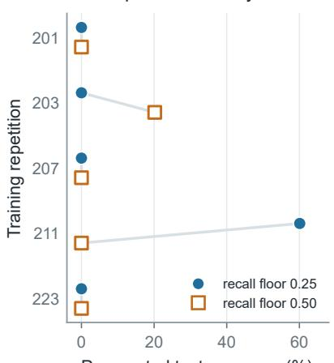  
Pass-gated test coverage (%)  
b Evidence volume

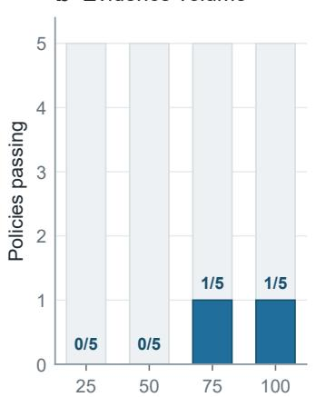  
Certification images retained (%)  
c Population transfer

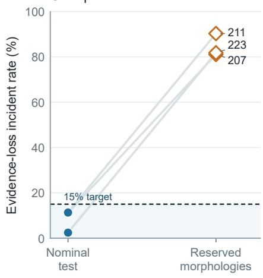  
No eligible gate for repetitions 201, 203  
Figure 10: Certificate boundaries. (a) Pass-gated coverage after refitting the score models and policy at recall floors 0.25 and 0.50. (b) Number of policies passing when deterministic subsets of the fixed certification role are retained; this is a descriptive evidence-volume sensitivity. (c) Evidence-loss incidence when nominal gates are applied to reserved morphologies. Repetitions without an eligible nominal gate are omitted from panel (c) and noted in the figure. No reserved-population point carries a transferred certificate.

At the 0.50 recall floor, one of five all-action policies still passes, but mean pass-gated coverage falls to 4 $. 0 \% \pm 9 . 0 \%$ seed 203, rather than seed 211, passes (Figure 10a). Retaining 25%, 50%, 75%, and 100% of the fixed certification role yields 0/5, 0/5, 1/5, and 1/5 passes (Figure 10b). This monotone evidence limitation is expected: small accepted-positive counts make an exact upper bound too wide even when the observed incident rate is low.

Among seeds with a defined nominal gate, coverage on the 67 reserved morphologies is 32.8–55.2%, while evidenceloss incidence rises to 81.1–90.3% (Figure 10c). This is direct empirical evidence against transporting the nominal certificate. Taken together, the main result is a failure map rather than an adaptive-restoration victory: simple policies are stronger on the nominal data, limited endpoint evidence constrains coverage, and changed morphologies invalidate the nominal behavior.

## 8 Discussion

## 8.1 Certification changes the conclusion drawn from restoration results

The candidate-level result alone would encourage an adaptive policy: learned restoration reduces severe evidence-loss incidents, fixed interpolation limits excess activation, and the preferred action changes with degradation (Figures 6 and 9). The policy-level result reverses that impression. Only one of five primary all-action policies passes its marginal certificate, while fixed bicubic, an interpolation-only pool, and a policy without the consistency feature pass in three of five repetitions (Tables 4 and 6). Both levels of evidence are needed to interpret the policy. The action pool contains complementary transforms, but in these five repetitions the resulting policy did not yield better certification outcomes than the simpler alternatives.

This is a useful outcome for selective inspection. A certificate is valuable not only when it supports automatic return, but also when it exposes that model complexity, training sensitivity, or limited positive evidence makes return unsupported. Review is therefore part of the policy rather than a failure to produce a result. The low pass-gated coverage summarizes how much workload the available evidence supports after failed policies contribute zero; it is not an estimate of the capacity of a future, better-designed policy.

## 8.2 Interpretation of scores, incidents, and certificates

The fitted sigmoid outputs are class-balanced ranking scores. Their monotone incident ordering is useful, but their numeric values are not calibrated probabilities for the study population. This distinction is important because a visually plausible risk plot could otherwise be read as probability calibration. The held-out exact bounds, not the score scale, determine the marginal certificate.

The incident names also bound the physical interpretation. Evidence loss means that the fixed detector recovers fewer annotated defect pixels than the stated floor; it does not prove that a transformation erased a physical defect. Excess activation means that detector calls occupy too much annotated clean area; it does not prove that new physical structure was hallucinated. Both surrogates conflate image transformation behavior with detector competence. KolektorSDD makes that dependence explicit: when detector Dice is near 0.04, a restoration-policy certificate cannot substitute for a competent downstream measurement system.

Proposition 1 controls a repeated-sampling false-certification event for one fixed policy under the working model. It does not guarantee every returned image, provide a posterior probability of safety, or certify a subgroup, and it does not support selecting seed 211 because that seed passed. The pass-count analysis is diagnostic, subject to the policy-family boundary of Section 5.

The observed pass/fail pattern is not specific to the reported Clopper–Pearson/Bonferroni construction. The certificates were recomputed from the same counts under a Šidák allocation, under no allocation at all, and under a Wilson score limit (Supplementary Table S16). Across these examined alternatives, the pass/fail pattern is unchanged. Removing the multiplicity allocation entirely moves the largest bound by about one percentage point, whereas the failing bounds exceed their target by 0.012–0.018, and two repetitions fail earlier still, at threshold tuning, where no bound is involved. These checks show that the reported failures are not rescued by removing the allocation or by the Wilson comparison; they do not establish invariance to every valid interval procedure. In this comparison, the margins are governed mainly by the observed incident counts and endpoint evidence.

## 8.3 Population mixture and evidence requirements

Separating accepted positives from all accepted images prevents clean prevalence from diluting evidence-loss risk. Excess activation remains mixture-dependent, which is why Equation (14) reports component risks and an operatingprevalence standardization. This issue is consequential here: the nominal test set has 430 positives but only 16 clean images, and calibration has 23 clean images. Clean coverage and clean-component activation estimates are therefore imprecise and morphology-linked. Exact bounds make the requirement visible: with a 15% target and endpoint error allocation 0.05, even zero incidents require at least 19 accepted units, and one incident requires 30 (Supplementary Table S17). KolektorSDD’s 13 certification positives cannot meet the target for that reason alone. Positive and clean counts, not only total image count, must therefore drive prospective sample-size planning.

## 8.4 Operational implications

A prospective study should prespecify the physical sampling unit, endpoints, strata, and review costs. Because the public metadata do not expose wafer or lot groupings, the present image-level i.i.d. model cannot address within-cluster dependence; new data should reserve entire known clusters for certification. Detector-relative recall is not physical preservation, so that stronger endpoint would require paired acquisition or independent metrology. Review should be measured rather than treated as costless abstention, consistent with learning-to-defer formulations [28, 29] and the broader SEM-inspection literature [45]. These are design requirements for a follow-up, not claims about current deployment.

The present policy generates every candidate and detector map before selection, so it makes no latency or energy claim A cascade would be a different policy requiring new threshold selection and certification.

## 8.5 Limitations and prospective study design

The evidence is retrospective: the Carinthia-S identity bank was previously studied in [11] (Table 1). New data roles and policy records separate the estimand, but they cannot recreate pristine external confirmation. Physical independence is unknown because public metadata do not expose wafer, lot, specimen, or field-of-view grouping. Treating images as i.i.d. may be anti-conservative if correlated images cross data roles.

The blur–downsample–noise schedule provides exact correspondence but is not a named SEM degradation process, and physical scale is unavailable. The study therefore cannot establish behavior under real rescanning, charging, drift, contamination, or recipe change. Reserved Carinthia-S morphologies show catastrophic transfer, while KolektorSDD is underpowered and has an inadequate detector. The 15% risk limits and 25% recall floor are research choices, not manufacturing requirements, and the evaluation was not preregistered.

Finally, two compact architecture families and a six-feature logistic ranker do not establish method generality. Current restoration systems, alternative detectors, calibrated or nonparametric rankers, and more efficient risk-control procedures may improve the coverage–risk tradeoff. The immediate prospective baseline should nevertheless be the simplest supported policy—fixed bicubic or an interpolation-only pool—rather than the primary all-action policy, followed by a fresh, cluster-aware certificate on newly acquired data.

## 9 Conclusion

SafeRestore treats restoration as a selective image action whose population-level incident rates must be supported before automatic return. Action-specific scores rank the raw display and five restored candidates; a disjoint sample then provides exact marginal bounds for evidence loss among accepted positives and excess activation among all accepted images. The resulting statement is transparent but narrow: it applies to one policy fixed in advance, one nominal population, and an image-level i.i.d. working model.

On the retrospective Carinthia-S study, the protocol yields auditable risk–coverage behavior. The primary all-action policy passes in one of five repetitions and reaches 12.0% ± 26.9% pass-gated coverage. Fixed bicubic, an interpolationonly pool, and a reduced-feature policy each pass in three of five repetitions and achieve higher mean pass-gated coverage. Reserved morphologies produce 81.1–90.3% evidence-loss incidence, and KolektorSDD cannot support the target because both detector competence and positive sample size are inadequate. The evidence therefore supports certification and review as safeguards, but not adaptive-policy superiority or cross-domain readiness (Tables 4 and 6 and Figure 10).

The next study should fix a simple policy before certification, reserve newly acquired wafer- or lot-level clusters, elicit incident limits from manufacturing costs, collect adequate positive and clean populations, and measure human-review performance. Until such evidence exists, restoration should remain an explicit, selectable, and rejectable transformation rather than hidden mandatory preprocessing.

## Data and Code Availability

Carinthia-S and KolektorSDD are public datasets distributed by their original authors under their stated licenses. Analysis code is available at https://github.com/nbbllxx0/SafeRestore. Deterministic split manifests, image– action records, certification summaries, tests, and the source data and scripts used for every reported figure will be released in that repository. No model, operating point, numerical result, or synthetic record from [11] enters fitting, threshold selection, or certification here; Carinthia-S identity overlap with that study is disclosed in Table 1. Controlled degradations are counterfactual restoration tests; no proprietary manufacturing imagery is used.

## Declaration of Generative AI Assistance

The Cursor editor assisted with code drafting and language editing. The authors designed the study, selected and verified the data, ran and checked the experiments, reviewed the manuscript, and take responsibility for its content.

## References

[1] Chinmay Belthangady and Loic A. Royer. Applications, promises, and pitfalls of deep learning for fluorescence image reconstruction. Nature Methods, 16(12):1215–1225, 2019.

[2] Martin Weigert, Uwe Schmidt, Tobias Boothe, Andreas Müller, Alexandr Dibrov, Akanksha Jain, Benjamin Wilhelm, Deborah Schmidt, Coleman Broaddus, Siân Culley, Mauricio Rocha-Martins, Fabián Segovia-Miranda, Caren Norden, Ricardo Henriques, Marino Zerial, Michele Solimena, Jochen Rink, Pavel Tomancak, Loic Royer, Florian Jug, and Eugene W. Myers. Content-aware image restoration: Pushing the limits of fluorescence microscopy. Nature Methods, 15(12):1090–1097, 2018.

[3] Seunghoi Kim, Henry F. J. Tregidgo, Chen Jin, Matteo Figini, and Daniel C. Alexander. HalluGen: Synthesizing realistic and controllable hallucinations for evaluating image restoration. In IEEE/CVF Conference on Computer Vision and Pattern Recognition, pages 32550–32560, 2026.

[4] Muhammad Haris, Greg Shakhnarovich, and Norimichi Ukita. Task-driven super resolution: Object detection in low-resolution images. In Neural Information Processing, volume 1516 of Communications in Computer and Information Science, pages 387–395. Springer, 2021.

[5] Jaeha Kim, Junghun Oh, and Kyoung Mu Lee. Beyond image super-resolution for image recognition with task-driven perceptual loss. In IEEE/CVF Conference on Computer Vision and Pattern Recognition, pages 2651–2661, 2024.

[6] I-Hsiang Chen, Wei-Ting Chen, Yu-Wei Liu, Yuan-Chun Chiang, Sy-Yen Kuo, and Ming-Hsuan Yang. Unirestore: Unified perceptual and task-oriented image restoration model using diffusion prior. In IEEE/CVF Conference on Computer Vision and Pattern Recognition, pages 17969–17979, 2025.

[7] Yonatan Geifman and Ran El-Yaniv. Selective classification for deep neural networks. In Advances in Neural Information Processing Systems, volume 30, 2017.

[8] Stephen Bates, Anastasios N. Angelopoulos, Lihua Lei, Jitendra Malik, and Michael I. Jordan. Distribution-free, risk-controlling prediction sets. Journal ofthe ACM, 68(6):43:1–43:34, 2021.

[9] Anastasios N. Angelopoulos, Stephen Bates, Emmanuel J. Candès, Michael I. Jordan, and Lihua Lei. Learn then test: Calibrating predictive algorithms to achieve risk control. The Annals ofApplied Statistics, 19(2):1641–1662, 2025.

[10] Corinna Kofler and Vahidin Hasic. Carinthia-S dataset, 2025.´

[11] Shaoliang Yang and Jun Wang. Does super-resolution preserve defect evidence? a low-false-call benchmark for semiconductor inspection. arXiv preprint arXiv:2607.17401, 2026.

[12] Chao Dong, Chen Change Loy, Kaiming He, and Xiaoou Tang. Learning a deep convolutional network for image super-resolution. In European Conference on Computer Vision, volume 8692, pages 184–199, 2014.

[13] Bee Lim, Sanghyun Son, Heewon Kim, Seungjun Nah, and Kyoung Mu Lee. Enhanced deep residual networks for single image super-resolution. In IEEE Conference on Computer Vision and Pattern Recognition Workshops, pages 1132–1140, 2017.

[14] Yulun Zhang, Kunpeng Li, Kai Li, Lichen Wang, Bineng Zhong, and Yun Fu. Image super-resolution using very deep residual channel attention networks. In European Conference on Computer Vision, volume 11211, pages 294–310, 2018.

[15] Christian Ledig, Lucas Theis, Ferenc Huszar, Jose Caballero, Andrew Cunningham, Alejandro Acosta, Andrew Aitken, Alykhan Tejani, Johannes Totz, Zehan Wang, and Wenzhe Shi. Photo-realistic single image super-resolution using a generative adversarial network. In IEEE Conference on Computer Vision and Pattern Recognition, pages 105–114, 2017.

[16] Xintao Wang, Liangbin Xie, Chao Dong, and Ying Shan. Real-ESRGAN: Training real-world blind super-resolution with pure synthetic data. In IEEE/CVF International Conference on Computer Vision Workshops, pages 1905–1914, 2021.

[17] Jingyun Liang, Jiezhang Cao, Guolei Sun, Kai Zhang, Luc Van Gool, and Radu Timofte. SwinIR: Image restoration using swin transformer. In IEEE/CVF International Conference on Computer Vision Workshops, pages 1833–1844, 2021.

[18] Liangyu Chen, Xiaojie Chu, Xiangyu Zhang, and Jian Sun. Simple baselines for image restoration. In European Conference on Computer Vision, volume 13667, pages 17–33, 2022.

[19] Ke Yu, Chao Dong, Liang Lin, and Chen Change Loy. Crafting a toolchain for image restoration by deep reinforcement learning. In IEEE Conference on Computer Vision and Pattern Recognition, pages 2443–2452, 2018.

[20] Ke Yu, Xintao Wang, Chao Dong, Xiaoou Tang, and Chen Change Loy. Path-restore: Learning network path selection for image restoration. IEEE Transactions on Pattern Analysis and Machine Intelligence, 44(10):7078–7092, 2022.

[21] Anastasios N. Angelopoulos, Amit Pal Kohli, Stephen Bates, Michael Jordan, Jitendra Malik, Thayer Alshaabi, Srigokul Upadhyayula, and Yani Romano. Image-to-image regression with distribution-free uncertainty quantification and applications in imaging. In Proceedings of the 39th International Conference on Machine Learning, volume 162 of Proceedings ofMachine Learning Research, pages 717–730, 2022.

[22] Jeffrey Wen, Rizwan Ahmad, and Philip Schniter. Task-driven uncertainty quantification in inverse problems via conformal prediction. In Computer Vision – ECCV 2024, volume 15118 of Lecture Notes in Computer Science, pages 182–199, 2024.

[23] Eduardo Adame, Daniel Csillag, and Guilherme Tegoni Goedert. Image super-resolution with guarantees via conformalized generative models. In Advances in Neural Information Processing Systems, volume 38, 2025.

[24] Tao Liu, Jun Cheng, and Shan Tan. Spectral bayesian uncertainty for image super-resolution. In IEEE/CVF Conference on Computer Vision and Pattern Recognition, pages 18166–18175, 2023.

[25] Cheng Shen and Yuewei Liu. Conformal segmentation in industrial surface defect detection with statistical guarantees. Mathematics, 13(15):2430, 2025.

[26] Jean Chien and Eric Lee. Deep-CNN-based layout-to-SEM image reconstruction with conformal uncertainty calibration for nanoimprint lithography in semiconductor manufacturing. Electronics, 14(15):2973, 2025.

[27] Yonatan Geifman and Ran El-Yaniv. Selectivenet: A deep neural network with an integrated reject option. In International Conference on Machine Learning, volume 97 of Proceedings of Machine Learning Research, pages 2151–2159, 2019.

[28] Hussein Mozannar and David Sontag. Consistent estimators for learning to defer to an expert. In Proceedings ofthe 37th International Conference on Machine Learning, volume 119 of Proceedings of Machine Learning Research, pages 7076–7087, 2020.

[29] Harikrishna Narasimhan, Wittawat Jitkrittum, Aditya K. Menon, Ankit Rawat, and Sanjiv Kumar. Post-hoc estimators for learning to defer to an expert. In Advances in Neural Information Processing Systems, volume 35, 2022.

[30] Anastasios N. Angelopoulos, Stephen Bates, Adam Fisch, Lihua Lei, and Tal Schuster. Conformal risk control. In International Conference on Learning Representations, 2024.

[31] Yunpeng Xu, Wenge Guo, and Zhi Wei. Selective conformal risk control. arXiv preprint arXiv:2512.12844, 2025.

[32] Xiaoli Yu and Jiamiao Liu. A joint finite-sample certificate for adaptive selective conformal risk control. arXiv preprint arXiv:2606.08517, 2026

[33] Tian Bai and Ying Jin. Conformal selective prediction with general risk control. arXiv preprint arXiv:2603.24704, 2026. SCoRE framework.

[34] Zhiyuan Wang, Aniri, Tianlong Chen, Yue Zhang, Heng Tao Shen, Xiaoshuang Shi, and Kaidi Xu. LEC: Linear expectation constraints for selection-conditioned risk control in selective prediction and routing systems. arXiv preprint arXiv:2512.01556, 2025. Accepted at ICML 2026.

[35] Sai Hao, Hao Zeng, Hongxin Wei, and Bingyi Jing. RACER: Risk-aware calibrated efficient routing for large language models. arXiv preprint arXiv:2603.06616, 2026.

[36] Paul Bergmann, Michael Fauser, David Sattlegger, and Carsten Steger. MVTec AD: A comprehensive real-world dataset for unsupervised anomaly detection. In IEEE/CVF Conference on Computer Vision and Pattern Recognition, pages 9584–9592, 2019.

[37] Domen Tabernik, Samo Šela, Jure Skvarc, and Danijel Skoˇ caj. Segmentation-based deep-learning approach for surface-defect detection.ˇ Journal of Intelligent Manufacturing, 31(3):759–776, 2020.

[38] Xuefeng Sun, Baoyuan Zhang, Yushan Wang, Jialuo Mai, Yuhang Wang, Jiubin Tan, and Weibo Wang. A multiscale attention mechanism superresolution confocal microscopy for wafer defect detection. IEEE Transactions on Automation Science and Engineering, 22:1016–1027, 2025.

[39] Leisheng Chen, Kai Meng, Hangying Zhang, Junquan Zhou, and Peihuang Lou. SR-FABNet: Super-resolution branch guided fourier attention detection network for efficient optical inspection of nanoscale wafer defects. Advanced Engineering Informatics, 65:103200, 2025.

[40] Jaehoon Kim, Jaekyung Lim, Jinho Lee, Tae-Yeon Kim, Yunhyoung Nam, Kihyun Kim, and Do-Nyun Kim. Hotspot prediction: SEM image generation with potential lithography hotspots. IEEE Transactions on Semiconductor Manufacturing, 37(1):103–114, 2024.

[41] Shou-Lin Chu, Eugene Su, and Chao-Ching Ho. Transfer learning-based defect detection system on wafer surfaces. IEEE Transactions on Semiconductor Manufacturing, 38(2):154–167, 2025.

[42] Yongwon Jo, Jinsoo Bae, Hansam Cho, Heejoong Roh, Kyunghye Kim, Munki Jo, Jaeung Tae, and Seoung Bum Kim. Semantic segmentation for noisy and limited wafer transmission electron microscope images. IEEE Transactions on Semiconductor Manufacturing, 37(3):345–354, 2024.

[43] Olaf Ronneberger, Philipp Fischer, and Thomas Brox. U-Net: Convolutional networks for biomedical image segmentation. In Medical Image Computing and Computer-Assisted Intervention, volume 9351, pages 234–241, 2015.

[45] Thibault Lechien, Enrique Dehaerne, Bappaditya Dey, Victor Blanco, Sandip Halder, Stefan De Gendt, and Wannes Meert. Automated semiconductor defect inspection in scanning electron microscope images: A systematic review, 2023.

[44] C. J. Clopper and E. S. Pearson. The use of confidence or fiducial limits illustrated in the case of the binomial. Biometrika, 26(4):404–413, 1934.

## Supplementary Material

## S1 Analysis Scope and Statistical Interpretation

The analysis treats raw display and five restoration candidates as one action set. Evidence loss is defined only on defect-positive images and counted among accepted positives. Excess activation is defined from clean-region detector calls and counted among all accepted images. Threshold-tuning and certification roles are separated by a deterministic, seed-independent image-identifier rule. A failed marginal certificate leaves the conditional gate coverage available for diagnosis but gives zero pass-gated coverage.

The five training repetitions reuse image identities, observation assignments, and tune/certify membership. They quantify sensitivity to model fitting; they are not five independent samples from a factory. Each seed–policy pair has a separate marginal certificate. Pass counts do not justify choosing a passing seed without multiplicity control or a fresh certification sample.

The Carinthia-S study is retrospective. All 4,591 identities also appeared in [11] (Table 1), although no checkpoint, operating point, split, or numeric result from that work is used here. The analysis was not externally preregistered. These constraints do not change the mechanical split-sample calculation, but they limit the strength of empirical confirmation.

## S2 Data Inventory and Split Verification

Table S1: Carinthia-S inventory. One image is the statistical unit; physical wafer, lot, and specimen groups are unavailable.

<table><tr><td>Partition</td><td>Images</td><td>Positive</td><td>Clean</td></tr><tr><td>Training</td><td>3,186</td><td>3,014</td><td>172</td></tr><tr><td>Detector validation</td><td>431</td><td>416</td><td>15</td></tr><tr><td>Calibration</td><td>461</td><td>438</td><td>23</td></tr><tr><td>Nominal test</td><td>446</td><td>430</td><td>16</td></tr><tr><td>Reserved morphology</td><td>67</td><td>67</td><td>0</td></tr><tr><td>Total</td><td>4,591</td><td>4,365</td><td>226</td></tr></table>

Table S1 verifies the image inventory. Classes 3, 4, and 6 define the nominal population; classes 1, 2, and 5 remain intact as the reserved morphology diagnostic. Positivity is determined by a nonempty binary mask after nearest-neighbor mask resizing. Dataset files are read-only during analysis, and the archive records inventory and split digests [10].

Table S2: KolektorSDD item-level diagnostic split. It is not the official fold and cannot support the stated certificate because the tuning and certification positive counts are too small.
<table><tr><td>Partition</td><td>Items</td><td>Images</td><td>Positive</td></tr><tr><td>Training</td><td>14</td><td>111</td><td>15</td></tr><tr><td>Detector validation</td><td>6</td><td>48</td><td>6</td></tr><tr><td>Calibration</td><td>17</td><td>136</td><td>18</td></tr><tr><td>Test</td><td>13</td><td>104</td><td>13</td></tr><tr><td>Total</td><td>50</td><td>399</td><td>52</td></tr></table>

Table S2 records the item-level split used only for the second-dataset boundary diagnosis.

## S3 Implementation Details

Images are converted to grayscale and resized to 256 × 256 with bilinear interpolation; masks use nearest-neighbor interpolation followed by binary thresholding. Training augmentation consists only of independent random horizontal and vertical flips. No intensity jitter, crop augmentation, or learning-rate scheduler is used. Data loading uses batch size 8 and deterministic random seeds; PyTorch deterministic cuDNN mode is enabled and benchmarking is disabled.

The primary compact three-level U-Net detector has three encoder resolutions with base width 16, group normalization, SiLU activations, 0.05 dropout, transposed-convolution upsampling, and 117,393 trainable parameters. It is trained for five epochs with AdamW (learning rate $2 \times 1 0 ^ { - 3 }$ , weight decay $1 0 ^ { - 4 } )$ . The loss is weighted binary cross-entropy plus soft Dice; the batch-specific positive weight is the clean-to-positive pixel ratio clipped to [1, 80]. The checkpoint with highest mean detector-validation Dice is retained. The detector threshold is the higher empirical $( 1 - 1 0 ^ { - 3 } )$ quantile of detector scores on annotated clean pixels in the detector-validation role.

The primary six-block residual restorer has a 32-channel input convolution, six residual blocks, and an output residual added to bicubic interpolation (111,585 trainable parameters). It is trained for five epochs with AdamW (learning rate $1 0 ^ { - 3 }$ , weight decay $1 { \dot { 0 } } ^ { - 5 } )$ . The objective is image ℓ loss plus 0.25 times the sum of horizontal and vertical gradient $\ell _ { 1 }$ losses. The final epoch is used; no validation-based restorer checkpoint selection is performed. The alternate family uses an attention-gated U-Net detector and a one-level U-Net residual restorer with otherwise matched training roles.

For each action and endpoint, a StandardScaler is fitted on the applicable detector-validation population. LogisticRegression uses the liblinear solver, class weights “balanced,” $C = 1$ , at most 2,000 iterations, and the training seed as its random state. Evidence-loss models use positive images only; activation models use all images. If an endpoint population contains only one class, its fitted score is the observed constant label. Candidate ties use the order raw, bilinear, bicubic, smoothed bicubic, sharpened bicubic, learned.

Threshold tuning requires at least 15 accepted images and 15 accepted positives. The largest ordered-score prefix whose two empirical incident rates do not exceed half their 0.15 targets fixes the gate. Certification uses one-sided Clopper–Pearson bounds with endpoint error allocation 0.05 [44]. Zero accepted units give upper bound one.

The archived experiment summaries record Python 3.12.13, PyTorch 2.11.0+cu128, torchvision 0.26.0+cu128, NumPy 2.4.3, SciPy 1.17.1, scikit-learn 1.8.0, Matplotlib 3.10.9, Pillow 12.1.1, and an NVIDIA RTX 5090. Risk-score fitting, exact bounds, tables, and figures are CPU-capable; detector and restorer training used the GPU. All candidates are generated before action selection, so runtime is not an efficiency result.

## S4 Architecture-Family Sensitivity

Table S3: Seed-level marginal certificates for the alternate family at the 25% recall floor. Outcomes do not authorize post-certification seed selection.
<table><tr><td>Seed</td><td>Cert. loss</td><td> $U _ { \mathrm { l o s s } }$ </td><td>Cert. act.</td><td> $U _ { \mathrm { a c t } }$ </td><td>Test loss</td><td>Test act.</td><td>Test C / result</td></tr><tr><td>201</td><td>0/34</td><td>0.084</td><td>2/42</td><td>0.142</td><td>0/63</td><td>1/73</td><td>16.4% / passes</td></tr><tr><td>203</td><td>18/148</td><td>0.175</td><td>18/161</td><td>0.161</td><td>23/228</td><td>24/240</td><td>53.8% / fails both</td></tr><tr><td>207</td><td>4/105</td><td>0.085</td><td>10/113</td><td>0.145</td><td>0/169</td><td>14/179</td><td>40.1% / passes</td></tr><tr><td>211</td><td>20/165</td><td>0.171</td><td>16/173</td><td>0.137</td><td>24/265</td><td>12/275</td><td>61.7% / fails loss</td></tr><tr><td>223</td><td>1/96</td><td>0.048</td><td>8/109</td><td>0.129</td><td>4/157</td><td>7/169</td><td>37.9% / passes</td></tr></table>

Table S3 shows 3/5 passes and $1 8 . 9 \% \pm 1 9 . 6 \%$ pass-gated coverage. Across passing seeds 201, 207, and 223, the unweighted means of the held-out incident proportions are 0.8% evidence loss and 4.4% excess activation; denominators are not pooled. The differing pattern indicates architecture sensitivity, not family-independent validity or a basis for post-certification selection.

## S5 Exploratory Tuning-Rule Sensitivity

The half-margin criterion described in the main article is the only tuning rule specified in the frozen analysis protocol. After the primary results were available, we recomputed thresholds with two alternatives: empirical incident rates at the target itself and exact upper bounds on the tuning role. The same certification sample then evaluates every resulting gate (Table S4).

The tuning-UCB variant yields two passing marginal certificates in this retrospective comparison, but that observation occurred after the rule family and certification outcomes were examined. It therefore does not nominate the tuning-UCB rule, seed 223, or any other row for deployment. A future comparison must prespecify one rule, apply familywise error control, or evaluate a selected rule on fresh certification data.

## S6 Complete Policy Comparisons

Tables S5 and S6 report the complete fixed-action and adaptive-pool comparisons at both recall floors.

Tables S7 and S8 show that seed 211 accepts 158/310 certification positives and 11/19 clean images. Only 16 test clean images are available, so the clean component should not be treated as precisely estimated.

Table S4: Post-hoc tuning-rule sensitivity for the all-action policy. Test coverage is conditional on the reported gate and is shown even when the certificate fails. This shared-sample comparison is descriptive; it cannot be used to select a rule and retain the primary confirmatory interpretation.
<table><tr><td>Rule</td><td>Seed</td><td> $\widehat { \theta }$ </td><td> $U _ { \mathrm { l o s s } }$ </td><td> $U _ { \mathrm { a c t } }$ </td><td>Decision</td><td>Test C (%)</td></tr><tr><td>Half-margin</td><td>201</td><td>一</td><td>1.000</td><td>1.000</td><td>no gate</td><td>0.0</td></tr><tr><td></td><td>203</td><td></td><td>1.000</td><td>1.000</td><td>no gate</td><td>0.0</td></tr><tr><td></td><td>207</td><td>3.287</td><td>0.167</td><td>0.162</td><td>fail</td><td>63.2</td></tr><tr><td></td><td>211</td><td>3.530</td><td>0.135</td><td>0.113</td><td>pass</td><td>60.1</td></tr><tr><td></td><td>223</td><td>2.854</td><td>0.038</td><td>0.168</td><td>fail</td><td>48.7</td></tr><tr><td>Empirical target</td><td>201</td><td>2.300</td><td>0.054</td><td>0.259</td><td>fail</td><td>28.0</td></tr><tr><td></td><td>203</td><td>2.314</td><td>0.080</td><td>0.252</td><td>fail</td><td>17.5</td></tr><tr><td></td><td>207</td><td>4.638</td><td>0.129</td><td>0.284</td><td>fail</td><td>78.3</td></tr><tr><td></td><td>211</td><td>6.667</td><td>0.207</td><td>0.235</td><td>fail</td><td>100.0</td></tr><tr><td></td><td>223</td><td>3.035</td><td>0.053</td><td>0.213</td><td>fail</td><td>55.2</td></tr><tr><td>Tuning UCB</td><td>201</td><td>一</td><td>1.000</td><td>1.000</td><td>no gate</td><td>0.0</td></tr><tr><td></td><td>203</td><td></td><td>1.000</td><td>1.000</td><td>no gate</td><td>0.0</td></tr><tr><td></td><td>207</td><td>3.287</td><td>0.167</td><td>0.162</td><td>fail</td><td>63.2</td></tr><tr><td></td><td>211</td><td>3.530</td><td>0.135</td><td>0.113</td><td>pass</td><td>60.1</td></tr><tr><td></td><td>223</td><td>2.703</td><td>0.027</td><td>0.106</td><td>pass</td><td>45.3</td></tr></table>

Table S5: Primary 25% recall-floor results. Pass-gated coverage assigns zero to a failed marginal certificate.
<table><tr><td>Policy</td><td>Pass/5</td><td>Conditional C (%)</td><td>Pass-gated C (%)</td><td>SD</td></tr><tr><td>Raw</td><td>2</td><td>41.3</td><td>16.7</td><td>22.9</td></tr><tr><td>Bilinear</td><td>2</td><td>51.7</td><td>17.4</td><td>23.9</td></tr><tr><td>Bicubic</td><td>3</td><td>46.7</td><td>23.3</td><td>22.2</td></tr><tr><td>Smoothed bicubic</td><td>2</td><td>51.4</td><td>17.5</td><td>24.1</td></tr><tr><td>Sharpened bicubic</td><td>1</td><td>44.7</td><td>7.9</td><td>17.7</td></tr><tr><td>Learned</td><td>0</td><td>12.3</td><td>0.0</td><td>0.0</td></tr><tr><td>Restoration-only pool</td><td>0</td><td>35.5</td><td>0.0</td><td>0.0</td></tr><tr><td>All-action policy</td><td>1</td><td>34.4</td><td>12.0</td><td>26.9</td></tr></table>

Table S6: Policy results after refitting at the stricter 50% recall floor.
<table><tr><td>Policy</td><td>Pass/5</td><td>Conditional C (%)</td><td>Pass-gated C (%)</td></tr><tr><td>Raw</td><td>0</td><td>28.4</td><td>0.0</td></tr><tr><td>Bilinear</td><td>2</td><td>28.4</td><td>13.3</td></tr><tr><td>Bicubic</td><td>2</td><td>27.5</td><td>12.1</td></tr><tr><td>Smoothed bicubic</td><td>3</td><td>28.2</td><td>20.3</td></tr><tr><td>Sharpened bicubic</td><td>1</td><td>27.7</td><td>6.7</td></tr><tr><td>Learned</td><td>0</td><td>10.2</td><td>0.0</td></tr><tr><td>Restoration-only pool</td><td>1</td><td>17.9</td><td>4.0</td></tr><tr><td>All-action policy</td><td>1</td><td>18.0</td><td>4.0</td></tr></table>

Table S7: Action counts below the primary all-action gate on the nominal test role. Seeds 201 and 203 have no eligible gate; only seed 211 passes its marginal certificate.
<table><tr><td>Seed</td><td>Pass</td><td>Returned</td><td>Raw</td><td>Bil.</td><td> $\operatorname { B i c . }$ </td><td>Smooth</td><td>Sharp</td><td>Learned</td></tr><tr><td>201</td><td>no</td><td>0</td><td>一</td><td>一</td><td>一</td><td>一</td><td>一</td><td>一</td></tr><tr><td>203</td><td>no</td><td>0</td><td>一</td><td>一</td><td>一</td><td></td><td></td><td></td></tr><tr><td>207</td><td>no</td><td>282</td><td>25</td><td>28</td><td>29</td><td>59</td><td>41</td><td>100</td></tr><tr><td>211</td><td>yes</td><td>268</td><td>20</td><td>6</td><td>31</td><td>42</td><td>93</td><td>76</td></tr><tr><td>223</td><td>no</td><td>217</td><td>11</td><td>12</td><td>18</td><td>9</td><td>147</td><td>20</td></tr></table>

Table S8: Seed-211 component and prevalence-standardized coverage for the primary all-action policy. Standardized coverage combines positive and clean component coverage at the stated operating prevalence π.
<table><tr><td>Quantity</td><td>Certification</td><td>Test</td></tr><tr><td>Positive coverage</td><td> $1 5 8 / 3 1 0 = 0 . 5 1 0$ </td><td> $2 5 6 / 4 3 0 = 0 . 5 9 5$ </td></tr><tr><td>Clean coverage</td><td> $1 1 / 1 9 = 0 . 5 7 9$ </td><td> $1 2 / 1 6 = 0 . 7 5 0$ </td></tr><tr><td>Standardized,  $\pi = 0 . 0 1$ </td><td>0.578</td><td>0.748</td></tr><tr><td>Standardized,  $\pi = 0 . 1 0$ </td><td>0.572</td><td>0.735</td></tr><tr><td>Standardized,  $\pi = 0 . 5 0$ </td><td>0.544</td><td>0.673</td></tr></table>

Table S9: Primary-family supporting baselines.
<table><tr><td>Baseline</td><td>Pass/5</td><td>Pass-gated C (%)</td></tr><tr><td>All-action policy</td><td>1</td><td> $1 2 . 0 \pm 2 6 . 9$ </td></tr><tr><td>Entropy-gated raw</td><td>0</td><td> $0 . 0 \pm 0 . 0$ </td></tr><tr><td>Outcome-informed action oracle with accept-all gate</td><td>0</td><td> $0 . 0 \pm 0 . 0$ </td></tr></table>

Table S10: Seed-level certification evidence for supporting baselines. Entropy gating finds no eligible tuning threshold. The outcome-informed oracle accepts all certification images after choosing actions with observed outcomes.
<table><tr><td>Seed</td><td>Entropy gate</td><td>Oracle loss  $e / n$  (U)</td><td>Oracle activation  $e / n \ ( U )$ </td><td>Oracle result</td></tr><tr><td>201</td><td>none</td><td>95/310 (0.352)</td><td>4/329 (0.028)</td><td>fails loss</td></tr><tr><td>203</td><td>none</td><td>151/310 (0.535)</td><td>4/329 (0.028)</td><td>fails loss</td></tr><tr><td>207</td><td>none</td><td>88/310 (0.329)</td><td>7/329 (0.040)</td><td>fails loss</td></tr><tr><td>211</td><td>none</td><td>78/310 (0.295)</td><td>19/329 (0.084)</td><td>fails loss</td></tr><tr><td>223</td><td>none</td><td>130/310 (0.467)</td><td>9/329 (0.047)</td><td>fails loss</td></tr></table>

The oracle in Tables S9 and S10 chooses the action with the smallest observed dual-incident indicator for each image and then evaluates an accept-all gate. It is not an application-time comparator because it uses outcomes. Even this construction has $U _ { \mathrm { l o s s } } > 0 . { \overset { \cdot } { 1 5 } }$ in every seed (0.295 for seed 211), showing that action choice alone cannot repair an uncertified return region.

## S7 Feature and Action-Pool Ablations

Table S11: All feature and action-pool ablations. Each variant is tuned and certified as a separate marginal policy on the same five identities and seeds.
<table><tr><td>Type</td><td>Variant</td><td>Pass/5</td><td>Mean pass-gated C (%)</td><td>SD</td></tr><tr><td>Feature</td><td>full</td><td>1</td><td>12.0</td><td>26.9</td></tr><tr><td>Feature</td><td>no consistency</td><td>3</td><td>24.6</td><td>24.9</td></tr><tr><td>Feature</td><td>no disagreement</td><td>2</td><td>20.5</td><td>28.2</td></tr><tr><td>Feature</td><td>no entropy</td><td>2</td><td>16.5</td><td>23.0</td></tr><tr><td>Feature</td><td>no evidence shift</td><td>2</td><td>20.5</td><td>28.4</td></tr><tr><td>Feature</td><td>no probability area</td><td>0</td><td>0.0</td><td>0.0</td></tr><tr><td>Feature</td><td>no residual</td><td>2</td><td>10.9</td><td>16.4</td></tr><tr><td>Feature</td><td>uncertainty only</td><td>2</td><td>16.5</td><td>28.1</td></tr><tr><td>Pool</td><td>all actions</td><td>1</td><td>12.0</td><td>26.9</td></tr><tr><td>Pool</td><td>interpolation only</td><td>3</td><td>25.2</td><td>23.6</td></tr><tr><td>Pool</td><td>learned only</td><td>0</td><td>0.0</td><td>0.0</td></tr><tr><td>Pool</td><td>no learned</td><td>2</td><td>18.3</td><td>25.4</td></tr><tr><td>Pool</td><td>no raw</td><td>0</td><td>0.0</td><td>0.0</td></tr><tr><td>Pool</td><td>no sharpening</td><td>2</td><td>21.0</td><td>29.3</td></tr><tr><td>Pool</td><td>no smoothing</td><td>1</td><td>12.4</td><td>27.8</td></tr></table>

The variants in Tables S11 and S12 were examined on the same image bank and therefore motivate a future policy; they do not license selecting the best variant from this table. In particular, the consistency feature and learned candidate add complexity without improving the observed certificate pattern, while availability of the raw action is essential in this design.

Table S12: Seed-level pass pattern for the strongest simplifications. The patterns show why aggregate pass counts must not be interpreted as five independent replications.
<table><tr><td>Variant</td><td>201</td><td>203</td><td>207</td><td>211</td><td>223</td><td>Pass/5</td></tr><tr><td>Full / all actions</td><td>0</td><td>0</td><td>0</td><td>1</td><td>0</td><td>1</td></tr><tr><td>No consistency</td><td>0</td><td>1</td><td>0</td><td>1</td><td>1</td><td>3</td></tr><tr><td>Interpolation only</td><td>1</td><td>0</td><td>0</td><td>1</td><td>1</td><td>3</td></tr><tr><td>No learned action</td><td>1</td><td>0</td><td>0</td><td>0</td><td>1</td><td>2</td></tr><tr><td>No raw action</td><td>0</td><td>0</td><td>0</td><td>0</td><td>0</td><td>0</td></tr></table>

## S8 Evidence Volume and Population Boundaries

Table S13: Marginal all-action certificates when deterministic subsets of the fixed certification role are retained. This is a descriptive evidence-volume sensitivity, not a new random-sampling experiment.

<table><tr><td>Retained (%)</td><td>Pass/5</td><td> $n _ { \mathrm { l o s s } }$  range</td><td> $n _ { \mathrm { a c t } }$  range</td></tr><tr><td>25</td><td>0</td><td>0-42</td><td>0-46</td></tr><tr><td>50</td><td>0</td><td>0-79</td><td>0-85</td></tr><tr><td>75</td><td>1</td><td>0-123</td><td>0-134</td></tr><tr><td>100</td><td>1</td><td>0-169</td><td>0-182</td></tr></table>

Table S13 isolates the effect of reducing the certification role while leaving each previously tuned gate fixed.

Table S14: Nominal all-action gates applied unchanged to reserved morphologies. No row has a transferred certificate.
<table><tr><td>Seed</td><td>Coverage (%)</td><td>Evidence loss (%)</td><td>Excess activation (%)</td></tr><tr><td>207</td><td>55.2</td><td>81.1</td><td>0.0</td></tr><tr><td>211</td><td>46.3</td><td>90.3</td><td>0.0</td></tr><tr><td>223</td><td>32.8</td><td>81.8</td><td>4.5</td></tr></table>

Table S14 shows a direct failure of transport: the nominal gates still return many images, but evidence-loss incidence is above 80% for all three defined gates. Coverage alone would therefore give a misleading picture of transfer.

## S9 Clean-Proxy and KolektorSDD Diagnostics

The study contains few nominal clean images and they are linked to class 6. A post-hoc sensitivity was therefore run on 80 inpainted clean twins of positive test images, chosen as the first 80 positives in deterministic manifest order. The originally designated proxy seed (201) had no eligible gate. The analysis was then repeated descriptively for seed 211 because it was the sole passing primary policy; this choice occurred after the certificate outcomes and carries no confirmatory claim. Under that gate, 38/80 proxies are returned (47.5%), and 10/38 returned proxies have excess activation (26.3%). The one-sided 95% upper bounds are 0.573 for return frequency and 0.405 for activation frequency. Inpainting does not create matched physical clean acquisitions, and the selected 80 identities are not a random or morphology-balanced sample.

KolektorSDD fails before an informative restoration-policy comparison is possible. The powered, non-official itemlevel diagnostic split has five tuning positives and 13 certification positives. These results identify sample-size and detector-competence boundaries; they are not evidence for external-domain performance.

Table S15: Clean-proxy and powered KolektorSDD diagnostic evidence. The proxy is post hoc; the Kolektor split is a larger non-official item-level diagnostic split, not official fold 0.
<table><tr><td>Diagnostic</td><td>Count or range</td><td>Rate / one-sided 95% upper bound</td></tr><tr><td>Clean-proxy return, seed 211</td><td>38/80</td><td>47.5% / 0.573</td></tr><tr><td>Clean-proxy excess activation</td><td>10/38</td><td>26.3% / 0.405</td></tr><tr><td>Kolektor tuning positives</td><td>5</td><td>below minimum 15</td></tr><tr><td>Kolektor certification positives</td><td>13</td><td>U(0, 13; 0.05) = 0.206</td></tr><tr><td>Kolektor detector-validation Dice</td><td>five seeds</td><td>0.033-0.042</td></tr></table>

Table S15 collects the governing counts and bounds.

## S10 Sensitivity to the Bound Construction

The reported certificates combine an exact one-sided Clopper–Pearson bound with a Bonferroni allocation of $\delta = 0 . 1 0$ across the two endpoints. Both choices are conservative, so it is fair to ask how much of the observed failure pattern they cause. Table S16 recomputes the all-action certificates from the same certification counts under three alternatives: a Šidák allocation $\gamma = 1 - ( 1 - \delta ) ^ { 1 / 2 } = 0 . 0 5 1 3 ;$ no multiplicity allocation at all, that is, $\gamma = \delta = 0 . 1 0$ for each endpoint separately, which is an upper limit on what any sharper allocation could recover; and a Wilson score upper limit at $\gamma = 0 . 0 5 ,$ , which drops exactness in exchange for a shorter interval.

Table S16: All-action certificates recomputed from the same counts under alternative bound constructions. Seeds 201 and 203 have no eligible gate and are omitted. Only the reported construction is confirmatory; the alternatives are shown to locate the cause of failure.
<table><tr><td>Construction</td><td>Seed</td><td> $U _ { \mathrm { l o s s } }$ </td><td> $U _ { \mathrm { a c t } }$ </td><td>Decision</td></tr><tr><td rowspan="2">Clopper-Pearson, Bonferroni  $\gamma = 0 . 0 5$  (reported)</td><td>207</td><td>0.167</td><td>0.162</td><td>fails both</td></tr><tr><td>211</td><td>0.135</td><td>0.113</td><td>passes</td></tr><tr><td rowspan="2">Clopper–Pearson, Šidák  $\gamma = 0 . 0 5 1 3$ </td><td>223</td><td>0.038</td><td>0.168</td><td>fails activation</td></tr><tr><td>207</td><td>0.167</td><td>0.162</td><td>fails both</td></tr><tr><td rowspan="2"></td><td>211 223</td><td>0.135 0.038</td><td>0.112 0.168</td><td>passes fails activation</td></tr><tr><td>207</td><td></td><td>0.152</td><td>fails both</td></tr><tr><td rowspan="2">Clopper-Pearson, no allocation  $\gamma = 0 . 1 0$ </td><td>211</td><td>0.157 0.125</td><td>0.103</td><td></td></tr><tr><td>223</td><td>0.031</td><td>0.156</td><td>passes fails activation</td></tr><tr><td rowspan="3">Wilson score limit,  $\gamma = 0 . 0 5$ </td><td>207</td><td>0.165</td><td>0.160</td><td>fails both</td></tr><tr><td>211</td><td>0.133</td><td>0.111</td><td>passes</td></tr><tr><td>223</td><td>0.036</td><td>0.166</td><td>fails activation</td></tr></table>

The pass/fail pattern is identical under the four examined constructions. Removing the multiplicity allocation entirely moves the largest bound by roughly one percentage point, and replacing the exact bound with a Wilson limit moves it by less; neither is enough to rescue seed 207 or seed 223, whose failing bounds exceed the target by 0.012–0.018. Two seeds fail earlier still, at threshold tuning, where no bound is involved. These checks show that the reported failures are not rescued by removing the allocation or by the Wilson comparison; other valid interval procedures would require separate analysis.

## S11 Endpoint Evidence Required for a Certificate

Because an exact upper bound depends on the accepted count and not on the total study size, the certification role must supply enough accepted units for each endpoint population. Table S17 gives the smallest accepted count n for which $U ( e , n ; 0 . 0 5 ) \le \alpha$ , which is the planning quantity a prospective study needs once its target and expected incident count are fixed.

Table S17: Smallest accepted count n satisfying $U ( e , n ; 0 . 0 5 ) \le \alpha$ for e observed incidents, at the per-endpoint level used here $( \gamma = \delta / 2 = 0 . 0 5 )$ . A target cannot be met at any sample size once $e / n$ approaches α, so the table is a floor, not a schedule.
<table><tr><td>Target α</td><td> $e = 0$ </td><td> $e = 1$ </td><td> $e = 2$ </td><td> $e = 3$ </td></tr><tr><td>0.05</td><td>59</td><td>93</td><td>124</td><td>153</td></tr><tr><td>0.10</td><td>29</td><td>46</td><td>61</td><td>76</td></tr><tr><td>0.15</td><td>19</td><td>30</td><td>40</td><td>50</td></tr><tr><td>0.20</td><td>14</td><td>22</td><td>30</td><td>37</td></tr><tr><td>0.25</td><td>11</td><td>18</td><td>23</td><td>29</td></tr></table>

Two consequences shape the present study. The evidence-loss and all-accepted activation endpoints are comfortably powered: the eligible all-action gates accept 123–169 positives and 133–182 images in total. The clean-only activation component is not: those gates accept 10–13 clean images against a requirement of 19 even with zero incidents, which is why that component is reported descriptively rather than certified. KolektorSDD fails the same test with 13 certification positives. Prospective designs should therefore size the positive and clean populations separately from the overall image count.

## S12 Released Record Schema

The archived records predate the terminology used in this article. Field names map to the article as follows: deletion\_\* fields carry the evidence-loss endpoint (deletion\_risk, deletion\_errors, deletion\_denominator, deletion\_ucb correspond to $R _ { \mathrm { l o s s } } , e _ { \mathrm { l o s s } } , n _ { \mathrm { l o s s } } , U _ { \mathrm { l o s s } } )$ , and invention\_\* fields carry the excess-activation endpoint (invention\_risk, invention\_errors, invention\_denominator, invention\_ucb correspond to $R _ { \mathrm { a c t } } , e _ { \mathrm { a c t } } , n _ { \mathrm { a c t } } , U _ { \mathrm { a c t } } )$ . Additionally, coverage is conditional coverage before the certificate decision, deployable\_coverage is pass-gated coverage, and action\_pool is the all-action policy. The record names are retained for archive stability; the article’s terminology is the one that carries the intended meaning, and the words deletion and invention are deliberately not used as claims in the text.

## S13 Reproducibility Resources

Analysis code is available at https://github.com/nbbllxx0/SafeRestore. Split manifests, per-image and peraction records, trained-model summaries, exact certificate counts, figure/table sources, and regression tests will be released in that repository. Those records are sufficient to reconstruct the inventory and splits, refit score models, evaluate fixed gates, and regenerate all aggregates and figures without retraining the detector or restorer.