# SEMANTIC-AWARE SUBGRAPH STATE SPACE MODEL FOR WSI CLASSIFICATION IN HISTOPATHOLOGY

A PREPRINT

Feixing Chen National College for Excellent Engineers Beihang University Beijing, P.R.C. 100191 feixing\_chen@buaa.edu.cn

Lin Luo∗   
College of Engineering Peking University   
Beijing, P.R.C. 100871 luol@pku.edu.cn

Hao Lu School of Biological Science and Medical Engineering Beihang University Beijing, P.R.C. 100191 lu2002@buaa.edu.cn

Yan Xu\* School of Biological Science and Medical Engineering Beihang University Beijing, P.R.C. 100191 xuyan04@gmail.com

31 Lúnasa, 2026

## ABSTRACT

Histopathological subtyping relies on the recognition of characteristic histological patterns. These patterns may be expressed by individual tissue structures or by the spatial distribution and cooccurrence of multiple structures, and they often span irregularly shaped tissue regions, termed semantic units in this work. However, conventional patch-based representations may fragment such units and fail to explicitly preserve their internal spatial organization, while efficiently modeling relationships among numerous spatially separated units remains challenging. To address these limitations, we propose the Semantic-Aware Subgraph State Space Model (SASG-SSM), a flexible and efficient framework for whole slide image (WSI) classification. Semantic-Aware Subgraphs (SASGs) first approximate irregularly shaped semantic units by adaptively grouping spatially connected patches guided by class-agnostic visual-semantic priors. By representing patches as graph nodes with adjacency edges, SASGs preserve their internal spatial organization rather than treating them as an unordered set. A Subgraph State Space Module (SG-SSM) subsequently combines a graph neural network encoder for intra-subgraph topology encoding with a Mamba-based state space encoder for efficient contextualization across large numbers of subgraphs. This module integrates local structural information within semantic units with global contextual information arising from their distribution and co-occurrence across the WSI, while efficiently modeling a large number of spatially distributed regions. Extensive experiments across four WSI subtyping datasets demonstrate consistent advantages over representative state-of-the-art methods. Further evaluations under small-cohort and few-shot settings demonstrate robustness and data efficiency under limited training data. Code will be released at https://github.com/HLSvois/SASG-SSM.

Keywords Graph Neural Network · Histopathological Subtyping · State Space Model · Whole Slide Image

## 1 Introduction

Histopathological subtyping is essential for treatment selection and prognostic assessment [1]. It relies on characteristic histological patterns, including tumor nests, malignant glands, papillary or tubular formations, keratinization, and spatial arrangements of tumor and surrounding tissues. For example, papillary architecture is characteristic of papillary renal cell carcinoma, whereas invasive squamous nests with varying degrees of keratinization are commonly exhibited in esophageal squamous cell carcinoma [2], [3]. These patterns often span irregularly shaped tissue regions and can be characterized by both the morphology of individual structures and their spatial distribution and co-occurrence [4]. In this work, we use the term semantic unit to denote a spatially connected and histologically coherent region that conveys a recognizable histological pattern.

Whole slide images (WSIs) are gigapixel-scale digital images widely used in histopathology [5]. Owing to computational constraints, conventional WSI pipelines divide foreground tissue into thousands of fixed square patches [6]. However, an individual patch provides only a limited field of view and may capture merely a fragment of an irregular semantic unit. Sub-bag methods group multiple patches to enlarge the receptive field [7], but generally treat their constituents as unordered instances and do not explicitly preserve internal spatial organization. Graph-based methods could encode relationships among patches using spatial or feature-space edges [8], [9], [10]. Although these graphs preserve patchlevel relationships, patches typically remain the fundamental modeling entities rather than integrated multi-patch histological structures.

Two challenges therefore remain. First, semantic units often exhibit irregular shapes and variable spatial extents and should be represented while preserving both their extent and internal organization. Second, their distribution, co-occurrence, and relationships provide important slide-level context, yet efficiently modeling dependencies among numerous spatially separated units is difficult. To address the first challenge, we represent spatially related patches of a semantic unit as a connected subgraph. Unlike fixed patches and unordered sub-bags, subgraphs provide irregular spatial support while preserving internal topology, enabling more complete representation of semantic units. Fig. 1 compares sub-bag-, graph-, and subgraph-based strategies.

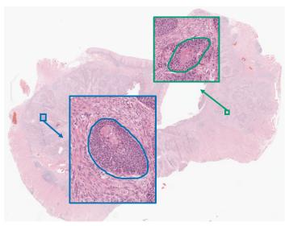  
(a)

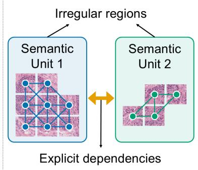  
(b)

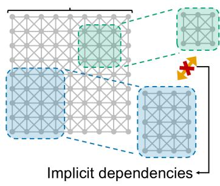  
(c)

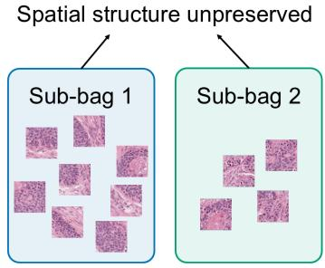  
(d)  
Figure 1: Conceptual comparison of subgraph-, graph-, and sub-bag-based representation strategies. (a) Two representative histological regions selected from a WSI of squamous cell carcinoma. (b) Subgraph-based strategy represents irregularly shaped semantic units as connected subgraphs and enables contextual dependencies among different units to be modeled explicitly. (c) Graph-based strategy constructs a slide-level graph using patches as nodes. Although patch-level relationships are preserved, multi-patch histological structures are not explicitly represented as integrated modeling units. (d) Sub-bag strategy constructs sub-bags by grouping multiple patches, but their internal spatial organization is not explicitly preserved.

Beyond individual semantic units, modeling contextual relationships among distant histological regions is important for incorporating slide-level information [11]. Transformer-based architectures [12], [13] have therefore been introduced into WSI analysis, frequently together with down-sampling [9], linear approximation [11], or staged aggregation [14] to alleviate the quadratic computational complexity of self-attention. However, they may discard fine-grained regional information or weaken direct information propagation among distant regions. Mamba has recently been proposed as a selective state space model (SSM) with input-dependent information propagation and linear computational complexity with respect to sequence length [15]. Its ability to efficiently process long sequences makes it suitable for large numbers of histological regions. Existing Mamba-based WSI methods mainly focus on patch-level sequence modeling [16], [17], [18], leaving efficient subgraph-level contextualization insufficiently explored.

In this work, we propose a flexible and efficient WSI classification framework termed the Semantic-Aware Subgraph State Space Model (SASG-SSM), consisting of Semantic-Aware Subgraphs (SASGs) and a Subgraph State Space Module (SG-SSM). Inspired by the perspective of histology, SASGs are capable of capturing explicit histologic patterns demonstrated in a certain region, and SG-SSM is specially designed to capture implicit patterns revealed by spatial distribution and co-occurrence of different regions. SASGs approximate irregularly shaped candidate semantic units by grouping spatially and visually related patches while preserving their internal topology. SG-SSM subsequently employs a GNN to encode intra-subgraph structure and a Mamba-based SSM to model long-range contextual dependencies among subgraphs, incorporating both local and global information. Extensive experiments on four WSI subtyping datasets demonstrate the effectiveness of SASG-SSM, with additional small-cohort and few-shot settings evaluating robustness under limited training data. The main contributions are summarized as follows:

• A flexible and efficient framework for WSI classification, termed the Semantic-Aware Subgraph State Space Model (SASG-SSM), is proposed to jointly represent histologically meaningful semantic units and model contextual dependencies among them.

• Semantic-Aware Subgraphs (SASGs) are introduced to approximate candidate semantic units as connected, irregularly shaped multi-patch regions. SASGs provide flexible spatial support while preserving intra-unit topology, thereby reducing the fragmentation imposed by fixed square patches.

• The Subgraph State Space Module (SG-SSM) incorporates a GNN encoder to aggregate intra-subgraph information and a Mamba-based SSM encoder to model long-range dependencies among a large number of subgraphs.

## 2 Related Work

## 2.1 WSI Classification

Weakly supervised multiple instance learning (MIL) is a dominant paradigm for WSI classification, with representative approaches including ABMIL [19], CLAM [6], DSMIL [20], and TransMIL [11]. These methods typically represent a WSI as a bag of fixed-grid patch features, which may fragment histological structures that do not conform to the grid. DTFD-MIL [7] further groups patches into pseudo-bags (also known as sub-bags) for double-tier feature distillation under limited supervision. However, such sub-bags need not correspond to spatially connected tissue regions and do not explicitly preserve internal spatial organization. Instead, our Semantic-Aware Subgraphs (SASGs) organize connected patches as topology-preserving subgraphs with irregular support, providing a structured representation of histological tissues.

## 2.2 Graph-Based WSI Analysis

Graph-based methods model histological structure at different granularities. CGC-Net [21] represents nuclei and their interactions, HACT [22] jointly models cells and tissue regions, and whole-slide frameworks including PatchGCN [8], Graph-Transformer [9], and SGMF [10] exploit spatial relationships for slide-level prediction. These approaches generally use predefined cells, regions, or clusters as graph entities. In contrast, SASG uses a connected irregular multi-patch subgraph itself as the modeling unit while explicitly retaining intra-unit adjacency.

## 2.3 State Space Models for WSI Analysis

State space models (SSMs) provide an efficient alternative for long-sequence modeling [23, 24]. Mamba [15] introduces input-dependent selective state-space parameters with linear complexity, motivating its application to WSI analysis. Patch-based methods such as MambaMIL [16], PAM [17], and 2DMamba [18] contextualize patch sequences with different scanning designs. M3amba [25] and GMMamba [26] extend modeling to groups. And hybrid graph-Mamba frameworks such as GAT-Mamba [27] combine graph-based structural modeling with state-space contextualization. Nevertheless, these approaches primarily operate on patch-, group-, or graph-node-level representations without fully incorporating local and global information. In contrast, our Subgraph State Space Module (SG-SSM) encodes topology within each irregular SASG before contextualizing topology-aware subgraph representations with Mamba, establishing a hierarchical local-to-global information flow.

## 2.4 Visual Foundation Models

Visual foundation models (VFMs) are large-scale pretrained models with broad transferability across downstream vision tasks [28]. General-purpose VFMs include CLIP [29] and GLIP [30] for transferable visual and vision-language representations, as well as the Segment Anything family [28, 31, 32] for promptable segmentation. Pathologyspecific VFMs, including UNI [33], CONCH [34], Prov-GigaPath [35], and Virchow [36], further learn transferable representations from large-scale histopathology data. In this work, we explore the use of SAM2 [31] to generate class agnostic region masks as visual-semantic priors, providing coarse boundary cues for constructing spatially coherent SASGs.

## 3 Methodology

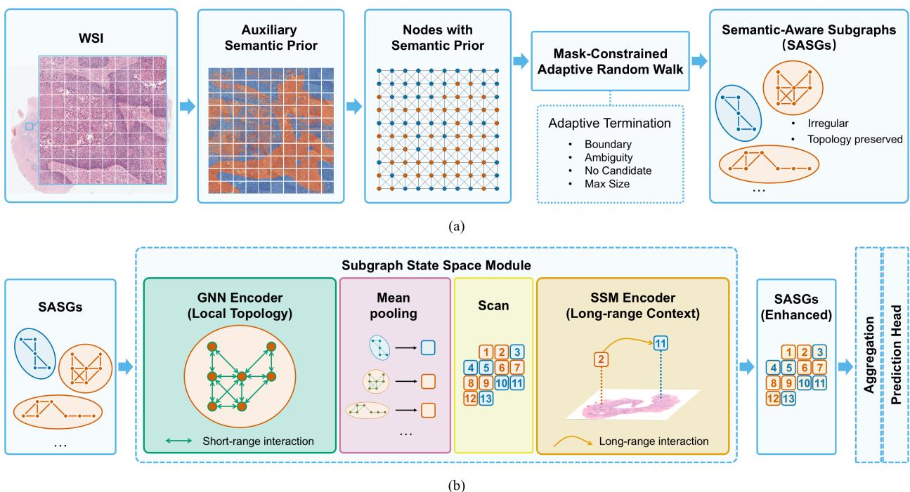  
Figure 2: Framework of the proposed Semantic-Aware Subgraph State Space Model (SASG-SSM). (a) Construction of Semantic-Aware Subgraphs (SASGs). An auxiliary visual-semantic prior based on segmentation mask constraints an adaptive random walk over patch nodes to construct irregular, topology-preserving subgraphs that approximate candidate semantic units. (b) Modeling of Subgraph State Space Module (SG-SSM). A GNN encoder first integrates intrasubgraph topological information, after which pooled SASG representations are spatially serialized and contextualized by a Mamba-based SSM encoder to model long-range contextual dependencies among subgraphs. The enhanced representations are subsequently aggregated for slide-level subtype classification.

Our Semantic-Aware Subgraph State Space Model (SASG-SSM) is illustrated in Fig. 2. It comprises two principal components: Semantic-Aware Subgraphs (SASGs), which provide irregular, topology-preserving representations of semantic units, and a Subgraph State Space Module (SG-SSM), which integrates their internal topology and models long-range contextual dependencies among them. Together, these components support the recognition of histological patterns expressed by tissue structures and their combinations across the WSI to facilitate accurate subtype classification.

## 3.1 Semantic-Aware Subgraphs

A semantic unit is a spatially connected and histologically coherent region conveying a recognizable pattern. Because such units may have irregular boundaries and variable extents, flexible spatial support can reduce fragmentation and better preserve local structure. We therefore organize spatially connected patches into irregularly-shaped, topologypreserving subgraphs, termed Semantic-Aware Subgraphs (SASGs). Here, “semantic-aware” indicates that subgraph has adaptive spatial extent, guided by visual-region cues derived from a class-agnostic semantic prior.

## 3.1.1 Auxiliary Semantic Prior

To guide adaptive subgraph construction while avoiding unconstrained expansion across visually distinct tissue regions, we first obtain coarse region masks that provide visual boundary cues. Specifically, SAM2 [31] is employed to generate a set of class-agnostic masks for each WSI. Given a WSI slide, R masks are derived as the visual-semantic prior:

$$
M = \{ M _ { r } \} _ { r = 1 } ^ { R } .\tag{1}
$$

## 3.1.2 Irregular Subgraph Sampling

Fixed square patches impose rigid boundaries that may fragment histological structures with irregular shapes and variable spatial extents. In contrast, connected subgraphs provide flexible spatial support while retaining adjacency relationships among their constituent patches. Such topology preserves the internal spatial organization of a candidate semantic unit and enables subsequent GNN to model its local structural arrangement.

Following standard WSI preprocessing [6], the foreground tissue is divided into N non-overlapping patches and encoded using a pretrained feature extractor $f _ { \phi } \mathrm { . }$

$$
\begin{array} { r } { P = \{ p _ { n } \} _ { n = 1 } ^ { N } , \qquad \mathbf { x } _ { n } = f _ { \phi } ( p _ { n } ) \in \mathbb { R } ^ { d } , \qquad c _ { n } \in \mathbb { R } ^ { 2 } . } \end{array}\tag{2}
$$

where $p _ { n } , \mathbf { x } _ { n }$ , and $c _ { n }$ denote the n-th patch, its feature vector, and its spatial coordinate, respectively, and d represent the dimension of feature vector.

A Semantic-Aware Subgraph (SASG) consists of selected $N _ { s }$ patches as nodes and builds edges between adjacent patches, thus approximating an irregular semantic unit:

$$
\begin{array} { r l } & { G _ { s } = ( V _ { s } , \mathbf { X } _ { s } , \mathbf { A } _ { s } ) , } \\ & { \mathbf { X } _ { s } \in \mathbb { R } ^ { N _ { s } \times d } , \qquad \mathbf { A } _ { s } \in \mathbb { R } ^ { N _ { s } \times N _ { s } } , } \end{array}\tag{3}
$$

where $V _ { s }$ denotes the coordinates of selected patches, $\mathbf { X } _ { s }$ denotes the feature matrix, and ${ \bf A } _ { s }$ denotes adjacent matrix of the s-th SASG.

To initialize SASG construction, $S = N \times 1 0 \%$ seed patches are randomly selected across the segmentation masks. Starting from each seed, a mask-constrained adaptive random walk progressively selects one unvisited adjacent patch (in its 8-nearest neighbors [8]) within the same mask. Because expansion is determined by local connectivity and mask boundaries rather than a predefined geometric window, the resulting patch set can assume an irregular shape and variable spatial extent. The walk terminates when any of the following conditions is satisfied: 1) further expansion would leave the seed mask; 2) the walk has passed low-purity patches for $W _ { \mathrm { a m b } } = 3$ consecutive steps; 3) no unvisited patch in the adjacent neighborhood; and 4) the number of selected nodes reaches $W _ { \mathrm { m a x } } = 1 0$

First condition constrains expansion to the prior region. Second condition limits propagation through ambiguous boundaries:

$$
q _ { n } = \operatorname* { m a x } _ { r } \frac { | \Omega ( p _ { n } ) \cap M _ { r } | } { | \Omega ( p _ { n } ) | } .\tag{4}
$$

where $\Omega ( p _ { n } )$ is the pixel support of patch $p _ { n }$ , and $M _ { r }$ is the r-th segmentation mask, | · | calculates the number of pixels. A patch is considered ambiguous if $q _ { n } < \theta . \ \theta = 7 5 \%$ is a manually set threshold. Third condition stops expansion when no valid unvisited neighbor remains, and the fourth bounds subgraph size and cost.

The sampling process yields $S$ connected patch sets $\{ \{ p _ { i , j } \} _ { j = 1 } ^ { N _ { i } } \} _ { i = 1 } ^ { S }$ . If represented only as sets, these regions would be analogous to sub-bags and would discard the internal relationships among their constituent patches. We therefore consider spatially adjacent patches as graph nodes and connect them with graph edges, yielding S SASGs $\{ G _ { i } \} _ { i = 1 } ^ { S }$ These SASGs explicitly preserve intra-region adjacency and provide the structural basis for subsequent GNN-based topology encoding.

Each SASG therefore has irregular spatial support, variable extent, and visual coherence with respect to the prior, serving as an approximate candidate semantic unit. A Subgraph State Space Module subsequently performs content-adaptive contextualization to modulate information propagation among SASGs.

## 3.2 Subgraph State Space Module

The diagnostic relevance of a histological pattern may depend on its co-occurrence and relationships with other tissue structures [4]. Subgraph State Space Module (SG-SSM) therefore combines a Mamba-based SSM encoder for efficient long-range contextualization among spatially separated SASGs and a GNN for intra-subgraph topology encoding.

## 3.2.1 Long-Range Context among Subgraphs

The number of SASGs could be enormous due to the large size of WSIs, therefore, a scalable and efficient encoder, Mamba [15], is incorporated to process the batch of SASGs. To retain complete slide coverage, each individual patch is additionally treated as a zero-step subgraph.

To provide an ordered input to Mamba, SASGs are first pooled into subgraph tokens and are then serialized using a simple spatially informed scan based on the coordinates of their seed patches (left-top to bottom-right). The ordering is treated as a practical graph-to-sequence transformation rather than as a pathological prior. Alternative serialization strategies are evaluated in subsequent ablation study. Let $L = S + N$ denote the total number of multi-patch and zero-step subgraphs. For a scan permutation π,

$$
\begin{array} { r l } & { \mathbf { T } _ { \boldsymbol { \pi } } = \mathrm { S c a n } \left( \{ \mathbf { t } _ { i } \} _ { i = 1 } ^ { L } , \boldsymbol { \pi } \right) } \\ & { \quad \quad = \left[ \mathbf { t } _ { \pi ( 1 ) } ; \mathbf { t } _ { \pi ( 2 ) } ; \cdots ; \mathbf { t } _ { \pi ( L ) } \right] \in \mathbb { R } ^ { L \times d } . } \end{array}\tag{5}
$$

The subgraph token $\mathbf { t } _ { i }$ is obtained by pooling its node features:

$$
\mathbf { t } _ { i } = \operatorname { P o o l } ( \mathbf { X } _ { i } , V _ { i } ) = \frac { 1 } { | V _ { i } | } \sum _ { v \in V _ { i } } \mathbf { x } _ { i , v } \in \mathbb { R } ^ { d } .\tag{6}
$$

The SSM encoder is instantiated with a LayerNorm layer [37] and a vanilla Mamba block [15]. The forward propagation is as follows:

$$
\begin{array} { r } { \widetilde { \mathbf { T } } _ { \pi } = \mathrm { S S M E n c o d e r } \left( \mathbf { T } _ { \pi } \right) \quad } \\ { = \mathrm { M a m b a B l o c k } \left[ \mathrm { L N } \left( \mathbf { T } _ { \pi } \right) \right] . } \end{array}\tag{7}
$$

Then recover the contextualized token associated with subgraph i by reversing the scan permutation:

$$
\widetilde { \mathbf { t } } _ { i } = \left[ \pi ^ { - 1 } \left( \widetilde { \mathbf { T } } _ { \pi } \right) \right] _ { i } ,\tag{8}
$$

where $\widetilde { \mathbf { t } } _ { i }$ denotes the contextualized representation of the i-th subgraph.

The input-dependent state-space parameters of Mamba provide content-adaptive long-range contextualization [15].

## 3.2.2 Local Topology inside Subgraphs

Because direct pooling would discard SASG topology, a GNN encoder is therefore employed to propagate information along intra-subgraph edges.

The GNN encoder is instantiated with a Graph Convolution block [38], a LayerNorm layer [37], an activation function and a dropout layer. The forward propagation is as follows:

$$
\begin{array} { r l } & { \mathbf { H } _ { i } = \operatorname { G N N E n c o d e r } \left( \mathbf { X } _ { i } , \mathbf { A } _ { i } \right) } \\ & { \quad \quad = \operatorname { D r o p o u t } \left( \sigma \left( \operatorname { L N } \left( \operatorname { G C N } \left( \mathbf { X } _ { i } , \mathbf { A } _ { i } \right) \right) \right) \right) . } \end{array}\tag{9}
$$

The topology-aware subgraph representation is subsequently obtained by pooling:

$$
\mathbf { t } _ { i } ^ { \mathrm { t o p o } } = \operatorname { P o o l } \left( \mathbf { H } _ { i } , V _ { i } \right) = \frac { 1 } { \vert V _ { i } \vert } \sum _ { v \in V _ { i } } \mathbf { h } _ { i , v } .\tag{10}
$$

where $\mathbf { H } _ { i }$ represents the updated node feature matrix of the i-th SASG, and $\mathbf { t } _ { i } ^ { \mathrm { { t o p o } } }$ denotes the i-th subgraph representation enhanced with topological information.

## 3.2.3 Incorporation of Encoders

Intuitively, feeding the SASGs into two encoders separately and then adding the output features would incorporate two encoders together. We refer this intuitive incorporation as a parallel style.

However, two encoders serve relatively independent roles in parallel style. We further explore a serial style where the GNN encoder first embeds intra-subgraph topology, after which the resulting topology-aware representations are tokenized and contextualized by SSM encoder, as illustrated in Fig. 2(b). Full propagation of the i-th SASG is as follows:

$$
{ \bf t } _ { i } ^ { \mathrm { t o p o } } = \mathrm { P o o l } \left[ \mathrm { G N N E n c o d e r } \left( { \bf X } _ { i } , { \bf A } _ { i } \right) , V _ { i } \right] , \quad i = 1 , \ldots , L ,
$$

$$
\widetilde { \mathbf { T } } _ { \pi } ^ { \mathrm { s e r } } = \mathrm { S S M E n c o d e r } \left[ \mathrm { S c a n } \left( \{ \mathbf { t } _ { i } ^ { \mathrm { t o p o } } \} _ { i = 1 } ^ { L } , \pi \right) \right] .\tag{11}
$$

The serial design establishes an explicit local-to-global information flow and is adopted as the default configuration due to its superior results. Detailed comparisons are provided in further analysis of SG-SSM.

## 3.3 Classification and Loss Function

Multi-patch SASGs act as intermediate carriers of local structural and long-range contextual information. Because different SASGs may overlap and repeatedly contain the same patch nodes, directly aggregating all SASG tokens could duplicate evidence from heavily sampled regions. We therefore use the contextualized zero-step subgraphs as a unique patch-level readout set and aggregate them using gated attention [19].

Let $Z$ denote the index set of zero-step subgraphs. For each $i \in Z$ , the unnormalized attention score is computed as:

$$
e _ { i } = \mathbf { W } _ { \alpha } \left[ \operatorname { t a n h } \left( \mathbf { V } _ { \alpha } \widetilde { \mathbf { t } } _ { i } \right) \odot \mathrm { s i g m } \left( \mathbf { U } _ { \alpha } \widetilde { \mathbf { t } } _ { i } \right) \right] ,\tag{12}
$$

and the normalized attention weights and slide-level representation are obtained as:

$$
\alpha _ { i } = \frac { \exp ( e _ { i } ) } { \displaystyle \sum _ { j \in Z } \exp ( e _ { j } ) } , \quad i \in Z , \quad \mathbf { z } = \displaystyle \sum _ { i \in Z } \alpha _ { i } \widetilde { \mathbf { t } } _ { i } \in \mathbb { R } ^ { d } .\tag{13}
$$

followed by the slide-level prediction:

$$
\widehat { \boldsymbol { y } } = \mathrm { s o f t m a x } \left( \mathrm { l i n e a r } \left( \mathbf { z } \right) \right) ,\tag{14}
$$

where $\widehat { y }$ represents the final prediction label, z represents slide-level feature, $\mathbf { W } _ { \alpha } , \mathbf { U } _ { \alpha }$ , and $\mathbf { V } _ { \alpha }$ represents trainable matrices, tanh(·) and sigm(·) represents activation functions, and ⊙ represents element-wise multiplication.

For a C-class subtyping tasks, the cross entropy (CE) loss is adopted:

$$
L _ { \mathrm { C E } } = - \sum _ { c = 1 } ^ { C } y _ { c } \log \left( \widehat { y } _ { c } \right) .\tag{15}
$$

## 4 Experiments

## 4.1 Datasets

To validate the effectiveness of SASG-SSM for WSI subtyping, we conduct extensive experiments on four cohorts from The Cancer Genome Atlas (TCGA), with details summarized below.

ESCA: It comprises two subtypes of esophageal carcinoma: squamous cell carcinoma (SCC, 92 slides from 90 patients) and adenocarcinoma (AC, 66 slides from 66 patients), totaling 158 diagnostic WSIs.

BRCA: It encompasses the major subtypes of invasive breast carcinoma. In this study, we focus on two predominant subtypes: invasive lobular carcinoma (ILC, 188 slides from 175 patients) and invasive ductal carcinoma (IDC, 769 slides from 722 patients), totaling 957 diagnostic WSIs.

NSCLC: It consists of two subtypes of lung cancer: lung adenocarcinoma (LUAD, 489 slides from 430 cases) and lung squamous cell carcinoma (LUSC, 512 slides from 478 cases), totaling 1,001 diagnostic WSIs.

RCC: It covers three subtypes: kidney chromophobe renal cell carcinoma (CHRCC, 105 slides from 95 cases), kidney clear cell renal cell carcinoma (CCRCC, 435 slides from 429 cases), and kidney papillary renal cell carcinoma (PRCC, 255 slides from 234 cases), totaling 795 diagnostic WSIs.

We additionally downsample BRCA, NSCLC, and RCC training sets to scales comparable to ESCA while preserving class proportions, enabling evaluation under limited data availability. Details are summarized in Table 1.

Table 1: Summarized Details of Datasets and Training Splits
<table><tr><td rowspan="2">Item</td><td colspan="2">ESCA</td><td colspan="2">BRCA</td><td colspan="2">NSCLC</td><td colspan="2">RCC</td></tr><tr><td>SCC AC</td><td></td><td>ILC IDC</td><td></td><td>LUAD LUSC</td><td>CHRCC CCRCC PRCC</td><td></td><td></td></tr><tr><td>Class label</td><td>1</td><td>0</td><td>1</td><td>0</td><td>1 0</td><td>2</td><td>1</td><td>0</td></tr><tr><td>No. of slides</td><td>92</td><td>66</td><td>188 769</td><td></td><td>489 512</td><td>105</td><td>435</td><td>255</td></tr><tr><td>Train-small</td><td>72</td><td>54</td><td>24 93</td><td>58</td><td>60</td><td>19</td><td>66</td><td>39</td></tr><tr><td>Train-large</td><td>一</td><td>一</td><td>150631</td><td>406</td><td>395</td><td>84</td><td>350</td><td>207</td></tr><tr><td>Validation</td><td>20</td><td>12</td><td>38 138</td><td>83</td><td>117</td><td>21</td><td>85</td><td>48</td></tr></table>

## 4.2 Implementation Details

Preprocessing: Following [6], foreground tissue is segmented and cropped into non-overlapping $2 5 6 \times 2 5 6$ patches at 20× magnification, used for all image operations unless specified otherwise. Because this rigid grid is agnostic to tissue boundaries, SAM2 [31] masks provide structure-aware semantic priors. WSIs are first divided into 2560 × 2560 tiles with 256-pixel overlap to reduce boundary discontinuities. Each tile spans 10 × 10 patches and provides local context. The resulting masks guide patch grouping into spatially coherent candidate semantic units.

Segmentation Settings: Since SAM2 is primarily pretrained on natural images, we use point prompts to guide its segmentation of histopathological structures. Specifically, point prompts are sampled from regions obtained by threshold-based partitioning, following the empirical observation that tumor and stromal regions often differ in staining intensity.

Training Settings: SASG-SSM and all baseline methods are implemented using PyTorch and trained on eight NVIDIA A6000 GPUs. The Adam optimizer [39] is used with a learning rate of $2 \times 1 0 ^ { - 5 }$ and a weight decay of $1 \times 1 0 ^ { - 5 }$ . The batch size is set to 1, with a maximum of 200 training epochs and an early-stopping strategy.

Evaluation: Performance is assessed using the F1 score (F1), area under the receiver operating characteristic curve (AUC), and accuracy (ACC). To evaluate model robustness, we performed fivefold cross-validation using patient-level splits.

## 4.3 Comparisons with State-of-the-Art

We conduct a comprehensive comparison against representative state-of-the-art (SOTA) methods for WSI subtyping. The compared methods are divided into three categories: four MIL-based methods, including ABMIL [19], TransMIL [11], ILRA [40], and ACMIL [41]; two GNN-based methods, including PatchGCN [8] and SGMF [10]; and two SSM-based methods, including MambaMIL [16] and PAM [17]. To ensure a fair comparison, all baseline methods are trained and evaluated using the same fivefold cross-validation splits as SASG-SSM. We follow the hyperparameter settings and reproduction strategies reported in the original studies, with the exception of the feature encoder, which is standardized as an ImageNet-pretrained [42] ResNet50 [43] with a 1024-dimensional output for all methods.

## 4.3.1 Overall Comparison

As shown in Table 2, SASG-SSM achieves the highest F1 scores in both small- and large-set settings. In the small-set setting, it also achieves the best F1 and AUC across all datasets. Notably, on TCGA-ESCA, it reaches 92.17% F1, 95.71% AUC, and 91.09% ACC, exceeding the second-best results by 2.93, 0.71, and 3.87 points, respectively. In the large-set setting, it retains the highest F1 and competitive performance on other metrics, indicating balanced classification across histopathological subtypes.

## 4.3.2 Few-Shot Comparison

To further evaluate SASG-SSM under more restricted data availability, we conduct few-shot training by randomly sampling varying numbers of slides from the fivefold training splits while retaining the same validation splits. As shown in Table 3, SASG-SSM consistently outperforms the competing methods, achieving the strongest overall F1 and AUC performance across the evaluated settings These results indicate that the proposed Semantic-Aware Subgraphs can extract discriminative histopathological representations under extremely limited supervision.

## 4.4 Ablation Study

Table 4 evaluates the main components by removing the WSI graph, SASGs, or SG-SSM. Each removal reduces performance across the evaluated tasks. The improvement introduced by SASGs can be attributed to their ability to represent localized histopathological structures with irregular shapes and spatial coherence. Unlike regular grid-based patches, SASGs approximate semantic units while preserving their integrity and connectivity, allowing the model to focus on regional patterns rather than fragmented cues. The effectiveness of SG-SSM can be attributed to its ability to model long-range contextual relationships among SASGs, thereby facilitating the characterization of distinctive combinations of histological patterns for subtyping. Together, the two components support a comprehensive analysis of histological patterns and address the two coupled challenges discussed in Introduction. In addition, the performance degradation observed after removing the WSI graph suggests that complete slide coverage provides an important basis for modeling spatially distributed semantic units.

Table 2: Overall Comparison with State-of-the-Art Methods on Four TCGA Datasets
<table><tr><td rowspan=2 colspan=1>Method</td><td rowspan=1 colspan=1>ESCA</td><td rowspan=1 colspan=2>BRCA</td><td rowspan=1 colspan=1>NSCLC</td><td rowspan=1 colspan=1>RCC</td></tr><tr><td rowspan=1 colspan=1>F1     AUC    ACC</td><td rowspan=1 colspan=2>F1     AUC    ACC</td><td rowspan=1 colspan=1>F1     AUC    ACC</td><td rowspan=1 colspan=1>F1     AUC    ACC</td></tr><tr><td rowspan=1 colspan=1></td><td rowspan=1 colspan=1></td><td rowspan=1 colspan=2>Small Training Set (n</td><td rowspan=1 colspan=1>≈ 120)</td><td rowspan=1 colspan=1></td></tr><tr><td rowspan=1 colspan=1>ABMIL</td><td rowspan=1 colspan=1>57.24 ±29.76 78.79 ±10.43 61.13 ±19.1</td><td rowspan=1 colspan=2>610.96 ±21.92 74.30 ±3.6080.75 ±1.51</td><td rowspan=1 colspan=1>60.08 ±30.34 82.27 ±5.12 72.67 ±8.84</td><td rowspan=1 colspan=1>75.09 ±9.41 91.68 ±1.28 81.64 ±4.40</td></tr><tr><td rowspan=1 colspan=1>TransMIL</td><td rowspan=1 colspan=1>66.97 ±30.71 83.11 ±19.9572.04 ±21.05</td><td rowspan=1 colspan=2>9.46 ±13.30 62.57 ±7.08 80.42 ±1.51</td><td rowspan=1 colspan=1>37.31 ±25.86 65.00 ±9.02 56.51 ±7.35</td><td rowspan=1 colspan=1>71.28 ±6.78 91.06 ±3.66 79.29 ±4.94</td></tr><tr><td rowspan=1 colspan=1>ILRA</td><td rowspan=1 colspan=1>76.35 ±9.27 87.12 ±8.4865.22 ±15.57</td><td rowspan=1 colspan=2>28.80 ±23.88 77.34 ±3.23 81.08 ±1.24</td><td rowspan=1 colspan=1>72.65 ±7.54 83.28 ±3.35 73.23 ±5.03</td><td rowspan=1 colspan=1>79.09 ±3.43 93.52 ±1.4483.31 ±3.50</td></tr><tr><td rowspan=1 colspan=1>ACMIL</td><td rowspan=1 colspan=1>73.34 ±6.01 85.51 ±5.68 58.27 ±7.69</td><td rowspan=1 colspan=2>0.00 ±0.00 60.42 ±7.03 80.32 ±1.25</td><td rowspan=1 colspan=1>35.24 ±28.88 71.24 ±9.51 50.28 ±8.02|</td><td rowspan=1 colspan=1>2|45.16 ±10.8587.15 ±4.64 69.18 ±7.07</td></tr><tr><td rowspan=1 colspan=1>PatchGCN</td><td rowspan=1 colspan=1>83.98 ±3.97 88.62 ±2.39 80.85 ±5.37</td><td rowspan=1 colspan=2>21.79 ±24.42 72.55 ±7.91 79.27 ±3.34</td><td rowspan=1 colspan=1>71.92 ±4.64 83.36 ±2.46 73.53 ±2.63</td><td rowspan=1 colspan=1>80.80 ±5.39 92.66 ±3.37 80.60 ±5.39</td></tr><tr><td rowspan=1 colspan=1>SGMF</td><td rowspan=1 colspan=1>89.24 ±4.02 94.12 ±3.05 87.20 ±4.60</td><td rowspan=1 colspan=2>26.54 ±20.51 71.71 ±10.6881.18 ±0.89</td><td rowspan=1 colspan=1>60.88 ±17.46 83.68 ±3.83 68.77 ±6.34</td><td rowspan=1 colspan=1>80.00 ±4.67 93.84 ±1.19 80.11 ±4.47</td></tr><tr><td rowspan=1 colspan=1>MambaMIL</td><td rowspan=1 colspan=1>89.08 ±3.74 92.98 ±4.12 87.22 ±4.67</td><td rowspan=1 colspan=2>37.43 ±22.98 74.57 ±7.27 67.35 ±22.55</td><td rowspan=1 colspan=1>72.29 ±9.5083.23 ±3.45 74.99 ±5.72|</td><td rowspan=1 colspan=1>81.10 ±7.99 92.80 ±5.61 81.15 ±7.88</td></tr><tr><td rowspan=1 colspan=1>PAM</td><td rowspan=2 colspan=1>88.69 ±5.95 95.00 ±2.13 86.20 ±6.9992.17 ±4.1695.71 ±3.1291.09 ±4.61</td><td rowspan=1 colspan=2>38.38 ±18.36 76.00 ±7.97 80.62 ±1.91</td><td rowspan=1 colspan=1>62.45 ±17.8582.47 ±4.01 69.65 ±9.24|</td><td rowspan=1 colspan=1>80.03 ±8.4893.52 ±3.03 80.04 ±8.34</td></tr><tr><td rowspan=1 colspan=1>SASG-SSM</td><td rowspan=1 colspan=2>38.82 ±16.5977.53 ±5.08 80.14 ±1.75</td><td rowspan=1 colspan=1>75.15 ±1.8284.87 ±2.8176.52 ±1.87|</td><td rowspan=1 colspan=1>81.37 ±3.5293.85 ±1.7781.17 ±3.33</td></tr><tr><td rowspan=1 colspan=1></td><td rowspan=1 colspan=1></td><td rowspan=1 colspan=2>Large Traning Set (n ≈</td><td rowspan=1 colspan=1>1000)</td><td rowspan=1 colspan=1></td></tr><tr><td rowspan=1 colspan=1>ABMIL</td><td rowspan=1 colspan=1></td><td rowspan=1 colspan=2>59.11 ±10.25 87.36 ±4.10 85.18 ±2.67</td><td rowspan=1 colspan=1>81.63 ±8.50 92.73 ±1.36 83.43 ±4.34</td><td rowspan=1 colspan=1>85.46 ±3.42 96.41 ±1.20 88.30 ±2.88</td></tr><tr><td rowspan=1 colspan=1>TransMIL</td><td rowspan=2 colspan=1></td><td rowspan=1 colspan=2>55.70 ±7.00 84.81 ±2.34 83.26 ±1.27</td><td rowspan=1 colspan=1>81.88 ±4.34 90.74 ±1.89 83.33 ±2.91</td><td rowspan=1 colspan=1>85.90 ±2.33 96.55 ±1.62 89.19 ±1.80</td></tr><tr><td rowspan=1 colspan=1>ILRA</td><td rowspan=1 colspan=2>63.12 ±2.14 87.18 ±1.99 86.86 ±2.25</td><td rowspan=1 colspan=1>84.12 ±2.55 92.65 ±1.91 84.91 ±1.68</td><td rowspan=1 colspan=1>85.65 ±1.91 97.46 ±1.3689.06 ±2.68</td></tr><tr><td rowspan=3 colspan=1>ACMILPatchGCNSGMF</td><td rowspan=3 colspan=1></td><td rowspan=1 colspan=2>47.72 ±25.60 87.52 ±1.69 85.80 ±3.53</td><td rowspan=1 colspan=1>80.73 ±4.8691.59 ±3.08 82.92 ±3.12|</td><td rowspan=1 colspan=1>85.96 ±4.4197.69 ±0.91 89.09 ±3.83</td></tr><tr><td rowspan=1 colspan=1>61.04 ±10.10 88.10</td><td rowspan=1 colspan=1>±3.21 87.62 ±1.98</td><td rowspan=1 colspan=1>85.67 ±2.25 93.04 ±1.92 85.92 ±2.01</td><td rowspan=1 colspan=1>88.83 ±2.4697.57 ±0.91 88.82 ±2.43</td></tr><tr><td rowspan=1 colspan=1>64.46 ±5.94 88.22 ±</td><td rowspan=1 colspan=1>1.77 87.43 ±1.82</td><td rowspan=1 colspan=1>84.99 ±3.9592.68 ±1.66 85.40 ±3.54</td><td rowspan=1 colspan=1>87.76 ±5.83 97.52 ±1.32 87.53 ±6.30</td></tr><tr><td rowspan=1 colspan=1>MambaMIL</td><td rowspan=1 colspan=1></td><td rowspan=1 colspan=1>65.15 ±5.83 88.31 ±</td><td rowspan=1 colspan=1>3.20 86.92 ±1.14</td><td rowspan=1 colspan=1>85.53 ±2.61 92.99 ±1.66 85.62 ±3.25</td><td rowspan=1 colspan=1>89.18 ±2.52 97.56 ±0.89 89.15 ±2.60</td></tr><tr><td rowspan=2 colspan=1>PAMSASG-SSM</td><td rowspan=2 colspan=1></td><td rowspan=1 colspan=1>59.85 ±9.48 87.74</td><td rowspan=1 colspan=1>±4.86 86.41 ±1.57</td><td rowspan=1 colspan=1>85.52 ±2.13 92.97 ±0.94 85.58 ±1.38</td><td rowspan=2 colspan=1>88.08 ±3.27 97.55 ±0.91 88.17 ±3.1789.85 ±2.9597.67 ±1.2289.84 ±3.05</td></tr><tr><td rowspan=1 colspan=2>65.64 ±5.37 88.37 ±3.2088.06 ±1.07</td><td rowspan=1 colspan=1>86.82 ±1.5393.06 ±0.8187.01 ±1.78</td></tr></table>

Table 3: Few-shot Comparison with State-of-the-Art Methods on Four TCGA Datasets. (k Denotes the Number of Slides per Class.)
<table><tr><td rowspan="2">Dataset Method</td><td rowspan="2"></td><td colspan="2">k = 1</td><td colspan="2">k = 2</td><td colspan="2">k = 4</td><td colspan="2">k = 8</td><td colspan="2">k = 16</td></tr><tr><td>F1</td><td>AUC</td><td>F1</td><td>AUC</td><td>F1</td><td>AUC</td><td>F1</td><td>AUC</td><td>F1</td><td>AUC</td></tr><tr><td rowspan="8">ESCA</td><td>ABMIL TransMIL</td><td></td><td>57.91 ±29.87 60.73 ±9.70</td><td></td><td>44.63 ±36.81 56.81 ±13.42</td><td>258.94 ±30.07 79.93 ±5.90</td><td></td><td>46.17 ±33.98 82.63 ±5.50</td><td></td><td>58.98 ±30.24 82.13 ±6.92</td><td></td></tr><tr><td></td><td></td><td>59.56 ±30.25 55.36 ±16.20|4</td><td>43.92 ±24.5263.57 ±12.90</td><td></td><td></td><td>52.85 ±30.32 60.63 ±13.46|6</td><td>60.81 ±13.55 63.44 ±11.35</td><td></td><td>52.33 ±26.81 73.52 ±6.23</td><td></td></tr><tr><td>ILRA</td><td></td><td>58.94 ±30.07 60.58 ±13.09</td><td>57.95 ±29.54 71.58 ±13.40</td><td></td><td>58.79 ±29.98 79.85 ±8.03</td><td></td><td>56.09 ±28.16 81.81 ±4.49</td><td></td><td></td><td>73.34 ±6.01 83.01 ±6.47</td></tr><tr><td>ACMIL</td><td></td><td>57.73 ±29.85 59.88 ±13.66</td><td>59.23 ±30.1672.06 ±14.56|43.55 ±36.02 76.30 ±11.43</td><td></td><td></td><td></td><td>58.94 ±30.07 84.38 ±3.34</td><td></td><td></td><td>71.36 ±10.0583.04 ±3.98</td></tr><tr><td>PatchGCN</td><td></td><td>74.13 ±5.33 76.29 ±9.35</td><td>70.67 ±7.80 72.10 ±14.17</td><td></td><td>64.37 ±11.54 78.84 ±7.78</td><td></td><td>69.06 ±10.16 77.47 ±7.41</td><td></td><td></td><td>77.77 ±6.95 80.55 ±9.03</td></tr><tr><td>SGMF</td><td></td><td>72.53 ±5.95 55.43 ±13.22</td><td>70.12 ±14.06 70.38 ±18.98</td><td></td><td>56.47 ±26.24 78.23 ±7.26</td><td></td><td>69.16 ±12.36 78.49 ±10.12</td><td></td><td>63.00 ±29.16 83.35 ±5.39</td><td></td></tr><tr><td>MambaMIL</td><td>74.92 ±6.92 73.31 ±5.35</td><td></td><td>69.14 ±7.79 68.26 ±14.49</td><td></td><td>72.67 ±5.30 74.27 ±14.64</td><td></td><td>69.10 ±7.87 79.54 ±7.35</td><td></td><td>74.99 ±10.86 79.25 ±11.11</td><td></td></tr><tr><td>PAM</td><td></td><td>54.41 ±19.24 59.35 ±11.07</td><td>71.79 ±5.04 63.05 ±11.32</td><td></td><td>71.21 ±4.41 66.98 ±8.60</td><td></td><td>72.49 ±3.97 76.54 ±7.79</td><td></td><td></td><td>75.73 ±7.13 81.74 ±7.42</td></tr><tr><td rowspan="11">BRCA</td><td>SASG-SSM</td><td></td><td>75.07 ±5.65 76.75 ±1.77</td><td>72.45 ±9.54 78.99 ±10.75</td><td></td><td>72.82 ±6.93 82.26 ±2.75</td><td></td><td>73.86 ±5.94 84.81 ±3.28</td><td></td><td></td><td>79.00 ±9.10 86.78 ±5.80</td></tr><tr><td>ABMIL</td><td></td><td>20.88 ±14.52 43.91 ±6.86</td><td>21.42 ±14.34 50.80 ±7.50</td><td></td><td></td><td>32.96 ±2.07 58.39 ±6.48</td><td>30.90 ±5.28 53.99 ±7.49</td><td></td><td></td><td>16.34 ±13.86 69.66 ±5.01</td></tr><tr><td>TransMIL</td><td></td><td>14.61 ±15.96 51.76 ±11.01</td><td></td><td>24.33 ±12.6054.40 ±7.25</td><td></td><td>18.30 ±16.09 56.14 ±11.01</td><td>18.97 ±15.80 54.95 ±7.40</td><td></td><td></td><td>30.04 ±4.18 54.89 ±7.63</td></tr><tr><td>ILRA</td><td></td><td>7.10 ±14.21 52.11 ±8.95</td><td>19.82 ±16.27 55.58 ±9.58</td><td></td><td></td><td>26.29 ±13.26 58.86 ±9.66</td><td>26.17 ±13.2057.44 ±11.32</td><td></td><td></td><td>7.07 ±14.14 70.02 ±3.61</td></tr><tr><td>ACMIL</td><td></td><td>22.09 ±14.16 48.19 ±11.83</td><td>18.56 ±15.30 56.59 ±5.26</td><td></td><td>20.62 ±14.7660.19 ±8.21</td><td></td><td>26.83 ±13.51 56.51 ±11.36</td><td></td><td></td><td>11.15 ±12.85 67.63 ±4.48</td></tr><tr><td>PatchGCN</td><td></td><td>1.58 ±1.87 55.00 ±11.87</td><td>6.40 ±9.71 54.17 ±8.66</td><td></td><td>7.97 ±6.44 58.32 ±8.10</td><td></td><td>7.90 ±14.43 55.57 ±10.83</td><td></td><td></td><td>18.51 ±17.32 64.22 ±7.38</td></tr><tr><td>SGMF MambaMIL</td><td></td><td>22.53 ±12.15 48.88 ±6.38</td><td>24.77 ±12.22 55.13 ±5.18 2.88 ±4.36 53.36 ±11.89</td><td></td><td></td><td>30.72 ±3.85 59.10 ±3.32 3.75 ±8.39 59.77 ±5.32</td><td>29.83 ±13.88 60.29 ±12.19|</td><td></td><td></td><td>22.00 ±16.47 67.75 ±6.91</td></tr><tr><td>PAM</td><td></td><td>2.00 ±2.74 49.07 ±10.69</td><td>6.37 ±6.00 53.70 ±8.77</td><td></td><td></td><td>15.60 ±12.92 56.78 ±5.72</td><td>22.28 ±10.48 56.27 ±7.16</td><td>8.63 ±19.29 58.73 ±13.86|</td><td></td><td>11.04 ±18.05 64.93 ±12.35</td></tr><tr><td>SASG-SSM</td><td>22.76 ±12.8257.43 ±9.79</td><td>4.88 ±7.48 52.94 ±11.50</td><td>25.27 ±5.83 59.39 ±5.44</td><td></td><td></td><td></td><td></td><td></td><td></td><td>18.28 ±15.92 63.96 ±1.90</td></tr><tr><td>ABMIL</td><td>38.54 ±31.78 59.12 ±6.87</td><td></td><td>27.28 ±33.42 63.30 ±3.61</td><td></td><td></td><td>32.92 ±12.7063.28 ±6.05</td><td></td><td>38.96 ±4.61 65.73 ±5.09</td><td></td><td>38.47 ±6.66 70.64 ±5.10</td></tr><tr><td>TransMIL</td><td></td><td></td><td></td><td></td><td>51.32 ±26.0666.81 ±2.65</td><td></td><td>45.56 ±21.95 64.60 ±3.49</td><td></td><td></td><td>34.55 ±29.22 70.73 ±3.62</td></tr><tr><td rowspan="8"></td><td></td><td></td><td>11.54 ±15.45 55.50 ±7.64</td><td>25.68 ±22.93 60.62 ±3.35</td><td></td><td>31.73 ±26.47 62.09 ±2.31</td><td></td><td>34.87 ±29.13 58.02 ±10.34</td><td></td><td></td><td>21.26 ±21.95 62.01 ±5.04</td></tr><tr><td>ILRA</td><td></td><td>37.83 ±31.0963.23 ±3.63</td><td>27.28 ±33.42 62.58 ±2.72</td><td></td><td></td><td>25.15 ±30.92 64.04 ±4.62</td><td>39.89 ±32.73 60.44 ±4.35</td><td></td><td></td><td>61.56 ±7.22 69.07 ±3.57</td></tr><tr><td>ACMIL</td><td>53.50 ±25.05 54.06 ±7.33</td><td></td><td>37.32 ±31.25 62.85 ±2.12</td><td></td><td>41.83 ±23.60 64.29 ±3.69</td><td></td><td>53.96 ±20.89 63.96 ±2.94</td><td></td><td></td><td>40.96 ±28.52 68.82 ±3.76</td></tr><tr><td>NSCLC PatchGCN</td><td></td><td>55.63 ±8.93 59.18 ±6.35</td><td>46.08 ±15.2961.57 ±3.96</td><td></td><td>37.81 ±24.28 65.09 ±7.08</td><td></td><td>60.66 ±8.82 62.12 ±5.34</td><td></td><td></td><td>57.09 ±8.52 65.31 ±10.69</td></tr><tr><td>SGMF</td><td></td><td>38.14 ±28.57 58.05 ±6.39</td><td>56.64 ±7.21 60.93 ±2.23</td><td></td><td>60.01 ±6.90 64.45 ±4.19</td><td></td><td>64.04 ±6.88 60.28 ±6.28</td><td></td><td>65.21 ±4.85 70.34 ±3.53</td><td></td></tr><tr><td>MambaMIL</td><td></td><td>47.81 ±3.17 57.84 ±7.94</td><td>50.42 ±13.92 61.70 ±3.62</td><td></td><td></td><td>52.13 ±19.60 63.43 ±2.40</td><td>45.86 ±12.58 57.67 ±9.23</td><td></td><td>52.83 ±24.63 70.93 ±6.79</td><td></td></tr><tr><td>PAM</td><td>49.78 ±7.96 57.34 ±5.12</td><td></td><td>56.64 ±9.21 57.92 ±4.88</td><td></td><td>43.48 ±16.6863.22 ±4.67</td><td></td><td>61.05 ±5.95 58.18 ±3.07</td><td></td><td>53.88 ±8.64 64.39 ±4.08</td><td></td></tr><tr><td>SASG-SSM</td><td>64.71 ±4.56 63.64 ±4.18</td><td></td><td>64.64 ±4.96 65.31 ±5.06</td><td></td><td>62.85 ±6.50 67.42 ±3.20</td><td></td><td>66.20 ±4.79 68.07 ±3.85</td><td></td><td>67.23 ±4.43 71.14 ±3.53</td><td></td></tr><tr><td rowspan="11">RCC</td><td>ABMIL</td><td></td><td>27.14 ±16.60 69.91 ±8.33</td><td>14.49 ±6.08 74.61 ±6.42</td><td></td><td></td><td>44.40 ±19.82 82.48 ±3.07</td><td>35.85 ±18.27 84.49 ±3.84</td><td></td><td></td><td>44.70 ±28.56 84.34 ±4.68</td></tr><tr><td>TransMIL</td><td>38.49 ±16.32 72.47 ±8.06</td><td></td><td>25.08 ±13.68 70.96 ±7.81</td><td></td><td></td><td>50.35 ±7.03 78.99 ±6.20</td><td>61.06 ±15.52 83.12 ±8.05</td><td></td><td></td><td></td></tr><tr><td>ILRA</td><td>19.20 ±6.15 69.20 ±9.13</td><td></td><td>21.53 ±8.80 70.87 ±12.07</td><td></td><td>17.39 ±12.28 80.22 ±2.83</td><td></td><td>52.70 ±18.22 84.11 ±2.53</td><td></td><td></td><td>67.39 ±9.07 85.82 ±7.40</td></tr><tr><td>ACMIL</td><td>41.21 ±10.14 70.41 ±7.67</td><td></td><td>23.36 ±7.48 74.55 ±7.07</td><td></td><td></td><td>30.78 ±13.65 80.87 ±2.36</td><td>35.34 ±19.16 83.69 ±4.23</td><td></td><td></td><td>60.49 ±19.19 89.61 ±1.22</td></tr><tr><td>PatchGCN</td><td>47.88 ±9.58 69.06 ±6.72</td><td></td><td></td><td></td><td></td><td></td><td></td><td></td><td></td><td>42.40 ±19.60 84.87 ±3.47</td></tr><tr><td>SGMF</td><td></td><td></td><td>56.92 ±5.17 73.64 ±5.90</td><td></td><td>67.13 ±6.34 78.74 ±3.47</td><td></td><td>65.61 ±4.11 80.23 ±5.46</td><td></td><td></td><td>61.49 ±12.84 82.57 ±5.11</td></tr><tr><td>MambaMIL</td><td></td><td>33.35 ±14.27 69.12 ±9.69 46.68 ±11.13 63.71 ±7.65</td><td>47.28 ±21.22 72.28 ±11.18</td><td>53.65 ±11.07 77.09 ±6.79</td><td></td><td>64.43 ±11.40 83.57 ±4.60 59.64 ±11.90 82.88 ±4.67</td><td>64.72 ±10.23 85.40 ±4.50</td><td>66.81 ±7.74 87.30 ±4.88</td><td>68.99 ±13.24 89.57 ±3.27</td><td>65.78 ±19.97 89.75 ±3.63</td></tr></table>

Table 4: Ablation Study of Main Components. Combing Three Components Yields Improvements beyond Incremental Benefits of Each Component Alone.
<table><tr><td>Dataset Variants</td><td></td><td>G SG G×M</td><td></td><td>F1</td><td>AUC</td><td>ACC</td></tr><tr><td rowspan="4">ESCA</td><td>-w/o Graph</td><td>√</td><td>√</td><td></td><td>84.25 ±6.77 92.65 ±3.01 82.18 ±7.77</td><td></td></tr><tr><td>-w/o SASG</td><td>√</td><td>√</td><td></td><td>82.27 ±4.33 89.22 ±4.37 78.97 ±4.80</td><td></td></tr><tr><td>-w/o SG-SSM√√</td><td></td><td></td><td></td><td>82.09 ±4.91 85.73 ±2.78 78.27 ±5.88</td><td></td></tr><tr><td>SASG-SSM</td><td>√√</td><td>√</td><td></td><td>92.17 ±4.16 95.71 ±3.12 91.09 ±4.61</td><td></td></tr><tr><td rowspan="4">BRCA</td><td>-w/o Graph</td><td>√</td><td>√</td><td></td><td>24.99 ±21.73 76.56 ±7.12 80.07 ±1.86</td><td></td></tr><tr><td>-w/o SASG</td><td>√</td><td>√</td><td></td><td>26.82 ±16.79 75.46 ±5.17 78.83 ±3.01</td><td></td></tr><tr><td>-w/o SG-SSM √√</td><td></td><td></td><td></td><td>33.12 ±25.33 75.11 ±7.66 80.03 ±3.96</td><td></td></tr><tr><td>SASG-SSM</td><td>√√</td><td>√</td><td></td><td>38.82 ±16.5977.53 ±5.0880.14 ±1.75</td><td></td></tr><tr><td rowspan="4">NSCLC</td><td>-w/o Graph</td><td>√</td><td>√</td><td></td><td>71.74 ±4.28 80.42 ±5.31 73.01 ±3.95</td><td></td></tr><tr><td>-w/o SASG</td><td>√</td><td>√</td><td></td><td>70.33 ±2.68 77.02 ±3.67 68.73 ±3.72</td><td></td></tr><tr><td>-w/o SG-SSM √√</td><td></td><td></td><td></td><td></td><td></td></tr><tr><td>SASG-SSM</td><td>√√</td><td>√</td><td></td><td>72.66 ±4.81 79.45 ±6.15 73.12 ±5.57 75.01 ±3.98 83.83 ±3.59 76.54 ±2.95</td><td></td></tr><tr><td rowspan="4">RCC</td><td>-w/o Graph</td><td>√</td><td>√</td><td></td><td>80.40 ±6.89 92.00 ±4.62 80.46 ±6.28</td><td></td></tr><tr><td>-w/o SASG</td><td>√</td><td>√</td><td></td><td>78.76 ±4.45 91.85 ±2.01 78.86 ±4.15</td><td></td></tr><tr><td>-w/o SG-SSM √√</td><td></td><td></td><td></td><td>78.96 ±8.07 92.78 ±3.01 80.74 ±6.46</td><td></td></tr><tr><td>SASG-SSM√ √√</td><td></td><td></td><td></td><td>81.37 ±3.52 93.85 ±1.7781.17 ±3.33</td><td></td></tr></table>

## 4.5 Further Analysis

## 4.5.1 Analysis of Semantic-Aware Subgraphs (SASGs)

SASG Visualization: To examine the ability of SASGs to represent semantic units, we compare representative highattention SASGs with individual patches. One EAD and one ESCC slide from TCGA-ESCA are shown in Fig. 3.

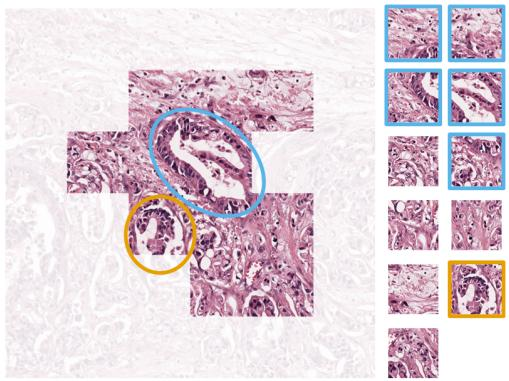  
(a)

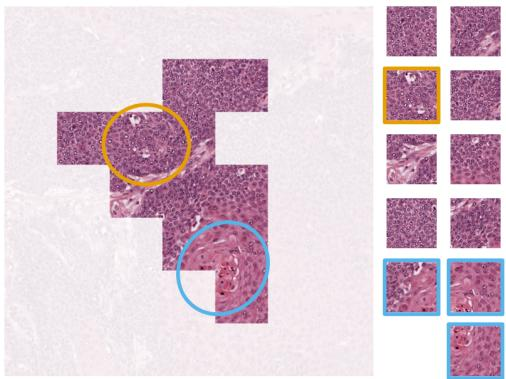  
(b)  
Figure 3: Comparison between Semantic-Aware Subgraphs (SASGs) and patches in representing semantic units. SASGs approximate holistic histological structures that reflect local histological patterns, whereas individual patches provide fragmented and incomplete representations.

Table 5: Comparison of Different Priors and Sampling Strategies for SASG Construction. SAM2-derived Prior and Adaptive Random Walk Sampling are Proven to be an Effective Implementation.
<table><tr><td>Dataset Prior</td><td></td><td>Sampling</td><td>F1</td><td>AUC</td><td>ACC</td></tr><tr><td rowspan="6">ESCA</td><td>No</td><td>RW(Fixed)</td><td> $8 9 . 0 8 \pm 4 . 0 2$ </td><td> $9 4 . 3 4 \pm 3 . 4 3$ </td><td> $8 7 . 2 8 \pm 4 . 0 5$ </td></tr><tr><td>SLIC</td><td>RW(Adaptive)</td><td> $9 0 . 3 3 \pm 3 . 8 8$ </td><td> $9 4 . 3 9 \pm 2 . 4 9$ </td><td> $8 8 . 5 7 \pm 4 . 6 4 $ </td></tr><tr><td rowspan="3">SAM2</td><td>RW(Adaptive)</td><td> $\overline { { 9 2 . 1 7 \pm 4 . 1 6 } }$ </td><td> $\overline { { 9 5 . 7 1 \pm 3 . 1 2 } }$ </td><td> $\overline { { \mathbf { 9 1 . 0 9 \_ 4 4 . 6 1 } } }$ </td></tr><tr><td>2 RW(Fixed)</td><td> $9 0 . 1 0 \pm 2 . 4 7$ </td><td> $9 5 . 0 7 \pm 1 . 6 3$ </td><td> $8 8 . 5 1 \pm 3 . 0 4 $ </td></tr><tr><td>KN(Adaptive)</td><td> $\overline { { 8 8 . 3 0 \pm 6 . 9 7 } }$ </td><td> $9 3 . 9 4 \pm 3 . 4 3$ </td><td> $8 7 . 2 6 \pm 6 . 6 5$ </td></tr><tr><td rowspan="5">BRCA</td><td> $\mathrm { N o }$ </td><td>RW(Fixed)</td><td> $2 6 . 6 6 \pm 2 3 . 2 2$   $7 5 . 7 0 \pm 6 . 1 8$ </td><td> ${ \bf 8 1 . 0 6 \mu _ { \pm 0 . 8 8 } }$ </td></tr><tr><td>SLIC</td><td>RW(Adaptive)</td><td> $2 9 . 6 2 \pm 1 9 . 4 1$  72.48 ±8.96</td><td> $7 7 . 6 5 \pm 5 . 4 6$ </td></tr><tr><td rowspan="3"></td><td>RW(Adaptive)</td><td> $3 8 . 8 2 \pm 1 6 . 5 9$ </td><td> $7 7 . 5 3 \pm 5 . 0 8 0 . 1 4 \pm 1 . 7 5$ </td></tr><tr><td>SAM2 RW(Fixed)</td><td> $3 0 . 2 1 \pm 1 5 . 3 8$ </td><td> $7 6 . 6 5 \pm 4 . 1 5 7 9 . 1 1 \pm 1 . 3 4$ </td></tr><tr><td>KN(Adaptive)</td><td> $3 6 . 4 5 \pm 1 5 . 5 3$ </td><td> $7 7 . 3 1 \pm 5 . 1 7 \ 7 8 . 9 9 \pm 2 . 4 5$ </td></tr><tr><td rowspan="6">NSCLC</td><td>No</td><td>RW(Fixed)</td><td> $7 2 . 1 2 \pm 4 . 0 4$ </td><td> $7 8 . 5 3 \pm 6 . 9 7 \ 7 0 . 4 9 \pm 7 . 3 0$ </td><td></td></tr><tr><td>SLIC</td><td>RW(Adaptive)</td><td> $\overline { { 7 4 . 4 7 \ \pm 2 . 8 2 } }$ </td><td> $7 9 . 0 7 \pm 6 . 4 4 7 1 . 7 2 \pm 7 . 2 0$ </td><td></td></tr><tr><td rowspan="3"></td><td>RW(Adaptive)</td><td> $\overline { { 7 5 . 0 1 \pm 3 . 9 8 } }$ </td><td>83.83 ±3.59 76.54 ±2.95</td><td></td></tr><tr><td>SAM2 RW(Fixed)</td><td> $7 2 . 0 9 \pm 3 . 0 1$ </td><td></td><td></td></tr><tr><td>KN(Adaptive)</td><td> $7 2 . 4 6 \pm 4 . 3 1$ </td><td> $7 9 . 7 1 \pm 4 . 5 4 7 2 . 9 2 \pm 3 . 6 7$   $7 8 . 8 5 \pm 6 . 2 8 7 1 . 0 2 \pm 6 . 7 5$ </td><td></td></tr><tr><td rowspan="5">RCC</td><td>No</td><td>RW(Fixed)</td><td> $7 9 . 2 7 \pm 5 . 8 1$ </td><td> $9 2 . 3 6 \pm 1 . 4 9 \ 8 0 . 4 4 \pm 4 . 4 0$ </td></tr><tr><td>SLIC</td><td>RW(Adaptive)</td><td></td><td></td></tr><tr><td rowspan="3"></td><td>RW(Adaptive)</td><td> $7 9 . 3 6 \pm 4 . 0 7$   $\overline { { 8 1 . 3 7 \pm 3 . 5 2 } }$ </td><td> $9 1 . 8 3 \pm 2 . 3 1 7 9 . 6 9 \pm 3 . 5 9$   $\overline { { 9 3 . 8 5 \pm 1 . 7 7 \ 8 1 . 1 7 \ \pm 3 . 3 3 } }$ </td></tr><tr><td>SAM2 RW(Fixed)</td><td> $\overline { { 8 0 . 1 7 \pm 4 . 5 9 } }$   $\overline { { 9 2 . 5 2 \pm 2 . 1 8 } }$ </td><td>-  $\overline { { 8 0 . 5 5 \pm 4 . 2 5 } }$ </td></tr><tr><td>KN(Adaptive)</td><td> $\overline { { 8 1 . 1 1 \pm 3 . 7 5 } }$   $9 2 . 2 0 \pm 1 . 7 0$ </td><td> $\overline { { { \bf 8 1 . 3 9 } \pm 3 . 2 3 } }$ </td></tr></table>

In Fig. 3(a), the EAD SASG preserves irregular glandular structures (yellow and blue circles) and their broader organization, whereas the corresponding structures are fragmented across isolated patches. In Fig. 3(b), the ESCC SASG captures solid and nested tumor architecture (yellow circle) together with concentric keratinization suggestive of keratin pearl formation [3] (blue circle). Individual patches provide only local fragments of these patterns. These examples indicate that connected multi-patch SASGs provide a more complete representation of local tumor architecture

Influence of Semantic Prior: We compare SAM2 with SLIC [44] and a “No Prior” setting while retaining the same subgraph-construction procedure. As shown in first 3 rows of each dataset in Table 5, SAM2 achieves the strongest overall performance, indicating that more informative region priors improve SASG construction. Fig. 4(b) shows that SAM2 better separates tumor nests from surrounding stromal and necrotic regions, enabling more coherent sampling. SLIC retains useful local boundaries but lacks comparable region-level visual information, whereas unconstrained sampling performs worst overall.

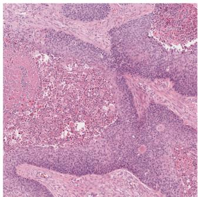

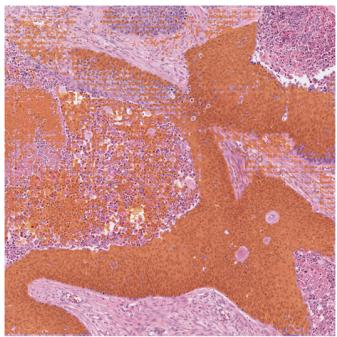  
(a)

  
(b)  
(c)  
Figure 4: Comparison of different visual-semantic priors for SASG construction. More informative priors facilitate the generation of coherent and discriminative SASGs. (a) Original image. (b) SAM2 segmentation mask. It seperates tumor nests from surrounding stromal and necrotic regions, providing more informative priors. (c) SLIC segmentation mask. It provides useful local boundaries but lacks comparable region-level visual information.

Influence of Adaptive Length: It is observed that replacing adaptive termination with a fixed walk length reduces performance (Table 5). The ambiguity condition limits propagation near uncertain mask boundaries, while the nocandidate condition prevents repeated sampling. Together, these criteria allow the semantic prior to influence subgraph extent instead of imposing a fixed geometric size.

Influence of Sampling Strategy: We further compare k-hop neighborhood expansion (KN) and random-walk expansion (RW). Both use the same prior (SAM2) and adaptive termination criteria, but KN includes all eligible neighboring nodes at each step whereas RW progressively samples one neighbor. As shown in Table 5, their comparable performance suggests that the visual-semantic prior and adaptive termination are more influential than the specific expansion rule. The slight advantage of RW may arise from greater stochastic sampling diversity.

Effects of Preserving Internal Topology: We remove all SASG edges while retaining the same constituent patches, yielding an equivalent sub-bag without explicit spatial relationships. As shown in Table 6, the topology-preserving subgraph performs better across all datasets, supporting the value of retaining intra-unit spatial structure.

Table 6: Effect of Preserving Internal Topology in SASG Construction. With the Same Constituent Patches, Topologypreserving Subgraphs Outperform Sub-bags.
<table><tr><td>Dataset Method</td><td></td><td>F1</td><td>AUC</td><td>ACC</td></tr><tr><td rowspan="2">ESCA</td><td>Sub-bag</td><td> $\overline { { 8 0 . 7 0 \pm 5 . 6 2 } }$ </td><td>82.11 ±5.25</td><td rowspan="2"> $7 6 . 9 8 \pm 6 . 2 1$ </td></tr><tr><td>Subgraph</td><td> $\mathbf { 9 2 . 1 7 \ : \pm } 4 . 1 6$ </td><td>95.71 ±3.12  $\mathbf { 9 1 . 0 9 } \pm 4 . 6 1$ </td></tr><tr><td rowspan="2">BRCA</td><td>Sub-bag</td><td></td><td>25.20 ±21.75 75.24 ±5.68</td><td> $\overline { { 7 9 . 6 6 \pm 1 . 9 7 } }$ </td></tr><tr><td>Subgraph</td><td> $3 8 . 8 2 \pm 1 6 . 5 9$ </td><td>77.53 ±5.08</td><td> $\mathbf { 8 0 . 1 4 \ \pm } 1 . 7 5$ </td></tr><tr><td rowspan="2">NSCLC</td><td>Sub-bag</td><td> $7 0 . 6 7 \pm 3 . 9 0$ </td><td> $7 8 . 7 8 \pm 6 . 3 4 \ 6 9 . 4 0 \pm 6 . 3 9$ </td><td></td></tr><tr><td>Subgraph</td><td> ${ \bf 7 5 . 0 1 } \pm 3 . 9 8$ </td><td> $8 3 . 8 3 \pm 3 . 5 9 \ 7 6 . 5 4 \pm 2 . 9 5$ </td><td></td></tr><tr><td rowspan="2">RCC</td><td>Sub-bag</td><td>79.51 ±4.55</td><td> $9 1 . 7 8 \pm 2 . 1 7 \ 7 9 . 9 2 \pm 4 . 0 4$ </td><td></td></tr><tr><td>Subgraph</td><td> $\mathbf { 8 1 . 3 7 \ : \pm 3 . 5 2 }$ </td><td> $9 3 . 8 5 \pm \substack { 1 . 7 7 } \ 8 1 . 1 7 \pm 3 . 3 3$ </td><td></td></tr></table>

## 4.5.2 Analysis of Subgraph State Space Module (SG-SSM)

Contextual Relationships Visualization: We reduce SG-SSM input and output representations into two-dimensions by UMAP [45] and identify dominant feature clusters by HDBSCAN [46] for visualization.

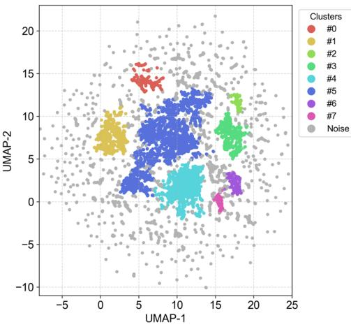  
(a)

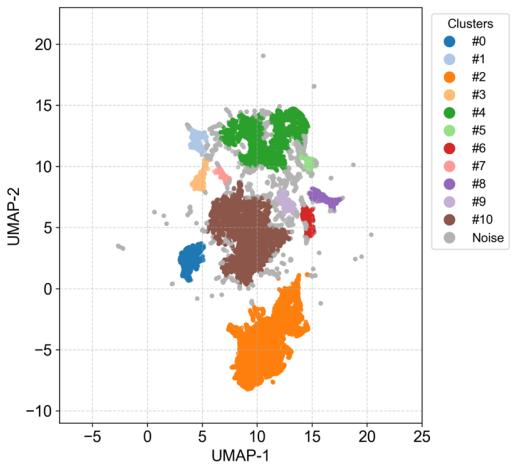  
(b)  
Figure 5: UMAP visualization and HDBSCAN clustering of representations before and after SG-SSM. (a) Input representations of SG-SSM. The representations exhibit a relatively dispersed distribution, with a high proportion of samples identified as noise. (b) Output representations of SG-SSM. The refined representations form more compact and better-separated clusters, reflecting a more structured representation space.

Fig. 5 displays the clustering map. Compared with the input, SG-SSM outputs form more compact and better-separated clusters with fewer noise samples in the embedding space. Fig. 6 illustrates the spatial projection of cluster assignments back to the original WSI. Output projections are also less fragmented and form more coherent regions while preserving boundaries between morphologically distinct tissue compartments. Several clusters correspond to tumor-infiltrated, epithelial, and muscular regions. These observations provide qualitative evidence that SG-SSM integrates contextual information across related subgraphs and promotes a more structured representation space.

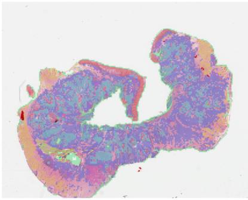  
(a)

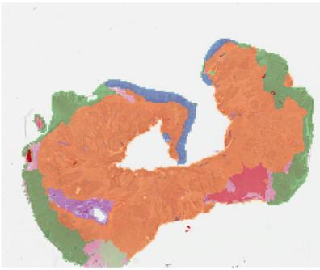  
(b)

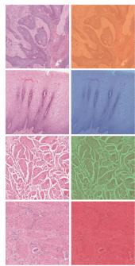  
(c)  
Figure 6: Spatial projection of HDBSCAN cluster assignments onto the original WSI. (a) Spatial cluster map derived from the input representations of SG-SSM. Cluster assignments are relatively fragmented and spatially interwoven. (b) Spatial cluster map derived from the output representations of SG-SSM. The resulting clusters form more spatially coherent regions and exhibit distinct histomorphological patterns. (c) Representative regions cropped from (b), together with the corresponding original histological images. The orange cluster covers a tumor-infiltrated region containing diffusely distributed tumor nests. The blue cluster corresponds to an area with relatively preserved epithelial structures. The green and red clusters correspond predominantly to skeletal and smooth muscle tissues, respectively. The spatial arrangement of these tissue compartments may reflect an invasive pattern of esophageal squamous cell carcinoma.

Table 7: Ablation of GNN and SSM Encoders and Comparison of Their Incorporating Styles in SG-SSM.
<table><tr><td>Dataset Variant</td><td></td><td>F1</td><td>AUC</td><td>ACC</td></tr><tr><td>ESCA</td><td>-w/o GNN -w/o SSM Parallel Serial</td><td> $8 1 . 6 5 \pm 4 . 7 4$   $8 5 . 2 4 \pm 6 . 1 9$   $8 6 . 2 2 \pm 4 . 9 7$   $\mathbf { 9 2 . 1 7 \ : \pm } 4 . 1 6$ </td><td> $\overline { { 8 4 . 9 7 \ \pm 5 . 4 1 } }$   $9 0 . 1 3 \pm 5 . 3 5$   $8 7 . 8 6 \pm 4 . 3 9$  95.71 ±3.12</td><td> $7 8 . 2 9 \pm 5 . 8 4$   $8 2 . 8 4 \pm { 5 . 9 0 }$   $8 3 . 4 9 \pm 5 . 5 1$   $\mathbf { 9 1 . 0 9 } \pm 4 . 6 1$ </td></tr><tr><td>BRCA</td><td>-w/o GNN -w/o SSM Parallel Serial</td><td>34.63 ±20.77 73.21 ±8.60 31.27 ±21.65 34.47 ±18.03  $3 8 . 8 2 \pm 1 6 . 5 9$ </td><td> $7 1 . 9 6 \pm 8 . 9 6$   $7 4 . 9 0 \pm 4 . 5 1$   $7 7 . 5 3 \pm 5 . 0 8$ </td><td> $\overline { { 7 9 . 2 7 \pm 4 . 2 3 } }$   $7 9 . 6 9 \pm 3 . 1 0$   $7 7 . 6 2 \pm 2 . 6 9$ </td></tr><tr><td>NSCLC</td><td>-w/o GNN -w/o SSM Parallel Serial</td><td>73.31 ±2.64 82.33 ±6.83 69.81 ±7.69 78.37 ±6.17  $7 1 . 4 5 \pm 2 . 6 7$   ${ \bf 7 5 . 0 1 } \pm 3 . 9 8$ </td><td> $7 8 . 1 5 \pm 4 . 7 6$ </td><td> $\mathbf { 8 0 . 1 4 \ \pm } 1 . 7 5$   $\overline { { 7 2 . 7 9 \pm 7 . 8 8 } }$   $7 1 . 5 2 \pm 5 . 8 0$   $7 0 . 5 0 \pm 4 . 8 4$ </td></tr><tr><td>RCC</td><td>-w/o GNN -w/o SSM Parallel Serial</td><td> $\overline { { 8 0 . 8 2 \pm 5 . 1 5 } }$   $7 8 . 0 8 \pm 9 . 3 3$   $7 6 . 9 1 \pm 8 . 6 7$   $\mathbf { 8 1 . 3 7 \ : \pm 3 . 5 2 }$ </td><td> $\mathbf { 8 3 . 8 3 \_ } \pm 3 . 5 9$   $\overline { { 9 3 . 8 0 \pm 2 . 0 4 } }$   $9 0 . 6 3 \pm 3 . 6 5$   $9 1 . 4 0 \pm 4 . 0 1 $   $\mathbf { 9 3 . 8 5 \ } _ { \pm 1 . 7 7 }$ </td><td> $7 6 . 5 4 \pm 2 . 9 5$   $\overline { { 8 0 . 8 4 \pm 5 . 1 8 } }$   $7 9 . 4 1 \pm 7 . 4 6$   $7 7 . 5 3 \pm 7 . 0 9$   $\mathbf { 8 1 . 1 7 \bot } 3 1 . 3 3$ </td></tr></table>

Effects ofGNN and SSM Encoders: Removing either the GNN or SSM encoder reduces performance in Table 7 (-w/o GNN & -w/o SSM), supporting their complementary roles in modeling local topology and long-range context.

Influence of Incorporation Styles: Table 7 (Parallel & Serial) also demonstrates the superiority of serial style when incorporating two encoders, suggesting that simply adding the two types of features is less effective than progressively updating the representations across graph and sequence spaces. This indicates that topology encoding followed by contextualization provides a more effective local-to-global flow.

Influence of Scan Order in the SSM Encoder: Since Mamba-based models can be sensitive to input sequence order, we further evaluate the influence of scan order in the SSM encoder of SG-SSM [16]. We evaluate two spatial scan directions and the ordering between multi-patch and zero-step subgraphs, with results shown in Table 8. Placing multi-patch subgraphs first consistently performs better, possibly because their richer regional information establishes a more informative contextual state before finer-grained zero-step tokens. Changing spatial direction has a smaller effect, consistent with the absence of a canonical WSI orientation.

Table 8: Comparison of Scan Orders in SG-SSM. Multi-patch Subgraphs are Generally Preferred before Zero-step Subgraphs, whereas Performance is Relatively Insensitive to Spatial Directions.
<table><tr><td>Dataset</td><td>Direction Before</td><td></td><td>F1</td><td>AUC</td><td></td><td>ACC</td></tr><tr><td rowspan="4">ESCA</td><td>LT-BR</td><td>Multi-patch</td><td>92.17 ±4.16</td><td>95.71 ±3.12</td><td></td><td>91.09 ±4.61</td></tr><tr><td>BR-LT</td><td>Multi-patch</td><td>89.40 ±4.07</td><td>95.05 ±2.32</td><td></td><td>87.92 ±4.25</td></tr><tr><td>LT-BR</td><td>Zero-step</td><td>75.44 ±2.89</td><td>77.53 ±4.94</td><td></td><td>68.81 ±4.11</td></tr><tr><td>BR-LT</td><td>Zero-step</td><td>70.54 ±9.63</td><td>64.76 ±11.69</td><td></td><td>65.08 ±10.07</td></tr><tr><td rowspan="4">BRCA</td><td>LT-BR</td><td>Multi-patch</td><td>38.82 ±16.59</td><td>77.53 ±5.08</td><td></td><td>80.14 ±1.75</td></tr><tr><td>BR-LT</td><td>Multi-patch</td><td>36.74 ±16.76</td><td>77.35 ±5.09</td><td></td><td>79.58 ±2.25</td></tr><tr><td>LT-BR</td><td>Zero-step</td><td>7.75 ±7.47</td><td>51.60 ±3.18</td><td></td><td>75.66 ±7.90</td></tr><tr><td>BR-LT</td><td>Zero-step</td><td>9.13 ±5.80</td><td>53.16 ±1.78</td><td></td><td>75.36 ±1.18</td></tr><tr><td rowspan="4">NSCLC</td><td>LT-BR</td><td>Multi-patch</td><td>75.01 ±3.98</td><td>83.83 ±3.59</td><td></td><td>76.54 ±2.95</td></tr><tr><td>BR-LT</td><td>Multi-patch</td><td>72.17 ±3.96</td><td>78.35 ±6.13</td><td></td><td>70.52 ±6.46</td></tr><tr><td>LT-BR</td><td>Zero-step</td><td>41.74 ±7.48</td><td>52.27 ±4.44</td><td></td><td></td></tr><tr><td>BR-LT</td><td>Zero-step</td><td>51.75 ±4.88</td><td></td><td></td><td>52.54 ±3.37 52.15 ±1.79</td></tr><tr><td rowspan="4">RCC</td><td>LT-BR</td><td>Multi-patch</td><td>81.37 ±3.52</td><td>50.77 ±2.63 93.85 ±1.77</td><td></td><td>81.17 ±3.33</td></tr><tr><td>BR-LT</td><td>Multi-patch</td><td>78.78 ±5.48</td><td></td><td></td><td>80.05 ±4.15</td></tr><tr><td>LT-BR</td><td>Zero-step</td><td>54.32 ±6.30</td><td>92.31 ±1.53 65.46 ±6.63</td><td></td><td></td></tr><tr><td>BR-LT</td><td>Zero-step</td><td>49.47 ±4.43</td><td>64.25 ±3.92</td><td></td><td>58.54 ±4.06 54.20 ±2.48</td></tr></table>

## 5 Conclusion

In this work, we proposed Semantic-Aware Subgraph State Space Model for histopathological WSI subtyping. Semantic-Aware Subgraphs approximate irregularly shaped candidate semantic units spanning across multi-patches, preserving spatial organization with internal topology rather than unordered collections of patches. Subgraph State Space Module employs GNN-based topology encoding before Mamba-based long-range contextualization, establishing a local-toglobal information flow across the WSI.

Experiments on four TCGA cohorts demonstrate strong overall performance, particularly under small-cohort and fewshot settings, while ablation and qualitative analyses support the contributions of prior-guided subgraph construction, topology preservation, and local-to-global contextual modeling.

The current implementation uses SAM2-derived visual-semantic priors and mask-constrained adaptive random walks for SASG construction. Future work may explore pathology-specific priors and learnable subgraph construction, evaluate external multi-center cohorts, and extend SASG-SSM to more complex clinical tasks such as histological grading and staging.

## References

[1] J. Breen, K. Allen, K. Zucker, L. Godson, N. M. Orsi, and N. Ravikumar, “A comprehensive evaluation of histopathology foundation models for ovarian cancer subtype classification,” npj Precis. Onc., vol. 9, Jan. 2025, Art. no. 33, 10.1038/s41698-025-00799-8.

[2] J. N. Eble, R. H. Young, “Tumors of the urinary tract,” in Diagnostic Histopathology ofTumors, 3rd ed., vol. 1, C. D. M. Fletcher, Ed. Amsterdam, Netherlands: Elsevier, 2007, ch. 12, pp. 485–502.

[3] R.D. Odze, A. K. Lam, A. Ochiai, and M. K. Washington, “Tumours of the oesophagus,” in Digestive System Tumours, 5th ed., vol. 1, WHO Classification of Tumours Editorial Board, Ed. Lyon, France: IARC, 2019, ch. 2, pp. 23–58.

[4] J. Chen, L. Larsson, A. Swarbrick, and J. Lundeberg, “Spatial landscapes of cancers: insights and opportunities,” Nat. Rev. Clin. Oncol., vol. 21, pp. 660–674, Sep. 2024, 10.1038/s41571-024-00926-7.

[5] F. Ghaznavi, A. Evans, A. Madabhushi, and M. Feldman, “Digital imaging in pathology: whole-slide imaging and beyond,” Annu. Rev. Pathol., vol. 8, pp. 331–359, Jan. 2013, 10.1146/annurev-pathol-011811-120902.

[6] M. Y. Lu, D. F. K. Williamson, T. Y. Chen, R. J. Chen, M. Barbieri, and F. Mahmood, “Data-efficient and weakly supervised computational pathology on whole-slide images,” Nat. Biomed. Eng., vol. 5, pp. 555–570, Jun. 2021, 10.1038/s41551-020-00682-w.

[7] H. Zhang et al., “DTFD-MIL: Double-tier feature distillation multiple instance learning for histopathology whole slide image classification,” in Proc. IEEE/CVF Conf. Comput. Vis. Pattern Recognit. (CVPR), New Orleans, LA, USA, 2022, pp. 18780-18790.

[8] R. J. Chen et al., “Whole slide images are 2D point clouds: Context-aware survival prediction using patch-based graph convolutional networks,” in Proc. Int. Conf. Med. Image Comput. Comput. Assist. Intervent., Strasbourg, France, 2021, pp. 339–349.

[9] Y. Zheng et al., “A graph-transformer for whole slide image classification,” IEEE Trans. Med. Imag., vol. 41, no. 11, pp. 3003–3015, Nov. 2022, 10.1109/TMI.2022.3176598.

[10] J. Shi et al., “A structure-aware hierarchical graph-based multiple instance learning framework for pT staging in histopathological image,” IEEE Trans. Med. Imag., vol. 42, no. 10, pp. 3000–3011, Oct. 2023, 10.1109/TMI.2023.3273236.

[11] Z. Shao et al., “TransMIL: Transformer based correlated multiple instance learning for whole slide image classification,” in Proc. Adv. Neural Inf. Process. Syst.(NeurIPS), vol. 34, 2021, pp. 2136–2147.

[12] A. Vaswani et al., “Attention is all you need,” in Proc. Adv. Neural Inf. Process. Syst.(NeurIPS), Long Beach, CA, USA, 2017.

[13] A. Dosovitskiy et al., “An image is worth 16x16 words: Transformers for image recognition at scale,” arXiv:2010.11929, Jun. 2021, 10.48550/arXiv.2010.11929.

[14] R. J. Chen et al., “Scaling vision transformers to gigapixel images via hierarchical self-supervised learning,” in Proc. IEEE/CVF Conf. Comput. Vis. Pattern Recognit. (CVPR), New Orleans, LA, USA, 2022, pp. 16123–16134.

[15] A. Gu and T. Dao, “Mamba: Linear-time sequence modeling with selective state spaces,” arXiv:2312.00752, May 2024, 10.48550/arXiv.2312.00752.

[16] S. Yang, Y. Wang, and H. Chen, “MambaMIL: Enhancing long sequence modeling with sequence reordering in computational pathology,” in Proc. Int. Conf. Med. Image Comput. Comput. Assist. Intervent., Marrakesh, Morocco, 2024, pp. 296–306.

[17] Y. Huang, W. Zhao, Y. Fu, L. Zhu, and L. Yu, “Unleash the power of state space model for whole slide image with local aware scanning and importance resampling,” IEEE Trans. Med. Imag., vol. 44, no. 2, pp. 1032–1042, Feb. 2025, 10.1109/TMI.2024.3475587.

[18] J. Zhang et al., “2DMamba: Efficient state space model for image representation with applications on giga-pixel whole slide image classification,” in Proc. IEEE/CVF Conf. Comput. Vis. Pattern Recognit. (CVPR), Nashville, TN, USA, 2025, pp. 3583–3592.

[19] M. Ilse, J. Tomczak, and M. Welling, “Attention-based deep multiple instance learning,” in Proc. Int. Conf. Mach. Learn. (ICML), Stockholm, Sweden, 2018, pp. 2127–2136.

[20] B. Li, Y. Li, and K. W. Eliceiri, “Dual-stream multiple instance learning network for whole slide image classification with self-supervised contrastive learning,” in Proc. IEEE/CVF Conf. Comput. Vis. Pattern Recognit. (CVPR), 2021, pp. 14313–14323.

[21] Y. Zhou, S. Graham, N. A. Koohbanani, M. Shaban, P.-A. Heng, and N. M. Rajpoot, “CGC-Net: Cell graph convolutional network for grading of colorectal cancer histology images,” in Proc. IEEE/CVF Int. Conf. Comput. Vis. Workshop (ICCVW), Seoul, Korea (South), 2019, pp. 388–398.

[22] P. Pati et al., “Hierarchical graph representations in digital pathology,” Med. Image Anal., vol. 75, Jan. 2022, Art. no. 102264 10.1016/j.media.2021.102264.

[23] A. Gu et al., “Combining recurrent, convolutional, and continuous-time models with linear state space layers,” in Proc. Adv. Neural Inf. Process. Syst.(NeurIPS), vol. 34, 2021, pp. 572–585.

[24] A. Gu, K. Goel, and C. Ré, “Efficiently modeling long sequences with structured state spaces,” in Proc. Int. Conf. Learn. Represent. (ICLR), 2022.

[25] T. Zheng, K. Jiang, Y. Xiao, S. Zhao, and H. Yao, “M3amba: Memory Mamba is all you need for whole slide image classification,” in Proc. IEEE/CVF Conf. Comput. Vis. Pattern Recognit. (CVPR), Nashville, TN, USA, 2025, pp. 15601–15610.

[26] T. Zheng, H. Yao, K. Jiang, Y. Xiao, and S. Zhao, “GMMamba: Group masking Mamba for whole slide image classification,” in Proc. IEEE/CVF Conf. Comput. Vis. Pattern Recognit. (CVPR), Nashville, TN, USA, 2025, pp. 9935–9944.

[27] R. Ding, K.-D. Luong, E. Rodriguez, A. C. A. L. da Silva, and W. Hsu, “Combining graph neural network and Mamba to capture local and global tissue spatial relationships in whole slide images,” Sci. Rep., vol. 15, May 2025, Art. no. 18261, 10.1038/s41598-025-99042-4.

[28] A. Kirillov et al., “Segment anything,” in Proc. IEEE/CVF Int. Conf. Comput. Vis. (ICCV), Paris France, 2023, pp. 3992–4003.

[29] A. Radford et al., “Learning transferable visual models from natural language supervision,” in Proc. Int. Conf. Mach. Learn. (ICML), Vienna, Austria, 2021, pp. 8748–8763.

[30] L. H. Li et al., “Grounded language-image pre-training,” in Proc. IEEE/CVF Conf. Comput. Vis. Pattern Recognit. (CVPR), New Orleans, LA, USA, 2022, pp. 10955–10965.

[31] N. Ravi et al., “SAM 2: Segment anything in images and videos,” in Proc. Int. Conf. Learn. Represent. (ICLR), Singapore, 2025, pp. 28085–28128.

[32] N. Carion et al., “SAM 3: Segment anything with concepts,” in Proc. Int. Conf. Learn. Represent. (ICLR), Rio de Janeiro, Brazil, 2026, pp. 138846–138923.

[33] R. J. Chen et al., “Towards a general-purpose foundation model for computational pathology,” Nat. Med., vol. 30, pp. 850–862, Mar. 2024, 10.1038/s41591-024-02857-3.

[34] M. Y. Lu et al., “A visual-language foundation model for computational pathology,” Nat. Med., vol. 30, pp. 863–874, Mar. 2024, 10.1038/s41591-024-02856-4.

[35] H. Xu et al., “A whole-slide foundation model for digital pathology from real-world data,” Nature, vol. 630, pp. 181–188, Jun. 2024, 10.1038/s41586-024-07441-w.

[36] E. Vorontsov et al., “A foundation model for clinical-grade computational pathology and rare cancers detection,” Nat. Med., vol. 30, pp. 2924–2935, Oct. 2024, 10.1038/s41591-024-03141-0.

[37] J. L. Ba, J. R. Kiros, and G. E. Hinton, “Layer normalization,” arXiv:1607.06450, Jul. 2016, 10.48550/arXiv.1607.06450.

[38] C. Morris et al., “Weisfeiler and Leman go neural: Higher-order graph neural networks,” in Proc. AAAI Conf. Artif. Intell., Honolulu, HI, USA, 2019, pp. 4602–4609.

[39] D. P. Kingma and J. Ba, “Adam: A method for stochastic optimization,” in Proc. Int. Conf. Learn. Represent. (ICLR), San Diego, CA, USA, 2015.

[40] J. Xiang, and J. Zhang, “Exploring low-rank property in multiple instance learning for whole slide image classification,” in Proc. Int. Conf. Learn. Represent. (ICLR), Kigali, Rwanda, 2023.

[41] Y. Zhang, H. Li, Y. Sun, S. Zheng, C. Zhu, and L. Yang, “Attention-challenging multiple instance learning for whole slide image classification,” in Proc. Eur. Conf. Comput. Vis. (ECCV), Milan, Italy, 2024, pp. 125–143.

[42] J. Deng, W. Dong, R. Socher, L.-J. Li, K. Li, and L. Fei-Fei, “ImageNet: A large-scale hierarchical image database,” in Proc. IEEE/CVF Conf. Comput. Vis. Pattern Recognit. (CVPR), Miami, FL, USA, 2009, pp. 248–255.

[43] K. He, X. Zhang, S. Ren, and J. Sun, “Deep residual learning for image recognition,” in Proc. IEEE/CVF Conf. Comput. Vis. Pattern Recognit. (CVPR), Las Vegas, NV, USA, 2016, pp. 770–778.

[44] R. Achanta, A. Shaji, K. Smith, A. Lucchi, P. Fua, and S. Süsstrunk, “SLIC superpixels compared to state-ofthe-art superpixel methods,” IEEE Trans. Pattern Anal. Mach. Intell., vol. 34, no. 11, pp. 2274–2282, Nov. 2012, 10.1109/TPAMI.2012.120.

[45] L. McInnes, J. Healy, and J. Melville, “UMAP: Uniform manifold approximation and projection for dimension reduction,” arXiv:1802.03426, Sep. 2020, 10.48550/arXiv.1802.03426.

[46] R. J. G. B. Campello, D. Moulavi, and J. Sander, “Density-based clustering based on hierarchical density estimates,” in Pacific-Asia conference on knowledge discovery and data mining (PAKDD). Berlin, Germany, 2013, pp. 160–172.