# MASK FORCING: IMPROVING AUTOREGRESSIVE VIDEO DIFFUSION DISTILLATION VIA DUAL-NOISE MASKING ROLLOUT

Zhuoran Zhao1,2, Shengju Qian3, Tongtong Liang4, Xianghao Kong2, Songchun Zhang2, Junchao Huang5, Guian Fang6, Xin Wang3, Pan Hui1,2, Anyi Rao2

1HKUST(GZ) 2HKUST 3LIGHTSPEED 4UCSD 5CUHK(SZ) 6NUS

## ABSTRACT

Autoregressive (AR) video diffusion models have shown great potential in realtime video generation. Recent methods distill pretrained bidirectional video diffusion models into causal AR students through Distribution Matching Distillation (DMD), but the generated videos often suffer from over-saturation and oversmoothing issues, resulting in limited visual quality and realism. The key contributing factor is the mode-seeking behavior of the reverse KL objective in DMD, which can cause the student distribution to collapse onto only a few modes of the teacher distribution. To address this, we propose Mask Forcing, a Dual-Noise Masking Rollout strategy that perturbs the AR student self-rollout to mitigate mode collapse induced by reverse-KL mode seeking. The core idea is to inject cleaner signals into noisy rollout inputs via random masks along spatial and temporal axes during the self-rollout process of AR diffusion distillation. Such perturbations encourage the student rollouts to explore more regions of the teacher distribution, allowing DMD to provide learning signals beyond the modes already covered by the student. Moreover, the cleaner tokens act as denoising guidance for other noisier tokens, improving the intermediate rollout predictions and reducing error accumulation. Extensive experiments demonstrate that our method improves multiple AR video diffusion distillation methods with higher visual quality efficiently, without incorporating real video data or additional post-training stages. Project page: https://alicezrzhao.github.io/mask-forcing.

## 1 INTRODUCTION

Video diffusion models have advanced rapidly in recent years, enabling the generation of longduration and high-fidelity videos (Wan et al., 2025; Kong et al., 2024; HaCohen et al., 2026). However, these models typically rely on bidirectional attention and multiple denoising timesteps, limiting their applicability to real-time streaming generation scenarios. Therefore, autoregressive (AR) diffusion models have emerged as a promising paradigm for real-time video generation (Huang et al., 2026b; Zhu et al., 2026; Yang et al., 2025; Hu et al., 2026; Gao et al., 2026). By leveraging causal attention mechanisms, AR diffusion models can generate future chunks sequentially, conditioning each chunk on previously generated ones via causal dependencies. This formulation supports real time inference and unbounded video generation without recomputing previously generated frames.

Teacher Forcing (Hu et al., 2024; Gao et al., 2025) and Diffusion Forcing (Chen et al., 2024) are two representative paradigms for training causal autoregressive video diffusion models. Teacher Forcing trains the model to predict the next frames conditioned on the ground-truth frames, leading to exposure bias since the model can only condition on its own predictions during inference. Diffusion Forcing instead trains the model by assigning each frame with independently sampled noise. While this paradigm alleviates the distribution shift, it still fails to align training with inference. Self Forcing (Huang et al., 2026b) bridges the train-test gap by training the model with self-rollout, generating the next frame based on previously self-generated frames rather than ground-truth context and distilling the teacher’s knowledge via a DMD loss (Yin et al., 2024b). However, a critical limitation of combining self-rollout with a DMD loss is that it often produces over-saturated and over-smoothed videos, exhibiting low visual quality and limited realism.

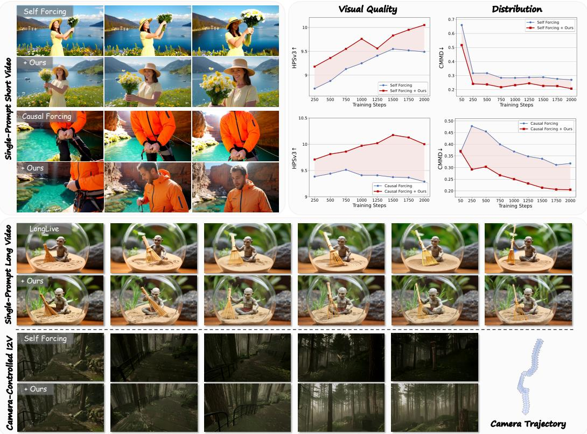  
Figure 1: Mask Forcing improves autoregressive video generation through a Dual-Noise Masking Rollout strategy that alleviates the mode-seeking behavior of the reverse KL objective in DMD, enhancing video visual quality efficiently without incorporating real video data or additional posttraining. We show consistent improvement in visual realism across short-video, long-video, and camera-controlled autoregressive generation.

This phenomenon can be attributed to two key factors. First, the reverse-KL objective in DMD exhibits mode-seeking behavior that tends to cover only the high-probability regions of the teacher’s distribution (Chen et al., 2025; Cai et al., 2026; Zheng et al., 2026b). This behavior induces mode collapse, leading to reduced diversity in the generated videos. Second, the intermediate rollout predictions receive no explicit training signal at each step and suffer from error accumulation. Recent methods mitigate these issues by explicitly incorporating real data into the training objective (Yin et al., 2024a; Chen et al., 2026; Liu et al., 2026), but they rely on complex data-curation processes or additional post-training, which further complicates the multi-stage training pipeline. Another line of research incorporates reinforcement learning post-training to improve the quality of the distilled AR model (Zhang et al., 2026), but its performance still relies on reward models and is sensitive to multiple hyperparameters. A complementary line of work balances mode-seeking and mode-covering objectives (Cai et al., 2026; Zheng et al., 2026b; Li et al., 2026a), but the generated videos can still appear over-saturated and lack fine-grained visual details. This begs the question: can we improve AR video diffusion distillation without real data curation or additional post-training stages?

To address this question, we focus on the self-rollout trajectory, which determines both the student samples exposed to DMD and the intermediate predictions reused in subsequent denoising and autoregressive conditioning. Perturbing the rollout trajectory can expose DMD to a broader range of student samples, allowing it to provide learning signals beyond the modes the student already covers. Moreover, cleaner tokens can serve as context for denoising noisier tokens (Chefer et al., 2026), helping improve intermediate rollout predictions and reduce error accumulation. Based on these motivations, we propose Mask Forcing, which injects randomly masked cleaner tokens into the rollout input to mitigate both mode-seeking behavior and error accumulation. At each rollout transition, Mask Forcing randomly samples a mask and an additional timestep corresponding to a lower noise level than the original one and injects the cleaner tokens into the rollout input. Specifically, the latent positions selected by the mask are re-noised to this lower noise level, while the remaining positions are kept at the original level, producing a dual-noise rollout input. The conditioning timestep fed to the model remains the original one, requiring the model to denoise inputs whose local noise levels are partially inconsistent with the global timestep. Randomizing both the mask and the lower-noise timestep diversifies the student rollout trajectory and broadens the region of sample space explored during training, enabling DMD to provide learning signals from teacher modes not yet covered by the student. Beyond perturbing the rollout trajectory, Mask Forcing uses lower-noise tokens as con text for denoising noisier tokens. This design is consistent with the observation in Self-Flow (Chefer et al., 2026) that cleaner context in mixed-noise inputs can facilitate denoising, thereby improving intermediate predictions and reducing error accumulation during self-rollout.

Extensive experiments across multiple AR video distillation methods validate the effectiveness of our method in both chunk-wise and frame-wise settings. Representative results in Fig. 1 show that our method significantly improves the visual quality against various baselines, with enhanced realism and richer high-frequency details. Comprehensive evaluations demonstrate improvements across multiple benchmarks. In summary, our contributions are as follows:

• We propose Mask Forcing, a simple and effective approach that alleviates the mode-seeking behavior of the reverse-KL objective in self-rollout DMD training for AR video diffusion distillation, without incorporating real video data or additional post-training stages.

• We introduce a Dual-Noise Masking Rollout strategy that injects lower-noise signals into noisy rollout inputs through random masks along spatial and temporal axes. Such perturbations diversify student rollout trajectories to cover more teacher modes, while providing cleaner context for denoising to reduce error accumulation.

• Extensive experiments on multiple AR video distillation methods demonstrate the effectiveness of Mask Forcing in both chunk-wise and frame-wise settings, with significantly improved visual quality and faster convergence. Comprehensive ablations further validate the effects of different masking mechanisms.

## 2 RELATED WORK

## 2.1 AUTOREGRESSIVE VIDEO GENERATION

Autoregressive video diffusion models enable real-time video generation by sequentially generating videos conditioned on historical context. Teacher Forcing (Hu et al., 2024; Gao et al., 2025) denoises the current chunk conditioned on clean ground-truth context, which suffers from a train-test gap and exposure bias. Diffusion Forcing (Chen et al., 2024) assigns each frame with independently sampled noise to approximate rollout distributions, but still fails to align training with inference. Self Forcing (Huang et al., 2026b) bridges this gap by performing AR self-rollout on self-generated histories and distills a bidirectional teacher into the causal student via a DMD loss. Causal Forcing (Zhu et al., 2026) further uses an AR teacher for ODE initialization to reduce the architecture gap. LongLive (Yang et al., 2025) extends causal AR generation to long videos via short window attention with frame sink and streaming long tuning. Despite these advances, distilled AR models still exhibit limited visual quality and realism, motivating methods that introduce additional training signals, real data, or post-training stages. DMD2 (Yin et al., 2024a) introduces a GAN loss and real training data, but suffers from training instability and additional real data curation. DFD (Chen et al., 2026) integrates real data into the distillation score, but requires post-training on a DMD2-pretrained model. Astrolabe (Zhang et al., 2026) explores RL post-training on distilled AR models, but perfor mance is limited by reward models. In contrast, Mask Forcing mitigates mode collapse by perturbing student rollouts, improving AR distillation without real video supervision or post-training.

## 2.2 MODE SEEKING AND MODE COVERING IN VIDEO DIFFUSION DISTILLATION

DMD (Yin et al., 2024b) and DMD2 (Yin et al., 2024a) use score-based reverse KL distribution matching to align student-generated samples with the teacher distribution. This mode-seeking objective can improve sample fidelity but may concentrate the student distribution on a limited subset of teacher modes. DMD2 further introduces an adversarial loss on real data. In contrast, trajectorybased consistency objectives are commonly associated with the mode-covering behavior of forward divergence (Song et al., 2023; Kim et al., 2024; Lu & Song, 2025). Such objectives can cover more teacher modes, but may average across modes and exhibit lower sample quality. Recent methods balance these behaviors by combining complementary objectives. Mode Seeking meets Mean Seeking (Cai et al., 2026) uses separate heads for supervised flow matching on long videos and reverse-KL distribution matching against a short-video teacher. rCM (Zheng et al., 2026b) augments continuous-time consistency with score distillation regularization. DistillAlign (Li et al., 2026a) analyzes the initialization effects and jointly optimizes DMD and a consistency distillation loss. Unlike these methods, Mask Forcing retains the original DMD objective and instead perturbs the student rollouts via dual-noise masking. This broadens the student distribution exposed to DMD, allowing it to provide learning signals from teacher modes not reached by standard self-rollout.

## 2.3 MASKED MODELING

Masked modeling has become a powerful paradigm for representation and generative learning in computer vision (He et al., 2022; Bao et al., 2021; Chang et al., 2022). The core idea is to mask a portion of the input and train the model to recover it. In representation learning, MAE (He et al., 2022) masks a large portion of random patches from the input image and reconstructs them in pixel space by leveraging context from visible parts. In generative modeling, MaskGIT (Chang et al., 2022) adopts a mask-then-predict objective with parallel iterative decoding to synthesize images. Masking can also be realized through heterogeneous noise levels that control the information retained by each token. For multi-modal generation, Self-Flow (Chefer et al., 2026) introduces a self-supervised framework for flow matching that combines mix-timestep scheduling with masking for representation alignment. In AR generation, Diffusion Forcing associates each frame with a random, independent noise level, which can be regarded as partial masking along the time axis. Inspired by these works, we introduce dual-noise masking into AR video distillation to diversify self-rollout trajectories and provide cleaner context for denoising noisier tokens.

## 3 METHOD

## 3.1 PRELIMINARIES

Autoregressive (AR) Video Generation. An AR video model represents a video as a sequence of F chunks $x _ { 1 : F } = ( x _ { 1 } , \ldots , x _ { F } ) $ , where each chunk may include one or more latent frames. It factorizes the text-conditioned joint distribution as $\begin{array} { r } { p ( x _ { 1 : F } \mid c ) = \prod _ { i = 1 } ^ { F } p ( x _ { i } \mid x _ { < i } , c ) } \end{array}$ , where c denotes the text prompt and $x _ { < i } = ( x _ { 1 } , \dots , x _ { i - 1 } )$ denotes the preceding video chunks. Each conditional distribution $p ( x _ { i } \mid x _ { < i } , c )$ is modeled using a diffusion process following the flowmatching formulation, where the noisy sample is defined as $x _ { i } ^ { t } = ( 1 - t ) x _ { i } + t \epsilon _ { i } .$ , with $\epsilon _ { i } \sim \mathcal { N } ( 0 , I )$ and $t \in [ 0 , 1 ]$ . Each video chunk is generated through this denoising process conditioned on c and the historical context $x _ { < i } ,$ which is stored in the key-value (KV) cache. Teacher Forcing (TF) and Diffusion Forcing (DF) are two typical training paradigms for AR video models using frame-wise MSE loss between predicted and ground-truth targets. In TF, the timestep t is shared across all frames, and the context consists of clean ground-truth frames. In DF, each frame is assigned an independently sampled timestep $t _ { i } ,$ , and the historical context is noisy. To mitigate the train-test gap and alleviate error accumulation, Self Forcing unrolls the model on its own generated samples during training, with $\begin{array} { r } { x _ { 1 : F } ^ { \theta } \sim \prod _ { i = 1 } ^ { F } p _ { \theta } ( x _ { i } \mid x _ { < i } , c ) } \end{array}$

Distribution Matching Distillation (DMD). DMD (Yin et al., 2024b;a) distills a pretrained multistep teacher model into a few-step student model $G _ { \theta }$ by minimizing the reverse KL divergence from the student generator induced distribution $p _ { \mathrm { f a k e } }$ to the teacher distribution $p _ { \mathrm { r e a l } }$ . Specifically, DMD adopts a reverse KL objective, whose gradient is used to update the student model:

$$
\nabla _ { \boldsymbol { \theta } } \mathcal { L } _ { \mathrm { D M D } } = \mathbb { E } [ \nabla _ { \boldsymbol { \theta } } D _ { K L } ( p _ { \mathrm { f a k e } , t } | | p _ { \mathrm { r e a l } , t } ) ] ,\tag{1}
$$

$$
\begin{array} { r } { D _ { K L } \big ( p _ { \mathrm { f a k e } , t } \vert \vert p _ { \mathrm { r e a l } , t } \big ) = \mathbb E \biggl [ \log \frac { p _ { \mathrm { f a k e } , t } \left( x _ { t } \right) } { p _ { \mathrm { r e a l } , t } \left( x _ { t } \right) } \biggr ] = - \mathbb E \bigl [ \log p _ { \mathrm { r e a l } , t } ( x _ { t } ) - \log p _ { \mathrm { f a k e } , t } ( x _ { t } ) \bigr ] , } \end{array}\tag{2}
$$

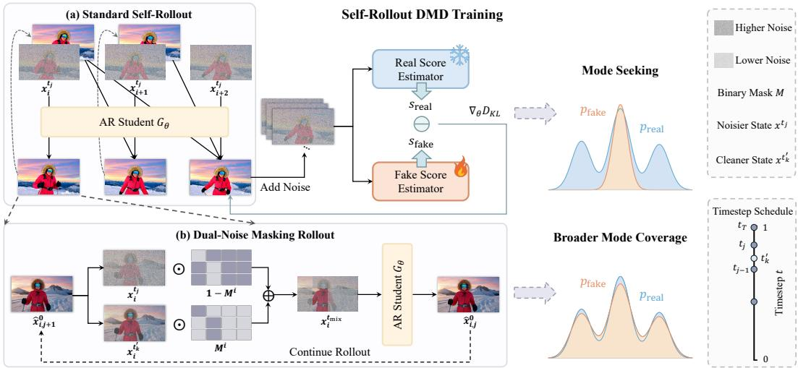  
Figure 2: (a) Standard self-rollout DMD training suffers from mode collapse due to the modeseeking reverse-KL objective, resulting in over-saturation and limited realism. (b) Mask Forcing perturbs the student rollout trajectory through dual-noise masking rollout, encouraging broader teacher-mode coverage while providing cleaner context for denoising noisy tokens.

where $x _ { t }$ is a noisy sample corresponding to timestep t: $x _ { t } = ( 1 - t ) G _ { \theta } ( z ) + t \epsilon$ with $\epsilon \sim \mathcal { N } ( 0 , I )$ and z is latent drawn from random noise. The gradient to update G is formulated as the difference between two score functions:

$$
\nabla _ { \theta } \mathcal { L } _ { \mathrm { D M D } } = \mathbb { E } \left[ - ( s _ { \mathrm { r e a l } } ( x _ { t } , t ) - s _ { \mathrm { f a k e } } ( x _ { t } , t ) ) \frac { d G } { d \theta } \right] ,\tag{3}
$$

where $s _ { \mathrm { r e a l } } ( x _ { t } , t ) = \nabla _ { x _ { t } }$ t log $p _ { \mathrm { r e a l } , t } ( x _ { t } ) , s _ { \mathrm { f a k e } } ( x _ { t } , t ) = \nabla _ { x _ { t } }$ log $p _ { \mathrm { f a k e } , t } ( x _ { t } )$ denote the scores of the teacher and student distributions, respectively. However, the reverse KL objective is inherently mode-seeking and may concentrate the student distribution on a limited set of teacher modes, leading to over-saturation and reduced realism (Chen et al., 2026).

## 3.2 DUAL-NOISE MASKING ROLLOUT

## 3.2.1 OVERVIEW

We propose a dual-noise masking rollout strategy for the self-rollout DMD training to mitigate mode collapse induced by the mode-seeking behavior of reverse KL in AR diffusion distillation. The core idea is to inject low-noise signals into noisy rollout inputs during the rollout process via random masks applied both within and across chunks. These cleaner signals serve two purposes. First, they perturb the student rollouts, encouraging broader coverage of high-density regions in the teacher distribution and thereby mitigating mode collapse and visual artifacts such as over-saturation and over-smoothing. Second, cleaner tokens provide context for denoising noisier tokens, following the principle of masked modeling. An overview of our method is shown in Fig. 2.

## 3.2.2 SELF-ROLLOUT WITH DUAL-NOISE MASKING

An AR video diffusion model represents a video as a sequence of $F$ chunks $x = ( x _ { 1 } , x _ { 2 } , . . . , x _ { F } )$ where each chunk contains one or more latent frames. Using the flow-matching formulation, a noisy chunk is defined as:

$$
\begin{array} { r } { x _ { i } ^ { t } = ( 1 - t ) x _ { i } ^ { 0 } + t \epsilon , \qquad \epsilon \sim \mathcal { N } ( 0 , I ) , } \end{array}\tag{4}
$$

where $t \in [ 0 , 1 ]$ denotes the timestep, which interpolates between the clean chunk at $t = 0$ and pure Gaussian noise at $t = 1$ . During the self-rollout training, the student model $G _ { \theta }$ generates the video chunk by chunk and each chunk is produced by iterative denoising over a fixed schedule of $T$ timesteps $\{ t _ { 1 } , \dots , t _ { T } \}$ selected from the $\dot { N } _ { t } = 1 0 0 0$ training timesteps, where $t _ { T } = 1$ denotes pure noise, $t _ { 0 } = 0$ denotes the clean output. We use $T = 4$ denoising steps throughout training. For each chunk index i, at denoising timestep $t _ { j }$ , the student model predicts a clean chunk estimate $\hat { x } _ { i , j } ^ { 0 }$ from the noisy chunk $\boldsymbol { x } _ { i } ^ { t _ { j } }$ , conditioned on the previously generated clean chunks $x _ { < i }$ , the text prompt $c ,$ and the timestep $t _ { j } { \mathrm { : } }$

$$
\hat { x } _ { i , j } ^ { 0 } = G _ { \theta } \left( x _ { i } ^ { t _ { j } } \mid x _ { < i } , c , t _ { j } \right) .\tag{5}
$$

The DMD objective is evaluated only on the completed self-rollout, providing no explicit training signal for intermediate predictions at each step. Since intermediate predictions are reused in subsequent denoising steps and as context for later chunks, their errors can accumulate throughout the rollout. Meanwhile, the reverse-KL objective is inherently mode-seeking and concentrates the student rollout distribution on a narrow set of high-density modes of the teacher distribution. Together, these limitations may contribute to degraded visual quality and realism in generated videos.

We address this issue by injecting cleaner signals into the student model input to perturb the student rollout trajectory, encouraging the student rollouts to reach more high-density regions of the teacher distribution. Specifically, we adopt a dual-timestep scheduling strategy inspired by Self-Flow (Chefer et al., 2026). We retain the denoising schedule of the base model and define $\Delta$ as the size of the timestep window measured in training timestep units, corresponding to a normalized width of $\Delta / N _ { t }$ . At each denoising timestep $t _ { j }$ , we uniformly sample an additional timestep $t _ { k } ^ { \prime }$ within the corresponding window in timestep space:

$$
\ell _ { j } = \operatorname* { m a x } \left( t _ { \operatorname* { m i n } } , t _ { j } - \frac { \Delta } { N _ { t } } \right) ,\tag{6}
$$

$$
t _ { k } ^ { \prime } \sim \mathrm { U n i f o r m } \big ( [ \ell _ { j } , t _ { j } ] \big ) .\tag{7}
$$

Here, $t _ { k } ^ { \prime }$ corresponds to a lower noise level than $t _ { j }$ , and the floor $t _ { \mathrm { m i n } }$ prevents the injected signal from being nearly clean.

For each chunk $i ,$ we construct a binary mask $M ^ { i }$ with a masking ratio $\alpha$ . The mask is sampled independently across frames within a chunk (spatial axis) and across chunks (temporal axis), so that different frames of the same chunk and different chunks receive different dual-noise patterns. We observe that such mask diversity affects the visual quality and motion dynamics balance of the generated videos. At the $j$ -th denoising step, corresponding to timestep $t _ { j }$ , we sample $\epsilon _ { j } \sim \mathcal { N } ( 0 , I )$ and use it to re-noise the clean prediction from the previous step $\hat { x } _ { i , j + 1 } ^ { 0 }$ at $t _ { k } ^ { \prime }$ and $t _ { j }$ , yielding the cleaner sample $x _ { i } ^ { t _ { k } ^ { \prime } }$ and the noisier sample $x _ { i } ^ { t _ { j } }$ , respectively:

$$
x _ { i } ^ { t _ { k } ^ { \prime } } = ( 1 - t _ { k } ^ { \prime } ) \hat { x } _ { i , j + 1 } ^ { 0 } + t _ { k } ^ { \prime } \epsilon _ { j } ,\tag{8}
$$

$$
x _ { i } ^ { t _ { j } } = ( 1 - t _ { j } ) \hat { x } _ { i , j + 1 } ^ { 0 } + t _ { j } \epsilon _ { j } .\tag{9}
$$

We use the random mask $M ^ { i }$ to select tokens from the cleaner sample at masked positions $( M ^ { i } = 1 )$ , while retaining tokens from the original noisier sample at the remaining positions. This yields the dual-noise input:

$$
x _ { i } ^ { t _ { \mathrm { m i x } } } = M ^ { i } \odot x _ { i } ^ { t _ { k } ^ { \prime } } + ( 1 - M ^ { i } ) \odot x _ { i } ^ { t _ { j } } .\tag{10}
$$

Consequently, the student generator $G _ { \theta }$ receives the dual-noise input at denoising step $j$ and produces the updated clean prediction:

$$
\hat { x } _ { i , j } ^ { 0 } = G _ { \theta } \left( x _ { i } ^ { t _ { \mathrm { m i x } } } \mid x _ { < i } , c , t _ { j } \right) .\tag{11}
$$

The student generator is conditioned on the scheduled timestep $t _ { j }$ , while cleaner tokens in the dualnoise input are treated as a training perturbation. The model follows the original denoising schedule at inference. At the next denoising step, $\hat { x } _ { i , j } ^ { 0 }$ is re-noised at the scheduled timestep $t _ { j - 1 }$ and a newly sampled cleaner timestep within its corresponding timestep window. The two noisy samples are then combined using the mask $M ^ { i }$ to form the next dual-noise input, replacing the standard re-noising operation in self-rollout. Once the current chunk reaches the sampled exit step $s ,$ the corresponding clean prediction $\hat { x } _ { i , \varepsilon } ^ { 0 }$ is used to update the KV cache and condition subsequent chunks.

This dual-noise perturbation achieves two goals. First, it diversifies the student rollout trajectories, so that the distillation score in the DMD loss is evaluated over a broader region of the sample space rather than a narrow subset of teacher modes. This encourages the student model to explore more diverse modes and prevents it from collapsing onto the high-density modes of the teacher model induced by the reverse KL objective. Second, since the masked tokens carry lower noise, the student model is guided to exploit them as context, helping denoise the noisier tokens and improving intermediate rollout predictions.

## 3.2.3 DISTRIBUTIONAL ANALYSIS

We analyze the student rollout distribution induced by dual-noise masking. We characterize it as a mixture over masking trajectories and decompose its reverse-KL objective using mutual information.

Fix a text condition c and a DMD score-noising timestep $\tau ,$ distinct from the denoising timesteps used during self-rollout. Let $X _ { \tau }$ denote the completed student rollout noised at τ and let $p _ { \tau }$ denote the corresponding teacher noisy marginal. The masking trajectory V is defined as the collection of all masks and lower-noise timesteps sampled during the rollout, with $V \sim \pi ,$ , where π is determined by the mask ratio, timestep window, and mask sampling scheme.

Conditioned on a masking trajectory $V = v , q _ { \theta , \tau } ^ { v } ( x )$ denotes the corresponding student distribution. Marginalizing over $V$ gives the masked-rollout distribution $\bar { q } _ { \theta , \tau } ( x ) : = \mathbb { E } _ { V \sim \pi } [ q _ { \theta , \tau } ^ { V } ( x ) ]$ . The dependence between V and Xτ conditioned on c is measured by their mutual information, given by

$$
I _ { \theta } ( V ; X _ { \tau } \mid c ) = \mathbb { E } _ { V \sim \pi } \left[ D _ { \mathrm { K L } } \left( q _ { \theta , \tau } ^ { V } \lVert \bar { q } _ { \theta , \tau } \right) \right] .\tag{12}
$$

The reverse-KL objective of the masked-rollout distribution can be decomposed as

$$
D _ { \mathrm { K L } } \left( \bar { q } _ { \theta , \tau } \| p _ { \tau } \right) = \mathbb { E } _ { V \sim \pi } \left[ D _ { \mathrm { K L } } \left( q _ { \theta , \tau } ^ { V } \| p _ { \tau } \right) \right] - I _ { \theta } ( V ; X _ { \tau } \mid c ) .\tag{13}
$$

$D _ { \mathrm { K L } } ( \bar { q } _ { \boldsymbol { \theta } , \tau } | | p _ { \tau } )$ is the divergence between the marginal masked-rollout distribution and the teacher marginal. $\mathbb { E } _ { V \sim \pi } [ D _ { \mathrm { K L } } ( q _ { \theta , \tau } ^ { V } \lVert p _ { \tau } ) ]$ is the average divergence between each trajectory-conditioned distribution and the teacher marginal, while $I _ { \theta } ( V ; X _ { \tau } \mid c )$ measures their output diversity.

When different masking trajectories induce distinct conditional distributions, $I _ { \theta } ( V ; X _ { \tau } \mid c ) > 0 .$ Individual trajectory-conditioned distributions may remain locally concentrated on different teachersupported regions, while their marginal mixture can collectively cover these regions. This explains how marginalizing over trajectories can alleviate mode-seeking behavior in the overall student distribution without requiring individual conditional distributions to be mode-covering. The detailed derivation is provided in Appendix 6.1.

The mask ratio, timestep window, and mask sampling scheme determine π and the strength of the induced rollout perturbations. Under weak perturbations, different masking trajectories induce similar output distributions, resulting in small $I _ { \theta } ( V ; X _ { \tau } \mid c )$ , and limited additional teacher-mode coverage. Stronger perturbations can produce more distinct output distributions and increase $I _ { \theta } ( V ; X _ { \tau } \mid c )$ but excessive perturbations can move them away from teacher-supported regions and increase their average reverse KL. These factors balance trajectory diversity and teacher alignment. We study their effects through ablations in Sec. 4.2.

## 4 EXPERIMENTS

Implementation Details. We adopt Self Forcing (Huang et al., 2026b), LongLive (Yang et al., 2025), and Causal Forcing (Zhu et al., 2026) as our baselines, using Wan2.1-T2V-1.3B (Wan et al., 2025) as the base model and Wan2.1-T2V-14B as the teacher. Our method is applied during the self-rollout DMD training stage. The generated videos consist of 81 frames at a resolution of 832 × 480, and the training prompts are sampled from the VidProM dataset (Wang & Yang, 2024). We implement each baseline under both chunk-wise and frame-wise autoregressive generation settings, with 3 latent frames per chunk in the chunk-wise setting. Since Self Forcing and LongLive do not release their frame-wise ODE initialization models, we train these models using ODE-paired data distilled from the bidirectional teacher. For Causal Forcing, we use its causal student model initialized via ODE distillation from the autoregressive teacher. During training, we set the mask ratio α to 0.2, the timestep window ∆ to 250, and the floor $t _ { \mathrm { m i n } }$ to the value at schedule index 20. In the chunk-wise setting, the mask is sampled independently across frames within a chunk and across chunks, while in the frame-wise setting, the mask is sampled independently across chunks. This training procedure takes approximately 1.5k steps and 14 hours on 8 GPUs.

Evaluation. We adopt the 100-prompt set with rich motion and complex actions from Causal Forcing and VBench as our primary evaluation benchmarks. For the 100-prompt set, we use HPSv3 (Ma et al., 2025) to evaluate the overall visual quality and employ VisionReward (Xu et al., 2026) to report vision reward score (Vision.), instruction following (Instruct.), and motion quality (MQ) subscores following Causal Forcing. Dynamic Degree (Dynamic.) is used to evaluate motions in video with RAFT (Teed & Deng, 2020). All metrics are scaled by 100 for readability except for HPSv3. For VBench, we report the Total Score, Quality Score, and Semantic Score with the 946 standard prompts. For the long-video generation setting, we additionally evaluate our method against LongLive with the first 100 prompts from the MovieGen (Polyak et al., 2024) extended version and the VBench-Long official prompt set on 30-second video generation following LongLive.

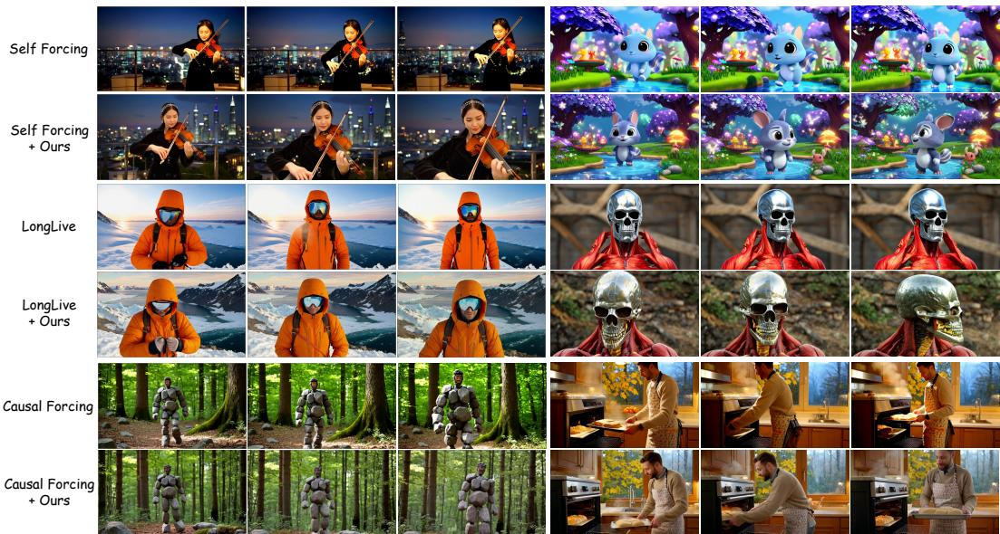  
Figure 3: Qualitative comparison of our method (+Ours) against different baselines. Visual results show that our method generates videos with higher visual quality and greater realism, exhibiting fewer over-saturation artifacts and richer high-frequency details.

Table 1: Quantitative results on the 100-prompt set and VBench benchmarks under chunk-wise and frame-wise settings.
<table><tr><td>Method</td><td>HPSv3 ↑</td><td>Vision. ↑</td><td>Instruct. ↑</td><td>MQ↑</td><td>Dynamic. ↑|</td><td>Total ↑</td><td>Quality ↑</td><td>Semantic ↑</td></tr><tr><td colspan="9">Chunk-wise</td></tr><tr><td>Self Forcing</td><td>9.55</td><td>10.10</td><td>38.50</td><td>15.88</td><td>70</td><td>81.89</td><td>82.99</td><td>77.49</td></tr><tr><td>+ Ours</td><td> $9 . 8 4 _ { + . 2 9 }$ </td><td> $1 1 . 3 7 _ { + 1 . 2 7 }$ </td><td> $4 5 . 0 3 _ { + 6 . 5 3 }$ </td><td> $2 0 . 4 9 _ { + 4 . 6 1 }$ </td><td> $8 2 _ { + 1 2 }$ </td><td>82.61+.72</td><td> $8 3 . 6 8 _ { + . 6 9 }$ </td><td> $7 8 . 7 4 _ { + 1 . 2 5 }$ </td></tr><tr><td>Causal Forcing</td><td>9.37</td><td> $1 0 . 3 6$ </td><td> $4 0 . 4 1$ </td><td>17.73</td><td>76</td><td>82.67</td><td>83.58</td><td>78.98</td></tr><tr><td>+ Ours</td><td> $1 0 . 1 7 _ { + . 8 0 }$ </td><td> $1 1 . 5 8 _ { + 1 . 2 2 }$ </td><td> $4 6 . 3 0 _ { + 5 }$  89</td><td> $2 1 . 5 4 _ { + 3 . 8 1 }$ </td><td> $8 2 _ { + 6 }$ </td><td> $8 2 . 7 6 _ { + . 0 9 }$ </td><td> $8 3 . 6 9 _ { + . 1 1 }$ </td><td> $7 9 . 0 1 _ { + . 0 3 }$ </td></tr><tr><td>LongLive</td><td> $9 . 1 1$ </td><td> $1 0 . 7 7$ </td><td>42.48</td><td>21.20</td><td> $^ { 7 6 }$ </td><td>82.02</td><td>82.87</td><td> $7 8 . 6 6$ </td></tr><tr><td>+ Ours</td><td> $1 0 . 1 4 _ { + 1 . 0 3 }$ </td><td> $1 1 . 0 0 _ { + . 2 3 }$ </td><td> $4 2 . 6 5 _ { + . 1 7 }$ </td><td> $2 2 . 3 4 _ { + 1 . 1 4 }$ </td><td> $6 9 _ { - 7 }$ </td><td> $8 2 . 7 5 _ { + . 7 3 }$ </td><td> $8 3 . 7 1 _ { + . 8 4 }$ </td><td> $7 8 . 9 1 _ { + . 2 5 }$ </td></tr><tr><td colspan="9">Frame-wise</td></tr><tr><td>Self Forcing</td><td>9.34</td><td>9.45</td><td>35.62</td><td>18.27</td><td>53</td><td>80.73</td><td>81.72</td><td>76.78</td></tr><tr><td>+ Ours</td><td> $9 . 7 9 _ { + . 4 5 }$ </td><td> $1 0 . 4 9 _ { + 1 . 0 4 }$ </td><td> $3 9 . 6 0 _ { + 3 . 9 }$ </td><td> $1 9 . 0 7 _ { + . 8 0 }$ </td><td> $6 1 _ { + 8 }$ </td><td>81.49+.76</td><td>82.55+.83</td><td> $7 7 . 2 3 _ { + . 4 5 }$ </td></tr><tr><td>Causal Forcing</td><td> $9 . 6 7 $ </td><td>10.58</td><td> $3 7 . 5 6$ </td><td>20.25</td><td>28</td><td>80.64</td><td>81.55</td><td>77.00</td></tr><tr><td>+ Ours</td><td> $9 . 9 6 _ { + . 2 9 }$ </td><td> $1 0 . 7 1 _ { + . 1 3 }$ </td><td> $3 9 . 6 0 _ { + 2 . 0 4 }$ </td><td> $2 3 . 6 9 _ { + 3 . 4 4 }$ </td><td> $5 2 _ { + 2 4 }$ </td><td> $8 2 . 2 8 _ { + 1 . 6 4 }$ </td><td>83.19+1.64</td><td> $7 8 . 6 2 _ { + 1 . 6 2 }$ </td></tr><tr><td>LongLive</td><td>9.19</td><td>9.35</td><td>38.50</td><td>12.14</td><td>25</td><td>80.97</td><td>81.86</td><td>77.41</td></tr><tr><td>+ Ours</td><td> $9 . 4 6 _ { + . 2 7 }$ </td><td> $1 0 . 5 5 _ { + 1 . 2 0 }$ </td><td> $4 2 . 7 8 _ { + 4 . 2 8 }$ </td><td> $1 9 . 3 2 _ { + 7 . 1 8 }$ </td><td> $7 6 _ { + 5 1 }$ </td><td> $8 1 . 4 7 _ { + . 5 0 }$ </td><td> $8 2 . 3 3 _ { + . 4 7 }$ </td><td> $7 8 . 0 5 _ { + . 6 4 }$ </td></tr></table>

## 4.1 COMPARISONS WITH BASELINES

Quantitative Comparisons. As shown in Tab. 1, Mask Forcing improves all baseline methods on both visual quality (HPSv3 & Vision.) and semantic score (Instruct.) on the 100-prompt set under both chunk-wise and frame-wise settings. Especially for visual quality, the consistent improvements in visual quality align with our motivation of perturbing student rollout trajectories to alleviate artifacts associated with mode collapse. For motion evaluation, incorporating Mask Forcing produces higher motion quality (MQ) and dynamic degree (Dynamic.). Though the dynamic degree score for LongLive is lower, this can be attributed to generic VBench rewarding drift-induced optical flow (Minar et al., 2026). For the VBench benchmark, including Mask Forcing surpasses all baseline methods across the VBench metrics in both settings. Additionally, we evaluate Mask Forcing on single-prompt long video generation with LongLive, integrating it into both the initialization and streaming long-video tuning stages. As reported in Tab. 2, our method can also effectively improve visual quality in the long video generation setting.

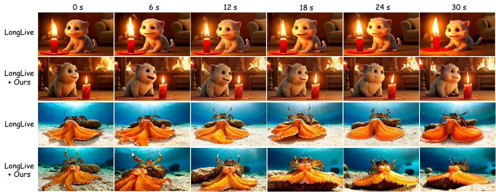  
Figure 4: Qualitative results of single-prompt long-video setting on LongLive. Incorporating our method (+Ours) enhances the video generation quality with more visual details.

Table 2: Single-prompt 30s long video generation on MovieGen and VBench-Long benchmarks.
<table><tr><td>Method</td><td>HPSv3 ↑</td><td>Vision. ↑</td><td>Instruct. ↑</td><td>MQ↑</td><td>Dynamic. ↑|</td><td>Total ↑</td><td>Quality ↑</td><td>Semantic ↑</td></tr><tr><td>LongLive</td><td>8.44</td><td>14.31</td><td>62.04</td><td>18.84</td><td>70</td><td>83.91</td><td>84.71</td><td>80.70</td></tr><tr><td>+ Ours</td><td> ${ \bf 9 . 1 1 _ { + . 6 7 } }$ </td><td> $\mathbf { 1 4 . 9 3 _ { + . 6 2 } }$ </td><td> ${ \bf 6 6 . 0 2 _ { + 3 . 9 8 } }$ </td><td> $\mathbf { 1 9 . 3 7 } _ { + . 5 3 }$ </td><td>64-6</td><td> ${ \bf 8 4 . 5 1 _ { + . 6 0 } }$ </td><td> $\mathbf { 8 5 . 2 8 _ { + . 5 7 } }$ </td><td> $\mathbf { 8 1 . 4 4 _ { + . 7 4 } }$ </td></tr></table>

Qualitative Comparisons. Fig. 3 presents the qualitative comparisons of our method and the baselines on the 100-prompt set and MovieGen. The baseline methods commonly exhibit limited visual quality, with over-saturation and over-smoothing artifacts. Specifically, Self Forcing produces the woman’s face with unnaturally high-contrast coloration and the creature with a visually flat appearance, while LongLive generates scenes lacking fine-grained details. The rock-man and kitchen ex amples produced by Causal Forcing also exhibit severe over-saturation. Incorporating Mask Forcing effectively alleviates these issues, greatly enhancing the visual quality and realism of the generated videos. We additionally present the qualitative results for long video generation in Fig. 4. Incorporating Mask Forcing produces higher visual quality with more high-frequency details, such as the fluffy fur and candle in case 1 and the fine-grained stone and sand textures in case 2.

## 4.2 ABLATION STUDIES

We conduct comprehensive ablation studies on the 100-prompt set with Self Forcing as the baseline to validate the design choices in Mask Forcing. We jointly report HPSv3 and Dynamic Degree to measure visual quality and motion dynamics during analysis since models trained with DMD may suffer from reduced motion dynamics as training progresses. We further compare convergence speed across different baselines with and without Mask Forcing.

Mask Ratio α. We compare different mask ratio values for the dual-noise masking rollout in Tab. 3. With a small ratio of 0.1, the masking trajectories only induce similar rollouts and provide limited exploration beyond the modes already covered by the student. Therefore, it achieves a high HPSv3 score of 10.00 but exhibits weak motion dynamics, with a Dynamic Degree of 47. With large ratio of 0.4-0.5, a substantial proportion of the input consists of cleaner states derived from the current student prediction. The resulting strong denoising cues yield the highest HPSv3 scores of 10.15 and 10.17. However, the Dynamic Degree decreases to 57 and 44, suggesting that excessive reliance on cleaner predictions may restrict the model’s ability to revise or diversify motion patterns during subsequent denoising. A moderate mask ratio of 0.2 introduces sufficient perturbation to diversify the student rollout trajectories while avoiding excessive reliance on cleaner states derived from the current student prediction. It achieves a competitive HPSv3 score of 9.84 and the highest Dynamic Degree of 82, providing a balance between visual quality and motion dynamics.

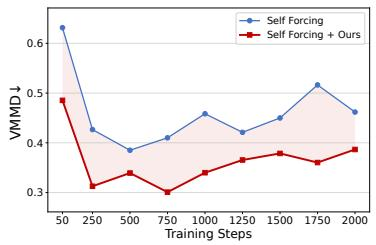

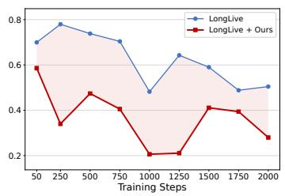

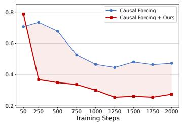  
Figure 5: V-JEPA2 Maximum Mean Discrepancy (VMMD) over training steps on the evaluation set. Incorporating Mask Forcing leads to faster convergence across various baselines.

Table 3: Mask ratio α ablation.
<table><tr><td>α</td><td>HPSv3 ↑</td><td>Dynamic. ↑</td></tr><tr><td>0.1</td><td>10.00</td><td>47</td></tr><tr><td>0.2</td><td>9.84</td><td>82</td></tr><tr><td>0.3</td><td>9.82</td><td>65</td></tr><tr><td>0.4</td><td>10.15</td><td>57</td></tr><tr><td>0.5</td><td>10.17</td><td>44</td></tr></table>

Table 4: Timestep window ∆ ablation.
<table><tr><td>∆</td><td>HPSv3 ↑ Dynamic. ↑</td></tr><tr><td>50 9.16</td><td>92</td></tr><tr><td>150</td><td>9.82 70</td></tr><tr><td>250</td><td>9.84 82</td></tr><tr><td>450</td><td>9.98 80</td></tr><tr><td>600 9.90</td><td>67</td></tr></table>

Table 5: Mask scheme ablation.
<table><tr><td>Mask scheme</td><td>HPSv3↑</td><td>Dynamic. ↑</td></tr><tr><td>shared, per-rollout</td><td>10.12</td><td>56</td></tr><tr><td>shared, per-chunk</td><td>9.84</td><td>81</td></tr><tr><td>shared, per-step</td><td>9.64</td><td>72</td></tr><tr><td>per-frame, per-rollout</td><td>10.03</td><td>53</td></tr><tr><td>per-frame, per-chunk</td><td>9.84</td><td>82</td></tr><tr><td>per-frame, per-step</td><td>9.93</td><td>74</td></tr></table>

Timestep Window ∆. We ablate the timestep window ∆ used to sample the timestep corresponding to a lower noise level in Tab. 4. This window controls the maximum difference between original and cleaner noise levels. With a small timestep window of $\Delta = 5 0$ , the cleaner noise level remains close to the original, providing only mild rollout perturbations and limited denoising cues. Therefore, this setting achieves a high Dynamic Degree of 92 but a low HPSv3 score of 9.16. Increasing ∆ strengthens the rollout perturbation and provides cleaner tokens with more informative denoising cues. Consequently, increasing ∆ to 150, 250, and 450 improves the HPSv3 score to 9.82, 9.84, 9.98, respectively. However, an excessively large window of $\Delta = 6 0 0$ may cause cleaner predictions to dominate subsequent denoising, limiting motion diversity. Therefore, we adopt $\Delta = 2 5 0$ , which achieves a competitive HPSv3 score of 9.84 while maintaining a high Dynamic Degree of 82.

Mask Scheme. We ablate the influence of different mask schemes for chunk-wise generation in Tab. 5. We evaluate the schemes varied along spatial and temporal axes: across the frames within each chunk and across chunks during the rollout. Spatially, “shared” applies the same mask to all frames within a chunk and “per-frame” independently samples a mask for each frame. Temporally, “per-rollout” keeps the mask fixed throughout the entire rollout, “per-chunk” resamples the mask for each chunk while keeping it fixed across the denoising steps within the chunk, and “per-step” resamples the mask at every denoising step. These spatial and temporal mask choices determine how the mask-induced perturbations vary throughout the rollout and consequently affect the resulting student rollout distributions. An effective scheme should sufficiently diversify the student distribution to improve its coverage of the teacher modes without introducing excessive variation that deviates from the teacher distribution. As shown in Tab. 5, applying “per-frame” in the spatial axis and “perchunk” in the temporal axis achieves both high visual quality and motion dynamics, with a HPSv3 score of 9.84 and Dynamic Degree of 82.

Convergence Speed. We compare the training convergence of different baselines with and without Mask Forcing in Figs. 1, 5 and 9. We use HPSv3 to evaluate the visual quality trend throughout the training. To assess the distributional alignment between student- and teacher-generated videos, we additionally report Maximum Mean Discrepancy (MMD) (Jayasumana et al., 2024) in the CLIP (Radford et al., 2021) and V-JEPA2 (Assran et al., 2025) feature spaces, denoted as CMMD and VMMD, respectively. Specifically, we first generate a fixed reference set with the realscore teacher on the 100-prompt set. We then generate videos for each step using the causal student on the same prompts and compute CMMD and VMMD against the teacher reference set. As shown

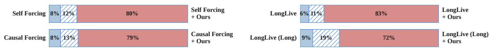  
Figure 6: Pairwise human preferences between baseline models with and without Mask Forcing. Blue and red denote preferences for models without and with Mask Forcing, respectively, while hatched regions indicate ties.  
in Figs. 1, 5 and 9, Mask Forcing accelerates convergence for all baselines in terms of both visual quality and distributional alignment.

## 4.3 HUMAN EVALUATION

We conduct pairwise human evaluations between anonymized outputs from Mask Forcing (+Ours) against different baselines for short and long video generation. We recruit 24 users to conduct this human evaluation study, and each user is required to select the video with higher visual quality and greater realism from each pair of videos. As shown in Fig. 6, incorporating Mask Forcing receives 80%, 79%, and 83% of the preference votes over the baseline methods Self Forcing, Causal Forcing, and LongLive, respectively. Moreover, for long video generation, Mask Forcing receives 72% of the preference votes over the LongLive baseline, further demonstrating the effectiveness of our method.

## 5 CONCLUSION

In this paper, we introduce Mask Forcing, a Dual-Noise Masking Rollout strategy for AR video diffusion distillation that alleviates the mode collapse induced by the mode-seeking reverse KL objective in DMD. Mask Forcing injects lower-noise signals into the noisy rollout inputs via random masks varying along spatial and temporal axes. These perturbations promote broader exploration during self-rollout, diversifying student trajectories and encouraging the student distribution to cover more regions of the teacher distribution and thereby allowing DMD to provide learning signals beyond the modes already covered by the student. Meanwhile, cleaner tokens act as denoising guidance for noisier tokens, improving intermediate rollout predictions and mitigating error accumulation during the self-rollout process. Extensive experiments demonstrate the effectiveness of our method across multiple baselines, with improved visual quality and convergence speed. We further investigate the effects of different masking mechanisms on the visual quality and motion dynamics balance on the generated videos. Overall, Mask Forcing provides a simple and effective strategy to improve AR video diffusion distillation without incorporating real video data or post-training.

## REFERENCES

Mido Assran, Adrien Bardes, David Fan, Quentin Garrido, Russell Howes, Matthew Muckley, Ammar Rizvi, Claire Roberts, Koustuv Sinha, Artem Zholus, et al. V-jepa 2: Self-supervised video models enable understanding, prediction and planning. arXiv preprint arXiv:2506.09985, 2025.

Hangbo Bao, Li Dong, Songhao Piao, and Furu Wei. Beit: Bert pre-training of image transformers. arXiv preprint arXiv:2106.08254, 2021.

Shengqu Cai, Weili Nie, Chao Liu, Julius Berner, Lvmin Zhang, Nanye Ma, Hansheng Chen, Maneesh Agrawala, Leonidas Guibas, Gordon Wetzstein, et al. Mode seeking meets mean seeking for fast long video generation. arXiv preprint arXiv:2602.24289, 2026.

Huiwen Chang, Han Zhang, Lu Jiang, Ce Liu, and William T Freeman. Maskgit: Masked generative image transformer. In Proceedings of the IEEE/CVF conference on computer vision and pattern recognition, pp. 11315–11325, 2022.

Hila Chefer, Patrick Esser, Dominik Lorenz, Dustin Podell, Vikash Raja, Vinh Tong, Antonio Torralba, and Robin Rombach. Self-supervised flow matching for scalable multi-modal synthesis. arXiv preprint arXiv:2603.06507, 2026.

Boyuan Chen, Diego Mart´ı Monso, Yilun Du, Max Simchowitz, Russ Tedrake, and Vincent Sitz-´ mann. Diffusion forcing: Next-token prediction meets full-sequence diffusion. Advances in Neural Information Processing Systems, 37:24081–24125, 2024.

Howard Chen, Noam Razin, Karthik Narasimhan, and Danqi Chen. Retaining by doing: The role of on-policy data in mitigating forgetting. arXiv preprint arXiv:2510.18874, 2025.

Siyi Chen, Shaowei Liu, Yixuan Jia, Zian Wang, Huan Ling, Qing Qu, and Jun Gao. Dataforcing distillation: Restoring diversity and fidelity in few-step video generation. arXiv preprint arXiv:2606.18478, 2026.

Kaifeng Gao, Jiaxin Shi, Hanwang Zhang, Chunping Wang, Jun Xiao, and Long Chen. Ca2-vdm: Efficient autoregressive video diffusion model with causal generation and cache sharing. In ICML. PMLR, 2025.

Zelin Gao, Qiuyu Wang, Jiapeng Zhu, Jingye Chen, Zichen Liu, Qingyan Bai, Jiahao Wang, Yufeng Yuan, Hanlin Wang, Yichong Lu, Ka Leong Cheng, Haojie Zhang, Jian Gao, Tianrui Feng, Yuzheng Liu, Yao Yao, Yinghao Xu, Xing Zhu, Yujun Shen, and Hao Ouyang. Infinite worlds with versatile interactions. arXiv preprint arXiv:2607.07534, 2026.

Yoav HaCohen, Benny Brazowski, Nisan Chiprut, Yaki Bitterman, Andrew Kvochko, Avishai Berkowitz, Daniel Shalem, Daphna Lifschitz, Dudu Moshe, Eitan Porat, et al. Ltx-2: Efficient joint audio-visual foundation model. arXiv preprint arXiv:2601.03233, 2026.

Kaiming He, Xinlei Chen, Saining Xie, Yanghao Li, Piotr Dollar, and Ross Girshick. Masked au-´ toencoders are scalable vision learners. In Proceedings ofthe IEEE/CVF conference on computer vision and pattern recognition, pp. 16000–16009, 2022.

Anthony Hu, Vaclav Volhejn, Adrien Ramanana Rahary, Chris Mulder, Aditya Makkar, Am ´ elie´ Royer, Manu Orsini, Alyx Liao, Adam Jelley, Eloi Alonso, et al. Multiplayer interactive world models with representation autoencoders. arXiv preprint arXiv:2607.05352, 2026.

Jinyi Hu, Shengding Hu, Yuxuan Song, Yufei Huang, Mingxuan Wang, Hao Zhou, Zhiyuan Liu, Wei-Ying Ma, and Maosong Sun. Acdit: Interpolating autoregressive conditional modeling and diffusion transformer. arXiv preprint arXiv:2412.07720, 2024.

Junchao Huang, Guian Fang, Shengju Qian, Xianghao Kong, Zhuoran Zhao, Wei Huang, Yihua Du, Zixin Zhang, Justin Cui, Yuchao Gu, et al. Solarwm: Open data and scalable training for long-horizon video world models. arXiv preprint arXiv:2609.02886, 2026a.

Xun Huang, Zhengqi Li, Guande He, Mingyuan Zhou, and Eli Shechtman. Self forcing: Bridging the train-test gap in autoregressive video diffusion. Advances in Neural Information Processing Systems, 38:167283–167308, 2026b.

Team HunyuanWorld. Hy-world 1.5: A systematic framework for interactive world modeling with real-time latency and geometric consistency. arXiv preprint, 2025.

Sadeep Jayasumana, Srikumar Ramalingam, Andreas Veit, Daniel Glasner, Ayan Chakrabarti, and Sanjiv Kumar. Rethinking fid: Towards a better evaluation metric for image generation. In 2024 IEEE/CVF Conference on Computer Vision and Pattern Recognition (CVPR), pp. 9307–9315. IEEE, 2024.

Xuan Ju, Yiming Gao, Zhaoyang Zhang, Ziyang Yuan, Xintao Wang, Ailing Zeng, Yu Xiong, Qiang Xu, and Ying Shan. Miradata: A large-scale video dataset with long durations and structured captions. Advances in Neural Information Processing Systems, 37:48955–48970, 2024.

Dongjun Kim, Chieh-Hsin Lai, WeiHsiang Liao, Naoki Murata, Yuhta Takida, Toshimitsu Uesaka, Yutong He, Yuki Mitsufuji, and Stefano Ermon. Consistency trajectory models: Learning probability flow ode trajectory of diffusion. In International Conference on Learning Representations, volume 2024, pp. 44493–44525, 2024.

Weijie Kong, Qi Tian, Zijian Zhang, Rox Min, Zuozhuo Dai, Jin Zhou, Jiangfeng Xiong, Xin Li, Bo Wu, Jianwei Zhang, et al. Hunyuanvideo: A systematic framework for large video generative models. arXiv preprint arXiv:2412.03603, 2024.

Jiaxing Li, Kai Zou, Cindy Zhou, Kaichen Huang, Junyao Gao, Zile Wang, Yang Liu, Bin Liu, Bo An, and Yangguang Li. Distillalign: Coordinating mode covering and mode seeking in autoregressive video distillation. arXiv preprint arXiv:2607.26811, 2026a.

Zhen Li, Chuanhao Li, Xiaofeng Mao, Shaoheng Lin, Ming Li, Shitian Zhao, Zhaopan Xu, Xinyue Li, Yukang Feng, Jianwen Sun, et al. Sekai: A video dataset towards world exploration. Advances in Neural Information Processing Systems, 38, 2026b.

Lu Ling, Yichen Sheng, Zhi Tu, Wentian Zhao, Cheng Xin, Kun Wan, Lantao Yu, Qianyu Guo, Zixun Yu, Yawen Lu, et al. Dl3dv-10k: A large-scale scene dataset for deep learning-based 3d vision. In 2024 IEEE/CVF Conference on Computer Vision and Pattern Recognition (CVPR), pp. 22160–22169. IEEE, 2024.

Hongyu Liu, Chun Wang, Feng Gao, Xuanhua He, Yue Ma, Ziyu Wan, Yong Zhang, Xiaoming Wei, and Qifeng Chen. Opsd-v: On-policy self-distillation for post-training few-step autoregressive video generators. arXiv preprint arXiv:2607.08766, 2026.

Cheng Lu and Yang Song. Simplifying, stabilizing and scaling continuous-time consistency models. In International Conference on Learning Representations, volume 2025, pp. 50611–50649, 2025.

Yuhang Ma, Xiaoshi Wu, Keqiang Sun, and Hongsheng Li. Hpsv3: Towards wide-spectrum human preference score. In Proceedings of the IEEE/CVF International Conference on Computer Vision, pp. 15086–15095, 2025.

Matiur Rahman Minar, Seunghun Oh, Ganghyeon Jeong, and Unsang Park. Steady-forcing: Balancing spatial persistence and motion continuity in long-horizon nature video diffusion. arXiv preprint arXiv:2606.14732, 2026.

Adam Polyak, Amit Zohar, Andrew Brown, Andros Tjandra, Animesh Sinha, Ann Lee, Apoorv Vyas, Bowen Shi, Chih-Yao Ma, Ching-Yao Chuang, et al. Movie gen: A cast of media foundation models. arXiv preprint arXiv:2410.13720, 2024.

Alec Radford, Jong Wook Kim, Chris Hallacy, Aditya Ramesh, Gabriel Goh, Sandhini Agarwal, Girish Sastry, Amanda Askell, Pamela Mishkin, Jack Clark, et al. Learning transferable visual models from natural language supervision. In International conference on machine learning, pp. 8748–8763. PmLR, 2021.

Oriane Simeoni, Huy V Vo, Maximilian Seitzer, Federico Baldassarre, Maxime Oquab, Cijo Jose,´ Vasil Khalidov, Marc Szafraniec, Seungeun Yi, Michael Ramamonjisoa, et al. Dinov3.¨ arXiv preprint arXiv:2508.10104, 2025.

Yang Song, Prafulla Dhariwal, Mark Chen, and Ilya Sutskever. Consistency models. arXiv preprint arXiv:2303.01469, 2023.

DreamX Team, Yancheng Bai, Rui Chen, Xiangxiang Chu, Rujing Dang, Hao Dou, Bingjie Gao, Qiwen Gu, Siyu Hong, Jiachen Lei, et al. Dreamx-world 1.0: A general-purpose interactive world model. arXiv preprint arXiv:2606.16993, 2026a.

Robbyant Team, Zelin Gao, Qiuyu Wang, Yanhong Zeng, Jiapeng Zhu, Ka Leong Cheng, Yixuan Li, Hanlin Wang, Yinghao Xu, Shuailei Ma, et al. Advancing open-source world models. arXiv preprint arXiv:2601.20540, 2026b.

Zachary Teed and Jia Deng. Raft: Recurrent all-pairs field transforms for optical flow. In European conference on computer vision, pp. 402–419. Springer, 2020.

Team Wan, Ang Wang, Baole Ai, Bin Wen, Chaojie Mao, Chen-Wei Xie, Di Chen, Feiwu Yu, Haiming Zhao, Jianxiao Yang, Jianyuan Zeng, Jiayu Wang, Jingfeng Zhang, Jingren Zhou, Jinkai Wang, Jixuan Chen, Kai Zhu, Kang Zhao, Keyu Yan, Lianghua Huang, Mengyang Feng, Ningyi Zhang, Pandeng Li, Pingyu Wu, Ruihang Chu, Ruili Feng, Shiwei Zhang, Siyang Sun, Tao Fang, Tianxing Wang, Tianyi Gui, Tingyu Weng, Tong Shen, Wei Lin, Wei Wang, Wei Wang, Wenmeng Zhou, Wente Wang, Wenting Shen, Wenyuan Yu, Xianzhong Shi, Xiaoming Huang, Xin Xu, Yan Kou, Yangyu Lv, Yifei Li, Yijing Liu, Yiming Wang, Yingya Zhang, Yitong Huang, Yong Li, You Wu, Yu Liu, Yulin Pan, Yun Zheng, Yuntao Hong, Yupeng Shi, Yutong Feng, Zeyinzi Jiang, Zhen Han, Zhi-Fan Wu, and Ziyu Liu. Wan: Open and advanced large-scale video generative models. arXiv preprint arXiv:2503.20314, 2025.

Jiahao Wang, Yufeng Yuan, Rujie Zheng, Youtian Lin, Jian Gao, Lin-Zhuo Chen, Yajie Bao, Chang Zeng, Yanxi Zhou, Xiao-Xiao Long, et al. Spatialvid: A large-scale video dataset with spatial annotations. In Proceedings of the IEEE/CVF Conference on Computer Vision and Pattern Recognition, pp. 42592–42603, 2026a.

Wenhao Wang and Yi Yang. Vidprom: A million-scale real prompt-gallery dataset for text-to-video diffusion models. Advances in Neural Information Processing Systems, 37:65618–65642, 2024.

Zile Wang, Zexiang Liu, Jiaxing Li, Kaichen Huang, Baixin Xu, Fei Kang, Mengyin An, Peiyu Wang, Biao Jiang, Yichen Wei, et al. Matrix-game 3.0: Real-time and streaming interactive world model with long-horizon memory. arXiv preprint arXiv:2604.08995, 2026b.

Tianhe Wu, Ruibin Li, Lei Zhang, and Kede Ma. Diversity-preserved distribution matching distillation for fast visual synthesis. In Forty-third International Conference on Machine Learning, 2026. URL https://openreview.net/forum?id=R3JzLU2qZj.

Jiazheng Xu, Yu Huang, Jiale Cheng, Yuanming Yang, Jiajun Xu, Yuan Wang, Wenbo Duan, Shen Yang, Qunlin Jin, Shurun Li, et al. Visionreward: Fine-grained multi-dimensional human preference learning for image and video generation. In Proceedings of the AAAI Conference on Artificial Intelligence, volume 40, pp. 11269–11277, 2026.

Shuai Yang, Wei Huang, Ruihang Chu, Yicheng Xiao, Yuyang Zhao, Xianbang Wang, Muyang Li, Enze Xie, Yingcong Chen, Yao Lu, et al. Longlive: Real-time interactive long video generation. arXiv preprint arXiv:2509.22622, 2025.

Tianwei Yin, Michael Gharbi, Taesung Park, Richard Zhang, Eli Shechtman, Fredo Durand, and¨ William T Freeman. Improved distribution matching distillation for fast image synthesis. In NeurIPS, 2024a.

Tianwei Yin, Michael Gharbi, Richard Zhang, Eli Shechtman, Fredo Durand, William T Freeman, ¨ and Taesung Park. One-step diffusion with distribution matching distillation. In Proceedings of the IEEE/CVF conference on computer vision and pattern recognition, pp. 6613–6623, 2024b.

Songchun Zhang, Zeyue Xue, Siming Fu, Jie Huang, Xianghao Kong, Y Ma, Haoyang Huang, Nan Duan, and Anyi Rao. Astrolabe: Steering forward-process reinforcement learning for distilled autoregressive video models. arXiv preprint arXiv:2603.17051, 2026.

Min Zhao, Hongzhou Zhu, Bokai Yan, Zihan Zhou, Yimin Chen, Wenqiang Sun, Kaiwen Zheng, Guande He, Xiao Yang, Chongxuan Li, et al. minwm: A full-stack open-source framework for real-time interactive video world models. arXiv preprint arXiv:2605.30263, 2026.

Guangcong Zheng, Teng Li, Xianpan Zhou, and Xi Li. Realcam-vid: High-resolution video dataset with dynamic scenes and metric-scale camera movements. arXiv preprint arXiv:2504.08212, 2025. URL https://arxiv.org/abs/2504.08212.

Kaiwen Zheng, Guande He, Min Zhao, Jintao Zhang, Huayu Chen, Jianfei Chen, Chen-Hsuan Lin, Ming-Yu Liu, Jun Zhu, and Qianli Ma. Causal-rcm: A unified teacher-forcing and self-forcing open recipe for autoregressive diffusion distillation in streaming video generation and interactive world models. arXiv preprint arXiv:2606.25473, 2026a.

Kaiwen Zheng, Yuji Wang, Qianli Ma, Huayu Chen, Jintao Zhang, Yogesh Balaji, Jianfei Chen, Ming-Yu Liu, Jun Zhu, and Qinsheng Zhang. Large scale diffusion distillation via score-regularized continuous-time consistency. In The Fourteenth International Conference on Learning Representations, 2026b. URL https://openreview.net/forum?id= 2uNlM353RI.

Yang Zhou, Yifan Wang, Jianjun Zhou, Wenzheng Chang, Haoyu Guo, Zizun Li, Kaijing Ma, Xinyue Li, Yating Wang, Haoyi Zhu, et al. Omniworld: A multi-domain and multi-modal dataset for 4d world modeling. arXiv preprint arXiv:2509.12201, 2025.

Hongzhou Zhu, Min Zhao, Guande He, Hang Su, Chongxuan Li, and Jun Zhu. Causal forcing: Autoregressive diffusion distillation done right for high-quality real-time interactive video generation. arXiv preprint arXiv:2602.02214, 2026.

Junhao Zhuang, Shiyi Zhang, Yuxuan Bian, Yaowei Li, Yawen Luo, Yijun Liu, Weiyang Jin, Songchun Zhang, Xianglong He, Xuying Zhang, Haoran Li, Haoyang Huang, Zeyue Xue, and Nan Duan. Self gradient forcing: Native long video extrapolation, 2026. URL https: //arxiv.org/abs/2607.20368.

## 6 APPENDIX

## 6.1 THEORETICAL JUSTIFICATION

In this section, we characterize the distribution induced by Mask Forcing and derive an exact decomposition of its reverse-KL objective. Fix a text condition c and a DMD score-noising timestep $\tau > 0$ . Let

$$
p _ { \tau } ( x ) : = p _ { \mathrm { r e a l } , \tau } ( x \mid c )\tag{14}
$$

denote the teacher noisy marginal. Let

$$
V : = \{ ( M _ { r } , t _ { k , r } ) \} _ { r = 1 } ^ { R } , \qquad V \sim \pi ,\tag{15}
$$

collect the masks and cleaner timesteps sampled during one Mask Forcing rollout, where π is the distribution induced by the corresponding samplers.

Given a masking trajectory $V = v$ , define the conditional student distribution as

$$
q _ { \theta , \tau } ^ { v } ( x ) : = p _ { \theta } ( X _ { \tau } = x \mid V = v , c ) .\tag{16}
$$

Marginalizing over V gives

$$
\begin{array} { r } { \bar { q } _ { \theta , \tau } ( x ) : = \mathbb { E } _ { V \sim \pi } \left[ q _ { \theta , \tau } ^ { V } ( x ) \right] . } \end{array}\tag{17}
$$

Under exact score estimation, the real and fake scores at noise level $\tau$ are

$$
s _ { \mathrm { r e a l } } ( x , \tau , c ) = \nabla _ { x } \log p _ { \tau } ( x ) , \qquad s _ { \mathrm { f a k e } } ( x , \tau , c ) = \nabla _ { x } \log \bar { q } _ { \theta , \tau } ( x ) .\tag{18}
$$

Since the fake-score model is not conditioned on $V ,$ , it estimates the score of the marginal distribution ${ \bar { q } } _ { \theta , \cdot }$ τ rather than a component score $\nabla _ { x }$ log $q _ { \theta , \cdot } ^ { v }$

The DMD score-difference update corresponds to the gradient

$$
\nabla _ { \theta } D _ { \mathrm { K L } } \left( \bar { q } _ { \theta , \tau } \| p _ { \tau } \right) = \mathbb { E } \left[ \left( s _ { \mathrm { f a k e } } ( X _ { \tau } , \tau , c ) - s _ { \mathrm { r e a l } } ( X _ { \tau } , \tau , c ) \right) ^ { \top } \nabla _ { \theta } X _ { \tau } \right] .\tag{19}
$$

We therefore analyze the reverse-KL objective

$$
D _ { \mathrm { K L } } \left( \bar { q } _ { \theta , \tau } \Vert p _ { \tau } \right) .\tag{20}
$$

The exact-score assumption is used only for this identification. In practice, both score networks approximate the corresponding marginal scores.

Proposition (KL decomposition for the masked-rollout distribution). Suppose that the KL divergences below are finite. Then

$$
D _ { \mathrm { K L } } \left( \bar { q } _ { \theta , \tau } \| p _ { \tau } \right) = \mathbb { E } _ { V } \left[ D _ { \mathrm { K L } } \left( q _ { \theta , \tau } ^ { V } \| p _ { \tau } \right) \right] - I _ { \theta } ( V ; X _ { \tau } \mid c ) .\tag{21}
$$

Proof. By the definition of KL divergence, the average conditional KL can be expanded by multi plying and dividing the density ratio by $\bar { q } _ { \theta , \cdot }$ τ :

$$
\begin{array} { r l } & { \mathbb { E } _ { V } \mathcal { D } _ { \mathrm { K L } } \left( g _ { \rho , \tau } ^ { \psi } \middle \vert \mathcal { F } _ { r } \right) } \\ & { = \int \pi ( \sigma ) \int \varphi _ { \varphi , \tau } ^ { \varphi } ( x ) \log \frac { q _ { \theta , \tau } ^ { \psi } ( x ) } { p _ { \sigma , \tau } ^ { \psi } ( x ) } \mathrm { d } x \mathrm { d } v } \\ & { = \mathbb { E } _ { V , X , \lfloor \tau \rfloor } \left[ \log \frac { q _ { \theta , \tau } ^ { \psi } ( X , \tau ) } { p _ { \sigma } ^ { \psi } ( X _ { \tau } ) } \right] } \\ & { = \mathbb { E } _ { V , X , \lfloor \tau \rfloor } \left[ \log \frac { q _ { \theta , \tau } ^ { \psi } ( X , \tau ) } { q _ { \theta , \tau } ^ { \psi } ( X _ { \tau } ) } + \log \frac { q _ { \theta , \tau } ^ { \tilde { \theta } } ( X , \tau ) } { p _ { \sigma } ^ { \psi } ( X _ { \tau } ) } \right] } \\ & { = \mathbb { E } _ { V , X , \lfloor \tau \rfloor } \left[ \log \frac { q _ { \tau } ^ { \psi } ( X , \tau ) } { q _ { \theta , \tau } ^ { \psi } ( X _ { \tau } ) } \right] + \mathbb { E } _ { V , X , \lfloor \tau \rfloor } \left[ \log \frac { \tilde { q } _ { \theta , \tau } ( X , \tau ) } { p _ { \sigma } ( X _ { \tau } ) } \right] } \\ & { = \underbrace { \mathbb { E } _ { V } \mathcal { D } _ { \mathrm { K L } } \left( q _ { \rho , \tau } ^ { \psi } \middle \vert \tilde { q } _ { \rho , \tau } ^ { \psi } \right) } _ { \mathcal { H } ( V , \tau ) , \mathbb { H } } + \mathbb { E } _ { V , \lfloor \tau \rfloor } \left[ \log \frac { \tilde { q } _ { \theta , \tau } ( X , \tau ) } { p _ { \sigma } ( X _ { \tau } ) } \right] , } \end{array}\tag{22}
$$

The first term is the conditional mutual information. By definition,

$$
\begin{array} { l } { { \displaystyle { I _ { \theta } ( V ; X _ { \tau } \mid c ) = \mathbb E _ { V , X _ { \tau } \mid c } \left[ \log \frac { p _ { \theta } ( V , X _ { \tau } \mid c ) } { p ( V \mid c ) p _ { \theta } ( X _ { \tau } \mid c ) } \right] } } } \\ { { ~ = \int \pi ( v ) q _ { \theta , \tau } ^ { v } ( x ) \log \frac { \pi ( v ) q _ { v , \tau } ^ { v } ( x ) } { \pi ( v ) \bar { q } _ { \theta , \tau } ( x ) } \mathrm { d } x \mathrm { d } v } } \\ { { ~ = \int \pi ( v ) \left[ \int q _ { \theta , \tau } ^ { v } ( x ) \log \frac { q _ { \theta , \tau } ^ { v } ( x ) } { \bar { q } _ { \theta , \tau } ( x ) } \mathrm { d } x \right] \mathrm { d } v } } \\ { { ~ = \int \pi ( v ) D _ { \mathrm { K L } } \left( q _ { \theta , \tau } ^ { v } | \bar { q } _ { \theta , \tau } \right) \mathrm { d } v } } \\ { { ~ = \mathbb E _ { V } D _ { \mathrm { K L } } \left( q _ { \theta , \tau } ^ { V } | \bar { q } _ { \theta , \tau } \right) . } } \end{array}\tag{23}
$$

For the second term, we first expand the joint expectation and then marginalize over $V { : }$

$$
\begin{array} { r l } & { \mathbb { E } _ { V , X _ { \tau } \mid c } [ \log \frac { \bar { q } _ { \theta , \tau } ( X _ { \tau } ) } { p _ { \tau } ( X _ { \tau } ) } ] } \\ & { \ = \int \pi ( v ) [ \int q _ { \theta , \tau } ^ { v } ( x ) \log \frac { \bar { q } _ { \theta , \tau } ( x ) } { p _ { \tau } ( x ) } \mathrm { d } x ] \mathrm { d } v } \\ & { \ = \int [ \int \pi ( v ) q _ { \theta , \tau } ^ { v } ( x ) \mathrm { d } v ] \log \frac { \bar { q } _ { \theta , \tau } ( x ) } { p _ { \tau } ( x ) } \mathrm { d } x } \\ & { \ = \int \bar { q } _ { \theta , \tau } ( x ) \log \frac { \bar { q } _ { \theta , \tau } ( x ) } { p _ { \tau } ( x ) } \mathrm { d } x } \\ & { \ = D _ { \mathrm { K L } } ( \bar { q } _ { \theta , \tau }  p _ { \tau } ) . } \end{array}\tag{24}
$$

Combining the two terms and rearranging proves equation 21.

The first term in equation 21 is the average reverse KL of the conditional rollout distributions. The mutual information measures their dependence on the masking trajectory. It also follows from equation 21 that

$$
D _ { \mathrm { K L } } \left( \bar { q } _ { \theta , \tau } \Vert p _ { \tau } \right) \leq \mathbb { E } _ { V } D _ { \mathrm { K L } } \left( q _ { \theta , \tau } ^ { V } \Vert p _ { \tau } \right) .\tag{25}
$$

Since mutual information is nonnegative, equality holds when V and $X _ { \tau }$ are conditionally independent given $c ,$ meaning that the masking trajectory does not affect the conditional output distribution. If different masking trajectories induce distinguishable conditional output distributions, then $I _ { \theta } ( V ; X _ { \tau } \mid c ) > 0$ , and the inequality is strict.

Table 6: Quantitative comparison of Mask Forcing (Ours) with Causal-rCM and DistillAlign on the 100-prompt set benchmark.
<table><tr><td>Method</td><td>HPSv3↑</td><td>Vision. ↑</td><td>Instruct. ↑</td><td>MQ↑</td><td>Dynamic. ↑</td></tr><tr><td>DistillAlign (Li et al., 2026a)</td><td>9.29</td><td>9.46</td><td>37.69</td><td>14.36</td><td>76</td></tr><tr><td>Causal-rCM (Zheng et al., 2026a)</td><td>9.61</td><td>9.43</td><td>38.50</td><td>14.34</td><td>64</td></tr><tr><td>Ours</td><td>10.17</td><td>11.58</td><td>46.30</td><td>21.54</td><td>82</td></tr><tr><td>DistillAlign 6%11% 83%</td><td>Ours</td><td>Causal-rCM</td><td>8%</td><td>77%</td><td>Ours</td></tr></table>

Figure 7: Pairwise human preference between joint distillation methods (DistillAlign and CausalrCM) and Mask Forcing.

Implication for mode coverage. Under limited model capacity, reverse-KL optimization may concentrate a conditional rollout distribution on a high-density region of the teacher distribution. If different masking trajectories induce distinct conditional distributions, then $I _ { \theta } ( V ; X _ { \tau } \mid c ) > 0 .$ and equation 21 shows that their marginal mixture has strictly lower reverse KL than their average conditional reverse KL. This mixture can cover multiple teacher-supported regions without requiring each conditional distribution to place probability mass between them. The result therefore gives a distributional mechanism by which randomized masking can alleviate mode-seeking behavior.

## 6.2 COMPARISON WITH JOINT DISTILLATION

Recent methods seek to improve distillation performance by combining complementary objectives that balance mode-seeking and mode-covering behaviors, such as rCM and DistillAlign. We compare with Causal-rCM (Zheng et al., 2026a) and DistillAlign in terms of visual quality and motion dynamics on the 100-prompt set benchmark. While rCM jointly optimizes continuous-time consistency distillation and score-based distillation in bidirectional models, Causal-rCM decouples these objectives into two stages. It first performs consistency distillation under teacher forcing to obtain causal initialization with broad mode coverage, and then applies DMD under self-forcing. Since DistillAlign is built upon Causal Forcing and Causal-rCM pairs its two distillation objectives with two causal training paradigms, we compare Mask Forcing on the Causal Forcing baseline with them. For DistillAlign, we use its final joint-distilled generator with the Wan2.1-T2V-14B teacher. For Causal-rCM, we follow its 4-step inference setting.

As shown in Tab. 6, our method outperforms both methods in visual quality, motion dynamics, as well as semantic alignment. Qualitative comparison in Fig. 8 is consistent with the quantitative results, showing that our method generates videos with richer details and greater realism. We further conduct pairwise human preference against joint distillation methods DistillAlign and Causal-rCM. As shown in Fig. 7, Mask Forcing receives more preference votes, with 83% and 77% over DistillAlign and Causal-rCM, respectively. These results demonstrate that Mask Forcing yields video with higher visual quality and realism from the users’ perspective.

## 6.3 ADDITIONAL EVALUATION ON LONGLIVE

We compare the convergence of LongLive with and without Mask Forcing in Fig. 9. Consistent with the results on Self Forcing and Causal Forcing, Mask Forcing achieves higher HPSv3 and lower CMMD in fewer training steps, demonstrating faster convergence.

Moreover, we evaluate LongLive and Mask Forcing on MovieGen over consecutive 6-second intervals from 0 to 30 seconds. For each interval, we average the CLIP score over all frames and the HPSv3 score over 12 uniformly sampled frames. As reported in Tab. 8, both methods exhibit a certain decline in CLIP and HPSv3 scores as the video generation progresses, likely due to error accumulation during autoregressive self-rollout. However, incorporating Mask Forcing achieves higher CLIP and HPSv3 scores than LongLive across all intervals, demonstrating consistent improvements in semantic alignment and visual quality throughout long video generation.

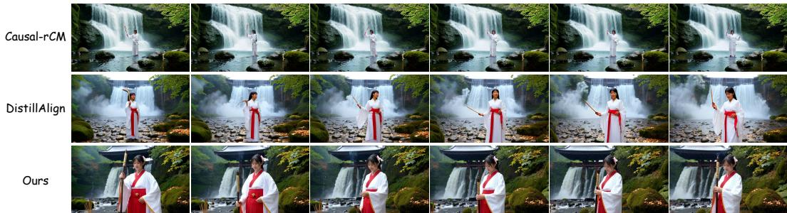  
At a misty waterfall shrine in Japan, a shrine maiden in a white and vermilion outfit fills the frame in ultra-realistic UHD with drifting incense. First, she lifts a gohei wand and pauses as water roars behind, eyes calm and focused. Then she performs a slow purification gesture and steps toward the torii, the camera rising to reveal mossy stone, maple leaves, and a river of mist that makes the scene feel sacred and stunning. for a beat of silence.

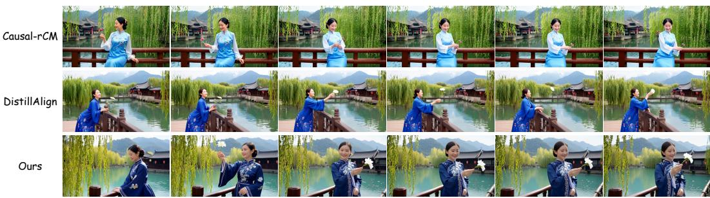  
In spring on a bridge over jade water, a woman in an embroidered blue dress fills the foreground in cinematic 4K. She leans on the railing, then tosses a small flower into the current as the camera glides close to her gentle smile. Behind her, willow buds sway, lantern reflections shimmer, and misty mountains rise beyond old rooftops. Crisp silk folds, natural skin tones, and gentle film grain create a tender, haunting beauty.

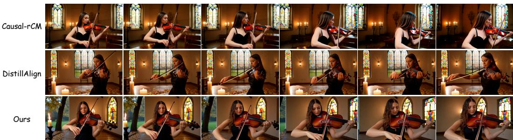  
In late autumn in a candle lit chapel, a violinist in a black satin dress fills the foreground in cinematic 4K. She plays a slow phrase, then accelerates into a shimmering run as the camera moves close to bow hair and fingerwork. Outside stained glass, rain taps softly and leaves swirl in the courtyard. Warm flame light paints her face and instrument, with true tones and gentle film grain making the performance hauntingly beautiful.

Figure 8: Qualitative comparison of our method with Causal-rCM and DistillAlign. Our method produces videos with better visual quality and motion dynamics.

## 6.4 DIVERSITY EVALUATION

We further evaluate the video diversity across different baselines under the chunk-wise setting using CLIP-ViT-Large (Radford et al., 2021) and DINOv3-ViT-Large (Simeoni et al.´ , 2025) following DP-DMD (Wu et al., 2026). We use the 100-prompt set as the evaluation set and generate 8 videos for each prompt with random seeds 0-7, generating 800 videos for each baseline for evaluation in total.

As shown in Tab. 7, Mask Forcing improves CLIP diversity across all three baselines, indicating consistently greater semantic variation. It also substantially improves DINOv3 diversity for Causal Forcing and LongLive, suggesting increased structural variation. For Self Forcing, DINOv3 diversity decreases slightly despite the improvement in CLIP diversity. Together with the consistent gains in visual quality, semantic alignment, distributional alignment, and human preference, these result suggest that Mask Forcing jointly improves generation quality and diversity.

Table 7: Video diversity across baselines.
<table><tr><td>Method</td><td>CLIP Div.↑</td><td>DINO Div.↑</td></tr><tr><td>Self Forcing</td><td>0.0773</td><td>0.1704</td></tr><tr><td>+ Ours</td><td>0.0814</td><td>0.1645</td></tr><tr><td>LongLive</td><td>0.0784</td><td>0.1537</td></tr><tr><td>+ Ours</td><td>0.0819</td><td>0.1750</td></tr><tr><td>Causal Forcing</td><td>0.0675</td><td>0.1371</td></tr><tr><td>+ Ours</td><td>0.0720</td><td>0.1577</td></tr></table>

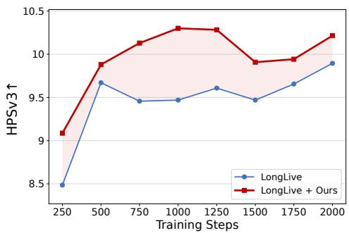

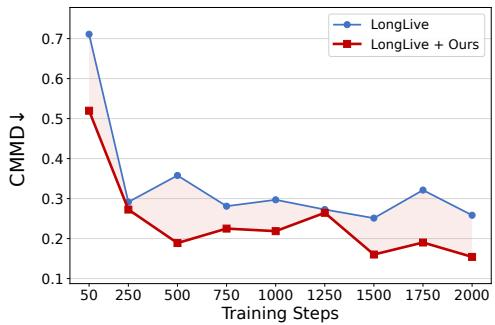  
Figure 9: HPSv3 and CMMD over training steps on the evaluation set for LongLive and LongLive (+Ours).

Table 8: Quantitative evaluation on long video generation on MovieGen. We evaluate the CLIP Score and HPSv3 across 6-second intervals (0–30s).
<table><tr><td rowspan="2">Method</td><td colspan="6">CLIP↑</td><td colspan="4">HPSv3↑</td></tr><tr><td>0-6</td><td>6-12</td><td>12-18</td><td>18-24</td><td>24-30</td><td>0-6</td><td>6-12</td><td>12-18</td><td>18-24</td><td>24-30</td></tr><tr><td>LongLive</td><td>33.70</td><td>33.41</td><td>33.29</td><td>33.23</td><td>33.15</td><td>8.81</td><td>8.37</td><td>8.23</td><td>7.89</td><td>7.79</td></tr><tr><td>+ Ours</td><td>34.12</td><td>33.81</td><td>33.59</td><td>33.63</td><td>33.38</td><td>9.65</td><td>9.44</td><td>9.05</td><td>8.87</td><td>8.68</td></tr></table>

## 6.5 INTERACTIVE VIDEO WORLD MODEL APPLICATION

We further explore Mask Forcing on autoregressive video generation with camera control. Current interactive world models extend video generation by conditioning future observations on user inputs (Team et al., 2026a;b; HunyuanWorld, 2025; Wang et al., 2026b; Zhao et al., 2026), such as actions, camera motions, or instructions. We evaluate Mask Forcing in a camera-controlled imageto-video setting, where an input image serves as the initial frame, and the model generates subsequent frames following a specified camera trajectory. We utilize Wan2.2-5B-TI2V as the base model and train the bidirectional model with open-source data, such as SpatialVID (Wang et al., 2026a), OmniWorld (Zhou et al., 2025), RealCam-Vid (Zheng et al., 2025), DL3DV (Ling et al., 2024), Sekai (Li et al., 2026b), and MiraData (Ju et al., 2024). Then we train an AR model using teacher forcing and adopt consistency distillation to obtain a few-step generator. Both bidirectional and autoregressive models are trained on 5s videos following SolarWM (Huang et al., 2026a). We compare Self Forcing and Mask Forcing for further causal student distillation to align with the teacher’s distribution with DMD. Fig. 10 presents qualitative comparisons on the Sekai-Game and Sekai-Walking test set. Videos generated by Self Forcing become darker and lose fine-grained details as the rollout proceeds. This issue can be attributed to the mode-seeking behavior of the reverse KL objective in DMD and error accumulation during self-rollout. Mask Forcing mitigates this degradation, producing scenes with richer details throughout the rollout. We view this experiment as an initial evaluation of our method in the camera-controlled image-to-video setting. To enable long and precise interactive video generation, future work includes training with long sequences and rollouts (Yang et al., 2025) and the context update strategy for temporal extrapolation (Zhuang et al., 2026).

## 6.6 ALGORITHM

We provide detailed pseudocode for training with Mask Forcing in Algorithm 1. Mask Forcing requires no additional forward passes, external data, or post-training stages and can be seamlessly integrated into existing self-rollout training pipelines. Mask Forcing constructs a dual-noise input at each denoising step by mixing the original- and lower-noise states with a random mask. The

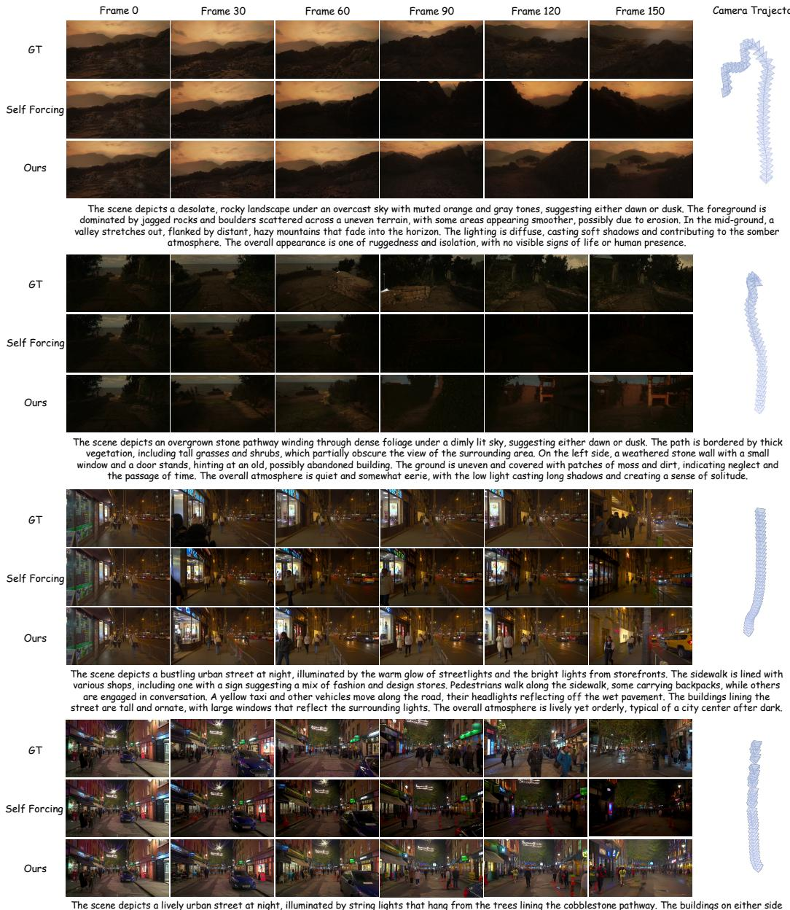  
The scene depicts a lively urban street at night, illuminated by string lights that hang from the trees lining the cobblestone pathway. The buildings on either side are a mix of brick and modern facades, with storefronts featuring bright signage and awnings in various colors. Pedestrians walk along the sidewalks, some stopping to look into shop windows or interact with street vendors. A few cars are parked along the street, and a green bicycle is visible near the left side. The overall atmosphere is vibrant and bustling, with a festive ambiance created by the warm glow of the lights and the activity of people enjoying the evening.

Figure 10: Qualitative comparison of Self Forcing and Mask Forcing (Ours) on Sekai-Game and Sekai-Walking. As the rollout progresses, Self Forcing videos darken and lose fine details. Mask Forcing mitigates this degradation, preserving rich details throughout generation.

perturbed input is then denoised at the original timestep, and the final clean prediction is cached as context for subsequent blocks.

## 6.7 MORE QUALITATIVE RESULTS

We present additional qualitative comparisons on single-prompt short video generation on the 100- prompt set and MovieGen in Figs. 11-13. Qualitative comparisons across different methods show that Mask Forcing consistently improves the visual quality of the generated videos, enhancing them with greater realism and richer detail while preventing over-saturated and over-smoothed artifacts.

Algorithm 1 Mask Forcing Training   
Require: Denoising timesteps $\mathcal { T } = \{ t _ { 1 } , \ldots , t _ { T } \}$ with $t _ { T } = 1$ and clean endpoint $t _ { 0 } = 0$   
Require: Text prompt c; number of autoregressive chunks $F$ , latent frames per chunk $L ,$ , spatial   
latent resolution $\mathbf { \dot { \boldsymbol { H } } } \times \mathbf { \boldsymbol { W } }$   
Require: AR diffusion model $G _ { \theta }$ (returns KV embeddings via $G _ { \theta } ^ { \mathrm { K V } } )$   
Require: Mask ratio α, timestep window size $\Delta$ in training timestep units, number of training   
timesteps $N _ { t } ,$ normalized timestep floor $t _ { \mathrm { m i n } }$   
Notation: $\Psi ( x , \varepsilon , t ) = ( 1 - t ) x \dot { + } t \varepsilon$   
1: loop   
2: Initialize KV cache $\mathrm { K V } \gets [ ]$ and model output $X _ { \theta } \gets [ ]$   
3: Sample exit index $s \sim$ Uniform $\{ 1 , \ldots , T \}$   
4: for chunk $i = 1 , \ldots , F$ do   
5: Sample initial noisy latent $x _ { i } ^ { t _ { T } } \sim \mathcal { N } ( 0 , I )$   
6: Sample a per-frame binary mask $M ^ { i } \in \{ 0 , 1 \} ^ { L \times H \times W }$ with ratio α   
7: if $s = T$ then   
8: Enable gradient computation   
9: else   
10: Disable gradient computation   
11: end if   
12: $\hat { x } _ { i , T } ^ { 0 } \gets G _ { \theta } \big ( x _ { i } ^ { t _ { T } } ; c , t _ { T } , \mathrm { K V } \big )$ ▷ initial unperturbed prediction   
13: if $s < T$ then   
14: for denoising step $j = T - 1 , T - 2 , \dots , s$ do   
15: t′ ∼ Uniform([max $( t _ { \operatorname* { m i n } } , t _ { j } - \Delta / N _ { t } ) , t _ { j } ] )$   
16: Sample $\varepsilon _ { j } \sim \ddot { \mathcal { N } } ( 0 , I )$   
17: $\boldsymbol { x } _ { i } ^ { t _ { k } ^ { \prime } } \gets \Psi ( \hat { x } _ { i , j + 1 } ^ { 0 } , \varepsilon _ { j } , t _ { k } ^ { \prime } ) , \quad \boldsymbol { x } _ { i } ^ { t _ { j } } \gets \Psi ( \hat { x } _ { i , j + 1 } ^ { 0 } , \varepsilon _ { j } , t _ { j } )$   
18: $x _ { i } ^ { t _ { \mathrm { m i x } } } \gets M ^ { i } \odot x _ { i } ^ { t _ { k } ^ { \prime } } + ( 1 - M ^ { i } ) \odot x _ { i } ^ { t _ { j } }$   
19: $\mathbf { i } \mathbf { f } { \boldsymbol { \ j } } = s$ then   
20: Enable gradient computation   
21: else   
22: Disable gradient computation   
23: end if   
24: $\hat { x } _ { i , j } ^ { 0 } \gets G _ { \theta } \left( x _ { i } ^ { t _ { \mathrm { m i x } } } ; c , t _ { j } , \mathrm { K V } \right)$ ▷ perturbed prediction at step $j$   
25: end for   
26: end if   
27: Append $\hat { x } _ { i , s } ^ { 0 } \mathrm { t o } X _ { \theta }$   
28: Disable gradient computation   
29: $\mathrm { k v } ^ { i } \gets \bar { G } _ { \theta } ^ { \mathrm { K V } } \left( \hat { x } _ { i , s } ^ { 0 } ; c , \ \bar { t } _ { 0 } , \ \mathrm { K V } \right)$ ▷ cache the exit prediction   
30: KV.append $( \mathrm { k v } ^ { i } )$   
31: end for   
32: Update θ via the distribution matching loss $\mathcal { L } _ { \mathrm { D M D } } ( X _ { \theta } )$   
33: end loop

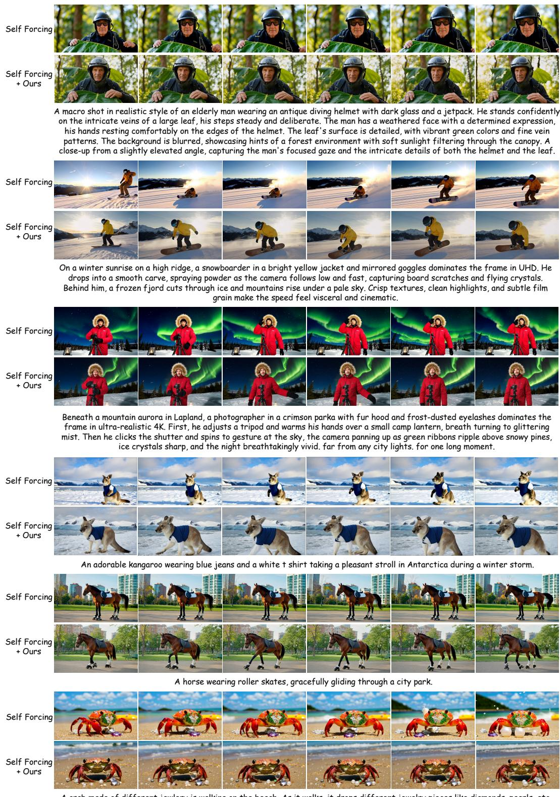  
A crab made of different jewlery is walking on the beach. As it walks, it drops different jewelry pieces like diamonds, pearls, etc.

Figure 11: Additional qualitative comparisons between Self Forcing and Self Forcing (+Ours).

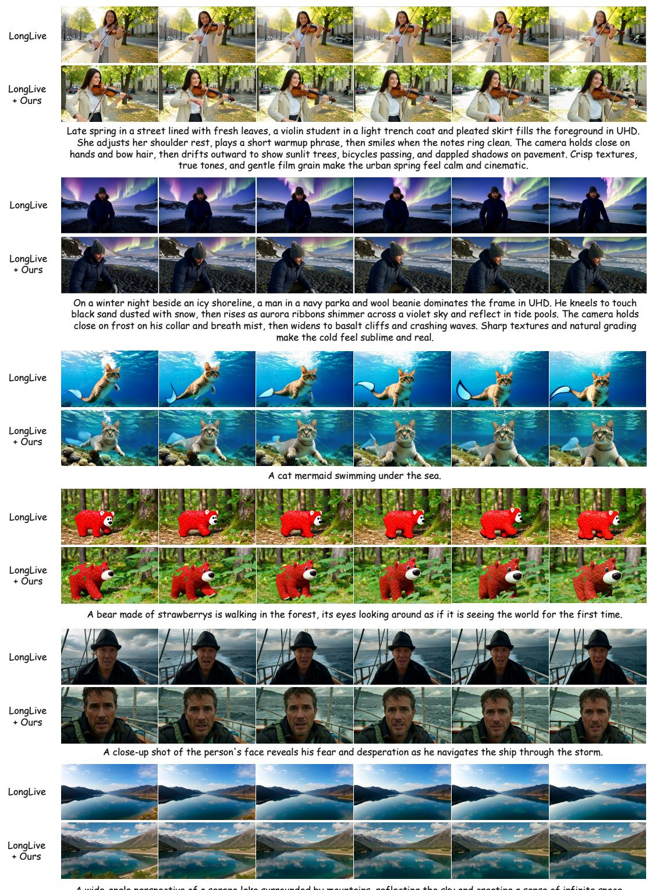  
Figure 12: Additional qualitative comparisons between LongLive and LongLive (+Ours).

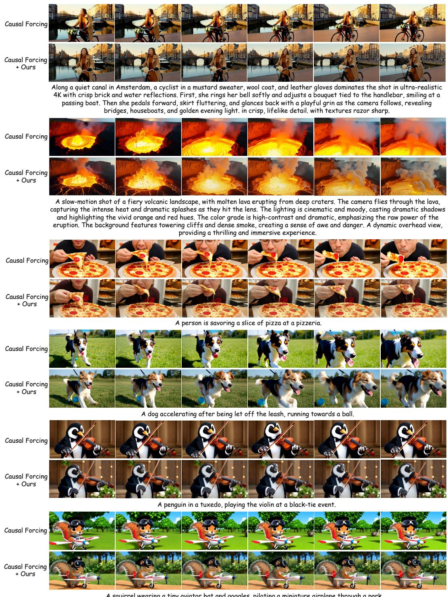  
A squirrel wearing a tiny aviator hat and goggles, piloting a miniature airplane through a park.

Figure 13: Additional qualitative comparisons between Causal Forcing and Causal Forcing (+Ours).