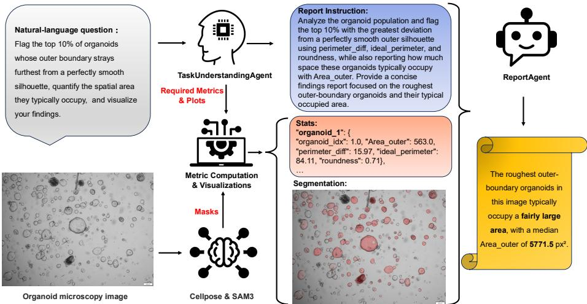
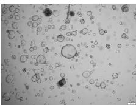
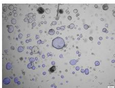
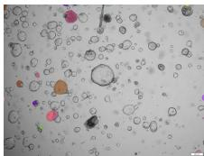
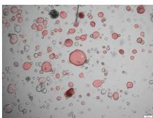
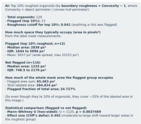
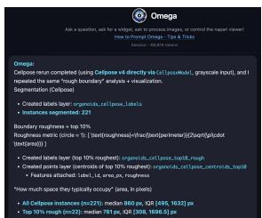
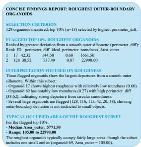

# MorphoOrgaAgent: A Foundation-Model-Based Multi-Agent System for Autonomous Organoid Analysis

Hanyi Zhang1,3†, Maximilian Hoermann1,2†, Lion J. Gleiter1,2, Yiling Xu3, Bettina Katalin Budai3, Hans-Ulrich Kauczor3, Carsten Marr1,4,5,6,7, and Tingying Peng1,2∗

1 Helmholtz AI, Helmholtz Munich - German Research Center for Environmental Health, Neuherberg, Germany

2 School of Computation, Information and Technology, Technical University of Munich, Munich, Germany

3 Department of Diagnostic and Interventional Radiology, University Hospital Heidelberg, Heidelberg, Germany

4 Institute of AI for Health, Helmholtz Munich - German Research Center for Environmental Health, Neuherberg, Germany

5 Department of Medicine III, Ludwig-Maximilian-University Hospital, Munich, Germany

6 Department of Physics, Ludwig-Maximilian-University, Munich, Germany 7 DKTK, German Cancer Consortium, Heidelberg, Germany tingying.peng@helmholtz-munich.de

Abstract. Organoids are three-dimensional tissue models whose morphology provides important insights into tumor development, disease progression, and drug testing. Extracting these morphological features relies heavily on manual segmentation, which is time-consuming and labor-intensive. Furthermore, performing quantitative statistical analysis typically requires custom coding skills and a mathematical background, presenting a major barrier for experimental biologists. To address these challenges, we introduce MorphoOrgaAgent, a multi-agent framework that achieves zero-shot organoid segmentation, automated data analysis, and report generation based on natural language input. The framework consists mainly of three core components: a TaskUnderstandingAgent that identifies requested measurements and visualization types; a hybrid segmentation module that combines Cellposederived geometric prompts with text prompts to guide SAM3 for zeroshot organoid instance segmentation; and a ReportAgent that computes quantitative metrics and compiles them alongside generated visualizations into a structured report. We further introduce MorphoOrgaVQA, a benchmark designed for quantitative evaluation of agent systems in organoid morphology analysis. Experimental results demonstrate that MorphoOrgaAgent handles both explicit and descriptive user requests,

produces measurements closely matching ground truth, and generates complete analysis reports without requiring manual programming. The complete source code and MorphoOrgaVQA benchmark are publicly available at https://github.com/peng-lab/MorphoOrgaAgent.

Keywords: organoids analysis · multi-agent systems · foundation models · automatic report generation.

## 1 Introduction

Organoids are three-dimensional, self-organizing tissue-like structures that capture key aspects of the structure and function of human or animal organs. Their unique properties make them promising platforms for clinical diagnostics, personalized medicine, disease modeling, and high-throughput drug screening [1]. Morphological features such as organoid size and shape, together with organoid count, provide informative quantitative readouts of growth, culture state, and responses to experimental perturbations. [3–7]. Precise instance segmentation serves as the cornerstone for extracting such biologically meaningful morphological measurements from microscopy images. To address this need, various specialized deep learning and conventional image-processing methods have been developed. For instance, models such as OrganoID [2], OrganoSeg [7, 8], OrgaQuant [6], OrgaExtractor [4], OrgaSegment [3], Tellu [5] and TransOrgaplus [9] provide automated detection, instance segmentation, or morphological classification for specific organoid types, while tools like NOA [10] ofer graphical user interfaces to facilitate analysis. Thus, these methods have enabled the systematic analysis of large organoid imaging datasets by replacing labor-intensive manual measurements with scalable and reproducible image analysis pipelines. Despite these valuable contributions, most existing pipelines heavily rely on taskspecific or dataset-specific training, limiting their zero-shot generalization capabilities across diverse organoid phenotypes and varied imaging conditions.

Recently, large language model (LLM)-based agents have emerged as a powerful paradigm to automate complex workflows by translating natural-language requests into executable tasks. In the biomedical domain, impressive agentic frameworks have been introduced for specialized applications: BioMedAgent [11] chains diverse bioinformatics tools to solve data-driven tasks, CellAgent [14] automates single-cell data analysis, and the BioImage.IO Chatbot [18] leverages multi-agent assistance to orchestrate bioimage analysis tools. For imageprocessing workflows, Agentic-J [15] integrates LLM reasoning with ImageJ within containerized environments, while Omega [19] provides a Napari-based agent interface for interactive image analysis. In computational pathology, innovative frameworks such as SPARK [12] autonomously code and validate biomarker concepts without model retraining, and PathAgent [13] delivers transparent whole-slide image analysis through explicit reasoning traces. Furthermore, systems like Agentic Lab [20] demonstrate the utility of LLMs in coordinating protocol design, laboratory guidance, and organoid phenotyping. Despite these remarkable advancements, a multi-agent framework capable of achieving zeroshot organoid segmentation, automated quantitative analysis, and comprehensive report generation remains lacking.

We therefore introduce MorphoOrgaAgent, an autonomous multi-agent system that combines foundation-model-based zero-shot segmentation with LLM-driven quantitative morphology analysis and report generation. Its workflow consists of three coordinated components: First, the TaskUnderstandingAgent translates the biologist’s natural-language request into a structured analysis plan by selecting required measurements and visualizations from a predefined analytical pool, while also formulating tailored instructions to guide the downstream ReportAgent. Next, the Hybrid-Prompt Segmentation Module combines Cellpose-derived geometric prompts with text prompts to guide SAM3 for zero-shot organoid instance segmentation, eliminating the need for tedious manual annotation. Finally, the ReportAgent automatically computes the requested instance- and population-level metrics, generates corresponding visualizations, and compiles all findings into a structured analysis report.

We evaluate MorphoOrgaAgent through both quantitative benchmarks and qualitative comparative analyses. To quantitatively assess performance, we introduce MorphoOrgaVQA, a Visual Question Answering benchmark compiled from three public organoid datasets, featuring morphology-focused queries that address key biological questions. To ensure objective and reproducible evaluation, we release an automated pipeline that generates deterministic ground-truth (GT) answers directly from expert-annotated masks. Furthermore, we conduct qualitative comparisons against existing bioimage frameworks, including Omega [19] and Agentic-J [15], on complex analytical tasks. Experimental results demonstrate that MorphoOrgaAgent excels in zero-shot instance segmentation, produces accurate statistical computations, and synthesizes clear, structured, and professional analysis reports. By automating these critical steps, our framework significantly reduces manual annotation efort, eliminates coding requirements, and enables batch analysis for large-scale organoid studies.

## 2 Methodology

System Overview: MorphoOrgaState and Multi-Agent Orchestration At the core of our pipeline is MorphoOrgaState, a centralized, JSON-serializable state container that acts as the single source of truth shared across all agents and modules. A new MorphoOrgaState instance is initialized for every user query, storing the input image path and the natural language query at the outset. As execution proceeds through the pipeline, each subagent and module reads from and writes back to this shared state, and the updated state is persisted to disk after the final step, yielding a complete and auditable trace of all intermediate results. Concretely, the TaskUnderstandingAgent first parses the user’s analysis intent and writes the resulting analysis plan, including the target objects, required metrics, and required visualizations, into MorphoOrgaState. The segmentation module is then invoked, and the resulting organoid masks are likewise stored in the state. Quantitative metrics computed from these masks are appended in the same manner. Finally, the ReportAgent consolidates all information accumulated in MorphoOrgaState, including the original and translated query, segmentation results, and computed metrics, into a comprehensive natural language report that directly answers the user’s question. To support full reproducibility, the complete system prompts of both LLM-driven subagents are reported verbatim in Appendix B and released in our GitHub repository.

  
Fig. 1: Overview of the MorphoOrgaAgent pipeline. Given a microscopy image and a natural-language query, the TaskUnderstandingAgent translates the request into a structured analysis specification and a report instruction for downstream processing. Cellpose and SAM3 then perform zero-shot instance segmentation. Using the resulting masks and analysis specification, the framework computes the requested metrics and visualizations. Finally, the ReportAgent integrates the original query, segmentation outputs, and quantitative results into a concise, evidence-grounded report.

TaskUnderstandingAgent The TaskUnderstandingAgent performs three main functions. First, it takes MorphoOrgaState as input and interprets the user’s natural language query to determine the underlying analysis intent. Second, based on this intent, it selects the necessary metrics and visualizations from a predefined pool of supported metrics and plot types. Third, since the user’s query may be ambiguous, imprecise, or contain typographical errors, the agent reformulates it into a more precise, scientifically phrased prompt, which is likewise saved in MorphoOrgaState and later passed to the ReportAgent after the segmentation module has completed. This agent is powered by GPT-5.4-mini.

Hybrid-Prompt Segmentation & Metric Computation To improve generalization beyond organoid-specific segmentation models, we combine Cellpose [16] and SAM 3 [17] in a hybrid-prompt strategy. Although SAM 3 supports textprompted segmentation, its predominantly natural-image training limits its representation of the domain-specific biological concept of an “organoid”, making text prompts alone insuficient. Cellpose, by contrast, provides useful coarse localization of biological objects in microscopy images but may miss or imprecisely delineate organoids with unfamiliar morphologies. We therefore use Cellpose-derived masks as geometric prompts, together with the text prompt “cell cluster” (a description that more accurately characterizes the biological nature of organoids) to guide SAM3 toward a refined segmentation. Once segmentation is complete, the resulting masks are collected, and since all morphological statistics are derived from these masks, the system invokes the predefined metriccomputation and visualization functions to compute the corresponding statistics. All results are then saved into MorphoOrgaState, serving as input to the final ReportAgent.

ReportAgent The ReportAgent reads all information stored in MorphoOrgaState, including the original image, segmentation results, and computed statistics, and answers the user’s query refined by the TaskUnderstandingAgent. It generates a final report that directly answers the query and explicitly cites the supporting evidence drawn from MorphoOrgaState. To mitigate hallucination, the ReportAgent is strictly constrained to base its reasoning and answer solely on the information contained in MorphoOrgaState, rather than on its own prior knowledge. This agent is powered by the more capable GPT-5.4.

## 3 Experiments

## 3.1 The MorphoOrgaVQA Benchmark

To quantitatively evaluate MorphoOrgaAgent by simulating biologists’ real-world requests for organoid morphological analysis, we construct the MorphoOrgaVQA benchmark. It comprises 16 questions spanning the most commonly used morphological metrics, including area, perimeter, roughness, and roundness. These 16 questions are organized into two phrasing modes: clear and open. In clearmode questions, the metric name appears explicitly in the text, whereas in openmode questions, the metric is only implied. For example, “Identify the specific organoid with the maximum outer area in this field of view, and report both its total cross-sectional surface area in pixels and its geometric center coordinates x and y” is a clear question, since the target metrics (outer area, coordinates x and y) are stated directly. Its open counterpart, “Locate the most dominant organoid in this image and evaluate how much footprint it occupies in pixel coordinates, alongside its center of mass,” conveys the same intent through more colloquial, biologist-style phrasing, requiring the system to infer the underlying metrics from context rather than from explicit keywords. To assess the system’s ability to perform the population-level statistical analyses that are of particular importance to biologists, each metric is evaluated under two complementary use cases: identifying the extremum (largest) organoid, and stratifying the population into three tiers (small, medium, large). For example: “Perform a stratification of this sample into small, medium, and large tiers based on individual outer area distributions. Provide the mean outer area value calculated for each of the three tiers.” The full set of benchmark questions is provided in Appendix A and released in machine-readable form in our public GitHub repository. We further provide a script that computes GT answers directly from the expert-annotated masks, ensuring an objective and reproducible evaluation protocol. The benchmark is built on test sets from three high-quality, publicly available datasets with expert annotations, namely OrganoID [2], OrgaExtractor [4], and OrgaSegment [3], totaling 69 images with corresponding masks. Running all 16 questions on every image yields $1 6 \times 6 9 = 1 , 1 0 4$ question–answer pairs.

## 3.2 Quantitative Evaluation of MorphoOrgaAgent

To evaluate the numerical precision and execution fidelity of MorphoOrgaAgent, we benchmark its predictions against deterministic GT values computed directly from expert-annotated instance masks across the entire benchmark. For each quantitative query, we measure performance using the absolute percentage error $( \mathrm { A P E } ) ~ \epsilon = ~ | ( V _ { \mathrm { p r e d } } - V _ { \mathrm { G T } } ) / V _ { \mathrm { G T } } | \times 1 0 0 \%$ where $V _ { \mathrm { p r e d } }$ denotes the scalar value predicted by the agent, and V denotes the corresponding GT value computed analytically from the annotated mask. As outlined in Section 3.1, we evaluate model performance across two distinct query formats: single-extremum queries and tertile-mean estimations. The main quantitative evaluation results across all morphological metrics and query types are summarized in Table 1. Notably, our multi-agent system achieves exceptional precision on Roundness, yielding a median APE of less than 1.6% for single-extremum queries (1.54% clear, 1.56% open) and remaining under 2.6% for tertile mean queries (2.48% clear, 2.51% open). This demonstrates the system’s strong zero-shot capability in capturing global morphological roundness and geometric regularity. For fundamental spatial metrics such as Area and Perimeter, the system reliably locates single-extremum targets with median APE ranging between 15.36% and 17.40%. While Area predictions exhibit a larger shift when aggregating subpopulation statistics (tertile mean APE of 38.74% for clear prompts), Perimeter maintains stronger stability across aggregated cohorts, recording a median APE of approximately 22.0%. Conversely, Roughness poses the most significant technical challenge, yielding higher errors (46.02% APE for single-extremum queries). Because roughness is defined as the discrepancy between real and idealized perimeters, it relies heavily on fine-grained boundary fidelity, making it inherently sensitive to pixel-level segmentation noise.

As introduced in Section 3.1, we evaluated performance across two prompt formulations: clear (explicit metric naming) and open (descriptive, domain-specific terminology). Across all four metrics and task categories, Table 1 indicates nearly identical error profiles between the two query types. This confirms that our system accurately decodes natural, ambiguous biological language into correct analytical operations without sacrificing execution accuracy.

Table 1: Median Absolute Percentage Error (APE) by Metric and Question Type.
<table><tr><td rowspan="2">Metric</td><td colspan="2">Single-Extremum</td><td colspan="2">Tertile Mean</td></tr><tr><td>Clear Prompt Open Prompt Clear Prompt Open Prompt</td><td></td><td></td><td></td></tr><tr><td>Area</td><td>16.77%</td><td>17.40%</td><td>38.74%</td><td>36.77%</td></tr><tr><td>Perimeter</td><td>15.36%</td><td>15.36%</td><td>22.03%</td><td>22.24%</td></tr><tr><td>Roughness</td><td>46.02%</td><td>46.02%</td><td>31.75%</td><td>33.74%</td></tr><tr><td>Roundness</td><td>1.54%</td><td>1.56%</td><td>2.48%</td><td>2.51%</td></tr></table>

## 3.3 Qualitative Comparison against LLM-Based Approaches

To evaluate the operational workflow and analytical fidelity of our framework, we conduct a qualitative benchmark comparing MorphoOrgaAgent against established bioimage analysis baselines, including Omega [19] and Agentic-J [15]. The evaluation is performed on a complex, biologically meaningful image-query pair featuring a brightfield microscopy image of colon organoids sourced from the OrgaExtractor dataset [4]. The benchmark query demands cross-metric reasoning and multi-step execution:“Flag the top 10% of organoids whose outer boundary strays furthest from a perfectly smooth silhouette, quantify the spatial area they typically occupy, and visualize your findings.” To answer this question, the system is expected to: (1) segment all organoids, (2) compute the diference between real and ideal perimeter, (3) choose the top 10% organoids with the highest diference, and (4) report their median area and visualize the findings. The segmentation results are summarized in Fig. 2. Although Omega employs StarDist [21–23] for zero-shot segmentation, it exhibits limited generalization on organoid microscopy images. In contrast, our segmentation module yields significantly higher-quality instance masks. This superior zero-shot performance directly stems from our hybrid prompting strategy. As Agentic-J lacks an inte-

  
(a) Original

  
(b) GT

  
(c) Omega

  
(d) Ours  
Fig. 2: Qualitative comparison of organoid segmentation. (a) Brightfield image from OrgaExtractor, (b) GT segmentation, (c) Omega segmentation using StarDist, and (d) our hybrid Cellpose–SAM 3 module.

grated deep learning segmentation model, we provided it with the user query alongside our system’s predicted mask to generate its final report, as shown in

Fig. 3. The median area values reported by Agentic-J, Omega, and MorphoOrgaAgent are 1235, 761, and 5771.5, respectively, against the GT value of 5749. Notably, MorphoOrgaAgent achieves a minimal relative error of only 0.39%, demonstrating strong alignment with the ground truth. Conversely, Omega yields suboptimal results due to segmentation inaccuracies. While Agentic-J processes the exact same segmentation mask as our model, it defaults to standard metric like convexity to evaluate boundary roughness, missing domain-specific morphological descriptors. It is worth emphasizing that both baseline frameworks are highly capable general-purpose bioimage analysis platforms; however, their generic design limits their ability to capture domain-tailored morphological features compared to MorphoOrgaAgent, which is purpose-built for organoid analysis. As shown in Fig. 3(c), the report generated by MorphoOrgaAgent illustrates the system’s step-by-step analysis workflow. First, the framework counts the target organoid population (N = 129) and selects the top 10% (13 organoids) with the highest boundary roughness (perimeter\_diff). It then uses the computed metrics stored in MorphoOrgaState to rank objects, group subpopulations, and calculate summary statistics. Because the LLM works strictly as a reasoning engine over pre-computed state data without changing any numbers, our system efectively avoids LLM hallucinations. The resulting report provides clear biological insights: it captures subpopulation variability (distinguishing true boundary irregularity from general low roundness), reports key summary statistics (median area of 5771.5), and highlights morphological outliers. By combining precise measurements with structured text reports, MorphoOrgaAgent delivers clear and practical results for researchers.

  
(a) Agentic-J

  
(b) Omega

  
(c) MorphoOrgaAgent  
Fig. 3: Comparison of generated reports answering a complex natural-language query requesting boundary roughness filtering (top 10) and spatial area quantification. (a) Agentic-J defaults to standard metrics (e.g., convexity) rather than domain-specific descriptors, yielding an underestimated median area of 1,235 px. (b) Omega produces suboptimal quantitative estimates (median area 761 px) primarily driven by upstream segmentation failures. (c) MorphoOrgaAgent generates a structured, domain-tailored report with exceptional numerical fidelity (median area 5,771.5 px vs. GT 5,749 px; 0.39% relative error).

## 4 Conclusion

In this work, we present MorphoOrgaAgent, a foundation-model-based multiagent system that translates complex natural language queries from biologists into structured, machine-executable workflows for organoid morphology analysis. Through a hybrid prompting strategy coupling geometric prompts from Cellpose with domain-tailored text prompts for SAM3, the system enables robust zero-shot organoid segmentation, automated morphological metric computation, visualization, and report synthesis. Quantitative evaluation on our MorphoOrgaVQA benchmark demonstrates that MorphoOrgaAgent efectively interprets both explicit and ambiguous user requests without manual programming. This framework streamlines organoid analysis workflows, reduces expert annotation costs, and paves the way for accessible, high-throughput bioimage intelligence.

Disclosure of Interests. The authors have no competing interests to declare that are relevant to the content of this article.

## References

1. Zhao, Z., Chen, X., Dowbaj, A.M., et al.: Organoids. Nat. Rev. Methods Primers 2, 94 (2022). https://doi.org/10.1038/s43586-022-00174-y

2. Matthews, J.M., Schuster, B., Kashaf, S.S., et al.: OrganoID: A versatile deep learning platform for tracking and analysis of single-organoid dynamics. PLoS Comput. Biol. 18(11), e1010584 (2022). https://doi.org/10.1371/journal.pcbi.1010584

3. Leferts, J.W., Kroes, S., Smith, M.B., et al.: OrgaSegment: deep-learning based organoid segmentation to quantify CFTR dependent fluid secretion. Commun. Biol. 7, 319 (2024). https://doi.org/10.1038/s42003-024-05966-4

4. Park, T., Kim, T.K., Han, Y.D., et al.: Development of a deep learning based image processing tool for enhanced organoid analysis. Sci. Rep. 13, 19841 (2023). https://doi.org/10.1038/s41598-023-46485-2

5. Domènech-Moreno, E., Brandt, A., Lemmetyinen, T.T., Wartiovaara, L., Mäkelä, T.P., Ollila, S.: Tellu – an object-detector algorithm for automatic classification of intestinal organoids. Dis. Model Mech. 16(3), dmm049756 (2023). https://doi.org/10.1242/dmm.049756

6. Kassis, T., Hernandez-Gordillo, V., Langer, R., Grifith, L.G.: OrgaQuant: Human Intestinal Organoid Localization and Quantification Using Deep Convolutional Neural Networks. Sci. Rep. 9, 12479 (2019). https://doi.org/10.1038/s41598-019- 48874-y

7. Wells, C.J., Labban, N., Showalter, S.L. et al.: Fast learning-free organoid quantification and tracking with OrganoSeg2. Sci Rep 16, 7928 (2026). https://doi.org/10.1038/s41598-026-37526-7

8. Borten, M.A., Bajikar, S.S., Sasaki, N. et al.: Automated brightfield morphometry of 3D organoid populations by OrganoSeg. Sci Rep 8, 5319 (2018). https://doi.org/10.1038/s41598-017-18815-8

9. Qin, Y., Li, J., Heng, Y., et al.: A knowledge-driven deep learning framework for organoid morphological segmentation and characterization. BMC Biology 23(1), 313 (2025). https://doi.org/10.1186/s12915-025-02411-8

10. Konov, M., Gleiter, L.J., Co, K., Yabal, M., Peng, T.: NOA: A versatile, extensible tool for AI-based organoid analysis. In: 2026 IEEE 23rd International Symposium on Biomedical Imaging (ISBI), pp. 1–5 (2026) https://doi.org/10.1109/ISBI61048.2026.11515532

11. Bu, D., Sun, J., Li, K., et al.: Empowering AI data scientists using a multi-agent LLM framework with self-evolving capabilities for autonomous, tool-aware biomedical data analyses. Nat. Biomed. Eng. (2026). https://doi.org/10.1038/s41551-026- 01634-6

12. Trost, F., Zhang, B., Aring, I., et al.: An agentic framework for autonomous scientific discovery in cancer pathology. Nat. Med. 32, 2254–2266 (2026). https://doi.org/10.1038/s41591-026-04357-y

13. Chen, J., Cai, L., Wang, Z., Huang, Y., Jiang, S., Huang, S., Wang, H., Zhang, Y.: PathAgent: Toward Interpretable Analysis of Whole-slide Pathology Images via Large Language Model-based Agentic Reasoning. arXiv:2511.17052 (2025). https://doi.org/10.48550/arXiv.2511.17052

14. Xiao, Y., Liu, J., Zheng, Y., Xie, X., Hao, J., Li, M., Wang, R., Ni, F., Li, Y., Luo, J., Jiao, S., Peng, J.: CellAgent: An LLM-driven Multi-Agent Framework for Automated Single-cell Data Analysis. Preprint at bioRxiv. https://doi.org/10.1101/2024.05.13.593861 (2024)

15. Johanns, L., Moor, M., Panzeri, D., et al.: Agentic-J: An AI Agent for Biological Microscopy Image Analysis. arXiv:2606.02080 (2026). https://doi.org/10.48550/arXiv.2606.02080

16. Stringer, C., Wang, T., Michaelos, M., & Pachitariu, M.: Cellpose: a generalist algorithm for cellular segmentation. Nature Methods 18(1), 100–106 (2021)

17. Carion, N., Gustafson, L., Hu, Y.T., Debnath, S., Hu, R., Suris, D., Ryali, C., Alwala, K.V., Khedr, H., Huang, A., Lei, J., Ma, T., Guo, B., Kalla, A., Marks, M., Greer, J., Wang, M., Sun, P., Rädle, R., Afouras, T., Mavroudi, E., Xu, K., Wu, T.H., Zhou, Y., Momeni, L., Hazra, R., Ding, S., Vaze, S., Porcher, F., Li, F., Li, S., Kamath, A., Cheng, H.K., Dollár, P., Ravi, N., Saenko, K., Zhang, P., Feichtenhofer, C.: SAM 3: Segment Anything with Concepts. arXiv preprint arXiv:2511.16719 (2025)

18. Lei, W., Fuster-Barceló, C., Reder, G., et al.: BioImage.IO Chatbot: a communitydriven AI assistant for integrative computational bioimaging. Nature Methods 21, 1368–1370 (2024)

19. Royer, L.A.: Omega — harnessing the power of large language models for bioimage analysis. Nature Methods 21, 1371–1373 (2024)

20. Wang W, Swain S, Lee J, Lin Z, Canales B, Aljović A, Liu Y, Li Q, Marin-Llobet A, Liu M, Gao Z, Liu R, Alvarez-Dominguez JR, Liu J: Agentic Lab: An Agentic-physical AI system for cell and organoid experimentation and manufacturing. bioRxiv, 2025.11.11.686354 (2025). https://doi.org/10.1101/2025.11.11.686354

21. Schmidt, U., Weigert, M., Broaddus, C., Myers, G.: Cell Detection with Star-Convex Polygons. In: Medical Image Computing and Computer Assisted Intervention – MICCAI 2018, 21st International Conference, Granada, Spain, September 16–20, 2018, Proceedings, Part II, pp. 265–273 (2018) https://doi.org/10.1007/978- 3-030-00934-2\_30

22. Weigert, M., Schmidt, U., Haase, R., Sugawara, K., Myers, G.: Star-convex Polyhedra for 3D Object Detection and Segmentation in Microscopy. In: 2020 IEEE Winter Conference on Applications of Computer Vision (WACV), pp. 3655–3662 (2020) https://doi.org/10.1109/WACV45572.2020.9093435

23. Weigert, M., Schmidt, U.: Nuclei Instance Segmentation and Classification in Histopathology Images with Stardist. In: 2022 IEEE International Symposium on Biomedical Imaging Challenges (ISBIC), pp. 1–4 (2022) https://doi.org/10.1109/ISBIC56247.2022.9854534

## A MorphoOrgaVQA Benchmark

Table 2 lists the complete set of 16 benchmark questions, organised by morphological metric, query type (single-extremum vs. tertile mean), and phrasing mode (clear vs. open), together with the target fields each question is evaluated against. The machine-readable version (benchmark\_questions.json) and the script that derives the ground-truth answers from expert-annotated masks are released with our code.

Table 2: The complete set of 16 MorphoOrgaVQA benchmark questions.
<table><tr><td>Mode Question</td><td></td></tr><tr><td>Area — Single-Extremum</td><td></td></tr><tr><td></td><td>Clear Identify the specific organoid with the maximum Area_outer, x, y outer area in this field of view, and report both its total cross-sectional surface area in pixels and</td></tr><tr><td></td><td>its geometric center coordinates x and y. Open Locate the most dominant organoid in this image Area_outer, x, y and evaluate how much footprint it occupies in pixel coordinates, alongside its center of mass.</td></tr><tr><td>Area — Tertile Mean</td><td>Clear Perform a stratification of this sample into small, Area_outer medium, and large tiers based on individual outer</td></tr><tr><td>Open</td><td>area distributions. Provide the mean outer area value calculated for each of the three tiers. Quantify the size heterogeneity of this culture by Area_outer partitioning all organoids into three tiers. What is</td></tr><tr><td>small, medium, and large? Perimeter — Single-Extremum</td><td>the mean surface area for each of the three tiers</td></tr><tr><td></td><td>Clear Identify the specific organoid with the maximum Perimeter_outer</td></tr><tr><td>Open 1</td><td>outer perimeter in this field of view, and report its total boundary length in pixels. Identify the single organoid that possesses the Perimeter_outer</td></tr><tr><td></td><td>longest external boundary line and report its total boundary length in pixels.</td></tr><tr><td colspan="2">Perimeter — Tertile Mean Clear Stratify this entire population into three distinct Perimeter_outer</td></tr></table>

(continued from previous page)

<table><tr><td>Mode Question</td><td></td><td>Target fields</td></tr><tr><td></td><td>levels based on the length of their edges, what is the mean perimeter value for each of the three</td><td>Open If we split this entire population into three tier Perimeter_outer</td></tr><tr><td colspan="2">tiers?</td><td>Roundness — Single-Extremum</td></tr><tr><td></td><td>lute maximum score for roundness in this imaging frame, and report its circularity index value</td><td>Clear Find the single organoid that records the abso- roundness</td></tr><tr><td>Open</td><td>Scan the image and pinpoint the single most sym- roundness metrical, spherical organoid in this batch. What</td><td></td></tr><tr><td colspan="2">is its exact circularity score?</td><td>Roundness — Tertile Mean</td></tr><tr><td></td><td>larity tiers based on its roundness score. Provide</td><td>Clear Stratify the organoid population into three circu- roundness the average roundness value for each of the three</td></tr><tr><td>Open</td><td>tiers. organoids into three structural shape classes-</td><td>Perform a quality control triage by dividing all roundness spherical, intermediate, and irregular. Give me the</td></tr><tr><td colspan="2"></td><td>average circularity for each of the three classes. Roughness — Single-Extremum Clear Locate the organoid showing the maximum base- perimeter_diff</td></tr><tr><td></td><td>line perimeter difference relative to its calculated</td><td>ideal perimeter. Output its raw boundary excess value in pixels</td></tr><tr><td>Open</td><td>most from a smooth track—possessing the high-</td><td>Target the anomalous organoid that deviates the perimeter_diff est morphological roughness—and report its exact</td></tr><tr><td></td><td>Roughness — Tertile Mean</td><td>Clear Bin all organoids into three classes according to perimeter_diff</td></tr><tr><td></td><td>their perimeter difference variance. Provide the mean perimeter difference value for each of the three classes—low, medium, and high deviation</td><td></td></tr><tr><td>Open</td><td>tiers?</td><td>Classify this population into three tiers ranging perimeter_diff from uniform to highly folded margins. What is the average roughness metric for each of the three</td></tr></table>

## B System Prompts of the LLM Agents

For full reproducibility, we list below the verbatim system prompts of the two LLM-driven subagents in MorphoOrgaAgent. The TaskUnderstandingAgent (Appendix B.1) is constrained to emit a strict AnalysisIntent JSON object, which restricts its output to the predefined metric and visualization pools and makes the produced analysis plan machine-checkable. The ReportAgent (Appendix B.2) is deliberately kept minimal and is explicitly forbidden from recomputing or overriding any numeric value, which is the mechanism by which the framework avoids numerical hallucination.

## B.1 TaskUnderstandingAgent

Listing 1.1: System prompt of the TaskUnderstandingAgent.  
You are TaskUnderstandingAgent for organoid microscopy image analysis.   
Your job is to convert the user’s natural-language request into a strict AnalysisIntent JSON   
object for downstream execution modules.   
Segmentation is always required by the pipeline, so do not decide whether segmentation is   
needed.   
Only decide which quantitative metrics and which visualization categories are needed.   
METRIC POOL   
required\_metrics must contain only metric names from this pool:   
- organoid\_idx: The sequential category ID allocated to each distinct organoid.   
Area\_outer: Total surface cross-sectional area enclosed by the outermost boundary in pixels   
- Perimeter\_outer: The curve length of the organoid’s external boundary silhouette in pixels.   
- areas\_inner: Cumulative surface area of all inner cavities or lumens nested inside the   
organoid body in pixels.   
- perimeters\_inner: Cumulative boundary contour length of all inner cavities or hollow lumens   
in pixels.   
- x: Spatial horizontal coordinate of the geometric centroid (center of mass).   
- y: Spatial vertical coordinate of the geometric centroid (center of mass).   
- is\_border: A boolean flag tracking if the organoid touches the image frame edge (used to   
filter out incomplete/truncated shapes).   
- ideal\_perimeter: Theoretical perimeter length calculated if the organoid was a   
mathematically perfect circle with the same outer area.   
- perimeter\_diff: The morphological rugosity indicator (Actual external perimeter minus the   
ideal perimeter).   
- roundness: Isoperimetric circularity value ranging from 0.0 (irregular/spiky) to 1.0 (   
perfect circle).   
- lumen\_ratio: Spatial ratio of internal hollow cavity space relative to the outer dimension   
(areas\_inner / Area\_outer), used to track luminal differentiation events.   
- area\_outer\_microns: Physical surface dimensions converted into squared microns based on   
spatial calibration.   
- area\_outer\_mm: Tangible physical surface area translated into squared millimeters for   
standard biological reasoning reports.   
- radius\_from\_peri: Derived organoid equivalent radius reversed analytically from the outer   
perimeter parameter.   
- area\_from\_peri: Comparative reference surface area reversed analytically from the outer   
perimeter parameter.

area, perimeter, roundness, lumen ratio, size distribution, morphology distribution,   
spatial layout, centroid positions, clustering, outliers, heterogeneity, or any metric   
value mapped back to objects.   
correlation\_heatmap: Higher-level association visualization showing correlations among   
multiple numeric organoid metrics. Use when the user asks about relationships,   
associations, correlations, trade-offs, covariance, feature interactions, or how   
metrics vary together.   
none: Use ONLY when the user explicitly requests numeric/text output without any   
visualization, or when no visualization is implied by the request.   
If more than one visualization category is useful, include all useful categories.   
Do not return old concrete chart names such as mask\_overlay, area\_histogram,   
roundness\_histogram, scatter\_area\_roundness, spatial\_map, time\_series\_plot, or   
qc\_summary\_plot.   
REPORT DISPATCHING MANDATE   
You are the definitive dispatcher for the final ReportAgent. The report\_instruction field is   
a compressed, highly directive handoff prompt for that downstream agent.   
CRITICAL CO-REFERENCE RULE: This field MUST NEVER BE EMPTY and MUST BE DYNAMICALLY TAILORED.   
You must explicitly read your own chosen tokens in ‘required\_metrics‘ and ‘   
required\_visualizations‘, and mention them inside the ‘report\_instruction‘ narrative.   
If the user has specific formatting guidelines: extract them, and weave them together with   
your chosen metrics and plots. (e.g., "Analyze the calculated roundness and Area\_outer   
values, look at the generated metric\_plots, and explain the morphological variance in   
concise Chinese bullet points.")   
If the user has NO specific formatting guidelines: actively convert their request into an   
explicit operational directive that lists what data they will receive. (e.g., "Draft a   
professional analysis report detailing the total count and layout from the calculated x   
and y coordinates and the planned pixel\_overlays visualization.")   
OTHER GENERAL CONSTRAINTS   
Return strict JSON only. Do not include Markdown, ‘‘‘json, comments, or explanatory text.   
If the request is vague, still return JSON and lower confidence.   
Do not ask the user any question. Make the best possible interpretation.   
target\_objects should include "organoid" by default.   
confidence must be between 0 and 1.

## B.2 ReportAgent

## Listing 1.2: System prompt of the ReportAgent.

You are ReportAgent for organoid microscopy image analysis.   
Your only job is to write a markdown scientific report that directly answers the provided   
report\_instruction using the provided OrganoidState report context.   
Mandatory constraints:   
- Only use evidence from OrganoidState.   
- Do not invent measurements, object counts, file paths, images, masks, visualizations, or   
conclusions.   
- Do not modify, reinterpret, recalculate, or override object count or metric values.   
- If evidence is missing, explicitly state that it is unavailable.   
- Mention limitations and uncertainty.   
- Answer the report\_instruction directly.   
- Do not claim that segmentation, quantification, plotting, or any other analysis was rerun.   
- Use quantitative values exactly as provided in the context.   
- If visual evidence is available only as paths or array summaries, describe it as available   
evidence without pretending to visually inspect pixels.