# Prior-free relative 6D pose estimation of multiple object instances

Behdad Khodabandehloo1,2

Andrea Caraffa1

Davide Boscaini1

Fabio Poiesi1

1Fondazione Bruno Kessler, Trento, Italy 2University of Trento, Trento, Italy

## Abstract

Object 6D pose estimationformulations have progressively reduced reliance on object-specific priors, evolving from explicit 3D models to multi-view object captures to single reference images. We take this progression to its extreme by introducing prior-free relative 6D pose estimation, which lifts the assumption ofknowing which object is to be posed within the scene. This novel setting aims to estimate the relative poses of multiple instances of an unknown object within the same image, without requiring CAD models, templates, or reference images. We solve this by formulating a novel method (PROSE) thatfinds coarse correspondences between object instances using multimodalfoundationfeatures, thus requiring no training. We refine these correspondences by imposing cycle consistency across tuples of instances, and leverage the resulting globally consistent correspondences to estimate the relative 6D pose between any pair ofinstances. To enable systematic evaluation, we design a novel benchmark (PRENCH) builtfrom three multiinstance BOP datasets and enriched with task-specific metadata. PROSE consistently outperforms baselines obtained by adapting state-of-the-art single-image methods to the proposed setting, while requiring neither task-specific supervision nor additional learned components. Project website: https://tev-fbk.github.io/PROSE/.

## 1. Introduction

Enabling robots to interact with objects in the physical world requires perception and reasoning [22, 40], with 6D object pose estimation being central for this [24, 27]. While recent methods have achieved substantial progress in generalizing pose estimation to previously unseen objects, this generalization typically assumes that object-specific prior information is available at deployment time.

Existing approaches are progressively reducing the amount of such prior information. Model-based methods assume access to an explicit 3D representation of the target object, typically a CAD model or reconstructed mesh [4, 6, 21, 23, 29]; while highly effective, they depend on accurate object models that typically require dedicated reconstruction pipelines or manufacturer assets. Model-free multi-view methods remove the need for an explicit 3D model, relying instead on a set of reference images or a video sequence capturing the target object from multiple viewpoints, collected beforehand [26, 32, 36]. Model-free single-reference methods further reduce this requirement to a single image of the target object [20, 25, 28]. Despite this progression, all of these formulations retain a common assumption: some object-specific prior information, whether a 3D model, multiple views, or a single image, is provided before pose estimation can be performed.

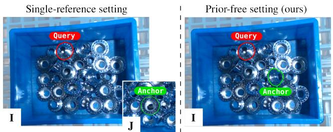  
Figure 1. We explore the novel task of prior-free relative 6D pose estimation (right). Given an image I containing multiple instances of the same object, we estimate the 6D pose of a query instance (•) relative to an anchor instance (•). Unlike previous methods that require an external reference image J to specify the anchor (left), we select the anchor directly within the input image I (right). This removes the need for prior references, reducing setup time to zero and enabling practical deployment in real-world settings.

This assumption can limit robotic applications where new objects must be introduced with minimal setup. For example, in high-mix low-volume manipulation, a robot may encounter a large variety of previously unseen objects while processing only a small number of each [7, 17, 19]: CAD models may be costly or not possible to obtain for every object, while collecting dedicated reference observations introduces an additional object-onboarding stage. Even when a single reference image is available, differences in viewpoint, occlusion, or visible surface area can limit the overlap between the reference image and the object observed during operation. This led us to formulate the research question: How can we formulate object 6D pose estimation without any externally provided object reference at all?

We address this question by introducing the novel problem formulation of prior-free relative 6D pose estimation of multiple object instances, considering a single RGBD observation containing multiple instances of the same unknown rigid object, with neither its CAD model nor any additional reference image assumed available. We exploit a simple observation: when several instances of the same object are simultaneously visible, the instances themselves can serve as mutual references. One instance can be selected as an anchor pose, and the poses of the remaining instances can be estimated relative to it (Fig. 1). This setting removes object-specific acquisition before deployment while naturally matching scenarios such as industrial bin picking, where several instances of the same object coexist.

We formulate a novel training-free method (PROSE1) that combines semantic [30] and geometric [13] foundation features to establish correspondences between observed instances. Unlike conventional relative-pose pipelines that process an anchor-query pair independently [20, 25], PROSE further exploits the presence of multiple instances jointly, refining pairwise correspondences through cross-instance synchronization that enforces cycle consistency across all instances in the image. The resulting globally consistent correspondences are then used to estimate the relative 6D pose between any pair of instances through robust 3D registration.

We design a benchmark (PRENCH2) for prior-free relative 6D pose estimation constructed from the multi-instance BOP datasets IC-BIN [10], IC-MI [37], and XYZ-IBD [17]. PRENCH defines anchor-query relationships directly within each RGBD scene and enables evaluation across objects with substantially different appearance and geometric characteristics. No existing method operates under this assumption, hence we adapt to the proposed setting One2Any [25] and ConceptPose [20], two related state-of-the-art singlereference (relative) pose estimation approaches. Experiments on PRENCH show that PROSE consistently outperforms the adapted baselines across all three datasets. In particular, PROSE outperforms our baselines by +19.2, +19.5, and +19.7 average recall on IC-BIN, IC-MI, and XYZ-IBD, respectively. Compared with the best baseline for each dataset, it also reduces rotation and translation errors by 9.2–36.0 degrees and 7.7–15.3 mm, respectively.

In summary, our contributions are:

• We present the novel task of prior-free relative 6D pose estimation, in which only the presence of multiple instances of the same object within the same image can be exploited to guide pose estimation.

• We propose PROSE, the first training-free method for this task, which explicitly leverages cycle consistency across multiple instances for accurate relative pose estimation.

• We introduce PRENCH, the first benchmark for prior-free relative 6D pose estimation, and establish strong baselines by adapting state-of-the-art single-image methods to the proposed setting.

## 2. Related works

Model-based methods Model-based methods require a 3D CAD model of the target object and generally follow either feature-matching or template-matching paradigms [5, 24]. They may be training-based, generalizing through largescale training on diverse objects, or training-free, relying on frozen foundation or hand-crafted features. Among featurematching approaches, FreeZe [4] fuses DINOv2 and GeDi descriptors for correspondence-based 3D registration, SAM-6D [23] combines proposal selection with learned dense 3D– 3D matching, and ZeroPose [6] uses CAD-derived visual and geometric embeddings within a discovery–orientation– registration pipeline. Template-based approaches compare observation with rendered CAD views. MegaPose [21] learns to score and refine rendered pose hypotheses, while GigaPose [29] combines template retrieval with patch correspondences. FoundationPose [38] provides a learned framework for both model-based and model-free pose estimation. Despite their generalization to unseen objects, these methods still require an object-specific CAD model, whereas PROSE estimates poses directly from co-visible instances.

Model-free multi-view methods remove the need for a CAD model but require a video or multiple reference images of the target object. They broadly follow featurematching or template-matching paradigms [24]. Featurematching methods establish 2D–3D correspondences using a reconstructed object representation or directly match features across the reference and query images. OnePose and OnePose++ [14, 36] reconstruct a 3D point model from reference views and match it to the query image using learned correspondences. Template-matching methods compare the query with available reference views or templates rendered from a reconstructed representation. Gen6D [26] retrieves reference views in a learned feature space and subsequently refines the predicted pose. LatentFusion [32] aggregates multiple observations into an implicit latent 3D representation used for pose estimation. Although these methods eliminate the need for a CAD model, they still require object-specific reference views. PROSE uses co-visible instances from a single RGBD observation as mutual references and jointly refines their correspondences through cycle consistency.

Model-free single-view methods (also referred to as relative pose estimation methods) leverage information from a single reference image to estimate the pose of a query image relative to it. These methods generally learn feature matching between two images to estimate the relative pose. POPE [11] is a training-free method and performs 6D pose estimation by leveraging DINOv2 features to directly perform feature matching between reference and query images. H-/Oryon [8, 9] are training-based methods that fuse DINO features with object-name text embeddings to perform segmentation and improve feature matching. NOPE [28] directly learns to predict discriminative viewpoint embeddings that enable the relative pose of an object to be inferred in new images. One2Any [25] encodes a reference RGBD image into a pose-aware embedding that captures object geometry and appearance from a single view and decodes this representation to predict dense object-coordinate correspondences in the query image. ConceptPose [20] is a training-free method that leverages the explainability of vision–language models (VLMs) and enhances the extracted features using semantic concepts. PROSE does not require additional views to serve as an anchor, as the anchor is defined as one of the object instances present in the query image.

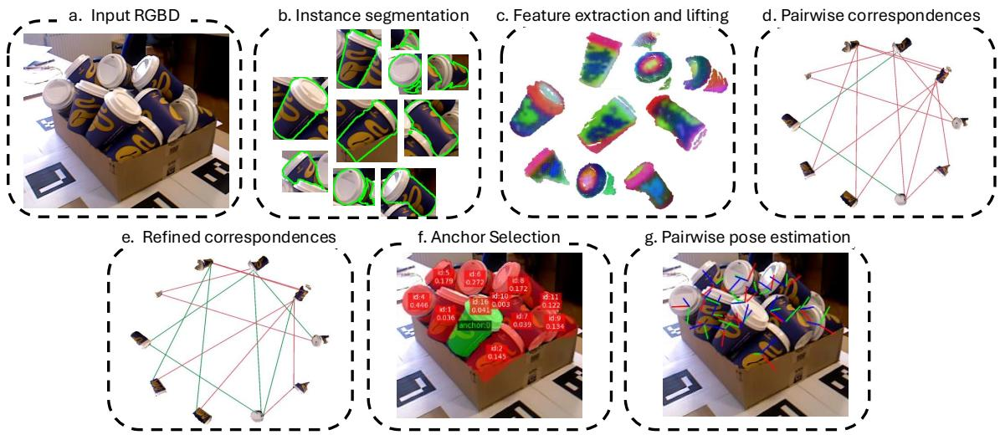  
Figure 2. Overview of PROSE. Given an RGBD image containing multiple instances of the same object, our goal is to estimate their relative 6D poses without requiring any prior reference. (a) An RGBD image is provided as input. (b) Each instance is segmented. (c) For each segmented instance, semantic and geometric features are extracted and fused after lifting the observations to 3D. (d) Initial pairwise correspondences are established via nearest-neighbor search in the feature space. (e) These correspondences are refined by enforcing cycle consistency across any instance tuples. (f) One instance is selected as the reference according to a predefined criterion (e.g., maximum visibility). (g) Finally, relative poses between this reference and all other instances are estimated using RANSAC-based 3D registration

## 3. PROSE

## 3.1. Overview

PROSE consists of three steps, illustrated in Fig. 2. Firstly, point-level features are extracted from the object instances using frozen foundation encoders and are fused together to obtain multimodal representations. Secondly, reliable correspondences between point cloud pairs are estimated by solving a feature-based synchronization problem that enforces cycle consistency across tuples of instances. Lastly, relative 6D poses between each pair of instances are computed by solving a RANSAC-based 3D registration problem.

## 3.2. Problem formulation

We consider an RGBD image $\mathbf { I } \in [ 0 , 2 5 5 ] ^ { H \times W \times 4 }$ containing $N \ \geq \ 2$ instances $\{ \mathcal { O } _ { i } , i ~ = ~ 1 , \ldots , N \}$ of the same rigid object ${ \mathcal { O } } _ { : }$ , and assume that the intrinsic parameters $\mathbf { K } \in \mathbb { R } ^ { 3 \times 3 }$ of the sensor are known. For each instance $\mathcal { O } _ { i }$ we define $\mathbf { Y } _ { i } \in \mathbb { R } ^ { V _ { i } \times 2 }$ as the set of its visible pixels in I, and $\mathbf { X } _ { i } \in \mathbb { R } ^ { V _ { i } \times 3 }$ as the point cloud obtained by lifting $\mathbf { Y } _ { i }$ into 3D using K and depth measurements. Our goal is to estimate, for every pair $i \neq j$ , the relative rigid transformation $\mathbf { T } _ { i , j } = ( \mathbf { R } _ { i , j } \in S O ( 3 ) , \mathbf { t } _ { i , j } \in \mathbb { R } ^ { 3 } )$ that best aligns $\mathbf { X } _ { i }$ and $\mathbf { X } _ { j } ,$ without using the 3D model of $\mathcal { O }$ or any other image as a reference. We denote by $\mathbf { T } _ { i , j } ^ { \mathrm { g t } }$ the ground-truth pose.

## 3.3. Multimodal feature extraction

For each object instance $\mathcal { O } _ { i }$ , we extract complementary appearance- and geometry-aware features and fuse them into a unified multimodal representation. Specifically, we compute appearance-aware features by applying the visual encoder $\Phi _ { \Theta }$ to the image crop associated with $\mathcal { O } _ { i }$ to obtain $\mathbf { A } _ { i } = \Phi _ { \Theta } ( \mathbf { Y } _ { i } ) \in \mathbb { R } ^ { \bar { V _ { i } } \times A }$ , where $V _ { i }$ denotes the number of visible pixels and A is the dimensionality of the appearance feature space. In parallel, we encode the corresponding point cloud $\mathbf { X } _ { i }$ using the 3D encoder $\Psi _ { \Omega }$ to obtain geometryaware features $\mathbf { G } _ { i } \overset { \cdot } { = } \Psi _ { \Omega } ( \mathbf { X } _ { i } ) \in \mathbb { R } ^ { V _ { i } \times G }$ , where $G$ denotes the dimensionality of the geometry feature space. The two modalities are subsequently fused by concatenating their features along the channel dimension, yielding the multimodal representation $\mathbf { F } _ { i } = [ \mathbf { A } _ { i } \ | \ \mathbf { G } _ { i } ] \in \mathbb { R } ^ { V _ { i } \times ( A + G ) }$ that jointly captures the visual appearance and 3D geometric structure of each object instance. Finally, we perform row-wise L2 normalization on $\mathbf { F } _ { i }$ to get the final features $\tilde { \mathbf { F } } _ { i }$

## 3.4. Coarse correspondence estimation

For each pair $\mathbf { X } _ { i } \in \mathbb { R } ^ { V _ { i } \times 3 } , \mathbf { X } _ { j } \in \mathbb { R } ^ { V _ { j } \times 3 }$ , we estimate a similarity map $\mathbf { S } _ { i , j } \in [ 0 , 1 ] ^ { V _ { i } \times V _ { j } }$ by computing the cosine similarity between the corresponding point features $\tilde { \mathbf { F } } _ { i } , \tilde { \mathbf { F } } _ { j } , i . e .$ $\mathbf { S } _ { i , j } = \tilde { \mathbf { F } } _ { i } \tilde { \mathbf { F } } _ { j } ^ { T } . \mathbf { S } _ { i , j }$ can be interpreted as a soft correspondence map, from which we derive a discrete correspondence map $\Pi _ { i , j } ^ { 0 } \stackrel { * } { \in } \{ 0 , 1 \} ^ { V _ { i } \times V _ { j } }$ by replacing each non-empty row of $\mathbf { S } _ { i , j }$ with a one-hot vector at its maximum. The resulting map $\Pi _ { i , j } ^ { 0 }$ provides an initial set of coarse correspondences between the two object instances.

## 3.5. Cross-instance correspondence refinement

Intuition. The coarse correspondences $\Pi _ { i , j } ^ { 0 }$ are estimated independently for each pair of instances ${ \bf X } _ { i } , { \bf X } _ { j }$ , and may contain outliers when the corresponding features $\tilde { \mathbf { F } } _ { i } , \tilde { \mathbf { F } } _ { j }$ are not discriminative enough. However, since all object instances depict the same rigid object, we can leverage correspondences between $\mathbf { X } _ { i } , \mathbf { X } _ { j }$ and other instances to refine $\Pi _ { i , j } ^ { 0 ^ { - } }$ and filter out potential outliers. Fig. 3 shows an example involving three instances $\mathbf { X } _ { i } , \mathbf { X } _ { j } , \mathbf { X } _ { k }$ . Ideally, the direct correspondence from X to $\mathbf { X } _ { j }$ should be consistent with the correspondence obtained by routing through $\mathbf { X } _ { k } , i . e .$

$$
\mathbf { C } _ { i , j } = \mathbf { C } _ { i , k } \mathbf { C } _ { k , j } .\tag{1}
$$

This property is called cycle consistency, and is illustrated in Fig. 3(a). Correspondences for which cycle consistency does not hold are considered outliers. The deviation from the cycle consistency [18, 31], i.e.

$$
\| { \bf C } _ { i , j } - { \bf C } _ { i , k } { \bf C } _ { k , j } \| _ { F } ,\tag{2}
$$

where $\left\| \cdot \right\| _ { F }$ denotes the Frobenius norm, is referred to as the closure gap and illustrated by the red segment in Fig. 3(b). Our intuition is that coarse correspondences can be refined by minimizing the closure gap in Eq. 2 across any tuple of instances. Since multiple instances induce many overlapping cycles, enforcing this constraint jointly provides redundancy that suppresses isolated matching errors and produces a globally consistent set of correspondences.

Optimization problem. Let $\begin{array} { r } { V = \sum _ { i = 1 } ^ { N } V _ { i } } \end{array}$ and $\mathbf { C } \in \mathbb { R } ^ { V \times V }$ denote the block-wise correspondence matrix obtained by stacking the pairwise correspondence matrices, i.e.

$$
\mathbf { C } = \left[ \begin{array} { c c c c } { \mathbf { I } _ { 1 } } & { \mathbf { C } _ { 1 , 2 } } & { . . . } & { \mathbf { C } _ { 1 , N } } \\ { \mathbf { C } _ { 2 , 1 } } & { \mathbf { I } _ { 2 } } & { . . . } & { \mathbf { C } _ { 2 , N } } \\ { \mathbf { C } _ { N , 1 } } & { \mathbf { C } _ { N , 2 } } & { . . . } & { \mathbf { I } _ { N } } \end{array} \right] ,\tag{3}
$$

where $\mathbf { I } _ { i } \in \mathbb { R } ^ { V _ { i } \times V _ { i } }$ is the identity matrix. To enforce cycle consistency across all instances, one could minimize Eq. (2)

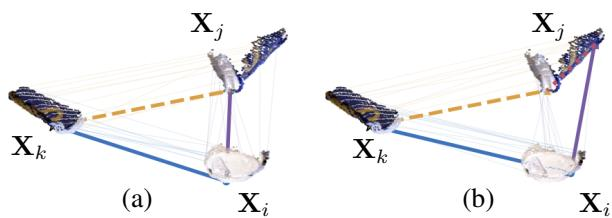  
Figure 3. Correspondences across three instances $\mathbf { X } _ { i } , \mathbf { X } _ { j } , \mathbf { X } _ { k }$ of an IC-BIN coffee cup. (a) A consistent triplet: the purple, blue, and yellow correspondences satisfy cycle consistency, as composing the blue and yellow correspondences recovers the direct purple correspondence. (b) An inconsistent triplet: routing through $\mathbf { X } _ { k }$ (blue + yellow) diverges from the direct correspondence (purple), producing the closure gap shown in red.

over all triplets of instances. However, this results in a combinatorial optimization problem that is NP-hard when the correspondence matrices are constrained to discrete assignments [1, 31, 35]. Instead, we exploit an equivalent characterization: a family of pairwise maps is cycle-consistent if and only if it factors through a common set of W latent object points [18, 31, 42], i.e. there exist assignment matrices $\mathbf { \bar { U } } _ { i } \stackrel { \cdot } { \in } \{ 0 , 1 \} ^ { V _ { i } \times W } , \mathbf { U } _ { j } \in \{ 0 , 1 \} ^ { V _ { j } \times W }$ with $\mathbf { C } _ { i , j } = \mathbf { U } _ { i } \mathbf { U } _ { j } ^ { \top }$ Equivalently, $\mathbf { C } = \mathbf { U } \mathbf { U } ^ { \top }$ with $\mathbf { U } = [ \mathbf { U } _ { 1 } ^ { \top } , \ldots , \mathbf { U } _ { N } ^ { \top } ] ^ { \top }$ , so that C is positive semidefinite and $\mathrm { r a n k } ( \mathbf { C } ) \le V ^ { \prime }$ . Cycle consistency is thus equivalent to a low-rank constraint on C. By using nuclear norm as the convex relaxation of the hard constraint on the rank [12, 34, 42], we estimate C as the solution of the synchronization problem [18, 42]

$$
\begin{array} { r l } & { \underset { \mathbf { C } } { \operatorname* { m i n } } - \left. \mathbf { S } , \mathbf { C } \right. + \alpha \left\| \mathbf { C } \right\| _ { 1 } + \lambda \left\| \mathbf { C } \right\| _ { * } } \\ & { \quad \mathrm { s . t . } \quad \mathbf { 0 } \leq \mathbf { C } \leq \mathbf { 1 } , \ \mathbf { C } = \mathbf { C } ^ { \top } . } \end{array}\tag{4}
$$

where

$$
\mathbf { S } = \left[ \begin{array} { c c c c } { \mathbf { 0 } _ { 1 } } & { \mathbf { S } _ { 1 , 2 } } & { \ldots } & { \mathbf { S } _ { 1 , N } } \\ { \mathbf { S } _ { 2 , 1 } } & { \mathbf { 0 } _ { 2 } } & { \ldots } & { \mathbf { S } _ { 2 , N } } \\ { \mathbf { S } _ { N , 1 } } & { \mathbf { S } _ { N , 2 } } & { \ldots } & { \mathbf { 0 } _ { N } } \end{array} \right] ,\tag{5}
$$

$\langle { \bf S } , { \bf C } \rangle _ { F } = \mathrm { T r } ( { \bf S } ^ { \top } { \bf C } )$ is the Frobenius inner product, Tr is the trace operator, $\begin{array} { r } { \| \mathbf { C } \| _ { 1 } = \sum _ { a , b } \left| C _ { a b } \right| } \end{array}$ is the entry-wise $\ell _ { 1 }$ norm, $\begin{array} { r } { \| \mathbf { C } \| _ { * } = \sum _ { r } \sigma _ { r } ( \mathbf { C } ) } \end{array}$ is the nuclear norm (i.e., the sum of the singular values of C). The data term $- \langle \mathbf { S } , \mathbf { C } \rangle$ rewards assigning correspondence weight to point pairs with high feature similarity, and it is balanced against two regularizers weighted by the hyperparameters $\alpha , \lambda \in \mathbb { R } _ { > 0 } ;$ the term α $_ { \langle \| \mathbf { C } \| }$ 1 promotes sparse correspondences that approximate a (partial) permutation matrix, assigning each point to a single match, while $\lambda \| \mathbf C \| ,$ ∗ promotes the low-rank structure that enforces cycle consistency.

Let $\mathbf { C } ^ { * } \in [ \dot { 0 } , 1 ] ^ { V \times V }$ be the solution of the optimization problem (4). We derive a discrete correspondence map Π ∈ $\{ 0 , 1 \} ^ { V \times V }$ by replacing each non-empty row of $\mathbf { C } ^ { * }$ with a one-hot vector at its maximum. The final map Π provides the set of refined correspondences between any object instances.

Algorithm. Solving Eq. (4) directly is infeasible for two reasons. First, it requires computing the nuclear norm (and hence the SVD of a $V \times V$ matrix) at every iteration. To avoid this, we use the variational nuclear norm $\left[ 3 , 4 2 \right] \left\| \mathbf { C } \right\| _ { * } =$ min $\mathbf { \sigma } _ { \mathbf { C } = \mathbf { A B } ^ { \top } } \frac { 1 } { 2 } ( \| \mathbf { A } \| _ { F } ^ { 2 } + \| \mathbf { B } \| _ { F } ^ { 2 } )$ and factorize $\mathbf { C } = \mathbf { A } \mathbf { B } ^ { \top }$ with $\mathbf { A } , \mathbf { B } \in \mathbb { R } ^ { V \times r }$ , turning the penalty into a Frobenius regularization on the factors.

Second, solving Eq. (4) at full point cloud resolution is intractable, since C is $V \times V$ with $V = \textstyle \sum _ { i } V _ { i }$ in the tens of thousands. We therefore subsample each instance to $W =$ 400 points by farthest point sampling [33] $( V = N W )$ , and keep S sparse, filling only the nearest-neighbor matches between sampled points, weighted by cosine similarity and normalized to [0, 1].

## 3.6. Relative 6D pose estimation

Given the refined correspondences $\Pi _ { i , j }$ between $\mathbf { X } _ { i }$ and $\mathbf { X } _ { j }$ , we estimate their relative 6D pose $\mathbf { T } _ { i , j } \in S E ( 3 )$ via RANSAC-based 3D registration. RANSAC is an iterative algorithm. At each iteration $h ,$ , it randomly samples a subset of three correspondences from $\mathbf { C } _ { i , j }$ and estimates the associated rigid transformation $\mathbf { T } _ { i , j } ^ { h } \in S E ( 3 )$ in closed form via singular value decomposition (SVD). Each hypothesis $\mathbf { T } _ { i , j } ^ { h }$ is scored by the number of inlier correspondences, $i . e . ,$ correspondences for which $\| \mathbf { T } _ { i , j } ^ { h } \mathbf { X } _ { i } - \mathbf { X } _ { j } \| _ { F } < D _ { \mathrm { R } }$ ANSAC, where $D _ { \mathrm { R A N S A C } }$ is a distance threshold hyperparameter. This sampling loop is repeated for a fixed number of iterations $I _ { \mathrm { R A N S A C } }$ , after which the highest-scoring hypothesis is retained as the final transformation $\mathbf { T } _ { i , j }$ . This procedure provides robustness to potential residual outliers in $\Pi _ { i , j }$

## 4. PRENCH

PRENCH is designed for assessing the performance of priorfree relative 6D pose estimation methods. PRENCH is built upon data from three multi-instance BOP datasets, namely IC-BIN [10], IC-MI [37], and XYZ-IBD [17], and augments their original absolute 6D pose annotations with novel metadata tailored to the proposed prior-free relative pose estimation task. In particular, we define a reference object instance, or anchor, as the instance with the highest visibility for each image. We also categorize the remaining instances into easy, medium, and hard cases according to their spatial overlap with the anchor, measured as intersection-over-union between the object 3D model and the partial instance observed in the image. PRENCH comprises 1166 RGBD and grayscale-D images acquired with five different sensors: an Intel RealSense D415 stereo camera, a Photoneo PhoXi M 3D scanner, an XYZ Robotics AL-M DLP structured-light camera, a PrimeSense short-range RGBD sensor, and an Ensenso N20-1202-16-BL stereo camera. This sensor diversity allows us to assess the robustness of relative pose estimation methods across substantially different sensing modalities and acquisition conditions. PRENCH covers 21 distinct objects, ranging from everyday objects, such as coffee cups, juice boxes, and shampoo bottles, to industrial objects, including gears, wheels, and brackets. While everyday objects often exhibit rich textures that can provide useful cues for resolving 6D pose ambiguities, industrial items frequently exhibit less informative appearances, such as uniform plastic or metallic surfaces, together with complex geometries. This diversity provides a challenging testbed for assessing the generalization of relative pose estimation methods across both appearance and geometry. The benchmark evaluates the anchor-to-instance relative pose estimation accuracy using average recall (AR) [16] (the mean of ARVSD, ARMSSD, and ARMSPD), ADD(S) [15, 39], as well as rotation and translation errors (RE, TE). In addition to reporting overall performance, PRENCH enables analysis across difficulty levels, object categories, and sensing conditions, providing a more detailed characterization of the strengths and limitations of prior-free relative 6D pose estimation approaches. PRENCH will be publicly released upon acceptance.

## 5. Experiments

## 5.1. Implementation details

We use DINOv2-small [30] as vision encoder $\Phi _ { \Theta }$ with $A = 3 8 4 \cdot$ -dimensional features and dGeDi [13] as geometric encoder $\Psi _ { \Omega }$ with G = 64-dimensional features. The resulting fused feature has dimension $F = A + G = 4 4 8$ after concatenation. Eq. (4)’s regularization parameters are set to $\lambda = 5 0$ and $\alpha = 0 . 2$ . We use the ADMM [2] alternating least-squares optimizer, initializing C as S and running for a maximum of 40 iterations. We estimate the rigid transformation between two object instances using the correspondencebased RANSAC implementation provided by Open3D [41], and set $D _ { \mathrm { R A N S A C } } = 5$ mm and $I _ { \mathrm { R A N S A C } } = 1 0 0 \mathrm { k \Omega }$

## 5.2. Comparison procedure

We identified One2Any [25] and ConceptPose [20] as the closest methods to our setting, as both estimate relative 6D pose from an external reference image depicting the object of interest. We adapt both methods to our setting by constructing their required reference image directly from the input image, rather than relying on an externally provided one. Following their evaluation procedure, we use ground-truth instance masks to crop objects. We crop the input image around the object instance identified as the anchor, and use this crop as the reference image. All other instances are cropped accordingly and used to estimate the pose of the object within. This adaptation preserves the reference-based formulation of both methods while removing dependence on a separately supplied reference view, allowing them to be evaluated within our prior-free setting.

## 5.3. Quantitative results

We evaluate PROSE’s performance on the PRENCH benchmark and compare it against the results obtained with the revised One2Any and ConceptPose baselines. Tab. 1 shows the results on the IC-BIN [10], IC-MI [37], and XYZ-IBD [17] datasets in terms of AR, ADD(S), RE, and TE. All metrics consider as valid also symmetric ground-truth poses generated using the object symmetries provided by the original BOP datasets metadata. The datasets considered pose different challenges: IC-BIN and IC-MI contain everyday objects, while XYZ-IBD contains industrial objects. IC-BIN and XYZ-IBD contain several object instances randomly displaced in a bin with no other objects present, making selfocclusion the main challenge. In contrast, IC-MI contains far fewer instances (three on average), but these are randomly positioned on a table where other objects and clutter act as distractors. PROSE outperforms both competitors across all three datasets by a significant margin on all metrics. AR improves by about 20 points across all datasets, despite being a very strict metric (entries on the BOP public leaderboard typically differ only by decimal variations in AR). ADD(S) has a similar improvement of +22 points in IC-BIN and XYZ-IBD, with a more modest improvement on IC-MI. Rotation estimation is, on average, 9.2–36.0 degrees more accurate, while translation estimation improves by 7.7–15.3 mm. The improvement is largest in the more challenging setting provided by XYZ-IBD, with real-world industrial scenes and metallic mechanical components. There is no clear ranking among the competitors: One2Any typically yields lower rotation and translation errors, while ConceptPose achieves better AR and ADD(S) on average.

Table 1. Quantitative results on PRENCH. AR and ADD(S) are the higher the better (↑). RE and TE are the lower the better (↓) and are measured in degrees and millimeters, respectively. Bold denotes the best performance. Results of our method are highlighted . Row 4 shows our improvement over the second best method.
<table><tr><td rowspan="2" colspan="2">Method</td><td colspan="4">IC-BIN</td><td colspan="4">IC-MI</td><td colspan="4">XYZ-IBD</td></tr><tr><td>AR↑</td><td>ADD(S) ↑</td><td>RE↓</td><td>TE↓</td><td>AR↑</td><td>ADD(S) ↑</td><td>RE↓</td><td>TE↓</td><td>AR↑</td><td>ADD(S)↑</td><td>RE↓ TE↓</td></tr><tr><td>1</td><td>One2Any [25]</td><td>17.7</td><td>61.0</td><td>70.5</td><td>26.9</td><td>47.7</td><td>98.0</td><td>47.2</td><td>12.3</td><td>9.2</td><td>49.2</td><td>85.0 33.2</td></tr><tr><td>2</td><td>ConceptPose [20]</td><td>18.8</td><td>58.8</td><td>76.2</td><td>36.6</td><td>50.8</td><td>80.2</td><td>51.1 29.1</td><td>36.1</td><td>70.1</td><td>64.6</td><td>24.4</td></tr><tr><td>3</td><td>PROSE (ours)</td><td>38.0</td><td>83.3</td><td>61.3</td><td>16.8</td><td>70.3</td><td>100 30.4</td><td>4.6</td><td>55.8</td><td>92.1</td><td>28.6</td><td>9.1</td></tr><tr><td>4</td><td>Improvement</td><td>+19.2</td><td>+22.3</td><td>-9.2</td><td>-10.1</td><td>+19.5</td><td>+2.0</td><td>-16.8 -7.7</td><td>+19.7</td><td>+22.0</td><td>-36.0</td><td>-15.3</td></tr></table>

## 5.4. Qualitative results

Fig. 4 shows some qualitative results on PRENCH. Rows show different scenes: IC-BIN coffee cups (row 1) and juice boxes (row 2), and XYZ-IBD metallic gears (row 3) and brackets (row 4). The left-most column shows the input images, while the remaining ones compare the predictions of PROSE (column 2), One2Any (column 3), and Concept-Pose (column 4). Green borders denote the ground-truth 6D poses, while red borders show each method’s predictions. The degree of alignment between the two colored borders indicates pose accuracy: PROSE is significantly more accurate than its competitors. In the IC-BIN scenes (rows 1–2), self-occlusion among densely packed cups and boxes often causes One2Any and ConceptPose to predict wrong poses, while PROSE’s cross-instance refinement can recover correct correspondences, thus producing correct pose estimates. In the XYZ-IBD scenes (rows 3–4), textureless metallic gears and brackets provide little appearance signal, and both baselines produce scattered, inaccurate predictions, while PROSE instead remains accurate. In the IC-MI scene (row 5), similarly to the two previous cases, objects have little texture information, and we can see how PROSE can still correctly pose the objects, unlike One2Any and ConceptPose.

## 5.5. Ablation study

Tab. 2 evaluates a variation of our pipeline in which we deactivate the cross-instance synchronization module and directly perform RANSAC-based relative pose estimation from the multimodal foundation features (i.e., the input to the pose estimation module is Π0 instead of Π). This ablation uses full point clouds, and results are reported in terms of AR. Row 1 reports results using only DINOv2 [30] visual features aware of both textures and semantics, row 2 using only dGeDi [13] geometric features, and row 3 when using their concatenation. The two datasets exhibit complementary characteristics: visual features shine on IC-BIN, which contains everyday objects that are generally rich in texture, whereas geometric features shine on XYZ-IBD, which consists of metallic industrial objects, where the object shapes are the primary cues to guide pose estimation. Combining DINOv2 and dGeDi features consistently improves the pose accuracy across the two datasets, highlighting the benefit of leveraging complementary semantic and geometric representations. These results outperform those obtained by One2Any [25] and ConceptPose [20] in Tab. 1, showing that frozen foundation features alone can already provide stronger performance than both a method supervised on 6D pose estimation-specific data (One2Any) and a VLM-based method (ConceptPose).

Tab. 3 evaluates the contribution of the synchronization module, which refines the coarse correspondences obtained from multimodal foundation features by imposing cycle consistency across object instances. We report the rotation and translation errors for each scene of XYZ-IBD before (left column) and after (central column) refinement, as well as the absolute improvement (right column). Row 16 shows the average rotation and translation errors across scenes (which

One2Any [25]

Input image

PROSE (ours)  
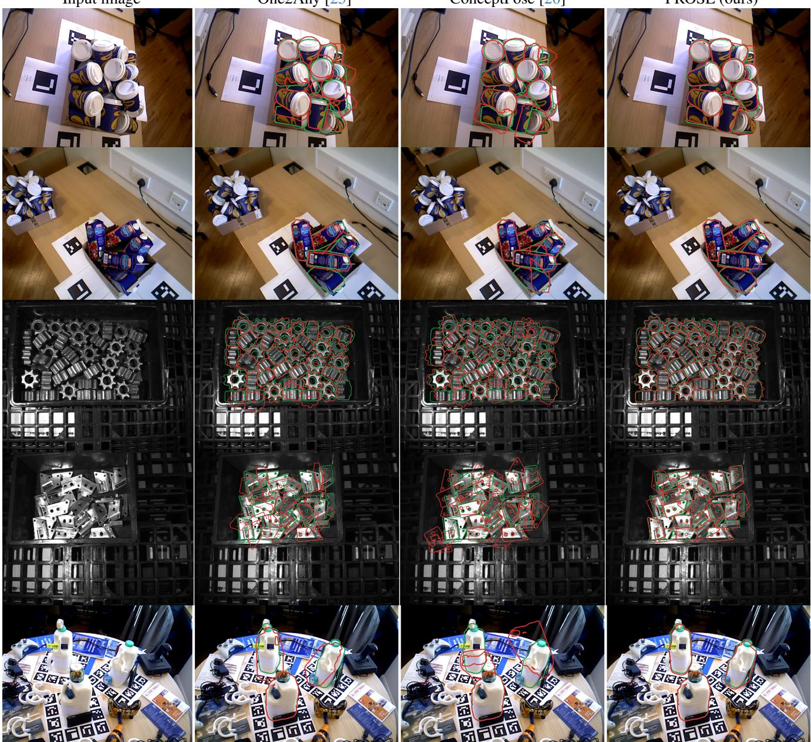  
Figure 4. Qualitative results on PRENCH. Each row shows a different scene. Green borders denote the ground-truth 6D poses, while red borders show each method’s predictions. Accurate poses show good alignment between the two colored borders. From top to bottom: IC-BIN coffee cups (row 1) and juice boxes (row 2), XYZ-IBD metallic gears (row 3) and brackets (row 4), and IC-MI milk bottles (row 5). Each column shows a different method. From left to right: the RGB channels of the input image (column 1), and the predictions of One2Any (column 2), ConceptPose (column 3), and PROSE (column 4). PROSE is more accurate than competitors.

differs from the average across instances reported in Tab. 1). PROSE predicts more accurate poses, both in rotation (-3.2 degrees on average) and translation (-1.8 mm on average) compared to the refinement-free baseline obtained by feeding the RANSAC-based relative pose estimation module with Π0 instead of Π. The gain is consistent throughout all scenes, and more pronounced for the more challenging scenes (rows 2, 9, and 13).

Fig. 5 shows an analysis for α and λ on XYZ-IBD (scenes with asymmetric objects) and we find that performance is largely insensitive to λ, with any α > 0 yielding a consistent ∼+2 point gain over the coarse correspondences. The sparsity weight α is key. $\mathrm { A t } \alpha = 0$ , the refinement is not effective, degrading the coarse baseline by 3.6 points at λ = 50. A small α already recovers the full benefit, forming a stable plateau across $\alpha \in [ 0 . 0 5 , 0 . 4 ]$ ; we adopt $\alpha = 0 . 2 , \lambda = 5 0$

Table 2. Contribution of the feature extraction module to final pose accuracy (AR) when no correspondence refinement is applied and pose estimation is performed on full point clouds, i.e., when $\Pi ^ { 0 }$ is fed to RANSAC-based pose estimation instead of Π. Our default setting is highlighted .
<table><tr><td></td><td>Features</td><td>IC-BIN</td><td>IC-MI</td><td>XYZ-IBD</td></tr><tr><td>1</td><td>Appearance only</td><td>36.2</td><td>69.8</td><td>36.3</td></tr><tr><td>2</td><td>Geometry only</td><td>30.7</td><td>59.5</td><td>46.8</td></tr><tr><td>3</td><td>Fused</td><td>37.8</td><td>71.8</td><td>48.5</td></tr></table>

Table 3. Contribution of the correspondence refinement module design to final pose accuracy on XYZ-IBD scenes before and after applying the refinement procedure, and measured in terms of RE and TE. Our default setting is highlighted . Imp. denotes the absolute improvement. Row 16 shows the average across scenes, which differs from the average across instances reported in Tab. 1.
<table><tr><td rowspan=2 colspan=1>Scene</td><td rowspan=2 colspan=1>RE (dBefore</td><td rowspan=1 colspan=2>egrees)↓</td><td rowspan=1 colspan=3>TE (mm) ↓</td></tr><tr><td rowspan=1 colspan=1>After</td><td rowspan=1 colspan=1>Imp.</td><td rowspan=1 colspan=1>Before</td><td rowspan=1 colspan=1>After</td><td rowspan=1 colspan=1>Imp.</td></tr><tr><td rowspan=1 colspan=1>1      0</td><td rowspan=1 colspan=1>6.8</td><td rowspan=1 colspan=1>5.8</td><td rowspan=1 colspan=1>-1.0</td><td rowspan=1 colspan=1>2.8</td><td rowspan=1 colspan=1>2.5</td><td rowspan=1 colspan=1>-0.3</td></tr><tr><td rowspan=1 colspan=1>2      5</td><td rowspan=1 colspan=1>51.8</td><td rowspan=1 colspan=1>43.2</td><td rowspan=1 colspan=1>-8.6</td><td rowspan=1 colspan=1>23.0</td><td rowspan=1 colspan=1>15.8</td><td rowspan=1 colspan=1>-7.2</td></tr><tr><td rowspan=1 colspan=1>3     10</td><td rowspan=1 colspan=1>9.0</td><td rowspan=1 colspan=1>8.1</td><td rowspan=1 colspan=1>-0.9</td><td rowspan=1 colspan=1>4.9</td><td rowspan=1 colspan=1>4.7</td><td rowspan=1 colspan=1>-0.2</td></tr><tr><td rowspan=1 colspan=1>4     15</td><td rowspan=1 colspan=1>22.0</td><td rowspan=1 colspan=1>19.4</td><td rowspan=1 colspan=1>-2.6</td><td rowspan=1 colspan=1>7.9</td><td rowspan=1 colspan=1>7.2</td><td rowspan=1 colspan=1>-0.7</td></tr><tr><td rowspan=1 colspan=1>5     20</td><td rowspan=1 colspan=1>24.3</td><td rowspan=1 colspan=1>22.3</td><td rowspan=1 colspan=1>-2.0</td><td rowspan=1 colspan=1>9.0</td><td rowspan=1 colspan=1>8.0</td><td rowspan=1 colspan=1>-1.0</td></tr><tr><td rowspan=1 colspan=1>6     25</td><td rowspan=1 colspan=1>12.5</td><td rowspan=1 colspan=1>6.7</td><td rowspan=1 colspan=1>-5.8</td><td rowspan=1 colspan=1>6.2</td><td rowspan=1 colspan=1>5.4</td><td rowspan=1 colspan=1>-0.8</td></tr><tr><td rowspan=1 colspan=1>7     30</td><td rowspan=1 colspan=1>36.8</td><td rowspan=1 colspan=1>33.4</td><td rowspan=1 colspan=1>-3.4</td><td rowspan=1 colspan=1>10.7</td><td rowspan=1 colspan=1>8.9</td><td rowspan=1 colspan=1>-1.8</td></tr><tr><td rowspan=1 colspan=1>8     35</td><td rowspan=1 colspan=1>3.8</td><td rowspan=1 colspan=1>3.6</td><td rowspan=1 colspan=1>-0.2</td><td rowspan=1 colspan=1>6.6</td><td rowspan=1 colspan=1>6.4</td><td rowspan=1 colspan=1>-0.4</td></tr><tr><td rowspan=1 colspan=1>9     40</td><td rowspan=1 colspan=1>19.3</td><td rowspan=1 colspan=1>12.0</td><td rowspan=1 colspan=1>-7.3</td><td rowspan=1 colspan=1>6.1</td><td rowspan=1 colspan=1>5.3</td><td rowspan=1 colspan=1>-0.8</td></tr><tr><td rowspan=1 colspan=1>10     45</td><td rowspan=1 colspan=1>69.9</td><td rowspan=1 colspan=1>69.9</td><td rowspan=1 colspan=1>0.0</td><td rowspan=1 colspan=1>10.7</td><td rowspan=1 colspan=1>10.5</td><td rowspan=1 colspan=1>-0.2</td></tr><tr><td rowspan=1 colspan=1>11     50</td><td rowspan=1 colspan=1>53.6</td><td rowspan=1 colspan=1>51.1</td><td rowspan=1 colspan=1>-2.5</td><td rowspan=1 colspan=1>16.3</td><td rowspan=1 colspan=1>15.0</td><td rowspan=1 colspan=1>-1.3</td></tr><tr><td rowspan=1 colspan=1>12     55</td><td rowspan=1 colspan=1>74.2</td><td rowspan=1 colspan=1>69.4</td><td rowspan=1 colspan=1>-4.8</td><td rowspan=1 colspan=1>32.8</td><td rowspan=1 colspan=1>24.5</td><td rowspan=1 colspan=1>-8.3</td></tr><tr><td rowspan=1 colspan=1>13     60</td><td rowspan=1 colspan=1>24.1</td><td rowspan=1 colspan=1>15.7</td><td rowspan=1 colspan=1>-8.4</td><td rowspan=1 colspan=1>12.7</td><td rowspan=1 colspan=1>10.6</td><td rowspan=1 colspan=1>-2.1</td></tr><tr><td rowspan=1 colspan=1>14     65</td><td rowspan=1 colspan=1>28.3</td><td rowspan=1 colspan=1>30.2</td><td rowspan=1 colspan=1>+1.9</td><td rowspan=1 colspan=1>23.0</td><td rowspan=1 colspan=1>21.9</td><td rowspan=1 colspan=1>-1.1</td></tr><tr><td rowspan=1 colspan=1>15     70</td><td rowspan=1 colspan=1>87.8</td><td rowspan=1 colspan=1>85.5</td><td rowspan=1 colspan=1>-2.3</td><td rowspan=1 colspan=1>13.7</td><td rowspan=1 colspan=1>12.6</td><td rowspan=1 colspan=1>-1.1</td></tr><tr><td rowspan=1 colspan=1>16    Avg</td><td rowspan=1 colspan=1>34.9</td><td rowspan=1 colspan=1>31.7</td><td rowspan=1 colspan=1>-3.2</td><td rowspan=1 colspan=2>12.4   10.6</td><td rowspan=1 colspan=1>-1.8</td></tr></table>

Fig. 6 shows the AR improvement of PROSE over the refinement-free baseline as a function of the number of object instances present in the input image. The resulting distribution shows a positive correlation (dashed black curve), indicating that the contribution of PROSE’s refinement stage increases as more object instances become available. A similar trend emerges when comparing the improvements on the other metrics, namely ADD(S), RE, and TE. The presence of many instances makes the relative pose estimation task more challenging, yet it is in this regime that our refinement stage proves most beneficial.

## 6. Conclusion

We presented the novel task of prior-free relative 6D pose estimation of multiple object instances. By eliminating the need to process externally provided object references (e.g., images, 3D models), our setting eliminates the overhead required by existing approaches, with practical applications in robotic manipulation. We also presented PROSE, the first training-free method specifically designed for this setting. PROSE explicitly exploits the complementary information available across multiple object instances present in the input image to refine the coarse correspondences estimated from multimodal foundation features. Then, we introduced PRENCH, the first benchmark for prior-free relative 6D pose estimation. PRENCH extends existing multi-instance BOP datasets [10, 17, 37] with task-specific metadata extracted from the original absolute 6D pose annotations, providing a standardized framework for evaluating methods in this setting. Experiments demonstrate that PROSE substantially outperforms state-of-the-art relative 6D pose estimation methods that rely on a single external reference image [20, 25], when adapted to fit our setting. PROSE assumes that instance masks and a predefined anchor are available. Although the refinement combines semantic and geometric features, it enforces feature and cycle consistency without explicitly considering the rigid geometric structure of correspondences. Future work can investigate automatic instance segmentation and geometry-aware synchronization that incorporates constraints such as pairwise-distance preservation to reject feature-consistent but geometrically incompatible correspondences.

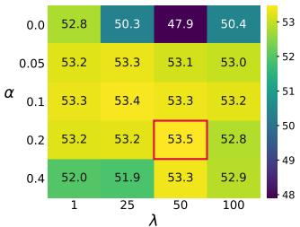

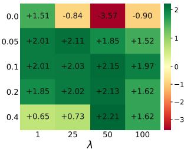  
Figure 5. Hyperparameter ablation of the refinement on XYZ-IBD. AR (%) after refinement (left; best α=0.2, λ=50 boxed) and the gain over the coarse baseline, ∆AR = after − before (right). Refinement is robust to λ but needs a non-zero sparsity weight α: α=0 can reverse the gain (−3.57 at λ=50), while any α>0 gives a consistent improvement of about 2 points.

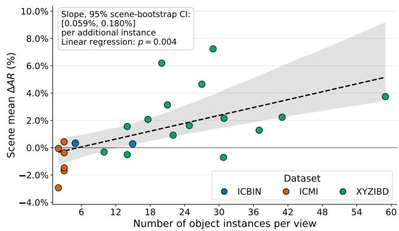  
Figure 6. Relative AR improvement over the refinement-free baseline (y-axis) as a function of the number of object instances (x-axis). The positive correlation indicates that the contribution of our refinement stage increases as more object instances become available.

## References

[1] Florian Bernard, Johan Thunberg, Paul Swoboda, and Christian Theobalt. Hippi: Higher-order projected power iterations for scalable multi-matching. In 2019 IEEE/CVF International Conference on Computer Vision (ICCV), pages 10283–10292. IEEE, 2019. 4

[2] Stephen Boyd, Neal Parikh, Eric Chu, Borja Peleato, and Jonathan Eckstein. Distributed optimization and statistical learning via the alternating direction method of multipliers. Foundations and Trends® in Machine learning, 3(1):1–122, 2011. 5

[3] Ricardo Cabral, Fernando De la Torre, Joao P Costeira, and˜ Alexandre Bernardino. Unifying nuclear norm and bilinear factorization approaches for low-rank matrix decomposition. In Proceedings of the IEEE international conference on computer vision, pages 2488–2495, 2013. 5

[4] Andrea Caraffa, Davide Boscaini, Amir Hamza, and Fabio Poiesi. FreeZe: Training-free zero-shot 6D pose estimation with geometric and vision foundation models. In ECCV, 2024. 1, 2

[5] Andrea Caraffa, Davide Boscaini, and Fabio Poiesi. Accurate and efficient zero-shot 6d pose estimation with frozen foundation models. arXiv preprint arXiv:2506.09784, 2025. 2

[6] Jianqiu Chen, Zikun Zhou, Mingshan Sun, Rui Zhao, Liwei Wu, Tianpeng Bao, and Zhenyu He. Zeropose: Cad-prompted zero-shot object 6d pose estimation in cluttered scenes. IEEE Transactions on Circuits and Systemsfor Video Technology, 35(2):1251–1264, 2024. 1, 2

[7] Jianqiu Chen, Zikun Zhou, Xin Li, Ye Zheng, Tianpeng Bao, and Zhenyu He. Zerobp: Learning position-aware correspondence for zero-shot 6d pose estimation in bin-picking. In ICRA, pages 12266–12272. IEEE, 2025. 1

[8] Jaime Corsetti, Davide Boscaini, Changjae Oh, Andrea Cavallaro, and Fabio Poiesi. Open-vocabulary object 6D pose estimation. In CVPR, 2024. 3

[9] Jaime Corsetti, Davide Boscaini, Francesco Giuliari, Changjae Oh, Andrea Cavallaro, and Fabio Poiesi. High-resolution open-vocabulary object 6D pose estimation. IEEE TPAMI, 2026. 3

[10] Andreas Doumanoglou, Rigas Kouskouridas, Sotiris Malassiotis, and Tae-Kyun Kim. Recovering 6D object pose and predicting next-best-view in the crowd. In CVPR, 2016. 2, 5, 6, 8, 11

[11] Zhiwen Fan, Panwang Pan, Peihao Wang, Yifan Jiang, Dejia Xu, and Zhangyang Wang. Pope: 6-dof promptable pose estimation of any object in any scene with one reference. In CVPR, 2024. 3

[12] Maryam Fazel, Haitham Hindi, and Stephen P Boyd. A rank minimization heuristic with application to minimum order system approximation. In Proceedings of the 2001 American control conference.(Cat. No. 01CH37148), pages 4734–4739. IEEE, 2001. 4

[13] Amir Hamza, Andrea Caraffa, Davide Boscaini, and Fabio Poiesi. Distilling 3D distinctive local descriptors for 6D pose estimation. In IROS, 2025. 2, 5, 6, 11

[14] Xingyi He, Jiaming Sun, Yuang Wang, Di Huang, Hujun Bao, and Xiaowei Zhou. OnePose++: Keypoint-free one-shot object pose estimation without CAD models. NeurIPS, 35, 2022. 2

[15] Stefan Hinterstoisser, Vincent Lepetit, Slobodan Ilic, Stefan Holzer, Gary Bradski, Kurt Konolige, and Nassir Navab. Model based training, detection and pose estimation of texture-less 3d objects in heavily cluttered scenes. In Asian conference on computer vision, pages 548–562. Springer, 2012. 5

[16] Toma´s Hodaˇ n, Martin Sundermeyer, Bertram Drost, Yannˇ Labbe, Eric Brachmann, Frank Michel, Carsten Rother, and´ Jiˇr´ı Matas. BOP challenge 2020 on 6D object localization. In ECCV, 2020. 5

[17] Junwen Huang, Jiaqi Hu, Peter KT Yu, Slobodan Ilic, Martin Sundermeyer, and Benjamin Busam. XYZ-IBD: Highprecision Bin-picking Dataset for Object 6D Pose Estimation Capturing Real-world Industrial Complexity. arXiv preprint arXiv:2506.00599, 2025. 1, 2, 5, 6, 8, 11

[18] Qi-Xing Huang and Leonidas Guibas. Consistent shape maps via semidefinite programming. In Computer graphicsforum, pages 177–186. Wiley Online Library, 2013. 4

[19] Kilian Kleeberger, Christian Landgraf, and Marco F Huber. Large-scale 6d object pose estimation dataset for industrial bin-picking. In IROS, pages 2573–2578. IEEE, 2019. 1

[20] Liming Kuang, Yordanka Velikova, Mahdi Saleh, Jan-Nico Zaech, Danda Pani Paudel, and Benjamin Busam. Concept-Pose: Training-Free Zero-Shot Object Pose Estimation using Concept Vectors. In CVPR, 2026. 1, 2, 3, 5, 6, 7, 8

[21] Yann Labbe, Lucas Manuelli, Arsalan Mousavian, Stephen´ Tyree, Stan Birchfield, Jonathan Tremblay, Justin Carpentier, Mathieu Aubry, Dieter Fox, and Josef Sivic. Megapose: 6d pose estimation of novel objects via render & compare. arXiv preprint arXiv:2212.06870, 2022. 1, 2

[22] Gaofeng Li, Ruize Wang, Peisen Xu, Qi Ye, and Jiming Chen. The developments and challenges toward dexterous and embodied robotic manipulation: A survey. IEEE Robotics & Automation Magazine, 2025. 1

[23] Jiehong Lin, Lihua Liu, Dekun Lu, and Kui Jia. SAM-6D: Segment anything model meets zero-shot 6D object pose estimation. In CVPR, 2024. 1, 2

[24] Jian Liu, Wei Sun, Hui Yang, Zhiwen Zeng, Chongpei Liu, Jin Zheng, Xingyu Liu, Hossein Rahmani, Nicu Sebe, and Ajmal Mian. Deep learning-based object pose estimation: A comprehensive survey: J. liu et al. International Journal of Computer Vision, 134(2):81, 2026. 1, 2

[25] Mengya Liu, Siyuan Li, Ajad Chhatkuli, Prune Truong, Luc Van Gool, and Federico Tombari. One2Any: One-Reference 6D Pose Estimation for Any Object. In CVPR, 2025. 1, 2, 3, 5, 6, 7, 8

[26] Yuan Liu, Yilin Wen, Sida Peng, Cheng Lin, Xiaoxiao Long, Taku Komura, and Wenping Wang. Gen6D: Generalizable model-free 6-dof object pose estimation from RGB images. In ECCV, 2022. 1, 2

[27] Mattia Nardon, Mikel Mujika Agirre, Ander Gonzalez Tom ´ e,´ Daniel Sedano Algarabel, Josep Rueda Collell, Ana Paola Caro, et al. CHIP: A multi-sensor dataset for 6D pose estimation of chairs in industrial settings. In BMVC, 2025. 1

[28] Van Nguyen Nguyen, Thibault Groueix, Georgy Ponimatkin, Yinlin Hu, Renaud Marlet, Mathieu Salzmann, and Vincent Lepetit. Nope: Novel object pose estimation from a single image. In CVPR, pages 17923–17932, 2024. 1, 3

[29] Van Nguyen Nguyen, Thibault Groueix, Mathieu Salzmann, and Vincent Lepetit. Gigapose: Fast and robust novel object pose estimation via one correspondence. In CVPR, pages 9903–9913, 2024. 1, 2

[30] Maxime Oquab, Timothee Darcet, Th´ eo Moutakanni, Huy Vo,´ Marc Szafraniec, Vasil Khalidov, Pierre Fernandez, Daniel Haziza, Francisco Massa, Alaaeldin El-Nouby, et al. DINOv2: Learning robust visual features without supervision. arXiv preprint arXiv:2304.07193, 2024. 2, 5, 6, 11

[31] Deepti Pachauri, Risi Kondor, and Vikas Singh. Solving the multi-way matching problem by permutation synchronization. Advances in neural information processing systems, 26, 2013. 4

[32] Keunhong Park, Arsalan Mousavian, Yu Xiang, and Dieter Fox. LatentFusion: End-to-end differentiable reconstruction and rendering for unseen object pose estimation. In CVPR, 2020. 1, 2

[33] Charles Ruizhongtai Qi, Li Yi, Hao Su, and Leonidas J Guibas. Pointnet++: Deep hierarchical feature learning on point sets in a metric space. Advances in neural information processing systems, 30, 2017. 5

[34] Benjamin Recht, Maryam Fazel, and Pablo A Parrilo. Guaranteed minimum-rank solutions of linear matrix equations via nuclear norm minimization. SIAM review, 52(3):471–501, 2010. 4

[35] Khurram Shafique and Mubarak Shah. A noniterative greedy algorithm for multiframe point correspondence. IEEE transactions on pattern analysis and machine intelligence, 27(1): 51–65, 2005. 4

[36] Jiaming Sun, Zihao Wang, Siyu Zhang, Xingyi He, Hongcheng Zhao, Guofeng Zhang, and Xiaowei Zhou. OnePose: One-shot object pose estimation without CAD models. In CVPR, 2022. 1, 2

[37] Alykhan Tejani, Danhang Tang, Rigas Kouskouridas, and Tae-Kyun Kim. Latent-class hough forests for 3D object detection and pose estimation. In ECCV, 2014. 2, 5, 6, 8, 11

[38] Bowen Wen, Wei Yang, Jan Kautz, and Stan Birchfield. FoundationPose: Unified 6D pose estimation and tracking of novel objects. In CVPR, 2024. 2

[39] Yu Xiang, Tanner Schmidt, Venkatraman Narayanan, and Dieter Fox. Posecnn: A convolutional neural network for 6d object pose estimation in cluttered scenes. arXiv preprint arXiv:1711.00199, 2017. 5

[40] Ying Zheng, Lei Yao, Yuejiao Su, Yi Zhang, Yi Wang, Sicheng Zhao, Yiyi Zhang, and Lap-Pui Chau. A survey of embodied learning for object-centric robotic manipulation. Machine Intelligence Research, 22(4):588–626, 2025. 1

[41] QY Zhou, J Park, and V Koltun. Open3d: A modern library for 3d data processing. arxiv 2018. arXiv preprint arXiv:1801.09847, 1801. 5

[42] Xiaowei Zhou, Menglong Zhu, and Kostas Daniilidis. Multiimage matching via fast alternating minimization. In Proceedings of the IEEE international conference on computer vision, pages 4032–4040, 2015. 4, 5

# Supplementary material

Prior-free relative 6D pose estimation of multiple object instances

## A. Overview

This supplementary material provides additional analyses, quantitative results, and qualitative visualizations that complement the experiments reported in the main paper. In Sec. B, we provide detailed statistics of the PRENCH benchmark, including the number of images, object instances, anchor-instance pairs, and objects in each dataset, as well as the distribution of instances per view and anchor-instance overlap. In Sec. C, we present extended ablation studies that further analyze the behavior of PROSE under different levels of anchor-instance overlap. We then investigate the effect of cycle consistency refinement on each scene. These experiments provide a more detailed view of the impact of global correspondence refinement via cycle-consistency in the accuracy of predicted poses. In Sec. D, we provide additional quantitative results for the correspondence refinement stage, including both per-scene and dataset-level comparisons before and after refinement. These results complement the evaluation in the main paper and further validate the effect of multi-instance reasoning across IC-BIN [10], IC-MI [37], and XYZ-IBD [17]. Finally, in Sec. E, we present additional qualitative results illustrating the behavior of the semantic (DINOv2 [30]), geometric (dGeDi [13]), and fused feature representations. We visualize both the learned feature representations and the resulting inlier correspondences across textured everyday objects and textureless industrial objects. We additionally visualize individual cycle-consistency refinement examples, including both successful and failure cases, to clarify how cycle-consistency refinement modifies the initial pairwise correspondences.

## B. Benchmark statistics

Fig. 7 and Tab. 4 summarize PRENCH. In total the benchmark comprises 1,166 images and 21,833 object instances across three datasets and 21 distinct objects, giving 20,667 anchor–instance pairs for evaluation. The datasets cover different number of per-view instances: XYZ-IBD averages 26.5 instances per view (up to 59), IC-BIN 9.8, and IC-MI only 2.7 (Fig. 7, top). This diversity is central to our analysis, as the cross-instance refinement exploits redundant correspondences; consistent with this, its benefit is largest on the dense XYZ-IBD scenes and negligible on the sparse IC-MI ones (cf. Fig. 9 and the per-scene analysis in Tab. 5). The datasets also differ in difficulty, quantified by the anchor–instance overlap, splitting instances into easy $\mathrm { ( I o U } > 0 . 6 )$ , medium $( 0 . 3 < \mathrm { I o U } < 0 . 6 )$ , and hard $( 0 < \mathrm { I o U } < 0 . 3 ) ( \mathrm { F i g . }$ 7, bottom). IC-BIN mainly contains low-overlap (hard) pairs., IC-MI contains medium range overlap, and XYZ-IBD is spread across the full range. Combined with a diverse object set (everyday textured objects in IC-BIN and IC-MI versus textureless, industrial parts in XYZ-IBD), PRENCH forms a broad evaluation setting that emphasizes relative pose estimation under both varying instance counts and varying degrees of overlap and occlusion.

## C. Extended ablation studies

Figure 8 decomposes average recall by anchor–instance overlap, splitting instances into easy $( \mathrm { I o U } > 0 . 6 )$ , medium $( 0 . 3 < \mathrm { I o U } < 0 . 6 )$ , and hard $( 0 < \mathrm { I o U } < 0 . 3 )$ . As expected, accuracy decreases with overlap for every method, since a smaller visible surface overlap yields fewer reliable correspondences. PROSE attains the highest AR in almost every bin across the three datasets, and its margin is largest in the easy and medium regimes, e.g., on XYZ-IBD it reaches 72.9%/48.8% (easy/medium) against 47.0%/25.0% for ConceptPose and 23.0%/10.0% for One2Any. The two baselines show no consistent ordering: ConceptPose is generally stronger on easy instances, while One2Any is more competitive on the hardest bins of IC-BIN and IC-MI. The only setting where PROSE is marginally surpassed is the hard split of IC-MI (37.8% vs. One2Any’s 42.0%), which comprises just 42 low-overlap instances. Overall, PROSE’s gains are not limited to easy cases but persist across the full difficulty spectrum, confirming its benefits in low-overlap scenarios.

Figure 9 reports the change in average recall produced by the refinement, $\Delta \mathrm { A R } = \mathrm { A R } _ { \mathrm { a f t e r } } - \mathrm { A R } _ { \mathrm { b e f o r e } }$ , for every scene of the three datasets (green: improved; red: worsened; dashed line: dataset mean). The effect is strongly datasetdependent and tracks the number of co-visible instances. On XYZ-IBD, whose bins contain many instances of the same industrial part, refinement improves 12 of 15 scenes for a mean gain of +2.4 AR, reaching up to +7 on the densest scenes. On IC-BIN the effect is essentially neutral (mean +0.4), whereas on IC-MI, whose scenes contain only about three instances on average, refinement is marginally detrimental (mean −1.0), since too few overlapping cycles are available for the synchronization to exploit. This confirms the trend in Fig. 5 of the main paper: enforcing cycle consistency becomes beneficial when enough mutual references co-occur, and its gain grows with the number of instances. Crucially, the many-instance regime is exactly the setting our method targets (bin-picking of numerous identical objects, as in XYZ-IBD), so the refinement contributes its largest improvements precisely where the task demands them.

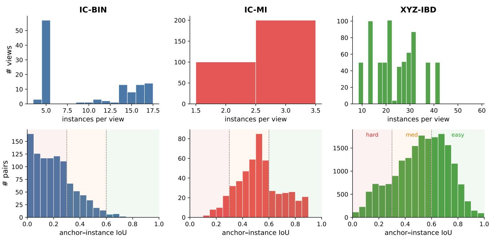  
Figure 7. Top row: number of instances per view for each dataset. Bottom row: distribution of anchor–instance IoU, with the easy/medium/hard difficulty bands shaded (thresholds at 0.3 and 0.6). XYZ-IBD and IC-BIN contain many instances per image (mean 26.5 and 9.8, up to 59 and 17), whereas IC-MI has only ∼3; correspondingly, IC-BIN is skewed toward low overlap (hard), IC-MI concentrates in the medium range, and XYZ-IBD spreads across all difficulties.

Table 4. PRENCH statistics across individual datasets (rows 1–3) and overall (row 4). Columns show, from left to right, the number of objects, the number of images, the number of object instances (with details about per-image average and maximum), and the number of anchor-instance pairs (with details about difficulty levels: easy for anchor-instance pairs with IoU>0.6, medium with $0 . 3 \leq \mathrm { I o U } \leq 0 . 6 .$ , and hard with IoU<0.3). ∗Two objects recur across IC-BIN and IC-MI, so the total number of distinct objects is 21 instead of 23.
<table><tr><td rowspan="2"></td><td rowspan="2">Dataset</td><td rowspan="2">#Obj</td><td rowspan="2">#Img</td><td colspan="3">#Instances</td><td colspan="4">#Pairs</td></tr><tr><td>Total</td><td>Avg</td><td>Max</td><td>Total</td><td>Easy</td><td>Medium</td><td>Hard</td></tr><tr><td>1</td><td>IC-BIN</td><td>2</td><td>116</td><td>1,134</td><td>9.8</td><td>17</td><td>1,018</td><td>15</td><td>230</td><td>757</td></tr><tr><td>2</td><td>IC-MI</td><td>6</td><td>300</td><td>800</td><td>2.7</td><td>3</td><td>500</td><td>140</td><td>318</td><td>42</td></tr><tr><td>3</td><td>XYZ-IBD</td><td>15</td><td>750</td><td>19,899</td><td>26.5</td><td>59</td><td>19,149</td><td>7,592</td><td>8,445</td><td>3,047</td></tr><tr><td>4</td><td>PRENCH</td><td>21*</td><td>1,166</td><td>21,833</td><td>13.0</td><td>59</td><td>20,667</td><td>7,747</td><td>8,993</td><td>3,846</td></tr></table>

## D. Additional quantitative results

Table 5 isolates the contribution of the refinement: for each scene we report the four metrics obtained when RANSAC is fed the initial nearest-neighbour correspondences (bef.) versus the refined ones (aft.), holding all other components fixed. On XYZ-IBD, refinement improves AR on 12 of the 15 scenes and reduces both rotation and translation error on almost all of them; the largest AR gains are +7.3 (scene 000005, 51.8◦ → 43.2◦ RE, 23.0 → 15.8 mm TE), +6.2 (000060, 24.1◦ → 15.7◦ RE) and +4.6 (000040, 19.3◦ → 12.0◦ RE). On the remaining three scenes (000035, 000045, 000065) AR changes by at most 0.8 points, i.e. refinement leaves them essentially unchanged. On IC-BIN the effect is small but positive (AR and RE improve on both scenes), while on IC-MI it is neutral to slightly negative: ADD-S is already saturated at 100% and the other metrics move by at most a few points (largest drop −2.9 AR on 000003). This dataset-level pattern is consistent with the per-scene ∆AR summary of Fig. 9 and the instance-count trend of Fig. 5: refinement helps most where many instances cooccur (XYZ-IBD) and little where only a few are available (IC-MI, ∼3 per scene). Overall, refinement never causes a large regression (worst per-scene AR drop 2.9 points) while yielding consistent gains in the many-instance regime that motivates our setting.

Table 6 reports the dataset-level effect of cycleconsistency refinement comparing the metrics obtained when RANSAC is fed the initial nearest-neighbour correspondences (before) versus the refined ones (after), with all other components held fixed. On XYZ-IBD refinement improves every metric: AR from 53.2 to 55.8 (+2.6 points), ADD-S from 90.6 to 92.1, rotation error from 32.1◦ to 28.6◦ (−3.5◦), and translation error from 10.6 to 9.1 mm (−1.5 mm), a substantial and consistent gain. On IC-BIN the effect is only marginal (AR +0.4, ADD-S +0.9, RE −0.3◦), with translation error slightly worse (+0.5 mm). On IC-MI refinement is marginally detrimental (AR −0.9, RE +0.1◦, TE +0.2 mm), while ADD-S is already saturated at 100%. This ordering (clear gains on XYZ-IBD, near-neutral on IC-BIN, slightly negative on IC-MI) matches the per-scene breakdown (Table 5, Fig. 9) and follows the instance-count trend of Fig. 5: synchronization exploits redundancy across co-visible instances, so its benefit scales with the number of instances per view (26.5 on XYZ-IBD versus 2.7 on IC-MI).

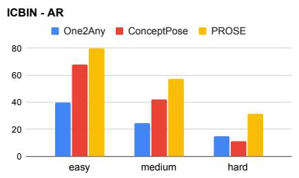

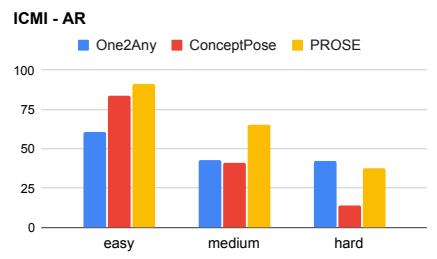

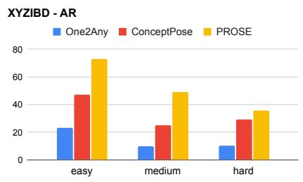  
Figure 8. Per-difficulty average recall of PROSE vs. the One2Any and ConceptPose baselines on IC-BIN, IC-MI, and XYZ-IBD, with instances split by anchor–instance overlap into easy $\mathrm { ( I o U } > 0 . 6 )$ , medium $( 0 . 3 < \mathrm { I o U } < 0 . 6 )$ , and hard $( 0 < \mathrm { I o U } < 0 . 3 )$

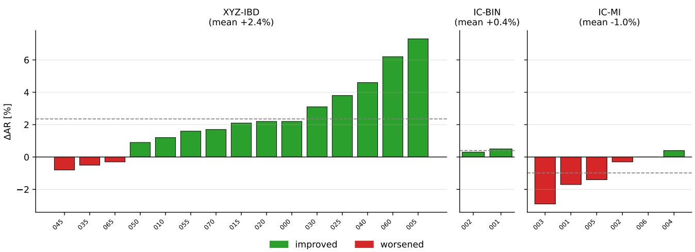  
Figure 9. Change in average recall induced by the refinement, $\Delta \mathrm { A R } = \mathrm { A R } _ { \mathrm { a f t e r } } - \mathrm { A R } _ { \mathrm { b e f o r e } } ,$ for every scene of XYZ-IBD, IC-BIN, and IC-MI (bars sorted within each dataset; green = improved, red = worsened; dashed line = dataset mean). Refinement helps most on the many-instance XYZ-IBD scenes (mean +2.4), is neutral on IC-BIN (+0.4), and is slightly detrimental on the few-instance IC-MI (−1.0).

## E. Additional qualitative results

Figure 10 visualizes the learned descriptors used by our method, reduced to three dimensions with PCA, for four representative objects that span textured everyday items (coffee cups, juice boxes) and texture-less industrial parts (gears, metal brackets). Two observations motivate the fused representation. First, within each object the colours are stable across corresponding surface regions, indicating that the descriptors are repeatable and discriminative: exactly the property our coarse matching relies on. Second, the two modalities are complementary: DINOv2 produces semantic features on textured objects (e.g. it separates the label, body, and rim of a cup) but collapses to meaningless representations on the untextured gears and brackets, where appearance carries little information; dGeDi behaves oppositely, encoding local geometry (gear teeth, bracket edges and holes) and thus remaining discriminative precisely where DINOv2 fails, while being less informative on smooth, textured surfaces. The fused descriptor, obtained by concatenating the two, inherits the strengths of both and stays discriminative across all four categories. This explains why fusion attains the best average recall in our feature ablation (Table 2 of the main paper) without any per-object tuning, and why we adopt it as the default: a single representation that transfers from everyday textured objects to texture-less industrial parts.

Table 5. Per-scene effect of refinement across the three datasets. AR (BOP) and ADD-S in % (higher better); RE [◦] and TE [mm] (lowe better). All runs use identical settings, only the correspondences fed to RANSAC differ (bef.: initial correspondences; aft.: refined). Our refined results are highlighted . Imp. denotes the absolute change, computed as aft. − bef. Green indicates improvement or no degradation, while red indicates worse performance.
<table><tr><td rowspan=2 colspan=1>Dataset     Scene</td><td rowspan=2 colspan=3>AR (BOP) [%] ↑bef.         Imp.</td><td rowspan=2 colspan=3>ADD-S [%] ↑bef.    aft. Imp.</td><td rowspan=2 colspan=3>RE [°]↓bef.  aft.Imp.</td><td rowspan=2 colspan=3>TE [mm] ↓bef.  aft. Imp.</td></tr><tr><td rowspan=1 colspan=2>bef.aft.</td></tr><tr><td rowspan=2 colspan=1>000001IC-BIN000002</td><td rowspan=2 colspan=2>37.1 37.539.1 39.4</td><td rowspan=2 colspan=1>+0.4+0.3</td><td rowspan=2 colspan=3>82.2   84.2 +2.083.1   80.2  -2.9</td><td rowspan=1 colspan=3>59.8 59.6  -0.2</td><td rowspan=1 colspan=3>15.615.3  -0.3</td></tr><tr><td rowspan=1 colspan=2>70.7 70.0</td><td rowspan=1 colspan=1>-0.7</td><td rowspan=1 colspan=2>21.724.9</td><td rowspan=1 colspan=1>+3.2</td></tr><tr><td rowspan=2 colspan=1>000001000002</td><td rowspan=1 colspan=2>64.7 63.0</td><td rowspan=1 colspan=1>-1.7</td><td rowspan=1 colspan=2>100.0 100.0</td><td rowspan=1 colspan=1>0.0</td><td rowspan=1 colspan=2>41.6 42.0</td><td rowspan=1 colspan=1>+0.4</td><td rowspan=1 colspan=2>4.5   4.8</td><td rowspan=1 colspan=1>+0.3</td></tr><tr><td rowspan=1 colspan=1>63.4</td><td rowspan=1 colspan=1>63.1</td><td rowspan=1 colspan=1>-0.3</td><td rowspan=1 colspan=1>100.0</td><td rowspan=1 colspan=1>100.0</td><td rowspan=1 colspan=1>0.0</td><td rowspan=1 colspan=1>46.3</td><td rowspan=1 colspan=1>46.8</td><td rowspan=1 colspan=1>+0.5</td><td rowspan=1 colspan=1>2.4</td><td rowspan=1 colspan=1>2.6</td><td rowspan=1 colspan=1>+0.2</td></tr><tr><td rowspan=4 colspan=1>000003IC-MI000004000005000006</td><td rowspan=2 colspan=1>87.274.3</td><td rowspan=1 colspan=1>84.3</td><td rowspan=1 colspan=1>-2.9</td><td rowspan=1 colspan=1>100.0</td><td rowspan=1 colspan=1>100.0</td><td rowspan=1 colspan=1>0.0</td><td rowspan=1 colspan=1>9.3</td><td rowspan=1 colspan=1>11.2</td><td rowspan=1 colspan=1>+1.9</td><td rowspan=1 colspan=1>4.1</td><td rowspan=1 colspan=1>4.1</td><td rowspan=1 colspan=1>0.0</td></tr><tr><td rowspan=1 colspan=1>74.7</td><td rowspan=1 colspan=1>+0.4</td><td rowspan=1 colspan=1>100.0</td><td rowspan=1 colspan=1>100.0</td><td rowspan=1 colspan=1>0.0</td><td rowspan=1 colspan=1>32.7</td><td rowspan=1 colspan=1>32.7</td><td rowspan=1 colspan=1>0.0</td><td rowspan=1 colspan=1>3.9</td><td rowspan=1 colspan=1>3.6</td><td rowspan=1 colspan=1>-0.3</td></tr><tr><td rowspan=2 colspan=2>73.8 72.472.1 72.1</td><td rowspan=2 colspan=1>-1.40.0</td><td rowspan=2 colspan=2>100.0  100.0100.0 100.0</td><td rowspan=1 colspan=1>0.0</td><td rowspan=1 colspan=1>15.9</td><td rowspan=1 colspan=1>15.8</td><td rowspan=1 colspan=1>-0.1</td><td rowspan=1 colspan=1>6.0</td><td rowspan=1 colspan=1>6.3</td><td rowspan=1 colspan=1>+0.3</td></tr><tr><td rowspan=1 colspan=1>0.0</td><td rowspan=1 colspan=1>23.6</td><td rowspan=1 colspan=1>21.7</td><td rowspan=1 colspan=1>-1.9</td><td rowspan=1 colspan=1>7.3</td><td rowspan=1 colspan=1>7.7</td><td rowspan=1 colspan=1>+0.4</td></tr><tr><td rowspan=1 colspan=1>000000</td><td rowspan=1 colspan=1>72.9</td><td rowspan=1 colspan=1>75.1</td><td rowspan=1 colspan=1>+2.2</td><td rowspan=1 colspan=2>96.5   97.1</td><td rowspan=1 colspan=1>+0.6</td><td rowspan=1 colspan=1>6.8</td><td rowspan=1 colspan=1>5.8</td><td rowspan=1 colspan=1>-1.0</td><td rowspan=1 colspan=1>2.8</td><td rowspan=1 colspan=1>2.5</td><td rowspan=1 colspan=1>-0.3</td></tr><tr><td rowspan=1 colspan=1>000005</td><td rowspan=1 colspan=1>34.8</td><td rowspan=1 colspan=1>42.1</td><td rowspan=1 colspan=1>+7.3</td><td rowspan=1 colspan=1>58.6</td><td rowspan=1 colspan=1>66.9</td><td rowspan=1 colspan=1>+8.3</td><td rowspan=1 colspan=1>51.8</td><td rowspan=1 colspan=1>43.2</td><td rowspan=1 colspan=1>-8.6</td><td rowspan=1 colspan=1>23.0</td><td rowspan=1 colspan=1>15.8</td><td rowspan=1 colspan=1>-7.2</td></tr><tr><td rowspan=1 colspan=1>000010</td><td rowspan=1 colspan=1>61.1</td><td rowspan=1 colspan=1>62.3</td><td rowspan=1 colspan=1>+1.2</td><td rowspan=1 colspan=1>98.3</td><td rowspan=1 colspan=1>98.4</td><td rowspan=1 colspan=1>+0.1</td><td rowspan=1 colspan=1>9.0</td><td rowspan=1 colspan=1>8.1</td><td rowspan=1 colspan=1>-0.9</td><td rowspan=1 colspan=1>4.9</td><td rowspan=1 colspan=1>4.7</td><td rowspan=1 colspan=1>-0.2</td></tr><tr><td rowspan=1 colspan=1>000015</td><td rowspan=1 colspan=1>63.5</td><td rowspan=1 colspan=1>65.6</td><td rowspan=1 colspan=1>+2.1</td><td rowspan=1 colspan=1>93.9</td><td rowspan=1 colspan=1>94.7</td><td rowspan=1 colspan=1>+0.8</td><td rowspan=1 colspan=1>22.0</td><td rowspan=1 colspan=1>19.4</td><td rowspan=1 colspan=1>-2.6</td><td rowspan=1 colspan=1>7.9</td><td rowspan=1 colspan=1>7.2</td><td rowspan=1 colspan=1>-0.7</td></tr><tr><td rowspan=1 colspan=1>000020</td><td rowspan=1 colspan=1>46.0</td><td rowspan=1 colspan=1>48.2</td><td rowspan=1 colspan=1>+2.2</td><td rowspan=1 colspan=1>84.9</td><td rowspan=1 colspan=1>86.7</td><td rowspan=1 colspan=1>+1.8</td><td rowspan=1 colspan=1>24.3</td><td rowspan=1 colspan=1>22.3</td><td rowspan=1 colspan=1>-2.0</td><td rowspan=1 colspan=1>9.0</td><td rowspan=1 colspan=1>8.0</td><td rowspan=1 colspan=1>-1.0</td></tr><tr><td rowspan=1 colspan=1>000025</td><td rowspan=1 colspan=1>61.9</td><td rowspan=1 colspan=1>65.7</td><td rowspan=1 colspan=1>+3.8</td><td rowspan=1 colspan=1>95.6</td><td rowspan=1 colspan=1>96.2</td><td rowspan=1 colspan=1>+0.6</td><td rowspan=1 colspan=1>12.5</td><td rowspan=1 colspan=1>6.7</td><td rowspan=1 colspan=1>-5.8</td><td rowspan=1 colspan=1>6.2</td><td rowspan=1 colspan=1>5.4</td><td rowspan=1 colspan=1>-0.8</td></tr><tr><td rowspan=1 colspan=1>000030</td><td rowspan=1 colspan=1>44.5</td><td rowspan=1 colspan=1>47.6</td><td rowspan=1 colspan=1>+3.1</td><td rowspan=1 colspan=1>87.7</td><td rowspan=1 colspan=1>89.8</td><td rowspan=1 colspan=1>+2.1</td><td rowspan=1 colspan=1>36.8</td><td rowspan=1 colspan=1>33.4</td><td rowspan=1 colspan=1>-3.4</td><td rowspan=1 colspan=1>10.7</td><td rowspan=1 colspan=1>8.9</td><td rowspan=1 colspan=1>-1.8</td></tr><tr><td rowspan=1 colspan=1>XYZ-IBD  000035</td><td rowspan=1 colspan=1>75.3</td><td rowspan=1 colspan=1>74.8</td><td rowspan=1 colspan=1>-0.5</td><td rowspan=1 colspan=1>100.0</td><td rowspan=1 colspan=1>100.0</td><td rowspan=1 colspan=1>0.0</td><td rowspan=1 colspan=1>3.8</td><td rowspan=1 colspan=1>3.6</td><td rowspan=1 colspan=1>-0.2</td><td rowspan=1 colspan=1>6.6</td><td rowspan=1 colspan=1>6.4</td><td rowspan=1 colspan=1>-0.2</td></tr><tr><td rowspan=1 colspan=1>000040</td><td rowspan=1 colspan=1>62.4</td><td rowspan=1 colspan=1>67.0</td><td rowspan=1 colspan=1>+4.6</td><td rowspan=1 colspan=1>98.7</td><td rowspan=1 colspan=1>99.2</td><td rowspan=1 colspan=1>+0.5</td><td rowspan=1 colspan=1>19.3</td><td rowspan=1 colspan=1>12.0</td><td rowspan=1 colspan=1>-7.3</td><td rowspan=1 colspan=1>6.1</td><td rowspan=1 colspan=1>5.3</td><td rowspan=1 colspan=1>-0.8</td></tr><tr><td rowspan=1 colspan=1>000045</td><td rowspan=1 colspan=1>38.9</td><td rowspan=1 colspan=1>38.1</td><td rowspan=1 colspan=1>-0.8</td><td rowspan=1 colspan=1>92.5</td><td rowspan=1 colspan=1>92.1</td><td rowspan=1 colspan=1>-0.4</td><td rowspan=1 colspan=1>69.9</td><td rowspan=1 colspan=1>69.9</td><td rowspan=1 colspan=1>0.0</td><td rowspan=1 colspan=1>10.7</td><td rowspan=1 colspan=1>10.5</td><td rowspan=1 colspan=1>-0.2</td></tr><tr><td rowspan=1 colspan=1>000050</td><td rowspan=1 colspan=1>42.2</td><td rowspan=1 colspan=1>43.1</td><td rowspan=1 colspan=1>+0.9</td><td rowspan=1 colspan=1>93.3</td><td rowspan=1 colspan=1>93.7</td><td rowspan=1 colspan=1>+0.4</td><td rowspan=1 colspan=1>53.6</td><td rowspan=1 colspan=1>51.1</td><td rowspan=1 colspan=1>-2.5</td><td rowspan=1 colspan=1>16.3</td><td rowspan=1 colspan=1>15.0</td><td rowspan=1 colspan=1>-1.3</td></tr><tr><td rowspan=1 colspan=1>000055</td><td rowspan=1 colspan=1>56.0</td><td rowspan=1 colspan=1>57.6</td><td rowspan=1 colspan=1>+1.6</td><td rowspan=1 colspan=1>100.0</td><td rowspan=1 colspan=1>100.0</td><td rowspan=1 colspan=1>0.0</td><td rowspan=1 colspan=1>74.2</td><td rowspan=1 colspan=1>69.4</td><td rowspan=1 colspan=1>-4.8</td><td rowspan=1 colspan=1>32.8</td><td rowspan=1 colspan=1>24.5</td><td rowspan=1 colspan=1>-8.3</td></tr><tr><td rowspan=2 colspan=1>000060000065</td><td rowspan=1 colspan=1>50.8</td><td rowspan=1 colspan=1>57.0</td><td rowspan=1 colspan=1>+6.2</td><td rowspan=1 colspan=1>88.4</td><td rowspan=1 colspan=1>92.1</td><td rowspan=1 colspan=1>+3.7</td><td rowspan=1 colspan=1>24.1</td><td rowspan=1 colspan=1>15.7</td><td rowspan=1 colspan=1>-8.4</td><td rowspan=1 colspan=1>12.7</td><td rowspan=1 colspan=1>10.6</td><td rowspan=1 colspan=1>-2.1</td></tr><tr><td rowspan=1 colspan=1>64.6</td><td rowspan=1 colspan=1>64.3</td><td rowspan=1 colspan=1>-0.3</td><td rowspan=1 colspan=1>97.8</td><td rowspan=1 colspan=1>98.0</td><td rowspan=1 colspan=1>+0.2</td><td rowspan=1 colspan=1>28.3</td><td rowspan=1 colspan=1>30.2</td><td rowspan=1 colspan=1>+1.9</td><td rowspan=1 colspan=1>23.0</td><td rowspan=1 colspan=1>21.9</td><td rowspan=1 colspan=1>-1.1</td></tr><tr><td rowspan=1 colspan=1>000070</td><td rowspan=1 colspan=1>30.5</td><td rowspan=1 colspan=1>32.1</td><td rowspan=1 colspan=1>+1.6</td><td rowspan=1 colspan=1>82.0</td><td rowspan=1 colspan=1>84.8</td><td rowspan=1 colspan=1>+2.8</td><td rowspan=1 colspan=1>87.8</td><td rowspan=1 colspan=1>85.5</td><td rowspan=1 colspan=1>-2.3</td><td rowspan=1 colspan=1>13.7</td><td rowspan=1 colspan=1>12.6</td><td rowspan=1 colspan=1>-1.1</td></tr></table>

Table 6. Effect of global refinement on relative 6D-pose accuracy, aggregated per dataset. AR (BOP) and ADD-S are reported in % (higher better); RE [◦] and TE [mm] are lower better. All runs use identical settings, only the correspondences fed to RANSAC differ (before: initial correspondences; after: refined). Our refined results are highlighted . Imp. denotes the absolute change, computed as after − before. Green indicates improvement or no degradation, while red indicates worse performance.
<table><tr><td></td><td colspan="3">AR [%] (BOP) ↑</td><td colspan="3">ADD-S [%] ↑</td><td colspan="3">RE[°]↓</td><td colspan="3">TE [mm] ↓</td></tr><tr><td>Dataset</td><td>before</td><td>after</td><td>Imp.</td><td>before</td><td>after</td><td>Imp.</td><td>before</td><td>after</td><td>Imp.</td><td>before</td><td>after</td><td>Imp.</td></tr><tr><td>XYZ-IBD</td><td>53.2</td><td>55.8</td><td>+2.6</td><td>90.6</td><td>92.1</td><td>+1.5</td><td>32.13</td><td>28.63</td><td>-3.50</td><td>10.62</td><td>9.09</td><td>-1.53</td></tr><tr><td>IC-BIN</td><td>37.6</td><td>38.0</td><td>+0.4</td><td>82.4</td><td>83.3</td><td>+0.9</td><td>62.36</td><td>62.03</td><td>-0.33</td><td>17.01</td><td>17.54</td><td>+0.53</td></tr><tr><td>IC-MI</td><td>71.2</td><td>70.3</td><td>-0.9</td><td>100.0</td><td>100.0</td><td>0.0</td><td>30.60</td><td>30.74</td><td>+0.14</td><td>4.49</td><td>4.64</td><td>+0.15</td></tr></table>

Figure 11 shows how the complementary properties observed in the descriptor visualizations translate into the correspondences used for pose estimation. For textured everyday objects, such as coffee cups and juice boxes, DINOv2 produces reliable matches between visually distinctive regions, whereas its correspondences become less discriminative on textureless industrial objects. Conversely, dGeDi yields stronger correspondences on gears and metal brackets by exploiting distinctive geometric structures, such as teeth, edges, and holes, but provides fewer informative matches on smooth surfaces. By combining these cues, the fused representation preserves appearance-based matches where texture is informative and introduces geometry-based matches where appearance is ambiguous. Consequently, it generally produces a denser and more spatially distributed set of inlier correspondences across object categories. Together with Figure 10, these results show that fusion improves both de-

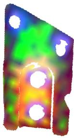

# 6606

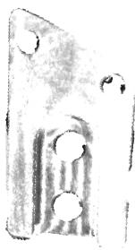  
Semantic features DINOv2  
Geometric features dGeDi  
Fused features

scriptor discriminability and its practical outcome during coarse matching, providing a robust representation across the heterogeneous objects considered in our benchmark.

Figure 12 visualizes how the refinement step acts on individual three-instance cycles. Each panel draws, for a triplet (anchor $X _ { k } ,$ mediator $X _ { j } ,$ , target $X _ { i } )$ , the two composed correspondences and the direct one; under perfect cycle consistency the composed path and the direct correspondence

Figure 10. Qualitative comparison of appearance-aware and semantic-aware, geometry-aware, and fused feature representations for different object categories. From top to bottom: coffee cups, juice boxes, gears, and metal brackets. The left column shows the input object crop, the second column shows DINOv2 features, the third column shows dGeDi features, and the fourth column shows fused features. Here we used Principal Component Analysis (PCA) to reduce the original feature size to 3 for visualization purpose. DINOv2 captures stronger semantic and appearance cues, which are particularly useful for textured objects such as coffee cups and juice boxes. In contrast, dGeDi captures geometric structure more effectively, making it better suited for texture-less industrial objects such as gears and metal brackets.  
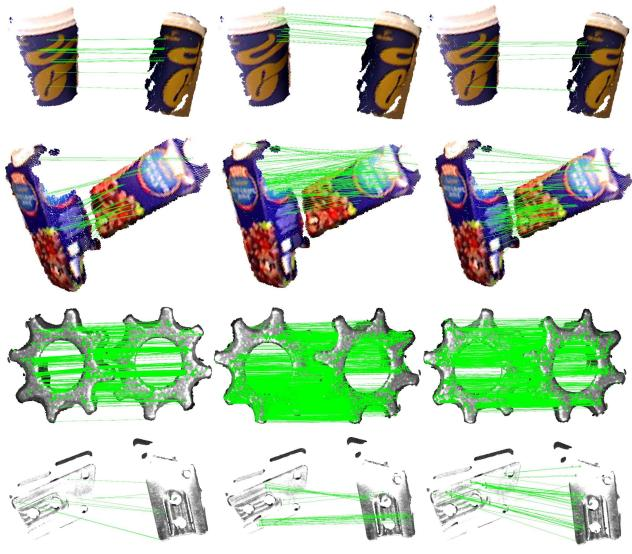  
Semantic features (DINOv2)  
Geometric features (dGeDi)  
Fused features

Figure 11. Qualitative comparison of inlier correspondences obtained using semantic (DINOv2), geometric (dGeDi), and fused feature representations. From top to bottom, we show coffee cups, juice boxes, gears, and metal brackets. Semantic features provide stronger appearance cues for textured objects, whereas geometric features are more informative for textureless industrial objects. The fused representation combines these complementary cues and generally produces a denser and more robust set of inlier correspondences across object types.

coincide, so the dashed closure gap vanishes. In the success cases (a), the coarse per-pair matches disagree (closure gaps of 42–96 mm and only 0–2 of 3 geometric inliers) and the synchronization resolves them into a fully consistent and correct cycle (3/3 inliers, 0 mm gap). This is the intended behaviour and the source of the accuracy gains reported in the main paper. The failure cases (b) expose the limitation of the approach: refinement always yields a consistent cycle (gap → 0 by construction), but consistency does not imply correctness. When the coarse descriptors are ambiguous, e.g. repetitive, the low-rank synchronization can lock all three edges onto a mutually agreeing yet wrong assignment (0/3 inliers), and may even overturn a correct coarse edge to reach it (rows 1–2, 1/3 → 0/3). Such cases are infrequent in aggregate (cf. Table 5) and are further mitigated downstream by robust RANSAC, but they constitute the principal failure mode of correspondence-level cycle consistency and motivate coupling it with geometric verification.

Refined correspondences  
Sample 3: After | gap 0.0 mm | inliers 0/3  
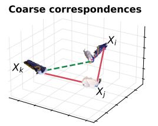  
Sample 1: Before | gap 95.6 mm | inliers 1/3

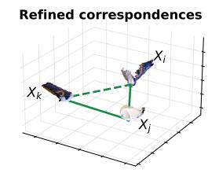  
Sample 1: After | gap 0.0 mm | inliers 3/3

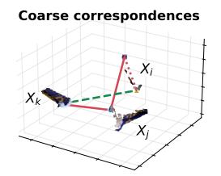

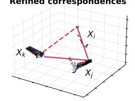  
Sample 1: Before | gap 127.7 mm | inliers 1/3  
Sample 1: After | gap 0.0 mm | inliers 0/3

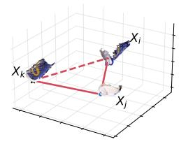  
Sample 2: Before | gap 56.9 mm | inliers 0/3

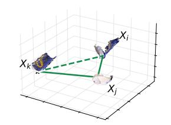  
Sample 2: After | gap 0.0 mm | inliers 3/3

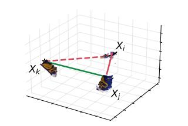  
Sample 2: Before | gap 114.5 mm | inliers 1/3

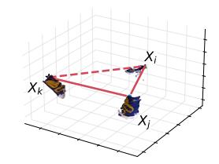  
Sample 2: After | gap 0.0 mm | inliers 0/3

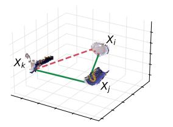  
Sample 3: Before | gap 42.2 mm | inliers 2/3

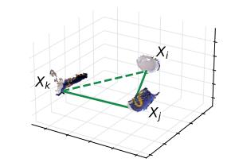

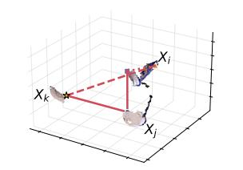  
Sample 3: Before | gap 135.9 mm | inliers 0/3

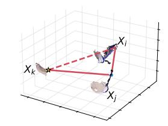  
(a) Success cases  
(b) Failure cases

Figure 12. Cycle consistency: successes and failures. Each row is one instance triplet (anchor $X _ { k }$ , mediator $X _ { j } ,$ , target $X _ { i } ) { \rangle }$ the $l e f t$ column shows the coarse (independent nearest-neighbour) correspondences and the right column the correspondences after cycle-consistency refinement. Green/red lines are symmetry-aware inlier/outlier correspondences and the dashed red line is the cycle-closure gap. (a) Successes: the coarse matches are inconsistent (closure gaps of 42–96 mm and only 0–2 of 3 inliers), and refinement closes the cycle $( \mathrm { g a p } \to 0 )$ while recovering all three correct edges $( 3 / 3$ inliers). (b) Failures: refinement still closes the cycle $( \mathrm { g a p } \to 0 )$ but converges to a geometrically wrong solution $( 0 / 3$ inliers); in the first two rows it even discards the single correct coarse edge $( 1 / 3  0 / 3 )$ , illustrating that cycle consistency enforces mutual agreement, not ground-truth correctness.