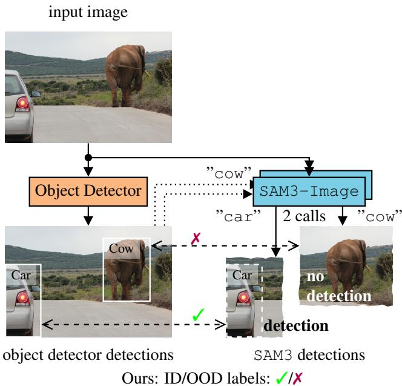
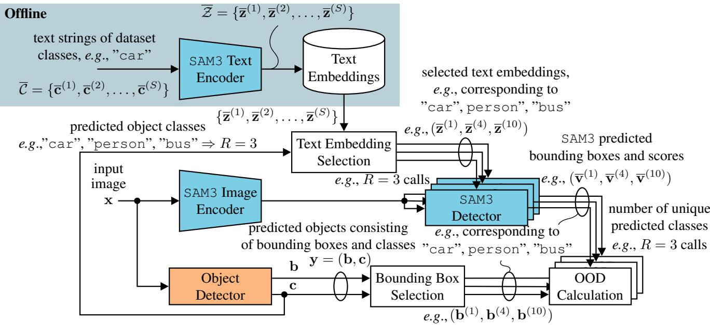
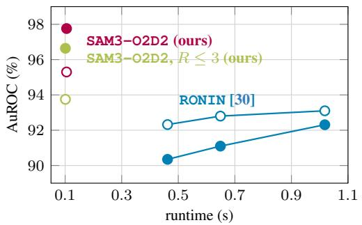
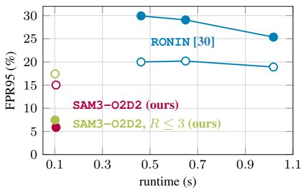
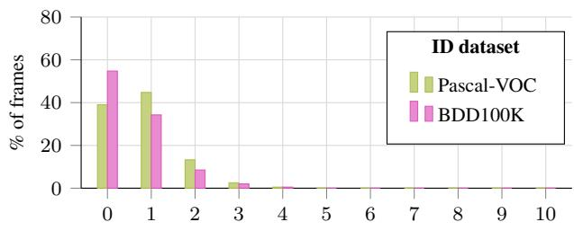
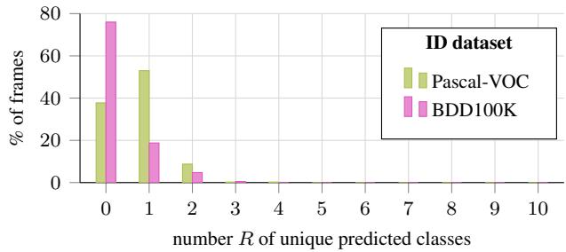
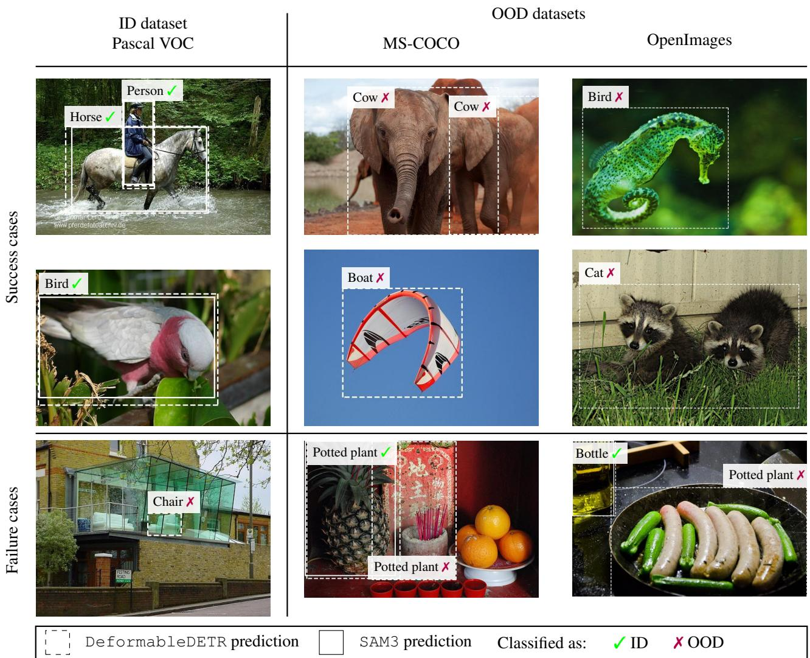

# SAM3-O2D2: Zero-Shot Object Out-of-Distribution Detection by Object Class Prompting of the SAM3-Image Model

Lucas Gornhardt Timo Bartels Tim Fingscheidt¨ Technische Universitat Braunschweig, Institute for Communications Technology¨ {lucas.goernhardt, timo.bartels, t.fingscheidt}@tu-bs.de

## Abstract

Object detectors have shown remarkable performance in various fields, among these medical imaging, surveillance, and autonomous driving. However, they are prone to overconfidence when encountering unseen objects in real-world deployments, causing potential safety issues. To address this, detecting out-of-distribution (OOD) objects is essentialfor reliable object detection. Modern approaches leverage the broad semantic knowledge of foundation models such as CLIP for post-hoc few- and zero-shot OOD detection. However, these methods typically perform OOD assessment in feature space, which can be sensitive to object detector localization errors and variations in object appearance. Moreover, the current state-of-the-art (SOTA) zero-shot method performs computationally costly diffusion in inference. In this work, for our proposed zero-shot object OOD detection method SAM3-O2D2, we employ the SAM3-image foundation model in an efficient manner. Specifically, we prompt SAM3 only with the object detector’s predicted classes and compare the predictions of the object detector and SAM3. An object is in-distribution (ID), if SAM3 also detects an object at the corresponding location. If SAM3 does not detect the prompted object, this indicates a mismatch between the detector’s prediction and the image content, suggesting that the object is OOD. Experimental results show that our method significantly surpasses the so-far zero-shot SOTA method. Specifically, we achieve new SOTA AuROC and FPR95 metrics over both ID datasets Pascal-VOC and BDD100K and both OOD datasets MS-COCO and OpenImages.

## 1. Introduction

Detecting out-of-distribution (OOD) objects is crucial for the safe deployment of object detection systems in the real world. Object detectors are typically trained on a closed set of in-distribution (ID) classes, resulting in overconfidence when encountering unseen objects during deployment. Motivated by this challenge, extensive research has studied image-level OOD detection [4, 23, 26, 29, 38], where the entire image is treated as a single sample and is classified as either ID or OOD. However, this setting is insufficient for many real-world applications, such as autonomous driving [9], where images contain multiple objects that require independent OOD assessment.

  
Figure 1. In our zero-shot object OOD detection, we prompt SAM3-image [2] with objects from the object detector for object OOD detection.

Consequently, object OOD detection has emerged as a more suitable formulation for such object-level requirements [5, 6]. In this task, each detected object must be independently classified as ID (✓) or OOD (✗), see Fig. 1. Classical approaches [5, 6] rely on training of additional detection modules alongside the object detector to distinguish between ID and OOD objects. However, these methods require access to full ID training data and need to be retrained for each newly deployed object detector. Moreover, the performance of such small models falls behind the performance of modern vision-language foundation models such as CLIP [31].

Recent few-shot methods [19, 47] address these limitations by leveraging CLIP [31] for object OOD detection. They use pre-trained image and text encoders to extract local and global visual representations and compare them with text embeddings obtained from class prompts. While these approaches achieve strong performance, they still require fine-tuning of additional modules for each ID dataset. In contrast, RONIN [30] proposes a zero-shot approach based on class-conditioned inpainting. Given a predicted object and its class label, RONIN uses a text-conditioned diffusion model to inpaint the object region according to the predicted class and then measures the agreement between the original object, the inpainted object, and the text prompt using vision-language feature similarities. Despite achieving state-of-the-art (SOTA) zero-shot object OOD detection performance, RONIN has two important limitations. First, its reliance on diffusion-based inpainting leads to high computational cost, which limits its practical applicability. Second, its OOD decision is based on similarities in an abstract feature space, which is not necessarily robust and focused, as the embeddings entangle object appearance such as size and lighting and are not robust against detector localization errors, i.e., poorly localized bounding boxes.

We, however, take a different approach. In contrast to the CLIP-based methods [19, 30, 47] we leverage a different foundation model, namely SAM3-image [2] and propose SAM3-O2D2. In contrast to CLIP- and diffusion-based ap proaches [19, 30, 47], our method performs OOD detection directly at the prediction level. It achieves SOTA zero-shot object OOD detection performance while requiring lower computational cost than diffusion-based inference. The high-level concept is illustrated in Fig. 1. The input image is first processed by some object detector, which produces object predictions such as car and cow. The predicted class labels are used as text prompts for two SAM3-image calls, which returns objects corresponding to each prompted concept. As illustrated in Fig. 1, SAM3-image confirms the detector’s car prediction at the same location, but does not detect a cow. This mismatch indicates that the visual content is inconsistent with the predicted class cow and instead corresponds to an OOD object, here an elephant. Thus, our method marks predictions confirmed by SAM3-image as ID (✓) and unmatched predictions as OOD (✗), leveraging its broad semantic knowledge. Moreover, by operating directly in the detection space rather than in an abstract feature space, our method provides a more interpretable OOD decision. This simplifies failure-case analysis, which is important for practical deployment, and improves robustness to near-OOD objects, as reflected by our empirical results.

Our contributions are as follows. First, we introduce a framework for leveraging off-the-shelf text-promptable foundation detection models, such as SAM3, for object OOD detection and propose SAM3-O2D2, which constantly improves with the rapid developments in the field of foundation models over time. Second, our proposed SAM3-O2D2 requires no retraining and can be paired with arbitrary object detectors. It is straightforward to implement, making it highly suitable for practical deployment. Third, we evaluate our method on two ID datasets and two OOD datasets covering a diverse range of semantic scenes, and finally on one open-world setup, showing that it substantially outperforms the current SOTA zero-shot object OOD detection method RONIN [30], while even requiring lower computational complexity.

The remainder of the paper is structured as follows. Section 2 summarizes the related works. Section 3 details the proposed method for zero-shot object OOD detection. Section 4 describes the experimental setup, including datasets and metrics. Section 5 presents the experimental results. Finally, we conclude in Section 6.

## 2. Related Works

Image-Level OOD Detection: In the image-level out-ofdistribution (OOD) detection task, an image must be classified either as in-distribution (ID) or OOD. Early approaches to this task rely on distinguishing between ID and OOD based on the confidence score of the classifier [12– 14, 20, 22, 39]. Alternative approaches measure distances in the feature space of the classifier [17, 25, 27, 36] or leverage representation and activation statistics [34, 37, 45]. Other approaches rely on generative models [10, 11, 18, 24, 35, 50] or leverage likelihoods-based scores [32, 44]. However, this task formulation does not account for real-world settings in which one image may contain multiple objects which need separate ID or OOD assessment.

Object OOD Detection: In the object OOD detection task, each object predicted by an object detector needs to be classified either as ID or OOD. Traditional approaches to this task [5, 6, 41–43] require training of the object detector together with additional modules to separate ID objects from OOD objects. To avoid retraining the detector itself, SAFE [40] proposes a post-hoc solution that only trains an additional MLP to classify objects as ID or OOD. However, this still requires training on the full ID dataset for each newly deployed object detector.

Foundation Models for OOD Detection: These limitations have motivated the use of vision-language foundation models, such as CLIP [31], for few-shot and zero-shot OOD detection. While in the task of image-level OOD detection, this direction is extensively explored [3, 7, 15, 26, 28, 29, 38, 48], research on object OOD detection remains limited [19, 30, 47]. Specifically, the few-shot method RUNA [47] uses two pretrained image encoders to extract global image features and regional object features, which are combined with text embeddings obtained from the predicted class labels to compute an OOD score for each object. The few-shot method UNI-OOD [19] improves over RUNA by using two identical pre-trained image and text encoder pairs to extract features of the target object and its background separately, which are then used to calculate an OOD score. However, both methods still require few-shot fine-tuning of custom modules on top of the pre-trained CLIP [31] image and text encoders.

The zero-shot object OOD detection method RONIN [30] therefore proposes a retraining-free approach. It leverages an off-the-shelf diffusion model to inpaint the object regions predicted by the object detector, conditioned on the corresponding predicted class labels. After obtaining the inpainted objects, RONIN [30] measures the text-to-image similarities using CLIP [31] between the text prompt and both the inpainted and original object, as well as the visual similarity between the original and inpainted object. These three similarities are used to calculate an OOD score. However, the use of diffusion-based inpainting leads to high computational cost, limiting its applicability for practical deployment. Furthermore, OOD assessment in feature space can be sensitive to detector localization errors and variations in object appearance variability.

We address these limitations by proposing SAM3-O2D2, a post-hoc zero-shot object OOD detection method that requires no retraining for different object detectors or datasets. Instead of relying on feature-space similarity, SAM3-O2D2 performs OOD assessment at the more robust prediction level while requiring lower computational cost than an iterative diffusion-based inference.

## 3. Methods

In this section, we describe our method SAM3-O2D2 for zero-shot object out-of-distribution (OOD) detection. The overall architecture of the proposed method is illustrated in Fig. 2. First, we describe how the object predictions produced by the object detector are used to prompt SAM3-image and obtain class-wise predictions. We then detail how we use resulting SAM3 detections to identify OOD objects among the object detector predictions.

## 3.1. Prompting SAM3 with Predicted Classes (Ours)

Object Detector Inference: The input image $\textbf { x } \in$ $\mathbb { I } ^ { H \times W \times C }$ , with $\mathbb { I } = [ 0 , 1 ]$ and H, W, and C denoting the image height, width, and number of channels, respectively, is processed by both the object detector and the SAM3 image encoder. The object detector outputs predicted objects $\mathbf { y } = ( \mathbf { b } , \mathbf { c } )$ , consisting of bounding boxes $\mathbf { b } = \left( \mathbf { b } _ { m } \right)$ and object classes $\mathbf { c } = \left( c _ { m } \right)$ . Here, $m \in \mathcal { M } = \{ 1 , 2 , \dots , M \}$ denotes the object index, and M is the number of predicted objects. Each predicted object class $c _ { m } ~ = ~ s$ is represented as a class text string $\overline { { \mathbf { c } } } ^ { ( s ) } , e . g . , \mathsf { c a r }$ , and each bounding box is defined as $ { \mathbf { b } } _ { m } \in  { \mathcal { T } } ^ { 2 }$ with pixel positions set ${ \mathcal { T } } = \{ ( 1 , 1 ) , \ldots , ( H , W ) \}$ . Here, $s \in \mathcal { S } = \{ 1 , \ldots , S \}$ denotes the class index and S the number of ID classes.

Text Embedding Selection: The predicted object classes $\mathrm { ~ \bf ~ c ~ } = \mathrm { ~ \bf ~ \left( c _ { m } \right) ~ }$ are then used to select the text embeddings of the corresponding class strings. These embeddings are precomputed offline by the SAM3 text encoder using the set $\overline { { \mathcal { C } } } = \{ \overline { { \mathbf { c } } } ^ { ( 1 ) } , \hdots , \overline { { \mathbf { c } } } ^ { ( \bar { S } ) } \}$ of all in-distribution (ID) dataset class text strings. The resulting set of embeddings ${ \overline { { { \mathcal { Z } } } } } =$ $\{ \overline { { \mathbf { z } } } ^ { ( 1 ) } , \overline { { \mathbf { z } } } ^ { ( 2 ) } , \ldots , \overline { { \mathbf { z } } } ^ { ( S ) } \} , \overline { { \mathbf { z } } } ^ { ( s ) } \in \mathbb { R } ^ { \breve { d } }$ , is stored and used during inference. Note that d is the dimensionality of the embedding space. As an example, suppose that the object detector predicts $M \ = \ 7$ objects of the $R \ : = \ : 3$ classes car, person, and bus, corresponding to the class text strings $\bar { \mathbf { c } } ^ { ( 1 ) } , \bar { \mathbf { c } } ^ { ( 4 ) }$ , and $\overline { { \mathbf { c } } } ^ { ( 1 0 ) }$ , respectively, where R denotes the number of unique predicted classes. The text embedding selection step then retrieves the corresponding precomputed embeddings $\overline { { \mathbf { z } } } ^ { ( 1 ) } , \overline { { \mathbf { z } } } ^ { ( 4 ) }$ , and $\overline { { \mathbf { z } } } ^ { ( 1 0 ) }$ to prompt the SAM3 detector. SAM3 Detector Inference: The SAM3 detector is inferred once for each unique predicted class R. Thus, in the example above, the SAM3 detector is inferred $R = 3$ times. For each prompted text embedding of class s, SAM3 outputs $\overline { { \mathbf { v } } } ^ { ( s ) } = ( \overline { { \mathbf { b } } } ^ { ( s ) } , \overline { { \mathbf { u } } } ^ { ( s ) } )$ , with bounding boxes $\overline { { \mathbf { b } } } ^ { ( s ) } = ( \overline { { \mathbf { b } } } _ { m } ^ { ( s ) } ) \in$ $\mathcal { T } ^ { \overline { { M } } ^ { ( s ) } \times 2 }$ and confidence scores $\overline { { \mathbf { u } } } ^ { ( s ) } = ( \overline { { u } } _ { m } ^ { ( s ) } ) \in [ 0 , 1 ] ^ { \overline { { M } } ^ { ( s ) } }$ Here, $\overline { { \boldsymbol { m } } } \in \overline { { \mathcal { M } } } ^ { ( s ) } = \{ 1 , \dots , \overline { { \boldsymbol { M } } } ^ { ( s ) } \}$ indexes the SAM3 predictions for class s and $\overline { { M } } ^ { ( s ) }$ denotes their number. We further define $\overline { { \mathcal { V } } } _ { m } ^ { ( s ) }$ to be the set of all pixels inside bounding box $\overline { { \mathbf { b } } } _ { m } ^ { ( s ) }$ predicted by SAM3.

## 3.2. OOD Detection (Ours)

Bounding Box Selection: After obtaining class-wise predictions from SAM3, the corresponding bounding boxes of the object detector for OOD calculation need to be retrieved. This is done by the bounding box selection step (see Fig. 2). Using the object detector predictions b and c, the bounding box selection step groups the predicted boxes $ { \mathbf { b } } _ { m }$ by their predicted class label $c _ { m } .$ , yielding class-specific bounding boxes $\mathbf { b } ^ { ( s ) } ~ = ~ ( \mathbf { b } _ { \hat { m } } ^ { ( s ) } )$ corresponding to class $s , \ e . g .$ $\mathbf { b } ^ { ( 1 ) } , \mathbf { b } ^ { ( 4 ) }$ , and $\mathbf { b } ^ { ( 1 0 ) }$ for the above example of $R = 3$ and $s \in \{ 1 , 4 , 1 0 \}$ . Here, $\hat { m } \in \mathcal { M } ^ { ( s ) } = \{ 1 , \cdot \cdot \cdot , M ^ { ( s ) } \}$ is the index for predicted bounding boxes corresponding to class s and $M ^ { ( \bar { s } ) }$ the number of predicted bounding boxes corresponding to class s. Here, we define $y _ { \hat { m } } ^ { ( s ) }$ as the set of all pixels inside bounding box $\mathbf { b } _ { \hat { m } } ^ { ( s ) }$ . The object detector bounding boxes and SAM3 predictions corresponding to the same class, $e . g . , \mathbf { b } ^ { ( 1 ) }$ and $\bar { \mathbf { v } } ^ { ( 1 ) }$ corresponding to $\overline { { c } } ^ { ( 1 ) } = \mathtt { c a r }$ , are then used to identify OOD objects predicted by the object detector, cf. Fig. 1.

  
Figure 2. Overview of our proposed architecture for zero-shot object OOD detection. Shown is an example, where the object detector predicts objects of class indices s = 1, 4 and 10, which are the R = 3 unique predicted classes.

OOD Calculation: First, the intersection over union (IoU)

$$
I o U ( \mathbf { b } _ { \hat { m } } ^ { ( s ) } , \mathbf { \overline { { b } } } _ { \overline { { m } } } ^ { ( s ) } ) = \frac { | \mathcal { V } _ { \hat { m } } ^ { ( s ) } \cap \overline { { \mathcal { V } } } _ { \overline { { m } } } ^ { ( s ) } | } { | \mathcal { V } _ { \hat { m } } ^ { ( s ) } \cup \overline { { \mathcal { V } } } _ { \overline { { m } } } ^ { ( s ) } | }\tag{1}
$$

is calculated between bounding box pixels of all objects predicted by the object detector, $y _ { \hat { m } } ^ { ( s ) }$ , and SAM3, $\overline { { \mathcal { V } } } _ { m } ^ { ( s ) }$ , that correspond to the same class $s .$ We then apply an IoU threshold $\theta ^ { \mathrm { I o U } } \in [ 0 , 1 ]$ and define

$$
\overline { { \mathcal { M } } } _ { \hat { m } } ^ { ( s ) } = \{ \overline { { m } } \in \overline { { \mathcal { M } } } ^ { ( s ) } | I o U ( { \bf b } _ { \hat { m } } ^ { ( s ) } , \overline { { { \bf b } } } _ { \overline { { m } } } ^ { ( s ) } ) \geq \theta ^ { \mathrm { I o U } } \} .\tag{2}
$$

For each object detector prediction with index mˆ , the set $\overline { { \mathcal { M } } } _ { \hat { m } } ^ { ( s ) }$ contains all SAM3 predictions of the same class s whose bounding boxes sufficiently overlap with the predicted object. Then, an object detector prediction with index mˆ is marked as ID (✓) if at least one of the SAM3 prediction confidences $\overline { { u } } _ { \overline { { m } } } ^ { \left( s \right) } , \overline { { m } } \in \overline { { \mathcal { M } } } _ { \hat { m } } ^ { \left( s \right) } \left( 2 \right)$ , exceeds a score threshold $\theta ^ { \mathrm { s c o r e } } \in [ 0 , \ddot { 1 } ]$ , with

$$
\mathcal { M } _ { \mathrm { I D } } ^ { ( s ) } = \{ \hat { m } \in \mathcal { M } ^ { ( s ) } | \exists \overline { { m } } \in \overline { { \mathcal { M } } } _ { \hat { m } } ^ { ( s ) } : \overline { { u } } _ { \overline { { m } } } ^ { ( s ) } \geq \theta ^ { \mathrm { s c o r e } } \} ,\tag{3}
$$

being the set of all ID objects corresponding to class s. Consequently, all predicted objects that are not marked as ID are considered OOD (✗). The set of OOD predictions for class s is therefore given by

$$
\mathcal { M } _ { \mathrm { O O D } } ^ { ( s ) } = \mathcal { M } ^ { ( s ) } \setminus \mathcal { M } _ { \mathrm { I D } } ^ { ( s ) } .\tag{4}
$$

Intuitively, our method flags objects as OOD when they are not detected by SAM3 at the same location under the same class prompt. In this way, we leverage the broad semantic knowledge of SAM3 to verify whether the image content is aligned with the class predicted by the object detector. For example, in Fig. 1, the object detector incorrectly classifies an elephant as cow, however, SAM3, when prompted with cow, does not predict an object at that location because the visual content does not correspond to a cow. In contrast to previous CLIP-based approaches [19, 30, 47] which measure the similarity between the predicted class and the image content ofthe predicted bounding box in an abstract feature space, our approach performs this comparison directly at the prediction level. This has two advantages. First, OOD detection errors are easier to interpret, as illustrated later by qualitative results in Section 5.3. This facilitates refinement for future real-world applications, e.g., by enriching class prompts with descriptive adjectives, which is supported by SAM3. Second, prediction-level agreement provides a more robust OOD signal than feature-space similarity, whose embeddings inherently entangle object appearance such as size and lighting and are not robust against detector bounding-box localization errors.

## 4. Experimental Setup

Data: Following the standard evaluation setup of object OOD detection [5, 6, 30], we use Pascal-VOC [8] and BDD100K [46] as in-distribution (ID) datasets and evaluate out-of-distribution (OOD) detection performance on two subsets from MS-COCO [21] and OpenImages [16]. These subsets are constructed such that their test images contain no label overlap with the corresponding ID datasets. Additionally, as employed by our main baseline [30], we use the first 400 images of Pascal-VOC, OpenImages, and MS-COCO and the first 200 images of BDD100K to balance object count between ID and OOD datasets.

Metrics: OOD detection performance is evaluated using the area under the receiver operating characteristic curve (Au-ROC) and the false positive rate at a true positive rate of 95% (FPR95). Following the standard convention [5, 6, 30], a true positive denotes an ID object correctly classified as ID, whereas a false positive denotes an OOD object incorrectly classified as ID. We obtain the ROC curves for Au-ROC calculation as typical in the field. For our particular method, we obtain the ROC curves by varying the confidence score threshold $\theta ^ { \mathrm { s c o r e } }$ in (3), while we firmly use a particular IoU threshold $\theta ^ { \mathrm { I o U } }$ (2) and keep it fixed. We do not report average precision (AP) of the object detector, since our method does not modify the object detector. Accordingly, AP results are only provided in Appendix A. Models: Following [5, 30], for all reported methods, we use DeformableDETR [49] as object detector pre-trained on the respective ID datasets. For SAM3-O2D2, we also use the off-the-shelf SAM3-image model [2]. We used the facebook/sam3 weights and standard preprocessing1.

Baselines: Our main baseline is the so-far SOTA zero-shot object OOD method RONIN [30]. Due to a lack of zero-shot methods for object OOD detection, we follow [30] and additionally compare our method with image-level zero-shot OOD detection approaches applied to the object task, by cropping each object and treating it as an image. Specifically, CLIP-based ODIN [20] and EnergyScore [22], Mahalanobis [45], KNN [36], MCM [26], CLIPN [38], TAG [23], and GL-MCM [29] are reported. We also report two basic training-based methods VOS [6] and SIREN [5].

## 5. Experimental Results and Discussion

## 5.1. Main Results

In Tab. 1, we compare our zero-shot method for object OOD detection to so-far state-of-the-art (SOTA) zero-shot methods across two ID datasets, namely Pascal-VOC (top segment) and BDD100K (bottom segment). We measure OOD detection performance using AuROC (%, higher is better) and FPR95 (%, lower is better). An overall average rank over both metrics and both OOD datasets is reported (cf. [33]). The baseline results are adopted from [30].

We observe that EnergyScore [22] achieves a decent 3rd rank on the Pascal-VOC ID dataset (top), while Mahalanobis secures a rank 3.1 on the BDD100K ID dataset (bottom). Both, however, fall behind when applied to the respective other ID dataset. For both ID datasets, Pascal-VOC (top) and BDD100K (bottom), the overall strongest zero-shot object OOD baseline is RONIN [30], with an average rank of 2.0 on Pascal-VOC and 2.6 on BDD100K. Our SAM3-O2D2 zero-shot object OOD detection method, however, excels consistently across both ID datasets, both OOD datasets, and both metrics, achieving new SOTA performance with an overall average rank of1.0. Results using the full test sets can be found in Appendix B.

In Tab. 2, we conduct a sensitivity analysis of the IoU threshold $\theta ^ { \mathrm { I o U } }$ , which is used in the OOD calculation to pre-select SAM3 predictions (2). We report results using Pascal-VOC as the ID dataset and MS-COCO and Open-Images as OOD datasets, and measure OOD detection performance using AuROC and FPR95. We observe that our method is largely insensitive to the choice of the IoU threshold $\theta ^ { \mathrm { I o U } }$ . However, on our datasets we observe a tendency towards better performance for a low $\theta ^ { \mathrm { I o U } }$ . Interestingly, all threshold configurations outperform the strongest baseline RONIN [30], which achieved an average rank of 2.0 with Pascal-VOC as ID dataset, as shown in Tab. 1. Although $\theta ^ { \mathrm { { I o U } } } = 0 . 1$ yields the best performance in Tab. 2, selecting the smallest threshold may not generalize well to other test configurations. The reason is as follows: In the established evaluation setup for object OOD detection [5, 6, 19, 30, 40, 47], ID and OOD objects do not co-occur within the same image. Under this assumption, weakly localized SAM3 predictions can still help identify ID objects and reduce false negatives, without the risk of simultaneously classifying an OOD object in the same image as ID. In more general open-world settings, however, where ID and OOD objects may co-occur, a very low IoU threshold would increase the risk of false positives by accepting insufficiently localized matches. Accordingly, for a broader generalization of our method, we propose the suboptimal $\bar { \theta } ^ { \mathrm { I o U } } = 0 . 2$ for thresholding the SAM3 predictions in (2). Note that with the better choice of $\begin{array} { r } { \dot { { \boldsymbol { \theta } } } ^ { \mathrm { I o U } } = 0 . 1 , } \end{array}$ , our results in Tab. 1 would have been even stronger. More performance details on the influence of $\theta ^ { \mathrm { I o U } }$ are in Appendix C and results of a more realistic open-world setting in Appendix D.

In Fig. 3, we compare object OOD detection performance and runtime per processed frame of our proposed SAM3-O2D2 with the strongest zero-shot baseline RONIN [30], which achieved strong ranks 2.0 and 2.6 with Pascal-VOC and BDD100K ID data, respectively, as reported in Tab. 1. The three marks for RONIN [30], from left to right, correspond to configurations with 5, 10, and 20 diffusion steps, respectively, where the strongest latter is the configuration reported in Tab. 1. The runtime is measured using an NVIDIA A100 40GB and the OOD detection performance is measured by AuROC (top) and FPR95 (bottom). Runtime is measured only for the OOD detection method, excluding the object detector, since both methods employ the identical DeformableDETR [49] detector. As the runtime per frame can vary for both methods, we report the average runtime over all frames with at least on predicted object in the respective ID and OOD datasets. We observe that

Table 1. Object OOD detection results on ID datasets Pascal-VOC and BDD100K and on OOD datasets MS-COCO and OpenImages. We report AuROC (%) and FPR95 (%). We adopt baseline results from [30]. Best results in bold, second-best results underlined.
<table><tr><td rowspan="2">In-distribution (ID) dataset</td><td rowspan="2">Method</td><td rowspan="2">Zero-shot? x</td><td colspan="4">Out-of-distribution (OOD) datasets</td><td rowspan="2">Average rank↓</td></tr><tr><td>MS-COCO AuROC ↑</td><td>FPR95↓</td><td>AuROC ↑</td><td>OpenImages FPR95↓</td></tr><tr><td rowspan="2"></td><td>VOs [6] SIREN [5] ODIN [20] Energy Score [22] Mahalanobis [45] KNN [36]</td><td rowspan="2">x √ √ √ √ √</td><td>88.75 78.68 88.22</td><td>48.15 64.70</td><td>83.65 75.12</td><td>54.63 66.69</td><td>7.3 11.8</td></tr><tr><td>MCM [26] CLIPN [38] TAG [23] OLE [4]</td><td>√</td><td>90.26 83.26 85.52 83.15 43.09</td><td>41.65 29.48 63.30 58.56 62.47 81.45</td><td>86.46 55.87 91.24 24.57 87.11 45.22 84.62 45.00 71.52</td><td>6.8 3.0 8.2 7.2</td></tr><tr><td></td><td>GL-MCM [29] RONIN [30] SAM3-02D2 (ours) VOS [6]</td><td>√ √ √ √ √ x</td><td>85.45 78.35 86.13 78.64 92.31 97.52 78.34</td><td>61.03 54.23 78.56 25.36 6.56 65.45</td><td>89.31 87.69 88.07 82.89 93.10 94.62 80.42</td><td>41.74 48.48 49.13 69.35 18.91 16.52 59.23</td><td>5.2 8.8 6.5 12.0 2.0 1.0 8.8</td></tr><tr><td>BDD100K</td><td>SIREN [5] ODIN [20] Energy Score [22] Mahalanobis [45] KNN [36] MCM [26] CLIPN [38] TAG [23] OLE [4] GL-MCM [29] RONIN [30] SAM3-02D2 (ours)</td><td>x √ √ √ √ √ √ √ √ √ √ √</td><td>89.37 55.18 74.49 90.74 86.58 55.82 92.14 90.50 78.14 50.82 92.90</td><td>42.86 96.51 71.75 31.75 35.87 95.56 28.49 46.30 57.14</td><td>91.78 57.87 73.09 93.81 92.75 57.05 85.78 76.67</td><td>37.97 95.56 53.33 23.33 31.11 92.22 44.76</td><td>5.5 12.3 9.5 3.1 4.8 11.5 4.8</td></tr></table>

Table 2. Sensitivity analysis of our SAM3-O2D2 w.r.t. the IoU threshold $\theta ^ { \mathrm { I o U } }$ (2) on Pascal-VOC (ID) and MS-COCO and Open-Images (both OOD). We report AuROC (%) and FPR95 (%).
<table><tr><td> $\theta ^ { \mathrm { I o U } }$ </td><td colspan="3">MS-COCO AuROC ↑ FPR95↓</td></tr><tr><td rowspan="6">0.10 0.15 0.20</td><td></td><td></td><td>AuROC ↑ FPR95↓</td></tr><tr><td>97.60</td><td>6.11</td><td>94.88 15.62 15.62</td></tr><tr><td>97.54</td><td>6.56</td><td>94.72 94.62</td></tr><tr><td>97.52</td><td>6.56</td><td>16.52</td></tr><tr><td>97.51</td><td>6.56</td><td>94.51 17.72</td></tr><tr><td>97.40</td><td>7.47</td><td>94.40 17.72</td></tr></table>

SAM3-O2D2 is processed substantially faster than even the fastest RONIN [30] configuration with five diffusion steps. Specifically, our method achieves a runtime of 0.1 s per frame, compared to 0.48 s for the fastest RONIN [30] configuration. At the same time, it achieves significantly better object OOD detection performance than even the strongest RONIN [30] configuration.

In Fig. 4, we analyze the amount of unique predicted classes of the DeformableDETR [49] object detector in the OOD datasets MS-COCO (top) and OpenImages (bottom). The statistics are shown in green for the object detector trained on the Pascal-VOC ID dataset and in purple for the object detector trained on the BDD100K ID dataset. We observe that for both OOD datasets and both ID-trained models, the amount R of unique predicted classes is relatively low, with most images containing either R = 0 or R = 1 predicted classes. This comes with positive consequences for our proposed SAM3-O2D2 approach. It indicates that the computational overhead of inferring the SAM3 detector R times per image is limited in practice, since the SAM3 detector is not at all inferred in 37...76% of the frames $( R = 0 )$ and is inferred a single time only in 19...53% of the frames $( R = 1 )$ For real-world deployment of our $\mathtt { S A M 3 - O 2 D 2 }$ , the computational cost could be bounded by enforcing a maximum number of unique prompted classes, e.g., $R \ \leq \ 3$ . If the object detector predicts more than 3 unique classes, we prompt only the R = 3 classes with the lowest average detector confidence across their corresponding predictions. All remaining predictions are considered ID. The performance of our approach limited to a maximum of $R \leq 3$ SAM3 calls per frame is shown in green color , in Fig. 3, always nearby the respective red markers , of our unbounded method (any R). This limitation comes with some performance loss, however, our computationally limited SAM3-O2D2 method still excels RONIN in all cases.

  
Figure 3. Performance-speed comparison of our SAM3-O2D2 (red) to the so-far SOTA baseline RONIN [30] (blue) on an $\mathrm { N V I D I A }$ A100 40GB with ID datset Pascal-VOC and OOD datasets MS-COCO ( ) and OpenImages ( ). Our method employs $\theta ^ { \mathrm { I o U } } ~ = ~ 0 . 2 ~ ( 2 )$ . The green symbols mark our approach limited to $R \leq 3 .$

In Tab. 3 we further analyze the runtime (ms) on an NVIDIA A100 40GB of the SAM3-image [2] used in our zero-shot SAM3-O2D2. Specifically, we report the isolated runtime of the individual components used during inference, the SAM3 image encoder and the SAM3 detector, when inferred with R = 1, R = 2, and R = 3 prompts. We observe that roughly 60% of the runtime reported in Fig. 3 is caused by the SAM3 image encoder. This runtime cannot be reduced by bounding R, since the image encoder always has to be inferred once per image. Additionally, we observe that the runtime of the SAM3 detector does not scale linearly with the number of prompts R, since the SAM3 detector can be inferred in a batched manner. Furthermore, as shown in Fig. 4, only a few samples are affected when bounding R. Together, these factors explain why bounding the method to $R \leq 3$ yields only a very minor speedup in Fig. 3. Adding 63.4 ms for inferring the SAM3 image encoder and the worst case 53.1 ms for $R = 3$ batched calls of the SAM3 detector, yields 116.5 ms, which is the frame-individual worst case of the $R \leq 3$ constrained green method’s runtime in Fig. 3. In Appendix E, we provide additional comparisons on computational complexity.

MS-COCO (OOD dataset)  

OpenImages (OOD dataset)  
  
Figure 4. Analysis of amount R of unique predicted classes per OOD dataset, using the DeformableDETR [49] object detector.

Table 3. Runtime of the single components of the SAM3-image for our SAM3-O2D2 in ms on an Nvidia A100 40GB.
<table><tr><td rowspan="2">Component</td><td rowspan="2">SAM3 image encoder</td><td colspan="3">SAM3 detector</td></tr><tr><td> $R = 1$ </td><td> $R = 2$ </td><td> $R = 3$ </td></tr><tr><td>Runtime (ms)</td><td>63.4</td><td>36.0</td><td>48.8</td><td>53.1</td></tr></table>

In Appendix F, we additionally provide comparisons with state-of-the-artfew-shot object OOD detection methods.

## 5.2. Sensitivity Analysis Ablation

Now, we investigate the sensitivity of the so-far SOTA RONIN [30] and our SAM3-O2D2 method to object detector bounding-box localization errors and object appearance.

Table 4. Robustness to bounding box localization errors. Comparison of our SAM3-O2D2 and RONIN [30] baseline under object detector localization errors on Pascal-VOC as ID dataset and MS-COCO as OOD dataset. We report AuROC (%) / FPR95 (%).
<table><tr><td>Localization error €</td><td>SAM3-02D2 (ours)</td><td>RONIN [30]</td></tr><tr><td>0</td><td>97.52/6.56</td><td>90.70/27.84</td></tr><tr><td>0.1</td><td>97.51/6.58</td><td>90.59/29.69</td></tr><tr><td>0.3</td><td>97.54/6.58</td><td>90.10/29.48</td></tr><tr><td>0.5</td><td>97.54/6.58</td><td>88.43/34.64</td></tr></table>

In Tab. 4, we analyze the robustness of our method, SAM3-O2D2, and the strongest baseline, RONIN [30], to bounding-box localization errors of the object detector with Pascal-VOC as ID and MS-COCO as OOD dataset. To induce localization errors, we follow the approach of Bar et al.¨ [1] and perturb the bounding box coordinates predicted by the object detector according to some noise strength $\epsilon \geq 0 .$ Specifically, we add uniformly sampled noise to the bounding box coordinates (upper left, lower right), with the noise scaled by the corresponding bounding box width and height. More details on generating the erroneous bounding boxes and the exact definition of the noise strength can be found in Appendix G. After obtaining the erroneous object detector bounding boxes, both object OOD detection methods are evaluated as usual. The performance of RONIN [30] with no noise (ϵ = 0) differs slightly from the values reported in Tab. 1, as we re-evaluated their strongest method for the robustness analysis using their published source code.

We observe that RONIN [30] degrades continuously with simulated growing object detector bounding-box localization error, leading to an increase in FPR of 6.8% absolute for $\epsilon = 0 . 5 .$ . Our SAM3-O2D2, however, shows very robust performance on both metrics across all evaluated error strengths ϵ. This supports our claim that performing OOD detection directly at prediction level, rather than in the feature space of models like CLIP [31], is advantageous due to its higher robustness to bounding-box localization errors.

In Tab. 5, we analyze how different object-appearance factors, such as lighting and object size, affect our method, SAM3-O2D2, and the strongest baseline, RONIN [30]. For lighting, we compute the median luminance $\begin{array} { r l r } { Y } & { { } \in } & { [ 0 , 1 ] } \end{array}$ within each bounding box predicted by DeformableDETR [49]. We then assign objects to highlighting $( Y \ge 0 . 3 )$ and low-lighting $( Y < 0 . 3 )$ categories. For object size, we follow the MS-COCO definition [21] and categorize objects as small, medium, or large. Finally, we compute the object OOD detection metrics separately for the ID and OOD objects in each category.

We observe that both methods perform worse under low-lighting conditions than under high-lighting conditions.

Table 5. Robustness to different object appearances. Comparison of our SAM3-O2D2 and RONIN [30] baseline under different object appearances on Pascal-VOC as ID dataset and MS-COCO as OOD dataset. We report AuROC (%) / FPR95 (%).
<table><tr><td>Object appearance</td><td>SAM3-02D2 (ours)</td><td>RONIN [30]</td></tr><tr><td>Lighting high  $( Y \ge 0 . 3 )$  low  $( Y < 0 . 3 )$ </td><td>98.18/06.49 94.85/10.78</td><td>90.20/30.88 85.31/36.27</td></tr><tr><td>Object size large</td><td>98.29/03.72</td><td>94.71/21.14</td></tr><tr><td>medium small</td><td>94.74/14.49 90.76/21.74</td><td>74.65/52.17 51.09/86.96</td></tr></table>

However, the absolute performance drop is somewhat larger for RONIN [30] than for our SAM3-O2D2. This effect is even more pronounced for object size. While SAM3-O2D2 still performs well on small objects, achieving 90.76% Au-ROC, RONIN [30] degrades to near-chance performance with 51.09% AuROC. This further supports our claim that our method provides a more robust OOD signal with respect to object appearance than feature-space similarity employed by RONIN [30] and other baselines.

## 5.3. Qualitative Results and Failure Analysis

In Appendix H we provide qualitative results showing several success and failure cases and a failure analysis of our proposed SAM3-O2D2.

## 6. Conclusions

In this paper, we introduce SAM3-O2D2, a zero-shot object out-of-distribution (OOD) detection method that efficiently leverages the SAM3-image foundation model. Our method outperforms all baselines across both indistribution (ID) datasets, both OOD datasets, and both metrics, while significantly requiring lower computational cost than the current SOTA method. Accordingly, our SAM3-O2D2 method constitutes a new state-of-the-art in zero-shot object OOD detection. We further analyze and demonstrate the robustness of prediction-level OOD assessment compared to feature-space similarity.

## Acknowledgments

The research leading to these results is funded by the German Federal Ministry for Economic Affairs and Energy within the project “Safe AI Engineering – Sicherheitsargumentation befahigendes AI Engineering ¨ uber den gesamten¨ Lebenszyklus einer KI-Funktion”. The authors would like to thank the consortium for the successful cooperation.

## References

[1] Andreas Bar, Jonas Uhrig, Jeethesh Pai Umesh, Marius¨ Cordts, and Tim Fingscheidt. A Novel Benchmark for Refinement of Noisy Localization Labels in Autolabeled Datasets for Object Detection. In Proc. of CVPR - Workshops, pages 3851–3860, Vancouver, BC, Canada, 2023. 8, 13

[2] Nicolas Carion, Laura Gustafson, Yuan-Ting Hu, Shoubhik Debnath, Ronghang Hu, Didac Suris, Chaitanya Ryali, Kalyan Vasudev Alwala, Haitham Khedr, Andrew Huang, Jie Lei, Tengyu Ma, Baishan Guo, Arpit Kalla, Markus Marks, Joseph Greer, Meng Wang, Peize Sun, Roman Radle, Triantafyllos Afouras, Effrosyni Mavroudi, Kather-¨ ine Xu, Tsung-Han Wu, Yu Zhou, Liliane Momeni, Rishi Hazra, Shuangrui Ding, Sagar Vaze, Francois Porcher, Feng Li, Siyuan Li, Aishwarya Kamath, Ho Kei Cheng, Piotr Dollar, Nikhila Ravi, Kate Saenko, Pengchuan Zhang, and´ Christoph Feichtenhofer. SAM 3: Segment Anything with Concepts. arXiv:2511.16719, 2025. 1, 2, 5, 7, 14

[3] Guangyi Chen, Weiran Yao, Xiangchen Song, Xinyue Li, Yongming Rao, and Kun Zhang. PLOT: Prompt Learning with Optimal Transport for Vision-Language Models. In Proc. ofICLR, pages 1–13, Kigali, Rwanda, 2023. 2

[4] Choubo Ding and Guansong Pang. Zero-Shot Out-of-Distribution Detection with Outlier Label Exposure. In Proc. ofIJCNN, pages 1–8, Yokohama, Japan, 2024. 1, 6

[5] Xuefeng Du, Gabriel Gozum, Yifei Ming, and Yixuan Li. SIREN: Shaping Representations for Detecting Out-of-Distribution Objects. In Proc. of NeurIPS, pages 20434– 20449, virtual, 2022. 1, 2, 4, 5, 6

[6] Xuefeng Du, Zhaoning Wang, Mu Cai, and Yixuan Li. VOS: Learning What You Don’t Know by Virtual Outlier Synthesis. In Proc. of ICLR, pages 1–14, virtual, 2022. 1, 2, 4, 5, 6

[7] Sepideh Esmaeilpourcharandabi, Bing Liu, Eric Robertson, and Lei Shu. Zero-Shot Out-of-Distribution Detection Based on the Pre-trained Model CLIP. In Proc. of AAAI, pages 6568–6576, virtual, 2022. 2

[8] Mark Everingham, Luc Van Gool, Christopher K. I. Williams, John Winn, and Andrew Zisserman. The PAS-CAL Visual Object Classes (VOC) Challenge. International Journal ofComputer Vision, 88(2):303–338, 2010. 4, 12

[9] Tim Fingscheidt, Hanno Gottschalk, and Sebastian Houben, editors. Deep Neural Networks and Data for Automated Driving: Robustness, Uncertainty Quantification, and Insights Towards Safety. Springer International Publishing, Cham, 2022. 1

[10] Ruiyuan Gao, Chenchen Zhao, Lanqing Hong, and Qiang Xu. DIFFGUARD: Semantic Mismatch-Guided Out-of-Distribution Detection Using Pre-Trained Diffusion Models. In Proc. ofICCV, pages 1579–1589, Paris, France, 2023. 2

[11] Mark S. Graham, Walter H.L. Pinaya, Petru-Daniel Tudosiu, Parashkev Nachev, Sebastien Ourselin, and Jorge Cardoso. Denoising Diffusion Models for Out-of-Distribution Detection. In Proc. of CVPR - Workshops, pages 2948–2957, Vancouver, BC, Canada, 2023. 2

[12] Dan Hendrycks and Kevin Gimpel. A Baseline for Detect ing Misclassified and Out-of-Distribution Examples in Neu ral Networks. In Proc. of ICLR, pages 1–12, Toulon, France, 2017. 2

[13] Dan Hendrycks, Steven Basart, Mantas Mazeika, Andy Zou, Joseph Kwon, Mohammadreza Mostajabi, Jacob Steinhardt, and Dawn Song. Scaling Out-of-Distribution Detection for Real-World Settings. In Proc. of ICML, pages 8759–8773, Baltimore, MD, USA, 2022.

[14] Yen-Chang Hsu, Yilin Shen, Hongxia Jin, and Zsolt Kira. Generalized ODIN: Detecting Out-of-Distribution Image Without Learning From Out-of-Distribution Data. In Proc. ofCVPR, pages 10951–10960, Seattle, WA, USA, 2020. 2

[15] Xue Jiang, Feng Liu, Zhen Fang, Hong Chen, Tongliang Liu, Feng Zheng, and Bo Han. Negative Label Guided OOD Detection with Pretrained Vision-Language Models. In Proc. of ICLR, pages 1–12, Vienna, Austria, 2024. 2

[16] Alina Kuznetsova, Hassan Rom, Neil Alldrin, Jasper R. R. Uijlings, Ivan Krasin, Jordi Pont-Tuset, Shahab Kamali, Stefan Popov, Matteo Malloci, Tom Duerig, and Vittorio Ferrari. The Open Images Dataset V4: Unified Image Classifi cation, Object Detection, and Visual Relationship Detection at Scale. International Journal of Computer Vision (IJCV), 128(7):1956—-1981, 2020. 5, 12

[17] Kimin Lee, Kibok Lee, Honglak Lee, and Jinwoo Shin. A Simple Unified Framework for Detecting Out-of Distribution Samples and Adversarial Attacks. In Proc. of NeurIPS, pages 7167– 7177, Montreal, QC, Canada, 2018.´ 2

[18] Jingyao Li, Pengguang Chen, Zexin He, Shaozuo Yu, Shu Liu, and Jiaya Jia. Rethinking Out-of-Distribution (OOD) Detection: Masked Image Modeling Is All You Need. In Proc. of CVPR, pages 11578–11589, Vancouver, BC, Canada, 2023. 2

[19] Yuchuan Li, Azadeh Motamedi, Hyock Ju Kwon, Chul B Park, and Il-Min Kim. UNI-OOD: Unified Objectand Image-level Out-of-Distribution Detection via Cross-Context Attentive Vision-Language Modeling. In Proc. of CVPR, pages 6282–6292, Denver, CO, USA, 2026. 2, 3, 4, 5, 13, 14

[20] S. Liang, Y. Li, and R. Srikant. Enhancing the Reliability of Out-Of-Distribution Image Detection in Neural Networks. In Proc. of ICLR, pages 1–27, Vancouver, BC, Canada, 2018. 2, 5, 6

[21] Tsung-Yi Lin, Michael Maire, Serge Belongie, James Hays, Pietro Perona, Deva Ramanan, Piotr Dollar, and C Lawrence´ Zitnick. Microsoft COCO: Common Objects in Context. In Proc. of ECCV, pages 740–755, Zurich, Switzerland, 2014. 5, 8, 12

[22] Weitang Liu, Xiaoyun Wang, John Owens, and Yixuan Li. Energy-based Out-of-Distribution Detection. In Proc. of NeurIPS, pages 21464–21475, virtual, 2020. 2, 5, 6

[23] Xixi Liu and Christopher Zach. TAG: Text Prompt Augmentation for Zero-Shot Out-of-Distribution Detection´. In Proc. of ECCV, pages 364–380, Milano, Italy, 2024. 1, 5, 6

[24] Zhenzhen Liu, Jin Peng Zhou, Yufan Wang, and Kilian Q Weinberger. Unsupervised Out-of-Distribution Detection

with Diffusion Inpainting. In Proc. of ICML, pages 22528– 22538, Honolulu, HI, USA, 2023. 2

[25] Haodong Lu, Dong Gong, Shuo Wang, Jason Xue, Lina Yao, and Kristen Moore. Learning with Mixture of Prototypes for Out-of-Distribution Detection. In Proc. ofICLR, pages 1–14, Vienna, Austria, 2024. 2

[26] Yifei Ming, Ziyang Cai, Jiuxiang Gu, Yiyou Sun, Wei Li, and Yixuan Li. Delving into Out-of-Distribution Detection with Vision-Language Representations. In Proc. ofNeurIPS, pages 35087–35102, virtual, 2022. 1, 2, 5, 6

[27] Yifei Ming, Yiyou Sun, Ousmane Dia, and Yixuan Li. How to Exploit Hyperspherical Embeddings for Out-of-Distribution Detection? In Proc. of ICLR, pages 1–13, Kigali, Rwanda, 2023. 2

[28] Atsuyuki Miyai, Qing Yu, Go Irie, and Kiyoharu Aizawa. LoCoOp: Few-Shot Out-of-Distribution Detection via Prompt Learning. In Proc. of NeurIPS, pages 76298–76310, New Orleans, LA, USA, 2023. 2

[29] Atsuyuki Miyai, Qing Yu, Go Irie, and Kiyoharu Aizawa. GL-MCM: Global and Local Maximum Concept Matching for Zero-Shot Out-of-Distribution Detection. International Journal of Computer Vision, 133(6):3586—-3596, 2025. 1, 2, 5, 6

[30] Quang-Huy Nguyen, Jin Peng Zhou, Zhenzhen Liu, Khanh-Huyen Bui, Kilian Q. Weinberger, Wei-Lun Chao, and Dung D. Le. Detecting Out-of-Distribution Objects through Class-Conditioned Inpainting. In Proc. of WACV, pages 1937–1947, Tucson, AZ, USA, 2026. 2, 3, 4, 5, 6, 7, 8, 12, 13, 14

[31] Alec Radford, Jong Wook Kim, Chris Hallacy, Aditya Ramesh, Gabriel Goh, Sandhini Agarwal, Girish Sastry, Amanda Askell, Pamela Mishkin, Jack Clark, Gretchen Krueger, and Ilya Sutskever. Learning Transferable Visual Models From Natural Language Supervision. In Proc. of ICML, pages 8748–8763, virtual, 2021. 2, 3, 8

[32] Jie Ren, Peter J. Liu, Emily Fertig, Jasper Snoek, Ryan Poplin, Mark Depristo, Joshua Dillon, and Balaji Lakshminarayanan. Likelihood Ratios for Out-of-Distribution Detection. In Proc. of NeurIPS, pages 14707–14718, Vancouver, BC, Canada, 2019. 2

[33] Kohei Saijo, Wangyou Zhang, Robin Scheibler, Samuele Cornell, Chenda Li, Zhaoheng Ni, Anurag Kumar, Marvin Sach, Yihui Fu, Tim Fingscheidt, and Shinji Watanabe. Interspeech 2025 URGENT Speech Enhancement Challenge. In Proc. of Interspeech, pages 858–862, Rotterdam, The Netherlands, 2025. 5

[34] Chandramouli Shama Sastry and Sageev Oore. Detecting Out-of-Distribution Examples with Gram Matrices. In Proc. ofICML, pages 8491–8501, virtual, 2020. 2

[35] Thomas Schlegl, Philipp Seebock, Sebastian M. Waldstein,¨ Ursula Schmidt-Erfurth, and Georg Langs. Unsupervised anomaly detection with generative adversarial networks to guide marker discovery. In Proc. of Information Processing in Medical Imaging, pages 146–157, Cham, 2017. Springer International Publishing. 2

[36] Yiyou Sun, Yifei Ming, Xiaojin Zhu, and Yixuan Li. Outof-Distribution Detection with Deep Nearest Neighbors. In

Proc. of ICML, pages 20827–20840, Baltimore, MD, USA, 2022. 2, 5, 6

[37] Jihoon Tack, Sangwoo Mo, Jongheon Jeong, and Jinwoo Shin. CSI: Novelty Detection via Contrastive Learning on Distributionally Shifted Instances. In Proc. of NeurIPS, pages 11839–11852, virtual, 2020. 2

[38] Hualiang Wang, Yi Li, Huifeng Yao, and Xiaomeng Li. CLIPN for Zero-Shot OOD Detection: Teaching CLIP to Say No. In Proc. of ICCV, pages 1802–1812, Paris, France, 2023. 1, 2, 5, 6

[39] Hongxin Wei, Renchunzi Xie, Hao Cheng, Lei Feng, Bo An, and Yixuan Li. Mitigating Neural Network Overconfidence with Logit Normalization. In Proc. of ICML, pages 23631– 23644, Baltimore, MD, USA, 2022. 2

[40] Samuel Wilson, Tobias Fischer, Feras Dayoub, Dimity Miller, and Niko Sunderhauf. SAFE: Sensitivity-Aware Features for Out-of-Distribution Object Detection. In Proc. of ICCV, pages 23508–23519, Los Alamitos, CA, USA, 2023. 2, 5

[41] Aming Wu and Cheng Deng. Discriminating Known from Unknown Objects via Structure-Enhanced Recurrent Variational AutoEncoder. In Proc. ofCVPR, pages 23956–23965, Vancouver, BC, Canada, 2023. 2

[42] Aming Wu and Cheng Deng. Percept, Memory, and Imagine: World Feature Simulating for Open-Domain Unknown Object Detection. In Proc. of CVPR, pages 4682–4691, Nashville, TN, USA, 2025.

[43] Aming Wu, Da Chen, and Cheng Deng. Deep Feature Deblurring Diffusion for Detecting Out-of-Distribution Objects. In Proc. of ICCV, pages 13335–13345, Paris, France, 2023. 2

[44] Zhisheng Xiao, Qing Yan, and Yali Amit. Likelihood Regret: An Out-of-Distribution Detection Score For Variational Auto-encoder. In Proc. ofNeurIPS, pages 20685–20696, vir tual, 2020. 2

[45] Zhisheng Xiao, Qing Yan, and Yali Amit. Do We Really Need to Learn Representations from In-domain Data for Outlier Detection? arXiv:2105.09270, 2021. 2, 5, 6

[46] Fisher Yu, Wenqi Xian, Yingying Chen, Fangchen Liu, Mike Liao, Vashisht Madhavan, and Trevor Darrell. BDD100K: A Diverse Driving Video Database With Scalable Annotation Tooling. arXiv:1805.04687, 2018. 4, 12

[47] Bin Zhang, Jinggang Chen, Xiaoyang Qu, Guokuan Li, Kai Lu, Jiguang Wan, Jing Xiao, and Jianzong Wang. RUNA: Object-level Out-of-Distribution Detection via Regional Un certainty Alignment of Multimodal Representations. In Proc. of AAAI, pages 26418–26426, Philadelphia, PA, USA, 2025. 2, 3, 4, 5, 14

[48] Kaiyang Zhou, Jingkang Yang, Chen Change Loy, and Ziwei Liu. Learning to Prompt for Vision-Language Models. International Journal of Computer Vision, 130(9):2337–2348, 2022. 2

[49] Xizhou Zhu, Weijie Su, Lewei Lu, Bin Li, Xiaogang Wang, and Jifeng Dai. Deformable DETR: Deformable Transformers for End-to-End Object Detection. In Proc. of ICLR, pages 1–16, virtual, 2021. 5, 6, 7, 8, 12, 15

[50] Bo Zong, Qi Song, Martin Renqiang Min, Wei Cheng, Cristian Lumezanu, Daeki Cho, and Haifeng Chen. Deep

Autoencoding Gaussian Mixture Model for Unsupervised Anomaly Detection. In Proc. ofICLR, pages 1–14, Vancouver, BC, Canada, 2018. 2

## A. AP Results of the Object Detector

In Tab. 6 we report the average precision (AP) metric (%) of the DeformableDETR [49] object detector on the ID datasets Pascal-VOC [8] and BDD100K [46]. This object detector is used for evaluating all object out-of-distribution (OOD) detection methods.

## B. Results on Full Test Sets

In Tab. 7, we evalaute our SAM3-O2D2 for object OOD detection using entire Pascal-VOC and BDD100K as ID datasets and entire MS-COCO and OpenImages as OOD datasets. We report AuROC and FPR95 metrics and observe that also on the entire test sets SAM3-O2D2 outperforms RONIN [30] by an even larger margin than on the official reported numbers by [30] in Tab. 1.

## C. Performance Influence of the IoU Threshold

In Tab. 8, we analyze the effect of the IoU threshold $\theta ^ { \mathrm { I o U } }$ in (2) on object out-of-distribution (OOD) detection performance. The results are obtained using in-distribution (ID) datasets Pascal-VOC [8] (top segment) and BDD100K [46] (bottom segment) and the OOD datasets MS-COCO [21] and OpenImages [16]. We measure object OOD detection performance using AuROC and FPR95.

Consistent with the results in Tab. 2 (main paper), object OOD performance increases with lower $\theta ^ { \mathrm { I o U } }$ , achieving best performance across all metrics and datasets even at $\theta ^ { \mathrm { { I o U } } } = \bar { 0 }$ . However, as discussed in Section 5.1, choosing a very small IoU threshold, such as $\theta ^ { \mathrm { I o U } } = 0$ , would not generalize well to other test configurations. In particular, if ID and OOD objects co-occur in the same image, accepting weakly (or not at all) localized matches would substantially increase the FPR. This is why we propose $\theta ^ { \mathrm { I o U } } = 0 . 2$ for our main results in Tab. 1 (main paper). For fairness, however, future work solely evaluating on this particular setting, where ID and OOD objects cannot co-occur in the same image, should also report the performance of SAM3-O2D2 with $\theta ^ { \mathrm { I o U } } = 0$

## D. Evaluation in an Open-World Setup

In Tab. 9, we evaluate our proposed SAM3-O2D2 on a more realistic open-world setup, where ID and OOD objects can occur within the same image. For this setup, we use the DeformableDETR [49] trained on Pascal-VOC as ID dataset and evaluate on the full MS-COCO [21] validation set. For the open-world , we introduce a new labeling protocol for ID and OOD objects. First, we match DeformableDETR predictions to ground-truth objects based on their IoU. A prediction is considered matched if its IoU with a ground-truth object is greater than 0.3. If a prediction is matched to a ground-truth object of the same class, we label it as ID. If it is matched to a ground-truth object of a class not being part of the ID dataset, we label it as OOD. In this evaluation for object OOD detection, we ignore all other predictions. Under this protocol, ID and OOD objects can co-occur within the same image. We then apply the object OOD methods as usual to the predicted objects to identify the OOD objects. We observe that, as expected, the open-world setup is more challenging for both the baseline RONIN [30] and our SAM3-O2D2, with both methods performing worse than in the Pascal-VOC MS-COCO setup in Tab. 1. However, our proposed SAM3-O2D2 outperforms RONIN by an even larger margin in the more realistic setup, demonstrating the better practical applicability of our method. Furthermore, our method with $ { \hat { \theta } } ^ { \mathrm { { I o U } } } = 0 . \dot { 2 }$ outperforms the variant with $\theta ^ { \mathrm { I o U } } = 0 . 0 .$ , supporting our choice of this threshold for better generalization to realistic open-world setups.

Table 6. Object detection performance of the DeformableDETR [49] object detector on the in-distribution (ID) datasets Pascal-VOC [8] and BDD100K [46]. We report mean average precision (AP) (%).
<table><tr><td></td><td>Dataset | Pascal-VOC</td><td>BDD100K</td></tr><tr><td>AP (%)</td><td>60.6</td><td>31.3</td></tr></table>

Table 7. Object OOD detection results using SAM3-O2D2 on Pascal-VOC and BDD100K as ID datasets and MS-COCO and OpenImages as OOD datasets. We report AuROC (%) / FPR95 (%).
<table><tr><td>Method</td><td>MS-COCO</td><td>OpenImages</td></tr><tr><td colspan="3">ID dataset: Pascal-VOC</td></tr><tr><td>RONIN [30] SAM3-02D2</td><td>89.67 / 30.30 97.72 / 6.24</td><td>91.43 / 25.19 93.87 / 15.97</td></tr><tr><td></td><td>ID dataset: BDD100K</td><td></td></tr><tr><td>RONIN [30]</td><td>78.41 / 57.91</td><td>83.86 / 44.37</td></tr><tr><td>SAM3-02D2</td><td>97.99 / 5.25</td><td>98.47 / 3.26</td></tr></table>

Table 8. Performance influence of $\theta ^ { \mathrm { I o U } }$ in our SAM3-O2D2 on Pascal-VOC and BDD100K as ID datasets and MS-COCO and OpenImages as OOD datasets. We report AuROC (%) and FPR95 (%). Best results in bold.
<table><tr><td> $\theta ^ { \mathrm { I o U } }$ </td><td>MS-COCO AuROC↑</td><td>FPR95↓</td><td>OpenImages AuROC ↑ FPR95↓</td></tr><tr><td colspan="4">ID dataset: Pascal-VOC</td></tr><tr><td>0</td><td>98.14</td><td>5.20 96.18 6.11</td><td>12.01</td></tr><tr><td>0.1</td><td>97.60</td><td>94.88</td><td>15.62</td></tr><tr><td>0.2</td><td>97.52</td><td>94.62</td><td>16.52</td></tr><tr><td>0.3</td><td>97.40</td><td>94.40</td><td>17.72</td></tr><tr><td colspan="4">ID dataset: BDD100K</td></tr><tr><td>0</td><td>99.42</td><td>1.99 3.98</td><td>99.57 0.71</td></tr><tr><td>0.1</td><td>98.65</td><td>98.49</td><td>5.71</td></tr><tr><td>0.2</td><td>98.46</td><td>98.40</td><td>5.00</td></tr><tr><td>0.3</td><td>98.01</td><td>97.91</td><td>5.00</td></tr></table>

Table 9. Object OOD detection results on an open-world setup on the full MS-COCO validation set. We report AuROC (%) and FPR95 (%). Best results in bold.
<table><tr><td>Method</td><td>AuROC ↑</td><td>FPR95↓</td></tr><tr><td>RONIN [30]</td><td>81.72</td><td>51.21</td></tr><tr><td>SAM3-02D2  $( \theta ^ { \mathrm { I o U } } = 0 . 0 )$ </td><td>92.15</td><td>20.63</td></tr><tr><td>SAM3-02D2  $( \theta ^ { \mathrm { I o U } } = 0 . 2 )$ </td><td>94.11</td><td>16.19</td></tr></table>

Table 10. Computational complexity in terms of TFLOPs of RONIN [30] and our SAM3-O2D2. Best results in bold.
<table><tr><td>Method</td><td>R = 1</td><td> $R = 2$ </td><td> $R = 3$ </td></tr><tr><td>RONIN [30]</td><td>32.19</td><td>64.39</td><td>96.58</td></tr><tr><td>SAM3-02D2</td><td>4.30</td><td>4.59</td><td>4.87</td></tr></table>

## E. Comparison of Computational Complexity

In Tab. 10, we compare compuational complexity in terms of TFLOPs of the strongest zero-shot baseline RONIN [30] and our SAM3-O2D2 for the case of R = 1, R = 2, and R = 3 unique prompted classes. For both methods, we use the configurations reported in Tab 1. Specifically, RONIN uses 20 diffusion steps and a diffusion-model input resolution of 512×512, whereas SAM3-O2D2 uses an input resolution of 1008 × 1008. We observe that, for all values of $R ,$ SAM3-O2D2 requires substantially fewer FLOPs. Furthermore, the computational complexity of RONIN scales linearly with the number of prompted classes, since its main source of FLOPs is the diffusion model, which must be evaluated once for each additional class. For SAM3-O2D2, in contrast, only the SAM3 detector is evaluated additionally for each prompted class, which limits the increase in FLOPs.

## F. Comparison with Few-Shot Methods

In Tab. 11, we compare our zero-shot SAM3-O2D2 to stateof-the-artfew-shot methods for object OOD detection using Pascal-VOC and BDD100K as ID datasets and MS-COCO and OpenImages as OOD datasets. We report AuROC and FPR95 metrics. As expected, due to their advantageous access to task-specific data, the few-shot baseline UNI-OOD [19] outperforms the zero-shot baseline RONIN [30] across all datasets and metrics. Our proposed zero-shot method, SAM3-O2D2 with $\theta ^ { \mathrm { { I o U } } } ~ = ~ 0 . 2$ , however, is competitive with the few-shot UNI-OOD [19] and outperforms it in all settings with MS-COCO as the OOD dataset. Moreover, SAM3-O2D2 with $\theta ^ { \mathrm { { I o U } } } = 0 . 0$ surpasses UNI-OOD [19] even more generally, being best in 7 out of 8 dataset-metric combinations.

## G. Simulation of Bounding-Box Localization Error

In the following, we describe how we use the approach of Bar et al. [¨ 1] to simulate bounding-box localization errors of the object detector.

Preliminaries: A bounding box predicted by the object detector is defined as $ { \mathbf { b } } _ { m } \in  { \mathcal { T } } ^ { 2 }$ with pixel positions set $\mathcal { T } = \{ ( 1 , 1 ) , \ldots , ( H , W ) \}$ } and H and W being the image height and width, respectively. The bounding-box coordinates

$$
\mathbf { b } _ { m } = \bigl ( \bigl ( h _ { m } ^ { \mathrm { L } } , w _ { m } ^ { \mathrm { L } } \bigr ) , \bigl ( h _ { m } ^ { \mathrm { R } } , w _ { m } ^ { \mathrm { R } } \bigr ) \bigr ) ,\tag{5}
$$

are given by a top-left corner $( h _ { m } ^ { \mathrm { L } } , w _ { m } ^ { \mathrm { L } } ) \in \mathcal { I }$ and a bottomright corner $( h _ { m } ^ { \mathrm { R } } , w _ { m } ^ { \mathrm { R } } ) \in \mathcal { I }$ . Then, the size of the bounding box is given by $H _ { m } \times W _ { m }$ with

$$
H _ { m } = | h _ { m } ^ { \mathrm { L } } - h _ { m } ^ { \mathrm { R } } | ,\tag{6}
$$

$$
W _ { m } = | w _ { m } ^ { \mathrm { L } } - w _ { m } ^ { \mathrm { R } } | ,\tag{7}
$$

where $H _ { m }$ and $W _ { m }$ denote the object height and width, respectively.

Error Simulation: To induce bounding-box localization errors, we perturb the object detector bounding boxes $ { \mathbf { b } } _ { m }$ using some noise coordinate factor $\epsilon \geq 0 .$ , also referred to as noise strength. Depending on this noise strength, we obtain object-specific uniform distributions

$$
U _ { h } ( - u _ { h } , u _ { h } ) , \mathrm { w i t h } u _ { h } = \frac \epsilon 2 H _ { m } ,\tag{8}
$$

$$
U _ { w } ( - u _ { w } , u _ { w } ) , \mathrm { w i t h } u _ { w } = \frac { \epsilon } { 2 } W _ { m } ,\tag{9}
$$

which are used to perturb the bounding-box coordinates. To this end, we sample offsets

$$
\Delta h _ { m } ^ { \mathrm { L } } , \Delta h _ { m } ^ { \mathrm { R } } \sim U _ { h } ( - u _ { h } , u _ { h } ) ,
$$

$$
\Delta w _ { m } ^ { \mathrm { L } } , \Delta w _ { m } ^ { \mathrm { R } } \sim U _ { w } ( - u _ { w } , u _ { w } ) ,\tag{10}
$$

(11)

from the object-specific uniform distribution for the height coordinates $\Delta h _ { m } ^ { \mathrm { L } } , \Delta h _ { m } ^ { \mathrm { R } }$ and width coordinates $\Delta \tilde { w _ { m } ^ { \mathrm { L } } } , \Delta w _ { m } ^ { \mathrm { R } }$ . Finally, we obtain the erroneous bounding box

$$
\begin{array} { r l } & { \tilde { \mathbf { b } } _ { m } = ( ( \boldsymbol { h } _ { m } ^ { \mathrm { L } } , \boldsymbol { w } _ { m } ^ { \mathrm { L } } ) + ( \Delta \boldsymbol { h } _ { m } ^ { \mathrm { L } } , \Delta \boldsymbol { w } _ { m } ^ { \mathrm { L } } ) , } \\ & { \qquad ( \boldsymbol { h } _ { m } ^ { \mathrm { R } } , \boldsymbol { w } _ { m } ^ { \mathrm { R } } ) + ( \Delta \boldsymbol { h } _ { m } ^ { \mathrm { R } } , \Delta \boldsymbol { w } _ { m } ^ { \mathrm { R } } ) ) , } \end{array}\tag{12}
$$

by adding the offsets to the original bounding-box coordinates predicted by the object detector. The offsets are limited in a way that no disturbed bounding box is extended towards pixel positions outside the image.

Table 11. Object OOD detection results comparison of SAM3-O2D2 with zero- and few-shot methods on Pascal-VOC and BDD100K as ID datasets and MS-COCO and OpenImages as OOD datasets. Baseline results are adopted from the respective papers. We report AuROC (%) and FPR95 (%) metrics. Best results in bold, second-best underlined.
<table><tr><td>In-distribution (ID) dataset</td><td>Method</td><td colspan="4">Out-of-distribution (OOD) datasets MS-COCO OpenImages AuROC↑</td></tr><tr><td rowspan="6"></td><td colspan="5">Few-shot methods</td></tr><tr><td></td><td></td><td></td><td></td><td></td></tr><tr><td>RUNA [47] UNI-0OD [19]</td><td>92.48 95.07</td><td>30.67 22.24</td><td>93.63 96.25</td><td>26.07 14.30</td></tr><tr><td colspan="5">Zero-shot methods</td></tr><tr><td>RONIN [30]</td><td>92.31</td><td>25.36</td><td>93.10</td><td>18.91</td></tr><tr><td>SAM3-02D2 (θIoU = 0.2) (ours)</td><td>97.52</td><td>6.56</td><td>94.62</td><td>16.52</td></tr><tr><td rowspan="7"></td><td colspan="5">SAM3-O2D2 (θIU = 0.0) (ours)</td></tr><tr><td></td><td>98.14 Few-shot methods</td><td>5.20</td><td>96.18</td><td>12.01</td></tr><tr><td colspan="5"></td></tr><tr><td>RUNA [47]</td><td>93.92</td><td>16.85</td><td>96.76</td><td>9.95</td></tr><tr><td>UNI-OOD [19]</td><td>95.91</td><td>11.32</td><td>98.52</td><td>3.68</td></tr><tr><td colspan="5">Zero-shot methods</td></tr><tr><td>RONIN [30]</td><td>92.90</td><td>26.03</td><td>91.90</td><td>23.33 5.00</td></tr><tr><td>SAM3-02D2 (θIoU SAM3-02D2 (θIU</td><td>= 0.2) (ours) = 0.0) (ours)</td><td>98.46 99.42</td><td>4.55 1.99</td><td>98.40 99.57</td></tr></table>

## H. Qualitative Results and Failure Analysis

Qualatative Results: In Fig. 5, we show qualitative results of our SAM3-O2D2 method. Illustrated are success cases (top and middle rows) and failure cases (bottom row) for Pascal-VOC ID objects (left), MS-COCO OOD objects (middle), and OpenImages OOD objects (right). The shown labels in Fig. 5 are the output of the object detector DeformableDETR and are then used to prompt SAM3-image [2] according to our proposed SAM3-O2D2 method. For ID success cases (top and middle left), SAM3-image predicts bounding boxes at the corresponding object detector locations, correctly marking the objects as ID (✓). Similarly, for OOD success cases (top and middle right), SAM3 does not predict corresponding bounding boxes, correctly marking the objects as OOD (✗). In the ID failure case (bottom left), the ID object chair is marked as OOD (✗) because SAM3-image fails to predict an object at that location under the chair prompt. This is the case because the object is closer to an armchair. In the OOD failure case on MS-COCO, the object detector predicts two objects, both labeled as potted plant. The right object is not confirmed by SAM3 and is therefore correctly classified as OOD (✗). The left object in reality is a pineapple, not a potted plant. However, SAM3 also predicts an object at that location under the potted plant prompt, and therefore incorrectly classifies it as ID (✓). In the OOD failure case on OpenImages (bottom right), the predicted object potted plant is not confirmed by a SAM3 prediction and is therefore correctly classified as OOD (✗). The second object predicted by the object detector is a bottle in the top-left region of the image. Since this bottle is also detected by SAM3, it is incorrectly marked as ID (✓) under the evaluation protocol, where OOD images are assumed not to contain any ID objects. Accordingly, in the standard evaluation protocol used in the field, all detected objects in an OOD image are expected to be marked as OOD. However, a bottle is clearly visible in this image, suggesting a dataset-labeling issue rather than a true method failure, since our task is object OOD detection. We observed this type of error more frequently on OpenImages, which may partially explain the performance gap in Tab. 1 (main paper) compared to the other datasets.

Failure Analysis: For failure analysis, we use the operating point corresponding to the FPR95 metric with Pascal-VOC as the ID dataset and MS-COCO as the OOD dataset from Tab. 1. At this operating point, the false negative rate (FNR) is 5.00% and the false positive rate (FPR) is 6.56%. For false negatives, i.e., ID objects that are marked as OOD because they are not detected by SAM3, we observe two types of failures. The first type corresponds to errors made by the object detector, such as predicting the wrong class or predicting objects at locations where no object is present. These incorrect predictions are not verified by SAM3 and are therefore marked as OOD, although they originate from an ID image. The second type corresponds to true method failures, where SAM3 fails to confirm a real ID object. The overall FNR of 5.00% decomposes into 0.27% false negatives where a real object is not confirmed by SAM3 and 4.73% false negatives caused by object-detector errors. Accordingly, only a small fraction of false negatives are due to failures of our proposed SAM3-O2D2 method. From a broader error-detection perspective, where OOD objects are only one possible cause of detection errors, this further expands the possibilities of practical deployment of SAM3-O2D2. Distinguishing between OOD objects and standard detector failures is typically simpler task for practical systems, compared to detecting erroneous detections. For false positives, the two types of errors occurring are the ones discussed in the qualitative results.

  
Figure 5. Qualitative results of our SAM3-O2D2 method for object OOD detection. In the top and middle row, success cases for the ID dataset Pascal-VOC (left) and the OOD datasets MS-COCO (middle) and OpenImages (right) are shown. In the bottom row, failure cases for the respective datasets are illustrated. Objects and labels are predicted by the DeformableDETR [49] and classified by our SAM3-O2D2 as ID (✓) or OOD (✗).