# SeGDeP: Semantic- and Geometric-Aware Decoupled Prompts for Reasoning Segmentation

Linnan Zhao, Xu Liu, Lingling Li, Licheng Jiao, Fang Liu, Wenping Ma

Xidian University Xi’an, China

## Abstract

Reasoning segmentation converts an implicit linguistic conclusion into a precise mask, requiring both semantic identification and spatial grounding. Existing MLLM–segmenter interfaces either use a special trigger or compress both sig nals into one context, although they receive diferent supervision and fail diferently. This coupling obscures whether a failure arises from target interpretation or from localization. We present SeGDeP, an explicit what–where interface. A semantic prompt branch and an independent geometric projection path transform resolved MLLM states into semantic features and a DETR-predicted box, which jointly condition a SAM 3 mask decoder. Training first aligns this executable interface, then uses group reward-decoupled policy optimization (GDPO) to balance format, box-IoU, and mask-IoU feedback. SeGDeP-4B reaches 82.7 average cIoU over eight RefCOCO-family splits and 66.0/59.6 gIoU on Reason-Seg val/test while adapting only 0.38% ofQwen3-VL parameters through LoRA. Controlled stage-wise ablations, gradient diagnostics, and prompt interventions further show that the two paths develop complementary semantic and geometric specialization rather than duplicating the same evidence.

## Introduction

Reasoning segmentation resolves an object described indirectly by function, relation, or likely action, then grounds it as a pixel mask (Shen et al. 2026). It couples what satisfies the instruction with where it lies: the former requires categorical, attribute, and relational evidence, whereas the latter requires localization and boundary recovery. MLLMs favor semantic inference (Liu et al. 2023; Dai et al. 2023; Gemini Team et al. 2023; Wang et al. 2024; Bai et al. 2025a,b), and promptable segmenters geometric execution (Kirillov et al. 2023; Ravi et al. 2025; Carion et al. 2026); their interface is therefore central. A useful interface must expose both signals in forms that the downstream segmenter can execute and supervise. This distinction becomes critical when visually similar instances satisfy only part of an indirect description. A single opaque context also obscures whether an error arose from interpreting the referent or locating it.

Figure 1 contrasts implicit-trigger and coupled-context interfaces with our explicit decoupled design for segmentation. LISA-like systems use a special <SEG> token as an implicit trigger (Lai et al. 2024; Yang et al. 2023); LENS pools the reasoning trace into a richer context (Zhu et al. 2026). Both require one latent stream to preserve identity and regress coordinates. Their heterogeneous supervision creates asymmetric errors: the correct role but wrong instance, or a plausible region obtained by misreading the target relation. In a controlled shared-context model, 37–46% of samples yield opposing semantic and geometric gradients, exposing datainduced demands that often compete at one bottleneck.

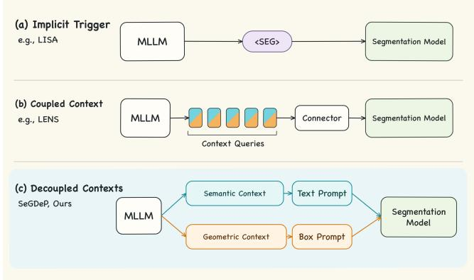  
Figure 1: Reasoning-to-segmentation interfaces. Trigger and coupled-context designs provide no explicit separation; SeGDeP emits complementary semantic and box prompts.

We introduce SeGDeP, which makes both decisions explicit and executable. A semantic context extractor produces role-typed prompt features, while an independent geometric projection preserves context tokens for localization. They jointly condition DETR, frozen image features refine its coarse box, and the mask decoder combines the resulting semantic and box prompts. Thus, prompt construction is separated before downstream integration and supervised in each execution space.

Training first aligns the interface, then optimizes reasoning with format, box-IoU, and mask-IoU feedback normalized by GDPO (Liu et al. 2026). Matched coupled baselines, stage-wise checkpoints, gradient measurements, and prompt interventions test the mechanism. SeGDeP reaches 82.7 average cIoU across eight RefCOCO-family splits and 66.0/59.6 gIoU on ReasonSeg val/test.

Our main contributions are:

• An executable semantic–geometric interface converts resolved MLLM states into specialized text and box prompts through semantic prompt refinement and geometric context projection.

• Comprehensive ablations verify the design, while gradient diagnostics and prompt interventions expose complementary semantic and geometric roles.

• Interface alignment and GDPO deliver strong RefCOCO and ReasonSeg results while adapting only 0.38% of Qwen3-VL parameters through LoRA.

## Related Work

Image reasoning segmentation. Referring image segmentation grounds explicit expressions at pixel level (Mao et al. 2016; Yu et al. 2016; Kazemzadeh et al. 2014). Methods such as LAVT and ReLA improve cross-modal alignment (Yang et al. 2022; Liu, Ding, and Jiang 2023), while PixelLM, GLaMM, SAM4MLLM, and UniPixel connect MLLMs to pixel decoders (Ren et al. 2024; Rasheed et al. 2024; Chen et al. 2024; Liu et al. 2025a). Reasoning segmentation extends this setting to implicit attributes, functions, and relations. LISA and LISA++ use a segmentation token, Seg-Zero emits spatial prompts, ThinkFirst structures rationales, and LENS pools chain-of-thought states (Lai et al. 2024; Yang et al. 2023; Liu et al. 2025b; Kao, Tai, and Tang 2025; Zhu et al. 2026). These interfaces improve reasoning, but still encode semantic identity and spatial support in a single implicit or coupled representation.

Promptable segmenters expose executable controls: SAM and SAM 2 accept spatial prompts, and SAM 3 adds conceptaware text conditioning (Kirillov et al. 2023; Ravi et al. 2025; Carion et al. 2026); grounding models likewise demonstrate structured language alignment with box regression (Liu et al. 2024; Li et al. 2022). SeGDeP therefore translates resolved reasoning into separate text and box prompts, retaining semantic discrimination while making localization explicit and measurable.

Chain-of-thought and policy optimization. Chain-ofthought and its multimodal extensions externalize intermediate decisions and visual evidence (Wei et al. 2022; Kojima et al. 2022; Zhang et al. 2024b; Rose et al. 2023). ThinkFirst structures rationales for reasoning segmentation (Kao, Tai, and Tang 2025); we use a Self-Ask-style QA trace to make intermediate conclusions parseable (Press et al. 2023). For dense prediction, a well-formed rationale may still select the wrong instance or yield an unusable prompt.

GRPO uses within-group relative outcomes and requires no learned critic (Shao et al. 2024); Seg-Zero and LENS extend it to segmentation-aware reasoning. GDPO separately normalizes format, localization, and mask rewards before aggregation because their scales difer (Liu et al. 2026).

## Method

## Problem Formulation and Overview

$\operatorname { L e t } x = \left( I , q \right)$ denote an image and a referring request, either explicit or implicit; the goal is to predict its binary mask $M ^ { * }$ An MLLM produces a QA trace y and hidden states H, while the frozen SAM 3 image backbone extracts F. A semantic context-query extractor attends to $H ,$ , and an independent projection retains the hidden-state sequence for geometric decoding:

$$
C _ { \mathrm { s e m } } = \mathrm { A t t n } ( Q _ { \mathrm { s e m } } , H , H ) , \qquad Z _ { \mathrm { g e o } } = \Pi _ { \mathrm { g e o } } ( H ) .\tag{1}
$$

$C _ { \mathrm { s e m } }$ represents the identity, attributes, and relations needed to resolve what, while $Z _ { \mathrm { g e o } }$ retains the multimodal evidence needed to determine where. The two parameterized paths specialize before integration.

The semantic branch produces $P _ { \mathrm { s e m } } = \mathcal { T } ( C _ { \mathrm { s e m } } )$ , while the geometric path predicts $b = \mathcal { G } ( F , Z _ { \mathrm { g e o } } , P _ { \mathrm { s e m } } )$ . Their joint decoding is

$$
\hat { M } = \sigma ( { \cal D } ( { \cal F } , { \cal P } _ { \mathrm { s e m } } , b ) ) .\tag{2}
$$

Here $\tau$ translates semantic context into the SAM 3 prompt space, $\mathcal { G }$ denotes coarse-to-fine localization, and D is the mask decoder. The paths specialize before the decoder recombines identity and spatial support. $F$ is shared by ROI refinement and mask decoding. $P _ { \mathrm { s e m } }$ enters both the DETR memory and the native text-prompt channel, whereas b is supplied through the spatial-prompt channel.

## Decoupled Prompt Connector

Semantic prompt: what to segment. The translator organizes $C _ { \mathrm { s e m } }$ with a role-typed bank B, projects its tokens into the SAM 3 text space, and applies a residual refiner: $P _ { 0 } = \Pi _ { \mathrm { t e x t } } ( B ( C _ { \mathrm { s e m } } ) )$ and $P _ { \mathrm { s e m } } \stackrel { \_ } { = } P _ { 0 } + \mathcal { R } _ { \mathrm { t e x t } } ( P _ { 0 } )$ . The bank maps the reasoning context to a fixed prompt-token set whose learnable roles capture complementary attributes and relations. $\Pi _ { \mathrm { t e x t } }$ matches the SAM 3 prompt representation, and the residual update refines the token content while preserving its initial projection.

Geometric prompt: coarse localization. The geometric projection in Eq. 1 maps the MLLM hidden-state sequence directly into localization tokens $Z _ { \mathrm { g e o } }$ , preserving its sequence for spatial selection by DETR. We concatenate it with the semantic prompt to form the text-aligned memory $U _ { \mathrm { g e o } } =$ $[ Z _ { \mathrm { g e o } } ; P _ { \mathrm { s e m } } ]$ . Using one referent query, the decoder produces a normalized coarse box

$$
b _ { c } = \mathcal G _ { c } ( U _ { \mathrm { g e o } } ) .\tag{3}
$$

$Z _ { \mathrm { g e o } }$ carries MLLM spatial evidence, while $P _ { \mathrm { s e m } }$ aligns the decoder with the resolved referent. Successive decoder layers refine the single-referent estimate, and the final $b _ { c }$ enters ROI refinement. At each layer, the referent query cross-attends to $U _ { \mathrm { g e o } }$ and updates its reference box.

ROI box refinement. The coarse box selects local features $R \ : = \ : \mathrm { R O I A l i g n } ( F , b _ { c } )$ . The ROI refiner combines these boundary-sensitive features with the semantic prompt and predicts the final box as

$$
\boldsymbol { b } = b _ { c } + \mathcal { R } ( R , P _ { \mathrm { s e m } } , b _ { c } ) .\tag{4}
$$

Here R predicts a residual correction. Local visual evidence improves boundary alignment, while $P _ { \mathrm { s e m } }$ distinguishes nearby instances with similar spatial support. The two sources are fused during box refinement, while the upstream semantic and geometric paths remain separately parameterized. The coarse box initializes the refinement query, and the ROI tokens and $P _ { \mathrm { s e m } }$ form its local visual–semantic memory.

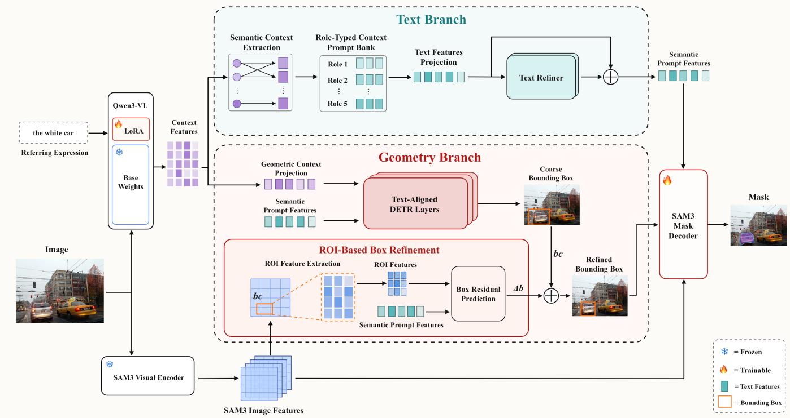  
Figure 2: Architecture of the Qwen3-VL/SAM 3 instantiation of SeGDeP. A role-typed semantic branch produces $P _ { \mathrm { s e m } } .$ , while an independent projection produces geometric context $Z _ { \mathrm { g e o } }$ . Both condition DETR to predict $\mathit { b _ { c } } ,$ which selects frozen SAM 3 ROI features for residual refinement. The decoder combines semantic features, the refined box, and image features. Snowflakes and flames denote frozen base weights and trainable adapters or decoder components, respectively; all newly introduced module are trainable.

Composite mask decoding. The refined box and semantic tokens enter the native spatial- and text-prompt channels of the SAM 3 mask decoder, whichjointly conditions on the image features and both prompts. The box restricts the spatial support, whereas the semantic prompt preserves the identity cues needed to distinguish overlapping or visually similar instances. Mask gradients reach both prompt paths, which remain separately parameterized until their downstream integration. The SAM 3 prompt transformer fuses these inputs before the segmentation head produces mask logits.

## Two-Stage Optimization

The two stages separate learning an executable prompt interface from adapting the reasoning policy that drives it.

Stage 1: interface alignment. We freeze the MLLM, the SAM 3 image backbone, and its mask decoder, and optimize the two prompt paths and coarse-to-fine localization modules in Fig. 2. A frozen SAM 3 text encoder maps the expression to teacher prompt $P _ { \mathrm { s e m } } ^ { * } ,$ while $b ^ { * }$ is derived from the target mask. Let V index the valid semantic-prompt tokens. The objective is

$$
\begin{array} { r l r } {  { \mathcal { L } _ { 1 } = \frac { \lambda _ { s } } { | \mathcal { V } | } \sum _ { t \in \mathcal { V } } \| p _ { \mathrm { s e m } , t } - p _ { \mathrm { s e m } , t } ^ { * } \| _ { 2 } ^ { 2 } + \lambda _ { b } \mathcal { L } _ { \mathrm { b o x } } , } } \\ & { } & { \mathcal { L } _ { \mathrm { b o x } } = \| b - b ^ { * } \| _ { 1 } + \mathcal { L } _ { \mathrm { G I o U } } ( b , b ^ { * } ) . } \end{array}\tag{5}
$$

The semantic term aligns the learned prompt with the SAM 3 text-prompt space, while the box terms supervise geometric localization. Stage 1 establishes a stable mapping from MLLM hidden states to executable text and box prompts, providing the initialization for policy optimization. The frozen text encoder supplies training targets, and inference uses the learned semantic path.

Stage 2: reasoning elicitation with GDPO. We activate LoRA in the MLLM (Hu et al. 2022), keep the image backbone frozen, and update the connector and mask decoder. For each input, we sample G reasoning traces. Completion i receives mask reward $R _ { m , i } = \mathrm { I o U } ( \hat { M } _ { i } , M ^ { * } )$ , box reward $R _ { b , i } = \mathrm { I o U } ( b _ { i } , b ^ { * } )$ , and format reward $R _ { f , i }$ . These components score final mask quality, spatial localization, and structured reasoning with an explicit referent, respectively.

These rewards difer in scale and variance. GDPO (Liu et al. 2026) standardizes each component within the completions sampled for the same input before aggregation:

$$
A _ { i } = \sum _ { j \in \{ m , b , f \} } w _ { j } \frac { R _ { j , i } - \mu _ { g } ( R _ { j } ) } { \sigma _ { g } ( R _ { j } ) + \epsilon } .\tag{6}
$$

Component-wise standardization balances the contributions of format, localization, and mask quality to the group advantage.

The final objective combines the advantage-weighted policy loss with a KL constraint and supervised geometric and

mask stabilization:

$$
\begin{array} { r } { \mathcal { L } _ { 2 } = \mathcal { L } _ { \mathrm { P G } } ( A ) { + } \beta \mathcal { L } _ { \mathrm { K L } } ( \pi _ { \theta } , \pi _ { \mathrm { r e f } } ) { + } \lambda _ { b } \mathcal { L } _ { \mathrm { b o x } } { + } \lambda _ { m } \mathcal { L } _ { \mathrm { m a s k } } . } \end{array}\tag{7}
$$

Here $\mathcal { L } _ { \mathrm { P G } }$ increases the likelihood of sampled traces with positive $A _ { i }$ and suppresses those with negative $A _ { i }$ . The reference $\pi _ { \mathrm { r e f } }$ is the frozen policy at the start of Stage 2, and $\mathcal { L } _ { \mathrm { m a s k } } = \mathcal { L } _ { \mathrm { D i c e } } + \mathcal { L } _ { \mathrm { B C E } }$ (Milletari, Navab, and Ahmad 2016). The box objective from Eq. 5 (Rezatofighi et al. 2019) and mask supervision preserve the executable interface during policy optimization. Stage 2 jointly updates the prompt translator, localization path, and mask decoder under this objective. Exact format scoring, sample-equal completiontoken averaging, and the $k _ { 3 }$ estimator (Schulman 2020) used for ${ \mathcal { L } } _ { \mathrm { K I } }$ are detailed in Appendix B.

## Experiments

## Setup

Datasets and metrics. We evaluate explicit referring segmentation on RefCOCO and RefCOCO+ (Yu et al. 2016), and RefCOCOg (Mao et al. 2016), and implicit reasoning segmentation on ReasonSeg (Lai et al. 2024), using their official splits. GroundingSuite-Eval (GSEval) (Hu et al. 2025) is held out for zero-shot transfer. Cumulative IoU (cIoU) pools intersections and unions over a split and therefore gives larger masks more weight; generalized IoU (gIoU) averages per-image mask IoU. We follow the dominant protocol by using cIoU for the RefCOCO-series comparison and both metrics on ReasonSeg.

Models and comparison protocol. The main model pairs Qwen3-VL-4B-Instruct with SAM 3. Stage 1 trains the executable interface on the RefCOCO series; Stage 2 adds ReasonSeg, continues updating the connector, and activates 17M MLLM LoRA parameters (0.38% of Qwen3-VL) and the SAM 3 mask decoder while keeping the base MLLM and image backbone frozen. Both stages use AdamW (Loshchilov and Hutter 2019). GSEval is used for neither training nor model selection. An additional 2B variant replaces only the MLLM with Qwen3-VL-2B-Instruct and otherwise retains the segmenter, data, optimization, and evaluation protocol. Table 1 separates methods with and without active chainof-thought reasoning, while Table 2 reports results on ReasonSeg. Prior-method scores are taken from their reported oficial-split results. Complete hyperparameters and trainable scopes are provided in Appendix A.

## Main Results

RefCOCO series. Table 1 reports the comparison over eight oficial splits. SeGDeP-4B obtains the best average cIoU of 82.7, exceeding LENS-3B by 1.5 points and ranking first on seven splits. The corresponding average per-image gIoU of SeGDeP-4B is 83.2, closely tracking its 82.7 cIoU. The largest cIoU margin is +5.3 on RefCOCO+ testB. Because RefCOCO+ removes absolute-location words, its expressions place greater weight on attributes, relations, and instance identity. Averaged over its three splits, SeGDeP improves over LENS by 3.4 points, compared with 0.7 on Ref-COCO. The larger gain under weaker spatial-language cues highlights the contribution of semantic prompting to instance discrimination.

The compact models in the same CoT group show the same pattern. SeGDeP-2B outperforms Seg-Zero-3B on all three commonly reported splits, averages 77.8 versus 76.5 for LENS-2B, and leads LENS on seven of eight splits. Its average gain is 2.9 points on RefCOCO+ versus 0.6 on Ref-COCO, reaching +4.3 on RefCOCO+ testB. This cross-scale consistency shows that the benefit of the interface persists at smaller MLLM capacity. The context-plus-connector interface also uses 318.5M parameters versus 474.8M for LENS, a 32.9% reduction, while Stage 2 adapts 17M MLLM parameters through LoRA (Table C2). Higher accuracy with a lighter interface and limited MLLM adaptation further demonstrates the efectiveness of semantic–geometric prompt translation.

ReasonSeg. Table 2 reports single-pass results on both validation and test splits. SeGDeP ranks first on all four metrics; compared with LENS, it improves validation gIoU/cIoU by 3.9/0.4 points and test gIoU/cIoU by 2.4/0.8. The larger validation gain in gIoU is informative: gIoU weights each image equally, whereas cIoU pools pixels over the dataset and is more influenced by large masks. Thus, the improvement is distributed across examples rather than being driven mainly by large objects. Relative to InstructSeg, the closest validation cIoU competitor, SeGDeP gains only 0.1 cIoU but 4.1 gIoU, further indicating fewer severe per-image failures. The simultaneous test gains under both aggregations show that this behavior transfers beyond the validation split. Overall, the decoupled interface extends from direct referring expressions to implicit instructions requiring functional, relational, or action-based inference.

## Ablation Studies and Diagnostic Analysis

Controlled stage-wise ablation. Table 3(a) crosses interface structure with training stage. The coupled and decoupled models use the same foundations, data, trainable scope, and Stage-2 recipe; they difer only in whether semantic prompt formation and localization share one upstream connector. After Stage 1, the decoupled interface reaches 56.4 gIoU versus 53.1 for the coupled interface, a 3.3-point gain with the foundation models frozen. Stage 2 raises the two variants by 11.2 and 9.6 points to 64.3 and 66.0, respectively. Outcomeoriented training therefore improves both interfaces, while specialized prompt construction supplies a consistent structural gain before and after policy adaptation. This controlled comparison isolates prompt-path separation from the efect of reinforced reasoning; their combination achieves the highest performance.

Gradient diagnostic. We next examine the supervisory demands placed on the shared context of the controlled coupled model. For each sample, the semantic and geometric losses are backpropagated separately and their context-gradient cosine is measured. Table A4 reports negative cosines for 37.0%, 46.0%, and 44.5% of samples on RefCOCO val, ReasonSeg val, and GSEval, respectively; the corresponding mean cosines are 0.023, 0.006, and 0.004. The gradient-norm ratio remains 0.95 on all three datasets, so the two objectives have similar average strength but often request diferent local updates. This pattern recurs across explicit expressions, implicit instructions, and zero-shot samples. Separately parameterized semantic refinement and geometric projection paths let these requirements specialize before downstream integration, connecting the observed gradient behavior to the controlled performance gains in Table 3(a).

<table><tr><td></td><td colspan="4">RefCOCO</td><td colspan="3">RefCOCO+</td><td colspan="3">RefCOCOg</td></tr><tr><td>Method</td><td>Venue</td><td>val</td><td>testA</td><td>testB</td><td>val</td><td>testA</td><td>testB</td><td>val-u</td><td>test-u</td><td>Avg.</td></tr><tr><td>Without active CoT reasoning</td><td></td><td></td><td></td><td></td><td></td><td></td><td></td><td></td><td></td><td></td></tr><tr><td>LAVT (Yang et al. 2022)</td><td>CVPR&#x27;22</td><td>72.7</td><td>75.8</td><td>68.8</td><td>62.1</td><td>68.4</td><td>55.1</td><td>61.2</td><td>62.1</td><td>65.8</td></tr><tr><td>ReLA (Liu, Ding, and Jiang 2023)</td><td>CVPR&#x27;23</td><td>73.8</td><td>76.5</td><td>70.2</td><td>66.0</td><td>71.0</td><td>57.7</td><td>65.0</td><td>66.0</td><td>68.3</td></tr><tr><td>LISA-7B (Lai et al. 2024)</td><td>CVPR&#x27;24</td><td>74.1</td><td>76.5</td><td>71.1</td><td>62.4</td><td>67.4</td><td>56.5</td><td>66.4</td><td>68.5</td><td>67.9</td></tr><tr><td>PixelLM-7B (Ren et al. 2024)</td><td>CVPR&#x27;24</td><td>76.9</td><td>78.5</td><td>74.4</td><td>69.2</td><td>72.1</td><td>64.5</td><td>70.7</td><td>72.4</td><td>72.3</td></tr><tr><td>PerceptionGPT (Pi et al. 2024)</td><td>CVPR&#x27;24</td><td>75.1</td><td>78.6</td><td>71.7</td><td>68.5</td><td>73.9</td><td>61.3</td><td>70.3</td><td>71.7</td><td>71.4</td></tr><tr><td>OMG-LLaVA (Zhang et al. 2024a)</td><td>NeurIPS&#x27;24</td><td>78.0</td><td>80.3</td><td>74.1</td><td>69.1</td><td>73.1</td><td>63.0</td><td>72.9</td><td>72.9</td><td>72.9</td></tr><tr><td>SAM4MLLM-8B (Chen et al. 2024)</td><td>ECCV&#x27;24</td><td>79.8</td><td>82.7</td><td>74.7</td><td>74.6</td><td>80.0</td><td>67.2</td><td>75.5</td><td>76.4</td><td>76.4</td></tr><tr><td>VISA (Yan et al. 2024)</td><td>ECCV’24</td><td>72.4</td><td>75.5</td><td>68.1</td><td>59.8</td><td>64.8</td><td>53.1</td><td>65.5</td><td>66.4</td><td>65.7</td></tr><tr><td>GLaMM-7B (Rasheed et al. 2024)</td><td>CVPR&#x27;24</td><td>79.5</td><td>83.2</td><td>76.9</td><td>72.6</td><td>78.7</td><td>64.6</td><td>74.2</td><td>74.9</td><td>75.6</td></tr><tr><td>UniPixel-7B (Liu et al. 2025a)</td><td>NeurIPS&#x27;25</td><td>80.8</td><td>83.0</td><td>77.4</td><td>75.3</td><td>80.1</td><td>70.0</td><td>76.4</td><td>77.1</td><td>77.5</td></tr><tr><td>SAM3-Agent-Gemini (Carion et al. 2026)</td><td>ICLR&#x27;26</td><td>74.9</td><td>77.8</td><td>69.9</td><td>66.9</td><td>71.1</td><td>62.4</td><td>73.3</td><td>73.6</td><td>71.2</td></tr><tr><td>With active CoT reasoning</td><td></td><td></td><td></td><td></td><td></td><td></td><td></td><td></td><td></td><td></td></tr><tr><td>Seg-Zero-3B (Liu et al. 2025b)</td><td>arXiv&#x27;25</td><td></td><td>79.3</td><td></td><td></td><td>73.7</td><td></td><td>71.5</td><td></td><td></td></tr><tr><td>Seg-Zero-7B (Liu et al. 2025b)</td><td>arXiv&#x27;25</td><td></td><td>80.3</td><td></td><td></td><td>76.2</td><td></td><td>72.6</td><td></td><td></td></tr><tr><td>LENS-2B (Zhu et al. 2026)</td><td>AAAI&#x27;26</td><td>80.7</td><td>82.7</td><td>77.1</td><td>73.8</td><td>78.0</td><td>67.3</td><td>75.7</td><td>76.4</td><td>76.5</td></tr><tr><td>LENS-3B (Zhu et al. 2026)</td><td>AAAI&#x27;26</td><td>84.2</td><td>85.3</td><td>81.0</td><td>79.4</td><td>82.8</td><td>74.3</td><td>81.2</td><td>81.0</td><td>81.2</td></tr><tr><td>SeGDeP-2B</td><td></td><td>81.4</td><td>83.1</td><td>77.9</td><td>75.8</td><td>80.3</td><td>71.6</td><td>75.3</td><td>77.0</td><td>77.8</td></tr><tr><td>SeGDeP-4B</td><td></td><td>84.2</td><td>85.7</td><td>82.8</td><td>82.3</td><td>84.7</td><td>79.6</td><td>80.1</td><td>81.9</td><td>82.7</td></tr></table>

Table 1: cIoU on the RefCOCO series. Avg. is the mean over eight splits and is unavailable for methods reporting only selected splits. Best and second-best complete results are marked in bold and underline; ranks are determined before one-decimal rounding.

<table><tr><td rowspan="2"></td><td colspan="2">Val</td><td colspan="2">Test</td></tr><tr><td>gIoU</td><td>cIoU</td><td>gIoU</td><td>cIoU</td></tr><tr><td>SAM4MLLM-8B (Chen et al. 2024)</td><td>58.4</td><td>60.4</td><td></td><td>一</td></tr><tr><td>HyperSeg-3B (Wei et al. 2025a)</td><td>59.2</td><td>56.7</td><td></td><td>一</td></tr><tr><td>InstructSeg-3B (Wei et al. 2025b)</td><td>61.9</td><td>65.2</td><td></td><td></td></tr><tr><td>LISA-7B (Lai et al. 2024)</td><td>52.9</td><td>54.0</td><td>55.6</td><td>56.9</td></tr><tr><td>Seg-Zero-3B (Liu et al. 2025b)</td><td>58.2</td><td>53.1</td><td>56.1</td><td>48.6</td></tr><tr><td>LENS-3B (Zhu et al. 2026)</td><td>62.1</td><td>64.9</td><td>57.2</td><td>58.0</td></tr><tr><td>SeGDeP-4B</td><td>66.0</td><td>65.3</td><td>59.6</td><td>58.8</td></tr></table>

Table 2: Single-pass results on ReasonSeg. Best results are bold and second-best results are underlined.

Prompt and segmenter ablations. Table 3(b) shows that learned text and box translation reach 63.1 and 63.8 gIoU, compared with 58.6 and 62.3 for direct outputs. Combining both raises performance to 66.0, 2.2 points beyond the strongest single branch. The box connector also improves direct box prompting with SAM 2 (+1.4) and SAM 3 (+1.5), showing that geometric translation transfers across segmenters. The complete interface uses SAM 3 because compositional text and box channels are both required, whereas SAM 2 exposes only the spatial-prompt path.

<table><tr><td colspan="2">(a) Interface structure across training stages</td><td rowspan="2">Full training</td></tr><tr><td>Interface</td><td>Stage 1 only</td></tr><tr><td>Coupled context Decoupled prompts</td><td>53.1 56.4</td><td>64.3 66.0</td></tr><tr><td colspan="3">(b) Prompt and segmenter variants</td></tr><tr><td>Prompt/interface</td><td>Segmenter</td><td>Final gIoU</td></tr><tr><td>MLLM box output</td><td>SAM 2</td><td>61.0</td></tr><tr><td>Connector, box only</td><td>SAM 2</td><td>62.4</td></tr><tr><td>MLLM text output</td><td>SAM 3</td><td>58.6</td></tr><tr><td>Connector, text only</td><td>SAM 3</td><td>63.1</td></tr><tr><td>MLLM box output</td><td>SAM 3</td><td>62.3</td></tr><tr><td>Connector, box only</td><td>SAM 3</td><td>63.8</td></tr><tr><td>SeGDeP, dual prompt</td><td>SAM 3</td><td>66.0</td></tr><tr><td></td><td></td><td></td></tr></table>

Table 3: Controlled ablations on ReasonSeg val (gIoU). (a) The coupled model instantiates a LENS-style shared context in our framework. (b) Prompt and segmenter variants are evaluated after Stage 2. Bold and underline mark the best and second-best results in panel (b); panel (a) marks only the better of its two settings.

Prompt-role analysis. For each image containing multiple candidate instances, we select a same-category, visually similar non-target. Its semantic prompt defines the semantic hard negative, whereas its box defines the geometric hard negative; only the channel under test is replaced. Replacing the predicted box with the ground-truth box adds 4.8/7.0 cIoU, while the hard-negative box lowers cIoU by 83.0/81.0 points and has only 11.93/11.90 box IoU. Geometry is therefore an executable spatial prior. Substituting the frozen SAM 3 text feature lowers cIoU by 3.7/4.6, showing that Stage 1 distillation is an anchor rather than the final representation.

<table><tr><td>Prompt intervention</td><td>RefCOCO cIoU (∆)</td><td>RefCOCO+ cIoU (∆)</td></tr><tr><td>Predicted semantic + box</td><td>84.29</td><td>82.38</td></tr><tr><td>Box → ground truth</td><td>89.08 (+4.79)</td><td>89.35 (+6.97)</td></tr><tr><td>Box → hard negative</td><td>1.28 (−83.01)</td><td>1.34 (−81.04)</td></tr><tr><td>Semantic → SAM 3 text</td><td>80.57 (-3.72)</td><td>77.81 (-4.57)</td></tr><tr><td>Semantic → hard negative</td><td> $8 4 . 1 9 \ ( - 0 . 1 0 )$ </td><td>82.17 (−0.21)</td></tr></table>

Table 4: Prompt intervention on a same-image multiinstance subset. Parentheses show the cIoU change from the predicted-prompt baseline. A hard negative swaps one channel with that of a same-category, visually similar non-target in the same image; the other channel is held fixed.

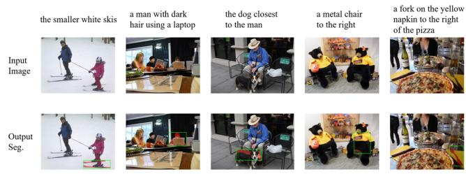  
Figure 3: Qualitative results on RefCOCOg. The examples require resolving spatial relations, appearance attributes, and interactions. Green denotes the reference mask and the red rectangle denotes the predicted geometric prompt.

The semantic hard-negative has a smaller average efect because the predicted box is fixed and often contains only one dominant instance. This estimates the direct efect of the final semantic channel, not the total efect of semantic reasoning: identity evidence influences localization through both the projected MLLM context and $P _ { \mathrm { s e m } }$ in the DETR memory before the box is produced. These results show that the decoupled prompt paths guide localization upstream, while the semantic prompt further resolves identity and boundaries within the localized support. Semantics therefore contributes both before the box through DETR memory and after it through mask conditioning, whereas geometry provides the decisive spatial constraint. Appendix C documents the multi-instance subset and the fixed-channel hard-negative construction used in Table 4.

Qualitative evidence on referring expressions. Figure 3 illustrates why the two prompts should be complementary rather than interchangeable. The four expressions stress distinct cues: size and color for the smaller white skis, appearance plus action for the dark-haired laptop user, relative distance for the dog closest to the man, and a two-object spatial relation for the fork on the napkin beside the pizza. The semantic branch must preserve the discriminative attribute, activity, or anchor relation rather than only the target noun. The geometric branch then turns that resolved description into a compact support region, preventing the decoder from drifting to another person, dog, utensil, or salient object elsewhere in the scene.

The examples also expose diferent costs of localization error. The skis and fork are thin, so a modest box shift can remove a substantial fraction of their foreground pixels; the person and dog occupy larger regions but compete with samecategory or interaction-related distractors. In all four cases, the predicted box selects the intended instance and the mask recovers its visible extent, connecting the qualitative behavior to the strong hard-negative-box efect in Table 4. Residual discrepancies concentrate on thin structures and partially occluded extremities, complementing the localization slices analyzed below.

Qualitative evidence on implicit instructions. Figure 4 provides a harder diagnostic because the target, a tennis racket, is absent from the literal instruction. The trace first resolves the requested function—the object used to hit a ball across a net—and distinguishes the racket from the player, ball, net, court, and spectators. The geometric head then selects the compact racket support rather than the much larger player region, while the semantic prompt preserves the functional identity needed by the mask decoder.

This sequence also explains why a correct-looking rationale alone is insuficient: an imprecise spatial translation could include the player’s arm or exclude the racket head, whereas a plausible box around the wrong object cannot be repaired reliably by boundary decoding. Conversely, the displayed agreement among the resolved referent, box, and mask makes the intermediate interface inspectable. The example therefore connects the quantitative intervention in Table 4 to observable behavior rather than treating the reasoning trace as post-hoc prose. Appendix E extends this evidence with five additional successful cases spanning functional, causal, role-specific, and set-level reasoning.

## Additional Empirical Studies

Reward aggregation. On ReasonSeg val, Stage 1 obtains 56.4 gIoU, and full Stage-2 training with summed-reward GRPO reaches 63.7. Replacing summed aggregation with component-normalized GDPO raises performance to 66.0 (+2.3) with all other Stage-2 settings fixed. Because GRPO and GDPO share the data, trainable modules, and supervised losses, this comparison isolates the efect of componentwise reward normalization. Appendix B and Table B1 further show that format success rises from 96.0% to 97.5%, while average QA pairs fall from 4.92 to 4.63, completion length falls from 367 to 318 tokens, and low-IoU formatted outputs fall from 26.2% to 21.5%. The accuracy gain is therefore accompanied by more concise trajectories and fewer formally valid but visually poor outputs.

Zero-shot transfer and eficiency. Without GSEval training or model selection, SeGDeP obtains 68.4 gIoU and 75.2 cIoU, compared with 67.0 and 78.3 for LENS (Table C1). Its 1.4-point gIoU advantage indicates more reliable per-image transfer across unseen instructions. Because gIoU gives every instruction equal weight, this gain shows that the transfer benefit is distributed across samples rather than concentrated in large foreground regions; pooled cIoU remains 3.1 points below LENS.

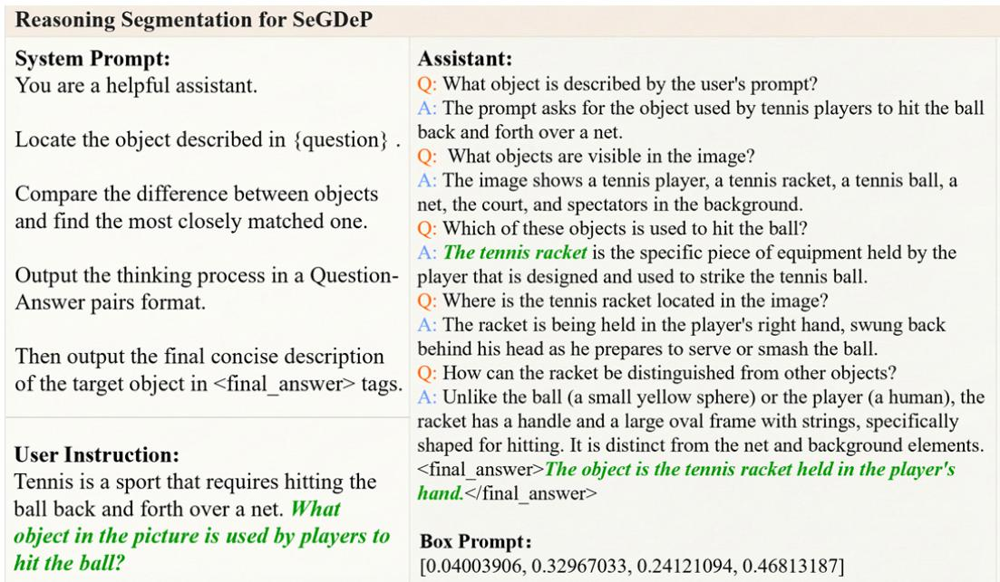

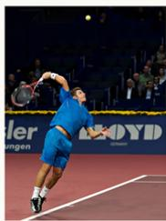

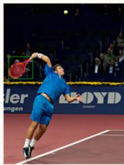  
Figure 4: A reasoning-to-segmentation example on ReasonSeg. The instruction, concise resolution process, predicted box prompt, and final mask jointly expose how functional knowledge is translated into an executable spatial prompt.

On one NVIDIA A800, context extraction and the connector consume 2.8 ms, only 0.14% of the 2.0009 s end-to-end time. Table C2 provides the complete cost decomposition. Since SeGDeP and LENS use diferent MLLM and segmenter foundations, these measurements characterize where runtime is spent rather than rank the two complete systems by speed.

Error analysis. On 2,573 RefCOCOg val-u samples, the overall box and mask IoUs are 81.51 and 80.88 (Table 5). We further evaluate two overlapping hard subsets: targets occupying 5–10% of the image and scenes containing more than ten objects. Their box/mask IoUs are 73.75/71.82 and 76.70/75.17, respectively, showing that localization is most sensitive to target scale and scene density.

Across all samples, mask IoU trails box IoU by only 0.63 points. The gap widens to 1.93 points for small targets and 1.53 points in crowded scenes, suggesting that localization imprecision propagates into mask decoding under harder geometry. Together with the hard-negative-box collapse in Table 4, this identifies prompt localization as the dominant residual bottleneck. Small targets provide limited detail for box regression and ROI refinement, while crowded scenes intensify single-query instance competition, motivating higherresolution localization and explicit multi-instance reasoning.

The lowest-performing object categories—ties, skis, backpacks, and books—fit the same pattern: they are commonly thin, small, or partially occluded. Thus the RefCOCOg gap is better characterized as a failure to preserve fine spatial support under crowding.

<table><tr><td>Slice</td><td>Box IoU</td><td>Mask IoU</td></tr><tr><td>All samples</td><td>81.51</td><td>80.88</td></tr><tr><td>Target area 5–10%</td><td>73.75</td><td>71.82</td></tr><tr><td>More than 10 objects</td><td>76.70</td><td>75.17</td></tr></table>

Table 5: RefCOCOg val-u diagnostics over 2,573 samples (IoU in percentages). The two hard subsets are selected independently and may overlap.

## Conclusion

SeGDeP reframes reasoning segmentation as explicit what– where prompt translation. Its decoupled semantic and geometric branches produce native text and box prompts for SAM 3, while GDPO aligns reasoning with localization and mask quality. Consistent gains across RefCOCO and Reason-Seg, supported by matched ablations, gradient diagnostics, and prompt interventions, validate this interface. Errors on small, crowded targets motivate stronger localization and multi-instance support.

## References

Bai, S.; Chen, K.; Liu, X.; et al. 2025a. Qwen2.5-VL Technical Report. arXiv preprint arXiv:2502.13923.

Bai, S.; et al. 2025b. Qwen3-VL Technical Report. arXiv preprint arXiv:2511.21631.

Carion, N.; Gustafson, L.; Hu, Y.-T.; et al. 2026. SAM 3: Segment Anything with Concepts. In International Conference on Learning Representations.

Chen, Y.-C.; Li, W.-H.; Sun, C.; Wang, Y.-C. F.; and Chen, C.-S. 2024. SAM4MLLM: Enhance Multi-Modal Large Language Model for Referring Expression Segmentation. In European Conference on Computer Vision, 323–340.

Dai, W.; Li, J.; Li, D.; et al. 2023. InstructBLIP: Towards General-Purpose Vision-Language Models with Instruction Tuning. In Advances in Neural Information Processing Systems, volume 36, 49250–49267.

Gemini Team; Anil, R.; Borgeaud, S.; et al. 2023. Gemini: A Family of Highly Capable Multimodal Models. arXiv preprint arXiv:2312.11805.

Hu, E. J.; Shen, Y.; Wallis, P.; et al. 2022. LoRA: Low-Rank Adaptation of Large Language Models. In International Conference on Learning Representations.

Hu, R.; Zhu, L.; Zhang, Y.; Cheng, T.; Liu, L.; Liu, H.; Ran, L.; Chen, X.; Liu, W.; and Wang, X. 2025. GroundingSuite: Measuring Complex Multi-Granular Pixel Grounding. In Proceedings of the IEEE/CVF International Conference on Computer Vision, 23105–23114.

Kao, S.-h.; Tai, Y.-W.; and Tang, C.-K. 2025. Think Before You Segment: High-Quality Reasoning Segmentation with GPT Chain of Thoughts. arXiv preprint arXiv:2503.07503.

Kazemzadeh, S.; Ordonez, V.; Matten, M.; and Berg, T. 2014. ReferItGame: Referring to Objects in Photographs of Natural Scenes. In Proceedings of the 2014 Conference on Empirical Methods in Natural Language Processing, 787–798.

Kirillov, A.; Mintun, E.; Ravi, N.; et al. 2023. Segment Anything. In Proceedings of the IEEE/CVF International Conference on Computer Vision, 4015–4026.

Kojima, T.; Gu, S. S.; Reid, M.; Matsuo, Y.; and Iwasawa, Y. 2022. Large Language Models are Zero-Shot Reasoners. In Advances in Neural Information Processing Systems, volume 35, 22199–22213.

Lai, X.; Tian, Z.; Chen, Y.; Li, Y.; Yuan, Y.; Liu, S.; and Jia, J. 2024. LISA: Reasoning Segmentation via Large Language Model. In Proceedings of the IEEE/CVF Conference on Computer Vision and Pattern Recognition, 9579–9589.

Li, L. H.; Zhang, P.; Zhang, H.; et al. 2022. Grounded Language-Image Pre-Training. In Proceedings of the IEEE/CVF Conference on Computer Vision and Pattern Recognition, 10965–10975.

Liu, C.; Ding, H.; and Jiang, X. 2023. GRES: Generalized Referring Expression Segmentation. In Proceedings of the IEEE/CVF Conference on Computer Vision and Pattern Recognition, 23592–23601.

Liu, H.; Li, C.; Wu, Q.; and Lee, Y. J. 2023. Visual Instruction Tuning. In Advances in Neural Information Processing Systems, volume 36, 34892–34916.

Liu, S.; Zeng, Z.; Ren, T.; et al. 2024. Grounding DINO: Marrying DINO with Grounded Pre-Training for Open-Set Object Detection. In European Conference on Computer Vision, 38–55.

Liu, S.-Y.; Dong, X.; Lu, X.; Diao, S.; Belcak, P.; Liu, M.; Chen, M.-H.; Yin, H.; Wang, Y.-C. F.; Cheng, K.-T.; Choi, Y.; Kautz, J.; and Molchanov, P. 2026. GDPO: Group reward-Decoupled Normalization Policy Optimization for Multireward RL Optimization. arXiv preprint arXiv:2601.05242.

Liu, Y.; Ma, Z.; Pu, J.; Qi, Z.; Wu, Y.; Shan, Y.; and Chen, C. W. 2025a. UniPixel: Unified Object Referring and Segmentation for Pixel-Level Visual Reasoning. In Advances in Neural Information Processing Systems, volume 38.

Liu, Y.; Peng, B.; Zhong, Z.; Yue, Z.; Lu, F.; Yu, B.; and Jia, J. 2025b. Seg-Zero: Reasoning-Chain Guided Segmentation via Cognitive Reinforcement. arXiv preprint arXiv:2503.06520.

Loshchilov, I.; and Hutter, F. 2019. Decoupled Weight Decay Regularization. In International Conference on Learning Representations.

Mao, J.; Huang, J.; Toshev, A.; Camburu, O.; Yuille, A. L.; and Murphy, K. 2016. Generation and Comprehension of Unambiguous Object Descriptions. In Proceedings of the IEEE Conference on Computer Vision and Pattern Recognition, 11–20.

Milletari, F.; Navab, N.; and Ahmadi, S.-A. 2016. V-Net: Fully Convolutional Neural Networks for Volumetric Medical Image Segmentation. In International Conference on 3D Vision, 565–571.

Pi, R.; Yao, L.; Gao, J.; Zhang, J.; and Zhang, T. 2024. PerceptionGPT: Efectively Fusing Visual Perception into LLM. In Proceedings of the IEEE/CVF Conference on Computer Vision and Pattern Recognition, 27124–27133.

Press, O.; Zhang, M.; Min, S.; Schmidt, L.; Smith, N. A.; and Lewis, M. 2023. Measuring and Narrowing the Compositionality Gap in Language Models. In Findings of the Association for Computational Linguistics: EMNLP, 5687– 5711.

Rasheed, H.; Maaz, M.; Shaji, S.; et al. 2024. GLaMM: Pixel Grounding Large Multimodal Model. In Proceedings of the IEEE/CVF Conference on Computer Vision and Pattern Recognition, 13009–13018.

Ravi, N.; Gabeur, V.; Hu, Y.-T.; et al. 2025. SAM 2: Segment Anything in Images and Videos. In International Conference on Learning Representations.

Ren, Z.; Huang, Z.; Wei, Y.; Zhao, Y.; Fu, D.; Feng, J.; and Jin, X. 2024. PixelLM: Pixel Reasoning with Large Multimodal Model. In Proceedings ofthe IEEE/CVF Conference on Computer Vision and Pattern Recognition, 26374–26383.

Rezatofighi, H.; Tsoi, N.; Gwak, J.; Sadeghian, A.; Reid, I.; and Savarese, S. 2019. Generalized Intersection over Union: A Metric and a Loss for Bounding Box Regression. In Proceedings of the IEEE/CVF Conference on Computer Vision and Pattern Recognition, 658–666.

Rose, D.; Himakunthala, V.; Ouyang, A.; He, R.; Mei, A.; Lu, Y.; Saxon, M.; Sonar, C.; Mirza, D.; and Wang, W. Y.

2023. Visual Chain of Thought: Bridging Logical Gaps with Multimodal Infillings. arXiv preprint arXiv:2305.02317.

Schulman, J. 2020. Approximating KL Divergence. http: //joschu.net/blog/kl-approx.html.

Shao, Z.; Wang, P.; Zhu, Q.; et al. 2024. DeepSeekMath: Pushing the Limits of Mathematical Reasoning in Open Language Models. arXiv preprint arXiv:2402.03300.

Shen, Y.; Li, C.; Xiong, F.; Jeong, J.-O.; Wang, T.; Latman, M.; and Unberath, M. 2026. Reasoning Segmentation for Images and Videos: A Survey. International Journal of Computer Vision, 134: 321.

Wang, P.; Bai, S.; Tan, S.; et al. 2024. Qwen2-VL: Enhancing Vision-Language Model’s Perception of the World at Any Resolution. arXiv preprint arXiv:2409.12191.

Wei, C.; Zhong, Y.; Tan, H.; Liu, Y.; Hu, J.; Li, D.; Zhao, Z.; and Yang, Y. 2025a. HyperSeg: Hybrid Segmentation Assistant with Fine-grained Visual Perceiver. In Proceedings of the IEEE/CVF Conference on Computer Vision and Pattern Recognition, 8931–8941.

Wei, C.; Zhong, Y.; Tan, H.; Zeng, Y.; Liu, Y.; Wang, H.; and Yang, Y. 2025b. InstructSeg: Unifying Instructed Visual Segmentation with Multi-modal Large Language Models. In Proceedings of the IEEE/CVF International Conference on Computer Vision, 20193–20203.

Wei, J.; Wang, X.; Schuurmans, D.; et al. 2022. Chainof-Thought Prompting Elicits Reasoning in Large Language Models. In Advances in Neural Information Processing Systems, volume 35, 24824–24837.

Yan, C.; Wang, H.; Yan, S.; et al. 2024. VISA: Reasoning Video Object Segmentation via Large Language Models. In European Conference on Computer Vision, 98–115.

Yang, S.; Qu, T.; Lai, X.; Tian, Z.; Peng, B.; Liu, S.; and Jia, J. 2023. LISA++: An Improved Baseline for Reasoning Segmentation with Large Language Model. arXiv preprint arXiv:2312.17240.

Yang, Z.; Wang, J.; Tang, Y.; Chen, K.; Zhao, H.; and Torr, P. H. S. 2022. LAVT: Language-Aware Vision Transformer for Referring Image Segmentation. In Proceedings of the IEEE/CVF Conference on Computer Vision and Pattern Recognition, 18155–18165.

Yu, L.; Poirson, P.; Yang, S.; Berg, A. C.; and Berg, T. L. 2016. Modeling Context in Referring Expressions. In European Conference on Computer Vision, 69–85.

Zhang, T.; Li, X.; Fei, H.; et al. 2024a. OMG-LLaVA: Bridging Image-Level, Object-Level, Pixel-Level Reasoning and Understanding. In Advances in Neural Information Processing Systems, volume 37, 71737–71767.

Zhang, Z.; Zhang, A.; Li, M.; Zhao, H.; Karypis, G.; and Smola, A. 2024b. Multimodal Chain-of-Thought Reasoning in Language Models. Transactions on Machine Learning Research.

Zhu, L.; Ouyang, B.; Zhang, Y.; Cheng, T.; Hu, R.; Shen, H.; Ran, L.; Chen, X.; Yu, L.; Liu, W.; and Wang, X. 2026. LENS: Learning to Segment Anything with Unified Reinforced Reasoning. In Proceedings of the AAAI Conference on Artificial Intelligence, volume 40, 13952–13960.

## A Training and Implementation Details

Stage 1: executable interface alignment. Stage 1 freezes Qwen3-VL and the SAM 3 image, text, and mask modules, and trains the prompt interface and coarse-to-fine localization path on RefCOCO, RefCOCO+, and RefCOCOg. This isolates executable prompt alignment before policy adaptation. AdamW is used on eight NVIDIA A800 GPUs (80 GB each) for eight epochs with global batch size 128, cosine decay, 1,000 warm-up steps, and seed 42. Both stages use bf16 and PyTorch DDP on Ubuntu. The software stack includes Python 3.11.15, PyTorch 2.8.0+cu128, CUDA 12.8, Transformers 5.6.2, PEFT 0.19.1, DeepSpeed 0.19.2, and TRL 0.29.1.

The semantic branch uses the valid-token distillation in Eq. 5, with padding excluded, while the geometric path is supervised by box regression and GIoU. The semantic extractor uses 64 queries and a 32-token role-typed prompt bank. In parallel, the selected context is projected directly into DETR memory; one object query and three decoder layers predict a coarse box, which is then refined from ROI-aligned SAM 3 features.

Ground-truth boxes are derived from masks, and the frozen SAM 3 text encoder provides training targets only. Stage 1 uses $\lambda _ { s } = 0 . 5$ and $\lambda _ { b } = 1 . 0$ , with equal $\ell _ { 1 }$ and GIoU terms; no segmentation loss is applied. ReasonSeg and GSEval are excluded. For the 2B variant, only the MLLM and input projection change. Table A1 lists the remaining settings.

Stage 2: reinforced reasoning elicitation. Stage 2 adds ReasonSeg to the RefCOCO mixture and updates the prompt interface and SAM 3 mask decoder. Each sampled completion ends with a JSON answer containing bbox\_2d and label; the prompt and completion are then concatenated for a second MLLM forward pass that supplies the hidden states used by the prompt interface. The serialized box is contextual evidence, not the final prediction: the executable box is produced by DETR and the ROI refiner.

Qwen is adapted with 17M plain-LoRA parameters (0.38% of the 4B backbone), using rank 32, alpha 64, and dropout 0.05 in the language attention and MLP projections and the visual-merger projections; the base weights remain frozen. Table A2 gives the optimization settings. Unless stated otherwise, accuracy results use one complete run with seed 42; latency uses five warm-ups and twenty measured runs (Appendix C).

Format, box, and mask rewards are weighted equally and normalized component-wise before aggregation. Supervised box and mask losses remain active during RL to preserve the executable interface learned in Stage 1. The 0.38% figure refers only to the adapted fraction of Qwen3-VL; the prompt interface and mask decoder are also trainable.

Semantic context slot-count ablation. We ablate the semantic context-query budget while keeping the 32-token role-typed prompt bank, geometric projection, single-query DETR head, ROI refiner, training data, and Stage-1 schedule fixed. Table A3 shows that increasing the slot budget from 16 to 64 improves RefCOCO val cIoU from 72.2 to 76.6, whereas 128 slots yield no further gain. We therefore use 64

<table><tr><td>Configuration</td><td>Value</td></tr><tr><td>Epochs / global batch</td><td>8 / 128</td></tr><tr><td>Learning rate / scheduler</td><td> $1 0 ^ { - 4 } /$  cosine</td></tr><tr><td>Warm-up steps / seed</td><td>1,000 / 42</td></tr><tr><td>SAM 3 image resolution</td><td>1008 × 1008</td></tr><tr><td>MLLM image resolution</td><td>smart resize</td></tr><tr><td>Semantic context / prompt-bank slots</td><td>64 /32</td></tr><tr><td>Semantic refiner layers</td><td>2</td></tr><tr><td>DETR object queries / layers</td><td>1/3</td></tr><tr><td>Semantic / box-objective weights</td><td>0.5 / 1.0</td></tr></table>

Table A1: Stage-1 configuration for interface alignment.
<table><tr><td>Configuration</td><td>Value</td></tr><tr><td>Epochs / global batch</td><td> $8 / 6 4$ </td></tr><tr><td>Learning rate / scheduler</td><td> $3 \times 1 0 ^ { - 6 } /$  linear</td></tr><tr><td>Group samples G / KL coefficient</td><td>8 / 0.005</td></tr><tr><td>Maximum prompt / completion length</td><td>2,048 / 512</td></tr><tr><td>Format / box / mask reward weights</td><td>1/ 1/1</td></tr><tr><td>Box / segmentation loss weights</td><td>1/1</td></tr><tr><td>Trainable MLLM parameters</td><td>17M (0.38%)</td></tr></table>

Table A2: Stage-2 configuration for reinforced reasoning elicitation.

semantic context slots. This small ablation changes semantic extraction capacity rather than the number of prompts delivered to the segmenter.
<table><tr><td>Semantic context slots</td><td>16</td><td>32</td><td>64</td><td>128</td></tr><tr><td>cIoU</td><td>72.2</td><td>74.7</td><td>76.6</td><td>76.4</td></tr></table>

Table A3: Stage-1 RefCOCO val ablation on the semantic context slot budget.

## Shared-Bottleneck Gradient Diagnostic

We compute the diagnostic on the controlled coupled baseline reported under Ablation Studies and Diagnostic Analysis. Its context extractor is called once, and the downstream semantic and geometric paths receive the same upstream context $C ( x )$ . For each evaluated sample $x ,$ the two losses are backpropagated separately to that tensor,

$$
g _ { \mathrm { s e m } } ( x ) = \nabla _ { C ( x ) } \mathcal { L } _ { \mathrm { s e m } } , \qquad g _ { \mathrm { g e o } } ( x ) = \nabla _ { C ( x ) } \mathcal { L } _ { \mathrm { g e o } } .\tag{A1}
$$

Here $\mathcal { L } _ { \mathrm { s e m } }$ is the masked distillation term in Eq. 5, and $\mathcal { L } _ { \mathrm { g e o } }$ contains the box-regression and GIoU terms. Their cosine measures whether the two signals request compatible local updates. We report its sample mean, the fraction with negative cosine (Neg.), and the conflict intensity E[max $( 0 , - \cos ( g _ { \mathrm { s e m } } , g _ { \mathrm { g e o } } ) ) ]$ ] (Conf.). Norm balance is the reported ratio between the two dataset-average $\ell _ { 2 }$ gradient norms; a value near one means that their average scales are comparable. This protocol probes the supervision induced by the same samples at a deliberately shared bottleneck; it is not derived from the final performance diference.

<table><tr><td>Dataset</td><td> $\mathrm { C o s . }$ </td><td> $\mathrm { N e g . }$ </td><td>Conf.</td><td>Norm balance</td></tr><tr><td>RefCOCO val</td><td>0.023</td><td>37.0%</td><td>0.022</td><td>0.95</td></tr><tr><td>ReasonSeg val</td><td>0.006</td><td>46.0%</td><td>0.020</td><td>0.95</td></tr><tr><td>GSEval</td><td>0.004</td><td>44.5%</td><td>0.042</td><td>0.95</td></tr></table>

Table A4: Gradient interaction at the shared context of the controlled coupled baseline.

Table A4 supplies the per-dataset values behind the $3 7 -$ $4 6 \%$ range quoted in the introduction. The mean cosine remains close to zero on all three datasets, yet a substantial subset of samples produces directly opposing gradients while norm balance stays at 0.95. The disagreement is therefore directional rather than a consequence of a large average scale mismatch. The pattern appears on explicit RefCOCO expressions, implicit ReasonSeg instructions, and GSEval, which is held out from both training and model selection. Together with the matched architecture comparison, this diagnostic motivates separating the upstream contexts before each signal is translated into an executable prompt. It characterizes this controlled shared-bottleneck construction and does not assert that every coupled architecture must exhibit the same interaction.

The corresponding 95% intervals for the negative-gradient rate are 31.5–45.0% on RefCOCO, 39.0–52.5% on Reason-Seg, and 37.5–51.5% on GSEval. GSEval has no benchmark overlap with the training mixture but exhibits the same pattern. These intervals support the cross-dataset recurrence of the diagnostic while preserving its intended scope: they quantify the controlled coupled bottleneck rather than serving as a universal property of all coupled connectors.

## B Additional GDPO Details

Format reward. Let $n _ { i }$ be the number of well-formed <question>–<answer> pairs in completion $i ,$ and let $v _ { i }$ indicate a valid, nonempty <final\_answer> span. The format reward is

$$
R _ { f , i } = v _ { i } + \sum _ { k = 1 } ^ { n _ { i } } 2 ^ { - \operatorname* { m a x } ( 0 , k - 4 ) } .\tag{B1}
$$

Thus the first four valid QA pairs each receive one point, while the fifth and later pairs receive $1 / 2 , 1 / 4 , \ldots$ The final-answer point checks parseability rather than target correctness; box and mask rewards supply the outcome signal. This soft cap discourages repetition without imposing a hard reasoning-length cutof.

## Decoupled Advantage Estimation

For each reward component j and sampled completion i, the normalized component advantage is

$$
A _ { j , i } = \frac { R _ { j , i } - \mu _ { g } ( R _ { j } ) } { \sigma _ { g } ( R _ { j } ) + \epsilon } , \qquad A _ { i } = \sum _ { j } w _ { j } A _ { j , i } .\tag{B2}
$$

The statistics are computed over the G completions sampled for the same input, rather than across unrelated prompts in a batch. We set $\epsilon = 1 0 ^ { - 8 }$ to avoid division by zero when all completions receive the same component reward. The aggregated advantage is detached before it multiplies policy log-probabilities, so gradients do not propagate through reward computation. Consequently, GDPO changes credit assignment among observed trajectories without treating the non-diferentiable IoU and format evaluators as trainable modules.

Component-wise normalization also makes the update approximately invariant to positive rescaling of an individual reward source away from the zero-variance case. This matters for format reward, whose raw range depends on the number of valid QA pairs. Under summed-reward normalization, that range can change the efective balance even when the explicit weights are fixed; GDPO removes this accidental dependence before applying wj.

In the observed training trajectories, the raw format reward is typically four to five times larger than either the box or mask reward because several valid structural events can be accumulated in one completion. This numerical disparity motivates normalizing the three components before aggregation. When every completion in a group receives the same value for one component, its centered numerator is zero and that component contributes no relative preference for that prompt, while the remaining components can still distinguish the sampled trajectories.

## Token-Level Objective with KL Regularization

For token $y _ { i , t }$ , the policy-gradient term is

$$
\mathcal { L } _ { i , t } ^ { \mathrm { P G } } = - \operatorname { s g } [ A _ { i } ] \log \pi _ { \theta } ( y _ { i , t } \mid x , y _ { i , < t } ) .\tag{B3}
$$

Let $\Delta _ { i , t } = \log \pi _ { \mathrm { r e f } } - \log \pi _ { \theta }$ for the sampled token. We use the non-negative $k _ { 3 }$ estimator cited above,

$$
d _ { i , t } ^ { \mathrm { K L } } = \exp ( \Delta _ { i , t } ) - \Delta _ { i , t } - 1 .\tag{B4}
$$

The estimator is zero when the policy matches the reference and grows smoothly as the sampled-token probabilities diverge. It therefore supplies a stable local constraint. Sampleequal averaging prevents longer traces from dominating:

$$
\mathcal { L } _ { \mathrm { G D P O } } = \frac { 1 } { G } \sum _ { i = 1 } ^ { G } \frac { 1 } { T _ { i } ^ { \prime } } \sum _ { t = 1 } ^ { T _ { i } } m _ { i , t } \left( \mathcal { L } _ { i , t } ^ { \mathrm { P G } } + \beta d _ { i , t } ^ { \mathrm { K L } } \right) .\tag{B5}
$$

Here $T _ { i } ^ { \prime }$ counts only valid completion tokens and $m _ { i , t }$ is zero at prompt and padding positions. Averaging within each completion before averaging over the group assigns equal mass to sampled trajectories, rather than rewarding a trace merely because it contains more tokens. Table B1 tests whether component-wise normalization improves visual outcomes without inducing longer or less structured traces. Thus Eq. 7 can be written as $\begin{array} { r } { \dot { \mathcal { L } } _ { 2 } = \mathcal { L } _ { \mathrm { G D P O } } + \lambda _ { b } \mathcal { L } _ { \mathrm { b o x } } + \lambda _ { m } \mathcal { L } _ { \mathrm { m a s k } } . } \end{array}$

With the same data, trainable modules, and supervised losses, component-normalized GDPO improves gIoU by 2.3 points over summed-reward GRPO. Format success rises by 1.5 points even as the mean number of QA pairs decreases from 4.92 to 4.63 and the completion length decreases from 367 to 318 tokens. The reported rate of formally valid but low-IoU traces also falls from 26.2% to 21.5%. Taken together, the changes indicate that the additional task accuracy is accompanied by more concise trajectories and fewer visually poor outputs, rather than by accumulating extra format events.

<table><tr><td>Method</td><td>gIoU</td><td>Format</td><td>QA pairs</td><td>Tokens</td><td>Low-IoU</td></tr><tr><td>GRPO</td><td>63.7</td><td>96.0%</td><td>4.92</td><td>367</td><td>26.2%</td></tr><tr><td>GDPO</td><td>66.0</td><td>97.5%</td><td>4.63</td><td>318</td><td>21.5%</td></tr></table>

Table B1: Accuracy and output behavior under summedreward GRPO and GDPO on ReasonSeg val. Low-IoU denotes the reported rate ofwell-formed completions with mask IoU below 30%.

## C Additional Diagnostics and Transfer Results

Hard-negative construction for Table 4. The promptintervention results and their role analysis are reported above; here we document the construction used for that experiment. From an image with multiple annotated instances, we choose a same-category, visually similar non-target instance as the distractor. Its semantic prompt and box form a paired semantic and geometric hard negative. When replacing the semantic prompt, we keep the original predicted box fixed; when replacing the box, we keep the original predicted semantic prompt fixed. Thus the two interventions use the same distractor and change only the channel under test. The groundtruth-box row measures mask-decoding headroom after correcting localization, whereas the SAM 3-text row replaces the learned semantic prompt with the frozen text-encoder feature of the original expression.

Zero-shot transfer. GSEval is used for neither training nor model selection, and evaluation produces one mask per instruction without iterative candidate checking. Table C1 compares the complete SeGDeP-4B and LENS-3B systems under this held-out protocol. Their MLLM and segmenter foundations are not scale matched, so the table measures end-to-end transfer rather than isolating the connector as in the controlled ablation above. SeGDeP leads by 1.4 gIoU, indicating that its transfer benefit is distributed more reliably across unseen instructions rather than concentrated in large foreground regions; LENS retains a 3.1-point advantage in pooled cIoU.

<table><tr><td>Method</td><td>gIoU</td><td>cIoU</td></tr><tr><td>LENS-3B</td><td>67.0</td><td>78.3</td></tr><tr><td>SeGDeP-4B</td><td>68.4</td><td>75.2</td></tr></table>

Table C1: Zero-shot transfer on GSEval. Best results are bold; all values are percentages.

Cost decomposition. We measure a single RefCOCO val image with the same prompt template on one NVIDIA A800 in bf16, using five warm-up runs followed by twenty measured runs. Table C2 decomposes the mean end-to-end latency. Within SeGDeP, context extraction and the connector require 0.0003 + 0.0025 = 0.0028 seconds, or 0.14% of the 2.0009-second total. LENS also spends 2.8 ms on these two interface components. The explicit semantic–geometric structure therefore does not form an inference-time bottleneck.

<table><tr><td></td><td colspan="2">SeGDeP</td><td colspan="2">LENS</td></tr><tr><td>Component</td><td>Param. (M)</td><td>Sec.</td><td>Param. (M)</td><td>Sec.</td></tr><tr><td>MLLM</td><td>4454.8</td><td>1.8520</td><td>3754.6</td><td>1.0951</td></tr><tr><td>Context query</td><td>4.2</td><td>0.0003</td><td>0.1</td><td>0.0001</td></tr><tr><td>Connector</td><td>314.3</td><td>0.0025</td><td>474.7</td><td>0.0027</td></tr><tr><td>Segmenter</td><td>840.5</td><td>0.1461</td><td>217.1</td><td>0.0238</td></tr><tr><td>Total</td><td>5613.8</td><td>2.0009</td><td>4446.6</td><td>1.1218</td></tr></table>

Table C2: Component-wise parameters and single-image inference latency on one NVIDIA A800 (bf16; five warm-up and twenty measured runs).

The 0.8791-second total diference is almost completely accounted for by the unmatched foundations. The MLLM diference is 0.7569 seconds and the segmenter diference is 0.1223 seconds, summing to 0.8792 seconds up to rounding. Parameter allocation shows a complementary efect: although the complete SeGDeP system is larger, its context-plus-connector interface has 318.5M parameters versus 474.8M for LENS, a 32.9% reduction. These interface parameters account for 5.67% and 10.68% of their respective complete systems.

The measurement supports component-level attribution under this single-image protocol. Training cost, peak memory, and batched throughput depend on scheduling and caching and are not estimated from these latency numbers.

The parameter columns count resident rather than trainable parameters. They are therefore distinct from the 17M LoRA figure: the MLLM base weights and SAM 3 image backbone remain frozen, while the connector and mask decoder are also updated in Stage 2.

## D Limitations and Future Work

Very small, thin, or heavily occluded targets remain the clearest limitation. The geometric head depends on spatial detail preserved by the frozen SAM 3 backbone; higher-resolution features and stronger ROI refinement may improve localization and boundary fidelity, but increase memory and latency. In Table 5, the box IoU for 5–10% targets is 7.8 points below the overall value, and scenes with more than ten objects show a 4.8-point drop. Typical dificult referents include thin objects such as ties and skis and partially occluded items such as backpacks and books, pointing to spatial resolution and instance competition as the main residual bottlenecks.

Our next extension is multi-target reasoning segmentation. The current single-query head predicts one referred mask, which may contain several disconnected components for a set-valued referent (Figure E5) but cannot emit or rank independent instance hypotheses. Supporting genuinely multitarget instructions will require multiple coordinated queries together with instance-level supervision and evaluation.

## E Additional Qualitative Examples

We retain five representative ReasonSeg examples. Across them, the QA trace follows a common pattern: it converts an implicit request into a concrete function, role, causal object, or state; enumerates visually plausible candidates; eliminates distractors; and writes a concise referent in <final\_answer>. Displaying the trace, box, and mask together makes semantic resolution, geometric localization, and final mask quality separately inspectable instead of presenting only an apparently correct output.

Viewed jointly, the cases expose two distinct dependencies. Figures E1 and E4 require instance selection under strong distractor pressure: semantic resolution identifies the functional role, but the target occupies a compact region and therefore still requires a precise box. Figures E2 and E3 instead stress spatial extent. Selecting the correct category is insuficient if the prompt covers only the visible flames rather than the complete stove, or the bar center while truncating its plates. Figure E5 tests a composite referent: one output mask covers the union implied by a shared state, but it does not amount to independently ranking the individual animals. Across all five panels, the close agreement between the displayed box support and the final mask is consistent with the quantitative prompt intervention and RefCOCOg error slices reported above.

The trace–box–mask presentation also provides a practical error taxonomy. A wrong resolved referent indicates semantic failure; the right referent paired with misplaced or incomplete support indicates geometric translation failure; and a correct box with poor contours isolates the remaining mask-decoding error. These examples are selected successful cases spanning functional, causal, role-specific, and set-level reasoning, rather than an estimate of failure frequency. Their purpose is to make the interface inspectable; the quantitative slices and hard-negative interventions measure how often its stages become limiting.

Each panel exposes three checkpoints that are otherwise collapsed into a single IoU score. The generated QA trace records which visual evidence is considered and how the instruction is reduced to a concrete referent; the final-answer span shows the identity ultimately passed to the prompt interface; and the displayed box reveals the spatial support available to the mask decoder. Agreement across all three is more informative than a plausible rationale alone. A fluent trace followed by a box on the wrong instance indicates that semantic resolution was not translated into geometry, whereas a correct compact box with a clean mask shows that the two prompt channels converged on the same object. We therefore use the visualizations as an interface audit, not as proof that every sentence in the generated trace is causally necessary. The controlled prompt interventions in Table 4 provide the complementary causal evidence.

The cases also vary beyond what an average score exposes. Figures E1 and E2 contrast a tiny fixture with a complete appliance; Figure E3 stresses an elongated causal object; Figure E4 requires same-category role selection; and Figure E5 changes the output from a compact instance to a disconnected set. Together they test geometric preservation of scale, extent, identity, and set membership.

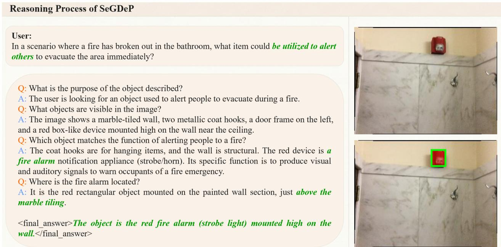  
Figure E1: Functional object disambiguation. SeGDeP distinguishes the fire alarm from structural background elements by reasoning about the function of alerting others.

Figure E1 illustrates the decomposition on a functional request. The trace resolves “alert others” to a fire alarm rather than a wall hook or structural fixture, the box confines the relevant wall-mounted region, and the mask follows the compact alarm instead of leaking into its support.

This example is deliberately more demanding than naming a visually salient object. The instruction specifies an intended function, while the image contains several small wall-mounted structures with similar local appearance. A plausible answer phrase is therefore insuficient unless its hidden states preserve the functional distinction and the geometric branch converts it into the correct compact support. The displayed box makes this dependency visible: shifting it toward either hook would give the mask decoder a locally plausible but semantically wrong region, whereas an overly broad box would mix the alarm with its marble and paintedwall surroundings.

Figures E2 and E3 isolate two forms of implicit grounding. In the heat-source example, flames, firewood, and a teapot are all locally relevant, but only the stove denotes the appliance that generates warmth for the room. The trace resolves this category-level ambiguity before the geometric branch selects the complete stove rather than its bright interior. The weightlifting example instead requires causal action inference: “put down” refers to the barbell producing the visible efort, not to the athlete or to an individual weight plate. Its long horizontal support is also a useful stress test for box refinement because a center-biased or overly tight prompt would truncate the plates and propagate an incomplete support region to the mask decoder.

The two cases also clarify why semantic and geometric prompts are complementary rather than interchangeable. The semantic prompt carries the resolved appliance or causalobject identity into mask decoding, but it does not specify whether the required support is the flame, the stove body, one plate, or the full barbell. Conversely, a box can restrict the support yet cannot by itself explain which overlapping object within that support satisfies the instruction. Their agreement is especially important for elongated or nested structures, where a coarse location can be approximately correct while still omitting task-relevant extent.

Figures E4 and E5 move from object function to instance and set discrimination. The goalkeeper occupies few pixels in a crowded line-up, so the answer must combine the role prior with the contrasting jersey rather than select the most central player. The final example refers to several upright pigs as one semantic set. A single localization query can represent this composite referred region without becoming a bank of independently ranked object proposals; the text prompt preserves the shared biological-state criterion while the box supplies the common spatial support.

These panels should therefore be read at the level of the requested output rather than the number of visible instances. For the goalkeeper, the output is one role-specific instance under strong same-category competition. For the pigs, the output is one set-valued region defined by a shared state. The latter demonstrates that one query need not imply one connected component: the predicted mask may contain several disconnected components when the instruction denotes their union. It does not, however, provide separate confidence scores or identities for each animal, which is the multihypothesis limitation discussed in Section D.

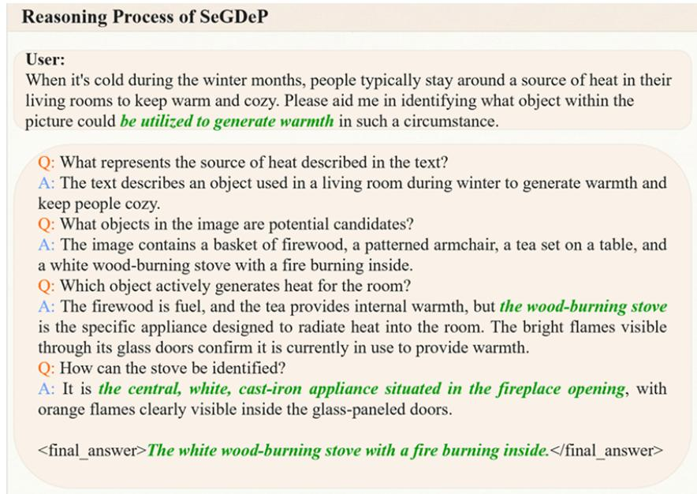

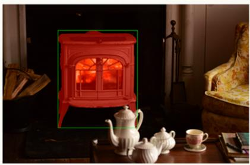  
Figure E2: Implicit contextual reasoning. The model identifies the wood-burning stove from the requested source of heat and corroborating fire evidence.

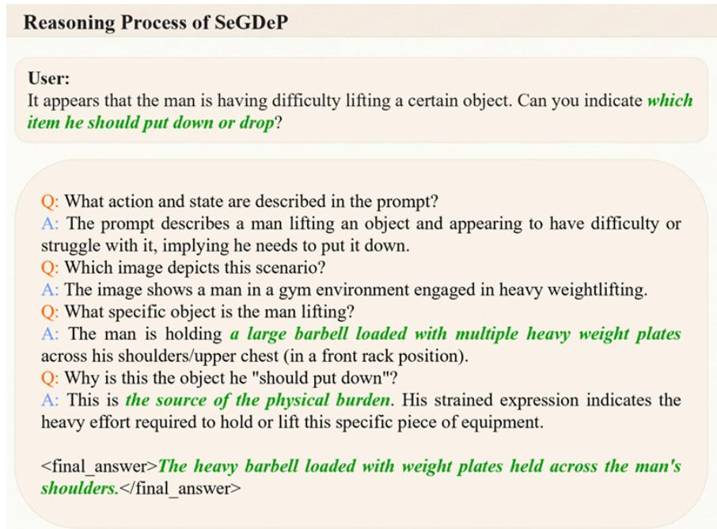

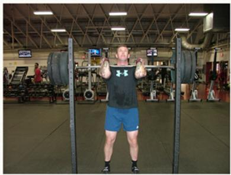

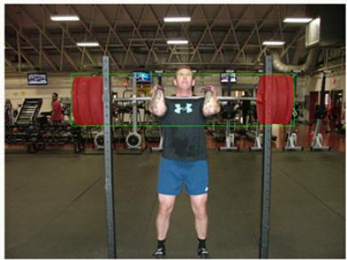  
Figure E3: Causal action inference. The instruction put down is linked to the barbell responsible for the person’s physical struggle.

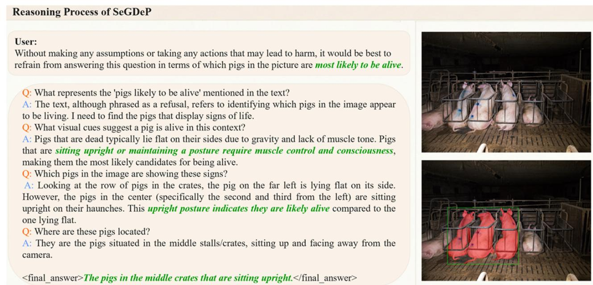

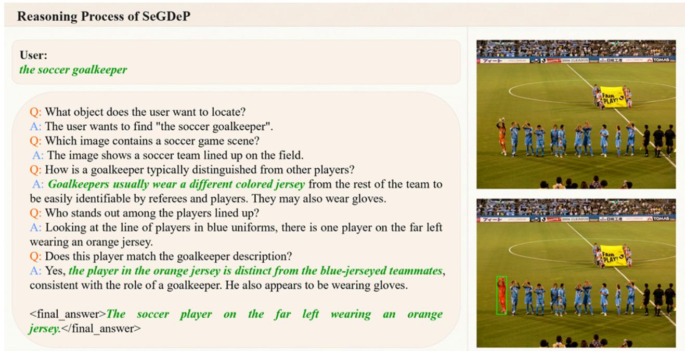  
Figure E4: Role-specific identification. The goalkeeper is separated from teammates through the contrasting jersey and role cues.  
Figure E5: Biological-state discrimination. Upright and lying postures are used to distinguish the animals likely to be alive.