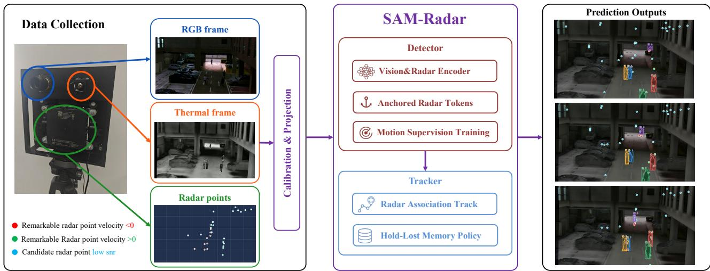
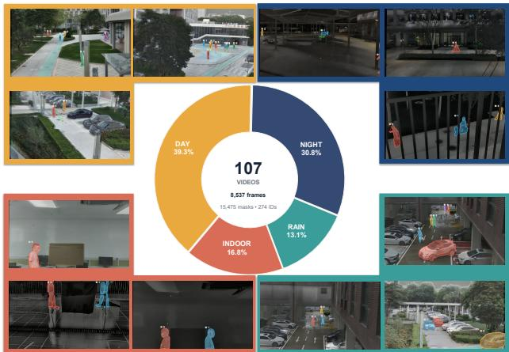
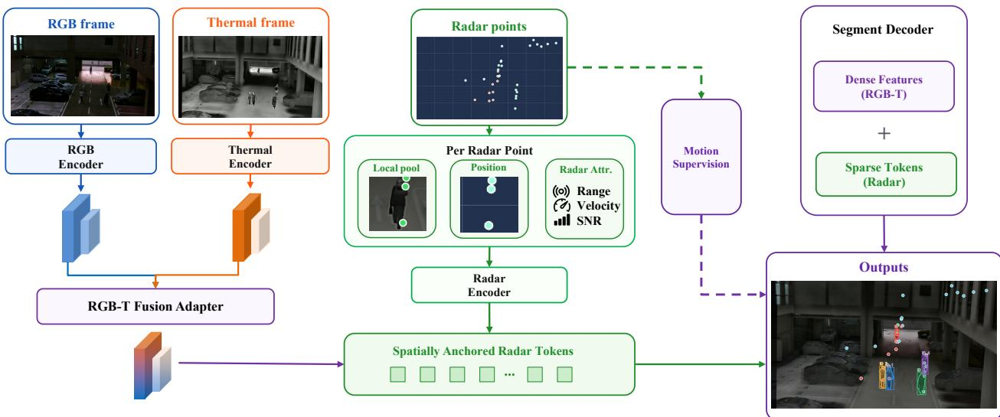
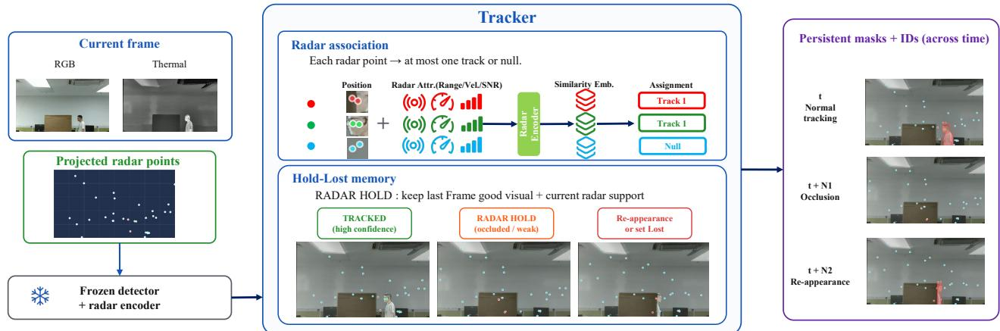
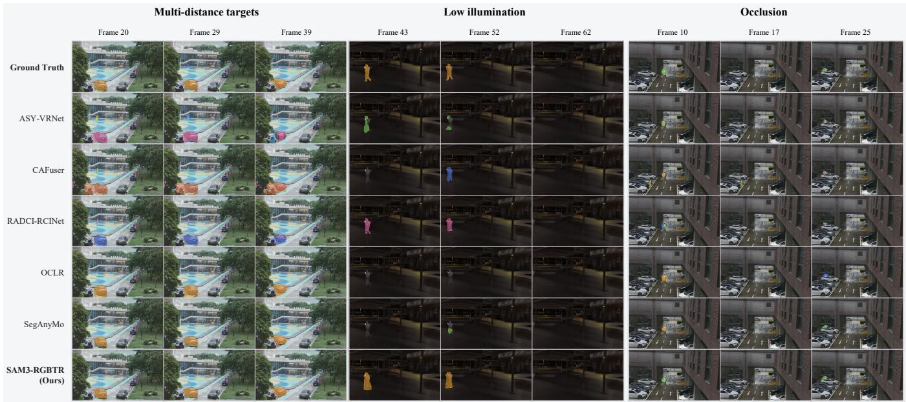

# Segment Any Motion with Radar: Robust Multimodal Moving-Object Segmentation and Tracking

Jue Wang1,2, Xuan Wang1∗, Hao Zhou2, Ruixiang Zhou3,

Yixuan Zhou1,2, Tianshuo Yuan3, Jieming Ma1,2,

Jie Zhang2, Fei Luo2∗

1Harbin Institute of Technology, Shenzhen, China

2Great Bay University, Dongguan, China

3Shenzhen Institutes of Advanced Technology, Chinese Academy of Sciences, Shenzhen, China

## Abstract

Moving-object perception must decide which image regions correspond to real motion and keep every instance identified over time. Methods that read motion from appearance, optical flow, or estimated trajectories lose that evidence under poor illumination, adverse weather, reflections, and occlusion. Radar is a natural remedy because it measures radial velocity directly instead of inferring it from the photometric correspondence. However, existing benchmarks do not jointly provide radar measurements, dense moving-instance masks, and temporally consistent identities for surveillance. We therefore introduce RGBTR-Motion, a synchronized and calibrated fixed-camera benchmark that pairs RGB, thermal, and radar streams with dense instance masks and temporally consistent identities across diverse surveillance scenes. We also develop SAM-Radar, a RGB, thermal and radar-based segmentation and tracking framework built on SAM 3. SAM-Radar’s radaraware detector fuses calibrated RGBT features with radar returns that are grounded at their projected image locations, and motion supervision, implemented as foreground classification of those projected returns, teaches the detector to reject clutter without any text prompt. The tracker associates accepted radar returns with individual trajectories and uses them as physical evidence that a visually degraded target remains present. This allows it to bridge short periods of low visibility or occlusion and reconnect a reappearing target to its existing identity instead of starting a new track. SAM-Radar attains 0.7027 IoU and 0.8090 F150, and raises MOTA, HOTA, and IDF1 by 0.2977, 0.1603, and 0.2857 over the strongest competing values.

## 1 Introduction

Reliable moving-object perception must recover accurate masks and preserve the identities of physical movers over time. In fixed-camera surveillance, weak appearance corrupts boundaries, while crossings and occlusions disrupt identity over long recordings. We target physical agents, predominantly pedestrians, cyclists, and vehicles, rather than photometric or background changes. The task is therefore stricter than generic change detection but broader than closedvocabulary detection.

Most established approaches derive motion from images. Optical-flow methods group short-term displacements or learn masks from flow fields (Xie, Xie, and Zisserman 2022; Teed and Deng 2020); OCLR (Xie, Xie, and Zisserman 2022), for example, maintains layered object masks through mutual occlusion. SegAnyMo (Huang et al. 2025) instead classifies long-range visual trajectories and prompts SAM 2 (Ravi et al. 2025) to recover dense masks. Yet their motion evidence still comes from visual correspondence: illumination changes corrupt photometric evidence, thermal crossover reduces contrast, occlusion removes correspondences, and fast or subtle motion corrupts estimated tracks.

Camera and radar fusion is well established in autonomous driving (Caesar et al. 2020; Nabati and Qi 2021; Kim et al. 2023), waterways (Guan et al. 2024), and other platformcentric perception. Our contribution is therefore not the first RGBT-radar dataset, but a surveillance-specific viewpoint, motion-centric task, and dense temporal annotation. Mobile-platform datasets emphasize ego-centric geometry and category-level perception; fixed-camera surveillance instead requires long-duration observation from a stationary viewpoint, together with pixel-level masks and persistent identities. Existing multimodal corpora do not directly support this setting.

Radar measures motion rather than inferring it from photometric correspondence, so radial velocity can remain informative when appearance is weak. Radar alone is nevertheless sparse and noisy, and its velocity cue vanishes when a target stops or moves tangentially to the line of sight. It therefore complements rather than replaces appearance. When visual evidence becomes unreliable, associated radar measurements remain available. Thermal imagery complements RGB by providing clearer boundaries in low light. The central challenge is to ground sparse radar evidence in the image and assign it consistently to object tracks.

We build SAM-Radar (Segment Any Motion with Radar) on SAM 3’s decoupled detector and tracker (Carion et al. 2025) and train them in two separate stages. In Stage 1, the detector combines complementary RGB and thermal features with radar returns anchored to their projected image neighborhoods, allowing it to locate movers using both visual structure and measured motion. Motion supervision teaches the detector to distinguish target returns from multipath reflections and background clutter, reducing clutter-induced predictions. In Stage 2, the detector and radar encoder are frozen, and the tracker matches each return to at most one active track based on spatial, motion, and identity consistency. Confident matches reinforce the corresponding track when visual evidence weakens. To bridge short occlusions, Hold-Lost memory preserves the last reliable visual state while radar continues to support the target and releases the identity only after both visual and radar evidence remain absent.

  
Figure 1: Overview of the acquisition and SAM-Radar pipeline. A rigid rig records calibrated RGB, thermal, and radar streams. The detector fuses visual features with spatially anchored radar tokens trained by motion supervision, and the tracker combines radar association with Hold-Lost memory to produce temporally consistent masks and identities.

We also organize RGBTR-Motion, a synchronized and calibrated fixed-camera benchmark with 107 sequences and 8,537 annotated frames across daytime, nighttime, rainy, and indoor conditions. It provides frame-level masks and persistent identities, with an acquisition-grouped train/test split that prevents temporal leakage. Representative motionsegmentation and multimodal baselines are adapted to the same data and evaluation protocol.

Our contributions are threefold:

• We construct RGBTR-Motion, a synchronized and calibrated fixed-camera surveillance benchmark with dense masks and persistent identities, addressing a task and annotation setting underrepresented by existing automotiveoriented tri-modal data.

• We introduce SAM-Radar, whose radar-aware detector combines calibrated RGBT features with spatially anchored radar tokens, while tracker uses radar association, confidence-gated radar residual injection, and Hold-Lost memory to preserve identities through temporary appearance failures.

• We develop a radar-aware two-stage training strategy. Stage 1 trains the detector to discover and segment moving objects from the aligned RGBT-radar inputs. Stage 2 freezes the detector and trains the tracker to preserve object identities over time, especially when visual evidence weakens.

## 2 Related Work

## Moving-Object Segmentation

Classical motion segmentation groups pixels or trajectories by geometric consistency (Brox and Malik 2010; Ochs, Malik, and Brox 2014). In fixed-camera surveillance, background subtraction remains vulnerable to nuisance appearance changes (Staufer and Grimson 1999; Zivkovic 2004; Barnich and Van Droogenbroeck 2011; Bouwmans 2014), as systematically benchmarked by CDnet (Wang et al. 2014). Modern systems instead use optical flow (Teed and Deng 2020); OCLR (Xie, Xie, and Zisserman 2022), for example, predicts depth-ordered object layers and learns temporal shape consistency from synthetic compositions.

Instance-level video tasks such as MOTS (Voigtlaender et al. 2019) and video instance segmentation (Yang, Fan, and Xu 2019) couple masks with identities but assume a closed vocabulary. SAM (Kirillov et al. 2023) established promptable segmentation, SAM 2 (Ravi et al. 2025) introduced streaming video memory, and SAM 3 (Carion et al. 2025) unified open-vocabulary detection and tracking. SegAnyMo (Huang et al. 2025) classifies long-range point tracks and prompts SAM 2 for dense masks. Motion-oriented uses of these models still rely on visual correspondence and fail when that evidence disappears. SAM-Radar instead uses measured radar motion, spatially anchored radar tokens, and Hold-Lost memory.

## Vision-Radar Perception

RGB supplies texture and color, while thermal imagery complements it in low light (Hwang et al. 2015; Li et al. 2019, 2022). Condition-aware fusion improves robustness when either stream degrades (Brödermann et al. 2025), but both remain appearance based. Radar adds independent range and radial velocity, motivating camera-radar systems for driving and corresponding adverse-weather and 4D-radar datasets (Caesar et al. 2020; Nabati and Qi 2021; Kim et al.

  
Figure 2: Composition of the benchmark RGBTR-Motion. Example panels show calibrated RGBT fusion, sequencelocal moving-instance masks and identities, and projected radar returns for daytime, nighttime, rainy, and indoor monitoring conditions.

2023; Sheeny et al. 2021; Palfy et al. 2022; Paek, Kong, and Wijaya 2022).

ASY-VRNet (Guan et al. 2024) combines visual features and 4D radar maps for mobile waterway perception. RADCI (Yu et al. 2025) is a fixed-tripod RGBT-radar benchmark for detection and tracking, with 2D boxes and target IDs. These works establish the value of multimodal fusion, but neither provides motion-centric dense instance masks with sequence-level identity annotations. We instead align thermal features and sparse returns to the visible image, using radar as track-specific motion evidence.

## 3 The RGBTR-Motion Benchmark Data Collection

RGBTR-Motion is designed specifically for motion perception from stationary surveillance viewpoints. Data are acquired with a rigid tri-modal rig comprising a 1280×720 visible-light camera, a 640×512 long-wave infrared camera, and a ZF 4D millimeter-wave radar with 12 transmit and 16 receive channels. Both cameras and radar record at 10 fps. All three sensors are mounted on a common plate and remain fixed throughout each acquisition, providing consistent geometry across daytime, nighttime, rainy, and indoor recordings. Complementing the aligned visual streams, the radar records each return’s 3D position, range-related geometry, radial velocity, signal-to-noise ratio (SNR), and timestamp.

The benchmark targets the sustained, scene-traversing movers described in Section 1, chiefly pedestrians, cyclists, and vehicles, and preserves identity through surveillance events such as entry, target crossing, occlusion, and exit. The audited benchmark contains 107 sequences, 8,537 annotated frames, 15,475 instance masks, and 274 sequencelocal identities. Table 1 focuses on RADCI because it provides the closest sensor and acquisition setting. RADCI reports seven road and square scenarios recorded by day and night. RGBTR-Motion expands the coverage to outdoor and indoor surveillance spanning daytime, nighttime, and rain. More importantly, it goes beyond category-level box annotation by linking motion-centric instance masks to sequencelocal identities, enabling pixel-level segmentation and tracking through entry, crossing, occlusion, and exit. Figure 2 visualizes this composition together with calibrated RGBTradar surveillance examples.

Table 1: Comparison with RADCI (Yu et al. 2025), the closest synchronized RGBT-radar benchmark. The two share a sensor configuration; RGBTR-Motion difers in condition coverage, annotation granularity, and how a target is defined.
<table><tr><td>RADCI</td><td></td><td>RGBTR-Motion (ours)</td></tr><tr><td>Modalities</td><td>RGB, thermal, radar</td><td>RGB, thermal, radar</td></tr><tr><td>Environment road, square</td><td></td><td>road, gym, square, indoor</td></tr><tr><td>Conditions</td><td>Day, night</td><td>Day, night, rain</td></tr><tr><td>Sequences</td><td>94</td><td>107</td></tr><tr><td>Annotation</td><td>2D boxes with IDs</td><td>Instance masks with IDs</td></tr><tr><td>Target</td><td>Predefined categories</td><td>Any sustained mover</td></tr><tr><td>Task</td><td>Detection, tracking</td><td>Segmentation, tracking</td></tr></table>

## Temporal Synchronization and Spatial Calibration

All sensor streams are mapped to the visible-camera timeline. Visible and infrared frames are undistorted, and infrared frames are warped into visible-image coordinates using the calibrated cross-camera transformation. For a radar point $\mathbf { x } ^ { r } \in \mathbb { R } ^ { 3 }$ , calibrated rotation ${ \bf { R } } _ { r v }$ and translation $\mathbf { t } _ { r v }$ transform it into the visible-camera coordinate system:

$$
\mathbf { x } ^ { v } = \mathbf { R } _ { r v } \mathbf { x } ^ { r } + \mathbf { t } _ { r v } .\tag{1}
$$

The visible camera matrix and distortion model then project $\mathbf { x } ^ { v }$ to pixel coordinates (u, v). Returns outside the image plane are discarded. Video frame t is paired with the t-th radar timestamp and groups returns in a small temporal neighborhood. We retain reliable moving points together with high-SNR static or slow points, then convert projected coordinates into the undistorted visible-image system, producing

$$
\mathcal { R } _ { t } = \{ ( u _ { j } , v _ { j } , d _ { j } , \dot { d } _ { j } , s _ { j } ) \} _ { j = 1 } ^ { N _ { t } } ,\tag{2}
$$

where $d _ { j } , { \dot { d } } _ { j }$ , and $s _ { j }$ denote range, radial velocity, and SNR, respectively.

## Annotations and Tasks

Each visible frame is annotated in COCO-compatible format with instance masks, boxes, categories, and sequence-local persistent identities. The labels are motion-centric rather than restricted to a predefined surveillance object taxonomy. They support two tasks under a common annotation set: framelevel moving-object instance segmentation and video-level segmentation and tracking. The annotation policy covers temporary full occlusion, targets leaving the field of view, and stationary intervals of otherwise moving objects.

  
Figure 3: For each projected radar return, the radar-aware detector combines local RGBT context, image position, and radar attributes to form a spatially anchored token. Motion supervision teaches it to distinguish target-associated returns from clutter, and the segmentation decoder combines these sparse tokens with dense visual features to predict moving instances.

## 4 Method

## Overview

Given synchronized RGB frames $I _ { 1 : T } ^ { R }$ , aligned thermal frames $I _ { 1 : T } ^ { T }$ , and projected radar sets $\mathcal { R } _ { 1 : T } ,$ the model predicts instance masks and persistent identities for physical movers. We retain the decoupled detector and memory tracker of SAM 3 (Carion et al. 2025) and train them in two stages. The detector first learns frame-level discovery and segmentation from all three modalities. Its weights and radar encoder are then frozen while the tracker learns radar association, feature updates, and Hold-Lost memory. This separation prevents temporal training from changing the learned object discovery process. Figures 3 and 4 show the data flow.

## Radar-Aware Multimodal Detector

Calibrated RGBT fusion Directly stacking thermal and RGB images at the input assumes compatible channel statistics and exposes the pretrained RGB representation to thermal noise. We instead process the aligned images with separate vision trunks initialized from the same pretrained encoder. Let $F ^ { R }$ and $F ^ { T }$ denote their features, and let $A _ { R }$ and $A _ { T }$ be lightweight adapters. Their detector-level fusion is

$$
\begin{array} { l } { { \bar { F } ^ { m } = A _ { m } ( F ^ { m } ) , \quad m \in \{ R , T \} , } } \\ { { F ^ { R T } = F ^ { R } + \Phi ( \bar { F } ^ { R } , \bar { F } ^ { T } ) . } } \end{array}\tag{3}
$$

Here, Φ is the learned fusion module. It predicts independent sigmoid channel weights from globally pooled adapted features, combines the weighted and spatial-fusion branches with a learned scalar initialized to 0.5, and returns a residual. Consequently, $F ^ { R T }$ retains a direct RGB path while incorporating thermal evidence.

Spatially anchored radar tokens A direct approach is to encode only the projected coordinates and physical attributes of each radar return with an MLP. This retains range and radial velocity but omits the visual structure at the projected location. For return $r _ { j } = ( u _ { j } , v _ { j } , d _ { j } , \dot { d } _ { j } , s _ { j } )$ , let $p _ { j }$ encode position $( u _ { j } , v _ { j } )$ , let $\ell _ { j }$ be the locally pooled RGBT feature, and let $f _ { j } ^ { \mathrm { a t t r } }$ encode the normalized attributes $( d _ { j } , \dot { d } _ { j } , s _ { j } )$ We construct its token as

$$
\begin{array} { r l } & { b _ { j } = p _ { j } + W _ { \ell } \ell _ { j } , } \\ & { g _ { j } = \sigma ( W _ { g } f _ { j } ^ { \mathrm { a t t r } } ) , } \\ & { z _ { j } = \mathrm { L N } ( b _ { j } + g _ { j } \odot f _ { j } ^ { \mathrm { a t t r } } + e _ { \mathrm { r a d } } + e _ { j } ^ { \mathrm { f g } } ) . } \end{array}\tag{4}
$$

$W _ { \ell }$ and $W _ { g }$ are learned projections, $e _ { \mathrm { r a d } }$ identifies the radar modality, and $e _ { j } ^ { \mathrm { f g } }$ is a soft foreground embedding predicted for the return. The gate $g _ { j }$ controls the attribute residual, while layer normalization produces the detector token $z _ { j }$ This construction links each sparse physical measurement to its local image context.

Motion supervision Standard mask and box losses supervise the final object predictions but do not indicate which radar returns correspond to targets. We therefore assign label $y _ { j } ~ \in ~ \{ 0 , 1 \}$ to each projected return and predict its foreground probability $\hat { y } _ { j }$ . The corresponding focal objective (Lin et al. 2017) and total detector objective are

$$
\begin{array} { r c l } { q _ { j } = y _ { j } \hat { y } _ { j } + ( 1 - y _ { j } ) ( 1 - \hat { y } _ { j } ) , } \\ { \displaystyle \mathcal { L } _ { \mathrm { r a d } } = - \frac { 1 } { N _ { t } } \sum _ { j = 1 } ^ { N _ { t } } \beta _ { y _ { j } } ( 1 - q _ { j } ) ^ { \gamma } \log q _ { j } , } \\ { \displaystyle \mathcal { L } _ { \mathrm { d e t } } = \mathcal { L } _ { \mathrm { S A M 3 } } + \lambda _ { \mathrm { r a d } } \mathcal { L } _ { \mathrm { r a d } } . } \end{array}\tag{5}
$$

Here, $N _ { t }$ is the number of returns, $\beta _ { y _ { j } }$ is the class weight, and $\gamma$ is the focal exponent. ${ \mathcal { L } } _ { \mathrm { S A M 3 } }$ collects the classification, box, generalized-IoU (Rezatofighi et al. 2019), and mask losses, while $\lambda _ { \mathrm { r a d } }$ weights motion supervision.

  
Figure 4: The radar-conditioned tracker receives the current RGBT observations and projected radar returns. Radar association combines projected position, radar attributes, and descriptor similarity to assign each return to at most one active track. When visual evidence weakens but radar continues to support the target, Hold-Lost memory preserves the last reliable visual state.

## Radar-Conditioned Tracker

SAM 3 uses separate feature pyramids for detection and tracking, so detector-side fusion does not expose the highresolution tracking path to thermal input. We therefore fuse thermal features at every tracker scale while freezing the spatial encoder, detector, and memory writer; stage two updates only temporal multimodal components.

Radar association A hard previous-mask gate cannot recover after drift, whereas independent matching can assign one return to several tracks. We instead multiply four pairwise terms: spatial support $S _ { i j } ^ { t } ,$ SNR reliability $Q _ { j } ^ { t }$ , rangevelocity continuity $D _ { i j } ^ { t }$ , and descriptor similarity $C _ { i j } ^ { t }$ . They test whether a return is spatially close, reliable, consistent with the track’s range-velocity history, and similar to its accumulated radar descriptor:

$$
\begin{array} { r l } & { w _ { i j } ^ { t } = S _ { i j } ^ { t } \cdot Q _ { j } ^ { t } \cdot D _ { i j } ^ { t } \cdot C _ { i j } ^ { t } , } \\ & { a _ { i j } ^ { t } = \frac { w _ { i j } ^ { t } } { w _ { g j } ^ { t } + \sum _ { k \in \mathcal { T } _ { t } } w _ { k j } ^ { t } } , } \\ & { ~ i _ { j } ^ { * } = \arg \underset { i \in \mathcal { T } _ { t } } { \operatorname* { m a x } } a _ { i j } ^ { t } , } \\ & { ~ j \mapsto i _ { j } ^ { * } ~ \mathrm { i f } ~ a _ { i _ { j } ^ { * } j } ^ { t } \geq \tau _ { \mathrm { o w n } } . } \end{array}\tag{6}
$$

Here, $\mathcal { T } _ { t }$ is the active-track set, $w _ { \otimes j } ^ { t } = 0 . 2 5$ is the fixed null evidence for clutter, and $\tau _ { \mathrm { o w n } } = \mathrm { = } 0 . 3 5$ is the ownership threshold. Each return is assigned to at most one track and remains unassigned when the null option or confidence test rejects it.

Once a track has accepted a radar measurement, we call it radar initialized. Its spatial prior is then floored at 0.05 outside the previous visual box so that a displaced return can still compete for association. Accepted returns are pooled into a current measurement and a track-specific descriptor.

Radar feature updates Only observed returns update the persistent radar state. If a measurement is missing, the last descriptor and radial velocity are retained for at most four frames with decaying confidence, and range is extrapolated under constant radial velocity. Rendering this predicted state as a spatial return would reuse an old image location even though range extrapolation does not determine image-plane motion. We therefore allow only current measurements to populate the sparse spatial residual; propagated descriptors can afect the global object representation and pointer, but not the spatial radar map.

Let $\bar { M } _ { i } ^ { t }$ be the current sparse radar map, $h _ { i } ^ { t }$ the current or propagated track descriptor, $c _ { i } ^ { t }$ its confidence, $F _ { i } ^ { t }$ the visual tracking feature, and $o _ { i } ^ { t }$ the object pointer. Radar is injected after memory attention and before mask decoding as

$$
\begin{array} { r l } & { \Delta F _ { i } ^ { t } = \operatorname { t a n h } ( g _ { s } ) A _ { s } ( M _ { i } ^ { t } ) + \operatorname { t a n h } ( g _ { p } ) A _ { p } ( h _ { i } ^ { t } ) , } \\ & { \quad \widetilde { F } _ { i } ^ { t } = F _ { i } ^ { t } + c _ { i } ^ { t } \Delta F _ { i } ^ { t } , } \\ & { \quad \widetilde { o } _ { i } ^ { t } = o _ { i } ^ { t } + c _ { i } ^ { t } \operatorname { t a n h } ( g _ { p } ) A _ { p } ( h _ { i } ^ { t } ) . } \end{array}\tag{7}
$$

$A _ { s }$ and $A _ { p }$ are learned residual projections, and $g _ { s }$ and $g _ { p }$ are scalar gates.

Hold-Lost memory Immediately discarding a visually weak track loses objects during short occlusions, whereas writing every low-confidence prediction into memory can corrupt later propagation. Hold-Lost memory uses three states to separate these cases. TRACKED denotes a visually reliable prediction and refreshes the most recent reliable frame. If visual confidence becomes unreliable while a current radar measurement remains associated, the track enters HOLD and keeps that reliable frame in the seven-slot memory selection window. Visual recovery returns the track to TRACKED. If neither vision nor current radar supports the track for four consecutive frames, it becomes LOST; its mask and score are suppressed and its active anchor is released.

## 5 Experiments

## Experimental Setup

Baselines We evaluated five representative baselines using the same acquisition-grouped split and annotation protocol. OCLR Hybrid (Xie, Xie, and Zisserman 2022) and

Table 2: Main comparison on the RGBTR-Motion. IoU and $\mathrm { F 1 _ { 5 0 } }$ evaluate foreground and instance moving-object segmentation. MOTA, MOTP, HOTA, and IDF1 evaluate tracking. All models are fine-tuned on RGBTR-Motion; ∗ denotes methods additionally adapted to accept aligned RGB, thermal, and radar inputs. Best results are in bold and second-best results are underlined.
<table><tr><td>Method</td><td>Modalities</td><td> $\mathrm { I o U \uparrow }$ </td><td> $\mathrm { F l _ { 5 0 } }$  ←</td><td>MOTA ↑</td><td>MOTP ↑</td><td>HOTA ↑</td><td>IDF1 ↑</td></tr><tr><td>OCLR Hybrid (Xie, Xie, and Zisserman 2022)</td><td>RGB</td><td>0.4669</td><td>0.5885</td><td>0.2603</td><td>0.7349</td><td>0.3583</td><td>0.3449</td></tr><tr><td>SegAnyMo DINO+SAM (Huang et al. 2025)</td><td>RGB</td><td>0.6103</td><td>0.6070</td><td>0.3074</td><td>0.7568</td><td>0.4166</td><td>0.4756</td></tr><tr><td>ASY-VRNet* (Guan et al. 2024)</td><td>RGB+T+R</td><td>0.4884</td><td>0.4805</td><td>0.2990</td><td>0.7716</td><td>0.3390</td><td>0.2808</td></tr><tr><td>CAFuser* (Brödermann et al. 2025)</td><td>RGB+T+R</td><td>0.6489</td><td>0.6111</td><td>0.3188</td><td>0.7650</td><td>0.4308</td><td>0.3750</td></tr><tr><td>RADCI-RCINet* (Yu et al. 2025)</td><td>RGB+T+R</td><td>0.6574</td><td>0.6243</td><td>0.3259</td><td>0.7666</td><td>0.4415</td><td>0.3931</td></tr><tr><td>SAM-Radar (ours)</td><td>RGB+T+R</td><td>0.7027</td><td>0.8090</td><td>0.6236</td><td>0.7559</td><td>0.6018</td><td>0.7613</td></tr></table>

SegAnyMo DINO+SAM (Huang et al. 2025) retained their native RGB motion inputs and predicted class-agnostic moving-instance masks. For ASY-VRNet, separately encoded RGB and thermal features formed the visual input to its original visual-radar fusion, and projected returns were rasterized in the camera plane. CAFuser received RGB, thermal, and rasterized radar through modality-specific adapters while retaining its RGB-derived condition token. RADCI-RCINet retained its RGBT-radar concatenation and attention front end, followed by a class-agnostic mask decoder (Guan et al. 2024; Brödermann et al. 2025; Yu et al. 2025). We trained the adapted mask outputs with the same binary moving-instance targets and applied a common online Hungarian linker based on mask overlap and appearance similarity to methods without native identities. All compared methods used the same inputs and annotations.

Implementation details Training was performed in two stages. The detector was trained for 60 epochs with AdamW (Loshchilov and Hutter 2019), an empty text prompt, and randomized static negatives with per-instance probability 0.5 and box scale 1.5. The tracker was trained for 1,000 updates on two RTX A6000 GPUs using bfloat16 and 32-frame clips split into four-frame graphs, with at most four identities per clip. The learning rates were $1 0 ^ { - 6 }$ for the tracker and $2 \times 1 0 ^ { - 5 }$ for the radar adapter, and radar dropout was 0.15. The detector and radar encoder remained frozen during tracker training.

Metrics For segmentation, the IoU in Table 2 is the macroaverage of per-frame foreground overlap after merging all instances. $\mathrm { F 1 _ { 5 0 } }$ evaluates instance recovery via Hungarian matching with an IoU≥ 0.5 correctness threshold. For tracking, MOTA penalizes missed targets, false positives, and identity switches, whereas MOTP measures the localization quality of successfully matched predictions (Bernardin and Stiefelhagen 2008). HOTA balances detection accuracy with association accuracy (Luiten et al. 2021), while IDF1 is the identity-level F1 score and reflects how consistently detections retain the correct identity over time (Ristani et al. 2016). Higher is better for all reported metrics.

## Main Results

Table 2 reveals two gain regimes. Against the strongest competing score in each column, SAM-Radar raises IoU from

0.6574 to 0.7027, an absolute gain of 0.0453, whereas F1 rises from 0.6243 to 0.8090, a gain of 0.1847. The larger $\mathrm { F 1 _ { 5 0 } }$ gain shows that the segmentation advantage is more pronounced for recovering matchable moving instances than for improving frame-averaged foreground overlap.

The contrast is larger for identity: MOTA, HOTA, and IDF1 improve by 0.2977, 0.1603, and 0.2857 over their respective strongest competing values. IoU is computed independently per frame, so preserving a track through an occlusion need not alter mask overlap on frames where the object is already visible. IDF1 instead measures correctly identified detections over a sequence, so fragmentation or reassignment can reduce the score across multiple frames. Radar association is designed to resolve ambiguous ownership, while Hold-Lost memory protects the last reliable state during radar-supported visual degradation. The fact that both components improve IDF1 in Table 4 is consistent with this continuity-based explanation for the larger identity gain. Consistently, SAM-Radar obtains 0.7559 MOTP, below ASY-VRNet at 0.7716, showing that the main benefit is temporal continuity rather than tighter localization of already matched masks. The multimodal baselines also do not uniformly outperform the RGB methods, showing that additional sensor inputs alone do not guarantee a gain on this benchmark.

## Ablation Studies

Detector components Table 3 reports the detector ablations. Adding motion supervision to radar attributes raises Pixel IoU from 0.4677 to 0.5850, Pixel Dice from 0.6373 to 0.7382, and $\mathrm { F 1 _ { 5 0 } }$ from 0.5599 to 0.7927. The largest absolute change is in ${ \mathrm { F l } } _ { 5 0 } ,$ showing that return-level foreground classification improves instance recovery under the matching criterion, while the simultaneous pixel-metric gains show better foreground estimation. The full detector achieves the best overall values of 0.7540, 0.8598, and 0.8389.

Tracker components Table 4 reports complementary gains from the two tracker mechanisms. Relative to the visual tracker, radar association raises MOTA/HOTA/IDF1 by 0.1291/0.0530/0.0903, while Hold-Lost memory raises them by 0.1190/0.0444/0.0755. Radar association is the stronger individual component, consistent with competitive ownership resolving which track should receive each return. Hold-Lost memory still raises IDF1 from 0.6233 to 0.6988, consistent with its role in protecting the stored identity state when visual evidence temporarily degrades. Combining the mechanisms gives the largest gains, 0.2229/0.1053/0.1380, and the best value for every reported metric. This result is consistent with their distinct roles: radar association selects the recipient track, whereas Hold-Lost memory decides whether an uncertain visual update may overwrite its state.

  
Figure 5: Qualitative comparison under multi-distance targets, low illumination, and occlusion. Frames progress from left to right within each condition; rows compare the ground truth, five baselines, and SAM-Radar.

Table 3: Detector configurations and results. All rows include RGB; T, R, and M denote thermal fusion, radar attributes, and motion supervision. P-IoU and P-Dice are dataset-level pixel metrics.
<table><tr><td>Variant</td><td>T R M P-IoU P-Dice  $\mathrm { F l _ { 5 0 } }$ </td></tr><tr><td>RGB only</td><td>0.40640.5779 0.6517 一</td></tr><tr><td>Thermal fusion</td><td>V – 0.41280.58440.7581</td></tr><tr><td>Radar attributes Motion supervision</td><td>– √ - 0.46770.63730.5599 0.5850 0.7382 0.7927</td></tr><tr><td></td><td>1 - √√</td></tr><tr><td>Full detector</td><td>√√√0.7540 0.8598 0.8389</td></tr></table>

Table 4: Tracker ablation. Radar association and Hold-Lost memory are each added to the visual tracker.
<table><tr><td>Variant</td><td>MOTA</td><td>HOTA</td><td>IDF1</td></tr><tr><td>SAM 3 visual tracker</td><td>0.4007</td><td>0.4965</td><td>0.6233</td></tr><tr><td>SAM 3 + radar association</td><td>0.5298</td><td>0.5495</td><td>0.7136</td></tr><tr><td>SAM 3 + Hold-Lost memory</td><td>0.5197</td><td>0.5409</td><td>0.6988</td></tr><tr><td>Full tracker</td><td>0.6236</td><td>0.6018</td><td>0.7613</td></tr></table>

## Qualitative Results

Figure 5 complements the aggregate metrics with three surveillance conditions. In the multi-distance sequence, SAM-Radar follows the annotated movers with compact masks while several baselines produce fragmented or extraneous regions. Under low illumination, it recovers a coherent silhouette in Frames 43 and 52 and correctly produces no mask in Frame 62. In the occlusion sequence, it recovers the same track identity after the obstruction in Frames 10 and 25, whereas several competing rows miss the target or assign a diferent identity after it reappears. These examples mirror the two quantitative gain regimes: instance recovery improves $\mathrm { F l _ { 5 0 } }$ , while continuity through degraded visual evidence improves IDF1 without requiring a comparable increase in framewise IoU.

## 6 Conclusion

We introduced RGBTR-Motion, an RGBT-radar benchmark designed for motion segmentation and tracking under various surveillance conditions, together with SAM-Radar, a framework that uses radar measurements to strengthen object discovery and temporal association. In the detector, a return’s projected location identifies the image region it can support, while its range, radial velocity, and SNR provide physical motion and reliability cues beyond local RGBT appearance. Motion supervision then teaches the detector to distinguish returns associated with actual movers from multipath reflections and static clutter, allowing these radar attributes to contribute to more reliable instance predictions. During tracking, radar association connects each measurement to an individual trajectory, while Hold-Lost memory preserves the last reliable visual state when radar confirms that a visually degraded target remains present. The experiments consistently show that these designs improve instance recovery and identity continuity. These findings indicate that radar is most efective when its sparse measurements are explicitly grounded, assigned to individual tracks, and coupled to controlled visual memory.

## References

Barnich, O.; and Van Droogenbroeck, M. 2011. ViBe: A Universal Background Subtraction Algorithm for Video Sequences. IEEE Transactions on Image Processing, 20(6): 1709–1724.

Bernardin, K.; and Stiefelhagen, R. 2008. Evaluating Multiple Object Tracking Performance: The CLEAR MOT Metrics. EURASIP Journal on Image and Video Processing, 2008: 246309.

Bouwmans, T. 2014. Traditional and Recent Approaches in Background Modeling for Foreground Detection: An Overview. Computer Science Review, 11–12: 31–66.

Brödermann, T.; Sakaridis, C.; Fu, Y.; and Van Gool, L. 2025. CAFuser: Condition-Aware Multimodal Fusion for Robust Semantic Perception of Driving Scenes. IEEE Robotics and Automation Letters.

Brox, T.; and Malik, J. 2010. Object Segmentation by Long Term Analysis of Point Trajectories. In European Conference on Computer Vision.

Caesar, H.; Bankiti, V.; Lang, A. H.; Vora, S.; Liong, V. E.; Xu, Q.; Krishnan, A.; Pan, Y.; Baldan, G.; and Beijbom, O. 2020. nuScenes: A Multimodal Dataset for Autonomous Driving. In IEEE/CVF Conference on Computer Vision and Pattern Recognition.

Carion, N.; Gustafson, L.; Hu, Y.-T.; Debnath, S.; Hu, R.; Suris, D.; Ryali, C.; Alwala, K. V.; Khedr, H.; Huang, A.; et al. 2025. SAM 3: Segment Anything with Concepts. arXiv:2511.16719.

Guan, R.; Yao, S.; Man, K. L.; Zhu, X.; Yue, Y.; Smith, J.; Lim, E. G.; and Yue, Y. 2024. ASY-VRNet: Waterway Panoptic Driving Perception Model Based on Asymmetric Fair Fusion of Vision and 4D mmWave Radar. arXiv:2308.10287.

Huang, N.; Zheng, W.; Xu, C.; Keutzer, K.; Zhang, S.; Kanazawa, A.; and Wang, Q. 2025. Segment Any Motion in Videos. arXiv:2503.22268.

Hwang, S.; Park, J.; Kim, N.; Choi, Y.; and Kweon, I. S. 2015. Multispectral Pedestrian Detection: Benchmark Dataset and Baseline. In IEEE Conference on Computer Vision and Pattern Recognition.

Kim, Y.; Kim, S.; Choi, J. W.; and Kum, D. 2023. CRAFT: Camera-Radar 3D Object Detection with Spatio-Contextual Fusion Transformer. In AAAI Conference on Artificial Intelligence.

Kirillov, A.; Mintun, E.; Ravi, N.; Mao, H.; Rolland, C.; Gustafson, L.; Xiao, T.; Whitehead, S.; Berg, A. C.; Lo, W.- Y.; Dollár, P.; and Girshick, R. 2023. Segment Anything. In IEEE/CVF International Conference on Computer Vision.

Li, C.; Liang, X.; Lu, Y.; Zhao, N.; and Tang, J. 2019. RGB-T Object Tracking: Benchmark and Baseline. Pattern Recognition, 96: 106977.

Li, C.; Xue, W.; Jia, Y.; Qu, Z.; Luo, B.; Tang, J.; and Sun, D. 2022. LasHeR: A Large-Scale High-Diversity Benchmark for RGBT Tracking. IEEE Transactions on Image Processing, 31: 392–404.

Lin, T.-Y.; Goyal, P.; Girshick, R.; He, K.; and Dollár, P. 2017. Focal Loss for Dense Object Detection. In IEEE International Conference on Computer Vision.

Loshchilov, I.; and Hutter, F. 2019. Decoupled Weight Decay Regularization. In International Conference on Learning Representations.

Luiten, J.; Osep, A.; Dendorfer, P.; Torr, P.; Geiger, A.; Leal-Taixé, L.; and Leibe, B. 2021. HOTA: A Higher Order Metric for Evaluating Multi-Object Tracking. International Journal ofComputer Vision, 129(2): 548–578.

Nabati, R.; and Qi, H. 2021. CenterFusion: Center-Based Radar and Camera Fusion for 3D Object Detection. In IEEE/CVF Winter Conference on Applications ofComputer Vision.

Ochs, P.; Malik, J.; and Brox, T. 2014. Segmentation of Moving Objects by Long Term Video Analysis. IEEE Transactions on Pattern Analysis and Machine Intelligence, 36(6): 1187–1200.

Paek, D.-H.; Kong, S.-H.; and Wijaya, K. T. 2022. K-Radar: 4D Radar Object Detection for Autonomous Driving in Various Weather Conditions. In Advances in Neural Information Processing Systems Datasets and Benchmarks Track.

Palfy, A.; Pool, E.; Baratam, S.; Kooij, J. F. P.; and Gavrila, D. M. 2022. Multi-Class Road User Detection with 3+1D Radar in the View-of-Delft Dataset. IEEE Robotics and Automation Letters, 7(2): 4961–4968.

Ravi, N.; Gabeur, V.; Hu, Y.-T.; Hu, R.; Ryali, C.; Ma, T.; Khedr, H.; Rädle, R.; Rolland, C.; Gustafson, L.; et al. 2025. SAM 2: Segment Anything in Images and Videos. In International Conference on Learning Representations.

Rezatofighi, H.; Tsoi, N.; Gwak, J.; Sadeghian, A.; Reid, I.; and Savarese, S. 2019. Generalized Intersection over Union: A Metric and a Loss for Bounding Box Regression. In IEEE/CVF Conference on Computer Vision and Pattern Recognition.

Ristani, E.; Solera, F.; Zou, R.; Cucchiara, R.; and Tomasi, C. 2016. Performance Measures and a Data Set for Multi-Target, Multi-Camera Tracking. In European Conference on Computer Vision Workshops.

Sheeny, M.; De Pellegrin, E.; Mukherjee, S.; Ahrabian, A.; Wang, S.; and Wallace, A. 2021. RADIATE: A Radar Dataset for Automotive Perception in Bad Weather. In IEEE International Conference on Robotics and Automation.

Staufer, C.; and Grimson, W. E. L. 1999. Adaptive Background Mixture Models for Real-Time Tracking. In IEEE Conference on Computer Vision and Pattern Recognition.

Teed, Z.; and Deng, J. 2020. RAFT: Recurrent All-Pairs Field Transforms for Optical Flow. In European Conference on Computer Vision, 402–419.

Voigtlaender, P.; Krause, M.; Osep, A.; Luiten, J.; Sekar, B. B. G.; Geiger, A.; and Leibe, B. 2019. MOTS: Multi-Object Tracking and Segmentation. In IEEE Conference on Computer Vision and Pattern Recognition.

Wang, Y.; Jodoin, P.-M.; Porikli, F.; Konrad, J.; Benezeth, Y.; and Ishwar, P. 2014. CDnet 2014: An Expanded Change Detection Benchmark Dataset. In IEEE Conference on Computer Vision and Pattern Recognition Workshops.

Xie, J.; Xie, W.; and Zisserman, A. 2022. Segmenting Moving Objects via an Object-Centric Layered Representation. In Advances in Neural Information Processing Systems, volume 35.

Yang, L.; Fan, Y.; and Xu, N. 2019. Video Instance Segmentation. In IEEE/CVF International Conference on Computer Vision, 5187–5196.

Yu, H.; Zhang, R.; Sun, H.; Cao, Z.; Yang, B.; Zhang, J.; and Liu, G. 2025. RADCI: A Synchronized Radar-RGBT Object Detecting-Tracking Dataset and a Benchmark. In IEEE International Conference on Acoustics, Speech and Signal Processing.

Zivkovic, Z. 2004. Improved Adaptive Gaussian Mixture Model for Background Subtraction. In International Conference on Pattern Recognition.