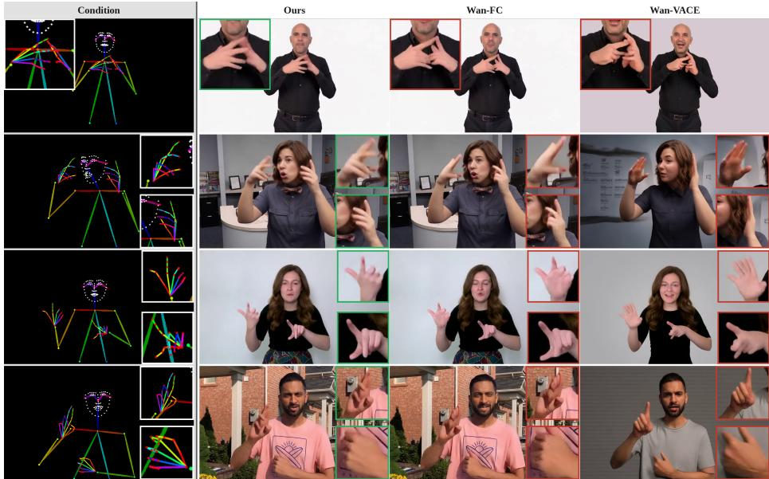
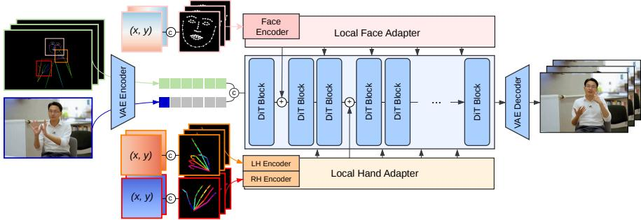
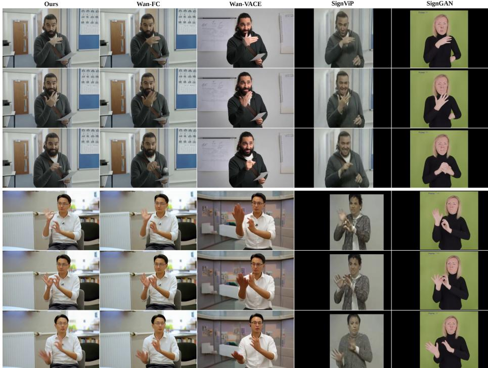
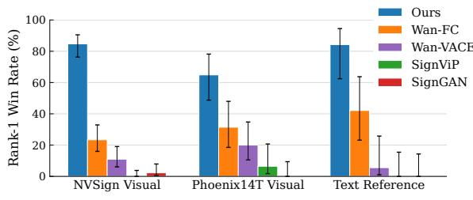
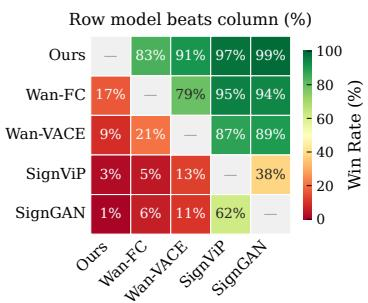

# SignRefine: Adapting Foundational Video Models for Sign Language Generation

Anton Pelykh1 , Edward Fish1 , Ozge Mercanoglu Sincan1 , and Richard Bowden1

Centre for Vision, Speech and Signal Processing, University of Surrey, Guildford, UK {a.pelykh,edward.fish,o.mercanoglusincan,r.bowden}@surrey.ac.uk https://cogvis-cvssp.github.io/papers/signrefine/

Abstract. Sign language video generation demands precise hand and facial articulation, yet modern video difusion models, trained predominantly on spoken-language video, produce artifacts that render signing unintelligible. We propose SignRefine, a sign language video generation model that produces comprehensible signing from 2D keypoint conditioning alone, generalizing across appearances and visual conditions. Our approach builds on a pretrained video difusion transformer and introduces local adapters with spatial grounding to selectively refine hand and face regions, steering the strong base model’s prior toward accurate articulation. To enable this work and support broader sign language research, we present NVSign, a large-scale dataset of video content natively produced in sign language, ofering diverse signer appearances, environments, and natural conversational settings. Trained on this data, our model shows up to 30% improvement in hand pose precision metrics over the strongest baseline and is preferred by sign language users for visual quality and comprehensibility in more than 80% of comparisons.

Keywords: Video Generation · Sign Language · Difusion Models

## 1 Introduction

Sign languages are the primary means of communication for Deaf communities worldwide. Lacking a widely adopted written form, video is the natural medium for sign language content creation, accessibility, and communication. Consequently, there is a critical need for automatic sign language video generation. While modern Video Difusion Models (VDMs) produce impressively realistic general-purpose video, they consistently fail to produce plausible sign language outputs (see Fig. 1). This is because the complex articulation of hands and nuanced facial expressions required for sign language are largely out-ofdistribution for the training data of these models. Furthermore, hands and face, which carry the core linguistic meaning, are fine-grained structures occupying a small fraction of the frame. In the patchified latent space where VDMs operate, these regions are aggressively compressed spatially and their structural details are overwhelmed by the global reconstruction objective. As a result, standard full-body conditioning cannot recover this lost definition, resulting in corrupted or under-articulated hand and face regions.

  
Fig. 1: Qualitative comparison of sign language video generation approaches from 2D keypoint conditioning. From left to right: input keypoint condition, Our model, Wan2.1- 1.3B-Fun-Control [60], Wan2.1-1.3B-VACE [23].

Currently, the field of research faces a stark duality between specialized and generalized video generation. Existing sign language-specific video models [11, 38, 43, 45, 50, 54, 61] are typically trained from scratch on small, constrained datasets. While they can produce plausible results on in-distribution data, they overfit to specific signer appearances and fail to generalize to new individuals, scales, or visual environments, producing restrictive, low-resolution outputs. This is amplified by the prevalence of interpreted content in existing datasets, which lacks the spatio-temporal complexity and fluidity of natural signing. In contrast, foundational human video models [12, 19, 64–66, 68, 72, 83] showcase exceptional generalizability and visual quality but cannot handle the significant domain shift required for continuous signing. To date, no approach successfully resolves these issues to produce high-fidelity, generalizable sign language video that is actually comprehensible to Deaf viewers.

Modern sign language production approaches typically consist of two stages: (1) translating spoken language into a discrete intermediate representation such as skeletal data or latent motion tokens [44,61,76,84], (2) generating videos using these representations [43, 45, 61]. In this work, we tackle the second part of the pipeline – generating anatomically precise and expressive sign language video across diverse appearances given the driving skeleton sequence. To achieve this, we adapt a powerful prior of a large-scale video Difusion Transformer (DiT)

[35] for sign language using our proposed local adapters with spatial grounding. Aligning with sign language linguistics, where manual and non-manual signals operate as distinct communicative channels, we isolate the conditioning signals for each region (face, left and right hands) and process them with separate spatial condition encoders at the increased resolution. To reinforce the spatial alignment of the extracted regional conditions, we also encode the locations of each region in the frame using the CoordConv approach [32]. The extracted regional features are then integrated into the DiT backbone with our local crossattention adapters to selectively refine the quality of the hand and face areas. To spatially ground the refinements, we employ an attention masking strategy with learned sink tokens, ensuring that background queries are routed away from the foreground.

To address visual sterility and linguistic biases prevalent in existing sign language datasets, we introduce NVSign, a large-scale dataset of native sign language content. The dataset provides a vast diversity of signer appearances, dynamic visual environments, and camera framings. Beyond its utility for the current work in sign language video generation, the dataset’s significant volume of authentic, multi-participant conversation unlocks new research directions for the broader AI community, enabling the study of multi-signer dynamics, turntaking, and complex non-manual discourse markers.

In summary, our contributions are as follows:

1. We introduce the first generalizable pose-to-video generation approach designed to improve the comprehensibility of generated sign language content.

2. We develop a novel conditioning scheme for DiT-based human video models using local adapters with spatial grounding. It enables targeted refinement of hand and face areas without degrading the quality and generalizability of the backbone model.

3. We introduce NVSign, a large-scale multi-modal natively signed dataset.

4. Through rigorous quantitative evaluation and a user study with sign language users of diferent levels, we demonstrate that our approach outperforms the baselines and is capable of generating comprehensible and diverse sign language videos.

## 2 Related Work

Video Generation Models The field of video generation progressed from GAN-based [7, 13, 42, 53, 57, 59, 67] and traditional Likelihood-based [8, 18, 24, 28,73] approaches to Video Difusion Models (VDMs), which have established a new performance frontier in sample quality and scalability. Early VDMs directly extended the 2D DDPM framework [16] to the time dimension in pixel space [17] and later in the latent space of a pre-trained autoencoder [3]. This shift to latent space drastically improved model eficiency and unlocked high-resolution generation. Instead of training from scratch, numerous works [2,3,14,52,63,70,81] expanded existing powerful image Latent Difusion Models (LDM) [39] to the video domain, sparking a modern trend of adapting strong visual priors for downstream generative tasks.

Alongside generation quality, the research community has heavily focused on the controllability of VDMs. ControlNet-style adapters [78] have been widely adopted to drive video generation using additional visual modalities [20,31,36,62, 80] and camera controls [15,75]. Recently, the paradigm has shifted away from the traditional denoising U-Net architecture [41] toward DiT [35], which treats video latents as a sequence of spacetime patches and scales more predictably with data and compute. The latest DiT-based video models [4, 26, 34, 56, 60, 74] generate longer, highly consistent videos with complex interactions. Crucially, control mechanisms originally designed for U-Nets can also be successfully adapted to these DiT architectures.

Human Image Animation Advancements in LDMs directly catalyzed developments in human image animation. Several works [19, 68, 72, 83] utilize a frozen LDM as a feature extractor for a reference image. These features are then injected into the backbone video model to produce an animated human video. Other approaches [64, 65] employ distinct encoding and fusion mechanisms for reference images and driving keypoint sequences before passing them into the backbone difusion model. Progressing alongside foundation models, recent frameworks [6,12,66] have adopted DiTs as their backbone. However, while these models excel at general human movement and global pose alignment, they struggle to reliably produce highly articulated hand shapes and nuanced facial expressions crucial for complex communication in sign languages.

Sign Language Video Generation Given the unique anatomical demands of continuous signing, the generation of sign language videos has historically developed as a specialized domain. For several years, pose-conditioned GAN approaches [43,45,54] served as the foundational standard for this task, successfully establishing the viability of generating continuous sign language videos. While pioneering, these early models typically overfit to specific appearances, lacked flexible visual conditioning, and struggled to generalise across varying body scales and rotations. Recent works [11, 38, 50, 61] have adopted difusion models to generate more temporally consistent and expressive sign videos. However, because these models are trained from scratch on small domain-specific datasets, they produce low-resolution outputs and sufer from poor generalisation. Furthermore, some approaches [11, 61] rely on additional dense modalities such as edge maps or posed 3D hand meshes, limiting their practical applicability. In contrast, we adapt a large-scale pretrained video difusion model, inheriting its strong visual priors and generalisability. Moreover, our method is conditioned on sparse skeleton keypoints, avoiding dense structural modalities to ensure broad real-world utility.

## 3 NVSign Dataset

Progress in sign language modeling is fundamentally constrained by the quality of available data. Existing sign language datasets each leave distinct gaps for training generalisable models. Broadcast resources [1, 5, 30] ofer substantial volume, but feature interpreter signing in static environments, carrying structural biases and artifacts from the source spoken language. Web-scraped collections [55, 58] provide scale and visual variety, but lack verified signer profiles, linguistic quality control, and conversational interaction. Lab-recorded datasets [9, 27, 47, 82] include rich linguistic content but are confined to fixed setups. Although some feature conversational interaction [27, 47], they remain visually sterile, failing to prepare models for real-world complexity.

Table 1: NVSign is a large-scale sign language dataset containing extensive conversational data over multiple dynamic camera views and signers. The data covers a large number of environments, contexts, and topics, opening new research directions for the community. Conv.: dataset contains multi-party conversational signing. Dynamic Camera: footage involves moving or switching camera angles.
<table><tr><td>Dataset</td><td></td><td>Lang Source Env</td><td></td><td>Signer Level</td><td>Conv.</td><td>Dynamic Camera</td><td>#Signers #Hours</td><td></td><td>Text Vocab</td></tr><tr><td>Phoenix-2014T [5]</td><td>DGS</td><td>TV</td><td>Studio</td><td>Interpreter</td><td>x</td><td>x</td><td>9</td><td>11</td><td>3K</td></tr><tr><td>How2Sign [9]</td><td>ASL</td><td>Lab</td><td></td><td>Studio Interp./Native</td><td>x</td><td>x</td><td>11</td><td>79</td><td>16K</td></tr><tr><td>OpenASL [49]</td><td>ASL</td><td>Web</td><td>Varied</td><td>N/A</td><td>x</td><td>x</td><td>220</td><td>288</td><td>33K</td></tr><tr><td>YouTube-ASL [58]</td><td>ASL</td><td>Web</td><td>Varied</td><td>N/A</td><td>x</td><td>x</td><td>2519</td><td>984</td><td>60K</td></tr><tr><td>YouTube-SL-25 [55] Varied</td><td></td><td>Web</td><td>Varied</td><td>N/A</td><td>x</td><td>x</td><td>3000</td><td>3207</td><td></td></tr><tr><td>CSL-News [30]</td><td>CSL</td><td>TV</td><td>Studio</td><td>Interpreter</td><td>x</td><td>x</td><td></td><td>1985</td><td>5K</td></tr><tr><td>BOBSL [1]</td><td>BSL</td><td>TV</td><td>Studio</td><td>Interpreter</td><td>x</td><td>x</td><td>39</td><td>1467</td><td>77K</td></tr><tr><td>CSL-Daily [82]</td><td>CSL</td><td>Lab</td><td>Studio</td><td>Native</td><td>x</td><td>x</td><td>10</td><td>23</td><td>2K</td></tr><tr><td>BSL Corpus [46]</td><td>BSL</td><td>Lab</td><td>Studio</td><td>Native</td><td>√</td><td>x</td><td>249</td><td>15†</td><td></td></tr><tr><td>MeineDGS [27]</td><td>DGS</td><td>Lab</td><td>Studio</td><td>Native</td><td>√</td><td>x</td><td>330</td><td>50</td><td>18K</td></tr><tr><td>NVSign</td><td>BSL</td><td>Web</td><td>Varied</td><td>Native</td><td>√</td><td>√</td><td>2184</td><td>78.1</td><td>12K</td></tr></table>

To address these limitations, we introduce NVSign, the first large-scale dataset of content natively produced in sign language. Created by Deaf signers, the dataset captures sign language in its most authentic, natural form. NVSign consists of 44,759 atomic signing segments, sourced from 317 longer videos. This amounts to 78.1 hours of high-resolution video featuring an estimated 2,184 unique signers. Table. 1 compares NVSign to other sign language datasets. A defining feature of NVSign is its significant volume of conversational scenes involving two or more participants (approximately 40% of the dataset). This natural interactivity, lacking in previous datasets, unlocks critical research directions that are impossible to explore with single-signer corpora. They include the analysis of multi-signer dynamics, turn-taking, signer diarisation, and the use of non-manual features as backchanneling and discourse markers. By providing authentic multi-party conversations, NVSign pushes the field past translating isolated sentences towards natural sign language translation and expressive, realistic production. To accelerate this research, we provide a comprehensive set of multi-modal annotations. For each video, we provide meta data including timealigned English transcripts, extracted 2D human body keypoints, per-signer activity scores, depth maps, SMPL [33] body, MANO [40] hand, and FLAME [29] face parameters. We also provide three data partitions that navigate diferent trade-ofs between signer overlap and content diversity to allow for nuanced model evaluation. A more detailed description of the dataset construction is provided in the supplementary material.

  
Fig. 2: Architecture overview of SignRefine. A reference image and a full-body skeleton sequence guide the DiT backbone for video generation. Regional conditions for the face, left hand, and right hand are processed by separate encoders and injected into the DiT backbone through trainable local adapters, providing targeted refinement of the hand and face regions.

## 4 Methodology

Given a reference image defining signer appearance and a keypoint sequence specifying sign language motion, our goal is to generate a video depicting the signer faithfully reproducing the motion with precise hand articulations and facial expressions. Our system is built on Wan-Fun-Control-1.3B [60], a pretrained video DiT conditioned on skeleton sequences, selected for its strong generation quality and accessible size. While the full-body skeleton defines global body movements efectively, the model lacks precision for hands and face (regions that are spatially small yet linguistically critical). We introduce trainable local adapters that extract these regional conditions at higher resolution, encode them into compact motion features, and inject them into selected DiT blocks via masked cross-attention. The backbone remains frozen, preserving its generalised video priors while the adapters learn to steer the generation toward faithful and precise articulation. The overall architecture is illustrated in Fig. 2.

## 4.1 Regional Conditions with Spatial Grounding

Signed communication happens through two primary articulatory channels: manual (hands) and non-manual (face, head and upper body). While these channels work cohesively to convey linguistic meaning, they present vastly diferent morphological features. The face requires modeling subtle, continuous deformations such as lip shapes and eyebrow movements, whereas the hands involve highly articulated, high-frequency structural changes. To account for this, we process the face, left hand, and right hand through three independent condition encoders, allowing each pathway to specialize its feature representation. Each encoder processes a regional keypoint sequence rendered as a $2 5 6 \times 2 5 6$ video into a sequence of motion tokens. A ResNet-style backbone first downsamples the spatial dimensions to ${ \mathrm { ~ a ~ } } 1 6 \times 1 6$ feature grid. To capture motion dynamics, a pair of causal 1D convolutions then compresses the temporal dimension from T frames to $\mathrm { T } / 4$ . This specific temporal compression aligns the regional condition with the temporal resolution of the backbone’s latent space, producing motion vectors $\mathbf { M } \stackrel { \cdot } { \in } \mathbb { R } ^ { T / 4 \times S \times d }$ per region, where S is the number of spatial latent patches and d the hidden dimension size.

A fundamental challenge in this regional approach is spatial ambiguity: once extracted, a local crop loses the spatial context of its original location within the video. Because the adapter must project these features back into the correct location of the full frame, the encoder needs global positional awareness. We resolve this by injecting positional information into the input channels of the crop, inspired by the CoordConv approach [32]. For every pixel $( i , j )$ in the crop, we compute its absolute normalized coordinate relative to the original full frame:

$$
x _ { i , j } = \frac { 2 ( x _ { 1 } + ( x _ { 2 } - x _ { 1 } ) \cdot j / W ) } { W _ { \mathrm { o r i g } } } - 1 , \quad y _ { i , j } = \frac { 2 ( y _ { 1 } + ( y _ { 2 } - y _ { 1 } ) \cdot i / H ) } { H _ { \mathrm { o r i g } } } - 1 ,\tag{1}
$$

where $( x _ { 1 } , y _ { 1 } , x _ { 2 } , y _ { 2 } )$ are the bounding box corners in pixel coordinates and $W _ { \mathrm { o r i g } } , H _ { \mathrm { o r i g } }$ are the original frame dimensions. This maps each crop pixel to its position in the full frame, normalized to [−1, 1]. By providing these dynamic coordinate maps alongside the RGB channels, we directly embed the crop-toframe geometric mapping into the regional features.

## 4.2 Localized Feature Injection

The extracted motion vectors must be integrated into the DiT backbone to provide precise and localized control over the articulators without corrupting the background. We achieve this through cross-attention blocks injected at regular intervals across the DiT. The backbone consists of 30 transformer blocks, the face adapter injects cross-attention at blocks {0, 6, 12, 18, 24} and the hand adapter at blocks {2, 8, 14, 20, 26}. This ofset between face and hand injection prevents any single DiT block from receiving multiple adapter residuals simultaneously, distributing the conditioning load across the network. Furthermore, the left and right hand conditions are concatenated before injection to better resolve interhand dependencies and occlusions.

Because the DiT operates in a compressed latent space, each token in the hidden state $\mathbf { x } ~ \in ~ \mathbb { R } ^ { S \times d }$ maintains a predictable spatial correspondence to a specific area in the original pixel space. This allows us to map the regional bounding box coordinates onto the coarse latent grid, producing a binary spatial mask $\mathbf { m } \in \{ 0 , 1 \} ^ { S }$ that separates the target articulator (foreground) from the rest of the frame (background). To reinforce this spatial isolation during feature injection, we append a trainable sink token $\mathbf { s } \in \mathbb { R } ^ { 1 \times d }$ to the sequence of motion vectors M. We compute queries from the DiT hidden states and keys/values from the extended motion sequence:

$$
\mathbf { Q } = W _ { Q } \cdot \mathrm { L N } ( \mathbf { x } ) , \quad \mathbf { K } , \mathbf { V } = W _ { K V } \cdot \mathrm { L N } ( [ \mathbf { M } ; \mathbf { s } ] )\tag{2}
$$

$W _ { Q }$ and $W _ { K V }$ are the learned linear projection weight matrices for the queries, keys and values, respectively. $\operatorname { L N } ( \cdot )$ denotes the Layer Normalization operation. Attention is then routed using the spatial mask:

$$
A _ { i j } = \left\{ \begin{array} { l l } { \mathrm { s o f t m a x } ( \mathbf { q } _ { i } \cdot \mathbf { k } _ { j } / \sqrt { d } ) } & { \mathrm { i f ~ } m _ { i } = 1 \mathrm { ~ a n d ~ } j \leq N \mathrm { ~ ( f o r e g r o u n d \to c o n t e n t ) } } \\ { \mathrm { s o f t m a x } ( \mathbf { q } _ { i } \cdot \mathbf { k } _ { \mathrm { s i n k } } / \sqrt { d } ) } & { \mathrm { i f ~ } m _ { i } = 0 \mathrm { ~ ( b a c k g r o u n d \to s i n k ) } } \end{array} \right. ,\tag{3}
$$

where $A _ { i j }$ is the computed attention weight mapping the i-th query patch $\mathbf { q } _ { i }$ to the j-th key token $\mathbf { k } _ { j } ; N = | \mathbf { M }$ | is the length of the motion-vector sequence, so the keys at indices $j \leq N$ are the projected motion tokens, and the key at index $N { + 1 }$ , denoted $\mathbf { k } _ { \mathrm { s i n k } }$ , is the projection of the appended sink token s; $m _ { i } \in$ $\{ 0 , 1 \}$ represents the binary spatial mask value for the i-th latent patch: $m _ { i } = 1$ indicates the patch falls inside the articulator’s bounding box (foreground), and $m _ { i } = 0$ indicates its belonging to the background; $\sqrt { d }$ is the scaling factor to stabilize gradients.

This mechanism ensures that the foreground latent patches attend exclusively to the high-resolution regional features, while the background patches are routed to the sink token. The sink token acts as a null target, safely absorbing background queries and preventing the adapter from bleeding hand or face features into unrelated areas.

## 4.3 Adapter Training

The output projection layers of the regional adapters are initialized with nearzero values [78] to ensure training stability on top of the frozen backbone. The training objective is the mean squared error (MSE) on the predicted noise with spatially non-uniform weighting that emphasizes the regions the adapter is designed to improve. Using the same bounding box masks available from the conditioning pipeline, we partition each frame’s latents into three regions, hands, face, and background, and combine their mean errors into a single objective:

$$
\mathcal { L } = \frac { w _ { h } N _ { h } \mathcal { L } _ { h } + w _ { f } N _ { f } \mathcal { L } _ { f } + w _ { b } N _ { b } \mathcal { L } _ { b } } { w _ { h } N _ { h } + w _ { f } N _ { f } + w _ { b } N _ { b } } ,\tag{4}
$$

where $\mathcal { L } _ { h } , \mathcal { L } _ { f } , \mathcal { L } _ { b }$ are the MSE within the hand, face, and background regions, $N _ { h } , N _ { f } , N _ { b }$ are the numbers of latent elements they contain, and $w _ { h } , w _ { f } , w _ { b }$ are their weights. This is equivalent to assigning every latent element the weight of its region and taking a single per-element weighted average, so each region’s influence on the gradient is proportional to both its weight and its area. The background region is defined as the complement of the hand and face masks, so the body (torso and arms outside the articulator boxes) is absorbed into the background term rather than receiving a dedicated weight. In overlapping regions, hands take priority over face, reflecting their common relative position in sign language.

We set $w _ { h } = w _ { f } = 1 0 , w _ { b } = 1$ in our experiments, motivated by the area imbalance. Although the hands and face regions are critical for sign comprehension, at the latent resolution they occupy only ∼15% of each frame on average, so under uniform weighting they would receive a correspondingly small share of the training gradient. The chosen weights raise the articulators’ share of the gradient, prioritizing them, while retaining roughly a third of the gradient on the background to preserve global coherence such as body pose and identity.

## 5 Experiments

## 5.1 Implementation Details

We use Wan2.1-1.3B-Fun-Control [60] DiT as the frozen backbone, which includes a T5 text encoder, a CLIP image encoder for reference image conditioning, and a 3D VAE for encoding/decoding video latents. As varying the text prompt has a negligible efect on generation quality, we cache the latents for a generic text prompt and load them once to improve training eficiency.

Adapter architecture Each regional condition encoder uses a ResNet-style convolutional backbone with GroupNorm [71] and SiLU [10] activations, downsampling the 256×256 input video into a 16×16 spatial grid. Temporal downsampling is performed by a stack of causal 1D convolutions, compressing T frames to T/4. The final linear layer projects the features from 512 to 1536 dimensions, which matches the hidden size of the Wan backbone. There are two separate adapters, one for face and one for hand regions, each including 6 cross-attention blocks. Each block uses 12 heads with head dimension 128 and RMSNorm [77] on queries and keys.

Training We train the model on ∼ 40, 000 video clips from the NVSign train partition for 30,000 iterations. We use Adam optimizer [25] with learning rate 1e − 4, gradient accumulation over 8 iterations, the batch size of 1 per-GPU. The model is trained on 4 NVIDIA GH200 GPUs in mixed precision mode.

## 5.2 Quantitative Evaluation

The evaluation is performed on the NVSign appearance-independent test set, Phoenix14T [5] and BSL Corpus [46] to assess the generalization of the models. We randomly choose 100 videos from each dataset to keep the inference time manageable. As the main goal of this work is to improve the quality of the hand and face regions, we concentrate our evaluation on regional metrics. We use LPIPS [79] with the VGG [51] backbone and SSIM [69] to assess perceptual quality. MPJPE [21] is chosen as a measure of keypoint accuracy and structural precision. For its evaluation, the 133 full-body keypoints from both ground-truth (GT) and generated videos are extracted with RTMPose-X [22]. All regional crops are extracted using the bounding boxes derived from the GT keypoints.

  
Fig. 3: Qualitative comparison of results from diferent models. From left to right: Ours, Wan-FC, Wan-VACE, SignViP, SignGAN.

We compare our approach with several state-of-the-art models in video generation. Wan2.1-1.3B-Fun-Control (Wan-FC) and Wan2.1-1.3B-VACE (Wan-VACE) [23] are general DiT video generation models that are driven with a full-body skeleton condition. SignViP [61] is a multi-step video model, specifically trained on sign language data. It encodes the full body skeleton and 3D hand mesh renders as latent tokens, which are then used to condition the video generator. For a fair evaluation, we construct the tokens from the conditions extracted from the GT videos. We use the model checkpoint trained on Phoenix14T as it is the only checkpoint made available by the authors. As there is no opensource implementation of SignGAN [43], we use the implementation and the checkpoint obtained directly from the authors. The obtained model was trained on one fixed appearance and does not accept visual conditioning; therefore, the results will not follow the GT visually. However, as we perform the evaluation on regional crops, the influence of the overall appearance is reduced, and the comparison to other models is fair.

The results for all datasets are presented in Table 2 and Fig. 3 shows qualitative examples generated by diferent models. Our method consistently achieves the strongest performance across all three anatomical regions and all three datasets, with particularly pronounced gains on hand regions. The improvement over the strongest baseline, Wan-FC, is most evident in hand fidelity on NVSign, where our model shows roughly a 30% reduction in MPJPE. Face precision also improves consistently across datasets, by up to 20% on Phoenix14T and 15% on BSL Corpus. The Wan-VACE model, as well as sign-specific SignViP and SignGAN, consistently underperform in all testing scenarios.

Table 2: Quantitative comparison on NVSign (top), Phoenix14T (middle) and BSL Corpus (bottom) datasets. Best results are bolded, and second-best are underlined.
<table><tr><td rowspan="2">Method</td><td colspan="3">Face</td><td colspan="3">Right Hand (RH)</td><td colspan="3">Left Hand (LH)</td></tr><tr><td>MPJPE↓</td><td>LPIPS↓</td><td>SSIM↑</td><td>MPJPE↓</td><td>LPIPS↓</td><td>SSIM↑</td><td>MPJPE↓</td><td>LPIPS↓</td><td>SSIM↑</td></tr><tr><td colspan="10">NVSign Dataset</td></tr><tr><td>SignGAN [43]</td><td>10.424</td><td>0.564</td><td>0.302</td><td>24.774</td><td>0.627</td><td>0.388</td><td>21.852</td><td>0.620</td><td>0.384</td></tr><tr><td>SignViP [61]</td><td>10.576</td><td>0.534</td><td>0.356</td><td>23.957</td><td>0.581</td><td>0.428</td><td>24.383</td><td>0.588</td><td>0.424</td></tr><tr><td>Wan-VAČE [23]</td><td>4.067</td><td>0.422</td><td>0.367</td><td>15.904</td><td>0.525</td><td>0.380</td><td>15.431</td><td>0.503</td><td>0.407</td></tr><tr><td>Wan-FC [60]</td><td>1.835</td><td>0.197</td><td>0.713</td><td>9.565</td><td>0.364</td><td>0.583</td><td>9.341</td><td>0.349</td><td>0.597</td></tr><tr><td>Ours</td><td>1.770</td><td>0.194</td><td>0.714</td><td>6.602</td><td>0.330</td><td>0.629</td><td>6.638</td><td>0.321</td><td>0.640</td></tr><tr><td colspan="10">Phoenix14T Dataset</td></tr><tr><td>SignGAN [43]</td><td>5.457</td><td>0.585</td><td>0.343</td><td>28.507</td><td>0.707</td><td>0.469</td><td>25.373</td><td>0.657</td><td>0.470</td></tr><tr><td>SignViP [61]</td><td>7.194</td><td>0.456</td><td>0.276</td><td>10.345</td><td>0.534</td><td>0.425</td><td>14.405</td><td>0.566</td><td>0.376</td></tr><tr><td>Wan-VACE [23]</td><td>2.162</td><td>0.383</td><td>0.413</td><td>11.717</td><td>0.551</td><td>0.367</td><td>13.214</td><td>0.546</td><td>0.299</td></tr><tr><td>Wan-FC [60]</td><td>1.151</td><td>0.223</td><td>0.688</td><td>5.754</td><td>0.402</td><td>0.629</td><td>5.719</td><td>0.374</td><td>0.642</td></tr><tr><td>Ours</td><td>0.916</td><td>0.214</td><td>0.701</td><td>4.582</td><td>0.386</td><td>0.660</td><td>5.101</td><td>0.366</td><td>0.668</td></tr><tr><td colspan="10">BSL Corpus Dataset</td></tr><tr><td>SignGAN [43]</td><td>9.415</td><td>0.634</td><td>0.330</td><td>22.726</td><td>0.720</td><td>0.406</td><td>16.858</td><td>0.689</td><td>0.390</td></tr><tr><td>SignViP [61]</td><td>28.222</td><td>0.626</td><td>0.289</td><td>23.085</td><td>0.611</td><td>0.381</td><td>22.111</td><td>0.593</td><td>0.372</td></tr><tr><td>Wan-VACE [23]</td><td>3.172</td><td>0.436</td><td>0.380</td><td>17.524</td><td>0.567</td><td>0.351</td><td>15.385</td><td>0.557</td><td>0.338</td></tr><tr><td>Wan-FC [60]</td><td>1.790</td><td>0.221</td><td>0.685</td><td>8.232</td><td>0.389</td><td>0.559</td><td>7.002</td><td>0.373</td><td>0.563</td></tr><tr><td>Ours</td><td>1.524</td><td>0.222</td><td>0.690</td><td>6.314</td><td>0.365</td><td>0.608</td><td>5.406</td><td>0.353</td><td>0.607</td></tr></table>

A notable pattern emerges when examining the generalization behavior of the prior methods. SignViP, trained exclusively on Phoenix14T, sufers a severe performance collapse on NVSign and BSL Corpus, with hand MPJPE roughly doubling compared to its in-domain results. This indicates that its learned representations are tightly coupled to the visual statistics of its training corpus. Similarly, SignGAN, trained on controlled studio recordings, exhibits the weakest overall performance, particularly on the NVSign data, underscoring the wellknown domain gap between laboratory and in-the-wild signing conditions. In contrast, our method maintains stable performance across all datasets without any dataset-specific adaptation, demonstrating that the proposed architecture generalizes robustly across diverse signing environments and visual domains.

## 5.3 User Study

Protocol To strengthen the quality and understandability evaluation of the models, we conduct a perceptual study with 15 participants of varying British Sign Language (BSL) proficiency, from basic to advanced. Each participant completed 17 questions across two question types. In the first, Visual Ranking, participants viewed four videos generated by diferent models from the same conditioning input and ranked them by naturalness of signing and quality of hand and facial features. These questions include a combination of samples from NVSign and Phoenix14T. Although BSL signers can not directly evaluate the linguistic accuracy of DGS (German Sign Language) in Phoenix14T videos, they can still assess and compare their visual fidelity. The second type, Text Reference Ranking, is only shown to participants with intermediate or higher BSL proficiency. Given a reference English text sentence, participants are asked to rank four BSL video renditions by semantic fidelity. To ensure a fair comparison among five models using a four-slot display, each question excludes one model according to a balanced rotation schedule that guarantees approximately equal representation. Model-to-label assignments per question and the question order are randomised to prevent positional bias. We analyse the collected preferences through three complementary metrics: (1) Mean Rank aggregates each model’s average position across all participant-question instances, with pairwise significance against our method assessed via Wilcoxon signed-rank tests on co-occurring model pairs, corrected for multiple comparisons using the Holm-Bonferroni procedure; (2) Rank-1 Win Rate measures how often each model was placed first, reported with the Wilson score confidence intervals against a 25% chance baseline; (3) Head-to-Head Preference matrix captures the proportion of co-occurrences in which each model was preferred over every other, indicating detailed dominance relationships beyond aggregate rank.

Results We collect approximately 200 observations per model under the balanced exclusion schedule. The results are presented in Table 3 and Fig. 4. Our method achieves the lowest mean rank overall and across both question types, with every baseline performing worse under Holm-corrected Wilcoxon tests (p < 0.001). Wan-FC emerges as the second-strongest method, followed by Wan-VACE. SignGAN and SignViP occupy the bottom two positions with mean ranks above 3.4. The gap between our method and Wan-FC is narrowest on Phoenix14T, where the low video resolution of 210 × 260 reduces the quality ceiling for highly capable Wan models, yet the diference remains significant. Rank-1 win rates reinforce this ordering: our method is ranked first in the vast majority of NVSign Visual and Text Reference trials, and in roughly two-thirds of Phoenix14T Visual trials. Wan-FC is the only baseline that consistently exceeds chance, while SignViP and SignGAN are almost never ranked first. The head-to-head preference matrix from Fig. 4 reveals that our method is preferred over every individual baseline in more than 83% of direct comparisons. A clear preference hierarchy emerges from the user study responses: Ours > Wan-FC > Wan-VACE > SignGAN ≈ SignViP, which corresponds to the ranking obtained during the quantitative evaluation.

Table 3: Perceptual Quality study results. Mean rank assigned by participants to each model (1 = best, 5 = worst), reported overall and per evaluation category.
<table><tr><td>Category</td><td>Ours</td><td>Wan -FC</td><td>Wan -VACE</td><td>Sign ViP</td><td>Sign GAN</td></tr><tr><td>Overall ↓</td><td>1.22</td><td>1.89</td><td>2.46</td><td>3.56</td><td>3.41</td></tr><tr><td>NVSign ↓</td><td>1.16</td><td>1.95</td><td>2.41</td><td>3.81</td><td>3.23</td></tr><tr><td>Phoenix14T ↓</td><td>1.41</td><td>1.89</td><td>2.60</td><td>2.65</td><td>3.95</td></tr><tr><td>Text Ref. ↓</td><td>1.16</td><td>1.63</td><td>2.44</td><td>3.76</td><td>3.22</td></tr></table>

Table 4: Comprehension study results. Free-text translations from fluent signers, scored against groundtruth references with four complementary metrics.
<table><tr><td>Metric</td><td>Ours</td><td>Wan-FC</td></tr><tr><td>Keyword Recall ↑</td><td>0.54</td><td>0.30</td></tr><tr><td>BLEURT ↑</td><td>0.31</td><td>0.19</td></tr><tr><td>LLM adequacy ↑</td><td>2.07</td><td>1.50</td></tr><tr><td>Failure Rate ↓</td><td>0.17</td><td>0.27</td></tr></table>

  
Fig. 4: Perceptual Quality study results. Left: Rank-1 win rates with confidence intervals reported for each question category. Right: Head-to-head preference matrix, aggregated across all three categories, showing the percentage of co-occurrences in which the row model is preferred over the column model.

Comprehension To determine whether the observed improvements in visual quality of our model’s outputs translated into enhanced linguistic intelligibility, we conducted an independent comprehension study with six fluent BSL signers. We selected ten short BSL clips from the YouTube-SL-25 dataset [55], each having a ground-truth English reference translation, and rendered them with our model and the best-performing baseline: Wan-FC. Participants viewed a randomly chosen rendition of every clip, blind to its source model, and typed an English translation of the perceived content or flagged the clip as incomprehensible, producing 60 responses, 30 per model. The clip order was randomized to suppress narrative priming. Because free-text responses are inherently noisy, often containing paraphrases, telegraphic phrasing, and filler words, we evaluate the data using four complementary metrics to maximize robustness: (1) Failure Rate – fraction of incomprehensible videos; (2) Keyword Recall – fraction of each clip’s salient facts such as names, figures, dates recovered; (3) BLEURT-20 [48], a learned metric calibrated to mimic human judgments of translation quality; and (4) an LLM Adequacy Score produced by a state-of-the-art LLM (Claude Opus 4.8), prompted to evaluate how much of each reference clip’s meaning is conveyed by translations on a scale of 0 to 4. Incomprehensible responses score zero on the continuous metrics, and the significance of each metric is assessed with a clip-paired Wilcoxon signed-rank test across the ten clips, which controls for clip dificulty. As reported in Table 4, our model is more comprehensible on every metric: viewers recover more of each video’s key content, their translations are judged closer in meaning to the reference by both a learned metric and an LLM rater, and they abandon fewer clips as unintelligible. This advantage is statistically significant for Keyword Recall and BLEURT (p<0.05), while LLM adequacy and Failure Rate exhibit the same efect as a consistent trend. Although fluent signers are a scarce population and our panel is correspondingly small, the convergent evidence across complementary, methodologically distinct metrics provides confident support that our approach produces measurably more understandable sign language video.

## 5.4 Ablation Study

We conduct an ablation study on some of the key components of our proposed adapters, which include regional attention masking and CoordConv coordinates. We also experiment with providing dense conditions to the adapters, rendered face normals and 3D MANO meshes, instead of regional keypoint renders. The results are provided in Table 5. Removing masked attention degrades all metrics, with face MPJPE increasing from 1.770 to 1.949 (+10.1%) and hand MPJPE rising by a similar margin (e.g. LH from 6.638 to 7.309). Masked attention focuses the cross-attention on relevant spatial regions, preventing the adapter from concentrating on uninformative background tokens. Removing the CoordConv input encoding yields a smaller but consistent degradation across all metrics (+4.3%), confirming that the absolute spatial position helps the model disambiguate between regions.

When comparing sparse and dense conditions, the dense adapter achieves marginally better face metrics, possibly owing to the richer geometric detail in rendered face normals, but yields no improvement for hands. We attribute this to two factors. Firstly, our region adapters get conditions in 256×256 resolution, which significantly exceeds the area the hands typically occupy in original 832 × 480 frames. We find that this magnification, rather than condition density, is the primary driver of hand quality: at this resolution, sparse keypoints already provide suficient structural guidance. Secondly, the pretrained 1.3B-parameter DiT backbone encodes a strong prior over hand appearance and articulation, allowing it to synthesize plausible details from coarse positional cues alone. The additional surface geometry in MANO renders seems largely redundant in this case. Furthermore, sparse keypoints more closely resemble the skeleton-based control signals the backbone was designed to process and are less susceptible to the structured noise present in predicted MANO meshes. Given comparable hand performance, we adopt the sparse adapter as our default to eliminate the inference-time dependency on MANO and face normal prediction and rendering.

Table 5: Ablation study of diferent adapter configurations and components.
<table><tr><td rowspan="2">Method</td><td colspan="2">Face</td><td colspan="2">LH (Left Hand)</td><td colspan="2">RH (Right Hand)</td></tr><tr><td></td><td></td><td>MPJPE↓ LPIPS↓ MPJPE↓</td><td>LPIPS↓</td><td>MPJPE↓</td><td>LPIPS↓</td></tr><tr><td>Dense conditions</td><td>1.692</td><td>0.192</td><td>6.665</td><td>0.319</td><td>6.713</td><td>0.329</td></tr><tr><td>Sparse conditions</td><td>1.770</td><td>0.194</td><td>6.638</td><td>0.321</td><td>6.602</td><td>0.330</td></tr><tr><td>Sparse w/o attention masking</td><td>1.949</td><td>0.214</td><td>7.309</td><td>0.353</td><td>7.270</td><td>0.363</td></tr><tr><td>Sparse w/o regional coords</td><td>1.847</td><td>0.202</td><td>6.926</td><td>0.335</td><td>6.888</td><td>0.344</td></tr></table>

## 6 Limitations

Although our proposed approach produces impressive visual results, it inherits several limitations. Firstly, video difusion models remain computationally expensive: generating an 81-frame clip takes minutes even on high-end GPUs, precluding real-time applications. Secondly, our model reproduces the motion blur present in the training data, which is typically filmed at conventional frame rates (25 fps). Fast movements are prevalent in sign languages, that results in the model occasionally smearing fine hand details during rapid transitions. Finally, both our conditioning pipeline and keypoint-based evaluation rely on of-the-shelf pose estimators such as RTMPose, WiLoR [37] etc., whose errors propagate into the model. Noisy keypoints in the input condition can mislead generation and reduce the quality. Additionally, inaccuracies in the predicted keypoints frames add noise to the reference-based evaluation metrics, potentially obscuring the true performance diferences between methods.

## 7 Conclusion

In this work, we presented SignRefine, a video generation model that adapts a pretrained Difusion Transformer for sign language via local adapters with spatial grounding. By injecting the high-resolution regional conditions of the hands and face into the frozen backbone through masked cross-attention, our approach corrects the articulation failures of general-purpose video models without sacrificing their quality and generalisability. Furthermore, we introduced NVSign, a large-scale natively-signed high resolution dataset, providing diverse signer appearances, dynamic visual conditions, and multi-party conversational scenes absent from all prior corpora. SignRefine achieves substantial improvement in hand pose precision over the strongest baseline and is preferred by sign language users in over 80% of pairwise comparisons. This work demonstrates that foundational video models can be efectively used for sign language, opening new possibilities for high-fidelity, generalizable sign language content creation.

## Acknowledgements

This work was supported by EPSRC grant APP24554 (SignGPT-EP/Z535370/1), EPSRC grant APP78083 (UMCS UKRI3927) and through funding from Google.org via the AI for Global Goals scheme. The authors acknowledge the use of Isambard-AI National AI Research Resource (AIRR) funded by UK DSIT via UKRI and STFC [ST/AIRR/I-A-I/1023]. This work reflects only the authors’ views and the funders are not responsible for any use that may be made of the information it contains.

## References

1. Albanie, S., Varol, G., Momeni, L., Bull, H., Afouras, T., Chowdhury, H., Fox, N., Woll, B., Cooper, R., McParland, A., et al.: Bbc-oxford british sign language dataset. arXiv preprint arXiv:2111.03635 (2021)

2. Blattmann, A., Dockhorn, T., Kulal, S., Mendelevitch, D., Kilian, M., Lorenz, D., Levi, Y., English, Z., Voleti, V., Letts, A., Jampani, V., Rombach, R.: Stable video difusion: Scaling latent video difusion models to large datasets. CoRR abs/2311.15127 (2023), https://doi.org/10.48550/arXiv.2311.15127

3. Blattmann, A., Rombach, R., Ling, H., Dockhorn, T., Kim, S.W., Fidler, S., Kreis, K.: Align your latents: High-resolution video synthesis with latent difusion models. In: Proceedings of the IEEE/CVF conference on computer vision and pattern recognition. pp. 22563–22575 (2023)

4. Brooks, T., Peebles, B., Holmes, C., DePue, W., Guo, Y., Jing, L., Schnurr, D., Taylor, J., Luhman, T., Luhman, E., Ng, C., Wang, R., Ramesh, A.: Video generation models as world simulators (2024), https://openai.com/research/videogeneration-models-as-world-simulators, accessed: 29 June 2026

5. Camgoz, N.C., Hadfield, S., Koller, O., Ney, H., Bowden, R.: Neural sign language translation. In: Proceedings of the IEEE conference on computer vision and pattern recognition. pp. 7784–7793 (2018)

6. Cheng, G., Gao, X., Hu, L., Hu, S., Huang, M., Ji, C., Li, J., Meng, D., Qi, J., Qiao, P., et al.: Wan-animate: Unified character animation and replacement with holistic replication. arXiv preprint arXiv:2509.14055 (2025)

7. Clark, A., Donahue, J., Simonyan, K.: Adversarial video generation on complex datasets. arXiv preprint arXiv:1907.06571 (2019)

8. Denton, E., Fergus, R.: Stochastic video generation with a learned prior. In: International conference on machine learning. pp. 1174–1183. PMLR (2018)

9. Duarte, A., Palaskar, S., Ventura, L., Ghadiyaram, D., DeHaan, K., Metze, F., Torres, J., Giro-i Nieto, X.: How2sign: a large-scale multimodal dataset for continuous american sign language. In: Proceedings of the IEEE/CVF conference on computer vision and pattern recognition. pp. 2735–2744 (2021)

10. Elfwing, S., Uchibe, E., Doya, K.: Sigmoid-weighted linear units for neural network function approximation in reinforcement learning. Neural networks 107, 3–11 (2018)

11. Fang, S., Sui, C., Zhou, Y., Zhang, X., Zhong, H., Tian, Y., Chen, C.: Signdif: Difusion model for american sign language production. In: 2025 IEEE 19th International Conference on Automatic Face and Gesture Recognition (FG). pp. 1–11. IEEE (2025)

12. Gan, Q., Ren, Y., Zhang, C., Ye, Z., Xie, P., Yin, X., Yuan, Z., Peng, B., Zhu, J.: Humandit: Pose-guided difusion transformer for long-form human motion video generation. arXiv preprint arXiv:2502.04847 (2025)

13. Goodfellow, I., Pouget-Abadie, J., Mirza, M., Xu, B., Warde-Farley, D., Ozair, S., Courville, A., Bengio, Y.: Generative adversarial networks. Communications of the ACM 63(11), 139–144 (2020)

14. Guo, Y., Yang, C., Rao, A., Liang, Z., Wang, Y., Qiao, Y., Agrawala, M., Lin, D., Dai, B.: Animatedif: Animate your personalized text-to-image difusion models without specific tuning. In: The Twelfth International Conference on Learning Representations (2024), https://openreview.net/forum?id=Fx2SbBgcte

15. He, H., Xu, Y., Guo, Y., Wetzstein, G., Dai, B., Li, H., Yang, C.: Cameractrl: Enabling camera control for text-to-video generation. arXiv preprint arXiv:2404.02101 (2024)

16. Ho, J., Jain, A., Abbeel, P.: Denoising difusion probabilistic models. Advances in neural information processing systems 33, 6840–6851 (2020)

17. Ho, J., Salimans, T., Gritsenko, A., Chan, W., Norouzi, M., Fleet, D.J.: Video difusion models. Advances in neural information processing systems 35, 8633– 8646 (2022)

18. Hong, W., Ding, M., Zheng, W., Liu, X., Tang, J.: Cogvideo: Large-scale pretraining for text-to-video generation via transformers. In: The Eleventh International Conference on Learning Representations (2023), https://openreview.net/forum? id=rB6TpjAuSRy

19. Hu, L.: Animate anyone: Consistent and controllable image-to-video synthesis for character animation. In: Proceedings of the IEEE/CVF conference on computer vision and pattern recognition. pp. 8153–8163 (2024)

20. Hu, Z., Xu, D.: Videocontrolnet: A motion-guided video-to-video translation framework by using difusion model with controlnet. arXiv preprint arXiv:2307.14073 (2023)

21. Ionescu, C., Papava, D., Olaru, V., Sminchisescu, C.: Human3. 6m: Large scale datasets and predictive methods for 3d human sensing in natural environments. IEEE transactions on pattern analysis and machine intelligence 36(7), 1325–1339 (2013)

22. Jiang, T., Lu, P., Zhang, L., Ma, N., Han, R., Lyu, C., Li, Y., Chen, K.: Rtmpose: Real-time multi-person pose estimation based on mmpose. arXiv preprint arXiv:2303.07399 (2023)

23. Jiang, Z., Han, Z., Mao, C., Zhang, J., Pan, Y., Liu, Y.: Vace: All-in-one video creation and editing. In: Proceedings of the IEEE/CVF International Conference on Computer Vision. pp. 17191–17202 (2025)

24. Kalchbrenner, N., Oord, A., Simonyan, K., Danihelka, I., Vinyals, O., Graves, A., Kavukcuoglu, K.: Video pixel networks. In: International conference on machine learning. pp. 1771–1779. PMLR (2017)

25. Kingma, D.P., Ba, J.: Adam: A method for stochastic optimization. arXiv preprint arXiv:1412.6980 (2014)

26. Kong, W., Tian, Q., Zhang, Z., Min, R., Dai, Z., Zhou, J., Xiong, J., Li, X., Wu, B., Zhang, J., et al.: Hunyuanvideo: A systematic framework for large video generative models. arXiv preprint arXiv:2412.03603 (2024)

27. Konrad, R., Hanke, T., Langer, G., Blanck, D., Bleicken, J., Hofmann, I., Jeziorski, O., König, L., König, S., Nishio, R., Regen, A., Salden, U., Wagner, S., Worseck, S., Böse, O., Jahn, E., Schulder, M.: Meine dgs – annotiert. öfentliches korpus der deutschen gebärdensprache, 3. release / my dgs – annotated. public corpus of german sign language, 3rd release (2020). https://doi.org/10.25592/dgs. corpus-3.0, https://doi.org/10.25592/dgs.corpus-3.0

28. Kumar, M., Babaeizadeh, M., Erhan, D., Finn, C., Levine, S., Dinh, L., Kingma, D.: Videoflow: A conditional flow-based model for stochastic video generation. In: International Conference on Learning Representations (2020), https: //openreview.net/forum?id=rJgUfTEYvH

29. Li, T., Bolkart, T., Black, M.J., Li, H., Romero, J.: Learning a model of facial shape and expression from 4D scans. ACM Transactions on Graphics, (Proc. SIGGRAPH Asia) 36(6), 194:1–194:17 (2017), https://doi.org/10.1145/3130800.3130813

30. Li, Z., Zhou, W., Zhao, W., Wu, K., Hu, H., Li, H.: Uni-sign: Toward unified sign language understanding at scale. In: The Thirteenth International Conference on Learning Representations (2025)

31. Lin, H., Cho, J., Zala, A., Bansal, M.: Ctrl-adapter: An eficient and versatile framework for adapting diverse controls to any difusion model. In: The Thirteenth International Conference on Learning Representations (2025), https: //openreview.net/forum?id=ny8T8OuNHe

32. Liu, R., Lehman, J., Molino, P., Petroski Such, F., Frank, E., Sergeev, A., Yosinski, J.: An intriguing failing of convolutional neural networks and the coordconv solution. Advances in neural information processing systems 31 (2018)

33. Loper, M., Mahmood, N., Romero, J., Pons-Moll, G., Black, M.J.: Smpl: a skinned multi-person linear model. ACM Trans. Graph. 34(6) (Nov 2015). https://doi. org/10.1145/2816795.2818013, https://doi.org/10.1145/2816795.2818013

34. Ma, X., Wang, Y., Chen, X., Jia, G., Liu, Z., Li, Y.F., Chen, C., Qiao, Y.: Latte: Latent difusion transformer for video generation. Transactions on Machine Learning Research (2025)

35. Peebles, W., Xie, S.: Scalable difusion models with transformers. In: Proceedings of the IEEE/CVF international conference on computer vision. pp. 4195–4205 (2023)

36. Peng, B., Wang, J., Zhang, Y., Li, W., Yang, M.C., Jia, J.: Controlnext: Powerful and eficient control for image and video generation. arXiv preprint arXiv:2408.06070 (2024)

37. Potamias, R.A., Zhang, J., Deng, J., Zafeiriou, S.: Wilor: End-to-end 3d hand localization and reconstruction in-the-wild. In: Proceedings of the Computer Vision and Pattern Recognition Conference. pp. 12242–12254 (2025)

38. Qi, F., Duan, Y., Zhang, H., Xu, C.: Signgen: End-to-end sign language video generation with latent difusion. In: European Conference on Computer Vision. pp. 252–270. Springer (2024)

39. Rombach, R., Blattmann, A., Lorenz, D., Esser, P., Ommer, B.: High-resolution image synthesis with latent difusion models. In: Proceedings of the IEEE/CVF conference on computer vision and pattern recognition. pp. 10684–10695 (2022)

40. Romero, J., Tzionas, D., Black, M.J.: Embodied hands: modeling and capturing hands and bodies together. ACM Trans. Graph. 36(6) (Nov 2017). https://doi. org/10.1145/3130800.3130883, https://doi.org/10.1145/3130800.3130883

41. Ronneberger, O., Fischer, P., Brox, T.: U-net: Convolutional networks for biomedical image segmentation. In: International Conference on Medical image computing and computer-assisted intervention. pp. 234–241. Springer (2015)

42. Saito, M., Matsumoto, E., Saito, S.: Temporal generative adversarial nets with singular value clipping. In: Proceedings of the IEEE international conference on computer vision. pp. 2830–2839 (2017)

43. Saunders, B., Camgoz, N.C., Bowden, R.: Everybody sign now: Translating spoken language to photo realistic sign language video. arXiv preprint arXiv:2011.09846 (2020)

44. Saunders, B., Camgoz, N.C., Bowden, R.: Progressive transformers for end-to-end sign language production. In: European Conference on Computer Vision. pp. 687– 705. Springer (2020)

45. Saunders, B., Camgoz, N.C., Bowden, R.: Signing at scale: Learning to co-articulate signs for large-scale photo-realistic sign language production. In: Proceedings of the IEEE/CVF Conference on Computer Vision and Pattern Recognition. pp. 5141– 5151 (2022)

46. Schembri, A., Fenlon, J., Rentelis, R., Reynolds, S., Cormier, K.: Building the british sign language corpus. Language Documentation and Conservation 7, 136– 154 (Oct 2013)

47. Schembri, A.C., Fenlon, J.B., Rentelis, R., Reynolds, S., Cormier, K.: Building the british sign language corpus. Language Documentation & Conservation 7, 136–154 (2013), https://api.semanticscholar.org/CorpusID:55544346

48. Sellam, T., Das, D., Parikh, A.: BLEURT: Learning robust metrics for text generation. In: Jurafsky, D., Chai, J., Schluter, N., Tetreault, J. (eds.) Proceedings of the 58th Annual Meeting of the Association for Computational Linguistics. pp. 7881–7892. Association for Computational Linguistics, Online (Jul 2020). https://doi.org/10.18653/v1/2020.acl-main.704, https://aclanthology. org/2020.acl-main.704/

49. Shi, B., Brentari, D., Shakhnarovich, G., Livescu, K.: Open-domain sign language translation learned from online video. In: Proceedings of the 2022 Conference on Empirical Methods in Natural Language Processing. pp. 6365–6379 (2022)

50. Shi, T., Hu, L., Shang, F., Feng, J., Liu, P., Feng, W.: Pose-guided fine-grained sign language video generation. In: European Conference on Computer Vision. pp. 392–409. Springer (2024)

51. Simonyan, K., Zisserman, A.: Very deep convolutional networks for large-scale image recognition. In: International Conference on Learning Representations (2015)

52. Singer, U., Polyak, A., Hayes, T., Yin, X., An, J., Zhang, S., Hu, Q., Yang, H., Ashual, O., Gafni, O., Parikh, D., Gupta, S., Taigman, Y.: Make-a-video: Textto-video generation without text-video data. In: The Eleventh International Conference on Learning Representations (2023), https://openreview.net/forum?id= nJfylDvgzlq

53. Skorokhodov, I., Tulyakov, S., Elhoseiny, M.: Stylegan-v: A continuous video generator with the price, image quality and perks of stylegan2. In: Proceedings of the IEEE/CVF conference on computer vision and pattern recognition. pp. 3626–3636 (2022)

54. Stoll, S., Camgöz, N.C., Hadfield, S., Bowden, R.: Sign language production using neural machine translation and generative adversarial networks. In: Proceedings of the 29th British Machine Vision Conference (BMVC 2018). British Machine Vision Association (2018)

55. Tanzer, G., Zhang, B.: Youtube-sl-25: A large-scale, open-domain multilingual sign language parallel corpus. In: The Thirteenth International Conference on Learning Representations (2025)

56. Team, G.: Mochi 1. https://github.com/genmoai/models (2024), accessed: 29 June 2026

57. Tulyakov, S., Liu, M.Y., Yang, X., Kautz, J.: Mocogan: Decomposing motion and content for video generation. In: Proceedings of the IEEE conference on computer vision and pattern recognition. pp. 1526–1535 (2018)

58. Uthus, D., Tanzer, G., Georg, M.: Youtube-asl: A large-scale, open-domain american sign language-english parallel corpus. Advances in Neural Information Processing Systems 36, 29029–29047 (2023)

59. Vondrick, C., Pirsiavash, H., Torralba, A.: Generating videos with scene dynamics. Advances in neural information processing systems 29 (2016)

60. Wang, A., Ai, B., Wen, B., Mao, C., Xie, C.W., Chen, D., Yu, F., Zhao, H., Yang, J., Zeng, J., et al.: Wan: Open and advanced large-scale video generative models. arXiv preprint arXiv:2503.20314 3(4), 6 (2025)

61. Wang, C., Deng, Z., Jiang, Z., Yin, Y., Shen, F., Cheng, Z., Ge, S., Gan, S., Gu, Q.: Advanced sign language video generation with compressed and quantized multi-condition tokenization. In: The Thirty-ninth Annual Conference on Neural Information Processing Systems (2025), https://openreview.net/forum?id= 6FHvr5hJdd

62. Wang, C., Gu, J., Hu, P., Zhao, H., Guo, Y., Han, J., Xu, H., Liang, X.: Easycontrol: Transfer controlnet to video difusion for controllable generation and interpolation. arXiv preprint arXiv:2408.13005 (2024)

63. Wang, J., Yuan, H., Chen, D., Zhang, Y., Wang, X., Zhang, S.: Modelscope textto-video technical report. arXiv preprint arXiv:2308.06571 (2023)

64. Wang, T., Li, L., Lin, K., Zhai, Y., Lin, C.C., Yang, Z., Zhang, H., Liu, Z., Wang, L.: Disco: Disentangled control for realistic human dance generation. In: Proceedings of the IEEE/CVF Conference on Computer Vision and Pattern Recognition. pp. 9326–9336 (2024)

65. Wang, X., Zhang, S., Gao, C., Wang, J., Zhou, X., Zhang, Y., Yan, L., Sang, N.: Unianimate: Taming unified video difusion models for consistent human image animation. Science China Information Sciences 68(10), 200103 (2025)

66. Wang, X., Zhang, S., Tang, L., Zhang, Y., Gao, C., Wang, Y., Sang, N.: Unianimate-dit: Human image animation with large-scale video difusion transformer. ArXiv abs/2504.11289 (2025), https://api.semanticscholar.org/ CorpusID:277787175

67. Wang, Y., Bilinski, P., Bremond, F., Dantcheva, A.: G3an: Disentangling appearance and motion for video generation. In: Proceedings of the IEEE/CVF Conference on Computer Vision and Pattern Recognition. pp. 5264–5273 (2020)

68. Wang, Z., Li, Y., Zeng, Y., Guo, Y., Lin, D., Xue, T., Dai, B.: Multi-identity human image animation with structural video difusion. In: Proceedings of the IEEE/CVF International Conference on Computer Vision. pp. 11937–11947 (2025)

69. Wang, Z., Bovik, A.C., Sheikh, H.R., Simoncelli, E.P.: Image quality assessment: from error visibility to structural similarity. IEEE transactions on image processing 13(4), 600–612 (2004)

70. Wu, J.Z., Ge, Y., Wang, X., Lei, S.W., Gu, Y., Shi, Y., Hsu, W., Shan, Y., Qie, X., Shou, M.Z.: Tune-a-video: One-shot tuning of image difusion models for textto-video generation. In: Proceedings of the IEEE/CVF international conference on computer vision. pp. 7623–7633 (2023)

71. Wu, Y., He, K.: Group normalization. In: Proceedings of the European conference on computer vision (ECCV). pp. 3–19 (2018)

72. Xu, Z., Zhang, J., Liew, J.H., Yan, H., Liu, J.W., Zhang, C., Feng, J., Shou, M.Z.: Magicanimate: Temporally consistent human image animation using difusion model. In: Proceedings of the IEEE/CVF Conference on Computer Vision and Pattern Recognition. pp. 1481–1490 (2024)

73. Yan, W., Zhang, Y., Abbeel, P., Srinivas, A.: Videogpt: Video generation using vq-vae and transformers. arXiv preprint arXiv:2104.10157 (2021)

74. Yang, Z., Teng, J., Zheng, W., Ding, M., Huang, S., Xu, J., Yang, Y., Hong, W., Zhang, X., Feng, G., et al.: Cogvideox: Text-to-video difusion models with an expert transformer. In: International Conference on Learning Representations. vol. 2025, pp. 83048–83077 (2025)

75. Yin, S., Wu, C., Liang, J., Shi, J., Li, H., Ming, G., Duan, N.: Dragnuwa: Finegrained control in video generation by integrating text, image, and trajectory. arXiv preprint arXiv:2308.08089 (2023)

76. Yu, Z., Huang, S., Cheng, Y., Birdal, T.: Signavatars: A large-scale 3d sign language holistic motion dataset and benchmark. In: European Conference on Computer Vision. pp. 1–19. Springer (2024)

77. Zhang, B., Sennrich, R.: Root mean square layer normalization. Advances in neural information processing systems 32 (2019)

78. Zhang, L., Rao, A., Agrawala, M.: Adding conditional control to text-to-image difusion models. In: Proceedings of the IEEE/CVF international conference on computer vision. pp. 3836–3847 (2023)

79. Zhang, R., Isola, P., Efros, A.A., Shechtman, E., Wang, O.: The unreasonable efectiveness of deep features as a perceptual metric. In: Proceedings of the IEEE conference on computer vision and pattern recognition. pp. 586–595 (2018)

80. Zhang, Y., Wei, Y., Jiang, D., ZHANG, X., Zuo, W., Tian, Q.: Controlvideo: Training-free controllable text-to-video generation. In: The Twelfth International Conference on Learning Representations (2024), https://openreview.net/forum? id=5a79AqFr0c

81. Zhou, D., Wang, W., Yan, H., Lv, W., Zhu, Y., Feng, J.: Magicvideo: eficient video generation with latent difusion models (2022). arXiv preprint arXiv:2211.11018

82. Zhou, H., Zhou, W., Qi, W., Pu, J., Li, H.: Improving sign language translation with monolingual data by sign back-translation. In: Proceedings of the IEEE/CVF conference on computer vision and pattern recognition. pp. 1316–1325 (2021)

83. Zhu, S., Chen, J.L., Dai, Z., Dong, Z., Xu, Y., Cao, X., Yao, Y., Zhu, H., Zhu, S.: Champ: Controllable and consistent human image animation with 3d parametric guidance. In: European Conference on Computer Vision. pp. 145–162. Springer (2024)

84. Zuo, R., Potamias, R.A., Ververas, E., Deng, J., Zafeiriou, S.: Signs as tokens: A retrieval-enhanced multilingual sign language generator. In: Proceedings of the IEEE/CVF International Conference on Computer Vision. pp. 23806–23816 (2025)