# Spheriverse: 3D Scene Understanding from Spherical Observations in the Wild

Fei Teng∗ Sheng Wu∗ Mengfei Duan∗ Guoqiang Zhao Junhui Ma Kai Luo Siyu Li Hao Shi Zhiyong Li Kailun YangB

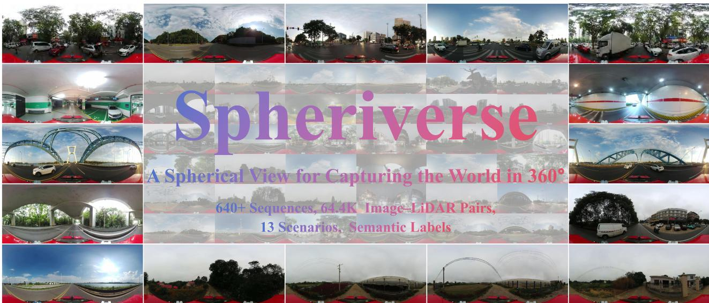  
Fig. 1. Spheriverse: Seeing the world in 360◦. From busy urban streets and multi-level transport structures to rural roads and agricultural landscapes, Spheriverse captures the diversity of real-world environments through spherical observations.

Abstract—Spherical observations provide global visual context for 3D scene understanding. However, visual information is encoded in an angular domain, whereas the physical world is represented in Cartesian coordinates. This cross-space representation gap complicates geometric correspondence and semantic evidence aggregation. To delve into this challenge, we introduce Spheriverse, comprising 64,400 temporally aligned spherical image-LiDAR pairs organized into 644 sequences. The dataset spans diverse scenes, illumination, and weather conditions, with fine-grained semantic classes. We further establish benchmarks for semantic occupancy prediction, semantic mapping, and 3D object detection, evaluating 30+ methods through overall and scene-wise comparisons. For dense prediction, we propose SphereOcc, an occupancy framework that couples spherical geometry modeling with semantic evidence retrieval. Cartesian-Spherical Representation Remodeling (CSRR) incorporates spherical range-azimuth geometry into Cartesian voxel features through region-wise modulation. Spherical Evidence Re-querying (SER) then conditions queries on voxel content and range height-azimuth geometry to adaptively retrieve relevant semantic evidence from source spherical image features. SphereOcc achieves 13.91% mIoU and 24.65% GeoIoU, outperforming the respective best-performing methods, TPVFormer and SurroundOcc, by 1.70 and 2.10 percentage points. It also ranks first in both metrics across all five scenes, with consistent advantages across the evaluated spatial partitions and reduced fields of view. The established benchmark and source code will be available at [Project Homepage].

Index Terms—Panoramic images, semantic occupancy prediction, 3D object detection, scene understanding, autonomous driving

## 1 INTRODUCTION

PHERICAL observations provide continuous 360◦ hor-S izontal coverage and broad vertical context, enabling global and coherent visual representations for spatial modeling and scene understanding [1], [2], [3], [4], [5], [6]. This property is highly aligned with the growing demand for embodied intelligence for holistic 3D spatial perception [7], [8], [9]. However, existing studies have largely focused on perspective cameras or 2D spherical scene understanding [10], [11], [12], [13], leaving the potential of spherical vision for 3D spatial perception largely unexplored. Yet spherical observations provide full-surround visual coverage. For dense 3D scene modeling tasks such as occupancy prediction [14], [15], [16], [17], however, visual information is encoded in an angular domain, whereas the target representation resides in a dense Cartesian voxel space. This divergence creates a cross-space representation gap between angular observations and metric voxels, giving rise to a range of projectioninduced distortions in object appearance, geometry, and spatial relationships. To address these challenges, this work contributes from three perspectives.

To enable the study of spherical 3D perception under the aforementioned challenges, we collect and organize a real-world spherical dataset with rich semantic annotations, termed Spheriverse. As shown in Tab. 1, Spheriverse exhibits the following key properties: 644 sequences collected across 13 geographically and visually diverse regions spanning distinct real-world regions and environments; 24-hour realworld data under diverse weather conditions, covering sunrise, sunset, daytime, and late-night scenarios, as well as clear and rainy weather; Fine-grained manual 3D annotations for outdoor object categories, including diverse artifacts such as noise barriers, food vendors, electric scooters, greenhouses, and other artificial objects; A high-quality sensing setup comprising cameras with a 360° horizontal and 136.7° vertical field of view, equipped with industrialgrade image sensors, together with a 128-beam LiDAR, providing dense and reliable observations for spherical 3D perception; Comprehensive dataset statistics, such as interscene appearance variations and object–FoV relationships.

Occupancy prediction provides a comprehensive representation for 3D spatial understanding and serves as a challenging testbed for studying holistic scene perception. Therefore, we adapt 11 representative methods to Spheriverse and further develop a spherical perception framework to investigate effective 3D spatial representations under spherical observations. To broaden the applicability of Spheriverse, we further establish two benchmarks for semantic mapping and 3D object detection. Beyond the overall performance comparison, we conduct a finegrained analysis across the five major scene categories in Spheriverse, revealing the influence of scene geometry, semantic composition, structural complexity, and observation conditions on model performance. Overall, we benchmark over 30 methods on Spheriverse and perform evaluations across three benchmarks, providing an evaluation platform for future research on spherical 3D understanding.

The divergence between spherical imagery and Cartesian voxel space creates a cross-space representation gap, giving rise to a range of projection-induced distortions in object appearance, geometry, and spatial relationships. To bridge this gap, we propose SphereOcc, an occupancy framework that integrates panoramic geometry and semantic evidence into metric voxel representations through a geometry–semantics coupled cross-space mechanism. Specifically, Cartesian–Spherical Representation Remodeling (CSRR) encodes range–azimuth relations to form Cartesian–spherical voxel features, thereby aligning Cartesian voxel representations with spherical range–azimuth geometry. Furthermore, Spherical Evidence Re-querying (SER) uses their range–height–azimuth (RTZ) geometry to mimic the 3D-to-2D coordinate mapping induced by spherical imaging, thereby complementing each voxel feature with relevant semantic evidence.

Our unified evaluation across three benchmarks reveals pronounced cross-scene performance variation among existing 3D perception methods under spherical observations. For dense occupancy prediction, SphereOcc achieves 13.91% mIoU and 24.65% GeoIoU. The strongest prior results are 12.21% mIoU from TPVFormer [18] and 22.55% GeoIoU from SurroundOcc [19]. Compared with these results, SphereOcc improves mIoU and GeoIoU by 1.70 and 2.10 percentage points, corresponding to relative gains of 13.9% and 9.3%, respectively. It also ranks first in both metrics across all five scene categories, demonstrating consistent improvements across diverse environments. We further conduct region-wise evaluations across horizontal azimuth intervals and vertical voxel layers, as well as experiments with reduced spherical fields of view. SphereOcc maintains effective performance across different settings.

Spherical Imaging: The 3D world is observed and mapped into the spherical camera.  
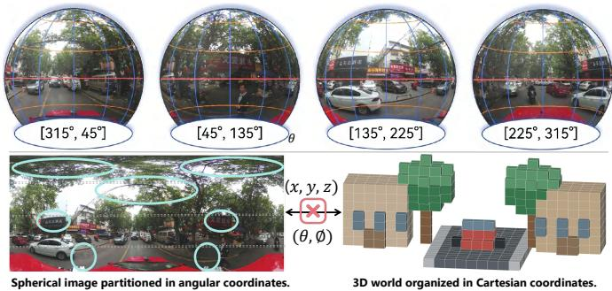  
Fig. 2. Spherical–Cartesian representation gap. Spherical imaging captures a continuous 360◦ horizontal field of view, with observations parameterized by azimuth θ and elevation ϕ. In contrast, the 3D environment and its voxel representation are organized in Cartesian coordinates (x,y,z). The mapping between these angular and metric coordinate systems is spatially non-uniform, causing projection-dependent distortions and preventing image-space proximity from directly preserving metric neighborhood relationships in 3D. The cyan outlines highlight representative regions where spherical projection alters object shape, scale, or local spatial arrangement.

Overall, this work delivers the following contributions:

• We introduce Spheriverse, a large-scale real-world spherical perception dataset featuring diverse geographic environments, 24-hour observations, fine-grained 3D semantic annotations, and high-quality multimodal sensing, enabling comprehensive studies of panoramic 3D perception under realistic conditions.

• We establish benchmarks on Spheriverse, covering three fundamental 3D tasks, i.e., semantic occupancy prediction, semantic mapping, and 3D object detection. Over 30 methods are evaluated with both overall and scene-wise analyses, reporting the performance of existing approaches under spherical observations.

• We propose SphereOcc, an occupancy framework that integrates spherical geometry and semantic evidence into voxel representations through a geometry–semantics coupled cross-space mechanism.

• SphereOcc achieves state-of-the-art semantic occupancy results on Spheriverse, reaching 13.91% mIoU and 24.65% GeoIoU and surpassing the strongest prior results by 1.70 and 2.10 percentage points, respectively. It also ranks first in both metrics across all five scene categories. Additional region-wise and reduced-FoV evaluations further demonstrate its consistent performance across spatial variations and observation coverage.

TABLE 1  
Comparison of spherical-view datasets. and denote direct real-world acquisition and Internet-sourced imagery, respectively; Syn. denotes synthetic data. and indicate the presence and absence of the corresponding attribute, respectively. Env. denotes the scene environment: In., Out., and In./Out. indicate indoor, outdoor, and both indoor and outdoor environments, respectively. , , , and denote sunrise, daytime, sunset, and evening lighting conditions, respectively. “#T.Scenes” denotes the reported scene count. “Semantic” and “3D Boxes” indicate the availability of voxel-wise semantic labels and object-level 3D bounding-box annotations, respectively. Within these two columns, – indicates tha annotations are currently unavailable. Dep. denotes depth sensing, and B. denotes the number of LiDAR beams. Scale reports image counts in thousands (K).
<table><tr><td rowspan="2">Datasets</td><td colspan="3">Acquisition</td><td colspan="4">Diversity</td><td colspan="2">3D Annotations</td><td rowspan="2">Scale</td></tr><tr><td>Year</td><td>Type Geo. Sen.</td><td></td><td>Env.</td><td>#T.Scenes</td><td>Weather</td><td>Lighting</td><td>Semantic</td><td>3D Boxes</td></tr><tr><td>Matterport3D [20]</td><td>2017</td><td>9</td><td>Dep.</td><td>In.</td><td>X</td><td></td><td></td><td></td><td></td><td>9.6K</td></tr><tr><td>WildPASS [21]</td><td>2021</td><td>G</td><td>X</td><td>Out.</td><td>9</td><td></td><td></td><td></td><td></td><td>2.0K</td></tr><tr><td>DensePASS [22]</td><td>2021</td><td>G</td><td></td><td>Out.</td><td>6</td><td></td><td></td><td></td><td></td><td>2.1K</td></tr><tr><td>HoliCity [23]</td><td>2021</td><td>G</td><td>X</td><td>Out.</td><td>4</td><td></td><td></td><td></td><td>X</td><td>6.3K</td></tr><tr><td>SynPASS [24]</td><td>2023</td><td>Syn.</td><td>X</td><td>Out.</td><td>6</td><td></td><td></td><td></td><td>+</td><td>9.0K</td></tr><tr><td>Pano2Geo [25]</td><td>2024</td><td>G</td><td>X</td><td>Out.</td><td>3</td><td></td><td></td><td></td><td></td><td>1.0K</td></tr><tr><td>360Loc [26]</td><td>2024</td><td>品</td><td>16 B.</td><td>In./Out.</td><td>4</td><td></td><td></td><td></td><td></td><td>9.3K</td></tr><tr><td>PAIR360 [27]</td><td>2024</td><td>品</td><td>32 B.</td><td>Out.</td><td>2</td><td></td><td></td><td></td><td></td><td>88.2K</td></tr><tr><td>Dur360BEV [28]</td><td>2025</td><td></td><td>128 B.</td><td>Out.</td><td>4</td><td></td><td></td><td></td><td></td><td>16.4K</td></tr><tr><td>PanoCycle360 [29]</td><td>2026</td><td>品</td><td>X</td><td>Out.</td><td>5</td><td></td><td></td><td>x</td><td>X</td><td>10.1K</td></tr><tr><td>Ours</td><td>2026</td><td>2</td><td>128 B.</td><td>Out.</td><td>13</td><td></td><td>卷 HE</td><td></td><td>V</td><td>64.4K</td></tr></table>

## 2 RELATED WORK

In this section, we first review prior studies on spherical scene understanding in Sec. 2.1. Owing to its completeness in scene representation, we focus on reviewing voxel-based scene understanding in Sec. 2.2. We then discuss semantic mapping and 3D object detection in Sec. 2.3.

## 2.1 Spherical Scene Understanding

As embodied agents advance, the demand for a full field of view emerges as a key prerequisite for effective environmental perception and understanding [2], [30].

Existing datasets [31], [32], [33], [34] typically acquire surround-view observations using multi-camera systems. However, inherent limitations in camera placement and imaging pipelines impose constraints on the field of view and introduce spatially discontinuous and overlapping observations [35], [36]. Although spherical imagery offers a large field of view and more complete observations of the surrounding environment, the resulting research has primarily focused on geometric scene understanding and depth estimation [25], [27], [35]. As summarized in Tab. 1, our systematic review of representative spherical datasets reveals that semantic 3D spatial understanding directly from spherical observations remains largely underexplored [25], [27], [35]. Meanwhile, panoramic annular cameras provide only horizontal observations; their inherent structural design often confines the vertical field of view to approximately 45°, which substantially restricts the range of scenes that can be effectively captured [37], [38], [39], [40], [41], [42], [43]. Matterport3D [20] provides spherical imagery, yet it mainly covers static indoor environments with regular layouts, leaving outdoor and dynamic scenarios unexplored.

For spherical scene understanding, researchers formulate spherical semantic segmentation from an unsupervised domain adaptation perspective [22], [24], [44], [45]. Meanwhile, beyond closed-set semantic segmentation, recent efforts [46], [47], [48] extend panoramic understanding toward open-vocabulary and zero-shot settings, enabling learning under annotation-scarce and semantically open conditions. Furthermore, studies [49], [50] adapt optical flow estimation to panoramic imagery through distortion-aware modeling and spherical continuity constraints, alleviating geometric distortions and periodic discontinuities induced by spherical projection. Recent approaches [40], [51], [52], [53] extend object detection and tracking to panoramic settings in 2D space by incorporating distortion-aware representations and trajectory-based temporal modeling. Spherical vision has also been explored in depth estimation [54], [55], [56], [57], [58], [59], [60], [61]. Recent studies further explore semanticconditioned diffusion and geometry-consistent zero-shot priors [62], [63], complementing contemporary efficient and real-world spherical depth estimation [64], [65], [66], [67]. Nevertheless, lifting semantic representations from the non-Euclidean spherical manifold into a 3D Cartesian space is essential for embodied agents to construct spatially grounded representations of their surroundings, yet this problem remains largely unexplored. In this work, we introduce Spheriverse, an open-world and diverse spherical dataset with rich spatial annotations.

## 2.2 Semantic Occupancy Prediction

Semantic occupancy prediction aims to infer a dense 3D representation from one or multiple 2D image observations by assigning each voxel an occupancy state and a semantic label, explicitly describing free space, object geometry, and scene semantics, thereby providing essential spatial information for embodied intelligence.

Existing camera-based approaches can be broadly categorized into three paradigms. Explicit projection-based methods, such as MonoScene [68], OccDepth [69], and COTR [70], project 2D image features into a predefined 3D voxel space, preserving direct image-to-voxel correspondences and offering strong geometric interpretability. Query-based methods [18], [19], [71], [72], [73], [74] employ learnable BEV or voxel queries to adaptively aggregate image evidence, enabling global contextual reasoning while reducing redundant dense feature lifting. Gaussian-based methods [75], [76], [77] represent scenes using sparse continuous primitives, allowing computational resources to be concentrated on occupied regions while providing compact and geometrically flexible 3D representations. Those methods reconstruct 3D Cartesian representations under conventional perspective-imaging assumptions. Consequently, they do not explicitly address the cross-space representation gap between spherical image and Cartesian voxel space. While OneOcc [43] and PanoMMOcc [78] have studied semantic occupancy prediction from panoramic annular cameras [1], their vertical field of view is limited to approximately 45◦, leaving wide-FoV spherical occupancy unexplored. Furthermore, several LiDAR-assisted approaches, including SPHERE [79] and EFFOcc [80], employ point clouds to provide explicit geometric cues and alleviate the ambiguity of image-to-voxel reconstruction. However, introducing LiDAR entails additional sensor payload, power consumption, and onboard computational overhead, imposing considerable constraints on compact embodied platforms. In this work, we propose SphereOcc for camera-based spherical 3D perception to address a cross-space representation gap between the angular domain and Cartesian voxel space.

## 2.3 Semantic Mapping and 3D Object Detection

Semantic mapping focuses on recovering the semantic composition and structural layout of surrounding environments in the Bird’s-Eye View (BEV) space. Existing methods can be broadly categorized into rasterized and vectorized representations. Rasterized BEV methods, including OneBEV [35], HDMapNet [81], and SeqBEV [82], encode environments as dense BEV grids and perform pixel-level semantic prediction through geometry-based transformation or learnable feature aggregation. In contrast, vectorized BEV methods, such as VectorMapNet [83], MapTR [84], and PivotNet [85], represent semantic elements as structured points or polylines, providing compact and topologyaware descriptions of scene structures. Beyond architectural design, recent work also investigates noise-resilient BEV semantic learning with synthetic data generated by driving world models [86]. 3D object detection aims to localize and recognize individual objects in 3D space. For 3D object detection, geometry-based BEV projection methods, such as PolarBEV [87], SOLOFusion [88], and MV2DFusion [89], exploit camera geometry, depth estimation, and temporal fusion to lift image features into BEV space. Query-based BEV methods [71], [90], [91] introduce learnable queries or adaptive BEV representations to aggregate image evidence and predict 3D bounding boxes. Although these approaches achieve promising performance in conventional perspective settings, they are mainly designed for perspective inputs and do not account for the unique geometry of spherical imaging. To characterize the capability of BEV representations under spherical observations, we establish benchmarks for semantic mapping and 3D object detection under spherical inputs.

## 3 SPHERIVERSE DATASET

Spherical observations provide complete vertical and horizontal field-of-view coverage, enabling global and coherent visual representations for spatial modeling and scene understanding. However, research on spatial understanding under spherical images remains limited. To bridge this gap, we introduce Spheriverse, a real-world spherical dataset with rich semantic annotations, comprising 644 sequences from 13 geographically and visually diverse regions. Equipped with a high-quality spherical camera and a 128-beam Li-DAR, Spheriverse provides dense observations to support research on spherical 3D perception.

TABLE 2  
Data distribution across four daily time periods for 644 sequences: night (20:00–05:00), dawn (05:00–07:00), daytime (07:00–18:00), and evening (18:00–20:00). Density denotes the number of samples per hour within each period, and proportion denotes the percentage of all samples.
<table><tr><td rowspan="2">Time Period</td><td rowspan="2">Duration (h)</td><td colspan="3">Sample Distribution</td></tr><tr><td>Count</td><td>Density</td><td>Proportion (%)</td></tr><tr><td>Night</td><td>9</td><td>7,300</td><td>811.11</td><td>11.34</td></tr><tr><td>Dawn</td><td>2</td><td>6,700</td><td>3,350.00</td><td>10.40</td></tr><tr><td>Daytime</td><td>11</td><td>31,100</td><td>2,827.27</td><td>48.29</td></tr><tr><td>Evening</td><td>2</td><td>19,300</td><td>9,650.00</td><td>29.97</td></tr></table>

## 3.1 Data Acquisition and Processing

Data Collection: We integrated a DuxCam M4 spherical camera [92] with an image resolution of 5188 × 1979 and a Hesai OT128 LiDAR [93] as the primary data acquisition sensors. The platform is equipped with two positioning sources: a GNSS receiver integrated into the camera and an external GNSS/INS unit. The camera intrinsic parameters are calibrated using the Zhang calibration method [94]. Using the LiDAR coordinate system as the reference, we further calibrate the camera extrinsic parameters [78]. The entire platform is centrally managed by a domain controller, which utilizes the Precision Time Protocol to ensure accurate clock alignment.

Data Annotation and Postprocessing: To advance research on semantic spatial perception from spherical observations in real-world environments, Spheriverse encompasses a diverse range of scene types. Specifically, the collected sequences are organized into five major categories and thirteen fine-grained subcategories according to traffic characteristics, environmental context, and geometric structure, as shown in Fig. 3. Point cloud annotations are produced through an outsourced annotation pipeline, where manual labeling is performed for semantic categories. Furthermore, to enhance the structural consistency and standardization of the dataset, we adopt a database-oriented storage architecture, following previous datasets [31], [32].

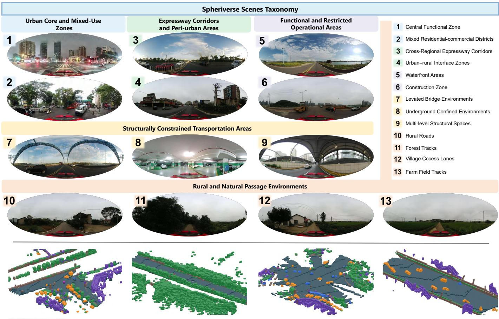  
Fig. 3. Scene categories in Spheriverse. The figure presents five major scene categories and 13 fine-grained categories, with representative spherical images shown for each fine-grained category. Examples 1–13 correspond to the categories listed on the right. Spheriverse covers heterogeneous driving environments with substantial variations in traffic function, environmental context, spatial layout, and visual conditions. The lower row shows semantic occupancy visualizations of four representative scenes, corresponding from left to right to a construction-zone residentia complex in Functional and Restricted Operational Areas, an open expressway corridor in Expressway Corridors and Peri-urban Areas, a dense mixed-use intersection in Urban Core and Mixed-Use Zones, and an elevated bridge in Structurally Constrained Transportation Areas.

## 3.2 Dataset Statistics

The raw collection contains 89,674 spherical images. After temporal alignment and data filtering, the benchmark subset contains 64,400 synchronized image–LiDAR pairs organized into 644 sequences, each spanning 20 seconds at 5 Hz, following [31], [32], [95]. To facilitate comprehensive and diverse research on spherical perception, we analyze the dataset from the following perspectives.

Time Statistics: As shown in Table 2, the established Spheriverse dataset is collected across four representative time periods, including night, dawn, daytime, and evening. The data cover the entire daily illumination cycle, with daytime images forming the largest proportion, accounting for 48.29% of the dataset. Evening scenes contribute 29.97% of the data and exhibit the highest acquisition density. Meanwhile, night and dawn periods account for 11.34% and 10.40%, respectively, providing valuable samples under low-light and transitional lighting environments. This temporal distribution indicates that Spheriverse is not limited to standard daytime scenarios but instead captures diverse real-world illumination conditions, establishing a valuable foundation for future research on robust perception across varying visibility and environmental settings.

Semantic Statistics: Spheriverse provides a three-level semantic annotation hierarchy that organizes scene elements at different levels of granularity. The annotations cover traffic participants, built structures, and natural environments, including pedestrians, vehicles, buildings, vegetation, and roads. More detailed categories include temporary buildings, construction vehicles, curbs, and gravel. Detailed category definitions, hierarchy mappings, and class statistics are provided in the Appendix. Following methods [35], [43], [78], Fig. 4 summarizes the representative composition of the nine semantic classes across azimuthal and radial bins centered on the ego vehicle. The left panel partitions the azimuth range from −180◦ to 180◦ into eight 45◦ intervals, with 0◦ aligned with the ego-vehicle heading. The right panel partitions the radial range from 0 to 70 m into seven 10 m intervals. Each column is normalized across the nine classes to 100%, such that each cell represents the class proportion within one spatial bin. Comparing cells vertically within each column, vegetation and surface dominate most bins, with buildings also contributing substantially, whereas pedestrians and cyclists remain consistently sparse. Across azimuthal bins, the proportions of surface, building, and vehicle vary substantially, indicating a direction-dependent scene composition. Across radial bins, foreground traffic participants become progressively less prevalent, consistent with stronger occlusion and reduced observability at longer ranges. Specifically, the vehicle proportion decreases from 15.78% to 0.60%, while pedestrian and cyclist proportions show overall decreases from 0.05% to 0.01% and from 0.20% to 0.08%, respectively. Conversely, vegetation increases from 22.74% to 47.95%, while buildings rise from 12.75% to approximately 29% and then remain stable at longer ranges. Together, these azimuth- and rangedependent variations reveal a pronounced spatial class prior inherent to driving scenes.

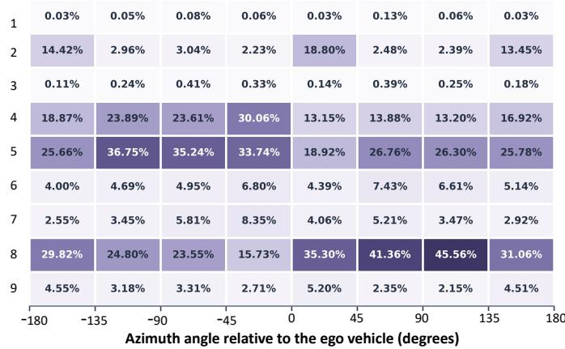

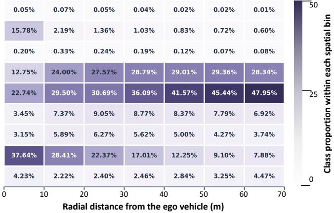  
Fig. 4. Angular and radial class composition of the nine-class taxonomy. Each column corresponds to an angular or radial bin and is normalized over the nine semantic classes, such that the values in each column sum to 100%. Each cell represents the proportion of observations within that spatial bin assigned to the corresponding class. Darker colors indicate larger within-bin class proportions. Angular intervals are defined relative to the ego-vehicle heading, which is aligned with the horizontal center of the image, whereas radial intervals are measured from the ego-vehicle origin. Rows 1–9 correspond to Pedestrian, Vehicle, Cyclist, Building, Vegetation, Pole & Barrier, Road, Surface, and Others, respectively.

## 4 SPHEREOCC: PROPOSED METHOD

Under spherical observations, the geometric correspondence between the angular observation and Cartesian voxel space is non-uniform, creating a cross-space representation gap, giving rise to a range of projection-induced distortions in object appearance, geometry, and spatial relationships. To bridge this gap, we propose SphereOcc, an occupancy framework that couples spherical geometry with semantic evidence to construct metric voxel representations.

## 4.1 Problem Formulation

Given a spatial point $\mathbf { p } _ { i } = ( x _ { i } , y _ { i } , z _ { i } ) ^ { \top } \in \mathbb { R } ^ { 3 }$ in the realworld Cartesian coordinate system, spherical imaging maps it onto the spherical coordinate domain as $( \theta _ { i } , \phi _ { i } )$ , where

$$
\theta _ { i } = \arctan 2 ( y _ { i } , x _ { i } ) , \quad \phi _ { i } = \arcsin \left( \frac { z _ { i } } { \sqrt { x _ { i } ^ { 2 } + y _ { i } ^ { 2 } + z _ { i } ^ { 2 } } } \right) .\tag{1}
$$

Here, $\mathbf { p } _ { i }$ denotes the i-th spatial point. The variables $x _ { i } , y _ { i } ,$ and $z _ { i }$ represent the Cartesian coordinates of $\mathbf { p } _ { i }$ along the $X \mathfrak { - }$ $, Y \cdot ,$ and $\mathsf { \Gamma } _ { \cdot \cdot }$ -axes, respectively. The angle $\theta _ { i } \in [ - \pi , \pi )$ denotes the horizontal azimuth angle of $\mathbf { p } _ { i } ,$ which corresponds to the horizontal position. The angle $\phi _ { i } ~ \in ~ [ - 0 . 8 1 \bar { 5 } , \pi / 2 ]$ $i . e . , ~ \left[ - 4 6 . 7 0 ^ { \circ } , 9 0 ^ { \circ } \right]$ , denotes the vertical elevation angle of $\mathbf { p } _ { i } ,$ which corresponds to the vertical position within the observable vertical field of view of the camera. Through this spherical projection, the original 3D point $\mathbf { p } _ { i }$ in Cartesian space is transformed into a 2D angular representation $( \theta _ { i } , \phi _ { i } )$ on the spherical imaging domain.

Furthermore, given the spherical angular coordinate $( \theta _ { i } , \phi _ { i } )$ , its corresponding pixel coordinate $( u _ { i } , v _ { i } )$ in the equirectangular projection (ERP) image can be expressed as

$$
u _ { i } = \frac { \theta _ { i } + \pi } { 2 \pi } W , \quad v _ { i } = \frac { \phi _ { \operatorname* { m a x } } - \phi _ { i } } { \phi _ { \operatorname* { m a x } } - \phi _ { \operatorname* { m i n } } } H ,\tag{2}
$$

where $u _ { i }$ and $v _ { i }$ denote the horizontal and vertical pixel coordinates in the ERP image, respectively; W and H are the ERP image width and height; and $\phi _ { \mathrm { m i n } }$ and $\phi _ { \mathrm { m a x } }$ denote the lower and upper bounds of the camera’s observation.

Dense occupancy prediction aims to recover a voxelized 3D semantic representation from the ERP image:

$$
\mathcal { S } \in \left\{ 0 , 1 , . . . , C \right\} ^ { X \times Y \times Z } ,\tag{3}
$$

where $s$ denotes the 3D semantic occupancy grid, $X , Y .$ , and Z indicate the voxel grid dimensions along the three spatial axes, and C indicates the number of semantic classes. Each discrete voxel corresponds to a local 3D space unit in the real-world Cartesian system.

## 4.2 Overall of SphereOcc

The encoder produces three hierarchical image feature maps following [19]. The feature at level ℓ is denoted by:

$$
\begin{array} { r } { \pmb { X } _ { \ell } \in \mathbb { R } ^ { C _ { \ell } \times H _ { \ell } \times W _ { \ell } } , \qquad \ell \in \{ 0 , 1 , 2 \} , } \end{array}\tag{4}
$$

where $C _ { \ell } , \ H _ { \ell } ,$ and $W _ { \ell }$ denote the channel dimension, height, and width of the feature at level $\ell ,$ respectively.

The neck aggregates $\{ X _ { j } \} _ { j = 0 } ^ { 2 }$ into multi-scale feature maps $\{ P _ { \ell } \} _ { \ell = 0 } ^ { 2 } .$ . Each feature map is then projected to match the channel dimension of its corresponding voxel level:

$$
V _ { \ell } = \tau _ { \ell } \left( \boldsymbol { P } _ { \ell } \right) \in \mathbb { R } ^ { D _ { \ell } \times H _ { \ell } \times W _ { \ell } } ,\tag{5}
$$

where $\tau _ { \ell }$ denotes the scale-specific channel projection and $D _ { \ell }$ is the voxel-feature dimension at level ℓ. The features $V _ { \ell }$

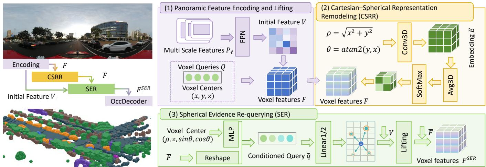  
Fig. 5. Overview of SphereOcc for bridging spherical observations and Cartesian voxel representations. (1) The spherical image encoder and feature pyramid extract multi-scale features, which are lifted into an initial Cartesian voxel representation using learnable voxel queries. (2) CSRR supplements the lifted voxel features with spherical geometric information derived from range-azimuth relations and region-wise importance estimation. (3) SER conditions voxel queries on spherical range-height-azimuth geometry and re-queries the source spherical image features using learned sampling offsets and attention weights, thereby supplementing the voxel features with relevant semantic information.

are first lifted into 3D space through scale-specific perception transformers:

$$
\begin{array} { r } { \boldsymbol { F } _ { \ell } = \mathcal { L } _ { \ell } \left( \boldsymbol { V } _ { \ell } , \boldsymbol { Q } _ { \ell } \right) \in \mathbb { R } ^ { D _ { \ell } \times H _ { \ell } ^ { \mathrm { v } } \times \boldsymbol { W } _ { \ell } ^ { \mathrm { v } } \times \boldsymbol { Z } _ { \ell } ^ { \mathrm { v } } } , \qquad \ell \in \{ 0 , 1 , 2 \} , } \end{array}\tag{6}
$$

where $\mathcal { L } _ { \ell }$ denotes the scale-specific 2D-to-3D lifting operation, $Q _ { \ell }$ denotes the learnable voxel queries, and $D _ { \ell }$ denotes the channel dimension of the lifted voxel feature. Moreover, $H _ { \ell } ^ { \mathrm { v } } , W _ { \ell } ^ { \mathrm { v } }$ , and $Z _ { \ell } ^ { \mathrm { v } }$ denote the spatial dimensions of the voxel grid at level ℓ. The resulting voxel features are processed by Cartesian–Spherical Representation Remodeling (CSRR), which encodes sphere-aligned range–azimuth relations to form Cartesian–spherical voxel features:

$$
\left\{ \overline { { \boldsymbol { F } } } _ { \ell } \right\} _ { \ell = 0 } ^ { 2 } = \mathcal { A } \left( \left\{ \boldsymbol { F } _ { \ell } \right\} _ { \ell = 0 } ^ { 2 } \right) , \overline { { \boldsymbol { F } } } _ { \ell } \in \mathbb { R } ^ { D _ { \ell } \times H _ { \ell } ^ { \mathrm { v } } \times \boldsymbol { W } _ { \ell } ^ { \mathrm { v } } \times \boldsymbol { Z } _ { \ell } ^ { \mathrm { v } } } .\tag{7}
$$

A denotes CSRR in Sec. 4.3.

Building on these features, Spherical Evidence Requerying (SER) complements each voxel feature with relevant semantic evidence from the source features:

$$
\left\{ { F } _ { \ell } ^ { \mathrm { S E R } } \right\} _ { \ell = 0 } ^ { 2 } = \mathcal { R } \Big ( \left\{ \overline { { F } } _ { \ell } \right\} _ { \ell = 0 } ^ { 2 } , \left\{ V _ { \ell } , p _ { \ell } \right\} _ { \ell = 0 } ^ { 2 } \Big ) .\tag{8}
$$

R denotes SER in Sec. 4.4, and $\pmb { p } _ { \ell }$ denotes the voxel-to-ERP reference points cached during the initial lifting. SER preserves the dimensions of all three voxel levels. Finally, the refined multi-scale voxel features are fused by the occupancy decoder, following [19], producing four hierarchical occupancy predictions:

$$
\left\{ O ^ { ( s ) } \right\} _ { s = 0 } ^ { 3 } = \mathcal { D } \left( \left\{ F _ { \ell } ^ { \mathrm { S E R } } \right\} _ { \ell = 0 } ^ { 2 } \right) ,\tag{9}
$$

where $O ^ { ( s ) }$ denotes the occupancy prediction at decoder stage s. All four predictions are supervised during training, while only the high-resolution prediction $O ^ { ( 3 ) }$ is used during inference.

All four decoder outputs are supervised; the loss is:

$$
\mathcal { L } _ { \mathrm { o c c } } = \sum _ { s = 0 } ^ { 3 } \lambda _ { s } \left( \mathcal { L } _ { \mathrm { c e } } ^ { ( s ) } + \mathcal { L } _ { \mathrm { s e m } } ^ { ( s ) } + \mathcal { L } _ { \mathrm { g e o } } ^ { ( s ) } \right) ,\tag{10}
$$

where s denotes the decoder stage and $\lambda _ { s }$ is its supervision weight. $\mathcal { L } _ { \mathrm { c e } }$ denotes the cross-entropy loss, $\mathcal { L } _ { \mathrm { s e m } }$ denotes the semantic loss, and $\mathcal { L } _ { \mathrm { g e o } }$ denotes the geometric loss.

## 4.3 Cartesian-Spherical Representation Remodeling

Initial lifting transfers image features to Cartesian voxels, but these features lack an explicit mechanism for connecting voxels along the spherical observation geometry.

Given the multi-scale voxel features $\{ F _ { \ell } \} _ { \ell = 0 } ^ { 2 } ,$ CSRR embeds sphere-aligned range–azimuth relations into the Cartesian representation, yielding Cartesian–spherical voxel features.

Specifically, given a voxel center $( x , y , z )$ , we combine its Cartesian coordinates with the horizontal range $\rho$ and the spherical azimuth $\theta .$ The radial distance and spherical azimuth are computed as:

$$
\rho = \sqrt { x ^ { 2 } + y ^ { 2 } } , \qquad \theta = \mathrm { a t a n 2 } ( y , x ) ,\tag{11}
$$

where z denotes the vertical height. We omit spherical elevation because it is already determined by the retained z and $\rho ,$ making it a redundant rather than independent geometric cue.

The resulting coordinate descriptor is defined as:

$$
\pmb { c } = [ x , y , \sin \theta , \cos \theta , z , \rho ] .\tag{12}
$$

$\mathrm { A t }$ scale $\ell ,$ the descriptors of all voxels are stacked into $C _ { \ell } \in$ $\mathbb { R } ^ { 6 \times H _ { \ell } ^ { \mathrm { v } } \times \dot { W } _ { \ell } ^ { \mathrm { v } } \times Z _ { \ell } ^ { \mathrm { v } } }$ and embedded as:

$$
\pmb { { \cal E } } _ { \ell } = \phi _ { \ell } \left( \pmb { { \cal C } } _ { \ell } \right) \in \mathbb { R } ^ { D _ { \mathrm { c } } \times H _ { \ell } ^ { \mathrm { v } } \times W _ { \ell } ^ { \mathrm { v } } \times Z _ { \ell } ^ { \mathrm { v } } } ,\tag{13}
$$

where $\phi _ { \ell }$ denotes a $1 \times 1 \times 1$ convolution followed by ReLU, and $D _ { \mathrm { c } }$ denotes the coordinate-embedding dimension.

To estimate geometry-guided voxel importance, the lifted voxel features $\pmb { F } _ { \ell }$ are concatenated with the coordinate embedding $\pmb { E } _ { \ell }$ . After that, a lightweight saliency estimator then produces a voxel-wise score map $\pmb { S } _ { \ell } \colon$

$$
\begin{array} { r } { \pmb { S } _ { \ell } = \psi _ { \ell } \left( \left[ \pmb { F } _ { \ell } ; \pmb { E } _ { \ell } \right] \right) \in \mathbb { R } ^ { 1 \times H _ { \ell } ^ { \mathrm { v } } \times W _ { \ell } ^ { \mathrm { v } } \times Z _ { \ell } ^ { \mathrm { v } } } . } \end{array}\tag{14}
$$

where $\psi _ { \ell }$ is a 3D convolution that maps the fused feature to a scalar importance score for each voxel. The voxel-wise

scores are aggregated into non-overlapping regions using three-dimensional average pooling to avoid fragmented voxel-level prioritization and promote coherent remodeling:

$$
\pmb { R } _ { \ell } = \mathrm { A v g P o o l } _ { r } \left( \pmb { S } _ { \ell } \right) \in \mathbb { R } ^ { 1 \times \widehat { H } _ { \ell } \times \widehat { W } _ { \ell } \times \widehat { Z } _ { \ell } } ,\tag{15}
$$

where

$$
\pmb { r } = \left( r _ { H } , r _ { W } , r _ { Z } \right)\tag{16}
$$

denotes the region size. The total number of pooled regions at scale ℓ is:

$$
N _ { \ell } = \widehat { H } _ { \ell } \widehat { W } _ { \ell } \widehat { Z } _ { \ell } .\tag{17}
$$

After that, we apply a Softmax over the pooled regions and restore the resulting weights to the original voxel resolution:

$$
\begin{array} { r l } & { { \cal A } _ { \ell } = \mathrm { S o f t m a x } _ { \mathrm { r e g } } \left( { \cal R } _ { \ell } \right) , } \\ & { { \cal G } _ { \ell } = { \cal N } _ { \ell } \mathrm { U p } _ { \mathrm { n e a r e s t } } \left( { \cal A } _ { \ell } \right) . } \end{array}\tag{18}
$$

Here, Softmax $\mathrm { r e g }$ assigns relative weights across the $N _ { \ell }$ regions, and the factor $\breve { N _ { \ell } }$ compensates for the scale reduction introduced by this normalization.

Finally, the Cartesian–spherical voxel features are constructed through a spatially gated channel residual. At scale $\ell ,$ a learnable residual $\pmb { b _ { \ell } } ^ { \prime } \in \mathbb { R } ^ { D _ { \ell } \times 1 \times 1 \times 1 }$ is broadcast over the spatial dimensions, while the scene-conditioned gate $G _ { \ell }$ determines its spatial strength:

$$
\overline { { \mathbf { F } } } _ { \ell } = F _ { \ell } + G _ { \ell } \odot \pmb { b } _ { \ell } ,\tag{19}
$$

where $\odot$ denotes element-wise multiplication with broadcasting along the channel dimension. This factorization separates spatial prioritization from channel modulation: $G _ { \ell }$ controls where and how strongly the update is applied, whereas $b _ { \ell }$ controls the channel-wise adjustment. The channel residual is initialized to zero and learned jointly with the regional importance estimator, preserving the original voxel features at initialization. The resulting features $\{ \overline { { F } } _ { \ell } \} _ { \ell = 0 } ^ { 2 }$ are subsequently passed to spherical evidence re-querying.

## 4.4 Spherical Evidence Re-querying

Although CSRR enriches the lifted voxel features with explicit spherical range-azimuth geometry, the resulting Cartesian-spherical voxel features do not explicitly model their adaptive semantic correspondence with the source spherical image features. SER addresses this limitation by re-querying the source features to retrieve relevant semantic evidence for each voxel feature.

At scale $\ell ,$ the Cartesian–spherical voxel feature volume $\overline { { \mathbf { F } } } _ { \ell }$ is flattened into content queries $\{ q _ { \ell , n } \} _ { n = 1 } ^ { N _ { \ell } ^ { \mathrm { v } } } ,$ , where $N _ { \ell } ^ { \mathrm { v } } =$ $H _ { \ell } ^ { \mathrm { v } } W _ { \ell } ^ { \mathrm { v } } Z _ { \ell } ^ { \mathrm { v } }$ . For each query, SER derives an RTZ positional descriptor from its voxel-grid location:

$$
\begin{array} { r } { \begin{array} { l l l } { \displaystyle t _ { \ell , n } = \left[ \rho _ { \ell , n } , z _ { \ell , n } , \sin \theta _ { \ell , n } , \cos \theta _ { \ell , n } \right] . } \end{array} } \end{array}\tag{20}
$$

Here, $\pmb { t } _ { \ell , n } \in \mathbb { R } ^ { 4 }$ denotes the positional descriptor of query n at scale ℓ. Furthermore, SER uses a two-layer MLP ηℓ with a SiLU activation to embed the RTZ geometry and condition the evidence query. The conditioned query $\widetilde { \pmb q } _ { \ell , n }$ is used to predict deformable sampling offsets and attention weights, as shown in the following:

$$
\widetilde { \pmb q } \ell , n = \pmb q \ell , n + \eta _ { \ell } \left( \pmb t \ell , n \right) .\tag{21}
$$

The Cartesian–spherical voxel feature corresponding to query n $( \overline { { F } } _ { \ell , n } )$ remains unchanged until the retrieved image evidence is incorporated through the final residual update.

After that, let $\mathbf { \bar { \psi } } _ { p \ell , n } \in [ 0 , 1 ] ^ { 2 }$ be the reference point of voxel n cached during the initial 2D-to-3D lifting. For attention head h and sampling point $k ,$ the RTZ-conditioned query predicts a two-dimensional offset and its attention weight:

$$
\begin{array} { r l } & { \Delta \pmb { p } _ { \ell , n , h , k } = { \pmb { W } } _ { \ell } ^ { \Delta } \widetilde { \pmb { q } } _ { \ell , n } , } \\ & { \quad { a } _ { \ell , n , h , k } = \mathrm { S o f t m a x } _ { k } \left( { \pmb { W } } _ { \ell } ^ { a } \widetilde { \pmb { q } } _ { \ell , n } \right) . } \end{array}\tag{22}
$$

The sampling location is:

$$
\begin{array} { r } { s _ { \ell , n , h , k } = p _ { \ell , n } + \Delta p _ { \ell , n , h , k } \oslash \left[ W _ { \ell } , H _ { \ell } \right] , } \end{array}\tag{23}
$$

where $H _ { \ell }$ and $W _ { \ell }$ are the height and width of the source feature map $V _ { \ell } ,$ and ⊘ denotes element-wise division. Thus, the cached projection provides a geometrically valid anchor, while the learned offsets adapt the re-query to the current voxel feature and its RTZ geometry.

The sampled evidence is aggregated across sampling points and attention heads:

$$
e _ { \ell , n } = W _ { \ell } ^ { o } \left( \underset { h = 1 } { \overset { N _ { \mathrm { h } } } { \sum } } \sum _ { k = 1 } ^ { K _ { \ell } } a _ { \ell , n , h , k } \mathcal { B } \left( W _ { \ell } ^ { v } V _ { \ell } , s _ { \ell , n , h , k } \right) \right) ,\tag{24}
$$

where B denotes bilinear sampling and ∥ denotes head-wise concatenation. We use $N _ { \mathrm { h } } = 8$ attention heads and $K _ { \ell } \in$ {2,4,8} sampling points from fine to coarse scales, following SurroundOcc [19]. Finally, the retrieved evidence is written back through a residual update:

$$
\begin{array} { r } { { F } _ { \ell , n } ^ { \mathrm { S E R } } = \overline { { F } } _ { \ell , n } + e _ { \ell , n } . } \end{array}\tag{25}
$$

By reusing the lifting reference points and learning only local deformable offsets around them, SER re-queries relevant semantic evidence for Cartesian–spherical voxel features. The resulting multi-scale voxel representations are subsequently forwarded to the occupancy decoder.

## 5 BENCHMARK EXPERIMENTS

All methods are evaluated under a unified experimental protocol. The input spherical images are resized to 2480 × 512. All models are trained on four NVIDIA RTX 3090 GPUs for 28 epochs. For each benchmark, we report the overall performance across all scenes, as well as the performance in each scene type, enabling a comprehensive evaluation of the model in heterogeneous environments. Unless otherwise noted, all methods are reproduced from their official configurations with only minimal datasetspecific adaptations. For a fair comparison, we standardize the training schedule, input image size, and voxelization, while retaining each method’s core representation, taskspecific loss, and remaining hyperparameters.

## 5.1 Dense Occupancy Prediction

## 5.1.1 Evaluation Metrics and Implementation Details

Evaluation Metrics: 3D occupancy prediction serves as a fundamental task for holistic scene understanding. Therefore, we establish an evaluation that jointly assesses semantic segmentation performance and scene reconstruction quality. Following existing works [19], [75], [103], we report

TABLE 3

Overall and scene-wise semantic occupancy results on Spheriverse. mIoU, GeoIoU, and class-wise IoU are reported in %. Light orange and ligh   
blue indicate the best and second-best results, respectively; ties are highlighted equally, and higher values indicate better performance. TPVFo., Surro., OccDe., MonoS., OccDA., Quadr., ProDA., Proto., Gauss., and BEVFo. denote TPVFormer [18], SurroundOcc [19], OccDepth [69], MonoScene [68], OccDepth [69] with Depth Anything [96], QuadricFormer [77], ProtoOcc [72] with Depth Anything [96], ProtoOcc [72], GaussianFormer [75], and BEVFormer [71], respectively.

<table><tr><td rowspan="2"></td><td rowspan="2"></td><td colspan="10"></td></tr><tr><td></td><td></td><td></td><td></td><td></td><td></td><td></td><td></td><td></td><td></td><td></td></tr><tr><td colspan="10">Overall Semantic Occupancy Results</td><td></td><td></td><td></td></tr><tr><td>mIoU↑ GeoIoU↑</td><td></td><td>12.21 12.05</td><td>11.63</td><td>11.44</td><td>11.42 21.97</td><td>11.09 20.76</td><td>11.07 20.77</td><td>10.93 21.02</td><td>9.72 19.23</td><td>9.16 18.04</td><td>8.22 18.37</td><td>13.91 24.65</td></tr><tr><td></td><td>22.35 4.07</td><td>22.55</td><td>21.59</td><td>21.68</td><td></td><td></td><td></td><td></td><td></td><td></td><td></td><td>3.02</td></tr><tr><td>Person ↑ Vehicle ↑</td><td>12.88</td><td>1.65 13.97</td><td>3.21 11.27</td><td>2.49</td><td>2.41</td><td>0.00</td><td>2.96 12.36</td><td>3.30</td><td>1.97 11.47</td><td>0.00 9.05</td><td>0.20 5.36</td><td>15.71</td></tr><tr><td>● Bike ↑</td><td>8.54</td><td>5.16</td><td>7.25</td><td>10.90 6.95</td><td>12.04 7.22</td><td>11.09 4.51</td><td>7.84</td><td>12.12 6.52</td><td>6.11</td><td>4.62</td><td>1.42</td><td>7.50</td></tr><tr><td>● Building ↑</td><td></td><td>9.40</td><td>8.49</td><td></td><td>7.85</td><td>8.09</td><td>7.29</td><td>7.18</td><td>6.71</td><td>5.82</td><td>6.61</td><td>10.25</td></tr><tr><td> Vegetation ↑</td><td>8.93 14.00</td><td>14.08</td><td>13.26</td><td>8.18 13.55</td><td>13.44</td><td>12.45</td><td>13.18</td><td>13.08</td><td>12.18</td><td>9.26</td><td>10.09</td><td>15.57</td></tr><tr><td>● Pillar ↑</td><td>12.34</td><td>12.57</td><td>10.67</td><td>10.93</td><td>10.68</td><td>12.59</td><td>8.94</td><td>8.45</td><td>7.33</td><td>9.21</td><td>10.12</td><td>16.60</td></tr><tr><td>● Road ↑</td><td></td><td></td><td></td><td></td><td></td><td></td><td></td><td></td><td></td><td></td><td></td><td>39.99</td></tr><tr><td>Surface ↑</td><td>34.92</td><td>36.58 11.99</td><td>35.74</td><td>36.62</td><td>35.06</td><td>37.62</td><td>35.04</td><td>34.47</td><td>29.84</td><td>34.96</td><td>28.80</td><td></td></tr><tr><td>● Others ↑</td><td>12.01 2.21</td><td>3.07</td><td>12.62 2.16</td><td>11.61 1.75</td><td>12.26 1.83</td><td>11.91 1.54</td><td>10.06 1.95</td><td>11.11 2.13</td><td>9.85 1.97</td><td>9.22 0.32</td><td>10.05 1.33</td><td>13.01 3.53</td></tr><tr><td colspan="10">Scene-wise Semantic Occupancy Results</td><td></td><td></td><td></td></tr><tr><td colspan="10">10.43 10.35 10.23 10.05 9.84 9.78</td><td></td><td>7.58 19.48</td><td>7.34</td><td>12.82</td></tr><tr><td>Funct.</td><td>GeoIoU ↑| mIoU ↑ GeoIoU ↑</td><td>25.00 8.33 23.72</td><td>25.36 8.38 23.39</td><td>24.41 7.92 8.12 23.14 23.02</td><td>24.46 24.77 7.47 23.38</td><td>23.66 8.02 22.80</td><td>22.98 7.43 22.37</td><td>23.45 7.82 22.95</td><td>21.37 6.71 20.29</td><td>7.16 20.62</td><td>20.72 6.13 21.11</td><td>27.02 10.17 25.90</td></tr><tr><td>Rural</td><td>mIoU ↑ GeoIoU ↑|</td><td>10.13 19.78</td><td>10.22 20.23</td><td>9.62 18.82</td><td>9.79 9.78 18.85 19.23</td><td>8.94 17.56</td><td>9.93 18.53</td><td>9.71 18.84</td><td>9.10 17.61</td><td>7.57 15.23</td><td>7.34 16.18</td><td>11.32 22.43</td></tr><tr><td>Struc.</td><td>mIoU ↑ GeoIoU ↑|</td><td>13.66 32.23</td><td>13.66 34.79</td><td>12.39 32.38</td><td>12.34 32.18</td><td>12.42 32.51</td><td>12.70 12.67 33.07 28.72</td><td>11.86 28.39</td><td>9.47 24.60</td><td>10.50 29.67</td><td>8.42 26.00</td><td>16.60 39.04</td></tr><tr><td>Urban</td><td>mIoU↑ GeoIoU ↑</td><td>8.05 17.49</td><td>8.31 17.49</td><td>7.52 16.49</td><td>7.49 16.74</td><td>7.37 16.91</td><td>6.73 15.31</td><td>7.82 7.55 17.01 17.10</td><td>6.69 15.99</td><td>5.87 13.95</td><td>4.45 13.48</td><td>9.64 19.32</td></tr></table>

three evaluation metrics: class-wise IoU, mIoU, and GeoIoU. Class-wise IoU evaluates the semantic prediction accuracy for each category, while mIoU averages IoU across all semantic categories. GeoIoU evaluates class-agnostic geometric reconstruction by measuring the spatial overlap between the predicted and ground-truth occupied regions.

Implementation Details: The occupancy volume is represented as a voxel grid of size $2 0 0 \times 2 0 0 \times 1 6$ at a voxel resolution of 0.5 m. All evaluations use the nine primary semantic classes. We reproduce representative camerabased occupancy methods from three paradigms. This includes MonoScene [68], OccDepth [69], and COTR [70]. The query-based group includes BEVFormer [71], TPV-Former [18], SurroundOcc [19], and ProtoOcc [72]. The Gaussian-based methods include GaussianFormer [75] and QuadricFormer [77]. We additionally evaluate OccDepth and ProtoOcc with a frozen Depth Anything prior [96].

Results and Analyses: As shown in Table 3, SphereOcc achieves the best overall performance, reaching 13.91% mIoU and 24.65% GeoIoU. For mIoU, SphereOcc surpasses TPVFormer [18], the strongest prior method for this metric (13.91% vs. 12.21%). For GeoIoU, it outperforms SurroundOcc [19], the strongest prior method for this metric (24.65% vs. 22.55%). These results correspond to absolute gains of 1.70 and 2.10 percentage points, or relative improvements of 13.9% and 9.3%, respectively. SphereOcc also ranks first in both metrics across all five scene subsets and achieves the best class-wise IoU in seven of nine semantic categories. Although it does not rank first for Person and Bike, it improves their IoUs over SurroundOcc by 83.0% (3.02% vs. 1.65%) and 45.3% (7.50% vs. 5.16%), respectively. Among the seven leading categories, particularly clear gains over SurroundOcc are observed for Pillar (16.60% vs. 12.57%) and Road (39.99% vs. 36.58%). These gains span thin structures, continuous surfaces, and small traffic participants, consistent with the complementary roles of CSRR and SER in enriching voxel features with spherical geometry and relevant semantic evidence. The qualitative results in Fig. 6 further corroborate these quantitative improvements. In the challenging example, vehicles and vegetation are spatially intertwined, resulting in ambiguous boundaries and complex local geometry. By linking Cartesian voxel features with spherical observations at both geometric and semantic levels, SphereOcc bridges the cross-space representation gap and enables more complete and accurate reconstruction of regions where vehicles and vegetation are spatially intertwined, whereas the compared methods exhibit missing structures or semantic confusion in the same areas.

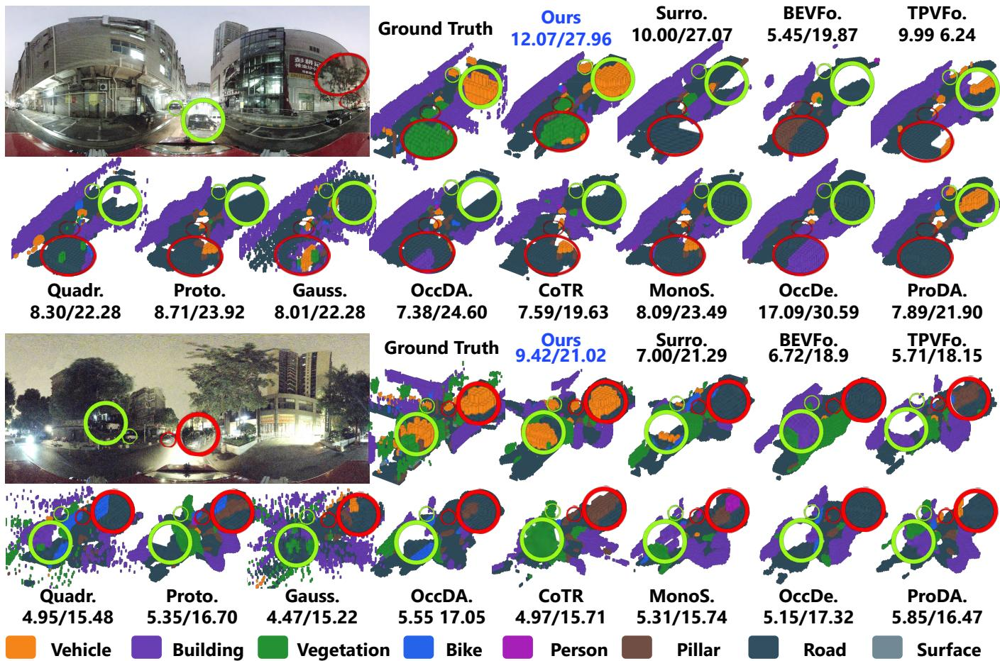  
Fig. 6. Qualitative comparison of semantic occupancy prediction on Spheriverse. ERP and GT denote the equirectangular-projection input image and ground truth, respectively. The mIoU and GeoIoU scores (in %) are reported above each prediction. Surro., BEVFo., TPVFo., Quadr., Proto., Gauss., CoTR, MonoS., and OccDe. denote SurroundOcc [19], BEVFormer [71], TPVFormer [18], QuadricFormer [77], ProtoOcc [72], GaussianFormer [75], Compact Occupancy Transformer [70], MonoScene [68], and OccDepth [69], respectively. OccDA. and ProDA. denote OccDepth and ProtoOcc augmented with Depth Anything [96], respectively. Colors represent the semantic classes shown in the bottom legend: Vehicle, Building, Vegetation, Bike, Person, Pillar, Road, and Surface.

## 5.2 Semantic Mapping and 3D Object Detection

Evaluation Metrics: For semantic mapping, we evaluate the semantic consistency between the predicted BEV representation and the ground-truth semantic map. Following established BEV mapping protocols [35], [81], we use mean Intersection over Union (mIoU) as the primary metric, which averages the overlap between predicted and groundtruth regions across all semantic categories. For 3D object detection, we follow the nuScenes evaluation protocol and report mean Average Precision (mAP) and the nuScenes Detection Score (NDS).

Implementation Details: For semantic mapping, the target BEV maps are represented as dense 200 × 200 grids containing seven semantic categories. We adapt ten representative methods to Spheriverse: OneBEV [35], HDMap-Net [81], PivotNet [85], VectorMapNet [83], MapTR [84], SparseBEV [91], BEVFormer [71], PETRv2 [97], SeqBEV [82], and TPVFormer [18]. For 3D object detection, we evaluate nine representative methods: SparseBEV [91], Dense-BEV [98], BEVFormer [71], PolarBEVDet [99], SOLOFusion [88], DETR3D [90], CoIn3D [100], PD-BEV [101], and GeoBEV [102]. Within each benchmark, all methods are trained for 28 epochs using the same data splits and a unified task-specific evaluation protocol.

Results and Analyses: For semantic mapping, Table 4 shows that OneBEV [35], which is specifically designed for spherical observations, achieves the highest overall mIoU and outperforms the second-ranked HDMapNet [81] by 1.95 percentage points (22.66% vs. 20.71%). OneBEV also ranks first across all five scene subsets, with its largest advantage observed in structurally constrained scenes (23.15% vs. 20.28%). At the category level, HDMapNet [81] achieves the highest IoUs for Building and Other. For 3D object detection, Table 5 shows that SparseBEV [91] achieves the best overall performance, with an mAP of 0.1689 and an NDS of 0.1221, followed by PolarBEVDet [99]. SparseBEV also performs best in expressway, rural, structurally constrained, and urban scenes, whereas PD-BEV [101] performs best in functional scenes. Performance varies substantially across the five scene categories, with higher detection accuracy in structurally constrained scenes and lower accuracy in functional and rural scenes. These results provide reproducible baselines for spherical BEV perception and demonstrate that spherical 3D object detection remains sensitive to scene structure and object distribution. As shown in Fig. 7, the compared methods frequently produce missed detections or inaccurate localization in the selected regions. These results illustrate the difficulty of recovering object locations in metric Cartesian 3D space from spherical observations represented in angular coordinates. The non-

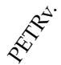

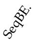

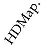  
TABLE 4

Overall and scene-wise BEV semantic mapping results on Spheriverse. Class-wise IoU and mIoU are reported in %, and higher values indicate better performance. Scene-wise results are obtained using the globally selected checkpoint and class-specific thresholds. OneBE., HDMap., Pivot., Spars., Vecto., BEVFo., PETRv., SeqBE., MapTR, and TPVFo. denote OneBEV [35], HDMapNet [81], PivotNet [85], SparseBEV [91], VectorMapNet [83], BEVFormer [71], PETRv2 [97], SeqBEV [82], MapTR [84], and TPVFormer [18], respectively.

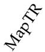

<table><tr><td colspan="10">Overall BEV Semantic Mapping Results</td></tr><tr><td> Participant ↑|</td><td>18.84</td><td>10.50</td><td>11.42</td><td>11.27</td><td>10.27</td><td>10.65</td><td>8.80</td><td>7.44</td><td>8.73</td><td>10.03</td></tr><tr><td>● Building ↑</td><td>19.23</td><td>19.80</td><td>17.01</td><td>16.73</td><td>16.04</td><td>14.26</td><td>15.87</td><td>12.43</td><td>11.80</td><td>11.85</td></tr><tr><td> Vegetation ↑</td><td>24.76</td><td>23.75</td><td>23.47</td><td>22.68</td><td>22.35</td><td>21.20</td><td>21.65</td><td>20.63</td><td>20.70</td><td>18.35</td></tr><tr><td>● Pillar ↑</td><td>18.51</td><td>17.03</td><td>15.75</td><td>16.36</td><td>15.15</td><td>13.78</td><td>12.76</td><td>11.69</td><td>9.98</td><td>8.44</td></tr><tr><td>● Road ↑</td><td>52.53</td><td>48.98</td><td>47.23</td><td>46.94</td><td>47.53</td><td>45.51</td><td>44.49</td><td>40.66</td><td>40.76</td><td>39.70</td></tr><tr><td>Surface ↑</td><td>19.67</td><td>19.00</td><td>19.21</td><td>18.33</td><td>19.61</td><td>17.73</td><td>18.88</td><td>18.30</td><td>16.12</td><td>17.51</td></tr><tr><td>● Others ↑</td><td>5.05</td><td>5.89</td><td>5.43</td><td>5.01</td><td>4.74</td><td>4.08</td><td>4.68</td><td>3.48</td><td>2.73</td><td>3.61</td></tr><tr><td>mIoU↑</td><td>22.66</td><td>20.71</td><td>19.93</td><td>19.62</td><td>19.38</td><td>18.17</td><td>18.16</td><td>16.37</td><td>15.83</td><td>15.64</td></tr></table>

<table><tr><td colspan="11">Scene-wise BEV Semantic Mapping Results</td></tr><tr><td>Expressway</td><td>20.67</td><td>19.57</td><td>18.58</td><td>17.81</td><td>17.93</td><td>16.81</td><td>16.99</td><td>14.55</td><td>13.70</td><td>11.24</td></tr><tr><td>Functional</td><td>16.69</td><td>15.25</td><td>13.95</td><td>14.48</td><td>14.56</td><td>13.47</td><td>13.68</td><td>10.11</td><td>11.97</td><td>10.83</td></tr><tr><td>Rural</td><td>21.57</td><td>19.49</td><td>19.26</td><td>18.60</td><td>18.47</td><td>16.86</td><td>16.65</td><td>15.61</td><td>16.27</td><td>16.79</td></tr><tr><td>Structural</td><td>23.15</td><td>20.28</td><td>18.58</td><td>18.55</td><td>18.76</td><td>17.58</td><td>17.48</td><td>15.28</td><td>13.15</td><td>12.55</td></tr><tr><td>Urban</td><td>14.60</td><td>13.45</td><td>12.75</td><td>12.73</td><td>12.46</td><td>12.52</td><td>12.14</td><td>9.53</td><td>10.06</td><td>10.99</td></tr></table>

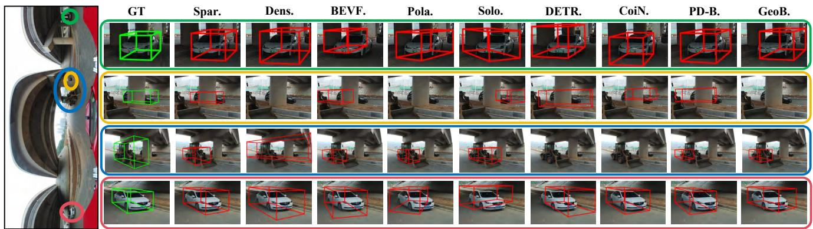  
Fig. 7. Qualitative comparison of spherical 3D object detection on Spheriverse. The three color-coded regions in the input image are enlarged by row, while the ground truth (GT) and predictions from representative methods are compared by column. Spar., Dens., BEVF., Pola., Solo., DETR., CoiN., PD-B., and GeoB. denote SparseBEV [91], DenseBEV [98], BEVFormer [71], PolarBEVDet [99], SOLOFusion [88], DETR3D [90], CoIn3D [100], PD-BEV [101], and GeoBEV [102], respectively. Green and red boxes denote the projected ground-truth and predicted 3D boxes.

uniform mapping between the two coordinate systems, together with projection-induced appearance distortions, complicates image-to-3D correspondence and remains an important challenge for future research.

## 6 ABLATION STUDIES

## 6.1 Main Components

To evaluate the contribution of each component, we progressively incorporate InternImage-T [104], CSRR, and SER into the original SurroundOcc baseline [19]. As shown in Table $6 ,$ replacing ResNet [105] with the pretrained InternImage-T [104] improves mIoU from 12.05% to 12.14% and GeoIoU from 22.55% to 23.35%, confirming the effectiveness of the stronger backbone. Adding CSRR further increases mIoU to 12.71% and GeoIoU to 23.50%, with gains of 0.57 and 0.15 percentage points, respectively. By incorporating range–azimuth relations into the lifted voxel features, CSRR strengthens their correspondence with spherical geometry before occupancy decoding. Furthermore, SER produces the largest incremental improvement, raising mIoU and GeoIoU to 13.91% and 24.65%, respectively. During the initial lifting, sampling offsets and attention weights are predicted from learnable voxel queries around projected voxel reference points. In contrast, SER combines the Carte-

TABLE 5

Overall and scene-wise 3D object detection results on Spheriverse. mAP and NDS are reported following the nuScenes evaluation protocol [31], and higher values indicate better performance. Spar., Dens., BEVF., Pola., Solo., DETR., CoiN., PD-B., and GeoB. denote SparseBEV [91], DenseBEV [98], BEVFormer [71], PolarBEVDet [99], SOLOFusion [88], DETR3D [90], CoIn3D [100], PD-BEV [101], and GeoBEV [102], respectively. Expre., Funct., and Struc. denote Expressway, Functional, and Structural scenes, respectively.

<table><tr><td colspan="2"></td><td colspan="10">Methods</td></tr><tr><td>Group</td><td>Metric</td><td>Spar.</td><td>Dens.</td><td>BEVF.</td><td>Pola.</td><td>Solo.</td><td></td><td>DETR.</td><td>CoiN.</td><td>PD-B.</td><td>GeoB.</td></tr><tr><td></td><td colspan="9">Overall 3D Object Detection Results</td><td></td></tr><tr><td></td><td>mAP ↑| NDS↑</td><td>0.1689 0.1221</td><td>0.0941 0.0874</td><td>0.0941</td><td>0.1364</td><td>0.1316</td><td>0.1296</td><td>0.1078</td><td>0.1178</td><td>0.0654</td></tr><tr><td></td><td></td><td></td><td></td><td>0.0806 Scene-wise 3D Object Detection Results</td><td>0.1086</td><td>0.1017</td><td>0.0996</td><td>0.0939</td><td>0.0985</td><td>0.0715</td></tr><tr><td colspan="9"></td></tr><tr><td>Expre.</td><td>mAP↑| NDS↑</td><td>0.1250 0.0972</td><td>0.0701 0.0687</td><td>0.0813 0.0691</td><td>0.1110 0.0925</td><td>0.1175 0.0926</td><td>0.1009 0.0822</td><td>0.0868 0.0805</td><td>0.1021 0.0891</td><td>0.0579 0.0653</td></tr><tr><td>Funct.</td><td>mAP↑| NDS↑</td><td>0.0531 0.0636</td><td>0.0266 0.0411</td><td>0.0232 0.0409</td><td>0.0709 0.0593</td><td>0.0674 0.0668</td><td>0.0314 0.0478</td><td>0.0508 0.0604</td><td>0.0722 0.0733</td><td>0.0242 0.0305</td></tr><tr><td>Rural</td><td>mAP ↑ NDS↑</td><td>0.0833 0.0829</td><td>0.0398 0.0519</td><td>0.0433 0.0516</td><td>0.0721 0.0595</td><td>0.0648 0.0504</td><td>0.0619 0.0675</td><td>0.0526 0.0466</td><td>0.0647 0.0514</td><td>0.0312 0.0332</td></tr><tr><td>Struc.</td><td>mAP ↑| NDS↑</td><td>0.3175 0.2124</td><td>0.1864 0.1313</td><td>0.1821 0.1068</td><td>0.2565 0.1900</td><td>0.2970 0.1996</td><td>0.2113 0.1438</td><td>0.2743 0.2075</td><td>0.2648 0.2040</td><td>0.1122 0.0725</td></tr><tr><td>Urban</td><td>mAP ↑| NDS↑</td><td>0.1976 0.1367</td><td>0.1207 0.0962</td><td>0.1115 0.0858</td><td>0.1467 0.1179</td><td>0.1452 0.1124</td><td>0.1538 0.1126</td><td>0.1167 0.1010</td><td>0.1233 0.1041</td><td>0.0735 0.0764</td></tr></table>

sian–spherical voxel with explicit RTZ embeddings to construct conditioned queries, which subsequently predict offsets and attention weights for re-querying the spherical image features. Overall, CSRR establishes an explicit correspondence between Cartesian voxel coordinates and spherical range-azimuth geometry. Building on this representation, SER conditions each Cartesian–spherical voxel query on its spherical geometry, enabling targeted retrieval of relevant evidence from the source spherical image features.

## 6.2 Angular and Vertical Region Analysis.

To assess the ability of SphereOcc to bridge the crossspace representation gap between angular observations and dense Cartesian voxel space, we analyze its performance across horizontal azimuth intervals and vertical voxel layers. We compare SphereOcc with TPVFormer [18], SurroundOcc [19], MonoScene [68], and QuadricFormer [77]. As shown in Table 7, SphereOcc achieves the highest mIoU and GeoIoU in every horizontal and vertical partition. This consistent performance supports the effectiveness of embedding spherical geometry into voxel features and re-querying source spherical image features to construct spatially robust voxel representations. Across the full 360◦ horizontal field of view, SphereOcc outperforms all comparison methods in every azimuth interval. The improvements are particularly clear in the 135◦–180◦ and 180◦–225◦ intervals for both semantic recognition and geometric reconstruction. These consistent gains across viewing directions indicate improved robustness to uneven angular information distributions and projection distortions arising from geometric variations. Vertically, SphereOcc achieves the highest performance across all voxel-height ranges, including the sparsely observed top and bottom regions. The improvements are especially pronounced in the upper-middle and lower-middle layers, where semantic structures are densely interleaved and therefore more difficult to distinguish. These results show that SphereOcc produces reliable occupancy representations across different spatial orientations and height ranges, supporting its effectiveness for spherical occupancy prediction.

## 6.3 Robustness under Reduced Spherical FoVs

To evaluate SphereOcc under incomplete spherical observations, we progressively reduce the horizontal and vertical fields of view by masking the input image. As shown in Table 8, SphereOcc achieves the highest mIoU and GeoIoU across all evaluated FoVs, indicating that it maintains reliable voxel representations under incomplete observations. Under horizontal FoV reduction, all methods exhibit performance degradation as the available angular coverage decreases. At the most restrictive 120◦ FoV, SphereOcc still achieves 8.98% mIoU and 17.42% GeoIoU, outperforming the corresponding second-best results of 8.34% and 17.09%. SphereOcc exhibits greater stability under vertical FoV reduction. When the vertical FoV is reduced from 136.70◦ to 76.70◦, its mIoU decreases only from 13.91% to 13.80%, while its GeoIoU decreases from 24.65% to 24.48%. Notably, these results remain higher than the best full-FoV results of all competing methods, with 13.80% versus 12.21% mIoU and 24.48% versus 22.55% GeoIoU. These results are consistent with the design objectives of SphereOcc. CSRR explicitly embeds spherical range–azimuth relations into Cartesian voxel features, providing a geometry-aware cross-space prior as angular coverage decreases. Building on these features, SER constructs conditional queries from

TABLE 6

Ablation study of the proposed components on Spheriverse. The upper panel reports the overall and class-wise semantic occupancy results, while the lower panel reports the scene-wise mIoU and GeoIoU. All metrics are reported in %, and higher values indicate better performance. Base. denotes the original SurroundOcc [19] baseline; ①, ②, and ③ denote the InternImage-T backbone [104], Cartesian–Spherical Representation Remodeling (CSRR), and Spherical Evidence Re-querying (SER), respectively. Pers., Veh., Bldg., Veg., Pill., and Surf. denote Person, Vehicle, Building, Vegetation, Pillar, and Surface, respectively.

<table><tr><td colspan="12">Overall and Class-wise Semantic Occupancy Results</td></tr><tr><td colspan="4">Configuration</td><td colspan="2">Overall</td><td colspan="9">Class-wise IoU</td></tr><tr><td>Base.</td><td>①</td><td>②</td><td>③</td><td>mIoU↑</td><td>GeoIoU ↑</td><td>Pers.</td><td>Veh.</td><td>Bike</td><td>Bldg.</td><td>Veg.</td><td>● Pill.</td><td>Road</td><td>Surf.</td><td>Other</td></tr><tr><td>√</td><td></td><td></td><td></td><td>12.05</td><td>22.55</td><td>1.65</td><td>13.97</td><td>5.16</td><td>9.40</td><td>14.08</td><td>12.57</td><td>36.58</td><td>11.99</td><td>3.07</td></tr><tr><td>√</td><td>L</td><td></td><td></td><td>12.14</td><td>23.35</td><td>1.34</td><td>14.50</td><td>4.90</td><td>9.26</td><td>14.98</td><td>13.19</td><td>36.80</td><td>11.33</td><td>2.95</td></tr><tr><td>√</td><td>√</td><td>√</td><td></td><td>12.71</td><td>23.50</td><td>1.70</td><td>14.92</td><td>6.30</td><td>9.41</td><td>14.99</td><td>13.50</td><td>37.77</td><td>12.65</td><td>3.10</td></tr><tr><td>√</td><td></td><td></td><td></td><td>13.17</td><td>23.85</td><td>2.72</td><td>15.50</td><td>6.62</td><td>9.99</td><td>15.01</td><td>14.55</td><td>38.47</td><td>12.39</td><td>3.32</td></tr><tr><td>√</td><td>√</td><td>√</td><td>√</td><td>13.91</td><td>24.65</td><td>3.02</td><td>15.71</td><td>7.50</td><td>10.26</td><td>15.57</td><td>16.60</td><td>39.99</td><td>13.01</td><td>3.53</td></tr></table>

Scene-wise Semantic Occupancy Results
<table><tr><td colspan="4">Configuration</td><td colspan="3">Expressway</td><td colspan="2">Functional</td><td colspan="2">Rural</td><td colspan="2">Structural</td><td colspan="2">Urban</td></tr><tr><td>Base.</td><td>①</td><td>②</td><td>③</td><td></td><td></td><td></td><td>|mIoU↑ GeoIoU↑|mIoU↑GeoIoU↑|mIoU↑GeoIoU↑|mIoU↑GeoIoU↑|mIoU↑GeoIoU↑</td><td></td><td></td><td></td><td></td><td></td><td></td><td></td></tr><tr><td>√</td><td>一</td><td>一</td><td></td><td>11.29</td><td>25.36</td><td>8.38</td><td>23.39</td><td>10.22</td><td>20.23</td><td></td><td>13.66</td><td>34.79</td><td>8.31</td><td>17.49</td></tr><tr><td>V</td><td>√</td><td>一</td><td></td><td>11.37</td><td>25.79</td><td>9.12</td><td>23.88</td><td>10.69</td><td>21.22</td><td></td><td>14.39</td><td>35.64</td><td>8.68</td><td>17.95</td></tr><tr><td>√</td><td>√</td><td>√</td><td>一</td><td>12.09</td><td>25.68</td><td>9.36</td><td>25.13</td><td>10.98</td><td>21.68</td><td></td><td>14.22</td><td>36.33</td><td>8.78</td><td>18.21</td></tr><tr><td>√</td><td>一</td><td>√</td><td>√</td><td>12.29</td><td>26.47</td><td>9.33</td><td>25.48</td><td>11.14</td><td>21.40</td><td></td><td>15.28</td><td>37.55</td><td>9.35</td><td>18.79</td></tr><tr><td>√</td><td>√</td><td>√</td><td>L</td><td>12.82</td><td>27.02</td><td>10.17</td><td>25.90</td><td>11.32</td><td>22.43</td><td></td><td>16.60</td><td>39.04</td><td>9.64</td><td>19.32</td></tr></table>

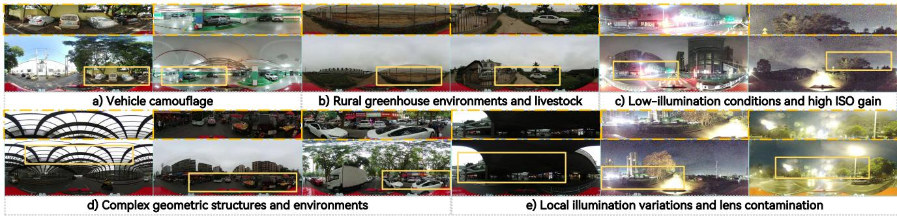  
Fig. 8. Representative challenging scenarios in Spheriverse, including vehicle camouflage, uncommon rural environments, low-light imaging, complex geometry, and lens contamination.

the current voxel representations and their RTZ positions to selectively retrieve relevant semantic evidence from the available spherical observations.

## 6.4 Representative Challenging Scenarios in Spheriverse Dataset

As shown in Figure. 8 presents representative challenging scenarios in Spheriverse that are not fully characterized by aggregate statistics. First, vehicle camouflage and uncommon rural content, such as greenhouses and livestock, introduce substantial semantic ambiguity and longtail appearance variations. Second, curved, overhead, and multi-level structures complicate the geometric correspondence between angular observations and metric 3D space. Third, low illumination, high ISO gain, local exposure variations, and lens contamination cause spatially nonuniform degradation across spherical images. These factors frequently occur together, creating compound challenges for semantic recognition and geometric reconstruction. Overall, Spheriverse extends beyond well-illuminated and structurally regular urban environments, providing a realistic testbed for evaluating spherical perception under diverse in-the-wild conditions.

## 7 CONCLUSION

This work addresses the cross-space representation gap between angular spherical observations and Cartesian voxels, which complicates the construction of geometrically consistent and semantically informative 3D representations. To systematically study this problem, we introduce

## TABLE 8

TABLE 7  
Robustness of semantic occupancy prediction under reduced spherical fields of view on Spheriverse. mIoU and GeoIoU are reported in %. The horizontal FoV is reduced symmetrically from the left and right boundaries, whereas the vertical FoV is reduced from top to bottom while retaining the lower portion of the spherical image. Masked pixels are set to zero. TPVFo., Surro., MonoS., and Quadr. denote TPVFormer [18], SurroundOcc [19], MonoScene [68], and QuadricFormer [77], respectively. Light orange and light blue indicate the best and second-best results.  
Semantic occupancy performance across horizontal azimuth intervals and vertical voxel layers on Spheriverse. mIoU and GeoIoU are reported in %. Horizontal partitions span the full 360◦ field of view, whereas vertical partitions are defined by voxel-height index z: 12–15, 8–11, 4–7, and 0–3 denote the top, upper-middle, lower-middle, and bottom layers, respectively. TPVFo., Surro., MonoS., and Quadr. denote TPVFormer [18], SurroundOcc [19], MonoScene [68], and QuadricFormer [77], respectively. Light orange and light blue indicate the best and second-best results.
<table><tr><td>Partition</td><td></td><td>|Metric</td><td></td><td>TPVFo. Surro. MonoS. Quadr. Ours</td><td></td><td></td></tr><tr><td rowspan="7">Hotal</td><td>0-45°</td><td>|mIoU GeoIoU</td><td>10.60 10.25 21.41 20.92</td><td>9.03 19.93</td><td>9.60 19.22</td><td>11.96 22.95</td></tr><tr><td>45-90°</td><td>mIoU GeoIoU</td><td>11.73 19.10 19.00</td><td>10.92 10.82 18.03</td><td>10.44 17.17</td><td>12.85 20.59</td></tr><tr><td>90-135°</td><td>mIoU GeoIoU</td><td>11.17 20.16</td><td>10.97 19.89</td><td>10.96 19.60</td><td>10.62 18.76</td><td>13.46 22.33</td></tr><tr><td>135-180°</td><td>|mIoU GeoIoU</td><td>11.64 29.38</td><td>12.50 29.85</td><td>11.38 29.03</td><td>11.10 28.27</td><td>14.31 32.36</td></tr><tr><td>180-225°</td><td>|mIoU GeoIoU</td><td>13.93 28.00</td><td>13.83 28.34</td><td>13.22 27.98</td><td>12.89 27.14</td><td>16.26 30.91</td></tr><tr><td>225-270°</td><td>mIoU GeoIoU</td><td>11.27 18.29</td><td>11.32</td><td>10.80</td><td>10.21</td><td>13.36 22.71</td></tr><tr><td>270-315°</td><td>|mIoU GeoIoU</td><td>11.59</td><td>20.38 11.58</td><td>18.16 11.59</td><td>17.00 10.27</td><td>12.80</td></tr><tr><td>315-360°</td><td></td><td>mIoU</td><td>17.90 12.32</td><td>18.49 11.96</td><td>16.88 11.57</td><td>15.58 10.89</td><td>20.94 13.70</td></tr><tr><td rowspan="2">Vertcal</td><td>12-15</td><td>GeoIoU mIoU</td><td>21.17 2.56</td><td>21.14 2.97</td><td>20.67 2.49</td><td>19.35 2.83</td><td>22.79 3.20</td></tr><tr><td>8-11</td><td>GeoIoU |mIoU</td><td>10.41 12.88</td><td>11.73 12.27</td><td>10.25 11.87</td><td>8.93 11.23</td><td>12.63 14.18 22.48</td></tr><tr><td></td><td>4-7</td><td>GeoIoU mIoU GeoIoU</td><td>20.56 11.28 30.00</td><td>20.67 11.50 30.51</td><td>19.74 10.38 29.68</td><td>18.89 10.98 28.87</td><td>13.57 33.14</td></tr><tr><td>0-3</td><td></td><td>|mIoU GeoIoU</td><td>1.71 2.28</td><td>3.06 5.67</td><td>1.19 1.69</td><td>2.57 4.47</td><td>3.85 6.99</td></tr></table>

Spheriverse, including 644 synchronized image-LiDAR sequences collected across 13 diverse regions. Spheriverse covers varied scene types, times of day, and weather conditions, with a three-level semantic annotation hierarchy. Based on this dataset, we establish unified benchmarks for semantic occupancy prediction, semantic mapping, and 3D object detection, evaluating more than 30 representative methods through overall and scene-wise analyses.

We further propose SphereOcc for dense semantic occupancy prediction. CSRR embeds spherical range-azimuth geometry into Cartesian voxel features, while SER retrieves complementary semantic evidence from source spherical image features using RTZ-conditioned voxel states. Sphere-Occ achieves 13.91% mIoU and 24.65% GeoIoU, improving the best prior results by 1.70 and 2.10 percentage points, respectively, and ranks first in both metrics across all five scene categories. Its consistent performance across spatial partitions and reduced fields of view further supports its robustness to directional variations and incomplete observations. Together, Spheriverse, its benchmarks, and SphereOcc provide a unified foundation for studying 3D perception from spherical observations.

<table><tr><td colspan="2">Retained FoV | Metric</td><td></td><td>|TPVFo. Surro. MonoS. Quadr. Ours</td><td></td><td></td><td></td><td></td></tr><tr><td rowspan="6">Hotal</td><td>360°</td><td>|mIoU GeoIoU</td><td>12.21 22.35</td><td>12.05 22.55</td><td>11.44 21.68</td><td>11.09 20.76</td><td>13.91 24.65</td></tr><tr><td>300°</td><td>|mIoU GeoIoU</td><td>10.84 20.43</td><td>11.23 21.30</td><td>9.70 18.62</td><td>9.76 18.07</td><td>13.06 23.82</td></tr><tr><td>240°</td><td>|mIoU GeoIoU</td><td>9.68 19.06</td><td>10.24 19.51</td><td>8.55 16.65</td><td>8.81 16.39</td><td>11.55 21.35</td></tr><tr><td>180°</td><td>|mIoU |GeoIoU|</td><td>8.64 18.01</td><td>9.37 18.14</td><td>7.54 14.96</td><td>7.93 14.75</td><td>10.23 19.27</td></tr><tr><td>120°</td><td>|mIoU GeoIoU</td><td>7.46 17.09</td><td>8.34 16.37</td><td>6.33 12.68</td><td>6.82 12.78</td><td>8.98 17.42</td></tr><tr><td>136.70°</td><td>|mIoU GeoIoU</td><td>12.21 22.35</td><td>12.05 22.55</td><td>11.44 21.68</td><td>11.09 20.76</td><td>13.91 24.65</td></tr><tr><td rowspan="4">Vertcal</td><td>106.70°</td><td>|mIoU GeoIoU</td><td>12.10 21.84</td><td>12.06 22.49</td><td>11.26 21.48</td><td>10.88</td><td>13.90 24.61</td></tr><tr><td>76.70°</td><td>|mIoU</td><td>10.42</td><td>11.82</td><td>10.15</td><td>20.40 9.73</td><td>13.80</td></tr><tr><td></td><td>GeoIoU |mIoU</td><td>20.37 7.62</td><td>22.26 9.99</td><td>19.61 6.92</td><td>19.01 6.51</td><td>24.48 11.59</td></tr><tr><td>46.70°</td><td>GeoIoU</td><td>16.63</td><td>18.68</td><td>16.19</td><td>13.05</td><td>21.07</td></tr></table>

Building on Spheriverse and SphereOcc, future work will extend spherical perception toward end-to-end embodied driving by connecting spherical observations and dense occupancy representations with safety-critical decisionmaking, language-grounded spatial reasoning, and trajectory planning. This direction will enable unified evaluation from 3D scene understanding to physical action and further investigate how global spherical context supports reliable driving decisions.

## ACKNOWLEDGMENTS

This work was supported in part by the National Natural Science Foundation of China (Grant No. 62473139), in part by the Hunan Provincial Research and Development Project (Grant No. 2025QK3019), in part by the Hunan Provincial Innovation Foundation for Postgraduate (Grant No. CX20250579), and in part by the State Key Laboratory of Autonomous Intelligent Unmanned Systems (the opening project number ZZKF2025-2-10).

## REFERENCES

[1] S. Gao, K. Yang, H. Shi, K. Wang, and J. Bai, “Review on panoramic imaging and its applications in scene understanding,” IEEE Transactions on Instrumentation and Measurement, 2022.

[2] X. Lin et al., “One flight over the gap: A survey from perspective to panoramic vision,” arXiv preprint arXiv:2509.04444, 2025.

[3] S. Wang, D. Zhou, L. Xie, C. Xu, Y. Yan, and E. Yin, “PanoGen++: Domain-adapted text-guided panoramic environment generation for vision-and-language navigation,” Neural Networks, 2025.

[4] M. Lee et al., “An amphibious artificial vision system with a panoramic visual field,” Nature Electronics, 2022.

[5] J.-M. Kwon et al., “Biologically inspired microlens array camera for high-resolution wide field-of-view imaging,” Nature Communications, 2026.

[6] X. Wang et al., “Cross-regional real-time visualization of systemic physiology and dynamics with 3D panoramic photoacoustic computed tomography,” Nature Communications, 2025.

[7] H. Ai, Z. Cao, and L. Wang, “A survey of representation learning, optimization strategies, and applications for omnidirectional vision,” International Journal of Computer Vision, 2025.

[8] S. Wang et al., “Multi-modal aerial-ground cross-view place recognition with neural odes,” in CVPR, 2025.

[9] H. Nguyen, K. Nguyen, A. Pemasiri, F. Liu, S. Sridharan, and C. Fookes, “AG-VPReID: A challenging large-scale benchmark for aerial-ground video-based person re-identification,” in CVPR, 2025.

[10] B. Coors, A. P. Condurache, and A. Geiger, “SphereNet: Learning spherical representations for detection and classification in omnidirectional images,” in ECCV, 2018.

[11] W. Zhang, Y. Liu, X. Zheng, and L. Wang, “GoodSAM: Bridging domain and capacity gaps via segment anything model for distortion-aware panoramic semantic segmentation,” in CVPR, 2024.

[12] D. Zhong et al., “OmniSAM: Omnidirectional segment anything model for UDA in panoramic semantic segmentation,” in ICCV, 2025.

[13] Y. Zhou et al., “An ultrawide field-of-view pinhole compound eye using hemispherical nanowire array for robot vision,” Science Robotics, 2024.

[14] X. Tian et al., “Occ3D: A large-scale 3D occupancy prediction benchmark for autonomous driving,” in NeurIPS, 2023.

[15] X. Wang et al., “OpenOccupancy: A large scale benchmark for surrounding semantic occupancy perception,” in ICCV, 2023.

[16] D. Chen et al., “ALOcc: Adaptive lifting-based 3D semantic occupancy and cost volume-based flow predictions,” in ICCV, 2025.

[17] Y. Huang, W. Zheng, B. Zhang, J. Zhou, and J. Lu, “SelfOcc: Self-Supervised vision-based 3D occupancy prediction,” in CVPR, 2024.

[18] Y. Huang, W. Zheng, Y. Zhang, J. Zhou, and J. Lu, “Triperspective view for vision-based 3D semantic occupancy prediction,” in CVPR, 2023.

[19] Y. Wei, L. Zhao, W. Zheng, Z. Zhu, J. Zhou, and J. Lu, “SurroundOcc: Multi-camera 3D occupancy prediction for autonomous driving,” in ICCV, 2023.

[20] A. Chang et al., “Matterport3D: Learning from RGB-D data in indoor environments,” in 3DV, 2017.

[21] K. Yang, J. Zhang, S. Reiß, X. Hu, and R. Stiefelhagen, “Capturing omni-range context for omnidirectional segmentation,” in CVPR, 2021.

[22] C. Ma, J. Zhang, K. Yang, A. Roitberg, and R. Stiefelhagen, “DensePASS: Dense panoramic semantic segmentation via unsupervised domain adaptation with attention-augmented context exchange,” in ITSC, 2021.

[23] Y. Zhou et al., “HoliCity: A city-scale data platform for learning holistic 3D structures,” arXiv preprint arXiv:2008.03286, 2020.

[24] J. Zhang et al., “Behind every domain there is a shift: Adapting distortion-aware vision transformers for panoramic semantic segmentation,” IEEE Transactions on Pattern Analysis and Machine Intelligence, 2024.

[25] K. Fan, A. Lin, H. Wu, and Z. Xu, “Pano2Geo: An efficient and robust building height estimation model using street-view panoramas,” ISPRS Journal of Photogrammetry and Remote Sensing, 2024.

[26] H. Huang, C. Liu, Y. Zhu, H. Cheng, T. Braud, and S.-K. Yeung, “360Loc: A dataset and benchmark for omnidirectional visual localization with cross-device queries,” in CVPR, 2024.

[27] G. Kim, D. Kim, J. Jang, and H. Hwang, “PAIR360: A paired dataset of high-resolution 360° panoramic images and LiDAR scans,” IEEE Robotics and Automation Letters, 2024.

[28] W. E et al., “Dur360BEV: A Real-World 360-Degree single camera dataset and benchmark for bird-eye view mapping in autonomous driving,” in ICRA, 2025.

[29] H. Li, L. Chen, Z. Wang, J. Ma, R. Xu, and K. Xia, “A cyclistcentric 360° panoramic dataset for safety-critical object detection in real-world cycling scenarios,” Scientific Data, 2026.

[30] Q. Zhang et al., “HumanoidPano: Hybrid spherical panoramic-LiDAR cross-modal perception for humanoid robots,” arXiv preprint arXiv:2503.09010, 2025.

[31] H. Caesar et al., “nuScenes: A multimodal dataset for autonomous driving,” in CVPR, 2020.

[32] L. Zheng et al., “OmniHD-Scenes: A next-generation multimodal dataset for autonomous driving,” IEEE Transactions on Pattern Analysis and Machine Intelligence, 2026.

[33] H. Su, F. Song, C. Ma, W. Wu, and J. Yan, “RoboSense: Largescale dataset and benchmark for egocentric robot perception and navigation in crowded and unstructured environments,” in CVPR, 2025.

[34] J. Behley et al., “SemanticKITTI: A dataset for semantic scene understanding of LiDAR sequences,” in ICCV, 2019.

[35] J. Wei, J. Zheng, R. Liu, J. Hu, J. Zhang, and R. Stiefelhagen, “OneBEV: Using one panoramic image for bird’s-eye-view semantic mapping,” in ACCV, 2024.

[36] F. Teng et al., “Hallucinating 360°: Panoramic street-view generation via local scenes diffusion and probabilistic prompting,” in ICRA, 2026.

[37] K. Yang, X. Hu, L. M. Bergasa, E. Romera, and K. Wang, “PASS: Panoramic annular semantic segmentation,” IEEE Transactions on Intelligent Transportation Systems, 2020.

[38] K. Yang, X. Hu, H. Chen, K. Xiang, K. Wang, and R. Stiefelhagen, “DS-PASS: Detail-sensitive panoramic annular semantic segmentation through swaftnet for surrounding sensing,” in IV, 2020.

[39] Q. Jiang et al., “Minimalist and high-quality panoramic imaging with PSF-aware transformers,” IEEE Transactions on Image Processing, 2024.

[40] K. Luo et al., “Omnidirectional multi-object tracking,” in CVPR, 2025.

[41] H. Shi et al., “PanoFlow: Learning 360° optical flow for surrounding temporal understanding,” IEEE Transactions on Intelligent Transportation Systems, 2023.

[42] Y. Li, C. Barnes, K. Huang, and F.-L. Zhang, “Deep 360° optical flow estimation based on multi-projection fusion,” in ECCV, 2022.

[43] H. Shi et al., “OneOcc: Semantic occupancy prediction for legged robots with a single panoramic camera,” in CVPR, 2026.

[44] J. Zhang, K. Yang, C. Ma, S. Reiß, K. Peng, and R. Stiefelhagen, “Bending reality: Distortion-aware transformers for adapting to panoramic semantic segmentation,” in CVPR, 2022.

[45] X. Zheng, P. Y. Zhou, A. V. Vasilakos, and L. Wang, “360SFUDA++: Towards source-free UDA for panoramic segmentation by learning reliable category prototypes,” IEEE Transactions on Pattern Analysis and Machine Intelligence, 2025.

[46] J. Zheng et al., “Open panoramic segmentation,” in ECCV, 2024.

[47] M. Duan et al., “Panoramic out-of-distribution segmentation,” arXiv preprint arXiv:2505.03539, 2025.

[48] Y. Cao et al., “Occlusion-aware seamless segmentation,” in ECCV, 2024.

[49] C.-O. Artizzu, H. Zhang, G. Allibert, and C. Demonceaux, “OmniFlowNet: a perspective neural network adaptation for optical flow estimation in omnidirectional images,” in ICPR, 2021.

[50] K. Bhandari, Z. Zong, and Y. Yan, “Revisiting optical flow estimation in 360 videos,” in ICPR, 2021.

[51] T. Fischer, Y.-H. Yang, S. Kumar, M. Sun, and F. Yu, “CC-3DT: Panoramic 3D object tracking via cross-camera fusion,” in CoRL, 2022.

[52] Y. Xu, H. Huang, Y. Chen, and S.-K. Yeung, “360VOTS: Visual object tracking and segmentation in omnidirectional videos,” IEEE Transactions on Pattern Analysis and Machine Intelligence, 2025.

[53] K. Luo et al., “OmniTrack++: Omnidirectional multi-object tracking by learning large-FoV trajectory feedback,” arXiv preprint arXiv:2511.00510, 2025.

[54] N. Zioulis, A. Karakottas, D. Zarpalas, and P. Daras, “OmniDepth: Dense depth estimation for indoors spherical panoramas,” in ECCV, 2018.

[55] K. Tateno, N. Navab, and F. Tombari, “Distortion-aware convolutional filters for dense prediction in panoramic images,” in ECCV, 2018.

[56] F.-E. Wang, Y.-H. Yeh, M. Sun, W.-C. Chiu, and Y.-H. Tsai, “Bi-Fuse: Monocular 360 depth estimation via bi-projection fusion,” in CVPR, 2020.

[57] G. Albanis et al., “Pano3D: A holistic benchmark and a solid baseline for 360° depth estimation,” in CVPRW, 2021.

[58] M. Rey-Area, M. Yuan, and C. Richardt, “360MonoDepth: High-Resolution 360° monocular depth estimation,” in CVPR, 2022.

[59] Y. Li, Y. Guo, Z. Yan, X. Huang, Y. Duan, and L. Ren, “OmniFusion: 360 monocular depth estimation via geometry-aware fusion,” in CVPR, 2022.

[60] Z. Shen, C. Lin, K. Liao, L. Nie, Z. Zheng, and Y. Zhao, “PanoFormer: Panorama transformer for indoor 360° depth estimation,” in ECCV, 2022.

[61] H. Ai, Z. Cao, Y.-P. Cao, Y. Shan, and L. Wang, “HRDFuse: Monocular 360° depth estimation by collaboratively learning holistic-with-regional depth distributions,” in CVPR, 2023.

[62] P. Mohadikar and Y. Duan, “OmniDiffusion: Reformulating 360 monocular depth estimation using semantic and surface normal conditioned diffusion,” in WACV, 2025.

[63] J. Yuan, H. Jiang, D. W. Soh, and N. Zhao, “VGGT-360: Geometry-Consistent zero-shot panoramic depth estimation,” in CVPR, 2026.

[64] M. Zayene et al., “HELVIPAD: A real-world dataset for omnidirectional stereo depth estimation,” in CVPR, 2025.

[65] Z. Shen, C. Lin, L. Nie, K. Liao, W. Lin, and Y. Zhao, “Revisiting 360 depth estimation with PanoGabor: A new fusion perspective,” IEEE Transactions on Pattern Analysis and Machine Intelligence, 2026.

[66] H. Ai and L. Wang, “Elite360D: Towards efficient 360 depth estimation via semantic- and distance-aware bi-projection fusion,” in CVPR, 2024.

[67] F.-E. Wang, Y.-H. Yeh, Y.-H. Tsai, W.-C. Chiu, and M. Sun, “BiFuse++: Self-supervised and efficient bi-projection fusion for 360° depth estimation,” IEEE Transactions on Pattern Analysis and Machine Intelligence, 2023.

[68] A.-Q. Cao and R. De Charette, “MonoScene: Monocular 3D semantic scene completion,” in CVPR, 2022.

[69] R. Miao et al., “OccDepth: A depth-aware method for 3D semantic scene completion,” arXiv preprint arXiv:2302.13540, 2023.

[70] Q. Ma, X. Tan, Y. Qu, L. Ma, Z. Zhang, and Y. Xie, “COTR: Compact occupancy transformer for vision-based 3D occupancy prediction,” in CVPR, 2024.

[71] Z. Li et al., “BEVFormer: Learning bird’s-eye-view representation from LiDAR-camera via spatiotemporal transformers,” IEEE Transactions on Pattern Analysis and Machine Intelligence, 2025.

[72] J. Kim, C. Kang, D. Lee, S. Choi, and J. W. Choi, “ProtoOcc: Accurate, efficient 3D occupancy prediction using dual branch encoder-prototype query decoder,” in AAAI, 2025.

[73] Y. Li et al., “VoxFormer: Sparse voxel transformer for camerabased 3d semantic scene completion,” in CVPR, 2023.

[74] Y. Zhang, Z. Zhu, and D. Du, “OccFormer: Dual-path transformer for vision-based 3D semantic occupancy prediction,” in CVPR, 2023.

[75] Y. Huang, W. Zheng, Y. Zhang, J. Zhou, and J. Lu, “GaussianFormer: Scene as gaussians for vision-based 3D semantic occupancy prediction,” in ECCV, 2024.

[76] Y. Huang, A. Thammatadatrakoon, W. Zheng, Y. Zhang, D. Du, and J. Lu, “GaussianFormer-2: Probabilistic gaussian superposition for efficient 3D occupancy prediction,” in CVPR, 2025.

[77] S. Zuo, W. Zheng, X. Han, L. Yang, and J. Lu, “QuadricFormer: Scene as superquadrics for 3D semantic occupancy prediction,” in NeurIPS, 2025.

[78] G. Zhao et al., “Panoramic multimodal semantic occupancy prediction for quadruped robots,” arXiv preprint arXiv:2603.13108, 2026.

[79] Z. Yang and Y. Peng, “SPHERE: Semantic-physical engaged representation for 3D semantic scene completion,” in MM, 2025.

[80] Y. Shi et al., “EFFOcc: Learning efficient occupancy networks from minimal labels for autonomous driving,” in IROS, 2025.

[81] Q. Li, Y. Wang, Y. Wang, and H. Zhao, “HDMapNet: An online HD map construction and evaluation framework,” in ICRA, 2022.

[82] S. Gao, Q. Wang, and Y. Sun, “Seq-BEV: Semantic bird-eye-view map generation in full view using sequential images for au-

tonomous driving,” IEEE Transactions on Intelligent Transportation Systems, 2025.

[83] Y. Liu, T. Yuan, Y. Wang, Y. Wang, and H. Zhao, “VectorMapNet: End-to-end vectorized HD map learning,” in ICML, 2023.

[84] B. Liao et al., “MapTR: Structured modeling and learning for online vectorized HD map construction,” in ICLR, 2023.

[85] W. Ding, L. Qiao, X. Qiu, and C. Zhang, “PivotNet: Vectorized pivot learning for end-to-end HD map construction,” in CVPR, 2023.

[86] S. Li, F. Teng, Y. Cao, K. Yang, Z. Li, and Y. Wang, “NRSeg: Noiseresilient learning for BEV semantic segmentation via driving world models,” IEEE Transactions on Image Processing, 2026.

[87] Z. Liu et al., “Vision-based uneven BEV representation learning with polar rasterization and surface estimation,” in CoRL, 2023.

[88] J. Park et al., “Time will tell: New outlooks and a baseline for temporal multi-view 3D object detection,” in ICLR, 2023.

[89] Z. Wang, Z. Huang, J. Fu, N. Wang, and S. Liu, “Object as query: Lifting any 2D object detector to 3D detection,” in ICCV, 2023.

[90] Y. Wang, V. C. Guizilini, T. Zhang, Y. Wang, H. Zhao, and J. Solomon, “DETR3D: 3D object detection from multi-view images via 3D-to-2D queries,” in CoRL, 2022.

[91] Y. Chen, H. Liu, and L. Wang, “SparseBEV: A fully sparse framework for multi-view 3D object detection,” IEEE Transactions on Pattern Analysis and Machine Intelligence, 2026.

[92] Changsha PANODUX Imaging Technology Co., Ltd., “Dux-Cam M4 spherical camera,” [Online]. Available: https://www. panodux.com.

[93] Hesai Technology, “OT128: Flagship Auto-Grade 360-Degree High-Performance Long-Range Lidar,” [Online]. Available: https: //www.hesaitech.com/product/ot128.

[94] Z. Zhang, “Flexible camera calibration by viewing a plane from unknown orientations,” in ICCV, 1999.

[95] A. Geiger, P. Lenz, C. Stiller, and R. Urtasun, “Vision meets robotics: The KITTI dataset,” The International Journal of Robotics Research, 2013.

[96] L. Yang, B. Kang, Z. Huang, X. Xu, J. Feng, and H. Zhao, “Depth anything: Unleashing the power of large-scale unlabeled data,” in CVPR, 2024.

[97] Y. Liu, T. Wang, X. Zhang, and J. Sun, “PETR: Position embedding transformation for multi-view 3D object detection,” in ECCV, 2022.

[98] M. Dahling, S. Krebs, and J. M. Z¨ ollner, “DenseBEV: Transform-¨ ing BEV grid cells into 3D objects,” in WACV, 2026.

[99] Z. Yu, Q. Liu, W. Wang, L. Zhang, and X. Zhao, “PolarBEVDet: Exploring polar representation for multi-view 3D object detection in bird’s-eye-view,” arXiv preprint arXiv:2408.16200, 2024.

[100] Z. Kuang, R. Ding, H. Wang, X. Zheng, M. Yang, and G. Hua, “CoIn3D: Revisiting configuration-invariant multi-camera 3D object detection,” in CVPR, 2026.

[101] H. Lu, Y. Zhang, G. Wang, Q. Lian, D. Du, and Y.-C. Chen, “Towards generalizable multi-camera 3D object detection via perspective rendering,” in AAAI, 2025.

[102] J. Zhang, Y. Zhang, Y. Qi, Z. Fu, Q. Liu, and Y. Wang, “GeoBEV: Learning geometric BEV representation for multi-view 3D object detection,” in AAAI, 2025.

[103] S. Wu et al., “QuaDreamer: Controllable panoramic video generation for quadruped robots,” in CoRL, 2025.

[104] W. Wang et al., “InternImage: Exploring large-scale vision foundation models with deformable convolutions,” in CVPR, 2023.

[105] K. He, X. Zhang, S. Ren, and J. Sun, “Deep residual learning for image recognition,” in CVPR, 2016.