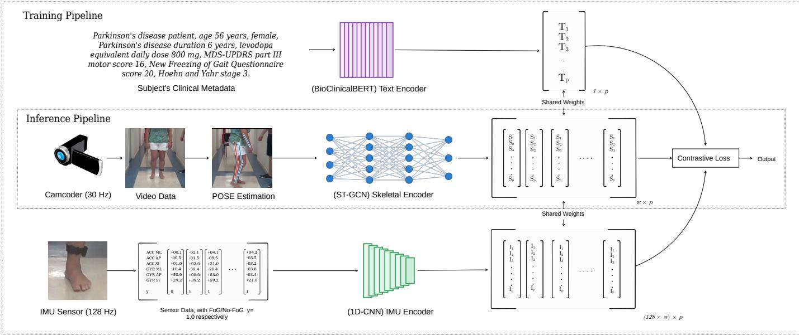
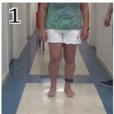
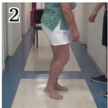
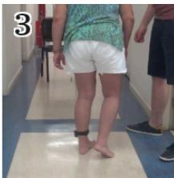
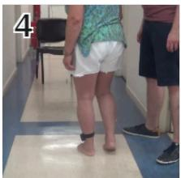
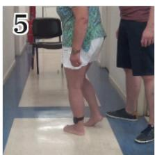
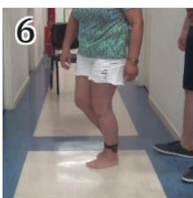
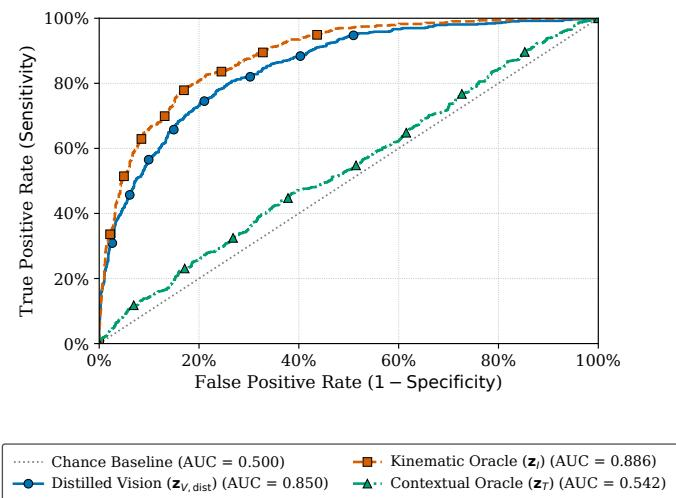
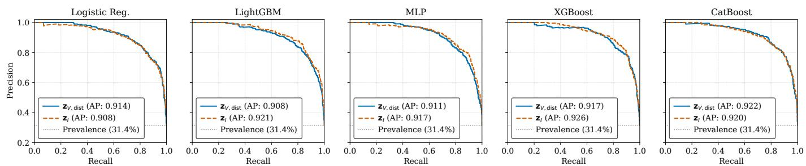

# Supervised Cross-Modal Feature Alignment for Zero-Wearable Freezing of Gait Detection in Parkinsonism

Aryan Singh

NeuroAI Fusion Labs

Kolkata, India

aryan@neuroailabs.in

Chandan Biswas

NeuroAI Fusion Labs

Kolkata, India

chandan@neuroailabs.in

Abstract—Objective assessment of Freezing of Gait (FoG) in Parkinson’s disease (PD) relies predominantly on wearable Inertial Measurement Units (IMUs). While IMUs provide optimal kinematic precision, mandatory sensor attachment restricts continuous clinical deployment. Conversely, unobtrusive vision-based alternatives suffer substantial classification errors during turning-in-place tasks, where geometric self-occlusion degrades deterministic skeletal coordinates and obscures the high-frequency precursors required for FoG detection. To resolve these physical observation limits, we propose a supervised crossmodal subspace distillation framework. During optimisation, pretrained kinematic data from IMU sensors and contextual clinical metadata act as oracles to guide a deployable visual architecture. By incorporating joint velocity and acceleration derivatives, utilising a confidence-based gating mechanism, the visual model mitigates some of the tracking errors during occlusion events. Empirical evaluations confirm this latent alignment transfers the predictive fidelity of hardware sensors directly into the visual representation, yielding 85.5% accuracy, and 82.4% balanced accuracy. All the while maintaining a vision only model at inference.

Index Terms—Freezing of Gait, Cross-Modal Distillation, Geometric Self-Occlusion, Supervised Contrastive Learning, Zero-Wearable Inference.

## I. INTRODUCTION

PD is a progressive neurodegenerative disorder characterised by the gradual deterioration of motor control. Among its most disabling manifestations is FoG, a transient clinical phenomenon where patients experience a sudden inability to initiate or sustain stepping [1]. FoG episodes frequently occur during sudden gait initiation or turning in sharp corners, substantially increasing the probability of falls and morbidity in PD [2]. Consequently, the objective detection and continuous monitoring of FoG events are critical requirements for evaluating disease progression and therapeutic efficacy [3].

Current diagnostic technologies face a fundamental operational trade-off. Wearable IMU compute FoG occurrence with high precision [4], [5]. However, a practical deployment is severely constrained as a body-worn sensor requires continuous compliance in terms of maintenance, rendering it unsuitable for long-term monitoring [6]. Conversely, videobased tracking offers an unobtrusive, zero-wearable alternative. However, deriving diagnostic worthy kinematic measurements purely from optical sequences yields substantial detection errors. Specifically, during continuous turning-inplace tasks, the lower limbs experience severe self-occlusion. This occlusion systematically degrades deterministic skeletal tracking coordinates, causing standard vision-based classifiers to fail when tracking the subtle, high-frequency (3 − 8 Hz) [7], [8] variations characteristic of FoG.

To resolve these physical observation limits, we propose a supervised cross-modal subspace distillation framework1. The stated objective is to achieve the high predictive bounds of wearable sensors utilising exclusively visual data during inference. During the optimisation phase, a motion-augmented ST-GCN skeleton model is trained to approximate two privileged target spaces: a kinematic IMU oracle and a contextual clinical text oracle. By applying a Supervised Contrastive (SupCon) latent alignment [9], [10], the algorithm transfers the robust features of the physical sensors and clinical profiles directly into the deployable visual subspace [11], [12]. This objective aligns the visual network to bypass spatial tracking failures during occlusion, eliminating the dependency on hardware sensors at deployment.

The remainder of this paper is organised as follows. Section II surveys existing literature on FoG analysis and multi-modal representation learning. Section III outlines the foundational concepts of spatial-temporal modelling and privileged distillation. Section IV details our proposed cross-modal learning architecture and optimisation logic. The dataset, partitioning protocol, and experimental baselines are defined in Section V. Section VI provides the quantitative evaluations, ablation studies, and qualitative visual interpretations. Finally, Section VII concludes the paper with directions for future work.

## II. RELATED WORK

This section contextualises our proposed architecture within the existing literature. Specifically, we examine prior computational methodologies across three distinct domains. First, we review kinematic FoG detection frameworks relying on wearable inertial sensors and their deployment constraints. Second, we analyse vision-based gait extraction architectures and the geometric tracking limitations inherent to visual occlusion. Finally, we outline the evolution of public multimodal benchmark datasets that establish the empirical foundation for our sequence evaluations.

## A. Kinematic and Wearable-Sensor FoG Detection

The standard paradigm for FoG detection relies on bodyworn IMU. Initial analytical frameworks established detection baselines utilising frequency-domain kinematic signatures. Moore et al. [7] defined the freeze index by calculating the ratio of spectral power in the freeze band $\left( 3 - 8 ~ \mathrm { H z } \right)$ to the locomotor band (0.5 − 3 Hz) from a singular shank-mounted accelerometer. Bachlin et al. [8] subsequently expanded this¨ frequency-based FoG detection.

Evaluating hardware configuration limits, Moore et al. [13] concluded that while multi-sensor arrays maximise absolute accuracy, deploying a single sensor on the lumbar or shank provides sufficient objective kinematic variance for clinical viability. This minimal-sensor framework was adapted for embedded smartphone accelerometers by Capecci et al. [14], and further integrated into closed-loop telemedicine and auditory cueing systems by Mazilu et al. [15]. To isolate shortduration and subtle freezing events, Delval et al. [16] modelled the time-frequency characteristics of knee-joint signals by combining sliding Fast Fourier Transforms (FFT) with wavelet analysis.

As computational capacities scaled, deterministic signal processing was largely superseded by data-driven machine learning models. Classification algorithms including Na¨ıve Bayes, Random Forests [17], and deep learning architectures utilising Convolutional Neural Networks (CNN) and Long Short-Term Memory (LSTM) layers [18] establish the current detection benchmarks. However, these sensor-based models consistently demonstrate generalisation degradation when transferring from artificially induced laboratory sequences to unconstrained realworld environments.

## B. Vision-Based Gait Analysis and Cross-Modal Transfer

To eliminate the compliance constraints of wearable hardware, vision-based gait analysis extracts movement topologies directly from optical sequences. Early non-pathological gait modelling by Kumar et al. [19] demonstrated that the covariance matrices of skeletal-joint trajectories in depth imagery form highly discriminative motion cues.

For explicit FoG detection, Kondo et al. [20] applied 3D pose estimation to monocular clinical video. Their evaluation confirmed that while 3D modelling exhibits robustness to camera angle variance, target keypoints degrade systematically under visual occlusion, leading to coordinate extraction failures during severe posture overlap.

To bridge the gap between kinematic accuracy and visual practicality, Tian et al. [6] proposed a cross-modal distillation framework. By utilising IMU signals as a training-phase prior to supervise a skeleton encoder, their architecture executes inference utilising purely visual skeletal keypoints. While their formulation achieves high specificity, the moderate sensitivity bounds reflect the inherent structural limits of relying strictly on deterministic visual coordinate tracking without additional privileged-modality supervision during occlusion events.

## C. Public Benchmark Datasets

Publicly accessible FoG datasets have historically prioritised kinematic sensor data. The DAPHNet repository established foundational computational benchmarks, providing over eight hours of annotated kinematic data from daily task executions [8]. The PhysioNet corpus expanded this physiological scope, recording high-resolution vertical ground reaction force (VGRF) dynamics across a large cohort of 93 Parkinsonian subjects and 73 healthy controls [21].

Crucially, multimodal repositories synchronising optical sequences with kinematic hardware are rare. The dataset published by Ribeiro De Souza et al. [22], which serves as the experimental foundation for our architecture, addresses this gap. It explicitly synchronises 30 Hz lower-limb videography with 128 Hz inertial measurements across 35 subjects. By executing continuous 360◦ turning-in-place tasks, the corpus yields 1, 611 seconds of annotated FoG episodes strictly under the geometric self-occlusion conditions evaluated in this study.

## III. BACKGROUND

This section outlines the theoretical foundations that formalise our proposed cross-modal distillation architecture. Specifically, we review three fundamental computational concepts. First, we define the mechanics of Spatial-Temporal Graph Convolutional Networks (ST-GCN) as the primary framework for geometric motion extraction. Second, we examine Supervised Contrastive Representation Learning, which provides the mathematical objective for aligning latent spaces while avoiding intra-class topological repulsion. Finally, we describe the Learning Using Privileged Information (LUPI) paradigm, which establishes the formal justification for utilising non-deployable hardware and contextual oracles to strictly constrain visual parameters during the optimisation phase.

A. Spatial-Temporal Graph Convolutional Networks (ST-GCN)

The ST-GCN [23] provides a structural framework for modelling dynamic human kinematics. Unlike standard convolutional architectures that evaluate dense pixel grids, ST-GCN mathematically parametrises the human body as an undirected graph $G = ( V , E )$ . The node set $V = \{ v _ { t i } \mid t = 1 , \ldots , F ; i =$ $1 , \ldots , K \}$ corresponds to the K anatomical joints across a temporal window of F frames, while the edge set E defines the deterministic physical connectivity between these joints alongside their temporal trajectories.

Given an input feature tensor $\mathbf { X } \in \mathbb { R } ^ { C \times F \times K }$ , where C represents the coordinate dimensions and tracking confidence, ST-GCN computes sequential representations by alternating spatial and temporal convolutions. FoG is biomechanically characterised by episodic, high-frequency (3−8 Hz) festination and the systematic breakdown of continuous, coordinated joint displacement. By evaluating motion strictly within a graph topology, ST-GCN inherently filters out uninformative spatial variables (e.g., subject appearance and background environments). Consequently, the ST-GCN mechanism isolates a discriminative feature subspace, capturing the localised kinematic breakdown inherent to FoG. This capacity establishes the mathematical foundation for the skeletal visual stream utilised in our proposed cross-modal architecture.

## B. Supervised Contrastive Representation Learning (SupCon)

In discrete biological event datasets, random batch sampling inherently captures multiple disjoint sequences belonging to the same pathological class. Applying standard unsupervised contrastive formulations falsely penalises these identical-class instances by mathematically forcing them apart. Supervised Contrastive Learning [9] resolves this structural flaw by generalising the objective function to explicitly leverage label distributions. By identifying set indices of matching classes, SupCon mathematically attracts all intra-class batch instances, preventing false-negative topological repulsions. This constraint mechanism forms the algorithmic basis for our crossmodal alignment phase.

## C. Learning Using Privileged Information (LUPI)

In standard clinical configurations, high-fidelity diagnostic modalities, such as body worn IMUs and comprehensive clinical profiles are routinely accessible during the training phase but strictly unavailable during inference. This paradigm is formally defined as LUPI [11].

Rather than discarding these auxiliary modalities, LUPI frameworks utilise them as expert ”oracles” to regularise the objective parameter space of the primary deployable model. For instance, by mapping clinical metadata via domain-specific language transformers and hardware kinematics via 1D-CNNs, the resultant oracle boundaries construct a highly separable latent topology. Our methodology adapts this paradigm, strictly treating IMU and contextual textual features as privileged structural limits. By forcing the visual network to approximate these oracle limits during optimisation, the visual parameters mathematically absorb the missing physical boundaries required to resolve spatial tracking uncertainties.

## IV. PROPOSED APPROACH

In this section, we describe the details of our proposed cross-modal deep metric learning framework that allows provision for effective FoG detection under spatial occlusion constraints. A schematic workflow of our proposed method is presented in Figure 1, which is to be interpreted as follows.

During the training phase, the model utilises an IMU oracle and a clinical text oracle to establish an informative latent subspace. Subsequently, a motion-augmented ST-GCN skeleton encoder is trained to project spatially occluded video frames into this exact subspace. At inference time, the computationally intensive requirement of the inertial and textual streams is bypassed, and classification is executed solely on the visual vectors.

## A. Data Instances and Problem Formulation

As notations, let $\mathcal { D } \ = \ \{ ( \mathbf { X } _ { V } ^ { ( i ) } , \mathbf { X } _ { I } ^ { ( i ) } , \mathbf { x } _ { T } ^ { ( i ) } , y ^ { ( i ) } ) \} _ { i = 1 } ^ { N }$ be a set of synchronised data instances. For each data instance $i , \ \mathbf { X } _ { V } ^ { ( i ) } \ \in \ \mathbb { R } ^ { F \times H \times W \times 3 }$ represents a sequence of $F$ visual frames in a spatial resolution of $H \times W$ , and $\mathbf { X } _ { I } ^ { ( i ) } \in \mathbb { R } ^ { S \times 6 }$ represents the temporally synchronised sequence of S inertial measurements. Additionally, let $\mathbf { x } _ { T } ^ { ( i ) }$ denote a set of sensitive clinical attributes (e.g., age, UPDRS scores) associated with the data instance. The variable $y ^ { ( i ) } ~ \in ~ \{ 0 , 1 \}$ denotes the ground-truth cluster label for the FoG class.

Our objective is to learn a parametrised encoding transformation function on $\mathbf { X } _ { V }$ with an objective to maximise the alignment of the visual embeddings to the informative subspaces of $\mathbf { X } _ { I }$ and $\mathbf { x } _ { T }$

## B. Kinematic and Contextual Oracles

Explicitly relying on kinematic sensor data compromises the practicality of continuous patient monitoring due to mandatory sensor attachment. However, due to the physical characteristics of the FoG condition, the inertial data contains a highly discriminative subspace. We thus leverage an independently pre-trained neural network as an expert extractor. We denote this transformation function as $E _ { I }$ , mapping the inertial inputs to a $p \textmd { - }$ dimensional Euclidean space as follows:

$$
\begin{array} { r } { \mathbf { z } _ { I } = E _ { I } ( \mathbf { X } _ { I } ; \boldsymbol { \theta } _ { I } ) , \quad \mathbf { z } _ { I } \in \mathbb { R } ^ { p } , } \end{array}\tag{1}
$$

where $\theta _ { I }$ denotes a matrix of parameters specifically corresponding to the frozen IMU classification task. Similarly, let $\mathbf { z } _ { T } \in \mathbb { R } ^ { p }$ denote a vector obtained from $E _ { t x t } ( \mathbf { x } _ { T } ; \boldsymbol { \theta } _ { T } )$ modelling the metadata subspace of the text features. By definition, the clinical profile $\mathbf { x } _ { T }$ remains temporally invariant across a given session. Consequently, $\mathbf { z } _ { T }$ does not supply intrasession temporal supervision; rather, it functions as a global inter-subject severity prior. Throughout our multi-objective training procedure, we treat the parameters $\theta _ { I }$ and $\theta _ { T }$ as constants, utilising them as independent structural boundaries.

## C. Generative Prompting and Decoding Strategy

To integrate the heterogeneous patient metadata into the continuous contextual subspace $\mathbb { R } ^ { p }$ , we formulate a deterministic generative prompting strategy. Let $\mathcal { A } ^ { ( i ) }$ denote the set of discrete clinical attributes for a given subject instance, specifically incorporating demographic and clinical severity indicators (age, gender, disease duration, L-Dopa Equivalent Daily Dose, UPDRS-III, NFoG-Q, and H&Y stage). We define a prompt serialisation function that maps the categorical and numerical variables of $\mathcal { A } ^ { ( i ) }$ into a cohesive, structured natural language string, $\mathbf { x } _ { T } ^ { ( i ) }$ . To establish strict reproducibility, the lexical template is standardised across all sessions. For instance, evaluating the first recorded session for subject PDFE01, the discrete matrix variables are serialised into the following exact input string $\mathbf { x } _ { T } ^ { ( i ) }$ : “Parkinson’s disease patient, age 56 years, female, Parkinson’s disease duration 6 years, levodopa equivalent daily dose 800 mg, MDS-UPDRS part III motor score 16, New Freezing of Gait Questionnaire score 20, Hoehn and Yahr stage 3.”

  
Fig. 1: The cross-modal subspace distillation framework. Two frozen privileged oracles are used only for training: a per-subject clinical-metadata sentence encoded by BioClinicalBERT $( E _ { t x t } \to z _ { T }$ , top row) and the 128 Hz shank IMU stream, carrying the per-window FoG label, encoded by a 1D-CNN $( E _ { I } \to z _ { I }$ , bottom row). The deployable branch (Inference Pipeline, dashed box) takes the 30 Hz lower-limb video, extracts a per-frame pose graph, and encodes it with an ST-GCN $( E _ { s k } \to z _ { V } )$ . All three encoders emit embeddings in a shared p-dimensional space (blocks T, S, I, whose row counts 1, w and 128w follow each modality’s native rate, with w the size of a window in seconds). A class-conditional supervised contrastive loss aligns $z _ { V }$ with the oracle embeddings of matching FoG label $( \mathcal { L } _ { s u p } ^ { V  T } , \mathcal { L } _ { s u p } ^ { V  I } )$ , transferring the kinematic and severity structure into the visual subspace. At inference the text and IMU oracles are discarded and the classification head predicts the binary FoG label $y \in \{ 0 , 1 \}$ from video alone.

To decode this sequential prompt into a fixed-length topological representation, $\mathbf { x } _ { T } ^ { ( i ) }$ is processed through the frozen BioClinicalBERT [24] transformer architecture $( E _ { t x t } )$ . Our decoding strategy isolates the contextualised output corresponding to the terminal hidden layer. Specifically, we extract the global sequence-level embedding by aggregating the token states to yield the final projection $\bar { \mathbf { z } _ { T } ^ { ( i ) } } \in \mathbb { R } ^ { p }$ . This mathematically encapsulates the clinical severity prior utilised as the auxiliary oracle bound during the SupCon distillation phase.

## D. Motion-Augmented Skeleton Student

A limitation of deterministic skeletal graphs is that they are highly susceptible to visual self-occlusions during a turningin-place task. We address this limitation directly at the skeleton input: tracking nodes falling below a fixed confidence threshold are dropped and the surviving frames resampled to a fixed length, and the retained joint trajectories are expressed through their velocity and acceleration derivatives rather than raw coordinates alone.

Let $E _ { s k }$ denote a Spatial-Temporal Graph Convolutional Network operating over the topological joints of the extracted pose graph. For a data instance $i , E _ { s k }$ computes the deployable visual encoding directly from the confidence-filtered, motionaugmented skeleton sequence:

$$
\begin{array} { r } { \mathbf { z } _ { V } ^ { ( i ) } = E _ { s k } ( \mathbf { X } _ { V } ^ { ( i ) } ; \boldsymbol { \theta } _ { s k } ) , \quad \mathbf { z } _ { V } ^ { ( i ) } \in \mathbb { R } ^ { p } , } \end{array}\tag{2}
$$

where $\theta _ { s k }$ denotes the student’s trainable parameters. During optimisation, the input sequence is further perturbed with random planar rotation, scaling, mirroring, coordinate jitter, and joint dropout, which regularises $E _ { s k }$ against the residual tracking noise that self-occlusion introduces.

## E. Supervised Cross-Modal Subspace Distillation

To make use of the small seed set of kinematic labels at the server side to better estimate the topology of the space, we formulate a multi-objective transformation. Applying standard unsupervised contrastive alignment unconditionally across random batch segments generates false negative penalisations, where distinct sequences matching equivalent target pathology mathematically repulse.

Therefore, we apply a SupCon learning approach. Let ${ \mathcal { P } } ( i ) = \{ k \in \{ 1 \ldots { \bar { M } } \} \ | \ y ^ { ( k ) } = y ^ { ( i ) } \}$ define the explicit index set identifying matching inference classes relative to an anchor instance i spanning a batch of size M. Prior to computing the contrastive alignments, all latent vectors $( { \bf z } _ { V } , { \bf z } _ { I } , { \bf z } _ { T } )$ are strictly ℓ2-normalised $( \mathrm { i . e . , z  z / \| z \| _ { 2 } } )$ to project the features onto a unit hypersphere. This normalisation guarantees that the subsequent dot products evaluate exactly as cosine similarities, preventing unbounded magnitude growth and preserving the mathematical integrity of the temperature parameter τ . The objective function aiming to minimise the distances between the points observed to be in the same cluster against the kinematic oracle is then given by:

$$
\mathcal { L } _ { s u p } ^ { V  I } = \sum _ { i = 1 } ^ { M } \frac { - 1 } { | \mathcal { P } ( i ) | } \sum _ { k \in \mathcal { P } ( i ) } \log \frac { \exp ( \mathbf { z } _ { V } ^ { ( i ) } \cdot \mathbf { z } _ { I } ^ { ( k ) } / \tau ) } { \sum _ { j = 1 } ^ { M } \exp ( \mathbf { z } _ { V } ^ { ( i ) } \cdot \mathbf { z } _ { I } ^ { ( j ) } / \tau ) } ,\tag{3}
$$

where τ is a temperature parameter, higher values of which make the distribution close to uniform.

Similarly, we perform simultaneous latent space alignment with respect to the text component, denoted as $\mathcal { L } _ { s u p } ^ { V \bar { \to } T }$ , by substituting zI with $\mathbf { z } _ { T }$ in Eq. 3. Crucially, because zT is temporally static, an unconditional distillation would erroneously collapse distinct kinematic states (FoG and normal gait) into an identical latent coordinate for a given subject. However, by strictly restricting the alignment through the class-conditional index set $\mathcal { P } ( i )$ , this geometric collapse is avoided. Instead, it conditions the dynamic visual subspace upon a global severity prior, encouraging the visual network to cluster dynamic FoG morphologies relative to the baseline disease severity (e.g., UPDRS-III) of the subject cohort.

As the final step of our method, a classifier matrix $\Theta _ { C }$ maps the distilled representation to the set of target cluster labels. The overall multi-objective loss function is defined as:

$$
J ( \Theta ) = - \frac { 1 } { M } \sum _ { i = 1 } ^ { M } \log P ( y ^ { ( i ) } | \mathbf { z } _ { V } ^ { ( i ) } ; \Theta _ { C } ) + \lambda \mathcal { L } _ { s u p } ^ { V  I } + \gamma \mathcal { L } _ { s u p } ^ { V  T } ,\tag{4}
$$

where $\lambda , \gamma ~ \in ~ [ 0 , 1 ]$ are linear combination parameters that associate relative importance to the necessity of aligning with the oracle subspaces.

Detailed working steps of the data encoding and parameter optimisation are presented in Algorithm 1.

## V. EXPERIMENTAL SETUP

We conduct a number of experiments to validate the effectiveness of the proposed supervised cross-modal subspace distillation approach. The objective of our experiments is to investigate whether a motion-augmented ST-GCN skeleton network, strictly guided by non-visual oracles during training, can approximate the classification boundaries of attached sensor hardware during inference.

## A. Dataset and Partitioning Protocol

We evaluate our proposed workflow on a public, multimodal FoG dataset published by Ribeiro De Souza et al. [22]. The dataset encompasses data from 35 subjects diagnosed with idiopathic Parkinson’s disease. The subjects were clinically evaluated between stages 2 and 4 on the Hoehn and Yahr scale based on both self-reported and expert-assessed criteria. While the experimental protocol requested three separate sessions per subject, the dataset averages 2.2 sessions per subject, yielding a total of 77 recorded sessions. Six sessions exhibiting zero FoG episodes were withheld by the original authors. All sessions were executed while the subjects were responsive to dopaminergic medication (mean L-Dopa Equivalent dosage of 675.21 mg/day).

Algorithm 1: Supervised Cross-Modal Subspace Dis  
tillation   
Input: Synchronised dataset   
$\bar { \mathcal { D } _ { t r } } = \{ ( \mathbf { X } _ { V } ^ { ( i ) } , \mathbf { X } _ { I } ^ { ( i ) } , \mathbf { x } _ { T } ^ { ( i ) } , y ^ { ( i ) } ) \} _ { i = 1 } ^ { N }$   
Batch size M, Temperature parameter τ   
Combination parameters $\lambda , { \dot { \gamma } }$   
Output: Trained distance function parameters   
$\boldsymbol { \Theta } = \left\{ \theta _ { s k } , \Theta _ { C } \right\}$   
$/ /$ Initialisation of Privileged Subspaces   
Obtain pre-trained kinematic extractor parameters $\theta _ { I }$   
Obtain pre-trained clinical language parameters $\theta _ { T }$   
Initialise visual parameters Θ with normal random   
distribution   
$/ /$ Metric Learning with Weak Supervision   
repeat   
foreach minibatch $B \subset D _ { t r }$ such that $| B | = M$ do   
for $i = 1 \dots M$ do   
// Compute target representations   
$\doteq _ { \mathfrak { i } \mathfrak { n } } \ \bar { \mathbb { R } } ^ { p }$   
$\mathbf { z } _ { I } ^ { ( i ) }  E _ { I } ( \mathbf { X } _ { I } ^ { ( i ) } ; \boldsymbol { \theta } _ { I } )$   
$\mathbf { z } _ { T } ^ { ( i ) }  E _ { t x t } ( \bar { \mathbf { x } } _ { T } ^ { ( i ) } ; \boldsymbol { \theta } _ { T } )$   
$/ /$ Compute the visual   
representation (Eq. 2)   
$\mathbf { z } _ { V } ^ { ( i ) }  \overline { { E } } _ { s k } ( \mathbf { X } _ { V } ^ { ( i ) } ; \boldsymbol { \theta } _ { s k } )$   
$/ /$ L2-Normalisation and structural   
cluster alignments   
for $i = 1 \dots M$ do   
$/ /$ Project embeddings onto a unit   
hypersphere   
$\mathbf z _ { I } ^ { ( i ) }  \mathbf z _ { I } ^ { ( i ) } / \| \mathbf z _ { I } ^ { ( i ) } \| _ { 2 }$   
$\mathbf z _ { T , \cdot } ^ { ( i ) }  \mathbf z _ { T , \cdot } ^ { ( i ) } / \| \mathbf z _ { T , \cdot } ^ { ( i ) } \|$ 2   
$\mathbf z _ { V } ^ { ( i ) }  \mathbf z _ { V } ^ { ( i ) } / \| \mathbf z _ { V } ^ { ( i ) } \| _ { 2 }$   
$/ \dot { \bigtriangledown }$ Identify intra-batch   
structural matches preventing   
false collisions   
${ \mathcal { P } } ( i )  \{ k \in \{ 1 \ldots M \} \mid y ^ { ( k ) } = y ^ { ( i ) } \}$   
Compute $\mathcal { L } _ { s u p } ^ { V  I }$ and $\mathcal { L } _ { s u p } ^ { V  T }$ using $\mathcal { P } ( i )$ (Eq. 3)   
// Final objective formulation $( \operatorname { E q } .$   
4)   
$\begin{array} { r } { \mathcal { L } _ { C E } \gets - \frac { 1 } { M } \sum _ { i = 1 } ^ { M } \log P \big ( \boldsymbol { y } ^ { ( i ) } \mid \mathbf { z } _ { V _ { \star } } ^ { ( i ) } ; \boldsymbol { \Theta } _ { C } \big ) } \end{array}$   
$J ( \Theta ) \gets \mathcal { L } _ { C E } ^ { - } + \bar { \lambda } \bar { \mathcal { L } } _ { s u p } ^ { V \to I } \dot { + } \gamma \mathcal { L } _ { s u p } ^ { V \to T }$   
Update Θ utilising gradient descent on $J ( \Theta )$   
until Validation performance converges   
return Θ

During the protocol, subjects were instructed to alternate 360◦ right and left turns at a self-selected pace for 2 minutes. The visual data $( \mathbf { X } _ { V } )$ was recorded at 30 Hz, with the camera strictly framing the lower limbs, intentionally introducing the geometric self-occlusion conditions fundamental to our research objective.

Each session includes temporally synchronised kinematic data $( \mathbf { X } _ { I } )$ acquired via an IMU (Physilog 5 by Gait Up), mounted on the shank of the most affected leg and sampling at 128 Hz. The raw IMU signals were processed applying a 4thorder zero-phase Butterworth low-pass filter at a 60 Hz cutoff frequency [22]. Ground-truth FoG episodes were annotated by two independent movement disorder specialists utilising the ELAN software. The mean FoG episode duration per subject was 3.0 seconds (±2.9 SD), with 36% of the subject pool exhibiting no FoG during the recorded task. In total, the dataset contains 1611 seconds of annotated FoG occurrences.

Each observation window in PDFE is thus captured through three co-registered modalities: the monocular video $( \mathbf { X } _ { V } )$ , the synchronous six-axis inertial reading $( \mathbf { X } _ { I } )$ from the shankmounted sensor on the most affected leg, and a per-session clinical text profile. Figure 2 shows six frames sampled from subject PDFE01; the panels are numbered 1–6 and index the columns of the IMU block (Section V-A). For the same six instants, the first three are the tri-axial accelerometer (a, in g) and the last three are tri-axial gyroscope (ω), in $^ { \circ } / \mathrm { s }$ triaxial readings, together with the binary freezing label y (1 iff the window overlaps a FoG episode), are:

<table><tr><td></td><td>1</td><td>2</td><td>3</td><td>4</td><td>5</td><td>6</td></tr><tr><td>ML AP</td><td>+0.19 -0.51</td><td>+0.26 -0.35</td><td>+0.11 -0.22</td><td>+0.22 –0.25</td><td>+0.94 -1.21</td><td>+0.20</td></tr><tr><td>SI</td><td>+1.01</td><td>+0.88</td><td>+0.90</td><td>+0.92</td><td>+1.20</td><td>-0.29 +0.99</td></tr><tr><td>ML AP</td><td>-10.45 +58.09</td><td>+9.23 -7.93</td><td>-2.18 +9.65</td><td>-3.40 -8.80</td><td>-9.25 -18.34</td><td>+2.25 +5.46</td></tr><tr><td>SI y</td><td>+29.16 0</td><td>+25.64 0</td><td>-35.51 1</td><td>+16.93</td><td>+99.42</td><td>-12.11</td></tr></table>

ML, AP and SI denote the medio-lateral, antero-posterior and supero-inferior (vertical) axes.

The clinical profile is the single natural-language sentence per subject, the serialised string $\mathbf { x } _ { T } ^ { ( i ) }$ specified in Section IV-C, encoded once by a frozen BioClinical-BERT [24] and mean-pooled to a 768-dimensional embedding. For PDFE01 the frozen encoder maps it to $\begin{array} { r l } { { \bf z } _ { T } } & { { } = } \end{array}$ ClinicalBERT $( \mathbf { x } _ { T } ^ { ( i ) } ) \in \mathbb { R } ^ { 7 6 8 }$ , with $\| \mathbf { z } _ { T } \| = 1 1 . 0 8$ and ${ \bf z } _ { T } =$ $[ + 0 . 0 3 6 , + 0 . 0 6 2 , - 0 . 1 6 1 , + 0 . 0 3 9 , . . . ] ^ { \top }$

  
Fig. 2: Six frames from subject PDFE01 ordered 1 through 6: lower-limb camera framing and the resulting geometric selfocclusion.

To enable fair comparisons and prevent subject-specific memorisation, we partition the set of data instances D by the prevalence of FoG events per subject, binning subjects into five stratified folds under a subject-disjoint cross-validation protocol. Table I presents the distribution of subjects, total temporal window instances, and the positive class frequencies across the five folds.

It can be observed from Table I that while the subject count per fold remains constant (7 subjects per fold), the prior probability of the positive class $( y = 1 )$ exhibits significant variance, ranging from 16.9% in Fold 4 to 41.8% in Fold 3. This disparity reflects the inherent inter-subject variance regarding FoG occurrence. Furthermore, this fluctuation in the class distribution across folds practically justifies the necessity of evaluating the clustering and classification effectiveness using metrics that account for class imbalance, such as the F-score and AUPRC, rather than standard accuracy.

TABLE I: Distribution of subjects, observation windows, and positive class samples across the 5-fold cross-validation partitions.
<table><tr><td>Fold</td><td>Subjects</td><td>Windows (N)</td><td>Positive (y = 1)</td><td>Pos. %</td></tr><tr><td>0</td><td>7</td><td>1511</td><td>604</td><td>40.0%</td></tr><tr><td>1</td><td>7</td><td>1872</td><td>461</td><td>24.6%</td></tr><tr><td>2</td><td>7</td><td>1758</td><td>594</td><td>33.8%</td></tr><tr><td>3</td><td>7</td><td>1638</td><td>685</td><td>41.8%</td></tr><tr><td>4</td><td>7</td><td>1511</td><td>255</td><td>16.9%</td></tr></table>

## B. Implementation Details and Optimisation Protocol

To establish rigorous reproducibility, we unify the model architectures, system hardware, and optimisation hyperparameters within a single framework. Our proposed learning workflow utilises independent embedding models to construct the respective latent spaces Rp, where the target projection dimension is configured to $p = 2 5 6$

For the kinematic oracle $E _ { I }$ , we employ a 1D Convolutional Neural Network pre-trained strictly on the inertial sequences $\mathbf { X } _ { I }$ . This optimisation is executed utilising a class-weighted Binary Cross-Entropy (BCE) objective against the groundtruth FoG labels $\bar { y ^ { ( i ) } }$ . Once convergence is achieved, the parameters $\theta _ { I }$ are permanently frozen to provide a deterministic, highly discriminative latent topology. To formulate the contextual oracle $E _ { t x t } ,$ , the categorical clinical prompts are mapped through a frozen BioClinicalBERT [24] transformer architecture, pooling the final hidden states into zT. For the deployable visual input, per-frame pose graphs are extracted with a POSE model [25], and the spatial-temporal dependencies among the tracked skeletal coordinates are encoded utilising the ST-GCN $( E _ { s k } )$

The algorithmic workflow is implemented utilising Python 3.12 and PyTorch 2.13.0, leveraging CUDA 13.2 libraries for backend hardware acceleration. All parameter optimisation and inference evaluations are executed on a workstation-grade NVIDIA RTX A5500 GPU equipped with 24 GB of VRAM.

During the optimisation of the objective function (Eq. 4), the unified mini-batch dimension is strictly configured to $M =$

128. The SupCon temperature parameter τ is set to 0.07, and the combination constants λ and γ are resolved via grid-search optimisation. The network parameter set Θ is updated utilising the Adam optimiser. We initialise the primary learning rate to $\eta = 5 \times 1 0 ^ { - 4 }$ and apply an explicit $\ell _ { 2 }$ weight decay penalty of $1 0 ^ { - 4 }$

## C. Baselines and Feature Configurations

To evaluate the effectiveness of the proposed supervised cross-modal subspace distillation approach, we establish a set of isolated feature configurations. Let $\Theta _ { C }$ represent the classification head, instantiated across all primary evaluations as an ℓ -regularised logistic regression (LR) module. We report the detection performance utilising the pooled out-of-fold estimations from the subject-disjoint 5-fold cross-validation protocol (Section V-A). Within each fold, a standard scaler and $\Theta _ { C }$ are fitted exclusively on the training subjects, and the resulting out-of-fold probability vectors are concatenated to construct a unified evaluation matrix.

We compare the proposed distilled representation against the following configurations:

a) Video-Only Baseline $( \mathbf { z } _ { V , \mathbf { b a s e } } ) _ { \cdots }$ : The ST-GCN skeleton encoder optimised via standard class-weighted crossentropy alone (distillation disabled). This configuration operates entirely independent of the kinematic $( { \bf z } _ { I } )$ and contextual $( { \bf z } _ { T } )$ oracles during both training and inference.

b) Proposed Distilled Vision $( \mathbf { z } _ { V , \mathbf { d i s t } } ) .$ : The deployable visual representation trained subject to the cross-modal Sup-Con alignment constraints $( \mathcal { L } _ { s u p } ^ { V \to I }$ and $\mathcal { L } _ { s u p } ^ { V  T } )$ . At inference time, the oracle modalities are discarded.

c) Kinematic Oracle $( \mathbf { z } _ { I } ) .$ : A train-only configuration evaluating the privileged inertial teacher independently. This serves as the theoretical upper bound for kinematic detection.

d) Contextual Oracle $( { \bf z } _ { T } ) { \bf : } .$ : A train-only configuration evaluating the frozen clinical-text embedding (incorporating age, gender, disease duration, L-Dopa equivalent daily dose, UPDRS-III, NFoG-Q, and H&Y scores) independently.

e) Feature Concatenation $( \mathbf { z } _ { A } \oplus \mathbf { z } _ { B } ) .$ .: The union of two or more modalities, where the frozen latent representations are concatenated prior to the linear classification head at inference time.

## D. Evaluation Metrics

As established in Section V-A, the categorical class distribution within the observation windows is significantly skewed. The normal gait instances $( y = 0 )$ constitute the vast majority of the sample mass, whereas the target FoG episodes $( y = 1 )$ represent a strict minority. In such imbalanced settings, relying solely on standard classification accuracy is mathematically suboptimal. A trivial classifier systematically defaulting to the majority class would yield a deceptively high accuracy while completely failing the primary diagnostic objective.

To ensure a rigorous and clinically meaningful evaluation, we adopt a set of metrics structurally robust to prior probability divergence. Let TP, TN, FP, and FN denote the True Positives, True Negatives, False Positives, and False Negatives, respectively, derived from the discrete confusion matrix at a specified operational threshold. We evaluate the classification topology utilising the following metrics:

a) Sensitivity and Specificity.: To capture the discrete operational trade-offs, we measure Sensitivity (the conditional probability of correctly identifying true FoG events, $\frac { T P } { T P + F N } )$ and Specificity (the conditional probability of correctly classifying normal gait, $\frac { T N } { T N + F P } )$

b) Balanced Accuracy:.: To explicitly account for the disproportionate class mass, we report Balanced Accuracy, formulated as the unweighted arithmetic mean of Sensitivity and Specificity. This constraint ensures that performance degradation isolated to the minority FOG class directly penalises the global evaluation score.

c) Area Under the Receiver Operating Characteristic Curve (ROC-AUC):.: We employ the ROC-AUC as our primary continuous, threshold-independent metric. By integrating the True Positive Rate (TPR) against the False Positive Rate (FPR) across the continuous domain of all possible classification thresholds τ, the ROC-AUC provides an objective estimation of the classifier’s intrinsic capacity to rank positive FoG instances higher than negative instances, strictly independent of the categorical distribution imbalance.

## VI. RESULTS AND DISCUSSION

We report the FoG detection performance utilising the pooled out-of-fold (OOF) estimations derived from the subject-disjoint 5-fold cross-validation protocol. Within each fold, standard scaling parameters and the classification head $( \Theta _ { C } )$ are fitted exclusively on the training subjects. The heldout subjects are subsequently scored, and the discrete out-offold probability vectors are concatenated to construct a unified, global evaluation matrix.

While macro-averaging metrics per fold is common in balanced distributions, the severe inter-subject FoG variance (ranging from 16.9% to 41.8% positive class prior across folds, as per Table I) renders isolated per-fold thresholding mathematically suboptimal. Evaluating isolated folds permits the optimisation of distinct classification thresholds for disparate patient strata, artificially inflating average performance. By explicitly pooling the OOF probabilities prior to metric calculation, we strictly constrain the evaluation to a singular, global operational threshold across all 35 unseen subjects. This protocol objectively mimics real-world clinical deployment, ensuring that the reported ROC-AUC and Average Precision bounds reflect true generalisation capacity independent of patient-specific threshold calibration.

Unless stated otherwise, the classification head $\Theta _ { C }$ is instantiated as an ℓ -regularised LR module. The isolated and concatenated feature configurations evaluated throughout these experiments are formally defined in Section V-C.

## A. Overall Detection Performance and Ablation

We hypothesise that aligning the visual subspace with the kinematic and contextual oracles during training improves feature separation during inference. To evaluate this, Table

II presents the comparative classification effectiveness and ablation configurations.

It can be observed from Table II that the proposed distilled video configuration $\mathbf { \Psi } ( \mathbf { z } _ { V , \mathrm { d i s t } } )$ demonstrates systematic improvements in overall accuracy (+3.1%), balanced accuracy (+1.1%), and specificity (+6.4%) relative to the undistilled baseline $( \mathbf { z } _ { V , \mathrm { b a s e } } )$ . While forcing alignment with the contextual oracle induces a regularisation trade-off (observed as a decrease in sensitivity from 78.3% to 74.2% and ROC-AUC from 88.5% to 84.9% for vision-only inference), the distilled subspace effectively reduces false-positive tracking artefacts, thereby improving specificity.

To isolate the explicit contribution of cross-modal distillation when privileged physical streams are retained at deployment, we evaluate the concatenated subspaces. Distillation produces consistent performance gains: the fused representation $\mathbf { z } _ { V , \mathrm { d i s t } } \oplus \mathbf { z } _ { I }$ improves the ROC-AUC to 89.2% compared to the baseline fusion (88.2%). The complete tri-modal concatenation $( \mathbf { z } _ { V , \mathrm { d i s t } } \oplus \mathbf { z } _ { I } \oplus \mathbf { z } _ { T } )$ achieves the highest balanced accuracy among all configurations at 84.7%, alongside an ROC-AUC of 90.8%.

  
Fig. 3: ROC curves evaluating the deployable vision-only configuration $( \mathbf { z } _ { V , \mathrm { d i s t } } )$ against the privileged train-only oracles $( \mathbf { z } _ { I }$ and ${ \bf z } _ { T } )$ under the identical logistic regression classification head.

Figure 3 visualises the ROC-AUC boundaries. Utilising only the visual features at inference, the proposed distilled method yields an AUC of 84.9%, structurally approaching the detection boundary of the privileged kinematic oracle (88.8%). Conversely, the contextual oracle $( { \bf z } _ { T } )$ achieves an AUC of only 54.7%, indicating limited independent discriminative capacity, yet functioning effectively as an auxiliary regularisation constraint during training. Thus, the visual student captures a substantial portion of the discriminative variance available from the inertial modality without requiring IMU measurements at deployment.

## B. Comparative Evaluation with Prior Formulations

Table III compares the deployable vision-only configuration of our proposed method with representative prior approaches targeting FoG analysis.

Operating strictly over single-camera constraints on the identical 35-subject dataset, the proposed framework yields 85.5% accuracy, 74.2% sensitivity, and 90.6% specificity. Evaluated against the preceding single-camera detection formulation proposed by Tian et al. [6], the cross-modal distillation mapping improves overall accuracy by 5.9 percentage points and absolute sensitivity by 23.1 percentage points, while maintaining a marginally higher specificity limit (90.6% vs. 89.1%). These comparisons validate the efficiency of the proposed latent alignment, though they must be interpreted contextually with respect to variance in dataset populations and evaluation protocols.

## C. Robustness Across Classification Subspaces

The primary evaluations compute boundaries utilising a singular linear projection (ℓ2-regularised LR) over the frozen student embedding. To mathematically verify that the distilled representation $\mathbf { z } _ { V , \mathrm { d i s t } }$ maintains robust cluster separation independent of the classification function, we re-evaluate the embeddings utilising four alternative non-linear mapping functions: a Multi-Layer Perceptron (MLP) optimised via a classweighted objective function, and three gradient-boosted tree ensembles (LightGBM, XGBoost, and CatBoost). The encoder parameters, temporal window bounds, and normalisation scaling remain strictly fixed.

Table IV indicates that the structural choice of the classification head substantially influences the optimal decision boundary. While the linear projection $( \ell _ { 2 } { \ - } \mathrm { L R } )$ exhibits a relative reduction in ROC-AUC (84.9%), non-linear mapping functions fully recover and exceed the baseline metric (e.g., CatBoost at 91.0%, MLP at 90.5%). This behaviour confirms that the cross-modal distillation process compromises strict linear separability within the latent space $\mathbb { R } ^ { p }$ in order to satisfy the complex, multi-modal regularisation constraints. Crucially, the recovery of the AUC under non-linear evaluation proves that the distillation process prevents intrinsic information loss. Furthermore, as illustrated by the Precision-Recall boundaries in Figure 4, the Average Precision (AP) metric remains demonstrably stable across mapping functions. The AP is strictly bounded between 82.6% and 85.0% for the proposed visual model, correlating closely with the privileged IMU oracle bounds (83.6% to 86.2%). These stability limits confirm that cross-modal distillation successfully transfers resilient FoG kinematic features into the visual subspace.

## VII. CONCLUSION AND FUTURE WORK

In this paper, we proposed a supervised cross-modal subspace distillation framework designed to resolve the geometric self-occlusion failures inherent to vision-based FoG detection. By mathematically constraining an ST-GCN skeleton architecture to approximate the latent topologies of pre-trained kinematic and contextual oracles, the deployable model systematically transfers hardware-level discriminative features into a zero-wearable inference environment. Empirical evaluations confirm that the distilled representation $\mathbf { \sigma } ( \mathbf { z } _ { V , \mathrm { d i s t } } )$ raises detection accuracy to 85.5% and specificity to 90.6%, effectively bypassing the geometric degradation of unconstrained skeletal tracking.

TABLE II: Ablation study and overall performance of isolated and concatenated feature configurations. Metrics are evaluated utilising the out-of-fold pooled estimations under an $\ell _ { 2 } \cdot$ regularised logistic regression head.
<table><tr><td>Feature Configuration</td><td>ROC-AUC</td><td>Accuracy</td><td>Bal. Acc.</td><td>Sensitivity</td><td>Specificity</td></tr><tr><td colspan="6">Vision-Only Inference (Zero-Wearable)</td></tr><tr><td>Baseline Vision  $( \mathbf { z } _ { V , \mathrm { b a s e } } )$ </td><td>88.5%</td><td>82.4%</td><td>81.3%</td><td>78.3%</td><td>84.2%</td></tr><tr><td>Distilled Vision  $( \mathbf { z } _ { V , \mathrm { d i s t } } )$ </td><td>84.9%</td><td>85.5%</td><td>82.4%</td><td>74.2%</td><td>90.6%</td></tr><tr><td colspan="6">Multi-Modal Inference (Concatenated Subspaces)</td></tr><tr><td> $\mathbf { z } _ { V , \mathrm { b a s e } } \oplus \mathbf { z } _ { I }$ </td><td>88.2%</td><td>85.0%</td><td>82.7%</td><td>76.7%</td><td>88.8%</td></tr><tr><td> $\mathbf { z } _ { V , \mathrm { d i s t } } \oplus \mathbf { z } _ { I }$ </td><td>89.2%</td><td>85.5%</td><td>83.5%</td><td>78.4%</td><td>88.7%</td></tr><tr><td> $\mathbf { z } _ { V , \mathrm { b a s e } } \oplus \mathbf { z } _ { T }$ </td><td>87.3%</td><td>83.1%</td><td>80.5%</td><td>73.7%</td><td>87.3%</td></tr><tr><td> $\mathbf { z } _ { V , \mathrm { d i s t } } \oplus \mathbf { z } _ { T }$ </td><td>87.6%</td><td>82.3%</td><td>81.7%</td><td>80.2%</td><td>83.2%</td></tr><tr><td>ZI ⊕ ZT</td><td>88.0%</td><td>84.2%</td><td>82.1%</td><td>76.3%</td><td>87.8%</td></tr><tr><td> $\mathbf { z } _ { V , \mathrm { b a s e } } \oplus \mathbf { z } _ { I } \oplus \mathbf { z } _ { T }$ </td><td>89.1% 90.8%</td><td>86.0%</td><td>84.6% 84.7%</td><td>80.8%</td><td>88.4%</td></tr><tr><td> $\mathbf { z } _ { V , \mathrm { d i s t } } \oplus \mathbf { z } _ { I } \oplus \mathbf { z } _ { T }$ </td><td></td><td>85.9%</td><td></td><td>81.4%</td><td>88.0%</td></tr><tr><td colspan="6">Privileged Oracles (Train-Only Boundaries)</td></tr><tr><td>Kinematic Oracle (z1)</td><td>88.8%</td><td>84.8%</td><td>83.3%</td><td>79.4%</td><td>87.2%</td></tr><tr><td>Contextual Oracle (zT)</td><td>54.7%</td><td>72.4%</td><td>64.7%</td><td>44.1%</td><td>85.3%</td></tr></table>

  
Fig. 4: Precision-Recall boundaries evaluating the proposed distilled visual representation $\mathbf { \sigma } ( \mathbf { z } _ { V , \mathrm { d i s t } } )$ against the privileged kinematic oracle $\left( \mathbf { z } _ { I } \right)$ across discrete linear and non-linear classification functions. Dashed threshold indicates the 31.4% prior probability of the positive FoG class. Each panel reports the corresponding Average Precision, quantifying the stability of the positive-class sequence retrieval limits.

TABLE III: Comparison with state-of-the-art methods for FoG analysis. Evaluations highlight differences in modalities, operational tasks, and subject populations.
<table><tr><td>Study</td><td>Modality</td><td>Task</td><td>Horiz./Latency</td><td> $\mathbf { S u b j . }$ </td><td>Acc.</td><td>Sens.</td><td>Spec.</td></tr><tr><td>Zhang (2020) [26]</td><td>IMU</td><td>Pred.</td><td>0.93s (Latency)</td><td>12</td><td>77.9</td><td>72.7</td><td>78.9</td></tr><tr><td>Huang (2024) [27]</td><td>IMU</td><td>Pred.</td><td>5.0s</td><td>12</td><td>75.0</td><td>72.9</td><td>85.4</td></tr><tr><td>Tian (2025) [6]</td><td>Vision (Mono)</td><td>Det.</td><td>3.0s</td><td>35</td><td>79.6</td><td>51.1</td><td>89.1</td></tr><tr><td>Proposed  $( \mathbf { z } _ { V , \mathbf { d i s t } } )$ </td><td>Vision (Mono)</td><td>Det.</td><td>0.87s (Latency)</td><td>35</td><td>85.5</td><td>74.2</td><td>90.6</td></tr></table>

TABLE IV: Performance stability of the proposed distilled visual representation $( \mathbf { z } _ { V , \mathrm { d i s t } } )$ evaluated across varying linear and non-linear classification heads.
<table><tr><td>Classification Head</td><td>ROC-AUC</td><td>Accuracy</td><td>Bal. Acc.</td><td>Sensitivity</td><td>Specificity</td></tr><tr><td>Logistic Regression</td><td>84.9%</td><td>85.5%</td><td>82.4%</td><td>74.2%</td><td>90.6%</td></tr><tr><td>LightGBM</td><td>90.3%</td><td>80.6%</td><td>80.6%</td><td>80.6%</td><td>80.6%</td></tr><tr><td>MLP</td><td>90.5%</td><td>82.3%</td><td>82.1%</td><td>81.4%</td><td>82.7%</td></tr><tr><td>XGBoost</td><td>90.5%</td><td>79.1%</td><td>81.0%</td><td>86.3%</td><td>75.8%</td></tr><tr><td>CatBoost</td><td>91.0%</td><td>81.9%</td><td>83.3%</td><td>87.2%</td><td>79.4%</td></tr></table>

The primary limitations of the current framework define the trajectory for future research. First, the parameter space is evaluated on a singular 35-subject cohort; extensive multicentre validation is required to ensure generalisation across broader pathological variances. Second, the current mathematical formulation is restricted to discrete event detection rather than the temporal anticipation of imminent FoG episodes. Finally, while inference operates independently of physical sensors, the optimisation phase mandates a strict computational dependency on privileged oracles, necessitating fully synchronised multi-modal datasets.

To address these constraints, future work will focus on extending the latent alignment objective from discrete binary classification to continuous temporal forecasting, formalising the anticipation of pre-FoG kinematic degradation. Furthermore, we intend to investigate asynchronous cross-modal distillation paradigms to successfully relax the strict temporal synchronisation requirements currently imposed upon the hardware and textual oracles during optimisation.

## REFERENCES

[1] J. G. Nutt, B. R. Bloem, N. Giladi, M. Hallett, F. B. Horak, and A. Nieuwboer, “Freezing of gait: moving forward on a mysterious clinical phenomenon,” The Lancet Neurology, vol. 10, no. 8, pp. 734– 744, 2011.

[2] S. S. Paul, C. G. Canning, C. Sherrington, S. R. Lord, J. C. Close, and V. S. Fung, “Three simple clinical tests to accurately predict falls in people with parkinson’s disease,” Movement Disorders, vol. 28, no. 5, pp. 655–662, 2013.

[3] M. Gilat, A. L. Silva de Lima, B. R. Bloem, J. M. Shine, J. Nonnekes, and S. J. Lewis, “Freezing of gait: promising avenues for future treatment,” Parkinsonism & Related Disorders, vol. 52, pp. 7–16, 2018.

[4] M. Bachlin, M. Plotnik, D. Roggen, I. Maidan, J. M. Hausdorff,¨ N. Giladi, and G. Troster, “Wearable assistant for parkinson’s disease¨ patients with the freezing of gait symptom,” IEEE Transactions on Information Technology in Biomedicine, vol. 14, no. 2, pp. 436–446, 2010.

[5] D. Li, Y. Sun, Z. Yao, J. Wang, S. Wang, and X. Yang, “Improved deep learning technique to detect freezing of gait in parkinson’s disease based on wearable sensors,” Electronics, vol. 9, no. 11, p. 1919, 2020.

[6] Z. Tian, Y. Zhao, J. Han, and W. Huo, “Imu2ske: Hierarchical contrastive learning-empowered video-based detection of freezing of gait in parkinson’s disease,” in 2025 IEEE International Conference on Cyborg and Bionic Systems (CBS). IEEE, 2025, pp. 619–624.

[7] S. T. Moore, H. G. MacDougall, and W. G. Ondo, “Ambulatory monitoring of freezing of gait in parkinson’s disease,” Journal of neuroscience methods, vol. 167, no. 2, pp. 340–348, 2008.

[8] M. Bachlin, J. M. Hausdorff, D. Roggen, N. Giladi, M. Plotnik, and¨ G. Troster, “Online detection of freezing of gait in parkinson’s disease¨ patients: A performance characterization,” in Proceedings of the fourth international conference on body area networks, 2009, pp. 1–8.

[9] P. Khosla, P. Teterwak, C. Wang, A. Sarna, Y. Tian, P. Isola, A. Maschinot, C. Liu, and D. Krishnan, “Supervised contrastive learning,” in Advances in Neural Information Processing Systems (NeurIPS), vol. 33, 2020, pp. 18 661–18 673.

[10] G. Hinton, O. Vinyals, and J. Dean, “Distilling the knowledge in a neural network,” 2015. [Online]. Available: https://arxiv.org/abs/1503.02531

[11] V. Vapnik and R. Izmailov, “Learning using privileged information: similarity control and knowledge transfer,” Journal ofMachine Learning Research (JMLR), vol. 16, no. 1, pp. 2023–2049, 2015.

[12] A. Radford, J. W. Kim, C. Hallacy, A. Ramesh, G. Goh, S. Agarwal, G. Sastry, A. Askell, P. Mishkin, J. Clark, G. Krueger, and I. Sutskever, “Learning transferable visual models from natural language supervision,” 2021. [Online]. Available: https://arxiv.org/abs/2103.00020

[13] S. T. Moore, D. A. Yungher, T. R. Morris, V. Dilda, H. G. MacDougall, J. M. Shine, S. L. Naismith, and S. J. Lewis, “Autonomous identification of freezing of gait in parkinson’s disease from lower-body segmental accelerometry,” Journal of neuroengineering and rehabilitation, vol. 10, no. 1, p. 19, 2013.

[14] M. Capecci, L. Pepa, F. Verdini, and M. G. Ceravolo, “A smartphonebased architecture to detect and quantify freezing of gait in parkinson’s disease,” Gait & posture, vol. 50, pp. 28–33, 2016.

[15] S. Mazilu, U. Blanke, M. Dorfman, E. Gazit, A. Mirelman, J. M. Hausdorff, and G. Troster, “A wearable assistant for gait training for parkin-¨ son’s disease with freezing of gait in out-of-the-lab environments,” ACM Transactions on Interactive Intelligent Systems (TiiS), vol. 5, no. 1, pp. 1–31, 2015.

[16] A. Delval, A. H. Snijders, V. Weerdesteyn, J. E. Duysens, L. Defebvre, N. Giladi, and B. R. Bloem, “Objective detection of subtle freezing of gait episodes in parkinson’s disease,” Movement Disorders, vol. 25, no. 11, pp. 1684–1693, 2010.

[17] E. E. Tripoliti, A. T. Tzallas, M. G. Tsipouras, G. Rigas, P. Bougia, M. Leontiou, S. Konitsiotis, M. Chondrogiorgi, S. Tsouli, and D. I. Fotiadis, “Automatic detection of freezing of gait events in patients with parkinson’s disease,” Computer methods and programs in biomedicine, vol. 110, no. 1, pp. 12–26, 2013.

[18] L. Sigcha, N. Costa, I. Pavon, S. Costa, P. Arezes, J. M. L´ opez, and´ G. De Arcas, “Deep learning approaches for detecting freezing of gait in parkinson’s disease patients through on-body acceleration sensors,” Sensors, vol. 20, no. 7, p. 1895, 2020.

[19] M. N. Kumar and R. V. Babu, “Human gait recognition using depth camera: a covariance based approach,” in Proceedings of the Eighth Indian Conference on Computer Vision, Graphics and Image Processing, 2012, pp. 1–6.

[20] Y. Kondo, K. Bando, I. Suzuki, Y. Miyazaki, D. Nishida, T. Hara, H. Kadone, and K. Suzuki, “Video-based detection of freezing of gait in daily clinical practice in patients with parkinsonism,” IEEE Transactions on Neural Systems and Rehabilitation Engineering, vol. 32, pp. 2250– 2260, 2024.

[21] A. Goldberger, L. Amaral, L. Glass, J. Hausdorff, P. C. Ivanov, R. Mark, J. E. Mietus, G. B. Moody, C. K. Peng, and H. E. Stanley, “PhysioBank, PhysioToolkit, and PhysioNet: Components of a new research resource for complex physiologic signals,” Circulation, vol. 101, pp. e215–e220, 2000.

[22] C. Ribeiro De Souza, R. Miao, J. Avila De Oliveira, A. Cristina De´ Lima-Pardini, D. Fragoso De Campos, C. Silva-Batista, L. Teixeira, S. Shokur, B. Mohamed, and D. B. Coelho, “A public data set of videos, inertial measurement unit, and clinical scales of freezing of gait in individuals with parkinson’s disease during a turning-in-place task,” Frontiers in Neuroscience, vol. 16, p. 832463, 2022.

[23] S. Yan, Y. Xiong, and D. Lin, “Spatial temporal graph convolutional networks for skeleton-based action recognition,” in Proceedings of the AAAI conference on artificial intelligence, vol. 32, no. 1, 2018.

[24] E. Alsentzer, J. R. Murphy, W. Boag, W.-H. Weng, D. Jin, T. Naumann, and M. B. A. McDermott, “Publicly available clinical bert embeddings,” 2019. [Online]. Available: https://arxiv.org/abs/1904.03323

[25] G. Jocher and J. Qiu, “Ultralytics yolo11,” 2024. [Online]. Available: https://github.com/ultralytics/ultralytics

[26] Y. Zhang, W. Yan, Y. Yao, J. Bint Ahmed, Y. Tan, and D. Gu, “Prediction of freezing of gait in patients with parkinson’s disease by identifying impaired gait patterns,” IEEE transactions on neural systems and rehabilitation engineering, vol. 28, no. 3, pp. 591–600, 2020.

[27] D. Huang, C. Wu, Y. Wang, Z. Zhang, C. Chen, L. Li, W. Zhang, Z. Zhang, J. Li, Y. Guo et al., “Episode-level prediction of freezing of gait based on wearable inertial signals using a deep neural network model,” Biomedical Signal Processing and Control, vol. 88, p. 105613, 2024.