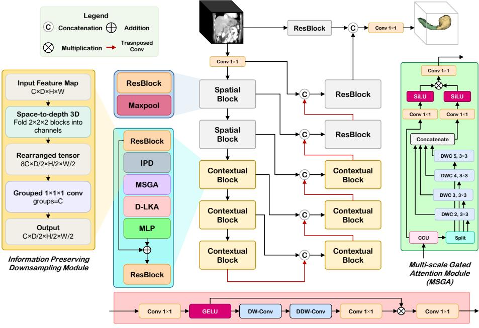
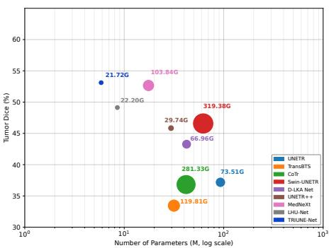
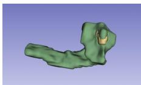
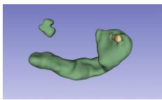
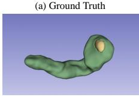
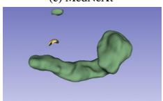
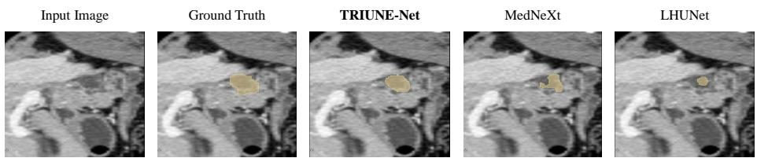

# TRIUNE-Net: Harmonizing Scale, Shape, and Eficiency in Pancreatic Tumor Segmentation

Amir Hossein Saleknia1, Alireza Kheyrkhah1, Sanaz Karimijafarbigloo2, Reza Azad2, Sina Houshmand3, Ulas Bagci4, Dorit Merhof2, and Alaa Sulaiman5

1Independent Researcher, 2University of Regensburg, Germany, 2University of California, San Francisco, USA, 4Northwestern University, USA, 5Abdora INC, USA alaa@abdora.ai

Abstract. Pancreatic tumor segmentation in 3D CT volumes is challenged by extreme scale variability across both the pancreas and tumor, and highly irregular tumor morphology. While recent advances have pushed segmentation performance, existing methods do not explicitly address these challenges and come at the cost of excessive computational complexity, limiting their practicality in resource-constrained clinical environments. We propose TRIUNE-Net, a lightweight unified architecture that harmonizes scale, shape, and eficiency through three synergistic innovations. A multi-scale context aggregation module with stage-adaptive dilated convolutions enables the model to reason across the broad range of anatomical scales present in both organs. A serial linear-deformable attention mechanism combines large efective receptive fields with shapeadaptive deformable convolutions to capture irregular, non-convex tumor morphologies. Finally, an information-preserving downsampling module replaces conventional max pooling entirely, retaining all spatial information while adding negligible parameters, preventing small tumors from being discarded before they can be recognized. On both the MSD Pancreas and NVD Pancreas datasets, TRIUNE-Net achieves state-of-theart results with only 5.86 M parameters and no external pre-training, outperforming all baselines across all key tumor metrics. Specifically, it surpasses the next-best model by 0.45% in tumor Dice, 6.0 points in F1 score, 6.6 points in sensitivity, and 3.4 points in precision, simultaneously reflecting its ability to suppress both missed tumors and false alarms in clinically realistic conditions. Our code is available at: https://github.com/abdora-ai/TRIUNE-Net

Keywords: Pancreatic tumor segmentation · Lightweight networks · Deformable attention · Information-preserving downsampling

## 1 Introduction and Related Work

Pancreatic cancer is among the deadliest malignancies, with a five-year survival of only about 13%, the lowest of any major cancer, ranking third in US cancer deaths [1]. Yet automated pancreatic tumor segmentation remains notoriously dificult [2], a challenge stemming from three factors rarely addressed together: extreme scale disparity (the pancreas ranges 20–201 cm3, tumors 0.4– 732 cm3, with early lesions under 0.01% of the volume), highly irregular and non-convex morphology, and poor visibility of small tumors against surrounding tissue. These challenges are particularly acute in the opportunistic screening setting, where pancreatic tumors are often visible yet routinely missed in the tens of millions of abdominal CT scans acquired annually for unrelated indications [3,4]. Seizing this opportunity requires models light enough to run on every study.

Research on 3D medical image segmentation has been driven mainly by accuracy, with most architectures built to generalize across organs and tasks. The dominant line is hybrid CNN-Transformer design: UNETR [5] and Swin UN-ETR [6] couple transformer encoders with convolutional decoders to capture global context, while TransUNet [7] and UNETR++ [8] streamline the attention interface; deformable convolutions and large-kernel attention [9,10,11] add shape adaptivity, as in D-LKA Net [11]. These advances are real, but arrive at tens to hundreds of millions of parameters and frequently depend on large-scale pretraining. Lightweight designs prove eficiency is feasible: LHU-Net [12] rivals far larger networks at a fraction of the cost, and MedNeXt [13] shows convolutional networks can remain competitive with substantially fewer parameters. Despite these advances, no existing lightweight architecture jointly addresses the three specific challenges of pancreatic tumor segmentation: extreme scale disparity, irregular morphology, and poor visibility of small tumors. Most methods treat these as incidental rather than primary constraints, resulting in computationally heavy or general-purpose solutions.

We present TRIUNE-Net, a lightweight U-shaped network with only 5.86 M parameters, designed to address all three challenges jointly and eficiently. Its core building block, the Contextual Block, comprises three complementary components: ❶ a Multi-Scale Gated Aggregator (MSGA) using stageadaptive dilated convolutions to model both global organ context and local lesions; ❷ a serial linear-deformable attention (D-LKA) mechanism combining large receptive fields with deformable convolutions to adapt to irregular shapes; and ❸ an information-preserving downsampling (IPD) module retaining all spatial information via space-to-depth rearrangement. On MSD and NVD Pancreas datasets, TRIUNE-Net delivers superior tumor segmentation without external pre-training, outperforming heavier models across all key metrics and proving that eficiency and accuracy aren’t mutually exclusive.

## 2 Method

## 2.1 Overview

A lasting legacy of U-Net [14] is to repeat the same block at every resolution and mirror it symmetrically across the encoder and decoder. In 3D this convenience is expensive and poorly matched to the data: the two highest-resolution stages dominate the FLOP budget, because cost grows with spatial extent, yet the features they produce are shallow textures that, in abdominal CT, are mostly background and noise. The reasoning that actually separates a tumor from surrounding parenchyma emerges only deeper, at coarser resolutions. We therefore reject uniform design and allocate computation asymmetrically: the highresolution stages act as a cheap transport layer that carries spatial detail at minimal cost, while every parameter we spend on perception is concentrated in the three coarse semantic stages, where it does the most work.

As shown in Fig. 1, TRIUNE-Net is a U-shaped network. A 1×1×1 stem lifts the input volume $\boldsymbol { x } \in \mathbb { R } ^ { C _ { \mathrm { i n } } \times D \times H \times W }$ into feature space; two lightweight convolutional stages then reduce resolution, three semantic stages perform the heavy lifting at coarser scales, and a mirror-image decoder restores resolution through transposed convolutions, concatenating encoder features at each stage via skip connections and ending in a $1 \times 1 \times 1$ classifier. A residual full-resolution skip is concatenated before the classifier so that fine boundary detail bypasses the bottleneck entirely. Crucially, every downsampling step inside the semantic pathway is information-preserving (Sec. 2.2) rather than max pooling, so a millimeter-scale lesion is never discarded on its way to the layers that can finally recognise it.

Each semantic stage is built from our Contextual Block, a serial cascade of three operators that confront the three challenges in turn. A Multi-Scale Gated Aggregator (MSGA, Sec. 2.3) reconciles the extreme scale disparity between organ and lesion; deformable large-kernel attention (D-LKA, Sec. 2.4) adapts to irregular tumor form; and a depthwise convolutional MLP mixes the enriched features. We compose the operators in series rather than in parallel, so that each refines an already context-aware representation. The following subsections detail these three components and the information-preserving downsampling that binds them across scales.

## 2.2 Information-Preserving Downsampling

Each semantic stage begins by halving resolution. The usual choice, max pooling, reduces every $2 \times 2 \times 2$ neighborhood to its maximum, keeping 1 of 8 voxels and discarding the other $7 ;$ when a tumor spans only a handful of voxels, this can erase the very signal we need. We instead use a simple, nearly parameter-free alternative that throws nothing away. A space-to-depth operation [15] folds each $2 \times 2 \times 2$ block into the channel dimension,

$$
\mathrm { S 2 D } : \mathbb { R } ^ { C \times D \times H \times W } \to \mathbb { R } ^ { 8 C \times \frac { D } { 2 } \times \frac { H } { 2 } \times \frac { W } { 2 } } ,\tag{1}
$$

after which a grouped $1 \times 1 \times 1$ convolution (one group per output channel) compresses $8 C  C$ . Its weights are initialized to $1 / 8 .$ , so the layer starts as plain average pooling and then learns which sub-voxels to emphasize. This halves each spatial dimension for only a handful of parameters per stage, yet no voxel is discarded: spatial information is reorganized rather than dropped.

Deformable Large Kernel Attention Module

  
Fig. 1: Overview of TRIUNE-Net.

## 2.3 Multi-Scale Gated Aggregation

To perceive organ-scale and lesion-scale structure within one block, the MSGA distributes the receptive field across channel groups. Given a normalized feature map $x \in \mathbb { R } ^ { C \times \mathsf { \bar { D } } \times H \times W }$ , a channel-calibration unit (CCU) first reweights channels using global statistics: pooling the volume by maximum, mean, and standard deviation yields a compact descriptor $u \in \mathbb { R } ^ { C \times 3 }$ that, through grouped 1D convolutions, produces per-channel gates $g _ { c } = \sigma ( \cdot )$ , calibrating the response in the spirit of squeeze-and-excitation [16]:

$$
\tilde { x } = \operatorname { C C U } ( x ) = x \odot \sigma \big ( W _ { 2 } \rho ( W _ { 1 } [ \operatorname* { m a x } ( x ) , \operatorname* { m e a n } ( x ) , \operatorname { s t d } ( x ) ] ) \big ) .\tag{2}
$$

The calibrated features are split into G groups along the channel dimension, one per dilation rate, and each group $\tilde { x } ^ { ( i ) }$ is processed by a depthwise $3 \times 3 \times 3$ convolution with dilation $d _ { i } ,$ so that diferent groups cover diferent receptive fields. The outputs are concatenated and fused through a gated value projection:

$$
M = \big \| _ { i = 1 } ^ { G } \mathrm { D W C o n v 3 } , d _ { i } \big ( \tilde { x } ^ { ( i ) } \big ) , \qquad y = W _ { f } \big ( \mathrm { S i L U } ( W _ { g } \tilde { x } ) \odot \mathrm { S i L U } ( W _ { v } M ) \big ) + x ,\tag{3}
$$

where ∥ denotes channel concatenation and all projections are 1×1×1 convolutions. Crucially, the dilation set is stage-adaptive, matched to the feature-map size of each semantic stage so that the sampled receptive fields stay commensurate with the spatial extent that remains. At the finest semantic stage $( 1 / 8$ resolution) we use dilations {2, 3, 4, 5} to span a wide range of scales; at $1 / 1 6$ resolution we use {1, 2}; and at the coarsest $1 / 3 2$ stage, where even a small kernel already covers most of the volume, a single dilation {1} sufices.

## 2.4 Deformable Large-Kernel Attention

To model both context and irregular shape, we adopt deformable large-kernel attention (D-LKA) [11], a gated formulation in the spirit of large-kernel attention [10]. An input projection and GELU activation produce a query map, which is modulated elementwise by a spatial gating branch $A ( \cdot )$ :

$$
\mathrm { D - L K A } ( x ) = \phi ( W _ { p } x ) \odot A { \bigl ( } \phi ( W _ { p } x ) { \bigr ) } , \qquad \phi = \mathrm { G E L U } .\tag{4}
$$

The gating branch first applies a depthwise convolution for local context, then a true 3D deformable convolution [17] whose learned ofsets let the sampling grid bend to the tumor’s contour, and finally a $1 \times 1 \times 1$ channel mixer:

$$
A ( z ) = W _ { m } \operatorname { D e f o r m C o n v } _ { 3 } \left( \operatorname { D W C o n v } _ { k } ( z ) \right) .\tag{5}
$$

The kernel size k is set proportionally to the channel width to balance local context and computational cost. The deformable convolution is placed directly after the depthwise context path, so its learned ofsets operate on an already context-enriched representation and can bend the sampling grid toward irregular tumor boundaries.

## 2.5 Convolutional MLP

Each Contextual Block closes with a depthwise-convolutional MLP that consolidates the features produced by MSGA and D-LKA. After pre-normalization, an inverted bottleneck expands the channel width fourfold with a 1×1×1 convolution, applies a depthwise $3 \times 3 \times 3$ convolution that reinstates local spatial structure, and projects back, all under a residual connection:

$$
\mathrm { M L P } ( x ) = x + W _ { 2 } \psi \bigl ( \mathrm { D W C o n v } _ { 3 } \psi ( W _ { 1 } \mathrm { L N } ( x ) ) \bigr ) , \qquad \psi = \mathrm { G E L U } ,\tag{6}
$$

where $W _ { 1 }$ and $W _ { 2 }$ are 1×1×1 convolutions. The depthwise stage gives the otherwise pointwise MLP a local receptive field, refining the representation at negligible cost before the next block.

## 2.6 Datasets and Data Splits

We evaluate on two datasets: the MSD Pancreas task (Task07) of the Medical Segmentation Decathlon [2], comprising 281 portal-venous-phase abdominal CT volumes with voxel-level pancreas and tumor annotations (224 for training, 57 for testing), and a synthetic dataset of 500 CT volumes with corresponding segmentation masks generated using MAISI [18], a 3D latent-difusion model, which we name NVD Pancreas and split into 400/100 for training and testing. For both datasets, we clip intensities to a soft-tissue window of [−120, 240] HU and center-crop around the pancreas with a 25-voxel margin.

Table 1: MSD Pancreas performance. Best in blue, second-best in red.
<table><tr><td rowspan="3">Method</td><td rowspan="3">Params (M) FLOPs (G)</td><td colspan="2">Pancreas</td><td colspan="4">Tumor</td></tr><tr><td>DSC</td><td>F1</td><td>DSC</td><td>F1</td><td>Sens</td><td>Prec</td></tr><tr><td>69.74</td><td>69.53</td><td>37.18</td><td>39.75</td><td></td><td></td></tr><tr><td>UNETR [5]</td><td>92.78 73.51</td><td></td><td></td><td></td><td></td><td>35.28</td><td>45.53</td></tr><tr><td>TransBTS [19]</td><td>31.58 119.81 41.86</td><td>73.21</td><td>73.08 75.31</td><td>33.45</td><td>35.95 39.19</td><td>31.87</td><td>41.23</td></tr><tr><td>CoTr [20] Swin-UNETR [6]</td><td>281.33 62.19 319.38</td><td>75.44 79.13</td><td>79.23</td><td>36.82 46.58</td><td>48.04</td><td>34.91 43.78</td><td>44.68</td></tr><tr><td>D-LKA Net [11]</td><td>42.35 66.96</td><td>78.63</td><td>78.74</td><td>43.27</td><td>46.23</td><td>41.53</td><td>53.22 52.14</td></tr><tr><td>UNETR++ [8]</td><td>29.54 29.74</td><td>79.38</td><td>79.51</td><td>45.84</td><td>49.32</td><td>43.12</td><td>55.67</td></tr><tr><td>MedNeXt [13]</td><td>17.55 103.84</td><td>80.74</td><td>80.86</td><td>52.66</td><td>58.94</td><td>50.11</td><td>71.55</td></tr><tr><td>LHU-Net [12]</td><td>8.53 22.20</td><td>80.59</td><td>80.98</td><td>49.13</td><td>54.55</td><td>50.67</td><td>59.07</td></tr><tr><td>TRIUNE-Net</td><td>5.86</td><td>21.72</td><td>80.84 81.45 53.11 64.95</td><td></td><td></td><td>57.30 74.94</td><td></td></tr></table>

## 2.7 Implementation and Compute Resources

TRIUNE-Net is a 3D U-shaped architecture trained from scratch with no external pre-training. We optimize with SGD (initial learning rate $1 \times 1 0 ^ { - 2 }$ , Nesterov momentum 0.99, weight decay $3 \times 1 0 ^ { - 5 } )$ under a polynomial schedule for 15, 000 iterations, using 96×96×96 patches, batch size 8, standard augmentations (random rotations, scaling, and intensity shifts), and a combined Dice and crossentropy loss. Training runs on four NVIDIA H100 GPUs (80GB each), completing in 45 minutes. For inference, we use a sliding-window protocol (96×96×96 patches, 50% overlap, stride 48×48×48) on a single H100 GPU. With only 5.86M parameters and 21.7 GFLOPs, a typical MSD Pancreas volume processes in approximately 1.7 seconds. We report Dice for pancreas and tumor, and additionally report sensitivity, precision, and F1 for tumor to capture the clinical costs of false negatives and false positives.

## 3 Results

Table 1 compares TRIUNE-Net with eight 3D segmentation models on MSD Pancreas. Two trends emerge. First, parameter count poorly predicts accuracy: heavy transformers trail compact designs, especially on tumors. Second, gains concentrate where the task is hardest. While top baselines cluster near 80% pancreas Dice, tumor metrics separate them: TRIUNE-Net reaches 53.11% tumor Dice, ahead of MedNeXt (52.66%), with gains of +6.0 F1 over MedNeXt, +6.6 sensitivity over LHU-Net, and +3.4 precision over MedNeXt. It does so with the smallest footprint (Fig. 2). Qualitative results (Fig. 3, Fig. 4) show TRIUNE-Net closely follows ground truth boundaries, while MedNeXt produces fragmented predictions and LHU-Net severely undersegments tumors.

On the synthetic NVD Pancreas dataset (Table 2), TRIUNE-Net again leads across all metrics: 86.54% pancreas Dice and 59.21% tumor Dice, with gains of +4.53 F1 and +7.13 sensitivity over MedNeXt, confirming robust generalization of the multi-scale design.

  
(b) TRIUNE-Ne

Fig. 2: Tumor Dice vs computational cost.  
Fig. 3: Qualitative comparison on MSD Pancreas.  
  
Fig. 4: 2D axial slice comparison.

## 3.1 Ablation Study

We conduct two ablations on the MSD Pancreas dataset: (1) component contributions (Table 3), and (2) performance on small tumors (Table 4) with relative size < 0.05, computed as Tumor/(Tumor + Pancreas), capturing earlystage lesions most critical for patient outcomes. MSGA provides the largest gain (+4.67% tumor DSC), confirming multi-scale context aggregation is critical for handling extreme scale disparity. D-LKA and IPD contribute +1.77% and +1.64% respectively, addressing complementary challenges of irregular morphology and information preservation. Monotonic improvements across configurations demonstrate all three components are necessary. On small tumors, TRIUNE-Net achieves the highest scores across all metrics, with the largest gap in sensitivity (+4.9 over MedNeXt) while maintaining higher precision (29.1% vs 28.5%). This simultaneous improvement indicates TRIUNE-Net detects more early-stage lesions without increasing false positives, reducing unnecessary followups while improving diagnostic yield.

## 4 Discussion

We presented TRIUNE-Net, a lightweight architecture for pancreatic tumor segmentation. Multi-scale context aggregation with stage-adaptive dilated convolutions handles broad scale variability, serial linear-deformable attention adapts to irregular non-convex morphologies, and an information- preserving downsampling module retains spatial information conventional max pooling would discard. On MSD Pancreas, TRIUNE-Net achieves 80.84% pancreas and 53.11% tumor Dice, outperforming all baselines on sensitivity and precision, making it practical for opportunistic screening in resource- constrained settings. Future work includes validating the approach on additional small-lesion tasks and larger datasets with both cancerous and non-cancerous cases, better reflecting real-world clinical deployment.

Table 2: NVD Pancreas performance. Best in blue, second-best in red.
<table><tr><td rowspan="2">Method</td><td rowspan="2">Params (M) FLOPs (G)</td><td colspan="2">Pancreas</td><td colspan="4">Tumor</td></tr><tr><td>DSC</td><td>F1</td><td>DSC</td><td>F1</td><td>Sens</td><td>Prec</td></tr><tr><td>UNETR [5]</td><td>92.78</td><td>73.51</td><td>77.12 79.21</td><td>43.18</td><td>46.11</td><td>41.22</td><td></td><td>52.32</td></tr><tr><td>TransBTŠ [19]</td><td>31.58</td><td>119.81</td><td>78.45</td><td>78.56</td><td>39.65</td><td>42.70</td><td>37.98</td><td>48.76</td></tr><tr><td>CoTr [20]</td><td>41.86</td><td>281.33</td><td>80.82</td><td>80.91</td><td>43.12</td><td>45.93</td><td>41.23</td><td>51.84</td></tr><tr><td>Swin-UNETR [6]</td><td>62.19</td><td>319.38</td><td>84.67</td><td>84.78</td><td>52.38</td><td>54.22</td><td>49.62</td><td>59.78</td></tr><tr><td>D-LKA Net [11]</td><td>42.35</td><td>66.96</td><td>84.21</td><td>84.34</td><td>49.27</td><td>52.45</td><td>47.45</td><td>58.65</td></tr><tr><td>UNETR++ [8]</td><td>29.54</td><td>29.74</td><td>84.96</td><td>85.12</td><td>51.84</td><td>54.79</td><td>49.12</td><td>61.95</td></tr><tr><td>MedNeXt [13]</td><td>17.55</td><td>103.84</td><td>86.43 86.28</td><td>86.70</td><td>58.78</td><td>64.56</td><td>56.32</td><td>75.65</td></tr><tr><td>LHU-Net [12]</td><td>8.53</td><td>22.20</td><td></td><td>86.67</td><td>56.24</td><td>61.11</td><td>56.82</td><td>66.12</td></tr><tr><td>TRIUNE-Net</td><td>5.86</td><td>21.72</td><td></td><td>86.54 87.18 59.21 71.09</td><td></td><td></td><td>63.45 80.84</td><td></td></tr></table>

Table 3: Ablation on MSD Pancreas.
<table><tr><td colspan="2">MSGA D-LKA IPD</td><td colspan="2">DSC (%)</td></tr><tr><td colspan="2"></td><td colspan="2">Pancreas Tumor</td></tr><tr><td>x x</td><td>x</td><td>80.12</td><td>45.03</td></tr><tr><td>√ x</td><td>x</td><td>80.35</td><td>49.70</td></tr><tr><td>√ √</td><td>x</td><td>80.59</td><td>51.47</td></tr><tr><td>√</td><td>√ √</td><td>80.84</td><td>53.11</td></tr></table>

Table 4: Small tumor (<0.05).
<table><tr><td>Method</td><td>DSC Sens Prec F1</td><td></td></tr><tr><td>MedNeXt</td><td>35.947.5 28.535.6</td><td></td></tr><tr><td>LHU-Net</td><td>31.3 41.4 10.6</td><td>16.8</td></tr><tr><td>SwinUNETR 31.0</td><td>33.9 5.2</td><td>9.0</td></tr><tr><td>UNETR</td><td>14.1 23.9 5.8</td><td>9.3</td></tr><tr><td>TRIUNE</td><td>37.5 52.4 29.1 37.4</td><td></td></tr></table>

## 5 Impact in Resource-Constrained Settings

TRIUNE-Net is practical for resource-limited deployment. At 5.86M parameters and 21.7 GFLOPs, it is the smallest model evaluated, processing a full volume in 1.7 seconds on a single GPU without dedicated AI servers or cloud infrastructure. This eficiency does not trade of against safety: TRIUNE-Net improves sensitivity and precision simultaneously, including on small, early-stage tumors (+4.9 sensitivity over MedNeXt with no precision drop), catching more curable tumors while limiting unnecessary follow-up. Training from scratch, without external pre-trained weights, further supports data sovereignty, letting institutions adapt the model locally without sharing patient data.

## References

1. Rebecca L Siegel, Angela N Giaquinto, and Ahmedin Jemal. Cancer statistics, 2024. CA: a cancer journal for clinicians, 74(1):12–49, 2024.

2. Michela Antonelli, Annika Reinke, Spyridon Bakas, Keyvan Farahani, Annette Kopp-Schneider, Bennett A Landman, Geert Litjens, Bjoern Menze, Olaf Ronneberger, Ronald M Summers, et al. The medical segmentation decathlon. Nature communications, 13(1):4128, 2022.

3. Yingda Xia, Qihang Yu, Linda Chu, Satomi Kawamoto, Seyoun Park, Fengze Liu, Jieneng Chen, Zhuotun Zhu, Bowen Li, Zongwei Zhou, et al. The felix project: Deep networks to detect pancreatic neoplasms. MedRxiv, pages 2022–09, 2022.

4. Kai Cao, Yingda Xia, Jiawen Yao, Xu Han, Lukas Lambert, Tingting Zhang, Wei Tang, Gang Jin, Hui Jiang, Xu Fang, et al. Large-scale pancreatic cancer detection via non-contrast ct and deep learning. Nature medicine, 29(12):3033–3043, 2023.

5. Ali Hatamizadeh, Yucheng Tang, Vishwesh Nath, Dong Yang, Andriy Myronenko, Bennett Landman, Holger R Roth, and Daguang Xu. Unetr: Transformers for 3d medical image segmentation. In Proceedings of the IEEE/CVF winter conference on applications of computer vision, pages 574–584, 2022.

6. Ali Hatamizadeh, Vishwesh Nath, Yucheng Tang, Dong Yang, Holger R Roth, and Daguang Xu. Swin unetr: Swin transformers for semantic segmentation of brain tumors in mri images. In International MICCAI brainlesion workshop, pages 272– 284. Springer, 2021.

7. Jieneng Chen, Yongyi Lu, Qihang Yu, Xiangde Luo, Ehsan Adeli, Yan Wang, Le Lu, Alan L Yuille, and Yuyin Zhou. Transunet: Transformers make strong encoders for medical image segmentation. arXiv preprint arXiv:2102.04306, 2021.

8. Abdelrahman Shaker, Muhammad Maaz, Hanoona Rasheed, Salman Khan, Ming-Hsuan Yang, and Fahad Shahbaz Khan. Unetr++: delving into eficient and accurate 3d medical image segmentation. IEEE Transactions on Medical Imaging, 43(9):3377–3390, 2024.

9. Jifeng Dai, Haozhi Qi, Yuwen Xiong, Yi Li, Guodong Zhang, Han Hu, and Yichen Wei. Deformable convolutional networks. In Proceedings of the IEEE international conference on computer vision, pages 764–773, 2017.

10. Meng-Hao Guo, Cheng-Ze Lu, Zheng-Ning Liu, Ming-Ming Cheng, and Shi-Min Hu. Visual attention network. Computational visual media, 9(4):733–752, 2023.

11. Reza Azad, Leon Niggemeier, Michael H¨uttemann, Amirhossein Kazerouni, Ehsan Khodapanah Aghdam, Yury Velichko, Ulas Bagci, and Dorit Merhof. Beyond self-attention: Deformable large kernel attention for medical image segmentation. In Proceedings of the IEEE/CVF winter conference on applications of computer vision, pages 1287–1297, 2024.

12. Yousef Sadegheih, Afshin Bozorgpour, Pratibha Kumari, Reza Azad, and Dorit Merhof. Lhu-net: a lean hybrid u-net for cost-eficient, high-performance volumetric segmentation. arXiv preprint arXiv:2404.05102, 2024.

13. Saikat Roy, Gregor Koehler, Constantin Ulrich, Michael Baumgartner, Jens Petersen, Fabian Isensee, Paul F Jaeger, and Klaus H Maier-Hein. Mednext: transformer-driven scaling of convnets for medical image segmentation. In International conference on medical image computing and computer-assisted intervention, pages 405–415. Springer, 2023.

14. Olaf Ronneberger, Philipp Fischer, and Thomas Brox. U-net: Convolutional networks for biomedical image segmentation. In International Conference on Medical image computing and computer-assisted intervention, pages 234–241. Springer, 2015.

15. Wenzhe Shi, Jose Caballero, Ferenc Husz´ar, Johannes Totz, Andrew P Aitken, Rob Bishop, Daniel Rueckert, and Zehan Wang. Real-time single image and video superresolution using an eficient sub-pixel convolutional neural network. In Proceedings of the IEEE conference on computer vision and pattern recognition, pages 1874– 1883, 2016.

16. Jie Hu, Li Shen, and Gang Sun. Squeeze-and-excitation networks. In Proceedings of the IEEE conference on computer vision and pattern recognition, pages 7132–7141, 2018.

17. Xinyi Ying, Longguang Wang, Yingqian Wang, Weidong Sheng, Wei An, and Yulan Guo. Deformable 3d convolution for video super-resolution. IEEE Signal Processing Letters, 27:1500–1504, 2020.

18. Pengfei Guo, Can Zhao, Dong Yang, Ziyue Xu, Vishwesh Nath, Yucheng Tang, Benjamin Simon, Mason Belue, Stephanie Harmon, Baris Turkbey, et al. Maisi: Medical ai for synthetic imaging. In 2025 IEEE/CVF Winter Conference on Applications of Computer Vision (WACV), pages 4430–4441. IEEE, 2025.

19. Wenxuan Wang, Chen Chen, Meng Ding, Hong Yu, Sen Zha, and Jiangyun Li. Transbts: Multimodal brain tumor segmentation using transformer. In International conference on medical image computing and computer-assisted intervention, pages 109–119. Springer, 2021.

20. Yutong Xie, Jianpeng Zhang, Chunhua Shen, and Yong Xia. Cotr: Eficiently bridging cnn and transformer for 3d medical image segmentation. In International conference on medical image computing and computer-assisted intervention, pages 171–180. Springer, 2021.