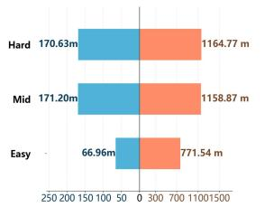
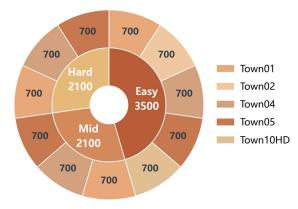
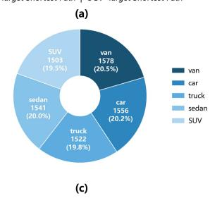
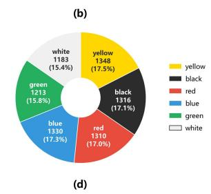
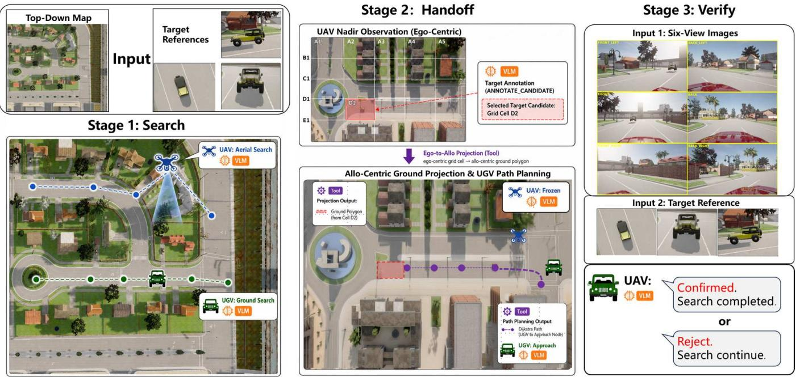
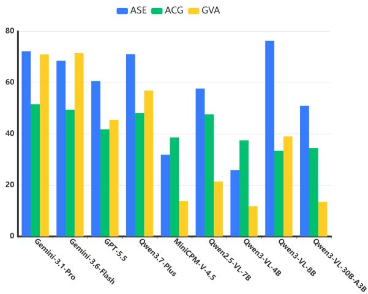
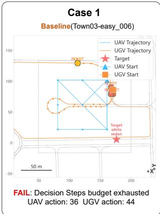
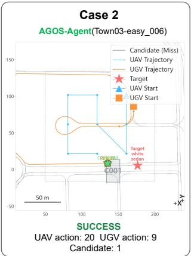

# Towards Embodied Air-Ground Cooperative Object Search: Benchmark, Dataset and Agentic Method

Boao Yu∗, Zimo Chen∗, Junreng Rao, Yue Hu, Zhengqiu Zhu, Yong Zhao, Rusheng Ju

National University of Defense Technology National Key Laboratory of Digital Intelligent Modeling and Simulation

## Abstract

Air-Ground Object Search (AGOS) in urban environments is a challenging embodied task, which requires an Unmanned Aerial Vehicle (UAV) and an Unmanned Ground Vehicle (UGV) to jointly search for and verify a specified target vehicle from multi-view visual references. To study this underexplored problem, we introduce AGOS-Bench, the first dedicated benchmark for evaluating whether general-purpose Vision-Language Models (VLMs) can integrate aerial discoveries and ground-level verification through UAV–UGV cooperation. We further provide AGOS-Dataset as the companion resource ofexemplary trajectories constructed by an automatic pipeline. It consists of 7.7k episodes for searching objects of diverse categories and attributes, spanning three dificulty levels. To address the AGOS task, we propose AGOS-Agent, a training-free and tool-augmented approach. The agentic method relieves VLMs from complex and dynamic coordination via a deliberate search-handof-verify cooperation protocol, only demanding VLMs for scene understanding and decision-making. Extensive experiments on nine VLMs show that AGOS-Agent improves overall success rate for eight of the nine evaluated backbones while reducing decision steps for all nine. On the hard split, the SR and SPL of Gemini-3.6- Flash increase from 8.6% to 55.7% and from 7.6% to 44.0%, respectively.

## Introduction

Urban target search is a challenging problem for embodied intelligence and autonomous systems, with applications in emergency response, security patrol, and post-disaster rescue. In these scenarios, the task is expected to locate an object target based on a few visual references within a known city map, and then to approach the target for close-range confirmation. A single Unmanned Ground Vehicle (UGV), despite being good at close-range verification on identity-relevant views, cannot complete the mission eficiently due to sight obstruction by buildings and limited field of view at ground level. Introducing a Unmanned Aerial Vehicle (UAV) as an aerial collaborator helps capture and narrow down candidate regions by wide-area discovery. Cooperating the UAV and UGV as a heterogeneous team is therefore a promising route to improve overall search eficiency.

Several urban embodied benchmarks have extended embodied tasks to city space (Ji et al. 2026; Zhao et al. 2025b; Xu et al. 2026; Yang et al. 2025; Liu et al. 2026; Li et al.

2026). Although these benchmarks provide assessment for Vision-Language Models (VLMs) to reason in corresponding tasks, no existing benchmark directly assesses whether they can instantiate a UAV-UGV system that eficiently completes the object search tasks in open urban spaces.

To address these gaps, we formulate the embodied Air-Ground Object Search (AGOS) task, where each episode specifies a target object through visual references in an urban environment. The task is characterized by at least three challenges. First, the heterogeneous capabilities of the UAV and UGV entail diferent agent roles and synchronization between them. Second, based on the target specification rather than route instruction, the team has to autonomously coordinate their actions for eficient search under computation constraints. Third, air-ground cross-view grounding usually makes it less assuring to confirm the target.

To address these challenges, we propose AGOS-Bench and AGOS-Dataset. As shown in Table 1, AGOS-Bench is distinguished by its task form, featuring (1) multi-agent embodied cooperation versus single-agent reasoning, (2) closedloop navigation versus perception and question answering, and (3) high-level target specification versus instructionfollowing guidance. The AGOS-Dataset is a companion resource of 7,700 episodes across five CARLA towns (5,500 train + 2,200 validation), plus a 210-episode test split on a disjoint town, with three dificulty levels (Easy/Mid/Hard), which can support agent training and reproducible evaluation.

To address the AGOS task, we propose AGOS-Agent, a training-free and general agentic framework that instantiates general-purpose VLMs as role-conditioned UAV and UGV decision-makers. This agentic approach exploits VLMs for high-level perception and decision-making, while leaving geometric projection, path planning, and action validation to specialized tools. Such a capability-based division and task-specific search-handof-verify workflow can match the granularity at which the VLM can reliably reason and restrict reasoning uncertainties, especially in dynamic and complex embodied tasks. We further design plain baselines of VLM promptings as an ablation that removes all agentic tools to isolate the contribution of our structured protocol. Across nine backbones on the fixed 210-episode evaluation set, AGOS-Agent improves macro-averaged SR for eight backbones and reduces DS for all nine, with mean paired changes of +22.5 percentage points in success rate and −33.3 decision steps.

<table><tr><td>Benchmark</td><td>Domain</td><td>Task Type</td><td>UAV</td><td>UGV</td></tr><tr><td>CapNav (Su et al. 2026)</td><td>Household</td><td>Capability-Conditioned Navigation</td><td>×</td><td>×</td></tr><tr><td>CityAVOS (Ji et al. 2026)</td><td>Urban</td><td>Object Search</td><td>√</td><td>×</td></tr><tr><td>CityEQA (Zhao et al. 2025b)</td><td>Urban</td><td>Embodied Question Answering</td><td>√</td><td>×</td></tr><tr><td>CityCube (Xu et al. 2026)</td><td>Urban</td><td>Visual Question Answering</td><td>view only view only</td><td></td></tr><tr><td>MECoBench (Liu et al. 2026)</td><td>Household</td><td>Household Assistance</td><td>robot</td><td>robot</td></tr><tr><td>AirGroundBench (Li et al. 2026) Urban &amp; wild</td><td></td><td>Vision Question Answering &amp; Instruction-Following Navigation</td><td>√</td><td>√</td></tr><tr><td>AGOS-Bench</td><td>Urban</td><td>Object Search</td><td>√</td><td>√</td></tr></table>

Table 1: Scope comparison with representative embodied and agent benchmarks.

Our main contributions are:

• We formulate AGOS and introduce AGOS-Bench, the first specialized and standardized urban benchmark for air-ground dynamic cooperation, which couples aerial exploration with ground verification in a single closed loop with stage-wise evaluation metrics.

• We release AGOS-Dataset, a companion resource of 7,700 episodes across five CARLA towns with three difficulty levels, featuring disjoint train/test towns and solvability guarantees for reproducible evaluation.

• We propose AGOS-Agent, a training-free, toolaugmented agentic method that instantiates generalpurpose VLMs as cooperative UAV and UGV agents through a unified search-handof-verify protocol. On the fixed 210-episode evaluation, it improves macro-averaged SR for eight ofnine backbones and reduces DS for all nine, with mean paired changes of +22.5 percentage points in success rate and −33.3 decision steps.

## Related Work

We review three lines of work most relevant to AGOS: embodied benchmarks (the evaluation context), simulation platforms (the infrastructure), and embodied navigation methods (the methodological background for AGOS-Agent).

Embodied benchmarks. Embodied navigation benchmarks have established standardized observations, actions, and success metrics for indoor target search (Su et al. 2026; Qian et al. 2026). Urban extensions evaluate complementary subproblems: CityAVOS targets single-UAV object search (Ji et al. 2026), CityEQA and CityCube probe embodied question answering and cross-view spatial reasoning (Zhao et al. 2025b; Xu et al. 2026), CitySeeker and UrbanVideo-Bench assess VLM navigation and video understanding under implicit needs (Wang et al. 2025b; Zhao et al. 2025a), and Aero-Duo extends vision-language navigation to cooperative dual-UAV settings (Wu et al. 2025a). Multi-agent embodied cooperation is evaluated by AirCopBench, MECoBench, VIKI-R, and KiteRunner, covering multi-drone perception, communication structures, hierarchical cooperation, and languagedriven outdoor navigation (Zha et al. 2025; Liu et al. 2026; Kang et al. 2025; Huang et al. 2025). AGOS-Bench difers by targeting a coupled search–handof–verification loop ending in a confirm/reject decision rather than a QA answer or a navigation endpoint.

Simulation platforms. Embodied simulation platforms span indoor navigation environments (e.g. Habitat (Savva et al. 2019), AI2-THOR (Kolve et al. 2017)), outdoor urban scenes (e.g. CARLA (Dosovitskiy et al. 2017), EmbodiedCity (Gao et al. 2024), SimWorld-Robotics (Zhuang et al. 2025), MetaUrban (Wu et al. 2025b)), and aerial VLN settings (e.g. AeroVerse (Yao et al. 2026), OpenFly (Gao et al. 2025)). For heterogeneous air-ground embodied intelligence, CARLA-Air, HERCULES, AirSimAG, and Tran-SimHub provide unified infrastructure coupling UAV and UGV simulation (Zeng et al. 2026; Garimella et al. 2026; Cui et al. 2026; Wang et al. 2025a). AGOS-Bench is built on CARLA-Air (Zeng et al. 2026) to exploit its unified airground infrastructure.

Embodied navigation methods. Indoor agent methods exploit pretrained vision-language knowledge without taskspecific training, evolving from CLIP-style scoring and LLM-derived room priors toward world-model prediction, panoramic scene parsing, video-based VLM planning, and VLM fine-tuning (Gadre et al. 2023; Yu, Kasaei, and Cao 2023; Nie et al. 2025; Jin, Wu, and Chen 2025; Zhang et al. 2024b,a; Yokoyama and Ha 2025). Outdoor agent methods couple LLMs with explicit spatial representations—objectcentric semantic maps with hierarchical scene graphs, and NMPC-integrated control with path memory—to ground high-level reasoning in city-scale environments (Xu et al. 2025; Wang and Zhang 2025). Multi-agent methods scale LLM/VLM reasoning to team settings through decentralized VLM planning and LLM–MARL hybrid policies (Yu, Kasaei, and Cao 2024; Rajvanshi et al. 2025; Wang et al. 2025c). Despite these advances, existing methods treat reaching, observing, or answering as task completion, leaving unaddressed the heterogeneous cooperation required in AGOS. AGOS-Agent follows the tool-augmented direction by providing a role-conditioned search-handof-verify protocol.

## Task Description

AGOS defines an instance-level visual object search task in urban scenarios. A single UAV and a single UGV are required to simultaneously search for target object H within the predefined local region S. At the beginning of each episode, the UAV and the UGV receive their own location $P _ { 0 } ^ { A / G }$ , the topdown map M of region $S$ and multi-view images $I _ { t a r g e t }$ of the target. Most background contents in $I _ { t a r g e t }$ are cropped out, such that neither agent can localize the target position based on background features. At each step t, UAV and UGV perceive their current positions $P _ { t } ^ { A / G }$ and multi-modal observations $O _ { t } ^ { A / G }$ , which include RGB image $I _ { t } ^ { A / G }$ and depth image $D _ { t } ^ { A / G }$ . Meanwhile, each agent may also receive messages $T _ { t }$ from the other agent. Then, each agent chooses its next action $a _ { t } ^ { A / G }$ based on two independent search policies $\pi ^ { A / G } ( \cdot )$ , i.e.

$$
a _ { t } ^ { A / G } = \pi ( M , I _ { t a r g e t } , P _ { t } ^ { A / G } , O _ { t } ^ { A / G } , T _ { t } )\tag{1}
$$

The search task ends when the UGV halts within a 50-meter radius of the target object and completes visual confirmation within its sight.

The proposed task is a fundamental setup, which mainly investigates whether VLMs can accomplish high-level capabilities for air-ground collaborative missions, including widearea searching, multi-modal grounding, and communicationbased collaborative decision-making. Several practical hard constraints are omitted in this work, such as localization errors, communication reliability and bandwidth, which will be addressed in our future work.

## AGOS-Bench

## Simulator Platform

AGOS-Bench is built upon the CARLA-Air (Zeng et al. 2026) simulation platform. It is an open-source simulation infrastructure designed for research on air–ground collaborative embodied intelligence, and provides photorealistic urban and natural environments with multiple built-in urban scene maps. The platform integrates the urban autonomous driving simulator CARLA (Dosovitskiy et al. 2017) and the multi-rotor UAV simulator AirSim (Cui et al. 2026) within a single Unreal Engine 4 process, achieving a consistent joint simulation of ground transportation and aerial flight under a shared physics clock and rendering pipeline.

## Sensors for UAV and UGV

We deploy a camera on the UAV with a pitch angle of −90◦, and equip the UGV with six cameras to capture a surrounding six-view image set. At each timestep t, these cameras provide multi-modal observations including RGB images, depth maps, and semantic maps, and all views are temporally synchronized. Because our task is situated in urban scenarios, we assume by default that all platforms have access to global localization signals, urban maps, and road networks.

## Action Space

Instead of focusing on low-level actions, this task focuses more on high-level search path planning in AGOS tasks. We uniformly sample discrete waypoints to constrain the movement paths of the UAV and the UGV. Further details are provided in Appendix A.1. During the search process, UAV/UGV plans its search trajectory based on their waypoints until the target object is detected. The observations

Table 2: Configuration of the three dificulty levels.
<table><tr><td>Difficulty</td><td>Region Size</td><td>Distractors</td><td>Core Challenge</td></tr><tr><td>Easy</td><td> $1 5 0 \times 1 5 0 \mathrm { m }$ </td><td>0</td><td>Close-range search</td></tr><tr><td>Mid</td><td> $3 0 0 \times 3 0 0 \mathrm { m }$ </td><td>0</td><td>Large-scale search</td></tr><tr><td>Hard</td><td> $3 0 0 \times 3 0 0 \mathrm { m }$ </td><td>2-3</td><td>Search &amp; verification under interference</td></tr></table>

$O ^ { A / G }$ are automatically provided to the platforms at every step. Since the success condition ofthe task requires the UGV to visually confirm the target object, we stipulate that once the UAV spots a suspected target, it marks the corresponding area as a candidate region $S _ { C }$ and notifies the UGV to travel to this area for target verification. At each timestamp t, the UAV/UGV may select one of the actions described in Appendix A.1.

## Evaluation Metrics

Following GeoNav (Xu et al. 2025), we adopt four standard metrics to evaluate the performance of the agents including Success Rate (SR), Oracle Success Rate (OSR), Success weighted by Path Length (SPL), and Navigation Error (NE). All four metrics are computed solely from the UGV trajectory and ground-level verification outcome, rather than jointly from the UAV and UGV.

In addition, four extra metrics are further devised for this task. Aerial Search Eficiency (ASE) measures the speed at which the UAV acquires oracle-visible aerial observations of the target. Aerial Candidate Guidance (ACG) measures the spatial quality of UAV candidate guidance, i.e. whether the candidate region generated by the UAV is close to the true target location. Ground Verification Accuracy (GVA) measures the reliability of the ground-level verification. Decision Steps (DS) measures the number of logical VLM decision calls initiated by the air-ground agents during an episode, indicating the decision-making eficiency of agents. The details of the above metrics can be found in Appendix A.2.

## Dificulty Configuration

Vehicles are chosen as the search targets, as vehicle detection features moderate dificulty and considerable practical value. We define three dificulty levels for the task: easy, mid, and hard. Table 2 summarizes the diferences among these levels, where distractors refer to visually similar vehicles employed to examine the agent’s ability to discriminate the target.

## Expert Dataset

The AGOS dataset consists of 5,500 training episodes and 2,200 validation episodes collected over five CARLA-Air maps, with an additional 210 held-out episodes reserved for testing on a separate unseen map. Expert trajectories are provided on the training and validation datasets to facilitate model fine-tuning. Figure 1 presents statistical information of the training and validation datasets. Further details of data collection are provided in Appendix A.3.

Stage 1: Trajectory Generation. Trajectory generation is automatically implemented via conventional algorithms. Without prior information about the target position, the goal of path planning is to enable the two unmanned platforms to finish searching the entire region in the shortest time. This optimization problem can be transformed into a multiple traveling salesman problem (mTSP) for solving the optimal trajectories. Accordingly, we design a trajectory solver. The solver merges the waypoint graphs of the UAV and UGV into a unified path graph for optimization and outputs the raw search trajectories along with their corresponding arrival timestamps: $\mathrm { T r a } _ { 0 } ^ { \mathrm { A / G } } = \bar { \{ ( p _ { i } ^ { \mathrm { A / G } } , t _ { i } ^ { \mathrm { A / G } } ) \} }$

  
Figure 1: AGOS-Dataset Statistics ( training and validation).

$$
\mathrm { T r a } _ { 0 } ^ { \mathrm { A / G } } = S o l v e r ( P _ { 0 } ^ { A } , P _ { 0 } ^ { G } , G ^ { A } , G ^ { G } )\tag{2}
$$

where $P _ { 0 } ^ { A } , P _ { 0 } ^ { G }$ denote the start position of the UAV and the UGV, and $G _ { A } , G ^ { G }$ denote the aerial and ground waypoint graphs. Subsequently, the solver identifies the target discovery timestamp $t _ { f } ,$ defined as the first timestamp in $\mathrm { T r a } _ { 0 } ^ { \mathrm { A / G } }$ where the platform arrives within a 50-meter radius of the target position $P _ { t a r g e t }$ . Based on this cutof time, the solver outputs the final truncated search trajectories for the UAV and UGV:

$$
\mathrm { T r a } ^ { \mathrm { A / G } } = \{ ( p _ { i } ^ { \mathrm { A / G } } , t _ { i } ^ { \mathrm { A / G } } ) | t _ { i } ^ { \mathrm { A / G } } \leq t _ { f } \} .
$$

If the UAV detects the target first, an additional path segment from the UGV’s current position to the candidate region is appended to $\mathrm { T r a } ^ { \mathrm { G } }$ , and the arrival timestamp $t _ { a r r }$ of the UGV is recorded; otherwise, $t _ { a r r } = t _ { f }$

Stage 2: Action Generation. Taking $\mathrm { T r a } ^ { \mathrm { A / G } }$ as input, the action generator sequentially outputs the move action $a _ { i } ^ { \mathrm { A / G } }$ at each timestep $t _ { i } ^ { \mathrm { \bf \dot { A } / G } }$ . At timestamp $t _ { a r r } ,$ the action generator produces a sequence of UGV actions, including "STOP\_OBSERVE", "Verification Decision"and "InterAgent Message". For cooperative communication between the UAV and UGV, we provide the simplest communication samples, where actions are triggered exclusively under the following scenarios:

• Initial Communication. The UAV and UGV exchange their respective positions to facilitate the planning of subsequent search missions.

• UAV Inspection Request. Once the UAV detects a suspected target, it transmits the target’s coordinate information to the UGV and requests the UGV to travel to the corresponding location for target verification.

• UGV Confirmation Signal. After the UGV successfully arrives in the vicinity of the target and completes target confirmation, it sends a feedback signal to the UAV, thereby concluding the current search task.

In hard tasks, we additionally add cases in which the UAV marks wrong candidate; the UGV executes the "Reject" action after observing the candidate and then both agents continue searching.

Stage 3: Image Acquisition. According to $\mathrm { T r a } ^ { \mathrm { A / G } }$ , the image collector sequentially captures observation images $O _ { i } ^ { \mathrm { A / G } }$ from the UAV and UGV perspectives at each waypoint $p _ { i } ^ { \mathrm { A / G } }$ , and samples observations every 10 meters between two nodes. We additionally collect supplementary semantic images Sem by invoking CARLA’s sensor API for future research. Finally, the collector outputs the observation $O _ { t r a } ^ { A / G } = \{ I _ { t r a } ^ { A / G } , D _ { t r a } ^ { \bar { A } / G } , S e m _ { t r a } ^ { A / G } \}$

## AGOS-Agent

AGOS-Agent is a training-free agentic approach, which instantiates general-purpose VLMs M as cooperative UAV and UGV decision makers in AGOS-Bench. The method couples the VLM with a role-conditioned action interface: the same backbone is queried under diferent role prompts and legal actions for the UAV and UGV. Given a VLM backbone M, AGOS-Agent defines two role-conditioned policies:

$$
\operatorname { A G O S - A g e n t } ( M ) : = \{ \pi _ { M } ^ { A } , \pi _ { M } ^ { G } \} .\tag{3}
$$

Here, $\pi _ { M } ^ { A }$ and $\pi _ { M } ^ { G }$ share the same model weights, but difer in system prompt $P ^ { r }$ , role responsibilities $r ,$ observation rendering $^ { O , }$ and legal action schema $\mathcal { A } ^ { r }$ , where $r \in \{ A , G \}$ At event step t, the active role r receives a composed input:

$$
x _ { t } ^ { r } = ( P ^ { r } , ~ o _ { t } ^ { r } , ~ C _ { t } , ~ \mathcal { A } ^ { r } ) ,\tag{4}
$$

where $o _ { t } ^ { r }$ denotes the role-specific observation and $C _ { t }$ denotes the shared coordination state, including the active and historical candidates (with grid cell, projected polygon center, and status), recent inter-agent messages, agent locations, and the remaining decision-step budget. The VLM response is then parsed into a legal action:

$$
\hat { \boldsymbol { a } } _ { t } ^ { r } = \boldsymbol { M } ( \boldsymbol { x } _ { t } ^ { r } ) , \quad \hat { \boldsymbol { a } } _ { t } ^ { r } \in \mathcal { A } ^ { r } ,\tag{5}
$$

and a deterministic parser–validator maps $\hat { a } _ { t } ^ { r }$ to an executable action $a _ { t } ^ { r } = \mathrm { V a l i d a t e } ( \mathrm { P a r s e } ( \hat { a } _ { t } ^ { r } ) )$ , after which the coordination state updates as $C _ { t + 1 } = \mathrm { U p d a t e } ( C _ { t } , r , a _ { t } ^ { r } , o _ { t } ^ { r } )$

AGOS features complex and dynamic coordination, which VLMs potentially struggle to handle. Therefore, as shown in Figure 2, AGOS-Agent standardizes a search-handofverify protocol to deliberately drive the agents upon task progression. In such a workflow, VLMs principally perform scene understanding and decision-making, which require their recognition, reasoning and planning abilities. More fundamental computations, such as geometric projection, are allocated to deterministic tools. Such a capability-aware division elicits reliability, when VLMs work at their comfort zones.

  
Figure 2: AGOS-Agent couples a general-purpose VLM with a role-conditioned action interface to drive a search–handof– verify workflow. The VLM handles high-level perception and decision (aerial/ground search, target annotation, close-range verification), while deterministic tools handle geometric projection (Ego-to-Allo Projection) and path planning (Road-Graph Path Planning). Validated JSON actions are executed by the benchmark.

Search. The UAV and UGV synchronously explore the task region in complementary viewpoints: the UAV covers wide areas from an aerial view, while the UGV provides road-level coverage. The UAV receives a nadir RGB observation and uses the VLM to select aerial waypoints to cover the region. The UGV receives a forward-facing driving view and uses the VLM to select road decision waypoints. When the aerial view provides suficient instance-level evidence, the VLM proceeds to annotate a candidate in the Handof stage.

Handof. The UAV’s aerial candidate is converted into a road-feasible UGV navigation target through one VLM decision and two deterministic tools. The VLM selects ANNOTATE\_CANDIDATE to mark exactly one grid cell as a suspected target. The Ego-to-Allo Projection tool then maps the annotated grid cell from the UAV’s ego-centric observation onto an allo-centric global map using camera intrinsics and UAV altitude. The Road-Graph Path Planning tool selects a serviceable road-graph approach node near the projected polygon and computes a shortest Dijkstra path on the decision graph from the UGV’s current position via GO\_TO\_CANDIDATE. Once a serviceable candidate is created, the UAV decision is frozen during ground approach and shares the candidate’s grid cell, projected polygon center, and status through Ct.

Verify. Upon arrival, the UGV selects STOP\_OBSERVE to acquire a six-panel 360-degree observation. The VLM evaluates the observation and selects CONFIRM or REJECT. CONFIRM succeeds when the target is visible, unobstructed, and within the distance threshold; a false CONFIRM terminates the episode as failure. REJECT closes the candidate and reactivates aerial search, returning to the Search stage.

## Experiments

## Experimental Setup

We evaluate nine VLM backbones on the same 210 fixed Town03 episodes, with 70 episodes in each dificulty condition. Each run enforces an 80-step budget for high-level decisions. We enhance naive VLMs with the AGOS-Agent framework and investigate the improvements. The baselines decide the benchmark movement, communication and verification actions directly. The comparison therefore evaluates the complete structured protocol rather than an isolated component. We also report a Human reference collected under the same observation and action interface.

## Quantitative Results

Table 3 first reports the five macro metrics at every dificulty level. Based on each VLM backbone, either closed-source or open-source models, the baseline version and AGOS-Agent are tested. Figure 3 then compares the three stage-oriented metrics of AGOS-Agent to diagnose where performance is lost along the search–handof–verify process. Baselines are omitted because they do not construct the structured candidate regions required to define ACG.

Overall performance. Gemini-3.6-Flash with AGOS-Agent achieves the strongest VLM result, reaching 55.7% SR and 44.0% SPL on the hard split. The Human reference reaches 89.3% SR, leaving a 33.6 percentage-point gap.

Table 3: Overall results ordered by dificulty. Each backbone is evaluated with Baseline and the indented +AGOS-Agent row. Bold marks the best results under each metric, and “–” denotes undefined NE.
<table><tr><td rowspan="2">Backbone / Method</td><td colspan="5">Easy</td><td colspan="5">Mid</td><td colspan="5">Hard</td></tr><tr><td>SR↑</td><td>OSR↑</td><td>SPL↑</td><td>NE↓</td><td>DS↓</td><td>SR↑</td><td>OSR↑</td><td>SPL↑</td><td>NE↓</td><td>DS↓</td><td>SR↑</td><td>OSR↑</td><td>SPL↑</td><td>NE↓</td><td>DS↓</td></tr><tr><td>Human</td><td>82.8</td><td>100.0</td><td>82.7</td><td>14.9</td><td>12.4</td><td>78.6</td><td>100.0</td><td>74.4</td><td>13.2</td><td>30.0</td><td>89.3</td><td>96.4</td><td>80.1</td><td>17.4</td><td>26.1</td></tr><tr><td>Closed-source VLMs</td><td></td><td></td><td></td><td></td><td></td><td></td><td></td><td></td><td></td><td></td><td></td><td></td><td></td><td></td><td></td></tr><tr><td>Gemini-3.1-Pro</td><td>27.1</td><td>60.0</td><td>24.1</td><td>30.2</td><td>65.6</td><td>15.7</td><td>28.6</td><td>11.7</td><td>32.4</td><td>74.6</td><td>17.1</td><td>44.3</td><td>16.7</td><td>39.4</td><td>70.6</td></tr><tr><td>+AGOS-AGENT</td><td>75.7</td><td>100.0</td><td>59.9</td><td>22.8</td><td>29.4</td><td>58.6</td><td>77.1</td><td>35.1</td><td>22.7</td><td>54.3</td><td>54.3</td><td>80.0</td><td>42.2</td><td>24.8</td><td>45.7</td></tr><tr><td>Gemini-3.6-Flash</td><td>21.4</td><td>38.6</td><td>20.2</td><td>30.2</td><td>64.5</td><td>15.7</td><td>30.0</td><td>13.5</td><td>36.5</td><td>72.0</td><td>8.6</td><td>28.6</td><td>7.6</td><td>34.4</td><td>73.9</td></tr><tr><td>+AGOS-AGENT</td><td>75.7</td><td>90.0</td><td>66.3</td><td>24.5</td><td>15.9</td><td>61.4</td><td>81.4</td><td>41.5</td><td>25.3</td><td>46.4</td><td>55.7</td><td>78.6</td><td>44.0</td><td>24.8</td><td>41.4</td></tr><tr><td>GPT-5.5</td><td>25.7</td><td>52.9</td><td>20.5</td><td>32.6</td><td>62.1</td><td>4.3</td><td>21.4</td><td>4.3</td><td>42.1</td><td>76.4</td><td>1.4</td><td>22.9</td><td>1.4</td><td>42.8</td><td>74.9</td></tr><tr><td>+AGOS-AGENT</td><td>61.4</td><td>98.6</td><td>51.9</td><td>23.6</td><td>20.7</td><td>35.7</td><td>65.7</td><td>26.5</td><td>21.7</td><td>46.3</td><td>31.4</td><td>68.6</td><td>23.4</td><td>24.7</td><td>37.6</td></tr><tr><td>Qwen3.7-Plus</td><td>14.3</td><td>58.6</td><td>11.7</td><td>25.6</td><td>74.4</td><td>4.3</td><td>32.9</td><td>4.3</td><td>42.8</td><td>78.1</td><td>4.3</td><td>32.9</td><td>3.5</td><td>35.8</td><td>76.9</td></tr><tr><td>+AGOS-AGENT</td><td>68.1</td><td>100.0</td><td>51.8</td><td>19.6</td><td>43.8</td><td>44.3</td><td>77.1</td><td>26.6</td><td>15.1</td><td>64.9</td><td>34.3</td><td>68.6</td><td>28.9</td><td>22.8</td><td>60.4</td></tr><tr><td>Open-source VLMs</td><td></td><td></td><td></td><td></td><td></td><td></td><td></td><td></td><td></td><td></td><td></td><td></td><td></td><td></td><td></td></tr><tr><td>MiniCPM-V-4.5</td><td>15.7</td><td>32.9</td><td>12.7</td><td>18.2</td><td>59.1</td><td>2.9</td><td>7.1</td><td>1.6</td><td>24.6</td><td>67.2</td><td>1.4</td><td>5.7</td><td>0.2</td><td>11.9</td><td>66.6</td></tr><tr><td>+AGOS-AGENT</td><td>32.9</td><td>84.3</td><td>27.2</td><td>27.6</td><td>13.7</td><td>4.3</td><td>21.4</td><td>3.3</td><td>36.0</td><td>17.1</td><td>4.3</td><td>22.9</td><td>3.6</td><td>26.6</td><td>17.9</td></tr><tr><td>Qwen2.5-VL-7B</td><td>1.4</td><td>7.1</td><td>1.3</td><td>16.4</td><td>76.0</td><td>0.0</td><td>1.4</td><td>0.0</td><td>1</td><td>79.3</td><td>0.0</td><td>0.0</td><td>0.0</td><td>一</td><td>80.0</td></tr><tr><td>+AGOS-AGENT</td><td>34.3</td><td>95.7</td><td>32.4</td><td>22.9</td><td>26.3</td><td>11.4</td><td>48.6</td><td>8.3</td><td>25.0</td><td>53.2</td><td>12.9</td><td>57.1</td><td>10.1</td><td>24.6</td><td>47.9</td></tr><tr><td>Qwen3-VL-4B</td><td>21.4</td><td>50.0</td><td>20.2</td><td>21.9</td><td>57.0</td><td>5.7</td><td>20.0</td><td>5.5</td><td>24.6</td><td>70.2</td><td>8.6</td><td>31.4</td><td>8.4</td><td>22.0</td><td>72.0</td></tr><tr><td>+AGOS-AGENT</td><td>25.7</td><td>80.0</td><td>23.3</td><td>22.9</td><td>15.6</td><td>7.1</td><td>31.4</td><td>5.3</td><td>27.6</td><td>21.0</td><td>1.4</td><td>24.3</td><td>1.4</td><td>10.8</td><td>18.8</td></tr><tr><td>Qwen3-VL-8B</td><td>12.9 32.9</td><td>12.9 61.4</td><td>11.9</td><td>15.6</td><td>72.8</td><td>5.7</td><td>8.6</td><td>5.7</td><td>14.3 23.6</td><td>77.4</td><td>7.1</td><td>7.1</td><td>7.1</td><td>21.6</td><td>78.0</td></tr><tr><td>+AGOS-AGENT</td><td>14.3</td><td>31.4</td><td>17.2 8.8</td><td>22.6 23.1</td><td>51.6</td><td>10.0 10.0</td><td>18.6 22.9</td><td>6.2 9.4</td><td>25.9</td><td>72.1 68.9</td><td>11.4 10.0</td><td>22.9</td><td>4.5 9.5</td><td>20.3 22.8</td><td>69.3 68.0</td></tr><tr><td>Qwen3-VL-30B-A3B</td><td></td><td>80.0</td><td>30.6</td><td>27.9</td><td>64.3</td><td></td><td></td><td>1.8</td><td>46.5</td><td>34.3</td><td>2.9</td><td>18.6</td><td></td><td></td><td></td></tr><tr><td>+AGOS-AGENT</td><td>32.9</td><td></td><td></td><td></td><td>24.8</td><td>2.9</td><td>21.4</td><td></td><td></td><td></td><td></td><td>21.4</td><td>1.2</td><td>13.1</td><td>32.0</td></tr></table>

Gemini-3.1-Pro attains the highest VLM OSR at 80.0%, while its SR is marginally below Gemini-3.6-Flash. This OSR–SR gap indicates that reaching a verifiable ground view does not by itself guarantee a correct final decision. Besides, the performance of open-source models is substantially worse than that of closed-source counterparts.

Efect of the agentic protocol. Across the nine paired backbones, AGOS-Agent improves Overall SR on eight and reduces DS on all nine. The mean paired change is +22.5 percentage points in SR and −33.3 decision steps. Qwen3.7- Plus, for example, rises from 7.6% to 48.9% SR while decreasing from 76.5 to 56.4 DS. Gemini-3.6-Flash shows substantial SR and SPL gains across all three splits. The protocol therefore helps capable backbones convert aerial evidence into executable handofs. Such improvements indicate the efectiveness of the agentic protocol and tool augmentation design.

Dificulty scaling. Averaged over the nine AGOS-Agent runs, SR decreases from 48.8% on Easy to 26.2% on Mid and 23.2% on Hard. The larger Easy–Mid decline is consistent with the more dificult settings including wider-area exploration and longer-horizon memory. The smaller Mid–Hard diference suggests insignificant efect of the distractors.

Stage-wise bottlenecks. As shown in Figure 3, the strongest models are comparatively balanced across stages. Gemini-3.6-Flash obtains 68.5% ASE, 49.4% ACG, and 71.5% GVA, and also achieves the highest Overall SR. Gemini-3.1-Pro has the best ACG (51.6%) and the highest OSR, while maintaining a similar GVA (71.0%). In contrast, Qwen3-VL-8B obtains the best ASE (76.3%) but only 33.4% ACG, 39.0% GVA, and 18.1% SR, indicating that informative aerial views are not reliably converted into precise handofs and correct ground decisions. Notably, the GVA values of open-source models are substantially lower than those of closed-source models, while the gaps are smaller for the other two stage-wise metrics. This suggests that groundlevel perception and verification remain comparatively weak for the evaluated open-source models.

  
Figure 3: Stage-wise performance of AGOS-Agent. Values are percentages and are macro-averaged across dificulty levels.

## Qualitative Analysis

Figure 4 presents a paired comparison and a representative Hard failure. In Case 1, Baseline cannot form an executable candidate handof. The two agents continue searching until the full 80-step budget is exhausted (36 UAV and 44 UGV decisions), without converting aerial observations into a focused ground verification attempt. Case 2 uses the same episode. AGOS-Agent creates one candidate near the target. Although the candidate polygon does not exactly cover the target center, it is spatially close enough to guide the UGV to an informative ground view, and the team succeeds in 29 decisions (20 UAV and 9 UGV). The handof therefore need not be pixel-perfect: a coarse but actionable region can be suficient when the UGV performs close-range verification.

  
Figure 4: Representative trajectories. Case 1: Baseline fails on Town03-easy\_006 after exhausting the 80-step budget without a structured candidate. Case 2: on the same episode, AGOS-Agent creates a nearby candidate and guides the UGV to a successful confirmation in 29 decisions.

## Discussion and Limitations

What the structured protocol provides. The results support a qualified conclusion: structured candidate handof, shared context, and road-feasible approach can substantially improve the conversion of aerial evidence into ground action for backbones that already possess useful perception and planning capability. The improvement is a property of the complete protocol, not evidence that any single component is solely responsible. Moreover, the Qwen3-VL-4B result prevents a claim of universal improvement.

Where current VLMs still fail. The quantitative and qualitative results expose three separable weaknesses. First, performance falls sharply when the search region expands, indicating limited long-horizon coverage memory and budget allocation. Second, high ASE or OSR can coexist with low SR, showing that observation and approach are not equivalent to successful cross-view grounding and verification. Third, the case study reveals a safety-relevant error-amplification mode: an inaccurate aerial belief can be transferred through the protocol and converted into a confident false confirmation. Uncertainty-aware candidate ranking, explicit six-view comparison, and conservative reject-and-resume policies are therefore important directions.

Decision budget and model scale. DS must be readjointly with task success. A decline in DS is beneficial only when SR also rises or is preserved. Performance is also not monotonic with nominal model scale within the evaluated Qwen family. The results suggest that cross-view grounding, instruction following, state continuity, and verification calibration are more decisive than parameter count alone, although controlled family-level scaling experiments are required for a causal conclusion.

Limitations. The evaluation contains 210 episodes from one test town, so geographic and appearance generalization remain limited. Targets and distractors are static vehicles; communication is idealized; the map is known; and control uses high-level discrete actions rather than low-level flight and driving. Confirmation is a scene-level decision rather than an instance-ID or bounding-box prediction, and simulator-to-real transfer has not been tested. ACG is specific to methods that construct a structured candidate region and therefore cannot compare Baseline directly. Finally, the Baseline-versus-full comparison evaluates the complete protocol rather than isolating individual tools; component ablations and paired episode-level uncertainty estimates remain necessary.

## Conclusion

We introduced AGOS-Bench to evaluate whether generalpurpose VLMs can transform aerial search evidence into road-constrained ground verification through UAV–UGV cooperation. Across nine backbones, AGOS-Agent improves overall SR on eight and reduces decision steps on all nine, but the best VLM still trails the Human reference by 19.3 percentage points. The two quantitative tables, the success– eficiency analysis, and representative trajectories identify wide-area exploration, candidate grounding, and cautious final verification as distinct bottlenecks. AGOS-Bench therefore serves as a diagnostic testbed for reliable heterogeneous embodied collaboration rather than evidence that structured prompting alone solves the task.

## References

Cui, Y.; Dong, X.; Gao, B.; Xiang, J.; Li, D.; and Tu, Z. 2026. AirSimAG: A High-Fidelity Simulation Platform for Air-Ground Collaborative Robotics. arXiv preprint arXiv:2603.23079.

Dosovitskiy, A.; Ros, G.; Codevilla, F.; López, A.; and Koltun, V. 2017. CARLA: An Open Urban Driving Simulator. In Proceedings of the 1st Annual Conference on Robot Learning.

Gadre, S. Y.; Wortsman, M.; Ilharco, G.; Schmidt, L.; and Song, S. 2023. Cows on Pasture: Baselines and Benchmarks for Language-Driven Zero-Shot Object Navigation. In Proceedings of the IEEE/CVF Conference on Computer Vision and Pattern Recognition.

Gao, C.; Zhao, B.; Zhang, W.; Mao, J.; Zhang, J.; Zheng, Z.; Man, F.; Fang, J.; Zhou, Z.; Cui, J.; Chen, X.; and Li, Y. 2024. EmbodiedCity: A Benchmark Platform for Embodied Agent in Real-World City Environment. arXiv preprint arXiv:2410.09604.

Gao, Y.; Li, C.; You, Z.; Liu, J.; Li, Z.; Chen, P.; Chen, Q.;Tang, Z.; Wang, L.; Yang, P.; Tang, Y.; Tang, Y.; Liang, S.; Tang, Z.; Wang, L.; Yang, P.; Tang, Y.; Tang, Y.; Liang, S.;

Zhu, S.; Xiong, Z.; Su, Y.; Ye, X.; Li, J.; Ding, Y.; Wang, D.; Wang, Z.; Zhao, B.; and Li, X. 2025. OpenFly: A Versatile Toolchain and Large-Scale Benchmark for Aerial Vision-Language Navigation. arXiv preprint arXiv:2502.18041.

Garimella, S. S.; Butterfield, D. C.; Wilson, S.; and Gan, L. 2026. HERCULES: An Open-Source Simulation Framework for Heterogeneous Multi-Robot SLAM, Collaborative Perception, and Exploration. arXiv preprint arXiv:2606.22756.

Huang, S.; Shi, C.; Yang, J.; Dong, H.; Mi, J.; Li, K.; Zhang, J.; Ding, M.; Liang, P.; You, X.; and Wei, X. 2025. KiteRunner: Language-Driven Cooperative Local-Global Navigation Policy with UAV Mapping in Outdoor Environments. arXiv preprint arXiv:2503.08330.

Ji, Y.; Zhu, Z.; Zhao, Y.; Liu, B.; Gao, C.; Zhao, Y.; Qiu, S.; Hu, Y.; Yin, Q.; and Li, Y. 2026. Towards Autonomous UAV Visual Object Search in City Space: Benchmark and Agentic Methodology. In Proceedings of the AAAI Conference on Artificial Intelligence.

Jin, Q.; Wu, Y.; and Chen, C. 2025. PanoNav: Mapless Zero-Shot Object Navigation with Panoramic Scene Parsing and Dynamic Memory. arXiv preprint arXiv:2511.06840.

Kang, L.; Song, X.; Zhou, H.; Qin, Y.; Yang, J.; Liu, X.; Torr, P.; Bai, L.; and Yin, Z. 2025. VIKI-R: Coordinating Embodied Multi-Agent Cooperation via Reinforcement Learning. In Advances in Neural Information Processing Systems.

Kolve, E.; Mottaghi, R.; Han, W.; VanderBilt, E.; Weihs, L.; Herrasti, A.; Gordon, D.; Zhu, Y.; Gupta, A.; and Farhadi, A. 2017. AI2-THOR: An Interactive 3D Environment for Visual AI. arXiv preprint arXiv:1712.05474.

Li, H.; Wang, Y.; Wang, L.; Lai, J.; Wang, K.; Guo, Z.; Ma, Q.; Xiang, L.; Hu, J.; and He, Z. 2026. AirGroundBench: Probing Spatial Intelligence in Multimodal Large Models under Heterogeneous Multi-View Embodied Collaboration. arXiv preprint arXiv:2606.28049.

Liu, Q.; Zhang, J.; Hu, J.; Wang, S.; and Wei, Z. 2026. MECoBench: A Systematic Study of Multimodal Agent Collaboration in Embodied Environments. arXiv preprint arXiv:2606.31966.

Nie, D.; Guo, X.; Duan, Y.; Zhang, R.; and Chen, L. 2025. WMNav: Integrating Vision-Language Models into World Models for Object Goal Navigation. arXiv preprint arXiv:2503.02247.

Qian, L.; Li, S.; Lin, S.; Zhang, X.; Liu, B.; Li, Y.; and Yin, H. 2026. IntentionNav: A Benchmark for Intent-Driven Object Navigation from Implicit Human Instruction. arXiv preprint arXiv:2605.23187.

Rajvanshi, A.; Sahu, P.; Shan, T.; Sikka, K.; and Chiu, H.- P. 2025. SayCoNav: Utilizing Large Language Models for Adaptive Collaboration in Decentralized Multi-Robot Navigation. arXiv preprint arXiv:2505.13729.

Savva, M.; Kadian, A.; Maksymets, O.; Zhao, Y.; Wijmans, E.; Jain, B.; Straub, J.; Liu, J.; Koltun, V.; Malik, J.; Parikh, D.; and Batra, D. 2019. Habitat: A Platform for Embodied AI Research. In Proceedings ofthe IEEE/CVF International Conference on Computer Vision.

Su, X.; Chen, R.; Liu, B.; Ma, J.; Di, Z.; Krishna, R.; and Froehlich, J. 2026. CapNav: Benchmarking Vision Language Models on Capability-conditioned Indoor Navigation. In Proceedings of the IEEE/CVF Conference on Computer Vision and Pattern Recognition.

Wang, M.; Chen, Y.; Cai, Y.; Pang, A.; Xie, Y.; Ma, Z.; Xu, C.; Jiang, K.; Wang, D.; Roullet, L.; Chen, C. S.; Cui, Z.; Kan, Y.; Lepech, M.; and Pun, M.-O. 2025a. TranSimHub: A Unified Air-Ground Simulation Platform for Multi-Modal Perception and Decision-Making. arXiv preprint arXiv:2510.15365.

Wang, S.; Liang, C.; Gao, Y.; Yu, E.; Li, S.; Li, Y.; Li, J.; and Wang, H. 2025b. CitySeeker: How Do VLMs Explore Embodied Urban Navigation With Implicit Human Needs? arXiv preprint arXiv:2512.16755.

Wang, W.; and Zhang, J. 2025. SkyVLN: Visual-Language Navigation with NMPC Control for UAVs in Urban Environments. arXiv preprint arXiv:2509.01364.

Wang, Z.; Li, R.; Li, S.; Xiang, Y.; Wang, H.; Zhao, Z.; and Zhang, H. 2025c. RALLY: Role-Adaptive LLM-Driven Yoked Navigation for Agentic UAV Swarms. arXiv preprint arXiv:2507.01378.

Wu, R.; Zhang, Y.; Chen, J.; Huang, L.; Zhang, S.; Zhou, X.; Wang, L.; and Liu, S. 2025a. AeroDuo: Aerial Duo for UAVbased Vision and Language Navigation. In Proceedings of the 33rd ACM International Conference on Multimedia.

Wu, W.; He, H.; He, J.; Wang, Y.; Duan, C.; Liu, Z.; Li, Q.; and Zhou, B. 2025b. MetaUrban: An Embodied AI Simulation Platform for Urban Micromobility. In International Conference on Learning Representations (ICLR).

Xu, H.; Hu, Y.; Gao, C.; Zhu, Z.; Zhao, Y.; Li, Y.; and Yin, Q. 2025. GeoNav: Empowering MLLMs with Explicit Geospatial Reasoning Abilities for Language-Goal Aerial Navigation. arXiv preprint arXiv:2504.09587.

Xu, H.; Hu, Y.; Zhu, Z.; Gao, C.; Wang, Z.; Rao, J.; Lu, W.; Li, W.; Yin, Q.; and Li, Y. 2026. CityCube: Benchmarking Cross-view Spatial Reasoning on Vision-Language Models in Urban Environments. arXiv preprint arXiv:2601.14339.

Yang, R.; Chen, H.; Zhang, J.; Zhao, M.; Qian, C.; Wang, K.; Wang, Q.; Koripella, T. V.; Movahedi, M.; Li, M.; Ji, H.; Zhang, H.; and Zhang, T. 2025. EmbodiedBench: Comprehensive Benchmarking Multi-modal Large Language Models for Vision-Driven Embodied Agents. In International Conference on Machine Learning.

Yao, F.; Yue, Y.; Liu, Y.; Wang, Z.; Jin, L.; Zhao, B.; Zhao, J.; Sun, X.; and Fu, K. 2026. AeroVerse: UAV-Agent Benchmark Suite for Simulating, Pre-training, Finetuning, and Evaluating Aerospace Embodied Foundation Models. IEEE Transactions on Pattern Analysis and Machine Intelligence, 1–18.

Yokoyama, N.; and Ha, S. 2025. FiLM-Nav: Eficient and Generalizable Navigation via VLM Fine-tuning. arXiv preprint arXiv:2509.16445.

Yu, B.; Kasaei, H.; and Cao, M. 2023. L3MVN: Leveraging Large Language Models for Visual Target Navigation. In Proceedings of the IEEE/RSJ International Conference on Intelligent Robots and Systems.

Yu, B.; Kasaei, H.; and Cao, M. 2024. Co-NavGPT: Multi-Robot Cooperative Visual Semantic Navigation Using Vision Language Models. arXiv preprint arXiv:2310.07937.

Zeng, T.; Chen, H.; Wen, Y.; and Zhang, H. 2026. CARLA-Air: Fly Drones Inside a CARLA World: A Unified Infrastructure for Air-Ground Embodied Intelligence. arXiv preprint arXiv:2603.28032.

Zha, J.; Fan, Y.; Zhang, T.; Chen, G.; Chen, Y.; Gao, C.; and Chen, X. 2025. AirCopBench: A Benchmark for Multi-Drone Collaborative Embodied Perception and Reasoning. arXiv preprint arXiv:2511.11025.

Zhang, J.; Wang, K.; Wang, S.; Li, M.; Liu, H.; Wei, S.; Wang, Z.; Zhang, Z.; and Wang, H. 2024a. Uni-NaVid: A Videobased Vision-Language-Action Model for Unifying Embodied Navigation Tasks. arXiv preprint arXiv:2412.06224.

Zhang, J.; Wang, K.; Xu, R.; Zhou, G.; Hong, Y.; Fang, X.; Wu, Q.; Zhang, Z.; and Wang, H. 2024b. NaVid: Videobased VLM Plans the Next Step for Vision-and-Language Navigation. In Proceedings of Robotics: Science and Systems.

Zhao, B.; Fang, J.; Dai, Z.; Wang, Z.; Zha, J.; Zhang, W.; Gao, C.; Wang, Y.; Cui, J.; Chen, X.; and Li, Y. 2025a. UrbanVideo-Bench: Benchmarking Vision-Language Models on Embodied Intelligence with Video Data in Urban Spaces. arXiv preprint arXiv:2503.06157.

Zhao, Y.; Xu, K.; Zhu, Z.; Hu, Y.; Zheng, Z.; Chen, Y.; Ji, Y.; Gao, C.; Li, Y.; and Huang, J. 2025b. CityEQA: A Hierarchical LLM Agent on Embodied Question Answering Benchmark in City Space. In Proceedings of the 2025 Conference on Empirical Methods in Natural Language Processing.

Zhuang, Y.; Ren, J.; Ye, X.; Shen, J.; Zhang, R.; Yue, T.; Faayez, M.; He, X.; Zhang, X.; Ma, Z.; Qin, L.; Hu, Z.; and Shu, T. 2025. SimWorld-Robotics: Synthesizing Photorealistic and Dynamic Urban Environments for Multimodal Robot Navigation and Collaboration. In Advances in Neural Information Processing Systems (NeurIPS).

## Appendix

## A.1 Waypoint Construction and Feasible Options

In this section, we describe the waypoint design for both the UAV and the UGV from two perspectives. First, we explain how the complete map-level waypoint sets are constructed and fixed before evaluation. These global waypoint sets define all UAV and UGV candidate locations available on a given map. Second, we describe how the environment filters these global waypoint sets at each decision step to obtain the legal destination waypoints that can be selected by the UAV or the UGV. In this way, the map-level construction defines the fixed navigation space, while the step-level filtering defines the feasible choices presented to the agent during runtime.

## A.1.1 Map-Level Waypoint Construction

UAV grid. The UAV waypoints form a fixed two-dimensional grid above the CARLA map. Let the spawn-point bounding

box, after expanding each side by 50 m, be $[ x _ { \mathrm { m i n } } , x _ { \mathrm { m a x } } ] \times$ $[ y _ { \mathrm { m i n } } , y _ { \mathrm { m a x } } ]$ . With grid spacing ${ \bf s } _ { A } = 4 0$ m and flight altitude $h _ { A } = 8 0$ m, the initial UAV grid is

$$
\widetilde { V } _ { \mathrm { m a p } } ^ { A } = \{ ( x _ { \mathrm { m i n } } + i s _ { A } , y _ { \mathrm { m i n } } + j s _ { A } , h _ { A } ) \} ,\tag{6}
$$

where i and $j$ range over all integer indices whose coordinates fall inside the expanded map bounds. To avoid placing aerial search nodes far away from useful road context, a road-proximity filter is applied:

$$
V _ { \mathrm { m a p } } ^ { A } = \left\{ p \in \widetilde { V } _ { \mathrm { m a p } } ^ { A } \mid d _ { x y } ( p , V _ { D } ^ { G } ) \leq 4 0 \mathrm { m } \right\} .\tag{7}
$$

Here $d _ { x y }$ is the horizontal Euclidean distance, and $V _ { D } ^ { G }$ is the UGV decision-anchor set described below. For each episode e, only the grid nodes inside the episode region $R _ { e }$ are marked active,

$$
V _ { e } ^ { A } = \left\{ p \in V _ { \operatorname* { m a p } } ^ { A } \mid ( x _ { p } , y _ { p } ) \in R _ { e } \right\} .\tag{8}
$$

The map-level UAV grid coordinates and the episode-level active flags are stored in the episode plan and are not resampled during evaluation.

UGV frozen road graph. The UGV waypoints are generated from CARLA’s OpenDRIVE road topology rather than from a rectangular grid. We first build a directed fine graph $G _ { F } ^ { G } \ : = \ : ( V _ { F } ^ { G } , \mathbf { \bar { } { \cal E } } _ { F } ^ { G } )$ by sampling drivable lanes at approximately 2 m resolution. Fine-graph edges follow the native lane successors and direction of travel, so the graph preserves road-valid motion. On top of this fine graph, we build a sparse decision graph $G _ { D } ^ { G } = ( \dot { V } _ { D } ^ { G } , E _ { D } ^ { G } )$ . Its nodes are selected as

$$
V _ { D } ^ { G } = V _ { \mathrm { c r u i s e } } ^ { G } \cup V _ { \mathrm { s t r u c t } } ^ { G } .\tag{9}
$$

$V _ { \mathrm { c r u i s e } } ^ { G }$ contains cruising anchors inserted after roughly 10 m of accumulated path length along regular road corridors. $V _ { \mathrm { s t r u c t } } ^ { G }$ contains topology-critical anchors such as junction entrances, junction exits, forks, merges, and dead ends. Therefore, UGV decision waypoints should be interpreted as “approximately 10 m cruising anchors plus structural road anchors”, not as a uniform 10 m Euclidean grid. Each decision edge stores the corresponding sequence of 2 m fine nodes between its endpoints.

After construction, the UGV road graph is serialized as a frozen map asset, including the fine graph, the decision graph, the manifest, and the asset hash. Each episode records the expected road-graph identifier and hash for consistency checking. The field ugv\_road\_waypoints in an episode stores the decision-anchor waypoints used by the high-level planner; it is not the complete list of all 2 m fine-graph nodes.

## A.1.2 Runtime Feasible Waypoint Options

UAV options. At runtime, the UAV is first associated with its nearest active grid node $c _ { t } \in V _ { e } ^ { A }$ . The legal UAV options are the active neighboring grid nodes in the surrounding $3 \times 3$ neighborhood:

$$
\begin{array} { r } { \mathcal { O } _ { t } ^ { A } = \big \{ p \in V _ { e } ^ { A } \setminus \{ c _ { t } \} \mid | x _ { p } - x _ { c _ { t } } | \leq 1 . 5 s _ { A } , } \\ { \left| y _ { p } - y _ { c _ { t } } \right| \leq 1 . 5 s _ { A } \big \} . } \end{array}\tag{10}
$$

Since $s _ { A } = 4 0 \mathrm { m }$ , this rule yields at most eight selectable neighbors. Axis-aligned moves cover 40 m, while diagonal moves cover approximately 56.6 m. Boundary efects, inactive nodes, and road-proximity filtering can reduce the number of available options.

UGV options. At each ground step, the UGV pose is localized to a node on the frozen fine graph. The agent is not allowed to choose an arbitrary 2 m fine node. Instead, the runtime option provider exposes a compact set of highlevel targets from the decision graph. These options include forward anchors at approximately 10 m and 30 m of roadnetwork distance, valid intersection exits when a junction entry is near the current route, and a backward option of roughly 10 m based on the actual route history when a legal return path exists. Intersection options are derived from the frozen road topology, so nonexistent maneuvers are not presented to the agent.

Once the agent selects a UGV option, the system plans a path from the current fine-graph node to the selected decision anchor on the complete 2 m fine graph and executes the resulting fine-node sequence. Thus, the UGV decision space remains small and interpretable, while the executed motion remains tied to the detailed road topology. Episode regions constrain task sampling and active waypoint annotation; runtime UGV movement is primarily constrained by the frozen directed road graph and the locally feasible options generated from it.

## A.2 Evaluation Metrics

Let $\mathcal { E } = \{ 1 , \ldots , N \}$ denote the set of evaluation episodes.

## A.2.1 Aerial Search Eficiency (ASE)

ASE evaluates how eficiently the UAV brings the target into an oracle-visible aerial observation. Let $T _ { e }$ denote the UAV search budget for episode e, and let $\tau _ { e }$ be the first UAV local decision step at which the target becomes oracle-visible. The episode-level ASE is defined as:

$$
\mathrm { A S E } _ { e } = \left\{ \begin{array} { l l } { \displaystyle \frac { T _ { e } - \tau _ { e } + 1 } { T _ { e } } , } & { \mathrm { i f ~ t h e ~ t a r g e t ~ i s ~ o r a c l e - v i s i b l e , } } \\ { 0 , } & { \mathrm { o t h e r w i s e . } } \end{array} \right.\tag{11}
$$

The dataset-level score is computed as

$$
\mathrm { A S E } = \frac { 1 } { N } \sum _ { e = 1 } ^ { N } \mathrm { A S E } _ { e }\tag{12}
$$

A higher ASE indicates that the UAV observes the target earlier within its search budget. Notably, ASE measures aerial search eficiency rather than the accuracy of the candidate regions subsequently generated by the UAV.

## A.2.2 Aerial Candidate Guidance (ACG)

ACG measures the spatial quality of the candidate regions proposed by the UAV. For the j-th candidate region in episode $e ,$ let $d _ { e , j }$ denote the Euclidean residual distance from the target center to the candidate-region polygon. In particular, $d _ { e , j } = 0$ when the target center lies within the candidate region. The spatial quality of the candidate is defined as

$$
q _ { e , j } = \frac { R } { R + d _ { e , j } }\tag{13}
$$

where $R = 5 0$ m is the benchmark spatial scale. To penalize correct candidates that are proposed later in the sequence, we apply a logarithmic rank discount,

$$
w _ { j } = \frac { 1 } { \log _ { 2 } ( j + 1 ) }\tag{14}
$$

The episode-level ACG is then given by:

$$
A C G _ { e } = \operatorname* { m a x } _ { j } \left[ { \frac { 1 } { \log _ { 2 } ( j + 1 ) } } { \frac { R } { R + d _ { e , j } } } \right]\tag{15}
$$

if at least one candidate is generated. Otherwise $A C G _ { e } =$ 0. The final ACG score is averaged over all episodes:

$$
\mathrm { A C G } = \frac { 1 } { N } \sum _ { e = 1 } ^ { N } \mathrm { A C G } _ { e } .\tag{16}
$$

Consequently, ACG jointly rewards spatially accurate candidate regions and their early occurrence in the candidate sequence.

## A.2.3 Ground Verification Accuracy (GVA)

Ground Verification Accuracy (GVA) measures the agent’s reliability at the final ground-verification stage. It is not the success rate over all episodes. Episodes may fail before the UGV obtains any useful ground observation, for example because aerial search fails, no useful candidate is generated, or ground navigation does not bring the UGV to a view of the target. These earlier failures are measured by other metrics. GVA focuses on the episodes in which ground verification actually becomes involved, and it also penalizes any episode in which the agent makes a wrong CONFIRM.

For each episode $e ,$ let $C _ { e } \in \{ 0 , 1 \}$ denote the final validconfirmation outcome. $C _ { e } = 1$ only when the episode ends with a successful CONFIRM accepted by the benchmark checker; otherwise $C _ { e } = 0$ . A successful CONFIRM requires a fresh STOP\_OBSERVE context when this requirement is enabled, target visibility in the UGV six-view observation, a UGV-to-target distance no larger than 50 m, and a clear line of sight when LOS checking is enabled.

Let $O _ { e } \in \{ 0 , 1 \}$ denote the ground-observation support for episode e. $O _ { e } \ = \ 1$ means that the target is observed from the UGV ground six-view observation at least once during the episode. In the implementation, this corresponds to the episode-level ‘osr’ flag used by the GVA computation. Let $n _ { e } ^ { \mathrm { c o n f } }$ be the number of CONFIRM actions executed in episode e. We use $F _ { e } ~ \in ~ \{ 0 , 1 \}$ to mark false or invalid confirmation attempts. In the implementation, $F _ { e } = 1$ when the episode is not successful but the agent has executed at least one CONFIRM. This rule ensures that premature or incorrect confirmations are counted as verification failures instead of being ignored.

We first define the episode-level variables used to decide which episodes are included in GVA. Let $C _ { e } \in \{ 0 , 1 \}$ indicate whether episode e ends with a correct and valid groundlevel CONFIRM. Let $n _ { e } ^ { \mathrm { c o n f } }$ denote the number of CONFIRM actions executed in episode e.

We then define two binary indicators. $O _ { e } \in \{ 0 , 1 \}$ records whether the target is observed at least once in the UGV ground-view observation, as judged by the evaluator. This means that the episode provides ground-observation support for verification. $\bar { F } _ { e } \in \{ \bar { 0 } , 1 \}$ records whether the agent makes an invalid confirmation. In the implementation, an invalid confirmation occurs when the agent executes at least one CONFIRM action but the episode does not end with a valid successful confirmation:

$$
F _ { e } = \nVdash \left[ C _ { e } = 0 \land n _ { e } ^ { \mathrm { c o n f } } > 0 \right] .\tag{17}
$$

The final GVA inclusion mask is $V _ { e } .$ It decides whether episode e is counted in the denominator of GVA. An episode is included if it either provides ground-observation support or contains an invalid confirmation:

$$
V _ { e } = \mathcal { k } \left[ O _ { e } = 1 \lor F _ { e } = 1 \right] .\tag{18}
$$

Thus, $O _ { e }$ and $F _ { e }$ are not the final support mask themselves. They are two episode-level conditions used to construct the inclusion mask $V _ { e }$ . This design excludes episodes where ground verification is never reached, while still penalizing premature or incorrect CONFIRM actions. Here $V _ { e } = 1$ means that episode e is included in the GVA denominator. This happens either because the UGV obtained groundobservation support for verification, or because the agent issued an invalid CONFIRM. If neither condition holds, then $V _ { e } = 0$ and the episode is not used to compute GVA.

The dataset-level GVA is computed as

$$
\mathrm { G V A } = \frac { \sum _ { e = 1 } ^ { N } V _ { e } C _ { e } } { \sum _ { e = 1 } ^ { N } V _ { e } } .\tag{19}
$$

The numerator counts the included episodes that end with a correct and valid ground confirmation, while the denominator counts all included verification-related episodes. Thus, reaching ground-observation support without a valid final CONFIRM contributes 0 to GVA. Issuing an invalid CONFIRM also contributes 0 to GVA, even if the target was never observed by the UGV.

The number of episodes included in the computation is reported as

$$
\mathrm { G V A - S u p p o r t } = \sum _ { e = 1 } ^ { N } V _ { e } .\tag{20}
$$

If GVA-Support = 0, GVA is undefined and is reported as N/A. GVA should always be interpreted together with GVA-Support, because a high GVA computed from very few included episodes provides limited evidence. This metric is therefore an episode-level conditional valid-confirmation rate, rather than an event-level CONFIRM or REJECT classification accuracy.

## A.2.4 Decision Steps (DS)

DS measures the decision cost of the air–ground agent by counting the number of logical vision–language model decision calls made during an episode. Let $K _ { e } ^ { \mathrm { U A } \mathrm { \breve { V } } }$ and $K _ { e } ^ { \mathrm { U G V } }$ denote the numbers oflogical decision calls made by the UAV and UGV agents, respectively. The total number of decision steps in episode e is

$$
\begin{array} { r } { K _ { e } = K _ { e } ^ { \mathrm { U A V } } + K _ { e } ^ { \mathrm { U G V } } . } \end{array}\tag{21}
$$

The average Decision Steps score is defined as

$$
\mathrm { D S } = \frac { 1 } { N } \sum _ { e = 1 } ^ { N } K _ { e } .\tag{22}
$$

When a role-wise analysis is required, we further report

$$
\left\{ \begin{array} { l l } { \mathrm { D S } _ { \mathrm { U A V } } = \frac { 1 } { N } \sum _ { e = 1 } ^ { N } K _ { e } ^ { \mathrm { U A V } } } \\ { \quad \quad \quad \quad \quad \quad \quad \quad \quad } \\ { \mathrm { D S } _ { \mathrm { U G V } } = \frac { 1 } { N } \sum _ { e = 1 } ^ { N } K _ { e } ^ { \mathrm { U G V } } } \end{array} \right.\tag{23}
$$

DS counts logical agent decisions rather than low-level API requests, retries, or parser-repair attempts. A lower DS therefore indicates greater decision eficiency.

## A.3 Path Generation of the AGOS Dataset

Without prior knowledge of the target coordinates, the goal of path planning is to enable the two unmanned platforms to complete the search over the entire local region within the shortest time. Since waypoints are sampled to cover the map, the traversal search planning for the whole map can be transformed into the traversal planning of all waypoints. Therefore this problem can be formulated as a multiple traveling salesman problem (mTSP). To prevent the UAV and the UGV from repeatedly searching the same area, we match UAV and UGV waypoints by computing the overlap ratio of their visible ranges. For example, given a UAV waypoint $w _ { i } ^ { \mathrm { u a v } }$ with its visible range $S _ { i } ^ { \mathrm { u a v } }$ and a UGV waypoint $\dot { w } _ { j } ^ { \mathrm { u g v } }$ with its visible range $S _ { j } ^ { \mathrm { u g v } }$ , if the spatial overlap between $S _ { i } ^ { \mathrm { u a v } }$ and $S _ { j } ^ { \mathrm { u g v } }$ exceeds 80%, the two waypoints are deemed paired—that is, once either one has been searched, the other need not be searched again. Formally, a pair $( w _ { i } ^ { \mathrm { u a v } } , w _ { j } ^ { \mathrm { u g v } } )$ is declared paired if

$$
C a l u l a t e \_ P a i r ( w _ { i } ^ { \mathrm { u a v } } , w _ { j } ^ { \mathrm { u g v } } ) = \frac { | S _ { i } ^ { \mathrm { u a v } } \cap S _ { j } ^ { \mathrm { u g v } } | } { | S _ { i } ^ { \mathrm { u a v } } \cup S _ { j } ^ { \mathrm { u g v } } | } \ \geq \ 0 . 8 .\tag{24}
$$

Owing to the inherent limitations of the platforms, certain regions can only be searched by a specific platform. For instance, tunnels can only be searched by the UGV, whereas areas inaccessible via roads can only be searched by the UAV. We annotate these waypoints accordingly and treat them as additional constraints in the mTSP.

## A.3.1 Sets and Parameters

Let

$$
\mathcal { K } = \{ U A V , U G V \}\tag{25}
$$

denote the set of vehicles.

The graphs of waypoints associated with the UAV and the UGV are respectively defined as

$$
G ^ { A } = ( V ^ { A } , E ^ { A } ) , \qquad G ^ { G } = ( V ^ { G } , E ^ { G } ) ,\tag{26}
$$

where $V ^ { k }$ and $E ^ { k }$ denote the node set and feasible edge set of vehicle $k \in \mathcal { K }$ . Each vehicle is automatically restricted to traversing its own graph.

The start nodes of the UAV and the UGV are denoted by

$$
s _ { A } = P _ { 0 } ^ { A } , \qquad s _ { B } = P _ { 0 } ^ { G } .\tag{27}
$$

The set of nodes shared by the two graphs is defined as

$$
V ^ { C } = C a l u l a t e \_ P a i r ( V ^ { A } , V ^ { B } ) .\tag{28}
$$

The nodes that are exclusively accessible to the UAV and UGV are respectively given by

$$
V _ { \mathrm { e x } } ^ { A } = V ^ { A } \setminus V ^ { C } , \qquad V _ { \mathrm { e x } } ^ { G } = V ^ { G } \setminus V ^ { C } .\tag{29}
$$

Let

$$
n _ { k } = \left| V ^ { k } \right|\tag{30}
$$

denote the number of nodes in the graph associated with vehicle k. For each vehicle $k \in \mathcal { K }$ and feasible edge $( i , j ) \in$ $E ^ { k }$ , let $t _ { i j } ^ { k } \geq 0$ denote the travel time required by vehicle k to traverse edge (i, j).

## A.3.2 Decision Variables

For each vehicle $k \in { \mathcal { K } } .$ , define the binary routing variable

$$
x _ { i j } ^ { k } = { \left\{ \begin{array} { l l } { 1 , } & { { \mathrm { i f ~ } } { \mathrm { v e h i c l e ~ } } k { \mathrm { ~ t r a v e l s ~ f r o m ~ n o d e ~ } } i { \mathrm { ~ t o ~ n o d e ~ } } j } \\ { 0 , } & { { \mathrm { o t h e r w i s e , } } } \end{array} \right. }\tag{31}
$$

where $( i , j ) \in E ^ { k }$ . The binary node-assignment variable is defined as

$$
y _ { i } ^ { k } = { \left\{ \begin{array} { l l } { 1 , } & { { \mathrm { i f ~ n o d e ~ } } i { \mathrm { ~ i s ~ v i s i t e d ~ b y ~ v e h i c l e ~ } } k } \\ { 0 , } & { { \mathrm { o t h e r w i s e } } } \end{array} \right. }\tag{32}
$$

where $i \in V ^ { k } , \ : \ : \ : k \in \mathcal { K }$ . Since an open-route setting is considered, a binary terminal-node variable is introduced:

$$
z _ { i } ^ { k } = { \left\{ \begin{array} { l l } { 1 , } & { { \mathrm { i f ~ n o d e ~ } } i { \mathrm { ~ i s ~ t h e ~ t e r m i n a l ~ n o d e ~ o f ~ v e h i c l e ~ } } k } \\ { 0 , } & { { \mathrm { o t h e r w i s e } } } \end{array} \right. }\tag{33}
$$

where $i \in V ^ { k } , k \in \mathcal { K }$ . To eliminate disconnected subtours, let

$$
u _ { i } ^ { k } \geq 0 , \qquad i \in V ^ { k } , \quad k \in K ,\tag{34}
$$

be an auxiliary continuous variable representing the visiting order of node i in the route of vehicle k.

Finally, let $T _ { k }$ denote the completion time of vehicle k, and let $T _ { \mathrm { m a x } }$ denote the overall mission completion time, defined as the maximum completion time of the two vehicles.

## A.3.3 Objective Function

Because the UAV and UGV depart simultaneously, the overall mission is completed when both vehicles have finished their assigned routes. Accordingly, the objective is to minimize the makespan:

$$
\operatorname* { m i n } \quad T _ { \operatorname* { m a x } } .\tag{35}
$$

The completion time of each vehicle is defined as

$$
T _ { k } = \sum _ { ( i , j ) \in E ^ { k } } t _ { i j } ^ { k } x _ { i j } ^ { k } , \qquad k \in { \mathcal { K } } .\tag{36}
$$

Therefore, the objective in (35)is equivalent to minimizing

$$
\operatorname* { m a x } \left\{ \sum _ { ( i , j ) \in E ^ { A } } t _ { i j } ^ { A } x _ { i j } ^ { A } , \sum _ { ( i , j ) \in E ^ { G } } t _ { i j } ^ { G } x _ { i j } ^ { G } \right\} .\tag{37}
$$

## A.3.4 Node-Coverage Constraints

The start node of each vehicle must be included in its route:

$$
y _ { s _ { k } } ^ { k } = 1 , \qquad k \in { \mathcal { K } } .\tag{38}
$$

Every node that is exclusively accessible to the UAV/UGV must be visited by the UAV/UGV:

$$
y _ { i } ^ { A } = 1 , \qquad i \in V _ { \mathrm { e x } } ^ { A } .\tag{39}
$$

$$
y _ { j } ^ { G } = 1 , \qquad j \in V _ { \mathrm { e x } } ^ { G } .\tag{40}
$$

Each common node must be visited by at least one of the two vehicles:

$$
y _ { i } ^ { A } + y _ { i } ^ { G } \geq 1 , \qquad i \in V ^ { C } .\tag{41}
$$

## A.3.5 Route-Continuity Constraints

Each vehicle must have exactly one terminal node:

$$
\sum _ { i \in V ^ { k } } z _ { i } ^ { k } = 1 , \qquad k \in { \mathcal { K } } .\tag{42}
$$

A node can be selected as a terminal node only if it is visited by the corresponding vehicle:

$$
z _ { i } ^ { k } \leq y _ { i } ^ { k } , \qquad i \in V ^ { k } , \quad k \in K .\tag{43}
$$

Assuming that each vehicle is required to visit at least one node other than its start node, the start node cannot simultaneously serve as the terminal node:

$$
z _ { s _ { k } } ^ { k } = 0 , \qquad k \in \mathcal { K } .\tag{44}
$$

For each non-start node, exactly one incoming edge must be selected if the node is visited:

$$
\sum _ { ( j , i ) \in E ^ { k } } x _ { j i } ^ { k } = y _ { i } ^ { k } , \qquad i \in V ^ { k } \setminus \{ s _ { k } \} , \quad k \in \mathcal { K } .\tag{45}
$$

For each non-start node, exactly one outgoing edge must be selected if the node is an intermediate node, whereas no outgoing edge is selected if the node is the terminal node:

$$
\sum _ { ( i , j ) \in E ^ { k } } x _ { i j } ^ { k } = y _ { i } ^ { k } - z _ { i } ^ { k } , \qquad i \in V ^ { k } \backslash \{ s _ { k } \} , \quad k \in \mathcal { K } .\tag{46}
$$

## A.3.6 Subtour-Elimination Constraints

The degree constraints alone do not prevent the formation of disconnected cycles that do not contain the initial node. Therefore, Miller–Tucker–Zemlin (MTZ) constraints are introduced to eliminate such subtours.

The visiting-order variable of the start node is fixed as

$$
u _ { s _ { k } } ^ { k } = 0 , \qquad k \in \mathcal { K } .\tag{47}
$$

For every non-start node, the visiting-order variable satisfies

$$
y _ { i } ^ { k } \leq u _ { i } ^ { k } \leq ( n _ { k } - 1 ) y _ { i } ^ { k } , \qquad i \in V ^ { k } \backslash \{ s _ { k } \} , \quad k \in \mathcal { K } .\tag{48}
$$

For every feasible edge $( i , j ) \in E ^ { k }$ such that $j \neq s _ { k }$ , the following constraint is imposed:

$$
u _ { j } ^ { k } \geq u _ { i } ^ { k } + 1 - n _ { k } \left( 1 - x _ { i j } ^ { k } \right) ,\tag{49}
$$

where $( i , j ) \in E ^ { k } , \quad j \neq s _ { k } , \quad k \in \mathcal { K }$ . When $x _ { i j } ^ { k } = 1$ 9 constraint (49) reduces to

$$
u _ { j } ^ { k } \geq u _ { i } ^ { k } + 1 ,\tag{50}
$$

which ensures that node j is visited after node i. Consequently, disconnected cycles that do not include the start node are excluded.

## A.3.7 Variable Domains

The decision variables satisfy

$$
x _ { i j } ^ { k } \in \{ 0 , 1 \} , \qquad ( i , j ) \in E ^ { k } , \quad k \in \mathcal { K } ,\tag{51}
$$

$$
y _ { i } ^ { k } \in \{ 0 , 1 \} , \ i \in V ^ { k } , \ k \in \mathcal { K } ,\tag{52}
$$

$$
z _ { i } ^ { k } \in \{ 0 , 1 \} , \ i \in V ^ { k } , k \in \mathcal { K } ,\tag{53}
$$

$$
u _ { i } ^ { k } \ge 0 , \qquad i \in V ^ { k } , \quad k \in { \cal K } ,\tag{54}
$$

$$
T _ { k } , T _ { \operatorname* { m a x } } \geq 0 , k \in K .\tag{55}
$$

## A.4 Prompt Construction

This section describes how the prompts are constructed for the AGOS-Agent method and the Baseline method. Both methods use a role-specific VLM interface. At each decision step, the VLM receives a system prompt, a user prompt, a set of visual inputs, and a required JSON action schema. The visual inputs include the current agent image, a topdown map, and the target reference image. When available, an initial top-down reference image of the teammate is also provided to help the UAV distinguish the UGV from other vehicles.

The two methods difer mainly in how the task state is organized in the prompt. AGOS-Agent uses a role-wise and stage-wise prompt design. The Baseline method is also rolewise, but it does not use the structured candidate-verification stages. Instead, it uses a longer role-level instruction block and relies on natural-language UAV–UGV messages for coordination.

## A.4.1 AGOS-Agent Prompt Design

AGOS-Agent separates the UAV and UGV prompts according to their diferent sensing capabilities, action spaces, and responsibilities.

UAV prompt. The UAV prompt defines the UAV as an aerial search agent flying at a fixed altitude of 80 m with a topdown camera. The aerial observation contains a 5 × 5 grid overlay whose cells are labeled from A1 to E5. The UAV is instructed to search for the target vehicle from above, compare the aerial observation with the target reference image, and annotate a candidate grid cell only when there is concrete visual evidence, such as a matching color together with a matching vehicle type or body shape. The prompt also emphasizes that the target is parked on a drivable road surface, so candidates should preferably lie on roads or intersections rather than parking lots, sidewalks, or building regions.

The UAV user prompt is rebuilt at every decision step. It includes the current step index, UAV position, number of annotations already used, active-candidate status, recent task memory, recent teammate messages, nearby UAV waypoints, and currently available actions. When no candidate is active, the UAV may use MOVE\_TO\_UAV\_WAYPOINT, ANNOTATE\_CANDIDATE, NO\_RELIABLE\_CANDIDATE, or WAIT. After a candidate has been annotated and is being verified by the UGV, the prompt explicitly disables new candidate annotation and allows the UAV only to move, wait, or send short guidance messages.

UGV prompt. The UGV prompt defines the UGV as a ground verification agent with partial observability while driving. In driving mode, the UGV observes only a forward-facing camera image. After STOP\_OBSERVE, the UGV receives six directional views for local 360- degree inspection. The UGV is instructed to verify UAV-reported candidates or independently inspect targetlike vehicles found during ground exploration. The UGV action space includes MOVE\_TO\_ROAD\_WAYPOINT, GO\_TO\_CANDIDATE, STOP\_OBSERVE, CONFIRM, REJECT, and WAIT.

The UGV user prompt is explicitly stage-conditioned. It always reports the current step, UGV position, remaining confirmation budget, observation mode, recent UAV guidance messages, candidate status, road waypoint options, and available actions. In addition, the prompt switches among several task stages:

• Free exploration. When no candidate is active, the UGV receives road waypoint options and can explore the road network. If it sees a vehicle that strongly resembles the target, it is encouraged to stop and inspect it.

• Candidate Reminder. When the UAV has reported an unverified candidate, the prompt marks it as the top priority and recommends GO\_TO\_CANDIDATE with the active candidate ID.

• Arrival. After the UGV reaches the candidate area, the prompt asks the UGV to stop for observation and send a short arrival message to the UAV.

• Six-view verification. In STOP\_6VIEW mode, the prompt shows the six-panel layout and reminds the UGV to inspect all panels. CONFIRM is allowed only when the target is clearly visible, matches the reference, and is close enough. REJECT is used when the target is not visible or does not match.

• Post-rejection search. After a candidate is rejected, the prompt lists rejected regions and reminds the UGV not to revisit them. The UGV then returns to exploration.

This stage-wise construction makes the AGOS-Agent prompt follow the intended cooperative workflow:

aerial search → candidate annotation → ground navigation → six-view verification → confirm or reject.

(56)

Instead of asking the VLM to infer the full task state from a single long instruction, AGOS-Agent exposes the relevant stage, legal actions, candidate status, memory, and communication history in a compact and structured form.

## A.4.2 Baseline Prompt Design

The Baseline method also uses separate prompts for the UAV and the UGV, but it does not use a structured candidate workflow. It has no candidate annotation tool, no grid-to-ground candidate conversion, no dedicated candidate navigation action, and no task memory beyond the current prompt. Coordination between the UAV and UGV is carried out through short natural-language messages.

Baseline UAV prompt. The Baseline UAV prompt contains a complete role-level decision policy. The UAV is instructed to classify the aerial evidence into CLEAR\_MATCH, AMBIGUOUS, or NONE. If a clear target match is visible near the center of the aerial image, the UAV should use WAIT and send a non-empty message containing its current UAV position as an approximate search anchor for the UGV. If a clear match is visible but of-center, the UAV should move to a waypoint that centers the suspected target. If the evidence is ambiguous or no plausible target is visible, the UAV should move to an unvisited waypoint for systematic coverage. The prompt explicitly forbids candidate annotations, grid-cell outputs, candidate IDs, bounding boxes, and target world coordinates.

The Baseline UAV user prompt provides the current step, UAV position, top-down map marker convention, recent UGV messages, nearby UAV waypoint options, valid waypoint IDs, available actions, and a concise decision reminder. It may also include an anti-stall reminder when the UAV has waited repeatedly at the same location.

Baseline UGV prompt. The Baseline UGV prompt uses UAV messages as approximate search guidance rather than as structured candidate regions. When a UAV message contains a coordinate, the UGV treats it as a search anchor. The UGV prompt reports the current distance to this anchor and lists road waypoint options together with their distances to the anchor. In driving mode, the UGV is encouraged to choose road waypoints that move it toward the anchor, while still stopping immediately if a target-like vehicle appears in the forward view.

For verification, the Baseline UGV follows a two-step flow. First, it uses STOP\_OBSERVE when it reaches the anchor area or sees a target-like vehicle. Second, in the following six-view observation, it chooses CONFIRM only if a nearby vehicle clearly matches the target reference, and chooses REJECT if no matching vehicle is visible or the visible vehicle is too far away. The prompt explicitly forbids GO\_TO\_CANDIDATE, candidate IDs, grid cells, bounding boxes, and target coordinates.

The key diference is therefore the form of cooperation. AGOS-Agent communicates a structured candidate and guides the UGV through a staged verification process. The Baseline method communicates only an approximate search anchor in text and leaves the UGV to approach that anchor through ordinary road-waypoint selection.

## A.4.3 Representative Prompt Fragments

The following fragments summarize the main information presented to the VLM. They are shortened examples rather than full prompts.

## AGOS-Agent UAV fragment.

Current Status. Step t/T ; UAV position (x, y); altitude 80 m; annotations used a/A; active-candidate status. Inputs. Aerial grid image, top-down map, target reference image, and teammate reference image when available. Available Actions. The prompt lists legal actions such as MOVE\_TO\_UAV\_WAYPOINT, ANNOTATE\_CANDIDATE, NO\_RELIABLE\_CANDIDATE, and WAIT.

Decision Reminder. Annotate exactly one grid cell only when the target is visible with reliable color and type evidence; otherwise continue systematic aerial search.

## AGOS-Agent UGV candidate-verification fragment.

Priority Alert. A UAV candidate C001 has been reported. The top priority is to verify this candidate. The recommended action is GO\_TO\_CANDIDATE with candidate ID C001.

Arrival Reminder. After reaching the candidate area, use STOP\_OBSERVE and send a short arrival message to the UAV.

Six-View Verification. Inspect all six panels: front-left, front, front-right, back-left, back, and back-right. Confirm only when the target is clearly visible, matches the reference, and is close enough.

## Baseline UAV fragment.

Evidence Classification. Classify the aerial evidence as CLEAR\_MATCH, AMBIGUOUS, or NONE. Action Rule. Use WAIT only for a centered CLEAR\_MATCH and include the current UAV coordinate as an approximate search anchor. Move for of-center clear matches, ambiguous evidence, or empty views.

## Baseline UGV fragment.

Search Anchor. Read recent UAV messages and extract the reported coordinate as an approximate search anchor. Waypoint List. Each road waypoint is shown with its coordinate, path length, visited state, and distance to the anchor.

Verification Rule. Stop for six-view inspection near the anchor or when a target-like vehicle appears. Then confirm only for a nearby visual match and reject otherwise.

## A.5 Ablation Study

Ablation design. We conduct a 2 × 2 ablation over the two main spatial grounding and navigation interfaces in AGOS-Agent: ego-to-allocentric projection (E2A) and road-grounded point-to-point planning (RGPP). Each ablation condition is evaluated with Qwen3-VL-4B in Town03 on 120 episodes, consisting of 40 easy, 40 mid, and 40 hard episodes. The full condition keeps both modules enabled. The no\_e2a condition removes the grid-cell-to-groundprojection: the UAV-reported grid cell is kept only as metadata, while the candidate center is set to the UAV ground footprint. The no\_rgpp condition removes the GO\_TO\_CANDIDATE interface, so the UGV must approach candidate regions through road-waypoint navigation. The no\_both condition removes both modules and therefore combines the UAVfootprint candidate fallback with the road-waypoint UGV fallback.

Metrics. Table 4 reports task-level metrics (SR, OSR, SPL, NE), auxiliary interaction metrics (ASE, ACG, GVA), total decision steps (DS), and candidate error (CErr). CErr is the mean Euclidean distance in meters from the candidate center to the ground-truth target location. Lower NE, DS, and CErr are better, while higher values are better for SR, OSR, SPL, ASE, ACG, and GVA. CErr measures candidate geometry only; it should be interpreted jointly with SR and DS rather than as a standalone indicator of task performance.

Reading the ablations. The two ablated modules afect diferent stages of the system. E2A determines how an aerial visual grounding decision becomes a world-frame candidate. RGPP determines whether that candidate can be turned into an eficient road-following trajectory for the UGV. Therefore, a variant may generate geometrically reasonable candidates but still fail if the ground robot cannot exploit them within the decision budget. This distinction is essential for interpreting the low CErr values of no\_rgpp and no\_both.

Efect of removing E2A. The comparison between full and no\_e2a shows that E2A is not a uniformly monotonic improvement under a small vision-language model. Overall, no\_e2a obtains slightly higher SR and SPL and lower NE and CErr than full, while full maintains a higher OSR. The clearest gap appears in easy episodes, where no\_e2a improves SR, SPL, NE, GVA, and CErr. This behavior is consistent with the mechanism of the fallback: in easy scenes, the search region is smaller, and the UAV often detects the target only after flying close to it. In that regime, the UAV ground footprint can become a surprisingly strong conservative anchor. By contrast, if the VLM selects an incorrect grid cell, E2A can faithfully project that incorrect visual grounding into a wrong ground candidate.

This result should not be interpreted as evidence that the pose-anchor fallback is intrinsically better than image-toground projection. Rather, E2A acts as a precision amplifier of UAV grid-cell grounding. When the grid cell is correct, E2A can place the candidate much closer to the target than the UAV-footprint fallback; when the grid cell is wrong, the same projection can confidently move the UGV toward an incorrect region. For Qwen3-VL-4B, the grid-cell prediction is suficiently noisy that the conservative fallback sometimes improves end-to-end success, especially in compact easy scenes.

The OSR/SR relationship also helps explain this pattern. full reaches a higher overall OSR than no\_e2a, but its SR is lower, which suggests that some episodes reach an observable or near-target state without completing reliable final confirmation. In other words, accurate geometric projection is helpful only when the projected candidate and the final UGV verification are aligned. The no\_e2a fallback gives up fine-grained grid-cell projection, but it can reduce the damage from confidently wrong grid cells in the episodes where the UAV pose itself is already a reasonable target anchor.

Efect of removing RGPP. Removing RGPP causes a much sharper degradation than removing E2A. Both no\_rgpp and no\_both have very low SR and SPL, while their DS values are substantially higher than those of full and no\_e2a. This indicates that the main bottleneck is no longer whether the UAV can eventually mark a candidate, but whether the UGV can eficiently convert that candidate into a reachable and verifiable ground trajectory. Without GO\_TO\_CANDIDATE, the UGV must rely on lower-level road-waypoint movements and distance hints, which weakens the direct interface between aerial candidate generation and ground confirmation.

A subtle point is that no\_rgpp and no\_both have the lowest total CErr values. This does not mean that these variants perform better. Their low CErr is largely a by-product of long unsuccessful episodes: because these runs frequently exhaust the 80-step budget, the UAV has more opportunities to continue searching and to eventually annotate candidates near the target. However, those better-located candidates are not reliably converted into successful confirmations, since the UGV lacks the structured road-grounded approach primitive. Thus, CErr must be read jointly with SR and DS. A low CErr together with very low SR and very high DS indicates delayed candidate discovery without efective ground exploitation, not superior task performance.

Joint removal of E2A and RGPP. The no\_both condition combines the UAV-footprint candidate fallback with the road-waypoint UGV fallback. Its low CErr again reflects the extended search time rather than a stronger navigation policy. Compared with no\_e2a, its performance collapses once RGPP is removed, showing that the UAV-footprint fallback can only be useful when the UGV still has an eficient mechanism for approaching the candidate region. Compared with no\_rgpp, removing E2A in addition to RGPP does not recover task success, because the dominant failure mode is the missing candidate-to-road execution interface. This supports the design principle that aerial grounding and ground navigation must be coupled: a candidate is useful only if it can be translated into an eficient UGV route and a reliable final verification.

Case-level diagnosis of E2A. We further use paired case diagnostics between full and no\_e2a to explain why removing E2A can help in some Qwen3-VL-4B episodes. The diagnostic set contains matched Town03 episodes for the two variants, and it shows both sides ofthe projection mechanism. In lite\_easy\_00004, full projects an incorrect grid cell to a candidate far from the target, whereas no\_e2a succeeds because the UAV footprint is closer to the target. In this case, the candidate-to-target distance is 115.8 m for full and 45.9 m for no\_e2a. In lite\_hard\_00008, the same failure mode appears in a harder scene: the E2A-projected candidate is far away, while the UAV-footprint fallback is closer and enables success, with candidate errors of 157.0 m and 44.8 m, respectively. Conversely, lite\_hard\_00004 shows the positive role of E2A: when the grid cell is correct, full projects the candidate very close to the target and succeeds, while no\_e2a fails with a much less accurate footprint-based candidate. The corresponding candidate errors are 4.5 m for full and 90.7 m for no\_e2a.

Together, these cases reinforce the quantitative interpretation in Table 4. E2A is valuable when visual grid grounding is reliable, but under Qwen3-VL-4B it can amplify grid-cell errors. RGPP is more consistently essential because it determines whether an aerial candidate, accurate or not, can be exploited by the UGV within the decision budget. The ablation therefore supports a coupled interpretation of AGOS-Agent: reliable target confirmation depends not only on candidate localization, but also on an execution interface that allows the ground robot to reach and verify the candidate eficiently.

Table 4: Ablation results under Qwen3-VL-4B in Town03. Each condition is evaluated on 120 episodes: 40 easy, 40 mid, and 40 hard. DS denotes total decision steps. CErr denotes mean candidate-center error to the ground-truth target location in meters.
<table><tr><td>Condition</td><td>Diff.</td><td>SR↑</td><td>OSR↑</td><td>SPL↑</td><td>NE↓</td><td>ASE↑</td><td>ACG↑</td><td>GVA↑</td><td>DS↓</td><td>CErr↓</td></tr><tr><td rowspan="4">Full</td><td>Easy</td><td>25.0%</td><td>85.0%</td><td>0.250</td><td>67.0</td><td>0.548</td><td>0.540</td><td>27.0%</td><td>18.2</td><td>71.4</td></tr><tr><td>Mid</td><td>7.5%</td><td>32.5%</td><td>0.061</td><td>149.3</td><td>0.178</td><td>0.326</td><td>7.9%</td><td>23.8</td><td>154.3</td></tr><tr><td>Hard</td><td>2.5%</td><td>22.5%</td><td>0.025</td><td>171.6</td><td>0.048</td><td>0.277</td><td>2.6%</td><td>23.6</td><td>175.5</td></tr><tr><td>Total</td><td>11.7%</td><td>46.7%</td><td>0.112</td><td>129.9</td><td>0.258</td><td>0.381</td><td>12.4%</td><td>21.9</td><td>134.7</td></tr><tr><td rowspan="4">no_E2A</td><td>Easy</td><td>32.5%</td><td>82.5%</td><td>0.280</td><td>60.5</td><td>0.524</td><td>0.552</td><td>33.3%</td><td>19.5</td><td>63.8</td></tr><tr><td>Mid</td><td>7.5%</td><td>32.5%</td><td>0.056</td><td>154.9</td><td>0.151</td><td>0.305</td><td>8.3%</td><td>28.0</td><td>160.0</td></tr><tr><td>Hard</td><td>2.5%</td><td>17.5%</td><td>0.025</td><td>161.5</td><td>0.024</td><td>0.276</td><td>2.6%</td><td>23.0</td><td>162.4</td></tr><tr><td>Total</td><td>14.2%</td><td>44.2%</td><td>0.120</td><td>125.7</td><td>0.233</td><td>0.377</td><td>15.0%</td><td>23.5</td><td>130.2</td></tr><tr><td rowspan="4">no_RGPP</td><td>Easy</td><td>2.5%</td><td>17.5%</td><td>0.025</td><td>65.1</td><td>0.785</td><td>0.574</td><td>14.3%</td><td>69.0</td><td>67.1</td></tr><tr><td>Mid</td><td>0.0%</td><td>2.5%</td><td>0.000</td><td>166.4</td><td>0.301</td><td>0.329</td><td>0.0%</td><td>68.2</td><td>147.7</td></tr><tr><td>Hard</td><td>0.0%</td><td>2.5%</td><td>0.000</td><td>0.0</td><td>0.238</td><td>0.298</td><td>0.0%</td><td>80.0</td><td>147.8</td></tr><tr><td>Total</td><td>0.8%</td><td>7.5%</td><td>0.008</td><td>115.7</td><td>0.441</td><td>0.400</td><td>7.1%</td><td>72.4</td><td>122.4</td></tr><tr><td rowspan="4">no_both</td><td>Easy</td><td>2.5%</td><td>12.5%</td><td>0.018</td><td>57.6</td><td>0.836</td><td>0.580</td><td>25.0%</td><td>74.2</td><td>56.8</td></tr><tr><td>Mid</td><td>0.0%</td><td>0.0%</td><td>0.000</td><td>173.4</td><td>0.355</td><td>0.325</td><td>0.0%</td><td>70.9</td><td>136.0</td></tr><tr><td>Hard</td><td>0.0%</td><td>0.0%</td><td>0.000</td><td>188.2</td><td>0.306</td><td>0.304</td><td>0.0%</td><td>79.6</td><td>151.5</td></tr><tr><td>Total</td><td>0.8%</td><td>4.2%</td><td>0.006</td><td>138.9</td><td>0.499</td><td>0.403</td><td>7.7%</td><td>74.9</td><td>117.2</td></tr></table>

Takeaway. The ablation results separate two failure modes that would be conflated by a single success metric. Removing E2A mainly changes how aerial visual evidence is grounded into a candidate; its efect depends on the reliability of grid-cell prediction. Removing RGPP mainly breaks the candidate-to-UGV execution path; even when the candidate is eventually close to the target, the UGV cannot exploit it eficiently. This explains why low CErr in no\_rgpp and no\_both should not be read as improved performance. The strongest configuration is the one that balances candidate quality, low decision cost, and successful ground confirmation.