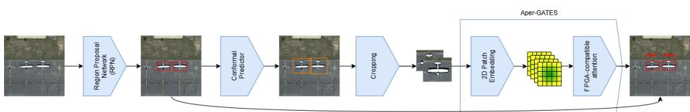
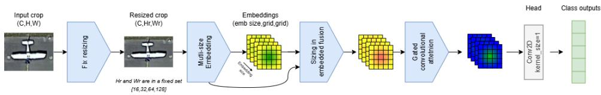
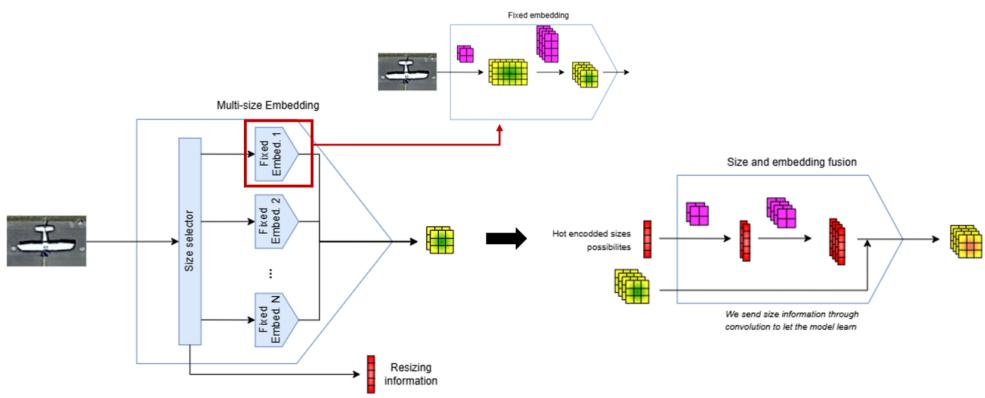
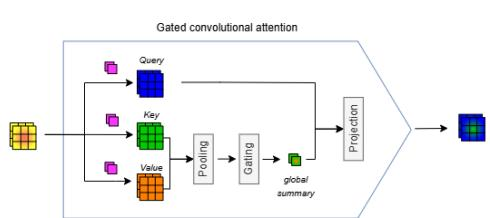
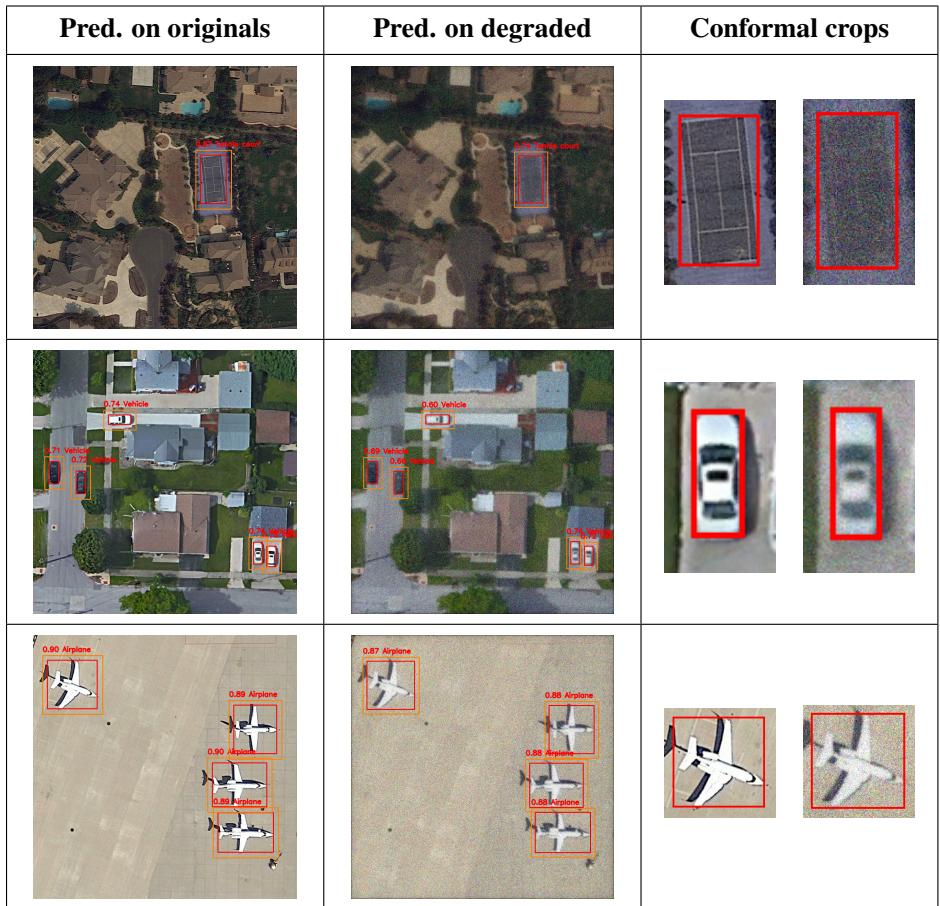

# TriCCOT: Tri-part Convolutional Conformal Transformer for Onboard Space Object Detection

Adrien Dorise1,2   
adrien.dorise@cnes.fr   
Marjorie Bellizzi2   
0marjorie.bellizzi@irt-saintexupery.com   
2Julia Cohen1   
pjulia.cohen@cnes.fr   
SStéphane May1   
stephane.may@cnes.fr   
1 Centre National d’Etudes Spatiales,   
CNES   
Toulouse, France

2 IRT Saint-Exupéry Toulouse, France

## Abstract

Onboard object detection in Earth observation is constrained by limited computational resources and the absence of fully corrected imagery. While convolutional detectors are hardware-efficient, they often struggle to extract robust representations from raw and noisy data. Conversely, transformer-based models provide stronger global reasoning capabilities but remain difficult to deploy on FPGA accelerators due to quadratic attention complexity and non-compatible operations.

We introduce TriCCOT, a tri-part architecture for robust and deployable onboard object detection. TriCCOT combines a convolutional region proposal network, a conformal prediction stage, and Aper-GATES, our hardware-friendly attention-based classifier. The region proposal network generates candidate bounding boxes, which are subsequently enlarged via conformal prediction, providing a distribution-free probabilistic coverage guarantee. The resulting crops are processed by Aper-GATES, which reformulates self-attention through convolutional projections, global channel statistics, and hardware-friendly gating operations, avoiding standard transformer operations that are poorly suited to CNN-oriented accelerators.

Experiments on the DIOR and VDVRaw datasets demonstrate competitive detection performance and improved robustness to spatial blur and signal-dependent noise when compared to FPGA-compatible architectures. Finally, we report full deployment on a Xilinx Versal VCK190 FPGA without modifying the underlying DPU architecture, enabling unified CNN-Transformer inference for spaceborne embedded applications.

## 1 Introduction

Earth observation systems rely extensively on image processing techniques to transform raw, noisy acquisitions into exploitable products delivered to end users. Radiometric and geometric corrections are traditionally performed on the ground after data transmission from the satellite. Although effective, these processing chains are computationally intensive and time-consuming. At the same time, the steady increase of onboard computational resources has encouraged a paradigm shift toward embedding decision-making capabilities directly within the satellite platform [56]. Tasks such as cloud detection and masking [4], image classification [40], anomaly detection [23], and object detection [14, 22] are increasingly being deployed onboard to reduce downlink bandwidth and latency.

Onboard models do not benefit from the fully corrected imagery available in groundbased processing pipelines. A common strategy is to reproduce part of the restoration workflow onboard, either through simplified physical corrections or lightweight neural approximations [15, 41]. However, such approaches introduce additional computational overhead and partially defeat the purpose of moving intelligence to the edge. An alternative direction is to directly exploit raw satellite imagery as model input, thereby eliminating preprocessing stages. This strategy remains marginal, because raw data are scarcely available [41], and performance degradation is commonly observed when learning from uncorrected data [10, 45]. In particular, previous studies have shown a noticeable decline in object detection accuracy when operating on raw images instead of processed ones [14, 15], as convolutional architectures struggle to capture inter-class variations under degraded conditions.

Object detection nevertheless remains a central task in remote sensing applications [42]. Convolutional detectors have long dominated the field, while more recent transformer-based architectures have demonstrated superior representational capabilities in computer vision. Yet, attention mechanisms introduce significant computational challenges for onboard deployment. Softmax operations, high-dimensional matrix multiplications, and quadratic complexity with respect to the token count make them difficult to integrate into constrained hardware environments [51].

In light of these considerations, we argue that the attention mechanism is efficient at finding discriminative representations from raw satellite imagery, provided it can be reformulated to meet strict deployment constraints. In this work, we introduce Aper-GATES (Aperture-Gated Attention Transformer for Embedded Systems), an efficient attention formulation compatible with FPGAs accelerators. Taking advantage of this new model, we also introduce TriCCOT (Tri-Part Convolutional Conformal Transformer). This novel object detection architecture combines convolutional priors, conformal prediction principles, and Aper-GATES. The proposed approach is designed to operate directly on raw imagery while preserving computational feasibility, thereby bridging the gap between detection performance and embedded deployment requirements.

## 2 Related Work

Object detection in remote sensing Object detection in remote sensing has been extensively investigated over the past decade. Conventional detection frameworks include both convolutional two-stage architectures [21, 25, 48] and one-stage variants [20, 47, 50], often reinforced with multi-scale feature pyramids to better capture objects of varying sizes [35]. Transformer-based detectors such as DETR [8] make use of the attention mechanism [51] and achieve strong performance, albeit at a higher computational cost. While these methods focus on detection accuracy under standard imaging conditions, they generally assume access to preprocessed data and do not explicitly address the constraints imposed by degraded or raw onboard imagery.

Onboard deployments for remote sensing applications The deployment of deep learning models directly onboard satellites has recently gained momentum as a means of reducing transmission overhead and enabling real-time responses [56]. Embedded inference has been demonstrated for cloud detection [4], anomaly detection [12], and scene classification [40]. Several studies have explored learning from raw or minimally restored images to bypass computationally demanding correction pipelines [41, 45]. However, studies report performance drops when models are trained and evaluated on degraded data [14], highlighting the difficulty of extracting robust representations without full radiometric and geometric processing. Rather than improving preprocessing stages, our approach tackles this limitation at the architectural level.

Embedded object detection Although transformer-based vision models offer strong representation learning [8], their attention mechanisms remain difficult to deploy on resourceconstrained onboard accelerators. Hybrid architectures such as CvT [53] and MT [24] incorporate convolutional inductive biases within attention-based models. Nevertheless, standard self-attention mechanisms [51] scale quadratically with token number and rely on softmax normalisation, while linear approximations [1] still require global matrix operations. Such characteristics limit their compatibility with resource-constrained onboard hardware. Existing FPGA deployments in remote sensing have therefore largely concentrated on convolutional networks using platforms such as Xilinx Versal and DPU architectures [6, 19, 29, 32]. In contrast, transformer acceleration typically demands specialised datapaths or dedicated quantisation-aware schemes [30, 34, 54]. By reformulating attention without explicit token-token affinity computation and expressing it through convolutional projections combined with global channel statistics, our method enables integration within a standard CNN-oriented acceleration pipeline, reconciling transformer expressiveness with strict hardware constraints.

Conformal prediction Conformal prediction has recently emerged as a principled tool for providing distribution-free uncertainty guarantees [3]. Extensions to object detection enable the construction of bounding boxes with probabilistic coverage guarantees [2, 9], primarily focusing on calibration and reliability. In contrast, we leverage conformal prediction as a structural component of the detection pipeline, systematically enlarging region proposals before classification. This design ensures contextual completeness and mitigates biases introduced during proposal generation, without resorting to heuristic scaling rules.

## 3 Combining convolution, conformal and attention

## 3.1 Model overview

TriCCOT comprises three sequential stages: a convolutional Region Proposal Network (RPN), conformal adjustment of the predicted boxes, and crop classification with Aper-GATES, our FPGA-friendly attention model. Processing object-centric crops reduces irrelevant image content and enables a compact classifier. The complete architecture is shown in Fig. 1.

  
Figure 1: TriCCOT architecture. It is composed of a Region Proposal Network, a conformal predictor, and Aper-GATES, our convolutional self-attention classifier. The RPN predicts bounding boxes that are then refined using a conformal predictor. Cropped images are created from the conformal bounding boxes, which are aggregated into a 2D token space that serves as input for the attention-based classifier.

## 3.2 Region Proposal Network (RPN)

The core concept of the region proposal network derives from two-stage detection models [21] that rely on a first detector to predict bounding boxes and a second classifier to predict the class of the detected objects. Our RPN is based on a CSPDarknet backbone coupled with an FPN mechanism [35] to adapt to multiscale objects.

As studies have shown that degradations introduced into raw data have little effect on bounding box localisation [14], few modifications are required to the RPN, and other convolutional backbones can be used if needed.

## 3.3 Conformal predictor

RPN bounding boxes can be imperfect, leading to cropped or shifted objects that lack crucial information for classification. In addition, ground-truth annotations are typically tight around the object and may therefore provide little contextual information when directly converted into image crops. We therefore introduce a conformal predictor to relax the box constraints before feeding into the transformer.

When applied to object detection, a conformal predictor aims to predict bounding boxes with probabilistic guarantees [2, 9]. For a bounding box $Y = ( Y ^ { x _ { \mathrm { m i n } } } , Y ^ { y _ { \mathrm { m i n } } } , Y ^ { x _ { \mathrm { m a x } } } , Y ^ { y _ { \mathrm { m a x } } } )$ , the calibrated conformal predictor adjusts each predicted coordinate independently as

$$
{ \widehat { C } } _ { \alpha } = \left\{ \mathrm { b o x ~ w i t h ~ c o o r d i n a t e s ~ }  { \widehat { Y } } _ { \mathrm { n e w } } ^ { j } - d _ { \alpha / 4 } ^ { j } \mathrm { ~ f o r ~ } j \in \left\{ x _ { \mathrm { m i n } } , y _ { \mathrm { m i n } } , x _ { \mathrm { m a x } } , y _ { \mathrm { m a x } } \right\} \right\}\tag{1}
$$

where $d _ { \alpha / 4 } ^ { j }$ is the calibrated correction associated with coordinate $j .$ These corrections are estimated independently for each boundary and may therefore differ in both magnitude and sign, allowing the conformal predictor to compensate not only for insufficient box size but also for systematic localisation biases.

Applying conformal prediction to the RPN outputs ensures that, under the conformal coverage assumptions, a fraction 1 − α of ground-truth objects are entirely contained within the adjusted predicted bounding boxes. The resulting crops consequently provide additional contextual information to the attention-based classifier. Compared with a fixed multiplicative expansion ratio, conformal prediction provides a data-driven adjustment that accounts for the localisation errors and directional biases of the RPN with limited computational overhead.

In this work, conformal prediction is applied by using the PUNCC library [38, 39].

## 3.4 Aper-GATES: An Aperture-Gated Attention Transformer for Embedded Systems

Transformer architectures have demonstrated strong performance across a wide range of tasks, primarily due to their ability to model long-range dependencies. Unlike convolutional neural networks, which are limited to the receptive fields of their kernels, Vision Transformers (ViTs) can aggregate features globally across an image. We believe that this global context can improve model robustness on degraded images.

  
Figure 2: Aper-GATES architecture. It takes cropped images as input, maximising useful information. Cropped images are resized into pre-fixed sizes and projected into an embedding space. The attention matrix is computed using a gated convolutional attention module. Finally, a 2D convolutional mapping outputs the prediction.

However, deploying transformers on edge hardware (particularly FPGAs) remains nontrivial due to the high cost of the softmax operation and the quadratic complexity of the attention mechanism. To address these constraints, we propose Aper-GATES (Aperture-Gated Attention Transformer for Embedded Systems). Inspired by Squeeze-and-Excitation and gated approaches [18, 28, 53], Aper-GATES utilises a hardware-efficient gating mechanism (analogous to an optical aperture) to modulate the flow of global information. Unlike SE-Net and GC-Net, which pool the feature map itself and reinject the resulting descriptor, Aper-GATES pools key-value interactions to obtain a global correlation descriptor that multiplicatively gates the query tensor Q. Aper-GATES trades pairwise token expressivity for architectural simplicity, numerical stability, and compatibility with FPGA deployment, while preserving global context aggregation. The global architecture of Aper-GATES is displayed in Fig. 2. First, the crop goes through a dynamic resizing step. The resulting image is embedded in a latent space and processed by a gated convolutional attention mechanism. Finally, the attention result is processed by a convolutional layer that outputs the class probabilities.

## 3.4.1 Multi-resolution patch embedding bank with fixed grid

Transformers can adapt to various input sizes. In the field of Large Language Models (LLMs), self-attention operates over variable-length token sequences in a latent space [51, 55]. Conversely, ViTs are traditionally trained with a fixed input resolution (usually 224x224) [8, 16, 26]. Nevertheless, some studies have leveraged this property to support variable spatial scales, such as FlexiViT, Swin Transformer, or DINOv2 [5, 37, 43]. In practice, varying the image resolution generally changes the number of input tokens or requires positionalembedding interpolation, which is undesirable for static FPGA deployment. Since Aper-GATES takes cropped images of variable sizes from the conformal predictor as input, it is important to retain the size and shape information of the cropped objects. However, supporting variable input sizes can degrade FPGA performance. Therefore, we introduce a multiresolution patch embedding that resizes the cropped images into fixed shapes, as displayed in Fig. 3.

  
Figure 3: Multi-resolution patch embedding pipeline. The size selector is implemented using Boolean conditioning on the CPU. A fixed-size embedding space is achieved by carefully selecting the convolutional kernel for each admissible input resolution, which improves DPU deployment by keeping the data shape fixed throughout the model. Finally, the metadata are encoded into the embedding space.

Let the input crop be denoted by $\mathbf { x } \in \mathbb { R } ^ { B \times 3 \times H \times W }$ , where the spatial size $( H , W )$ is selected from a predefined set of admissible resolutions and is closest to the original crop size while preserving aspect ratio. In our implementation H, $W \in \{ 1 6 , 3 2 , 6 4 , 1 2 8 \}$ . Rather than using a single patch embedding layer, we define a bank of convolutional patch embedders, each specialised to a single admissible input size. For an input of size $( H , W )$ , the corresponding branch is selected. Because this selection relies on Boolean conditions, it is outsourced to the CPU rather than executed on the FPGA DPU. Since this operation remains fast, it does not significantly degrade inference speed. Each branch maps the input crop to a fixed spatial grid of size $G \times G$ , with $G = 8$ in our implementation, allowing a single model to be used for all admissible input sizes. This is achieved via two strided convolutional stages:

$$
\mathbf { z } = \mathrm { E m b e d } _ { H , W } ( \mathbf { x } ) \in \mathbb { R } ^ { B \times D \times G \times G } .\tag{2}
$$

where the total downsampling stride is

$$
s _ { h } = \frac { H } { G } , \quad s _ { w } = \frac { W } { G }\tag{3}
$$

For example, strides 2, 4,8,16 are split as $( 1 , 2 ) , ( 2 , 2 ) , ( 2 , 4 )$ , and $( 4 , 4 )$ , respectively. This allows all supported input sizes to be projected to the same $8 \times 8$ feature grid.

To provide the encoder with explicit knowledge of the input geometry, we compute a normalised metadata vector $\mathbf { m } = [ \mathbf { g } _ { \mathrm { b r a n c h } } , \mathbf { m } _ { \mathrm { s i z e } } ]$ , where $\mathbf { g } _ { \mathrm { b r a n c h } }$ is the one-hot encoded branch selection vector and $\mathbf { m } _ { \mathrm { s i z e } }$ is a normalised size vector computed as:

$$
\mathbf { m } _ { \mathrm { { s i z e } } } = \left[ \frac { H } { H _ { \mathrm { { m a x } } } } , \frac { W } { W _ { \mathrm { { m a x } } } } , \frac { H / G } { P _ { h , \mathrm { { m a x } } } } , \frac { W / G } { P _ { w , \mathrm { { m a x } } } } \right] .\tag{4}
$$

where $P _ { h , \operatorname* { m a x } }$ and $P _ { w , \mathrm { m a x } }$ denote the maximum patch-grid height and width allowed by the size selector, respectively. This metadata is projected via a two-layer convolutional network and integrated into the feature map z via additive residual fusion: ${ \bf z } ^ { \prime } = { \bf z } + \mathrm { C O N V } ( { \bf m } )$ . This ensures that, while the feature grid is fixed, the network remains aware of the original object scale.

## 3.4.2 Gated Convolutional Attention

Let $\mathbf { X } \in \mathbb { R } ^ { B \times C \times H \times W }$ be an intermediate feature map, where B denotes the batch size, C the number of channels, and $H \times W$ the spatial resolution. We use the multihead strategy to obtain DPU-compatible batch sizes by partitioning the channels into h heads of dimension $d ,$ where $C = h d$

  
Figure 4: Aper-GATES attention mechanism. Context is gathered by a global descriptor.

While convolutional projections for Q,K,V have been explored in prior works such as CvT [53] and CMT [24] to introduce spatial inductive bias, these architectures typically construct token–token affinity matrices that retain quadratic attention complexity $\mathcal { O } ( N ^ { 2 } )$ . In contrast, the core of Aper-GATES is a Gated Convolutional Attention that trades pairwise interactions for a global second-order statistic, as displayed in Fig. 4, significantly reducing the compu-

tational footprint.

Convolutional Projections Instead of flattening spatial dimensions into $N = H W$ tokens, we preserve the two-dimensional structure and compute head-wise projections using grouped $1 \times 1$ convolutions:

$$
\mathbf { Q } = \mathrm { C o n v } _ { 1 \times 1 } ^ { ( g = h ) } ( \mathbf { X } ) , \quad \mathbf { K } = \mathrm { C o n v } _ { 1 \times 1 } ^ { ( g = h ) } ( \mathbf { X } ) , \quad \mathbf { V } = \mathrm { C o n v } _ { 1 \times 1 } ^ { ( g = h ) } ( \mathbf { X } ) ,\tag{5}
$$

with $\mathbf { Q } , \mathbf { K } , \mathbf { V } \in \mathbb { R } ^ { B \times C \times H \times W }$ . This operation maintains the spatial grid while projecting the input into the query, key, and value manifolds within each head’s subspace.

Global Second-Order Context Rather than calculating an $N \times N$ affinity matrix, we take inspiration from the Squeeze-and-Excitation (SE) [7, 28] and Global Context (GC) [52] Networks, and “squeeze” the spatial interaction into a global channel descriptor $\mathbf { G } \in \mathbb { R } ^ { B \times C \times 1 \times 1 }$ via global average pooling $( \mathcal { P } )$ of the Key-Value product:

$$
\mathbf { G } _ { b , c } = \mathcal { P } ( \mathbf { K } \odot \mathbf { V } ) _ { b , c } = \frac { 1 } { H W } \sum _ { u = 1 } ^ { H } \sum _ { \nu = 1 } ^ { W } ( \mathbf { K } \odot \mathbf { V } ) _ { b , c , u , \nu }\tag{6}
$$

where $\odot$ denotes the Hadamard product. By pooling the element-wise product of K and V, the model captures a global summary of feature correlations rather than localising specific token-to-token dependencies.

Aperture Modulation Following the aperture metaphor, a gating function modulates the flow of this global context. The queries Q are “excited” via multiplicative modulation with the transformed global descriptor:

$$
\mathbf { U } = \mathbf { Q } \odot \sigma ( \mathrm { P r o j } ( \mathbf { G } ) ) ,\tag{7}
$$

where $\sigma ( \cdot )$ represents a hardware-friendly activation (e.g., Hardsigmoid). This formulation allows the model to prioritise relevant global features while suppressing noise, thereby dynamically gating spatial information. This mechanism achieves linear complexity O(BCHW), making it well-suited for resource-constrained deployment.

ConSmax Activation for DPU Deployment To avoid hardware-intensive softmax normalisation, Aper-GATES adopts a lightweight learnable gating function inspired by ConSmax [36]. Traditional ConSmax replaces softmax with a parametric transformation:

$$
\mathrm { C o n S m a x } ( x ) = \frac { \exp ( x - \beta ) } { \gamma } ,\tag{8}
$$

where $\beta$ and $\gamma$ are learnable head-wise parameters.

In our implementation, the exponential is replaced by a simplified DPU-compatible variant based on depthwise affine transformation and a piecewise-linear Hardsigmoid:

$$
\mathrm { C o n S m a x } _ { \mathrm { D P U } } ( x ) = \mathrm { H a r d s i g m o i d } ( w \cdot x + b ) .\tag{9}
$$

The parameters w and b are learned channel-wise through a depthwise 1 × 1 convolution.

## 3.5 Training and inference

TriCCOT is a combination of three independent models that predict sequentially. Therefore, training is performed sequentially, with each model learning from the previous model’s predictions. The RPN is first fitted on the detection training set; its outputs on a separate calibration set are then used to fit the conformal corrections [3]. The conformal predictor guarantees object integrity while avoiding overly large crops that would degrade inference time. In addition, because the conformal predictor is governed solely by Eq.1 during inference, it is both lightweight and computationally inexpensive to implement. Finally, Aper-GATES is trained from crops generated by the frozen RPN and conformal stages, using the same train/validation split as the RPN. The hyperparameters used to train TriCCOT are available in Tab. 1.

Table 1: Training and model parameters for the DIOR and VDVRaw datasets.
<table><tr><td>Param. Category</td><td>Parameter</td><td>DIOR</td><td>VDVRaw</td></tr><tr><td>RPN</td><td>input size max detections</td><td>640 70</td><td>640 70</td></tr><tr><td>Conformal predictor</td><td>α tested α</td><td>0.15 [0.10, 0.20]</td><td>0.15 -</td></tr><tr><td>Aper-GATES</td><td>patch size embed. dim.</td><td>{16, 32, 64, 128} 128</td><td>32 512</td></tr><tr><td>Training</td><td>epochs lr scheduler</td><td>200 10-3 warmup. cosine</td><td>200 10-3 warm. cosine</td></tr><tr><td>Dataset</td><td>nb. classes train size test size</td><td>20 18000 2000</td><td>17 3813 425</td></tr></table>

## 3.6 Datasets

The DIOR dataset [33] is chosen to evaluate the performance of TriCCOT, a widely used Earth-observation benchmark comprising 23,463 optical remote-sensing images across 20 object classes. To assess robustness to degraded imagery, we also generate a degraded version of DIOR by applying spatial blur and signal-dependent noise that are representative of raw satellite imaging conditions. The degradation process approximately reverses restoration operations typically applied to satellite imagery [14].

In addition, we evaluated TriCCOT on real raw satellite imagery with the VENµS raw images for vessel detection (VDVRaw) dataset [11]. VDVRaw contains 282 multispectra images divided into 4 238 patches affected by various sensor and acquisition artefacts, including striping noise, band misalignment, radiometric noise, blur, and stray light. It contains a total of 3 827 annotated objects across 17 classes.

## 3.6.1 Degradation simulation

The degraded DIOR dataset combines spatial and radiometric degradations representative of realistic imaging systems.

Spatial degradation via MTF Spatial resolution loss is modelled using a parametric Modulation Transfer Function (MTF) combining optical blur and sensor sampling:

$$
\begin{array} { r } { \mathbf { M T F } ( f _ { x } , f _ { y } ) = e ^ { - \gamma f _ { r } } \mathrm { s i n c } ( f _ { x } ) \mathrm { s i n c } ( f _ { y } ) , \qquad f _ { r } = \sqrt { f _ { x } ^ { 2 } + f _ { y } ^ { 2 } } , } \end{array}\tag{10}
$$

where $\gamma$ is calibrated from a user-defined Nyquist value $M T F _ { N y q }$

$$
\gamma = - 2 \log \left( \frac { \mathrm { { M T F } _ { N y q } } } { \mathrm { { s i n c } ( 0 . 5 ) } } \right) .\tag{11}
$$

The corresponding point-spread function is obtained by inverse Fourier transform and convolved independently with each image channel. In our work, MT F@Nyquist $\in [ 1 \% , 2 \% ]$

Signal-dependent noise Radiometric degradation is modelled using signal-dependent Gaussian noise,

$$
\sigma ^ { 2 } ( L ) = \alpha L + \beta ,\tag{12}
$$

where L denotes luminance. The parameters α and $\beta$ are determined from two reference luminance–SNR pairs using

$$
\sigma _ { i } ^ { 2 } = \left( \frac { L _ { i } } { 1 0 ^ { \mathrm { S N R } _ { i , \mathrm { d B } } / 2 0 } } \right) ^ { 2 } = \alpha L _ { i } + \beta .\tag{13}
$$

Noise with standard deviation

$$
\sigma ( L ) = \sqrt { \operatorname* { m a x } ( 0 , \alpha L + \beta ) }\tag{14}
$$

is then sampled independently for each pixel. In our work, the SNR values of the simulated images for two points of luminance $L _ { 0 } = 2 5 W / m ^ { 2 } / s r / \mu \mathrm { m }$ and $L _ { 1 } = 1 0 0 W / m ^ { 2 } / s r / \mu \mathrm { m }$ are set between [25dB, 35dB] and [65dB, 75dB], respectively.

Table 2: Ablation study of the TriCCOT model on the DIOR dataset.
<table><tr><td>Configuration</td><td>mAP@50</td><td>mAP@75</td><td>mAP@50:95</td><td>Precision</td><td>Recall</td></tr><tr><td>Full TriCCOT</td><td>76.49%</td><td>40.08%</td><td>45.51%</td><td>76.21%</td><td>53.79%</td></tr><tr><td>w/o Aper-GATES</td><td>75.67%</td><td>39.94%</td><td>44.09%</td><td>70.19%</td><td>38.99%</td></tr><tr><td>w/o ConSmax</td><td>74.30%</td><td>39.09%</td><td>43.18%</td><td>68.97%</td><td>25.09%</td></tr><tr><td>w/o Multi Res. Patch Embedding</td><td>72.55%</td><td>38.07%</td><td>41.55%</td><td>63.54%</td><td>20.76%</td></tr><tr><td>w/o Conformal Pred.</td><td>69.10%</td><td>38.60%</td><td>42.67%</td><td>65.21%</td><td>25.51%</td></tr></table>

## 4 Results

## 4.1 Ablation study

To ensure that all components of TriCCOT contribute to detection, we performed an ablation study on the original DIOR dataset. Aper-GATES is replaced with a traditional ViT implementation, ConSmax is replaced with a plain Hardsigmoid without learnable w,b, the multi-resolution patch embedding is replaced with a fixed 128x128 resize, and we completely removed the conformal predictor. The results of the ablation study are available in Tab. 2.

First, we observe that the full implementation of TriCCOT has the best performance on all criteria. This shows that each module contributes to improving detection quality. Removing Aper-GATES results in only a modest reduction in performance, with a decrease of only 0.82 percentage points in mAP@50. This is because Aper-GATES does not aim to improve the attention mechanism, but rather to enable its implementation on accelerated embedded hardware. Moreover, we can see that removing the conformal predictor has a significant impact on performance, with a 7.39-percentage-point decrease in mAP@50. This result shows that the context provided by enlarged bounding boxes helps the transformer process the crop, particularly for misaligned predictions, as demonstrated by the gap in mAP@50.

## 4.2 Detection performance on the DIOR and VDVRaw datasets

TriCCOT is evaluated on both the original DIOR dataset and the raw simulated DIOR dataset. In addition, we evaluated a two-stage detector with Faster R-CNN [48], lightweight one-stage detectors with YOLOX-S [20] and NanoDet-Plus [46], and a real-time transformerbased detector with RT-DETR [57]. This comparison covers a broad range of architectures. Tab. 4 reports the results for all models on the three datasets.

On the original DIOR dataset, RT-DETR achieves the best overall detection performance. Among FPGA-compatible models, YOLOX-S achieves the best mAP@50, with 78.7%, while NanoDet-Plus achieves the best mAP@50:95, with 47.9%. Nevertheless, TriCCOT remains close to these results, with a maximum difference of less than 2.5 percentage points for both mAP@50 and mAP@50:95, while requiring only 3.5M parameters and 8.2 GFLOPs. In contrast, DETR achieves 49.9% mAP@50 and 28.7% mAP@50:95, highlighting the higher training and deployment costs of a standard transformer detector in this setting, as it must learn spatial relationships [16].

To examine the behaviour of TriCCOT beyond aggregate metrics, Tab. 3 reports AP@50 for representative DIOR categories spanning different object types and performance levels. Performance ranges from 43.09% for Bridge to 91.92% for Airplane, indicating that TriC-COT achieves competitive detections across diverse categories rather than relying on a few

Table 3: AP@50 on representative DIOR categories.
<table><tr><td>Class AP@50</td><td>Airplane 91.92</td><td>Baseball 91.70</td><td>Bridge 43.09</td><td>Harbor 66.38</td><td>Ship 84.13</td><td>Storage 73.07</td><td>Vehicle 55.70</td><td>Windmill 84.34</td></tr></table>

Table 4: Benchmark comparison on DIOR Original, DIOR Raw, and VDVRaw datasets. Training times correspond to a single NVIDIA RTX 4090. Bold values indicate the best result among FPGA-compatible models, while underlined values indicate the best overall result.
<table><tr><td></td><td colspan="3">Model Characteristics</td><td colspan="2">DIOR Original  $( D _ { l 1 } )$ </td><td colspan="2">DIOR Raw  $( D _ { \mathrm { r a w } } )$ </td><td colspan="2">VDVRaw</td></tr><tr><td>Method</td><td>Params</td><td>GFLOPs</td><td>Train.</td><td>mAP@50 mAP@50:95</td><td></td><td>mAP@50</td><td>mAP@50:95</td><td>mAP@50</td><td>mAP@50:95</td></tr><tr><td colspan="10">Non-FPGA-compatible transformer models</td></tr><tr><td>DETR []</td><td>41.5M</td><td>38.4</td><td>~30h</td><td>49.9</td><td>28.7</td><td>49.1</td><td>27.7</td><td>8.6</td><td>5.6</td></tr><tr><td>RT-DETR []</td><td>20.0M</td><td>60.0</td><td>~30h</td><td>82.1</td><td>51.3</td><td>80.3</td><td>48.2</td><td>29.7</td><td>26.5</td></tr><tr><td colspan="10">FPGA-compatible models</td></tr><tr><td>Faster R-CNN []</td><td>40.0M</td><td>89.0</td><td>~8h</td><td>74.8</td><td>47.4</td><td>69.2</td><td>40.4</td><td>18.2</td><td>12.2</td></tr><tr><td>YOLOX-S []</td><td>8.9M</td><td>26.8</td><td>4-5h</td><td>78.7</td><td>46.1</td><td>72.6</td><td>40.1</td><td>20.0</td><td>14.3</td></tr><tr><td>NanoDet-Plus []</td><td>2.4M</td><td>1.8</td><td>4-5h</td><td>75.3</td><td>47.9</td><td>70.0</td><td>41.1</td><td>21.2</td><td>16.3</td></tr><tr><td>TriCCOT (ours)</td><td>3.5M</td><td>8.2</td><td>4-5h</td><td>76.5</td><td>45.5</td><td>74.8</td><td>42.2</td><td>25.3</td><td>18.0</td></tr></table>

high-performing classes.

Evaluation on the raw DIOR dataset shows that RT-DETR still achieves the best overall results. However, among FPGA-compatible models, TriCCOT obtains the best performance on both metrics, with 74.8% mAP@50 and 42.2% mAP@50:95. Notably, the transformerbased architectures (TriCCOT, RT-DETR and DETR) experience the smallest decline in performance when evaluated on the degraded rather than the original dataset, supporting the hypothesis that attention-based mechanisms improve robustness to image degradations.

Finally, evaluation on VDVRaw confirms this trend on real raw imagery. Although RT-DETR remains the best-performing model overall, TriCCOT achieves the best results among FPGA-compatible models, reaching 25.3% mAP@50 and 18.0% mAP@50:95. These results show that TriCCOT provides a favourable trade-off between robustness to raw-image degradations and embedded deployability.

Furthermore, Fig. 5 shows examples of TriCCOT detections for both the original and raw datasets, with examples of the impact of the conformal predictor on the crops. We see that TriCCOT produces qualitatively accurate detections with accurate bounding boxes and class predictions. In these examples, the degradations have little impact on detection. The resulting crops also illustrate the additional context provided by the bounding boxes generated by the conformal predictor.

## 4.3 FPGA deployment

Finally, TriCCOT is successfully deployed on a Xilinx Versal VCK190 FPGA. The Versal has gained traction in the space community, thanks to its radiation-tolerant specifications [17, 44], and state-of-the-art performance [6, 29]. In this work, we use a Deep Learning Processor Unit (DPU) [32], originally designed to accelerate CNN models. Therefore, unlike other implementations of transformers on FPGA boards [13, 30, 34, 54], we do not alter the FPGA architecture to fit the attention operations. By doing so, we remain flexible and can easily combine multiple architectures, such as CNNs and transformers. Thanks to the novel attention implementation described in Sec. 3.4, all convolutional and attentional operations are mapped to the DPU, with none offloaded to the CPU.

  
Figure 5: TriCCOT prediction on sampled original and degraded images.

Tab. 5 compiles the results obtained on the Versal. Here, we focus on edge performance metrics, including inference speed and energy consumption. To better understand the overall inference time of TriCCOT, its processing pipeline is broken down into its main components. The RPN is the most time-consuming stage, accounting for 29.1 ms of the total inference time of 35.5 ms. In contrast, the Aper-GATES classification stage runs in only 3.9 ms on the DPU. Despite being executed on the CPU, the conformal prediction and size-selector stages introduce only limited overhead, with execution times of 2.4 ms and 0.1 ms, respectively. For comparison, we also deployed YOLOX-S on the DPU, while DETR inference was performed on the Versal CPU because the DPU does not support its transformer-based architecture. Thanks to its lightweight architecture, TriCCOT is the fastest model on the Versal, achieving 28.2 FPS on 640x640 patches and enabling real-time processing with transformer architectures.

## 5 Discussion

Robustness of TriCCOT under degraded imaging conditions against convolutional approaches While TriCCOT does not achieve the highest detection accuracy on the original

Table 5: Versal VCK190 inference performance on a 640 × 640 image. Latencies are averaged over 100 runs. Runner creation is performed only once at initialisation.
<table><tr><td>Method</td><td>Hardware</td><td>Prec.</td><td>Size (MB)</td><td>Latency (ms) ↓</td><td>FPS ↑</td><td>Power (W) ↓</td><td>Pxls/s/W ↑</td></tr><tr><td>Runner creation</td><td>CPU</td><td>一</td><td>一</td><td>929.3 (± 20.1)</td><td>一</td><td>一</td><td>一</td></tr><tr><td>Image preprocessing</td><td>CPU</td><td>一</td><td>一</td><td>44.3 (± 5.2)</td><td>一</td><td>一</td><td></td></tr><tr><td>TriCCOT (ours)</td><td>CPU+DPU</td><td>int8</td><td>10.0</td><td>35.5 (± 3.4)</td><td>28.2</td><td>25</td><td>462 824</td></tr><tr><td>RPN</td><td>DPU</td><td>int8</td><td>1.9</td><td>29.1 (± 3.0)</td><td></td><td>一</td><td></td></tr><tr><td>Conformal</td><td>CPU</td><td>float32</td><td>2.9</td><td>2.4 (± 0.2)</td><td></td><td>一</td><td></td></tr><tr><td>Size selector</td><td>CPU</td><td></td><td></td><td>0.1 (± 0.0)</td><td></td><td>一</td><td></td></tr><tr><td>Aper-GATES</td><td>DPU</td><td>int8</td><td>5.2</td><td>3.9 (± 2.5)</td><td></td><td></td><td></td></tr><tr><td>DETR [日]</td><td>CPU</td><td>int8</td><td>162.7</td><td>13 160 (± 400)</td><td>0.08</td><td>22.5</td><td>1456</td></tr><tr><td>YOLOX-S []</td><td>DPU</td><td>int8</td><td>9.2</td><td>74.1 (± 3.6)</td><td>13.5</td><td>25</td><td>221 184</td></tr></table>

DIOR dataset, its main objective is not to maximise performance under ideal image conditions, but to preserve detection quality when onboard imagery is degraded by spatial blur and signal-dependent noise. In this setting, TriCCOT achieves the best performance among the evaluated convolutional methods. In addition, transformer architectures exhibited smaller performance drops between the original and degraded datasets. This supports our hypothesis that combining self-attention and global features improves the model’s overall robustness to image degradations.

Contribution of the conformal prediction stage The ablation study highlights the importance of the conformal predictor. Extending the crops improves object coverage and adds contextual information. It also helps remove labelling biases in the dataset. The advantage of using conformal prediction is that it removes the need for arbitrary scaling parameters, compensates for model prediction biases, and provides a mathematically defined coverage guarantee.

Role of Aper-GATES in embedded transformer deployment A key contribution of TriC-COT is its improved deployability of transformer-based models on FPGA. Aper-GATES’s convolutional reformulation of self-attention enables fast inference. In addition, it is possible to combine both convolutional and attention-based architectures within a single DPU. This design greatly simplifies TriCCOT deployment on the Versal VCK190 and enables simultaneous execution of multiple model architectures without reconfiguring the DPU. Although TriCCOT does not match the performance of large foundation transformer models, it offers a practical trade-off between predictive performance and deployability in embedded systems.

TriCCOT classifier Training a transformer is not trivial, as it typically requires large training datasets to mitigate the lack of local biases. Because the transformer classifier in TriCCOT processes only object crops, most of the input consists of task-relevant information. In our experiments, training Aper-GATES was straightforward and yielded fast convergence. All of TriCCOT’s parts (RPN, conformal predictor and Aper-GATES) can therefore be trained in only 4-5 h on a single NVIDIA RTX 4090, compared with approximately 30 h for the transformer baselines considered in our experiments. This reduced training cost is enabled by the smaller feature space and compact architecture. By combining convolutional processing for full-image search with transformer-based classification on regions of interest, TriCCOT supports compact and efficient transformer architectures.

Limitations of sequential training Despite these advantages, TriCCOT introduces additional training complexity. The architecture comprises three components: the RPN, the conformal predictor, and the Aper-GATES classifier. Each module is trained after the previous one, which creates dependencies between stages. As a consequence, biases or errors introduced by the RPN may propagate to the conformal predictor and then to the classifier. Although the conformal stage mitigates incomplete or overly tight proposals, the current sequential training strategy does not allow the full pipeline to be optimised end-to-end. Future work should therefore investigate joint or cooperative training strategies or hard-example mining that allow the proposal and classification stages to adapt to one another during training.

Overall, TriCCOT is competitive with state-of-the-art object detection models on original images, and performs best on noisy images against models deployable on FPGAs. It opens the possibility of a lighter transformer architecture with increased deployment capability on edge devices, specifically for onboard remote sensing applications.

## 6 Conclusion

In this work, we introduced TriCCOT, a novel tri-part architecture that combines convolution, conformal prediction, and self-attention for onboard object detection under degraded imaging conditions. The method is based on a convolutional region proposal network, a conformal prediction stage, and Aper-GATES, a hardware-friendly attention-based classifier. This design exploits the localisation efficiency of convolutional detectors, the probabilistic coverage guarantees of conformal prediction, and the robustness of attention-based representations, while remaining compatible with embedded FPGA deployment.

Experiments on the DIOR dataset show that TriCCOT achieves competitive detection performance on clean imagery and outperforms the evaluated convolutional and FPGAcompatible baselines under raw imaging degradations. These results demonstrate that combining convolutional proposal generation with attention-based crop classification improves robustness to spatial blur and signal-dependent noise. Aper-GATES makes TriCCOT fully compatible with the FPGA DPU accelerators by replacing standard attention operations with convolutional projections and hardware-friendly gating. This enables CNN-Transformer inference without modifying the accelerator architecture.

Despite these promising results, several limitations remain. TriCCOT is currently trained sequentially, which may propagate errors between the RPN, conformal predictor, and classifier. Future work will investigate joint or cooperative training strategies through hardexample mining [31, 49] to better optimise the full detection pipeline.

We will also investigate adapting the RPN to rotated bounding-box tasks. Indeed, experiments with remote sensing imagery show that similar objects can exhibit different rotations (such as tennis courts). While the size information is preserved, the ratio can vary greatly. Using rotated bounding boxes could benefit the classifier by harmonising bounding-box ratios across the same classes.

Finally, the proposed region proposal network is based on a CSPDarknet backbone. This sets a hard limit on the total number of parameters and the total size of our model. Ongoing work focuses on replacing CSPDarknet with a lighter convolutional backbone, such as MobileNet [27], thereby drastically reducing TriCCOT’s overall size and greatly improving inference speed.

## References

[1] Kwangjun Ahn, Xiang Cheng, Minhak Song, Chulhee Yun, Ali Jadbabaie, and Suvrit Sra. Linear attention is (maybe) all you need (to understand transformer optimization), 2024. URL https://arxiv.org/abs/2310.01082.

[2] Leo Andeol, Thomas Fel, Florence de Grancey, and Luca Mossina. Confident object detection via conformal prediction and conformal risk control: an application to railway signaling. In Harris Papadopoulos, Khuong An Nguyen, Henrik Boström, and Lars Carlsson, editors, Proceedings of the Twelfth Symposium on Conformal and Probabilistic Prediction with Applications, volume 204 of Proceedings of Machine Learning Research, pages 36–55. PMLR, 13–15 Sep 2023. URL https: //proceedings.mlr.press/v204/andeol23a.html.

[3] Anastasios N. Angelopoulos and Stephen Bates. Conformal prediction: A gentle introduction. Found. Trends Mach. Learn., 16(4):494–591, March 2023. ISSN 1935-8237. doi: 10.1561/2200000101. URL https://doi.org/10.1561/2200000101.

[4] Cesar Aybar, Gonzalo Mateo-García, Giacomo Acciarini, Vít R˚užicka, Gabriele Me-ˇ oni, Nicolas Longépé, and Luis Gómez-Chova. Onboard cloud detection and atmospheric correction with efficient deep learning models. IEEE Journal of Selected Topics in Applied Earth Observations and Remote Sensing, 17:19518–19529, 2024. doi: 10.1109/JSTARS.2024.3480520.

[5] Lucas Beyer, Pavel Izmailov, Alexander Kolesnikov, Mathilde Caron, Simon Kornblith, Xiaohua Zhai, Matthias Minderer, Michael Tschannen, Ibrahim Alabdulmohsin, and Filip Pavetic. Flexivit: One model for all patch sizes, 2023. URL https://arxiv. org/abs/2212.08013.

[6] Jacob Brown, Colton Yates, Jeffrey Goeders, and Michael Wirthlin. Rareplanes detection using yolov5 on the versal adaptive soc. In 2025 IEEE Aerospace Conference, pages 1–9, 2025. doi: 10.1109/AERO63441.2025.11068464.

[7] Yue Cao, Jiarui Xu, Stephen Lin, Fangyun Wei, and Han Hu. Gcnet: Non-local networks meet squeeze-excitation networks and beyond, 2019. URL https://arxiv. org/abs/1904.11492.

[8] Nicolas Carion, Francisco Massa, Gabriel Synnaeve, Nicolas Usunier, Alexander Kirillov, and Sergey Zagoruyko. End-to-end object detection with transformers, 2020. URL https://arxiv.org/abs/2005.12872.

[9] Florence de Grancey, Jean-Luc Adam, Lucian Alecu, Sébastien Gerchinovitz, Franck Mamalet, and David Vigouroux. Object Detection With Probabilistic Guarantees. In SAFECOMP 2022, LNCS 13415, SAFECOMP 2022, LNCS 13415, München, Germany, September 2022. URL https://hal.science/hal-03769683. This preprint has not undergone peer review or any post-submission improvements or corrections. The Version of Record of this contribution will appear in SAFECOMP 2022, LNCS 13415 proceedings.

[10] Roberto Del Prete, Gabriele Meoni, Manuel Salvoldi, Domenico Barretta, Maria Daniela Graziano, Nicolas Longépé, and Alfredo Renga. Enhanced maritime

monitoring via onboard processing of raw multi-spectral imagery by deep learning. In IGARSS 2024 - 2024 IEEE International Geoscience and Remote Sensing Symposium, pages 1713–1717, 2024. doi: 10.1109/IGARSS53475.2024.10641068.

[11] Roberto Del Prete, Manuel Salvoldi, Domenico Barretta, Nicolas Longépé, Gabriele Meoni, Arnon Karnieli, Maria Daniela Graziano, and Alfredo Renga. Enhancing maritime situational awareness through end-to-end onboard raw data analysis. IEEE Journal ofSelected Topics in Applied Earth Observations and Remote Sensing, 18:16997– 17018, 2025. doi: 10.1109/JSTARS.2025.3584999.

[12] Lorenzo Diana, Jia Xu, and Luca Fanucci. Oil spill identification from sar images for low power embedded systems using cnn. Remote Sensing, 13(18), 2021. ISSN 2072- 4292. doi: 10.3390/rs13183606. URL https://www.mdpi.com/2072-4292/ 13/18/3606.

[13] Peiyan Dong, Mengshu Sun, Alec Lu, Yanyue Xie, Kenneth Liu, Zhenglun Kong, Xin Meng, Zhengang Li, Xue Lin, Zhenman Fang, and Yanzhi Wang. Heatvit: Hardwareefficient adaptive token pruning for vision transformers, 2023. URL https:// arxiv.org/abs/2211.08110.

[14] Adrien Dorise, Marjorie Bellizzi, Adrien Girard, Benjamin Francesconi, and Stéphane May. Explaining raw data complexity to improve satellite onboard processing. In 2025 European Data Handling and Data Processing Conference (EDHPC), pages 1– 8, 2025.

[15] Adrien Dorise, Marjorie Bellizzi, and Omar Hlimi. Rethinking satellite image restoration for onboard ai: A lightweight learning-based approach, 2026. URL https: //arxiv.org/abs/2604.12807.

[16] Alexey Dosovitskiy, Lucas Beyer, Alexander Kolesnikov, Dirk Weissenborn, Xiaohua Zhai, Thomas Unterthiner, Mostafa Dehghani, Matthias Minderer, Georg Heigold, Sylvain Gelly, Jakob Uszkoreit, and Neil Houlsby. An image is worth 16x16 words: Transformers for image recognition at scale, 2021. URL https://arxiv.org/abs/ 2010.11929.

[17] Arnaud Dufour, Jérôme Carron, François Pierron, Matthieu Fongral, David Dangla, Guillaume Bascoul, Françoise Bezerra, Julien Mekki, Florence Malou, and Pierre Maillard. 7nm finfet technology heavy ion sel evaluation using xilinx versal as case study. In 2021 21th European Conference on Radiation and Its Effects on Components and Systems (RADECS), pages 1–6, 2021. doi: 10.1109/RADECS53308.2021.9954564.

[18] Stéphane d’Ascoli, Hugo Touvron, Matthew L Leavitt, Ari S Morcos, Giulio Biroli, and Levent Sagun. Convit: improving vision transformers with soft convolutional inductive biases\*. Journal of Statistical Mechanics: Theory and Experiment, 2022(11), 2022. ISSN 1742-5468. doi: 10.1088/1742-5468/ac9830. URL http://dx.doi.org/ 10.1088/1742-5468/ac9830.

[19] Luis M. Garcés-Socarrás, Raudel Cuiman, Flor Ortiz, Juan A. Vásquez-Peralvo, Jorge L. González-Rios, Mouhamad Chehaitly, Arkadii Kazanskii, Sahar Malmir, Amirhossein Nik, Jan Thoemel, Sumit Kumar, Marcele Kuhfuss, Swetha Varadajulu, Eva Lagunas, Juan C. M. Duncan, Jorge Querol, and Symeon Chatzinotas. Onboard

machine learning for satellite edge computing: The spaice project use case. In 2025 European Data Handling & Data Processing Conference (EDHPC), pages 1–8, 2025.

[20] Zheng Ge, Songtao Liu, Feng Wang, Zeming Li, and Jian Sun. Yolox: Exceeding yolo series in 2021, 2021. URL https://arxiv.org/abs/2107.08430.

[21] Ross Girshick, Jeff Donahue, Trevor Darrell, and Jitendra Malik. Rich feature hierarchies for accurate object detection and semantic segmentation, 2014. URL https: //arxiv.org/abs/1311.2524.

[22] Thomas Goudemant, Benjamin Francesconi, Houssem Farhat, Lionel Daniel, Olivier Thiery, Erwann Kervennic, Adrien Girard, and Seif Mzoughi. Détection de navires embarquable à bord de satellites. In Actes de la 4ème Conference on Artificial Intelligence for Defense (CAID 2022), Actes de la 4ème Conference on Artificial Intelligence for Defense (CAID 2022), Rennes, France, November 2022. DGA Maîtrise de l’Information. URL https://hal.science/hal-03881738.

[23] Thomas Goudemant, Benjamin Francesconi, Michelle Aubrun, Erwann Kervennic, Ingrid Grenet, Yves Bobichon, and Marjorie Bellizzi. Onboard anomaly detection for marine environmental protection. IEEE Journal of Selected Topics in Applied Earth Observations and Remote Sensing, 17:7918–7931, 2024. doi: 10.1109/JSTARS.2024. 3382394.

[24] Jianyuan Guo, Kai Han, Han Wu, Yehui Tang, Xinghao Chen, Yunhe Wang, and Chang Xu. Cmt: Convolutional neural networks meet vision transformers, 2022. URL https://arxiv.org/abs/2107.06263.

[25] Kaiming He, Xiangyu Zhang, Shaoqing Ren, and Jian Sun. Spatial pyramid pooling in deep convolutional networks for visual recognition. IEEE Transactions on Pattern Analysis and Machine Intelligence, 37(9):1904–1916, 2015. doi: 10.1109/TPAMI. 2015.2389824.

[26] Kaiming He, Xinlei Chen, Saining Xie, Yanghao Li, Piotr Dollár, and Ross Girshick. Masked autoencoders are scalable vision learners, 2021. URL https://arxiv. org/abs/2111.06377.

[27] Andrew G. Howard, Menglong Zhu, Bo Chen, Dmitry Kalenichenko, Weijun Wang, Tobias Weyand, Marco Andreetto, and Hartwig Adam. Mobilenets: Efficient convolutional neural networks for mobile vision applications, 2017. URL https: //arxiv.org/abs/1704.04861.

[28] Jie Hu, Li Shen, and Gang Sun. Squeeze-and-excitation networks. In 2018 IEEE/CVF Conference on Computer Vision and Pattern Recognition, pages 7132–7141, 2018. doi: 10.1109/CVPR.2018.00745.

[29] Younis Ibrahim, Li Chen, and Tian Haonan. Deep learning-based ship detection on fpgas. In 2022 14th International Conference on Computational Intelligence and Communication Networks (CICN), pages 454–459, 2022. doi: 10.1109/CICN56167.2022. 10008312.

[30] Ehsan Kabir, Jason D. Bakos, David Andrews, and Miaoqing Huang. A runtimeadaptive transformer neural network accelerator on fpgas. Microprocessors and Microsystems, 120:105223, February 2026. ISSN 0141-9331. doi: 10.1016/ j.micpro.2025.105223. URL http://dx.doi.org/10.1016/j.micpro. 2025.105223.

[31] Aybora Koksal, Onder Tuzcuoglu, Kutalmis Gokalp Ince, Yoldas Ataseven, and A. Aydin Alatan. Improved hard example mining approach for single shot object detectors, 2022. URL https://arxiv.org/abs/2202.13080.

[32] Guoyu Li, Pengbo Zheng, Jian Weng, and Enshan Yang. Dpuv4e: High-throughput dpu architecture design for cnn on versal acap, 2025. URL https://arxiv.org/ abs/2506.11441.

[33] Ke Li, Gang Wan, Gong Cheng, Liqiu Meng, and Junwei Han. Object detection in optical remote sensing images: A survey and a new benchmark. ISPRS Journal of Photogrammetry and Remote Sensing, 159:296–307, January 2020. ISSN 0924-2716. doi: 10.1016/j.isprsjprs.2019.11.023. URL http://dx.doi.org/10.1016/j. isprsjprs.2019.11.023.

[34] Zhengang Li, Mengshu Sun, Alec Lu, Haoyu Ma, Geng Yuan, Yanyue Xie, Hao Tang, Yanyu Li, Miriam Leeser, Zhangyang Wang, Xue Lin, and Zhenman Fang. Auto-vit-acc: An fpga-aware automatic acceleration framework for vision transformer with mixed-scheme quantization, 2022. URL https://arxiv.org/abs/2208. 05163.

[35] Tsung-Yi Lin, Piotr Dollár, Ross Girshick, Kaiming He, Bharath Hariharan, and Serge Belongie. Feature pyramid networks for object detection, 2017. URL https:// arxiv.org/abs/1612.03144.

[36] Shiwei Liu, Guanchen Tao, Yifei Zou, Derek Chow, Zichen Fan, Kauna Lei, Bangfei Pan, Dennis Sylvester, Gregory Kielian, and Mehdi Saligane. Consmax: Hardwarefriendly alternative softmax with learnable parameters. In Proceedings of the 43rd IEEE/ACM International Conference on Computer-Aided Design, ICCAD ’24, New York, NY, USA, 2025. Association for Computing Machinery. ISBN 9798400710773. doi: 10.1145/3676536.3676766. URL https://doi.org/10.1145/3676536. 3676766.

[37] Ze Liu, Yutong Lin, Yue Cao, Han Hu, Yixuan Wei, Zheng Zhang, Stephen Lin, and Baining Guo. Swin transformer: Hierarchical vision transformer using shifted windows, 2021. URL https://arxiv.org/abs/2103.14030.

[38] Mouhcine Mendil, Luca Mossina, Marc Nabhan, and Kevin Pasini. Robust gas demand forecasting with conformal prediction. In Conformal and Probabilistic Prediction with Applications, pages 169–187. PMLR, 2022.

[39] Mouhcine Mendil, Luca Mossina, and David Vigouroux. Puncc: a python library for predictive uncertainty calibration and conformalization. In Conformal and Probabilistic Prediction with Applications, pages 582–601. PMLR, 2023.

[40] Gabriele Meoni, Marcus Märtens, Dawa Derksen, Kenneth See, Toby Lightheart, Anthony Sécher, Arnaud Martin, David Rijlaarsdam, Vincenzo Fanizza, and Dario Izzo. The ops-sat case: A data-centric competition for onboard satellite image classification. Astrodynamics, 8(4):507–528, 2024.

[41] Gabriele Meoni, Roberto Del Prete, Federico Serva, Alix De Beusscher, Olivier Colin, and Nicolas Longépé. Unlocking the use of raw multispectral earth observation imagery for onboard artificial intelligence. IEEE Journal of Selected Topics in Applied Earth Observations and Remote Sensing, 17:12521–12537, 2024. ISSN 2151- 1535. doi: 10.1109/jstars.2024.3418891. URL http://dx.doi.org/10.1109/ JSTARS.2024.3418891.

[42] Janne Mäyrä, Elina A. Virtanen, Ari-Pekka Jokinen, Joni Koskikala, Sakari Väkevä, and Jenni Attila. Mapping recreational marine traffic from sentinel-2 imagery using yolo object detection models. Remote Sensing of Environment, 326:114791, 2025. ISSN 0034-4257. doi: https://doi.org/10.1016/j.rse.2025. 114791. URL https://www.sciencedirect.com/science/article/ pii/S0034425725001956.

[43] Maxime Oquab, Timothée Darcet, Théo Moutakanni, Huy Vo, Marc Szafraniec, Vasil Khalidov, Pierre Fernandez, Daniel Haziza, Francisco Massa, Alaaeldin El-Nouby, Mahmoud Assran, Nicolas Ballas, Wojciech Galuba, Russell Howes, Po-Yao Huang, Shang-Wen Li, Ishan Misra, Michael Rabbat, Vasu Sharma, Gabriel Synnaeve, Hu Xu, Hervé Jegou, Julien Mairal, Patrick Labatut, Armand Joulin, and Piotr Bojanowski. Dinov2: Learning robust visual features without supervision, 2024. URL https: //arxiv.org/abs/2304.07193.

[44] Noah Perryman, Christopher Wilson, and Alan George. Evaluation of xilinx versal architecture for next-gen edge computing in space. In 2023 IEEE Aerospace Conference, pages 1–11, 2023. doi: 10.1109/AERO55745.2023.10115906.

[45] Roberto Del Prete, Manuel Salvoldi, Domenico Barretta, Nicolas Longépé, Gabriele Meoni, Arnon Karnieli, Maria Daniela Graziano, and Alfredo Renga. Enhancing maritime situational awareness through end-to-end onboard raw data analysis, 2024. URL https://arxiv.org/abs/2411.03403.

[46] RangiLyu. Nanodet-plus: Super fast and high accuracy lightweight anchor-free object detection model. https://github.com/RangiLyu/nanodet, 2021.

[47] Joseph Redmon, Santosh Divvala, Ross Girshick, and Ali Farhadi. You only look once: Unified, real-time object detection, 2016. URL https://arxiv.org/abs/ 1506.02640.

[48] Shaoqing Ren, Kaiming He, Ross Girshick, and Jian Sun. Faster r-cnn: Towards realtime object detection with region proposal networks, 2016. URL https://arxiv. org/abs/1506.01497.

[49] Abhinav Shrivastava, Abhinav Gupta, and Ross Girshick. Training region-based object detectors with online hard example mining, 2016. URL https://arxiv.org/ abs/1604.03540.

[50] Zhi Tian, Chunhua Shen, Hao Chen, and Tong He. Fcos: Fully convolutional one-stage object detection, 2019. URL https://arxiv.org/abs/1904.01355.

[51] Ashish Vaswani, Noam Shazeer, Niki Parmar, Jakob Uszkoreit, Llion Jones, Aidan N. Gomez, Lukasz Kaiser, and Illia Polosukhin. Attention is all you need, 2023. URL https://arxiv.org/abs/1706.03762.

[52] Xiaolong Wang, Ross Girshick, Abhinav Gupta, and Kaiming He. Non-local neural networks, 2018. URL https://arxiv.org/abs/1711.07971.

[53] Haiping Wu, Bin Xiao, Noel Codella, Mengchen Liu, Xiyang Dai, Lu Yuan, and Lei Zhang. Cvt: Introducing convolutions to vision transformers, 2021. URL https: //arxiv.org/abs/2103.15808.

[54] Can Xiao, Jianyi Cheng, and Aaron Zhao. Refining datapath for microscaling vits, 2025. URL https://arxiv.org/abs/2505.22194.

[55] Xu Yang, Hanwang Zhang, Guojun Qi, and Jianfei Cai. Causal attention for visionlanguage tasks, 2021. URL https://arxiv.org/abs/2103.03493.

[56] Bing Zhang, Yuanfeng Wu, Boya Zhao, Jocelyn Chanussot, Danfeng Hong, Jing Yao, and Lianru Gao. Progress and challenges in intelligent remote sensing satellite systems. IEEE Journal of Selected Topics in Applied Earth Observations and Remote Sensing, 15:1814–1822, 2022. doi: 10.1109/JSTARS.2022.3148139.

[57] Yian Zhao, Wenyu Lv, Shangliang Xu, Jinman Wei, Guanzhong Wang, Qingqing Dang, Yi Liu, and Jie Chen. Detrs beat yolos on real-time object detection, 2023.