# ScopeMamba-YOLO: Widening the Perceptual Scope Inward and Outward for Small Object Detection in Remote Sensing Imagery

Junjie Fan, Yijun Mai, Linduo Wei, Jiayu Rao, Junmin Bao, Qiushi Jin, Guijia Li, and Yong Qi

Abstract—Small object detection in unmanned aerial vehicle (UAV) and remote sensing imagery requires preserving highresolution detail while modeling long-range context. Adding a stride-4 detection level and removing the stride-32 stage benefits tiny targets but weakens peripheral spatial support, whereas directly inserting selective scanning into the main feature path can interfere with weak local cues. We propose ScopeMamba-YOLO, built around an off-path, zero-gated selective-scanning principle that decouples contextual modeling from the convolutional stream. The principle is instantiated by a Cascaded Global-Context Module (CGCM) in the backbone and a Selective-Scan PAN (SS-PAN) in the neck. An Adaptive Multi-scale Strip (AMS) Block reduces the cost of high-resolution feature extraction, while a Scale-Adaptive DFL (SA-DFL) head reallocates distributional support and regression capacity across scales with only 0.008M additional parameters. Controlled experiments show that matched main-path selective scanning reduces mAP by 0.98 pp, whereas off-path CGCM improves the final configuration by 0.67 pp over the three-seed no-CGCM mean; operator controls indicate that this gain is not explained by auxiliary branch capacity alone. ERF analysis further shows that the complete context pathway increases the peripheral energy ratio from 0.008 to 0.090 at stride 8. On VisDrone-2019, ScopeMamba-S achieves 50.8% m $\mathbf { A P } _ { 5 0 }$ with 3.57M parameters, exceeding YOLOv8s by 10.8 pp while using 32% of its parameters; ScopeMamba-M reaches 52.6% m $\mathbf { A P } _ { 5 0 }$ with 6.48M parameters. Consistent improvements are also observed on AI-TOD, especially for verytiny and tiny objects.

Index Terms—Small object detection, UAV imagery, remote sensing, state space model, Mamba, receptive field, YOLO.

## I. INTRODUCTION

O BJECT detection in remote sensing imagery is a fun-damental prerequisite for a broad spectrum of Earth- damental prerequisite for a broad spectrum of Earthobservation applications, including urban planning, traffic monitoring, disaster assessment, precision agriculture, and maritime surveillance [1]–[3]. Benefiting from deep convolutional neural networks (CNNs), generic detectors—whether two-stage pipelines built upon region proposals [4], [5] or one-stage frameworks that regress objects directly from dense feature maps [6]–[9]—have achieved remarkable success on natural-image benchmarks such as MS COCO [10]. When transplanted to aerial scenarios, however, their performance degrades substantially, and the gap is most pronounced for small objects. In images captured from high altitudes with wide fields of view, vehicles, ships, and pedestrians frequently occupy fewer than 32 × 32 pixels, and often fewer than 16 × 16 [11], [12]. On UAV and tiny-object benchmarks such as VisDrone [13] and AI-TOD [12], such instances constitute the overwhelming majority of annotations (Fig. 1), making small-object detection a central challenge for practical remote sensing systems.

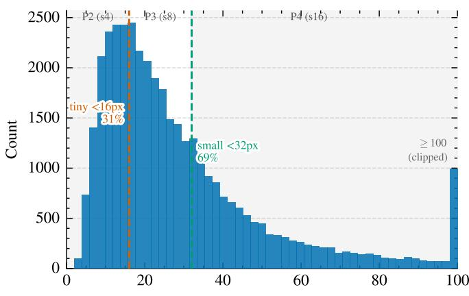  
Object size parea (px) bands = nominal detection level  
Fig. 1. Bounding box size distribution (square root of area) in the VisDrone-2019 dataset. The vertical dashed lines delineate the nominal detection level bands, matching specific object sizes to their nominally associated detection strides (e.g., P2 for targets < 16 pixels, P3 for targets < 32 pixels).

The difficulty stems from an inherent contradiction between what a small object can offer and what recognizing it demands. On the one hand, a small object carries extremely limited appearance evidence—sparse texture, ambiguous boundaries, and a low signal-to-noise ratio—so its discriminative features are easily attenuated or completely submerged during the repeated downsampling of hierarchical backbones [11], [14], [15]. On the other hand, correctly recognizing such a weak signal requires more, rather than less, supporting information: fine-grained local detail is needed to distinguish a vehicle from a rooftop fixture, while long-range contextual cues (roads, harbors, parking lots) are needed to suppress the background clutter that dominates aerial scenes and occupies the vast majority of image area [2], [16], [17]. In other words, the perceptual scope of the detector must be widened in two opposite directions simultaneously: inward, toward higherresolution, fine-grained representations of the object itself; and outward, toward scene-level contextual dependencies that reach far beyond it.

Existing solutions often emphasize one side of this resolution–context trade-off. To preserve fine-grained information, prior works exploit multi-scale feature pyramids and their bidirectional variants [14], [18], [19], slicing-based high-resolution inference [20], and small-object-friendly label assignment [21], [22]. For lightweight aerial detectors, a common structural choice is to add a stride-4 (P2) detection level while removing the stride-32 (P5) stage [23]–[25]. This reallocation substantially improves small-object accuracy in our ablations, but it also removes the deepest feature stage and reduces peripheral spatial support, as quantified later by the ERF analysis. Complementary approaches enlarge contextual support through coarse-to-fine processing [26]–[28], attention mechanisms [29], [30], transformer prediction heads [23], and large-kernel or selective receptive-field designs [31], [32]. Self-attention [33] provides global modeling but incurs quadratic complexity with respect to token number, which becomes costly on the high-resolution feature maps required for small-object detection. The resulting design challenge is therefore to preserve high-resolution detail while retaining broader contextual support at manageable cost.

Recently, state space models (SSMs) [34], and in particular the selective SSM Mamba [35], [36], have emerged as a compelling alternative for modeling long-range dependencies with linear complexity. Vision adaptations such as Vision Mamba [37] and VMamba [38] extend this capability to dense visual representations, which has driven a rapid migration of Mamba into remote sensing [39]–[41] and, more recently, into YOLO-style small object detectors [24], [42]–[47]. In principle, such a linear-cost global operator is well suited to recovering the broader contextual support weakened by highresolution scale reallocation. In practice, however, existing designs typically embed selective scanning directly into the main feature path of the backbone or neck. Considerable effort has therefore been devoted to refining the scan order and block design [48], [49], while the question of where the scan should sit relative to the detail-carrying stream has received much less attention. On a shared pathway, the scan competes with fine-grained convolutions for limited channel capacity and propagates state over feature maps in which background tokens vastly outnumber the few tokens belonging to a small object. For tiny targets, this coupling creates a risk that longrange aggregation may dilute weak local evidence rather than reinforce it.

Our controlled experiments provide empirical evidence consistent with this concern. In an earlier matched configuration, direct main-path selective scanning reduces m $\mathrm { { A P } _ { 5 0 } }$ by 0.98 pp at unchanged computation, whereas under the final configuration the off-path CGCM improves m $\mathsf { A P } _ { 5 0 }$ by 0.67 pp over the no-CGCM control. Although these observations come from different stages of the design trajectory, together they motivate a core design principle: decoupling long-range context modeling from the detail-carrying main path, allowing selective scanning to complement rather than replace the local representation stream.

To resolve this contradiction, we propose ScopeMamba-YOLO, an efficient detector for UAV and remote sensing imagery built on a single through-line: reallocate the detection scales toward the resolution regime where small objects survive, read those high-resolution features anisotropically at reduced cost, reach back out to broader scene context through off-path selective scanning, and regress boxes with a distributional regression budget adapted to each detection scale. Rather than replacing main-path convolutions with state space blocks, we introduce an off-path, zero-gated selectivescanning principle: the scan runs on a low-cost side branch— pooled to $\textstyle { \frac { 1 } { 4 } }$ resolution in the backbone and narrowed in the neck—and re-enters the main path only through zeroinitialized gates, so that the network is functionally identical to its convolutional skeleton at initialization and the convolutional stream retains full ownership of the representation. The principle is instantiated by the Cascaded Global-Context Module (CGCM) in the backbone and the Selective-Scan PAN (SS-PAN) in the neck, which broaden the long-range spatial support weakened by removing the P5 stage while retaining the fine-grained convolutional stream. The Adaptive Multi-scale Strip (AMS) Block reduces the resource cost of the reallocated backbone through anisotropic feature extraction, and the Scale-Adaptive DFL (SA-DFL) head assigns scale-specific distributional support and regression capacity with only 0.008M additional parameters. Four variants (N, S, M, and L) span a wide accuracy–efficiency range. On VisDrone-2019, ScopeMamba-N exceeds YOLOv8n by 9.8 $\mathrm { \ m A P _ { 5 0 } }$ points with 34% of its parameters, ScopeMamba-S exceeds YOLOv8s by 10.8 points with 32% of its parameters, and ScopeMamba-M reaches the accuracy level of the recent Mamba-based HEdge-MamYOLO [44] with less than onethird of its parameters (6.48M versus 20.8M); consistent gains are also observed on AI-TOD.

The main contributions of this article are summarized as follows.

1) We propose ScopeMamba-YOLO, an efficient detector tailored for small objects in UAV and remote sensing imagery. By decoupling scene-level context modeling from the fine-grained convolutional stream, the proposed framework jointly preserves high-resolution object evidence and broadens contextual support, achieving a favorable accuracy–parameter trade-off across four scalable variants (N, S, M, and L).

2) We formulate the off-path, zero-gated selective-scanning principle, instantiated by the CGCM in the backbone and the SS-PAN in the neck. It broadens long-range spatial support without directly replacing the fine-grained convolutional stream. Controlled in-path and off-path experiments, operator controls, and effective-receptivefield analysis provide complementary evidence for this integration strategy and indicate that the observed offpath gain is not explained by auxiliary branch capacity alone.

3) We design the AMS Block as a resource-aware feature extraction engine. Its adaptive strip kernels and crossdirectional gating capture anisotropic structures at close to depthwise-line cost, reducing the parameters and GFLOPs of the reallocated baseline by 24% and 9%, respectively, while maintaining comparable accuracy and providing part of the resource budget for the context pathways.

4) We introduce the SA-DFL head, which assigns each detection scale its own distributional regression budget. Because the per-scale bin allocation also changes the regression-branch width, SA-DFL jointly reallocates distributional support and regression capacity across feature levels. Among the proposed design changes, SA-DFL provides the largest marginal mAP gain per added parameter, while additional regression and quality-branch controls favor this scale-adaptive regression design over the tested alternatives under our experimental setting.

## II. RELATED WORK

## A. Small Object Detection in Aerial Imagery

Object detection has matured along two-stage [4], [5] and one-stage [6]–[8] paradigms, yet both were designed for natural images and degrade sharply on the tiny, densely distributed instances that dominate aerial benchmarks such as VisDrone [13] and AI-TOD [12]. Research on aerial small objects has followed several complementary lines. One raises the effective input resolution through slicing-aided inference [20]; a second reforms the supervision with scale-robust label assignment [21], [22]; a third exploits the sparsity of foreground in aerial scenes by routing computation to objectdense subregions in a coarse-to-fine manner [17], [26]–[28], [50]. For UAV deployment, where onboard compute and realtime inference impose strict limits, a fourth line redesigns the detector itself to be small and fast [15], [16], [25], [51].

Within this last line, a widely adopted structural prior is to reallocate the detection scales toward higher resolution. Since a small object survives only a few downsampling stages before its evidence vanishes, the shallow stride-4 P2 level is attached to recover fine spatial detail, while the deepest stride-32 P5 level—which contributes little to sub-16-pixel targets—is pruned to bound the added cost [16], [23]–[25]. We adopt the same reallocation prior and, through the AMS Block, further trim the parameter overhead it entails. The prior, however, is not free in a way that is rarely made explicit: abruptly discarding the deepest stage shrinks the overall receptive field of the network, so the global context that P5 used to provide is lost precisely when it is most needed to separate small objects from clutter. The following two directions attempt to remedy this deficiency.

## B. Context Modeling and Receptive Field Expansion

To compensate for a limited or deliberately reduced receptive field, a large body of work enlarges the spatial context accessible to each detection feature. Along the convolutional line, large-kernel and selective-kernel designs such as LSKNet [31] and PKINet [32] widen the effective receptive field for remote sensing objects, while channel and spatial attention modules [29], [30] and transformer prediction heads [23] inject scene-level cues. Along the fusion line, feature pyramids and their bidirectional variants [14], [18], [19], together with context-aware necks such as FFCA-YOLO [16] and frequency-aware fusion designs [44], recombine multilevel features to propagate semantics across scales. These strategies are effective but share two structural limits. First, feature fusion redistributes information across pyramid levels but does not by itself guarantee recovery of the long-range spatial dependencies weakened by deep-stage pruning. Second, self-attention [33], [52], [53] and DETR-style detectors [54]– [56] can model genuinely global relations, but their quadratic cost is prohibitive on the high-resolution feature maps that small object detection requires. This motivates global-context mechanisms whose computational cost remains manageable on the high-resolution feature maps required for tiny-object detection.

## C. State Space Models for Visual Representation

State space models offer exactly such a mechanism. The structured SSM S4 [34] and the selective, hardware-aware Mamba [35], [36] capture long-range dependencies with linear complexity, and vision adaptations such as Vision Mamba [37] and VMamba [38] extend this global receptive field to dense prediction, with subsequent work refining the serialization of 2-D features into scan sequences [48], [49]. Their efficiency has driven wide adoption in remote sensing for classification [39], dense prediction [40], change detection [41], and pan-sharpening [57], as well as a fast-growing family of Mamba-based detectors: Mamba YOLO [42] couples selective scanning with a real-time head, MiM-ISTD [58] adapts it to infrared small targets, and SODMAMBA-DETR [59], SSMNet [45], MV-YOLO [43], MVMamba [46], LGHVSS-Mamba-YOLO [47], PGI-ViMamba [60], HEdge-MamYOLO [44], and LEM-YOLO [61] tailor SSM blocks to small targets in aerial and remote sensing imagery, from UAV scenes to ship detection.

These detectors confirm the value of linear-complexity longrange modeling, while much of their design effort focuses on the operator—which directions to scan, how to combine selective scanning with convolution or attention inside a block, and how to reduce its cost. In many existing designs, the SSM replaces or augments blocks on the main feature path of the backbone or neck, so sparse small-object tokens share representation capacity with local feature extraction and participate in state propagation over feature maps in which background tokens are numerically dominant. For tiny targets, this coupling creates a risk that weak local evidence may be diluted during long-range aggregation. Relatively few designs explicitly decouple the global scan from the detail-carrying stream, and controlled studies that isolate this placement dimension remain limited. Motivated by this gap, we move selective scanning off the main path and use CGCM and SS-PAN to broaden the long-range spatial support weakened by P5 removal while retaining the high-resolution feature stream.

We then evaluate the consequences of this integration strategy through controlled experiments.

## III. PROPOSED METHOD

## A. Overview and Scale Reallocation

ScopeMamba-YOLO is built on the YOLOv8 skeleton and follows a single through-line: Reallocate the detection scales toward the resolution regime where small objects survive, Read those high-resolution features with anisotropy-aware operators at reduced cost, Reach back out to scene-level context through off-path selective scanning, and Regress boxes with a distributional regression budget matched to each scale. Fig. 2 shows the resulting architecture; this subsection fixes the scale layout that everything else is built on.

1) High-Resolution Reallocation (HRR): Following the established practice for aerial small-object detection [23], [24], we add a stride-4 (P2, 160×160 at a 640×640 input) detection branch and remove the stride-32 (P5) stage and its detection head entirely, detecting on P2/P3/P4 with strides {4, 8, 16}. We treat this reallocation as an adopted prior rather than a contribution: the bounding-box statistics of VisDrone (Fig. 1) show that the overwhelming majority of instances fall below the area regime for which a stride-32 grid retains even a singlecell response, whereas targets larger than the P4 regime are rare.

HRR therefore provides a suitable base allocation of spatial budget for the present small-object setting, but it is not free. Pruning the P5 pathway removes roughly 7M parameters from the YOLOv8s skeleton and also weakens the peripheral spatial support available to the remaining high-resolution detection features, as quantified later by the ERF analysis. The detector therefore gains resolution at the cost of reduced contextual reach. Sections III-C and III-D address this trade-off by broadening long-range spatial support without reverting the high-resolution scale allocation; Section III-B first reduces the resource cost of that allocation.

2) Data flow: The backbone (layers 0–11 in Fig. 2) is a Context-Cascaded Backbone: a convolutional spatial main path (stem → C2f at P2 → SCDown → AMS-Block at P3 → SCDown → AMS-Block → SPPF at P4), flanked by two low-resolution context streams $g _ { 3 }$ and $g _ { 4 }$ that re-enter the main path only through zero-initialized multiplicative gates. Because the network no longer has a stride-32 stage, SPPF is relocated to the end of the P4 stage. The neck first runs a topdown pathway that fuses P4→P3 →P2 using DySample upsampling and enriches the P2 map with directional semantics from the P3 level, followed by the bottom-up pathway of SS-PAN, whose P3 and P4 fusion nodes carry zero-gated selective-scan branches. The SA-DFL head consumes the three resulting maps $( P _ { 2 } ^ { \mathrm { f i n a l } } , P _ { 3 } ^ { \prime \prime } , P _ { 4 } ^ { \prime \prime } )$ , which at a $6 4 0 ^ { 2 }$ input yield $1 6 0 ^ { 2 } + 8 0 ^ { 2 } + 4 0 ^ { 2 } = 3 3 , 6 0 0$ anchors.

## B. AMS-Block: Anisotropic Multi-Scale Reading

Aerial scenes contain pronounced anisotropic structures at both the object and contextual levels, including elongated vehicles and ships as well as targets distributed along roads, lanes, and waterways. Such directional patterns are not always well matched by stacks of isotropic $3 { \times } 3$ kernels, which are also relatively costly on the high-resolution P2/P3 feature maps. The AMS-Block (Adaptive Multi-scale Strip) replaces the bottleneck inside C2f with a four-branch anisotropic unit (Fig. 3) and is paired with SCDown [62] downsampling, which factorizes a strided convolution into a 1×1 channel mixer followed by a stride-2 depthwise convolution.

Given an input $\boldsymbol { x } \in \mathbb { R } ^ { \boldsymbol { \bar { C } } \times \boldsymbol { H } \times \boldsymbol { W } }$ , the unit splits the channels into four equal groups $x _ { 1 } , \ldots , x _ { 4 }$ . The first group passes through a local depthwise $3 { \times } 3$ convolution, $f _ { \ell } = \mathrm { D W } _ { 3 \times 3 } ( x _ { 1 } )$ and the fourth is an identity shortcut. The second and third groups pass through adaptive strip branches in the horizontal and vertical directions. Taking the horizontal branch as an example, a channel-wise gate blends a short and a long strip kernel according to global content:

$$
\alpha _ { h } = \sigma ( W _ { g } \operatorname { G A P } ( x _ { 2 } ) ) ,\tag{1}
$$

$$
f _ { h } = \alpha _ { h } \odot \mathrm { D W } _ { 1 \times 5 } ( x _ { 2 } ) + ( 1 - \alpha _ { h } ) \odot \mathrm { D W } _ { 1 \times 1 1 } ( x _ { 2 } ) ,\tag{2}
$$

where $\mathrm { G A P }$ is global average pooling, $W _ { g }$ a 1×1 projection, σ the sigmoid, and $\odot$ channel-wise multiplication; the vertical branch $f _ { v }$ is defined symmetrically with 5×1 and 11×1 kernels. The two directional streams then modulate each other through cross-directional gating,

$$
\tilde { f } _ { h } = f _ { h } \odot \sigma \big ( g _ { v \to h } ( f _ { v } ) \big ) , \qquad \tilde { f } _ { v } = f _ { v } \odot \sigma \big ( g _ { h \to v } ( f _ { h } ) \big ) ,\tag{3}
$$

so that, $\mathrm { e . g . }$ ., evidence of a vertical structure suppresses or sharpens the horizontal reading at the same location. The unit output is

$$
y = x + W _ { f } \ \big [ \ f _ { \ell } ; \ \tilde { f } _ { h } ; \ \tilde { f } _ { v } ; \ x _ { 4 } \big ] ,\tag{4}
$$

with $[ \cdot ; \cdot ]$ channel concatenation and $W _ { f }$ a 1×1 fusion. Strip kernels touch k pixels instead of $k ^ { 2 }$ , so the unit covers an $1 1 \times 1 1$ extent at close to depthwise-line cost.

The AMS-Block primarily serves as a resource-efficient feature extraction component. When introduced into the P3/P4 stages of the HRR baseline, it keeps $\mathrm { \ m A P _ { 5 0 } }$ nearly unchanged while reducing the parameter count by approximately 24% and GFLOPs by approximately 9% (Section IV-D). The resulting parameter saving provides part of the budget required by the subsequent context pathways.

## C. Off-Path Zero-Gated Selective Scanning and the CGCM

1) Preliminaries: selective state-space models: A structured state-space model (SSM) maps a 1-D input $x ( t )$ to an output $y ( t )$ through a latent state $\bar { h ( t ) } \in \mathbb { R } ^ { N }$ :

$$
h ^ { \prime } ( t ) = { \bf A } h ( t ) + { \bf B } x ( t ) , \qquad y ( t ) = { \bf C } h ( t ) ,\tag{5}
$$

which, discretized with step $\Delta$ under a zero-order hold,

$$
\bar { \bf A } = \exp ( \Delta { \bf A } ) , \quad \bar { \bf B } = ( \Delta { \bf A } ) ^ { - 1 } \big ( \exp ( \Delta { \bf A } ) - { \bf I } \big ) \Delta { \bf B } ,\tag{6}
$$

yields the linear recurrence

$$
h _ { t } = \bar { \mathbf { A } } h _ { t - 1 } + \bar { \mathbf { B } } x _ { t } , \qquad y _ { t } = \mathbf { C } h _ { t } .\tag{7}
$$

Mamba [35] makes $\Delta .$ , B and C functions of the input (selective scanning), so each token can decide what to retain from or contribute to the running state, while the recurrence keeps the cost linear in sequence length. To lift the operator to 2-D features we use a non-causal four-directional variant, NCSSD2D: the feature map is serialized along four scan orders (rows left→right and right→left, columns top→bottom and bottom→top), each order is processed by a selective scan, and the four outputs are merged (Fig. 4d). Every position thus aggregates evidence from the entire map at O(HW) cost—the property that makes a global-context stage affordable at all.

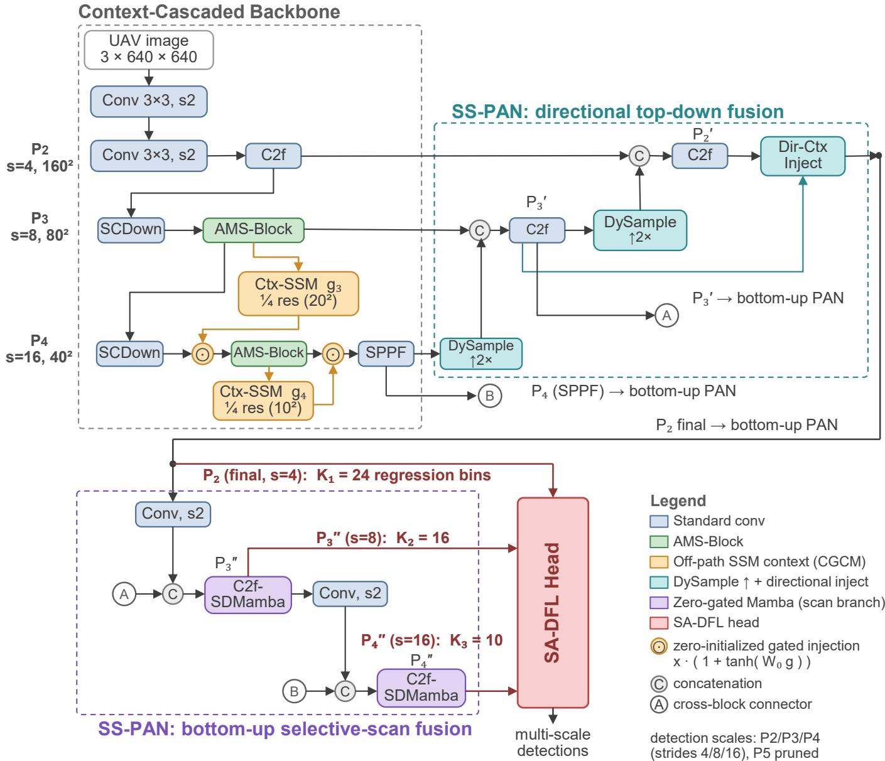  
Fig. 2. Overall architecture of ScopeMamba-YOLO. The network detects on P2/P3/P4 (strides 4/8/16) with the P5 stage removed (high-resolution reallocation) In the Context-Cascaded Backbone, AMS-Blocks perform anisotropic multi-scale reading, while two off-path context streams (CGCM context streams g3, g4; orange) run selective scans on 1 -resolution features and modulate the main path through zero-initialized gates (⊙). The SS-PAN neck consists of a top-down pathway using DySample up-sampling and directional context injection (cyan), together with a bottom-up pathway whose P3/P4 fusion nodes carry zero-gated selective-scan branches (purple). The SA-DFL head performs scale-adaptive distributional box regression with per-scale bin budgets K=[24, 16, 10].

2) The placement principle: How selective scanning is integrated with the detail-carrying stream is critical for smallobject detection. In an earlier matched P2/−P5 configuration, inserting the scan inside the backbone block reduces 1 $\mathrm { m A P _ { 5 0 } }$ from 0.4949 to 0.4851 while leaving computation unchanged at 47.6 GFLOPs (Section IV-C). This negative result motivates an integration strategy in which selective scanning provides contextual modulation without directly replacing the main convolutional stream. We therefore impose three constraints, which together define our off-path zero-gated selective-scanning formulation (Fig. 4a):

1) Off-path, modulation only. The scan does not replace the main-path feature transformation. It runs on a side branch and produces a modulation signal, allowing the convolutional stream to preserve the fine-grained representation used for small-object localization.

2) Reduced cost. In the backbone, the context branch operates on 4×-pooled, 32-channel features. The resulting 1 4 resolution representation reduces the token count by 16× and limits the cumulative CGCM overhead to +0.44 GFLOPs across the two backbone context stations. In the neck, where the scan acts on the full-resolution fusion map, spatial pooling is not used; instead, the branch operates at half the output width (Section III-D).

C2f shell ( n = 2 for ScopeMamba-S )  
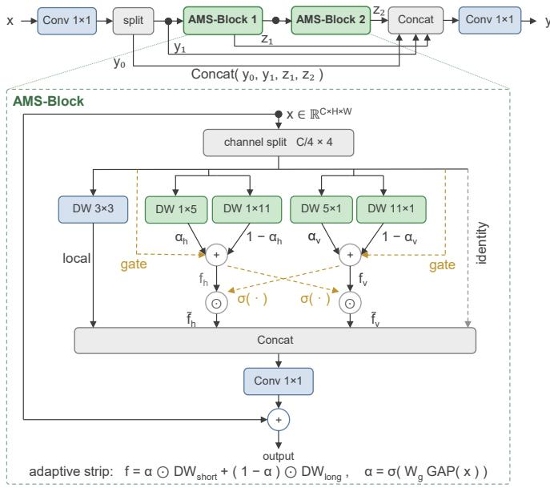  
Fig. 3. The AMS-Block. The C2f shell is unchanged; each internal unit splits channels four ways into a local DW 3×3 branch, adaptive horizontal and vertical strip branches (each blending a short and a long strip kernel under a GAP-driven gate), and an identity branch, followed by cross-directional gating, 1×1 fusion, and a residual connection.

3) Zero-initialized gating. The contextual signal enters through a projection initialized at zero, making the augmented network functionally identical to its convolutional skeleton at initialization and allowing the context branch to be introduced progressively during optimization.

The gain is also not explained by the mere presence of an auxiliary branch. At the final off-path CGCM node, a costmatched convolutional branch changes $\mathrm { \ m A P _ { 5 0 } }$ by only +0.04 pp and EMA by −0.32 pp relative to the three-seed no-branch mean, whereas selective scanning provides a +0.67 pp gain (Section IV-C).

3) Station 1: Cascaded Global-Context Module (CGCM): The first instantiation lives in the backbone (Fig. 4b). From the P3 stage output $F _ { 3 } \in \mathbb { R } ^ { C \times H \times W }$ a context stream is computed as

$$
g _ { 3 } = W _ { \uparrow } \mathrm { N C S S D 2 D } \big ( \mathrm { L N } \big ( W _ { \downarrow } \mathrm { A v g P o o l } _ { 4 } ( F _ { 3 } ) \big ) \big ) ,\tag{8}
$$

where $\mathrm { A v g P o o l _ { 4 } }$ pools by a factor of four (a $2 0 \times 2 0$ grid at $6 4 0 ^ { 2 }$ input), $W _ { \downarrow }$ projects to a 32-channel working width, LN is LayerNorm, the scan uses state size $d _ { \mathrm { s t a t e } } { = } 8$ , and $W _ { \uparrow }$ restores the stage width. The context is injected multiplicatively at the entrance of the P4 stage:

$$
\hat { F } = F \cdot \big ( 1 + \operatorname { t a n h } ( W _ { 0 } g ) \big ) ,\tag{9}
$$

with $g$ bilinearly aligned to F and the projection $W _ { 0 }$ zeroinitialized, so the gate spans (0, 2) and equals the identity at step 0. A second context $g _ { 4 }$ is then computed—by an identical chain, from a $1 0 \times 1 0$ grid—from the already-modulated P4 features and injected before SPPF. This cascade is what the module is named for: scene evidence gathered at P3 conditions the P4 computation, and the refreshed P4 evidence is folded in once more before the final spatial pooling, so context accumulates along depth instead of being applied once.

The $2 0 \times 2 0$ scanned grid of $g _ { 3 }$ allows each contextual output to aggregate information across the pooled P3 feature map without applying selective scanning to the full-resolution backbone representation. The same formulation is applied at P4 through g , providing cascaded contextual modulation while preserving the main convolutional pathway.

## D. Selective-Scan PAN (SS-PAN)

We denote the redesigned neck as the Selective-Scan PAN (SS-PAN). It consists of two complementary pathways: a topdown pathway that uses DySample up-sampling and directional context injection to propagate semantic information toward the high-resolution P2 feature, and a bottom-up pathway in which the P3 and P4 fusion nodes incorporate zero-gated selective-scan branches.

1) Directional top-down pathway: Up-sampling in the topdown pathway uses DySample [63]. After the two fusion stages produce $P _ { 2 } ^ { \prime } ,$ a lightweight injection enriches the P2 map with directional semantics from $P _ { 3 } ^ { \prime } .$ . Specifically, $P _ { 3 } ^ { \prime }$ is upsampled and aligned to a 64-channel semantic map s, which is decomposed directionally as in (3),

$$
s _ { \mathrm { d i r } } = s _ { h } \odot \sigma \bigl ( g _ { v \to h } ( s _ { v } ) \bigr ) + s _ { v } \odot \sigma \bigl ( g _ { h \to v } ( s _ { h } ) \bigr ) ,\tag{10}
$$

where $s _ { h } = \mathrm { D W } _ { 1 \times 5 } ( s )$ and $s _ { v } = \mathrm { D W } _ { 5 \times 1 } ( s )$ . The resulting directional semantic signal is applied through the same zeroinitialized multiplicative gate as (9), yielding $P _ { 2 } ^ { \mathrm { f i n a l } }$ . This injection follows the same general design language as the CGCM—a zero-gated contextual correction on top of the main feature pathway—and is treated as a lightweight neck component rather than as a separate contribution.

2) Bottom-Up Selective-Scan Fusion: The bottom-up fusion nodes at P3 and P4 replace C2f with C2f-SDMamba (Fig. 4c):

$$
y = \mathrm { C 2 f } ( x ) + \gamma \Phi _ { \mathrm { S S M } } ( x ) , \qquad \gamma = 0 \mathrm { ~ a t ~ i n i t } ,\tag{11}
$$

where the branch $\Phi _ { \mathrm { S S M } }$ compresses x with a 1×1 convolution to half the output width, normalizes, applies NCSSD2D $( d _ { \mathrm { s t a t e } } { = } 1 6 )$ , refines with a residual depthwise $3 \times 3 ,$ and expands back with a $1 \times 1$ convolution.

The node follows the same off-path formulation used in the backbone: the C2f main path is left unchanged, while the selective-scan branch provides a global recalibration signal for the concatenated multi-scale features and is introduced progressively from zero. The branch is therefore intended to complement, rather than replace, the local fusion pathway. We place the scans at the P3 and P4 bottom-up fusion nodes; the negative configurations in Section IV-F show that removing one scan node or tapering the scan width reduces accuracy, while the tapered configuration provides no parameter advantage.

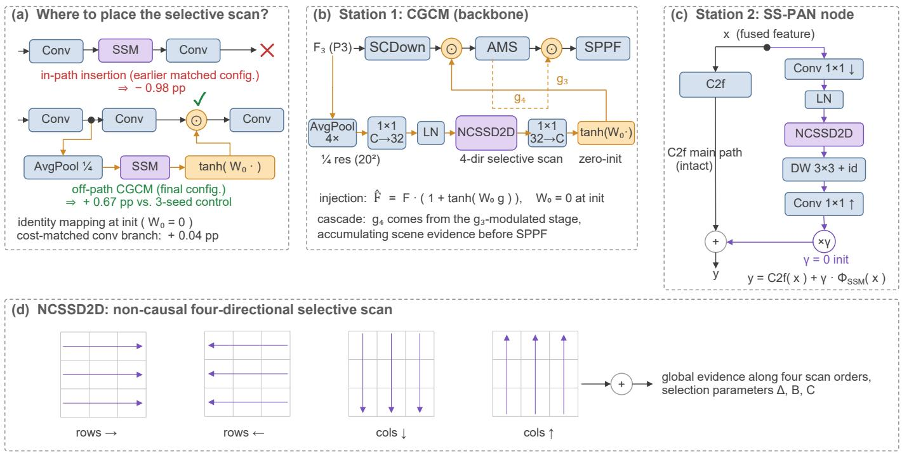  
Fig. 4. The off-path zero-gated selective-scanning principle and its two instantiations. (a) Integration strategy matters: in an earlier matched P2/−P5 configuration, embedding selective scanning inside the backbone block reduces mAP50 by 0.98 pp at unchanged GFLOPs, whereas under the final configuration the off-path CGCM improves m $\mathrm { { A P } _ { 5 0 } }$ by 0.67 pp over a three-seed no-branch control; a cost-matched convolutional branch at the same off-path node changes mAP50 by only +0.04 pp. (b) Station 1: the Cascaded Global-Context Module in the backbone, with the $g _ { 3 }$ chain shown in full and the cascaded g4 computed from the already-modulated stage. (c) A bottom-up selective-scan fusion node within SS-PAN. (d) The NCSSD2D operator shared by both stations: a non-causal four-directional selective scan with linear complexity in the number of tokens.

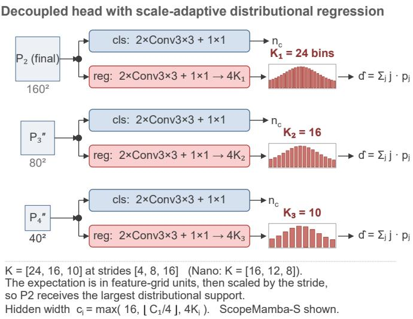  
Fig. 5. The SA-DFL head. The decoupled head structure is standard; the regression branch of each scale predicts a distribution over its own number of bins $( K _ { 1 } { = } 2 4$ , K2=16, K3=10 for strides 4/8/16), decoded by expectation. Bins are indexed in stride units, so the per-scale bin budget determines the supported regression range rather than changing the spacing between adjacent bins.

## E. Scale-Adaptive DFL Head

Distribution Focal Loss [64] regresses each box side as the expectation of a discrete distribution over K bins indexed in stride units. Standard YOLOv8 uses a common K=16 at all detection levels. After the P2/P3/P4 reallocation, however, the same image-space offset corresponds to different numbers of feature-grid units at different strides. We therefore assign a scale-specific bin budget $K _ { i }$ to each regression branch. Changing $K _ { i }$ adjusts the distributional support available at that level; under the decoding used here, it does not reduce the spacing between adjacent bin indices. The regression branch of scale i predicts logits $z ~ \in \mathbb { R } ^ { 4 K _ { \hat { \mathbf { i } } } }$ i and decodes each side distance as

$$
\hat { d } = \sum _ { j = 0 } ^ { K _ { i } - 1 } j \cdot p _ { j } , \qquad p = \mathrm { s o f t m a x } ( z _ { \mathrm { s i d e } } ) ,\tag{12}
$$

with per-scale output channels $n _ { o } ^ { ( i ) } = n _ { c } + 4 K _ { i }$ and regression hidden width

$$
c _ { i } = \operatorname* { m a x } ( 1 6 , \ \lfloor C _ { 1 } / 4 \rfloor , \ 4 K _ { i } ) ,\tag{13}
$$

where $C _ { 1 }$ is the first head input width.

Because the regression-branch width scales with $4 K _ { i } ,$ changing the per-scale bin allocation simultaneously reallocates regression capacity across feature levels. We therefore attribute the observed improvement to the joint scale-adaptive regression design—distributional support together with regression capacity—rather than to finer bin spacing alone. Training uses a scale-indexed DFL term, with each detection level supervised using its corresponding $K _ { i } ,$ , alongside the standard CIoU and BCE classification losses; no additional inputs or quality branches are introduced. The primary configuration uses K=[24, 16, 10] for strides [4, 8, 16] (Fig. 5). This modification adds only 0.008M parameters while providing a positive accuracy gain in the cumulative ablation (Section IV-D4).

TABLE I  
SCOPEMAMBA-YOLO VARIANTS. ALL FOUR SHARE THE SAME TOPOLOGY; ONLY THE COMPOUND SCALING FACTORS (DEPTH d, WIDTH w) AND, FOR THE NANO TIER, THE SA-DFL BIN LIST DIFFER. PARAMS AND GFLOPS ARE REPORTED AT $6 4 0 \times 6 4 0$ INPUT UNDER THE 10-CLASS VISDRONE CONFIGURATION.
<table><tr><td>Variant</td><td>d</td><td>w</td><td>K (P2/P3/P4)</td><td>Params</td><td>GFLOPs</td></tr><tr><td>ScopeMamba-N</td><td>0.33</td><td>0.25</td><td>[16, 12, 8]</td><td>1.01M</td><td>15.87</td></tr><tr><td>ScopeMamba-S</td><td>0.33</td><td>0.50</td><td>[24, 16, 10]</td><td>3.57M</td><td>53.69</td></tr><tr><td>ScopeMamba-M</td><td>0.67</td><td>0.625</td><td>[24, 16, 10]</td><td>6.48M</td><td>92.17</td></tr><tr><td>ScopeMamba-L</td><td>0.67</td><td>0.75</td><td>[24, 16, 10]</td><td>9.17M</td><td>127.78</td></tr></table>

## F. Model Scaling

ScopeMamba-YOLO follows YOLOv8 compound scaling: nominal per-layer channel widths are multiplied by w and rounded to multiples of eight, and the repeat counts of C2ffamily blocks are scaled by d. All four variants in Table I instantiate the same topology; no module is added, removed, or rewired across tiers. The single hyperparameter that does change is the Nano bin list. By (13), the regression hidden width is dominated by $4 K _ { i }$ once the model is narrow: at Nano width $( C _ { 1 } { = } 6 4 )$ , retaining $K = [ 2 4 , 1 6 , 1 0 ]$ would pin the regression branches at widths [96, 64, 40]—wider than their own inputs and immune to width scaling. Shrinking to $K = [ 1 6 , 1 2 , 8 ]$ restores proportional scaling ([64, 48, 32]), mirroring how YOLOv8 itself caps head widths per tier; Section IV-D4 shows that this choice performs best among the tested Nano-scale bin allocations. We report the S variant as the primary model throughout the experiments.

## IV. EXPERIMENTS

In this section, we present comprehensive experimental results to validate the effectiveness of the proposed method. Benchmark evaluations are conducted on two representative object detection datasets: VisDrone-2019 [13] and AI-TOD [12]. We adopt YOLOv8s as our baseline detector.

To quantify detection performance, we adopt the standard mean average precision (mAP) metric, including $m A P _ { 5 0 }$ and $m A P _ { 5 0 - 9 5 }$ , as well as the number of parameters and FLOPs to evaluate the model complexity.

All experiments are conducted on Ubuntu using PyTorch and an NVIDIA RTX 4090 GPU. Input images are uniformly resized to $6 4 0 \times 6 4 0$ . Models are optimized using stochastic gradient descent (SGD) with an initial learning rate of 0.01, momentum of 0.937, and weight decay of 0.0005, with a batch size of 8. The maximum number of training epochs is 500 for VisDrone-2019 and 400 for AI-TOD, and early stopping with a patience of 30 epochs is applied uniformly. No pre-trained parameters are used in any experiment.

## A. Experimental Dataset

VisDrone-2019: This dataset [13] contains $^ { 6 , 4 7 1 }$ training images, 548 validation images captured by drones, and 1,610 test images. Our ScopeMamba results, controlled baselines, and ablation experiments are evaluated on the official 548- image validation split. The resolution of these images is approximately 1000–1500 pixels. These images are annotated with bounding boxes across ten categories: pedestrian, bicycle, tricycle, people, truck, car, bus, van, motor, and awningtricycle. Object detection on this dataset remains challenging due to heavy occlusion, extreme scale variation, uneven spatial distribution, and the distinct lack of large targets. To provide a statistical foundation for our architectural design, Fig. 1 illustrates the bounding box size distribution of the dataset. The overwhelming concentration of objects in the extremely small regimes explicitly motivates our high-resolution reallocation strategy.

AI-TOD: This benchmark [12] is curated for tiny object detection in aerial images, comprising 28,036 images and 700,621 instances across eight categories. We adopt the official partition of 11,214 training and 2,804 validation images and conduct evaluation on the official validation split. Images are uniformly resized from their native $8 0 0 \times 8 0 0$ resolution to $6 4 0 \times 6 4 0$ . AI-TOD is characterized by extremely small and densely distributed objects, with a mean target size of approximately 12.8 pixels. In addition to $m A P _ { 5 0 } , \ m A P _ { 7 5 }$ and $m A P _ { 5 0 - 9 5 }$ , we report scale-specific metrics for very tiny (2–8 pixels, $A P _ { v t } )$ , tiny (8–16 pixels, $A P _ { t } )$ , and small (16–32 pixels, $A P _ { s } )$ objects. To accommodate the high target density, the maximum number of detections per image is set to 1,500.

## B. Comparisons with State-of-the-Art Methods

We compare ScopeMamba-YOLO with the baseline and recent aerial-object detectors. For VisDrone-2019, the results of comparison methods are taken from the corresponding cited publications. For AI-TOD, the comparison methods are reproduced from their publicly released implementations under the unified training and evaluation protocol described above.

1) VisDrone-2019: Table II compares ScopeMamba-YOLO with the baseline and recent aerial-object detectors on VisDrone-2019. Fig. 6 additionally visualizes $\mathrm { \ m A P _ { 5 0 } }$ against parameter count. Across the evaluated scales, the Scope-Mamba variants show a favorable accuracy–parameter tradeoff relative to the compared methods.

Comparison with Baseline YOLO Models: ScopeMamba consistently improves detection accuracy over the YOLOv8 entries across the evaluated model scales while using substantially fewer parameters. ScopeMamba-N improves m $\mathbf { \mathrm { A P } _ { 5 0 } }$ by 9.8 pp (0.439 versus 0.341) with 1.01M parameters, compared with 3.00M for YOLOv8n. At the Small scale, ScopeMamba-S improves $\mathrm { \ m A P _ { 5 0 } }$ by 10.8 pp over YOLOv8s while reducing the parameter count from 11.10M to 3.57M. ScopeMamba-L reaches 0.536 $\mathrm { \ m A P _ { 5 0 } }$ with 9.17M parameters, compared with 0.454 and 43.60M parameters for YOLOv8l.

Comparison with SSM-based Detectors: Compared with recent SSM-based detectors, ScopeMamba achieves a favorable accuracy–parameter trade-off. Mamba-YOLO reports $0 . 4 5 1 \mathrm { m A P _ { 5 0 } }$ with 37.17M parameters, whereas ScopeMamba-S reaches 0.508 with 3.57M parameters. HEdge-MamYOLO reaches 0.525 $\mathrm { \ m A P _ { 5 0 } }$ with 20.80M parameters and 151.2 GFLOPs; ScopeMamba-M reaches 0.526 with 6.48M parameters and 92.17 GFLOPs.

TABLE II  
COMPREHENSIVE PERFORMANCE COMPARISON ON THE VISDRONE-2019 DATASET. MODELS ARE CATEGORIZED BY SCALE (NANO, SMALL, MEDIUM, LARGE) FROM TOP TO BOTTOM. BEST RESULTS ARE HIGHLIGHTED IN BOLD, AND SECOND-BEST RESULTS ARE UNDERLINED.
<table><tr><td>Model</td><td>Params (M)</td><td>GFLOPs</td><td> $\mathrm { \ m A P { 5 0 } }$ </td><td> $\mathrm { m A P _ { 5 0 - 9 5 } }$ </td></tr><tr><td>YOLOv8n [65]</td><td>3.00</td><td>8.1</td><td>0.341</td><td>0.195</td></tr><tr><td>YOLOv10-n [62]</td><td>2.71</td><td>8.4</td><td>0.333</td><td>0.190</td></tr><tr><td>YOLOv11-n [66]</td><td>2.59</td><td>6.5</td><td>0.334</td><td>0.191</td></tr><tr><td>SFBF-YOLO-n [24]</td><td>1.06</td><td>13.7</td><td>0.410</td><td>0.243</td></tr><tr><td>ScopeMamba-N (Ours)</td><td>1.01</td><td>15.87</td><td>0.439</td><td>0.266</td></tr><tr><td>YOLOv8s</td><td>11.10</td><td>28.7</td><td>0.400</td><td>0.238</td></tr><tr><td>YOLOv10-s</td><td>8.10</td><td>24.8</td><td>0.391</td><td>0.229</td></tr><tr><td>YOLOv11-s</td><td>9.43</td><td>21.6</td><td>0.396</td><td>0.232</td></tr><tr><td>HEdge-MamYOLO-B [44]</td><td>7.42</td><td>42.8</td><td>0.469</td><td>0.289</td></tr><tr><td>SFBF-YOLO-s</td><td>3.61</td><td>42.6</td><td>0.479</td><td>0.292</td></tr><tr><td>LMF-UAV(s) [67]</td><td>6.30</td><td>17.6</td><td>0.364</td><td>0.213</td></tr><tr><td>PC-YOLO11s [68]</td><td>7.10</td><td></td><td>0.438</td><td>0.263</td></tr><tr><td>UAV-YOLO [69]</td><td>10.30</td><td></td><td>0.470</td><td>0.292</td></tr><tr><td>DMFF-YOLO [70]</td><td>7.65</td><td></td><td>0.447</td><td>0.272</td></tr><tr><td>BDH-YOLO [71]</td><td>9.39</td><td></td><td>0.429</td><td>0.262</td></tr><tr><td>ScopeMamba-S (Ours)</td><td>3.57</td><td>53.69</td><td>0.508</td><td>0.314</td></tr><tr><td>YOLOv8m</td><td>25.90</td><td>79.1</td><td>0.435</td><td>0.263</td></tr><tr><td>HEdge-MamYOLO</td><td>20.80</td><td>151.2</td><td>0.525</td><td>0.328</td></tr><tr><td>SFBF-YOLO-m</td><td>9.52</td><td>100.6</td><td>0.503</td><td>0.307</td></tr><tr><td>SOD-YOLO-m [72] PVswin-YOLOv8-s [73]</td><td>6.30</td><td>65.8</td><td>0.485</td><td>0.295</td></tr><tr><td>Drone-DETR [74]</td><td>21.60</td><td></td><td>0.433</td><td>0.264</td></tr><tr><td>ScopeMamba-M (Ours)</td><td>21.47</td><td>73.9</td><td>0.504</td><td>0.311</td></tr><tr><td></td><td>6.48</td><td>92.17</td><td>0.526</td><td>0.332</td></tr><tr><td>YOLOv81 YOLOv9-c [75]</td><td>43.60</td><td>164.9</td><td>0.454</td><td>0.279</td></tr><tr><td>Mamba-YOLO [42]</td><td>50.90</td><td>237.8</td><td>0.481</td><td>0.299</td></tr><tr><td>SOD-YOLO-1</td><td>37.17</td><td>94.3</td><td>0.451</td><td>0.276</td></tr><tr><td></td><td>17.60</td><td>167.0</td><td>0.515</td><td>0.320</td></tr><tr><td>LMF-UAV(1)</td><td>14.70</td><td>61.8</td><td>0.411</td><td>0.246</td></tr><tr><td>EFA-Net [76]</td><td>37.40</td><td>108.2</td><td>0.516</td><td>0.296</td></tr><tr><td>YOLO-DCTI [77]</td><td>37.60</td><td></td><td>0.498</td><td>0.274</td></tr><tr><td>RemDet-L [78]</td><td></td><td>67.4</td><td>0.473</td><td></td></tr><tr><td>RemDet-X</td><td></td><td>114.0</td><td>0.483</td><td></td></tr><tr><td>CEASC(GFL V1) [79]</td><td></td><td>150.0</td><td>0.507</td><td></td></tr><tr><td>CEASC(FSAF)</td><td></td><td>153.0</td><td>0.489</td><td></td></tr><tr><td>CEASC(Faster-RCNN)</td><td></td><td>133.0</td><td>0.434</td><td></td></tr><tr><td>ScopeMamba-L (Ours)</td><td>9.17</td><td>127.78</td><td>0.536</td><td>0.337</td></tr></table>

Comparison with Other UAV-Specific SOTAs: Scope-Mamba also compares favorably with specialized detectors designed for aerial imagery. ScopeMamba-M reaches 0.526 $\mathrm { \ m A P _ { 5 0 } }$ and 0.332 mAP50−95 with 6.48M parameters, exceeding the reported accuracy of Drone-DETR, SFBF-YOLO-m, and SOD-YOLO-l while using fewer parameters than most of these alternatives. These comparisons further demonstrate the favorable accuracy–parameter trade-off of the proposed model.

Fig. 6 visualizes the accuracy–parameter trade-off among the compared detectors. Relative to the corresponding YOLOv8 entries, the ScopeMamba variants consistently achieve higher $\mathrm { \ m A P _ { 5 0 } }$ with fewer parameters. Compared with recent SSM-based detectors, ScopeMamba-S reaches 0.508 $\mathrm { \ m A P _ { 5 0 } }$ with 3.57M parameters, whereas Mamba-YOLO reports 0.451 with 37.17M parameters; ScopeMamba-M reaches 0.526 with 6.48M parameters, compared with 0.525 and 20.80M parameters for HEdge-MamYOLO. These results indicate a favorable accuracy–parameter trade-off for the ScopeMamba series among the methods included in this comparison. Evidence for the proposed integration strategy itself is provided separately by the controlled experiments in Section IV-C.

2) AI-TOD: Table III compares ScopeMamba-YOLO with representative detectors on AI-TOD in terms of overall accuracy, size-specific AP/AR, model complexity, and computational cost.

Fig. 7 further breaks down the AI-TOD results by object size. At the S scale, ScopeMamba-S improves over YOLOv8- S by 4.57 pp on $A P ^ { v t }$ (10.30 versus 5.73) and 4.58 pp on $A P ^ { t }$ (25.55 versus 20.97), whereas the improvement on $A P ^ { s }$ is more modest at 0.41 pp (29.51 versus 29.10). The larger gains in the very-tiny and tiny regimes are consistent with the objective of reallocating spatial resolution toward small targets while preserving broader contextual information. We do not attribute these bucket-level gains to individual modules, since the module-wise ablations in this study are conducted on VisDrone-2019 rather than AI-TOD.

Fig. 8 provides representative qualitative comparisons on

TABLE III  
COMPARISON OF DIFFERENT METHODS ON THE AI-TOD DATASET.
<table><tr><td>Model</td><td>Params(M)</td><td>Resolution</td><td> $\mathbf { m A P _ { 5 0 - 9 5 } }$ </td><td> $\bf { m A P } _ { 5 0 }$ </td><td> $\mathbf { m A P } _ { 7 5 }$ </td><td> $A P ^ { v t }$ </td><td> $A P ^ { t }$ </td><td> $A P ^ { s }$ </td><td> $A R ^ { v t }$ </td><td> $A R ^ { t }$ </td><td> $A R ^ { s }$ </td><td>GFLOPs</td></tr><tr><td>ALSS-YOLO- S [80]</td><td>2.18</td><td> $6 4 0 \times 6 4 0$ </td><td>12.90</td><td>31.77</td><td>7.55</td><td>2.22</td><td>12.83</td><td>19.94</td><td>3.67</td><td>22.98</td><td>30.45</td><td>8.50</td></tr><tr><td>ALSS-YOLO- M</td><td>2.74</td><td> $6 4 0 \times 6 4 0$ </td><td>12.94</td><td>32.83</td><td>7.83</td><td>2.40</td><td>12.42</td><td>20.20</td><td>4.92</td><td>22.42</td><td>31.33</td><td>10.40</td></tr><tr><td>ScopeMamba-N</td><td>1.01</td><td> $6 4 0 \times 6 4 0$ </td><td>19.71</td><td>45.24</td><td>13.70</td><td>6.77</td><td>20.64</td><td>24.33</td><td>12.78</td><td>37.88</td><td>38.41</td><td>15.86</td></tr><tr><td>L-FFCA-YOLO [16]</td><td>5.06</td><td> $6 4 0 \times 6 4 0$ </td><td>22.83</td><td>51.80</td><td>16.34</td><td>10.70</td><td>24.60</td><td>29.85</td><td>25.53</td><td>45.22</td><td>43.56</td><td>37.20</td></tr><tr><td>YOLOv9-S [75]</td><td>7.29</td><td> $6 4 0 \times 6 4 0$ </td><td>20.33</td><td>47.54</td><td>14.16</td><td>7.52</td><td>20.13</td><td>27.96</td><td>13.65</td><td>33.68</td><td>39.17</td><td>27.08</td></tr><tr><td>YOLOv10s [62]</td><td>8.07</td><td> $6 4 0 \times 6 4 0$ </td><td>19.78</td><td>45.54</td><td>13.95</td><td>6.64</td><td>20.38</td><td>26.97</td><td>15.09</td><td>35.89</td><td>40.43</td><td>24.80</td></tr><tr><td>MAF-YOLO-S [81]</td><td>8.51</td><td> $6 4 0 \times 6 4 0$ </td><td>22.89</td><td>49.81</td><td>18.24</td><td>5.12</td><td>23.74</td><td>32.09</td><td>14.28</td><td>39.06</td><td>45.15</td><td>25.21</td></tr><tr><td>YOLO11s [66]</td><td>9.43</td><td> $6 4 0 \times 6 4 0$ </td><td>20.25</td><td>46.87</td><td>14.66</td><td>9.03</td><td>20.51</td><td>27.78</td><td>13.34</td><td>33.49</td><td>40.45</td><td>21.60</td></tr><tr><td>YOLOv8-S [65]</td><td>11.14</td><td> $6 4 0 \times 6 4 0$ </td><td>20.80</td><td>48.45</td><td>14.69</td><td>5.73</td><td>20.97</td><td>29.10</td><td>9.56</td><td>34.41</td><td>40.65</td><td>28.45</td></tr><tr><td>ScopeMamba-S</td><td>3.56</td><td> $6 4 0 \times 6 4 0$ </td><td>23.67</td><td>52.35</td><td>17.69</td><td>10.30</td><td>25.55</td><td>29.51</td><td>21.89</td><td>43.66</td><td>45.80</td><td>53.67</td></tr><tr><td>YOLOv8m</td><td>25.86</td><td> $6 4 0 \times 6 4 0$ </td><td>23.51</td><td>52.68</td><td>18.53</td><td>13.30</td><td>23.46</td><td>31.24</td><td>20.59</td><td>38.05</td><td>42.38</td><td>78.70</td></tr><tr><td>TPH- YOLOv5-L [23]</td><td>41.55</td><td> $6 4 0 \times 6 4 0$ </td><td>25.17</td><td>56.65</td><td>18.16</td><td>12.88</td><td>27.14</td><td>33.15</td><td>21.72</td><td>42.06</td><td>42.61</td><td>108.00</td></tr><tr><td>ScopeMamba-M</td><td>6.48</td><td> $6 4 0 \times 6 4 0$ </td><td>24.87</td><td>54.68</td><td>18.22</td><td>9.43</td><td>28.30</td><td>31.98</td><td>22.08</td><td>43.33</td><td>46.05</td><td>92.15</td></tr><tr><td>ScopeMamba-L</td><td>9.17</td><td> $6 4 0 \times 6 4 0$ </td><td>26.64</td><td>56.86</td><td>20.91</td><td>11.03</td><td>27.75</td><td>34.29</td><td>23.00</td><td>43.76</td><td>47.87</td><td>127.76</td></tr></table>

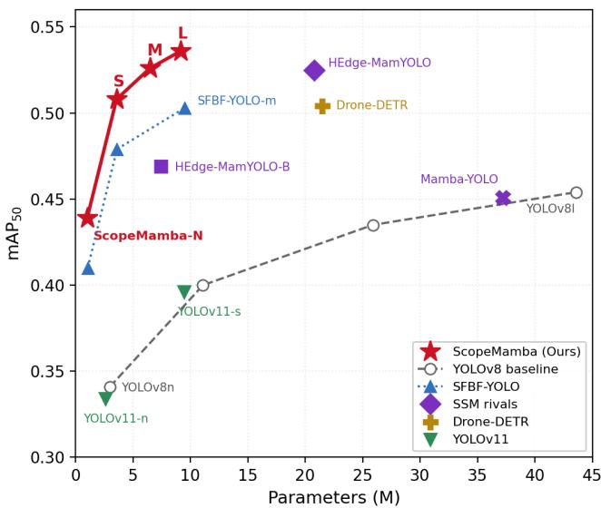  
Fig. 6. Accuracy $( m A P _ { 5 0 } )$ versus parameter count on the VisDrone-2019 dataset. Among the compared methods, the ScopeMamba variants occupy a favorable region of the accuracy–parameter plane across different model scales.

AI-TOD scenes containing dense and very small targets.

## C. Integration Strategy for Selective Scanning

The Contextual Reach Dilemma. A common small-object detection design adds a high-resolution stride-4 (P2) detection level while removing the stride-32 (P5) stage to control model size. This allocation improves the representation of tiny targets but also removes the deepest feature stage. Our ERF analysis below shows that the resulting P2/−P5 configuration has substantially lower peripheral spatial support than the original YOLOv8s. This motivates the question examined in this section: how can broader contextual support be reintroduced without restoring the full P5 pathway?

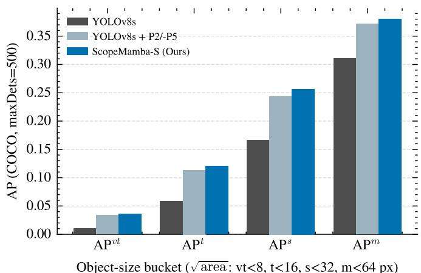  
Fig. 7. Scale-specific performance comparison on the AI-TOD dataset. ScopeMamba-S shows its largest improvements over YOLOv8-S in the verytiny and tiny object regimes. The figure reports model-level differences rather than a per-module ablation.

Main-Path vs. Off-Path Integration. Recent Mamba-based detectors commonly place SSM blocks directly on the main backbone or neck pathway. We examine this choice using two complementary controls from different stages of the ablation lineage. First, in an earlier P2/−P5 configuration with the default head, the control configuration without the selective-scan branch achieves 0.4949 $\mathrm { \ m A P _ { 5 0 } }$ with 3.44M parameters and 47.6 GFLOPs. Replacing the corresponding identity branch in the matched backbone block with selective scanning yields 0.4851 $\mathrm { \ m A P _ { 5 0 } }$ with 3.45M parameters at the same 47.6 GFLOPs. This matched in-path control therefore yields a −0.98 pp change. Second, under the final configuration, removing the off-path CGCM produces a threeseed mean of 0.5011, whereas the complete model reaches 0.5078, corresponding to a +0.67 pp gain. Because the inpath and off-path controls were measured at different stages of the model lineage, we do not subtract these two effects or interpret them as a 1.65-pp placement-only gain. Instead, they provide complementary evidence that direct in-path insertion is unfavorable in the matched early-stage control, whereas the proposed off-path formulation contributes positively under the final configuration.

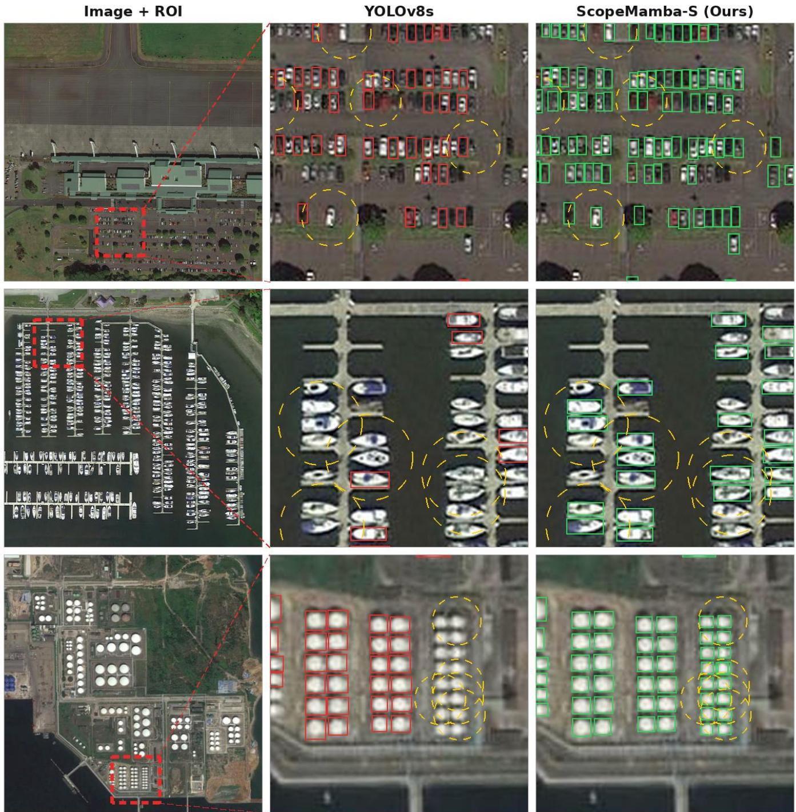  
Fig. 8. Qualitative detection results on the AI-TOD validation set. Yellow dashed circles indicate representative ground-truth targets missed by YOLOv8s but detected by ScopeMamba-S in dense or very-tiny object regions.

To inspect the spatial behavior of the off-path modulation, Fig. 9 visualizes the magnitude of the CGCM gate. The response is distributed over broad scene structures rather than being confined to localized object regions, which is consistent with the intended role of CGCM as a scene-level context modulator.

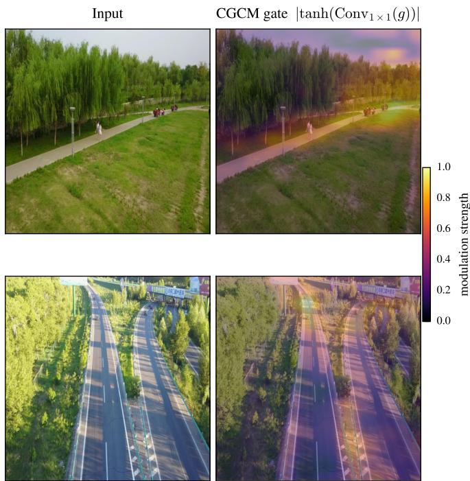  
Fig. 9. Visualization of the CGCM gate modulation strength $\vert \operatorname { t a n h } ( \operatorname { C o n v } _ { 1 \times 1 } ( g ) ) \vert$ . Broad spatial responses extend beyond objectlocal regions, consistent with the scene-level contextual role of the off-path CGCM branch.

At the off-path position, the operator identity also matters. Relative to the three-seed no-branch mean of 0.5011, a costmatched convolutional branch changes $\mathrm { \ m A P _ { 5 0 } }$ by only +0.04 pp and EMA by −0.32 pp, whereas selective scanning improves it by +0.67 pp. These results are interpreted against the observed run-to-run variation of the control rather than as a formal significance test.

The Operator Bracket: Why Selective Scan? We next test whether the positive off-path result can be explained simply by adding an auxiliary branch. At the CGCM node, we replace the selective scan with a cost-matched convolutional branch and with Efficient Multi-scale Attention (EMA) [82], while retaining the same off-path wrapping and gating strategy.

As shown in Table IV, the three-seed no-branch control has a mean $\mathrm { \ m A P _ { 5 0 } }$ of 0.5011 with a standard deviation of 0.34 pp. The convolutional branch reaches 0.5015 (+0.04 pp) and EMA reaches 0.4979 (−0.32 pp), both within the observed seed variation of the control, whereas selective scanning reaches 0.5078 (+0.67 pp). At the selective-scan nodes within SS-PAN, selective scanning likewise outperforms both the nobranch configuration and the EMA substitution. Among the operators tested at these nodes, the selective scan therefore provides the strongest and most consistent gain, supporting the use of a long-range state-space operator rather than attributing the improvement to auxiliary branch capacity alone.

Broadening Reach. The two context mechanisms operate under different computational regimes: CGCM performs selective scanning on spatially pooled backbone features, whereas the selective-scan branches within SS-PAN operate at native neck resolution with reduced channel width. We next examine whether their combined use broadens the spatial support weakened by removing the P5 stage.

To visually and quantitatively corroborate this, we probe the effective receptive field (ERF) of the shared high-resolution P3 (Stride-8) detection cell. For each of the 200 VisDrone validation images uniformly resized to $6 4 0 \times 6 4 0 .$ , we backpropagate the channel-summed response of the center cell of the P3 feature map to the input layer. We accumulate the absolute input-gradient magnitude across channels, and the final ERF map, denoted as $S ( x , y )$ , is averaged over the 200 images. To quantify peripheral spatial support in the effective receptive field, we define the Peripheral Energy Ratio (PER) as the fraction of total ERF mass lying strictly outside the central $5 0 \% \times 5 0 \%$ (320 × 320) region:

$$
{ \mathrm { P E R } } = 1 - { \frac { \sum _ { ( x , y ) \in C } S ( x , y ) } { \sum _ { ( x , y ) } S ( x , y ) } } ,\tag{14}
$$

where $C$ denotes the centered half-size bounding box. A higher PER indicates broader gradient-based spatial sensitivity to the image periphery, whereas a lower value indicates a more center-concentrated effective receptive field.

As depicted in Fig. 10B, removing the deep P5 stage substantially concentrates the ERF around the image center and weakens its peripheral support. The corresponding PER decreases to 0.008, indicating that only a small fraction of the total ERF energy remains outside the central half-size region.

Conversely, with the off-path integration of CGCM and SS-PAN (Fig. 10C), the PER increases from 0.008 to 0.090, an approximately 11× increase over the P2/−P5 baseline. Relative to the unpruned YOLOv8s PER of 0.147, ScopeMamba-S recovers approximately 61% of the measured peripheral ERF energy while retaining the high-resolution P2/−P5 scale allocation. This indicates that the proposed context pathway substantially extends the spatial reach of the high-resolution detection feature, consistent with its intended role in providing long-range contextual information for small-object detection.

## D. Ablation Study

To evaluate the contribution and resource cost of each component, we conduct a cumulative ablation on VisDrone-2019, progressing from the YOLOv8s baseline to ScopeMamba-S. Table V reports $\mathrm { \ m A P _ { 5 0 } }$ , parameter count, and GFLOPs at every step, while Fig. 11 visualizes the corresponding accuracy–parameter trajectory.

Across the full trajectory, the parameter count decreases by approximately 68% (from 11.14M to 3.57M) while $\mathrm { \ m A P _ { 5 0 } }$ increases by 9.54 pp. The adopted HRR prior accounts for

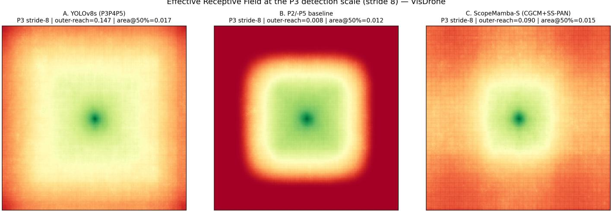  
Fig. 10. Effective Receptive Field (ERF) measured at the shared P3 detection feature (Stride 8). (A) The original YOLOv8s exhibits a PER of 0.147. (B) Removing P5 while introducing the P2 detection level concentrates the ERF near the center and reduces PER to 0.008. (C) ScopeMamba-S increases PER to 0.090 through the off-path context pathway, an 11× expansion over the P2/−P5 baseline and approximately 61% of the peripheral reach measured in the unpruned YOLOv8s.

TABLE IV  
PLACEMENT AND OPERATOR CONTROLS ON VISDRONE-2019 AT THE SMALL (S) SCALE. THE IN-PATH PAIR WAS EVALUATED AT AN EARLIER P2/−P5STAGE WITH THE DEFAULT HEAD, WHEREAS THE OFF-PATH CONTROLS WERE EVALUATED ON THE FINAL CONFIGURATION. THEREFORE, DELTAS AREINTERPRETED WITHIN EACH GROUP RATHER THAN ACROSS GROUPS.
<table><tr><td>Configuration</td><td>Branch</td><td>Params (M)</td><td>GFLOPs</td><td> $\bf { m A P 5 0 }$ </td><td>∆ vs. Control</td></tr><tr><td colspan="6">In-path control: earlier P2/—P5 configuration with default head</td></tr><tr><td>Backbone block</td><td>No scan branch</td><td>3.44</td><td>47.6</td><td>0.4949</td><td></td></tr><tr><td>Backbone block</td><td>In-path selective scan</td><td>3.45</td><td>47.6</td><td>0.4851</td><td>-0.98 pp</td></tr><tr><td colspan="6">Off-path CGCM control: final configuration</td></tr><tr><td>Backbone CGCM</td><td>None (3-seed mean)</td><td>3.39</td><td>53.25</td><td>0.5011</td><td></td></tr><tr><td>Backbone CGCM</td><td>Convolution</td><td>3.57</td><td>53.69</td><td>0.5015</td><td>+0.04pp</td></tr><tr><td>Backbone CGCM</td><td>EMA [82]</td><td>3.55</td><td>53.68</td><td>0.4979</td><td>-0.32 pp</td></tr><tr><td>Backbone CGCM</td><td>Selective scan (ours)</td><td>3.57</td><td>53.69</td><td>0.5078</td><td>+0.67 pp</td></tr><tr><td colspan="6">Off-path SS-PAN scan-branch control: final configuration</td></tr><tr><td>SS-PAN scan branches </td><td>None</td><td>3.35</td><td>52.61</td><td>0.4969</td><td></td></tr><tr><td>SS-PAN scan branches</td><td>EMA [82]</td><td>3.46</td><td>53.28</td><td>0.5013</td><td>+0.44 pp</td></tr><tr><td>SS-PAN scan branches</td><td>Selective scan (ours)</td><td>3.57</td><td>53.69</td><td>0.5078</td><td>+1.09 pp</td></tr></table>

Note: The three no-CGCM runs are 0.5048, 0.5004, and 0.4980 (mean 0.5011; standard deviation 0.34 pp).

Effective Receptive Field at the P3 detection scale (stride 8) — VisDrone

7.93 pp of this gain by moving the detection scales toward higher spatial resolution. Starting from that reallocated baseline, the subsequent backbone, neck, and regression redesign— including AMS, CGCM, SS-PAN, and SA-DFL—adds a further 1.61 pp while reducing the parameter count by approximately 0.57M. The additional computational cost introduced by the high-resolution pathway and subsequent modules is reported directly in Table V and discussed component by component below.

1) Effect of HRR (Reallocate): Replacing the stride-32 P5 detection level with a stride-4 P2 level increases mAP from 0.4124 to 0.4917, corresponding to a 7.93 pp gain, while reducing the parameter count from 11.14M to 4.14M. The higher-resolution feature maps, however, increase computation from 28.45 to 51.10 GFLOPs. HRR therefore provides the main accuracy gain in the cumulative trajectory, at the cost of substantially higher computation.

2) Effect of AMS-Block (Read): Adding the AMS-Block reduces the parameter count from 4.14M to 3.13M and

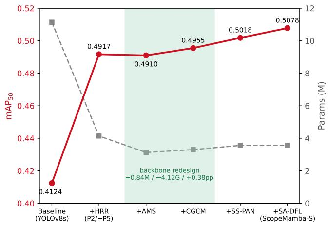  
Fig. 11. Cumulative ablation trajectory on the VisDrone-2019 dataset (Small scale). The dual-axis design explicitly maps the correspondence between performance gains (left axis, mAP50) and capacity reductions (right axis, Params in Millions) at each integration step.

TABLE V  
CUMULATIVE ABLATION EXPERIMENT ON THE VISDRONE-2019 DATASET (SMALL SCALE). ∆ INDICATES THE MARGINAL CHANGE RELATIVE TO THE PRECEDING STEP.
<table><tr><td>Integration Step</td><td>Params (M)</td><td>△ Params</td><td>GFLOPs</td><td> $\Delta$  GFLOPs</td><td> $\bf { m A P } _ { 5 0 }$ </td><td> $\Delta \ \mathbf { m A P } _ { 5 0 }$ </td></tr><tr><td>1. Baseline  $( \mathrm { Y O L O v 8 s } )$ </td><td>11.14</td><td></td><td>28.45</td><td></td><td>0.4124</td><td></td></tr><tr><td>2. + HRR (P2/–P5)</td><td>4.14</td><td>-7.00 M</td><td>51.10</td><td>+22.65 G</td><td>0.4917</td><td>+0.0793</td></tr><tr><td>3. + AMS-Block</td><td>3.13</td><td>-1.01 M</td><td>46.54</td><td>-4.56 G</td><td>0.4910</td><td>-0.0007</td></tr><tr><td>4. + CGCM</td><td>3.30</td><td>+0.17 M</td><td>46.98</td><td>+0.44 G</td><td>0.4955</td><td>+0.0045</td></tr><tr><td>5. + SS-PAN</td><td>3.56</td><td>+0.26 M</td><td>49.43</td><td>+2.45 G</td><td>0.5018</td><td>+0.0063</td></tr><tr><td>6. + SA-DFL (ScopeMamba-S)</td><td>3.57</td><td>+0.01 M</td><td>53.69</td><td>+4.25 G</td><td>0.5078</td><td>+0.0060</td></tr></table>

GFLOPs from 51.10 to 46.54, while m $\mathrm { { A P } _ { 5 0 } }$ changes only from 0.4917 to 0.4910 (−0.07 pp). To examine whether anisotropic kernel geometry contributes beyond the parameter reduction, we replace the strip kernels with isotropic square kernels of comparable receptive extent in the final configuration. This control reaches 0.4963 $\mathrm { \ m A P _ { 5 0 } }$ compared with 0.5078 for the anisotropic configuration, a difference of −1.15 pp at near-equal computational cost. The result supports the use of directional strip kernels in the adopted AMS configuration, while the associated parameter reduction helps offset the cost of the subsequent context modules.

3) Effect of SS-PAN (Reach): SS-PAN denotes the complete redesigned neck described in Section III-D, comprising DySample-based top-down fusion, directional P2 context injection, and bottom-up selective-scan fusion. In the cumulative ablation, introducing SS-PAN increases $\mathrm { \ m A P _ { 5 0 } }$ from 0.4955 to 0.5018, corresponding to a 0.63 pp gain for an additional 0.26M parameters. To isolate the role of selective scanning within the neck, we further remove only the bottomup selective-scan branches from the final configuration. This reduces $\mathrm { \ m A P _ { 5 0 } }$ from 0.5078 to 0.4969, a 1.09 pp drop at the Small scale.

TABLE VI  
SCALE-DEPENDENT CONTRIBUTION OF THE SELECTIVE-SCAN BRANCHES WITHIN SS-PAN. A PERFORMANCE DROP (−∆) WHEN THE SCAN BRANCHES ARE REMOVED INDICATES THEIR CONTRIBUTION AT THAT SCALE.
<table><tr><td>Scale</td><td>Scan ON</td><td>Scan OFF</td><td> $\Delta \ \mathbf { m A P } _ { 5 0 }$ </td></tr><tr><td>Nano</td><td>0.4394</td><td>0.4340</td><td>-0.0054</td></tr><tr><td>Small</td><td>0.5078</td><td>0.4969</td><td>-0.0109</td></tr><tr><td>Medium</td><td>0.5263</td><td>0.5236</td><td>-0.0027</td></tr></table>

To examine whether the contribution of the selective-scan branches within SS-PAN is specific to the Small variant, we additionally remove these branches from the Nano and Medium configurations. As shown in Table VI, their removal reduces $\mathrm { \ m A P _ { 5 0 } }$ by 0.54 pp, 1.09 pp, and 0.27 pp for the N, S, and M variants, respectively. The consistent direction of these changes indicates that the selective-scan component of SS-PAN contributes positively across the three evaluated scales, although the magnitude of the effect is scale dependent.

4) Effect of SA-DFL (Regress): The Scale-Adaptive Distribution Focal Loss (SA-DFL) head adds only 0.008M parameters and increases m $\mathrm { \bf A P _ { 5 0 } }$ from 0.5018 to 0.5078, corresponding to a 0.60 pp gain in the cumulative ablation. Its main resource cost is computational rather than parametric. We further compare different per-scale reg\_max allocations at the Nano scale in Fig. 12; among the tested configurations, the scaleadaptive allocation achieves the highest m $\mathrm { \Delta \ A P _ { 5 0 } }$ . Since the regression-branch width scales with $4 K _ { i } \ ( \mathrm { E q . } \ 1 3 )$ , changing the per-scale bin allocation also reallocates regression capacity across feature levels. We therefore interpret the observed gain as the effect of the joint scale-adaptive regression design rather than as evidence for finer bin spacing alone.

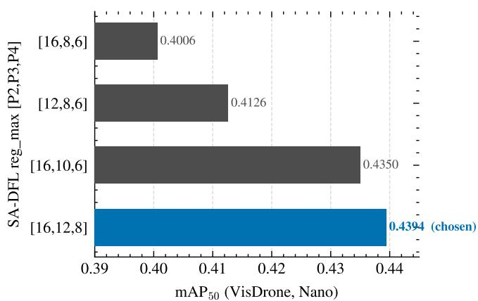  
Clean single-variable: [16,12,8] vs [16,10,6] (+0.44 pp). [12,8,6]/[16,8,6] carry minor confounds.  
Fig. 12. Sensitivity analysis of the reg\_max bin allocation in the SA-DFL head evaluated at the Nano scale. Note that the x-axis starting point is set to 0.39 to distinctly highlight the fine-grained accuracy differences between structural configurations.

Additional in-house regression-head and loss variants were also evaluated during development, including alternative quality-branch designs and NWD [21]. None provided a consistent improvement over the adopted SA-DFL configuration in the tested settings. These exploratory controls are therefore used as supporting negative results rather than as evidence that the adopted regression formulation is globally optimal.

## E. Leave-One-Out (LOO) Analysis and Robustness

To characterize the run-to-run variation of the CGCM control, we train the final configuration without CGCM using three random seeds. The three runs obtain $\mathrm { \ m A P _ { 5 0 } }$ values of 0.5048, 0.5004, and 0.4980, yielding a mean of 0.5011 and a standard deviation of 0.34 pp. The complete ScopeMamba-S reaches 0.5078, which is 0.67 pp above this mean and also above the highest value observed among the three control runs.

This multi-seed comparison and the cumulative ablation quantify different effects. In Table V, adding CGCM at Step 4 increases a single-run trajectory from 0.4910 to 0.4955, corresponding to +0.45 pp. In the final configuration, the comparison against the three-seed no-CGCM mean gives +0.67 pp. We therefore use +0.45 pp when describing the cumulative integration trajectory and +0.67 pp when discussing the finalconfiguration CGCM control.

Because multi-seed variance is measured only for the no-CGCM control, the observed $\sigma ~ = ~ 0 . 3 4$ pp is used as an empirical reference for run-to-run variation rather than as a formal significance estimate for all other architectural variants. Accordingly, comparisons such as SS-PAN removal, in-path insertion, and isotropic-kernel substitution are reported directly in percentage points rather than converted into cross-variant σ multiples.

## F. Discussion on Negative Results

For completeness, we report several representative configurations that did not improve the final model. These controls help delimit the design choices supported by the experiments.

Placement and Dimensional Constraints. Directly embedding selective scanning in the main backbone path reduces m $\mathrm { { A P } _ { 5 0 } }$ by 0.98 pp in the matched early-stage control (Section IV-C). At the Nano scale, halving the scan width in the neck reaches 0.4289 m $\mathrm { A P _ { 5 0 } }$ , compared with 0.4326 when the branch is removed entirely, while also using more parameters. Thus, the tested tapered configuration provides no improvement in either accuracy or parameter efficiency and does not offer a better trade-off than the adopted configuration.

Operator Substitution. At the backbone node, replacing the selective scan with a cost-matched convolution produces $0 . 5 0 1 5 \mathrm { \ m A P _ { 5 0 } }$ , close to the three-seed no-branch mean of 0.5011, while EMA reaches 0.4979. At the neck node, EMA reaches 0.5013 compared with 0.5078 for selective scanning. Among the operators tested at these nodes, selective scanning therefore provides the strongest and most consistent improvement, supporting its use for long-range contextual modeling in the proposed off-path formulation.

Quality-Branch Stacking. Under the final flagship configuration with only the detection head swapped, we evaluated in-house quality-branch designs based on directional decomposition and cross-scale alignment, reaching 0.4987 and 0.4983, respectively—both approximately 0.9 pp below the SA-DFL configuration (0.5078). Additional variants explored during development (foreground-guided sparsity, edgeauxiliary supervision, and asymmetric heads) were likewise not carried forward. These results suggest that, under the tested configurations, the joint scale-adaptive regression design is more effective than adding score–quality alignment branches.

Loss Shaping. Similarly, layering specialized localization losses (e.g., Inner-IoU or degenerate-box variants) on top of the flagship SA-DFL configuration reduces $\mathrm { \ m A P _ { 5 0 } }$ to 0.4980 and 0.4973, respectively, both more than 0.9 pp below the flagship result of 0.5078. In a separate matched pairing, NWD yields a marginal +0.04 pp change in $\mathrm { \ m A P _ { 5 0 } }$ while reducing $\mathrm { m A P _ { 5 0 - 9 5 } }$ by 0.31 pp, indicating a metric trade-off rather than a consistent localization improvement. These results do not support adding the tested loss-shaping variants to the final SA-DFL configuration.

Capacity Reallocation Controls. Finally, reallocating parameter budgets toward network depth rather than CGCMbased context injection did not improve performance (−0.43 pp at the Small scale), suggesting that additional depth does not provide the same benefit as the proposed context pathway. A related spatial control replaces the anisotropic strip kernels of AMS with isotropic square kernels of equivalent receptive field (Sec. IV-D). This substitution results in a 1.15 pp drop in accuracy, indicating that directional selectivity is a more effective design factor than raw kernel extent in this control.

Summary. Taken together, these negative results favor the adopted off-path selective-scanning formulation, scaleadaptive distributional regression, and anisotropic feature extraction over the tested alternatives, including direct main-path insertion, auxiliary quality branches, additional loss shaping, and increased network depth.

## G. Qualitative Analysis

To qualitatively compare the two complete detectors, Fig. 13 presents representative VisDrone-2019 validation scenes containing dense, occluded, and low-illumination tiny objects. In the highlighted regions, ScopeMamba-S detects more annotated pedestrians and vehicles than the YOLOv8s baseline, including several examples missed under dense crowding, weak local appearance cues, and low-light conditions. These complete-model observations are consistent with the quantitative results; module-wise effects are evaluated separately through the controlled experiments in Sections IV-D and IV-C.

## V. CONCLUSION

This article investigates small-object detection in UAV and remote sensing imagery as a trade-off between preserving high-resolution object evidence and maintaining sufficiently broad contextual support. ScopeMamba-YOLO addresses this trade-off through off-path, zero-gated selective scanning, instantiated by CGCM in the backbone and selective-scan fusion in SS-PAN, while preserving the fine-grained convolutional stream. The AMS Block reduces the cost of high-resolution feature extraction, and SA-DFL reallocates distributional support and regression capacity across detection scales.

Controlled experiments support the proposed integration strategy: direct main-path selective scanning can be detrimental under a matched setting, whereas the off-path formulation provides positive gains that are not reproduced by costmatched auxiliary branches. ERF analysis further shows that the proposed context pathway increases the peripheral energy ratio from 0.008 to 0.090 at the stride-8 feature, corresponding to an approximately 11× expansion over the P2/−P5 baseline. Across VisDrone-2019 and AI-TOD, the four ScopeMamba variants achieve favorable accuracy–parameter trade-offs, with particularly clear improvements for very-tiny and tiny objects; ScopeMamba-M reaches the accuracy level of HEdge-MamYOLO with less than one-third of its parameters.

(a) Image +ROI  
(b)Ground Truth  
(c) YOLOv8s (Baseline)  
(d) ScopeMamba-S (Ours)  
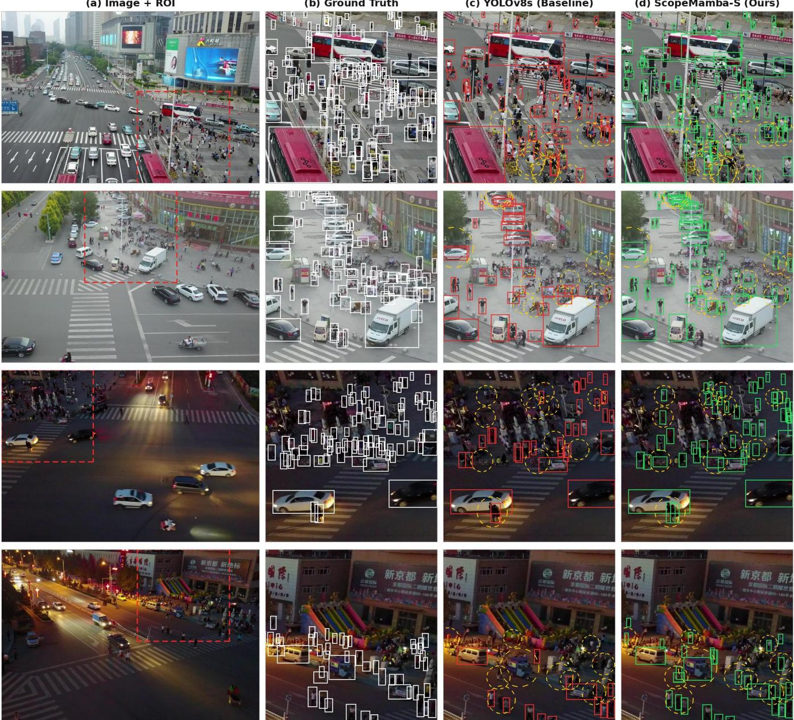  
Fig. 13. Qualitative comparison on the VisDrone-2019 dataset. (a) Original images with the region of interest (ROI) highlighted by a red dashed box. (b) Ground-truth annotations. (c) Detection results of YOLOv8s. (d) Detection results of ScopeMamba-S. Yellow dashed circles mark representative annotated targets missed by YOLOv8s but detected by ScopeMamba-S under dense, occluded, or low-illumination conditions.

The remaining limitations mainly concern computation and generalization. The stride-4 pathway and native-resolution selective scanning in SS-PAN retain non-negligible computational cost, while the present evaluation is limited to 640×640 inputs without pretraining and to YOLO-style detection. Future work will therefore focus on reducing context-pathway latency and examining the proposed integration strategy under higher-resolution, pretrained, oriented, and multi-modal detection settings.

## REFERENCES

[1] G. Cheng and J. Han, “A survey on object detection in optical remote sensing images,” ISPRS J. Photogramm. Remote Sens., vol. 117, pp. 11–28, 2016.

[2] K. Li, G. Wan, G. Cheng, L. Meng, and J. Han, “Object detection in optical remote sensing images: A survey and a new benchmark,” ISPRS J. Photogramm. Remote Sens., vol. 159, pp. 296–307, 2020.

[3] G.-S. Xia, X. Bai, J. Ding, Z. Zhu, S. Belongie, J. Luo, M. Datcu, M. Pelillo, and L. Zhang, “DOTA: A large-scale dataset for object detection in aerial images,” in Proc. IEEE/CVF Conf. Comput. Vis. Pattern Recognit. (CVPR), 2018, pp. 3974–3983.

[4] S. Ren, K. He, R. Girshick, and J. Sun, “Faster R-CNN: Towards real-time object detection with region proposal networks,” IEEE Trans. Pattern Anal. Mach. Intell., vol. 39, no. 6, pp. 1137–1149, 2017.

[5] K. He, G. Gkioxari, P. Dollar, and R. Girshick, “Mask R-CNN,” in ´ Proc. IEEE Int. Conf. Comput. Vis. (ICCV), 2017, pp. 2961–2969.

[6] W. Liu, D. Anguelov, D. Erhan, C. Szegedy, S. Reed, C.-Y. Fu, and A. C. Berg, “SSD: Single shot multibox detector,” in Proc. Eur. Conf. Comput. Vis. (ECCV), 2016, pp. 21–37.

[7] T.-Y. Lin, P. Goyal, R. Girshick, K. He, and P. Dollar, “Focal loss for´ dense object detection,” in Proc. IEEE Int. Conf. Comput. Vis. (ICCV),

2017, pp. 2980–2988.

[8] Z. Tian, C. Shen, H. Chen, and T. He, “FCOS: Fully convolutional one-stage object detection,” in Proc. IEEE/CVF Int. Conf. Comput. Vis. (ICCV), 2019, pp. 9627–9636.

[9] J. Redmon, S. Divvala, R. Girshick, and A. Farhadi, “You only look once: Unified, real-time object detection,” in Proc. IEEE Conf. Comput. Vis. Pattern Recognit. (CVPR), 2016, pp. 779–788.

[10] T.-Y. Lin, M. Maire, S. Belongie, J. Hays, P. Perona, D. Ramanan, P. Dollar, and C. L. Zitnick, “Microsoft COCO: Common objects in´ context,” in Proc. Eur. Conf. Comput. Vis. (ECCV), 2014, pp. 740–755.

[11] G. Cheng, X. Yuan, X. Yao, K. Yan, Q. Zeng, X. Xie, and J. Han, “Towards large-scale small object detection: Survey and benchmarks,” IEEE Trans. Pattern Anal. Mach. Intell., vol. 45, no. 11, pp. 13 467– 13 488, 2023.

[12] J. Wang, W. Yang, H. Guo, R. Zhang, and G.-S. Xia, “Tiny object detection in aerial images,” in 2020 25th International Conference on Pattern Recognition (ICPR). IEEE, 2021, pp. 3791–3798.

[13] P. Zhu, L. Wen, D. Du, X. Bian, H. Fan, Q. Hu, and H. Ling, “Detection and tracking meet drones challenge,” IEEE Trans. Pattern Anal. Mach. Intell., vol. 44, no. 11, pp. 7380–7399, 2022.

[14] T.-Y. Lin, P. Dollar, R. Girshick, K. He, B. Hariharan, and S. Belongie,´ “Feature pyramid networks for object detection,” in Proc. IEEE Conf. Comput. Vis. Pattern Recognit. (CVPR), 2017, pp. 2117–2125.

[15] J. Sun, Y. Guo, X. Zhi, X. Wu, J. Wang, Z. Xu, B. Pu, and Z. Gao, “WE-YOLO: Wavelet enhanced YOLO for small object detection in optical aerial remote sensing images,” IEEE Journal of Selected Topics in Applied Earth Observations and Remote Sensing, vol. 19, pp. 12 538– 12 554, 2026.

[16] Y. Zhang, M. Ye, G. Zhu, Y. Liu, P. Guo, and J. Yan, “FFCA-YOLO for small object detection in remote sensing images,” IEEE Trans. Geosci. Remote Sens., vol. 62, pp. 1–15, 2024.

[17] K. Liu, Z. Fu, S. Jin, Z. Chen, F. Zhou, R. Jiang, Y. Chen, and J. Ye, “ESOD: Efficient small object detection on high-resolution images,” IEEE Transactions on Image Processing, vol. 34, pp. 183–195, 2025.

[18] S. Liu, L. Qi, H. Qin, J. Shi, and J. Jia, “Path aggregation network for instance segmentation,” in Proc. IEEE/CVF Conf. Comput. Vis. Pattern Recognit. (CVPR), 2018, pp. 8759–8768.

[19] M. Tan, R. Pang, and Q. V. Le, “EfficientDet: Scalable and efficient object detection,” in Proc. IEEE/CVF Conf. Comput. Vis. Pattern Recognit. (CVPR), 2020, pp. 10 781–10 790.

[20] F. C. Akyon, S. O. Altinuc, and A. Temizel, “Slicing aided hyper¨ inference and fine-tuning for small object detection,” in Proc. IEEE Int. Conf. Image Process. (ICIP), 2022, pp. 966–970.

[21] C. Xu, J. Wang, W. Yang, H. Yu, L. Yu, and G.-S. Xia, “Detecting tiny objects in aerial images: A normalized wasserstein distance and a new benchmark,” ISPRS J. Photogramm. Remote Sens., vol. 190, pp. 79–93, 2022.

[22] ——, “RFLA: Gaussian receptive field based label assignment for tiny object detection,” in Proc. Eur. Conf. Comput. Vis. (ECCV), 2022, pp. 526–543.

[23] X. Zhu, S. Lyu, X. Wang, and Q. Zhao, “TPH-YOLOv5: Improved YOLOv5 based on transformer prediction head for object detection on drone-captured scenarios,” in Proc. IEEE/CVF Int. Conf. Comput. Vis. Workshops (ICCVW), 2021, pp. 2778–2788.

[24] Q. Hua, H. Xu, F. Zhang, C. Dong, B. H. Lim, and Y. Zhang, “SFBF-YOLO for small object detection in UAV and remote sensing images,” IEEE Transactions on Geoscience and Remote Sensing, vol. 64, pp. 1– 15, 2026, art. no. 5624215.

[25] X. Zheng, J. Bi, K. Li, G. Zhang, and P. Jiang, “SMN-YOLO: Lightweight YOLOv8-based model for small object detection in remote sensing images,” IEEE Geoscience and Remote Sensing Letters, vol. 22, pp. 1–5, 2025, art. no. 8001305.

[26] F. Yang, H. Fan, P. Chu, E. Blasch, and H. Ling, “Clustered object detection in aerial images,” in Proc. IEEE/CVF Int. Conf. Comput. Vis. (ICCV), 2019, pp. 8311–8320.

[27] C. Li, T. Yang, S. Zhu, C. Chen, and S. Guan, “Density map guided object detection in aerial images,” in Proc. IEEE/CVF Conf. Comput. Vis. Pattern Recognit. Workshops (CVPRW), 2020, pp. 190–191.

[28] Y. Huang, J. Chen, and D. Huang, “UFPMP-Det: Toward accurate and efficient object detection on drone imagery,” in Proc. AAAI Conf. Artif. Intell., 2022, pp. 1026–1033.

[29] J. Hu, L. Shen, and G. Sun, “Squeeze-and-excitation networks,” in Proc. IEEE/CVF Conf. Comput. Vis. Pattern Recognit. (CVPR), 2018, pp. 7132–7141.

[30] S. Woo, J. Park, J.-Y. Lee, and I. S. Kweon, “CBAM: Convolutional block attention module,” in Proc. Eur. Conf. Comput. Vis. (ECCV), 2018, pp. 3–19.

[31] Y. Li, Q. Hou, Z. Zheng, M.-M. Cheng, J. Yang, and X. Li, “Large selective kernel network for remote sensing object detection,” in Proc. IEEE/CVF Int. Conf. Comput. Vis. (ICCV), 2023, pp. 16 794–16 805.

[32] X. Cai, Q. Lai, Y. Wang, W. Wang, Z. Sun, and Y. Yao, “Poly kernel inception network for remote sensing detection,” in Proc. IEEE/CVF Conf. Comput. Vis. Pattern Recognit. (CVPR), 2024, pp. 27 706–27 716.

[33] A. Vaswani, N. Shazeer, N. Parmar, J. Uszkoreit, L. Jones, A. N. Gomez, Ł. Kaiser, and I. Polosukhin, “Attention is all you need,” in Proc. Adv. Neural Inf. Process. Syst. (NeurIPS), 2017, pp. 5998–6008.

[34] A. Gu, K. Goel, and C. Re, “Efficiently modeling long sequences with´ structured state spaces,” in Proc. Int. Conf. Learn. Represent. (ICLR), 2022.

[35] A. Gu and T. Dao, “Mamba: Linear-time sequence modeling with selective state spaces,” in First Conference on Language Modeling (COLM). OpenReview.net, 2024.

[36] T. Dao and A. Gu, “Transformers are SSMs: Generalized models and efficient algorithms through structured state space duality,” in Proc. Int. Conf. Mach. Learn. (ICML), 2024.

[37] L. Zhu, B. Liao, Q. Zhang, X. Wang, W. Liu, and X. Wang, “Vision mamba: Efficient visual representation learning with bidirectional state space model,” in Proc. Int. Conf. Mach. Learn. (ICML), 2024.

[38] Y. Liu, Y. Tian, Y. Zhao, H. Yu, L. Xie, Y. Wang, Q. Ye, and Y. Liu, “VMamba: Visual state space model,” in Proc. Adv. Neural Inf. Process. Syst. (NeurIPS), 2024.

[39] K. Chen, B. Chen, C. Liu, W. Li, Z. Zou, and Z. Shi, “RSMamba: Remote sensing image classification with state space model,” IEEE Geosci. Remote Sens. Lett., vol. 21, pp. 1–5, 2024.

[40] S. Zhao, H. Chen, X. Zhang, P. Xiao, L. Bai, and W. Ouyang, “RS-Mamba for large remote sensing image dense prediction,” IEEE Trans. Geosci. Remote Sens., vol. 62, pp. 1–14, 2024.

[41] H. Chen, J. Song, C. Han, J. Xia, and N. Yokoya, “ChangeMamba: Remote sensing change detection with spatiotemporal state space model,” IEEE Trans. Geosci. Remote Sens., vol. 62, pp. 1–20, 2024.

[42] Z. Wang, C. Li, H. Xu, X. Zhu, and H. Li, “Mamba YOLO: A simple baseline for object detection with state space model,” in Proceedings of the AAAI Conference on Artificial Intelligence, vol. 39, no. 8, 2025, pp. 8205–8213.

[43] S. Wu, X. Lu, C. Guo, and H. Guo, “MV-YOLO: An efficient small object detection framework based on mamba,” IEEE Transactions on Geoscience and Remote Sensing, vol. 63, pp. 1–14, 2025, art. no. 5632814.

[44] C. Wang, Z. Cao, J. Wang, Y. Jiang, M. Deng, L. Bu, and G. Deng, “HEdge-MamYOLO: High-frequency edge informationfacilitated cross-domain feature interaction mamba for drone images small-object detection,” IEEE Transactions on Geoscience and Remote Sensing, vol. 64, pp. 1–16, 2026, art. no. 5619216.

[45] Q. Rong, H. Jing, and M. Zhang, “Scale sensitivity mamba network for object detection in remote sensing images,” IEEE Sensors Journal, vol. 25, no. 23, pp. 43 339–43 351, 2025.

[46] Y. Feng, S. Jing, Y. Zhao, H. Lv, Y. Zhang, and M. Sun, “MVMamba: A multiscale vision mamba based on state-space duality for remote sensing object detection,” IEEE Geoscience and Remote Sensing Letters, vol. 23, pp. 1–5, 2026, art. no. 6001205.

[47] C. Jiang, R. Zhang, Y. Liu, Y. Xie, Y. Xu, Y. Li, and Y. Gong, “LGHVSS-Mamba YOLO: High-precision small object detection via dynamic state space modeling and multi-scale feature optimizing in complex scenarios,” Digital Signal Processing, vol. 176, p. 106086, 2026.

[48] Y. Shi, M. Dong, and C. Xu, “Multi-scale VMamba: Hierarchy in hierarchy visual state space model,” in Advances in Neural Information Processing Systems, vol. 37, 2024, pp. 25 687–25 708.

[49] F. Xie, W. Zhang, Z. Wang, and C. Ma, “QuadMamba: Learning quadtree-based selective scan for visual state space model,” in Advances in Neural Information Processing Systems, vol. 37, 2024, pp. 117 682– 117 707.

[50] C. Yang, Z. Huang, and N. Wang, “QueryDet: Cascaded sparse query for accelerating high-resolution small object detection,” in Proc. IEEE/CVF Conf. Comput. Vis. Pattern Recognit. (CVPR), 2022, pp. 13 668–13 677.

[51] T. Hou, C. Leng, J. Wang, Z. Pei, J. Peng, I. Cheng, and A. Basu, “MFEL-YOLO for small object detection in UAV aerial images,” Expert Systems with Applications, vol. 291, p. 128459, 2025.

[52] A. Dosovitskiy, L. Beyer, A. Kolesnikov, D. Weissenborn, X. Zhai, T. Unterthiner, M. Dehghani, M. Minderer, G. Heigold, S. Gelly, J. Uszkoreit, and N. Houlsby, “An image is worth 16×16 words: Transformers for image recognition at scale,” in Proc. Int. Conf. Learn. Represent. (ICLR), 2021.

[53] Z. Liu, Y. Lin, Y. Cao, H. Hu, Y. Wei, Z. Zhang, S. Lin, and B. Guo, “Swin transformer: Hierarchical vision transformer using shifted windows,” in Proc. IEEE/CVF Int. Conf. Comput. Vis. (ICCV), 2021, pp. 10 012–10 022.

[54] N. Carion, F. Massa, G. Synnaeve, N. Usunier, A. Kirillov, and S. Zagoruyko, “End-to-end object detection with transformers,” in Proc. Eur. Conf. Comput. Vis. (ECCV), 2020, pp. 213–229.

[55] X. Zhu, W. Su, L. Lu, B. Li, X. Wang, and J. Dai, “Deformable DETR: Deformable transformers for end-to-end object detection,” in Proc. Int. Conf. Learn. Represent. (ICLR), 2021.

[56] Y. Zhao, W. Lv, S. Xu, J. Wei, G. Wang, Q. Dang, Y. Liu, and J. Chen, “DETRs beat YOLOs on real-time object detection,” in Proc. IEEE/CVF Conf. Comput. Vis. Pattern Recognit. (CVPR), 2024, pp. 16 965–16 974.

[57] X. He, K. Cao, K. Yan, R. Li, C. Xie, J. Zhang, and M. Zhou, “Panmamba: Effective pan-sharpening with state space model,” Inf. Fusion, vol. 115, p. 102779, 2025.

[58] T. Chen, Z. Ye, Z. Tan, T. Gong, Y. Wu, Q. Chu, B. Liu, N. Yu, and J. Ye, “MiM-ISTD: Mamba-in-mamba for efficient infrared small target detection,” IEEE Trans. Geosci. Remote Sens., vol. 62, pp. 1–13, 2024.

[59] Y. Sun, X. Hu, F. Wang, X. Wu, Y. Zhou, J. Zhao, and R. Zhu, “SODMAMBA-DETR: A small object DETR detector based on a mamba encoder,” in 2025 IEEE International Conference on Multimedia and Expo (ICME), 2025, pp. 1–6.

[60] Y. Liu, Y. Ji, Q. Ren, B. Shi, N. Liu, M. Lu, and N. Wu, “An innovative small-target detection approach against information attenuation: Fusing enhanced programmable gradient information and a novel mamba module,” Sensors, vol. 25, no. 7, p. 2117, 2025.

[61] F. Yao, Q. Sun, Y. Ding, B. Xiao, and T. Liu, “LEM-YOLO: Localityenhanced mamba-YOLO algorithm for ship detection in remote sensing imagery,” in 2025 IEEE 3rd International Conference on Computer, Vision and Intelligent Technology (ICCVIT), 2025.

[62] A. Wang, H. Chen, L. Liu, K. Chen, Z. Lin, J. Han, and G. Ding, “YOLOv10: Real-time end-to-end object detection,” in Proc. Adv. Neural Inf. Process. Syst. (NeurIPS), 2024.

[63] W. Liu, H. Lu, H. Fu, and Z. Cao, “Learning to upsample by learning to sample,” in Proceedings of the IEEE/CVF International Conference on Computer Vision (ICCV), 2023, pp. 6027–6037.

[64] X. Li, W. Wang, L. Wu, S. Chen, X. Hu, J. Li, J. Tang, and J. Yang, “Generalized focal loss: Learning qualified and distributed bounding boxes for dense object detection,” in Advances in Neural Information Processing Systems, vol. 33, 2020, pp. 21 002–21 012.

[65] G. Jocher, A. Chaurasia, and J. Qiu, “Ultralytics YOLOv8,” https: //github.com/ultralytics/ultralytics, 2023.

[66] R. Khanam and M. Hussain, “YOLOv11: An overview of the key architectural enhancements,” arXiv preprint arXiv:2410.17725, 2024.

[67] W. Yang, Q. He, and Z. Li, “A lightweight multidimensional feature network for small object detection on UAVs,” Pattern Analysis and Applications, vol. 28, no. 1, p. 29, 2025.

[68] Z. Wang, Y. Su, F. Kang, L. Wang, Y. Lin, Q. Wu, H. Li, and Z. Cai, “PC-YOLO11s: A lightweight and effective feature extraction method for small target image detection,” Sensors, vol. 25, no. 2, p. 348, 2025.

[69] G. Wang, Y. Chen, P. An, H. Hong, J. Hu, and T. Huang, “UAVYOLOv8: A small-object-detection model based on improved YOLOv8 for UAV aerial photography scenarios,” Sensors, vol. 23, no. 16, p. 7190, 2023.

[70] X. Qiu, Y. Chen, C. Sun, J. Li, and M. Niu, “DMFF-YOLO: YOLOv8 based on dynamic multiscale feature fusion for object detection on UAV aerial photography,” IEEE Access, vol. 12, pp. 125 160–125 169, 2024.

[71] J. Sui, D. Chen, X. Zheng, and H. Wang, “A new algorithm for small target detection from the perspective of unmanned aerial vehicles,” IEEE Access, vol. 12, pp. 29 690–29 697, 2024.

[72] Y. Li, Q. Li, J. Pan, Y. Zhou, H. Zhu, H. Wei, and C. Liu, “SOD-YOLO: Small-object-detection algorithm based on improved YOLOv8 for UAV images,” Remote Sensing, vol. 16, no. 16, p. 3057, 2024.

[73] N. U. A. Tahir, Z. Long, Z. Zhang, M. Asim, and M. Elaffendi, “PVswin-YOLOv8s: UAV-based pedestrian and vehicle detection for traffic management in smart cities using improved YOLOv8,” Drones, vol. 8, no. 3, p. 84, 2024.

[74] W. Wang, Y. Liu, Z. Cui, L. Shan, B.-C. Zheng, Z. Wei, X. Zhang, and S. Yamane, “Drone detr: Enhancing real-time detection transformer for drone small object imagery,” The Journal of Supercomputing, vol. 81, no. 16, p. 1564, 2025.

[75] C.-Y. Wang, I.-H. Yeh, and H.-Y. M. Liao, “YOLOv9: Learning what you want to learn using programmable gradient information,” in Proc. Eur. Conf. Comput. Vis. (ECCV), 2024, pp. 1–21.

[76] X. Liu, G. Zhang, and B. Zhou, “An efficient feature aggregation network for small object detection in uav aerial images,” The Journal of Supercomputing, vol. 81, no. 4, p. 548, 2025.

[77] L. Min, Z. Fan, Q. Lv, M. Reda, L. Shen, and B. Wang, “YOLO-DCTI: Small object detection in remote sensing base on contextual transformer enhancement,” Remote Sensing, vol. 15, no. 16, p. 3970, 2023.

[78] C. Li, R. Zhao, Z. Wang, H. Xu, and X. Zhu, “RemDet: Rethinking efficient model design for UAV object detection,” in Proceedings of the AAAI Conference on Artificial Intelligence, vol. 39, no. 5, 2025, pp. 4643–4651.

[79] B. Du, Y. Huang, J. Chen, and D. Huang, “Adaptive sparse convolutional networks with global context enhancement for faster object detection on drone images,” in Proc. IEEE/CVF Conf. Comput. Vis. Pattern Recognit. (CVPR), 2023, pp. 13 435–13 444.

[80] A. He, X. Li, X. Wu, C. Su, J. Chen, S. Xu, and X. Guo, “ALSS-YOLO: An adaptive lightweight channel split and shuffling network for TIR wildlife detection in UAV imagery,” IEEE Journal of Selected Topics in Applied Earth Observations and Remote Sensing, vol. 17, pp. 17 308–17 326, 2024.

[81] Z. Yang, Q. Guan, K. Zhao, J. Yang, X. Xu, H. Long, and Y. Tang, “Multi-branch auxiliary fusion YOLO with re-parameterization heterogeneous convolutional for accurate object detection,” in Pattern Recognition and Computer Vision, ser. Lecture Notes in Computer Science, vol. 15042. Springer, 2024, pp. 492–505.

[82] D. Ouyang, S. He, G. Zhang, M. Luo, H. Guo, J. Zhan, and Z. Huang, “Efficient multi-scale attention module with cross-spatial learning,” in ICASSP 2023 - 2023 IEEE International Conference on Acoustics, Speech and Signal Processing (ICASSP). IEEE, 2023, pp. 1–5.