# Show-Harness: Just a VLM Agent Can Play Robots

Yanzhe Chen<sup>\*</sup> Zechen Bai<sup>\*</sup> Zhijun Cao<sup>\*</sup> Wenzheng Zeng<sup>\*</sup> Kevin Qinghong Lin Yiqi Lin Guoqiang Liang Kevin Yuchen Ma Qiming Huang Mike Zheng Shou<sup>†</sup>

Show Lab, National University of Singapore

## ABSTRACT

Foundation vision–language models (VLMs) exhibit broad intelligence about the world, yet translating this intelligence into robot control remains challenging. We present Show-Harness, an Embodied Harness that enables VLMs to “play” robots through a compact semantic interface linking intent to action. Show-Harness exposes discrete semantic action units that VLMs can naturally reason over, while embodiment-specific interpreters deterministically ground them into local robot actions, keeping the VLM directly responsible for fine-grained physical decisions. Through the same interface, Show-Harness demonstrates the feasibility of (1) directly unlocking closed-source frontier VLMs for zero-shot robot control, and (2) adapting small-scale open-source VLMs for low-cost deployment with just a few GPU-hours of fine-tuning. We further develop GUMI (GUI Manipulation Interface), which extends the same semantic action space to GUI-based demonstration collection, allowing humans and agents to “play” robots across embodiments without specialized teleoperation hardware. Extensive experiments show that Show-Harness-equipped VLM agents generalize robustly across tasks, embodiments, and environments, outperforming representative agentic and VLA paradigms. These results suggest that the right interface can unlock substantial embodied capability from foundation VLMs, without requiring additional model capacity or costly embodiment-specific pretraining.

Website [Code & Model & Dataset] : https://showlab.github.io/Show-Harness

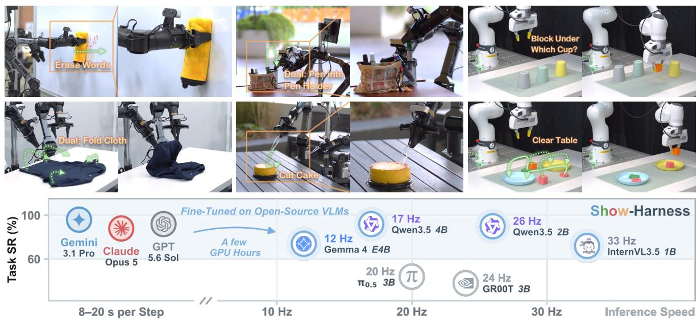  
Figure 1. Show-Harness unlocks generalizable embodied manipulation with foundation VLMs across diverse tasks, scenes, and robot embodiments, enabling direct zero-shot deployment with frontier models and capable, eficient control via lightweight adaptation of compact open-source models.

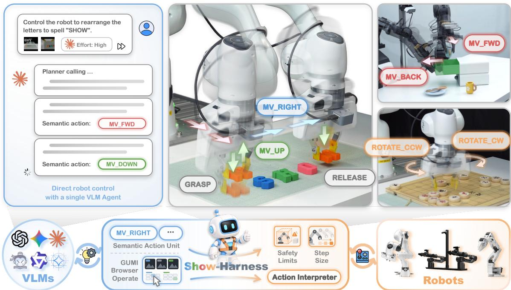  
Figure 2. Show-Harness connects foundation VLMs to diverse robot embodiments through one semantic action interface, enabling zero-shot control with frontier models and lightweight adaptation of small open models

## 1 Introduction

Foundation vision–language models (VLMs) already encode much of what robot manipulation requires, from recognizing objects and spatial relations to decomposing long-horizon goals [24, 40, 82, 97]. Yet this knowledge does not readily translate into robot behavior. Vision–language–action (VLA) models pull VLMs toward low-level control by fine-tuning them to regress embodiment-specific continuous actions, collapsing broad semantic knowledge into an opaque pixel-to-actuation mapping that often requires repeated adaptation across tasks, environments, and embodiments [8, 12, 45, 66]. Hierarchical and programmatic systems take the opposite route: the VLM produces explicit intermediate abstractions, including subtask-level calls [1, 37, 76, 92] and programs over hand-designed control APIs [15, 36, 54]. Despite the efectiveness, the physical control is mediated by downstream controllers or system-specific mechanisms, weakening the direct link between semantic intent and physical execution.

We argue that bringing foundation-model intelligence into the physical world requires a suitable interface: an action space that is semantically meaningful to the VLM yet suficiently fine-grained for direct physical control. We introduce Show-Harness, a model-agnostic Embodied Harness that enables VLMs to “play” robots through such an interface. As shown in Fig. 2, Show-Harness reformulates robot control into a discrete set of semantic action units. Each unit specifies a single movement step in a given direction or a gripper action, making it directly interpretable to the VLM. An embodiment-specific interpreter then deterministically grounds each unit into a small, bounded robot motion, letting every semantic decision land in the physical world. Around this core, the harness closes the loop: it organizes multi-view observations and proprioception into a perceptual context, supports subtask reasoning and recovery, and returns execution feedback after every unit, turning digital VLMs into situated agents that reason and act in a semantic space they natively understand while remaining directly responsible for fine-grained physical decisions.

Show-Harness enables two modes of robot control. First, it seamlessly turns closed-source frontier VLMs into zero-shot robot agents without fine-tuning, outperforming representative agentic harnesses across tasks, embodiments, and environments. Second, it enables lightweight VLMs (e.g., 2B-scale models) to “play” robots in the same action space with just a few GPU-hours of fine-tuning, achieving stronger generalization and sim-to-real transfer than representative VLA paradigms under controlled experiments. Together, these results suggest that a suitable semantic interface can unlock substantial embodied capability from foundation VLMs, providing a scalable path that inherits advances in frontier models while extending such control to smaller, lower-cost models.

Since the action space is interpretable and directly operable by both humans and models, Show-Harness naturally unifies VLM-based robot agents with GUI-style human control. We further build GUMI, a GUI-based Manipulation Interface that enables both humans and agents to collect robot demonstrations in the same semantic action space, without specialized teleoperation hardware, while naturally supporting cross-embodiment reuse and human–agent collaborative data collection. The main contributions of this work are summarized as follows:

• We introduce Show-Harness, a model-agnostic Embodied Harness that enables foundation VLMs to directly operate robots through a compact semantic action interface.

• Show-Harness demonstrates the feasibility of directly unlocking closed-source frontier VLMs for zero-shot control, and eficiently adapting small-scale models for low-cost deployment.

• Show-Harness-equipped VLM agents demonstrate strong generalization across tasks, embodiments, and environments, outperforming representative agentic and VLA paradigms. Further studies on physical and semantic adaptability reveal key properties of efective VLM–robot interfaces.

• We introduce GUMI, a GUI-based manipulation interface that enables humans, agents, and human–agent collaboration to collect robot demonstrations in the same semantic action space across embodiments, without specialized teleoperation hardware.

## 2 Related Work

## 2.1 Foundation Models for Robot Manipulation

Foundation models as low-level policies. Vision–language–action (VLA) models attach learned action generation to pretrained VLM backbones and predict low-level robot controls. These may take the form of continuous action chunks produced by regression, difusion, or flow matching [8, 22, 35, 61, 79, 82, 102]; discretized motor tokens [11, 12, 41, 45, 69]; keyframe or spatial-grid actions in task space [71, 78]; or latent action codes learned from robot trajectories and videos [4, 13, 18, 43, 47, 64, 93, 103]. Recent extensions couple action prediction with future visual dynamics in unified video–action or world-action models [51, 53, 67, 89, 94, 106]. Robot foundation models further scale learned action generation across heterogeneous tasks and embodiments [7, 9, 10, 23, 27, 30, 66, 83], while follow-up work improves action initialization, tokenization, and adaptation to new embodiments and tasks [6, 17, 32, 42, 85, 88]. This route, however, trades semantics for control. Re-fitting the model to embodiment-specific motor signals collapses its broad pretrained knowledge into an opaque sensorimotor mapping and usually requires fresh robot trajectories for new task families or embodiments [44, 104].

Foundation models as intermediate decision makers. Another route keeps the VLM above low-level control, using pretrained semantic knowledge to decompose instructions and emit subgoals, keypoints, afordance targets, value maps, or spatial constraints [24, 26, 38–40, 97]. Downstream controllers then handle their physical realization. This preserves semantics but surrenders physics: the model specifies intent without seeing how it is realized [29, 34], and each representation is bound to a carefully engineered, system-specific grounding pipeline [26, 38, 39, 60]. Realistic deployment further requires long-horizon planning, closed-loop feedback, and failure recovery [29], pushing these hierarchical designs toward the agentic systems discussed next.

## 2.2 Agentic Robot Systems

Agentic architectures. Agentic systems keep the foundation VLM intact within a harness that translates its decisions into robot behavior and feeds back outcomes, closing the perception–decision– execution loop [37, 55, 59, 92]. Systems difer mainly in how decisions are executed: the model may compose programs over perception and control APIs [15, 28, 36, 54, 80, 84, 101], select skills from predefined libraries [1, 2, 50, 73, 74, 96], steer learned policies (e.g., VLAs) with language subgoals [16, 34, 68, 76, 100], or ofload decisions to symbolic planners and numerica optimizers [19, 20, 57, 95]. The harness also provides the machinery that sustains long-horizon interaction: task context and persistent memory [3, 73, 100], feedback-driven monitoring and reflection [37, 77], and failure detection for replanning and recovery [25, 62, 92].

Interfaces for embodied execution. Across these paradigms, the VLM ultimately acts through primitives exposed by the surrounding system, making interface design a central question. Frontier VLMs perform very diferently under diferent levels of abstraction [5, 34]: human-designed abstractions such as place(object, target) improve reliability, whereas composing low-level perception and control APIs remains dificult [28, 59]. The prevailing solution is therefore to expose entire skills, controllers, or VLAs as callable primitives [1, 16, 68, 76, 100]: the agent decides what to do, while an opaque executor determines how [29]. Show-Harness instead exposes the how itself through fine-grained semantic action units whose physical realization is deterministic and transparent, allowing the VLM to remain directly responsible for fine-grained physical decisions.

From digital interfaces to physical manipulation. Show-Harness’s discrete semantic action space echoes a broader interface principle in digital and simulated agents: exposing compact, interpretable actions operable by both humans and foundation models. Computer-use and game agents act through mouse, keyboard, or controller inputs [56, 65, 70, 86, 99], while simulated embodied agents use discrete or skill-level actions [48, 49, 52, 91]. In navigation, discrete directional primitives are native to simulators and benchmarks [46, 75], and recent general-purpose agents can drive them competitively [105]. Real-world manipulation, however, lacks a comparably simple and broadly operable interface: control is typically embodiment-specific, high-dimensional, and requires finegrained spatial precision. Show-Harness bridges this gap by deterministically grounding fine-grained semantic actions into physical robot motion, while exposing the same action space to both VLM agents and humans. Our experiments further demonstrate its strong sim-to-real transfer capability.

## 3 Show-Harness

## 3.1 Overview

Show-Harness is an embodied harness designed to translate the intelligence of foundation vision– language models into physically grounded robot behavior by placing the VLM inside an iterative perception–reasoning–action loop. At each interaction step, the model receives perceptual inputs and interaction history, reasons about what to do next, expresses its intent as a semantic action decision, and observes the resulting changes after that decision is grounded into physical robot motion.

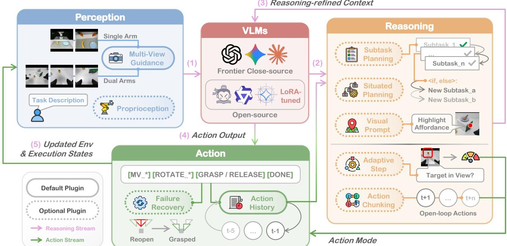  
Figure 3. The Show-Harness architecture. A modular perceive–reason–act loop connects foundation VLMs to robot control through a shared semantic action interface.

Specifically, as shown in Fig. 3, given a language instruction $\ell ,$ at step � the system captures an observation $o _ { t } ~ = ~ ( \bar { J } _ { t } , p _ { t } )$ , where $\textstyle { \mathcal { T } } _ { t }$ denotes the multi-view visual observation and $p _ { t }$ the robot’s proprioceptive state. The system first processes the current observation and a compact interaction history $h _ { t }$ through a configurable set of reasoning plugins $\mathcal { P } _ { \mathcal { S } }$ , producing a reasoning-refined context

$$
c _ { t } = \Phi _ { \mathcal { P } } ( \ell , o _ { t } , h _ { t } ) .\tag{1}
$$

The central VLM then selects a semantic action conditioned on the refined context $c _ { t }$

$$
\boldsymbol { a } _ { t } = \pi ( \boldsymbol { c } _ { t } ) \in \mathcal { A } ,\tag{2}
$$

where A is a compact set of fine-grained, actionable units that defines the semantic interface between the VLM and the robot. Each unit specifies a directly interpretable end-efector movement or gripper intent without exposing embodiment-specific control variables to the model (Sec. 3.2). The resulting semantic decision $a _ { t }$ is then passed to an embodiment-specific and model-agnostic interpreter, which deterministically grounds it into executable robot control,

$$
\boldsymbol { u } _ { t } = g _ { E } ( \boldsymbol { a } _ { t } ; \boldsymbol { s } _ { t } ) ,\tag{3}
$$

where � denotes the robot embodiment and $s _ { t }$ is the interpreter’s internal setpoint state. Executing $u _ { t }$ updates the robot and environment, producing new observations and execution states that are fed back into the next interaction step.

## 3.2 Physically Grounded Semantic Action Interface

At the core of Show-Harness is an interface that keeps VLM decisions semantically meaningful yet suficiently fine-grained for direct physical control.

Semantic action space. The shared action space $\mathcal { A }$ in Eq. 2 consists of a compact set of semantic action units. At each step, the system determines a reference view from the current observations to define end-efector movement directions. Relative to this view, MV\_FWD/MV\_BACK, MV\_LEFT/MV\_RIGHT, and MV\_UP/MV\_DOWN move the end efector one step along the corresponding direction. For tasks that require end-efector reorientation, ROTATE\_CW and ROTATE\_CCW, each paired with a specified axis (�, �, or �), incrementally rotate the end efector clockwise or counterclockwise about that axis. GRASP and RELEASE close and open the gripper, while DONE indicates task completion.

The vocabulary is designed around 3 properties. (i) Incremental: each unit induces a small, localized physical change, keeping the VLM situated in the control loop through observable action efects and enabling precise behavior through successive corrections. We empirically find that VLMs can flexibly switch between step granularities without fine-tuning (Sec. 5.3). (ii) Interpretable and embodiment-agnostic: actions are represented as semantic symbols rather than numeric targets, while embodiment-specific low-level control is delegated to the downstream interpreter, keeping the modelfacing space compact, interpretable, and reusable across robots. (iii) Visually grounded: movement directions are defined relative to observable views, allowing spatial reasoning to map onto actions.

Embodiment grounding. Each semantic decision $a _ { t } \in \mathcal A$ made by the VLM is then passed to an embodiment-specific interpreter $g _ { E }$ , which deterministically grounds the unit $a _ { t }$ into robot control. For an action unit, the interpreter updates the 6-DoF Cartesian pose setpoint $s _ { t } = ( \mathbf { x } _ { t } , Q _ { t } )$ as

$$
s _ { t + 1 } = \Pi _ { E } ( { \bf x } _ { t } + \sigma _ { t } R _ { E } d _ { a } , \exp ( \theta _ { t } [ R _ { E } r _ { a } ] _ { \times } ) Q _ { t } ) ,\tag{4}
$$

where ${ \mathbf x } _ { t } \in \mathbb { R } ^ { 3 }$ and $Q _ { t } ~ \in ~ \mathrm { S O } ( 3 )$ denote position and orientation. $d _ { a }$ and $r _ { a }$ encode translation and rotation, respectively: $d _ { a } = 0$ for rotation, while $r _ { a } = 0$ for translation and otherwise $r _ { a } \in$ $\{ \pm \mathbf { e } _ { x } , \pm \mathbf { e } _ { y } , \pm \mathbf { e } _ { z } \}$ . Here $[ \cdot ] _ { \times }$ is the skew-symmetric matrix operator. The calibrated increments $\sigma _ { t }$ and $\theta _ { t }$ set the translation and rotation magnitudes, while $R _ { E }$ maps the semantic directions and axes into the motion frame of embodiment $E .$ . The projection $\Pi _ { E }$ enforces embodiment-specific workspace and per-step translation or rotation limits. Gripper units bypass the pose update and map directly to open or close commands. Diferent embodiments realize the same semantic units through diferent low-level controllers. For example, Franka tracks Cartesian setpoints with impedance control, AgileX uses inverse kinematics and streamed joint targets, and the simulator executes corresponding operational-space commands. By isolating embodiment-specific control inside $g _ { E } .$ , the semantic model interface remains unchanged across robots. Adapting to a new embodiment therefore requires only a new interpreter. Safety bounds, such as workspace and table-height limits, can be flexibly configured in the interpreter, and actions that violate them are blocked before execution to ensure safe physical interaction.

## 3.3 Embodied Harness Architecture

The Embodied Harness organizes the foundation model’s interaction loop into three configurable stages: Perception, Reasoning, and Action. Table 1 summarizes the plugins instantiated at each stage.

Perception. Perception plugins turn raw sensor streams into a context the model can reason over:

• Multi-View Guidance tells the VLM how diferent camera views should be used and prioritized. For example, a global egocentric/exocentric view provides scene-level context, while a wrist-mounted view ofers close-up visual evidence for fine-grained alignment and manipulation.

Table 1. Harness plugins organized along the perceive–reason–act loop.
<table><tr><td>Plugin</td><td>Function</td></tr><tr><td colspan="2">Perception</td></tr><tr><td>Multi-View Guidance</td><td>Guides the VLM on the roles and appropriate use of different camera views</td></tr><tr><td>Proprioception</td><td>Translates robot state, contact, and gripper status into textual feedback</td></tr><tr><td colspan="2">Reasoning</td></tr><tr><td>Subtask Planning</td><td>Maintains an ordered subtask plan with visually checkable completion</td></tr><tr><td>Situated Planning</td><td>Defers uncertain decisions and selectively replans as execution unfolds</td></tr><tr><td>Action Chunking</td><td>Adaptively chunks actions to balance control precision and execution efficiency</td></tr><tr><td>Adaptive Step</td><td>Adaptively adjusts step size to balance precision and efficiency</td></tr><tr><td>Visual Prompt</td><td>Highlights and verifies task-relevant visual targets</td></tr><tr><td colspan="2">Action</td></tr><tr><td>Action History</td><td>Summarizes recent actions and discourages oscillatory behavior</td></tr><tr><td>Failure Recovery</td><td>Detects execution failures and triggers corrective recovery</td></tr></table>

• Proprioception translates the robot’s internal state into concise textual feedback, including the current gripper height, the displacement induced by one action step, phase-aware execution hints (e.g., descending first when still high), contact state, and gripper state.

Reasoning. Reasoning plugins structure the task into actionable intermediate decisions and refine the current context for fine-grained action-level decisions:

• Subtask Planning first invokes the VLM as a planner to decompose the task instruction ℓ into an ordered sequence of subtasks with completion criteria. During execution, subtask transitions belong to the model: at every step it checks the completion criterion against the current images, keeps acting while it is unmet, and advances the plan by declaring the subtask complete.

• Situated Planning defers uncertain decisions and selectively triggers replanning when the required information becomes available during execution. Rather than committing to all future branches upfront, the initial plan leaves such decisions unresolved until the relevant evidence becomes observable. The VLM then resolves the branch from the current observation and updates the remaining plan accordingly. This enables conditional tasks to adapt to the evolving execution state without replanning at every interaction step.

• Action Chunking adaptively reduces model-query frequency when fine-grained feedback is not yet required (e.g., when the target is still far away), allowing the VLM to emit a short sequence of semantic actions that are executed open-loop before the next model query.

• Adaptive Step dynamically adjusts the step size to balance eficiency and precision, using larger steps when the target is distant and smaller steps for close-range alignment.

• Visual Prompt uses a dedicated model call to convert an ambiguous verbal target into a visual reference highlighting the relevant afordance, allowing subsequent reasoning to ground on the visual marker. This plugin is enabled when the interaction region is dificult to specify in language.

Action. Building on the physically grounded semantic action interface introduced in Sec. 3.2, the action stage augments execution with lightweight interaction memory and recovery mechanisms that support robust closed-loop control. Two plugins operate at this stage:

• Action History carries recent actions into the next interaction step as lightweight context, together with simple usage guidance such as avoiding oscillation between opposite moves. This compact history provides the model with the temporal memory needed across steps.

• Failure Recovery automatically detects grasp failures and recovers by resetting the gripper state and rolling back to the relevant grasp subtask.

## 3.4 Two Modes on One Interface

The shared semantic interface supports two complementary modes of robot control.

Frontier VLM as zero-shot agents (ZS mode). A frontier VLM can directly control robots through the harness without any fine-tuning. This mode directly unlocks frontier-model capabilities for physical control, providing a scalable path that inherits advances in increasingly capable foundation models.

Fine-tuning small VLMs (FT mode). The same interface supports lightweight adaptation of a small open-source VLM to predict semantic action units directly. Given demonstrations D collected in the shared action space, the policy minimizes the token-level cross-entropy of the target unit,

$$
\mathcal { L } ( \theta ) = - \sum _ { \left( \ell , o , h , a \right) \in \mathcal { D } } \log \pi _ { \theta } \left( a \mid \Phi _ { \mathcal { P } _ { \mathrm { m i n } } } ( \ell , o , h ) \right) ,\tag{5}
$$

where $\mathcal { P } _ { \operatorname* { m i n } }$ intentionally retains only a minimal decision context to facilitate controlled comparison and analysis, consisting of the task instruction ℓ, multi-view observation �, and a short action history ℎ. Crucially, semantic actions are predicted through the VLM’s native vocabulary, without dedicated action heads or special tokens, enabling lightweight low-rank adaptation from limited demonstrations and stronger generalization than representative VLA baselines, as demonstrated in Sec. 5.

## 4 GUMI: A GUI-based Manipulation Interface

A shared interface for humans, agents, and policy learning. Because the semantic action space in Sec. 3.2 is discrete and directly operable, it can be naturally exposed through a lightweight graphical interface. Building on this property, we develop GUMI, a GUI-based manipulation interface that allows humans and agents to operate robots using the same semantic action units. As shown in Fig. 4, each unit maps to a labeled control and keystroke: humans can “play” the robot from the keyboard, computer-use agents can operate the same GUI, and general VLM agents can predict the units directly. At each step, GUMI records the pre-execution observation and selected semantic action, yielding policy-ready pairs $\left( o _ { t } , a _ { t } \right)$ . Because each semantic unit is deterministically grounded by the embodiment-specific interpreter, the rollout can also retain corresponding low-level commands and trajectories, allowing one demonstration to train both semantic-action and continuous-control policies.

Flexible and reusable data collection. GUMI supports step-wise control, queued action chunks, single- and dual-arm operation, and mixed human–agent collection in which humans can intervene to correct agent rollouts. Unlike conventional teleoperation pipelines that rely on specialized hardware [21, 87, 102] or simulation-specific controls [58, 63, 107], GUMI records demonstrations directly in the shared semantic action space. The same demonstrations can therefore be reused across embodiments whose interpreters implement the same units, while the same workflow applies in simulation and the real world without specialized teleoperation hardware. Its lightweight, digitally accessible design further supports remote data collection without requiring physical colocation with the robot.

(a) Franka  
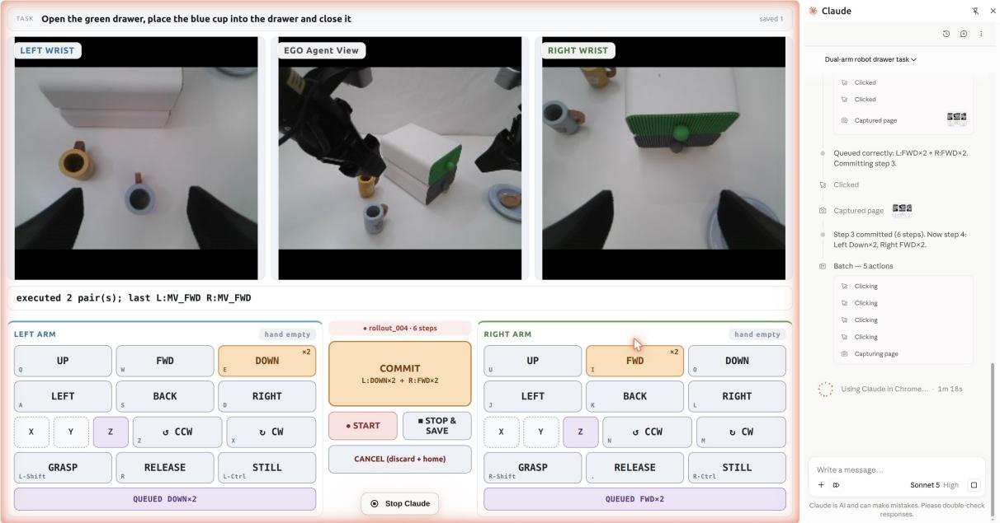  
Figure 4. The GUMI interface. GUMI is a GUI-based manipulation interface that enables humans and frontier agents to autonomously collect demonstrations through the same semantic controls.

## 5 Experiments

## 5.1 Experimental Setup

Hardware. Our experiments use two robot platforms, each equipped with parallel-jaw grippers (Figure 5). The first is a 7-DoF Franka Research 3 arm, observed by an exocentric Intel RealSense D435 facing the workspace and a wrist-mounted Intel RealSense D405, providing two

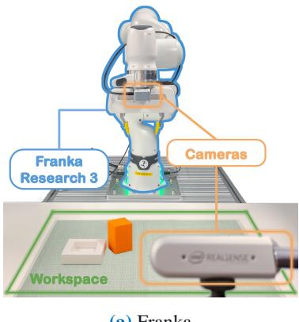

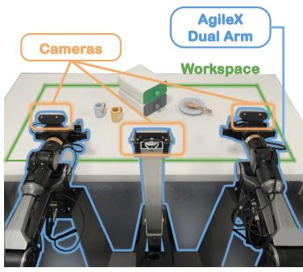  
(b) AgileX (dual-arm)  
Figure 5. Real-robot rigs.

views. The second is a bimanual AgileX rig with two 6-DoF arms, observed by three Orbbec Dabai DC1 cameras: an egocentric view shared by both arms and one wrist view per wrist. Local models are served on a single RTX 5090 GPU, while frontier models are accessed through their APIs.

Tasks and metrics. We construct ten real-robot manipulation tasks by pairing five objects with two target receptacles (a plate and a bowl). Each task requires locating, approaching, grasping, transporting, and placing appropriately. Objects span diverse physical properties: rigid geometry (block), irregular shape (banana), rolling dynamics (tennis ball), deformability (teddy bear), and precision manipulation (chess piece). For fine-tuned open-sourced VLMs, only the block, banana, and tennis ball appear in the demonstrations. The teddy bear and chess piece are held out for OOD evaluation. Beyond these tasks, Secs. 5.3 and 5.4 introduce targeted scenarios to probe broader capabilities and design choices. We report success rate and average steps per episode. Unless noted otherwise, we run 10 trials per task with randomized object placements. Episodes are capped at 50 steps, with timeouts counted as failures.

VLM agents and harness. (1) Frontier VLM as zero-shot agents (ZS mode). Unless otherwise specified, we use Gemini-3.1 Pro [31] as the default frontier VLM. We define thinking efort as the inference-time reasoning budget allocated to the VLM, and consider three levels—low, medium, and high—with medium used by default; other VLM backbones and reasoning budgets are analyzed in our ablations. The Adaptive Step plugin uses two translation step sizes: a 2 cm fine step when the target is visible in the wrist view and a 4 cm coarse step otherwise. This simple configuration sufices for basic pick-and-place tasks, while the VLM can flexibly adapt to finer step granularities without fine-tuning (Sec. 5.3). Action history retains the five most recent actions. All plugins in Sec. 3.3 are enabled by default, except Situated Planning and Visual Prompt, which are activated only when needed. (2) Fine-tuning small VLMs (FT mode). We use Qwen3.5-2B [72] by default and analyze diferent model capacities in our ablations. We apply rank-64 LoRA [33] adapters to all language-model linear layers while freezing the vision encoder and multimodal projector, updating only about 3% of parameters.

Baselines. We compare against three representative families of robot-control systems: (1) VLA baselines directly map observations and instructions to low-level robot actions, including $\pi _ { 0 . 5 }$ [9] and GR00T [7]. For a controlled comparison, both are fine-tuned on continuous end-efector trajectories converted from the same demonstrations used to train our VLM policy. (2) VLA-centric agents retain a VLA as the main physical executor while adding an outer agentic layer for planning, monitoring, or intervention, represented by Harness VLA [100] (H-VLA in tables) and Goal-VLA [14] (G-VLA in tables). (3) Code-as-policy agents translate high-level reasoning into executable programs or API calls, represented by CaP-X [28] and RATS [98].

Demonstration data collection. For open-source VLM training and trainable VLA baselines, we collect demonstrations through GUMI using human keyboard control and frontier-VLM rollouts via the browser interface. In total, we collect 164 real-robot episodes (7.8K decision steps) under a shared 2 cm translation: 101 episodes on the 7-DoF Franka (5.0K steps), 63 episodes on the single-arm AgileX (2.8K steps). Our fine-tuned policy and compared VLA baselines jointly train on demonstrations from both embodiments. For sim-to-real experiments, all compared models are trained on 230 simulated episodes (13.5K steps) collected through the same interface, spanning two simulators: 100 episodes in ManiSkill [81] with the stock Panda hand, and 130 episodes over 12 pick-and-place tasks in RoboLab [90]. More details can be found in the Appendix 7.2.

## 5.2 Main Results: Generalization across Task, Environment, and Embodiments

We evaluate three levels of generalization as summarized in Tab. 2. Cross-task covers all ten object–receptacle tasks. Cross-environment evaluates background, lighting, viewpoint, distractor, and sim-to-real shifts not seen during training or the standard test setting. For sim-to-real, trainable methods use only simulated demonstrations collected through the same GUMI interface and are evaluated on the real Franka. Cross-embodiment evaluates transfer between the Franka and AgileX arms: the zero-shot agent switches embodiments solely through the embodiment-specific interpreter, while the fine-tuned policy is co-trained on demonstrations from both embodiments and evaluated directly on each arm.

Table 2 shows that both ZS (zero-shot frontier models) and FT (fine-tuned small open-source models) consistently outperform representative baselines across task, environment, and embodiment shifts.

Table 2. Performance across three levels of generalization on real robots. ZS and FT denote Show-Harness in zero-shot mode (Gemini-3.1 Pro with medium thinking efort) and fine-tuned mode (Qwen3.5-2B).
<table><tr><td rowspan="2">Setting</td><td colspan="2">VLA</td><td colspan="2">VLA-centric agent</td><td colspan="2">Code-as-policy agent</td><td colspan="2">Show-Harness</td></tr><tr><td>π0.5</td><td>GR0OT</td><td>H-VLA</td><td>G-VLA</td><td>CaP-X</td><td>RATS</td><td>ZS</td><td>FT</td></tr><tr><td colspan="9">Cross-Task 10 object-receptacle tasks; †: unseen in fine-tuning; 10 trials / task</td></tr><tr><td>Block → Plate</td><td>6/10</td><td>5 /10</td><td>7/10</td><td>2/10</td><td>5 /10</td><td>6 / 10</td><td>10 / 10</td><td>10/ 10</td></tr><tr><td>Banana → Plate</td><td>7/ 10</td><td>7/10</td><td>8/10</td><td>3/10</td><td>8/10</td><td>8/10</td><td>10 / 10</td><td>10 / 10</td></tr><tr><td>Tennis → Plate</td><td>3/ 10</td><td>3/ 10</td><td>3/10</td><td>1/10</td><td>4/10</td><td>6/10</td><td>8/ 10</td><td>8/10</td></tr><tr><td>Teddy† → Plate</td><td>5/10</td><td>4/10</td><td>5/ 10</td><td>1/10</td><td>4/10</td><td>6/10</td><td>10/ 10</td><td>8/10</td></tr><tr><td>Chess† → Plate</td><td>1/10</td><td>0/10</td><td>3/10</td><td>0/10</td><td>2/ 10</td><td>4/ 10</td><td>10/ 10</td><td>9/10</td></tr><tr><td>Block → Bowl</td><td>5/ 10</td><td>4/10</td><td>6/10</td><td>2/10</td><td>5/ 10</td><td>5/ 10</td><td>10 / 10</td><td>10 / 10</td></tr><tr><td>Banana → Bowl</td><td>6/ 10</td><td>6/10</td><td>7/10</td><td>2/ 10</td><td>7/10</td><td>8/10</td><td>6/10</td><td>7/10</td></tr><tr><td>Tennis → Bowl</td><td>2/10</td><td>2/ 10</td><td>3/10</td><td>1/10</td><td>3/10</td><td>5/ 10</td><td>7/10</td><td>8/10</td></tr><tr><td>Teddy† → Bowl</td><td>3/10</td><td>4/10</td><td>5/10</td><td>1/10</td><td>4/10</td><td>5/10</td><td>8/10</td><td>7/10</td></tr><tr><td>Chess† → Bowl</td><td>1/10</td><td>0/10</td><td>3/10</td><td>0/10</td><td>2/10</td><td>4/10</td><td>10/10</td><td>9/ 10</td></tr><tr><td>Average (%)</td><td>39.0</td><td>35.0</td><td>50.0</td><td>13.0</td><td>44.0</td><td>57.0</td><td>89.0</td><td>86.0</td></tr><tr><td colspan="9">Cross-Environment 2 tasks (Block or Banana → Plate); 10 trials / task</td></tr><tr><td>Background</td><td>11 /20</td><td>10 / 20</td><td>15 /20</td><td>4/20</td><td>12/20</td><td>14/20</td><td>20/20</td><td>18 / 20</td></tr><tr><td>Lighting</td><td>9/20</td><td>9/20</td><td>14/20</td><td>5/20</td><td>11/20</td><td>13 / 20</td><td>20/20</td><td>19 / 20</td></tr><tr><td>Viewpoint</td><td>10 / 20</td><td>7/20</td><td>10/ 20</td><td>2/20</td><td>10/ 20</td><td>12 / 20</td><td>20/20</td><td>19 / 20</td></tr><tr><td>Distractors</td><td>10 /20</td><td>8/20</td><td>12 /20</td><td>1/20</td><td>9/20</td><td>13 / 20</td><td>20/20</td><td>19 / 20</td></tr><tr><td>Sim-to-real</td><td>0/20</td><td>0/20</td><td></td><td></td><td></td><td></td><td></td><td>13 / 20</td></tr><tr><td>Average (%)</td><td>40.0</td><td>34.0</td><td>63.8</td><td>15.0</td><td>52.5</td><td>65.0</td><td>100.0</td><td>88.0</td></tr><tr><td colspan="9">Cross-Embodiment 5 Plate tasks; 10 trials / task on each arm</td></tr><tr><td>Franka (7-DoF)</td><td>22/50</td><td>19 / 50</td><td>26/50</td><td>7/50</td><td>23/ 50</td><td>30/50</td><td>48/50</td><td>45/50</td></tr><tr><td>AgileX (6-DoF)</td><td>19/50</td><td>17 /50</td><td>23/ 50</td><td>4/50</td><td>20/50</td><td>22/50</td><td>45/50</td><td>42/50</td></tr><tr><td>Average (%)</td><td>41.0</td><td>36.0</td><td>49.0</td><td>11.0</td><td>43.0</td><td>52.0</td><td>93.0</td><td>87.0</td></tr><tr><td></td><td></td><td></td><td></td><td></td><td></td><td></td><td></td><td></td></tr></table>

The advantage persists on held-out object combinations and extends to sim-to-real transfer, where FT succeeds using only simulated demonstrations while trainable VLA baselines fail. Cross-embodiment results further show that the same semantic interface transfers efectively between Franka and AgileX. Together, these results suggest that Show-Harness provides a scalable interface spanning frontier zero-shot agents and small fine-tuned models.

## 5.3 Capability Analysis: Physical and Semantic Adaptability

Sec. 5.2 establishes broad generalization across task, environment, and embodiment shifts. We next probe a harder question: how well can Show-Harness enable foundation models to adapt to new physical and semantic demands? Through targeted scenarios, we study two complementary forms of adaptability: physical adaptability, which accommodates changes in motion precision, composition, workspace, and embodiment without policy retraining, and semantic adaptability, which handles tasks requiring reasoning or in-context learning from novel demonstrations (as shown in Fig. 6).

Fine-grained Control  
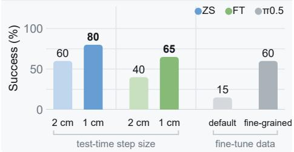  
Action Composition

Rotation Extrapolation  
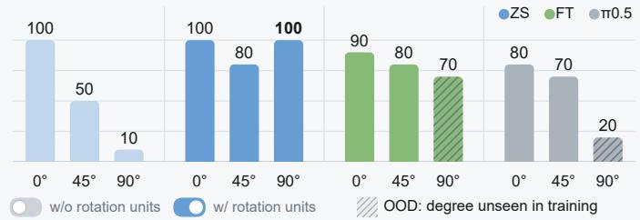  
Workspace Shift

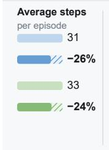

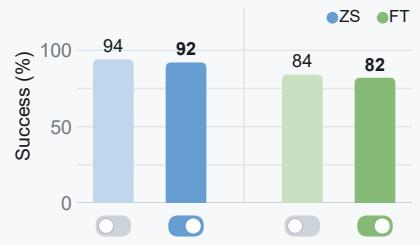

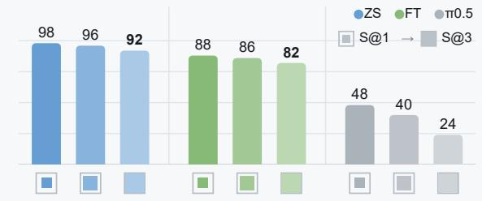  
Reasoning-intensive Tasks

Multi-arm Coordination  
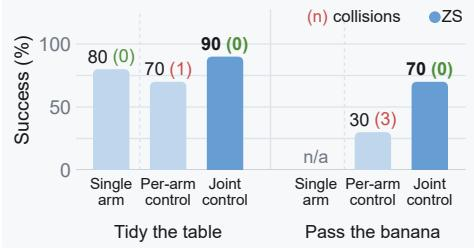

In-context Learning  
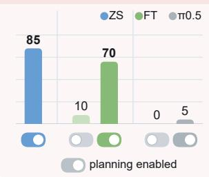

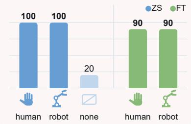  
Figure 6. Capability analysis of Show-Harness across physical (§) and semantic ( ) adaptability.

## 5.3.1 Physical Adaptability

Fine-grained control. We evaluate block stacking and peg insertion, which require finer motion than standard pick-and-place. We simply reduce the interpreter step size from 2 cm to 1 cm, without changing the VLM–action interface or retraining either model. This improves ZS from 60% to 82% and FT from 40% to 65%. In contrast, $\pi _ { 0 . 5 }$ achieves only 18% with the same demonstrations as FT, reaching 62% only after additional fine-grained training. This highlights the benefit of separating semantic decisions from metric execution: Show-Harness-equipped VLM agents adapt to new precision requirements through the interpreter alone, without task-specific relearning.

Action composition. On the five Plate tasks, composing two orthogonal translation units into one diagonal displacement substantially reduces execution steps without a notable drop in success. This shows that new action compositions can be introduced through the interpreter without retraining.

Rotation extrapolation. We test compositional extrapolation on a carrot-grasping task with the carrot oriented at $0 ^ { \circ }$ , 45<sup>◦</sup>, or an unseen $9 0 ^ { \circ }$ relative to the gripper, while each rotation unit changes orientation by 15<sup>◦</sup>. As shown in Fig. 6, ZS remains robust across all angles, while FT reaches 70% at the unseen $9 0 ^ { \circ }$ orientation despite training only on $0 ^ { \circ }$ and $4 5 ^ { \circ }$ demonstrations; $\pi _ { 0 . 5 }$ reaches 20%. This shows that incremental rotation enables larger unseen orientation changes through repeated unit composition, whereas continuous action regression remains more tied to the demonstrated angle range.

Workspace shift. On the five Plate tasks, we evaluate nested workspace regions following [17], from the core $2 5 \%$ (S@1) to 90% near the boundary (S@3). Show-Harness degrades only mildly as the workspace expands, whereas $\pi _ { 0 . 5 }$ drops sharply. This suggests that visually grounded semantic decisions make Show-Harness-equipped VLM agents less sensitive to workspace shifts, while $\pi _ { 0 . 5 }$ remains more tied to the training distribution.

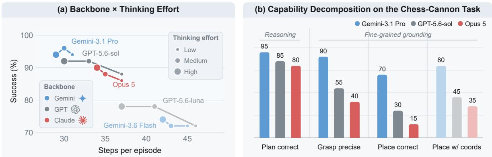

Multi-arm coordination. We evaluate two 20-trial tasks on an AgileX pair: tidy the table, where each arm clears nearby objects, and pass the banana, which requires handover before placement. We compare two independent single-arm agents with a joint policy that predicts both arms’ actions at each step. Joint decision making substantially improves success on both tasks while eliminating collisions, showing that Show-Harness enables explicit inter-arm coordination through joint action prediction.

## 5.3.2 Semantic Adaptability

Reasoning-intensive tasks. We evaluate two tasks requiring high-level reasoning before manipulation: locating a block hidden under one of three cups and arranging scattered letters into “SHOW”. ZS with Situated Planning achieves 85%, while FT and $\pi _ { 0 . 5 }$ alone reach only 10% and 0%. With the same Gemini-generated subtask instructions, FT rises to 70%, whereas $\pi _ { 0 . : }$ <sub>5</sub> remains at 5%. This suggests that Show-Harness better preserves the instruction-following flexibility of VLMs by grounding novel instructions through a reusable semantic action space.

In-context learning from video. We ask the policy to put away three objects in the order shown by a human or robot demonstration. Without a demonstration, ZS receives only the instruction tidy up and succeeds in just 20%, since the required order is unspecified. With a video demonstration, ZS follows the demonstrated order and succeeds in 20/20 trials from either source, while FT reaches 95% when conditioned on the task outline extracted by the same planner. This shows that Show-Harness enables strong visual in-context learning for robot control.

## 5.4 Ablation Studies

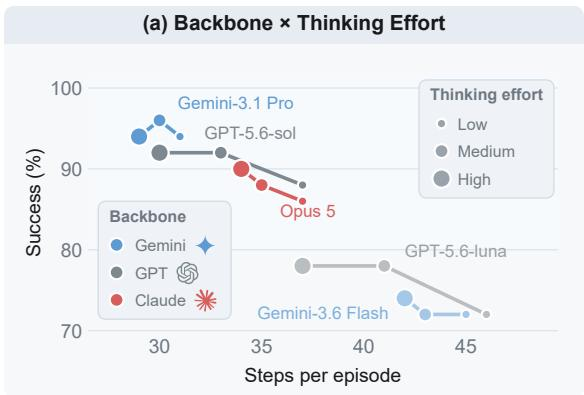

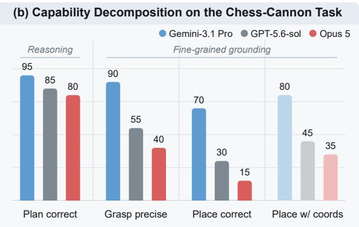  
Figure 7. Efect of frontier VLM choice and thinking efort.

## 5.4.1 Frontier VLM Choice and Thinking Efort

We evaluate diferent frontier VLMs on the five Plate tasks (Fig. 7 (a)), and further probe the strongest three models on a chess-cannon placement task (20 trails) that separates planning from fine-grained grounding (Fig. 7 (a)). As shown in Fig. 7 (a), zero-shot performance generally improves with stronger frontier VLMs, broadly tracking their underlying model capability, while increasing thinking efort mainly reduces redundant interaction steps with little gain in success and can incur higher wall-clock cost (e.g., 3.4× for GPT-5.6-sol). We also find that all models follow instructions reliably, with over 98% of responses producing valid action units. Fig. 7 (b) shows that planning is also not the main bottleneck; errors concentrate on fine-grained grasping and placement. Providing target bounding boxes further improves performance, highlighting the value of explicit visual grounding cues.

## 5.4.2 Fine-Tuned Backbone Scaling

As shown in Fig. 8, performance is already strong at 2B, while larger backbones mainly help fine-grained tasks such as stacking and peg insertion. The 1B-level models instead sufer from excessive local adjustments near the target, leading to longer episodes. Smaller models can nevertheless outperform larger ones on the tennis-ball task, where timely correction of moving objects matters more than fine precision. Overall, the 2B backbone ofers a good balance between precision and responsiveness.

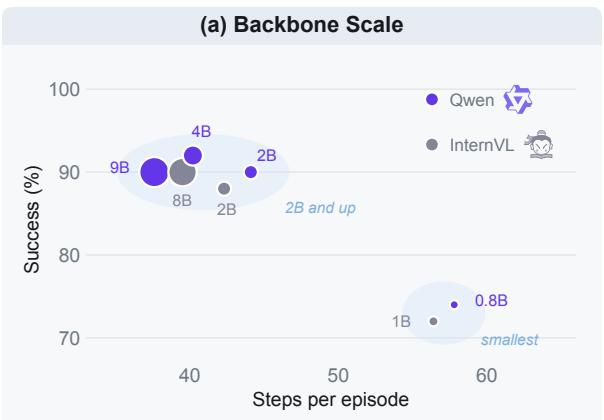

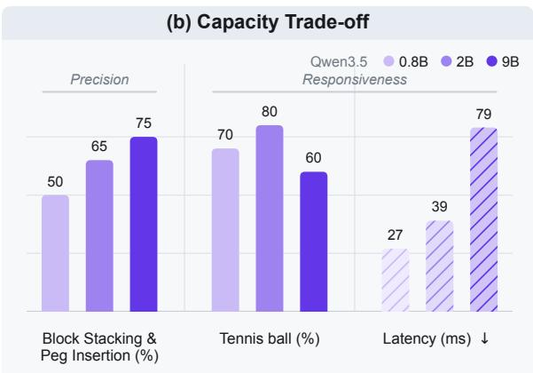  
Figure 8. (a) Efect of fine-tuned backbone scaling over the five Plate tasks; bubble area is proportional to parameter count. (b) Three Qwen3.5 capacities across fine-grained tasks.

## 5.4.3 Harness Plugins

Fig. 9 evaluates the harness plugins on the real Franka arm with the zero-shot agent (Gemini-3.1 Pro). Default plugins follow a leave-one-out protocol on the five Plate tasks. Visual Prompt and Situated Planning are instead added to the default configuration and evaluated on dedicated scenarios requiring handle-aware grasping and hidden-object search under three inverted cups (20 trails each), respectively.

Multi-View Guidance substantially improves performance over global-view input alone, particularly for small objects requiring precise alignment. This is because multiple views enhance spatial perception, while the wrist view provides especially useful cues for fine-grained discrimination.

Proprioception. Removing proprioceptive state substantially degrades performance, particularly on objects where visual cues alone are ambiguous. Compact state signals such as gripper height and contact provide reliable guidance when appearance or depth makes visual estimation uncertain.

Subtask Planning. Without planning, success drops to 60%, with the model often dragging objects toward the plate without lifting. Subtask decomposition makes the intended manipulation sequence explicit through locally valid stages and visually checkable completion criteria.

(i) Multi-View Guidance  
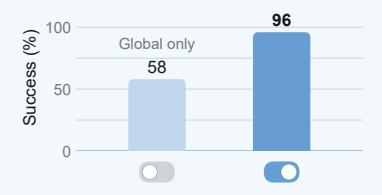

(ii) Proprioception  
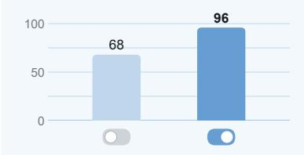

(iii) Subtask Planning  
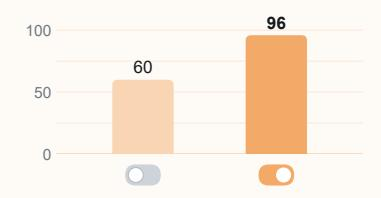  
(vi) Visual Prompt

(iv) Action Chunking  
(v) Adaptive Step  
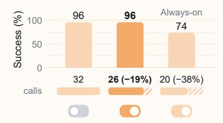

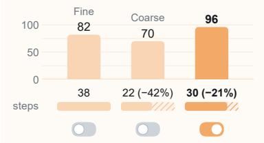

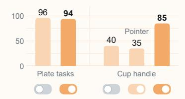

(vii) Situated Planning  
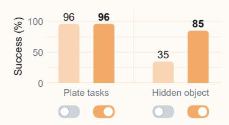

(viii) Action History  
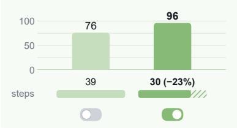

(ix) Failure Recovery  
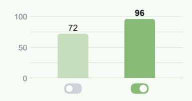  
Figure 9. Plugin ablations on the real Franka arm using Gemini-3.1 Pro as a zero-shot agent.

Action Chunking. Disabling chunking preserves 96% success but increases model calls, whereas forcing it throughout reduces calls but drops success to 74%. The result favors selective chunking: compress redundant transport steps while preserving fine-grained feedback near interaction.

Adaptive Step. Fine-only control is precise but ineficient and prone to timeouts, while coarse-only control is faster but prone to overshoot. Adaptive switching based on target visibility balances both, achieving 96% success with 30 steps per episode on average.

Visual Prompt. The plugin has little efect on regular tasks, supporting its default-of design, but substantially improves handle-aware grasping (40% to 85%). The gain comes not from the visual marker alone, but from explicitly aligning the language instruction with the marked interaction point.

Situated Planning. The plugin has no efect on regular tasks, but substantially improves hidden-object search (35% to 85%). It defers unresolved decisions until suficient visual evidence is available, enabling targeted exploration instead of premature planning.

Action History. Removing action history reduces success and increases timeouts, often due to oscillation between opposing actions. Recording recent actions exposes such loops and prevents repeated reversals, providing lightweight memory for more stable closed-loop control.

Failure Recovery. Removing recovery reduces success to 72%, with the largest drops on hard-to-grasp objects. The main failure mode is an undetected empty grasp; empty-grasp detection triggers a retry, preventing the agent from continuing with an empty gripper.

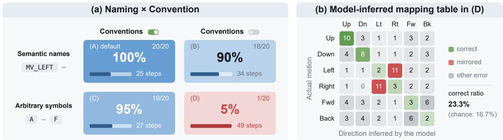  
Figure 10. (a) Ablation on action-space representation. (b) Action mappings inferred under setting (D) over 20 episodes, where the model probes unknown symbols and infers their efects from observation changes.

## 5.4.4 Action-space Representation

We study what makes the semantic action space efective through a controlled ablation with Gemini-3.1 Pro, varying only the representation of the six translational action units while keeping the remaining harness fixed. $\mathbf { A } \ : 2 \times 2$ design compares: (A) semantic action names with written conventions specifying their physical efects (our default), (B) semantic names only, (C) arbitrary symbols with conventions, and (D) arbitrary symbols only. For (D), which provides no prior action semantics, the agent probes unknown symbols, infers their efects from before/after observations, and records the mappings for later use. Each variant is evaluated on the Block/Banana → Plate tasks over 20 trials in total.

Fig. 10 (a) shows that arbitrary symbols with explicit conventions (C) nearly match the default, while semantic names alone (B) remain usable but less eficient. This indicates that conventions provide most of the grounding, with semantic names serving mainly as a useful prior. Setting (D) succeeds in only 1/20 episodes with only 23.3% of inferred mappings correct (Fig. 10 (b)). Explicit conventions therefore avoid the ambiguity of inferring physical action efects from visual changes alone.

## 5.5 Qualitative Analysis

We further provide qualitative results on a diverse set of real-world manipulation scenarios. As shown in Fig. 11, Show-Harness successfully handles a broad range of visual and physical variations, including novel objects, background changes, lighting changes, cluttered scenes, spatial-reasoning tasks, and bimanual control. Beyond standard pick-and-place, the same interface supports more challenging behaviors such as rearranging letter blocks to satisfy a semantic goal, and coordinating two arms to open a drawer and place an object inside. These examples qualitatively demonstrate that the proposed semantic action interface can be reused across substantially diferent task structures and manipulation requirements without redesigning the model-facing action space. We further provides qualitative comparison with $\pi _ { 0 . 5 }$ at Appendix 7.3.

## 6 Conclusion and Limitations

In this work, we introduced Show-Harness, an Embodied Harness that unlocks embodied capability from foundation VLMs through a compact semantic action interface. Show-Harness exposes an action space that is semantic enough for VLMs to naturally reason over yet fine-grained enough for direct physical control, keeping the VLM engaged in stepwise physical decisions within a closed perception–

Novel Object: Pick up the chess piece and place it on the plate

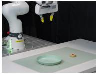

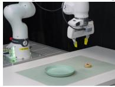

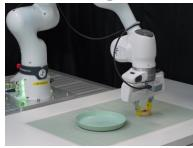  
Background Variation: Pick up the orange block and place it on the plate

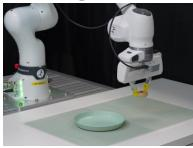

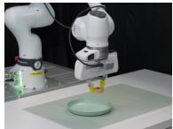

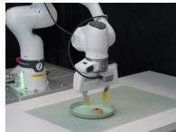

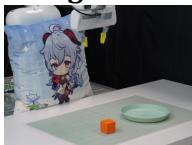

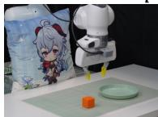

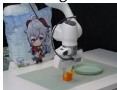

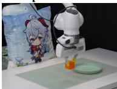

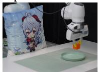

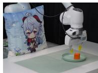  
Lighting Variation: Pick up the orange block and place it on the plate

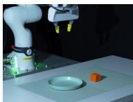

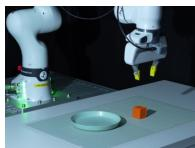

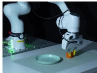

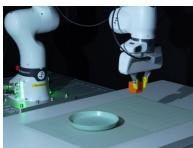

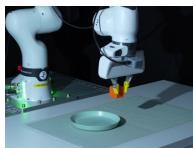

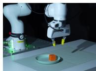

Cluttered Environment: Pick up the mango and place it on the plate

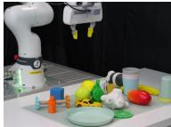

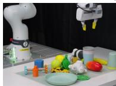

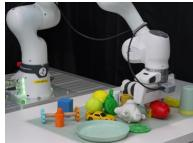


Spatial Reasoning: Rearrange the letter blocks to spell “SHOW”


  
Bimanual Manipulation: Open the upper drawer and place the blue cup inside


  
Figure 11. Qualitative real-world demonstrations of Show-Harness across diverse tasks and conditions.

reasoning–action–feedback loop. Building on this shared interface, we further introduced GUMI, which enables humans and agents to collect robot demonstrations through a GUI without specialized teleoperation hardware. Extensive experiments demonstrate strong generalization and adaptability of Show-Harness-enabled VLM agents, suggesting that the right interface can unlock substantial embodied capability already present in foundation VLMs, with minimal embodiment-specific adaptation.

Despite its efectiveness, Show-Harness is currently evaluated primarily on single- and dual-arm manipulation with parallel-jaw grippers. Extending the framework to more complex embodiments (e.g., humanoids or dexterous hands) is a valuable direction. Future work may also enrich the perception side with additional embodied modalities, such as tactile and force feedback, to support more contact-rich and fine-grained physical interaction.

## References

[1] Michael Ahn, Anthony Brohan, Noah Brown, Yevgen Chebotar, Omar Cortes, Byron David, Chelsea Finn, Chuyuan Fu, Keerthana Gopalakrishnan, Karol Hausman, et al. Do as i can, not as i say: Grounding language in robotic afordances. arXiv preprint arXiv:2204.01691, 2022.

[2] Michael Ahn, Debidatta Dwibedi, Chelsea Finn, Montse Gonzalez Arenas, Keerthana Gopalakrishnan, Karol Hausman, Brian Ichter, Alex Irpan, Nikhil Joshi, Ryan Julian, et al. Autort: Embodied foundation models for large scale orchestration of robotic agents. arXiv preprint arXiv:2401.12963, 2024.

[3] Abrar Anwar, John Welsh, Joydeep Biswas, Soha Pouya, and Yan Chang. Remembr: Building and reasoning over long-horizon spatio-temporal memory for robot navigation. In 2025 IEEE International Conference on Robotics and Automation (ICRA), pages 2838–2845. IEEE, 2025.

[4] Erik Bauer, Elvis Nava, and Robert K Katzschmann. Latent action difusion for cross-embodiment manipulation. arXiv preprint arXiv:2506.14608, 2025.

[5] Shmuel Berman, Michael Ilie, Jia Deng, and Daniel Freeman. Claude plays robotics. Anthropic Research, 2026. https://www.anthropic.com/research/claude-plays-robotics.

[6] Jagdeep Singh Bhatia, Andrew Wagenmaker, William Chen, and Sergey Levine. Adapting generalist robot policies with semantic reinforcement learning. arXiv preprint arXiv:2606.31958, 2026.

[7] Johan Bjorck, Fernando Castañeda, Nikita Cherniadev, Xingye Da, Runyu Ding, Linxi Fan, Yu Fang, Dieter Fox, Fengyuan Hu, Spencer Huang, et al. Gr00t n1: An open foundation model for generalist humanoid robots. arXiv preprint arXiv:2503.14734, 2025.

[8] Kevin Black, Noah Brown, Danny Driess, Adnan Esmail, Michael Equi, Chelsea Finn, Niccolo Fusai, Lachy Groom, Karol Hausman, Brian Ichter, et al. �<sub>0</sub>: A vision-language-action flow model for general robot control. arXiv preprint arXiv:2410.24164, 2024.

[9] Kevin Black, Noah Brown, James Darpinian, Karan Dhabalia, Danny Driess, Adnan Esmail, Michael Robert Equi, Chelsea Finn, Niccolo Fusai, Manuel Y Galliker, et al. � : a vision-language-action model with open-world generalization. In 9th Annual Conference on Robot Learning, 2025.

[10] Konstantinos Bousmalis, Giulia Vezzani, Dushyant Rao, Coline Devin, Alex X Lee, Maria Bauzá, Todor Davchev, Yuxiang Zhou, Agrim Gupta, Akhil Raju, et al. Robocat: A self-improving generalist agent for robotic manipulation. arXiv preprint arXiv:2306.11706, 2023.

[11] Anthony Brohan, Noah Brown, Justice Carbajal, Yevgen Chebotar, Joseph Dabis, Chelsea Finn, Keerthana Gopalakrishnan, Karol Hausman, Alex Herzog, Jasmine Hsu, et al. Rt-1: Robotics transformer for real-world control at scale. arXiv preprint arXiv:2212.06817, 2022.

[12] Anthony Brohan, Noah Brown, Justice Carbajal, Yevgen Chebotar, Xi Chen, Krzysztof Choromanski, Tianli Ding, Danny Driess, Avinava Dubey, Chelsea Finn, et al. Rt-2: Vision-language-action models transfer web knowledge to robotic control. arXiv preprint arXiv:2307.15818, 2023.

[13] Qingwen Bu, Yanting Yang, Jisong Cai, Shenyuan Gao, Guanghui Ren, Maoqing Yao, Ping Luo, and Hongyang Li. Univla: Learning to act anywhere with task-centric latent actions. arXiv preprint arXiv:2505.06111, 2025.

[14] Haonan Chen, Jingxiang Guo, Bangjun Wang, Tianrui Zhang, Xuchuan Huang, Boren Zheng, Yiwen Hou, Chenrui Tie, Jiajun Deng, and Lin Shao. Goal-vla: Image-generative vlms as object-centric world models empowering zero-shot robot manipulation. arXiv preprint arXiv:2506.23919, 2025.

[15] Junting Chen, Yao Mu, Qiaojun Yu, Tianming Wei, Silang Wu, Zhecheng Yuan, Zhixuan Liang, Chao Yang, Kaipeng Zhang, Wenqi Shao, et al. Roboscript: Code generation for free-form manipulation tasks across real and simulation. arXiv preprint arXiv:2402.14623, 2024.

[16] Siyi Chen, Hugo Hadfield, Alex Zook, Mikaela Angelina Uy, Chan Hee Song, Erwin Coumans, Xuning Yang, Faisal Ladhak, Qing Qu, Stan Birchfield, et al. Volo: A physical orchestrator for open-vocabulary long-horizon manipulation. arXiv preprint arXiv:2606.07723, 2026.

[17] Yanzhe Chen, Kevin Yuchen Ma, Qi Lv, Yiqi Lin, Zechen Bai, Chen Gao, and Mike Zheng Shou. Escaping the diversity trap in robotic manipulation via anchor-centric adaptation. arXiv preprint arXiv:2605.07381, 2026.

[18] Yi Chen, Yuying Ge, Weiliang Tang, Yizhuo Li, Yixiao Ge, Mingyu Ding, Ying Shan, and Xihui Liu. Moto: Latent motion token as the bridging language for learning robot manipulation from videos. In 2025 IEEE/CVF International Conference on Computer Vision (ICCV), pages 19752–19763. IEEE, 2025.

[19] Yongchao Chen, Jacob Arkin, Charles Dawson, Yang Zhang, Nicholas Roy, and Chuchu Fan. Autotamp: Autoregressive task and motion planning with llms as translators and checkers. In 2024 IEEE International conference on robotics and automation (ICRA), pages 6695–6702. IEEE, 2024.

[20] Yongchao Chen, Yilun Hao, Yang Zhang, and Chuchu Fan. Code-as-symbolic-planner: Foundation model-based robot planning via symbolic code generation. In 2025 IEEE/RSJ International Conference on Intelligent Robots and Systems (IROS), pages 19248–19254. IEEE, 2025.

[21] Cheng Chi, Zhenjia Xu, Chuer Pan, Eric Cousineau, Benjamin Burchfiel, Siyuan Feng, Russ Tedrake, and Shuran Song. Universal manipulation interface: In-the-wild robot teaching without in-the-wild robots. In Robotics: Science and Systems, 2024.

[22] Cheng Chi, Zhenjia Xu, Siyuan Feng, Eric Cousineau, Yilun Du, Benjamin Burchfiel, Russ Tedrake, and Shuran Song. Difusion policy: Visuomotor policy learning via action difusion. The International Journal ofRobotics Research, 44(10-11):1684–1704, 2025.

[23] Ria Doshi, Homer Walke, Oier Mees, Sudeep Dasari, and Sergey Levine. Scaling cross-embodied learning: One policy for manipulation, navigation, locomotion and aviation. arXiv preprint arXiv:2408.11812, 2024.

[24] Danny Driess, Fei Xia, Mehdi SM Sajjadi, Corey Lynch, Aakanksha Chowdhery, Brian Ichter, Ayzaan Wahid, Jonathan Tompson, Quan Vuong, Tianhe Yu, et al. Palm-e: An embodied multimodal language model. arXiv preprint arXiv:2303.03378, 2023.

[25] Jiafei Duan, Wilbert Pumacay, Nishanth Kumar, Yi Ru Wang, Shulin Tian, Wentao Yuan, Ranjay Krishna, Dieter Fox, Ajay Mandlekar, and Yijie Guo. Aha: A vision-language-model for detecting and reasoning over failures in robotic manipulation. arXiv preprint arXiv:2410.00371, 2024.

[26] Jiafei Duan, Wentao Yuan, Wilbert Pumacay, Yi Ru Wang, Kiana Ehsani, Dieter Fox, and Ranjay Krishna. Manipulate-anything: Automating real-world robots using vision-language models. arXiv preprint arXiv:2406.18915, 2024.

[27] Pete Florence and Generalist Team. Going beyond world models & vlas. Generalist AI Blog, 2026. https://generalistai.com/blog/beyond-world-models.

[28] Letian Fu, Justin Yu, Karim El-Refai, Ethan Kou, Haoru Xue, Huang Huang, Wenli Xiao, Guanzhi Wang, Dantong Niu, Fei-Fei Li, et al. Cap-x: A framework for benchmarking and improving coding agents for robot manipulation. arXiv preprint arXiv:2603.22435, 2026.

[29] Liane Galanti, Dhruv Shah, and Tri Dao. Addressing the orchestration gap in generalist robots via physical agency. arXiv preprint arXiv:2607.21725, 2026.

[30] Generalist Team. Gen-1: Scaling embodied foundation models to mastery. Generalist AI Blog, 2026. https://generalistai.com/blog/gen-1.

[31] Google DeepMind. Gemini 3.1 pro. Model Card, February 2026. URL https://deepmind.google/models/ model-cards/gemini-3-1-pro/.

[32] Ankit Goyal, Hugo Hadfield, Xuning Yang, Valts Blukis, and Fabio Ramos. Vla-0: Building state-of-the-art vlas with zero modification. arXiv preprint arXiv:2510.13054, 2025.

[33] Edward J Hu, Yelong Shen, Phillip Wallis, Zeyuan Allen-Zhu, Yuanzhi Li, Shean Wang, Lu Wang, and Weizhu Chen. Lora: Low-rank adaptation of large language models. arXiv preprint arXiv:2106.09685, 2021.

[34] Jiaheng Hu, Mohit Shridhar, Caden Lu, Dhruv Shah, Hao-Tien Lewis Chiang, Jie Tan, and Annie Xie. What matters in orchestrating robot policies: A systematic study of hierarchical vla agents. arXiv preprint arXiv:2606.10267, 2026.

[35] Yutong Hu, Jan-Nico Zaech, Nikolay Nikolov, Yuanqi Yao, Sombit Dey, Giuliano Albanese, Renaud Detry, Luc Van Gool, and Danda Paudel. Ar-vla: True autoregressive action expert for vision-language-action models. arXiv preprint arXiv:2603.10126, 2026.

[36] Siyuan Huang, Zhengkai Jiang, Hao Dong, Yu Qiao, Peng Gao, and Hongsheng Li. Instruct2act: Mapping multi-modality instructions to robotic actions with large language model. arXiv preprint arXiv:2305.11176, 2023.

[37] Wenlong Huang, Fei Xia, Ted Xiao, Harris Chan, Jacky Liang, Pete Florence, Andy Zeng, Jonathan Tompson, Igor Mordatch, Yevgen Chebotar, et al. Inner monologue: Embodied reasoning through planning with language models. arXiv preprint arXiv:2207.05608, 2022.

[38] Wenlong Huang, Chen Wang, Ruohan Zhang, Yunzhu Li, Jiajun Wu, and Li Fei-Fei. Voxposer: Composable 3d value maps for robotic manipulation with language models. arXiv preprint arXiv:2307.05973, 2023.

[39] Wenlong Huang, Chen Wang, Yunzhu Li, Ruohan Zhang, and Li Fei-Fei. Rekep: Spatio-temporal reasoning of relational keypoint constraints for robotic manipulation. arXiv preprint arXiv:2409.01652, 2024.

[40] Yuheng Ji, Huajie Tan, Jiayu Shi, Xiaoshuai Hao, Yuan Zhang, Hengyuan Zhang, Pengwei Wang, Mengdi Zhao, Yao Mu, Pengju An, et al. Robobrain: A unified brain model for robotic manipulation from abstract to concrete. In 2025 IEEE/CVF Conference on Computer Vision and Pattern Recognition (CVPR), pages 1724–1734. IEEE, 2025.

[41] Tengyue Jiang, Chunpu Xu, Jiayue Kang, and Yao Mu. Sa-vla: State-aware tokenizer for improving vision-language-action models’ performance. arXiv preprint arXiv:2606.30113, 2026.

[42] Dong Jing, Tianqi Zhang, Jiaqi Liu, Jinman Zhao, Zelong Sun, Li Erran Li, Zhiwu Lu, and Mingyu Ding. Learning action priors for cross-embodiment robot manipulation. arXiv preprint arXiv:2606.26095, 2026.

[43] Miracle Kang, Lights Shi, Lucy Liang, Roy Gan, Dongxiu Liu, Pushi Zhang, Sylas Chen, Shawn Qin, Yinan Zheng, Jinliang Zheng, et al. X-tokenizer: A multimodal action tokenizer for vision-language-action pretraining. arXiv preprint arXiv:2606.14752, 2026.

[44] Elis Karcini, Faisal Mehrban, Quang Nguyen, Mac Schwager, Arash Ajoudani, Cesar Cadena, Jan Peters, Marco Hutter, and Haitham Bou-Ammar. Robots need more than vla and world models. arXiv preprint arXiv:2606.06556, 2026.

[45] Moo Jin Kim, Karl Pertsch, Siddharth Karamcheti, Ted Xiao, Ashwin Balakrishna, Suraj Nair, Rafael Rafailov, Ethan Foster, Grace Lam, Pannag Sanketi, et al. Openvla: An open-source vision-language-action model. arXiv preprint arXiv:2406.09246, 2024.

[46] Jacob Krantz, Erik Wijmans, Arjun Majumdar, Dhruv Batra, and Stefan Lee. Beyond the nav-graph: Vision-and-language navigation in continuous environments. In European Conference on Computer Vision, pages 104–120, 2020.

[47] Seungjae Lee, Yibin Wang, Haritheja Etukuru, H Jin Kim, Nur Muhammad Mahi Shafiullah, and Lerrel Pinto. Behavior generation with latent actions. arXiv preprint arXiv:2403.03181, 2024.

[48] Chengshu Li, Ruohan Zhang, Josiah Wong, Cem Gokmen, Sanjana Srivastava, Roberto Martín-Martín, Chen Wang, Gabrael Levine, Michael Lingelbach, Jiankai Sun, et al. Behavior-1k: A benchmark for embodied ai with 1,000 everyday activities and realistic simulation. In Conference on Robot Learning, pages 80–93. PMLR, 2023.

[49] Manling Li, Shiyu Zhao, Qineng Wang, Kangrui Wang, Yu Zhou, Sanjana Srivastava, Cem Gokmen,

Tony Lee, Li E Li, Ruohan Zhang, et al. Embodied agent interface: Benchmarking llms for embodied decision making. Advances in Neural Information Processing Systems, 37:100428–100534, 2024.

[50] Ruiying Li, Yunlang Zhou, YuYao Zhu, Kylin Chen, Jingyuan Wang, Sukai Wang, Kongtao Hu, Minhui Yu, Bowen Jiang, Zhan Su, et al. Roboclaw: An agentic framework for scalable long-horizon robotic tasks. arXiv preprint arXiv:2603.11558, 2026.

[51] Shuang Li, Yihuai Gao, Dorsa Sadigh, and Shuran Song. Unified video action model. arXiv preprint arXiv:2503.00200, 2025.

[52] Siyao Li, Jiawei Gu, Shuai Liu, Kairui Hu, Zekun Li, Linjie Li, Chengcheng Tang, Po-Chen Wu, Ivan Shugurov, Lingni Ma, et al. Humanclaw: Can vision-language models act through a body? arXiv preprint arXiv:2607.27180, 2026.

[53] Ziang Li, Dongzhou Cheng, Yibin Wang, Shiyue Wang, Xiaoyang Xu, Lingxuan Weng, Juan Wang, and Jiaqi Wang. Light-wam: Eficient world action models with state-fusion action decoding. arXiv preprint arXiv:2606.08242, 2026.

[54] Jacky Liang, Wenlong Huang, Fei Xia, Peng Xu, Karol Hausman, Brian Ichter, Pete Florence, and Andy Zeng. Code as policies: Language model programs for embodied control. In 2023 IEEE International conference on robotics and automation (ICRA), pages 9493–9500. IEEE, 2023.

[55] Oscar Lima, Marc Vinci, Martin Günther, Marian Renz, Alexander Sung, Sebastian Stock, Johannes Brust, Lennart Niecksch, Zongyao Yi, Felix Igelbrink, et al. Agentic ai for robot control: Flexible but still fragile. In Proceedings ofthe AAAI Symposium Series, volume 8, pages 465–473, 2026.

[56] Kevin Qinghong Lin, Linjie Li, Difei Gao, Zhengyuan Yang, Shiwei Wu, Zechen Bai, Stan Weixian Lei, Lijuan Wang, and Mike Zheng Shou. Showui: One vision-language-action model for gui visual agent. In 2025 IEEE/CVF Conference on Computer Vision and Pattern Recognition (CVPR), pages 19498–19508. IEEE, 2025.

[57] Bo Liu, Yuqian Jiang, Xiaohan Zhang, Qiang Liu, Shiqi Zhang, Joydeep Biswas, and Peter Stone. Llm+ p: Empowering large language models with optimal planning proficiency. arXiv preprint arXiv:2304.11477, 2023.

[58] Bo Liu, Yifeng Zhu, Chongkai Gao, Yihao Feng, Qiang Liu, Yuke Zhu, and Peter Stone. LIBERO: Benchmarking knowledge transfer for lifelong robot learning. In Advances in Neural Information Processing Systems, 2023.

[59] Haowen Liu, Xirui Li, Shaoxiong Yao, Peng Shi, Tianyi Zhou, Jia-Bin Huang, Furong Huang, and Jiayuan Mao. Guava: An efective and universal harness for embodied manipulation. arXiv preprint arXiv:2606.18363, 2026.

[60] Peiqi Liu, Yaswanth Orru, Jay Vakil, Chris Paxton, Nur Muhammad Mahi Shafiullah, and Lerrel Pinto. Ok-robot: What really matters in integrating open-knowledge models for robotics. arXiv preprint arXiv:2401.12202, 2024.

[61] Songming Liu, Lingxuan Wu, Bangguo Li, Hengkai Tan, Huayu Chen, Zhengyi Wang, Ke Xu, Hang Su, and Jun Zhu. Rdt-1b: a difusion foundation model for bimanual manipulation. In International Conference on Learning Representations, volume 2025, pages 29982–30009, 2025.

[62] Zeyi Liu, Arpit Bahety, and Shuran Song. Reflect: Summarizing robot experiences for failure explanation and correction. In Conference on Robot Learning, 2023.

[63] Ajay Mandlekar, Danfei Xu, Josiah Wong, Soroush Nasiriany, Chen Wang, Rohun Kulkarni, Li Fei-Fei, Silvio Savarese, Yuke Zhu, and Roberto Martín-Martín. What matters in learning from ofline human demonstrations for robot manipulation. In Conference on Robot Learning, 2021.

[64] Juncheng Mu, Sizhe Yang, Hojin Bae, Feiyu Jia, Qingwei Ben, Boyi Li, Huazhe Xu, and Jiangmiao Pang. One-policy-fits-all: Geometry-aware action latents for cross-embodiment manipulation. arXiv preprint arXiv:2603.14522, 2026.

[65] Mingyu Ouyang, Siyuan Hu, Kevin Qinghong Lin, Hwee Tou Ng, and Mike Zheng Shou. Gameworld: Towards standardized and verifiable evaluation of multimodal game agents. arXiv preprint arXiv:2604.07429, 2026.

[66] Abby O’Neill, Abdul Rehman, Abhiram Maddukuri, Abhishek Gupta, Abhishek Padalkar, Abraham Lee, Acorn Pooley, Agrim Gupta, Ajay Mandlekar, Ajinkya Jain, et al. Open x-embodiment: Robotic learning datasets and rt-x models: Open x-embodiment collaboration 0. In 2024 IEEE International Conference on Robotics and Automation (ICRA), pages 6892–6903. IEEE, 2024.

[67] Bikang Pan, Fan Liu, Haotao Lu, Jingya Wang, and Ye Shi. Selfwam: A self-grounded unified world action model for fast robot control. arXiv preprint arXiv:2608.00725, 2026.

[68] Jiaqi Peng, Xiqian Yu, Delin Feng, Yuqiang Yang, Wenzhe Cai, Jing Xiong, Ganlin Yang, Jinliang Zheng, Jiafei Cao, Xueyuan Wei, et al. Cortex: A bidirectionally aligned embodied agent framework for long-horizon manipulation. arXiv preprint arXiv:2607.05377, 2026.

[69] Karl Pertsch, Kyle Stachowicz, Brian Ichter, Danny Driess, Suraj Nair, Quan Vuong, Oier Mees, Chelsea Finn, and Sergey Levine. Fast: Eficient action tokenization for vision-language-action models. arXiv preprint arXiv:2501.09747, 2025.

[70] Yujia Qin, Yining Ye, Junjie Fang, Haoming Wang, Shihao Liang, Shizuo Tian, Junda Zhang, Jiahao Li, Yunxin Li, Shijue Huang, et al. Ui-tars: Pioneering automated gui interaction with native agents. arXiv preprint arXiv:2501.12326, 2025.

[71] Delin Qu, Haoming Song, Qizhi Chen, Yuanqi Yao, Xinyi Ye, Yan Ding, Zhigang Wang, JiaYuan Gu, Bin Zhao, Dong Wang, et al. Spatialvla: Exploring spatial representations for visual-language-action model. arXiv preprint arXiv:2501.15830, 2025.

[72] Qwen Team. Qwen3.5: Towards native multimodal agents, February 2026. URL https://qwen.ai/blog?id= qwen3.5.

[73] Krishan Rana, Jesse Haviland, Sourav Garg, Jad Abou-Chakra, Ian Reid, and Niko Suenderhauf. Sayplan: Grounding large language models using 3d scene graphs for scalable robot task planning. arXiv preprint arXiv:2307.06135, 2023.

[74] Vitor Gaboardi dos Santos, Ibrahim Khadraoui, Ibrahim Farhat, Hamza Yous, Samy Tefahi, and Hakim Hacid. Alrm: Agentic llm for robotic manipulation. arXiv preprint arXiv:2601.19510, 2026.

[75] Manolis Savva, Abhishek Kadian, Oleksandr Maksymets, Yili Zhao, Erik Wijmans, Bhavana Jain, Julian Straub, Jia Liu, Vladlen Koltun, Jitendra Malik, et al. Habitat: A platform for embodied ai research. In 2019 IEEE/CVF International Conference on Computer Vision (ICCV), pages 9338–9346, 2019.

[76] Lucy Xiaoyang Shi, Brian Ichter, Michael Equi, Liyiming Ke, Karl Pertsch, Quan Vuong, James Tanner, Anna Walling, Haohuan Wang, Niccolo Fusai, et al. Hi robot: Open-ended instruction following with hierarchical vision-language-action models. arXiv preprint arXiv:2502.19417, 2025.

[77] Noah Shinn, Federico Cassano, Ashwin Gopinath, Karthik Narasimhan, and Shunyu Yao. Reflexion: Language agents with verbal reinforcement learning. Advances in neural information processing systems, 36:8634–8652, 2023.

[78] Mohit Shridhar, Lucas Manuelli, and Dieter Fox. Perceiver-actor: A multi-task transformer for robotic manipulation. In Conference on Robot Learning, pages 785–799. PMLR, 2023.

[79] Mustafa Shukor, Dana Aubakirova, Francesco Capuano, Pepijn Kooijmans, Steven Palma, Adil Zouitine, Michel Aractingi, Caroline Pascal, Martino Russi, Andres Marafioti, et al. Smolvla: A vision-languageaction model for afordable and eficient robotics. arXiv preprint arXiv:2506.01844, 2025.

[80] Ishika Singh, Valts Blukis, Arsalan Mousavian, Ankit Goyal, Danfei Xu, Jonathan Tremblay, Dieter Fox, Jesse Thomason, and Animesh Garg. Progprompt: Generating situated robot task plans using large language models. arXiv preprint arXiv:2209.11302, 2022.

[81] Stone Tao, Fanbo Xiang, Arth Shukla, Yuzhe Qin, Xander Hinrichsen, Xiaodi Yuan, Chen Bao, Xinsong Lin, Yulin Liu, Tse-kai Chan, Yuan Gao, Xuanlin Li, Tongzhao Mu, Nan Xiao, Arnav Gurha, Zhiao Huang, Roberto Calandra, Rui Chen, Shan Luo, and Hao Su. ManiSkill3: GPU parallelized robotics simulation and rendering for generalizable embodied AI. arXiv preprint arXiv:2410.00425, 2024.

[82] Gemini Robotics Team, Abbas Abdolmaleki, Saminda Abeyruwan, Joshua Ainslie, Jean-Baptiste Alayrac, Montserrat Gonzalez Arenas, Ashwin Balakrishna, Nathan Batchelor, Alex Bewley, Jef Bingham, et al. Gemini robotics 1.5: Pushing the frontier of generalist robots with advanced embodied reasoning, thinking, and motion transfer. arXiv preprint arXiv:2510.03342, 2025.

[83] Octo Model Team, Dibya Ghosh, Homer Walke, Karl Pertsch, Kevin Black, Oier Mees, Sudeep Dasari, Joey Hejna, Tobias Kreiman, Charles Xu, et al. Octo: An open-source generalist robot policy. arXiv preprint arXiv:2405.12213, 2024.

[84] Sai H Vemprala, Rogerio Bonatti, Arthur Bucker, and Ashish Kapoor. Chatgpt for robotics: Design principles and model abilities. Ieee Access, 12:55682–55696, 2024.

[85] Siyin Wang, Junhao Shi, Senyu Fei, Zhaoyang Fu, Li Ji, Jingjing Gong, and Xipeng Qiu. In-context world modeling for robotic control. arXiv preprint arXiv:2606.26025, 2026.

[86] Zihao Wang, Xujing Li, Yining Ye, Junjie Fang, Haoming Wang, Longxiang Liu, Shihao Liang, Junting Lu, Zhiyong Wu, Jiazhan Feng, et al. Game-tars: Pretrained foundation models for scalable generalist multimodal game agents. arXiv preprint arXiv:2510.23691, 2025.

[87] Philipp Wu, Yide Shentu, Zhongke Yi, Xingyu Lin, and Pieter Abbeel. GELLO: A general, low-cost, and intuitive teleoperation framework for robot manipulators. arXiv preprint arXiv:2309.13037, 2023.

[88] Kechun Xu, Zhenjie Zhu, Anzhe Chen, Rong Xiong, and Yue Wang. Apt: Action expert pretraining improves instruction generalization of vision-language-action policies. arXiv preprint arXiv:2606.12366, 2026.

[89] Fan Yang, Yuting Su, Xiaobo Wang, Yuncheng You, Fugui Fan, Yuting Wu, Minghui Wu, Chenxu Zhao, JiaHong Ning, and Peiguang Jing. Lila-wam: Lightweight latent reasoning world-action model for robotic manipulation. arXiv preprint arXiv:2608.03701, 2026.

[90] Jenai Xuning Yang, Rishit Dagli, Alex Zook, Hugo Hadfield, Ankit Goyal, Stan Birchfield, Fabio Ramos, and Jonathan Tremblay. Robolab: A high-fidelity simulation benchmark for analysis of task generalist policies. arXiv preprint arXiv:2604.09860, 2026.

[91] Rui Yang, Hanyang Chen, Junyu Zhang, Mark Zhao, Cheng Qian, Kangrui Wang, Qineng Wang, Teja Venkat Koripella, Marziyeh Movahedi, Manling Li, et al. Embodiedbench: Comprehensive benchmarking multi-modal large language models for vision-driven embodied agents. In International Conference on Machine Learning, 2025.

[92] Zhejian Yang, Yongchao Chen, Xueyang Zhou, Jiangyue Yan, Dingjie Song, Yinuo Liu, Yuting Li, Yu Zhang, Pan Zhou, Hechang Chen, et al. Agentic robot: A brain-inspired framework for visionlanguage-action models in embodied agents. arXiv preprint arXiv:2505.23450, 2025.

[93] Seonghyeon Ye, Joel Jang, Byeongguk Jeon, Se June Joo, Jianwei Yang, Baolin Peng, Ajay Mandlekar, Reuben Tan, Yu-Wei Chao, Bill Yuchen Lin, et al. Latent action pretraining from videos. In International Conference on Learning Representations, volume 2025, pages 28213–28239, 2025.

[94] Seonghyeon Ye, Yunhao Ge, Kaiyuan Zheng, Shenyuan Gao, Sihyun Yu, George Kurian, Suneel Indupuru, You Liang Tan, Chuning Zhu, Jiannan Xiang, et al. World action models are zero-shot policies. arXiv preprint arXiv:2602.15922, 2026.

[95] Wenhao Yu, Nimrod Gileadi, Chuyuan Fu, Sean Kirmani, Kuang-Huei Lee, Montse Gonzalez Arenas, Hao-Tien Lewis Chiang, Tom Erez, Leonard Hasenclever, Jan Humplik, et al. Language to rewards for robotic skill synthesis. arXiv preprint arXiv:2306.08647, 2023.

[96] Haoqi Yuan, Yu Bai, Yuhui Fu, Bohan Zhou, Yicheng Feng, Xinrun Xu, Yi Zhan, Börje F Karlsson, and

Zongqing Lu. Being-0: A humanoid robotic agent with vision-language models and modular skills. arXiv preprint arXiv:2503.12533, 2025.

[97] Wentao Yuan, Jiafei Duan, Valts Blukis, Wilbert Pumacay, Ranjay Krishna, Adithyavairavan Murali, Arsalan Mousavian, and Dieter Fox. Robopoint: A vision-language model for spatial afordance prediction for robotics. arXiv preprint arXiv:2406.10721, 2024.

[98] Junyi Zhang, Jiaxin Ge, Hanjun Yoo, Letian Fu, Zihan Yang, Yaowei Liu, Raj Saravanan, Shaofeng Yin, Justin Yu, Dantong Niu, et al. Playful agentic robot learning. arXiv preprint arXiv:2606.19419, 2026.

[99] Kuan Zhang, Dongchen Liu, Qiyue Zhao, Tianyu Xin, Yue Su, Haisheng Wang, Han Yin, Hongbo Ma, Peize Li, Tianjun Gu, et al. Towards generalist game players: An investigation of foundation models in the game multiverse. arXiv preprint arXiv:2605.09965, 2026.

[100] Yixian Zhang, Huanming Zhang, Feng Gao, Xiao Li, Zhihao Liu, Chunyang Zhu, Jiaxing Qiu, Yuchen Yan, Jiyuan Liu, Wenhao Tang, et al. Harness vla: Steering frozen vlas into reliable manipulation primitives via memory-guided agents. arXiv preprint arXiv:2607.08448, 2026.

[101] Rongfeng Zhao, Xuanhao Zhang, Zhaochen Guo, Xiang Shao, Zhongpan Zhu, Bin He, and Jie Chen. Rosclaw: A hierarchical semantic-physical framework for heterogeneous multi-agent collaboration. arXiv preprint arXiv:2604.04664, 2026.

[102] Tony Z Zhao, Vikash Kumar, Sergey Levine, and Chelsea Finn. Learning fine-grained bimanual manipulation with low-cost hardware. arXiv preprint arXiv:2304.13705, 2023.

[103] Jinliang Zheng, Jianxiong Li, Dongxiu Liu, Yinan Zheng, Zhihao Wang, Zhonghong Ou, Yu Liu, Jingjing Liu, Ya-Qin Zhang, and Xianyuan Zhan. Universal actions for enhanced embodied foundation models. In 2025 IEEE/CVF Conference on Computer Vision and Pattern Recognition (CVPR), pages 22508–22519. IEEE, 2025.

[104] Yifan Zhong, Fengshuo Bai, Shaofei Cai, Xuchuan Huang, Zhang Chen, Xiaowei Zhang, Yuanfei Wang, Shaoyang Guo, Tianrui Guan, Ka Nam Lui, et al. A survey on vision-language-action models: An action tokenization perspective. arXiv preprint arXiv:2507.01925, 2025.

[105] Jian Zhou, Xunyi Zhao, Gengze Zhou, Zerui Li, Sihao Lin, Jiajun Liu, and Qi Wu. Embodied agents take control: Minimal-interface zero-shot agents rival industrial-scale policies in vision-and-language navigation. arXiv preprint arXiv:2607.26148, 2026.

[106] Chuning Zhu, Raymond Yu, Siyuan Feng, Benjamin Burchfiel, Paarth Shah, and Abhishek Gupta. Unified world models: Coupling video and action difusion for pretraining on large robotic datasets. arXiv preprint arXiv:2504.02792, 2025.

[107] Yuke Zhu, Josiah Wong, Ajay Mandlekar, Roberto Martín-Martín, Abhishek Joshi, Soroush Nasiriany, and Yifeng Zhu. robosuite: A modular simulation framework and benchmark for robot learning. arXiv preprint arXiv:2009.12293, 2020.

## 7 Appendix

## 7.1 VLM Fine-Tuning Details

For lightweight VLM fine-tuning, we train for 40 epochs on the 7.9K single-arm samples at a learning rate of $1 \times 1 0 ^ { - 4 }$ under a cosine schedule with a warmup ratio of 0.1, using bf16, 256 × 256 views, and an efective batch size of 32. The fine-tuning is lightweight and can be performed on 24 GB-class GPUs. In our experiments, fine-tuning the Qwen3.5-2B model takes less than 2 hours on a single H200.

Table 3. Demonstration corpus collected through GUMI.
<table><tr><td></td><td>Platform</td><td>Tasks</td><td>Episodes</td><td>Ep./Task</td><td>Steps Steps/Ep.</td></tr><tr><td rowspan="3">Real Robots</td><td>Franka (7-DoF)</td><td>9</td><td>101 11.2</td><td>4969</td><td>49.2</td></tr><tr><td>AgileX (6-DoF)</td><td>10</td><td>63 6.3</td><td>2805</td><td>44.5</td></tr><tr><td>total</td><td>19</td><td>164</td><td>8.6 7774</td><td>47.4</td></tr><tr><td rowspan="3">Simulation</td><td>ManiSkill</td><td>1</td><td>100</td><td>100.0</td><td>5840 58.4</td></tr><tr><td>RoboLab</td><td>12</td><td>130</td><td>10.8 7683</td><td>59.1</td></tr><tr><td>total</td><td>13</td><td>230</td><td>17.7 13523</td><td>58.8</td></tr></table>

## 7.2 Demonstration Data

Table 3 breaks the training corpus down per platform. The corpus is released at https://huggingface.co/ showlab/Show-Harness-Data.

The real-robot demonstration covers 19 tasks, nine distinct object–target combinations on the Franka and ten on the AgileX, concentrated on pick-and-place with a few stacking and shelf-rearrangement episodes. All real-robot episodes are recorded through GUMI with the same 2 cm translation step size, so a semantic unit denotes the same displacement on the Franka and both AgileX configurations. Each episode stores the third-person and wrist frames for every step together with the emitted unit, the measured end-efector pose, and the gripper width; a training sample pairs the two views at one step with the unit taken at that step, plus one terminal sample per episode that emits DONE. Beyond clean executions, 19 Franka episodes (594 steps) are recorded specifically as grasp recovery: the gripper starts short of, past, or to either side of the intended grasp point, and a close that comes up empty is followed by lifting the gripper and re-approaching rather than transporting an empty hand. These episodes are trimmed so that only the corrective segment is kept, which is why they run about 31 steps against 53 for the freely collected ones.

For simulation data, we collect demonstrations from ManiSkill [81] and RoboLab [90]. Across both simulators, we keep the model-facing control and observation conventions consistent with the real Franka setup: each semantic translational action unit corresponds to a 2 cm single-axis Cartesian translation, and camera views are converted to the same input format used at deployment. At the same time, we retain substantial variation in rendering, scene composition, and embodiment appearance to preserve a meaningful sim-to-real gap. ManiSkill provides 100 tabletop pick-and-place episodes involving an orange block and a coaster, while RoboLab provides 130 episodes over twelve tasks, including coloured blocks into bowls, left-versus-right bowl selection, canned food and yogurt into containers, a Rubik’s cube, and throwing away an apple.


Pick up the chess piece and place it on the plate  


  
Pick up the tennis ball and place it on the plate


  
Pick up the teddy bear and place it on the plate


  
Show-Harness


  
π 0.5

  
Figure 12. Qualitative comparison with $\pi _ { 0 . 5 } .$ . Show-Harness completes all three examples, while $\pi _ { 0 . 5 }$ exhibits manipulation failures (e.g., gripper–object collisions and unstable grasps) highlighted by the red boxes.

## 7.3 Qualitative Comparison

Fig. 12 provides a controlled qualitative comparison with $\pi _ { 0 . 5 }$ . For a fair comparison, Show-Harness uses a Qwen3.5-2B VLM fine-tuned on our collected demonstrations, while $\pi _ { 0 . 5 }$ is fine-tuned on the corresponding low-level action trajectories converted from the same demonstration set. Under this matched-data setting, Show-Harness consistently completes the manipulation sequence across the chess piece, tennis ball, and teddy bear examples, whereas $\pi _ { 0 . 5 }$ exhibits grasping or object-interaction failures, as highlighted in red. These examples qualitatively illustrate the benefit of learning over the shared semantic action interface rather than directly fitting embodiment-specific low-level actions.

## 7.4 Runtime Prompts

We report one canonical prompt for each distinct model role rather than enumerating every embodimentor backend-specific variant. Braced fields such as {task} are populated with the current task, plan state, measurements, or action history immediately before the model call; images are supplied separately through the model API. By default, rotation-related guidance and actions are omitted from the prompt and enabled only for tasks that require end-efector reorientation.

## 7.4.1 Frontier VLM Agent

Show-Harness wraps the same VLM into two roles within the agentic loop: (1) a planner that decomposes the task into visually verifiable stages, and (2) a controller that selects the next semantic action from the current context to control the robot. At runtime, the controller template is augmented with the active plugin context and an output contract.

Controller prompt (P )   
TASK: {task}   
STAGE: {stage}   
TARGET: {target}   
AFFORD: {affordance}   
Stage goal: {description}   
DONE WHEN: {completion}   
Gripper now: {gripper\_state}   
{mem\_text}   
{recovery}   
{proprio}   
DIRECTION:   
Is STAGE for grasping AND TARGET inside the wrist view?   
A) YES -> wrist is the primary guide. Judge AFFORD’s position vs the {gripper\_color} gripper and take the   
direction of LARGEST deviation:   
- AFFORD to the gripper’s left -> MV\_LEFT   
- AFFORD to the gripper’s right -> MV\_RIGHT   
- AFFORD near image bottom and far from the grippers -> MV\_FWD   
- AFFORD between the image top and the grippers -> MV\_BACK   
- AFFORD roughly centered between the grippers -> MV\_DOWN   
{rotation}   
B) NO -> AgentView is the primary guide. Judge TARGET’s position vs the end effector (before GRASP) or   
holding object (after GRASP), and take the direction of LARGEST deviation:   
- TARGET near the image left -> MV\_LEFT   
- TARGET near the image right -> MV\_RIGHT   
- TARGET near the image bottom -> MV\_FWD   
- TARGET near the image top -> MV\_BACK   
C) MV\_UP when:   
- Need to lift the object   
- too low to reach TARGET   
- retreating after a RELEASE   
ATTENTION:   
{mem\_text\_rules}   
- DONE only when "DONE WHEN" is already visible in the images   
GRIPPER:   
- GRASP when BOTH AgentView and Wrist view confirm the {affordance} is clearly between the center of two   
grippers   
- RELEASE only when the held object is above its destination and lowered onto it   
{variable\_step}   
{action\_chunk}   
Think one visual sentence, then commit.   
{output\_contract}

The default structured-decoding route fills {output\_contract} as follows; reasoning-oriented backbones use the same action alphabet and recover the final unit from their response.

Atomic action output contract   
Choose exactly one action:   
MV\_FWD, MV\_BACK, MV\_LEFT, MV\_RIGHT, MV\_UP, MV\_DOWN, GRASP, RELEASE, DONE   
Return JSON only: {"decision":"ONE\_ACTION","reasoning":"one visual sentence"}

The default harness adds only short, state-dependent fragments to this controller. The listing below consolidates the fragments that realize Proprioception, Multi-View Guidance, Action Chunking, Adaptive Step, Action History, and Failure Recovery. Bracketed labels identify the owning plugin and are not sent to the model.

Default plugin injections (Φ<sub>P</sub>)   
[proprioception/block]   
The gripper is {gap\_cm} cm above the table; {step\_sizes}. {hint}   
[proprioception/step\_sizes\_fine]   
each step moves \~{fine\_cm} cm   
[proprioception/step\_sizes\_coarse]   
each step moves \~{fine\_cm} cm ({coarse\_cm} cm)   
[proprioception/hint\_descend]   
If height > {high\_cm} cm, MV\_DOWN first.   
[proprioception/hint\_holding]   
Holding an object: lift until clear of the table; descend only to place.   
[proprioception/descend\_stall]   
Last MV\_DOWN lowered {moved\_cm} of {commanded\_cm} cm -> already in contact, do NOT MV\_DOWN again   
[wrist\_marker/marker]   
WRIST CHECK: begin your reasoning with ‘WRIST: YES‘ if the TARGET is visible in the wrist view, else   
‘WRIST: NO‘.   
[action\_chunk/plan]   
ACTION PLAN -- only when WRIST: NO (TARGET far): plan your next {step\_num} moves as ‘PLAN: M1, M2, ...   
(MV\_ tokens only) and set decision to M1. Choose each move from the height and step size so the plan   
does not overshoot (e.g. never plan more MV\_DOWN than the height above the table allows). When   
WRIST: YES, decide a single move.   
[mem\_text/recent]   
Recent moves, newest first: {moves}   
[mem\_text/rules]   
- If recent moves show GRASP(empty), do not GRASP in place again; prioritize MV\_UP, MV\_BACK, MV\_DOWN, or   
MV\_FWD   
- NEVER OSCILLATE: Do NOT choose the opposite of the newest recent move (Pairs: MV\_LEFT/MV\_RIGHT,   
MV\_FWD/MV\_BACK)   
- When opposite directions appear in recent moves, prioritize MV\_DOWN or MV\_UP   
[recovery/context]   
Recovery: {note}   
[recovery/note\_empty\_grasp]   
Empty close; do not retry on an edge/corner. Recenter body and confirm depth.   
[recovery/note\_unverified\_grasp]   
Grasp not verified; continue GRASP until width and images show a real hold.   
[recovery/note\_lost\_grasp]   
Grasp lost; return to GRASP, recenter the object body, then confirm depth.   
[recovery/note\_unsettled]   
Closed width is unsettled; wait before moving.

## Subtask Planning prompt (P<sub>plan</sub>)

{video\_ref}

```markdown
Return an ordered JSON plan:
{{
"subgoals": [
{{
"id": "short_snake_case_id",
"target": "object or destination",
"affordance": "visible part or placement region",
"motion": "semantic stage label",
"description": "visual strategy for this stage",
"completion": "visible condition that means this stage is complete"
}}
]
}}
### STRICT RULES
1. Stage Segmentation
-Break the task down into meaningful visual milestones (e.g., GRASP, LIFT, MOVE, PLACE, RELEASE, RETREAT)
-MERGE: Do NOT split immediate pre-grasp steps. Combine approach, align, lower, and close into a single
‘GRASP‘ stage
-SEPARATE: Keep lift/clearance after a successful grasp as a separate ‘LIFT‘ stage
-RETREAT: After every ‘RELEASE‘, add a ‘RETREAT‘ stage that lifts the gripper up
2. Affordance Selection
-ONE specific part -- never alternatives like "left end or middle"
-Must be visible in AgentView & bracketable by open fingers
-Containers/Hollow objects (cups, bowls): Target left/right rim or edge.
-Simple Solid objects (blocks): main body
3. Completion Criteria
-ALL completion conditions MUST be strictly judgeable from raw 2D images
-Movement stages: End with a stable visual spatial relation, NOT a gripper event
-Set-aside placements: If moving an object to another location, ensure it is placed away from the origin
point on the table
-MUST distinguish among similar objects
Return JSON ONLY.
```

The dual-arm deployment instantiates the same structure once per arm and predicts the two actions jointly, adding STILL for an idle arm; we therefore do not repeat the near-isomorphic controller and planner templates. Likewise, the specialized Situated Planning and Visual Prompt roles are used only in their targeted experiments, with full implementation details provided in our code repository.

Video-conditioned in-context planning. Video conditioning introduces a distinct input role for learning task procedures from demonstrations. An analyst converts temporally ordered demonstration frames into a textual task outline inserted at {video\_ref} in the planner prompt, allowing the agent to infer the demonstrated procedure in context and reuse it during execution. Here we show the single-arm version, while the dual-arm variant difers only by attaching an arm identity to each operation.

Reference-video analyst prompt   
ROLE: DemoVideoAnalyst   
You see {num\_frames} frames sampled IN ORDER from ONE reference video demonstrating a table-top   
manipulation performed by ONE arm (a robot gripper, or a human hand standing in for it).   
A frame may be a composite of labeled camera panels (front view + wrist view); overlay text is auxiliary

-- trust what the imagery shows.   
Report exactly what is demonstrated, operation by operation, in the order performed. Capture the details   
that make replication faithful:   
- object: name it so it cannot be confused with similar ones (color/size/position)   
- grasp: the exact part grasped (stem, rim, edge, handle, top face, ...)   
- destination: where it ends up, with the placement nuance (which side/half, on/into, orientation)   
Report only what the frames show; do not invent steps between or beyond them.   
Return JSON only:   
{{"task":"one line: what the demo achieves","operations":[{{"action":"short verb   
phrase","object":"...","grasp":"...","destination":"..."}}]}}

## 7.4.2 Fine-Tuned Lightweight VLM Agent

The fine-tuned lightweight VLM directly serves as the controller, without a separate planner by default. It takes only the task instruction, current multi-view observation, recent action history, and shared action vocabulary as input.

Post-trained VLM prompt (P<sub>min</sub>)   
You are controlling a robot arm with two cameras:   
- Agentview: overhead view of the robot and workspace   
- Wristview: close-up view from the gripper   
Task: {task}   
Recent moves, newest first: {recent\_moves}   
Output exactly one action token:   
MV\_FWD, MV\_BACK, MV\_LEFT, MV\_RIGHT, MV\_UP, MV\_DOWN, GRASP, RELEASE, DONE   
Check both camera views and choose the next action:   
- Use AgentView to locate the target when it is not in wrist view   
- Use wrist view to fine-align when target is visible up close   
- GRASP when gripper fingers are aligned around the object   
- RELEASE when object is above the destination   
- DONE when the task is complete: the object is at its destination and the gripper is clear   
- Avoid repeating a direction that conflicts with the most recent move   
Return the single token only, no punctuation, no explanation: