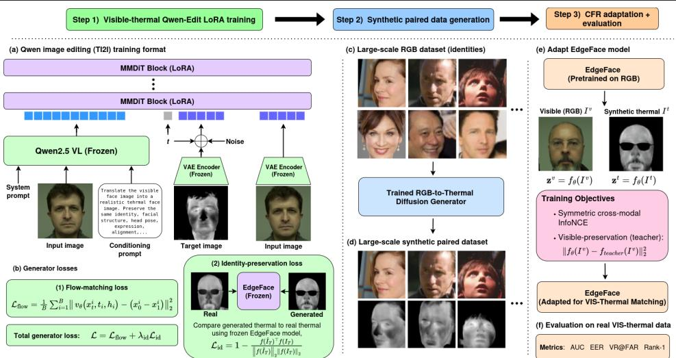
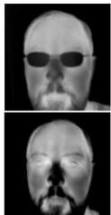
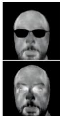
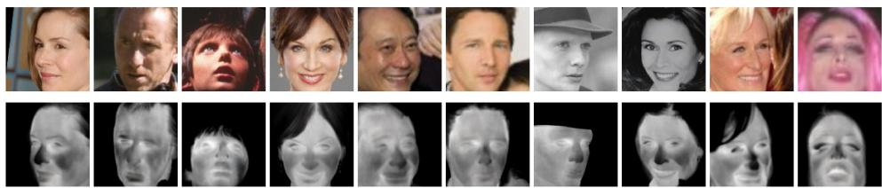
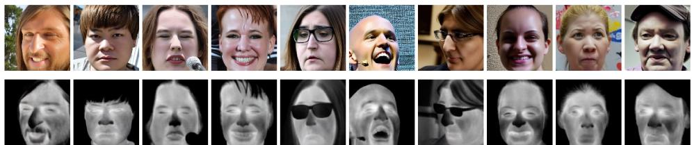

# SynThermFace: Amplifying Limited Paired Data for Visible–Thermal Face Recognition via Synthetic Data Generation

Anjith George1   
anjith.george@idiap.ch   
2Adam Unal1   
0adam.unal@idiap.ch   
2Sebastien Marcel1,2   
psebastien.marcel@idiap.ch

1 Idiap Research Institute Rue Marconi 19 Martigny, Switzerland

2 University of Lausanne (UNIL) Lausanne, Switzerland

## Abstract

Face recognition (FR) is a widely used modality for biometric authentication, but conventional models rely on visible-spectrum imagery and degrade when high-quality RGB images cannot be captured. Cross-spectral face recognition addresses this limitation by matching visible images with other modalities such as thermal imagery, enabling more reliable performance in low-light, nighttime, and unconstrained conditions. However, progress is limited by the scarcity of paired visible–thermal data, which is difficult and costly to collect at scale. We propose SynThermFace, a framework that amplifies limited real visible–thermal supervision into larger paired adaptation datasets for crossspectral face recognition. A diffusion model is first adapted using a limited set of paired visible–thermal images and then used to generate large-scale paired visible–synthetic thermal data from existing real or synthetic visible face datasets. The generated pairs are used to adapt a pretrained visible-spectrum face recognition model into a CFR model. Unlike synthesis-based approaches that require image translation at test time, the proposed method shifts generation to the training stage and performs inference with a single forward pass through the adapted recognition model. Under the same MCXFace realpair protocol, PACT improves over the evaluated CFR adaptation baselines, isolating the effect of the proposed adaptation objective. Training PACT on larger generated paired datasets provides additional improvements over both the unadapted model and the realpair PACT configuration. Cross-database evaluation on the Tufts dataset provides evidence that the learned representation transfers to an unseen database. The source code and trained models will be made publicly available.

## 1 Introduction

Face recognition (FR) has evolved as a highly accurate and convenient modality for biometric authentication [21]. While conventional visible-spectrum FR is easy to use, it often fails under poor illumination, at night, or in unconstrained environments. Thermal imaging offers an effective alternative since it captures heat emitted by the human face rather than reflected light. Modern thermal infrared sensors typically operate in the medium-wave infrared (MWIR) band of 3–5 µm and the long-wave infrared (LWIR) band of 7–14 µm, enabling face imaging even under low-light or no-light conditions [32]. Due to improvements in sensor technology and reductions in cost, thermal face recognition has become increasingly useful for law enforcement, surveillance, border security, and healthcare applications [30, 38].

While thermal imaging offers several advantages, making it compatible with existing visible-spectrum galleries, such as national identity databases, is not trivial. Visible-tothermal face recognition, a form of cross-spectral face recognition (CFR) [1], offers a practical alternative. CFR focuses on matching face images across visible and thermal modalities, such as comparing a visible gallery image with a thermal probe image captured at night. This eliminates the need for separate thermal enrollment, allowing visible-spectrum galleries from legacy systems to be reused and thereby augmenting existing recognition capabilities.

Despite its usefulness, visible-to-thermal face recognition remains challenging due to the large modality gap between visible and thermal images [5, 32]. This challenge is further compounded by the scarcity of large-scale paired visible–thermal datasets, which are typically smaller and less diverse than visible-spectrum face datasets (as their collection requires specialized sensors and synchronization across modalities) [19, 31]. As a result, models are often trained under limited-data conditions, leading to poor performance.

In this work, we investigate the use of synthetic visible–thermal face data to improve cross-spectral face recognition under limited real-data conditions. We propose a synthetic data generation pipeline and a cross-modal adaptation strategy, PACT (Preservation-Aware Cross-Spectral Tuning), that integrates paired visible–synthetic thermal samples into the learning process. By generating synthetic thermal counterparts for visible face images, the proposed approach provides additional supervision for learning cross-modal identity representations without requiring large-scale real paired visible–thermal data. We further show that this adaptation improves over existing CFR methods even under an identical real-data protocol and that the learned representation transfers to an unseen thermal database.

More broadly, we view synthetic cross-modal generation as a mechanism for pairedsupervision amplification: a limited set of real paired samples are used to learn the crossmodal mapping, which then converts large scale single-modality data into scalable paired supervision for representation learning. This formulation showcases a general strategy for cross-modal learning in domains where acquiring paired data is substantially more expensive than acquiring data in a single modality.

The main contributions of this work are listed below:

• We formulate visible–thermal generation as paired-data amplification: a diffusion model adapted on limited real pairs constructs larger paired adaptation sets from external visible-face images.

• We introduce a cross-modal adaptation strategy, PACT (Preservation-Aware Cross-Spectral Tuning), that combines symmetric thermal–visible contrastive alignment with visible-domain preservation regularization.

• We evaluate generated adaptation sets derived from both real and synthetic visible sources and assess transfer to the unseen Tufts database.

• Synthesis is performed only during training, so deployed recognition requires a single model forward pass without any image translation, making deployment-friendly inference possible.

  
Figure 1: Overview of the proposed SynThermFace framework. A visible-to-thermal generation model is first fine-tuned using a limited set of paired visible-thermal images. The adapted generator is then used to synthesize thermal images for a larger set of identities, producing paired visible–synthetic thermal data for training the CFR model.

Finally, to support reproducibility and further extensions, we will publicly release the source code and trained models1.

## 2 Related Work

Heterogeneous Face Recognition: Heterogeneous face recognition (HFR), including crossspectral face recognition (CFR), addresses face matching across different sensing modalities, such as VIS, NIR, and thermal imaging. Its main challenge is the modality gap, where images from different domains follow distinct distributions. Existing HFR methods can be broadly grouped into three categories. First, modality-invariant feature learning aims to extract representations that remain stable across domains, ranging from early handcrafted descriptors such as LBP and SIFT [22, 24] to deep CNN-based invariant representations [16, 17]. Second, common-space projection methods reduce the modality gap by mapping features into a shared latent space using techniques such as CCA, PLS, coupled regression, or deep domain-invariant architectures [10, 35, 40]. A third class of methods, called synthesisbased approaches, translates images from one modality to another, often into the visible domain, enabling the use of standard FR models. These methods evolved from patch-based reconstruction and manifold learning to GAN-based image translation frameworks such as CycleGAN [37, 42]. DiffTV [25] proposes a latent diffusion model for identity-preserved thermal-to-visible face translation, using heterogeneous feature alignment and dual-stage conditioning to better preserve identity details, including facial structure and skin color. However, it is proposed as an image translation method for CFR.

Synthetic Data for Face Recognition: In conventional visible-spectrum face recognition, synthetic data is often used as an alternative or supplement to large-scale real face datasets. Recent works have explored synthetic face datasets to address the legal, privacy, and ethical challenges of collecting real facial data. Early works such as SynFace [33] and SFace [2] leveraged GAN-based models to generate identity-preserving synthetic faces. More recent approaches employ diffusion models, such as IDiff-Face [3], or hybrid GAN–diffusion pipelines such as GANDiffFace [27], to improve identity diversity and image realism. Other methods focus on disentangling and controlling identity representations in latent spaces, including ExFaceGAN [4], IDNet [23], and Digi2Real [11]. Additionally, synthetic data has been used for efficient model training and hard-sample generation [34], while advanced latent-space sampling strategies such as DisCo [9] further enhance identity diversity and intra-class variation. Although models trained solely on synthetic data still typically underperform those trained on real data, this performance gap has been steadily decreasing as generative models improve in realism, diversity, and identity consistency.

Cross-Spectral Synthetic Data: In [6], authors proposed ThermVision-DB, a synthetic long-wave infrared (LWIR) thermal face dataset generated using a FLUX-LoRA diffusion model and LivePortrait-based image-to-video retargeting. The dataset provides synthetic thermal facial images and videos with controlled identity, gender and other attributes, targeting privacy-preserving thermal face analysis. Although the work is relevant to cross-spectral synthetic data research, it does not demonstrate paired RGB–thermal model training or crossspectral translation; instead, the generative pipeline is trained and evaluated within the thermal domain. The paper also does not discuss whether synthetic data can replace or improve over real data in downstream tasks. In [36], authors introduced an identity-conditioned dual-branch StyleGAN2 framework for generating aligned visible (VIS) and near-infrared (NIR) synthetic face images for privacy-preserving face recognition. The method includes a Privacy and Diversity filter that removes samples matching real identities or previously generated identities while improving identity separability and intra-identity diversity. This work explicitly trains and evaluates recognition models using synthetic cross-spectral VIS– NIR data, showing that multispectral synthetic training can improve performance even on visible-spectrum benchmarks. However, they do not address the more challenging thermal images. T-FAKE [7] creates 200,000 synthetic thermal faces with sparse and dense landmarks by thermalizing synthetic RGB faces using paired reconstruction, Wasserstein patchdistribution matching, and region-specific temperature regularization. However, it targets facial landmarking rather than identity preservation or cross-spectral recognition.

Motivation: The main motivation for synthetic data in FR comes from privacy, consent, and regulatory concerns, whereas in cross-spectral face recognition the motivation is more pragmatic: paired visible–thermal data are scarce, expensive, and difficult to scale.

Unlike RGB face images, which can be collected or web-scraped at large scale, crossspectral datasets require specialized sensors and synchronized capture across modalities, resulting in limited identity and diversity. Synthetic data therefore offers a practical way to generate a large-scale paired visible–thermal dataset, expand diversity, and reduce dependence on costly real data collection. Unlike image-translation approaches for heterogeneous face recognition, which translate thermal or other non-RGB inputs into visible images at inference time [26, 41], our approach shifts the generative cost to the training stage by generating a large-scale paired visible–thermal dataset from available visible face data and using it to fine-tune cross-spectral recognition models. This removes the need for a costly translation step for every test sample, reducing inference to a single forward pass through the recognition model and making the inference stage more practical.

## 3 Proposed Method

As discussed in the previous section, our main objective is to develop a high-performing visible-to-thermal face recognition model. To achieve this, we require paired visible–thermal data for training the cross-spectral face recognition (CFR) model. Our approach consists of three tightly coupled stages. First, we train a diffusion-based visible-to-thermal translation model using a small paired visible–thermal dataset. Second, we apply the trained translation model to large-scale real or synthetic visible face datasets, generating a synthetic thermal counterpart for each visible image and thereby constructing paired visible–synthetic thermal training data. Finally, we fine-tune a face recognition model on this synthetic paired data so that visible and thermal samples of the same identity are aligned in the feature space. The resulting model is then benchmarked for cross-spectral recognition against baseline models and models trained using real paired data, and its generalization is further assessed on an unseen thermal database. The overall framework is shown in Fig. 1. The details of each stage are elaborated in this section.

## 3.1 Diffusion Model

The first stage trains a visible-to-thermal generator using a limited set of real paired visible– thermal images. The trained generator is then applied to large-scale visible face datasets to synthesize thermal counterparts in the second stage, constructing paired visible–synthetic thermal data for CFR adaptation.

Our objective in the first stage is to learn a visible-to-thermal translation model that can generate a thermal-like counterpart for an arbitrary visible face image while retaining the source image’s facial geometry, pose, and identity-relevant information. We formulate this as an image-editing problem and build on Qwen-Image-Edit [39], a large-scale editing mode based on a Multimodal Diffusion Transformer (MMDiT). The model couples a Qwen2.5- VL multimodal encoder that extracts high-level semantic conditioning with a variational autoencoder (VAE) that provides low-level appearance features, and is trained with a flowmatching objective in the VAE latent space.

Let $x _ { 0 } = \mathcal { E } ( I _ { T } )$ denote the latent of the target thermal image obtained from the VAE encoder, and let $x _ { 1 } \sim \mathcal { N } ( 0 , I )$ be a sampled noise vector. Following the rectified-flow formulation of Qwen-Image [39], for each training sample a timestep $t \in [ 0 , 1 ]$ is sampled from a logit-normal distribution, and the intermediate latent and its target velocity are defined as

$$
x _ { t } = t x _ { 0 } + ( 1 - t \big ) x _ { 1 } , \qquad \nu _ { t } = x _ { 0 } - x _ { 1 } ,\tag{1}
$$

respectively. Given the user input S, which comprises a text prompt combined with an image, the multimodal encoder φ (Qwen2.5-VL) is used to obtain the guidance latent $h = \phi ( S )$ . Then, the transformer $\nu _ { \theta }$ is trained to predict the target velocity, and over a minibatch of size B, the flow-matching loss is given by

$$
\mathcal { L } _ { \mathrm { f l o w } } = \frac { 1 } { B } \sum _ { i = 1 } ^ { B } \big | \big | \nu _ { \theta } \left( x _ { t } ^ { i } , t _ { i } , h _ { i } \right) - \left( x _ { 0 } ^ { i } - x _ { 1 } ^ { i } \right) \big | \big | _ { 2 } ^ { 2 } ,\tag{2}
$$

where, for each sample i in the batch, $x _ { t } ^ { i }$ is the noised latent obtained by interpolating between the target latent $x _ { 0 } ^ { i }$ and the sampled noise $x _ { 1 } ^ { i }$ at timestep $t _ { i } .$ , and $h _ { i } = \phi ( S _ { i } )$ is the conditioning embedding extracted by the multimodal encoder.

For editing, the source image is encoded through both pathways and jointly fed into the transformer as conditioning signals. This conditioning allows for the structure and layout of the original image to be preserved while appearance can be modified, which is well suited to our task of visible-to-thermal translation where the facial geometry and pose of the input must be retained and only the imaging modality should change.

Low Rank Adaptation: Fully fine-tuning a 20B-parameter editing model on a small paired dataset is prone to overfitting, so we adapt it with Low-Rank Adaptation (LoRA) [18]. We insert trainable low-rank updates into the attention projections and the MLP and modulation layers of both the image and text streams of the MMDiT, while keeping the VAE and Qwen2.5-VL encoder frozen. This restricts adaptation to a small fraction of the backbone, preserving the generative capabilities of the pretrained model while making finetuning feasible on our limited data.

Identity Preservation: In addition to the standard losses used in Qwen-Edit, we introduce an identity-preservation loss that encourages generated images to retain the subject identity. Since our model performs RGB-to-thermal translation, enforcing identity preservation ideally requires a face recognition model that is robust across the visible-thermal domain gap. However, such a model is not available in our current setup; developing such a robust cross-spectral FR model is itself the goal of this work.

Instead, we use a proxy identity loss computed within the thermal modality. Specifically, during training, we reconstruct the predicted clean thermal image from the noisy latent and velocity prediction at low-noise timesteps, decode it through the VAE, and compare it with the corresponding ground-truth thermal image of the same subject. The comparison is performed in the feature space of a frozen lightweight EdgeFace-Base model [15], using a cosine-distance loss between the two identity embeddings. This loss is applied only when the noise level is sufficiently low, so that the reconstructed image is meaningful, and is added to the standard flow-matching loss as a weighted auxiliary objective. This design is motivated by the observation that thermal images of the same identity form well-separated clusters within the thermal modality [14, 15]. Although EdgeFace was originally trained on visible images, we use it only as a weak identity regularizer within paired thermal supervision.

$$
\mathcal { L } _ { \mathrm { i d } } = 1 - \frac { f ( \hat { I } _ { T } ) ^ { \top } f ( I _ { T } ) } { \left. f ( \hat { I } _ { T } ) \right. _ { 2 } \left. f ( I _ { T } ) \right. _ { 2 } } .\tag{3}
$$

where $\hat { I } _ { T }$ denotes the generated thermal image, $I _ { T }$ is the corresponding ground-truth thermal image, and $f ( \cdot )$ represents the feature embedding extracted by the frozen EdgeFace-Base network.

The final training loss combines both terms:

$$
\begin{array} { r } { \mathcal { L } = \mathcal { L } _ { \mathrm { f l o w } } + \lambda _ { \mathrm { i d } } \mathcal { L } _ { \mathrm { i d } } . } \end{array}\tag{4}
$$

where ${ \mathcal { L } } _ { \mathrm { f l o w } }$ denotes the standard flow-matching loss used by Qwen-Edit, and $\lambda _ { \mathrm { i d } }$ controls the contribution of the identity-preservation term. $\lambda _ { \mathrm { i d } }$ is set to 0.1 in our experiments.

## 3.2 PACT: Preservation-Aware Cross-Spectral Tuning

In the third stage, we fine-tune face recognition models using paired visible–thermal data. This paired data can be either real or synthetically generated. However, directly training with paired data may not be optimal for maximizing cross-modal performance, since the model must reduce the visible–thermal modality gap without destroying the identity-discriminative structure learned from large-scale visible-spectrum pretraining. Instead of training a crossspectral face recognition model from scratch, we start from a lightweight EdgeFace [15] backbone pretrained on a large-scale RGB face dataset.

We propose PACT (Preservation-Aware Cross-Spectral Tuning), a cross-modal adaptation strategy that aligns visible and thermal embeddings while regularizing them with the pretrained visible-domain representation. PACT combines a symmetric thermal–visible contrastive loss with a visible-domain preservation loss computed against a frozen copy of the original pretrained model.

PACT shares the use of cross-modal alignment and frozen-teacher preservation with prior lightweight adaptation methods such as xEdgeFace [12, 13]. Whereas pairwise objectives optimize each anchor primarily against one paired counterpart, PACT assigns positive probability mass to every opposite-modality sample of the same identity in the mini-batch and jointly optimizes thermal-to-visible and visible-to-thermal retrieval. The preservation term separately limits drift from the pretrained visible-domain representation.

Let $f _ { \theta } ( \cdot )$ denote the pretrained EdgeFace encoder (it can be any FR model). Given a paired thermal and visible sample $( x _ { i } ^ { t } , x _ { i } ^ { \nu } , y _ { i } )$ , where $y _ { i }$ denotes its subject identity, we extract ℓ -normalized feature embeddings as

$$
\mathbf { z } _ { i } ^ { t } = \frac { f _ { \theta } ( x _ { i } ^ { t } ) } { \vert \vert f _ { \theta } ( x _ { i } ^ { t } ) \vert \vert _ { 2 } } , \qquad \mathbf { z } _ { i } ^ { \nu } = \frac { f _ { \theta } ( x _ { i } ^ { \nu } ) } { \vert \vert f _ { \theta } ( x _ { i } ^ { \nu } ) \vert \vert _ { 2 } } .\tag{5}
$$

To adapt the pretrained RGB representation to the cross-modal setting, we optimize a combination of complementary objectives. First, a symmetric, identity-aware, multi-positive cross-modal InfoNCE loss [28, 29] encourages the model to assign high similarity to visible and thermal samples belonging to the same subject while assigning lower similarity to samples from different subjects.

For a mini-batch of size B, we define the scaled similarity between a thermal anchor and a visible candidate as

$$
s _ { i j } = \frac { \mathbf { z } _ { i } ^ { t ^ { \top } } \mathbf { z } _ { j } ^ { \nu } } { \tau } ,\tag{6}
$$

where $\tau$ is a temperature hyperparameter.

For each anchor i, let

$$
\mathcal { P } ( i ) = \left\{ j \in \left\{ 1 , \dots , B \right\} | y _ { j } = y _ { i } \right\}\tag{7}
$$

denote the set of visible or thermal samples in the mini-batch that share the anchor’s identity. The paired sample is always included because $i \in \mathcal { P } ( i )$ . When multiple samples of the same subject occur in a mini-batch, they are all treated as positives.

The directional contrastive terms are then given by

$$
\begin{array} { r l } & { \mathcal { L } _ { t  \nu } = - \displaystyle \frac { 1 } { B } \sum _ { i = 1 } ^ { B } \log \frac { \sum _ { j \in \mathcal { P } ( i ) } \exp ( s _ { i j } ) } { \sum _ { j = 1 } ^ { B } \exp ( s _ { i j } ) } , } \\ & { \mathcal { L } _ { \nu  t } = - \displaystyle \frac { 1 } { B } \sum _ { i = 1 } ^ { B } \log \frac { \sum _ { j \in \mathcal { P } ( i ) } \exp ( s _ { j i } ) } { \sum _ { j = 1 } ^ { B } \exp ( s _ { j i } ) } . } \end{array}\tag{8}
$$

The symmetric contrastive loss is defined as their average:

$$
\mathcal { L } _ { \mathrm { N C E } } = \frac { 1 } { 2 } ( \mathcal { L } _ { t  \nu } + \mathcal { L } _ { \nu  t } ) .\tag{9}
$$

The two terms correspond to thermal-to-visible and visible-to-thermal matching, respectively.

This objective maximizes the total cross-modal similarity mass assigned to same-identity candidates in the mini-batch while reducing the mass assigned to candidates belonging to different identities.

To mitigate catastrophic forgetting, PACT retains a frozen copy of the pretrained model $f _ { \theta _ { 0 } }$ and encourages consistency between the adapted and original visible-image embeddings through a visible-domain preservation loss:

$$
\mathcal { L } _ { \mathrm { p r e s e r v e } } = 1 - \frac { 1 } { B } \sum _ { i = 1 } ^ { B } \cos \left( \mathbf { z } _ { i } ^ { \nu } , \mathbf { z } _ { i , \mathrm { t e a c h e r } } ^ { \nu } \right) ,\tag{10}
$$

where $\pmb { z } _ { i , \mathrm { t e a c h e r } } ^ { \nu }$ denotes the embedding produced by the frozen teacher network. This regularization is designed to discourage catastrophic forgetting relative to the frozen teacher, helping retain the discriminative structure obtained during large-scale RGB pretraining while making it possible to adapt to the thermal domain. The overall PACT objective is the weighted sum:

$$
\mathcal { L } _ { \mathrm { P A C T } } = \lambda _ { \mathrm { N C E } } \mathcal { L } _ { \mathrm { N C E } } + \lambda _ { \mathrm { p r e s e r v e } } \mathcal { L } _ { \mathrm { p r e s e r v e } } ,\tag{11}
$$

where $\lambda _ { \mathrm { N C E } }$ and $\lambda _ { \mathrm { p r e s e r v e } }$ balance cross-modal alignment against visible-domain preservation.

## 3.3 Implementation Details

The visible-to-thermal generator model is adapted from Qwen-Image-Edit-2511 using LoRA fine-tuning. Each training sample is a spatially aligned (visible, thermal) pair from the training set of the MCXFace VIS–THERMAL protocol. The visible image is provided as the editing condition and the thermal image as the generation target. Images are cropped and resized to $1 1 2 \times 1 1 2$ . We fine-tune only the DiT component with LoRA rank 32, while using the pretrained Qwen2.5-VL text encoder and VAE. LoRA adapters are inserted into the attention projections, output projections, and selected image/text MLP and modulation layers. The model is trained for 20 epochs with a learning rate of $1 \times 1 0 ^ { - 4 }$ . Training is performed on an NVIDIA H100 GPU. During synthetic data generation, we use 20 denoising steps per image; generating one 112 × 112 thermal image takes approximately 10 seconds on the H100 GPU. Some sample images are shown in Fig. 2.

After training the visible-to-thermal translation model, we use CASIA-WebFace as the source of visible face images for large-scale synthetic data generation. Specifically, we sample up to 1000 identities with 20 images per identity and transform each visible image using the trained diffusion model. This produces paired visible–synthetic thermal datasets, referred to as CASIA-Synthetic-Thermal (Fig. 3) in the following sections, for cross-modal face recognition training. In addition, we use synthetic visible face images from

  
(a) RGB Image

  
(b) Thermal Image  
(c) Synthetic Thermal Image  
Figure 2: Examples of real visible and thermal images from MCXFace, along with the corresponding synthetic thermal images generated.

Digi2Real as RGB inputs to generate corresponding thermal images, resulting in a fully

synthetic paired dataset of 1000 identities referred to as Digi2Real-Synthetic-Thermal (Fig.   
4).

For the CFR adaptation stage, we fine-tune the pretrained EdgeFace-Base model using paired visible-synthetic thermal images generated by the proposed diffusion pipeline. Training is implemented in PyTorch using AdamW with a learning rate of $1 \times 1 0 ^ { - 5 }$ , batch size 128, and 20 epochs. Mini-batches are constructed by randomly shuffling paired samples. When multiple samples from the same identity occur in a batch, all corresponding crossmodal entries are treated as positives; otherwise, the objective reduces to the single-positive case. We optimize the weighted objective in Eq. 11. We fix $\lambda _ { \mathrm { N C E } } = \lambda _ { \mathrm { p r e s e r v e } } = 1$ a priori (equal weighting, as both losses act on normalized cosine similarities); Table 2 presents a post-hoc sensitivity analysis. The temperature $\tau = 0 . 0 7$ and the identity-loss weight $\lambda _ { \mathrm { i d } } = 0 . 1$ follow common practice and were fixed a priori. The 1,000-identity setting follows the available generation budget; Table 3 retrospectively examines sensitivity to overall training scale. All CFR adaptation experiments are trained on an NVIDIA RTX 3090 GPU. At inference time, only the adapted EdgeFace model is used, requiring a single forward pass without any image-translation module.

  
Figure 3: Samples showing real visible images from CASIA-WebFace and generated thermal samples.

  
Figure 4: Samples showing synthetic visible images from Digi2Real and corresponding generated thermal samples.

## 4 Experiments

This section describes the dataset generation process and the experimental setup used to evaluate the proposed approach.

CFR Source Dataset: We use the MCXFace dataset [14] for training and evaluating the model. MCXFace consists of images from 51 subjects captured across multiple channels, three acquisition sessions, and diverse illumination conditions. The dataset provides several modalities, including visible, thermal, and depth images. In this work, we focus on the visible-to-thermal setting, which represents one of the most challenging cross-modal scenarios in the dataset. The visible and thermal modalities are spatially registered, and the dataset includes predefined training and development sets with disjoint subject identities. For reproducibility, we conduct all experiments using the VIS-THERMAL protocol shipped with the dataset [14].

Metrics: We evaluate performance using a set of standard metrics commonly adopted in prior literature. These include Area Under the Curve (AUC), Equal Error Rate (EER), Rank-1 identification rate, and Verification Rate measured at false acceptance rates of 0.1%, 1%, and 5%.

## 4.1 Baselines and Comparative Methods

We compare the proposed method under four evaluation settings for VIS-THERMAL crossspectral face matching:

• Baseline Face Recognition Models: We establish baseline performance by evaluating standard face recognition backbones on the VIS-THERMAL protocol using the dev set.

• Comparative HFR Methods: We evaluate representative heterogeneous face recognition (HFR) methods from the literature by training them on the training set and testing them on the dev set.

• Synthetic Thermal Adaptation Data: We assess the effectiveness of the proposed generation framework by training models using visible–synthetic thermal pairs generated from external visible face datasets and evaluating them on the dev set.

• Isolating the Proposed Loss: We evaluate EdgeFace adapted with the proposed PACT approach using only real MCXFace paired training data, to isolate the contribution of the adaptation loss from that of the synthetic data.

The real-pair experiments provide the controlled comparison of adaptation methods under the same MCXFace source-data protocol. The generated-data experiments evaluate the complete SynThermFace pipeline and should not be interpreted as data-matched comparisons against methods trained only on the smaller real MCXFace set.

Baseline Methods: To compare the effectiveness of the proposed approach, we first establish baseline results for VIS-THERMAL cross-spectral matching on the MCXFace dataset. We use the AdaFace model [20], which is based on the IResNet100 architecture and trained on WebFace12M [43], as well as EdgeFace [15] (base model), which is a much more lightweight convolutional-transformer hybrid model, also trained on WebFace12M [43]. These models cover both CNN and CNN-transformer hybrid architectures with high and low computational budgets. Note that both models are trained for visible-spectrum face recognition and are not adapted for cross-spectral face recognition.

CFR Methods: To ensure a fair comparison with existing cross-spectral face recognition methods, we include several CFR approaches from the literature and adapt them according to the MCXFace training protocol. Since evaluation is performed on a separate development set, this allows us to clearly assess the effect of model adaptation. Domain-Invariant Units (DIU) [10] introduce a strategy for adapting pretrained face recognition models by fine-tuning only the lower layers to reduce modality dependence. This method is built on the AdaFace model. Prepended Domain Transformer (PDT) [14] adds a lightweight trainable prepended module for the target modality, making it easy to convert an existing face recognition model into a cross-spectral model. More recently, xEdgeFace [12, 13] proposed an efficient adaptation strategy for lightweight face recognition models by tuning the layer normalization parameters and lower layers, achieving strong performance with low computational cost.

Proposed Method: In our proposed PACT approach, EdgeFace is adapted using the generated CASIA-Synthetic-Thermal or Digi2Real-Synthetic-Thermal dataset according to the cross-modal adaptation procedure described in Section 3.2.

## 4.2 Experimental Results

All methods are evaluated using the MCXFace VIS–THERMAL protocol. The training split is used for generator adaptation and, where applicable, CFR model training. Evaluation is performed only on the development split, whose identities are disjoint from the training split and are not used in training of any component for a fair evaluation.

Table 1 compares baseline visible-spectrum face recognition models, existing CFR adaptation methods, and the proposed PACT adaptation scheme on the visible–thermal protocol. The baseline models perform poorly in cross-spectral matching, with EERs of 14.79% and 23.06% for AdaFace and EdgeFace, respectively, highlighting the large modality gap between visible and thermal face images. Existing CFR methods substantially improve performance through cross-modal adaptation. Among them, DIU achieves an EER of 3.73%, while xEdgeFace obtains a similar EER of 3.76% with a lightweight backbone.

PACT fine-tuned only on real paired MCXFace data already improves over these CFR baselines under an identical real-data protocol, which isolates the contribution of the proposed PACT loss from that of the synthetic data, achieving an EER of 3.04% and a Rank-1 accuracy of 96.49%. Notably, PACT fine-tuned on real data also achieves strong low-FAR verification performance.

When PACT is fine-tuned on fully synthetic visible–thermal pairs (data from Digi2Real-Synthetic-Thermal), performance improves further across all metrics. The fully synthetic setting reduces the EER to 1.20%, improves Rank-1 accuracy to 99.50%, and achieves 99.75% VR@5%, 98.75% VR@1%, and 92.48% VR@0.1%. The partially synthetic CASIA-Synthetic-Thermal setting performs best overall, with an EER of 0.99% and Rank-1 accuracy of 99.75%. These results show that the generated pairs provide useful supervision within the evaluated PACT pipeline. Importantly, the improvement over the real-pair PACT configuration shows that the larger generated adaptation set provides additional useful supervision.

Although the generated PACT adaptation set is larger, the generator’s cross-modal supervision originates from the limited MCXFace training split. The proposed pipeline therefore reuses limited real supervision to construct a larger adaptation dataset.

The two synthetic settings differ only in their visible source: CASIA-Synthetic-Thermal pairs real CASIA-WebFace visible images with generated thermal images (partially synthetic), whereas Digi2Real-Synthetic-Thermal pairs synthetic Digi2Real visible images with generated thermal images (fully synthetic). As shown in Table 1, the two visible-source settings perform similarly, with a small numerical advantage for CASIA-Synthetic-Thermal on MCXFace. We clarify that “fully synthetic” here refers to the paired adaptation set: the generator itself is still fine-tuned on real paired MCXFace data, so the pipeline still relies on some real supervision.

Table 1: Performance comparison of different FR and CFR models. Higher is better for all metrics except EER.
<table><tr><td>Model</td><td>AUC (%) ↑</td><td>EER (%) ↓</td><td>VR@5% (%) ↑</td><td>VR@1% (%) ↑</td><td>VR@0.1% (%) ↑</td><td>R1 (%) ↑</td></tr><tr><td>AdaFace []</td><td>93.89</td><td>14.79</td><td>76.19</td><td>52.88</td><td>38.35</td><td>65.16</td></tr><tr><td>EdgeFace []</td><td>86.08</td><td>23.06</td><td>48.37</td><td>28.82</td><td>13.03</td><td>40.10</td></tr><tr><td>DIU []</td><td>99.22</td><td>3.73</td><td>96.99</td><td>80.70</td><td>41.60</td><td>90.73</td></tr><tr><td>xEdgeFace []</td><td>99.34</td><td>3.76</td><td>97.49</td><td>86.22</td><td>64.41</td><td>90.48</td></tr><tr><td>PDT []</td><td>99.00</td><td>6.00</td><td>93.23</td><td>86.22</td><td>72.18</td><td>89.47</td></tr><tr><td>PACT (MCXFace-Real)</td><td>99.65</td><td>3.04</td><td>98.75</td><td>90.73</td><td>72.68</td><td>96.49</td></tr><tr><td>PACT (Digi2Real-Synthetic-Thermal)</td><td>99.92</td><td>1.20</td><td>99.75</td><td>98.75</td><td>92.48</td><td>99.50</td></tr><tr><td>PACT (CASIA-Synthetic-Thermal)</td><td>99.94</td><td>0.99</td><td>99.75</td><td>99.25</td><td>93.48</td><td>99.75</td></tr></table>

Table 2: Sensitivity to the NCE and preservation loss weights.
<table><tr><td>λNCE</td><td> $\lambda _ { \mathrm { P r e s e r v e } }$ </td><td>AUC↑</td><td>EER↓</td><td>VR@1%↑</td><td>VR@0.1% ↑</td></tr><tr><td>0.00</td><td>0.00</td><td>86.08</td><td>23.06</td><td>28.82</td><td>13.03</td></tr><tr><td>0.00</td><td>0.50</td><td>86.30</td><td>23.06</td><td>30.08</td><td>12.78</td></tr><tr><td>0.00</td><td>1.00</td><td>86.31</td><td>22.81</td><td>29.82</td><td>12.78</td></tr><tr><td>0.50</td><td>0.00</td><td>99.79</td><td>2.46</td><td>93.48</td><td>74.19</td></tr><tr><td>0.50</td><td>0.50</td><td>99.95</td><td>1.00</td><td>99.00</td><td>93.23</td></tr><tr><td>0.50</td><td>1.00</td><td>99.91</td><td>1.20</td><td>98.50</td><td>92.23</td></tr><tr><td>1.00</td><td>0.00</td><td>99.83</td><td>2.01</td><td>95.74</td><td>76.19</td></tr><tr><td>1.00</td><td>0.50</td><td>99.96</td><td>1.00</td><td>99.00</td><td>94.24</td></tr><tr><td>1.00</td><td>1.00</td><td>99.94</td><td>0.99</td><td>99.25</td><td>93.48</td></tr></table>

Table 3: Effect of the number of synthetic training identities.
<table><tr><td>IDs</td><td>AUC↑</td><td>EER↓</td><td>VR@1%↑</td><td>VR@0.1%↑</td></tr><tr><td>10</td><td>94.03</td><td>13.50</td><td>49.37</td><td>26.57</td></tr><tr><td>50</td><td>99.44</td><td>3.51</td><td>87.97</td><td>67.17</td></tr><tr><td>100</td><td>99.76</td><td>2.46</td><td>93.98</td><td>71.93</td></tr><tr><td>200</td><td>99.82</td><td>1.98</td><td>95.49</td><td>80.20</td></tr><tr><td>500</td><td>99.91</td><td>1.29</td><td>98.25</td><td>87.97</td></tr><tr><td>1000</td><td>99.94</td><td>0.99</td><td>99.25</td><td>93.48</td></tr></table>

## 4.3 Ablations

In this section, we present ablation studies to analyze the contribution of different components of the proposed pipeline and to better understand the factors influencing cross-spectral recognition performance.

Sensitivity to Loss Weights: The weights of the NCE and preservation losses control the trade-off between cross-modal alignment and retention of the pretrained visible-domain embedding space. To study their effect, we vary the corresponding loss weights and report the results in Table 2. When both weights are set to zero, the model reduces to the unadapted EdgeFace baseline, resulting in poor visible–thermal matching performance. Introducing the NCE loss leads to a substantial improvement, confirming the importance of contrastive cross-modal alignment. Adding the preservation loss further improves the reported metrics, consistent with its intended role of limiting drift from the pretrained identity representation. Performance is stable around balanced non-zero weights $( \mathrm { E E R } \approx 1 . 0 \%$ for λNCE, $\lambda _ { \mathrm { p r e s e r v e } } \in$ {0.5,1.0}), with some metrics favoring 1.0/0.5; we adopt equal 1.0/1.0 weighting.

Effect of the Number of Identities: We further analyze the effect of the number of synthetic training identities used for cross-modal adaptation. For this experiment, we generate visible-synthetic thermal pairs from CASIA-WebFace using different numbers of identities, while keeping the NCE and preservation loss weights fixed at 1.0. The results are reported in Table 3. Performance improves as the overall generated adaptation set is scaled from 10 to 1,000 identities. The marginal gain becomes smaller beyond 500 identities, although identity count, image count, and optimization budget vary jointly.

Table 4: Cross-database VIS-Thermal evaluation on the Tufts Face Dataset. Higher is better for all metrics except EER.
<table><tr><td>Model</td><td>AUC (%) ↑</td><td>EER (%) ↓</td><td>VR@5% (%) ↑</td><td>VR@1% (%) ↑</td><td>R1 (%) ↑</td></tr><tr><td>EdgeFace []</td><td>59.40</td><td>43.41</td><td>13.36</td><td>2.97</td><td>12.03</td></tr><tr><td>xEdgeFace [] (MCXFace)</td><td>83.32</td><td>23.90</td><td>46.94</td><td>30.98</td><td>31.06</td></tr><tr><td>PACT (MCXFace-Real)</td><td>90.27</td><td>18.21</td><td>66.23</td><td>49.72</td><td>48.83</td></tr><tr><td>PACT (Digi2Real-Synthetic-Thermal)</td><td>93.49</td><td>13.91</td><td>75.70</td><td>58.81</td><td>56.37</td></tr><tr><td>PACT (CASIA-Synthetic-Thermal)</td><td>93.01</td><td>14.70</td><td>75.32</td><td>58.26</td><td>57.45</td></tr></table>

## 4.4 Cross-Database Evaluation on Tufts Face Dataset

To assess whether the proposed adaptation overfits to MCXFace-specific data statistics, we evaluate the trained models on the Tufts Face Dataset [31]. Tufts contains multi-modal face images from 113 identities (39 males and 74 females). We follow the VIS–Thermal protocol in [8] and use Tufts only for cross-database testing.

Table 4 compares the untuned EdgeFace baseline, xEdgeFace fine-tuned on MCXFace, PACT fine-tuned on real MCXFace pairs, and PACT fine-tuned on synthetic (Digi2Real and CASIA) data. All adapted models improve over the baseline, but PACT gives stronger transfer than xEdgeFace. PACT fine-tuned on real MCXFace pairs reduces EER from 43.41% to 18.21%, while PACT fine-tuned on fully synthetic data further reduces EER to 13.91% and improves Rank-1 accuracy to 56.37%.

These results provide evidence that the learned adaptation transfers beyond MCXFacespecific identities and acquisition conditions. However, the substantial performance gap between MCXFace and Tufts shows that sensor and database shift remains an open challenge. The Digi2Real-derived setting achieves the lowest EER and highest AUC and verification rates, while the CASIA-derived setting achieves the highest Rank-1 accuracy.

## 4.5 Discussion

The experiments support three conclusions. First, under the same real-pair protocol, PACT improves over the evaluated CFR adaptation methods. Second, training PACT on larger generated paired datasets yields additional gains over the limited real-pair configuration. Third, the improvements observed on Tufts provide evidence of cross-database transfer. The current experiments do not independently establish physical thermal realism or exact identity preservation; instead, the generated data are evaluated through their end-to-end utility for downstream cross-spectral face recognition.

Since large-scale real visible–thermal paired data are scarce and costly to acquire, the purpose of the proposed synthetic generation stage is to amplify limited real paired supervision into a substantially larger adaptation set. The results demonstrate the practical value of synthetic data for scaling cross-modal supervision beyond the available real pairs.

Taken together, the results indicate that generated visible–synthetic thermal pairs provide useful supervision for downstream cross-spectral adaptation. The thermal generator still depends on limited real paired MCXFace data, so the approach reduces rather than eliminates the need for real cross-modal supervision. The Digi2Real result suggests that synthetic visible images can serve as effective conditioning sources. However, because adaptation-set size, identity count, and training exposure vary jointly, the current experiments do not isolate the precise source of the improvement. The Tufts evaluation further shows that substantial

sensor and database shift remains.

## 4.6 Limitations

While the proposed approach substantially improves performance, it has some limitations. The generated images may inherit biases and artifacts from the base diffusion model, the paired data used for fine-tuning, and the recognition model used for identity supervision. We further note that directly and quantitatively measuring the identity preservation of the generated thermal images is not trivial: verifying that a generated thermal face retains the identity of its visible source would itself require a reliable visible–thermal cross-spectral recognition model, which does not exist a priori and is precisely the goal of this work. A visible-trained recognizer is unreliable across the modality gap, while a thermal recognizer requires groundtruth thermal images that are available only for the small paired set and not for the large-scale generated data. We therefore assess the utility indirectly, through downstream cross-spectral recognition performance. In the current work, we evaluate the proposed approach only with EdgeFace, which serves as both the auxiliary identity supervisor during generator adaptation and the downstream recognition backbone, due to its lightweight design. Evaluating the approach with independent identity supervisors and additional, higher-capacity recognition architectures is left for future work. Future work will also scale the generated dataset to include more identities and richer pose, expression, demographic, and environmental variations, and extend evaluation to additional spectral bands and larger cross-database benchmarks.

Ethical considerations: The visible source images (CASIA-WebFace) are web-collected and are used here strictly for research; the released models and code are intended for research use only. Cross-spectral face recognition raises privacy and surveillance concerns, and generative pipelines may propagate demographic biases present in the source data. We encourage responsible use, adherence to dataset licenses and applicable regulations, and further study of demographic fairness prior to any deployment.

## 5 Conclusions

In this work, we introduce SynThermFace, a framework for amplifying limited real visible–thermal supervision through offline synthetic paired generation. PACT combines symmetric identity-aware cross-modal alignment with regularization toward a frozen visiblespectrum representation. Under the same MCXFace real-pair protocol, PACT improves over the evaluated CFR adaptation baselines. Training on larger generated adaptation sets provides further gains, while evaluation on Tufts provides evidence of transfer to an unseen database. These experiments establish the downstream utility of generated visible–synthetic thermal pairs. The source code and trained models will be made publicly available for enabling future extensions of the work.

## Acknowledgment

The project leading to this work has received funding from Frontex under the Frontex Research Grants Programme. Call for Proposals 2024/CFP/INNOVATE/01 Grant Agreement No. 2025/280. This work reflects only the authors’ view. Neither the European Union nor Frontex are responsible for any use that may be made of the information it contains. This research was also partly funded by the European Union project CarMen (Grant Agreement No. 101168325).

## References

[1] David Anghelone, Cunjian Chen, Arun Ross, and Antitza Dantcheva. Beyond the visible: A survey on cross-spectral face recognition. Neurocomputing, 611:128626, 2025.

[2] Fadi Boutros, Marco Huber, Patrick Siebke, Tim Rieber, and Naser Damer. Sface: Privacy-friendly and accurate face recognition using synthetic data. In 2022 IEEE International Joint Conference on Biometrics (IJCB), pages 1–11. IEEE, 2022.

[3] Fadi Boutros, Jonas Henry Grebe, Arjan Kuijper, and Naser Damer. Idiff-face: Synthetic-based face recognition through fizzy identity-conditioned diffusion model. In Proceedings of the IEEE/CVF International Conference on Computer Vision, pages 19650–19661, 2023.

[4] Fadi Boutros, Marcel Klemt, Meiling Fang, Arjan Kuijper, and Naser Damer. Exfacegan: Exploring identity directions in gan’s learned latent space for synthetic identity generation. In 2023 IEEE International Joint Conference on Biometrics (IJCB), pages 1–10. IEEE, 2023.

[5] Xing Di, Benjamin S Riggan, Shuowen Hu, Nathaniel J Short, and Vishal M Patel. Multi-scale thermal to visible face verification via attribute guided synthesis. IEEE Transactions on Biometrics, Behavior, and Identity Science, 3(2):266–280, 2021.

[6] Muhammad Ali Farooq, Waseem Shariff, and Peter Corcoran. Thermvision-db: A synthetic lwir thermal face dataset for privacy-preserving thermal vision research. Data in Brief, page 112506, 2026.

[7] Philipp Flotho, Moritz Piening, Anna Kukleva, and Gabriele Steidl. T-fake: Synthesizing thermal images for facial landmarking. In Proceedings ofthe Computer Vision and Pattern Recognition Conference, pages 26356–26366, 2025.

[8] Chaoyou Fu, Xiang Wu, Yibo Hu, Huaibo Huang, and Ran He. DVG-face: Dual variational generation for heterogeneous face recognition. IEEE Transactions on Pattern Analysis and Machine Intelligence, 2021.

[9] David Geissbühler, Hatef Otroshi Shahreza, and Sébastien Marcel. Synthetic face datasets generation via latent space exploration from brownian identity diffusion. arXiv preprint arXiv:2405.00228, 2024.

[10] Anjith George and Sébastien Marcel. Heterogeneous face recognition using domain invariant units. In ICASSP 2024-2024 IEEE International Conference on Acoustics, Speech and Signal Processing (ICASSP), pages 4780–4784. IEEE, 2024.

[11] Anjith George and Sébastien Marcel. Digi2real: Bridging the realism gap in synthetic data face recognition via foundation models. In Proceedings of the Winter Conference on Applications ofComputer Vision, pages 1469–1478, 2025.

[12] Anjith George and Sébastien Marcel. xedgeface: Efficient cross-spectral face recognition for edge devices. In 2025 IEEE International Joint Conference on Biometrics (IJCB), pages 1–11. IEEE, 2025.

[13] Anjith George and Sébastien Marcel. Lightweight cross-spectral face recognition via contrastive alignment and distillation. IEEE Transactions on Biometrics, Behavior, and Identity Science, pages 1–1, 2026. doi: 10.1109/TBIOM.2026.3691473.

[14] Anjith George, Amir Mohammadi, and Sebastien Marcel. Prepended domain transformer: Heterogeneous face recognition without bells and whistles. IEEE transactions on informationforensics and security, 18:133–146, 2022.

[15] Anjith George, Christophe Ecabert, Hatef Otroshi Shahreza, Ketan Kotwal, and Sébastien Marcel. Edgeface: Efficient face recognition model for edge devices. IEEE Transactions on Biometrics, Behavior, and Identity Science, 6(2):158–168, 2024.

[16] Ran He, Xiang Wu, Zhenan Sun, and Tieniu Tan. Learning invariant deep representation for Nir-Vis face recognition. In Thirty-First AAAI Conference on Artificial Intelligence, 2017.

[17] Ran He, Xiang Wu, Zhenan Sun, and Tieniu Tan. Wasserstein CNN: Learning invariant features for Nir-Vis face recognition. IEEE transactions on pattern analysis and machine intelligence, 41(7):1761–1773, 2018.

[18] Edward J. Hu, Yelong Shen, Phillip Wallis, Zeyuan Allen-Zhu, Yuanzhi Li, Shean Wang, and Weizhu Chen. Lora: Low-rank adaptation of large language models. CoRR, abs/2106.09685, 2021. URL https://arxiv.org/abs/2106.09685.

[19] Shuowen Hu, Nathaniel J Short, Benjamin S Riggan, Christopher Gordon, Kristan P Gurton, Matthew Thielke, Prudhvi Gurram, and Alex L Chan. A polarimetric thermal database for face recognition research. In Proceedings of the IEEE conference on computer vision and pattern recognition workshops, pages 119–126, 2016.

[20] Minchul Kim, Anil K Jain, and Xiaoming Liu. Adaface: Quality adaptive margin for face recognition. In Proceedings of the IEEE/CVF conference on computer vision and pattern recognition, pages 18750–18759, 2022.

[21] Minchul Kim, Anil Jain, and Xiaoming Liu. 50 years of automated face recognition. IEEE Transactions on Pattern Analysis and Machine Intelligence, 2026.

[22] Brendan Klare, Zhifeng Li, and Anil K Jain. Matching forensic sketches to mug shot photos. IEEE transactions on pattern analysis and machine intelligence, 33(3):639– 646, 2010.

[23] Jan Niklas Kolf, Tim Rieber, Jurek Elliesen, Fadi Boutros, Arjan Kuijper, and Naser Damer. Identity-driven three-player generative adversarial network for synthetic-based face recognition. In Proceedings ofthe IEEE/CVF Conference on Computer Vision and Pattern Recognition, pages 806–816, 2023.

[24] Shengcai Liao, Dong Yi, Zhen Lei, Rui Qin, and Stan Z Li. Heterogeneous face recognition from local structures of normalized appearance. In International Conference on Biometrics, pages 209–218. Springer, 2009.

[25] Jingyu Lin, Guiqin Zhao, Jing Xu, Guoli Wang, Zejin Wang, Antitza Dantcheva, Lan Du, and Cunjian Chen. Difftv: Identity-preserved thermal-to-visible face translation via feature alignment and dual-stage conditions. In Proceedings of the 32nd ACM International Conference on Multimedia, pages 10930–10938, 2024.

[26] Khawla Mallat, Naser Damer, Fadi Boutros, Arjan Kuijper, and Jean-Luc Dugelay. Cross-spectrum thermal to visible face recognition based on cascaded image synthesis. In 2019 International Conference on Biometrics (ICB), pages 1–8. IEEE, 2019.

[27] Pietro Melzi, Christian Rathgeb, Ruben Tolosana, Ruben Vera-Rodriguez, Dominik Lawatsch, Florian Domin, and Maxim Schaubert. Gandiffface: Controllable generation of synthetic datasets for face recognition with realistic variations. In Proceedings ofthe IEEE/CVF International Conference on Computer Vision, pages 3086–3095, 2023.

[28] Antoine Miech, Jean-Baptiste Alayrac, Lucas Smaira, Ivan Laptev, Josef Sivic, and Andrew Zisserman. End-to-end learning of visual representations from uncurated instructional videos. In Proceedings of the IEEE/CVF conference on computer vision and pattern recognition, pages 9879–9889, 2020.

[29] Aaron van den Oord, Yazhe Li, and Oriol Vinyals. Representation learning with contrastive predictive coding. arXiv preprint arXiv:1807.03748, 2018.

[30] Nnamdi Osia, Thirimachos Bourlai, and Lawrence Hornak. Facial surveillance and recognition in the passive infrared bands. In Surveillance in Action: Technologies for Civilian, Military and Cyber Surveillance, pages 127–145. Springer, 2017.

[31] Karen Panetta, Qianwen Wan, Sos Agaian, Srijith Rajeev, Shreyas Kamath, Rahul Rajendran, Shishir Paramathma Rao, Aleksandra Kaszowska, Holly A Taylor, Arash Samani, et al. A comprehensive database for benchmarking imaging systems. IEEE transactions on pattern analysis and machine intelligence, 42(3):509–520, 2018.

[32] Domenick Poster, Matthew Thielke, Robert Nguyen, Srinivasan Rajaraman, Xing Di, Cedric Nimpa Fondje, Vishal M Patel, Nathaniel J Short, Benjamin S Riggan, Nasser M Nasrabadi, et al. A large-scale, time-synchronized visible and thermal face dataset. In Proceedings ofthe IEEE/CVF Winter Conference on Applications ofComputer Vision, pages 1559–1568, 2021.

[33] Haibo Qiu, Baosheng Yu, Dihong Gong, Zhifeng Li, Wei Liu, and Dacheng Tao. Synface: Face recognition with synthetic data. In Proceedings of the IEEE/CVF International Conference on Computer Vision, pages 10880–10890, 2021.

[34] Hatef Otroshi Shahreza, Anjith George, and Sébastien Marcel. Synthdistill: Face recognition with knowledge distillation from synthetic data. In 2023 IEEE International Joint Conference on Biometrics (IJCB), pages 1–8. IEEE, 2023.

[35] Abhishek Sharma and David W Jacobs. Bypassing synthesis: PLS for face recognition with pose, low-resolution and sketch. In CVPR 2011, pages 593–600. IEEE, 2011.

[36] Darian Tomaševic, Fadi Boutros, Naser Damer, Peter Peer, and Vitomir Štruc. Gener-´ ating bimodal privacy-preserving data for face recognition. Engineering applications ofartificial intelligence, 133:108495, 2024.

[37] Xiaogang Wang and Xiaoou Tang. Face photo-sketch synthesis and recognition. IEEE transactions on pattern analysis and machine intelligence, 31(11):1955–1967, 2008.

[38] Zhi-Hao Wang, Gwo-Jiun Horng, Tz-Heng Hsu, Chao-Chun Chen, and Gwo-Jia Jong. A novel facial thermal feature extraction method for non-contact healthcare system. IEEE Access, 8:86545–86553, 2020.

[39] Chenfei Wu, Jiahao Li, Jingren Zhou, Junyang Lin, Kaiyuan Gao, Kun Yan, Sheng ming Yin, Shuai Bai, Xiao Xu, Yilei Chen, Yuxiang Chen, Zecheng Tang, Zekai Zhang, Zhengyi Wang, An Yang, Bowen Yu, Chen Cheng, Dayiheng Liu, Deqing Li, Hang Zhang, Hao Meng, Hu Wei, Jingyuan Ni, Kai Chen, Kuan Cao, Liang Peng, Lin Qu, Minggang Wu, Peng Wang, Shuting Yu, Tingkun Wen, Wensen Feng, Xiaoxiao Xu, Yi Wang, Yichang Zhang, Yongqiang Zhu, Yujia Wu, Yuxuan Cai, and Zenan Liu. Qwen-image technical report, 2025. URL https://arxiv.org/abs/2508. 02324.

[40] Dong Yi, Rong Liu, RuFeng Chu, Zhen Lei, and Stan Z Li. Face matching between near infrared and visible light images. In International Conference on Biometrics, pages 523–530. Springer, 2007.

[41] He Zhang, Vishal M Patel, Benjamin S Riggan, and Shuowen Hu. Generative adversarial network-based synthesis of visible faces from polarimetric thermal faces. arXiv preprint arXiv:1708.02681, 2017.

[42] Jun-Yan Zhu, Taesung Park, Phillip Isola, and Alexei A. Efros. Unpaired Image-to-Image Translation using Cycle-Consistent Adversarial Networks. arXiv:1703.10593 [cs], March 2017.

[43] Zheng Zhu, Guan Huang, Jiankang Deng, Yun Ye, Junjie Huang, Xinze Chen, Jiagang Zhu, Tian Yang, Dalong Du, Jiwen Lu, et al. Webface260m: A benchmark for million-scale deep face recognition. IEEE Transactions on Pattern Analysis and Machine Intelligence, 45(2):2627–2644, 2022.