# TransGaze-Object: Transformer Based Driver Gaze Object Prediction Framework in Real Driving

Pavan Kumar Sharmaa, Ayush Pandeb, Pranamesh Chakrabortya,∗

aDepartment of Civil Engineering, Indian Institute of Technology Kanpur, Kanpur-208016, U.P., India bDepartment of Computer Science and Engineering, Indian Institute of Technology Kanpur, Kanpur-208016, U.P., India

## Abstract

Driver gaze provides information regarding driver visual attention and situational awareness to the surrounding trafic. Existing driver gaze estimation studies represent gaze in terms of gaze zone or gaze vector/point-of-gaze (PoG). However, object-level gaze information provides a more semantically meaningful representation of visual attention by identifying attended objects, such as vehicles, pedestrians, or trafic signals. In this study, we propose an end-toend driver gaze object prediction framework, TransGaze-Object, Transformer-based Gaze Object prediction model. The proposed framework first extracts facial features, including face and iris-weighted eye features, along with trafic object spatial features. A transformer based cross-attention mechanism is then used to compute similarity scores and attention weights for predicting the driver’s gaze object. To train this model, we propose a benchmark driver gaze dataset, Urban Driving-Face Scene Gaze (UD-FSG), comprising synchronized driver-face and trafic-scene images, scene objects bounding boxes, and gaze labels in terms of 2D gaze coordinate and gaze object. The TransGaze-Object model achieves an overall accuracy of 60% for gaze-object prediction, compared to 51% accuracy obtained from associating the estimated Point-of-Gaze to trafic objects. The error analysis reveals that TransGaze-Object reduces confusion between trafic objects (predicted) and the background (ground-truth), achieving an error rate of 11.68%, a 49.7% relative reduction compared with 23.21% error obtained from PoG-based gaze-object association. Overall, the results demonstrate the efectiveness of directly predicting gaze objects from driver-face and trafic-scene information, rather than estimating an intermediate Point-of-Gaze and subsequently associating it with trafic objects.

Keywords: Driver Gaze Estimation, Driver Visual Attention, Transformer, Gaze Object Prediction

## 1. Introduction

Driver safety has been a major global concern for decades due to the large number of road accidents occurring every year. According to the WHO Global Status Report on Road Safety (World Health Organization, 2023), approximately 1.19 million people died in road crashes in 2023. These road crashes occur due to several reasons and can be broadly categorized into four major groups: human factors, vehicle defects, road conditions, and environmental factors. Among these, human factors are considered a leading cause of road crashes. Crashes associated with human factors, particularly driver-related factors, may arise from fatigue, distracted driving, variations in driver cognitive states, visual attention, and situational awareness (Lal & Craig, 2001; Regan et al., 2008; Dingus et al., 2016; Louw & Merat, 2017; Li et al., 2019, 2023). These factors can impair drivers’ ability to perceive and respond appropriately to changes in the driving environment, potentially increasing the risk of crashes. However, directly measuring some of these human-related factors, such as visual attention and situational awareness, is challenging. In this context, the driver’s gaze plays a significant role as an alternative measure of visual attention and situational awareness. Apart from this, driver gaze is also used for several other important applications, including driver monitoring systems and the development of advanced driver assistance systems (ADAS).

Driver gaze estimation refers to the process of determining where a driver is looking while driving. Typically, the output of gaze estimation models can be represented in terms of gaze zone, gaze vector/point of gaze (PoG), or gaze object (Sharma & Chakraborty, 2024b). Gaze-zone based representation divides the windshield and surrounding areas (e.g., side mirrors, rear view mirror, ceterstack, etc.) into diferent zones, and driver gaze zone classification involves estimating which zone the driver is looking at (Fridman et al., 2016a; Martin et al., 2018; Ghosh et al., 2021; Wu et al., 2025; Yahyaabadi & Nikan, 2026). Driver gaze zone representation does not inherently account for trafic scene information. On the other hand, point of gaze-based representation involves estimating the corresponding point on the windshield (Vicente et al., 2015; Yuan et al., 2022; Cheng et al., 2024) or the trafic scene image the driver is looking at (Kasahara et al., 2022; Hu et al., 2025; Zhou et al., 2025). However, the driver’s gaze point alone does not provide information about the driver’s attention towards the objects (vehicles, pedestrians, etc.) in the trafic scene. Therefore, this necessitates post-processing the PoG information to determine the trafic object (if any) the driver is looking at. In contrast, driver gaze object representation involves determining the gaze object the driver is looking at.

Existing studies on driver gaze estimation have been based on gaze zone classification or PoG estimation (Chuang et al., 2014; Tawari et al., 2014; Fridman et al., 2016b; Vora et al., 2018; Yang et al., 2019; Yuan et al., 2022; Kasahara et al., 2022; Wu et al., 2025; Li et al., 2026). To the author’s knowledge, there is currently no study that has worked on driver gaze object prediction. We argue that providing the information of the objects in the trafic scene (apriori) along with the driver face information, and converting the problem of gaze estimation to an end-to-end gaze object prediction problem, can help to improve the estimation results, compared to PoG estimation first and then postprocessing to obtain the driver gaze object information. Therefore, in this study, we propose driver gaze estimation as an end-to-end driver gaze object prediction framework, which takes as input the driver’s face and the trafic objects (vehicles, pedestrians, trafic signs, etc.) and predicts which object among the given objects (or the background) the driver is gazing at.

Driver gaze object prediction requires fusing the information from two diferent modalities: (i) driver face information, which can be extracted from a driver face image captured by a camera facing the driver, and (ii) trafic objects information, which can be captured by a camera facing the road. In this study, we propose to fuse this information with a cross-attention mechanism (Vaswani et al., 2017). Here, the driver’s facial features can be taken as query vectors, and the trafic object features (object bounding box size and location in the trafic scene) as key vectors. This query-key representation of driver faces and trafic objects, and their fusion using a cross-attention mechanism, helps understand the relationship between face features and trafic objects, determining which object in the trafic scene (or background) the driver is gazing at.

Driver gaze object prediction model training requires a dataset comprising synchronized driver face images and trafic scene images. However, existing driver gaze datasets typically consist of only driver face images (Ribeiro & Costa, 2019; Rangesh et al., 2020; Dua et al., 2020; Ghosh et al., 2021; Sharma & Chakraborty, 2025). This is because existing studies outputs are in terms of gaze zones or gaze vectors (an alternative representation of PoG), which do not require trafic scene information. Currently, to our knowledge, there exists only one open-source benchmark driver gaze dataset, Look Both Ways (LBW) (Kasahara et al., 2022), which contains both driver face and trafic scene images. However, the LBW dataset was collected mostly in low-density trafic, and the number of trafic objects in the scene is very low (an average of 4 objects per image). Therefore, in this study, we develop a driver gaze dataset comprising synchronized pairs of driver face and scene images, scene trafic object bounding box coordinates, and gaze labels expressed as 2D gaze coordinates and corresponding gaze-object information. The data was collected under highdensity, heterogeneous urban trafic conditions, which make the gaze object prediction problem challenging due to a larger number of potential gaze objects (i.e., trafic objects) in the trafic scene.   
The major contributions of this study are as follows: The major contributions of this study are as follows:

(i) We formulate driver gaze estimation as an end-to-end gaze-object prediction problem that directly takes the driver’s face image and trafic-scene object information as inputs and predicts the object toward which the driver is gazing.

(ii) We develop a novel Transformer architecture-based gaze-object prediction model (TransGaze-Object), in which face input features are integrated with trafic object information via a cross-attention mechanism.

(iii) We develop a dataset called UD-FSG, collected in real-world urban driving scenarios, which comprising synchronized pairs of driver face and scene images, scene trafic object bounding box coordinates, and gaze labels expressed as 2D gaze coordinates and corresponding gaze-object information.

The remainder of this paper is organized as follows. Section 2 provides a detailed review of driver gaze estimation, specifically recent developments in point-of-gaze and gaze-vector-based studies, including transformer-based architectures. Section 3 describes the datasets, which include sensor setup, data collection, ground truth creation, and a benchmark gaze-object-based dataset. Section 4 presents the proposed methodology, which includes face and scene object detection and feature extraction; feature fusion and computation of attention weights to predict the gaze object. Section 5 presents the experimental results, including training performance, model evaluation, a comparison of our proposed model’s performance with PoG-based object association, and an error analysis comparing predicted and ground-truth gaze objects to identify possible reasons for incorrect gaze object predictions. At last, we conclude key findings, strengths, limitations of our proposed model, and the future scope of the study.

## 2. Literature review

Intrusive and non-intrusive are the two approaches of driver gaze estimation, based on the device used. In the intrusive method, drivers wear a head-mounted device, also referred to as an eye tracker. In contrast, non-intrusive approaches to driver gaze estimation rely on cameras mounted on the vehicle’s dashboard and/or windshield to capture the driver’s face (Ortega et al., 2020; Ghosh et al., 2021; Sharma & Chakraborty, 2025). Since, in a real, practical driver monitoring system, the driver’s gaze needs to be continuously monitored to assist and ensure driver safety, a non-intrusive approach is more suitable. In this section, we only review non-intrusive approach-based gaze estimation studies.

## 2.1. Literature on gaze zone classification and point-of-gaze estimation

Gaze estimation in in-vehicle environments has traditionally focused on representing the driver’s gaze as a predefined gaze zone corresponding to the region toward which the driver is looking. Several studies have investigated this zone-based gaze estimation approach (Fridman et al., 2016a; Martin et al., 2018; Yang et al., 2019, 2021; Shah et al., 2022; Sharma & Chakraborty, 2024a; Yahyaabadi & Nikan, 2026; Wang et al., 2026). However, a major limitation of zone-based gaze estimation methods is that they do not provide information about the objects within the scene on which driver is focusing and are primarily limited to predefined regions of the vehicle interior, such as the side-view mirrors, windshield region, and rear-view mirror.

Therefore, in recent years, several studies have worked on scene-based gaze representations, in which the driver’s gaze is mapped directly onto the scene image. These approaches typically represent gaze either as a gaze vector/gaze direction (LRD et al., 2022; Kasahara et al., 2022; Yang et al., 2019) and point of gaze or as a visual saliency map (Kasahara et al., 2022; Wu et al., 2025) indicating the region of the scene that attracts the driver’s attention. The gaze vector or gaze direction based gaze representation uses probabilistic and deep learning models, such as CNN (Wu et al., 2025) and transformer-based methods (Hu et al., 2025). Some recent studies used a transformer-based gaze regressor that leverages face and eye features, as well as head movements (yaw, pitch, roll), to estimate the gaze vector. In some studies, a visual saliency map maps this gaze direction on the driver’s scene image (Hu et al., 2021; Kasahara et al., 2022). A study by Kasahara et al. (2022) developed a self-supervised-based algorithm to estimate the driver gaze. The model takes a driver’s face image as input and outputs 3D gaze direction and visual saliency in the scene. This study used the ETH-XGaze model, based on ResNet-50, for gaze estimation and the Unisal (MNet V2-RNN-Decoder) for saliency estimation. Hu et al. (2021) utilized the SalGAN adversarial framework for saliency map estimation, incorporating an element-wise sigmoid to interpret each pixel as a probability. Their architecture combined bottleneck, multi-resolution, and transition modules, enabling both down-sampling and up-sampling to enrich high-resolution features with global context. While this design strengthens feature fusion for dual-view gaze and scene representation, the study’s reliance on a driving simulator limits its applicability. Real-world variability in environmental conditions and facial features remains unaddressed, reducing the system’s generalizability.

## 2.2. Simulated study on gaze object prediction by associating point of gaze on trafic object

Gaze representation via gaze objects, some simulator-based studies regress the driver’s gaze onto the scene (point of gaze), which further checks whether the PoG lies within any object’s bounding box Dua et al. (2020); Deng et al. (2026). In a lab setting, Dua et al. (2020) developed a model to predict driver gaze from a projected video recorded during real-world driving, using the DGAZE dataset. After projecting this point onto the video, they check whether the predicted gaze point falls inside the bounding box of an object. If it does, the corresponding object class is detected. Similarly, Deng et al. Deng et al. (2026) investigated gaze-based semantic object identification by determining the trafic object corresponding to a given gaze point in a road scene. Instead of collecting real driver gaze data, the study used BDD100K images and manually placed points on objects to simulate gaze coordinates. These coordinates were then provided to YOLOv13, SAM2-based methods, and Qwen2.5-VL models to identify the targeted gaze object.

## 2.3. Recent development in transformer based gaze estimation in non driving applications

In non-driving gaze-based applications, Transformer-based gaze estimation models have become increasingly popular in recent years, particularly for gaze object prediction, because they can efectively model the relationships between the driver’s gaze-related features and multiple objects or regions in a scene. Unlike conventional point-of-gaze esti mation, these models can predict which specific object the person is looking at, providing a more semantically mean ingful representation of visual attention. In this literature, we consider several popular non-driving applications based on gaze-object prediction studies. Cheng & Lu (2022) developed a gaze estimation model using a pure transformer (GazeTR-Pure) and a hybrid transformer model (GazeTR-Hybrid). GazeTR-Pure includes only the transformer archi tecture for face feature extractions and gaze regression. While in GazeTR-Hybrid, features are extracted using CNN models, and the gaze is regressed using a transformer encoder block. Li et al. (2025) proposed a nonlinear multi-head cross-attention network with programmable gradient information for gaze estimation in terms of gaze vector. The first programmable gradient information feature extraction module was designed to extract multiscale gaze-relevant features from facial images. It consists of three blocks: the first captures large-scale facial contours and coarse textures, the second extracts medium-scale local and morphological features, and the third (FC) encodes global visual details, fine textures, and microexpressions. In a study Li et al. (2026), a geometry-guided multimodal framework for loco pilot gaze target estimation was proposed, integrating RGB scene features, driver head position, and monocular depth information to model the spatial relationship between the gaze origin and the scene structure. The framework uses SimDINOv2 for visual feature extraction, multimodal geometry guidance, and cross-modal gated fusion to generate a 2D gaze heatmap, with the maximum response representing the predicted gaze point.

In parallel, transformer-based frameworks have also been explored for gaze object interactions (Nieva-Suárez et al., 2025; Li et al., 2026; Mathew et al., 2026). Tonini et al. (2023) proposed an object-oriented gaze target detection method using an end-to-end Gaze Transformer. The model has three main components: (a) an Object Detector Transformer to detect all objects, including heads, (b) a Gaze Cone Predictor that generates a gaze vector and corresponding cone for each detected head, and (c) the Gaze-Object Transformer (GOT), which models relationships between gaze cones and detected objects. Similarly, in a retail environment, (Wang et al., 2024) proposed TransGOP, a transformerbased framework for predicting gaze object interactions. The model is composed of two complementary components: an object detection branch and a gaze regression branch. The object detector processes the full scene image to localize and classify objects using a transformer-based detection backbone. Meanwhile, the gaze regressor takes both the head and scene images as inputs to generate a gaze heatmap.

## 2.4. Summary

Based on the above discussion, research on gaze object prediction remains limited, with only a few studies (Dua et al., 2020; Deng et al., 2026) exploring this problem, primarily in simulated or controlled environments. These studies typically assume that the gaze point is already known and subsequently map the pre-determined gaze point onto objects in the scene image; therefore, they primarily perform gaze-point-to-object association rather than explicitly predicting the gaze object from visual cues. Moreover, their reliance on simulated or controlled laboratory settings limits their applicability to real-world driving environments. To the best of our knowledge, no existing study using real-world driving data explicitly incorporates trafic-object information to develop a gaze object prediction model. To address these limitations, the present study proposes a transformer-based framework that directly predicts the driver’s gaze object by jointly leveraging driver facial cues and trafic-object information in real world driving environments.

## 3. Dataset

Deep learning-based gaze estimation models, particularly those relying on convolutional neural networks (CNNs) and vision transformers, require large-scale and diverse datasets to achieve robust performance on driver gaze estimation tasks. The data required to train these models should ideally be collected in real driving environments, which naturally include practical challenges such as reflections from sunglasses, facial glare from sunlight, and poor illumination under low-light conditions. Such factors are typically absent or inadequately represented when data are collected in simulated driving environments. In this study, we created a real-driving gaze dataset consisting of driver face-scene image pairs, detected object bounding boxes in the scene images, gaze-object labels, and 2D gaze points relative to the forward-facing scene image. LBW is an existing similar benchmark dataset. However, the trafic density in LBW is substantially low, and also, the number of trafic objects is mostly dominated by cars and trucks. Our UD-FSG dataset has been collected in a high-density urban driving environment with heterogeneous trafic, which makes gaze-object prediction challenging. In this section, we describe the UD-FSG dataset, including the sensor setup and synchronization, driver characteristics, data collection procedure, and the dataset composition. Each of these aspects is discussed in detail below.

## 3.1. UD-FSG dataset

## 3.1.1. Sensors setup and synchronization

The vehicle used for data collection in this study is an Instrumented Vehicle (IV), as shown in Figure 1 a. The Instrumented Vehicle is an SUV equipped with several sensors, including LiDAR (Light Detection and Ranging), cameras, OBD (On-Board Diagnostics), GPS (Global Positioning System), IMU (Inertial Measurement Unit), and Eye Tracker. LiDAR is used to measure distances and relative velocities of surrounding vehicles and pedestrians from our instrumented vehicle. At the same time, cameras capture video of the surrounding trafic environment and the driver’s face. OBD records vehicle kinematics such as speed and acceleration, while GPS and IMU provide the vehicle’s location, motion, and orientation, respectively. An eye tracker was used to capture the gaze information of the driver in terms of 2D gaze coordinates with respect to the eye tracker scene camera, which further transforms the 2D gaze coordinates with respect to the dashboard forward scene camera. Although data were collected from all of these sensors, this study utilizes only the face camera, the forward-facing scene camera as shown in Figure 1b, and the pupil invisible eye tracker (Tonsen et al., 2020) . The face camera records the driver’s facial appearance, the scene camera captures the forward view, and the eye tracker provides ground-truth gaze coordinates for model development and evaluation. All cameras were synchronized using a GStreamer application, while the cameras and eye tracke were synchronized using timestamps referenced to a stopwatch.

## 3.1.2. Participants/Drivers

The data was collected using professional drivers in real driving conditions in Kanpur city. We obtained permission from the Institute Ethics Committee to collect the driver’s driving data before the study commenced. Before data collection, each driver provides their written informed consent. A total of 41 male professional drivers were recruited to participate in the study. However, due to a failure of one of the data storage devices, data from six participants were lost and could not be included in the analysis. Consequently, the final dataset consists of data from 35 participants. The participants had a mean age of 35.77 years (standard deviation (SD) = 6.30, range = 25–51 years) and a mean driving experience of 13.70 years (SD = 5.85, range = 3–30 years). It can be noted that the percentage of professional female drivers in the data collection region is extremely low Tayal & Mishra (2025).

## 3.1.3. Driver gaze ground truth creation

The data were collected in an urban real-driving environment in Kanpur city, across arterial and sub-arterial roads at diferent times of the day to account for the efects of varying trafic density and sunlight conditions on the driver’s face. Each driver drove the vehicle for approximately 1 hour, covering a travel distance of about 30–35 km. The video data of the driver’s face and scene were originally recorded at 10 frames per second (fps), and frames were extracted at 5 fps to create this dataset. The extracted frames from the face and scene include the driver’s face images, forward-view scene images. The gaze coordinates (2D gaze point with respect to eye tracker scene) of the driver corresponding face-scene image pairs were obtained from the eye tracker. Since the eye tracker scene camera is fixed to the eye tracker frame, which the driver wears, its position and orientation continuously change as the driver’s head rotates to check the side wing mirrors, rear-view mirror, etc. Consequently, the gaze coordinates obtained from the eye tracker are expressed in a moving camera coordinate system as shown in Figure 2a

To obtain gaze coordinates in a consistent reference frame, the gaze coordinates are transformed from the eye tracker scene camera coordinate system to the coordinate system of the fixed dashboard mounted scene camera, as shown in

(a)  
(b)  
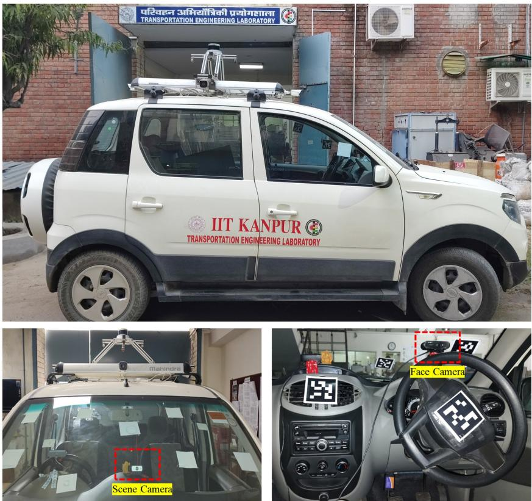  
Fig. 1: Data collection setup (a) Instrumented vehicle (b) Face camera and scene camera to capture driver face image and corre sponding scene image

Figure 2b. This transformation ensures that all gaze coordinates are represented relative to a fixed camera, enabling consistent analysis across drivers and driving sessions. The following procedure transformed the 2D gaze coordinate from the eyetracker scene camera to the dashboard scene camera.

1. Visual markers (AprilTags) were afixed to the windshield and side windows of the instrumented vehicle as shown in Figure 2c. The positions of these AprilTags remained fixed throughout the entire data collection process, providing a consistent reference frame for gaze transformation.

2. Before each driving session, the windshield area of the instrumented vehicle was scanned using the eye tracker. During post-processing, a reference frame was selected from the scanned and recorded video of the forward windshield region of the instrumented capture by the eye tracker’s scene camera. The reference image consists of several AprilTags pasted on the windshield of the car. The reference image is uploaded to the Pupil Cloud (a Pupil Lab cloud database for eye tracker gaze data analysis) visualization toolkit, and then the visualization toolkit transforms the 2D gaze coordinates recorded by the eye tracker (w.r.t. scene camera) from the eye tracker scene camera coordinate system to the fixed reference image, as illustrated in Figure 2(b).

3. After obtaining the gaze coordinates in the fixed reference image as shown in Figure 2c, these coordinates were further transformed to the dashboard forward scene camera coordinate system using a homography transformation defined by Equation (1). To compute the homography matrix, we selected approximately 10–12 image pairs for each participant, consisting of an eye-tracker-fixed reference image and a dashboard forward-scene camera image, with known gaze points in each pair. Please note that the reference image gaze coordinates were obtained from the Pupil Cloud (Pupil Labs) eye-tracker toolkit visualization discussed above. In the corresponding forward-scene image, at the exact location that matched the scene in the eye-tracker image, a circle was drawn using a photo multi-tool application, with the gaze coordinate as the center. The gaze point identified in the forward scene camera image was normalized with respect to the image dimensions as $x _ { f } = x _ { f } ^ { p } / W _ { f }$ and $y _ { f } = y _ { f } ^ { p } / H _ { f } ,$ , where $x _ { f } ^ { p }$ and $y _ { f } ^ { p }$ denote the pixel coordinates of the gaze point, and $W _ { f }$ and $H _ { f }$ are the width and height of the forward-camera image, respectively. $\mathrm { ~ A ~ } 3 \times 3$ homography matrix, H was estimated using the corresponding eye tracker fixed reference image, and normalized forward scene camera image coordinates through RANSAC (Fischler & Bolles, 1981) based homography estimation.

$$
\mathbf { H } = { \left[ \begin{array} { l l l } { h _ { 1 1 } } & { h _ { 1 2 } } & { h _ { 1 3 } } \\ { h _ { 2 1 } } & { h _ { 2 2 } } & { h _ { 2 3 } } \\ { h _ { 3 1 } } & { h _ { 3 2 } } & { h _ { 3 3 } } \end{array} \right] }\tag{1}
$$

For an eye-tracker gaze coordinate $( x _ { e } , y _ { e } )$ , the corresponding normalized gaze location in the dashboard forwardcamera scene image is obtained as

$$
[ \begin{array} { c c c c c c c c c c c c c c c c c c c c c c c c c c c c c c c c c c c c c c c c c c c c c c c c c c c c c c c c c c c c c c c c c c c c c c c c c c c c c c c c c c c c c c c c c c c c c c c c c c c c c c c c c c c c c c } & & & & & & & & & & & & & & & & & & & & & & & & & \\ & { w } & & & & & & & & & & & & & & & & & & & & & & & \\ & & & & & & & & & & & & & & & & & & & & & & & & \\ { w } & \end{array} ] = \mathbf { H } [ \begin{array} { c c c c c c c c c c c c c c c c c c } { x } & & & & & & & & & & & & & & & & \\ { y _ { e } } & & & & & & & & & & & & \\ & & & & & & & & & { \ddots } & & & & & & \\ & & & & & & & & & & & & & & & & & & {  }  & & & & & \end{array} ] ,\tag{2}
$$

where H represents the transformation from the eye-tracker coordinate system to the forward scene camera coordinate system. w is the homogeneous scaling factor used to convert the transformed coordinates from homogeneous coordinates to Cartesian coordinates. The transformed coordinates are obtained by normalizing the first two components by w.

$$
x _ { f } = \frac { x _ { f } ^ { \prime } } { w } , \qquad y _ { f } = \frac { y _ { f } ^ { \prime } } { w } .\tag{3}
$$

Finally, the normalized coordinates are converted into pixel coordinates of the forward-camera image as

$$
X _ { f } = x _ { f } W _ { f } , \qquad Y _ { f } = y _ { f } H _ { f } .\tag{4}
$$

Thus, the calibrated homography transformation maps the eye-tracker gaze location to the corresponding pixel location $( X _ { f } , Y _ { f } )$ in the forward scene image, which is subsequently used to identify the trafic object at which the driver is gazing.

Please note that after transformation of the gaze coordinate, it was also manually checked to ensure that the transformed gaze coordinate is in the same location as obtained in the eye tracker image.

The distribution of driver gaze points in the scene is plotted in Figure 3a by considering the image size equal to the scene image size (1280 × 720). To understand the spread of gaze points across the scene, a gaze density heatmap is also plotted by aggregating gaze points over $5 \times 5$ pixel region. Figure 3b shows that driver gaze is concentrated in the middle regions (driver forward scene), which is expected, since the driver is predominantly looking in the forward regions while driving. However, our dataset also comprises images in which gaze is distributed across the lateral edges of the scene camera (i.e., x < 200 or x > 1000 pixels), making it suitable for modeling driver gaze toward the corners of the windshield. The UD-FSG dataset is available at the following link: https://github. com/pavans20/Urban-Driving-Face-Scene-Gaze-Dataset.git.

## 3.1.4. Gaze object ground truth creation

Gaze estimation via gaze-object prediction first requires detecting objects in a trafic scene. For this purpose, we trained a YOLOv8 (You Only Look Once version 8) based trafic object detector, the details of which are discussed in Section 4. The trained model has been applied to scene images to detect object bounding boxes and also determine the number of objects present in each scene. Driver face image, scene image, and the corresponding ground truth gaze object are required to train the gaze-object prediction model. This ground truth gaze object can be a trafic object detected in a scene image or the background. Since an eyetracker provides gaze coordinates in the eyetracker scene camera images, which are then transformed into a dashboard scene camera image, as discussed above. The eye tracker does not provide direct gaze ground truth object information. So, to create a ground truth gaze object, the driver’s gaze coordinates are mapped onto the trafic object detected in the scene image. If the mapped gaze point (gaze coordinate) on the scene image lies within a detected object’s bounding box or 10 pixels apart from the nearest object boundary, that object is assigned as the ground truth gaze object. Otherwise, the ground truth is the background. For each scene image, we have the ground-truth gaze object index ID and the object’s bounding box coordinates information. Please note that the background refers to the region of the scene image where no object bounding boxes are detected.

(b)  
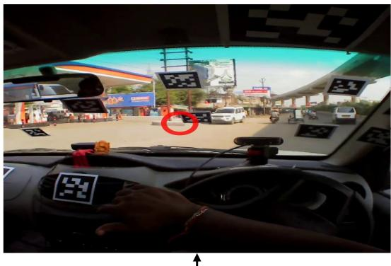

(c)  
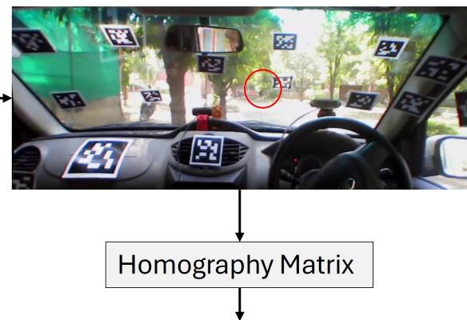

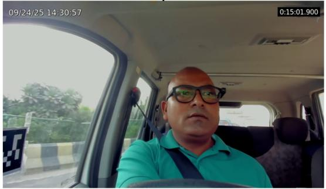  
(a)

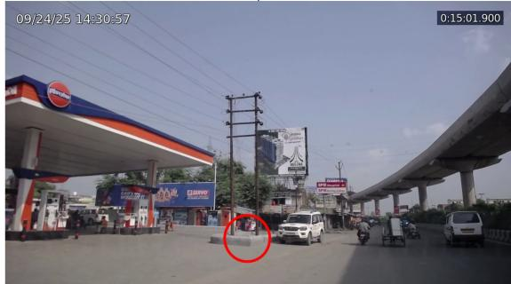  
(d)

Fig. 2: Illustration of transformation of gaze coordinate from eyetracker scene camera image to dashboard scene camera image  
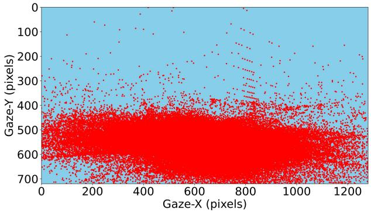  
(a)

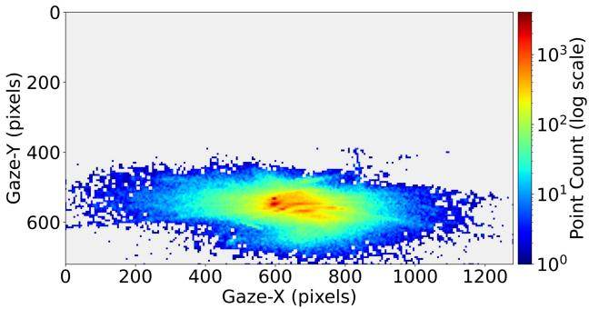  
(b)  
Fig. 3: Visualization of driver gaze point distribution of UD-FSG dataset: (a) Gaze point locations on the scene across diferent drivers (b) Gaze density heatmap computed by aggregating point-of-gaze (PoG) coordinates over 5×5 pixel grid

The number of face–scene frame pairs extracted at 5 FPS from the face and scene camera videos of all drivers was 373,488. Among these, 141,884 frame pairs (37.98%) correspond to instances in which the driver’s gaze falls on a detected trafic object. The remaining frames correspond to situations in which the driver’s gaze is directed toward the background rather than a trafic object.

## 3.1.5. Dataset details

The proposed Urban Driving–Face Scene Gaze (UD-FSG) dataset is a benchmark real world driving gaze dataset comprising 373,488 driver face–scene image pairs from 35 drivers. A detailed comparison of our dataset with existing benchmark point of gaze datasets is presented in Table 1. The existing driver gaze datasets are mostly for in-vehicle gaze estimation, comprising driver faces along with gaze ground truth as one of the regions of the vehicle interior, like the forward windshield, rear view mirror, etc. The details of these gaze datasets are provided in our previous study (Sharma & Chakraborty, 2025). To the authors’ knowledge, the UD-FSG dataset is the second dataset consisting of synchronized driver face and trafic scene images, and 2D gaze coordinates ground truth labels, and first dataset collected in a heterogeneous trafic environment that additionally provides detected trafic object bounding boxes in scene images and gaze object labels. However, our dataset is significantly larger than one existing LBW dataset Kasahara et al. (2022) and includes more variation in trafic density and lighting conditions, as shown in Figure 4. The trafic environment consisting of diverse dynamic trafic agents (vehicles, pedestrians, etc.) makes the scene information meaningful and challenging enough to develop a robust driver gaze estimation model. Also, the eye tracker looks like regular prescription glasses, making the face image similar to that observed during real-world driving tasks. This data has been used to train our gaze object prediction model as discussed in Section 4.

Variation in traffic density  
Variation in light conditions  
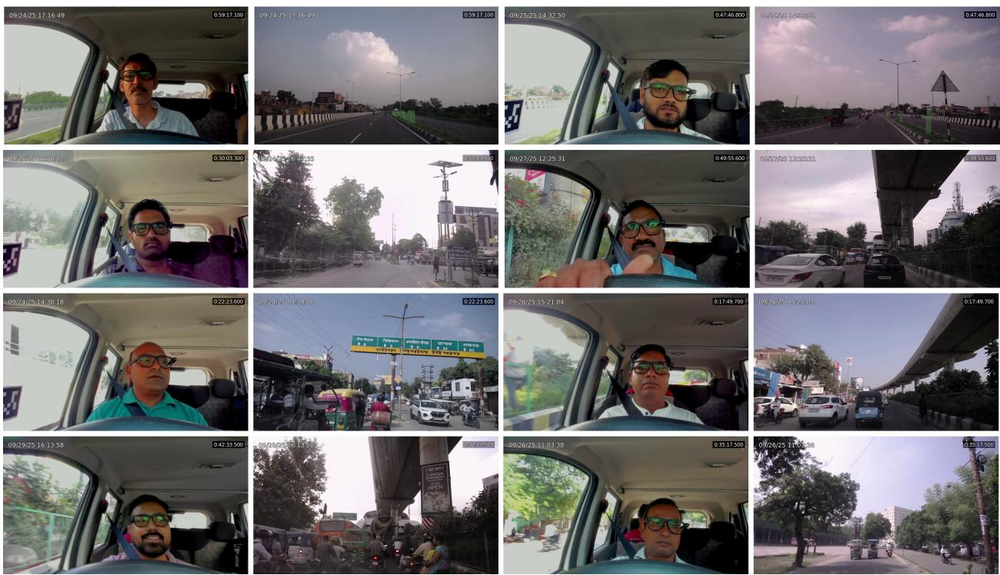  
Fig. 4: Sample of the image pairs of face and scene showing variation in trafic density and the lighting conditions.

Table 1: Comparison of our dataset with existing benchmark driver gaze datasets.
<table><tr><td>Name</td><td>Face</td><td>Scene</td><td>Subjects</td><td>Size</td><td>Gaze GT</td><td>Scenario</td></tr><tr><td>DR(eye)VE (Palazzi et al., 2018)</td><td>N2</td><td>Y3</td><td>8</td><td>555k4</td><td>PoG</td><td>Real</td></tr><tr><td>LBW (Kasahara et al., 2022)</td><td>Y</td><td>Y</td><td>28</td><td>123k</td><td>PoG</td><td>Real</td></tr><tr><td>UD-FSG (Ours)</td><td>Y</td><td>Y</td><td>35</td><td>373k</td><td>PoG + Gaze Object</td><td>Real</td></tr></table>

1 Ground Truth 2 No; 3 Yes; 4 Thousand;

## 3.1.6. Dataset characteristics

Figure 5 illustrates the characteristics of the dataset in terms of the number of objects present in each scene. Out of a total of 373,488 frames, 176,612 frames contain objects between 1 and 5. Similarly, approximately 152,785 frames contain between 6 and 10 objects. The number of frames containing 16 to 20 objects is 5,738. Overall, the data show

that approximately 99.78% of the frames contain 20 or fewer trafic objects. The samples of detected objects shown in Figure 6 are arranged from the top-left to the bottom-right and contain an increasing number of detected objects.

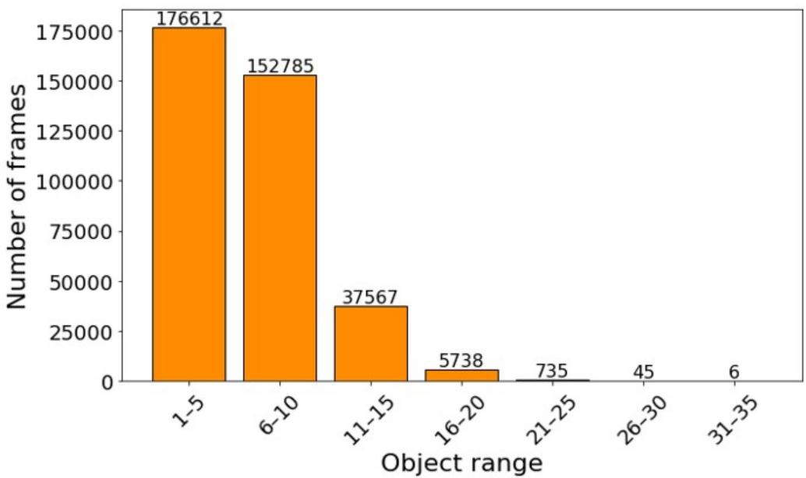  
Fig. 5: Histogram present data object range in each scene frame

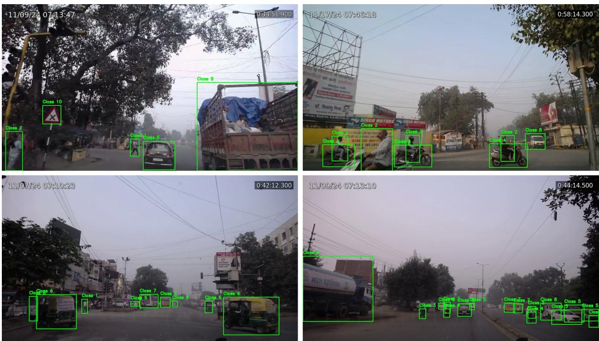  
Fig. 6: Sample trafic scene images showing detected bounding boxes.

## 3.2. Training dataset

In the UD-FSG dataset, the number of background gaze labels is comparatively higher than the number of gazeon-trafic-object labels, as discussed above. A subset of the background samples was selected to achieve a more balanced dataset for training our proposed TransGaze-Object model. To train this model, the dataset contains 189,850 synchronized face–scene image pairs, along with corresponding detected object bounding-box coordinates and ground truth gaze-object labels. The gaze object belongs to one of 11 classes: 10 trafic object categories (pedestrian, rider, bicycle, motorcycle, auto-rickshaw, car, bus, truck, trafic sign, and trafic light) and a background class. Among the 189,850 face–scene image pairs, 141,884 samples correspond to cases where the driver’s gaze falls on one of the trafic objects, i.e., the ground truth is one of the trafic objects, while the remaining 47,966 samples correspond to the background class. Finally, we considered 26 drivers for the training set (165,969 samples), 5 drivers for the validation set (9,208 samples), and 3 drivers for the test set (14,673 samples). The details of the training dataset are given in the Table 2. The next section details the methodology used to develop and train the gaze object prediction model.

Table 2: Data used for training, validation, and testing
<table><tr><td>Ground Truth</td><td>Train</td><td>Val</td><td>Test</td></tr><tr><td>Traffic Object</td><td>125565</td><td>6441</td><td>9878</td></tr><tr><td>Background</td><td>40404</td><td>2767</td><td>4795</td></tr><tr><td>Total</td><td>165969</td><td>9208</td><td>14673</td></tr></table>

## 4. Methodology

In this section, we present a Transformer based Gaze Object prediction model (TransGaze-Object) that uses facial and spatial scene-object information to predict the object the driver is looking at.

Problem formulation: Let us assume a given image i as shown in Figure 7a consists of $N _ { i }$ trafic objects, as shown in Figure 7b. The driver may look at any one of the $N _ { i }$ trafic objects or background. Therefore, our objective is to estimate which of the $N _ { i } + 1$ trafic objects (+1 for background) the driver is looking at.

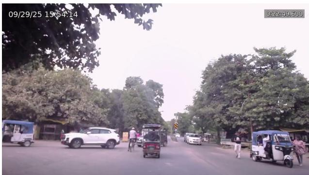  
(a)

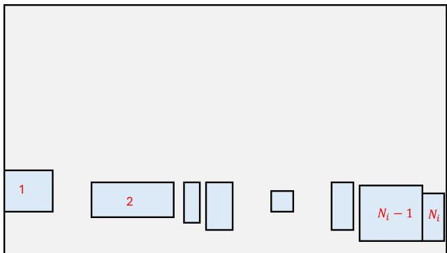  
(b)  
Fig. 7: (a) Real image of scene containing the trafic objects and (b) Schematic representation of object present on the scene Let the face representation be defined as:

$$
F \in \mathbb { R } ^ { H \times W \times 3 }
$$

where H and W are the height and width of the image, respectively, and 3 represents the RGB (Red-Green-Blue) channels. The scene is represented as a set of $N + 1$ objects, comprising a maximum of N trafic objects and one background object. Since the number of trafic objects varies across scene images, a fixed value of N is selected based on the maximum number of trafic objects present in the majority of the dataset. Scene images containing fewer than N trafic objects are padded with virtual objects to maintain a consistent input representation. The objects are represented as:

$$
B = \{ b _ { i } \} _ { i = 1 } ^ { N + 1 } , \quad b _ { i } = ( x _ { i } , y _ { i } , w _ { i } , h _ { i } )
$$

Each bounding box $b _ { i } = ( x _ { i } , y _ { i } , w _ { i } , h _ { i } )$ corresponds to the i-th detected trafic object, where $( x _ { i } , y _ { i } )$ denotes the center coordinates of the bounding box, and $w _ { i } , h _ { i }$ represent its width and height, respectively. And the background will be explained later in the discussion of object feature extraction.

The task is to predict the gaze object which represent the object index id (ˆy):

$$
\hat { y } \in \{ 1 , \ldots , N + 1 \}\tag{5}
$$

Overallframework: The proposed model consists of five major components: (1) Facial geometry detection, including face, eye, and iris and scene object detection; (2) Feature extraction, including facial features extraction and object spatial and geometric feature extraction; (3) Transformer-based features encoding of face and scene object; (4) Cross attention between encoded facial and scene features; (5) Gaze object prediction head. Each of these steps is discussed next one by one. The pipeline of the proposed gaze object prediction is shown in Figure 8.

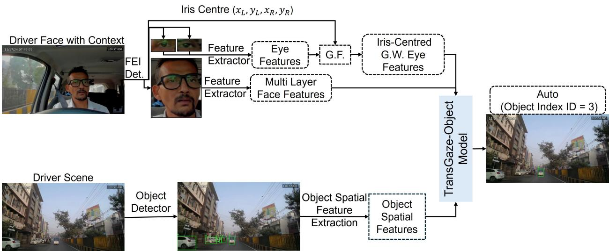  
Fig. 8: Illustration of overall gaze object prediction framework pipeline.

## 4.1. Facial geometry and object detection module

The first step of our proposed methodology is to detect the driver face from the face camera image and trafic objects from scene camera image as shown in Figure 9. The face image captured by dash-cam face camera, used to extract the driver face geometry using face-eye-iris (FEI) detector. Similarly the scene contains the object which is detected using a custom trafic object detector the details of which is given below.

## 4.1.1. Facial geometry detection

The face camera captured the driver’s face, which also includes some context of the surroundings, as shown in the Figure 9 a. To separate this context from the face and detect the face, eye, and iris, a custom face-eye-iris detector model was developed using a pretrained YOLOv8 model (Ultralytics, 2023). The model was trained using 481 drivers and 2200 annotated face images. The images of these drivers were taken from various existing driver gaze datasets such as DMD (Driver Monitoring Dataset) (Ortega et al., 2020) DGAGE (Driver Gaze Mapping on Road)

(Dua et al., 2020), DGW (Driver Gaze in Wild) (Ghosh et al., 2021), ET-DGAZE (Eye Tracker based Driver Gaze Dataset)(Sharma & Chakraborty, 2025) and annotated using CVAT (Computer Vision Annotation Tool) into three classes: Face, Eye, and Iris. Note that the data used for the Face-Eye-Iris detector difers from the data used to train our gaze object prediction model.

The FEI model attained a mean Average Precision (mAP) of 95.7% at an IoU threshold of 0.5, along with a recall of 93.0%. This trained model is employed to localize the face, eyes, and iris regions from each input face image (F), as illustrated in Figure 9a. Based on the detected eye and iris bounding boxes, the iris center for each eye is calculated with respect to the upper-left corner of the corresponding eye region. When the iris is detected in only one eye, the missing iris location is estimated using the physiological property of conjugate eye movement (Yarbus, 2013; Yang et al., 2019), which assumes coordinated movement of both eyes. Consequently, the facial geometry extraction module provides the face bounding box, the left and right eye bounding boxes, and the corresponding left and right iris center coordinates expressed relative to their respective eye regions.

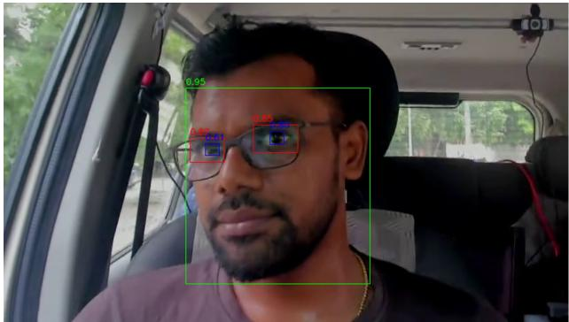  
(a)

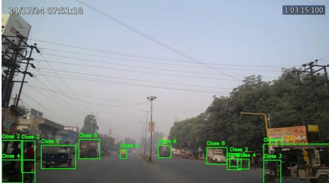  
(b)  
Fig. 9: Schematic of detected (a) face, eyes, and irises and (b) objects in scene image

Under real-world driving conditions, there are situations in which the iris of both eyes cannot be reliably detected due to factors such as occlusion, motion blur, large head rotations, or varying illumination. To address these cases, a validity-aware gating strategy is incorporated into the framework. If valid iris coordinates are not available, the corresponding iris representation is deactivated, and its influence during feature fusion is eliminated to avoid introducing unreliable information into the gaze estimation process. The model then dynamically places greater emphasis on the remaining visual cues, including facial appearance, eye-region features, and scene information. This adaptive mechanism enables the framework to maintain stable, reliable gaze-estimation performance even when iris location information is unavailable.

## 4.1.2. Trafic object detection

The proposed gaze object detection model requires the information of the trafic objects present in the trafic scene, captured by dashboard forward scene camera, as shown in Figure 9b. Therefore trafic object detection is a prerequisite for the proposed model. We trained a YOLOv8 (Ultralytics, 2023) object detector to detect trafic objects in scene images. The trafic objects are categorized into 10 classes, namely: pedestrian, rider, bicycle, motorcycle, car, autorickshaw, bus, truck, trafic light, and trafic sign.

To train the trafic object detector, trafic data was obtained from open-source datasets, including the IDD (Indian Driving Dataset) (Varma et al., 2019), the nuImages (Caesar et al., 2020) dataset, UD-FSG dataset(Sharma & Chakraborty, 2026). Since the original datasets do not contain annotations for all the desired trafic object categories (like nuImages does not contains rider, auto-rickshaw, trafic light, trafic sign class), additional manual annotations were done using the CVAT (Computer Vision Annotation Tool) application. Specifically, two annotators labeled the missing classes to ensure consistent, uniform annotations across the entire dataset, making it suitable for training an object detection model. A pre-trained YOLOv8 model was fine-tuned and trained on 10,981 trafic-scene images containing multiple objects. The model achieved a mean Average Precision (mAP) of 79.1% at a confidence threshold of 0.5 (50%). Since object detection is not 100% accurate, cases in which objects are not detected are manually annotated to prepare the data for the Gaze Object Prediction model.

## 4.2. Feature extraction module

The multi stream feature extraction module is designed to process the heterogeneous input modalities (i.e., diferent in their visual characteristics and semantic information) through separate feature extraction streams (Liu et al., 2025). Each stream learns modality specific representations from the face, eye, and scene inputs.

## 4.2.1. Facefeatures extraction

We used a pretrained ResNet-18 backbone as a hierarchical feature encoder to obtain compact and discriminative facial representations for gaze estimation. The detected face image is first resized to $I _ { f } \in \mathbb { R } ^ { 3 \times 2 2 4 \times 2 2 4 }$ to fit the ResNet (Residual Network) architecture input configuration. This resized image is then normalized and forwarded through the convolutional stem and the four residual stages of ResNet-18 (He et al., 2016) are used to extract intermediate feature maps. Here, the convolutional stem refers to the initial layers that extract low-level visual features, while the residual stages consist of stacked residual blocks (also called Layer-1/2/3/4) that progressively learn higher-level representations. This can be represented as:

$$
F _ { l } = \mathcal { B } _ { l } ( I _ { f } ) , \quad l \in \{ 1 , 2 , 3 , 4 \}\tag{6}
$$

where, $\mathcal { B } _ { l } ( \cdot )$ denotes the transformation up to the $l ^ { t h }$ residual block, $F _ { l } \in \mathbb { R } ^ { C _ { l } \times H _ { l } \times W _ { l } }$ denotes each feature map with channel dimensions $C _ { l } \in \{ 6 4 , 1 2 8 , 2 5 6 , 5 1 2 \}$ for $l \in \{ 1 , 2 , 3 , 4 \}$ , and $H _ { l } ,$ W represent the spatial resolution (height and width) of the feature map.

Since the channel dimensions $C _ { l }$ difer across layers, we project each feature map into a unified 256-dimensional embedding space using a learnable 1 × 1 convolution:

$$
\hat { F } _ { l } = \phi _ { l } ( F _ { l } ) , \quad \hat { F } _ { l } \in \mathbb { R } ^ { 2 5 6 \times H _ { l } \times W _ { l } }\tag{7}
$$

where, ϕ (·) represents the channel projection operation.

Finally, to obtain a compact global representation, adaptive global average pooling (GAP) is applied over the spatial dimensions to produce a 256-dimensional feature vector from each layer, represented as $f _ { l } = \mathbf { G } \mathbf { A } \mathbf { P } ( \hat { F } _ { l } ) \in \mathbb { R } ^ { 2 5 6 }$ . Where each channel response is computed as:

$$
f _ { l } = \mathrm { G A P } ( \hat { F _ { l } } ) _ { c } = \frac { 1 } { H _ { l } W _ { l } } \sum _ { i = 1 } ^ { H _ { l } } \sum _ { j = 1 } ^ { W _ { l } } \hat { F _ { l } } ( c , i , j )\tag{8}
$$

where, $c \in \{ 1 , \ldots , 2 5 6 \}$ denotes the channel index of the projected feature map.

Thus, for each face image, four hierarchical global facial feature vectors $\{ f _ { 1 } , f _ { 2 } , f _ { 3 } , f _ { 4 } \}$ , each of dimension 256, is extracted from diferent semantic depths of the network. These multi-level global embeddings capture complementary facial information, ranging from fine-grained texture patterns in shallow layers to high-level structural semantics in deeper layers, as shown in Figure 10. The resulting 256-dimensional global representations are subsequently utilized in the proposed multi-modal feature fusion module for gaze object prediction.

## 4.2.2. Gaussian weighted eyefeature extraction

Along with the overall face features, the eyes and the corresponding iris position with respect to the eye, are extremely important to determine the gaze location of the participants. Therefore, we design an eficient feature extraction of the eye region, detected using our FEI model, along with the iris position. First, the eye features are extracted using a pretrained ResNet-18 backbone, where the final residual block (layer4) is employed to obtain high-level semantic features. However, since the cropped eye images from FEI detection do not meet the required 224×224 input resolution of the ResNet architecture, we applied resizing (224×224) followed by constant padding to preserve the aspect-ratio requirement. A padding value of 114 is selected as a neutral gray intensity to minimize artificial boundary efects and prevent unintended feature activations in the padded regions. Figure 11 shows a sample images of the original left and right eye images, along with the padded images used as input for ResNet model. The padded left and right eye images, with dimensions of each $I _ { e } \in \mathbb { R } ^ { 3 \times 2 2 4 \times 2 2 4 }$ is then normalized and forwarded through the convolutional stem and residual layers of ResNet-18 separately for both left and right eyes and producing a deep feature map for both left and right eye.

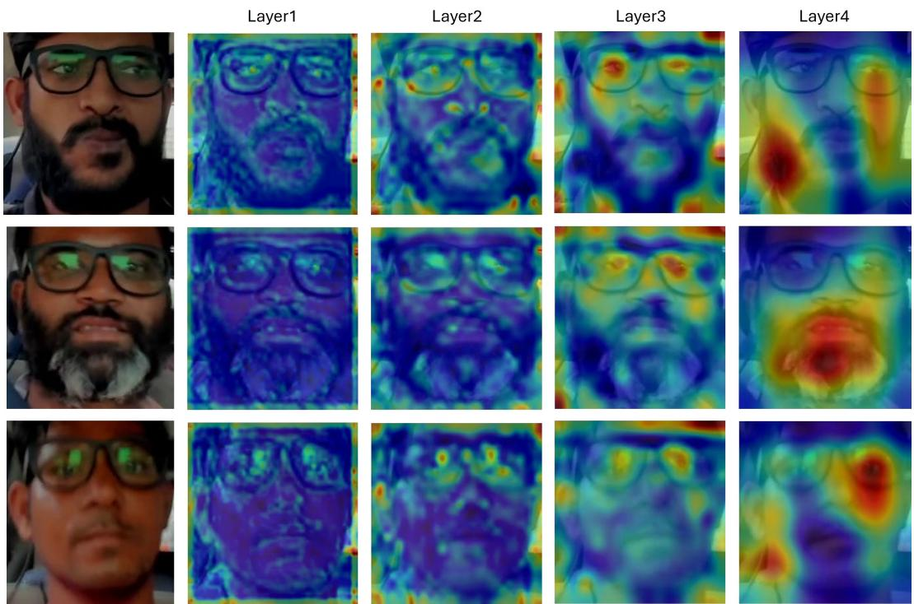  
Fig. 10: Visualization of face features extracted from diferent layers of ResNet-18 for three drivers.

$$
\begin{array} { r } { F _ { e } = \mathcal { B } _ { 4 } ( I _ { e } ) , \quad F _ { e } \in \mathbb { R } ^ { 5 1 2 \times H _ { 4 } \times W _ { 4 } } } \end{array}\tag{9}
$$

Similar to the facial feature extraction module, a $1 \times 1$ convolutional projection is applied to reduce the channel dimensions to 256.

$$
\begin{array} { r } { \hat { F } _ { e } = \phi _ { 4 } ( F _ { e } ) , \quad \hat { F } _ { e } \in \mathbb { R } ^ { 2 5 6 \times H _ { 4 } \times W _ { 4 } } } \end{array}\tag{10}
$$

To emphasize the iris region derived from FEI model within the eye feature map, a spatial Gaussian weighting function centered at the iris location is applied. Let $( c _ { x } , c _ { y } )$ denote the projected iris center coordinates in feature map space. The 2D Gaussian weight at spatial location $( x , y )$ is defined as:

$$
G ( x , y ) = \frac { \exp { \left( - \frac { ( x - c _ { x } ) ^ { 2 } + ( y - c _ { y } ) ^ { 2 } } { 2 \sigma ^ { 2 } } \right) } } { \sum _ { i = 1 } ^ { H } \sum _ { j = 1 } ^ { W } \exp { \left( - \frac { ( i - c _ { x } ) ^ { 2 } + ( j - c _ { y } ) ^ { 2 } } { 2 \sigma ^ { 2 } } \right) } }\tag{11}
$$

where, $\sigma ( = 1 . 2$ in our experiment) controls the spread of the Gaussian distribution. This normalized weighting map assigns higher importance to features closer to the iris center while suppressing peripheral regions. The Gaussian-weighted feature map is then computed as:

$$
\tilde { F } _ { e } ( c , x , y ) = \hat { F } _ { e } ( c , x , y ) \cdot G ( x , y )\tag{12}
$$

where, c denotes the channel index. Finally, a global representation is obtained via adaptive global average pooling:

$$
E = { \mathrm { G A P } } ( { \tilde { F } } _ { e } ) \in \mathbb { R } ^ { 2 5 6 }\tag{13}
$$

where, $\mathrm { G A P } ( \tilde { F } _ { e } )$ is computed using similar equation 8. Note that E is represented for separate left and right eyes and indicated as $e _ { L }$ and $e _ { R } .$ . Figure 11 provides the samples images for each step of eye feature extraction. This Gaussianweighted global embedding enhances iris centered discriminative information while retaining contextual eye features, making it particularly suitable for precise gaze estimation.

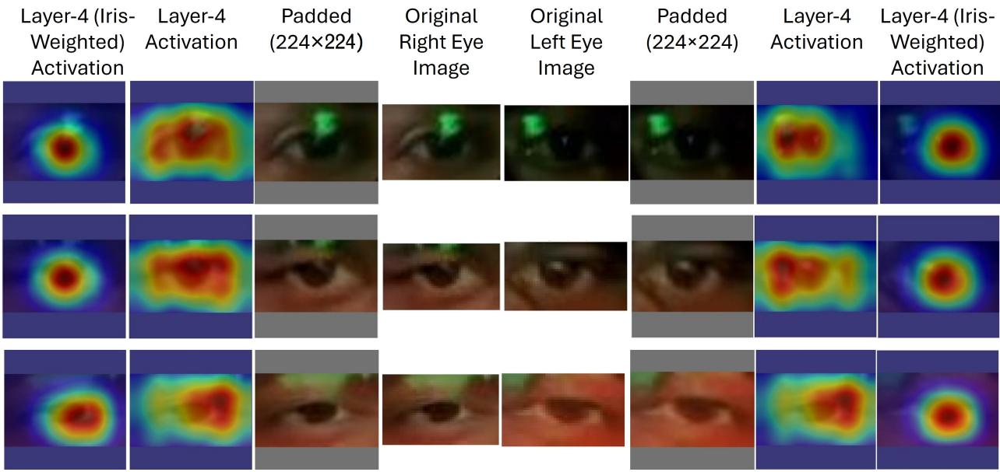  
Fig. 11: Visualization of eye features extracted from Layer-4 of ResNet-18 with constant padding value of 114, comparing unweighted and Gaussian-weighted feature responses emphasizing the iris region.

The face features and eye features which are used to cues of gaze direction and used to find the similarity with the scene object present in scene image. The extracted features from face are represented as $f _ { 1 } , f _ { 2 } , f _ { 3 } , f _ { 4 } \in \mathbb { R } ^ { 2 5 6 }$ and the features from eyes are represented as $e _ { L } , e _ { R } \in \mathbb { R } ^ { 2 5 6 }$ . The four face features extracted from diferent stage or layers of ResNet-18 represents the local and global features of facial geometry and two eye features, extracted from layer 4 of of ResNet-18 represents the global features of the eye. Combining the face and eye features, the facial features set is defined as:

$$
F = \{ f _ { 1 } , f _ { 2 } , f _ { 3 } , f _ { 4 } , e _ { l } , e _ { r } \} \in \mathbb { R } ^ { 6 \times d }\tag{14}
$$

So finally 6 number of tokens $( T _ { f } = 6 )$ represented the facial features (four face features extracted from diferent stages or layer of ResNet-18 and represented the local and global features of the facial geometry and two eye features extracted stage 4 or layer 4 represented the global features of the eye).

## 4.2.3. Scene object spatialfeatures

As discussed in Section 3.1.6, the dataset analysis shows that approximately 99.78% of the frames contain 20 or fewer objects (trafic objects and background), as illustrated in Figure 5. Therefore, each scene is represented as a fixed set of $N + 1 = 2 0$ objects, comprising a maximum of 19 trafic objects and 1 background object. Images with trafic objects $> N = 1 9$ contains typically very small objects (because objects are very far from driver). Therefore for images, where number of objects $> 1 9$ , the largest 19 objects in terms of area are considered.

Figure 12 illustrates the schematic representation of the spatial features extracted for a detected scene object. The rectangle ABCD represents the complete scene image, while the orange rectangle PQRS denotes the object bounding box $b _ { i } .$ . The point $( x _ { i } , y _ { i } )$ denotes the normalized center coordinates of the object bounding box, where x and y represent the horizontal and vertical center coordinates respectively. The normalized width and height of the bounding box are denoted by $w _ { i }$ and $h _ { i }$ respectively. The primary object features include the position of bounding box of the objects. This represented as:

$$
B = \{ b _ { i } \} _ { i = 1 } ^ { N + 1 } , \quad b _ { i } = ( x _ { i } , y _ { i } , w _ { i } , h _ { i } )\tag{15}
$$

To enhance object representation, each bounding box is augmented with additional spatial features. First area of each object is computed as: $a _ { i } = w _ { i } \cdot h _ { i }$ . To capture positional bias, ofsets, and Euclidean distance from the center of the scene image (0.5, 0.5) computed using $d x _ { i } = x _ { i } - 0 . 5 , \quad d y _ { i } = y _ { i } - 0 . 5 ,$ , and $E D _ { i } = \ \sqrt { d x _ { i } ^ { 2 } + d y _ { i } ^ { 2 } }$ respectively. The demonstration of how the $d x _ { i } , d y _ { i }$ and $E D _ { i }$ computed are shown in Figure 12. Accordingly, the spatial features representation of the $i ^ { \mathrm { { t h } } }$ object is expressed as:

$$
f _ { i } ^ { o b j } = [ x _ { i } , y _ { i } , w _ { i } , h _ { i } , a _ { i } , d x _ { i } , d y _ { i } , E D _ { i } ] \in \mathbb { R } ^ { 8 }\tag{16}
$$

This representation encodes not only the size of the object but also its relative position with respect to the image center, which is crucial since human gaze often exhibits center bias i.e driver is looking predominantly in forward and scene camera is placed at center of dashboard.

The spatial features are projected into a higher dimensional embedding space using a linear transformation:

$$
s _ { i } ^ { o b j } = f _ { i } ^ { o b j } W _ { s } + b _ { s }\tag{17}
$$

where $s _ { i } ^ { o b j } \in \mathbb { R } ^ { 8 }$ represents the spatial feature vector, $W _ { s } \in \mathbb { R } ^ { 8 \times d }$ and $b _ { s }$ is a learnable weight matrix and bias term. A fixed spatial representation, [−1 −1 2 2], was assigned to the background to distinguish it from valid trafic-objec bounding boxes. These out-of-range coordinates and dimensions provide a unique spatial representation of the back ground while keeping it consistent across all scene images.

Please note that, to distinguish the background from valid trafic-object bounding boxes, a fixed spatial representation ([-1, -1, 2, 2]) was assigned to the background. The out-of-range coordinates and dimensions provide a unique spatial representation for the background. The remaining spatial features of the background were computed in the same manner as those of the trafic objects. Consequently, the final spatial feature vector for the background is ([-1, -1, 2, 2, 4, -1.5, -1.5, 2.12]), which remains fixed and consistent across all scene images.

Finally, the scene is represented by combining features from all objects $( \Nu + 1 = 2 0 )$ , represented as:

$$
S ^ { o b j } = \{ s _ { 1 } ^ { o b j } , s _ { 2 } ^ { o b j } , \ldots , s _ { N + 1 } ^ { o b j } \} \in \mathbb { R } ^ { N + 1 \times d }\tag{18}
$$

This projection serves two key purposes. First, it aligns the spatial features with the embedding dimension of facial features, enabling meaningful interaction through attention mechanisms. Second, it allows the model to learn taskspecific combinations of spatial attributes such as object position, size, and distance.

## 4.3. Transformer-based encoding of face and scene features

The proposed Transformer based Gaze Object (TransGaze-Object) prediction model is based on the hypothesis that accurate driver gaze object prediction requires jointly modeling the driver’s facial cues and the surrounding scene objects. Multi-level facial features are extracted from the face and iris-weighted eye regions using separate pretrained ResNet-18 networks, while the spatial and geometric features of the detected scene objects are represented indepen dently. The scene-object spatial and geometric features are subsequently transformed into the embedding dimension (d) using multi-layer perceptron (MLP), ensuring dimensional compatibility with the facial feature representations for subsequent attention-based fusion. Since these features are extracted separately, they do not inherently capture the relationships within their respective feature sets. Therefore, two separate transformer encoder blocks (facial features and scene features) with self-attention are used to learn contextual dependencies within facial features and within scene object features. This enables the model to generate enriched feature representations by capturing interactions within each set of features.

After obtaining contextual facial and scene-object representations, the proposed model employs a cross-attention mechanism to establish relationships between the driver’s gaze cues and surrounding scene objects. In this framework, the encoded facial features are used as the queries, while the encoded scene object features serve as the keys. This design is motivated by the fact that facial features encode the driver’s visual intention, whereas scene objects represent potential gaze targets. The query–key matching mechanism enables the model to identify the object whose representation best aligns with the driver’s gaze characteristics, and the resulting attention scores are used to pre dict the most likely gaze object. This cross-attention formulation constitutes the core contribution of the proposed TransGaze-Object model, efectively integrating driver appearance and scene context to predict gaze objects robustly.

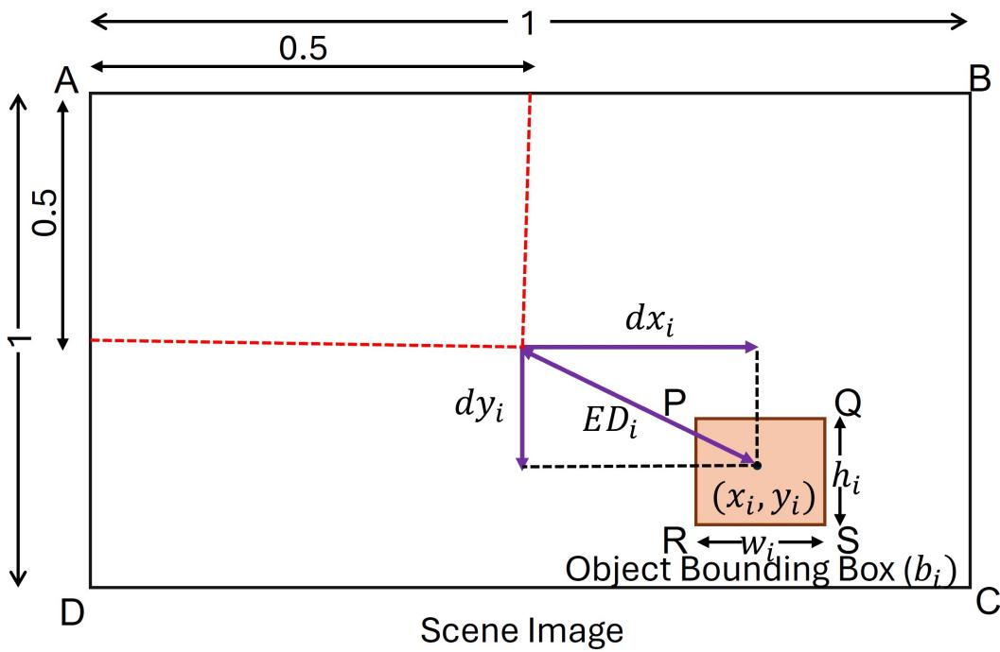  
Fig. 12: A schematic representation to show the object features extracted

The facial feature F, given in Equation 14, and scene features $S ^ { o b j }$ given in Equation 18 contain the raw features extracted independently from face and scene objects. These features do not associate with each other contextually. Since gaze estimation is inherently a context-dependent problem, the gaze direction is not determined solely by a single facial region but rather emerges from the interaction among multiple cues, such as eye orientation, head pose, and overall facial geometry. Similarly, scene objects are not independent; their spatial arrangement and relative importance influence their likelihood of being the gaze target. To capture this contextual relationship, the face and scene features are passed through two separate standard Transformer encoder blocks (Vaswani et al., 2017). The flow chart of these encoder blocks is shown in Figure 13. The outputs of these encoder blocks for face and scene features are treated as queries and keys.

Limitations of direct feature usage: If raw features are used directly without encoding, each token is treated independently. In this case, there is no interaction among facial regions and among scene objects. Consequently, the model fails to capture: (a) Relationships between eye regions and head pose (b) Interactions between multiple objects in the scene.

Role of transformer encoder: The transformer encoder addresses this limitation through self-attention. Each token is updated by attending to all other tokens. So the updated features of face and scene are given below.

$$
f _ { i } ^ { \prime } = f _ { i } + \sum _ { j = 1 } ^ { T _ { f } } \alpha _ { i j } f _ { j }\tag{19}
$$

$$
s _ { i } ^ { o b j ^ { \prime } } = s _ { i } ^ { o b j } + \sum _ { j = 1 } ^ { N + 1 } \beta _ { i j } s _ { j } ^ { o b j }\tag{20}
$$

where $\alpha _ { i j }$ and $\beta _ { i j }$ are attention weights. This mechanism enables: (a) Each facial token (including 4 face and 2 eye tokens) to incorporate information from all other facial regions (b) Each object feature to capture contextual relationships with other objects.

Face feature encoding: For facial features, self-attention allows the model to learn dependencies such as (a) alignment

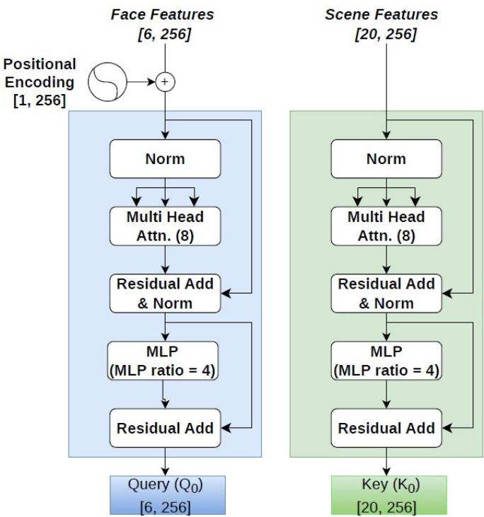  
Fig. 13: Architecture of encoder block of face features and object scene features embedding representation.

between left and right eye features (b) influence of head orientation on gaze direction, and (c) global facial structure.   
This results in a context aware representation of gaze cues.

Scenefeature encoding: For scene features, self-attention enables (a) modeling spatial relationships between objects, (b) understanding object grouping and relative importance, and (c) capture contextual interaction in complex driving environments.

The encoded features of face and scene are represented as:

$$
Q _ { 0 } = { \mathrm { E n c o d e r } } ( F ) , \quad K _ { 0 } = { \mathrm { E n c o d e r } } ( S ^ { o b j } )\tag{21}
$$

$$
\begin{array} { r } { Q _ { 0 } = \left[ \begin{array} { c } { q _ { 0 , 1 } } \\ { q _ { 0 , 2 } } \\ { \vdots } \\ { q _ { 0 , T _ { f } } } \end{array} \right] , \quad K _ { 0 } = \left[ \begin{array} { c } { k _ { 0 , 1 } } \\ { k _ { 0 , 2 } } \\ { \vdots } \\ { k _ { 0 , N } } \end{array} \right] } \end{array}
$$

where $q _ { 0 , 1 } , q _ { 0 , 2 } , \ldots , q _ { 0 , T _ { f } }$ represent the elements of the query vector $Q _ { 0 }$ , and $k _ { 0 , 1 } , k _ { 0 , 2 } , \ldots , k _ { 0 , N + 1 }$ represent the elements of the key vector K . $K _ { 0 }$

After obtaining the encoded representations $( Q _ { 0 } )$ and $( K _ { 0 } )$ from the Transformer encoders, linear projection layers are applied to generate the query and key matrices, defined as:

$$
\boldsymbol { Q } = \boldsymbol { Q } _ { 0 } \boldsymbol { W } _ { q } = \left[ \begin{array} { c } { q _ { 1 } } \\ { q _ { 2 } } \\ { \vdots } \\ { q _ { T _ { f } } } \end{array} \right] , \quad \boldsymbol { K } = \boldsymbol { K } _ { 0 } \boldsymbol { W } _ { k } = \left[ \begin{array} { c } { k _ { 1 } } \\ { k _ { 2 } } \\ { \vdots } \\ { k _ { N + 1 } } \end{array} \right]\tag{22}
$$

Although the encoder outputs capture rich contextual information within the driver facial features and scene features, they are not inherently optimized for cross modal matching between facial gaze cues and scene objects. The projection step addresses this limitation by transforming the encoded features into a task-specific embedding space, where similarity can be efectively computed through dot product attention. In particular, the projection matrices $( W _ { q } )$ and $( W _ { k } )$ learn how to reorient the feature representations such that gaze relevant patterns in facial features align with corresponding object features in the scene. Consequently, the attention score can be interpreted as a learned similar ity function, rather than a simple dot product between raw features. This transformation is help for improving the discriminative ability of the model, especially in scenarios involving visually similar or spatially proximate objects, thereby enhancing the accuracy of gaze object prediction.

## 4.4. Attention between encodedfacial and scenefeatures

The interaction between queries (Q) derived from facial features and keys (K) derived from scene objects using Equation 22 is used to compute similarity scores. These similarity scores are calculated using the scaled dot-product attention mechanism, as given in Equation 23.

$$
S = \frac { Q K ^ { T } } { \sqrt { d } }\tag{23}
$$

where, $S = \{ s _ { i , j } \} \in \mathbb { R } ^ { T _ { f } \times ( N + 1 ) }$ is the attention score matrix, and each element $s _ { i , j }$ is defined as $\begin{array} { r } { s _ { i , j } = \frac { q _ { i } \cdot k _ { j } } { \sqrt { d } } } \end{array}$ , where $q _ { i }$ and $k _ { j }$ denote the i-th query vector and j-th key vector, respectively.

Masking on zero-padded objects: In the scene image, if the number of detected trafic objects is lesser than 19, virtual objects are introduced to maintain a fixed input size. These additional objects are treated as zero-padded objects, where all elements of their corresponding feature vectors are set to zero.

During the attention score computation, a masking mechanism is applied to these zero padded (virtual) objects. Specifically, the attention scores corresponding to such objects are assigned a value of $- \infty$ . Virtual objects (padding) are masked using the following equation:

$$
s _ { i j } = { \left\{ \begin{array} { l l } { s _ { i j } , } & { { \mathrm { v a l i d } } } \\ { - \infty , } & { { \mathrm { i n v a l i d } } } \end{array} \right. }\tag{24}
$$

Consequently, after applying the softmax function, the attention weights for these virtual objects become zero, ensuring that they do not contribute to the final attention output.

The attention weights are computed using temperature scaling:

$$
A = \operatorname { s o f t m a x } \left( \frac { S } { \tau } \right)\tag{25}
$$

To compute attention weights, a temperature parameter $\tau = 0 . 5$ is applied to the similarity scores before the softmax operation. This scaling controls the sharpness of the attention distribution by preventing excessively large values from dominating the softmax output. Without temperature scaling, the attention weights can become overly peaked, leading to unstable gradients and poor generalization. By introducing a temperature parameter, the model can control how spread out the attention over the objects. This helps the model focus more on the most important objects while still considering other possible objects, which improves learning stability of the model.

Face-eye attention fusion:The attention weights are separated into face and eye components because driver gaze is depends on head orientation and iris position within the eye or eye movement. Eye features provide precise information about gaze direction but can be sensitive to noise and occlusions, whereas face features capture head orientation and ofer more stable but coarse cues of driver gaze direction. By separating face and eye attention weights the model learn fine grained eye information and maintaining robustness through face-based context.

$$
A _ { \mathrm { f a c e } } = { \frac { 1 } { 4 } } \sum _ { i = 1 } ^ { 4 } A _ { i }\tag{26}
$$

$$
A _ { \mathrm { e y e } } = \frac { 1 } { 2 } \sum _ { i = 5 } ^ { 6 } A _ { i }\tag{27}
$$

The final attention weights is a combination of weighted average of attention weights of eye and the face components over objects, where learnable parameter λ decide the contribution of each components.

$$
A _ { \mathrm { f i n a l } } = \lambda A _ { \mathrm { e y e } } + ( 1 - \lambda ) A _ { \mathrm { f a c e } }\tag{28}
$$

The higher the λ value model giving more weights to eye component and vice versa.

The final attention weight matrix $A _ { \mathrm { f i n a l } }$ represents the degree of attention assigned by the model to each object in the scene. It is defined as:

$$
A _ { \mathrm { f i n a l } } = [ a _ { 1 } , a _ { 2 } , \ldots , a _ { N + 1 } ] \in \mathbb { R } ^ { N + 1 }\tag{29}
$$

where $a _ { i } \in [ 0 , 1 ]$ denotes the attention weight corresponding to the i-th object, and $\textstyle \sum _ { i = 1 } ^ { N + 1 } a _ { i } = 1$ . After computing the attention weights between the queries and keys coming from the facial features and scene features respectively , then we have to compute the object index id the details of which is given next section.

## 4.5. Gaze estimation head

## 4.5.1. Gaze object prediction

The final attention weight matrix is used to compute the gaze object. The object for which the computed attention weight is highest is considered the gaze object (i.e., the object at which the driver is looking). This can be mathematically formulated as:

$$
\hat { y } = \arg \operatorname* { m a x } _ { j } a _ { j }\tag{30}
$$

where ˆy denotes the predicted gaze object, represented as the index of the object with the highest attention weight, i.e., $\hat { y } \in \{ 1 , 2 , \dotsc , N + 1 \}$

## 4.5.2. Loss functions

To efectively train the proposed gaze estimation model, multiple loss components are employed to guide diferent aspects of learning, including classification accuracy, attention alignment, consistency, and discrimination among similar objects. Each component of the loss function is discussed in detail below.

Classification loss: The primary objective is to correctly estimate the gaze target among N trafic objects and background. This is formulated as a multi class classification problem using cross entropy loss:

$$
\mathcal { L } _ { c l s } = - \log \left( \frac { \exp ( a _ { y } ) } { \sum _ { j = 1 } ^ { N + 1 } \exp ( a _ { j } ) } \right)\tag{31}
$$

where $a _ { j }$ denotes the estimated attention weight for the j-th object, and $a _ { y }$ is the ground truth object attention weight. Classification loss ensures that the model assigns the highest probability to the correct object. It serves as the primary supervision signal for gaze object prediction.

Consistency loss: This component of loss function ensure coherence between eye and face based attention, a consis tency constraint is introduced:

$$
\mathcal { L } _ { c o n s } = \alpha | | A _ { \mathrm { e y e } } - A _ { \mathrm { f a c e } } | | _ { 2 } ^ { 2 }\tag{32}
$$

where $\alpha = 0 . 0 3$ . This enforces agreement between eye-based and face-based attention, reducing inconsistent predic tions. This allows the model to automatically balance the contributions of eye and face components, avoiding manual tuning and improving optimization.

Confusion-aware attention loss: In complex driving scenes, multiple trafic objects are often located close to one another, making gaze-object prediction inherently ambiguous. Conventional one hot supervision treats all incorrect objects equally, thereby over penalizing predictions on nearby objects that are more likely to be confused with the true gaze target. Therefore, a confusion-aware supervision strategy is introduced to explicitly model this spatial ambiguity. The proposed approach constructs a soft target distribution based on the spatial distances between the ground truth object and all other detected objects, assigning higher probabilities to nearby objects. This distance-aware distribution is combined with the one-hot ground-truth label, and the predicted eye-attention distribution is optimized using KL divergence (Kullback & Leibler, 1951) to learn spatially aware attention while preserving strong supervision for the correct gaze object.

The distance between objects is computed using the Euclidean distance between their center coordinates. Specifically, for the i-th object, the distance from the ground truth object is defined as:

$$
E D _ { i } ^ { o b j } = \sqrt { ( x _ { i } - x _ { g t } ) ^ { 2 } + ( y _ { i } - y _ { g t } ) ^ { 2 } }\tag{33}
$$

where $( x _ { i } , y _ { i } )$ and $( x _ { g t } , y _ { g t } )$ denote the center coordinates of the i-th object and the ground truth object, respectively. This is converted into a probability distribution using a softmax function over the negative distances:

$$
p _ { i } = \frac { \exp \left( - \gamma E D _ { i } ^ { \mathrm { o b j } } \right) } { \sum _ { j = 1 } ^ { N + 1 } \exp \left( - \gamma E D _ { j } ^ { \mathrm { o b j } } \right) } ,\tag{34}
$$

where $p _ { i }$ denotes the probability associated with the i-th object, $\gamma$ is a scaling hyperparameter that controls the sharpness of the resulting probability distribution. Larger values of $\gamma$ assign higher probabilities to objects closer to the predicted gaze point.

The final target distribution is:

$$
g = 0 . 9 \cdot \mathrm { O n e H o t } ( y ) + 0 . 1 \cdot p\tag{35}
$$

where $y$ is the ground truth object index which belongs $y \in \{ 1 , 2 , \ldots , N + 1 \}$

Then the confusion aware attention loss is computed using following Equation:

$$
\mathcal { L } _ { a t t n } = D _ { K L } ( g \parallel A _ { \mathrm { e y e } } ) = \sum _ { j = 1 } ^ { N + 1 } g _ { j } \log \frac { g _ { j } } { A _ { \mathrm { e y e } , j } }\tag{36}
$$

The Kullback–Leibler (KL) divergence is used to measure the diference between the predicted attention distribu tion and the target distribution, where $g _ { j }$ denotes the ground-truth probability assigned to the j-th object, and $A _ { \mathrm { e y e } , j }$ represents the predicted attention weight for the j-th object. Here, N + 1 is the total number of objects in the scene. Minimizing this divergence encourages the predicted attention distribution to align closely with the target distribution. Hard negative margin loss: Although the confusion aware attention loss encourages the model to assign higher attention to the ground truth object and nearby objects, it does not explicitly enforce suficient separation between the ground truth object and the most confusing incorrect objects. In driver gaze object prediction, these confusing objects, referred to as hard negatives, are those that receive high attention scores despite not being the ground truth object.

To reduce this ambiguity, a margin based loss is introduced that explicitly increases the gap between the attention score of the ground truth object and those of the hardest negative objects. During training, the top-k non ground truth objects with the highest attention scores are selected as hard negatives. The model is then encouraged to maintain a predefined margin between the attention assigned to the ground truth object and the average attention of these hard negatives, thereby improving discriminative learning.

$$
\mathcal { L } _ { m a r g i n } = \operatorname* { m a x } ( 0 , m - ( a _ { g t } - a _ { n e g } ) )\tag{37}
$$

where $a _ { g t }$ denotes the attention weight corresponding to the ground truth object, and $a _ { n e g }$ denotes the average attention weight of the top-k (k=2 in our case) hardest negative objects. $m = 0 . 5$ , is the minimum required diference between them.

The margin loss is active only when the diference between the attention assigned to the ground-truth object and the hard negatives is smaller than the predefined margin $m .$ In this case, the loss penalizes the model and encourages it to increase the attention of the ground-truth object while suppressing the attention of the competing hard negatives. Once the required margin is achieved, the loss becomes zero, preventing unnecessary optimization. Consequently, the model learns more discriminative attention representations, reducing confusion between the true gaze object and visually or spatially similar objects while improving gaze object prediction performance.

Final loss: The final loss consists of classification loss, consistency loss, confusion aware attention loss, hard negative margin loss to train the proposed gaze estimation model efectively.

$$
\mathcal { L } = \mathcal { L } _ { c l s } + 0 . 5 \mathcal { L } _ { m a r g i n } + e ^ { - \sigma _ { 1 } } \mathcal { L } _ { c o n s } + \sigma _ { 1 } + e ^ { - \sigma _ { 2 } } \mathcal { L } _ { a t t n } + \sigma _ { 2 }\tag{38}
$$

The consistency loss and confusion aware attention loss capture diferent aspects of the proposed gaze estimation framework and may exhibit diferent optimization characteristics during training. Assigning fixed weights to these loss terms requires manual tuning and may not provide an optimal balance throughout the training process. Therefore, an uncertainty based weighting strategy is adopted, in which the contribution of each loss is automatically determined through learnable uncertainty parameters, $\sigma _ { 1 }$ and $\sigma _ { 2 }$

Each loss term is weighted by an exponential factor, $e ^ { - \sigma _ { 1 } } / e ^ { - \sigma _ { 2 } }$ , such that losses associated with higher uncertainty receive lower weights, whereas more reliable losses contribute more strongly to the overall optimization. However, using only the weighting terms $e ^ { - \sigma _ { 1 } } \mathcal { L } _ { c o n s } / e ^ { - \sigma _ { 2 } } \mathcal { L } _ { a t t n }$ would allow the optimization to trivially increase $\sigma _ { 1 } / \sigma _ { 2 }$ , thereby driving the corresponding loss weights toward zero and efectively removing these loss terms from the training objective. To avoid this degenerate solution, an additional regularization term, $+ \sigma _ { 1 } / + \sigma _ { 2 }$ , is included for each uncertainty parameter. This term penalizes excessively large uncertainty values, forcing the optimization to learn an appropriate trade of between reducing the weighted loss and keeping the uncertainty bounded.

## 4.5.3. Evaluation metric

The model is evaluated in terms of accuracy, which is defined as the proportion of samples for which the estimated gaze object index matches the ground-truth index. Formally, for a dataset containing M samples in the testing, accuracy is computed as

$$
\mathrm { A c c u r a c y } = \frac { 1 } { M } \sum _ { i = 1 } ^ { M } \mathbb { I } \left( \hat { y } _ { i } = y _ { i } \right)
$$

where $y _ { i }$ and $\hat { y } _ { i }$ denote the ground truth and predicted gaze object indices for the i-th sample, respectively, and I(·) is the indicator function.

## 4.6. Training details

The proposed model is trained using the PyTorch framework on a GPU server with four NVIDIA GeForce RTX 3080 GPUs (10 GB VRAM each) and CUDA 11.4. The details of the dataset used for the training, validation and testing is discussed in Table 2. The total number of data samples consists of 165,969, 9,208, and 14,673 images in the training, validation, and testing sets, respectively. The model is optimized using the AdamW optimizer with an initial learning rate of $1 \times 1 0 ^ { - 5 }$ and weight decay to improve generalization. A cosine annealing learning rate scheduler is used to gradually reduce the learning rate during training, ensuring stable convergence. The model is trained using mini batches with a batch size of 64, and gradient clipping is applied with a maximum norm of 1.0 to prevent exploding gradients.

## 5. Results

In this section, we first evaluate the performance of the proposed Transformer based Gaze Object (TransGaze-Object) prediction model. This is followed by a comparison of our proposed model’s results with the existing state-of-the-art point-of-gaze estimation model, SGAP-Gaze (Sharma & Chakraborty, 2026), by associating the point of gaze with the object bounding box via post-processing. Finally, we discuss the incorrect gaze-object prediction analysis of the proposed model.

## 5.1. Overall accuracy

The model performance was evaluated on three diferent drivers, 14,673 test samples. The test data are completely diferent from the data used to train and validate the model. The model’s accuracy was evaluated by predicting gaze objects on 14,673 test samples, of which 8,723 were correctly predicted. This results in an overall gaze-object prediction accuracy of 59.45%, computed using Equation 4.5.3. The representative test samples of correctly predicted gaze objects are shown in Figure 14. In each sample, the red and green bounding boxes denote the predicted and ground-truth gaze objects, respectively. Since the prediction is correct, both bounding boxes represent the same trafic object.

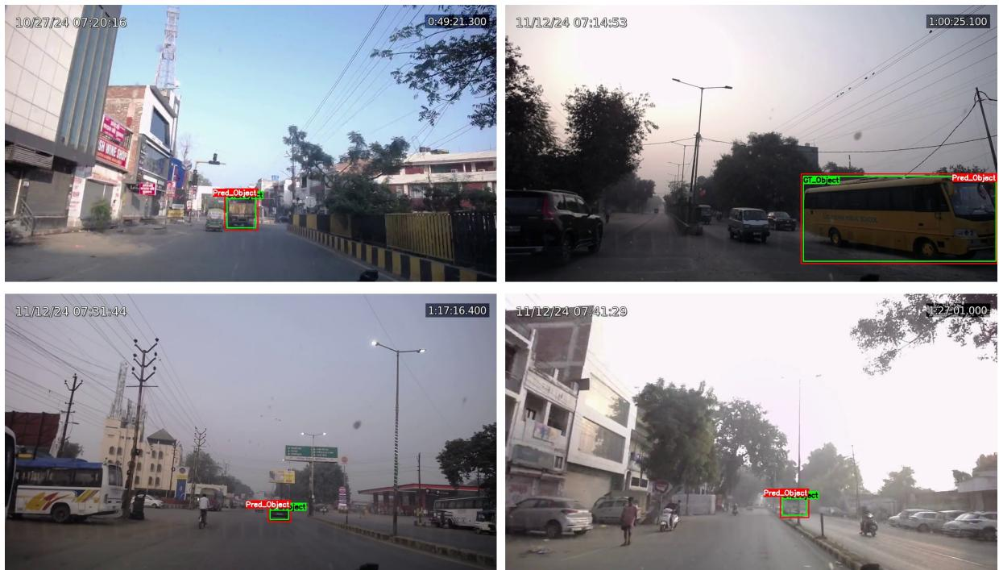  
Fig. 14: Test samples of correct predicted gaze object, indicating green bounding box is ground truth and red is predicted gaze object.

## 5.2. Performance comparison of TransGaze-Object and SGAP-Gaze

The performance of our proposed TransGaze-Object prediction model has been compared with the PoG model by associating the estimated gaze point with object bounding boxes. Please note that, to the best of the author’s knowl edge, no gaze-object prediction model exists in the literature that can directly represent gaze in terms of the object. Therefore, we have used our previously proposed state-of-the-art PoG model (SGAP-Gaze) (Sharma & Chakraborty, 2026) for comparison by associating the gaze point with the object’s bounding box detected in a scene image via post-processing. If the gaze point lay inside a bounding box, the corresponding object was assigned as the gaze object.

For performance evaluation, both the SGAP-Gaze and TransGaze-Object models were evaluated using the same test dataset. First, the point of gaze for the test samples was estimated using the SGAP-Gaze model, and the resulting gaze points were associated with the corresponding detected objects’ bounding boxes in the scene image. If the estimated point of gaze lies within an object’s bounding box and corresponds to an object that is a ground-truth object, then it is assigned a value of 1, indicating a correctly predicted gaze object; otherwise, it is assigned a value of 0. The association through the point-of-gaze model achieved an accuracy of 50.98%. In contrast, the proposed TransGaze-Object model achieves an accuracy of 59.45%, representing an overall 8.47% improvement compared to SGAP-Gaze, which confirms that incorporating bounding-box information improves gaze-object prediction accuracy. However, our proposed model accuracy remains lower, with only about 60% of gaze objects correctly predicted. Given that even state-of-the-art PoG-based gaze object prediction has achieved an accuracy of only around 51%, this finding highlights that gaze object prediction is a significantly challenging problem, which is often not reflected by the small values of angular error (∼ 6◦) reported in the gaze direction estimation literature (Kasahara et al., 2022; Cheng et al., 2024). Next, to investigate the possible reasons of incorrect predictions, we analyze the factors contributing to gaze object prediction errors.

## 5.3. Error analysis of gaze object predictions

The predicted incorrect gaze object is categorized into three groups to understand the possible reasons of the failure cases. In the first category, both the predicted and ground-truth gaze objects are trafic objects, but they correspond to diferent object IDs. In the second category, the predicted gaze object is the background, whereas the ground-truth is one of the trafic objects in the trafic scene. And finally, in the third category, the predicted gaze object is a trafic object, while the background is the ground truth. The results of all three failure cases are shown in Table 3.

In the first category, where both the ground-truth and incorrectly predicted gaze objects correspond to trafic objects, the performances of the TransGaze-Object model and SGAP-Gaze are nearly identical. As shown in Table 3, the corresponding incorrect predictions are 16.23% and 16.55%, respectively. It should be noted that these percentages are calculated with respect to the total number of test samples (14,673).

In the second category, where the ground truth gaze object is a trafic object but the predicted gaze object is the background, the proposed TransGaze-Object model demonstrates a significant improvement. TransGaze-Object produces only 11.68% incorrect predictions, whereas SGAP-Gaze (PoG associated to objects) incorrectly predicted gaze object 23.21% of the total test samples as background. These results indicate that incorporating object-level spatial information enables the proposed TransGaze-Object model to distinguish trafic objects from the background more efectively, reducing this type of error by nearly half compared to SGAP-Gaze.

In the third category, where the ground truth gaze object is the background but the predicted gaze object is a trafic object, the performance of TransGaze-Object is slightly inferior to that of SGAP-Gaze. The corresponding error rates are 12.62% and 9.24%, respectively. This suggests that although the proposed model is more efective at reducing the incorrect prediction of trafic objects as background gaze objects, it exhibits a slight increase in the incorrect prediction of background as a trafic object. However, overall, the performance improvement in TransGaze-Object model is primarily contributed to reducing the incorrect prediction from background to trafic object (category 2), justifying the usefulness of providing the bounding box information apriori.

Table 3: Comparison of false predicted gaze object of TransGaze-Object and PoG-to-object association using SGAP-Gaze
<table><tr><td rowspan="2">Categories</td><td colspan="2">TransGaze-Object</td><td colspan="2">PoG-Object Association</td></tr><tr><td>Count</td><td>Percentage(%)</td><td>Count</td><td>Percentage(%)</td></tr><tr><td>Traffic Object-Traffic Object</td><td>2382</td><td>16.23</td><td>2429</td><td>16.55</td></tr><tr><td>Traffic Object-Background</td><td>1715</td><td>11.68</td><td>3407</td><td>23.21</td></tr><tr><td>Background-Traffic Object</td><td>1853</td><td>12.62</td><td>1357</td><td>9.24</td></tr></table>

A detailed analysis of incorrect gaze object predictions, in which both the ground truth and the predicted objects are trafic objects, is presented in Table 4. These incorrect gaze object predictions are further categorized as overlapping or non-overlapping trafic objects based on the ground truth and predicted object bounding boxes. A incorrect gaze object prediction is considered overlapping, if the ground truth and predicted bounding boxes share common area (i.e., have a non-zero intersection), otherwise, it is categorized as a non-overlapping. As shown in the Table 4, the proposed TransGaze-Object model exhibits 353 (2.40%) overlapping trafic object to trafic object incorrect gaze object prediction, which is slightly higher than 331 (2.25%) observed for SGAP-Gaze. These errors mainly occur when multiple trafic objects are located close to each other and have overlapping bounding boxes, making them visually dificult to distinguish. Figure 15 shows a sample of the incorrect prediction of gaze object due to the overlapping of ground truth and predicted trafic objects.

For non-overlapping trafic object to trafic object incorrect prediction, TransGaze-Object records 2029 (13.82%) incorrect samples, whereas SGAP-Gaze (PoG-object association) records 2098 (14.29%) incorrect samples. The slightly lower error rate of TransGaze-Object indicates that the proposed model is marginally more efective in discriminating between spatially separated trafic objects. Figure 16 shows a sample of the false prediction of gaze object due to the non-overlapping of ground truth and predicted trafic objects. Overall, the false prediction rates for trafic object-to trafic object comparisons of the two methods (TransGaze-Object and SGAP-Gaze) remain comparable, suggesting that the primary advantage of the proposed TransGaze-Object model lies in reducing confusion between trafic objects and the background rather than between diferent trafic objects.

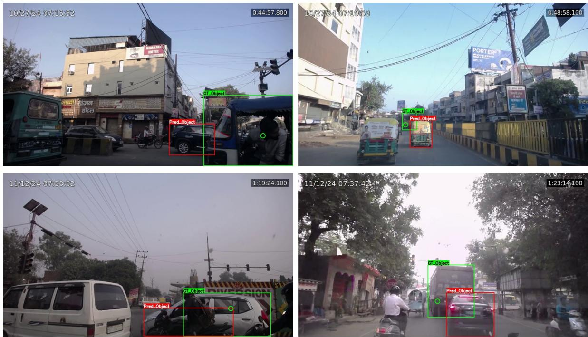  
Fig. 15: Illustration of test samples showing overlapping trafic objects with incorrectly predicted gaze object

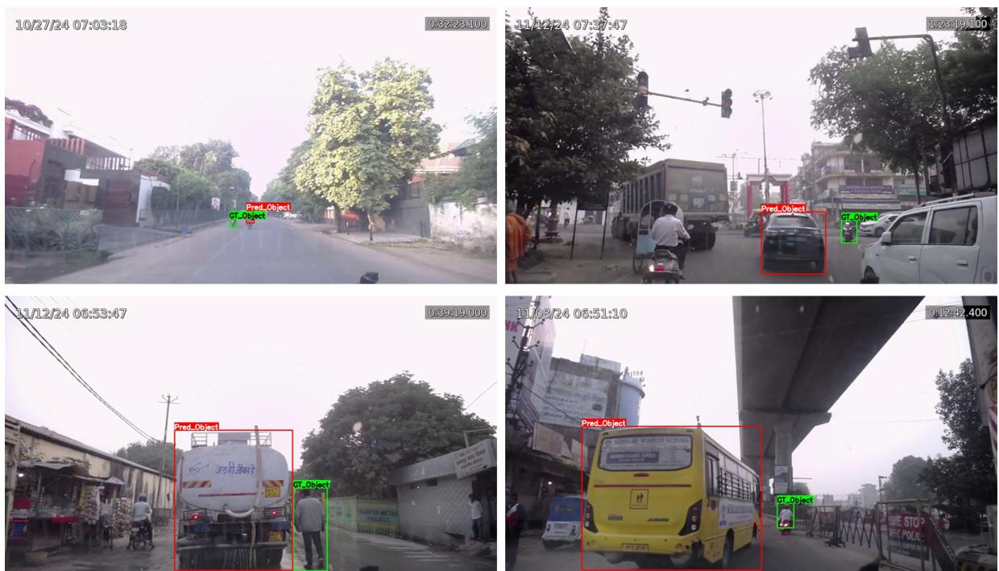  
Fig. 16: Test samples of false predicted gaze objects (Non-overlapping)

Table 4: Analysis of incorrect gaze object prediction between trafic object - trafic object
<table><tr><td rowspan="2">Categories</td><td colspan="2">TransGaze-Object</td><td colspan="2">PoG-Object Association</td></tr><tr><td>Count</td><td>Percentage(%)</td><td>Count</td><td>Percentage(%)</td></tr><tr><td>Traffic Object-Traffic Object (Overlapping)</td><td>353</td><td>2.40</td><td>331</td><td>2.25</td></tr><tr><td>Traffic Object-Traffic Object</td><td>2029</td><td>13.82</td><td>2098</td><td>14.29</td></tr><tr><td>(Non-Overlapping)</td><td></td><td></td><td></td><td></td></tr></table>

## 5.4. Error analysis of background and trafic object

To investigate the efect of object scale on gaze estimation performance, we analyzed the relationship between the predicted bounding-box area and gaze estimation error. The estimated error is computed as the shortest distance between the ground truth point-of-gaze coordinates and the nearest edge of the predicted gaze object bounding box. The bounding box coordinates, originally in normalized form, are first converted to pixel coordinates using the image resolution $( 1 2 8 0 \times 7 2 0 )$ . The area of each estimated bounding box is then computed in pixel units. To ensure a fair comparison across objects of diferent sizes, the gaze error is normalized by the square root of the bounding box area, which provides a scale-invariant measure of localization error.

Furthermore, objects are categorized into three groups: small, medium, and large based on their bounding box areas. This categorization is performed using quantile-based partitioning, in which the dataset is divided into three equal subsets based on the distribution of bounding box areas. This ensures a balanced representation of object sizes and allows for meaningful comparison of model performance across diferent scales. The average normalized error is then computed for each size group to evaluate the influence of object scale on gaze object prediction accuracy.

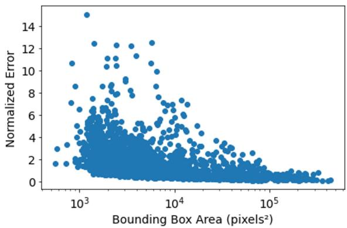  
(a)

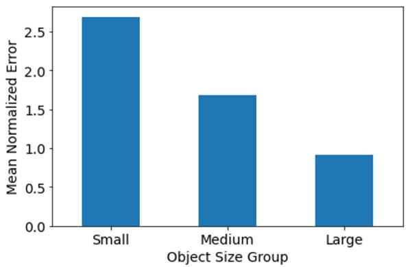  
(b)  
Fig. 17: Test samples of failure cases where predicted gaze object is trafic object while ground truth is background

The analysis reveals a clear negative correlation between bounding box area and normalized gaze error (Pearson = -0.286, Spearman = -0.622), also shown in Figure 17a, indicating that larger objects are associated with lower relative error. Additionally, the size-wise evaluation shows that small objects exhibit significantly higher normalized error compared to medium and large objects, as shown in Figure 17b. This suggests that the proposed model performs more reliably on larger objects, while smaller objects remain challenging due to their limited spatial extent and increased ambiguity in gaze-object association.

## 6. Conclusions

Driver gaze provides a significant role in assessing driver visual attention and situational awareness. The existing approach of driver gaze estimation represents the driver’s gaze either in the interior vehicle region, such as the for ward windshield, side wing mirror, or as a gaze direction vector/point of gaze on the scene image. Object-level gaze information provides more semantically meaningful cues for driver visual attention and situational awareness, thereby helping develop gaze-based driver monitoring systems to improve driver safety. However, no existing studies have performed end-to-end gaze object prediction. Therefore, in this study, we proposed a transformer-based gaze object (TransGaze-Object) prediction framework that directly represents the driver’s gaze as a trafic object or the background. The proposed framework requires face and scene images as inputs to extract facial and scene features. First, the Face-Eye-Iris and trafic objects are detected in the face and scene images, respectively, using two separate custom YOLOv8-based detectors. The proposed framework then extracts facial features, including face and iris-weighted eye features, along with spatial features of the detected trafic objects. A transformer-based cross-attention mechanism is then used to compute similarity scores and attention weights for predicting the driver’s gaze object. To train this model, we propose a benchmark driver gaze dataset, UD-FSG (Urban Driving-Face Scene Gaze), comprising synchronized driver-face and trafic-scene images, bounding boxes for scene objects, and gaze labels expressed as 2D gaze coordinates and corresponding gaze objects. We introduce a hybrid loss function comprising classification, consistency, confusion-aware attention, and hard-negative margin losses to improve the robustness of the proposed TransGaze-Object model during training.

The proposed TransGaze-Object model achieves an overall gaze-object prediction accuracy of 60%. In comparison, associating the predicted gaze point with object bounding boxes using a state-of-the-art PoG-based approach achieves an overall accuracy of 51%. Thus, the proposed model provides an approximately 9% improvement in gaze-object prediction accuracy, corresponding to a 17.5% relative improvement over SGAP-Gaze, highlighting the benefit of incorporating object-level geometric and spatial information during training to establish a more reliable association between driver gaze and scene objects. The error analysis shows that TransGaze-Object reduces confusion between trafic objects and the background, with an error rate of 11.68%, compared with 23.21% for the PoG-based gazeobject association using post-processing. However, distinguishing between trafic objects and the background remains challenging. Further error analysis shows that gaze prediction on smaller objects is challenging. By formulating driver gaze estimation as an end-to-end gaze object prediction problem, this work aims to stimulate further research into object-level representations of driver visual attention.

In future work, the proposed framework can be further improved in terms of prediction accuracy, robustness, and generalization across diverse driving conditions. The framework can be extended to support diferent camera config urations and dashboard-mounted camera placements by explicitly incorporating the corresponding camera intrinsic and extrinsic parameters. Furthermore, the current framework can be expanded beyond the forward scene to include side windows and a wider portion of the vehicle interior, enabling driver gaze estimation over a broader field of view. Future studies can also investigate temporal information from consecutive frames to model the dynamic nature of driver gaze and improve the stability of gaze-object predictions under challenging real-world driving conditions.

## Declaration of Generative AI and AI-assisted technologies in the writing process

The authors declare that ChatGPT was used to assist with grammar checks and language corrections in this manuscript. All content generated by the tool was carefully reviewed, revised, and approved by the authors, who take full responsibility for the content of the publication.

## CRediT authorship contribution statement

Pavan Kumar Sharma: Conceptualization, Data curation, Formal analysis, Investigation, Methodology, Software, Validation, Writing-original draft. Ayush Pande: Conceptualization, Investigation, Writing-Review & Editing. Pranamesh Chakraborty: Conceptualization, Investigation, Methodology, Resources, Supervision, Validation, Writing-Review & Editing.

## Declaration of competing interest

The authors declare that they have no known competing financial interests or personal relationships that could have appeared to influence the work reported in this paper.

## Data availability

The dataset supporting the findings of this study is available at the following link: https://github.com/pavans20/ Urban-Driving-Face-Scene-Gaze-Dataset.git.

## References

Caesar, H., Bankiti, V., Lang, A. H., Vora, S., Liong, V. E., Xu, Q., Krishnan, A., Pan, Y., Baldan, G., & Beijbom, O. (2020). nuscenes: A multimodal dataset for autonomous driving. In Proceedings ofthe IEEE/CVF Conference on Computer Vision and Pattern Recognition (CVPR).

Cheng, Y., & Lu, F. (2022). Gaze estimation using transformer. In 2022 26th International Conference on Pattern Recognition (ICPR) (pp. 3341–3347). IEEE.

Cheng, Y., Zhu, Y., Wang, Z., Hao, H., Liu, Y., Cheng, S., Wang, X., & Chang, H. J. (2024). What do you see in vehicle? comprehensive vision solution for in-vehicle gaze estimation. In 2024 IEEE/CVF Conference on Computer Vision and Pattern Recognition (CVPR) (pp. 1556–1565). IEEE.

Chuang, M.-C., Bala, R., Bernal, E. A., Paul, P., & Burry, A. (2014). Estimating gaze direction of vehicle drivers using a smartphone camera. In Proceedings of the IEEE Conference on Computer Vision and Pattern Recognition Workshops (pp. 165–170).

Deng, P., Yang, J. J., & Bian, J. (2026). Cross-paradigm evaluation of gaze-based semantic object identification for intelligent vehicles. arXiv preprint arXiv:2602.01452, .

Dingus, T. A., Guo, F., Lee, S., Antin, J. F., Perez, M., Buchanan-King, M., & Hankey, J. (2016). Driver crash risk factors and prevalence evaluation using naturalistic driving data. Proceedings ofthe National Academy ofSciences, 113, 2636–2641.

Dua, I., John, T. A., Gupta, R., & Jawahar, C. (2020). Dgaze: Driver gaze mapping on road. In 2020 IEEE/RSJ International Conference on Intelligent Robots and Systems (IROS) (pp. 5946–5953). IEEE.

Fischler, M. A., & Bolles, R. C. (1981). Random sample consensus: a paradigm for model fitting with applications to image analysis and automated cartography. Communications ofthe ACM, 24, 381–395.

Fridman, L., Langhans, P., Lee, J., & Reimer, B. (2016a). Driver gaze region estimation without use of eye movement. IEEE Intelligent Systems, 31, 49–56.

Fridman, L., Lee, J., Reimer, B., & Victor, T. (2016b). ‘owl’and ‘lizard’: Patterns of head pose and eye pose in driver gaze classification. IET Computer Vision, 10, 308–314.

Ghosh, S., Dhall, A., Sharma, G., Gupta, S., & Sebe, N. (2021). Speak2label: Using domain knowledge for creating a large scale driver gaze zone estimation dataset. In Proceedings of the IEEE/CVF International Conference on Computer Vision (pp. 2896–2905).

He, K., Zhang, X., Ren, S., & Sun, J. (2016). Deep residual learning for image recognition. In Proceedings of the IEEE Conference on Computer Vision and Pattern Recognition (pp. 770–778).

Hu, D., Li, X., Cui, M., & Huang, K. (2025). Lnet: Lightweight network for driver attention estimation via scene and gaze consistency. IEEE Transactions on Image Processing, 35, 27–41.

Hu, Z., Lv, C., Hang, P., Huang, C., & Xing, Y. (2021). Data-driven estimation of driver attention using calibrationfree eye gaze and scene features. IEEE Transactions on Industrial Electronics, 69, 1800–1808.

Kasahara, I., Stent, S., & Park, H. S. (2022). Look both ways: Self-supervising driver gaze estimation and road scene saliency. In European Conference on Computer Vision (pp. 126–142). Springer.

Kullback, S., & Leibler, R. A. (1951). On information and suficiency. The Annals of Mathematical Statistics, 22, 79–86.

Lal, S. K., & Craig, A. (2001). A critical review of the psychophysiology of driver fatigue. Biological Psychology, 55, 173–194.

Li, G., Wang, Y., Zhu, F., Sui, X., Wang, N., Qu, X., & Green, P. (2019). Drivers’ visual scanning behavior at signalized and unsignalized intersections: A naturalistic driving study in china. Journal of Safety Research, 71, 219–229.

Li, M., Feng, Z., Zhang, W., Wang, L., Wei, L., & Wang, C. (2023). How much situation awareness does the driver have when driving autonomously? a study based on driver attention allocation. Transportation Research Part C: Emerging Technologies, 156, 104324.

Li, T., Peng, J., Li, Q., Li, X., Zhao, B., & Zhang, G. (2026). A geometry-guided multimodal framework for train driver gaze target estimation. Engineering Applications of Artificial Intelligence, 179, 115156.

Li, Y., Hong, Y., Wang, Z., Chen, J., Liu, R., Ding, S., & Tan, B. (2025). Nonlinear multi-head cross-attention network and programmable gradient information for gaze estimation. Scientific Reports, 15, 27135.

Liu, D., Li, D., Ding, H., Cao, Y., & Gao, K. (2025). Beyond vision: A unified transformer with bidirectional attention for predicting driver perceived risk from multi-modal data. Transportation Research Part C: Emerging Technologies, 179, 105270.

Louw, T., & Merat, N. (2017). Are you in the loop? using gaze dispersion to understand driver visual attention during vehicle automation. Transportation Research Part C: Emerging Technologies, 76, 35–50.

LRD, M., Mukhopadhyay, A., & Biswas, P. (2022). Distraction detection in automotive environment using appearance-based gaze estimation. In 27th International Conference on Intelligent User Interfaces (pp. 38–41).

Martin, S., Vora, S., Yuen, K., & Trivedi, M. M. (2018). Dynamics of driver’s gaze: Explorations in behavior modeling and maneuver prediction. IEEE Transactions on Intelligent Vehicles, 3, 141–150.

Mathew, A. M., Hermassi, H., Kadavil, T., & Khan, A. A. (2026). Gazevlm: A vision-language model for multi-task gaze understanding. In Proceedings ofthe IEEE/CVF Conference on Computer Vision and Pattern Recognition (pp. 9241–9250).

Nieva-Suárez, Á., Marron-Romera, M., Losada-Gutierrez, C., & Guardiola-Luna, I. (2025). Towards fusing gaze estimation and object prediction: What are you looking at? Engineering Applications of Artificial Intelligence, 157, 111113.

Ortega, J. D., Kose, N., Cañas, P., Chao, M.-A., Unnervik, A., Nieto, M., Otaegui, O., & Salgado, L. (2020). Dmd: A large-scale multi-modal driver monitoring dataset for attention and alertness analysis. In European Conference on Computer Vision (pp. 387–405). Springer.

Palazzi, A., Abati, D., Solera, F., Cucchiara, R. et al. (2018). Predicting the driver’s focus of attention: the dr (eye) ve project. IEEE Transactions on Pattern Analysis and Machine Intelligence, 41, 1720–1733.

Rangesh, A., Zhang, B., & Trivedi, M. M. (2020). Driver gaze estimation in the real world: Overcoming the eyeglass challenge. In 2020 IEEE Intelligent Vehicles Symposium (IV) (pp. 1054–1059). IEEE.

Regan, M. A., Lee, J. D., & Young, K. (2008). Driver distraction: Theory, efects, and mitigation. CRC press.

Ribeiro, R. F., & Costa, P. D. (2019). Driver gaze zone dataset with depth data. In 2019 14th IEEE International Conference on Automatic Face & Gesture Recognition (FG 2019) (pp. 1–5). IEEE.

Shah, S. M., Sun, Z., Zaman, K., Hussain, A., Shoaib, M., & Pei, L. (2022). A driver gaze estimation method based on deep learning. Sensors, 22, 3959.

Sharma, P. K., & Chakraborty, P. (2024a). Driver gaze zone estimation using deep neural network. In International Conference on Transportation Planning and Implementation Methodologies for Developing Countries (pp. 227– 236). Springer.

Sharma, P. K., & Chakraborty, P. (2024b). A review of driver gaze estimation and application in gaze behavior understanding. Engineering Applications ofArtificial Intelligence, 133, 108117.

Sharma, P. K., & Chakraborty, P. (2025). Evaluation of data collection and annotation approaches of driver gaze dataset. Behavior Research Methods, 57, 172.

Sharma, P. K., & Chakraborty, P. (2026). Sgap-gaze: Scene grid attention based point-of-gaze estimation network for driver gaze. arXiv preprint arXiv:2604.19888, .

Tawari, A., Chen, K. H., & Trivedi, M. M. (2014). Where is the driver looking: Analysis of head, eye and iris for robust gaze zone estimation. In 17th International IEEE Conference on Intelligent Transportation Systems (ITSC) (pp. 988–994). IEEE.

Tayal, D., & Mishra, S. K. (2025). On the Road to Equality: Gender, Transport and Economic Empowerment in India. South and South-West Asia Ofice (SSWA), Economic and Social Commission for Asia and the Pacific (ESCAP).

Tonini, F., Dall’Asen, N., Beyan, C., & Ricci, E. (2023). Object-aware gaze target detection. In Proceedings of the IEEE/CVF International Conference on Computer Vision (pp. 21860–21869).

Tonsen, M., Baumann, C. K., & Dierkes, K. (2020). A high-level description and performance evaluation of pupil invisible. arXiv preprint arXiv:2009.00508, .

Ultralytics (2023). Yolov8. URL: https://github.com/ultralytics/ultralytics.

Varma, G., Subramanian, A., Namboodiri, A., Chandraker, M., & Jawahar, C. (2019). Idd: A dataset for exploring problems of autonomous navigation in unconstrained environments. In 2019 IEEE Winter Conference on Applications ofComputer Vision (WACV) (pp. 1743–1751). IEEE.

Vaswani, A., Shazeer, N., Parmar, N., Uszkoreit, J., Jones, L., Gomez, A. N., Kaiser, Ł., & Polosukhin, I. (2017). Attention is all you need. Advances in Neural Information Processing Systems, 30.

Vicente, F., Huang, Z., Xiong, X., De la Torre, F., Zhang, W., & Levi, D. (2015). Driver gaze tracking and eyes of the road detection system. IEEE Transactions on Intelligent Transportation Systems, 16, 2014–2027.

Vora, S., Rangesh, A., & Trivedi, M. M. (2018). Driver gaze zone estimation using convolutional neural networks: A general framework and ablative analysis. IEEE Transactions on Intelligent Vehicles, 3, 254–265.

Wang, B., Guo, C., Jin, Y., Xia, H., & Liu, N. (2024). Transgop: transformer-based gaze object prediction. In Proceedings of the AAAI Conference on Artificial Intelligence (pp. 10180–10188). volume 38.

Wang, Y., Nan, H., Yan, R., Ding, X., Wang, J., & Fu, X. (2026). Pigaze: Personalized in-vehicle gaze estimation with plug-and-play adaptation. Knowledge-Based Systems, 348, 116336.

World Health Organization (2023). Global Status Report on Road Safety 2023. Geneva: World Health Organization. Licence: CC BY-NC-SA 3.0 IGO.

Wu, X., Li, L., Zhou, G., Wu, Q., Zuo, X., Zhu, H., & He, S. (2025). Multi-task driver gaze estimation in real world driving scenes. Engineering Applications ofArtificial Intelligence, 160, 111892.

Yahyaabadi, R., & Nikan, S. (2026). Driver gaze zone estimation using multi-head attention graph neural network. IEEE Transactions on Intelligent Transportation Systems, .

Yang, L., Dong, K., Dmitruk, A. J., Brighton, J., & Zhao, Y. (2019). A dual-cameras-based driver gaze mapping system with an application on non-driving activities monitoring. IEEE Transactions on Intelligent Transportation Systems, 21, 4318–4327.

Yang, Y., Liu, C., Chang, F., Lu, Y., & Liu, H. (2021). Driver gaze zone estimation via head pose fusion assisted supervision and eye region weighted encoding. IEEE Transactions on Consumer Electronics, 67, 275–284.

Yarbus, A. L. (2013). Eye movements and vision. Springer.

Yuan, G., Wang, Y., Yan, H., & Fu, X. (2022). Self-calibrated driver gaze estimation via gaze pattern learning. Knowledge-Based Systems, 235, 107630.

Zhou, J., Liu, C., Chang, F., Wang, W., Hao, P., Huang, Y., & Yang, Z. (2025). Eraw-net: Enhance-refine-align w-net for scene-associated driver attention estimation. IEEE Transactions on Multimedia, 27, 5922–5935.