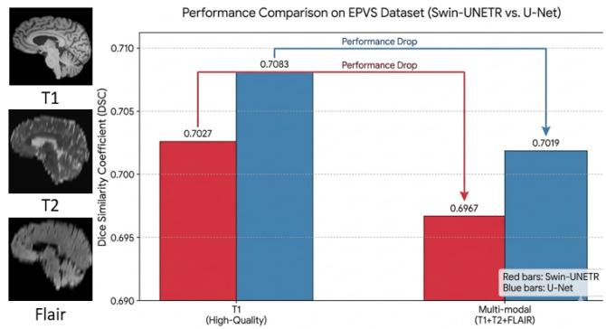
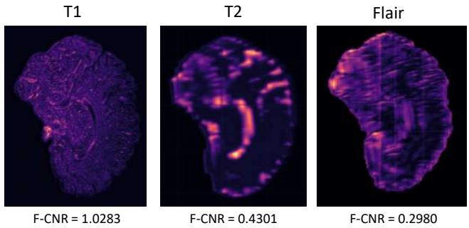
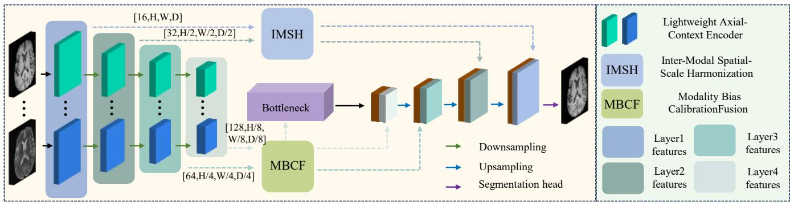
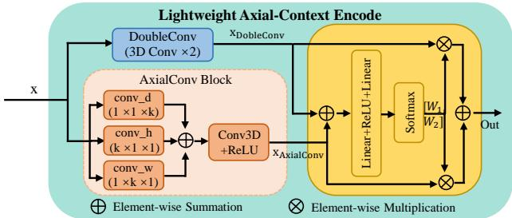
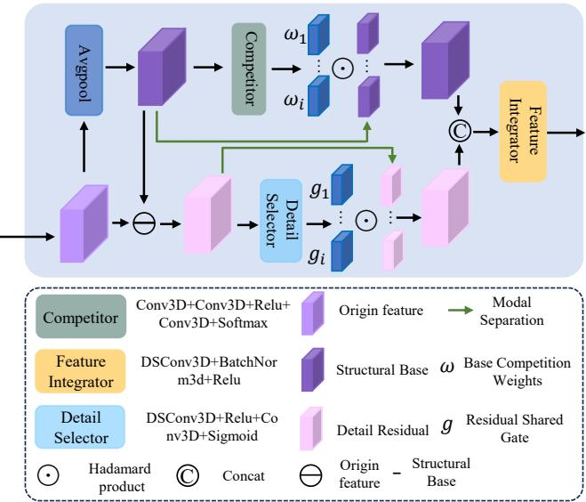
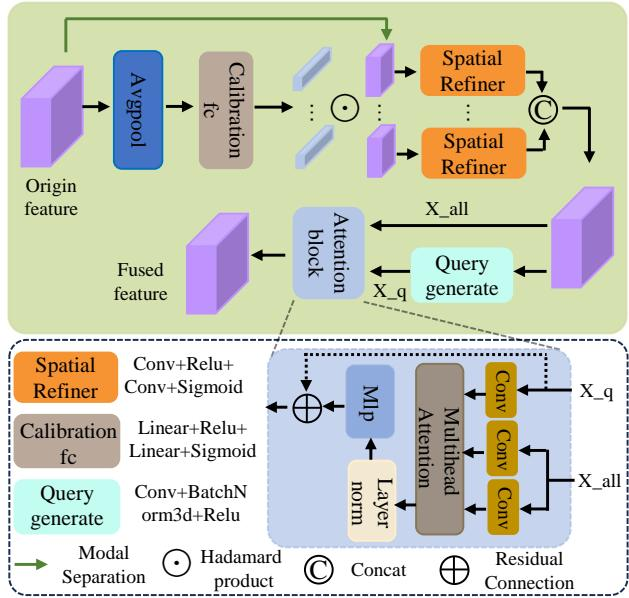
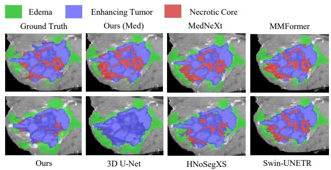

# When Fusion Fails: Corruption-Aware Rebalanced Fusion for Multi-Modal Medical Image Segmentation

Yuchen Pei   
ycpei@ccnu.edu.cn   
Central China Normal   
University   
Wuhan, China   
Hui Chu   
chuhui2019@163.com   
Guangzhou University of   
Chinese Medicine   
Guangzhou, China

Xiaoyu Hu xiaoyu\_hu@mails.ccnu.edu.cn Central China Normal University Wuhan, China

Yutao Ma   
ytma@ccnu.edu.cn   
Central China Normal   
University   
Wuhan, China Yixiong Zou   
yixiongz@hust.edu.cn   
Huazhong University of   
Science and Technology Wuhan, China   
Shijun Qiu✉   
qiushijun1961@gzucm.edu.cn   
The First Afiliated Hospital   
of Guangzhou University of   
Chinese Medicine   
Guangzhou, China Dingwen Hu   
20231110467@stu.gzucm.edu.cn   
Guangzhou University of Chinese Medicine Guangzhou, China

Gang Li✉ gang\_li@med.unc.edu University of North Carolina, Chapel Hill Chapel Hill, United States

## Abstract

Multi-modal medical image segmentation leverages complementary diagnostic information, yet fusion can underperform singlemodality baselines when spatially aligned inputs difer in quality. Here, "corruption" primarily denotes resolution-induced degradation rather than misalignment or complete modality absence, while synthetic noise is evaluated only as an auxiliary setting. We identify a critical optimization-inference inconsistency: degraded modalities can receive weak training updates yet substantially afect predictions, indicating active interference with fusion. We attribute this failure to resampling-induced feature corruption and optimization bias, where noisy features propagate through skip connections and encourage unreliable modality selection. We therefore propose CoReFuse-Med, a Corruption-aware Rebalanced Fusion framework that suppresses corruption during feature transmission and rebalances modality contributions during high-level fusion. Experiments on EPVS, BraTS, and WMH, including multiple Z-axis sliceretention ratios and an auxiliary noise test, demonstrate improved accuracy and robustness under modality-quality discrepancies. Our code is available at https://github.com/lrever/CoReFuse.

## CCS Concepts

• Computing methodologies → Image segmentation; • Applied computing → Health informatics.

## Keywords

Multi-modal medical image segmentation, Modality-quality discrepancy, Corruption-aware fusion, Modality imbalance

## ACM Reference Format:

Yuchen Pei, Xiaoyu Hu, Yixiong Zou, Dingwen Hu, Hui Chu, Yutao Ma, Shijun Qiu, and Gang Li. 2026. When Fusion Fails: Corruption-Aware Rebal anced Fusion for Multi-Modal Medical Image Segmentation. In Proceedings

ofthe 34th ACM International Conference on Multimedia (MM ’26), November 10–14, 2026, Rio de Janeiro, Brazil. ACM, New York, NY, USA, 9 pages. https://doi.org/10.1145/3767308.3836234

## 1 Introduction

Multi-modal medical image segmentation (MMIS) has emerged as a cornerstone of modern computer-aided diagnosis, leveraging the synergistic potential of diverse imaging sequences to enhance predictive accuracy and clinical robustness [8, 22, 28]. This is because diferent modalities of images can capture distinct lesion features that do not overlap, thereby jointly improving the definition of the target and achieving better performance compared to single-modal imaging [5, 12, 15, 23, 26].

Acknowledging the inherent challenges of cross-modal integration, recent literature has extensively addressed explicit forms of heterogeneity. These include spatial misalignment in diferent modalities [3, 10], missing modalities [16], and intensity variations across acquisition protocols [12]. Despite their methodological diversity, these approaches share a common conceptual paradigm: fusion failure arises from incomplete or misaligned information. This perspective has led to a research landscape dominated by alignment, completion, and robust aggregation strategies.

However, we identify a distinct and largely unexplored failure mode: fusion degradation caused by modality-quality mismatch even when modalities are spatially aligned. In realworld clinical acquisition, imaging sequences are often captured at diferent resolutions due to practical constraints such as scan time and patient motion [11]. Although standard resampling aligns all modalities into a shared spatial grid, making them appear compatible, we observe a counter-intuitive phenomenon: multi-modal fusion can underperform single-modality baselines despite successful alignment. As shown in Fig. 1, on the Enlarged Perivascular Spaces (EPVS) MRI dataset with inherent resolution discrepancies (T1: high-resolution; FLAIR/T2: sparse axial slices), multimodal fusion underperforms the T1 single-modality baseline. This observation shows that additional modalities are not necessarily beneficial when their quality is substantially mismatched, raising a fundamental question: why does fusion degrade rather than improve performance under aligned quality discrepancies?

  
Figure 1: Illustration of multi-modal fusion performance. Left: Visual comparison of high-resolution T1, low-resolution T2, and FLAIR modalities. Right: Quantitative results showing a performance drop in standard architectures when transitioning from T1-only inputs to multi-modal inputs.

To answer this question, we conduct a systematic analysis from both structural and optimization perspectives. Our empirical find ings reveal a critical inconsistency: degraded modalities can exhibit substantial predictive impact despite comparatively weak gradient contributions. This indicates that degraded modalities are neither simply ignored nor reliably exploited; instead, they can substantially bias the decision-making process of the fusion model.

We further identify the root cause of this failure as the interplay between feature corruption and optimization bias. First, resolution discrepancies introduce resampling-induced noise into low-quality modalities, which is subsequently propagated through skip connections and contaminates the fused feature space. Second, under such corrupted inputs, the network tends to adopt a greedy optimization shortcut, over-relying on cleaner modalities while sup pressing ambiguous but informative signals from degraded ones. This interplay prevents stable cross-modal reasoning, causing the model to collapse into a noisy and biased modality selection process.

This analysis leads to a key insight: efective multi-modal fusion under resolution discrepancy conditions requires disentangling two fundamentally coupled challenges, preventing noise propagation and correcting modality-level optimization bias. This inspires us to design a corruption-aware fusion network, rather than relying only on the attention-based interactions adopted by current works [24, 27]. Existing methods primarily focus on feature interaction under the assumption of clean inputs, but overlook modality reliability, allowing noise to propagate and bias to accumulate.

Based on this insight, we propose CoReFuse-Med, a corruptionaware rebalanced fusion framework for imbalanced multi-modal medical image segmentation. Instead of directly enhancing feature interaction, our approach explicitly separates the fusion process into two stages: (1) mitigating feature corruption before fusion to ensure reliable representations, and (2) rebalancing modality contributions during high-level reasoning to avoid biased optimiza tion. This design enables the model to leverage complementary information more efectively under severe resolution discrepancies.

To sum up, our primary contributions are as follows:

• To the best of our knowledge, we are the first to identify fusion failure under spatially aligned modality-quality discrepancies, where resolution-induced degradation disrupts cross-modal integration.

• Gradient and occlusion analyses reveal an optimization– inference inconsistency in which degraded modalities receive weak updates yet strongly afect predictions.

• We propose CoReFuse-Med that disentangles fusion into two steps, which suppresses shallow feature corruption and rebalances modality contributions during high-level reasoning, enabling reliable multi-modal interaction.

• Experiments on EPVS, BraTS, and WMH datasets across diferent modality-corruption settings demonstrate that our method consistently achieves robust performance.

## 2 Related Work

Feature Corruption under Resolution Discrepancy. Most multimodal segmentation networks adopt U-shaped architectures with skip connections to preserve spatial details [26, 30]. While efective for homogeneous inputs, this design implicitly assumes that features transferred from encoder to decoder are reliable. However, in clinical settings, modalities often exhibit significant resolution discrepancies [11]. Resampling introduces structured high-frequency noise into low-quality modalities, which is subsequently propagated through skip connections and contaminates the fused process.

Existing multi-modal fusion methods primarily focus on enhancing feature interaction, such as attention-based mechanisms [21, 25] or resolution-robust operators [19]. These approaches implicitly assume clean and compatible inputs, and therefore tend to amplify, rather than suppress, noise-contaminated signals under crossresolution conditions. In contrast, our work explicitly attenuates resampling-induced corruption and mitigates its propagation during feature transmission.

Optimization Bias in Imbalanced Multi-modal Learning. Another line of work addresses modality imbalance, where diferent modalities contribute unequally due to missing or degraded inputs [2, 6, 17]. It has been shown that deep networks exhibit a greedy optimization tendency [20], over-relying on dominant modalities while suppressing others, a phenomenon often referred to as modality competition.

Recent advances seek to rebalance these dynamics via prototypebased guidance [2], self-distillation [14], or data-level augmentation [16, 18, 20, 29]. However, these methods fundamentally treat modality discrepancy as an issue of data availability or optimization scheduling. They operate under the implicit assumption that the provided modality features are inherently reliable, even if they are weak or incomplete. We argue that this assumption fails in clinical scenarios characterized by resolution discrepancies. In such cases, degraded modalities are not merely under-optimized, and they are intrinsically corrupted by resampling-induced noise. Hence, they fail to address the coupled efect of feature corruption and optimization bias, where noise-contaminated features further exacerbate modality imbalance during training. Our work instead tackles this problem from a feature-space perspective, jointly suppressing corruption and rebalancing modality contributions during fusion.

## 3 Problem Analysis

## 3.1 An Unexpected Finding: Fusion Failure under Aligned Quality Mismatch

We observe a counter-intuitive phenomenon under spatially aligned modality-quality mismatch: additional modalities do not necessarily improve performance when their quality difers substantially, although complementary modalities are generally expected to benefit segmentation [22, 26]. As shown in Fig. 1, on the IH EPVS dataset with inherent resolution discrepancies (T1: high-resolution; FLAIR/T2: only 10% axial slices), multi-modal fusion underperforms the single-modality baseline. Specifically, fusing all three modalities yields a DSC of 0.695, which is 1.14% lower than using T1 alone (0.703). This observation shows that additional modalities are not automatically beneficial under severe quality mismatch, raising a fundamental question: why does fusion degrade rather than enhance the result?

Notably, existing multi-modal fusion methods [22, 28] do not reveal or explain this phenomenon, as they assume isotropic, high quality, and well-aligned inputs. This gap motivates our systematic analysis: why does fusion fail when it should help?

## 3.2 Hidden Noise in Cross-resolutionOurs Mednext Multi-modal Data

We hypothesize that the root cause lies in the resampling-induced noise arising from cross-resolution discrepancies. To quantitatively characterize this efect in the latent feature space, we introduce the Feature Contrast-to-Noise Ratio (F-CNR), which quantifies the separability between lesion signals and background noise.

Given an intermediate feature map $F \in \bar { \mathbb { R } ^ { C \times D \times H \times W } }$ and a corresponding lesion mask, we compute channel-wise F-CNR by contrasting mean activation in lesion $( \mu _ { \mathrm { s i g } , j } )$ and background $( \mu _ { \mathrm { b g } , j } ) _ { : }$ normalized by the background standard deviation:

$$
\mathrm { F - C N R } _ { j } = \frac { | \mu _ { \mathrm { s i g } , j } - \mu _ { \mathrm { b g } , j } | } { \sigma _ { \mathrm { b g } , j } + \epsilon }\tag{1}
$$

where $\sigma _ { \mathrm { b g } , j }$ reflects channel-wise background noise. The final F-CNR is averaged across channels. A higher F-CNR indicates that lesion-related features are more separable from noise-dominated background activations.

As shown in Fig. 2, the input branches exhibit significant quality disparity.

Our Findings. The F-CNR of T1 is 3.4× higher than that of FLAIR, indicating that resolution discrepancy leads to fundamentally diferent signal-to-noise characteristics across modalities. Notably, low-resolution modalities $( \mathrm { e . g . }$ , FLAIR and T2) exhibit elevated background standard deviation ${ \sigma } _ { \mathrm { b g } } ,$ suggesting that their feature responses are strongly afected by resampling artifacts.

Importantly, the resampling-induced corruption analyzed here is not stochastic, but structurally induced during resolution alignment. As a result, it systematically corrupts feature representations at early stages and propagates through skip connections into deeper layers.

  
Figure 2: Visualization of shallow features extracted by independent encoders. The T1 modality exhibits high F-CNR and preserves complete structural features, whereas T2 and NETRFLAIR show a significant drop in F-CNR alongside severe structural degradation.

## 3.3 Fusion Network Takes a Greedy Shortcut

To understand how noise afects cross-modal fusion, we analyze modality contributions during training via gradient-based attribution. In 3D U-Net, T1 dominates optimization with 77.4% ofgradient contribution, while FLAIR and T2 contribute only 13.1% and 9.5%, respectively. However, gradient contribution alone does not reflect the true importance of each modality.

We therefore perform modality-wise occlusion to measure actual predictive impact, as shown in Table 1. Removing either T1 or FLAIR leads to a similarly large performance drop (DSC ↓70.2%), whereas removing T2 results in only minor degradation. This discrepancy indicates that optimization signals are misaligned with actual predictive utility under noisy multi-modal conditions.

Importantly, this phenomenon is not specific to 3D U-Net. In Swin-UNETR, although gradient contributions appear more balanced, occlusion results still reveal substantial diferences in modality sensitivity $( \mathbf { e . g . }$ , DSC ↓69.6% for T1 vs. ↓35.0% for FLAIR). This suggests that the core issue is not gradient imbalance itself, but the inconsistency between optimization signals and true modality contribution. A similar optimization–inference discrepancy is also observed on BraTS (Table 1), where gradient contributions do not consistently align with the performance drops caused by modality masking.

As discussed above, degraded modalities are inherently noisy, yet most baseline models rely on U-shaped architectures with skip connections that directly propagate such features. While designed to preserve spatial details, these connections also directly propagate features from encoder to decoder. Under cross-resolution discrepancies, such features are often corrupted by resampling-induced noise, causing degraded modalities to introduce ambiguous and unreliable signals into the fusion process.

Under these conditions, the network exhibits biased optimization dynamics. It tends to favor cleaner signals that are easier to optimize, while noisy features continue to interfere with feature integration. This interplay prevents stable cross-modal reasoning and drives the model toward a greedy shortcut, where it relies on dominant modalities instead of learning robust multi-modal fusion.

  
Figure 3: Overview of the CoReFuse-Med Framework. Schematic of the proposed CoReFuse-Med framework, featuring a three-stream symmetric U-shaped architecture with LACE, IMSH and MBCF fusion modules.

Table 1: Gradient contribution and occlusion-induced DSC drop (%) on EPVS (M1/M2/M3: T1/T2/FLAIR) and BraTS (T1ce/T2/FLAIR).
<table><tr><td rowspan="2">Dataset</td><td rowspan="2">Model</td><td colspan="3">Gradient Contribution</td><td colspan="3">DSC Drop after Masking</td></tr><tr><td>M1</td><td>M2</td><td>M3</td><td>M1</td><td>M2</td><td>M3</td></tr><tr><td rowspan="3">EPVS</td><td>3D U-Net</td><td>77.4</td><td>9.5</td><td>13.1</td><td>70.2</td><td>7.8</td><td>70.2</td></tr><tr><td>Swin-UNETR</td><td>29.4</td><td>28.1</td><td>42.5</td><td>69.6</td><td>61.5</td><td>35.0</td></tr><tr><td>CoReFuse-Med</td><td>91.0</td><td>2.2</td><td>6.9</td><td>73.2</td><td>0.2</td><td>0.6</td></tr><tr><td rowspan="3">BraTS</td><td>3D U-Net</td><td>49.5</td><td>19.8</td><td>30.7</td><td>55.8</td><td>10.2</td><td>40.1</td></tr><tr><td>Swin-UNETR</td><td>40.1</td><td>28.8</td><td>31.2</td><td>49.7</td><td>13.0</td><td>60.1</td></tr><tr><td>CoReFuse-Med</td><td>42.6</td><td>31.7</td><td>25.7</td><td>27.6</td><td>6.2</td><td>12.3</td></tr></table>

The BraTS analysis further shows that a similar gradient–occlusion discrepancy also occurs beyond EPVS. When multiple modalities retain task-relevant evidence, CoReFuse-Med produces a more balanced gradient distribution and substantially smaller occlusion drops than the baselines. Under the extreme EPVS setting, however, T2 and FLAIR retain only sparse through-plane information; their small masking drops suggest limited incremental utility under this severe degradation. The gain in this regime should therefore not be interpreted as reconstructing absent information. Instead, the method prevents contaminated features from harming the dominant T1 pathway while preserving any reliable complementary cues that remain. Together, the two datasets suggest that fusion is limited by both the fusion mechanism and the available task-relevant evidence.

## 3.4 Conclusion and Discussion

The F-CNR results show that resampling changes the signal-tonoise characteristics of degraded modalities at shallow stages, while the gradient–occlusion analysis reveals that this corruption is accompanied by an optimization–inference inconsistency. Skip connections can transmit unreliable features into the decoder, yet the optimization process tends to favor cleaner signals, leaving the final prediction sensitive to modalities that receive limited training updates.

These observations motivate a two-stage solution. IMSH first limits corruption before shallow features enter the shared decoding pathway, and MBCF then calibrates modality contributions in deeper semantic spaces. The goal is not to reconstruct evidence that has been irreversibly removed, but to exploit the remaining complementary information without allowing degraded inputs to destabilize fusion.

## 4 Methodology

## 4.1 Framework Overview

We propose the CoReFuse-Med framework, which introduces a disentangled fusion paradigm for heterogeneous multi-modal medical image segmentation. Unlike conventional strategies that entangle modality-specific artifacts with semantic ambiguities—often leading to sub-optimal optimization—our framework explicitly separates the multi-modal interaction process to address the dual barriers identified in our analysis.

As illustrated in Fig. 3, CoReFuse-Med operates hierarchically, built upon the Lightweight Axial-Context Encoder (LACE) for efficient anisotropic feature extraction. In shallow layers, the Inter-Modal Spatial-Scale Harmonization (IMSH) module employs spatialscale decomposition to isolate shared structural bases from modalityspecific resampling artifacts, purifying low-level representations. In deeper semantic spaces, the Modality Bias Calibration Fusion (MBCF) module resolves semantic conflicts via joint channel calibration and symmetric cross-modal attention, efectively preventing the network from over-relying on dominant modalities.

## 4.2 Lightweight Axial-Context Encoder

Clinical MRI volumes are inherently anisotropic, typically exhibiting high in-plane resolution but coarse through-plane spacing, which challenges standard isotropic 3D convolutions. Furthermore, deploying heavy 3D encoders for each modality branch incurs prohibitive parameter growth. To address this, we design the Lightweight Axial-Context Encoder (LACE) as our unimodal backbone (Fig. 4). LACE employs a dual-branch architecture to concurrently capture local details and direction-aware context—both critical for accurately segmenting elongated and discontinuous lesions—with minimal overhead.

Specifically, the local branch utilizes a DoubleConv block to eficiently extract fine-grained boundaries. In parallel, the axial branch models global context. To avoid the cubic complexity of expanding 3D kernels, it factorizes the volumetric receptive field using parallel 1D strip convolutions along orthogonal axes (�, �,� ). This explicit decomposition constructs direction-aware context paths, vital for preserving structural continuity across sparsely sampled slices.

To dynamically integrate these complementary local $( \mathbf { X } _ { l o c a l } )$ and axial $( \mathbf { X } _ { a x i a l } )$ representations, we employ a selective channelattention mechanism to adaptively balance local detail preservation and global context modeling:

$$
\begin{array} { r } { \left[ { \mathbf { W } } _ { l o c a l } , { \mathbf { W } } _ { a x i a l } \right] = \mathrm { S o f t m a x } ( \mathrm { M L P } ( \mathrm { G A P } ( { \mathbf { X } } _ { l o c a l } + { \mathbf { X } } _ { a x i a l } ) ) ) , } \\ { \mathbf { X } _ { o u t } = { \mathbf { W } } _ { l o c a l } \odot \mathbf { X } _ { l o c a l } + { \mathbf { W } } _ { a x i a l } \odot \mathbf { X } _ { a x i a l } . \qquad } \end{array}\tag{2}
$$

By structurally decoupling spatial extraction, LACE efectively handles anisotropic geometric variations while maintaining an ultralightweight profile compared to conventional 3D encoders.

  
Figure 4: Lightweight Axial-Context Encoder. Features from DoubleConv and AxialConv branches are integrated via Selective Fusion, where ⊕ and ⊗ denote element-wise summation and multiplication for generating and applying adaptive attention weights.

## 4.3 Inter-Modal Spatial-Scale Harmonization

As established in our problem analysis, the spatial resampling required to align diferent resolution clinical data inevitably introduces aliasing artifacts in low-quality modalities. If standard early fusion (e.g., naive concatenation) is applied, these structured ar tifacts act as physical noise, significantly degrading the pristine boundary features of the high-resolution modality. To address this, we aim to purify representations before deep semantic interaction.

We propose the Inter-Modal Spatial-Scale Harmonization (IMSH) module, an eficient fusion mechanism driven by spatial-scale decomposition. Rather than relying on computationally expensive spectral transforms (e.g., FFT-based methods), IMSH achieves feature decoupling via lightweight spatial filtering to isolate shared anatomical layouts from modality-specific artifacts. For multi-modal input features $\{ \mathbf { X } _ { m } \} _ { m \in \{ T 1 , T 2 , F L A I R \} }$ , IMSH operates through three streamlined stages, as illustrated in Fig. 5.

First, in the spatial-scale decoupling stage, we employ a parameterfree 3D average pooling operator $( \mathrm { A v g P o o l } _ { 3 \times 3 \times 3 } )$ as a local smoothing filter to extract the structural base components ${ \bf X } _ { b a s e } .$ . These components capture the smooth, macroscopic anatomical layout shared across modalities. The corresponding detail-residual components ${ \mathbf { X } } _ { r e s i d u a l }$ , which contain both fine-grained structural cues and modality-specific resampling noise, are obtained via spatial subtraction:

  
Figure 5: Inter-Modal Spatial-Scale Harmonization. The IMSH module explicitly decouples multi-modal inputs into macroscopic structural bases and detail-sensitive residuals via spatial filtering, suppressing physical noise before deep semantic interaction.

$$
{ \bf X } _ { b a s e } ^ { m } = \mathrm { A v g P o o l } _ { 3 \times 3 \times 3 } ( { \bf X } _ { m } ) , \quad { \bf X } _ { r e s i d u a l } ^ { m } = { \bf X } _ { m } - { \bf X } _ { b a s e } ^ { m }\tag{3}
$$

Second, in the base-structure competition stage, we observe that the macroscopic structural components across modalities exhibit strong anatomical consistency. Based on this property, we design a lightweight Competitor module to dynamically aggregate them. To ensure eficiency, the module factorizes standard convolution into depthwise spatial extraction and pointwise channel mixing, followed by a Softmax-based normalization to generate adaptive fusion weights. This allows the model to selectively emphasize the most reliable anatomical layout among modalities while suppressing redundant macroscopic responses.

Third, in the detail-residual shared gating stage, the residual components are highly inconsistent due to modality-specific resampling artifacts. We therefore apply a shared gating function composed of Depthwise Separable 3D Convolutions and a Sigmoid activation. This mechanism adaptively filters out uninformative resampling noise while preserving reliable boundary structures, producing refined residual representations that are robust to modality degradation.

Finally, the scale-specific representations are re-integrated via a single eficient DSConv3d layer to reconstruct the harmonized output representation:

$$
{ \bf X } _ { o u t } = { \mathcal F } _ { f i n a l } \left( \left[ \sum _ { m } w ^ { m } \odot { \bf X } _ { b a s e } ^ { m } , \sum _ { m } g ^ { m } \odot { \bf X } _ { r e s i d u a l } ^ { m } \right] \right)\tag{4}
$$

Conventional fusion strategies entangle structural and residual spatial contexts, forcing the network to simultaneously model coarse structural information and fine-grained noise. In contrast, IMSH explicitly separates the structurally consistent macroscopic base from the detail-sensitive residuals via spatial filtering, thereby mitigating cross-modal contamination. This design enables stable cross-modal fusion in shallow layers while maintaining a lightweight computational profile, making it well-suited for practical clinical settings.

  
Figure 6: Modality Bias Calibration Fusion. The MBCF module performs hierarchical channel and spatial calibration to resolve deep semantic conflicts between modalities.

## 4.4 Modality Bias Calibration Fusion

As feature representations propagate to deeper layers, they evolve from localized textures to abstract semantics. In this regime, conventional fusion strategies $( \mathrm { e . g . }$ , concatenation or asymmetric crossattention) tend to favor modalities with higher signal-to-noise ratio (SNR) or stronger contrast, resulting in biased feature integration.

To address this issue, we propose the Modality Bias Calibration Fusion (MBCF) module, which operates on skip-connected multi modal features at deep stages (L3–L4), and complements the shallow fusion performed by IMSH at early stages (L1–L2). MBCF performs fusion via joint channel calibration, spatial gating, and symmetric cross-modal attention (Fig. 6).

Global calibration. Global descriptors ${ \bf v } _ { m } \in \mathbb { R } ^ { C }$ are extracted for each modality $m \in \{ T 1 , T 2 , F L A I R \}$ via global average pooling and concatenated into $\mathbf { v } _ { j o i n t } \in \mathbb { R } ^ { 3 C }$ . A shared MLP produces modality-specific channel weights:

$$
[ \mathbf { w } _ { T 1 } , \mathbf { w } _ { T 2 } , \mathbf { w } _ { F L A I R } ] = \sigma ( \mathrm { M L P } ( \mathbf { v } _ { j o i n t } ) )\tag{5}
$$

The calibrated features are obtained as ${ \bf X } _ { m } ^ { c } = { \bf w } _ { m } \odot { \bf X } _ { m } ,$ where ${ \bf { X } } _ { m }$ denotes the intermediate skip-connected feature representation ofmodality � at the current deep stage (L3–L4), and $\mathbf { X } _ { m } ^ { c }$ denotes the calibrated representation within the same stage. Conditioning the weights on $\mathbf { v } _ { j o i n t }$ introduces cross-modal dependency during calibration, which suppresses dominance from modalities with higher SNR or contrast intensity.

Spatial gating. A 1 × 1 convolution followed by a sigmoid function is applied to each calibrated feature map to obtain spatial gates $g _ { m } ,$ yielding ${ \bf X } _ { m } ^ { g } = g _ { m } \odot { \bf X } _ { m } ^ { c }$ . The gated features are concatenated and projected into a shared latent space:

$$
\mathbf { Q } = \delta ( \mathbf { B N } ( \mathbf { C o n v } _ { 1 \times 1 } ( [ \mathbf { X } _ { T 1 } ^ { g } , \mathbf { X } _ { T 2 } ^ { g } , \mathbf { X } _ { F L A I R } ^ { g } ] ) ) )\tag{6}
$$

This projection maps modality-indexed features into a shared latent space while preserving structural semantics at deep semantic levels.

Symmetric cross-attention. The shared representation Q is used as query, while concatenated gated features are used as keys and values. To reduce computational cost, keys and values are downsampled via a strided depthwise convolution $\mathcal { F } _ { d o w n } \colon$

$$
{ \bf K } _ { j o i n t } = { \bf V } _ { j o i n t } = \mathcal { F } _ { d o w n } \big ( [ { \bf X } _ { T 1 } ^ { g } , { \bf X } _ { T 2 } ^ { g } , { \bf X } _ { F L A I R } ^ { g } ] \big )
$$

The fused representation is computed as:

(7)

$$
\mathbf { X } _ { f u s e d } = \mathbf { Q } + \mathrm { S o f t m a x } \left( \frac { \mathbf { Q } \mathbf { K } _ { j o i n t } ^ { T } } { \sqrt { d _ { k } } } \right) \mathbf { V } _ { j o i n t }\tag{8}
$$

Eq. (8) defines a symmetric interaction scheme in which no single modality serves as the query and Q encodes a shared consensus representation, enabling balanced aggregation across modalities and reducing sensitivity to single-modality dominance. Here, $d _ { k }$ denotes the channel dimension used for scaling in the attention computation.

## 5 Experiments

## 5.1 Datasets and Implementation Details

To rigorously evaluate our framework under distinct modalityquality discrepancy scenarios (real-clinical anisotropy, simulated degradation, and information loss), we utilized three datasets.

Real Clinical: IH EPVS Dataset. This in-house dataset comprises 80 multi-modal MRI scans for Enlarged Perivascular Spaces (EPVS) segmentation. It exhibits inherent clinical anisotropy: FLAIR and T2 sequences contain only 10% of the axial slices compared to the high-resolution T1 modality.

Controlled Simulation: Synthetic BraTS 2020 Dataset. Based on BraTS 2020 [9], we retain T1ce at its original resolution while preserving only 10% of the original Z-axis slices in FLAIR and T2. The degraded modalities are aligned to the T1ce reference space using FSL-based rigid registration. We further evaluate 20% and 30% slice-retention settings, with each model retrained separately under the corresponding condition. Synthetic noise $( \mu = 0 , \sigma = 0 . 2 5 )$ is included only as an auxiliary experiment.

Information Loss: WMH Challenge Dataset. The WMH Challenge dataset [7] features highly discontinuous small lesions with paired T1 and anisotropic FLAIR images. We simulate severe resolution discrepancy by downsampling high-resolution T1 to match the anisotropic FLAIR resolution, evaluating robustness in challenging multi-modal fusion.

Implementation Details. Models were implemented in Py-Torch and trained on an NVIDIA RTX 3090 (24 GB). EPVS and

Table 2: Quantitative comparison on the IH EPVS and Synthetic BraTS 2020 datasets. Values denote mean ± std. BraTS metrics represent the average across the whole tumor, tumor core, and enhancing tumor. Best and second-best results are bolded and underlined, respectively.
<table><tr><td rowspan="2">Method</td><td colspan="4">IH EPVS Dataset</td><td colspan="4">Synthetic BraTS 2020</td></tr><tr><td>DSC ↑</td><td>HD95↓</td><td>Recall ↑</td><td>Precision ↑</td><td>DSC ↑</td><td>HD95↓</td><td>Recall ↑</td><td>Precision ↑</td></tr><tr><td colspan="9">General-Purpose Backbones</td></tr><tr><td>3D U-Net</td><td> $0 . 7 0 1 9 \pm 0 . 0 7$ </td><td> $8 . 3 5 \pm 4 . 6 6$ </td><td> $0 . 7 4 9 5 \pm 0 . 0 6$ </td><td> $0 . 6 7 2 8 \pm 0 . 1 1$ </td><td> $0 . 7 8 0 3 \pm 0 . 1 7$ </td><td> $8 . 4 3 \pm 9 . 5 9$ </td><td> $0 . 7 6 3 9 \pm 0 . 1 9$ </td><td> $0 . 8 6 4 7 \pm 0 . 1 2$ </td></tr><tr><td>Swin-UNETR</td><td> $0 . 6 9 6 7 \pm 0 . 0 6$ </td><td> $8 . 2 4 \pm 4 . 2 9$ </td><td> $0 . 7 5 1 2 \pm 0 . 0 5$ </td><td> $0 . 6 6 3 8 \pm 0 . 1 1$ </td><td> $0 . 8 2 7 7 \pm 0 . 1 0$ </td><td> $7 . 0 3 \pm 8 . 3 7$ </td><td> $\underline { { 0 . 8 3 5 8 \pm 0 . 1 2 } }$ </td><td> $0 . 8 5 8 8 \pm 0 . 1 0$ </td></tr><tr><td>MedNeXt</td><td> $0 . 7 0 8 5 \pm 0 . 0 7$ </td><td> $8 . 1 7 \pm 4 . 0 9$ </td><td> $\mathbf { 0 . 7 5 9 5 \pm 0 . 0 6 }$ </td><td> $0 . 6 7 7 9 \pm 0 . 1 1$ </td><td> $0 . 8 3 1 4 \pm 0 . 1 2$ </td><td> $7 . 5 9 \pm 1 1 . 2 9$ </td><td> $0 . 8 2 5 5 \pm 0 . 1 3$ </td><td> $\underline { { 0 . 8 7 2 3 } } \pm 0 . 0 8$ </td></tr><tr><td colspan="9">Specialized Multi-Modal Networks</td></tr><tr><td>HNoSegXS</td><td> $0 . 5 1 6 4 \pm 0 . 0 7$ </td><td> $1 2 . 5 6 \pm 6 . 5 0$ </td><td> $0 . 4 2 7 3 \pm 0 . 0 9$ </td><td> $0 . 6 8 1 4 \pm 0 . 0 8$ </td><td> $0 . 8 0 5 1 \pm 0 . 1 4$ </td><td> $1 0 . 3 0 \pm 1 2 . 7 0$ </td><td> $0 . 8 0 0 4 \pm 0 . 1 4$ </td><td> $0 . 8 4 9 8 \pm 0 . 1 2$ </td></tr><tr><td>MMFormer</td><td> $0 . 5 4 4 4 \pm 0 . 0 9$ </td><td> $2 9 . 8 1 \pm 2 2 . 3 3$ </td><td> $0 . 8 4 8 1 \pm 0 . 0 7$ </td><td> $0 . 4 1 0 2 \pm 0 . 0 9$ </td><td> $0 . 8 2 2 5 \pm 0 . 1 2$ </td><td> $9 . 2 4 \pm 1 1 . 2 3$ </td><td> $\mathbf { 0 . 8 4 5 0 \pm 0 . 1 2 }$ </td><td> $0 . 8 3 9 4 \pm 0 . 1 2$ </td></tr><tr><td>Ours (Base)</td><td> $\underline { { 0 . 7 3 2 2 \pm 0 . 0 6 } }$ </td><td> $underline { { 7 . 3 5 \pm 3 . 9 0 } }$ </td><td> $0 . 7 2 1 9 \pm 0 . 1 1$ </td><td> $\mathbf { 0 . 7 5 6 4 \pm 0 . 0 5 }$ </td><td> $0 . 8 0 0 7 \pm 0 . 1 0$ </td><td> $\underline { { 8 . 2 1 \pm 8 . 1 1 } }$ </td><td> $0 . 7 6 4 9 \pm 0 . 1 2$ </td><td> $0 . 8 6 3 8 \pm 0 . 0 7$ </td></tr><tr><td>Ours (Med)</td><td> $\mathbf { 0 . 7 3 2 6 \pm 0 . 0 6 }$ </td><td> $7 . 3 5 \pm 3 . 8 9$ </td><td> $\underline { { 0 . 7 3 2 6 \pm 0 . 0 8 } }$ </td><td> $\underline { { 0 . 7 4 5 8 \pm 0 . 0 5 } }$ </td><td> $\mathbf { 0 . 8 5 2 8 \pm 0 . 0 9 }$ </td><td> $4 . 4 3 \pm 3 . 0 7$ </td><td> $0 . 8 3 8 0 \pm 0 . 1 1$ </td><td> $\mathbf { 0 . 8 9 7 8 \pm 0 . 0 6 }$ </td></tr></table>

Table 3: Quantitative comparison on the WMH Challenge dataset. Values denote mean (interval). Best and second-best results are bolded and underlined, respectively.
<table><tr><td>Method</td><td>DSC ↑</td><td>HD95↓</td><td>IAVD ↓</td><td>Recall ↑</td><td>F1↑</td><td>Para. (M)</td><td>GFLOPs</td></tr><tr><td colspan="8">Leaderboard Reference</td></tr><tr><td>sysu_media (1st)</td><td>0.80 (0.78-0.82)</td><td>6.30 (4.75-7.93)</td><td>0.193 (0.165-0.224)</td><td>0.84 (0.82-0.86)</td><td>0.76 (0.73-0.78)</td><td>8.749</td><td></td></tr><tr><td colspan="8">General-Purpose Backbones</td></tr><tr><td>3D U-Net</td><td>0.77 (0.75-0.79)</td><td>8.24 (6.15-11.05)</td><td>0.216 (0.181-0.256)</td><td>0.75 (0.73-0.77)</td><td>0.68 (0.66-0.71)</td><td>22.583</td><td>226.585</td></tr><tr><td>Swin-UNETR</td><td>0.77 (0.75-0.79)</td><td>8.24 (6.50-10.27)</td><td>0.211 (0.171-0.259)</td><td>0.80 (0.78-0.82)</td><td>0.67 (0.63-0.70)</td><td>61.992</td><td>331.794</td></tr><tr><td>MedNeXt</td><td>0.77 (0.75-0.79)</td><td>7.26 (5.84-8.97)</td><td>0.186 (0.149-0.223)</td><td>0.71 (0.70-0.74)</td><td>0.70 (0.68-0.72)</td><td>5.542</td><td>57.923</td></tr><tr><td colspan="8">Specialized Multi-Modal Networks</td></tr><tr><td>HNoSegXS</td><td>0.75 (0.72-0.77)</td><td>11.36 (8.75-14.52)</td><td>0.249 (0.207-0.299)</td><td>0.62 (0.59-0.65)</td><td>0.56 (0.53-0.58)</td><td>0.013</td><td>22.636</td></tr><tr><td>MMFormer</td><td>0.77 (0.75-0.79)</td><td>8.59 (6.23-11.96)</td><td>0.216 (0.173-0.258)</td><td>0.79 (0.77-0.81)</td><td>0.66 (0.63-0.69)</td><td>9.241</td><td>73.906</td></tr><tr><td>Ours (Base)</td><td>0.78 (0.76-0.80)</td><td>7.37 (5.72-9.26)</td><td>0.182 (0.150-0.217)</td><td>0.76 (0.74-0.78)</td><td>0.74 (0.72-0.76)</td><td>2.503</td><td>92.162</td></tr><tr><td>Ours (Med)</td><td>0.80 (0.77-0.81)</td><td>6.22 (4.58-8.53)</td><td>0.171 (0.139-0.205)</td><td>0.79 (0.77-0.80)</td><td>0.76 (0.74-0.78)</td><td>2.665</td><td>102.397</td></tr></table>

BraTS used an 8:2 split, while WMH followed the oficial parti tions. Inputs were cropped to 96 × 96 × 96, z-score normalized, and optimized with Dice/Focal loss (0.6:0.4).

## 5.2 Comparison Methods and Evaluation Metrics

To rigorously validate the fundamental efectiveness of our proposed mitigating feature corruption and rebalancing modality contributions mechanisms (IMSH and MBCF), we prioritize a transparent comparison against state-of-the-art general-purpose backbones. We select leading paradigms covering pure CNN, Transformerbased, and modernized architectures—specifically 3D U-Net [1], Swin-UNETR [4], and MedNeXt [13]—equipped with standard early fusion. We also compared specialized multi-modal fusion architectures MMFormer [25] and HNoSegXS [19], a compact resolutionrobust segmentation network. Together with the ablation study, this setup helps evaluate whether the observed gains arise from corruption suppression and modality calibration rather than model scale alone.

Architectural Versatility. To substantiate the generality and architectural agnosticism of our method, we instantiated CoReFuse-Med with two distinct configurations, diferentiated by the internal structure of the DoubleConv block: Ours (Base) employs standard convolutions, while Ours (Med) integrates modernized inverted bottleneck blocks inspired by MedNeXt.

Evaluation Metrics. We report DSC, HD95, recall, and precision on EPVS and BraTS, and additionally report IAVD and F1 following the oficial WMH benchmark.

## 5.3 Quantitative Results and Analysis

Severe Degradation of Specialized Networks. Table 2 shows that MMFormer and HNoSegXS degrade markedly under severe resolution mismatch. On EPVS, both specialized fusion networks obtain DSC values below 0.55 and substantially larger HD95, while their boundary errors also remain high on BraTS. These results suggest that stronger cross-modal interaction alone does not guarantee robustness when shallow representations contain resampling artifacts. In contrast, CoReFuse-Med achieves HD95 values of 7.35 on EPVS and 4.43 on BraTS, supporting the use of IMSH to filter scale-specific corruption before it enters the decoder through skip connections.

Overcoming the Greedy Shortcut. On BraTS, MedNeXt exhibits large boundary variance (HD95 7.59±11.29), indicating unstable predictions across cases under modality degradation. CoReFuse-Med achieves the highest DSC (0.8528) together with a lower HD95 of4.43±3.07. The simultaneous improvement in overlap and boundary localization suggests that MBCF does more than increase average accuracy: it reduces excessive dependence on the easiest modality and produces more consistent cross-modal interaction when the reliability of the inputs difers.

Table 4: BraTS performance under varying slice-retention ratios and an auxiliary noise test.
<table><tr><td rowspan="2">Method</td><td colspan="2">Retain 30%</td><td colspan="2">Retain 20%</td><td colspan="2">Aux. Noise</td></tr><tr><td>DSC ↑</td><td>HD95↓</td><td>|DSC ↑</td><td>HD95↓</td><td>DSC ↑</td><td>HD95↓</td></tr><tr><td>MedNeXt</td><td>0.850</td><td>6.69</td><td>0.839</td><td>10.16</td><td>0.811</td><td>9.75</td></tr><tr><td>MMFormer</td><td>0.827</td><td>8.13</td><td>0.828</td><td>9.56</td><td>0.796</td><td>10.79</td></tr><tr><td>Swin-UNETR</td><td>0.839</td><td>5.92</td><td>0.839</td><td>7.83</td><td>0.810</td><td>8.07</td></tr><tr><td>Ours (Med)</td><td>0.864</td><td>5.38</td><td>0.860</td><td>6.99</td><td>0.838</td><td>6.85</td></tr></table>

Quantitative Proof of Modality Calibration. Table 1 further shows that standard architectures exhibit strong disagreement between gradient contribution and occlusion sensitivity. In EPVS, 3D U-Net loses 70.2% DSC after masking FLAIR despite its 13.1% gradient contribution, while Swin-UNETR remains highly sensitive to individual modalities. CoReFuse-Med suppresses severely degraded T2/FLAIR pathways on EPVS, where little recoverable evidence remains, but exhibits more balanced contributions and smaller occlusion drops on BraTS, where multiple modalities retain useful tumor cues. This contrast indicates that calibration is conditioned on task-relevant evidence rather than uniformly suppressing non-dominant modalities.

Resolving Semantic Ambiguity for Boundary Fidelity. On WMH (Table 3), CoReFuse-Med achieves HD95 6.22 and IAVD 0.171, compared with 8.59 and 0.216 for MMFormer and 6.30 and 0.193 for the ensemble sysu\_media, demonstrating strong boundary preservation under information loss.

Model Complexity and Computational Eficiency. CoReFuse-Med uses 2.665M parameters and 102.397 GFLOPs, reducing parameters by 95.7% and GFLOPs by 69.1% relative to Swin-UNETR while matching the sysu\_media F1 score (0.76) with a single model.

Robustness to Varying Degradation Levels. Table 4 extends the extreme 10% setting to 20% and 30% Z-axis slice retention, with each model retrained separately under the corresponding condition. CoReFuse-Med achieves the best DSC and HD95 at both retention ratios, demonstrating consistent efectiveness across diferent degrees of resolution degradation. The auxiliary noise result provides additional evidence under intensity corruption.

  
Figure 7: Qualitative segmentation results on the Synthetic BraTS 2020 dataset under simulated modality degradation.

Table 5: Component ablation on the EPVS dataset.
<table><tr><td>Method</td><td>DSC ↑</td><td>HD95↓</td><td>Recall ↑</td><td>Precision ↑</td></tr><tr><td>Baseline</td><td>0.7146±0.07</td><td>8.19±4.30</td><td>0.6678±0.12</td><td>0.7908±0.06</td></tr><tr><td>Single Module Effect</td><td></td><td></td><td></td><td></td></tr><tr><td>+ LACE</td><td>0.7193±0.07</td><td>7.81±4.50</td><td>0.6991±0.12</td><td>0.7609±0.06</td></tr><tr><td>+ IMSH</td><td>0.7219±0.06</td><td>7.63±4.30</td><td>0.7082±0.11</td><td>0.7535±0.06</td></tr><tr><td>+ MBCF</td><td>0.7210±0.06</td><td>7.88±4.40</td><td>0.7090±0.11</td><td>0.7499±0.06</td></tr><tr><td>Combined Effects</td><td></td><td></td><td></td><td></td></tr><tr><td>+ LACE + IMSH</td><td>0.7287±0.06</td><td>7.50±3.75</td><td>0.7116±0.10</td><td>0.7607±0.05</td></tr><tr><td>+ LACE + MBCF</td><td>0.7289±0.06</td><td>7.49±3.90</td><td>0.7017±0.11</td><td>0.7781±0.06</td></tr><tr><td>Ours (Base)</td><td>0.7322±0.06</td><td>7.35±3.90</td><td>0.7219±0.11</td><td>0.7564±0.05</td></tr></table>

## 5.4 Qualitative Visual Analysis

Figure 7 shows that Ours (Med) better preserves irregular edema boundaries and internal tumor structures under degradation. Swin-UNETR and MMFormer tend to oversmooth peripheral regions, while HNoSegXS and 3D U-Net produce fragmented or missed sub-regions. The improvement is most visible around ambiguous transition regions and small internal structures, which are particu larly vulnerable to resampling artifacts. Although subtle boundaries remain challenging, the proposed method reduces large fragmented or missing regions and produces more anatomically coherent predictions.

## 5.5 Ablation Study

Table 5 presents the component analysis on IH EPVS. The baseline achieves relatively high precision but lower recall, indicating conservative predictions dominated by the high-resolution modality. LACE improves DSC and HD95 by strengthening anisotropic contextual modeling. IMSH and MBCF provide larger recall gains by suppressing shallow resampling artifacts and calibrating deep modality interactions, respectively. Combining LACE with either fusion module further reduces boundary errors, while the complete model obtains the best DSC (0.7322) and HD95 (7.35). These results support the complementary roles of shallow spatial harmonization and high-level modality calibration.

## 6 Limitations and Future Work

Our study primarily addresses spatially aligned resolution degradation rather than complete modality absence, while noise is evaluated only as an auxiliary setting. The in-house EPVS data cannot be released because of clinical privacy constraints, but the implementation and public-dataset protocols will be provided for reproducibility. Future work will extend the framework to dynamically missing modalities and a broader range of acquisition artifacts.

## 7 Conclusion

We present CoReFuse-Med for multi-modal segmentation under spatially aligned modality-quality mismatch, focusing on resolution degradation. By suppressing resampling-induced feature corruption and calibrating modality contributions, CoReFuse-Med improves accuracy and stability across EPVS, BraTS, and WMH, with auxiliary validation under noise. These results highlight the importance of modality reliability when task-relevant information is severely degraded.

## Acknowledgments

This work is supported by the Postdoctoral Fellowship Program of China Postdoctoral Science Foundation (No. GZC20240577, and 2024M751063).

## References

[1] Özgün Çiçek, Ahmed Abdulkadir, Soeren S Lienkamp, Thomas Brox, and Olaf Ronneberger. 2016. 3D U-Net: learning dense volumetric segmentation from sparse annotation. In International conference on medical image computing and computer-assisted intervention. Springer, 424–432.

[2] Yunfeng Fan, Wenchao Xu, Haozhao Wang, Junxiao Wang, and Song Guo. 2023. Pmr: Prototypical modal rebalance for multimodal learning. In Proceedings ofthe IEEE/CVF Conference on Computer Vision and Pattern Recognition. 20029–20038.

[3] Kangfu Han, Dan Hu, Fenqiang Zhao, Tianming Liu, Feng Yang, and Gang Li. 2025. Incomplete multi-modal disentanglement learning with application to Alzheimer’s disease diagnosis. IEEE Transactions on Medical Imaging (2025).

[4] Ali Hatamizadeh, Vishwesh Nath, Yucheng Tang, Dong Yang, Holger R Roth, and Daguang Xu. 2021. Swin unetr: Swin transformers for semantic segmentation of brain tumors in mri images. In International MICCAI brainlesion workshop. Springer, 272–284.

[5] Mohammad Havaei, Axel Davy, David Warde-Farley, Antoine Biard, Aaron Courville, Yoshua Bengio, Chris Pal, Pierre-Marc Jodoin, and Hugo Larochelle. 2017. Brain tumor segmentation with deep neural networks. Medical image analysis 35 (2017), 18–31.

[6] Yu Huang et al. 2022. Modality competition: What makes joint training of multi-modal network fail in deep learning?. In arXiv preprint arXiv:2203.09051.

[7] Hugo J Kuijf, J Matthijs Biesbroek, Jeroen De Bresser, Rutger Heinen, Simon An dermatt, Mariana Bento, Matt Berseth, Mikhail Belyaev, M Jorge Cardoso, Adria Casamitjana, et al. 2019. Standardized assessment of automatic segmentation of white matter hyperintensities and results of the WMH segmentation challenge. IEEE transactions on medical imaging 38, 11 (2019), 2556–2568.

[8] Lei Li, Wangbin Ding, Liqin Huang, Xiahai Zhuang, and Vicente Grau. 2023. Multi-modality cardiac image computing: A survey. Medical image analysis 88 (2023), 102869.

[9] Raghav Mehta, Angelos Filos, Ujjwal Baid, Chiharu Sako, Richard McKinley, Michael Rebsamen, Katrin Dätwyler, Raphael Meier, Piotr Radojewski, Gowtham Krishnan Murugesan, et al. 2022. QU-BraTS: MICCAI BraTS 2020 Challenge on Quantifying Uncertainty in Brain Tumor Segmentation–Analysis of Ranking Scores and Benchmarking Results. Journal ofMachine Learning for Biomedical Imaging 2022, 026 (2022), 1–54. doi:10.59275/j.melba.2022-354b

[10] Runqi Meng, Jingli Chen, Kaicong Sun, Qianqian Chen, Xiao Zhang, Ling Dai, Yuning Gu, Guangyu Wu, and Dinggang Shen. 2025. A Neighbor-sensitive Multimodal Flexible Learning Framework for Improved Prostate Tumor Segmentation in Anisotropic MR Images. IEEE Transactions on Biomedical Engineering (2025).

[11] Ghulam Muhammad, Fatima Alshehri, Fakhri Karray, Abdulmotaleb El Saddik, Mansour Alsulaiman, and Tiago H Falk. 2021. A comprehensive survey on multimodal medical signals fusion for smart healthcare systems. Information Fusion 76 (2021), 355–375.

[12] Sérgio Pereira, Adriano Pinto, Victor Alves, and Carlos A Silva. 2016. Brain tumor segmentation using convolutional neural networks in MRI images. IEEE transactions on medical imaging 35, 5 (2016), 1240–1251.

[13] Saikat Roy, Gregor Koehler, Constantin Ulrich, Michael Baumgartner, Jens Pe tersen, Fabian Isensee, Paul F Jaeger, and Klaus H Maier-Hein. 2023. Mednext: transformer-driven scaling of convnets for medical image segmentation. In International Conference on Medical Image Computing and Computer-Assisted Intervention. Springer, 405–415.

[14] Junjie Shi, Caozhi Shang, Zhaobin Sun, Li Yu, Xin Yang, and Zengqiang Yan. 2024. Passion: Towards efective incomplete multi-modal medical image segmentation

with imbalanced missing rates. In Proceedings ofthe 32nd ACM International Conference on Multimedia. 456–465.

[15] Toufique A Soomro, Lihong Zheng, Ahmed J Afifi, Ahmed Ali, Shafiullah Soomro, Ming Yin, and Junbin Gao. 2022. Image segmentation for MR brain tumor detection using machine learning: a review. IEEE Reviews in Biomedical Engineering 16 (2022), 70–90.

[16] Hu Wang, Congbo Ma,Jianpeng Zhang, Yuan Zhang,Jodie Avery, Louise Hull, and Gustavo Carneiro. 2023. Learnable cross-modal knowledge distillation for multimodal learning with missing modality. In International Conference on Medical Image Computing and Computer-Assisted Intervention. Springer, 216–226.

[17] Weiyao Wang, Du Tran, and Matt Feiszli. 2020. What makes training multimodal classification networks hard?. In Proceedings ofthe IEEE/CVF conference on computer vision and pattern recognition. 12695–12705.

[18] Yake Wei, Ruoxuan Feng, Zihe Wang, and Di Hu. 2024. Enhancing multimodal cooperation via sample-level modality valuation. In Proceedings ofthe IEEE/CVF Conference on Computer Vision and Pattern Recognition. 27338–27347.

[19] Ken CL Wong, Hongzhi Wang, and Tanveer Syeda-Mahmood. 2025. HNOSeg-XS: Extremely Small Hartley Neural Operator for Eficient and Resolution-Robust 3D Image Segmentation. IEEE Transactions on Medical Imaging (2025).

[20] Nan Wu, Stanislaw Jastrzebski, Kyunghyun Cho, and Krzysztof J Geras. 2022. Characterizing and overcoming the greedy nature of learning in multi-modal deep neural networks. In International Conference on Machine Learning. PMLR, 24043–24055.

[21] Zhaohu Xing, Lequan Yu, Liang Wan, Tong Han, and Lei Zhu. 2022. NestedFormer: Nested modality-aware transformer for brain tumor segmentation. In International conference on medical image computing and computer-assisted intervention. Springer, 140–150.

[22] Hengyi Yang, Tao Zhou, Yi Zhou, Yizhe Zhang, and Huazhu Fu. 2023. Flexible fusion network for multi-modal brain tumor segmentation. IEEE journal of biomedical and health informatics 27, 7 (2023), 3349–3359.

[23] Wenfang Yao, Kejing Yin, William K Cheung, Jia Liu, and Jing Qin. 2024. Drfuse: Learning disentangled representation for clinical multi-modal fusion with missing modality and modal inconsistency. In Proceedings of the AAAI conference on artificial intelligence, Vol. 38. 16416–16424.

[24] Guokai Zhang, Xiaoang Shen, Yu-Dong Zhang, Ye Luo, Jihao Luo, Dandan Zhu, Hanmei Yang, Weigang Wang, Binghui Zhao, and Jianwei Lu. 2021. Cross-modal prostate cancer segmentation via self-attention distillation. IEEE Journal of Biomedical and Health Informatics 26, 11 (2021), 5298–5309.

[25] Yao Zhang, Nanjun He, Jiawei Yang, Yuexiang Li, Dong Wei, Yawen Huang, Yang Zhang, Zhiqiang He, and Yefeng Zheng. 2022. mmformer: Multimodal medical transformer for incomplete multimodal learning of brain tumor segmentation. In International conference on medical image computing and computer-assisted intervention. Springer, 107–117.

[26] Yao Zhang, Jiawei Yang, Jiang Tian, Zhongchao Shi, Cheng Zhong, Yang Zhang, and Zhiqiang He. 2021. Modality-aware mutual learning for multi-modal medical image segmentation. In International conference on medical image computing and computer-assisted intervention. Springer, 589–599.

[27] Lifang Zhou, Yu Jiang, Weisheng Li, Jun Hu, and Shenhai Zheng. 2024. Shapescale co-awareness network for 3D brain tumor segmentation. IEEE Transactions on Medical Imaging 43, 7 (2024), 2495–2508.

[28] Tongxue Zhou, Su Ruan, and Stéphane Canu. 2019. A review: Deep learning for medical image segmentation using multi-modality fusion. Array 3 (2019), 100004.

[29] Ying Zhou, Xuefeng Liang, Shiquan Zheng, Huijun Xuan, and Takatsune Kumada. 2023. Adaptive mask co-optimization for modal dependence in multimodal learning. In ICASSP 2023-2023 IEEE International Conference on Acoustics, Speech and Signal Processing (ICASSP). IEEE, 1–5.

[30] Zhiqin Zhu, Xianyu He, Guanqiu Qi, Yuanyuan Li, Baisen Cong, and Yu Liu. 2023. Brain tumor segmentation based on the fusion of deep semantics and edge information in multimodal MRI. Information Fusion 91 (2023), 376–387.