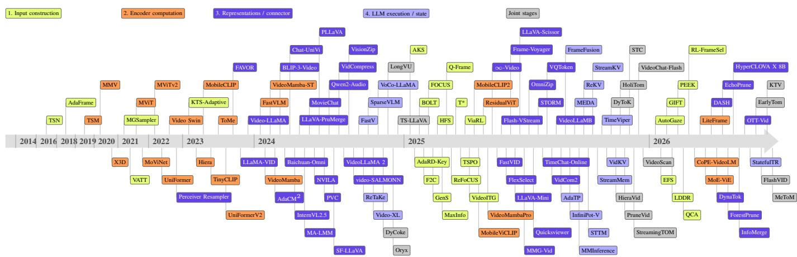
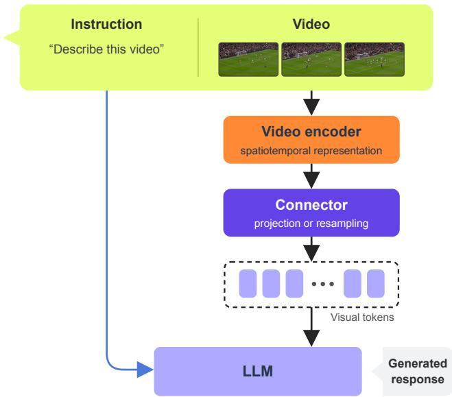
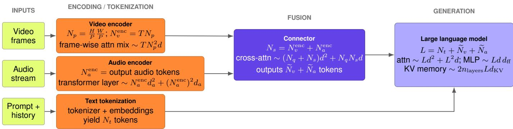
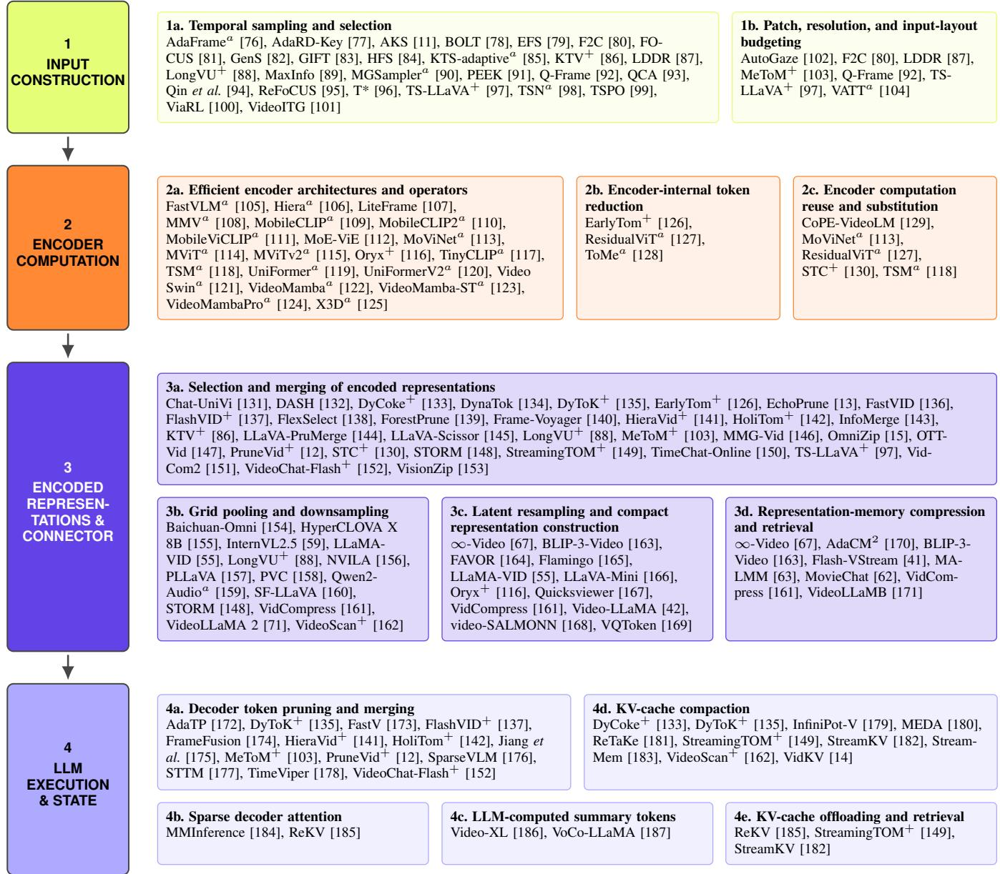
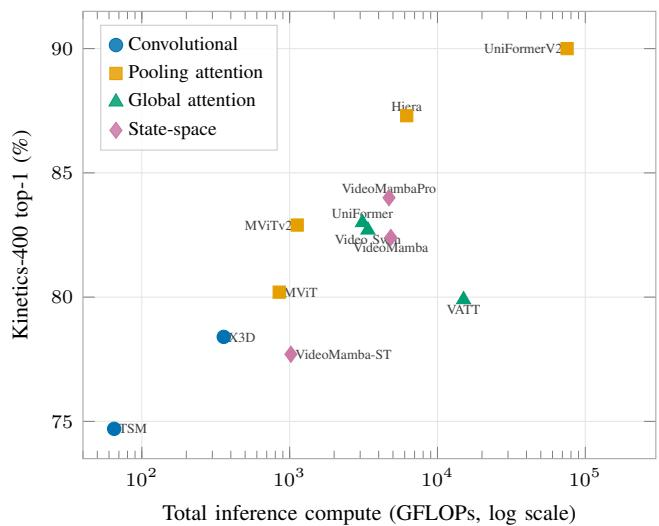
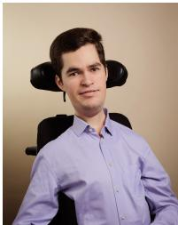

# Why Is Video Still So Expensive? A Survey of Inference-Efficiency Mechanisms in Video and Audiovisual LLMs

Killian Steunou, Yannis Tevissen, Member, IEEE, Mounˆım A. El Yacoubi, Senior Member, IEEE

Abstract—Video understanding has rapidly evolved toward video large language models (VideoLLMs): systems that couple video representations with pretrained large language models and condition generation on a textual prompt. Their strong performance on captioning, question answering, retrieval and temporal grounding comes at a computation and memory cost that grows with frame count and context length, limiting deployment in real-time, mobile and resource-constrained settings. This survey covers inference-efficiency mechanisms for visual and audiovisual VideoLLMs that report concrete reductions in parameter count, FLOPs per input, latency, memory, or visual and audio token count. We analyze bottlenecks across frame sampling, modality encoding, connector-level token reduction, and LLM prefilling and decoding. We organize methods by the pipeline stage at which they act, covering VideoLLMs developed since late 2022 together with earlier frame-sampling and vision-encoder mechanisms that remain components of current pipelines. We assemble literature-reported accuracy– cost comparisons under shared host models and input protocols wherever available, distinguish them from heterogeneous cross-paper evidence, and identify gaps in audiovisual efficiency and standardized evaluation. We maintain a repository at https://github.com/momentslab/awesome-efficient-videollm.

Index Terms—efficient video understanding, VideoLLMs, multimodal large language models, computational efficiency

## I. INTRODUCTION

V IDEO content spans short social media clips, instruc- tional videos, movies and long-form egocentric recordings, combining spatial, temporal and multimodal cues: frames, audio, speech, subtitles and overlaid text. Video understanding has shifted from task-specific architectures to large pre-trained foundation models, trained on video-text corpora to support captioning, question answering, retrieval, spatiotemporal grounding and dense summarization [1]–[5]. Video large language models (VideoLLMs) extend text-only LLMs with visual encoders and, in audiovisual systems, audio encoders [2], [6], supporting open-ended reasoning and instruction following on video-centric tasks, often without taskspecific fine-tuning.

However, these advances come with substantial computational and memory costs [7]: video encoders may process hundreds of high-resolution frames per clip across multiple modalities and long temporal contexts, and large language backbones add attention compute and inference-time memory overhead [8], [9]. Efficient VideoLLMs aim to retain these semantic and reasoning capabilities while reducing parameter count, floating-point operations (FLOPs) per input, latency or memory.

Typical VideoLLMs share a pipeline made of four stages: (1) construct the visual input by selecting frames, patches and resolution, (2) encode it with a vision backbone, (3) reduce and map the encoded representations to the LLM input space, and (4) process them together with a textual prompt in the LLM.

Recent work explores the capability vs. efficiency tradeoff throughout the pipeline: selecting fewer frames before encoding, lighter vision backbones, compressing connector outputs, pruning visual tokens inside the LLM, and reducing the visual key-value (KV) cache [10]–[14]. Audiovisual systems additionally compress audio tokens or use sound to guide visual selection [15], [16]. Figure 1 traces these mechanisms across the four pipeline stages. Because these ideas are often proposed in isolation, tied to particular tasks such as captioning, question answering (QA) or temporal localization, and evaluated with heterogeneous metrics, it is difficult to determine where computational cost actually goes and which strategy is most effective under a given constraint. This fragmentation motivates a video-specific synthesis that relates reported efficiency gains to their pipeline stage, input coverage and evaluation conditions.

Recent surveys approach video understanding from complementary perspectives. Madan et al. [3], Nguyen et al. [4], and Tang et al. [2] review video foundation models, videolanguage learning, and VideoLLM architectures, respectively, emphasizing capabilities, tasks and benchmarks. Other surveys focus on long video understanding [17], temporal grounding [18], evaluation protocols [19], and omni-modal language models [20]. General multimodal LLM (MLLM) surveys place video within a broader landscape of modalities and architectures [6], [21], [22].

Efficiency-focused surveys overlap more directly with our scope. Jin et al. [23] cover efficient MLLM architectures, vision and language components, and training strategies, with video discussed as an application. Shao et al. [24] organize token compression by its underlying mechanisms across images, videos and audio; they also compare video compression methods under specified host models and token budgets. Their treatment provides a mechanism-centered account of token reduction, while our scope additionally includes frame-selection strategies and efficient video-encoder architectures, including mechanisms evaluated before the emergence of VideoLLMs.

  
Fig. 1. Chronology of the reviewed inventory. Colors denote the stage at which a method reduces cost and gray denotes methods acting at several stages. The year axis is non-linear. Methods evaluated outside a VideoLLM are identified in Figure 4.

Two recent surveys explicitly adopt a pipeline perspective. Zhang et al. [25] organize Large Vision-Language Models (LVLM) inference around encoding, prefilling and decoding, including keyframe selection, and analyze how optimization at one stage affects downstream bottlenecks. Wu et al. [26] organize MLLM compression by input, encoder, projector and LLM intervention points, crossed with five compression operations. These works establish pipeline structure and crossstage cost interactions as shared foundations for efficiency analysis.

Our contribution is a video-centric synthesis built on these foundations. We connect frame selection and video-encoder design to connector compression and LLM-side inference, and examine how audio-token reduction and audio-guided visual selection affect the joint audiovisual workload. We assemble literature-reported comparisons within shared host models, input settings and token budgets wherever available, and distinguish these from comparisons across heterogeneous systems. Our emphasis is on how temporal coverage, encoder cost and multimodal token budgets jointly determine the benefits and limits of video inference-efficiency mechanisms.

In our survey, a VideoLLM is an encoder–connector–LLM system (illustrated in Figure 2) that provides video representations and a textual prompt to a pretrained LLM; visualonly systems encode frames, while audiovisual VideoLLMs additionally encode synchronized audio (Section II-A details how the surveyed methods were selected). We use “efficient” in a system-level sense: for a given task and hardware regime, an efficient method preserves or improves semantic performance while reducing parameter count, FLOPs per input, wallclock latency, or memory; power and energy are also relevant but remain rarely reported [19]. Sections III-B and IV make this definition concrete through pipeline costs and the metrics reported in the literature.

We make the following contributions:

• We synthesize video-specific inference-efficiency mechanisms across frame sampling, vision-encoder design, connector-level reduction and LLM-side processing, connecting upstream temporal coverage and encoding cost to downstream token and memory budgets.

• We assemble literature-reported accuracy–cost comparisons and identify which methods can be compared under shared hosts and evaluation settings. We separate these comparisons from heterogeneous cross-paper results and make differences in input protocols and FLOP-accounting boundaries explicit.

• We examine audiovisual efficiency through audio-token compression, audio-guided visual selection and joint token budgets, and use the evidence across stages to identify evaluation gaps and priorities for efficient VideoLLMs.

The remainder of this survey is structured as follows. Section II presents our paper-selection protocol, and defines the tasks and evaluation protocols; Section III reviews representative VideoLLM architectures and their computational bottlenecks; Section IV introduces the taxonomy and compares methods on shared benchmarks; Sections V and VI discuss trends and open challenges, and conclude.

## II. PRELIMINARIES: SURVEY SCOPE, TASKS AND EVALUATION PROTOCOLS

## A. Survey Scope and Paper Selection

We survey efficiency mechanisms along the inference pipeline, from frame selection and modality encoding to connector-level token reduction, LLM prefilling (the forward pass over the full prompt, before any token is generated), decoding, and KV-cache use. We identified candidate methods through keyword searches on arXiv and Google Scholar, combining VideoLLM terms with efficiency terms such as token pruning, token merging, frame selection and KV-cache compression, and through backward and forward citation snowballing from the surveys discussed in the introduction and from each retained method. We cover papers published or posted as preprints up to August 2026.

A method enters the taxonomy when it contributes or evaluates a targeted mechanism and reports a concrete effect on parameter count, FLOPs, retained-token count, latency, or memory. We focus on VideoLLMs developed since late 2022. Earlier frame-sampling and vision-encoder methods are included when they remain components or direct antecedents of current pipelines. Audiovisual methods are included when they reduce the audio-token stream, use audio to reduce visual processing, or bound the joint audiovisual token stream. Trainingonly methods, generic LLM optimizations, and image-only techniques are cited as adjacent context when they establish or directly supply a mechanism adopted by VideoLLMs. The taxonomy has no model-size limit, but our quantitative tables emphasize language backbones around 7B–8B parameters, so a mechanism demonstrated only on a larger host appears in the taxonomy but not in the comparisons. Section IV-A details the model-size and reporting conventions behind our comparisons.

These searches surfaced several hundred candidate papers. We screened titles and abstracts against the criteria above, and read the remaining papers in full, retaining 125. Figure 4 shows all of them, marking the encoder and sampling methods that predate VideoLLMs. A paper appears in several families when it reduces cost at several stages, so family sizes add up to more than the number of papers. The selection is representative: new efficiency methods appear every month, and many recent methods apply an established lever at a different stage or granularity. When several papers instantiate the same mechanism, we keep those with the most complete efficiency reporting and the clearest evaluation protocol, cite close variants as context, and favor methods whose input and measurement settings support the controlled comparisons of Section IV.

## B. Tasks, Benchmarks and Evaluation

Video understanding spans classification, grounding, captioning, retrieval, question answering (QA) and dialogue, operating on RGB (Red Green Blue) frames with optional synchronized audio and derived text such as subtitles, automatic speech recognition (ASR) transcripts or optical character recognition (OCR) tokens. Each task family has standard datasets and metrics: action recognition and temporal localization (top-1/top-5 accuracy; mAP at temporal IoU thresholds) on Kinetics [27], Something-Something V2 [28] and Ego4D [29]; clip-level and dense captioning (BLEU, ME-TEOR, ROUGE-L, CIDEr) on MSR-VTT [30] and ActivityNet Captions [31]; video QA (accuracy) on ActivityNet-QA [32], NExT-QA [33] and EgoSchema [34]; text–video retrieval (R@K, median rank) on caption datasets and narrated corpora such as HowTo100M [35]; and temporal grounding (R@K at temporal IoU) on Charades-STA [36] and Ego4D NLQ [29]. Efficiency-specific protocols are discussed in Section IV-A.

VideoLLM benchmarks complement these task-specific datasets by evaluating multiple capabilities under standardized protocols, most commonly through multiple-choice or structured QA, with emphasis on temporal reasoning beyond single-frame cues, long-context comprehension, and modality ablations. The efficiency comparisons later in this survey concentrate on MVBench [37], Video-MME [38], EgoSchema [34] and LongVideoBench [39] because they are the benchmarks most often shared by the methods we survey (Tables II– VII). Table I summarizes the benchmarks that appear in our comparisons and discussion; a full inventory of recent VideoLLM benchmarks is provided in the supplementary material.

TABLE I  
VIDEOLLM BENCHMARKS USED IN THE COMPARISONS OF THIS SURVEY. MOD. DENOTES THE MODALITIES PROVIDED BEYOND THE QUESTION TEXT (V=VIDEO, A=AUDIO, T=TRANSCRIPT/SUBTITLES). DUR.: SHORT (<1 MIN), MEDIUM (1–10 MIN), LONG (>10 MIN). #V = NUMBER OF VIDEOS, #Q = NUMBER OF QUESTIONS. FMT.: MCQ = MULTIPLE CHOICE QUESTION, OE = OPEN ENDED
<table><tr><td>Benchmark</td><td>Mod.</td><td>Fmt.</td><td>Dur.</td><td>#V</td><td>#Q</td></tr><tr><td>MVBench [37]</td><td>V</td><td>MCQ</td><td>S</td><td>3,641</td><td>4,000</td></tr><tr><td>Video-MME [38]</td><td>V+A+T</td><td>MCQ</td><td>S/M/L</td><td>900</td><td>2,700</td></tr><tr><td>EgoSchema [34]</td><td>V</td><td>MCQ</td><td>M</td><td>5,063</td><td>5,063</td></tr><tr><td>LongVideoBench [39]</td><td>V+T</td><td>MCQ</td><td>M/L</td><td>3,763</td><td>6,678</td></tr><tr><td>MLVU [40]</td><td>V</td><td>MCQ</td><td>M/L</td><td>1,730</td><td>3,102</td></tr><tr><td>RVS-Ego / RVS-Movie [41]</td><td>V</td><td>OE</td><td>L</td><td>32</td><td>3,500</td></tr></table>

## III. VIDEOLLM ARCHITECTURES AND COMPUTATIONAL BOTTLENECKS

We first review representative VideoLLMs, grouped by four families (short-video chat systems, unified image-video models, long-video and streaming systems, and audiovisual models) which determine where tokens are produced and how many. We then formalize the compute and memory costs of the resulting encoder–connector–LLM pipeline, which Section IV uses as its common basis for comparison.

## A. Representative VideoLLM Architectures

Tang et al. [2] distinguish three VideoLLM families by how video information reaches the LLM: Video Analyzer × LLM systems convert the video into textual evidence (captions, timestamped events, serialized object tracks, ASR or OCR) before LLM processing; Video Embedder × LLM systems map continuous encoder representations into the LLM input space through a connector; and hybrid (Analyzer + Embedder) × LLM systems provide both. We restrict this survey to the Embedder family (the largest, comprising 79 of the 127 systems Tang et al. catalog) because its encoder–connector– LLM structure matches the system boundary of our efficiency analysis: frame sampling, encoder cost, connector compression, multimodal token counts, LLM prefilling and KV-cache behavior. Analyzer-centric and hybrid systems would require accounting for the upstream expert models that produce textual analyses, and fall outside this pipeline-based scope. Figure 2 summarizes this framework.

Prompting lets the same backbone serve captioning, question answering, retrieval, temporal grounding and summarization without task-specific heads, so pipeline-level efficiency gains apply across all of them. Within this template, the most representative VideoLLMs differ mainly in their choice of encoders, connectors and language backbones, their target video length, and whether they use audio.

Short-video VideoLLMs and chat-centric systems. A first generation of VideoLLMs extends image-based VLMs (Vision

  
Fig. 2. Video Embedder × LLM paradigm. A video encoder transforms sampled frames into continuous features; a connector projects or compresses them into the LLM token space, where they are combined with a textual prompt for task-conditioned generation. To additionally process audio, audio features (obtained with a separate audio encoder) can also be projected to the input space of the LLM through a different connector.

Language Models) to short clips. Video-LLaMA [42] establishes the canonical pattern: CLIP [43] or ViT [44] vision encoders, ImageBind audio features [45], and a Q-Former connector [46] mapping both streams into Vicuna tokens [47]. VideoChat [48] and Valley [49] add chat-centric instruction tuning, Video-ChatGPT [50] popularizes GPT-based selfinstruct training data, and mPLUG/mPLUG-2 [51], [52] apply dual-encoder contrastive pretraining to short video QA.

Unified image-video LLMs. A second wave moves to unified image-video models reusing image encoders with sparse frame sampling. The LLaVA family [53], [54] adds temporal pooling, LLaMA-VID [55] compresses each frame to two visual tokens, making long VideoQA feasible, and MiniGPT4-Video [56] interleaves visual and textual tokens, later serving as the backbone of Goldfish [57]. General-purpose VLMs such as Qwen2- VL [58] and InternVL [59] adopt the same unified pipeline, and InternVideo2.x [60], [61] shows that high-capacity video encoders with lightweight connectors compete favorably on MVBench [37] and Video-MME [38].

Long-video and streaming VideoLLMs. As long-video benchmarks emerged (EgoSchema [34], LongVideoBench [39], TVQA-long [57]), a third line targeted minute-to-hour contexts under strict limits: hierarchical memory approaches (MovieChat [62], LongVLM [7], MA-LMM [63]) compress visual tokens into multi-scale representations or explicit memory modules; streaming and retrieval methods (VideoStreaming [64], VideoLLM-online [65], VideoLLM-MoD [66], Goldfish [57]) maintain constant token budgets; ∞-Video [67] adds training-free long-term memory and frame selection around existing VideoLLMs [37], [42]; and the VideoChat family refines temporal encoding, reinforcement tuning for grounding, and multi-agent planning (VideoChat-T [68], VideoChat-R1 [69], VideoChat-M1 [70]).

Audiovisual VideoLLMs. Audiovisual VideoLLMs keep the same encoder–connector–LLM template while adding synchronized audio. Video-LLaMA maps ImageBind audio and ViT video features into Vicuna through separate Q-Formers; VideoLLaMA 2 [71] replaces this interface with spatialtemporal convolution connectors; and recent systems such as Qwen2.5-Omni [72] and OmniVinci [73] use dedicated visual and audio encoders with learned temporal alignment before a shared language core. These architectures add an audiovisual dimension to the taxonomy: audio adds an encoder and token stream, but the efficiency question remains how much encoded evidence reaches the LLM and at what cost.

## B. Sources of Computational Cost and Architectural Bottlenecks

We now formalize the dominant compute and memory scaling factors of the encoder–connector–LLM pipeline. Frame count and resolution determine encoder cost and the number of modality tokens produced; connector compression controls how many of those tokens enter the LLM; and the resulting context length determines LLM prefilling cost and KV-cache memory during decoding.

We denote by T the number of video frames fed to the encoder, by $H \times W$ the spatial resolution of each frame, and by $P \times P$ the patch size used by a frame-wise ViT encoder. The number of spatial patches per frame is $\begin{array} { r } { N _ { p } \ = \ \frac { H } { P } \cdot \frac { W } { P } } \end{array}$ , so the encoder initially produces $\begin{array} { r } { N _ { v } ^ { \mathrm { e n c } } \ = \ T \cdot N _ { p } \ = \ \dot { T } \cdot \frac { \dot { H } } { P } \cdot \frac { W } { P } } \end{array}$ (up to special tokens). For video transformers using temporal tubelets of length $\tau , T$ is replaced by $T / \tau$ . We write $N _ { a } ^ { \mathrm { e n c } }$ for the audio-encoder output length and $\widetilde { N } _ { v } , \widetilde { N } _ { a }$ for the visual and audio token counts retained after connector-side pooling, projection or resampling. With $N _ { t }$ text tokens (prompt, history and any previously generated tokens), the LLM context length is $L ~ = ~ N _ { t } { + } \widetilde { N } _ { v } { + } \widetilde { N } _ { a }$ . For a joint Q-Former that replaces both modality streams with $N _ { q }$ query outputs, the corresponding context is $L = N _ { t } + N _ { q } .$ . A transformer block’s hidden width is its per-token embedding dimension: $d _ { v }$ for the video encoder, $d _ { a }$ for the audio encoder and d for the LLM; d and $d _ { \mathrm { { f f } } , a }$ are the corresponding feed-forward widths, and $d _ { \mathrm { K V } }$ the total key/value width stored per token. The generic transformerlayer expressions below use N and d for the token count and width of the block in question. Figure 3 summarizes these bottlenecks visually.

Video and modality encoders. For a fixed 2D CNN (Convolutional Neural Network) applied frame-wise, encoder cost scales as F $\mathrm { O P s } _ { \mathrm { e n c } } ^ { \mathrm { 2 D } } = T \cdot C _ { \mathrm { f r a m e } } ( H , W )$ , where $C _ { \mathrm { f r a m e } } ( H , W )$ is the cost of one pass through the chosen backbone; thus cost is linear in $T$ at fixed resolution and architecture. 3D CNNs and video transformers add temporal interactions. For a transformer layer processing a sequence of N tokens, the attention and MLP (Multi-Layer Perceptron) costs scale as $\mathrm { F L O P s } _ { \mathrm { a t t n } } \propto N \cdot d ^ { 2 } + N ^ { 2 } \cdot d , \qquad \mathrm { F L O P s } _ { \mathrm { m l p } } \propto N \cdot d \cdot d _ { \mathrm { f f } }$

For a frame-wise ViT, the attention-mixing term summed across frames is $T N _ { p } ^ { 2 } d ;$ only full joint space–time attention incurs $( N _ { v } ^ { \mathrm { e n c } } ) ^ { 2 } d ,$ , while factorized architectures lie between these regimes. Increasing the frame count or spatial resolution nevertheless inflates encoder cost. Long-video VideoLLMs often process hundreds of frames or minute-long clips via sliding windows or dense sampling, so the encoder alone can dominate total cost unless frames are subsampled or pooled.

  
Fig. 3. Token and compute scaling across the encoder–connector–LLM pipeline. Video and audio encoders produce $N _ { v } ^ { \mathrm { e n c } }$ and $N _ { a } ^ { \mathrm { e n c } }$ tokens; the connector retains $\widetilde { N } _ { v }$ and $\widetilde { N } _ { a }$ , while tokenized prompts and history contribute $N _ { t } .$ . LLM compute and KV memory scale with the resulting context $L = N _ { t } + \widetilde { N } _ { v } + \widetilde { N } _ { a }$

Audio encoders usually begin from a denser temporal signal than sparsely sampled video, but their output length and cost depend strongly on convolutional stride, pooling and architecture. For a transformer layer operating on $N _ { a } ^ { \mathrm { e n c } }$ audio tokens, $\mathrm { F L O P s } _ { \mathrm { a u d i o , a t t n } } \propto N _ { a } ^ { \mathrm { e n c } } \cdot d _ { a } ^ { 2 } + ( N _ { a } ^ { \mathrm { e n c } } ) ^ { 2 } \cdot d _ { a } ,$ with a further $N _ { a } ^ { \mathrm { e n c } } d _ { a } d _ { \mathrm { f f } , a }$ contribution from the MLP; convolutional front ends have architecture-specific costs. Audio may be negligible after aggressive downsampling or material in longform audiovisual inputs; it cannot be ranked against the visual stream from sampling rates alone because each video frame produces many spatial patch tokens. Additional ASR, OCR or subtitle-processing modules likewise add costs that should be reported separately [4], [17].

Connectors and cross-modal fusion. Connectors project high-dimensional spatiotemporal features (visual and audio tokens) into the LLM token space. In the simplest case, visual and audio tokens are flattened and passed through linear layers or small MLPs, yielding a cost $\mathrm { F L O P s } _ { \mathrm { p r o j } } ~ \propto ~ N _ { v } ^ { \mathrm { e n c } } d _ { v } d ~ +$ $N _ { a } ^ { \mathrm { e n c } } d _ { a } d .$ . More sophisticated connectors, such as Q-Former [46] or cross-attention modules, use a set of $N _ { q }$ learnable query tokens attending over $N _ { s } = N _ { v } ^ { \mathrm { e n c } } + N _ { a } ^ { \mathrm { e n c } }$ source tokens. Including query, key, value and output projections, the crossattention cost per layer scales as FLOPscross-attn ∝ $( N _ { q } +$ $N _ { s } ) d ^ { 2 } + N _ { q } N _ { s } d .$ . Although $N _ { q }$ is usually small, the source sequence $N _ { s }$ can still be large. Many VideoLLMs therefore apply temporal or spatial pooling, audio downsampling, or selective token fusion before cross-attention, often enforcing a fixed joint token budget [2], [20].

LLM context length and KV cache. Once projected, the retained visual and audio tokens are concatenated (or interleaved) with textual tokens and processed by the LLM. In a standard transformer layer, self-attention over $L = N _ { t } + \widetilde { N } _ { v } +$ $\widetilde { N } _ { a }$ tokens has cost $\mathrm { F L O P s } _ { \mathrm { L L M , a t t n } } \propto L d ^ { 2 } + L ^ { 2 } d ,$ while feedforward blocks contribute $\mathrm { F L O P s _ { L L M , m l p } } \propto L d d _ { \mathrm { f f } }$ . Whether the quadratic attention term or the linear feed-forward term dominates depends on the hidden width and the retained token counts. Among those tokens, visual patches usually outnumber the rest before compression, while audio can become substantial in long audiovisual inputs. Autoregressive decoding also stores key-value (KV) caches for each layer, with memory scaling MemKV $\propto 2 B \cdot n _ { \mathrm { l a y e r s } } \cdot L \cdot d _ { \mathrm { K V } } \cdot b ,$ , where $B$ is the batch size, $n _ { \mathrm { l a y e r s } }$ the number of decoder layers and b the bytes per stored element; grouped- and multi-query attention reduce $d _ { \mathrm { K V } }$ . This limits feasible context length for multi-turn dialogue grounded in long videos, especially when audio, OCR or subtitles share the same context window [17], [74].

The dominant regime also changes between prefilling and autoregressive decoding. Attention-score computation during prefilling is quadratic in $L ,$ although kernels, hardware and the linear-in-L projection and feed-forward terms determine whether execution is actually compute-bound. At each decoding step, attention mixing over the cached prefix costs $O ( L d )$ per layer, alongside $O ( d ^ { 2 } )$ projection and feed-forward work, and is often constrained by memory traffic [75]. Reducing input tokens therefore benefits both stages, while KV-cache compression primarily targets decoding memory; their relative impact varies across interactive, batch and offline workloads.

Because the relative importance of encoding, connector token count and LLM prefill, decoding and cache growth is architecture- and workload-dependent, the next section organizes methods by the pipeline stage at which they reduce cost.

## IV. TAXONOMY OF EFFICIENCY MECHANISMS IN VIDEOLLMS

We analyze efficiency using the encoder–connector–LLM decomposition introduced in Section III. After defining the reporting conventions used in this survey, we organize mechanisms by the pipeline stage at which they act: input construction and selection, encoder computation, encoded representations and connector, and LLM execution and state. Figure 4 summarizes the taxonomy; audiovisual methods are included when audio compression or audio-guided selection directly reduces VideoLLM inference cost.

## A. Comparison Protocol

As reviewed in Section III-B, VideoLLM papers mix analytical indicators and system-level measurements under heterogeneous assumptions about video length, resolution, modality coverage and hardware; we compare results only when their measurement scope and input protocol are explicit. Analytical, hardware-independent indicators include parameter count, FLOPs per input and retained-token count or ratio (we reserve FLOP/s for rate-based throughput). Their scope depends on the pipeline stage: vision-encoder comparisons report encoder size and GFLOPs together with the clip configuration [114], [125], whereas connector and token-reduction comparisons report host-LLM size, and accounting boundaries differ even then: HoliTom [142] and HieraVid [141] report LLM prefilling FLOPs while EarlyTom includes vision-encoder FLOPs [126]. For audiovisual systems, whose video and audio encoders can have very different profiles and whose connectors range from linear projections to Q-Formers [46] or Perceiver resamplers [165], we distinguish encoder, connector and LLM costs whenever the source provides them [23].

  
Fig. 4. Taxonomy of efficiency mechanisms, organized by where each acts in the encoder–connector–LLM pipeline. a marks encoder or sampling method evaluated outside a VideoLLM, on recognition or retrieval tasks; + marks methods that reduce cost at several stages and appear at each.

Analytical indicators do not necessarily predict runtime performance, because operator mix, parallelism, memory access and implementation determine measured speed [188], [189]. We therefore distinguish them from system-level measurements (wall-clock latency, throughput, peak memory), whose interpretation depends on batch size, sequence length, precision, device and software stack [189]. Offline methods report end-to-end or stage-specific latency and memory; streaming systems additionally report processing rate or response latency together with bounded memory as the stream grows [8], [149]. Energy is a relevant system metric [190], but none of the surveyed methods reports it, so we do not compare it.

Models are also rarely evaluated under identical input and modality conditions: two systems may claim the same GFLOPs per video while processing different frame counts, resolutions and modalities. EgoSchema’s intrinsic temporal length quantifies how much of a video must be processed to answer a question [34], and frame-sampling and streaming methods report accuracy against frame or time budgets [191], but these budgets are not standardized across papers.

We therefore use only values explicitly reported by each paper, record the corresponding model variant and input setting, and neither infer FLOPs or latency from architecture alone nor convert token-retention budgets into FLOPs; crosspaper comparisons serve only as indicative evidence. The quantitative comparisons emphasize 7B language backbones and approximately-8B configurations when the source reports a targeted efficiency mechanism. Parameter columns follow the source’s accounting boundary, which can include the full model or only the language backbone. The taxonomy also includes transferable mechanisms evaluated on larger hosts and standalone encoder methods; these do not enter a sharedhost comparison unless their evaluation setting matches it.

Following the pipeline perspective of prior efficiency surveys [25], [26], we classify each reduction by its position in the forward pass:

1) Input construction and selection: selecting frames, patches, resolution or layouts before the encoder;

2) Encoder computation: changing feature-extraction operators, reducing intermediate tokens, or reusing and substituting encoder computation;

3) Encoded representations and connector: reducing encoder outputs or connector representations before the LLM;

4) LLM execution and state: reducing token processing or attention within the LLM, constructing summary tokens with its layers, or managing its KV cache.

We assign each mechanism to the stage whose computation it removes. Pooling applied after an encoder’s final block therefore counts as stage 3 even when it is implemented in the encoder, and whole-frame selection can occur after encoding, as in Frame-Voyager [140]. A method that reduces cost at several stages appears at each of them in Figure 4, and its reported end-to-end gain is not attributed to a single stage.

## B. Input Construction and Selection

Frame sampling reduces the number of processed frames T before the encoder runs, directly lowering encoder-side cost and the number of visual tokens $\widetilde { N } _ { v }$ injected into the language model. In encoder–connector–LLM pipelines, this upstream decision impacts both the cost of feature extraction and the LLM prefilling cost through the total context length $L ~ = ~ N _ { t } + \widetilde { N } _ { v } ( + \widetilde { N } _ { a } )$ (Section III-B); frames discarded at this stage cannot be recovered downstream. The two input families control temporal coverage and the spatial input budget, respectively. Temporal selectors may be query-free, using only the video signal, or query-aware, conditioning on the question or instruction. A proxy encoder or selector may process candidates that the target model never sees; its cost remains part of the selection pipeline.

1) Temporal Sampling and Selection:

a) Fixed coverage sampling: Uniform or strided sampling remains the simplest query-free baseline: it is deterministic, model-free, and often strong. Recent controlled evaluation [192] confirms that frame-sampling choices alone can change video-QA results, and that uniform sampling can be the strongest strategy on Video-MME for some small VLMs [38]. Temporal Segment Networks (TSN) [98] introduced a stronger fixed-budget pattern by splitting the video into K segments and sampling one snippet per segment for constantcost temporal coverage. This “coverage under fixed $K ^ { \prime \prime }$ idea remains a useful reference in later recognition and videolanguage pipelines [76], [193].

b) Content-based coverage: For minute-to-hour videos, temporal redundancy makes fixed windows particularly inefficient. Kernel Temporal Segmentation (KTS) [194] partitions a sequence of frame descriptors into segments. Their KVS summarizer adds trained category-specific SVM scoring to select summary segments. Later work [85] uses KTS to allocate samples before a downstream backbone for long-form classification and temporal localization. MaxInfo [89] uses proxy frame embeddings to maximize the geometric volume spanned by the selected subset. MGSampler [90] uses motion saliency and motion-uniform temporal coverage without a learned sampling policy.

c) Learned query-free selection: Learned query-free samplers use trained visual policies or scorers to adapt frame selection to each video without requiring a user query at inference time. AdaFrame [76] selects frames adaptively and performs early stopping using predicted future utilities. PEEK [91] distills caption-conditioned teacher rankings into a small visual temporal scorer, scoring frames from video embeddings alone. Earlier adaptive methods similarly learned to concentrate computation on informative video regions [195]–[199].

d) Query-conditioned relevance and diversity: Queryaware methods condition selection on the question or instruction, usually by scoring frame–text alignment and then enforcing diversity or coverage. Adaptive Keyframe Sampling (AKS) [11] combines prompt–frame relevance with temporal coverage under a fixed token budget. Q-Frame [92] uses a textimage matching model such as CLIP [43] to score frames and also adapts per-frame resolution to process more frames within the same budget. FOCUS [81] formulates keyframe selection as pure exploration in a multi-armed bandit, identifying informative temporal regions while processing only a small fraction of candidate frames. AdaRD-Key [77] maximizes a relevance– diversity objective and falls back to diversity-only selection when the query alignment is weak. Several 2025–2026 methods extend this training-free line. BOLT [78] samples frames by inverse-transform sampling over CLIP frame–query similarity. F2C [80] scores frame–query relevance to select anchor frames and extends them into coherent clips. $\mathrm { T ^ { * } }$ [96] recasts temporal search as object-guided spatial search over frame mosaics, and reports that 8 selected frames outperform 32 uniform frames. QCA [93] allocates the frame budget across segments by query relevance and content variation, EFS [79] partitions the video into events and anchors selection on the most query-relevant frame per event, and GIFT [83] scores each frame’s global irreplaceability under the query, matching 64- frame uniform accuracy with 32 frames. KTV [86] combines query-free keyframe clustering at this stage with post-encoder token pruning (Section IV-D). LDDR [87] relaxes the binary keep/drop decision itself: it linearizes determinantal-pointprocess selection (from quadratic to linear complexity in the frame count) while jointly allocating per-frame resolution under an explicit token budget, applicable even to closed-source hosts. Related training-free methods explore scalable textvideo similarity [200], sequential relevance-diversity allocation [201], semantic query decomposition [202], and lightweight moment retrieval for long-form VideoQA [203].

e) Learned and generative selectors: Other query-aware methods train explicit selectors. GenS [82] uses a separate VideoLLM to generate question-relevant frame selections for minute-to-hour videos, while HFS [84] optimizes a differentiable set-level objective combining relevance, coverage, and redundancy through Gumbel-Softmax [204] and student– teacher mutual learning. Qin et al. [94] train a 0.4B plugin selector with reinforcement learning that transfers across seven LLM hosts and selects 8 of 128 candidate frames at less than half the selection latency of AKS [11]. Several recent selectors use reinforcement learning. TSPO [99] trains a temporal sampling policy with only 3.5M trainable parameters over frozen CLIP features using a GRPO-style (Group Relative Policy Optimization) objective and transfers it across hosts; ReFoCUS [95] optimizes a 1.3B policy with a logit-gap reward from the answering model, at a reported selection cost of 428 TFLOPs, 9 s and 5.3 GB over 512-frame inputs that its accuracy gains must amortize; and ViaRL [100] trains a 3B selector through iterated amplification to pick 8 of 128 candidate frames, though it reports no selector-overhead measurements. VideoITG [101] trains an 8B instructed temporal-grounding selector by supervised fine-tuning on automatically annotated data; its 32 selected frames match 64-frame uniform sampling while scanning 512 candidates and adding only 0.61 s, but the selector’s own size dominates any parameter-based efficiency accounting. Related learned methods include M-LLM-based frame selection [205], which trains a lightweight selector from pseudo-labels; K-frames [206], which predicts query-relevant coherent clips under arbitrary frame budgets; and FrameOracle [207], which predicts both which frames to retain and how many are needed.

2) Patch, Resolution, and Input-Layout Budgeting: Temporal selection leaves another choice: how much spatial detail to encode in each retained frame. Q-Frame [92] and LDDR [87] allocate per-frame resolution by relevance, while F2C [80] trades spatial resolution for longer clips under a fixed token budget. TS-LLaVA [97] combines several downsampled frames into a thumbnail grid before encoding, then samples additional encoded tokens in stage 3 (Section IV-D).

AutoGaze [102] selects multi-scale patches before the ViT using a 3M-parameter autoregressive selector. MeToM’s residual-guided patch merging [103] uses codec residual energy to identify connected low-information regions and average their patch embeddings before the heavy encoder blocks. Both reduce the input sequence those blocks process. MeToM additionally merges tokens after projection and inside the LLM; its reported end-to-end gain belongs to the combined pipeline. The idea has been explored in VATT [104], which randomly discards a fraction of the input patches and audio tokens before the transformer, and its ablation shows encoder GFLOPs falling with the drop rate at a growing accuracy cost on recognition benchmarks. It is a mechanism from before VideoLLMs, but it established that a video transformer tolerates a sparse input, which is the premise of the learned patch selection above.

3) Discussion and Synthesis: Frame sampling should be evaluated as a performance–budget trade-off, not as a single accuracy number. Clean comparisons fix the downstream model, frame budget, benchmark and split; otherwise the sampler, vision representation, connector and LLM capacity are confounded, an issue KFS-Bench [208] makes explicit by scoring coverage of the disjoint evidence scenes required for long-video QA alongside answer accuracy. Table II therefore reports only methods sharing a LLaVA-Video-7B [53], 64- frame protocol; selectors evaluated under other protocols (such as PEEK’s captioning setting [91]) are discussed in the text and excluded from the comparison. Query-free selections can be reused across questions. Query-aware methods gain up to 5 points on LongVideoBench [39] over uniform sampling when the question identifies sparse evidence, and TSPO [99] leads the table with only a 3.5M-parameter selector. Net savings still depend on whether avoided downstream work exceeds scorer cost, and the advantage largely disappears on Video-MME. Selectors evaluated at reduced budgets (VideoITG [101], GIFT [83]) match the 64-frame uniform reference with 32 selected frames.

## C. Encoder Computation

Encoder efficiency targets feature extraction before connector or LLM processing. We distinguish efficient architectures and operators, intermediate-token reduction, and computation reuse or substitution. Many architectural antecedents were evaluated on recognition or retrieval; their costs and accuracies must be kept separate from integrated VideoLLM results.

## 1) Efficient Encoder Architectures and Operators:

a) Spatiotemporal backbones: Lightweight convolutional networks and hierarchical pooling-attention transformers reduce the cost of extracting video features. Among the convolutional backbones, TSM [118] inserts a parameter- and FLOP-free channel shift into a 2D CNN to capture temporal structure at roughly the cost of a 2D network; X3D [125] progressively expands a small 2D image architecture along its temporal, spatial, channel-width, and depth dimensions, selecting efficient configurations under increasing compute budgets; and MoViNet [113] pairs neural architecture search (NAS) with a stream-buffer that decouples memory from clip length for constant-memory streaming inference. The transformer-based group reduces token resolution inside the encoder: MViT [114] and MViTv2 [115] use multi-head pooling attention to progressively pool spatiotemporal tokens while widening channels, MViTv2 adding decomposed relative position and residual pooling for 82.9 vs. 82.7 on Kinetics-400 at 51M vs. 88M parameters and a third of the inference compute of Video Swin (Table III); Hiera [106] strips MViTv2 of its specialized components and leans on strong masked auto-encoder pretraining, yielding a simpler backbone about 2× faster on video (40.8 vs. 20.5 clips/s) at 5.0 points higher video accuracy than MViTv2-L; Video Swin [121] restricts self-attention to shifted local 3D windows; and Uni-Former [119] couples convolution-like local aggregation in shallow layers with global attention in deeper layers, with UniFormerV2 [120] equipping a frozen pretrained image ViT with lightweight video-specific UniBlocks.

TABLE II  
FRAME SAMPLERS ON LLAVA-VIDEO-7B AT A ∼64-FRAME BUDGET. ALL ROWS SHARE THE SAME UNIFORM BASELINE (LONGVIDEOBENCH 58.9 / VIDEO-MME 64.4) UNLESS MARKED. †FOCUS REPORTS A 32–64 FRAME BUDGET, NOT A FIXED 64. ‡OWN UNIFORM-BASELINE REPRODUCTION DIFFERS FROM THE SHARED ONE (EFS: 58.8/64.6).
<table><tr><td>Method</td><td>Query-aware</td><td>Train-free</td><td>Frames</td><td>LongVideoBench</td><td>V-MME</td></tr><tr><td>Uniform baseline</td><td></td><td></td><td>64</td><td>58.9</td><td>64.4</td></tr><tr><td>MaxInfo [89]</td><td>no</td><td>yes</td><td>64</td><td>61.5</td><td>64.2</td></tr><tr><td>AKS [11]</td><td>yes</td><td>yes</td><td>64</td><td>62.7</td><td>65.3</td></tr><tr><td>AdaRD-Key [77]</td><td>yes</td><td>yes</td><td>64</td><td>62.9</td><td></td></tr><tr><td>FOCUS [81]</td><td>yes</td><td>yes</td><td>32-64†</td><td>63.5</td><td>65.4</td></tr><tr><td>EFS [79]</td><td>yes</td><td>yes</td><td>64</td><td>62.1‡</td><td>65.6</td></tr><tr><td>QCA [93]</td><td>yes</td><td>yes</td><td>64</td><td>62.9</td><td>66.1</td></tr><tr><td>TSPO [99]</td><td>yes</td><td>no</td><td>64</td><td>63.9</td><td>65.5</td></tr></table>

b) State-space operators: State-space encoders replace quadratic self-attention with selective state-space models for linear-time video encoding. VideoMamba [122] uses bidirectional Mamba blocks [209] to process spatiotemporal tokens, reporting 6× higher throughput and 40× lower GPU memory than TimeSformer-Ti at 64 frames (A100-80G, batch size 128). VideoMamba-ST [123] adapts the scan order to video structure (we use the -ST suffix because Park et al. also name their model VideoMamba). VideoMambaPro [124] addresses information leakage in the backward scan through masked backward computation and residual connections, improving Kinetics-400 accuracy by 1.6 points over VideoMamba-M at matched $3 2 \times 2 2 4 ^ { 2 }$ input (84.0 vs. 82.4) with slightly fewer parameters and FLOPs.

c) Compact and sparse encoders: Compact encoders reduce the cost of feature extraction, either by distilling CLIPstyle encoders [43] or by designing the encoder to emit fewer tokens. On the distillation side, TinyCLIP [117] combines affinity-mimicking distillation with weight inheritance to shrink CLIP encoders, MobileCLIP [109] uses multi-modal reinforced training to produce fast image–text encoders (Mobile-CLIP2 [110] strengthens the teacher ensembles at 1.5–20 ms on-device encoder latencies), and MobileViCLIP [111] carries this to video with a compact mobile video–text encoder: MobileViCLIP-Small runs 55.4× faster than InternVideo2- L14 on mobile hardware at similar zero-shot retrieval performance. On the token-budget side, FastVLM [105] introduces a hybrid convolution–transformer encoder that downsamples aggressively to emit far fewer high-resolution visual tokens, reporting 85× faster time-to-first-token with a 3.4× smaller vision encoder than LLaVA-OneVision-0.5B [210] at 11522 input, while LiteFrame [107] distills a compact VideoLLM vision encoder that emits compressed tokens and cuts end-toend latency by 35% relative to InternVL3-8B while processing 8× more frames. MoE-ViE [112] scales the encoder sparsely, activating 1.1B of 3.5B parameters per token through a finegrained mixture of experts to match a dense encoder 1.7× its size at roughly three quarters of its latency, with videobenchmark evidence on an 8B host.

Oryx [116] also changes the encoder: native-resolution processing avoids fixed-resolution tiling, followed by a dynamic compressor in stage 3 (Section IV-D). Finally MMV [108] adopts TSM for inexpensive temporal modeling.

2) Encoder-Internal Token Reduction: ToMe [128] merges similar tokens through bipartite matching between encoder blocks, raising ViT-L video throughput by 2.2× for a 0.2%– 0.3% accuracy drop. EarlyTom [126] merges frame features between encoder blocks, then selects spatial tokens after encoding. Its encoder reduction and post-encoder selection therefore occupy stages 2 and 3 (Section IV-C and IV-D). ResidualViT [127] combines intermediate-token reduction with temporal reuse, discussed below. Because these methods act between blocks, the early blocks still process the full sequence; the patch selection of Section IV-B instead removes tokens before the first block, so the encoder never sees them.

3) Encoder Computation Reuse and Substitution: ResidualViT [127] propagates a residual subset of tokens across frames for temporally dense encoding, reducing per-frame encoding cost by 53%–56% within 1.7 points of CLIP R@1 on Charades-STA. STC [130] combines STC-Cacher, which reuses cached ViT features for temporally similar content, with STC-Pruner, which compresses the encoded sequence before LLM input. With cached features reused for 75% of tokens, the combined method reduces ViT-encoding latency by 24.5% and LLM prefilling latency by 45.3%. MoViNet’s stream buffer [113] and the online variant of TSM [118] retain temporal features between successive inputs.

CoPE-VideoLM [129] runs the image encoder only on the few frames a video codec stores in full, and encodes the remaining frames from the motion and residual information the codec already provides, using a delta-encoder of under 15M parameters in place of dense RGB encoding.

4) Discussion and Synthesis: Convolutional backbones occupy the low-compute regime, while pooling-attention transformers span the widest accuracy range and reach the highest absolute accuracies. State-space backbones are competitive (VideoMambaPro [124] reaches 84.0 top-1 at 4.7 TFLOPs, above the global-attention baselines at comparable cost) but none matches Hiera [106] or UniFormerV2 [120] at any compute, as shown in Figure 5. The evaluation protocol also reshapes the apparent trade-off: MViTv2 [115] and Video Swin [121] report nearly identical Kinetics-400 accuracy, yet 1.13 versus 3.38 TFLOPs because they evaluate with five versus twelve views. Table III therefore supports comparisons between reported operating points, not attribution of gaps to architecture alone; and encoder-only FLOPs do not establish end-to-end VideoLLM efficiency, which also depends on the output token count and the downstream connector and LLM.

TABLE III  
VISION ENCODER EFFICIENCY METHODS. GFLOPS×V GIVES INFERENCE GFLOPS PER VIEW TIMES THE NUMBER OF TEMPORAL×SPATIAL VIEWS USED FOR THE REPORTED ACCURACY, AS STATED BY EACH PAPER; t MARKS PAPERS REPORTING ONLY THE TOTAL ACROSS VIEWS (PER-VIEW COST NOT SEPARATELY STATED). ABBREVIATIONS: K-400/600 = KINETICS-400/600 [27], MIT = MOMENTS IN TIME [211], AS = AUDIOSET [212], UCF = UCF101 [213], HMDB = HMDB51 [214].
<table><tr><td>Method</td><td>Year</td><td>Params (B)</td><td>GFLOPs×v</td><td>K-400</td><td>K-600</td><td>MiT</td><td>AS</td><td>UCF</td><td>HMDB</td></tr><tr><td>TSM [118]</td><td>2019</td><td>0.024</td><td>65×1</td><td>74.7</td><td></td><td></td><td></td><td>95.9</td><td>73.5</td></tr><tr><td>MMV [108]</td><td>2020</td><td>0.094</td><td></td><td></td><td>70.5</td><td></td><td>30.9</td><td>95.2</td><td>75.0</td></tr><tr><td>X3D [125]</td><td>2020</td><td>0.011</td><td>35.84×10</td><td>78.4</td><td>81.9</td><td></td><td></td><td></td><td></td></tr><tr><td>MoViNet [113]</td><td>2021</td><td>0.031</td><td>386×1</td><td></td><td>84.8</td><td>39.9</td><td></td><td></td><td></td></tr><tr><td>MViT [114]</td><td>2021</td><td>0.037</td><td>170×5</td><td>80.2</td><td>83.4</td><td></td><td></td><td></td><td></td></tr><tr><td>VATT [104]</td><td>2021</td><td>0.155</td><td>15 020t</td><td>79.9</td><td>80.8</td><td>37.8</td><td>39.3</td><td></td><td></td></tr><tr><td>MViTv2 [115]</td><td>2022</td><td>0.051</td><td>225×5</td><td>82.9</td><td>85.5</td><td></td><td></td><td></td><td></td></tr><tr><td>Video Swin [121]</td><td>2022</td><td>0.088</td><td>282×12</td><td>82.7</td><td></td><td></td><td></td><td></td><td></td></tr><tr><td>UniFormer [119]</td><td>2022</td><td>0.050</td><td>3108t</td><td>83.0</td><td>84.9</td><td></td><td></td><td></td><td></td></tr><tr><td>Hiera [106]</td><td>2023</td><td>0.213</td><td>413×15</td><td>87.3</td><td></td><td></td><td></td><td></td><td></td></tr><tr><td>UniFormerV2 [120]</td><td>2023</td><td>0.354</td><td>75 300t</td><td>90.0</td><td>90.1</td><td>47.8</td><td></td><td></td><td></td></tr><tr><td>VideoMamba [122]</td><td>2024</td><td>0.074</td><td>403×12</td><td>82.4</td><td></td><td></td><td></td><td>88.2</td><td>60.8</td></tr><tr><td>VideoMamba-ST [123]</td><td>2024</td><td>0.027</td><td>68×15</td><td>77.7</td><td></td><td></td><td></td><td></td><td>75.7</td></tr><tr><td>VideoMambaPro [124]</td><td>2025</td><td>0.072</td><td>4700t</td><td>84.0</td><td></td><td>一</td><td></td><td>91.6</td><td>63.2</td></tr></table>

  
Fig. 5. Reported Kinetics-400 accuracy versus inference compute for the backbones in Table III. Compute is per-view GFLOPs times evaluation views; the plot is illustrative because training data and test protocols differ.

Several recent encoder mechanisms, including EarlyTom, STC and CoPE, are evaluated in VideoLLMs and report timeto-first-token or end-to-end latency. Compact image encoders and standalone retrieval methods were evaluated on different tasks, so their gains cannot be transferred numerically to VideoLLM QA.

## D. Encoded Representations and Connector

This stage reduces encoded representations before the answering LLM consumes them. The reduction may act on whole frames, individual tokens, pooled grids, latent representations or a maintained memory bank. Its immediate benefit is a smaller LLM input; encoding costs have already been paid unless a separate upstream mechanism also reduces them.

1) Selection and Merging of Encoded Representations: This family removes or fuses encoded tokens. Many methods operate on a frozen host, while others train the system around the reduction. VisionZip [153] keeps only the most informative tokens (retaining 6.6% of them at a 7.8× prefilling speed-up), LLaVA-PruMerge [144] adaptively prunes and merges for 14× average visual-token compression, and Chat-UniVi [131] uses parameter-free clustering to merge tokens. PruneVid [12] and HoliTom [142] exploit spatiotemporal redundancy (HoliTom runs at roughly 10% of the baseline FLOPs), and LongVU [88] combines frame selection before SigLIP [215] with query-conditioned pooling and token pruning after encoding. FlashVID [137] combines attention- and diversity-based token selection with tree-based spatiotemporal merging, holding 99.1% relative accuracy at 10% retention with a 6.3× prefilling speed-up, and EchoPrune [13] drops tokens that are reconstructible from previous frames, interpreting them as temporal echoes, which allows using up to 20× more frames under a fixed token budget. DyToK [135] introduces a budget-allocation policy: an assistant model supplies a queryconditioned per-frame prior, which is converted into per-frame retention ratios. Where the reduction happens depends on the compressor it drives: before the LLM with VisionZip [153], inside it with FastV [173], and at both with DyCoke [133]. The assistant model’s forward pass adds cost that a complete comparison must count. Recent papers differ mainly in how the token budget is allocated across time. FastVID [136] partitions the video into temporally ordered segments and prunes by density within each, reducing FLOPs to 8.3% for a 7.1× prefilling speed-up at 98% retained accuracy; LLaVA-Scissor [145] compresses through semantic connected components; and VidCom2 [151] adapts per-frame compression intensity to frame uniqueness, reducing LLM-generation latency by 70.8% at a quarter of the tokens. Segment-level budget allocation recurs in MMG-Vid [146] (marginal-gain maximization, 3.9× prefilling speed-up at 25% retention), OTT-Vid [147] (optimaltransport cost between neighboring frames), InfoMerge [143] (second-order temporal fingerprints with spectral-entropy budgets, 4.2× prefilling speed-up at 15% tokens), DynaTok [134] (an EMA novelty memory with positional-bias-aware spatial selection), and ForestPrune [139] (globally optimized pruning over spatio-temporal token forests). MeToM [103] allocates post-projector token budgets from groups of pictures packet sizes, then merges redundant tokens across time and within frames. This stage complements its input-patch merging and LLM-layer merging; the reported 2.65× time-to-first-token speed-up measures their combined effect. Related methods condition on the query or train the reduction: KTV [86] runs video through an image-only VLM without training by clustering frames into keyframes and then pruning each keyframe’s tokens by importance and redundancy, LGTTP [216] prunes tokens outside a query-predicted temporal window through a trained auxiliary classifier, and DynTok [217] trains the grouping-and-merging step into the model itself to avoid a training–inference mismatch.

Frame-Voyager [140] selects whole frames at this stage. All candidate frames first pass through the host visual encoder and projector; pooled features and the query then enter a scorer built from frozen bottom LLM layers and trained reward heads. The selected frames supply the answering context. This reduces the context relative to answering over all candidates, but does not spare their initial encoding. Its Appendix C reports 27.6% higher latency than uniform sampling in the tested setting, illustrating why selection quality and net speedup require separate comparisons.

FlexSelect [138] also selects tokens before a final answering pass. Its base variant scores encoded frame sets through partial host-model forwards, then aggregates the selected tokens; FlexSelect-Lite replaces that scorer with a trained lightweight selector.

VideoChat-Flash [152] merges similar clip tokens before the LLM and progressively drops tokens inside its layers. TimeChat-Online [150] drops encoded tokens whose content is unchanged between successive frames (82.8% reduction at approximately 98% retained streaming accuracy and 1.76× faster responses); the dropping rule also transfers without training to Qwen2.5-VL. StreamingTOM [149] combines causal temporal selection and merging here with quantized memory and retrieval in stage 4 (Section IV-E).

Audio can supply the selection signal. OmniZip [15] and DASH [132] use audio to guide visual-token reduction; OmniZip also compresses the audio stream. Its Qwen2.5-Omni-7B configuration reports a 3.42× speed-up and 1.4× memory reduction at 35% token retention (Table IV). The audio encoder that supplies the guidance is part of the cost and should appear in the reported savings.

2) Grid Pooling and Downsampling: Spatial or temporal downsampling reduces the encoded sequence through a prescribed grid structure: pixel-shuffle in InternVL2.5 [59], adaptive pooling in PLLaVA [157], a SlowFast two-stream projector in SF-LLaVA [160], the spatial-temporal convolution connector of VideoLLaMA 2 [71], and a learned Mamba temporal connector in STORM [148] that cuts computation by up to 8× and decoding latency by 2.4–2.9× at a fixed frame count. Several efficiency-first VideoLLM architectures make this stage their central design. NVILA [156] scales spatial and temporal resolution first, then compresses tokens, for 1.6–2.2× lower prefilling and 1.2–2.8× lower decoding latency than comparable open VLMs; PVC [158] uses temporal attention to enrich frame features before compressing each frame to

64 tokens; TS-LLaVA [97] builds a fixed 3,456-token budget from a detail thumbnail plus tokens sampled across 50 frames.

VideoScan [162] pools each frame into a semantic-carrier token before the LLM and learns a KV propagation policy inside it. Qwen2-Audio [159] is an audio-only precedent: stride-2 pooling follows the audio encoder’s transformer blocks. Baichuan-Omni [154] uses convolutional downsampling, while HyperCLOVA X 8B [155] adopts MambaMia to reduce the audio rate from 25 Hz to 1 Hz after its adapter. The latter report does not describe how its visual tokens are reduced, so we classify only the audio downsampling; its reported visual-token budget and training-cost savings are not attributable to a described mechanism.

3) Latent Resampling and Compact Representation Construction: Learned resamplers construct a compact representation from the encoder outputs, often through cross-attention with a small set of latent queries. The Perceiver Resampler of Flamingo [165] and the Q-Former of Video-LLaMA [42] are early influential examples of learned resampling; LLaMA-VID [55] combines a query-conditioned context token with pooled content, reaching two tokens per frame in its compressed setting, and LLaVA-Mini [166] reaches a single vision token via modality pre-fusion (−77% FLOPs). BLIP-3- Video [163] abstracts an entire video into 16–32 learned tokens; Quicksviewer [167] learns nonuniform temporal “cubes” through Gumbel-Softmax and resamples 64 tokens per cube for a 45× overall compression; and VidCompress [161] pairs a memory-enhanced compressor emitting one token per frame with a text-perceived Q-Former branch. VQToken [169] replaces the continuous bottleneck with a discrete one: adaptive vector quantization maps ViT embeddings onto a learned codebook, with a token hash preserving spatiotemporal position, shrinking the video stream to 0.07% of its tokens at a 0.66- point drop on NExT-QA.

Oryx [116] combines native-resolution encoding with an ondemand cross-attention compressor at 1×–16× reduction. Audiovisual resamplers follow the same principle: FAVOR [164] uses a windowed causal Q-Former to enforce a joint budget, and video-SALMONN [168] queries features at fine (approximately 0.5 s) and coarse (approximately 5 s) temporal resolutions. Table IV reports their 7B configurations.

4) Representation-Memory Compression and Retrieval: This family compresses a maintained history of encoded representations outside the answering LLM. MovieChat [62] merges features as its short-term buffer fills, MA-LMM [63] maintains compressed visual and query memory banks around the Q-Former, and ∞-Video [67] uses a continuous-time longterm representation with resampling. VidCompress [161] and the Token Turing Machine variant of BLIP-3-Video [163] also maintain state while constructing compressed outputs.

Flash-VStream [41] maintains a two-part memory combining compact context with selected high-resolution details, while VideoLLaMB [171] propagates recurrent memory bridges across semantic segments. AdaCM2 [170] prunes the Q-Former video cache using cross-modal attention, processing videos beyond two hours with a reported 65% reduction in GPU memory. This cache belongs to the connector; it is distinct from the answering LLM’s KV cache.

5) Discussion and Synthesis: Table IV summarizes these methods. Because the quoted accuracies come from different language backbones and host VLMs, we use its rows only as indicative evidence. Where the literature provides a controlled comparison, we report it separately: Table V compares the training-free methods that HoliTom [142] re-ran on a single frozen LLaVA-OneVision-7B host [210] at matched token budgets, a comparison of post-encoder and joint-stage methods alongside Tables II and VII. At a 25% budget the compared methods with post-encoder reduction stay within 1.5% of the uncompressed baseline average while DyCoke [133], which combines pre-LLM temporal merging and decoder KV management (Section IV-E), loses over 7%. At 10% the near-tie breaks down, and methods that model temporal redundancy explicitly (PruneVid [12], HoliTom [142]) degrade far more gracefully than spatial-only selection (VisionZip [153]). The lower block adds two methods whose own runs reproduce the same host and harness: FlashVID [137] matches HoliTom’s near-lossless behavior at both budgets, while EarlyTom [126], which prunes inside the vision encoder and therefore also cuts encoding compute, stays competitive at 25% but sits between spatial-only and temporal-aware methods at 10%. Connectorstage reduction lowers LLM prefilling cost without reducing the cost of encoding the retained frames; the saved budget can instead widen temporal coverage, as in EchoPrune [13], so fixed-input and fixed-downstream-budget evaluations measure different benefits.

## E. LLM Execution and State

The final pipeline stage targets already-projected visual tokens inside the language model, where they dominate the context length L that drives prefilling cost and KV-cache memory (Section III-B). We distinguish token pruning and merging, sparse attention, learned summary tokens, KV compaction, and KV offloading or retrieval.

1) Decoder Token Pruning and Merging: The first family reduces how many visual tokens propagate through the decoder layers. FastV [173] shows that visual tokens receive little attention in deeper decoder layers and exploits this finding by pruning the lowest-attention half after an early layer, roughly halving prefilling FLOPs. HieraVid’s controlled video re-run at 39.3% FLOPs costs 3–5 points across MVBench, NExT-QA, EgoSchema and Video-MME (Table VII). SparseVLM [176] performs progressive, text-guided pruning across decoder layers, retaining fewer than 10% of the visual tokens, while a recycling step compresses selected pruned tokens into a smaller set of representative tokens. FrameFusion [174] and HieraVid [141] specialize the idea for video by first merging temporally redundant tokens across frames and only then pruning by importance: FrameFusion as a two-phase merge-thenprune cascade reporting 1.6–3.6× end-to-end speed-ups, and HieraVid as a three-level segment/frame/layer hierarchy that cuts prefilling FLOPs to roughly a quarter of baseline at 30% token retention while retaining about 98% of average accuracy. As decoder backbones themselves diversify, Jiang et al. [175] extend the family to Mamba–Transformer hybrids [218]: they show that recurrent state layers compress the information carried by removed tokens into their hidden state, and their progressive, query-conditioned schedule yields a 3.8–4.2× prefilling speed-up at a 25% token budget at near-baseline accuracy, improving with light finetuning. In the same hybrid direction, TimeViper [178] folds visual-token information into the instruction tokens at two decoder depths and drops the visual tokens, reaching over 10,000 frames with a 15.7% shorter prefill at 4,096 frames for a 1–2 point accuracy cost. STTM [177] merges quadtree-derived spatial tokens across time at an early LLM layer. AdaTP [172] corrects attentionsink and positional biases in pruning scores, retaining baseline accuracy at 27% of FLOPs. PruneVid [12], HoliTom [142], FlashVID [137], VideoChat-Flash [152], HieraVid [141], and MeToM [103] combine reduction before the LLM with reduction inside its layers.

2) Sparse Decoder Attention: MMInference [184] accelerates prefilling by skipping attention pairs while retaining the token sequence. A modality-aware permutation gathers the grid-structured sparse attention induced by video into GPU-friendly blocks, yielding up to 8.3× prefilling speedup at million-token contexts with at most 0.4-point accuracy differences across the reported 7B hosts. ReKV’s slidingwindow attention [185] also restricts the attended context during stream encoding, combined with cache offloading and retrieval below.

3) LLM-Computed Summary Tokens: VoCo-LLaMA [187] learns compression tokens whose representations are computed by the LLM’s own layers under an attention constraint. Subsequent processing uses these compact summaries in place of the full visual context. This differs from a Q-Former or Perceiver resampler operating before the language model. Video-XL [186] condenses each interval’s visual KV pairs into summarization tokens inside the LLM, reaching 2,048 frames on one A100, with successors pushing past 10,000 frames through reconstructive compression and task-aware KV sparsification [219], [220].

4) KV-Cache Compaction: KV compaction reduces stored state through eviction, merging or quantization. Eviction removes entries; quantization reduces the precision of those retained. DyCoke [133] dynamically evicts the least-attended visual tokens from the KV cache at each decode step, on top of a prefilling temporal-merging stage, for a 1.5× inference speed-up and 1.4× memory reduction against its baseline VideoLLM. VidKV [14] quantizes the visual KV cache to mixed precision (≈ 1.5-bit keys and 1.58-bit values) and finds that, unlike text LLMs, the value cache of video models is better quantized per channel than per token, with almost no performance drop against FP16 on six benchmarks with LLaVA-OneVision-7B [210] and Qwen2.5-VL-7B [221]. Re-TaKe [181] couples keyframe-level pruning (DPSelect) with pivot-guided KV eviction (PivotKV) for 8× context compression, fitting 2,048 frames into a 16K context on Qwen2- VL-7B with a 20% lower time-per-output-token, and AdaRe-TaKe [222] adapts the compression ratio across time and layers. MEDA [180] allocates per-layer KV budgets from crossmodal attention entropy, reaching 72% KV-memory reduction and 2.82× faster decoding on multimodal long-context suites. InfiniPot-V [179] evicts entries by temporal redundancy and value norms whenever its budget fills, reporting up to 94% lower peak GPU memory. StreamMem [183] uses attention from generic proxy queries to compress the cache without the eventual user question, while VideoScan [162] learns which KV state to propagate alongside its pooled carrier inputs. Image-only MLLMs have parallel lines of work on visualtoken withdrawal [223], layer-wise dropping [224] and KV eviction [225], which several of the video methods above adapt.

TABLE IV  
REPORTED PERFORMANCE OF TOKEN REDUCTION METHODS BEFORE AND WITHIN THE LLM. GROUPS FOLLOW THE FAMILIES IN FIGURE 4; JOINT METHODS MAY ALSO ACT AT OTHER STAGES. h MARKS A PLUG-IN HOST SIZE. RETAINED BUDGETS FOLLOW THE SOURCE AND MAY DESCRIBE TOKENS MEMORY OR AUDIO RATE. HOSTS, INPUTS, PROTOCOLS AND BASELINES DIFFER, SO THESE ROWS ARE INDICATIVE AND DO NOT RANK METHODS. NX-QA = NE T-QA, MSR = MSR-VTT-QA, MSVD = MSVD-QA, MVB = MVB , VME = V -MME / , ES = E S , A N = ACTIVITYNET-QA. HYPERCLOVA'S BUDGET DESCRIBES ITS DOCUMENTED AUDIO COMPRESSION; ITS QA SCORE IS A SYSTEM-LEVEL RESULT.
<table><tr><td>Method</td><td>Year Params (B)</td><td></td><td>LLM/host</td><td>Retained budget NX-QA</td><td></td><td>MSR MSVD MVB</td><td></td><td>VME</td><td>ES</td><td>ActNet</td><td></td></tr><tr><td colspan="10">3a. Selection and merging of encoded representations</td><td></td><td></td></tr><tr><td>VisionZip [153]</td><td>2024</td><td> $\overline { { 7 ^ { h } } }$ </td><td>Video-LLaVA</td><td>6.6%</td><td></td><td>52.1</td><td>63.5</td><td></td><td></td><td></td><td>43.0</td></tr><tr><td>LLaVA-PruMerge [144]</td><td>2024</td><td> $7 ^ { h }$ </td><td>Video-LLaVA</td><td>256/img</td><td></td><td>59.3</td><td>71.1</td><td></td><td></td><td></td><td>47.7</td></tr><tr><td>Chat-UniVi [131]</td><td>2024</td><td>7</td><td>Vicuna-1.5</td><td>44%</td><td></td><td>55.0</td><td>69.3</td><td></td><td></td><td></td><td>46.1</td></tr><tr><td>LongVU [88]</td><td>2024</td><td>7</td><td>Qwen2</td><td>45%</td><td></td><td></td><td></td><td>66.9</td><td>60.6</td><td>67.6</td><td></td></tr><tr><td>PruneVid [12]</td><td>2025</td><td> $7 ^ { h }$ </td><td>LLaVA-OV</td><td>15-17%</td><td></td><td></td><td></td><td>57.5</td><td>58.6</td><td>59.5</td><td></td></tr><tr><td>HoliTom [142]</td><td>2025</td><td> $7$ </td><td>LLaVA-OV</td><td>10%</td><td></td><td></td><td></td><td>57.3</td><td>56.8</td><td>61.2</td><td></td></tr><tr><td>FlashVID [137]</td><td>2026</td><td> $7 ^ { h }$ </td><td>LLaVA-OV</td><td>10%</td><td></td><td></td><td></td><td>57.4</td><td>57.8</td><td>60.0</td><td></td></tr><tr><td>EchoPrune [13]</td><td>2026</td><td> $7 ^ { h }$ </td><td>LLaVA-OV</td><td>10%/320f</td><td></td><td></td><td></td><td></td><td>61.8</td><td>60.4</td><td></td></tr><tr><td>FastVID [136]</td><td>2025</td><td> $7 ^ { h }$ </td><td>LLaVA-OV</td><td>25%</td><td></td><td></td><td></td><td>56.3</td><td>58.0</td><td></td><td></td></tr><tr><td>LLaVA-Scissor [145]</td><td>2025</td><td> $7 ^ { h }$ </td><td>LLaVA-OV</td><td>10%</td><td>80.0</td><td></td><td></td><td>57.9</td><td>55.2</td><td>57.5</td><td>47.8</td></tr><tr><td>VidCom2 [151]</td><td>2025</td><td> $7 ^ { h }$ </td><td>LLaVA-OV</td><td>25%</td><td></td><td></td><td></td><td>57.2</td><td>58.6</td><td>59.7</td><td></td></tr><tr><td>MMG-Vid [146]</td><td>2025</td><td> $7 ^ { h }$ </td><td>LLaVA-OV</td><td>25%</td><td></td><td></td><td></td><td>56.7</td><td>58.6</td><td></td><td></td></tr><tr><td>TS-LLaVA [97]</td><td>2024</td><td> $7$ </td><td>Vicuna-1.5</td><td>3456/50f</td><td>66.5</td><td>65.1</td><td>79.0</td><td>45.5</td><td></td><td>50.2</td><td>56.7</td></tr><tr><td>VideoChat-Flash [152]</td><td>2025</td><td>7</td><td>Qwen2</td><td>16/frame</td><td></td><td></td><td></td><td>74.0</td><td>65.3</td><td></td><td></td></tr><tr><td>StreamingTOM [149]</td><td>2025</td><td>7</td><td>LLaVA-OV</td><td>25.5%</td><td></td><td></td><td></td><td></td><td>59.9</td><td>63.7</td><td></td></tr><tr><td>TimeChat-Online [150]</td><td>2025</td><td>7</td><td>Qwen2.5-VL</td><td>~17%</td><td></td><td></td><td></td><td></td><td>62.5</td><td></td><td></td></tr><tr><td>OmniZip [15]</td><td>2025</td><td> $7 ^ { h }$ </td><td>Qwen2.5-Omni</td><td>35%</td><td></td><td></td><td></td><td></td><td>66.1</td><td></td><td></td></tr><tr><td>DASH [132]</td><td>2026</td><td> $7$ </td><td>Qwen2.5-Omni</td><td>25%</td><td></td><td></td><td></td><td></td><td>66.0</td><td></td><td></td></tr><tr><td colspan="10">3b. Grid pooling and downsampling</td><td></td><td></td></tr><tr><td>VideoLLaMA 2 [71]</td><td>2024</td><td> $7 ^ { h }$ </td><td>Mistral</td><td>50%</td><td></td><td></td><td>70.9</td><td>54.6</td><td>47.9</td><td>51.7</td><td>50.2</td></tr><tr><td>InternVL2.5 [59]</td><td>2024</td><td>8.1</td><td>InternLM2.5</td><td>25%</td><td></td><td></td><td></td><td>72.0</td><td>64.2</td><td></td><td></td></tr><tr><td>PLLaVA [157]</td><td>2024</td><td>7</td><td>LLaVA-NeXT</td><td>25%</td><td></td><td>62.0</td><td>76.6</td><td></td><td></td><td></td><td>56.3</td></tr><tr><td>SF-LLaVA [160]</td><td>2024</td><td>7</td><td>LLaVA-NeXT</td><td>3680 total</td><td>64.2</td><td>65.8</td><td>79.1</td><td></td><td></td><td>47.2</td><td>55.5</td></tr><tr><td>STORM [148]</td><td>2025</td><td>7</td><td>Qwen2</td><td>25%</td><td></td><td></td><td></td><td>71.3</td><td>63.4</td><td></td><td></td></tr><tr><td>NVILA [156]</td><td>2024</td><td>8</td><td>Qwen2</td><td>1/8</td><td>82.2</td><td></td><td></td><td>68.1</td><td>64.2</td><td></td><td>60.9</td></tr><tr><td>PVC [158]</td><td>2024</td><td>8</td><td>InternLM2.5</td><td>64/frame</td><td>82.0</td><td></td><td></td><td>73.8</td><td>64.1</td><td>59.6</td><td>57.1</td></tr><tr><td>VideoScan [162]</td><td>2025</td><td>7</td><td>LLaVA-Video</td><td>1/frame</td><td></td><td></td><td></td><td>48.9</td><td>53.7</td><td></td><td></td></tr><tr><td>Baichuan-Omni [154]</td><td>2024</td><td>7</td><td>own</td><td>182–546/video</td><td></td><td></td><td>72.2</td><td>60.9</td><td>58.2</td><td>58.8</td><td>58.6</td></tr><tr><td>HyperCLOVA X 8B [155]</td><td>2026</td><td>8</td><td>own</td><td>1/s audio</td><td></td><td></td><td></td><td></td><td>58.2</td><td></td><td></td></tr><tr><td colspan="10"></td><td></td><td></td><td></td></tr><tr><td>3c. Latent resampling and compact representation construction LLaMA-VID [55]</td><td></td><td></td><td>Vicuna</td><td>2/frame</td><td></td><td>57.7</td><td>69.7</td><td></td><td></td><td></td><td></td></tr><tr><td>LLaVA-Mini [166]</td><td>2023 2025</td><td>7 7</td><td>Vicuna-1.5</td><td>1/frame</td><td></td><td>59.5</td><td>70.9</td><td>44.5</td><td></td><td>51.2</td><td>47.4 53.5</td></tr><tr><td>BLIP-3-Video [163]</td><td>2024</td><td>4</td><td>Phi-3-Mini</td><td>32/video</td><td>76.4</td><td>60.0</td><td>77.7</td><td>54.9</td><td></td><td></td><td>55.7</td></tr><tr><td>Quicksviewer [167]</td><td>2025</td><td>8</td><td>Qwen2.5-7B</td><td>64/cube</td><td>77.5</td><td></td><td></td><td>55.6</td><td>56.9</td><td></td><td>47.6</td></tr><tr><td>VidCompress [161]</td><td>2024</td><td>7</td><td>Vicuna Qwen2</td><td>1/frame+QF 1/4-1/16</td><td></td><td>57.7</td><td>68.9</td><td>46.9</td><td>43.0</td></table>

5) KV-Cache Offloading and Retrieval: Offloading preserves historical state outside GPU memory, then retrieves only the relevant portion for answering. ReKV [185] encodes the stream with sliding-window attention, offloads KV blocks to CPU RAM or disk, and retrieves query-relevant blocks at question time. StreamKV [182] combines per-segment cache compression with question-conditioned retrieval. Streaming TOM [149] stores quantized groups and selectively dequantizes relevant groups at generation time. These methods can bound active GPU state while allowing total stored history to grow. Table VI compares the reported streaming and offline long-video protocols.

TABLE V  
TRAINING-FREE REDUCTION ON A SHARED LLAVA-ONEVISION-7B HOST (32 FRAMES, LMMS-EVAL). HOLITOM RE-RUNS THE UPPER BLOCKS UNDER ONE HARNESS [142]; THE LOWER BLOCK COLLECTS OWN-PAPER RUNS ON THE SAME HOST AND FRAME COUNT. FLOPS ARE RELATIVE LLM-PREFILL COSTS, EXCEPT e, WHICH ALSO INCLUDES VISION ENCODING. AVG. IS RELATIVE TO THE 58.4 BASELINE MEAN; p MARKS A PAPER-REPORTED RELATIVE AVERAGE AGAINST THAT PAPER’S OWN BASELINE. m MARKS METHODS WHOSE OWN MVBENCH BASELINE REPRODUCTION DIFFERS FROM THE SHARED 58.3 (VIDCOM2 AND FASTVID REPORT 56.9, MMG-VID 57.6).
<table><tr><td>Method</td><td>Tokens kept</td><td>FLOPs</td><td>MVBench</td><td>EgoSch.</td><td>LongVideoBench</td><td>V-MME w/o</td><td>Avg. %</td></tr><tr><td>LLaVA-OV-7B (base)</td><td>100%</td><td>100%</td><td>58.3</td><td>60.4</td><td>56.4</td><td>58.6</td><td>100</td></tr><tr><td>DyCoke [133]</td><td>25%</td><td>21.3%</td><td>53.1</td><td>59.5</td><td>49.5</td><td>54.3</td><td>92.6</td></tr><tr><td>VisionZip [153]</td><td>25%</td><td>21.3%</td><td>57.9</td><td>60.3</td><td>56.5</td><td>58.2</td><td>99.7</td></tr><tr><td>PruneVid [12]</td><td>25%</td><td>21.3%</td><td>57.4</td><td>59.9</td><td>55.7</td><td>57.4</td><td>98.6</td></tr><tr><td>FastVIDm [136]</td><td>25%</td><td>21.3%</td><td>56.5</td><td></td><td>56.3</td><td>58.0</td><td></td></tr><tr><td>HoliTom [142]</td><td>25%</td><td>17.4%</td><td>58.4</td><td>61.2</td><td>56.7</td><td>58.9</td><td>100.7</td></tr><tr><td>VisionZip [153]</td><td>10%</td><td>8.3%</td><td>53.5</td><td>58.0</td><td>49.3</td><td>53.4</td><td>91.6</td></tr><tr><td>PruneVid [12]</td><td>10%</td><td>8.3%</td><td>56.2</td><td>59.8</td><td>54.5</td><td>56.0</td><td>96.9</td></tr><tr><td>FastVIDm [136]</td><td>10%</td><td>8.3%</td><td>55.9</td><td></td><td>56.3</td><td>57.3</td><td></td></tr><tr><td>HoliTom [142]</td><td>10%</td><td>6.9%</td><td>57.3</td><td>61.2</td><td>56.3</td><td>56.8</td><td>99.1</td></tr><tr><td>FlashVID [137]</td><td>25%</td><td></td><td>58.0</td><td>60.4</td><td>56.8</td><td>59.2</td><td>100.3</td></tr><tr><td>EarlyTom [126]</td><td>25%</td><td>44.2%e</td><td>57.4</td><td>60.5</td><td>56.3</td><td>58.5</td><td>99.7</td></tr><tr><td>FlashVID [137]</td><td>10%</td><td></td><td>57.4</td><td>60.0</td><td>56.5</td><td>57.8</td><td>99.1</td></tr><tr><td>EarlyTom [126]</td><td>10%</td><td>39.0%e</td><td>56.5</td><td>60.1</td><td>52.4</td><td>55.8</td><td>96.2</td></tr><tr><td>VidCom2m [151]</td><td>25%</td><td></td><td>57.2</td><td>59.7</td><td>54.9</td><td>58.6</td><td>99.6P</td></tr><tr><td>MMG-Vidm [146]</td><td>25%</td><td></td><td>56.7</td><td></td><td>56.6</td><td>58.6</td><td>99.5P</td></tr></table>

TABLE VI

STREAMING MEMORY SYSTEMS, INCLUDING REPRESENTATION MEMORY AND LLM KV STATE, UNDER THE TWO PROTOCOLS THE LITERATURE SHARES. TOP: OFFLINE LONG-VIDEO QA ON A SHARED QWEN2-VL-7B BACKBONE AGAINST ITS FULL-KV BASELINE. BASELINE REPRODUCTIONS DRIFT WITH FRAME COUNT (VIDEO-MME W/O 63.3–63.9, MLVU 63.9–65.8, LONGVIDEOBENCH 55.6–58.8); EACH METHOD IS JUDGED AGAINST ITS OWN REPRODUCTION, SO CROSS-ROW GAPS WITHIN A POINT ARE NOT MEANINGFUL. BOTTOM: STREAMING QA ON A SHARED LLAVA-ONEVISION-7B BACKBONE (RVS-EGO / RVS-MOVIE [41]), REPRODUCED UNDER ONE PROTOCOL BY STREAMMEM [183]; PEAK MEMORY IS FOR A 1-HOUR 0.5-FPS STREAM WHERE REPORTED.
<table><tr><td colspan="7">Offline long video, Qwen2-VL-7B</td></tr><tr><td>Method</td><td>KV budget</td><td>V-MME w/o</td><td>MLVU</td><td>LongVideoBench</td><td>EgoSch.</td></tr><tr><td>Full KV cache (range of reproductions)</td><td>100%</td><td>63.3-63.9</td><td>63.9-65.8</td><td>55.6–58.8</td><td>65.2</td></tr><tr><td>ReTaKe [181]</td><td>8× compr.</td><td>63.9</td><td>69.8</td><td>57.7</td><td></td></tr><tr><td>InfiniPot-V [179] StreamMem [183]</td><td>6K tokens</td><td>62.8</td><td>65.8 65.9</td><td>58.4</td><td>65.6 67.2</td></tr><tr><td></td><td>6K tokens</td><td>62.1</td><td></td><td></td><td></td></tr><tr><td colspan="6">Streaming QA, LLaVA-OneVision-7B (RVS-Ego / RVS-Movie), StreamMem reproduction</td></tr><tr><td>Method</td><td>Mechanism</td><td>RVS-Ego</td><td>RVS-Movie</td><td>Peak memory</td><td></td></tr><tr><td>Full KV / backbone baseline</td><td></td><td>56.2–60.1</td><td>43.0-53.4</td><td>37.5 GB</td><td></td></tr><tr><td>ReKV [185]</td><td>KV offload + retrieval</td><td>63.7</td><td>54.4</td><td>38 GB°</td><td></td></tr><tr><td>Flash-VStream [41]</td><td>learned fixed memory</td><td>57.0</td><td>53.1</td><td></td><td></td></tr><tr><td>InfiniPot-V [179]</td><td>capped KV eviction</td><td>57.9</td><td>51.4</td><td>27.8 GB</td><td></td></tr><tr><td>StreamMem [183]</td><td>query-agnostic KV memory</td><td>57.6</td><td>52.7</td><td>&lt;28 GBc</td><td></td></tr></table>

oGPU-resident peak with internal retrieval; ReKV additionally offloads 18.8 GB per stream-hour to CPU RAM or disk. cReported as the experiment’s memory constraint rather than a measured peak.

6) Discussion and Synthesis: Cross-method comparison at this stage is intrinsically limited: each method reports retained accuracy against its own backbone and baseline at a different token budget. Table VII gives the one controlled same-backbone comparison available, covering methods with decoder-layer reduction on LLaVA-Video-7B [53]: HieraVid [141] uses 24.5% of the baseline prefilling FLOPs while remaining within 0.2–2.1 points across the five reported settings, outperforming FastV [173] at a larger budget and FrameFusion [174] at a similar one, supporting temporal merging and pruning under this particular protocol. HieraVid also reduces tokens before the LLM, so this comparison does not isolate its decoder operation. Decoder-layer reduction primarily cuts prefilling computation, whereas visual KV-cache compression targets memory and latency during decoding, so the two mechanisms compose; KV eviction, merging and quantization have different effects on available evidence, and their published results do not share the protocol of Table VII. The streaming systems of Table VI expose a retrieval–eviction trade-off: ReKV’s [185] retrieval preserves streaming accuracy best but keeps peak GPU memory near the full-cache level, whereas hard-capped eviction (InfiniPot-V [179], StreamMem [183]) trades roughly six RVS-Ego [41] points for a constant memory ceiling about 10 GB lower. Sparse-attention prefilling (MMInference [184]) reduces a different part of the workload. Combining it with token or cache reduction requires checking compatibility and measuring the joint system; separate speedups cannot be multiplied.

## V. DISCUSSION AND FUTURE DIRECTIONS

Convergent trends across mechanisms. Several mechanism families report near-baseline accuracy at 25% visual-token retention: pixel-shuffle [59], pooling [157], temporal compression [148], audio-guided pruning [132], and decoder-layer hierarchies [141]. These results come from different hosts and protocols, so they do not imply that every VideoLLM can discard 75% of its visual tokens without loss; controlled results in Table V show that method choice is more important at 10% retention.

TABLE VII  
DECODER-LAYER VISUAL-TOKEN PRUNING ON A SHARED LLAVA-VIDEO-7B BACKBONE, AS RE-RUN BY HIERAVID [141] AT MATCHED ∼30% TOKEN BUDGETS (FASTV RUNS AT A LARGER 39.3% FLOPS BUDGET). “FLOPS” IS PREFILLING FLOPS RELATIVE TO THE UNPRUNED MODEL; ACCURACY IS %.
<table><tr><td>Method</td><td>FLOPs</td><td>MVBench</td><td>NExT-QA</td><td>EgoSch.</td><td>VME w/o</td><td>VME w/</td></tr><tr><td>LLaVA-Video (base)</td><td>100%</td><td>60.4</td><td>80.2</td><td>59.4</td><td>64.1</td><td>71.4</td></tr><tr><td>FastV [173]</td><td>39.3%</td><td>56.6</td><td>77.2</td><td>55.1</td><td>59.3</td><td>66.7</td></tr><tr><td>FrameFusion [174]</td><td>23.8%</td><td>56.7</td><td>78.8</td><td>56.8</td><td>61.9</td><td>70.1</td></tr><tr><td>HieraVid [141]</td><td>24.5%</td><td>58.3</td><td>79.9</td><td>59.2</td><td>62.3</td><td>70.8</td></tr></table>

Two patterns emerge from placing methods by where they remove computation. First, selection is not always upstream: query-conditioned selectors such as Frame-Voyager [140] and FlexSelect [138] encode every candidate before choosing, so they shorten the LLM context but spare no encoder work, and Frame-Voyager reports higher latency than uniform sampling. Second, the strongest 2025–2026 results combine stages, reducing tokens before the LLM and again inside it [12], [103], [137], [141], [142]. Their end-to-end gains cannot be attributed to either stage, and only HoliTom [142] reports the ablation that separates them. A nominal reduction ratio therefore says little about where the savings occur or which component produced them.

Cross-stage bottleneck shifts are a shared observation in prior efficiency surveys: Zhang et al. [25] analyze interactions among encoding, prefilling and decoding, while Wu et al. [26] discuss global resource allocation across compression stages. The video-specific evidence reviewed here shows how this interaction affects the choice between encoding fewer frames, representing each frame more cheaply, and compressing the resulting context. Once downstream compression reduces the LLM token load, recent methods move upstream again by pruning inside the encoder [126], caching features across similar frames [130], or consuming codec primitives [129].

Some methods reinvest the saved compute: under a fixed LLM budget, token reduction can admit 10–20× more frames [13], [137], allocate tokens continuously across frames [135], or support longer training contexts [175], so compression may improve accuracy by increasing temporal coverage. Evidence for audiovisual efficiency remains comparatively sparse: reported costs often omit the audio encoder and modality ablations are uncommon, making the benefit and cost of audioguided selection hard to isolate.

The four stages are unevenly represented: reduction of encoded representations attracts the most papers, while the LLMside families are small. The first connector-side and decoderside reductions applied to video were image-only VLM methods evaluated frame by frame, such as FastV [173], Sparse-VLM [176], VisionZip [153], and LLaVA-PruMerge [144]. In contrast, the 2025–2026 methods in the same families exploit temporal redundancy directly, merging tokens across frames [142], [151], [174] or evicting cache entries by interframe similarity [133], [181]. The LLM-side families have not completed this move: KV eviction, quantization and sparse attention were developed for text-only LLMs and transfer to video with little modification, so fewer video-specific papers are needed to cover the same ground. Yet once pre-LLM compression has removed redundant tokens, the cost that remains is decoding memory and cache growth under multi-turn and streaming use, which only LLM-side mechanisms address, so we expect these families to grow fastest. Decoder backbones are also diversifying beyond dense transformers [175], [178], [218], making evidence preservation across attention and recurrent state a further evaluation question.

From action recognition to question answering. Read chronologically, the comparison tables of Section IV document a shift both in how efficiency is achieved and in how it is evidenced. Vision-encoder methods (Table III), proposed mostly between 2019 and 2023, evaluate on action recognition (Kinetics [27], Moments in Time [211], UCF101 [213]) and report inference GFLOPs per view under an explicit input protocol, whereas the later pipeline stages evaluate almost exclusively on video question answering (Tables II, IV and VII contain no classification benchmark), moving from GPTassisted open-ended scoring in 2023–2024 to cheaper, less judge-dependent multiple choice in 2025–2026. The shift is in fact stage-dependent and not purely chronological: state-space encoder papers from 2025 still evaluate on Kinetics [124]. Because each stage evaluates on different tasks and metrics, efficiency progress cannot be compared consistently across years, and an efficient Kinetics backbone does not by itself establish end-to-end VideoLLM efficiency.

Prioritized research agenda. 1) Establish a common analytical protocol. The most urgent need is a reproducible accuracy–compute protocol: candidate methods processing the same videos, prompts and modality inputs under fixed resolution and decoding settings, plug-in methods additionally sharing a frozen host, candidate-frame pool and frame or token budget. The protocol should report encoder, connector and LLM prefilling FLOPs under fixed accounting boundaries, including the cost of selection or allocation itself, together with retained-token counts and task performance both on the same input and under the same compute budget. FLOPs provide a hardware-independent common denominator without standing in for deployment speed; latency, memory and energy remain useful deployment measurements, but meaningful comparison requires a fixed hardware–software stack and measurement boundary [189], [190], and aggregating values from different stacks would create false precision. The emerging LLaVA-

OneVision-7B, 32-frame, LMMs-Eval setup [13], [126], [135], [142], [226] is a practical starting point.

2) Report across video domains and task families. Efficiency results are reported almost exclusively as one aggregate accuracy on multiple-choice QA. Video-MME [38] annotates content domain as well as duration, yet most surveyed methods report only the aggregate, so a token budget validated on static lecture footage is indistinguishable from one validated on fastcut sports. No comparison table in this survey contains a captioning, retrieval or grounding metric, and the one selector evaluated on captioning [91] had to be excluded from Table II for that reason. Multiple-choice questions supply the candidate answers and can often be settled by coarse object and scene cues; captions and temporal boundaries must be produced from finer detail. A retention ratio that is lossless on MCQ therefore need not be lossless on generation. Reporting per domain and re-testing one budget on a generation or localization task would check both assumptions cheaply.

3) Learn when audio should influence compression. Omnimodal models process synchronized audio and video [20], [72], [73], but the efficiency literature remains predominantly visual. OmniZip [15] and DASH [132] show that audio can guide visual-token reduction, yet their audio anchor may help in one segment and mislead in another: speech may refer to an off-screen event, while a visible event may have no informative sound. A stronger direction is a learned, queryand context-dependent allocation across modalities, evaluated on visual-only, audio-only, jointly answerable and deliberately conflicting examples, with the audio encoder and allocation module included in the cost.

## VI. CONCLUSION

This survey organized efficiency mechanisms for VideoLLMs by the stage of the encoder–connector–LLM pipeline at which they act: input construction and selection, encoder computation, encoded representations and connector, and LLM execution and state. Efficiency emerges from system-level trade-offs among semantic performance, input coverage, compute, latency and memory. Across the heterogeneous evidence reviewed here, retaining roughly one quarter of the visualtoken budget often preserves near-baseline accuracy, though the achievable reduction depends on the host model, task and evaluation protocol. Consistent with prior pipeline analyses [25], [26], reducing LLM prefilling and cache costs can make vision encoding the limiting stage. In video systems, saved compute can also be reinvested in processing more frames, so gains must be interpreted together with temporal coverage and the cost of encoding those frames. Progress now requires a reproducible accuracy–compute protocol with common backbones, inputs and FLOP-accounting boundaries, with methods compared both on the same inputs and under the same compute budget and complemented by system measurements on a shared reference stack. Without it, reported gains remain difficult to compare across papers and to reproduce on a deployment target. Among mechanism directions, learned audiovisual allocation is especially promising because audio is widely available in video but still weakly represented in the efficiency literature.

## REFERENCES

[1] Z. Tong, Y. Song, J. Wang, and L. Wang, “VideoMAE: Masked Autoencoders are Data-Efficient Learners for Self-Supervised Video Pre-Training,” in Proc. NeurIPS, 2022.

[2] Y. Y. Tang et al., “Video Understanding with Large Language Models: A Survey,” IEEE Transactions on Circuits and Systems for Video Technology, vol. 36, no. 2, pp. 1355–1376, 2026.

[3] N. Madan, A. Moegelmose, R. Modi, Y. S. Rawat, and T. B. Moeslund, “Foundation Models for Video Understanding: A Survey,” arXiv preprint arXiv:2405.03770, 2024.

[4] T. Nguyen et al., “Video-Language Understanding: A Survey from Model Architecture, Model Training, and Data Perspectives,” in Findings of the Association for Computational Linguistics ACL 2024, 2024.

[5] M. A. Farag, M. H. Khafagy, and S. A. Hussien, “Video Captioning using Deep Learning with Greedy Search (VCDLGS),” Franklin Open, vol. 14, p. 100497, 2026.

[6] S. Yin et al., “A Survey on Multimodal Large Language Models,” National Science Review, vol. 11, no. 12, p. nwae403, 2024.

[7] Y. Weng, M. Han, H. He, X. Chang, and B. Zhuang, “LongVLM: Efficient Long Video Understanding via Large Language Models,” in Proc. ECCV, 2024.

[8] D. Chatterjee et al., “Memory-efficient Streaming VideoLLMs for Real-time Procedural Video Understanding,” in Proc. ICCV, 2025.

[9] Z. Ning et al., “Livevlm: Efficient online video understanding via streaming-oriented kv cache and retrieval,” arXiv preprint arXiv:2505.15269, 2025.

[10] S. Bhardwaj, M. Srinivasan, and M. M. Khapra, “Efficient Video Classification Using Fewer Frames,” in 2019 IEEE/CVF Conference on Computer Vision and Pattern Recognition (CVPR). Long Beach, CA, USA: IEEE, 2019, pp. 354–363.

[11] X. Tang, J. Qiu, L. Xie, Y. Tian, J. Jiao, and Q. Ye, “Adaptive Keyframe Sampling for Long Video Understanding,” in Proc. CVPR, 2025.

[12] X. Huang, H. Zhou, and K. Han, “PruneVid: Visual token pruning for efficient video large language models,” in Findings of ACL, 2025, pp. 19 959–19 973.

[13] J. Li, M. Wu, J. Cao, A. Tiulpin, and M. B. Blaschko, “EchoPrune: Interpreting redundancy as temporal echoes for efficient VideoLLMs,” arXiv preprint arXiv:2605.10050, 2026.

[14] K. Tao, H. You, Y. Sui, C. Qin, and H. Wang, “Plug-and-play 1.xbit KV cache quantization for video large language models,” arXiv preprint arXiv:2503.16257, 2025.

[15] K. Tao, K. Shao, B. Yu, W. Wang, J. liu, and H. Wang, “OmniZip: Audio-Guided Dynamic Token Compression for Fast Omnimodal Large Language Models,” arXiv preprint arXiv:2511.14582, 2025.

[16] K. Tao, W. Du, B. Yu, W. Wang, J. Liu, and H. Wang, “OmniAgent: Audio-Guided Active Perception Agent for Omnimodal Audio-Video Understanding,” arXiv preprint arXiv:2512.23646, 2025.

[17] H. Zou et al., “From Seconds to Hours: Reviewing MultiModal Large Language Models on Comprehensive Long Video Understanding,” arXiv preprint arXiv:2409.18938, 2024.

[18] J. Wu et al., “A Survey on Video Temporal Grounding with Multimodal Large Language Model,” IEEE Transactions on Pattern Analysis and Machine Intelligence, 2026.

[19] Y. Kumar, “VideoLLM Benchmarks and Evaluation: A Survey,” arXiv preprint arXiv:2505.03829, 2025.

[20] L. Chen, J. Mu, J. Wang, X. Kang, X. Xi, and Z. Qin, “A survey on omni-modal language models,” AI+, 2025.

[21] T. Bai et al., “A Survey of Multimodal Large Language Model from A Data-centric Perspective,” arXiv preprint arXiv:2405.16640, 2024.

[22] D. Caffagni et al., “The Revolution of Multimodal Large Language Models: A Survey,” in Findings of ACL, 2024.

[23] Y. Jin et al., “Efficient Multimodal Large Language Models: A Survey,” arXiv preprint arXiv:2405.10739, 2024.

[24] K. Shao et al., “When Tokens Talk Too Much: A Survey of Multimodal Long-Context Token Compression across Images, Videos, and Audios,” arXiv preprint arXiv:2507.20198, 2025.

[25] J. Zhang et al., “Efficient inference for large vision-language models: Bottlenecks, techniques, and prospects,” in Findings of ACL. Association for Computational Linguistics, 2026, pp. 21 036–21 066. [Online]. Available: https://aclanthology.org/2026.findings-acl.1057/

[26] H. Wu et al., “From data to model: A survey of the compression lifecycle in MLLMs,” TechRxiv preprint, 2026. [Online]. Available: https://doi.org/10.36227/techrxiv.177220375.55495124/v1

[27] W. Kay et al., “The Kinetics Human Action Video Dataset,” arXiv preprint arXiv:1705.06950, 2017.

[28] R. Goyal et al., “The ”something something” video database for learning and evaluating visual common sense,” in Proc. ICCV, 2017.

[29] K. Grauman et al., “Ego4D: Around the World in 3,000 Hours of Egocentric Video,” in Proc. CVPR, 2022.

[30] J. Xu, T. Mei, T. Yao, and Y. Rui, “MSR-VTT: A Large Video Description Dataset for Bridging Video and Language,” in 2016 IEEE Conference on Computer Vision and Pattern Recognition (CVPR). Las Vegas, NV, USA: IEEE, 2016, pp. 5288–5296.

[31] R. Krishna, K. Hata, F. Ren, L. Fei-Fei, and J. C. Niebles, “Dense-Captioning Events in Videos,” in Proceedings ofthe IEEE International Conference on Computer Vision (ICCV), 2017, pp. 706–715.

[32] Z. Yu et al., “ActivityNet-QA: A Dataset for Understanding Complex Web Videos via Question Answering,” Proc. AAAI, 2019.

[33] J. Xiao, X. Shang, A. Yao, and T.-S. Chua, “NExT-QA:Next Phase of Question-Answering to Explaining Temporal Actions,” in Proc. CVPR, 2021.

[34] K. Mangalam, R. Akshulakov, and J. Malik, “EgoSchema: A Diagnostic Benchmark for Very Long-form Video Language Understanding,” in Proc. NeurIPS, 2023.

[35] A. Miech, D. Zhukov, J.-B. Alayrac, M. Tapaswi, I. Laptev, and J. Sivic, “HowTo100M: Learning a Text-Video Embedding by Watching Hundred Million Narrated Video Clips,” in Proc. ICCV, 2019.

[36] J. Gao, C. Sun, Z. Yang, and R. Nevatia, “TALL: Temporal Activity Localization via Language Query,” in Proc. ICCV, 2017.

[37] K. Li et al., “MVBench: A Comprehensive Multi-modal Video Understanding Benchmark,” in Proc. CVPR, 2024.

[38] C. Fu et al., “Video-MME: The First-Ever Comprehensive Evaluation Benchmark of Multi-modal LLMs in Video Analysis,” in Proc. CVPR, 2025.

[39] H. Wu, D. Li, B. Chen, and J. Li, “LongVideoBench: A Benchmark for Long-context Interleaved Video-Language Understanding,” in Proc. NeurIPS, 2024.

[40] J. Zhou et al., “MLVU: Benchmarking Multi-task Long Video Understanding,” in Proc. CVPR, 2025.

[41] H. Zhang, Y. Wang, Y. Tang, Y. Liu, J. Feng, and X. Jin, “Flash-VStream: Efficient real-time understanding for long video streams,” in Proc. ICCV, 2025.

[42] H. Zhang, X. Li, and L. Bing, “Video-LLaMA: An Instructiontuned Audio-Visual Language Model for Video Understanding,” in Proceedings of the 2023 Conference on Empirical Methods in Natural Language Processing: System Demonstrations, 2023.

[43] A. Radford et al., “Learning Transferable Visual Models From Natural Language Supervision,” in Proc. ICML, 2021.

[44] A. Dosovitskiy et al., “An Image is Worth 16x16 Words: Transformers for Image Recognition at Scale,” in Proc. ICLR, 2021.

[45] R. Girdhar et al., “ImageBind: One Embedding Space To Bind Them All,” in Proc. CVPR, 2023.

[46] J. Li, D. Li, S. Savarese, and S. Hoi, “BLIP-2: Bootstrapping Language-Image Pre-training with Frozen Image Encoders and Large Language Models,” in Proc. ICML, 2023.

[47] L. Zheng et al., “Judging LLM-as-a-judge with MT-Bench and Chatbot Arena,” in Proc. NeurIPS, vol. 36, 2023, pp. 46 595–46 623.

[48] K. Li et al., “VideoChat: Chat-Centric Video Understanding,” Science China Information Sciences, 2025.

[49] R. Luo et al., “Valley: Video Assistant with Large Language model Enhanced abilitY,” arXiv preprint arXiv:2306.07207, 2025.

[50] M. Maaz, H. Rasheed, S. Khan, and F. S. Khan, “Video-ChatGPT: Towards Detailed Video Understanding via Large Vision and Language Models,” in Proc. ACL, 2024.

[51] H. Xu et al., “Youku-mPLUG: A 10 Million Large-scale Chinese Video-Language Dataset for Pre-training and Benchmarks,” arXiv preprint arXiv:2306.04362, 2023.

[52] ——, “mPLUG-2: A Modularized Multi-modal Foundation Model Across Text, Image and Video,” in Proc. ICML, 2023.

[53] Y. Zhang et al., “LLaVA-Video: Video Instruction Tuning With Synthetic Data,” arXiv preprint arXiv:2410.02713, 2025.

[54] B. Lin et al., “Video-LLaVA: Learning United Visual Representation by Alignment Before Projection,” in Proceedings of the 2024 Conference on Empirical Methods in Natural Language Processing, 2024.

[55] Y. Li, C. Wang, and J. Jia, “LLaMA-VID: An Image is Worth 2 Tokens in Large Language Models,” in Proc. ECCV, 2024.

[56] K. Ataallah et al., “MiniGPT4-Video: Advancing Multimodal LLMs for Video Understanding with Interleaved Visual-Textual Tokens,” arXiv preprint arXiv:2404.03413, 2024.

[57] ——, “Goldfish: Vision-Language Understanding of Arbitrarily Long Videos,” in Proc. ECCV, 2024.

[58] P. Wang et al., “Qwen2-VL: Enhancing Vision-Language Model’s Perception of the World at Any Resolution,” arXiv preprint arXiv:2409.12191, 2024.

[59] Z. Chen et al., “Expanding Performance Boundaries of Open-Source Multimodal Models with Model, Data, and Test-Time Scaling,” arXiv preprint arXiv:2412.05271, 2025.

[60] Y. Wang et al., “InternVideo2: Scaling Foundation Models for Multimodal Video Understanding,” in Proc. ECCV, 2024.

[61] ——, “InternVideo2.5: Empowering Video MLLMs with Long and Rich Context Modeling,” arXiv preprint arXiv:2501.12386, 2025.

[62] E. Song et al., “MovieChat: From Dense Token to Sparse Memory for Long Video Understanding,” in Proc. CVPR, 2024.

[63] B. He et al., “MA-LMM: Memory-augmented large multimodal model for long-term video understanding,” in Proc. CVPR, 2024.

[64] R. Qian et al., “Streaming Long Video Understanding with Large Language Models,” in Proc. NeurIPS, 2024.

[65] J. Chen et al., “VideoLLM-online: Online Video Large Language Model for Streaming Video,” in Proc. CVPR, 2024.

[66] S. Wu et al., “VideoLLM-MoD: Efficient Video-Language Streaming with Mixture-of-Depths Vision Computation,” in Proc. NeurIPS, 2024.

[67] S. Santos, A. Farinhas, D. C. McNamee, and A. F. T. Martins, “\$\infty\$-Video: A Training-Free Approach to Long Video Understanding via Continuous-Time Memory Consolidation,” in Proc. ICML, 2025.

[68] X. Zeng et al., “TimeSuite: Improving MLLMs for Long Video Understanding via Grounded Tuning,” in Proc. ICLR, 2025, pp. 38 057– 38 081.

[69] X. Li et al., “VideoChat-R1: Enhancing Spatio-Temporal Perception via Reinforcement Fine-Tuning,” arXiv preprint arXiv:2504.06958, 2025.

[70] B. Chen et al., “VideoChat-M1: Collaborative Policy Planning for Video Understanding via Multi-Agent Reinforcement Learning,” in Proc. CVPR, 2026.

[71] Z. Cheng et al., “VideoLLaMA 2: Advancing Spatial-Temporal Modeling and Audio Understanding in Video-LLMs,” arXiv preprint arXiv:2406.07476, 2024.

[72] J. Xu et al., “Qwen2.5-Omni Technical Report,” arXiv preprint arXiv:2503.20215, 2025.

[73] H. Ye et al., “OmniVinci: Enhancing Architecture and Data for Omni-Modal Understanding LLM,” arXiv preprint arXiv:2510.15870, 2025.

[74] Z. Han, Q. Lin, H. Liang, B. Chen, Z. Liu, and W. Zhang, “LongInsightBench: A Comprehensive Benchmark for Evaluating Omni-Modal Models on Human-Centric Long-Video Understanding,” in Findings of ACL, 2026, pp. 19 332–19 358.

[75] T. Dao, D. Fu, S. Ermon, A. Rudra, and C. Re, “Flashattention:´ Fast and memory-efficient exact attention with io-awareness,” in Proc. NeurIPS, ser. NeurIPS 2022. Neural Information Processing Systems Foundation, Inc. (NeurIPS), 2022, p. 16344–16359.

[76] Z. Wu, C. Xiong, C.-Y. Ma, R. Socher, and L. S. Davis, “AdaFrame: Adaptive Frame Selection for Fast Video Recognition,” in Proc. CVPR, 2019.

[77] X. Zhang et al., “AdaRD-key: Adaptive Relevance-Diversity Keyframe Sampling for Long-form Video understanding,” arXiv preprint arXiv:2510.02778, 2025.

[78] S. Liu, C. Zhao, T. Xu, and B. Ghanem, “BOLT: Boost large visionlanguage model without training for long-form video understanding,” in Proc. CVPR, 2025.

[79] W. Chen et al., “Event-anchored frame selection for effective longvideo understanding,” arXiv preprint arXiv:2603.00983, 2026.

[80] G. Sun, A. Singhal, B. Uzkent, M. Shah, C. Chen, and G. Kessler, “From Frames to Clips: Training-free Adaptive Key Clip Selection for Long-Form Video Understanding,” arXiv preprint arXiv:2510.02262, 2025.

[81] Z. Zhu et al., “FOCUS: Efficient Keyframe Selection for Long Video Understanding,” arXiv preprint arXiv:2510.27280, 2025.

[82] L. Yao et al., “Generative Frame Sampler for Long Video Understanding,” in Findings of ACL, 2025.

[83] J. Ma et al., “GIFT: Global irreplaceability frame targeting for efficient video understanding,” in Proc. CVPR, 2026.

[84] Y. Yang and K.-M. Lam, “HFS: Holistic Query-Aware Frame Selection for Efficient Video Reasoning,” arXiv preprint arXiv:2512.11534, 2025.

[85] M. Afham, S. N. Shukla, O. Poursaeed, P. Zhang, A. Shah, and S. Lim, “Revisiting Kernel Temporal Segmentation as an Adaptive Tokenizer for Long-form Video Understanding,” in Proc. ICCV, 2023.

[86] B. Song, J. Peng, Y. Zhang, G. Chen, F. Yang, and J. Guo, “KTV: Keyframes and key tokens selection for efficient training-free video LLMs,” in Proc. AAAI, 2026.

[87] J. Chen et al., “LDDR: Linear-DPP-based dynamic-resolution frame sampling for video MLLMs,” arXiv preprint arXiv:2605.11477, 2026.

[88] X. Shen et al., “LongVU: Spatiotemporal adaptive compression for long video-language understanding,” in Proc. ICML, 2025.

[89] P. Li, I. Abdullaeva, A. Gambashidze, A. Kuznetsov, and I. Oseledets, “MaxInfo: A Training-Free Key-Frame Selection Method Using Maximum Volume for Enhanced Video Understanding,” in Proc. WACV, 2026.

[90] Y. Zhi, Z. Tong, L. Wang, and G. Wu, “MGSampler: An Explainable Sampling Strategy for Video Action Recognition,” in Proc. ICCV, 2021.

[91] K. Steunou, A. Filali Razzouki, K. Guetari, M. A. El-Yacoubi, and Y. Tevissen, “Peek: Picking essential frames via efficient knowledge distillation,” in British Machine Vision Conference (BMVC), 2026.

[92] S. Zhang, J. Yang, J. Yin, Z. Luo, and J. Luan, “Q-Frame: Query-aware Frame Selection and Multi-Resolution Adaptation for Video-LLMs,” in Proc. ICCV, 2025.

[93] J. Peng et al., “QCA: Query- and content-aware keyframe selection for long video understanding,” in Proc. ECCV, 2026.

[94] Y. Qin, H. Li, W. Mu, and Y. He, “Efficient frame selection for long video understanding via reinforcement learning,” in Proc. CVPR, 2026, pp. 16 944–16 953.

[95] H. Lee, J. Kim, H. Kim, and Y. M. Ro, “ReFoCUS: Reinforcementguided frame optimization for contextual understanding,” in Proc. CVPR, 2026.

[96] J. Ye et al., “T\*: Re-thinking temporal search for long-form video understanding,” in Proc. CVPR, 2025.

[97] T. Qu, M. Li, T. Tuytelaars, and M.-F. Moens, “TS-LLaVA: Constructing visual tokens through thumbnail-and-sampling for trainingfree video large language models,” arXiv preprint arXiv:2411.11066, 2024.

[98] L. Wang et al., “Temporal Segment Networks: Towards Good Practices for Deep Action Recognition,” in Proc. ECCV, 2016.

[99] C. Tang et al., “TSPO: Temporal sampling policy optimization for long-form video language understanding,” in Proc. AAAI, 2026.

[100] Z. Xu et al., “ViaRL: Adaptive temporal grounding via visual iterated amplification reinforcement learning,” arXiv preprint arXiv:2505.15447, 2025.

[101] S. Wang et al., “VideoITG: Multimodal video understanding with instructed temporal grounding,” arXiv preprint arXiv:2507.13353, 2025.

[102] B. Shi et al., “Attend before attention: Efficient and scalable video understanding via autoregressive gazing,” in Proc. CVPR, 2026.

[103] Z. Wu, S. Wang, and X. Yu, “MeToM: Metadata-guided token merging for efficient video LLMs,” in Proc. CVPR, 2026, pp. 10 441–10 448.

[104] H. Akbari et al., “VATT: Transformers for Multimodal Self-Supervised Learning from Raw Video, Audio and Text,” in Proc. NeurIPS, 2021.

[105] P. K. A. Vasu et al., “FastVLM: Efficient vision encoding for vision language models,” in Proc. CVPR, 2025.

[106] C. Ryali et al., “Hiera: A hierarchical vision transformer without the bells-and-whistles,” in Proc. ICML, 2023.

[107] J. Kim et al., “LiteFrame: Efficient vision encoders unlock frame scaling in video LLMs,” arXiv preprint arXiv:2605.17260, 2026.

[108] J.-B. Alayrac et al., “Self-Supervised MultiModal Versatile Networks,” in Proc. NeurIPS, 2020.

[109] P. K. A. Vasu, H. Pouransari, F. Faghri, R. Vemulapalli, and O. Tuzel, “MobileCLIP: Fast image-text models through multi-modal reinforced training,” in Proc. CVPR, 2024.

[110] F. Faghri et al., “MobileCLIP2: Improving multi-modal reinforced training,” Transactions on Machine Learning Research, 2025.

[111] M. Yang, Z. Jia, Z. Dai, S. Guo, and L. Wang, “MobileViCLIP: An Efficient Video-Text Model for Mobile Devices,” in Proc. ICCV, 2025.

[112] B. Zhang et al., “MoE-ViE: Mixture of experts vision encoder for efficient image and video understanding,” in Proc. ECCV, 2026.

[113] D. Kondratyuk et al., “MoViNets: Mobile video networks for efficient video recognition,” in Proc. CVPR, 2021, pp. 16 020–16 030.

[114] H. Fan et al., “Multiscale Vision Transformers,” in Proc. ICCV, 2021.

[115] Y. Li et al., “MViTv2: Improved Multiscale Vision Transformers for Classification and Detection,” in Proc. CVPR, 2022.

[116] Z. Liu, Y. Dong, Z. Liu, W. Hu, J. Lu, and Y. Rao, “Oryx MLLM: On-demand spatial-temporal understanding at arbitrary resolution,” in Proc. ICLR, 2025.

[117] K. Wu et al., “TinyCLIP: CLIP distillation via affinity mimicking and weight inheritance,” in Proc. ICCV, 2023.

[118] J. Lin, C. Gan, and S. Han, “TSM: Temporal Shift Module for Efficient Video Understanding,” in Proc. ICCV, 2019.

[119] K. Li et al., “UniFormer: Unified Transformer for Efficient Spatiotemporal Representation Learning,” in Proc. ICLR, 2022.

[120] ——, “UniFormerV2: Spatiotemporal learning by arming image ViTs with video UniFormer,” in Proc. ICCV, 2023.

[121] Z. Liu et al., “Video Swin Transformer,” in Proc. CVPR, 2022.

[122] K. Li et al., “VideoMamba: State space model for efficient video understanding,” in Proc. ECCV. Springer, 2024, pp. 237–255.

[123] J. Park, H.-S. Kim, K. Ko, M. Kim, and C. Kim, “VideoMamba: Spatiotemporal selective state space model,” in Proc. ECCV, 2024.

[124] H. Lu, A. A. Salah, and R. Poppe, “Snakes and ladders: Two steps up for VideoMamba,” in Proc. ICCV, 2025.

[125] C. Feichtenhofer, “X3D: Expanding architectures for efficient video recognition,” in Proc. CVPR, 2020, pp. 203–213.

[126] H. Wang et al., “EarlyTom: Early token compression completes fast video understanding,” Proc. CVPR, 2026.

[127] M. Soldan, F. Caba Heilbron, B. Ghanem, J. Sivic, and B. Russell, “ResidualViT for efficient temporally dense video encoding,” in Proc. ICCV, 2025.

[128] D. Bolya, C.-Y. Fu, X. Dai, P. Zhang, C. Feichtenhofer, and J. Hoffman, “Token merging: Your ViT but faster,” in Proc. ICLR, 2023.

[129] S. D. Sarkar et al., “CoPE-VideoLM: Leveraging codec primitives for efficient video language modeling,” arXiv preprint arXiv:2602.13191, 2026.

[130] Y. Wang et al., “Accelerating streaming video large language models via hierarchical token compression,” Proc. CVPR, 2026.

[131] P. Jin, R. Takanobu, W. Zhang, X. Cao, and L. Yuan, “Chat-UniVi: Unified Visual Representation Empowers Large Language Models with Image and Video Understanding,” in Proc. CVPR, 2024.

[132] B. Li and T. Huang, “DASH: Dynamic audio-driven semantic chunking for efficient omnimodal token compression,” Proc. ECCV, 2026.

[133] K. Tao, C. Qin, H. You, Y. Sui, and H. Wang, “DyCoke: Dynamic compression of tokens for fast video large language models,” in Proc. CVPR, 2025, pp. 18 992–19 001.

[134] M. Park, T. Kong, and S. Ahn, “DynaTok: Temporally adaptive and positional bias-aware token compression for Video-LLMs,” arXiv preprint arXiv:2605.19322, 2026.

[135] Y. Li et al., “Less is more, but where? dynamic token compression via LLM-guided keyframe prior,” Proc. NeurIPS, 2025.

[136] L. Shen et al., “FastVID: Dynamic density pruning for fast video large language models,” in Proc. NeurIPS, 2025.

[137] Z. Fan, K. Chen, R. Xing, Y. Li, L. Jiang, and Z. Tian, “FlashVID: Efficient video large language models via training-free tree-based spatiotemporal token merging,” Proc. ICLR, 2026.

[138] Y. Zhang, Y. Lu, T. Wang, F. Rao, Y. Yang, and L. Zhu, “FlexSelect: Flexible token selection for efficient long video understanding,” in Proc. NeurIPS, 2025.

[139] S. Ju et al., “ForestPrune: High-ratio visual token compression for video multimodal large language models via spatial-temporal forest modeling,” in Proc. CVPR, 2026.

[140] S. Yu et al., “Frame-Voyager: Learning to Query Frames for Video Large Language Models,” arXiv preprint arXiv:2410.03226, 2025.

[141] Y. Guo, C. Zhu, J. Ji, J. Lin, and L. Cao, “HieraVid: Hierarchical token pruning for fast video large language models,” arXiv preprint arXiv:2604.01881, 2026.

[142] K. Shao, K. Tao, C. Qin, H. You, Y. Sui, and H. Wang, “HoliTom: Holistic token merging for fast video large language models,” in Proc. NeurIPS, 2025.

[143] X. Liu, S. Gan, X. Liu, Y. Yin, L. Xie, and S. Lu, “InfoMerge: Information-aware token compression for efficient video large language models,” arXiv preprint arXiv:2606.02161, 2026.

[144] Y. Shang, M. Cai, B. Xu, Y. J. Lee, and Y. Yan, “LLaVA-PruMerge: Adaptive token reduction for efficient large multimodal models,” in Proc. ICCV, 2025, pp. 22 857–22 867.

[145] B. Sun, J. Zhao, X. Wei, and Q. Hou, “LLaVA-Scissor: Token compression with semantic connected components for video LLMs,” arXiv preprint arXiv:2506.21862, 2025.

[146] J. Ma et al., “MMG-Vid: Maximizing marginal gains at segment-level and token-level for efficient video LLMs,” in Proc. AAAI, 2026.

[147] M. Kang et al., “OTT-Vid: Optimal transport temporal token compression for video large language models,” arXiv preprint arXiv:2605.11803, 2026.

[148] J. Jiang et al., “STORM: Token-efficient long video understanding for multimodal LLMs,” in Proc. ICCV. IEEE, 2025, p. 5889–5900.

[149] X. Chen, K. Tao, K. Shao, and H. Wang, “StreamingTOM: Streaming token compression for efficient video understanding,” in Proc. CVPR, 2026.

[150] L. Yao et al., “TimeChat-Online: 80% visual tokens are naturally redundant in streaming videos,” in Proceedings of the 33rd ACM International Conference on Multimedia (ACM MM), 2025.

[151] X. Liu, Y. Wang, J. Ma, and L. Zhang, “Video compression commander: Plug-and-play inference acceleration for video large language models,” in Proc. EMNLP, 2025.

[152] X. Li et al., “VideoChat-Flash: Hierarchical compression for longcontext video modeling,” in Proc. ICLR, 2026.

[153] S. Yang et al., “VisionZip: Longer is better but not necessary in vision language models,” in Proc. CVPR, 2025, pp. 19 792–19 802.

[154] Y. Li et al., “Baichuan-Omni Technical Report,” arXiv preprint arXiv:2410.08565, 2024.

[155] H. X. Team and N. Cloud, “HyperCLOVA X 8B Omni,” arXiv preprint arXiv:2601.01792, 2026.

[156] Z. Liu et al., “NVILA: Efficient frontier visual language models,” in Proc. CVPR, 2025.

[157] L. Xu, Y. Zhao, D. Zhou, Z. Lin, S. K. Ng, and J. Feng, “PLLaVA : Parameter-free LLaVA Extension from Images to Videos for Video Dense Captioning,” arXiv preprint arXiv:2404.16994, 2024.

[158] C. Yang et al., “PVC: Progressive visual token compression for unified image and video processing in large vision-language models,” in Proc. CVPR, 2025.

[159] Y. Chu et al., “Qwen2-Audio technical report,” arXiv preprint arXiv:2407.10759, 2024.

[160] M. Xu et al., “SlowFast-LLaVA: A strong training-free baseline for video large language models,” arXiv preprint arXiv:2407.15841, 2024.

[161] X. Lan, Y. Yuan, Z. Jie, and L. Ma, “VidCompress: Memory-enhanced temporal compression for video understanding in large language models,” arXiv preprint arXiv:2410.11417, 2024.

[162] R. Li, Y. Tan, Y. Shi, and J. Shao, “VideoScan: Enabling efficient streaming video understanding via frame-level semantic carriers,” arXiv preprint arXiv:2503.09387, 2025.

[163] M. S. Ryoo et al., “xGen-MM-Vid (BLIP-3-Video): You only need 32 tokens to represent a video even in VLMs,” arXiv preprint arXiv:2410.16267, 2024.

[164] G. Sun et al., “Fine-grained Audio-Visual Joint Representations for Multimodal Large Language Models,” arXiv preprint arXiv:2310.05863, 2023.

[165] J.-B. Alayrac et al., “Flamingo: A Visual Language Model for Few-Shot Learning,” in Proc. NeurIPS, 2022.

[166] S. Zhang, Q. Fang, Z. Yang, and Y. Feng, “LLaVA-Mini: Efficient image and video large multimodal models with one vision token,” in Proc. ICLR, 2025.

[167] J. Qi et al., “An LMM for efficient video understanding via reinforced compression of video cubes,” arXiv preprint arXiv:2504.15270, 2025.

[168] G. Sun et al., “Video-SALMONN: Speech-Enhanced Audio-Visual Large Language Models,” in Proc. ICML, 2024, pp. 47 198–47 217.

[169] H. Zhang and Y. Fu, “VQToken: Neural discrete token representation learning for extreme token reduction in video large language models,” in Proc. NeurIPS, 2025.

[170] Y. Man, Y. Huang, C. Zhang, B. Li, W. Niu, and M. Yin, “AdaCM2: On understanding extremely long-term video with adaptive cross-modality memory reduction,” in Proc. CVPR, 2025.

[171] Y. Wang, Y. Song, C. Xie, Y. Liu, and Z. Zheng, “VideoLLaMB: Long streaming video understanding with recurrent memory bridges,” in Proc. ICCV, 2025.

[172] F. Sun, L. Shen, H. Chen, S. Zhao, J. Han, and G. Ding, “AdaTP: Attention-debiased token pruning for video large language models,” in Findings of EMNLP, C. Christodoulopoulos, T. Chakraborty, C. Rose, and V. Peng, Eds. Suzhou, China: Association for Computational Linguistics, 2025, pp. 3273–3286.

[173] L. Chen et al., “An image is worth 1/2 tokens after layer 2: Plug-andplay inference acceleration for large vision-language models,” in Proc. ECCV, 2024.

[174] T. Fu et al., “FrameFusion: Combining similarity and importance for video token reduction on large vision language models,” in Proc. ICCV, 2025.

[175] J. Jiang et al., “Stateful token reduction for long-video hybrid VLMs,” arXiv preprint arXiv:2603.00198, 2026.

[176] Y. Zhang et al., “SparseVLM: Visual token sparsification for efficient vision-language model inference,” in Proc. ICML, 2025.

[177] J. Hyun et al., “Multi-granular spatio-temporal token merging for training-free acceleration of video LLMs,” in Proc. ICCV, 2025.

[178] B. Xu et al., “TimeViper: A hybrid mamba-transformer vision-language model for efficient long video understanding,” Proc. CVPR, 2026.

[179] M. Kim, K. Shim, J. Choi, and S. Chang, “InfiniPot-V: Memoryconstrained KV cache compression for streaming video understanding,” in Proc. NeurIPS, 2025.

[180] Z. Wan, H. Shen, X. Wang, C. Liu, Z. Mai, and M. Zhang, “MEDA: Dynamic KV cache allocation for efficient multimodal long-context inference,” in Proceedings of the 2025 Conference of the North American Chapter of the Association for Computational Linguistics (NAACL), 2025.

[181] X. Wang, Q. Si, J. Wu, S. Zhu, L. Cao, and L. Nie, “ReTaKe: Reducing temporal and knowledge redundancy for long video understanding,” arXiv preprint arXiv:2412.20504, 2024.

[182] Y. Chen et al., “StreamKV: Streaming video question-answering with segment-based KV cache retrieval and compression,” in Proc. AAAI, 2026.

[183] Y. Yang et al., “StreamMem: Query-agnostic KV cache memory for streaming video understanding,” arXiv preprint arXiv:2508.15717, 2025.

[184] Y. Li et al., “MMInference: Accelerating pre-filling for long-context VLMs via modality-aware permutation sparse attention,” in Proc. ICML, 2025.

[185] S. Di et al., “Streaming video question-answering with in-context video KV-cache retrieval,” in Proc. ICLR, 2025.

[186] Y. Shu et al., “Video-XL: Extra-long vision language model for hourscale video understanding,” in Proc. CVPR, 2025.

[187] X. Ye, Y. Gan, X. Huang, Y. Ge, Y. Shan, and Y. Tang, “VoCo-LLaMA: Towards vision compression with large language models,” in Proc. CVPR, 2025, pp. 29 836–29 846.

[188] M. Dehghani, A. Arnab, L. Beyer, A. Vaswani, and Y. Tay, “The efficiency misnomer,” in Proc. ICLR, 2022.

[189] V. J. Reddi et al., “MLPerf Inference Benchmark,” in Proc. ISCA, 2020.

[190] A. Tschand et al., “MLPerf Power: Benchmarking the Energy Efficiency of Machine Learning Systems from Microwatts to Megawatts for Sustainable AI,” in 2025 IEEE International Symposium on High Performance Computer Architecture (HPCA), 2025.

[191] J. Liu et al., “Towards training-free long video understanding: Methods, benchmarks, and open challenges,” Vicinagearth, vol. 2, no. 1, p. 6, 2025.

[192] M. Brkic, A. F. Razzouki, Y. Tevissen, K. Guetari, and M. A. E. Yacoubi, “Frame Sampling Strategies Matter: A Benchmark for small vision language models,” arXiv preprint arXiv:2509.14769, 2025.

[193] J. Lei et al., “Less is More: ClipBERT for Video-and-Language Learning via Sparse Sampling,” in Proc. CVPR, 2021.

[194] D. Potapov, M. Douze, Z. Harchaoui, and C. Schmid, “Category-Specific Video Summarization,” in Proc. ECCV, D. Fleet, T. Pajdla, B. Schiele, and T. Tuytelaars, Eds. Cham: Springer International Publishing, 2014, pp. 540–555.

[195] S. Yeung, O. Russakovsky, G. Mori, and L. Fei-Fei, “End-to-end Learning of Action Detection from Frame Glimpses in Videos,” in Proc. CVPR, 2016.

[196] H. Fan, Z. Xu, L. Zhu, C. Yan, J. Ge, and Y. Yang, “Watching a Small Portion could be as Good as Watching All: Towards Efficient Video Classification,” in Proc. IJCAI, 2018.

[197] W. Wu, D. He, X. Tan, S. Chen, and S. Wen, “Multi-Agent Reinforcement Learning Based Frame Sampling for Effective Untrimmed Video Recognition,” in Proc. ICCV, 2019.

[198] Z. Wu, C. Xiong, Y.-G. Jiang, and L. S. Davis, “LiteEval: A Coarse-to-Fine Framework for Resource Efficient Video Recognition,” in Proc. NeurIPS, 2019.

[199] Y. Meng et al., “AR-Net: Adaptive Frame Resolution for Efficient Action Recognition,” in Proc. ECCV, 2020.

[200] H. Liang et al., “KeyVideoLLM: Towards Large-scale Video Keyframe Selection,” arXiv preprint arXiv:2407.03104, 2024.

[201] H. Sun et al., “MDP3: A Training-free Approach for List-wise Frame Selection in Video-LLMs,” in Proc. ICCV, 2025.

[202] W. Guo et al., “Logic-in-Frames: Dynamic Keyframe Search via Visual Semantic-Logical Verification for Long Video Understanding,” in Proc. NeurIPS, 2025.

[203] M. Chasmai, G. Jagatap, G. KV, G. V. Horn, S. Maji, and A. Fanelli, “Moment Sampling in Video LLMs for Long-Form Video QA,” arXiv preprint arXiv:2507.00033, 2025.

[204] E. Jang, S. Gu, and B. Poole, “Categorical reparameterization with gumbel-softmax,” in Proc. ICLR, 2017.

[205] K. Hu et al., “M-LLM Based Video Frame Selection for Efficient Video Understanding,” in Proc. CVPR, 2025.

[206] Y. Yao et al., “K-frames: Scene-Driven Any-k Keyframe Selection for long video understanding,” arXiv preprint arXiv:2510.13891, 2025.

[207] C. Li et al., “FrameOracle: Learning What to See and How Much to See in Videos,” arXiv preprint arXiv:2510.03584, 2025.

[208] Z. Li, K. Ishida, S. Yamazaki, X. Ji, and J. Liu, “KFS-Bench: Comprehensive Evaluation of Key Frame Sampling in Long Video Understanding,” in Proc. WACV, 2026.

[209] A. Gu and T. Dao, “Mamba: Linear-time sequence modeling with selective state spaces,” in Proc. COLM, 2024.

[210] B. Li et al., “Llava-onevision: Easy visual task transfer,” Transactions on Machine Learning Research, 2025.

[211] M. Monfort et al., “Moments in Time Dataset: One million videos for event understanding,” IEEE Transactions on Pattern Analysis and Machine Intelligence, 2020.

[212] J. F. Gemmeke et al., “Audio Set: An ontology and human-labeled dataset for audio events,” in 2017 IEEE International Conference on Acoustics, Speech and Signal Processing (ICASSP). IEEE, 2017, pp. 776–780.

[213] K. Soomro, A. R. Zamir, and M. Shah, “UCF101: A Dataset of 101 Human Actions Classes From Videos in The Wild,” arXiv preprint arXiv:1212.0402, 2012.

[214] H. Kuehne, H. Jhuang, E. Garrote, T. Poggio, and T. Serre, “HMDB: A large video database for human motion recognition,” in Proc. ICCV. IEEE, 2011, pp. 2556–2563.

[215] X. Zhai, B. Mustafa, A. Kolesnikov, and L. Beyer, “Sigmoid Loss for Language Image Pre-Training,” in Proc. ICCV, 2023.

[216] Y. Kumar, “Language-guided temporal token pruning for efficient VideoLLM processing,” in Proc. EMNLP, 2025.

[217] H. Zhang, J. Zhang, X. Ji, Q. Wang, and F. Zhang, “DynTok: Dynamic compression of visual tokens for efficient and effective video understanding,” arXiv preprint arXiv:2506.03990, 2025.

[218] B. Lenz et al., “Jamba: A hybrid transformer-mamba language model,” in Proc. ICLR, 2025.

[219] X. Liu, Y. Shu, Z. Liu, A. Li, Y. Tian, and B. Zhao, “Video-XL-Pro: Reconstructive token compression for extremely long video understanding,” arXiv preprint arXiv:2503.18478, 2025.

[220] M. Qin et al., “Video-XL-2: Towards very long-video understanding through task-aware KV sparsification,” arXiv preprint arXiv:2506.19225, 2025.

[221] S. Bai et al., “Qwen2.5-vl technical report,” arXiv preprint arXiv:2502.13923, 2025.

[222] X. Wang, Q. Si, J. Wu, S. Zhu, L. Cao, and L. Nie, “AdaReTaKe: Adaptive redundancy reduction to perceive longer for video-language understanding,” arXiv preprint arXiv:2503.12559, 2025.

[223] Z. Lin, M. Lin, L. Lin, and R. Ji, “Boosting multimodal large language models with visual tokens withdrawal for rapid inference,” in Proc. AAAI, 2025.

[224] L. Xing et al., “PyramidDrop: Accelerating your large vision-language models via pyramid visual redundancy reduction,” in Proc. CVPR, 2025.

[225] Z. Wan et al., “LOOK-M: Look-once optimization in KV cache for efficient multimodal long-context inference,” in Findings of EMNLP, 2024, pp. 4065–4078.

[226] K. Zhang et al., “LMMs-eval: Reality check on the evaluation of large multimodal models,” in Findings of NAACL, L. Chiruzzo, A. Ritter, and L. Wang, Eds. Albuquerque, New Mexico: Association for Computational Linguistics, 2025, pp. 881–916.

Yannis Tevissen (Member, IEEE) received the PhD degree for his work in multimodal speaker diarization at Institut Polytechnique de Paris, in 2023, advised by Jer´ ome Boudy and Gˆ erard Chollet. He´ is currently the head of research at Moments Lab, Paris, France. His current research interests include video understanding, multimodal retrieval, longcontext efficiency, and fairness in vision–language models.

Mounˆım A. El-Yacoubi (Senior Member, IEEE) received the PhD degree from the University of Rennes, France, in 1996, and the Habilitation a Diriger des Recherches from Universit\` e Paris-´ Saclay, in 2014. After research positions with La Poste (SRTP), France, CENPARMI, Concordia University, Canada, the Pontifical Catholic University of Parana, Brazil, and Parascript, USA, he is currently a´ professor with the SAMOVAR Laboratory, Tel´ ecom´ SudParis, Institut Polytechnique de Paris, Palaiseau, France. His research interests include machine learn-

ing, deep learning, and pattern recognition, with an emphasis on modeling human behavioral data such as handwriting, gesture, and activity, and on ehealth applications.

  
Killian Steunou received the master’s degree in mathematics, vision, and learning (MVA) from ENS Paris-Saclay, in 2025. He is currently working toward the PhD degree with the SAMOVAR Laboratory, Tel´ ecom SudParis, Institut Polytechnique de´ Paris, Palaiseau, France, and is a research scientist with Moments Lab, Paris, France. His current research interests include efficient video–language models, temporal frame selection, and video understanding.