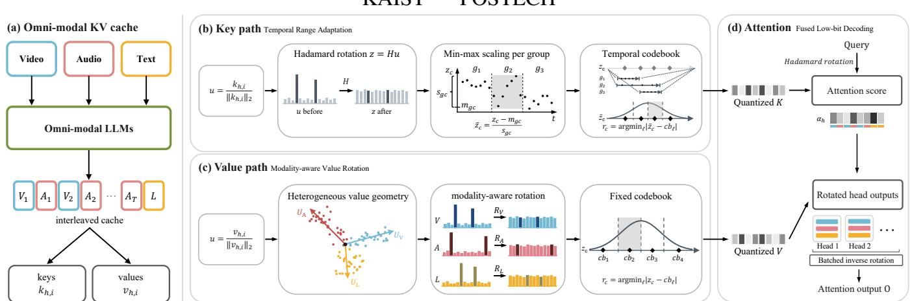
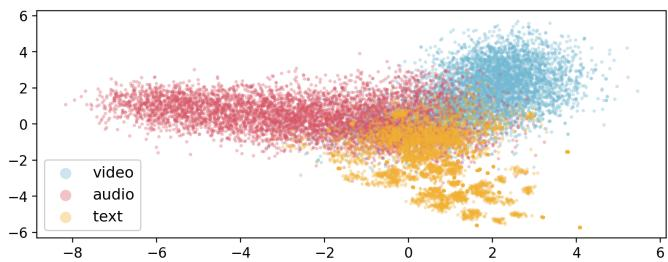
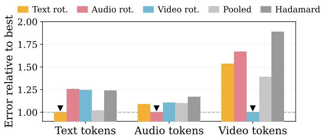

# OMNIKVQUANT: KV CACHE QUANTIZATION FOR OMNI-LLMS

Suho Yoo1∗ Hyunjong Ok2∗ Jongmin Choi1 Jihoo Jung1 Joon Son Chung1

  
Fig. 1: Overview of OmniKVQuant. We adapt key quantization ranges to local temporal shifts and apply modality-specific value rotations to capture heterogeneous geometry, enabling accurate KV caching and efficient attention through fused decoding.

## ABSTRACT

As Omni-modal large language models (Omni-LLMs) take in audio, video and text together, their KV cache memory cost grows. KV cache quantization is the defacto approach in textonly LLMs, but its application to Omni-LLMs remains unexplored. In this paper, we analyze how TurboQuant, a representative rotation-based KV cache quantization method, behaves on multimodal caches and identify two critical issues: temporal key drift and heterogeneous value geometry. To address these, we propose OmniKVQuant, a training-free framework that (i) sets the key quantization range over each short window of the input stream; and (ii) rotates values separately per modality. On Qwen2.5-Omni and Qwen3-Omni, OmniKVQuant enables 2-bit KV caches while substantially preserving performance across seven audio-visual benchmarks. We further provide a fused Triton decode kernel that unpacks the 2-bit cache during attention, so no dense FP16 cache is ever built1.

Index Terms— Multimodal LLMs, Quantization, Efficient Inference, Audio-Visual Understanding

## 1. INTRODUCTION

Recent Omni-modal large language models (Omni-LLMs) perceive audio, vision and text within a single model, and perform strongly on real-world audio-visual understanding [1–5]. However, the three streams do not come for free. The model holds all three at once, a single minute of audio-visual input can exceed 10,000 tokens, each token leaving behind a key and a value, and the cache soon takes more memory than the weights themselves. Keeping it small without giving up accuracy is therefore central to deploying Omni-LLMs [6, 7].

The usual way to reduce it is KV cache quantization [8], storing each coordinate in fewer bits than the full precision. This is hard because a few coordinates of the cache are much larger than the rest [8–10]. The bits have to reach the large ones, so the small ones, which are most of the cache, all come out looking alike. TurboQuant [11] addresses this by rotating each KV cache vector before storing it, mixing the large dimensions into the others so that no single one is left to set the scale.

This approach has since been applied to other domains, to protein sequences [12] and to audio, video and text models taken one at a time [13], but never to a cache that holds more than one modality. MASQuant [14] does account for audio, video and text jointly, finding that a shared treatment follows the modality with the largest activations, but it does so for the weights and the activations, not the KV cache. No existing method quantizes the KV cache for Omni-LLMs.

In this paper, we take TurboQuant as our starting point and ask where its assumptions fail when the cache is written by three streams rather than one. The first failure is temporal key drift. Key distributions differ across modalities and vary even more substantially across short temporal windows. TurboQuant fixes its quantization scale in advance without measuring the cache it writes, leaving it unable to track these shifts as the multimodal stream goes on. The second is heterogeneous value geometry. Each modality occupies a different part of the value space, so one rotation shared by all three spreads them less effectively than a rotation chosen for each.

Table 1: Distribution analysis over 32-token windows. Keys exhibit substantially lower local variance than a Gaussian distribution, especially for audio and video tokens.
<table><tr><td>Distribution</td><td>Var.↑</td><td>W1↓</td><td>KS↓</td></tr><tr><td>Gaussian</td><td>96.88%</td><td>0.214</td><td>0.149</td></tr><tr><td>Key</td><td>30.40%</td><td>0.778</td><td>0.449</td></tr><tr><td>→Text</td><td>35.84%</td><td>0.738</td><td>0.421</td></tr><tr><td>→ Audio</td><td>28.67%</td><td>0.788</td><td>0.454</td></tr><tr><td>↔ Video</td><td>28.70%</td><td>0.794</td><td>0.461</td></tr><tr><td>Value</td><td>73.06%</td><td>0.468</td><td>0.267</td></tr></table>

To address this, we introduce OmniKVQuant, the first KV cache quantization method for Omni-LLMs. OmniKVQuant adapts the key codebook scale to the sequence as it progresses, following variation a fixed scale misses (Fig. 1b). For the values, it calibrates a separate rotation for each modality, shaped to the geometry each one actually sits in (Fig. 1c).

Experiments on Qwen2.5-Omni and Qwen3-Omni show that OmniKVQuant consistently outperforms TurboQuant. Across seven audio-visual benchmarks on Qwen2.5-Omni, OmniKVQuant retains 98.1% of FP16 performance, even at 2- bit precision, demonstrating the importance of accounting for the KV cache structure of Omni-LLMs in low-bit quantization.

We further provide a fused Triton decode kernel using the computation order of FlashAttention [15, 16]. Our kernel rotates one query per head instead of inverse-rotating every cached key and batches inverse value rotations across head outputs (Fig. 1d), reducing redundant rotation work and kernel launch overhead without reconstructing a dense FP16 cache.

## 2. METHOD

## 2.1. Preliminaries

Background on Omni-LLMs. Omni-LLMs jointly process visual, audio, and text inputs within a shared LLM decoder. For a video with its audio stream, the input is organized into T temporal chunks, where each chunk contains visual tokens $V _ { t }$ followed by audio tokens $A _ { t }$ . Together with textual tokens $L ,$ the multimodal sequence is written as

$$
X = [ V _ { 1 } , A _ { 1 } , V _ { 2 } , A _ { 2 } , . . . , V _ { T } , A _ { T } , L ] \in \mathbb { R } ^ { N \times D } ,
$$

where N denotes the sequence length and D the hidden dimension. At each transformer layer and attention head $h ,$ the hidden states are projected into queries, keys, and values as $Q _ { h } = X W _ { h } ^ { Q } , K _ { h } \bar { = } \bar { X } W _ { h } ^ { K }$ , and $\overset { \cdot } { V } _ { h } = X W _ { h } ^ { \bar { V } }$ . RoPE [17] then applies position-dependent rotations to the query and key representations, while the value representations remain unrotated. Attention is computed as

$$
\alpha _ { h } { = } \mathrm { S o f t m a x } \bigg ( \frac { Q _ { h } K _ { h } ^ { \top } } { \sqrt { d } } \bigg ) , \qquad O _ { h } { = } \alpha _ { h } V _ { h } ,\tag{1}
$$

where d denotes the head dimension. During autoregressive decoding, the resulting key and value representations are stored in the KV cache and reused for subsequent tokens.

  
Fig. 2: Heterogeneous value geometry. Value representations form distinct modality-specific distributions, with text, audio, and video occupying different regions of the feature space.

TurboQuant. TurboQuant [11] is applied independently to each $k _ { h , i } \in K _ { h }$ and $v _ { h , i } \in V _ { h }$ stored in the KV cache. For either $x \in \{ k _ { h , i } , v _ { h , i } \}$ , it first separates the magnitude from the unit direction and applies a randomized Hadamard transform,

$$
u = { \frac { x } { \| x \| _ { 2 } } } , \qquad z = H u ,\tag{2}
$$

The rotation makes each coordinate $z _ { c }$ approximately follow $\mathcal { N } ( 0 , 1 / d )$ in high dimensions. A fixed codebook $c b = ( c b _ { 1 } , \dots , c b _ { 2 ^ { b } } )$ is then constructed from this Gaussian reference distribution, and the quantized vector is reconstructed as xˆ through inverse rotation.

$$
r _ { c } = \mathrm { a r g m i n } | z _ { c } - c b _ { \ell } | , \qquad \hat { x } = \| \boldsymbol { x } \| _ { 2 } H ^ { \top } c b [ r ] .\tag{3}
$$

In this way, TurboQuant spreads a few large dimensions through random rotation and brings keys and values closer to a Gaussian reference distribution, allowing a fixed codebook to be shared across the KV cache.

## 2.2. Observations

We analyze Qwen2.5-Omni-3B [1] on WorldSense [18].

Temporal key drift. We measure the retained variance relative to the Gaussian distribution, together with the Wasserstein-1 (W1) distance and Kolmogorov–Smirnov (KS) statistic. Although the Hadamard rotation is designed to align coordinates with a Gaussian distribution, cached keys exhibit a substantial deviation from this target. As shown in Tab. 1, key coordinates retain only 30.40% of the Gaussian variance, with W1 and KS distances of 0.778 and 0.449, respectively. This mismatch persists across modalities and is more pronounced for audio and video than for text. In contrast, value representations remain considerably closer to the Gaussian distribution. These results indicate that key distributions are not fully stabilized by the global Hadamard rotation and instead exhibit local variation across the cache, motivating our temporal range adaptation.

Heterogeneous value geometry. Values directly contribute to the attention output, making their representation geometry important. We visualize value representations across modalities using PCA in Fig. 2. Visual, audio, and text values occupy distinct regions of the representation space, revealing modality-specific structures. This suggests that a modalityaware correction of the Hadamard rotation can better adapt to heterogeneous value structures.

Table 2: Main results. All compressed methods use K2/V2 KV cache quantization. Avg. normalizes each benchmark score to its FP16 counterpart before averaging. The FP16 baseline is shown in gray.
<table><tr><td rowspan="2">Method</td><td colspan="5">Multiple choice (Acc.)</td><td colspan="4">Captioning (LLM-judge)</td></tr><tr><td>World.↑</td><td>Daily.↑</td><td>MME↑</td><td>OmniVid.↑</td><td>Avg.↑(%)</td><td>UGC↑</td><td>DiaDem↑</td><td>SAL.2↓</td><td>Avg.↑(%)</td></tr><tr><td colspan="10">Qwen2.5-Omni-3B (Dense)</td></tr><tr><td>FP16</td><td>47.6</td><td>57.5</td><td>75.8</td><td>44.0</td><td>100.0</td><td>57.2</td><td>18.4</td><td>83.5</td><td>100.0</td></tr><tr><td>TurboQuant</td><td>45.6</td><td>56.1</td><td>73.6</td><td>42.8</td><td>96.9</td><td>52.5</td><td>16.8</td><td>90.5</td><td>91.7</td></tr><tr><td>OmniKVQuant</td><td>47.8</td><td>54.8</td><td>75.3</td><td>44.0</td><td>98.8</td><td>55.9</td><td>17.8</td><td>85.4</td><td>97.3</td></tr><tr><td colspan="10">Qwen3-Omni-30B-A3B (MoE)</td></tr><tr><td>FP16</td><td>53.4</td><td>69.7</td><td>85.3</td><td>48.8</td><td>100.0</td><td>71.8</td><td>23.0</td><td>67.9</td><td>100.0</td></tr><tr><td>TurboQuant</td><td>33.3</td><td>31.1</td><td>56.7</td><td>29.5</td><td>58.5</td><td>41.8</td><td>1.3</td><td>101.9</td><td>43.6</td></tr><tr><td>OmniKVQuant</td><td>48.1</td><td>62.2</td><td>80.5</td><td>43.4</td><td>90.6</td><td>66.2</td><td>17.6</td><td>83.1</td><td>83.4</td></tr></table>

## 2.3. OmniKVQuant

Temporal range adaptation. TurboQuant directly quantizes the rotated key direction z using the fixed codebook in Eq. (3). However, we observe that the range of z drifts across temporal positions, so a single shared codebook does not consistently match different cache regions. We therefore min-max scale z within a small group of consecutive tokens before codebook assignment. For each group g and coordinate c, we compute its minimum $m _ { g c }$ and scale $s _ { g c } ,$ and replace $z _ { c }$ in Eq. (3) with

$$
\bar { z } _ { c } = \frac { z _ { c } - m _ { g c } } { s _ { g c } } .\tag{4}
$$

The same fixed codebook is then applied to z¯, while $m _ { g c }$ and $s _ { g c }$ are stored to restore the original range at reconstruction. This allows the shared codebook to adapt to local temporal variation without modifying the Hadamard basis. In our code, we compute attention scores in the rotated space by rotating a single query per head instead of inverse rotating every cached key, avoiding rotation costs that grow with cache length.

Modality-aware value rotation. For values, the mismatch arises from distinct representation geometries across modalities that a shared rotation does not adequately capture. We therefore calibrate a separate modality-specific basis $U _ { m }$ for each modality $m \in \{ V , A , L \}$

Rather than treating all value directions equally, we weight each value according to how strongly it contributes to the attention output. Specifically,

$$
w _ { j } = \sum _ { i } \alpha _ { i , j } ^ { 2 } , \qquad C _ { m } = \sum _ { j } w _ { j } v _ { j } ^ { \top } v _ { j } ,\tag{5}
$$

where $C _ { m }$ is computed separately for each modality. We obtain $U _ { m }$ from the eigen-decomposition of $C _ { m }$ , so that each basis captures the value directions that contribute most strongly to the model output. We estimate these modality-specific bases using calibration data from VGGSound [19].

We replace the Hadamard rotation z =Hu in Eq. (2) by

$$
\begin{array} { r } { z = H U _ { m } ^ { \top } u = R _ { m } u , \qquad \hat { x } = \| x \| _ { 2 } R _ { m } ^ { \top } c b [ r ] , } \end{array}\tag{6}
$$

where r denotes the quantization indices in Eq. (3). In practice, our Triton kernel applies the inverse rotation after aggregation within each attention head, rather than to each cached value.

Table 3: Quantization error at comparable bit budgets. Our method consistently reduces error compared with TurboQuant.
<table><tr><td>Method</td><td>Recon. MSE↓ Attn. KL↓ Output MSE↓ Bits/elem.↓</td><td></td><td></td><td></td></tr><tr><td>TurboQuant (K2/V2)</td><td>1.2939</td><td>0.6739</td><td>0.0345</td><td>2.125</td></tr><tr><td>Ours (MXFP4 meta.)</td><td>0.1833</td><td>0.1510</td><td>0.0148</td><td>2.258</td></tr><tr><td>TurboQuant (K3/V2)</td><td>0.3918</td><td>0.2436</td><td>0.0159</td><td>2.625</td></tr><tr><td>Ours (FP16 meta.)</td><td>0.1495</td><td>0.1167</td><td>0.0134</td><td>2.625</td></tr></table>

## 3. EXPERIMENTS

## 3.1. Setup

Datasets and metrics. We evaluate on seven audio-visual benchmarks. Multiple-choice tasks include WorldSense [18] (World.), DailyOmni [20] (Daily.), Video-MME [21] (MME), and OmniVideoBench [22] (OmniVid.), all scored by accuracy. For captioning, we use UGC-VideoCap [23] (UGC.), DiaDem-Bench [24] (DiaDem.), and video-SALMONN2 [25] (SAL.2), evaluated by Qwen3.8-27B [26] as an LLM judge. Avg. normalizes each benchmark to the FP16 (100) and averages across benchmarks, using the inverse ratio for SAL.2. Due to FP16 memory limits, we evaluate samples up to one minute.

Baselines. We compare three cache configurations. FP16 is the uncompressed cache. TurboQuant [11] is implemented following vLLM 2, with TurboQuant applied to both keys and values. In our experiments, both methods quantize keys and values to 2 bits (K2/V2). Except for the proposed codec components of OmniKVQuant, both methods use the same inference pipeline.

Implementation details. We use Qwen2.5-Omni-3B [1] and Qwen3-Omni-30B-A3B-Instruct [2] under greedy decoding on a single NVIDIA A100 and H200 GPU, respectively. We use 32-token groups g for key range estimation, with MXFP4 metadata by default, and calibrate value rotations once per model on 309 VGGSound training clips, one per class. For multiplechoice evaluation, we prefill all but the final prompt token and decode one token with the quantized KV cache. For captioning, OmniKVQuant keys are quantized every 128 tokens in groups of 32, while OmniKVQuant values and TurboQuant keys/values use a 128-token sliding FP16 window before quantization.

Table 4: Component ablation. Local key ranges provide the largest improvement over TurboQuant, while modality-specific value rotation yields additional gains across both model scales.
<table><tr><td>Method</td><td>Key Value</td><td>MCQ↑</td><td>Cap.↑</td></tr><tr><td colspan="4">Qwen2.5-Omni-3B (Dense)</td></tr><tr><td>TurboQuant</td><td></td><td>96.9</td><td>91.7</td></tr><tr><td>+ Local key ranges</td><td>√</td><td>98.5</td><td>95.2</td></tr><tr><td>+ Modality value rot. (Ours)</td><td>L V</td><td>98.8</td><td>97.3</td></tr><tr><td colspan="4">Qwen3-Omni-30B-A3B (MoE)</td></tr><tr><td>TurboQuant</td><td></td><td>58.5</td><td>43.6</td></tr><tr><td>+ Local key ranges</td><td>√</td><td>91.2</td><td>78.1</td></tr><tr><td>+ Modality value rot. (Ours)</td><td>√</td><td>90.6</td><td>83.4</td></tr></table>

Table 5: Multiple-choice performance at different bit widths. OmniKVQuant consistently outperforms TurboQuant from 2-bit to 4-bit quantization, demonstrating generalizes well across quantization levels.
<table><tr><td>Method</td><td>K2V2↑(%)</td><td>K3V3↑(%)</td><td>K4V4↑(%)</td></tr><tr><td>TurboQuant</td><td>96.9</td><td>98.3</td><td>100.4</td></tr><tr><td>Ours</td><td>98.8</td><td>99.6</td><td>101.5</td></tr></table>

## 3.2. Experimental Results

Tab. 2 reports results across four multiple-choice and three captioning benchmarks. On Qwen2.5-Omni, OmniKVQuant retains 98.8% and 97.3% of FP16 performance on multiplechoice and captioning, respectively, substantially outperforming TurboQuant at the same K2/V2 budget. The gap widens on Qwen3-Omni, where TurboQuant drops to 58.5% and 43.6%, while OmniKVQuant preserves 90.6% and 83.4%. These results show that quantization tailored to the KV cache structure of Omni-LLMs is critical for preserving performance.

## 3.3. Analysis

Unless otherwise noted, all analyses use Qwen2.5-Omni-3B. Error comparison. Tab. 3 compares the codecs directly on World., with both keys and values quantized. Recon. MSE measures key cache reconstruction error, Attn. KL the resulting attention-distribution shift, and Output MSE the error in the attention output. OmniKVQuant consistently reduces all three errors at a matched bit rate. For an exact K3-budget comparison, we use FP16 minimum $m _ { g c }$ and scale $s _ { g c }$ metadata over 32-token groups, which adds one bit per element yet still yields lower error than 3-bit key quantization.

Ablation studies. Tab. 4 provides a component-wise ablation tracing the progression from TurboQuant to our full method. The results show that the local key range is particularly important, while modality-specific rotation further stabilizes performance across benchmarks. Tab. 5 examines different compression rates and shows that our method consistently outperforms TurboQuant across rate settings.

  
Fig. 3: Value quantization error across rotation choices. Using the rotation matched to each token modality (▼) yields the lowest error in all three groups, while pooled and shared rotations are consistently worse.

Table 6: Effect of temporal adaptation on key quantization. Modality information alone is insufficient; preserving local temporal structure further reduces key quantization error.
<table><tr><td>Grouping</td><td></td><td></td><td></td><td>Range↓ Recon. MSE↓ Attn. KL↓ Output MSE↓</td></tr><tr><td>Shuffled globally</td><td>0.2318</td><td>0.2716</td><td>0.2197</td><td>0.0188</td></tr><tr><td>Shuffled within modality</td><td>0.2251</td><td>0.2579</td><td>0.2054</td><td>0.0180</td></tr><tr><td>Temporally contiguous</td><td>0.1788</td><td>0.1833</td><td>0.1510</td><td>0.0148</td></tr></table>

Value rotation. Fig. 3 examines how value rotations transfer across modalities on World. For text, audio, and video tokens, the rotation calibrated on the same modality consistently gives the lowest quantization error, while rotations transferred from other modalities or calibrated on pooled data perform worse. The same pattern holds across all three modalities, showing that their value representations favor different quantization bases rather than a single shared rotation.

Key adaptation. With $g = 3 2 ,$ Tab. 6 separates modality identity from temporal locality on World. Range measures the range covered by each group. Global shuffling gives the largest key error, while shuffling only within each modality recovers part of the loss. Keeping tokens temporally contiguous further reduces both key range and downstream quantization error. This shows that modality identity alone is insufficient: key statistics continue to vary locally within each modality.

## 4. CONCLUSION

We presented OmniKVQuant, a training-free framework for KV cache quantization in Omni-LLMs. OmniKVQuant uses local ranges for keys and modality-specific rotations for values, reflecting their different structures in the cache. On Qwen2.5-Omni and Qwen3-Omni across seven audio-visual benchmarks, OmniKVQuant consistently outperforms TurboQuant under 2-bit KV cache quantization. The gains hold across both multiple-choice and captioning tasks, showing that the same design carries across model scales and task types. These results suggest that the structure of keys and values is important for compressing Omni-LLM KV caches.

## 5. REFERENCES

[1] Jin Xu, Zhifang Guo, Jinzheng He, et al., “Qwen2.5- omni technical report,” arXiv, 2025.

[2] Jin Xu, Zhifang Guo, Hangrui Hu, et al., “Qwen3-omni technical report,” arXiv, 2025.

[3] Aaron Hurst, Adam Lerer, Adam P Goucher, et al., “Gpt-4o system card,” arXiv, 2024.

[4] Chaeyoung Jung, Youngjoon Jang, and Joon Son Chung, “AVCD: Mitigating hallucinations in audio-visual large language models through contrastive decoding,” in Proc. NeurIPS, 2025.

[5] Suho Yoo, Youngjoon Jang, and Joon Son Chung, “On the Nature of Attention Sink that Shapes Decoding Strategy in Omni-LLMs,” arXiv, 2026.

[6] Keda Tao, Kele Shao, Bohan Yu, et al., “Omnizip: Audioguided dynamic token compression for fast omnimodal large language models,” in Proc. CVPR, 2026.

[7] Suho Yoo, Youngjoon Jang, Hyebin Cho, and Joon Son Chung, “Out of Sight, Still in Mind: Token compression for omni-llms,” arXiv, 2026.

[8] Coleman Hooper, Sehoon Kim, Hiva Mohammadzadeh, Michael W Mahoney, Yakun S Shao, Kurt Keutzer, and Amir Gholami, “Kvquant: Towards 10 million context length llm inference with kv cache quantization,” in Proc. NeurIPS, 2024.

[9] Zirui Liu, Jiayi Yuan, Hongye Jin, Shaochen Zhong, Zhaozhuo Xu, Vladimir Braverman, Beidi Chen, and Xia Hu, “KIVI: A tuning-free asymmetric 2bit quantization for KV cache,” in Proc. ICML, 2024.

[10] Guangxuan Xiao, Ji Lin, Mickael Seznec, Hao Wu, Julien Demouth, and Song Han, “Smoothquant: Accurate and efficient post-training quantization for large language models,” in Proc. ICML, 2023.

[11] Amir Zandieh, Majid Daliri, Majid Hadian, and Vahab Mirrokni, “Turboquant: Online vector quantization with near-optimal distortion rate,” in Proc. ICLR, 2026.

[12] Yue Hu, Junqing Wang, and Yingchao Liu, “Turboesm: Ultra-efficient 3-bit kv cache quantization for protein language models with orthogonal rotation and qjl correction,” arXiv, 2026.

[13] Mark Boss, Vikram Voleti, Simon Donné, and Shimon Vainer, “Octopus: Optimized kv cache for transformers via octahedral parametrization under optimal squared error quantization,” arXiv, 2026.

[14] Lulu Hu, Wenhu Xiao, Xin Chen, Xinhua Xu, Bowen Xu, Kun Li, and Yongliang Tao, “Masquant: Modality-aware smoothing quantization for multimodal large language models,” in Proc. CVPR, 2026.

[15] Tri Dao, Daniel Y. Fu, Stefano Ermon, Atri Rudra, and Christopher Ré, “FlashAttention: Fast and memoryefficient exact attention with io-awareness,” in Proc. NeurIPS, 2022.

[16] Tri Dao, “FlashAttention-2: Faster attention with better parallelism and work partitioning,” in Proc. ICLR, 2024.

[17] Jianlin Su, Murtadha Ahmed, Yu Lu, et al., “Roformer: Enhanced transformer with rotary position embedding,” Neurocomputing, 2024.

[18] Jack Hong, Shilin Yan, Jiayin Cai, et al., “Worldsense: Evaluating real-world omnimodal understanding for multimodal llms,” in Proc. ICLR, 2026.

[19] Honglie Chen, Weidi Xie, Andrea Vedaldi, and Andrew Zisserman, “Vggsound: A large-scale audio-visual dataset,” in Proc. ICASSP, 2020.

[20] Ziwei Zhou, Rui Wang, and Zuxuan Wu, “Daily-Omni: Towards audio-visual reasoning with temporal alignment across modalities,” arXiv, 2025.

[21] Chaoyou Fu, Yuhan Dai, Yongdong Luo, et al., “Video-MME: The first-ever comprehensive evaluation benchmark of multi-modal llms in video analysis,” in Proc. CVPR, 2025.

[22] Caorui Li, Yu Chen, Yiyan Ji, Jin Xu, et al., “Omnivideobench: Towards audio-visual understanding evaluation for omni mllms,” arXiv, 2025.

[23] Peiran Wu, Yunze Liu, Zhengdong Zhu, Enmin Zhou, and Junxiao Shen, “Ugc-videocaptioner: An omni ugc video detail caption model and new benchmarks,” arXiv, 2025.

[24] Xinlong Chen, Weihong Lin, Jingyun Hua, Linli Yao, Yue Ding, Bozhou Li, Bohan Zeng, Yang Shi, Qiang Liu, Yuanxing Zhang, et al., “Diadem: Advancing dialogue descriptions in audiovisual video captioning for multimodal large language models,” arXiv, 2026.

[25] Changli Tang, Yixuan Li, Yudong Yang, et al., “video-SALMONN 2: Caption-enhanced audio-visual large language models,” arXiv, 2025.

[26] Qwen Team, “Qwen3.8-Max: A new bar for coding and cowork,” 2026.