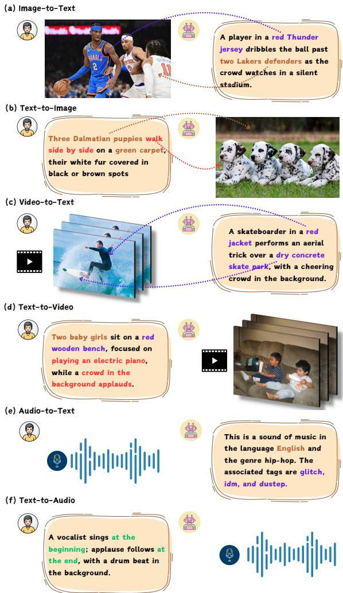
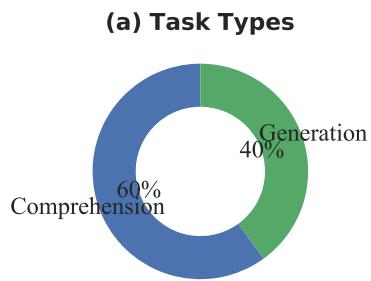
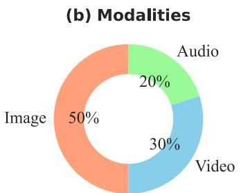
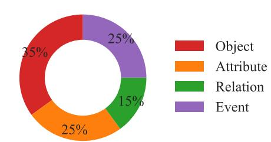
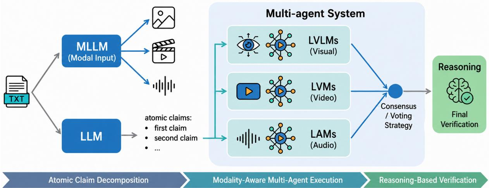
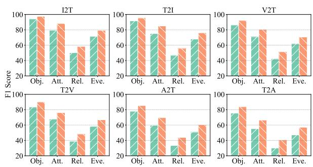

# OmniHallu: Unified Hallucination Detection for Cross-Modal Comprehension and Generation in Multimodal Large Language Models

Jianjiang Yang1 Peihang Li2 Shanqing Xu3 Mengchen Qian3

Lu Zhang4 Meng Luo5\*

1The University of Manchester 2The University of Hong Kong 3Huazhong University of Science and Technology 4Shanghai Academy of Educational Sciences 5National University of Singapore

## Abstract

While Multimodal Large Language Models (MLLMs) have achieved remarkable progress across diverse tasks, they suffer from hallucinations where generated outputs contradict or misrepresent input semantics. Existing research typically addresses hallucination detection within a single modality or task type, limiting generalizability. We introduce Omni-Hallu, a unified hallucination detection framework spanning both comprehension and generation tasks across image, video, and audio modalities. We contribute OmniHallu-Bench, a 10,000-sample benchmark with claimlevel human annotations covering six crossmodal tasks: image-to-text (I2T), video-totext (V2T), audio-to-text (A2T), text-to-image (T2I), text-to-video (T2V), and text-to-audio (T2A). Our multi-agent architecture decomposes model outputs into atomic claims, verifies them through modality-specific experts, and aggregates evidence via structured reasoning. We further propose a preference-optimized trainable verifier that approximates the multiagent decision boundary, reducing expert calls by 66% with minimal performance loss. Extensive experiments reveal a consistent modalitydependent performance gradient and provide fine-grained insights into cross-modal hallucination patterns.

  
Figure 1: MLLMs produce hallucinations in both comprehension and generation across modalities, spanning object, attribute, relation, and event hallucination types.

## 1 Introduction

Multimodal Large Language Models (MLLMs) (Li et al., 2024; Chen et al., 2025; Li et al., 2025b, 2026; Luo et al., 2024) have achieved remarkable progress across vision, audio, and language tasks. However, these models frequently hallucinate: generating outputs that contradict or misrepresent the input (Bai et al., 2024; Huang et al., 2025b; Lin et al., 2025; Luo et al., 2026a,b). Hallucinations pose a fundamental barrier to deploying MLLMs in safety-critical applications.

Existing hallucination detection methods predominantly target a single modality or task type. Image-focused benchmarks (Li et al., 2023b; Wang et al., 2024a) do not cover video or audio; videofocused (Liu and Wan, 2023; Wang et al., 2024b) and audio-focused (Nishimura et al., 2024) evaluations similarly operate in isolation. Moreover, most work addresses only comprehension while neglecting generation tasks, despite both sharing common hallucination patterns rooted in insufficient perception and reasoning.

We study a unified claim-level detection protocol that enables side-by-side comparison across modalities and task directions, while also revealing which components transfer and where modality-specific verification remains necessary.

To this end, we introduce OmniHallu, a unified hallucination detection framework, and OmniHallu-Bench, a benchmark of 10,000 human-verified samples. Our method adapts the established decompose–verify–aggregate paradigm (Chen et al., 2024a) to six bidirectional tasks: video verification emphasizes temporal and causal evidence, whereas audio verification relies on acoustic cues and a less mature tool ecosystem. Our contributions are:

• OmniHallu-Bench: A 10,000-sample benchmark with claim-level human annotations spanning six cross-modal tasks (I2T, V2T, A2T, T2I, T2V, T2A) across four modalities.

• Cross-modal systematization: A modalityaware implementation of claim decomposition, specialized verification, and evidence aggregation, together with controlled analyses of component contributions, performance variations, and failure modes.

• Preference-optimized verifier: A compact trainable verifier aligned via GRPO that reduces expensive expert calls by 66% with minimal performance loss.

## 2 Related Work

Hallucination in MLLMs. Hallucinations manifest across all MLLM modalities. In visionlanguage models, generated descriptions may mention objects absent from the image (Li et al., 2023b). Video-language models exhibit intrinsic and extrinsic hallucinations (Wang et al., 2024b; Huang et al., 2026), while audio-video language models may ignore acoustic content and describe audio primarily from visual evidence (Nishimura et al., 2024). In generation tasks, text-to-image models often fail on compositional prompt alignment (Bakr et al., 2023; Huang et al., 2025a), and text-to-video models lack temporal coherence (Chu et al., 2024b; Rawte et al., 2025). Despite this breadth of modality-specific work, most prior research has studied each modality and task type independently, limiting insight into cross-modal regularities.

Hallucination Detection and Evaluation. Detection methods have evolved from simple selfconsistency checks (Manakul et al., 2023; Miao et al., 2024) to structured multi-step pipelines. UNIHD (Chen et al., 2024a) introduced claim decomposition and verification for image–text tasks, while FactVC (Liu and Wan, 2023) proposed factuality metrics for video captioning. CrossCheck-GPT (Sun et al., 2024) ranks systems through reference-free cross-system consistency across text, image, and audio-visual domains, and video-SALMONN 2 (Tang et al., 2025) uses preference optimization to mitigate errors in audio-visual captioning. These methods target system ranking, claim-level evaluation, or hallucination mitigation, while benchmarks such as POPE (Li et al., 2023b), AMBER (Wang et al., 2024a), and MHaluBench (Chen et al., 2024a) remain restricted to a single modality or modality pair. Our work studies claimlevel detection across six bidirectional tasks; Table 1 summarizes the corresponding benchmark coverage.

Tool-Augmented and Multi-Agent LLM Systems. Toolformer (Schick et al., 2023) trains language models to decide which external tools to call and how to incorporate their outputs. Grounding DINO (Ren et al., 2024) enables zero-shot object verification, and DoraemonGPT (Yang et al., 2024) reformulates video understanding into tool invocations. Our framework extends this paradigm to hallucination detection across modalities with unified reasoning-based aggregation.

## 3 Task Formulation and Hallucination Taxonomy

Unified Formulation. Let T, I, V, A denote textual, image, video, and audio data. An MLLM maps input $\textbf { x } \in \ \{ T , \mathcal { I } , \mathcal { V } , \mathcal { A } \}$ to output $\hat { y } \in$ $\{ \mathcal T , \mathcal { I } , \mathcal { V } , \mathcal { A } \}$ . We address comprehension tasks $( \mathbf { x } \in \{ \mathcal { T } , \mathcal { V } , \mathcal { A } \} \to \hat { y } \in \mathcal { T } )$ , and generation tasks $( \mathbf { x } \in \mathcal { T }  \hat { y } \in \{ \mathcal { T } , \mathcal { V } , \mathcal { A } \} )$ . Comprehension hallucinations reside in the generated text, while generation hallucinations manifest as semantic discrepancies between the produced media and the prompt.

Definition. An output yˆ is hallucinated if it contains any semantic claim that is unsupported by or contradicts the input x. Formally, let G denote the set of ground-truth semantic elements derivable from x:

Table 1: Comparison of hallucination benchmarks. “Function” indicates whether the benchmark supports fact-Checking or hallucination Detection. “Granularity” denotes evaluation at the Response, Segment, or Claim level. “Rationale” indicates whether the benchmark provides explanatory justifications.
<table><tr><td>Benchmark</td><td>Function</td><td>Granularity</td><td># Instances</td><td>Task</td><td>#Mod.</td><td>Rationale</td></tr><tr><td>QAGS (Wang et al., 2020)</td><td>C</td><td>R</td><td>474</td><td>T2T</td><td>1</td><td>x</td></tr><tr><td>HaluEval (Li et al., 2023a)</td><td>D</td><td>R</td><td>30,000</td><td>T2T</td><td>1</td><td>x</td></tr><tr><td>POPE (Li et al., 2023b)</td><td>D</td><td>R</td><td>500</td><td>I2T</td><td>2</td><td>X</td></tr><tr><td>AMBER (Wang et al., 2024a)</td><td>D</td><td>R</td><td>1,004</td><td>I2T</td><td>2</td><td>X</td></tr><tr><td>FactVC (Liu and Wan, 2023)</td><td>D</td><td>R</td><td>1,800</td><td>V2T</td><td>2</td><td>x</td></tr><tr><td>AHLALM (Nishimura et al., 2024)</td><td>D</td><td>R</td><td>1,000</td><td>A2T</td><td>2</td><td>X</td></tr><tr><td>SoraDetector (Chu et al., 2024b)</td><td>D</td><td>R</td><td>50</td><td>T2V</td><td>2</td><td>X</td></tr><tr><td>MHaluBench (Chen et al., 2024a)</td><td>D</td><td>R, S, C</td><td>420</td><td>T2I, I2T</td><td>2</td><td></td></tr><tr><td>OmniHallu-Bench (Ours)</td><td>D</td><td>R, S, C</td><td>10,000</td><td>T2I, T2V, T2A, I2T, V2T, A2T</td><td>4</td><td>V</td></tr></table>

$$
{ \mathrm { H a l l u c i n a t e } } ( { \hat { y } } \mid \mathbf { x } ) = { \left\{ \begin{array} { l l } { 1 } & { { \mathrm { i f } } \exists \phi ( { \hat { y } } ) \not \in { \mathcal { G } } } \\ { 0 } & { { \mathrm { o t h e r w i s e } } , } \end{array} \right. }
$$

where $\phi ( \hat { y } )$ denotes any semantic claim extractable from $\hat { y } .$

Hallucination Taxonomy. We define four types applicable across all modalities: (1) Object: nonexistent entities introduced; (2) Attribute: misrepresented properties such as color, size, or timbre; (3) Relation: incorrectly stated spatial, temporal, or causal relationships; (4) Event: misrepresented event-level details, including temporal ordering errors or fabricated actions. Each type manifests across all six tasks, enabling direct cross-modal comparison (§6).

## 4 OmniHallu-Bench

Design Principles. OmniHallu-Bench comprises 10,000 samples with stratified coverage across modalities and tasks. Comprehension tasks account for 60% and generation tasks for 40%. Image, video, and audio samples follow a 5:3:2 ratio. Hallucination types are distributed as: object (35%), attribute (25%), event (25%), and relation (15%).

Comprehension Tasks. For I2T, we draw from COCO Captions (Chen et al., 2015), Nocaps (Agrawal et al., 2019), and Flickr30k (Plummer et al., 2015), with model outputs generated by InternVL2.5-78B (Chen et al., 2024b), Qwen2.5- VL-72B (Bai et al., 2025b), GPT-4.1 (OpenAI, 2025a), and Gemini-2.5-Pro (Gemini Team, 2025). For V2T, we sample from MSVD (Chen et al., 2022), MSRVTT (Xu et al., 2016), and VA-TEX (Wang et al., 2019), using InternVL2.5-78B, Qwen2.5-VL-72B, VideoLLaMA3 (Zhang et al.,

2025), and LLaVA-OneVision (Li et al., 2025a). For A2T, we use AudioCaps (Kim et al., 2019), ClothoV2 (Drossos et al., 2020), and AudioSet-Caps (Bai et al., 2025a), with outputs from Qwen2- Audio-7B-Instruct (Chu et al., 2024a), GAMA (Ghosh et al., 2024), Pengi (Deshmukh et al., 2023a), and SALMONN (Tang et al., 2024).

Generation Tasks. For T2I, prompts from T2I-CompBench++ (Huang et al., 2025a) and HRS-Bench (Bakr et al., 2023) are used to generate images via DALL-E 3, Stable Diffusion 3.5 Large, and Midjourney v6 (Betker et al., 2023; Stability AI, 2024; Midjourney, 2023). For T2V, prompts from T2V-CompBench (Sun et al., 2025) and FETV (Liu et al., 2023) drive generation via Open-Sora 1.2 (Zheng et al., 2024) and CogVideoX-5B (Yang et al., 2025). For T2A, prompts from Wav-Text5K (Deshmukh et al., 2023b), FSD50K (Fonseca et al., 2022), and SoundDescs (Koepke et al., 2023) generate audio via Make-an-Audio (Huang et al., 2023), AudioGPT (Huang et al., 2024), and AudioLCM (Liu et al., 2024). Multiple generators are used for each task to reduce dependence on model-specific artifacts.

Annotation and Quality Control. Samples undergo a structured atomic claim decomposition using Chain-of-Thought prompting (Wei et al., 2022) with self-reflection verification. Three trained annotators independently review each sample; a sample is retained only upon full consensus. Annotators first validate the decomposed claims for semantic fidelity, then classify each as hallucinatory or non-hallucinatory. Approximately 24.3% of initial samples were removed due to disagreement. Before consensus filtering, Fleiss’ κ is 0.89 (image), 0.86 (video), and 0.83 (audio). The final dataset contains 4,000 human-curated and 6,000 modelgenerated (human-audited) samples.

(c) Hallucination Types

  
Figure 2: Statistics of OmniHallu-Bench: distribution across modalities, tasks, and hallucination types.

Table 2: Atomic claim decomposition quality against human references, measured by coverage, redundancy, and agreement.
<table><tr><td>Modality</td><td>Cov. ↑</td><td>Red. ↓</td><td>Agr. ↑</td></tr><tr><td>Image (I2T/T2I)</td><td>0.96</td><td>1.08</td><td>0.92</td></tr><tr><td>Video (V2T/T2V)</td><td>0.92</td><td>1.15</td><td>0.88</td></tr><tr><td>Audio (A2T/T2A)</td><td>0.89</td><td>1.21</td><td>0.85</td></tr><tr><td>Average</td><td>0.92</td><td>1.15</td><td>0.88</td></tr></table>

Dataset Statistics. The average number of atomic claims per sample is 4.2 (I2T), 3.8 (T2I), 5.6 (V2T), 4.1 (T2V), 3.5 (A2T), and 3.1 (T2A). The overall hallucination rate is 42.8%, compared with 48.1% for generation tasks and 39.2% for comprehension tasks.

## 5 Multi-Agent Hallucination Detection

Our framework consists of three stages: atomic claim decomposition, modality-aware expert verification, and reasoning-based aggregation (Figure 3).

Atomic Claim Decomposition (ACD). We decompose the target text (model-generated captions for comprehension, input prompts for generation) into atomic claims using GPT-4.1. Each sample $( y , \{ c _ { 1 } , \ldots , c _ { n _ { y } } \} )$ consists of text y and corresponding claims, where each $c _ { i }$ is a semantically discrete, grammatically self-contained, verifiable statement. For comprehension tasks, y is the modelgenerated caption; for generation tasks, y is the input prompt whose claims must be verified against the generated media. We compare GPT-4.1 claims against human reference claims on a 300-sample subset (Table 2); mean coverage is 0.92 and mean redundancy is 1.15.

Modality-Aware Expert Verification. Different modalities and hallucination types require specialized verification:

Image tasks (I2T, T2I). Object hallucinations are verified using Grounding DINO 1.5 Pro (Ren et al.,

2024) for open-set detection. Attribute, relation, and event hallucinations are assessed by an ensemble of MLLMs (Qwen2.5-VL-72B, InternVL2.5- 78B, GPT-4.1), where each model independently evaluates the claim against visual evidence. For T2I tasks, the text prompt serves as ground truth and experts verify whether the generated image faithfully reflects each prompted claim.

Video tasks (V2T, T2V). Following DoraemonGPT (Yang et al., 2024), each atomic claim is reformulated into a targeted QA query via GPT-4.1, enabling temporal decomposition and framelevel evidence extraction. The default three-expert configuration uses Qwen2.5-VL-72B, InternVL2.5- 78B, and VideoLLaMA3 (Zhang et al., 2025), which can attend to specific temporal segments.

Audio tasks (A2T, T2A). The default three-expert configuration uses Qwen2-Audio-7B-Instruct, GAMA (Ghosh et al., 2024), and SALMONN (Tang et al., 2024).

Within each modality, expert judgments are summarized by equal-weight majority voting, chosen for transparency and because no reliable crossmodel confidence calibration metric is available. The vote summary and the individual evidence traces are then passed to the final reasoning-based aggregator described below (see Appendix A).

Reasoning-Based Aggregation. Expert verification results and atomic claims are consolidated by GPT-5.2 in the main experiments; the controlled comparison in Table 6 replaces it with GPT-4.1 (OpenAI, 2025a,b). The aggregator receives each expert’s judgment, supporting evidence, and confidence signal, and outputs a final label with an explanatory rationale.

Trainable Verifier via Preference Optimization. To reduce dependence on expensive expert ensembles, we train a compact claim-level verifier $\pi _ { \psi }$ (initialized from Qwen2.5-VL-7B) that outputs a judgment conditioned on the task input and an atomic

  
Figure 3: Overview of the OmniHallu multi-agent framework. Model outputs are decomposed into atomic claims, verified by modality-specific experts, and aggregated through reasoning-based decision making.

claim:

$$
\pi _ { \psi } ( \ell \mid \mathbf { x } , c _ { i } ) , \ell \in \{ { \mathsf { S U P } } , { \mathsf { U N S U P } } , { \mathsf { A B S } } \} .\tag{1}
$$

UNSUP maps to hallucinated, SUP to nonhallucinated, and ABS (abstain) triggers full expert verification.

We define a reward $R = \lambda _ { \mathrm { l a b } } R _ { \mathrm { l a b } } + \lambda _ { \mathrm { e v } } R _ { \mathrm { e v } } +$ $\lambda _ { \mathrm { c a l } } R _ { \mathrm { c a l } }$ , using $( \lambda _ { \mathrm { l a b } } , \lambda _ { \mathrm { e v } } , \lambda _ { \mathrm { c a l } } ) ~ = ~ ( 1 . 0 , 0 . 7 , 0 . 3 )$ Here, $R _ { \mathrm { l a b } }$ rewards ground-truth match, $R _ { \mathrm { e v } }$ rewards consistency with multi-agent consensus, and $R _ { \mathrm { c a l } }$ penalizes overconfidence when expert signals conflict. We train via Group Relative Policy Optimization (GRPO) (Shao et al., 2024):

$$
\mathcal { L } _ { \mathrm { G R P O } } = - \mathbb { E } \left[ \frac { 1 } { K } \sum _ { k = 1 } ^ { K } \hat { A } _ { k } \log \pi _ { \psi } ( y _ { k } \mid \mathbf { x } , c _ { i } ) \right] ,\tag{2}
$$

where $\hat { A } _ { k } = ( R _ { k } { - } \mu ( R ) ) / ( \sigma ( R ) { + } \epsilon )$ is the normalized advantage over K sampled judgments. GRPO uses group-level relative advantages instead of explicit preference pairs. The trained verifier integrates into the pipeline as a low-cost filter: confident predictions (probability > 0.85) skip expert calls, while uncertain samples (ABS) fall through to the full ensemble.

## 6 Experiments

Setup. We follow the evaluation protocol of UNIHD (Chen et al., 2024a), computing precision (P), recall (R), and F1 for both hallucinatory and non-hallucinatory categories at claim level, along with accuracy and macro-averaged F1 (Mac.F1). Mac.F1 is our primary metric as it balances detection of both hallucinatory and non-hallucinatory claims. Baselines include: (1) Self-Check (Miao et al., 2024), which uses a single MLLM’s chainof-thought self-verification without external tools; and (2) UNIHD (Chen et al., 2024a), a multi-step pipeline applicable only to image tasks. For video and audio tasks where UNIHD is inapplicable, we compare against Self-Check with the strongest available MLLMs per modality. Our full framework uses GPT-5.2 (OpenAI, 2025b) as the reasoning model; we additionally report GPT-4.1 results (Table 6) to enable direct comparison at equal model capacity. For the verifier, we use a disjoint 6,000/1,000/3,000-sample train/dev/test split with no source-media overlap. The trainable verifier is initialized from Qwen2.5-VL-7B and trained for 3 epochs with learning rate $1 \times 1 0 ^ { - 5 }$ and GRPO group size $K = 8$

## 6.1 Main Results

Table 3 presents claim-level results across all six tasks. Our multi-agent framework consistently outperforms all baselines, with Mac.F1 improvements ranging from +3.4 to +8.1 points over the strongest baseline per task. The improvements are statistically significant across all tasks $( p < 0 . 0 1$ , bootstrap test with 10,000 resamples). We discuss the results along three dimensions: modality, task type, and hallucination category.

Image tasks exhibit the highest performance overall (Mac.F1: 81.8–83.0). With the UNIHD pipeline available, baselines are relatively strong, yet our framework still achieves +4.1 (I2T) and +3.4 (T2I) points over GPT-4.1 UNIHD.

Video tasks show moderate performance (Mac.F1: 75.6–77.1), reflecting the added complexity of temporal reasoning. Our framework achieves +7.0 (V2T) and +7.2 (T2V) points over the best Self-Check baseline, demonstrating the value of multi-agent verification for temporal content.

Table 3: Hallucination detection results across six tasks. P/R/F1 are reported for hallucinatory (H) and nonhallucinatory (NH) categories; Mac.F1 is the macro-average. All values are claim-level percentages. Our framework uses GPT-5.2 as the reasoning model; baselines use their respective models as noted. Best results in bold.
<table><tr><td rowspan="2" colspan="2">Method</td><td colspan="3">Hallucinatory</td><td colspan="3">Non-Hallucinatory</td><td colspan="4">Overall</td></tr><tr><td>P</td><td>R</td><td>F1</td><td>P</td><td>R</td><td>F1</td><td>Acc.</td><td>P</td><td>R</td><td>Mac.F1</td></tr><tr><td colspan="10">Image-to-Text (I2T)</td><td></td><td></td></tr><tr><td>Gemini-2.5-Pro</td><td>Self-Check UNIHD</td><td>82.75 83.94</td><td>64.12</td><td>72.20</td><td>66.12</td><td>81.31</td><td>72.90</td><td>72.48</td><td>74.44</td><td>72.72</td><td>72.55</td></tr><tr><td>GPT-4.1</td><td>Self-Check</td><td>79.32</td><td>68.21 73.92</td><td>75.27 76.52</td><td>69.92 74.31</td><td>81.45 80.54</td><td>75.24 77.30</td><td>75.92 76.21</td><td>76.93 76.82</td><td>74.83 77.23</td><td>75.26 76.91</td></tr><tr><td></td><td>UNIHD</td><td>81.02</td><td>77.45</td><td>79.20</td><td>77.23</td><td>79.92</td><td>78.55</td><td>78.12</td><td>79.13</td><td>78.69</td><td>78.88</td></tr><tr><td>Ours</td><td></td><td>84.65</td><td>81.34</td><td>82.96</td><td>83.15</td><td>82.72</td><td>82.93</td><td>82.58</td><td>83.90</td><td>82.03</td><td>82.95</td></tr><tr><td colspan="10">Text-to-Image (T2I)</td><td></td></tr><tr><td>Gemini-2.5-Pro</td><td>Self-Check UNIHD</td><td>81.12 82.64</td><td>59.82 64.52</td><td>68.86 72.48</td><td>63.41 65.92</td><td>78.74 80.32</td><td>70.23 72.41</td><td>70.98 73.84</td><td>72.27 74.28</td><td>69.28 72.42</td><td>69.55 72.45</td></tr><tr><td>GPT-4.1</td><td>Self-Check UNIHD</td><td>78.22 79.88</td><td>71.94 76.54</td><td>74.95 78.18</td><td>72.63 78.65</td><td>78.32 78.80</td><td>75.37 78.72</td><td>74.52 78.64</td><td>75.43 79.27</td><td>75.13 77.67</td><td>75.16 78.45</td></tr><tr><td>Ours</td><td></td><td>83.21</td><td>80.92</td><td>82.04</td><td>81.74</td><td>81.42</td><td>81.58</td><td>81.40</td><td>82.48</td><td>81.17</td><td>81.81</td></tr><tr><td colspan="10">Video-to-Text (V2T)</td></tr><tr><td>InternVL2.5-78B</td><td>Self-Check Self-Check</td><td>74.12 76.58</td><td>60.82 65.12</td><td>66.82 70.40</td><td>65.34</td><td>69.24</td><td>67.24</td><td>65.46</td><td>69.73</td><td>65.03</td><td>67.03 70.12</td></tr><tr><td>Qwen2.5-VL-72B Ours</td><td></td><td>78.92</td><td>75.42</td><td>77.13</td><td>68.42 77.38</td><td>71.32 76.92</td><td>69.84 77.15</td><td>68.36 77.02</td><td>72.50 78.15</td><td>68.22 76.17</td><td>77.14</td></tr><tr><td colspan="10">Text-to-Video (T2V)</td></tr><tr><td>InternVL2.5-78B</td><td>Self-Check</td><td>72.94</td><td>58.12</td><td>64.71</td><td></td><td></td><td></td><td></td><td>67.83</td><td></td><td></td></tr><tr><td>Qwen2.5-VL-72B</td><td>Self-Check</td><td>74.75</td><td>63.42</td><td>68.63</td><td>62.72 67.10</td><td>68.34 69.42</td><td>65.41 68.24</td><td>63.48 66.58</td><td>70.93</td><td>63.23 66.42</td><td>65.06 68.44</td></tr><tr><td>Ours</td><td></td><td>77.62</td><td>74.12</td><td>75.83</td><td>75.92</td><td>74.92</td><td>75.42</td><td>75.22</td><td>76.77</td><td>74.52</td><td>75.63</td></tr><tr><td colspan="10">Audio-to-Text (A2T)</td></tr><tr><td>GAMA</td><td>Self-Check</td><td>71.34</td><td>56.72</td><td>63.19</td><td>62.94</td><td>68.02</td><td>65.38</td><td>62.54</td><td>67.14</td><td>62.37</td><td>64.29</td></tr><tr><td>Qwen2-Audio-7B</td><td>Self-Check</td><td>73.48</td><td>59.24</td><td>65.57</td><td>64.82</td><td>69.28</td><td>66.98</td><td>64.42</td><td>69.15</td><td>64.26</td><td>66.28</td></tr><tr><td>Ours</td><td></td><td>76.38</td><td>72.12</td><td>74.19</td><td>74.64</td><td>73.42</td><td>74.02</td><td>73.82</td><td>75.51</td><td>72.77</td><td>74.11</td></tr><tr><td colspan="10">Text-to-Audio (T2A)</td></tr><tr><td>GAMA</td><td>Self-Check</td><td>70.15</td><td>55.48</td><td>61.95</td><td>61.72</td><td>67.42</td><td>64.44</td><td>61.64</td><td>65.94</td><td>61.45</td><td>63.20</td></tr><tr><td>Qwen2-Audio-7B</td><td>Self-Check</td><td>72.48</td><td>58.34</td><td>64.62</td><td>63.92</td><td>68.36</td><td>66.06</td><td>63.54</td><td>68.20</td><td>63.35</td><td>65.34</td></tr><tr><td>Ours</td><td></td><td>75.48</td><td>71.52</td><td>73.45</td><td>73.74</td><td>72.92</td><td>73.33</td><td>73.12</td><td>74.61</td><td>72.22</td><td>73.39</td></tr></table>

Audio tasks are the most challenging (Mac.F1: 73.4–74.1), consistent with limited expert tool availability for auditory understanding. Our framework still provides +7.8 (A2T) and +8.1 (T2A) points improvement, the largest absolute gains across all tasks, demonstrating that the multi-agent architecture is particularly valuable when individual models are weaker.

Within each modality, comprehension tasks consistently outperform their generation counterparts (e.g., I2T 82.95 vs. T2I 81.81; V2T 77.14 vs. T2V

75.63), as comprehension verification can directly ground claims against the source media, whereas generation verification must assess whether the produced media faithfully reflects the textual prompt. This modality-dependent performance gradient (image > video > audio) results from two interacting factors: the intrinsic complexity of each modality and the varying maturity of available expert models, where vision experts (70B+ parameters) far exceed current audio experts.

## 6.2 Ablation Studies

Module Ablation. Table 4 shows that removing ACD causes the largest degradation (-6.6 to -7.9 points), confirming the importance of structured claim decomposition for precise hallucination localization. Without ACD, the reasoning model must assess hallucination at the response level, losing fine-grained pinpointing. Removing multiexpert voting (MV) reduces performance by 4.5– 5.3 points uniformly across modalities, validating the ensemble verification strategy. The consistent gap between ACD and MV degradations across all six tasks indicates that precise claim-level granularity contributes more to detection accuracy than ensemble diversity, underscoring that decomposition quality is the primary bottleneck in the pipeline.

Table 4: Module ablation results in Mac.F1. ACD and MV denote Atomic Claim Decomposition and Multiexpert Voting, respectively.
<table><tr><td>Task</td><td>Full</td><td>w/o ACD</td><td>w/o MV</td></tr><tr><td>I2T</td><td>82.95</td><td> $7 5 . 0 2 _ { - 7 . 9 3 }$ </td><td> $7 7 . 6 4 _ { - 5 . 3 1 }$ </td></tr><tr><td>T2I</td><td>81.81</td><td> $7 4 . 3 1 \mathrm { _ - 7 . 5 0 }$ </td><td> $7 6 . 5 5 _ { - 5 . 2 6 }$ </td></tr><tr><td>V2T</td><td>77.14</td><td> $7 0 . 1 0 _ { - 7 . 0 4 }$ </td><td> $7 2 . 3 4 _ { - 4 . 8 0 }$ </td></tr><tr><td>T2V</td><td>75.63</td><td> $6 8 . 4 2 _ { - 7 . 2 1 }$ </td><td> $7 0 . 7 1 _ { - 4 . 9 2 }$ </td></tr><tr><td>A2T T2A</td><td>74.11 73.39</td><td> $6 7 . 0 5 _ { - 7 . 0 6 }$   $6 6 . 8 1 _ { - 6 . 5 8 }$ </td><td> $6 9 . 2 4 _ { - 4 . 8 7 }$   $6 8 . 9 2 _ { - 4 . 4 7 }$ </td></tr></table>

Table 5: Reward ablation for the GRPO-trained verifier.
<table><tr><td>Setting</td><td>Mac.F1 ↑</td><td>ECE↓</td></tr><tr><td>Full Reward R</td><td>78.94</td><td>0.042</td></tr><tr><td>w/o  $R _ { \mathrm { l a b } }$ </td><td>74.21</td><td>0.085</td></tr><tr><td>w/o  $R _ { \mathrm { e v } }$ </td><td>71.55</td><td>0.112</td></tr><tr><td>w/o  $R _ { \mathrm { c a l } }$ </td><td>77.10</td><td>0.154</td></tr></table>

Reward Ablation. Table 5 shows that removing $R _ { \mathrm { e v } }$ (expert evidence consistency) causes the largest Mac.F1 drop (-7.4), underscoring the importance of aligning the verifier with multi-agent consensus. Removing $R _ { \mathrm { c a l } }$ (calibration penalty) yields the largest ECE increase (0.042→0.154), indicating that the verifier becomes overconfident without calibration pressure. All three components serve complementary roles: $R _ { \mathrm { l a b } }$ removal yields a moderate decline (-4.7 Mac.F1) with ECE rising to 0.085, confirming that ground-truth supervision contributes to both accuracy and calibration, though its calibration effect is secondary to the dedicated $R _ { \mathrm { c a l } }$ penalty.

## 6.3 Reasoning Model and Cost Analysis

Reasoning Model. Table 6 shows that GPT-5.2 consistently outperforms GPT-4.1 as the reasoning backbone by 4.5–6.6 points, with the gap more pronounced on video and audio tasks where evidence synthesis across temporal and acoustic dimensions is harder. We acknowledge that the main results (Table 3) use GPT-5.2, giving our framework a stronger backbone than baselines. Even with GPT-4.1, however, our framework outperforms baselines on video and audio tasks by 1.3–1.9 points, demonstrating that the multi-agent architecture provides genuine value beyond model strength alone. Notably, the gap widens from 4.5–5.0 points on image tasks to 6.2–6.6 points on audio tasks, suggesting that stronger reasoning models compensate more effectively when expert tools provide weaker or more ambiguous perceptual evidence.

Table 6: Impact of reasoning model choice on Mac.F1.
<table><tr><td>Task</td><td>GPT-5.2</td><td>GPT-4.1</td></tr><tr><td>I2T</td><td>82.95</td><td>78.44</td></tr><tr><td>T2I</td><td>81.81</td><td>76.79</td></tr><tr><td>V2T</td><td>77.14</td><td>71.83</td></tr><tr><td>T2V</td><td>75.63</td><td>69.91</td></tr><tr><td>A2T</td><td>74.11</td><td>67.56</td></tr><tr><td>T2A</td><td>73.39</td><td>67.23</td></tr></table>

Table 7: Computational cost analysis per sample, averaged across tasks.
<table><tr><td>Method</td><td>API Calls</td><td>Time (s)</td><td>Est. Cost</td></tr><tr><td>Self-Check (GPT-4.1)</td><td>1</td><td> ${ \sim } 3$ </td><td>~$0.02</td></tr><tr><td>UNIHD (Image only)</td><td> $_ { 4 - 6 }$ </td><td> ${ \sim } 1 2$ </td><td>~$0.08</td></tr><tr><td>Ours (Full pipeline)</td><td>5-8</td><td> ${ \sim } 1 5$ </td><td>~$0.12</td></tr><tr><td>Ours + Filter  $( \pi _ { \psi } )$ </td><td>1.7-2.8</td><td> ${ \sim } 6$ </td><td>~$0.05</td></tr></table>

Computational Cost. Table 7 reports computational overhead. The full pipeline requires 5–8 API calls at ∼\$0.12 per sample. The verifier filter reduces API calls to 1.7–2.8 (66% reduction) and cost to ∼\$0.05 per sample. For the full OmniHallu-Bench, the estimated total cost is ∼\$1,200 for the full pipeline or ∼\$500 with the verifier filter, offering a practical trade-off for large-scale deployment. The latency reduction from ∼15s to ∼6s per sample further enables near-real-time hallucination feedback in interactive applications.

## 6.4 Trainable Verifier Integration

Table 8 compares integration strategies. The GRPO-trained verifier alone approaches the full pipeline without any expert calls, providing a practical option when latency or cost precludes expert invocation. The filter mode achieves 80.52 Mac.F1 while requiring expert calls for only 34.2% of samples: the verifier handles easy cases (clear hallucinations or clearly supported claims) and defers ambiguous ones to the full ensemble. The aggregator mode uses $\pi _ { \psi }$ to re-weight expert votes rather than replace them, achieving the highest performance (83.15) by improving robustness under expert disagreement. GRPO training consistently outperforms SFT (+7.5) and DPO (+2.1), validating the advantage of group-relative optimization for calibrated hallucination judgment. The three integration modes form a practical cost-performance spectrum, enabling practitioners to select an operating point based on deployment constraints: the standalone verifier for latency-sensitive applications, the filter mode for balanced cost-accuracy tradeoffs, and the aggregator for high-stakes scenarios requiring maximum reliability.

Table 8: Trainable verifier integration modes. “Expert Calls” indicates the fraction of samples requiring full ensemble invocation.
<table><tr><td>Setting</td><td>Training</td><td>Mac.F1</td><td>Expert↓</td></tr><tr><td>Verifier-only</td><td>SFT</td><td>71.42</td><td>0%</td></tr><tr><td>Verifier-only</td><td>DPO</td><td>76.85</td><td>0%</td></tr><tr><td>Verifier-only</td><td>GRPO</td><td>78.94</td><td>0%</td></tr><tr><td>Filter (Hybrid)</td><td>GRPO</td><td>80.52</td><td>34.2%</td></tr><tr><td>Aggregator</td><td>GRPO</td><td>83.15</td><td>100%</td></tr></table>

  
Figure 4: Detection performance by hallucination type. Object hallucinations are easiest to detect; relation hallucinations are the most challenging across all modalities.

## 6.5 Fine-Grained Analysis

Hallucination Type Analysis. Figure 4 reveals a consistent difficulty hierarchy across modalities on OmniHallu-Bench: object > attribute > event > relation. Object hallucinations benefit from direct grounding tools, while attribute hallucinations require finer-grained perception. Event hallucinations demand temporal awareness, and relation hallucinations require compositional reasoning over multiple entities and their interactions, representing the most demanding verification task. This consistent ordering suggests that hallucination difficulty is primarily governed by the compositional complexity of claims rather than by modality-specific perceptual challenges alone. Our framework shows the largest improvements on relation hallucinations (+9.2 points on average), where multi-expert aggregation is most beneficial as individual experts often capture complementary relational evidence.

Cross-Modal Failure Patterns. Manual error analysis on 50 misclassified samples per task reveals distinct failure modes. Image: small or heavily occluded objects and subtle attribute differences account for the majority of errors; object detectors frequently miss small-scale instances. Video: temporal misalignment, including event ordering errors, omitted intermediate actions, and incorrect causal attributions, is the primary failure mode, particularly when evidence is distributed across non-adjacent frames requiring long-range temporal reasoning. Audio: weak source separation and ambiguous acoustic cues are the main error sources; the ensemble voting strategy is vulnerable when all models share similar perceptual limitations. These patterns highlight modality-specific bottlenecks: image detection is primarily perception-limited, video detection is reasoning-limited, and audio detection is tool-limited. While image and video failures share perception-related origins rooted in visual understanding, audio failures arise from fundamentally different acoustic modeling limitations, suggesting that future improvements in each modality may require targeted architectural innovations. Addressing these modality-specific bottlenecks represents the most promising avenue for advancing cross-modal hallucination detection.

## 7 Conclusion

We presented OmniHallu and OmniHallu-Bench as a unified framework and claim-level benchmark for hallucination detection across cross-modal comprehension and generation. By placing diverse tasks and modalities under a common evaluation protocol, our work enables systematic comparison beyond modality-specific settings. Our results show that claim decomposition, modality-aware evidence, and structured reasoning improve hallucination detection across heterogeneous scenarios. They also reveal persistent weaknesses in temporal and audio-grounded verification, and a clear difficulty shift from object and attribute errors to event and relation errors. These findings suggest that future progress will require stronger temporal, auditory, and compositional verification capabilities rather than generic detectors alone.

## Limitations

Taxonomy granularity and scope. Our fourtype taxonomy provides a common cross-modal foundation but compresses modality-specific phenomena and compound errors. For example, video events could be divided into temporal ordering, action omission, and causal errors, while audio errors could distinguish source separation from timbre. Our text-centric formulation also excludes nontext pairings such as image-to-audio and video-toimage, which may require different decomposition strategies.

Model and expert dependence. Performance depends on the reasoning model (Table 6) and the available experts. Vision experts are substantially larger than current audio experts, so cross-modal differences partly reflect tool capability rather than modality alone. Majority voting also cannot correct errors shared by all experts.

## Ethical Considerations

All benchmark sources are publicly available, and model-generated content is disclosed and humanaudited. We recommend transparent documentation and human review before high-stakes use.

## References

Harsh Agrawal, Karan Desai, Yufei Wang, Xinlei Chen, Rishabh Jain, Mark Johnson, Dhruv Batra, Devi Parikh, Stefan Lee, and Peter Anderson. 2019. nocaps: novel object captioning at scale. In 2019 IEEE/CVF International Conference on Computer Vision (ICCV), pages 8947–8956. IEEE.

Jisheng Bai, Haohe Liu, Mou Wang, Dongyuan Shi, Wenwu Wang, Mark D. Plumbley, Woon-Seng Gan, and Jianfeng Chen. 2025a. AudioSetCaps: An enriched audio-caption dataset using automated generation pipeline with large audio and language models. IEEE Transactions on Audio, Speech and Language Processing, 33:2817–2829.

Shuai Bai, Keqin Chen, Xuejing Liu, Jialin Wang, Wenbin Ge, Sibo Song, Kai Dang, Peng Wang, Shijie Wang, Jun Tang, Humen Zhong, Yuanzhi Zhu, Mingkun Yang, Zhaohai Li, Jianqiang Wan, Pengfei Wang, Wei Ding, Zheren Fu, Yiheng Xu, and 8 others. 2025b. Qwen2.5-VL technical report. arXiv preprint arXiv:2502.13923.

Zechen Bai, Pichao Wang, Tianjun Xiao, Tong He, Zongbo Han, Zheng Zhang, and Mike Zheng Shou. 2024. Hallucination of multimodal large language models: A survey. arXiv preprint arXiv:2404.18930.

Eslam Mohamed Bakr, Pengzhan Sun, Xiaoqian Shen, Faizan Farooq Khan, Li Erran Li, and Mohamed Elhoseiny. 2023. HRS-Bench: Holistic, reliable and scalable benchmark for text-to-image models. In Proceedings ofthe IEEE/CVF International Conference on Computer Vision (ICCV), pages 19984–19996.

James Betker, Gabriel Goh, Li Jing, Tim Brooks, Jianfeng Wang, Linjie Li, Long Ouyang, Juntang Zhuang, Joyce Lee, Yufei Guo, Wesam Manassra, Prafulla Dhariwal, Casey Chu, Yunxin Jiao, and Aditya Ramesh. 2023. Improving image generation with better captions.

Haoran Chen, Jianmin Li, Simone Frintrop, and Xiaolin Hu. 2022. The MSR-Video to text dataset with clean annotations. Computer Vision and Image Understanding, 225:103581.

Xiang Chen, Chenxi Wang, Yida Xue, Ningyu Zhang, Xiaoyan Yang, Qiang Li, Yue Shen, Lei Liang, Jinjie Gu, and Huajun Chen. 2024a. Unified hallucination detection for multimodal large language models. In Proceedings of the 62nd Annual Meeting of the Associationfor Computational Linguistics (Volume 1: Long Papers), pages 3235–3252. Association for Computational Linguistics.

Xiaokang Chen, Zhiyu Wu, Xingchao Liu, Zizheng Pan, Wen Liu, Zhenda Xie, Xingkai Yu, and Chong Ruan. 2025. Janus-Pro: Unified multimodal understanding and generation with data and model scaling. Preprint, arXiv:2501.17811.

Xinlei Chen, Hao Fang, Tsung-Yi Lin, Ramakrishna Vedantam, Saurabh Gupta, Piotr Dollár, and C. Lawrence Zitnick. 2015. Microsoft COCO captions: Data collection and evaluation server. Preprint, arXiv:1504.00325.

Zhe Chen, Weiyun Wang, Yue Cao, Yangzhou Liu, Zhangwei Gao, Erfei Cui, Jinguo Zhu, Shenglong Ye, Hao Tian, Zhaoyang Liu, Lixin Gu, Xuehui Wang, Qingyun Li, Yiming Ren, Zixuan Chen, Jiapeng Luo, Jiahao Wang, Tan Jiang, Bo Wang, and 23 others. 2024b. Expanding performance boundaries of opensource multimodal models with model, data, and test-time scaling. arXiv preprint arXiv:2412.05271.

Yunfei Chu, Jin Xu, Qian Yang, Haojie Wei, Xipin Wei, Zhifang Guo, Yichong Leng, Yuanjun Lv, Jinzheng He, Junyang Lin, Chang Zhou, and Jingren Zhou. 2024a. Qwen2-Audio technical report. arXiv preprint arXiv:2407.10759.

Zhixuan Chu, Lei Zhang, Yichen Sun, Siqiao Xue, Zhibo Wang, Zhan Qin, and Kui Ren. 2024b. Sora detector: A unified hallucination detection for large text-to-video models. Preprint, arXiv:2405.04180.

Soham Deshmukh, Benjamin Elizalde, Rita Singh, and Huaming Wang. 2023a. Pengi: An audio language model for audio tasks. In Advances in Neural Information Processing Systems, volume 36, pages 18090– 18108.

Soham Deshmukh, Benjamin Elizalde, and Huaming Wang. 2023b. Audio retrieval with WavText5K and CLAP training. In Proceedings ofInterspeech 2023, pages 2948–2952.

Konstantinos Drossos, Samuel Lipping, and Tuomas Virtanen. 2020. Clotho: An audio captioning dataset. In 2020 IEEE International Conference on Acoustics, Speech and Signal Processing (ICASSP), pages 736– 740.

Eduardo Fonseca, Xavier Favory, Jordi Pons, Frederic Font, and Xavier Serra. 2022. FSD50K: An open dataset of human-labeled sound events. IEEE/ACM Transactions on Audio, Speech, and Language Processing, 30:829–852.

Gemini Team. 2025. Gemini 2.5: Pushing the frontier with advanced reasoning, multimodality, long context, and next generation agentic capabilities. arXiv preprint arXiv:2507.06261.

Sreyan Ghosh, Sonal Kumar, Ashish Seth, Chandra Kiran Reddy Evuru, Utkarsh Tyagi, S Sakshi, Oriol Nieto, Ramani Duraiswami, and Dinesh Manocha. 2024. GAMA: A large audio-language model with advanced audio understanding and complex reasoning abilities. In Proceedings of the 2024 Conference on Empirical Methods in Natural Language Processing, pages 6288–6313. Association for Computational Linguistics.

Haojian Huang, Harold Haodong Chen, Meng Luo, Junjia Du, Shanqing Xu, Ziheng Chen, Yanxiang Huang, Yinchuan Li, and Ying-Cong Chen. 2026. No place to hide: Benchmarking video hallucination with background-controlled pairs. arXiv preprint arXiv:2606.31933.

Kaiyi Huang, Chengqi Duan, Kaiyue Sun, Enze Xie, Zhenguo Li, and Xihui Liu. 2025a. T2I-CompBench++: An enhanced and comprehensive benchmark for compositional text-to-image generation. IEEE Transactions on Pattern Analysis and Machine Intelligence, 47(5):3563–3579.

Lei Huang, Weijiang Yu, Weitao Ma, Weihong Zhong, Zhangyin Feng, Haotian Wang, Qianglong Chen, Weihua Peng, Xiaocheng Feng, Bing Qin, and Ting Liu. 2025b. A survey on hallucination in large language models: Principles, taxonomy, challenges, and open questions. ACM Transactions on Information Systems, 43(2):1–55.

Rongjie Huang, Jiawei Huang, Dongchao Yang, Yi Ren, Luping Liu, Mingze Li, Zhenhui Ye, Jinglin Liu, Xiang Yin, and Zhou Zhao. 2023. Make-an-audio: Textto-audio generation with prompt-enhanced diffusion models. In Proceedings of the 40th International Conference on Machine Learning, volume 202 of Proceedings ofMachine Learning Research, pages 13916–13932. PMLR.

Rongjie Huang, Mingze Li, Dongchao Yang, Jiatong Shi, Xuankai Chang, Zhenhui Ye, Yuning Wu, Zhiqing Hong, Jiawei Huang, Jinglin Liu, Yi Ren,

Yuexian Zou, Zhou Zhao, and Shinji Watanabe. 2024. AudioGPT: Understanding and generating speech, music, sound, and talking head. Proceedings of the AAAI Conference on Artificial Intelligence, 38(21):23802–23804.

Chris Dongjoo Kim, Byeongchang Kim, Hyunmin Lee, and Gunhee Kim. 2019. AudioCaps: Generating captions for audios in the wild. In Proceedings of the 2019 Conference ofthe North American Chapter of the Associationfor Computational Linguistics: Human Language Technologies, Volume 1 (Long and Short Papers), pages 119–132, Minneapolis, Minnesota. Association for Computational Linguistics.

A. Sophia Koepke, Andreea-Maria Oncescu, João F. Henriques, Zeynep Akata, and Samuel Albanie. 2023. Audio retrieval with natural language queries: A benchmark study. IEEE Transactions on Multimedia, 25:2675–2685.

Bo Li, Yuanhan Zhang, Dong Guo, Renrui Zhang, Feng Li, Hao Zhang, Kaichen Zhang, Peiyuan Zhang, Yanwei Li, Ziwei Liu, and Chunyuan Li. 2025a. LLaVA-OneVision: Easy visual task transfer. Transactions on Machine Learning Research.

Jian Li, Weiheng Lu, Hao Fei, Meng Luo, Ming Dai, Min Xia, Yizhang Jin, Zhenye Gan, Ding Qi, Chaoyou Fu, Ying Tai, Wankou Yang, Yabiao Wang, and Chengjie Wang. 2024. A survey on benchmarks of multimodal large language models. arXiv preprint arXiv:2408.08632.

Junyi Li, Xiaoxue Cheng, Xin Zhao, Jian-Yun Nie, and Ji-Rong Wen. 2023a. HaluEval: A large-scale hallucination evaluation benchmark for large language models. In Proceedings ofthe 2023 Conference on Empirical Methods in Natural Language Processing, pages 6449–6464. Association for Computational Linguistics.

Yanlin Li, Minghui Guo, Kaiwen Zhang, Shize Zhang, Yiran Zhao, Haodong Li, Congyue Zhou, Weijie Zheng, Yushen Yan, Shengqiong Wu, Wei Ji, Lei Cui, Furu Wei, Hao Fei, Mong-Li Lee, and Wynne Hsu. 2026. UniM: A unified any-to-any interleaved multimodal benchmark. In Proceedings ofthe IEEE/CVF Conference on Computer Vision and Pattern Recognition (CVPR), pages 15902–15911.

Yanlin Li, Hao Liu, Huimin Liu, Kun Wang, Yinwei Wei, and Yupeng Hu. 2025b. MIST: Towards multidimensional implicit BiaS evaluation of LLMs for theory of mind. arXiv preprint arXiv:2506.14161.

Yifan Li, Yifan Du, Kun Zhou, Jinpeng Wang, Xin Zhao, and Ji-Rong Wen. 2023b. Evaluating object hallucination in large vision-language models. In Proceedings of the 2023 Conference on Empirical Methods in Natural Language Processing, pages 292– 305. Association for Computational Linguistics.

Hongzhan Lin, Yang Deng, Yuxuan Gu, Wenxuan Zhang, Jing Ma, See Kiong Ng, and Tat-Seng Chua.

2025. Fact-audit: An adaptive multi-agent framework for dynamic fact-checking evaluation of large language models. In Proceedings of the 63rd Annual Meeting ofthe Associationfor Computational Linguistics (Volume 1: Long Papers), pages 360–381.

Huadai Liu, Rongjie Huang, Yang Liu, Hengyuan Cao, Jialei Wang, Xize Cheng, Siqi Zheng, and Zhou Zhao. 2024. AudioLCM: Efficient and high-quality text-toaudio generation with minimal inference steps. In Proceedings ofthe 32nd ACM International Conference on Multimedia, pages 7008–7017. ACM.

Hui Liu and Xiaojun Wan. 2023. Models see hallucinations: Evaluating the factuality in video captioning. In Proceedings of the 2023 Conference on Empirical Methods in Natural Language Processing, pages 11807–11823. Association for Computational Linguistics.

Yuanxin Liu, Lei Li, Shuhuai Ren, Rundong Gao, Shicheng Li, Sishuo Chen, Xu Sun, and Lu Hou. 2023. FETV: A benchmark for fine-grained evaluation of open-domain text-to-video generation. In Advances in Neural Information Processing Systems, volume 36, pages 62352–62387.

Meng Luo, Hao Fei, Bobo Li, Shengqiong Wu, Qian Liu, Soujanya Poria, Erik Cambria, Mong-Li Lee, and Wynne Hsu. 2024. PanoSent: A panoptic sextuple extraction benchmark for multimodal conversational aspect-based sentiment analysis. In Proceedings ofthe 32nd ACM International Conference on Multimedia, pages 7667–7676. ACM.

Meng Luo, Bobo Li, Shanqing Xu, Shize Zhang, Qiuchan Chen, Menglu Han, Wenhao Chen, Yanxiang Huang, Hao (Scofield) Fei, Mong-Li Lee, and Wynne Hsu. 2026a. Unveiling the cognitive compass: Theory-of-mind–guided multimodal emotion reasoning. In International Conference on Learning Representations, volume 2026, pages 85428–85498.

Meng Luo, Shengqiong Wu, Liqiang Jing, Tianjie Ju, Li Zheng, Jinxiang Lai, Tianlong Wu, Xinya Du, Jian Li, Siyuan Yan, Jiebo Luo, William Yang Wang, Hao Fei, Mong-Li Lee, and Wynne Hsu. 2026b. Dr.V: A hierarchical perception-temporal-cognition framework to diagnose video hallucination by fine-grained spatial-temporal grounding. International Journal of Computer Vision, 134(6):278.

Potsawee Manakul, Adian Liusie, and Mark Gales. 2023. SelfCheckGPT: Zero-resource black-box hallucination detection for generative large language models. In Proceedings of the 2023 Conference on Empirical Methods in Natural Language Processing, pages 9004–9017. Association for Computational Linguistics.

Ning Miao, Yee Whye Teh, and Tom Rainforth. 2024. SelfCheck: Using LLMs to zero-shot check their own step-by-step reasoning. In The Twelfth International Conference on Learning Representations.

Midjourney. 2023. Version: Midjourney V6. V6 released 2023-12-20; accessed 2026-08-23.

Taichi Nishimura, Shota Nakada, and Masayoshi Kondo. 2024. On the audio hallucinations in large audio-video language models. arXiv preprint arXiv:2401.09774.

OpenAI. 2025a. GPT-4.1 model. Accessed 2026-08-23.

OpenAI. 2025b. Introducing GPT-5.2. Accessed 2026- 08-22.

Bryan A. Plummer, Liwei Wang, Chris M. Cervantes, Juan C. Caicedo, Julia Hockenmaier, and Svetlana Lazebnik. 2015. Flickr30k entities: Collecting region-to-phrase correspondences for richer imageto-sentence models. In Proceedings ofthe IEEE International Conference on Computer Vision (ICCV), pages 2641–2649.

Vipula Rawte, Sarthak Jain, Aarush Sinha, Garv Kaushik, Aman Bansal, Prathiksha Rumale Vishwanath, Samyak Rajesh Jain, Aishwarya Naresh Reganti, Vinija Jain, Aman Chadha, Amit Sheth, and Amitava Das. 2025. ViBe: A text-to-video benchmark for evaluating hallucination in large multimodal models. In Proceedings ofthe 5th Workshop on Trustworthy NLP (TrustNLP 2025), pages 232–246. Association for Computational Linguistics.

Tianhe Ren, Qing Jiang, Shilong Liu, Zhaoyang Zeng, Wenlong Liu, Han Gao, Hongjie Huang, Zhengyu Ma, Xiaoke Jiang, Yihao Chen, Yuda Xiong, Hao Zhang, Feng Li, Peijun Tang, Kent Yu, and Lei Zhang. 2024. Grounding DINO 1.5: Advance the "edge" of open-set object detection. Preprint, arXiv:2405.10300.

Timo Schick, Jane Dwivedi-Yu, Roberto Dessì, Roberta Raileanu, Maria Lomeli, Eric Hambro, Luke Zettlemoyer, Nicola Cancedda, and Thomas Scialom. 2023. Toolformer: Language models can teach themselves to use tools. In Advances in Neural Information Processing Systems, volume 36, pages 68539–68551.

Zhihong Shao, Peiyi Wang, Qihao Zhu, Runxin Xu, Junxiao Song, Xiao Bi, Haowei Zhang, Mingchuan Zhang, Y. K. Li, Y. Wu, and Daya Guo. 2024. DeepSeekMath: Pushing the limits of mathematical reasoning in open language models. arXiv preprint arXiv:2402.03300.

Stability AI. 2024. Introducing Stable Diffusion 3.5. Accessed 2026-08-23.

Guangzhi Sun, Potsawee Manakul, Adian Liusie, Kunat Pipatanakul, Chao Zhang, Phil Woodland, and Mark Gales. 2024. CrossCheckGPT: Universal hallucination ranking for multimodal foundation models. arXiv preprint arXiv:2405.13684.

Kaiyue Sun, Kaiyi Huang, Xian Liu, Yue Wu, Zihan Xu, Zhenguo Li, and Xihui Liu. 2025. T2V-CompBench: A comprehensive benchmark for compositional text-to-video generation. In Proceedings

of the IEEE/CVF Conference on Computer Vision and Pattern Recognition (CVPR), pages 8406–8416.

Changli Tang, Yixuan Li, Yudong Yang, Jimin Zhuang, Guangzhi Sun, Wei Li, Zejun Ma, and Chao Zhang. 2025. video-SALMONN 2: Caption-enhanced audio-visual large language models. arXiv preprint arXiv:2506.15220.

Changli Tang, Wenyi Yu, Guangzhi Sun, Xianzhao Chen, Tian Tan, Wei Li, Lu Lu, Zejun Ma, and Chao Zhang. 2024. SALMONN: Towards generic hearing abilities for large language models. In The Twelfth International Conference on Learning Representations.

Alex Wang, Kyunghyun Cho, and Mike Lewis. 2020. Asking and answering questions to evaluate the factual consistency of summaries. In Proceedings ofthe 58th Annual Meeting ofthe Associationfor Computational Linguistics, pages 5008–5020. Association for Computational Linguistics.

Junyang Wang, Yuhang Wang, Guohai Xu, Jing Zhang, Yukai Gu, Haitao Jia, Jiaqi Wang, Haiyang Xu, Ming Yan, Ji Zhang, and Jitao Sang. 2024a. AM-BER: An LLM-free multi-dimensional benchmark for MLLMs hallucination evaluation. Preprint, arXiv:2311.07397.

Xin Wang, Jiawei Wu, Junkun Chen, Lei Li, Yuan-Fang Wang, and William Yang Wang. 2019. VaTeX: A large-scale, high-quality multilingual dataset for video-and-language research. In Proceedings ofthe IEEE/CVF International Conference on Computer Vision (ICCV), pages 4581–4591.

Yuxuan Wang, Yueqian Wang, Dongyan Zhao, Cihang Xie, and Zilong Zheng. 2024b. VideoHallucer: Evaluating intrinsic and extrinsic hallucinations in large video-language models. arXiv preprint arXiv:2406.16338.

Jason Wei, Xuezhi Wang, Dale Schuurmans, Maarten Bosma, Brian Ichter, Fei Xia, Ed H. Chi, Quoc V. Le, and Denny Zhou. 2022. Chain-of-thought prompting elicits reasoning in large language models. In Advances in Neural Information Processing Systems, volume 35, pages 24824–24837. Curran Associates, Inc.

Jun Xu, Tao Mei, Ting Yao, and Yong Rui. 2016. MSR-VTT: A large video description dataset for bridging video and language. In 2016 IEEE Conference on Computer Vision and Pattern Recognition (CVPR), pages 5288–5296.

Zhuoyi Yang, Jiayan Teng, Wendi Zheng, Ming Ding, Shiyu Huang, Jiazheng Xu, Yuanming Yang, Wenyi Hong, Xiaohan Zhang, Guanyu Feng, Da Yin, Yuxuan Zhang, Weihan Wang, Yean Cheng, Bin Xu, Xiaotao Gu, Yuxiao Dong, and Jie Tang. 2025. CogVideoX: Text-to-video diffusion models with an expert transformer. In The Thirteenth International Conference on Learning Representations.

Zongxin Yang, Guikun Chen, Xiaodi Li, Wenguan Wang, and Yi Yang. 2024. DoraemonGPT: Toward understanding dynamic scenes with large language models (exemplified as a video agent). In Proceedings ofthe 41st International Conference on Machine Learning, volume 235 of Proceedings of Machine Learning Research, pages 55976–55997. PMLR.

Boqiang Zhang, Kehan Li, Zesen Cheng, Zhiqiang Hu, Yuqian Yuan, Guanzheng Chen, Sicong Leng, Yuming Jiang, Hang Zhang, Xin Li, Peng Jin, Wenqi Zhang, Fan Wang, Lidong Bing, and Deli Zhao. 2025. VideoLLaMA 3: Frontier multimodal foundation models for image and video understanding. Preprint, arXiv:2501.13106.

Zangwei Zheng, Xiangyu Peng, Tianji Yang, Chenhui Shen, Shenggui Li, Hongxin Liu, Yukun Zhou, Tianyi Li, and Yang You. 2024. Open-Sora: Democratizing efficient video production for all. Preprint, arXiv:2412.20404.

## A Voting Mechanism Design

We use equal-weight voting because the selected experts (e.g., GPT-4.1, Qwen2.5-VL, InternVL2.5) have comparable performance in their respective domains. Unequal weighting would require reliable cross-model calibration, whereas equal voting is transparent and requires no task-specific tuning.

## B Additional Ablation Studies

Table 9: Ablation on the number of expert agents (Mac.F1).

<table><tr><td>Task</td><td>1 Expert</td><td>2 Experts</td><td>3 (Ours)</td></tr><tr><td>I2T</td><td>77.62</td><td>80.54</td><td>82.95</td></tr><tr><td>T2I</td><td>76.74</td><td>78.92</td><td>81.81</td></tr><tr><td>V2T</td><td>71.24</td><td>74.52</td><td>77.14</td></tr><tr><td>T2V</td><td>69.85</td><td>72.96</td><td>75.63</td></tr><tr><td>A2T</td><td>68.20</td><td>71.18</td><td>74.11</td></tr><tr><td>T2A</td><td>67.54</td><td>70.02</td><td>73.39</td></tr></table>

Model Capacity. Replacing large experts (72B/78B) with small counterparts (7B/8B) on video tasks reduces Mac.F1 from 76.58/74.78 to 62.54/59.25.

Content Complexity. On T2V, hallucination prevalence increases with prompt complexity: 23.2% (low density, <10s, 1 action), 28.7% (medium, 10–20s, 2–3 actions), and 40.3% (high, >20s, ≥4 actions).