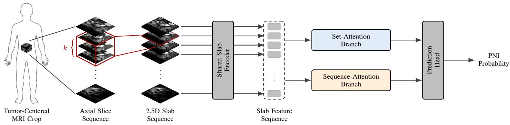
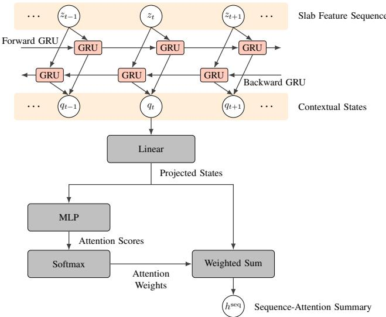
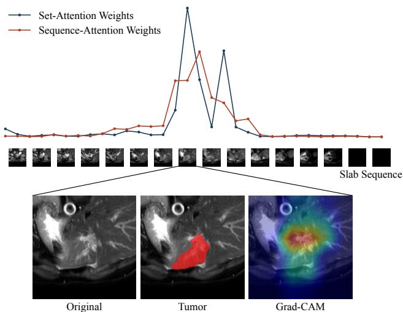

# Order-Aware 2.5D Multiple Instance Learning for Preoperative MRI-Based Perineural Invasion Risk Assessment in Intrahepatic Cholangiocarcinoma

Hyunsu Go1, Youngung Han1,2, Kyeonghun Kim2, Jinyong Jun1, Junbeom Lee3, Dohyun Kweon2,4, Yului Jeong1, Suah Park1, Sungha Park1, Anna Jung1,

Woo Kyoung Jeong5, Ken Ying-Kai Liao6, Hyuk-Jae Lee1, Nam-Joon Kim1,†

1Seoul National University, Seoul, Republic of Korea 2OUTTA, Seoul, Republic of Korea

3Chung-Ang University, Seoul, Republic of Korea 4 Kyung Hee University, Seoul, Republic of Korea

5Samsung Medical Center, Seoul, Republic of Korea 6NVIDIA AI Technology Center, Taipei, Taiwan

†Corresponding author: knj01@snu.ac.kr

Abstract—Perineural invasion (PNI) is an adverse histopathologic marker in intrahepatic cholangiocarcinoma (ICC), but it is usually confirmed only after resection. Preoperative T2-weighted MRI may provide noninvasive imaging cues predictive of PNI, although labels are available only at the patient level without sliceor voxel-level annotations. We propose Order-Aware Slab Multiple Instance Learning (OAS-MIL), a weakly supervised framework for patient-level PNI prediction. Each tumor-centered MRI crop is represented as an ordered sequence of overlapping 2.5D slabs formed from contiguous axial slices. A shared encoder extracts slab-level features, which are aggregated by a permutationinvariant set-attention branch and a bidirectional sequenceattention branch. Using five-fold label-stratified cross-validation at the patient level, OAS-MIL achieved a mean AUROC of 0.770 ± 0.077, outperforming the evaluated volumetric and MIL baselines. These results suggest that axial order provides a useful inductive bias for weakly supervised PNI prediction from MRI.

Index Terms—Hepatobiliary imaging, medical image analysis, tumor phenotyping, computer-aided diagnosis.

## I. INTRODUCTION

Intrahepatic cholangiocarcinoma (ICC) is an aggressive primary liver malignancy for which surgical resection remains the principal curative-intent treatment. However, postoperative recurrence is common and long-term outcomes remain limited [1]. Perineural invasion (PNI), defined as tumor involvement of nerves or perineural spaces, is a histopathologic marker of tumor aggressiveness [2]. In ICC, surgical studies have associated PNI with recurrence and worse survival after curative-intent resection [3], [4]. These findings motivate preoperative PNI prediction as a complementary risk-stratification approach.

Despite its clinical relevance, PNI is difficult to identify preoperatively because the reference standard is microscopic pathologic assessment after surgery, whereas routine MRI does not provide nerve-level or slice-level labels for model training [2]. Previous studies have investigated noninvasive PNI prediction using CT radiomics and clinicoradiological machinelearning models [5]. More recently, deep learning approaches have explored PNI prediction from 3D MRI [6]–[8]. These studies support image-based PNI risk modeling, but they also highlight a weak-supervision gap: the endpoint is assigned at the patient level, while local imaging evidence is not annotated.

Medical images can encode tumor phenotypes that are relevant to clinical endpoints [9], [10]. For MRI-based PNI prediction, however, a model must aggregate information over a tumor-centered volume without assuming slice-, voxel-, or nerve-level supervision. Multiple instance learning (MIL) is well-suited to this setting because a bag of instances can be supervised by one bag-level label [11]–[13]. Attention-based MIL provides a differentiable bag-pooling mechanism [14], and related weakly supervised aggregation approaches have been widely used in medical image analysis and computational pathology [15]–[17].

A key modeling issue is how to represent volumetric MRI. Fully volumetric encoders preserve 3D context, but their memory footprint and optimization burden are higher than slicewise processing, especially when clinical cohorts are small [18]– [20]. Slice-wise 2D encoders are efficient but cannot directly model local through-plane continuity. A 2.5D formulation, in which adjacent slices are stacked as channels, offers a practical compromise by retaining local cross-slice information while using efficient 2D-style feature extraction [21], [22]. In tumorcentered MRI, such slabs are not exchangeable observations: their axial order encodes anatomical continuity. Permutationinvariant MIL may therefore underuse through-plane patterns available in the ordered slab sequence.

This paper proposes Order-Aware Slab MIL (OAS-MIL) for weakly supervised prediction of PNI status from preoperative T2-weighted MRI. The model retains a set-attention branch and adds a sequence-attention branch that reads the slab sequence with bidirectional context before patient-level pooling. The contributions are as follows:

• We formulate MRI-based PNI prediction as ordered 2.5D MIL, where each tumor-centered T2-weighted MRI crop is represented as a complete sequence of contiguous slabs under patient-level supervision.

• We introduce a sequence-attention branch that models axial order with a bidirectional recurrent reader and produces normalized slab-level aggregation weights.

• We evaluate the proposed model against volumetric and MIL baselines using five-fold label-stratified crossvalidation at the patient level, with ablations of the slab representation, branch aggregation, and sequence reader.

  
Fig. 1. Overview of OAS-MIL. A tumor-centered T2-weighted MRI crop is represented as an ordered bag of contiguous 2.5D slabs. A shared encoder extracts slab features. Patient-level probability estimation combines order-agnostic set-attention pooling with sequence-aware attention pooling.

## II. METHODS

## A. Problem Formulation and Preprocessing

For patient $i \in \{ 1 , \ldots , N \}$ , let $X _ { i } \in \mathbb { R } ^ { H \times W \times D }$ denote the preprocessed tumor-centered T2-weighted MRI crop and let $y _ { i } \in \{ 0 , 1 \}$ denote the PNI label. The classifier estimates a patient-level logit and probability,

$$
\ell _ { i } = f _ { \boldsymbol { \Theta } } ( X _ { i } ) , \qquad \hat { p } _ { i } = \sigma ( \ell _ { i } ) .\tag{1}
$$

Each crop is resampled to $1 . 0 \times 1 . 0 \times 5 . 0$ mm spacing and fixed to a physical field of view of $1 9 2 \times 1 9 2 \times 1 6 0$ mm, yielding $H = W = 1 9 2$ and $D = 3 2 .$ . Intensities are clipped at the 0.5th and 99.5th percentiles and normalized within the crop using robust z-score normalization.

## B. Ordered 2.5D Slab Construction

Let $\pmb { x } _ { i , t } ~ \in ~ \mathbb { R } ^ { H \times W }$ be the axial slice at position $t \in$ $\{ 1 , \ldots , D \}$ . For an odd slab size $k = 2 r + 1$ , the slab centered at t is

$$
S _ { i , t } ^ { ( k ) } = \bigl [ \pmb { x } _ { i , \kappa ( t - r ) } , \dotsc , \pmb { x } _ { i , \kappa ( t ) } , \dotsc , \pmb { x } _ { i , \kappa ( t + r ) } \bigr ] \in \mathbb { R } ^ { H \times W \times k } ,\tag{2}
$$

where $\kappa ( u ) = \mathrm { m i n } \{ \mathrm { m a x } ( u , 1 ) , D \}$ clamps out-of-range indices. This boundary handling keeps one slab per axial position. The ordered patient bag is

$$
B _ { i } ^ { ( k ) } = \left( S _ { i , 1 } ^ { ( k ) } , S _ { i , 2 } ^ { ( k ) } , \ldots , S _ { i , D } ^ { ( k ) } \right) ,\tag{3}
$$

with the same through-plane order as the original crop. Unless otherwise specified, experiments use $k = 3$

## C. Shared Slab Encoder

Each slab is encoded by a shared ResNet-18 backbone [23]. Let $g _ { \theta }$ denote the adapted backbone. The slab feature is

$$
z _ { i , t } = g _ { \theta } \left( S _ { i , t } ^ { ( k ) } \right) \in \mathbb { R } ^ { d } ,\tag{4}
$$

where $d \ : = \ : 5 1 2$ . The same encoder is applied to all slab positions.

The first convolution of the pretrained ResNet-18 is adapted to the slab size using grayscale-based symmetric initialization.

If $W _ { \mathrm { r g b } } \in \mathbb { R } ^ { \ast }$ Co×3×h×w denotes the pretrained RGB convolution, a grayscale basis is obtained by

$$
\bar { W } = \frac { 1 } { 3 } \sum _ { a = 1 } ^ { 3 } W _ { \mathrm { r g b } } [ : , a , : , : ] \in \mathbb { R } ^ { C _ { o } \times h \times w } .\tag{5}
$$

For a k-channel slab input, each channel of the adapted convolution is initialized as

$$
W ^ { ( k ) } [ : , j , : , : ] = \frac { 3 } { k } \bar { W } , \qquad j = 1 , \ldots , k .\tag{6}
$$

This provides a symmetric channel initialization while keeping the first-layer response scale comparable across slab sizes.

## D. Set-Attention Branch

The set-attention branch performs additive attention pooling over the slab bag. It computes scalar scores and normalizes them across instances:

$$
r _ { i , t } ^ { \mathrm { s e t } } = { v } _ { \mathrm { s e t } } ^ { \top } \operatorname { t a n h } ( W _ { \mathrm { s e t } } z _ { i , t } + b _ { \mathrm { s e t } } ) ,\tag{7}
$$

$$
\alpha _ { i , t } = \frac { \exp ( r _ { i , t } ^ { \mathrm { s e t } } ) } { \sum _ { u = 1 } ^ { D } \exp ( r _ { i , u } ^ { \mathrm { s e t } } ) } .\tag{8}
$$

The set-attention summary is

$$
h _ { i } ^ { \mathrm { s e t } } = \sum _ { t = 1 } ^ { D } \alpha _ { i , t } z _ { i , t } .\tag{9}
$$

This branch provides a permutation-invariant pooling path.

## E. Sequence-Attention Branch

The sequence-attention branch models the slab features as an axial sequence. A one-layer bidirectional gated recurrent unit (GRU) produces contextual states [24], [25]:

$$
\begin{array} { r } { \overrightarrow { \mathbf { q } } _ { i , t } = \mathrm { G R U } _ { \mathrm { f } } ( z _ { i , t } , \overrightarrow { \mathbf { q } } _ { i , t - 1 } ) , } \end{array}\tag{10}
$$

$$
\left\{ \overline { { \pmb { q } } } _ { i , t } = \mathrm { G R U } _ { \mathrm { b } } ( \pmb { z } _ { i , t } , \overleftarrow { \pmb { q } } _ { i , t + 1 } ) . \right.\tag{11}
$$

The two directional states are concatenated and projected to the common feature dimension:

$$
\pmb { q } _ { i , t } = \left[ \overrightarrow { \pmb { q } } _ { i , t } ; \overleftarrow { \pmb { q } } _ { i , t } \right] ,\tag{12}
$$

$$
\pmb { u } _ { i , t } = \pmb { W } _ { \mathrm { p r o j } } \pmb { q } _ { i , t } + \pmb { b } _ { \mathrm { p r o j } } \in \mathbb { R } ^ { d } .\tag{13}
$$

  
Fig. 2. Sequence-attention branch. Bidirectional recurrent context is projected to the common feature dimension before attention scoring; aggregation weights and the weighted summary are computed from the projected sequence states.

Attention scores and normalized through-plane weights are computed from the projected states:

$$
r _ { i , t } ^ { \mathrm { s e q } } = { v } _ { \mathrm { s e q } } ^ { \top } \operatorname { t a n h } ( W _ { \mathrm { s e q } } \pmb { u } _ { i , t } + b _ { \mathrm { s e q } } ) ,\tag{14}
$$

$$
\beta _ { i , t } = \frac { \exp ( r _ { i , t } ^ { \mathrm { s e q } } ) } { \sum _ { u = 1 } ^ { D } \exp ( r _ { i , u } ^ { \mathrm { s e q } } ) } .\tag{15}
$$

The sequence-attention summary is

$$
h _ { i } ^ { \mathrm { s e q } } = \sum _ { t = 1 } ^ { D } \beta _ { i , t } { \mathbf { \boldsymbol { u } } } _ { i , t } .\tag{16}
$$

## F. Prediction Head and Training Objective

The branch summaries are normalized with a shared Layer-Norm, concatenated, and passed through a prediction head:

$$
\begin{array} { r } { \pmb { h } _ { i } ^ { \mathrm { c a t } } = [ \mathrm { L N } ( \pmb { h } _ { i } ^ { \mathrm { s e t } } ) ; \mathrm { L N } ( \pmb { h } _ { i } ^ { \mathrm { s e q } } ) ] , } \end{array}\tag{17}
$$

$$
\begin{array} { r } { \pmb { h } _ { i } ^ { \mathrm { p r e d } } = \mathrm { G E L U } ( \pmb { W } _ { 1 } \pmb { h } _ { i } ^ { \mathrm { c a t } } + \pmb { b } _ { 1 } ) , } \end{array}\tag{18}
$$

$$
\ell _ { i } = v _ { 2 } ^ { \top } h _ { i } ^ { \mathrm { p r e d } } + b _ { 2 } .\tag{19}
$$

Dropout is applied during training in the feed-forward compo nents. The network is optimized with positive-class-weighted binary cross-entropy with logits, where the positive-class weight is computed from the training split.

## III. EXPERIMENTS AND RESULTS

## A. Data and Evaluation Protocol

The evaluation used a single-center cohort of 183 patients who underwent preoperative T2-weighted MRI, including 70 PNI-positive and 113 PNI-negative patients. Tumor-centered crops were extracted from the MRI based on expert-annotated tumor masks created with 3D Slicer [26]. Performance was estimated using five-fold label-stratified cross-validation at the patient level. In each split, three folds were used for training, one fold was used for checkpoint selection and early stopping, and the remaining fold was held out for testing. Volumetric baselines operated on the preprocessed crop, whereas MIL baselines operated on the same ordered 2.5D slab instances. Unless otherwise specified, performance values are reported as mean ± standard deviation across the five held-out test folds.

TABLE I  
PERFORMANCE COMPARISON WITH VOLUMETRIC AND MIL BASELINES.
<table><tr><td>Model</td><td>AUROC</td><td>AUPRC</td></tr><tr><td>Volumetric models</td><td></td><td></td></tr><tr><td>ResNet-18 [23]</td><td> $0 . 6 4 5 \pm 0 . 0 9 0$ </td><td> $0 . 5 6 3 \pm 0 . 0 5 8$ </td></tr><tr><td>DenseNet-121 [31]</td><td> $0 . 6 5 6 \pm 0 . 0 1 7$ </td><td> $0 . 5 8 5 \pm 0 . 0 6 6$ </td></tr><tr><td>Vision Transformer [32]</td><td> $0 . 5 7 3 \pm 0 . 0 4 5$ </td><td> $0 . 4 5 7 \pm 0 . 0 3 5$ </td></tr><tr><td>Swin Transformer [33]</td><td> $0 . 6 4 2 \pm 0 . 0 5 3$ </td><td> $0 . 5 3 1 \pm 0 . 0 5 4$ </td></tr><tr><td>MIL models</td><td></td><td></td></tr><tr><td>ABMIL [14]</td><td> $0 . 6 7 5 \pm 0 . 0 8 0$ </td><td> $0 . 6 0 5 \pm 0 . 1 0 9$ </td></tr><tr><td>CLAM-SB [15]</td><td> $0 . 7 0 5 \pm 0 . 0 7 1$ </td><td> $0 . 6 0 8 \pm 0 . 1 1 8$ </td></tr><tr><td>DSMIL [16]</td><td> $0 . 6 7 8 \pm 0 . 1 0 0$ </td><td> $0 . 5 8 5 \pm 0 . 1 3 1$ </td></tr><tr><td>TransMIL [17]</td><td> $0 . 6 3 9 \pm 0 . 0 6 1$ </td><td> $0 . 5 4 9 \pm 0 . 0 9 5$ </td></tr><tr><td>OAS-MIL (ours)</td><td> $\mathbf { 0 . 7 7 0 \pm 0 . 0 7 7 }$ </td><td> $\mathbf { 0 . 6 9 2 \pm 0 . 0 9 3 }$ </td></tr></table>

AUROC was the primary metric, and AUPRC was used as a complementary metric for the imbalanced endpoint [27]–[29]. DeLong’s method was used for the paired AUROC comparison between OAS-MIL and CLAM-SB [30].

## B. Implementation Details

The model was optimized end-to-end using AdamW. The encoder learning rate was $3 \times 1 0 ^ { - 5 }$ , and the aggregation and prediction heads used $3 \times 1 0 ^ { - 4 }$ . Training used a batch size of 4 for at most 50 epochs, with early stopping patience 10 based on validation AUROC. Dropout was set to 0.25. The sequence reader was a one-layer bidirectional GRU with hidden size 128 per direction. The attention dimension was 128 for both the set-attention and sequence-attention branches. The weighted binary cross-entropy objective was implemented with a numerically stable logits-based loss, and automatic mixed precision was used during training. Experiments were run on an NVIDIA RTX PRO 6000 Blackwell Server Edition GPU.

## C. Comparison with Baselines

Table I compares volumetric models with MIL-based alternatives. OAS-MIL achieved the highest mean performance among the evaluated models, with an AUROC of $0 . 7 7 0 \pm 0 . 0 7 7$ and an AUPRC of $0 . 6 9 2 \pm 0 . 0 9 3$ . The strongest MIL baseline was CLAM-SB, which achieved an AUROC of $0 . 7 0 5 \pm 0 . 0 7 1$ and an AUPRC of $0 . 6 0 8 { \pm } 0 . 1 1 8$ . Beyond the fold-wise summaries, DeLong’s test showed a positive paired AUROC difference for OAS-MIL over CLAM-SB, with a 95% confidence interval of [0.001, 0.169].

## D. Ablation Analysis

Table II evaluates the slab representation, branch aggregation, and sequence reader under the same training protocol. The ablation results indicate that the 3-slice slab representation, fused set- and sequence-attention aggregation, and bidirectional GRU reader produced the strongest overall results under the fixed training protocol.

TABLE II  
ABLATION ANALYSIS UNDER THE FIXED END-TO-END TRAINING PROTOCOL.
<table><tr><td>Variant</td><td>AUROC</td><td>AUPRC</td></tr><tr><td>Instance representation</td><td></td><td></td></tr><tr><td>Single-slice instances (k = 1)</td><td> $0 . 7 5 7 \pm 0 . 0 5 8$ </td><td> $0 . 6 6 5 \pm 0 . 0 7 1$ </td></tr><tr><td>3-slice 2.5D slabs (k = 3, ours)</td><td> $\mathbf { 0 . 7 7 0 \pm 0 . 0 7 7 }$ </td><td> $\mathbf { 0 . 6 9 2 \pm 0 . 0 9 3 }$ </td></tr><tr><td>5-slice 2.5D slabs (k = 5)</td><td> $0 . 7 2 7 \pm 0 . 0 5 2$ </td><td> $0 . 6 6 5 \pm 0 . 0 7 7$ </td></tr><tr><td>Branch aggregation</td><td></td><td></td></tr><tr><td>Set-attention branch only</td><td> $0 . 7 0 3 \pm 0 . 0 4 6$ </td><td> $0 . 6 3 2 \pm 0 . 0 7 8$ </td></tr><tr><td>Sequence-attention branch only</td><td> $0 . 7 2 5 \pm 0 . 0 8 0$ </td><td> $0 . 6 7 3 \pm 0 . 1 2 8$ </td></tr><tr><td>Set- and sequence-attention branches (ours)</td><td> $\mathbf { 0 . 7 7 0 \pm 0 . 0 7 7 }$ </td><td> $\mathbf { 0 . 6 9 2 \pm 0 . 0 9 3 }$ </td></tr><tr><td>Sequence reader</td><td></td><td></td></tr><tr><td>1D convolution</td><td> $0 . 7 0 6 \pm 0 . 0 6 9$ </td><td> $0 . 6 2 6 \pm 0 . 0 6 8$ </td></tr><tr><td>Transformer encoder</td><td> $0 . 7 3 8 \pm 0 . 1 0 1$ </td><td> $0 . 6 9 1 \pm 0 . 1 2 0$ </td></tr><tr><td>Unidirectional GRU</td><td> $0 . 7 2 4 \pm 0 . 0 6 1$ </td><td> $0 . 6 5 5 \pm 0 . 0 8 0$ </td></tr><tr><td>Bidirectional GRU (ours)</td><td> $\mathbf { 0 . 7 7 0 \pm 0 . 0 7 7 }$ </td><td> $\mathbf { 0 . 6 9 2 \pm 0 . 0 9 3 }$ </td></tr><tr><td>Bidirectional LSTM</td><td> $0 . 7 3 6 \pm 0 . 0 7 1$ </td><td> $0 . 6 4 4 \pm 0 . 0 5 6$ </td></tr></table>

TABLE III  
COMPUTATIONAL PROFILES OF THE EVALUATED MODELS.
<table><tr><td>Model</td><td>Params. (M)</td><td>MACs (G)</td><td>Peak mem. (MB)</td><td>Time (ms)</td></tr><tr><td>Volumetric models</td><td></td><td></td><td></td><td></td></tr><tr><td>ResNet-18</td><td>33.15</td><td>295.64</td><td>709.05</td><td>12.19</td></tr><tr><td>DenseNet-121</td><td>25.22</td><td>51.87</td><td>242.35</td><td>9.11</td></tr><tr><td>Vision Transformer</td><td>51.89</td><td>152.81</td><td>629.45</td><td>16.82</td></tr><tr><td>Swin Transformer</td><td>15.70</td><td>13.91</td><td>2124.71</td><td>18.41</td></tr><tr><td>MIL models</td><td></td><td></td><td></td><td></td></tr><tr><td>ABMIL</td><td>11.47</td><td>42.65</td><td>235.45</td><td>3.00</td></tr><tr><td>CLAM-SB</td><td>11.47</td><td>42.65</td><td>235.45</td><td>2.48</td></tr><tr><td>DSMIL</td><td>11.57</td><td>42.65</td><td>235.82</td><td>2.82</td></tr><tr><td>TransMIL</td><td>14.10</td><td>42.73</td><td>245.48</td><td>8.24</td></tr><tr><td>OAS-MIL (ours)</td><td>13.25</td><td>42.66</td><td>208.72</td><td>3.45</td></tr></table>

## E. Crop Localization Sensitivity

To assess sensitivity to crop localization, we performed a testtime perturbation analysis without retraining. For each case, we generated three perturbed crops by independently sampling inplane offsets from U(−10, 10) mm and a through-plane offset from $\{ - 1 , 0 , + 1 \}$ axial slices. With perturbed crops, OAS-MIL achieved an AUROC of 0.759 ± 0.069 and an AUPRC of $0 . 6 8 2 { \pm } 0 . 0 5 2$ , remaining close to the unperturbed performance. These results indicate that performance was largely preserved within the tested perturbation range.

## F. Computational Profile

Table III reports model size, multiply–accumulate operations, peak GPU memory, and forward time. Peak memory denotes the maximum allocated GPU memory during one forward pass after resetting peak-memory statistics. Forward time is the median latency over 10 forward passes after 5 warm-up passes on a single GPU.

## G. Qualitative Analysis

For qualitative analysis, we visualize the set-attention and sequence-attention weights on the ordered slab sequence and compute Grad-CAM from the patient-level logit [34]. Figure 3 shows a PNI-positive example. In this example, the aggregation weights concentrate over a limited slab interval near the tumor containing region, and Grad-CAM shows a coarse response around the tumor and adjacent tissue. These outputs are qualitative audit cues rather than voxel-level PNI localization.

  
Fig. 3. Qualitative analysis of a PNI-positive patient. The top panel shows the branch-wise aggregation-weight profiles over the ordered 2.5D slab montage. The bottom panel shows the selected slab, the tumor-mask overlay used for visual reference, and the Grad-CAM overlay.

## IV. DISCUSSION

OAS-MIL achieved the highest mean discrimination among the evaluated models, suggesting that sequence-aware aggregation can complement permutation-invariant MIL pooling for patient-level PNI prediction. The ablation results further showed that the 3-slice slab representation, combined set- and sequence-attention branches, and bidirectional GRU provided the strongest overall performance. The main limitation is the small single-center cohort, which limits the precision and generalizability of the performance estimates. External validation is needed to assess robustness across scanners, imaging protocols, and institutions.

## V. CONCLUSION

This paper presented OAS-MIL, an order-aware 2.5D MIL framework for predicting PNI from preoperative T2-weighted MRI in patients with ICC. The method represents each tumorcentered MRI crop as an ordered slab bag and combines setattention pooling with sequence-aware aggregation. Using fivefold label-stratified cross-validation at the patient level, OAS-MIL achieved a mean AUROC of 0.770±0.077, outperforming the evaluated volumetric and MIL baselines. These results suggest that axial order provides a useful inductive bias for weakly supervised PNI prediction from MRI in this cohort.

## ACKNOWLEDGMENT

This work was supported by a grant from the Institute of Information & Communications Technology Planning & Evaluation (IITP), funded by the Ministry of Science and ICT (MSIT), Republic of Korea (No. 2020-0-01305, “Development of AI Deep-Learning Processor and Module for 2,000 TFLOPS Server”).

[1] J. M. Banales, J. J. Marin, A. Lamarca, P. M. Rodrigues, S. A. Khan, L. R. Roberts, V. Cardinale, G. Carpino, J. B. Andersen, C. Braconi et al., “Cholangiocarcinoma 2020: the next horizon in mechanisms and management,” Nature reviews Gastroenterology & hepatology, vol. 17, no. 9, pp. 557–588, 2020.

[2] C. Liebig, G. Ayala, J. A. Wilks, D. H. Berger, and D. Albo, “Perineural invasion in cancer: a review of the literature,” Cancer: Interdisciplinary International Journal of the American Cancer Society, vol. 115, no. 15, pp. 3379–3391, 2009.

[3] K. Shirai, T. Ebata, K. Oda, H. Nishio, T. Nagasaka, Y. Nimura, and M. Nagino, “Perineural invasion is a prognostic factor in intrahepatic cholangiocarcinoma,” World journal of surgery, vol. 32, no. 11, pp. 2395–2402, 2008.

[4] Z. Zhang, Y. Zhou, K. Hu, D. Wang, Z. Wang, and Y. Huang, “Perineural invasion as a prognostic factor for intrahepatic cholangiocarcinoma after curative resection and a potential indication for postoperative chemotherapy: a retrospective cohort study,” BMC Cancer, vol. 20, no. 1, p. 270, 2020.

[5] Z. Liu, C. Luo, X. Chen, Y. Feng, J. Feng, R. Zhang, F. Ouyang, X. Li, Z. Tan, L. Deng et al., “Noninvasive prediction of perineural invasion in intrahepatic cholangiocarcinoma by clinicoradiological features and computed tomography radiomics based on interpretable machine learning: a multicenter cohort study,” International Journal of Surgery, vol. 110, no. 2, pp. 1039–1051, 2024.

[6] Y. Han, H. Go, K. Kim, I. Um, J. Kim, J. Jung, N.-J. Kim, W. K. Jeong, W. J. Lee, K. Y.-K. Liao et al., “Losa-net: A localized and scale-adaptive network for boundary-sensitive prediction of perineural invasion in 3d mri,” in 2026 IEEE 23rd International Symposium on Biomedical Imaging (ISBI). IEEE, 2026, pp. 1–5.

[7] H. Go, Y. Han, K. Kim, J. Kim, D. Kweon, J. Jun, S. Park, A. Jung, I. Um, Y. Jeong et al., “Anatomy-privileged distillation with token routing for mri based prediction of perineural invasion,” arXiv preprint arXiv:2607.11987, 2026.

[8] Y. Han, I. Um, K. Kim, J. Kim, H. Go, J. Jung, N.-J. Kim, W. K. Jeong, W. J. Lee, P. Hong et al., “Mma-former: Multi-window mixture-of-head attention transformer for adaptive pni prediction in 3d mri,” in 2026 IEEE 23rd International Symposium on Biomedical Imaging (ISBI). IEEE, 2026, pp. 1–5.

[9] P. Lambin, E. Rios-Velazquez, R. Leijenaar, S. Carvalho, R. G. van Stiphout, P. Granton, C. M. Zegers, R. Gillies, R. Boellard, A. Dekker, and H. J. Aerts, “Radiomics: Extracting more information from medical images using advanced feature analysis,” European Journal of Cancer, vol. 48, no. 4, pp. 441–446, 2012. [Online]. Available: https://www.sciencedirect.com/science/article/pii/S0959804911009993

[10] R. J. Gillies, P. E. Kinahan, and H. Hricak, “Radiomics: images are more than pictures, they are data,” Radiology, vol. 278, no. 2, pp. 563–577, 2016.

[11] T. G. Dietterich, R. H. Lathrop, and T. Lozano-Perez, “Solving the´ multiple instance problem with axis-parallel rectangles,” Artificial Intelligence, vol. 89, no. 1–2, pp. 31–71, 1997.

[12] O. Maron and T. Lozano-Perez, “A framework for multiple-instance´ learning,” in Advances in Neural Information Processing Systems, M. Jordan, M. Kearns, and S. Solla, Eds., vol. 10. MIT Press, 1997, pp. 570–576. [Online]. Available: https://proceedings.neurips.cc/paper files/paper/1997/file/82965d4ed8150294d4330ace00821d77-Paper.pdf

[13] M.-A. Carbonneau, V. Cheplygina, E. Granger, and G. Gagnon, “Multiple instance learning: A survey of problem characteristics and applications,” Pattern recognition, vol. 77, pp. 329–353, 2018.

[14] M. Ilse, J. Tomczak, and M. Welling, “Attention-based deep multiple instance learning,” in International conference on machine learning. PMLR, 2018, pp. 2127–2136.

[15] M. Y. Lu, D. F. K. Williamson, T. Y. Chen, R. J. Chen, M. Barbieri, and F. Mahmood, “Data-efficient and weakly supervised computational pathology on whole-slide images,” Nature Biomedical Engineering, vol. 5, no. 6, pp. 555–570, 2021.

[16] B. Li, Y. Li, and K. W. Eliceiri, “Dual-stream multiple instance learning network for whole slide image classification with self-supervised contrastive learning,” in Proceedings of the IEEE/CVF conference on computer vision and pattern recognition, 2021, pp. 14 318–14 328.

[17] Z. Shao, H. Bian, Y. Chen, Y. Wang, J. Zhang, X. Ji, and Y. Zhang, “TransMIL: Transformer based correlated multiple instance learning

for whole slide image classification,” Advances in neural information processing systems, vol. 34, pp. 2136–2147, 2021.

[18] O.¨ C¸ ic¸ek, A. Abdulkadir, S. S. Lienkamp, T. Brox, and O. Ronneberger, “3D U-Net: Learning dense volumetric segmentation from sparse annotation,” in International conference on medical image computing and computer-assisted intervention. Springer, 2016, pp. 424–432.

[19] F. Milletari, N. Navab, and S.-A. Ahmadi, “V-Net: Fully convolutional neural networks for volumetric medical image segmentation,” in 2016 fourth international conference on 3D vision (3DV). IEEE, 2016, pp. 565–571.

[20] N. Tajbakhsh, J. Y. Shin, S. R. Gurudu, R. T. Hurst, C. B. Kendall, M. B. Gotway, and J. Liang, “Convolutional neural networks for medical image analysis: Full training or fine tuning?” IEEE transactions on medical imaging, vol. 35, no. 5, pp. 1299–1312, 2016.

[21] A. A. A. Setio, F. Ciompi, G. Litjens, P. Gerke, C. Jacobs, S. J. Van Riel, M. M. W. Wille, M. Naqibullah, C. I. Sanchez, and B. Van Ginneken,´ “Pulmonary nodule detection in CT images: false positive reduction using multi-view convolutional networks,” IEEE transactions on medical imaging, vol. 35, no. 5, pp. 1160–1169, 2016.

[22] H. R. Roth, L. Lu, A. Farag, H.-C. Shin, J. Liu, E. B. Turkbey, and R. M. Summers, “DeepOrgan: Multi-level deep convolutional networks for automated pancreas segmentation,” in International conference on medical image computing and computer-assisted intervention. Springer, 2015, pp. 556–564.

[23] K. He, X. Zhang, S. Ren, and J. Sun, “Deep residual learning for image recognition,” in Proceedings of the IEEE conference on computer vision and pattern recognition, 2016, pp. 770–778.

[24] K. Cho, B. Van Merrienboer,¨ C¸ . Gulc¸ehre, D. Bahdanau, F. Bougares, H. Schwenk, and Y. Bengio, “Learning phrase representations using RNN encoder–decoder for statistical machine translation,” in Proceedings of the 2014 conference on empirical methods in natural language processing (EMNLP), 2014, pp. 1724–1734.

[25] M. Schuster and K. K. Paliwal, “Bidirectional recurrent neural networks,” IEEE transactions on Signal Processing, vol. 45, no. 11, pp. 2673–2681, 1997.

[26] A. Fedorov, R. Beichel, J. Kalpathy-Cramer, J. Finet, J.-C. Fillion-Robin, S. Pujol, C. Bauer, D. Jennings, F. Fennessy, M. Sonka, J. Buatti, S. Aylward, J. V. Miller, S. Pieper, and R. Kikinis, “3D Slicer as an image computing platform for the quantitative imaging network,” Magnetic resonance imaging, vol. 30, no. 9, pp. 1323–1341, 2012.

[27] J. A. Hanley and B. J. McNeil, “The meaning and use of the area under a receiver operating characteristic (ROC) curve,” Radiology, vol. 143, no. 1, pp. 29–36, 1982.

[28] E. W. Steyerberg, A. J. Vickers, N. R. Cook, T. Gerds, M. Gonen, N. Obuchowski, M. J. Pencina, and M. W. Kattan, “Assessing the performance of prediction models: a framework for traditional and novel measures,” Epidemiology, vol. 21, no. 1, pp. 128–138, 2010.

[29] T. Saito and M. Rehmsmeier, “The precision-recall plot is more informative than the ROC plot when evaluating binary classifiers on imbalanced datasets,” PLOS ONE, vol. 10, no. 3, p. e0118432, 2015.

[30] E. R. DeLong, D. M. DeLong, and D. L. Clarke-Pearson, “Comparing the areas under two or more correlated receiver operating characteristic curves: A nonparametric approach,” Biometrics, vol. 44, no. 3, pp. 837–845, 1988. [Online]. Available: http://www.jstor.org/stable/2531595

[31] G. Huang, Z. Liu, L. Van Der Maaten, and K. Q. Weinberger, “Densely connected convolutional networks,” in Proceedings of the IEEE conference on computer vision and pattern recognition, 2017, pp. 4700–4708.

[32] A. Dosovitskiy, L. Beyer, A. Kolesnikov, D. Weissenborn, X. Zhai, T. Unterthiner, M. Dehghani, M. Minderer, G. Heigold, S. Gelly, J. Uszkoreit, and N. Houlsby, “An image is worth 16x16 words: Transformers for image recognition at scale,” in International Conference on Learning Representations, 2021. [Online]. Available: https://openreview.net/forum?id=YicbFdNTTy

[33] Y. Tang, D. Yang, W. Li, H. R. Roth, B. Landman, D. Xu, V. Nath, and A. Hatamizadeh, “Self-supervised pre-training of Swin Transformers for 3D medical image analysis,” in Proceedings of the IEEE/CVF conference on computer vision and pattern recognition, 2022, pp. 20 730–20 740.

[34] R. R. Selvaraju, M. Cogswell, A. Das, R. Vedantam, D. Parikh, and D. Batra, “Grad-CAM: Visual explanations from deep networks via gradient-based localization,” in Proceedings of the IEEE international conference on computer vision, 2017, pp. 618–626.