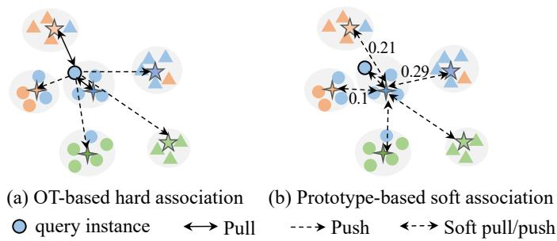
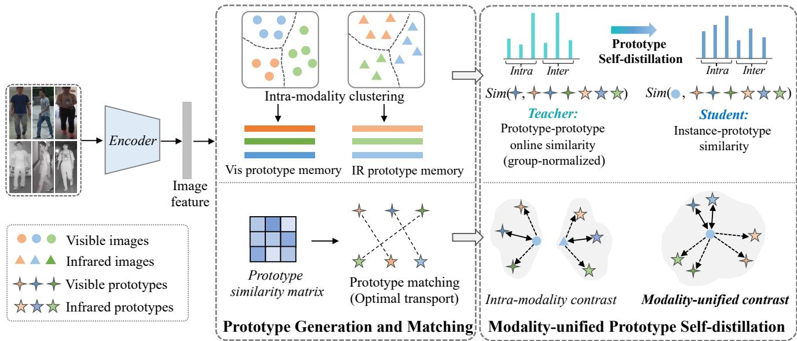
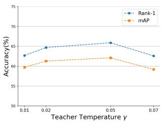
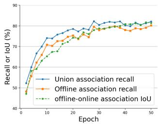
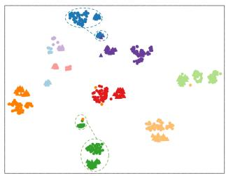
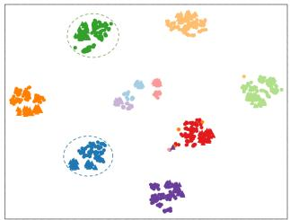

# Prototype Maters: Modality-unified Prototype Self-distillation for Unsupervised Visible-infrared Person Re-identification

Menglin Wang   
Nanjing Normal University   
Nanjing, China   
lynnwang6875@gmail.com

## Abstract

Estimating reliable cross-modality association is crucial to unsupervised visible-infrared person re-ID. While optimal transport is shown to be a practical solution for cross-modality association, it sufers from the rigidness of hard label assignment without considering the impact of cluster noise. Moreover, enforcing only crossmodality contrast is also suboptimal, as it fails to jointly optimize the similarity relation within and across modality. In this paper, we propose a novel framework for cross-modality learning by well exploitation of prototypes: First, instead of contrasting with crossmodality prototypes, we show that modality-unified prototypical contrast facilitates better modality invariance by jointly and simultaneously optimizing similarity relation within and across-modality. Taking self-prototype as a steady teacher, we further refine the instance-prototype online relation through prototype-guided self distillation. The two components are optimized in a unified framework, leading to a simple yet efective model. On standard VI-ReID benchmarks, we perform extensive comparison and analysis, validating the efectiveness of our proposed method. Code is available at: https://github.com/Terminator8758/PoSeD.

## CCS Concepts

• Information systems → Top-k retrieval in databases.

## Keywords

Person re-identification, Prototype, Distillation learning, Unsupervised learning

## ACM Reference Format:

Menglin Wang and Xiaojin Gong. 2026. Prototype Matters: Modality-unified Prototype Self-distillation for Unsupervised Visible-infrared Person Reidentification. In Proceedings of the 34th ACM International Conference on Multimedia (MM ’26), November 10–14, 2026, Rio de Janeiro, Brazil. ACM, New York, NY, USA, 10 pages. https://doi.org/10.1145/3767308.3836534

## 1 Introduction

One of the research focus of person re-identification (re-ID) in recent years is to enable day-to-night person retrieval. To achieve this, visible-infrared re-ID is proposed, matching person images captured by visible cameras in the daytime, with images captured by infrared cameras at night or low-light conditions. Existing VI re-ID methods have achieved promising performance by designing

Xiaojin Gong Zhejiang University Hangzhou, China gongxj@zju.edu.cn

modality-specific network architectures [29, 37, 40], introducing color-based data augmentations to mitigate modality gap [11, 38, 42], or leveraging textual modality [9, 45] to provide assistance in visual representation. Despite the progress, the supervised methods rely on costly annotation within and across modalities, limiting their practical application. As a result, unsupervised visible-infrared re-ID (UnVI-reID) has received increasing attention recently.

Compared to supervised scenario, the main challenge in UnVIreID is the estimation of reliable intra- and cross-modality associations under significant modality discrepancy [27, 29]. Following the practice of single-modality unsupervised re-ID [5–7], paradigms like iterative clustering and fine-tuning can be readily applied for intra-modality learning in UnVI-reID. The cross-modality learning, however, struggles in obtaining reliable association due to the modality gap. A commonly adopted strategy is to match the intra-modality obtained clusters through optimal transport based algorithms [31] such as Hungarian matching, then utilize the matching result for cross-modality optimization. However, such learning paradigm presents two critical limitations:

First, the intra-modality obtained clusters are inevitably noisy, rendering the cross-modality hard matching assignment suboptimal. Intuitively, considering the noise within clusters, a visible cluster should be matched to infrared clusters with soft probability according to their semantic consistency. Moreover, as the cluster prototypes are updated on-the-fly during batch-wise training, their semantic relations might change and drift from the early ofline matching, necessitating a more reliable association strategy that perceives online prototype similarity dynamics.

Second, the cross-modality feature optimization is another issue worth attention. Due to modality gap, the cross-modality similarity is significantly lower than intra-modality similarity. Commonlyutilized cross-modality contrastive loss only pulls the instance closer to its matched cross-modality prototype compared to other cross-modality prototypes. Without explicitly addressing intra- and cross-modality similarity discrepancy, the generalization ability of learned representation is likely to be compromised when facing severe modality shift.

Given the cross-modality similarity discrepancy, we argue that modality-unified contrastive optimization that explicitly considers the modality gap is a better alternative for cross-modality optimization. Instead of only optimizing the similarity between an instance and its cross-modality prototypes, we propose to jointly optimize the instance’s similarity with both intra- and cross-modality pro totypes. The main advantage of modality-unified optimization is allowing the model to simultaneously perceive the similarity disparity within and across-modality, so that the model learns to optimize cross-modality semantic relations with reference to intra-modality similarity distribution. Through such optimization, the model is forced to perceive and reduce the cross-modality similarity gap, thus achieving modality invariance while seeking for identity discrimination.

  
Figure 1: Illustration on the motivation of modality-unified prototype self-distillation. Diferent color represents diferent identity, and diferent shape denotes diferent modality.

To rectify the instance-to-prototype association, we draw inspiration from the self-distillation mechanism in self- and semisupervised learning [2, 8, 19, 28], and propose a prototype-driven self-distillation strategy. Self-distillation has proven to be an efec tive mechanism for providing supervision from the unlabeled data itself. A common self-distillation strategy is to regard two randomly augmented views of the same image as each other’s teacher, then use one view’s prediction as the distillation target for the other. However, the intra-instance variance is limited to pre-defined aug mentations, and does not enhance the learning of intra-identity semantics which is crucial to identity discrimination.

To better adapt self-distillation into UnVI-reID, we take a look at the online-updated prototypes, and find the centroid prototypes to be a steady-evolving yet more informative substitute for distillation. As centroid prototypes are online updated by intra-cluster instances, they harness the instances variation and reflect the intra-cluster distribution. Therefore, we regard each instance’s self-prototype as the teacher, and derive an instance-adaptive similarity distribution as the online soft distillation target for the instance in consideration. Compared to the ofline optimal-transport (OT) based association, the online distillation rectifies instance-to-prototype association in a soft way, as shown in Figure 1. Moreover, we build the prototypeguided self-distillation upon the proposed modality-unified optimization paradigm, so that the distillation can be integrated for diferent modalities through a modality-aware normalization.

The online association driven by the prototype self-distillation complements the ineficiency of ofline prototype matching, leading to robust cross-modality association estimation. We unify the ofline matching and online distillation within the proposed unified contrastive framework, thereby facilitating modality-invariant yet ID-discriminative representation learning.

To summarize, our main contribution are as follow:

• We propose a simple yet efective framework for UnVI-ReID, ofering a new perspective to exploit prototypes for improving association and model representation learning in the face of modality discrepancy.

• We propose modality-unified contrastive loss to explicitly prototype-guided global simaddress the cross-modality similarity discrepancy. Building on the modality-unified optimization paradigm, we further design a prototype-driven self-distillation loss to rectify the noise of ofline cross-modality matching, by taking prototype as a steady and strong teacher.

• Extensive comparison and ablations on standard VI-reID benchmarks validate the efectiveness of the proposed method.

## 2 Related Work

## llation. Different 2.1 Unsupervised Visible-infrared Re-ID

s different modality.Considering the distribution discrepancy of visible and infrared modalities [27, 29], current UnVI-reID methods usually incorporate both intra-modality and cross-modality learning. For intramodality learning, most methods follow the iterative clustering framework which has proven efective in single-modality unsupervised re-ID [5–7, 25]. Building on this framework, RPNR [43] improves pseudo label by selecting reliable instances within cluster for label re-assignment. NULC [21] leverages the correlation between nearest neighbors and clusters to calibrate the cluster labels and generate loss weight for each instance. CCLNet [4] injects text semantics by learning pseudo text prompts to improve visual representation learning. PCLHD [17] enhances representation learning by designing complementary types of prototypes to capture clusters divergence and variety.

Cross-modality learning focus on improving either cross-modality association quality or representation learning efectiveness. For the former, PGM [31] proposes a multi-step optimal transport algorithm to estimate cross-modality correspondence. GUR [32] establishes cross-modality relation by intra-modality label smoothing and cross-modality label propagation. ADCA [35] associates cross-modality clusters by counting and ranking the matched instance pairs. CAM [14] improves cross-modality cluster similarity measure by leveraging channel-augmented visible images for dualsimilarity fusion. To improve representation learning, PGM [31] designs modality alternation to reduce the impact of noise, SDCL [34] enforces consistency between shallow and deep feature prediction to improve cross-modal alignment. In this work, we also focus on improving cross-modality learning by addressing both association and representation from the perspective of prototypes.

## 2.2 Self-distillation Learning

In self-supervised [2, 3, 8] and semi-supervised learning [1, 19, 20, 28], self-distillation is designed as a way to provide supervision from the unlabeled instance itself. The most common form of selfdistillation is generating two random views of the same instance, and using one view’s sharpened prediction as the teacher for the other. To introduce more variance between teacher and student prediction, the teacher prediction can be generated from a diferent network than the student, such as using the EMA model [20, 22]. Our method also embraces the idea of self-distillation for introducing additional refined supervision for the unlabeled data. Diferent from other works employing self-augmented views, we uniquely exploit cluster prototype as a steady teacher to provide strong guidance and rectify online instance-to-prototype relations.

## 2.3 Learning with Prototypes

The concept of prototype has been widely applied in many unsupervised learning tasks including person re-ID [5, 12, 17, 25, 49]. By designing prototypes that capture fine-grained cluster distribution characteristics, such as camera view variation [25] and diversity [17], or improving prototype updating mechanism [4, 12], prototypes can be a strong guidance to discriminative representation learning through the optimization of prototypical contrast. Nevertheless, most methods focus on the prototype design, without looking into how prototypes can facilitate pseudo label rectification or semantic refinement. In this work, we take the initiative to exploit prototypes as reliable online guidance for improving instance-toprototype association, from the perspective of self-distillation.

## 3 Methodology

## 3.1 Overview

Our method focuses on estimating reliable cross-modality associ ation and enhancing modality-invariant representation for UnVIreID. The overall framework is illustrated in Fig. 2. The first training stage involves intra-modality learning where visible and infrared images are separately clustered. Based on cluster pseudo label, visible and infrared prototype memories are initialized and online updated, with the model supervised by intra-modality prototypical contrast. The second stage performs cross-modality learning in a modality-unified manner: optimal transport based algorithm estimates cross-modality matching as the cross-modality hard pseudo label. Further, prototype based self-distillation refines the crossmodality pseudo label by introducing prototype-based online similarity as the soft distillation target. Both hard pseudo label and online distillation are optimized with modality-unified contrastive loss, explicitly aligning cross-modality representation and improving discriminative learning.

## 3.2 The UnVI-reID Baseline

In the task of UnVI-reID, suppose the dataset is given as $\mathcal { D } =$ $\mathcal { D } _ { v } \cup \mathcal { D } _ { i r }$ , where $\mathcal { D } _ { v } = \{ x _ { i } ^ { v } \} _ { i = 1 } ^ { N _ { v } }$ is the unlabeled dataset of visible images, and $\mathcal { D } _ { i r } = \{ x _ { i } ^ { i r } \} _ { i = 1 } ^ { N _ { i r } }$ is the unlabeled dataset of infrared images. Denote the backbone model as $f ( )$ , in this method we follow previous methods [31, 35] and use AGW [41] as the backbone network $f ( )$ . Considering the modality discrepancy, separate initial Conv blocks are constructed for visible and infrared images, while the rest network is shared among two modalities. The baseline [31] is a two-stage learning method, with the first warmup stage focus ing on intra-modality learning, and the second stage incorporating both intra-modality and cross-modality learning.

3.2.1 Intra-modality learning. Following the popular methods [5– 7, 25] in single-modality Un-reID, an iterative clustering paradigm is adopted for intra-modality learning. At the beginning of each epoch, unsupervised clustering is performed within visible and infrared modalities separately. Suppose that after clustering, $C _ { v }$ visible clusters and $C _ { i r }$ infrared clusters are generated, and pseudo labels for visible image $x _ { i } ^ { v }$ and infrared image $x _ { j } ^ { i r }$ are denoted as $y _ { i } ^ { v }$ and $y _ { j } ^ { i r }$ respectively.

Dual prototype memory. To capture the intra-cluster diversity and variance, two types of prototypes [17] are constructed for each cluster, i.e. a centroid prototype and a hard prototype. The two type of prototypes are both initialized as the average of instance features within the cluster, but difer in the updating mechanism. Take visible modality as the example. During backward propagation, the centroid prototype $M _ { i } ^ { v }$ is updated by the average feature of in-batch instances of pseudo label $y _ { i } ^ { v } { } _ { : }$ , while the hard prototype is updated using the the hard positive instance, i.e. instance with label $y _ { i }$ and having the largest distance with the prototype $P ^ { v } [ i ]$

$$
\begin{array} { r } { \mathcal { M } ^ { v } [ i ]  \mu \cdot \mathcal { M } ^ { v } [ i ] + ( 1 - \mu ) \cdot m e a n ( f ( x _ { k } ^ { v } ) | y _ { k } = i ) , } \end{array}\tag{1}
$$

$$
\begin{array} { r } { \mathcal { P } ^ { v } [ i ]  \mu \cdot \mathcal { P } ^ { v } [ i ] + ( 1 - \mu ) \cdot h a r d ( f ( x _ { k } ^ { v } ) | y _ { k } = i ) , } \end{array}\tag{2}
$$

where $\mu$ is the updating momentum. $M ^ { v } \in R ^ { C _ { v } \times d }$ represents the centroid prototype memory, and $P ^ { v } \in \ R ^ { C _ { v } \times d }$ denotes the hard prototype memory.

The image $x _ { i } ^ { v }$ is then contrasted with both centroid and hard prototypes separately, leading to the intra-modality prototypical contrastive loss as below:

$$
\begin{array} { r } { \mathcal { L } _ { i n t r a } ^ { v } = - \displaystyle \sum _ { i = 1 } ^ { B } \log \frac { e x p ( \mathcal { M } ^ { v } [ y _ { i } ] ^ { T } f ( x _ { i } ^ { v } ) / \tau ) } { \sum _ { j = 1 } ^ { C _ { v } } e x p ( \mathcal { M } ^ { v } [ j ] ^ { T } f ( x _ { i } ^ { v } ) / \tau ) } } \\ { - \displaystyle \sum _ { i = 1 } ^ { B } \log \frac { e x p ( \mathcal { P } ^ { v } [ y _ { i } ] ^ { T } f ( x _ { i } ^ { v } ) / \tau ) } { \sum _ { j = 1 } ^ { C _ { v } } e x p ( \mathcal { P } ^ { v } [ j ] ^ { T } f ( x _ { i } ^ { v } ) / \tau ) } , } \end{array}\tag{3}
$$

where � is the batch size, and � is the temperature. By optimizing the intra-modality contrastive loss, the image is pulled closer to its belonging centroid and hard prototypes, while pushed away from the other negative prototypes, thus achieving intra-modality discrimination.

For the infrared modality, the prototypes $( \boldsymbol { M } ^ { i r } , \mathcal { P } ^ { i r } )$ and intramodality loss $\mathcal { L } _ { i n t r a } ^ { i r }$ can be formulated similarly. Then the total intra-modality loss is computed as: $\mathcal { L } _ { i n t r a } = \mathcal { L } _ { i n t r a } ^ { v } + \mathcal { L } _ { i n t r a } ^ { i r }$

3.2.2 Cross-modality learning. With the intra-modality clustering result and the obtained prototypes, the next step is associating the intra-modality clusters so that cross-modality correspondence can be established. Given the initial cluster mean features $\tilde { \mathcal { M } } ^ { v }$ and $\tilde { \mathcal { M } } ^ { i r }$ the cross-modality cluster similarity matrix $S \in R ^ { C _ { v } \times C _ { i r } }$ can be computed as the cosine similarity between pairwise features:

$$
S [ i , j ] = \frac { \tilde { M } ^ { v } [ i ] \cdot \tilde { M } ^ { i r } [ j ] } { | | \tilde { M } ^ { v } [ i ] | | \cdot | | \tilde { M } ^ { i r } [ j ] | | } ,\tag{4}
$$

where ||·|| denotes the $L _ { 2 }$ norm. Then the cost matrix can be derived as $C o s t [ i , j ] = 1 / e x p ( S [ i , j ] )$ .

Following the multi-step matching strategy of PGM [31], the cross-modality correspondence (�2�, �2�) can be predicted by minimizing the matching cost. Then based on the correspondence result, the cross-modality contrastive loss is computed between image $x _ { i } ^ { v }$ and its cross-modality prototypes:

$$
\begin{array} { r } { \mathcal { L } _ { c r o s s } ^ { v } = - \displaystyle \sum _ { i = 1 } ^ { B } \log \frac { e x p ( \mathcal { M } ^ { i r } [ V 2 R [ y _ { i } ] ] ^ { T } f ( x _ { i } ^ { v } ) / \tau ) } { \sum _ { j = 1 } ^ { C _ { i r } } e x p ( \mathcal { M } ^ { i r } [ j ] ^ { T } f ( x _ { i } ^ { v } ) / \tau ) } } \\ { - \displaystyle \sum _ { i = 1 } ^ { B } \log \frac { e x p ( \mathcal { P } ^ { i r } [ V 2 R [ y _ { i } ] ] ^ { T } f ( x _ { i } ^ { v } ) / \tau ) } { \sum _ { j = 1 } ^ { C _ { i r } } e x p ( \mathcal { P } ^ { i r } [ j ] ^ { T } f ( x _ { i } ^ { v } ) / \tau ) } . } \end{array}\tag{5}
$$

  
Figure 2: An overview of the proposed framework. After intra-modality clustering, visible and infrared prototypes are con structed. Then an optimal transport based algorithm estimates the association of visible and infrared prototypes based on cross-modality prototype similarity. With the matching result, a modality-unified contrast loss is designed to jointly optimize the similarity relation within and across-modality. Then prototype-based online self-distillation refines the matching by introducing prototype-based group-normalized similarity as the soft distillation target.

Minimizing $\mathcal { L } _ { c r o s s } ^ { v }$ encourages the image to be more similar to its cross-modality matched prototypes compared to the rest crossmodality prototypes, so that the model learns to enhance its ability to recognize cross-modality identities.

## 3.3 Modality-unified Prototypical Contrast

Although the cross-modality loss in Eq. 5 is an intuitive formulation for cross-modality learning, it only optimizes the relative similarity between an image and the cross-modality prototypes, without explicitly addressing the cross-modality similarity gap caused by modality discrepancy. As a result, the overall intra-modality simi larities remain larger than cross-modality similarities. Ideally, we would expect the representation to be robust to modality shift, so that the model can focus on truly discriminative cues shared among modalities. To this end, we propose a modality-unified prototypical contrastive loss that jointly perceive and optimize intra- and cross-modality similarity within a single loss.

Unified pseudo label. Given the cross-modality cluster matching result, we first transform it into unified pseudo label for each visible or infrared cluster. When the number ofvisible and infrared clusters are not equal, a multi-step matching leads to multiple clusters matched to the same cross-modality cluster. We assign the same pseudo label to the matched cross-modality clusters regardless of the order they are matched.

Unified prototype memory. By concatenating the visible and in frared prototypes, we obtain a unified prototype memory. Suppose pseudo label $z _ { k }$ is assigned to the �-th unified prototype. Then the modality-unified prototypical loss is computed as a multi-positive

contrastive loss as follows:

$$
\mathcal { L } _ { u n i f i e d } ^ { v } = - \sum _ { i = 1 } ^ { B } \frac { 1 } { | { p o s ( y _ { i } ) } | } \sum _ { j \in { p o s ( y _ { i } ) } } \log \frac { e x p ( \mathcal { P } [ j ] ^ { T } f ( x _ { i } ^ { v } ) / \tau ) } { \sum _ { k = 1 } ^ { C _ { v } + C _ { i r } } e x p ( \mathcal { P } [ k ] ^ { T } f ( x _ { i } ^ { v } ) / \tau ) } ,\tag{6}
$$

where $\mathcal { P }$ is the unified hard prototype memory, and ���(��) denotes the prototypes sharing the same unified pseudo label as prototype $y _ { i }$ . Note that we only optimize the modality-unified contrast using the hard prototype memory, since we empirically find the centroid prototypes contribute little to unified optimization when employing the OT-based hard association.

## 3.4 Prototype-guided Self-distillation

As prototypes are online updated with batch instances, their semantics may drift from the initial state and the ofline matching becomes suboptimal. Moreover, the clusters are inherently noisy, so the hard label assignment may not best reflect the semantic relation between instance and clusters. Inspired by the self-distillation mechanism in self-supervised learning [1–3, 8], we consider each instance’s belonging prototype as an online teacher for similarity distillation. Specifically, taking the centroid prototype as a steady-evolving representation of the cluster semantic, we distill the prototype-to-prototype similarity to the instance-to-prototype similarity.

Instance-adaptive similarity fusion. Denote the prototype-toprototype similarity of image $x _ { i } ^ { v }$ as $Q _ { y _ { i } } = M [ y _ { i } ] ^ { T } M .$ Considering the cluster noise, images in the same cluster may not always share consistent semantics with the cluster prototype. To account for this, we propose to fuse the online instance-to-prototype similarity with prototype-to-prototype similarity, leading to an instance-adaptive teacher similarity for self-distillation:

$$
Q _ { y _ { i } } \gets 0 . 5 \cdot Q _ { y _ { i } } + 0 . 5 \cdot f ( x _ { i } ^ { v } ) ^ { T } { \cal M } .\tag{7}
$$

Modality-aware teacher distribution. Following the modalityunified contrastive optimization in Sec. 3.3, we jointly optimize the online similarity w.r.t. prototypes of all modalities. Due to the intra- and cross-modality similarity distribution gap, if normalizing the teacher similarity regardless of modality, the intra-modality similarity would dominate, and the cross-modality similarity will be negatively suppressed. To avoid such situation, we propose a modality-aware group normalization strategy:

Denote the sharpened similarity as $Q _ { y _ { i } } / \gamma ,$ where � is the scaling temperature. To avoid the modality-induced similarity bias, we separately normalize the similarity w.r.t. visible prototypes and infrared prototypes, i.e. the first $C _ { v }$ elements of $Q _ { y _ { i } }$ and the rest elements, deriving the modality-normalized similarity ${ \bar { Q } } _ { y _ { i } } \colon$

$$
\bar { Q } _ { y _ { i } } = [ S o f t m a x ( Q _ { y _ { i } } [ 0 : C _ { v } ] / \gamma ) ; S o f t m a x ( Q _ { y _ { i } } [ C _ { v } : ] / \gamma ) ] .\tag{8}
$$

Then another global normalization is performed to ensure the final output is a probability distribution:

$$
\bar { Q } _ { y _ { i } }  \bar { Q } _ { y _ { i } } / s u m ( \bar { Q } _ { y _ { i } } ) .\tag{9}
$$

Utilizing the prototype-based teacher distribution $\bar { Q }$ as the soft distillation target, the self-distillation loss is formulated as:

$$
\mathcal { L } _ { s d } ^ { v } = - \sum _ { i = 1 } ^ { B } \sum _ { j = 1 } ^ { C _ { v } + C _ { i r } } \bar { Q } _ { y _ { i } } [ j ] \log \frac { e x p ( \mathcal { M } [ j ] ^ { T } f ( x _ { i } ^ { v } ) / \tau ) } { \sum _ { k = 1 } ^ { C _ { v } + C _ { i r } } e x p ( \mathcal { M } [ k ] ^ { T } f ( x _ { i } ^ { v } ) / \tau ) } .\tag{10}
$$

Discussion. The concept of self-distillation has been utilized in many semi-supervised and self-supervised learning approaches. However, unlike common strategies using randomly-augmented views to provide teacher-student self-distillation, we ofer a novel perspective of repurposing prototypes as the source of distillation. In many unsupervised learning tasks especially re-ID, prototypes are an important assistance, but its efect has not been fully understood or exploited yet. In our method, we take online-updated centroid prototypes as a steady yet informative teacher, distilling the instance-to-prototype similarity distribution to provide reliable guidance for instance-prototype similarity optimization.

## 3.5 The Overall Loss

The modality-unified contrastive loss optimizes instance-to-prototype similarity based on cluster matching, while the self-distillation loss refines online association through prototype-based self-distillation. To exploit their complementarity, we optimize the two losses within a unified framework, and the overall loss is computed as:

$$
\mathcal { L } _ { o v e r a l l } = \left\{ \begin{array} { l l } { \mathcal { L } _ { s d } ^ { v } + \mathcal { L } _ { s d } ^ { i r } + \mathcal { L } _ { u n i f i e d } ^ { v } } & { \mathrm { i f } e p o c h \% 2 { = } = 0 } \\ { \mathcal { L } _ { s d } ^ { v } + \mathcal { L } _ { s d } ^ { i r } + \mathcal { L } _ { u n i f i e d } ^ { i r } } & { \mathrm { i f } e p o c h \% 2 { = } = 1 } \end{array} \right.\tag{11}
$$

where $\mathcal { L } _ { u n i f i e d }$ alternates between $\mathcal { L } _ { u n i f i e d } ^ { v }$ and $\mathcal { L } _ { u n i f i e d } ^ { i r }$ in consecutive epochs, to avoid cluster matching noise amplification [31].

## 4 Experiment

## 4.1 Datasets and Evaluation Protocols

Following existing UnVI-reID methods [14, 31, 43], we evaluate our method on three benchmark VI-reID datasets: SYSU-MM01 [29], RegDB [13] and LLCM [48].

SYSU-MM01. The training set of SYSU-MM01 consists of 22,258 visible images and 11,909 infrared images from 395 identities, captured under 4 visible cameras and 2 infrared cameras. The test set consists of 96 identities. Two cross-modality evaluation settings are typically adopted, All Search and Indoor Search, which difer in the gallery set. The Indoor Search mode includes only indoor images as the gallery, while All Search mode uses both indoor and outdoor visible images as gallery.

RegDB consists of 412 identities, with 10 visible images and 10 infrared images captured for each identity. Due to the smaller dataset scale, 10 trials are conducted and the average performance is reported. In each trial, 206 identities are randomly selected out of all the 412 identities, and the rest identities constitutes the test set. Following common evaluation protocol, both Visible-to-Thermal and Thermal-to-Visible settings are adopted for evaluation.

LLCM is a challenging dataset comprising 46,767 images from 1,064 identities, with 16,946 visible and 13,975 infrared images. The images are captured by 9 visible cameras and 8 infrared cameras deployed in low-light environments. The training set contains 30,921 images from 713 identities, and the rest 351 identities forms the test set. Both visible-to-infrared and infrared-to-visible modes are considered in performance evaluation.

For evaluation metrics, the Cumulative Matching Curve (CMC), mean average precision (mAP) are reported.

## 4.2 Implementation Details

We adopt the ResNet50-based AGW [41] as the backbone network. Visible and infrared modalities has independent first convolution blocks, while the rest network is shared for the two modality. Following PGM [31], the model is trained in a two-stage manner, with the first stage focused on intra-modality learning, and the second stage covering both intra- and cross-modality learning. Each of the two training stages consists of 50 epochs, and Adam optimizer with an initial learning rate of 0.00035 is utilized for both stages. The learning rate is divided by 10 every 20 epochs. At the beginning of each epoch, DBSCAN is utilized for unsupervised clustering in visible and infrared modality separately, with the clustering threshold eps set to 0.6 on SYSU-MM01 and 0.3 on RegDB, following existing methods. For SYSU-MM01, we adopt the subset sampling strategy [24] when clustering on the visible modality to alleviate modality imbalance. For batch sampling, we adopt the common PK sampler, which randomly samples 8 clusters and 16 images per cluster, forming 128 images sampled per modality and 256 images per batch. Data augmentation includes random cropping, random flipping, random grayscale and random colorjitter. The momentum � for prototype updating is set to 0.1, and temperature � is set to 0.05. The teacher temperature � is set to 0.05 as well.

Table 1: Comparison with state-of-the-art methods on SYSU-MM01 and RegDB dataset. The best unsupervised performance is marked in Bold and the second best is in underline. Ours★ indicates our method combined with BMIL framework.
<table><tr><td rowspan=2 colspan=6>Settings</td><td rowspan=1 colspan=4>SYSU-MM01</td><td rowspan=1 colspan=4>RegDB</td></tr><tr><td rowspan=1 colspan=2>All Search</td><td rowspan=1 colspan=2>Indoor Search</td><td rowspan=1 colspan=2>Visible to Thermal</td><td rowspan=1 colspan=1>Thermal t</td><td rowspan=1 colspan=1>o Visible</td></tr><tr><td rowspan=1 colspan=1>Type</td><td rowspan=1 colspan=3>Method</td><td rowspan=1 colspan=2>Venue</td><td rowspan=1 colspan=1>Rank-1</td><td rowspan=1 colspan=1>mAP</td><td rowspan=1 colspan=1>Rank-1</td><td rowspan=1 colspan=1>mAP</td><td rowspan=1 colspan=1>Rank-1</td><td rowspan=1 colspan=1>mAP</td><td rowspan=1 colspan=1>Rank-1</td><td rowspan=1 colspan=1>mAP</td></tr><tr><td rowspan=2 colspan=1></td><td rowspan=1 colspan=3>DDAG [39]</td><td rowspan=1 colspan=2>ECCV&#x27;20</td><td rowspan=1 colspan=1>54.8</td><td rowspan=1 colspan=1>53.0</td><td rowspan=1 colspan=1>61.0</td><td rowspan=1 colspan=1>68.0</td><td rowspan=1 colspan=1>69.4</td><td rowspan=1 colspan=1>63.5</td><td rowspan=1 colspan=1>68.1</td><td rowspan=1 colspan=1>61.8</td></tr><tr><td rowspan=1 colspan=3>AGW [41]</td><td rowspan=1 colspan=2>TPAMI&#x27;21</td><td rowspan=1 colspan=1>47.5</td><td rowspan=1 colspan=1>47.7</td><td rowspan=1 colspan=1>54.2</td><td rowspan=1 colspan=1>63.0</td><td rowspan=1 colspan=1>70.1</td><td rowspan=1 colspan=1>66.4</td><td rowspan=1 colspan=1>70.5</td><td rowspan=1 colspan=1>65.9</td></tr><tr><td rowspan=13 colspan=1>Sup-VI-ReID</td><td rowspan=1 colspan=3>CAJ [38]</td><td rowspan=1 colspan=2>ICCV&#x27;21</td><td rowspan=1 colspan=1>69.9</td><td rowspan=1 colspan=1>66.9</td><td rowspan=1 colspan=1>76.3</td><td rowspan=1 colspan=1>80.4</td><td rowspan=1 colspan=1>85.0</td><td rowspan=1 colspan=1>79.1</td><td rowspan=1 colspan=1>84.8</td><td rowspan=1 colspan=1>77.8</td></tr><tr><td rowspan=1 colspan=3>MPANet [30]</td><td rowspan=1 colspan=2>CVPR&#x27;21</td><td rowspan=1 colspan=1>70.6</td><td rowspan=1 colspan=1>68.2</td><td rowspan=1 colspan=1>76.7</td><td rowspan=1 colspan=1>81.0</td><td rowspan=1 colspan=1>83.7</td><td rowspan=1 colspan=1>80.9</td><td rowspan=1 colspan=1>82.8</td><td rowspan=1 colspan=1>80.7</td></tr><tr><td></td><td rowspan=1 colspan=2>DART [36]</td><td rowspan=1 colspan=2>CVPR&#x27;22</td><td rowspan=1 colspan=1>68.7</td><td rowspan=1 colspan=1>66.3</td><td rowspan=1 colspan=1>72.5</td><td rowspan=1 colspan=1>78.2</td><td rowspan=1 colspan=1>83.6</td><td rowspan=1 colspan=1>75.7</td><td rowspan=1 colspan=1>82.0</td><td rowspan=1 colspan=1>73.8</td></tr><tr><td rowspan=7 colspan=2></td><td></td><td></td><td></td><td></td><td></td><td></td><td></td><td></td><td></td><td></td><td></td></tr><tr><td rowspan=2 colspan=2>FMCNet [46]</td><td></td><td></td><td></td><td></td><td></td><td></td><td></td><td></td><td></td><td></td></tr><tr><td rowspan=1 colspan=2>CVPR&#x27;22</td><td rowspan=1 colspan=1>66.3</td><td rowspan=1 colspan=1>62.5</td><td rowspan=1 colspan=1>68.2</td><td rowspan=1 colspan=1>74.1</td><td rowspan=1 colspan=1>89.1</td><td rowspan=1 colspan=1>84.4</td><td rowspan=1 colspan=1>88.4</td><td rowspan=1 colspan=1>83.9</td></tr><tr><td rowspan=4 colspan=3>DEEN [48]PartMix [10]</td><td rowspan=4 colspan=2>CVPR&#x27;23CVPR&#x27;23</td><td></td><td></td><td></td><td></td><td></td><td></td><td></td><td></td></tr><tr><td rowspan=1 colspan=1></td><td></td><td></td><td></td><td></td><td></td><td></td><td></td><td></td></tr><tr><td rowspan=1 colspan=1>74.7</td><td rowspan=1 colspan=1>71.8</td><td rowspan=1 colspan=1>80.3</td><td rowspan=1 colspan=1>83.3</td><td rowspan=1 colspan=1>91.1</td><td rowspan=1 colspan=1>85.1</td><td rowspan=1 colspan=1>89.5</td><td rowspan=1 colspan=1>83.4</td></tr><tr><td rowspan=1 colspan=1>77.8</td><td rowspan=1 colspan=1>74.6</td><td rowspan=1 colspan=1>81.5</td><td rowspan=1 colspan=1>84.4</td><td rowspan=1 colspan=1>85.7</td><td rowspan=1 colspan=1>82.3</td><td rowspan=1 colspan=1>84.9</td><td rowspan=1 colspan=1>82.5</td></tr><tr><td rowspan=1 colspan=3>MUN [44]</td><td rowspan=3 colspan=1>RLE [11]CSDN [45]</td><td rowspan=1 colspan=2>ICCV&#x27;23</td><td rowspan=1 colspan=1>76.2</td><td rowspan=1 colspan=1>73.8</td><td rowspan=1 colspan=1>79.4</td><td rowspan=1 colspan=1>82.1</td><td rowspan=1 colspan=1>95.2</td><td rowspan=1 colspan=1>87.2</td><td rowspan=1 colspan=1>91.9</td><td rowspan=1 colspan=1>85.0</td></tr><tr><td></td><td></td><td rowspan=2 colspan=2>NeurIPS&#x27;24TMM&#x27;25</td><td rowspan=1 colspan=1>75.4</td><td rowspan=1 colspan=1>72.4</td><td rowspan=1 colspan=1>84.7</td><td rowspan=1 colspan=1>87.0</td><td rowspan=1 colspan=1>92.8</td><td rowspan=1 colspan=1>88.6</td><td rowspan=1 colspan=1>91.0</td><td rowspan=1 colspan=1>86.6</td></tr><tr><td></td><td></td><td rowspan=1 colspan=1>75.2</td><td rowspan=1 colspan=1>71.8</td><td rowspan=1 colspan=1>82.0</td><td rowspan=1 colspan=1>85.0</td><td rowspan=1 colspan=1>89.0</td><td rowspan=1 colspan=1>84.7</td><td rowspan=1 colspan=1>88.2</td><td rowspan=1 colspan=1>82.8</td></tr><tr><td rowspan=3 colspan=1>SemiSup-VI-ReID</td><td rowspan=3 colspan=3>OTLA [23]DPIS [18]HECC [47]</td><td rowspan=1 colspan=2>ECCV&#x27;22</td><td rowspan=1 colspan=1>48.2</td><td rowspan=1 colspan=1>43.9</td><td rowspan=1 colspan=1>47.4</td><td rowspan=1 colspan=1>56.8</td><td rowspan=1 colspan=1>49.9</td><td rowspan=1 colspan=1>41.8</td><td rowspan=1 colspan=1>49.6</td><td rowspan=1 colspan=1>42.8</td></tr><tr><td rowspan=1 colspan=2>ICCV&#x27;23</td><td rowspan=2 colspan=1>58.470.4</td><td rowspan=2 colspan=1>55.666.6</td><td rowspan=2 colspan=1>63.076.5</td><td rowspan=2 colspan=1>70.080.2</td><td rowspan=2 colspan=1>62.3-</td><td rowspan=2 colspan=1>53.2-</td><td rowspan=2 colspan=1>61.5-</td><td rowspan=2 colspan=1>52.7</td></tr><tr><td rowspan=1 colspan=2>ICCV&#x27;25</td></tr><tr><td rowspan=13 colspan=1>Unsup-VI-ReID</td><td rowspan=2 colspan=3>OTLA [23]ADCA [35]</td><td rowspan=1 colspan=2>ECCV&#x27;22</td><td rowspan=1 colspan=1>29.9</td><td rowspan=1 colspan=1>27.1</td><td rowspan=1 colspan=1>29.8</td><td rowspan=1 colspan=1>38.8</td><td rowspan=1 colspan=1>32.9</td><td rowspan=1 colspan=1>29.7</td><td rowspan=1 colspan=1>32.1</td><td rowspan=1 colspan=1>28.6</td></tr><tr><td rowspan=1 colspan=2>MM&#x27;22</td><td rowspan=1 colspan=1>45.5</td><td rowspan=1 colspan=1>42.7</td><td rowspan=1 colspan=1>50.6</td><td rowspan=1 colspan=1>59.1</td><td rowspan=1 colspan=1>67.2</td><td rowspan=1 colspan=1>64.1</td><td rowspan=1 colspan=1>68.5</td><td rowspan=1 colspan=1>63.8</td></tr><tr><td rowspan=1 colspan=3>CCLNet [4]</td><td rowspan=1 colspan=2>MM&#x27;23</td><td rowspan=1 colspan=1>54.0</td><td rowspan=1 colspan=1>50.2</td><td rowspan=1 colspan=1>56.7</td><td rowspan=1 colspan=1>65.1</td><td rowspan=1 colspan=1>69.9</td><td rowspan=1 colspan=1>65.5</td><td rowspan=1 colspan=1>70.2</td><td rowspan=1 colspan=1>66.7</td></tr><tr><td rowspan=1 colspan=3>PGM [31]</td><td rowspan=5 colspan=1>GUR [33]MMM [16]PCLHD [17]RPNR [43]</td><td rowspan=1 colspan=2>CVPR&#x27;23</td><td rowspan=1 colspan=1>57.3</td><td rowspan=1 colspan=1>51.8</td><td rowspan=1 colspan=1>56.2</td><td rowspan=1 colspan=1>62.7</td><td rowspan=1 colspan=1>69.5</td><td rowspan=1 colspan=1>65.4</td><td rowspan=1 colspan=1>69.9</td><td rowspan=1 colspan=1>65.2</td></tr><tr><td></td><td></td><td rowspan=1 colspan=2>ICCV&#x27;23</td><td rowspan=1 colspan=1>61.0</td><td rowspan=1 colspan=1>57.0</td><td rowspan=1 colspan=1>64.2</td><td rowspan=1 colspan=1>69.5</td><td rowspan=1 colspan=1>73.9</td><td rowspan=1 colspan=1>70.2</td><td rowspan=1 colspan=1>75.0</td><td rowspan=1 colspan=1>69.9</td></tr><tr><td></td><td></td><td rowspan=1 colspan=2>ECCV&#x27;24</td><td rowspan=1 colspan=1>61.6</td><td rowspan=1 colspan=1>57.9</td><td rowspan=1 colspan=1>64.4</td><td rowspan=1 colspan=1>70.4</td><td rowspan=1 colspan=1>89.7</td><td rowspan=1 colspan=1>80.5</td><td rowspan=1 colspan=1>85.8</td><td rowspan=1 colspan=1>77.0</td></tr><tr><td></td><td></td><td rowspan=2 colspan=2>MM&#x27;24</td><td rowspan=1 colspan=1>64.4</td><td rowspan=1 colspan=1>58.7</td><td rowspan=1 colspan=1>69.5</td><td rowspan=1 colspan=1>74.4</td><td rowspan=1 colspan=1>84.3</td><td rowspan=1 colspan=1>80.7</td><td rowspan=1 colspan=1>82.7</td><td rowspan=1 colspan=1>78.4</td></tr><tr><td></td><td></td><td rowspan=1 colspan=1>65.2</td><td rowspan=1 colspan=1>60.0</td><td rowspan=1 colspan=1>68.9</td><td rowspan=1 colspan=1>74.4</td><td rowspan=1 colspan=1>90.9</td><td rowspan=1 colspan=1>84.7</td><td rowspan=1 colspan=1>90.1</td><td rowspan=1 colspan=1>83.2</td></tr><tr><td rowspan=3 colspan=3>TokenMatcher [26]ASM [14]BMIL [24]</td><td rowspan=1 colspan=2>AAAI&#x27;25</td><td rowspan=1 colspan=1>65.1</td><td rowspan=1 colspan=1>62.8</td><td rowspan=1 colspan=1>69.0</td><td rowspan=1 colspan=1>74.9</td><td rowspan=1 colspan=1>93.0</td><td rowspan=1 colspan=1>86.3</td><td rowspan=1 colspan=1>91.8</td><td rowspan=1 colspan=1>85.2</td></tr><tr><td rowspan=1 colspan=2>ICCV&#x27;25</td><td rowspan=1 colspan=1>65.1</td><td rowspan=1 colspan=1>63.4</td><td rowspan=1 colspan=1>71.1</td><td rowspan=1 colspan=1>76.9</td><td rowspan=1 colspan=1>88.2</td><td rowspan=1 colspan=1>76.7</td><td rowspan=1 colspan=1>86.9</td><td rowspan=1 colspan=1>79.2</td></tr><tr><td rowspan=1 colspan=2>AAAI&#x27;26</td><td rowspan=1 colspan=1>67.1</td><td rowspan=1 colspan=1>63.1</td><td rowspan=1 colspan=1>75.0</td><td rowspan=1 colspan=1>78.6</td><td rowspan=1 colspan=1>94.3</td><td rowspan=1 colspan=1>89.1</td><td rowspan=1 colspan=1>93.6</td><td rowspan=1 colspan=1>88.5</td></tr><tr><td rowspan=2 colspan=3>OursOurs*</td><td rowspan=2 colspan=2>This paperThis paper</td><td rowspan=2 colspan=1>66.067.5</td><td rowspan=1 colspan=1>62.6</td><td rowspan=2 colspan=1>72.775.4</td><td rowspan=1 colspan=1>76.8</td><td rowspan=1 colspan=1>95.3</td><td rowspan=1 colspan=1>89.6</td><td rowspan=1 colspan=1>94.9</td><td rowspan=2 colspan=1>89.289.3</td></tr><tr><td rowspan=1 colspan=1>64.7</td><td rowspan=1 colspan=1>79.5</td><td rowspan=1 colspan=1>95.3</td><td rowspan=1 colspan=1>89.8</td><td rowspan=1 colspan=1>94.7</td></tr></table>

## 4.3 Comparison with State-of-the-Art Methods

To validate the efectiveness of our proposed method, we compare with state-of-the-art unsupervised, semi- and full-supervised VI-ReID methods. The comparison results are summarized in Table 1 and Table 2.

Comparison with unsupervised VI-reID methods. As shown in Table 1, our method consistently outperform other state-of-theart methods on both SYSU-MM01 and RegDB dataset. Compared to the recent well-performing method ASM [14], our method improves Rank-1 accuracy by 0.9% on SYSU-MM01. On RegDB, our method also demonstrates clear performance gain over previous best-performing method RPNR [43], improving Rank-1 and mAP by 4.4% and 4.9% respectively for Visible-to-Thermal search.

Meanwhile, we also provide the performance of our method under the framework of a recent method BMIL [24] which designs modality-agnostic clustering to estimate global instance-level relations. As observed in Table 1, the combination with BMIL (Ours★) leads to further improved accuracy, indicating the compatibility of our method with diferent frameworks.

On LLCM dataset, our method also shows superior performance compared to other unsupervised VI-reID methods. Specifically, our method surpasses PGM by 7.3% and 5.9% on the Rank-1 Accuracy of Visible-to-Infrared and Infrared-to-Visible evaluation. The comparisons prove the efectiveness of our proposed method, despite its simplicity in both concept and implementation.

Table 2: Comparison with state-of-the-art methods on LLCM dataset. The best unsupervised performance is marked in Bold and the second best is in underline.
<table><tr><td colspan="3">Settings</td><td colspan="2">VIS to IR</td><td colspan="2">IR to VIS</td></tr><tr><td>Type</td><td>Method</td><td>Venue</td><td>Rank-1</td><td>mAP</td><td>Rank-1</td><td>mAP</td></tr><tr><td rowspan="5">Supervised</td><td>AGW [41]</td><td>TPAMI&#x27;21</td><td>51.5</td><td>55.3</td><td>43.6</td><td>51.8</td></tr><tr><td>LbA [15]</td><td>ICCV&#x27;21</td><td>50.8</td><td>55.6</td><td>43.8</td><td>53.1</td></tr><tr><td>CAJ [38]</td><td>ICCV&#x27;21</td><td>56.5</td><td>59.8</td><td>48.8</td><td>56.6</td></tr><tr><td>DEEN [48]</td><td>CVPR&#x27;23</td><td>62.5</td><td>65.8</td><td>54.9</td><td>62.9</td></tr><tr><td>CSDN [45]</td><td>TMM&#x27;25</td><td>63.7</td><td>66.5</td><td>55.8</td><td>63.5</td></tr><tr><td rowspan="2">Semi-sup</td><td>OTLA [23]</td><td>ECCV&#x27;22</td><td>44.2</td><td>48.2</td><td>36.2</td><td>42.2</td></tr><tr><td>HECC [47]</td><td>ICCV&#x27;25</td><td>55.3</td><td>58.7</td><td>47.3</td><td>53.3</td></tr><tr><td rowspan="3">Unsupervised</td><td>ADCA [35]</td><td>MM&#x27;22</td><td>42.5</td><td>46.9</td><td>38.4</td><td>44.4</td></tr><tr><td>PGM [31]</td><td>CVPR&#x27;23</td><td>44.9</td><td>49.0</td><td>39.4</td><td>45.3</td></tr><tr><td>Ours</td><td>This paper</td><td>52.2</td><td>56.1</td><td>45.3</td><td>51.2</td></tr></table>

Table 3: Ablation study on SYSU-MM01 and RegDB.
<table><tr><td></td><td colspan="4">Components</td><td>SYSU-MM01 (All Search) R1</td><td></td><td>SYSU-MM01 (Indoor Search)</td><td>RegDB (Vis2Thermal)</td></tr><tr><td></td><td> $\mathcal { L } _ { i n t r a }$ </td><td>Lcross Lunified</td><td></td><td> $\mathcal { L } _ { s d }$ </td><td>mAP</td><td>R1</td><td>mAP</td><td>R1 mAP</td></tr><tr><td>M1</td><td>√</td><td></td><td></td><td>39.4</td><td>38.7</td><td>47.6</td><td>56.4</td><td>45.1</td></tr><tr><td>M2</td><td>√</td><td>√</td><td></td><td>59.0</td><td>56.1</td><td>66.4</td><td>70.9</td><td>84.8 79.6</td></tr><tr><td>M3</td><td>√</td><td></td><td></td><td>60.1</td><td>57.6</td><td>67.5</td><td>72.6</td><td>86.1</td></tr><tr><td>M4</td><td>√</td><td></td><td>√ √</td><td>59.4</td><td>57.2</td><td>65.6</td><td>71.4</td><td>84.9</td></tr><tr><td>M5</td><td>√</td><td></td><td></td><td>65.4</td><td>62.3</td><td>72.4</td><td>76.8</td><td>89.3</td></tr><tr><td>M6</td><td>√</td><td></td><td></td><td>66.0</td><td>62.6</td><td>72.7</td><td>76.8</td><td>95.3 89.6</td></tr></table>

Comparison with semi- and fully-supervised VI-reID methods. Compared to semi-supervised VI-reID with intra-modality annotations, our method is also competitive, surpassing both OTLA and DPIS, while further reducing the performance margin with the recent SoTA semi-supervised method HECC. Since our method mainly focus on cross-modality learning, the proposed components can potentially be applied to improve the cross-modality learning in semi-supervised VI-reID. Additional comparison with fully supervised methods indicate that our method further narrows the performance gap with supervised counterparts, demonstrating the potential of unsupervised VI-reID under proper learning design.

## 4.4 Ablation Study

In Table 3, we present the ablation results on SYSU-MM01 and RegDB dataset, to investigate the impact of each proposed component: Modality-unified Prototypical Contrast and Prototype-guided Self-distillation.

Advantage of Modality-unified Prototypical Contrast. First, by comparing M2 and M3 in Table 3, we observe that the modality unified contrastive loss outperforms the cross-modality loss [31] on both SYSU-MM01 and RegDB. Considering that M2 and M3 rely on the same association strategy, i.e. optimal transport based cluster matching, it proves the modality-unified optimization is indeed able to facilitate learning more discriminative cross-modality representation. Further, by comparing M4 and M6, we see that the cross-modality loss is not suitable to be combined with online unified distillation, probably due to optimization conflict when enforcing local cross-modality contrast without referring to intramodality similarity.

Efectiveness ofPrototype-guided Self-distillation. Compared to M1-M3, the performance with only prototype-guided online selfdistillation (M5) demonstrates a clear advantage; For instance, the Rank-1 (All Search) accuracy improves over M2 by 6.4%, and the margin is enlarged to 9.9% on RegDB. This indicates our prototypeguided online self-distillation is able to work well when utilized alone, demonstrating its robustness for facilitating cross-modality instance-prototype similarity optimization, without relying on the ofline cluster matching.

Efectiveness ofthe combination ofproposed components. Finally, we integrate both Modality-unified Prototypical Contrast Loss and Prototype-guided Self-distillation Loss, which leads to M6. It can be seen that even when M5 already produces impressive result, adding ofline association based Modality-unified Prototypical Contrast further boosts the performance, increasing Rank-1 by 0.6% on SYSU-MM01 and 0.6% on RegDB. The performance ablation proves the complementarity of ofline association and our online distillation when optimized under the same modality-unified framework.

## 4.5 Parameter Analysis

In this subsection, we analyze the impact of teacher temperature � for Prototype-guided Self-distillation. The model performance with diferent values of � is illustrated in Figure 3(a). From the figure, we can see that the model achieves the best performance when � is set to 0.05. When increasing the distill temperature, the resulting teacher distribution becomes softer, which may result in the negative prototypes being assigned a large distill similarity, potentially harming model learning. On the other hand, when a smaller distill temperature is utilized, the resulting teacher distribution may get too sharp, causing ambiguous positive prototypes to be suppressed. Therefore, we set the teacher temperature � to 0.05 in our experiments.

## 4.6 Further Analysis on Prototype-guided Self-distillation

To further look into the proposed Prototype-guided Self-distillation, we provide additional experiments that replace the proposed design with other possible alternatives for comparison.

Table 4: Further analysis into the prototype-guided selfdistillation, on SYSU-MM01 dataset.
<table><tr><td colspan="2">Components</td><td colspan="2">All search</td><td colspan="2">Indoor search</td></tr><tr><td>Unified Distill.</td><td>Instance-adapt. Fusion</td><td>R1</td><td>mAP</td><td>R1</td><td>mAP</td></tr><tr><td>x</td><td>√</td><td>63.4</td><td>61.4</td><td>72.1</td><td>76.9</td></tr><tr><td>√</td><td>x</td><td>65.0</td><td>61.8</td><td>72.6</td><td>76.8</td></tr><tr><td>√</td><td>√</td><td>66.0</td><td>62.6</td><td>72.7</td><td>76.8</td></tr></table>

Impact ofmodality-unified distillation. Specifically, we first present the results of replacing the modality-unified distillation with the combination of intra-modality and cross-modality selfdistillation. As shown in Table 4, when the separate distillation is adopted instead of unified distillation, the performance of All Search sufers from a significant decrease. While the Indoor Search accuracy remains stable, the overall decreased performance suggests that modality-unified optimization is crucial to the efectiveness of Prototype-guided Self-distillation. Enforcing separate intramodality and cross-modality distillation cannot jointly attend to the similarity discrepancy across modality, thus weakening the efect of distillation.

Necessity ofinstance-adaptive similarityfusion. In addition, we also investigate how much the instance-adaptive similarity fusion contributes to the distillation. In Table 4, it can be observed that when replacing the instance-adaptive similarity fusion with simply the prototype-to-prototype similarity as the distillation source, the performance exhibits a noticeable drop, proving that our proposed instance-adaptive similarity fusion is indeed necessary for coping with the intra-cluster noise. Without considering the instance-toprototype similarity, the distillation tends to ignore the semantic inconsistency between instances and its centroid prototype, thereby compromising the distillation efect.

  
(a) Analysis on �

  
(b) Analysis of association  
Figure 3: Analysis on teacher temperature �, and comparison of ofline and online distillation.

Complementarity of ofline association and online distillation. To better understand the dynamics of optimal transport based ofline association and prototype-guided online distillation, we analyze the association statistics during training, including:

1) Recall ofofline association: the ratio of "positive prototypes" that are correctly retrieved by ofline association. Specifically, "positive prototypes" are computed by assigning the label of the most dominant class in each cluster as the prototype "ground truth" label; 2) Recall ofthe union ofofline and online distillation. Since online distillation assigns soft label, we take the Top-2 prototypes with the highest soft similarity as the online associated prototypes, then compute the recall of ofline-online association union.

3) Intersection-over-Union (IoU) between ofline association and online distillation: reflecting the coincidence degree of them.

From Figure 3(b), it can be observed that: First, the recall of both ofline association and union association are continuously increasing as training proceeds, suggesting the association quality gets gradually improved during training. After around 30 epochs, the association recall becomes stable.

Second, the recall of union association consistently outperforms the recall of ofline association, indicating that online distillation is able to retrieve missing positive prototypes that enhances representation learning. Moreover, the IoU between ofline association and online distillation gradually ramps up during training. It proves their coincidence degree is low at beginning which ofers complementarity supervision signals, and the two types of association become more consistent as model converges.

## 4.7 Visualization

To intuitively analyze the feature improvement, we present the visualization of features using the baseline and our method in Figure 4. From the figure, we observe that our model generates more compact intra-class distributions compared to the baseline. For instance, features of the identities marked in blue or green are dispersed into a number of sub-clusters by the baseline model, while our method efectively associates the intra-class features together and forms tighter distribution. The comparison indicates that our method produces more discriminative features that facilitates identity recognition.

  
(a) Baseline

  
(b) Our method  
Figure 4: T-SNE feature visualization of images from 10 randomly selected identities of SYSU-MM01 training set. Different color indicates diferent identity. Circle and triangle denote visible and infrared image, respectively.

## 5 Conclusion

In this paper, we have proposed a simple yet efective method for unsupervised visible-infrared person re-ID. By identifying the ineficiency of optimal transport based cluster matching and crossmodality loss, we propose a unified learning framework to jointly optimize the contrastive similarity of all modalities, thus explicitly addressing the modality discrepancy and achieve better modality invariance. By uniquely re-purposing the centroid prototype as a steady yet informative online teacher, we further design prototypeguided self-distillation to rectify the online instance-prototype similarity relation, so as to complement ofline association and provide stronger supervision for modality-unified contrastive learning. The efectiveness of our method and the proposed components are validated by our extensive experiments and analysis on benchmark VI-reID datasets.

## Acknowledgments

This paper is supported by the General Project of Basic Science Research in Higher Education Institutions ofJiangsu Province, China (No. 25KJD520008).

## References

[1] David Berthelot, Nicholas Carlini, Ian Goodfellow, Nicolas Papernot, Avital Oliver, and Colin A Rafel. 2019. Mixmatch: A holistic approach to semi-supervised learning. Advances in neural information processing systems 32 (2019).

[2] Mathilde Caron, Hugo Touvron, Ishan Misra, Hervé Jégou, Julien Mairal, Piotr Bojanowski, and Armand Joulin. 2021. Emerging properties in self-supervised vision transformers. In Proceedings ofthe IEEE/CVF international conference on computer vision. 9650–9660.

[3] Ting Chen, Simon Kornblith, Mohammad Norouzi, and Geofrey Hinton. 2020. A simple framework for contrastive learning of visual representations. In International conference on machine learning. 1597–1607.

[4] Zhong Chen, Zhizhong Zhang, Xin Tan, Yanyun Qu, and Yuan Xie. 2023. Unveiling the Power of CLIP in Unsupervised Visible-Infrared Person Re-Identification. In Proceedings ofthe 31th ACM International Conference on Multimedia. 3667– 3675.

[5] Zuozhuo Dai, Guangyuan Wang, Weihao Yuan, Siyu Zhu, and Ping Tan. 2022. Cluster Contrast for Unsupervised Person Re-identification. In ACCV. 319–337.

[6] Hehe Fan, Liang Zheng, Chenggang Yan, and Yi Yang. 2018. Unsupervised person re-identification: Clustering and fine-tuning. ACM Trans. Multimedia Comput. Commun. Appl. 14, 4 (2018).

[7] Yixiao Ge, Dapeng Chen, Feng Zhu, Rui Zhao, and Hongsheng Li. 2020. Selfpaced Contrastive Learning with Hybrid Memory for Domain Adaptive Object Re-ID. In Advances in Neural Information Processing Systems.

[8] Jean-Bastien Grill, Florian Strub, Florent Altché, Corentin Tallec, Pierre Richemond, Elena Buchatskaya, Carl Doersch, Bernardo Avila Pires, Zhaohan Guo, Mohammad Gheshlaghi Azar, et al. 2020. Bootstrap your own latent-a new approach to self-supervised learning. Advances in neural information processing systems 33 (2020), 21271–21284.

[9] Zhangyi Hu, Bin Yang, and Mang Ye. 2024. Empowering Visible-Infrared Person Re-Identification with Large Foundation Models. In Advances in Neural Information Processing Systems.

[10] Minsu Kim, Seungryong Kim, Jungin Park, Seongheon Park, and Kwanghoon Sohn. 2023. PartMix: Regularization Strategy to Learn Part Discovery for Visible-Infrared Person Re-Identification. In Proceedings ofthe IEEE/CVF conference on computer vision and pattern recognition. 18621–18632.

[11] Tan Lei, Yukang Zhang, Keke Han, Pingyang Dai, Yan Zhang, Yongjian Wu, and Rongrong Ji. 2024. RLE: A Unified Perspective of Data Augmentation for Cross-Spectral Re-identification. In Advances in Neural Information Processing Systems.

[12] Xiaobin Liu, Jianing Li, Baiwei Guo, Jing Yuan, et al. [n. d.]. BMW: Bidirectionally Memory bank reWriting for Unsupervised Person Re-Identification. In The Thirtyninth Annual Conference on Neural Information Processing Systems.

[13] Dat Tien Nguyen, Hyung Gil Hong, Ki-Wan Kim, and Kang Ryoung Park. 2017. Person Recognition System Based on a Combination of Body Images from Visible Light and Thermal Cameras. Sensors 17, 3 (2017), 605.

[14] Zhiqi Pang, Chunyu Wang, Lingling Zhao, andJunjie Wang. 2025. Augmented and Softened Matching for Unsupervised Visible-Infrared Person Re-Identification. In Proceedings ofthe IEEE/CVF international conference on computer vision.

[15] Hyunjong Park, Sanghoon Lee, Junghyup Lee, and Bumsub Ham. 2021. Learning by Aligning: Visible-Infrared Person Re-identification using Cross-Modal Corre spondences. In Proceedings ofthe IEEE/CVF international conference on computer vision. 12026–12035.

[16] Jiangming Shi, Xiangbo Yin, Yeyun Chen, Yachao Zhang, Zhizhong Zhang, Yuan Xie, and Yanyun Qu. 2024. Multi-Memory Matching for Unsupervised Visible Infrared Person Re-Identification. In Proceedings ofthe European conference on computer vision.

[17] Jiangming Shi, Xiangbo Yin, Yachao Zhang, Zhizhong Zhang, Yuan Xie, and Yanyun Qu. 2024. Learning Commonality, Divergence and Variety for Unsuper vised Visible-Infrared Person Re-identification. In Advances in Neural Information Processing Systems.

[18] Jiangming Shi, Yachao Zhang, Xiangbo Yin, Yuan Xie, Zhizhong Zhang, Jianping Fan, Zhongchao Shi, and Yanyun Qu. 2023. Dual Pseudo-Labels Interactive Self-Training for Semi-Supervised Visible-Infrared Person Re-Identification. In Proceedings ofthe IEEE/CVF international conference on computer vision. 11218– 11228.

[19] Kihyuk Sohn, David Berthelot, Nicholas Carlini, Zizhao Zhang, Han Zhang, Colin A Rafel, Ekin Dogus Cubuk, Alexey Kurakin, and Chun-Liang Li. 2020. Fixmatch: Simplifying semi-supervised learning with consistency and confidence. Advances in neural information processing systems 33 (2020), 596–608.

[20] Antti Tarvainen and Harri Valpola. 2017. Mean teachers are better role models: Weight-averaged consistency targets improve semi-supervised deep learning results. Advances in neural information processing systems 30 (2017).

[21] Xiao Teng, Long Lan, Dingyao Chen, Kele Xu, and Nan Yin. 2025. Relieving Universal Label Noise for Unsupervised Visible-Infrared Person Re-Identification by Inferring from Neighbors. In AAAI Conference on Artificial Intelligence.

[22] Sagar Vaze, Andrea Vedaldi, and Andrew Zisserman. 2023. No representation rules them all in category discovery. Advances in Neural Information Processing Systems 36 (2023), 19962–19989.

[23] Jiangming Wang, Zhizhong Zhang, Mingang Chen, Yi Zhang, Cong Wang, Bin Sheng, Yanyun Qu, and Yuan Xie. 2022. Optimal Transport for Label-Eficient Visible-Infrared Person Re-Identification. In Proceedings of the European conference on computer vision. 93–109.

[24] Menglin Wang, Xiaojin Gong, Jiachen Li, and Genlin Ji. 2026. Modality-Aware Bias Mitigation and Invariance Learning for Unsupervised Visible-Infrared Person Re-Identification. In Proceedings ofthe AAAI Conference on Artificial Intelligence, Vol. 40. 9975–9983.

[25] Menglin Wang, Baisheng Lai, Jianqiang Huang, Xiaojin Gong, and Xian-Sheng Hua. 2021. Camera-aware Proxies for Unsupervised Person Re-Identification. In AAAI Conference on Artificial Intelligence, Vol. 35. 2764–2772.

[26] Xiao Wang, Lekai Liu, Bin Yang, Mang Ye, Zheng Wang, and Xin Xu. 2025. TokenMatcher: Diverse Tokens Matching for Unsupervised Visible-Infrared Person Re-Identification. In Proceedings of the AAAI Conference on Artificial Intelligence, Vol. 39. 7934–7942.

[27] Zhixiang Wang, Zheng Wang, Yinqiang Zheng, Yung-Yu Chuang, and Shin’ichi Satoh. 2019. Learning to Reduce Dual-Level Discrepancy for Infrared-Visible Person Re-Identification. In Proceedings of the IEEE/CVF conference on computer vision and pattern recognition. 618–626.

[28] Xin Wen, Bingchen Zhao, and Xiaojuan Qi. 2023. Parametric classification for generalized category discovery: A baseline study. In Proceedings ofthe IEEE/CVF international conference on computer vision. 16590–16600.

[29] Ancong Wu, Wei-Shi Zheng, Hong-Xing Yu, Shaogang Gong, and Jianhuang Lai. 2017. RGB-Infrared Cross-Modality Person Re-identification. In Proceedings of the IEEE/CVF international conference on computer vision. 5390–5399.

[30] Qiong Wu, Pingyang Dai, Jie Chen, Chia-Wen Lin, Yongjian Wu, Feiyue Huang, Bineng Zhong, and Rongrong Ji. 2021. Discover Cross-Modality Nuances fo Visible-Infrared Person Re-Identification. In Proceedings ofthe IEEE/CVF conference on computer vision and pattern recognition. 4330–4339.

[31] Zesen Wu and Mang Ye. 2023. Unsupervised Visible-Infrared Person Re-Identification via Progressive Graph Matching and Alternate Learning. In CVPR.

[32] Bin Yang, Jun Chen, and Mang Ye. 2023. Towards Grand Unified Representation Learning for Unsupervised Visible-Infrared Person Re-Identification. In Proceedings ofthe IEEE/CVF international conference on computer vision. 11069–11079.

[33] Bin Yang, Jun Chen, and Mang Ye. 2023. Towards Grand Unified Representation Learning for Unsupervised Visible-Infrared Person Re-Identification. In Proceedings of the IEEE/CVF international conference on computer vision. 11069–11079.

[34] Bin Yang, Jun Chen, and Mang Ye. 2024. Shallow-Deep Collaborative Learning for Unsupervised Visible-Infrared Person Re-Identification. In Proceedings ofthe IEEE/CVF conference on computer vision and pattern recognition. 16870–16879.

[35] Bin Yang, Mang Ye, Jun Chen, and Zesen Wu. 2022. Augmented Dual-Contrastive Aggregation Learning for Unsupervised Visible-Infrared Person Re-Identification. In Proceedings of the 30th ACM International Conference on Multimedia. 2843– 2851.

[36] Mouxing Yang, Zhenyu Huang, Peng Hu, Taihao Li, Jiancheng Lv, and Xi Peng. 2022. Learning with Twin Noisy Labels for Visible-Infrared Person Re-Identification. In Proceedings of the IEEE/CVF conference on computer vision and pattern recognition. 14288–14297.

[37] Mang Ye, Xiangyuan Lan, and Qingming Leng. 2019. Modality-aware collaborative learning for visible thermal person re-identification. In Proceedings ofthe 27th ACM International Conference on Multimedia. 347–355.

[38] Mang Ye, Weijian Ruan, Bo Du, and Mike Zheng Shou. 2021. Channel Augmented Joint Learning for Visible-Infrared Recognition. In Proceedings of the IEEE/CVF international conference on computer vision. 13547–13556.

[39] Mang Ye, Jianbing Shen, David J. Crandall, Ling Shao, and Jiebo Luo. 2020. Dynamic Dual-Attentive Aggregation Learning for Visible-Infrared Person Reidentification. In Proceedings ofthe European conference on computer vision. 229– 247.

[40] Mang Ye, Jianbing Shen, David J. Crandall, Ling Shao, and Jiebo Luo. 2020. Dynamic dual-attentive aggregation learning for visible-infrared person re identification. In European conference on computer vision. Springer, 229–247.

[41] Mang Ye, Jianbing Shen, Gaojie Lin, Tao Xiang, Ling Shao, and Steven C. H. Hoi. 2022. Deep Learning for Person Re-Identification: A Survey and Outlook. IEEE Trans. Pattern Anal. Mach. Intell. (2022), 2872–2893.

[42] Mang Ye, Zesen Wu, Cuiqun Chen, and Bo Du. 2024. Channel Augmentation for Visible-Infrared Re-Identification. IEEE Transactions on Pattern Analysis and Machine Intelligence 46, 4 (2024), 2299–2315.

[43] Xiangbo Yin, Jiangming Shi, Yachao Zhang, Yang Lu, Zhizhong Zhang, Yuan Xie, and Yanyun Qu. 2024. Robust Pseudo-label Learning with Neighbor Relation for Unsupervised Visible-Infrared Person Re-Identification. In Proceedings ofthe 32th ACM International Conference on Multimedia.

[44] Hao Yu, Xu Cheng, Wei Peng, Weihao Liu, and Guoying Zhao. 2023. Modality Unifying Network for Visible-Infrared Person Re-Identification. In Proceedings of the IEEE/CVF international conference on computer vision. 11185–11195.

[45] Xiaoyan Yu, Neng Dong, Liehuang Zhu, Hao Peng, and Dapeng Tao. 2025. Clipdriven semantic discovery network for visible-infrared person re-identification. IEEE Transactions on Multimedia (2025), 1–13.

[46] Qiang Zhang, Changzhou Lai, Jianan Liu, Nianchang Huang, and Jungong Han. 2022. FMCNet: Feature-Level Modality Compensation for Visible-Infrared Person Re-Identification. In Proceedings of the IEEE/CVF conference on computer vision and pattern recognition. 7339–7348.

[47] Yafei Zhang, Lingqi Kong, Huafeng Li, and Jie Wen. 2025. Weakly supervised visible-infrared person re-identification via heterogeneous expert collaborative consistency learning. In Proceedings of the IEEE/CVF International Conference on Computer Vision. 12659–12669

[48] Yukang Zhang and Hanzi Wang. 2023. Diverse Embedding Expansion Net work and Low-Light Cross-Modality Benchmark for Visible-Infrared Person

Re-identification. In Proceedings ofthe IEEE/CVF conference on computer vision and pattern recognition. 2153–2162.

[49] Chang Zou, Zeqi Chen, Zhichao Cui, Yuehu Liu, and Chi Zhang. 2023. Discrepant and Multi-instance Proxies for Unsupervised Person Re-identification. In Proceedings of the IEEE/CVF international conference on computer vision. 11058–11068.