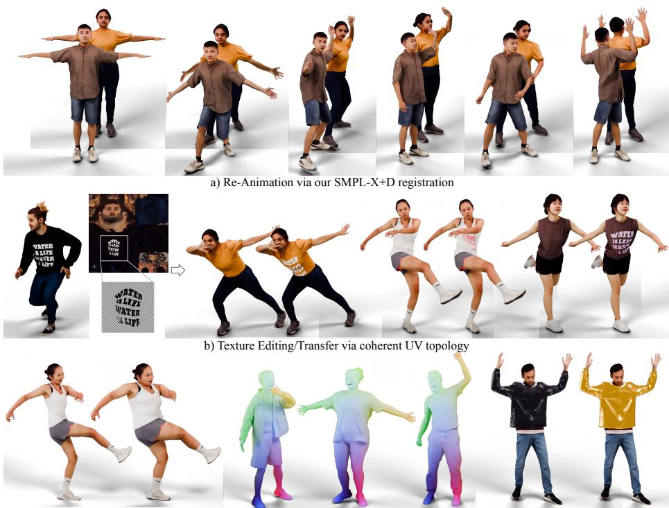
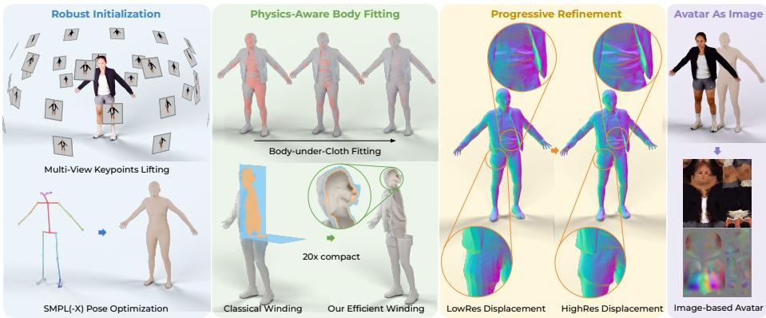
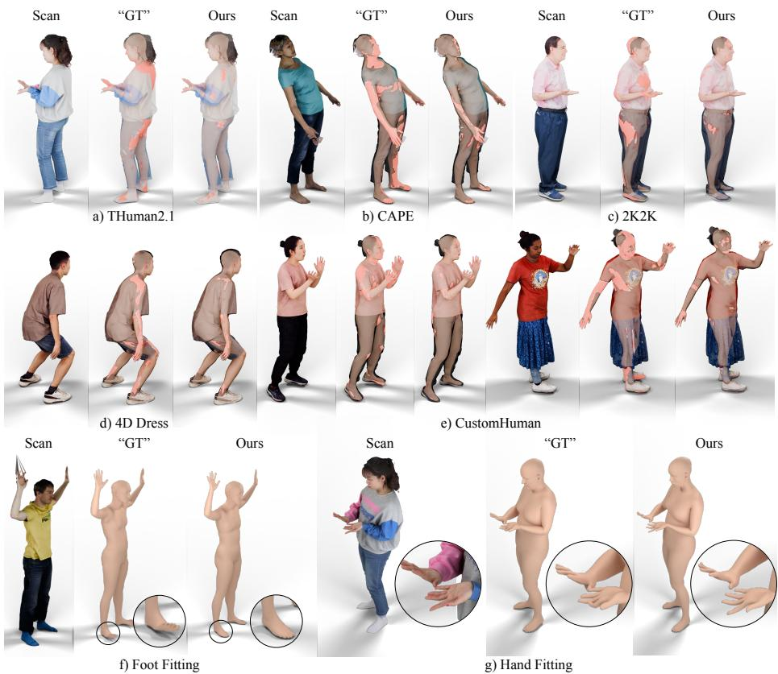
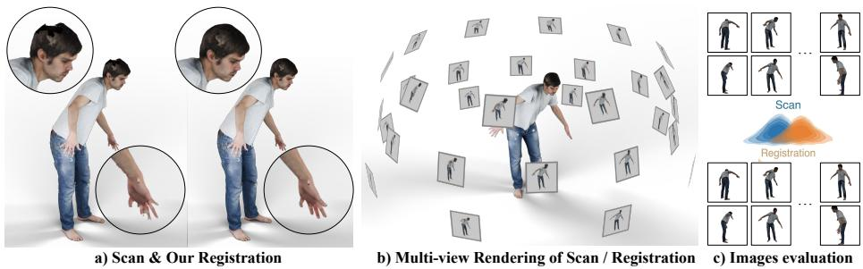
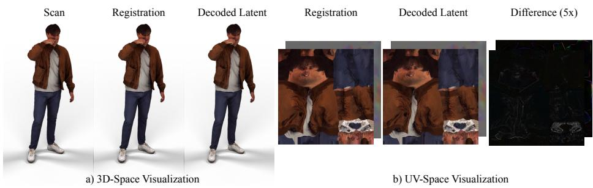
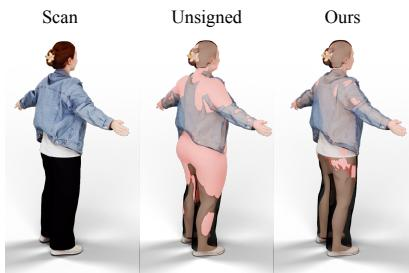

# Revisiting Avatar-As-Image: High-Fidelity Registration is All You Need

Margaret Kostyrko1,2,\* , Yuxuan Xue1,2,\*, , Garvita Tiwari1,2 , Gerard Pons-Moll1,2,3

1University of Tübingen 2Tübingen AI Center

3Max Planck Institute for Informatics

\*Equal Contribution Corresponding Author https://yuxuan-xue.com/avaimg

Abstract. The representation of 3D clothed humans as standardized 2D UV texture and displacement maps over an underlying body model has long been studied. This compact representation is enticing as it enables pretrained image networks to process, generate, and edit 3D avatars, but is only useful if scans are accurately aligned and brought into correspondence via high-fidelity registration. This prerequisite has never been met, which we argue explains the limited quality of prior UV-based methods for clothed humans. Despite its significance, no public method produces high-fidelity SMPL(−X)+D registrations with UV texture from arbitrary clothed scans. We present AvaImg, a multi-stage optimization pipeline, to close this gap: it enforces body-inside-clothing constraint via signed winding numbers, made viable by a three-level eficiency cascade (∼10× runtime reduced, ∼95% storage saved), and recovers fine surface detail using coarse-to-fine displacement optimization. AvaImg outperforms all baselines in body fitting, shape estimation, and surface registration across six datasets, yielding textured registrations near-indistinguishable from scans (PSNR=34.48dB). For validation of AvaImg’s Avatar-as-Image representation as imminently compatible with image foundation models, we auto-encode our UV maps via the frozen FLUX VAE. This achieves only 0.76mm added Chamfer error relative to scan and shows that the resulting maps lie within natural-image distributions, supporting the use of 2D generative priors for 3D avatar generation. Code, data, and Singularity containers will be publicly released.

Keywords: Digital Human · Surface Registration · Body Fitting

## 1 Introduction

High-fidelity digital doubles of clothed humans are integral to virtual reality, gaming, telepresence, and generative content creation. Parametric human body models like SMPL(−X) [28, 33] have long been the backbone of digital human modeling. Historically, learning these body and clothing models relied on highquality registration pipelines, pertaining from SMPL [28] and Dyna [35] to Cloth-Cap [34] and BuFF [50]. Concurrently, 2D generative AI—particularly large-scale

  
c) Shape Editing via SMPL-X parameter d) Shape Correspondence via coherent topology e) Material Editing via UV topology

Fig. 1: Applications enabled by AvaImg. Because all registrations share SMPL(−X) parameter space and a coherent UV layout, our output directly supports re-animation, texture editing and transfer, shape editing, dense correspondence, and material editing.

difusion models [8]—has produced powerful visual priors per training on billions of images. Applying these 2D priors to 3D clothed human generation [39], texture synthesis [21, 37], and editing is thus a central goal of the field today.

To bridge the gap between 3D geometry and 2D generative models, a natural and established approach is to represent 3D clothed humans as standard 2D images. Since parametric body models such as SMPL(−X) share UV layout across instances, the geometry and appearance of a dressed human can be coherently unrolled onto UV texture and displacement maps. These define standardized images where the same pixel always corresponds to the same anatomical location, non-pertaining to subject. This Avatar-As-Image concept is appealing: of-theshelf image networks and difusion models can utilize it to directly process, edit, and generate 3D humans without specialized 3D architectures [3, 16, 39]. However, previous attempts at UV-based clothed human modeling have yielded poor results, as the prerequisite for quality was never met: the fidelity of UV maps was limited by the accuracy of the underlying 3D registration. When fitted mesh deviates from scan surface, the unwrapped UV images inherit every geometric and texture artifact; generative models trained on such data cannot learn physically meaningful priors.

Concurrently, robust public frameworks capable of registering clothed scans to a unified topology with UV texture are largely unavailable. The only publicly available tool is RVH-Mesh-Registration (RMR) [4–6], which supports neither SMPL−X nor UV texture mapping, and uses an unsigned distance metric which cannot distinguish whether the body approaches the scan from the in- or outside. Furthermore, the “ground-truth” registrations shipped with established datasets (BuFF [50], THuman [49], and 2K2K [17]) demonstrate pervasive body-clothing interpenetration. Irrespective of the underlying cause, be it unsigned distances, unreliable surface normals, or otherwise insuficient containment heuristics, the observable result is physically corrupt reference data. Learning-based registration methods [10, 15, 24, 25, 30, 40] could in principle address this at scale, but they themselves require high-quality, accurate registrations for training, constituting a chicken-and-egg problem only optimization-based pipelines can break.

We present AvaImg, a multi-stage optimization pipeline which closes this registration gap to make the established Avatar-As-Image concept practically viable. Contrary to prior pipelines relying on surface normals to resolve body-clothing sidedness [34, 50], AvaImg enforces body-inside-clothing containment via signed winding numbers [20] that facilitate volumetric inside/outside testing robust to noisy or open scan surfaces—regions where normals may often fail. A three-level eficiency cascade (scan decimation, precomputed voxel grids, winding band reduction) reduces runtime by ∼10× and storage by ∼95%; enabling applicability at dataset scale. Robust multi-view 3D keypoint lifting via multi-layered poseoutlier suppression provides reliable pose initialization across also non-standard configurations, and a coarse-to-fine displacement formulation with fourth-power edge coupling at high resolution recovers sub-centimeter geometric detail, which frequently surpasses fidelity of dataset ground-truth. Our pipeline handles realworld scan imperfections (noise, missing regions, broken extremities) based on SMPL(−X) manifold prior and adaptive region-based constraints, and operates reliably across datasets of widely varying scan quality. Our scan-faithful registration achieves a clean Avatar-As-Image representation viable for image generative models, for which we validate immediate compatibility by encoding and decoding AvaImg’s UV maps through the frozen VAE of FLUX [8], which accumulates only 0.76mm Chamfer error over scan without retraining—thus confirming the maps lie within natural-image distributions. AvaImg’s coherent topology enables examples of texture transfer, appearance editing and reanimation, as showcased in Figure 1. The entire pipeline will be released as a self-contained package via Singularity containers for end-to-end deployment without need for manual dependency management. In summary, our contributions are:

– AvaImg, a multi-stage optimization pipeline for high-fidelity SMPL(−X)+D registration with UV texture mapping, supporting arbitrary clothed human scans, including noisy and incomplete real-world captures. Code, data, and Singularity containers will be publicly released.

– Eficient signed winding numbers for physics-aware body fitting, replacing surface-normal sidedness heuristics of prior works with a robust volumetric containment constraint, made practical at dataset scale via a three-level eficiency cascade that reduces runtime by ∼10× and storage by ∼95%.

– A validation for direct compatibility of AvaImg’s attained Avatar-As-Image representation with of-the-shelf image generative models, shown by successful encode-decode through a frozen difusion VAE, confirming its UV texture and displacement maps reside within natural-image distributions.

## 2 Related Work

## 2.1 Clothed Human Registration

Registration of a parametric body model to clothed 3D scans revolves around a coupled pair of objectives: naked body fitting beneath clothing, and the capture of outer clothing surface in form of per-vertex displacement (SMPL(−X)+D).

<table><tr><td>Method</td><td>Body</td><td>Surface</td><td>Texture FittingRegistration Registration</td></tr><tr><td>Arteq [15]</td><td>V</td><td>x</td><td>x</td></tr><tr><td>Etch [24]</td><td>V</td><td>x</td><td>x</td></tr><tr><td>IP-Net [5]</td><td>V</td><td>V</td><td>x</td></tr><tr><td>LoopReg [6]</td><td>V</td><td>V</td><td>x</td></tr><tr><td>PTF [41]</td><td>V</td><td>V</td><td>x</td></tr><tr><td>Ours</td><td>V</td><td>V</td><td>V</td></tr></table>

Body Fitting. SMPLify [9] and SMPLify-X [33] both fit body parameters from 2D joint detections via optimization, but are sensitive towards initialization. Learning-

Table 1: AvaImg introduces conjoined capacity for body fitting, surface registration, and texture mapping.

based alternatives (LVD [14], ArtEq [15], ETCH [24]) are faster and more robust to pose variation, however, remain body-centric: they recover the naked body skeleton and shape without capturing clothing geometry or texture.

Clothed Surface Registration. ClothCap [34] and BuFF [50] register SMPL +D to 4D scan sequences using surface normals or temporal fusion to resolve body-clothing sidedness, but both require multi-frame input and are not publicly available. RVH-Mesh-Registration (RMR) [4], the only public tool, uses unsigned distances, produces no texture, and is limited to SMPL+H. Learning-based methods (IPNet [5], PTF [41], NICP [30], LoopReg [6]) can produce SMPL+D registrations, yet all require ground-truth registrations for training, which creates a chicken-and-egg problem when those registrations themselves contain artifacts. No publicly available pipeline currently yields high-fidelity SMPL(−X)+D registrations with UV texture mapping from arbitrary single-frame clothed scans; AvaImg completes this gap.

## 2.2 2D Representations for 3D Humans

Representation of clothed 3D humans in UV space of parametric body models has been well explored. Early work showed SMPL UV maps can capture both texture and geometry from images or video [1–3, 22, 23, 31], framing shape regression as image-to-image translation in UV space [3] or predicting full 360◦ textures from partial observations [23]. These same UV maps are presently standard for neural rendering and dynamic character animation [16,26,32,38,43,53], where motiondependent appearance is generated directly in texture space. Recent UV-space

  
Fig. 2: Method Overview. Given a clothed 3D scan, AvaImg proceeds in four stages: (1) multi-view keypoint lifting for robust pose initialization, (2) physics-aware body Avatafitting via eficient signed winding numbers, (3) coarse-to-fine displacement optimization for fine surface detail, and (4) remapping into 2D texture and displacement maps. methods include SMPLitex [12], Paint-It [21], SCULPT [37] and Chaudhuri et al. [13], while encoding 3D geometry as 2D images to leverage difusion priors is an emerging trend both for general objects [44, 48] and clothed humans [39, 45– 47].

All methods above are limited by registration quality: without high-fidelity SMPL(−X)+D meshes, resulting UV maps inherit geometric artifacts and texture misalignment. AvaImg addresses this bottleneck by producing registrations whose UV maps can be imminently consumed by pretrained image VAEs [8] and difusion models without modification.

## 3 Method

Given only a raw 3D scan $\boldsymbol { S } = \{ v , f , v _ { t } \}$ with vertices v, faces $f ,$ and UV coordinates $v _ { t } ,$ AvaImg produces a $\mathrm { S M P L ( - X ) + D }$ registration $M ( \gamma , \beta , \theta , \psi , D )$ paired with UV texture and displacement maps that jointly define the Avatar-As-Image representation. Three coupled challenges must be resolved for high-fidelity registration: robust pose initialization, naked body fitting below occluding clothing, and complex clothing surface capture.

Two design principles guide every stage of our pipeline. Coarse-to-fine Optimization: we constrain heavily at earlier stages to steer away from local minima, then progressively relax constraints to recover fine detail. Innate Robustness: we leverage the SMPL(−X) topology itself as a smooth, complete manifold prior, which grounds regularization across scan noise, lacking geometry and merged self-contact regions to produce clean, consistent meshes.

## 3.1 Robust Pose Initialization

Pose estimation constitutes our pipeline’s foundation: errors here onwards propagate irrecoverably across all subsequent stages. Initializing via mean pose, as in prior work [7], routinely traps the optimization in local minima on non-standard configurations, such as raised arms or crossed legs. Instead, we lift reliable 3D joint targets from the scan itself, providing scan-specific initialization.

Scan Normalization. To handle heterogeneous datasets from widely varying coordinate frames, we normalize each scan to gendered SMPL(−X) via a heightbased scale factor and centroid translation.

Multi-View Keypoint Lifting. Per textured scan, we render 72 views across 3 elevation levels with full azimuth coverage using PyTorch3D [36]. OpenPose [11] is employed to detect 137 keypoints with respective confidence scores per view. We perform multi-view bundle adjustment to triangulate detected keypoints into 3D joint locations, during which we apply three layers of outlier suppression: the outlier robust L1-norm, squaring of the confidence scores, and a hard threshold of 0.3 to zero out unreliable keypoints entirely. To eliminate any inconveniency due to OpenPose runtime compilation, we will provide an end-to-end GPU-friendly Singularity container for user-friendly deployment of our AvaImg pipeline.

SMPL(−X) Pose Optimization. The triangulated targets form a joint-fitting loss $\mathcal { L } _ { j } .$ , which is minimized alongside a shape prior $\mathcal { L } _ { \beta }$ and a pose prior $\mathcal { L } _ { \theta }$ [33]. Following the coarse-to-fine principle, we stage the optimization in three phases: (1) global orientation, head, shoulders, and right foot; (2) all body joints; (3) full $\mathrm { \dot { S } \dot { M } P L ( - X ) }$ including hands and facial expression. This schedule yields a robust pose that serves as reliable initialization for body fitting.

## 3.2 Physics-Aware Fitting with Eficient Winding Numbers

With pose established, we optimize all SMPL(−X) body parameters to situate the naked body beneath clothing; a task complicated by absence of direct observation. Minimizing raw distance between the SMPL(−X) and scan surface commonly finds solution penetrating the clothing outwards as mean to near topology. This is precisely the artifact observed in existing dataset ground truth [17,19,52] and publicly available registration tools.

Inside-Outside Constraint via Signed Winding Numbers. We exploit the physical fact that a body is always enclosed by its clothing. Generalized winding numbers [20] are calculated on a volumetric basis, contrary to surface-normal or ray-casting approaches, which are vulnerable to noisy or non-watertight meshes. This sensitivity may result in erroneous labeling of internal points as external and thus cause body collapse or otherwise capricious behavior during fitting. To mitigate pipeline robustness to cases of open topology, we apply winding numbers as method of sign computation, where query points are classified relative to static scan mesh as inside (+1) or outside (−1) scan surface. We incorporate this sign into the mesh-to-scan (m2s) distance loss and apply a parametric ReLU:

$$
\mathcal { L } _ { d } = \rho ( \mathrm { p R e L U } [ \mathrm { d i s t } _ { \mathrm { s i g n e d - m 2 s } } ( S , ~ M ( \gamma , \beta , \theta , \psi ) ) ] ) ,\tag{1}
$$

where $\rho$ is the Geman-McClure robust function. The pReLU applies asymmetric weighting to the signed distances: body vertices inside of scan clothing receive a mild penalty, while vertices that have escaped outside incur an amplified price, producing a steep, diferentiable barrier against penetration, only firmly enforceable due to reliable sign classification. The full objective retains $\mathcal { L } _ { j } , \mathcal { L } _ { \beta }$ , and $\mathcal { L } _ { \theta }$ with prior weight annealed over time to gradually free body from constraint.

Eficient Winding Computation. Naïve compute of generalized winding numbers is $\mathcal { O } ( n _ { \mathrm { q u e r y } } \times n _ { \mathrm { f a c e s } } )$ , prohibitive on high-polygon scans such as 2K2K [17] (100k–200k faces). We introduce a three-level eficiency cascade that makes the physics constraint practical at dataset scale. $F i r s t ,$ the scan mesh is decimated to approximately 10% of its original face count (min. 40k) for winding computation. Second, winding numbers are precomputed on a dense voxel grid (5 mm) around the decimation bounding box and are thresholded to a binary (±1) field. During optimization, classifying a body vertex thus requires only a nearest-neighbor look-up. Third, we apply winding band reduction: only boundary voxels (those whose 7 nearest neighbors include a sign change) are retained; the remaining ∼95% of the voxel grid is discarded, such that both storage and query time are reduced by roughly an order of magnitude.

## 3.3 Progressive Refinement: From Coarse Body to Fine Detail

Body fitting recovers the underlying body shape but not exterior scan surface: geometric structure, folds, wrinkles, and hair that define visual appearance. We capture these via per-vertex displacements D in a two-pass coarse-to-fine scheme, embodying the progressive refinement principle at mesh resolution level.

Low-Resolution Displacement. With the body now correctly positioned inside the scan and not our focus anymore, the penetration constraint is no longer needed. We switch to unsigned data terms and optimize free vertex positions vfree stemming from the SMPL(−X) body mesh, and introduce further loss terms for optimization. $\mathcal { L } _ { u }$ penalizes the diference between displacements in posed and canonical (unposed) space, promoting topology independence from articulation. $\mathcal { L } _ { c }$ is an edge-coupling loss that penalizes edge-length deviations from the nondisplaced body, with weighting assigned per select region of bone-based skinning weights of SMPL(−X), restricting deformation in specified areas (e.g. hands). $\mathcal { L } _ { l }$ applies cotangent Laplacian smoothing to suppress displacement noise, where weights are assigned by employ of designed vertex maps. Scheduled weight annealing allows the mesh to initially capture the global silhouette under stronger regularization, then relaxes to fit finer deforms.

High-Resolution Displacement. The low-resolution displaced mesh is smooth subdivided via Loop subdivision [27], approximately quadrupling the face count. Now on high-resolution mesh, a second displacement pass parallel to the one prior recovers fine surface detail via three targeted modifications.

First, the data term switches to unsigned s2m only, directing the mesh toward the outer scan clothing surface without bidirectional pull, where the data adaptive multiplier progressively increases and tightens scan adherence. Second, the edge-coupling term $\mathcal { L } _ { c }$ is additionally squared, which produces a loss at a flatter basin but steeper sidewalls: small mesh deviations snap towards high-frequency geometry shifts $( e . g$ . folds, cloth edges, heels) while maintaining overall consistent topology. Third, alterations to region-dependent weights explicitly mitigate where fine structures are perceptually critical and likely otherwise maladaptive. Per experiments in Sections 4.3, 4.5, we substantiate that our achieved level of geometric fidelity frequently surpasses that of comparable baselines, and can even compensate noise and lack of scan geometric completion via leverage of SMPL(−X) topology as manifold prior (Sec. 4.2)—enabling AvaImg to operate reliably across datasets of largely variable scan quality.

## 3.4 The Avatar-As-Image Representation

The preceding stages yield a high-quality SMPL(−X)+D registration with canonical UV mapping shared across all subjects. To achieve Avatar-As-Image representation, we convert each registration into a pair of standardized images: a UV texture and a UV displacement map per SMPL(−X) UV space, where the same pixel always corresponds to the same anatomical location irrespective of subject. This semantic alignment facilitates the maps as suitable training data for image generative models with no additional alignment or preprocessing.

Precomputed UV Lookup Maps. We precompute an f-map and a b-map at target image resolution. The f-map specifies which high-res SMPL(−X) UV face each pixel at resolution places within; and the b-map stores the barycentric coordinates of said pixel within respective face. Both maps depend only on the SMPL(−X) UV topology, not on the scan, and are therefore computed once and reused for all subjects. Changing the output resolution $( e . g . 5 1 2 ^ { 2 }  4 0 9 6 ^ { 2 } )$ or switching the SMPL(−X) body model variant requires only one-time computation of these lightweight lookup maps.

Texture and Displacement Transfer. For each resolution pixel, the f-map and b-map are used to locate the corresponding 3D point on the high-resolution registered mesh; from which we identify the nearest scan surface point, express it in barycentric coordinates within the closest scan face, and bilinearly sample the scan’s color at the corresponding scan UV location. Pixels without coverage are filled in by morphological inpainting. Scans with vertex colors instead of textures interpolate color directly from the nearest scan vertices. Applying the same procedure to per-vertex displacements yields the UV displacement map.

Together, UV texture and displacement maps constitute a complete Avatar-As-Image representation. In Section 4.4, we validate they encode-decode through the frozen VAE of a pretrained image difusion model at high fidelity without any fine-tuning, confirming their readiness as training data for generative models.

## 4 Experiments

## 4.1 Evaluation Benchmarks

We evaluate AvaImg across six public scan datasets spanning diverse body shapes, poses, and clothing styles: 4D-Dress [42] (47 subjects), BuFF [50] (26), CAPE [29] (40), THuman2.1 [49] (20), 2K2K [17] (20), and CustomHuman [19] (20).

We assess four complementary aspects of registration quality: Body fitting is evaluated on the first three datasets via penetration rate (% of body vertices outside scan surface), penetration depth (mean distance of penetrating vertices to scan surface), and scan proximity (mean SMPL(−X) to scan distance) Proximity alone is an insuficient metric, as a body that penetrates the clothing achieves deceptively low distance while being physically implausible. The three body fitting metrics must therefore be interpreted jointly, where low proximity is meaningful only when met by low penetration rate and depth. Shape estimation is evaluated on BuFF—which uniquely provides ground-truth minimal-clothing body scans—via bidirectional Chamfer distance in T-pose after Procrustes alignment. Surface registration measures the bidirectional Chamfer distance between the registered SMPL(−X)+D mesh and the input scan. Texture registration is assessed via multiview rendering PSNR between original scans and textured registrations; we additionally report the Fréchet Inception Distance (FID) [18] as a distributional similarity measure. All quantitative results are summarized in Table 3. We validate AvaImg’s representational UV map compatibility with latent difusion models through a VAE roundtrip experiment (Sec. 4.4), and provide ablation studies of our key design choices (Sec. 4.5).

  
Fig. 3: Comparison with dataset ground truth. Body fitting overlaid on clothed scan surface across five datasets (penetrating vertices highlighted in red). The dataset GT fits exhibit pervasive penetration across the entire body, while ours keep the body enclosed within the clothing (Tab. 2). Zoomed insets show that dataset GT produces bent, misaligned feet and stif finger articulation, while our method recovers anatomically plausible poses and handles noisy hand geometry.

<table><tr><td></td><td>Method</td><td></td><td></td><td>2K2K [17] THuman2.1 [49] CustomHuman [19] CAPE [29] 4D-Dress [42]</td><td></td><td></td><td>Overall</td></tr><tr><td rowspan="2">Prox. (mm) ↓</td><td>Dataset GT</td><td> $1 9 . 5 { \pm } 3 . 9 $ </td><td> ${ \bf 9 . 2 \pm 1 . 7 }$ </td><td> ${ \bf 9 . 9 \pm 2 . 0 }$ </td><td>6.8±5.4</td><td> $1 2 . 1 { \pm } 2 . 7 $ </td><td>11.8±4.7</td></tr><tr><td>Ours</td><td>12.9±2.9</td><td>10.0±1.8</td><td>11.3±4.4</td><td>8.7±1.0</td><td>12.0±2.9</td><td>11.4±3.2</td></tr><tr><td rowspan="2">Pene. R. (%) ↓</td><td>Dataset GT</td><td>33.6±9.5</td><td>26.2±4.6</td><td>33.3±5.7</td><td>50.6±7.7</td><td>20.9±3.6</td><td>28.2±11.3</td></tr><tr><td>Ours</td><td> $\mathbf { 1 0 . 0 2 3 . 2 }$ </td><td>15.9±4.2</td><td>16.1±6.9</td><td> ${ \bf 2 1 . 4 } { \bf \pm } 5 . 6 $ </td><td>14.2±5.2</td><td>15.0±6.0</td></tr><tr><td rowspan="2">Pene. D. (mm) ↓</td><td>Dataset GT</td><td> $1 4 . 5 { \pm } 4 . 5 $ </td><td> $5 . 0 { \pm } 1 . 0 $ </td><td> $6 . 0 { \pm } 1 . 1 $ </td><td> $7 . 4 \pm 6 . 5$ </td><td> $4 . 7 { \pm } 0 . 8 $ </td><td>6.4±4.3</td></tr><tr><td>Ours</td><td>2.1±0.4</td><td> $\mathbf { 3 . 1 \pm 0 . 4 }$ </td><td>4.2±0.8</td><td>3.6±0.5</td><td>3.4±0.4</td><td>3.4±0.7</td></tr></table>

Table 2: Body fitting vs. dataset ground truth. Metrics over scan proximity, penetration rate and penetration depth of dataset-provided “ground-truth” SMPL(−X) fits vs. ours, as evaluated on five public datasets. Our body-fits consistently achieve lower penetration metrics, indicating more accurate body-under-clothing estimation.

## 4.2 Comparison with Dataset Ground Truth

Several established scan datasets ship “ground-truth” SMPL(−X) registrations alongside their raw scans. We have observed that the provided body-fits exhibit systematic artifacts: fitted body mesh frequently penetrates the clothing surface, hand poses are inaccurate due to weak constraints on articulated extremities, and foot alignment is fickle, particularly in CAPE, where open scan surfaces at feet soles provide no geometric anchor (Fig. 3). These are not simply minor cosmetic issues: any downstream method trained on penetrating body-fits obtains a physically impossible prior, and shape estimation benchmarks that evaluate against such registrations risk rewarding methods that replicate the same artifacts.

Improved Body Fitting. By enforcing strict body-inside-clothing containment via signed winding numbers (Sec. 3.2), AvaImg eliminates the penetration artifacts present in dataset ground truth. Table 2 quantifies this across five datasets: the average penetration rate drops from 28.2% (dataset GT) to 15.0% (ours), and the average penetration depth decreases from 6.4 mm to 3.4 mm, while maintaining comparable scan proximity (11.4 mm vs. 11.8 mm). The improvement is most striking on 2K2K, where penetration rate decreases from 33.6% to 10.0%, and on CAPE, where it drops from 50.6% to 21.4% in spite of challenging open regions. Our improved fittings can serve as higher-quality training data for learning-based methods [24,30], breaking the circular dependency (chicken-andegg problem) identified in Section 1.

Robustness to Scan Imperfections. Beyond the quality of the registrations themselves, the input scans are frequently imperfect: e.g. BuFF and THuman contain noisy hand geometry, incomplete surface coverage, and missing body regions. Naïve surface fitting propagates these defects into the output mesh, yet AvaImg naturally handles such artifacts due to the SMPL(−X) parametric model acting as a strong anatomical prior: the body manifold constrains hands, faces, and extremities to plausible configurations, while the coarse-to-fine displacement scheme (Sec. 3.3) captures underlying surface detail without overfitting to noise. As a result, our registrations are often cleaner than the input scans in corrupted regions: the parametric prior efectively denoises the geometry while preserving faithful surface detail elsewhere (Fig. 4).

<table><tr><td rowspan="2"></td><td colspan="3">Body Fitting</td><td rowspan="2">Shape Est.</td><td rowspan="2">Surf. Reg.</td><td rowspan="2">Tex. Reg. PSNR ↑</td></tr><tr><td></td><td>Pene. R. (%) ↓ Pene. D. (mm) ↓ Prox. (mm) ↓ Chamfer (mm) ↓ Chamfer (mm) ↓</td><td></td></tr><tr><td>Method IPNet [5]</td><td></td><td></td><td></td><td></td><td></td><td></td></tr><tr><td>ETCH [24]</td><td>44.5 35.0</td><td>25.93 13.53</td><td>23.41 13.01</td><td>9.95 7.76</td><td>8.61</td><td></td></tr><tr><td>NICP [30]</td><td>54.6</td><td>12.98</td><td>12.03</td><td>8.84</td><td>3.06</td><td></td></tr><tr><td>PTF [41]</td><td>48.9</td><td>8.17</td><td>8.68</td><td>8.85</td><td>6.92</td><td></td></tr><tr><td>RMR [7]</td><td>43.2</td><td>7.80</td><td>8.60</td><td>10.54</td><td>3.42</td><td></td></tr><tr><td>Ours</td><td>19.8</td><td>3.62</td><td>9.47</td><td>7.72</td><td>2.62</td><td>34.48</td></tr></table>

Table 3: Quantitative comparison. Body Fitting: penetration rate, penetration depth, and scan proximity. Shape Est.: bidirectional Chamfer distance of T-pose shape to minimum clothing shape in BuFF [50]. Surf. Reg.: bidirectional Chamfer distance between registration and scan. Tex. Reg.: multiview rendering PSNR between textured registrations and original scans. Best in bold, second-best underlined.

## 4.3 Comparison with State-of-the-Art

Body Fitting. We evaluate all methods that produce a naked body fit (ETCH [24], IPNet [5], PTF [41], NICP [30], RMR [7], and ours) on the body fitting metrics defined in Section 4.1 across 4D-Dress (47 subjects), BuFF (26) and CAPE (40). Table 3 presents the results. RMR and PTF achieve the lowest scan proximity (8.60 mm and 8.68 mm), yet nearly half of their body vertices penetrate the clothing surface (43.3% and 48.9%, respectively). In contrast, our method diminishes the penetration rate to 19.8%, roughly half that of the next-best method (ETCH, 35.0%), with a penetration depth of only 3.62 mm at maintain of competitive scan proximity (9.47 mm). This demonstrates that our approach achieves a substantially better trade-of between proximity and physical plausibility: the estimated body sticks close to the clothing surface while remaining underneath it. Note that optimal proximity is not zero: a correctly estimated naked body should maintain a physical ofset from the outer clothing surface. Crucially, our prevailing shape estimation on BuFF (7.72 mm, Tab. 3), where ground-truth minimal-clothing body scans are available, confirms that our method does not artificially shrink the body to avoid penetration, but accurately recovers the true underlying body volume.

Surface Registration. We measure clothed surface reconstruction via bidirectional Chamfer distance (100k surface samples per mesh) between SMPL(−X)+D registration and input scan. We compare IPNet [5], PTF [41], NICP [30], RMR [7], and ours; ETCH is excluded as it produces only naked body parameters. As shown in Table 3 (Surf. Reg.), our method achieves the lowest Chamfer distance across all three datasets, with an overall mean of 2.62 mm, a 14% reduction over the second-best method (NICP, 3.06 mm). Notably, our method also exhibits the lowest variance (σ=0.39 mm), indicating consistently accurate registrations irrespective of clothing type or body shape. The improvement is most pronounced on 4D-Dress (2.75 mm ours vs. 3.53 mm NICP), which contains the most diverse clothing styles, suggesting that our approach generalizes better to challenging garment geometries. Template-based methods (PTF, IPNet) lag behind, likely as their fixed clothing topology limits ability to conform to diverse garment shapes. Texture Registration. Beyond just geometry, our method produces complete textured registration via remapping of scan appearance onto the SMPL(−X) UV layout. To our knowledge, none of the publicly available baselines (IPNet, PTF, NICP, RMR) support texture remapping, making a direct comparison infeasible.

  
Fig. 4: Texture registration and evaluation protocol. Original scan (left) vs. our resulting textured registration (right); insets show clean recovery of noisy hand and head geometry. Both are rendered from multiple viewpoints and compared via image metrics (PSNR = 34.48 dB, Tab. 3).

As shown in Table 3 (Tex. Reg.), our method achieves a multiview rendering PSNR of 34.48 dB against original scans, confirming the high visual fidelity of our textured registrations. In distributional terms, the FID between rendered registrations and rendered scans is only 5.19, indicating the two image sets are statistically near-indistinguishable. The low FID confirms our UV-based texture mapping preserves fine appearance details (e.g. fabric patterns, color gradients) with high fidelity, despite the topological transformation from the scan’s native mesh to the SMPL(−X) UV parameterization.

## 4.4 Image-based Avatar Representation

Our successful realization of the Avatar-As-Image representation hinges upon a key condition: the attained UV maps as produced by AvaImg being standardized 2D images, which pretrained generative models can both represent and process imminently without modification. We verify this by passing our UV texture and displacement maps through the frozen VAE of FLUX [8]—with no fine-tuning— and then measuring the reconstruction fidelity in both UV image space (PSNR, SSIM, LPIPS [51]) and 3D geometry space (bidirectional Chamfer distance).

Table 4 and Figure 5 confirm that both UV maps survive the roundtrip with minimal degradation. Within 3D space, the VAE adds only 0.76 mm Chamfer error (3.15 mm → 3.91 mm). UV texture maps achieve a high 38.6 dB PSNR designating low texture atrophy, and displacement maps reconstruct with 4.98 mm RMSE, well below the scale of feasibly represented clothing folds as per our supported topology. In spite of the FLUX VAE being trained exclusively on natural images, we recognize only little geometric and visual error.

  
Fig. 5: VAE roundtrip validation. (a) Original scan, AvaImg registration, and mesh from VAE-decoded UV maps are visually near-indistinguishable. (b) Original UV maps, VAE-reconstructed, and 5× amplified diference.

These results signify that AvaImg’s UV maps lie within natural-image distributions and are a ready-to-use input format for image generative architectures, for which encoding-decoding have been shown to operate faithfully.

<table><tr><td rowspan="3"></td><td colspan="2">UV Texture</td><td>UV Disp.</td><td>Spatial</td><td colspan="4">Spatial &amp; Rendering vs. Scan</td></tr><tr><td></td><td>PSNR ↑ SSIM ↑</td><td>RMSE (mm) ↓ V2V (mm) ↓ CD (mm) ↓ PSNR ↑ SSIM ↑ LPIPS ↓</td><td></td><td></td><td></td><td></td><td></td></tr><tr><td>Before VAE</td><td></td><td></td><td></td><td></td><td>3.15</td><td>34.48</td><td>0.995</td><td>0.006</td></tr><tr><td>After VAE</td><td>38.6</td><td>0.964</td><td>4.98</td><td>4.29</td><td>3.91</td><td>30.04</td><td>0.988</td><td>0.009</td></tr></table>

Table 4: VAE roundtrip fidelity. UV texture and displacement maps as encoded and decoded through the frozen FLUX VAE [8] vs. scan: bidirectional Chamfer distance and multiview rendering metrics (PSNR, SSIM, LPIPS), both measured against the original scan. The VAE roundtrip adds only 0.76 mm Chamfer error.

## 4.5 Ablation Study

We ablate three key design characteristics which constitute the AvaImg pipeline: (1) signed vs. unsigned body fitting (Sec. 3.2), (2) coarse-to-fine refinement with fourth-power edge-coupling (Sec. 3.3), and (3) eficient winding computation via decimation and winding band reduction (Sec. 3.2).

Signed vs. Unsigned Body Fitting. Our full method constrains body vertices to remain inside of clothing surface by incorporating sign to mesh-to-scan distance via generalized winding numbers [20] (Sec. 3.2), contrary to e.g. RMR’s [4] employ of an unsigned metric (Sec. 2.1). To evaluate the importance of this constraint, we compare against an ablated variant which replaces the signed distance term with a standard unsigned mesh-to-scan distance, identical to the data term used by prior unsigned registration pipelines.

Figure 6 presents the comparison. Without signed winding numbers, the optimizer has no means to distinguish whether the body approaches the scan surface from inside or outside the clothing. As a result, the body mesh frequently penetrates through the scan surface to minimize distance, achieving a deceptively low scan proximity at the expense of physical plausibility. With our signed distance formulation, penetration rate drops from 40.7% to 19.8% and penetration depth from 10.06 mm to 3.62 mm, while scan proximity remains comparable (9.74 mm vs. 9.47 mm). The efect extends to shape estimation: on BuFF where groundtruth minimal body shapes are available, shape-under-clothing Chamfer distance drops from 11.95 mm to 7.72 mm. This confirms that the signed distance constraint is the primary mechanism that prevents body–clothing collision and is essential for physically plausible body estimation.

  
Fig. 6: Ablation: signed vs. unsigned body fitting. Left: body mesh overlaid with the clothed scan; unsigned distance drives the body through the clothing surface (penetrating vertices in red), while our signed formulation keeps the body enclosed. Right: quantitative comparison on 113 subjects (4D-Dress, BuFF, CAPE).

<table><tr><td>Distance</td><td>Pene. R. ↓</td><td>Pene. D. ↓</td><td>Prox. ↓</td><td>Shape† ↓</td></tr><tr><td>Unsigned</td><td>40.7%</td><td>10.06 mm</td><td>9.74mm</td><td>11.95mm</td></tr><tr><td>Signed (ours)</td><td>19.8%</td><td>3.62mm</td><td>9.47 mm</td><td>7.72mm</td></tr></table>

†BuFF only (26 subj.; GT minimal body required).

Progressive Refinement. We ablate the two-pass coarse-to-fine displacement strategy (Sec. 3.3) by comparing three variants on the same 113-subject evaluation set: (i) low-res only: displacement optimization of original SMPL(−X)+D mesh without subdivision; (ii) two-pass, squared coupling: applied Loop subdivision followed by common squared edge-coupling loss $( w _ { c } \mathcal { L } _ { c } ) ^ { 2 }$ ; and (iii) our full method with fourth-power coupling $( w _ { c } \mathcal { L } _ { c } ) ^ { 4 }$ at high resolution. The low-res only variant achieves a surface Chamfer distance of 3.15 mm, as the limited vertex count cannot represent high-frequency clothing detail. Adding subdivision with squared coupling reduces the error to 2.75 mm (−13%), indicating that increased mesh resolution is necessary but not suficient. Switching to fourth-power coupling (our full method) further lowers the Chamfer to 2.62 mm (−5%), as the wider penalty basin allows the mesh to conform tighter to fine surface structures instead of smoothing over them. Body fitting and shape metrics are identical across all three variants, as only the clothed surface registration stage difers.

Decimation and Winding Band Reduction. We profiled the two acceleration components of our eficient winding formulation (Sec. 3.2) across decimation levels with and without winding band reduction. Most notably, decimating a select large scan of ∼370k faces down to 40k cuts winding computation time from ∼2,400 s to ∼240 s (∼10×). The winding band reduction at cost of only ∼70 s further accelerates body fitting from ∼1,700 s to ∼240 s (∼7×), and facilitates strong storage saving via decreases of ∼70-100 MB to ∼5 MB (up to 20×). Combined, the physics-aware related stages drop from ∼4,000 s to ∼540 s (∼7×) runtime with no quality degradation.

## 5 Conclusion

We presented AvaImg, a multi-stage optimization pipeline that yields high-fidelity SMPL(−X)+D registrations with UV texture mapping from arbitrary clothed human scans at varying source qualities. By enforcing strict body-inside-clothing containment via eficient signed winding numbers per a three-level eficiency cascade (∼10× runtime reduced, ∼95% storage saved), our method efectively eliminates interpenetration artifacts common in existing dataset ground truths and public registration tools. Evaluations spanning six datasets confirm that AvaImg consistently outperforms all state-of-the-art methods across body fitting, shape estimation, and surface registration—with textured registrations nearly indistinguishable from scans (PSNR=34.48dB). Furthermore, AvaImg’s resulting UV maps can be seamlessly encoded-decoded through a frozen image difusion VAE with only 0.76 mm increased Chamfer error, validating that the maps lie within natural-image distributions and that our registration pipeline successfully supports the Avatar-As-Image paradigm.

Limitations and Future Work. AvaImg’s primary representational limitations stem from its base on SMPL(−X)+D, which bounds reconstructional ability on loose or decoupled garments and can result in proximity-based association errors in complex geometric regions. Self-contact zones are prone to texture bleeding, and unposing previously bent joints can introduce topological indentations. The full pipeline requires approximately 25 minutes per scan, spanning 3D joint estimation, winding calculation, body and surface fitting, as well as texture mapping. This defines it slower than feed-forward approaches, however, AvaImg rather targets one-time high-fidelity ground truth generation, which can serve as training data for faster alternatives. Overcoming topological constraints and leveraging the Avatar-As-Image format for training of latent image difusion models for 3D clothed humans remain promising directions for future work.

Acknowledgments. The authors express appreciation towards Yuliang Xiu and all others who gave any feedback towards improving this work. This work is made possible by funding from the Carl Zeiss Foundation. This work is also funded by the Deutsche Forschungsgemeinschaft (DFG, German Research Foundation) - 409792180 (Emmy-Noether Programme, project: Real Virtual Humans) and the German Federal Ministry of Education and Research (BMBF): Tübingen AI Center, FKZ: 01IS18039A. The authors thank the International Max Planck Research School for Intelligent Systems (IMPRS-IS) for supporting Y.Xue. G. Pons-Moll is a member of the Machine Learning Cluster of Excellence, EXC number 2064/1 – Project number 390727645.

Disclosure of Interests. The authors have no competing interests to declare that are relevant to the content of this work.

## References

1. Alldieck, T., Magnor, M., Xu, W., Theobalt, C., Pons-Moll, G.: Detailed human avatars from monocular video. In: 3DV (2018) 4

2. Alldieck, T., Magnor, M., Xu, W., Theobalt, C., Pons-Moll, G.: Video based reconstruction of 3D people models. In: CVPR (2018) 4

3. Alldieck, T., Pons-Moll, G., Theobalt, C., Magnor, M.: Tex2Shape: Detailed full human body geometry from a single image. In: ICCV (2019) 2, 4

4. Bhatnagar, B.L.: RVH mesh registration. https://github.com/bharat-b7/RVH\_ Mesh\_Registration (2020), accessed: 2026-03-02 3, 4, 13

5. Bhatnagar, B.L., Sminchisescu, C., Theobalt, C., Pons-Moll, G.: Combining implicit function learning and parametric models for 3D human reconstruction. In: ECCV (2020) 3, 4, 11

6. Bhatnagar, B.L., Sminchisescu, C., Theobalt, C., Pons-Moll, G.: LoopReg: Selfsupervised learning of implicit surface correspondences, pose and shape for 3D human mesh registration. In: NeurIPS (2020) 3, 4

7. Bhatnagar, B.L., Tiwari, G., Theobalt, C., Pons-Moll, G.: Multi-garment net: Learning to dress 3D people from images. In: ICCV (2019) 6, 11

8. Black Forest Labs: FLUX.1. https://github.com/black- forest- labs/flux (2024) 2, 3, 5, 12, 13

9. Bogo, F., Kanazawa, A., Lassner, C., Gehler, P., Romero, J., Black, M.J.: Keep it SMPL: Automatic estimation of 3D human pose and shape from a single image. In: ECCV (2016) 4

10. Cai, Z., Xiu, Y., Wang, R., Shao, Z., Li, X., Yu, S., Xu, C., Liu, Y., Sun, B., Yang, J., Zhang, Z.: Omnifit: Multi-modal 3d body fitting via scale-agnostic dense landmark prediction. In: European Conference on Computer Vision (ECCV) (September 2026) 3

11. Cao, Z., Hidalgo Martinez, G., Simon, T., Wei, S.E., Sheikh, Y.: OpenPose: Realtime multi-person 2D pose estimation using part afinity fields. IEEE TPAMI 43(1), 172–186 (2021) 6

12. Casas, D., Comino-Trinidad, M.: SMPLitex: A generative model and dataset for 3D human texture estimation from single image. In: BMVC (2023) 5

13. Chaudhuri, B., Sarafianos, N., Shapiro, L., Tung, T.: Semi-supervised synthesis of high-resolution editable textures for 3D humans. In: CVPR (2021) 5

14. Corona, E., Pons-Moll, G., Alenyà, G., Moreno-Noguer, F.: Learned vertex descent: A new direction for 3D human model fitting. In: ECCV (2022) 4

15. Feng, H., Kulits, P., Liu, S., Black, M.J., Abrevaya, V.F.: Generalizing neural human fitting to unseen poses with articulated SE(3) equivariance. In: ICCV (2023) 3, 4

16. Habermann, M., Liu, L., Xu, W., Zollhöfer, M., Pons-Moll, G., Theobalt, C.: Realtime deep dynamic characters. ACM TOG 40(4) (2021) 2, 4

17. Han, S.H., Park, M.G., Yoon, J.H., Kang, J.M., Park, Y.J., Jeon, H.G.: Highfidelity 3D human digitization from single 2K resolution images. In: CVPR (2023) 3, 6, 7, 8, 10

18. Heusel, M., Ramsauer, H., Unterthiner, T., Nessler, B., Hochreiter, S.: GANs trained by a two time-scale update rule converge to a local nash equilibrium. In: NeurIPS. pp. 6626–6637 (2017) 9

19. Ho, H.I., Xue, L., Song, J., Hilliges, O.: Learning locally editable virtual humans. In: CVPR (2023) 6, 8, 10

20. Jacobson, A., Kavan, L., Sorkine-Hornung, O.: Robust inside-outside segmentation using generalized winding numbers. ACM TOG 32(4) (2013) 3, 6, 13

21. Kim, Y., Oh, T.H., Pons-Moll, G.: Paint-it: Text-to-texture synthesis via deep convolutional texture map optimization and physically-based rendering. In: CVPR (2024) 2, 5

22. Lähner, Z., Cremers, D., Tung, T.: DeepWrinkles: Accurate and realistic clothing modeling. In: ECCV (2018) 4

23. Lazova, V., Insafutdinov, E., Pons-Moll, G.: 360-degree textures of people in clothing from a single image. In: 3DV (2019) 4

24. Li, B., Feng, H., Cai, Z., Black, M.J., Xiu, Y.: ETCH: Generalizing body fitting to clothed humans via equivariant tightness (2025) 3, 4, 10, 11

25. Li, X., Wu, J., Cai, Z., Yu, S., Li, B., Xiu, Y.: Etch-x: Robustify body fitting to any clothed human scans with composable synthetic data. In: European Conference on Computer Vision (ECCV) (September 2026) 3

26. Liu, L., Habermann, M., Rudnev, V., Sarkar, K., Gu, J., Theobalt, C.: Neural actor: Neural free-view synthesis of human actors with pose control. ACM TOG 40(6) (2021) 4

27. Loop, C.: Smooth subdivision surfaces based on triangles (1987) 7

28. Loper, M., Mahmood, N., Romero, J., Pons-Moll, G., Black, M.J.: SMPL: A skinned multi-person linear model. ACM TOG 34(6) (2015) 1

29. Ma, Q., Yang, J., Ranjan, A., Pujades, S., Pons-Moll, G., Tang, S., Black, M.J.: Learning to dress 3D people in generative clothing. In: CVPR. pp. 6468–6477 (2020) 8, 10

30. Marin, R., Corona, E., Pons-Moll, G.: NICP: Neural ICP for 3D human registration at scale. In: ECCV (2024) 3, 4, 10, 11

31. Mir, A., Alldieck, T., Pons-Moll, G.: Learning to transfer texture from clothing images to 3D humans. In: CVPR (2020) 4

32. Pang, H., Zhu, H., Kortylewski, A., Theobalt, C., Habermann, M.: ASH: Animatable gaussian splats for eficient and photoreal human rendering. In: CVPR (2024) 4

33. Pavlakos, G., Choutas, V., Ghorbani, N., Bolkart, T., Osman, A.A.A., Tzionas, D., Black, M.J.: Expressive body capture: 3D hands, face, and body from a single image. In: CVPR (2019) 1, 4, 6

34. Pons-Moll, G., Pujades, S., Hu, S., Black, M.J.: ClothCap: Seamless 4D clothing capture and retargeting. In: ACM TOG. vol. 36, pp. 73:1–73:15 (2017) 1, 3, 4

35. Pons-Moll, G., Romero, J., Mahmood, N., Black, M.J.: Dyna: A model of dynamic human shape in motion. ACM TOG 34(4), 120:1–120:14 (2015) 1

36. Ravi, N., Reizenstein, J., Novotny, D., Gordon, T., Lo, W.Y., Johnson, J., Gkioxari, G.: Accelerating 3D deep learning with PyTorch3D. In: SIGGRAPH Asia Courses (2020) 6

37. Sanyal, S., Ghosh, P., Yang, J., Black, M.J., Thies, J., Bolkart, T.: SCULPT: Shape-conditioned unpaired learning of pose-dependent clothed and textured human meshes. In: CVPR (2024) 2, 5

38. Sun, G., Dabral, R., Zhu, H., Fua, P., Theobalt, C., Habermann, M.: Real-time free-view human rendering from sparse-view RGB videos using double unprojected textures. In: CVPR (2025) 4

39. Tang, X., Zhang, B., Wonka, P.: Generative human geometry distribution. In: CVPR (2025) 2, 5

40. Wang, L., Zhao, S., Yan, S., Yu, S., Li, X., Cai, Z., Hou, Y., Xiu, Y.: Dirtymocap: Robust motion capture from unconstrained markers. In: SIGGRAPH Asia 2026 Conference Papers (2026) 3

41. Wang, S., Geiger, A., Tang, S.: Locally aware piecewise transformation fields for 3D human mesh registration. In: CVPR. pp. 7639–7648 (2021) 4, 11

42. Wang, W., Ho, H.I., Guo, C., Rong, B., Grigorev, A., Song, J., Zarate, J.J., Hilliges, O.: 4D-DRESS: A 4D dataset of real-world human clothing with semantic annotations. In: CVPR. pp. 550–560 (2024) 8, 10

43. Xue, Y., Bhatnagar, B.L., Marin, R., Sarafianos, N., Xu, Y., Pons-Moll, G., Tung, T.: NSF: Neural Surface Fields for Human Modelling from Monocular Depth. In: ICCV (2023) 4

44. Xue, Y., Liang, R., Zakharov, E., Bagautdinov, T., Cao, C., Nam, G., Saito, S., Pons-Moll, G., Romero, J.: GeoRelight: Learning Joint Geometrical Relighting and Reconstruction with Flexible Multi-Modal Difusion Transformers. In: CVPR (2026) 5

45. Xue, Y., Xie, X., Kostyrko, M., Pons-Moll, G.: InfiniHuman: Infinite 3D Human Creation with Precise Control. In: SIGGRAPH Asia 2025 Conference Papers (2025) 5

46. Xue, Y., Xie, X., Marin, R., Pons-Moll, G.: Human-3Difusion: Realistic Avatar Creation via Explicit 3D Consistent Difusion Models. In: NeurIPS (2024) 5

47. Xue, Y., Xie, X., Marin, R., Pons-Moll, G.: Gen-3Difusion: Realistic Image-to-3D Generation via 2D & 3D Difusion Synergy. IEEE TPAMI (2025). https: //doi.org/10.1109/TPAMI.2025.3577067 5

48. Yan, X., Lee, H.H., Wan, Z., Chang, A.X.: An object is worth 64x64 pixels: Generating 3D object via image difusion. In: 3DV (2025) 5

49. Yu, T., Zheng, Z., Guo, K., Liu, P., Dai, Q., Liu, Y.: Function4D: Real-time human volumetric capture from very sparse consumer RGBD sensors. In: CVPR (2021) 3, 8, 10

50. Zhang, C., Pujades, S., Black, M.J., Pons-Moll, G.: Detailed, accurate, human shape estimation from clothed 3D scan sequences. In: CVPR. pp. 4191–4200 (2017) 1, 3, 4, 8, 11

51. Zhang, R., Isola, P., Efros, A.A., Shechtman, E., Wang, O.: The unreasonable efectiveness of deep features as a perceptual metric. In: CVPR (2018) 12

52. Zheng, Z., Yu, T., Wei, Y., Dai, Q., Liu, Y.: DeepHuman: 3D human reconstruction from a single image. In: ICCV (2019) 6

53. Zhu, H., Zhan, F., Theobalt, C., Habermann, M.: TriHuman: A real-time and controllable tri-plane representation for detailed human geometry and appearance synthesis. ACM TOG 44(1) (2024) 4