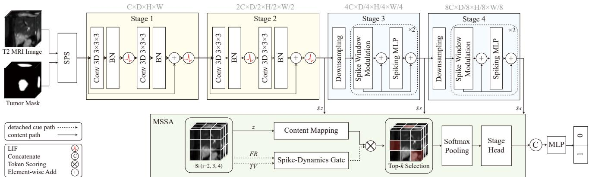
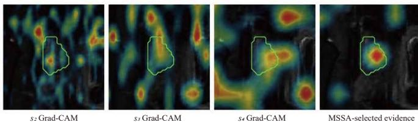

# SCINTILLA-SNN: A Spiking Multi-Scale Selective Aggregation Network for Perineural Invasion Prediction

Youngung Han1,2, Yului Jeong1, Kyeonghun Kim2, Dohyun Kweon2,3, Suah Park1, Hyunsu Go1, Sungha Park1,4, Anna Jung1, Jinyong Jun1, Yunho Choe1, Yunjin Seo1, Ken Ying-Kai Liao5, Hyuk-Jae Lee1, Nam-Joon Kim1,†

1Seoul National University, Seoul, Republic of Korea 2OUTTA, Seoul, Republic of Korea

3Kyung Hee University, Seoul, Republic of Korea 4Seoul National University School of Medicine, Seoul, Republic of Korea

5NVIDIA AI Technology Center, Taipei, Taiwan

†Corresponding author: knj01@snu.ac.kr

Abstract—Preoperative prediction of perineural invasion (PNI) in cholangiocarcinoma (CCA) is clinically valuable but remains challenging because PNI-related cues on magnetic resonance imaging (MRI) are subtle, sparse, and spatially localized around the tumor boundary. Standard 3D CNN and transformer architectures process volumetric data in a dense or spatially uniform manner, which can dilute subtle PNI-related evidence while requiring a large number of multiply-accumulate operations over 3D feature grids. To address these limitations, we propose SCINTILLA-SNN, a 3D spiking network composed of a four-stage hierarchical backbone and a Multi-Scale Spike Aggregation (MSSA) module for PNI prediction. The backbone extracts hierarchical volumetric representations through spiking convolutional stages and local spike window modulation stages. Given the resulting stage-wise representations, MSSA maps each spatial token to a learnable content value and modulates it with a spike-dynamics gate derived from firing rate and timestep-wise membrane-potential variability. The resulting score, referred to as the diagnostic token score, is used to selectively aggregate sparse PNI-related evidence. Experiments on a 10-year retrospective cohort of 182 CCA patients show that SCINTILLA-SNN achieves an AUROC of 0.748 under 5-fold cross-validation, while reducing the estimated inference energy by 23.18× compared with dense MAC-only computation of the same network.

Index Terms—Spiking Neural Network, 3D Medical Image Classification, Perineural Invasion, Cholangiocarcinoma

## I. INTRODUCTION

Perineural invasion (PNI) is an important pathological indicator in cholangiocarcinoma (CCA) [1]. Since PNI status is usually confirmed only after surgical resection, reliable preoperative prediction from MRI is clinically meaningful [2]– [4]. However, MRI-based PNI prediction remains challenging because PNI-related findings are often subtle, sparse, and localized near the tumor periphery. Image-based PNI prediction has been investigated using radiomics, clinical variables, and deep-learning models. Radiomic approaches rely on predefined handcrafted features and typically require explicit feature selection to address the high dimensionality of the extracted feature space [5], [6]. More recently, 3D CNN and transformer-based models learn volumetric representations directly from MRI [7]–[11].

However, many deep models process volumetric feature grids in a dense or spatially uniform manner [12], [13], which may weaken subtle and localized PNI-related signals. Moreover, dense processing of 3D MRI requires a large number of multiply-accumulate (MAC) operations over volumetric feature grids [12], [14], increasing inference energy consumption and making such models less practical for resourceconstrained clinical settings.

Spiking neural networks (SNNs) offer a promising direction for energy-efficient inference by replacing multiplyaccumulate (MAC) operations with accumulate (AC) operations in the sparse spike domain [15], [16]. Recent spiking transformers extend SNNs with spike-based attention mechanisms to improve representational capacity, but mainly address efficient feature computation at the architecture and attention level [17]–[21]. In MRI-based PNI prediction, however, the challenge is not only efficient computation but also preserving subtle and spatially localized diagnostic signals within redundant 3D volumes. Spatially uniform aggregation may dilute these sparse signals, motivating a 3D spiking framework that combines sparse spike-based computation with selective, diagnosis-oriented aggregation of PNI-relevant volumetric patterns [22]–[24].

To this end, we propose SCINTILLA-SNN, a hierarchical spiking network for MRI-based PNI prediction. The model combines a four-stage spiking backbone with a Multi-Scale Spike Aggregation (MSSA) module, which modulates learnable content values with spike-dynamics cues to selectively aggregate diagnostic evidence across multiple feature scales.

The main contributions of this work are as follows. First, we propose MSSA, a multi-scale spike aggregation module that selectively aggregates informative tokens across multiple backbone stages, replacing spatially uniform pooling of volumetric spike features. Second, we introduce a spikedynamics gate that combines firing-rate activity and timestep wise membrane-potential variability with learnable content values, enabling token selection based on both feature content and spike-dynamics cues. Third, we validate SCINTILLA-SNN on a retrospective cohort of 182 cholangiocarcinoma patients, where it achieves the highest AUROC among the evaluated baselines. Ablation studies further support the contribution of spike-dynamics gating and selective token aggregation, while operation-level energy analysis provides an additional view of its efficiency.

  
Fig. 1. Overall architecture of SCINTILLA-SNN. A two-channel T2W volume is processed over $T = 4$ timesteps by an SPS stem and a four-stage hierarchical spiking backbone, where Stages 1–2 use residual spiking convolution blocks and Stages 3–4 use spike window modulation blocks. MSSA aggregates the multi-scale outputs s2, s3, and s4 using content mapping, spike-dynamics cues, and top-k selection for PNI classification.

## II. METHOD

## A. Overview

SCINTILLA-SNN is a 3D spiking neural network (SNN) that maps a two-channel input volume $x \in \mathbb { R } ^ { B \times 2 \times D \times H \times W }$ to binary PNI logits. The two channels are the normalized T2-weighted (T2W) intensity image and the tumor mask. As shown in Fig. 1, the input volume is processed through (i) a 3D spiking patch stem (SPS), (ii) a four-stage hierarchical spiking backbone, (iii) a multi-scale spike aggregation (MSSA) module operating on the outputs of Stages 2–4, denoted as s2, s3, and $s _ { 4 } .$ , and (iv) an MLP classifier.

## B. LIF Spiking Dynamics

Under direct encoding, the input volume x is fed to the network for T timesteps. We adopt a standard LIF neuron with hard reset [25], [26]:

$$
\tilde { u } _ { t } = \beta u _ { t - 1 } + I _ { t } , \quad s _ { t } = \mathrm { H } \big ( \tilde { u } _ { t } - v _ { \mathrm { t h } } \big ) , \quad u _ { t } = \tilde { u } _ { t } \big ( 1 - s _ { t } \big )\tag{1}
$$

where $\beta$ is the membrane decay factor, $v _ { \mathrm { t h } }$ is the firing threshold, and $\mathrm { H } ( \cdot )$ is the Heaviside step function [26]. Here $\tilde { u } _ { t }$ denotes the pre-reset membrane potential, which is used in MSSA to compute membrane-potential variability.

## C. 3D Hierarchical Spiking Backbone

The backbone uses a base channel width of C=32 with channel multipliers {1, 2, 4, 8} across the four stages. The SPS projects the 2-channel input to C channels using two Conv3D– BN–LIF blocks with stride 1. Stage 1 uses a stride-1 spiking residual convolution block: Conv3D–BN–LIF is followed by Conv3D–BN, shortcut addition, and a final LIF activation. Stage 2 follows the same residual formulation, but uses stride 2 in the first convolution and a projection shortcut for downsampling, producing the output s2. Stages 3 and 4 each begin with a single stride-2 spiking downsampling operation, followed by two spike window blocks. Each block contains a windowmodulation residual sub-block and a spiking-MLP residual sub-block, summarized as BN–spike window modulation– Add–LIF and BN–spiking MLP–Add–LIF, respectively. These stages produce $s _ { 3 }$ with 4C channels and $s _ { 4 }$ with 8C channels. The multi-scale outputs s2, s3, and $s _ { 4 }$ are passed to MSSA.

## D. Spike Window Modulation

Stages 3 and 4 operate on local 3D windows. Within each window, convolutional projections followed by LIF neurons generate spike-form Q, K, and V . We then apply a lightweight element-wise modulation:

$$
Y = \eta \big ( ( Q \odot K ) \odot V \big )\tag{2}
$$

where $\odot$ denotes element-wise multiplication, $\eta = 1 / \sqrt { d _ { h } }$ is a fixed scaling factor, and $d _ { h }$ denotes the per-head channel dimension. This operation provides local spike-form feature modulation within each 3D window without dense softmax attention. The modulated features are projected back to the stage feature space and combined with the block input through residual addition followed by LIF activation. The subsequent spiking MLP is implemented with point-wise Conv3D–BN– LIF–Dropout–Conv3D–BN layers, followed by residual addition and a final LIF activation.

## E. Multi-Scale Spike Aggregation

MSSA is the main aggregation module of SCINTILLA-SNN. Given the stage outputs $s _ { 2 } , s _ { 3 } ,$ , and $s _ { 4 }$ , MSSA assigns a content value to each spatial token, which is then modulated into a diagnostic token score used to aggregate only the most informative tokens from each stage. For each backbone stage $i \in \{ 2 , 3 , 4 \}$ , MSSA maintains one content path and two detached spike-dynamics cue paths. The content path $\bar { f } _ { i } \ \in \ \mathbb { R } ^ { B \times C _ { i } \times \bar { D _ { i } } \times H _ { i } \times \mathbf { \bar { W } } _ { i } }$ is obtained by averaging the pertimestep stage outputs over t and is spatially flattened into token features $\boldsymbol { z } _ { i } ^ { \mathrm { ~ \tiny ~ \bar ~ { ~ \cdot ~ } ~ } } \in \mathbb { R } ^ { B \times N _ { i } \times C _ { i } }$ , with $N _ { i } { = } D _ { i } H _ { i } W _ { i }$ . The detached cue paths consist of the binary spike-output stack $S _ { i }$ and the pre-reset membrane-potential stack $M _ { i } .$ , both in $\mathbb { R } ^ { T \times B \times C _ { i } \times D _ { i } \times H _ { i } \times W _ { i } }$ , flattened along the same dimensions to yield per-token firing rate (FR) and timestep-wise membranepotential variability (TV).

Content mapping. A two-layer MLP with LayerNorm and GELU maps each token to a learnable scalar content value:

$$
\phi _ { i } \left( z _ { i } ( n ) \right) \in \mathbb { R }\tag{3}
$$

Spike-dynamics cues. MSSA computes two scalar spikedynamics cues for each token: FR from the spike-output stack and TV from the pre-reset membrane-potential stack,

$$
\mathrm { F R } _ { i } ( n ) = \mathrm { m e a n } _ { t } \mathrm { m e a n } _ { c } S _ { i , t , c , n } ,\tag{4}
$$

$$
\mathrm { T V } _ { i } ( n ) = \mathrm { m e a n } _ { c } \mathrm { s t d } _ { t } M _ { i , t , c , n }\tag{5}
$$

TV is computed from the pre-reset membrane-potential stack rather than from binary spikes to capture real-valued membrane fluctuations that are complementary to FR. Before gating, the content value, FR, and TV are z-score normalized across spatial tokens within each stage to reduce scale mismatch:

$$
\widehat { x } _ { i } ( n ) = \frac { x _ { i } ( n ) - \mu _ { n } ( x _ { i } ) } { \sigma _ { n } ( x _ { i } ) + \epsilon } , \quad x _ { i } \in \{ \phi _ { i } , \mathrm { F R } _ { i } , \mathrm { T V } _ { i } \}\tag{6}
$$

Diagnostic token score. MSSA uses a spike-dynamics gate to modulate the normalized content value into a diagnostic token score:

$$
g _ { i } ( n ) = \sigma \Big ( \mathbf { w } _ { i } ^ { \top } \left[ \lambda _ { \mathrm { F R } } \widehat { \mathrm { F R } } _ { i } ( n ) , \lambda _ { \mathrm { T V } } \widehat { \mathrm { T V } } _ { i } ( n ) \right] + b _ { i } \Big )\tag{7}
$$

$$
\mathrm { s c o r e } _ { i } ( n ) = \mathrm { s o f t p l u s } \Big ( \widehat { \phi } _ { i } ( n ) \Big ) \cdot g _ { i } ( n )\tag{8}
$$

where $\sigma ( \cdot )$ is the sigmoid function, and $\mathbf { w } _ { i }$ and $b _ { i }$ are stagespecific learnable gate parameters shared across tokens within stage i. The scalars $\lambda _ { \mathrm { F R } }$ and $\lambda _ { \mathrm { T V } }$ control the contribution of the FR and TV cues.

Top-k pooling. For each stage, we retain the $k _ { i }$ tokens with the largest diagnostic scores and aggregate them using a scoreweighted softmax:

$$
p _ { i } = \sum _ { n \in \mathcal { T } _ { i } ^ { ( k ) } } \operatorname { s o f t m a x } _ { n } \bigl ( \operatorname { s c o r e } _ { i } ( n ) \bigr ) z _ { i } ( n )\tag{9}
$$

The pooled vector is projected by a per-stage head $h _ { i } ( \cdot )$ implemented as LayerNorm–Linear–GELU–Dropout, and the resulting multi-scale evidence vectors are concatenated and normalized:

$$
\begin{array} { r } { e _ { i } = h _ { i } ( p _ { i } ) \in \mathbb { R } ^ { B \times d _ { e } } , \quad e = \mathrm { L N } ( [ e _ { 2 } ; e _ { 3 } ; e _ { 4 } ] ) } \end{array}\tag{10}
$$

where $\boldsymbol { e } \in \mathbb { R } ^ { B \times 3 d _ { e } }$

## F. Objective Function

The classifier is an MLP head that produces two-class logits. The training objective combines a class-weighted focal loss [27] with label smoothing and two lightweight regularizers,

$$
\mathcal { L } = \mathcal { L } _ { \mathrm { f o c a l } } + \lambda _ { \mathrm { f r e } } \mathcal { R } _ { \mathrm { f i r e } } + \lambda _ { \mathrm { l a s s o } } \mathcal { R } _ { w }\tag{11}
$$

where $\mathcal { R } _ { \mathrm { f i r e } }$ is an $L _ { 1 }$ penalty on the mean firing activity computed from the stage spike-output stacks $S _ { 2 } , S _ { 3 }$ , and $S _ { 4 }$ encouraging sparse firing, and $\mathcal { R } _ { w }$ is a standard $L _ { 1 }$ weight penalty.

## III. EXPERIMENTS

## A. Dataset and Implementation Details

Dataset. We used T2-weighted MRI from a private singlecenter retrospective cohort collected over more than a decade, consisting of 182 patients with histologically confirmed cholangiocarcinoma. Of these patients, 112 were PNI-negative and 70 were PNI-positive, corresponding to a positive-class proportion of 38.5%. Tumor and liver segmentation masks were manually delineated by radiology experts using 3D Slicer [28]. Each volume was resampled to a voxel spacing of $1 . 5 6 2 5 \times 1 . 5 6 2 5 \times 4 . 0$ mm and cropped into a tumorcentered region of $9 6 \times 9 6 \times 4 8$ voxels [29]. A two-channel input was constructed by channel-wise stacking the normalized intensity image and the tumor mask; the intensity channel was processed with percentile clipping followed by z-score normalization, while the tumor mask was kept as a binary float channel. We performed patient-level 5-fold cross-validation and selected checkpoints based on validation AUROC. All baselines were trained and evaluated using the same twochannel input protocol.

Implementation. Models were trained for 100 epochs per fold with batch size 2 on a single NVIDIA A100 GPU using AdamW [30] with a learning rate of $1 0 ^ { - 4 }$ , weight decay of $1 0 ^ { - 4 }$ , cosine annealing, gradient clipping at 1.0, and mixedprecision training. Data augmentation was limited to axial flips, applied identically to the image and mask channels, and intensity jitter applied only to the image channel.

SCINTILLA-SNN used base channel width of $C { = } 3 2 , T { = } 4$ LIF timesteps, dropout 0.3, two spike window blocks in each of Stages 3 and 4, four Q/K/V heads, an MLP ratio of 2.0, and local window sizes of 3×4×4 for Stage 3 and 3×3×3 for Stage 4. The MSSA evidence dimension was set to $d _ { e } = 1 2 8$ with top-k values of 512, 256, and 128 for $s _ { 2 } ~ ( N _ { 2 } { = } 5 5 , 2 9 6 ;$ ≈ 0.93%), s (N =6,912; ≈ 3.70%), and $s _ { 4 } ~ ( N _ { 4 } { = } 8 6 4 ; \approx$ 14.81%), respectively. Because the content value, FR, and TV are z-score normalized across spatial tokens within each stage before gating, we set $\lambda _ { \mathrm { F R } } = \lambda _ { \mathrm { T V } } = 1 . 0$ in the full model.

The training loss used class-weighted focal loss [27] with $\gamma { = } 2 . 0$ and label smoothing of 0.05, with $\lambda _ { \mathrm { f i r e } } { = } 1 0 ^ { - 3 }$ and $\lambda _ { \mathrm { l a s s o } } { = } 1 0 ^ { - 7 }$ for the firing-rate and weight regularizers, respectively. For LIF neurons, we used membrane leak $\beta { = } 0 . 5 ,$ , firing threshold $v _ { \mathrm { t h } } { = } 1 . 0$ , and sigmoid surrogate steepness $\alpha _ { s } { = } 4 . 0$

## B. Main Results

Table I summarizes the main comparison. SCINTILLA-SNN achieves the highest AUROC of 0.748 with 2.83M parameters. Compared with CNN baselines, SCINTILLA-SNN improves discrimination while maintaining a compact parameter count. Compared with transformer baselines, including Vision Transformer and Swin Transformer, it achieves higher AUROC with lower operation-level energy. The pure spiking baselines show substantially lower energy consumption but lower AUROC, suggesting that spike-based efficiency alone is insufficient for sparse PNI-related patterns. Overall,

TABLE I  
PERFORMANCE AND OPERATION-LEVEL ENERGY COMPARISON UNDER5-FOLD CROSS-VALIDATION.
<table><tr><td>Model</td><td>Param (M)</td><td>OPs (G)</td><td>Energy (mJ)</td><td>AUROC</td></tr><tr><td>ResNet-18 [31]</td><td>33.2</td><td>62.71</td><td>288.47</td><td>0.695</td></tr><tr><td>DenseNet-121 [32]</td><td>11.3</td><td>10.25</td><td>47.14</td><td>0.714</td></tr><tr><td>Vision Transformer [12]</td><td>86.0</td><td>33.22</td><td>152.81</td><td>0.702</td></tr><tr><td>Swin Transformer [14]</td><td>27.85</td><td>17.58</td><td>80.87</td><td>0.724</td></tr><tr><td>Spikformer [17]</td><td>0.87</td><td>1.46</td><td>5.40</td><td>0.649</td></tr><tr><td>Spike-driven Transformer [18]</td><td>0.87</td><td>1.43</td><td>5.38</td><td>0.679</td></tr><tr><td>SCINTILLA-SNN (Ours)</td><td>2.83</td><td>21.92</td><td>35.99</td><td>0.748</td></tr></table>

  
Fig. 2. Stage-wise Grad-CAM and MSSA-selected evidence for a representative PNI-positive case, overlaid on the T2-weighted image (tumor contour in green).

SCINTILLA-SNN provides the best accuracy–energy trade-off among the evaluated models.

## C. Qualitative Visualization

Fig. 2 shows a representative PNI-positive case. The stagewise Grad-CAM maps exhibit diffuse responses, whereas the MSSA-selected evidence is more concentrated near the tumor contour. This supports the role of MSSA in selecting sparse, tumor-associated tokens from multi-scale features.

## D. Ablation Study

Table II summarizes MSSA ablations under 5-fold crossvalidation. Removing the firing-rate input causes the largest AUROC drop and pushes performance below the content-only baseline, indicating that firing-rate activity is the dominant gating cue and that membrane-potential variability alone is insufficient. In contrast, removing TV causes a smaller drop while remaining above the content-only baseline, and the full model outperforms both single-cue variants, indicating that TV is most useful as a complementary cue to FR and that the two cues jointly refine token selection. Replacing top-k selection with global average pooling further degrades performance, supporting selective aggregation for sparse PNIrelated features.

## E. Energy Analysis

Energy consumption is reported using operation-level estimates based on a 45-nm energy model with $E _ { \mathrm { M A C } } = 4 . 6$ pJ and $E _ { \mathrm { A C } } = 0 . 9$ pJ [33]. Layers receiving continuous-valued inputs are counted as MAC operations, whereas convolutional and linear layers receiving binary spike inputs are counted as firing-rate-weighted synaptic operations (SOPs), implemented as AC operations [17], [18]:

$$
\mathrm { S O P } ( l ) = \bar { s } _ { l } \cdot \Phi _ { l } ,\tag{12}
$$

TABLE II  
ABLATION ON MSSA COMPONENTS UNDER 5-FOLD CROSS-VALIDATION.
<table><tr><td>Variant</td><td>AUROC</td></tr><tr><td>SCINTILLA-SNN</td><td>0.748</td></tr><tr><td>w/o FR input</td><td>0.662</td></tr><tr><td>w/o TV input</td><td>0.721</td></tr><tr><td>content only</td><td>0.704</td></tr><tr><td>top-k → global average pool</td><td>0.700</td></tr></table>

where $\bar { s } _ { l }$ is the observed input firing rate of layer l and $\Phi _ { l }$ is the dense operation count of the corresponding layer.

SCINTILLA-SNN also includes auxiliary operations (LIF updates, normalization, element-wise window modulation, fixed scaling, MSSA cues, top-k selection, and softmax pooling). To avoid underestimating this overhead, we conservatively charge all auxiliary operations at the MAC energy cost:

$$
E _ { \mathrm { t o t a l } } = E _ { \mathrm { M A C } } \Phi _ { \mathrm { M A C } } + E _ { \mathrm { A C } } \Phi _ { \mathrm { S O P } } + E _ { \mathrm { M A C } } \Phi _ { \mathrm { a u x } } .\tag{13}
$$

For the full SCINTILLA-SNN model, the dense ANNequivalent Conv/Linear cost is 181.33G operations, corresponding to 834.10 mJ if computed entirely as MAC operations. With module-wise firing-rate profiling, the effective computation consists of 1.82G MACs, 17.53G AC/SOPs, and 2.58G auxiliary operations. Under the conservative auxiliaryas-MAC estimate, SCINTILLA-SNN requires 35.99 mJ, corresponding to a 23.18× reduction compared with dense MAConly computation.

## IV. CONCLUSION

We introduced SCINTILLA-SNN, which combines hierarchical volumetric spiking feature extraction with MSSA-based selective multi-scale aggregation for MRI-based PNI prediction. By modulating token content with spike-dynamics cues derived from firing rate and membrane-potential variability, the model selectively aggregates diagnostic evidence rather than uniformly pooling volumetric features, achieving the best accuracy–energy trade-off among the evaluated models on a single-center CCA cohort. Going forward, external, multiinstitutional validation is needed to assess its generalizability across imaging protocols and clinical settings.

## ACKNOWLEDGMENT

This work was supported by the IITP grant (IITP-2023-RS-2023-00256081) funded by MSIT, Korea, and the ANCHOR program (2026-ANCHOR-01-110) funded by the Ministry of Education and the Seoul Metropolitan Government, Republic of Korea.

## REFERENCES

[1] C. Liebig, G. Ayala, J. A. Wilks, D. H. Berger, and D. Albo, “Perineural invasion in cancer: a review of the literature,” Cancer, vol. 115, no. 15, pp. 3379–3391, 2009.

[2] S. Conti, N. S. Tissera, F. Castet et al., “Perineural invasion is a prognostic factor in cholangiocarcinoma, regardless of anatomical location: a systematic review and meta-analysis,” JHEP Reports, p. 101770, 2026.

[3] C.-G. Li, Z.-P. Zhou, X.-L. Tan, and Z.-M. Zhao, “Perineural invasion of hilar cholangiocarcinoma in Chinese population: one center’s experience,” World Journal of Gastrointestinal Oncology, vol. 12, no. 4, p. 457, 2020.

[4] T. Wei, X.-F. Zhang, J. He et al., “Prognostic impact of perineural invasion in intrahepatic cholangiocarcinoma: multicentre study,” British Journal of Surgery, vol. 109, no. 7, pp. 610–616, 2022.

[5] P. Lambin, R. T. Leijenaar, T. M. Deist et al., “Radiomics: the bridge between medical imaging and personalized medicine,” Nature Reviews Clinical Oncology, vol. 14, no. 12, pp. 749–762, 2017.

[6] J. J. Van Griethuysen, A. Fedorov, C. Parmar, A. Hosny, N. Aucoin, V. Narayan, R. G. Beets-Tan, J.-C. Fillion-Robin, S. Pieper, and H. J. Aerts, “Computational radiomics system to decode the radiographic phenotype,” Cancer research, vol. 77, no. 21, pp. e104–e107, 2017.

[7] Y. Han, H. Go, K. Kim, I. Um, J. Kim, J. Jung, N.-J. Kim, W. K. Jeong, W. J. Lee, K. Y.-K. Liao et al., “Losa-net: A localized and scale-adaptive network for boundary-sensitive prediction of perineural invasion in 3d mri,” in 2026 IEEE 23rd International Symposium on Biomedical Imaging (ISBI). IEEE, 2026, pp. 1–5.

[8] Y. Han, I. Um, K. Kim, J. Kim, H. Go, J. Jung, N.-J. Kim, W. K. Jeong, W. J. Lee, P. Hong et al., “Mma-former: Multi-window mixtureof-head attention transformer for adaptive pni prediction in 3d mri,” in 2026 IEEE 23rd International Symposium on Biomedical Imaging (ISBI). IEEE, 2026, pp. 1–5.

[9] Y. Han, M. Cha, K. Kim, I. Um, M. Sho, J. Y. Bae, J. Jung, J. H. Park, S. Lee, N.-J. Kim et al., “Neonet: An end-to-end 3d mri-based deep learning framework for non-invasive prediction of perineural invasion via generation-driven classification,” arXiv preprint arXiv:2603.29449, 2026.

[10] I. Um, Y. Han, K. Kim, Y. Jeong, J. Jeong, H. Go, D. Kweon, S. Park, J. Kim, A. Jung et al., “Spikeds: Dual sparsity spikformer for perineural invasion prediction in 3d mri,” arXiv preprint arXiv:2607.11986, 2026.

[11] Y. Han, D. Kweon, K. Kim, H. Go, J. Jeong, S. Park, I. Um, J. Kim, A. Jung, Y. Jeong et al., “Adaptive routing for efficient diffusion transformer-based pni prediction,” arXiv preprint arXiv:2607.11533, 2026.

[12] A. Dosovitskiy, L. Beyer, A. Kolesnikov, D. Weissenborn, X. Zhai, T. Unterthiner, M. Dehghani, M. Minderer, G. Heigold, S. Gelly et al., “An image is worth 16x16 words: Transformers for image recognition at scale,” arXiv preprint arXiv:2010.11929, 2020.

[13] Y. Rao, W. Zhao, B. Liu, J. Lu, J. Zhou, and C.-J. Hsieh, “Dynamicvit: Efficient vision transformers with dynamic token sparsification,” Advances in neural information processing systems, vol. 34, pp. 13 937– 13 949, 2021.

[14] Z. Liu, Y. Lin, Y. Cao, H. Hu, Y. Wei, Z. Zhang, S. Lin, and B. Guo, “Swin transformer: Hierarchical vision transformer using shifted windows,” in Proceedings of the IEEE/CVF international conference on computer vision, 2021, pp. 10 012–10 022.

[15] K. Roy, A. Jaiswal, and P. Panda, “Towards spike-based machine intelligence with neuromorphic computing,” Nature, vol. 575, no. 7784, pp. 607–617, 2019.

[16] B. Yin, F. Corradi, and S. M. Bohte, “Accurate and efficient time-domain´ classification with adaptive spiking recurrent neural networks,” Nature Machine Intelligence, vol. 3, no. 10, pp. 905–913, 2021.

[17] Z. Zhou, Y. Zhu, C. He, Y. Wang, S. Yan, Y. Tian, and L. Yuan, “Spikformer: When spiking neural network meets transformer,” arXiv preprint arXiv:2209.15425, 2022.

[18] M. Yao, J. Hu, Z. Zhou, L. Yuan, Y. Tian, B. Xu, and G. Li, “Spikedriven transformer,” Advances in neural information processing systems, vol. 36, pp. 64 043–64 058, 2023.

[19] Z. Wang, Y. Fang, J. Cao, Q. Zhang, Z. Wang, and R. Xu, “Masked spiking transformer,” in Proceedings of the IEEE/CVF international conference on computer vision, 2023, pp. 1761–1771.

[20] C. Zhou, H. Zhang, Z. Zhou, L. Yu, L. Huang, X. Fan, L. Yuan, Z. Ma, H. Zhou, and Y. Tian, “Qkformer: Hierarchical spiking transformer using qk attention,” Advances in Neural Information Processing Systems, vol. 37, pp. 13 074–13 098, 2024.

[21] C. Zhou, L. Yu, Z. Zhou, Z. Ma, H. Zhang, H. Zhou, and Y. Tian, “Spikingformer: Spike-driven residual learning for transformer-based spiking neural network,” arXiv preprint arXiv:2304.11954, 2023.

[22] K. Kim, J. Bae, Y. Han, J. Y. Bae, S. Ju, J. Lim, G. Kim, N.-J. Kim, W. K. Jeong, K. Y.-K. Liao et al., “3d-lldm: Label-guided 3d latent diffusion model for improving high-resolution synthetic mr imaging in hepatic

structure segmentation,” in 2026 IEEE 23rd International Symposium on Biomedical Imaging (ISBI). IEEE, 2026, pp. 1–5.

[23] Y. Han, K. Kim, S. Ju, Y. Jean, M. Cha, S. Park, H. Jung, N.-J. Kim, W. K. Jeong, K. Y.-K. Liao et al., “Foscu: Feasibility of synthetic mri generation via duo-diffusion models for enhancement of 3d u-nets in hepatic segmentation,” in 2025 IEEE Asia Pacific Conference on Circuits and Systems (APCCAS). IEEE, 2025, pp. 1–5.

[24] K. Kim, H. Jung, Y. Han, J. Lim, Y. Jean, S. Park, E. Choi, H. Go, S. Ju, S. Park et al., “Maesil: Masked autoencoder for enhanced selfsupervised medical image learning,” in 2026 International Conference on Electronics, Information, and Communication (ICEIC). IEEE, 2026, pp. 1–5.

[25] Y. Wu, L. Deng, G. Li, J. Zhu, and L. Shi, “Spatio-temporal backpropagation for training high-performance spiking neural networks,” Frontiers in Neuroscience, vol. 12, May 2018. [Online]. Available: http://dx.doi.org/10.3389/fnins.2018.00331

[26] E. O. Neftci, H. Mostafa, and F. Zenke, “Surrogate gradient learning in spiking neural networks,” IEEE Signal Processing Magazine, vol. 36, no. 6, pp. 51–63, 2019.

[27] T.-Y. Lin, P. Goyal, R. Girshick, K. He, and P. Dollar, “Focal loss´ for dense object detection,” in Proceedings of the IEEE international conference on computer vision, 2017, pp. 2980–2988.

[28] A. Fedorov, R. Beichel, J. Kalpathy-Cramer, J. Finet, J.-C. Fillion-Robin, S. Pujol, C. Bauer, D. Jennings, F. Fennessy, M. Sonka, J. Buatti, S. Aylward, J. V. Miller, S. Pieper, and R. Kikinis, “3D Slicer as an image computing platform for the quantitative imaging network,” Magnetic resonance imaging, vol. 30, no. 9, pp. 1323–1341, 2012.

[29] Z. Liu, C. Luo, X. Chen et al., “Noninvasive prediction of perineural invasion in intrahepatic cholangiocarcinoma with interpretable machine learning based on MRI,” International Journal of Surgery, vol. 110, no. 2, pp. 1039–1051, 2024.

[30] I. Loshchilov and F. Hutter, “Decoupled weight decay regularization,” in Proc. ICLR, 2019.

[31] K. He, X. Zhang, S. Ren, and J. Sun, “Deep residual learning for image recognition,” in Proceedings of the IEEE conference on computer vision and pattern recognition, 2016, pp. 770–778.

[32] G. Huang, Z. Liu, L. Van Der Maaten, and K. Q. Weinberger, “Densely connected convolutional networks,” in Proceedings of the IEEE conference on computer vision and pattern recognition, 2017, pp. 4700–4708.

[33] M. Horowitz, “1.1 computing’s energy problem (and what we can do about it),” in 2014 IEEE international solid-state circuits conference digest of technical papers (ISSCC). IEEE, 2014, pp. 10–14.