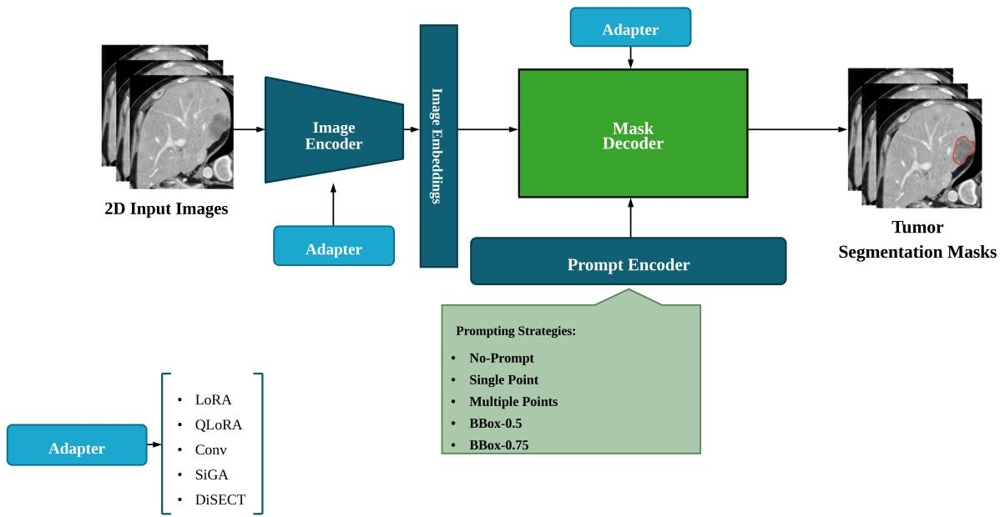

# Spectral Adapters for Segment Anything Model-based Segmentation of Colorectal Liver Metastases in Computed Tomography

Ramtin Mojtahedia,1,\*, Mohammad Hamghalama,e, Jacob J. Peoplesb, Natalie Gangaib Mithat Gonenf, Yun Shin Chung, HyunSeon Christine Kangh, Richard K. G. Dob, Amber L. Simpsonc,d

aSchool of Computing, Queen’s University, Kingston, ON, Canada

bDepartment of Radiology, Memorial Sloan Kettering Cancer Center, New York, NY, USA cDepartment of Radiology and Diagnostic Imaging, University of Alberta, Edmonton, AB, Canada dAlberta Machine Intelligence Institute, Edmonton, AB, Canada

eDepartment of Electrical Engineering, Qazvin Branch, Islamic Azad University, Qazvin, Iran   
fDepartment of Epidemiology and Biostatistics, Memorial Sloan Kettering Cancer Center, New York, NY, USA   
gDepartment of Surgical Oncology, The University of Texas MD Anderson Cancer Center, Houston, TX, USA   
hDepartment of Abdominal Imaging, The University of Texas MD Anderson Cancer Center, Houston, TX, USA   
1Present address: Toronto General Hospital Research Institute, University Health Network, 200 Elizabeth Street, Toronto, ON M5G 2C4, Canada \* \*

Corresponding author: ramtin.mojtahedi@queensu.ca

Preprint. Submitted for peer review.

## Abstract

Background and Objectives: Accurate segmentation of colorectal liver metastases (CRLM) in contrast-enhanced computed tomography (CT) is essential for response assessment, surgical planning, and longitudinal follow-up. Promptable foundation models like the Segment Anything Model (SAM) ofer reusable backbones, but full fine-tuning of vision transformers is often infeasible due to GPU and time constraints. We propose two spectral adapter architectures, the Directional Spectral Adapter (DiSECT) and Spectral Instance-Guided Adapter (SiGA), to eficiently adapt SAM for CRLM segmentation in CT.

Methods: We develop SAM-based segmentation models by integrating adapter modules into a frozen SAM Vision Transformer-Base backbone. DiSECT leverages singular value decomposition of frozen weights to constrain residual updates within the leading spectral subspace, while SiGA incorporates global and input-conditioned gating through a multilayer perceptron. We compare DiSECT and SiGA with low-rank adaptation (LoRA), quantized low-rank adaptation (QLoRA), and convolutional adapter (CAD) on 446 contrast-enhanced CT volumes (355 training, 91 testing) using slice-wise experiments across single-point, three-point, bounding-box, and no-prompt regimes.

Results: Compared with standard parameter-eficient fine-tuning techniques, SiGA achieves the highest single-point performance with 0.77 Dice similarity coeficient, 0.69 intersection over union (IoU), and 35.39 mm 95th-percentile Hausdorf distance (HD95). In no-prompt inference, SiGA attains 0.76 Dice, 0.68 IoU, and 46.76 mm HD95, comparable to the nnU-Net baseline (0.758 Dice). DiSECT ofers an ultra-lightweight configuration with only 0.14 million trainable parameters.

Conclusions: Spectral adapters enable SAM to deliver competitive CRLM segmentation in CT with minimal trainable parameters, facilitating eficient deployment in resource-constrained clinical environments.

Keywords: Spectral adapters; Medical image segmentation; Liver tumor; Colorectal liver metastases; Segment Anything Model; Parameter-eficient fine-tuning

## 1 Introduction

Liver metastases from colorectal cancer are common and clinically significant, and contrast-enhanced computed tomography (CT) remains the primary imaging modality for detection, staging, and monitoring. Accurate segmentation of colorectal liver metastases (CRLM) supports volumetric tumor burden assessment, radiomics analysis, and treatment response evaluation, but manual delineation is time-consuming and prone to inter-observer variability. Benchmarks such as the Liver Tumor Segmentation (LiTS) challenge show that liver segmentation can reach Dice similarity coeficient (DSC) values around 0.96, whereas tumor segmentation remains harder, with top DSC values between 0.67 and 0.74 [1]. CRLM-focused studies further highlight dificulties from smal lesion size, low contrast, heterogeneous enhancement, scanner diferences, and protocol variation [2, 3, 4]. Deep convolutional neural networks (CNNs), especially U-Net-based architectures, have advanced liver and tumor segmentation, with nnU-Net serving as a strong self-configuring baseline [5]. However, nnU-Net and related three-dimensional (3D) U-Net variants remain sensitive to domain shifts and acquisition variability [3, 24] and usually require separate task-specific networks for diferent organs, tumor types, scanners, and protocols, making maintenance resource-intensive [6]. Recent vision foundation models introduce promptable segmentation: the Segment Anything Model (SAM) segments objects from points, boxes, or masks using a vision-transformer image encoder, prompt encoder, and lightweight mask decoder [7]. MedSAM adapts this framework to medical imaging across modalities and anatomical structures [8], while related medical foundation models combine large-scale pretraining with task-agnostic encoders [9, 10]. These models may generalize across segmentation tasks, but full fine-tuning of large transformer backbones is computationally expensive, limiting use where graphics processing unit (GPU) resources and annotated data are constrained [9, 10, 11].

SAM can be adapted through zero-shot use, full fine-tuning, prompt tuning, decoder-side finetuning, or lightweight encoder adapters [8, 21, 22, 23, 26]. Medical SAM Adapter (Med-SA), for example, combines lightweight adapters with hyper-prompting to capture domain-specific information with limited parameters [21, 25]. However, SAM-based medical segmentation studies suggest that naive fine-tuning and adapter placement can be suboptimal for 3D CT volumes with subtle and heterogeneous lesions, where accuracy and eficiency must be balanced [22, 23, 26].

Parameter-eficient fine-tuning (PEFT) adapts pretrained models with only a small fraction of trainable parameters while keeping most backbone weights frozen [12, 13, 14]. Low-rank adaptation (LoRA) injects low-rank residual matrices into frozen linear layers, while quantized low-rank adaptation (QLoRA) reduces memory by storing frozen weights in low-precision formats [15, 16]. Convolutional adapter (CAD) extends LoRA-style adaptation with depthwise convolutions to capture local spatial structure eficiently [17], and these methods have been applied to vision transformers and SAM-like architectures to reduce training and deployment costs [13, 14, 17, 27]. Recent spectral methods use singular value decomposition (SVD) of pretrained weights, with Spectral Adapter, SVDif, and weight-decomposed low-rank adaptation (DoRA) constraining updates to compact or directional spectral subspaces [18, 19, 20]. These approaches suggest that pretrained directional structure can improve learning eficiency and stability, but spectral adaptation has not been systematically investigated for SAM-based CRLM segmentation in CT.

Building on these insights, we propose two spectral adapter architectures for SAM: the Directional Spectral Adapter (DiSECT) and the Spectral Instance-Guided Adapter (SiGA). DiSECT performs residual updates within the leading spectral subspace of frozen transformer weights, while SiGA adds global and input-conditioned gating through a multilayer perceptron for instance-wise routing across lesions with varying size, shape, and contrast. In this work, we evaluate DiSECT and SiGA against established PEFT methods including LoRA, QLoRA, and CAD under multiple prompting strategies, and compare performance with a strong 3D nnU-Net baseline to examine whether lightweight spectral SAM adaptations can match fully trained CNN models while improving the accuracy-eficiency trade-of for biomedical software deployment.

## 1.1 Contributions

The main contributions of this work are:

• Spectral adapter design for SAM. We introduce two spectral adapter architectures, DiSECT and SiGA, operating within the singular-vector subspace of frozen transformer weights, with SiGA adding input-conditioned gating for instance-wise routing of spectral directions.

• Comprehensive CRLM evaluation in CT. We benchmark DiSECT and SiGA against established PEFT methods, including LoRA, QLoRA, and CAD, under multiple prompting strategies.

• Comparison with a strong CNN baseline. We compare adapted SAM models with a 3D nnU-Net baseline for CRLM segmentation, directly evaluating foundation-model adaptation against fully trained task-specific networks.

• Performance-eficiency analysis. We analyze segmentation accuracy and computational eficiency across adapters to guide deployment of SAM-based segmentation models in resourceconstrained clinical settings.

## 2 Methods

## 2.1 Problem Formulation and Overall Architecture

Figure 1 illustrates the overall segmentation pipeline. Our framework builds on the SAM architecture [7], recently adapted to medical imaging tasks such as CT segmentation [8]. SAM consists of a vision-transformer image encoder, prompt encoder, and mask decoder that fuses image and prompt embeddings to predict segmentation masks. For CRLM segmentation in CT, we add lightweight adapter modules within the image encoder and mask decoder while keeping backbone weights frozen. The main adaptations are spectral adapters operating within the singular-vector subspace of pretrained transformer weights, enabling parameter-eficient task specialization.

  
Figure 1: Overview of the proposed pipeline. An adapterized image encoder and a prompt encoder produce embeddings that are fused in the mask decoder to predict tumor masks.

Let x denote a $d _ { \mathrm { i n } }$ -dimensional vectorized input to a linear layer with frozen weight $W \in \mathbb { R } ^ { d _ { \mathrm { o u t } } \times d _ { \mathrm { i n } } }$ and output $y \in \mathbb { R } ^ { d _ { \mathrm { o u t } } }$ . All adapters keep W frozen and add a parameter-eficient residual branch.

## 2.2 Spectral Adapters and Baseline PEFT Methods

To adapt the SAM backbone for CRLM segmentation, we propose two spectral adapter architectures and compare them with widely used PEFT baselines. The proposed adapters, DiSECT and SiGA, operate within the spectral subspace of frozen transformer weights. For comparison, we also implement three established PEFT methods: LoRA, QLoRA, and CAD. In this context, the adapter rank, $^ { r , }$ represents the number of retained singular directions for DiSECT and SiGA, whereas for LoRA, QLoRA, and CAD, it represents the width of the low-rank or compact adapter branch. A higher r value gives the adapter more capacity, but it also increases the model’s complexity and the number of trainable parameters. The adapter rank for each PEFT method was set to $r = 6 4$ for DiSECT, r = 256 for SiGA, r = 64 for LoRA, r = 12 for QLoRA, and r = 128 for CAD.

## 2.2.1 Spectral Adapters (DiSECT and SiGA)

For the spectral adapters, we compute an SVD of the frozen weight W and retain the top r singular directions. Let

$$
W \approx U _ { r } \Sigma _ { r } V _ { r } ^ { \top }
$$

be the rank-r approximation, where $U _ { r }$ and $V _ { r }$ contain the leading left and right singular vectors.

DiSECT. This adapter defines the residual in this spectral subspace:

$$
y = W x + U _ { r } \left( g \odot \left( { V _ { r } } ^ { \top } x \right) \right) ,\tag{1}
$$

where $g \in [ 0 , 1 ] ^ { r }$ is a trainable gate vector and ⊙ denotes element-wise multiplication [18, 19]. Sparsity in g can restrict the number of active spectral directions, further improving parameter eficiency and stabilizing adaptation.

SiGA. This adapter extends DiSECT with instance-dependent gating. An instance gate $g _ { \mathrm { i n s t } } ( x ) \in$ $[ 0 , 1 ] ^ { r }$ is predicted from the current input features through a lightweight multilayer perceptron and is combined with a global gate $g _ { \mathrm { b a s e } } \in [ 0 , 1 ] ^ { r }$ :

$$
y = W x + U _ { r } \left( \left( g _ { \mathrm { i n s t } } ( x ) \odot g _ { \mathrm { b a s e } } \right) \odot \left( V _ { r } ^ { \top } x \right) \right) .\tag{2}
$$

This mechanism enables instance-aware routing of spectral directions, allowing the adapter to emphasize or suppress spectral components depending on tumor appearance, size, and contrast.

## 2.2.2 Low-Rank Adapters (LoRA and QLoRA)

LoRA. This adapter adds a low-rank residual:

$$
y = W x + \alpha B A x ,\tag{3}
$$

where $A \in \mathbb { R } ^ { r \times d _ { \mathrm { i n } } }$ and $B \in \mathbb { R } ^ { d _ { \mathrm { o u t } } \times r }$ are trainable matrices, $r \ll \operatorname* { m i n } ( d _ { \mathrm { i n } } , d _ { \mathrm { o u t } } )$ , and $\alpha > 0$ is a scalar scale factor [15].

QLoRA. This adapter follows the LoRA formulation but stores the backbone in 4-bit quantized form to reduce memory requirements:

$$
y = W _ { 4 \mathrm { b i t } } x + \alpha B A x ,\tag{4}
$$

where $W _ { \mathrm { 4 b i t } }$ is a quantized version of W kept in 4-bit precision [16].

## 2.2.3 Convolutional Adapter (CAD)

CAD augments a low-rank residual with depthwise convolutions to capture local structure [17]. Given an input x,

$$
y = W x + \eta B \operatorname { M i x } ( A x ) ,\tag{5}
$$

where A and B are learned projection layers. In the original convolutional channel adapter, A first maps the feature channels into a compact r-dimensional adapter space; for convolutional targets, these projections are implemented as $1 \times 1$ convolutions. Mix(·) applies channel-wise multi-scale depthwise convolution in this space, and B projects the result back to the original feature dimension using another 1 × 1 projection. For linear transformer target layers, the same projection-and-mixing idea is implemented using linear projections. Mix(·) is a depthwise multi-scale dilated convolution applied channel-wise, and $\eta > 0$ is a learnable gain.

## 2.3 Prompting Strategies

We evaluate prompt types detailed in Table 1: a single point, three points, bounding boxes with target intersection over union (IoU) of 0.50 or 0.75, and a no-prompt setting. Point and box prompts are automatically derived from ground-truth tumor masks for controlled evaluation. In the no-prompt setting, no point, box, or mask prompt is provided; predictions use the image input with SAM’s empty-prompt embedding. The prompt regimes were examined during development to select a reference training condition. Because single-point prompting gave the highest validation performance while requiring minimal annotation, it was selected for adapter training, model selection, and the main compute comparison; the held-out test analysis is reported under no-prompt inference.

Table 1: Prompt strategies used in this study.
<table><tr><td colspan="2">Prompt type</td><td>Prompt encoder input</td><td>Generation process</td></tr><tr><td colspan="2">Single point</td><td>One (x, y) foreground point</td><td>A point placed inside the tumor near the visual center of the selected slice.</td></tr><tr><td colspan="2">Three points</td><td>Three (x, y) points for fore- ground or background</td><td>One central positive point and two refinement points near tumor boundaries and potential confounders.</td></tr><tr><td rowspan="3">0.50</td><td>Box with IoU One rectangular box</td><td></td><td>A tight ground-truth bounding box resized until the box and the mask reach an IoU value close to 0.50.</td></tr><tr><td>Box with IoU One rectangular box</td><td></td><td>A tight ground-truth bounding box resized until the box and the mask reach an IoU value close to</td></tr><tr><td>No-prompt</td><td>No prompt input</td><td>0.75 for finer localization. Automatic mask generation without clicks or boxes at inference time.</td></tr></table>

## 2.4 Reference Fully Trained Baseline

As a strong fully trained convolutional neural network (CNN) baseline, we use the 3D nnU-Net framework [3, 5], adapted with residual encoder connections to form a Residual Encoder U-Net (ResEncUNet) [28]. The network has a seven-stage encoder-decoder structure with feature channels scaling from 32 to 320, using $3 \times 3 \times 3$ convolutions, instance normalization, LeakyReLU activations $( \alpha = 0 . 0 1 )$ , and $2 \times 2 \times 2$ strided convolutions for downsampling. It processes $9 6 \times 2 5 6 \times 2 5 6$ voxel patches and is trained on the training cohort, then evaluated on the same 91 held-out test cases used for the SAM-based models. Final predictions are generated by averaging probabilistic outputs from an ensemble of $N = 5$ models and thresholding voxel-wise probabilities at 0.5 to obtain binary tumor masks. Preprocessing follows the standard nnU-Net pipeline with liver-specific adaptations: CT intensities are clipped to the 0.5–99.5 percentile Hounsfield Unit (HU) range ([9, 208] HU), z-score standardized, and resampled to [1.5, 0.8066, 0.8066] mm per voxel to account for multi-institutiona slice thickness variability ranging from 0.8 to 7.5 mm.

## 2.5 Dataset and Preprocessing

We utilize a multi-institutional cohort of 446 portal venous phase contrast-enhanced CT volumes from patients with colorectal liver metastases (CRLM), acquired from Memorial Sloan Kettering Cancer Center and University of Texas MD Anderson Cancer Center. Public data from The Cancer Imaging Archive [29] and retrospective/prospective cohorts across cancer stages and imaging conditions improve diversity and generalizability. Mean voxel spacing is (0.822, 0.822, 4.164) mm; tumor masks were automatically generated and expert-verified. For SAM-based experiments, data are split into 355 training and 91 held-out test cases. We crop the liver and extract 2D axial tumor-positive slices; therefore, no-prompt evaluation uses these slices without point, box, or mask prompts, not full-volume detection or tumor-negative false positives. Windowing over [-150, 250] HU and normalization are applied. Slices are resized to $1 0 2 4 \times 1 0 2 4$ pixels and stored as 2D PNG images with masks, consistent with prior SAM-based methods and reducing memory and computation versus 3D processing.

## 2.6 Implementation Details

We initialize the foundation backbone with public medical adapter weights from the Medical Adapter Zoo [25], trained via Med-SA [21]; experiments use SAM Vision Transformer-Base (ViT-B) on one NVIDIA A100 GPU (40 GB). During training, only adapters are updated; pretrained weights remain frozen; models difer only in adapter design and QLoRA backbone quantization. Following SAM-style medical adaptation practices [8, 21], we apply standard augmentations and train 2D SAM-adapter models with weighted binary cross-entropy; Dice, IoU, and 95th-percentile Hausdorf distance (HD95) are used for validation/reporting. Models train up to 20 epochs using AdamW, learning rate $1 \times 1 0 ^ { - 4 }$ , weight decay 0.01, cosine scheduling, batch size 2, and gradient checkpointing. A validation split is used for model selection and early stopping; the 91 held-out test cases are excluded. Validation occurs every 5 epochs and final epoch; the highest validation-Dice checkpoint under the reference single-point prompt is retained, with early stopping after 5 epochs without improvement.

## 2.7 Evaluation Metrics

Segmentation quality is evaluated using DSC and IoU as overlap metrics and HD95 as a boundary metric [30]. Unless otherwise specified, we report training metrics under the single-point regime and held-out test metrics under the no-prompt regime.

## 3 Results

## 3.1 Training Performance and Compute Trade-Ofs

Table 2 summarizes training performance and computational characteristics under the single-point prompting regime, which achieved the highest performance among the evaluated prompt regimes, including total parameters, trainable parameters, and floating-point operations (FLOPs) per image. All methods share the same SAM backbone and difer only in adapter design. SiGA achieves the best performance, with a DSC of 0.77, IoU of 0.69, and lowest HD95 of 35.39 mm. CAD gives comparable overlap (DSC = 0.76) but with the highest computational cost, while LoRA reaches a DSC of 0.75 with moderate trainable parameters and good throughput. QLoRA slightly lowers overlap (DSC = 0.74) but achieves the fastest throughput due to backbone quantization. DiSECT is the most parameter-eficient method, with only 0.14 million trainable parameters, or 0.14% of total parameters after rounding, but has lower overlap accuracy and larger boundary error, reflecting the trade-of of extreme parameter eficiency.

Table 2: Training performance under the single-point prompting regime with compute metrics. Floating-point operations are reported in giga FLOPs per image. Latency and throughput are measured during validation. Trainable (%) is computed as 100× trainable parameters/total parameters.
<table><tr><td>Adapter</td><td>DSC</td><td>IoU</td><td>HD95 (mm)</td><td>FLOPs (G)</td><td>Params (M)</td><td>Trainable (M)</td><td>Trainable (%)</td><td>Latency (ms)</td><td>Throughput (img/s)</td></tr><tr><td>SiGA</td><td>0.77</td><td>0.69</td><td>35.39</td><td>865.92</td><td>121.26</td><td>22.18</td><td>18.29</td><td>289.15</td><td>3.46</td></tr><tr><td>CAD</td><td>0.76</td><td>0.67</td><td>41.04</td><td>1263.69</td><td>124.05</td><td>28.51</td><td>22.98</td><td>134.83</td><td>7.42</td></tr><tr><td>LoRA</td><td>0.75</td><td>0.66</td><td>41.18</td><td>882.87</td><td>113.92</td><td>9.54</td><td>8.37</td><td>121.25</td><td>8.25</td></tr><tr><td>QLoRA</td><td>0.74</td><td>0.65</td><td>45.66</td><td>882.87</td><td>113.92</td><td>1.79</td><td>1.57</td><td>115.20</td><td>8.68</td></tr><tr><td>DiSECT</td><td>0.70</td><td>0.62</td><td>52.55</td><td>770.01</td><td>99.22</td><td>0.14</td><td>0.14</td><td>158.65</td><td>6.30</td></tr></table>

## 3.2 Test Performance Under No-Prompt Setting

Table 3 reports segmentation performance on the held-out test cohort of 91 cases under the noprompt inference setting, which reflects segmentation without user-specified point or box prompts. SiGA again achieves the highest overlap performance, attaining the best DSC and IoU on the test set while maintaining competitive boundary accuracy. CAD narrows the gap in overlap metrics but retains a relatively large HD95. LoRA performs similarly to CAD in overlap but shows inferior boundary accuracy. QLoRA, despite its reduced memory footprint from backbone quantization, matches SiGA in boundary accuracy but falls behind in overlap. DiSECT yields the lowest overlap and the largest boundary error, consistent with its emphasis on extreme parameter eficiency.

Table 3: Segmentation performance on the held-out test cohort of 91 cases under no-prompt inference.
<table><tr><td>Adapter</td><td>DSC IoU</td><td>HD95 (mm)</td></tr><tr><td>SiGA</td><td>0.76 0.68</td><td>46.76</td></tr><tr><td>CAD</td><td>0.73 0.65</td><td>48.06</td></tr><tr><td>LoRA</td><td>0.74 0.65</td><td>57.88</td></tr><tr><td>QLoRA</td><td>0.70 0.61</td><td>46.30</td></tr><tr><td>DiSECT</td><td>0.70 0.61</td><td>60.11</td></tr></table>

## 3.3 Contextual Comparison with nnU-Net

To contextualize the performance of adapterized SAM-based models, Table 4 compares tumor DSC with the fully trained nnU-Net baseline. The SAM adapter values are the same no-prompt results measured on tumor-positive 2D slices in Table 3, while the nnU-Net value is the average tumor DSC from the 3D volume-based ensemble. Because IoU and HD95 were not computed under an identical 3D protocol for the baseline, DSC is used as the common metric. The nnU-Net baseline achieves 0.758 DSC, while SiGA achieves 0.76 DSC. The methods also difer in inference settings and training paradigm: nnU-Net is trained and evaluated on fully supervised 3D volumes, whereas adapterized SAM models perform slice-wise 2D segmentation with frozen backbones. Despite this diference, the results indicate that a parameter-eficient spectral adapter can approach the performance of a strong fully trained 3D baseline, while preserving promptability and the ability to be reused for other segmentation tasks.

Table 4: Comparison of tumor Dice similarity coeficient between adapterized SAM variants under no-prompt inference and the nnU-Net baseline.
<table><tr><td>Method</td><td>Tumor DSC</td></tr><tr><td>SiGA (SAM-based)</td><td>0.76</td></tr><tr><td>nnU-Net (three-dimensional CNN)</td><td>0.758</td></tr><tr><td>CAD (SAM-based)</td><td>0.73</td></tr><tr><td>LoRA (SAM-based)</td><td>0.74</td></tr><tr><td>QLoRA (SAM-based)</td><td>0.70</td></tr><tr><td>DiSECT (SAM-based)</td><td>0.70</td></tr></table>

## 4 Discussion

Among the evaluated parameter-eficient adapters integrated into the SAM-based backbone, the proposed SiGA consistently delivers the highest segmentation accuracy in training and testing. Under single-point prompting during training, SiGA achieves a DSC of 0.77, outperforming CAD, LoRA, QLoRA, and DiSECT, and on the held-out no-prompt test set reaches a DSC of 0.76 with favorable IoU and HD95 values. This advantage can be attributed to its spectral dual-gating mechanism, which combines a global gate capturing layer-wise spectral importance with an instance gate adapting spectral directions to the current input, aligning residual updates with informative spectral modes while allowing case-specific modulation. From an eficiency point of view, LoRA and QLoRA provide attractive trade-ofs: LoRA maintains moderate trainable parameters and good throughput with only a small DSC drop relative to SiGA, while QLoRA is appealing under memory constraints because it quantizes the frozen backbone, achieves the fastest throughput, and retains comparable boundary accuracy, although with lower overlap. CAD reduces the performance gap to SiGA but demands more FLOPs, while DiSECT is the most parameter-eficient option, though its lower overlap and higher boundary error suggest that purely global spectral gating may not fully capture colorectal liver metastasis heterogeneity. These behaviors reflect design trade-ofs, allowing adapters to be selected based on accuracy, memory, or compute constraints. Compared with nnU-Net, which remains a strong task-specific baseline with a tumor DSC of 0.758, the adapterized SAM-based SiGA model achieves comparable accuracy with a 0.76 DSC while updating only a fraction of the backbone parameters and retaining the ability to be re-prompted or adapted to other tasks. For centers already using nnU-Net, SAM-based adapters can therefore serve as a complementary strategy for reusing a single foundation backbone across several organs and pathologies.

## 4.1 Impact of Spectral Structure and Prompting

The spectral adapters DiSECT and SiGA are inspired by work on spectral fine-tuning [18, 19] and directional parameter-eficient fine-tuning [20]. Our results suggest that aligning residual updates with leading singular directions is helpful but not suficient on its own. The instance-wise gating in SiGA appears vital in the presence of high inter-case variability. Prompting strategies also strongly influence performance. Single-point prompts provide strong tumor-focused supervision during training, but no-prompt testing is more realistic for high-throughput clinical workflows. The no-prompt results show that adapterized SAM-based models can produce accurate automatic segmentations without prompt interaction, supporting the design choice of combining global spectral structure with instance-specific modulation in SiGA.

## 4.2 Limitations and Future Work

This study has several limitations. First, we use 2D slices from 3D volumes, discarding through-plane context that may improve tumor detection and boundary refinement; extending spectral adapters to 3D encoder-decoder architectures or emerging 3D SAM variants is a natural next step. Second, experiments focus on portal-venous-phase colorectal liver metastases, so cross-site generalization, multi-phase performance, and robustness to protocol changes remain to be studied. Third, adapter ranks, spectral dimensionality, and gating-network capacity were not exhaustively explored, and joint optimization may yield further gains. Future work can examine hybrid architectures combining 3D CNNs such as nnU-Net with adapterized foundation backbones, incorporate multi-phase CT or multi-modal inputs with advanced prompts, and extend spectral adapters to federated or edge deployments where parameter-eficient fine-tuning is especially attractive.

## 5 Conclusion

We presented an evaluation of spectral and low-rank PEFT strategies for a SAM-based foundation model for colorectal liver metastasis segmentation in contrast-enhanced CT. Integrating LoRA, QLoRA, CAD, DiSECT, and SiGA into a frozen SAM backbone, we showed that SiGA achieved the best accuracy, reaching 0.76 test DSC under realistic no-prompt inference. This is competitive with a fully trained 3D nnU-Net baseline (0.758 DSC) while using fewer trainable parameters and preserving promptable flexibility. When accuracy is the priority, SiGA is preferred; when memory or latency dominate, QLoRA and LoRA ofer high-throughput alternatives. CAD is suitable when added compute is acceptable, while DiSECT remains viable for extreme parameter-eficient settings. Overall, spectral instance guidance is key for adapting foundation models to heterogeneous medical imaging tasks, supporting adapterized SAM-based models as practical, eficient, reusable segmentation engines for liver tumors and clinical applications.

## CRediT Author Statement

Conceptualization: R.M., M.H., M.G., A.L.S.; Methodology: R.M., M.H., M.G., A.L.S.; Formal analysis and Visualization: R.M.; Data curation: N.G., Y.S.C., H.C.K., M.G., R.K.G.D.; Funding acquisition and Resources: R.K.G.D., A.L.S.; Supervision: A.L.S.; Writing – original draft: R.M., M.H.; Writing – review & editing: all authors.

## Funding

NIH/NCI grant R01CA233888.

## Ethics Approval and Consent

De-identified human CT images/masks were used under Queen’s University HSREB approval for DMED-2441-21 (TRAQ #6031742; renewed Oct. 30, 2025, valid to Dec. 8, 2026). Consent/waiver requirements followed the approved protocol; no recruitment, contact, intervention, identifiableinformation collection, or animal studies occurred.

## Competing Interests

A.L.S. and R.K.G.D. report NCI/NIH financial support; others report no known competing interests.

## Data/Code Availability

Institutional data are restricted; TCIA data are available from [29]; code will be released upon acceptance.

## Generative AI Statement

ChatGPT (OpenAI) was used only for limited English editing; the authors reviewed the content and take responsibility.

## References

[1] P. Bilic, P.F. Christ, H.B. Li, et al., The Liver Tumor Segmentation Benchmark (LiTS), Medical Image Analysis 84 (2023) 102680. https://doi.org/10.1016/j.media.2022.102680.

[2] R. Mojtahedi, M. Hamghalam, J.J. Peoples, W.R. Jarnagin, R.K.G. Do, A.L. Simpson, Self-supervised transformer-based pipeline for liver tumor segmentation and type classification, JCO Clinical Cancer Informatics 10 (2026) e2500135. https://doi.org/10.1200/CCI-25-00135.

[3] M. Hamghalam, J.J. Peoples, K.S.M. Kobayashi, et al., Liver cancer segmentator: metadata-guided confidence scoring for reliable segmentation of colorectal liver metastases in CT, Computer Methods and Programs in Biomedicine 276 (2026) 109233. https://doi.org/10.1016/j.cmpb.2026.109233.

[4] R. Mojtahedi, M. Hamghalam, R.K.G. Do, A.L. Simpson, Towards optimal patch size in vision transformers for tumor segmentation, in: X. Li, J. Lv, Y. Huo, B. Dong, R.M. Leahy, Q. Li (Eds.), Multiscale Multimodal Medical Imaging, Lecture Notes in Computer Science, vol. 13594, Springer, Cham, 2022, pp. 110–120. https://doi.org/10.1007/978-3-031-18814-5\_11.

[5] F. Isensee, P.F. Jaeger, S.A.A. Kohl, J. Petersen, K.H. Maier-Hein, nnU-Net: a self-configuring method for deep learning-based biomedical image segmentation, Nature Methods 18 (2021) 203–211. https://doi.org/10.1038/s41592-020-01008-z.

[6] R. Mojtahedi, M. Hamghalam, W.R. Jarnagin, R.K.G. Do, A.L. Simpson, Leveraging contrastive learning with SimSiam for the classification of primary and secondary liver cancers, in: J. Woo, A. Hering, W. Silva, X. Li, et al. (Eds.), Medical Image Computing and Computer Assisted Intervention – MICCAI 2023 Workshops, Lecture Notes in Computer Science, vol. 14394, Springer, Cham, 2023, pp. 311–321. https://doi.org/10.1007/978-3-031-47425-5\_28.

[7] A. Kirillov, E. Mintun, N. Ravi, et al., Segment Anything, in: Proc. IEEE/CVF International Conference on Computer Vision (ICCV), 2023, pp. 4015–4026. https://doi.org/10.1109/ICCV51070.2023.003 71.

[8] J. Ma, Y. He, F. Li, L. Han, C. You, B. Wang, Segment Anything in Medical Images, Nature Communications 15 (2024) 654. https://doi.org/10.1038/s41467-024-44824-z.

[9] M. Liu, Y. Yao, J. Jia, et al., StructSAM: structure-aware prompt adaptation for robust lung cancer lesion segmentation in CT, npj Digital Medicine 9 (2026) 127. https://doi.org/10.1038/s41746-025 -02306-6.

[10] Y. He, P. Guo, Y. Tang, et al., VISTA3D: a unified segmentation foundation model for 3D medical imaging, in: Proc. IEEE/CVF Conference on Computer Vision and Pattern Recognition (CVPR), 2025, pp. 20863–20873. https://doi.org/10.1109/CVPR52734.2025.01943.

[11] R. Mojtahedi, M. Hamghalam, A.L. Simpson, Multi-modal brain tumour segmentation using transformer with optimal patch size, in: S. Bakas, A. Crimi, U. Baid, S. Malec, M. Pytlarz, B. Baheti, M. Zenk, R. Dorent (Eds.), Brainlesion: Glioma, Multiple Sclerosis, Stroke and Traumatic Brain Injuries, Lecture Notes in Computer Science, vol. 13769, Springer, Cham, 2023, pp. 195–204. https://doi.org/10.100 7/978-3-031-33842-7\_17.

[12] L. Wang, S. Chen, L. Jiang, et al., Parameter-eficient fine-tuning in large language models: a survey of methodologies, Artificial Intelligence Review 58 (2025) 227. https://doi.org/10.1007/s10462-025-1 1236-4.

[13] Z. Chen, Y. Duan, W. Wang, J. He, T. Lu, J. Dai, Y. Qiao, Vision transformer adapter for dense predictions, in: International Conference on Learning Representations (ICLR), 2023.

[14] R. Mojtahedi, M. Hamghalam, J.J. Peoples, R.K.G. Do, A.L. Simpson, Parameter-eficient fine-tuning of foundation models for liver tumor segmentation in CT, Proceedings of SPIE 13926 (2026) 1392612. https://doi.org/10.1117/12.3087835.

[15] E.J. Hu, Y. Shen, P. Wallis, Z. Allen-Zhu, Y. Li, S. Wang, L. Wang, W. Chen, LoRA: low-rank adaptation of large language models, in: International Conference on Learning Representations (ICLR), 2022.

[16] T. Dettmers, A. Pagnoni, A. Holtzman, L. Zettlemoyer, QLoRA: eficient finetuning of quantized LLMs, Advances in Neural Information Processing Systems 36 (2023).

[17] J. Kim, J. Song, S. Yun, S. Yoon, S. Lee, CAD: memory eficient convolutional adapter for Segment Anything, arXiv preprint arXiv:2409.15889 (2024). https://doi.org/10.48550/arXiv.2409.15889.

[18] F. Zhang, M. Pilanci, Spectral adapter: fine-tuning in spectral space, Advances in Neural Information Processing Systems 37 (2024).

[19] L. Han, Y. Li, H. Zhang, P. Milanfar, D. Metaxas, F. Yang, SVDif: compact parameter space for difusion fine-tuning, in: Proc. IEEE/CVF International Conference on Computer Vision (ICCV), 2023, pp. 7323–7334. https://doi.org/10.1109/ICCV51070.2023.00673.

[20] S.-Y. Liu, C.-Y. Wang, H. Yin, P. Molchanov, Y.-C.F. Wang, K.-T. Cheng, M.-H. Chen, DoRA: weight-decomposed low-rank adaptation, in: Proc. 41st International Conference on Machine Learning (ICML), Proceedings of Machine Learning Research 235 (2024) 32100–32121.

[21] J. Wu, Z. Wang, M. Hong, W. Ji, H. Fu, Y. Xu, M. Xu, Y. Jin, Medical SAM adapter: adapting Segment Anything Model for medical image segmentation, Medical Image Analysis 102 (2025) 103547. https://doi.org/10.1016/j.media.2025.103547.

[22] N. Belton, V. Joppin, A. Lawlor, C. Masson, T. Bege, D. Bendahan, K.M. Curran, DyABD: the abdominal muscle segmentation in dynamic MRI benchmark, BMC Medical Imaging 26 (2026) 172. https://doi.org/10.1186/s12880-026-02204-7.

[23] C. Krishnan, E. Onuoha, A. Hung, K.H. Sung, H. Kim, SynSAM: a hybrid synchronous learning framework with knowledge retention for prostate zonal segmentation leveraging the Segment Anything Model, Medical & Biological Engineering & Computing 64 (2026) 1369–1387. https://doi.org/10.1 007/s11517-026-03522-2.

[24] A.P. Nicoli, M. Bach, J. Wasserthal, et al., Liver segment and lesion segmentation on CT and MRI: an open-source contribution to TotalSegmentator, Journal of Imaging Informatics in Medicine (2025). https://doi.org/10.1007/s10278-025-01716-y.

[25] Y. Jin, J. Wu, Z. Wang, KidsWithTokens/Medical-Adapter-Zoo [model repository], Hugging Face, 2024. https://huggingface.co/KidsWithTokens/Medical-Adapter-Zoo (accessed 10 May 2026).

[26] S. Zhang, P. Gong, H. Zhang, J. Li, S. Bi, A. Li, Q. Luo, Z. Feng, C. Xiao, Brain-SAM: a general automatic SAM-based segmentation model for brain science images, Biomedical Optics Express 17 (2026) 614–632. https://doi.org/10.1364/BOE.579532.

[27] R. Mojtahedi, M. Hamghalam, J.J. Peoples, W.R. Jarnagin, R.K.G. Do, A.L. Simpson, Parametereficient fine-tuning and few-shot learning of multiscale vision transformers for liver tumour segmentation in CT, Proceedings of SPIE 13407 (2025) 1340738. https://doi.org/10.1117/12.3046253.

[28] F. Isensee, T. Wald, C. Ulrich, M. Baumgartner, S. Roy, K.H. Maier-Hein, P.F. Jaeger, nnU-Net revisited: a call for rigorous validation in 3D medical image segmentation, in: Medical Image Computing and Computer Assisted Intervention – MICCAI 2024, Lecture Notes in Computer Science, vol. 15009, Springer, Cham, 2024, pp. 488–498. https://doi.org/10.1007/978-3-031-72114-4\_47.

[29] A.L. Simpson, J. Peoples, J.M. Creasy, G. Fichtinger, N. Gangai, K.N. Keshavamurthy, A. Lasso, J. Shia, M.I. D’Angelica, R.K.G. Do, Preoperative CT and survival data for patients undergoing resection of colorectal liver metastases, Scientific Data 11 (2024) 172. https://doi.org/10.1038/s41597-024 -02981-2.

[30] A.A. Taha, A. Hanbury, Metrics for evaluating 3D medical image segmentation: analysis, selection, and tool, BMC Medical Imaging 15 (2015) 29. https://doi.org/10.1186/s12880-015-0068-x.