# Tri-DehazeGS: Scene–Medium Decoupled Gaussian Splatting with Transmittance-Aware Optimization

Kui Jiang,1 Yang Gu,1 Jiacheng Liu,1 Shiyu Liu,1 Youyu Chen,1 Hui Liu2

1Harbin Institute of Technology 2Meituan

## Abstract

Recovering clean 3D scenes from hazy multi-view images is challenging because haze attenuates scene radiance and introduces atmospheric scattering. Recent scattering-aware Gaussian Splatting methods introduce physical haze models into reconstruction, but they often apply degradation in image space or bind medium-related variables to Gaussian primitives, which can entangle clean scene radiance with atmospheric efects. Moreover, low-transmittance regions provide weakened supervision for Gaussian optimization, causing distant or dense-haze areas to be under-reconstructed. We argue that clean reconstruction under haze requires both scene–medium disentanglement and transmittance-aware optimization rebalancing. To this end, we propose Tri-DehazeGS, a scene– medium decoupled Gaussian Splatting framework. It represents the clean scene with Gaussian primitives, models the participating medium using an independent view-shared tri-plane field, and composes hazy observations through a physical scattering model. We further introduce Medium-Decoupled Transmittance Gradient Compensation (MD-TGC), which compensates haze-suppressed gradients after medium freezing without altering forward rendering. Experiments on real and synthetic haze benchmarks show that Tri-DehazeGS improves clean novel-view reconstruction. Code is available at https://github.com/aptx46/Tri-DehazeGS.

## Introduction

Real-world multi-view reconstruction is often performed in open environments, where haze alters image formation through transmittance attenuation and atmospheric scattering (Narasimhan and Nayar 2002). These efects degrade distant structures, scene contrast, and color appearance, motivating classical and learning-based image dehazing studies (He, Sun, and Tang 2011; Li et al. 2017). Therefore, hazy scene reconstruction should not merely reproduce degraded observations; it should recover clean novel-view renderings and a haze-aware Gaussian representation while explicitly accounting for the participating medium.

Neural rendering has greatly advanced multi-view scene reconstruction (Mildenhall et al. 2020; Yu et al. 2022). NeRFbased approaches can model participating media through implicit fields and volumetric integration (Ramazzina et al. 2023; Teigen et al. 2023), but dense ray sampling and repeated network queries lead to high training and rendering costs. In contrast, 3D Gaussian Splatting (3DGS) uses explicit primitives, diferentiable rasterization, and direct Gaussian-level optimization to achieve high-quality real-time novel-view synthesis (Kerbl et al. 2023), making it an attractive backbone for practical reconstruction under challenging weather.

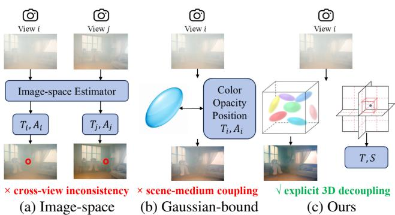  
Figure 1: Medium parameterization paradigms. Image-space estimators predict degradation variables per view and lack an explicit shared 3D medium representation; Gaussian-bound methods attach medium variables to Gaussian primitives; our framework separates the clean Gaussian scene from the triplane medium field and composes hazy observations through the atmospheric scattering model.

However, clean reconstruction under haze difers from conventional novel-view synthesis. Clean inputs can be approximated as direct observations of scene radiance, whereas hazy images are jointly generated by the underlying scene and the participating medium. If standard 3DGS is optimized directly on hazy images, atmospheric attenuation and scattering may be absorbed into Gaussian colors, opacities, scales, or geometry. Such a representation may reproduce hazy views, but it can struggle to recover the clean scene hidden behind the medium.

We argue that haze afects Gaussian reconstruction at both the representation and optimization levels. At the representation level, scene appearance and atmospheric scattering may be encoded into Gaussian primitives simultaneously, producing an entangled representation (Jain et al. 2026; Xu and Wang 2026). At the optimization level, low transmittance attenuates the gradients propagated to the clean Gaussian branch, biasing appearance and opacity updates toward nearby clear regions while leaving distant and heavily degraded structures under-optimized.

Existing methods only partially address these challenges. The first applies haze degradation in image space after rendering clean views, which lacks a consistent 3D medium representation across views (Figure 1 a). The second incorporates medium-related variables directly into Gaussian primitives through per-primitive medium attributes or auxiliary transformation networks (Yu et al. 2025; Li et al. 2026), which couples scene content and medium efects within the same primitives (Figure 1 b). In both cases, the fidelity of the recovered clean scene depends on how well scene and medium are separated during joint optimization.

These observations suggest that hazy Gaussian reconstruction should be viewed as a joint problem of scene–medium disentanglement and supervision rebalancing. The former requires learning an explicit three-dimensional participatingmedium representation that is independent of Gaussian scene primitives, while the latter requires restoring the optimization signals suppressed by transmittance attenuation. Only by addressing both aspects simultaneously can a clean and physically meaningful scene representation be reliably recovered.

To this end, we propose Tri-DehazeGS, a unified framework for clean novel-view reconstruction from hazy multiview images.Tri-DehazeGS jointly learns a decoupled representation ofthe participating medium and optimizes the clean scene with a transmittance-aware strategy. Specifically, we introduce a compact tri-plane (Chan et al. 2022) fog field that independently represents spatial extinction and directionaware medium radiance within a shared three-dimensional coordinate system(Figure 1 c). The learned medium representation provides a physically motivated explanation of haze across views while discouraging atmospheric efects from being absorbed into Gaussian primitives. Furthermore, we propose Medium-Decoupled Transmittance Gradient Compensation (MD-TGC), which freezes the learned medium representation after medium stabilization and compensates the gradients attenuated in low-transmittance regions during backpropagation without altering the forward image formation process. By jointly addressing representation disentanglement and optimization rebalancing, Tri-DehazeGS improves clean appearance recovery and novelview rendering quality.

The main contributions of this work are summarized as

• We formulate hazy 3D Gaussian reconstruction as a joint problem of scene–medium disentanglement and supervision rebalancing, providing a structured perspective for clean novel-view reconstruction under participating media.

• We propose Tri-DehazeGS, a unified Gaussian reconstruction framework that jointly learns an explicit viewshared participating-medium representation and clean Gaussian scene primitives. A compact tri-plane fog field organizes haze variables in a shared 3D space and reduces the entanglement between atmospheric degradation and scene representation.

• We develop Medium-Decoupled Transmittance Gradient Compensation (MD-TGC), a transmittance-aware optimization strategy that compensates attenuated gradients after medium freezing without modifying the physically based forward rendering process.

## Method

Problem Formulation. Given calibrated hazy views $\mathcal { D } =$ $\{ ( \mathbf { I } _ { i } , \Pi _ { i } ) \} _ { i = 1 } ^ { N }$ , where Πi denotes camera parameters and N is the number of training views, Tri-DehazeGS aims to recover a clean Gaussian scene $\mathcal { G }$ and a view-shared participating medium field $\mathcal { M } _ { \theta }$ using only hazy supervision.

The key idea is to address two issues in scatteringaware reconstruction: (1) scene–medium entanglement, where atmospheric efects may be implicitly absorbed into Gaussian primitives during joint reconstruction, and (2) transmittance-induced supervision attenuation, where the scattering composition weakens optimization signals for distant and dense-haze regions.

Tri-DehazeGS separates scene and medium using two branches. For a pixel p, the Gaussian branch renders clean radiance $\hat { \mathbf { J } } ( \mathbf { p } )$ , while the medium field predicts transmittance ${ \hat { T } } ( \mathbf { p } )$ and scattering residual $\hat { \mathbf { S } } ( \mathbf { p } )$

$$
\hat { \mathbf { I } } ( \mathbf { p } ) = \hat { \mathbf { J } } ( \mathbf { p } ) \hat { T } ( \mathbf { p } ) + \hat { \mathbf { S } } ( \mathbf { p } ) .\tag{1}
$$

The clean scene is obtained by rendering Jˆ without the medium branch, while $\hat { T }$ is further used as a visibility-aware optimization signal.

## Scene–Medium Decoupled Gaussian Rendering

3D Gaussian Splatting represents a scene using explicit Gaussian primitives:

$$
\mathcal { G } = \{ G _ { i } = ( \pmb { \mu _ { i } } , \pmb { \Sigma _ { i } } , \alpha _ { i } , \mathbf { c } _ { i } ) \} _ { i = 1 } ^ { M } .\tag{2}
$$

The clean radiance is rendered through diferentiable alpha compositing:

$$
\hat { \mathbf { J } } ( \mathbf { p } ) = \sum _ { i } \tau _ { i } ^ { G } \alpha _ { i } \mathbf { c } _ { i } ( \mathbf { v } ) , \quad \tau _ { i } ^ { G } = \prod _ { j < i } ( 1 - \alpha _ { j } ) .\tag{3}
$$

However, directly optimizing hazy observations with Eq. (3) allows haze efects to be encoded into Gaussian appearance and geometry. To avoid this ambiguity, Tri-DehazeGS assigns diferent explanatory roles: the Gaussian branch models intrinsic scene radiance, while the medium branch models attenuation and in-scattering.

## View-Shared Tri-Plane Medium Field

Real haze exhibits spatially varying density and viewdependent illumination. We therefore represent the participating medium using a continuous three-dimensional field.

For a sampled point x along a camera ray, the field predicts: (1) extinction coeficient $\beta ( \mathbf { \bar { x } } )$ , and (2) directional medium radiance $\mathbf { L } ( \mathbf { x } , \mathbf { v } )$ . We adopt a tri-plane representation to learn the corresponding medium feature:

$$
{ \bf f } ( { \bf x } ) = \mathrm { C o n c a t } \left[ { \bf f } _ { x y } ( { \bf x } ) , { \bf f } _ { x z } ( { \bf x } ) , { \bf f } _ { y z } ( { \bf x } ) \right] ,\tag{4}
$$

where Concat denotes channel-wise concatenation, $\mathbf { f } _ { a b } ( \mathbf { x } ) = \mathcal { F } _ { a b } ( \pi _ { a b } ( \mathbf { x } ) )$ for $a b \in \{ x y , x z , y z \} , \mathcal { F } _ { a b }$ is the learnable feature plane, and $\pi _ { a b }$ denotes projection onto the corresponding plane coordinates.

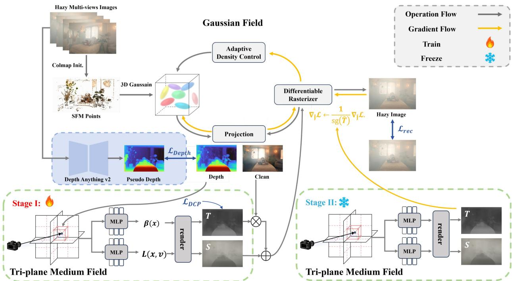  
Figure 2: Overview of Tri-DehazeGS. The framework jointly addresses scene–medium entanglement and transmittanceimbalanced supervision. Stage I learns a decoupled Gaussian scene and view-shared medium field through physical haze rendering. Stage II freezes the medium field and applies MD-TGC to compensate transmittance-suppressed gradients without changing forward image formation.

Unlike image-space degradation prediction, the tri-plane field places all observations in a common three-dimensional medium coordinate system. Consequently, diferent views query the same atmospheric structure, encouraging crossview consistency while retaining the eficiency of a compact explicit representation.

The extinction head $h _ { \beta }$ maps the tri-plane feature to a non-negative extinction coeficient:

$$
\beta ( \mathbf { x } ) = \kappa \ \mathrm { s o f t p l u s } \left( h _ { \beta } ( \mathbf { f } ( \mathbf { x } ) ) \right) ,\tag{5}
$$

where softplus enforces non-negativity, and $\kappa > 0$ is a learnable global extinction scale. This separates the relative spatial distribution of haze from its global strength.

The medium-light head $h _ { L }$ predicts direction-aware radiance with low-order SH:

$$
\mathbf { L } ( \mathbf { x } , \mathbf { v } ) = \mathrm { s i g m o i d } \left( \mathrm { S H } \big ( h _ { L } ( \mathbf { f } ( \mathbf { x } ) ) , \mathbf { v } \big ) \right) ,\tag{6}
$$

where $S H$ denotes low-order spherical-harmonic evaluation, and sigmoid is a range-limiting activation for RGB radiance.

For ray samples $\mathbf { \bar { \{ x } }  _ { k } \} _ { k = 1 } ^ { K }$ with interval length $\Delta _ { k }$ , the accumulated transmittance is

$$
\hat { T } = \exp \left( - \sum _ { k = 1 } ^ { K } \beta _ { k } \Delta _ { k } \right) .\tag{7}
$$

The in-scattered residual is accumulated as

$$
\hat { \mathbf { S } } = \sum _ { k = 1 } ^ { K } T _ { k } \left( 1 - \exp ( - \beta _ { k } \Delta _ { k } ) \right) \mathbf { L } _ { k } ,\tag{8}
$$

where $\hat { T }$ is the final accumulated transmittance, $T _ { k }$ is the attenuation before the k-th interval, and $1 - \exp ( - \beta _ { k } \Delta _ { k } )$ is the interval scattering opacity. Equations above provide a physically consistent decomposition of clean radiance, attenuation, and in-scattering.

## Medium-Decoupled TGC

Although scene–medium decomposition resolves representation ambiguity, haze introduces another optimization problem: low-transmittance regions receive weaker Gaussian supervision (Wang et al. 2025).

From Eq. (1),

$$
\frac { \partial \mathcal { L } } { \partial \hat { \mathbf { J } } ( \mathbf { p } ) } = \hat { T } ( \mathbf { p } ) \frac { \partial \mathcal { L } } { \partial \hat { \mathbf { J } } ( \mathbf { p } ) } ,\tag{9}
$$

where $\mathcal { L }$ is the training objective and p denotes an image pixel. Therefore, transmittance acts as a gradient attenuation factor. Distant structures and dense-haze regions may have large reconstruction errors but receive insuficient updates due to small $\hat { T }$

This observation reveals a second role of transmittance. Beyond describing image formation, it quantifies the strength of supervision reaching the clean scene branch. Unlike depthonly weighting, learned transmittance jointly reflects long propagation distance and locally dense participating media. We therefore introduce Medium-Decoupled Transmittance Gradient Compensation (MD-TGC), which rescales only the backward gradient of the clean Gaussian rendering:

$$
\nabla _ { \hat { \mathbf { J } } } \mathcal { L } \gets \frac { 1 } { \mathrm { c l a m p } ( \hat { T } , T _ { \mathrm { m i n } } ) } \nabla _ { \hat { \mathbf { J } } } \mathcal { L } ,\tag{10}
$$

where $\nabla _ { \hat { \mathbf { J } } } \mathcal { L }$ is the gradient entering the clean Gaussian rendering and clamp(·, $T _ { \mathrm { m i n } } )$ prevents a near-zero denominator.

MD-TGC only modifies backward propagation and keeps haze rendering in Eq. (1) unchanged. Thus, it preserves the physical rendering model while compensating the supervision attenuation caused by haze. Importantly, the medium field is frozen before applying MD-TGC to prevent degenerate solutions where the medium artificially reduces transmittance to amplify Gaussian gradients. After freezing Mθ, transmittance becomes a fixed and medium-decoupled visibility signal for clean-scene refinement.

## Two-Stage Optimization

Tri-DehazeGS follows a two-stage schedule aligned with its two objectives: first establishing a physically motivated scene–medium decomposition, and then rebalancing cleanscene supervision.

Stage I: scene–medium decomposition. The Gaussian scene and medium field are jointly optimized by reconstructing the input hazy views:

$$
\mathcal { L } _ { \mathrm { r e c } } = ( 1 - \lambda _ { \mathrm { s s i m } } ) \| \hat { { \mathbf { I } } } - { \mathbf { I } } \| _ { 1 } + \lambda _ { \mathrm { s s i m } } \big ( 1 - \mathrm { S S I M } ( \hat { { \mathbf { I } } } , { \mathbf { I } } ) \big ) ,\tag{11}
$$

where $\lambda _ { \mathrm { s s i m } }$ balances the pixel-wise $\ell _ { 1 }$ term and the structural-similarity term. Because haze weakens reliable multi-view geometric cues, we additionally regularize the Gaussian depth with monocular pseudo-depth after per-view scale- and shift-invariant normalization:

$$
\mathcal { L } _ { \mathrm { d e p t h } } = 1 - \mathrm { C o r r } ( \hat { D } , D ^ { m } ) + \lambda _ { \mathrm { s m } } \mathcal { L } _ { \mathrm { s m o o t h } } ,\tag{12}
$$

where $\hat { D }$ is the depth rendered by Gaussian alpha compositing, $D ^ { m }$ is the monocular pseudo-depth, Corr denotes Pearson correlation after normalization, $\mathcal { L } _ { \mathrm { s m o o t h } }$ is an edge-aware depth regularizer (Yuan et al. 2025), and $\lambda _ { \mathrm { s m } }$ is its weight.

To stabilize early medium decomposition, a dark-channelderived transmittance prior is used only in Stage I:

$$
\mathcal { L } _ { \mathrm { d c p } } = \| \hat { T } - T _ { \mathrm { d c p } } \| _ { 2 } ^ { 2 } ,\tag{13}
$$

where $T _ { \mathrm { d c p } }$ is the transmittance prior estimated by the darkchannel prior (DCP) (He, Sun, and Tang 2011). The Stage-I objective is

$$
\begin{array} { r } { \mathcal { L } ^ { ( 1 ) } = \mathcal { L } _ { \mathrm { r e c } } + \lambda _ { \mathrm { d e p t h } } \mathcal { L } _ { \mathrm { d e p t h } } + \lambda _ { \mathrm { d c p } } \mathcal { L } _ { \mathrm { d c p } } , } \end{array}\tag{14}
$$

where $\lambda _ { \mathrm { d e p t h } }$ and $\lambda _ { \mathrm { d c p } }$ weight the depth and DCP regularization terms, respectively. MD-TGC is disabled during this stage because the medium transmittance is still evolving and is not yet a reliable optimization signal.

Stage II: supervision-rebalanced refinement. After the medium field stabilizes, its parameters are frozen. The Gaussian scene is refined using

$$
\begin{array} { r } { \mathcal { L } ^ { ( 2 ) } = \mathcal { L } _ { \mathrm { r e c } } + \lambda _ { \mathrm { d e p t h } } \mathcal { L } _ { \mathrm { d e p t h } } , } \end{array}\tag{15}
$$

while MD-TGC applies Eq. (10) during backpropagation.

The two-stage design separates physical decomposition from optimization rebalancing, enabling clean Gaussian reconstruction under spatially non-uniform haze.

## Experiments

## Experimental Setup

Datasets. We evaluate Tri-DehazeGS on three benchmarks covering real and synthetic haze degradation. RealX3D (Liu et al. 2025b) contains real-world multi-view captures with scattering degradation. Following the original protocol, we use eight scenes with hazy views for training and paired clean images for evaluation. Mip-NeRF 360 (Barron et al. 2022) is used to evaluate generalization to outdoor and indoor scenes. We select four scenes (counter, kitchen, bicycle, and garden) and synthesize haze using the atmospheric scattering model. Fog-NeRF (Teigen et al. 2023) provides paired foggy and clean multi-view images with predefined splits. All methods use identical camera poses, image resolutions, and train/test splits.

Baselines. We compare against three categories of methods: (1) general 3D reconstruction, i.e., vanilla 3DGS (Kerbl et al. 2023), to quantify how a haze-agnostic backbone entangles scene and medium; (2) restoration-assisted 3DGS pipelines, including BiLaLoRA (Zhang et al. 2026), Dif-Dehazer (Lan et al. 2025), and IPC-Dehaze (Fu et al. 2025), to examine whether 2D dehazing can substitute for explicit 3D medium modeling; (3) scattering-aware reconstruction, including Fog-NeRF (Teigen et al. 2023), I2-NeRF (Liu et al. 2025a), SeaSplat (Yang, Leonard, and Girdhar 2025), WaterSplatting (Li et al. 2025), Plenodium (Wu et al. 2025), MarineSTD-GS (Liu et al. 2026), and 3D-UIR (Yuan et al. 2025), to isolate the benefit of our view-shared 3D medium field over alternative media formulations.

Evaluation Protocol. We adopt two complementary protocols. (i) Restoration renders novel views from the recovered Gaussian point cloud alone and compares them against hazefree ground truth; it applies to all baselines and serves as the main metric. (ii) Reconstruction additionally composites the medium branch onto the Gaussian rendering and compares against the original hazy inputs; it applies to methods that maintain an explicit 3D scene representation, namely vanilla 3DGS and scattering-aware methods (including ours), but not to restoration-assisted 3DGS pipelines whose 2D-dehazed inputs discard the original medium. Protocol (ii) is reported in the appendix.

Implementation details. We report PSNR, SSIM (Wang et al. 2004), and LPIPS (Zhang et al. 2018). Higher PSNR/SSIM and lower LPIPS indicate better clean-view reconstruction. All experiments are conducted on NVIDIA RTX 3080 GPUs. Each scene is optimized for 15K iterations. The medium field uses three 64 × 64 tri-planes with 8 channels, two-layer MLP heads, SH order 1 medium light, and 16 ray samples. The medium branch is frozen after 3000 iterations, after which MD-TGC is activated.

## Main Results

Quantitative comparison. Table 1 summarizes comparisons on three benchmarks. Tri-DehazeGS consistently achieves the best reconstruction quality across real and synthetic haze settings. On RealX3D, which contains complex real scattering efects, Tri-DehazeGS improves over the strongest scattering-aware baseline 3D-UIR by 3.35 dB PSNR and 0.056 SSIM, demonstrating the advantage of a view-shared 3D medium representation for modeling nonuniform haze. Compared with image-restoration-assisted pipelines, Tri-DehazeGS also achieves lower perceptual error, indicating that explicitly modeling the medium is more efective than preprocessing images before reconstruction. On synthetic benchmarks, Tri-DehazeGS improves PSNR by 2.28 dB over BiLaLoRA-GS on Mip-NeRF 360 foggy scenes and by 0.93 dB over MarineSTD-GS on Fog-NeRF scenes. These improvements demonstrate that the proposed framework generalizes beyond a specific degradation distribution.

<table><tr><td rowspan="2">Type</td><td rowspan="2">Method</td><td colspan="2">RealX3D</td><td colspan="2">Mip-NeRF 360</td><td colspan="2">Fog-NeRF</td></tr><tr><td>PSNR↑</td><td>SSIM↑ LPIPS↓</td><td>PSNR↑ SSIM↑</td><td>LPIPS↓</td><td>PSNR↑ SSIM↑</td><td>LPIPS↓</td></tr><tr><td>Haze-Agnostic</td><td>3DGS</td><td>11.403 0.616</td><td>0.479</td><td>14.194 0.628</td><td>0.228</td><td>13.441 0.537</td><td>0.454</td></tr><tr><td rowspan="3">Restoration-Assisted</td><td>Diff-GS</td><td>10.590 0.617</td><td>0.510</td><td>14.556 0.622</td><td>0.293</td><td>15.515 0.605</td><td>0.386</td></tr><tr><td>IPC-GS</td><td>12.385 0.603</td><td>0.425</td><td>19.100 0.776</td><td>0.164</td><td>11.672 0.544</td><td>0.351</td></tr><tr><td>BiLaLoRA-GS</td><td>13.353 0.637</td><td>0.412</td><td>20.029 0.748</td><td>0.194</td><td>14.949 0.572</td><td>0.359</td></tr><tr><td rowspan="8">Scattering-Aware</td><td>Fog-NeRF</td><td>10.955</td><td>0.596 0.634</td><td>16.080 0.452</td><td>0.497</td><td>16.251</td><td>0.579 0.415</td></tr><tr><td>I2-NeRF</td><td>7.138</td><td>0.255 0.704</td><td>16.726 0.485</td><td>0.480</td><td>12.941 0.466</td><td>0.586</td></tr><tr><td>SeaSplat</td><td>10.662</td><td>0.543 0.568</td><td>17.839 0.684</td><td>0.285</td><td>14.740 0.564</td><td>0.497</td></tr><tr><td>WaterSplatting</td><td>9.719</td><td>0.462 0.677</td><td>15.593 0.553</td><td>0.373</td><td>15.589</td><td>0.559 0.502</td></tr><tr><td>Plenodium</td><td>13.372</td><td>0.624 0.579</td><td>16.000 0.604</td><td>0.309</td><td>16.254 0.614</td><td>0.387</td></tr><tr><td>MarineSTD-GS</td><td>13.663</td><td>0.621 0.581</td><td>18.109 0.687</td><td>0.249</td><td>16.644 0.611</td><td>0.396</td></tr><tr><td>3D-UIR</td><td>13.988</td><td>0.647 0.468</td><td>18.593 0.724</td><td>0.239</td><td>13.888</td><td>0.583 0.426</td></tr><tr><td>Ours</td><td>17.338 0.703</td><td>0.392</td><td>22.311 0.802</td><td>0.162</td><td>17.576</td><td>0.679 0.315</td></tr></table>

Table 1: Quantitative comparison on RealX3D, Mip-NeRF 360 foggy scenes, and Fog-NeRF scenes. The sufix “-GS” denotes an image-restoration-assisted 3DGS pipeline built on vanilla 3DGS. Best and second-best results are shown in bold and underlined, respectively.

3DGS  
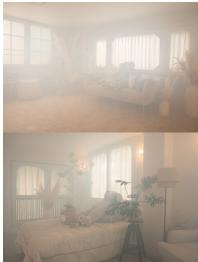

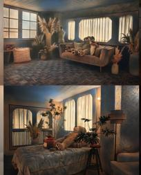  
BiLaLoRA-GS

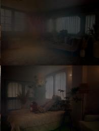  
I2-NeRF

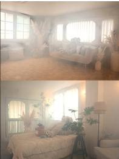  
Plenodium

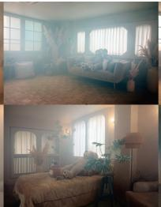  
3D-UIR

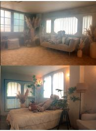  
Ours

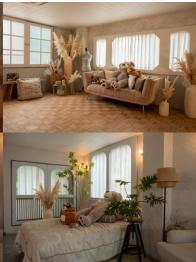  
GT

Figure 3: Qualitative comparison of novel view synthesis results on the real RealX3D dataset.  
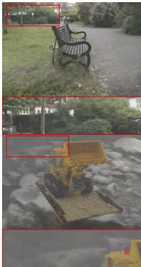  
3DGS

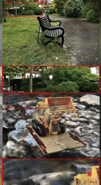  
BiLaLoRA-GS

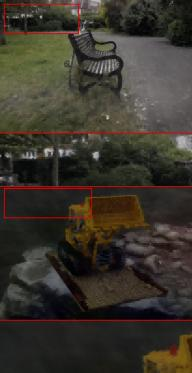  
I2-NeRF

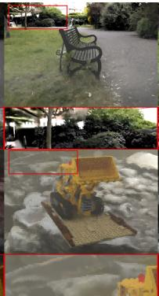  
Plenodium

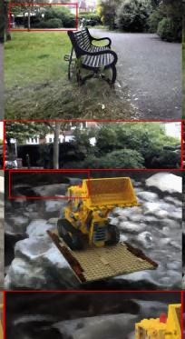  
3D-UIR

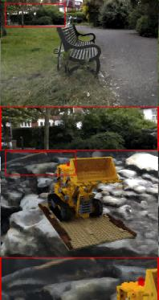  
Ours

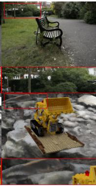  
GT  
Figure 4: Qualitative comparison of novel view synthesis results on synthetic datasets, including Mip-NeRF 360 foggy scenes and Fog-NeRF scenes.

Qualitative comparison. Figures 3 and 4 show qualitative comparisons. Existing methods often sufer from residual haze, color distortion, or weak recovery of distant structures. Medium-aware approaches reduce scattering efects but may still produce inconsistent appearance when the medium is insuficiently decoupled from scene primitives. In contrast, Tri-DehazeGS reconstructs cleaner appearances while preserving stable structures around object boundaries, distant regions, and local textures. These results support the efectiveness of explicitly separating scene radiance from medium efects.

<table><tr><td>Variant</td><td></td><td>TP Decoup. SH light PSNR↑</td><td></td><td></td><td>SSIM↑</td><td>LPIPS↓</td></tr><tr><td>Constant</td><td></td><td>一</td><td></td><td>13.692</td><td>0.658</td><td>0.429</td></tr><tr><td>Gaussian-bound</td><td>√</td><td>一</td><td>一</td><td>15.534</td><td>0.672</td><td>0.444</td></tr><tr><td>Tri-plane RGB</td><td>√</td><td>√</td><td>1</td><td>16.425</td><td>0.697</td><td>0.403</td></tr><tr><td>Ours</td><td>√</td><td>√</td><td>√</td><td>17.338</td><td>0.703</td><td>0.392</td></tr></table>

Table 2: Ablation of medium representation and scene– medium decoupling. TP: tri-plane medium field; Decoup: medium field is independent of Gaussian primitives.

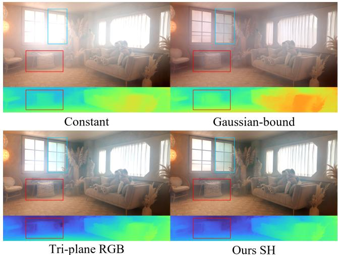  
Figure 5: Qualitative ablation of scene–medium coupling and medium-light parameterization on the Akikaze scene. Each variant shows the rendered result and the corresponding transmittance visualization, with highlighted regions indicating local visibility diferences.

## Analysis of Scene–Medium Decoupling

The first analysis investigates whether the improvement originates from explicit medium modeling rather than simply introducing additional parameters.

Table 2 and Figure 5 show that the constant medium model performs poorly because it cannot represent spatially varying haze. Coupling the medium field with Gaussian primitives improves over the constant model but remains inferior to explicit decoupling. This confirms that atmospheric effects should not be absorbed into Gaussian appearance. The comparison between Tri-plane RGB and our model further demonstrates that direction-aware medium illumination improves reconstruction under non-uniform lighting.

Medium field parameterization. We further compare different 3D medium representations.All variants use the samedepth MLP heads with parameterization-specific inputs, and voxel and tri-plane features share the same resolution. As reported in Table 3, coordinate MLP and Fourier MLP underperform because they struggle to represent spatially varying haze distributions. Voxel features achieve comparable performance, but the proposed tri-plane representation provides a better balance between compactness and expressiveness. The qualitative comparison in Figure 6 shows the same trend. The results indicate that the gain does not come from merely introducing a 3D field, but from constructing an eficient view-shared medium representation.

<table><tr><td>Medium field</td><td>PSNR↑</td><td>SSIM↑</td><td>LPIPS↓</td></tr><tr><td>Coordinate MLP</td><td>15.457</td><td>0.681</td><td>0.421</td></tr><tr><td>Fourier MLP</td><td>14.975</td><td>0.671</td><td>0.427</td></tr><tr><td>Voxel feature</td><td>17.113</td><td>0.701</td><td>0.398</td></tr><tr><td>Tri-plane (Ours)</td><td>17.338</td><td>0.703</td><td>0.392</td></tr></table>

Table 3: Ablation of decoupled 3D medium-field parameterization. All variants are view-shared, independent ofGaussian primitives, and use SH1 medium light.

<table><tr><td>Setting</td><td>PSNR↑ SSIM↑</td><td>LPIPS↓</td></tr><tr><td>w/o TGC</td><td>17.205</td><td>0.702 0.444</td></tr><tr><td>Full-training TGC</td><td>16.168</td><td>0.678 0.405</td></tr><tr><td>Ours (MD-TGC)</td><td>17.338</td><td>0.703 0.392</td></tr></table>

Table 4: Quantitative ablation of transmittance-gradientcompensation scheduling.

## Analysis of Medium-Decoupled TGC

The second analysis studies whether transmittance can serve as an efective optimization signal. All variants use the same forward haze composition and difer only in the gradient schedule: w/o TGC disables compensation, Full-training TGC (using inverse-transmittance rescaling from the beginning while the medium branch is still trainable), and Ours MD-TGC (activating the compensation only after freezing the medium field).

Table 4 compares diferent compensation strategies. Without TGC, low-transmittance regions receive insuficient gradients. Applying TGC from the beginning improves perceptual quality but decreases PSNR/SSIM because the medium field is still evolving and provides an unstable compensation signal. In contrast, MD-TGC first stabilizes the medium representation and then uses frozen transmittance for gradient compensation, achieving the best overall performance. Figure 8 further shows that the improvement in LPIPS becomes larger as visibility decreases, directly validating that MD-TGC mainly benefits regions sufering stronger haze attenuation. Figure 7 shows the same trend: w/o TGC and full-training compensation sufer from unstable colors and artifacts, whereas our schedule recovers cleaner details in low-visibility areas.

## Auxiliary losses

Finally, we analyze the auxiliary supervision in the two-stage optimization. Table 5 shows that removing depth correlation causes the largest drop, indicating that depth priors are important for stabilizing scene–medium decomposition, as weak depth boundaries make complete disentanglement difficult. Removing depth smoothness or DCP causes smaller drops, suggesting that they mainly act as auxiliary stabilizers. Nevertheless, the preceding ablations show that depth priors alone are insuficient; explicit scene–medium decoupling and MD-TGC remain necessary for high-quality clean reconstruction.

GT  
Coordinate MLP  
Fourier MLP  
Voxel feature  
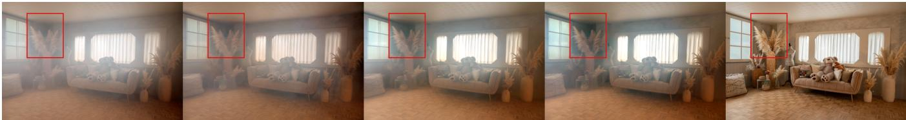  
Figure 6: Qualitative comparison of decoupled medium-field parameterizations on the Akikaze scene. All variants use SH1 medium light and difer only in the 3D medium field representation.

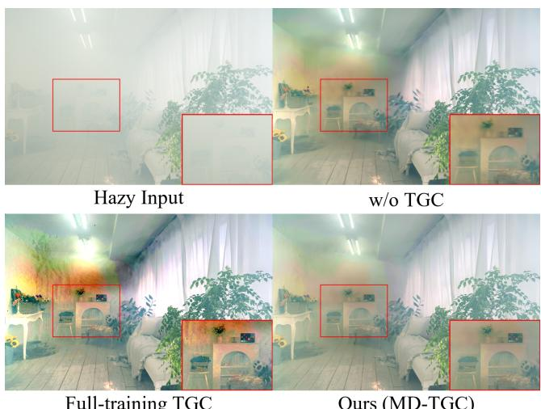  
Full-training TGC  
Ours (MD-TGC)  
Figure 7: Qualitative ablation of transmittance-gradientcompensation scheduling. The panels show hazy input, w/o TGC, Full-training TGC, and Ours (MD-TGC), with zoomed regions shown in the lower right.

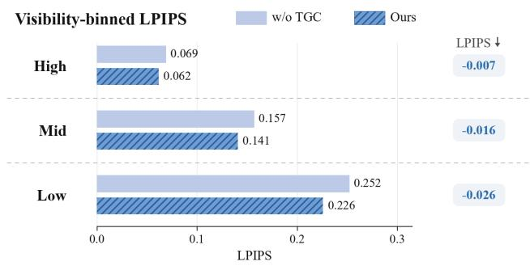

<table><tr><td>Setting</td><td>PSNR↑</td><td>SSIM↑</td><td>LPIPS↓</td></tr><tr><td>w/o Depth Corr.</td><td>12.767</td><td>0.644</td><td>0.451</td></tr><tr><td>w/o Depth Smooth</td><td>17.023</td><td>0.702</td><td>0.405</td></tr><tr><td>w/o DCP</td><td>16.894</td><td>0.702</td><td>0.397</td></tr><tr><td>Ours</td><td>17.338</td><td>0.703</td><td>0.392</td></tr></table>

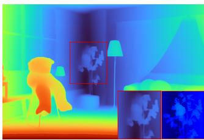  
Figure 8: Visibility-binned LPIPS analysis of MD-TGC. High, Mid, and Low denote $\hat { T } > 0 . 7 , 0 . 4 < \hat { T } \leq 0 . 7 ,$ , and $\hat { T } \leq 0 . 4 .$ , respectively. The bars compare w/o TGC and Ours (MD-TGC), and the right-side labels report the decrease in LPIPS from w/o TGC to Ours.  
Pseudo depth  
Table 5: Ablation on auxiliary training losses.

Tri-DehazeGS leverages an estimated depth prior to regularize the scene–medium decomposition and stabilize the optimization process. Consequently, the final restoration quality is influenced by the accuracy of the estimated depth. As illustrated in Figure 9, inaccurate or over-smoothed depth estimates, particularly around thin structures and low-texture regions, may result in blurred object boundaries and the loss of fine details in the recovered clean scene. This limitation indicates that incorporating more reliable depth priors or structure-aware constraints could further enhance reconstruction quality in such ambiguous regions.

In this work, we study clean 3D Gaussian reconstruction from hazy multi-view observations and identify two key challenges: scene–medium entanglement in representation learning and transmittance-induced supervision attenuation

## Conclusion

Clean  
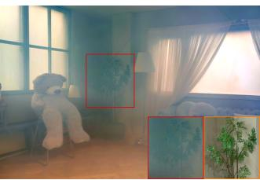  
Figure 9: Failure case due to the inaccurate depth prior.

## Limitations

during optimization. To address these issues, we propose Tri-DehazeGS, which explicitly separates scene radiance from participating-medium efects through a view-shared threedimensional medium representation and introduces Medium-Decoupled Transmittance Gradient Compensation (MD-TGC) to restore optimization signals suppressed by haze. Extensive experiments on real and synthetic haze benchmarks demonstrate that Tri-DehazeGS consistently improves clean novel-view synthesis quality over existing scattering-aware and restoration-assisted baselines. Further analyses verify that the performance gains arise from both improved scene– medium decomposition and transmittance-aware optimization rebalancing. More broadly, this work suggests that physically degraded neural reconstruction should be viewed as a joint problem of representation disentanglement and optimization rebalancing, rather than solely an image formation modeling problem.

Barron, J. T.; Mildenhall, B.; Verbin, D.; Srinivasan, P. P.; and Hedman, P. 2022. Mip-NeRF 360: Unbounded Anti-Aliased Neural Radiance Fields. In Proceedings of the IEEE/CVF Conference on Computer Vision and Pattern Recognition (CVPR), 5470–5479.

Chan, E. R.; Lin, C. Z.; Chan, M. A.; Nagano, K.; Pan, B.; De Mello, S.; Gallo, O.; Guibas, L. J.; Tremblay, J.; Khamis, S.; Karras, T.; and Wetzstein, G. 2022. Eficient Geometry-Aware 3D Generative Adversarial Networks. In Proceedings of the IEEE/CVF Conference on Computer Vision and Pattern Recognition, 16123–16133.

Fu, J.; Liu, S.; Liu, Z.; Guo, C.-L.; Park, H.; Wu, R.; Wang, G.; and Li, C. 2025. Image Processing Chain for Real-World Image Dehazing. arXiv:2503.13147.

He, K.; Sun, J.; and Tang, X. 2011. Single Image Haze Removal Using Dark Channel Prior. IEEE Transactions on Pattern Analysis and Machine Intelligence, 33(12): 2341– 2353.

Jain, N.; Jong, A.; Scherer, S. A.; and Gkioulekas, I. 2026. SmokeSeer: 3D Gaussian Splatting for Smoke Removal and Scene Reconstruction. In International Conference on 3D Vision (3DV), 510–519.

Kerbl, B.; Kopanas, G.; Leimkühler, T.; and Drettakis, G. 2023. 3D Gaussian Splatting for Real-Time Radiance Field Rendering. ACM Transactions on Graphics, 42(4).

Lan, Y.; Cui, Z.; Liu, C.; Peng, J.; Wang, N.; Luo, X.; and Liu, D. 2025. Dif-Dehazer: A Unified Heterogeneous Image Dehazing Framework. arXiv:2503.15017.

Li, B.; Peng, X.; Wang, Z.; Xu, J.; and Feng, D. 2017. AOD-Net: An All-in-One Network for Dehazing and Beyond. In IEEE International Conference on Computer Vision.

Li, H.; Song, W.; Xu, T.; Elsig, A.; and Kulhanek, J. 2025. WaterSplatting: Fast Underwater 3D Scene Reconstruction Using Gaussian Splatting. In International Conference on 3D Vision (3DV).

Li, Y.; Li, J.; He, S.; Xu, Y.; Dong, J.; and Du, Y. 2026. NimbusGS: Unified 3D Scene Reconstruction under Hybrid Weather. arXiv:2603.27228.

Liu, S.; Gao, N.; Gu, Z.; Dou, H.; Deng, Y.; and Li, H. 2026. MarineSTD-GS: Spatiotemporal Degradation-Aware 3D Gaussian Splatting for Realistic Underwater Scene Reconstruction. arXiv:2604.23551.

Liu, S.; Gu, L.; Cui, Z.; Chu, X.; and Harada, T. 2025a. I2- NeRF: Learning Neural Radiance Fields Under Physically-Grounded Media Interactions. arXiv:2510.22161.

Liu, Z.; Li, R.; Shi, H.; Zhang, M.; Zhang, Y.; Duan, T.; Duan,H.; Liu, Y.; Lu, Y.; He, J.; Li, J.; Chen, L.; Weng, X.; Liu,S.; Li, H.; Wu, Y.; Zhao, F.; Feng, J.; Chen, K.; and Wang,Z. 2025b. RealX3D: A Real-World 3D Restoration and Re-construction Benchmark. arXiv preprint arXiv:2512.23437.

Mildenhall, B.; Srinivasan, P. P.; Tancik, M.; Barron, J. T.; Ramamoorthi, R.; and Ng, R. 2020. NeRF: Representing Scenes as Neural Radiance Fields for View Synthesis. In European Conference on Computer Vision.

Narasimhan, S. G.; and Nayar, S. K. 2002. Vision and the Atmosphere. International Journal of Computer Vision, 48(3): 233–254.

Ramazzina, A.; Bijelic, M.; Walz, S.; Sanvito, A.; Scheuble, D.; and Heide, F. 2023. ScatterNeRF: Seeing Through Fog with Physically-Based Inverse Neural Rendering. arXiv:2305.02103.

Teigen, A. L.; Yip, M.; Hamran, V. P.; Skui, V.; Stahl, A.; and Mester, R. 2023. Removing Adverse Volumetric Efects From Trained Neural Radiance Fields. arXiv:2311.10523.

Wang, H.; Anantrasirichai, N.; Zhang, F.; and Bull, D. 2025. UW-GS: Distractor-Aware 3D Gaussian Splatting for Enhanced Underwater Scene Reconstruction. In 2025 IEEE/CVF Winter Conference on Applications of Computer Vision (WACV), 3280–3289. IEEE.

Wang, Z.; Bovik, A. C.; Sheikh, H. R.; and Simoncelli, E. P. 2004. Image Quality Assessment: From Error Visibility to Structural Similarity. IEEE Transactions on Image Processing, 13(4): 600–612.

Wu, C.; Dong, J.; Li, C.; and Tang, J. 2025. Plenodium: UnderWater 3D Scene Reconstruction with Plenoptic Medium Representation. In Advances in Neural Information Processing Systems.

Xu, J.; and Wang, H. 2026. DehazeSplat: From Appearance Degradation to Structure-Aware Optimization. Available at SSRN.

Yang, D.; Leonard, J. J.; and Girdhar, Y. 2025. SeaSplat: Representing Underwater Scenes with 3D Gaussian Splatting and a Physically Grounded Image Formation Model. In 2025 IEEE International Conference on Robotics and Automation (ICRA).

Yu, A.; Fridovich-Keil, S.; Tancik, M.; Chen, Q.; Recht, B.; and Kanazawa, A. 2022. Plenoxels: Radiance Fields without Neural Networks. In IEEE/CVF Conference on Computer Vision and Pattern Recognition.

Yu, J.; Wang, Y.; Lu, Z.; Guo, J.; Li, Y.; Qin, H.; and Zhang, X. 2025. DehazeGS: Seeing Through Fog with 3D Gaussian Splatting. arXiv:2501.03659.

Yuan, J.; Li, Y.; Zhang, Y.; Guo, C.; Tang, X.; Wang, R.; and Li, C. 2025. 3D-UIR: 3D Gaussian for Underwater 3D Scene Reconstruction via Physics-Based Appearance-Medium Decoupling. arXiv:2505.21238.

Zhang, R.; Isola, P.; Efros, A. A.; Shechtman, E.; and Wang, O. 2018. The Unreasonable Efectiveness of Deep Features as a Perceptual Metric. In IEEE Conference on Computer Vision and Pattern Recognition, 586–595.

Zhang, Y.; Ma, L.; Feng, Y.; Huang, Z.; Zhou, F.; and Su, Z. 2026. Bilevel Layer-Positioning LoRA for Real Image Dehazing. arXiv:2603.10872.