# UniH3: Unifying Hierarchical Homogeneity and Heterogeneity for All-in-One Medical Image Restoration

Zhiwen Yang1 , Jiayin Li1 , Chengyu Liu1 , Hui Zhang2 , Bingzheng Wei3 , and Yan Xu1†

1 School of Biological Science and Medical Engineering, Beihang University, Beijing 100191, China

Department of Biomedical Engineering, Tsinghua University, Beijing 100084, China 3 Independent Researcher

† Corresponding Author

upyzwup@buaa.edu.cn xuyan04@gmail.com

Abstract. All-in-One medical image restoration (MedIR) aims to address diverse tasks across modalities and degradation types using a single universal model. Existing methods typically prioritize modeling intertask heterogeneity (e.g., distinct data distributions and degradation types) However, they largely neglect the inherent homogeneity present in medical images, such as widely shared anatomical structures within and across modalities, which can be leveraged to ease model training and improve generalization. To this end, we propose UniH3, a novel framework that Unifies Hierarchical Homogeneity and Heterogeneity for allin-one medical image restoration. Specifically, to comprehensively exploit homogeneity, we introduce a Hierarchical Homogeneity Memory (H2M) module that progressively distills intra- and inter-task homogeneity priors from high-quality images during training, and adaptively retrieves the most relevant priors tailored to the input for guided restoration. These retrieved priors are then injected into the restoration pipeline via an efficient Homogeneity-Guided Attention (HGA) mechanism. Furthermore, to comprehensively address heterogeneity, we design a Hierarchical Heterogeneity Balancer (H2B) that mitigates both inter- and intra-task conflicts during optimization, facilitating balanced and efective multi-task learning. Extensive experiments on two large-scale benchmarks—MedIR-2D-500K and MedIR-3D-3K—demonstrate that UniH3 achieves stateof-the-art performance on both all-in-one and single-task medical image restoration. We hope this work establishes a strong benchmark and advances the development of general-purpose medical image restoration models. Code is available at https://github.com/Yaziwel/UniH3.

Keywords: Medical Image Restoration · All-in-One · Universal Model

## 1 Introduction

Medical image restoration (MedIR) aims to recover a high-quality (HQ) image from a degraded low-quality (LQ) acquisition. Since each medical image modality (e.g., PET, CT, MRI) operates under distinct physical principles and is often studied independently, most MedIR research has focused on a single-task setting, in which researchers train specialized models to address the primary degradation introduced by the imaging physics of each modality. Typical MedIR includes PET image denoising [56, 67, 68, 77], CT image denoising [5, 40, 51], MRI image super-resolution [9, 25, 45, 53]. Despite their success in specific scenarios, singletask models have limited practicality for two main reasons. First, in complex scenarios where multiple MedIR tasks coexist (e.g., multimodal PET/CT and PET/MRI), single-task models trained for one task often underperform on others. Moreover, training separate models for each task leads to ineficiencies in both deployment and maintenance. Second, the single-task paradigm hinders progress toward more general intelligence in MedIR. These limitations motivate interest in a universal model that can handle diverse MedIR tasks.

Recent advances in computer vision have fostered the emergence of All-in-One restoration frameworks [8, 11, 32, 42, 48, 63, 66]. Pioneering research in the medical domain [4, 8, 63, 66], particularly the first work on AMIR [63], has established the feasibility of unified modeling for MedIR. To manage diverse tasks within a single model, existing approaches predominantly focus on modeling task heterogeneity—that is, distinguishing between tasks to apply specialized processing. Techniques such as contrastive learning [32], degradation classification [23], visual prompting [42], and mixture-of-experts (MoE) [63,69] are widely employed to distinguish between tasks.

However, we argue that current All-in-One methods sufer from two critical limitations. First, they largely overlook the inherent homogeneity of medical images. Compared with natural images, medical images from diferent modalities and tasks often exhibit more consistent anatomical structures and share stronger biological priors. Neglecting this shared knowledge prevents models from exploiting cross-task synergies, thereby increasing the dificulty of learning as the number of tasks grows. Second, regarding heterogeneity, existing methods typically address only inter-task diferences (e.g., diferent degradation types or modalities) while ignoring intra-task variations (e.g., variations caused by diferent scanners, centers, or patient demographics). This coarse-grained approach fails to resolve optimization conflicts that arise from subtle intra-task distribution shifts. Therefore, it is imperative to simultaneously model both homogeneity and heterogeneity at a hierarchical level (inter- and intra-task) to achieve robust and efective All-in-One MedIR.

To address these challenges, we propose UniH3, a novel framework that Unifies Hierarchical Homogeneity and Heterogeneity for All-in-One medical image restoration. On the one hand, to fully exploit shared knowledge, we introduce a Hierarchical Homogeneity Memory (H2M) module. This module progressively distills both inter- and intra-task priors from HQ images into a memory bank during training. During inference, it adaptively retrieves the most relevant structural priors tailored to the input, which are then injected into the network via an eficient Homogeneity-Guided Attention (HGA) mechanism to guide restoration. On the other hand, to manage task conflicts comprehensively, we design a

Hierarchical Heterogeneity Balancer $\mathrm { ( H ^ { 2 } B ) }$ . Unlike traditional weighting strategies [27, 58] that only balance loss functions at the task level, $\mathrm { H ^ { 2 } B }$ dynamically mitigates optimization conflicts at both inter- and intra-task levels, ensuring balanced convergence across diverse data distributions. Finally, to validate the efectiveness of $\mathrm { U n i H ^ { 3 } }$ , we construct a benchmark comprising two large-scale datasets: MedIR-2D-500K, containing 509,200 2D image pairs across seven 2D MedIR tasks, and MedIR-3D-3K, containing 3,522 3D volume pairs across three 3D MedIR tasks. Extensive experiments on this benchmark indicate that UniH3 achieves state-of-the-art (SOTA) performance in both all-in-one and single-task medical image restoration.

In summary, our contributions are as follows:

– We propose $\mathrm { U n i H ^ { 3 } }$ , a novel framework that simultaneously models hierarchical inter- and intra-task homogeneity and heterogeneity for efective allin-one medical image restoration.

– We present a Hierarchical Homogeneity Memory $\mathrm { ( H ^ { 2 } M ) }$ module that can adaptively distill and retrieve homogeneity priors to guide the restoration process. Additionally, an eficient Homogeneity-Guided Attention (HGA) mechanism is introduced to fully exploit the retrieved prior for guided restoration.

– We develop a Hierarchical Heterogeneity Balancer $\mathrm { ( H ^ { 2 } B ) }$ , which achieves fine-grained task balancing by resolving optimization conflicts arising from both inter-task distinctions and intra-task variations.

## 2 Related Work

Single-Task Medical Image Restoration. Because diferent medical imaging modalities are typically studied independently, most MedIR research focuses on single-task problems that address the primary degradations encountered in each modality. Typical MedIR tasks include PET image denoising [56,67,68,77], CT denoising [5, 40, 51], MRI super-resolution [9, 25, 53], X-ray denoising [47], OCT denoising [13], ultrasound denoising [2], and pathology image super-resolution [31]. With the development of deep learning—especially recent advances in network architectures such as convolutional neural networks (CNNs) [5, 30], Transformers [50,64], Mamba [18,40], and RWKV [41,65]—single-task MedIR methods have made substantial progress. However, these single-task models often sufer large performance drops when applied to other MedIR tasks, which limits their practical applicability in broader contexts such as multi-modal imaging scenarios.

All-in-One Medical Image Restoration. All-in-One image restoration [8, 11, 32, 42, 48, 63, 66]. aims to address multiple degradation types and modalities using a single unified model. Early attempts in computer vision, such as TransWeather [48], relied on task-specific encoder–decoder heads to handle distinct weather conditions, inevitably increasing parameter counts as tasks multiplied. To achieve parameter-eficient unified modeling, AirNet [32] introduced a contrastive learning approach to generate task-specific latent representations, which serve as prompts to guide a shared restoration network. This promptbased paradigm has become the dominant strategy, with subsequent methods like PromptIR [42], AdaIR [11], and others [8, 66] proposing various mechanisms to learn and inject discriminative prompts for efective task adaptation. In the medical domain, research on All-in-One frameworks is still in its nascent stage [4, 8, 63, 66]. AMIR [63] represents a pioneering efort, utilizing a mixtureof-experts strategy to adapt to three specific medical restoration tasks. While these methods have successfully demonstrated the feasibility of unified restoration, they predominantly focus on modeling inter-task heterogeneity—i.e., distinguishing between diferent tasks to apply specific processing. Consequently, they largely neglect two critical aspects: the inherent homogeneity of anatomical structures shared across medical modalities, and the fine-grained intra-task heterogeneity arising from variations in scanners and protocols. In contrast, our work formulates a hierarchical learning paradigm that jointly models intra- and inter-task homogeneity and heterogeneity, ofering a unified perspective for allin-one MedIR.

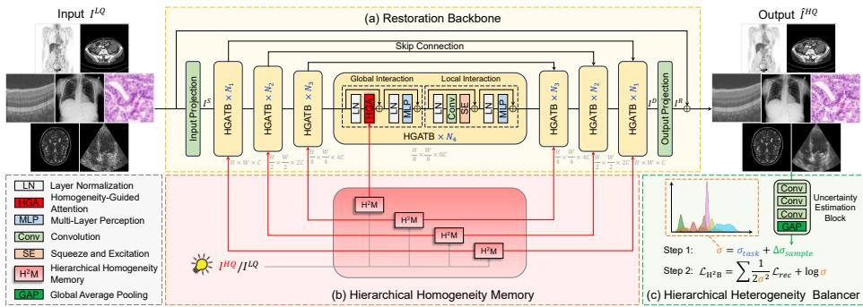  
Fig. 1: The framework of UniH3.

## 3 Method

Fig. 1 illustrates the UniH3 pipeline for all-in-one medical image restoration. UniH3 comprises three main components: a U-shaped restoration backbone (see Fig. 1 (a)) responsible for the basic feature extraction and reconstruction, a Hierarchical Homogeneity Memory (H2M, Fig. 1 (b)) module that employs both intra- and inter-task homogeneity priors to guide the restoration, and a Hierarchical Heterogeneity Balancer (H2B, see Fig. 1 (c)) addresses intra- and intertask heterogeneity by dynamically balancing task relationships during training. Given a LQ input image $I ^ { L Q } \in \mathbb { R } ^ { H \times W \times 1 }$ , UniH3 first applies $\mathrm { ~ a ~ 3 ~ } \times \mathrm { ~ 3 ~ }$ convolutional input projection to produce shallow features $I ^ { \tilde { S } } \ \in \ \mathbb { R } ^ { H \times W \times C }$ , where $H \times W$ denotes the spatial dimensions and C the number of channels. $I ^ { S }$ is then processed by a 4-level asymmetric encoder–decoder and transformed into deep features $I ^ { \tilde { D } } \in \mathbb { R } ^ { H \times W \times \check { C } }$ . Each encoder–decoder level contains multiple

Homogeneity-Guided Transformer Blocks (HGATBs, see Fig. 1 (a)) that extract features under the guidance of H2M-generated priors. Considering that both global and local information are important for medical image restoration [19,65], each HGATB contains two consecutive transformer-layer variants: the first replaces standard self-attention [14] with a Homogeneity-Guided Attention (HGA) to model global interactions, and the second replaces self-attention with a convolution plus Squeeze-and-Excitation (SE) [24] layer to capture local interactions. Finally, $I ^ { D }$ is projected to a residual image $\check { I } ^ { R } \in \mathbb { R } ^ { \hat { H } \times W \times 1 }$ by a $3 \times 3$ convolution, and the restored HQ output is obtained via the residual connection $\hat { I } ^ { H Q } = \dot { I } ^ { L Q } + I ^ { R }$ . We next introduce our core innovations: the $\mathrm { H ^ { 2 } M }$ module (Sec. 3.1), the HGA mechanism (Sec. 3.2), and the $\mathrm { H ^ { 2 } B }$ strategy (Sec. 3.3).

## 3.1 Hierarchical Homogeneity Memory

We propose the Hierarchical Homogeneity Memory $\mathrm { ( H ^ { 2 } M ) }$ to alleviate the escalating learning dificulty associated with the growing number of restoration tasks and imaging domains. Drawing inspiration from multi-task learning [3], which leverages shared knowledge to reduce learning burdens and accelerate convergence, we observe that HQ medical images exhibit rich homogeneous priors at two hierarchical levels: intra-task homogeneity (i.e., consistent anatomical structures among varying patients within the same modality) and inter-task homogeneity (i.e., shared structured representations of the human anatomy across diferent imaging modalities). To explicitly model these hierarchical properties, $\mathrm { H ^ { 2 } M }$ establishes two structurally symmetric components: a memory bank $M \in \operatorname { \mathbb { R } } ^ { ( T + 1 ) L \times C ^ { \prime } }$ and a learnable prototype matrix $\dot { P } \overset { \cdot } { \in } \mathbb { R } ^ { ( T + 1 ) L \times C ^ { \prime } }$ . Both are organized into $T$ task-specific slots and one task-shared slot (each length of $L )$ as illustrated in Fig. 2. While M is updated via momentum to store distilled HQ anatomical priors, $P$ is a set of learnable parameters that serves as an addressing mechanism, learning how to optimally store and retrieve information from $M$ . The $\mathrm { H ^ { 2 } M }$ mechanism operates in two phases: Homogeneity Distillation and Homogeneity Retrieval.

Homogeneity Distillation. To acquire compact homogeneity priors that facilitate all-in-one restoration, we distill clean anatomical structures from HQ medical images and progressively archive them into M using an Exponential Moving Average (EMA) during training. Concretely, we project paired LQ–HQ images $I ^ { L Q } , \bar { I ^ { H Q } }$ to the target resolution via pixel-unshufle downsampling followed by ${ \textrm { a 3 } } \times 3$ convolution, obtaining paired features $F ^ { L Q } , F ^ { H Q } \in \mathbb { R } ^ { \mathbf { \dot { H } } ^ { \prime } W ^ { \prime } \times C ^ { \prime } }$ A learnable prototype $P \in \dot { \mathbb { R } } ^ { L \times C ^ { \prime } }$ with the length of $L$ is then used to query and aggregate crucial HQ priors from $F ^ { H Q }$ through cross-attention:

$$
\operatorname { C r o s s A t t e n t i o n } ( Q , K , V ) = \operatorname { S o f t m a x } ( \frac { Q K ^ { \mathsf { T } } } { \sqrt { C ^ { \prime } } } ) V ,\tag{1}
$$

$$
V ^ { H Q } = \mathrm { C r o s s A t t e n t i o n } ( P , F ^ { L Q } , F ^ { H Q } ) ,\tag{2}
$$

where $V ^ { H Q } \in \mathbb { R } ^ { ( T + 1 ) L \times C ^ { \prime } }$ . This operation allows $P$ to learn which HQ features are most representative of the clean anatomical structures. Based on the current task index, we select features $V ^ { S h } ~ \in ~ \mathbb { R } ^ { L \times C ^ { \prime } }$ and $V ^ { S p } ~ \in ~ \mathbb { R } ^ { L \times C ^ { \prime } }$ from $V ^ { H Q }$ ， which are correspondingly stored into the task-shared slot (to store inter-task homogeneity prior) and task-specific slot (to store intra-task homogeneity prior) of M via an EMA strategy:

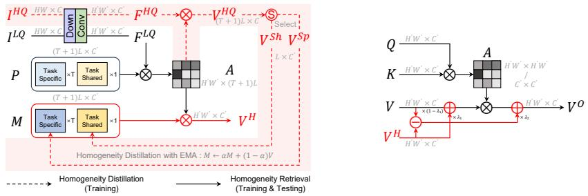  
Fig. 2: Hierarchical Homogeneity Memory. Fig. 3: Homogeneity-Guided Attention.

$$
M _ { S h / S p } \gets \alpha M _ { S h / S p } + ( 1 - \alpha ) V ^ { S h / S p } ,\tag{3}
$$

where α is the momentum coeficient, and $M _ { S h / S p }$ denotes the corresponding shared or specific slots in M. Initialized as zero, M gradually accumulates generalized intra- and inter-task homogeneity priors from continuous training batches. Note that this distillation procedure (indicated by dashed red arrows in Fig. 2) is performed only during training and discarded at test time.

Homogeneity Retrieval. Once the hierarchical memory M is updated, we retrieve clean homogeneity priors $V ^ { H }$ tailored to the LQ input by using the LQ feature $F ^ { L Q }$ as a query to retrieve the relevant clean prior from the memory M via cross attention:

$$
V ^ { H } = \mathrm { C r o s s A t t e n t i o n } ( F ^ { L Q } , P , M ) ,\tag{4}
$$

where $V ^ { H } \in \mathbb { R } ^ { H ^ { \prime } W ^ { \prime } \times C ^ { \prime } }$ is the retrieved homogeneity prior. The red arrows in Fig. 2 illustrate the HQ information flow from $I ^ { H Q }$ through M into the resulting homogeneity prior $V ^ { H }$ . Because the obtained $V ^ { H }$ is derived from the distilled HQ memory, it is well-suited to compensate for degraded or missing anatomical information in the LQ features.

To facilitate multi-scale guidance, UniH3 incorporates four H2M modules (see Fig. 1(b)) at diferent levels of the U-shaped restoration backbone so that the retrieved homogeneity priors provide efective restoration guidance across multiple resolutions.

## 3.2 Homogeneity-Guided Attention

To guide the restoration process using homogeneity priors, we propose a novel Homogeneity-Guided Attention (HGA) mechanism. Existing methods typically incorporate restoration guidance via Spatial Feature Transformations (SFT) [55] or cross-attention [11], which treat the LQ features as the basis and the guidance features as supplementary. In contrast, HGA fundamentally shifts the learning paradigm: it anchors the learning starting point on the HQ homogeneity priors rather than the degraded LQ features, thereby substantially reducing the learning dificulty and facilitate model convergence. The design of HGA is detailed below.

HGA is highly flexible and can be implemented on either standard selfattention or transposed self-attention. For clarity of exposition, we formulate it here using standard self-attention. Let the query, key, and value be $Q , K , V \in$ $\mathbb { R } ^ { H ^ { \prime } W ^ { \prime } \times C ^ { \prime } }$ , the conventional self-attention output $V _ { 0 } ^ { O }$ is

$$
V _ { 0 } ^ { O } = A V , \qquad A = \mathrm { S o f t m a x } ( \frac { Q K ^ { \mathsf { T } } } { \sqrt { C ^ { \prime } } } ) .\tag{5}
$$

To incorporate guidance from the homogeneity prior $V ^ { H }$ , a straightforward variant is to complement the LQ value V with clean $V ^ { H }$ by direct addition:

$$
V _ { 1 } ^ { O } = A ( V + V ^ { H } ) = A V + A V ^ { H } .\tag{6}
$$

In Eq. 6, the attention mechanism treats V and $V ^ { H }$ symmetrically. However, the homogeneity prior $V ^ { H }$ contains higher-fidelity information than the degraded observation V , the attention mechanism should preferentially exploit the more reliable $V ^ { H }$ . To encourage such a preference, we introduce a second variant that biases attention away from the LQ value V and toward the homogeneity prior $V ^ { H }$ by adding identity-based terms to the attention map A:

$$
\begin{array} { r } { V _ { 2 } ^ { O } = ( A - I ) V + ( A + I ) V ^ { H } } \\ { = A ( V + V ^ { H } ) + V ^ { H } - V , } \end{array}\tag{7}
$$

where I denotes the identity matrix. The ±I terms increase the self-contribution of $V ^ { H }$ while reducing that of V. $V { + } V ^ { H }$ denotes the mixed value, and $V ^ { H } - V$ acts as a preference bias that reinforces more reliance on the homogeneity prior $V ^ { H }$ To stabilize training and increase model expressivity, the final HGA mechanism is obtained by applying channel-wise learnable weighting parameters $\lambda _ { 1 } , \lambda _ { 2 } \in \mathbb { R } ^ { C ^ { \prime } }$

$$
\begin{array} { r } { V ^ { O } = A [ ( 1 - \lambda _ { 1 } ) V + \lambda _ { 1 } V ^ { H } ] + \lambda _ { 2 } ( V ^ { H } - V ) . } \end{array}\tag{8}
$$

When $\lambda _ { 1 } = \lambda _ { 2 } = 0$ , the HGA reduces to the conventional self-attention. The self-attention–based HGA in Eq. 8 has an analogous form to transposed selfattention (see supplement). Our proposed $\mathrm { U n i H ^ { 3 } }$ adopts the HGA based on transposed self-attention following Restormer [70]. Fig. 3 illustrates the HGA formulation, which augments attention with simple addition and subtraction operations on the value.

## 3.3 Hierarchical Heterogeneity Balancer

We propose a Hierarchical Heterogeneity Balancer $\mathrm { ( H ^ { 2 } B ) }$ to mitigate inter- and intra-task heterogeneity across diverse MedIR tasks during the optimization process. Heterogeneity among tasks induces gradient conflicts that create an imbalance in optimization: some tasks dominate training while others remain undertrained. Previous work in multi-task learning [27] and all-in-one natural image restoration [58] has shown that uncertainty-based loss balancing is a good way of addressing inter-task heterogeneity by dynamically scaling diferent task losses for a reasonable optimization route:

$$
\mathcal { L } _ { \mathrm { U B } } = \frac { 1 } { T } \sum _ { t = 1 } ^ { T } \left( \frac { 1 } { 2 \sigma _ { t } ^ { 2 } } \mathcal { L } _ { r e c } ^ { ( t ) } + \log \sigma _ { t } \right) ,\tag{9}
$$

where $T$ denotes the number of tasks, $\mathcal { L } _ { r e c } ^ { ( t ) }$ denotes the reconstruction loss, and $\sigma _ { t }$ is a learnable scalar that estimates task-level uncertainty. The factor $\textstyle { \frac { 1 } { 2 \sigma _ { t } ^ { 2 } } }$ adaptively rescales each task’s contribution while the log $\sigma _ { t }$ term regularizes the scaling. When $\mathcal { L } _ { r e c } ^ { ( t ) }$ increases and tends to dominate the total loss, $\sigma _ { t }$ increases to attenuate its contribution, and vice versa. However, this uncertainty balancing is too coarse: a single scalar $\sigma _ { t }$ per-task cannot capture intra-task heterogeneity $( \mathrm { e . g . }$ , scanner/center/anatomy variations), so hard samples still remain insuficiently handled. We therefore introduce a hierarchical uncertainty model. For task t and sample s we define the total uncertainty $\sigma _ { t , s }$ as the sum of a globa task term $\sigma _ { t }$ and a sample-specific correction $\varDelta \sigma _ { s } \mathrm { : }$

$$
\sigma _ { t , s } = \sigma _ { t } + \varDelta \sigma _ { s } ,\tag{10}
$$

where t indexes tasks and s indexes samples. $\sigma _ { t }$ is still a learnable scalar for each task while $\varDelta \sigma _ { s }$ is predicted by a lightweight Uncertainty Estimation Block (UEB, see Fig. 1(c)) conditioned on sample-specific signals:

$$
\varDelta \sigma _ { s } = \mathrm { U E B } \left( \mathrm { C o n c a t } [ I _ { s } ^ { L Q } , \mathrm { s g } ( \hat { I } _ { s } ^ { H Q } ) , I _ { s } ^ { H Q } ] \right) ,\tag{11}
$$

where $I _ { s } ^ { L Q }$ is the LQ input for sample s, $\hat { I } _ { s } ^ { H Q }$ is the model prediction, $I _ { s } ^ { H Q }$ is the HQ ground truth, and $\operatorname { s g } ( \cdot )$ denotes stop-gradient to decouple loss balancing from restoration model optimization. The $\mathrm { H ^ { 2 } B }$ loss then aggregates per-task and per-sample contributions as:

$$
\mathcal { L } _ { \mathrm { H ^ { 2 } B } } = \frac { 1 } { T S } \sum _ { t = 1 } ^ { T } \sum _ { s = 1 } ^ { S } \left( \frac { 1 } { 2 \sigma _ { t , s } ^ { 2 } } \mathcal { L } _ { r e c } ^ { ( t , s ) } + \log \sigma _ { t , s } \right) ,\tag{12}
$$

where $S$ is the batch size. $\mathrm { H ^ { 2 } B }$ retains the theoretical foundation of standard uncertainty-based balancing [27] while refining it to capture uncertainty at two hierarchical levels: a task-level term $\sigma _ { t }$ to efectively mitigate inter-task heterogeneity, and a sample-level correction $\varDelta \sigma _ { s }$ to mitigate intra-task heterogeneity.

## 4 Experiments

We conduct experiments under two settings, All-in-One and Single-Task, for both 2D and 3D MedIR tasks. In the All-in-One setting, a single universal model is trained to address multiple MedIR tasks within either the 2D or 3D domain.

Table 1: Overview of the MedIR-2D-500K and MedIR-3D-3K datasets.
<table><tr><td>Dataset</td><td>Dimension Modality Training Testing</td><td></td><td></td><td></td><td>Total</td><td>Data Source</td></tr><tr><td rowspan="6">MedIR-2D-500K</td><td rowspan="6">2D</td><td>PET</td><td>77,000</td><td>8,600</td><td>85,600</td><td rowspan="6">[61], Private [37, 38] , Private [36,49]</td></tr><tr><td>CT</td><td>64,000</td><td>8,100</td><td>72,100</td></tr><tr><td>MRI</td><td>75,000</td><td>8,400</td><td>83,400</td></tr><tr><td>X-ray</td><td>108,000</td><td>11,600</td><td>119,600</td></tr><tr><td>OCT</td><td>32,000</td><td>3,600</td><td>35,600</td></tr><tr><td>Ultrasound Pathology</td><td>56,000 46,000</td><td>5,800</td><td>61,800 [20, 22, 29,39, 62]</td></tr><tr><td rowspan="4">MedIR-3D-3K</td><td rowspan="4">3D</td><td>Total</td><td>458,000</td><td>5,100 51,200 509,200</td><td>51,100</td><td rowspan="4">[1, 12, 15, 28, 44, 46] [61], Private [37, 38], Private</td></tr><tr><td>PET</td><td>1,388</td><td>156</td><td>1,544</td></tr><tr><td>CT</td><td>258</td><td>30</td><td>288</td></tr><tr><td>MRI Total</td><td>1,520 3,166</td><td>170 356</td><td>1,690 3,522</td></tr></table>

In the Single-Task setting, separate models are trained for each MedIR task. We first describe the experimental setup, including datasets, implementation details, and evaluation. We then present comparative results in Sec. 4.1 and Sec. 4.2, and ablation studies in Sec. 4.3.

Datasets. Most existing MedIR datasets are limited in size and narrowly tailored to specific tasks and modalities. To promote the development of generalpurpose MedIR methods, we organize publicly available datasets together with private collections into two datasets, as summarized in Tab. 1: (i) MedIR-2D-500K comprises 509,200 2D LQ-HQ image pairs across seven distinct 2D MedIR tasks: PET image denoising, CT image denoising, MRI image super-resolution, X-ray image denoising, OCT image denoising, ultrasound image denoising, and pathological image super-resolution. (ii) MedIR-3D-3K includes 3,522 3D LQ-HQ volume pairs covering three 3D MedIR tasks: PET image denoising, CT image denoising, and MRI image super-resolution. We expect these two datasets to serve as a useful benchmark for advancing general-purpose MedIR research. More detailed descriptions are shown in the supplement.

Implementation. For the UniH3 architecture, the number of HGATBs are $N _ { 1 } = 2 , N _ { 2 } = N _ { 3 } = 3$ , and $N _ { 4 } = 4$ . The input channel dimension is $C = 4 8$ For the H2M module, we set the the number of tasks $T = 7 ,$ , memory length $L = 1 2 8$ and EMA coeficient $\alpha = 0 . 9 9$ . During training we use patches of size 128 × 128 with a batch size of 14. The reconstruction loss $\mathcal { L } _ { r e c }$ is defined as the L1 loss. The model is optimized using Muon optimizer [35] for $6 \times 1 0 ^ { 5 }$ iterations, with an initial learning rate $3 \times 1 0 ^ { - 4 }$ and annealed to $1 \times 1 0 ^ { - 7 }$ using a cosine schedule. To support 3D MedIR, we introduce a 3D variant, UniH3-3D, obtained by replacing each module in UniH3 with its 3D counterpart. For $\mathrm { U n i H ^ { 3 } { - } 3 D }$ , the HGATB numbers are $N _ { 1 } = N _ { 2 } = 1$ and $N _ { 3 } = N _ { 4 } = 5$ , the input channel number is $C = 1 6 .$ , and the init learning rate is set as $5 \times 1 0 ^ { - 5 }$ . The patch size is 64 × 64 × 64 and the batch size is 6. All other settings are identical to the original UniH3.

Table 2: All-in-one MedIR comparison results on the MedIR-2D-500K dataset.
<table><tr><td rowspan="2">Method</td><td rowspan="2">#Params (M) FLOPs (G)</td><td rowspan="2"></td><td colspan="2">PET</td><td colspan="2">CT</td><td colspan="2">MRI</td><td colspan="2">X-ray</td><td colspan="2">OCT</td><td colspan="2">Ultrasound</td><td colspan="2">Pathology</td><td colspan="2">Average</td></tr><tr><td>PSNR↑ SSIM↑</td><td></td><td>PSNR↑ SSIM↑</td><td></td><td>PSNR↑ SSIM↑</td><td></td><td></td><td>PSNR↑ SSIM↑</td><td></td><td>PSNR↑ SSIM↑</td><td>PSNR↑ SSIM↑</td><td></td><td></td><td>PSNR↑ SSIM↑</td><td>PSNR↑ SSIM↑</td><td></td></tr><tr><td>SwinIR [34]</td><td>11.50</td><td>187.93</td><td>44.24</td><td>0.9866</td><td>43.17</td><td>0.9338</td><td>38.44</td><td>0.9453</td><td>35.87</td><td>0.9275</td><td>35.70</td><td>0.8892</td><td>27.52</td><td>0.8089</td><td>28.35</td><td>0.7941</td><td>36.18</td><td>0.8979</td></tr><tr><td>Uformer [57]</td><td>50.47</td><td>21.42</td><td>44.51</td><td>0.9874</td><td>43.45</td><td>0.9356</td><td>39.01</td><td>0.9507</td><td>36.59</td><td>0.9353</td><td>35.84</td><td>0.8908</td><td>27.61</td><td>0.8135</td><td>28.55</td><td>0.8011</td><td>36.51</td><td>0.9020</td></tr><tr><td>Restormer [70]</td><td>26.12</td><td>35.21</td><td>44.47</td><td>0.9873</td><td>43.44</td><td>0.9353</td><td>39.05</td><td>0.9515</td><td>36.46</td><td>0.9335</td><td>35.84</td><td>0.8909</td><td>27.66</td><td>0.8138</td><td>28.53</td><td>0.8006</td><td>36.49</td><td>0.9018</td></tr><tr><td>NAFNet [6]</td><td>67.89</td><td>15.74</td><td>44.40</td><td>0.9871</td><td>43.32</td><td>0.9346</td><td>38.90</td><td>0.9502</td><td>36.33</td><td>0.9326</td><td>35.82</td><td>0.8905</td><td>27.59</td><td>0.8131</td><td>28.49</td><td>0.7995</td><td>36.41</td><td>0.9011</td></tr><tr><td>Restore-RWKV [65]</td><td>27.91</td><td>37.46</td><td>44.45</td><td>0.9872</td><td>43.46</td><td>0.9352</td><td>39.05</td><td>0.9514</td><td>36.46</td><td>0.9333</td><td>35.84</td><td>0.8909</td><td>27.68</td><td>0.8149</td><td>28.55</td><td>0.8011</td><td>36.50</td><td>0.9020</td></tr><tr><td>MambaIR [19]</td><td>31.50</td><td>34.35</td><td>44.50</td><td>0.9873</td><td>43.47</td><td>0.9355</td><td>39.07</td><td>0.9517</td><td>36.57</td><td>0.9341</td><td>35.83</td><td>0.8904</td><td>27.69</td><td>0.8146</td><td>28.53</td><td>0.8004</td><td>36.52</td><td>0.9020</td></tr><tr><td>TransWeather [48]</td><td>38.05</td><td>1.55</td><td>43.73</td><td>0.9846</td><td>41.12</td><td>0.9217</td><td>37.62</td><td>0.9333</td><td>35.28</td><td>0.9221</td><td>35.12</td><td>0.8699</td><td>27.23</td><td>0.8011</td><td>28.17</td><td>0.7874</td><td>35.47</td><td>0.8886</td></tr><tr><td>AirNet [32]</td><td>7.61</td><td>230.48</td><td>44.32</td><td>0.9868</td><td>43.34</td><td>0.9348</td><td>38.81</td><td>0.9489</td><td>36.38</td><td>0.9322</td><td>35.77</td><td>0.8900</td><td>27.62</td><td>0.8127</td><td>28.46</td><td>0.7981</td><td>36.39</td><td>0.9005</td></tr><tr><td>DRMC [68]</td><td>0.62</td><td>9.92</td><td>43.62</td><td>0.9841</td><td>42.48</td><td>0.9281</td><td>37.24</td><td>0.9301</td><td>34.06</td><td>0.9085</td><td>35.46</td><td>0.8862</td><td>27.09</td><td>0.7993</td><td>28.02</td><td>0.7830</td><td>35.42</td><td>0.8885</td></tr><tr><td>AMIR [63]</td><td>23.54</td><td>31.76</td><td>44.49</td><td>0.9873</td><td>43.47</td><td>0.9356</td><td>39.09</td><td>0.9519</td><td>36.47</td><td>0.9333</td><td>35.89</td><td>0.8914</td><td>27.69</td><td>0.8150</td><td>28.57</td><td>0.8019</td><td>36.52</td><td>0.9023</td></tr><tr><td>PromptIR [42]</td><td>35.59</td><td>39.49</td><td>44.52</td><td>0.9874</td><td>43.48</td><td>0.9355</td><td>39.13</td><td>0.9524</td><td>36.57</td><td>0.9341</td><td>35.84</td><td>0.8909</td><td>27.69</td><td>0.8152</td><td>28.54</td><td>0.8006</td><td>36.54</td><td>0.9023</td></tr><tr><td>AdaIR [11]</td><td>28.76</td><td>36.74</td><td>44.55</td><td>0.9875</td><td>43.49</td><td>0.9356</td><td>39.17</td><td>0.9527</td><td>36.60</td><td>0.9344</td><td>35.86</td><td>0.8915</td><td>27.69</td><td>0.8150</td><td>28.56</td><td>0.8015</td><td>36.56</td><td>0.9026</td></tr><tr><td>UniH3 (Ours)</td><td>28.96</td><td>26.33</td><td>44.89</td><td>0.9883</td><td>43.65</td><td>0.9368</td><td>39.55</td><td>0.9564</td><td>36.88</td><td>0.9368</td><td>35.96</td><td>0.8921</td><td>27.80</td><td>0.8179</td><td>28.63</td><td>0.8035</td><td>36.77</td><td>0.9045</td></tr></table>

Table 3: Single-task MedIR comparison results on the MedIR-2D-500K dataset.
<table><tr><td rowspan="2">Method</td><td rowspan="2">#Params (M) FLOPs (G)</td><td rowspan="2"></td><td colspan="3">PET PSNR↑ SSIM↑</td><td colspan="2">CT PSNR↑ SSIM↑ PSNR↑ SSIM↑</td><td colspan="2">MRI</td><td colspan="2">X-ray</td><td colspan="2">OCT PSNR↑ SSIM↑ PSNR↑ SSIM↑</td><td colspan="2">Ultrasound</td><td colspan="2">Pathology</td><td colspan="2">Average</td></tr><tr><td></td><td></td><td></td><td></td><td></td><td></td><td></td><td></td><td></td><td></td><td></td><td></td><td>PSNR↑ SSIM↑</td><td></td><td>PSNR↑ SSIM↑</td><td>PSNR↑ SSIM↑</td><td></td></tr><tr><td>SwinIR [34]</td><td>11.50</td><td>187.93</td><td>44.08</td><td>0.9860</td><td>43.53</td><td>0.9358</td><td>39.19</td><td>0.9529</td><td>36.30</td><td>0.9308</td><td></td><td>35.80</td><td>0.8904</td><td>27.68</td><td>0.8143</td><td>28.50</td><td>0.7993</td><td>36.44</td><td>0.9014</td></tr><tr><td>Uformer [57]</td><td>50.47</td><td>21.42</td><td>44.61</td><td>0.9876</td><td>43.54</td><td>0.9362</td><td>39.21</td><td>0.9526</td><td></td><td>36.61</td><td>0.9363</td><td>35.91</td><td>0.8915</td><td>27.64</td><td>0.8151</td><td>28.58</td><td>0.8022</td><td>36.59</td><td>0.9031</td></tr><tr><td>Restormer [70]</td><td>26.12</td><td>35.21</td><td>44.90</td><td>0.9883</td><td>43.64</td><td>0.9369</td><td>39.44</td><td>0.9554</td><td>36.71</td><td>0.9359</td><td></td><td>35.97</td><td>0.8921</td><td>27.76</td><td>0.8164</td><td>28.63</td><td>0.8038</td><td>36.72</td><td>0.9041</td></tr><tr><td>NAFNet [6]</td><td>67.89</td><td>15.74</td><td>44.74</td><td>0.9880</td><td>43.55</td><td>0.9362</td><td>39.29</td><td>0.9540</td><td>36.48</td><td>0.9343</td><td></td><td>35.93</td><td>0.8919</td><td>27.67</td><td>0.8139</td><td>28.58</td><td>0.8024</td><td>36.61</td><td>0.9030</td></tr><tr><td>Restore-RWKV [65]</td><td>27.91</td><td>37.46</td><td>44.93</td><td>0.9884</td><td>43.64</td><td>0.9369</td><td>39.57</td><td>0.9565</td><td>36.77</td><td>0.9359</td><td></td><td>35.97</td><td>0.8923</td><td>27.76</td><td>0.8168</td><td>28.62</td><td>0.8036</td><td>36.75</td><td>0.9043</td></tr><tr><td>MambaIR [19]</td><td>31.50</td><td>34.35</td><td>44.93</td><td>0.9883</td><td>43.55</td><td>0.9363</td><td>39.59</td><td>0.9568</td><td>36.77</td><td></td><td>0.9363</td><td>35.99</td><td>0.8923</td><td>27.77</td><td>0.8178</td><td>28.64</td><td>0.8041</td><td>36.75</td><td>0.9046</td></tr><tr><td>UniH3 (Ours)</td><td>28.96</td><td>26.33</td><td>45.11</td><td>0.9889</td><td>43.77</td><td>0.9376</td><td>39.78</td><td>0.9584</td><td></td><td>37.05</td><td>0.9384</td><td>36.04</td><td>0.8929</td><td>27.86</td><td>0.8192</td><td>28.69</td><td>0.8050</td><td>36.90</td><td>0.9058</td></tr></table>

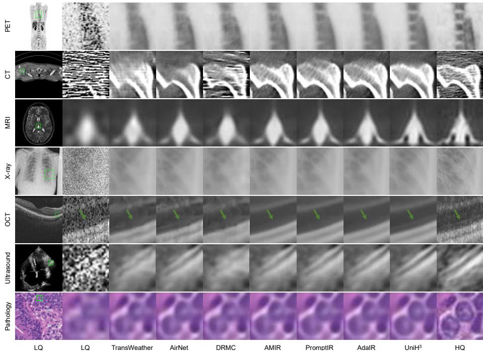  
Fig. 4: Visual comparison of methods for all-in-one medical image restoration on the MedIR-2D-500K dataset.

Evaluation. To quantitatively assess image quality, we employ the widely used PSNR and SSIM metrics. In the reported tables, the highest and second-highest scores are indicated in red and blue, respectively.

Table 4: 3D all-in-one MedIR results on the MedIR-3D-3K dataset.
<table><tr><td rowspan="2">Method</td><td colspan="2">PET</td><td colspan="2">CT</td><td colspan="2">MRI</td><td colspan="2">Average</td></tr><tr><td>PSNR↑ SSIM↑</td><td></td><td></td><td>PSNR↑ SSIM↑</td><td></td><td>PSNR↑ SSIM↑</td><td>PSNR↑ SSIM↑</td><td></td></tr><tr><td>3D-cGAN [56]</td><td>48.22</td><td>0.9937</td><td>40.82</td><td>0.9320</td><td>38.57</td><td>0.9489</td><td>42.54</td><td>0.9582</td></tr><tr><td>MRDG [53]</td><td>48.68</td><td>0.9943</td><td>42.86</td><td>0.9388</td><td>38.93</td><td>0.9519</td><td>43.49</td><td>0.9617</td></tr><tr><td>DRMC [68]</td><td>48.58</td><td>0.9933</td><td>43.33</td><td>0.9391</td><td>38.81</td><td>0.9514</td><td>43.57</td><td>0.9613</td></tr><tr><td>Spach Transformer [26]</td><td>48.91</td><td>0.9949</td><td>42.21</td><td>0.9380</td><td>39.04</td><td>0.9542</td><td>43.39</td><td>0.9624</td></tr><tr><td>Restore-RWKV-3D [65]</td><td>49.08</td><td>0.9951</td><td>43.35</td><td>0.9402</td><td>39.43</td><td>0.9578</td><td>43.95</td><td>0.9644</td></tr><tr><td>UniH3-3D (Ours)</td><td>49.43</td><td>0.9955</td><td>44.05</td><td>0.9429</td><td>40.03</td><td>0.9637</td><td>44.50</td><td>0.9674</td></tr></table>

Table 5: 3D single-task MedIR results on the MedIR-3D-3K dataset.
<table><tr><td rowspan="2">Method</td><td colspan="2">PET</td><td colspan="2">CT</td><td colspan="2">MRI</td><td colspan="2">Average</td></tr><tr><td>PSNR↑ SSIM↑ PSNR↑ SSIM↑ PSNR↑ SSIM↑</td><td></td><td></td><td></td><td></td><td></td><td>PSNR↑ SSIM↑</td><td></td></tr><tr><td>3D-cGAN [56]</td><td>48.47</td><td>0.9944</td><td>40.86</td><td>0.9309</td><td>38.76</td><td>0.9510</td><td>42.70</td><td>0.9588</td></tr><tr><td>MRDG [53]</td><td>48.40</td><td>0.9942</td><td>43.14</td><td>0.9395</td><td>39.34</td><td>0.9570</td><td>43.63</td><td>0.9636</td></tr><tr><td>DRMC [68]</td><td>48.76</td><td>0.9947</td><td>43.60</td><td>0.9404</td><td>38.98</td><td>0.9540</td><td>43.78</td><td>0.9630</td></tr><tr><td>Spach Transformer [26]</td><td>48.71</td><td>0.9946</td><td>43.57</td><td>0.9409</td><td>39.16</td><td>0.9546</td><td>43.81</td><td>0.9634</td></tr><tr><td>Restore-RWKV-3D [65]</td><td>48.67</td><td>0.9945</td><td>42.48</td><td>0.9375</td><td>39.15</td><td>0.9551</td><td>43.43</td><td>0.9624</td></tr><tr><td>UniH³-3D (Ours)</td><td>49.77</td><td>0.9958</td><td>45.37</td><td>0.9448</td><td>40.73</td><td>0.9689</td><td>45.29</td><td>0.9698</td></tr></table>

Table 6: Performance of $\mathrm { H ^ { 2 } P }$ and $\mathrm { H ^ { 2 } B }$ on diferent backbones on the MedIR-2D-500K dataset. † denotes applying $\mathrm { H ^ { 2 } P }$ and $\mathrm { H ^ { 2 } B }$ to the corresponding backbone.
<table><tr><td>Method</td><td>#Params (M) FLOPs (G)</td><td></td><td>PET PSNR↑ SSIM↑</td><td>CT PSNR↑ SSIM↑</td><td></td><td>MRI PSNR↑ SSIM↑</td><td>X-ray PSNR↑ SSIM↑</td><td>PSNR↑ SSIM↑</td><td>OCT</td><td>Ultrasound PSNR↑ SSIM↑</td><td></td><td>Pathology</td><td>Average</td></tr><tr><td></td><td></td><td></td><td></td><td></td><td></td><td>39.01</td><td></td><td>0.9353</td><td></td><td></td><td></td><td>PSNR↑ SSIM↑</td><td>PSNR↑ SSIM↑</td></tr><tr><td>Uformer</td><td>50.47</td><td>21.42</td><td>44.51 0.9874</td><td>43.45</td><td>0.9356</td><td>0.9507</td><td>36.59</td><td>35.84</td><td>0.8908</td><td>27.61</td><td>0.8135 28.55</td><td>0.8011</td><td>36.51 0.9021</td></tr><tr><td>Uformer †</td><td>53.15</td><td>22.10</td><td>44.80 0.9880</td><td>43.59</td><td>0.9363</td><td>39.39 0.9549</td><td>36.74</td><td>0.9354 35.94</td><td>0.8918</td><td>27.72</td><td>0.8155 28.57</td><td>0.8022</td><td>36.68 0.9034</td></tr><tr><td>Restormer</td><td>26.12</td><td>35.21</td><td>44.47 0.9873</td><td>43.44</td><td>0.9353</td><td>39.05 0.9515</td><td>36.46</td><td>0.9335 35.84 0.9352</td><td>0.8909</td><td>27.66 27.73</td><td>0.8138 28.53</td><td>0.8006</td><td>36.49 0.9018</td></tr><tr><td>Restormer †</td><td>27.56</td><td>35.83</td><td>44.78 0.9880</td><td>43.58</td><td>0.9362 39.37</td><td>0.9548</td><td>36.71</td><td>35.93</td><td>0.8919</td><td>0.8159</td><td>28.60</td><td>0.8027</td><td>36.67 0.9035</td></tr><tr><td>PromptIR</td><td>35.59</td><td>39.49</td><td>44.52 0.9874</td><td>43.48</td><td>0.9355 39.13</td><td>0.9524</td><td>36.57 0.9341</td><td>35.84</td><td>0.8909</td><td>27.69 0.8152</td><td>28.54</td><td>0.8006</td><td>36.54 0.9023</td></tr><tr><td>PromptIR † AdaIR</td><td>36.15</td><td>40.68</td><td>44.85 0.9882</td><td>43.62</td><td>0.9366 39.40</td><td>0.9551</td><td>36.76 0.9365</td><td>35.94</td><td>0.8919</td><td>27.75 0.8165</td><td>28.59</td><td>0.8024</td><td>36.70 0.9039</td></tr><tr><td>AdaIR †</td><td>28.76</td><td>36.74</td><td>44.55 0.9875 44.93 0.9884</td><td>43.49</td><td>0.9356 39.17</td><td>0.9527</td><td>36.60 0.9344</td><td>35.86</td><td>0.8915</td><td>27.69 0.8150</td><td>28.56</td><td>0.8015</td><td>36.56 0.9026</td></tr><tr><td>Baseline</td><td>29.77 27.17</td><td>37.37 25.50</td><td>44.52 0.9874</td><td>43.64 43.47</td><td>0.9367 39.53</td><td>0.9563 0.9521</td><td>36.82</td><td>0.9363 35.95 35.88</td><td>0.8920 0.8914</td><td>27.76</td><td>0.8165 28.61 28.57</td><td>0.8027</td><td>36.75 0.9041</td></tr><tr><td>UniH³ (Ours)</td><td>28.96</td><td>26.33</td><td>44.89 0.9883</td><td>43.65</td><td>0.9355 0.9368</td><td>39.10 39.55 0.9564</td><td>36.39 36.88</td><td>0.9330 0.9368 35.96</td><td>0.8921</td><td>27.68 27.80</td><td>0.8149 0.8179 28.63</td><td>0.8018 0.8035</td><td>36.52 0.9023 36.77 0.9045</td></tr></table>

Table 7: Component analysis.
<table><tr><td></td><td></td><td>H2M H2B #Params (M)</td><td>FLOPs (G)</td><td>PSNR↑</td><td>SSIM↑</td></tr><tr><td rowspan="2">√</td><td></td><td>27.17</td><td>25.50</td><td>36.52</td><td>0.9023</td></tr><tr><td></td><td>28.96</td><td>26.33</td><td>36.66</td><td>0.9034</td></tr><tr><td></td><td>√</td><td>27.17</td><td>25.50</td><td>36.64</td><td>0.9033</td></tr><tr><td>√</td><td>√</td><td>28.96</td><td>26.33</td><td>36.77</td><td>0.9045</td></tr></table>

Table 8: Ablation studies on HGA.
<table><tr><td>Method</td><td>#Params (M) FLOPs (G) PSNR↑ SSIM↑</td><td></td><td></td></tr><tr><td>w/o HGA</td><td>27.17</td><td>25.50 36.99</td><td>36.52 0.9023</td></tr><tr><td>SFT [55]</td><td>37.46</td><td>36.74</td><td>0.9041</td></tr><tr><td>Cross Attention [11]</td><td>29.60</td><td>27.43 36.67</td><td>0.9035</td></tr><tr><td>HGA (Ours)</td><td>28.96</td><td>26.33</td><td>36.77 0.9045</td></tr></table>

## 4.1 All-in-One MedIR Results

2D All-in-One MedIR. We evaluate the 2D All-in-One setting on the MedIR-2D-500K dataset. We compare it to several general image-restoration methods (SwinIR [34], Uformer [57], Restormer [70], NAFNet [6], Restore-RWKV [65], and MambaIR [19]) and to SOTA all-in-one approaches (TransWeather [48], AirNet [32], DRMC [68], AMIR [63], PromptIR [42], and AdaIR [11]). Tab. 2 shows that UniH3 achieves both high eficiency and strong efectiveness. It significantly outperforms all comparison methods across all seven tasks. On average, UniH3 surpasses the second-best AdaIR by 0.21 dB in PSNR, which is an appreciable improvement given that each of the seven task contains thousands of testing images. Visual comparison in Fig. 4 demonstrates that $\mathrm { U n i H ^ { 3 } }$ best restores diferent types of medical images with higher structural fidelity and finer detail than competing methods.

3D All-in-One MedIR. We assess the UniH3-3D in the 3D All-in-One setting on the MedIR-3D-3K dataset. We compare it with several SOTA 3D restoration methods, including 3D-cGAN [56], MRDG [53], DRMC [68], Spach Transformer [26], and Restore-RWKV-3D [65]. Tab. 4 shows that UniH3 significantly outperforms all comparison methods across the three 3D MedIR tasks. In particular, UniH3-3D exceeds the second-best Restore-RWKV-3D by an average margin of 0.55 dB in PSNR. Visual comparisons are shown in the supplement.

Table 9: Ablation studies on $\mathrm { H ^ { 2 } M } .$  
Table 10: Ablation studies on $\mathrm { H ^ { 2 } B }$
<table><tr><td>Inter-task Homogeneity Homogeneity</td><td>Intra-task</td><td>#Params (M) FLOPs (G) PSNR↑ SSIM↑</td><td></td><td></td><td></td></tr><tr><td></td><td></td><td>28.96</td><td>26.33</td><td>36.52</td><td>0.9023</td></tr><tr><td>√</td><td></td><td>28.96</td><td>26.33</td><td>36.61</td><td>0.9031</td></tr><tr><td></td><td>√</td><td>28.96</td><td>26.33</td><td>36.72</td><td>0.9038</td></tr><tr><td>√</td><td>√</td><td>28.96</td><td>26.33</td><td>36.77</td><td>0.9045</td></tr></table>

<table><tr><td>Inter-task Heterogeneity Heterogeneity</td><td>Intra-task</td><td>#Params (M) FLOPs (G) PSNR↑ SSIM↑</td><td></td><td></td><td></td></tr><tr><td></td><td></td><td>28.96</td><td>26.33</td><td>36.66</td><td>0.9034</td></tr><tr><td>√</td><td></td><td>28.96</td><td>26.33</td><td>36.70</td><td>0.9036</td></tr><tr><td></td><td>L</td><td>28.96</td><td>26.33</td><td>36.73</td><td>0.9041</td></tr><tr><td>√</td><td>V</td><td>28.96</td><td>26.33</td><td>36.77</td><td>0.9045</td></tr></table>

## 4.2 Single-Task MedIR Results

2D Single-Task MedIR. We evaluate $\mathrm { U n i H ^ { 3 } }$ for 2D single-task MedIR on the MedIR-2D-500K dataset, comparing it to five general image restoration methods. As shown in Tab. 3, UniH3 significantly outperforms all comparison methods. On average across seven tasks, UniH3 improves PSNR by 0.15 dB over the secondbest MambaIR.

3D Single-Task MedIR. We evaluate 3D single-task MedIR on the MedIR-3D-3K dataset and compare $\mathrm { U n i H ^ { 3 } { - } 3 D }$ to five SOTA 3D restoration methods. As shown in Tab. 5, UniH3-3D beats all comparison methods. In particular, it improves average PSNR by 1.48 dB over the second-best Spach Transformer [26] across the three tasks.

## 4.3 Ablation Studies

To evaluate the efectiveness of individual components, we conduct ablation experiments on the 2D All-in-One MedIR task with the MedIR-2D-500K dataset. Component Analysis of H2M and H2B. We first perform a component analysis of the $\mathrm { H ^ { 2 } M }$ module and the H2B strategy by selectively disabling each component. To disable $\mathrm { H ^ { 2 } M } .$ , we remove the $\mathrm { H ^ { 2 } M }$ module and replace the HGA mechanism with a transposed self-attention layer [70]. The $\mathrm { H ^ { 2 } B }$ is disabled by substituting the loss term $\mathcal { L } _ { \mathrm { { H } ^ { 2 } B } }$ with an $L _ { 1 }$ loss. Table 7 shows that both components improve model performance with minimal increase in computational cost. This finding is further supported by the visual comparison in Fig. 5, where both components contribute to better preservation of image details. Moreover, we apply the $\mathrm { H ^ { 2 } M }$ module and $\mathrm { H ^ { 2 } B }$ strategy to other Transformer-based U-shaped backbones, including Uformer, Restormer, PromptIR, and AdaIR. Results in the Tab. 6 demonstrate significant improvements across all these backbones.

Ablation Studies on $\mathbf { H } ^ { 2 } \mathbf { M }$ . We investigate the efectiveness of both inter- and intra-task homogeneity priors in H2M by selectively disabling the task-specific and task-shared slots in M. By replacing these slots with naive learnable parameters—thus isolating them from the HQ Homogeneity Distillation procedure—we observe a drop in performance in Tab. 9. Results indicate that both priors independently benefit the restoration process, and their combination achieves the best performance. To further understand the internal mechanics of $\mathrm { H ^ { 2 } M }$ , Fig. 6 visualizes the retrieval attention maps for PET and CT tokens. The distributions confirm that tokens primarily query the task-shared slot and their specific modality slot. Furthermore, attention maps reflect clear semantic correlations: anatomically similar tokens within the same modality share highly similar query patterns (8/10 top-score overlap for two PET spine tokens), and cross-modality similarities are also captured (2/10 overlap for PET and CT spine tokens). In contrast, dissimilar anatomies exhibit distinct query patterns (0/10 overlap for PET spine and lesion tokens). This provides strong visual evidence that H2M successfully maps, stores, and retrieves hierarchical anatomical priors.

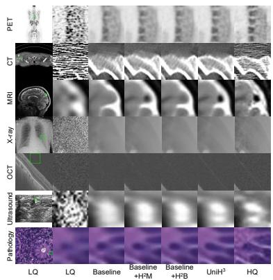  
Fig. 5: Visual comparison for component analysis.

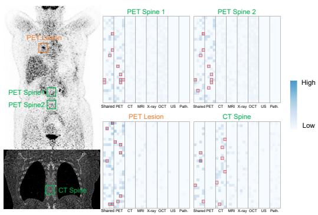  
Fig. 6: Retrieval attention map in $\mathrm { H ^ { 2 } M } .$ . The Top-10 scores are marked by red rectangles.

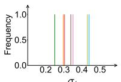

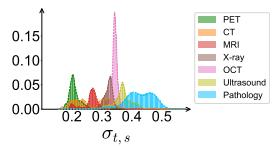

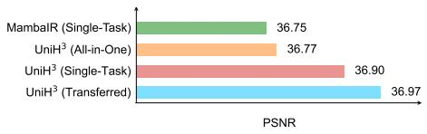  
Fig. 7: Estimated uncertainty distribution.  
Fig. 8: All-in-One vs. Single-Task.

Ablation Studies on HGA. We validate the impact of HGA by replacing it with alternative guiding mechanisms, including Spatial Feature Transform (SFT) [55] and cross attention [11]. Tab. 8 shows that the proposed HGA performs the best with minimal computation and parameter increase.

Ablation Studies on $\mathbf { H } ^ { 2 } \mathbf { B } .$ . We validate the roles of intra- and inter-task heterogeneity in H2B in Tab. 10. The results indicate that mitigating both levels of heterogeneity improves overall restoration performance, with their joint optimization achieving the best results. In Fig. $^ { 7 , }$ we visualize the estimated uncertainty distributions. While the conventional $\mathcal { L } _ { \mathrm { U B } } \left[ 2 7 \right]$ estimates an uncertainty $\sigma _ { t }$ per task and therefore handles only inter-task heterogeneity, our proposed ${ \mathcal { L } } _ { \mathrm { H ^ { 2 } B } }$ estimates uncertainty $\sigma _ { t , s }$ at both the task and the sample level: each sample receives its own uncertainty while each task exhibits a distinct uncertainty distribution. This enables our ${ \mathcal { L } } _ { \mathrm { H ^ { 2 } B } }$ to capture finer-grained relationships, $\mathrm { i . e . , }$ , both inter-task and intra-task heterogeneity, facilitating convergence toward a more optimal solution for diverse MedIR tasks.

## 5 Discussion and Limitation

All-in-one medical image restoration is an emerging research field. The practical value of all-in-one models remains under active discussion. In this paper, experiments on a large-scale dataset show that a single all-in-one model, UniH3, already achieves comparable performance to SOTA single-task MambaIR models across seven MedIR tasks (see Fig. 8). This result strongly supports the practicality of developing all-in-one models instead of separate single-task models for MedIR tasks. Additionally, by fine-tuning the well-trained all-in-one UniH3 model for each task, we are able to transfer its learned knowledge to individual tasks and achieve further improvements (also shown in Fig. 8), indicating that the all-in-one model can serve as a transferable pretrained backbone. Our study has limitations: we focus only on the primary restoration task within each modality and therefore do not cover other tasks or degradation types that may occur in the same modality. Future work should address these gaps and pursue more universal MedIR models to benefit clinical diagnosis and more downstream tasks [7, 21, 59, 60, 71–76].

## 6 Conclusion

In this paper, we have presented UniH3, a novel and unified framework for allin-one medical image restoration. By moving beyond the conventional focus on inter-task heterogeneity, UniH3 efectively leverages the inherent hierarchical homogeneity across diverse medical imaging modalities. The integration of the Hierarchical Homogeneity Memory (H2M) module and the Homogeneity-Guided Attention (HGA) mechanism allows the model to distill and utilize inter- and intra-task homogeneity priors to guide the restoration process. Simultaneously, the Hierarchical Heterogeneity Balancer (H2B) ensures a stable and balanced multi-task learning process by mitigating both inter- and intra-task heterogeneity. Extensive evaluations on the large-scale MedIR-2D-500K and MedIR-3D-3K benchmarks demonstrate that UniH3 significantly outperforms existing methods, achieving state-of-the-art performance in both all-in-one and single-task scenarios. In future work, we plan to expand the task spectrum by incorporating additional modalities and degradation types, moving toward more general MedIR models.

## Acknowledgements

This work is supported by the National Natural Science Foundation in China under Grant U23B2063 and 62371016, the Bejing Natural Science Foundation Haidian District Joint Fund in China under Grant L2602042, the Beijing hope run special fund of cancer foundation of China under Grant LC2018L02, the Fundamental Research Funds for the Central University of China from the State Key Laboratory of Software Development Environment in Beihang University in China, the 111 Proiect in China under Grant B13003, the Academic Excellence Foundation of BUAA for PhD Students.

## References

1. Aksac, A., Demetrick, D.J., Ozyer, T., Alhajj, R.: Brecahad: a dataset for breast cancer histopathological annotation and diagnosis. BMC research notes 12(1), 82 (2019)

2. Asgariandehkordi, H., Goudarzi, S., Basarab, A., Rivaz, H.: Deep ultrasound denoising using difusion probabilistic models. In: 2023 IEEE International Ultrasonics Symposium (IUS). pp. 1–4. IEEE (2023)

3. Caruana, R.: Multitask learning. Machine learning 28(1), 41–75 (1997)

4. Chen, H., Yang, Z., Hou, H., Zhang, H., Wei, B., Zhou, G., Xu, Y.: All-in-one medical image restoration with latent difusion-enhanced vector-quantized codebook prior. In: International Conference on Medical Image Computing and Computer-Assisted Intervention. pp. 67–77. Springer (2025)

5. Chen, H., Zhang, Y., Kalra, M.K., Lin, F., Chen, Y., Liao, P., Zhou, J., Wang, G.: Low-dose ct with a residual encoder-decoder convolutional neural network. IEEE Transactions on Medical Imaging 36(12), 2524–2535 (2017)

6. Chen, L., Chu, X., Zhang, X., Sun, J.: Simple baselines for image restoration. In: European conference on computer vision. pp. 17–33. Springer (2022)

7. Chen, L.: Beyond external constraints: The missing dimension of ai governance. Available at SSRN 6449738 (2026)

8. Chen, T., Ma, X., Bai, L., Wang, W., Sun, Y., Zhou, L.: Endoir: Degradationagnostic all-in-one endoscopic image restoration via noise-aware routing difusion. arXiv preprint arXiv:2511.05873 (2025)

9. Chen, Y., Shi, F., Christodoulou, A.G., Xie, Y., Zhou, Z., Li, D.: Eficient and accurate mri super-resolution using a generative adversarial network and 3d multilevel densely connected network. In: International conference on medical image computing and computer-assisted intervention. pp. 91–99. Springer (2018)

10. Chowdhury, M.E., Rahman, T., Khandakar, A., Mazhar, R., Kadir, M.A., Mahbub, Z.B., Islam, K.R., Khan, M.S., Iqbal, A., Al Emadi, N., et al.: Can ai help in screening viral and covid-19 pneumonia? Ieee Access 8, 132665–132676 (2020)

11. Cui, Y., Zamir, S.W., Khan, S., Knoll, A., Shah, M., Khan, F.S.: Adair: Adaptive all-in-one image restoration via frequency mining and modulation. In: 13th International Conference on Learning Representations, ICLR 2025. pp. 57335–57356. International Conference on Learning Representations, ICLR (2025)

12. Da, Q., Huang, X., Li, Z., Zuo, Y., Zhang, C., Liu, J., Chen, W., Li, J., Xu, D., Hu, Z., et al.: Digestpath: A benchmark dataset with challenge review for the pathological detection and segmentation of digestive-system. Medical image analysis 80, 102485 (2022)

13. Dong, Z., Liu, G., Ni, G., Jerwick, J., Duan, L., Zhou, C.: Optical coherence tomography image denoising using a generative adversarial network with speckle modulation. Journal of biophotonics 13(4), e201960135 (2020)

14. Dosovitskiy, A., Beyer, L., Kolesnikov, A., Weissenborn, D., Zhai, X., Unterthiner, T., Dehghani, M., Minderer, M., Heigold, G., Gelly, S., et al.: An image is worth 16x16 words: Transformers for image recognition at scale. arXiv preprint arXiv:2010.11929 (2020)

15. Drifka, C.R., Loefler, A.G., Mathewson, K., Keikhosravi, A., Eickhof, J.C., Liu, Y., Weber, S.M., Kao, W.J., Eliceiri, K.W.: Highly aligned stromal collagen is a negative prognostic factor following pancreatic ductal adenocarcinoma resection. Oncotarget 7(46), 76197 (2016)

16. Fang, L., Li, S., Nie, Q., Izatt, J.A., Toth, C.A., Farsiu, S.: Sparsity based denoising of spectral domain optical coherence tomography images. Biomedical optics express 3(5), 927–942 (2012)

17. Geng, M., Meng, X., Zhu, L., Jiang, Z., Gao, M., Huang, Z., Qiu, B., Hu, Y., Zhang, Y., Ren, Q., et al.: Triplet cross-fusion learning for unpaired image denoising in optical coherence tomography. IEEE Transactions on Medical Imaging 41(11), 3357–3372 (2022)

18. Gu, A., Dao, T.: Mamba: Linear-time sequence modeling with selective state spaces. arXiv preprint arXiv:2312.00752 (2023)

19. Guo, H., Li, J., Dai, T., Ouyang, Z., Ren, X., Xia, S.T.: Mambair: A simple baseline for image restoration with state-space model. In: European conference on computer vision. pp. 222–241. Springer (2024)

20. Guo, Y., Zhou, S., Shi, J., Wang, Y.: Ultrasound image enhancement challenge 2023 (Apr 2023), https://doi.org/10.5281/zenodo.7841250, accessed: 2024-02-13

21. Hao, R., Jing, B., Yu, H., Nie, Z.: Styledrive: Towards driving-style aware benchmarking of end-to-end autonomous driving. In: Proceedings of the AAAI Conference on Artificial Intelligence. vol. 40, pp. 4627–4635 (2026)

22. van den Heuvel, T.L., de Bruijn, D., de Korte, C.L., Ginneken, B.v.: Automated measurement of fetal head circumference using 2d ultrasound images. PloS one 13(8), e0200412 (2018)

23. Hu, J., Jin, L., Yao, Z., Lu, Y.: Universal image restoration pre-training via degradation classification. arXiv preprint arXiv:2501.15510 (2025)

24. Hu, J., Shen, L., Sun, G.: Squeeze-and-excitation networks. In: Proceedings of the IEEE conference on computer vision and pattern recognition. pp. 7132–7141 (2018)

25. Huang, J., Fang, Y., Wu, Y., Wu, H., Gao, Z., Li, Y., Del Ser, J., Xia, J., Yang, G.: Swin transformer for fast mri. Neurocomputing 493, 281–304 (2022)

26. Jang, S.I., Pan, T., Li, Y., Heidari, P., Chen, J., Li, Q., Gong, K.: Spach transformer: Spatial and channel-wise transformer based on local and global selfattentions for pet image denoising. IEEE Transactions on Medical Imaging (2023)

27. Kendall, A., Gal, Y., Cipolla, R.: Multi-task learning using uncertainty to weigh losses for scene geometry and semantics. In: Proceedings of the IEEE conference on computer vision and pattern recognition. pp. 7482–7491 (2018)

28. Kumar, N., Verma, R., Anand, D., Zhou, Y., Onder, O.F., Tsougenis, E., Chen, H., Heng, P.A., Li, J., Hu, Z., et al.: A multi-organ nucleus segmentation challenge. IEEE transactions on medical imaging 39(5), 1380–1391 (2019)

29. Leclerc, S., Smistad, E., Pedrosa, J., Østvik, A., Cervenansky, F., Espinosa, F., Espeland, T., Berg, E.A.R., Jodoin, P.M., Grenier, T., et al.: Deep learning for segmentation using an open large-scale dataset in 2d echocardiography. IEEE transactions on medical imaging 38(9), 2198–2210 (2019)

30. LeCun, Y., Boser, B., Denker, J.S., Henderson, D., Howard, R.E., Hubbard, W., Jackel, L.D.: Backpropagation applied to handwritten zip code recognition. Neural Computation 1(4), 541–551 (1989)

31. Li, B., Keikhosravi, A., Loefler, A.G., Eliceiri, K.W.: Single image super-resolution for whole slide image using convolutional neural networks and self-supervised color normalization. Medical Image Analysis 68, 101938 (2021)

32. Li, B., Liu, X., Hu, P., Wu, Z., Lv, J., Peng, X.: All-in-one image restoration for unknown corruption. In: Proceedings of the IEEE Conference on Computer Vision and Pattern Recognition. pp. 17452–17462 (2022)

33. Li, M., Huang, K., Xu, Q., Yang, J., Zhang, Y., Ji, Z., Xie, K., Yuan, S., Liu, Q., Chen, Q.: Octa-500: a retinal dataset for optical coherence tomography angiography study. Medical image analysis 93, 103092 (2024)

34. Liang, J., Cao, J., Sun, G., Zhang, K., Van Gool, L., Timofte, R.: Swinir: Image restoration using swin transformer. In: Proceedings of the IEEE International Conference on Computer Vision. pp. 1833–1844 (2021)

35. Liu, J., Su, J., Yao, X., Jiang, Z., Lai, G., Du, Y., Qin, Y., Xu, W., Lu, E., Yan, J., et al.: Muon is scalable for llm training. arXiv preprint arXiv:2502.16982 (2025)

36. LLC, M.: Ixi dataset, https://brain-development.org/ixi-dataset/, accessed: 2024-01-15

37. McCollough, C.H., Bartley, A.C., Carter, R.E., Chen, B., Drees, T.A., Edwards, P., Holmes III, D.R., Huang, A.E., Khan, F., Leng, S., et al.: Low-dose ct for the detection and classification of metastatic liver lesions: results of the 2016 low dose ct grand challenge. Medical physics 44(10), e339–e352 (2017)

38. Moen, T.R., Chen, B., Holmes III, D.R., Duan, X., Yu, Z., Yu, L., Leng, S., Fletcher, J.G., McCollough, C.H.: Low-dose ct image and projection dataset. Medical physics 48(2), 902–911 (2021)

39. Montoya, A., Hasnin, kaggle446, shirzad, Cukierski, W., yfud: Ultrasound nerve segmentation (2016), kaggle

40. Öztürk, Ş., Duran, O.C., Çukur, T.: Denomamba: A fused state-space model for low-dose ct denoising. arXiv preprint arXiv:2409.13094 (2024)

41. Peng, B., Alcaide, E., Anthony, Q., Albalak, A., Arcadinho, S., Cao, H., Cheng, X., Chung, M., Grella, M., GV, K.K., et al.: Rwkv: Reinventing rnns for the transformer era. arXiv preprint arXiv:2305.13048 (2023)

42. Potlapalli, V., Zamir, S.W., Khan, S.H., Shahbaz Khan, F.: Promptir: Prompting for all-in-one image restoration. Advances in Neural Information Processing Systems 36, 71275–71293 (2023)

43. Rahman, T., Khandakar, A., Qiblawey, Y., Tahir, A., Kiranyaz, S., Kashem, S.B.A., Islam, M.T., Al Maadeed, S., Zughaier, S.M., Khan, M.S., et al.: Exploring the efect of image enhancement techniques on covid-19 detection using chest x-ray images. Computers in biology and medicine 132, 104319 (2021)

44. Sirinukunwattana, K., Pluim, J.P., Chen, H., Qi, X., Heng, P.A., Guo, Y.B., Wang, L.Y., Matuszewski, B.J., Bruni, E., Sanchez, U., et al.: Gland segmentation in colon histology images: The glas challenge contest. Medical image analysis 35, 489–502 (2017)

45. Song, Z., Qi, Z., Wang, X., Zhao, X., Shen, Z., Wang, S., Fei, M., Wang, Z., Zang, D., Chen, D., et al.: Uni-coal: A unified framework for cross-modality synthesis and super-resolution of mr images. Expert Systems with Applications 270, 126241 (2025)

46. Tekin, E., Yazıcı, Ç., Kusetogullari, H., Tokat, F., Yavariabdi, A., Iheme, L.O., Çayır, S., Bozaba, E., Solmaz, G., Darbaz, B., et al.: Tubule-u-net: a novel dataset and deep learning-based tubule segmentation framework in whole slide images of breast cancer. Scientific Reports 13(1), 128 (2023)

47. Thanh, D., Surya, P., et al.: A review on ct and x-ray images denoising methods. Informatica 43(2) (2019)

48. Valanarasu, J.M.J., Yasarla, R., Patel, V.M.: Transweather: Transformer-based restoration of images degraded by adverse weather conditions. In: Proceedings of the IEEE/CVF conference on computer vision and pattern recognition. pp. 2353– 2363 (2022)

49. Van Essen, D.C., Smith, S.M., Barch, D.M., Behrens, T.E., Yacoub, E., Ugurbil, K., Consortium, W.M.H., et al.: The wu-minn human connectome project: an overview. Neuroimage 80, 62–79 (2013)

50. Vaswani, A., Shazeer, N., Parmar, N., Uszkoreit, J., Jones, L., Gomez, A.N., Kaiser, Ł., Polosukhin, I.: Attention is all you need. Advances in Neural Information Processing Systems 30 (2017)

51. Wang, D., Fan, F., Wu, Z., Liu, R., Wang, F., Yu, H.: Ctformer: convolutionfree token2token dilated vision transformer for low-dose ct denoising. Physics in Medicine & Biology 68(6), 065012 (2023)

52. Wang, D., Wang, X., Wang, L., Li, M., Da, Q., Liu, X., Gao, X., Shen, J., He, J., Shen, T., et al.: A real-world dataset and benchmark for foundation model adaptation in medical image classification. Scientific Data 10(1), 574 (2023)

53. Wang, J., Chen, Y., Wu, Y., Shi, J., Gee, J.: Enhanced generative adversarial network for 3d brain mri super-resolution. In: Proceedings of the IEEE/CVF Winter Conference on Applications of Computer Vision. pp. 3627–3636 (2020)

54. Wang, X., Peng, Y., Lu, L., Lu, Z., Bagheri, M., Summers, R.M.: Chestx-ray8: Hospital-scale chest x-ray database and benchmarks on weakly-supervised classification and localization of common thorax diseases. In: Proceedings of the IEEE conference on computer vision and pattern recognition. pp. 2097–2106 (2017)

55. Wang, X., Yu, K., Dong, C., Loy, C.C.: Recovering realistic texture in image superresolution by deep spatial feature transform. In: Proceedings of the IEEE conference on computer vision and pattern recognition. pp. 606–615 (2018)

56. Wang, Y., Yu, B., Wang, L., Zu, C., Lalush, D.S., Lin, W., Wu, X., Zhou, J., Shen, D., Zhou, L.: 3d conditional generative adversarial networks for high-quality pet image estimation at low dose. Neuroimage 174, 550–562 (2018)

57. Wang, Z., Cun, X., Bao, J., Zhou, W., Liu, J., Li, H.: Uformer: A general u-shaped transformer for image restoration. In: Proceedings of the IEEE/CVF conference on computer vision and pattern recognition. pp. 17683–17693 (2022)

58. Wu, G., Jiang, J., Wang, Y., Jiang, K., Liu, X.: Debiased all-in-one image restoration with task uncertainty regularization. In: Proceedings of the AAAI Conference on Artificial Intelligence. vol. 39, pp. 8386–8394 (2025)

59. Wu, Y., Zhou, Y., Saiyin, J., Wei, B., Lai, M., Shou, J., Xu, Y.: Attriprompter: Auto-prompting with attribute semantics for zero-shot nuclei detection via visuallanguage pre-trained models. IEEE Transactions on Medical Imaging 44(2), 982– 993 (2024)

60. Wu, Y., Zhou, Y., Saiyin, J., Wei, B., Xu, Y.: Visual textualization for image prompted object detection. In: Proceedings of the IEEE/CVF International Conference on Computer Vision. pp. 20900–20910 (2025)

61. Xue, S., Guo, R., Bohn, K.P., Matzke, J., Viscione, M., Alberts, I., Meng, H., Sun, C., Zhang, M., Zhang, M., et al.: A cross-scanner and cross-tracer deep learning method for the recovery of standard-dose imaging quality from low-dose pet. European journal of nuclear medicine and molecular imaging 49(6), 1843–1856 (2022)

62. Yang, J., Ding, X., Zheng, Z., Xu, X., Li, X.: Graphecho: Graph-driven unsupervised domain adaptation for echocardiogram video segmentation. In: Proceedings of the IEEE/CVF international conference on computer vision. pp. 11878–11887 (2023)

63. Yang, Z., Chen, H., Qian, Z., Yi, Y., Zhang, H., Zhao, D., Wei, B., Xu, Y.: Allin-one medical image restoration via task-adaptive routing. In: International Conference on Medical Image Computing and Computer-Assisted Intervention. pp. 67–77. Springer (2024)

64. Yang, Z., Chen, H., Qian, Z., Zhou, Y., Zhang, H., Zhao, D., Wei, B., Xu, Y.: Region attention transformer for medical image restoration. In: International Conference

on Medical Image Computing and Computer-Assisted Intervention. pp. 603–613. Springer (2024)

65. Yang, Z., Li, J., Zhang, H., Zhao, D., Wei, B., Xu, Y.: Restore-rwkv: Eficient and efective medical image restoration with rwkv. IEEE Journal of Biomedical and Health Informatics (2025)

66. Yang, Z., Zhang, J., Yi, Y., Liang, J., Wei, B., Xu, Y.: Tat: Task-adaptive transformer for all-in-one medical image restoration. In: International Conference on Medical Image Computing and Computer-Assisted Intervention. pp. 565–575. Springer (2025)

67. Yang, Z., Zhou, Y., Chen, H., Zhang, H., Zhao, D., Wei, B., Xu, Y.: Unipet: a universal network for high-quality pet image denoising across varied dose reduction factors. Medical Image Analysis p. 104059 (2026)

68. Yang, Z., Zhou, Y., Zhang, H., Wei, B., Fan, Y., Xu, Y.: Drmc: A generalist model with dynamic routing for multi-center pet image synthesis. In: International Conference on Medical Image Computing and Computer-Assisted Intervention. pp. 36–46. Springer (2023)

69. Zamfir, E., Wu, Z., Mehta, N., Tan, Y., Paudel, D.P., Zhang, Y., Timofte, R.: Complexity experts are task-discriminative learners for any image restoration. In: Proceedings of the Computer Vision and Pattern Recognition Conference. pp. 12753– 12763 (2025)

70. Zamir, S.W., Arora, A., Khan, S., Hayat, M., Khan, F.S., Yang, M.H.: Restormer: Eficient transformer for high-resolution image restoration. In: Proceedings of the IEEE Conference on Computer Vision and Pattern Recognition. pp. 5728–5739 (2022)

71. Zhou, K., Cai, R., Ma, Y., Tan, Q., Wang, X., Li, J., Shum, H.P., Li, F.W., Jin, S., Liang, X.: A video-based augmented reality system for human-in-the-loop muscle strength assessment of juvenile dermatomyositis. IEEE Transactions on Visualization and Computer Graphics 29(5), 2456–2466 (2023)

72. Zhou, K., Cai, R., Wang, L., Shum, H.P.H., Liang, X.: A comprehensive survey of action quality assessment: Method and benchmark. Pattern Recognition 179, 113933 (2026)

73. Zhou, K., Hao, Z., Wang, L., Liang, X.: Adaptive score alignment learning for continual perceptual quality assessment of 360-degree videos in virtual reality. IEEE Transactions on Visualization and Computer Graphics 31(5), 2880–2890 (2025)

74. Zhou, K., Shum, H.P.H., Li, F.W.B., Zhang, X., Liang, X.: Phi: Bridging domain shift in long-term action quality assessment via progressive hierarchical instruction. IEEE Transactions on Image Processing 34, 3718–3732 (2025)

75. Zhou, Y., Wu, Y., Saiyin, J., Wei, B., Lai, M., Chang, E., Xu, Y.: Sdpt: synchronous dual prompt tuning for fusion-based visual-language pre-trained models. In: European Conference on Computer Vision. pp. 340–356. Springer Nature Switzerland Cham (2024)

76. Zhou, Y., Wu, Y., Saiyin, J., Wei, B., Xu, Y.: Sdpt: Synchronous dual prompt tuning for visual-language pre-trained models. IEEE Transactions on Pattern Analysis and Machine Intelligence (2026)

77. Zhou, Y., Yang, Z., Zhang, H., Eric, I., Chang, C., Fan, Y., Xu, Y.: 3d segmentation guided style-based generative adversarial networks for pet synthesis. IEEE Transactions on Medical Imaging 41(8), 2092–2104 (2022)

## A Availability of Code and Data

The code and data are released at https://github.com/Yaziwel/UniH3. We hope this study will contribute to the advancement of general-purpose MedIR methods.

## B Transposed Self-Attention-Based HGA

Let the query, key, and value be Q, $K , V \in \mathbb { R } ^ { H ^ { \prime } W ^ { \prime } \times C ^ { \prime } }$ . Following Eqs.5-8 in Sec. 3.2, we derive the transposed self-attention–based [70] homogeneity-guided attention (HGA) as follows:

$$
H _ { 0 } = V A , \qquad A = \mathrm { S o f t m a x } ( \frac { Q ^ { \mathsf { T } } K } { \sqrt { C ^ { \prime } } } ) .\tag{13}
$$

$$
H _ { 1 } = ( V + V ^ { H } ) A = V A + V ^ { H } A .\tag{14}
$$

$$
H _ { 2 } = V ( A - I ) + V ^ { H } ( A + I )
$$

$$
= ( V + V ^ { H } ) A + V ^ { H } - V .\tag{15}
$$

$$
H = [ ( 1 - \lambda _ { 1 } ) V + \lambda _ { 1 } V ^ { H } ] A + \lambda _ { 2 } ( V ^ { H } - V ) .\tag{16}
$$

The finally derived transposed self-attention-based HGA in $\operatorname { E q . }$ . 16 can also be illustrated by Fig. 3, which augments attention with simple addition and subtraction operations on the value. Therefore, Fig. 3 illustrates both the selfattention–based HGA and the transposed self-attention–based HGA.

## C Additional Dataset Information

The detailed dataset information is shown in Tab. I. We then describe the information of private data and the methods used to simulate LQ–HQ image pairs.

## C.1 Private Data Source

We collected two private datasets (Private1 and Private2 in Tab. I) for PET, and one private dataset (Private3 in Tab. I) for CT. This study and the experimental procedures involving all three private datasets were approved by the Biological and Medical Ethnics Committee of Beihang University (approval number BM20250008). Informed consent was obtained from all participating patients. Private1. We collect 83 3D whole-body PET images using PolarStar m660 PET imaging system, whith an average administered dose of 293 MBq of $^ { 1 8 } \mathrm { F } \mathrm { - }$ FDG. 2D images are extracted from slices of 3D images, excluding slices without anatomical content (e.g., air-only regions).

Table I: MedIR-2D-500K and MedIR-3D-3K datasets.
<table><tr><td>Dataset</td><td>Dimension</td><td>Modality</td><td>Training Testing</td><td></td><td>Total</td><td>Data Source</td></tr><tr><td rowspan="18"></td><td></td><td></td><td>73,125</td><td>8,000</td><td>81,125</td><td>[61]</td></tr><tr><td></td><td>PET</td><td>1,850</td><td>300</td><td>2,150</td><td>Private1</td></tr><tr><td></td><td></td><td>2,025</td><td>300</td><td>2,325</td><td>Private2</td></tr><tr><td></td><td>PET Total</td><td>77,000</td><td>8,600</td><td>85,600</td><td></td></tr><tr><td></td><td></td><td>4,470</td><td>1,466</td><td>5,936</td><td>[37]</td></tr><tr><td></td><td>CT</td><td>22,995</td><td>2,534</td><td>25,529</td><td>[38]</td></tr><tr><td>CT Total</td><td></td><td>36,535</td><td>4,100</td><td>40,635</td><td>Private3</td></tr><tr><td></td><td></td><td>64,000</td><td>8,100</td><td>72,100</td><td></td></tr><tr><td></td><td>MRI</td><td>59,600 15,400</td><td>6,660</td><td>66,260</td><td>[49]</td></tr><tr><td></td><td>MRI Total</td><td></td><td>1,740</td><td>17,140</td><td>[36]</td></tr><tr><td></td><td></td><td>75,000</td><td>8,400</td><td>83,400</td><td></td></tr><tr><td></td><td>X-ray</td><td>100,600</td><td>11,000</td><td>111,600</td><td>[54]</td></tr><tr><td></td><td></td><td>3,000</td><td>200</td><td>3,200</td><td>[10, 43]</td></tr><tr><td></td><td>X-ray Total</td><td>4,400</td><td>400</td><td>4,800</td><td>[52]</td></tr><tr><td>MedIR-2D-500K</td><td></td><td></td><td></td><td>108,000 11,600 119,600</td><td></td></tr><tr><td>2D</td><td>OCT</td><td>31932</td><td>3592</td><td>35,524</td><td>[33]</td></tr><tr><td></td><td></td><td>33</td><td>4</td><td>37</td><td>[17]</td></tr><tr><td></td><td>OCT Total</td><td>35</td><td>4</td><td>39</td><td>[16]</td></tr><tr><td></td><td></td><td>32000 1,950</td><td>3600 490</td><td>35,600</td><td></td></tr><tr><td></td><td></td><td></td><td></td><td>2,440</td><td>[20]</td></tr><tr><td></td><td>Ultrasound</td><td>8,900</td><td>2,220</td><td>11,120</td><td>[39]</td></tr><tr><td></td><td></td><td>1,050</td><td>260</td><td>1,310</td><td>[22]</td></tr><tr><td></td><td></td><td>13,600</td><td>1,680</td><td>15,280</td><td>[29]</td></tr><tr><td></td><td>Ultrasound Total</td><td>30,500 56,000</td><td>1,150 5,800</td><td>31,650</td><td>[62]</td></tr><tr><td></td><td></td><td></td><td></td><td>61,800</td><td></td></tr><tr><td></td><td></td><td>13200</td><td>1,830</td><td>15,030</td><td>[15]</td></tr><tr><td></td><td></td><td>350</td><td>90</td><td>440</td><td>[28]</td></tr><tr><td></td><td>Pathology</td><td>23100</td><td>2,300</td><td>25,400</td><td>[12]</td></tr><tr><td></td><td></td><td>400</td><td>35</td><td>435</td><td>[44]</td></tr><tr><td></td><td></td><td>7650</td><td>695</td><td>8,345</td><td>[1]</td></tr><tr><td></td><td>Pathology Total</td><td></td><td>1,300 150</td><td>1,450</td><td>[46]</td></tr><tr><td></td><td>Total</td><td>46000</td><td>5100</td><td>51,100</td><td></td></tr><tr><td rowspan="12">MedIR-3D-3K 3D</td><td></td><td>458,000</td><td></td><td>51,200 509,200</td><td></td></tr><tr><td></td><td></td><td>1,233 138</td><td>1,371</td><td>[61]</td></tr><tr><td>PET</td><td>74</td><td>9</td><td>83</td><td>Private1</td></tr><tr><td>PET Total</td><td>81</td><td>9</td><td>90</td><td>Private2</td></tr><tr><td></td><td>1,388</td><td>156</td><td>1,544</td><td></td></tr><tr><td>CT</td><td>8 135</td><td>2 15</td><td>10</td><td>[37]</td></tr><tr><td></td><td></td><td></td><td>150</td><td>[38]</td></tr><tr><td>CT Total</td><td></td><td>115 13 258</td><td>128</td><td>Private3</td></tr><tr><td></td><td></td><td>30</td><td>288</td><td></td></tr><tr><td>MRI</td><td>519</td><td>58</td><td>577</td><td>[49]</td></tr><tr><td></td><td>1001</td><td>112</td><td>1,113</td><td>[36]</td></tr><tr><td>MRI Total Total</td><td></td><td>1,520 3,166</td><td>170 356</td><td>1,690 3,522</td><td></td></tr></table>

Private2. We collect 90 3D whole-body PET images using PolarStar Flight PET imaging system, whith an average administered dose of 301 MBq of 18F-FDG. 2D images are extracted from slices of 3D images, excluding slices without anatomical content (e.g., air-only regions).

Private3. We collect 128 3D CT images using the Sinovision CT imaging system. Among them, 18 images are of the spine, 50 of the lungs, and 60 of soft tissues. 2D images are extracted from slices of 3D images, excluding slices without anatomical content (e.g., air-only regions).

## C.2 Methods for Generating LQ-HQ image Pairs

We describe the simulation methods used to generate LQ–HQ image pairs for diferent tasks in Tab. I. Our focus is primarily on the key degradation afecting each imaging modality.

PET image denoising. Following the paper [61], the original PET data is collected in listmode. To simulate LQ PET images, list mode data are randomly subsampled to achieve a dose reduction factor of 10. Both HQ and LQ PET images undergo reconstruction using the standard OSEM method.

CT Image Denoising. Following the paper [37], we first obtain the original CT projection data. To simulate LQ CT images, Poisson noise is inserted into the projection data for each case to reach a noise level that corresponded to 25% of the full dose. Both HQ and LQ CT images are then generated using standard CT reconstruction applied to their respective projection data.

MRI Image Super-Resolution. Following the paper [63], the LQ image is generated by transforming the HQ image to the frequency domain, retaining only the central 6.25% of frequency data points while zero-filling the high-frequency parts, and then converting it back to the image domain.

X-ray Image Denoising. According to previous studies [47], X-ray images are primarily afected by Poisson noise. Accordingly, we generate LQ images using the following formulation: $\begin{array} { r } { I ^ { L Q } = \frac { \mathrm { P o i s s o n } ( \lambda I ^ { H Q } ) } { \lambda } } \end{array}$ , where we set the noise level to λ = 30.

OCT Image Denosing. According to the paper [13], OCT images sufer from speckle noise, which can be reduced by averaging repeated scans acquired at the same location. Following prior work [17], we averaged five repeated scans to produce a noise-reduced, HQ image, and randomly selected one of the five original scans as the LQ image.

Ultrasound Image Denoising. Ulrasound image often sufer from a multiplicative speckle noise, which can be approximated as: $I ^ { L Q } = I ^ { H Q } + ( I ^ { H Q } ) ^ { \gamma } \epsilon$ where ϵ is zero-mean Gaussian noise and γ controls the strength of the contentdependent perturbation. We set γ = 0.5

Pathological Image Super-Resolution. We perform 4× Y-channel superresolution. To synthesize LQ pathological images, we first convert the RGB pathlogical images to the YCbCr color space and then downsample all three channels by a factor of four using bicubic interpolation. During reconstruction, only the Y (luminance) channel is processed by the model, while the Cb and Cr channels are restored using bicubic upsampling, since the human visual system is far more sensitive to luminance than to chrominance.

## D Additional Experiments.

2D All-in-One MedIR Results on AMIR Dataset [63]. We also conduct an all-in-one MedIR performance comparison on the dataset provided in the AMIR paper [63]. This dataset includes three tasks: PET image denoising, CT image denoising, and MRI image super-resolution. The results are shown in Tab. II. Our proposed UniH3 consistently outperforms all comparison methods across these three tasks.

Table II: 2D All-in-One MedIR results on the AMIR datatset [63].
<table><tr><td rowspan="2">Method</td><td colspan="2">PET</td><td colspan="2">CT</td><td colspan="2">MRI</td><td colspan="2">Average</td></tr><tr><td>PSNR↑ SSIM↑</td><td></td><td>PSNR↑ SSIM↑</td><td></td><td></td><td>PSNR↑ SSIM↑</td><td>PSNR↑ SSIM↑</td><td></td></tr><tr><td>Restormer</td><td>37.14</td><td>0.9473</td><td>33.61</td><td>0.9177</td><td>31.72</td><td>0.9362</td><td>34.16</td><td>0.9337</td></tr><tr><td>Eformer</td><td>35.11</td><td>0.9091</td><td>32.44</td><td>0.9078</td><td>29.19</td><td>0.8728</td><td>32.25</td><td>0.8966</td></tr><tr><td>Spach Transformer</td><td>37.05</td><td>0.9445</td><td>33.47</td><td>0.9155</td><td>31.18</td><td>0.9290</td><td>33.90</td><td>0.9297</td></tr><tr><td>DRMC</td><td>36.19</td><td>0.9376</td><td>33.28</td><td>0.9153</td><td>29.55</td><td>0.9032</td><td>33.01</td><td>0.9187</td></tr><tr><td>AirNet</td><td>37.17</td><td>0.9451</td><td>33.62</td><td>0.9176</td><td>31.39</td><td>0.9316</td><td>34.06</td><td>0.9314</td></tr><tr><td>AMIR</td><td>37.12</td><td>0.9475</td><td>33.70</td><td>0.9182</td><td>32.03</td><td>0.9396</td><td>34.28</td><td>0.9351</td></tr><tr><td>UniH³ (Ours)</td><td>37.40</td><td>0.9478</td><td>33.79</td><td>0.9203</td><td>32.14</td><td>0.9405</td><td>34.44</td><td>0.9362</td></tr></table>

## E Additional Visualization.

Visual Comparison for 2D All-in-One MedIR. We provide an additional visual comparison for 2D all-in-one medical image restoration in Fig. I and Fig. II. Our UniH3 best preserves structures and details across seven tasks. Visual Comparison for 3D All-in-One MedIR. We provide an additional visual comparison across the coronal, sagittal, and transverse planes for the 3D all-in-one medical image restoration in Fig. III. Our UniH3-3D best preserves structures and details across three tasks.

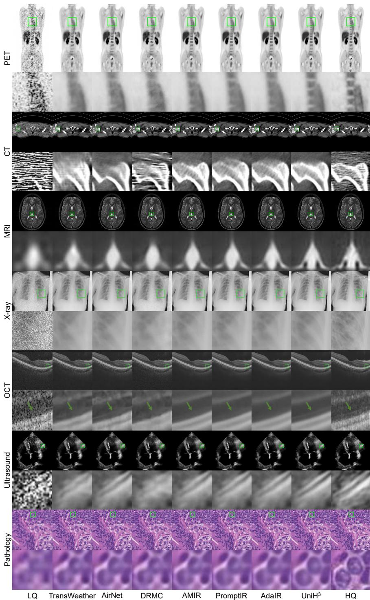  
Fig. I: Visual comparison for 2D all-in-one MedIR on the MedIR-2D-500K dataset.

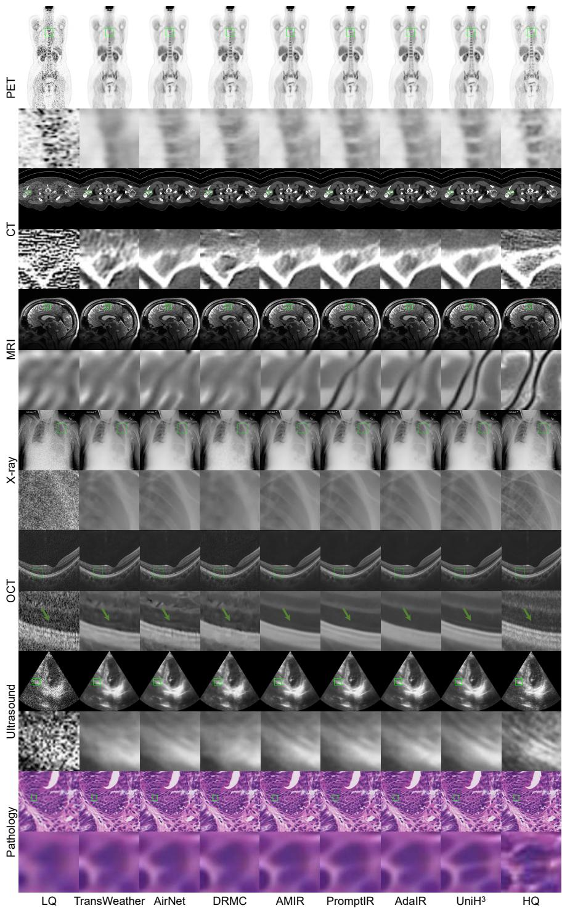  
Fig. II: Visual comparison for 2D all-in-one MedIR on the MedIR-2D-500K dataset.

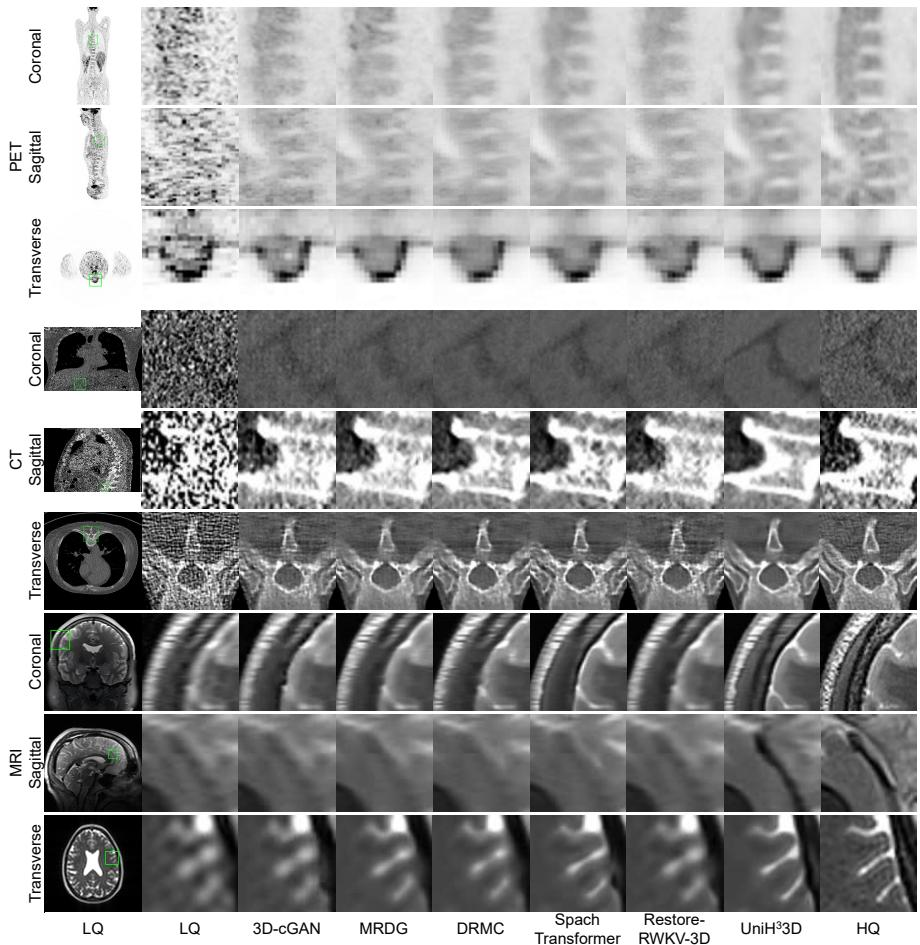  
Fig. III: Visual comparison for 3D all-in-one MedIR on the MedIR-3D-3K dataset.