# PhysBrain 1.5: From Vision-Language Models to Physical Foundation Models

DeepCybo Team

## Abstract

We present PhysBrain 1.5, a unified model for understanding physical environments, generating actions, and predicting future states. Motivated by the physical loop of observation, interaction, and environmental change, we bring these capabilities into a common learning framework. Starting from a general vision–language model, we encode language responses, end-efector motion, and dense visual targets as discrete sequences and jointly optimize them with autoregressive next-token prediction. Pre-training draws its embodied supervision entirely from human interaction videos, using task-centered episodes to pair semantic and spatial context with recovered motion and subsequent observations. We then adapt the model through supervised fine-tuning on a mixture of human demonstrations, robot trajectories, and simulated experience. Across 28 embodied understanding benchmarks, our 8B model achieves an average score of 72.5, setting a new open source state of the art and performing on par with leading proprietary models such as GPT-6-Astra and Gemini 3.6 Flash. It achieves the best open-source results on 14 benchmarks while retaining general multimodal capabilities. Beyond these understanding evaluations, qualitative examples show the model’s ability to produce end-efector trajectories and predict future scenes through spatially aligned RGB, depth, and robot-mask outputs.

Project Page: https://deepcybo-physai.github.io/PhysBrain-1.5 Huggingface: https://huggingface.co/collections/DeepCybo/physbrain-15 Evaluation Kit: https://github.com/DeepCybo-PhysAI/PhysBrainEvalKit

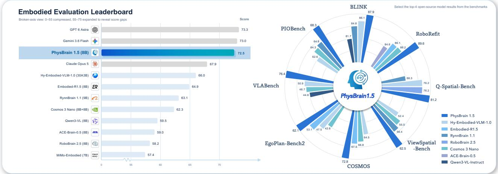  
Figure 1 Leading overall performance on the report’s embodied benchmark suite. PhysBrain 1.5 achieves an overall score of 72.5 with 8B parameters, ranking first among all open-sourced models and delivering performance on par with leading proprietary systems.

## Contents

1 Introduction 3   
2 Model Architecture 4   
2.1 Overview 4   
2.2 Embodied Understanding as Physical Perception 4   
2.3 Embodied Action Generation 4   
2.4 Visual-Foundation Generation 6   
2.5 Unified Vocabulary and Training Objective 6   
3 Data 7   
3.1 Physical-Aware Pre-training Data 7   
3.1.1 Physical Perception Data 7   
3.1.2 Human Action Data .   
3.1.3 Human-Interaction Future-State Data   
3.2 Embodied Supervised Fine-Tuning Data   
3.2.1 Embodied Understanding Data   
3.2.2 Embodied Action Data 9   
3.2.3 Embodied Future-State Data 10   
4 Training 10   
5 Evaluation . 11   
5.1 Embodied Understanding 12   
5.1.1 Benchmarks . 12   
5.1.2 Comparison Models 13   
5.1.3 Results and Analysis 13   
5.2 General Multimodal Understanding 13   
5.2.1 Evaluation Protocol 14   
5.2.2 Results and Analysis . 14   
5.3 Beyond Understanding: Action Modeling and Physical-World Prediction 14   
5.3.1 Action Trajectory Token Prediction 14   
5.3.2 Future Visual Prediction 16   
Conclusion 17   
A Contributor 28   
B Evaluation Protocols and Visualizations 28   
B.1 Embodied Evaluation Protocols and Metric Standardization 28   
B.1.1 Framework and Protocol Alignmen 28   
B.1.2 Unified Point-Localization Metric 28   
B.1.3 Additional Benchmark Integrations 29   
B.2 General Multimodal Evaluation Protocol . 29   
B.2.1 Image Evaluation . 30   
B.2.2 Video Evaluation 30   
B.3 Action Perplexity . 31   
B.4 Qualitative Visualizations 31

## 1 Introduction

Physical intelligence depends on continuous interaction between an agent and its environment. We describe this interaction as the physical loop: the agent observes its surroundings, interprets spatial relationships and task goals, anticipates action outcomes, and acts on the environment. The changed world provides new observations that inform its understanding and subsequent behavior. A physical foundation model should provide reusable capabilities for understanding, acting, and predicting within this loop.

The capabilities needed for this loop have developed across general foundation models and specialized systems. General vision–language models (VLMs) provide visual understanding, semantic knowledge, and instruction following [1–3]. Specialized models address spatial reasoning [4–7], grounding and afordance [8–10], planning [11, 12], and execution assessment [13, 14]. Vision–language–action models (VLAs), including the π series, GR00T, and Qwen-VLA, learn robot behavior [15–19]. DreamZero and Qwen-RobotWorld incorporate predictive world modeling [20, 21]. At the system level, SayCan [22], Code as Policies [23], and VoxPoser [24] connect language reasoning with robot capabilities through skills, programs, or spatial control representations. These approaches advance physical interaction by training specialized models and integrating existing capabilities into robotic systems.

Recent embodied foundation models bring several of these capabilities together. HY-Embodied, RynnBrain 1.1, and MiMo-Embodied broaden spatial understanding, interaction reasoning, and planning [25–28]. Other models integrate grounding, decisions, and execution-related capabilities [29–31]. UniVLA and RynnVLA-002 explore shared learning of understanding, action generation, and visual prediction [32, 33], while Cosmos 3 develops a broader framework for multimodal understanding and generation in physical environments [34]. Building on these eforts, we study how broad embodied understanding can be learned jointly with end-efector motion and multimodal future states.

Joint learning must account for diferences in supervision. Understanding tasks produce language, spatial coordinates, and interaction targets. Action generation requires temporally structured motion representations, while future-state prediction involves dense visual outputs. Training data also difer in embodiment, annotation conventions, and temporal granularity. We seek a shared learning formulation that accommodates these diferences while supporting physical generation alongside broad embodied understanding.

We present PhysBrain 1.5, which unifies embodied understanding, action generation, and future-state prediction through discrete tokens. We extend the language vocabulary with action and visual tokens. ActionPiece [35] encodes end-efector trajectories, while visual tokens represent future RGB images, depth maps, and robot masks. These outputs share an autoregressive backbone and output head, allowing semantic, motion, and future-state supervision to update the same parameters through a common next-token prediction objective, with task-specific loss masks selecting the target tokens to supervise for each output type.

Human interaction experience provides the data foundation for this approach. Our earlier work, Phys-Brain 1.0 [36], converts human egocentric video into structured physical-commonsense supervision and transfers the learned priors to robot policies. PhysBrain 1.5 extends this understanding-first approach to joint learning across the physical loop, with all embodied pre-training supervision derived from human interaction experience. We organize egocentric and synchronized ego–exocentric recordings, together with panoramic video from PhysBrain-Ego360 [37], into task-centered episodes. These episodes couple semantic and spatial annotations, recovered human motion [38], and subsequent visual states within the shared training formulation. Supervised fine-tuning then combines human demonstrations, real-robot trajectories, and simulated interactions to extend the learned capabilities to diverse embodiments and tasks.

We evaluate PhysBrain 1.5 on 28 benchmarks spanning perception, spatial and multi-view understanding, embodied reasoning and planning, grounding and afordance, and visual trajectory reasoning. As shown in Figure 1, our 8B model achieves an average score of 72.5, setting a new open-source state of the art and closely approaching the strongest proprietary models, GPT-6-Astra (73.3) and Gemini 3.6 Flash (73.0). It ranks first on 14 benchmarks and second on 10 among open-source models. Qualitative results further demonstrate end-efector trajectory generation and future-frame prediction.

## 2 Model Architecture

## 2.1 Overview

PhysBrain 1.5 is built from the Qwen3-VL Instruct family and extends a pretrained vision–language model into a unified model of physical perception, interaction, and state transition. As illustrated in Figure 2, the central design is to express language, end-efector motion, and visual-state targets as discrete sequences and learn them through the same autoregressive interface. The unification concerns the generated representations, which share the language-model backbone, token embedding, and output head. Specifically, we augment the original language vocabulary with dedicated sets of action tokens and visual tokens:

$$
\gamma = \mathcal { V } _ { \mathrm { l a n g } } \cup \mathcal { V } _ { \mathrm { a c t } } \cup \mathcal { V } _ { \mathrm { v i s } } .\tag{1}
$$

The resulting vocabulary supports language, action, and visual-state generation through a shared embedding table and language-model output head. This formulation enables joint training of understanding and generation: perceptual supervision provides context for predicting interactions and their consequences, while action and state-transition supervision introduces physical priors that support spatial grounding and trajectory reasoning.

Let x contain the visual input, instruction, and any task-dependent context, and let y denote the target sequence. Across task families, the model is optimized with masked next-token prediction:

$$
p _ { \theta } ( y \mid x ) = \prod _ { i = 1 } ^ { | y | } p _ { \theta } ( y _ { i } \mid x , y _ { < i } ) , \qquad { \mathcal { L } } _ { \mathrm { A R } } = - \sum _ { i = 1 } ^ { | y | } m _ { i } \log p _ { \theta } ( y _ { i } \mid x , y _ { < i } ) ,\tag{2}
$$

where $m _ { i }$ selects supervised target tokens. Task formatting, modality delimiters, and the loss mask specify whether the model should answer in language, produce an action trajectory, or generate a visual-state sequence; the underlying prediction objective remains unchanged.

## 2.2 Embodied Understanding as Physical Perception

Embodied understanding is not implemented as a separate perception head. Instead, PhysBrain 1.5 retains the general image and video understanding interface of the base VLM and enriches it through embodied supervision. This supervision covers physical and spatial perception, multi-view understanding, embodied reasoning and planning, object and part grounding, afordance, and visual trajectory reasoning. Depending on the task, the same autoregressive decoder produces natural-language answers or structured spatial targets. Consequently, semantic recognition, spatial localization, and temporal reasoning remain available through a common interface and can provide the scene-level evidence needed by action and visual-state generation.

## 2.3 Embodied Action Generation

We convert human motion into robot action representations through Human-as-Humanoid [38], retaining the positions and orientations of both wrists and excluding finger motions. Human-derived and robot action data then share the same action representation and tokenizer: we model each action as a short end-efector trajectory. For each human or robot wrist, the model predicts an action chunk of length H = 16, corresponding to the next 16 action steps, relative to the wrist pose at the current observation. We represent relative orientation using a continuous 6D representation. For a rotation matrix R, we define

$$
\rho _ { 6 } ( R ) = \mathrm { v e c } \big ( R _ { [ : , 1 : 2 ] } \big ) \in \mathbb { R } ^ { 6 } ,\tag{3}
$$

where $R _ { [ : , 1 : 2 ] }$ denotes the first two columns of R. The action target is then defined as:

$$
a _ { t , k } = \left[ p _ { t + k } - p _ { t } , \rho _ { 6 } \left( R _ { t } ^ { \top } R _ { t + k } \right) , g _ { t + k } \right] \in \mathbb R ^ { 1 0 } , \quad k = 1 , \dots , H .\tag{4}
$$

The first three dimensions are relative translation, the next six encode the relative rotation, and $g \in [ 0 , 1 ]$ is absolute gripper closure, with zero denoting open and one denoting closed. All targets share the same anchor $( p _ { t } , R _ { t } )$ and are not accumulated stepwise. Physical units are standardized and translation uses corpus-level normalization; each source’s native coordinate axes are retained.

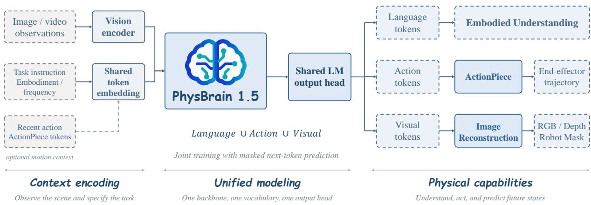  
Figure 2 PhysBrain 1.5 model architecture. Built on a pretrained vision–language model, PhysBrain 1.5 jointly learns embodied understanding, action generation, and visual-state prediction through a shared backbone, token embedding, and output head over a unified language–action–visual vocabulary. Embodied understanding covers foundational visual-spatial perception, spatial and multi-view understanding, embodied cognition and reasoning, spatial pointing and afordance understanding, and visual trajectory reasoning. Action tokens are decoded by ActionPiece into end-efector trajectories, with optional action history providing motion context; visual tokens are decoded by a Vision decoder into future RGB images, depth maps, and robot masks. The three task families provide complementary supervision under a shared autoregressive training objective.

We discretize these trajectories with an ActionPiece tokenizer $\mathcal { T } _ { \mathrm { A P } }$ [35], trained on 28.7 million 16-step end-efector trajectory segments corresponding to 459.2 million action timesteps. The tokenizer provides a 512-token action vocabulary as an external discretization interface. In the configuration used by PhysBrain 1.5, it encodes a wrist trajectory into a sequence of 32 discrete action tokens. The same ActionPiece vocabulary and codebook are used for left wrist and right wrist trajectories.

Homogeneous action continuation. Although action trajectories from diferent sources are mapped to the same 10D end-efector representation and ActionPiece vocabulary, we do not impose a single globally canonicalized coordinate frame or motion convention across all embodiments. Diferent datasets use substantially diferent robot, camera, and control conventions, making reliable global canonicalization costly and dificult to scale across embodiments. Moreover, some sources lack complete calibration metadata or global-frame information, so the corresponding transformations cannot be recovered without additional assumptions. Rather than introducing potentially unreliable conversions, we preserve each source’s native coordinate axes. The same nominal action dimensions may therefore exhibit source-specific local axes, motion scales, control frequencies, and temporal patterns.

To account for this heterogeneity, we use the action immediately preceding the current observation as a local motion context. Together with the current visual observation, recent action history provides an implicit system-identification signal, allowing the model to infer the local action convention, motion trend, and short-term response pattern of the current embodiment or data source. Rather than requiring every source to be transformed into a globally canonical action frame, the model can use this input–motion context to continue the ongoing trajectory naturally

The preceding and target action chunks are encoded with the same ActionPiece tokenizer and action vocabulary:

$$
z ^ { - } = { \mathcal { T } } _ { \mathrm { A P } } ( A ^ { - } ) , \qquad z ^ { + } = { \mathcal { T } } _ { \mathrm { A P } } ( A ^ { + } ) , \qquad p _ { \theta } \bigl ( z ^ { + } \mid I , u , e , f , z ^ { - } \bigr ) ,\tag{5}
$$

where $A ^ { - }$ and $A ^ { + }$ denote the preceding and immediately following 16-step action chunks, respectively, and $z ^ { - }$ and $z ^ { + }$ are their corresponding discrete action-token sequences. Here, I is the current observation, u the task instruction, e the robot embodiment, and $f$ the action frequency; $z ^ { - }$ is optional. This formulation turns action prediction into conditional trajectory continuation rather than isolated chunk regression. Action history provides a local motion prior that helps preserve continuity across action-chunk boundaries and adapt to embodiment-specific motion direction, scale, and rhythm.

## 2.4 Visual-Foundation Generation

We model the future physical state as a spatially aligned combination of an RGB image, a depth map, and a robot mask. Given the current RGB observation and task instruction, PhysBrain 1.5 predicts the future physical state $S _ { t + \Delta }$ :

$$
S _ { t + \Delta } = \left( X _ { t + \Delta } ^ { \mathrm { r g b } } , X _ { t + \Delta } ^ { \mathrm { d e p t h } } , X _ { t + \Delta } ^ { \mathrm { m a s k } } \right) ,\tag{6}
$$

The three targets correspond to the same timestamp and image coordinate system. For datasets with diferent frame rates, the target-frame ofset is determined from the specified prediction interval and each source’s native frame rate.

Shared discrete visual representation. We tokenize all three modalities with a shared VQ-VAE at a target resolution of 128 × 128. RGB images are normalized to the tokenizer’s input range; depth maps are linearly mapped to [−1, 1], and robot masks are mapped to the same range. Single-channel depth maps and masks are replicated across three channels before tokenization. For each modality m ∈ {rgb, depth, mask}, the tokenizer produces

$$
\begin{array} { r } { Q _ { t + \Delta } ^ { m } = \mathcal { T } _ { \mathrm { V Q } } \left( X _ { t + \Delta } ^ { m } \right) \in \{ 1 , \dots , K \} ^ { 1 6 \times 1 6 } , } \end{array}\tag{7}
$$

where $K = 1 6 { , } 3 8 4$ is the codebook size. The spatial downsampling factor of eight yields $N = 2 5 6$ discrete codes per modality. Each codebook index maps one-to-one to an atomic VLM token. Two additional tokens, <|future\_joint\_vq8\_start|> and <|future\_joint\_vq8\_end|>, delimit the future-state payload. The visual vocabulary $\nu _ { \mathrm { v i s } }$ therefore contains $K + 2 = 1 6 { , } 3 8 6$ tokens.

Spatially aligned joint serialization. Let $q _ { i } ^ { m }$ denote the VLM token corresponding to the i-th code in the row-major traversal of $Q _ { t + \Delta } ^ { m }$ . We interleave the three modalities at each spatial location in RGB–depth–mask order:

$$
\boldsymbol { y } ^ { \mathrm { v i s } } = [ b _ { \mathrm { s t a r t } } , q _ { 1 } ^ { \mathrm { r g b } } , q _ { 1 } ^ { \mathrm { d e p t h } } , q _ { 1 } ^ { \mathrm { m a s k } } , \ldots , q _ { N } ^ { \mathrm { r g b } } , q _ { N } ^ { \mathrm { d e p t h } } , q _ { N } ^ { \mathrm { m a s k } } , b _ { \mathrm { e n d } } ] ,\tag{8}
$$

where $b _ { \mathrm { s t a r t } }$ and $b _ { \mathrm { e n d } }$ denote the two boundary tokens. The sequence contains $3 N = 7 6 8 ~ \mathrm { V Q }$ tokens and two boundary tokens, for a total of 770 tokens. This ordering places tokens from corresponding spatial locations next to one another, providing local cross-modal context during autoregressive generation.

The model generates the future-state sequence autoregressively through the shared LM output head. No modality-specific prediction heads or pixel-space reconstruction losses are introduced during VLM training. At inference time, the generated payload is mapped back to codebook indices and de-interleaved into three $1 6 \times 1 6$ grids. Each grid is reconstructed separately using the same frozen VQ decoder to produce the corresponding RGB image, depth map, or robot mask.

## 2.5 Unified Vocabulary and Training Objective

We jointly train embodied understanding, action generation, and visual-foundation generation using the unified vocabulary in Eq. (1) and the autoregressive objective in Eq. (2). Task formats specify the requested outputs, while loss masks select the corresponding target tokens.

The three objectives provide complementary supervision for a shared physical representation. Embodied understanding captures task semantics and spatial relations; action generation models end-efector motion; and visual-foundation generation models future scene states. Joint training brings these signals into the same backbone, allowing the model to learn from both descriptions of physical tasks and direct motion and state targets. This is the motivation for unifying the objectives beyond sharing a token-generation interface.

<table><tr><td>Stage</td><td>Component</td><td>Supervision</td><td>Domain</td><td>Training samples</td></tr><tr><td rowspan="4">Pre-training</td><td>Perception</td><td>Captioning, VQA, spatial labels</td><td>Human videos</td><td>24.3M</td></tr><tr><td>Human action</td><td>EEF trajectories</td><td>Human videos</td><td>31.2M</td></tr><tr><td>Future state</td><td>RGB, depth, and human masks</td><td>Human videos</td><td>26.8M</td></tr><tr><td>General</td><td>Instruction following</td><td>Multimodal data</td><td>14.9M</td></tr><tr><td rowspan="4">Embodied SFT</td><td>Understanding</td><td>Language and spatial responses</td><td>Multimodal data</td><td>6.61M</td></tr><tr><td>Action</td><td>EEF trajectories</td><td>Human/robot/simulation 5.4M</td><td></td></tr><tr><td>Future state</td><td>RGB, depth, and robot masks</td><td>Robot/simulation</td><td>1.2M</td></tr><tr><td>General</td><td>Instruction following</td><td>Multimodal data</td><td>1M</td></tr></table>

Table 1 Composition of the two-stage training data. Physical-aware pre-training data are constructed from human interaction videos; embodied SFT combines curated human, real-robot, and simulation data. Both stages also include general language and vision-language instruction data.

## 3 Data

We organize the training data into two stages: physical-aware pre-training and embodied supervised fine-tuning (SFT). Both stages provide supervision for perception and understanding, action generation, and future-state prediction. Physical-aware pre-training derives these three types of supervision from large-scale human interaction videos. Embodied SFT reuses the pre-training data construction pipeline to incorporate more diverse data sources, including interactions in real-robot and simulated environments, for further fine-tuning on high-quality data. This data design supports learning across the physical loop by connecting environmental perception and understanding, action-based interaction, and changes in physical state. Table 1 reports the training data volume for each supervision type at each stage.

## 3.1 Physical-Aware Pre-training Data

Our pre-training corpus is built from human interaction videos that expose how people perceive a task, act in the environment, and change its physical state. We aggregate Xperience-10M [39], Egocentric-10K [40], Ego4D [41], EgoVerse [42], EgoDex [43], EgoLife [44], and Ego-Exo4D [45], together with two in-house corpora. PhysBrain-Human [38] contains egocentric recordings, including sequences with synchronized exocentric views. PhysBrain-Ego360 [37] provides panoramic videos of the surrounding environment together with full-body poses, hand motion, and task-level speech recorded during activity execution. These sources cover daily activities, tool use, human–object interaction, and long-horizon tasks across egocentric, exocentric, and panoramic viewpoints. We segment long recordings at task and action boundaries to obtain task-coherent episodes containing a high-level goal and its execution process. We discard low-quality episodes with severe motion blur, substantial underexposure or overexposure, corrupted or missing frames, or key interactions that are obscured or outside the field of view. The curated source corpus contains approximately 30,000 hours of video. From this corpus, we construct the three types of training data described below.

## 3.1.1 Physical Perception Data

Physical perception data consist of structured annotations, captions, and question-answer pairs derived from human interaction videos. Specialized open-source and in-house models generate structured pseudo-labels from sampled frames and clips. Image-level supervision covers object detection, segmentation, depth estimation, pointing, counting, and 3D object detection. Video-level supervision covers temporal grounding, spatiotemporal grounding, and object tracking. Synchronized egocentric, exocentric, and panoramic recordings additionally support cross-view object correspondence and referring grounding under changes in viewpoint, scale, and visibility.

We complement these structured targets with physically grounded captioning and question answering. Framelevel captions describe visible objects and interaction-relevant scene properties; segment-level captions align fine-grained actions with manipulated objects and observed state changes; and episode-level captions summarize the environment, task goal, and execution progress. For PhysBrain-Ego360, we combine synchronized speech transcripts with video evidence to derive task descriptions and temporally grounded step-level captions. Physical VQA examples probe task recognition, progress assessment, action understanding, human–object interaction, temporal order, and observed state changes. We retain the temporal or multi-view evidence required by each target and reject pseudo-labels, captions, and answers that are inconsistent with the source media or supporting annotations. The resulting physical perception corpus contains 24.3M training samples.

## 3.1.2 Human Action Data

We construct human action data from motion trajectories aligned with task execution in human interaction videos. Using the Human-as-Humanoid pipeline [38], we recover human motion and derive wrist end-efector trajectories from the recovered kinematic chain. Temporal correspondences between the video and motion sequences associate these trajectories with task descriptions and visual observations, providing task and scene context for each motion segment.

We divide interaction videos into short clips and extract continuous motion trajectories and their corresponding observations. Each sample preserves the temporal relationships among an action segment, the subsequent visual observation, and the continuation of the action, capturing a continuous interaction process. We check pose-recovery reliability, video–trajectory alignment, and motion plausibility, rejecting samples with unreliable reconstruction, missing temporal correspondences, or implausible motion. The resulting human action corpus contains 31.2M training samples.

## 3.1.3 Human-Interaction Future-State Data

We construct future-state data from human interaction videos by pairing the scene context before an interaction with a subsequent physical state. We divide videos into short clips and select a current observation and a target future observation to form future-state prediction samples. For interaction sequences associated with action trajectories, we also preserve the temporal correspondences between action segments and subsequent observations, linking state annotations to motion within the same interaction.

Each future-state target comprises a spatially aligned RGB image, depth map, and human-part segmentation mask. The RGB image is taken directly from the video frame at the target timestamp. The depth map and segmentation mask covering the interacting hands and arms are generated by the corresponding perception pipelines. These annotations capture scene appearance, depth structure, and the human regions involved in the interaction, respectively, and describe the physical state at a common timestamp.

We validate the temporal ofsets of observation pairs, the integrity of images and annotations, the numeric validity of depth maps and masks, and spatial correspondences across modalities. Samples with temporal mismatches, missing data, or inconsistent cross-modal alignment are discarded. The resulting humaninteraction future-state corpus contains 26.8M training samples.

General instruction data. The general language and vision-language instruction data used for pre-training comprise 14.9M samples. Language sources include the FLAN Collection [46], UltraChat [47], OpenAssistant Conversations [48], selected subsets of UltraData-SFT-2605 [49], MetaMathQA [50], and Magicoder-OSS Instruct [51]. Vision-language sources include FineVision [52], LLaVA-OneVision-1.5-Instruct-Data [53], Cambrian-7M [54], PixMo [3], ShareGPT4Video [55], and LLaVA-Video-178K [56]. We perform cross-source deduplication before capability-aware sampling because several collections aggregate overlapping public data.

## 3.2 Embodied Supervised Fine-Tuning Data

The embodied SFT corpus combines high-quality human interaction data, real-robot trajectories, and simulated interactions. From these sources, we construct language and spatial annotations for embodied understanding, end-efector trajectories for action generation, and aligned visual targets for future-state prediction. To retain broad language and multimodal capabilities during embodied adaptation, the mixture also includes 1M high-quality general language and vision-language instruction samples.

<table><tr><td>Capability group</td><td>Supervision</td><td>Representative sources</td><td>Scale</td></tr><tr><td>Foundational visual-spatial perception</td><td>Counting, relative depth and distance, metric distance, spatial relations, and local 3D geometry</td><td>TallyQA [57], DIW [58], VSR [59], COCO [60], ADE20K [61], Omni3D [62], Matterport3D [63], Argoverse 2 [64], and ScanNet [65]</td><td>500K</td></tr><tr><td>Spatial and multi-view understanding</td><td>Geometric relations, scene structure, viewpoint reasoning, cross-view correspondence, and 3D mental modeling</td><td>SSI-800K (SenseNova-SI) [66], SpatialLadder [67], SAT-Train [5], SpatialMQA [68], GRiD-3D [69], SpatialReasoner training data [6], VSI-590K [7], VSI-Train-10K [70], SIMS-VSI-200K [71], MindCube-Train [72], and VST [73]</td><td>2.36M</td></tr><tr><td>Embodied reasoning and planning</td><td>Task state, progress, next action, procedural order, failure diagnosis, and corrective behavior</td><td>RoboVQA-Train [11], HoloAssist [74], EgoPlan-IT [12], RoboFail [75], BridgeData V2 [76], AgiBot [77], VLABench [78], and the human-interaction corpus</td><td>1.65M</td></tr><tr><td>Grounding and affordance</td><td>Object and part localization, pointing, free-space and placement grounding, contact regions, and functional affordance</td><td>RoboRefIt-Train [79], Objects365 [80], OpenImages [81], LVIS [82], Visual Genome [83], CoSyn-Point [84], PixMo-Points [3], Molmo2-MultiImagePoint [85], RefSpatial-Train [9], RoboPoint [8], RoboSpatial-Train [4], RoboAfford-Train [86], HANDAL [87], PACO [88], InstructPart [89], and ShareRobot [90]</td><td>1.8M</td></tr><tr><td>Visual trajectory reasoning</td><td>Image-space traces and waypoints for approach, contact, transport, and placement</td><td>FSD [91], ShareRobot [90], Open X-Embodiment [92], DROID [93], ManiSkill [94], RoboCasa [95], Molmo2-VideoPoint [85], MolmoPoint-TrackAny/TrackSyn [10], Ego4D [41], Egocentric-10K [40], EgoDex [43], PhysBrain-Ego360 [37], and PhysBrain-Human [38]</td><td>300K</td></tr></table>

Table 2 Composition of the embodied-understanding data. Scales report the number of training samples in each capability group.

## 3.2.1 Embodied Understanding Data

The embodied-understanding corpus combines the datasets listed in Table 2, grouped by annotation type. Across groups, native annotations are converted into instruction-formatted language or spatial targets. We preserve temporal, multi-view, and geometric evidence where required, standardize coordinates and output formats, and filter examples for semantic validity, referential clarity, geometric reliability, media integrity, and cross-source duplication.

Foundational perception data are organized as instruction-following samples by converting native annotations into task instructions paired with textual or spatial targets. These samples cover counting, depth and distance judgments, spatial relation understanding, and object localization. Depending on the task, they take the form of question answering, captioning, or structured spatial prediction, with object categories, numerical ranges, and answer distributions balanced during construction. Spatial and multi-view examples retain their original image, video, camera, and scene organization so that viewpoint-dependent evidence is not collapsed during conversion. Reasoning and planning data combine original clips with temporally ordered frame sequences. Grounding and visual-trajectory data use a shared normalized spatial format for points, boxes, regions, and image-space waypoints.

## 3.2.2 Embodied Action Data

We construct the embodied-action corpus by combining trajectories from 17 real-robot and simulation sources with high-quality human motion trajectories. These data span diverse embodiments, viewpoints, tasks, and motion distributions. As summarized in Table 3, the raw collection contains approximately 2,620 hours of real-robot and simulation trajectories and 500 hours of high-quality human motion data.

The source datasets difer in action semantics, physical units, and temporal sampling conventions. We first determine whether each source records observed states or commanded targets and extract motion sequences according to these semantics. We standardize physical units and gripper open–close conventions while retaining each source’s audited native coordinate axes. For human data, we reuse the Human-as-Humanoid pipeline [38] employed during pre-training to recover wrist trajectories, retaining sequences with reliable pose recovery and temporal alignment. We then synchronize trajectories with visual observations and task descriptions to provide task and scene context for each motion sequence.

<table><tr><td>Source family</td><td>Datasets</td><td>Scale</td></tr><tr><td>Bimanual platforms</td><td>OpenGalaxea [96], AgiBotWorld [77], GM100/CobotMagic [97], RoboTwin [98], and GR00T-X [99]</td><td>987 h</td></tr><tr><td>Single-arm platforms</td><td>DROID [93], FurnitureBench [100], FMB [101], Fractal/RT-1 [102], BC-Z [103], BridgeData V2 [76], Dobb-E [104], TACO Play [105, 106], and Berkeley Cable Routing [107]</td><td>1,339 h</td></tr><tr><td>Simulation benchmarks</td><td>RoboCasa [95], LIBERO [108], and VLA-Arena [109]</td><td>294 h</td></tr><tr><td>Human interaction</td><td>Selected high-quality human motion trajectories</td><td>500 h</td></tr></table>

Table 3 Scale and composition of the embodied-action data used for supervised fine-tuning. The corpus combines real-robot and simulation trajectories with 500 hours of high-quality human motion data.

For selected sources with low sampling rates, we resample continuous trajectories to improve temporal resolution. Resampling preserves the original sample anchors without introducing additional candidate windows, maintaining the relative sampling weights of the source datasets. We reject samples with invalid poses, rotations, timestamps, media, or annotations, and further filter trajectories using the motion-informativeness criterion from FrameSkip [110]. Uninformative segments are downsampled, while segments containing new motion or interaction changes are retained. Stationary segments are selectively retained to represent meaningful pauses during task execution. Each final sample includes the task description, visual observations, embodiment metadata, action frequency, and temporally aligned motion trajectories. All data splits are constructed at the episode level.

## 3.2.3 Embodied Future-State Data

We construct embodied future-state data from the real-robot and simulation trajectories used in the action corpus, associating task descriptions and current visual observations with subsequent target frames. To accommodate diferences in sampling rates and recording conventions, we use timestamps and each source’s native frame rate to establish temporal correspondences. Target frames are drawn from the same continuous interaction sequence and aligned with the corresponding task context.

We follow the multimodal state-annotation procedure used for human-interaction pre-training to construct spatially aligned RGB images, depth maps, and segmentation masks for each target frame. RGB images are taken directly from the source trajectory, metric z-depth maps are generated with MoGe-2 [111], and robot-body masks are obtained with RoboEngine [112]. The segmentation targets cover the robot body, extending the human hand-and-arm annotations used during pre-training to robot embodiments. These annotations capture scene appearance, spatial depth, and the regions occupied by the robot, respectively, and describe a physical state at a common timestamp in the same image coordinate system.

We check the completeness of target frames and annotations, validate the temporal ofsets of observation pairs and the numeric validity of depth maps and masks, and verify spatial correspondences across modalities. Samples with missing data, temporal mismatches, or inconsistent annotation alignment are discarded, ensuring that the retained RGB images, depth maps, and robot masks form consistent future-state targets. The resulting embodied future-state corpus contains 1.2M training samples.

## 4 Training

We train PhysBrain 1.5 using ms-swift1 with its Megatron-Core [113] backend, taking Qwen3-VL-Instruct (8B) as the base model and extending its vocabulary with action and visual-state tokens as described in Sec. 2. Training proceeds in two stages: physical-aware pre-training followed by supervised fine-tuning, with the second stage initialized from the first-stage checkpoint. We train for one epoch in each stage using the same hyperparameter configuration, mixing data categories in proportion to their sample counts reported in Sec. 3. Both stages jointly optimize text generation, action-token generation, and future visual-state generation under the unified autoregressive objective.

Table 4 Results on Embodied Understanding. All results are reported on a 0–100 scale, with higher values indicating better performance. Closed-source models are shown in gray and excluded from ranking. Darker blue cells with bold text and lighter blue cells mark the best and second-best open-source results, respectively.
<table><tr><td rowspan=1 colspan=14>Closed-Source                    Open-SourceModels                         ModelsGem 1 ash          adt t nn.H---1.0nmnnnnl thin.GPt AtraCd udd30 0nk,.Emo1.5  Rynn1.1  Robq2.5   Mioio Edied   Cos monno   ACE---0.5   w--nst.  Phy 1.51ow  in.Bi n.88BCategoryBenchmarks889688888888</td></tr><tr><td rowspan=2 colspan=2>Foundational          BLINKVisual-Spatial Percept.CV-Bench</td><td rowspan=2 colspan=3>89.280.685.590.084.987.8</td><td rowspan=1 colspan=1>86.1</td><td rowspan=1 colspan=1>78.6</td><td rowspan=1 colspan=1>84.8</td><td rowspan=1 colspan=3>80.469.580.6</td><td rowspan=1 colspan=1>77.8</td><td rowspan=1 colspan=1>81.7</td><td rowspan=1 colspan=1>87.9</td></tr><tr><td rowspan=1 colspan=1>89.3</td><td rowspan=1 colspan=1>86.9</td><td rowspan=1 colspan=1>88.1</td><td rowspan=1 colspan=1>88.0</td><td rowspan=1 colspan=1>89.4</td><td rowspan=1 colspan=1>88.3</td><td rowspan=1 colspan=1>85.0</td><td rowspan=1 colspan=1>85.8</td><td rowspan=1 colspan=1>90.0</td></tr><tr><td rowspan=9 colspan=2>3DSRBenchEmbSpatial-BenchMindCubeSpatial and            MMSI-BenchMulti-view            Q-Spatial-BenchUnderstanding        RoboSpatial-HomeSATVSI-BenchViewSpatial-Bench</td><td rowspan=1 colspan=3>67.762.363.3</td><td rowspan=1 colspan=1>62.1</td><td rowspan=1 colspan=1>52.3</td><td rowspan=1 colspan=1>59.0</td><td rowspan=1 colspan=1>54.7</td><td rowspan=1 colspan=1>53.2</td><td rowspan=1 colspan=1>53.5</td><td rowspan=1 colspan=1>51.8</td><td rowspan=1 colspan=1>53.6</td><td rowspan=1 colspan=1>63.0</td></tr><tr><td rowspan=1 colspan=2>84.779.8</td><td rowspan=1 colspan=1>81.1</td><td rowspan=1 colspan=1>80.5</td><td rowspan=1 colspan=1>75.2</td><td rowspan=1 colspan=1>81.9</td><td rowspan=1 colspan=1>77.9</td><td rowspan=1 colspan=1>77.0</td><td rowspan=1 colspan=1>82.1</td><td rowspan=1 colspan=1>77.9</td><td rowspan=1 colspan=1>79.9</td><td rowspan=1 colspan=1>81.8</td></tr><tr><td rowspan=1 colspan=2>77.178.8</td><td rowspan=1 colspan=1>66.7</td><td rowspan=1 colspan=1>65.4</td><td rowspan=1 colspan=1>30.9</td><td rowspan=1 colspan=1>82.1</td><td rowspan=1 colspan=1>30.4</td><td rowspan=1 colspan=1>31.3</td><td rowspan=1 colspan=1>39.2</td><td rowspan=1 colspan=1>94.2</td><td rowspan=1 colspan=1>33.9</td><td rowspan=1 colspan=1>86.2</td></tr><tr><td rowspan=1 colspan=2>52.857.9</td><td rowspan=1 colspan=1>44.1</td><td rowspan=1 colspan=1>39.0</td><td rowspan=1 colspan=1>30.1</td><td rowspan=1 colspan=1>46.0</td><td rowspan=1 colspan=1>29.4</td><td rowspan=1 colspan=1>31.8</td><td rowspan=1 colspan=1>35.7</td><td rowspan=1 colspan=1>35.8</td><td rowspan=1 colspan=1>30.8</td><td rowspan=1 colspan=1>41.0</td></tr><tr><td rowspan=1 colspan=1>87.1</td><td rowspan=1 colspan=1>68.3</td><td rowspan=1 colspan=1>74.3</td><td rowspan=1 colspan=1>76.2</td><td rowspan=1 colspan=1>51.5</td><td rowspan=1 colspan=1>66.3</td><td rowspan=1 colspan=1>76.2</td><td rowspan=1 colspan=1>47.5</td><td rowspan=1 colspan=1>46.5</td><td rowspan=1 colspan=1>35.6</td><td rowspan=1 colspan=1>54.5</td><td rowspan=1 colspan=1>81.2</td></tr><tr><td rowspan=1 colspan=1>71.0</td><td rowspan=1 colspan=1>73.7</td><td rowspan=1 colspan=1>72.0</td><td rowspan=1 colspan=1>71.2</td><td rowspan=1 colspan=1>72.0</td><td rowspan=1 colspan=1>70.4</td><td rowspan=1 colspan=1>67.3</td><td rowspan=1 colspan=1>60.1</td><td rowspan=1 colspan=1>66.4</td><td rowspan=1 colspan=1>65.9</td><td rowspan=1 colspan=1>67.7</td><td rowspan=1 colspan=1>73.9</td></tr><tr><td rowspan=1 colspan=1>88.7</td><td rowspan=1 colspan=1>96.7</td><td rowspan=1 colspan=1>88.7</td><td rowspan=1 colspan=1>81.3</td><td rowspan=1 colspan=1>74.0</td><td rowspan=1 colspan=1>78.0</td><td rowspan=1 colspan=1>65.3</td><td rowspan=1 colspan=1>76.0</td><td rowspan=1 colspan=1>69.3</td><td rowspan=1 colspan=1>79.3</td><td rowspan=1 colspan=1>70.7</td><td rowspan=1 colspan=1>79.3</td></tr><tr><td rowspan=1 colspan=1>51.8</td><td rowspan=1 colspan=1>59.8</td><td rowspan=1 colspan=1>21.3</td><td rowspan=1 colspan=1>55.7</td><td rowspan=1 colspan=1>56.3</td><td rowspan=1 colspan=1>65.9</td><td rowspan=1 colspan=1>43.9</td><td rowspan=1 colspan=1>45.0</td><td rowspan=1 colspan=1>50.4</td><td rowspan=1 colspan=1>57.9</td><td rowspan=1 colspan=1>55.1</td><td rowspan=1 colspan=1>61.9</td></tr><tr><td rowspan=1 colspan=1>56.6</td><td rowspan=1 colspan=1>54.2</td><td rowspan=1 colspan=1>49.8</td><td rowspan=1 colspan=1>52.4</td><td rowspan=1 colspan=1>43.9</td><td rowspan=1 colspan=1>56.4</td><td rowspan=1 colspan=1>39.3</td><td rowspan=1 colspan=1>39.7</td><td rowspan=1 colspan=1>55.0</td><td rowspan=1 colspan=1>48.3</td><td rowspan=1 colspan=1>40.3</td><td rowspan=1 colspan=1>62.5</td></tr><tr><td rowspan=2 colspan=2>COSMOSEmbodied             EgoPlan-Bench2</td><td rowspan=1 colspan=1>65.3</td><td rowspan=1 colspan=1>75.7</td><td rowspan=1 colspan=1>71.0</td><td rowspan=1 colspan=1>64.5</td><td rowspan=1 colspan=1>67.5</td><td rowspan=1 colspan=1>64.3</td><td rowspan=1 colspan=1>57.7</td><td rowspan=1 colspan=1>56.5</td><td rowspan=1 colspan=1>66.8</td><td rowspan=1 colspan=1>46.5</td><td rowspan=1 colspan=1>60.6</td><td rowspan=1 colspan=1>72.8</td></tr><tr><td rowspan=1 colspan=1>53.1</td><td rowspan=1 colspan=1>69.3</td><td rowspan=1 colspan=1>48.4</td><td rowspan=1 colspan=1>47.5</td><td rowspan=1 colspan=1>53.1</td><td rowspan=1 colspan=1>37.0</td><td rowspan=1 colspan=1>33.8</td><td rowspan=1 colspan=1>37.9</td><td rowspan=1 colspan=1>42.6</td><td rowspan=1 colspan=1>33.5</td><td rowspan=1 colspan=1>32.1</td><td rowspan=1 colspan=1>62.1</td></tr><tr><td rowspan=4 colspan=2>Cognition,Reasoning, and       ERQA-PLUSPlanning              RoboVQAVLABench</td><td rowspan=1 colspan=5>ERQA</td><td rowspan=1 colspan=1>72.3</td><td rowspan=1 colspan=1>75.8</td><td rowspan=1 colspan=1>61.5</td><td rowspan=1 colspan=1>56.3</td><td rowspan=1 colspan=1>42.3</td><td rowspan=1 colspan=1>46.5</td><td rowspan=1 colspan=1>44.3</td></tr><tr><td rowspan=1 colspan=1>92.2</td><td rowspan=1 colspan=1>86.1</td><td rowspan=1 colspan=1>88.3</td><td rowspan=1 colspan=1>82.2</td><td rowspan=1 colspan=1>80.7</td><td rowspan=1 colspan=1>83.6</td><td rowspan=1 colspan=1>81.1</td><td rowspan=1 colspan=1>81.1</td><td rowspan=1 colspan=1>83.5</td><td rowspan=1 colspan=1>81.4</td><td rowspan=1 colspan=1>82.5</td><td rowspan=1 colspan=1>85.2</td></tr><tr><td rowspan=1 colspan=1>41.7</td><td rowspan=1 colspan=1>37.0</td><td rowspan=1 colspan=1>36.0</td><td rowspan=1 colspan=1>41.2</td><td rowspan=1 colspan=1>60.8</td><td rowspan=1 colspan=1>60.9</td><td rowspan=1 colspan=1>48.4</td><td rowspan=1 colspan=1>55.5</td><td rowspan=1 colspan=1>51.5</td><td rowspan=1 colspan=1>44.7</td><td rowspan=1 colspan=1>58.5</td><td rowspan=1 colspan=1>61.5</td></tr><tr><td rowspan=1 colspan=1>64.7</td><td rowspan=1 colspan=1>66.3</td><td rowspan=1 colspan=1>60.3</td><td rowspan=1 colspan=1>50.9</td><td rowspan=1 colspan=1>40.9</td><td rowspan=1 colspan=1>42.4</td><td rowspan=1 colspan=1>37.6</td><td rowspan=1 colspan=1>39.9</td><td rowspan=1 colspan=1>48.7</td><td rowspan=1 colspan=1>29.1</td><td rowspan=1 colspan=1>44.8</td><td rowspan=1 colspan=1>76.4</td></tr><tr><td rowspan=9 colspan=2>Part-AffordancePIOBenchPixMo-PointsSpatialPointBenchGrounding,RefSpatial-BenchPointing, andRoboAffordAffordanceRoboRefitVABench-PointWhere2Place</td><td rowspan=1 colspan=1>64.7</td><td rowspan=1 colspan=1>55.0</td><td rowspan=1 colspan=1>78.1</td><td rowspan=1 colspan=1>62.8</td><td rowspan=1 colspan=1>83.4</td><td rowspan=1 colspan=1>40.5</td><td rowspan=1 colspan=1>24.7</td><td rowspan=1 colspan=1>61.9</td><td rowspan=1 colspan=1>33.3</td><td rowspan=1 colspan=1>36.3</td><td rowspan=1 colspan=1>56.4</td><td rowspan=1 colspan=1>84.0</td></tr><tr><td rowspan=1 colspan=1>80.9</td><td rowspan=1 colspan=1>79.7</td><td rowspan=1 colspan=1>71.6</td><td rowspan=1 colspan=1>62.6</td><td rowspan=1 colspan=1>61.5</td><td rowspan=1 colspan=1>64.8</td><td rowspan=1 colspan=1>62.3</td><td rowspan=1 colspan=1>56.2</td><td rowspan=1 colspan=1>64.3</td><td rowspan=1 colspan=1>60.4</td><td rowspan=1 colspan=1>53.7</td><td rowspan=1 colspan=1>68.3</td></tr><tr><td rowspan=1 colspan=1>74.8</td><td rowspan=1 colspan=1>75.2</td><td rowspan=1 colspan=1>56.7</td><td rowspan=1 colspan=1>55.8</td><td rowspan=1 colspan=1>65.3</td><td rowspan=1 colspan=1>29.9</td><td rowspan=1 colspan=1>57.3</td><td rowspan=1 colspan=1>51.5</td><td rowspan=1 colspan=1>60.5</td><td rowspan=1 colspan=1>65.6</td><td rowspan=1 colspan=1>53.7</td><td rowspan=1 colspan=1>62.2</td></tr><tr><td rowspan=1 colspan=1>69.6</td><td rowspan=1 colspan=1>71.9</td><td rowspan=1 colspan=1>68.6</td><td rowspan=1 colspan=1>61.1</td><td rowspan=1 colspan=1>64.5</td><td rowspan=1 colspan=1>45.5</td><td rowspan=1 colspan=1>61.7</td><td rowspan=1 colspan=1>51.6</td><td rowspan=1 colspan=1>62.8</td><td rowspan=1 colspan=1>63.0</td><td rowspan=1 colspan=1>61.5</td><td rowspan=1 colspan=1>64.3</td></tr><tr><td rowspan=1 colspan=1>76.4</td><td rowspan=1 colspan=1>78.0</td><td rowspan=1 colspan=1>56.3</td><td rowspan=1 colspan=1>47.4</td><td rowspan=1 colspan=1>55.2</td><td rowspan=1 colspan=1>63.2</td><td rowspan=1 colspan=1>59.9</td><td rowspan=1 colspan=1>40.0</td><td rowspan=1 colspan=1>52.8</td><td rowspan=1 colspan=1>53.3</td><td rowspan=1 colspan=1>43.6</td><td rowspan=1 colspan=1>50.9</td></tr><tr><td rowspan=1 colspan=1>83.4</td><td rowspan=1 colspan=1>84.6</td><td rowspan=1 colspan=1>82.3</td><td rowspan=1 colspan=1>75.8</td><td rowspan=1 colspan=1>76.9</td><td rowspan=1 colspan=1>74.0</td><td rowspan=1 colspan=1>71.7</td><td rowspan=1 colspan=1>71.8</td><td rowspan=1 colspan=1>81.1</td><td rowspan=1 colspan=1>71.8</td><td rowspan=1 colspan=1>66.8</td><td rowspan=1 colspan=1>80.4</td></tr><tr><td rowspan=1 colspan=1>85.9</td><td rowspan=1 colspan=1>85.1</td><td rowspan=1 colspan=1>83.5</td><td rowspan=1 colspan=1>82.5</td><td rowspan=1 colspan=1>86.1</td><td rowspan=1 colspan=1>81.9</td><td rowspan=1 colspan=1>82.8</td><td rowspan=1 colspan=1>75.5</td><td rowspan=1 colspan=1>86.2</td><td rowspan=1 colspan=1>84.6</td><td rowspan=1 colspan=1>81.3</td><td rowspan=1 colspan=1>89.6</td></tr><tr><td rowspan=1 colspan=1>60.7</td><td rowspan=1 colspan=1>65.3</td><td rowspan=1 colspan=1>64.7</td><td rowspan=1 colspan=1>60.5</td><td rowspan=1 colspan=1>75.7</td><td rowspan=1 colspan=1>15.8</td><td rowspan=1 colspan=1>10.6</td><td rowspan=1 colspan=1>47.7</td><td rowspan=1 colspan=1>53.2</td><td rowspan=1 colspan=1>5.3</td><td rowspan=1 colspan=1>46.3</td><td rowspan=1 colspan=1>65.2</td></tr><tr><td rowspan=1 colspan=3>73.476.969.0</td><td rowspan=1 colspan=1>65.4</td><td rowspan=1 colspan=1>75.0</td><td rowspan=1 colspan=1>72.7</td><td rowspan=1 colspan=1>72.0</td><td rowspan=1 colspan=1>63.9</td><td rowspan=1 colspan=1>74.4</td><td rowspan=1 colspan=1>56.0</td><td rowspan=1 colspan=1>64.7</td><td rowspan=1 colspan=1>72.1</td></tr><tr><td rowspan=2 colspan=2>Visual Trace and      ShareRobot-Traj.Traj. Reasoning       VABench-V.-Trace</td><td rowspan=1 colspan=3>82.883.181.9</td><td rowspan=1 colspan=1>84.5</td><td rowspan=1 colspan=1>84.0</td><td rowspan=1 colspan=1>79.3</td><td rowspan=1 colspan=1>85.2</td><td rowspan=1 colspan=1>69.0</td><td rowspan=1 colspan=1>80.9</td><td rowspan=1 colspan=1>82.1</td><td rowspan=1 colspan=1>78.2</td><td rowspan=1 colspan=1>84.9</td></tr><tr><td rowspan=1 colspan=3>84.291.688.9</td><td rowspan=1 colspan=1>87.5</td><td rowspan=1 colspan=1>92.3</td><td rowspan=1 colspan=1>86.6</td><td rowspan=1 colspan=1>85.4</td><td rowspan=1 colspan=1>82.1</td><td rowspan=1 colspan=1>88.3</td><td rowspan=1 colspan=2>82.784.4</td><td rowspan=1 colspan=1>89.8</td></tr><tr><td rowspan=1 colspan=2>Overall Average</td><td rowspan=1 colspan=3>73.073.367.9</td><td rowspan=1 colspan=1>66.0</td><td rowspan=1 colspan=1>64.9</td><td rowspan=1 colspan=1>63.1</td><td rowspan=1 colspan=1>58.2</td><td rowspan=1 colspan=2>57.462.3</td><td rowspan=1 colspan=2>59.059.5</td><td rowspan=1 colspan=1>72.5</td></tr></table>

For both stages, we use the distributed Adam optimizer with $\beta _ { 1 } = 0 . 9 , \beta _ { 2 } = 0 . 9 5 , { \epsilon } = 1 0 ^ { - 8 }$ , and weight decay of 0.1. In each stage, the learning rate warms up over the first 3% of training steps to a peak of $2 \times 1 0 ^ { - 5 }$ followed by cosine decay. The maximum sequence length is 32,768 tokens, with sequence packing enabled to improve token utilization. Each global batch contains approximately 2K training samples on average after packing. We clip the gradient norm at 1.0 and train in bfloat16 precision.

## 5 Evaluation

Embodied behavior can be viewed as a recurrent physical loop: the agent perceives a 2D scene, constructs a 3D spatial representation, plans an action strategy, localizes the target point, generates a motion trajectory, executes the action, and observes the resulting state transition. Guided by this view, we evaluate PhysBrain 1.5 from four complementary perspectives. First, the capabilities underlying the first five stages are assessed on 28 embodied benchmarks organized into five groups: visual-spatial perception, spatial and multi-view understanding, embodied cognition and planning, spatial grounding and afordance, and visual trace and trajectory reasoning. Second, we evaluate general multimodal understanding to assess the model’s broad perception, reasoning, and commonsense capabilities, which complement its embodied skills and provide a foundation for compositional generalization across diverse physical scenarios. We further show the model’s ability to generate action-trajectory tokens and to predict future visual states, corresponding to action execution and state transition in the physical loop. Together, these evaluations trace the path from multimodal perception and embodied understanding to planning, action generation, and prediction of the evolving physical world.

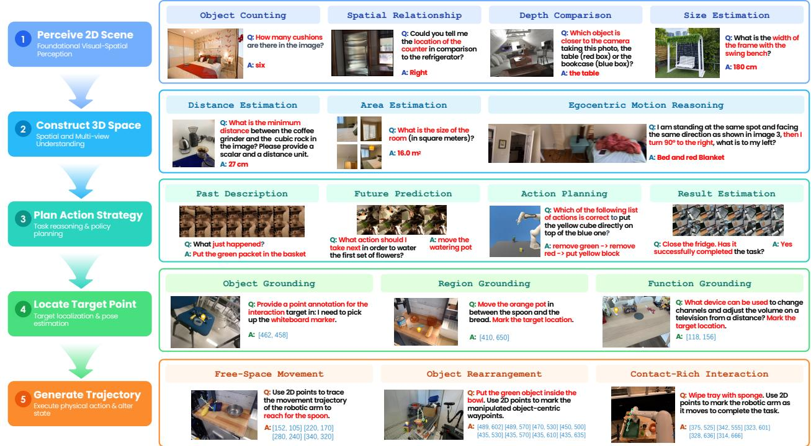  
Figure 3 Qualitative examples of embodied understanding with PhysBrain 1.5. Representative cases illustrate visual-spatial perception, 3D and multi-view understanding, embodied reasoning and planning, spatial grounding and afordance, and visual trace and trajectory reasoning. Responses include language answers, spatial coordinates, and waypoint sequences, with predicted points and trajectories overlaid on the corresponding observations.

## 5.1 Embodied Understanding

## 5.1.1 Benchmarks

We evaluate embodied understanding on 28 benchmarks spanning five complementary capability groups. Foundational Visual-Spatial Perception assesses basic visual recognition and spatial discrimination using BLINK [114] and CV-Bench [54]. Spatial and Multi-view Understanding evaluates geometry, spatial relations, viewpoint changes, and cross-view reasoning using 3DSRBench [115], EmbSpatial-Bench [116], MindCube [72], MMSI-Bench [117], Q-Spatial-Bench [118], RoboSpatial-Home [4], SAT [5], VSI-Bench [119], and ViewSpatial Bench [120]. Embodied Cognition, Reasoning and Planning measures goal-directed reasoning, procedural understanding, and planning using COSMOS [121], EgoPlan-Bench2 [122], ERQA [123], ERQA-PLUS [124], RoboVQA [11], and VLABench [78]. Spatial Grounding, Pointing, and Afordance evaluates object localization, referring, afordance understanding, and placement reasoning using Part-Afordance-2K [125], PIOBench S1 & S2 [126], PixMo-Points [3], PointBench [127], RefSpatial-Bench [9], RoboAford [128], RoboRefit [79], VABench-Point [91], and Where2Place [8]. Finally, Visual Trace and Trajectory Reasoning examines the understanding and prediction of motion traces and interaction trajectories using ShareRobot-Trajectory [90] and VABench-Visual-Trace [91]. More details on benchmark-specific evaluation protocols and implementation settings are provided in the Appendix B.1. This benchmark suite provides broad coverage of the perceptual, spatial, grounding, reasoning, and planning capabilities required for embodied decision-making.

## 5.1.2 Comparison Models

We compare PhysBrain 1.5 against representative proprietary models, including Gemini 3.6 Flash [129], GPT 6 Astra [130], and Claude Opus 5 [131], and strong open-source embodied MLLMs, including Hy-Embodied-VLM-1.0 [26], Embodied-R1.5 [30], RynnBrain1.1 [27], RoboBrain2.5 [29], MiMo Embodied [28], Cosmos3 Nano [34], and ACE-Brain-0.5 [31]. We additionally include Qwen3-VL-Instruct (8B) [1] as a general-purpose VLM baseline. Since diferent works may use inconsistent evaluation metrics for the same benchmark, their reported scores are not always directly comparable. We therefore independently re-evaluate all comparison models using a single canonical metric for each benchmark; accordingly, some scores in our table may difer from those reported in the original papers. When a model’s oficial release specifies a benchmark-specific input format or recommended prompt, we follow it; otherwise, we use a default task prompt and input template. For consistency across models, we standardize the source-image resolution and the number of sampled video frames supplied to each model while retaining its native preprocessing pipeline, including any internal resizing or downsampling. Since most models in our comparison do not use an explicit thinking mode, we evaluate the proprietary models using the lowest available oficial thinking setting: minimal thinking for Gemini, low thinking for GPT, and adaptive thinking with low efort for Claude. Following oficial recommendations, we enable thinking for Hy-Embodied-VLM-1.0 and MiMo Embodied, while evaluating all other models without a thinking mode. For point-localization and grounding tasks, we adopt each model’s oficially recommended point-output format and corresponding parsing procedure.

## 5.1.3 Results and Analysis

PhysBrain 1.5 demonstrates strong and well-rounded embodied understanding across the first five stages of our physical loop. As shown in Table 4, it achieves the highest overall average among the evaluated embodied open-source models, scoring 72.5 and surpassing the strongest open-source baseline, Hy-Embodied-VLM-1.0, by 6.5 points. It ranks first on 14 benchmarks and among the top two on 24. It also outperforms our base model, Qwen3-VL-Instruct (8B), on all 28 benchmarks. When benchmark scores are averaged with equal weight within each capability category, PhysBrain 1.5 ranks among the top two open-source models in all five categories, demonstrating broad strengths in perception, spatial reasoning, planning, grounding, and trajectory understanding. Despite its compact 8B scale, PhysBrain 1.5 approaches world-leading proprietary models such as Gemini 3.6 Flash (73.0) and GPT-6-Astra (73.3) in overall score, while outperforming Claude Opus 5 (67.9) by 4.6 points, highlighting its competitiveness in embodied understanding.

Figure 3 illustrates these capabilities through representative examples organized along the physical loop. At the scene-perception stage, PhysBrain 1.5 counts objects, reasons about spatial relationships, compares relative depth, and estimates physical dimensions. Moving toward 3D spatial understanding, it estimates metric distances and room area and reasons about egocentric spatial relations under viewpoint changes. For action planning, it interprets past actions, predicts the next step, decomposes goals into ordered actions, and assesses task completion. Task intent is then grounded in actionable locations through object pointing, placement-region localization, and functional afordance identification. Finally, the model generates imagespace waypoints for free-space movement, object rearrangement, and contact-rich interactions such as wiping. Together, these examples illustrate complementary capabilities for progressing from scene understanding to goal-directed interaction. More examples can be found in Appendix B.4

## 5.2 General Multimodal Understanding

A capable embodied model should combine specialized physical skills with broad multimodal understanding and commonsense reasoning. These general capabilities provide context for interpreting observations, understanding instructions, and relating events to task goals across diverse scenarios. We therefore complement the embodied evaluations with a suite of general image and video benchmarks, using Qwen3-VL-Instruct (8B) [1] as a reference for general-purpose multimodal performance.

Table 5 General multimodal understanding results (I). Results cover broad image and video understanding and robustness to object hallucination. VideoMME uses up to 128 sampled frames without additional subtitles. MME is reported as the sum of the MME-P and MME-C sub-benchmark scores on its native point scale; all other scores are percentages. Higher values indicate better performance.
<table><tr><td>Model</td><td>Size</td><td>MME</td><td>MMStar</td><td>RealWorldQA</td><td>VideoMME</td><td>MVBench</td><td>POPE (F1)</td></tr><tr><td>Qwen3-VL-Inst.</td><td>8B</td><td>2392.70</td><td>64.99</td><td>68.37</td><td>69.07</td><td>68.53</td><td>88.40</td></tr><tr><td>PhysBrain 1.5</td><td>8B</td><td>2330.07</td><td>65.60</td><td>69.41</td><td>68.22</td><td>66.07</td><td>89.49</td></tr></table>

Table 6 General multimodal understanding results (II). Results cover diagram and chart understanding, document and scene-text reading, fine-grained visual recognition, and GUI grounding. All scores are percentages, with higher values indicating better performance.
<table><tr><td>Model</td><td>Size</td><td>AI2D</td><td>ChartQA</td><td>DocVQA</td><td>TextVQA</td><td>V*</td><td>ScreenSpot</td></tr><tr><td>Qwen3-VL-Inst.</td><td>8B</td><td>83.74</td><td>84.96</td><td>95.66</td><td>81.94</td><td>83.77</td><td>91.59</td></tr><tr><td>PhysBrain 1.5</td><td>8B</td><td>82.16</td><td>86.24</td><td>94.43</td><td>81.58</td><td>87.96</td><td>90.17</td></tr></table>

## 5.2.1 Evaluation Protocol

We evaluate 12 established and widely used benchmarks for general multimodal understanding: MME [132], MMStar [133], RealWorldQA [134], VideoMME [135], MVBench [136], POPE [137], AI2D [138], ChartQA [139], DocVQA [140], TextVQA [141], V\* [142], and ScreenSpot [143]. This suite covers broad image and video understanding, complemented by evaluations of object hallucination, diagram and chart reasoning, document and scene-text understanding, fine-grained visual recognition, and GUI grounding. Descriptions of the individual benchmark scopes and task formats are provided in Appendix B.2.

We use lmms-eval [144] to evaluate PhysBrain 1.5 and the original Qwen3-VL-Instruct. Our primary comparison uses the locally re-evaluated Qwen baseline, with the same task-specific prompts, visual preprocessing, decoding settings, and scoring procedures for both models. For benchmarks reported by Qwen3-VL, we align the evaluation with its publicly released recipes as closely as the local implementation permits.2 For benchmarks without a reported Qwen result, we use the default lmms-eval task configuration. For both models, video inputs contain up to 128 sampled frames on VideoMME and 32 on MVBench. Complete decoding, visual preprocessing, prompt, and answer-extraction settings are provided in Appendix B.2.

## 5.2.2 Results and Analysis

PhysBrain 1.5 combines strong embodied performance with broad multimodal understanding. As shown in Table 5 and Table 6, its overall performance across the general evaluation suite is comparable to that of the base model, Qwen3-VL-Instruct (8B). Its capabilities extend beyond specialized embodied benchmarks to image and video understanding, visual reasoning, and the interpretation of text, charts, and diagrams.

## 5.3 Beyond Understanding: Action Modeling and Physical-World Prediction

## 5.3.1 Action Trajectory Token Prediction

We examine action trajectory predictions from the post-trained model. Given the current RGB observation, a task instruction, and the preceding 16-step ground-truth action chunk, PhysBrain 1.5 autoregressively generates action tokens for the next 16 steps, which are decoded by ActionPiece into end-efector trajectories. Figure 4 visualizes the predicted and ground-truth positions in the image plane on test episodes unseen during training. Across the illustrated manipulation tasks, the predictions broadly follow the direction and shape of the reference motion. Examples involving object placement, tool use, and bimanual manipulation show how the model expresses short-horizon motion in the context of the observed scene and task instruction.

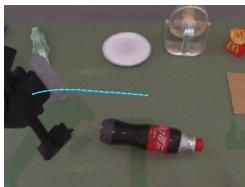  
Lift the bottle with ridges on bottom using the left arm

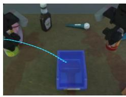  
Insert the metallic drink can into the blue box with angled edges

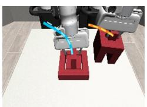  
Assemble the three pieces to form a block

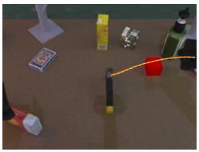

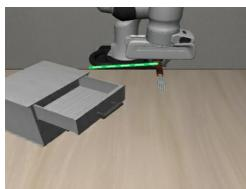  
Take the silver hammer and smash the block  
Pick up the fork and place it in the top layer of the cabinet

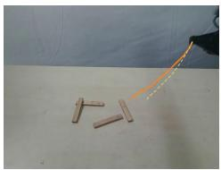

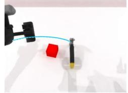  
Assemble wood blocks into connected structure  
Take the hammer with two-tone handle and strike the block

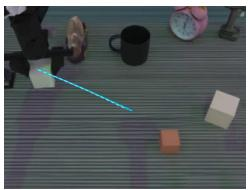  
Arrange blocks in decreasing size order

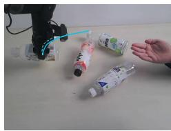

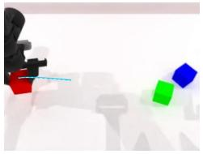  
Hand bottle to another person  
Transfer red block to the center with the left arm

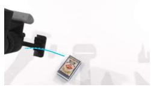  
Pick up the blue and white playing cards packaging with the left arm

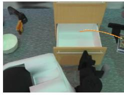  
Stick the gold-designed card box inside

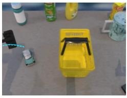  
Pick the small car toy, put it inside the handheld basket

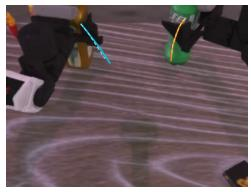  
Grab the plastic bottle and pick up the smooth green bottle

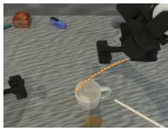  
Lift the cylindrical mug with curved handle from the table

Figure 4 Image-plane visualization of action trajectory predictions on held-out episodes. Predictions are generated by the post-trained model. Given a task instruction, the current image, and a preceding action chunk, PhysBrain 1.5 predicts the next 16 action steps for the requested wrist or wrists. Predicted and ground-truth end-efector positions are projected into the image plane and overlaid on the current observation: solid lines denote ground-truth trajectories, and dashed lines denote predictions. The corresponding task instruction is shown below each example. All examples are drawn from test episodes unseen during training. These visualizations compare predicted trajectories with ground truth rather than report executed robot rollouts.  
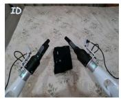  
Grasp the waistband of black shorts with both

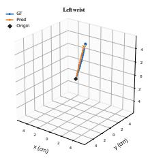

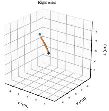

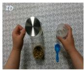  
Prepare flower tea in a glass pitcher

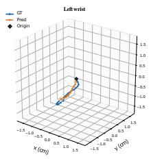

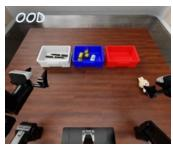  
Sort the objects by category into three baskets

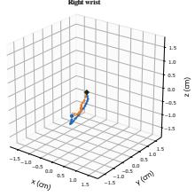

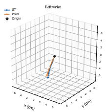

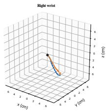

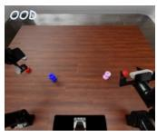  
Insert each screw into the nut of the same color

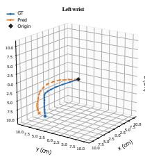

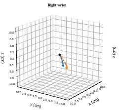  
Figure 5 Three-dimensional visualization of action trajectory predictions in ID and OOD test scenes. Predictions are generated by the post-trained model. Each example shows the current observation and task instruction, alongside ground-truth (blue) and predicted (orange) trajectories for the left and right wrists. Black diamonds mark the trajectory origins, and axes are measured in centimeters. The x, y, and z axes follow the coordinate conventions of the original robot action data for each example; coordinate systems are not aligned across sources. The top row presents in-distribution (ID) examples, while the bottom row presents out-of-distribution (OOD) examples from RoboDojo, which is excluded from the model’s training corpus. These examples provide a qualitative comparison of predicted and ground-truth motion within and beyond the training distribution.

Both arms lift the cylindrical kitchenpot upright

Put the black bowl on top of the cabinet

Stack the three bowls together

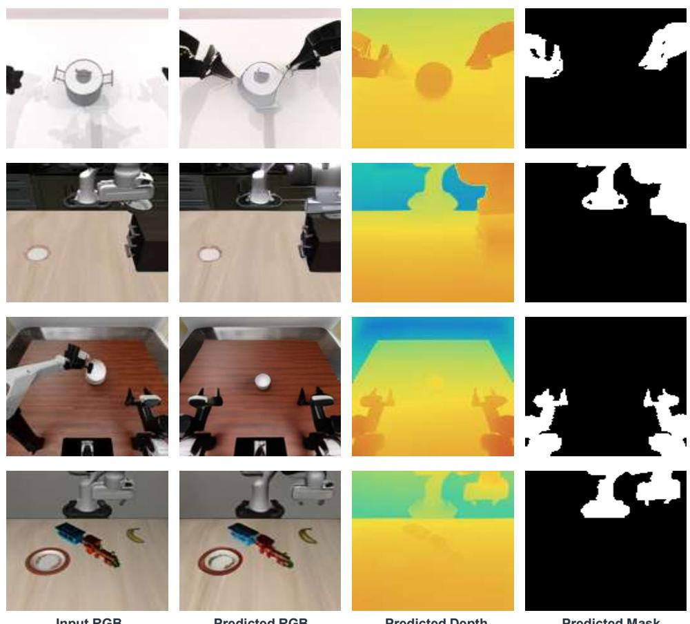  
Pick up the banana and put it on the plate  
Task instruction  
Input RGB  
Predicted RGB  
Predicted Depth  
Predicted Mask

Figure 6 Qualitative results of future visual prediction across diverse robot embodiments. Each row presents the current RGB observation and the predicted future RGB image, depth map, and robot mask. The examples shown use a one-second prediction horizon. The model preserves the dominant scene layout and object identity while anticipating task-consistent changes. Predictions across the three modalities are spatially coherent, jointly capturing future appearance, workspace geometry, and robot occupancy.

Figure 5 visualizes the predicted and reference wrist trajectories in three-dimensional coordinates for ID and OOD test scenes, using the same history-conditioned prediction protocol. The ID examples capture both near-linear motion and curved paths, while the RoboDojo examples extend the comparison to a data source excluded from training. In the OOD sorting and screw-insertion examples, the predictions reproduce the broad motion trends of the reference trajectories, although positional deviations remain visible. Each comparison retains the coordinate conventions of its source action data, without cross-source coordinate alignment. Together, these examples illustrate how PhysBrain 1.5 extends beyond scene understanding to generating structured motion continuations through its shared autoregressive interface. The evidence concerns ofline trajectory prediction conditioned on observed action history, rather than closed-loop execution or full-task success.

## 5.3.2 Future Visual Prediction

Given the current RGB observation and a task instruction, PhysBrain 1.5 predicts future visual states through RGB images, depth maps, and robot masks. Figure 6 presents representative examples on a one-second prediction horizon. These predictions preserve the overall scene layout while depicting plausible changes consistent with task progress across diferent robot embodiments and viewpoints. In the pot-lifting example, both arms move toward the pot, with their predicted positions reflected in the corresponding depth and mask outputs. More broadly, the three modalities provide spatially coherent descriptions of the future appearance,

workspace geometry, and robot configuration.

These examples demonstrate how PhysBrain 1.5 extends beyond understanding the current scene to predicting task-relevant future states. Through a shared vocabulary and decoder, the model expresses these predictions in complementary visual modalities, illustrating its capacity to jointly model how the environment and robot may evolve during physical interaction.

## 6 Conclusion

In this report, we introduced PhysBrain 1.5, guided by the physical loop in which an agent observes its environment, acts upon it, and uses the resulting changes to inform subsequent behavior. The model supports embodied understanding, action generation, and future-state prediction through a shared autoregressive backbone, representing language responses, end-efector trajectories, and multimodal visual states as discrete tokens under a common next-token prediction objective. Physical-aware pre-training derives its embodied supervision entirely from human interaction videos, alongside general language and vision–language data. Supervised fine-tuning then incorporates human, real-robot, and simulated interaction data.

On 28 embodied understanding benchmarks, our 8B model achieves an average score of 72.5, setting a new open-source state of the art and approaching leading proprietary systems, while retaining broad multimodal understanding capabilities. Qualitative results further demonstrate end-efector trajectory prediction and spatially coherent predictions of future RGB images, depth maps, and robot masks. These results support learning from interaction experience as an efective route toward developing the capabilities needed for the physical loop. We will continue scaling the volume of training data, expanding modality coverage, and incorporating richer interaction experience.

## References

[1] Shuai Bai et al. Qwen3-VL Technical Report. arXiv preprint arXiv:2511.21631, 2025. URL https://arxiv. org/abs/2511.21631.

[2] Jinguo Zhu, Weiyun Wang, Zhe Chen, Zhaoyang Liu, Shenglong Ye, Lixin Gu, Hao Tian, Yuchen Duan, Weijie Su, Jie Shao, et al. InternVL3: Exploring Advanced Training and Test-Time Recipes for Open-Source Multimodal Models. arXiv preprint arXiv:2504.10479, 2025. URL https://arxiv.org/abs/2504.10479.

[3] Matt Deitke, Christopher Clark, Sangho Lee, Rohun Tripathi, Yue Yang, Jae Sung Park, Mohammadreza Salehi, Niklas Muennighof, Kyle Lo, Luca Soldaini, et al. Molmo and PixMo: Open Weights and Open Data for State-of-the-Art Vision-Language Models. In 2025 IEEE/CVF Conference on Computer Vision and Pattern Recognition (CVPR), pages 91–104. IEEE, 2025.

[4] Chan Hee Song, Valts Blukis, Jonathan Tremblay, Stephen Tyree, Yu Su, and Stan Birchfield. RoboSpatial: Teaching Spatial Understanding to 2D and 3D Vision-Language Models for Robotics. In 2025 IEEE/CVF Conference on Computer Vision and Pattern Recognition (CVPR), pages 15768–15780. IEEE, 2025.

[5] Arijit Ray, Jiafei Duan, Ellis L Brown II, Reuben Tan, Dina Bashkirova, Rose Hendrix, Kiana Ehsani, Aniruddha Kembhavi, Bryan A. Plummer, Ranjay Krishna, Kuo-Hao Zeng, and Kate Saenko. SAT: Dynamic Spatial Aptitude Training for Multimodal Language Models. In Second Conference on Language Modeling, 2025.

[6] Wufei Ma, Yu-Cheng Chou, Qihao Liu, Xingrui Wang, Celso M de Melo, Jianwen Xie, and Alan Yuille. SpatialReasoner: Towards Explicit and Generalizable 3D Spatial Reasoning. In The Thirty-ninth Annual Conference on Neural Information Processing Systems, 2025.

[7] Shusheng Yang, Jihan Yang, Pinzhi Huang, Ellis L Brown II, Zihao Yang, Yue Yu, Shengbang Tong, Zihan Zheng, Yifan Xu, Muhan Wang, Rob Fergus, Yann LeCun, Li Fei-Fei, and Saining Xie. Cambrian-S: Towards Spatial Supersensing in Video. In The Fourteenth International Conference on Learning Representations, 2026.

[8] Wentao Yuan, Jiafei Duan, Valts Blukis, Wilbert Pumacay, Ranjay Krishna, Adithyavairavan Murali, Arsalan Mousavian, and Dieter Fox. RoboPoint: A Vision-Language Model for Spatial Afordance Prediction for Robotics. arXiv preprint arXiv:2406.10721, 2024. URL https://arxiv.org/abs/2406.10721.

[9] Enshen Zhou, Jingkun An, Cheng Chi, Yi Han, Shanyu Rong, Chi Zhang, Pengwei Wang, Zhongyuan Wang, Tiejun Huang, Lu Sheng, et al. RoboRefer: Towards Spatial Referring with Reasoning in Vision-Language Models for Robotics. Advances in Neural Information Processing Systems, 38:32209–32286, 2025.

[10] Christopher Clark, Yue Yang, Jae Sung Park, Zixian Ma, Jieyu Zhang, Rohun Tripathi, Mohammadreza Salehi, Sangho Lee, Taira Anderson, Winson Han, et al. MolmoPoint: Better Pointing for VLMs with Grounding Tokens. arXiv preprint arXiv:2603.28069, 2026. URL https://arxiv.org/abs/2603.28069.

[11] Pierre Sermanet, Tianli Ding, Jefrey Zhao, Fei Xia, Debidatta Dwibedi, Keerthana Gopalakrishnan, Christine Chan, Gabriel Dulac-Arnold, Sharath Maddineni, Nikhil J Joshi, et al. RoboVQA: Multimodal Long-Horizon Reasoning for Robotics. In 2024 IEEE International Conference on Robotics and Automation (ICRA), pages 645–652. IEEE, 2024.

[12] Yi Chen, Yuying Ge, Yixiao Ge, Mingyu Ding, Bohao Li, Rui Wang, Ruifeng Xu, Ying Shan, and Xihui Liu. EgoPlan-Bench: Benchmarking Multimodal Large Language Models for Human-Level Planning. arXiv preprint arXiv:2312.06722, 2023. URL https://arxiv.org/abs/2312.06722.

[13] Tony Lee et al. RoboReward: General-Purpose Vision-Language Reward Models for Robotics. arXiv preprint arXiv:2601.00675, 2026. URL https://arxiv.org/abs/2601.00675.

[14] Anthony Liang et al. Robometer: Scaling General-Purpose Robotic Reward Models via Trajectory Comparisons. arXiv preprint arXiv:2603.02115, 2026. URL https://arxiv.org/abs/2603.02115.

[15] Kevin Black, Noah Brown, Danny Driess, Adnan Esmail, Michael Equi, Chelsea Finn, Niccolo Fusai, Lachy Groom, Karol Hausman, Brian Ichter, et al. π0: A Vision-Language-Action Flow Model for General Robot Control. arXiv preprint arXiv:2410.24164, 2024. URL https://arxiv.org/abs/2410.24164.

[16] Physical Intelligence, Kevin Black, Noah Brown, James Darpinian, Karan Dhabalia, Danny Driess, et al. π0.5: a Vision-Language-Action Model with Open-World Generalization. arXiv preprint arXiv:2504.16054, 2025. URL https://arxiv.org/abs/2504.16054.

[17] Physical Intelligence, Bo Ai, Ali Amin, R. Aniceto, A. Balakrishna, G. Balke, K. Black, G. Bokinsky, S. Cao, T. Charbonnier, et al. π0.7: a Steerable Generalist Robotic Foundation Model with Emergent Capabilities. arXiv preprint arXiv:2604.15483, 2026. URL https://arxiv.org/abs/2604.15483.

[18] NVIDIA, Johan Bjorck, Fernando Castañeda, Nikita Cherniadev, Xingye Da, Runyu Ding, et al. GR00T N1: An Open Foundation Model for Generalist Humanoid Robots. arXiv preprint arXiv:2503.14734, 2025. URL https://arxiv.org/abs/2503.14734.

[19] Qiuyue Wang, Mingsheng Li, Jian Guan, Jinhui Ye, Sicheng Xie, Yitao Liu, Junhao Chen, Zhixuan Liang, Jie Zhang, Xintong Hu, et al. Qwen-VLA: Unifying Vision-Language-Action Modeling across Tasks, Environments, and Robot Embodiments. arXiv preprint arXiv:2605.30280, 2026. URL https://arxiv.org/abs/2605.30280.

[20] Seonghyeon Ye, Yunhao Ge, Kaiyuan Zheng, Shenyuan Gao, Sihyun Yu, George Kurian, et al. World Action Models are Zero-shot Policies. arXiv preprint arXiv:2602.15922, 2026. URL https://arxiv.org/abs/2602. 15922.

[21] Jie Zhang, Xiaoyue Chen, Anzhe Chen, Chenxu Lv, Deqing Li, Gengze Zhou, Hang Yin, Haoqi Yuan, Haoyang Li, Jiahao Li, et al. Qwen-RobotWorld Technical Report: Unifying Embodied World Modeling through Language-Conditioned Video Generation. arXiv preprint arXiv:2606.17030, 2026. URL https://arxiv.org/abs/2606. 17030.

[22] Michael Ahn, Anthony Brohan, Noah Brown, Yevgen Chebotar, Omar Cortes, Byron David, Chelsea Finn, Chuyuan Fu, Karol Gopalakrishnan, Karol Hausman, et al. Do As I Can, Not As I Say: Grounding Language in Robotic Afordances. In Conference on Robot Learning, 2022.

[23] Jacky Liang, Wenlong Huang, Fei Xia, Peng Xu, Karol Hausman, Brian Ichter, Pete Florence, and Andy Zeng. Code as Policies: Language Model Programs for Embodied Control. In IEEE International Conference on Robotics and Automation, pages 9493–9500, 2023.

[24] Wenlong Huang, Chen Wang, Ruohan Zhang, Yunzhu Li, Jiajun Wu, and Li Fei-Fei. VoxPoser: Composable 3D Value Maps for Robotic Manipulation with Language Models. In Conference on Robot Learning, 2023.

[25] Tencent Robotics X, HY Vision Team, Xumin Yu, Zuyan Liu, Ziyi Wang, He Zhang, Yongming Rao, Fangfu Liu, Yani Zhang, Ruowen Zhao, Oran Wang, Yves Liang, Haitao Lin, Minghui Wang, Yubo Dong, Kevin Cheng, Bolin Ni, Rui Huang, Han Hu, Zhengyou Zhang, Linus, and Shunyu Yao. HY-Embodied-0.5: Embodied Foundation Models for Real-World Agents. arXiv preprint arXiv:2604.07430, 2026. URL https://arxiv.org/abs/2604. 07430.

[26] Ziyi Wang, Xumin Yu, Yongming Rao, Yonggen Ling, Yunheng Li, Oran Wang, Mingqi Gao, Yuchen Zhou, Yves Liang, Zuyan Liu, Yani Zhang, Rui Huang, Xiaoran Xu, Bowen Yuan, Yifu Yuan, Xu Tan, He Zhang, Yufei Huang, Shenghao Zhang, Hongsheng Wu, Han Hu, and Zhengyou Zhang. Hy-Embodied-VLM-1.0: Eficient Physical-World Agents. arXiv preprint arXiv:2607.12894, 2026. URL https://arxiv.org/abs/2607.12894.

[27] Kehan Li, Bohan Hou, Minghao Zhu, Tianyi Zhang, Zesen Cheng, Zhikai Wang, Sicong Leng, Xin Li, Xiao Lin, Biying Yao, Minghua Zeng, Jiangpin Liu, Ronghao Dang, Jiayan Guo, Siteng Huang, Haoyu Zhao, Heng Ping, Yaxi Zhao, Tong Zhao, Kexiang Wang, Tong Lu, Shengke Xue, Jiahao Tang, Yulei Wang, Zejing Wang, Jianwei Gao, Shijian Lu, Chengju Liu, Jianfei Yang, Mingxiu Chen, and Deli Zhao. RynnBrain 1.1: Towards More Capable and Generalizable Embodied Foundation Model. arXiv preprint arXiv:2607.17977, 2026. URL https://arxiv.org/abs/2607.17977.

[28] Xiaoshuai Hao, Lei Zhou, Zhijian Huang, Zhiwen Hou, Yingbo Tang, Lingfeng Zhang, Guang Li, Zheng Lu, Shuhuai Ren, Xianhui Meng, Yuchen Zhang, Jing Wu, Jinghui Lu, Chenxu Dang, Jiayi Guan, Jianhua Wu, Zhiyi Hou, Hanbing Li, Shumeng Xia, Mingliang Zhou, Yinan Zheng, Zihao Yue, Shuhao Gu, Hao Tian, Yuannan Shen, Jianwei Cui, Wen Zhang, Shaoqing Xu, Bing Wang, Haiyang Sun, Zeyu Zhu, Yuncheng Jiang, Zibin Guo, Chuhong Gong, Chaofan Zhang, Wenbo Ding, Kun Ma, Guang Chen, Rui Cai, Diyun Xiang, Heng Qu, Fuli Luo, Hangjun Ye, and Long Chen. MiMo-Embodied: X-Embodied Foundation Model Technical Report. arXiv preprint arXiv:2511.16518, 2025. URL https://arxiv.org/abs/2511.16518.

[29] Huajie Tan, Enshen Zhou, Zhiyu Li, Yijie Xu, Yuheng Ji, Xiansheng Chen, Cheng Chi, Pengwei Wang, Huizhu Jia, Yulong Ao, Mingyu Cao, Sixiang Chen, Zhe Li, Mengzhen Liu, Zixiao Wang, Shanyu Rong, Yaoxu Lyu, Zhongxia Zhao, Peterson Co, Yibo Li, Yi Han, Shaoxuan Xie, Guocai Yao, Songjing Wang, Leiduo Zhang, Xi Yang, Yance Jiao, Donghai Shi, Kunchang Xie, Shaokai Nie, Chunlei Men, Yonghua Lin, Zhongyuan Wang, Tiejun Huang, and Shanghang Zhang. RoboBrain 2.5: Depth in Sight, Time in Mind. arXiv preprint arXiv:2601.14352, 2026. URL https://arxiv.org/abs/2601.14352.

[30] Yifu Yuan, Yaoting Huang, Xianze Yao, Yutong Li, Shuoheng Zhang, Linqi Han, Pengyi Li, Jiangeng Sun, Wenting Jia, Zhao Zhang, Yuhao Liu, Ruihao Liao, Yucheng Hu, Qiyu Wu, Yuxiao Li, Zibin Dong, Fei Ni, Yan Zheng, Shuyang Gu, Yi Ma, Hongyao Tang, Han Hu, and Jianye Hao. Embodied-R1.5: Evolving Physical Intelligence via Embodied Foundation Models. arXiv preprint arXiv:2606.11324, 2026. URL https: //arxiv.org/abs/2606.11324.

[31] ACE-Brain Team, Ziyang Gong, Haoming Gu, Zehang Luo, Tianyi Zhang, Tao Tao, Yixiao Chi, Zhe Liu, Lingsi Zhu, Jingyuan Liu, Anke Tang, Songze Li, Yilun Kong, Ningjing Liu, Tianyu Zhu, Yunpeng Qing, Shuang Luo, Xiang Liu, Shi Fu, Dawei Nie, Sixiang Liu, Zhexi Wen, Feng Pan, Xiaofeng Wang, Zhi Hou, Chunxiao Liu, Xue Yang, Junchi Yan, Hengshuang Zhao, Dacheng Tao, and Xiaogang Wang. ACE-Brain-0.5: A Unified Embodied Foundational Model for Physical Agentic AI. arXiv preprint arXiv:2607.04426, 2026. URL https://arxiv.org/abs/2607.04426.

[32] Yuqi Wang, Xinghang Li, Wenxuan Wang, Junbo Zhang, Yingyan Li, Yuntao Chen, Xinlong Wang, and Zhaoxiang Zhang. Unified Vision-Language-Action Model. arXiv preprint arXiv:2506.19850, 2025. URL https://arxiv.org/abs/2506.19850.

[33] Jun Cen, Siteng Huang, Yuqian Yuan, Kehan Li, Hangjie Yuan, Chaohui Yu, Bohan Hou, Yuming Jiang, Jiayan Guo, Xin Li, Hao Luo, Fan Wang, Deli Zhao, and Hao Chen. RynnVLA-002: A Unified Vision-Language-Action and World Model. arXiv preprint arXiv:2511.17502, 2025. URL https://arxiv.org/abs/2511.17502.

[34] NVIDIA. Cosmos 3: Omnimodal World Models for Physical AI. arXiv preprint arXiv:2606.02800, 2026. URL https://arxiv.org/abs/2606.02800.

[35] DeepCybo Team. ActionPiece: Rethinking action tokenization for autoregressive vision-language-action models, 2026. URL https://deepcybo-physai.github.io/ActionPiece/.

[36] Shijie Lian, Bin Yu, Xiaopeng Lin, Changti Wu, Hang Yuan, Xiaolin Hu, Zhaolong Shen, Yuzhuo Miao, Haishan Liu, Yuxuan Tian, Yukun Shi, Cong Huang, and Kai Chen. PhysBrain 1.0 Technical Report. arXiv preprint arXiv:2605.15298, 2026. URL https://arxiv.org/abs/2605.15298.

[37] DeepCybo Team. Ego360: A panoramic view of human experience for physical intelligence, n.d. URL https: //deepcybo-physai.github.io/Ego360-DeepCybo-Insta360/.

[38] Xiaopeng Lin, Ruoqi Yang, Shijie Lian, Zhaolong Shen, Bin Yu, Changti Wu, Haibao Liu, Yuxiang Zhang, Hong Li, Qiyuan Su, Haochen Liu, Xuguo He, Yukun Shi, Cong Huang, Zhirui Zhang, Bojun Cheng, and Kai Chen. Human-as-Humanoid: Enabling Zero-Shot Humanoid Learning from Ego-Exo Human Videos with Human-Aligned Embodiments. arXiv preprint arXiv:2606.32009, 2026. URL https://arxiv.org/abs/2606.32009.

[39] Ropedia. Xperience-10M: A Large-Scale Egocentric Multimodal Dataset with Structured 3D/4D Annotations. Hugging Face dataset, 2026. URL https://huggingface.co/datasets/ropedia-ai/xperience-10m.

[40] BuildAI. Egocentric-10k, 2025. URL https://huggingface.co/datasets/builddotai/Egocentric-10K.

[41] Kristen Grauman, Andrew Westbury, Eugene Byrne, Zachary Chavis, Antonino Furnari, Rohit Girdhar, Jackson Hamburger, Hao Jiang, Miao Liu, Xingyu Liu, et al. Ego4D: Around the World in 3,000 Hours of Egocentric Video. In 2022 IEEE/CVF Conference on Computer Vision and Pattern Recognition (CVPR), pages 18973–18990. IEEE, 2022. doi: 10.1109/CVPR52688.2022.01842.

[42] Ryan Punamiya, Simar Kareer, Zeyi Liu, Josh Citron, Ri-Zhao Qiu, et al. EgoVerse: An Egocentric Human Dataset for Robot Learning from Around the World. arXiv preprint arXiv:2604.07607, 2026. URL https: //arxiv.org/abs/2604.07607.

[43] Ryan Hoque, Peide Huang, David J. Yoon, Mouli Sivapurapu, and Jian Zhang. EgoDex: Learning Dexterous Manipulation from Large-Scale Egocentric Video. CoRR, abs/2505.11709, 2025. doi: 10.48550/arXiv.2505.11709. URL https://arxiv.org/abs/2505.11709.

[44] Jingkang Yang, Shuai Liu, Hongming Guo, Yuhao Dong, Xiamengwei Zhang, et al. EgoLife: Towards Egocentric Life Assistant. arXiv preprint arXiv:2503.03803, 2025. URL https://arxiv.org/abs/2503.03803.

[45] Kristen Grauman, Andrew Westbury, Lorenzo Torresani, Kris Kitani, Jitendra Malik, et al. Ego-Exo4D: Understanding Skilled Human Activity from First- and Third-Person Perspectives. arXiv preprint arXiv:2311.18259, 2023. URL https://arxiv.org/abs/2311.18259.

[46] Shayne Longpre, Le Hou, Tu Vu, Albert Webson, Hyung Won Chung, Yi Tay, Denny Zhou, Quoc V. Le, Barret Zoph, Jason Wei, and Adam Roberts. The Flan Collection: Designing Data and Methods for Efective Instruction Tuning. arXiv preprint arXiv:2301.13688, 2023. URL https://arxiv.org/abs/2301.13688.

[47] Ning Ding, Yulin Chen, Bokai Xu, Yujia Qin, Zhi Zheng, Shengding Hu, Zhiyuan Liu, Maosong Sun, and Bowen Zhou. Enhancing Chat Language Models by Scaling High-quality Instructional Conversations. arXiv preprint arXiv:2305.14233, 2023. URL https://arxiv.org/abs/2305.14233.

[48] Andreas Köpf, Yannic Kilcher, Dimitri von Rütte, Sotiris Anagnostidis, Zhi-Rui Tam, Keith Stevens, Abdullah Barhoum, Nguyen Minh Duc, Oliver Stanley, Richárd Nagyfi, Shahul ES, Sameer Suri, David Glushkov, Arnav Maguire, Christoph Schuhmann, Huu Nguyen, and Alexander Mattick. OpenAssistant Conversations – Democratizing Large Language Model Alignment. Advances in Neural Information Processing Systems, 36, 2023.

[49] OpenBMB. Ultradata-SFT-2605, 2026. URL https://huggingface.co/datasets/openbmb/ UltraData-SFT-2605.

[50] Longhui Yu, Weisen Jiang, Han Shi, Jincheng Yu, Zhengying Liu, Yu Zhang, James T. Kwok, Zhenguo Li, Adrian Weller, and Weiyang Liu. MetaMath: Bootstrap Your Own Mathematical Questions for Large Language Models. arXiv preprint arXiv:2309.12284, 2023. URL https://arxiv.org/abs/2309.12284.

[51] Yuxiang Wei, Zhe Wang, Jiawei Liu, Yifeng Ding, and Lingming Zhang. Magicoder: Empowering Code Generation with OSS-Instruct. Proceedings of the 41st International Conference on Machine Learning, 2024.

[52] Luis Wiedmann, Orr Zohar, Amir Mahla, Xiaohan Wang, Rui Li, Thibaud Frere, Leandro von Werra, Aritra Roy Gosthipaty, and Andrés Marafioti. FineVision: Open Data Is All You Need. arXiv preprint arXiv:2510.17269, 2025. URL https://arxiv.org/abs/2510.17269.

[53] Xiang An, Yin Xie, Kaicheng Yang, Wenkang Zhang, Xiuwei Zhao, Zheng Cheng, Yirui Wang, Songcen Xu, Changrui Chen, Chunsheng Wu, Huajie Tan, Chunyuan Li, Jing Yang, Jie Yu, Xiyao Wang, Bin Qin, Yumeng Wang, Zizhen Yan, Ziyong Feng, Ziwei Liu, Bo Li, and Jiankang Deng. LLaVA-OneVision-1.5: Fully Open Framework for Democratized Multimodal Training. arXiv preprint arXiv:2509.23661, 2025. URL https://arxiv.org/abs/2509.23661.

[54] Shengbang Tong, Ellis Brown, Penghao Wu, Sanghyun Woo, Manoj Middepogu, Sai C Akula, Jihan Yang, Shusheng Yang, Adithya Iyer, Xichen Pan, et al. Cambrian-1: A Fully Open, Vision-Centric Exploration of Multimodal LLMs. Advances in Neural Information Processing Systems, 37:87310–87356, 2024.

[55] Lin Chen, Xilin Wei, Jinsong Li, Xiaoyi Dong, Pan Zhang, Yuhang Zang, Zehui Chen, Haodong Duan, Bin Lin, Zhenyu Tang, Yuan Li, Yu Qiao, Dahua Lin, Feng Zhao, and Jiaqi Wang. ShareGPT4Video: Improving Video Understanding and Generation with Better Captions. arXiv preprint arXiv:2406.04325, 2024. URL https://arxiv.org/abs/2406.04325.

[56] Yuanhan Zhang, Jinming Wu, Wei Li, Bo Li, Zejun Ma, Ziwei Liu, and Chunyuan Li. LLaVA-Video: Video Instruction Tuning With Synthetic Data. arXiv preprint arXiv:2410.02713, 2024. URL https://arxiv.org/ abs/2410.02713.

[57] Manoj Acharya, Kushal Kafle, and Christopher Kanan. TallyQA: Answering complex counting questions. In The Thirty-Third AAAI Conference on Artificial Intelligence, pages 8076–8084. AAAI Press, 2019.

[58] Weifeng Chen, Zhao Fu, Dawei Yang, and Jia Deng. Single-Image Depth Perception in the Wild. In Advances in Neural Information Processing Systems, pages 730–738, 2016.

[59] Fangyu Liu, Guy Emerson, and Nigel Collier. Visual Spatial Reasoning. Transactions of the Association for Computational Linguistics, 11:635–651, 2023.

[60] Tsung-Yi Lin, Michael Maire, Serge J. Belongie, James Hays, Pietro Perona, Deva Ramanan, Piotr Dollár, and C. Lawrence Zitnick. Microsoft COCO: Common Objects in Context. In European Conference on Computer Vision, pages 740–755. Springer, 2014.

[61] Bolei Zhou, Hang Zhao, Xavier Puig, Sanja Fidler, Adela Barriuso, and Antonio Torralba. Scene Parsing Through ADE20K Dataset. In 2017 IEEE/CVF Conference on Computer Vision and Pattern Recognition (CVPR), pages 633–641. IEEE, 2017.

[62] Garrick Brazil, Abhinav Kumar, Julian Straub, Nikhila Ravi, Justin Johnson, and Georgia Gkioxari. Omni3D: A Large Benchmark and Model for 3D Object Detection in the Wild. In 2023 IEEE/CVF Conference on Computer Vision and Pattern Recognition (CVPR), pages 13154–13164. IEEE, 2023.

[63] Angel X. Chang, Angela Dai, Thomas A. Funkhouser, Maciej Halber, Matthias Nießner, Manolis Savva, Shuran Song, Andy Zeng, and Yinda Zhang. Matterport3D: Learning from RGB-D Data in Indoor Environments. In 2017 International Conference on 3D Vision (3DV), pages 667–676. IEEE, 2017.

[64] Benjamin Wilson, William Qi, Tanmay Agarwal, John Lambert, Jagjeet Singh, Siddhesh Khandelwal, Bowen Pan, Ratnesh Kumar, Andrew Hartnett, Jhony Kaesemodel Pontes, Deva Ramanan, Peter Carr, and James Hays. Argoverse 2: Next Generation Datasets for Self-Driving Perception and Forecasting. In Proceedings of the Neural Information Processing Systems Track on Datasets and Benchmarks, 2021.

[65] Angela Dai, Angel X. Chang, Manolis Savva, Maciej Halber, Thomas A. Funkhouser, and Matthias Nießner. ScanNet: Richly-annotated 3D Reconstructions of Indoor Scenes. In 2017 IEEE/CVF Conference on Computer Vision and Pattern Recognition (CVPR), pages 2432–2443. IEEE, 2017.

[66] Zhongang Cai, Ruisi Wang, Chenyang Gu, Fanyi Pu, Junxiang Xu, Yubo Wang, Wanqi Yin, Zhitao Yang, Chen Wei, Tongxi Zhou, et al. Scaling Spatial Intelligence with Multimodal Foundation Models. In Proceedings of the IEEE/CVF Conference on Computer Vision and Pattern Recognition, pages 7879–7890, 2026.

[67] Hongxing Li, Dingming Li, Zixuan Wang, Yuchen Yan, Hang Wu, Wenqi Zhang, Yongliang Shen, Weiming Lu, Jun Xiao, and Yueting Zhuang. SpatialLadder: Progressive Training for Spatial Reasoning in Vision-Language Models. In The Fourteenth International Conference on Learning Representations, 2026.

[68] Jingping Liu, Ziyan Liu, Zhedong Cen, Yan Zhou, Yinan Zou, Weiyan Zhang, Haiyun Jiang, and Tong Ruan. Can Multimodal Large Language Models Understand Spatial Relations? In Proceedings of the 63rd Annual Meeting of the Association for Computational Linguistics (Volume 1: Long Papers), pages 620–632, 2025.

[69] Jae Hee Lee, Matthias Kerzel, Kyra Ahrens, Cornelius Weber, and Stefan Wermter. What is Right for Me is Not Yet Right for You: A Dataset for Grounding Relative Directions via Multi-Task Learning. In Proceedings of the Thirty-First International Joint Conference on Artificial Intelligence, pages 1039–1045, 2022.

[70] Ellis Brown, Jihan Yang, Shusheng Yang, Rob Fergus, and Saining Xie. Benchmark Designers Should "Train on the Test Set" to Expose Exploitable Non-Visual Shortcuts. arXiv preprint arXiv:2511.04655, 2025. URL https://arxiv.org/abs/2511.04655.

[71] Ellis Brown, Arijit Ray, Ranjay Krishna, Ross Girshick, Rob Fergus, and Saining Xie. SIMS-V: Simulated Instruction-Tuning for Spatial Video Understanding. arXiv preprint arXiv:2511.04668, 2025. URL https: //arxiv.org/abs/2511.04668.

[72] Qineng Wang, Baiqiao Yin, Pingyue Zhang, Jianshu Zhang, Kangrui Wang, Zihan Wang, Jieyu Zhang, Keshigeyan Chandrasegaran, Han Liu, Ranjay Krishna, Saining Xie, Jiajun Wu, Li Fei-Fei, and Manling Li. MindCube: Spatial Mental Modeling from Limited Views. In International Conference on Learning Representations, 2026.

[73] Rui Yang, Ziyu Zhu, Yanwei Li, Jingjia Huang, Shen Yan, Siyuan Zhou, Zhe Liu, Xiangtai Li, Shuangye Li, Wenqian Wang, Yi Lin, and Hengshuang Zhao. Visual Spatial Tuning. arXiv preprint arXiv:2511.05491, 2025. URL https://arxiv.org/abs/2511.05491.

[74] Xin Wang, Taein Kwon, Mahdi Rad, Bowen Pan, Ishani Chakraborty, Sean Andrist, Dan Bohus, Ashley Feniello, Bugra Tekin, Felipe Vieira Frujeri, et al. HoloAssist: an Egocentric Human Interaction Dataset for Interactive AI Assistants in the Real World. In Proceedings of the IEEE/CVF International Conference on Computer Vision, pages 20270–20281, 2023.

[75] Zeyi Liu, Arpit Bahety, and Shuran Song. REFLECT: Summarizing Robot Experiences for Failure Explanation and Correction. In Proceedings of The 7th Conference on Robot Learning, volume 229, pages 3468–3484, 2023.

[76] Homer Walke, Kevin Black, Abraham Lee, Moo Jin Kim, Max Du, Chongyi Zheng, Tony Zhao, Philippe Hansen-Estruch, Quan Vuong, Andre He, Vivek Myers, Kuan Fang, Chelsea Finn, and Sergey Levine. BridgeData V2: A Dataset for Robot Learning at Scale. In Conference on Robot Learning, 2023.

[77] AgiBot-World Contributors, Qingwen Bu, Jisong Cai, Li Chen, et al. AgiBot World Colosseo: A Large-scale Manipulation Platform for Scalable and Intelligent Embodied Systems. arXiv preprint arXiv:2503.06669, 2025. URL https://arxiv.org/abs/2503.06669.

[78] Shiduo Zhang, Zhe Xu, Peiju Liu, Xiaopeng Yu, Yuan Li, Qinghui Gao, Zhaoye Fei, Zhangyue Yin, Zuxuan Wu, Yu-Gang Jiang, et al. VLABench: A Large-Scale Benchmark for Language-Conditioned Robotics Manipulation with Long-Horizon Reasoning Tasks. In 2025 IEEE/CVF International Conference on Computer Vision (ICCV), pages 11142–11152. IEEE, 2025.

[79] Yuhao Lu, Yixuan Fan, Beixing Deng, Fangfu Liu, Yali Li, and Shengjin Wang. VL-Grasp: a 6-Dof Interactive Grasp Policy for Language-Oriented Objects in Cluttered Indoor Scenes. In 2023 IEEE/RSJ International Conference on Intelligent Robots and Systems (IROS), pages 976–983. IEEE, 2023.

[80] Shuai Shao, Zeming Li, Tianyuan Zhang, Chao Peng, Gang Yu, Xiangyu Zhang, Jing Li, and Jian Sun. Objects365: A Large-Scale, High-Quality Dataset for Object Detection. In 2019 IEEE/CVF International Conference on Computer Vision (ICCV), pages 8429–8438. IEEE, 2019.

[81] Alina Kuznetsova, Hassan Rom, Neil Alldrin, Jasper R. R. Uijlings, Ivan Krasin, Jordi Pont-Tuset, Shahab Kamali, Stefan Popov, Matteo Malloci, Alexander Kolesnikov, Tom Duerig, and Vittorio Ferrari. The Open Images Dataset V4. International Journal of Computer Vision, 128(7):1956–1981, 2020. doi: 10.1007/s11263-020-01316-z.

[82] Agrim Gupta, Piotr Dollár, and Ross B. Girshick. LVIS: A Dataset for Large Vocabulary Instance Segmentation. In 2019 IEEE/CVF Conference on Computer Vision and Pattern Recognition (CVPR), pages 5356–5364. IEEE, 2019. doi: 10.1109/CVPR.2019.00550.

[83] Ranjay Krishna, Yuke Zhu, Oliver Groth, Justin Johnson, Kenji Hata, Joshua Kravitz, Stephanie Chen, Yannis Kalantidis, Li-Jia Li, David A. Shamma, Michael S. Bernstein, and Li Fei-Fei. Visual Genome: Connecting Language and Vision Using Crowdsourced Dense Image Annotations. International Journal of Computer Vision, 123(1):32–73, 2017. doi: 10.1007/s11263-016-0981-7.

[84] Yue Yang, Ajay Patel, Matt Deitke, Tanmay Gupta, Luca Weihs, Andrew Head, Mark Yatskar, Chris Callison-Burch, Ranjay Krishna, Aniruddha Kembhavi, et al. Scaling Text-Rich Image Understanding via Code-Guided Synthetic Multimodal Data Generation. arXiv preprint arXiv:2502.14846, 2025. URL https://arxiv.org/abs/ 2502.14846.

[85] Christopher Clark, Jieyu Zhang, Zixian Ma, Jae Sung Park, Mohammadreza Salehi, Rohun Tripathi, Sangho Lee, Zhongzheng Ren, Chris Dongjoo Kim, Yinuo Yang, Vincent Shao, Yue Yang, Weikai Huang, Ziqi Gao, Taira Anderson, Jianrui Zhang, Jitesh Jain, George Stoica, Winson Han, Ali Farhadi, and Ranjay Krishna. Molmo2: Open Weights and Data for Vision-Language Models with Video Understanding and Grounding. arXiv preprint arXiv:2601.10611, 2026. URL https://arxiv.org/abs/2601.10611.

[86] Yingbo Tang, Lingfeng Zhang, Shuyi Zhang, Yinuo Zhao, and Xiaoshuai Hao. Roboaford: A dataset and benchmark for enhancing object and spatial afordance learning in robot manipulation. In Proceedings of the 33rd ACM International Conference on Multimedia, pages 12706–12713, 2025.

[87] Andrew Guo, Bowen Wen, Jianhe Yuan, Jonathan Tremblay, Stephen Tyree, Jefrey Smith, and Stan Birchfield. HANDAL: A Dataset of Real-World Manipulable Object Categories with Pose Annotations, Afordances, and Reconstructions. CoRR, abs/2308.01477, 2023. doi: 10.48550/arXiv.2308.01477. URL https://arxiv.org/abs/ 2308.01477.

[88] Vignesh Ramanathan, Anmol Kalia, Vladan Petrovic, Yi Wen, Baixue Zheng, Baishan Guo, Rui Wang, Aaron Marquez, Rama Kovvuri, Abhishek Kadian, Amir Mousavi, Yiwen Song, Abhimanyu Dubey, and Dhruv Mahajan. PACO: Parts and Attributes of Common Objects. In 2023 IEEE/CVF Conference on Computer Vision and Pattern Recognition (CVPR), pages 7141–7151. IEEE, 2023. doi: 10.1109/CVPR52729.2023.00690.

[89] Zifu Wan, Yaqi Xie, Ce Zhang, Zhiqiu Lin, Zihan Wang, Simon Stepputtis, Deva Ramanan, and Katia P. Sycara. InstructPart: Task-Oriented Part Segmentation with Instruction Reasoning. In Proceedings of the 63rd Annual Meeting of the Association for Computational Linguistics (ACL), pages 24202–24227, 2025.

[90] Yuheng Ji, Huajie Tan, Jiayu Shi, Xiaoshuai Hao, Yuan Zhang, Hengyuan Zhang, Pengwei Wang, Mengdi Zhao, Yao Mu, Pengju An, et al. RoboBrain: A Unified Brain Model for Robotic Manipulation from Abstract to Concrete. In 2025 IEEE/CVF Conference on Computer Vision and Pattern Recognition (CVPR), pages 1724–1734. IEEE, 2025.

[91] Yifu Yuan, Haiqin Cui, Yibin Chen, Zibin Dong, Fei Ni, Longxin Kou, Jinyi Liu, Pengyi Li, YAN ZHENG, and Jianye HAO. From Seeing to Doing: Bridging Reasoning and Decision for Robotic Manipulation. In The Fourteenth International Conference on Learning Representations, 2026.

[92] Open X-Embodiment Collaboration, Abhishek Padalkar, Acorn Pooley, Ajinkya Jain, Alex Bewley, Alexander Herzog, Alex Irpan, Alexander Khazatsky, Anant Rai, Anikait Singh, Anthony Brohan, et al. Open X-Embodiment: Robotic Learning Datasets and RT-X Models. CoRR, abs/2310.08864, 2023. URL https: //arxiv.org/abs/2310.08864.

[93] Alexander Khazatsky, Karl Pertsch, Suraj Nair, Ashwin Balakrishna, Sudeep Dasari, Siddharth Karamcheti, Soroush Nasiriany, Mohan Kumar Srirama, Lawrence Yunliang Chen, Kirsty Ellis, et al. DROID: A Large-Scale In-The-Wild Robot Manipulation Dataset. CoRR, abs/2403.12945, 2024. doi: 10.48550/arXiv.2403.12945. URL https://arxiv.org/abs/2403.12945

[94] Tongzhou Mu, Zhan Ling, Fanbo Xiang, Derek Yang, Xuanlin Li, Stone Tao, Zhiao Huang, Zhiwei Jia, and Hao Su. ManiSkill: Generalizable Manipulation Skill Benchmark with Large-Scale Demonstrations. arXiv preprint arXiv:2107.14483, 2021. URL https://arxiv.org/abs/2107.14483.

[95] Soroush Nasiriany, Abhiram Maddukuri, Lance Zhang, Adeet Parikh, Aaron Lo, Abhishek Joshi, Ajay Mandlekar, and Yuke Zhu. RoboCasa: Large-Scale Simulation of Everyday Tasks for Generalist Robots. In Robotics: Science and Systems, 2024.

[96] Tao Jiang, Tianyuan Yuan, Yicheng Liu, Chenhao Lu, Jianning Cui, Xiao Liu, Shuiqi Cheng, Jiyang Gao, Huazhe Xu, and Hang Zhao. Galaxea Open-World Dataset and G0 Dual-System VLA Model. arXiv preprint arXiv:2509.00576, 2025. URL https://arxiv.org/abs/2509.00576.

[97] Robbyant. GM100: A multi-embodiments benchmark, n.d. URL https://huggingface.co/datasets/robbyant/ gm100. Dataset. Accessed September 11, 2026.

[98] Yao Mu, Tianxing Chen, Zanxin Chen, Shijia Peng, Zhiqian Lan, Zeyu Gao, Zhixuan Liang, Qiaojun Yu, Yude Zou, Mingkun Xu, Lunkai Lin, Zhiqiang Xie, Mingyu Ding, and Ping Luo. RoboTwin: Dual-Arm Robot Benchmark with Generative Digital Twins. arXiv preprint arXiv:2504.13059, 2025. URL https://arxiv.org/ abs/2504.13059.

[99] NVIDIA. PhysicalAI-Robotics-GR00T-X-Embodiment-Sim, n.d. URL https://huggingface.co/datasets/ nvidia/PhysicalAI-Robotics-GR00T-X-Embodiment-Sim. Dataset. Accessed September 11, 2026.

[100] Minho Heo, Youngwoon Lee, Doohyun Lee, and Joseph J. Lim. FurnitureBench: Reproducible Real-World Benchmark for Long-Horizon Complex Manipulation. In Robotics: Science and Systems, 2023.

[101] Jianlan Luo, Charles Xu, Fangchen Liu, Liam Tan, Zipeng Lin, Jefrey Wu, Pieter Abbeel, and Sergey Levine. FMB: a Functional Manipulation Benchmark for Generalizable Robotic Learning. arXiv preprint arXiv:2401.08553, 2024. URL https://arxiv.org/abs/2401.08553.

[102] Anthony Brohan, Noah Brown, Justice Carbajal, Yevgen Chebotar, Joseph Dabis, Chelsea Finn, Keerthana Gopalakrishnan, Karol Hausman, Alex Herzog, Jasmine Hsu, Julian Ibarz, Brian Ichter, Alex Irpan, Tomas Jackson, Sally Jesmonth, Nikhil Joshi, Ryan Julian, Dmitry Kalashnikov, Yuheng Kuang, Isabel Leal, Kuang-Huei Lee, Sergey Levine, Yao Lu, Utsav Malla, Deeksha Manjunath, Igor Mordatch, Ofir Nachum, Carolina Parada, Jodilyn Peralta, Emily Perez, Karl Pertsch, Jornell Quiambao, Kanishka Rao, Michael Ryoo, Grecia Salazar, Pannag Sanketi, Kevin Sayed, Jaspiar Singh, Sumedh Sontakke, Austin Stone, Clayton Tan, Huong Tran, Vincent Vanhoucke, Steve Vega, Quan Vuong, Fei Xia, Ted Xiao, Peng Xu, Sichun Xu, Tianhe Yu, and Brianna Zitkovich. RT-1: Robotics Transformer for Real-World Control at Scale. In arXiv preprint arXiv:2212.06817, 2022.

[103] Eric Jang, Alex Irpan, Mohi Khansari, Daniel Kappler, Frederik Ebert, Corey Lynch, Sergey Levine, and Chelsea Finn. BC-Z: Zero-Shot Task Generalization with Robotic Imitation Learning. In Proceedings of the 5th Conference on Robot Learning, 2022.

[104] Nur Muhammad Mahi Shafiullah, Anant Rai, Haritheja Etukuru, Yiqian Liu, Ishan Misra, Soumith Chintala, and Lerrel Pinto. On Bringing Robots Home. arXiv preprint arXiv:2311.16098, 2023. URL https://arxiv. org/abs/2311.16098.

[105] Erick Rosete-Beas, Oier Mees, Gabriel Kalweit, Joschka Boedecker, and Wolfram Burgard. Latent Plans for Task-Agnostic Ofline Reinforcement Learning. In Proceedings of the 6th Conference on Robot Learning, pages 1838–1849, 2023.

[106] Oier Mees, Jessica Borja-Diaz, and Wolfram Burgard. Grounding Language with Visual Afordances over Unstructured Data. In IEEE International Conference on Robotics and Automation (ICRA), 2023.

[107] Jianlan Luo, Charles Xu, Xinyang Geng, Gilbert Feng, Kuan Fang, Liam Tan, Stefan Schaal, and Sergey Levine. Multi-Stage Cable Routing through Hierarchical Imitation Learning. arXiv preprint arXiv:2307.08927, 2023. URL https://arxiv.org/abs/2307.08927.

[108] Bo Liu, Yifeng Zhu, Chongkai Gao, Yihao Feng, Qiang Liu, Yuke Zhu, and Peter Stone. LIBERO: Benchmarking Knowledge Transfer for Lifelong Robot Learning. arXiv preprint arXiv:2306.03310, 2023. URL https://arxiv. org/abs/2306.03310.

[109] Borong Zhang, Jiahao Li, Jiachen Shen, Yuhao Zhang, Yishuai Cai, Lu Liu, Hailu Ji, Yuanpei Chen, Juntao Dai, Jiaming Ji, and Yaodong Yang. VLA-Arena: An Open-Source Framework for Benchmarking Vision-Language-Action Models. arXiv preprint arXiv:2512.22539, 2025. URL https://arxiv.org/abs/2512.22539.

[110] Bin Yu, Shijie Lian, Xiaopeng Lin, Zhaolong Shen, Yuliang Wei, Changti Wu, Hang Yuan, Haishan Liu, Bailing Wang, Cong Huang, and Kai Chen. FrameSkip: Learning from Fewer but More Informative Frames in VLA Training. arXiv preprint arXiv:2605.13757, 2026. URL https://arxiv.org/abs/2605.13757.

[111] Ruicheng Wang, Sicheng Xu, Yue Dong, Yu Deng, Jianfeng Xiang, Zelong Lv, Guangzhong Sun, Xin Tong, and Jiaolong Yang. MoGe-2: Accurate Monocular Geometry with Metric Scale and Sharp Details. arXiv preprint arXiv:2507.02546, 2025. URL https://arxiv.org/abs/2507.02546.

[112] Chengbo Yuan, Suraj Joshi, Shaoting Zhu, Hang Su, Hang Zhao, and Yang Gao. RoboEngine: Plug-and-Play Robot Data Augmentation with Semantic Robot Segmentation and Background Generation. arXiv preprint arXiv:2503.18738, 2025. URL https://arxiv.org/abs/2503.18738.

[113] Mohammad Shoeybi, Mostofa Patwary, Raul Puri, Patrick LeGresley, Jared Casper, and Bryan Catanzaro. Megatron-LM: Training Multi-Billion Parameter Language Models Using Model Parallelism. arXiv preprint arXiv:1909.08053, 2019. URL https://arxiv.org/abs/1909.08053.

[114] Xingyu Fu, Yushi Hu, Bangzheng Li, Yu Feng, Haoyu Wang, Xudong Lin, Dan Roth, Noah A Smith, Wei-Chiu Ma, and Ranjay Krishna. BLINK: Multimodal Large Language Models Can See but Not Perceive. In European Conference on Computer Vision, pages 148–166. Springer, 2024.

[115] Wufei Ma, Haoyu Chen, Guofeng Zhang, Yu-Cheng Chou, Jieneng Chen, Celso De Melo, and Alan Yuille. 3DSRBench: A Comprehensive 3D Spatial Reasoning Benchmark. In 2025 IEEE/CVF International Conference on Computer Vision (ICCV), pages 6924–6934. IEEE, 2025.

[116] Mengfei Du, Binhao Wu, Zejun Li, Xuan-Jing Huang, and Zhongyu Wei. EmbSpatial-Bench: Benchmarking Spatial Understanding for Embodied Tasks with Large Vision-Language Models. In Proceedings of the 62nd Annual Meeting of the Association for Computational Linguistics (Volume 2: Short Papers), pages 346–355, 2024.

[117] Sihan Yang, Runsen Xu, Yiman Xie, Sizhe Yang, Mo Li, Jingli Lin, Chenming Zhu, Xiaochen Chen, Haodong Duan, Xiangyu Yue, Dahua Lin, Tai Wang, and Jiangmiao Pang. MMSI-Bench: A Benchmark for Multi-Image Spatial Intelligence. In The Fourteenth International Conference on Learning Representations, 2026.

[118] Yuan-Hong Liao, Rafid Mahmood, Sanja Fidler, and David Acuna. Reasoning Paths with Reference Objects Elicit Quantitative Spatial Reasoning in Large Vision-Language Models. In Proceedings of the 2024 Conference on Empirical Methods in Natural Language Processing, pages 17028–17047, 2024.

[119] Jihan Yang, Shusheng Yang, Anjali W Gupta, Rilyn Han, Li Fei-Fei, and Saining Xie. Thinking in Space: How Multimodal Large Language Models See, Remember, and Recall Spaces. In 2025 IEEE/CVF Conference on Computer Vision and Pattern Recognition (CVPR), pages 10632–10643. IEEE, 2025.

[120] Dingming Li, Hongxing Li, Zixuan Wang, Yuchen Yan, Hang Zhang, Siqi Chen, Guiyang Hou, Shengpei Jiang, Wenqi Zhang, Yongliang Shen, et al. ViewSpatial-Bench: Evaluating Multi-perspective Spatial Localization in Vision-Language Models. arXiv preprint arXiv:2505.21500, 2025. URL https://arxiv.org/abs/2505.21500.

[121] NVIDIA, Alisson Azzolini, Junjie Bai, Hannah Brandon, Jiaxin Cao, Prithvijit Chattopadhyay, Huayu Chen, Jinju Chu, Yin Cui, Jenna Diamond, Yifan Ding, et al. Cosmos-Reason1: From Physical Common Sense To Embodied Reasoning. arXiv preprint arXiv:2503.15558, 2025. URL https://arxiv.org/abs/2503.15558.

[122] Lu Qiu, Yi Chen, Yuying Ge, Yixiao Ge, Ying Shan, and Xihui Liu. EgoPlan-Bench2: A Benchmark for Multimodal Large Language Model Planning in Real-World Scenarios. International Journal of Computer Vision, 134(5):222, 2026.

[123] Gemini Robotics Team, Saminda Abeyruwan, Joshua Ainslie, Jean-Baptiste Alayrac, Montserrat Gonzalez Arenas, Travis Armstrong, Ashwin Balakrishna, Robert Baruch, Maria Bauza, Michiel Blokzijl, et al. Gemini Robotics: Bringing AI into the Physical World. arXiv preprint arXiv:2503.20020, 2025. URL https://arxiv. org/abs/2503.20020.

[124] Hong Yang and Basura Fernando. ERQA-Plus: A Diagnostic Benchmark for Reasoning in Embodied AI. arXiv preprint arXiv:2606.17639, 2026. URL https://arxiv.org/abs/2606.17639.

[125] Yifu Yuan, Haiqin Cui, Yaoting Huang, Yibin Chen, Fei Ni, Zibin Dong, Pengyi Li, Yan Zheng, Hongyao Tang, and Jianye Hao. Embodied-R1: Reinforced Embodied Reasoning for General Robotic Manipulation. arXiv preprint arXiv:2508.13998, 2025. URL https://arxiv.org/abs/2508.13998.

[126] Haotian Xue, Yunhao Ge, Yu Zeng, Zhaoshuo Li, Ming-Yu Liu, Yongxin Chen, and Jiaojiao Fan. Point-It-Out: Benchmarking Embodied Reasoning for Vision Language Models in Multi-Stage Visual Grounding. arXiv preprint arXiv:2509.25794, 2025. URL https://arxiv.org/abs/2509.25794.

[127] Long Cheng, Jiafei Duan, Yi Ru Wang, Haoquan Fang, Boyang Li, Yushan Huang, Elvis Wang, Ainaz Eftekhar, Jason Lee, Wentao Yuan, et al. PointArena: Probing Multimodal Grounding Through Language-Guided Pointing. arXiv preprint arXiv:2505.09990, 2025. URL https://arxiv.org/abs/2505.09990.

[128] Xiaoshuai Hao, Yingbo Tang, Lingfeng Zhang, Yanbiao Ma, Yunfeng Diao, Ziyu Jia, Wenbo Ding, Hangjun Ye, and Long Chen. RoboAford++: A Generative AI-Enhanced Dataset for Multimodal Afordance Learning in Robotic Manipulation and Navigation. arXiv preprint arXiv:2511.12436, 2025. URL https://arxiv.org/abs/ 2511.12436.

[129] Google DeepMind. Gemini 3.6 Flash: Model Card, jul 2026. URL https://deepmind.google/models/ model-cards/gemini-3-6-flash/.

[130] OpenAI. GPT-6 Astra system card, sep 2026. URL https://deploymentsafety.openai.com/gpt-6-astra.

[131] Anthropic. Introducing Claude Opus 5, jul 2026. URL https://www.anthropic.com/news/claude-opus-5.

[132] Chaoyou Fu, Peixian Chen, Yunhang Shen, Yulei Qin, Mengdan Zhang, Xu Lin, Jinrui Yang, Xiawu Zheng, Ke Li, Xing Sun, et al. MME: A Comprehensive Evaluation Benchmark for Multimodal Large Language Models. Advances in Neural Information Processing Systems, 38:162549–162567, 2025.

[133] Lin Chen, Jinsong Li, Xiaoyi Dong, Pan Zhang, Yuhang Zang, Zehui Chen, Haodong Duan, Jiaqi Wang, Yu Qiao, Dahua Lin, and Feng Zhao. Are We on the Right Way for Evaluating Large Vision-Language Models? In A. Globerson, L. Mackey, D. Belgrave, A. Fan, U. Paquet, J. Tomczak, and C. Zhang, editors, Advances in Neural Information Processing Systems, volume 37, pages 27056–27087. Curran Associates, Inc., 2024. doi: 10.52202/079017-0850.

[134] xAI. Grok-1.5 Vision Preview, 2024. URL https://x.ai/news/grok-1.5v.

[135] Chaoyou Fu, Yuhan Dai, Yongdong Luo, Lei Li, Shuhuai Ren, Renrui Zhang, Zihan Wang, Chenyu Zhou, Yunhang Shen, Mengdan Zhang, Peixian Chen, Yanwei Li, Shaohui Lin, Sirui Zhao, Ke Li, Tong Xu, Xiawu Zheng, Enhong Chen, Caifeng Shan, Ran He, and Xing Sun. Video-MME: The First-Ever Comprehensive Evaluation Benchmark of Multi-modal LLMs in Video Analysis. In Proceedings of the IEEE/CVF Conference on Computer Vision and Pattern Recognition (CVPR), pages 24108–24118, June 2025.

[136] Kunchang Li, Yali Wang, Yinan He, Yizhuo Li, Yi Wang, Yi Liu, Zun Wang, Jilan Xu, Guo Chen, Ping Luo, Limin Wang, and Yu Qiao. MVBench: A Comprehensive Multi-modal Video Understanding Benchmark. In Proceedings of the IEEE/CVF Conference on Computer Vision and Pattern Recognition (CVPR), pages 22195–22206, June 2024.

[137] Yifan Li, Yifan Du, Kun Zhou, Jinpeng Wang, Xin Zhao, and Ji-Rong Wen. Evaluating Object Hallucination in Large Vision-Language Models. In Proceedings of the 2023 conference on empirical methods in natural language processing, pages 292–305, 2023.

[138] Aniruddha Kembhavi, Mike Salvato, Eric Kolve, Minjoon Seo, Hannaneh Hajishirzi, and Ali Farhadi. A Diagram Is Worth A Dozen Images. In European conference on computer vision, pages 235–251. Springer, 2016.

[139] Ahmed Masry, Jia Qing Tan, Shafiq Joty, Enamul Hoque, et al. ChartQA: A Benchmark for Question Answering about Charts with Visual and Logical Reasoning. In Findings of the association for computational linguistics: ACL 2022, pages 2263–2279, 2022.

[140] Minesh Mathew, Dimosthenis Karatzas, and C.V. Jawahar. DocVQA: A Dataset for VQA on Document Images. In Proceedings of the IEEE/CVF Winter Conference on Applications of Computer Vision (WACV), pages 2200–2209, January 2021.

[141] Amanpreet Singh, Vivek Natarajan, Meet Shah, Yu Jiang, Xinlei Chen, Dhruv Batra, Devi Parikh, and Marcus Rohrbach. Towards VQA Models That Can Read. In Proceedings of the IEEE/CVF Conference on Computer Vision and Pattern Recognition (CVPR), June 2019.

[142] Penghao Wu and Saining Xie. V\*: Guided Visual Search as a Core Mechanism in Multimodal LLMs. In Proceedings of the IEEE/CVF Conference on Computer Vision and Pattern Recognition (CVPR), pages 13084–13094, June 2024.

[143] Kanzhi Cheng, Qiushi Sun, Yougang Chu, Fangzhi Xu, Li YanTao, Jianbing Zhang, and Zhiyong Wu. SeeClick: Harnessing GUI Grounding for Advanced Visual GUI Agents. In Proceedings of the 62nd Annual Meeting of the Association for Computational Linguistics (Volume 1: Long Papers), pages 9313–9332, 2024.

[144] Kaichen Zhang, Bo Li, Peiyuan Zhang, Fanyi Pu, Joshua Adrian Cahyono, Kairui Hu, Shuai Liu, Yuanhan Zhang, Jingkang Yang, Chunyuan Li, and Ziwei Liu. LMMs-Eval: Reality Check on the Evaluation of Large Multimodal Models. arXiv preprint arXiv:2407.12772, 2024. URL https://arxiv.org/abs/2407.12772.

## A Contributor

The contributors are listed alphabetically by family name:

Yu Bin, Haipeng Cao, Zheng Chang, Kai Chen, Youning Chen, Kailin Deng, Yichao Du, Xiaotong Fu, Haoyang Ge, Yunlong Guo, Chenliu Hao, Jiyan He, Xuguo He, Yakun Hou, Kai Hu, Cong Huang, Tuopusen Huang, Yu Huang, Hong Li, Peize Li, Shijie Lian, Xiaopeng Lin, Yun Lin, Haibao Liu, Haochen Liu, Qiuzhi Liu, Shengcai Liu, Zhiqiang Liu, Tao Luo, Peng Ren, Shuo Ren, Chaoyi Ruan, Zhaolong Shen, Yukun Shi, Qiyuan Su, Yuxuan Tian, Yining Wang, Changti Wu, Hao Wu, Xueyin Xu, Ruoqi Yang, Zhaoyang Yang, Hang Yuan, Zhaoyang Zeng, Hanwen Zhang, Ruimeng Zhang, Yao Zhang, Yibo Zhang, Yuxiang Zhang, Zhirui Zhang, Ziyi Zhang, Zubin Zheng, Zishen Zhuang

## B Evaluation Protocols and Visualizations

## B.1 Embodied Evaluation Protocols and Metric Standardization

## B.1.1 Framework and Protocol Alignment

EmbodiedEvalKit3 is a unified evaluation framework that integrates a broad collection of benchmarks for embodied perception, spatial understanding, reasoning, and planning under consistent model interfaces and evaluation workflows. We directly reuse its benchmark-specific input protocols, prompting templates, and evaluation metrics for ERQA, EgoPlan-Bench2, SAT, ShareRobot-Trajectory, VABench-Visual-Trace, BLINK, CV-Bench, VSI-Bench, EmbSpatial, COSMOS, RoboVQA, and VLABench. For RoboVQA, we retain the original question formulation and evaluation metric while extending the visual input from the eight-frame setting used in EmbodiedEvalKit to the full set of 16 frames provided by the oficial benchmark, thereby preserving more of the available temporal context. For ShareRobot-Trajectory and VABench-Visual-Trace, we follow EmbodiedEvalKit to compute the normalized RMSE (NRMSE) and report 100 − NRMSE as the final score, ensuring that higher values consistently indicate better performance across all benchmarks. Except for the RoboVQA extension described above, we retain the default visual-input configurations of EmbodiedEvalKit for all benchmarks inherited from the framework, including the source-image resolution and video-frame sampling protocol.

## B.1.2 Unified Point-Localization Metric

For the ten point-localization and grounding benchmarks—Part-Afordance-2K, PIOBench S1 & S2, PixMo-Points, PointBench, RefSpatial-Bench, RoboAford, RoboRefit, RoboSpatial-Home, VABench-Point, and Where2Place—we follow the input protocols and prompting templates of EmbodiedEvalKit but adopt a unified evaluation metric. We observe that the original implementations employ heterogeneous criteria: most measure only the fraction of predicted points that fall inside valid target regions, which is equivalent to precision, whereas others measure only the coverage of ground-truth regions, which is equivalent to recall. Either criterion alone provides an incomplete assessment, as it does not simultaneously penalize invalid predictions and missed targets. We therefore evaluate all point-localization tasks using a micro-averaged F1 score that jointly measures localization correctness and target coverage. Whenever instance-level annotations are available, we determine point validity using the corresponding target masks. In particular, the original EmbodiedEvalKit implementation of RoboRefit evaluates predictions against bounding-box annotations, whereas we use corrected instance masks to avoid accepting points that lie inside a coarse bounding box but outside the actual target object. Specifically, for sample i, let $\widehat { \mathcal { P } } _ { i }$ be the collection of predicted points and $\mathcal { G } _ { i }$ be the set of ground-truth target regions. We define the number of valid predicted points as

$$
H _ { i } = \sum _ { p \in \widehat { \mathcal { P } } _ { i } } \mathbf { 1 } [ \exists g \in \mathcal { G } _ { i } \mathrm { ~ s . t . ~ } p \in g ] ,\tag{9}
$$

where a prediction is considered valid whenever it falls inside at least one ground-truth target region. To measure target coverage, we construct a set of valid one-to-one matches $\mathcal { M } _ { i } \subseteq \widehat { \mathcal { P } } _ { i } \times \mathcal { G } _ { i }$ , where $( p , g ) \in \mathcal { M } _ { i }$

only if $p \in g ,$ and each predicted point and target region can participate in at most one match. The number of covered targets is therefore

$$
M _ { i } = | { \mathcal { M } } _ { i } | .\tag{10}
$$

For multi-instance samples in PixMo-Points, we first obtain a one-to-one assignment between predicted points and annotated target points using distance-based Hungarian matching, and then validate each assigned prediction against the corresponding instance mask. We aggregate the corresponding counts over the complete benchmark and compute micro-averaged precision and recall as

$$
P = \frac { \sum _ { i } H _ { i } } { \sum _ { i } \left| \widehat { \mathcal { P } } _ { i } \right| } , \qquad R = \frac { \sum _ { i } M _ { i } } { \sum _ { i } \left| \mathcal { G } _ { i } \right| } .\tag{11}
$$

The final point-localization score is their harmonic mean:

$$
F _ { 1 } = \frac { 2 P R } { P + R } .\tag{12}
$$

This formulation accepts any point located within a valid target region without requiring it to reproduce an arbitrary annotated coordinate, while penalizing both predictions outside valid regions and ground-truth targets that are not covered. For samples containing no valid target, an explicit no-object prediction is treated as correct, whereas any predicted coordinate is treated as invalid. For PointBench samples that explicitly require a particular number of points, we additionally retain the benchmark’s exact-count constraint: a prediction with an incorrect number of points contributes no valid matches. For RoboSpatial-Home, which contains both point-localization and binary question types, we apply the unified F1 metric to the point-localization subset and retain accuracy for the binary subset. Their combined score is computed b sample-count-weighted averaging:

$$
S _ { \mathrm { R o b o S p a t i a l } } = \frac { N _ { \mathrm { p o i n t } } F _ { \mathrm { 1 , p o i n t } } + N _ { \mathrm { b i n a r y } } A _ { \mathrm { b i n a r y } } } { N _ { \mathrm { p o i n t } } + N _ { \mathrm { b i n a r y } } } ,\tag{13}
$$

where $N _ { \mathrm { p o i n t } }$ and $N _ { \mathrm { b i n a r y } }$ denote the numbers of point-localization and binary samples, respectively, and $A _ { \mathrm { b i n a r y } }$ denotes the accuracy of the binary subset.

## B.1.3 Additional Benchmark Integrations

The remaining six benchmarks are not included in the original EmbodiedEvalKit and are integrated from their oficial releases. For ERQA-PLUS, ViewSpatial-Bench, MindCube, and MMSI-Bench, we preserve the released questions, answer choices, visual inputs, and their original ordering, and report top-1 accuracy. Specifically, we evaluate the complete 1,766-question release of ERQA-PLUS, all 5,712 questions in ViewSpatial-Bench, the 1,050-question MindCube TinyBench split under its raw-QA setting without additional cognitive-map or reasoning scafolds, and the standard 1,000-question MMSI-Bench protocol without circular answerchoice augmentation. For these multiple-choice benchmarks, we retain the oficial task formulations while expressing the final answer instruction in a shared answer-only format. For 3DSRBench, we use the oficially released circular TSV containing both FlipEval-augmented questions and circularly permuted answer choices. Predictions are grouped by their base question, and a group is considered correct only when all of its circular variants are answered correctly, following the oficial aggregation procedure. For Q-Spatial-Bench, we evaluate the 101 samples in the QSpatial-plus split and follow its oficial success-rate metric, which normalizes the predicted and ground-truth distances to a common unit and considers a prediction successful when it falls within a factor of two of the ground-truth distance.

## B.2 General Multimodal Evaluation Protocol

The general multimodal suite covers complementary task types. MME measures visual perception and cognition, MMStar evaluates multimodal reasoning, and RealWorldQA tests visual understanding of real-world scenes. VideoMME and MVBench evaluate temporal and spatiotemporal reasoning in videos. POPE probes object hallucination, AI2D and ChartQA assess reasoning over diagrams and charts, and DocVQA and TextVQA test understanding of documents and text in natural images. ${ \bar { \mathrm { V } } } ^ { * }$ emphasizes fine-grained recognition in high-resolution images, while ScreenSpot evaluates visual GUI grounding.

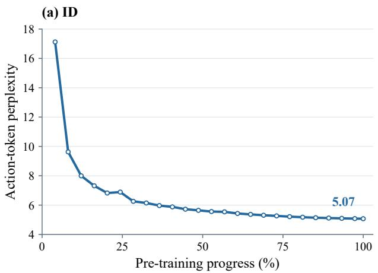

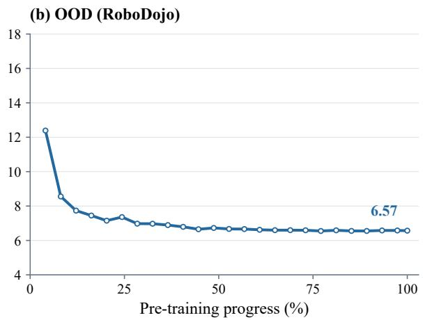  
Figure 7 Action-token perplexity during pre-training. The PhysBrain 1.5 model is evaluated on ID test data and OOD data from RoboDojo, which is excluded from training. ID test episodes are disjoint from training episodes.

## B.2.1 Image Evaluation

The Qwen-aligned image profile uses non-thinking inference, a maximum of 32,768 generated tokens, temperature 0.7, top-p 0.8, top-k = 20, repetition penalty 1.0, presence penalty 1.5, and seed 3407. The maximum image area is 4,014,080 pixels. The minimum image area is 602,112 pixels for RealWorldQA and 200,704 pixels for the remaining image tasks.

ScreenSpot uses Qwen’s computer-use tool-call format with coordinates on a fixed 0–1000 grid. RealWorldQA uses rule-based extraction with a fixed local Qwen3 8B model fallback shared by both models; this difers from Qwen’s remote fallback judge. DocVQA and TextVQA use their validation splits.

## B.2.2 Video Evaluation

Video inputs and temporal sampling. We use the Qwen3-VL video preprocessing pipeline implemented in qwen-vl-utils, with a target sampling rate of 2 FPS and a maximum of 128 frames per clip for VideoMME and 32 for MVBench, using the same benchmark-specific limits for both models. The target frame count is determined from the clip duration, with a default minimum of four frames subject to the available source frames, and is rounded down to a multiple of two to match the model’s temporal factor. Frames are then sampled uniformly across the full input clip using evenly spaced frame indices rounded to the nearest integer. Thus, short clips may contain fewer sampled frames than the corresponding benchmark limit, while the efective sampling rate decreases for long clips once the frame limit is reached. Frame indices and source frame-rate metadata are passed to the model’s processor to preserve temporal information.

Spatial preprocessing. Sampled frames are resized with bicubic interpolation while preserving their aspect ratio, with height and width aligned to multiples of 32 for the 16-pixel patches and spatial merging factor of two. The configured minimum frame area is 200,704 pixels. Video preprocessing applies its own pixel budget: the default per-frame ceiling is $7 6 8 \times 3 2 ^ { 2 } = 7 8 6 { , } 4 3 2$ pixels, further constrained by the total video budget. The resulting resolution therefore depends on the source aspect ratio and the video budget. Frames are resized once by qwen-vl-utils; subsequent processor resizing is disabled.

Task protocols and scoring. VideoMME is evaluated on its complete test split of 2,700 questions, covering short, medium, and long videos, and is scored by overall multiple-choice accuracy. We use the version without additional subtitles or audio input. MVBench covers 20 sub-tasks and 4,000 evaluation examples, using the video clips supplied by its video release. The reported MVBench score is the unweighted mean of the accuracies across its 20 sub-tasks. Both benchmarks provide a question and answer options and request an option-letter response, which is scored using the benchmark-specific answer-extraction rules without an external LLM judge.

## B.3 Action Perplexity

Figure 7 tracks action-token perplexity of the 8B model during pre-training on ID test data and the held-out RoboDojo corpus. The ID test set shares data sources with training but contains disjoint episodes. All RoboDojo test examples include ground-truth action history, and RoboDojo data are excluded from training. From the first evaluated checkpoint to the last, perplexity decreases from 17.12 to 5.07 on ID data and from 12.39 to 6.57 on RoboDojo. Despite local fluctuations, RoboDojo perplexity also follows an overall downward trend as pre-training progresses, indicating improved prediction of reference action tokens on a data source excluded from training.

## B.4 Qualitative Visualizations

This appendix presents qualitative visualizations of PhysBrain 1.5 across three task categories: pointing (Figure 8), trajectory point generation (Figure 9), and spatial relationship Q&A (Figures 10, 11, 12, 13, and 14). These examples are drawn from sources outside the 28 embodied benchmarks used in our evaluation, illustrating the ability of our unified embodied foundation model to generalize to a broader range of scenarios.

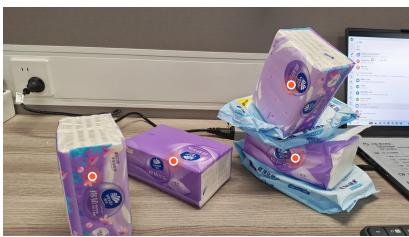  
Instruction: Point to all the purple Vinda tissue boxes on the desk.

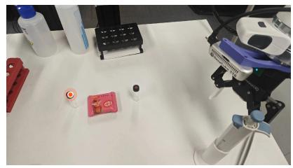  
Instruction: Find the test tube on the left.

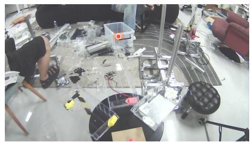  
Instruction: Pick up the transparent storage box in front of the person wearing jeans.

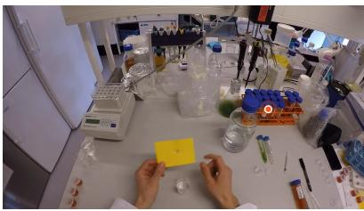  
Instruction: Provide a point annotation for the orange tube rack on the laboratory bench.

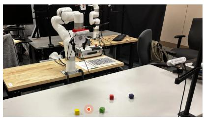  
Instruction: Move the red block to the empty space between the yellow block and the green block. Mark the target location.

  
Instruction: Which object can be used to write on the notebook? Mark the target location.

Figure 8 Examples of object pointing across diverse complex scenarios.

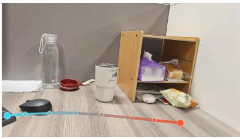  
Instruction: Drag the keyboard to the empty desktop area on the lower-right.

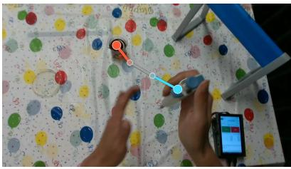  
Instruction: Reach for the liquid from the beaker.

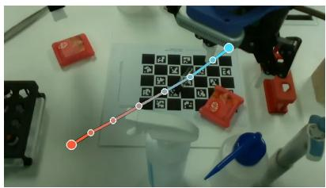  
Instruction: Pick up the test tube on the table and place it to the right of the black test tube rack.

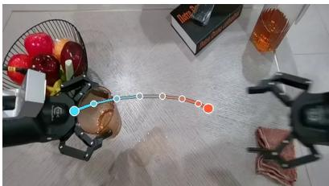  
Instruction: The robot is performing the task of putting the water cup in the center of the table. How do you think its left hand will move next?

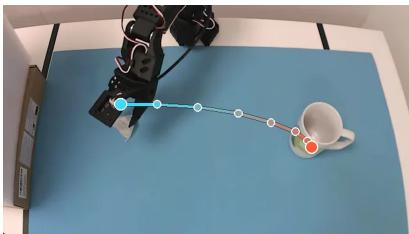  
Instruction: Use 2D points to trace the movement trajectory of the robotic gripper to reach the mug.

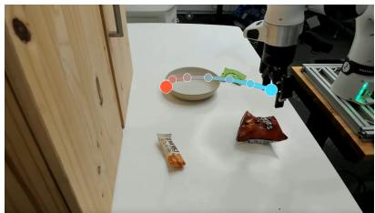  
Instruction: Move the robotic gripper to the bowl. Use 2D points to mark the gripper-centric waypoints.

Figure 9 Examples of predicting the movement trajectories of target objects based on action instructions.

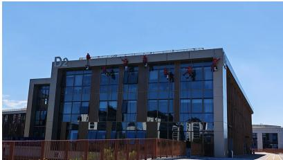  
Question: How many people wearing red are visible in the image?  
Answer: There are 7 people wearing red visible in the image.

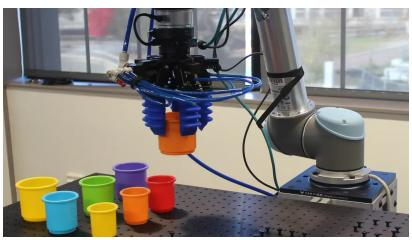  
Question: Which colored cup is directly below the robotic gripper?

  
Question: Describe the items in the image from left to right and from top to bottom as best you can.  
Answer: The image shows a kitchen counter with various items. On the left, there is a black wire basket containing white paper cups. Next to the basket, there is a clear plastic organizer with multiple drawers. The top drawer contains packets of sugar, the second drawer has pink packets, the third drawer has yellow packets, and the fourth drawer has green packets. The top right drawer contains wooden stir sticks. To the right of the organizer, there is a box of Quaker cereal with a blue and white label. Next to the cereal box, there is a box of Swiss Miss hot chocolate mix with a red and white label. In the foreground, there are two mugs, one blue and one green, placed on the counter.

  
Question: What ingredient is located between the camera wearer's hands and directly beneath the knife?

Answer: To determine the ingredient located between the   
camera wearer's hands and directly beneath the knife, we need to carefully observe the image. The image shows a person   
holding a knife and cutting an ingredient. The ingredient being cut is purple in color and has a layered structure, which is characteristic of an onion. Therefore, the ingredient located between the camera wearer's hands and directly beneath the knife is an onion.

  
Question: Could you tell me the location of the cheese grater in comparison to the bowl containing the eggs?  
Answer: The cheese grater is positioned to the right of the bowl containing the eggs.

  
Question: From the camera wearer's perspective, where is the notebook relative to the laptop?

Figure 10 Examples of challenging spatial reasoning question answering.

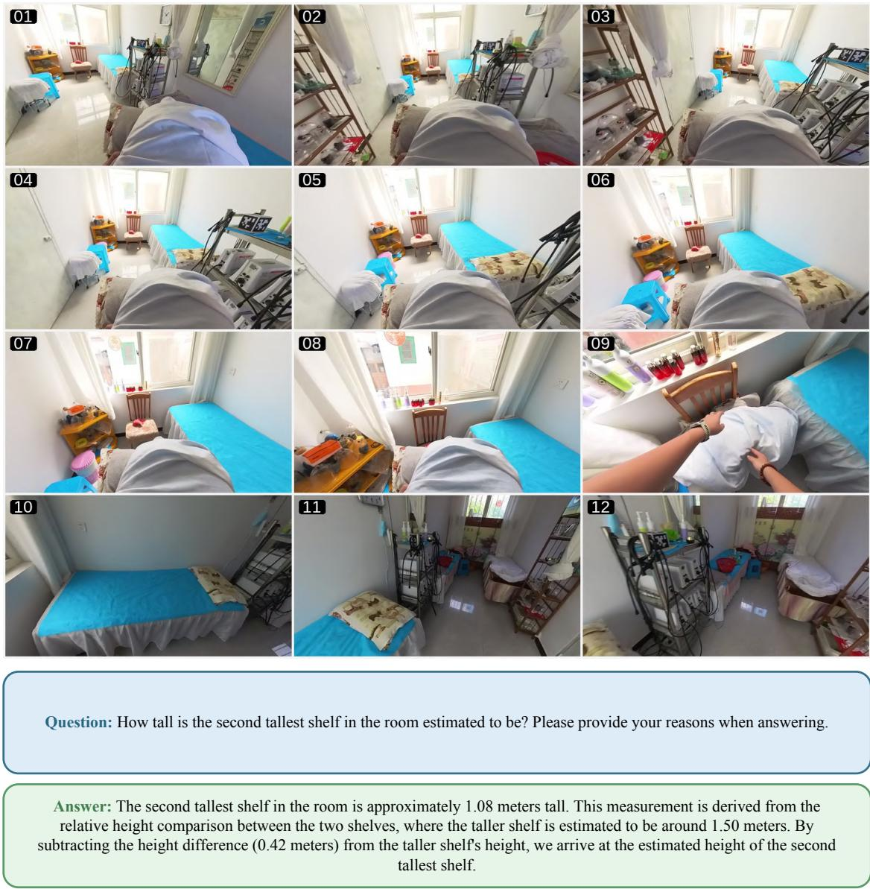  
Figure 11 An example of object scale estimation in a scene with multi-view observations.

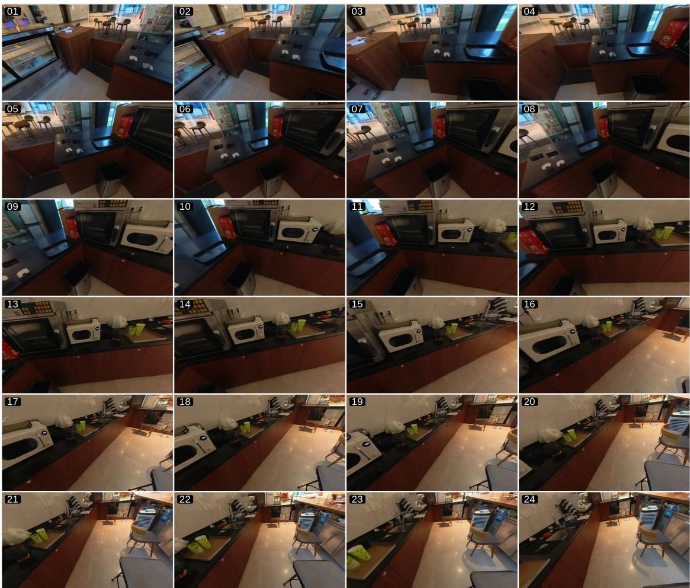  
Figure 12 An example of spatial imagination and orientation reasoning a scene with multi-view observations.

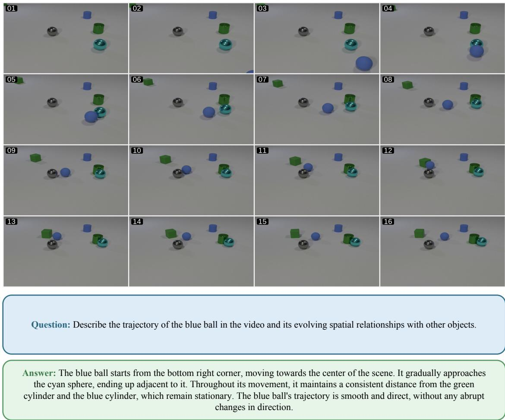  
Figure 13 An example of object motion trajectory understanding in a short video.

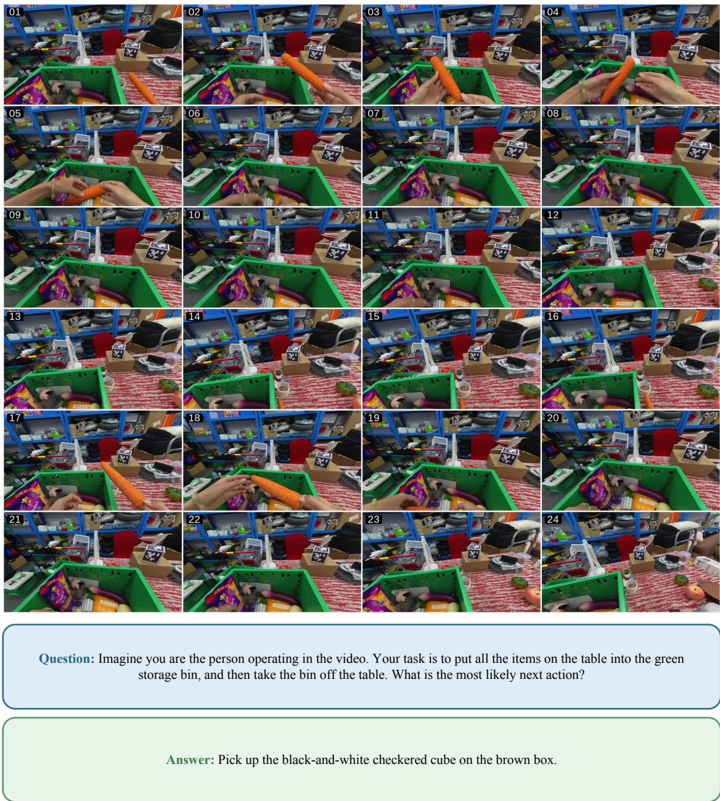  
Figure 14 An example of future prediction for a video.