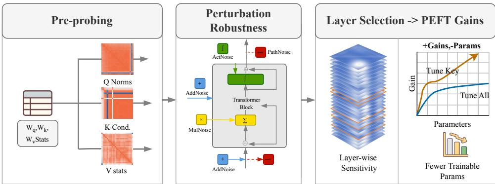
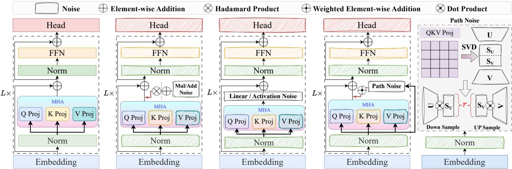
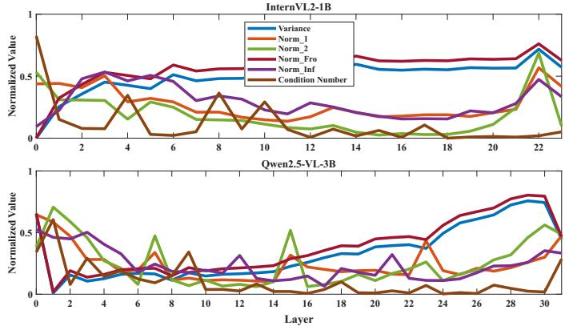
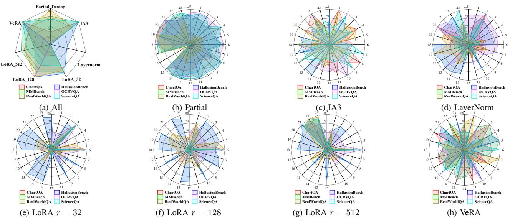

# Pre-PEFT Probing: Weight Statistics and Perturbation Robustness for Layer Selection in VLM Vision Encoders

Qingtao Xia

Jiahua Bao

Faculty of Computing

Faculty of Computing

Harbin Institute of Technology

Harbin Institute of Technology

Harbin, China

Jie Liu

Harbin, China

25s103308@stu.hit.edu.cn

bjh samsara@163.com

Siyao Cheng∗

Faculty of Computing

Faculty of Computing

Harbin Institute of Technology

Harbin Institute of Technology

Harbin, China

csy@hit.edu.cn

Harbin, China

jieliu@hit.edu.cn

Abstract—We propose a pre-fine-tuning probing method for Parameter-Efficient Fine-Tuning (PEFT) layer selection, aiming to obtain more stable and higher gains with fewer trainable parameters when adapting large vision–language models (VLMs). Unlike the common practice of applying LoRA and other adapters to all layers at once—where layer selection often relies on heuristic rules—we focus on the vision encoder and directly evaluate the “adaptability” of each Transformer layer. Specifically, we characterize each layer from two perspectives: (i) the statistical properties of its Q/K/V projection weights (e.g., norms and condition numbers); (ii) robustness under controlled parameter perturbations. We then systematically compare these indicators with the downstream performance gains brought by applying PEFT to a single layer. Across experiments covering seven benchmarks and five PEFT variants, we observe a consistent correlation: layers (or matrices) with larger weight norms and higher condition numbers are usually more robust to perturbations and are more likely to yield larger fine-tuning gains. These results show that distribution-statistics analysis and perturbation tests before fine-tuning can provide practical signals for adaptation-layer selection, thereby maintaining or improving performance while reducing trainable parameters.

Index Terms—Parameter-Efficient Fine-Tuning,

Vision-Language Models, Layer Selection, LoRA, Perturbation Analysis, Vision Encoder

## I. INTRODUCTION

Vision–Language Models (VLMs) combine vision encoders and language decoders for multimodal understanding and generation, and models such as InternVL, LLaVA, and Open-Flamingo have shown strong image–text capabilities [1]–[3]. Most VLMs follow a modular design in which a pre-trained vision encoder is connected to an LLM through a lightweight connector [4]–[6].

For downstream adaptation, Parameter-Efficient Fine-Tuning (PEFT) is widely used because it updates only a small subset of parameters while often retaining competitive performance relative to full fine-tuning [7]–[9]. However, PEFT remains sensitive to where trainable modules are inserted, and layer selection is still largely heuristic.

Even so, PEFT still faces a key bottleneck in practice: hyperparameters and insertion positions are highly sensitive, and there is a lack of explainable and predictable selection criteria. For example, which layers LoRA should be inserted into, whether all layers need to be covered, and how to choose layers when “only tuning part of the layers” can often significantly affect the final performance, while the trial-anderror cost is high. Moreover, many fine-tuning methods introduce additional trainable parameters (e.g., low-rank adapters or gating vectors). With standard random initialization and early-stage updates, these added degrees of freedom perturb the target layer computation in a structured manner. If, before fine-tuning starts, we can pre-judge which layers are more “worth fine-tuning” by analyzing in-layer weight statistics and controlled perturbation responses, then there is an opportunity to improve both the efficiency and the effectiveness of PEFT.

Figure 1 provides an overview of our pre-PEFT probing pipeline; perturbation details are given in Sec. III-B.

To reduce PEFT training parameters and improve model performance, it is crucial to identify which layers will have the most significant fine-tuning effects before starting the process. In both traditional Convolutional Neural Networks (CNNs) and Vision Transformers (ViTs), deeper layers are generally more effective at learning complex features [10]. Based on this, we quantify the parameter distribution for Query (Q), Key (K), and Value (V) across each ViT layer, as well as their robustness to perturbations. We then compare the fine-tuning effectiveness of each layer using five common PEFT methods. Our empirical results indicate a stable correspondence between these pre-tuning indicators and layer-wise PEFT gains across the vision encoders of InternVL2-1B (24 layers) and Qwen2.5- VL-3B (32 layers). For each experiment, we have conducted three trials and reported the median as the result; across both backbones, run-to-run variance is small (on the order of 0.3pp). Our contributions are as follows:

• We provide a unified layer-wise study linking perturbation robustness, Q/K/V weight statistics, and PEFT gains in VLM vision encoders.

• Across InternVL2-1B and Qwen2.5-VL-3B, more robust layers often coincide with larger norms, higher condition numbers, and better layer-wise PEFT gains.

  
Fig. 1. Overview of our pre-PEFT probing pipeline for layer selection in the vision encoder. We quantify layer-wise weight statistics and perturbatio robustness before fine-tuning, and use them as signals to guide PEFT layer selection.

• We show that selective tuning of a small subset of layers can remain competitive with broader tuning, providing a practical pre-screening signal for PEFT layer selection.

The code and scripts used in this work are publicly available at https://github.com/atoz03/prepeft-probing.

## II. RELATED WORK

## A. VLMs

VLMs align a vision encoder with a language decoder for multimodal understanding and generation. Representative systems such as LLaVA connect CLIP ViT-L/14 to an LLM through a lightweight projector [2], [11], while InternVL2 and Qwen2.5-VL adopt ViT-style vision encoders, lightweight connectors, and staged training recipes [1], [12]–[14].

## B. PEFT with VLMs

To adapt VLMs under limited budgets, PEFT updates only a small subset of parameters, with common choices including LoRA, adapters, and prompt tuning [7], [8], [15]. These methods can be viewed as introducing structured perturbations to the original network during adaptation. Prior work has studied perturbation and robustness in CNN/Transformer models [16]– [18], but their connection to layer-wise PEFT effectiveness in VLM vision encoders remains underexplored. Our work studies this connection through weight statistics, perturbation robustness, and layer-wise PEFT gains.

## III. DATASETS AND PERTURBATION SETTINGS

We study pre-PEFT layer selection in the vision encoder. Our hypothesis is that robustness to controlled perturbations before fine-tuning correlates with subsequent PEFT effectiveness. Accordingly, we probe each layer without updating the base model, and later compare the probing signals with layerwise PEFT results.

## A. Datasets Preparation

We select 48 datasets that cover diverse VLM capabilities (image captioning, OCR, chart and table understanding, scientific image question answering, math question answering, etc.), including Screen2Words [19], OCR-VQA [20], Chart2Text [21], CLEVR-Math [22], and ScienceQA [23]. Since most downstream fine-tuning tasks have small data sizes and there is some overlap among datasets, the training distribution may be dominated by a few datasets. To more clearly observe the correlation between “perturbation scenarios–PEFT methods” and to better match real-world settings, we sample 27,000 pairs from 1.8 million ⟨image, text⟩ pairs to construct a training mixture for subsequent perturbation probing and PEFT training.

To evaluate model performance after PEFT, we choose seven benchmarks for comprehensive evaluation: MMStar [24] as the primary benchmark for overall comparison and consistency checking of basic capabilities, along with six additional benchmarks—ChartQA [25], OCR-VQA [20], HallusionBench [26], ScienceQA [23], RealWorldQA [27], and MMBench [28]—to evaluate diverse downstream tasks (English dialogue, form understanding, OCR, hallucination detection, science question answering, real-world question answering, etc.).

## B. Perturbation Settings

Figure 2 summarizes these perturbation operators and injection points.

To align perturbation design with layer-wise controllability, we focus on five PEFT methods that can be naturally compared at the layer level: LoRA [7], VeRA [29], IA3 [30], LayerNorm-Tuning, and Partial Fine-Tuning.

We design five perturbation methods: Additive Noise (AddNoise), Multiplicative Noise (MulNoise), Linear Noise (LinearNoise), Activation Noise (ActNoise), and Path Noise (PathNoise). AddNoise and MulNoise sample from a normal distribution and apply element-wise noise scaled by a noise weight; LinearNoise and ActNoise introduce perturbations via a Kaiming-initialized linear layer [31] and ReLU [32]; PathNoise explicitly simulates the LoRA-style “added bypass” structure: we perform Singular Value Decomposition (SVD) on the original QKV generation linear layer to obtain U, S, and V , and then construct a new QKV generation matrix by down-sampling with $U \otimes S _ { u }$ and up-sampling with $S _ { v } \otimes V$ (where $S _ { u } = S _ { v } = \sqrt { S } )$ . The final output is a weighted sum of the original path and the new path.

  
Fig. 2. Perturbation operators and injection points for pre-PEFT probing, including element-wise and activation perturbations.

In preliminary tests, we find that inserting a trainable linear layer (LinearNoise) into the vision encoder collapses the VLM (all benchmark scores drop to $0 . 0 ) ;$ thus LinearNoise is omitted from the reported tables.

a) Formalization: Let e denote the input embedding of a target layer and $q k v ( \cdot )$ denote the original QKV projection. We instantiate perturbations by modifying the QKV output:

$$
\begin{array} { r l } { \mathrm { A D D N O I S E : } } & { q k v ( e ) + \alpha \epsilon , \epsilon \sim \mathcal { N } ( 0 , I ) } \\ { \mathrm { M U L N O I S E : } } & { q k v ( e ) \odot ( 1 + \alpha \epsilon ) , \epsilon \sim \mathcal { N } ( 0 , I ) } \\ { \mathrm { A C T N O I S E : } } & { \phi ( q k v ( e ) ) , \phi ( \cdot ) = \mathrm { R e L U } ( W ( \cdot ) ) } \\ { \mathrm { P A T H N O I S E : } } & { ( 1 - \alpha ) q k v ( e ) + \alpha q k v ^ { \prime } ( e ) } \end{array}\tag{1}
$$

where α is the perturbation weight and $q k v ^ { \prime } ( \cdot )$ is the SVDconstructed low-rank bypass path. We measure robustness by the change of downstream scores under the same evaluation protocol: layers with smaller drops are considered more robust.

b) Layer selection by probing: Given an adaptation budget of k layers, we rank candidate layers on a held-out split D by a probing score computed from ActNoise and PathNoise drops (smaller is better). Concretely, we define:

$$
R _ { \ell } = \frac { 1 } { 2 } \big ( d _ { \ell , \mathrm { a c t } } + d _ { \ell , \mathrm { p a t h } } \big ) , \quad d _ { \ell , \mathrm { p a t h } } = \mathbb { E } _ { \alpha \in A _ { \mathrm { p a t h } } } \big [ s _ { 0 } - s _ { \ell , \alpha } \big ] ,\tag{2}
$$

where $s _ { 0 }$ is the unperturbed score and $s _ { \ell , \alpha }$ is the score after perturbing layer ℓ with strength α. We then select the top-k layers with the smallest $R _ { \ell }$ for subsequent multi-layer joint PEFT.

c) Hyperparameter Settings (Two Backbones):

• Backbones: InternVL2-1B (24L ViT + MLP); Qwen2.5- VL-3B (32L ViT) [14]

• Training: lr=4e−5, wd=0.01, warmup=0.03, bf16

• LoRA: r ∈ {32, 128, 512}, α=256, dropout=0.05

• Perturbation: Add/Mul/Act: α=0.05; PathNoise: base α=0.5 (rank=32), sweep α=0.1–1.0

• Inference: temp=1.0, max len=32768, sliding-window (Transformers 4.37.2)

  
Fig. 3. Layer-wise statistics of the Q/K/V projection linear weights in the vision encoders of InternVL2-1B (top, 24 layers) and Qwen2.5-VL-3B (bottom, 32 layers). We report six metrics (variance, $L _ { 1 } , \ L _ { 2 } ,$ , Frobenius, infinity norm, and condition number), each min–max normalized across layers within the same backbone.

## IV. EXPERIMENTS AND ANALYSIS

## A. Distribution of Model Parameters

We analyze the Q/K/V projection matrices in the 24-layer InternVL2-1B and 32-layer Qwen2.5-VL-3B vision encoders. For coarse cross-backbone comparisons, we segment the encoders into contiguous 8-layer blocks and refer to higher-index blocks/layers as deeper.

To quantify differences in the weight distributions of the Q/K/V projection layers, we compute six metrics for each layer and each projection matrix: variance, $L _ { 1 }$ norm, $L _ { 2 }$ norm, Frobenius norm, infinity norm, and condition number. For each layer $\ell ,$ we compute the statistics on the raw projection weights $W _ { q } ^ { ( \ell ) } , W _ { k } ^ { ( \ell ) } , W _ { v } ^ { ( \ell ) }$ . We define the condition number as $\kappa ( W ) = \sigma _ { \mathrm { m a x } } ( W ) / \sigma _ { \mathrm { m i n } } ( W )$ , where $\sigma _ { \mathrm { m a x } }$ and $\sigma _ { \mathrm { m i n } }$ are the largest and smallest singular values of $W ; \kappa ( \cdot )$ is computed on the raw weights without any attention-time scaling (e.g., $1 / \sqrt { d _ { k } } )$ or additional normalization/reparameterization. For visualization and cross-layer comparison, we apply per-metric min–max scaling across layers within the same backbone to map each metric to [0, 1].

BLOCK-LEVEL PERTURBATION RESULTS ON MMSTAR (LEFT) AND SIX BENCHMARKS (RIGHT) FOR INTERNVL2-1B. ♠/♣/♡/♢: COLUMN-BEST; ↑/↓: VS. UNPERTURBED.  
(a) MMStar (InternVL2-1B)
<table><tr><td>Layers</td><td>Perturbation</td><td>Overall</td><td>CP</td><td>FGP</td><td>IR</td><td>LR</td><td>MA</td><td>S&amp;T</td></tr><tr><td rowspan="4">0-7 (Block-1)</td><td>PathNoise</td><td>37.61↓8.06</td><td>49.33↓11.87</td><td>28.22↓7.38</td><td>40.53↓13.07</td><td>27.96↓7.24</td><td> $\bullet 4 4 . 1 3 \underline { { { 1 3 . 8 7 } } }$ </td><td>35.47↓4.93</td></tr><tr><td>ActNoise</td><td> $4 0 . 8 0 \dot { \downarrow } 4 . 8 7$ </td><td> $5 4 . 4 0 _ { \downarrow 6 . 8 0 }$ </td><td>32.40↓3.20</td><td> $\pm 4 8 . 0 \dot { 0 } _ { \downarrow 5 . 6 0 }$ </td><td> $3 1 . 2 0 _ { \downarrow 4 . 0 0 }$ </td><td> $4 4 . 0 0 _ { \downarrow 4 . 0 0 }$ </td><td> $\$ 34.80 _ { \downarrow 5.6 0 }$ </td></tr><tr><td>AddNoise MulNoise</td><td> $4 5 . 0 7 _ { \downarrow 0 . 6 0 }$ </td><td> $6 1 . 2 0 _ { 0 . 0 0 }$ </td><td>33.60↓2.00</td><td> $5 3 . 2 0 _ { \downarrow , 0 . 4 0 }$ </td><td> $3 4 . 8 0 _ { \downarrow 0 . 4 0 }$ </td><td> $4 7 . 6 0 \dot { _ { \perp 0 . 4 0 } }$ </td><td>40.00↓0.40</td></tr><tr><td></td><td> $4 5 . 1 3 _ { \downarrow 0 . 5 3 }$ </td><td> $6 1 . 2 0 _ { 0 . 0 0 }$ </td><td> $3 4 . 8 0 _ { \downarrow 0 . 8 0 }$ </td><td> $5 2 . 8 0 _ { \downarrow 0 . 8 0 }$ </td><td> $3 3 . 6 0 _ { \downarrow 1 . 6 0 }$ </td><td> $\diamond { 4 8 . 8 0 \ * _ { \uparrow 0 . 8 0 } }$ </td><td>39.60↓0.80</td></tr><tr><td rowspan="4">8-15  $( \mathbf { B l o c k } \mathbf { - } 2 )$ </td><td>PathNoise</td><td>36.12↓9.55</td><td>44.22↓16.98</td><td> $2 8 . 9 8 _ { \downarrow , 6 . 6 2 }$ </td><td>39.07↓14.53</td><td>27.69↓7.51</td><td>43.78↓4.22</td><td>32.98↓7.42</td></tr><tr><td>ActNoise</td><td> $2 9 . 8 7 _ { \downarrow 1 5 . 8 0 }$ </td><td> $3 7 . 2 0 \dot { _ { \perp } } _ { 4 . 0 0 }$ </td><td>22.00↓13.60</td><td> $2 9 . 6 0 \dot { _ { \perp , 2 4 . 0 0 } }$ </td><td> $2 0 . 4 0 \dot { _ { \perp 1 4 . 8 0 } }$ </td><td> $4 0 . 4 0 \dot { _ { \perp 7 . 6 0 } }$ </td><td> $2 9 . 6 0 \dot { _ { \perp 1 0 . 8 0 } }$ </td></tr><tr><td>AddNoise</td><td> $4 5 . 3 3 \substack { \downarrow 0 . 3 3 }$ </td><td> $6 1 . 2  { \stackrel {  } { 0 } } _ { 0 . 0 0 }$ </td><td>34.00↓1.60</td><td> $5 3 . 2 0 _ { \downarrow 0 . 4 0 } ^ { ^ { \circ } }$ </td><td> $3 5 . 2 \dot { 0 } _ { 0 . 0 0 }$ </td><td> $\bigtriangledown 4 8 . 4 \dot { 0 } _ { \uparrow 0 . 4 0 }$ </td><td> $4 0 . 0 0 _ { \downarrow , 0 . 4 0 } ^ { ^ { \circ } }$ </td></tr><tr><td>MulNoise</td><td> $4 5 . 4 0 _ { \downarrow 0 . 2 7 }$ </td><td> $6 1 . 6 0 _ { \uparrow 0 . 4 0 }$ </td><td> $\diamondsuit ^ { 3 5 . 2 0 } \iota _ { 0 . 4 0 }$ </td><td> $5 2 . 8 0 _ { \downarrow 0 . 8 0 }$ </td><td> $3 4 . 8 0 _ { \downarrow 0 . 4 0 }$ </td><td>47.20↓0.80</td><td>40.80↑0.40</td></tr><tr><td rowspan="4">16-23 (Block-3)</td><td>PathNoise</td><td> $\$ 39.88,45.79$ </td><td> $\bullet 5 4 . 1 3 \scriptstyle \downarrow 7 . 0 7$ </td><td>30.44↓5.16</td><td> $\$ 45.07 _ { \downarrow 8 .5 3 }$ </td><td>30.13↓5.07</td><td> $4 3 . 2 0 _ { \downarrow 4 . 8 0 }$ </td><td>36.31↓4.09</td></tr><tr><td>ActNoise</td><td>41.13↓4.53</td><td>56.00↓5.20</td><td> $\pm 3 3 . 6 0 _ { \downarrow 2 0 0 } ^ { - }$ </td><td>45.20↓8.40</td><td>34.00↓1.20</td><td>44.80↓3.20</td><td>33.20↓7.20</td></tr><tr><td>AddNoise</td><td> $\odot 4 5 . 6 0 _ { \downarrow , 0 . 0 7 }$ </td><td> $\heartsuit 6 1 . 6 0 \dot { \iota } _ { \bar { 1 } 0 . 4 0 }$ </td><td> $\bigtriangledown 3 4 . 8 0 _ { \downarrow 0 . 8 0 } ^ { ^ { \cdot } }$ </td><td>53.600.00</td><td> $\heartsuit 3 6 . 0 0 \dot { \star } _ { 0 . 8 0 }$ </td><td>47.20↓0.80</td><td>40.400.00</td></tr><tr><td>MulNoise</td><td> $\diamondsuit 4 5 . 5 3 \lrcorner 0 . 1 3$ </td><td> $\diamond 6 2 . 0 0 \substack { \dag 0 . 8 0 }$ </td><td>34.80↓0.80</td><td>53.600.00</td><td>35.60+0.40</td><td> $4 7 . 6 0 \dot { _ { \perp 0 . 4 0 } }$ </td><td>39.60↓0.80</td></tr></table>

TABLE II

BLOCK-LEVEL PERTURBATION RESULTS ON MMSTAR (LEFT) AND SIX BENCHMARKS (RIGHT) FOR QWEN2.5-VL-3B. ♠/♣/♡/♢: COLUMN-BEST; ↑/↓: VS. UNPERTURBED.  
(a) MMStar (Qwen2.5-VL-3B)
<table><tr><td>Layers</td><td>Perturbation</td><td>Overall</td><td>CP</td><td>FGP</td><td>IR</td><td>LR</td><td>MA</td><td>S&amp;T</td></tr><tr><td rowspan="4">0-7 (Block-1)</td><td>PathNoise</td><td> $\$ 54.64 _ { \downarrow 0. 2 6 }$ </td><td> $\$ 66.40 _ { \downarrow 1 . 20 }$ </td><td>46.40↑0.40</td><td> $6 0 . 8 0 _ { \uparrow 0 . 4 0 }$ </td><td> $4 5 7 . 4 3 _ { \uparrow 2 . 4 1 }$ </td><td> $\pm 6 0 . 8 0 _ { \downarrow 1 . 6 0 }$ </td><td>36.00↓2.00</td></tr><tr><td>ActNoise</td><td> $\yen 55.57,70.67$ </td><td> $\dot { 4 } 6 8 . 0 0 _ { \uparrow 0 . 4 0 } ^ { \sim }$ </td><td>46.000.00</td><td> $6 0 . 4 0 \dot { _ { 0 . 0 0 } }$ </td><td> $\yen 57.43,456$ </td><td> $\pm 6 3 . 2 0 _ { \uparrow 0 . 8 0 } ^ { \cdot }$ </td><td>38.40↑0.40</td></tr><tr><td>AddNoise</td><td>55.30↑0.40</td><td>67.600.00</td><td>44.80↓1.20</td><td>60.00↓0.40</td><td>57.43↑2.41</td><td>63.60↑1.20</td><td>38.40↑0.40</td></tr><tr><td>MulNoise</td><td> $5 5 . 1 0 _ { \uparrow 0 . 2 0 }$ </td><td> $\diamond 6 7 . 6 0 \phantom { 0 } _ { 0 . 0 0 }$ </td><td> $\diamond 4 7 . 6 0 _ { \uparrow 1 . 6 0 }$ </td><td> $6 0 . 4 0 _ { 0 . 0 0 }$ </td><td> $5 5 . 4 2 _ { \uparrow 0 . 4 0 }$ </td><td> $6 1 . 6 0 _ { \downarrow 0 . 8 0 }$ </td><td>38.000.00</td></tr><tr><td rowspan="4"> $8 { - } 1 5$  (Block-2)</td><td>PathNoise</td><td> $5 3 . 5 7 _ { \downarrow 1 . 3 3 }$ </td><td> $6 5 . 2 0 _ { \downarrow 2 . 4 0 }$ </td><td>46.000.00</td><td> $5 8 . 8 0 _ { \downarrow 1 . 6 0 }$ </td><td> $5 4 . 6 2 _ { \downarrow , 0 . 4 0 }$ </td><td> $6 0 . 8 0 _ { \downarrow , 1 . 6 0 }$ </td><td>36.00↓2.00</td></tr><tr><td>ActNoise</td><td> $5 5 . 4 4 \substack { \uparrow 0 . 5 4 }$ </td><td> $6 8 . 0 0 \dot { } _ { \uparrow 0 . 4 0 }$ </td><td> $\pmb { 4 6 . 4 0 _ { \uparrow 0 . 4 0 } }$ </td><td> $6 0 . 8 0 \substack { \dag 0 . 4 0 }$ </td><td> $5 7 . 0 3 _ { \uparrow 2 . 0 1 }$ </td><td> $6 2 . 0 0 \dot { _ { \perp , 0 . 4 0 } }$ </td><td>38.40↑0.40</td></tr><tr><td>AddNoise</td><td>55.97↑1.07</td><td>68.00↑0.40</td><td>47.60↑1.60</td><td>61.20↑0.80</td><td>56.22↑1.20</td><td>62.80↑0.40</td><td>40.00↑2.00</td></tr><tr><td>MulNoise</td><td> $5 5 . 2 4 _ { \uparrow 0 . 3 4 }$ </td><td> $6 5 . 6 0 _ { \downarrow 2 . 0 0 }$ </td><td> $4 6 . 0 0 _ { 0 . 0 0 }$ </td><td> $6 0 . 8 0 _ { \uparrow 0 . 4 0 }$ </td><td> $\diamond 5 7 . 8 \dot { 3 } _ { \uparrow 2 . 8 1 }$ </td><td> $\diamond 6 2 . 0 0 _ { \downarrow 0 . 4 0 }$ </td><td> $3 9 . 2 0 _ { \uparrow 1 . 2 0 }$ </td></tr><tr><td rowspan="4">16-23 (Block-3)</td><td>PathNoise</td><td> $5 2 . 3 0 _ { \downarrow 2 . 6 0 }$ </td><td> $6 5 . 2 0 _ { \downarrow 2 . 4 0 }$ </td><td> $4 4 . 8 0 _ { \downarrow 1 . 2 0 }$ </td><td> $6 0 . 4 0 _ { 0 . 0 0 }$ </td><td> $5 2 . 6 1 _ { \downarrow 2 . 4 1 }$ </td><td> $5 8 . 4 0 _ { \perp 4 . 0 0 }$ </td><td> $3 2 . 4 0 _ { \downarrow 5 . 6 0 }$ </td></tr><tr><td>ActNoise</td><td> $5 5 . 1 0 _ { \uparrow 0 . 2 0 } ^ { ^ { \circ } }$ </td><td> $6 7 . 2 0 _ { \downarrow 0 . 4 0 } ^ { ^ { \circ } }$ </td><td> $4 5 . 2 0 _ { \downarrow 0 . 8 0 } ^ { \sim }$ </td><td> $\pm 6 1 . 6 0 _ { \uparrow 1 . 2 0 }$ </td><td> $5 5 . 0 2 _ { 0 . 0 0 } ^ { -- }$ </td><td> $6 2 . 8 0 _ { \uparrow 0 . 4 0 } ^ { \sim }$ </td><td> $3 8 . 8 0 \substack { \uparrow 0 . 8 0 }$ </td></tr><tr><td>AddNoise</td><td>55.37↑0.47</td><td>68.00↑0.40</td><td>45.20↓0.80</td><td>61.60↑1.20</td><td>55.82↑0.80</td><td>61.60↓0.80</td><td>40.00↑2.00</td></tr><tr><td>MulNoise</td><td> $5 4 . 5 7 _ { \downarrow 0 . 3 3 }$ </td><td> $6 6 . 8 0 \dot { _ { \perp 0 . 8 0 } }$ </td><td> $4 6 . 4 0 \dot { _ { \uparrow 0 . 4 0 } }$ </td><td> $6 0 . 0 0 _ { \downarrow 0 . 4 0 }$ </td><td> $5 5 . 0 2 _ { 0 . 0 0 }$ </td><td> $6 1 . 2 0 _ { \downarrow 1 . 2 0 }$ </td><td> $3 8 . 0 0 _ { 0 . 0 0 }$ </td></tr><tr><td rowspan="4">24-31 (Block-4)</td><td>PathNoise</td><td> $5 3 . 7 7 _ { \perp 1 . 1 3 }$ </td><td> $6 4 . 8 0 _ { \downarrow 2 . 8 0 }$ </td><td> $\bullet 4 6 . 8 0 _ { \uparrow 0 . 8 0 }$ </td><td> $\bullet 6 2 . 0 0 _ { \uparrow 1 . 6 0 }$ </td><td> $5 2 . 6 1 _ { \downarrow 2 . 4 1 }$ </td><td> $5 9 . 6 0 _ { \downarrow 2 . 8 0 }$ </td><td>36.80↓1.20</td></tr><tr><td>ActNoise</td><td> $5 5 . 1 7 _ { \uparrow 0 . 2 7 } ^ { * ^ { \cdots } }$ </td><td> $6 7 . 6 \dot { 0 } _ { 0 . 0 0 }$ </td><td> $4 6 . 0 0 _ { 0 . 0 0 }$ </td><td> $6 1 . 2 0 _ { \uparrow 0 . 8 0 }$ </td><td> $5 4 . 6 2 _ { \downarrow 0 . 4 0 } ^ { ^ { \circ - } }$ </td><td> $6 1 . 6 0 \dot { _ { \perp 0 . 8 0 } }$ </td><td> $\frac { 1 } { 1 0 } + 0 . 0 0 \dot { } = 2 0 0$ </td></tr><tr><td>AddNoise</td><td>55.17↑0.27</td><td>67.20↓0.40</td><td>45.20↓0.80</td><td>61.60↑1.20</td><td> $5 4 . 6 2 _ { \downarrow 0 . 4 0 }$ </td><td>62.80↑0.40</td><td> $3 9 . 6 0 _ { \uparrow 1 . 6 0 }$ </td></tr><tr><td>MulNoise</td><td> $\diamond 5 5 . 3 \dot { 7 } _ { \uparrow 0 . 4 7 }$ </td><td> $6 6 . 8 0 \dot { _ { \perp 0 . 8 0 } }$ </td><td> $4 6 . 8 0 \dot { + } \dot { 0 } . 0 0$ </td><td> $\diamond 6 1 . 2 0 \substack { \dag 0 . 8 0 }$ </td><td>55.82↑0.80</td><td> $6 2 . 0 0 \dot { _ { \perp , 0 . 4 0 } }$ </td><td> $\diamond 3 9 . 6 0 _ { \uparrow 1 . 6 0 }$ </td></tr></table>

(b) Benchmarks (InternVL2-1B)
<table><tr><td>Layers</td><td>Perturbation</td><td>CQA</td><td>HB</td><td>MMB</td><td>OCRVQA</td><td>RWQA</td><td>SQA</td></tr><tr><td rowspan="4">0-7 (Block-1)</td><td>PathNoise</td><td> $2 8 . 7 9 _ { \downarrow 2 9 . 0 9 }$ </td><td> $2 9 . 5 9 _ { \downarrow , 5 . 6 2 }$ </td><td> $4 7 . 6 9 _ { \downarrow , 1 9 . 4 9 }$ </td><td>31.98↓11.53</td><td>42.99↓5.77</td><td>78.83↓8.58</td></tr><tr><td>ActNoise</td><td>27.84↓30.04</td><td>30.82↓4.39</td><td>60.91↓6.27</td><td> $\$ 35.37,48,13$ </td><td> $\pm 4 4 . 3 1 \dot { _ { \perp 4 . 4 4 } }$ </td><td>82.30↓5.11</td></tr><tr><td>AddNoise</td><td> $\heartsuit 5 8 . 1 \dot { 6 } \substack { 1 0 . 2 8 }$ </td><td> $3 5 . 4 9 _ { \uparrow 0 . 2 9 }$ </td><td> $\heartsuit 6 7 . 3 5 _ { \uparrow 0 . 1 7 }$ </td><td> $\dot { \bigtriangledown } 4 3 . 5 4 _ { \uparrow 0 . 0 3 }$ </td><td> $\heartsuit 4 8 . 7 6 _ { 0 . 0 0 }$ </td><td>87.36↓0.05</td></tr><tr><td>MulNoise</td><td> $5 8 . 0 4 _ { \uparrow 0 . 1 6 }$ </td><td>31.27↓3.93</td><td> $6 7 . 1 8 _ { 0 . 0 0 }$ </td><td>43.510.00</td><td>48.89↑0.13</td><td>87.26↓0.15</td></tr><tr><td rowspan="4">8-15 (Block-2)</td><td>PathNoise</td><td> $2 4 . 5 7 _ { \downarrow , 3 3 . 3 1 }$ </td><td>30.52↓4.68</td><td>42.50↓24.68</td><td>27.96↓15.55</td><td>42.67↓6.09</td><td>78.09↓9.32</td></tr><tr><td>ActNoise</td><td> $1 2 . 8 8 _ { \downarrow 4 5 . 0 0 }$ </td><td> $2 6 . 2 2 _ { \downarrow , 8 . 9 8 }$ </td><td> $2 8 . 6 9 _ { \downarrow , 3 8 . 4 9 }$ </td><td> $2 0 . 6 4 _ { \downarrow 2 2 . 8 7 }$ </td><td> $3 7 . 5 2 _ { \scriptstyle \downarrow 1 1 . 2 4 }$ </td><td> $7 3 . 1 8 _ { \downarrow 1 4 . 2 3 }$ </td></tr><tr><td>AddNoise</td><td> $5 7 . 9 6 _ { \uparrow 0 . 0 8 }$ </td><td> $\heartsuit 3 6 . 1 \dot { 4 } _ { \uparrow 0 . 9 4 }$ </td><td> $6 7 . 1 \dot { 8 } _ { 0 . 0 0 }$ </td><td> $4 3 . 5 3 _ { \uparrow 0 . 0 3 }$ </td><td> $4 8 . 2 4 _ { \downarrow 0 . 5 2 }$ </td><td> $8 7 . 3 1 _ { \downarrow 0 . 1 0 } ^ { ^ { \circ } \cdot ^ { - } }$ </td></tr><tr><td>MulNoise</td><td> $\diamond 5 8 . 0 8 \substack { \dag 0 . 2 0 }$ </td><td> $3 5 . 1 0 _ { \perp 0 . 1 0 }$ </td><td> $\diamond { \infty } 7 . 7 0 \substack { \uparrow 0 . 5 2 }$ </td><td>43.54↑0.04</td><td>47.84↓0.92</td><td>87.46↑0.05</td></tr><tr><td rowspan="4">16-23 (Block-3)</td><td>PathNoise</td><td> $\$ 36.39,421.49$ </td><td> $2 9 . 7 7 _ { \downarrow 5 . 4 4 }$ </td><td> $\$ 53,00,_ { \downarrow 14, 1 8 }$ </td><td> $\$ 33,74,9$ </td><td> $4 2 . 9 5 _ { \downarrow 5 . 8 1 }$ </td><td> $\bullet 8 2 . 2 3 _ { \downarrow 5 . 1 7 }$ </td></tr><tr><td>ActNoise</td><td>49.5218.36</td><td>30.41↓4.79</td><td>51.46  $\begin{array} { c } { { 3 1 . 4 0 4 . 1 5 . 7 2 } } \\ { { 6 7 . 7 7 . _ { 0 n m } } } \end{array}$ </td><td>34.76↓8.74</td><td>44.31↓4.44</td><td>82.90↓4.51</td></tr><tr><td>AddNoise</td><td> $\begin{array} { r } { \mathfrak { O } 5 8 . 1 6 _ { \uparrow 0 . 2 8 } } \\  - \frac { - } { - } - \frac { - } { - } . \qquad \end{array}$ </td><td> $3 1 . 5 6 _ { \downarrow , 3 . 6 4 } ^ { ^ { \circ } }$ </td><td>↑0.09</td><td>43.50↓0.01</td><td> $4 8 . 6 3 \substack { 1 0 1 3 }$ </td><td>87.36↓0.05</td></tr><tr><td>MulNoise</td><td> $5 7 . 7 6 _ { \downarrow 0 . 1 2 }$ </td><td>35.680.47</td><td>67.27↑0.09</td><td>43.500.00</td><td>48.50↓0.26</td><td>87.410.00</td></tr></table>

(b) Benchmarks (Qwen2.5-VL-3B)
<table><tr><td>Layers</td><td>Perturbation</td><td>CQA</td><td>HB</td><td>MMB</td><td>OCRVQA</td><td>RWQA</td><td>SQA</td></tr><tr><td rowspan="4">0-7 (Block-1)</td><td>PathNoise</td><td>84.28↑0.20</td><td>61.09↑0.73</td><td>82.27↓0.16</td><td>76.80↓0.50</td><td>65.23↓1.18</td><td>74.81↓0.75</td></tr><tr><td>ActNoise</td><td>84.12↑0.04</td><td> $6 0 . 1 5 _ { \downarrow 0 . 2 1 }$ </td><td> $\pm 8 2 . 5 3 \mathrm { \dot { \Omega } } _ { 1 0 . 1 0 }$ </td><td> $7 7 . 3 0 \dot { 0 } . 0 0$ </td><td> $\dot { \pmb { 4 6 5 . 7 5 } } _ { \downarrow , 0 . 6 6 } ^ { \ast }$ </td><td>75.46↓0.10</td></tr><tr><td>AddNoise</td><td> $\heartsuit 8 4 . 1 \dot { 6 } _ { \uparrow 0 . 0 8 }$ </td><td>61.20↑0.84</td><td> $\odot 8 2 . 5 9 _ { \uparrow 0 . 1 6 }$ </td><td>77.00↓0.30</td><td>65.49↓0.92</td><td>75.06↓0.50</td></tr><tr><td>MulNoise</td><td> $8 3 . 8 0 _ { \downarrow , 0 . 2 8 }$ </td><td> $\diamond 6 0 . 7 8 \substack { \dag 0 . 4 2 }$ </td><td> $8 2 . 5 3 \substack { \mathrm { \Omega } 8 . 1 0 }$ </td><td> $7 6 . 9 0 _ { \downarrow 0 . 4 0 }$ </td><td> $6 5 . 2 3 \mathrm { { \scriptstyle i l . l s } }$ </td><td>75.16↓0.40</td></tr><tr><td rowspan="4">8-15 (Block-2)</td><td>PathNoise</td><td> $8 3 . 4 8 _ { \downarrow 0 . 6 0 }$ </td><td> $6 0 . 4 6 _ { \uparrow 0 . 1 0 }$ </td><td> $8 0 . 8 9 _ { \downarrow 1 . 5 4 }$ </td><td> $7 6 . 6 0 _ { \downarrow 0 . 7 0 }$ </td><td> $6 3 . 5 3 _ { \perp 2 . 8 8 }$ </td><td>74.71↓0.85</td></tr><tr><td>ActNoise</td><td>84.080.00</td><td> $5 9 . 7 3 \scriptstyle { \downarrow 0 . 6 3 }$ </td><td> $^ { 8 2 . 2 0 _ { 4 0 . 2 3 } } _ { \ 0 . \ 0 \ 4 1 }$ </td><td> $^ { T / . 2 0 . 1 0 . 1 0 } _ { 7 \epsilon 7 0 }$ </td><td> $6 5 . 2 3 _ { \scriptstyle \downarrow 1 . 1 8 }$ </td><td>75.01↓0.55</td></tr><tr><td>AddNoise</td><td> $8 4 . 0 4 _ { \downarrow , 0 . 0 4 }$ </td><td> $6 0 . 7 8 _ { \uparrow 0 . 4 2 }$ </td><td>82.41↓0.02</td><td>76.70↓0.60</td><td>65.88↓0.53</td><td>75.11↓0.45</td></tr><tr><td>MulNoise</td><td> $8 3 . 8 4 _ { \downarrow , 0 . 2 4 }$ </td><td> $6 0 . 6 7 _ { \uparrow 0 . 3 1 }$ </td><td> $8 2 . 7 4 _ { \uparrow 0 . 3 1 }$ </td><td> $7 7 . 1 0 \dot { _ { \perp 0 . 2 0 } }$ </td><td> $6 5 . 1 0 _ { \downarrow 1 . 3 1 }$ </td><td> $7 4 . 9 1 _ { \downarrow 0 . 6 5 }$ </td></tr><tr><td rowspan="4">16-23 (Block-3)</td><td>PathNoise</td><td> $8 2 . 4 4 _ { \downarrow 1 . 6 4 }$ </td><td> $6 0 . 1 5 _ { \downarrow 0 . 2 1 }$ </td><td> $8 1 . 6 3 _ { \downarrow 0 . 8 0 }$ </td><td> $7 5 . 4 0 _ { \downarrow 1 . 9 0 }$ </td><td> $6 3 . 4 0 _ { \downarrow 3 . 0 1 }$ </td><td> $7 4 . 4 7 _ { \downarrow 1 . 0 9 }$ </td></tr><tr><td>ActNoise</td><td> $8 4 . 1 2 _ { \uparrow 0 . 0 4 }$ </td><td> $\pmb { 4 6 0 . 5 7 _ { \uparrow 0 . 2 1 } }$ </td><td> $8 2 . 4 7 _ { \uparrow 0 . 0 4 }$ </td><td> $7 6 . 6 0 _ { \downarrow 0 . 7 0 }$ </td><td> $6 5 . 6 2 _ { \downarrow 0 . 7 9 }$ </td><td> $7 5 . 2 6 _ { \downarrow 0 . 3 0 }$ </td></tr><tr><td>AddNoise</td><td> $8 3 . 9 6 _ { \downarrow 0 . 1 2 } ^ { ' }$ </td><td> $6 0 . 7 8 \substack { \dag 0 . 4 2 }$ </td><td> $8 2 . 4 1 4 0 . 0 4$   $8 2 . 3 3 \dot { \iota } _ { \downarrow 0 . 1 0 }$ </td><td> $7 6 . 9 0 \dot { _ { \perp 0 . 4 0 } }$ </td><td>65.62↓0.79</td><td>75.21↓0.35</td></tr><tr><td>MulNoise</td><td> $\diamond 8 4 . 0 0 _ { \downarrow 0 . 0 8 }$ </td><td> $6 0 . 1 5 _ { \downarrow 0 . 2 1 }$ </td><td> $0 . 8 2 . 7 \dot { 8 } _ { \uparrow 0 . 3 5 }$ </td><td> $7 7 . 1 0 _ { \downarrow 0 . 2 0 }$ </td><td> $\diamond 6 6 . 4 \dot { 1 } _ { 0 . 0 0 }$ </td><td> $7 5 . 1 6 _ { \downarrow 0 . 4 0 }$ </td></tr><tr><td rowspan="4"> $2 4 \cdot 3 1$  (Block-4)</td><td>PathNoise</td><td> $8 2 . 1 6 _ { \perp 1 . 9 2 }$ </td><td> $5 9 . 1 0 _ { \downarrow 1 . 2 6 }$ </td><td> $8 1 . 9 6 _ { \downarrow 0 . 4 7 }$ </td><td> $7 6 . 8 0 _ { \downarrow 0 . 5 0 }$ </td><td> $6 2 . 4 8 _ { \downarrow 3 . 9 3 }$ </td><td> $\bullet 7 4 . 9 1 _ { \downarrow 0 . 6 5 }$ </td></tr><tr><td>ActNoise</td><td> $\pm 8 4 . 1 \dot { 6 } _ { \uparrow 0 . 0 8 }$ </td><td> $6 0 . 5 7 _ { \uparrow 0 . 2 1 }$ </td><td> $^ { 8 2 . 4 9 \cdot 0 . 0 6 } _ { \cdot 0 . 0 6 }$ </td><td> $\yen 77.70,40$ </td><td> $6 5 . 6 2 _ { \downarrow 0 . 7 9 } ^ { ^ { \circ } }$ </td><td> $7 5 . 0 1 \downarrow 0 . 5 5$ </td></tr><tr><td>AddNoise</td><td> $8 3 . 9 6 _ { \downarrow , 0 . 1 2 }$ </td><td>60.78↑0.42</td><td>82.35↓0.08</td><td>77.10↓0.20</td><td>65.88↓0.53</td><td>75.01↓0.55</td></tr><tr><td>MulNoise</td><td> $8 4 . 0 0 \dot { _ { \perp , 0 . 0 8 } }$ </td><td> $6 0 . 4 6 _ { \uparrow 0 . 1 0 }$ </td><td> $8 2 . 6 1 \dot { } _ { \uparrow 0 . 1 8 }$ </td><td> $\diamond 7 7 . 2 0 _ { \downarrow 0 . 1 0 } ^ { \cdot }$ </td><td> $6 5 . 3 6 _ { \downarrow 1 . 0 5 }$ </td><td> $\diamond 7 5 . 3 \dot { 1 } _ { \downarrow 0 . 2 5 }$ </td></tr></table>

In Figure 3, deeper layers generally exhibit larger variance and norm-related metrics, while condition-number fluctuations are more concentrated in earlier layers.

Figure 4 and Table IV show that the best PEFT gains cluster in early and late layers, broadly overlapping with perturbationrobust, high-statistics layers.

## B. Segmented Analysis of Vision Encoder Layers

To estimate promising PEFT layers before tuning, we inject perturbations into the predefined 8-layer blocks and evaluate MMStar plus six benchmarks; PathNoise is used as the LoRAlike perturbation. Tables I(a) and II(a) report the block-level MMStar results for InternVL2-1B and Qwen2.5-VL-3B, respectively.

a) Strong same-budget baselines.: Under the same adaptation budget $( k = 5 )$ , budget-matched heuristics yield only marginal and unstable gains. On InternVL2-1B, first-k LoRA reaches 43.70% versus the 43.63% base, while random subsets and single-component tuning are weaker; on Qwen2.5-VL-3B, middle-k LoRA reaches 55.24% versus the 54.90% base, whereas attention-only and MLP-only tuning drop to 54.70% and 54.50%.

## E. Paired Significance Testing on Aggregated Benchmarks

Across both backbones, ActNoise and PathNoise produce the largest degradation, whereas AddNoise and MulNoise are much milder; moreover, block-level robustness is not monotonic with depth (Tables I and II). This motivates the finer layer-wise analysis below.

## C. Layer-Wise Analysis of Vision Encoder

We conduct significance testing on the pooled sixbenchmark set (ChartQA, HallusionBench, MMBench, OCRVQA, RealWorldQA, and ScienceQA) using a two-sided McNemar test and a paired percentile bootstrap 95% CI (27k resamples) for the accuracy difference ∆.

Table III shows substantial within-block variation on InternVL2-1B, with several middle layers consistently more fragile under both ActNoise and PathNoise, suggesting layerlevel PEFT selection rather than contiguous block selection.

## D. PEFT Analysis of Vision Encoder

We evaluate layer-wise PEFT on InternVL2-1B with LoRA $( r ~ = ~ 3 2 / 1 2 8 / 5 1 2 )$ , VeRA, IA3, LayerNorm-Tuning, and Partial-Tuning, and on Qwen2.5-VL-3B with LoRA (r = 32) plus the same baselines.

VeRA (layer 1) improves pooled accuracy by $\Delta = + 2 . 1$ 4pp (95% CI [1.63, 2.64]pp; $p ~ = ~ 1 . 2 ~ \times ~ 1 0 ^ { - 1 6 } )$ , and LoRA (layer 2) by $\Delta \ = \ + 2 . 0 8 p \mathrm { { p } }$ (95% CI [1.57, 2.58]pp; $p =$ $8 . 2 3 6 \times 1 0 ^ { - 1 6 } )$ , mainly driven by HallusionBench and Real-WorldQA; OCRVQA slightly decreases for VeRA (−1.23pp; $p = 0 . 1 0 3 8 )$ . Partial-Tuning (layer 13) also yields a small HallusionBench gain $( \Delta = + 1 . 5 8 \mathrm { p p } ; p = 0 . 0 2 0 0 7 )$ . In summary, probing-selected layers provide statistically significant gains on the pooled benchmarks, with improvements concentrated on HallusionBench and RealWorldQA.

Across both backbones and multiple PEFT families, perturbation-robust layers are distributed in both shallow and deep blocks and usually deliver stronger PEFT gains, supporting pre-PEFT probing as a practical layer-selection signal.

LAYER-WISE PERTURBATION ON MMSTAR (A) AND SIX BENCHMARKS (B) FOR INTERNVL2-1B. BEST IN BOLD; WORST UNDERLINED.  
(a) MMStar (InternVL2-1B)
<table><tr><td rowspan="2">L</td><td colspan="7">ActNoise</td><td colspan="7">PathNoise</td></tr><tr><td>Overall</td><td>CP</td><td>FGP</td><td>IR</td><td>LR</td><td>MA</td><td>S&amp;T</td><td>Overall</td><td>CP</td><td>FGP</td><td>IR</td><td>LR</td><td>MA</td><td>S&amp;T</td></tr><tr><td>0 1</td><td>|45.6↓0.1 45.0↓0.7</td><td>|60.0↓1.2 60.0↓1.2</td><td>36.4↑0.8 36.0↑0.4</td><td>53.60.0 53.60.0</td><td>37.2↑2.0 47.6↓0.4 38.8↓1.6 34.0↓1.2</td><td></td><td>40.8+0.4</td><td>|44.5↓1.1 44.2↓1.5</td><td>57.6↓3.6</td><td>36.0↑04</td><td></td><td>35.20.0 46.4↓1.6</td><td></td><td>|61.6↑0.4 34.0↓1.6 51.6↓2.0 33.6↓1.6 46.4↓1.6 40.0↓0.4 38.4↓20</td></tr><tr><td></td><td>44.9↓0.7</td><td>60.0↓1.2</td><td>33.6↓2.0</td><td>53.2↓0.4</td><td>34.8↓0.4</td><td>45.6↓2.4 47.6↓0.4</td><td>40.40.0</td><td>45.3↓0.4</td><td>61.20.0</td><td>36.4↑08</td><td>51.6↓2.0 51.6↓2.0 36.8↑1.6 47.2↓0.8</td><td></td><td></td><td>38.4↓2.0</td></tr><tr><td>234</td><td>45.5↓0.1</td><td>62.0↑0.8</td><td>35.2↓0.4</td><td>51.6↓2.0</td><td>34.0↓1.2</td><td>49.6↑1.6</td><td>40.8↑0.4</td><td>43.8↓1.9</td><td>58.8↓2.4</td><td>33.2↓24</td><td>51.2↓2.4</td><td>36.0↑0.8 44.4↓3.6</td><td></td><td>39.2↓1.2</td></tr><tr><td></td><td>45.1 ↓0.5</td><td>60.4↓0.8</td><td>36.0↑0.4</td><td>53.2↓0.4</td><td>33.2↓2.0</td><td>49.2↑1.2</td><td>38.8↓1.6</td><td>44.9↓0.8</td><td>59.6↓1.6</td><td>36.4↑0.8</td><td>51.2↓24</td><td>36.0↑0.8</td><td>847.2↓0.8</td><td>38.8↓1.6</td></tr><tr><td>5</td><td>45.4↓0.3</td><td>60.0↓1.2</td><td>36.4↑0.8</td><td>52.4↓1.2</td><td></td><td></td><td>40.8↑0.4</td><td>44.5↓1.2</td><td>61.20.0</td><td>35.60.0</td><td>51.2↓2.4</td><td>37.2↑2.0 45.6↓2.4</td><td></td><td>36.0↓4.4</td></tr><tr><td>6</td><td></td><td>60.4↓0.8</td><td>36.0↑0.4</td><td></td><td>35.6↑0.4 47.2↓0.8</td><td></td><td></td><td></td><td></td><td></td><td></td><td></td><td></td><td></td></tr><tr><td></td><td>44.6↓1.1</td><td></td><td></td><td>51.2↓2.4</td><td>36.0↑0.8</td><td>45.6↓2.4</td><td>38.4↓2.0</td><td>42.7↓3.0</td><td>57.2↓4.0</td><td>33.2↓24</td><td>51.2↓2.4</td><td>33.2↓2.0 46.8↓1.2</td><td></td><td>34.4↓6.0</td></tr><tr><td>7</td><td>44.7↓0.9</td><td>60.0↓1.2</td><td>33.6↓2.0</td><td></td><td></td><td></td><td>53.2↓0.4 34.8↓0.4 47.2↓0.8 39.6↓0.8</td><td>45.3↓0.4</td><td>60.0↓1.2</td><td>35.60.0</td><td></td><td></td><td></td><td>51.2↓2.4 36.4↑1.2 46.4↓1.6 42.0↑1.6</td></tr><tr><td>8</td><td>|44.8↓0.9</td><td>|60.4↓0.8</td><td>36.0↑0.4</td><td>52.0↓1.6</td><td>34.4↓0.8</td><td>46.4↓1.6</td><td>39.6↓0.8</td><td>|44.6↓1.1</td><td>|58.0↓3.2</td><td>37.2↑1.6</td><td>53.60.0</td><td></td><td></td><td>34.8↓0.4 46.8↓1.2 37.2↓3.2</td></tr><tr><td>9</td><td>44.5↓1.1</td><td>59.6↓1.6</td><td>35.2↓0.4</td><td></td><td>52.0↓1.6 36.0↑0.8 45.2↓2.8</td><td></td><td>39.2↓1.2</td><td>44.6↓1.1</td><td>58.0↓3.2</td><td>37.2↑1.6</td><td></td><td></td><td></td><td>53.60.0 34.8↓0.4 46.8↓1.2 37.2↓3.2</td></tr><tr><td>10</td><td>44.7↓1.0</td><td>60.4↓0.8</td><td>33.2↓24</td><td>52.8↓0.8</td><td>35.6↑0.4 46.0↓2.0</td><td></td><td>40.0↓0.4</td><td>44.5↓1.1</td><td>59.6↓1.6</td><td>35.60.0</td><td></td><td></td><td></td><td>52.0↓1.6 34.8↓0.4 45.2↓2.8 40.0↓0.4</td></tr><tr><td>11</td><td>45.1↓0.6</td><td>62.4↑1.2</td><td>36.8↑1.2</td><td></td><td>52.4↓1.2 34.8↓0.4</td><td>45.2↓2.8</td><td>38.8↓1.6</td><td>44.5↓1.1</td><td>59.6↓1.6</td><td>35.60.0</td><td></td><td></td><td></td><td>52.0↓1.6 34.8↓0.4 45.2↓2.8 40.0↓0.4</td></tr><tr><td>12</td><td>43.9↓1.8</td><td>59.2↓2.0</td><td>32.4↓32</td><td>50.4↓3.2 34.8↓0.4</td><td></td><td>447.2↓0.8</td><td>39.2↓1.2</td><td>44.1↓1.5</td><td>60.4↓0.8</td><td></td><td></td><td></td><td></td><td>35.60.0 51.2↓2.4 35.6↑0.4 47.2↓0.8 34.8↓5.6</td></tr><tr><td>13</td><td>44.0↓1.7</td><td>59.6↓1.6</td><td>32.4↓3.2</td><td></td><td></td><td></td><td></td><td>42.7↓3.0</td><td>56.4↓4.8</td><td></td><td></td><td></td><td></td><td></td></tr><tr><td>14</td><td>44.0↓1.7</td><td>60.4↓0.8</td><td>32.4↓32</td><td>52.8↓0.8 50.8↓2.8 34.4↓0.8</td><td>34.4↓0.8 47.6↓0.4</td><td>48.4↑0.4</td><td>37.2↓3.2</td><td>43.9↓1.7</td><td>59.6↓1.6</td><td>31.2↓4.4</td><td></td><td></td><td></td><td>32.8↓2.8 49.6↓4.0 34.0↓1.2 46.0↓2.0 37.2↓3.2</td></tr><tr><td>15</td><td>44.4↓1.3</td><td>57.2↓4.0</td><td>33.6↓2.0</td><td>53.60.0</td><td>36.8↑1.6 47.2↓0.8 38.0↓2.4</td><td></td><td>37.6↓2.8</td><td>44.5↓1.1</td><td>59.2↓2.0</td><td></td><td></td><td></td><td></td><td>53.2↓0.4 34.8↓0.4 47.2↓0.8 37.6↓2.8</td></tr><tr><td colspan="10"></td><td></td><td>34.4↓1.2 52.0↓1.6 35.20.0 47.2↓0.8 39.2↓1.2</td><td></td><td></td><td></td></tr><tr><td></td><td>16|44.5↓1.2</td><td>|60.4↓0.8</td><td>34.4↓1.2</td><td>50.4↓3.2 35.6↑0.4 46.8↓1.2 39.2↓1.2</td><td></td><td></td><td></td><td>|44.4↓1.3</td><td>|58.8↓2.4 31.6↓4.0 52.8↓0.8 36.4↑1.2 48.00.0 38.8↓1.6</td><td></td><td></td><td></td><td></td><td></td></tr><tr><td>17</td><td>44.1↓1.6</td><td>59.6↓1.6</td><td>32.0↓3.6</td><td>52.0↓1.6</td><td>36.4↑1.245.2↓2.8</td><td></td><td>39.2↓1.2</td><td>44.1↓1.5</td><td></td><td></td><td></td><td></td><td></td><td>56.8↓4.4 34.4↓1.2 51.2↓2.4 35.6↑0.4 46.0↓2.0 40.8↑0.4</td></tr><tr><td>18</td><td>45.3↓0.3</td><td>61.6↑0.4</td><td>34.8↓0.8</td><td>52.4↓1.2</td><td>36.4↑1.2</td><td>46.8↓1.2</td><td>40.0↓0.4</td><td>44.7↓1.0</td><td>60.0↓1.2</td><td>33.2↓2.4 52.8↓0.8</td><td></td><td></td><td></td><td>35.20.0 46.0↓2.0 40.8↑0.4</td></tr><tr><td>19</td><td>45.0↓0.7</td><td>61.20.0</td><td>35.2↓0.4</td><td>53.60.0</td><td>34.0↓1.2</td><td>46.0↓2.0</td><td>40.0↓0.4</td><td>45.0↓0.7</td><td>60.0↓1.2</td><td>35.60.0</td><td>52.4↓1.2</td><td>35.6↑0.4 45.6↓2.4</td><td></td><td>40.8↑0.4</td></tr><tr><td>20</td><td>44.8↓0.9</td><td>62.0↑0.8</td><td>35.2↓0.4</td><td>52.0↓1.6</td><td>34.0↓1.2 47.6↓0.4</td><td></td><td>38.0↓2.4</td><td>44.9↓0.8</td><td>60.4↓0.8</td><td>36.0↑0.4 51.6↓2.0 36.0↑0.8 44.8↓3.2</td><td></td><td></td><td></td><td>40.40.0</td></tr><tr><td>21</td><td>44.6↓1.1</td><td>60.0↓1.2</td><td>33.2↓24</td><td>51.6↓2.0</td><td>35.6↑0.4 48.4↑0.4</td><td></td><td>38.8↓1.6</td><td>44.1 ↓1.6</td><td>59.6↓1.6</td><td>33.2↓24 52.8↓0.8 35.6+0.4 44.8↓3.2</td><td></td><td></td><td></td><td>38.4↓2.0</td></tr><tr><td>22</td><td>44.9↓0.7</td><td>60.8↓0.4</td><td>36.0↑0.4</td><td>51.2↓24</td><td>32.8↓2.4 47.6↓0.4 41.2+0.8</td><td></td><td></td><td>44.5↓1.1</td><td>62.0↑0.8 35.2↓0.4 54.0↑0.4 36.4↑1.2 42.0↓6.0</td><td></td><td></td><td></td><td></td><td>37.6↓2.8</td></tr><tr><td>23</td><td>44.7↓1.0</td><td></td><td>60.4↓0.8 37.6↑2.0 51.2↓2.4 35.6↑0.4 46.0↓2.0 37.2↓3.2</td><td></td><td></td><td></td><td></td><td>44.1↓1.5</td><td>59.6↓1.6 33.6↓2.0 51.2↓2.4 33.2↓2.0 46.8↓1.2</td><td></td><td></td><td></td><td></td><td>40.40.0</td></tr></table>

(b) Benchmarks (InternVL2-1B)
<table><tr><td rowspan="2">Layer</td><td colspan="6">ActNoise</td><td colspan="6">PathNoise</td></tr><tr><td>CQA</td><td>HB</td><td>MMB</td><td></td><td>OCRVQA RWQA</td><td>SQA</td><td>CQA</td><td>HB</td><td>MMB</td><td>OCRVQA RWQA</td><td></td><td>SQA</td></tr><tr><td>01234</td><td>55.8↓2.0</td><td>31.5↓3.7</td><td>67.4↑0.3</td><td>43.3↓0.2</td><td>48.4↓0.4 87.50.0</td><td></td><td>53.7↓4.2</td><td></td><td>32.3↓2.9 67.0↓0.2</td><td>42.8↓0.7</td><td></td><td>48.1↓0.7 87.8↑0.3</td></tr><tr><td></td><td>57.4↓0.5</td><td>31.8↓3.4</td><td>67.7↑0.5</td><td>43.50.0</td><td>48.5↓0.3 87.6↑0.1</td><td></td><td>54.0↓3.9</td><td>33.2↓2.0</td><td>65.6↓15</td><td>42.7↓0.8</td><td></td><td>47.2↓1.6 86.9↓0.5</td></tr><tr><td></td><td>58.2↑0.3</td><td>32.4↓2.8</td><td>67.8↑0.6</td><td>43.50.0</td><td>48.4↓0.4 87.6↑0.1</td><td></td><td>54.3↓3.6</td><td>32.9↓23</td><td>367.0↓0.2</td><td>42.8↓0.7</td><td>46.0↓2.7</td><td>86.7↓0.7</td></tr><tr><td></td><td>55.5↓2.4</td><td>35.6↑0.4</td><td>67.7↑0.5</td><td>43.3↓0.2</td><td>47.3↓1.4 87.6±0.1</td><td></td><td>47.5↓10.4</td><td>34.2↓1.0 65.4↓1.8</td><td></td><td>42.3↓1.2</td><td>45.2↓3.5</td><td>87.0↓0.4</td></tr><tr><td></td><td>57.1↓0.8</td><td>31.9↓3.3</td><td>66.7↓0.5</td><td>43.4↓0.1</td><td>48.2↓0.5 87.50.0</td><td></td><td>54.9↓3.0</td><td>31.8↓3.4 67.3↑0.1</td><td></td><td>43.0↓0.5</td><td></td><td>48.4↓0.4 87.1↓0.3</td></tr><tr><td>56</td><td>56.6↓1.3</td><td>35.7↑0.5</td><td>67.3↑0.1</td><td>43.3↓0.2</td><td>47.5↓1.3 87.5↑0.1</td><td></td><td>55.0↓2.8</td><td>34.3↓1.0 67.6↑0.4</td><td></td><td>43.1↓0.4</td><td>45.9↓29</td><td>87.5↑0.1</td></tr><tr><td></td><td>52.8↓5.0</td><td>33.4↓1.8</td><td>67.6↑0.4</td><td>43.0↓0.5</td><td>48.1 ↓0.7 87.5+0.1</td><td></td><td>50.2↓7.6</td><td>32.0↓3.2</td><td>65.0↓2.1</td><td>41.8↓1.7</td><td>45.4↓3.4</td><td>85.9↓15</td></tr><tr><td>7</td><td>57.8↓0.1</td><td>35.3↑0.1</td><td>67.20.0</td><td>43.4↓0.2</td><td>47.3↓1.4 87.7↑0.2</td><td></td><td>56.8↓1.1</td><td>31.5↓3.7 67.4↑0.3</td><td></td><td>43.3↓0.2</td><td></td><td>46.1↓2.6 87.3↓0.1</td></tr><tr><td>8</td><td>|56.9↓1.0</td><td>32.5↓2.7</td><td>66.7↓0.5</td><td>43.2↓0.3</td><td></td><td>45.2↓3.5 88.1↑0.6</td><td>55.7↓2.2</td><td>31.2↓4.0</td><td>67.20.0</td><td>43.4↓0.1</td><td>43.0↓7.2</td><td>87.50.0</td></tr><tr><td>9</td><td>56.6↓1.3</td><td>35.1↓0.1</td><td>67.0↓0.2</td><td>43.1↓0.4</td><td></td><td>47.8↓0.9 87.9↑0.4</td><td>55.3↓2.7</td><td>32.7↓2.5 67.3↑0.1</td><td></td><td>43.2↓0.3</td><td>46.5↓2.2</td><td>87.8↑0.3</td></tr><tr><td>10</td><td>56.5↓1.4</td><td>31.6↓3.7</td><td>67.5↑0.3</td><td>43.3↓0.2</td><td>45.6↓3.1</td><td>87.9↑0.4</td><td>55.1↓2.8</td><td>34.7↓0.5</td><td>67.4↑0.3</td><td>43.3↓0.2</td><td>47.0↓1.7</td><td>87.7↑0.2</td></tr><tr><td>11</td><td>56.9↓1.0</td><td>32.4↓2.8</td><td>67.7↑0.5</td><td>43.2↓03</td><td>45.2↓3.6</td><td>87.8↑0.3</td><td>55.2↓27</td><td>33.2↓20</td><td>67.6↑0.4</td><td>43.0↓0.5</td><td>45.9↓2.8</td><td>87.6↑0.1</td></tr><tr><td>1213</td><td>57.4↓0.5</td><td>33.3↓1.9</td><td>67.20.0</td><td>43.3↓0.2</td><td></td><td>47.8↓0.9 87.6↑0.1</td><td>54.9↓3.1</td><td>35.0↓0.3</td><td>67.20.0</td><td>43.3↓0.2</td><td>47.6↓1.2</td><td>87.50.0</td></tr><tr><td></td><td>51.9↓6.0</td><td>35.5↑0.3</td><td>67.6↑0.4</td><td>42.5↓1.0</td><td></td><td>46.9↓1.8 87.0↓0.4</td><td>43.6↓14.2</td><td>30.6↓4.6 65.5↓1.6</td><td></td><td>39.9↓3.6</td><td>47.2↓1.6</td><td>87.40.0</td></tr><tr><td>14</td><td>52.5↓5.4</td><td>31.4↓3.9</td><td>67.3↑0.1</td><td>42.6↓0.9</td><td>44.3↓4.4</td><td>87.40.0</td><td>55.3↓2.6</td><td>34.4↓0.8 66.5↓0.7</td><td></td><td>43.2↓0.3</td><td></td><td>47.2↓1.6 87.5↑0.1</td></tr><tr><td>15</td><td>57.2↓0.7</td><td>31.2↓4.0</td><td>67.4↑0.2</td><td>43.0↓0.6</td><td>46.9↓1.8</td><td>87.50.0</td><td>56.0↓1.9</td><td>36.0↑0.8 67.4↑0.3</td><td></td><td>42.8↓0.7</td><td></td><td>49.5↑0.8 87.40.0</td></tr><tr><td>16</td><td>|56.9↓1.0</td><td>35.3↑0.1</td><td>67.9↑0.7</td><td>42.9↓0.6</td><td></td><td>48.5↓0.3 87.5↑0.1</td><td>58.0↑0.1</td><td>31.4↓3.8 66.8↓0.4</td><td></td><td>43.1↓0.4</td><td></td><td>47.7↓1.0 87.1↓0.3</td></tr><tr><td>17</td><td>58.5↑0.6</td><td>35.20.0</td><td>67.0↓0.2</td><td>43.3↓0.2</td><td></td><td>48.5↓0.3 87.0↓0.4</td><td>57.90.0</td><td>36.2↑1.0 66.7↓0.5</td><td></td><td>43.3↓0.2</td><td></td><td>47.1↓1.7 87.6↑0.2</td></tr><tr><td>18</td><td>57.5↓0.4</td><td>34.1↓1.1</td><td>67.4↑0.2</td><td>43.3↓0.2</td><td></td><td>47.3↓1.4 87.3↓0.1</td><td>56.9↓1.0</td><td>31.5↓3.7 66.1↓1.1</td><td></td><td>43.2↓0.3</td><td></td><td>47.3↓1.4 87.3↓0.1</td></tr><tr><td>19</td><td>57.5↓0.4</td><td>34.9↓0.3</td><td>67.0↓0.2</td><td>43.3↓0.2</td><td></td><td>47.3↓1.4 87.6↑0.1</td><td>55.6↓23</td><td>31.2↓4.0</td><td>67.20.0</td><td>43.4↓0.1</td><td></td><td>46.8↓2.0 87.2↓0.2</td></tr><tr><td>20</td><td>58.7↑0.8</td><td>31.7↓3.6</td><td>67.1↓0.1</td><td>43.3↓0.2</td><td></td><td>47.8↓0.9 87.40.0</td><td>56.9↓1.0</td><td>32.2↓3.0 67.1↓0.1</td><td></td><td>43.3↓0.2</td><td></td><td>48.1 ↓0.7 87.1 ↓0.3</td></tr><tr><td>21</td><td></td><td>57.7↓0.2 31.7↓3.5 66.8↓0.4</td><td></td><td>43.4↓0.1</td><td></td><td>49.2+0.4 87.0↓0.4</td><td>56.4↓1.5</td><td>32.9↓23 65.9↓1.3</td><td></td><td>43.50.0</td><td></td><td>47.5↓13 87.3↓0.1</td></tr><tr><td>22</td><td></td><td>58.0↑0.1 30.3↓4.9 67.1↓0.1</td><td></td><td>43.3↓0.2</td><td></td><td>48.5↓0.3 87.8↑0.3</td><td>55.1↓2.8</td><td>30.1↓5.1 64.9↓2.3</td><td></td><td>42.9↓0.6</td><td></td><td>47.2↓1.6 86.9↓0.5</td></tr><tr><td>23</td><td></td><td>58.7↑0.8 30.2↓5.0 67.6↑0.4</td><td></td><td>43.50.0</td><td>47.5↓1.3 87.6↑0.2</td><td></td><td></td><td>56.4↓1.4 30.7↓4.5 67.5↑0.3</td><td></td><td>43.6↑0.1</td><td></td><td>48.80.0 87.6↑0.1</td></tr></table>

  
Fig. 4. Benchmark scores for all-layer tuning (a) and per-layer PEFT (b–h): Partial-Tuning, IA3, LayerNorm-Tuning, LoRA (r = 32/128/512), and VeRA  
TABLE IV

MMSTAR RESULTS OF LAYERNORM-TUNING, LORA (r = 32), AND PARTIAL-TUNING FOR EACH LAYER AND ALL-LAYER TUNING (ALL).
<table><tr><td rowspan=1 colspan=8>Layernorm-Tuning               LoRA(r =32)                Partial-TuningLayerORCP FGPIRLRMAS&amp;TORCPFGPIR LRMAS&amp;TORCPFGPIRLRMA S&amp;T</td></tr><tr><td rowspan=1 colspan=1></td><td rowspan=1 colspan=1>|43.2|43.8</td><td rowspan=1 colspan=1>64.032.450.832.942.436.463.232.453.234.542.436.8</td><td rowspan=1 colspan=1>|43.443.1</td><td rowspan=1 colspan=1>|62.8|32.8 52.0 34.540.837.662.832.851.634.541.235.6</td><td rowspan=1 colspan=1>43.743.3</td><td rowspan=1 colspan=2>|64.033.252.0 34.540.837.662.832.452.832.941.237.6</td></tr><tr><td rowspan=2 colspan=1>01234567</td><td rowspan=2 colspan=1>43.643.643.643.843.243.4</td><td rowspan=1 colspan=1>63.234.452.034.140.837.263.233.651.6 34.542.036.8</td><td rowspan=1 colspan=1>43.743.4</td><td rowspan=1 colspan=1>62.432.053.2234.941.638.063.632.8 51.634.142.036.4</td><td rowspan=1 colspan=1>43.343.6</td><td rowspan=2 colspan=2>63.632.452.834.541.235.264.031.253.634.541.237.262.031.652.833.740.436.464.032.852.834.541.637.263.234.052.833.740.438.063.633.651.234.140.038.0</td></tr><tr><td rowspan=1 colspan=1>63.233.252.8834.1 41.236.862.032.452.8 34.542.038.863.232.452.434.540.835.663.632.052.034.541.236.8</td><td rowspan=1 colspan=1>43.743.943.643.8</td><td rowspan=1 colspan=1>62.435.252.834.140.437.263.634.0 53.633.741.237.263.634.452.034.141.236.462.833.252.034.542.038.0</td><td rowspan=1 colspan=1>42.843.843.743.4</td></tr><tr><td rowspan=2 colspan=1>8</td><td rowspan=1 colspan=1>43.4</td><td rowspan=3 colspan=1>6632.853.233.741.635.652.034.541.636.032.451.6 34.142.036.4</td><td rowspan=1 colspan=1>|43.5|</td><td rowspan=2 colspan=1>|63.233.652.034.141.236.864.0</td><td rowspan=1 colspan=1>|43.1</td><td rowspan=3 colspan=2>|63.233.851.634.540.036.462.852.434.540.838.463.232.052.433.740.838.0</td></tr><tr><td></td><td></td><td rowspan=2 colspan=1>62.833.252.033.740.438.0</td><td rowspan=2 colspan=1>43.743.4</td></tr><tr><td rowspan=3 colspan=1>891011213415</td><td rowspan=1 colspan=1>43.3</td><td rowspan=1 colspan=1>43.4</td></tr><tr><td rowspan=1 colspan=1>43.7</td><td rowspan=1 colspan=1>63.232.8 53.6 34.541.236.8</td><td rowspan=1 colspan=1>43.3</td><td rowspan=1 colspan=1>63.233.6 51.634.141.635.6</td><td rowspan=1 colspan=1>43.5</td><td rowspan=2 colspan=2>63.232.852.8 35.3339.637.263.634.052.034.1 40.437.663.232.452.833.341.636.863.233.252.833.740.436.862.833.252.434.941.637.6</td></tr><tr><td rowspan=1 colspan=1>2</td><td rowspan=1 colspan=1>62.033.251.6 33.7 41.237.663.632.451.633.740.837.663.233.251.6 33.7 40.837.2</td><td rowspan=1 colspan=1>43.843.9</td><td rowspan=1 colspan=1>63.233.653.6 34.141.236.862.8352.434.541.636.063.652.833.742.437.6</td><td rowspan=1 colspan=1>21</td></tr><tr><td rowspan=1 colspan=1>16</td><td rowspan=1 colspan=1>4.363</td><td rowspan=1 colspan=1>232.452.4 32.9 42.036.832.052.0 32.940.836.4</td><td rowspan=1 colspan=1>|43.643.6</td><td rowspan=1 colspan=1>|63.6|33.652.434.140.837.263.633.651.634.141.6</td><td rowspan=1 colspan=1>42.5</td><td rowspan=1 colspan=2>63.6 33.2 52.0 34.1 41.6 36.4</td></tr><tr><td rowspan=2 colspan=1>16171819202123</td><td rowspan=2 colspan=1>43.743.643.443.543.443.6</td><td rowspan=2 colspan=1>63.232.852.4 34.941.237.664.032.052.4 34.1 41.237.663.231.652.8 34.540.438.062.832.852.4 33.742.037.263.232.853.233.740.836.862.034.052.0 34.5 41.637.2</td><td rowspan=1 colspan=1>43.843.543.4</td><td rowspan=2 colspan=1>63.632.852.834.540.838.062.434.051.234.142.037.263.232.851.234.941.636.862.833.651.234.1 41.238.864.033.251.634.541.236.862.032.852.034.1 42.037.2</td><td rowspan=2 colspan=1>42.943.643.74.43.4</td><td></td><td></td></tr><tr><td rowspan=1 colspan=1>43.643.643.4</td><td></td><td></td></tr><tr><td rowspan=1 colspan=2>ALL|43.2|6</td><td rowspan=1 colspan=1>3.6 32.8 52.4 32.9 40.8 36.4 |4</td><td rowspan=1 colspan=3>3.6|62.8 33.2 53.6 34.1 41.6 36.0|43.6|</td><td rowspan=1 colspan=2>62.4 33.6 51.6 35.7 41.6 36.8</td></tr></table>

## V. CONCLUSION

We study pre-PEFT layer selection for VLM vision encoders through Q/K/V weight statistics and perturbation probing. Across two backbones, layers that are more robust to perturbations tend to yield better PEFT outcomes, often together with larger weight norms and higher condition numbers in our evaluated settings. These results suggest that robustnessguided selection of a small subset of layers can reduce trainable parameters while remaining competitive with broader tuning in limited-data regimes.

## ACKNOWLEDGMENT

This work is partly supported by the Project granted by the Ministry of Agriculture and Rural Affairs, the Key Research and Development Program of Heilongjiang Province under Grant Nos. 2022ZX01A22, 2021ZXJ05A03, the National Natural Science Foundation of China under Grant Nos. 62350710797, 61972114, 62106061, the National Science and Technology Major Project of China under Grant Nos. 2021ZD0110901, the collaborative innovation and promotion system of the modern agricultural industry technology for watermelon and melon in Heilongjiang Province.

## REFERENCES

[1] Z. Chen, J. Wu, W. Wang, W. Su, G. Chen, S. Xing, M. Zhong, Q. Zhang, X. Zhu, L. Lu et al., “InternVL: Scaling up vision foundation models and aligning for generic visual-linguistic tasks,” in Proceedings of the IEEE/CVF Conference on Computer Vision and Pattern Recognition, 2024, pp. 24 185–24 198.

[2] H. Liu, C. Li, Q. Wu, and Y. J. Lee, “Visual instruction tuning,” Advances in neural information processing systems, vol. 36, 2024.

[3] A. Awadalla, I. Gao, J. Gardner, J. Hessel, Y. Hanafy, W. Zhu, K. Marathe, Y. Bitton, S. Gadre, S. Sagawa et al., “OpenFlamingo: An open-source framework for training large autoregressive vision-language models,” arXiv preprint arXiv:2308.01390, 2023.

[4] S. Minaee, T. Mikolov, N. Nikzad, M. Chenaghlu, R. Socher, X. Amatriain, and J. Gao, “Large language models: A survey,” arXiv preprint arXiv:2402.06196, 2024.

[5] S. Yin, C. Fu, S. Zhao, K. Li, X. Sun, T. Xu, and E. Chen, “A survey on multimodal large language models,” arXiv preprint arXiv:2306.13549, 2023.

[6] J. Zhang, J. Huang, S. Jin, and S. Lu, “Vision-language models for vision tasks: A survey,” IEEE Transactions on Pattern Analysis and Machine Intelligence, 2024.

[7] E. J. Hu, Y. Shen, P. Wallis, Z. Allen-Zhu, Y. Li, S. Wang, L. Wang, and W. Chen, “Lora: Low-rank adaptation of large language models,” in International Conference on Learning Representations, 2022. [Online]. Available: https://openreview.net/forum?id=nZeVKeeFYf9

[8] N. Houlsby, A. Giurgiu, S. Jastrzebski, B. Morrone, Q. De Laroussilhe, A. Gesmundo, M. Attariyan, and S. Gelly, “Parameter-efficient transfer learning for nlp,” in International conference on machine learning. PMLR, 2019, pp. 2790–2799.

[9] R. Zhang, J. Han, C. Liu, P. Gao, A. Zhou, X. Hu, S. Yan, P. Lu, H. Li, and Y. Qiao, “LLaMA-adapter: Efficient fine-tuning of language models with zero-init attention,” arXiv preprint arXiv:2303.16199, 2023.

[10] A. Dosovitskiy, L. Beyer, A. Kolesnikov, D. Weissenborn, X. Zhai, T. Unterthiner, M. Dehghani, M. Minderer, G. Heigold, S. Gelly, J. Uszkoreit, and N. Houlsby, “An image is worth 16x16 words: Transformers for image recognition at scale,” in International Conference on Learning Representations, 2021. [Online]. Available: https://openreview.net/forum?id=YicbFdNTTy

[11] A. Radford, J. W. Kim, C. Hallacy, A. Ramesh, G. Goh, S. Agarwal, G. Sastry, A. Askell, P. Mishkin, J. Clark et al., “Learning transferable visual models from natural language supervision,” in International conference on machine learning. PMLR, 2021, pp. 8748–8763.

[12] OpenGVLab Team, “InternVL2,” Online, 2024. [Online]. Available: https://internvl.github.io/blog/2024-07-02-InternVL-2.0/

[13] A. Yang, B. Yang, B. Hui, B. Zheng, B. Yu, C. Zhou, C. Li, C. Li, D. Liu, F. Huang et al., “Qwen2 technical report,” arXiv preprint arXiv:2407.10671, 2024.

[14] S. Bai, K. Chen, X. Liu, J. Wang, W. Ge, S. Song, K. Dang, P. Wang, S. Wang, J. Tang et al., “Qwen2.5-VL technical report,” arXiv preprint arXiv:2502.13923, 2025.

[15] M. Jia, L. Tang, B.-C. Chen, C. Cardie, S. Belongie, B. Hariharan, and S.-N. Lim, “Visual prompt tuning,” in European Conference on Computer Vision. Springer, 2022, pp. 709–727.

[16] A. Vaswani, N. Shazeer, N. Parmar, J. Uszkoreit, L. Jones, A. N. Gomez, Ł. Kaiser, and I. Polosukhin, “Attention is all you need,” in Advances in Neural Information Processing Systems, vol. 30, 2017, pp. 5998–6008. [Online]. Available: https://papers.neurips.cc/ paper/7181-attention-is-all-you-need

[17] D. Coppola and H. K. Lee, “Investigating and unmasking featurelevel vulnerabilities of cnns to adversarial perturbations,” arXiv preprint arXiv:2405.20672, 2024.

[18] F. N. Nokabadi, J.-F. Lalonde, and C. Gagne, “Reproducibility study on´ adversarial attacks against robust transformer trackers,” arXiv preprint arXiv:2406.01765, 2024.

[19] B. Wang, G. Li, X. Zhou, Z. Chen, T. Grossman, and Y. Li, “Screen2words: Automatic mobile ui summarization with multimodal learning,” in The 34th Annual ACM Symposium on User Interface Software and Technology, 2021, pp. 498–510.

[20] A. Mishra, S. Shekhar, A. K. Singh, and A. Chakraborty, “OCR-VQA: Visual question answering by reading text in images,” in 2019 international conference on document analysis and recognition (ICDAR). IEEE, 2019, pp. 947–952.

[21] S. Kantharaj, R. T. K. Leong, X. Lin, A. Masry, M. Thakkar, E. Hoque, and S. Joty, “Chart-to-text: A large-scale benchmark for chart summarization,” arXiv preprint arXiv:2203.06486, 2022.

[22] A. D. Lindstrom and S. S. Abraham, “CLEVR-Math: A dataset for¨ compositional language, visual and mathematical reasoning,” arXiv preprint arXiv:2208.05358, 2022.

[23] P. Lu, S. Mishra, T. Xia, L. Qiu, K.-W. Chang, S.-C. Zhu, O. Tafjord, P. Clark, and A. Kalyan, “Learn to explain: Multimodal reasoning via thought chains for science question answering,” in Advances in Neural Information Processing Systems, vol. 35, 2022. [Online]. Available: https://proceedings.neurips.cc/paper files/paper/2022/hash/ 11332b6b6cf4485b84afadb1352d3a9a-Abstract-Conference.html

[24] L. Chen, J. Li, X. Dong, P. Zhang, Y. Zang, Z. Chen, H. Duan, J. Wang, Y. Qiao, D. Lin et al., “Are we on the right way for evaluating large vision-language models?” arXiv preprint arXiv:2403.20330, 2024.

[25] A. Masry, D. X. Long, J. Q. Tan, S. Joty, and E. Hoque, “ChartQA: A benchmark for question answering about charts with visual and logical reasoning,” arXiv preprint arXiv:2203.10244, 2022.

[26] T. Guan, F. Liu, X. Wu, R. Xian, Z. Li, X. Liu, X. Wang, L. Chen, F. Huang, Y. Yacoob et al., “HallusionBench: An advanced diagnostic suite for entangled language hallucination and visual illusion in large vision-language models,” in Proceedings of the IEEE/CVF Conference on Computer Vision and Pattern Recognition, 2024, pp. 14 375–14 385.

[27] xAI, “RealWorldQA,” Hugging Face, 2024. [Online]. Available: https://huggingface.co/datasets/xai-org/RealworldQA

[28] Y. Liu, H. Duan, Y. Zhang, B. Li, S. Zhang, W. Zhao, Y. Yuan, J. Wang, C. He, Z. Liu et al., “MMBench: Is your multi-modal model an allaround player?” arXiv preprint arXiv:2307.06281, 2023.

[29] D. J. Kopiczko, T. Blankevoort, and Y. M. Asano, “VeRA: Vector-based random matrix adaptation,” arXiv preprint arXiv:2310.11454, 2023.

[30] H. Liu, D. Tam, M. Muqeeth, J. Mohta, T. Huang, M. Bansal, and C. A. Raffel, “Few-shot parameter-efficient fine-tuning is better and cheaper than in-context learning,” Advances in Neural Information Processing Systems, vol. 35, pp. 1950–1965, 2022.

[31] K. He, R. Girshick, and P. Dollar, “Rethinking imagenet pre-training,”´ in Proceedings of the IEEE/CVF international conference on computer vision, 2019, pp. 4918–4927.

[32] X. Glorot, A. Bordes, and Y. Bengio, “Deep sparse rectifier neural networks,” in Proceedings of the fourteenth international conference on artificial intelligence and statistics. JMLR Workshop and Conference Proceedings, 2011, pp. 315–323.