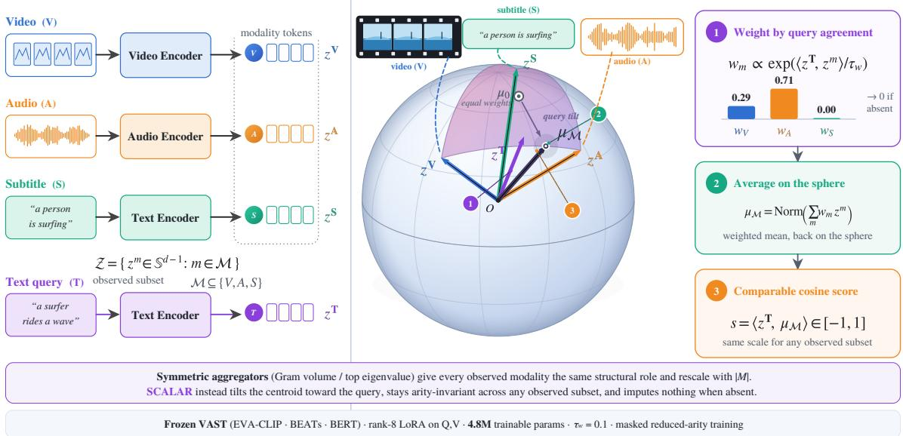
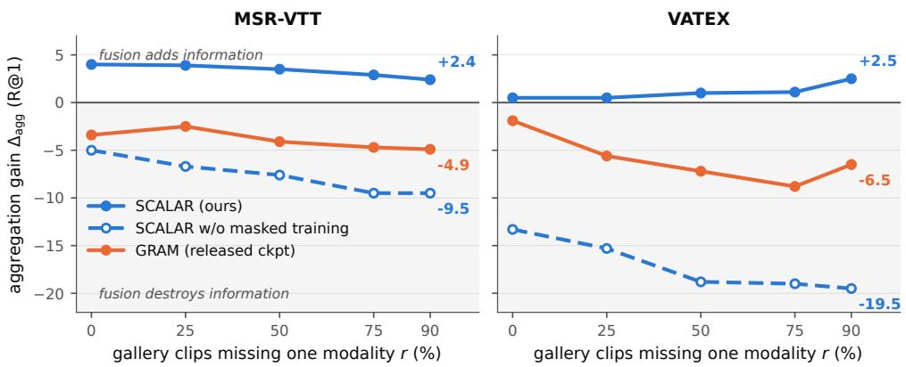
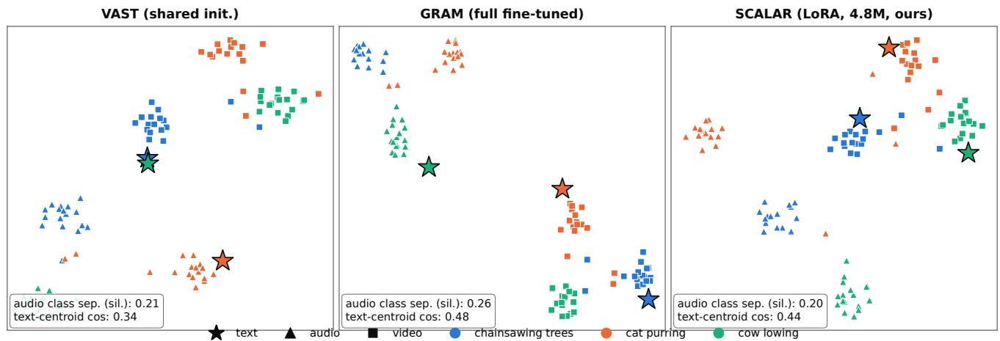

# Query-Conditioned Spherical Centroid Aggregation for Multimodal Retrieval

Ambuj Mehrish Anindya Nag Sebastiano Vascon

Department of Environmental Science, Informatics and Statistics

Ca’ Foscari University of Venice, Italy

{ambuj.mehrish, anindya.nag, sebastiano.vascon}@unive.it

## Abstract

Multimodal retrieval integrates video, audio, subtitles, and text; however, recent geometric aggregators, such as Gramian volumes, hyperbolic volumes, and spectral objectives, treat all modalities symmetrically. Under a unified evaluation protocol, their joint scores frequently lag behind the strongest single-modality pathway by 1.9 to 27.6 R@1. Controlled analyses attribute this outcome to uniform modality influence. This work introduces Spherical Centroid Aggregation with Learned Adaptive Relevance (SCALAR), a query-conditioned aggregator that assigns relevance-based weights to each available modality before computing a spherical centroid. SCALAR accommodates arbitrary modality subsets and is trained on masked, reduced-arity views using rank-8 LoRA adapters. Across five benchmarks, SCALAR achieves positive aggregation gain on four, reaching +4.0 R@1, while none of the evaluated prior aggregators is positive on more than one. A uniform-weight ablation reproduces the degradation observed with symmetric aggregation. With only 4.8 million trainable parameters, SCALAR attains the highest text-to-video R@1 on three benchmarks and performs within seed variation of the best result on a fourth. Under test-time modality dropout, SCALAR’s representationstage score surpasses the released GRAM checkpoint at every evaluated masking rate and benchmark by 3.2 to 10.9 R@1. Finally, as modalities are removed, rerankers trained exclusively on complete modality sets increasingly converge toward their video-only pathways, diminishing these representation-level gains and underscoring a limitation of standard two-stage retrieval pipelines.

## 1. Introduction

Recent advances in text-to-video retrieval increasingly employ multimodal base models [4, 5, 13, 42] that encode video, audio, and subtitle information into a unified embedding space for comparison with text queries. This progress has established modality aggregation as a distinct research challenge. Current methods move beyond pairwise similarity [8, 40] by introducing geometric objectives over the entire modality set, including the volume of the parallelotope [8] defined by the embeddings, its hyperbolic analogue [29], and the dominant eigenvalue of the Gram matrix [23]. The central hypothesis is that these more complex geometric forms capture cross-modal relationships that pairwise metrics may not detect. Nevertheless, these objectives are inherently symmetric, assigning each modality an equivalent structural role [19, 39] regardless of its relevance to the query. This symmetry may be restrictive, as the most informative modality can vary significantly and is often model-dependent. Consequently, a multimodal aggregation rule must meet a fundamental yet challenging criterion: it should outperform the strongest unimodal score.

Combining modalities does not consistently outperform the strongest unimodal representation [10, 17, 33, 35]. Previous research attributes this phenomenon to modality imbalance, competition during joint training [17], and noise introduced by fixed fusion [18]. This study investigates whether a similar trend occurs in geometric aggregation by comparing each joint score with its strongest single-modality pathway using a standardized protocol. Among prior methods, the joint score is lower than the strongest single-modality pathway for nearly every method and benchmark we measure, with deficits reaching 27.6 R@1 points (Table 4). We define this difference as aggregation gain: positive values indicate improvement over the strongest pathway, while negative values suggest that aggregation diminishes an otherwise informative signal.

The observed behavior is partly attributable to symmetric aggregation, which fails to adapt each modality’s contribution to the query. Substituting query-conditioned weights with uniform weights decreases aggregation gain by 7.0, 7.5, 4.0, and 11.2 R@1 points on MSR-VTT [38], DiDeMo [15], ActivityNet [3], and VATEX [34], respectively. Since the uniform spherical centroid exhibits deficits similar to geometric baselines that do not utilize volumes or eigenspectra, this effect appears to extend beyond any particular geometric construction. Symmetry is less detrimental when modality pathways provide comparable information, although volume scores may still be influenced by query-independent inter-modality terms. Collectively, these results support query-dependent modality weighting.

An effective aggregation rule must remain robust as modality availability changes. This variation is evident across the benchmarks: MSR-VTT and VATEX include video, audio, and subtitles, while DiDeMo, ActivityNet, and AudioCaps utilize only video and audio. Since geometric scores are influenced by the number of embeddings, the removal of a modality alters both the available evidence and the score scale. The proposed method addresses this challenge by using a query-conditioned spherical centroid that weights each observed modality according to its relevance to the query. The resulting cosine score is defined on a unified scale for any non-empty subset of modalities, eliminating the need for imputation or an additional fusion network. A single temperature parameter regulates weight concentration, and reduced-arity training combined with rank-8 LoRA adapts only 4.8 million parameters.

Our contributions are threefold. (i) SCALAR, a query-conditioned spherical centroid, defined as $w _ { m }$ ∝ $\exp ( \langle t , z _ { m } \rangle / \tau _ { w } )$ , which is applicable to any non-empty modality subset and is trained using rank-8 LoRA on 4.8 million parameters. This approach outperforms full finetuning under an identical training recipe by an average of 2.4 R@1. (ii) Aggregation gain, defined as the R@1 difference between the joint score and the strongest single pathway, serves as a diagnostic, under which prior geometric aggregators yield negative values in nearly every measurable case (Table. 4). (iii) We introduce a deterministic missing-modality protocol evaluated at five removal rates. Under this protocol, rerankers trained exclusively on complete modality sets converge toward their video-only pathways. Thus, representation-level robustness does not necessarily persist through two-stage retrieval (Table. 3).

## 2. Related Work

Multimodal Retrieval and Geometric Aggregation. Omni-modal models embed video, audio, subtitles, and text within a unified space for retrieval [4, 5, 13, 42]. VAST [5], which serves as the backbone for this study, treats subtitles as a primary modality alongside vision and audio. Recent approaches aggregate these streams using higher-order geometric techniques: GRAM [8] employs Gramian volume, HYPERGRAM [29] integrates Euclidean and hyperbolic volumes, and PMRL [23] optimizes the dominant eigenvalue of the Gram matrix. These scoring methods are symmetric with respect to the modalities and depend on their quantity. As a result, they do not consider queryspecific modality relevance and do not provide a directly comparable scale across different modality subsets.

Query-Conditioned Fusion. Query-dependent weighting is a well-established approach in expert-fusion methods, including MoEE [28], Collaborative Experts [24], MMT [11], and X-Pool [14]. Prior research also demonstrates that multimodal fusion may not surpass the strongest unimodal pathway when weakly informative streams introduce noise or compete during training [10, 33, 35]. In contrast to learned fusion networks, the proposed method derives modality weights directly from query–modality agreement.

Incomplete Modalities and Spherical Aggregation. Prior work addresses missing modalities through reconstruction, prompting, or robust representation learning [21, 26, 27, 36]. Retrieval adds a distinct requirement: scores obtained from different observed modality subsets must remain comparable. Our approach uses a weighted spherical mean [1, 2], defined for every non-empty set and returning a cosine similarity on a normalized scale. This robustness is enforced at the representation stage, since a downstream reranker can only reorder candidates retrieved by the initial encoder [12, 22].

## 3. Method

## 3.1. Problem Setup and Motivation

We address text-based retrieval across samples that may include video, audio, and, when available, subtitles. Let ${ \mathcal { M } } \subseteq \{ V , A , S \}$ represent the observed modalities, $\mathcal { Z } =$ $\{ z ^ { m } \in \mathbb { S } ^ { d - 1 } : m \in \mathcal { M } \}$ their normalized embeddings, and $\bar { z } ^ { T } \in \mathbb { S } ^ { d - 1 }$ the query embedding. Our objective is to define a similarity function $s ( z ^ { T } , \mathcal { Z } ) \in [ - 1 , 1 ]$ that enables ranking of samples with varying |M| without requiring arityspecific adjustments. Existing geometric scores based on the Gram matrix $G ,$ , such as $\textstyle { \sqrt { \operatorname* { d e t } ( G ) } }$ or $\lambda _ { 1 } ( G )$ , capture higher-order interactions but are sensitive to the number of embeddings: the volume changes dimensionality, and for k unit vectors, $\operatorname { t r } ( G ) = k$ and $1 \leq \lambda _ { 1 } ( G ) \leq k .$ . Additionally, their symmetry precludes explicit query-dependent weighting, even though the most informative modality may differ across queries. SCALAR resolves both issues by introducing a query-conditioned spherical centroid over the available modalities, as shown in Figure 1.

## 3.2. Query-Conditioned Spherical Aggregation

The spherical centroid of the observed modalities is

$$
\mu _ { \mathcal { M } } = \frac { \sum _ { m \in \mathcal { M } } z ^ { m } } { \left\| \sum _ { m \in \mathcal { M } } z ^ { m } \right\| } \in \mathbb { S } ^ { d - 1 } ,\tag{1}
$$

which is defined for any non-empty $\mathcal { M }$ . Uniform averaging, however, gives every observed modality equal influence. SCALAR instead weights each modality by its agree-

  
Figure 1. Overview of SCALAR. Query-dependent weights combine the observed modality embeddings into a normalized spherical centroid. Its cosine similarity to the query provides a common score for any non-empty modality subset, while absent modalities receive zero weight.

ment with the query and aggregates accordingly,

$$
\begin{array} { r l } & { w _ { m } ( z ^ { T } ) = \frac { \exp ( \langle z ^ { T } , z ^ { m } \rangle / \tau _ { w } ) } { \sum _ { m ^ { \prime } \in \mathcal { M } } \exp ( \langle z ^ { T } , z ^ { m ^ { \prime } } \rangle / \tau _ { w } ) } , } \\ & { \mu _ { \mathcal { M } } ( z ^ { T } ) = \frac { \sum _ { m \in \mathcal { M } } w _ { m } ( z ^ { T } ) z ^ { m } } { \left\| \sum _ { m \in \mathcal { M } } w _ { m } ( z ^ { T } ) z ^ { m } \right\| } , } \end{array}\tag{2}
$$

where the softmax is restricted to the observed set, so an absent modality receives exactly zero weight. The retrieval score is the cosine

$$
\begin{array} { r } { s ( z ^ { T } , \mathcal { Z } ) = \langle z ^ { T } , \mu _ { \mathcal { M } } ( z ^ { T } ) \rangle . } \end{array}\tag{3}
$$

Because the centroid is always normalized onto the unit sphere, this score remains in [−1, 1] irrespective of $| { \mathcal { M } } |$ The temperature $\tau _ { w }$ controls the degree of query specialization: $\tau _ { w } \to \infty$ recovers the uniform centroid of Eq. (1), whereas $\tau _ { w } \to 0$ approaches selection of the single most query-relevant modality. We use $\tau _ { w } = 0 . 1$

Efficient scoring. Although the centroid is query dependent, it need not be materialized for every query–sample pair. Substituting Eq. (2) into Eq. (3) gives

$$
s ( z ^ { T } , \mathcal { Z } ) = \frac { \sum _ { m } w _ { m } \langle z ^ { T } , z ^ { m } \rangle } { \sqrt { \sum _ { m , n } w _ { m } w _ { n } \langle z ^ { m } , z ^ { n } \rangle } } ,\tag{4}
$$

with sums over $m , n \in { \mathcal { M } }$ . The within-sample Gram matrix $\left[ \left. z ^ { m } , z ^ { n } \right. \right] \mathrm { i s } \left| \mathcal { M } \right| \times \left| \mathcal { M } \right|$ and is computed once per sample, so scoring never stores a d-dimensional centroid per query–sample pair. Algorithm S1 of the supplement states the resulting scoring procedure.

## 3.3. Training

Reduced-arity views. Being defined for arbitrary modality subsets does not by itself ensure robustness to missing modalities. Let K denote the complete set of modalities available for a training sample. The probability of using the complete view is linearly annealed from 1 to 0.5 over the first 2000 steps; otherwise one modality $m ^ { \dagger } \sim \mathrm { U n i f } ( \mathcal { K } )$ is removed, giving ${ \mathcal { M } } = { \mathcal { K } } \setminus \{ m ^ { \dag } \}$ , provided at least two modalities remain. Masking is applied after encoding, so the complete and reduced-arity views are obtained from the same forward pass.

Retrieval alignment. For a batch of B matched text– sample pairs we form two $B \times B$ score matrices, differing only in which text conditions the weights,

$$
\begin{array} { r } { C _ { i j } = \langle z _ { i } ^ { T } , \mu _ { \mathcal { M } _ { j } } ( z _ { i } ^ { T } ) \rangle , } \\ { \tilde { C } _ { i j } = \langle z _ { i } ^ { T } , \mu _ { \mathcal { M } _ { j } } ( z _ { j } ^ { T } ) \rangle , } \end{array}\tag{5}
$$

so that in $C$ every candidate is re-aggregated with respect to the query that scores it, matching inference, whereas in $\tilde { C }$ each candidate is aggregated once using its own paired text; $\tilde { C }$ is used by the semantic objective below. Retrieval is trained with symmetric InfoNCE [7, 30] over $S = C / \tau$

$$
\mathcal { L } _ { \mathrm { a l i g n } } = \frac { 1 } { 2 } \left[ \mathrm { I n f o N C E } ( S ) + \mathrm { I n f o N C E } ( S ^ { \top } ) \right] ,\tag{6}
$$

where InfoNCE [7, 30] is taken over the batch with matched pairs on the diagonal, $\tau = 0 . 0 7$ , and label smoothing 0.1.

Cross-arity consistency. Writing $s _ { \mathcal { M } } ~ = ~ \langle z ^ { T } , \mu _ { \mathcal { M } } ( z ^ { T } ) \rangle$ and $s _ { \mathcal { K } } = \mathcal { \bar { \langle } } z ^ { T } , \mu _ { \mathcal { K } } ( z ^ { T } ) \mathcal { \bar { \rangle } }$ for the positive-pair scores of the reduced and complete views of a sample, we tie the two views through

$$
\mathcal { L } _ { \mathrm { m a s k } } = 1 - \langle \mu _ { \mathcal { M } } , \mu _ { K } \rangle + \left( s _ { \mathcal { M } } - \mathrm { s g } [ s _ { K } ] \right) ^ { 2 } ,\tag{7}
$$

where $\mathrm { s g } [ \cdot ]$ denotes the stop-gradient operation. The two terms are coupled to the gradient in distinct ways. The score term treats the complete-set score as a fixed reference, ensuring that calibration aligns the reduced view with the complete view, rather than allowing both to converge at an intermediate value that would not occur during testing. The direction term propagates gradients through both centroids, emphasizing that agreement across modalities is an intrinsic property required of the representation, rather than a target imposed by one view on the other. Freezing $\mu _ { \mathcal { K } }$ would exempt the complete-modality view from the constraint it is intended to impose.

Graded semantic supervision. A frozen sentence encoder defines affinities $\overline { { S _ { i j } ^ { * } } } ^ { - } = ( ( \cos ( e _ { i } , e _ { j } ) + 1 ) / 2 ) ^ { 1 / \tau ^ { * } }$ with $\tau ^ { * } = 0 . 5 .$ , retaining the top 64 neighbors per sample. Let $\Omega = \{ ( i , j ) : S _ { i j } ^ { * } > 0 \}$ denote the pairs with an observed target. The cache is sparsified, so an absent entry means the affinity is unknown rather than zero, and the calibration term below is therefore restricted to Ω. The semantic objective combines neighborhood matching with direct cosine calibration,

$$
\begin{array} { r l } & { \mathcal { L } _ { \mathrm { s e m } } = \mathrm { K L } \Big ( P ^ { * } \left\| \operatorname { s o f t m a x } ( \tilde { C } / \tau ) \right) } \\ & { \qquad + \mathbb { E } _ { ( i , j ) \in \Omega } \left[ \left( \tilde { C } _ { i j } - ( 2 S _ { i j } ^ { * } - 1 ) \right) ^ { 2 } \right] , } \end{array}\tag{8}
$$

with $P ^ { * } = \mathrm { s o f t m a x } ( S ^ { * } / \tau ^ { * } )$ , where the rescaling $2 S ^ { * } - 1$ maps affinities onto the cosine range [−1, 1]. The KL term does not admit the same restriction: it is normalized over the full row, and renormalizing over a support that varies per row would make the objective incomparable across rows. Absent entries there consequently enter at the softmax’s uniform baseline weight. The ranking term thus treats an unknown affinity as unremarkable, whereas the calibration term abstains from evaluating it. This objective employs C˜, allowing the graded targets to influence the embedding geometry independently of the query-conditioned weighting. Uniformity. Letting $\mu _ { i } ~ = ~ \mu _ { \mathcal { M } _ { i } } ( z _ { i } ^ { T } )$ denote the aggregated representation of sample i, we prevent global collapse by spreading the B representations of a batch over the sphere [32],

$$
\mathcal { L } _ { \mathrm { u n i f } } = \log \frac { 1 } { B ( B - 1 ) } \sum _ { i \neq j } \exp \bigl ( { - 2 \| \mu _ { i } - \mu _ { j } \| ^ { 2 } } \bigr ) .\tag{9}
$$

Full objective. Following GRAM [8], we retain the dataanchor matching loss $\mathcal { L } _ { \mathrm { D A M } }$ , which trains the second-stage

matching head with hard negatives, at its published weight of 0.1. The complete training objective is

$$
\mathcal { L } = \mathcal { L } _ { \mathrm { a l i g n } } + \mathcal { L } _ { \mathrm { s e m } } + \mathcal { L } _ { \mathrm { m a s k } } + 0 . 1 \mathcal { L } _ { \mathrm { u n i f } } + 0 . 1 \mathcal { L } _ { \mathrm { D A M } } .\tag{10}
$$

We apply the semantic and uniformity terms after a 500- step warm-up. Our method adds no aggregation network. We freeze the pretrained backbone and adapt its query and value projections with rank-8 LoRA [16] $( \alpha = 1 6 )$ , together with the lightweight projection and matching heads, giving 4.8 million trainable parameters against the full-backbone pretraining used by the compared methods. Sec. F.9 explains why we do not assign a trainable-parameter count to released checkpoints. Algorithm S2 summarizes one training step.

Inference The standard two-stage retrieval protocol is retained. SCALAR first scores the full candidate set using Eq. (4) and passes the top-50 samples to the backbone’s cross-encoder for final reranking. For incomplete samples, Eq. (2) is evaluated only over the observed set M. No modality is imputed, and no sample is discarded. The same cosine-based score applies unchanged across modality subsets.

## 4. Experiments

Datasets. We conduct evaluations on MSR-VTT [38], DiDeMo [15], ActivityNet Captions [3], VATEX [34], and AudioCaps [20], adhering to the dataset splits and modality configurations described in [8]. MSR-VTT and VATEX include video, audio, and subtitles, while the other datasets comprise video and audio only. For VATEX, we use the 431 downloadable test clips to ensure a consistent gallery across all methods. Additional dataset statistics are given in Table S2.

Implementation Details. The implementation builds upon VAST [5], which employs EVA-CLIP. ViT-g/141 [31] is utilized for video, $\mathrm { B E A T s ^ { 2 } }$ [6] for audio, and BERT-base3 [9] for both subtitles and text. Whereas baseline methods pretrain the entire VAST model, the proposed approach freezes the backbone and trains rank-8 LoRA adapters [16] (α=16) on the query and value projections, resulting in 4.8 million trainable parameters. Training is initialized from the VAST pretrained model and proceeds on the same 150,000- clip subset of VAST-27M used by the baselines; 136,674 of these clips remain downloadable. We train for five epochs on four NVIDIA A100 GPUs using AdamW [25], with a learning rate of $2 \times 1 0 ^ { - 5 }$ and a batch size of 128. The queryweighting temperature is set to $\tau _ { w } = 0 . 1$ , and the contrastive temperature is fixed at $\tau { = } 0 . 0 7$ . Reduced-arity views are sampled by annealing p from 1 to 0.5 over the first 2,000 steps. Complete hyperparameter settings are provided in Table S1.

Table 1. Zero-shot retrieval on MSR-VTT. §: published numbers (reference only). ⋆: authors’ released checkpoint, evaluated on our protocol. †: trained from the authors’ released code at their recipe. SCALAR: three seeds, ± sd on R@1.
<table><tr><td></td><td></td><td></td><td colspan="2">Text → Video</td><td colspan="2">Video → Text</td></tr><tr><td>Method</td><td>Adapter Mask</td><td></td><td>R@1</td><td>R@10</td><td>R@1</td><td>R@10</td></tr><tr><td colspan="7">(a) Foundation models</td></tr><tr><td>UMT-L (25M)§</td><td></td><td>x</td><td>40.7</td><td>71.8</td><td></td><td></td></tr><tr><td>LanguageBind® [42]</td><td></td><td>x</td><td>44.8</td><td>78.7</td><td>40.9</td><td>75.7</td></tr><tr><td>mPLUG-2⁸ [37]</td><td></td><td>x</td><td>47.1</td><td>79.0</td><td></td><td>一</td></tr><tr><td>VideoPrism-b8 [41]</td><td></td><td>x</td><td>51.4</td><td></td><td>50.2</td><td>一</td></tr><tr><td>VAST (27M)§ [5]</td><td>full-FT</td><td>x</td><td>50.7</td><td>74.4</td><td>一</td><td>一</td></tr><tr><td colspan="7">(b) Gramian-volume alignment</td></tr><tr><td>GRAM* [8]</td><td>full-FT</td><td>x</td><td>52.5</td><td>82.5</td><td>50.5</td><td>81.2</td></tr><tr><td>HyperGRAM† [29]</td><td>full-FT</td><td>x</td><td>54.0</td><td>82.0</td><td>51.9</td><td>81.1</td></tr><tr><td colspan="7">(c) Leading-eigenvalue alignment</td></tr><tr><td>PMRL* [23]</td><td>full-FT</td><td>x</td><td>54.3</td><td>79.5</td><td>52.9</td><td>79.4</td></tr><tr><td colspan="7">(d) Spherical centroid alignment (ours)</td></tr><tr><td>SCALAR (ours)</td><td>LoRA</td><td>√</td><td>54.6</td><td>84.9</td><td>50.5</td><td>78.7</td></tr><tr><td>SCALAR, full-FT (same recipe)</td><td>full-FT</td><td>√</td><td>50.4</td><td>82.1</td><td>50.5</td><td>80.4</td></tr></table>

Baselines. This study compares GRAM4 [8], PMRL5 [23], and HyperGRAM6 [29], which are three geometric aggregation methods built on a shared backbone architecture. We use GRAM as the primary baseline. Table S7 quantifies the spread by scoring the same GRAM checkpoint in three environments. Repeated runs vary by at most 0.2 R@1, which we treat as evaluation noise (Section B).

## 4.1. Zero-Shot Retrieval

Tables 1 and 2 report zero-shot retrieval results across the five benchmarks under the evaluation protocol of [8]. SCALAR achieves the highest text-to-video R@1 on MSR-VTT (54.6), outperforming PMRL (54.3) and GRAM (52.5), as well as achieving 90.6 on VATEX and 35.0 on AudioCaps. On ActivityNet, SCALAR attains 55.9±0.2, which is comparable to GRAM’s 56.3. On DiDeMo, SCALAR is 1.3 R@1 below PMRL. The relative ranking varies by adaptation strategy and retrieval direction. Low-rank and full-model adaptation. Full fine-tuning control employs the same training procedure as the proposed method, but updates the entire backbone instead of only the 4.8 million adapter parameters. In this configuration, text-to-video R@1 decreases by 4.2 on MSR-VTT, 2.2 on DiDeMo, 2.5 on ActivityNet, 1.3 on VATEX, and 2.0 on AudioCaps, with an average reduction of 2.4 R@1 across the five benchmarks. These findings indicate that low-rank adaptation is not merely a computational compromise. In the text-tovideo setting, it also aligns more closely with the proposed training objective. However, the ranking reverses for videoto-text R@1, where full fine-tuning is comparable to or outperforms low-rank adaptation on all five benchmarks. Thus, the relative advantage of each adaptation strategy depends on the retrieval direction.

Reverse-direction retrieval. This direction dependence is also evident in comparisons with baseline methods. For video-to-text R@1, SCALAR remains competitive but does not consistently match the strongest baseline. For instance, on MSR-VTT, SCALAR achieves 50.5, whereas PMRL attains 52.9. This asymmetry aligns with the objective’s design, which conditions modality aggregation on the text query and thus more directly supports text-to-video retrieval. Reporting the reverse direction clarifies the scope of the observed gains without assuming symmetric transfer.

## 4.2. Aggregation Gain

Table 4 presents the aggregation gain, defined as the difference between the joint score of a method and its strongest single-modality pathway. A positive value indicates that aggregation improves performance over each constituent pathway. Both scores are computed from the same checkpoint and embeddings, so this within-method comparison is unaffected by the environment-dependent offsets documented in Table S7. Constituent scores are given in Table S3. For geometric aggregators, the joint score is lower than the strongest single-modality pathway in 12 out of 14 measurable method-by-benchmark combinations (one-sided sign test, p=0.0065). GRAM demonstrates negative gains across all five benchmarks (ranging from −1.9 to −6.1), PMRL on four out of five (down to −27.6), and HyperGRAM on three out of four. The exceptions are PMRL on Audio-Caps (+1.4) and HyperGRAM on VATEX (+0.0), where the constituent pathways are similarly strong. These results suggest that symmetric aggregation is less sensitive to pathway imbalance when the modalities provide comparably informative signals, although dataset-specific factors may also contribute. In comparison, SCALAR achieves positive gains on four out of five benchmarks, including +4.0 on MSR-VTT, and a negative gain of −1.1 on DiDeMo.

Contribution of Query Conditioning. To assess the impact of query conditioning, the uniform-weight control substitutes query-dependent weights with a simple mean across modality embeddings, while maintaining the same trunk and training procedure. This approach results in aggregation gains of −7.0, −7.5, −4.0, and −11.2 on MSR-VTT, DiDeMo, ActivityNet, and VATEX, respectively. The observed decline persists even without a determinant, hyperbolic volume, or eigenspectrum, suggesting that uniform modality weighting, rather than any specific higher-order construction, is responsible. The modality-subset analysis in Table S5 reveals a similar pattern on MSR-VTT: the score of SCALAR increases from 41.2 to 42.1 and then 45.2 as modalities are added, whereas the corresponding volumebased scores decrease from 42.1 to 39.7 and then 38.7. Collectively, these comparisons demonstrate that query conditioning substantially contributes to aggregation gain.

Table 2. Zero-shot text-to-video retrieval on the transfer benchmarks. §: numbers as published (reference only; not comparable across environments). ⋆: the authors’ released checkpoint evaluated in our environment on our protocol. †: trained from the authors’ unmodified code at their published recipe (no checkpoint is released). SCALAR is one configuration over three seeds (± sd on R@1).
<table><tr><td rowspan="2"></td><td rowspan="2"></td><td rowspan="2"></td><td colspan="2">DiDeMo</td><td colspan="2">ActivityNet</td><td colspan="2">VATEX</td><td colspan="2">AudioCaps</td></tr><tr><td>Adapter Mask R@1</td><td>R@10</td><td>R@1</td><td>R@10</td><td>R@1</td><td>R@10</td><td>R@1</td><td>R@10</td></tr><tr><td colspan="10">(a) Foundation models</td></tr><tr><td>UMT-L (25M)§</td><td></td><td>x</td><td>48.6</td><td>79.0</td><td>41.9</td><td></td><td></td><td></td><td></td><td></td></tr><tr><td>LanguageBind⁸</td><td></td><td>x</td><td>39.9</td><td>74.6</td><td>41.0</td><td>80.0</td><td>一</td><td></td><td></td><td></td></tr><tr><td>mPLUG-2§</td><td></td><td>x</td><td>45.7</td><td>71.1</td><td></td><td>一</td><td></td><td></td><td></td><td>一</td></tr><tr><td>VideoPrism  ${ \bf - } { \bf b } ^ { \ S }$ </td><td></td><td>x</td><td>1</td><td>一</td><td>49.6</td><td>一</td><td>62.5</td><td></td><td></td><td>一</td></tr><tr><td> $\mathrm { V A S T } ( 2 7 \mathrm { M } ) ^ { \ S }$ </td><td>full-FT</td><td>x</td><td>49.5</td><td>76.9</td><td>51.4</td><td>83.6</td><td>82.1</td><td>96.8</td><td>一</td><td>一</td></tr><tr><td colspan="10">(b) Gramian-volume alignment</td></tr><tr><td>GRAM* [8]</td><td>full-FT</td><td>x</td><td>50.7</td><td>76.5</td><td>56.3</td><td>87.0</td><td>90.0</td><td>100.0</td><td>32.2</td><td>74.3</td></tr><tr><td>HYPERGRAM† [29]</td><td>full-FT</td><td>x</td><td>48.9</td><td>76.7</td><td>53.7</td><td>86.2</td><td>89.8</td><td>100.0</td><td></td><td></td></tr><tr><td colspan="10">(c) Leading-eigenvalue alignment</td></tr><tr><td>PMRL* [23]</td><td>full-FT</td><td>x</td><td>52.5</td><td>79.9</td><td>54.1</td><td>85.3</td><td>89.6</td><td>98.8</td><td>34.4</td><td>76.3</td></tr><tr><td colspan="10">(d) Spherical centroid alignment (ours)</td></tr><tr><td>SCALAR (ours)</td><td>LoRA</td><td>√</td><td>51.2</td><td>78.9</td><td>55.9</td><td>87.2</td><td>90.6</td><td>99.6</td><td>35.0</td><td>74.9</td></tr><tr><td>SCALAR, full-FT (same recipe)</td><td>full-FT</td><td>√</td><td>49.0</td><td>75.7</td><td>53.4</td><td>85.7</td><td>89.3</td><td>99.3</td><td>33.0</td><td>73.9</td></tr></table>

Table 3. Retrieval under missing modalities. Absolute text→video R@1 using each method’s own aggregation score when one modality is removed from a fraction r of gallery clips. Masks are deterministic and identical across methods; r=0 reproduces the main protocol. Figure 2 reports the complementary gain over each method’s unimodal pathway. ⋆: authors’ released checkpoint. For GRAM a missing modality is made an orthonormal axis rather than zero-filled, contributing a factor of one, so the determinant reduces to the sub-Gramian over the modalities each clip retains; zero-filling would instead force det G=0 for every masked clip and collapse the ranking among them (Sec. F.2). Two-stage results under the same masks are analyzed in Sec. F.3. PMRL is excluded because its released scoring does not reproduce the r=0 result through the masking harness, while HYPERGRAM provides no missing-modality evaluation path.
<table><tr><td></td><td>Method</td><td>0%</td><td>25%</td><td>50%</td><td>75%</td><td>90%</td></tr><tr><td>MSR-VTT</td><td>SCALAR (ours)</td><td>45.2</td><td>42.1</td><td>39.2</td><td>36.3</td><td>34.5</td></tr><tr><td></td><td>GRAM*</td><td>38.7</td><td>36.6</td><td>32.4</td><td>29.9</td><td>27.9</td></tr><tr><td></td><td>margin</td><td>+6.5</td><td>+5.5</td><td>+6.8</td><td>+6.4</td><td>+6.6</td></tr><tr><td>DiDeMo</td><td>SCALAR (ours)</td><td>34.3</td><td>31.1</td><td>27.5</td><td>24.0</td><td>22.5</td></tr><tr><td></td><td>GRAM*</td><td>28.2</td><td>24.8</td><td>22.0</td><td>19.7</td><td>18.1</td></tr><tr><td></td><td>margin</td><td>+6.1</td><td>+6.3</td><td>+5.5</td><td>+4.3</td><td>+4.4</td></tr><tr><td>ActivityNet</td><td>SCALAR (ours)</td><td>34.4</td><td>30.3</td><td>27.4</td><td>24.7</td><td>23.0</td></tr><tr><td></td><td>GRAM*</td><td>31.0</td><td>27.1</td><td>23.6</td><td>20.8</td><td>19.5</td></tr><tr><td></td><td>margin</td><td>+3.4</td><td>+3.2</td><td>+3.8</td><td>+3.9</td><td>+3.5</td></tr><tr><td>VATEX</td><td>SCALAR (ours)</td><td>81.7</td><td>78.7</td><td>71.5</td><td>64.0</td><td>61.0</td></tr><tr><td></td><td>GRAM*</td><td>75.6</td><td>69.8</td><td>61.7</td><td>53.1</td><td>51.5</td></tr><tr><td></td><td>margin</td><td>+6.1</td><td>+8.9</td><td>+9.8</td><td>+10.9</td><td>+9.5</td></tr><tr><td>AudioCaps</td><td>SCALAR (ours)</td><td>27.1</td><td>23.7</td><td>20.5</td><td>16.8</td><td>13.9</td></tr><tr><td></td><td>GRAM*</td><td>22.9</td><td>20.3</td><td>17.0</td><td>12.2</td><td>10.1</td></tr><tr><td></td><td>margin</td><td>+4.2</td><td>+3.4</td><td>+3.5</td><td>+4.6</td><td>+3.8</td></tr></table>

## 4.3. Robustness to Test-Time Missing Modalities

In practical scenarios, galleries may include incomplete modality sets. The available volume-based pipelines are not explicitly designed for this context and exclude clips with missing modalities during data loading. Therefore, this study evaluates the behavior of the respective scoring functions when a modality is unavailable at test time.

Protocol. A fraction $r ~ \in ~ \{ 0 , 2 5 , 5 0 , 7 5 , 9 0 \}$ % of gallery clips is assigned a masked modality. Masks are deterministically generated for each clip by hashing a fixed seed with the clip identifier, nested across rates, and shared among all methods. A masked modality is written as zeros in the common trunk, matching what a loader produces for an absent stream; presence is then recovered from the embedding norm before any score is formed, so the zeros are a transport convention and never reach an aggregation function as a vector. Each method applies its aggregation function to the modalities retained for each clip. The masked centroid is defined for any non-empty subset of modalities. In GRAM, the absent axis is made orthonormal rather than zero-filled: This approach ensures that the absent axis contributes a factor of exactly one to the determinant, which therefore reduces to the sub-Gramian over the modalities the clip retains—the method’s established lower-arity formula, already implemented for arities 2 to 4 across datasets. In contrast, zero-filling would introduce both a zero row and column in the Gram matrix, forcing det G = 0 for every masked clip and thereby collapsing the ranking among them. This approach is not adopted; instead, the baseline is given a treatment that its release does not support, which discards incomplete clips outright (Sec. F.2). The r=0 setting is byte-identical to the standard protocol and reproduces the main results. PMRL’s released weights can be loaded into the evaluation harness; however, its score at r=0 does not match the repository result (49.8 versus 54.3 R@1 on MSR-VTT). Therefore, we omit masked results for PMRL, as they would not provide a reliable comparison. HyperGRAM’s release does not include a missing-modality evaluation path.

Table 4. Aggregation gain: joint multimodal T→V R@1 minus the strongest single-modality R@1 from the same model. Positive values are bold; negative values indicate reduced performance. ⋆: authors’ released checkpoint; †: trained from the authors’ code. The uniformweight variant removes query conditioning while retaining the centroid and model trunk; Table 5 examines masked-view training. Baseline gains are computed from each model’s embeddings using its published scoring function in a shared environment. Constituent scores are given in Tab. S3.
<table><tr><td>Method</td><td>MSR-VTT</td><td>DiDeMo</td><td>ActivityNet</td><td>VATEX</td><td>AudioCaps</td></tr><tr><td>GRAM* [8]</td><td>-3.4</td><td>-3.8</td><td>-5.8</td><td>-1.9</td><td>-6.1</td></tr><tr><td>PMRL* [23]</td><td>-12.2</td><td>-9.6</td><td>-9.8</td><td>-27.6</td><td>+1.4</td></tr><tr><td>HYPERGRAM† [29]</td><td>-3.4</td><td>-0.1</td><td>-2.0</td><td>+0.0</td><td>一</td></tr><tr><td>SCALAR, uniform weights</td><td>-7.0</td><td>-7.5</td><td>-4.0</td><td>-11.2</td><td>+0.2</td></tr><tr><td>SCALAR, query-weighted (ours)</td><td>+4.0</td><td>-1.1</td><td>+0.3</td><td>+0.5</td><td>+1.4</td></tr></table>

Each method employs a checkpoint-specific crossencoder for reranking, with rerankers trained exclusively on complete modality sets. Under test-time masking, the two-stage result consequently reflects both the aggregation rule and the reranker’s response to inputs outside its training distribution. This overlap makes the first-stage effect difficult to isolate. At r=90%, the two-stage R@1 values closely match the corresponding video-only cosine scores: SCALAR achieves 33.2 compared to 32.1, and GRAM achieves 32.9 compared to 32.8 (Table S4). The performance gap between methods also decreases from 2.3 points to within the range of evaluation variation on most benchmarks. Consequently, Table 3 reports each method’s first-stage score, which is the component directly influenced by the aggregation intervention. Complete two-stage results for every masking rate are given in Section F.3. The convergence of the two-stage scores further indicates that robustness to missing modalities should be evaluated at both the representation and reranking stages.

Results. At every masking rate on every benchmark, SCALAR obtains the highest first-stage R@1 among the methods evaluated (exact one-sided sign test over the individual cells, $p = 3 \times 1 0 ^ { - 8 }$ ; treating each benchmark as a single unit rather than each cell, $p \ = \ 0 . 0 3 1 )$ . The observed margin ranges from 3.2 to 10.9 R@1. It remains relatively stable on MSR-VTT and ActivityNet, increases on VATEX (+6.1 to +10.9 at 75% masking), and decreases on DiDeMo (+6.1 to +4.4) and AudioCaps (+4.2 to +3.8). Figure 2 provides the corresponding within-method view. Relative to its own strongest single pathway, SCALAR retains positive aggregation gain across all masking rates on

MSR-VTT (+4.0 to +2.4) and VATEX (+0.5 to +2.5), whereas GRAM’s gain on VATEX falls from −1.9 to −8.8 at 75% masking. On AudioCaps, the gain of SCALAR becomes negative at high masking rates, suggesting that the remaining modalities do not fully compensate when the principal audio signal is absent.

Effect of masked-view training. Omitting masked views during training degrades the text–audio pathway by 17 to 39% relative across the five benchmarks while leaving the video pathway essentially unchanged. At r=0, the aggregation gain falls from +4.0 to −5.0 on MSR-VTT and from +0.5 to −13.3 on VATEX; at r=90% the corresponding values are −9.5 and −19.5 (Fig. 2, open markers). This difference occurs with minimal change to the completemodality two-stage score (Tab. 5). This comparison demonstrates that query-conditioned weighting and masked-view training provide complementary benefits: the former adjusts modality relevance for each query, while the latter exposes the model to variations in modality availability.

## 4.4. Objective Ablation

Table 5 removes each objective component from the reported configuration without further retuning. At the twostage metric, the resulting differences remain within seed variation, consistent with the compression introduced by reranking in §4.3. We therefore also report mean aggregation gain and its masked counterpart, which more directly reflect the components targeted by these losses.

Masked-view training produces the largest ablation effect: removing it decreases aggregation gain by 6.5 points, or 7.1 points under masking, while altering the two-stage score by only −0.8 and maintaining stability in the video pathway. Removing $\mathcal { L } _ { \mathrm { m a s k } }$ costs 1.5 points of aggregation gain while changing the two-stage score by only 0.1. Excluding $\mathcal { L } _ { \mathrm { s e m } }$ or ${ \mathcal { L } } _ { \mathrm { u n i f } }$ reduces the gain by 0.9 and 0.4 points, respectively, without impacting parameter count or inference cost. These findings indicate that robustness primarily results from reduced-arity training and cross-arity agreement, with regularizers contributing to a lesser extent. The sign tests behind these counts are given in Section F.8.

  
Figure 2. Aggregation gain under missing modalities. Gain is each method’s masked score minus its own strongest unimodal score under the same masks; Table 3 reports absolute accuracy. SCALAR remains positive at all evaluated rates, whereas GRAM declines as masking increases. SCALAR without masked-view training shows a similar decline, suggesting that both query conditioning and masked view training help preserve aggregation benefits (Tables 4 and 5).

Table 5. Objective ablation: the reported configuration with one component removed, nothing retuned. The reference row shows absolute values; ablation rows show the change caused by the removal. ∆¯ : mean two-stage text→video R@1. $\bar { \Delta } _ { \mathrm { a g g } } :$ mean aggregation gain (Table 4); $\bar { \Delta } _ { \mathrm { a g g } } ^ { 9 0 } $ : the same under 90% test-time masking. Regularizers are not swept (’–’).
<table><tr><td>Objective</td><td>MSR-VTT</td><td></td><td>DiDeMo ActivityNet</td><td>VATEX</td><td>AudioCaps</td><td>Δ</td><td> $\bar { \Delta } _ { \mathrm { a g g } }$ </td><td> $\bar { \Delta } _ { \mathrm { a g g } } ^ { 9 0 }$ </td></tr><tr><td colspan="9">(a) core (not ablatable:  $\mathcal { L } _ { \mathrm { a l i g n } }$  is the objective)</td></tr><tr><td>full objective (T9)</td><td>54.8</td><td>51.5</td><td>55.8</td><td>90.5</td><td>35.2</td><td>一</td><td>+1.0</td><td>-0.5</td></tr><tr><td colspan="9">(b) mechanism: masked-view training</td></tr><tr><td>w/o masked training  $\mathrm { v i e w s } \left( p _ { \mathrm { f u l l } } { = } 1 \right)$ </td><td>53.8</td><td>50.4</td><td>54.7</td><td>90.5</td><td>34.5</td><td>-0.8</td><td>-6.5</td><td>-7.1</td></tr><tr><td>w/o Lmask (β=0)</td><td>54.8</td><td>51.0</td><td>55.8</td><td>90.3</td><td>35.4</td><td>-0.1</td><td>-1.5</td><td>+0.0</td></tr><tr><td colspan="9">(c) regularizers</td></tr><tr><td>w/o  $\mathcal { L } _ { \mathrm { s e m } } \left( \alpha { = } 0 \right)$ </td><td>54.2</td><td>50.2</td><td>56.3</td><td>91.2</td><td>35.8</td><td>-0.0</td><td>-0.9</td><td></td></tr><tr><td>w/o  $\mathcal { L } _ { \mathrm { u n i f } } \left( \lambda { = } 0 \right)$ </td><td>54.2</td><td>51.2</td><td>56.0</td><td>90.5</td><td>35.1</td><td>-0.2</td><td>-0.4</td><td>一</td></tr></table>

## 4.5. Analysis of Remaining Performance Gaps

In the final two-stage evaluation, SCALAR lags behind PMRL by 1.3 R@1 on DiDeMo and behind GRAM by 0.4 on ActivityNet, with the latter difference approaching the margin of evaluation variation. These performance gaps arise during method-specific reranking: prior to reranking, SCALAR outperforms GRAM on all five benchmarks by 3.4 to 6.5 R@1 (Table S3). On DiDeMo, reranking increases PMRL’s score by 23.8 points, compared to a 16.9- point improvement for SCALAR; on ActivityNet, GRAM gains 25.3 points while SCALAR gains 21.5. These results indicate that reranker compatibility partially accounts for the remaining performance differences, which aligns with the narrowing observed when modalities are missing. In VGGSound audio-visual classification, SCALAR shows lower transfer performance than GRAM (34.9±0.3 vs. 40.5 Acc@1). This performance gap is primarily due to the video pathway (31.3 vs. 35.0), rather than the aggregation method. Notably, SCALAR’s multimodal score continues to exceed its strongest unimodal pathway by 3.6 points. The GRAM result aligns with its published value within 0.1

Acc@1, thereby validating the evaluation protocol. Section F.6 details the decomposition, and Section F.5 presents the latent-space comparison.

## 5. Conclusion

In this paper, we re-examine geometric multimodal aggregation against a straightforward criterion: whether aggregation improves on the strongest individual modality within the same representation. Under a unified evaluation protocol, symmetric geometric aggregators frequently fail this criterion, motivating SCALAR, which applies a queryconditioned weighting to each modality’s contribution before computing a normalized spherical centroid. Across five retrieval benchmarks, SCALAR achieves positive aggregation gain on four while updating 4.8 million parameters, and outperforms GRAM at the representation stage across all masking rates on every benchmark. Ablation studies identify query-conditioned weighting and masked reducedarity training as the primary contributors. However, frozen rerankers can eliminate these first-stage gains when modalities are absent.

## References

[1] Arindam Banerjee, Inderjit S Dhillon, Joydeep Ghosh, Suvrit Sra, and Greg Ridgeway. Clustering on the unit hypersphere using von mises-fisher distributions. Journal of Machine Learning Research, 6(9), 2005.

[2] Samuel R Buss and Jay P Fillmore. Spherical averages and applications to spherical splines and interpolation. ACM Transactions on Graphics (TOG), 20(2):95–126, 2001.

[3] Fabian Caba Heilbron, Victor Escorcia, Bernard Ghanem, and Juan Carlos Niebles. Activitynet: A large-scale video benchmark for human activity understanding. In IEEE/CVF Conference on Computer Vision and Pattern Recognition (CVPR), 2015.

[4] Sihan Chen, Xingjian He, Longteng Guo, Xinxin Zhu, Weining Wang, Jinhui Tang, and Jing Liu. VALOR: Vision-audiolanguage omni-perception pretraining model and dataset. ArXiv preprint: arXiv:2304.08345, 2023.

[5] Sihan Chen, Handong Li, Qunbo Wang, Zijia Zhao, Ming-Ting Sun, Xinxin Zhu, and J. Liu. VAST: A vision-audiosubtitle-text omni-modality foundation model and dataset. In Neural Information Processing Systems (NeurIPS), 2023.

[6] Sanyuan Chen, Yu Wu, Chengyi Wang, Shujie Liu, Daniel Tompkins, Zhuo Chen, Wanxiang Che, Xiangzhan Yu, and Furu Wei. BEATs: Audio pre-training with acoustic tokenizers. In International Conference on Machine Learning, pages 5178–5193, 2023.

[7] Ting Chen, Simon Kornblith, Mohammad Norouzi, and Geoffrey Hinton. A simple framework for contrastive learning of visual representations. In International conference on machine learning, pages 1597–1607. PMLR, 2020.

[8] Giordano Cicchetti, Eleonora Grassucci, Luigi Sigillo, and Danilo Comminiello. Gramian multimodal representation learning and alignment. In International Conference on Learning Representations, pages 42128–42149, 2025.

[9] Jacob Devlin, Ming-Wei Chang, Kenton Lee, and Kristina Toutanova. BERT: Pre-training of deep bidirectional transformers for language understanding. In North American Chapter of the Association for Computational Linguistics (NAACL), pages 4171–4186, 2019.

[10] Chenzhuang Du, Jiaye Teng, Tingle Li, Yichen Liu, Tianyuan Yuan, Yue Wang, Yang Yuan, and Hang Zhao. On uni-modal feature learning in supervised multi-modal learning. In International Conference on Machine Learning, pages 8632–8656. PMLR, 2023.

[11] Valentin Gabeur, Chen Sun, Karteek Alahari, and Cordelia Schmid. Multi-modal transformer for video retrieval. In European Conference on Computer Vision, pages 214–229. Springer, 2020.

[12] Gregor Geigle, Jonas Pfeiffer, Nils Reimers, Ivan Vulic,´ and Iryna Gurevych. Retrieve fast, rerank smart: Cooperative and joint approaches for improved cross-modal retrieval. Transactions of the Association for Computational Linguistics, 10:503–521, 2022.

[13] Rohit Girdhar, Alaaeldin El-Nouby, Zhuang Liu, Mannat Singh, Kalyan Vasudev Alwala, Armand Joulin, and Ishan Misra. ImageBind one embedding space to bind them all.

In IEEE/CVF Conference on Computer Vision and Pattern Recognition (CVPR), pages 15180–15190, 2023.

[14] Satya Krishna Gorti, Noel Vouitsis, Junwei Ma, Keyvan¨ Golestan, Maksims Volkovs, Animesh Garg, and Guangwei Yu. X-pool: Cross-modal language-video attention for textvideo retrieval. In 2022 IEEE/CVF Conference on Computer Vision and Pattern Recognition (CVPR), pages 4996–5005, 2022.

[15] Lisa Anne Hendricks, Oliver Wang, Eli Shechtman, Josef Sivic, Trevor Darrell, and Bryan Russell. Localizing moments in video with natural language. In IEEE International Conference on Computer Vision (ICCV), pages 5804–5813, 2017.

[16] Edward J Hu, Yelong Shen, Phillip Wallis, Zeyuan Allen Zhu, Yuanzhi Li, Shean Wang, Lu Wang, and Weizhu Chen. Lora: Low-rank adaptation of large language models. arXiv preprint arXiv:2106.09685, 2021.

[17] Yu Huang, Chenzhuang Du, Zihui Xue, Xuanyao Chen, Hang Zhao, and Longbo Huang. What makes multi-modal learning better than single (provably). Advances in Neural Information Processing Systems, 34:10944–10956, 2021.

[18] Sarah Ibrahimi, Xiaohang Sun, Pichao Wang, Amanmeet Garg, Ashutosh Sanan, and Mohamed Omar. Audioenhanced text-to-video retrieval using text-conditioned feature alignment. IEEE/CVF International Conference on Computer Vision (ICCV), pages 12020–12030, 2023.

[19] Minoh Jeong, Zae Myung Kim, Min Namgung, Dongyeop Kang, Yao-Yi Chiang, and Alfred Hero. Anchors aweigh! sail for optimal unified multi-modal representations. arXiv preprint arXiv:2410.02086, 2024.

[20] Chris Dongjoo Kim, Byeongchang Kim, Hyunmin Lee, and Gunhee Kim. AudioCaps: Generating Captions for Audios in The Wild. In NAACL-HLT, 2019.

[21] Yi-Lun Lee, Yi-Hsuan Tsai, Wei-Chen Chiu, and Chen-Yu Lee. Multimodal prompting with missing modalities for visual recognition. In 2023 IEEE/CVF Conference on Computer Vision and Pattern Recognition (CVPR), pages 14943– 14952. IEEE, 2023.

[22] Junnan Li, Ramprasaath R. Selvaraju, Akhilesh Deepak Gotmare, Shafiq R. Joty, Caiming Xiong, and Steven C. H. Hoi. Align before fuse: Vision and language representation learning with momentum distillation. In Neural Information Pro cessing Systems, 2021.

[23] Xiaohao Liu, Xiaobo Xia, See-Kiong Ng, and Tat-Seng Chua. Principled multimodal representation learning. IEEE Transactions on Pattern Analysis and Machine Intelligence, 2026.

[24] Yang Liu, Samuel Albanie, Arsha Nagrani, and Andrew Zisserman. Use what you have: Video retrieval using representations from collaborative experts. arXiv preprint arXiv:1907.13487, 2019.

[25] Ilya Loshchilov and Frank Hutter. Decoupled weight decay regularization. arXiv preprint arXiv:1711.05101, 2017.

[26] Mengmeng Ma, Jian Ren, Long Zhao, Sergey Tulyakov, Cathy Wu, and Xi Peng. Smil: Multimodal learning with severely missing modality. In Proceedings of the AAAI con ference on artificial intelligence, pages 2302–2310, 2021.

[27] Mengmeng Ma, Jian Ren, Long Zhao, Davide Testuggine, and Xi Peng. Are multimodal transformers robust to missing modality? In 2022 IEEE/CVF conference on computer vision andpattern recognition (CVPR), pages 18156–18165. IEEE, 2022.

[28] Antoine Miech, Ivan Laptev, and Josef Sivic. Learning a text-video embedding from incomplete and heterogeneous data. arXiv preprint arXiv:1804.02516, 2018.

[29] Saiyang Na, Feng Jiang, Qifeng Zhou, Wenliang Zhong, Thao M. Dang, Yuzhi Guo, Hehuan Ma, Chunyuan Li, Weizhi An, and Junzhou Huang. Hyperbolic gramian volumes for multimodal alignment. In Proceedings of the IEEE/CVF Conference on Computer Vision and Pattern Recognition (CVPR), pages 37756–37765, 2026.

[30] Alec Radford, Jong Wook Kim, Chris Hallacy, Aditya Ramesh, Gabriel Goh, Sandhini Agarwal, Girish Sastry, Amanda Askell, Pamela Mishkin, Jack Clark, Gretchen Krueger, and Ilya Sutskever. Learning transferable visual models from natural language supervision. In International Conference on Machine Learning (ICML), 2021.

[31] Quan Sun, Yuxin Fang, Ledell Yu Wu, Xinlong Wang, and Yue Cao. EVA-CLIP: Improved training techniques for clip at scale. ArXiv preprint: arXiv:2303.15389, 2023.

[32] Tongzhou Wang and Phillip Isola. Understanding contrastive representation learning through alignment and uniformity on the hypersphere. In International conference on machine learning, pages 9929–9939. PMLR, 2020.

[33] Weiyao Wang, Du Tran, and Matt Feiszli. What makes training multi-modal classification networks hard? In 2020 IEEE/CVF Conference on Computer Vision and Pattern Recognition (CVPR), pages 12692–12702. IEEE, 2020.

[34] Xin Wang, Jiawei Wu, Junkun Chen, Lei Li, Yuan-Fang Wang, and William Yang Wang. Vatex: A large-scale, highquality multilingual dataset for video-and-language research. In IEEE/CVF International Conference on Computer Vision, pages 4581–4591, 2019.

[35] Nan Wu, Stanislaw Jastrzebski, Kyunghyun Cho, and Krzysztof J Geras. Characterizing and overcoming the greedy nature of learning in multi-modal deep neural networks. In International Conference on Machine Learning, pages 24043–24055. PMLR, 2022.

[36] Renjie Wu, Hu Wang, Hsiang-Ting Chen, and Gustavo Carneiro. Deep multimodal learning with missing modality: A survey. arXiv preprint arXiv:2409.07825, 2024.

[37] Haiyang Xu, Qinghao Ye, Mingshi Yan, Yaya Shi, Jiabo Ye, Yuanhong Xu, Chenliang Li, Bin Bi, Qiuchen Qian, Wei Wang, Guohai Xu, Ji Zhang, Songfang Huang, Feiran Huang, and Jingren Zhou. mPLUG-2: A modularized multimodal foundation model across text, image and video. In International Conference on Machine Learning, 2023.

[38] Jun Xu, Tao Mei, Ting Yao, and Yong Rui. Msr-vtt: A large video description dataset for bridging video and language. In IEEE/CVF Conference on Computer Vision and Pattern Recognition (CVPR), 2016.

[39] Wenzhe Yin, Pan Zhou, Zehao Xiao, Jie Liu, Shujian Yu, Jan-Jakob Sonke, and Efstratios Gavves. Towards uniformity and alignment for multimodal representation learning. arXiv preprint arXiv:2602.09507, 2026.

[40] Haochen You and Baojing Liu. Mover: Multimodal optimal transport with volume-based embedding regularization. In Proceedings of the 34th ACM International Conference on Information and Knowledge Management, pages 5444– 5448, 2025.

[41] Long Zhao, Nitesh Bharadwaj Gundavarapu, Liangzhe Yuan, Hao Zhou, Shen Yan, Jennifer J. Sun, Luke Friedman, Rui Qian, Tobias Weyand, Yue Zhao, Rachel Hornung, Florian Schroff, Ming Yang, David A. Ross, Huisheng Wang, Hartwig Adam, Mikhail Sirotenko, Ting Liu, and Boqing Gong. Videoprism: A foundational visual encoder for video understanding. In International Conference on Ma chine Learning, 2024.

[42] Bin Zhu, Bin Lin, Munan Ning, Yang Yan, Jiaxi Cui, Hongfa Wang, Yatian Pang, Wenhao Jiang, Junwu Zhang, Zongwei Li, Wancai Zhang, Zhifeng Li, Wei Liu, and Liejie Yuan. LanguageBind: Extending video-language pretraining to nmodality by language-based semantic alignment. In International Conference on Learning Representations (ICLR), 2024.

## A. Use of Large Language Models

Large language models were used to edit author-written text for grammar, clarity, terminology, and length. The technical content, experimental design, reported results, and interpretation were determined by the authors. The authors checked the revised text against the experimental records and take responsibility for the complete paper and supplementary material.

## B. Reproducibility

We will release the training and evaluation code, configuration files, scripts for generating tables and figures, and adapter weights corresponding to the reported configuration. All reported SCALAR results employ a single configuration across the five retrieval benchmarks; no benchmarkspecific learning rate, temperature, or schedule is used. Seeds 50, 51, and 52 differ solely in their random seed. The full-fine- tuning control follows the same training procedure but updates the full model instead of the low-rank adapters. The uniform-weight control disables query conditioning while retaining the same model and training procedure. Each objective ablation in Table 5 removes one component without retuning the remaining hyperparameters.

We evaluate GRAM and PMRL using checkpoints released by their respective authors. As HyperGRAM does not provide a checkpoint, it is trained from the authors’ released code following their published recipe. All evaluated methods utilize the VAST foundation model as the initial backbone and are assessed within the same evaluation environment and retrieval protocol. Published numbers are retained solely as reference values in the main paper. Code and checkpoints will be released publicly.

Deterministic missing-modality masks. For a clip identifier c and mask seed $\sigma ,$ we compute $H = \mathrm { M D } 5 ( \sigma \parallel c )$ The first 32-bit block of H defines a uniform value $u _ { c } \in$ $[ 0 , 1 )$ , and a clip is masked at rate $r$ when $u _ { c } < r$ . The next 32-bit block selects the modality index modulo the number of available modalities. Because the selected index is independent of r, the masked sets are nested: every clip masked at r remains masked at any $r ^ { \prime } > r$ . The same clip-level masks are used for every method, making each comparison paired.

Evaluation variation. Repeated evaluation of identical checkpoints over 15 cells produced an observed spread of at most 0.2 R@1. We therefore interpret differences of this magnitude cautiously. Training is not bitwise deterministic because it uses mixed precision and four-way data-parallel reduction; consequently, SCALAR results in the main comparison are reported as the mean and standard deviation over three seeds.

1: Input: query $z ^ { T } \in \mathbb { S } ^ { d - 1 }$ ; observed candidate embeddings $\{ z _ { m } \} _ { m \in M } ,$ , where $\emptyset \neq M \subseteq \{ V , A , S \}$ ; temperature $\tau _ { w }$

2: Compute query agreement $a _ { m } \gets \langle z ^ { T } , z _ { m } \rangle$ for each $m \in$ $M$

3: Normalize the query-conditioned weights over the observed set:

$$
w _ { m }  \frac { \exp ( a _ { m } / \tau _ { w } ) } { \sum _ { n \in { \cal M } } \exp ( a _ { n } / \tau _ { w } ) } .
$$

4: Retrieve or compute the candidate Gram matrix $G _ { m n } \gets$ $\left. z _ { m } , z _ { n } \right.$

5: Return

$$
s  \frac { \sum _ { m \in M } w _ { m } a _ { m } } { \sqrt { \sum _ { m , n \in M } w _ { m } w _ { n } G _ { m n } } } =  z ^ { T } , \mu _ { M } ( z ^ { T } )  .
$$

Algorithm S1. SCALAR score for one query–candidate pair

Compute. One SCALAR pretraining run takes approximately 11 hours on four NVIDIA A100 64 GB GPUs. Including the three reported seeds, controls, objective ablations, missing-modality evaluations, and baseline runs, the complete experimental study used approximately 900 GPUhours.

## C. Algorithms

Algorithm S1 gives the first-stage score for one query– candidate pair. The query–modality similarities require $O ( | M | d )$ operations. Once those similarities are available, the normalized weighted sum can be evaluated using the candidate’s cached $| M | \times | M |$ Gram matrix with $O ( | M | ^ { 2 } )$ scalar operations; no d-dimensional centroid must be stored for every query–candidate pair. A missing modality is excluded from M, and no embedding is imputed.

Algorithm S2 summarizes one training step. Masking is applied after encoding, so the complete and reduced-arity views share a single encoder forward pass. The reduced view requires only an additional aggregation.

The matrices $C$ and $\widetilde { C }$ differ only in the text embedding used to condition the candidate weights. In $C ,$ each candidate is re-aggregated for the query that scores it, matching inference. In ${ \widetilde { C } } ,$ each candidate is aggregated using its paired text, and the resulting matrix is used only by the graded semantic objective. In ${ \mathcal { L } } _ { \mathrm { m a s k } }$ , the stop-gradient is applied to the complete-set score $s \kappa .$ , which serves as the reference for the reduced view.

## D. Implementation Details

Table S1 lists the reported hyperparameters. The same configuration is used for all five retrieval benchmarks.

1: Input: a batch of B matched text–clip pairs, training step $t ,$ and each clip’s complete observed set $\kappa _ { i }$

2: Encode each available modality once and $\ell _ { 2 } \cdot$ -normalize the embeddings.

3: $\mathrm { S e t } p _ { \mathrm { f u l l } } \gets \operatorname* { m a x } ( 0 . 5 , 1 - 0 . 5 t / 2 0 0 0 )$ ).

4: For each clip $i ,$ use $\mathcal { M } _ { i } = \mathcal { K } _ { i }$ with probability $p _ { \mathrm { f u l l } }$ . Otherwise, if $\left| \ K _ { i } \right| \ > \ 2 ,$ , sample $m ^ { \dagger } \sim \mathrm { U n i f } ( { \mathcal { K } } _ { i } )$ and set $\mathcal { M } _ { i } = \mathcal { K } _ { i } \setminus \{ m ^ { \dagger } \}$ . Retain the complete set when only two modalities are available.

5: Form the complete and reduced query-weighted centroids and the two score matrices

$$
C _ { i j } = \left. z _ { i } ^ { T } , \mu _ { { \mathcal M } _ { j } } ( z _ { i } ^ { T } ) \right. , \qquad \widetilde { C } _ { i j } = \left. z _ { i } ^ { T } , \mu _ { { \mathcal M } _ { j } } ( z _ { j } ^ { T } ) \right. .
$$

6: Compute symmetric contrastive alignment from $C { : }$

$$
\begin{array} { r } { \mathcal { L } _ { \mathrm { a l i g n } } = \frac { 1 } { 2 } \Big [ \mathrm { I n f o N C E } ( C / \tau ) + \mathrm { I n f o N C E } ( C ^ { \top } / \tau ) \Big ] . } \end{array}
$$

7: Average the cross-arity consistency loss over the batch:

$$
\mathcal { L } _ { \mathrm { m a s k } } = \frac { 1 } { B } \sum _ { i = 1 } ^ { B } \left[ 1 - \langle \mu _ { \mathcal { M } _ { i } } , \mu _ { \mathcal { K } _ { i } } \rangle + ( s _ { \mathcal { M } _ { i } } - \mathrm { s g } [ s _ { \mathcal { K } _ { i } } ] ) ^ { 2 } \right] .
$$

8: After the 500-step warm-up, compute $\mathcal { L } _ { \mathrm { s e m } }$ from $\widetilde { C }$ and ${ \mathcal { L } } _ { \mathrm { u n i f } }$ using Eqs. (8) and (9) of the main paper; before that point, set both terms to zero.

9: Compute the hard-negative data-anchor matching loss ${ \mathcal { L } } _ { \mathrm { D A M } } .$ , drawing negatives using C.

10: Return

$$
\mathcal { L } = \mathcal { L } _ { \mathrm { a l i g n } } + \mathcal { L } _ { \mathrm { s e m } } + \mathcal { L } _ { \mathrm { m a s k } } + 0 . 1 \mathcal { L } _ { \mathrm { u n i f } } + 0 . 1 \mathcal { L } _ { \mathrm { D A M } } .
$$

## Algorithm S2. One SCALAR training step

Fixed contrastive temperature. We fix τ at 0.07. The calibration component of $\mathcal { L } _ { \mathrm { s e m } }$ supervises the absolute cosine scale, whereas the softmax component can absorb changes in scale through a learnable temperature. Fixing τ keeps the calibrated cosine target and the contrastive scale separate. The configuration validator therefore rejects the combination of cosine calibration and a learnable contrastive temperature.

Score matrices used by the objectives. The semantic objective uses ${ \widetilde { C } } ,$ , rather than C. This allows the graded targets to act on the embedding geometry while the retrieval objective uses the query-conditioned matrix that matches inference.

## E. Dataset Statistics

Continued-pretraining corpus. Our SCALAR runs, controls, ablations, and HyperGRAM retraining use the same nominal 150k-clip subset of VAST-27M. At the time of our experiments, 136,674 of these clips remained downloadable and formed the effective corpus for the runs we performed. Training uses five epochs; the resulting logs contain 5,330 optimizer steps. The released GRAM and PMRL checkpoints are evaluated as provided, so the exact set of clips available when those checkpoints were originally trained cannot be reconstructed from the artifacts alone.

Table S1. Hyperparameters for the reported SCALAR configuration. The three seeds differ only in the seed value.
<table><tr><td>Frozen backbone</td><td></td></tr><tr><td>Initialization Vision encoder</td><td>VAST foundation checkpoint EVA-CLIP ViT-g/14</td></tr><tr><td>Audio encoder</td><td></td></tr><tr><td></td><td>BEATs</td></tr><tr><td>Text encoder</td><td>BERT-base (subtitle and query)</td></tr><tr><td>Projection dimension d</td><td>512</td></tr><tr><td>Adaptation LoRA rank / α / dropout LoRA target modules</td><td>8 / 16 / 0.0</td></tr><tr><td>Other trainable modules</td><td>query and value projections projection and matching heads</td></tr><tr><td>Trainable parameters</td><td>4,763,650</td></tr><tr><td>Optimization</td><td></td></tr><tr><td>Optimizer</td><td>Adam  $N , \beta = ( 0 . 9 , 0 . 9 8 )$ </td></tr><tr><td>Learning rate / weight decay</td><td> $2 \times 1 0 ^ { - 5 } / 0 . 0 1$ </td></tr><tr><td>Gradient-norm clip</td><td>2.0</td></tr><tr><td>Schedule</td><td>linear; warm-up ratio 0.1</td></tr><tr><td></td><td></td></tr><tr><td>Batch size</td><td>128</td></tr><tr><td>Epochs / logged steps</td><td>5 / 5,330</td></tr><tr><td>Precision / parallelism</td><td>fp16 / DDP over four GPUs</td></tr><tr><td>Seeds</td><td>50,51,52</td></tr><tr><td></td><td></td></tr><tr><td>Aggregation and losses</td><td></td></tr><tr><td>Query-weight temperature τw</td><td>0.1</td></tr><tr><td>Contrastive temperature τ</td><td>0.07 (fixed)</td></tr><tr><td></td><td></td></tr><tr><td>Label smoothing</td><td>0.1</td></tr><tr><td> $\mathcal { L } _ { \mathrm { s e m } }$  weight α</td><td>1.0</td></tr><tr><td> ${ \mathcal { L } } _ { \mathrm { m a s k } }$  weightβ</td><td>1.0</td></tr><tr><td>Lunif weight λ</td><td>0.1</td></tr><tr><td></td><td></td></tr><tr><td>Lunif exponent scale</td><td>2.0</td></tr><tr><td> $\mathcal { L } _ { \mathrm { D A M } }$  weight</td><td>0.1</td></tr><tr><td>Semantic temperature τ*</td><td>0.5</td></tr><tr><td>Semantic neighbors retained</td><td>top 64</td></tr><tr><td>Calibration-term weight</td><td>1.0 for observed pairs</td></tr><tr><td>Loss warm-up</td><td>500 steps</td></tr><tr><td>Reduced-arity views</td><td></td></tr><tr><td>Pfull schedule</td><td> $1 . 0  0 . 5 ,$  linear</td></tr><tr><td>Annealing duration</td><td>2,000 steps</td></tr><tr><td>Dropped modalities</td><td>one, uniform over K</td></tr><tr><td>Minimum retained modalities</td><td>2</td></tr><tr><td>Inference</td><td></td></tr><tr><td>Sampled frames</td><td>8</td></tr><tr><td>Reranking depth</td><td></td></tr><tr><td></td><td>top 50</td></tr><tr><td>Evaluation batch size</td><td>64</td></tr><tr><td>Test-time mask rates r</td><td>0, 25, 50, 75, 90%</td></tr><tr><td>Mask seed</td><td>0</td></tr></table>

Table S2. Dataset statistics for the evaluated protocol. V , A, and S denote video, audio, and subtitles. VATEX is evaluated on the 431 test clips that remain downloadable; its absolute recalls are therefore compared only within the common gallery used in this work.
<table><tr><td>Dataset</td><td>Modalities</td><td>Train</td><td>Val</td><td>Test</td><td>Frames</td></tr><tr><td>MSR-VTT</td><td> $V , A , S$ </td><td>9,000</td><td></td><td>1,000</td><td>8</td></tr><tr><td>DiDeMo</td><td> $V , A$ </td><td>8,394</td><td>1,065</td><td>1,003</td><td>8</td></tr><tr><td>ActivityNet</td><td> $V , A$ </td><td>10,009</td><td></td><td>4,917</td><td>8</td></tr><tr><td>VATEX</td><td> $V , A , S$ </td><td>14,060</td><td></td><td>431</td><td>8</td></tr><tr><td>AudioCaps</td><td> $V , A$ </td><td></td><td>一</td><td>700</td><td>8</td></tr><tr><td>VGGSound-5K</td><td>V, A</td><td>一</td><td>1</td><td>5,000</td><td>8</td></tr></table>

Modality availability. The retrieval benchmarks cover two observed arities: MSR-VTT and VATEX use video, audio, and subtitles, whereas DiDeMo, ActivityNet, and AudioCaps use video and audio. The same SCALAR configuration is therefore evaluated at $| M | = 2$ and $| M | = 3$ . The test-time masking experiment additionally produces mixedarity galleries in which different candidates may have different observed modality subsets.

## F. Additional Results and Analysis

## F.1. Components of Aggregation Gain

Table S3 gives the two quantities used to compute each aggregation-gain entry in Table 4: the strongest singlemodality R@1 within a checkpoint and that checkpoint’s multimodal aggregation R@1. Values are rounded to one decimal place after evaluation.

ActivityNet and AudioCaps illustrate why the withincheckpoint decomposition is useful. On ActivityNet, GRAM has a stronger best single pathway than SCALAR (36.8 versus 34.1), but its aggregated score is lower (31.0 versus 34.4). AudioCaps shows a similar ordering: the best GRAM pathway is 29.0, compared with 25.7 for SCALAR, while the aggregated scores are 22.9 and 27.1, respectively. These cases suggest that the difference in aggregate performance is not explained solely by stronger unimodal encoders; the aggregation step materially affects the observed ordering.

## F.2. How the Gramian Baseline Sees a Missing Modality

The missing-modality comparison is only meaningful if the Gramian baseline is provided with a principled method to score an incomplete clip. The construction is therefore stated explicitly.

The obvious implementation is to zero-fill: substitute $z _ { m } ~ = ~ 0$ for the absent modality and computing the volume without modification. This approach is problematic, as it does not yield informative results. A zero vector introduces a zero row and a zero column into the Gram matrix $G ,$ so det $G = 0$ exactly, for every masked clip regardless of its content. Every masked clip receives the same constant score, the ranking among them is decided by tie-breaking, and any resulting number would measure the tie-break rule rather than the aggregator. We do not do this.

Instead, an absent modality is turned into an orthonormal phantom axis. Writing $p \in \mathsf { \Gamma } \{ 0 , 1 \} ^ { | M | + 1 }$ for the presence indicator (the query is always present), the masked Gramian

is

$$
\tilde { G } = G \odot ( p p ^ { \top } ) + \mathrm { d i a g } ( 1 - p ) ,\tag{S1}
$$

which zeroes the absent row and column and then writes a 1 on its diagonal. Expanding the determinant along that row gives det $\tilde { G } = 1 \cdot \operatorname* { d e t } G _ { P }$ , where $G _ { P }$ is the sub-Gramian over the present modalities: the absent axis contributes a factor of exactly one and the clip is scored at its own lower arity, with no imputed content and no discarded candidate. When $p = \mathbf { 1 }$ , the construction reproduces the unmasked volume exactly, so the $r { = } 0$ row of the table corresponds to the released baseline’s protocol, unmodified.

The same procedure and presence rule $\begin{array} { r } { ( \left\| z _ { m } \right\| \ \leq \ 0 . 5 , } \end{array}$ since present embeddings are unit-norm and the loader zero-fills any modality it cannot load) are applied during training, validation, and all evaluations, for every method. Both identities are verified in the unit tests: that the masked volume equals the directly computed lower-arity volume, and that it is distinct from the degenerate zero-fill case.

Two important consequences should be noted. First, this treatment is more favorable than the released implementation supports, which cannot represent an incomplete clip and instead discards it; the baseline is therefore not disadvantaged by the evaluation protocol. Second, it leaves a genuine asymmetry that the scores themselves cannot resolve: volumes at different arities are not on a common scale, so a mixed-arity gallery is ranked according to a quantity whose units vary across candidates, whereas SCALAR returns a cosine in [−1, 1] at every arity. This is considered part of the explanation for the gap observed in Table 3 rather than an artifact of it.

## F.3. Two-Stage Results Under Missing-Modality Masking

Table S4 reports the reranked R@1 values for the same masked cells used in Table 3, together with each method’s video-only cosine score at $r = 9 0 \%$ . The first-stage table in the main paper isolates the component directly modified by the aggregation rule. The two-stage values here additionally reflect how each checkpoint-specific, frozen reranker responds to inputs outside the complete-modality distribution on which it was trained.

The separation between methods is generally smaller after reranking than at the first stage, although the detailed ordering varies by dataset and masking rate. On MSR-VTT at $r = 9 0 \%$ , for example, the two-stage scores approach the corresponding video-only cosine values: 33.2 versus 32.1 for SCALAR and 32.9 versus 32.8 for GRAM. Larger differences remain on some other benchmarks, showing that the reranker does not reduce to the video pathway in every cell. The table therefore supports the stage-specific interpretation in the main paper: robustness should be assessed at both the representation and reranking stages.

Table S3. Components of aggregation gain: the best single-modality pathway (“best”), the method’s multimodal aggregate (“agg.”), and their difference in text-to-video R@1. Superscripts follow the main paper.
<table><tr><td></td><td colspan="3">MSR-VTT</td><td colspan="3">DiDeMo</td><td colspan="3">ActivityNet</td><td colspan="3">VATEX</td><td colspan="3">AudioCaps</td></tr><tr><td>Method</td><td>best</td><td>agg.</td><td>gain</td><td>best</td><td>agg.</td><td>gain</td><td>best</td><td>agg.</td><td>gain</td><td>best</td><td>agg.</td><td>gain</td><td>best</td><td>agg.</td><td>gain</td></tr><tr><td>GRAM*</td><td>42.1</td><td>38.7</td><td>-3.4</td><td>32.0</td><td>28.2</td><td>-3.8</td><td>36.8</td><td>31.0</td><td>-5.8</td><td>77.5</td><td>75.6</td><td>-1.9</td><td>29.0</td><td>22.9</td><td>-6.1</td></tr><tr><td>PMRL*</td><td>43.7</td><td>31.5</td><td>-12.2</td><td>38.3</td><td>28.7</td><td>-9.6</td><td>39.8</td><td>30.0</td><td>一 -9.8</td><td>81.2</td><td>53.6</td><td>-27.6</td><td>32.0</td><td> $3 3 . 4 \ \cdot + 1 . 4$ </td><td></td></tr><tr><td>HyperGRAM†</td><td>42.5</td><td>39.1</td><td>-3.4</td><td>32.1</td><td>32.0</td><td>-0.1</td><td>36.3</td><td>34.3</td><td>-2.0</td><td>78.0</td><td>78.0</td><td>+0.0</td><td></td><td></td><td></td></tr><tr><td>SCALAR, uniform weights</td><td>41.1</td><td>34.1</td><td>-7.0</td><td>34.5</td><td>27.0</td><td>-7.5</td><td>30.0</td><td>26.0</td><td>一 -4.0</td><td>80.3</td><td>69.1</td><td>-11.2</td><td>28.6</td><td> $2 8 . 8 \ \mathrm { \Omega + 0 . 2 }$ </td><td></td></tr><tr><td>SCALAR, query-weighted</td><td>41.2</td><td>45.2</td><td>+4.0</td><td>35.4</td><td>34.3</td><td>-1.1</td><td>34.1</td><td>34.4</td><td>+0.3</td><td>81.2</td><td>81.7</td><td>+0.5</td><td>25.7</td><td> $2 7 . 1 \ \cdot + 1 . 4$ </td><td></td></tr></table>

Table S4. Two-stage text-to-video R@1 under the masks used for Table 3 of the main paper. The final column gives each method’s video only cosine R@1 at $r = 9 0 \%$ . Bold marks the higher value within each dataset and rate; ties are both bold.
<table><tr><td>Dataset</td><td>Method</td><td>0%</td><td>25%</td><td>50%</td><td>75%</td><td>90%</td><td>COSTV @90%</td></tr><tr><td>MSR-VTT</td><td>SCALAR</td><td>54.8</td><td>47.8</td><td>41.1</td><td>37.0</td><td>33.2</td><td>32.1</td></tr><tr><td></td><td>GRAM*</td><td>52.5</td><td>47.0</td><td>40.9</td><td>35.4</td><td>32.9</td><td>32.8</td></tr><tr><td></td><td>margin</td><td>+2.3</td><td>+0.8</td><td>+0.2</td><td>+1.6</td><td>+0.3</td><td></td></tr><tr><td>DiDeMo</td><td>SCALAR</td><td>51.3</td><td>44.2</td><td>38.9</td><td>32.1</td><td>29.5</td><td>23.2</td></tr><tr><td></td><td>GRAM*</td><td>50.7</td><td>45.0</td><td>39.8</td><td>32.7</td><td>29.8</td><td>21.1</td></tr><tr><td></td><td>margin</td><td>+0.6</td><td>-0.8</td><td>-0.9</td><td>-0.6</td><td>-0.3</td><td></td></tr><tr><td>ActivityNet</td><td>SCALAR</td><td>55.8</td><td>47.9</td><td>40.0</td><td>33.8</td><td>30.7</td><td>23.7</td></tr><tr><td></td><td>GRAM*</td><td>56.3</td><td>48.3</td><td>41.4</td><td>35.5</td><td>32.3</td><td>24.8</td></tr><tr><td></td><td>margin</td><td>-0.5</td><td>-0.4</td><td>-1.4</td><td>-1.7</td><td>-1.6</td><td></td></tr><tr><td>VATEX</td><td>SCALAR</td><td>90.5</td><td>85.2</td><td>73.3</td><td>61.9</td><td>57.3</td><td>58.5</td></tr><tr><td></td><td>GRAM*</td><td>90.0</td><td>82.8</td><td>72.9</td><td>61.9</td><td>57.8</td><td>58.0</td></tr><tr><td></td><td>margin</td><td>+0.5</td><td>+2.4</td><td>+0.4</td><td>+0.0</td><td>-0.5</td><td></td></tr><tr><td>AudioCaps</td><td>SCALAR</td><td>35.2</td><td>24.6</td><td>19.2</td><td>13.2</td><td>9.9</td><td>10.2</td></tr><tr><td></td><td>GRAM*</td><td>32.2</td><td>26.0</td><td>21.0</td><td>15.5</td><td>11.4</td><td>9.5</td></tr><tr><td></td><td>margin</td><td>+3.0</td><td>-1.4</td><td>-1.8</td><td>-2.3</td><td>-1.5</td><td></td></tr></table>

## F.4. Modality-Subset Ladder

Table S5 evaluates each checkpoint with one fixed modality set for the entire gallery: {V}, {V, A}, or {V, A, S}. This differs from the missing-modality experiment, in which clips are masked independently and candidates of different arities compete in the same ranked list. The fixedsubset ladder measures how the score changes as evidence is added, but does not itself test cross-arity comparability.

On MSR-VTT, the SCALAR score increases from 41.2 to 42.1 and 45.2 as audio and subtitles are added, whereas the GRAM score decreases from 42.1 to 39.7 and 38.7. On VA-TEX, adding audio increases the SCALAR score from 81.2 to 81.9, and adding subtitles changes it slightly to 81.7; the full aggregate remains 0.5 above its video-only pathway. GRAM decreases from 77.5 to 75.6 when audio is added and is unchanged when subtitles are added. The {V} row also verifies that a one-element aggregate reduces to the text–video cosine for both scoring rules.

Table S5. Modality-subset ladder using each method’s first-stage aggregation score (text-to-video R@1). The full {V, A, S} value is the aggregate used in the main paper’s aggregation-gain analysis.
<table><tr><td>Dataset</td><td>Method {V}</td><td>{V, A}</td><td>{V, A, S}</td><td> $\Delta { _ { V  V A S } }$ </td></tr><tr><td rowspan="2">MSR-VTT</td><td>SCALAR</td><td>41.2 42.1</td><td>45.2</td><td>+4.0</td></tr><tr><td>GRAM*</td><td>42.1 39.7</td><td>38.7</td><td>-3.4</td></tr><tr><td rowspan="2">VATEX</td><td>SCALAR</td><td>81.2</td><td>81.9 81.7</td><td>+0.5</td></tr><tr><td>GRAM*</td><td>77.5</td><td>75.6 75.6</td><td>-1.9</td></tr></table>

## F.5. Latent-Space Analysis

Figure S1 compares embeddings from the shared VAST initialization, the fully fine-tuned GRAM checkpoint, and SCALAR. The t-SNE projection is used only for visualization. The numerical annotations are computed in the original embedding space with cosine distance over all eight dumped classes, rather than from the two-dimensional coordinates. For display, we show the three classes with the largest improvement in text–centroid cosine for both adapted models relative to the shared initialization.

Table S6. VGGSound-5K audio-anchored classification-asretrieval using 310 class labels as queries over 5,000 clips. Results are Acc@1/Acc@10 without reranking and are not directly comparable to the retrieval tables. The SCALAR Acc@1 entry reports three seeds (mean ± standard deviation).
<table><tr><td>Method</td><td>Acc@1</td><td>Acc@10</td></tr><tr><td>GRAM  $( \mathrm { p a p e r } ) ^ { \ S }$ </td><td>40.6</td><td>78.1</td></tr><tr><td>GRAM* SCALAR</td><td>40.5  $3 4 . 9 \pm 0 . 3$ </td><td>77.3 71.2</td></tr><tr><td>Pathway decomposition (SCALAR / GRAM*)</td><td></td><td></td></tr><tr><td>video pathway</td><td></td><td></td></tr><tr><td>audio pathway</td><td>31.3 / 35.0 27.0 / 26.3</td><td>63.9 / 68.4</td></tr><tr><td>SCALAR, uniform weights</td><td>35.9</td><td>63.3 / 66.4 72.7</td></tr></table>

Mean text–centroid cosine, computed between a class text embedding and the mean of that class’s video and audio embeddings, is 0.34 for VAST, 0.48 for GRAM, and 0.44 for SCALAR. Mean classwise audio silhouette is 0.21, 0.26, and 0.20, respectively. These measurements suggest that both adapted models move the text anchors relative to the shared initialization. On these particular diagnostics, SCALAR lies between or slightly below the shared initialization and the fully fine-tuned GRAM checkpoint; the visualization is therefore qualitative and is not used as evidence for the retrieval ranking.

## F.6. VGGSound Transfer and Protocol Check

Table S6 reports audio-anchored classification-as-retrieval on VGGSound-5K. SCALAR obtains 34.9 ± 0.3 Acc@1, compared with 40.5 for the released GRAM checkpoint. The pathway decomposition localizes part of this difference: the SCALAR video pathway is lower than GRAM’s (31.3 versus 35.0), whereas its audio pathway is slightly higher (27.0 versus 26.3). Its multimodal score is 3.6 points above its own stronger pathway, indicating positive aggregation gain within the SCALAR checkpoint even though its final transfer result is lower.

The uniform-weight control obtains 35.9 Acc@1, exceeding the query-conditioned configuration in this setting. VGGSound uses short class labels rather than sentence queries, but the experiment does not isolate query length from the change in task and domain. We therefore treat this result as a boundary of the current evidence rather than attributing it to one factor. Finally, the released GRAM checkpoint obtains 40.5 Acc@1, within 0.1 of its published 40.6, providing an additional protocol-consistency check on this benchmark.

Table S7. Evaluation-environment audit on MSR-VTT text-tovideo-audio-subtitle two-stage R@1. The first three rows use the same released GRAM checkpoint; the last row is our GRAM retraining evaluated in our environment.
<table><tr><td>Weights</td><td>Evaluation environment</td><td>R@1</td></tr><tr><td>GRAM, released</td><td>published</td><td>54.8</td></tr><tr><td>GRAM, released</td><td>third-party reimplementation</td><td>53.4</td></tr><tr><td>GRAM, released</td><td>ours</td><td>52.5</td></tr><tr><td>GRAM, retrained by us ours</td><td></td><td>52.4 ±0.21</td></tr></table>

## F.7. Evaluation-Environment Audit

Table S7 evaluates the same released GRAM checkpoint in three environments. The measured MSR-VTT R@1 ranges from 52.5 to 54.8, which is larger than the 0.2 repeatedevaluation spread observed within our environment. This comparison motivates the main paper’s use of artifacts evaluated under one environment, with published values shown only for reference.

The offsets are not constant across datasets or methods. Relative to the published results, our HyperGRAM training is lower by 2.6, 2.4, and 4.5 R@1 on MSR-VTT, DiDeMo, and ActivityNet, respectively, but higher by 9.9 on the 431- clip VATEX gallery. The released GRAM checkpoint is lower by 2.3 on MSR-VTT and higher by 6.5 on that VA-TEX gallery. These values should not be read as a controlled estimate of one software component; they show why a single constant correction would be inappropriate.

## F.8. Statistical Support

Missing-modality sweep. SCALAR exceeds GRAM in all 25 masking-rate–benchmark cells in the main paper. Under an exact one-sided sign test with equal probability of either ordering, this gives $p = 2 . 9 8 \times 1 0 ^ { - 8 }$ . Because the five rates within a benchmark share nested masks and are not independent, a conservative summary that treats each benchmark as one unit is 5 of 5, giving $p = 0 . 0 3 1$

Aggregation gain. Twelve of the 14 measurable baseline method–benchmark cells have negative aggregation gain. Under the same equal-probability sign-test null, the exact one-sided value is $p \ = \ 0 . 0 0 6 5$ . The method rows share checkpoints across benchmarks, so the cell-level test should be interpreted descriptively rather than as 14 fully independent trials.

Seed variation. Table S8 reports the mean, sample standard deviation, and a two-sided 95% t interval for the three SCALAR seeds. GRAM and PMRL are released checkpoints, and HyperGRAM is a single training run, so no comparable baseline variance estimate or two-sample test is available. The intervals therefore summarize variation across the three SCALAR runs only.

  
Figure S1. Joint t-SNE of text, video, and audio embeddings on a VGGSound subset for the shared VAST initialization, the fully fine-tuned GRAM checkpoint, and SCALAR. Stars denote class-text embeddings, squares denote video, and triangles denote audio. Panel annotations are computed in the original cosine space over all eight classes, whereas three classes are displayed.

Table S8. SCALAR seed statistics and single-run baseline results for two-stage text-to-video R@1. Baselines are released checkpoints or one training run, so only SCALAR has a variance estimate.
<table><tr><td>Dataset</td><td>SCALAR mean ± sd</td><td>95% CI</td><td>GRAM*</td><td>PMRL*</td><td>HyperGRAM†</td></tr><tr><td>MSR-VTT</td><td>54.6 ± 0.2</td><td>[54.1, 55.2]</td><td>52.5</td><td>54.3</td><td>54.0</td></tr><tr><td>DiDeMo</td><td>51.2 ± 0.3</td><td>[50.6, 51.9]</td><td>50.7</td><td>52.5</td><td>48.9</td></tr><tr><td>ActivityNet</td><td>55.9 ± 0.2</td><td>[55.6, 56.3]</td><td>56.3</td><td>54.1</td><td>53.7</td></tr><tr><td>VATEX</td><td>90.6 ± 0.1</td><td>[90.3, 90.9]</td><td>90.0</td><td>89.6</td><td>89.8</td></tr><tr><td>AudioCaps</td><td> $3 5 . 0 \pm 0 . 4$ </td><td>[34.0, 36.0]</td><td>32.2</td><td>34.4</td><td></td></tr></table>

## F.9. Trainable-Parameter Accounting

We report an exact trainable-parameter count only for configurations that we trained and instrumented. For a training run, this count is the number of parameters passed to the optimizer. A released checkpoint, by contrast, exposes floating-point tensors but does not record which tensors received gradients. Treating every stored tensor as trainable would also include buffers and task heads and is therefore not directly comparable.

Our full-fine-tuning control illustrates the difference. Counting parameters updated by the optimizer gives 1,242,890,226, whereas counting all floating-point checkpoint tensors gives 1,397,367,145, an 11% difference for the same model. A key-level comparison also finds a 720,896-parameter depth-projection head in our Hyper-GRAM and full-fine- tuning checkpoints. The shared trunk constructs this head, but it is not used by the modality configurations evaluated here; the released GRAM checkpoint does not contain it. We therefore state the comparison supported by a common definition: SCALAR updates 4,763,650 parameters, whereas the baseline methods use full-backbone pretraining, without assigning an artifactderived “trainable” count to released checkpoints.

## G. Limitations

Retrieval direction. The aggregation rule is explicitly conditioned on a text query and is designed for text-to-video retrieval. In video-to-text retrieval, SCALAR remains competitive but does not consistently match the strongest baseline, as reported in the main paper. The benefits observed in one retrieval direction should therefore not be assumed to transfer symmetrically.

Short label queries. On VGGSound, where the queries are class labels rather than sentences, the uniform-weight control is stronger than the query-conditioned configuration (Section F.6). Because the task and domain also change, this experiment does not by itself establish query length as the cause.

Backbone coverage. All experiments use VAST so that GRAM, PMRL, HyperGRAM, and SCALAR can be compared within a shared backbone family. Whether the same aggregation-gain patterns hold for other multimodal backbones remains to be evaluated.

Two-stage robustness. The first-stage separation between aggregators is often compressed after reranking, particularly under missing-modality masking (Section F.3). The present work diagnoses this interaction but does not train a reranker specifically for incomplete modality sets.

Continued-pretraining scale. Following the compared geometric-aggregation methods, continued pretraining uses a nominal 150k-clip subset rather than the full VAST-27M corpus. The conclusions therefore apply to the continuedpretraining regime evaluated here; their behavior at substantially larger training scale is not established.