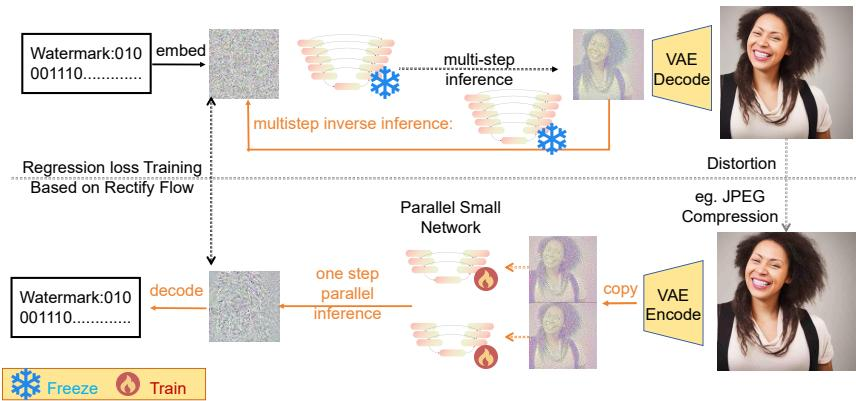

# RAIN: Region-Aware Inversion Network for Semantic Watermark Extraction

Zilai Li

Independent Researcher

## Abstract

Semantic watermarks for diffusion models embed ownership information into the generative process while preserving perceptual quality, but Gaussian-Shading extraction conventionally requires multi-step diffusion inversion to recover the initial noise. Recent one-step methods show that this cost can be reduced substantially. We study this problem through extended flow matching and conditional regression. The key observation is that, near the high-SNR image endpoint, recovering a useful noise statistic given by first step output result of the extended flow matching in the high-SNR regime is much simpler than reconstructing the full inverse trajectory, and Gaussian Shading only requires the recovered latent to remain in the correct watermark decision region. Based on this observation, we propose a lightweight, prompt-free extractor that decomposes endpoint recovery into an image-like anchor and a noise-oriented residual, which increases the capability of the model to utilize GPU parallel computation. The resulting method avoids iterative inversion and repeated evaluation of a diffusion-scale U-Net, providing an efficient one-step extraction pipeline with a concise theoretical interpretation. To extract a noise, its’ computation cost is lesser than both OSI and FARI.

## 1 Introduction

Diffusion watermarks [6, 8, 10, 22, 23, 24] embed ownership information into the generative process rather than modifying the final image after generation. Gaussian Shading (GS) [24] is a representative example: it encodes a secret message into the initial Gaussian noise while preserving its marginal Gaussian distribution. However, conventional GS extraction requires multi-step DDIM inversion [15] to recover the noise from the generated image. Although there exist algorithm aiming at improve DDIM inverse [20, 21], or reducing inference cost [3, 14, 18, 19, 27, 28, 30], both of those algorithm is not for watermark extraction. Recent one-step methods [5, 25] suggest that this expensive inverse process may be unnecessary.

Our first observation is that regression does not, in general, recover the particular noise that generated an observed image. If several noises are the starting points of the inference trajectory that ends at the same or similar image, an $L _ { 2 }$ regression objective learns the mean of noise. And this situation is possible, since the Gaussian noise is in a vast space, while the image only occupies a low-dimensional manifold. This is closely related to the intuition behind Tweedie’s formula [7]: under Gaussian corruption, when we sample a noisy image without knowing the original image, the best prediction is the mean of the possible images if we want to minimize the L2 distance between prediction and real images. For Gaussian Shading, this can be sufficient because watermark extraction only requires the predicted noise to preserve the encoded Gaussian regions. If there are different noise that generate the same image, then DDIM inverse will generate noise that different from original noise but the GS is still valid in such situaiton, so we further assume that the mean of those noise is good enough and don’t invalid the GS.

Our second observation comes from Rectified Flow [13]: In the high SNR region, the RF-2 algorithm will study the velocity field point to the means of noise that generate the current image. Explicitly, the interpolation between image and noise to get the niosy image in the training is non-causal and that trajectory contained different noisy images can only be used in training; the regression loss lets the model learn the conditional mean velocity of the possible trajectories passing through the current noisy image. Iteratively following this causal velocity field can still reproduce the desired image distribution. Therefore, predicting a conditional mean rather than a particular paired endpoint is already a standard mechanism of generative flow models.

This perspective makes one-step watermark extraction relate to especially simple task that generate image in the high-SNR regime of the inference. Explicilty, at high-SNR area, most of the generation process has already been completed, and the network only needs to learn the mean of the velocity or equivalent noise prediction that can complete the remaining part of the transport, which is an easy task. We therefore hypothesize that this high-SNR regression can be handled by a substantially smaller network than a full diffusion denoiser.

Based on these observations, we propose an aggressive lightweight estimator that directly predicts a recoverable Gaussian-Shading noise representation from an almost-clean image. Our method avoids iterative inversion and decomposes the endpoint regression into easier components, substantially reducing the computational cost of watermark extraction. The inference speed, parameter amount of our algorithm is both better than latest extraction method, like OSI and FARI.

## 2 Background

## 2.1 From DDPM Corruption to Extended Flow Matching and Rectified Flow

The DDPM algorithm use a special diffusion process [9] to gradually perturbs the sample image via random noise through a Markov chain,

$$
q ( X _ { t } \mid X _ { s } ) = { \mathcal { N } } { \Big ( } { \sqrt { 1 - \beta _ { t } } } X _ { s } , \beta _ { t } I { \Big ) } ,\tag{1}
$$

where $\{ \beta _ { t } \}$ is a predefined noise schedule. Although this process adds noise step by step, the reparameterization property of Gaussian transitions allows us to sample the noisy state at any timestep directly:

$$
X _ { t } = \sqrt { \bar { \alpha } _ { t } } X _ { 0 } + \sqrt { 1 - \bar { \alpha } _ { t } } \varepsilon , \qquad \varepsilon \sim \mathcal { N } ( 0 , I ) ,\tag{2}
$$

with $\begin{array} { r } { \bar { \alpha } _ { t } = \prod _ { s = 1 } ^ { t } ( 1 - \beta _ { s } ) } \end{array}$

Equation (2) reveals a useful interpretation of diffusion training. Instead of viewing DDPM only as a sequence of stochastic perturbations, each noisy sample $X _ { t }$ can be viewed as a point on a trajectory given by interpolation between a clean endpoint $X _ { 0 }$ and a Gaussian-noise endpoint ε. In the standard DDPM construction,

$$
X _ { 0 } \sim p _ { \mathrm { d a t a } } , \qquad \varepsilon \sim { \mathcal N } ( 0 , I ) , \qquad X _ { 0 } \perp \varepsilon ,\tag{3}
$$

so the two endpoints are sampled independently.

This interpolation viewpoint naturally connects DDPM to flow matching and Rectified Flow. More generally, let

$$
( X _ { 0 } , \varepsilon ) \sim \pi _ { 0 , \varepsilon }\tag{4}
$$

denote an arbitrary coupling between an image endpoint and a noise endpoint, and consider

$$
X _ { t } = \alpha _ { t } X _ { 0 } + \beta _ { t } \varepsilon ,\tag{5}
$$

where $\alpha _ { t }$ and $\beta _ { t }$ are differentiable schedules. In the standard rectifly flow, $\alpha _ { t } = 1 - t , \beta _ { t } = t$ . For a clean-to-noise convention, one may take $\alpha _ { 0 } = 1 , \beta _ { 0 } = 0$ and $\alpha _ { 1 } \approx 0 , \beta _ { 1 } \approx 1$ . The corresponding non-causal velocity is

$$
\begin{array} { r } { U _ { t } = \dot { \alpha } _ { t } X _ { 0 } + \dot { \beta } _ { t } \varepsilon . } \end{array}\tag{6}
$$

, in which $\dot { \alpha } _ { t }$ is the deviation of the $\alpha _ { t }$ with respect to $t ,$ and so the $\dot { \beta } _ { t }$

Once both endpoints are known, Eqs. (5)–(6) define a valid trajectory. However, this trajectory is non-causal as an inference rule: $U _ { t }$ generally depends on the hidden pair $( X _ { 0 } , \varepsilon )$ and therefore cannot be determined from the current state $X _ { t }$ alone. Consequently, the sample-wise interpolation is not yet a closed ODE that can be integrated during inference.

Flow matching resolves this problem by learning a deterministic vector field from the observable state. Under the squared regression objective

$$
\underset { \nu } { \operatorname* { m i n } } \ \mathbb { E } \left[ \| \nu ( X _ { t } , t ) - U _ { t } \| _ { 2 } ^ { 2 } \right] ,\tag{7}
$$

the population-optimal field [1] is:

$$
\nu ^ { * } ( x , t ) = \mathbb { E } [ U _ { t } \mid X _ { t } = x ] .\tag{8}
$$

Thus, when multiple endpoint pairs are compatible with the same intermediate state, the learned ODE does not recover the velocity of one particular non-causal trajectory. Instead, it predicts the conditional mean of all compatible velocities, producing a causal field that depends only on the current input state and time.

Importantly, neither flow matching nor Rectified Flow requires the two endpoints to be independent. Standard DDPM is only one special case, obtained by choosing the diffusion schedule in Eq. (2) together with the independent coupling $X _ { 0 } \perp \varepsilon$ . More generally, $X _ { 0 }$ and ε may be deterministically coupled, produced by a teacher sampler, or related through a previously learned generative model. Changing this coupling changes the conditional velocity field even when the endpoint marginals remain unchanged.

This distinction becomes important for inversion and distillation: two models may share the same image and noise marginals while inducing different image– noise pairings, and therefore different causal vector fields. A reverse solver derived for one coupling is not automatically the inverse of another.

## 2.2 Gaussian Shading

Gaussian Shading (GS) [24] embeds a watermark directly into the terminal Gaussian latent while preserving its marginal distribution. Let the latent have shape $c \times h \times w$ , let l denote the number of embedded bits per scalar, and let $f _ { c }$ and $f _ { h w }$ denote the channel and spatial repetition factors. The effective payload length is

$$
k = \left\lfloor \frac { l c h w } { f _ { c } f _ { h w } ^ { 2 } } \right\rfloor b i t s .\tag{9}
$$

The payload is first repeated according to $f _ { c }$ and $f _ { h w }$ and then encrypted with a stream cipher, producing an approximately uniform pseudorandom bit stream.

GS uses the encrypted bits to select equal-probability regions of the standard Gaussian distribution. For an l-bit symbol $i \in \{ 0 , \ldots , 2 ^ { l } - 1 \}$ , the corresponding interval is

$$
I _ { i } = \left( \Phi ^ { - 1 } \left( \frac { i } { 2 ^ { l } } \right) , \Phi ^ { - 1 } \left( \frac { i + 1 } { 2 ^ { l } } \right) \right] ,\tag{10}
$$

where Φ is the standard Gaussian CDF. A latent scalar is sampled from the Gaussian distribution truncated to the selected interval. Because the encrypted symbols are approximately uniform and the intervals have equal Gaussian probability, marginalizing over the symbols recovers the original standard Gaussian prior. Thus the watermark changes the latent region from which each scalar is sampled without changing the marginal distribution seen by the diffusion model.

Extraction reverses this procedure. An estimated terminal latent $\hat { z } _ { T }$ is mapped back to its Gaussian regions, the corresponding symbols are decrypted, and repeated watermark bits are aggregated by voting. For the common setting $l = 1$ , the two regions are simply the negative and positive halves of the Gaussian distribution, so extraction reduces to recovering the sign of each latent coordinate. Therefore GS does not require exact reconstruction of the original terminal noise: it only requires the recovered latent to preserve sufficiently many of the correct Gaussian decision regions.

## 3 Approach

## 3.1 One-Step Recovery as Conditional Regression

Let $X _ { 0 }$ denote the observed image-side latent, let ε denote the terminal Gaussian noise associated with the generated sample, and let D denote an optional image perturbation for adversarial attack. We write a general one-step estimator as

$$
\hat { \boldsymbol { \varepsilon } } = f ( \boldsymbol { \theta } , X _ { 0 } , D ) ,\tag{11}
$$

where $f$ denotes the complete estimator and θ denotes its learnable parameters. Under squared endpoint regression,

$$
\operatorname* { m i n } _ { \theta } \mathbb { E } \left[ \| f ( \theta , X _ { 0 } , D ) - \varepsilon \| _ { 2 } ^ { 2 } \right] ,\tag{12}
$$

For Eq 12, the optimal output is the corresponding mean of noise conditional on $X _ { 0 }$ . Thus, the estimator is not required to identify the noise that generates the image; it only needs to predict the conditional endpoint statistic supported by the observation. Using $L _ { 1 }$ regression, the optimization target is a conditional median. Predicting only the mean or median doesn’t matter, since if one image maps multiple noises, then the DDIM inverse will sample a noise that is different from the original noise, but that never invalidates the GS. So we assume predicting the mean or median of this sample also still does not invalidate the GS, and use experiments to test it.

For Gaussian Shading, this statistical relaxation is sufficient whenever the predicted endpoint remains in the same watermark decision region. Let GSDecK denote the complete GS decoder. Our requirement is

$$
\mathrm { G S D e c } _ { K } ( \hat { \pmb { \varepsilon } } ) = \mathrm { G S D e c } _ { K } ( \pmb { \varepsilon } ) ,\tag{13}
$$

rather than $\hat { \boldsymbol { \varepsilon } } = \varepsilon$ . This distinction is especially natural for the common $l = 1$ setting, where each scalar is decoded primarily through its sign and repeated coordinates are aggregated by voting.

## 3.2 High-SNR Endpoint Regression

The conditional-regression view follows directly from the extended flow-matching formulation in Sec. 2. For an arbitrary coupled image–noise pair, let

$$
X _ { t } = \alpha _ { t } X _ { 0 } + \beta _ { t } \varepsilon\tag{14}
$$

define a non-causal interpolation with velocity $U _ { t }$ used in the training. The corresponding causal field is

$$
\nu ^ { * } ( x , t ) = \mathbb { E } [ U _ { t } \mid X _ { t } = x ] .\tag{15}
$$

Previous research [12] already shows that, under the usual regularity assumptions, this causal velocity field induces the same marginal evolution as the non-causal interpolation. Importantly, the result does not require $X _ { 0 }$ and $\varepsilon$ to be independent. When we use original diffusion model to generate the noise-image pair, study the means of the velocity will provide a different trajectory, where the velocity in the high-SNR area will point to the means of possible noise that can generate this image. It also means predict the means of those noise can provide the velocity when we know the current $X _ { t }$

Near the image endpoint, the input $X _ { t }$ is already in a high-SNR regime. The estimator therefore does not need to reconstruct the complete noise-toimage/image-to-noise trajectory; it only needs to learn the endpoint statistic mean required by Eq. (13). This is a substantially simpler objective target than exact trajectory recovery and motivates using a lightweight network rather than repeatedly evaluating a diffusion-scale denoiser.

## 3.3 Endpoint Parameterization and Perturbation

Existing one-step estimators can also be written within Eq. (11). As one example, FARI uses the DDPM-style parameterization

$$
\hat { \pmb { \varepsilon } } = a _ { T } X _ { 0 } + b _ { T } \varepsilon _ { \pmb { \theta } } ( \widetilde { X } _ { 0 } , 0 ) ,\tag{16}
$$

where

$$
a _ { T } = \sqrt { \bar { \alpha } _ { T } } , \qquad b _ { T } = \sqrt { 1 - \bar { \alpha } _ { T } } ,\tag{17}
$$

and $\widetilde { X } _ { 0 } = D ( X _ { 0 } )$

Another normal setting of the $\hat { \boldsymbol { \varepsilon } }$ is directly predict the noise. Explicitly, it’s:

$$
\hat { \pmb { \varepsilon } } = \pmb { \varepsilon _ { \theta } } ( D ( X _ { 0 } ) )\tag{18}
$$

, we find that both those two function can succesfully extract the watermark even if we use a very small neural network to optimize the regresssion loss, and the Eq. 18 has a slight advantage on having a small MSE when we compare its output with the noise that generate the encode image.

The Eq. 16 is based on DDPM, and we find out that we can ultilize the GPU more efficiently when we use a heuristic formula based on DDIM, which will be discuss in the next subsection.

## 3.4 Anchor–Residual Reverse Estimator

Equation (11) allows the complete estimator to contain multiple learned components, and the Equation (16) just is one of the speical case given by DDPM, we also provide a DDIM version. Our design is motivated by a simple optimization consideration: directly mapping an image-like latent concentrated near the data manifold to a high-dimensional Gaussian noise vector spans two very different representation regimes. We therefore decompose the prediction so that the first network predicts an image-like target before the second network models the remaining noisy component.

For each noisy image $X _ { t }$ , the original diffusion model $G _ { \theta }$ can predict a clean image-like latent $X _ { 0 } ^ { * }$ . Let Y denote the observed latent after the image/VAE pathway. The first prompt-free network predicts an image-like anchor,

$$
\widehat { X } _ { 0 } = F _ { 0 } ( D ( Y ) ) .\tag{19}
$$

The output ${ \widehat { X } } _ { 0 }$ is a coarse or slightly blurred clean representation, and its target is obtained from the original inference process. Explicitly, in each timestep t, the diffusion model will input noisy image $X _ { t }$ and output a clean image $X _ { 0 } ^ { * } ( t )$ . Its training loss is

$$
\mathcal { L } _ { 1 } = \mathbb { E } \big [ \mathrm { D i s t } \big ( F _ { 0 } ( D ( Y ) ) , X _ { 0 } ^ { * } ( t ) \big ) \big ] ,\tag{20}
$$

, in the training, we fix $t = 0 . 9$

The second network predicts an intermediate representation conditioned on the observed latent,

$$
\widehat { X } _ { t } = F _ { 1 } \left( D ( Y ) \right) ,\tag{21}
$$

A lightweight head predicts its effective noise level,

$$
\widehat { t } = F _ { 2 } ( \widehat { X } _ { t } ) .\tag{22}
$$

Using the DDIM parameterization, the terminal noise estimate is reconstructed algebraically as

$$
\begin{array} { r l } & { \hat { \varepsilon } = f ( \theta , Y , D ) } \\ & { \quad = \sqrt { 1 - \bar { \alpha } _ { T } } \frac { \widehat { X } _ { t } - \sqrt { \bar { \alpha } _ { t } } S G ( \widehat { X } _ { 0 } ) } { \sqrt { 1 - \bar { \alpha } _ { \hat { t } } } } + \sqrt { \bar { \alpha } _ { T } } S G ( \widehat { X } _ { 0 } ) . } \end{array}\tag{23}
$$

where $S G ( \cdot )$ denotes stop gradient.

The second recovery loss directly supervises the final endpoint:

$$
\mathcal { L } _ { 2 } = \mathbb { E } \left[ \operatorname { D i s t } ( \hat { \boldsymbol { \varepsilon } } , \boldsymbol { \varepsilon } ) \right] .\tag{24}
$$

Rather than fixing the intermediate noise level given by t, we allow the model to learn an effective $\widehat { t . }$ During training, the timestep head is supervised on constructed interpolation states:

$$
X _ { t } ^ { \ast } = \sqrt { \bar { \alpha } _ { t } } X _ { 0 } ^ { \ast } + \sqrt { 1 - \bar { \alpha } _ { t } } \varepsilon ,\tag{25}
$$

with

$$
\mathcal { L } _ { 3 } = \mathbb { E } \big [ \mathrm { D i s t } \big ( F _ { 2 } ( X _ { t } ^ { * } ) , t \big ) \big ] .\tag{26}
$$

The complete training objective is

$$
\mathcal { L } _ { \mathrm { r e v } } = \lambda _ { 0 } \mathcal { L } _ { 1 } + \lambda _ { T } \mathcal { L } _ { 2 } + \lambda _ { \mathrm { r e g } } \mathcal { L } _ { 3 } .\tag{27}
$$

  
Figure 1: Extraction pipeline used in our implementation.

By utilizing this special structure, $F _ { 0 }$ and $F _ { 1 }$ can be inferred in parallel, and utilize the GPU more efficiently. But it requires a small neural network to predict the noisy level ofthe $X _ { t }$ , I think this is an acceptable cost.

Our implementation uses standard NAFNet [4] backbones. No text encoder, prompt embedding, or cross-attention is required during extraction, and the source diffusion U-Net is absent from the learned reverse path.

Adversarial distortion training. Robustness is handled through the perturbation argument D in Eq. (11). For each training sample, we construct a candidate set $\mathcal { D } _ { K }$ containing common image corruptions such as JPEG compression, resizing, cropping, masking, blur, noise, and brightness changes. We select the corruption that maximizes the current reverse-recovery loss,

$$
d ^ { * } = \arg \operatorname* { m a x } _ { d \in { \mathcal { D } } _ { K } } { \mathcal { L } } _ { \mathrm { r e v } } \big ( f ( \theta , Y , d ) \big ) ,\tag{28}
$$

and update the estimator using the selected example. This finite-set min–max procedure improves robustness without changing the underlying endpoint objective. Our whole algorithm are exhibit in Fig. 1.

## 4 Experiments

## 4.1 Ablation experiment

## 4.1.1 Current experimental setting

Our current reverse-distillation corpus stores the terminal Gaussian noise, final generated latent, conditional x0 target, and unconditional $x _ { 0 }$ target for each Stable Diffusion v1.5 [16] sample. The x0 targets are generated offline and loaded from the paired conditional and unconditional feature stores; no online one-step target generation is used during training or evaluation. All three trained extractors are prompt-free and use width-64 NAFNet [4] backbones with coordinatewise $L _ { 1 }$ endpoint supervision.

The principal model is a two-branch reverse estimator given by section 3.4. Its $F _ { 1 }$ branch and $F _ { 2 }$ branch are both standard NAFNet[4], each use two encoder stages with [5,5] blocks, 12 middle blocks, and two decoder stages with [5,5] blocks. The second branch additionally predicts an effective timestep and reconstructs terminal noise using Eq. (23). We compare it with two singlenetwork baselines, each using the larger [10, 10]/24/[10, 10] NAFNet architecture: DIRECT-x directly regresses terminal noise, while EPSILON-x predicts epsilon and converts it to $x _ { T }$ with the terminal DDPM coefficients. The first one is describe in Eq. 18, and second is described by Eq. 16 All reported learned-model checkpoints correspond to 15,000 training iterations, the learning rate of the training is 1e-3, the optimizor is AdamW with Cosine Annealing LR scheduler. The training set contains 89600 image-noise pair. meanwhile, all of the loss weight in the Eq. 27 is weight.

To evaluate watermarks extraction, the text-to-image generation at $5 1 2 \times 5 1 2$ resolution use Stable Diffusion v1.5 [16] and COCO captions [11]. Gaussian Shading uses $f _ { c } = 1 , f _ { h w } = 8 , l = 1$ , assume $1 0 ^ { 6 }$ users, and a target false-positive rate is $1 0 ^ { - 6 }$ . Images are generated with the Diffusers UniPC scheduler [29] for 15 steps at guidance scale 5.5. For every caption, we use a watermarked noise to generate image; we extract the watermark via: 1. choose Gaussian niose and generate image, 2. β-VAE [2] decode Latent 3. β-VAE encode image, 4. One step extraction without caption.

## 4.1.2 Baselines

In the ablation study, the current comparison set contains the following available configurations:

1. the prompt-free two-branch anchor–residual reverse estimator given by section 3.4;

2. the single-NAFNet directly extract xT given by Eq 16; and

3. the FARI-like single-NAFNet extraction given by Eq 18.

## 4.1.3 Metrics

We report raw latent sign agreement for l = 1, GS bit accuracy after decryption and voting, watermark detection rate, bit accuracy rate, and the traceability rate between recovered noise and its known terminal-noise ground truth.

## 4.1.4 Current results

We evaluate all six different combination on the same 1,000 cached COCO samples, which is direct $X _ { T }$ prediction, Fari-Like Prediciton, DDIM heuristic prediction, and all of them we test whether should we use advarserial training.

Table 1: SD v1.5 extractor ablation under the matched ten-condition imagedistortion protocol on 1,000 COCO captions. All six 15,000-iteration checkpoints use the same cached images, GS states, VAE pathway, and deterministic attack realizations.
<table><tr><td colspan="10">Bit accuracy (%) ↑</td></tr><tr><td></td><td></td><td></td><td>Crop/</td><td></td><td></td><td>G.</td><td></td><td>G.</td><td></td><td></td></tr><tr><td>Model</td><td>Clean</td><td>JPEG</td><td>mask</td><td>Drop</td><td>Resize</td><td>blur</td><td>Median</td><td>noise</td><td>S&amp;P</td><td>Bright.</td></tr><tr><td>No-Adv Fari-Like</td><td>99.99%</td><td>97.70%</td><td>93.67%</td><td>93.33%</td><td>98.50%</td><td>94.65%</td><td>99.04%</td><td>98.39%</td><td>91.31%</td><td>95.39%</td></tr><tr><td>No-Adv Direct-XT</td><td>99.99%</td><td>97.73%</td><td>93.70%</td><td>93.25%</td><td>98.51%</td><td>94.63%</td><td>99.06%</td><td>98.41%</td><td>91.33%</td><td>95.34%</td></tr><tr><td>No-Adv Two brach</td><td>99.99%</td><td>97.63%</td><td>91.59%</td><td>90.82%</td><td>98.42%</td><td>94.38%</td><td>98.99%</td><td>98.38%</td><td>91.28%</td><td>93.02%</td></tr><tr><td>Adv Fari-Like</td><td>100.00%</td><td>98.31%</td><td>94.51%</td><td>94.50%</td><td>99.03%</td><td>97.65%</td><td>99.26%</td><td>98.78%</td><td>93.81%</td><td>96.43%</td></tr><tr><td>Adv Direct-XT Adv Two brach</td><td>99.99%</td><td>98.32%</td><td>94.51%</td><td>94.49%</td><td>99.04%</td><td>97.68%</td><td>99.26%</td><td>98.79%</td><td>93.87%</td><td>96.47%</td></tr><tr><td></td><td>99.99%</td><td>98.15%</td><td>93.72%</td><td>93.64%</td><td>98.93%</td><td>97.24%</td><td>99.17%</td><td>98.67%</td><td>93.12%</td><td>96.09%</td></tr><tr><td colspan="9">Detection rate (%)↑</td><td></td></tr><tr><td>Model</td><td>Clean</td><td>JPEG</td><td>Crop/ mask</td><td>Drop</td><td>Resize</td><td>G. blur</td><td>Median</td><td>G. noise</td><td>S&amp;P</td><td>Bright.</td></tr><tr><td>No-Adv Fari-Like</td><td></td><td></td><td></td><td></td><td></td><td>100.00%</td><td></td><td>99.90%</td><td></td><td>97.60%</td></tr><tr><td>No-Adv Direct-Xτ</td><td>100.00% 100.00%</td><td>99.70% 99.70%</td><td>100.00% 100.00%</td><td>100.00% 100.00%</td><td>99.90% 100.00%</td><td>100.00%</td><td>100.00% 100.00%</td><td>99.90%</td><td>98.70% 98.80%</td><td>97.50%</td></tr><tr><td>No-Adv Two brach</td><td>100.00%</td><td>99.60%</td><td>100.00%</td><td>100.00%</td><td>100.00%</td><td>99.90%</td><td>100.00%</td><td>99.90%</td><td>98.50%</td><td>95.10%</td></tr><tr><td>AdvFari-Like</td><td>100.00%</td><td>99.80%</td><td>100.00%</td><td>100.00%</td><td>100.00%</td><td>100.00%</td><td>100.00%</td><td>99.90%</td><td>99.20%</td><td>97.80%</td></tr><tr><td>Adv Direct-Xτ</td><td>100.00%</td><td>99.80%</td><td>100.00%</td><td>100.00%</td><td>100.00%</td><td>100.00%</td><td>100.00%</td><td>99.90%</td><td>99.40%</td><td>98.10%</td></tr><tr><td>Adv Two brach</td><td>100.00%</td><td>99.70%</td><td>100.00%</td><td>100.00%</td><td>100.00%</td><td>100.00%</td><td>100.00%</td><td>99.90%</td><td>99.20%</td><td>97.80%</td></tr><tr><td colspan="9">Traceability rate (%) ↑</td></tr><tr><td></td><td></td><td></td><td>Crop/</td><td></td><td></td><td>G.</td><td></td><td>G.</td><td></td><td></td></tr><tr><td>Model</td><td>Clean</td><td>JPEG</td><td>mask</td><td>Drop</td><td>Resize</td><td>blur</td><td>Median</td><td>noise</td><td>S&amp;P</td><td>Bright.</td></tr><tr><td>No-Adv Fari-Like No-Adv Direct-XT</td><td>100.00%</td><td>99.40%</td><td>100.00%</td><td>100.00%</td><td>99.70%</td><td>99.70%</td><td>100.00%</td><td>99.50%</td><td>95.70%</td><td>95.80%</td></tr><tr><td>No-Adv Two brach</td><td>100.00%</td><td>99.40% 99.20%</td><td>100.00% 100.00%</td><td>100.00%</td><td>99.80%</td><td>99.70% 99.60%</td><td>100.00% 100.00%</td><td>99.60% 99.70%</td><td>95.80%</td><td>95.90% 92.00%</td></tr><tr><td>Adv Fari-Like</td><td>100.00%</td><td></td><td></td><td>99.90%</td><td>99.70%</td><td></td><td></td><td></td><td>96.10%</td><td>97.10%</td></tr><tr><td>Adv Direct-XT</td><td>100.00%</td><td>99.40% 99.50%</td><td>100.00% 100.00%</td><td>100.00% 100.00%</td><td>99.80% 99.90%</td><td>99.80% 99.90%</td><td>100.00% 100.00%</td><td>99.70% 99.80%</td><td>98.60% 98.30%</td><td>97.40%</td></tr><tr><td>Adv Two brach</td><td>100.00% 100.00%</td><td></td><td>100.00%</td><td></td><td>99.80%</td><td>99.70%</td><td>100.00%</td><td>99.70%</td><td>97.90%</td><td>96.50%</td></tr><tr><td></td><td></td><td>99.10%</td><td></td><td>100.00%</td><td></td><td></td><td></td><td></td><td></td><td></td></tr></table>

For every condition, all extractors receive the same attacked image and VAEencoded latent. Table 1 shows that adversarial training consistently improves robustness under severe distortions while preserving clean extraction accuracy. The direct-x and epsilon parameterizations remain closely matched, whereas the two-branch model is more sensitive without distortion training and recovers most of the gap after adversarial training.

Table 2 reports extractor-only wall-clock measurements on 100 clean cached images. This experiment deploy neural network on 2 RTX Pro 6000 GPU. We use FP32 inference, batch size 10, and three warm-up batches on the same two-GPU system. The single-NAFNet models use data parallelism, splitting each batch equally across the two devices, while the two-branch model places the x0 and xT branches on separate devices. Host-to-device input transfer, VAE encoding, and GS decoding are excluded; cross-device output gathering and terminal-noise reconstruction are included. The two-branch allocation requires 2.993–3.085 ms per image, compared with 4.847–4.977 ms for the single-network alternatives. Adversarial training changes the weights but not the architecture and has little effect on extraction latency.

Table 2: latency of extracting 100 watermarks when extractor deployed in Two-RTX Pro 6000 GPU. Single-network models use data parallelism; the two-branch model uses branch parallelism. Lower latency and higher throughput are better.
<table><tr><td>Method</td><td></td><td>Total (ms) ↓ ms/image ↓ images/s ↑</td><td></td></tr><tr><td>Direct xT-Normal</td><td>489.258</td><td>4.893</td><td>204.39</td></tr><tr><td>Epsilon → xT-Normal</td><td>484.709</td><td>4.847</td><td>206.31</td></tr><tr><td>Two-branch-Normal</td><td>299.330</td><td>2.993</td><td>334.08</td></tr><tr><td>Direct xT-adv</td><td>485.419</td><td>4.854</td><td>206.01</td></tr><tr><td>Epsilon → xT-adv</td><td>497.652</td><td>4.977</td><td>200.94</td></tr><tr><td>Two-branch-adv</td><td>308.505</td><td>3.085</td><td>324.14</td></tr></table>

Table 3: Matched SD v2.1 robustness comparison under the FARI-style imagedistortion protocol on 1,000 COCO captions. All methods use the same generated images, watermark states, VAE pathway, and deterministic attack realizations.
<table><tr><td rowspan="2">Distortion</td><td colspan="3">Bit accuracy ↑</td><td colspan="3">Detection rate ↑</td><td colspan="3">Traceability rate ↑</td></tr><tr><td>FARI</td><td>OSI</td><td>Ours</td><td>FARI</td><td>OSI</td><td>Ours</td><td>FARI</td><td>OSI</td><td>Ours</td></tr><tr><td>Clean VAE roundtrip</td><td>99.61%</td><td>99.69%</td><td>99.99%</td><td>99.80%</td><td>99.70%</td><td>100.00%</td><td>99.60%</td><td>99.60%</td><td>100.00%</td></tr><tr><td>JPEG (Q=25)</td><td>96.81%</td><td>98.37%</td><td>98.15%</td><td>99.70%</td><td>99.90%</td><td>99.70%</td><td>99.00%</td><td>99.70%</td><td>99.91%</td></tr><tr><td>Random crop/mask (0.6)</td><td>89.24%</td><td>94.04%</td><td>93.71%</td><td>99.20%</td><td>99.60%</td><td>100.00%</td><td>98.00%</td><td>99.10%</td><td>100.00%</td></tr><tr><td>Random drop (0.8)</td><td>88.47%</td><td>93.67%</td><td>93.63%</td><td>98.90%</td><td>99.30%</td><td>100.00%</td><td>97.70%</td><td>98.80%</td><td>100.00%</td></tr><tr><td>Resize (0.25)</td><td>96.05%</td><td>97.95%</td><td>98.93%</td><td>99.20%</td><td>99.50%</td><td>100.00%</td><td>98.30%</td><td>99.10%</td><td>99.80%</td></tr><tr><td>Gaussian blur (r=4)</td><td>92.04%</td><td>96.32%</td><td>97.24%</td><td>98.10%</td><td>99.10%</td><td>100.00%</td><td>97.50%</td><td>98.60%</td><td>99.70%</td></tr><tr><td>Median blur (k=7)</td><td>96.58%</td><td>98.42%</td><td>99.16%</td><td>99.30%</td><td>99.40%</td><td>100.00%</td><td>98.50%</td><td>99.20%</td><td>100.00%</td></tr><tr><td>Gaussian noise (σ = 0.05)</td><td>97.58%</td><td>99.03%</td><td>98.66%</td><td>99.90%</td><td>100.00%</td><td>99.90%</td><td>99.40%</td><td>99.80%</td><td>99.70%</td></tr><tr><td>Salt-and-pepper (p=0.05)</td><td>91.44%</td><td>99.71%</td><td>93.11%</td><td>99.30%</td><td>99.80%</td><td>99.20%</td><td>97.60%</td><td>99.80%</td><td>97.90%</td></tr><tr><td>Brightness (factor=6)</td><td>94.79%</td><td>96.78%</td><td>96.09%</td><td>98.60%</td><td>98.80%</td><td>97.80%</td><td>97.20%</td><td>98.60%</td><td>96.50%</td></tr></table>

## 4.2 Comparison with SOTA extraction

## 4.2.1 Robustness comparison protocol

For the matched SOTA comparison, we use Stable Diffusion v2.1-base for both generation and extraction. We evaluate the official FARI checkpoint and our adversarially trained SD v2.1 two-branch checkpoint on the same 1,000 COCO captions, seeds, GS keys, 512 × 512 images, 15-step UniPC schedule, and VAE re-encoding pathway. Each generated image is independently evaluated under all ten FARI-style conditions: the unmodified VAE roundtrip; JPEG quality 25; crop/mask ratio 0.6; random-drop ratio 0.8; resize ratio 0.25; Gaussian blur radius 4; median-filter kernel 7; additive Gaussian noise with standard deviation 0.05 on the [0,1] image scale; salt-and-pepper probability 0.05; and brightness factor 6. Attack randomness is deterministically seeded per caption and condition. The table 3 reports mean GS bit accuracy, detection rate, and traceability rate.

Table 4 compares the backbone cost of one latent-to-noise watermark-extraction pass. Our lightweight two-branch extractor requires only 14.394 GFLOPs and 7.148 GMACs, reducing computation by approximately 47.4× relative to FARI and 47.2× relative to OSI in FLOPs. It also uses only 15.468M total parameters, compared with 868.469M for FARI and 865.911M for OSI. FARI trains only

Table 4: Backbone cost of one latent-to-noise watermark extraction, measured with calflops; lower is better. Image encoding and GS decoding are excluded for all methods.
<table><tr><td>Method</td><td>GFLOPs↓</td><td>GMACs↓</td><td>Params (M) ↓</td></tr><tr><td>FARI</td><td>682.675</td><td>341.079</td><td>868.469</td></tr><tr><td>OSI</td><td>678.723</td><td>339.103</td><td>865.911</td></tr><tr><td>Ours</td><td>14.394</td><td>7.148</td><td>15.468</td></tr></table>

2.558M LoRA parameters, but extraction still executes and stores the frozen SD v2.1 U-Net. For a matched backbone comparison, image generation, latent encoding (including OSI’s encoder and quantizer), and GS decoding are excluded.

## 5 Conclusion

Gaussian Shading does not require a detector to reconstruct a unique floatingpoint terminal latent. Its cryptographic sampler partitions the Gaussian prior into finitely many equal-probability regions, and the final decoder only requires enough of those region labels to survive decryption and repetition voting. Extended flow matching and DDPM regression make the complementary statistical point: regression from a partially observed state naturally learns conditional statistics of hidden endpoints, not sample-specific hidden pairs. These two facts together motivate direct one-step watermark extraction.

We therefore formulate GS extraction as decision-region recovery and propose a prompt-free two-NAFNet reverse estimator trained with intentional $L _ { 1 }$ loss and finite-set adversarial image distortions. The two-branch anchor/interpolation parameterization is an optimization device rather than a claim that a new continuous trajectory has been derived.

## 6 Further Discussion

FARI’s curvature story is suspicious. FARI use a simple regression loss, which is different from the SOTA distillation loss [14, 17, 27, 28] that tend to generate a sample from the target distribution directly in one-step. The objective target given by FARI is the one equivalent to the extended RF2 aglorithm in the high SNR-stage [12]. And whether it can generate a sample in one-step is not given by the trajectory’s characteristic of the extended RF-1 algorithm, but the trajectory’s characteristic of the extended RF-2 algorithm. The trajectory story deem the watermark extraction as an sample generating process, but that is suspicious.

Latest DMD2 algorithm remove regression loss for the sake of the image generation. Another evidence that the regression loss would not let the model directly generate a real sample from the target distribution is the DMD2 [26] algorithm which remove the regression loss since it violate the distribution matching target.

Two Brach Structure for Inversion task The parallel structure is not special for the watermark extraction. For the RF1 an RF2 model aiming at predicting the final noise, we can distillate an already exist model by using a two brach structure neural network, since the velocity/noise prediction can be simply change to the clean image prediction, and, if the assumption that the trajectory of the forward inference and reverse inference is asymmetric is correct, then each velocity field of a given noisy image $X _ { t }$ exist two component: the clean image $X _ { 0 } ^ { * }$ and $U _ { \theta } - X _ { 0 } ^ { * }$ which can be study seperatly by two different NN. And in this process, the prompt maybe not necessary for the cross attention if we already have an input image.

## References

[1] Quentin Bertrand, Anne Gagneux, Mathurin Massias, and Rémi Emonet. On the closed-form of flow matching: Generalization does not arise from target stochasticity. arXiv preprint arXiv:2506.03719, 2025.

[2] Christopher P Burgess, Irina Higgins, Arka Pal, Loic Matthey, Nick Watters, Guillaume Desjardins, and Alexander Lerchner. Understanding disentangling in backslash beta-vae. arXiv preprint arXiv:1804.03599, 2, 2018.

[3] Defang Chen, Zhenyu Zhou, Can Wang, Chunhua Shen, and Siwei Lyu. On the trajectory regularity of ode-based diffusion sampling. arXiv preprint arXiv:2405.11326, 2024.

[4] Liangyu Chen, Xiaojie Chu, Xiangyu Zhang, and Jian Sun. Simple baselines for image restoration. In European Conference on Computer Vision, 2022.

[5] Yuwei Chen, Zhenliang He, Jia Tang, Meina Kan, and Shiguang Shan. Osi: One-step inversion excels in extracting diffusion watermarks. arXiv preprint arXiv:2602.09494, 2026.

[6] Hai Ci, Pei Yang, Yiren Song, and Mike Zheng Shou. Ringid: Rethinking tree-ring watermarking for enhanced multi-key identification. In European conference on computer vision, pages 338–354. Springer, 2024.

[7] Bradley Efron. Tweedie’s formula and selection bias. Journal of the American Statistical Association, 106(496):1602–1614, 2011.

[8] Samuel Gunn, Xuandong Zhao, and Dawn Song. An undetectable watermark for generative image models. In International Conference on Learning Representations, volume 2025, pages 6612–6637, 2025.

[9] Jonathan Ho, Ajay Jain, and Pieter Abbeel. Denoising diffusion probabilistic models. In Advances in Neural Information Processing Systems, volume 33, pages 6840–6851, 2020.

[10] Huayang Huang, Yu Wu, and Qian Wang. Robin: Robust and invisible watermarks for diffusion models with adversarial optimization. Advances in Neural Information Processing Systems, 37:3937–3963, 2024.

[11] Tsung-Yi Lin, Michael Maire, Serge Belongie, James Hays, Pietro Perona, Deva Ramanan, Piotr Dollár, and C. Lawrence Zitnick. Microsoft coco: Common objects in context. In European Conference on Computer Vision, pages 740–755, 2014.

[12] Qiang Liu. Rectified flow: A marginal preserving approach to optimal transport. arXiv preprint arXiv:2209.14577, 2022.

[13] Xingchao Liu, Chengyue Gong, and Qiang Liu. Flow straight and fast: Learning to generate and transfer data with rectified flow. In International Conference on Learning Representations, 2023.

[14] S Luo, Y Tan, S Patil, D Gu, P Von Platen, A Passos, L Huang, J Li, and H Zhao. Lcm-lora: A universal stable-diffusion acceleration module. arxiv 2023. arXiv preprint arXiv:2311.05556.

[15] Ron Mokady, Amir Hertz, Kfir Aberman, Yael Pritch, and Daniel Cohen-Or. Null-text inversion for editing real images using guided diffusion models. In Proceedings ofthe IEEE/CVF conference on computer vision andpattern recognition, pages 6038–6047, 2023.

[16] Robin Rombach, Andreas Blattmann, Dominik Lorenz, Patrick Esser, and Björn Ommer. High-resolution image synthesis with latent diffusion models. In Proceedings of the IEEE/CVF Conference on Computer Vision and Pattern Recognition, pages 10684–10695, 2022.

[17] Yang Song and Prafulla Dhariwal. Improved techniques for training consistency models. arXiv preprint arXiv:2310.14189, 2023.

[18] Yang Song, Prafulla Dhariwal, Mark Chen, and Ilya Sutskever. Consistency models. 2023.

[19] Vinh Tong, Trung-Dung Hoang, Anji Liu, Guy Van den Broeck, and Mathias Niepert. Learning to discretize denoising diffusion odes. In International Conference on Learning Representations, volume 2025, pages 47244–47282, 2025.

[20] Bram Wallace, Akash Gokul, and Nikhil Naik. Edict: Exact diffusion inversion via coupled transformations. In 2023 IEEE/CVF Conference on Computer Vision and Pattern Recognition (CVPR), pages 22532–22541. IEEE, 2023.

[21] Fangyikang Wang, Hubery Yin, Yuejiang Dong, Huminhao Zhu, Chao Zhang, Hanbin Zhao, Hui Qian, and Chen Li. Belm: Bidirectional explicit linear multi-step sampler for exact inversion in diffusion models. Advances in Neural Information Processing Systems, 37:46118–46159, 2024.

[22] Yuxin Wen, John Kirchenbauer, Jonas Geiping, and Tom Goldstein. Treerings watermarks: Invisible fingerprints for diffusion images. Advances in Neural Information Processing Systems, 36:58047–58063, 2023.

[23] Jindong Yang, Han Fang, Weiming Zhang, Nenghai Yu, and Kejiang Chen. T2smark: balancing robustness and diversity in noise-as-watermark for diffusion models. Advances in Neural Information Processing Systems, 38: 118642–118668, 2026.

[24] Zijin Yang, Kai Zeng, Kejiang Chen, Han Fang, Weiming Zhang, and Nenghai Yu. Gaussian shading: Provable performance-lossless image watermarking for diffusion models. In Proceedings of the IEEE/CVF Conference on Computer Vision and Pattern Recognition, pages 12162– 12171, 2024.

[25] Yang et al. Fari: Official implementation. https://github.com/ 0xD009/FARI, 2026. Accessed September 2026.

[26] Tianwei Yin, Michaël Gharbi, Taesung Park, Richard Zhang, Eli Shechtman, Fredo Durand, and Bill Freeman. Improved distribution matching distillation for fast image synthesis. Advances in neural information processing systems, 37:47455–47487, 2024.

[27] Tianwei Yin, Michaël Gharbi, Taesung Park, Richard Zhang, Eli Shechtman, Frédo Durand, and William T. Freeman. Improved distribution matching distillation for fast image synthesis. Advances in Neural Information Processing Systems, 37, 2024.

[28] Tianwei Yin, Michaël Gharbi, Richard Zhang, Eli Shechtman, Fredo Durand, William T Freeman, and Taesung Park. One-step diffusion with distribution matching distillation. In Proceedings of the IEEE/CVF conference on computer vision and pattern recognition, pages 6613–6623, 2024.

[29] Wenliang Zhao, Lujia Bai, Yongming Rao, Jie Zhou, and Jiwen Lu. Unipc: A unified predictor-corrector framework for fast sampling of diffusion models. Advances in Neural Information Processing Systems, 36:49842– 49869, 2023.

[30] Zhenyu Zhou, Defang Chen, Can Wang, and Chun Chen. Fast ode-based sampling for diffusion models in around 5 steps. In Proceedings of the IEEE/CVF Conference on Computer Vision and Pattern Recognition, pages 7777–7786, 2024.