# RECONSTRUCTING IS NOT ACTING:ACTION-CENTRIC LATENT DYNAMICS MODELING

Dingjie Fu1,⋄, Dianxing Shi2, Yangyang Xu1 B, Jun Yu1 1 Harbin Institute of Technology (Shenzhen) 2 Beihang University {dingjiefu1103,cnnlstm}@gmail.com

## ABSTRACT

Latent action models (LAMs) learn action representations from unlabeled videos by inferring latent actions from visual transitions and reconstructing future states. However, we identify a fundamental reconstruction-action mismatch: lower reconstruction error does not necessarily yield better latent dynamics or downstream performance. We attribute this mismatch to two underconstrained aspects of reconstruction-based latent dynamics modeling: (i) the inverse dynamics model (IDM) is not explicitly encouraged to distinguish action-related transitions from nuisance appearance, and (ii) the forward dynamics model (FDM) can underutilize the inferred latent action by exploiting predictive shortcuts from the current state. To address both limitations, we propose ACT-LAM, a lightweight action-centric framework that strengthens both action extraction and action utilization. Specifically, its Action Query IDM (AQ-IDM) employs learnable action queries and gated aggregation to selectively extract rich action-related transition cues without strong information bottlenecks. And its Action Token FDM (AT-FDM) projects latent actions into action tokens that progressively interact with evolving state representations, enabling continuous state-aware action conditioning. ACT-LAM further streamlines feature processing to concentrate model capacity on latent dynamics modeling. Extensive experiments on several robotic datasets and the VP2 benchmark demonstrate stronger latent action consistency, forward dynamics, and downstream visual planning performance with fewer trainable parameters and lower computational overhead. In particular, ACT-LAM surpasses the previous state of the art by 7.6% on the aggregated VP2 success rate results. Codes at url.

## 1 INTRODUCTION

Latent action models (LAMs) (Schmidt & Jiang, 2024; Bruce et al., 2024) learn action representations from videos without action annotations. These representations provide scalable supervision for pretraining vision-language-action (VLA) models (Brohan et al., 2022; Kim et al., 2024; Black et al., 2025), reducing their reliance on costly robot action data. A typical LAM consists of two key components, i.e., an inverse dynamics model (IDM) and a forward dynamics model (FDM) (Schmidt & Jiang, 2024; Nikulin et al., 2025; Zhang et al., 2026a). Given a pair of consecutive video frames, the IDM infers a latent action that explains their transition, while the FDM reconstructs or predicts the future state conditioned on the current state and the inferred action (Ye et al., 2025; Liang et al., 2025; Liu et al., 2026). Since ground-truth actions are unavailable, reconstruction naturally becomes the primary objective for latent dynamics modeling.

However, our systematic analysis reveals a significant mismatch: lower reconstruction error does not necessarily imply better latent actions. As illustrated in Fig. 1, across different LAMs, improvements in future state reconstruction do not consistently translate into better latent action consistency, more accurate forward dynamics, or superior downstream visual planning performance. This discrepancy prompts us to consider why a LAM can reconstruct future states well without learning equally effective latent actions?

We attribute the mismatch to two underconstrained degrees of freedom in reconstruction-based latent dynamics modeling (Bu et al., 2026): (i) reconstruction does not uniquely determine what the IDM should extract. This objective cannot distinguish action-related transition cues from nuisance appearance, allowing the IDM to encode both into the latent representation. (ii) reconstruction places no explicit constraint on how strongly the FDM relies on the inferred action. A FDM may exploit predictive shortcuts from the current state and largely bypass the latent action, yielding accurate reconstruction while leaving the inferred action underutilized. Therefore, reconstruction alone i insufficient to ensure both action extraction in the IDM and action utilization in the FDM.

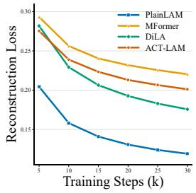

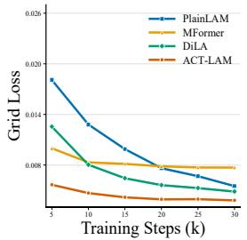

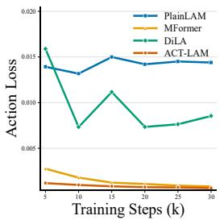

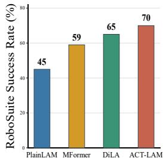  
Figure 1: Reconstructing is not acting. We present the validation reconstruction loss, state prediction (grid) loss, and latent action consistency (action) loss over training, followed by the downstream visual planning success rate. Although PlainLAM achieves the lowest reconstruction loss, ACT-LAM yields substantially lower grid and action losses and the highest success rate. These results illustrate that the reconstruction quality is not a reliable indicator of latent dynamics modeling or visual planning. The detailed model descriptions are placed in Appendix A.4.

Existing LAMs address these two underconstrained aspects unevenly. On the IDM side (action ex traction), they usually impose strong information bottlenecks. Some methods restrict the capacity of latent actions through vector quantization or explicit regularization (Bruce et al., 2024; Gao et al., 2025), whereas others compress rich visual features into compact structure embeddings before ac tion extraction (Zhang et al., 2026b). While effective, these bottlenecks enforce action relevance only indirectly, prioritizing information restriction over the identification of action-related spatial transition cues. Consequently, they may inadvertently discard action cues entangled with nuisance appearance. By contrast, action utilization in the FDM has received considerably less attention. Prior work conditions forward dynamics on latent actions through addition or concatenation (Yang et al., 2026; Gao et al., 2025), cross-attention (Ye et al., 2025; Wang et al., 2026), and AdaLN-zero (Zhang et al., 2026b). Despite these different mechanisms, the action conditioning generally remain fixed while the state representation evolves, limiting its state-aware interaction throughout forward dynamics. Together, these limitations motivate us to develop a more action-centric framework.

To address the aforementioned limitations, we propose ACT-LAM, an action-centric framework that explicitly strengthens action extraction and action utilization, as shown in Fig. 2. To boost action extraction, we introduce an Action Query IDM (AQ-IDM), which harnesses learnable action queries to directly capture rich spatial transition cues. A gated aggregation then integrates these cues into a continuous latent action, enabling selective action extraction without strong information bottlenecks. To further improve action utilization, we present an Action Token FDM (AT-FDM). It projects the inferred latent action into action tokens and progressively updates them through interaction with evolving state representations. This mechanism enables the continuous state-aware action conditioning in forward dynamics. These complementary designs enable more effective latent dynamics modeling. Meanwhile, ACT-LAM adopts a streamlined architecture, yielding a lightweight model with fewer trainable parameters and lower computational overhead. We conduct extensive experiments on several robotic datasets and the $\mathrm { { V P ^ { 2 } } }$ benchmark, where ACT-LAM consistently improves latent action modeling and downstream visual planning performance. In particular, ACT-LAM surpasses the previous state of the art by 7.6% on the aggregated $\mathrm { { V P ^ { 2 } } }$ success rate, demonstrating the effectiveness of its action-centric design.

In summary, our contributions are as follows:

• We identify the reconstruction-action mismatch in existing LAMs, where lower reconstruction error does not necessarily yield better latent actions, and attribute it to underconstrained action extraction in the IDM and action utilization in the FDM

• We propose ACT-LAM, an action-centric framework with AQ-IDM for selectively extracting action-related transition cues and AT-FDM for progressive state-aware action conditioning.

• Extensive experiments demonstrate that ACT-LAM improves latent action consistency, forward dynamics, and downstream visual planning performance, while using fewer trainable parameters and lower computational overhead.

## 2 RELATED WORK

Learning from human videos. Leveraging scalable human videos is a promising paradigm for improving real-world robot policy learning (Xiong et al., 2021; Shaw et al., 2023; Zheng et al., 2026b). To reduce the domain gap, some methods use in-domain human demonstrations collected through direct interaction with robot task environments (Wang et al., 2023; Kareer et al., 2025; Fu et al., 2025), but such data remain costly to collect at scale. Other works exploit diverse in-the-wild videos to learn general visual representations (Nair et al., 2023; Radosavovic et al., 2023) or action priors (Shaw et al., 2023). However, R3M (Nair et al., 2023) and MVP (Radosavovic et al., 2023) do not provide explicit action representations, while VideoDex (Shaw et al., 2023) relies on predefined motion estimators and specific re-targeting. In this context, latent action models (Schmidt & Jiang, 2024) offer a pathway towards inferring latent actions from visual transitions, without requiring action annotations or predefined motion cues.

Latent action models. LAMs learn action representations from unlabeled videos, which will be used as intermediate supervision for VLA pretraining (Ye et al., 2025; Chen et al., 2025; Zhang et al., 2026a) or skill learning (Xu et al., 2023; Kim et al., 2025). Most prior work emphasizes action extraction in the IDM, typically by imposing information bottlenecks. Some methods restrict the capacity of latent actions through vector quantization or explicit regularization (Schmidt & Jiang, 2024; Bruce et al., 2024; Bu et al., 2026), whereas others compress rich visual features into compact structure embeddings before action extraction (Zhang et al., 2026b). These approaches encourage compact action representations, but may discard action cues entangled with appearance. Comparatively less attention has been paid to action utilization in the FDM. Prior arts condition forward dy namics on fixed action conditions (Gao et al., 2025; Yang et al., 2026; Zhang et al., 2026b), thereby limiting the state-aware interaction throughout this progress. CoMo (Yang et al., 2026) is the most similar work to our paper, as both extract continuous latent actions from rich visual representations using learnable queries (Li et al., 2023). However, the two approaches differ substantially in action extraction and action utilization. Compared with CoMo, AQ-IDM replaces global self-attention over all tokens with lightweight action-to-patch attention and employs a aggregation strategy for richer action extraction. Moreover, while CoMo uses fixed latent-action conditioning in forward dynamics, AT-FDM progressively updates action tokens through state interaction. These difference enable ACT-LAM to strengthens latent dynamics modeling while retaining a lightweight architecture.

Learnable Queries. Learnable queries have been widely used to selectively extract task-relevant information from dense representations. Set Transformer (Lee et al., 2019) introduces learnable vectors for attention-based feature aggregation, while DETR (Carion et al., 2020) uses object queries to extract object-specific information from image features. Besides that, these query-based approaches have also been adopted in vision-language models. Flamingo (Alayrac et al., 2022) employs a resampler to compress visual features into a fixed number of tokens, and BLIP-2 (Li et al., 2023) uses learnable queries to extract language-relevant information from visual representations. Motivated by these works, our AQ-IDM introduces action queries for latent dynamics modeling, selectively aggregating action-related spatial transition cues from rich visual representations.

## 3 METHOD

We introduce ACT-LAM, an action-centric framework designed to address the two underconstrained aspects of latent dynamics modeling: action extraction and action utilization. As illustrated in Fig. 2, ACT-LAM consists of an Action Query IDM (AQ-IDM) and an Action Token FDM (AT-FDM). AQ-IDM extracts action-related transition cues from rich visual representations, while AT-FDM enables state-aware interaction between action tokens and evolving state representations. The overall architecture is further streamlined to concentrate model capacity on latent dynamics modeling. In this section, we first present the problem formulation and motivate our design in

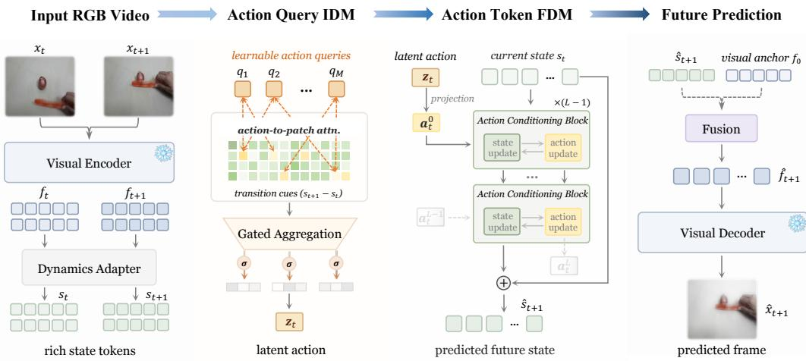  
Figure 2: The overview of ACT-LAM. ACT-LAM is a lightweight action-centric framework for latent dynamics modeling. Given consecutive video frames, a frozen visual encoder extracts rich visual features, while the dynamics adapter further encodes them to state tokens. The Action Query IDM deploys learnable action queries to selectively aggregate action-related transition cues into a continuous latent action, which avoids the utilization of strong information bottlenecks. The Action Token FDM projects the inferred latent action into action tokens that are progressively updated through interaction with evolving state representations, enabling state-aware action conditioning. Finally, the predicted future state is decoded into the future frame, fused with with a visual anchor. Our ACT-LAM shows superior performance on downstream visual planning tasks.

Sec. 3.1. We then introduce the lightweight action-centric framework in Sec. 3.2. Finally, we detail the training objectives in Sec. 3.3.

## 3.1 PROBLEM FORMULATION

Let $X = \{ x _ { i } \} _ { i = 1 } ^ { T }$ denote an unlabeled video sequence of $T$ frames. Given a pair of consecutive frames $( x _ { t } , x _ { t + 1 } )$ , a visual encoder $\mathcal { E }$ extracts their visual embeddings, $\left( \mathbf { \Delta } f _ { t } , \mathbf { \Delta } f _ { t + 1 } \right)$ . Assume that $\mathbf { \boldsymbol { s } } _ { t }$ denotes the dynamics state of $\mathbf { \Delta } f _ { t }$ and $s _ { t } = \mathcal { A } ( f _ { t } )$ , where A represents a dynamics adapter. A latent action model consists of an inverse dynamics model $\mathcal { T } _ { \phi }$ and a forward dynamics model $\mathcal { F } _ { \theta }$ . The IDM infers a latent action from transitions:

$$
z _ { t } = \mathbb { Z } _ { \phi } ( s _ { t } , s _ { t + 1 } ) ,\tag{1}
$$

where the FDM predicts the residual state transition conditioned on latent action $z _ { t } ,$ , and the future dynamics state is formulate as:

$$
\hat { \pmb { s } } _ { t + 1 } = { \pmb { s } } _ { t } + \Delta \hat { \pmb { s } } _ { t } , \quad \mathrm { w h e r e } ~ \Delta \hat { \pmb { s } } _ { t } = \mathcal { F } _ { \theta } ( { \pmb { s } } _ { t } , { \pmb { z } } _ { t } )\tag{2}
$$

The predicted dynamics state is then mapped back to the visual feature $\hat { f } _ { t + 1 }$ by the feature reconstruction mapping. Without action annotations, the IDM and FDM are jointly optimized by reconstructing the visual feature:

$$
\begin{array} { r } { \mathcal { L } _ { \mathrm { r e c } } = \| \pmb { f } _ { t + 1 } - \pmb { \hat { f } _ { t + 1 } } \| _ { 2 } . } \end{array}\tag{3}
$$

However, Eq. (3) does not explicitly constrain how latent dynamics are learned. In particular, it neither specifies which transition cues should be extracted into ${ \boldsymbol { z } } _ { t }$ nor how the FDM utilize latent action during state prediction. Thus, we design ACT-LAM to directly address these two problems.

## 3.2 ACTION-CENTRIC FRAMEWORK

As shown in Fig. 2, ACT-LAM performs latent dynamics modeling in the latent space (Assran et al., 2025; Zhang et al., 2026b), eliminating the need for training a pixel-space world model (Gao et al.,

2025). It leverages a frozen visual encoder (Oquab et al., 2024) to extract rich visual embeddings and an visual decoder (Zheng et al., 2026a) for visual reconstruction. Rather than allocating substantial capacity to feature processing (Zhang et al., 2026b), ACT-LAM concentrates more on inverse and forward dynamics through AQ-IDM and AT-FDM, respectively.

Action Query IDM. Existing approaches often promote action extraction by imposing strong information bottlenecks, which may discard action-related cues with nuisance appearance. Instead, AQ-IDM preserves rich spatial embeddings and uses learnable action queries as selective readout to identify action-related transition cues. In this way, action relevance is induced through aggregation rather than aggressive information compression.

As shown in Fig. 2, given a dynamics state sequence $\{ s _ { t } \} _ { t = 1 } ^ { T } .$ , the spatial transition at time t is defined as $\Delta \pmb { s } _ { t } = \pmb { s } _ { t + 1 } - \pmb { s } _ { t }$ . A lightweight transition encoder then maps $\Delta { } s _ { t }$ t into spatial patch tokens $\pmb { { \cal E } } _ { t } = \{ \pmb { e } _ { t } \} \in \mathrm { ~ \mathbb { R } ^ { \pmb { P } \times d _ { e } } ~ }$ , where $P$ is the number of spatial patch tokens. We add a learnable positional embedding to preserve the spatial information of each token. We introduce M learnable action queries $Q = \overline { { \{ q _ { m } \} } } \in \mathbb { R } ^ { M \times d _ { q } ^ { \bullet } }$ as action-centric readouts (Yang et al., 2026). Instead of globally mixing all tokens, each query attends to the spatial transition tokens and computes the action-to-patch attention, formulated as:

$$
\begin{array} { r l r } & { } & { { \bf A } _ { t } = \mathrm { S o f t m a x } ( ( Q W _ { q } ) ( E _ { t } W _ { k } ) ^ { \top } / \sqrt { d _ { k } } ) , } \\ & { } & { { \bf H } _ { t } = A _ { t } ( E _ { t } W _ { v } ) , \quad \quad } \end{array}\tag{4}
$$

where $ { \boldsymbol { A } } _ { t } ~ \in ~  { \mathbb { R } } ^ { M \times P }$ denotes the action-to-patch attention map, and $\pmb { H } _ { t }$ represents the resulting query-wise action cues. These cues are subsequently processed by a query mixer and a temporal mixer, followed by gated aggregation to form the latent action:

$$
\begin{array} { r } { \pmb { \alpha } _ { t } = \mathrm { S o f t m a x } ( g ( \tilde { \pmb { H } } _ { t } ) ) , \quad \pmb { C } _ { t } = f _ { \mathrm { q u e r y } } ( \tilde { \pmb { H } } _ { t } ) , } \end{array}\tag{5}
$$

$$
z _ { t } = f _ { \mathrm { a c t i o n } } ( \alpha _ { t } ^ { \mathsf { T } } C _ { t } ) ,\tag{6}
$$

where $\pmb { \alpha } _ { t }$ and $C _ { t }$ represent the importance weights and query-specific action representations, respectively. The gated aggregation selectively combines transition cues across queries, after which $f _ { \mathrm { a c t i o n } } ( \cdot )$ maps the aggregated representation to the continuous latent action $z _ { t } \in \mathbb { R } ^ { d _ { z } }$ . This allows different queries to capture complementary spatial transition cues while preserving rich information until the aggregation stage. In addition, no vector quantization or explicit capacity regularization (Gao et al., 2025; Zhang et al., 2026b) is required in AQ-IDM. Moreover, unlike Motion Qformer (Yang et al., 2026) that applies global self-attention to all tokens, AQ-IDM camputes only action-topatch attention. This design reduces the attention map from $( 2 N + \bar { 1 + } M ) ^ { 2 }$ to MN, while enabling each high-capacity query to capture aggregate spatial transition cues.

Action Token FDM. A key challenge in forward dynamics is to maintain effective action conditioning as the state representation evolves. Prior FDMs typically condition on a fixed latent action (Yang et al., 2026; Zhang et al., 2026b), which limits their interaction with states. AT-FDM addresses this limitation by projecting the fixed latent action into an action token that is progressively updated with state representations. Therefore, our design facilitates action utilization by state-aware interaction throughout forward dynamics.

At time step t, given dynamics state $\mathbf { \Delta } _ { \mathbf { \mathcal { S } } _ { t } }$ and the inferred latent action $z _ { t } .$ , the FDM predicts the future state $\hat { \pmb { s } } _ { t + 1 }$ by Eq. (2). In AT-FDM, we initialize the state and latent action as ${ \pmb s } _ { t } ^ { 0 } = { \pmb s } _ { t }$ and ${ \pmb a } _ { t } ^ { 0 } = f _ { \mathrm { p r o j } } ( z _ { t } )$ , where ${ \pmb a } _ { t } ^ { 0 } \in \mathbb { R } ^ { d _ { e } }$ is the initial action token. Then, AT-FDM employs a stack of L Action Conditioning Blocks (ACBs) to jointly update the state and action representations. At the l-th block, they are first processed by self-attention:

$$
[ \tilde { \pmb { s } } _ { t } ^ { l } , \tilde { \pmb { a } } _ { t } ^ { l } ] = \mathrm { S A } ( [ \pmb { s } _ { t } ^ { l } , \pmb { a } _ { t } ^ { l } ] ) .\tag{7}
$$

Through this interaction, the action token incorporates the current state context and is subsequently utilized to modulate the state representations (Perez et al., 2018), defined as:

$$
\begin{array} { r l r } & { } & { \gamma _ { t } ^ { l } , \beta _ { t } ^ { l } = h ( \tilde { \pmb { a } } _ { t } ^ { l } ) , } \\ & { } & { { \pmb { s } } _ { t } ^ { l + 1 } = \tilde { \pmb { s } } _ { t } ^ { l } + \sigma ( { \boldsymbol { g } } ^ { l } ) [ \gamma _ { t } ^ { l } \odot \mathrm { L N } ( \tilde { \pmb { s } } _ { t } ^ { l } ) + \beta _ { t } ^ { l } ] + \mathrm { F F N } _ { s } ( \tilde { \pmb { s } } _ { t } ^ { l } ) , } \end{array}\tag{8}
$$

where $h ( \cdot )$ is the modulation function, $g ^ { l }$ is a learnable scalar gate for the l-th block, and $\sigma ( \cdot )$ denotes the sigmoid function. The Eq. (8) formulates the effect of action modulation, while action token is updated as follows:

$$
\mathbf { \boldsymbol { a } } _ { t } ^ { l + 1 } = \tilde { \mathbf { \boldsymbol { a } } } _ { t } ^ { l } + \mathrm { F F N } _ { a } ( \tilde { \mathbf { \boldsymbol { a } } } _ { t } ^ { l } ) .\tag{9}
$$

Finally, the resulting state representation is projected to predict the residual $\Delta \hat { \boldsymbol { s } } _ { t }$ . Thus, AT-FDM enables the action token to co-evolve with state representations, thereby ensuring persistent action conditioning throughout forward dynamics.

Lightweight Designs. ACT-LAM further streamlines feature processing to concentrate model capacity on latent dynamics modeling. As summarized in Tab. 1, a considerable portion of the trainable parameters in DiLA (Zhang et al., 2026b) is devoted to feature processing $( i . e .$ , ST-Transformer) rather than to the IDM and FDM themselves. Contrarily, ACT-LAM adopts a lightweight pipeline together with the proposed AQ-IDM and AT-FDM. Specifically, we remove the ST-Transformer (Xu et al., 2021), replace the DeepConv IDM with our AQ-IDM, and adopt our AT-FDM to strengthen action conditioning. Empirical results demonstrate the efficiency and effectiveness of these designs. Details are shown in $\mathsf { A p - }$ pendix A.1 and A.3.

Table 1: The parameters of major components in LAMs.
<table><tr><td>Part</td><td>DiLA</td><td>ACT-LAM</td></tr><tr><td>Proc.</td><td>51M</td><td>1M</td></tr><tr><td>IDM</td><td>36M</td><td>12M</td></tr><tr><td>FDM</td><td>8M</td><td>18M</td></tr><tr><td>Dec.</td><td>28M</td><td>23M</td></tr><tr><td>Total</td><td>123M</td><td>55M</td></tr></table>

## 3.3 TRAINING OBJECTIVES

Following DiLA (Zhang et al., 2026b), we adopt its teacher-forcing training paradigm while adapting the loss formulation to ACT-LAM. The resulting objectives are defined as follows:

$$
\begin{array} { r l } & { \mathcal { L } _ { \mathrm { r e c } } = \| f _ { t } - \hat { f } _ { t } \| _ { 2 } , } \\ & { \mathcal { L } _ { \mathrm { g r i d } } = \mathrm { S m o o t h L 1 } ( \Delta s _ { t } - \mathcal { F } _ { \theta } ( s _ { t } , z _ { t } ) ) , } \\ & { \mathcal { L } _ { \mathrm { a c t } } = \mathrm { S m o o t h L 1 } [ \mathcal { Z } _ { \phi } ( s _ { t + 1 } - s _ { t } ) - \mathcal { Z } _ { \phi } ( \hat { s } _ { t + 1 } - s _ { t } ) ] , } \\ & { \mathcal { L } _ { \mathrm { s y m } } = \| z _ { t } \| _ { 2 } + \frac { \sum _ { t } \cdot ( \cos ( z _ { t } ^ { \mathrm { f w d } } , z _ { t } ^ { \mathrm { b w d } } ) + 1 ) } { T - 1 } , } \\ & { \mathcal { L } _ { \mathrm { v a r } } = \sum _ { d } ( \sigma - \mathrm { S t d } ( z _ { t } ) ) / d _ { z } , } \end{array}\tag{10}
$$

where $\mathcal { L } _ { \mathrm { r e c . } } , \mathcal { L } _ { \mathrm { g r i d } }$ , and $\mathcal { L } _ { \mathrm { a c t } }$ . serve as indicators of reconstruction quality, forward state prediction, and latent action consistency, respectively. We retain $\mathcal { L } _ { \mathrm { s y m } }$ . to encourage the forward and backward symmetry, and introduce ${ \mathcal { L } } _ { \mathrm { v a r } }$ to promote latent action diversity. In general, the total training objective is a weighted combination, defined as:

$$
\begin{array} { r } { \mathcal { L } _ { a l l } = \lambda _ { r } \mathcal { L } _ { \mathrm { r e c } } + \lambda _ { g } \mathcal { L } _ { \mathrm { g r i d } } + \lambda _ { a } \mathcal { L } _ { \mathrm { a c t } } + \lambda _ { s } \mathcal { L } _ { \mathrm { s y m } } + \lambda _ { v } \mathcal { L } _ { \mathrm { v a r } } . } \end{array}\tag{11}
$$

## 4 EXPERIMENTS

In this section, we empirically evaluate ACT-LAM to assess its effectiveness and key properties. We first introduce the experimental setup in Sec. 4.1, including implementations and datasets. We then study ACT-LAM along the two key aspects motivated in Sec. 3: action extraction and action utilization. We examine whether AQ-IDM learns more effective latent actions and whether AT-FDM better exploits them for forward dynamics modeling in Secs. 4.2 and 4.3, respectively. Subsequently, we assess the effectiveness of our designs in downstream visual planning in Sec. 4.4. Finally, we provide additional analyses on the reconstruction-action mismatch and model efficiency in Sec. 4.5.

## 4.1 EXPERIMENTAL SETUP

Implementation Details. We adopt a frozen DINOv2 (Oquab et al., 2024) as the visual encoder and use the ViT-XL RAE decoder (Zheng et al., 2026a) for visual reconstruction. ACT-LAM is trained only in the teacher-forcing paradigm. We optimize all trainable components using AdamW (Loshchilov & Hutter, 2017) with a learning rate of $\mathrm { \bar { 1 } } \times \mathrm { 1 0 ^ { - 4 } }$ . Unless otherwise specified, all methods are trained using the same visual backbone, training data, and optimizer for fair comparison. More architectural and training details are given in Appendix A.

Table 2: Linear probing MSE across two datasets. Results represent the mean and standard deviation of 4 independent runs per task. The best results are highlighted in “bold”.
<table><tr><td>Dataset</td><td>AdaWorld</td><td>MFormer</td><td>DiLA</td><td>ACT-LAM</td></tr><tr><td>Push-T</td><td> $0 . 0 3 3 \pm 0 . 0 0 1$ </td><td> $0 . 0 1 6 \pm 0 . 0 0 1$ </td><td> $0 . 0 0 9 \pm 0 . 0 0 3$ </td><td> $\mathbf { 0 . 0 0 7 \pm 0 . 0 0 0 }$ </td></tr><tr><td>Block Pushing</td><td> $0 . 0 3 9 \pm 0 . 0 0 5$ </td><td> $0 . 0 4 8 \pm 0 . 0 0 3$ </td><td> $0 . 0 3 7 \pm 0 . 0 1 3$ </td><td> $\mathbf { 0 . 0 3 1 \pm 0 . 0 0 1 }$ </td></tr></table>

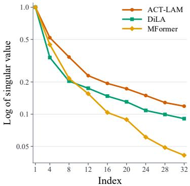

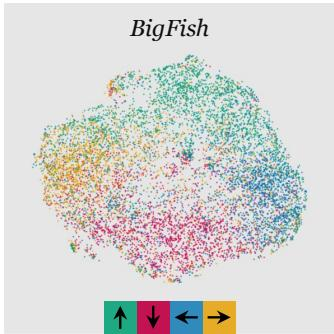

Figure 3: Latent action singular-value spectra on Block Pushing. ACT-LAM exhibits a slower spectral decay, indicating a richer and more diverse latent action representation.  
Figure 4: UMAP visualization on BigFish. Each point represents a latent action extracted by the pretrained AQ-IDM. Arrows in the legend correspond to movement directions.  
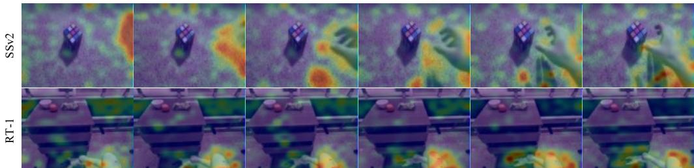  
Figure 5: Action-to-patch attention heatmaps for two samples. We visualize one video clip from each of the SSV2 and RT-1 datasets. The learned queries primarily attend to action-related regions, indicating their ability to extract action-related spatial transition cues.

Benchmark Datasets. Following DiLA, we employ four video datasets to pretrain the latent action models: Something-Something-v2 (SSv2) (Goyal et al., 2017), RT-1 (Brohan et al., 2022), RECON (Shah et al., 2022), and LoopNav (Lian et al., 2025). We then evaluate the pretrained models on the $\mathrm { \dot { V } P ^ { 2 } }$ benchmark (Tian et al., 2023) to assess their downstream visual planning performance. Refer to Appendix A.5 for detailed descriptions.

## 4.2 ACTION EXTRACTION

Linear Probing. To evaluate the quality of the learned latent action representations, we perform linear probing on two benchmarks unseen during pretraining: Block Pushing (Florence et al., 2022) and Push-T (Chi et al., 2025). As shown in Tab. 2, ACT-LAM achieves the lowest probing Mean Squared Error (MSE) on the two datasets, indicating that its latent actions are more linearly aligned with the robot actions and preserve more action-relevant information. It is noteworthy that the reported AdaWorld (Gao et al., 2025) results are obtained using the official pretrained weights released by the authors. More linear probing results and ablations are given in Appendix B.1.

Action Diversity. As shown in Fig. 3, we report the normalized logarithm of singular values (Garrido et al., 2023) of latent actions on the Block Pushing dataset. Compared with other methods, ACT-LAM exhibits a slower singular-value decay, indicating a higher effective dimensionality and more diverse latent action representations. Noteworthy, this increased diversity is accompanied by AT-FDM —— AdaLN-FDM  Add-FDM —— Concat-FDM — XAttn-FDM

Table 3: Rollout feature reconstruction MSE on SSv2 and RT-1. @k denotes the MSE averaged over the first k predicted steps. Results are reported as mean ± standard deviation.  
Table 4: Video generation metrics on SSv2 and RT-1. We utilize SSIM and LPIPS for evaluation. Recon. denotes the direct encodedecode reconstruction of the input frames.
<table><tr><td rowspan="2">Dataset</td><td rowspan="2">Model</td><td colspan="4">Recon. MSE ↓</td></tr><tr><td>@1</td><td>@4</td><td>@8</td><td>@15</td></tr><tr><td rowspan="2">SSv2</td><td>DiLA</td><td> $0 . 3 5 5 \pm 0 . 1 1 8$ </td><td> $0 . 4 1 0 \pm 0 . 1 1 3$ </td><td> $0 . 4 5 2 \pm 0 . 1 0 6$ </td><td>0.495 ± 0.100</td></tr><tr><td>ACT-LAM</td><td> $\mathbf { 0 . 1 7 5 \pm 0 . 0 8 4 }$ </td><td> $\mathbf { 0 . 2 6 6 \pm 0 . 1 0 2 }$ </td><td>0.428 ± 0.099</td><td>0.667 ± 0.095</td></tr><tr><td rowspan="2">RT-1</td><td>DiLA</td><td> $0 . 2 1 5 \pm 0 . 0 6 9$ </td><td> $0 . 2 5 1 \pm 0 . 0 7 0$ </td><td> $\mathbf { 0 . 2 8 4 \pm 0 . 0 7 3 }$ </td><td>0.323 ± 0.078</td></tr><tr><td>ACT-LAM</td><td> $\mathbf { 0 . 1 1 9 \pm 0 . 0 5 1 }$ </td><td> $\mathbf { 0 . 2 1 1 \pm 0 . 0 6 8 }$ </td><td> $0 . 4 4 2 \pm 0 . 0 7 0$ </td><td>0.705 ± 0.066</td></tr></table>

<table><tr><td rowspan="2">Model</td><td colspan="2">SSv2</td><td colspan="2">RT-1</td></tr><tr><td>SSIM ↑</td><td>LPIPS ↓</td><td>SSIM ↑</td><td>LPIPS ↓</td></tr><tr><td>Recon.</td><td> $0 . 7 1 7 \pm 0 . 1 4 1$ </td><td> $0 . 1 2 5 \pm 0 . 0 3 8$ </td><td> $0 . 6 2 1 \pm 0 . 0 7 2$ </td><td>0.147 ± 0.023</td></tr><tr><td>AdaWorld (FDM)</td><td> $0 . 5 5 7 \pm 0 . 1 6 0$ </td><td> $0 . 7 2 3 \pm 0 . 1 3 0$ </td><td> $0 . 3 7 7 \pm 0 . 0 7 4$ </td><td>0.713 ± 0.090</td></tr><tr><td>DiLA</td><td> $\mathbf { 0 . 5 7 8 \pm 0 . 1 5 0 }$ </td><td> $0 . 6 3 7 \pm 0 . 1 3 0$ </td><td> $\mathbf { 0 . 5 0 6 \pm 0 . 0 8 2 }$ </td><td>0.364 ± 0.125</td></tr><tr><td>ACT-LAM</td><td> $0 . 5 0 8 \pm 0 . 1 4 8$ </td><td> $\mathbf { 0 . 4 3 0 \pm 0 . 0 8 7 }$ </td><td> $0 . 3 7 5 \pm 0 . 0 6 0$ </td><td>0.438 ± 0.049</td></tr></table>

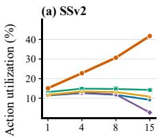

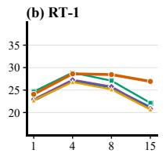

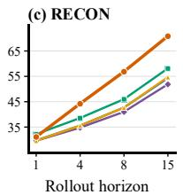

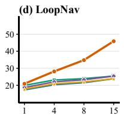

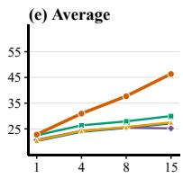  
Figure 6: Action utilization across rollout horizons. AT-FDM consistently achieves larger utilization gains than other action-conditioning schemes. (Some curves overlap and may be occluded.)

the lowest MSE error in Tab. 2, suggesting that ACT-LAM captures richer variations while preserving strong alignment with robot actions. These results demonstrate that AQ-IDM extracts more informative and action-relevant transition cues. Details are placed in Appendix B.2.

UMAP Visualization. To provide a more intuitive illustration, we utilize UMAP (McInnes et al., 2018) to visualize latent actions on the BigFish environment from the Procgen environment (Cobbe et al., 2020). As shown in Fig. 4, AQ-IDM forms distinct clusters that correspond to the true direction actions. More visualizations are detailed in Appendix B.3.

Action-to-Patch Attention. To further demonstrate the effectiveness of the learnable action queries, we visualize the action-to-patch attention heatmaps (Zhou et al., 2016). As shown in Fig. 5, the action queries consistently focus on regions associated with salient motion in both SSV2 and RT-1. These attention patterns indicate that AQ-IDM can selectively aggregate action-related transition cues from rich visual representations, providing evidence for its action-centric extraction approach. Additional visualizations and per-query attention maps are provided in Appendix B.4.

## 4.3 ACTION UTILIZATION

Rollout MSE. To evaluate forward dynamics under latent action conditioning, we report multi-step rollout MSE in Tab. 3. ACT-LAM achieves lower errors at short horizons, while DiLA performs better at longer horizons. Notably, ACT-LAM is trained solely with teacher-forcing, whereas DiLA uses its official rollout-finetuned checkpoint. Details are provided in Appendix B.5.

Video Generation. We evaluate the generation fidelity using autoregressive rollouts on SSv2 and RT-1. We report SSIM (Wang et al., 2004) to measure structural similarity and LPIPS (Zhang et al., 2018) to assess perceptual similarity. As shown in Tab. 4, ACT-LAM achieves the best LPIPS on SSv2, while DiLA performs better on several other reconstruction metrics. These results suggest that ACT-LAM maintains reasonable generation fidelity, although its primary gains lie in learning more effective action-centric dynamics. This observation is also consistent with our main finding that stronger reconstruction performance does not necessarily translate into better latent action modeling or downstream control. The detailed descriptions are given in Appendix B.6.

Action Transfer. We further examine whether the inferred latent actions can transfer across visual contexts by applying 16-step action sequences through autoregressive generation. The detailed descriptions and qualitative results are provided in Appendix B.7.

Utilization Analysis. To assess how effectively AT-FDM utilizes latent actions, we introduce an action utilization evaluation. Specifically, we freeze the pretrained IDM and train only different FDMs. We then replace the original latent action sequence with a constant action and measure the resulting

Table 5: Visual planning performance in $\mathbf { V P } ^ { 2 }$ benchmark. We report the success rates across 5 tasks in RoboDesk and 1 task in RoboSuite, and the aggregated success rate is calculated by normalizing against the Simulator’s success rate. Results represent the mean and standard deviation of the success rates on average across 4 random seeds.
<table><tr><td rowspan="2">Method</td><td colspan="6">Success Rate  $( \% ) \uparrow$ </td><td rowspan="2">Aggregate ↑</td></tr><tr><td>Robosuite Push</td><td>Open Slide</td><td>Blue Button</td><td>Green Button</td><td>Red Button</td><td>Upright Block</td></tr><tr><td>Simulator</td><td>89.25±2.49</td><td> $6 4 . 1 7 ^ { \pm 7 . 2 2 }$ </td><td> $1 0 0 . 0 0 ^ { \pm 0 . 0 0 }$ </td><td> $8 9 . 1 7 ^ { \pm 4 . 9 3 }$ </td><td> $9 3 . 3 3 ^ { \pm 2 . 3 6 }$ </td><td> $9 5 . 0 0 ^ { \pm 1 . 6 7 }$ </td><td>100.00</td></tr><tr><td>AdaWorld</td><td> $6 3 . 5 0 ^ { \pm 1 . 7 1 }$ </td><td> $5 . 8 3 ^ { \pm 2 . 8 5 }$ </td><td> $2 9 . 1 7 ^ { \pm 2 . 5 0 }$ </td><td> $1 0 . 8 3 ^ { \pm 2 . 5 0 }$ </td><td> $1 0 . 0 0 ^ { \pm 2 . 3 6 }$ </td><td> $5 . 0 0 ^ { \pm 0 . 9 6 }$ </td><td>21.54 (22.92)</td></tr><tr><td>DiLA</td><td> $6 8 . 0 0 ^ { \pm 1 . 4 1 }$ </td><td> $\mathbf { 1 5 . 0 0 ^ { \pm 5 . 0 0 } }$ </td><td> $7 8 . 3 3 ^ { \pm 3 . 7 3 }$ </td><td> $3 5 . 8 3 ^ { \pm 4 . 9 3 }$ </td><td> $2 0 . 8 3 ^ { \pm 5 . 9 5 }$ </td><td> $3 . 3 3 ^ { \pm 2 . 7 2 }$ </td><td>41.44 (40.65)</td></tr><tr><td>ACT-LAM</td><td> ${ \bf 7 1 . 2 5 ^ { \pm 3 . 6 3 } }$ </td><td> $1 0 . 8 3 ^ { \pm 2 . 7 6 }$ </td><td> $\mathbf { 9 0 . 8 3 ^ { \pm 2 . 7 6 } }$ </td><td> $\mathbf { 6 5 . 0 0 ^ { \pm 7 . 6 4 } }$ </td><td> $\mathbf { 2 5 . 0 0 ^ { \pm 3 . 7 3 } }$ </td><td> $\mathbf { 6 . 6 7 ^ { \pm 2 . 3 6 } }$ </td><td> $\mathbf { 4 9 . 0 4 } ^ { \uparrow 7 . 6 \% }$ </td></tr></table>

relative increase in rollout state MSE. As shown in Fig. 6, AT-FDM consistently achieves higher action utilization, particularly at longer horizons, demonstrating its stronger ability to leverage latent actions during forward dynamics modeling. More details are provided in Appendix B.8.

## 4.4 VISUAL PLANNING

To assess the effectiveness of ACT-LAM in robotic control, we evaluate the pretrained LAMs on the VP2 benchmark (Tian et al., 2023). Following prior works (Gao et al., 2025; Zhang et al., 2026b), we first use the pretrained IDM to extract latent actions from state transitions in the downstream datasets. Then, we learn a action-to-latent MLP to map ground-truth actions into the learned latent action space. Subsequently, the MLP is jointly finetuned with the pretrained FDM on robotic trajectories, enabling the resulting dynamics model to perform action-conditioned visual prediction for planning. All experiments follow the evaluation protocol established by AdaWorld (Gao et al., 2025).

After adaptation, the pretrained LAM is converted into an action-conditioned world model and uti lized as the dynamics model for model predictive control. Following prior works, we adopt the sampling-based Model Predictive Path Integral (MPPI) algorithm (Williams et al., 2016) to optimize action sequences according to the predicted future visual states. As reported in Tab. 5, ACT-LAM surpasses AdaWorld and DiLA on the majority of tasks. In particular, on “Push Blue Button” and “Push Green Button”, ACT-LAM improves over the previous state of the art by 11.5% and 29.2%, respectively. These results further demonstrate that superior latent dynamics modeling does not necessarily require high visual reconstruction quality, as ACT-LAM achieves stronger latent dynamics despite its relatively weaker reconstruction performance. More details are given in Appendix B.9.

## 4.5 FURTHER ANALYSES

ACT-LAM achieves strong performance while maintaining a lightweight and computationally efficient design. Detailed efficiency evaluations, including FLOPs, FPS, and GPU memory usage, are provided in Appendix C due to space constraints. Additional analyses and supplementary experiments are presented in Appendix D.

## 5 CONCLUSION

In this paper, we identify a reconstruction-action mismatch in existing latent action models and introduce ACT-LAM to address this mismatch by strengthening both action extraction and action utilization. Extensive experiments and analyses demonstrate consistent improvements in latent action quality, forward dynamics, and downstream planning. Notably, ACT-LAM achieves these gains with fewer trainable parameters and lower computational overhead, offering a more effective and efficient approach to latent dynamics modeling.

Limitations. While ACT-LAM achieves stronger action-centric latent dynamics, its pixel-level reconstruction fidelity remains limited, especially over long autoregressive rollouts. Our evaluation is also restricted to the current benchmarks and does not yet cover settings that demand highly accurate visual prediction or fine-grained control. The results therefore show that reconstruction quality is not a reliable indicator for action quality within the evaluated settings. Broader validation is needed to assess how generally this mismatch holds. Future work could improve visual fidelity while preserving the action-centric properties of the learned dynamics.

## AI USE STATEMENT

In this work, we used generative AI tools to assist with code development and language polishing. Specifically, generative AI was used to code implementation and debugging, as well as to improve the grammar of this manuscript. AI-assisted code was manually reviewed and tested by the authors before being used in our experiments. We did not use generative AI tools to autonomously conduct the research or generate the manuscript. In general, we have reviewed all AI-assisted work and take full responsibility for the final content of this paper.

## REPRODUCIBILITY STATEMENT

We make several efforts to ensure the reproducibility of our results. The architecture and training objectives of ACT-LAM are described in detail in Sec. 3. And the datasets, implementation settings, and evaluation protocols are provided in Sec. 4 and the corresponding experimental sections. Additional configurations and implementation details are given in Appendix A and B. We also report the settings used for the downstream visual planning evaluation and the corresponding ablation studies to facilitate consistent reproduction and comparison.

## ACKNOWLEDGMENTS

We would like to thank Tianqiu Zhang from Peking University for helpful suggestions, and Yujun Zhang, Chenxin Yuan, and Lu Pan for feedback on the draft.

## REFERENCES

Jean-Baptiste Alayrac, Jeff Donahue, Pauline Luc, Antoine Miech, Iain Barr, Yana Hasson, Karel Lenc, Arthur Mensch, Katherine Millican, Malcolm Reynolds, et al. Flamingo: a visual language model for few-shot learning. In NeurIPS, volume 35, pp. 23716–23736, 2022.

Mido Assran, Adrien Bardes, David Fan, Quentin Garrido, Russell Howes, Matthew Muckley, Ammar Rizvi, Claire Roberts, Koustuv Sinha, Artem Zholus, et al. V-jepa 2: Self-supervised video models enable understanding, prediction and planning. arXiv preprint arXiv:2506.09985, 2025.

Kevin Black, Noah Brown, James Darpinian, Karan Dhabalia, Danny Driess, Adnan Esmail, Michael Equi, Chelsea Finn, Niccolo Fusai, et al. π0.5: A vision-language-action model with open-world generalization. In CoRL, 2025.

Anthony Brohan, Noah Brown, Justice Carbajal, Yevgen Chebotar, Joseph Dabis, Chelsea Finn, Keerthana Gopalakrishnan, Karol Hausman, Alex Herzog, Jasmine Hsu, et al. Rt-1: Robotics transformer for real-world control at scale. arXiv preprint arXiv:2212.06817, 2022.

Jake Bruce, Michael D Dennis, Ashley Edwards, Jack Parker-Holder, Yuge Shi, Edward Hughes, Matthew Lai, Aditi Mavalankar, Richie Steigerwald, Chris Apps, et al. Genie: Generative interactive environments. In ICML, 2024.

Xizhou Bu, Qingda Hu, Lei Zhou, Lingfeng Zhang, Yingbo Tang, Zihao Liu, Xinyi Tao, Zhiqiang Ma, Qingqiu Huang, Chufeng Tang, et al. What matters for latent actions in robot learning. arXiv preprint arXiv:2608.19613, 2026.

Nicolas Carion, Francisco Massa, Gabriel Synnaeve, Nicolas Usunier, Alexander Kirillov, and Sergey Zagoruyko. End-to-end object detection with transformers. In ECCV, pp. 213–229. Springer, 2020.

Yi Chen, Yuying Ge, Yizhuo Li, Yixiao Ge, Mingyu Ding, Ying Shan, and Xihui Liu. Moto: Latent motion token as the bridging language for robot manipulation. In ICCV, 2025.

Cheng Chi, Zhenjia Xu, Siyuan Feng, Eric Cousineau, Yilun Du, Benjamin Burchfiel, Russ Tedrake, and Shuran Song. Diffusion policy: Visuomotor policy learning via action diffusion. IJRR, 44 (10-11):1684–1704, 2025.

Karl Cobbe, Chris Hesse, Jacob Hilton, and John Schulman. Leveraging procedural generation to benchmark reinforcement learning. In ICML, pp. 2048–2056. PMLR, 2020.

Pete Florence, Corey Lynch, Andy Zeng, Oscar A Ramirez, Ayzaan Wahid, Laura Downs, Adrian Wong, Johnny Lee, Igor Mordatch, and Jonathan Tompson. Implicit behavioral cloning. In CoRL, pp. 158–168. PMLR, 2022.

Zipeng Fu, Qingqing Zhao, Qi Wu, Gordon Wetzstein, and Chelsea Finn. Humanplus: Humanoid shadowing and imitation from humans. In CoRL, pp. 2828–2844. PMLR, 2025.

Shenyuan Gao, Siyuan Zhou, Yilun Du, Jun Zhang, and Chuang Gan. Adaworld: learning adaptable world models with latent actions. In ICML, pp. 18744–18771, 2025.

Quentin Garrido, Randall Balestriero, Laurent Najman, and Yann LeCun. Rankme: Assessing the downstream performance of pretrained self supervised representations by their rank. In ICML, pp. 10929–10974. PMLR, 2023.

Raghav Goyal, Samira Ebrahimi Kahou, Vincent Michalski, Joanna Materzynska, Susanne Westphal, Heuna Kim, Valentin Haenel, Ingo Fruend, Peter Yianilos, Moritz Mueller-Freitag, et al. The “something something” video database for learning and evaluating visual common sense. In ICCV, pp. 5843–5851. IEEE, 2017.

Simar Kareer, Dhruv Patel, Ryan Punamiya, Pranay Mathur, Shuo Cheng, Chen Wang, Judy Hoffman, and Danfei Xu. Egomimic: Scaling imitation learning via egocentric video. In ICRA, pp. 13226–13233. IEEE, 2025.

Hanjung Kim, Jaehyun Kang, Hyolim Kang, Meedeum Cho, Seon Joo Kim, and Youngwoon Lee. Uniskill: Imitating human videos via cross-embodiment skill representations. In CoRL, 2025.

Moo Jin Kim, Karl Pertsch, Siddharth Karamcheti, Ted Xiao, Ashwin Balakrishna, Suraj Nair, Rafael Rafailov, Ethan P Foster, Pannag R Sanketi, Quan Vuong, et al. Openvla: An open-source vision-language-action model. In CoRL, 2024.

Juho Lee, Yoonho Lee, Jungtaek Kim, Adam Kosiorek, Seungjin Choi, and Yee Whye Teh. Set transformer: A framework for attention-based permutation-invariant neural networks. In ICML, pp. 3744–3753. PMLR, 2019.

Junnan Li, Dongxu Li, Silvio Savarese, and Steven Hoi. Blip-2: Bootstrapping language-image pre-training with frozen image encoders and large language models. In ICML, pp. 19730–19742. PMLR, 2023.

Kewei Lian, Shaofei Cai, Yitao Liang, and Anji Liu. Loopnav: Benchmarking spatial consistency in world models. arXiv preprint arXiv:2505.22976, 2025.

Anthony Liang, Pavel Czempin, Matthew M Hong, Yutai Zhou, Jingzhen Wang, Erdem Biyik, and Stephen Tu. Clam: Continuous latent action models for robot learning from unlabeled demonstrations. arXiv preprint arXiv:2505.04999, 2025.

Mengya Liu, Baoxiong Jia, Jiangyong Huang, Jingze Zhang, and Siyuan Huang. Lara: Latent action representation alignment for vision-language-action models. In ICML, 2026.

Ilya Loshchilov and Frank Hutter. Decoupled weight decay regularization. In ICLR, 2017.

Leland McInnes, John Healy, and James Melville. Umap: Uniform manifold approximation and projection for dimension reduction. arXiv preprint arXiv:1802.03426, 2018.

Suraj Nair, Aravind Rajeswaran, Vikash Kumar, Chelsea Finn, and Abhinav Gupta. R3m: A universal visual representation for robot manipulation. In CoRL, pp. 892–909. PMLR, 2023.

Alexander Nikulin, Ilya Zisman, Denis Tarasov, Lyubaykin Nikita, Andrei Polubarov, Igor Kiselev, and Vladislav Kurenkov. Latent action learning requires supervision in the presence of distractors. In ICML, pp. 46427–46447. PMLR, 2025.

Maxime Oquab, Timothee Darcet, Th´ eo Moutakanni, Huy V Vo, Marc Szafraniec, Vasil Khalidov,´ Pierre Fernandez, Daniel HAZIZA, Francisco Massa, Alaaeldin El-Nouby, et al. Dinov2: Learning robust visual features without supervision. TMLR, 2024.

Ethan Perez, Florian Strub, Harm De Vries, Vincent Dumoulin, and Aaron Courville. Film: Visual reasoning with a general conditioning layer. In AAAI, 2018.

Ilija Radosavovic, Tete Xiao, Stephen James, Pieter Abbeel, Jitendra Malik, and Trevor Darrell. Real-world robot learning with masked visual pre-training. In CoRL, pp. 416–426. PMLR, 2023.

Dominik Schmidt and Minqi Jiang. Learning to act without actions. In ICLR, pp. 9379–9395, 2024.

Dhruv Shah, Benjamin Eysenbach, Nicholas Rhinehart, and Sergey Levine. Rapid exploration for open-world navigation with latent goal models. In CoRL, pp. 674–684. PMLR, 2022.

Kenneth Shaw, Shikhar Bahl, and Deepak Pathak. Videodex: Learning dexterity from internet videos. In CoRL, pp. 654–665. PMLR, 2023.

Stephen Tian, Chelsea Finn, and Jiajun Wu. A control-centric benchmark for video prediction. In ICLR, 2023.

Chen Wang, Linxi Fan, Jiankai Sun, Ruohan Zhang, Li Fei-Fei, Danfei Xu, Yuke Zhu, and Anima Anandkumar. Mimicplay: Long-horizon imitation learning by watching human play. In CoRL, pp. 201–221. PMLR, 2023.

Zhou Wang, Alan C Bovik, Hamid R Sheikh, and Eero P Simoncelli. Image quality assessment: from error visibility to structural similarity. IEEE TIP, 13(4):600–612, 2004.

Zizhao Wang, Chang Shi, Jiaheng Hu, Kevin Rohling, Roberto Mart´ın-Mart´ın, Amy Zhang, and Peter Stone. Factored latent action world models. In ICML, 2026.

Grady Williams, Paul Drews, Brian Goldfain, James M Rehg, and Evangelos A Theodorou. Aggressive driving with model predictive path integral control. In ICRA, pp. 1433–1440. IEEE, 2016.

Haoyu Xiong, Quanzhou Li, Yun-Chun Chen, Homanga Bharadhwaj, Samarth Sinha, and Animesh Garg. Learning by watching: Physical imitation of manipulation skills from human videos. In IROS, pp. 7827–7834. IEEE, 2021.

Mengda Xu, Zhenjia Xu, Cheng Chi, Manuela Veloso, and Shuran Song. Xskill: Cross embodiment skill discovery. In CoRL, pp. 3536–3555. PMLR, 2023.

Mingxing Xu, Wenrui Dai, Chunmiao Liu, Xing Gao, Weiyao Lin, Guo-Jun Qi, and Hongkai Xiong. Spatial-temporal transformer networks for traffic flow forecasting. arXiv preprint arXiv:2001.02908, 2021.

Jiange Yang, Yansong Shi, Haoyi Zhu, Mingyu Liu, Kaijing Ma, Yating Wang, Gangshan Wu, Tong He, and Limin Wang. Como: Learning continuous latent motion from internet videos for scalable robot learning. In CVPR, pp. 42352–42363, 2026.

Seonghyeon Ye, Joel Jang, Byeongguk Jeon, Se June Joo, Jianwei Yang, Baolin Peng, Ajay Mandlekar, Reuben Tan, Yu-Wei Chao, Bill Yuchen Lin, et al. Latent action pretraining from videos. In ICLR, pp. 28213–28239, 2025.

Chuheng Zhang, Tim Pearce, Pushi Zhang, Kaixin Wang, Xiaoyu Chen, Wei Shen, Li Zhao, and Jiang Bian. What do latent action models actually learn? In NeurIPS, pp. 146676–146697, 2026a.

Richard Zhang, Phillip Isola, Alexei A Efros, Eli Shechtman, and Oliver Wang. The unreasonable effectiveness of deep features as a perceptual metric. In CVPR, pp. 586–595. IEEE, 2018.

Tianqiu Zhang, Muyang Lyu, Yufan Zhang, Fang Fang, and Si Wu. Dila: Disentangled latent action world models. In ICML, 2026b.

Boyang Zheng, Nanye Ma, Shengbang Tong, and Saining Xie. Diffusion transformers with representation autoencoders. In ICLR, pp. 35791–35820, 2026a.

Ruijie Zheng, Dantong Niu, Yuqi Xie, Jing Wang, Mengda Xu, Yunfan Jiang, Fernando Castaneda,˜ Fengyuan Hu, You Liang Tan, Letian Fu, et al. Egoscale: Scaling dexterous manipulation with diverse egocentric human data. arXiv preprint arXiv:2602.16710, 2026b.

Bolei Zhou, Aditya Khosla, Agata Lapedriza, Aude Oliva, and Antonio Torralba. Learning deep features for discriminative localization. In CVPR, pp. 2921–2929, 2016.

## APPENDIX

## Appendix Contents

A Implementation Details   
A.1 Model Settings   
A.2 Training Hyperparameters   
A.3 Parameters Comparison   
A.4 Model Descriptions   
A.5 Datasets   
B More Results   
B.1 Linear Probing   
B.2 Action Diversity   
B.3 UMAP Visualization   
B.4 Action-to-Patch Attention   
B.5 Reconstruction MSE   
B.6 Video Generation   
B.7 Action Transfer   
B.8 Utilization Analysis   
B.9 Visual Planning   
C Efficiency Evaluation   
D More Analyses   
D.1 LAM Pretraining   
D.2 VP2 Finetuning   
D.3 VP2 Ablation   
D.3 VP2 Video Prediction

## A IMPLEMENTATION DETAILS

## A.1 MODEL SETTINGS

Our ACT-LAM has only about 55M trainable parameters. Following DiLA (Zhang et al., 2026b), we employ the DINOv2 and the pretrained ViT-XL from RAE as the visual encoder and decoder, respectively. The default settings are detailed in Tab. 7.

## A.2 TRAINING HYPERPARAMETERS

All experiments are implemented in the PyTorch framework and conducted on four NVIDIA RTX A6000 GPUs, each equipped with 48 GB of memory. we train all models in full precision (FP32) and using AdamW with a learning rate of $1 \times 1 0 ^ { - 4 } , \dot { ( } \beta _ { 1 } , \beta _ { 2 } ) = ( 0 . 9 , 0 . 9 9 9 )$ , and a weight decay of $1 \times 1 0 ^ { - 5 }$ . We apply gradient clipping with a maximum norm of 1.0 and use a constant learning rate without warm-up or decay. Input videos are resized to a resolution of 256 × 256 and sampled with a sequence length of 16 frames. The model is trained under a teacher-forcing regime for 50k iterations. The loss coefficients are set to $\lambda _ { \mathrm { r } } = 2 . 0 , \lambda _ { \mathrm { g } } = 0 . 0 5 , \lambda _ { \mathrm { a } } = 0 . 0 5 , \lambda _ { \mathrm { v } } = 0 . 0 1 , \mathrm { a n d } \lambda _ { \mathrm { s } } = 0 . 0 0 1$

## A.3 PARAMETERS COMPARISON

We report the parameter sizes of several latent action models in Tab. 6. ACT-LAM uses only about half as many trainable parameters as DiLA (Zhang et al., 2026b), reducing the memory demand during training and enabling deployment on GPUs with smaller memory capacity.

Table 6: Model parameters.
<table><tr><td>Parameters</td><td>ACT-LAM</td><td>DILA</td><td>ADAWORLD(LAM)</td><td>ADAWORLD</td><td>GENIE</td></tr><tr><td>Trainable</td><td>55M</td><td>123M</td><td>500M</td><td>1.5B</td><td>11B</td></tr><tr><td>Frozen</td><td>500M</td><td>500M</td><td>-</td><td>-</td><td>一</td></tr></table>

## A.4 MODEL DESCRIPTIONS

We provide detailed descriptions of the LAMs used in Fig. 1. DiLA (Zhang et al., 2026b) serves as a representative LAM. It employs a feature processing pathway to construct compact structure representations before latent action inference, together with a DeepConv IDM and an FDM for latent dynamics modeling. CoMo (Yang et al., 2026) instead infers continuous latent actions from rich visual representations using Motion Q-Former, where learnable motion queries interact with visual tokens through global self-attention.

To better analyze the relation between reconstruction and latent dynamics, we further construct two controlled models: (i) PlainLAM removes the content pathway from DiLA while retaining its main latent dynamics pathway. This model eliminates the additional content modeling and therefore provides a cleaner baseline PlainLAM w/o STT for examining whether improved reconstruction corresponds to better latent dynamics. (ii) MFormer further replaces the DeepConv IDM with the Motion Q-Former used in CoMo, while removing the ST-Transformer block. This allows us to examine the effect of query learning independently of other designs.

## A.5 DATASETS

SSv2. Something-Something v2 (SSv2) (Goyal et al., 2017) is a large-scale video dataset consisting of short clips of humans performing with everyday objects. It contains 220, 847 videos spanning 174 action categories, with 168, 913 videos for training, 24, 777 for validation, and 27, 157 for testing. In contrast to conventional action recognition datasets that the scene appearance can provide strong class cues, SSv2 emphasizes fine-grained object interactions and temporal motion patterns. This property makes it particularly suitable for latent action learning, as the visual transitions contain rich action-related motion cues. In our experiments, we use SSv2 as a source of human interaction videos for pretraining LAMs.

Table 7: Default model settings.
<table><tr><td>COMPONENT/PARAMETER</td><td>VALUE</td></tr><tr><td>Input Parameters</td><td></td></tr><tr><td>Input Image dimensions</td><td> $2 5 6 \times 2 5 6 \times 3$ </td></tr><tr><td>DINOv2 embedding dimension</td><td>768</td></tr><tr><td>Training frame length</td><td>16</td></tr><tr><td>Spatial patch numbers</td><td> $1 6 \times 1 6$ </td></tr><tr><td>State Adapter (MLP)</td><td></td></tr><tr><td>Input per-patch dimension</td><td>768</td></tr><tr><td>Hidden dimension</td><td>384</td></tr><tr><td>Output per-patch state dimension</td><td>128</td></tr><tr><td>Residual MLP block depth</td><td>3</td></tr><tr><td>IDM (Action Query IDM)</td><td></td></tr><tr><td>Input transition dimension</td><td>128</td></tr><tr><td>Hidden dimension</td><td>384</td></tr><tr><td>Latent Action Dimension (Global)  $d _ { z }$ </td><td>256</td></tr><tr><td>Learned Action Query numbers</td><td>8</td></tr><tr><td>Attention heads</td><td>8</td></tr><tr><td>Head dimension</td><td>48</td></tr><tr><td>Local 3D transition block depth</td><td>3</td></tr><tr><td>Local 3D convolution kernel</td><td> $3 \times 3 \times 3$ </td></tr><tr><td>Query Mixer layers</td><td>2</td></tr><tr><td>Temporal Mixer layers</td><td>2</td></tr><tr><td>Temporal context radius</td><td>1</td></tr><tr><td>Learned spatial position</td><td> $1 6 \times 1 6$ </td></tr><tr><td>FDM (Action-Token FDM)</td><td></td></tr><tr><td>Input per-patch state dimension</td><td>128</td></tr><tr><td>Per-patch hidden dimension</td><td>384</td></tr><tr><td>Output per-patch state residual dimension</td><td>128</td></tr><tr><td>Depth</td><td>4</td></tr><tr><td>Heads numbers</td><td>8</td></tr><tr><td>Head dimension</td><td>48</td></tr><tr><td>FFN multiplier</td><td>4</td></tr><tr><td>Learned spatial position</td><td>16 × 16</td></tr><tr><td>Learned temporal position length</td><td>64</td></tr><tr><td>Initial-Frame Fusion Decoder</td><td></td></tr><tr><td>Input state dimension</td><td>128</td></tr><tr><td>Reference frame dimension</td><td>768</td></tr><tr><td>Structure hidden dimension</td><td>768</td></tr><tr><td>Decoder hidden dimension</td><td>768</td></tr><tr><td>Structure decoder depth</td><td>2</td></tr><tr><td>Fusion block numbers</td><td>2</td></tr><tr><td>Attention heads</td><td>8</td></tr></table>

RT-1. RT-1 (Brohan et al., 2022) is a real-world robot manipulation dataset collected with mobile manipulators performing a diverse set of tasks. The original RT-1 contains over 130K episodes covering more than 700 tasks. Following DiLA, we use the subset released through Open X-Embodiment, which contains 87, 212 training episodes. Each episode provides temporally aligned visual observations and robot interactions, offering state transitions under realistic physical dynamics. We use RT-1 to expose the latent action models to embodied manipulation behaviors that complement the human-object interactions in SSv2.

RECON. RECON (Shah et al., 2022) is a visual navigation dataset collected using mobile ground robots in diverse outdoor environments. The dataset contains over 5, 000 trajectories recorded across 9 environments. In addition to RGB observations, the original release includes measurements from multiple sensors. Following DiLA (Zhang et al., 2026b), the trajectories are organized into training and test splits, and only the training set is used for LAM pretraining. Compared with RT-1, RE-CON contains continuous ego-motion and navigation dynamics, providing a challenging setting for modeling continuous motion manifolds.

LoopNav. LoopNav (Lian et al., 2025) is a large-scale navigation dataset collected in the open-world Minecraft environment. It contains approximately 250 hours of navigation trajectories, corresponding to about 20 million frames, together with temporally aligned actions. The control interface restricts each time step to a single atomic action, providing a relatively clean correspondence between visual transitions and agent motion. Due to the scale of the full dataset, we utilize a subset for our experiments: Villages and Biomes & Locations.

VP2. VP2 (Tian et al., 2023) is a control-centric benchmark for evaluating video prediction models through downstream robotic manipulation. The full benchmark consists of 2 simulated environments, RoboSuite and RoboDesk, covering 11 manipulation task categories and 310 task instances in total. Specifically, RoboSuite contains 4 tabletop pushing categories, while RoboDesk contains 7 manipulation categories. Following the evaluation protocol adopted by AdaWorld (Gao et al., 2025) and DiLA (Zhang et al., 2026b), the 4 RoboSuite categories are aggregated as RoboSuite Push, and we evaluate the 5 RoboDesk tasks reported by them. In our experiments, we use $\mathrm { { V P ^ { 2 } } }$ to assess whether the latent actions learned by ACT-LAM translate into improved downstream visual planning performance.

Block Pushing. Block Pushing (Florence et al., 2022) is a simulated manipulation benchmark in which a robot interacts with two colored blocks and two target regions. The dataset contains 1, 000 trajectories generated by a scripted controller, with randomized initial block positions and multiple valid manipulation strategies. Each trajectory provides state transitions paired with continuous control actions. Block Pushing serves as a useful testbed for examining whether latent action representations preserve the continuous control signals beyond the pretraining domains.

Push-T. Push-T (Chi et al., 2025) is a manipulation benchmark that requires to push a T-shaped object toward a fixed target pose from randomized initial configurations. The simulated dataset contains 200 expert demonstrations and provides synchronized visual observations and two-dimensional continuous actions. Successful manipulation requires coordinated contact and precise object motion, while multiple action trajectories can lead to similar goal states. These properties provide a complementary setting for evaluating whether learned latent actions encode fine-grained continuous manipulation behaviors.

Table 8: Linear probing MSE. Results represent the mean and standard deviation of 4 independent runs per task. Baseline adopts the IDM and FDM used in DiLA. The best results are in “bold”.
<table><tr><td>Method</td><td>Block Pushing</td><td>Push-T</td></tr><tr><td>PlainLAM</td><td> $0 . 1 0 3 \pm 0 . 0 1 0$ </td><td> $0 . 0 3 7 \pm 0 . 0 0 1$ </td></tr><tr><td>PlainLAM w/o STT</td><td> $0 . 1 0 4 \pm 0 . 0 1 1$ </td><td> $0 . 0 3 7 \pm 0 . 0 0 1$ </td></tr><tr><td>Baseline</td><td> $0 . 0 6 1 \pm 0 . 0 0 6$ </td><td> $0 . 0 1 8 \pm 0 . 0 0 0$ </td></tr><tr><td>Baseline w/ AQ-IDM</td><td> $0 . 0 3 5 \pm 0 . 0 0 4$ </td><td> $0 . 0 1 1 \pm 0 . 0 0 0$ </td></tr><tr><td>Baseline w/ AT-FDM</td><td> $0 . 0 5 0 \pm 0 . 0 1 0$ </td><td> $0 . 0 1 4 \pm 0 . 0 0 1$ </td></tr><tr><td>ACT-LAM w/o  $\mathcal { L } _ { v a r }$ </td><td> $\mathbf { 0 . 0 3 3 \pm 0 . 0 0 5 }$ </td><td> $\mathbf { 0 . 0 1 0 \pm 0 . 0 0 0 }$ </td></tr></table>

## B MORE RESULTS

## B.1 LINEAR PROBING

To evaluate the quality of the learned latent actions, we perform linear probing on Block Pushing (Florence et al., 2022) and Push-T (Chi et al., 2025). For each benchmark, we use 1, 000 transition pairs with 16 frames: 800 pairs are used for training and 200 pairs for testing. We optimize the MSE

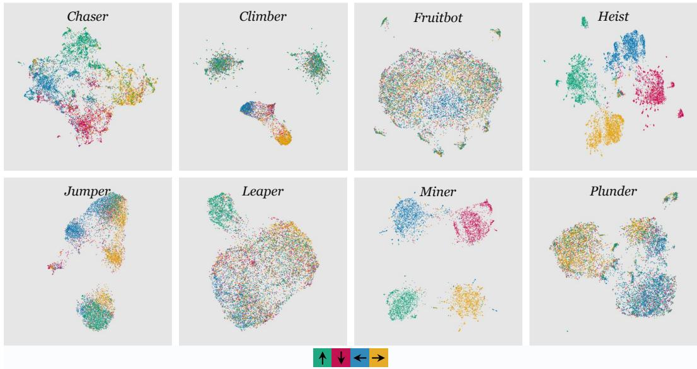  
Figure 7: UMAP projection of the learned latent action space. We visualize the latent action spaces of additional 8 Procgen environments.

SSv2  
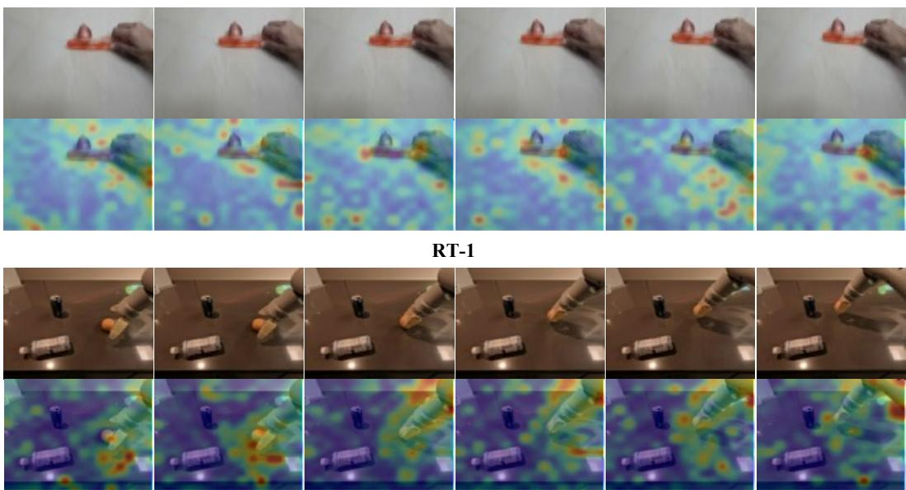  
Figure 8: Additional action-to-patch attention visualizations on SSv2 and RT-1. The top rows show the input frames, while the bottom rows show the corresponding attention heatmaps produced by AQ-IDM. The attention maps consistently highlight action-related regions.

using SGD with learning rate 0.01, batch size 32, and 5, 000 epochs. The probe is repeated with four independent seeds. More results are shown in Tab. 8.

## B.2 ACTION DIVERSITY

Following Garrido et al. (2023), we report the logarithm of singular values normalized by the largest singular value. Specifically, for each LAM, we sample 1, 000 RGB transition sequences, each con sisting of 16 frames. For each LAM, the IDM produces 15 latent actions from each context. We then select the target transition and obtain the latent action matrix $\mathcal { Z } \in \mathbb { R } ^ { 1 0 0 0 \times d _ { z } }$ . After that, we center Z across samples and compute its singular values $\sigma _ { 1 } \geq \cdot \cdot \cdot \geq \sigma _ { r }$ . We report the normalized log singular-value spectrum log $\left( \sigma _ { i } / \sigma _ { 1 } \right)$ in Fig. 3. Notably, a slower spectral decay indicates that the latent actions span a broader set of independent transition directions, reflecting higher diversity.

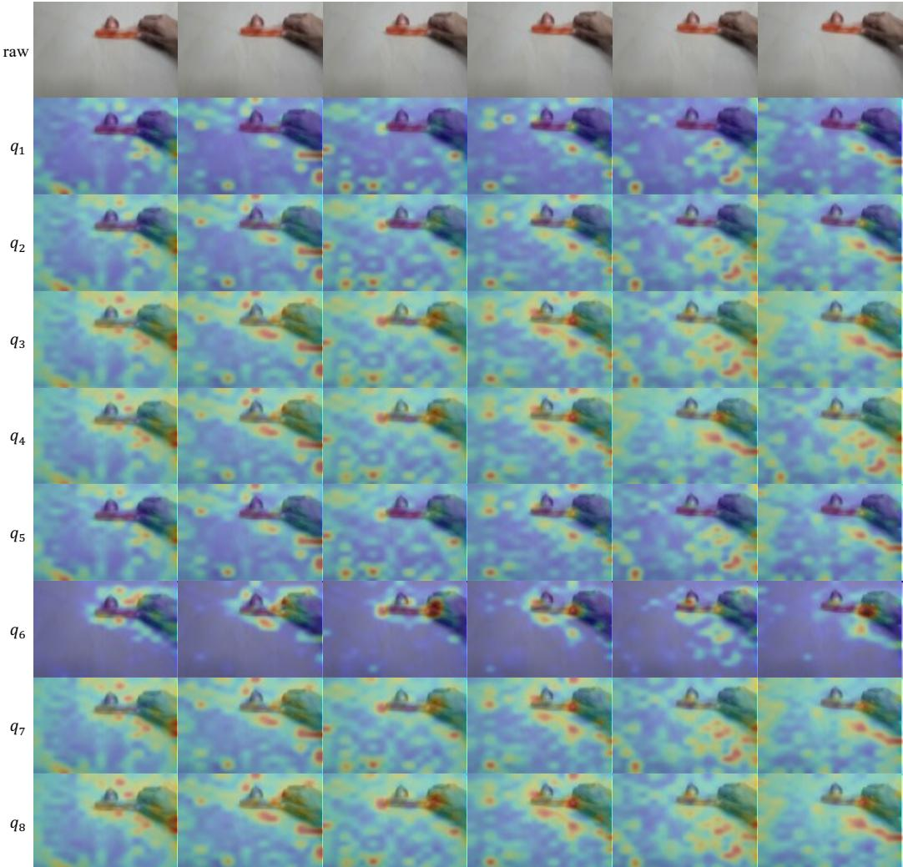  
Figure 9: Per-query action-to-patch attention maps. The top row shows the input RGB frames, while the remaining rows visualize the attention heatmaps produced by individual action queries $q _ { 1 }$ to $q _ { 8 }$ . Most queries distribute their attention broadly across action-related regions, while $q _ { 6 }$ shows a markedly more localized attention pattern.

## B.3 UMAP VISUALIZATION

We visualize the latent action spaces on selected test splits of the Procgen benchmark (Cobbe et al., 2020). For each environment, we use a set of 10, 000 transitions, with 2, 500 samples from each of the four cardinal action classes, i.e., LEFT, RIGHT, UP, and DOWN. Ground-truth actions are used only for color coding in the visualization. We include only environments with sufficient samples from all four action classes. Additional visualizations are provided in Fig. 7.

## B.4 ACTION-TO-PATCH ATTENTION

We provide additional visualizations of the action-to-patch attention (Zhou et al., 2016) in AQ-IDM. Specifically, we extract the query-to-patch attention weights and reshape them according to the spatial patch layout. Then, we upsample the resulting maps to the input image resolution for visualization. Fig. 8 presents additional examples from SSv2 and RT-1. To further observe the behavior of individual action queries, Fig. 9 visualizes the attention maps of $q _ { 1 }$ to $q _ { 8 }$ separately on an $\mathbf { S } \mathbf { S } \mathbf { v } 2$ sequence. Most queries distribute their attention broadly across action-related regions, while $q _ { 6 }$ shows a markedly more localized attention pattern. These results provide a more detailed view of how individual action queries respond to spatial transition cues.

Table 9: More rollout results.
<table><tr><td rowspan="2">Dataset</td><td rowspan="2">Model</td><td colspan="4">Recon. MSE↓</td></tr><tr><td>@1</td><td>@4</td><td>@8</td><td>@15</td></tr><tr><td rowspan="2">SSv2</td><td>Baseline</td><td> $0 . 1 7 4 \pm 0 . 0 8 7$ </td><td> $\mathbf { 0 . 2 8 5 \pm 0 . 1 1 4 }$ </td><td> $\mathbf { 0 . 4 5 1 \pm 0 . 1 1 9 }$ </td><td> $\mathbf { 0 . 6 5 6 \pm 0 . 1 0 9 }$ </td></tr><tr><td>Baseline w/ AT-FDM</td><td> $\mathbf { 0 . 1 7 2 \pm 0 . 0 8 5 }$ </td><td> $0 . 2 8 6 \pm 0 . 1 0 9$ </td><td> $0 . 5 1 6 \pm 0 . 0 9 7$ </td><td> $0 . 7 8 8 \pm 0 . 0 7 6$ </td></tr><tr><td rowspan="2">RT-1</td><td>Baseline</td><td> $0 . 1 2 0 \pm 0 . 0 5 3$ </td><td> $\mathbf { 0 . 2 1 8 \pm 0 . 0 8 0 }$ </td><td> $\mathbf { 0 . 3 7 9 \pm 0 . 0 8 2 }$ </td><td> $\mathbf { 0 . 5 7 9 \pm 0 . 0 6 9 }$ </td></tr><tr><td>Baseline w/ AT-FDM</td><td> $\mathbf { 0 . 1 1 8 \pm 0 . 0 5 2 }$ </td><td> $0 . 2 2 7 \pm 0 . 0 7 3$ </td><td> $0 . 4 9 0 \pm 0 . 0 6 8$ </td><td> $0 . 7 4 9 \pm 0 . 0 5 7$ </td></tr></table>

Table 10: Teacher-forcing results.
<table><tr><td rowspan="2">Model</td><td colspan="2">Recon. MSE ↓</td></tr><tr><td>SSv2</td><td>RT-1</td></tr><tr><td>DiLA</td><td> $0 . 3 8 6 \pm 0 . 1 1 3$ </td><td> $0 . 2 3 6 \pm 0 . 0 6 1$ </td></tr><tr><td>Baseline</td><td> $0 . 1 6 8 \pm 0 . 0 6 6$ </td><td> $0 . 1 2 1 \pm 0 . 0 3 5$ </td></tr><tr><td>Baseline w/ AT-FDM</td><td> $\mathbf { 0 . 1 6 6 \pm 0 . 0 6 5 }$ </td><td> $\mathbf { 0 . 1 1 8 \pm 0 . 0 3 4 }$ </td></tr><tr><td>ACT-LAM</td><td> $0 . 1 6 9 \pm 0 . 0 6 4$ </td><td> $0 . 1 2 0 \pm 0 . 0 3 4$ </td></tr></table>

## B.5 RECONSTRUCTION MSE

We evaluate multi-step forward dynamics on 2, 000 videos from the SSv2 test split and 2, 000 video from the RT-1 validation split, using the same evaluation set across all methods. Given an initial state and a sequence of latent actions, each model auto-regressively predicts subsequent states by harnessing its predicted state into the next step. The prediction errors are measured by MSE between the predicted and ground-truth DINO features. For each video, we average the per-step MSE over the first k predicted steps, with k ∈ {1, 4, 8, 15}. We then report the mean and standard deviation of the videos in each dataset. Notably, DiLA (Zhang et al., 2026b) is evaluated using its official implementation and checkpoint, which includes rollout finetuning. ACT-LAM is evaluated directly after teacher-forcing pretraining, without additional finetuning. More results are in Tab. 9 and 10.

## B.6 VIDEO GENERATION

We evaluate video generation quality on the same samples used for the MSE evaluation in Sec. B.5. Each model generates 15 future frames autoregressively, and SSIM (Wang et al., 2004) and LPIPS (Zhang et al., 2018) are computed against the raw RGB frames. @k denotes the averaged metric over the first k predicted frames. DiLA (Zhang et al., 2026b) and AdaWorld (Gao et al., 2025) use their official released code and checkpoints. Recon. passes each ground-truth future frame directly through the frozen DINOv2 encoder Oquab et al. (2024) and RAE decoder (Zheng et al., 2026a) without invoking latent actions or FDM rollout, and thus serves as a reconstruction reference.

As shown in Tab. 11 and 12, ACT-LAM achieves the best LPIPS across all SSv2 horizons and at short horizons on RT-1, while maintaining comparable SSIM performance. DiLA performs better in long-horizon SSIM, suggesting stronger structural alignment after rollout finetuning. SSIM emphasizes local structural consistency whereas LPIPS measures perceptual similarity. The superior LPIPS performance of ACT-LAM indicates that its action-conditioned dynamics better preserve perceptually plausible visual content.

## B.7 ACTION TRANSFER

We evaluate action transferability by extracting a 16-step action sequence from a source video and applying it to a different visual context through autoregressive generation. Fig. 10 presents the qualitative comparisons among AdaWorld, DiLA, and ACT-LAM. DiLA generally achieves the highest visual fidelity, while ACT-LAM still captures motion patterns across different contexts. We emphasize that this experiment is intended to assess the transferability of the learned latent actions rather than reconstruction fidelity, which is not the primary objective of ACT-LAM.

Table 11: Rollout SSIM on SSv2 and RT-1.
<table><tr><td rowspan="2">Dataset</td><td rowspan="2">Model</td><td colspan="4">SSIM ↑</td></tr><tr><td>@1</td><td>@4</td><td>@8</td><td>@15</td></tr><tr><td rowspan="4">SSv2</td><td>Recon.</td><td> $0 . 7 1 8 \pm 0 . 1 4 2$ </td><td> $0 . 7 1 7 \pm 0 . 1 4 1$ </td><td> $0 . 7 1 7 \pm 0 . 1 4 0$ </td><td> $0 . 7 1 7 \pm 0 . 1 4 1$ </td></tr><tr><td>AdaWorld (FDM)</td><td> $\mathbf { 0 . 6 9 2 \pm 0 . 1 5 4 }$ </td><td> $0 . 6 1 1 \pm 0 . 1 5 7$ </td><td> $0 . 5 8 0 \pm 0 . 1 5 8$ </td><td> $0 . 5 5 7 \pm 0 . 1 6 0$ </td></tr><tr><td>DiLA</td><td> $0 . 6 1 3 \pm 0 . 1 4 9$ </td><td> $0 . 5 9 9 \pm 0 . 1 4 8$ </td><td> $\mathbf { 0 . 5 8 8 \pm 0 . 1 4 8 }$ </td><td> $\mathbf { 0 . 5 7 8 \pm 0 . 1 5 0 }$ </td></tr><tr><td>ACT-LAM</td><td> $0 . 6 7 8 \pm 0 . 1 4 5$ </td><td> $\mathbf { 0 . 6 3 3 \pm 0 . 1 4 5 }$ </td><td> $0 . 5 7 2 \pm 0 . 1 4 7$ </td><td> $0 . 5 0 8 \pm 0 . 1 4 8$ </td></tr><tr><td rowspan="4">RT-1</td><td>Recon.</td><td> $0 . 6 2 3 \pm 0 . 0 7 5$ </td><td> $0 . 6 2 2 \pm 0 . 0 7 3$ </td><td> $0 . 6 2 1 \pm 0 . 0 7 3$ </td><td> $0 . 6 2 1 \pm 0 . 0 7 2$ </td></tr><tr><td>AdaWorld (FDM)</td><td> $\mathbf { 0 . 6 7 9 \pm 0 . 0 9 1 }$ </td><td> $0 . 5 0 0 \pm 0 . 0 9 5$ </td><td> $0 . 4 2 4 \pm 0 . 0 8 3$ </td><td> $0 . 3 7 7 \pm 0 . 0 7 4$ </td></tr><tr><td>DiLA</td><td> $0 . 5 6 5 \pm 0 . 0 7 8$ </td><td> $\mathbf { 0 . 5 4 5 \pm 0 . 0 8 0 }$ </td><td> $\mathbf { 0 . 5 2 6 \pm 0 . 0 8 1 }$ </td><td> $\mathbf { 0 . 5 0 6 \pm 0 . 0 8 2 }$ </td></tr><tr><td>ACT-LAM</td><td> $0 . 5 8 9 \pm 0 . 0 7 5$ </td><td> $0 . 5 3 6 \pm 0 . 0 7 2$ </td><td> $0 . 4 4 9 \pm 0 . 0 6 7$ </td><td> $0 . 3 7 5 \pm 0 . 0 6 0$ </td></tr></table>

Table 12: Rollout LPIPS on SSv2 and RT-1.
<table><tr><td rowspan="2">Dataset</td><td rowspan="2">Model</td><td colspan="4">LPIPS↓</td></tr><tr><td>@1</td><td>@4</td><td>@8</td><td>@15</td></tr><tr><td rowspan="4">SSv2</td><td> $R e c o n .$ </td><td> $0 . 1 2 5 \pm 0 . 0 4 0$ </td><td> $0 . 1 2 5 \pm 0 . 0 3 8$ </td><td> $0 . 1 2 5 \pm 0 . 0 3 8$ </td><td> $0 . 1 2 5 \pm 0 . 0 3 8$ </td></tr><tr><td>AdaWorld (FDM)</td><td> $0 . 4 3 6 \pm 0 . 1 8 4$ </td><td> $0 . 6 1 2 \pm 0 . 1 5 8$ </td><td> $0 . 6 7 8 \pm 0 . 1 4 2$ </td><td> $0 . 7 2 3 \pm 0 . 1 3 0$ </td></tr><tr><td>DiLA</td><td> $0 . 3 8 7 \pm 0 . 1 4 9$ </td><td> $0 . 4 8 9 \pm 0 . 1 4 3$ </td><td> $0 . 5 6 8 \pm 0 . 1 3 6$ </td><td> $0 . 6 3 7 \pm 0 . 1 3 0$ </td></tr><tr><td>ACT-LAM</td><td> $\mathbf { 0 . 1 9 1 \pm 0 . 0 8 4 }$ </td><td> $\mathbf { 0 . 2 3 1 \pm 0 . 0 9 5 }$ </td><td> $\mathbf { 0 . 3 1 6 \pm 0 . 0 9 6 }$ </td><td> $\mathbf { 0 . 4 3 0 \pm 0 . 0 8 7 }$ </td></tr><tr><td rowspan="4">RT-1</td><td>Recon.</td><td> $0 . 1 4 6 \pm 0 . 0 2 7$ </td><td> $0 . 1 4 6 \pm 0 . 0 2 4$ </td><td> $0 . 1 4 6 \pm 0 . 0 2 4$ </td><td> $0 . 1 4 7 \pm 0 . 0 2 3$ </td></tr><tr><td>AdaWorld (FDM)</td><td> $0 . 3 1 5 \pm 0 . 1 1 4$ </td><td> $0 . 5 6 0 \pm 0 . 1 2 2$ </td><td> $0 . 6 5 6 \pm 0 . 1 0 2$ </td><td> $0 . 7 1 3 \pm 0 . 0 9 0$ </td></tr><tr><td>DiLA</td><td> $0 . 2 2 0 \pm 0 . 0 5 6$ </td><td> $0 . 2 5 9 \pm 0 . 0 7 2$ </td><td> $\mathbf { 0 . 3 0 5 \pm 0 . 0 9 8 }$ </td><td> ${ \bf 0 . 3 6 4 \pm 0 . 1 2 5 }$ </td></tr><tr><td>ACT-LAM</td><td> $\mathbf { 0 . 1 7 7 \pm 0 . 0 3 6 }$ </td><td> $\mathbf { 0 . 2 2 2 \pm 0 . 0 5 0 }$ </td><td> $0 . 3 2 5 \pm 0 . 0 5 3$ </td><td> $0 . 4 3 8 \pm 0 . 0 4 9$ </td></tr></table>

## B.8 UTILIZATION ANALYSIS

Definition. To quantify latent action utilization, we compare two rollouts: (i) driven by the original latent action sequence, and (ii) using a constant action at every step. Specifically, the FDM predicts a state residual with Eq. (2). For a horizon h, we compute:

$$
E _ { \mathrm { a c t i o n } } ( h ) = { \frac { 1 } { h } } \sum _ { i = 1 } ^ { h } \mathrm { M S E } ( { \hat { s } } _ { i } , s _ { i } ) .\tag{12}
$$

And we obtain $E _ { \mathrm { c o n s t a n t } } ( h )$ by replacing every $z _ { t }$ with the mean action c of the training set. Based on $E _ { \mathrm { a c t i o n } } ( h )$ and $E _ { \mathrm { c o n s t a n t } } ( h )$ , we define action utilization as:

$$
U ( h ) = \frac { E _ { \mathrm { c o n s t a n t } } ( h ) - E _ { \mathrm { a c t i o n } } ( h ) } { E _ { \mathrm { c o n s t a n t } } ( h ) } \times 1 0 0 \% .\tag{13}
$$

Thus, U(h) measures the state MSE reduction achieved by the original latent actions relative to the constant action baseline. We deem that higher values indicate more effective action utilization.

Experimental Protocol. We freeze the pretrained visual encoder, state adapter, and AQ-IDM, and train only different FDMs. For each dataset, we use the same fixed 8, 000/1, 000/1, 000 split for training, validation, and testing, respectively. All models share the same test windows and latent actions. We evaluate autoregressive rollouts at horizons $h \in \{ 1 , 4 , 8 , 1 5 \}$ and report the mean and standard deviation over four training seeds.

FDM Configurations. As detailed in Tab. 13, all configurations use the same state encoder and dynamics backbone, with only the action-conditioning mechanism varied. For a fair comparison, each FDM contains approximately 18M parameters.

Detailed Results. As summarized in Tab. 14, the detailed utilization scores demonstrate that AT-FDM shows the strongest increase with rollout horizon and achieves the highest average at longer horizons. These results suggest that continuous state-aware action modulation enables the FDM to make more effective utilization of latent actions throughout the rollout.

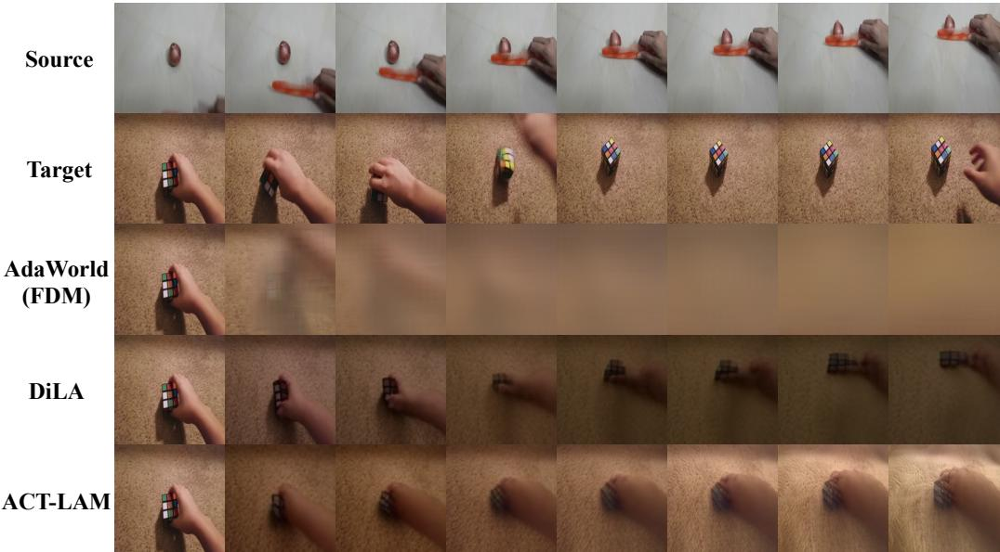  
Figure 10: Qualitative comparison of action transferability on SSv2. We extract a 16-step latent action sequence from the source video and apply it autoregressively to the target visual context. The top two rows show the source and target reference sequences, while the remaining rows show the transferred rollouts generated by AdaWorld, DiLA, and ACT-LAM.

Table 13: Action-conditioning configurations. Only the action-conditioning mechanism differs.
<table><tr><td>FDM</td><td>Action-conditioning mechanism</td></tr><tr><td>Add-FDM</td><td>Broadcast action embeddings are added to all patch tokens</td></tr><tr><td>XAttn-FDM</td><td>Patch queries attend to action embeddings as keys and values</td></tr><tr><td>Concat-FDM</td><td>Patch and action embeddings are concatenated and jointly projected</td></tr><tr><td>AdaLN-FDM</td><td>Action-conditioned adaptive modulation of normalized patch tokens</td></tr><tr><td>AT-FDM</td><td>Continuous state-aware action modulation via evolving action tokens</td></tr></table>

## B.9 VISUAL PLANNING

Action Adaptation. We evaluate the model’s ability in robotic control on the $\mathrm { { V P ^ { 2 } } }$ benchmark (Tian et al., 2023), following the protocol used in prior works (Gao et al., 2025; Zhang et al., 2026b). Since LAMs operate in the latent action space, we first train an action-to-latent MLP for each environment. Specifically, we randomly sample 100 training trajectories, yielding 3, 400 transition pairs. For each transition, the pretrained IDM extracts the corresponding latent action. The action adapter is a twolayer MLP with SiLU activations. The raw action dimension is $d _ { a } = 4$ for RoboSuite and $d _ { a } = 5$ for RoboDesk. The pretrained LAM remains frozen during adaptation. We optimize the adapter with SGD for 3, 000 epochs using a learning rate of 0.01 and a batch size of 10.

Joint Finetuning. After obtaining the action-to-latent adapter, we replace the pretrained IDM with the learned MLP and jointly finetune the MLP with the FDM. In this stage, we sample 16-frame windows from the training trajectories and optimize the model for 3, 000 steps using AdamW with a learning rate of $1 \times 1 0 ^ { - 4 }$ , a weight decay of $1 \times 1 0 ^ { - 5 }$ , and a batch size of 8. The joint finetuning is optimized by $\mathcal { L } _ { r e c }$ and $\mathcal { L } _ { g r i d } .$

Visual Planning with $\mathbf { V P } ^ { 2 }$ . Once finetuning is complete, the LAM is used as the predictive dynamics model within the official $\mathrm { { V P ^ { 2 } } }$ implementation. Each evaluation consists of 100 trajectories for RoboSuite and 30 trajectories for RoboDesk, with a maximum trajectory length of 15 control steps. The planner takes 2 context frames and harnesses a planning horizon of 10. At each planning step, MPPI (Williams et al., 2016) performs a single optimization using 200 candidate action sequences for RoboSuite and most RoboDesk tasks. For Open Slide, following DiLA (Zhang et al., 2026b), we increase the number to 800.

Table 14: The detailed action utilization scores across four datasets. Values are reported as mean ± standard deviation over 4 random seeds.
<table><tr><td rowspan="2">Dataset</td><td rowspan="2">FDM</td><td colspan="4">Utilization (%) ↑</td></tr><tr><td>@1</td><td>@4</td><td>@8</td><td>@15</td></tr><tr><td rowspan="5">SSv2</td><td>Add-FDM</td><td> $1 1 . 7 \pm 0 . 2$ </td><td> $1 3 . 4 \pm 0 . 4$ </td><td> $1 3 . 1 \pm 0 . 3$ </td><td> $1 0 . 8 \pm 1 . 3$ </td></tr><tr><td>Concat-FDM</td><td> $1 1 . 6 \pm 0 . 5$ </td><td> $1 2 . 8 \pm 0 . 6$ </td><td> $1 1 . 9 \pm 0 . 4$ </td><td> $2 . 7 \pm 8 . 2$ </td></tr><tr><td>XAttn-FDM</td><td> $1 1 . 4 \pm 0 . 4$ </td><td> $1 2 . 6 \pm 0 . 9$ </td><td> $1 1 . 7 \pm 1 . 5$ </td><td> $9 . 2 \pm 2 . 7$ </td></tr><tr><td>AdaLN-FDM</td><td> $1 3 . 1 \pm 0 . 5$ </td><td> $1 4 . 9 \pm 0 . 6$ </td><td> $1 4 . 7 \pm 0 . 8$ </td><td> $1 4 . 2 \pm 1 . 3$ </td></tr><tr><td>AT-FDM</td><td> ${ \bf 1 5 . 1 \pm 0 . 7 }$ </td><td> ${ \bf 2 2 . 8 \pm 0 . 6 }$ </td><td> ${ \bf 3 0 . 6 \pm 0 . 4 }$ </td><td> ${ \bf 4 1 . 7 \pm 0 . 8 }$ </td></tr><tr><td rowspan="5">RT-1</td><td>Add-FDM</td><td> $2 2 . 7 \pm 0 . 4$ </td><td> $2 6 . 8 \pm 0 . 4$ </td><td> $2 5 . 2 \pm 0 . 4$ </td><td> $2 0 . 7 \pm 0 . 5$ </td></tr><tr><td>Concat-FDM</td><td> $2 2 . 9 \pm 0 . 3$ </td><td> $2 7 . 3 \pm 0 . 2$ </td><td> $2 5 . 8 \pm 0 . 4$ </td><td> $2 0 . 9 \pm 1 . 1$ </td></tr><tr><td>XAttn-FDM</td><td> $2 2 . 6 \pm 0 . 3$ </td><td> $2 7 . 0 \pm 0 . 5$ </td><td> $2 5 . 6 \pm 1 . 0$ </td><td> $2 1 . 2 \pm 2 . 0$ </td></tr><tr><td>AdaLN-FDM</td><td> ${ \bf 2 4 . 6 \pm 0 . 2 }$ </td><td> ${ \bf 2 8 . 9 \pm 0 . 4 }$ </td><td> $2 7 . 1 \pm 0 . 4$ </td><td> $2 2 . 1 \pm 0 . 4$ </td></tr><tr><td>AT-FDM</td><td> $2 4 . 1 \pm 0 . 7$ </td><td> $2 8 . 6 \pm 0 . 5$ </td><td> ${ \bf 2 8 . 4 \pm 0 . 5 }$ </td><td> ${ \bf 2 6 . 9 \pm 0 . 8 }$ </td></tr><tr><td rowspan="5">RECON</td><td>Add-FDM</td><td> $2 9 . 6 \pm 0 . 5$ </td><td> $3 5 . 6 \pm 1 . 4$ </td><td> $4 2 . 6 \pm 2 . 8$ </td><td> $5 4 . 7 \pm 4 . 3$ </td></tr><tr><td>Concat-FDM</td><td> $2 9 . 6 \pm 0 . 8$ </td><td> $3 4 . 8 \pm 2 . 3$ </td><td> $4 1 . 0 \pm 3 . 5$ </td><td> $5 1 . 8 \pm 3 . 9$ </td></tr><tr><td>XAttn-FDM</td><td> $2 9 . 7 \pm 0 . 3$ </td><td> $3 5 . 5 \pm 0 . 9$ </td><td> $4 2 . 7 \pm 1 . 8$ </td><td> $5 4 . 3 \pm 2 . 5$ </td></tr><tr><td>AdaLN-FDM</td><td> ${ \bf 3 2 . 2 \pm 0 . 4 }$ </td><td> $3 8 . 5 \pm 1 . 1$ </td><td> $4 6 . 0 \pm 1 . 9$ </td><td> $5 8 . 1 \pm 5 . 0$ </td></tr><tr><td>AT-FDM</td><td> $3 1 . 1 \pm 1 . 5$ </td><td> ${ \bf 4 4 . 2 \pm 3 . 2 }$ </td><td> ${ \bf 5 6 . 8 \pm 4 . 9 }$ </td><td> ${ \bf 7 0 . 8 \pm 5 . 8 }$ </td></tr><tr><td rowspan="5">LoopNav</td><td>Add-FDM</td><td> $1 7 . 8 \pm 1 . 5$ </td><td> $2 0 . 9 \pm 2 . 1$ </td><td> $2 2 . 0 \pm 2 . 4$ </td><td> $2 3 . 9 \pm 3 . 1$ </td></tr><tr><td>Concat-FDM</td><td> $1 8 . 7 \pm 1 . 7$ </td><td> $2 2 . 0 \pm 2 . 3$ </td><td> $2 3 . 2 \pm 2 . 5$ </td><td> $2 5 . 4 \pm 2 . 3$ </td></tr><tr><td>XAttn-FDM</td><td> $1 7 . 3 \pm 0 . 6$ </td><td> $2 0 . 3 \pm 0 . 9$ </td><td> $2 1 . 5 \pm 1 . 0$ </td><td> $2 3 . 8 \pm 1 . 5$ </td></tr><tr><td>AdaLN-FDM</td><td> $1 9 . 9 \pm 1 . 7$ </td><td> $2 3 . 1 \pm 2 . 1$ </td><td> $2 3 . 9 \pm 2 . 0$ </td><td> $2 5 . 4 \pm 1 . 6$ </td></tr><tr><td>AT-FDM</td><td> ${ \bf 2 0 . 9 \pm 1 . 7 }$ </td><td> ${ \bf 2 8 . 1 \pm 2 . 7 }$ </td><td> ${ \bf 3 4 . 8 \pm 3 . 6 }$ </td><td> ${ \bf 4 5 . 9 \pm 3 . 5 }$ </td></tr><tr><td rowspan="5">Average</td><td>Add-FDM</td><td> $2 0 . 4 \pm 0 . 6$ </td><td> $2 4 . 2 \pm 0 . 9$ </td><td> $2 5 . 7 \pm 1 . 3$ </td><td> $2 7 . 5 \pm 1 . 9$ </td></tr><tr><td>Concat-FDM</td><td> $2 0 . 7 \pm 0 . 8$ </td><td> $2 4 . 2 \pm 1 . 3$ </td><td> $2 5 . 5 \pm 1 . 5$ </td><td> $2 5 . 2 \pm 2 . 8$ </td></tr><tr><td>XAttn-FDM</td><td> $2 0 . 2 \pm 0 . 3$ </td><td> $2 3 . 9 \pm 0 . 6$ </td><td> $2 5 . 4 \pm 0 . 9$ </td><td> $2 7 . 1 \pm 1 . 3$ </td></tr><tr><td>AdaLN-FDM</td><td> $2 2 . 5 \pm 0 . 3$ </td><td> $2 6 . 4 \pm 0 . 1$ </td><td> $2 7 . 9 \pm 0 . 1$ </td><td> $3 0 . 0 \pm 1 . 0$ </td></tr><tr><td>AT-FDM</td><td> ${ \bf 2 2 . 8 \pm 1 . 1 }$ </td><td> ${ \bf 3 0 . 9 \pm 1 . 7 }$ </td><td> ${ \bf 3 7 . 7 \pm 2 . 3 }$ </td><td> ${ \bf 4 6 . 3 \pm 2 . 4 }$ </td></tr></table>

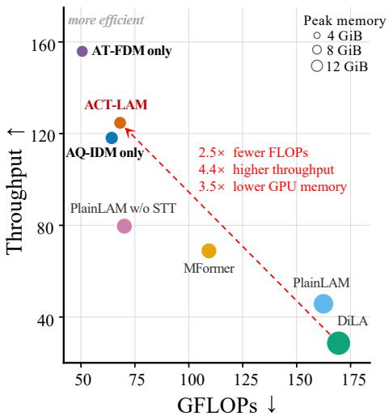  
Figure 11: Training efficiency at batch size 1. The x-axis reports GFLOPs per RGB frame, the yaxis reports throughput in frames/s, and bubble area denotes peak GPU memory. The dashed arrow highlights the efficiency improvement of ACT-LAM over DiLA.

## C EFFICIENCY EVALUATION

We evaluate the training-time efficiency of the compared LAM architectures under the teacherforcing paradigm. All measurements use 16-frame 256 × 256 RGB clips, FP32 precision, and an RTX A6000 GPU. FLOPs include the forward and backward passes but exclude the optimizer update. We report GFLOPs per RGB frame, throughput in frames/s, and peak allocated GPU memory.

Table 15: Training efficiency at batch size 1.
<table><tr><td>Model</td><td>Params. (M)</td><td></td><td>GFLOPs ↓ Peak memory (GiB) ↓ 7</td><td>Throughput (frames/s) ↑</td></tr><tr><td>PlainLAM</td><td>118.4</td><td>162.4</td><td>9.4</td><td>45.8</td></tr><tr><td>PlainLAM w/o STT</td><td>67.3</td><td>70.1</td><td>5.7</td><td>79.6</td></tr><tr><td>MFormer</td><td>39.9</td><td>109.3</td><td>5.6</td><td>68.9</td></tr><tr><td>DiLA</td><td>123.0</td><td>169.4</td><td>13.0</td><td>28.6</td></tr><tr><td>AQ-IDM only</td><td>44.7</td><td>64.3</td><td>4.0</td><td>118.1</td></tr><tr><td>AT-FDM only</td><td>78.7</td><td>50.6</td><td>3.3</td><td>155.9</td></tr><tr><td>ACT-LAM</td><td>54.6</td><td>68.2</td><td>3.7</td><td>124.7</td></tr></table>

As shown in Fig. 11, the upper-left region corresponds to lower computation and higher throughput. Compared with DiLA, ACT-LAM requires 2.49× fewer GFLOPs, achieves 4.36× higher throughput, and uses 3.47× less peak GPU memory. Under the same hardware and protocol, PlainLAM and DiLA reach out-of-memory at batch size 8, whereas the remaining models run successfully. The detailed results are summarized in Tab. 15.

## D MORE ANALYSES

## D.1 LAM PRETRAINING

As shown in Fig. 12, we visualize the validation losses of the compared LAMs over 50k pretraining steps, including the reconstruction loss, grid loss, and action loss. These losses correspond to the visual reconstruction, latent state reconstruction, and IDM action prediction objectives, respectively. Among these curves, PlainLAM achieves a relatively low reconstruction loss, while ACT-LAM consistently attains lower grid and action losses, indicating more effective latent action learning and improved latent dynamics modeling.

## D.2 VP2 FINETUNING

We further examine the validation dynamics during $\mathrm { { V P ^ { 2 } } }$ joint finetuning. As shown in Fig. 13, it reports the adapter MSE and rollout state MSE on Robosuite and RoboDesk over 3k finetuning steps. Although PlainLAM and PlainLAM without STT achieve relatively strong visual reconstruction during pretraining (see Fig. 12 (a)), they exhibit substantially higher adapter and rollout state errors in joint finetuning. This contrast indicates that the reconstruction quality alone does not guarantee an effective action-conditioned dynamics. In comparison, ACT-LAM generally obtains lower rollout errors, suggesting better compatibility with robot action adaptation.

## D.3 $\mathrm { \Delta V P ^ { 2 } }$ ABLATION

As illustrated in Fig. 14, we evaluate the individual contributions of AQ-IDM and AT-FDM on the $\mathrm { { V P ^ { 2 } } }$ benchmark. The full ACT-LAM achieves the highest success rate, while both singlecomponent models remain competitive, demonstrating that AQ-IDM and AT-FDM provide complementary gains. Given the high computational cost of $\mathrm { { V P ^ { 2 } } }$ evaluation, we report these ablation results using a single random seed.

## D.4 $\mathrm { \Delta V P ^ { 2 } }$ VIDEO PREDICTION

As shown in Fig. 15, we visualize representative $\mathrm { { V P ^ { 2 } } }$ rollout sequences on RoboSuite and Ro boDesk, comparing Simulator (top) and ACT-LAM (bottom). For each trajectory, we uniformly sample observations with a stride of 2. Notably, ACT-LAM reaches the desired state in fewer steps in several cases, whereas Simulator requires additional control steps. These examples suggest that ACT-LAM can produce temporally efficient action sequences, providing qualitative evidence complementary to the aggregate success rate results.

PlainLAM ACT-LAM AT-FDM only PlainLAM w/o STT AQ-IDM only MFormer

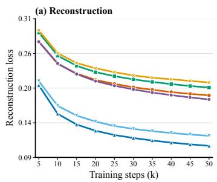

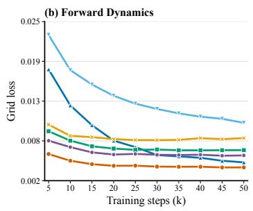  
PlainLAM ACT-LAM AT-FDM only PlainLAM w/o STT AQ-IDM only MFormer

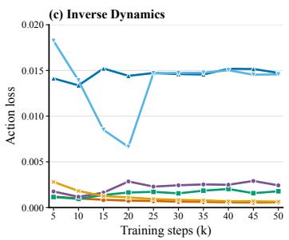

Figure 12: Detailed validation losses during pretraining. We report the reconstruction loss, gird loss, and action loss of the compared LAMs throughout 50k steps. These curves provide a detailed view of the pretraining trends of different LAM architectures.  
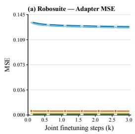

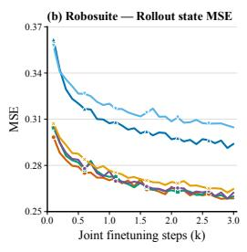

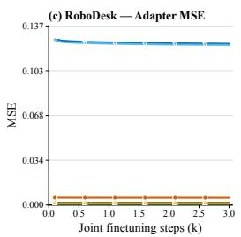

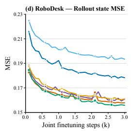

Figure 13: Detailed validation curves during $\mathbf { V P } ^ { 2 }$ joint finetuning. We report the adapter MSE and rollout state MSE on the Robosuite and RoboDesk benchmarks throughout finetuning. The curves show the adaptation and predictive dynamics trends of the compared LAMs.  
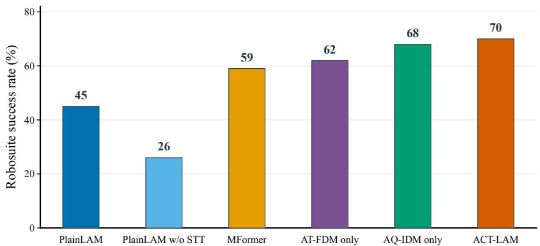  
Figure 14: $\mathbf { V P } ^ { 2 }$ ablation. Success rates of different LAMs on the RoboSuite benchmark. All methods are evaluated under the same protocol. Results are reported using a single random seed due to the high computational cost.

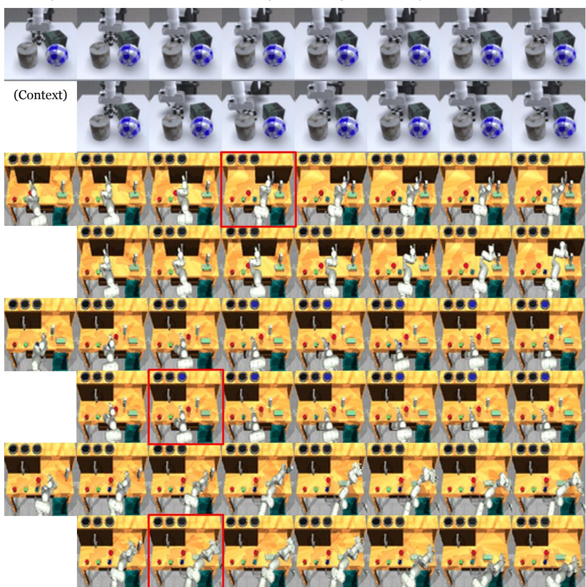  
Figure 15: Visualization of video prediction results. Predicted rollouts generated by Simulator (top) and ACT-LAM (bottom) on VP2 tasks including robosuite and RoboDesk.