# RSIAgent: Autonomous Exploration for Recursive Self-improvement in New Environments

Sibo Zhu1,2,†,‡, Shicheng Fan1,3,†,‡, Xinyue Wang1,2,†,‡, Wenyi Wu1,2,‡, Kun Zhou1,\*, Biwei Huang1

1 Aether AI, 2 University of California San Diego, 3 University of Illinois Chicago

\*Corresponding author and project leader; †Equal contribution; ‡Work done during internship in Aether AI

Digital agents must often adapt to new environments whose interfaces, tools, and failure modes are not fully captured by pretrained models. We introduce RSIAgent, a training-free multi-agent framework for recursive self-improvement through autonomous memory construction. RSIAgent coordinates curriculum, actor, and verifier agents to continually explore the environment, validate outcomes, and retain environment-specific knowledge, including reusable causal relationships between actions, conditions, and consequences. It further adopts a broad-then-deep exploration strategy, combining parallel broad recursive self-exploration for discovering diverse environment structures with focused deep self-exploration for uncovering hard cases, hidden constraints, boundary conditions, and previously unknown causal dependencies. The resulting memory is frozen and can be directly reused for downstream tasks without updating model parameters. Experiments on OSWorld-v2 and Agent’s Last Exam show that RSIAgent substantially improves strong open-source models, enabling Kimi-K3 and GLM-5.3 to outperform frontier closed-source models including GPT-6.

Keywords: Recursive Self-Improvement, Digital Agents, Broad & Deep Self-Exploration, Agentic Causal Discovery

Correspondence: Kun Zhou (franciskunzhou@gmail.com) Code: github.com/AetherLabsAI/RSIAgent Website: aetherlabsai.github.io/RSIAgent/

AETHER ΛI

(a) Recursive self-improvement  
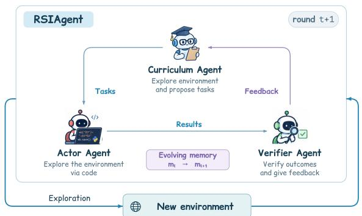

(b) Benchmark performance  
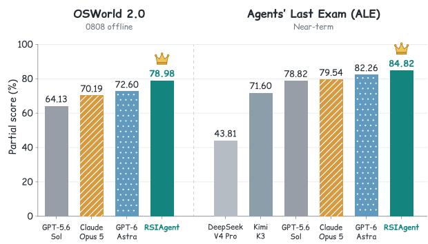  
Figure 1. Overview of RSIAgent. (a) Without any gold labels or human supervision, RSIAgent autonomously explores and adapts to the new environment via the recursive curriculum-action-verification loop. (b) RSIAgent enables open-source models (Kimi-K3 and GLM-5.3) to surpass frontier closed-source models such as GPT-6 Astra, on the OSWorld 2.0 (0808 ofline) and Agents’ Last Exam (Near-term).

## 1 Introduction

Driven by scaling laws, large language models (LLMs) and vision-language models (VLMs) have demonstrated stronger abilities in perception, reasoning, planning, and tool use [55]. Building on these advances, digital agent systems have emerged as a promising paradigm for automating complex user tasks in digital computer environments [10, 40, 41]. They interact with environments by observing visual or interface information, and executing actions such as clicking or generating programs [1, 4, 7, 8, 25, 37, 56].

However, in real-world applications, digital agent systems are often required to operate in new environments whose interfaces, tools, conventions, and failure modes may not be fully captured by their pretrained knowledge. Existing adaptation approaches commonly rely on collecting additional interaction data for further training, often with human assistance. While efective, this paradigm introduces substantial cost and is dificult to apply in private or continuously changing environments [10, 23, 30]. In contrast, training-free adaptation through context management ofers a more flexible alternative, and recent work has shown that efectively organizing memory information within the context can substantially improve agent performance [22, 54]. Beyond simply memorizing successful trajectories, efective adaptation should also enable agents to discover stable causal relationships between actions, environment conditions, and outcomes, and organize these relationships into reusable causal structures. This raises a fundamental question: can an agent autonomously discover causal relations from a new environment into a reusable memory to improve itself?

Human learning of new software often follows a recursive loop: first identifying what needs to be learned, then interacting with the environment to collect experience, and finally distilling useful knowledge from observed outcomes. Importantly, this process is not merely experience accumulation, but also a form of causal discovery: by actively trying diferent actions and observing their consequences, humans gradually infer which factors determine success, failure, and state transitions. Inspired by this process, we design a recursive self-improvement (RSI) framework for digital agents in new environments. To instantiate this loop, we introduce a multi-agent framework with three complementary roles that continually expand and refine memory with newly acquired causal knowledge. The curriculum agent decides what to explore next, the actor agent interacts with the environment and updates the memory, and the verifier agent grounds observed outcomes with environment feedback, allowing the system to progressively uncover and consolidate reusable causal structures.

Building on this multi-agent framework, we devise RSIAgent, a two-stage training-free evolving strategy that autonomously explores a new environment to construct reusable memory. We adopt a broad-then-deep strategy: Broad Recursive Self-exploration (BRS) explores diverse directions in parallel to acquire an overall understanding of the environment, while Deep Recursive Self-exploration (DRS) focuses on important directions to uncover corner cases, hidden constraints, and boundary conditions. This coarse-to-fine process first builds broad coverage and then refines critical details, resembling the pretraining-then-posttraining paradigm in modern LLM development. The resulting memory is finally frozen and directly reused to support downstream task execution.

Empirically, RSIAgent enables strong recursive self-improvement across diferent open-source models. On both OSWorld-v2 [47] and Agent’s Last Exam [24], RSIAgent substantially improves Kimi-K3 and GLM-5.3 through autonomous exploration and memory reuse, allowing these open-source models to outperform frontier closed-source models, including Claude Opus 5 and GPT-6. These results demonstrate that efective agent-level self-improvement can significantly narrow, and even reverse, the capability gap between open- and closed-source foundation models without updating model parameters.

Our main contributions are:

• We propose RSIAgent, a general multi-agent framework for recursive self-improvement, enabling to autonomously acquire, verify, and reuse knowledge in new environments without updating model parameters.

• We design Broad Recursive Self-exploration and Deep Recursive Self-exploration to first acquire diverse environment knowledge and then refine hard cases, hidden constraints, and boundary conditions.

• We show that RSIAgent can recursively improve open-source models, enabling Kimi-K3 and GLM-5.3 to outperform frontier closed-source models on OSWorld-v2 and Agent’s Last Exam.

## 2 Preliminary

In this paper, we formalize the digital agent and define the problem studied in this work.

Agent in Digital Environments. Given a task instruction $q ,$ a digital agent interacts with an environment E through a sequence of actions $a _ { 1 } , \dots , a _ { T }$ until the task requirements are satisfied. At step �, the agent $\pi _ { \theta }$ generates an executable action $a _ { t }$ conditioned on the durable memory � and the interaction history $h _ { t } = ( o _ { 0 } , a _ { 1 } , \ldots , a _ { t - 1 } , o _ { t - 1 } )$ , where $o _ { 0 }$ denotes the initial environment observation. After executing $a _ { t } ,$ , the environment transitions to a new state and returns a new observation:

$$
a _ { t } \sim \pi _ { \theta } ( \cdot \mid q , h _ { t } , M ) , \qquad ( s _ { t } , o _ { t } ) \sim { \mathcal E } ( \cdot \mid s _ { t - 1 } , a _ { t } ) .\tag{1}
$$

Here, $s _ { t }$ denotes the underlying environment state, which may not be directly observable to the agent. The resulting observation $o _ { t }$ is appended to the interaction history to form $h _ { t + 1 }$ for the next decision. The interaction history is reset when switching to a new task, whereas the durable memory � persists and retains reusable knowledge acquired across tasks.

In our implementation, we adopt a code-as-policy formulation, where each action $a _ { t }$ is represented as an executable program. This action space provides a general interface for controlling heterogeneous software systems, including GUI applications. Our RSI framework builds on this paradigm by introducing autonomous exploration and persistent memory updates, enabling the agent to continually acquire and reuse environment-specific knowledge without modifying model parameters.

Problem Statement. In this paper, we study recursive self-improvement of an agent system in a new environment without updating model parameters. Given a new environment E, the agent $\pi _ { \theta }$ first performs autonomous exploration to construct a persistent memory � that captures reusable environment-specific knowledge, and then directly reuses this memory to support downstream tasks at test time. Accordingly, the central problem is to design an exploration strategy that can eficiently identify informative experiences, ground them with reliable environment feedback, and continuously consolidate the resulting knowledge into memory.

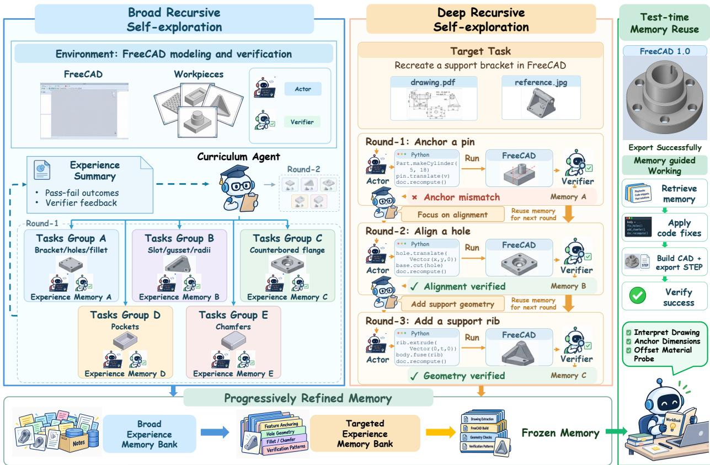  
Figure 2. Overview of RSIAgent, illustrated with a FreeCAD task. BRS acquires diverse experience through parallel exploration; DRS iteratively refines memory through going deeper. The curriculum agent proposes tasks, the actor agent executes code-based actions and updates memory, and the verifier agent checks outcomes. The accumulated memory is frozen and reused for downstream tasks.

## 3 Methodology

In this section, we present RSIAgent, a recursive self-improvement framework that enables agents to autonomously explore and adapt to new environments. Section 3.1 introduces the multi agent harness framework, which decomposes the agent system into three collaborative agent roles. Section 3.2 then presents our broad-then-deep recursive self-exploration strategy for continually updating the memory and reusing it at test time. Figure 2 provides an overview of our method.

## 3.1 Multi-Agent Harness Framework

To better control autonomous exploration and self-improvement in a new environment, we design a multi-agent harness framework that can operate through a coordinated recursive loop. The framework consists of an actor agent with evolvable memory, a verifier agent for environment feedback grounding, and a curriculum agent for guiding exploration.

Actor Agent with Evolvable Memory. The actor agent is the primary policy model in the multiagent system, responsible for understanding the environment and generating executable actions. To support adaptation across downstream tasks in an environment, the actor agent is equipped with a persistent memory that stores environment-specific knowledge, reusable procedures and scripts, and lessons learned from previous executions. This memory is evolvable: after the verifier agent evaluates an outcome, the actor agent consolidates the grounded experience by adding new knowledge and revising or removing outdated information when necessary. The updated memory is then inherited by subsequent actor agent instances, allowing useful knowledge to accumulate throughout exploration.

Verifier Agent with Environment Feedback. The verifier agent serves as the independent evaluator in the multi-agent system, responsible for determining whether the actor agent’s execution has successfully satisfied the task requirements. To make this judgment reliable, it directly inspects the feedback from the environment, including execution results, interface states, and other observable evidence, and grounds its decision in these signals. The verifier agent is isolated from the actor agent’s private reasoning and memory, which helps reduce correlated errors during evaluation. Based on grounded evidence, it returns a success or failure judgment together with supporting feedback, which is then used to determine whether the corresponding experience should be consolidated into the memory.

Curriculum Agent for Guiding Exploration. The curriculum agent serves as the high-level coordinator in the multi-agent system, responsible for deciding what the system should explore next. Concretely, it generates suitable practice tasks for the actor and verifier agents based on the current target, accumulated memory, and previous exploration outcomes. By selecting prerequisite skills, informative variants, failure-driven practice, and stress-test cases, the curriculum agent determines the direction of exploration and progressively expands the coverage of the evolvable memory. Exploration continues until the generated tasks are unlikely to contribute substantial new knowledge.

## 3.2 Multi-stage Autonomous Exploration for RSI

Building on the multi-agent framework, RSIAgent organizes autonomous exploration into two complementary stages: Broad Recursive Self-exploration (BRS), which discovers diverse and reusable experiences to build a broad understanding of the environment, and Deep Recursive Self-exploration (DRS), which refines the accumulated knowledge through target-driven practice. After exploration, the resulting memory is frozen and directly reused for final evaluation.

Stage-1: Broad Recursive Self-exploration. Broad Recursive Self-exploration (BRS) aims to rapidly build a broad understanding of a new environment by collecting diverse interaction experiences. BRS follows a recursive exploration loop: the curriculum agent first generates exploration tasks, the actor agents execute them, and the verifier agents evaluate the resulting outcomes. To ensure broad coverage, at each iteration, the curriculum agent proposes multiple tasks spanning diferent exploration directions, which are executed and verified in parallel. After collecting the resulting trajectories and verified feedback, the curriculum agent uses the accumulated experience to identify remaining knowledge gaps and generate more informative tasks for the next iteration. Through this recursive process, BRS progressively expands the coverage of environment-specific knowledge, reusable procedures, and failure patterns.

Stage-2: Deep Recursive Self-exploration. Deep Recursive Self-exploration (DRS) aims to refine the accumulated memory by focusing on important knowledge gaps, hard cases, and boundary conditions revealed during task execution. DRS follows a sequential recursive loop that progressively increases exploration dificulty. The curriculum agent first proposes a challenging task that is likely to expose unpredictable issues, hidden constraints, or weaknesses in the current memory. The actor agent then attempts the task using the accumulated memory, while the verifier agent evaluates the outcome and provides grounded feedback. Based on the resulting successes, failures, and newly revealed uncertainties, the curriculum agent generates a more challenging follow-up task for the next iteration. Each verified experience is consolidated into memory before the subsequent task is proposed, allowing DRS to continuously push the agent toward harder and less explored cases.

Test-time Memory Reuse. After exploration, the accumulated memory is frozen and provided to the actor agent for test-time use. At this stage, the curriculum agent and all memory updates are disabled. Given a target task, the actor agent directly reuses the procedures, discovered constraints, and failure lessons stored in memory to guide its actions, while the verifier agent evaluates the resulting outcome against the task requirements. This action–verification loop continues until the verifier agent confirms that all task requirements have been satisfied.

## 4 Experiments

## 4.1 Experimental Setup

Benchmarks and Metrics. We evaluate RSIAgent on OSWorld 2.0 (0808 ofline) and Agents’ Last Exam (ALE) Near-term, which require agents to complete tasks in interactive software environments [24, 47]. Our OSWorld results are aggregated over 82 ofline tasks and ALE results cover all 67 Nearterm tasks. We report partial score, the mean task score, and binary accuracy, the proportion of tasks receiving full credit. Both metrics are expressed as percentages. Detailed benchmark descriptions, agent configurations, and RSI task-selection and reporting protocols are provided in Appendix C.

Implementation Details. Our configuration uses a shared code-as-policy harness for RSIAgent. GLM 5.3 serves as the default actor agent, while Kimi-K3 serves as the verifier agent and the curriculum agent in a separate context. Both exploration stages use the target query as a reference for the curriculum agent. For Broad Recursive Self-exploration, we set a nominal budget of eight exploration projects, with up to four projects executed concurrently. The budget is checked between completed waves, without interrupting an ongoing wave. For Deep Recursive Self-exploration, exploration proceeds sequentially until the curriculum agent determines that no further useful practice is needed. In this stage, a successful practice does not automatically terminate exploration: the curriculum agent reviews the verified outcome and accumulated memory to decide whether additional practice is worthwhile. After exploration, the accumulated memory is frozen and reused for evaluation.

## 4.2 Main Results

Efect of Recursive Self-Improvement. RSI improves the reported aggregate performance of the existing agent harness on both benchmarks. As shown in Table 1, OSWorld partial score increases from 71.97 to 78.98, while binary accuracy increases from 37.80 to 42.68. On ALE, Partial increases from 83.75 to 84.82, and binary accuracy increases from 49.25 to 50.75. Two-stage evolving brings clear gains extending both procedure correctness and full task completion. For the tasks without a completed RSI result, we retain the baseline scores for them (see Appendix C.3 for task-selection and aggregation details).

Comparison with Frontier Models. RSIAgent achieves the highest reported partial-credit scores among the systems compared in Table 1. Using GLM-5.3 and Kimi-K3, it reaches 78.98 on OSWorld

Table 1. Model comparison on OSWorld 2.0 (0808 ofline) and Agents’ Last Exam Near-term. Baseline results are mostly copied from their oficial technical reports or blogs.
<table><tr><td></td><td colspan="2">OSWorld 2.0 0808 offline / 82 tasks</td><td colspan="2">Agents&#x27; Last Exam Near-term / 67 tasks</td></tr><tr><td>Model / method</td><td>Partial (%)</td><td>Binary (%)</td><td>Partial (%)</td><td>Binary (%)</td></tr><tr><td colspan="5">Open-source Models</td></tr><tr><td>Kimi-K2.6</td><td>22.10</td><td>4.60</td><td>21.70</td><td>9.20</td></tr><tr><td>MiMo-V2.5</td><td></td><td></td><td>23.60</td><td>8.60</td></tr><tr><td>DeepSeek V4 Pro</td><td></td><td></td><td>43.81</td><td>19.90</td></tr><tr><td>Qwen3.8-Max</td><td></td><td></td><td>52.50</td><td>27.00</td></tr><tr><td>Kimi-K3</td><td>58.30</td><td></td><td>71.60</td><td>40.30</td></tr><tr><td colspan="5">Closed-source Models</td></tr><tr><td>Claude Opus 4.8</td><td>54.80</td><td>20.60</td><td>64.00</td><td>43.30</td></tr><tr><td>Gemini-3.8-Flash</td><td>59.00</td><td></td><td></td><td></td></tr><tr><td>GPT-5.6 Sol</td><td>64.13</td><td>28.10</td><td>78.82</td><td>47.76</td></tr><tr><td>Muse Spark 1.3</td><td>66.90</td><td></td><td></td><td></td></tr><tr><td>Claude Fable 5</td><td></td><td></td><td>71.10</td><td>37.30</td></tr><tr><td>Claude Opus 5</td><td>70.19</td><td>34.72</td><td>79.54</td><td>46.27</td></tr><tr><td>GPT-6 Astra</td><td>72.60</td><td></td><td>82.26</td><td>52.24</td></tr><tr><td colspan="5">Ours (Using Open-source Models)</td></tr><tr><td>RSIAgent (w/o RSI)</td><td>71.97</td><td>37.80</td><td>83.75</td><td>49.25</td></tr><tr><td>RSIAgent</td><td>78.98</td><td>42.68</td><td>84.82</td><td>50.75</td></tr></table>

—: not reported in the cited benchmark leaderboards or its oficial technical reports.

2.0 and 84.82 on ALE, exceeding the reported GPT-6 Astra scores by 6.38 and 2.56 percentage points, respectively, and also scoring above Claude Opus 5 on both benchmarks. These results highlight the value of combining our multi-agent harness framework with two-stage exploration strategy and memory reuse to strengthen open-source models without updating model parameters.

## 4.3 Efect of RSI Rounds

We examine RSI performance on three representative OSWorld 2.0 tasks: T044 (video editing), T049 (presentation repair), and T065 (railway booking). Figure 3 presents their partialscore profiles, with RSIAgent (w/o RSI) as the baseline. The horizontal axis shows steps 0–8, with step 0 denoting the baseline. By step 8, T044, T049, and T065 reach scores of 100%, 80%, and 100%, respectively. BRS progressively accumulates diverse procedures and en-

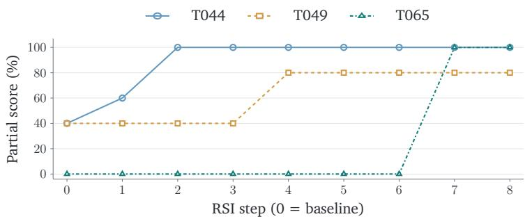  
Figure 3. Partial scores across RSI steps for three OSWorld 2.0 tasks. Curves show T044, T049, and T065, with RSIAgent (w/o RSI) as the baseline.

vironment knowledge in memory, while DRS refines task-specific details. As this knowledge comes to cover a target task’s critical requirements, resolving a remaining bottleneck can produce a discrete score increase. Such single-task evaluations reveal these breakthroughs more readily than the gradual memory accumulation that precedes them. Detailed case studies of how memory grows and supports task execution are provided in Appendix E.

## 4.4 Ablation Study

We compare the exploration stages on four OSWorld 2.0 (0808 ofline) tasks: T080 (WPS spreadsheet repair), T085 (REAPER audio editing), T089 (browser-based presentation repair), and T106 (3D Slicer liver segmentation). The w/o BRS variant skips Broad Recursive Self-exploration and performs only Deep Recursive Self-exploration from empty memory. Conversely, w/o DRS evaluates the memory acquired through broad exploration alone, while w/o RSI directly evaluates the agent with empty memory. Full RSI combines both stages. Figure 4 reports task-level partial scores; task selection, repetition counts, and exploration budgets are detailed in Appendix C.5.

Combining broad and deep exploration yields the highest reported partial score on all four tasks. Full RSI reaches a mean score of 74.54%, compared with 65.52% for broad-only exploration and 56.50% for deep-only exploration. Broad-only exploration improves over the baseline on every task, whereas deep-only exploration falls below the baseline on T085 and T089. These observations support combining Broad Recursive Self-exploration with subsequent Deep Recursive Self-exploration.

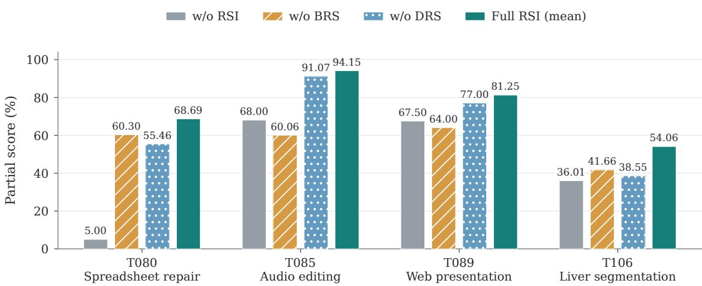  
Figure 4. Stage comparison on four OSWorld 2.0 tasks. Full RSI bars average two historical evaluations.

## 4.5 Evaluation in Game Environments

We further evaluate whether RSIAgent generalizes beyond standard computer-use tasks to autonomous game development, an interactive setting that requires agents to repeatedly play, diagnose, and modify executable games. We randomly sample 40 tasks from GameCraft-Bench [17] and compare RSIAgent against Play2Code [11], a continual game-improvement baseline based on iterative playtesting and code revision. Detailed model configurations and development budgets are provided in Appendix D.

As shown in Table 2, first, RSIAgent substantially improves game quality across all base generators. Second, while Play2Code improves games from weaker generators, its benefit diminishes as the base game becomes stronger and it can even degrade already high-quality games. In contrast, RSIAgent consistently improves both weak and strong base games. Third, incorporating RSI experience further improves quality. The accumulated experience provides reusable knowledge for diagnosing and editing diferent types of games.

## 4.6 Failure Modes Analysis

Our failure mode analysis identifies three mechanisms that limit recursive self-improvement: insuficiently targeted exploration, incomplete verification, and unreliable memory consolidation. These mechanisms can interact, allowing an initially uncertain or potentially incorrect operations, to persist through practice and influence subsequent agent behaviors. Figure 5 summarizes these mechanisms.

Insuficiently Targeted Exploration. Additional practice may leave target-specific weaknesses unresolved when it does not challenge the decisions responsible for them. In the inspected trajectories, the curriculum agent generated practice involving document processing, conflicting information, and submission persistence, while obtaining unavailable user information remained untested. The problematic missing-information rules consequently remained in memory. These observations highlight the importance of selecting experiences that challenge uncertain knowledge and address unresolved target requirements, beyond expanding the diversity of practice tasks.

Table 2. Performance on 40 GameCraft-Bench tasks. Rows are grouped by the generator of the frozen base game $P _ { 0 }$ . Within each group, all development methods use the same starting game and development backbone. The best score for each quality metric within each group is shown in bold.
<table><tr><td>Method</td><td>Mechanics</td><td>Depth</td><td>Visuals</td><td>Art</td><td>Overall ↑</td></tr><tr><td colspan="6">Generator: Codex + GPT-5.5 (high)</td></tr><tr><td>Baseline</td><td>61.5</td><td>53.0</td><td>54.7</td><td>47.9</td><td>52.77</td></tr><tr><td>+ Play2Code</td><td>60.0</td><td>50.2</td><td>52.2</td><td>47.5</td><td>51.05</td></tr><tr><td>+ RSIAgent (w/o RSI)</td><td>66.4</td><td>57.1</td><td>59.3</td><td>53.8</td><td>57.84</td></tr><tr><td>+ RSIAgent</td><td>69.7</td><td>61.0</td><td>62.6</td><td>57.1</td><td>61.28</td></tr><tr><td>Generator: Kimi-K2.6</td><td></td><td></td><td></td><td></td><td></td></tr><tr><td>Baseline</td><td>43.5</td><td>33.5</td><td>34.1</td><td>22.6</td><td>31.28</td></tr><tr><td>+ Play2Code</td><td>48.9</td><td>36.5</td><td>40.9</td><td>27.9</td><td>36.02</td></tr><tr><td>+ RSIAgent (w/o RSI)</td><td>55.2</td><td>43.1</td><td>47.0</td><td>34.6</td><td>42.61</td></tr><tr><td>+ RSIAgent</td><td>59.0</td><td>47.2</td><td>50.8</td><td>38.1</td><td>46.37</td></tr><tr><td>Generator: GLM-5.3-Flash</td><td></td><td></td><td></td><td></td><td></td></tr><tr><td>Baseline</td><td>36.5</td><td>29.6</td><td>31.4</td><td>28.5</td><td>30.55</td></tr><tr><td>+ Play2Code</td><td>48.6</td><td>37.6</td><td>40.0</td><td>33.7</td><td>38.25</td></tr><tr><td>+ RSIAgent (w/o RSI)</td><td>55.1</td><td>44.0</td><td>47.3</td><td>40.1</td><td>44.73</td></tr><tr><td>+ RSIAgent</td><td>59.2</td><td>48.1</td><td>51.3</td><td>43.8</td><td>48.72</td></tr><tr><td>Generator: Qwen3.8-27B</td><td></td><td></td><td></td><td></td><td></td></tr><tr><td>Baseline</td><td>50.5</td><td>36.4</td><td>39.7</td><td>42.8</td><td>41.30</td></tr><tr><td>+ Play2Code</td><td>58.1</td><td>43.4</td><td>45.3</td><td>48.4</td><td>47.67</td></tr><tr><td>+ RSIAgent (w/o RSI)</td><td>64.3</td><td>50.2</td><td>52.1</td><td>55.0</td><td>53.82</td></tr><tr><td>+ RSIAgent</td><td>68.0</td><td>54.1</td><td>55.9</td><td>58.7</td><td>57.46</td></tr></table>

Incomplete Verification. Local verification can approve an execution without establishing that all task requirements have been satisfied. In the audited cases, the verifier agent returned PASS despite unsupported field values or artifact discrepancies under the oficial rubric. Checking that an intended output was produced does not establish that the underlying interpretation or requirement checklist was complete. This gap can afect both final execution and subsequent learning, because an accepted mistake may become the basis for future memory updates and exploration decisions.

Unreliable Memory Consolidation. An inadequately verified decision can become a reusable rule that negatively influences subsequent execution. In the inspected form-completion runs, the actor agent retained rules that treated missing-data markers as valid answers or interpreted unavailable information as a negative answer. Subsequent attempts reused these rules without obtaining the missing facts. This failure illustrates that useful memory must preserve the conditions and uncertainty of an experience, rather than treating local acceptance as evidence of general validity.

(a) Insufficiently targeted exploration

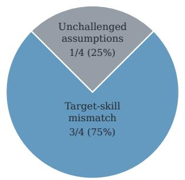  
(b) Incomplete verification

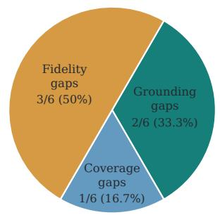  
(c) Unreliable memory consolidation

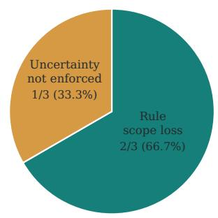  
Figure 5. Failure-mode subtypes from selected case audits. Labels show counts and within-mode percentages; cases may contribute to multiple panels.

## 5 Related Work

Digital Agents. Digital agents use language-model reasoning and tool use to complete tasks in software environments [10, 55]. Benchmarks evaluate their capabilities across desktop applications and tool environments [24, 38, 40, 47], including changing user requirements and the quality of execution outcomes [6, 11, 17, 18, 58]. Research has improved visual grounding and GUI interaction [4, 8, 56]. OpenCUA [30] learns from human demonstrations, UI-TARS-2 [27] uses multi-turn reinforcement learning, and EvoCUA [42] combines synthetic experience with policy optimization. CodeAct represents actions as executable programs that can be revised using execution feedback [29]. Cradle, OS-Copilot, and Agent S2 support application control, reusable skills, and coordinated execution [1, 25, 37]. Other studies improve information organization, planning, and failure recovery [7, 12, 23, 34, 35], while research on external evidence and feedback incentives examines ways to improve reliability [5, 19, 43]. We focus on adapting pretrained agents to new software environments through autonomous exploration. RSIAgent uses code-as-policy to acquire the environment-specific knowledge needed for downstream tasks, without further model training.

Recursive Self-Improvement of Agents. Research on agent self-improvement explores changes to agent designs [9, 20, 21], prompts and skills [2, 45], and improvement procedures [31, 48]. DGM evaluates self-modifications on coding benchmarks [52], while HGM [28] uses descendant performance to identify agents with greater potential for further improvement. Hyperagents [53] allows a meta-agent to modify both itself and the task agent, enabling the improvement procedure to evolve alongside task-solving capabilities. These methods study self-improvement with access to benchmark scores or labeled reference data. Agents can also learn from generated training experience [16, 39, 49] or accumulate experience in reflections, skills, manuals, and persistent memory [3, 13, 22, 26]. Recent work improves how this knowledge is organized, updated, and retrieved [32, 33, 36, 44, 51, 54]. HyMEM combines symbolic nodes and trajectory embeddings in a hybrid memory graph, supporting multi-hop retrieval and inference-time memory updates for computer-use agents [57]. Voyager uses an automatic curriculum to acquire skills [26]. EchoTrail-GUI and ZhuLong explore environments to collect reusable experience [14, 15], while CoEvoSkills and Recuris use verification feedback to refine skills and memory [46, 50]. We study recursive self-improvement in new digital environments without external task rewards. RSIAgent autonomously explores the environment under a broad-then-deep exploration strategy and uses environment feedback to construct reusable memory. This memory guides further exploration and supports downstream task execution without updating model parameters.

## 6 Conclusion

In this work, we introduce RSIAgent, a training-free multi-agent framework for recursive self improvement in new digital environments. By coordinating curriculum, actor, and verifier agents, RSIAgent autonomously acquires, verifies, and consolidates environment-specific knowledge into reusable memory. Its broad-then-deep exploration strategy first builds diverse environment coverage through broad recursive self-exploration (BRS), and then focuses on hard cases, hidden constraints, and boundary conditions through deep recursive self-exploration (DRS). Experiments on OSWorld-v2 and Agent’s Last Exam show that RSIAgent can substantially improve strong open-source models and enable them to outperform frontier closed-source models without updating model parameters.

In future work, we plan to extend recursive self-improvement beyond digital computer-use environments to broader interactive domains, including AI for Science, where agents must learn specialized tools, workflows, and scientific procedures, and games, which provide complex and continuously evolving environments for studying long-horizon exploration, adaptation, and self-improvement.

## 7 Limitations

RSIAgent has several limitations. First, recursive self-improvement requires additional test-time exploration and practice, which can introduce substantial computation cost. Second, performance depends on finite exploration budgets, stopping policies, and the quality of the learned memory. Third, the model-based verifier agent may produce incorrect judgments that propagate into later exploration and memory updates. Finally, diferent environments may require diferent tools, verification signals, and exploration strategies, and our current experiments do not fully isolate the contribution of every component. For ethical concerns, RSIAgent can autonomously explore software environments, execute programs, and retain reusable memory, introducing risks such as unintended actions, unauthorized access, and privacy leakage. Our experiments are conducted in controlled environments with permitted tools and data access.

## References

[1] Saaket Agashe, Kyle Wong, Vincent Tu, Jiachen Yang, Ang Li, and Xin Eric Wang. Agent s2: A compositional generalist-specialist framework for computer use agents, 2025. URL https://arxiv.org/abs/2504.00906.

[2] Lakshya A Agrawal, Shangyin Tan, Dilara Soylu, Noah Ziems, Rishi Khare, Krista Opsahl-Ong, Arnav Singhvi, Herumb Shandilya, Michael J Ryan, Meng Jiang, et al. Gepa: Reflective prompt evolution can outperform reinforcement learning. In International Conference on Learning Representations, volume 2026, pages 8479–8565, 2026.

[3] Minghao Chen, Yihang Li, Yanting Yang, Shiyu Yu, Binbin Lin, and Xiaofei He. Automanual: Constructing instruction manuals by llm agents via interactive environmental learning. Advances in Neural Information Processing Systems, 37:589–631, 2024.

[4] Kanzhi Cheng, Qiushi Sun, Yougang Chu, Fangzhi Xu, Yantao Li, Jianbing Zhang, and Zhiyong Wu. Seeclick: Harnessing gui grounding for advanced visual gui agents, 2024. URL https: //arxiv.org/abs/2401.10935.

[5] Shicheng Fan, Haochang Hao, Dehai Min, Weihao Liu, Philip S Yu, and Lu Cheng. Verifiable rewards beyond math and code: Lightweight corpus-grounded process supervision for factual question answering. arXiv preprint arXiv:2605.29648, 2026.

[6] Shicheng Fan, Mingdai Yang, Duohao Wang, Canyu Chen, Yongfeng Zhang, Hua Wei, Manling Li, Julian McAuley, Kun Zhang, Philip S Yu, et al. Agentic commerce world: An auditable and verifiable environment for vibe commerce. arXiv preprint arXiv:2608.02441, 2026.

[7] Qijun Han, Haoqin Tu, Zijun Wang, Haoyue Dai, Yiyang Zhou, Nancy Lau, Alvaro A. Cardenas, Yuhui Xu, Ran Xu, Caiming Xiong, Zeyu Zheng, Huaxiu Yao, Yuyin Zhou, and Cihang Xie. Vlaa-gui: Knowing when to stop, recover, and search, a modular framework for gui automation, 2026. URL https://arxiv.org/abs/2604.21375.

[8] Hongliang He, Wenlin Yao, Kaixin Ma, Wenhao Yu, Yong Dai, Hongming Zhang, Zhenzhong Lan, and Dong Yu. Webvoyager: Building an end-to-end web agent with large multimodal models, 2024. URL https://arxiv.org/abs/2401.13919.

[9] Shengran Hu, Cong Lu, and Jef Clune. Automated design of agentic systems. In International Conference on Learning Representations, volume 2025, pages 21344–21377, 2025.

[10] Xueyu Hu, Tao Xiong, Biao Yi, Zishu Wei, Ruixuan Xiao, Yurun Chen, Jiasheng Ye, Meiling Tao, Xiangxin Zhou, Ziyu Zhao, Yuhuai Li, Shengze Xu, Shenzhi Wang, Xinchen Xu, Shuofei Qiao, Zhaokai Wang, Kun Kuang, Tieyong Zeng, Liang Wang, Jiwei Li, Yuchen Eleanor Jiang, Wangchunshu Zhou, Guoyin Wang, Keting Yin, Zhou Zhao, Hongxia Yang, Fan Wu, Shengyu Zhang, and Fei Wu. Os agents: A survey on mllm-based agents for general computing devices use, 2025. URL https://arxiv.org/abs/2508.04482.

[11] Yixu Huang, Bo Li, Na Li, Zhe Wang, Kaijie Chen, Haonan Ge, Qingyi Si, Yuanzhe Shen, Ruihan Yang, Guangjing Wang, et al. Gui agents for continual game generation. arXiv preprint arXiv:2605.28258, 2026.

[12] Jinhao Jiang, Kun Zhou, Zican Dong, Keming Ye, Xin Zhao, and Ji-Rong Wen. Structgpt: A general framework for large language model to reason over structured data. In Proceedings of the 2023 conference on empirical methods in natural language processing, pages 9237–9251, 2023.

[13] Seth Karten, Alex L Zhang, Kevin Thomas, Sebastian Müller, Elie Bakouch, Daniel Auras, Mika Senghaas, Fares Obeid, Konstantin Dunas, Johannes Hagemann, et al. Prime agent: A self improving rlm harness. arXiv preprint arXiv:2608.23552, 2026.

[14] Runze Li, Yuwen Zhai, Bo Xu, LiWu Xu, Nian Shi, Wei Zhang, Ran Lin, and Liang Wang. Echotrail-gui: Building actionable memory for gui agents via critic-guided self-exploration. In Proceedings of the IEEE/CVF Conference on Computer Vision and Pattern Recognition, pages 9347–9356, 2026.

[15] Yang Liu, Shiwei Hou, Xiyuan Chen, Yu Wang, Sen Yuan, Qirui Gan, Shao You, Feifan Chen, Wencheng Li, Shuyang Hu, et al. Zhulong: Execution-grounded llm agent for eda scripting with ofline api self-exploration. arXiv preprint arXiv:2608.07925, 2026.

[16] Shuqi Lu, Chaofan Li, Kun Luo, Zhang Zhang, Hui Wang, Hongwang Xiao, Zheng Liu, Lei Xiong, Jiahao Wang, Sen Wang, et al. Arex: Towards a recursively self-improving agent for deep research. arXiv preprint arXiv:2607.21461, 2026.

[17] Tongxu Luo, Rongsheng Wang, Jiaxi Bi, Chenming Xu, Zhengyang Tang, Jianlong Chen, Juhao Liang, Ke Ji, Shuqi Guo, Yuhao Du, et al. Gamecraft-bench: Can agents build playable games end-to-end in a real game engine? arXiv preprint arXiv:2606.17861, 2026.

[18] Chunyu Miao, Henry Peng Zou, Yangning Li, Yankai Chen, Yibo Wang, Fangxin Wang, Yifan Li, Wooseong Yang, Bowei He, Xinni Zhang, et al. Recode-h: A benchmark for research code development with interactive human feedback. arXiv preprint arXiv:2510.06186, 2025.

[19] Dehai Min, Kailin Zhang, Tongtong Wu, and Lu Cheng. Quco-rag: Quantifying uncertainty from the pre-training corpus for dynamic retrieval-augmented generation. In Findings of the Associationfor Computational Linguistics: ACL 2026, pages 16482–16500, 2026.

[20] Anton Razzhigaev, Andrei Gritsaev, Andrei Kaznacheev, Nikita Dragunov, Roman Yampolskiy, and Andrei Kuznetsov. Ouroboros: A self-developing frontier coding agent with reviewed core evolution. arXiv preprint arXiv:2608.08311, 2026.

[21] Maxime Robeyns, Martin Szummer, and Laurence Aitchison. A self-improving coding agent, 2025. URL https://arxiv.org/abs/2504.15228.

[22] Noah Shinn, Federico Cassano, Ashwin Gopinath, Karthik Narasimhan, and Shunyu Yao. Reflexion: Language agents with verbal reinforcement learning. Advances in neural information processing systems, 36:8634–8652, 2023.

[23] Xueqiao Sun, Xiaohan Wang, Ludwig Schmidt, Serena Yeung-Levy, and Yuhui Zhang. Learning from failure: Inference-time self-improvement for computer-use agents. arXiv preprint arXiv:2606.31270, 2026.

[24] Yiyou Sun, Xinyang Han, Weichen Zhang, Yuanbo Pang, Tianyu Wang, Yuhan Cao, Yixiao Huang, Chris Duroiu, Haoyun Zhang, Jefrey Lin, Weishu Zhang, Tyler Zeng, Ying Yan, Bo Liu, Hanson Wen, Mingyang Xu, Xiaoyuan Liu, Zimeng Chen, Weiyan Shi, Amanda Dsouza, Vincent Sunn Chen, Patrick Bryant, Carl Boettiger, Yamini Rangan, Bradley Rothenberg, Kyle Steinfeld, Arvind Rao, Tapio Schneider, Georgios Yannakakis, Laure Zanna, Kaan Ozbay, Ida Sim, Tarek Zohdi, George Em Karniadakis, Jack Gallant, Teresa Head-Gordon, Yushan Li, Wenxi Deng, Tao Sun, Huiqi Wang, Zhun Wang, Justin Xu, Chris Yuhao Liu, Yafei Cheng, Rongwang Hu, Aras Bacho, Shengcao Cao, Zengyi Qin, Yixiong Chen, Hengduan Fan, Hao Liu, Lin Zeng, Shashank Muralidhar Bharadwaj, Litian Gong, Yingxuan Yang, Maojia Song, Ruheng Wang, Zongzheng Zhang, Honglin Bao, Shuo Lu, Jianhong Tu, Zhonghua Wang, Zheng Zhang, Zijiao Chen, Yanqiong Jiang, Zhendong Li, Bohan Lyu, Chang Ma, Peiran Xu, Benran Zhang, Shangding Gu, Haoyue Hua, Haoyang Li, Wanzhe Liao, Chengzhi Liu, Junbo Peng, Haoran Sun, Zechen Xu, Bo Chen, Jiayi Cheng, Yi Jiang, Keying Kuang, Yuan Li, Youbang Pan, Ziyan Rao, Alexander Schubert, Yifan Shen, Vincent Siu, Xiatao Sun, Kangqi Zhang, Xiaopan Zhang, Yuchen Zhu, Ishaan Singh Chandok, Lei Ding, Jingxuan Fan, Andrew Glover, Jiaming Hu, Yiran Hu, Wenbo Huang, Zixin Jiang, Haoran Jin, Lukas Kim, Ming Liu, Yang Liu, Alireza Rafiei, Xuhuan Shen, Kunyang Sun, Sophia Sun, Ting Sun, Eric Wang, Yixin Wang, Hanwen Xing, Sihan Xu, Yuzheng Xu, Zhongxing Xu, Zhiling Yan, Boqin Yuan, Ruiqi Zhang, Yifan Zhang, Zibo Zhao, Liana, Santanu Bosu Antu, Haoyue Bai, Carlo Bosio, Joseph Cavanagh, Patricia Cavazos-Rehg, Tianxing Chen, Xuewen Chen, Yipu Chen, Chenyu Zhu, Chen Dai, Stefano De Castro, Yunfu Deng, Kaustubh Dhole, Jiayuan Ding, Chenchen Du, Zhehang Du, Hao Fan, Run-Ze Fan, Hengyu Fu, Shi Gu, Yifan Gu, Charlie Guo, Baihe Huang, Baixiang Huang, Rimika Jaiswal, Zhihan Jiang, Ran Jin, Erin Kasson, Xin Lan, Joseph Lee, Deren Lei, Chenyu Li, Daofeng Li, Haitao Li, Hongwei Li, Jingyan Li, Xiao Li, Yi Li, Yinsheng Li, Yuangang Li, Zhixu Li, Wenyu Liang, Longtai Liao, Kevin Qinghong Lin, Andy Zeyi Liu, Che Liu, Jiaming Liu, Kaiyuan Liu, Xuan Liu, Pan Lu, Wenbo Lv, Yicheng Lyu, Qiuyang Mang, Kyle Montgomery, Yuzhou Nie, Ruoxi Ning, Jorin Overwiening, Xu Pan, Layna Paraboschi, Core Francisco Park, Justin Purnomo, Swati Rajwal, Scott Rankin, Bixuan Ren, Yiren Rong, HaoYang Shang, Ventus Shaw, Fiona Shen, Jiawei Shen, Minqi Shi, Shi Qiu, Huaxiu Yao, Tianneng Shi, Jonah So, Vladislav Susoy, Hannah Szlyk, Haocheng Wang, Jialu Wang, Wei Wang, Xinyu Wang, Zehao Wang, Dowling Wong, Angela Wu, Dehao Wu, Fangyu Wu, Mengyuan "Millie" Wu, Yu Wu, Yuchen Wu, Yuhao Wu, Qingpo Wuwu, Weihang Xiao, Yongyi Xiong, Fan Xu, Ruiling Xu, Mingxuan Yan, Benjamin Yang, Jirong Yang, Sen Yang, Xiaoli Yang, Yushi Yang, Haoran Ye, Xiaohu Yu, Zhengming Yu, Chenlong Zhang, Chi Zhang, Hanning Zhang, Hanwen Zhang, Junge Zhang, Kunpeng Zhang, Song Zhang, Wenjin Zhang, Wenshuo Zhang, Ying Zhang, Yizhi Zhang, Brian Zhao, Qijian Zhao, Yimin Zhao, Yuhaohua Zheng, Liwei Zhou, Tianyue Zhou, Sichen Zhu, Siqi Zhu, Yan Zhu, Yishu Zhu, Jierui Zuo, Chonghao Cai, Helena Casademunt, Wenjia Chen, Cheng Cheng, Nawen Deng, Rao Fu, Tianfu Fu, Yifan Han, He Ren, Zhenyu He, Qiao Jin, Langlang Li, Yuetai Li, Sylvia Liu, Lu Lu, Luqing Zhou, Subhabrata Mukherjee, Yunqi Ouyang, Yin Ren, Dawei Shi, Haoran Wu, Zhiyue Wu, Hannah Yao, Zhuoran Yi, Jenny Yu, Rhea Zhan, Hang Zhou, Blake Zhu, Junfan Zhu, Alan Yuille, Yang Liu, Russell Alan Poldrack, Jiachen Li, Zhenglu Li, Molei Tao, Jing Huang, Wenqi Shi, Costas Spanos, Lichao Sun, Chenguang Wang, Orson Xu, Zhen Dong, Hector Gomez, Aylin Caliskan, Ali Emami, Haimin Hu, Zhi Li, Lihui Liu, Murphy Niu, Yi Shao, Jianxin Sun, Mikko Tolonen, Ting Wang, Sanjiv Das, Yanjun Gao, Wenbo Guo, Erika J

Schneider, Zhiyong Lu, Yian Ma, Mark Mueller, Radha Poovendran, Somayeh Sojoudi, Yinglun Zhu, and Dawn Song. Agents’ last exam, 2026. URL https://arxiv.org/abs/2606.05405.

[25] Weihao Tan, Wentao Zhang, Xinrun Xu, Haochong Xia, Ziluo Ding, Boyu Li, Bohan Zhou, Junpeng Yue, Jiechuan Jiang, Yewen Li, Ruyi An, Molei Qin, Chuqiao Zong, Longtao Zheng, Yujie Wu, Xiaoqiang Chai, Yifei Bi, Tianbao Xie, Pengjie Gu, Xiyun Li, Ceyao Zhang, Long Tian, Chaojie Wang, Xinrun Wang, Börje F. Karlsson, Bo An, Shuicheng Yan, and Zongqing Lu. Cradle: Empowering foundation agents towards general computer control, 2024. URL https://arxiv.org/abs/2403.03186.

[26] Guanzhi Wang, Yuqi Xie, Yunfan Jiang, Ajay Mandlekar, Chaowei Xiao, Yuke Zhu, Linxi Fan, and Anima Anandkumar. Voyager: An open-ended embodied agent with large language models. arXiv preprint arXiv:2305.16291, 2023.

[27] Haoming Wang, Haoyang Zou, Huatong Song, Jiazhan Feng, Junjie Fang, Junting Lu, Longxiang Liu, Qinyu Luo, Shihao Liang, Shijue Huang, et al. Ui-tars-2 technical report: Advancing gui agent with multi-turn reinforcement learning. arXiv preprint arXiv:2509.02544, 2025.

[28] Wenyi Wang, Piotr Piękos, Li Nanbo, Firas Laakom, Yimeng Chen, Mateusz Ostaszewski, Mingchen Zhuge, and Jürgen Schmidhuber. Huxley-g\" odel machine: Human-level coding agent development by an approximation of the optimal self-improving machine. In International Conference on Learning Representations, volume 2026, pages 80356–80386, 2026.

[29] Xingyao Wang, Yangyi Chen, Lifan Yuan, Yizhe Zhang, Yunzhu Li, Hao Peng, and Heng Ji. Executable code actions elicit better llm agents. arXiv preprint arXiv:2402.01030, 2024.

[30] Xinyuan Wang, Bowen Wang, Dunjie Lu, Junlin Yang, Tianbao Xie, Junli Wang, Jiaqi Deng, Xiaole Guo, Yiheng Xu, Chen Wu, et al. Opencua: Open foundations for computer-use agents. Advances in Neural Information Processing Systems, 38:139756–139806, 2026.

[31] Zefeng Wang, Minxi Yan, Jinhe Bi, Sikuan Yan, Volker Tresp, and Yunpu Ma. Metaskill-evolve: Recursive self-improvement of llm agents via two-timescale meta-skill evolution. arXiv preprint arXiv:2607.05297, 2026.

[32] Wenyi Wu, Kun Zhou, Ruoxin Yuan, Vivian Yu, Stephen Wang, Zhiting Hu, and Biwei Huang. Auto-scaling continuous memory for gui agent. arXiv preprint arXiv:2510.09038, 2025.

[33] Wenyi Wu, Zixuan Song, Kun Zhou, Yifei Shao, Zhiting Hu, and Biwei Huang. Towards general continuous memory for vision-language models. Advances in Neural Information Processing Systems, 38:128685–128710, 2026.

[34] Wenyi Wu, Sibo Zhu, Kun Zhou, and Biwei Huang. Planner matters! an eficient and unbalanced multi-agent collaboration framework for long-horizon planning. arXiv preprint arXiv:2605.02168, 2026.

[35] Wenyi Wu, Sibo Zhu, Kun Zhou, Aayush Salvi, Zixuan Song, and Biwei Huang. Structagent: Harness long-horizon digital agents with unified causal structure. arXiv preprint arXiv:2607.11388, 2026.

[36] Zhaofen Wu, Hanrong Zhang, Fulin Lin, Wujiang Xu, Xinran Xu, Yankai Chen, Henry Peng Zou, Shaowen Chen, Weizhi Zhang, Xue Liu, et al. Gam: Hierarchical graph-based agentic memory for llm agents. In Proceedings of the 64th Annual Meeting of the Associationfor Computational Linguistics (Volume 1: Long Papers), pages 34647–34664, 2026.

[37] Zhiyong Wu, Chengcheng Han, Zichen Ding, Zhenmin Weng, Zhoumianze Liu, Shunyu Yao, Tao Yu, and Lingpeng Kong. Os-copilot: Towards generalist computer agents with self-improvement, 2024. URL https://arxiv.org/abs/2402.07456.

[38] Ziqiao Xi, Shuang Liang, Qi Liu, Jiaqing Zhang, Letian Peng, Fang Nan, Meshal Nayim, Tianhui Zhang, Rishika Mundada, Lianhui Qin, et al. Toolgym: an open-world tool-using environment for scalable agent testing and data curation. arXiv e-prints, pages arXiv–2601, 2026.

[39] Peng Xia, Kaide Zeng, Jiaqi Liu, Can Qin, Fang Wu, Yiyang Zhou, Caiming Xiong, and Huaxiu Yao. Agent0: Unleashing self-evolving agents from zero data via tool-integrated reasoning. arXiv preprint arXiv:2511.16043, 2025.

[40] Tianbao Xie, Danyang Zhang, Jixuan Chen, Xiaochuan Li, Siheng Zhao, Ruisheng Cao, Toh Jing Hua, Zhoujun Cheng, Dongchan Shin, Fangyu Lei, Yitao Liu, Yiheng Xu, Shuyan Zhou, Silvio Savarese, Caiming Xiong, Victor Zhong, and Tao Yu. Osworld: Benchmarking multimodal agents for open-ended tasks in real computer environments, 2024. URL https://arxiv.org/abs/2404. 07972.

[41] Tianbao Xie, Mengqi Yuan, Danyang Zhang, Xinzhuang Xiong, Zhennan Shen, Zilong Zhou, Xinyuan Wang, Yanxu Chen, Jiaqi Deng, Junda Chen, Bowen Wang, Haoyuan Wu, Jixuan Chen, Junli Wang, Dunjie Lu, Hao Hu, and Tao Yu. Introducing osworld-verified. xlang.ai, July 2025. URL https://xlang.ai/blog/osworld-verified.

[42] Taofeng Xue, Chong Peng, Mianqiu Huang, Linsen Guo, Tiancheng Han, Haozhe Wang, Jianing Wang, Xiaocheng Zhang, Xin Yang, Dengchang Zhao, et al. Evocua: Evolving computer use agents via learning from scalable synthetic experience. arXiv preprint arXiv:2601.15876, 2026.

[43] Mingdai Yang, Shicheng Fan, Kejing Yu, Duohao Wang, Li Sun, Hao Peng, Philip S Yu, and Zhiwei Liu. Paying for honesty without knowing the truth: Reputation-penalty design for llm marketplace agents. arXiv preprint arXiv:2607.28330, 2026.

[44] Shu Yang, Junchao Wu, Derek F Wong, and Di Wang. Selfmem: Self-optimizing memory for ai agents. arXiv preprint arXiv:2607.03726, 2026.

[45] Yifan Yang, Ziyang Gong, Weiquan Huang, Qihao Yang, Ziwei Zhou, Zisu Huang, Yan Li, Xuemei Gao, Qi Dai, Bei Liu, et al. Skillopt: Executive strategy for self-evolving agent skills. arXiv preprint arXiv:2605.23904, 2026.

[46] Zhaochen Yu, Yingcheng Wu, Zhenfei Yin, Kaiyuan Chen, Zhe Zhao, Mengdi Wang, Shuicheng Yan, and Ling Yang. Recursive experiential-working memory evolution for long-horizon agent harnesses. arXiv preprint arXiv:2608.24876, 2026.

[47] Mengqi Yuan, Zilong Zhou, Xinzhuang Xiong, Weiming Wu, Jiayang Sun, Jiamin Song, Kaiqian Cui, Bowen Wang, Haoyuan Wu, Yitong Li, Dunjie Lu, Haikong Lu, Qi Zhen, Xinyuan Wang,

Jiaqi Deng, Yuhao Yang, Cheng Chen, Boyuan Zheng, Alex Su, Xiao Yu, Hao Zou, Saaket Agashe, Xing Han Lu, Manpreet Kaur, Zhengyang Qi, Vincent Sunn Chen, Frederic Sala, Dayiheng Liu, Junyang Lin, Zhou Yu, Yu Su, Siva Reddy, Xin Eric Wang, Peng Qi, Tianbao Xie, and Tao Yu. Osworld 2.0: Benchmarking computer use agents on long-horizon real-world tasks, 2026. URL https://arxiv.org/abs/2606.29537.

[48] Eric Zelikman, Eliana Lorch, Lester Mackey, and Adam Tauman Kalai. Self-taught optimizer (stop): Recursively self-improving code generation, 2024. URL https://arxiv.org/abs/2310. 02304.

[49] Hanrong Zhang, Yankai Chen, Shicheng Fan, et al. Scaling LLM agent learning with data synthesis: A comprehensive survey, 2026. URL https://www.researchgate.net/publication/ 406488336. Preprint.

[50] Hanrong Zhang, Shicheng Fan, Henry Peng Zou, Yankai Chen, Zhenting Wang, Jiayu Zhou, Chengze Li, Wei-Chieh Huang, Yifei Yao, Kening Zheng, Xue Liu, Xiaoxiao Li, and Philip S. Yu. CoEvoSkills: Self-evolving agent skills via co-evolutionary verification. In Conference on Language Modeling, 2026. URL https://arxiv.org/abs/2604.01687. Accepted for publication.

[51] Haozhen Zhang, Quanyu Long, Jianzhu Bao, Tao Feng, Weizhi Zhang, Haodong Yue, and Wenya Wang. Memskill: Learning and evolving memory skills for self-evolving agents. arXiv preprint arXiv:2602.02474, 2026.

[52] Jenny Zhang, Shengran Hu, Cong Lu, Robert Lange, and Jef Clune. Darwin godel machine: Open-ended evolution of self-improving agents, 2026. URL https://arxiv.org/abs/2505.22954.

[53] Jenny Zhang, Bingchen Zhao, Wannan Yang, Jakob Foerster, Jef Clune, Minqi Jiang, Sam Devlin, and Tatiana Shavrina. Hyperagents. arXiv preprint arXiv:2603.19461, 2026.

[54] Qizheng Zhang, Changran Hu, Shubhangi Upasani, Boyuan Ma, Fenglu Hong, Vamsidhar Kamanuru, Jay Rainton, Chen Wu, Mengmeng Ji, Hanchen Li, et al. Agentic context engineering: Evolving contexts for self-improving language models. In International Conference on Learning Representations, volume 2026, pages 86069–86100, 2026.

[55] Wayne Xin Zhao, Kun Zhou, Junyi Li, Tianyi Tang, Xiaolei Wang, Yupeng Hou, Yingqian Min, Beichen Zhang, Junjie Zhang, Zican Dong, Yifan Du, Chen Yang, Yushuo Chen, Zhipeng Chen, Jinhao Jiang, Ruiyang Ren, Yifan Li, Xinyu Tang, Zikang Liu, Peiyu Liu, Jian-Yun Nie, and Ji-Rong Wen. A survey of large language models, 2026. URL https://arxiv.org/abs/2303.18223.

[56] Boyuan Zheng, Boyu Gou, Jihyung Kil, Huan Sun, and Yu Su. Gpt-4v(ision) is a generalist web agent, if grounded, 2024. URL https://arxiv.org/abs/2401.01614.

[57] Sibo Zhu, Wenyi WU, Kun Zhou, Stephen Wang, and Biwei Huang. Hybrid self-evolving structured memory for computer-use agents. In Maria Liakata, Viviane P. Moreira, Jiajun Zhang, and David Jurgens, editors, Findings of the Association for Computational Linguistics: ACL 2026, pages 11287–11304, San Diego, California, United States, July 2026. Association for Computational Linguistics. ISBN 979-8-89176-395-1. doi: 10.18653/v1/2026.findings-acl.549. URL https://aclanthology.org/2026.findings-acl.549/.

[58] Henry Peng Zou, Chunyu Miao, Wei-Chieh Huang, Yankai Chen, Yue Zhou, Hanrong Zhang, Yaozu Wu, Liancheng Fang, Zhengyao Gu, Zhen Zhang, et al. When users change their mind: Evaluating interruptible agents in long-horizon web navigation. arXiv preprint arXiv:2604.00892, 2026.

## Appendix

## A Implementation and Agent Interfaces

RSIAgent implements recursive improvement through explicit interfaces for execution, verification, experience selection, and memory updates. This appendix describes the target-conditioned reference implementation: the target query guides exploration, while persistent memory carries learned experience between attempts. Model configurations and execution limits are given in Appendix C; reporting qualifications are retained in Appendix C.4.

## A.1 Role Interfaces and Information Boundaries

Role-Specific Contexts. Separate contexts give each agent the information needed for its role without sharing private reasoning across roles. The actor agent receives the task and available memory, the verifier agent inspects the candidate against the task, and the curriculum agent uses previous outcomes and accumulated memory to select new experiences. Table A1 summarizes these interfaces. The curriculum agent’s context persists within an exploration lineage; the verifier agent’s context persists across candidate revisions within a target attempt, but is not shared across distinct projects or target attempts.

Table A1. Agent interfaces in the reference RSI implementation.
<table><tr><td>Agent</td><td>Observed inputs</td><td>Outputs and authority</td></tr><tr><td>actor agent</td><td>Task instruction, task-visible environment, memory</td><td>Executable actions and candidate artifacts; execution feedback, and available persistent after verification, memory updates and a learning diagnosis</td></tr><tr><td rowspan="2">verifier agent</td><td>Task requirements and candidate</td><td>Evidence-grounded local verdict and</td></tr><tr><td>environment; actor-private memory, reasoning, and execution logs are hidden</td><td>findings; no durable memory updates</td></tr><tr><td>curriculum agent </td><td>Target query, completed exploration outcomes, actor learning diagnoses when available, and a disposable copy of current memory</td><td>Practice instructions, input fixtures, and continuation or stopping decisions; no candidate grades or canonical memory edits</td></tr></table>

Program-Based Actions. The actor interface exposes complete programs as the unit of action. A program response specifies Python or Bash code, and the runtime returns its combined output, exit status, and execution metadata. The actor agent can request visual evidence through look, ask for missing information through ask when a user channel is configured, and submit a done response with read-only checks. The prompt directs the actor agent to investigate before acting, repair programs using execution feedback, and check the task’s actual requirements. Code-based control does not relax requirements concerning named applications, editable artifacts, rendered appearance, or workflow.

Curriculum Handofs. Practice tasks specify the desired outcome without supplying a solution. For BRS, the curriculum agent publishes a structured handof containing a decision, a rationale, and a list of projects with unique identifiers and self-contained instructions. Each project has its own input fixtures, replayed under a common project path in an isolated environment. The actor agent receives the project instruction and fixtures, not the curriculum agent’s private search rationale. For DRS, a PROJECT handof similarly contains the practice request and required inputs; alternative decisions return control to the target attempt or record that exploration has stalled.

Independent Verification. The verifier interface grounds acceptance in the candidate rather than the actor agent’s account of its work. Its prompt requires checks derived from the original task and supporting observations from the environment. Candidate inspection uses reset-and-replay or checkpoint restoration to prevent verifier probes from changing the submitted artifact. The reference practice interface produces one grounded PASS or FAIL per project, without a same-project repair cycle. The target interface additionally supports UNVERIFIED: the actor agent can supply evidence for independent reinspection, but an unresolved outcome does not become a successful or failed learning example.

## A.2 Memory Updates and Parallel Reconciliation

Experience-Owned Learning. The actor agent that produced an experience also decides what to retain from it. After a grounded PASS or FAIL, its existing context receives the complete verifier report and enters two learning steps. Distillation identifies useful procedures, constraints, and failure lessons; reconciliation checks the resulting memory against older entries, revising contradictions and qualifying unsupported conclusions. A failed project can contribute useful evidence without being recorded as a verified success. The memory remains a collection of actor-authored files, with no required schema, file count, or length.

Canonical Memory Ownership. Only completed actor learning updates are promoted to the persistent memory bank. Work-phase memory edits are discarded before learning, and the actor agent receives the current canonical memory at the update boundary. The curriculum agent may inspect a disposable copy to guide exploration, but its local edits are not synchronized back. Neither the curriculum agent nor the verifier agent approves memory wording. An actor-authored learning diagnosis communicates useful conclusions and uncertainties to the curriculum agent without passing the actor agent’s private reasoning transcript.

Parallel Work, Sequential Updates. BRS separates concurrent experience acquisition from ordered memory updates. Every project in a wave begins with the same immutable pre-wave memory snapshot and cannot observe sibling work or outcomes. Once all project verdicts are available, the original actor contexts resume one at a time in the order authored by the curriculum agent. Each update operates on the latest canonical memory, including preceding updates from the same wave. The next wave is selected only after these commits finish, allowing the curriculum agent to respond to both verified outcomes and the knowledge actually retained.

## A.3 Sequential Refinement and Evaluation Lifecycle

Target-Conditioned Refinement. The reference DRS implementation begins with an attempt at the target query using the memory inherited from BRS. A grounded outcome is followed by actor-owned learning, after which the curriculum agent reviews the outcome, learning diagnosis, and updated memory. It may select sequential practice to investigate a failure or test an uncertain successful procedure. Each practice project is verified and consolidated before the next curriculum decision;

once practice returns control, the target is attempted again in a reset environment using the updated memory. All attempts retain the same agent framework.

Stopping Decisions. Stopping distinguishes the expected value of further practice from the correctness of the target candidate. Under the default curriculum\_review policy, a target PASS followed by no additional practice can complete DRS; any additional practice requires another target attempt. If the curriculum agent returns STALLED after a failed target or further practice, the runner performs one final target attempt and records its actual verdict. The explicit verifier\_pass variant instead ends DRS after a grounded target PASS and memory consolidation, without a curriculum review. Unresolved verification and infrastructure failures block phase advancement rather than being labeled convergence.

Frozen-Memory Evaluation. Final evaluation reuses learned memory without continuing the learning loop. The runner records the frozen memory’s file-tree hash, copies it into the evaluation environment, and disables curriculum decisions and host memory writeback. The actor–verifier harness then attempts the target after an environment reset, and the oficial evaluator scores the resulting candidate outside all agent contexts. The runner checks memory integrity and records the protocol, stopping policy, terminal status, and evaluation result separately. Algorithm A1 summarizes this reference lifecycle; historical and selected-run variants retain their own protocol records.

## Algorithm A1. Target-conditioned RSI reference procedure.

Inputs: target query �, resettable environment, initial memory �0, and declared stopping policy.   
Outputs: frozen memory, final candidate, terminal status, and externally recorded benchmark score.   
1. Initialize canonical memory � ← �0.   
2. BRS: repeat complete waves until a recorded curriculum stop or the complete-wave budget boundary.   
(a) The curriculum agent selects independent projects using �, �, and completed wave outcomes.   
(b) Snapshot �. Execute projects and obtain verifier verdicts in parallel in isolated environments.   
(c) After all verdicts are grounded, resume the same actor contexts in curriculum-authored order to   
distill and reconcile each experience into the current �.   
3. DRS: attempt � after an environment reset and obtain a grounded target verdict. The same actor context   
consolidates that outcome into �.   
4. If the policy is verifier\_pass and the target passed, proceed to Step 7. Otherwise, ask the curriculum   
agent to select the next experience.   
5. Execute each selected practice project sequentially: actor execution, verifier judgment, actor memory   
update, then curriculum review.   
6. If the preceding target passed and no new practice was selected, finish DRS. Otherwise, return to Step 3.   
A curriculum STALLED decision instead allows one final target attempt and learning update before   
recording the actual terminal verdict and ending DRS.   
7. Evaluation: freeze �, reset the environment, and execute � with the actor–verifier harness and no   
learning. Archive the oficial score outside the agents and check that frozen host memory is unchanged.   
Guard: unresolved verification or infrastructure errors suspend advancement; they are not converted into task   
verdicts. A completed lifecycle need not have a successful target verdict.

## B Agent Prompt Templates

The prompts implement the role boundaries described in Appendix A through explicit instructions for execution, verification, exploration, and learning. The boxes reproduce selected passages from the reference implementation, not complete system messages; ellipses mark omitted passages. Task instructions, current memory, project outcomes, and verifier reports are supplied at runtime as described below. The source prompts refer to BRS and DRS as Phase 1 and Phase 2, respectively; their wording is retained in the excerpts.

## B.1 Task Execution and Verification

Actor Instructions. The actor prompts combine program-based control with the task’s literal requirements. The shared system message defines the action interface, while a practice charter supplies the project instruction and available memory. Prompt P1 shows passages from these two components; it does not include the model-dependent visual-action declarations or the task itself.

Prompt P1. Program actions and task requirements   
You solve ONE task on a real Ubuntu machine by WRITING PROGRAMS. You cannot see or click the   
screen: your only way to act is to submit one complete program at a time (python3 or bash) — programs   
may drive running applications where a task needs it. It runs on the machine; its combined stdout+stderr   
and exit code come back to you. Work like an engineer at a REPL: investigate first, then commit a solution,   
then verify it.   
[. . . ]   
Code is your control channel, not a reinterpretation of the project: every action you take is a submitted   
program, and those programs may inspect and operate the machine or automate a required application.   
Choose the implementation yourself. Whatever method you choose, the candidate must satisfy the project’s   
literal requirements, including any named-application, native-editable-state, behavior, rendered-output,   
workflow, or provenance requirement.

Verifier Instructions. The verifier prompt defines evidence-based acceptance independently of the actor agent’s self-assessment. Prompt P2 shows the target configuration with unresolved-evidence reporting and checkpoint-protected inspection. The authoritative task and candidate context are supplied separately; practice configurations use the two-verdict interface described in Appendix A.1.

Prompt P2. Independent candidate verification

Treat observations as evidence, not proof by assertion. Derive every binding requirement from the authoritative task and falsify nearby plausible substitutes. PASS only when every material requirement is afirmatively supported. Publish FAIL when concrete evidence establishes a material violation. Publish UNVERIFIED when a material claim remains unresolved after investigation or credible instruments disagree.

## B.2 Curriculum Generation

Broad Recursive Self-exploration. The BRS prompt directs the curriculum agent to acquire complementary experience around the target query. Its runtime inputs include the exact query, current memory, and completed wave outcomes. The resulting handof specifies a wave of independent projects or a stopping decision, with project fixtures prepared separately.

Prompt P3. Broad Recursive Self-exploration   
The exact target query is disclosed only as a search direction. Derive diverse prerequisite, variant, contrast,   
and stress projects around its capability neighborhood. Do not reproduce or attempt the unchanged target   
in Phase 1; its first exact attempt is reserved for Phase 2.   
[. . . ]   
Each project should improve reusable capability or discriminate an important uncertainty; do not optimize   
for easy passes, episode count, or memory volume. Projects in the same wave receive the same pre-wave   
memory snapshot and cannot see or depend on sibling work or results. After the complete wave returns,   
reconsider your hypotheses and freely choose the next wave. When further target-relevant exploration   
has insuficient expected value, you may end Phase 1. No fixed project count is a semantic convergence   
rule.   
[. . . ]   
When you independently judge Phase 1 complete, publish decision "SATURATED" with an empty projects   
list and your evidence in rationale. Use decision "STALLED" only when no productive project can currently   
be authored, also with an empty list.

Deep Recursive Self-exploration. The DRS prompt makes further practice conditional on what the preceding experience reveals. In addition to the target query and memory, the curriculum agent receives the grounded outcome and the actor agent’s learning diagnosis. A successful attempt may therefore lead to a contrastive exercise, while a failed attempt can motivate practice that distinguishes competing explanations.

Prompt P4. Deep Recursive Self-exploration

After PASS, do not create practice by default: choose PROJECT only when a contrast or stress case can test an important uncertain or overgeneralized hypothesis. After FAIL, prefer practice that discriminates among plausible capability gaps. You choose the next experience, not memory wording and not target correctness.

No action is tied to a fixed project or turn count.

## B.3 Memory Consolidation and Learning Handofs

Experience Distillation. The distillation prompt asks the actor agent to learn from grounded experience without treating a verdict as a complete causal explanation. It is delivered in the context that performed the task, together with the terminal outcome and full verifier report. The actor agent retains control over memory contents and may also leave memory unchanged.

Prompt P5. Experience distillation   
Make causal claims only when your trajectory and evidence support them, and preserve uncertainty   
where they do not.   
[. . . ]   
You may investigate remaining questions if the available project state makes that useful, and you may add,   
revise, reorganize, delete, or leave memory unchanged. You own the content, representation, retrieval   
strategy, scope, and stopping decision; there is no required schema, length, number of files, or number of   
turns. A FAIL may still contain valuable evidence, but must not be recorded as a verified success.   
Do not continue changing the terminal project for credit. Declare done when the memory you choose to   
carry forward is ready.

Memory Reconciliation. The reconciliation prompt asks the actor agent to review the whole memory bank before its update is promoted. It follows distillation in the same context, so the task trajectory, verifier evidence, and draft memory remain available. The instructions emphasize correcting existing advice as well as adding new experience.

Prompt P6. Memory reconciliation   
Your first-pass memory update is a draft and has not been promoted.   
[. . . ]   
Look for conflicting assertions, unsupported causal explanations, stale environment assumptions, and   
conclusions broader than the observed evidence. Investigate when that is useful; otherwise narrow or   
qualify claims, preserve uncertainty, reorganize them, or remove them. Do not merely append this episode   
while leaving contradicted older advice stated as fact.   
[. . . ]   
There is no required claim table, schema, report, length, number of files, or number of turns.

Learning Diagnosis. The diagnosis prompt connects actor-owned learning to the next curriculum decision. The actor agent writes a separate handof containing the conclusions and uncertainties it chooses to communicate, rather than sharing its private reasoning transcript. This handof informs experience selection without prescribing a fixed curriculum.

Prompt P7. Learning diagnosis for curriculum review

Explain the hypotheses that now seem most useful for choosing the next experience: attempted approaches,   
observed limitations, plausible causal reasons, what appears reliable, what remains uncertain, and which   
distinctions or stress cases could discriminate among competing explanations.   
[. . . ]   
Do not include private chain-of-thought or a turn-by-turn transcript: provide only the concise conclusions   
and hypotheses you choose to communicate. There is no required schema, length, or organization.

## C Detailed Experimental Setup

## C.1 Benchmark Descriptions and Evaluation

OSWorld 2.0. OSWorld 2.0 evaluates long-horizon workflows in desktop applications and task-facing web services [47]. Tasks require agents to recover information from the environment, coordinate dependent operations, and produce a correct final state or artifact. Our experiments use the August 8, 2026 release and report the 82-task ofline subset rather than the full 108-task inventory. This subset includes document editing, media production, and specialized engineering and scientific software workflows.

Agents’ Last Exam. ALE evaluates professional workflows that combine software interaction, code execution, and the production of verifiable deliverables [24]. We use the 67-task Near-term inventory specified by the pinned task manifest, which includes computing, finance, engineering, scientific analysis, and visual-media tasks. Our aggregates cover all 67 Near-term tasks.

Table A2. Benchmark coverage used for our reported aggregates.
<table><tr><td>Benchmark</td><td>Split</td><td>Inventory Aggregate denominator</td></tr><tr><td>OSWorld 2.0 0808 offline</td><td></td><td>82 82</td></tr><tr><td>Agents&#x27; Last Exam Near-term</td><td></td><td>67 67</td></tr></table>

Coverage Exceptions. Infrastructure-related missingness is recorded separately from task performance. For OSWorld, T082 has no valid oficial score after a setup failure; it is counted as zero in both reported aggregates by the chosen reporting convention. The resulting coverage is summarized in Table A2.

Metrics. Partial and Binary measure complementary aspects of task completion. For normalized task scores $s _ { i } ~ \in ~ [ 0 , 1 ]$ over � included tasks, we compute $\begin{array} { r } { \mathrm { P a r t i a l } \ = \ 1 0 0 \sum _ { i = 1 } ^ { N } s _ { i } / N } \end{array}$ and Binary = 100 $\textstyle \sum _ { i = 1 } ^ { N } \mathbf { 1 } \{ s _ { i } = 1 \} / N$ . Each task has equal weight, and the baseline and RSI aggregates use the same denominator within each benchmark. Partial captures graded progress, whereas Binary requires full credit on a task.

## C.2 Agent Harness and Configuration

Shared Execution Harness. The baseline and frozen-memory RSI evaluation use the same code-aspolicy actor–verifier harness. The actor agent executes programs and revises its candidate using the verifier agent’s findings. The verifier agent maintains a separate context and returns PASS, FAIL, or UNVERIFIED; an unverified outcome requests additional evidence instead of being treated as success. RSI adds curriculum-guided exploration and reusable memory, while the baseline disables exploration and persistent memory. Model weights remain fixed.

Reference Configuration. Table A3 records the checked OSWorld reference configuration and its two exploration stages. GLM-5.3 is the default actor agent, and Kimi-K3 supplies the verifier agent, curriculum agent, and visual observations. The verifier and curriculum agents use separate contexts despite sharing a model. The target query guides the curriculum agent in both stages: Broad Recursive Self-exploration (BRS) acquires related experience before Deep Recursive Self-exploration (DRS) attempts the target itself.

Exploration and Stopping. The two stages use diferent stopping mechanisms to match their exploration structure. BRS checks its nominal eight-project budget only after a complete wave, so the realized project count can exceed eight; four is the concurrency limit, not a required wave width. DRS uses curriculum\_review: verified outcomes inform memory updates and the curriculum agent’s next decision. A successful practice or target attempt does not by itself terminate this process. If additional practice is selected, another target attempt follows; exploration ends when the curriculum agent determines that no further useful practice is needed. Earlier verifier\_pass runs use a distinct stopping-policy variant.

Table A3. Reference agent configuration and exploration settings.
<table><tr><td>Component</td><td>Setting</td></tr><tr><td>Actor agent</td><td>GLM-5.3 by default</td></tr><tr><td>Verifier agent</td><td>Kimi-K3; separate persistent context</td></tr><tr><td>Curriculum agent</td><td>Kimi-K3; separate context with the target query as reference</td></tr><tr><td>BRS</td><td>Nominal budget of eight projects; up to four execute concurrently</td></tr><tr><td>Broad-stage budget check</td><td>After completed waves; ongoing waves are not truncated</td></tr><tr><td>DRS</td><td>Sequential, with curriculum_review stopping</td></tr><tr><td>Primary-call sampling</td><td>Temperature 1.0; top-p 1.0</td></tr><tr><td>Response limit</td><td>65,536 tokens per primary model call</td></tr><tr><td>Baseline memory</td><td>Disabled</td></tr><tr><td>RSI evaluation memory</td><td>Frozen after exploration; no writeback</td></tr><tr><td>Model parameters</td><td>Fixed throughout exploration and evaluation</td></tr></table>

Execution Safeguards. Numerical execution limits bound individual agent runs rather than define a fixed number of RSI rounds. The OSWorld reference target actor uses a 500-iteration limit and a 36,000-second watchdog per run. Practice and curriculum configurations use 2,000 iterations and 86,400 seconds; target-script execution is limited to 600 seconds per call. Consequently, the ten-hour target watchdog is not a ten-hour ceiling on the complete exploration lineage. The target harness also permits one stall-triggered role switch, using Kimi-K3 as the actor agent and GLM-5.3 as the verifier agent when execution budget remains.

Verification and Evaluation. Local verification is separated from the final benchmark evaluator. In the OSWorld reference harness, verifier probes operate on a checkpoint-protected copy of the candidate environment, which is restored after inspection. After exploration, the environment is reset and accumulated memory is reused without writeback for target evaluation. The oficial evaluator is invoked after the actor–verifier loop and does not supply scores or hidden checks to the learning agents. The reference evaluator uses GPT-5.4 where model-based grading is required, and the configured user simulator uses GPT-4o.

## C.3 RSI Task Selection and Reporting

Selection Rationale. We direct additional exploration toward tasks with remaining room for im provement. In the documented OSWorld expansion cohort, tasks were selected when their recorded baseline score was below full credit and they were not already covered by an RSI lineage. Baseline full-score tasks were not assigned additional exploration in this cohort, but remain in the benchmark aggregates. A missing or invalid baseline was not treated as evidence of an unsolved task for selection.

Documented Selection Cohort. The expansion cohort provides an explicit record of how the selection rule was applied before new runs began. Table A4 lists its task groups from the September 7,

2026 selection snapshot. It distinguishes selected tasks from previously launched lineages and from tasks receiving no new exploration. These groups describe this cohort only, not the complete set of OSWorld and ALE results included in Table 1.

Table A4. Task selection in the documented OSWorld expansion cohort.
<table><tr><td>Selection status</td><td>Tasks Task IDs</td><td></td></tr><tr><td>New exploration</td><td>17</td><td>T076, T077, T079, T081, T085, T087, T089, T090, T091, T092, T093, T098, T100, T101, T104, T105, T107</td></tr><tr><td>Existing RSI lineages</td><td>5</td><td>T080, T102, T103, T106, T108</td></tr><tr><td>Baseline full credit</td><td>4</td><td>T073, T084, T088, T094</td></tr><tr><td>Invalid baseline</td><td>1</td><td>T082</td></tr></table>

Selection-Time Scores. Selection records and subsequently corrected scores serve diferent purposes. T100 entered this expansion with a recorded baseline of zero; the current main table uses its later corrected baseline and RSI values of one. T082 was excluded from this expansion because it lacked a valid baseline, although the benchmark aggregate counts it as zero. Neither convention changes the original selection record.

Aggregation. The reported RSI aggregate retains both improvements and regressions. For each task with a reported non-diagnostic RSI entry, that score replaces the baseline; otherwise, the baseline score is retained. Tasks that receive no additional exploration therefore remain in the benchmark denominator, and retained baseline scores are not independent RSI evaluations. The counts of scored RSI entries below describe the main-table reporting set, not the number of eligible or launched tasks. Recorded retries and selected checkpoints retain their reporting qualifications in Appendix C.4.

## C.4 Main-Table Reporting Details

Metrics and Sources. Table 1 reports mean partial credit (Partial) and full-task success rate (Binary), both as percentages. A dash indicates an unavailable or unverified result. Comparison scores come from the OSWorld and ALE leaderboards, except GPT-6 Astra’s OSWorld result, which is reported by OpenAI. Partial and Binary are paired within the same published configuration. For ALE, each model uses its highest-partial-score configuration covering all 67 tasks. Sources were accessed on September 11, 2026. Published systems retain their original harnesses and execution budgets; the cross-system comparison does not use a matched evaluation protocol.

OSWorld 2.0. Our provisional OSWorld aggregates cover 82 ofline tasks, with T082’s setup failure counted as zero. The RSI row replaces baseline scores with 41 reported non-diagnostic RSI results, including recorded retry scores and regressions; the remaining tasks retain their baseline scores. Selected-run budgets and evaluation scopes are not fully matched.

Agents’ Last Exam. Our ALE aggregates cover all 67 Near-term tasks. The RSI row combines 19 reported RSI-column scores and 48 baseline scores. These records include local corrected grades, ECG results qualified by public-label transfer, and a separate no-BRS Tax Form variant. The aggregate is not a matched-protocol comparison with published leaderboard results. On Binary, RSIAgent scores

50.75, compared with 52.24 for GPT-6 Astra; the partial-credit advantage does not extend to every reported metric.

## C.5 Four-Task Stage-Ablation Protocol

Task selection and aggregation. The stage comparison uses four tasks from an exploratory cohort selected for improvements over recorded baselines: T080 (WPS spreadsheet repair), T085 (REAPER radio-bumper editing), T089 (browser-based presentation repair), and T106 (3D Slicer liver segmentation). The source-verified executions use GLM-5.3 for the actor agent. The w/o RSI condition uses the recorded historical baseline, and the single-stage conditions use their recorded scores. Full RSI is the mean of two historical frozen-memory evaluations: 0.6869 and 0.6869 for T080, 0.9417 and 0.9413 for T085, 0.7950 and 0.8300 for T089, and 0.4976 and 0.5836 for T106. Scores in this appendix use the 0–1 scale; Figure 4 expresses the same scores as percentages.

Single-stage conditions and stopping. The w/o DRS condition evaluates an exact copy of the memory acquired through Broad Recursive Self-exploration (BRS), without Deep Recursive Selfexploration (DRS). The w/o BRS condition starts DRS with empty memory and permits at most two curriculum practice projects; target attempts and their memory updates are not counted as practice projects. T080 and T085 stop at the two-project cap, while T089 reaches the curriculum-ready state after one project. The archived T106 w/o BRS checkpoint also contains two practice projects. The checkpoint records give the actor agent access to persistent memory but do not give the curriculum agent direct memory access. T085 uses the completed infrastructure-replacement w/o BRS run while retaining its original w/o DRS evaluation. The resulting memory is frozen before evaluation; each source-verified single-stage result records one successful oficial grading call, no failed or corrected grade, and no oficial feedback to the agent or memory writeback.

## D Autonomous Game Development Setup

We instantiate RSIAgent in the autonomous game-development setting using GameCraft-Bench [17], which evaluates complete playable games through executable interaction traces and rubric-based judging. This setting is also related to continual game generation studied by Play2Code [11], where game development proceeds through repeated playtesting and code revision.

We randomly sample 40 tasks and follow the GameCraft-Bench evaluation pipeline. For each game, GLM-5.3-Flash serves as the development actor and verifier, Qwen3.8-27B serves as the playtesting agent, and Qwen3.8-27B is used for final evaluation. Each development run contains at most 15 iterative improvement rounds, with a maximum budget of 26 tool calls for the actor in each round. We compare Play2Code, RSIAgent without recursive experience evolution, and the full RSIAgent.

## E Case Studies: From Memory Growth to Better Task Execution

This appendix follows three OSWorld 2.0 trajectories from exploratory practice to memory reuse. We first examine how exploration branches turn observations into persistent records and reusable procedures, and then compare execution without memory against execution with the accumulated memory. T065 (railway booking) makes the acquisition process visible; T049 (presentation repair) connects a recorded failure, subsequent practice, and a corrected output; T044 (video editing) shows how an application-specific procedure changes both the saved project and its score. The examples include screenshots and artifact views retained from the original runs.

A complementary FreeCAD case in Appendix E.6 traces how drawing interpretation and geometric checks are retained and reused when reconstructing a mechanical support bracket. Appendix E.7 adds a REAPER audio-production case, connecting fragment interpretation and rendering practice to memory reuse and higher partial credit on T085.

Following the main text, we organize the cases around Broad Recursive Self-exploration (BRS), Deep Recursive Self-exploration (DRS), and Test-time Memory Reuse. BRS builds broad environment knowledge; DRS refines it through feedback-guided practice; and test-time memory reuse applies the frozen corpus to task execution (Section 3.2). Model weights remain fixed throughout. In these runs, DRS includes practice on the target itself. The final comparisons pair RSIAgent with its historical memory-free baseline, RSIAgent (w/o RSI).

## E.1 Memory Accumulates Through Exploration and Consolidation

From an empty directory to a working knowledge base. All three trajectories begin with empty memory. During BRS, the exploration projects cover diferent aspects of the surrounding task family. Each completed project contributes an outcome and a memory update. Some updates introduce a new topic or episode record; others extend an existing procedure, correct a previous interpretation, or refresh the index that a future actor will use to find relevant material. The resulting memory contains both concrete precedents and instructions for handling the next task.

Figure A1 follows the saved memory checkpoints. T044 completes ten BRS projects and accumulates 109,647 bytes in 12 files; T049 completes eight projects and accumulates 89,086 bytes in 13 files; and T065 completes eleven projects and accumulates 159,065 bytes in 17 files. DRS builds on these same corpora. At the final freeze, they contain 316,541, 141,312, and 281,085 bytes, respectively. The archive contains 39 journal-linked snapshots across the three trajectories, with file counts and byte totals checked against the journals. The final evaluation records match the frozen DRS memory in file count, byte count, and tree hash.

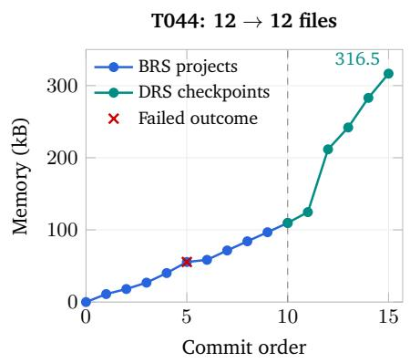

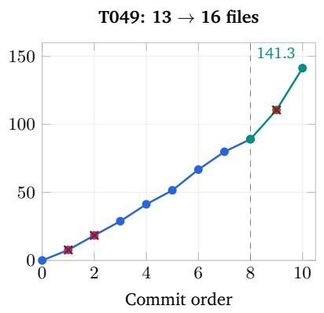

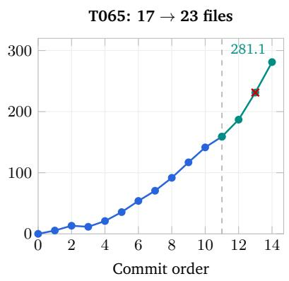  
Figure A1. Memory accumulation in the three case studies. Blue points count committed BRS projects; green points count DRS target-cycle checkpoints, including any intervening practice. The dashed line marks the transition between these two counting units. Red crosses mark failed outcomes that still produced memory updates. File counts above each panel compare the end of BRS with the final freeze. Size is measured in decimal kB. This plot is reconstructed from the saved journals; the subsequent figures show retained runtime images.

Table A5. Memory checkpoints and practice volume. Sizes are the summed bytes of regular files in each memory snapshot. A target cycle and a supplementary project are separate units of practice.
<table><tr><td>Task</td><td>BRS projects</td><td>BRS bytes</td><td>Frozen bytes</td><td>DRS practice</td></tr><tr><td>T044</td><td>10</td><td>109,647</td><td>316,541</td><td>5 target outcomes; 7 supplementary projects</td></tr><tr><td>T049</td><td>8</td><td>89,086</td><td>141,312</td><td>2 target outcomes; 1 supplementary project</td></tr><tr><td>T065</td><td>11</td><td>159,065</td><td>281,085</td><td>3 target outcomes; 2 supplementary projects</td></tr></table>

Growth also takes the form of revision within a stable set of files. For example, T044 retains twelve files throughout DRS while its memory expands from about 110 to 317 kB: the actor keeps enriching the same editing manuals, verification procedures, and failure records. Conversely, T065’s third BRS consolidation reduces memory from 13,243 to 11,510 bytes. The history therefore captures both accumulation and reorganization rather than simple concatenation of every interaction.

Diferent branches contribute complementary lessons. The T049 BRS index gives a concrete view of what is being accumulated. One PDF-audit project fails because the actor applies a familiar coordinate-system convention instead of the conversion explicitly given in the task. A later audit in the same family uses the stated mapping and obtains an exact coordinate match. Presentation projects explore detached connectors, overflow repair, scaled reference figures, and alignment against intact elements. For example, the callout project derives connector anchors from a PDF through a scale of 8,000 EMU per point and validates the mapping against a declared-correct connector before repairing the broken ones. These experiences populate separate coordinate-mapping notes, a PPTX editing playbook, interpretation rules, and project records.

The index itself also learns from the branch structure. One episode finds that sibling records have appeared since its initial inspection; rewriting the index from its earlier view would leave those records unlisted. Its retained lesson is to enumerate the current project-record directory and topic headings again at phase boundaries before updating the index. Thus, the accumulated knowledge includes how to preserve and retrieve discoveries made by other branches, in addition to how to operate the application.

A failed export becomes a reusable check. T044’s fifth BRS project asks for an untouched Shotcut timeline and a default H.264/MP4 export. The project receives an internal FAIL after the verifier compares the exported audio settings with a command-line render and reports a defaultsetting discrepancy. The subsequent consolidation creates shotcut-default-export-fail.md and media-verification-checklist.md, modifies nine existing files, and increases memory from 40,186 to 55,506 bytes. The retained editing manual distinguishes the GUI export settings from the bundled engine’s no-override defaults and calls for checking the actual consumer settings and output streams. This episode illustrates how a problematic outcome can still enrich the procedures used in later work: a plausible-looking video is accompanied by explicit checks of its export configuration.

Repeated visual checks across video resolutions. Other T044 branches establish the crop-andletterbox procedure itself. Figure A2 pairs the input and output frames from an 800 × 450 exercise and a later 1920 × 1080 exercise. The measured top bands are 36 and 44 pixels, respectively, and the corresponding outputs have symmetric 18- and 22-pixel bars. The verifier also checks the image mapping and output streams, so the procedure is grounded in both the visible result and the saved video. The later episode is recorded in the editing manual as another confirmation that a top-only crop can remain centered and unscaled when the profile width is preserved. By this point, the memory describes a method tested on several clips, with the crop height measured anew for each input.

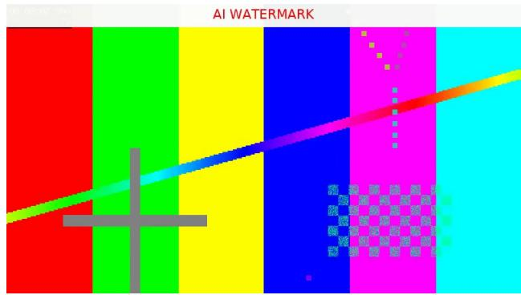  
(a) Project 1 input: 800 × 450.

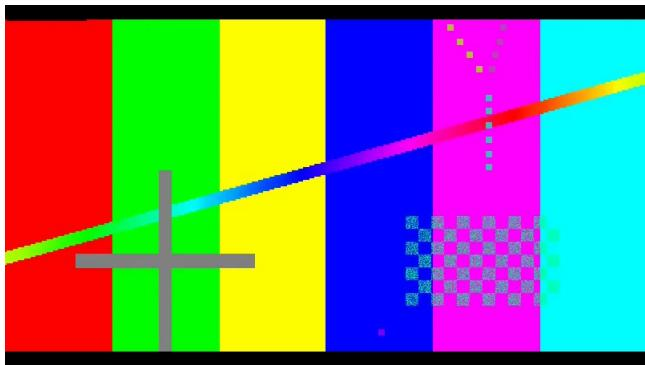  
(b) Project 1 output: 18-pixel bars.

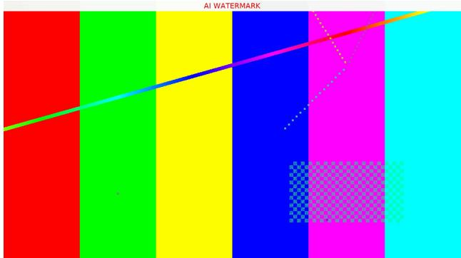  
(c) Project 7 input: $1 9 2 0 \times 1 0 8 0 .$

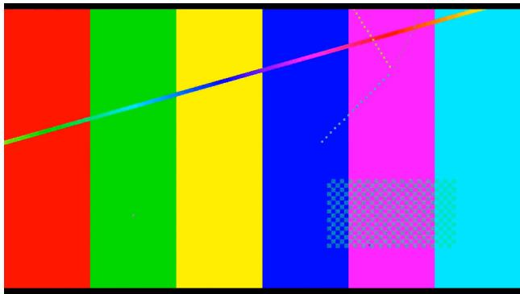  
(d) Project 7 output: 22-pixel bars.  
Figure A2. Learning a reusable video-editing procedure through BRS. Each row shows input and output frames inspected in the same T044 practice project. The top watermark band disappears, while the color bars and geometric patterns provide landmarks for checking image proportions. The two projects use diferent resolutions and crop heights, supplying repeated experience for the editing manual.

## E.2 A Branch in Detail: Learning to Observe Changing Seat Availability

T065’s eighth BRS project isolates one prerequisite of railway booking: observing a changing seat map and choosing the first release that satisfies the requested seating rule. The actor opens a local practice page in Chrome and must watch the rendered interface for at least 100 seconds. In this exercise, the two travelers need seats in the same row, one D and one F, simultaneously available. The actor must record the releases, their first observed times, and the earliest valid choice. Page information must come from the GUI.

What the branch observes. The page exposes five successive release windows. The first makes 17D and 17F available, so it is already a valid choice. The second ofers only 8A; the third ofers 9C and 9D; the fourth ofers only 14F; and the fifth ofers 11D, 11F, and 12A. Although the fifth window also contains a valid D/F pair, it arrives later. The third window is a useful contrast: two seats in the same row do not satisfy the exercise when one of their letters is outside the allowed set. Figure A3 shows the first and third releases as captured during the run.

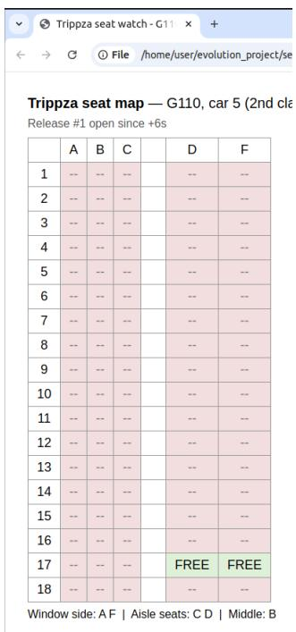

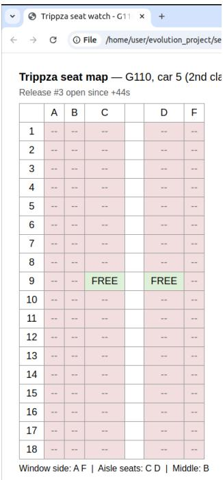  
(a) Release 1: 17D and 17F are free.  
(b) Release 3: 9C and 9D are free.

Figure A3. Learning from a dynamic interface in T065, BRS, episode 8. These are crops of the original Chrome screenshots of the local practice page, retaining the browser chrome and seat table. The first release satisfies this exercise’s D/F rule; the third does not. Notice that the wider columns move with the locations of the FREE labels. The original full screenshots are retained with the figure assets.

What goes wrong, and what is learned. The challenge extends beyond reading the seat letters. The table sizes its columns from their contents: a column containing FREE is about 72 pixels wide, whereas an occupied-only column is about 36 pixels wide. Consequently, seat positions shift as the release changes. A fixed pixel grid initially misclassifies the third and fourth releases. The actor corrects the readings by detecting the columns separately in each state, using the wider aisle gap between C and D as a structural cue. The two screenshots make the reason for this correction visible: the widened columns are D/F in the first state and C/D in the third.

The branch also encounters a monitoring failure. Its detached watcher fails twice at compilation, leaving the early releases unobserved. The actor restarts the deterministic practice page in a fresh browser profile and switches to an inline capture loop. The completed record contains 663 frames over approximately 335 seconds, together with timestamps and the first observed frame for each release. The verifier checks the recorded seat sets against the page’s release schedule and independently inspects the captured frames, returning PASS.

How the observation becomes memory. Consolidation creates seatwatch\_tasks.md and an episode record, and extends the existing observation and environment playbooks. The memory preserves the specific release sequence as well as the reusable method: distinguish simultaneous availability from seats seen at diferent times, test the full seating condition, re-detect layout after state changes, and confirm that the monitoring process is actually producing evidence. The episode record states the key discovery directly:

“content-driven table column widths (FREE \~72 px, occupied \~36 px)” and “a frozen grid misclassified releases #3/#4 until columns were re-detected per state”.

This commit grows the corpus from ten files and 70,513 bytes to twelve files and 91,697 bytes. The additional memory is therefore tied to an observed failure, a corrected method, and a verified decision.

DRS extends observation rules into booking decisions. The later target cycles expose another distinction: a completed payment and a valid itinerary require diferent checks. Figure A4 shows the actual My Bookings pages from cycles 2 and 3. Cycle 2 contains Paid orders for G102 and G118, but receives an internal FAIL when the verifier requires the purchased segments to connect directly. This outcome enters memory as a stricter transfer rule. In cycle 3, the actor revisits that rule against the task’s explicit permission to buy a longer ticket and board at an intermediate stop. It books G102 and G122; this verifier accepts boarding the second train at Nanjing South, with a 1-hour-39-minute transfer and a total price of \$174.26. Memory records the successful variant alongside the earlier failure, refining the conditions under which a route should be chosen. The two verdicts reflect diferent interpretations of the transfer requirement during DRS.

The same cycle discovers a further observation failure: a scripted clipboard read can return incomplete results while the page is still rendering. The screen shows train cards, but the text read contains none. The resulting memory adds a completeness check before treating an empty read as unavailable inventory. This extends the earlier seat-table lesson from locating changing columns to confirming that a dynamic page has finished presenting the state being measured.

Checking the persistent booking state. The detail page supplies a closer view of what the interface confirms (Figure A5): G102, the two passengers, the Shanghai–Nanjing segment, and the paid

(a) DRS cycle 2: G102 and G118; internal FAIL on transfer interpretation.  
  
(b) DRS cycle 3: G102 and G122; intermediate boarding accepted.

Figure A4. T065’s booking-state evidence during DRS. The original Chrome screenshots are cropped to retain the browser controls and both Paid orders. In cycle 2, the verifier evaluates the purchased endpoints as disconnected. In cycle 3, the verifier accepts boarding G122 at its intermediate Nanjing South stop, as documented in the accompanying diagnosis. These are successive practice cycles; the final test-time itinerary is described separately below.

amount of \$49.84. The DRS records also describe a transient timeout message that conflicts with the persistent Paid state. The retained procedure calls for reopening My Bookings and inspecting the orders to establish what was actually saved. Seat-letter checks belong to the seat-selection views; the order detail shown here supports the route and payment checks.

  
Figure A5. T065, DRS cycle 2: the saved G102 booking detail inspected during the run. The Paid banner, train times, two passengers, and payment summary provide persistent evidence of this completed order. The screenshot is cropped around the booking panels.

Reuse during the later booking task. After further practice, the final T065 actor reads the ac cumulated booking experience and the GUI capture, booking-flow, and form-filling playbooks in its first two iterations. Its eventual itinerary uses G98 and D756, rather than simply copying the G102/G122 route discussed in earlier memory. The final observation records two Paid orders for March 25, 2026, a total of \$177.26, and arrival at Beijing South at 19:58. This illustrates retrieval of procedural knowledge alongside fresh choices in the current interface. The recorded score changes from 0 to 1, but the final run also receives an explicit current-date clarification while the baseline books the year 2027. We therefore use T065 primarily to illustrate memory acquisition and reuse; T049 and T044 below provide the more direct artifact-level score comparisons.

## E.3 Deep Recursive Self-exploration: From a Failed Repair to a Reusable Solution

T049 asks the agent to repair a GoogleNet presentation using the accompanying paper as a reference. Slide 2 has displaced text and card elements, and slides 3 and 4 contain misarranged Inception-module boxes and arrows. The repair must preserve non-arrow dimensions, font sizes, and appearance while restoring the figures. By the start of DRS, the actor already has the 89,086-byte corpus acquired through eight exploratory projects. Target practice now exposes a gap in how those skills are applied to the actual presentation.

First target cycle: precise operations under the wrong interpretation. The first attempt treats the restriction on element properties as a prohibition on moving the figure boxes. It adjusts arrows while leaving the corrupted box positions in place. The live WPS screenshot in Figure A6(a) shows the result: the branch boxes remain piled together, with arrows connecting an arrangement that does not resemble the reference. The internal verifier rejects the candidate.

The memory update names the mistake explicitly:

“WHY FAIL (decisive): I FROZE THE FIGURE BOXES at their corrupted positions.”

The same record explains the intended repair: move the boxes position-only into the paper’s arrangement and then reconnect the arrows. It preserves the competing readings of the task, the observed layout defects, and the decoded reference geometry. Memory increases to 110,546 bytes in fourteen files. The failure has supplied a concrete decision rule for the next attempt: interpret the preservation constraints together with the defect that the task asks to repair.

A supplementary branch tests the revised rule. Between the two target cycles, the curriculum introduces a related synthetic presentation, velvet\_signal\_path\_deck.pptx. This exercise also has piled boxes and damaged connectors, but includes declared-correct elements that can anchor the repair. The actor applies the newly recorded interpretation at its first render, fits a uniform mapping from the reference PDF to the intact slide elements, validates that mapping on an untouched connector, and then moves the displaced boxes and repairs the arrows. The verifier returns PASS.

Together with the returning target attempt, this practice adds a useful distinction to the memory: fit a mapping when correct in-place anchors agree, and construct the layout directly from the reference when the damaged figure has no usable anchors. The stored procedure now describes when to use each method, as well as how to calculate the resulting coordinates.

Second target cycle: a verified repair becomes a precedent. Returning to the GoogleNet deck, the actor checks its identity against the retained failure record and uses the paper-derived arrangement. It moves the boxes without changing their dimensions and connects the arrows to the appropriate edge-center anchors. The live application now displays a row of four branches between Previous layer and Filter concatenation, as shown in Figure A6(b). The internal verifier returns PASS, and consolidation adds the successful repair record. At the final freeze, memory contains sixteen files and 141,312 bytes.

The failure and success records remain available together. The failure explains why an earlier choice was wrong; the success specifies the working construction, the artifact identity checks, and the anchor convention. In this case, DRS turns broad geometric editing skills into a concrete, retrievable solution for the target presentation.

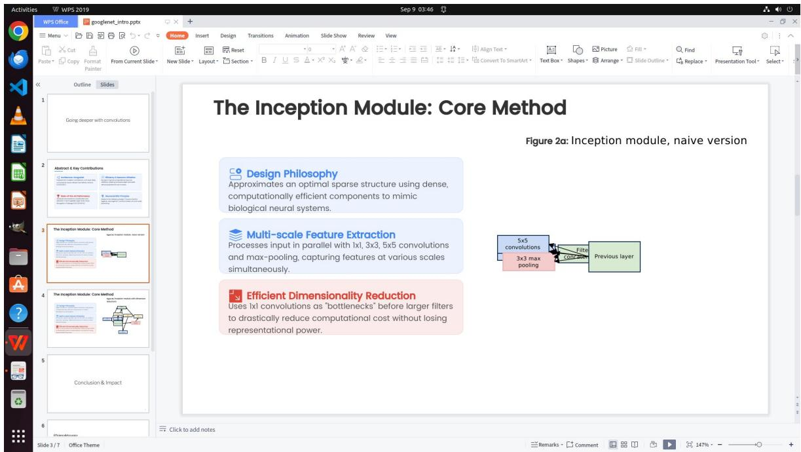

(a) DRS, target cycle 1: internal FAIL; boxes remain piled.  
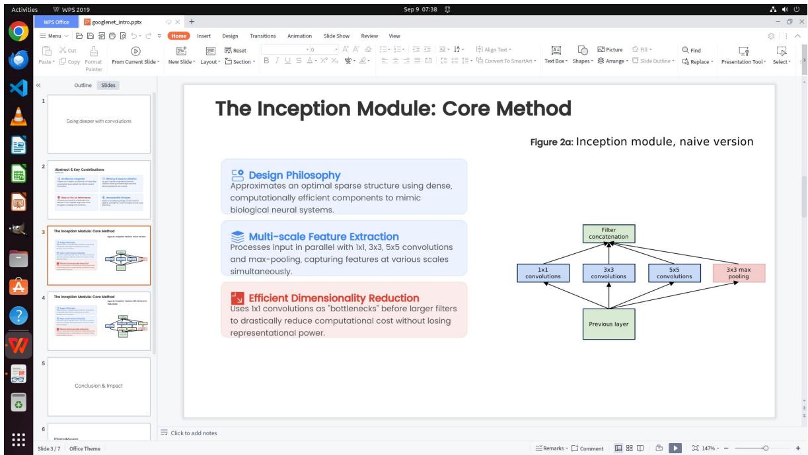  
(b) DRS, target cycle 2: internal PASS after memory updates and practice.  
Figure A6. The learning sequence within T049’s DRS stage, shown in the original live WPS screenshots. The first attempt leaves the boxes at their corrupted positions. After recording the interpretation failure and completing a supplementary repair exercise, the next attempt reconstructs the reference layout. Both images belong to DRS practice; the separate memory-free baseline comparison appears in Figure A13.

## E.4 Deep Recursive Self-exploration: Refining Video Edits Through Repeated Inspection

T044’s DRS history adds seven supplementary projects and five target outcomes to the editing knowledge acquired during BRS. The retained images show how the agent checks the same operation at several levels: the watermark region, the whole frame, recognizable content within the frame, and the relationship between the saved project and its export. These inspections enrich the existing editing and verification manuals, which the final actor later reads before editing the evaluation video.

A supplementary clip isolates the watermark boundary. Figure A7 shows enlarged input and output regions from the first supplementary project. The practice uses a 640 × 360 clip with an AI-generated badge near the upper edge. The actor removes a 68-pixel band and retains the remaining content with symmetric 34-pixel padding. The verifier checks the project, dimensions, output size, and the visible result, returning PASS. This adds a small, directly inspected example of choosing the crop from the actual badge boundary to the broader BRS experience.

  
(a) Enlarged source badge.

  
(b) Processed region.  
Figure A7. T044, supplementary DRS project 1: runtime close-ups used to inspect the watermark region. The original badge is visible in the source; the processed view shows the resulting black padding and retained image content.

Whole frames establish the efect on the target video. The first target cycle inspects the portrait clip at a recognizable phone scene (Figure A8). The top-left badge disappears in the export, and black bars appear at both ends of the frame. The phone outline, spherical graphic, and application icons provide visible landmarks for checking what the edit preserves. The source and output are retained at the same 834 × 1112 resolution. This is an early target-practice observation that subsequent cycles extend with more focused checks.

Content alignment checks for distortion. Cycle 2 compares the exported content with the source after accounting for the 76-pixel crop (Figure A9). This removes the expected framing diference from the comparison and lets the verifier inspect the crystal edges and nearby interface elements. The recorded inspection describes nearly identical geometry with some compression softening; the accompanying analysis reports a median structural-similarity score of approximately 0.99. The lesson retained in the verification procedure is to compare corresponding content regions when checking for scaling or stretching.

Another scene checks the procedure across the clip. Cycle 4 retains a side-by-side comparison at a later crystal scene (Figure A10). The source watermark is visible above the left crystal, while the corresponding exported frame has a black top bar. The horizontal light line and crystal facets make the upward displacement from cropping visible and provide another set of landmarks for inspecting proportions. Sampling this diferent scene extends the evidence beyond the phone frame used in the first cycle.

  
(a) Source frame inspected in cycle 1.

  
(b) Exported frame from the same cycle.

Figure A8. T044, DRS target cycle 1: whole-frame inspection of the watermark-removal result. The phone scene makes the retained content easy to locate, while the frame boundaries reveal the added padding. Both images come from the same practice cycle.  
  
Figure A9. T044, DRS target cycle 2: the runtime comparison of corresponding content regions. The left view is the source after accounting for the top crop; the right is the exported content. The verifier uses the crystal contours and interface details to inspect geometric fidelity, alongside numerical image checks.

  
Figure A10. T044, DRS target cycle 4: a source/export comparison assembled during the original runtime inspection. The source is on the left and the export on the right. The later scene exposes the watermark boundary, padding, and retained crystal geometry together.

The saved project and export are both inspected. The same cycle also retains a three-way check of the top image region (Figure A11). The source contains the badge; a render of the saved MLT project and the exported video both remove it. Their framing difers in this inspection, with black padding visible in the exported strip. Keeping both views makes the relationship between the editable project and delivered video part of the verification procedure. This is directly relevant to the final task, which evaluates the native crop settings as well as the video.

A final close-up rechecks the boundary. The fifth target cycle again inspects the original upper strip, the processed strip, and an enlarged export detail (Figure A12). These views concentrate on the region where a shallow crop could leave badge pixels behind. Across the DRS sequence, the memory therefore accumulates a layered inspection method: measure the source boundary, check full-frame composition, align content for distortion checks, and reopen both the project and export. At the final freeze, these procedures and episode records occupy 316,541 bytes in the same twelve-file corpus.

  
Figure A11. T044, DRS target cycle 4: the original three-way runtime inspection, with the source strip at the top, saved-project render in the middle, and exported strip at the bottom. The watermark is visible only in the source, and the export includes black padding. These views check both deliverables produced by the editing procedure.

(a) Source top strip: the badge remains visible.  
  
(b) Processed top strip: padding and retained content.

  
(c) Additional enlarged export detail.  
Figure A12. T044, DRS target cycle 5: retained runtime views of the watermark boundary at two inspection scales. The input strip makes the badge location explicit; the output views support the final visual check that its pixels have been removed.

## E.5 Without Memory Versus Frozen Memory: Which Errors Change the Score?

Table A6 summarizes the two principal comparisons. We follow each score change down to the saved artifact and the corresponding execution trace. These are selected historical runs, with their recorded seeds and repair branches, rather than a matched-seed memory ablation.

Table A6. Task scores in the principal memory-reuse case studies. Baseline uses no accumulated memory; the final run uses frozen memory after exploration and target practice. Scores are on a 0–1 scale.
<table><tr><td>Task</td><td>Baseline</td><td>Memory</td><td>Gain</td><td>Newly satisfied scoring checks</td></tr><tr><td>T049</td><td>0.40</td><td>0.80</td><td>+0.40</td><td>Slide-3 arrows, completing its layout-and-arrow check</td></tr><tr><td>T044</td><td>0.40</td><td>1.00</td><td>+0.60</td><td>Native crop height (+0.40) and Center-off setting (+0.20)</td></tr></table>

T049: retrieval changes the starting point of execution. The final actor reads both the GoogleNet failure and success records, together with the memory index, in iteration 2. Its next message states that the same corrupted deck has appeared before and that it should verify the live file against the recorded MD5 and damaged coordinates. After those checks, it reads the connector playbook, confirms the reference geometry, and reuses the verified construction. The trace therefore shows memory entering the repair before the main editing decisions, followed by explicit checks that the remembered solution applies to the current file.

The memory-free baseline also reconstructs the box layout by the end of its run. The remaining diference is more specific than the dramatic DRS failure shown earlier: connector 69 on slide 3, running from Previous layer to the 5 × 5 convolution branch, is not anchored accurately enough. Its start difers from the source box’s top center by 121,104 EMU horizontally and 145,345 EMU vertically. Both exceed the scorer’s per-axis tolerance of 100,000 EMU. In the final run with memory, both errors are zero. The actor applies the recorded edge-center convention and checks all nineteen arrows across the two figure slides.

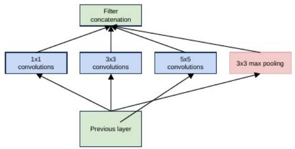  
(a) Without memory: task score 0.40.

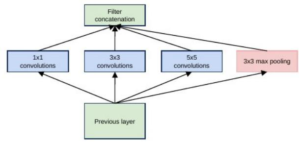  
(b) With frozen memory: task score 0.80.  
Figure A13. Detail of T049’s final slide-3 diagram in the two evaluation runs, cropped from artifact renders inspected by the verifier during execution. Both runs restore the broad arrangement; the decisive remaining baseline error is the start of connector 69, which misses the required Previous-layer anchor. The memory run places that endpoint exactly at the box’s top center.

The saved scoring breakdown makes the consequence explicit (Table A7). Slide 3 requires both its layout and arrows to pass. Correcting the endpoint changes that slide’s contribution from 0 to 0.40, accounting for the full task-level gain. Slide 4 contributes 0.40 in both runs, and slide 2 contributes zero in both, even though the internal verifier accepts the final repair. Thus, the observed improvement is a completed figure-repair component, with one presentation component still uncredited by the task scorer.

Table A7. T049 scoring breakdown from the retained artifact analysis. Replaying the scoring functions on the saved presentations reproduces the historical totals. EMU denotes the presentation’s coordinate unit.
<table><tr><td>Check</td><td>Without memory</td><td>Frozen memory</td></tr><tr><td>Slide 2 contribution</td><td>0.00</td><td>0.00</td></tr><tr><td>Slide 3 layout</td><td>Pass</td><td>Pass</td></tr><tr><td>Slide 3 arrows</td><td>Fail</td><td>Pass</td></tr><tr><td>Slide 3 contribution</td><td>0.00</td><td>0.40</td></tr><tr><td>Slide 4 contribution</td><td>0.40</td><td>0.40</td></tr><tr><td>Connector 69 start error, horizontal (EMU)</td><td>121,104</td><td>0</td></tr><tr><td>Connector 69 start error, vertical (EMU)</td><td>145,345</td><td>0</td></tr><tr><td>Total</td><td>0.40</td><td>0.80</td></tr></table>

The final repair is also visible in the live WPS application (Figure A14). In these two runs, actor iterations decrease from 35 to 19 and recorded wall time decreases from 5,105.5 to 2,697.0 seconds. This is consistent with the trace’s shift from deriving a repair afresh to checking and executing a retained solution.

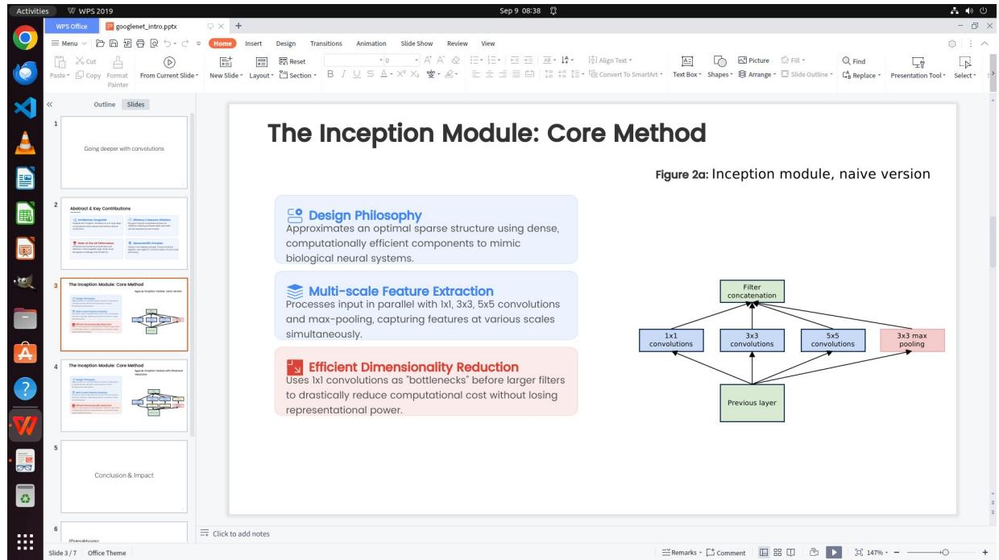  
Figure A14. T049, test-time memory reuse: the repaired presentation in the live WPS window during final verifier inspection. This screenshot belongs to the frozen-memory evaluation whose task score is 0.80.

T044: memory selects the application’s native editing procedure. T044 asks for a video with the top watermark removed, symmetric padding where needed, unchanged resolution, and no stretching or zooming. It also requires both the saved Shotcut project and an exported video no larger than 1

MiB. The baseline removes the top 100 pixels using generic avfilter.crop and avfilter.pad filters, with 50-pixel black bars above and below the remaining image. Its output is 1,019,423 bytes at the original 834 × 1112 resolution.

The final actor with memory reads shotcut-video-editing.md in iteration 4 and the native Shotcut operation notes in iteration 6. These notes include the bundled rendering engine, crop-and letterbox procedures, export pitfalls, and output checks. The actor inspects the watermark region and uses the GUI’s Crop: Source operation, producing a project with mlt\_service=crop, top=76, and center=0. It exports through the bundled melt engine. The final video retains the original resolution, has 38-pixel symmetric bars, and is 986,760 bytes.

  
(a) Source: top watermark.

  
(b) Baseline: 100-pixel crop.  
(c) Memory: 76-pixel crop.  
Figure A15. Video frames inspected during the original T044 runs. Panels (a) and (c) are the source/output views from the memory run; panel (b) is the baseline verifier’s first-frame output view. These retained runtime frame views show watermark removal and symmetric padding in both outputs. The finer crop and the native project filter distinguish the memory run.

Why this changes the score from 0.40 to 1.00. The task scorer inspects both the video and its project structure. It awards 0.20 for the size cap and 0.20 for unchanged resolution, which both outputs satisfy. Its remaining checks search for a native crop or qtcrop filter: an accepted top crop between 75 and 85 pixels earns 0.40, and the Center-of condition earns 0.20. The baseline’s generic filters do not enter those checks. The memory run’s native filter is recognized, its 76-pixel crop falls in the accepted range, and Center is disabled, so it receives all four components.

The visual comparison and project analysis tell a complementary story. Both runs remove the watermark and preserve the image proportions; the improvement is a more precise crop expressed through the native Shotcut workflow. Memory supplies application-specific knowledge about which operation to use and how to validate its output. This case adds a fully credited task, whereas T049 adds credit for a previously failed slide. T044 also takes more actor iterations with memory, 42 versus 26, so its gain is in task completion rather than shorter execution.

## E.6 Reconstructing a Mechanical Part from Engineering Drawings

CAD reconstruction requires both interpretation and execution. T103 asks the agent to recreate a support bracket in FreeCAD from drawing.pdf and a reference image, then export support\_bracket.step. The part combines a bearing housing, stepped bore, supporting webs, mounting holes, and a recessed base. Completing it requires the agent to reconcile orthographic sections, dimension annotations, and visible features before expressing their relationships as a solid model. Figure A16 shows the supplied inputs and a retained render from the first frozen-memory evaluation.

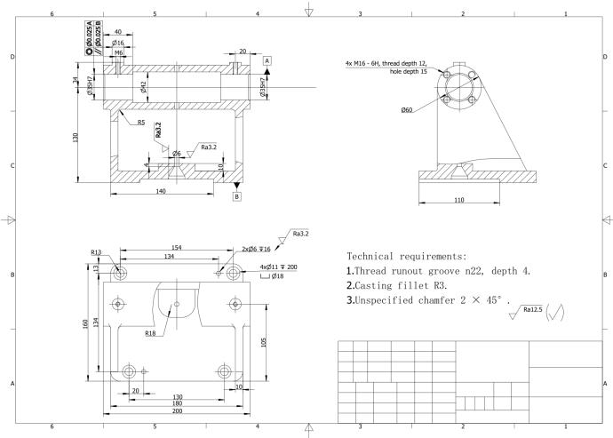  
(a) Supplied engineering drawing, rendered upright.

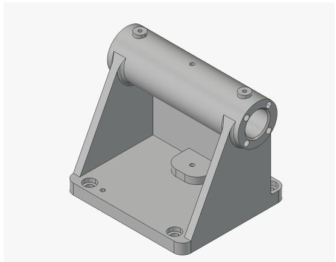  
(b) Supplied reference part.

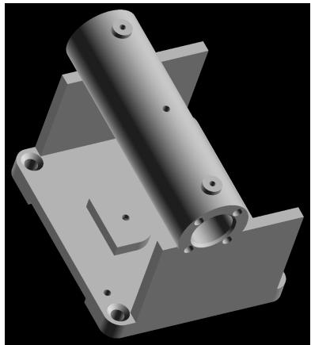  
(c) First evaluation: retained candidate render.  
Figure A16. T103: from an engineering drawing to a programmatically constructed CAD model. Panel (c) is an original runtime render from the first RSI evaluation (score 0.6789), not the reference or the second evaluation. The rectangular supports and conical mounting-hole mouths remain visibly diferent from the reference.

Broad Recursive Self-exploration builds complementary CAD skills. Eight projects, executed in two waves of four, cover environment setup and seven CAD exercises. A scanned-drawing project requires a gusseted bracket with counterbored holes; an angled-brace project introduces non-orthogonal construction; and a cover-plate project places a window whose dimensions must be recovered from a reference-image grid. These projects accumulate procedures for distinguishing scanned from vector PDFs, interpreting drawing notes, constructing solids through code, and checking a STEP export after re-import. All eight receive internal PASS judgments, leaving 77,800 bytes of memory in eight files. The shared knowledge therefore covers several prerequisites of the target, rather than a single completed bracket.

Deep Recursive Self-exploration refines the interpretation rules. The first target attempt receives an internal FAIL amid disagreement about the drawing’s measurement frame. The curriculum agent then proposes three flange-housing practices, whose outcomes are FAIL, PASS, and PASS. Their retained records distinguish printed labels, PDF coordinates, and physical dimensions, including a variant whose labels are explicitly expressed in 96-dpi pixel units. A second target attempt receives internal PASS and adds further procedures: anchor dimension labels to arrowheads and extension lines, and combine orthogonal sections to recover the recessed region, groove, taper, and small passage. Every target and practice outcome contributes a memory update. The resulting frozen corpus contains 147,415 bytes in the same eight files. This historical run uses verifier-pass stopping for DRS.

Frozen memory supplies methods used in the final reconstruction. The evaluation traces show retrieval followed by application. In the first evaluation, the actor agent reads the PDF and FreeCAD playbooks, adopts their input-classification and execution rules, and later explicitly reuses the earlier target’s point-membership probes to check material and void regions in the exported solid. The second evaluation reads the memory index and the drawing-extraction, execution, FreeCAD, and verification playbooks within its first five turns. It then derives geometry from the current drawing and constructs the part through the FreeCAD Part API. Thus, the retained experience provides both an interpretation procedure and executable ways to check the resulting artifact.

The score gain reflects improved, but incomplete, reconstruction. The archived memory-free baseline scores 0.2500; the two frozen-memory evaluations score 0.6789 and 0.6897, respectively. The baseline already exports a valid solid, so the improvement is not simply successful file creation. The first RSI construction adds a cylindrical groove and a more detailed central pad, while retaining incorrect support and mounting-hole geometry visible in Figure A16. These records demonstrate reuse of task-relevant experience alongside higher partial credit on the known target. The comparison uses an archival baseline rather than a matched memory ablation, and the saved scores do not resolve the contribution of individual features.

## E.7 Producing a Radio Bumper in REAPER

Audio production couples content selection with precise timing. REAPER is a digital audio workstation for arranging, processing, and rendering audio. T085 asks the agent to assemble a radio bumper from recorded takes according to a supplied fragment plan. The output must preserve the specified sources and order, use approximately 0.05-second crossfades, leave 0.50-second gaps between sentences, and place a closing sting 0.50 seconds after the final sentence. That sentence must also be exported separately with its pitch raised by two semitones and its duration halved. The task therefore requires both interpreting which source fragments belong together and expressing that interpretation through the application’s editing and rendering controls. Figure A17 connects the final source-fragment arrangement to the audio delivered by the first frozen-memory evaluation.

Broad Recursive Self-exploration acquires reusable audio procedures. In this run, seven BRS projects cover source selection, precise splicing, silence measurement, pitch and duration transformations, and complete bumper construction. They leave 13 memory files containing 109,720 bytes. The retained procedures include REAPER project construction and command-line rendering, audio-content comparisons, and checks on the exported waveform. This supplies the actor agent with practical methods for constructing and inspecting audio artifacts before attempting T085.

(a) Editing timeline reconstructed from the final recorded program  
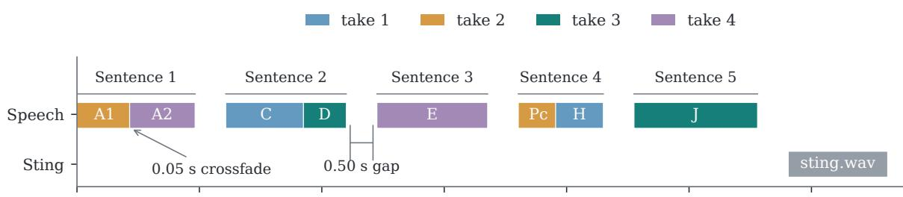

(b) Waveform envelope of the saved first-RSI bumper  
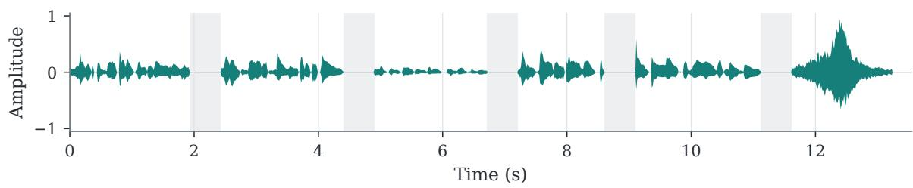  
Figure A17. T085 radio-bumper assembly. (a) Source-take layout reconstructed from the final recorded construction program. (b) Waveform envelope of the saved first-RSI bumper; shaded bands mark the 0.50- second gaps.

Deep Recursive Self-exploration resolves ambiguity and revises rendering advice. The first target attempt receives an internal PASS and adds plan\_resolution\_pattern.md. This record describes how to combine phrase detection, cross-take comparisons, transcription, and sentence grouping to resolve the terse fragment plan. It preserves the chosen source spans together with qualifications about ambiguous choices. The curriculum agent then selects six further practices. The first two compare native item-and-fade assembly against preassembled sentence sources, then repeat the comparison with tightly trimmed stereo audio. The second practice exposes a mismatch between the rendered audio samples; changing the saved resampling configuration to RENDER\_RESAMPLE 0 0 0 resolves it in the tested builds. Memory is revised to qualify earlier renderer explanations. Four additional practices examine analogous source-selection and ordering problems in image composition. After a second target PASS and a curriculum-ready decision, memory is frozen at 17 files and 227,605 bytes. Both exploration stages record zero oficial evaluator calls.

Test-time execution reuses the retained interpretation and procedures. The first frozen-memory evaluation explicitly retrieves the full plan-resolution record in iteration 15. Its construction program later uses all eight source spans recorded in that memory and adopts the revised resampling setting when building native REAPER projects. The actor agent checks the emitted audio through transcription, source comparisons, timing measurements, and paired pitch estimates. The saved re-render check reports identical audio-sample payloads for both deliverables. The trace thus connects a retained lesson to a specific construction choice and a subsequent output check. Figure A18 shows the retained baseline and RSI exports for both the complete bumper and the separately processed ending.

Full radio bumper

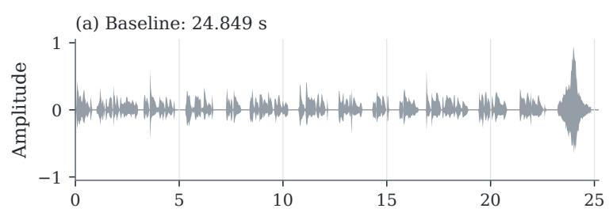  
Processed ending

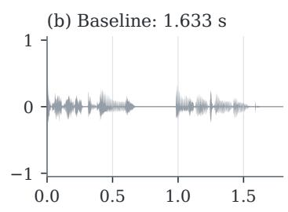

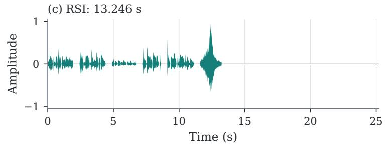

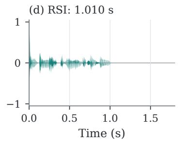  
Figure A18. Waveform envelopes of the archived T085 exports: baseline (top) and the first frozen-memory RSI evaluation (bottom). Each column uses shared time and amplitude scales; panel titles give file durations.

The score improvement is concentrated in sentence gaps and the processed ending. The archived baseline scores 0.6800, while the two frozen-memory evaluations score 0.9417 and 0.9413, averaging 0.9415 as reported in Section 4.4. Both evaluations reuse the same frozen memory with host writeback disabled. Table A8 shows the first evaluation’s component scores: sentence-gap credit increases from 0.8250 to 1.0000, and processed-final-sentence credit increases from 0.2837 to 0.8996. The latter also removes the baseline’s binding 0.68 score cap; source-order credit remains unchanged. The evaluator approximates sentence boundaries through acoustic activity, so these components measure its recorded criteria rather than complete semantic or perceptual correctness. This historical comparison documents memory reuse on the known target, not a matched-budget estimate of each practice’s contribution.

Table A8. T085 component scores and overall partial score on a 0–1 scale. RSI uses the first frozen-memory evaluation; the overall score includes the benchmark’s weights and caps.
<table><tr><td>Component</td><td>Baseline</td><td>RSI (draw 1)</td></tr><tr><td>Source order</td><td>0.9062</td><td>0.9062</td></tr><tr><td>Sentence gaps</td><td>0.8250</td><td>1.0000</td></tr><tr><td>Closing sting</td><td>1.0000</td><td>1.0000</td></tr><tr><td>Processed final sentence</td><td>0.2837</td><td>0.8996</td></tr><tr><td>Basic duration</td><td>1.0000</td><td>1.0000</td></tr><tr><td>Overall partial score</td><td>0.6800</td><td>0.9417</td></tr></table>