# Tele360: Real-Time Feed-Forward Human Reconstruction from Sparse Unposed Cameras

HANZHANG TU, Tsinghua University, China ZHANFENG LIAO, Tsinghua University, China WEI MIN, Shadow AI, China JIAJUN ZHANG∗, Tsinghua University, China YEBIN LIU∗, Tsinghua University, China

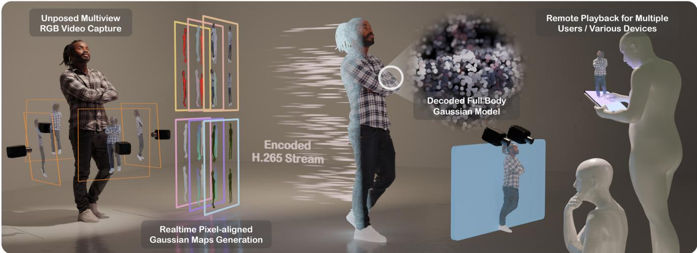  
Fig. 1. We present Tele360, a human telepresence system that uses only 4 to 6 unposed RGB cameras and enables real-time 3D reconstruction, streaming, and interactive viewing of dynamic humans represented by 3D Gaussians at 2K resolution across multiple endpoints.

Live free-viewpoint visualization of real humans is critical for immersive communication and interactive digital experiences. Existing methods either rely on computationally expensive optimization or require calibrated cameras and low-resolution inputs, making real-time high-resolution deploy ment impractical. In this work, we present Tele360, the first real-time feed forward system for dynamic human reconstruction and live free-viewpoint visualization from sparse, unposed RGB streams. Our system jointly estimates camera poses and reconstructs a dynamic 3D Gaussian representation for each time instance in a single forward pass. To achieve this, we start by designing a lightweight sparsity-aware multi-view transformer backbone that tokenizes foreground human regions while preserving global context through a shared scene token. We then employ a fully transformer-based Gaussian decoder to mitigate convolution-induced over-smoothing while keeping decoding sparse and eficient. In addition, we introduce a hybrid feature pyramid that injects multi-scale appearance cues into geometry prediction. We further introduce a lightweight diferentiable Levenberg-Marquardt camera refinement layer to enhance multi-view consistency and geometric alignment. Moreover, to stabilize learning under sparse, unposed inputs, we transfer multi-view geometry priors from a large visual-geometry foundation model via teacher-student distillation. Finally, the predicted

Gaussian maps are streamed with video codecs to remote devices for interactive free-viewpoint rendering. Together, these designs form a balanced pipeline between eficiency and fidelity. Extensive experiments show that Tele360 achieves state-of-the-art visual quality on studio benchmarks while supporting real-time 2K input-to-rendering at over 25 FPS on a single consumer GPU. Additional captured sequences illustrate its performance across varied subjects, clothing, and motions under our multi-camera setup.

CCS Concepts: • Computing methodologies → Computer graphics;

Additional Key Words and Phrases: Dynamic Human Reconstruction, Freeview synthesis, Multi-view Geometry, Real-time system

## 1 INTRODUCTION

With the rapid growth of immersive communication and digital experiences, live free-viewpoint visualization of real humans is becoming a fundamental capability for applications such as AR/VR content creation [Gao et al. 2025; Li et al. 2024a; Liao et al. 2026; Wang et al. 2025b; Xu et al. 2024c; Yang et al. 2024b], telepresence [Guan et al. 2023; Orts-Escolano et al. 2016; Tu et al. 2024; Zhou et al. 2023], and digital avatars [Chen et al. 2025a, 2024, 2025b; Hu et al. 2024; Qian et al. 2024; Xu et al. 2023]. Delivering such experiences requires real-time reconstruction of dynamic humans from sparse, unposed multi-view streams. Recent advances in eficient point-based rendering [Kerbl et al. 2023] and visual geometry foundation models [Leroy et al. 2025; Lin et al. 2026; Wang et al. 2025a, 2026; Xiao et al. 2025] have significantly advanced the field, but a deployable end-to-end system that meets these requirements has yet to be demonstrated.

Despite these advances, existing approaches still fall short of practical requirements and can be broadly categorized into two paradigms. Optimization-based methods recover a dynamic representation via iterative fitting, either by training a 4D representation [Li et al. 2024a; Liao et al. 2026; Wang et al. 2025b; Yang et al. 2024b] over long sequences or by optimizing a per-frame 3D representation [Liu et al. 2026; Sun et al. 2024; Yan et al. 2025]. While achieving high quality, they incur substantial computational cost and latency, and typically rely on known camera poses for multi-view consistency, making them unsuitable for live, interactive use. Feed-forward methods [Lin et al. 2022a; Xu et al. 2025; Zheng et al. 2024; Zhou et al. 2025], in contrast, predict a renderable representation in a single pass and are better aligned with low-latency requirements. However, most of them assume camera poses are given when fusing sparse-view observations. More recently, poseagnostic variants [Jiang et al. 2025; Keetha et al. 2026; Lin et al. 2026; Wang et al. 2025a; Ye et al. 2025] have begun to relax this assumption by distilling or fine-tuning large visual geometry foundation models [Leroy et al. 2025; Wang et al. 2025a], yet deploying such heavy backbones in real time remains challenging, and they are restricted to relatively low input and rendering resolutions.

To address these challenges, we present Tele360, the first real-time feed-forward system for full-body dynamic human reconstruction that enables live 360◦ free-viewpoint visualization from sparse, unposed multi-view streams. Our system takes live 2K video from only 4–6 RGB cameras and runs fully online on a single consumer GPU, jointly estimating camera poses and reconstructing a dynamic 3D Gaussian representation at real-time frame rates. The predicted perview Gaussian maps are encoded and streamed to a remote viewer for interactive 2K free-viewpoint rendering.

As the core of our system, we design a lightweight architecture guided by three principles: real-time eficiency, geometric fidelity, and robust generalization. We begin by introducing a sparsity-aware multi-view transformer. It tokenizes only the foreground human region, substantially reducing the token budget under high-resolution inputs. As this foreground-only tokenization discards background cues and weakens the global context needed for stable camera pose estimation, we further incorporate a shared scene token that aggregates full-image information across all views. Together, these designs preserve the global structure required for reliable pose esti mation while making real-time inference feasible. Building on this compact backbone, we adopt a fully transformer-based decoder to keep decoding sparse and eficient, while also mitigating the tendency of convolutional DPT-style decoders [Ranftl et al. 2021] to oversmooth sharp depth discontinuities and introduce flying points near boundaries. In addition, since ViT-based feature extraction is commonly performed at reduced resolution for eficiency, we introduce a lightweight CNN [Maaz et al. 2023] that extracts a multiscale feature pyramid from the 2K inputs and complements the low-resolution DINO [Siméoni et al. 2026] features to form hybrid features. The pyramid features are progressively injected into the decoder and the Gaussian attribute head in a coarse-to-fine manner, providing high-frequency visual cues for high-resolution prediction. Since even small camera pose errors can lead to multi-view misalignment, duplicated surfaces, and blurred rendering, we further introduce a lightweight diferentiable Levenberg-Marquardt camera self-calibration layer. It refines the camera poses using predicted geometry and cross-view pixel-aligned feature consistency in a feed-forward manner. Finally, to improve generalization and training stability, we incorporate a teacher–student distillation scheme based on a large visual geometry foundation model [Wang et al. 2025a]. By aligning the patch-wise similarity structure during training, our compact backbone inherits strong multi-view geometry and pose priors.

The predicted per-view Gaussian maps are pixel-aligned 2D representations, making them directly streamable with standard video codecs without additional parameterization or compression [Dai et al. 2025; Li et al. 2022; Wang et al. 2024b,c]. On the viewer side, the decoded maps can be used to instantiate 3D Gaussian primitives for each time step, enabling interactive 2K free-viewpoint rendering on devices such as tablets and autostereoscopic displays. We evaluate our system on studio-captured benchmarks and additional sequences captured with our multi-camera setup, covering varied subjects, clothing, and motions. Our method runs fully online at over 25 FPS on a single consumer GPU, enabling real-time reconstruction, streaming, and interactive free-viewpoint 2K rendering with leading visual quality. Contributions are summarized as follows:

• We present Tele360, the first real-time feed-forward approach for full-body dynamic human reconstruction from sparse, unposed multi-view streams, enabling live 360◦ freeviewpoint visualization with 2K input-to-rendering at over 25 FPS on a single consumer GPU.

• We introduce a sparsity-aware multi-view transformer that balances eficiency and reconstruction fidelity, featuring (i) a hybrid CNN-ViT design to exploit high-resolution appearance cues, (ii) a reduced token budget through foregroundonly attention, (iii) an eficient transformer-based Gaussian decoder that mitigates over-smoothing while preserving fast decoding, and (iv) an LM-based camera self-calibration layer for multi-view alignment.

• We build a deployable live system that integrates multi-view capture, real-time reconstruction, and codec-based streaming to support interactive remote viewing across devices such as tablets and autostereoscopic displays.

## 2 RELATED WORK

Optimization-based Dynamic Reconstruction. Optimization-based pipelines remain a dominant approach for high-fidelity dynamic 3D/4D reconstruction from multi-view videos, using NeRF [Mildenhall et al. 2020] and, more recently, 3DGS [Kerbl et al. 2023]. They typically recover a sequence-specific representation by minimiz ing photometric and geometric inconsistencies across views and time, often optimizing a unified 4D model for an entire capture. Earlier dynamic NeRF extensions represent scene evolution with neural scene-flow fields, as in NSFF [Li et al. 2021], or with layered space-time radiance fields, as in ST-NeRF [Zhang et al. 2021]. Within this paradigm, scene dynamics are commonly modeled by explicit spatiotemporal representations [Duan et al. 2024; Gao et al. 2025; Lee et al. 2024; Li et al. 2024a; Luiten et al. 2024; Wang et al.

2025b; Xu et al. 2024b,c; Yang et al. 2024b], or by deformation fields (e.g., MLPs or low-rank K-planes) that drive time-varying Gaussian attributes [Bae et al. 2025; Guo et al. 2025b; Kim et al. 2024; Labe et al. 2025; Liang et al. 2025; Liu et al. 2025; Lu et al. 2024; Shaw et al. 2025; Xu et al. 2024a; Yang et al. 2024a; Zhu et al. 2024]. Related human-avatar methods parameterize 3D Gaussians on structured canonical maps: Animatable Gaussians [Li et al. 2024b] learns posedependent front/back maps from a subject-specific template, while Vid2Avatar-Pro [Guo et al. 2025a] learns a cross-identity prior and personalizes it to each video. These persistent avatar representations difer from our per-frame, per-view Gaussian maps, which are inferred directly from live inputs. Several recent works further explore online streaming variants that process frames sequentially to update per-frame reconstructions [Liu et al. 2026; Sun et al. 2024; Yan et al. 2025]. Despite impressive fidelity, these methods require sceneor sequence-specific iterative optimization whose cost scales with video length and the number of views, and they typically assume calibrated or well-controlled capture, making real-time interactive deployment challenging. In contrast, our work targets real-time reconstruction from sparse, unposed streams with a feed-forward model, enabling low-latency free-viewpoint viewing.

Feed-Forward Dynamic Reconstruction. Recent advances in feedforward 3D reconstruction aim to replace per-scene optimization with generalizable models trained across diverse scenes. These ap proaches can be broadly categorized into pose-aware and pose-free formulations. Pose-aware methods assume known camera parameters and reconstruct geometry directly from calibrated multi-view inputs [Lin et al. 2022a; Xu et al. 2025; Zheng et al. 2024; Zhou et al. 2025]. This calibrated setting is also shared by earlier image-based rendering methods, from geometry-guided Unstructured Lumigraph Rendering [Buehler et al. 2001] to learned generalizable renderers such as IBRNet [Wang et al. 2021] and HumanNeRF [Zhao et al. 2022]; these approaches primarily target view synthesis rather than explicit, streamable 3D reconstruction. Despite their eficiency, pose aware reconstruction methods rely on accurate calibration, limiting their applicability in unconstrained capture settings. Pose-free methods instead jointly infer geometry and camera poses from uncalibrated images via end-to-end learning [Jiang et al. 2025; Keetha et al. 2026; Leroy et al. 2025; Lin et al. 2026; Wang et al. 2025a, 2024a; Ye et al. 2025], improving usability in casual multi-view setups. DUSt3R [Wang et al. 2024a] and MASt3R [Leroy et al. 2025] leverage Transformers to directly predict inter-view point maps, enabling feed-forward estimation of depth and relative pose. VGGT [Wang et al. 2025a], �3 [Wang et al. 2026], and Depth Anything 3 [Lin et al. 2026] stack cascaded Transformer blocks to jointly infer camera poses, point trajectories, and scene geometry in a single forward pass, substantially improving both accuracy and eficiency. However, inference cost typically increases with the number of input views and image resolution, making real-time high-resolution deployment challenging. Moreover, these models are primarily designed for static scene reconstruction and may exhibit cross-view inconsistencies or reduced texture fidelity when they are applied to dynamic, human-centric scenarios. Recent work HiReFF [Jiang et al. 2026] applies pose-free feed-forward reconstruction to dynamic humans captured from sparse, uncalibrated video streams, while remaining below real-time throughput.

Streamable Volumetric Video. Recent research on volumetric video streaming focuses on eficient capture, transmission, and playback across heterogeneous platforms. End-to-end systems such as Holoportation [Orts-Escolano et al. 2016], MetaStream [Guan et al. 2023], Live4D [Zhou et al. 2023], and Tele-Aloha [Tu et al. 2024] integrate live capture, delivery, and interactive viewing under diferent sensing and calibration assumptions. NeRF-based approaches [Li et al. 2022; Wang et al. 2023b, 2024b; Wu et al. 2024] compress neural radiance representations using video codecs or structured decompositions to enable real-time decoding and rendering. Similarly, 3DGSbased methods [Dai et al. 2025; Wang et al. 2024c] adopt Gaussian representations and employ quantization or codec-based compression for streamable playback. However, the NeRF- and 3DGS-based compression pipelines above typically assume that volumetric assets have been reconstructed ofline through scene-specific optimization, and thus decouple reconstruction from transmission. Such designs are not suitable for live capture scenarios where reconstruction, encoding, and rendering must operate jointly under strict latency constraints. In contrast, our method jointly supports real-time reconstruction, transmission, and playback of volumetric video.

Volumetric Fusion for Dynamic 3D Reconstruction. Volumetric fu sion is a classical direction for template-free dynamic 3D reconstruction. DynamicFusion [Newcombe et al. 2015] pioneered real-time, template-free non-rigid reconstruction from a single RGB-D sensor by estimating a volumetric warp to a canonical model. Subsequent works improve robustness by incorporating strong regularization and motion priors such as physical constraints [Slavcheva et al. 2017, 2018], skeleton cues [Yu et al. 2017], parametric body models [Yu et al. 2018], and learned correspondences [Božič et al. 2020], but remain vulnerable to occlusions and drift in invisible regions. To overcome this, Fusion4D [Dou et al. 2016] and Motion2Fusion [Dou et al. 2017] extend non-rigid fusion to real-time multi-view RGB-D rigs, while Function4D [Yu et al. 2021] targets very sparse consumer RGB-D inputs by combining sliding-window fusion with implicit surface refinement. Beyond template-free fusion, Drivable Avatar Clothing [Xiang et al. 2023] targets full-body telepresence by driving a preconstructed subject-specific avatar from sparse RGB-D observations and the motion of the body and face. These systems, however, rely on depth sensors, calibrated capture, or preconstructed avatars, whereas our method operates on sparse, unposed RGB streams without subject-specific optimization.

## 3 METHOD

In this section, we present our feed-forward framework for realtime dynamic human reconstruction from sparse, unposed multiview streams. We first define the problem setting and the output representation in Sec. 3.1. We then detail the proposed architecture and its key design choices in Sec. 3.2. Finally, we describe the training setup and learning strategy in Sec. 3.3. An overview of our pipeline is shown in Fig. 2.

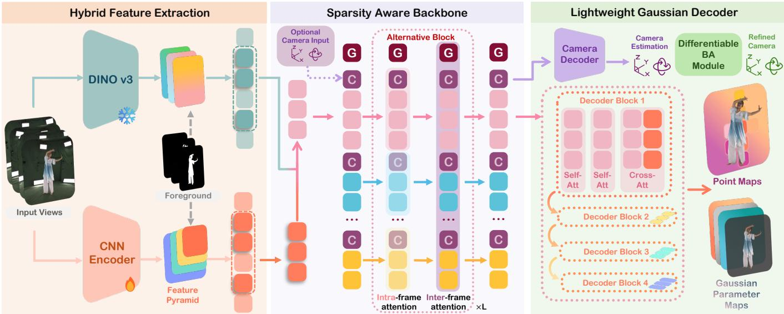  
Fig. 2. Pipeline overview. Given 4 to 6 uncalibrated RGB videos, we extract features with a frozen DINO [Siméoni et al. 2026] and a lightweight CNN encoder, and predict a foreground mask to select foreground tokens. The hybrid features are fed into our sparsity-aware backbone and lightweight decoder to predict camera parameters, depth maps, and Gaussian parameter maps. After the BA module, the final point maps used for Gaussian positions are obtained from the predicted depth maps and the refined camera poses. When calibrated parameters are available, the camera decoder and BA are bypassed.

## 3.1 Task Definition

We consider real-time dynamic human reconstruction from sparse, unposed multi-view video streams. At each time step �, the input arrives as a set of synchronized 2K RGB frames ${ { \cal I } _ { t } } ~ = ~ \{ { { \cal I } _ { t } ^ { ( i ) } } \} _ { i = 1 } ^ { N }$ with $I _ { t } ^ { ( i ) } \in \mathbb { R } ^ { H \times W \times 3 }$ , where � denotes the number of input views (variable across setups, typically $N \in [ 4 , 6 ] )$ . Our goal is to learn a feed-forward network $f _ { \theta }$ that maps the multi-view input at each time step to a renderable reconstruction and the corresponding camera parameters: $( \Pi _ { t } , { \cal M } _ { t } ) \ = \ f _ { \theta } ( { \cal J } _ { t } )$ , where $\Pi _ { t } ~ = ~ \{ \Pi _ { t } ^ { ( i ) } \} _ { i = 1 } ^ { N }$ denotes the predicted per-view camera parameters and $\mathcal { M } _ { t } = \{ \mathcal { M } _ { t } ^ { ( i ) } \} _ { i = 1 } ^ { N }$ denotes the predicted per-view Gaussian maps. The model operates online and processes each $\mathcal { T } _ { t }$ independently. Although the physical cameras in our rig are nominally static, Tele360 predicts camera parameters for every frame. This design makes calibration optional, accommodates small changes caused by camera drift or vibration during live capture, and adds less than 0.5 ms of computation under the six-view setting.

We use compact parameterizations for the outputs. For each view �, we parameterize the camera as $\Pi _ { t } ^ { ( i ) } = \{ q _ { t } ^ { ( i ) } , t _ { t } ^ { ( i ) } , f _ { t } ^ { ( i ) } \} \ \in \ \mathbb { R } ^ { 9 } ;$ where $q _ { t } ^ { ( i ) } \in \mathbb { R } ^ { 4 }$ is a rotation quaternion, $t _ { t } ^ { ( i ) } \in \mathbb { R } ^ { 3 }$ is a translation vector, and $f _ { t } ^ { ( i ) } \in \mathbb { R } ^ { 2 }$ denotes FOV. Each per-view Gaussian map $\boldsymbol { M } _ { t } ^ { ( i ) }$ consists of a point map and an attribute map, $\boldsymbol { \mathcal { M } } _ { t } ^ { ( i ) } =$ $( P _ { t } ^ { ( i ) } , A _ { t } ^ { ( i ) } )$ , where $P _ { t } ^ { ( i ) } \in \mathbb { R } ^ { h \times w \times 3 }$ provides the 3D position and $A _ { t } ^ { ( i ) } \in \mathbb { R } ^ { h \times w \times C _ { a } }$ stores Gaussian attributes (e.g., opacity, scale, rotation, and appearance). In our implementation, the Gaussian maps are predicted at 1K resolution (ℎ × �). Since the representation is pixel-aligned, each pixel corresponds to one anisotropic 3D Gaussian, and aggregating $\{ \mathcal { M } _ { t } ^ { ( i ) } \} _ { i = 1 } ^ { N }$ across views directly instantiates a set of 3D Gaussian primitives $\mathcal { G } _ { t }$ for rendering.

## 3.2 Architecture

We now detail the architecture of Tele360. Our design balances two practical requirements: preserving fine-grained appearance from 2K inputs and enabling real-time inference with a lightweight model. Accordingly, the architecture comprises four key components: (1) hybrid feature extraction for multi-scale image features, (2) a sparsity-aware multi-view backbone for eficient cross-view reasoning under unposed capture, (3) a lightweight Gaussian decoder that predicts pixel-aligned Gaussian maps for rendering, and (4) an LM-based camera self-calibration layer for multi-view alignment.

3.2.1 Hybrid Feature Extraction. Recent visual-geometry foundation models build on ViT [Dosovitskiy et al. 2021] representations for multi-view reasoning. VGGT [Wang et al. 2025a] and MASt3R [Leroy et al. 2025] are representative examples. They often leverage selfsupervised DINO features [Siméoni et al. 2026]. However, both the computational cost and memory requirements of ViTs grow rapidly as input resolution increases. These models therefore process smaller inputs, typically 512×512. Our human-centric setting faces the same constraint: naively increasing the ViT input resolution would compromise real-time inference.

To exploit high-resolution visual cues without incurring excessive computation, we adopt a hybrid ViT–CNN design as shown in Fig. 2. Specifically, we keep the DINO feature branch at a lower input resolution to keep the transformer token budget manageable, and introduce a lightweight yet efective CNN [Maaz et al. 2023] to process the 2K inputs and produce a multi-scale feature pyramid that captures fine-grained appearance details. Let $I _ { I } ^ { ( i ) }$ and $I _ { h } ^ { ( i ) }$ denote the low-resolution (512) and high-resolution (2K) versions of view �, respectively. We extract a ViT feature map using a frozen DINO encoder $\varepsilon _ { v }$ and a multi-scale feature pyramid using a CNN encoder $\mathcal { E } _ { c }$

$$
F _ { v } ^ { ( i ) } = \mathcal { E } _ { \mathrm { v } } ( I _ { l } ^ { ( i ) } ) , \{ F _ { c , s } ^ { ( i ) } \} _ { s = 1 } ^ { S } = \mathcal { E } _ { \mathrm { c } } ( I _ { h } ^ { ( i ) } ) .\tag{1}
$$

where � indexes pyramid levels. We then fuse the ViT features with the coarsest pyramid level $F _ { c , S } ^ { ( i ) }$ by first tokenizing the CNN feature map and aligning channel dimensions with an MLP:

$$
H ^ { ( i ) } = F _ { v } ^ { ( i ) } + \mathrm { M L P } ( \mathrm { T o k } ( F _ { c , S } ^ { ( i ) } ) )\tag{2}
$$

The resulting hybrid features are fed into the subsequent sparsityaware transformer backbone for cross-view reasoning. Note that the multi-scale pyramid features are also used in the Gaussian decoder and will be discussed later.

3.2.2 Sparsity-Aware Backbone. In human-centric captures, informative content is largely concentrated in the foreground, so applying dense ViT attention over full images wastes computation on background regions and hinders real-time deployment. We therefore adopt a sparsity-aware multi-view transformer backbone that restricts attention to foreground tokens while preserving the global context needed for stable camera estimation via a shared scene token. Here, “sparse” refers to token sparsity, meaning that we attend only to tokens whose spatial locations fall inside the foreground mask rather than a dense ViT token grid.

Concretely, given the hybrid per-view features $H ^ { ( i ) }$ and the foreground mask $S ^ { ( i ) }$ predicted by Robust Video Matting [Lin et al. 2022b], we select only the foreground tokens to form a sparse token set $\tilde { H } ^ { ( i ) }$ . We augment each view with a learnable camera token $t _ { c } ^ { ( i ) }$ The intra-frame token sequence is constructed as

$$
f _ { \mathrm { i n t r a - f r a m e } } ^ { ( i ) } = [ t _ { c } ^ { ( i ) } , \tilde { H } ^ { ( i ) } ] ,\tag{3}
$$

on which we apply standard self-attention for within-view reasoning. We then perform inter-frame fusion by concatenating tokens from all views,

$$
\begin{array} { r } { f _ { \mathrm { i n t e r - f r a m e } } = [ t _ { s } , t _ { c } ^ { ( 1 ) } , \tilde { H } ^ { ( 1 ) } , \ldots , t _ { c } ^ { ( N ) } , \tilde { H } ^ { ( N ) } ] , } \end{array}\tag{4}
$$

and applying self-attention to enable multi-view interaction under a compact token budget. Here $t _ { s }$ is a learnable scene token shared across all views that aggregates global context during inter-frame attention. It preserves global context without adding background tokens, helping stabilize camera pose estimation.

3.2.3 Lightweight Gaussian Parameter Decoder. To keep the decoding stage eficient, we preserve token-level sparsity and avoid dense convolutional upsampling used in DPT [Ranftl et al. 2021] decoders. Instead, we adopt a lightweight transformer decoder that refines sparse queries and predicts pixel-aligned Gaussian maps. This design also mitigates convolution-induced over-smoothing and reduces flying points near sharp boundaries.

For each view �, we initialize a set of sparse decoder queries on the foreground region by combining the corresponding image patch content, UV positional encoding, and the per-view camera token $t _ { c } ^ { ( i ) }$ . Specifically, given the foreground patch indices $\Omega ^ { ( i ) }$ selected by the predicted mask on the high-resolution input $I _ { h } ^ { ( i ) }$ , we construct

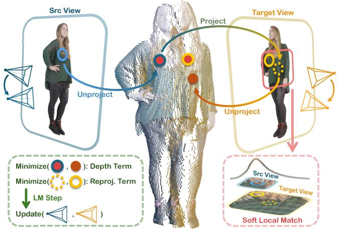  
Fig. 3. Diferentiable Camera BA Layer. Given source depth and tentative cross-view correspondences, our BA layer jointly minimizes reprojection and depth-consistency residuals via LM, updating the camera poses to improve multi-view geometric alignment.

$$
Q ^ { ( i ) } = \mathrm { E x t r a c t } ( I _ { h } ^ { ( i ) } ; \Omega ^ { ( i ) } ) + \mathrm { U V } ( \Omega ^ { ( i ) } ) + ( t _ { c } ^ { ( i ) } ) , \qquad Q ^ { ( i ) } \in \mathbb { R } ^ { p \times d } ,\tag{5}
$$

where $\boldsymbol { p } = | \Omega ^ { ( i ) } |$ is the number of foreground patches and � is the token dimension. Here, Extract $( I _ { h } ^ { ( i ) } ; \Omega ^ { ( i ) } ) \in \mathbb { R } ^ { p \times d }$ extracts image content for the selected foreground regions, and $\mathrm { U V } ( \Omega ^ { ( i ) } )$ ∈ $\mathbb { R } ^ { p \times d }$ encodes the normalized pixel coordinates.

Starting from $Q ^ { ( i ) }$ , the decoder alternates two types of attention blocks. The first is self-attention (SA), where the foreground queries interact with each other to propagate intra-frame information. The second is cross-attention (CA), where the queries attend to multi-scale conditioning features from earlier stages of the network. Concretely, at each refinement stage �, we form the key/value tokens by fusing an intermediate transformer backbone feature $F _ { \mathrm { b a c k } , s } ^ { ( i ) }$ with a CNN feature-pyramid level $F _ { \mathrm { c } , s } ^ { ( i ) }$ , and use the fused tokens as $K , V$ in cross-attention:

$$
K _ { s } ^ { ( i ) } , V _ { s } ^ { ( i ) } \gets F _ { \mathrm { b a c k } , s } ^ { ( i ) } + F _ { \mathrm { c } , s } ^ { ( i ) } .\tag{6}
$$

We apply these CA updates in a coarse-to-fine schedule: backbone features are used from deeper to shallower layers, while CNN pyramid features are fused from shallower to deeper levels, so that the decoder gradually combines high-level geometric cues with finegrained appearance details. In our implementation, we repeat the SA–SA–CA pattern for � stages, each conditioned on the corresponding multi-scale features. After refinement, the updated queries are scattered back to their corresponding locations in a structured 2D feature map, which is fed into separate lightweight heads to predict the per-view depth map and Gaussian attribute maps. The BA module then refines the camera poses, and the final point maps used for Gaussian positions are obtained from the predicted depth maps and the refined camera poses.

3.2.4 Diferentiable Camera BA Layer. The modules described above predict pixel-aligned Gaussian maps together with feed-forward camera parameters. Although such VGGT-style camera prediction provides a strong initialization, it is not explicitly optimized for the multi-view geometry of the current input instance. In our setting, even small pose errors may lead to misaligned per-view Gaussian maps, duplicated surfaces, and blurred novel-view rendering. To improve geometric consistency while preserving the feed-forward nature of the system, we append a lightweight camera-only diferentiable bundle adjustment (BA) layer after the main model.

Fig. 3 illustrates the diferentiable camera BA layer. Let $\mathbf { T } _ { i } ^ { 0 } \in S E ( 3 )$ denote the initial camera-to-world pose predicted for view $i , \mathbf { A } _ { i }$ the intrinsic matrix, $D _ { i }$ the predicted depth map, and $F _ { i }$ the dense feature map. We refine only the camera poses $\{ \mathbf { T } _ { i } \} _ { i = 1 } ^ { N }$ , while keeping the predicted depths/features as diferentiable measurements. Let $\mathcal { N } _ { i }$ denote the valid pixel domain of source view $i ,$ and let $\mathcal { U } _ { i } \subseteq \mathcal { V } _ { i }$ be a sparse anchor-pixel set sampled from this domain. For each anchor pixel u $\in \mathcal { U } _ { i }$ , we back-project the point and transform it to a target view $j \colon$

$$
\begin{array} { r } { \mathbf { x } _ { i } ( \mathbf { u } ) = D _ { i } ( \mathbf { u } ) \mathbf { A } _ { i } ^ { - 1 } \bar { \mathbf { u } } , } \\ { \mathbf { x } _ { i j } ( \mathbf { u } ) = \mathbf { T } _ { j } ^ { - 1 } \mathbf { T } _ { i } \mathbf { x } _ { i } ( \mathbf { u } ) , } \end{array}\tag{7}
$$

where u¯ is the homogeneous image coordinate. The projected target location and its depth are given by:

$$
\begin{array} { r l } & { \hat { \mathbf { u } } _ { i j } = \pi ( \mathbf { A } _ { j } \mathbf { x } _ { i j } ) , } \\ & { \hat { z } _ { i j } = [ \mathbf { x } _ { i j } ] _ { z } . } \end{array}\tag{8}
$$

Since ground-truth correspondences are unavailable at test time, we obtain target observations through diferentiable local matching. Around $\hat { \mathbf { u } } _ { i j }$ , we construct a small candidate window ${ \cal N } _ { r } ( \hat { \mathbf { u } } _ { i j } )$ and compute a soft correspondence using feature similarity:

$$
\begin{array} { c } { { \displaystyle p _ { i j } ( { \bf v } \mid { \bf u } ) = \ s o f _ { t m a x } \left( \frac { \langle \bar { F } _ { i } ( { \bf u } ) , \bar { F } _ { j } ( { \bf v } ) \rangle } { \tau } \right) , } } \\ { { \displaystyle \tilde { \bf u } _ { i j } ( { \bf u } ) = \sum _ { { \bf v } \in { \cal N } _ { r } } \ p _ { i j } ( { \bf v } \mid { \bf u } ) { \bf v } , } } \end{array}\tag{9}
$$

where $\bar { F }$ denotes $\ell _ { 2 } \cdot$ -normalized features composed of the DINO feature $F _ { v }$ and the CNN feature $F _ { c , 2 } ,$ , and � is the matching temperature. This soft-argmax formulation keeps the correspondence estimation diferentiable and provides sub-pixel target measurements for BA.

We then define a pose-only BA objective over directed view pairs $\mathcal { P } ~ = ~ \{ ( i , j ) ~ \in ~ [ N ] \times [ N ] ~ | ~ i ~ \neq ~ j \}$ , where $[ N ] = \{ 1 , \ldots , N \}$ denotes the set of view indices. For each matched anchor, the residual contains a reprojection term and a depth-consistency term:

$$
\begin{array} { r l } & { \mathbf { r } _ { i j } ^ { u } = \pi ( \mathbf { A } _ { j } \mathbf { x } _ { i j } ) - \tilde { \mathbf { u } } _ { i j } , } \\ & { r _ { i j } ^ { z } = \frac { \hat { z } _ { i j } - D _ { j } ( \tilde { \mathbf { u } } _ { i j } ) } { \sigma _ { z } } . } \end{array}\tag{10}
$$

The camera refinement is formulated as follows:

$$
\begin{array} { r l } & { \{ \boldsymbol { \Gamma } _ { i } ^ { \star } \} _ { i = 1 } ^ { N } = \underset { \{ \boldsymbol { \Gamma } _ { i } \} } { \mathrm { a r g m i n } } \ \underset { ( i , j ) \in \mathcal { P } } { \sum } \ \underset { \mathbf { u } \in \mathcal { U } _ { i } } { \sum } \omega _ { i j } ( \mathbf { u } ) \rho \left( \| \mathbf { r } _ { i j } ^ { u } ( \mathbf { u } ) \| _ { 2 } ^ { 2 } + \lambda _ { z } | r _ { i j } ^ { z } ( \mathbf { u } ) | ^ { 2 } \right) } \\ & { \quad \quad \quad \quad \quad + \lambda _ { \mathcal { P } } \sum _ { i } \left\| \mathrm { L o g } _ { \mathrm { S E } ( 3 ) } \Big ( \mathbf { T } _ { i } ( \mathbf { T } _ { i } ^ { 0 } ) ^ { - 1 } \Big ) ^ { \vee } \right\| _ { 2 } ^ { 2 } . } \end{array}\tag{11}
$$

Here, $\mathrm { L o g } _ { \mathrm { S E } ( 3 ) } ( \cdot )$ is the logarithm map on the Lie group ��(3). It maps the relative pose $\mathbf { T } _ { i } ( \mathbf { T } _ { i } ^ { 0 } ) ^ { - 1 }$ to a twist in the Lie algebra ��(3), and $( \cdot ) ^ { \vee }$ converts it to a 6D vector consisting of rotational and translational components. $\omega _ { i j }$ compactly absorbs matching confidence, local uncertainty, visibility/depth validity, and robust filtering, while the weak pose prior keeps the refined solution in the gauge of the feed-forward initialization. $\rho ( \cdot )$ is a robust penalty function applied to the combined residual energy, which downweights unreliable correspondences, occlusions, and depth outliers.

We solve the above objective with unrolled Levenberg–Marquardt (LM) iterations. In all experiments, we sample $| \mathcal { U } _ { i } | = 2 0 4 8$ anchor pixels per view, use a local matching-window radius of $r = 3 ,$ , and unroll four LM iterations. At each iteration, analytic Jacobian blocks are computed with respect to the right-multiplicative updates to the source and target camera poses, and sparse normal equations are accumulated over the view graph. We define the pose-prior residual as follows:

$$
\begin{array} { r l } & { \mathbf { e } _ { \phi } = \left[ ( \mathbf { e } _ { 1 } ^ { p } ) ^ { \top } , \ldots , ( \mathbf { e } _ { N } ^ { p } ) ^ { \top } \right] ^ { \top } , } \\ & { \mathbf { e } _ { i } ^ { p } = \mathrm { L o g } _ { \mathrm { S E } ( 3 ) } \left( \mathbf { T } _ { i } ( \mathbf { T } _ { i } ^ { 0 } ) ^ { - 1 } \right) ^ { \vee } \in \mathbb { R } ^ { 6 } . } \end{array}\tag{12}
$$

Using a first-order identity approximation for the pose-prior Jacobian, the normal equations are given by:

$$
\begin{array} { r l } & { \mathbf { H } = \mathbf { J } ^ { \top } \mathbf { W } \mathbf { J } + \lambda _ { \mathit { p } } \mathbf { I } , } \\ & { \mathbf { b } = \mathbf { J } ^ { \top } \mathbf { W } \mathbf { r } + \lambda _ { \mathit { p } } \mathbf { e } _ { \mathit { p } } . } \end{array}\tag{13}
$$

The Jacobian J is the stacked Jacobian of all reprojection and depth residuals with respect to the stacked local pose increments $\delta =$ $[ \pmb { \delta } _ { 1 } ^ { \top } , \dots , \pmb { \delta } _ { N } ^ { \top } ] ^ { \top }$ . The stacked pose increment � is obtained by the damped linear solve:

$$
\left( \mathbf { H } + \lambda _ { \mathrm { l m } } \mathbf { H } _ { \mathrm { d i a g } } \right) \boldsymbol \delta = - \mathbf { b } ,\tag{14}
$$

where $\mathbf { H } _ { \mathrm { d i a g } }$ denotes the diagonal part of H. Each camera pose is then updated using a right perturbation:

$$
\begin{array} { r } { \mathbf { T } _ { i }  \mathbf { T } _ { i } \mathrm { E x p } _ { \mathrm { S E } ( 3 ) } ( \pmb { \delta } _ { i } ) , } \end{array}\tag{15}
$$

where $\mathrm { E x p } _ { \mathrm { S E } ( 3 ) } ( \cdot )$ is the Lie-group exponential map from ��(3) to $S E ( 3 )$ . For each residual from pair $( i , j ) _ { ; }$ , only the Jacobian blocks with respect to $\delta _ { i }$ and $\delta _ { j }$ are non-zero.

Since only camera poses are optimized, the system dimension is 6�, making the layer lightweight for sparse multi-view inputs. This layer bridges feed-forward reconstruction and instance-specific test-time optimization. During inference, the network parameters remain fixed throughout the camera-refinement iterations, while the BA layer refines the camera poses using only the predicted depths, features, and multi-view consistency of the current frames. During training, all components including feature sampling, soft matching, residual construction, sparse normal equation accumulation, and the linear solve are diferentiable. Therefore, the BA layer can be kept inside the computation graph and trained end-to-end with the main model, allowing the camera predictor and geometry/feature heads to learn outputs that are not only accurate in a feed-forward sense, but also well-conditioned for subsequent geometric refinement.

## 3.3 Training

3.3.1 Teacher-Student Distillation. To transfer strong priors from a large multi-view geometry model [Wang et al. 2025a] into our lightweight model and improve generalization, we adopt a teacherstudent distillation scheme. However, naive direct feature alignment can be overly restrictive, since our student difers in architecture and resolution, and it is specialized for human-centric reconstruction. Instead, we distill a relational prior by aligning the patch-wise similarity structure within each image.

Concretely, we extract � patch features of dimension � from an image and form �2-normalized feature matrices $X _ { s } , X _ { \mathrm { v g g t } } \in \mathbb { R } ^ { p \times d }$ from our student and the frozen VGGT teacher, respectively. We then align their patch–patch similarity structures using a Gram loss [Gatys et al. 2016]:

$$
\mathcal { L } _ { \mathrm { G r a m } } = \left\| X _ { s }  { \boldsymbol { X } } _ { s } ^ { \top } - X _ { \mathrm { v g g t } }  { \boldsymbol { X } } _ { \mathrm { v g g t } } ^ { \top } \right\| _ { F } ^ { 2 } .\tag{16}
$$

By aligning this relational structure rather than raw features, the student inherits the teacher’s patch-level consistency while retaining the flexibility to specialize in human-centric reconstruction.

3.3.2 BA-aware Geometric Supervision. We supervise the diferentiable camera BA layer by applying losses to the intermediate camera poses produced by the unrolled optimization. Let $\tilde { \mathbf { T } } ^ { ( \ell , i ) }$ denote the refined pose of view � after the ℓ-th BA iteration, and $\boldsymbol { \mathsf { T } } ^ { ( i ) }$ denote the normalized ground-truth pose. Taking the first view as the reference, we define:

$$
\mathcal { L } _ { \mathrm { B A } } = \sum _ { \ell = 1 } ^ { L } \alpha _ { \ell } \frac { 1 } { N - 1 } \sum _ { i = 2 } ^ { N } \left. \mathrm { L o g } _ { \mathrm { S E } ( 3 ) } \left( \mathbf { \widetilde { T } } ^ { ( \ell , i ) } ( \mathbf { T } ^ { ( i ) } ) ^ { - 1 } \right) ^ { \vee } \right. _ { 1 } .\tag{17}
$$

This encourages each BA step to progressively correct the feedforward camera prediction.

We also apply a geometry-guided feature consistency loss to make the features suitable for local matching. Using the groundtruth depth and cameras, each valid source pixel u in view � is projected to its corresponding location $\mathbf { v } ^ { ( i , j ) }$ in view �. Around this location, we construct a local window $\{ \mathbf { v } ^ { ( i , j ) } + \delta _ { m } ^ { \mathbf { v } } \} _ { m = 1 } ^ { M }$ and compute matching probabilities by cosine similarity:

$$
\mathfrak { p } _ { m } = \mathrm { s o f t m a x } _ { m } \left( \frac { \langle \bar { F } ^ { ( i ) } ( \mathbf { u } ) , \bar { F } ^ { ( j ) } ( \mathbf { v } ^ { ( i , j ) } + \pmb { \delta } _ { m } ^ { \mathrm { v } } ) \rangle } { \tau } \right) .\tag{18}
$$

We supervise it with a Gaussian soft target centered at the projected correspondence:

$$
\begin{array} { c } { \displaystyle { y _ { m } = \mathrm { s o f t m a x } _ { m } \left( - \frac { \| \delta _ { m } ^ { \mathrm { v } } \| _ { 2 } ^ { 2 } } { 2 \sigma ^ { 2 } } \right) , } } \\ { \displaystyle { \mathcal { L } _ { \mathrm { G F C } } = - \frac { 1 } { Z } \sum _ { i , j , \mathbf { u } } w ^ { ( i , j ) } ( \mathbf { u } ) \sum _ { m = 1 } ^ { M } y _ { m } \log { \hat { p } _ { m } } . } } \end{array}\tag{19}
$$

Here $\boldsymbol { w } ^ { ( i , j ) }$ denotes the validity weight derived from mask, visibility and depth-consistency checks. The final BA-related objective is

$$
\mathcal { L } _ { \mathrm { B A - t r a i n } } = \lambda _ { \mathrm { B A } } \mathcal { L } _ { \mathrm { B A } } + \lambda _ { \mathrm { G F C } } \mathcal { L } _ { \mathrm { G F C } } .\tag{20}
$$

These losses jointly supervise the unrolled camera refinement and encourage locally discriminative, cross-view consistent features.

3.3.3 Training Objectives. We train the model with a combination of geometric supervision, camera supervision, rendering loss, BAaware loss, and Gram-based distillation:

$$
\begin{array} { r l r } { \mathcal { L } = \mathcal { L } _ { \mathrm { g e n } } \mathcal { L } _ { \mathrm { g e n } } + \lambda _ { \mathrm { c a m } } \mathcal { L } _ { \mathrm { c a m } } + \lambda _ { \mathrm { r e r d e r } } \mathcal { L } _ { \mathrm { r e r m e l e r } } } & { } & \\ { + \mathcal { L } _ { \mathrm { B i x r a n } } + \lambda _ { \mathrm { G e n } } \mathcal { L } _ { \mathrm { C m a m } } } & { } & \\ { + \mathcal { L } _ { \mathrm { B i x r a n } } + \lambda _ { \mathrm { G e n } } \mathcal { L } _ { \mathrm { C m a m } } } & { } & \\ { \mathcal { L } _ { \mathrm { g e n o } } = \displaystyle \sum _ { i = 1 } ^ { N } \Big ( \Big \| C ^ { ( i ) } \odot ( \bar { P } ^ { ( i ) } - P ^ { ( i ) } ) \Big \| _ { 2 } + } & \\ { \Big \| C ^ { ( i ) } \odot ( \nabla \bar { P } ^ { ( i ) } - \nabla P ^ { ( i ) } ) \Big \| _ { 1 } - \alpha \log C ^ { ( i ) } \Big ) , } & { } & \\ { \mathcal { L } _ { \mathrm { c a m } } = \displaystyle \sum _ { i = 1 } ^ { N } \Big \| \bar { \mathbf { h } } ^ { ( i ) } - \mathbf { \mathbf { I } } ^ { ( i ) } \Big \| _ { 1 } , } & { } & \\ { \mathcal { L } _ { \mathrm { r e r n d e r } } = \displaystyle \sum _ { i = 1 } ^ { N } \Big ( \lambda _ { i } \Big \| \bar { I } ^ { ( i ) } - I _ { h } ^ { ( i ) } \Big \| _ { 1 } + \lambda _ { p } \mathcal { L } _ { \mathrm { v } } \big ( \bar { I } ^ { ( i ) } , I _ { h } ^ { ( i ) } \big ) + \lambda _ { p } \mathcal { L } _ { P } \big ( \bar { I } ^ { ( i ) } , I _ { h } ^ { ( i ) } \big ) \Big ) . } & { } & \end{array}\tag{21}
$$

Following the formulations in Secs. 3.1– 3.2, ˜· denotes predictions and � denotes loss weights. $P ^ { ( i ) }$ is the point map of the �-th view, $\Pi ^ { ( i ) }$ denotes the camera parameters and $I ^ { ( i ) }$ denotes the rendered high-resolution image for view �. $C ^ { ( i ) }$ is the per-pixel confidence map, ∇ denotes the spatial gradient, � weights its regularization term, and $\mathcal { L } _ { s }$ and $\mathcal { L } _ { p }$ are SSIM loss [Wang et al. 2004] and perceptual loss [Zhang et al. 2018], respectively. We set the loss weights to $\lambda _ { \mathrm { g e o } } = 2 . 0 , \lambda _ { \mathrm { c a m } } = 2 0 . 0 , \lambda _ { \mathrm { r e n d e r } } = 1 . 0 , \lambda _ { \mathrm { B A } } = 1 . 0 , \lambda _ { \mathrm { G F C } } = 0 . 0 1$ , and $\lambda _ { \mathrm { G r a m } } = 0 . 1$

3.3.4 GroundTruth Coordinate Normalization. Since 3D reconstruction is ambiguous up to a global similarity transform, we normalize the supervision into a canonical coordinate system. We first transform all camera parameters and 3D points into the coordinate frame of the first input camera so that its pose becomes identity. We then scale all camera translations (including those of the input and novelview cameras) and the point map � by the mean distance of the input camera centers to the origin.

## 4 REAL-TIME STREAMING SYSTEM

An overview of our system is shown in Fig. 4. We design both the hardware and software stack with deployment and interactive viewing in mind. Overall, the system comprises the following components: multi-view video capture, reconstruction, stream encoding, transmission, stream decoding, and endpoint display. It enables remote free-viewpoint viewing of the captured performer across a range of client platforms, including autostereoscopic displayequipped PCs for glasses-free 3D experiences and mobile devices (e.g., tablets) for portable access.

## 4.1 Multi-View Capture System

Our system captures 4 to 6 video streams to provide $3 6 0 ^ { \circ }$ coverage of the performer. Each camera (BFS-U3-123S6C-C) records video at a resolution of 4096 × 3000 at 30 Hz. The cameras are approximately evenly spaced on a circular rig around the performer. Note that our system is not tied to specific camera hardware, requires no pre-calibration, and can be deployed with commodity RGB cameras.

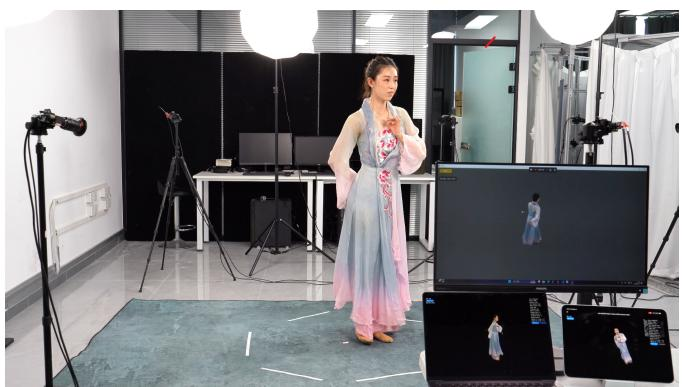  
Fig. 4. Photographs of our deployed system. Our system supports multiple users simultaneously viewing live 3DGS streams transmited over the network and freely controlling the viewpoint.

Although the system does not require pre-calibration, optional crosscamera color calibration using a standard ColorChecker can be performed to improve appearance consistency across views.

## 4.2 Data Encoding, Transmission and Decoding

Upon receiving new frames from the capture system, we convert the streams to the input format required by our reconstruction pipeline (2K) and run inference fully online. We leverage TensorRT to accelerate non-transformer components. For transformer layers, we adopt FlashAttention [Dao 2024] and implement custom fused kernels via Triton. To maximize overall eficiency, we also implement the remaining computations in Triton.

To enable real-time, free-viewpoint rendering on remote clients, we design an eficient streaming pipeline that leverages standard hardware-accelerated video codecs. Since our feed-forward reconstruction network outputs pixel-aligned Gaussian maps, the maps retain a 2D spatial structure rather than forming unordered Gaussian sets and can therefore be naturally reorganized into large image canvases for transmission.

Our streaming pipeline is illustrated in Fig. 5. To preserve the geometric precision of the reconstructed 3D Gaussians while remaining compatible with 8-bit video encoders, we introduce a split-byte encoding scheme for the 3D point map. Specifically, the predicted float32 coordinates (�,�, �) are first quantized to uint16. Each 16- bit value is then decomposed into a most significant byte (MSB) and a least significant byte (LSB). The MSBs (middle part of Fig. 5) of the three coordinate channels are packed into a synchronized single-channel grayscale stream, arranged as a $3 \times N _ { \mathrm { v i e w } }$ grid so that the three stacked rows correspond to the high-order bytes of the �, � and � coordinates, respectively. The LSBs are packed together with the remaining Gaussian attributes into a second synchronized RGB stream (left part of Fig. 5). Concretely, the tiled RGB canvas contains the remaining low-order bytes of the point map (Row 1), the Gaussian scale parameters (Row 2), the first three components of the quaternion $( q _ { x } , q _ { y } , q _ { z } )$ (Row 3), the color map (Row 4), and the remaining scalar channels including $q _ { w }$ and opacity � (Row 5, with one unused channel serving as alignment padding). By tiling the multi-view maps into a single cohesive frame (e.g., 6� × 5� for the RGB stream and 6� × 3� for the grayscale stream), we avoid the overhead of transmitting multiple separate videos.

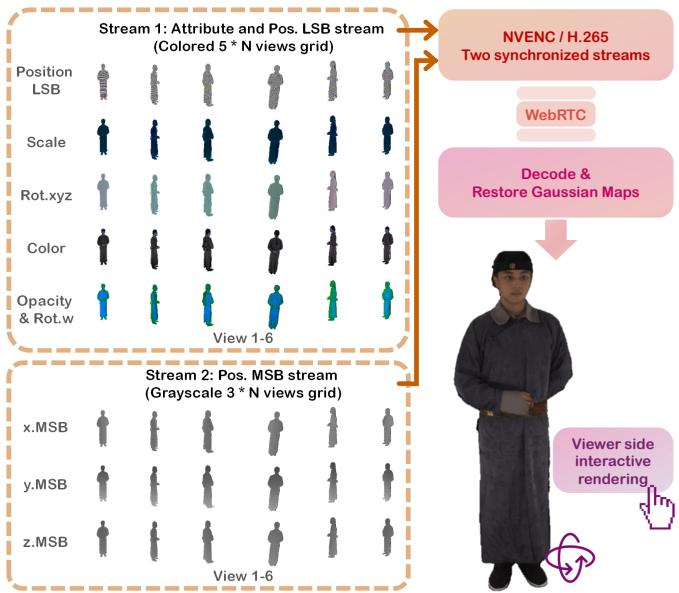  
Fig. 5. Codec-friendly streaming of our pixel-aligned Gaussian maps. We transmit Gaussian maps directly over the network at a controllable bandwidth, enabling users to interact in real time on their devices. This fixedlayout representation enables standard hardware video coding without serializing a variable-length Gaussian set.

We encode the resulting streams with H.265 using hardwareaccelerated NVENC and transmit them to the remote viewer via WebRTC. On the receiver side, hardware decoders restore the Gaussian maps for interactive rendering with our highly eficient, crossplatform WebGPU viewer. In our measurements, the end-to-end system requires approximately 100 Mbit/s of bandwidth, which is feasible in common network environments.

System ThroughputandLatency. Tele360 uses a multi-stage pipeline that overlaps capture, matting, reconstruction, encoding, transmission, reception, and rendering across consecutive frames. This design prioritizes steady-state throughput at the cost of increased endto-end latency. Outside the reconstruction network, RVM is the only additional GPU workload and requires 2.9 ms for six views; capture and transmission run on CPUs, while H.265 encoding uses dedicated NVIDIA codec hardware, minimizing contention with reconstruction. The complete deployed system, including non-algorithmic components, occupies approximately 20 GB of GPU memory. The client-side reception, decoding, and rendering pipeline sustains 30 FPS, with a viewing delay that depends on the client device. We define end-to-end latency as the delay from a real-world action to its appearance on the client; it is approximately 500 ms on a MacBook Pro and 650 ms on an iPad Pro.

## 5 EXPERIMENTS

## 5.1 Network Architecture

We provide additional details of the network architecture in this section. For hybrid feature extraction, we use a frozen DINOv3 [Siméoni et al. 2026] encoder and an EdgeNeXt [Maaz et al. 2023] encoder. Specifically, we use the ViT-B [Dosovitskiy et al. 2021] variant of DINOv3 and EdgeNeXt-xxs equipped with STDA blocks, which provides an eficient design for processing multiple high-resolution input images simultaneously. The extracted features are then fed into a transformer backbone with 24 blocks for cross-view 3D reasoning. Among them, 12 are intra-frame blocks and 12 are inter-frame blocks, arranged in an alternating manner. The feature dimension of the transformer backbone is set to 1024, with 16 attention heads. RoPE [Su et al. 2024] with a frequency of 100 is applied to all blocks. We also employ QKNorm [Henry et al. 2020] and LayerScale [Touvron et al. 2021] initialization to improve training stability. The decoder transformer follows a similar architecture to the backbone. It contains 12 blocks, which are organized into 4 groups, each consisting of two self-attention layers followed by one cross-attention layer. For the four cross-attention layers, the key and value features are taken from the 5th, 11th, 17th, and 23rd blocks of the transformer backbone, respectively, together with the four levels of the CNN feature pyramid. Finally, a lightweight MLP maps the decoder outputs to the point predictions, while several shallow CNN heads are used to predict the Gaussian parameter maps.

## 5.2 Experimental Setings

Datasets. Our method is trained on a large-scale dataset comprising 3126 human scans [Han et al. 2023; Twindom 2026; Yu et al. 2021] and approximately 1,000 multi-view video sequences from DNA-Rendering [Cheng et al. 2023]. The video sequences contain 60 viewpoints and range from 150 to 225 frames. For the static scans, we utilize Blender to render images from 60 viewpoints uniformly surrounding the subjects. For the DNA-Rendering data, we refine the provided foreground segmentation masks and employ NeuS2 [Wang et al. 2023a] to obtain the ground-truth geometry for supervision. During training, 4 to 6 views are randomly sampled from a scene and fed into the network. To ensure optimal load balancing, we keep the number of processed images and token lengths roughly equivalent across GPUs for each batch.

Baselines. We compare our method against methods from two main categories: Generalized feed-forward reconstruction methods. Methods in this category do not require camera parameters and can recover the scene geometry and appearance from uncalibrated images in a feed-forward manner. Representative methods include NoPoSplat [Ye et al. 2025], AnySplat [Jiang et al. 2025] and Depth Anything 3 [Lin et al. 2026]. Human-specificfeed-forward sparse-view reconstruction methods. These methods typically require accurate camera calibration and are designed for human reconstruction, including DoubleField [Shao et al. 2022], GHG [Kwon et al. 2025] and GPS-Gaussian [Zheng et al. 2024]. In addition, we compare against NeuS2 [Wang et al. 2023a] as a representative optimization-based method. It can recover geometry and appearance from sparse views relatively quickly. Input viewpoints are uniformly sampled from a circular camera array and kept identical across methods.

Evaluation Metrics. We assess the quality of novel-view rendering using the Peak Signal-to-Noise Ratio (PSNR), Structural Similarity Index Measure (SSIM) [Wang et al. 2004] and LPIPS [Zhang et al. 2018] metrics at 2048 × 2048 resolution. For models rendering at alternative resolutions (e.g., Depth Anything 3 [Lin et al. 2026], AnySplat [Jiang et al. 2025]), we bilinearly upsample their outputs to 2048 × 2048 resolution. For methods that require camera parameters as input, we provide ground-truth poses; we explicitly mark this setting in all reported results.

We evaluate pose accuracy with Relative Rotation Error (RRE) and Relative Translation Error (RTE). RRE@K and RTE@K denote the percentage ofcamera pairs with errors below $K ^ { \circ }$ , and AUC@5/10/30 measures the area under the pose error curve up to the corresponding thresholds. We also report the mean and median RRE/RTE.

To ensure a fair comparison on datasets with backgrounds, we follow each method’s prescribed input setting: NoPoSplat [Ye et al. 2025], AnySplat [Jiang et al. 2025], and Depth Anything 3 [Lin et al. 2026] receive the original full images, whereas GPS-Gaussian [Zheng et al. 2024] receives foreground-only images, consistent with its training protocol. After reconstruction and before rendering, we apply the same foreground mask to the outputs of all methods to remove background Gaussians and render all results against a uniform black background.

Implementation Details. Our model is trained on a single server equipped with 8 NVIDIA A100 GPUs for a total of 300K iterations. We employ the AdamW optimizer with a learning rate of $5 \times 1 0 ^ { - 5 }$ and weight decay of 0.05. The learning rate is linearly warmed up from $1 0 ^ { - 8 } \mathrm { t o } 5 \times 1 0 ^ { - 5 }$ during the first 2% of training, followed by cosine decay to $1 0 ^ { - 8 }$ . We use gradient accumulation over 4 steps and clip the gradient norm to 1.0.

## 5.3 Evaluation

Qualitative Evaluation. As illustrated in Figure 6, our method exhibits clear visual superiority over existing baselines. Competing approaches struggle to accurately render complex human structures. In the sparse 6-view 360° setting, uncalibrated methods such as No PoSplat [Ye et al. 2025], AnySplat [Jiang et al. 2025], and Depth Anything 3 [Lin et al. 2026] struggle with alignment, leading to degraded quality, severe geometric distortions, and boundary artifacts such as fragmented limbs and noisy outlines. GHG [Kwon et al. 2025] relies on accurate SMPL [Loper et al. 2015] estimates; inaccurate SMPL fitting, particularly around the face and body, leads to degraded performance. Although DoubleField [Shao et al. 2022] produces relatively accurate geometry, its NeRF-based [Mildenhall et al. 2020] formulation struggles to capture high-frequency details. GPS-Gaussian [Zheng et al. 2024] struggles to perform reliable stereo matching when the input views exhibit large image disparities, leading to erroneous depth estimates and misaligned leg reconstruction. Due to the limited number and sparsity ofinput views, NeuS2 [Wang et al. 2023a] also struggles to produce high-quality reconstructions. In contrast, our approach robustly recovers fine-grained visual details—yielding remarkably crisp facial features and highly accurate extremities—achieving photorealistic rendering quality that faithfully aligns with the ground truth.

# poSpla nySpla thAnything oubleField GHG GPS-Gaussian euS2 URS urs GT

Fig. 6. Qualitative comparisons. We compare our method with state-of-the-art baselines [Jiang et al. 2025; Kwon et al. 2025; Lin et al. 2026; Shao et al. 2022; Wang et al. 2023a; Ye et al. 2025; Zheng et al. 2024]. Zoom-in patches highlight fine-grained details. While existing methods sufer from blurry textures or severe geometric artifacts, our method successfully reconstructs high-fidelity details (e.g., facial features and footwear), closely matching the ground truth.

Table 1. Quantitative comparison of novel view synthesis on the DNA-Rendering [Cheng et al. 2023] dataset. ∗ For two-view methods, adjacent views are paired as inputs, and timing is accumulated over all pairs. GPS-Gaussian requires stereo rectification, which may fail given 6 views. “Align” denotes an evaluation-time camera alignment step used for NoPoSplat [Ye et al. 2025] and AnySplat [Jiang et al. 2025] when reporting novel-view synthesis metrics.
<table><tr><td>Method</td><td>w/calib.</td><td>View No.</td><td>Align</td><td>PSNR↑</td><td>SSIM↑</td><td>LPIPS↓</td><td>Time↓</td></tr><tr><td>NoPoSplat [Ye et al. 2025]</td><td>No</td><td>6</td><td>Yes</td><td>22.1677</td><td>0.8574</td><td>0.1433</td><td>~600 ms*</td></tr><tr><td>AnySplat [Jiang et al. 2025]</td><td>No</td><td>6</td><td>Yes</td><td>24.9883</td><td>0.9163</td><td>0.0781</td><td>~150 ms</td></tr><tr><td>Depth Anything 3 [Lin et al. 2026]</td><td>No</td><td>6</td><td>No</td><td>21.1142</td><td>0.9115</td><td>0.0926</td><td>~300 ms</td></tr><tr><td>DoubleField [Shao et al. 2022]</td><td>Yes</td><td>6</td><td>No</td><td>29.4737</td><td>0.9596</td><td>0.0523</td><td>&gt;1 s</td></tr><tr><td>GHG [Kwon et al. 2025]</td><td>Yes</td><td>6</td><td>No</td><td>26.2712</td><td>0.9458</td><td>0.0534</td><td>~150 ms</td></tr><tr><td>GPS-Gaussian [Zheng et al. 2024]</td><td>Yes</td><td>8†</td><td>No</td><td>22.4023</td><td>0.8675</td><td>0.1312</td><td>~300 ms*</td></tr><tr><td>NeuS2 [Wang et al. 2023a]</td><td>Yes</td><td>6</td><td>No</td><td>30.6106</td><td>0.9683</td><td>0.0336</td><td>≥1 s</td></tr><tr><td>Ours</td><td>No</td><td>6</td><td>No</td><td>32.1502</td><td>0.9689</td><td>0.0286</td><td>~35 ms</td></tr></table>

Table 2. Quantitative comparison of camera pose estimation results. Best results are highlighted in bold, and second-best results are underlined. In COLMAP, SP+SG denotes using SuperPoint for feature extraction and SuperGlue for cross-view feature matching. Under the sparse surrounding-camera setup, COLMAP fails to register all cameras in over 40% of the test scenes; therefore, mean and median RRE/RTE are not reported.
<table><tr><td rowspan="2">Method</td><td colspan="3">RRE Acc. ↑</td><td colspan="3">RTE Acc. ↑</td><td colspan="3">AUC ↑</td><td colspan="4">Error ↓</td></tr><tr><td>@1</td><td>@2</td><td>@5</td><td>@1</td><td>@2</td><td>@5</td><td>@5</td><td>@10</td><td>@30</td><td>Mean RRE</td><td>Mean RTE</td><td>Med. RRE</td><td>Med. RTE</td></tr><tr><td>COLMAP (SP+SG) [Schönberger and Frahm 2016]</td><td>12.58</td><td>31.10</td><td>38.33</td><td>15.37</td><td>25.64</td><td>40.41</td><td>25.63</td><td>33.13</td><td>41.96</td><td></td><td></td><td></td><td></td></tr><tr><td>VGGT [Wang et al. 2025a]</td><td>22.14</td><td>72.80</td><td>98.29</td><td>32.51</td><td>69.08</td><td>96.28</td><td>63.82</td><td>81.38</td><td>93.79</td><td>1.72</td><td>1.74</td><td>1.52</td><td>1.41</td></tr><tr><td>DA 3 [Lin et al. 2026]</td><td>24.29</td><td>83.21</td><td>99.94</td><td>37.58</td><td>74.71</td><td>99.62</td><td>67.86</td><td>83.90</td><td>94.63</td><td>1.44</td><td>1.47</td><td>1.38</td><td>1.36</td></tr><tr><td>Our model (w/o differentiable BA module)</td><td>21.83</td><td>72.10</td><td>98.53</td><td>46.40</td><td>92.38</td><td>99.37</td><td>66.74</td><td>82.90</td><td>94.25</td><td>1.73</td><td>1.14</td><td>1.54</td><td>1.05</td></tr><tr><td>Our model (w/ differentiable BA module)</td><td>25.17</td><td>77.73</td><td>99.25</td><td>47.54</td><td>93.65</td><td>99.81</td><td>69.31</td><td>84.49</td><td>94.83</td><td>1.55</td><td>1.07</td><td>1.43</td><td>1.04</td></tr></table>

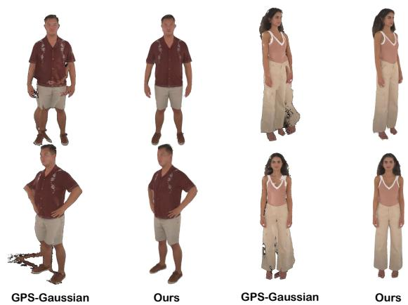  
Fig. 7. Qualitative comparisons with the person-specific method GPS-Gaussian.

We provide additional qualitative comparisons with the personspecific method GPS-Gaussian [Zheng et al. 2024] on the ActorsHQ [Işık et al. 2023] dataset, as shown in Fig. 7. Compared with GPS-Gaussian, our method produces cleaner and more stable recon structions with noticeably higher rendering quality. In particular, our results exhibit fewer floating artifacts and significantly more coherent object boundaries, while GPS-Gaussian often sufers from jittery edges and unstable geometry around fine structures.

Quantitative Evaluation. As demonstrated in Table 1, our method significantly outperforms all baselines across all evaluation metrics. Notably, our approach achieves a substantial margin of over 1.5 dB in PSNR compared to the second-best method (NeuS2 [Wang et al. 2023a]), while yielding the lowest LPIPS score (0.0286). Furthermore, our model exhibits exceptional eficiency with an inference time of merely \~35 ms, more than 4 times faster than competing approaches, achieving state-of-the-art rendering quality without relying on camera parameter input or alignment operations.

Table 3. Quantitative comparison of novel view synthesis on the ActorsHQ [Işık et al. 2023] dataset for human-only methods.
<table><tr><td>Method</td><td>PSNR↑</td><td>SSIM↑</td><td>LPIPS↓</td></tr><tr><td>DoubleField [Shao et al. 2022]</td><td>28.18</td><td>0.9479</td><td>0.0386</td></tr><tr><td>GHG [Kwon et al. 2025]</td><td>25.52</td><td>0.9249</td><td>0.0672</td></tr><tr><td>GPS-Gaussian [Zheng et al. 2024]</td><td>23.62</td><td>0.9527</td><td>0.0521</td></tr><tr><td>Ours</td><td>30.72</td><td>0.9573</td><td>0.0346</td></tr></table>

Note that in Table 1, “Align” denotes an evaluation-time camera alignment step used for NoPoSplat [Ye et al. 2025] and AnySplat [Jiang et al. 2025] when reporting novel-view synthesis metrics. Since the reconstructed Gaussians and camera poses are predicted in a method-specific canonical coordinate system, the target-view camera parameters provided by the dataset cannot be directly used for rendering. To enable a fair comparison, we first compute a coarse global similarity alignment between the dataset camera system and the predicted canonical space, and then further refine the targetview pose using a mask-based rendering objective.

We further evaluate the accuracy of our camera estimation module. As shown in Table 2, our method leads in RTE accuracy and AUC across all reported thresholds, while its RRE performance remains comparable to DA 3. These results demonstrate that our module can reliably recover camera poses from sparse input views. Note that rendering quality cannot be directly inferred from pose estimation accuracy, since depth and camera poses are inherently coupled.

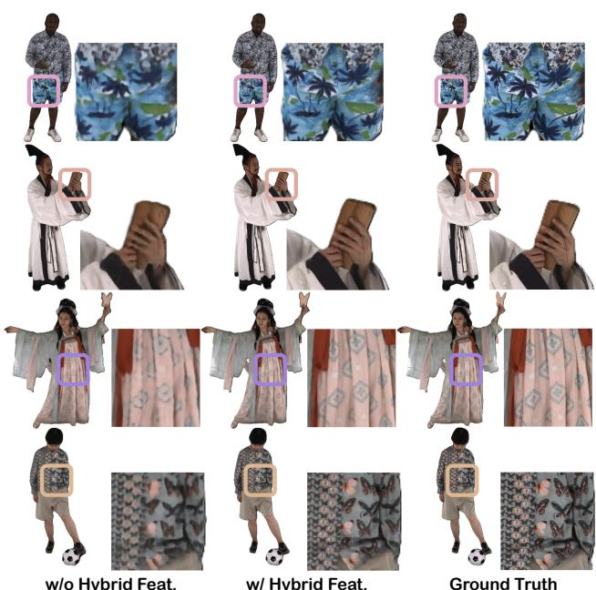

Table 4. Temporal-consistency results. Values are measured from renderings at a fixed novel viewpoint.
<table><tr><td>Method</td><td>Motion Smooth.↑</td><td>Temp. Flicker.↑</td></tr><tr><td>GPS-Gaussian [Zheng et al. 2024]</td><td>0.99441</td><td>0.99202</td></tr><tr><td>DA 3 [Lin et al. 2026]</td><td>0.99386</td><td>0.99277</td></tr><tr><td>Ours</td><td>0.99820</td><td>0.99669</td></tr></table>

Table 5. Quantitative ablation study on the proposed hybrid feature extraction. In the model without hybrid feature extraction, DINO is given higher-resolution images.
<table><tr><td>Method</td><td>PSNR↑</td><td>SSIM↑</td><td>LPIPS↓</td><td>Inference Time↓</td></tr><tr><td>w/o Hybrid Feature</td><td>28.2609</td><td>0.9473</td><td>0.0557</td><td>43 ms</td></tr><tr><td>w/ Hybrid Feature</td><td>30.3645</td><td>0.9615</td><td>0.0490</td><td>35 ms</td></tr></table>

Fig. 8. Qualitative ablation study on the proposed hybrid feature extraction. Removing this module (w/o Hybrid Feat.) leads to excessively smoothed and blurred textures.

Table 6. Ablation of decoder atention paterns on THuman [Yu et al. 2021], evaluated by Chamfer distance. SA, FA, and CA denote intra-frame selfatention, inter-frame atention, and cross-atention to multi-scale condi tioning features, respectively. Each sequence specifies the ordered atention blocks within a decoder stage.
<table><tr><td>Method</td><td>Chamfer Distance↓</td></tr><tr><td>W/o hybrid feature extraction</td><td>0.00953</td></tr><tr><td> $\mathrm { S A } + \mathrm { C A }$ </td><td>0.00755</td></tr><tr><td> $\mathrm { S A } + \mathrm { F A } + \mathrm { C A }$ </td><td>0.00552</td></tr><tr><td> $\mathrm { C A } + \mathrm { C A } + \mathrm { C A }$ </td><td>0.00548</td></tr><tr><td>Our model  $\mathrm { ( S A + S A + C A ) }$ </td><td>0.00541</td></tr></table>

Temporal Consistency. Beyond per-frame reconstruction and pose accuracy, we evaluate temporal stability by rendering each sequence from a fixed novel viewpoint and computing the motion smoothness and temporal flickering metrics of VBench [Huang et al. 2024]. As shown in Table 4, our method achieves the highest scores on both metrics among the compared methods. The predicted cameras also exhibit low intra-sequence jitter (mean/median): $0 . 2 7 ^ { \circ } / 0 . 2 4 ^ { \circ }$ in rotation, $3 . 3 \times 1 0 ^ { - 3 } / 2 . { \overset { \cdot } { 8 } } \times 1 0 ^ { - 3 }$ in translation, and 0.29%/0.26% in focal length.

## 5.4 Ablation Study

Ablation on hybrid feature extraction. To validate the eficacy of our proposed hybrid feature extraction strategy, we present a qualitative ablation study in Figure 8 and Table 5. For the ablated variant, we removed the CNN and doubled DINO’s input resolution. Despite the significantly increased computational burden, the network still struggles to fully exploit the spatial information from high-resolution inputs, resulting in noticeably blurry textures. In contrast, integrating the hybrid features allows our model to fully capitalize on the high-resolution images.

Ablation of diferent architectures. We study alternative decoder designs to understand the trade-of between eficiency and reconstruction quality (Table 6). Our final decoder adopts a sparse refinement scheme with intra-view self-attention and cross-attention to multi-scale conditioning features, which provides the best balance in our setting. We also experimented with additional cross-view (interframe/inter-view) attention blocks inside the decoder to further mix information across views. However, we find that multi-view interaction captured by the backbone is already suficient: adding extra cross-view attention in the decoder brings negligible improvement while noticeably increasing runtime. Consequently, we keep the decoder view-independent to preserve real-time performance.

Ablation on camera BA module. To validate the efectiveness of the diferentiable camera BA module, we provide a qualitative ablation in Figure 9 and a quantitative pose comparison in Table 2. Specifically, Figure 9 visualizes the point clouds before and after applying camera BA. Although the point clouds directly predicted by the network are already reasonably aligned, the proposed BA module further refines the camera poses and improves point-cloud alignment. This demonstrates that our diferentiable BA module efectively optimizes camera alignment.

Efect of camera input. Tele360 also accepts calibrated camera parameters as model inputs; in that case, it bypasses the camera decoder and BA (Fig. 2). We evaluate this mode by feeding groundtruth cameras under the protocol of Table 1. As shown in Table 7, this yields only marginal PSNR and LPIPS gains, with unchanged SSIM and runtime, indicating that residual camera-estimation errors have limited impact on reconstruction quality.

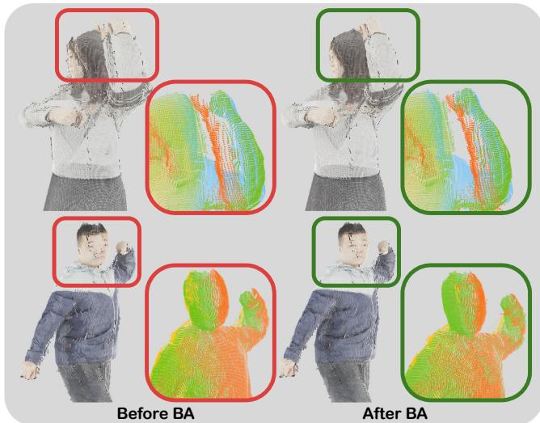  
Fig. 9. Visualization of the camera BA process. Point maps from diferent views are shown in diferent colors. The proposed BA module improves multiview geometric consistency, which is crucial for human-centric sparse-view reconstruction.

Table 7. Camera-input ablation. Pred. estimates cameras internally; GT input supplies ground-truth cameras to the model and bypasses the camera decoder and BA.
<table><tr><td>Camera mode</td><td>PSNR↑</td><td>SSIM↑</td><td>LPIPS↓</td><td>Time↓</td></tr><tr><td>Pred.</td><td>32.15</td><td>0.969</td><td>0.0286</td><td>~35 ms</td></tr><tr><td>GT input</td><td>32.59</td><td>0.969</td><td>0.0279</td><td>~35 ms</td></tr></table>

Table 8. Robustness to foreground-mask quality on a THuman subset. Depth denotes depth error; CD denotes Chamfer distance; Cam. Rot. and Cam. Trans. denote camera rotation error in degrees and camera translation error, respectively. GT denotes ground-truth masks.
<table><tr><td>Mask</td><td>IoU↑</td><td>Depth↓</td><td>CD↓</td><td>Cam. Rot./Trans.↓</td><td>PSNR↑</td></tr><tr><td>MatAnyone 2</td><td>0.9940</td><td>0.0053</td><td>0.0033</td><td>0.916/0.0261</td><td>27.23</td></tr><tr><td>RVM-R50</td><td>0.9922</td><td>0.0053</td><td>0.0033</td><td>1.013/0.0282</td><td>27.12</td></tr><tr><td>SAM 3</td><td>0.9796</td><td>0.0070</td><td>0.0042</td><td>2.993/0.0648</td><td>26.67</td></tr><tr><td>GT</td><td>1.0000</td><td>0.0053</td><td>0.0032</td><td>0.886/0.0254</td><td>27.34</td></tr></table>

Robustness to foreground masks. We evaluate the efect of mask quality on a THuman subset by replacing only the foreground masks while keeping the remaining reconstruction and evaluation pipeline unchanged. We compare MatAnyone 2 [Yang et al. 2026], RVM [Lin et al. 2022b], and SAM 3 [Carion et al. 2026] with the text prompt “person”, together with ground-truth masks. High-quality mattes approach ground-truth performance across geometry, camera, and rendering metrics, whereas lower-quality masks consistently degrade all three, confirming sensitivity to matting quality.

Table 9. Module-wise inference time of our model on the DNA-Rendering [Cheng et al. 2023] dataset under the 6-view 2K input seting, using a single RTX 5090 GPU.
<table><tr><td>Module</td><td>DINO</td><td>CNN</td><td>Backbone</td><td>Decoder</td><td>Heads</td></tr><tr><td>Runtime (ms)</td><td>5.15</td><td>2.85</td><td>12.15</td><td>6.07</td><td>9.14</td></tr></table>

## 5.5 Runtime and Sparsity Analysis

Module-wise Runtime Analysis. Table 9 reports the module-wise inference time of our model. The sparse transformer backbone accounts for the largest portion of the runtime, followed by the pre diction heads and the decoder. The feature extraction stage remains relatively eficient. Overall, the full model takes 35.36 ms per frame under the 6-view 2K setting, demonstrating that the total inference time of the model remains compatible with real-time deployment. These timings characterize model throughput rather than action-todisplay latency; system-level latency is reported in Sec. 4.

Efect of token sparsity. Table 10 analyzes the efect of token sparsity on runtime under diferent numbers of input views. As mentioned above, we extract only the valid foreground tokens according to the predicted mask. In our observations on the DNA-Rendering dataset [Cheng et al. 2023], the valid tokens typically account for around 10% of all image tokens. To evaluate whether our real-time performance relies on an overly sparse setting, we further enlarge the valid token ratio to 15% and 20%, simulating cases where the human occupies a larger image region. Table 10 shows that, as the retained token ratio increases, most of the runtime increase comes from the transformer-based backbone and decoder, consistent with the token-sensitive nature of transformer computation. By comparing the “Backbone + Decoder” and “Total Inference” timings, we observe that the remaining modules contribute nearly constant overhead and are much less afected by the token ratio. Importantly, both the 4-view and 6-view settings remain eficient even at a 20% token ratio, showing that our system does not rely on extremely sparse foreground occupancy.

Gaussian count and streaming bandwidth. Since each foreground pixel instantiates one Gaussian, the Gaussian count scales approximately linearly with the number of input views, typically ranging from about 400–600K with four views and 600–900K with six views. The fixed canvas layout makes bandwidth largely independent of Gaussian count: the deployed end-to-end system requires approximately 100 Mbit/s for six-view setting (Sec. 4.2).

Analysis ofquantization and compression. Since our system requires quantization and video coding/decoding during transmission, we further analyze the performance changes after quantization and after video encoding/decoding. As shown in Table 11, our model maintains strong performance even after quantization and coding. This robustness mainly arises from the compact data range and smooth variations of the Gaussian maps across diferent views, which efectively reduce the precision loss introduced during quantization and coding.

We also analyze the rate-distortion trade-of, as shown in Table 12. Quantization reduces PSNR from 32.65 to 31.10 dB. With lossless

Table 10. Efect of token sparsity on inference time under diferent numbers of input views. Percentages denote the fraction of image tokens retained; all runtimes are reported in ms.
<table><tr><td rowspan="2">Number of views</td><td colspan="3">Backbone + Decoder</td><td colspan="3">Total Inference</td></tr><tr><td>10%</td><td>15%</td><td>20%</td><td>10%</td><td>15%</td><td>20%</td></tr><tr><td>4-view</td><td>12.1</td><td>19.3</td><td>23.3</td><td>24.5</td><td>33.7</td><td>37.3</td></tr><tr><td>6-view</td><td>18.1</td><td>29.3</td><td>36.6</td><td>36.6</td><td>48.6</td><td>55.8</td></tr></table>

Table 11. Quantitative efects of Gaussian atribute-map quantization and video compression on rendering quality. Metrics are computed over six data segments totaling 4,500 frames.
<table><tr><td>Process</td><td>PSNR↑</td><td>SSIM↑</td><td>LPIPS↓</td></tr><tr><td>Raw Result</td><td>32.6511</td><td>0.9720</td><td>0.0426</td></tr><tr><td>w/ Quantization</td><td>31.1007</td><td>0.9625</td><td>0.0533</td></tr><tr><td>w/ Quant. &amp; Codec.</td><td>30.5731</td><td>0.9574</td><td>0.0622</td></tr></table>

Table 12. Rate–distortion trade-of for H.265 compression of Gaussian attribute maps. The MSB stream is encoded losslessly, while the LSB stream is encoded at diferent quantization parameters (QPs); total bitrate includes both streams. Rendering PSNR is evaluated over six data segments totaling 4,500 frames.
<table><tr><td>Codec Setting (H.265, yuv444p)</td><td>Total Bitrate↓</td><td>PSNR↑</td></tr><tr><td>LSB QP=24, MSB Lossless</td><td>120 Mbps</td><td>31.02</td></tr><tr><td>LSB QP=28, MSB Lossless</td><td>80 Mbps</td><td>30.57</td></tr><tr><td>LSB QP=32, MSB Lossless</td><td>60 Mbps</td><td>30.33</td></tr><tr><td>LSB QP=36, MSB Lossless</td><td>45 Mbps</td><td>30.03</td></tr><tr><td>LSB QP=40, MSB Lossless</td><td>40 Mbps</td><td>29.72</td></tr></table>

MSB coding and an LSB QP of 28, the complete stream requires approximately 80 Mbit/s and achieves 30.57 dB. Increasing the QP reduces the bitrate to approximately 40 Mbit/s at 29.72 dB. After weighing rendering quality against transmission bandwidth, we ultimately selected a QP of 28 for the LSB stream. Note that lossless encoding is used for the MSB because its bandwidth falls within an acceptable range, whereas lossy encoding would significantly degrade quality (resulting in a PSNR drop of at least 5 dB). A visual example is shown in Fig. 10.

## 5.6 Additional Results on Self-Captured Sequences

To further demonstrate the generalization capability of our method, we qualitatively evaluate free-viewpoint rendering on self-captured sequences featuring subjects of diferent genders, diverse clothing, and varied motions. As shown in Figure 11, our method still exhibits strong reconstruction capability on diverse self-captured data.

## 6 DISCUSSION

Conclusion. We presented Tele360, the first real-time feed-forward system for dynamic human reconstruction and live free-viewpoint visualization from a sparse set of unposed RGB video streams. Tele360 jointly estimates camera poses and predicts a dynamic 3D

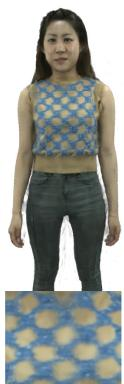

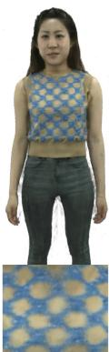  
Quant. Only  
120 Mbps

  
80 Mbps

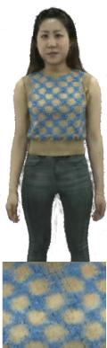  
40 Mbps

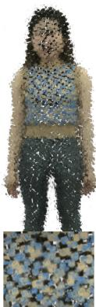  
Lossy MSB  
Fig. 10. Qualitative efects of Gaussian-map compression. Lower bitrates reduce texture fidelity, while lossy MSB coding causes severe geometric artifacts.

Gaussian representation at each time step, enabling 2K input-torendering at 25 FPS on a single consumer GPU. The proposed design combines token-level sparsity with global context aggregation, a sparse and eficient transformer-based Gaussian decoder, hybrid CNN–ViT features for high-resolution appearance cues, and Grambased distillation to transfer multi-view geometry priors. Together with a codec-based streaming pipeline, Tele360 supports 30-FPS interactive client viewing on remote devices, providing a practical step toward deployable human telepresence.

Limitations and Future Work. Tele360 relies on foreground masks to enforce token-level sparsity and is therefore sensitive to matting quality, as quantified in Table 8. Inaccurate or inconsistent masks can introduce boundary jitter and local artifacts in the predicted Gaussian maps and, in severe cases, degrade camera-pose estimation, as illustrated in Figure 12. Despite the favorable aggregate VBench scores in Table 4, our per-frame formulation does not explicitly enforce temporal coherence; rapid motion, motion blur, or transient matting and pose errors may therefore still produce local flickering. Moreover, the current appearance representation does not explicitly model view-dependent efects, which may produce inconsistent highlights and artifacts on specular surfaces under novel viewpoints. Our reconstruction primarily models surfaces supported by the input views, potentially leaving heavily occluded regions incomplete. Future work will jointly predict foreground segmentation and reconstruction and incorporate temporal aggregation of information across frames, view-dependent appearance modeling, and occlusion-aware priors.

## REFERENCES

Jeongmin Bae, Seoha Kim, Youngsik Yun, Hahyun Lee, Gun Bang, and Youngjung Uh. 2025. Per-Gaussian Embedding-Based Deformation for Deformable 3D Gaussian Splatting. In Computer Vision – ECCV 2024 (Lecture Notes in Computer Science, Vol. 15073). Springer Nature Switzerland, 321–335. https://doi.org/10.1007/978-3- 031-72633-0\_18

Aljaž Božič, Michael Zollhöfer, Christian Theobalt, and Matthias Nießner. 2020. Deep Deform: Learning Non-Rigid RGB-D Reconstruction With Semi-Supervised Data. In Proceedings ofthe IEEE/CVF Conference on Computer Vision and Pattern Recognition. 7002–7012.

2 of 6 Input Views

Freeview Rendering

Temporal Sequence

# Etttttll Bt

Fig. 11. Qualitative results of our method. The first four rows show our collected multi-view videos, and the fifth row shows results on the DNA-Rendering [Cheng et al. 2023] dataset. Our method is able to recover loose-fiting garments with intricate textures, such as skirts and dresses, as well as a wide variety of body movements. Note that our method requires foreground mates as additional input, obtained using the open-source Robust Video Mating [Lin et al. 2022b].

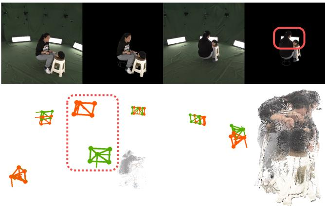  
Fig. 12. Failure case due to mask inaccuracy. Predicted and ground-truth cameras are marked in red and green, respectively.

Chris Buehler, Michael Bosse, Leonard McMillan, Steven Gortler, and Michael Cohen. 2001. Unstructured Lumigraph Rendering. In Proceedings of the 28th Annual Conference on Computer Graphics and Interactive Techniques. 425–432. https: //doi.org/10.1145/383259.383309

Nicolas Carion, Laura Gustafson, Yuan-Ting Hu, Shoubhik Debnath, Ronghang Hu, Didac Suris Coll-Vinent, Chaitanya Ryali, Kalyan Vasudev Alwala, Haitham Khedr, Andrew Huang, Jie Lei, Tengyu Ma, Baishan Guo, Arpit Kalla, Markus Marks, Joseph Greer, Meng Wang, Peize Sun, Roman Rädle, Triantafyllos Afouras, Ef frosyni Mavroudi, Katherine Xu, Tsung-Han Wu, Yu Zhou, Liliane Momeni, Rishi Hazra, Shuangrui Ding, Sagar Vaze, Francois Porcher, Feng Li, Siyuan Li, Aishwarya Kamath, Ho Kei Cheng, Piotr Dollár, Nikhila Ravi, Kate Saenko, Pengchuan Zhang, and Christoph Feichtenhofer. 2026. SAM 3: Segment Anything with Concepts. In International Conference on Learning Representations (ICLR), Vol. 2026. 138846–138923. https://proceedings.iclr.cc/paper\_files/paper/2026/hash/ e0982cbc81401df3430ee1f780dc7a2-Abstract-Conference.html

Jianchuan Chen, Jingchuan Hu, Gaige Wang, Zhonghua Jiang, Tiansong Zhou, Zhiwen Chen, and Chengfei Lv. 2025a. TaoAvatar: Real-Time Lifelike Full-Body Talking Avatars for Augmented Reality via 3D Gaussian Splatting. In Proceedings ofthe Computer Vision and Pattern Recognition Conference. 10723–10734.

Yufan Chen, Lizhen Wang, Qijing Li, Hongjiang Xiao, Shengping Zhang, Hongxun Yao, and Yebin Liu. 2024. MonoGaussianAvatar: Monocular Gaussian Point-based Head Avatar. In ACM SIGGRAPH 2024 Conference Papers. Article 58, 9 pages. https: //doi.org/10.1145/3641519.3657499

Yushuo Chen, Zerong Zheng, Zhe Li, Chao Xu, and Yebin Liu. 2025b. MeshAvatar: Learning High-Quality Triangular Human Avatars from Multi-view Videos. In ComputerVision – ECCV2024 (Lecture Notes in ComputerScience, Vol. 15126). Springer Nature Switzerland, 250–269. https://doi.org/10.1007/978-3-031-73113-6\_15

Wei Cheng, Ruixiang Chen, Siming Fan, Wanqi Yin, Keyu Chen, Zhongang Cai, Jingbo Wang, Yang Gao, Zhengming Yu, Zhengyu Lin, Daxuan Ren, Lei Yang, Ziwei Liu, Chen Change Loy, Chen Qian, Wayne Wu, Dahua Lin, Bo Dai, and Kwan-Yee Lin. 2023. DNA-Rendering: A Diverse Neural Actor Repository for High-Fidelity Human-Centric Rendering. In Proceedings ofthe IEEE/CVF International Conference on Computer Vision. 19982–19993.

Pinxuan Dai, Peiquan Zhang, Zheng Dong, Ke Xu, Yifan Peng, Dandan Ding, Yujun Shen, Yin Yang, Xinguo Liu, Rynson W. H. Lau, and Weiwei Xu. 2025. 4D Gaussian Videos with Motion Layering. ACM Transactions on Graphics 44, 4, Article 124 (2025), 14 pages. https://doi.org/10.1145/3731189

Tri Dao. 2024. FlashAttention-2: Faster Attention with Better Parallelism and Work Partitioning. In International Conference on Learning Representations (ICLR), Vol. 2024. 35549–35562.

Alexey Dosovitskiy, Lucas Beyer, Alexander Kolesnikov, Dirk Weissenborn, Xiaohua Zhai, Thomas Unterthiner, Mostafa Dehghani, Matthias Minderer, Georg Heigold, Sylvain Gelly, Jakob Uszkoreit, and Neil Houlsby. 2021. An Image is Worth 16x16 Words: Transformers for Image Recognition at Scale. In International Conference on Learning Representations (ICLR). https://openreview.net/forum?id=YicbFdNTTy

Mingsong Dou, Philip Davidson, Sean Ryan Fanello, Sameh Khamis, Adarsh Kowdle, Christoph Rhemann, Vladimir Tankovich, and Shahram Izadi. 2017. Motion2Fusion: real-time volumetric performance capture. ACM Transactions on Graphics 36, 6, Article 246 (2017), 16 pages. https://doi.org/10.1145/3130800.3130801

Mingsong Dou, Sameh Khamis, Yury Degtyarev, Philip Davidson, Sean Ryan Fanello, Adarsh Kowdle, Sergio Orts-Escolano, Christoph Rhemann, David Kim, Jonathan

Taylor, Pushmeet Kohli, Vladimir Tankovich, and Shahram Izadi. 2016. Fusion4D: real-time performance capture of challenging scenes. ACM Transactions on Graphics 35, 4, Article 114 (2016), 13 pages. https://doi.org/10.1145/2897824.2925969

Yuanxing Duan, Fangyin Wei, Qiyu Dai, Yuhang He, Wenzheng Chen, and Baoquan Chen. 2024. 4D-Rotor Gaussian Splatting: Towards Eficient Novel View Synthesis for Dynamic Scenes. In ACM SIGGRAPH 2024 Conference Papers. Article 87, 11 pages. https://doi.org/10.1145/3641519.3657463

Zhongpai Gao, Benjamin Planche, Meng Zheng, Anwesa Choudhuri, Terrence Chen, and Ziyan Wu. 2025. 7DGS: Unified Spatial-Temporal-Angular Gaussian Splatting. In Proceedings of the IEEE/CVF International Conference on Computer Vision (ICCV). 26316–26325.

Leon A Gatys, Alexander S Ecker, and Matthias Bethge. 2016. Image Style Transfer Using Convolutional Neural Networks. In Proceedings ofthe IEEE conference on computer vision and pattern recognition. 2414–2423.

Yongjie Guan, Xueyu Hou, Nan Wu, Bo Han, and Tao Han. 2023. MetaStream: Live Volumetric Content Capture, Creation, Delivery, and Rendering in Real Time. In Proceedings of the 29th annual international conference on mobile computing and networking. Article 29, 15 pages. https://doi.org/10.1145/3570361.3592530

Chen Guo, Junxuan Li, Yash Kant, Yaser Sheikh, Shunsuke Saito, and Chen Cao. 2025a. Vid2Avatar-Pro: Authentic Avatar from Videos in the Wild via Universal Prior. In Proceedings ofthe IEEE/CVF Conference on Computer Vision and Pattern Recognition. 5559–5570.

Zhiyang Guo, Wengang Zhou, Li Li, Min Wang, and Houqiang Li. 2025b. Motion-Aware 3D Gaussian Splatting for Eficient Dynamic Scene Reconstruction. IEEE Transactions on Circuits and Systems for Video Technology 35, 4 (April 2025), 3119– 3133. https://doi.org/10.1109/TCSVT.2024.3502257

Sang-Hun Han, Min-Gyu Park, Ju Hong Yoon, Ju-Mi Kang, Young-Jae Park, and Hae-Gon Jeon. 2023. High-Fidelity 3D Human Digitization From Single 2K Resolution Images. In Proceedings ofthe IEEE/CVF Conference on Computer Vision and Pattern Recognition (CVPR). 12869–12879.

Alex Henry, Prudhvi Raj Dachapally, Shubham Shantaram Pawar, and Yuxuan Chen. 2020. Query-Key Normalization for Transformers. In Findings ofthe Association for Computational Linguistics: EMNLP 2020. 4246–4253. https://doi.org/10.18653/v1/ 2020.findings-emnlp.379

Liangxiao Hu, Hongwen Zhang, Yuxiang Zhang, Boyao Zhou, Boning Liu, Shengping Zhang, and Liqiang Nie. 2024. GaussianAvatar: Towards Realistic Human Avatar Modeling from a Single Video via Animatable 3D Gaussians. In Proceedings ofthe IEEE/CVF Conference on Computer Vision and Pattern Recognition (CVPR). 634–644.

Ziqi Huang, Yinan He, Jiashuo Yu, Fan Zhang, Chenyang Si, Yuming Jiang, Yuanhan Zhang, Tianxing Wu, Qingyang Jin, Nattapol Chanpaisit, Yaohui Wang, Xinyuan Chen, Limin Wang, Dahua Lin, Yu Qiao, and Ziwei Liu. 2024. VBench: Comprehen sive Benchmark Suite for Video Generative Models. In Proceedings ofthe IEEE/CVF Conference on Computer Vision and Pattern Recognition (CVPR). 21807–21818.

Mustafa Işık, Martin Rünz, Markos Georgopoulos, Taras Khakhulin, Jonathan Starck, Lourdes Agapito, and Matthias Nießner. 2023. HumanRF: High-Fidelity Neural Radiance Fields for Humans in Motion. ACM Transactions on Graphics 42, 4, Article 160 (2023), 12 pages. https://doi.org/10.1145/3592415

Lihan Jiang, Yucheng Mao, Linning Xu, Tao Lu, Kerui Ren, Yichen Jin, Xudong Xu, Mulin Yu, Jiangmiao Pang, Feng Zhao, Dahua Lin, and Bo Dai. 2025. AnySplat: Feed-forward 3D Gaussian Splatting from Unconstrained Views. ACM Transactions on Graphics 44, 6, Article 257 (2025), 16 pages. https://doi.org/10.1145/3763326

Yiming Jiang, Hanzhang Tu, Wenfeng Song, Siyou Lin, Liang An, Shuai Li, Aimin Hao, and Yebin Liu. 2026. HiReFF: High-Resolution Feedforward Human Reconstruction from Uncalibrated Sparse-View Video. arXiv preprint arXiv:2606.29333 (2026). arXiv:2606.29333 [cs.CV] https://arxiv.org/abs/2606.29333

Nikhil Varma Keetha, Norman Müller, Johannes Schönberger, Lorenzo Porzi, Yuchen Zhang, Tobias Fischer, Arno Knapitsch, Duncan Zauss, Ethan Weber, Nelson An tunes, Jonathon Luiten, Manuel Lopez-Antequera, Samuel Rota Bulò, Christian Richardt, Deva Ramanan, Sebastian Scherer, and Peter Kontschieder. 2026. MapAny thing: Universal Feed-Forward Metric 3D Reconstruction. In International Conference on 3D Vision (3DV). IEEE, 499–509. https://doi.org/10.1109/3DV69130.2026.00054

Bernhard Kerbl, Georgios Kopanas, Thomas Leimkühler, and George Drettakis. 2023. 3D Gaussian Splatting for Real-Time Radiance Field Rendering. ACM Transactions on Graphics 42, 4, Article 139 (2023), 14 pages. https://doi.org/10.1145/3592433

Mijeong Kim, Jongwoo Lim, and Bohyung Han. 2024. 4D Gaussian Splatting in the Wild with Uncertainty-Aware Regularization. In Advances in Neural Information Processing Systems, Vol. 37. 129209–129226. https://doi.org/10.52202/079017-4104

Youngjoong Kwon, Baole Fang, Yixing Lu, Haoye Dong, Cheng Zhang, Francisco Vicente Carrasco, Albert Mosella-Montoro, Jianjin Xu, Shingo Takagi, Daeil Kim, Aayush Prakash, and Fernando De la Torre. 2025. Generalizable Human Gaussians for Sparse View Synthesis. In Computer Vision – ECCV 2024 (Lecture Notes in Computer Science, Vol. 15136). Springer Nature Switzerland, 451–468. https://doi.org/10.1007/978-3- 031-73229-4\_26

Isaac Labe, Noam Issachar, Itai Lang, and Sagie Benaim. 2025. DGD: Dynamic 3D Gaussians Distillation. In Computer Vision – ECCV 2024 (Lecture Notes in Computer Science, Vol. 15126). Springer Nature Switzerland, 361–378. https://doi.org/10.1007/

978-3-031-73113-6\_21

Junoh Lee, Changyeon Won, Hyunjun Jung, Inhwan Bae, and Hae-Gon Jeon. 2024. Fully Explicit Dynamic Gaussian Splatting. In Advances in Neural Information Processing Systems, Vol. 37. 5384–5409. https://doi.org/10.52202/079017-0174

Vincent Leroy, Yohann Cabon, and Jérôme Revaud. 2025. Grounding Image Matching in 3D with MASt3R. In Computer Vision – ECCV 2024 (Lecture Notes in Computer Science, Vol. 15130). Springer Nature Switzerland, 71–91. https://doi.org/10.1007/978- 3-031-73220-1\_5

Lingzhi Li, Zhen Shen, Zhongshu Wang, Li Shen, and Ping Tan. 2022. Streaming Radiance Fields for 3D Video Synthesis. In Advances in Neural Information Processing Systems, Vol. 35. 13485–13498. https://doi.org/10.52202/068431-0980

Zhan Li, Zhang Chen, Zhong Li, and Yi Xu. 2024a. Spacetime Gaussian Feature Splatting for Real-Time Dynamic View Synthesis. In Proceedings of the IEEE/CVF Conference on Computer Vision and Pattern Recognition (CVPR). 8508–8520.

Zhengqi Li, Simon Niklaus, Noah Snavely, and Oliver Wang. 2021. Neural Scene Flow Fields for Space-Time View Synthesis of Dynamic Scenes. In Proceedings of the IEEE/CVF Conference on Computer Vision and Pattern Recognition. 6498–6508.

Zhe Li, Zerong Zheng, Lizhen Wang, and Yebin Liu. 2024b. Animatable Gaussians: Learning Pose-dependent Gaussian Maps for High-fidelity Human Avatar Modeling. In Proceedings ofthe IEEE/CVFConference on Computer Vision and Pattern Recognition. 19711–19722.

Yiqing Liang, Numair Khan, Zhengqin Li, Thu H. Nguyen-Phuoc, Douglas Lanman, James Tompkin, and Lei Xiao. 2025. GauFRe: Gaussian Deformation Fields for Real-Time Dynamic Novel View Synthesis. In Proceedings ofthe IEEE/CVF Winter Conference on Applications ofComputer Vision (WACV). IEEE, 2642–2652.

Zhanfeng Liao, Jiajun Zhang, Hanzhang Tu, Zhixi Wang, Yunqi Gao, Hongwen Zhang, and Yebin Liu. 2026. SharpTimeGS: Sharp and Stable Dynamic Gaussian Splatting via Lifespan Modulation. In Proceedings ofthe IEEE/CVF Conference on Computer Vision and Pattern Recognition (CVPR). 11798–11807.

Haotong Lin, Sili Chen, Jun Hao Liew, Donny Y. Chen, Zhenyu Li, Yang Zhao, Sida Peng, Hengkai Guo, Xiaowei Zhou, Guang Shi, Jiashi Feng, and Bingyi Kang. 2026. Depth Anything 3: Recovering the Visual Space from Any Views. In International Conference on Learning Representations (ICLR), Vol. 2026. 141261–141285. https://proceedings.iclr.cc/paper\_files/paper/2026/hash/ e4cd50120b6d7e8daf1749d6bbaa889-Abstract-Conference.html

Haotong Lin, Sida Peng, Zhen Xu, Yunzhi Yan, Qing Shuai, Hujun Bao, and Xiaowei Zhou. 2022a. Eficient Neural Radiance Fields for Interactive Free-viewpoint Video. In SIGGRAPH Asia 2022 Conference Papers. Article 39, 9 pages. https://doi.org/10. 1145/3550469.3555376

Shanchuan Lin, Linjie Yang, Imran Saleemi, and Soumyadip Sengupta. 2022b. Robust High-Resolution Video Matting With Temporal Guidance. In Proceedings ofthe IEEE/CVF Winter Conference on Applications ofComputer Vision (WACV). 238–247.

Qingming Liu, Yuan Liu, Jiepeng Wang, Xianqiang Lyu, Peng Wang, Wenping Wang, and Junhui Hou. 2025. MoDGS: Dynamic Gaussian Splatting from Casually-captured Monocular Videos with Depth Priors. In International Conference on Learning Representations (ICLR), Vol. 2025. 97048–97074.

Zhening Liu, Yingdong Hu, Xinjie Zhang, Rui Song, Jiawei Shao, Zehong Lin, and Jun Zhang. 2026. Dynamics-Aware Gaussian Splatting Streaming Toward Fast On-the-Fly 4D Reconstruction. IEEE Transactions on Visualization and Computer Graphics 32, 7 (July 2026), 6810–6824. https://doi.org/10.1109/TVCG.2026.3688730

Matthew Loper, Naureen Mahmood, Javier Romero, Gerard Pons-Moll, and Michael J. Black. 2015. SMPL: A Skinned Multi-Person Linear Model. ACM Transactions on Graphics (Proceedings ofSIGGRAPH Asia) 34, 6 (October 2015), 248:1–248:16. https://doi.org/10.1145/2816795.2818013

Zhicheng Lu, Xiang Guo, Le Hui, Tianrui Chen, Min Yang, Xiao Tang, Feng Zhu, and Yuchao Dai. 2024. 3D Geometry-Aware Deformable Gaussian Splatting for Dynamic View Synthesis. In Proceedings ofthe IEEE/CVF Conference on Computer Vision and Pattern Recognition (CVPR). 8900–8910.

Jonathon Luiten, Georgios Kopanas, Bastian Leibe, and Deva Ramanan. 2024. Dynamic 3D Gaussians: Tracking by Persistent Dynamic View Synthesis. In International Conference on 3D Vision (3DV). 800–809. https://doi.org/10.1109/3DV62453.2024. 00044

Muhammad Maaz, Abdelrahman Shaker, Hisham Cholakkal, Salman Khan, Syed Waqas Zamir, Rao Muhammad Anwer, and Fahad Shahbaz Khan. 2023. EdgeNeXt: Efi ciently Amalgamated CNN-Transformer Architecture for Mobile Vision Applica tions. In Computer Vision – ECCV2022 Workshops (Lecture Notes in Computer Science, Vol. 13807). Springer Nature Switzerland, 3–20. https://doi.org/10.1007/978-3-031- 25082-8\_1

Ben Mildenhall, Pratul P. Srinivasan, Matthew Tancik, Jonathan T. Barron, Ravi Ramamoorthi, and Ren Ng. 2020. NeRF: Representing Scenes as Neural Radiance Fields for View Synthesis. In Computer Vision – ECCV 2020 (Lecture Notes in Computer Science, Vol. 12346). Springer International Publishing, 405–421. https: //doi.org/10.1007/978-3-030-58452-8\_24

Richard A Newcombe, Dieter Fox, and Steven M Seitz. 2015. DynamicFusion: Recon struction and Tracking of Non-Rigid Scenes in Real-Time. In Proceedings ofthe IEEE conference on computer vision and pattern recognition. 343–352.

Sergio Orts-Escolano, Christoph Rhemann, Sean Fanello, Wayne Chang, Adarsh Kowdle, Yury Degtyarev, David Kim, Philip L. Davidson, Sameh Khamis, Mingsong Dou, Vladimir Tankovich, Charles Loop, Qin Cai, Philip A. Chou, Sarah Mennicken, Julien Valentin, Vivek Pradeep, Shenlong Wang, Sing Bing Kang, Pushmeet Kohli, Yuliya Lutchyn, Cem Keskin, and Shahram Izadi. 2016. Holoportation: virtual 3D teleportation in real-time. In Proceedings of the 29th annual symposium on user interface software and technology. 741–754. https://doi.org/10.1145/2984511.2984517

Shenhan Qian, Tobias Kirschstein, Liam Schoneveld, Davide Davoli, Simon Giebenhain, and Matthias Nießner. 2024. GaussianAvatars: Photorealistic Head Avatars with Rigged 3D Gaussians. In Proceedings ofthe IEEE/CVF Conference on Computer Vision and Pattern Recognition (CVPR). 20299–20309.

René Ranftl, Alexey Bochkovskiy, and Vladlen Koltun. 2021. Vision Transformers for Dense Prediction. In Proceedings ofthe IEEE/CVF international conference on computer vision. 12179–12188.

Johannes L. Schönberger and Jan-Michael Frahm. 2016. Structure-From-Motion Revisited. In Proceedings ofthe IEEE Conference on Computer Vision and Pattern Recognition (CVPR). 4104–4113.

Ruizhi Shao, Hongwen Zhang, He Zhang, Mingjia Chen, Yan-Pei Cao, Tao Yu, and Yebin Liu. 2022. DoubleField: Bridging the Neural Surface and Radiance Fields for High-Fidelity Human Reconstruction and Rendering. In Proceedings ofthe IEEE/CVF Conference on Computer Vision and Pattern Recognition. 15872–15882.

Richard Shaw, Michal Nazarczuk,Jifei Song, Arthur Moreau, Sibi Catley-Chandar, Helisa Dhamo, and Eduardo Pérez-Pellitero. 2025. SWinGS: Sliding Windows for Dynamic 3D Gaussian Splatting. In Computer Vision – ECCV 2024 (Lecture Notes in Computer Science, Vol. 15113). Springer Nature Switzerland, 37–54. https://doi.org/10.1007/978- 3-031-73001-6\_3

Oriane Siméoni, Huy V. Vo, Maximilian Seitzer, Federico Baldassarre, Maxime Oquab, Cijo Jose, Vasil Khalidov, Marc Szafraniec, Seung Eun Yi, Michael Ramamonjisoa, Francisco Massa, Daniel HAZIZA, Luca Wehrstedt,Jianyuan Wang, Timothée Darcet, Théo Moutakanni, Leonel Sentana, Claire Roberts, Andrea Vedaldi, Jamie Tolan, John Brandt, Camille Couprie, Julien Mairal, Herve Jegou, Patrick Labatut, and Piotr Bojanowski. 2026. DINOv3. Transactions on Machine Learning Research (2026). https://openreview.net/forum?id=2NlGyqNjns Featured Certification.

Miroslava Slavcheva, Maximilian Baust, Daniel Cremers, and Slobodan Ilic. 2017. Killing-Fusion: Non-Rigid 3D Reconstruction Without Correspondences. In Proceedings of the IEEE conference on computer vision and pattern recognition. 1386–1395.

Miroslava Slavcheva, Maximilian Baust, and Slobodan Ilic. 2018. SobolevFusion: 3D Reconstruction of Scenes Undergoing Free Non-Rigid Motion. In Proceedings of the IEEE conference on computer vision and pattern recognition. 2646–2655.

Jianlin Su, Murtadha Ahmed, Yu Lu, Shengfeng Pan, Wen Bo, and Yunfeng Liu. 2024. RoFormer: Enhanced transformer with Rotary Position Embedding. Neurocomputing 568 (2024), 127063. https://doi.org/10.1016/j.neucom.2023.127063

Jiakai Sun, Han Jiao, Guangyuan Li, Zhanjie Zhang, Lei Zhao, and Wei Xing. 2024. 3DGStream: On-the-Fly Training of 3D Gaussians for Eficient Streaming of Photo-Realistic Free-Viewpoint Videos. In Proceedings ofthe IEEE/CVF Conference on Computer Vision and Pattern Recognition. 20675–20685.

Hugo Touvron, Matthieu Cord, Alexandre Sablayrolles, Gabriel Synnaeve, and Hervé Jégou. 2021. Going Deeper With Image Transformers. In Proceedings ofthe IEEE/CVF international conference on computer vision. 32–42.

Hanzhang Tu, Ruizhi Shao, Xue Dong, Shunyuan Zheng, Hao Zhang, Lili Chen, Meili Wang, Wenyu Li, Siyan Ma, Shengping Zhang, Boyao Zhou, and Yebin Liu. 2024. Tele Aloha: A Telepresence System with Low-budget and High-authenticity Using Sparse RGB Cameras. In ACM SIGGRAPH 2024 Conference Papers. Article 116, 12 pages. https://doi.org/10.1145/3641519.3657491

Twindom. 2026. Twindom. Online. https://web.twindom.com/ Accessed August 25, 2026.

Jianyuan Wang, Minghao Chen, Nikita Karaev, Andrea Vedaldi, Christian Rupprecht, and David Novotny. 2025a. VGGT: Visual Geometry Grounded Transformer. In Proceedings ofthe Computer Vision and Pattern Recognition Conference. 5294–5306.

Liao Wang, Qiang Hu, Qihan He, Ziyu Wang, Jingyi Yu, Tinne Tuytelaars, Lan Xu, and Minye Wu. 2023b. Neural Residual Radiance Fields for Streamably Free-Viewpoint Videos. In Proceedings ofthe IEEE/CVF Conference on Computer Vision and Pattern Recognition. 76–87.

Liao Wang, Kaixin Yao, Chengcheng Guo, Zhirui Zhang, Qiang Hu, Jingyi Yu, Lan Xu, and Minye Wu. 2024b. VideoRF: Rendering Dynamic Radiance Fields as 2D Feature Video Streams. In Proceedings of the IEEE/CVF Conference on Computer Vision and Pattern Recognition. 470–481.

Penghao Wang, Zhirui Zhang, Liao Wang, Kaixin Yao, Siyuan Xie, Jingyi Yu, Minye Wu, and Lan Xu. 2024c. �3: Viewing Volumetric Videos on Mobiles via Streamable 2D Dynamic Gaussians. ACM Transactions on Graphics (TOG) 43, 6, Article 187 (2024), 13 pages. https://doi.org/10.1145/3687935

Qianqian Wang, Zhicheng Wang, Kyle Genova, Pratul P. Srinivasan, Howard Zhou, Jonathan T. Barron, Ricardo Martin-Brualla, Noah Snavely, and Thomas Funkhouser. 2021. IBRNet: Learning Multi-View Image-Based Rendering. In Proceedings ofthe IEEE/CVF Conference on Computer Vision and Pattern Recognition. 4690–4699.

Shuzhe Wang, Vincent Leroy, Yohann Cabon, Boris Chidlovskii, and Jérôme Revaud. 2024a. DUSt3R: Geometric 3D Vision Made Easy. In Proceedings ofthe IEEE/CVF conference on computer vision and pattern recognition. 20697–20709.

Yiming Wang, Qin Han, Marc Habermann, Kostas Daniilidis, Christian Theobalt, and Lingjie Liu. 2023a. NeuS2: Fast Learning of Neural Implicit Surfaces for Multi-view Reconstruction. In Proceedings of the IEEE/CVF International Conference on Computer Vision (ICCV). 3295–3306.

Yifan Wang, Peishan Yang, Zhen Xu, Jiaming Sun, Zhanhua Zhang, Yong Chen, Hujun Bao, Sida Peng, and Xiaowei Zhou. 2025b. FreeTimeGS: Free Gaussian Primitives at Anytime Anywhere for Dynamic Scene Reconstruction. In Proceedings of the IEEE/CVF Conference on Computer Vision and Pattern Recognition (CVPR). 21750– 21760.

Yifan Wang, Jianjun Zhou, Haoyi Zhu, Wenzheng Chang, Yang Zhou, Zizun Li, Junyi Chen, Jiangmiao Pang, Chunhua Shen, and Tong He. 2026. �3: Permutation-Equivariant Visual Geometry Learning. In International Conference on Learning Representations (ICLR), Vol. 2026. 10481–10497. https://proceedings.iclr.cc/paper\_files/ paper/2026/hash/11a09e0aaa74867c6b0719c639fc09f8-Abstract-Conference.html

Zhou Wang, Alan C Bovik, Hamid R Sheikh, and Eero P Simoncelli. 2004. Image quality assessment: from error visibility to structural similarity. IEEE Transactions on Image Processing 13, 4 (2004), 600–612.

Minye Wu, Zehao Wang, Georgios Kouros, and Tinne Tuytelaars. 2024. TeTriRF: Temporal Tri-Plane Radiance Fields for Eficient Free-Viewpoint Video. In Proceedings ofthe IEEE/CVF conference on computer vision and pattern recognition. 6487–6496.

Donglai Xiang, Fabian Prada, Zhe Cao, Kaiwen Guo, Chenglei Wu, Jessica Hodgins, and Timur Bagautdinov. 2023. Drivable Avatar Clothing: Faithful Full-Body Telepresence with Dynamic Clothing Driven by Sparse RGB-D Input. In SIGGRAPH Asia 2023 Conference Papers. Article 24, 11 pages. https://doi.org/10.1145/3610548.3618136

Yuxi Xiao, Jianyuan Wang, Nan Xue, Nikita Karaev, Yuri Makarov, Bingyi Kang, Xing Zhu, Hujun Bao, Yujun Shen, and Xiaowei Zhou. 2025. SpatialTrackerV2: Advancing 3D Point Tracking with Explicit Camera Motion. In Proceedings ofthe IEEE/CVF International Conference on Computer Vision (ICCV). 6726–6737.

Haofei Xu, Songyou Peng, Fangjinhua Wang, Hermann Blum, Daniel Barath, Andreas Geiger, and Marc Pollefeys. 2025. DepthSplat: Connecting Gaussian Splatting and Depth. In Proceedings of the Computer Vision and Pattern Recognition Conference. 16453–16463.

Jiawei Xu, Zexin Fan, Jian Yang, and Jin Xie. 2024a. Grid4D: 4D Decomposed Hash Encoding for High-Fidelity Dynamic Gaussian Splatting. In Advances in Neural Information Processing Systems, Vol. 37. 123787–123811. https://doi.org/10.52202/ 079017-3934

Yuelang Xu, Lizhen Wang, Xiaochen Zhao, Hongwen Zhang, and Yebin Liu. 2023. AvatarMAV: Fast 3D Head Avatar Reconstruction Using Motion-Aware Neural Voxels. In ACM SIGGRAPH 2023 Conference Proceedings. Association for Computing Machinery, New York, NY, USA, Article 47, 10 pages. https://doi.org/10.1145/ 3588432.3591567

Zhen Xu, Sida Peng, Haotong Lin, Guangzhao He, Jiaming Sun, Yujun Shen, Hujun Bao, and Xiaowei Zhou. 2024b. 4K4D: Real-Time 4D View Synthesis at 4K Resolution. In Proceedings ofthe IEEE/CVF Conference on Computer Vision and Pattern Recognition (CVPR). 20029–20040.

Zhen Xu, Yinghao Xu, Zhiyuan Yu, Sida Peng, Jiaming Sun, Hujun Bao, and Xiaowei Zhou. 2024c. Representing Long Volumetric Video with Temporal Gaussian Hierarchy. ACM Transactions on Graphics 43, 6, Article 171 (2024), 18 pages. https://doi.org/10.1145/3687919

Jinbo Yan, Rui Peng, Zhiyan Wang, Luyang Tang, Jiayu Yang, Jie Liang, Jiahao Wu, and Ronggang Wang. 2025. Instant Gaussian Stream: Fast and Generalizable Streaming of Dynamic Scene Reconstruction via Gaussian Splatting. In Proceedings of the Computer Vision and Pattern Recognition Conference. 16520–16531.

Peiqing Yang, Shangchen Zhou, Kai Hao, and Qingyi Tao. 2026. MatAnyone 2: Scaling Video Matting via a Learned Quality Evaluator. In Proceedings of the IEEE/CVF Conference on Computer Vision and Pattern Recognition (CVPR). 37476–37485.

Ziyi Yang, Xinyu Gao, Wen Zhou, Shaohui Jiao, Yuqing Zhang, and Xiaogang Jin. 2024a. Deformable 3D Gaussians for High-Fidelity Monocular Dynamic Scene Reconstruction. In Proceedings of the IEEE/CVF Conference on Computer Vision and Pattern Recognition (CVPR). 20331–20341.

Zeyu Yang, Hongye Yang, Zijie Pan, and Li Zhang. 2024b. Real-time Photorealistic Dynamic Scene Representation and Rendering with 4D Gaussian Splatting. In The Twelfth International Conference on Learning Representations, Vol. 2024. 9142–9159. https://openreview.net/forum?id=WhgB5sispV

Botao Ye, Sifei Liu, Haofei Xu, Xueting Li, Marc Pollefeys, Ming-Hsuan Yang, and Songyou Peng. 2025. No Pose, No Problem: Surprisingly Simple 3D Gaussian Splats from Sparse Unposed Images. In The Thirteenth International Conference on Learning Representations, Vol. 2025. 54009–54033.

Tao Yu, Kaiwen Guo, Feng Xu, Yuan Dong, Zhaoqi Su, Jianhui Zhao, Jianguo Li, Qiong hai Dai, and Yebin Liu. 2017. BodyFusion: Real-Time Capture of Human Motion and Surface Geometry Using a Single Depth Camera. In Proceedings ofthe IEEE international conference on computer vision. 910–919.

Tao Yu, Zerong Zheng, Kaiwen Guo, Pengpeng Liu, Qionghai Dai, and Yebin Liu. 2021. Function4D: Real-Time Human Volumetric Capture From Very Sparse Consumer RGBD Sensors. In Proceedings of the IEEE/CVF conference on computer vision and pattern recognition. 5746–5756.

Tao Yu, Zerong Zheng, Kaiwen Guo, Jianhui Zhao, Qionghai Dai, Hao Li, Gerard Pons Moll, and Yebin Liu. 2018. DoubleFusion: Real-Time Capture of Human Performances With Inner Body Shapes From a Single Depth Sensor. In Proceedings ofthe IEEE conference on computer vision and pattern recognition. 7287–7296.

Jiakai Zhang, Xinhang Liu, Xinyi Ye, Fuqiang Zhao, Yanshun Zhang, Minye Wu, Yingliang Zhang, Lan Xu, and Jingyi Yu. 2021. Editable Free-viewpoint Video Using a Layered Neural Representation. ACM Transactions on Graphics 40, 4, Article 149 (2021), 18 pages. https://doi.org/10.1145/3450626.3459756

Richard Zhang, Phillip Isola, Alexei A. Efros, Eli Shechtman, and Oliver Wang. 2018. The Unreasonable Efectiveness of Deep Features as a Perceptual Metric. In Proceedings ofthe IEEE Conference on Computer Vision and Pattern Recognition (CVPR). 586–595.

Fuqiang Zhao, Wei Yang, Jiakai Zhang, Pei Lin, Yingliang Zhang, Jingyi Yu, and Lan Xu. 2022. HumanNeRF: Eficiently Generated Human Radiance Field From Sparse Inputs. In Proceedings of the IEEE/CVF Conference on Computer Vision and Pattern Recognition. 7743–7753.

Shunyuan Zheng, Boyao Zhou, Ruizhi Shao, Boning Liu, Shengping Zhang, Liqiang Nie, and Yebin Liu. 2024. GPS-Gaussian: Generalizable Pixel-wise 3D Gaussian Splatting for Real-time Human Novel View Synthesis. In Proceedings ofthe IEEE/CVF conference on computer vision and pattern recognition. 19680–19690.

Boyao Zhou, Shunyuan Zheng, Hanzhang Tu, Ruizhi Shao, Boning Liu, Shengping Zhang, Liqiang Nie, and Yebin Liu. 2025. GPS-Gaussian+: Generalizable Pixelwise 3D Gaussian Splatting for Real-Time Human-Scene Rendering from Sparse Views. IEEE Transactions on Pattern Analysis and Machine Intelligence (2025), 1–16. https://doi.org/10.1109/TPAMI.2025.3561248

Yifeng Zhou, Shuheng Wang, Wenfa Li, Chao Zhang, Li Rao, Pu Cheng, Yi Xu, Jinle Ke, Wenduo Feng, Wen Zhou, Hao Xu, Yukang Gao, Yang Ding, Weixuan Tang, and Shaohui Jiao. 2023. Live4D: A Real-time Capture System for Streamable Volumetric Video. In SIGGRAPH Asia 2023 Technical Communications. Association for Computing Machinery, New York, NY, USA, Article 23, 4 pages. https://doi.org/10.1145/3610543.3626178

Ruijie Zhu, Yanzhe Liang, Hanzhi Chang, Jiacheng Deng, Jiahao Lu, Wenfei Yang, Tianzhu Zhang, and Yongdong Zhang. 2024. MotionGS: Exploring Explicit Motion Guidance for Deformable 3D Gaussian Splatting. In Advances in Neural Information Processing Systems, Vol. 37. 101790–101817.