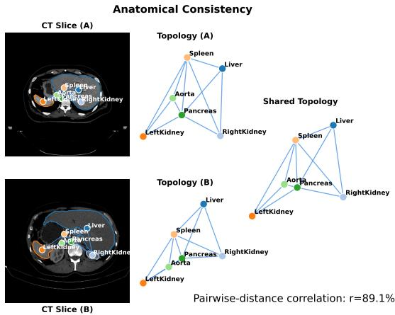
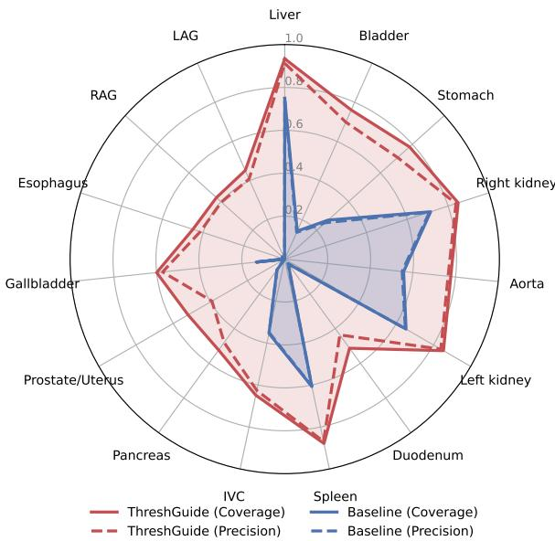
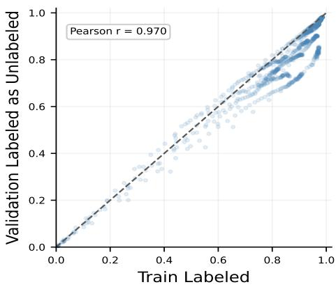
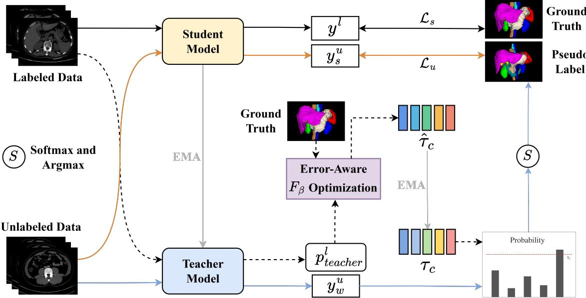
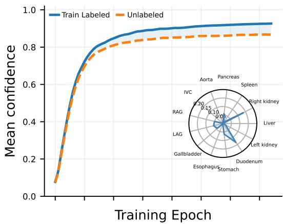
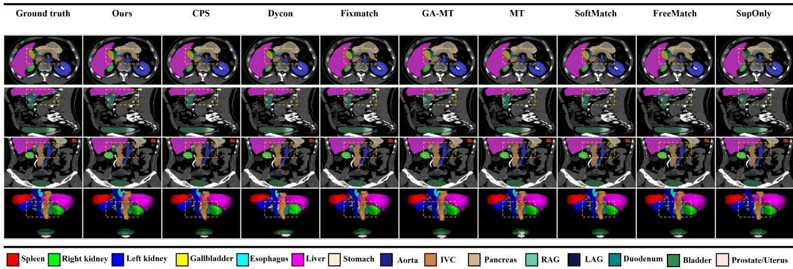
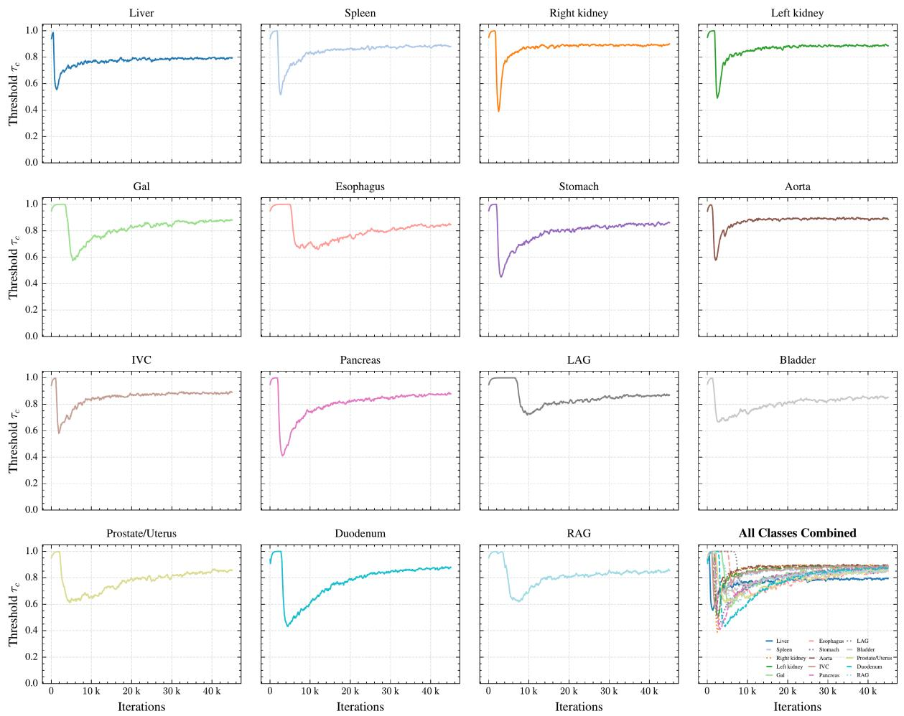
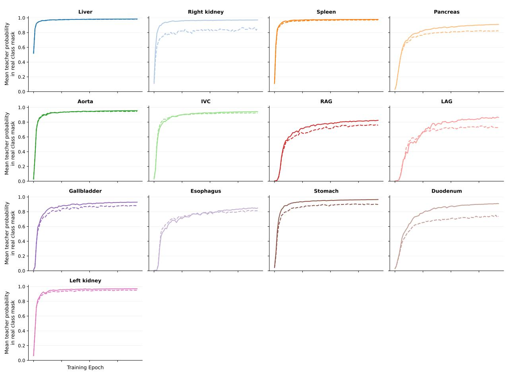
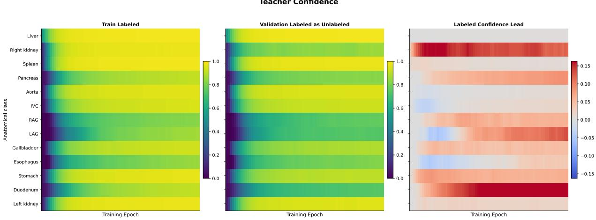
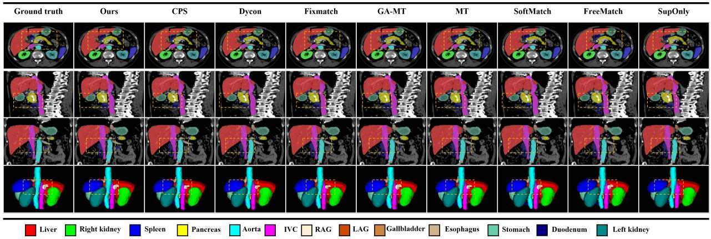

# ThreshGuide: Class-Aware Labeled-Guided Thresholding for Semi-Supervised 3D Abdominal Multi-Organ Segmentation

Hongyu Liu1, Yinlong Wang1, Lusha Li1, and Hui Meng∗1

1School of Intelligent Science and Technology, Hangzhou Institute for Advanced Study, University of Chinese Academy of Sciences, Hangzhou, China

1liuhongyu24@mails.ucas.ac.cn wangyinlng25@mails.ucas.ac.cn lilusha24@mails.ucas.ac.cn 1∗Corresponding author: huimeng@ucas.ac.cn

## Abstract

Pseudo-labeling is a strong paradigm for semi-supervised medical image segmentation, yet its efectiveness is highly sensitive to confidence thresholding. In abdominal multi-organ segmentation, a fixed global threshold is particularly suboptimal because organ classes difer substantially in size, appearance, and learning dificulty. In this work, we propose ThreshGuide, a class-aware threshold adaptation framework that uses labeled data to guide pseudo-label selection on unlabeled data. Built upon a standard teacher-student architecture, the teacher model evaluates labeled samples during training to estimate class-aware threshold targets by maximizing an error-aware $F _ { \beta }$ criterion that balances precision and coverage. These targets are then smoothed with an exponential moving average (EMA) and used to filter unlabeled voxels in a class-dependent manner. Experiments on FLARE2022 and AMOS2022 show that ThreshGuide performs competitively overall, yielding clear improvements specifically on hard-to-learn organs.

## 1 Introduction

Accurate multi-organ segmentation of abdominal Computed Tomography (CT) scans is a prerequisite for downstream quantitative analysis and clinical decision support. However, acquiring dense pixel-level annotations is prohibitively expensive and relies heavily on domain expertise. Consequently, Semi-Supervised Semantic Segmentation (SSSS) has emerged as a crucial technique to mitigate this annotation bottleneck by exploiting the information contained within large pools of unlabeled images.

One of the most important paradigms driving this progress is consistency regularization. A highly representative method of this paradigm is FixMatch (Sohn et al., 2020), which enforces cross-view consistency by generating pseudo-labels from weakly augmented unlabeled images and aligning the predictions of their strongly augmented counterparts. Instead of utilizing all pseudo-labels blindly, such frameworks introduce highconfidence filtering to discard uncertain predictions. By leveraging such pseudo label supervision, this paradigm facilitates efective learning from unlabeled data.

  
Figure 1: Topological consistency between labeled and unlabeled data. The pairwise organ distance correlation (� = 89.1%) after normalization reflects population-level topological consistency, suggesting highly aligned manifold semantic spaces that motivate using labeled data as a reliability proxy.

Nevertheless, while a fixed high-confidence threshold helps ensure pseudo-label precision, it compromises data utilization eficiency in tasks with strong inherent priors by discarding informative but low confidence predictions. In abdominal multi-organ segmentation, a fixed global threshold induces a “Matthew efect”: easy or dominant organs rapidly accumulate pseudo-label supervision, whereas dificult or underrepresented organs receive progressively less. This homogeneous filtering largely overlooks the varying learning dificulties across diferent semantic classes. As illustrated in Figure 1, existing methods overlook a critical domain-specific prior (He et al., 2023): the high anatomical and distributional consistency of multi-organ structures between labeled and unlabeled abdominal scans. In essence, this prior captures a more abstract and persistent regularity in how organs are spatially organized and related to one another, rooted in the shared biological blueprint of the human body.

  
Figure 2: Coverage and Precision Radar. Organ-wise radar plot showing coverage (solid lines) and precision (dashed lines) for both the baseline and the proposed ThreshGuide. Because real unlabeled data do not have ground-truth annotations, the metrics are evaluated on the validation set as pseudo-unlabeled data.

Such fixed high confidence filtering is well suited to natural images, where objects exhibit substantial variability and complex priors in shape, texture, and color intensity. However, in single-channel imaging data characterized by strong anatomical consistency , such as abdominal multi-organ CT scans, inter-class confusion is typically less severe than in natural images , while features derived from labeled and unlabeled samples tend to exhibit stronger correlations. This discrepancy naturally prompts the question: How can we exploit anatomical consistency to leverage labeled data, explicitly guiding the learning ofunlabeled data?

However, the fixed confidence threshold limits the supervisory coverage of unlabeled data , as Figure 2 clearly shows that only a small fraction of pixels in most classes receive supervision. Motivated by this observation, we hypothesize that shared anatomical structures can be exploited to broaden supervisory coverage without compromising supervision reliability. To operationalize this hypothesis, we leverage reliability signals derived from labeled data to guide pseudo-label selection on unlabeled data, leading to our proposed method, ThreshGuide. Specifically, as shown in Figure 2 , by leveraging the optimal confidence threshold derived from labeled data as a labeled proxy , the proposed strategy can explicitly guide pseudo-label selection for unlabeled data , thereby achieving substantially higher precision and coverage compared with the conventional fixed-threshold scheme.

Moreover, subsequent experiments demonstrate that explicitly leveraging anatomical consistency outperforms methods that exploit low-confidence regions, such Soft-Match (Chen et al., 2023). To alleviate the Matthew effect, we utilize the $F _ { \beta }$ score to identify the optimal confidence threshold for each category based on labeled data , thereby efectively balancing the precision and coverage of diferent categories. Furthermore, to prevent dominant categories with excessive erroneous pseudo-labels from negatively afecting the learning of other categories , we introduce an error-aware penalty mechanism to adaptively adjust the $\beta$ value in the $F _ { \beta }$ formulation, enabling more eficient utilization of unlabeled data. As illustrated in Figure 3, this regularity also manifests in the confidence dynamics of semi-supervised learning: the labeled and unlabeled confidence trajectories are highly similar, sharing a latent common trend despite a clear distribution shift, while the unlabeled ones exhibit a noticeable lag behind the labeled ones. Therefore, we further design an EMA update mechanism to alleviate such potential inconsistency and improve the stability of unlabeled data utilization.

In summary, this work makes three main contributions:

• We propose ThreshGuide, a semi-supervised segmentation framework that uses labeled data to guide class-aware pseudo-label filtering. The method replaces a fixed global threshold with dynamic classaware thresholds, which is particularly suitable for highly imbalanced abdominal organ segmentation.

• We introduce labeled-proxy calibration based on teacher predictions on labeled data. The resulting threshold targets are obtained with a class-aware $F _ { \beta }$ objective with error-aware weighting and stabilized through threshold EMA, yielding a simple and efective threshold estimation procedure.

• Extensive experiments on FLARE2022 and AMOS2022 demonstrate that ThreshGuide achieves state-of-the-art performance and consistently improves the segmentation accuracy of small organs.

  
Figure 3: Each point is one class mean confidence at one epoch. The Pearson correlation confirms consistent confidence , while points falling below the diagonal reflect the marginally higher teacher confidence on labeled data.

## 2 Related Work

## 2.1 Semi-Supervised Medical Image Segmentation

Semi-supervised medical image segmentation mainly relies on consistency regularization and pseudolabeling (Jiang et al., 2022; Sohn et al., 2020). Consistency regularization encourages the model to produce stable predictions under input perturbations or diferent augmentations, while pseudo-labeling turns confident predictions on unlabeled images into additional supervision. The strongest results typically combine both in a weak-to-strong manner, where predictions from weakly-augmented views serve as pseudo-label to supervise strongly-augmented ones and thus improve robustness on unlabeled data. Recent work further strengthens this paradigm through stronger augmentation, dynamic consistency control, and task-specific objectives. Dy-CON (Assefa et al., 2025) dynamically adjusts the consistency weight during training to better balance early noisy supervision and later reliable regularization, whereas GA-Loss (Qi et al., 2024) is designed for abdominal multiorgan segmentation and alleviates severe class imbalance by combining class weighting and hard-sample mining within Dice and Cross-Entropy (CE) losses (Shannon, 1948).

## 2.2 Adaptive Thresholding in Pseudo-Labeling

Confidence thresholding is a widely used strategy in pseudo-labeling to filter unlabeled predictions based on their confidence scores, thereby controlling pseudo-label quality. FixMatch (Sohn et al., 2020) uses a fixed threshold, which often underutilizes unlabeled data and exacerbates pseudo-label imbalance in abdominal multiorgan segmentation. Adaptive variants address this issue by estimating thresholds from unlabeled predictions. FreeMatch (Wang et al., 2023) introduces a self-adaptive thresholding mechanism that adjusts pseudo-label selection according to the model’s learning status, with class-aware modulation to alleviate class imbalance. Soft-Match (Chen et al., 2023) addresses the quantity-quality trade-of by modeling pseudo-label confidence with soft weighting rather than a rigid hard cutof. However, both methods estimate their selection criteria mainly from unlabeled prediction statistics and do not explicitly use labeled data to calibrate threshold evolution. For abdominal multi-organ segmentation, where labeled and unlabeled scans share strong anatomical structure, this leaves potentially useful supervisory information underexploited. Our method addresses this gap by using labeled data to guide class-aware threshold evolution on unlabeled data in probability space.

## 3 Methodology

Pseudo-label supervision provides a powerful mechanism of exploiting unlabeled data. High-confidence filtering generally provides efective supervision when leveraging unlabeled data. However, Figure 3 demonstrates that, in abdominal multi-organ segmentation , labeled and unlabeled data exhibit highly consistent class-wise confidence trajectories throughout training. This cross-split consistency motivates ThreshGuide’s labeled-proxy calibration , which uses observable labeled data to calibrate pseudo-label selection on unlabeled data. At each training iteration, the teacher predicts the labeled samples, where both prediction confidence and correctness are observable. Based on these observations, we estimate for each class a proxy threshold that balances the precision and coverage of the selected predictions. Given the shared anatomical structure and task distribution between labeled and unlabeled multi-organ scans, the thresholds estimated from labeled data provide a reliability reference for pseudo-label selection on unlabeled data. We further update the class-wise thresholds through EMA, which reduces the variance of mini-batch estimates and produces a stable threshold evolution throughout training. The overall framework of ThreshGuide is illustrated in Figure 4.

## 3.1 Problem Setup and Teacher–Student Baseline

Let $\mathcal { D } ^ { l } = \{ ( x _ { i } ^ { l } , y _ { i } ^ { l } ) \} _ { i = 1 } ^ { N ^ { l } }$ and $\mathcal { D } ^ { u } ~ = ~ \{ x _ { i } ^ { u } \} _ { i = 1 } ^ { N ^ { u } }$ denote the labeled and unlabeled sets, respectively, where $N ^ { u } \gg N ^ { l }$

  
Figure 4: Overview of ThreshGuide. The teacher evaluates labeled samples without gradient propagation and exposes a class-wise confidence–correctness relationship. A precision-coverage criterion produces labeled-proxy threshold targets, while class-dependent $\beta _ { c }$ weighting controls the preference between reliable precision and usable coverage. The targets are temporally smoothed and applied to the teacher predictions of weakly augmented unlabeled data, which supervise the student predictions of strongly augmented views.

and the segmentation task contains � classes. We adopt a student network $f _ { \theta }$ and an EMA teacher $f _ { \phi }$ . The teacher parameters follow the student throughout training:

$$
\phi _ { t } = \alpha _ { t } \phi _ { t - 1 } + ( 1 - \alpha _ { t } ) \theta _ { t } ,\tag{1}
$$

where $\alpha _ { t }$ is the teacher momentum. For a labeled sample, the supervised objective combines cross-entropy and Dice losses:

$$
\mathcal { L } _ { s } = \frac { 1 } { 2 } \left[ \mathcal { L } _ { C E } ( f _ { \theta } ( x ^ { l } ) , y ^ { l } ) + \mathcal { L } _ { D i c e } ( f _ { \theta } ( x ^ { l } ) , y ^ { l } ) \right] .\tag{2}
$$

For an unlabeled sample $x ^ { u }$ , the teacher predicts the weakly augmented view and the student predicts the strongly augmented view: $p _ { w } ^ { u } =$ softmax $\left( f _ { \phi } ( \mathcal { A } _ { w } ( x ^ { u } ) ) \right)$ and $p _ { s } ^ { u } \ =$ softmax $\left( f _ { \theta } ( \mathcal { A } _ { s } ( x ^ { u } ) ) \right)$ ). The teacher pseudolabel is $\hat { y } _ { w } ^ { u ( \nu ) } = \arg \operatorname* { m a x } _ { c } p _ { w , c } ^ { u ( \nu ) }$ . Unlike FixMatch, which applies one predefined cutof to every class, ThreshGuide calibrates the acceptance threshold from labeled teacher behavior.

## 3.2 Labeled-Proxy Calibration for Pseudo-Label

Balancing precision and coverage. Given that the consistent confidence evolution observed in Figure 3 indirectly suggests anatomical correspondence between labeled and unlabeled data. We consider a labeled voxel �, let $p _ { T } ^ { l ( \nu ) }$ denote the teacher probability vector, $\hat { y } _ { T } ^ { l ( \nu ) }$ its predicted class, and $q _ { T } ^ { l ( \nu ) }$ its maximum confidence. Because $y ^ { l ( \nu ) }$ is known, the correctness associated with each confidence is directly observable. For class �, we collect the voxels predicted as � and sort their confidence values in descending order, $q _ { c , ( 1 ) } \geq \cdot \cdot \cdot \geq q _ { c , ( N _ { c } ) }$ . Considering the top-� predictions as a candidate accepted set, we define

$$
\mathrm { P r e } _ { c } ( k ) = \frac { T P _ { c } ( k ) } { k } , \qquad \mathrm { C o v } _ { c } ( k ) = \frac { T P _ { c } ( k ) } { N _ { c } } ,\tag{3}
$$

where $T P _ { c } ( k )$ is the number of correct predictions among the top-� elements and $N _ { c }$ is the size of the teacherpredicted class-� pool. Here, $\mathbf { \boldsymbol { C } _ { 0 } } \mathbf { \boldsymbol { v } } _ { c }$ � measures how much verified class-� evidence is retained from that pool; it is used together with precision to avoid selecting either a tiny but overly conservative set or a large but noisy set.

We score each candidate through a class-dependent precision-coverage utility:

$$
F _ { \beta _ { c } } ( k ) = \frac { ( 1 + \beta _ { c } ^ { 2 } ) \operatorname { P r e } _ { c } ( k ) \operatorname { C o v } _ { c } ( k ) } { \beta _ { c } ^ { 2 } \operatorname { P r e } _ { c } ( k ) + \operatorname { C o v } _ { c } ( k ) } .\tag{4}
$$

The labeled-proxy target is determined by

$$
k _ { c } ^ { * } = \arg \operatorname* { m a x } _ { k } F _ { { \boldsymbol { \beta } } _ { c } } ( k ) , \qquad \hat { \tau } _ { c } ^ { ( t ) } = q _ { c , ( k _ { c } ^ { * } ) } .\tag{5}
$$

Thus, the threshold is not manually scheduled: it follows the operating point at which the current teacher achieves the most suitable balance between correctness and usable supervision for class �.

  
Figure 5: Class-wise mean confidence trajectories on the labeled training set and the validation set used as a proxy for unlabeled data, together with their corresponding perclass confidence gaps.

Class-dependent preference for precision. As shown in Figure 5 , these organ-dependent confidence dynamics indicate that the same precision-coverage preference is not appropriate for all abdominal structures. If such errors are admitted without control, they can occupy a large part of the pseudo-supervision. ThreshGuide therefore uses $\beta _ { c }$ to shift the proxy search toward precision whenever the observed class-wise error burden is high.

Let $r _ { c } ^ { ( t ) }$ be the proportion of teacher-predicted foreground voxels assigned to class $^ { c , }$ and let $\mu _ { c } ^ { ( t ) }$ be its EMA estimate:

$$
r _ { c } ^ { ( t ) } = \frac { \sum _ { \nu \in \Omega _ { l } } \mathbb { I } ( \hat { y } _ { T } ^ { l ( \nu ) } = c ) } { \sum _ { \nu \in \Omega _ { l } } \mathbb { I } ( \hat { y } _ { T } ^ { l ( \nu ) } > 0 ) } , \mu _ { c } ^ { ( t ) } = \rho _ { t } \mu _ { c } ^ { ( t - 1 ) } + ( 1 - \rho _ { t } ) r _ { c } ^ { ( t ) } .\tag{6}
$$

We further measure the normalized teacher error in the predicted class pool, $\delta _ { c } ^ { ( t ) } = E _ { c } ^ { ( t ) } / N _ { c }$ , where $E _ { c } ^ { ( t ) }$ counts its incorrect predictions. The class-dependent weight is

$$
\beta _ { c } ^ { ( t ) } = \frac { 1 } { 1 - \log ( \mu _ { c } ^ { ( t ) } ) } \exp \left( - \delta _ { c } ^ { ( t ) } \right) .\tag{7}
$$

The occupancy term adapts the utility to heterogeneous class scales, whereas the error term decreases $\beta _ { c }$ when unreliable predictions accumulate. Since a smaller $\beta _ { c }$ makes Eq. (4) more precision-oriented, the selected threshold becomes more conservative when false pseudolabels would otherwise dominate the accepted set. A formal analysis of the mathematical properties of each component in Eq. (7) , together with a minimax interpretation of the overall objective, is provided in Appendix B.

EMA-smoothed threshold for unlabeled data. Figure 5 illustrates that the class-wise mean confidence on the labeled training set increases faster than that on the validation set treated as proxy-unlabeled data , while the magnitude and temporal evolution of the resulting crosssplit confidence gap vary substantially across organs. This gap is expected because the labeled samples directly participate in model optimization , whereas the held-out validation samples are not used for gradient-based parameter updates; consequently , their confidence rises more slowly and remains lower during the later stages of training. Accordingly, we adopt an EMA scheme to update the class-wise threshold using the proxy target $\hat { \tau } _ { c } ^ { ( t ) }$ , and we regard the target as

$$
\tau _ { c } ^ { ( t ) } = \alpha _ { \tau } \tau _ { c } ^ { ( t - 1 ) } + ( 1 - \alpha _ { \tau } ) \hat { \tau } _ { c } ^ { ( t ) } .\tag{8}
$$

This temporal transfer suppresses mini-batch fluctuations, preserves the long-term class-wise trend, and avoids forcing the richer unlabeled data to follow every short-lived change observed on labeled samples. If class � is absent from the current labeled batch, its previous threshold is retained.

## 3.3 Proxy-Guided Consistency Learning

For an unlabeled voxel �, the threshold associated with its teacher-predicted class is used to determine whether it provides supervision:

$$
\mathcal { M } ^ { ( \nu ) } = \mathbb { I } \biggl ( \operatorname* { m a x } _ { c } p _ { w , c } ^ { u ( \nu ) } \geq \tau _ { \hat { y } _ { w } ^ { u ( \nu ) } } ^ { ( t ) } \biggr ) .\tag{9}
$$

The weak-view pseudo-label then supervises the strongly augmented prediction only at accepted voxels:

$$
\mathcal { L } _ { u } = \frac { 1 } { | \Omega _ { u } | } \sum _ { \nu \in \Omega _ { u } } \boldsymbol { M } ^ { ( \nu ) } \mathcal { L } _ { C E } \Big ( \boldsymbol { p } _ { s } ^ { u ( \nu ) } , \boldsymbol { \hat { y } } _ { w } ^ { u ( \nu ) } \Big ) .\tag{10}
$$

The complete training objective is

$$
\mathcal { L } _ { t o t a l } = \mathcal { L } _ { s } + \lambda _ { u } \mathcal { L } _ { u } ,\tag{11}
$$

where $\lambda _ { u }$ controls the contribution of unlabeled consistency. The complete training procedure is summarized in Algorithm 1 of Appendix A.

## 4 Experiments

## 4.1 Experimental Setup

Datasets. We evaluate our method on two public abdominal multi-organ segmentation datasets. (1) FLARE2022 (Ma et al., 2024) comprises 100 labeled and 2000 unlabeled CT scans covering 13 organ classes (with one background): the liver (Liv), spleen (Spl), pancreas (Pan), right kidney (R.kid), left kidney (L.kid), stomach (Sto), gallbladder (Gal), esophagus (Eso), aorta (Aor), inferior vena cava (IVC), right adrenal gland (RAG), left adrenal gland (LAG), and duodenum (Duo). The labeled scans are split into 60, 20, and 20 for training, validation, and testing, respectively. (2) AMOS2022 (Ji et al., 2022) is a 16-class segmentation dataset targeting 15 anatomical structures, including two additional organs not found in FLARE2022: the bladder (Bla) and prostate/uterus (P/U). Its 300 labeled scans are partitioned into 240, 30, and 30 for training, validation, and testing, respectively. In addition, the dataset includes 1200 unlabeled scans.

<table><tr><td>Methods</td><td colspan="6">Dice Score for Each Organ</td><td colspan="2">Average</td></tr><tr><td></td><td>Spl R.kid L.kid Gal</td><td>Eso Liv</td><td>Sto Aor</td><td>IVC</td><td>Pan RAG LAG Duo</td><td>Bla P/U</td><td>Dice</td><td>Jac.</td></tr><tr><td colspan="9">240 Labeled / 1200 Unlabeled (1:5 Ratio)</td></tr><tr><td>SupOnly (Çiçek et al., 2016)</td><td colspan="6">95.92 95.59 92.38 65.99 0.00 97.32 89.34 93.9186.6078.32 0.00</td><td>0.00 71.25 81.71 73.2868.11 ± 0.29 60.84 ± 0.23</td><td></td></tr><tr><td>MT (Tarvainen and Valpola, 2017)</td><td colspan="6">95.39 95.22 91.93 71.87 63.63 97.01 88.75 93.35 87.06 78.1813.9026.93 70.4781.67 71.50</td><td>75.12±1.23 66.44± 1.13</td><td></td></tr><tr><td>FixMatch (Sohn et al., 2020)</td><td colspan="6">95.66 95.59 92.40 76.21 76.52 97.16 88.63 93.85 87.22 79.89 66.39 64.96 73.55 82.19 73.16</td><td>82.89 ± 0.18 74.29 ± 0.15</td><td></td></tr><tr><td>GA-MT (Qi et al., 2024)</td><td colspan="6">94.25 93.43 90.38 81.17 772.24 96.78 89.49 90.86 85.80 79.78 58.57 58.68</td><td>81.08±0.27 71.45±0.26</td><td></td></tr><tr><td>CPS (Chen et al., 2021)</td><td colspan="6">95.32 95.10 91.90 71.75 62.3996.98 88.19 93.43 87.03 78.15 33.49</td><td>80.7970.74 39.14 69.94 81.3470.88 77.00 ± 0.85 67.97 ± 0.60</td><td></td></tr><tr><td>DyCON (Assefa et al., 2025)</td><td colspan="6">95.52 95.2892.0872.66 53.00 97.03 87.88 93.69 86.22 77.60 8.31 27.44 68.21</td><td>82.7772.96 74.04± 0.76 65.22±0.69</td><td></td></tr><tr><td>SoftMatch (Chen et al., 2023)</td><td colspan="6">95.60 95.60 92.43 78.69 76.40 97.18 88.69 93.80 87.17 79.29 66.83 63.54 73.21</td><td>82.3273.95 82.98± 0.34 74.31 ±0.34</td><td></td></tr><tr><td>FreeMatch (Wang et al., 2023)</td><td colspan="6">95.73 95.54 92.38 78.40 76.88 97.20 88.90 93.92 87.35 79.92 66.67 64.84 73.85</td><td>82.5674.46 83.24 ± 0.11 74.62 ± 0.18</td><td></td></tr><tr><td>Ours 96.22 95.93 92.78 80.65</td><td colspan="6">80.02 97.55 90.47 94.34 88.49 82.30 70.78 71.93</td><td>77.53 85.33 ± 0.07</td><td>77.26 ± 0.18</td></tr><tr><td colspan="6">80 Labeled / 1200 Unlabeled (1:15 Ratio)</td><td colspan="3">76.89 84.02</td></tr><tr><td colspan="6">SupOnly (Çiçek et al., 2016) 0.00 88.82 92.91 81.87 74.55 MT (Tarvainen and Valpola, 2017)</td><td colspan="3">0.00 65.64 76.21 42.47</td></tr><tr><td rowspan="19">FixMatch (Sohn et al., 2020)</td><td colspan="6">95.87 95.43 91.98 0.00 96.92 0.00 95.84 95.31 92.28 71.3347.87 797.0688.72 93.42 86.11 75.10 0.61 30.17</td><td>66.52 81.73 65.23</td><td>60.18± 2.28 55.16± 0.45 72.49±1.23 64.18±1.02</td></tr><tr><td colspan="6">95.82 95.55 92.44 76.57 74.26 97.1088.70 93.7687.10 77.44 66.4465.29 70.92</td><td>82.9769.88</td><td></td></tr><tr><td>GA-MT (Qi et al., 2024)</td><td>93.96 93.20 90.25 77.46 68.34 96.5888.5788.7682.96 76.36 55.64 52.44 68.72</td><td></td><td></td><td></td><td>80.7568.82</td><td>82.28± 0.39 73.72± 0.39</td><td></td></tr><tr><td>CPS (Chen et al., 2021)</td><td>95.72 95.33 92.2367.6842.00 96.9488.08 92.5885.5075.16</td><td></td><td></td><td>5.91</td><td></td><td></td><td>78.85±0.58 68.47±0.70</td><td></td></tr><tr><td>DyCON (Assefa et al., 2025)</td><td>95.6395.23 92.14 68.5345.1796.96 87.57 93.44 85.9975.00</td><td></td><td></td><td></td><td>31.11 65.59 79.78 59.64 0.26 21.19 65.32 81.53 63.02</td><td></td><td></td><td>71.55±0.78 63.54±0.67</td></tr><tr><td>SoftMatch (Chen et al., 2023)</td><td>95.57 95.53 92.49 77.84 74.65 97.04 88.07 93.58 86.95 77.64</td><td></td><td></td><td></td><td>67.0665.41 71.50 81.50 67.60</td><td></td><td>71.13 ± 0.25 62.88 ± 0.10</td><td></td></tr><tr><td>FreeMatch (Wang et al., 2023)</td><td>95.78 95.56 92.4578.61 74.2097.12 87.98 93.73 87.11</td><td></td><td></td><td>78.21</td><td>66.20 65.69 73.20 82.78 71.11</td><td></td><td>82.16±0.29 73.78±0.46</td><td></td></tr><tr><td>Ours</td><td colspan="6">96.04 95.62 92.66 80.01 77.57 97.38 89.47 93.90 87.83 79.33 70.64 70.38 73.04 83.70 72.44</td><td>84.00 ± 0.14 75.71 ± 0.08</td><td>82.65 ± 0.32 74.04 ± 0.43</td></tr></table>

Table 1: Quantitative comparison (class-wise Dice scores, and the overall Dice and Jaccard indices reported as mean ± standard deviation) on AMOS2022 datasets. Comparison of diferent methods under 1:5 and 1:15 labeled ratios. We report detailed scores for all 15 organs. Note: “Jac.” denotes Jaccard. The best and second-best results are in red and underlined blue, respectively.

Data Preprocessing. All CT scans undergo a standardized preprocessing pipeline, which includes orientation standardization, HU windowing, intensity normalization, and spatial resampling. Detailed preprocessing procedures are provided in Appendix A.

Implementation Details. To ensure a fair comparison, we adopt the standard 3D U-Net as the unified backbone architecture for all image segmentation experiments. We implement our ThreshGuide framework using Py-Torch (Paszke et al., 2019) and conduct all experiments on a single NVIDIA RTX 4090 GPU. The network is optimized using AdamW (Loshchilov and Hutter, 2017) with a polynomial learning rate schedule. During training, we sample balanced labeled and unlabeled crops in each batch. In our experiments, this corresponds to a total batch size of 8 (comprising 4 labeled and 4 unlabeled 3D volume crops). The models are trained for a total of 37,500 and 45,000 iterations on the FLARE2022 and AMOS2022 datasets, respectively. Additional implementation details, including hyperparameters, are provided in Appendix A.

## 4.2 Comparison with State-of-the-Arts

Compared Methods. We compare our proposed method with both established baselines and recent state-of-theart semi-supervised segmentation approaches, including: Mean Teacher (MT) (Tarvainen and Valpola, 2017), FixMatch (Sohn et al., 2020), GALoss with MT (Qi et al., 2024), CPS (Chen et al., 2021), DyCON (Assefa et al., 2025), SoftMatch (Chen et al., 2023) and FreeMatch (Wang et al., 2023). For fairness, all methods are evaluated under the same data preprocessing, backbone, and dataset partition protocol, while the methodspecific training settings follow the standard configurations reported in their original papers whenever applicable.

Main Results. As demonstrated in Table 1, our proposed ThreshGuide consistently achieves state-of-theart performance on the AMOS2022 benchmark across all labeling ratios (1:5 and 1:15). Under the 1:15 ratio, ThreshGuide attains the highest average Dice of 84.00%, yielding a substantial +1.35% improvement over FreeMatch. Notably, ThreshGuide achieves Dice scores of 70.64% for RAG and 70.38% for LAG, surpassing FreeMatch by 4.44 and 4.69 percentage points, respectively. The improvements on dificult classes such as LAG, RAG, and Duo validate the eficacy of our dynamically adjusted thresholding mechanism in handling class im-

<table><tr><td rowspan="2">Methods</td><td colspan="8">60:2000 (1:33 Ratio)</td><td colspan="8">40:2000 (1:50 Ratio)</td></tr><tr><td>Dice</td><td>Jac.</td><td>RAG</td><td>LAG</td><td>Gal</td><td>Eso</td><td>Sto</td><td>Duo</td><td>Dice</td><td>Jac.</td><td>RAG</td><td>LAG</td><td>Gal</td><td>Eso</td><td>Sto</td><td>Duo</td></tr><tr><td>SupOnly (Çiçek et al., 2016)</td><td> $6 8 . 7 5 \pm 0 . 5 0$ </td><td> $6 3 . 2 1 \pm 0 . 9 6$ </td><td>0.00</td><td>0.00</td><td>78.49</td><td>0.00</td><td>87.32</td><td>74.63</td><td> $6 7 . 0 0 \pm 0 . 2 9$ </td><td> $6 0 . 7 3 \pm 0 . 5 8$ </td><td>0.00</td><td>0.00</td><td>79.11</td><td>0.00</td><td>83.54</td><td>70.86</td></tr><tr><td>MT (Tarvainen and Valpola, 2017)</td><td> $8 5 . 5 1 \pm 0 . 2 5$ </td><td> $7 6 . 6 2 \pm 0 . 1 3$ </td><td>69.62</td><td>69.25</td><td>86.58</td><td>69.70</td><td>86.03</td><td>77.27</td><td> $8 3 . 0 7 \pm 0 . 5 9$ </td><td> $7 3 . 6 3 \pm 0 . 5 0$ </td><td>65.59</td><td>68.00</td><td>81.88</td><td>71.37</td><td>81.80</td><td>74.66</td></tr><tr><td>FixMatch (Sohn et al., 2020)</td><td> $8 5 . 2 2 \pm 0 . 3 9$ </td><td> $7 6 . 2 5 \pm 0 . 3 9$ </td><td>67.30</td><td>70.31</td><td>86.68</td><td>69.88</td><td>86.64</td><td>75.95</td><td> $8 3 . 6 1 \pm 0 . 1 5$ </td><td> $7 4 . 3 1 \pm 0 . 2 2$ </td><td>61.87</td><td>67.22</td><td>83.04</td><td>73.28</td><td>85.37</td><td>74.10</td></tr><tr><td>GA-MT (Qi et al., 2024)</td><td> $8 5 . 9 7 \pm 0 . 3 4$ </td><td> $7 6 . 4 3 \pm 0 . 4 0$ </td><td>74.18</td><td>73.69</td><td>85.87</td><td>72.38</td><td>85.51</td><td>80.06</td><td> $8 3 . 8 0 \pm 0 . 7 5$ </td><td> $7 3 . 5 8 \pm 0 . 9 5$ </td><td>73.80</td><td>70.68</td><td>82.22</td><td>72.77</td><td>81.69</td><td>72.92</td></tr><tr><td>CPS (Chen et al., 2021)</td><td> $8 4 . 8 2 \pm 0 . 3 9$ </td><td> $7 6 . 1 7 \pm 0 . 6 6$ </td><td>66.29</td><td>68.75</td><td>84.45</td><td>68.85</td><td>86.71</td><td>74.71</td><td> $8 1 . 5 4 \pm 0 . 0 6$ </td><td> $7 2 . 1 9 \pm 0 . 3 7$ </td><td>62.81</td><td>61.91</td><td>77.05</td><td>67.57</td><td>83.06</td><td>72.39</td></tr><tr><td>DyCON (Assefa et al., 2025)</td><td> $8 3 . 3 4 \pm 0 . 2 4$ </td><td> $7 4 . 5 3 \pm 0 . 3 3$ </td><td>61.50</td><td>58.04</td><td>85.57</td><td>65.74</td><td>86.61</td><td>73.88</td><td> $8 1 . 7 3 \pm 0 . 4 5$ </td><td> $7 2 . 5 6 \pm 0 . 2 2$ </td><td>61.55</td><td>59.38</td><td>81.28</td><td>68.69</td><td>84.35</td><td>70.64</td></tr><tr><td>SoftMatch (Chen et al., 2023)</td><td> $8 8 . 0 7 \pm 0 . 1 3$ </td><td> $7 9 . 8 8 \pm 0 . 3 5$ </td><td>78.35</td><td>79.55</td><td>88.95</td><td>75.53</td><td>86.93</td><td>79.24</td><td> $\underline { { 8 6 . 1 1 \pm 0 . 1 1 } }$ </td><td> ${ \underline { { 7 7 . 0 7 \pm 0 . 1 3 } } }$ </td><td>76.81</td><td>74.57</td><td>86.66</td><td>76.55</td><td>83.57</td><td>75.43</td></tr><tr><td>FreeMatch (Wang et al., 2023)</td><td> $8 8 . 2 2 \pm 0 . 1 7$ </td><td> $7 9 . 9 0 \pm 0 . 2 5$ </td><td>78.53</td><td>78.95</td><td>89.50</td><td>76.09</td><td>86.64</td><td>80.34</td><td> $8 5 . 4 6 \pm 0 . 2 3$ </td><td> $\overline { { 7 6 . 3 1 \pm 0 . 2 5 } }$ </td><td>74.54</td><td>74.31</td><td>85.03</td><td>76.29</td><td>83.10</td><td>74.33</td></tr><tr><td>Ours</td><td> $8 8 . 7 9 \pm 0 . 2 0$ </td><td> $\overline { { 8 0 . 9 8 \pm 0 . 2 8 } }$ </td><td>79.87</td><td>80.59</td><td>89.70</td><td>78.11</td><td>87.18</td><td>80.94</td><td> $8 7 . 1 8 \pm 0 . 1 1$ </td><td> $7 8 . 3 6 \pm 0 . 1 9$ </td><td>76.95</td><td>77.25</td><td>89.06</td><td>76.49</td><td>85.45</td><td>78.30</td></tr></table>

Table 2: Quantitative comparison (class-wise Dice scores, and the overall Dice and Jaccard indices reported as mean ± standard deviation) on FLARE2022 datasets. Comparison of diferent methods under 1:33 and 1:50 labeled ratios. The best and second-best results are highlighted in red and underlined blue, respectively.

balance.

Results on FLARE2022. To further validate the efectiveness of our method, we additionally evaluate on the FLARE2022 benchmark under semi-supervised settings with scarce labeled data (labeled ratios of 1:33 and 1:50). As shown in Table 2, ThreshGuide consistently achieves the best overall performance across both labeling ratios. This superiority is maintained under the more extreme 1:50 ratio (40 labeled cases) , confirming the efectiveness of our method in leveraging unlabeled data.

Visual Comparisons. Figure 6 presents a qualitative comparison of segmentation results on the AMOS2022 dataset under 1:5 Ratio setting. As illustrated across the multi-planar cross-sections (axial, sagittal, and coronal) and the 3D surface renderings, our method generates segmentation maps that align most closely with the Ground Truth.

## 4.3 Ablation Studies

In our ablation study, we validate the core components of ThreshGuide: the labeled proxy, the class-aware threshold, the dynamically adjusted $F _ { \beta }$ components (Base $\beta$ and Error Penalty), and the threshold EMA. We perform all experiments on the AMOS2022 dataset under the extremely scarce 1:15 labeled ratio setting (80 labeled and 1200 unlabeled scans), with quantitative results summarized in Table 3.

Efectiveness of the Labeled Proxy. The standard semi-supervised Baseline (A1) uses a predefined global threshold of 0.95. This setting cannot adapt to varying learning dificulties or the temporal evolution of the teacher model, yielding a Dice of 82.63%. We first introduce the Global Dynamic variant (A2), which utilizes the labeled proxy to estimate a single shared threshold online. This modification improves performance to 83.40%, demonstrating that labeled data can serve as an efective online reference to provide a reliable signal for pseudolabel selection.

Ablation on Core Components. We incrementally validate the core components of our proposed

<table><tr><td>ID</td><td></td><td></td><td></td><td></td><td></td><td colspan="2">Labeled Class- Base Error Thresh. Metrics (%)</td></tr><tr><td></td><td>Proxy</td><td>aware</td><td>β</td><td>Pen.</td><td>EMA</td><td>Dice</td><td>Jac.</td></tr><tr><td>A1</td><td></td><td></td><td></td><td></td><td></td><td>82.63</td><td>73.99</td></tr><tr><td>A2</td><td>√</td><td></td><td></td><td></td><td></td><td>83.40</td><td>75.29</td></tr><tr><td>A3</td><td>√</td><td>√</td><td></td><td></td><td></td><td>83.53</td><td>75.31</td></tr><tr><td>A4</td><td>√</td><td>√</td><td>√</td><td></td><td></td><td>83.69</td><td>75.47</td></tr><tr><td>A5</td><td>√</td><td>√</td><td>√</td><td>√</td><td></td><td>83.62</td><td>75.33</td></tr><tr><td>A6</td><td>√</td><td>√</td><td>√</td><td>√</td><td>√</td><td>84.01</td><td>75.74</td></tr></table>

Table 3: Ablation of the core components of ThreshGuide on AMOS2022 under the 1:15 setting. Best and secondbest results are shown in red and blue.

ThreshGuide on the AMOS2022 dataset under the extremely scarce 1:15 labeled ratio setting. “Labeled Proxy” indicates that threshold targets are dynamically estimated online from teacher predictions on labeled data. Additionally, “Base $\beta ^ { \ast }$ and “Error Penalty” refer to the two key elements of our dynamically adjusted $F _ { \beta }$ optimization (detailed in Sec. 3.2).

Necessity of Class-Awareness and Base $\beta .$ Moving beyond a shared threshold, we implement independent thresholds for each class (A3), which slightly raises the mDice to 83.53%. We then integrate the foreground-ratiobased Base $\beta ( { \mit \ A } 4 )$ . This variant achieves 83.69%, indicating that organs difer substantially in size and precisioncoverage preference. Providing a stable, class-specific prior helps balance the learning pace of multi-organ segmentation.

The Coupling of Error Penalty and Temporal Smoothing. The critical mechanism in our dynamic $F _ { \beta }$ optimization is the combination of the error penalty and threshold EMA. Notably, when we directly apply the error penalty without temporal smoothing (A5), the performance slightly drops to 83.62%. This phenomenon is highly intuitive: calculating error penalties entirely based on the current batch introduces severe sampling noise.

To resolve this, our full ThreshGuide (A6) incorporates Temporal Smoothing (Threshold EMA) to update the class-aware targets before transferring them to unlabeled filtering. This final step significantly rebounds the performance to the global optimum of 84.01% Dice and 75.74% Jaccard. This validates that the error penalty and threshold EMA are tightly coupled components that must work in synergy to achieve stable and optimal dynamic thresholding. A component-wise analysis of the inverselogarithmic base weight and exponential error penalty is provided in Appendix B.

  
Figure 6: Qualitative comparison of diferent semi-supervised segmentation methods on the AMOS2022 dataset.

<table><tr><td rowspan="2">Decay Function</td><td colspan="2">Metrics (%)</td></tr><tr><td>Dice</td><td>Jac.</td></tr><tr><td>Linear</td><td>83.19</td><td>75.05</td></tr><tr><td>Inverse</td><td>83.11</td><td>74.61</td></tr><tr><td>Exponential (Ours)</td><td>84.01</td><td>75.74</td></tr></table>

Table 4: Ablation study of the decay functions for the error penalty in the dynamic $F _ { \beta }$ optimization on the AMOS2022 dataset (1:15 setting). The best and second-best results are highlighted in red and underlined blue, respectively.

Ablation on Error Penalty Decay Functions. Building on the established synergy between the error penalty and temporal smoothing, we further investigate the specific mathematical formulation of the decay function, as summarized in Table 4. Since the error penalty dynamically modulates the weight � based on the absolute error of pseudo-labels, the choice of decay function directly impacts the stability of threshold updates. We compare our default Exponential decay against Linear and Inverse alternatives.

The quantitative results show that both linear and inverse decays yield sub-optimal performance, dropping to 83.19% and 83.11% Dice, respectively. This performance gap can be attributed to the inherent mathematical properties of the exponential function: it provides a smooth, non-linear relaxation that steeply penalizes large initial errors while maintaining a gentle, asymptotic tail. This specific behavior naturally prevents overly aggressive threshold reductions, ensuring that the error penalty operates with the EMA mechanism to maintain a stable pseudo-label mining process.

## 5 Conclusion

In this paper, we revisit semi-supervised medical image segmentation from the perspective of threshold adaptation and show that labeled data can serve as an efective online proxy for pseudo-label selection. Built on this proxy, ThreshGuide combines class-aware threshold estimation, dynamic � weighting, and threshold EMA to match the class imbalance, reliability variation, and temporal evolution encountered in abdominal multi-organ segmentation. As confirmed by both the main results and the ablation study, this formulation consistently improves pseudo-label quality and unlabeled data utilization over fixed-threshold heuristics without introducing a hand-crafted threshold schedule.

## References

Maregu Assefa, Muzammal Naseer, Iyyakutti Iyappan Ganapathi, Syed Sadaf Ali, Mohamed L Seghier, and Naoufel Werghi. DyCON: Dynamic uncertaintyaware consistency and contrastive learning for semisupervised medical image segmentation. In Proceedings ofthe IEEE/CVF Conference on Computer Vision and Pattern Recognition (CVPR), pages 30850–30860, 2025.

Hao Chen, Ran Tao, Yue Fan, Yidong Wang, Jindong Wang, Bernt Schiele, Xing Xie, Bhiksha Raj, and Marios Savvides. Softmatch: Addressing the quantityquality tradeof in semi-supervised learning. In The

Eleventh International Conference on Learning Representations, 2023.

Xiaokang Chen, Yuhui Yuan, Gang Zeng, and Jingdong Wang. Semi-supervised semantic segmentation with cross pseudo supervision. In Proceedings of the IEEE/CVF Conference on Computer Vision and Pattern Recognition (CVPR), pages 2613–2622, 2021.

Özgün Çiçek, Ahmed Abdulkadir, Soeren S Lienkamp, Thomas Brox, and Olaf Ronneberger. 3d u-net: learning dense volumetric segmentation from sparse annotation. In International conference on medical image computing and computer-assisted intervention, pages 424–432. Springer, 2016.

Yuting He, Guanyu Yang, Rongjun Ge, Yang Chen, Jean-Louis Coatrieux, Boyu Wang, and Shuo Li. Geometric visual similarity learning in 3d medical image self-supervised pre-training. In Proceedings of the IEEE/CVF Conference on Computer Vision and Pattern Recognition, pages 9538–9547, 2023.

Yuanfeng Ji, Haotian Bai, Chongjian Ge, Jie Yang, Ye Zhu, Ruimao Zhang, Zhen Li, Lingyan Zhanng, Wanling Ma, Xiang Wan, et al. Amos: A large-scale abdominal multi-organ benchmark for versatile medical image segmentation. Advances in neural information processing systems, 35:36722–36732, 2022.

Yicheng Jiang, Ziqi Zhang, Ruixuan He, Chenchen Wei, Zhirui Chen, and Yuge Pu. Uncertainty-guided pixel contrastive learning for semi-supervised medical image segmentation. In Proceedings ofthe 31st International Joint Conference on Artificial Intelligence (IJ-CAI), pages 983–990. International Joint Conferences on Artificial Intelligence Organization, 2022.

Ilya Loshchilov and Frank Hutter. Decoupled weight decay regularization. arXiv preprint arXiv:1711.05101, 2017.

Jun Ma, Yao Zhang, Song Gu, Cheng Ge, Shihao Mae, Adamo Young, Cheng Zhu, Xin Yang, Kangkang Meng, Ziyan Huang, et al. Unleashing the strengths of unlabelled data in deep learning-assisted pan-cancer abdominal organ quantification: the flare22 challenge. The Lancet Digital Health, 6(11):e815–e826, 2024.

Adam Paszke, Sam Gross, Francisco Massa, Adam Lerer, James Bradbury, Gregory Chanan, Trevor Killeen, Zeming Lin, Natalia Gimelshein, Luca Antiga, et al. Pytorch: An imperative style, high-performance deep learning library. Advances in neural information processing systems, 32, 2019.

Wenbo Qi, Jiafei Wu, and SC Chan. Gradient-aware for class-imbalanced semi-supervised medical image segmentation. In European Conference on Computer Vision, pages 473–490. Springer, 2024.

Claude E Shannon. A mathematical theory of communication. The Bell system technical journal, 27(3): 379–423, 1948.

Kihyuk Sohn, David Berthelot, Nicholas Carlini, Zizhao Zhang, Han Zhang, Colin A Rafel, Ekin Dogus Cubuk, Alexey Kurakin, and Chun-Liang Li. FixMatch: Simplifying semi-supervised learning with consistency and confidence. Advances in Neural Information Processing Systems (NeurIPS), 33:596–608, 2020.

Antti Tarvainen and Harri Valpola. Mean teachers are better role models: Weight-averaged consistency targets improve semi-supervised deep learning results. Advances in Neural Information Processing Systems (NeurIPS), 30, 2017.

Yidong Wang, Hao Chen, Qiang Heng, Wenxin Hou, Yue Fan, Zhen Wu, Jindong Wang, Marios Savvides, Takahiro Shinozaki, Bhiksha Raj, et al. Freematch: Self-adaptive thresholding for semi-supervised learning. In Eleventh International Conference on Learning Representations. OpenReview. net, 2023.

## A Implementation and Architecture Details

To ensure a reliable evaluation and reproducibility, we report the average results across three random seeds (0, 2025, and 2026).

## A.1 Algorithm Pseudocode

Algorithm 1 summarizes the training procedure of ThreshGuide, using notation consistent with the main paper (Section 3).

## A.2 Datasets

We evaluate ThreshGuide on two publicly available abdominal multi-organ CT benchmarks.

FLARE2022 (Ma et al., 2024)1 comprises 100 labeled and 2,000 unlabeled CT scans covering 13 organ classes (with one background): the liver, spleen, pancreas, right kidney, left kidney, stomach, gallbladder, esophagus, aorta, inferior vena cava, right adrenal gland, left adrenal gland, and duodenum. The labeled scans are split into 60, 20, and 20 for training, validation, and testing, respectively.

AMOS2022 (Ji et al., 2022)2 is a 16-class segmentation dataset targeting 15 anatomical structures, including two additional organs not found in FLARE2022: the bladder and prostate/uterus. Its 300 labeled scans are partitioned into 240, 30, and 30 for training, validation, and testing, respectively. In addition, the dataset includes 1,200 unlabeled scans.

## A.3 Data Preprocessing

All raw volumes are preprocessed identically for both datasets with a unified pipeline consisting of three steps applied to each volume:

1. Orientation standardization. Each volume is reoriented to the canonical RAS (Right–Anterior– Superior) axis code, ensuring a consistent anatomical coordinate system across all subjects and scanners.

2. Intensity windowing and normalization. Voxel intensities are clipped to [−40, 325] HU to suppress out-of-range artifacts (e.g., metal implants or air). A per-volume z-score normalization (zero mean, unit variance) is then applied, followed by min-max rescaling to [0, 1].

3. Spatial resampling. Volumes are resampled to a uniform target spacing of (1.2548, 1.2548, 2.50) mm. Images use cubic interpolation to preserve smooth intensity transitions; annotation masks use nearest-neighbor interpolation to retain integer label values.

The preprocessed volumes are stored in HDF5 format with chunked, gzip-compressed access, so that a single 64 $\times 1 2 8 \times 1 2 8$ crop can be read without decompressing the entire volume; this reduces per-iteration I/O latency by roughly 3× compared with loading full volumes at training time.

## A.4 Optimization Settings

We optimize the segmentation network using AdamW (Loshchilov and Hutter, 2017) with momentum parameters $\beta ~ = ~ ( 0 . 9 , 0 . 9 9 9 )$ and a weight decay of $\bar { 1 } 0 ^ { - 3 }$ . The learning rate follows a polynomial schedule $( 1 - \frac { t } { T } ) ^ { 0 . 9 }$ , where � and � denote the current and total iterations, respectively. The initial learning rate is set to $1 \times 1 0 ^ { - 1 }$ . For the overall training objective, the unsupervised loss weight is set to $\lambda _ { u } = 0 . 1$ . The models are trained for a total of 37,500 and 45,000 iterations on FLARE2022 and AMOS2022, respectively.

## A.5 Computational Cost

We evaluate the computational footprint of ThreshGuide on a single NVIDIA RTX 4090 GPU (24 GB VRAM) under the AMOS2022 1:15 setting, using a batch size of 8 (4 labeled and 4 unlabeled 64 × 128 × 128 crops). The workstation is equipped with an AMD EPYC 7542 32- core CPU and 504 GB system RAM, and runs PyTorch 2.10.0. The steady-state per-iteration wall-clock time is approximately 0.40 s. Within this budget, the teacher’s extra forward pass on labeled crops and the per-class $F _ { \beta }$ rank-search consume roughly 15%. When accounting for periodic overheads such as evaluation and checkpointing (3–4 s per few hundred iterations), the amortized cost amounts to roughly 1.0 s per iteration. Under this throughput, training for 45,000 iterations requires 13.2 hours in total, compared to 13.0 hours for the FixMatch baseline. This constitutes a marginal relative computational overhead of less than 2%.

Peak VRAM usage is 12.43 GB, well within the 24 GB budget of a single consumer GPU. The steady-state allocated memory is 4.39 GB, with PyTorch’s CUDA caching allocator reserving 14.76 GB. This modest footprint leaves headroom for larger input patch sizes or deeper backbones without resorting to gradient checkpointing or model parallelism.

Algorithm 1 ThreshGuide Training Procedure   
Require: Labeled set $\mathcal { D } ^ { l }$ , unlabeled set $\mathcal { D } ^ { u }$ , number of classes �, unsupervised weight $\lambda _ { u } .$ , threshold momentum $\alpha _ { \tau }$   
teacher momentum cap $\alpha _ { \mathrm { m a x } }$   
Ensure: Trained student $f _ { \theta }$ and teacher $f _ { \phi }$   
1: Initialize student $f _ { \theta }$ (Kaiming normal), teacher $f _ { \phi } \gets f _ { \theta }$ , thresholds $\tau _ { c } ^ { ( 0 ) }  \tau _ { 0 } .$ , and foreground ratios $\mu _ { c } ^ { ( 0 ) }  \frac { 1 } { C - 1 }$   
2: for each training iteration � do   
3: Sample a mini-batch of labeled pairs $( x ^ { l } , y ^ { l } )$ and unlabeled volumes $x ^ { u }$   
4: Supervised branch: compute $\mathcal { L } _ { s }$ on the labeled batch (Eq. (2))   
5: Labeled-proxy calibration: teacher forward on $x ^ { l }$ without gradient; update $\mu _ { c } ^ { ( t ) }$ and the normalized error $\delta _ { c } ^ { ( t ) }$   
then $\beta _ { c } ^ { ( t ) } \overset { - } { ( } \mathrm { E q s . } \left( 6 \right) - ( 7 ) )$   
6: For each class, sort the confidences of its predicted voxels and set the proxy target $\hat { \tau } _ { c } ^ { ( t ) }$ to the top-� cutof that   
maximizes $F _ { \beta _ { c } }$ (Eqs. (3)–(5))   
7: Update thresholds $\tau _ { c } ^ { ( t ) } \gets \alpha _ { \tau } \tau _ { c } ^ { ( t - 1 ) } + ( 1 - \alpha _ { \tau } ) \hat { \tau } _ { c } ^ { ( t ) }$ for the classes present in the batch (Eq. (8))   
8: Unsupervised branch: teacher forward on the weak view of $x ^ { u } ;$ accept a voxel if its maximum confidence   
reaches the threshold of its predicted class, and supervise the student prediction on the strong view at accepted   
voxels (Eqs. (9)–(10))   
9: Update � with $\mathcal { L } _ { t o t a l } = \mathcal { L } _ { s } + \lambda _ { u } \mathcal { L } _ { u }$ (Eq. (11)); update the teacher by EMA with $\begin{array} { r } { \alpha _ { t } = \operatorname* { m i n } ( 1 - \frac { 1 } { t + 1 } , \alpha _ { \operatorname* { m a x } } ) } \end{array}$   
(Eq. (1))   
10: end for

## A.6 Evaluation Metrics

We adopt two standard volumetric overlap metrics to quantify segmentation accuracy. Let $\hat { Y } _ { c }$ and $Y _ { c }$ denote the predicted and ground-truth binary masks for class $^ { c , }$ respectively. The Dice Similarity Coeficient (DSC) is defined as

$$
\mathrm { D i c e } _ { c } = { \frac { 2 \left| { \hat { Y } } _ { c } \cap Y _ { c } \right| } { \left| { \hat { Y } } _ { c } \right| + \left| Y _ { c } \right| } } ,\tag{12}
$$

and the Jaccard Index (IoU) as

$$
\mathrm { J a c } _ { c } = \frac { | \hat { Y } _ { c } \cap Y _ { c } | } { | \hat { Y } _ { c } \cup Y _ { c } | } .\tag{13}
$$

Both metrics range from 0 (no overlap) to 1 (perfect agreement). We report the class-wise Dice for each organ and the overall average Dice and Jaccard across all foreground classes. The Dice coeficient is chosen as the primary metric because it is less sensitive to the extreme foreground–background imbalance inherent in small abdominal organs, and it is the standard benchmark in prior abdominal segmentation literature, enabling direct comparison with existing methods. The Jaccard index is reported alongside Dice as a complementary measure: because Jac $\underline { { \boldsymbol { \mathbf { \Pi } } } } _ { c } = \mathrm { D i c e } _ { c } / ( 2 - \mathrm { D i c e } _ { c } )$ , it penalizes false positives and false negatives more stringently than Dice, providing a stricter assessment of boundary quality for small organs where even minor over-segmentation noticeably degrades IoU.

## B Theoretical Analysis

Let � denote Precision and � denote Coverage. The $F _ { \beta }$ score used in the main text is

$$
F _ { \beta } ( P , R ) = \frac { ( 1 + \beta ^ { 2 } ) P R } { \beta ^ { 2 } P + R } = \frac { 1 + \beta ^ { 2 } } { \frac { \beta ^ { 2 } } { R } + \frac { 1 } { P } } ,\tag{14}
$$

which is a weighted harmonic mean: $1 / R$ receives weight $\beta ^ { 2 } , 1 / P$ receives weight 1.

We choose the harmonic mean over the arithmetic mean $( P + R ) / 2$ because of its behavior at extreme values. If the model selects an extremely high threshold, $P \approx 1 . 0$ but $R \ll 0 . 0 1$ ; the arithmetic mean still yields $\approx 0 . 5 0 5$ , masking the collapse of unlabeled supervision. By contrast, the harmonic mean satisfies

$$
\operatorname * { l i m } _ { R \to 0 } F _ { \beta } = 0 , \qquad \operatorname * { l i m } _ { P \to 0 } F _ { \beta } = 0 .\tag{15}
$$

This prevents degenerate solutions in which a single metric is maximized at the expense of the other. If either precision or coverage collapses, $F _ { \beta }$ approaches zero, so the threshold selected by maximizing $F _ { \beta }$ must keep both away from zero.

## B.1 Dynamic $\beta _ { c }$ and Phase-Dependent Behavior

Recall from the main text that the class-wise weight is

$$
\boldsymbol { \beta } _ { c } ^ { ( t ) } = \underbrace { \frac { 1 } { 1 - \log ( \mu _ { c } ^ { ( t ) } ) } } _ { \boldsymbol { \beta } _ { \mathrm { b s e } } ^ { ( c ) } } \cdot \underbrace { \exp \bigl ( - \delta _ { c } ^ { ( t ) } \bigr ) } _ { \mathrm { e r r o r ~ p e n a l t y } } ,\tag{16}
$$

where $\mu _ { c } ^ { ( t ) }$ is the EMA-smoothed foreground proportion and $\delta _ { c } ^ { ( t ) }$ is the normalized teacher error.

From Eq. (14), the sensitivity of $F _ { \beta }$ to � and $R$ is governed by:

$$
\frac { \partial F _ { \beta } } { \partial ( 1 / P ) } \propto 1 , \qquad \frac { \partial F _ { \beta } } { \partial ( 1 / R ) } \propto \beta ^ { 2 } .\tag{17}
$$

This induces two regimes:

• Early training (conservative). For small organs, $\mu _ { c } ^ { ( t ) }$ is tiny and $\delta _ { c } ^ { ( t ) }$ is large, so $\beta _ { c } \ \ll \ 1$ . The denominator is dominated by $1 / P ,$ enforcing a strict high threshold that suppresses false positives when the teacher is unreliable.

• Late training (explorative). As $\delta _ { c } ^ { ( t ) }  0$ and $\mu _ { c } ^ { ( t ) }$ stabilizes, $\beta _ { c }$ relaxes toward 1. The weight shifts toward $1 / R$ , lowering the threshold to mine harder unlabeled samples safely.

## B.2 A Dual-Level Minimax/Maximin Interpretation

We give a heuristic interpretation of the ThreshGuide objective at two levels: per class and across classes.

Level 1: The Per-Class Precision-Coverage Trade-Of. Threshold selection for a given class involves a tradeof between two competing criteria:

• Minimizing error: Reducing the incidence of incorrect pseudo-labels, equivalent to maximizing precision (�).

• Maximizing coverage: Increasing the proportion of ground-truth voxels utilized for supervision, equivalent to maximizing coverage (�).

These objectives conflict: elevated thresholds improve precision at the cost of data utilization, while lowered thresholds increase coverage but introduce labeling noise.

A standard way to balance these goals is the symmetric maximin formulation max min $\left( P ( \tau ) , R ( \tau ) \right)$ . Because the min function is non-smooth, the $F _ { \beta }$ score serves as a diferentiable surrogate. For $P , R > 0 ,$ , min $( P , R ) \leq$ $F _ { \beta } \leq \operatorname* { m a x } ( P , R )$ , and $F _ { \beta } \to 0$ if either metric collapses.

Here $\beta$ acts as an adaptive weight: maximizing $F _ { \beta }$ approximates an asymmetric soft maximin objective, max� min $\left( \beta ^ { 2 } P ( \tau ) , R ( \tau ) \right)$ . Adjusting $\beta$ shifts the balance between error suppression and coverage expansion over the course of training.

## Level 2: Cross-Class Risk as a Minimax Objective.

At the dataset level, balancing multi-class performance resembles a minimax risk formulation: min� $\operatorname* { m a x } _ { c \in \{ 1 , \dots , C \} } \mathcal { R } _ { c } ( \tau _ { c } )$ , where $\tau = \{ \tau _ { 1 } , . . . , \tau _ { C } \}$ and $\mathcal { R } _ { c } ( \tau _ { c } )$ represents the empirical pseudo-label risk for class $c .$

The per-class weight $\beta _ { c }$ provides a heuristic relaxation of this global objective. For high-risk classes—typically minority classes with small foreground ratios $\mu _ { c }$ and large error penalties $\delta _ { c } - \beta _ { c }$ � is strongly suppressed, which skews the per-class objective toward precision, yields a tighter threshold $\tau _ { c } .$ , and alleviates the worst-case class errors. In contrast, lower-risk classes receive a larger $\beta _ { c }$ and broader coverage.

Note that $\beta _ { c }$ is updated independently for each class and involves no cross-class gradient computation, so this formulation is a heuristic relaxation of the cross-class minimax problem rather than an exact solver.

## B.3 Mathematical Properties of the $\beta _ { c }$ Components

Inverse-Logarithmic Transform.

Organ volumes naturally exhibit a long-tailed distribution. A direct linear mapping of the foreground ratio $\mu _ { c } ^ { ( t ) }$ would disproportionately compress small-organ weights toward zero, inducing numerical instability. The transformation $\beta _ { \mathrm { h a s e } } ^ { ( c ) } = 1 / ( 1 - \log ( \mu _ { c } ^ { ( t ) } ) )$ ) addresses this by logarithmically calibrating the dynamic range. Specifically, as $\mu _ { c }  1 , \beta _ { \mathrm { b a s e } }$ approaches 1, smoothly transitioning to a balanced $F _ { 1 }$ objective. Conversely, as $\mu _ { c }  0 , \beta _ { \mathrm { b a s e } }$ exhibits a gradual logarithmic decay toward 0. This gradual decay avoids an abrupt collapse of the weight while still shifting the objective toward precision for tiny anatomical structures.

## Exponential Error Penalty.

The exponential formulation $\exp ( - \delta _ { c } ^ { ( t ) } )$ remains in (0, 1] and decays monotonically as $\delta _ { c } ^ { ( t ) }$ increases. When the teacher is reliable $( \delta _ { c }  0 )$ , the penalty approaches 1 and barely modifies $\beta _ { c }$ . When the teacher produces severe errors $( \delta _ { c } \gg 1 )$ , the penalty decays rapidly toward 0: $\beta _ { c }$ becomes small, the $F _ { \beta }$ objective then weights precision more heavily, and the selected threshold $\tau _ { c }$ rises, so few noisy pseudo-labels are accepted. In contrast, a linear penalty $( 1 - \delta _ { c } )$ can become negative when $\delta _ { c } > 1$ and does not distinguish moderate from large errors as sharply as the exponential form.

## C Evolution of Class-Aware Thresholds

We visualize the evolution of the class-aware thresholds $\tau _ { c }$ during training to illustrate the phase-dependent behavior described in Appendix B.1.

Figure 7 shows the threshold trajectories for all 15 foreground organs, together with a combined overall view. For most classes the trajectory follows the same “highdrop-recovery” shape, but the depth and timing of the drop difer across classes, following the class-dependent $\beta _ { c }$ in Eq. (16).

Phase 1: Conservative Initialization. During the early stages of training, the thresholds remain at a stringent level (approaching 1.0). The teacher is initially unreliable, so the large prediction error ${ \delta } _ { c } ^ { ( t ) }$ drives the exponential error penalty $\exp ( - \delta _ { c } ^ { ( t ) } )$ toward zero. This makes $\beta _ { c } $ 0 and the $F _ { \beta }$ objective precision-oriented. As a result, few pseudo-labels are accepted at this stage, which limits confirmation bias while the learned representations are still fragile.

Phase 2: Class-Specific Exploration. As training progresses and basic feature representations are established, the decreasing error $\delta _ { c } ^ { ( t ) }$ weakens the error penalty and the thresholds can drop. The depth of the drop depends on the class-specific base weight $\beta _ { \mathrm { b a s e } } ^ { ( c ) } = 1 / ( 1 - \log ( \mu _ { c } ^ { ( t ) } ) )$ . For large or easy-to-learn organs (e.g., Liver), the large foreground ratio $\mu _ { c }$ drives $\beta _ { \mathrm { b a s e } } ^ { ( c ) }$ toward 1, which yields a balanced precision-coverage trade-of and a shallower drop $( \tau _ { c } \approx 0 . 6 )$ . For smaller or more dificult targets (e.g., Duodenum, Stomach, and Pancreas), $\mu _ { c }$ is much smaller, and maintaining coverage on these sparse classes requires a deeper drop (to roughly 0.45–0.50). This relaxation admits more pseudo-labels for these classes and improves their coverage.

Phase 3: Mature Refinement. In the later stages of training, $\delta _ { c } ^ { ( t ) }  ($ and the class proportion $\mu _ { c } ^ { ( t ) }$ stabilizes. With both statistics at a plateau, the threshold targets again favor high-confidence regions: the thresholds recover to higher values (between 0.80 and 0.90 for most classes), filtering out the remaining noise.

This evolving schedule suggests that a fixed threshold such as the global $\tau = 0 . 9 5$ used by FixMatch is a poor fit for this task, and that the precision–coverage balance needs to be set per class and adjusted over the course of training.

Cross-Split Confidence Analysis. We further track the evolution of the class-wise mean true-class confidence— defined as the teacher’s predicted probability for the ground-truth class, averaged over all voxels within the corresponding annotation mask—on both the labeled training set and the validation set (a proxy for unlabeled data) throughout training. Figure 8 presents the per-class confidence trajectories for all 15 foreground organs, with each panel displaying the labeled (solid) and pseudo-unlabeled (dashed) curves for a single anatomical class.

First, a consistent cross-split gap exists for every class: the teacher assigns higher true-class confidence to labeled samples than to unlabeled ones at all training stages, so a threshold calibrated solely on labeled data would over-filter unlabeled predictions. Second, the gap is class-dependent: large, high-contrast organs such as Liver and Spleen exhibit a narrow gap that diminishes within the first few epochs, whereas small or morphologically variable structures (e.g., Duodenum, Stomach, Pancreas, and the adrenal glands) maintain a wide gap throughout training. Third, the rate at which the gap closes is non-uniform: some classes stabilize early while others continue to change well into the later training phases.

These observations suggest that a single global threshold cannot accommodate the diferent learning paces of the anatomical classes; our method addresses this by adapting $\tau _ { c }$ independently to each organ’s evolving confidence distribution (Eq. (16)).

Class-by-Epoch Confidence Landscape. Figure 9 arranges the same statistics as a class-by-epoch matrix, which makes cross-class comparison easier than the perclass panels of Figure 8.

The left panel shows a hierarchy across classes: rows for large organs (Liver, Spleen, Kidneys) approach confidence 1 within the first few epochs, whereas rows for small or ambiguous structures (Pancreas, Duodenum, Adrenal Glands) remain much lower throughout training. The middle panel shows the same ordering on the validation split at uniformly lower levels, reflecting the gap between seen and unseen data.

The right panel shows the confidence lead (train minus validation) with a diverging colormap. The lead is positive for all classes at all epochs and highly non-uniform: it is small and decays quickly for easy classes, but remains large for dificult classes with little sign of closing by the end of training. A single scalar threshold would thus be too permissive for well-learned classes and too restrictive for dificult ones, which is what the per-class thresholds in ThreshGuide are designed to address.

## D Additional Qualitative Results on FLARE2022

To complement the quantitative results reported in the main paper (Table 2), we present a qualitative comparison on the FLARE2022 dataset in Figure 10. The visualization is generated from the model trained with seed 2026 under the 60:2000 (1:33) labeled ratio.

Consistent with the observations on AMOS2022, ThreshGuide yields segmentation maps that most closely resemble the ground truth across all three orthogonal views and the 3D surface rendering. The improvement is particularly pronounced for small, low-contrast organs such as the Gallbladder, Esophagus, and Duodenum, where competing methods (e.g., FixMatch, CPS, and DyCON) exhibit visible under-segmentation, fragmented predictions, or irregular boundaries. In contrast, ThreshGuide produces compact masks with smoother contours, consistent with the lower thresholds it assigns to these dificult organs.

  
Figure 7: Evolution of the class-aware confidence thresholds $\tau _ { c }$ throughout the training process. The grid displays individual threshold trajectories for all 15 foreground organs, alongside a combined overall view in the bottom right. Most classes follow a “high-drop-recovery” pattern: harder organs (e.g., Duodenum and Stomach) show much deeper threshold drops, while all classes recover to higher values in the later stages.

## Class-wise Mean Confidence Dynamics

  
Figure 8: Class-wise mean true-class confidence dynamics on randomly sampled patches from AMOS2022. Each panel corresponds to one foreground organ. Solid curves denote the teacher’s mean predicted probability for the groundtruth class within labeled training patches; dashed curves denote the same metric evaluated on validation patches treated as proxy-unlabeled data. A persistent cross-split confidence gap is observable for every class: the teacher assigns substantially higher confidence to labeled samples than to unlabeled ones throughout training. Moreover, the magnitude and convergence rate of this gap vary considerably across organs—large structures (e.g., Liver, Spleen) exhibit a narrow gap that closes early, whereas small or morphologically variable organs (e.g., Duodenum, Stomach, Pancreas) retain a wide gap even in later epochs. This class-dependent behavior motivates the use of independen per-class thresholds rather than a single global value.

  
Figure 9: Class-by-epoch confidence heatmaps of the teacher model on AMOS2022. Left: EMA-smoothed mean true-class confidence on labeled training patches (viridis scale, [0, 1]). Middle: the same metric on validation patches treated as unlabeled data. Right: the confidence lead (train minus validation), visualized with a diverging colormap centered at zero; warm colors indicate classes where the teacher is substantially more confident on labeled data. Rows correspond to the 15 foreground organs and columns to training epochs. The persistent positive lead for dificult classes (bottom rows) indicates that a global threshold would over-filter their unlabeled predictions throughout training.

  
Figure 10: Qualitative comparison of diferent semi-supervised segmentation methods on the FLARE2022 dataset under the 60:2000 (1:33) labeled ratio (seed 2026). Multi-planar cross-sections (axial, sagittal, and coronal) and 3D surface renderings are shown for a representative case. ThreshGuide produces segmentation maps that align most closely with the ground truth, particularly for small and challenging structures (e.g., Gallbladder, Esophagus, and Duodenum) where competing methods exhibit noticeable under-segmentation or boundary irregularities.