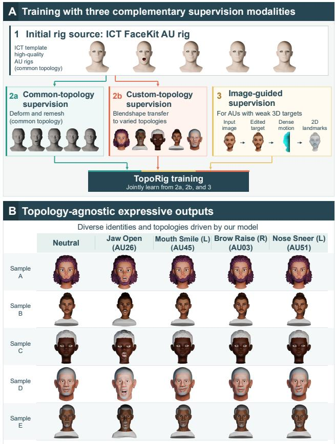
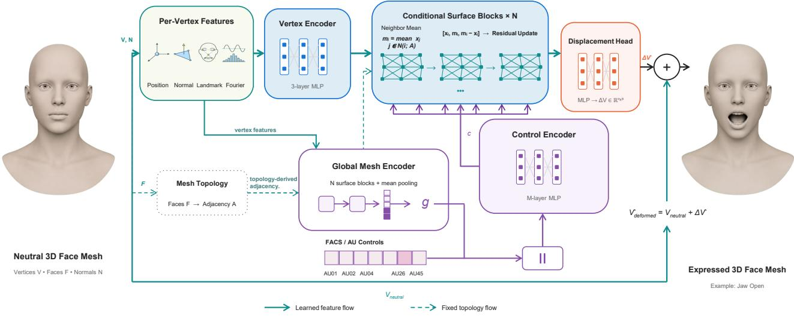
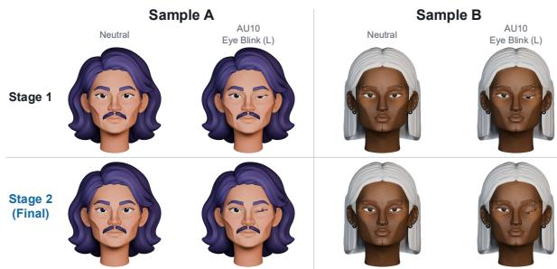
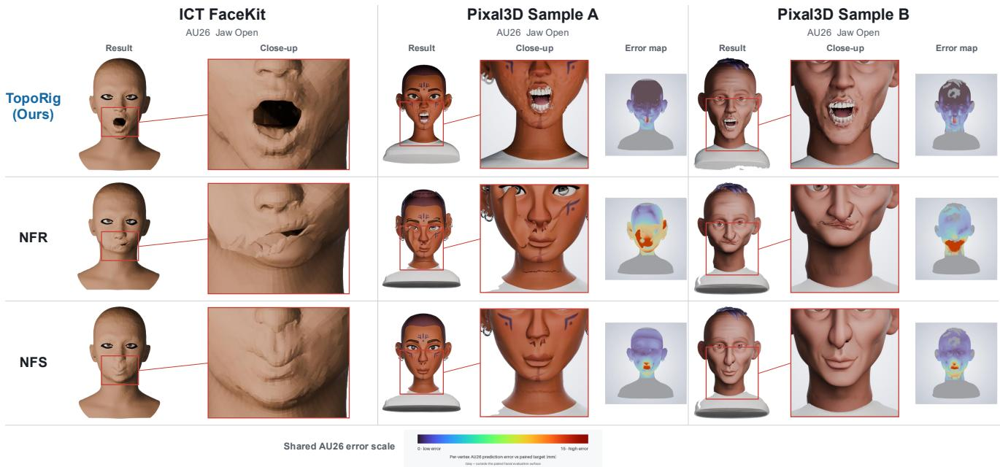
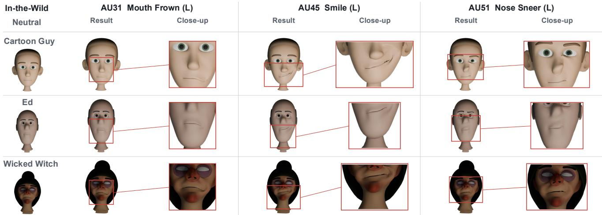
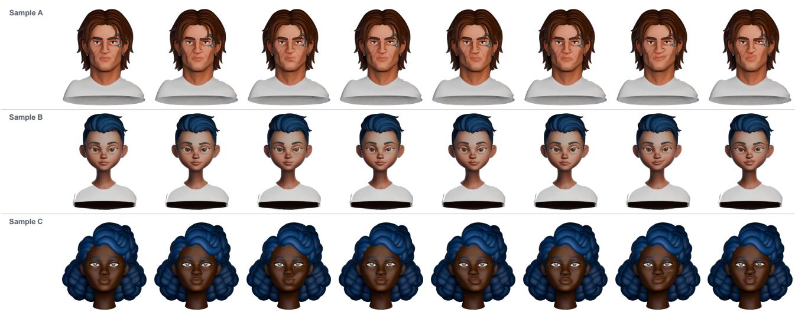

# TopoRig: Topology-Agnostic Facial Rigging via Multi-Source Supervision

Andrew Fleet1,4 Soroush Mehraban2,3,4

1Queen’s University 2Pickford AI

Vida Adeli2,3,4 Cole Clifford2 Babak Taati3,4 3University of Toronto 4Vector Institute

## Abstract

Automatic facial rigging across heterogeneous mesh topologies remains challenging because high-quality expression supervision is often tied to canonical templates, while deformation transfer to arbitrary meshes can introduce geometric artifacts and correspondence errors. We present TopoRig, a topology-agnosticfacial riggingframework that predicts FACS-conditioned deformations directly on input mesh vertices while preserving the original topology. Starting from the ICT FaceKit expression model, we construct complementary supervision from accurate but template-biased common-topology rigs, topology-diverse but noisier transferred rigs, and targeted image-based cues for controls poorly captured by geometric transfer. TopoRig combines local surface geometry, landmark-relative semantic features, global shape context, and FACS controls to predict per-vertex displacements. We train on 3,496 generated identities using 45 non-gaze expression controls from the 53-control ICT FaceKit vocabulary. On heldout identities and unseen mesh topologies, TopoRig more faithfully reproduces the reference expression space than prior neural facial-rigging methods, while qualitative results show consistent localized deformations across diverse character geometries. Ablations demonstrate that semantic landmarkfeatures and complementary supervision improve cross-identity and cross-topology generalization. Overall, TopoRig amortizes heterogeneous and imperfect expression supervision into a single topology-preserving deformation model.

## 1. Introduction

Facial rigging transforms a static neutral face into a controllable asset capable of producing a range of expressions [11, 17]. It is an important component of creating digital characters for user-controlled animation, performance retargeting, generated avatars, speech-driven animation, and stylized expression manipulation [12, 18, 21, 25]. Facial rigs commonly represent expressions using blendshapes corresponding to the Facial Action Coding System (FACS) [4, 8, 9], providing interpretable controls that can be adjusted individually or combined to form more complex expressions. However, manually constructing high-quality facial rigs requires substantial artist effort, resulting in high production costs and long production cycles [6, 14, 23].

  
Figure 1. Overview of TopoRig. (A) Starting from the ICT FaceKit AU rig, we construct complementary supervision from common-topology fitted rigs, expression transfer to custom topologies, and targeted image-based cues for AUs with unreliable 3D targets. TopoRig jointly learns from these sources. (B) At inference time, it produces AU-conditioned deformations for diverse identities and previously unseen mesh topologies while preserving the input topology.

Traditional automatic methods reduce this effort by fitting a predefined facial template and transferring its blendshapes to a target mesh, but this process often relies on template registration, dense correspondence, or topology normalization [1, 3, 16]. Recent neural approaches instead predict facial deformations directly, with some supporting expression transfer across meshes with different connectivity and other combining global expression controls with localized deformation [2, 15, 17]. However, methods built on a canonical mesh representation, such as AU-Blendshape, remain limited to a shared topology. Template-registration approaches such as OmniFaceRig support more diverse input meshes, but construct the final facial rig through fitted template geometry and blendshape transfer [12, 22]. Rig-AnyFace supports varied input topology and expands training through 2D supervision, enabling facial rigging across diverse mesh structures [15].

Despite the progress, a central challenge in topologyagnostic facial rigging is obtaining supervision that is simultaneously accurate, geometrically diverse, and applicable across heterogeneous mesh connectivity. To address this challenge, we construct a multi-source training corpus using the open-source ICT FaceKit expression model [13] together with diverse neutral 3D faces generated by an offthe-shelf image-to-3D model [10]. We derive 3D expression supervision through two complementary routes. First, we fit the ICT FaceKit template to the generated identities, producing accurate and internally consistent expression targets on a shared topology, although the resulting geometry remains biased toward the template. Second, we transfer the ICT FaceKit expression deformations directly onto the generated meshes, preserving their identity-specific geometry while substantially increasing topology diversity. Although the transfer procedure includes geometric smoothing and expression-specific corrections, local correspondence ambiguities can still produce imperfect targets, particularly around closely separated facial surfaces such as the eyelids and lips. Moreover, the procedure requires substantial per-identity processing. We therefore use these transferred meshes as supervision for an amortized deformation model rather than as the final rigging procedure. For action units that are poorly captured by geometric transfer, we additionally incorporate targeted image-based supervision obtained using an off-the-shelf image editing model [5].

We propose TopoRig, a topology-agnostic facial rigging framework that learns a single deformation model from complementary supervision sources. Rather than relying on one automatically constructed rig representation, TopoRig combines accurate but template-biased fitted rigs, topology-diverse but noisier transferred rigs, and targeted image-based supervision for controls that are difficult to obtain reliably through geometric transfer. The network conditions each input vertex on local geometry, optional landmark-relative semantic features, global facial geometry, and the requested FACS control, and directly predicts expression-dependent displacements on the original mesh vertices. This preserves the input vertex count, connectivity, and UV parameterization while amortizing the expensive per-identity fitting and transfer process into a single forward pass.

Fig. 1 summarizes the construction of the three supervision sources and the topology-preserving inference process. In summary, our main contributions are:

• Complementary multi-source supervision: a training strategy that derives complementary supervision from a common AU rig through fitted common-topology targets, deformation transfer to identity-specific topologies, and targeted image-based cues for controls with unreliable 3D targets.

• Amortized topology-preserving facial deformation: a FACS-conditioned deformation model that jointly learns from these heterogeneous supervision sources and predicts expressions directly on previously unseen input meshes without running the fitting and transfer pipeline at inference time.

• Large-scale training and analysis: a training corpus containing 3,496 generated identities, using 45 nongaze controls from the 53-control ICT FaceKit vocabulary, together with evaluations and ablations studying cross-topology generalization, semantic landmark features, complementary training sources, and data scale.

## 2. Related Work

Automatic facial rigging has traditionally relied on registering a canonical template and transferring blendshape or skinning deformations to a target mesh [1, 3, 16], often requiring reliable correspondence and per-character processing. Neural approaches instead learn deformation mappings across identities and mesh structures.

Neural Face Rigging (NFR) introduced a deformation autoencoder trained using interpretable controls from a linear 3D morphable model and detailed deformations from 4D facial captures [17]. This combination allows NFR to retain user-controllable expression parameters while reproducing fine-grained details from real facial performances.

Neural Face Skinning later combined a global expression representation with localized facial deformation [2]. The method predicts per-vertex skinning weights that localize the influence of a global expression representation to different facial regions. These weights are learned using facial segmentation labels, while FACS-based blendshapes provide interpretable expression supervision.

AUBlendNet instead predicts 32 personalized AU blendshape bases from a FLAME-based neutral identity mesh [12, 14]. Its accompanying AUBlendSet dataset contains artist-created AU blendshapes for 500 identities. Because all identities share the fixed FLAME topology of 5,023 vertices, AUBlendNet does not directly address facial meshes

  
Figure 2. TopoRig architecture. Per-vertex geometric, landmark, and Fourier features are processed using the input mesh connectivity, while a global mesh representation and AU control jointly condition the deformation network. The model predicts a 3D displacement for each input vertex, preserving the original topology.

with arbitrary topology.

RigAnyFace directly predicts FACS-conditioned displacements on the vertices of an input neutral facial mesh using a deformation network built on DiffusionNet [15, 19]. The DiffusionNet blocks are modified to incorporate FACS conditioning, while a global encoder allows information to be shared across disconnected components such as the face and eyeballs. To reduce its dependence on expensive artistrigged data, RigAnyFace combines 3D supervision from professionally rigged meshes with image-based supervision generated for unrigged meshes. Since its predicted displacements are applied directly to the original vertices, the input topology is preserved.

Most recently, OmniFaceRig introduced a templatebased pipeline that converts a static surface-only character into an inner-mouth-aware facial rig [22]. The resulting rig contains up to 155 FACS blendshapes together with procedurally fitted teeth, gums, and tongue. Its selected facial template is rigidly and non-rigidly registered to the input before the blendshapes and inner-mouth components are transferred. Unlike RigAnyFace, which predicts displacements directly on the input vertices and therefore preserves their connectivity, OmniFaceRig constructs the rigged facial region through template fitting and fusion. Consequently, although it accepts diverse input topologies, it does not preserve the original facial connectivity.

TopoRig is most closely related to RigAnyFace in that both predict FACS-conditioned deformations directly on the vertices of the input mesh and therefore preserve its original connectivity. Our focus, however, is on constructing and combining complementary supervision from a single canonical AU rig. We derive accurate but template-biased common-topology targets, topology-diverse transferred targets on identity-specific meshes, and targeted image-based supervision for controls where geometric transfer is unreliable. TopoRig then learns a single amortized deformation model from these heterogeneous sources, avoiding the peridentity fitting and transfer procedure at inference time.

## 3. Method

## 3.1. Overview

TopoRig is a topology-preserving facial rigging framework that predicts expression-dependent deformations for a neutral mesh. Given neutral vertex positions V, vertex normals N, vertex landmark features L, mesh connectivity T , and an action-unit control vector $\mathbf { c _ { A U } } ,$ the network predicts a three-dimensional displacement, $\widehat { \Delta \mathbf { V } }$ , for every input vertex:

$$
f _ { \theta } \left( \mathbf { V } , \mathbf { N } , \mathbf { L } , \mathcal { T } , \mathbf { c } _ { \mathrm { A U } } \right) = \widehat { \Delta \mathbf { V } } .\tag{1}
$$

The expressed mesh is obtained by adding the predicted displacements to the neutral vertices:

$$
{ \widehat { \mathbf { V } } } _ { \mathrm { e x p r } } = \mathbf { V } + { \widehat { \Delta \mathbf { V } } } .\tag{2}
$$

The network combines local surface geometry, facial landmark features, global facial geometry, and the requested expression. Since the predicted displacements are applied directly to the original vertices, TopoRig preserves the vertex count, faces, and connectivity of the input mesh.

Here, topology-agnostic means that TopoRig does not require a fixed canonical topology, vertex ordering, or correspondence across input meshes; the connectivity of each individual mesh is still used to define its local neighborhoods. The overall architecture is illustrated in Fig. 2.

## 3.2. Per-Vertex Input Features

Let the neutral mesh contain $n _ { v }$ vertices and $n _ { f }$ triangular faces, where both values may vary between meshes. It is represented by vertex positions $\dot { \textbf { V } } \in \mathbb { R } ^ { n _ { v } \times 3 }$ , unit vertex normals $\mathbf { N } \in \mathbb { R } ^ { n _ { v } \times 3 }$ , and face indices $\mathcal { T } \in \mathbb { N } ^ { n _ { f } \times 3 }$

TopoRig can optionally augment each vertex with facial landmark features that provide semantic information about nearby facial regions. A landmark detector provides a set of semantically consistent 3D facial locations with fixed indices. For each mesh vertex i, we select its $K _ { \mathrm { L } }$ nearest landmarks. For each selected landmark, we encode five values: three coordinates for the 3D offset from the vertex to the landmark, one value for their Euclidean distance, and one normalized landmark index. Concatenating these values over the $K _ { \mathrm { L } }$ landmarks gives the feature $\bar { \mathbf { l } _ { i } } \ \in \ \mathbb { R } ^ { 5 K _ { \mathrm { L } } }$ During training, we improve robustness to incomplete landmark information using two forms of landmark dropout. Modality dropout removes all landmark features, while region dropout removes landmarks from a randomly selected facial region before the nearest-landmark features are constructed. In both cases, the per-vertex input dimensionality remains fixed.

The relative offsets, distances, and landmark indices provide semantic localization cues without requiring vertex correspondence, helping the network identify facial regions across meshes with different vertex orderings and connectivity.

We normalize the vertex coordinates of each mesh by subtracting the mesh centroid and scaling by the maximum vertex distance from the centroid, yielding $\widetilde { \mathbf { v } } _ { i }$ . To provide additional spatial information, we apply a Fourier positional encoding with two frequency bands to these normalized coordinates [20]. Let $\gamma ( \widetilde { \mathbf { v } } _ { i } )$ denote this encoding. The complete per-vertex feature is then

$$
\mathbf { z } _ { i } = [ \widetilde { \mathbf { v } } _ { i } , \mathbf { n } _ { i } , \mathbf { l } _ { i } , \gamma ( \widetilde { \mathbf { v } } _ { i } ) ] \in \mathbb { R } ^ { 5 8 } ,\tag{3}
$$

where ${ \bf n } _ { i }$ is the unit surface normal and $\mathbf { l } _ { i }$ is the landmark-relative feature defined above.

## 3.3. Conditional Deformation Network

TopoRig represents facial expressions using a 53- dimensional control vector, denoted by $\mathbf { c } _ { \mathrm { A U } }$ , whose entries correspond to the expression controls provided by ICT FaceKit. These controls follow the AU-based naming used by ICT FaceKit throughout this work. In all training and evaluation experiments, each target expression activates a single control and is therefore represented by a one-hot vector.

A vertex encoder $E _ { \mathrm { v } }$ , implemented as an MLP, maps each per-vertex input feature $\mathbf { z } _ { i }$ to an initial feature for the deformation network,

$$
\begin{array} { r } { { \bf x } _ { i } ^ { ( 0 ) } = E _ { \mathrm { v } } ( { \bf z } _ { i } ) . } \end{array}\tag{4}
$$

In parallel, inspired by the pooled global representation used in RigAnyFace [15], a separate global encoder summarizes the geometry of the complete neutral mesh into a mesh-level representation. While the deformation branch operates primarily on local vertex neighborhoods, this global representation provides identity-level shape context that is shared across the entire mesh. Its input MLP $E _ { \mathrm { g , i n } }$ maps the same per-vertex feature to

$$
\begin{array} { r } { \mathbf { h } _ { i } ^ { ( 0 ) } = E _ { \mathrm { g , i n } } ( \mathbf { z } _ { i } ) . } \end{array}\tag{5}
$$

The triangular faces induce a bidirectional vertex adjacency $\mathbf { A } \in \{ 0 , 1 \} ^ { n _ { v } \times n _ { v } }$ , with self-edges included for all vertices.

At layer l of the global encoder, each vertex computes the mean feature over itself and its adjacent vertices,

$$
\mathbf { m } _ { i , \mathrm { g } } ^ { ( l ) } = \frac { \sum _ { j = 1 } ^ { n _ { v } } A _ { i j } \mathbf { h } _ { j } ^ { ( l ) } } { \sum _ { j = 1 } ^ { n _ { v } } A _ { i j } } .\tag{6}
$$

The current feature, neighbourhood mean, and their difference are combined by an MLP $E _ { \mathrm { g } } ^ { ( l ) }$ and added residually to the current representation,

$$
\mathbf { u } _ { i } ^ { ( l ) } = E _ { \mathrm { g } } ^ { ( l ) } \left( [ \mathbf { h } _ { i } ^ { ( l ) } , \mathbf { m } _ { i , \mathrm { g } } ^ { ( l ) } , \mathbf { m } _ { i , \mathrm { g } } ^ { ( l ) } - \mathbf { h } _ { i } ^ { ( l ) } ] \right) ,\tag{7}
$$

$$
\mathbf { h } _ { i } ^ { ( l + 1 ) } = \mathrm { L a y e r N o r m } \left( \mathbf { h } _ { i } ^ { ( l ) } + \mathbf { u } _ { i } ^ { ( l ) } \right) .\tag{8}
$$

After $L _ { \mathrm { g } }$ such layers, an output MLP $E _ { \mathrm { g , o u t } }$ is applied to each vertex feature and the resulting features are averaged to obtain a global representation of the neutral identity,

$$
\mathbf { g } = \frac { 1 } { n _ { v } } \sum _ { i = 1 } ^ { n _ { v } } E _ { \mathrm { g , o u t } } \left( \mathbf { h } _ { i } ^ { ( L _ { \mathrm { g } } ) } \right) .\tag{9}
$$

The global representation g is concatenated with the AU control vector $\mathbf { c } _ { \mathrm { A U } }$ and passed through a control MLP $E _ { \mathrm { c t r l } }$ to produce the expression condition

$$
\mathbf { c } = E _ { \mathrm { c t r l } } ( [ \mathbf { c } _ { \mathrm { A U } } , \mathbf { g } ] ) .\tag{10}
$$

The condition c is then broadcast to every vertex in the deformation network. In this way, each local deformation is conditioned not only on the requested expression but also on the global geometry of the input identity.

  
Figure 3. Effect of Stage 2 image-guided refinement. For left eye blink, Stage 1 inherits weak closure from unreliable transferred targets, while Stage 2 image supervision produces stronger and more complete eyelid closure on both validation identities.

The main deformation network then applies $L _ { \mathrm { d } }$ conditional aggregation layers, starting from the vertex features $\mathbf { x } _ { i } ^ { ( 0 ) }$ . Using the same adjacency matrix, each layer first computes

$$
\mathbf { m } _ { i } ^ { ( l ) } = \frac { \sum _ { j = 1 } ^ { n _ { v } } A _ { i j } \mathbf { x } _ { j } ^ { ( l ) } } { \sum _ { j = 1 } ^ { n _ { v } } A _ { i j } } .\tag{11}
$$

The current vertex feature, its neighbourhood mean, and their difference are then combined by an MLP $E _ { \mathrm { s u r f } } ^ { ( l ) }$ to form a local feature,

$$
\mathbf { s } _ { i } ^ { ( l ) } = E _ { \mathrm { s u r f } } ^ { ( l ) } \left( [ \mathbf { x } _ { i } ^ { ( l ) } , \mathbf { m } _ { i } ^ { ( l ) } , \mathbf { m } _ { i } ^ { ( l ) } - \mathbf { x } _ { i } ^ { ( l ) } ] \right) .\tag{12}
$$

The expression condition c is concatenated with this local feature and processed by a second MLP $E _ { \mathrm { c o n d } } ^ { ( l ) }$ . The resulting feature is added residually to the current vertex representation,

$$
\mathbf { x } _ { i } ^ { ( l + 1 ) } = \mathrm { L a y e r N o r m } \left( \mathbf { x } _ { i } ^ { ( l ) } + E _ { \mathrm { c o n d } } ^ { ( l ) } \left( [ \mathbf { s } _ { i } ^ { ( l ) } , \mathbf { c } ] \right) \right)\tag{13}
$$

This operation propagates information according to the input mesh connectivity while conditioning each vertex on the requested expression. After $L _ { \mathrm { d } }$ conditional layers, the final vertex feature is concatenated with the expression condition and passed through a displacement MLP $E _ { \mathrm { d i s p } }$

$$
\Delta \widehat { \mathbf { v } } _ { i } = E _ { \mathrm { d i s p } } \left( [ \mathbf { x } _ { i } ^ { ( L _ { \mathrm { d } } ) } , \mathbf { c } ] \right) .\tag{14}
$$

The displacement head outputs a three-dimensional displacement for each input vertex. Its final layer is initialized to zero, so the untrained network initially predicts zero displacement and reproduces the neutral input mesh.

## 3.4. Training Objectives

TopoRig is trained in two stages. Stage 1 learns the FACSconditioned deformation model from mesh-supervised samples. Stage 2 initializes from Stage 1 and jointly uses meshand image-supervised samples. For mesh-supervised samples, the primary vertex loss ${ \mathcal { L } } _ { \mathrm { v t x } }$ supervises the predicted displacement field against the target expression deformation. We additionally use a landmark loss $\mathcal { L } _ { \mathrm { l m k } }$ and an active-landmark loss $\mathcal { L } _ { \mathrm { a c t i v e } }$ to increase supervision around semantically important facial regions and landmarks associated with the selected AU, respectively. The mesh objective is

$$
\begin{array} { r } { \mathcal { L } _ { \mathrm { m e s h } } = \mathcal { L } _ { \mathrm { v t x } } + \lambda _ { \mathrm { l m k } } \mathcal { L } _ { \mathrm { l m k } } + \lambda _ { \mathrm { a c t i v e } } ^ { \mathrm { e f f } } \mathcal { L } _ { \mathrm { a c t i v e } } + \mathcal { L } _ { \mathrm { g e o m } } . } \end{array}\tag{15}
$$

The geometric regularizer $\mathcal { L } _ { \mathrm { g e o m } }$ combines displacement smoothness, relative edge-length preservation, surfacenormal consistency, and displacement-magnitude penalties:

$$
\begin{array} { r l } & { { \mathcal { L } } _ { \mathrm { g e o m } } = \lambda _ { \mathrm { s m o o t h } } { \mathcal { L } } _ { \mathrm { s m o o t h } } + \lambda _ { \mathrm { e d g e } } { \mathcal { L } } _ { \mathrm { e d g e } } } \\ & { ~ + \lambda _ { \mathrm { n o r m a l } } { \mathcal { L } } _ { \mathrm { n o r m a l } } + \lambda _ { \mathrm { m a g } } { \mathcal { L } } _ { \mathrm { m a g } } . } \end{array}\tag{16}
$$

Landmark features provide semantic localization, while the landmark losses directly supervise deformation near expression-relevant facial regions.

For image-supervised samples, target optical flow between the neutral and expressed images is estimated using WAFT [24]. We apply image-based supervision only to a subset of eight eye-region controls for which the transferred 3D blendshapes are noisy or insufficiently reliable, particularly for eyelid closure and opening.

In addition to optical flow, we use an eyelid objective $\mathcal { L } _ { \mathrm { e y e l i d } }$ that supervises normalized projected eyelid motion and eyelid-gap reduction, together with a localized depthanchor term. We further regularize the predicted deformation with an image-branch geometric regularizer $\mathcal { L } _ { \mathrm { g e o m } } ^ { \mathrm { i m g } }$ and an outside-region anchor loss $\mathcal { L } _ { \mathrm { a n c h o r } }$ that suppresses motion away from the supervised facial region. The image objective is

$$
{ \mathcal { L } } _ { \mathrm { i m a g e } } = \lambda _ { \mathrm { f o w } } { \mathcal { L } } _ { \mathrm { f l o w } } + { \mathcal { L } } _ { \mathrm { e y e l i d } } + { \mathcal { L } } _ { \mathrm { g e o m } } ^ { \mathrm { i m g } } + \lambda _ { \mathrm { a n c h o r } } { \mathcal { L } } _ { \mathrm { a n c h o r } } .\tag{17}
$$

During Stage 2, mesh- and image-supervised samples are trained jointly. The loss applied to each sample depends on its available supervision:

$$
\begin{array} { r } { \mathcal { L } = \mathcal { L } _ { \mathrm { m e s h } } + \mathcal { L } _ { \mathrm { i m a g e } } . } \end{array}\tag{18}
$$

Detailed definitions of the individual mesh and image loss terms are provided in Sec. B of the supplementary material. At inference time, the network directly predicts a displacement field for a requested AU control on the neutral mesh. Since only the vertex positions are modified, the original vertex count, faces, and connectivity are preserved.

## 4. Experiments

## 4.1. Datasets and Metrics

Datasets. We use 3,496 facial identities generated using Nano Banana [5] and reconstruct their neutral meshes using Pixal3D [10]. The identities are divided into 2,796 training, 350 validation, and 350 test identities.

We obtain 3D supervision by fitting ICT FaceKit [13] to each reconstructed identity. This produces both a common-topology ICT mesh and an expression-transferred mesh that preserves the original Pixal3D topology. The original-topology meshes are simplified to approximately 100,000 faces (denoted Pixal3D-100k), and MediaPipe landmarks [7] are transferred to the simplified geometry. Further construction details are provided in Sec. A. The full ICT FaceKit control vocabulary contains 53 expression controls. For mesh-supervised experiments, we use the 45 nongaze controls available in our fitted ICT stream. Four of these have unreliable transferred targets and are therefore omitted from the Pixal3D stream, leaving 41 controls. Image supervision is applied to eight eye-region controls and uses 17,504 expression pairs from 2,779 identities.

The Pixal3D expression meshes are automatically constructed by transferring ICT expression deformations to the original Pixal3D topology. We therefore treat them as transferred reference targets, rather than independent groundtruth rigs. Evaluation on this set measures how well a method preserves the canonical expression space while generalizing to previously unseen identities and mesh topologies. Importantly, lower error does not necessarily imply higher perceptual rig quality, since the transferred references may contain local correspondence artifacts. We therefore use this evaluation as a measure of transfer fidelity and topology generalization, complemented by qualitative results on diverse character meshes.

The held-out evaluation set contains 350 identities, yielding 15,750 ICT and 14,350 Pixal3D mesh–expression samples. All methods use the same identities, controls, preprocessing, scale normalization, and evaluation masks.

Evaluation Metrics. Predictions are evaluated as displacement fields rather than absolute vertex positions. Each neutral head is standardized to a height of 240 mm, and evaluation is restricted to vertices whose reference displacement exceeds 0.01 mm. We report coordinate-wise MAE and the 95th percentile (Q95) of per-vertex Euclidean displacement error, averaged equally across identity–control pairs. MAE captures average deformation error, while Q95 emphasizes larger localized deviations.

## 4.2. Implementation Details

We use $K _ { L } = 8$ nearest landmarks, two Fourier frequency bands, and two aggregation layers in both the global encoder and deformation network. Training uses AdamW with a global batch size of 16. Stage 1 is trained for 20 epochs with mesh supervision, while Stage 2 is initialized from Stage 1 and refined for 10 epochs using joint mesh and image supervision. Image supervision is applied to eight eye-region controls, and Stage 2 additionally includes mesh-only refinement for selected higher-error controls. Full optimization, loss-weight, augmentation, and refinement settings are provided in the supplementary material.

Table 1. Quantitative comparison with prior facial-rigging methods. Pixal3D-100k errors measure agreement with automatically transferred ICT reference expressions on held-out identities and topologies, rather than with independently authored groundtruth rigs.
<table><tr><td rowspan="2">Method</td><td colspan="2">ICT</td><td colspan="2">Pixal3D-100k</td></tr><tr><td>MAE (mm) ↓</td><td>Q95 (mm) ↓</td><td>MAE (mm) ↓</td><td>Q95 (mm) ↓</td></tr><tr><td>NFS [2]</td><td>1.476</td><td>4.358</td><td>1.416</td><td>4.260</td></tr><tr><td>NFR [17]</td><td>1.928</td><td>5.480</td><td>1.273</td><td>4.145</td></tr><tr><td>TopoRig (Ours)</td><td>0.400</td><td>1.257</td><td>0.274</td><td>0.975</td></tr></table>

## 4.3. Comparison with baselines

We compare TopoRig with Neural Face Rigging (NFR) [17] and Neural Face Skinning (NFS) [2] using their publicly released pretrained checkpoints. RigAnyFace [15], although closely related, is not included because neither its implementation nor pretrained models are publicly available. For each control, we provide the corresponding ICT expression together with the neutral test mesh to each baseline. Since both baselines also predict a neutral reconstruction, expression displacements are measured relative to their predicted neutral output. All methods use the same test identities, shared controls, preprocessing, evaluation masks, scale normalization, and metrics described in Sec. 4.1.

As shown in Tab. 1, TopoRig substantially outperforms both prior methods on common-topology ICT meshes and on identity-specific Pixal3D meshes. Relative to the strongest baseline, TopoRig reduces MAE by 72.9% on ICT and 78.5% on Pixal3D-100k, with similarly large reductions in Q95. On Pixal3D-100k, the lower errors indicate that TopoRig more faithfully reproduces the transferred reference expressions across nonuniform, identity-specific topologies; they should not be interpreted as an independent measure of perceptual rig quality. Overall, TopoRig more accurately reproduces the reference expression targets on previously unseen identities and mesh structures.

Fig. 4 provides a qualitative comparison for jaw opening, showing more consistent deformation across the ICT template and identity-specific Pixal3D topologies than NFR and NFS. Fig. 5 further demonstrates generalization to stylized in-the-wild characters whose facial geometry and appearance differ substantially from the training identities. Additional qualitative results across held-out validation identities and facial controls are provided in Sec. D of the supplementary material.

  
Figure 4. Qualitative comparison with NFR and NFS for jaw opening. Columns show the ICT FaceKit topology and two Pixal3D identities with custom topologies. For Pixal3D, error maps show per-vertex Euclidean distance to the transferred reference target on a shared 0–15 mm scale; gray denotes vertices outside the evaluated region. TopoRig produces more consistent deformation across common and custom topologies.

Table 2. Ablation and training analysis. Effects of input features, supervision sources, training-set size, and Stage 2 refinement. Errors are computed on moving vertices after normalization to a 240 mm head height relative to the held-out reference expression targets.
<table><tr><td rowspan="2">Model</td><td colspan="2">ICT</td><td colspan="2">Pixal3D-100k</td></tr><tr><td>MAE (mm) ↓</td><td>Q95 (mm) ↓</td><td>MAE (mm) ↓</td><td>Q95 (mm) ↓</td></tr><tr><td>No landmark input</td><td>0.641</td><td>1.940</td><td>0.373</td><td>1.456</td></tr><tr><td>No Fourier encoding</td><td>0.446</td><td>1.438</td><td>0.282</td><td>1.008</td></tr><tr><td>ICT only</td><td>0.372</td><td>1.089</td><td>1.086</td><td>4.153</td></tr><tr><td>Pixal3D only</td><td>1.165</td><td>3.974</td><td>0.286</td><td>1.039</td></tr><tr><td>25% data</td><td>0.768</td><td>2.260</td><td>0.351</td><td>1.255</td></tr><tr><td>50% data</td><td>0.512</td><td>1.737</td><td>0.308</td><td>1.115</td></tr><tr><td>75% data</td><td>0.494</td><td>1.624</td><td>0.291</td><td>1.044</td></tr><tr><td>Full Stage 1</td><td>0.416</td><td>1.333</td><td>0.275</td><td>0.983</td></tr><tr><td>Full Stage 2 (TopoRig)</td><td>0.400</td><td>1.257</td><td>0.274</td><td>0.975</td></tr></table>

## 4.4. Ablation and Training Analysis

Tab. 2 analyzes the input representation, the value of complementary supervision and data diversity, and the effect of Stage 2 refinement.

Landmark-relative features are the dominant input cue. Relative to Full Stage 1, removing them increases MAE by 54% on ICT and 36% on Pixal3D-100k, whereas removing Fourier encoding causes only a small degradation. This indicates that semantic localization is particularly important for cross-topology generalization, with Fourier features providing a complementary benefit.

Training on either the ICT or transferred Pixal3D supervision alone produces clear domain-specific behavior, while joint training performs well across both common and identity-specific topologies. Performance also improves consistently with additional training identities, indicating that both complementary mesh supervision and identity diversity support generalization.

Stage 2 changes aggregate MAE and Q95 only slightly because it targets a small subset of controls with unreliable transferred 3D supervision. Its benefit is more evident qualitatively: as shown in Fig. 3, image-guided refinement produces stronger and more complete eyelid closure than mesh supervision alone.

## 4.5. Discussion and Limitations

The results highlight a useful trade-off between the different supervision sources used by TopoRig. Common-topology ICT targets provide consistent expression supervision, but constrain the training geometry to a canonical mesh structure. In contrast, transferred Pixal3D targets expose the model to substantially more varied identity-specific geometry and connectivity, at the cost of correspondence noise introduced by deformation transfer. The single-source ablations in Tab. 2 reflect this trade-off: training on either source alone produces strong domain-specific behavior, whereas joint training achieves substantially more balanced performance across the two mesh domains. These results are consistent with the two supervision sources providing complementary geometric biases, although the ablation does not fully disentangle this effect from the additional supervision available under joint training.

  
Figure 5. Generalization to in-the-wild character meshes. TopoRig produces localized AU-conditioned deformations on three stylized characters with geometry and appearance distinct from the training identities, while preserving their character-specific shape. The character meshes are publicly available CC0 assets from BlendSwap: Cartoon Guy V1.2 by mjedewaard, Ed from Cartoon Character Pack 1 by VMComix, and Wicked Witch by squibblejack. These meshes are used only for qualitative evaluation and are not part of the TopoRig training data.

The evaluation should nevertheless be interpreted with several limitations. Because the Pixal3D expression targets are themselves constructed by automatic deformation transfer, they are not independently authored ground-truth rigs. Quantitative performance on Pixal3D-100k therefore measures agreement with the transferred canonical expression space and generalization across unseen mesh structures, rather than perceptual rig quality in isolation. The in-the-wild examples in Fig. 5 provide additional qualitative evidence that the learned deformation model can operate on character geometries outside the generated training distribution, but these examples likewise lack artist-authored target rigs and are therefore not used for quantitative evaluation.

Our current expression supervision also focuses on individual AU controls: all training and quantitative evaluation targets activate a single control. Although the network accepts an AU control vector, compound expressions have not been systematically supervised or evaluated. In addition, image-guided refinement currently targets eight eye-region controls for which transferred 3D supervision is particularly unreliable. Extending this supervision to other difficult facial regions, evaluating combinations of controls, and collecting artist-authored rigs or perceptual judgments would provide stronger measures of animation quality beyond deformation transfer fidelity.

## 5. Conclusion

We presented TopoRig, a topology-agnostic facial rigging framework that predicts AU-conditioned deformations directly on the vertices of an input mesh while preserving its original topology. TopoRig learns from complementary supervision sources comprising accurate common-topology targets, topology-diverse transferred targets, and targeted image-based cues for controls with unreliable 3D supervision.

Across held-out identities, TopoRig achieves substantially lower deformation error than the evaluated neural baselines on both common-topology ICT meshes and identity-specific Pixal3D meshes. Qualitative results demonstrate consistent localized deformations across diverse identities and stylized in-the-wild character meshes. Our ablations show that landmark-relative semantic features, complementary mesh supervision, and increased identity diversity contribute to cross-topology generalization, while image-guided refinement improves localized deformations such as eyelid closure.

The supervision sources play complementary roles: canonical-topology targets provide consistent expression supervision, transferred meshes introduce geometric and topological diversity, and targeted image cues address regions where geometric transfer is unreliable. Overall, TopoRig amortizes this heterogeneous supervision into a single topology-preserving model, avoiding per-identity fitting and transfer while preserving the connectivity and identity-specific structure of unseen character meshes.

## References

[1] Emma Carrigan, Eduard Zell, Cedric Guiard, and Rachel´ McDonnell. Expression packing: As-few-as-possible training expressions for blendshape transfer. In Computer Graphics Forum, pages 219–233. Wiley Online Library, 2020. 2

[2] Sihun Cha, Serin Yoon, Kwanggyoon Seo, and Junyong Noh. Neural face skinning for mesh-agnostic facial expression cloning. Computer Graphics Forum, 44(2):e70009, 2025. 2, 6

[3] Ludovic Dutreve, Alexandre Meyer, Veronica Orvalho, and Saida Bouakaz. Easy rigging of face by automatic registration and transfer of skinning parameters. In International Conference on Computer Vision and Graphics, pages 333– 341. Springer, 2010. 2

[4] Paul Ekman and Wallace V. Friesen. Facial Action Coding System: A Technique for the Measurement of Facial Movement. Consulting Psychologists Press, Palo Alto, California, 1978. 1

[5] Michael Gerstenhaber. Building on the bananas momentum of generative media models on google cloud. Google Cloud Blog, 2025. 2, 6

[6] Jing Hou, Dongdong Weng, Zhihe Zhao, Ying Li, and Jixiang Zhou. Neutral facial rigging from limited spatiotemporal meshes. Electronics, 13(13):2445, 2024. 1

[7] Yury Kartynnik, Artsiom Ablavatski, Ivan Grishchenko, and Matthias Grundmann. Real-time facial surface geometry from monocular video on mobile GPUs. arXiv preprint arXiv:1907.06724, 2019. 6

[8] John P Lewis and Ken-ichi Anjyo. Direct manipulation blendshapes. IEEE Computer Graphics and Applications, 30(4):42–50, 2010. 1

[9] John P Lewis, Ken Anjyo, Taehyun Rhee, Mengjie Zhang, Frederic H Pighin, and Zhigang Deng. Practice and theory of blendshape facial models. Eurographics (State of the Art Reports), 1(8):2, 2014. 1

[10] Dong-Yang Li, Wang Zhao, Yuxin Chen, Wenbo Hu, Meng-Hao Guo, Fang-Lue Zhang, Ying Shan, and Shi-Min Hu. Pixal3D: Pixel-aligned 3d generation from images. In ACM SIGGRAPH 2026 Conference Papers, 2026. 2, 6

[11] Hao Li, Thibaut Weise, and Mark Pauly. Example-based facial rigging. Acm transactions on graphics (tog), 29(4): 1–6, 2010. 1

[12] Hao Li, Ju Dai, Feng Zhou, Kaida Ning, Lei Li, and Junjun Pan. AU-Blendshape for fine-grained stylized 3d facial expression manipulation. In Proceedings of the IEEE/CVF International Conference on Computer Vision (ICCV), 2025. 1, 2

[13] Ruilong Li, Karl Bladin, Yajie Zhao, Chinmay Chinara, Owen Ingraham, Pengda Xiang, Xinglei Ren, Pratusha Prasad, Bipin Kishore, Jun Xing, and Hao Li. Learning formation of physically-based face attributes. In Proceedings of the IEEE/CVF Conference on Computer Vision and Pattern Recognition (CVPR), pages 3410–3419, 2020. 2, 6, 1

[14] Tianye Li, Timo Bolkart, Michael J. Black, Hao Li, and Javier Romero. Learning a model of facial shape and expression from 4d scans. ACM Transactions on Graphics, 36 (6), 2017. 1, 2

[15] Wenchao Ma, Dario Kneubuehler, Maurice Chu, Ian Sachs, Haomiao Jiang, and Sharon X. Huang. RigAnyFace: Scaling neural facial mesh auto-rigging with unlabeled data. In Advances in Neural Information Processing Systems, 2025. 2, 3, 4, 6

[16] Hayato Onizuka, Diego Thomas, Hideaki Uchiyama, and Rin-ichiro Taniguchi. Landmark-guided deformation transfer of template facial expressions for automatic generation of avatar blendshapes. In 2019 IEEE/CVF International Conference on Computer Vision Workshop (ICCVW), pages 2100–2108. IEEE, 2019. 2

[17] Dafei Qin, Jun Saito, Noam Aigerman, Thibault Groueix, and Taku Komura. Neural face rigging for animating and retargeting facial meshes in the wild. In ACM SIGGRAPH 2023 Conference Proceedings, 2023. 1, 2, 6

[18] Alexander Richard, Michael Zollhofer, Yandong Wen, Fer-¨ nando De la Torre, and Yaser Sheikh. Meshtalk: 3d face an imation from speech using cross-modality disentanglement. In 2021 IEEE/CVF International Conference on Computer Vision (ICCV), pages 1153–1162. IEEE, 2021. 1

[19] Nicholas Sharp, Souhaib Attaiki, Keenan Crane, and Maks Ovsjanikov. DiffusionNet: Discretization agnostic learning on surfaces. ACM Transactions on Graphics, 41(3), 2022. 3

[20] Matthew Tancik, Pratul P. Srinivasan, Ben Mildenhall, Sara Fridovich-Keil, Nithin Raghavan, Utkarsh Singhal, Ravi Ramamoorthi, Jonathan T. Barron, and Ren Ng. Fourier fea tures let networks learn high frequency functions in low dimensional domains. In Advances in Neural Information Pro cessing Systems, pages 7537–7547, 2020. 4

[21] Justus Thies, Michael Zollhofer, Marc Stamminger, Christian Theobalt, and Matthias Nießner. Face2face: Real-time face capture and reenactment of rgb videos. In Proceedings of the IEEE conference on computer vision and pattern recognition, pages 2387–2395, 2016. 1

[22] Chao Wang, Guangyao Ma, John Doublestein, Junming Chen, Yiming Lin, Zhaoen Su, Xiaomin Luo, Shiyang Cheng, Jie Shen, Doug Roble, Dilin Wang, Yilei Li, and Rakesh Ranjan. OmniFaceRig: Fully automatic innermouth-aware face rigging across diverse 3d character topolo gies. arXiv preprint arXiv:2606.08043, 2026. 2, 3

[23] Haoyu Wang, Haozhe Wu, Junliang Xing, and Jia Jia. Versatile face animator: Driving arbitrary 3d facial avatar in rgbd space. In Proceedings of the 31st ACM international confer ence on multimedia, pages 7776–7784, 2023. 1

[24] Yihan Wang and Jia Deng. WAFT: Warping-alone field transforms for optical flow. In International Conference on Learning Representations (ICLR), 2026. 5

[25] Feng Xu, Jinxiang Chai, Yilong Liu, and Xin Tong. Control lable high-fidelity facial performance transfer. ACM Trans actions on Graphics (TOG), 33(4):1–11, 2014. 1

# TopoRig: Topology-Agnostic Facial Rigging via Multi-Source Supervision

Supplementary Material

## A. Template Fitting and Blendshape Transfer

To generate expression-capable training meshes while preserving the topology of each target identity, we use the ICT FaceKit Light model [13] as a canonical facial deformation template. ICT FaceKit provides a common facial topology together with 53 expression blendshapes, allowing a consistent expression space to be transferred across identities with different geometry and connectivity.

Given a neutral target mesh and the neutral ICT template, we first align the two meshes using corresponding facial landmarks. The ICT template is then non-rigidly deformed to match the target identity while retaining its original connectivity. The resulting identity deformation is applied consistently to the ICT neutral mesh and its expression shapes, preserving the expression displacement fields. Finally, the fitted ICT blendshape displacements are spatially transferred onto the vertices of the original target topology.

The overall procedure consists of four stages: (i) landmark-based similarity alignment, (ii) non-rigid ICT template fitting, (iii) blendshape-preserving identity deformation, and (iv) deformation-field transfer to the target topology.

## A.1. ICT FaceKit Expression Template

We use ICT FaceKit Light [13], which provides a canonical neutral facial mesh and 53 expression blendshapes registered to a common topology. The model includes localized deformations of the brows, eyelids, cheeks, jaw, and mouth, with asymmetric expressions represented independently for the left and right sides of the face.

The ICT expression meshes share the same vertex ordering and connectivity as the neutral template. We therefore represent each expression k as a per-vertex displacement field relative to the neutral mesh. Let $\mathbf { v } _ { i } ^ { 0 }$ denote vertex i of the neutral ICT mesh and $\mathbf { v } _ { i } ^ { k }$ denote the corresponding vertex under expression k. The expression displacement is

$$
\delta _ { i } ^ { k } = \mathbf { v } _ { i } ^ { k } - \mathbf { v } _ { i } ^ { 0 } .\tag{19}
$$

These deformation fields form the canonical expression space that is subsequently adapted to each target identity.

## A.2. Landmark-Based Similarity Alignment Let

$$
\mathcal { M } _ { \mathrm { I C T } } = ( \mathbf { V } _ { \mathrm { I C T } } , \mathbf { F } _ { \mathrm { I C T } } )\tag{20}
$$

denote the neutral ICT template and

$$
\mathcal { M } _ { \mathrm { T } } = \left( \mathbf { V } _ { \mathrm { T } } , \mathbf { F } _ { \mathrm { T } } \right)\tag{21}
$$

denote the neutral target mesh.

Before non-rigid fitting, the target mesh is placed into the coordinate frame of the ICT template using corresponding facial landmarks. Given shared landmark positions $\{ \bar { \mathbf { p } } _ { l } ^ { \mathrm { { I C T } } } \} _ { l = 1 } ^ { L }$ and $\{ \mathbf { p } _ { l } ^ { \mathrm { T } } \} _ { l = 1 } ^ { L }$ , we estimate a similarity transformation consisting of a scale s, rotation R, and translation t:

$$
\hat { \mathbf { p } } _ { l } ^ { \mathrm { T } } = s \mathbf { p } _ { l } ^ { \mathrm { T } } \mathbf { R } + \mathbf { t } .\tag{22}
$$

To improve robustness to inaccurate landmark correspondences, landmarks with large residual errors are removed using percentile-based trimming and the transformation is re-estimated using the remaining correspondences. The resulting transformation is then applied to the complete target mesh.

## A.3. Non-Rigid ICT Template Fitting

Following global alignment, the ICT template is non-rigidly deformed to match the geometry of the target identity while retaining the original ICT mesh connectivity. Let $\mathbf { v } _ { i } ^ { 0 }$ denote the original position of ICT vertex i and $\mathbf { v } _ { i }$ its current fitted position. The corresponding identity displacement is

$$
\mathbf { d } _ { i } = \mathbf { v } _ { i } - \mathbf { v } _ { i } ^ { 0 } .\tag{23}
$$

The fitting procedure combines surface correspondence, semantic landmark constraints, and topology-aware displacement smoothing.

Surface Correspondence. Each ICT vertex is associated with its nearest point on the aligned target surface. The resulting correspondence term can be interpreted as

$$
\mathcal { L } _ { \mathrm { s u r f } } = \sum _ { i } \Vert \mathbf { v } _ { i } - \mathrm { N N } _ { \mathrm { T } } ( \mathbf { v } _ { i } ) \Vert _ { 2 } ^ { 2 } ,\tag{24}
$$

where $\mathrm { N N } _ { \mathrm { T } } ( \mathbf { v } _ { i } )$ denotes the nearest target surface sample. Large-distance correspondences are removed using percentile-based trimming. A lower-weight reverse correspondence from the target surface to the ICT template is additionally used to encourage coverage of the target geometry.

Landmark Constraints. Nearest-surface correspondence alone does not enforce semantic alignment between facial structures. We therefore constrain ICT landmark vertices to their corresponding target landmark positions:

$$
\mathcal { L } _ { \mathrm { l m } } = \sum _ { l = 1 } ^ { L } w _ { l } \left\| \mathbf { v } _ { i _ { l } } - \hat { \mathbf { p } } _ { l } ^ { \mathrm { T } } \right\| _ { 2 } ^ { 2 } .\tag{25}
$$

Landmark influence is propagated to nearby vertices using spatially decaying weights, providing smooth semantic guidance around the eyes, mouth, nose, and brows.

Topology-Aware Smoothing. To maintain a coherent surface during fitting, neighboring ICT vertices are encouraged to undergo similar identity displacements. For the onering neighborhood $\mathcal { N } ( i )$ of vertex i, the mean neighboring displacement is

$$
\bar { \mathbf { d } } _ { i } = \frac { 1 } { | \mathcal { N } ( i ) | } \sum _ { j \in \mathcal { N } ( i ) } \mathbf { d } _ { j } .\tag{26}
$$

The corresponding regularization can be written as

$$
\mathcal { L } _ { \mathrm { s m o o t h } } = \sum _ { i } \left. \mathbf { d } _ { i } - \bar { \mathbf { d } } _ { i } \right. _ { 2 } ^ { 2 } .\tag{27}
$$

The fitting process can therefore be interpreted as balancing

$$
{ \mathcal { L } } _ { \mathrm { f i t } } = \lambda _ { \mathrm { s u r f } } { \mathcal { L } } _ { \mathrm { s u r f } } + \lambda _ { \mathrm { l m } } { \mathcal { L } } _ { \mathrm { l m } } + \lambda _ { \mathrm { s m o o t h } } { \mathcal { L } } _ { \mathrm { s m o o t h } } ,\tag{28}
$$

although the implementation performs iterative weighted displacement updates rather than explicitly optimizing a scalar objective through gradient descent.

## A.4. Geometric Refinement

After the initial non-rigid registration, the fitted displacement field is further refined to improve local surface correspondence. A higher-resolution sampling of the target surface is used for local detail projection, while additional smoothing and outlier removal suppress isolated artifacts.

Region-specific constraints are applied around sensitive structures such as the eyelids and lips, where closely separated surfaces can otherwise result in incorrect nearestneighbor correspondences.

## A.5. Blendshape-Preserving Identity Deformation

Let $\mathbf { v } _ { i } ^ { 0 }$ denote the neutral ICT vertex and $\mathbf { v } _ { i } ^ { k }$ the same vertex under expression k. The canonical expression displacement is

$$
\delta _ { i } ^ { k } = \mathbf { v } _ { i } ^ { k } - \mathbf { v } _ { i } ^ { 0 } .\tag{29}
$$

After fitting the neutral ICT template to the target identity, let the identity deformation be

$$
\begin{array} { r } { \Delta _ { i } = \mathbf { v } _ { i } ^ { \mathrm { f i t } } - \mathbf { v } _ { i } ^ { 0 } . } \end{array}\tag{30}
$$

The same identity deformation is applied to both the neutral template and every expression shape:

$$
\hat { \mathbf { v } } _ { i } ^ { 0 } = \mathbf { v } _ { i } ^ { 0 } + \Delta _ { i } ,\tag{31}
$$

$$
\hat { \mathbf { v } } _ { i } ^ { k } = \mathbf { v } _ { i } ^ { k } + \Delta _ { i } .\tag{32}
$$

Therefore,

$$
\hat { \mathbf { v } } _ { i } ^ { k } - \hat { \mathbf { v } } _ { i } ^ { 0 } = \left( \mathbf { v } _ { i } ^ { k } + \Delta _ { i } \right) - \left( \mathbf { v } _ { i } ^ { 0 } + \Delta _ { i } \right)
$$

$$
\mathbf { \Delta } = \mathbf { v } _ { i } ^ { k } - \mathbf { v } _ { i } ^ { 0 }\tag{33}
$$

$$
\begin{array} { r } { = \delta _ { i } ^ { k } . } \end{array}\tag{34}
$$

(35)

Thus, fitting changes the identity represented by the ICT template while retaining its canonical expression deformation fields.

## A.6. Blendshape Transfer to the Target Topology

The fitted ICT mesh acts as an intermediate deformation template. To retain the connectivity of the original target mesh, the ICT expression displacement fields are transferred onto the target vertices.

For target vertex ${ \bf q } _ { j }$ , a local set of neighboring fitted ICT vertices $\mathcal { N } _ { \mathrm { I C T } } ( j )$ is identified. The transferred displacement for expression k is

$$
\delta _ { j , \mathrm { T } } ^ { k } = \sum _ { i \in \mathcal { N } _ { \mathrm { I C T } } ( j ) } w _ { j i } \delta _ { i } ^ { k } .\tag{36}
$$

The unnormalized interpolation weights are defined using a Gaussian kernel,

$$
\tilde { w } _ { j i } = \exp \left( - \frac { 1 } { 2 } \frac { d _ { j i } ^ { 2 } } { \sigma ^ { 2 } } \right) ,\tag{37}
$$

where $d _ { j i }$ denotes the Euclidean distance between target vertex $j$ and fitted ICT vertex i. The normalized weights are

$$
w _ { j i } = \frac { { \tilde { w } } _ { j i } } { \sum _ { m \in \mathcal { N } _ { \mathrm { I C T } } ( j ) } { \tilde { w } } _ { j m } } .\tag{38}
$$

Correspondences exceeding a maximum transfer distance are rejected. The resulting target expression is then

$$
\mathbf { q } _ { j } ^ { k } = \mathbf { q } _ { j } ^ { 0 } + \delta _ { j , \mathrm { T } } ^ { k } .\tag{39}
$$

This allows the canonical ICT expression deformation space to be transferred to target meshes with different vertex counts and connectivity.

## A.7. Semantic Expression Corrections

Spatial interpolation can produce ambiguous correspondences in regions containing closely separated surfaces, particularly around the eyes and mouth. We therefore apply expression-specific semantic constraints following deformation transfer.

For eye-related expressions, landmark-derived masks restrict transferred motion to the relevant eyelid and surrounding facial regions. Additional constraints suppress unintended deformation of nearby interior eye geometry, while blink expressions use a localized eyelid closure correction.

Mouth-related expressions are similarly constrained using lip landmarks. In particular, jaw-opening deformation is stabilized near the upper and lower lip boundaries to reduce incorrect correspondence between nearby mouth surfaces.

## A.8. Resulting Training Meshes

The final representation preserves the geometry and connectivity of the generated target identity while inheriting the canonical ICT expression space:

Target identity + Target topology + transferred ICT expression blendshapes.

(40)

These expression-specific target meshes are subsequently used as mesh supervision during training.

## B. Training Loss Details

We provide the definitions of the mesh- and imagesupervised loss terms introduced in Sec. 3.4. Let $\Delta \hat { \mathbf v } _ { i }$ and $\Delta \mathbf { v } _ { i }$ denote the predicted and target displacement of vertex i, respectively, and let $\hat { \mathbf { v } } _ { i } = \mathbf { v } _ { i } + \Delta \hat { \mathbf { v } } _ { i }$

## B.1. Mesh-Supervised Losses

Vertex and landmark losses. We divide vertices into active and inactive sets according to the target displacement,

$$
\begin{array} { r } { A = \{ i : \| \Delta \mathbf { v } _ { i } \| _ { 2 } \geq \tau \} , \qquad \mathbb { Z } = \{ i : \| \Delta \mathbf { v } _ { i } \| _ { 2 } < \tau \} , } \end{array}\tag{41}
$$

with $\tau = 1 0 ^ { - 3 }$ in normalized coordinates. For a vertex set $s ,$ define

$$
E ( { \cal S } ) = \frac { 1 } { 3 | { \cal S } | } \sum _ { i \in { \cal S } } \| \Delta \hat { \mathbf { v } } _ { i } - \Delta { \mathbf { v } } _ { i } \| _ { 1 } .\tag{42}
$$

The primary vertex loss balances active and inactive regions and normalizes by the target expression magnitude,

$$
\begin{array} { r } { \mathcal { L } _ { \mathrm { v t x } } = \frac { \frac { 1 } { 2 } \left[ E ( A ) + E ( \mathbb { Z } ) \right] } { \operatorname* { m a x } \left( \frac { 1 } { | A | } \sum _ { i \in \mathcal { A } } \| \Delta \mathbf { v } _ { i } \| _ { 2 } , 1 0 ^ { - 3 } \right) } , } \end{array}\tag{43}
$$

where an empty region is omitted from the average.

Let K denote the MediaPipe landmark vertices and $\mathcal { K } _ { \mathrm { a c t } } = \mathcal { K } \cap \mathcal { A }$ . The landmark terms are

$$
{ \mathcal { L } } _ { \mathrm { l m k } } = E ( { \boldsymbol { K } } ) , \qquad { \mathcal { L } } _ { \mathrm { a c t i v e } } = E ( { \boldsymbol { K } } _ { \mathrm { a c t } } ) .\tag{44}
$$

The active-landmark coefficient is adaptively balanced as

$$
\lambda _ { \mathrm { a c t i v e } } ^ { \mathrm { e f f } } = \operatorname* { m i n } \left( 2 0 , \frac { 5 \mathcal { L } _ { \mathrm { v t x } } } { \mathcal { L } _ { \mathrm { a c t i v e } } + \epsilon } \right) ,\tag{45}
$$

while $\lambda _ { \mathrm { l m k } } = 5 .$

Geometric regularization. Let $\mathcal { E }$ and $\mathcal { F }$ denote the mesh edges and triangular faces. We use

$$
\mathcal { L } _ { \mathrm { s m o o t h } } = \frac { 1 } { 3 | \mathcal { E } | } \sum _ { ( i , j ) \in \mathcal { E } } \| \Delta \hat { \mathbf { v } } _ { i } - \Delta \hat { \mathbf { v } } _ { j } \| _ { 2 } ^ { 2 } ,\tag{46}
$$

$$
\mathcal { L } _ { \mathrm { e d g e } } = \frac { 1 } { \vert \mathcal { E } \vert } \sum _ { ( i , j ) \in \mathcal { E } } \left( \frac { \hat { \ell } _ { i j } - \ell _ { i j } } { \operatorname* { m a x } ( \ell _ { i j } , 1 0 ^ { - 4 } ) } \right) ^ { 2 } ,\tag{47}
$$

$$
\mathcal { L } _ { \mathrm { n o r m a l } } = \frac { 1 } { \vert \mathcal { F } \vert } \sum _ { f \in \mathcal { F } } \left( 1 - \mathbf { n } _ { f } ^ { \top } \hat { \mathbf { n } } _ { f } \right) ,\tag{48}
$$

$$
\mathcal { L } _ { \mathrm { m a g } } = \frac { 1 } { n _ { v } } \sum _ { i } \left[ \operatorname* { m a x } \left( \| \Delta \hat { \mathbf { v } } _ { i } \| _ { 2 } - 0 . 1 2 , 0 \right) \right] ^ { 2 } ,\tag{49}
$$

where $\ell _ { i j }$ and $\hat { \ell } _ { i j }$ are the neutral and deformed edge lengths, and $\mathbf { n } _ { f }$ and $\hat { \mathbf { n } } _ { f }$ are the corresponding unit face normals. These terms form $\mathcal { L } _ { \mathrm { g e o m } }$ as defined in Eq. (17); their weights are reported in Sec. 4.2.

## B.2. Image-Supervised Losses

Optical-flow loss. WAFT provides a target flow $\mathbf { F } ^ { \mathrm { t g t } }$ while differentiable projection of the neutral and predicted meshes gives $\mathbf { F } ^ { \mathrm { p r e d } }$ . For supervision mask M, we use the masked Charbonnier loss

$$
\mathcal { L } _ { \mathrm { f l o w } } = \frac { \sum _ { p } M _ { p } \sum _ { c \in \{ x , y \} } \left( \sqrt { ( F _ { p , c } ^ { \mathrm { p r e d } } - F _ { p , c } ^ { \mathrm { t g t } } ) ^ { 2 } + \epsilon ^ { 2 } } - \epsilon \right) } { 2 \sum _ { p } M _ { p } }\tag{50}
$$

with ϵ = 0.01.

Eyelid objective. Let $\mathbf { p } _ { k } ^ { 0 } , \mathbf { p } _ { k } ^ { 1 }$ denote the neutral and deformed projected mesh landmarks and ${ \bf q } _ { k } ^ { 0 } , { \bf q } _ { k } ^ { 1 }$ the corresponding target landmarks. For image-derived targets, ${ \bf q } _ { k } ^ { 0 }$ and $\mathbf { q } _ { k } ^ { 1 }$ are detected in the neutral and expressed images, respectively. Each domain is normalized by its neutral eye width,

$$
\hat { \mathbf { m } } _ { k } = \frac { \mathbf { p } _ { k } ^ { 1 } - \mathbf { p } _ { k } ^ { 0 } } { w _ { \mathrm { m e s h } } } , \qquad \mathbf { m } _ { k } = \frac { \mathbf { q } _ { k } ^ { 1 } - \mathbf { q } _ { k } ^ { 0 } } { w _ { \mathrm { i m g } } } .\tag{51}
$$

We subtract the mean motion of the two eye corners from both quantities before comparison.

For paired upper–lower eyelid landmarks, we additionally measure the reduction in eyelid gap. Let $g _ { k } ^ { 0 } , g _ { k } ^ { 1 }$ denote the neutral and deformed projected mesh gaps and $\tilde { g } _ { k } ^ { 0 } , \tilde { g } _ { k } ^ { 1 }$ the corresponding target gaps. We use

$$
\hat { r } _ { k } = \frac { g _ { k } ^ { 0 } - g _ { k } ^ { 1 } } { w _ { \mathrm { m e s h } } } , \qquad r _ { k } = \frac { \tilde { g } _ { k } ^ { 0 } - \tilde { g } _ { k } ^ { 1 } } { w _ { \mathrm { i m g } } } .\tag{52}
$$

Let $\rho _ { \beta }$ denote the Smooth-L1 loss with transition parameter $\beta .$ The projected-motion and gap terms are

$$
\mathcal { L } _ { \mathrm { m o t i o n } } = \rho _ { 0 . 0 5 } ( \hat { \mathbf { m } } , \mathbf { m } ) , \qquad \mathcal { L } _ { \mathrm { g a p } } = \rho _ { 0 . 0 5 } ( \hat { \mathbf { r } } , \mathbf { r } ) .\tag{53}
$$

For the two blink controls, we replace the detected expressed landmarks with a synthetic full-closure target constructed from the neutral projected mesh. Each paired upper eyelid landmark is moved 0.8 of the way toward its corresponding lower landmark, while the lower landmark is moved 0.2 of the way toward the upper landmark.

Depth anchor. Because projected supervision alone does not constrain motion along the depth direction, we penalize depth displacement within a localized eyelid region. Let $\mathcal { R } _ { \mathrm { d e p t h } }$ denote the corresponding mesh-hop region and let $z _ { i } ^ { 0 } , \bar { z } _ { i } ^ { 1 }$ be the neutral and deformed depth coordinates. We define

$$
\mathcal { L } _ { \mathrm { d e p t h } } = \frac { 1 } { \left| \mathcal { R } _ { \mathrm { d e p t h } } \right| } \sum _ { i \in \mathcal { R } _ { \mathrm { d e p t h } } } \rho _ { 0 . 0 1 } \left( \frac { z _ { i } ^ { 1 } - z _ { i } ^ { 0 } } { w _ { \mathrm { m e s h } } } , 0 \right) .\tag{54}
$$

The complete eyelid objective is

$$
\mathcal { L } _ { \mathrm { e y e l i d } } = \lambda _ { \mathrm { e y e l i d } } \left( \mathcal { L } _ { \mathrm { m o t i o n } } + 2 \mathcal { L } _ { \mathrm { g a p } } + 2 \mathcal { L } _ { \mathrm { d e p t h } } \right) ,\tag{55}
$$

where $\lambda _ { \mathrm { e y e l i d } } = 3$ for image-derived targets and $\lambda _ { \mathrm { e y e l i d } } = 5$ for the two blink controls.

Image-space geometric regularization. We additionally penalize overall displacement magnitude,

$$
\mathcal { L } _ { \mathrm { d i s p } } = \frac { 1 } { 3 n _ { v } } \sum _ { i } \| \Delta \hat { \mathbf { v } } _ { i } \| _ { 2 } ^ { 2 } ,\tag{56}
$$

and reuse the displacement-smoothness, relative edgelength, and normal-consistency terms defined in Sec. B.1:

$$
\begin{array} { r l } & { \mathcal { L } _ { \mathrm { g e o m } } ^ { \mathrm { i m g } } = \lambda _ { \mathrm { d i s p } } \mathcal { L } _ { \mathrm { d i s p } } + \lambda _ { \mathrm { s m o o t h } } \mathcal { L } _ { \mathrm { s m o o t h } } } \\ & { ~ + ~ \lambda _ { \mathrm { e d g e } } \mathcal { L } _ { \mathrm { e d g e } } + \lambda _ { \mathrm { n o r m a l } } \mathcal { L } _ { \mathrm { n o r m a l } } . } \end{array}\tag{57}
$$

Finally, letting R denote the supervised facial region, the outside-region anchor is

$$
\mathcal { L } _ { \mathrm { a n c h o r } } = \frac { 1 } { \left| \bar { \mathcal { R } } \right| } \sum _ { i \notin \mathcal { R } } \| \Delta \hat { \mathbf { v } } _ { i } \| _ { 2 } ^ { 2 } .\tag{58}
$$

The complete image objective is given in Eq. (18) of the main paper.

## B.3. Training and Implementation Settings

Architecture and optimization. The per-vertex input has 58 channels: normalized position, surface normal, 40 landmark-relative features from the $K _ { L } = 8$ nearest MediaPipe landmarks, and a 12-dimensional Fourier encoding with two frequency bands. Landmark indices are normalized by 467. Both the global encoder and deformation network use two aggregation layers. We use LayerNorm and SiLU activations with dropout 0.3, and initialize the final displacement layer to zero.

Training uses AdamW with zero weight decay, a global batch size of 16, and gradient clipping at 1.0. Stage 1 is trained for 20 epochs with initial learning rate $5 \times 1 0 ^ { - 4 }$ Stage 2 initializes from the Stage 1 checkpoint and is trained for 10 epochs with initial learning rate $\bar { 1 } 0 ^ { - 4 }$ . Both stages use cosine learning-rate decay to $1 0 ^ { - 6 }$ . Landmark modality dropout and landmark-region dropout are applied in both stages with probabilities 0.15 and 0.10, respectively; the latter randomly drops the left-eye, right-eye, or mouth landmarks.

Mesh-supervised losses. The active-motion threshold is $1 0 ^ { - 3 }$ in normalized mesh coordinates. The landmark loss weight is $\lambda _ { \mathrm { l m k } } ~ = ~ 5$ The active-landmark term is adaptively balanced relative to ${ \mathcal { L } } _ { \mathrm { v t x } }$ with a target loss ratio of 5 and a maximum effective weight of 20. The displacementsmoothness, relative edge-length, and normal-consistency weights are 0.05, 0.001, and 0.0005, respectively. The displacement-magnitude term has weight 5 and penalizes displacement exceeding 0.12 normalized units.

Image-supervised losses. Image supervision is applied to eight eye-region controls. WAFT target flow is computed at $5 1 2 \times 5 1 2$ , while predicted mesh motion is rendered at $1 2 8 \times 1 2 8$ using nvdiffrast. The flow loss has weight 0.1.

For the image-branch geometric regularizer, the displacement, displacement-smoothness, relative edge-length, and normal-consistency weights are 0.05, 1.5, 0.05, and 0.05, respectively. The outside-region anchor has weight 500. The supervised region extends eight mesh hops around the relevant landmarks and twelve hops for cheek-squint controls. The eyelid depth anchor uses an eight-hop region. Before image-space supervision is evaluated, predicted displacements at coincident vertices are synchronized using a tolerance of $1 0 ^ { - 6 }$

Stage 2 refinement. The mesh and image objectives have equal outer weights. Stage 2 additionally includes meshonly refinement streams from both 3D supervision sources for AUs 24, 25, 26, 27, 28, 33, 34, and 40, with the same unit outer loss weight. These streams provide additional training exposure to controls with comparatively high

Neutral

AU00 Brow Down (L)

AU06 Cheek Puff (L)

AU20 Eye Squint (L)

AU25 Jaw Left

AU31 Mouth Frown (L)

AU45 Mouth Smile (L)

AU51 Nose Sneer (L)

  
Figure S1. Additional AU-conditioned expression results. Rows show three held-out validation identities and columns show different unilateral and asymmetric facial controls. TopoRig produces localized deformations across diverse facial regions while preserving identity specific geometry.

Stage 1 validation error and do not receive image supervision.

The checkpoint with the lowest mesh-only validation MAE is retained; image losses are excluded from checkpoint selection.

## C. Eye and Inner-Mouth Post-processing

TopoRig predicts per-vertex displacements on the input facial surface and is therefore primarily designed for deformable structures such as the skin, lips, and eyelids. Some facial components, however, are more naturally described by rigid or articulated motion. In particular, eyeball rotation should preserve the geometry of the eye, while the teeth should remain approximately rigid during jaw motion. Furthermore, the generated facial meshes used in our pipeline do not generally contain a complete inner-mouth region. We therefore complement the learned facial deformation with geometry-aware post-processing for eye-gaze and inner-mouth components. These operations are separate from the learned TopoRig deformation model and do not modify the connectivity of the original facial surface.

Eye-gaze motion. The 45 expression controls used to train TopoRig exclude the eight eye-gaze controls AU12– AU19. We instead model these controls using rigid eyeball rotation. We first localize the eye using facial and iris landmarks together with their corresponding surface anchors. Connected components around the iris are examined to distinguish eye geometry from the surrounding face and to identify components belonging to the same physical eye. This procedure supports assets in which the iris, cornea, sclera, or other visible eye layers are represented by separate components. An approximately spherical support is estimated from the selected geometry and used to determine the eyeball center and radius.

When the source mesh contains only partial eye geometry, or when the visible eye surface is fused with the surrounding facial mesh, we construct a complete eyeball representation and transfer the source appearance to it. Additional scleral backing is introduced when necessary to avoid exposing missing geometry during rotation. The resulting representation allows gaze to be modeled as a rigid transformation while retaining the appearance of the original asset.

Let m $\in \mathbb { R } ^ { 2 }$ denote the desired image-plane gaze motion, and let d $\mathbf { \Delta A U } \in \mathbb { R } ^ { 2 }$ denote the unit direction associated with the requested gaze control. We first extract the displacement along the corresponding semantic gaze direction,

$$
s = \mathbf { m } ^ { \top } \mathbf { d } _ { \mathrm { A U } } .\tag{59}
$$

Given an estimated eyeball radius r and a maximum admissible rotation $\theta _ { \mathrm { m a x } }$ , the displacement is bounded by

$$
\bar { s } = \mathrm { c l i p } \left( s , - r \sin { \theta _ { \mathrm { m a x } } } , r \sin { \theta _ { \mathrm { m a x } } } \right) ,\tag{60}
$$

and converted to an angular displacement,

$$
\theta = \arcsin \left( \frac { \bar { s } } { r } \right) .\tag{61}
$$

The corresponding normalized gaze intensity is

$$
\alpha = \mathrm { c l i p } \left( { \frac { \theta } { \theta _ { \mathrm { m a x } } } } , - 1 , 1 \right) .\tag{62}
$$

For geometric application of the gaze motion, let $\mathbf { c } \in \mathbb { R } ^ { 3 }$ denote the estimated eyeball center and $ { \mathbf { p } } \in \mathbb { R } ^ { 3 }$ the neutral iris-center position. The initial viewing direction is

$$
\mathbf { u } = { \frac { \mathbf { p } - \mathbf { c } } { \| \mathbf { p } - \mathbf { c } \| _ { 2 } } } .\tag{63}
$$

A calibrated image-plane gaze displacement is lifted to a three-dimensional displacement $\Delta \mathbf { p } .$ . Since rigid rotation about the eyeball center cannot produce radial translation, we retain only its component tangent to the eyeball,

$$
\Delta \mathbf { p } _ { \mathrm { t a n } } = \Delta \mathbf { p } - \left( \Delta \mathbf { p } ^ { \top } \mathbf { u } \right) \mathbf { u } .\tag{64}
$$

The target viewing direction is subsequently defined as

$$
\mathbf { v } = { \frac { r \mathbf { u } + \Delta \mathbf { p } _ { \mathrm { t a n } } } { \left\| r \mathbf { u } + \Delta \mathbf { p } _ { \mathrm { t a n } } \right\| _ { 2 } } } .\tag{65}
$$

We obtain the rigid rotation mapping u to v using Rodrigues’ formula. Defining

$$
{ \bf k } = { \bf u } \times { \bf v } , \qquad s _ { r } = \| { \bf k } \| _ { 2 } , \qquad c _ { r } = { \bf u } ^ { \top } { \bf v } ,\tag{66}
$$

the rotation matrix is

$$
\mathbf { R } = \mathbf { I } + [ \mathbf { k } ] _ { \times } + [ \mathbf { k } ] _ { \times } ^ { 2 } \frac { 1 - c _ { r } } { s _ { r } ^ { 2 } } ,\tag{67}
$$

where $[ \mathbf { k } ] _ { \times }$ denotes the skew-symmetric matrix associated with k. For negligible angular displacement, we use the identity rotation. The selected eye components are transformed jointly using R, preserving their relative geometry. For AU12–AU19, the network-predicted eye deformation is suppressed and gaze is produced by this rigid-eye procedure, avoiding simultaneous learned and rigid motion.

Inner-mouth completion. The generated facial meshes primarily model the externally visible facial surface and generally lack a complete inner-mouth region, including explicit dental and interior oral geometry. This limitation is largely inconspicuous for expressions in which the mouth remains closed, but becomes apparent for large mouthopening motions such as jaw opening (AU26), where the absence of internal geometry produces an unrealistic empty cavity. We therefore insert an auxiliary inner-mouth mesh containing the interior mouth surface together with upper and lower dental geometry. The added component is positioned relative to the surrounding facial landmarks so that it is aligned with the mouth opening while remaining separate from the original facial surface. Consequently, the connectivity of the input facial mesh is unchanged; the inner mouth is introduced as an additional geometric component for the final animated asset.

For source assets that already contain incomplete, duplicated, or otherwise incompatible internal oral geometry, these components are removed or ignored before innermouth completion. This prevents overlapping teeth or internal surfaces from becoming visible when the jaw opens.

Dental motion. The inserted dental geometry is not independently deformed using the per-vertex displacement field. Such deformation can cause individual tooth vertices to move differently and thereby introduce non-rigid distortions. Instead, the upper and lower dentition are treated as rigid components whose motion is coupled to the facial deformation predicted by TopoRig. The upper teeth remain fixed with respect to the upper face, whereas the lower teeth follow the predicted motion of the lower jaw.

Let $\{ { \bf x } _ { i } \} _ { i = 1 } ^ { N }$ denote neutral landmark positions selected around the lower jaw, and let

$$
\hat { \mathbf { x } } _ { i } = \mathbf { x } _ { i } + \Delta \mathbf { x } _ { i }\tag{68}
$$

denote their positions after applying the TopoRig-predicted displacement field. We estimate the rigid transformation $( \mathbf { R } _ { j } , \mathbf { t } _ { j } )$ that best aligns the neutral landmarks with their predicted positions,

$$
( \mathbf { R } _ { j } ^ { * } , \mathbf { t } _ { j } ^ { * } ) = \arg \operatorname* { m i n } _ { \mathbf { R } _ { j } \in S O ( 3 ) , \mathbf { t } _ { j } } \sum _ { i = 1 } ^ { N } \left\| \mathbf { R } _ { j } \mathbf { x } _ { i } + \mathbf { t } _ { j } - \hat { \mathbf { x } } _ { i } \right\| _ { 2 } ^ { 2 } .\tag{69}
$$

The resulting transformation is then applied uniformly to every lower-tooth vertex $\mathbf { q } _ { j }$

$$
\hat { \mathbf { q } } _ { j } = \mathbf { R } _ { j } ^ { * } \mathbf { q } _ { j } + \mathbf { t } _ { j } ^ { * } ,\tag{70}
$$

while the upper dentition remains attached to the upper face. In this way, the motion of the inserted inner-mouth geometry remains coupled to the deformation predicted for the surrounding facial surface while preserving the approximately rigid structure of the teeth.

## D. Additional Qualitative Results

Fig. S1 provides additional qualitative results on heldout validation identities. We visualize several unilateral and asymmetric facial controls spanning the brows, cheeks, eyes, jaw, mouth, and nose. Across identities with substantially different facial geometry and appearance, TopoRig produces localized AU-conditioned deformations while preserving the characteristic shape of each input identity.