# VC-Attention: Value Smoothing and Softmax Casting for Low-bit Attention

Xingyang Li∗2 Dongyun Zou∗1 Shining Zhang∗3 Jiacheng Chen1 Haocheng Xi4 Lvmin Zhang5 Jun-Yan Zhu1,3 Song Han2,6 Zhekai Zhang1 Yujun Lin1 Muyang Li1 1Nunchux AI 2MIT 3CMU 4UC Berkeley 5Stanford 6NVIDIA

Prompt summary: a young woman chases a crimson silk scarfdown a sunlit coastal lane, infive shots. . . see the appendix for the full prompt. FlashAttention-4 (BF16) Attention speedup: 1.00× (reference)

SageAttention2 (8-bit)  
PSNR: 19.9 dB Attention speedup: 0.29×  
  
VC-Attention (8-bit)  
PSNR: 20.2 dB Attention speedup: 1.60× (5.5× over SageAttention2)

  
Figure 1: VC-Attention is faster and more faithful than prior low-bit attention. On MiniMax-H3 at 1344×768, SageAttention2 runs at 0.29× of BF16 FlashAttention-4: it ships no Blackwell kernel, so on B200 it runs a kernel written for earlier GPUs. It also distorts the motion—in the middle frame its scarf has crossed to the right of the lane, while VC-Attention keeps it on the left. VC-Attention reaches 1.60×, 5.5× faster than SageAttention2, at higher PSNR over 100 prompts (protocol in Section 4.1).

## ABSTRACT

Diffusion Transformers deliver state-of-the-art video generation, but their long spatiotemporal sequences make attention the dominant deployment cost, and a deployable low-bit kernel must be accurate and fast. Accuracy is limited by outliers: a block’s quantization scale is set by its largest entries, leaving typical entries confined to a narrow range of representable values. Prior work smooths queries and keys, but value outliers follow no fixed channel or spatiotemporal structure and remain the dominant source of output error. Speed is limited by softmax: low-bit Tensor Cores accelerate only the two matrix multiplications, so the high-precision exponential between them becomes the longest pipeline stage on datacenter GPUs. We propose VC-Attention, a training-free low-bit attention framework that addresses both by pairing Value smoothing with a fused probability Cast. V-Smooth reorders value tokens by lightweight online clustering, so the tokens in a hardware block quantize well together. It quantizes only the residual after subtracting the block mean, and restores that mean from the row sum the online softmax already maintains. ExpCast-FP8 maps log-domain scores directly to E4M3 probability codes with one fused multiply-add, eliminating the FP32 exponential and the format conversion. We implement VC-Attention for B200, B300, H200, RTX PRO 6000, and RTX 5090. Across Wan2.2, LongCat-Video, HunyuanVideo-1.5, and MiniMax-H3, VC-Attention improves fidelity over low-bit baselines, speeds up the attention kernel over BF16 FlashAttention-4 by 1.46–1.59× on datacenter Blackwell and Hopper and by 2.3–3.6× on workstation cards, and generates a clip 1.13–1.19× and 1.36–1.70× faster end to end.

## 1 Introduction

Video diffusion models (Ho et al., 2022; Blattmann et al., 2023) now generate high-resolution clips with coherent motion, and open-weight models such as MiniMax-H3, Wan2.2, LongCat-Video, and HunyuanVideo-1.5 (MiniMax Research, 2026; Wan Team et al., 2025; Meituan LongCat Team et al., 2025; Wu et al., 2025) approach the quality of commercial systems (Brooks et al., 2024; Polyak et al., 2024; Gao et al., 2025). These models are Diffusion Transformers (DiTs) (Peebles & Xie, 2023) that flatten the latent video into one sequence of spatiotemporal tokens and apply full self-attention at every layer.

At high resolution and long duration, attention dominates inference time. A 5-second 720p clip of Wan2.2-14B (Wan Team et al., 2025) spans about 70K tokens, and attention accounts for more than 64% of the generation time on the RTX 5090. The cost comes from the score product QK and the value product PV, whose arithmetic grows quadratically with the token count. Low-bit Tensor Cores act directly on it: FP8 doubles the dense BF16 peak on Hopper and datacenter Blackwell, and FP4 reaches eight times it on the RTX 5090 (NVIDIA Corporation, 2022; 2024; 2025).

Two obstacles stand between this peak throughput and faster video generation. The first is accuracy. A low-bit quantizer gives each block of an operand one shared scale, so the few entries far larger than the rest fix that scale for the whole block and leave every other entry with few effective bits (Xiao et al., 2023; Lin et al., 2024; Zhang et al., 2025c). These entries are the operand’s outliers, and attention carries them on both sides of the softmax. The second is efficiency: peak matrix throughput becomes kernel speedup only when the quantization, the scales, and the online softmax between the two products keep the Tensor Cores busy (Shah et al., 2024; Zadouri et al., 2026). Both appear at once on video DiTs: on MiniMax-H3 at 1344×768, SageAttention2 drifts off the reference shot and still runs the attention kernel at 0.29× of BF16 FlashAttention-4 on B200 (Figure 1).

Training-free low-bit attention has concentrated on the score product. SageAttention and its successors (Zhang et al., 2025c;a;b) smooth and scale queries and keys down to INT4 and NVFP4, and FlashAttention-3 (Shah et al., 2024) applies a randomized Hadamard rotation before its FP8 path. However, once the probability error is small, the value error dominates the output error on video DiTs (Figure 3(a)). Value outliers follow no fixed channel or spatiotemporal pattern, so neither a rotation nor a static layout removes them (Section 3.1). Attn-QAT (Zhang et al., 2026) closes this gap by retraining, at the cost of model-specific data and GPU time. On the efficiency side, B200 doubles the Tensor Core throughput of Hopper but not its exponential throughput. Once both products run in FP8, the FP32 exponential and the FP32-to-FP8 cast of every probability become the longest pipeline stage (Zadouri et al., 2026; Zhang et al., 2026). Attn-QAT accordingly reports at most 1.3 times speedup over BF16 FlashAttention-4 on B200, and a slowdown once the value product is quantized on the fly. An accurate low-bit attention that converts peak throughput into real speedup on video DiTs therefore remains an open challenge.

We propose VC-Attention, a training-free low-bit attention kernel that addresses both by pairing Value smoothing with a fused probability Cast. V-Smooth restores accuracy. It groups value tokens by a lightweight online k-means and permutes keys and values together, leaving the output unchanged, then subtracts each hardware block’s mean and quantizes only the residual. The mean is restored during the online recurrence from the row sum that online softmax already maintains, so no extra pass or buffer is needed. Grouping runs only on the first quarter of the denoising steps (Table 3). ExpCast-FP8 restores speed. It maps each log-domain score to its E4M3 code with one fused multiply-add, bypassing both the FP32 exponential and the FP32-to-FP8 cast. Its row-level error is bounded by 3.64% plus the underflow tail (Proposition 3.1).

We implement VC-Attention as a fused CuTe/CUDA kernel and evaluate it on four video DiTs: Wan2.2, LongCat-Video, HunyuanVideo-1.5, and MiniMax-H3. At 8 bits, VC-Attention accelerates attention over BF16 FlashAttention-4 (Zadouri et al., 2026) by 1.59× on B200 and 1.46× on H200, which is 6.02× and 1.16× over SageAttention2 (Zhang et al., 2025a). At 4 bits on workstation Blackwell, V-Smooth accelerates attention by 2.27× on the RTX PRO 6000 and 3.58× on the RTX 5090. End to end, VC-Attention generates one Wan2.2 clip 1.19× faster on B200, 1.13× on H200, 1.36× on the RTX PRO 6000, and 1.70× on the RTX 5090. At matched precision, V-Smooth is more faithful than every training-free baseline on all four models. Fusing ExpCast-FP8 trades part of that margin for speed: the fused kernel still leads every baseline on Wan2.2, LongCat-Video, and HunyuanVideo-1.5, and on MiniMax-H3 it falls within the 0.6 dB band spanned by the three strongest training-free baselines. It computes attention 1.60× faster than BF16 FlashAttention-4 and 5.5× faster than SageAttention2 (Table 2 and Figure 1).

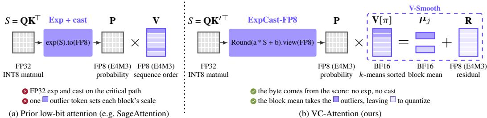  
Figure 2: VC-Attention changes two steps of low-bit attention and leaves the rest unchanged. Both panels turn the FP32 scores $S = \mathbf { Q } \breve { \mathbf { K } } ^ { \top }$ , row maximum subtracted, into an E4M3 probability tile and multiply it by a block of values. Dark rows are outlier tokens; pale rows are their blockmates. Left (standard). An FP32 exponential precedes the cast, and values are quantized in token order, so one outlier sets its whole block’s scale. Right (ours). ExpCast-FP8 writes the FP8 byte directly from S: the multiply-add a $S + b ( a = 8 \log _ { 2 } { \mathfrak { c } }$ e, $b = 1 2 0 + \beta )$ folds the E4M3 exponent scale, its bias, and the row-maximum scaling of Equation (7) into one FMA; Round is round-to-nearest-even and view reinterprets that byte as E4M3 rather than converting it $( \beta = - 0$ .35 centres the log error, Section 3.3). V-Smooth sorts tokens by k-means label so the outliers share a block whose 16-bit mean carries their magnitude; only the pale remainder is quantized.

## 2 Related Work

Efficient video generation. The cost of video DiTs has been attacked from several directions. Few-step distillation shortens the sampling trajectory (Wang et al., 2023; Li et al., 2024a; Yin et al., 2025; Ding et al., 2025), feature caching reuses activations across adjacent steps (Ma et al., 2024; Liu et al., 2025), and distributed engines partition the sequence or the transformer blocks across GPUs (Li et al., 2024b; Fang et al., 2024). Compact autoencoders shorten the latent sequence itself (Chen et al., 2025b;c; HaCohen et al., 2024). Closest to attention, sparse attention exploits the spatiotemporal locality of video to skip most token interactions, with static (LI et al., 2025; Zhang et al., 2025g), predicted (Xi et al., 2025; Yang et al., 2025; Zhang et al., 2025d), or trained (Zhang et al., 2025f) patterns, and linear attention replaces the softmax kernel (Chen et al., 2025a; Wang et al., 2025). Sparse VideoGen 2 (Yang et al., 2025) clusters and permutes tokens as V-Smooth does, but to make an attention block skippable rather than to give a quantization block a mean worth subtracting. VC-Attention reduces the cost of each interaction and leaves the attention pattern and the sampling schedule unchanged, so it composes with all of these directions.

Low-bit quantization. Post-training quantization of diffusion models has concentrated on the linear layers, from timestep-aware calibration of U-Nets (Shang et al., 2023; Li et al., 2023; Wang et al., 2024) to DiTs and video DiTs (Wu et al., 2024; Zhao et al., 2025; Tian et al., 2024). Outliers are the central obstacle: SmoothQuant and AWQ (Xiao et al., 2023; Lin et al., 2024) rescale channels between activations and weights, QuaRot (Ashkboos et al., 2024) rotates them across channels, and SVDQuant (Li et al., 2025) absorbs them into a low-rank branch. DeltaQuant quantizes each token as a cube mean plus a low-bit delta, and Quant VideoGen quantizes the KV cache of autoregressive video models by grouping and subtracting the mean iteratively, both exploiting the spatiotemporal similarity of activations (Li et al., 2026; Xi et al., 2026). None of these reaches the operands of the attention product: SmoothQuant, QuaRot, and SVDQuant need a static weight to take the outliers, DeltaQuant fixes its partition to the spatiotemporal grid, and Quant VideoGen reconstructs its cache before attention runs. Quantized attention instead feeds both operands of QK and PV to the Tensor Core in low precision inside the tiled FlashAttention kernel (Dao et al., 2022; Dao, 2024; Shah et al., 2024). INT-FlashAttention and SageAttention quantize QK to INT8 (Chen et al., 2024; Zhang et al., 2025c), the latter after subtracting the key channel mean, SageAttention2 (Zhang et al., 2025a;e) moves QK to INT4 and PV to FP8 with an optional global mean subtraction on V, and SageAttention3 (Zhang et al., 2025b) quantizes both products to NVFP4. FlashAttention-3 adds block quantization and a Hadamard rotation of the query and key to its FP8 path (Shah et al., 2024). All of them reduce the probability error and leave the value quantizer on the sequence-order layout, and Attn-QAT recovers the remaining loss by retraining (Zhang et al., 2026). On the kernel side, FlashAttention-4 and Attn-QAT report that the exponential and conversion work of softmax, not the matrix multiplications, bounds attention throughput on B200 (Zadouri et al., 2026; Zhang et al., 2026). VC-Attention addresses both open parts: the value error of video DiTs and the scalar probability path on datacenter GPUs, without retraining and without a per-model fit.

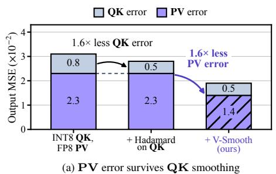

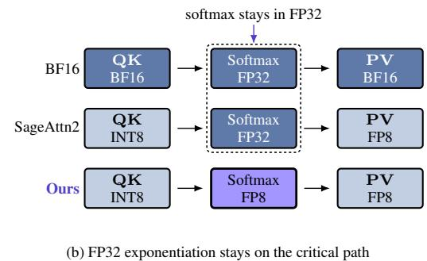  
Figure 3: Video diffusion leaves two bottlenecks that QK-centric low-bit attention does not touch. (a) Output error on Wan2.2. A Hadamard rotation of QK shrinks the probability term by 1.6×, but leaves the larger value term exactly where it was: the value quantizer, not the QK quantizer, is what bounds fidelity. (b) Even once both matrix products are low-bit, softmax’s FP32 exponentiation and its cast still sit on the critical path between them.

## 3 VC-Attention

V-Smooth reorders the value tokens so that each hardware block holds tokens with similar values, quantizes the residual after subtracting the block mean, and restores the mean inside the online recurrence (Figure 4). ExpCast-FP8 encodes the E4M3 probability code directly from the logdomain score, removing the FP32 exponential and the FP32-to-FP8 cast from the softmax stage on datacenter GPUs (Figure 5).

## 3.1 Preliminaries and Motivation

Online softmax. For N spatiotemporal tokens and head dimension $d ,$ attention computes ${ \textbf { S } } =$ $\mathbf { Q } \mathbf { K } ^ { \top } / \sqrt { d } , \mathbf { P } = \mathrm { s o f t m a x } ( \mathbf { S } )$ , and $\mathbf { O } = \mathbf { P } \mathbf { V }$ . A low-bit implementation replaces each operand by $\mathbf { X } _ { q } = s _ { X } \odot { \widehat { \mathbf { X } } } .$ , with $s _ { X }$ broadcast at the chosen quantization granularity. FlashAttention streams query tiles against key/value tiles without materializing the $N \times N$ matrices (Dao et al., 2022), keeping a running row maximum $m _ { i }$ , normalizer $l _ { i } ,$ , and numerator $\mathbf { A } _ { i }$ :

$$
\begin{array} { r l r l } & { m _ { i } ^ { \prime } = \operatorname* { m a x } ( m _ { i } , \mathrm { r o w m a x } ( { \mathbf { S } } _ { i j } ) ) , \quad } & { \alpha _ { i } = \exp ( m _ { i } - m _ { i } ^ { \prime } ) , \quad } & { \widetilde { \mathbf { P } } _ { i j } = \exp ( { \mathbf { S } } _ { i j } - m _ { i } ^ { \prime } ) , } \\ & { { \mathbf { A } } _ { i } \gets \alpha _ { i } { \mathbf { A } } _ { i } + \widetilde { \mathbf { P } } _ { i j } \mathbf { V } _ { j } , \quad } & { l _ { i } \gets \alpha _ { i } l _ { i } + \widetilde { \mathbf { P } } _ { i j } { \mathbf { 1 } } , \quad } & { \mathbf { O } _ { i } = { \mathbf { A } } _ { i } / l _ { i } . } \end{array}\tag{1}
$$

The value quantization bottleneck. Let $\mathbf { P } _ { q } = s _ { P } \odot \widehat { \mathbf { P } }$ and $\mathbf { V } _ { q } = s _ { V } \odot \widehat { \mathbf { V } }$ be the reconstructed low-bit operands, and let $\mathbf { O } _ { q } = \mathbf { P } _ { q } \mathbf { V } _ { q }$ . Then

$$
\mathbf { O } - \mathbf { O } _ { q } = ( \mathbf { P } - \mathbf { P } _ { q } ) \mathbf { V } + \mathbf { P } _ { q } ( \mathbf { V } - \mathbf { V } _ { q } ) .\tag{2}
$$

Key smoothing and per-block scaling (Zhang et al., 2025c), together with Hadamard rotation (Shah et al., 2024), reduce the first term. On Wan2.2 the second term then accounts for 82% of the output error (Figure 3(a)). Given that the value error grows with the norm of the block and with the outlier that sets the scale (Li et al., 2025), we aim to reduce the norm of the value tensor and eliminate the outliers within it.

In query and key tensors, outliers concentrate in a few channels shared by all tokens, which can be removed by applying rotation or subtracting a channel mean (Shah et al., 2024; Hooper et al., 2024; Zhang et al., 2025b). Value outliers instead sit in a few tokens, and the channels those tokens spike in shift across heads, layers, and steps. Such a token sets the scale of its whole block. A rotation mixes channels within a token but preserves its norm, so the outlier token survives (Table 1). Subtracting a block mean, where blocks are formed by partitioning tokens in their original order, removes only a few outliers. Mean subtraction helps only when the tokens within a block share a common component, and whether this holds depends heavily on the value tensor, which varies substantially across inputs (Table 1). We therefore group similar tokens in the value tensor with an online algorithm, so that every block shares a component worth subtracting (Section 3.2).

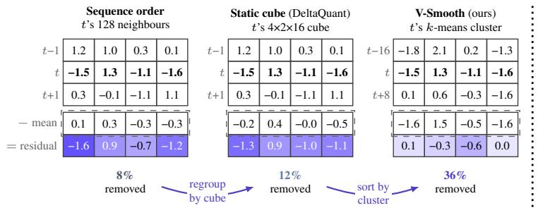

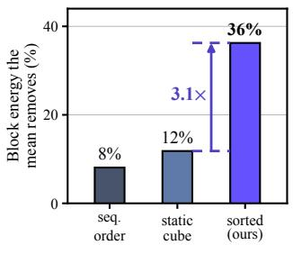  
Figure 4: Sorting is what makes the block mean worth subtracting. Left: one token t of a Wan2.2 head and its two blockmates under three token orders. The three value rows are identical, only t’s company changes, and under them sit the block mean and t’s residual. Over all 128 channels the mean removes 8%, 12% and 36% of the block energy, and this head’s E4M3 value error falls 1.5×. Right: the same share averaged over all 59.1K blocks of 100 heads. t is picked so that each of its three blocks removes the mean share for its own order, which is why the two panels print the same numbers. The static cube is DeltaQuant’s (Li et al., 2026).

The softmax bottleneck. The QK and PV products run on Tensor Cores, whereas the online softmax between them, the row maximum, the exponential, and the FP32-to-E4M3 cast of every probability, runs on CUDA cores and the multi-function unit (MUFU). FlashAttention overlaps the two stages across tiles, so the time per tile is the longer of the two (Shah et al., 2024). For 8-bit attention at head dimension 128, the exponentials alone take as many MUFU cycles on H200 as the two FP8 products take on its Tensor Cores. On B200 they take twice as many, since its Tensor Cores are twice as fast while its MUFU still issues 16 exponentials per SM per clock (Shah et al., 2024; Zadouri et al., 2026). The Tensor Cores therefore wait for probability tiles (Figure 3(b)).

## 3.2 V-Smooth: Value-Guided Token Smoothing

Value-guided permutation. For each batch and head, an online k-means over the value tokens assigns a label $z _ { t }$ to every token. Sorting the labels yields a permutation $\pi =$ argsort(z), applied to K and V while $\mathbf { Q }$ keeps its order:

$$
\mathbf { K } ^ { \prime } = \mathbf { K } [ \boldsymbol \pi ] , \quad \mathbf { V } ^ { \prime } = \mathbf { V } [ \boldsymbol \pi ] , \quad \mathbf { P } ^ { \prime } = \mathrm { s o f t m a x } \Big ( \mathbf { Q } \mathbf { K } ^ { \prime ^ { \top } } / \sqrt { d } \Big )
$$

<table><tr><td>Token order</td><td>rMSE↓ (×10−4)</td><td>Overhead (% attn)</td></tr><tr><td>Sequence</td><td>1.81</td><td>0</td></tr><tr><td>Hadamard on V</td><td>1.81</td><td>1.5</td></tr><tr><td>Static cube (DeltaQuant)</td><td>1.74</td><td>2.7</td></tr><tr><td>k-means</td><td>1.28</td><td>16.5</td></tr><tr><td>k-means, warm-started</td><td>1.28</td><td>9.5</td></tr><tr><td>Balanced k-means</td><td>1.17</td><td>84.5</td></tr></table>

(3)

Permuting the keys permutes the columns of P exactly as the rows of V, so $\mathbf { P } ^ { \prime } \mathbf { \check { V } } ^ { \prime } = \mathbf { P } \mathbf { V }$ and the output of the non-causal self-attention of video DiTs is unchanged.

Block demeaning. The permuted values are partitioned into the fixed hardware blocks of $B _ { v } = 1 2 8$ rows. V-Smooth subtracts one mean per block and quantizes only the residual:

Table 1: Only grouping decided from the values lowers the value error. Token order fed to the value quantizer, Wan2.2 on RTX PRO 6000, 100 heads, every row with block demeaning and per-channel FP8 V. Overhead is reorder and gather time over the attention time of one call, on a step that groups.

$$
\begin{array} { r } { { \pmb { \mu } } _ { j } = \frac { 1 } { B _ { v } } { \bf V } _ { j } ^ { \prime } { } ^ { \top } { \bf 1 } , \qquad { \bf R } _ { j } = { \bf V } _ { j } ^ { \prime } - { \bf 1 } { \pmb { \mu } } _ { j } ^ { \top } , } \end{array}\tag{4}
$$

and the residual goes through the value quantizer of the host kernel, per-channel E4M3 at 8 bits and NVFP4 at 4 bits. We write the result $\mathbf { R } _ { q , j }$ , with the subscript q as in Equation (2). We call the squared Frobenius norm of a block its energy. Among all vectors one could subtract, the mean leaves the least of it:

$$
\| \mathbf { V } _ { j } ^ { \prime } - \mathbf { 1 } c ^ { \top } \| _ { F } ^ { 2 } = \| \mathbf { R } _ { j } \| _ { F } ^ { 2 } + B _ { v } \| c - \mu _ { j } \| _ { 2 } ^ { 2 } , \qquad \| \mathbf { R } _ { j } \| _ { F } ^ { 2 } = \| \mathbf { V } _ { j } ^ { \prime } \| _ { F } ^ { 2 } - B _ { v } \| \mu _ { j } \| _ { 2 } ^ { 2 } ,\tag{5}
$$

so the share the mean removes is $B _ { v } \| \pmb { \mu } _ { j } \| _ { 2 } ^ { 2 } / \| \mathbf { V } _ { j } ^ { \prime } \| _ { F } ^ { 2 }$ , large only when the rows of the block share a common component. Averaged over the blocks of 100 Wan2.2 heads, that share is 8% in sequence order, 12% under the fixed cube of DeltaQuant, and 36% after sorting (Figure 4). The same table prices the two alternatives of Section 3.1 on the value error itself: a Hadamard rotation of V changes it by 0.2%, and the fixed cube recovers 3.7% (Table 1). Each mean is one 16-bit vector per block, 0.125 bit per value element.

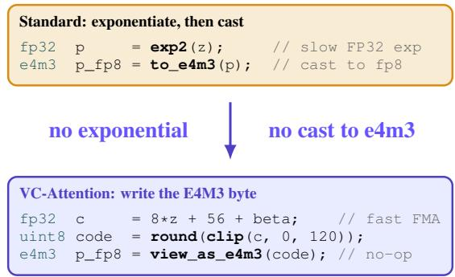  
(a) A linear map replaces exp and cast

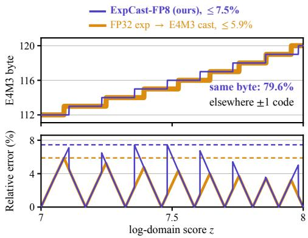  
(b) The approximation error is small  
Figure 5: VC-Attention writes the byte the conventional path writes. (a) Both paths take the same logdomain score z. The standard path evaluates an FP32 exponential and casts the result to E4M3; VC-Attention replaces both steps with one fused multiply-add, because an E4M3 byte is an affine function of the log of the value it stores. Reading the result as E4M3 costs no instruction: those bits already are the byte the PV matrix multiply consumes. (b) The byte each path writes, and the relative error of the probability it decodes to. The two write the same byte on 79.6% of the interval and are one code apart on the rest. Every unit interval of z looks the same, so one is enough.

Unbalanced clusters cost little. Sorting places each cluster in one contiguous run, so at most $k - 1$ of the $T / B _ { \ell }$ blocks mix clusters and only those remove less energy. Balancing every cluster to exactly $B _ { v }$ tokens closes that gap by a further 8.5% of error, at 2.8× the grouping cost and 85% of the attention time at the deployed shape (Table 1). Plain k-means is therefore the operating point, and warm-starting each step from the previous step’s centroids halves its cost for an error change inside the clustering’s own run-to-run spread. The schedule of Section 3.4 reuses the permutation across the window and restricts grouping to the early denoising steps.

Online mean restoration. Substituting $\mathbf { V } _ { j } ^ { \prime } = \mathbf { R } _ { j } + \mathbf { 1 } \mu _ { j } ^ { \top }$ into the numerator update of Equation (1) splits the value product into a low-bit part and a rank-one part:

$$
\mathbf { A } _ { i }  \alpha _ { i } \mathbf { A } _ { i } + \widetilde { \mathbf { P } } _ { q , i j } \mathbf { R } _ { q , j } + \mathbf { r } _ { i j } \pmb { \mu } _ { j } ^ { \top } , \qquad l _ { i }  \alpha _ { i } l _ { i } + \mathbf { r } _ { i j } , \qquad \mathbf { r } _ { i j } = \widetilde { \mathbf { P } } _ { i j } \mathbf { 1 } ,\tag{6}
$$

where $\widetilde { \mathbf { P } } _ { i j } = \exp ( \mathbf { S } _ { i j } - m _ { i } ^ { \prime } )$ is the unnormalized probability tile on the permuted keys and $\mathbf { r } _ { i j }$ is its row sum, which the normalizer $l _ { i }$ already accumulates. The Tensor Core multiplies the low-bit probability tile by the low-bit residual as before, and the mean adds one outer product $\mathbf { r } _ { i j } \pmb { \mu } _ { j } ^ { \top }$ on CUDA cores. It lives in the same accumulator as the product, so the rescaling by $\alpha _ { i }$ when a later tile raises the running maximum covers it, and the mean is restored exactly with no second pass over V and no extra buffer.

## 3.3 ExpCast-FP8: Direct Probability Encoding

On B200 and H200 the softmax stage takes longer than the FP8 matrix stage (Section 3.1). ExpCast-FP8 shortens it by writing the E4M3 probability code directly, without evaluating an exponential.

The idea is that an E4M3 byte is already a logarithmic representation of the number it stores. A byte with exponent field e and mantissa field m encodes the value $v = 2 ^ { e - 7 } ( 1 + m / 8 )$ . By that definition alone, the exponent field is the integer part of $\log _ { 2 }$ v shifted by the bias, $e = \left\lfloor \log _ { 2 } v \right\rfloor + 7$ , and the mantissa field approximates its fractional part, m ≈ $8 \operatorname { f r a c } ( \log _ { 2 } v )$ . Read as the integer $8 e + m$ , the byte therefore equals 8 lo $\mathbf { g } _ { 2 } v + 5 6 + \varepsilon ( m )$ , where $\varepsilon ( m ) = \bar { m } - 8 \log _ { 2 } ( 1 + m / 8 )$ is the error of replacing log $_ 2 ( 1 + m / 8 )$ by $m / 8$ and never exceeds one code in magnitude (Figure 8). The byte is thus an affine function of the log of the value, so producing it from a log-domain number costs one multiply-add.

Online softmax already keeps the log-domain score $u = \left( s - m _ { i } ^ { \prime } \right) \log _ { 2 } e \leq 0$ of every element, and we scale $2 ^ { u }$ by $2 ^ { 8 }$ so that the row maximum lands at 256. Substituting $\log _ { 2 } { v } = u + 8$ gives the code

$$
c ( u ) = \mathrm { c l i p } _ { [ 0 , 1 2 0 ] } \left( \mathrm { R o u n d } \big ( 8 ( u + 8 ) + 5 6 + \beta \big ) \right) , \qquad \beta = - 0 . 3 5 ,\tag{7}
$$

with Round round-to-nearest-even and $5 6 = 8 \times 7$ the E4M3 exponent bias. Since $\varepsilon ( m )$ is not known before the byte is written, we replace it by the constant $\beta$ that centers it, whose minimax value is −0.3443 (Figure 8). No constant here is fitted: 8 and 56 are read off the encoding, and $\beta$ is the minimax centering of the one term the encoding leaves behind (Mitchell, 1962; Schraudolph, 1999). The clip keeps the code in the normal range and maps underflow to zero. One fused multiplyadd and one integer conversion replace the FP32 exponential and the FP32-to-E4M3 cast.

The direct code matches the exponentiate-then-cast result. For $u ~ = ~ - 1 . 6 0$ , Equation (7) gives 106.85, which rounds to the byte $1 0 7 = 8 \cdot 1 3 + 3 ,$ i.e. the value 88. Exponentiating and casting gives $2 ^ { u + 8 } = 8 4 . 4$ , which lies in the binade [64, 128) where the E4M3 step is 8 and so also rounds to 88. Over a whole doubling the two paths write the same byte on 79.6% of it and differ by one code on the rest (Figure 5, top).

Per element the error is at most one code, a relative error of up to 7.5% (Figure 5, bottom). But attention consumes the normalized row, and the error is a function of the mantissa bits alone, not of the magnitude of the entry, so it acts almost as a common factor and mostly cancels in the normalizer. Proposition 3.1 bounds what survives.

Proposition 3.1 (Attention-row guarantee). For a row whose entries remain in the normal E4M3 range $( u _ { k } \ge - 1 4 ) ,$ , let p and $\widehat { \mathbf p }$ be the exact and ExpCast-FP8 probability vectors. For $\mathbf { o } = \mathbf { p } ^ { \intercal } \mathbf { V } ^ { \prime }$ and $\widehat { \mathbf { o } } = \widehat { \mathbf { p } } ^ { \intercal } \mathbf { V } ^ { \prime }$ , we have

$$
\mathrm { T V } ( \mathbf { p } , \widehat { \mathbf { p } } ) < \mathbf { 3 . 6 4 } \% , \qquad \| \widehat { \mathbf { o } } - \mathbf { o } \| _ { 2 } \leq \mathbf { 3 . 6 4 } \% \mathrm { d i a m _ { 2 } } ( \mathbf { V } ^ { \prime } ) .\tag{8}
$$

The bound is stated on the permuted values, but diam is a maximum over the set of rows and a permutation does not change that set, so $\dim _ { 2 } ( \mathbf { V } ^ { \prime } ) = \dim _ { 2 } ( \mathbf { V } )$ and V-Smooth neither tightens nor loosens it. If the underflow tail has normalized mass τ, the right-hand side becomes $0 . 0 3 6 4 + \tau$ On 204.8K attention rows from 100 Wan2.2 heads the total variation averages 1.6% and every row stays within $0 . 0 3 6 4 + \tau$ , the largest being 17.8%. Rows without underflow stay below 1.4%. The FP32 exponential followed by an E4M3 cast averages 1.1% on the same rows.

## 3.4 Fused Kernel and Amortized Grouping

Fused preprocessing. Ahead of each attention call, the low-bit operands are produced by a chain of memory-bound passes: rotary embedding, the key channel mean and the value block means, the gather by π, the QK Hadamard rotation, and the quantizers themselves. Run eagerly, every pass writes a full high-precision tensor back to HBM for the next one to read. VC-Attention grows the fusion backwards from the quantizer until the entire chain is absorbed, so the permuted and rotated high-precision tensors never reach HBM. The fused passes and the grouping kernel are hand-written in CuTe/CUDA rather than compiler-generated. Figure 7 prices each stage against the unfused chain, and Appendix B lists what each operand’s kernel absorbs and how the block means are scaled.

Amortized grouping schedule. Grouping costs more than the stage it joins. On a step that groups, it adds 30% to the attention time of that step, and two reuses spread the cost over the schedule. For every model, grouping and demeaning run on the first 25% of the denoising steps, and the remaining steps run the plain low-bit kernel on the permutation the window left behind. Within this window, attention layouts change little between adjacent denoising steps (LI et al., 2025; Xi et al., 2025), so the permutation is computed once and reused before it is refreshed. Averaged over every denoising step, grouping then costs 3–4% of attention time (Figure 6). ExpCast-FP8 is independent of the schedule and stays enabled in every 8-bit datacenter call.

## 4 Experiments

## 4.1 Setup

Models. We evaluate VC-Attention on four open-weight video DiTs: Wan2.2-T2V-A14B (Wan Team et al., 2025) at 720p, LongCat-Video (Meituan LongCat Team et al., 2025) at 480p, HunyuanVideo-1.5 (Wu et al., 2025) at 720p, and MiniMax-H3 (MiniMax Research, 2026) at 1344×768 with the third-party 8-step acceleration LoRA of Alibaba PAI (2026). For each model we generate 100 videos from MovieGen Bench prompts (Polyak et al., 2024), sharing prompts and seeds across all methods.

Table 2: Fidelity of low-bit attention, grouped by the GPU class each configuration is deployed on. Measured against the BF16 FlashAttention-4 output of the same model and seed. S.C. is subject consistency and I.Q. is imaging quality, both near-saturated on these models. Bold is the best and underline the second best of a column within one GPU class. † runs training-free.
<table><tr><td></td><td></td><td colspan="5">Wan2.2-T2V-A14B, 720p</td><td colspan="5">LongCat-Video, 480p</td></tr><tr><td>Method</td><td>QK/PV PSNR↑</td><td></td><td></td><td>SSIM↑ LPIPS↓</td><td>S.C.↑</td><td>I.Q.↑</td><td>PSNR↑</td><td>SSIM↑ LPIPS↓</td><td></td><td>S.C.↑</td><td>I.Q. ↑</td></tr><tr><td>FlashAttention-4</td><td>BF16</td><td></td><td></td><td></td><td>0.932</td><td>0.703</td><td></td><td></td><td></td><td>0.941</td><td>0.694</td></tr><tr><td colspan="10">Datacenter GPUs: NVIDIA B200, 8-bit</td><td></td><td></td></tr><tr><td>SageAttention2</td><td>8/8</td><td>20.3</td><td>0.730</td><td>0.206</td><td>0.931</td><td>0.703</td><td>23.1</td><td>0.793</td><td>0.122</td><td>0.941</td><td>0.697</td></tr><tr><td>FlashAttention-4 (8-bit)</td><td>8/8</td><td>18.8</td><td>0.686</td><td>0.248</td><td>0.929</td><td>0.704</td><td>21.3</td><td>0.753</td><td>0.154</td><td>0.940</td><td>0.697</td></tr><tr><td>+ QK Hadamard</td><td>8/8</td><td>18.8</td><td>0.685</td><td>0.253</td><td>0.929</td><td>0.706</td><td>21.6</td><td>0.762</td><td>0.148</td><td>0.940</td><td>0.695</td></tr><tr><td>Attn-QAT†</td><td>4/8</td><td>15.5</td><td>0.561</td><td>0.428</td><td>0.913</td><td>0.699</td><td>16.4</td><td>0.556</td><td>0.398</td><td>0.908</td><td>0.656</td></tr><tr><td>VC-Attention (V-Smooth) VC-Attention (V-Smooth + ExpCast)</td><td>8/8 8/8</td><td>22.6</td><td>0.792</td><td>0.152</td><td>0.931</td><td>0.704</td><td>24.5</td><td>0.822</td><td>0.102</td><td>0.941</td><td>0.696</td></tr><tr><td></td><td></td><td>20.5</td><td>0.744</td><td>0.191</td><td>0.932</td><td>0.705</td><td>23.8</td><td>0.807</td><td>0.109</td><td>0.941</td><td>0.696</td></tr><tr><td colspan="10">Workstation GPUs: NVIDIA RTX PRO 6000, 4-bit</td><td></td><td></td><td></td></tr><tr><td>SageAttention3</td><td>4/4</td><td>13.9</td><td>0.510</td><td>0.466</td><td>0.925</td><td>0.697</td><td>15.1</td><td>0.526</td><td>0.382</td><td>0.938</td><td>0.692</td></tr><tr><td>+ QK Hadamard</td><td>4/4</td><td>14.0</td><td>0.516</td><td>0.454</td><td>0.928</td><td>0.702</td><td>15.1</td><td>0.530</td><td>0.375</td><td>0.938</td><td>0.695</td></tr><tr><td>VC-Attention (V-Smooth)</td><td>4/4</td><td>16.8</td><td>0.614</td><td>0.318</td><td>0.931</td><td>0.707</td><td>18.7</td><td>0.663</td><td>0.226</td><td>0.939</td><td>0.695</td></tr><tr><td colspan="10"></td><td></td><td>MiniMax-H3 distilled, 1344×768</td></tr><tr><td>Method</td><td>QK/PV PSNR↑</td><td></td><td>SSIM↑</td><td>LPIPS↓</td><td>HunyuanVideo-1.5, 720p S.C.↑</td><td>I.Q.↑</td><td>PSNR↑</td><td>SSIM↑</td><td>LPIPS↓</td><td>S.C.↑</td><td>I.Q.↑</td></tr><tr><td>FlashAttention-4</td><td>BF16</td><td></td><td></td><td></td><td>0.933</td><td>0.680</td><td></td><td></td><td></td><td>0.899</td><td>0.668</td></tr><tr><td colspan="10">Datacenter GPUs: NVIDIA B200, 8-bit</td><td></td><td></td></tr><tr><td>SageAttention2</td><td>8/8</td><td>15.6</td><td>0.581</td><td>0.382</td><td>0.931</td><td>0.676</td><td>19.9</td><td>0.723</td><td>0.252</td><td>0.897</td><td>0.671</td></tr><tr><td>FlashAttention-4 (8-bit)</td><td>8/8</td><td>15.9</td><td>0.592</td><td>0.370</td><td>0.932</td><td>0.676</td><td>20.2</td><td>0.731</td><td>0.243</td><td>0.899</td><td>0.668</td></tr><tr><td>+ QK Hadamard</td><td>8/8</td><td>16.0</td><td>0.593</td><td>0.367</td><td>0.932</td><td>0.678</td><td>20.5</td><td>0.737</td><td>0.233</td><td>0.898</td><td>0.669</td></tr><tr><td>Attn-QAT†</td><td>4/8</td><td>12.2</td><td>0.459</td><td>0.562</td><td>0.911</td><td>0.662</td><td>15.0</td><td>0.581</td><td>0.467</td><td>0.896</td><td>0.643</td></tr><tr><td>VC-Attention (V-Smooth)</td><td>8/8</td><td>18.4</td><td>0.675</td><td>0.271</td><td>0.932</td><td>0.679</td><td>21.0</td><td>0.751</td><td>0.218</td><td>0.899</td><td>0.669</td></tr><tr><td>VC-Attention (V-Smooth + ExpCast)</td><td>8/8</td><td>17.5</td><td>0.648</td><td>0.301</td><td>0.931</td><td>0.677</td><td>20.2</td><td>0.726</td><td>0.248</td><td>0.897</td><td>0.669</td></tr><tr><td colspan="10">Workstation GPUs: NVIDIA RTX PRO 6000, 4-bit</td><td></td><td></td><td></td></tr><tr><td>SageAttention3</td><td>4/4</td><td>10.9</td><td>0.391</td><td>0.652</td><td>0.927</td><td>0.677</td><td>16.1</td><td>0.587</td><td>0.408</td><td>0.907</td><td>0.686</td></tr><tr><td>+ QK Hadamard</td><td>4/4</td><td>10.9</td><td>0.390</td><td>0.654</td><td>0.932</td><td>0.679</td><td>16.0</td><td>0.588</td><td>0.403</td><td>0.908</td><td>0.686</td></tr><tr><td>VC-Attention (V-Smooth)</td><td>4/4</td><td>13.8</td><td>0.486</td><td>0.481</td><td>0.934</td><td>0.679</td><td>16.6</td><td>0.605</td><td>0.380</td><td>0.909</td><td>0.686</td></tr></table>

Wan2.2-T2V-A14B, 1280×720×81f, 40 steps FlashAttn-4 SageAttn2 SageAttn3 Attn-QAT † Ours (V-Smooth) Ours (+ExpCast)  
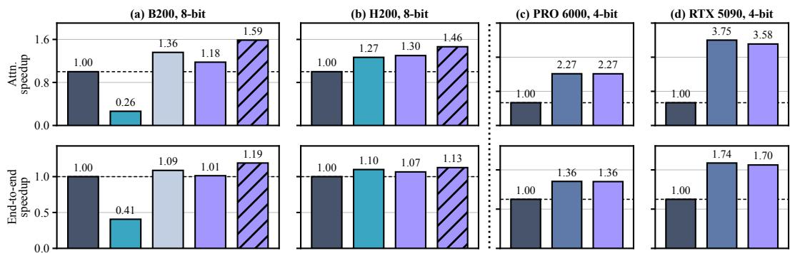  
Figure 6: VC-Attention converts low-bit peak throughput into speedup on every card we evaluate. Attention latency (top) and clip wall-clock time (bottom) on Wan2.2, normalized to BF16 FlashAttention-4 on the same card. The top row times the attention kernel alone in steady state, with all preprocessing outside the timer; the bottom row is the clip wall clock, which prices that preprocessing and everything else the model does. The dotted rule separates the datacenter cards from the workstation cards, and the second title line of each panel indicates the precision at which VC-Attention runs there. †Run training-free, Attn-QAT falls 3.4–6.7 dB of PSNR below SageAttention2 in Table 2.

Metrics. Following prior work on low-bit video generation (Li et al., 2026; Xi et al., 2026), we measure fidelity against the BF16 output of the same model. We report Peak Signal-to-Noise Ratio (PSNR), Structural Similarity Index Measure (SSIM) (Wang et al., 2004), and Learned Perceptual Image Patch Similarity (LPIPS) (Zhang et al., 2018). We also report two VBench dimensions (Huang et al., 2024), subject consistency and imaging quality, which separate drift across frames from loss of detail within one. Efficiency is reported as attention speedup, the time of one attention call, and as end-to-end speedup, the wall clock of generating one clip.

Baselines. Every fidelity number is scored against the BF16 FlashAttention-4 (Zadouri et al., 2026) output of the same model and seed, and every speedup is normalized to that kernel on the same card. At 8 bits we compare against SageAttention2 (Zhang et al., 2025a) in its released INT8/FP8 configuration, against an 8-bit FlashAttention-4 that rounds both operands to the nearest code per block and smooths neither, and against Attn-QAT (Zhang et al., 2026). Attn-QAT requires model-specific training, so for a fair comparison against a training-free method we run its training-free configuration. At 4 bits we compare against SageAttention3 (Zhang et al., 2025b). The 8-bit FlashAttention-4 and SageAttention3 baselines also run with a fused QK Hadamard transform (Dao, 2023), the strongest training-free treatment of the score product.

Implementation. We implement VC-Attention in CuTe/CUDA by modifying the FlashAttention-4/SageAttention kernel in place, so V-Smooth and ExpCast-FP8 are timed against the pipeline they change. We deploy 8 bits with both mechanisms on the datacenter GPUs, B200 and H200, and 4 bits with V-Smooth alone on workstation Blackwell, the RTX PRO 6000 and RTX 5090, where the softmax stage is not the bottleneck. We do not evaluate a 4-bit datacenter configuration, because an on-the-fly NVFP4 P puts its per-16-element scale computation on the softmax critical path and ExpCast-FP8 does not remove it (Appendix A). Frame counts, sampling configurations, metric definitions, and remaining details are in Appendix A.

## 4.2 Main Results

V-Smooth is the most faithful low-bit attention at both precisions. Table 2 reports fidelity across the four models. At 8 bits, V-Smooth leads every column on every model, improving PSNR over SageAttention2 by 2.3 dB on Wan2.2 and by 2.8 dB on HunyuanVideo-1.5 while reducing LPIPS by 13–29%. Fusing ExpCast-FP8 trades 0.7–2.1 dB of this PSNR for the speedup reported in Figure 6, and the combined kernel still outperforms SageAttention2 on all four models. At 4 bits, where ExpCast-FP8 does not apply, V-Smooth improves over SageAttention3 by 2.9 dB on Wan2.2 and by 3.6 dB on LongCat-Video, and reduces LPIPS by up to 41%. On the two VBench dimensions, all training-free methods remain within 0.01 of the BF16 model, so these metrics do not distinguish between them. Frame strips for one clip per model are provided in Appendix E.

The remaining error does not lie in QK. Fusing a QK Hadamard into SageAttention3 shifts PSNR by at most 0.1 dB on any model, and into 8-bit FlashAttention-4 by at most 0.3 dB. The score-product error that a rotation can remove has therefore already been eliminated. V-Smooth instead operates on the value operand, which adds 1.1–2.8 dB at 8 bits and 0.5–3.6 dB at 4 bits over the matched-precision baseline.

Attn-QAT depends on its training. Run training-free, Attn-QAT falls 3.4–6.7 dB of PSNR below SageAttention2 on every model, and it is the only method that perturbs the VBench scores. Its published 4-bit results are obtained with retraining. A deployment without model-specific data and GPU time therefore reproduces the row reported in Table 2. VC-Attention requires no such training.

## 4.3 Efficiency

Figure 6 reports the cost of both configurations on Wan2.2. On B200, VC-Attention computes attention 1.59× faster than BF16 FlashAttention-4 and 6.02× faster than SageAttention2, whose kernel we measure to be slower than the BF16 baseline on this card. On H200, the attention speedup is 1.46× over BF16 FlashAttention-4 and 1.16× over SageAttention2. End to end, a single Wan2.2 clip is generated 1.19× faster on B200 and 1.13× faster on H200. On workstation Blackwell at 4 bits, V-Smooth computes attention 2.27× faster on the RTX PRO 6000 and 3.58× faster on the RTX 5090, on par with SageAttention3 on the former and within 5% of it on the latter. The corresponding clip speedups are 1.36× and 1.70×. Since the two 4-bit kernels cost the same, they are separated only by the fidelity reported in Table 2.

The additional work introduced by V-Smooth accounts for 3–4% of attention time. The gather, the block mean and scale reductions, and the row-sum-times-mean term in the epilogue are amortized by the schedule of Section 3.4. The QK Hadamard is free in time and, per Table 2, nearly free in fidelity as well.

## 4.4 Ablation Study

Grouping on the first quarter of the steps is the op  
erating point. V-Smooth groups on the first 25% of   
the denoising steps. Table 3 compares that window   
against the same number of steps spread uniformly   
over the schedule, and against grouping on every step.   
The leading quarter gives up 0.5 dB of PSNR against   
grouping everywhere while beating it on SSIM and   
LPIPS, at a quarter of the work. The uniform quar  
ter does the same amount of work and differs only in   
placement, yet falls 2.6 dB behind: what matters is   
where the grouping sits, not how much of it there is.   
The window also saves 16 s of a clip (351.0 s against 367.0 s), and would save a larger share once sparse attention or quantized linear layers shorten the

<table><tr><td>Grouped steps</td><td>PSNR ↑</td><td>SSIM ↑</td><td>LPIPS↓</td><td>Latency (s) ↓</td></tr><tr><td>first 1/4</td><td>26.4</td><td>0.891</td><td>0.061</td><td>351.0</td></tr><tr><td>uniform 1/4</td><td>23.8</td><td>0.828</td><td>0.107</td><td>353.2</td></tr><tr><td>all steps</td><td>26.9</td><td>0.888</td><td>0.063</td><td>367.0</td></tr></table>

Table 3: Where the grouping steps sit matters more than how many there are. Every row runs V-Smooth with ExpCast-FP8 at 8 bits on every layer and differs only in which denoising steps it groups on. LongCat-Video, one H200. Latency is the wall clock of one clip. Fidelity is over a subset of 32 prompts.

rest of the forward pass.

Every stage of the preprocessing chain has to be fused into the quantizer. Figure 7 folds the chain of Section 3.4 into the quantization kernels one stage at a time. Fusing the quantizers with the Hadamard rotation gives 1.59× over the unfused chain, the two smoothing means and the permutation gather add 1.43×, and the rotary embedding 1.94×, after which the permuted and rotated tensors never reach HBM. Hand-written kernels for those five passes and for the grouping add 1.97×, for 8.74× end to end, leaving grouping at 29% of the 4.8 ms the whole chain then costs per attention call.

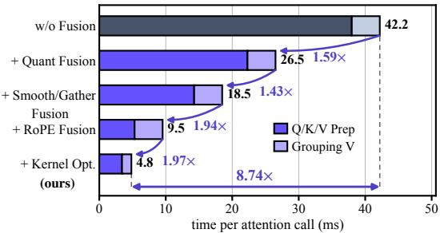  
Figure 7: What kernel fusion and optimization buy. One V-Smooth attention call on Wan2.2, one B200. Rungs are cumulative. A DiT forward makes 40 such calls: 1688 ms unfused, 193 ms fused.

## 4.5 Additional GPUs

Both mechanisms are kernel-level, so we also build them for the NVIDIA B300. The card has no INT8 QK matrix multiply, so the kernel keeps both QK and PV in FP8, and we compare it against a naive FP8 kernel at the same precision (Table 4). The attention call runs 1.47× faster than BF16 FlashAttention-4, against 1.31× for the naive kernel, and reaches

<table><tr><td>Kernel</td><td>PSNR↑</td><td>Attention speedup ↑</td></tr><tr><td>FlashAttention-4 (BF16)</td><td></td><td>1.00×</td></tr><tr><td>Naive FP8</td><td>17.1</td><td>1.31×</td></tr><tr><td>VC-Attention (V-Smooth + ExpCast)</td><td>18.4</td><td>1.47×</td></tr></table>

Table 4: VC-Attention on an NVIDIA B300. MiniMax-H3 with QK and PV both in FP8. PSNR is the mean over 100 prompts against the BF16 FlashAttention-4 output at the same seed. Speedup is the attention call alone, at the steadystate median.

18.4 dB against its 17.1 dB on MiniMax-H3. Quantizing the value operand and the softmax the way VC-Attention does is therefore both faster and more accurate than quantizing them naively at the same bit width.

## 5 Conclusion

We have presented VC-Attention, a training-free low-bit attention kernel for video diffusion. Lowbit attention already speeds up the QK and PV matrix multiplications, so on video DiTs the remaining cost sits in the two steps next to them: quantizing the value operand and computing the softmax. V-Smooth gathers similar value tokens into the same hardware block with an online kmeans, quantizes only what is left after subtracting the block mean, and restores that mean inside the online softmax recurrence for one outer product per tile. ExpCast-FP8 turns a log-domain score into an E4M3 probability code with a single fused multiply-add, replacing the exponential and the cast, and its error bound comes from the FP8 format itself, so it holds for every model without permodel tuning. On Wan2.2, LongCat-Video, HunyuanVideo-1.5, and MiniMax-H3, VC-Attention stays closer to full-precision attention than the training-free baselines at the same bit width, and runs attention faster than BF16 FlashAttention-4 by 1.59× on B200, 1.46× on H200, 2.27× on the RTX PRO 6000, and 3.58× on the RTX 5090.

## References

Alibaba PAI. MiniMax-H3-Acc-LoRAs: 8-step acceleration adapters for MiniMax-H3. https: //huggingface.co/alibaba-pai/MiniMax-H3-Acc-LoRAs, 2026. Hugging Face model card.

Saleh Ashkboos, Amirkeivan Mohtashami, Maximilian L. Croci, Bo Li, Martin Jaggi, Dan Alistarh, Torsten Hoefler, and James Hensman. Quarot: Outlier-free 4-bit inference in rotated llms. arXiv preprint arXiv:2404.00456, 2024.

Andreas Blattmann, Robin Rombach, Huan Ling, Tim Dockhorn, Seung Wook Kim, Sanja Fidler, and Karsten Kreis. Align your latents: High-resolution video synthesis with latent diffusion models. In IEEE/CVF Conference on Computer Vision and Pattern Recognition, 2023.

Tim Brooks, Bill Peebles, Connor Holmes, et al. Video generation models as world simulators. OpenAI Technical Report, 2024.

Junsong Chen, Yuyang Zhao, Jincheng Yu, Ruihang Chu, Junyu Chen, Shuai Yang, Xianbang Wang, Yicheng Pan, Daquan Zhou, Huan Ling, et al. Sana-video: Efficient video generation with block linear diffusion transformer. arXiv preprint arXiv:2509.24695, 2025a.

Junyu Chen, Han Cai, Junsong Chen, Enze Xie, Shang Yang, Haotian Tang, Muyang Li, Yao Lu, and Song Han. Deep compression autoencoder for efficient high-resolution diffusion models. In International Conference on Learning Representations, 2025b.

Junyu Chen, Wenkun He, Yuchao Gu, Yuyang Zhao, Jincheng Yu, Junsong Chen, Dongyun Zou, Yujun Lin, Zhekai Zhang, Muyang Li, et al. Dc-videogen: Efficient video generation with deep compression video autoencoder. arXiv preprint arXiv:2509.25182, 2025c.

Shimao Chen, Zirui Liu, Zhiying Wu, Ce Zheng, Peizhuang Cong, Zihan Jiang, Yuhan Wu, Lei Su, and Tong Yang. Int-flashattention: Enabling flash attention for int8 quantization. arXiv preprint arXiv:2409.16997, 2024.

Tri Dao. Fast hadamard transform in CUDA. https://github.com/Dao-AILab/ fast-hadamard-transform, 2023. GitHub repository.

Tri Dao. Flashattention-2: Faster attention with better parallelism and work partitioning. In International Conference on Learning Representations, 2024.

Tri Dao, Daniel Y. Fu, Stefano Ermon, Atri Rudra, and Christopher Re. Flashattention: Fast and´ memory-efficient exact attention with io-awareness. In Advances in Neural Information Processing Systems, 2022.

Zihan Ding, Chi Jin, Difan Liu, Haitian Zheng, Krishna Kumar Singh, Qiang Zhang, Yan Kang, Zhe Lin, and Yuchen Liu. Dollar: Few-step video generation via distillation and latent reward optimization. In International Conference on Computer Vision, 2025.

Jiarui Fang, Jinzhe Pan, Jiyuan Wang, Aoyu Li, and Xian Sun. Pipefusion: Patch-level pipeline parallelism for diffusion transformers inference. arXiv preprint arXiv:2405.14430, 2024.

Yu Gao, Haoyuan Guo, Tuyen Hoang, Weilin Huang, Lu Jiang, Fangyuan Kong, Huixia Li, Jiashi Li, Liang Li, Xiaojie Li, et al. Seedance 1.0: Exploring the boundaries of video generation models. arXiv preprint arXiv:2506.09113, 2025.

Yoav HaCohen, Nisan Chiprut, Benny Brazowski, Daniel Shalem, Dudu Moshe, Eitan Richardson, Eran Levin, Guy Shiran, Nir Zabari, Ori Gordon, et al. Ltx-video: Realtime video latent diffusion. arXiv preprint arXiv:2501.00103, 2024.

Jonathan Ho, Tim Salimans, Alexey Gritsenko, William Chan, Mohammad Norouzi, and David J. Fleet. Video diffusion models. In Advances in Neural Information Processing Systems, 2022.

Coleman Hooper, Sehoon Kim, Hiva Mohammadzadeh, Michael W. Mahoney, Yakun Sophia Shao, Kurt Keutzer, and Amir Gholami. KVQuant: Towards 10 million context length LLM inference with KV cache quantization. In Advances in Neural Information Processing Systems, 2024.

Xun Huang, Zhengqi Li, Guande He, Mingyuan Zhou, and Eli Shechtman. Self forcing: Bridging the train-test gap in autoregressive video diffusion. In Advances in Neural Information Processing Systems, 2025.

Ziqi Huang, Yinan He, Jiashuo Yu, Fan Zhang, Chenyang Si, Yuming Jiang, Yuanhan Zhang, Tianxing Wu, Qingyang Jin, Nattapol Chanpaisit, et al. Vbench: Comprehensive benchmark suite for video generative models. In Conference on Computer Vision and Pattern Recognition, 2024.

Jiachen Li, Weixi Feng, Tsu-Jui Fu, Xinyi Wang, Sugato Basu, Wenhu Chen, and William Yang Wang. T2v-turbo: Breaking the quality bottleneck of video consistency model with mixed reward feedback. In Advances in Neural Information Processing Systems, 2024a.

Muyang Li, Tianle Cai, Jiaxin Cao, Qinsheng Zhang, Han Cai, Junjie Bai, Yangqing Jia, Ming-Yu Liu, Kai Li, and Song Han. Distrifusion: Distributed parallel inference for high-resolution diffusion models. In Conference on Computer Vision and Pattern Recognition, 2024b.

Muyang Li, Yujun Lin, Zhekai Zhang, Tianle Cai, Xiuyu Li, Junxian Guo, Enze Xie, Chenlin Meng, Jun-Yan Zhu, and Song Han. Svdquant: Absorbing outliers by low-rank components for 4-bit diffusion models. In International Conference on Learning Representations, 2025.

XINGYANG LI, Muyang Li, Tianle Cai, Haocheng Xi, Shuo Yang, Yujun Lin, Lvmin Zhang, Songlin Yang, Jinbo Hu, Kelly Peng, et al. Radial attention: O(n log n) sparse attention with energy decay for long video generation. In Advances in Neural Information Processing Systems, 2025.

Xingyang Li, Samuel Tesfai, Zhekai Zhang, Haocheng Xi, Shuo Yang, Lvmin Zhang, Yufei Sun, Kelly Peng, Maneesh Agrawala, Ion Stoica, et al. Deltaquant: 4-bit video diffusion models with spatiotemporal delta smoothing. In Conference on Computer Vision and Pattern Recognition, 2026.

Xiuyu Li, Yijiang Liu, Long Lian, Huanrui Yang, Zhen Dong, Daniel Kang, Shanghang Zhang, and Kurt Keutzer. Q-diffusion: Quantizing diffusion models. In International Conference on Computer Vision, 2023.

Ji Lin, Jiaming Tang, Haotian Tang, Shang Yang, Wei-Ming Chen, Wei-Chen Wang, Guangxuan Xiao, Xingyu Dang, Chuang Gan, and Song Han. Awq: Activation-aware weight quantization for on-device llm compression and acceleration. In Proceedings of Machine Learning and Systems, 2024.

Feng Liu, Shiwei Zhang, Xiaofeng Wang, Yujie Wei, Haonan Qiu, Yuzhong Zhao, Yingya Zhang, Qixiang Ye, and Fang Wan. Timestep embedding tells: It’s time to cache for video diffusion model. In Conference on Computer Vision and Pattern Recognition, 2025.

Xinyin Ma, Gongfan Fang, and Xinchao Wang. Deepcache: Accelerating diffusion models for free. In Conference on Computer Vision and Pattern Recognition, 2024.

Meituan LongCat Team, Xunliang Cai, Qilong Huang, Zhuoliang Kang, Hongyu Li, Shijun Liang, Liya Ma, Siyu Ren, Xiaoming Wei, Rixu Xie, et al. Longcat-video technical report. arXiv preprint arXiv:2510.22200, 2025.

MiniMax Research. MiniMax H3: An open model breaking the boundaries between tasks and modalities. https://www.minimax.io/blog/minimax-h3, 2026. Open-weight release, July 31, 2026.

John N. Mitchell. Computer multiplication and division using binary logarithms. IRE Transactions on Electronic Computers, EC-11(4):512–517, 1962.

NVIDIA Corporation. NVIDIA H100 Tensor Core GPU Architecture. Technical report, NVIDIA Corporation, 2022.

NVIDIA Corporation. NVIDIA Blackwell Architecture Technical Brief. Technical report, NVIDIA Corporation, 2024.

NVIDIA Corporation. NVIDIA RTX Blackwell GPU Architecture. Technical report, NVIDIA Corporation, 2025.

William Peebles and Saining Xie. Scalable diffusion models with transformers. In International Conference on Computer Vision, 2023.

Adam Polyak, Amit Zohar, Andrew Brown, Andros Tjandra, Animesh Sinha, Ann Lee, Apoorv Vyas, Bowen Shi, Chih-Yao Ma, Ching-Yao Chuang, et al. Movie gen: A cast of media founda tion models. arXiv preprint arXiv:2410.13720, 2024.

Nicol N. Schraudolph. A fast, compact approximation of the exponential function. Neural Computation, 11(4):853–862, 1999.

Jay Shah, Ganesh Bikshandi, Ying Zhang, Vijay Thakkar, Pradeep Ramani, and Tri Dao. Flashattention-3: Fast and accurate attention with asynchrony and low-precision. In Advances in Neural Information Processing Systems, 2024.

Yuzhang Shang, Zhihang Yuan, Bin Xie, Bingzhe Wu, and Yan Yan. Post-training quantization on diffusion models. In Conference on Computer Vision and Pattern Recognition, 2023.

Neta Shaul, Chao Liu, Arash Vahdat, and Julius Berner. Parallel decoding distillation for fast image and video generation. arXiv preprint arXiv:2607.26004, 2026.

Shilong Tian, Hong Chen, Chengtao Lv, Yu Liu, Jinyang Guo, Xianglong Liu, Shengxi Li, Hao Yang, and Tao Xie. Qvd: Post-training quantization for video diffusion models. arXiv preprint arXiv:2407.11585, 2024.

Wan Team, Ang Wang, Baole Ai, Bin Wen, Chaojie Mao, Chen-Wei Xie, Di Chen, Feiwu Yu, Haiming Zhao, Jianxiao Yang, et al. Wan: Open and advanced large-scale video generative models. arXiv preprint arXiv:2503.20314, 2025.

Changyuan Wang, Ziwei Wang, Xiuwei Xu, Yansong Tang, Jie Zhou, and Jiwen Lu. Towards accurate post-training quantization for diffusion models. In Conference on Computer Vision and Pattern Recognition, 2024.

Hongjie Wang, Chih-Yao Ma, Yen-Cheng Liu, Ji Hou, Tao Xu, Jialiang Wang, Felix Juefei-Xu, Yaqiao Luo, Peizhao Zhang, Tingbo Hou, et al. Lingen: Towards high-resolution minute-length text-to-video generation with linear computational complexity. In Conference on Computer Vision and Pattern Recognition, 2025.

Xiang Wang, Shiwei Zhang, Han Zhang, Yu Liu, Yingya Zhang, Changxin Gao, and Nong Sang. Videolcm: Video latent consistency model. arXiv preprint arXiv:2312.09109, 2023.

Zhou Wang, Alan C. Bovik, Hamid R. Sheikh, and Eero P. Simoncelli. Image quality assessment: From error visibility to structural similarity. IEEE Transactions on Image Processing, 13(4): 600–612, 2004.

Bing Wu, Chang Zou, Changlin Li, Duojun Huang, Fang Yang, Hao Tan, Jack Peng, Jianbing Wu, Jiangfeng Xiong, Jie Jiang, et al. Hunyuanvideo 1.5 technical report. arXiv preprint arXiv:2511.18870, 2025.

Junyi Wu, Haoxuan Wang, Yuzhang Shang, Mubarak Shah, and Yan Yan. Ptq4dit: Post-training quantization for diffusion transformers. In Advances in Neural Information Processing Systems, 2024.

Haocheng Xi, Shuo Yang, Yilong Zhao, Chenfeng Xu, Muyang Li, Xiuyu Li, Yujun Lin, Han Cai, Jintao Zhang, Dacheng Li, et al. Sparse videogen: Accelerating video diffusion transformers with spatial-temporal sparsity. In International Conference on Machine Learning, 2025.

Haocheng Xi, Shuo Yang, Yilong Zhao, Muyang Li, Han Cai, Xingyang Li, Yujun Lin, Zhuoyang Zhang, Jintao Zhang, Xiuyu Li, et al. Quant videogen: Auto-regressive long video generation via 2-bit kv-cache quantization. arXiv preprint arXiv:2602.02958, 2026.

Guangxuan Xiao, Ji Lin, Mickael Seznec, Hao Wu, Julien Demouth, and Song Han. Smoothquant: Accurate and efficient post-training quantization for large language models. In International Conference on Machine Learning, 2023.

Shuo Yang, Haocheng Xi, Yilong Zhao, Muyang Li, Jintao Zhang, Han Cai, Yujun Lin, Xiuyu Li, Chenfeng Xu, Jianfei Chen, et al. Sparse videogen2: Accelerate video generation with sparse attention via semantic-aware permutation. arXiv preprint arXiv:2505.18875, 2025.

Tianwei Yin, Qiang Zhang, Richard Zhang, William T. Freeman, Fredo Durand, Eli Shechtman, and Xun Huang. From slow bidirectional to fast autoregressive video diffusion models. In Conference on Computer Vision and Pattern Recognition, 2025.

Ted Zadouri, Markus Hoehnerbach, Jay Shah, Timmy Liu, Vijay Thakkar, and Tri Dao. Flashattention-4: Algorithm and kernel pipelining co-design for asymmetric hardware scaling. arXiv preprint arXiv:2603.05451, 2026.

Jintao Zhang, Haofeng Huang, Pengle Zhang, Jia Wei, Jun Zhu, and Jianfei Chen. Sageattention2: Efficient attention with thorough outlier smoothing and per-thread int4 quantization. In International Conference on Machine Learning, 2025a.

Jintao Zhang, Jia Wei, Pengle Zhang, Xiaoming Xu, Haofeng Huang, Haoxu Wang, Kai Jiang, Jianfei Chen, and Jun Zhu. Sageattention3: Microscaling fp4 attention for inference and an exploration of 8-bit training. arXiv preprint arXiv:2505.11594, 2025b.

Jintao Zhang, Jia Wei, Pengle Zhang, Jun Zhu, and Jianfei Chen. Sageattention: Accurate 8-bit attention for plug-and-play inference acceleration. In International Conference on Learning Representations, 2025c.

Jintao Zhang, Chendong Xiang, Haofeng Huang, Jia Wei, Haocheng Xi, Jun Zhu, and Jianfei Chen. Spargeattn: Accurate sparse attention accelerating any model inference. In International Conference on Machine Learning, 2025d.

Jintao Zhang, Xiaoming Xu, Jia Wei, Haofeng Huang, Pengle Zhang, Chendong Xiang, Jun Zhu, and Jianfei Chen. Sageattention2++: A more efficient implementation of sageattention2. arXiv preprint arXiv:2505.21136, 2025e.

Peiyuan Zhang, Yongqi Chen, Haofeng Huang, Will Lin, Zhengzhong Liu, Ion Stoica, Eric Xing, and Hao Zhang. Vsa: Faster video diffusion with trainable sparse attention. In Advances in Neural Information Processing Systems, 2025f.

Peiyuan Zhang, Yongqi Chen, Runlong Su, Hangliang Ding, Ion Stoica, Zhengzhong Liu, and Hao Zhang. Fast video generation with sliding tile attention. In International Conference on Machine Learning, 2025g.

Peiyuan Zhang, Matthew Noto, Wenxuan Tan, Chengquan Jiang, Will Lin, Wei Zhou, and Hao Zhang. Attn-qat: 4-bit attention with quantization-aware training. arXiv preprint arXiv:2603.00040, 2026.

Richard Zhang, Phillip Isola, Alexei A. Efros, Eli Shechtman, and Oliver Wang. The unreasonable effectiveness of deep features as a perceptual metric. In Conference on Computer Vision and Pattern Recognition, 2018.

Tianchen Zhao, Tongcheng Fang, Haofeng Huang, Enshu Liu, Rui Wan, Widyadewi Soedarmadji, Shiyao Li, Zinan Lin, Guohao Dai, Shengen Yan, et al. Vidit-q: Efficient and accurate quantization of diffusion transformers for image and video generation. In International Conference on Learning Representations, 2025.

## A Evaluation Protocol Details

Generation settings. Wan2.2 generates 81 frames at 720p, LongCat-Video 93 frames at 480×832, HunyuanVideo-1.5 121 frames at 720p, and MiniMax-H3 243 frames at 1344×768 with synchronized audio. The four settings of Table 2 therefore run 75.6K, 37.4K, 111.7K, and 73.5K attention tokens, the last counting the video, audio, and text tokens MiniMax-H3 packs into one sequence. All methods within a setting share the same prompts and random seeds, following the prompt configuration released with Self-Forcing (Huang et al., 2025), as adopted by recent low-bit video generation work (Xi et al., 2026).

Sampling configuration. Wan2.2 uses 40 denoising steps, and LongCat-Video and HunyuanVideo-1.5 use 50. MiniMax-H3 runs with the 8-step Parallel Decoding Distillation LoRA released by Alibaba PAI (Shaul et al., 2026; Alibaba PAI, 2026), using the Euler solver and no classifier-free guidance.

Metrics. Peak Signal-to-Noise Ratio (PSNR), Structural Similarity Index Measure (SSIM), and Learned Perceptual Image Patch Similarity (LPIPS) are computed against the BF16 FlashAttention-4 output of the same model at the same seed. Attention speedup is the FlashAttention-4 attention time divided by that of the evaluated method. Both are timed as isolated kernel launches on the captured post-RoPE tensors of that setting rather than inside the generation loop, as CUPTI activity over a ten-second window after twenty seconds of warm-up, summarized by the per-launch median. Quantization, token grouping, and the rest of the preprocessing run outside that timer; the end-to-end number prices them. End-to-end speedup is the wall clock of generating one clip, CUDA-synchronized around the call, counting prompt processing, denoising, and VAE decode but not model loading. All latencies are measured on a single exclusive GPU with warm-up discarded, while accuracy runs use concurrency and are never timed.

Baseline kernels. FlashAttention-4 (Zadouri et al., 2026) builds and runs on every card we report, so it is the single BF16 reference for fidelity and the single basis for speedup, measured on the same card as the method it normalizes. SageAttention2 ships no Blackwell kernel, so its B200 numbers come from its kernel recompiled for sm 100a. For all baselines we use their official configurations where they exist.

Scope of ExpCast-FP8. The 4-bit kernel stores P as NVFP4, that is, E2M1 elements under a per-16 E4M3 microscale. No single affine log-domain-to-code map exists in that format, since the construction in Equation (7) relies on E4M3’s three mantissa bits and fixed exponent bias. ExpCast-FP8 is therefore enabled only in the 8-bit kernel, and only on B200 and H200, where the low-bit matrix multiplications outpace the scalar softmax pipeline.

Grouping schedule. For every model, value grouping and demeaning run on the first 25% of the denoising steps and on every layer of those steps. The window is a fraction of the schedule and not a set of layers, which is also what the kernel implements, as it is keyed on the step index alone. Within the window, attention layouts change little between adjacent denoising steps (Xi et al., 2025; LI et al., 2025), so the permutation is computed once and reused for 4 adjacent steps. A 40-step Wan2.2 run therefore recomputes it at steps 0, 4, and 8, and a 50-step LongCat-Video run at steps 0, 4, 8, and 12. The 8-step MiniMax-H3 setting takes the same rule rather than a fixed count, deriving its two-step window as ⌈n/4⌉ from the step count the pipeline publishes.

## B Fused Preprocessing, Operand by Operand

Section 3.4 fuses the preprocessing chain into the quantization kernels in three stages, and Figure 7 prices them in the same order. The first stage fuses the quantizers, the padding, and the QK Hadamard rotation. The second fuses the two smoothing means, the key channel mean and the per-block value mean, together with the gather by π. The third fuses the rotary embedding, after which no high-precision intermediate is written to HBM. The final rung of Figure 7 fuses nothing further and instead hand-writes the five resulting passes and the grouping kernel in CuTe/CUDA. Per operand, the fused kernels do the following. Q fuses RoPE, Hadamard rotation, and quantization.

K fuses the centering statistics, RoPE, the gather by π, Hadamard rotation, mean subtraction, and quantization. V fuses the gather, block demeaning, and quantization, and writes the block means alongside the residual codes. At 8 bits the means are stored divided by the per-channel value scale, so the kernel’s single epilogue multiply applies to both terms of Equation (6). At 4 bits the NVFP4 microscales are applied inside the matrix instruction, so the means are added unscaled.

## C Where the ExpCast-FP8 Constant Comes From

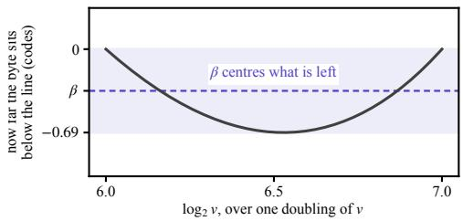  
Figure 8: Where $\beta$ comes from. The signed offset $\boldsymbol { \Xi } ( m )$ the byte carries from $8 \log _ { 2 } v + 5 6 ,$ , over one doubling. Up to that sign it is Mitchell’s straight-line error scaled to E4M3 codes, so the byte never sits above the line. Its magnitude never reaches one code, and halving the range $[ - 0 . 6 8 8 6 , 0 ]$ gives the minimax shift −0.3443, which Equation (7) rounds to $\beta = - 0 . 3 5$ . The band is the ±0.34-code envelope that shift centres.

## D Proof of Proposition 3.1

Proof. We give the calculation behind Equation (8). Let $w _ { k } = 2 ^ { u _ { k } }$ and $p _ { k } = w _ { k } / \sum _ { t } w _ { t }$ be one exact softmax row. Decoding the E4M3 code in Equation $( 7 )$ and removing its common $2 ^ { 8 }$ scale gives $\widehat { w } _ { k }$ . Write $z _ { k } = u _ { k } + 8 = n _ { k } + f _ { k }$ with $f _ { k } \in [ 0 , 1 )$ . For a normal entry, the exact mantissa coordinate is $8 ( 2 ^ { f _ { k } } - 1 )$ , while the direct map uses $8 f _ { k }$ . Their difference

$$
e ( f ) = 8 { \bigl [ } f - ( 2 ^ { f } - 1 ) { \bigr ] }\tag{9}
$$

has range [0, 0.6886], which is Mitchell’s straight-line approximation error of log scaled by the eight codes a doubling spans (Mitchell, 1962), and equals $- \varepsilon ( m )$ of Section $3 . 3$ . Its minimax constant shift is therefore $- 0 . 6 8 8 6 / 2 = - 0 . 3 4 4 3$ , for which we use the fixed $\beta = - 0 . 3 5$ . The resulting decoded-to-exact ratio is

$$
r ( f _ { k } ) = \frac { \widehat { w } _ { k } } { w _ { k } } = \frac { 1 + \mathrm { R o u n d } ( 8 f _ { k } - 0 . 3 5 ) / 8 } { 2 ^ { f _ { k } } } .\tag{10}
$$

The ratio is monotone between rounding cells. Evaluating both one-sided limits at the rounding boundaries $f = ( j + 1 / 2 + 0 . 3 5 ) / 8 .$ , including the carry cell $j = 8 ,$ , gives

$$
0 . 9 2 9 0 \leq r ( f ) \leq 1 . 0 7 4 6 .\tag{11}
$$

Proof of the row bound. Set $a = 0 . 9 2 9 0 , b = 1 . 0 7 4 6$ , and write $r _ { k } = \widehat { w } _ { k } / w _ { k } \in [ a , b ]$ . After normalization, $\widehat { p } _ { k } = p _ { k } r _ { k } / \mathbb { E } _ { \mathbf { p } } [ r ]$ . The maximum total variation over this interval is attained by an endpoint reweighting. If a fraction q of the p-mass receives b and the rest receives $^ { a , }$ then

$$
\mathrm { T V } ( \mathbf { p } , { \widehat { \mathbf { p } } } ) = { \frac { q ( 1 - q ) ( b - a ) } { a + q ( b - a ) } } .\tag{12}
$$

The maximizer is $q = \sqrt { a } / ( \sqrt { a } + \sqrt { b } )$ , yielding

$$
\mathrm { T V } ( \mathbf { p } , \widehat { \mathbf { p } } ) \leq \frac { \sqrt { b } - \sqrt { a } } { \sqrt { b } + \sqrt { a } } < 0 . 0 3 6 4 .\tag{13}
$$

As a direct corollary, $\| \mathbf { p } - \widehat { \mathbf { p } } \| _ { 1 } < 0 . 0 7 2 8$

For completeness, let $\mathcal { T } = \{ k : u _ { k } < - 1 4 \}$ and $\tau = \operatorname* { m a x } \{ p ( \mathcal { T } ) , \widehat { p } ( \mathcal { T } ) \}$ }. Conditioning both rows on $\mathcal { T } ^ { c }$ and applying the preceding argument gives

$$
\mathrm { T V } ( \mathbf { p } , \widehat { \mathbf { p } } ) < 0 . 0 3 6 4 + \tau .\tag{14}
$$

Finally, for $\mathbf { o } = \mathbf { p } ^ { \intercal } \mathbf { V } ^ { \prime }$ and $\widehat { \mathbf { o } } = \widehat { \mathbf { p } } ^ { \intercal } \mathbf { V } ^ { \prime }$ , the coupling form of total variation gives

$$
\| \widehat { \mathbf { o } } - \mathbf { o } \| _ { 2 } \leq ( 0 . 0 3 6 4 + \tau ) \dim _ { 2 } ( \mathbf { V } ^ { \prime } ) , \qquad \mathrm { d i a m } _ { 2 } ( \mathbf { V } ^ { \prime } ) = \operatorname* { m a x } _ { a , b } \| \mathbf { v } _ { a } ^ { \prime } - \mathbf { v } _ { b } ^ { \prime } \| _ { 2 } .\tag{15}
$$

This bound isolates the probability path. Residual-value quantization adds a separate error term.

## E Qualitative Results

Each strip below holds one clip rendered three times: FlashAttention-4 in BF16, SageAttention2, and VC-Attention, from the same prompt and the same seed. The five frames are cut at the same source indices in all three rows, so a difference down a column is the method and not the sampling. PSNR is that clip alone against its own FlashAttention-4 render, over every frame. The first four strips run on one B200 in the deployed 8-bit configuration against SageAttention2; the four that follow run on workstation Blackwell in the deployed 4-bit configuration against SageAttention3.

FlashAttention-4 (BF16)  
PSNR: reference  
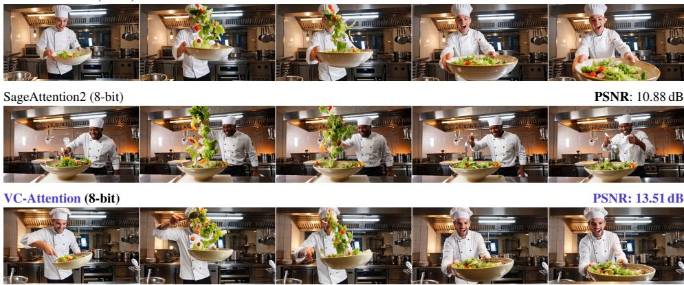  
A dynamic scene captured in the style of a vibrant food photography shoot, showcasing a chef expertly tossing a salad in a large ceramic bowl. The chef, with a lively expression andfocused intensity, moves with grace and precision, the salad spinning gracefully in the air before landing back in the bowl. . . . A mid-shotfrom a slightly elevated angle. Figure 9: 8-bit comparison on Wan2.2-T2V-A14B, one B200.

FlashAttention-4 (BF16)  
PSNR: reference  
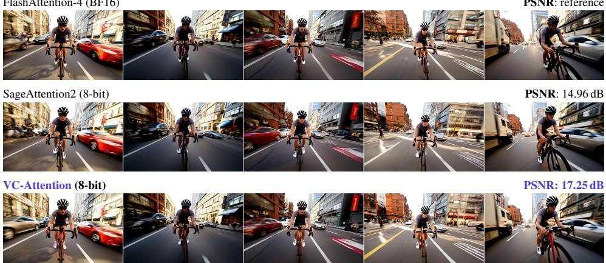  
A dynamic first-person view of a cyclist navigating through a bustling city street, weaving skillfully between traffic and pedes trians. The cyclist is a young adult, wearing a helmet and a casual cycling jersey, pedaling energetically with a determined expression. . . . A close-up shotfrom afirst-person perspective, emphasizing the cyclist’s motion.  
Figure 10: 8-bit comparison on LongCat-Video, one B200.

PSNR: 23.04 dB  
PSNR: 18.24 dB  
FlashAttention-4 (BF16)  
PSNR: reference  

VC-Attention (8-bit)  
  
A charming photograph in a soft, warm lighting style, capturing a toddler sitting on a cozy carpet, happily sharing a chocolate chip cookie with a cute teddy bear. The toddler has rosy cheeks, big bright eyes, and a gentle smile, reaching out to offer the cookie to the bear, which leans in to accept it. . . . A medium shot with a slight angle.

Figure 11: 8-bit comparison on HunyuanVideo-1.5, one B200.  
FlashAttention-4 (BF16)  
PSNR: reference  

SageAttention2 (8-bit)  

VC-Attention (8-bit)  
  
[Shot 1] Cinematic, an overhead extreme close-up pushing in on a dark, distressed wooden workbench illuminated by a single warm overhead spotlight. [Shot 2] A macro shot from a low angle tracks right, following a Japanese pull saw slicing through the walnut block. . . . [Shot 6] A medium shot zooms out as a domed glass cover clicks into the wooden groove, the brass gears turning behind the glass. (six shots in all.)

Figure 12: 8-bit comparison on MiniMax-H3, one B200.  
FlashAttention-4 (BF16)  
PSNR: reference  
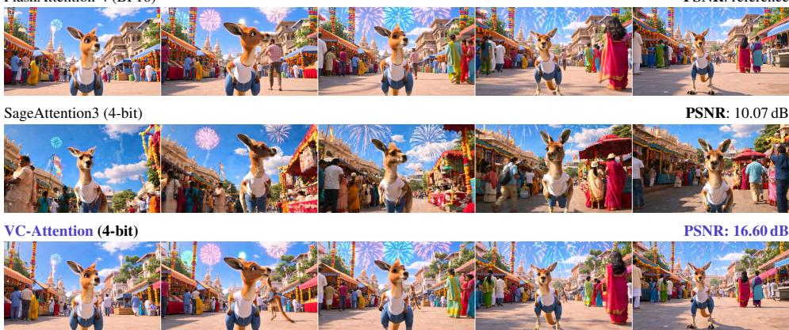  
An adorable kangaroo wearing blue jeans and a white t-shirt takes a pleasant stroll in Mumbai, India, during a vibrant and colorfulfestival. The kangaroo has soft, fluffyfur and afriendly expression, looking around curiously at the bustling crowd. . . . A medium shotfrom a slightly elevated angle, emphasizing the kangaroo’s natural movements.

Figure 13: 4-bit comparison on Wan2.2-T2V-A14B, one RTX 5090.

FlashAttention-4 (BF16)  
PSNR: reference  

SageAttention3 (4-bit)  
PSNR: 11.43 dB  

VC-Attention (4-bit)  
PSNR: 17.26 dB  
  
A vibrant illustration in the style ofa modern comic book depicting a toy robot wearing aflowing green dress and a cheerful sun hat taking a pleasant stroll through the bustling streets ofMumbai, India, during a beautiful sunset. . . . A medium shotfrom a slightly elevated angle, capturing the robot’s joyful movement

Figure 14: 4-bit comparison on LongCat-Video, one RTX PRO 6000.  
FlashAttention-4 (BF16)  
  
PSNR: reference

SageAttention3 (4-bit)  
PSNR: 10.69 dB  

VC-Attention (4-bit)  
PSNR: 15.59 dB  
  
A documentary-style nature photography shotfrom a camera truck moving to the left, capturing a crab quickly scurrying into its burrow. The crab has a hard, greenish-brown shell and long claws, moving with determined speed across the sandy ground. . . . A close-up shot from a slightly elevated angle.

Figure 15: 4-bit comparison on HunyuanVideo-1.5, one RTX 5090.  
FlashAttention-4 (BF16)  
  
PSNR: reference  
PSNR: 16.32 dB

SageAttention3 (4-bit)  

VC-Attention (4-bit)  
PSNR: 17.99 dB  
  
Figure 16: 4-bit comparison on MiniMax-H3, one RTX PRO 6000.