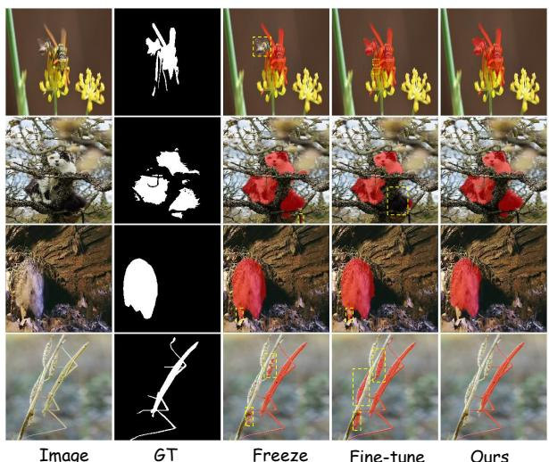
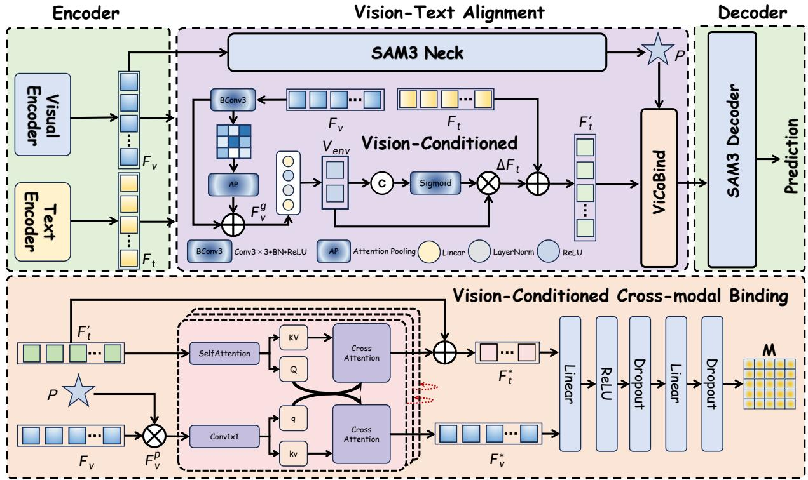
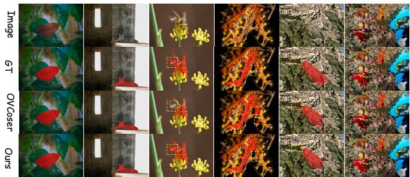
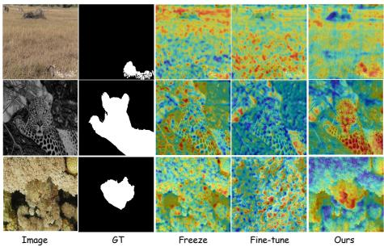

# ViCo-SAM3: VISION-CONDITIONED ALIGNMENT FOR OPEN-VOCABULARY CAMOUFLAGED OBJECT SEGMENTATION

Qiangqiang Zhou1, Wenjun Tang\*1, Yong Chen1, Dandan Zhu2, Jiawei Xu1\*

1School of Artificial Intelligence, Jiangxi Normal University 2Institute of AI Education, East China Normal University

## ABSTRACT

Open-vocabulary camouflaged object segmentation (OV-COS) aims to segment unseen camouflaged objects under text guidance. We observe that SAM3 still suffers from a pronounced semantic gap between global textual semantics and fine-grained pixel-level visual cues in OVCOS. Meanwhile, fully fine-tuning the text encoder introduces heavy parameter overhead and risks overfitting to training categories, which compromises open-vocabulary representation flexibility. To address these issues, we propose ViCo-SAM3, a Vision-Conditioned alignment framework designed for OV-COS. Specifically, we introduce vision-conditioned (ViCo) module, which dynamically modulates text embeddings with global visual context, enabling textual representations to adapt to the current image content and thereby effectively bridging the semantic gap between vision and text. Building on this, we further design a vision-conditioned cross-modal binding (ViCoBind) module to enhance cross-modal interaction and semantic alignment between visual and textual representations. Without bells and whistles, ViCo-SAM3 achieves state-of-the-art performance on the OVCamo benchmark and demonstrates strong generalization.

Index Terms— Open-Vocabulary Camouflaged Object Segmentation, SAM3, Vision-Text Alignment.

## 1. INTRODUCTION

Open-vocabulary camouflaged object segmentation (OV-COS) [1, 2, 3] has recently emerged as a challenging task that aims to segment unseen camouflaged objects under natural language guidance. Recent foundation models [4, 5, 6] such as SAM3 [7] provide strong open-vocabulary segmentation capabilities [8, 9], yet directly applying them to OVCOS remains non-trivial. We observe a pronounced semantic gap between global textual semantics and the fine-grained visual evidence required to distinguish camouflaged objects [1, 2]. In highly ambiguous camouflage scenes, static text representations cannot adapt to the surrounding visual context, making it difficult to establish precise semantic correspondence between the prompted concept and visually similar foreground-background regions.

  
Fig. 1: Qualitative comparison of different text adaptation strategies. From left to right: input image, GT, frozen text encoder, fully fine-tuned text encoder, and our method.

A straightforward solution is to fully fine-tune the encoder on camouflage data. However,as shown in Fig. 1, such domain-specific adaptation may alter the general semantic representations acquired during large-scale pre-training, leading to catastrophic forgetting of pre-trained knowledge and further compromising open-vocabulary generalization, particularly for rare and unseen categories. This creates a fundamental trade-off in OVCOS between adapting semantic representations to ambiguous camouflage scenes and preserving the open-vocabulary knowledge inherited from large-scale pre-training.

To address these issues, we propose ViCo-SAM3, a visionconditioned alignment framework built upon SAM3 for OV-COS. Rather than modifying the pre-trained text encoder, ViCo-SAM3 adapts textual representations to the current visual context while preserving the original open-vocabulary representation space. Specifically, we introduce a visionconditioned (ViCo) module that leverages global visual context to dynamically modulate text embeddings, thereby bridging the semantic gap between global textual semantics and fine-grained visual cues. Building on this, we further introduce a vision-conditioned cross-modal binding (ViCoBind) module that facilitates bidirectional information exchange between visual and textual features, further strengthening crossmodal interaction and semantic alignment. Together, these modules enable more precise semantic binding of camouflaged objects while preserving the model’s open-vocabulary generalization capability.

  
Fig. 2: Overall pipeline of ViCo-SAM3. To enhance vision-text alignment, we introduce vision-conditioned (ViCo) module and Vision-Conditioned Cross-modal Binding (ViCoBind) module between the SAM3 encoders and decoder, enabling effective adaptation and interaction between visual and textual representations

Extensive experiments on the OVCamo benchmark demonstrate that ViCo-SAM3 effectively mitigates semantic drift, achieves state-of-the-art performance on the OVCamo benchmark and demonstrates strong generalization to unseen categories. Our contributions are summarized asfollows:

• We identify a semantic gap between textual semantics and fine-grained visual cues in OVCOS, as well as the risk of catastrophic forgetting from text-encoder fine-tuning, and propose ViCo-SAM3 to address these challenges.

• We introduce ViCo, which dynamically adapts text embeddings using global visual context while preserving pretrained open-vocabulary knowledge.

• We design ViCoBind, a bidirectional cross-modal binding module that strengthens interaction and semantic alignment between visual and textual features.

• ViCo-SAM3 achieves state-of-the-art performance on OV-Camo with strong generalization.

## 2. METHODOLOGY

Overall Architecture. As shown in Fig. 2, we first employ the visual and frozen text encoders of SAM3 to extract the visual feature $F _ { v }$ and text feature $F _ { t }$ from the input image and text prompt, respectively. The resulting $F _ { v }$ and $F _ { t }$ are then fed into the vision-conditioned (ViCo) module, where the frozen textual representation is dynamically aligned with the visual context to obtain the vision-adaptive text feature $F _ { t } ^ { \prime }$ . Subsequently, $F _ { t } ^ { \prime } { : }$ , the $F _ { v }$ , and the positional feature $P$ derived from $F _ { v }$ through the SAM3 Neck are further aligned and fused in the ViCoBind module, producing the fused representation M. Finally, M is fed into the SAM3 decoder to generate the final segmentation prediction.

Vision-Conditioned (ViCo) Module. To bridge the pronounced semantic gap between global textual semantics and fine-grained pixel-level visual cues, we introduce a ViCo to explicitly model the interaction between visual context and textual semantics. Given the visual feature $F _ { v } ,$ , we first enhance its local representation using a BConv3 × 3 block, which consists of a $3 \times 3$ convolution, Batch Normalization (BN), and ReLU activation. Attention Pooling (AP) is then applied to aggregate global visual context:

$$
F _ { v } ^ { g } = \mathrm { A P } \left( \mathrm { B C o n v 3 } \times 3 ( F _ { v } ) \right) ,\tag{1}
$$

where $F _ { v } ^ { g }$ denotes the aggregated global visual representa-

tion. The pooled representation is then combined with a residual visual branch and projected into a compact environmental representation:

$$
V _ { \mathrm { e n v } } = { \phi _ { e } } \left( F _ { v } ^ { g } + \mathcal { R } ( F _ { v } ) \right) ,\tag{2}
$$

where $\mathcal { R } ( \cdot )$ denotes the residual visual projection and $\phi _ { e } ( \cdot )$ is a lightweight linear mapping. $V _ { \mathrm { e n v } }$ therefore summarizes the global visual context of the current image. We further use $V _ { \mathrm { e n v } }$ to dynamically adapt the original text feature $F _ { t } .$ Specifically, $F _ { t }$ and $V _ { \mathrm { e n v } }$ are concatenated to estimate a vision-conditioned gating weight (G):

$$
G = \sigma \left( \phi _ { g } \left( [ F _ { t } ; V _ { \mathrm { e n v } } ] \right) \right) ,\tag{3}
$$

where $[ \cdot ; \cdot ]$ denotes feature concatenation, $\phi _ { g } ( \cdot )$ is a learnable projection, and $\sigma ( \cdot )$ denotes the Sigmoid function. The resulting gate controls the contribution of the visual context to the textual representation, yielding the semantic offset :

$$
\Delta F _ { t } = G \odot V _ { \mathrm { e n v } } ,\tag{4}
$$

where ⊙ denotes element-wise multiplication. Finally, the offset is injected into the original text feature through a residual connection:

$$
F _ { t } ^ { \prime } = F _ { t } + \Delta F _ { t } .\tag{5}
$$

Vision-Conditioned Cross-modal Binding Module. To further enhance cross-modal interaction and semantic alignment, we introduce the ViCoBind, which establishes fine-grained bidirectional interactions between the vision-adaptive text representation $F _ { t } ^ { \prime }$ and visual features $F _ { v }$ . Specifically, we first inject the positional prior $P$ into the visual feature $F _ { v }$ to obtain a position-aware visual representation:

$$
F _ { v } ^ { p } = F _ { v } \odot P ,\tag{6}
$$

where $\odot$ denotes element-wise multiplication. Meanwhile, the adapted text feature $F _ { t } ^ { \prime }$ is refined through self-attention, while $F _ { v } ^ { p }$ is projected by a 1 × 1 convolution:

$$
Q _ { t } , K _ { t } , V _ { t } = \mathrm { S e l f A t t n } ( F _ { t } ^ { \prime } ) ,\tag{7}
$$

$$
q _ { v } , k _ { v } , v _ { v } = \mathrm { C o n v } _ { 1 \times 1 } ( F _ { v } ^ { p } ) .\tag{8}
$$

We then perform bidirectional cross-modal attention. On the one hand, visual queries attend to textual keys and values to inject semantic guidance into each spatial location. On the other hand, textual queries attend to visual keys and values, allowing the textual representation to capture image-specific visual evidence:

$$
\begin{array} { r } { \left\{ \begin{array} { l l } { \hat { F } _ { v } = \mathrm { S o f t m a x } \left( \frac { q _ { v } K _ { t } ^ { \top } } { \sqrt { d } } \right) V _ { t } , } \\ { \hat { F } _ { t } = \mathrm { S o f t m a x } \left( \frac { Q _ { t } k _ { v } ^ { \top } } { \sqrt { d } } \right) v _ { v } . } \end{array} \right. } \end{array}\tag{9}
$$

Residual connections are further employed to preserve the original unimodal information:

$$
F _ { v } ^ { * } = F _ { v } ^ { p } + \hat { F } _ { v } , \qquad F _ { t } ^ { * } = F _ { t } ^ { \prime } + \hat { F } _ { t } .\tag{10}
$$

Such bidirectional interaction is performed iteratively for L layers, enabling progressive information exchange between textual semantics and spatial visual cues.

Finally, the aligned representations $F _ { t } ^ { * }$ and $F _ { v } ^ { * }$ are jointly fused and passed through a lightweight FFN:

$$
M = \mathrm { F F N } \left( \mathrm { F u s e } ( F _ { t } ^ { * } , F _ { v } ^ { * } ) \right) ,\tag{11}
$$

The resulting representation M is subsequently fed into the SAM3 decoder for mask prediction $( \hat { P } )$ . Following previous methods [10, 11, 12, 13], ViCo-SAM3 is trained with a combination of binary cross-entropy and weighted IoU losses.

## 3. EXPERIMENTAL

## 3.1. Evaluation

Implementation Details. ViCo-SAM3 is implemented in Py-Torch and trained on a single NVIDIA GeForce RTX 4090 GPU. All input images are resized to 384 × 384. We use AdamW with a batch size of 4 and an initial learning rate of $3 \times 1 0 ^ { - 5 }$ for 30 epochs.

Datasets and Metrics. We evaluate ViCo-SAM3 on the OVCamo [1] benchmark using all 3,770 test samples, which span 61 categories that are completely unseen during training, thereby enabling a strict evaluation of zero-shot generalization. We report six class-aware segmentation metrics [1]: $c I o U , c S _ { m } , c M A E , c F _ { m } , c F _ { \omega } ,$ , and $c E _ { m }$

Quantitative Comparison. As shown in Tab. 1, ViCo-SAM3 achieves the best results across all metrics on OV-Camo. The notable improvements in $c F _ { m }$ and $c E _ { m }$ indicate stronger region discrimination and structural alignment, validating the effectiveness of vision-conditioned dynamic text adaptation in reducing semantic ambiguity.

Qualitative Comparison. Fig. 3 presents a qualitative comparison with the state-of-the-art method OVCoser [1]. As shown, OVCoser is more susceptible to background distractors and often produces incomplete or inaccurate masks in highly ambiguous camouflage scenes. In contrast, ViCo-SAM3 achieves more accurate localization and cleaner boundaries through improved vision-language alignment, even in complex scenes with rare categories.

## 3.2. Ablation Study

Effectiveness of Key Components. We use SAM3 as the baseline, keeping the encoders frozen while allowing the decoder to be trainable. This baseline achieves an IoU of 0.586 but remains limited by the cross-modal semantic gap. We then unfreeze and fine-tune the text encoder, which improves the IoU to 0.695, indicating that task-specific adaptation of textual representations is beneficial. However, direct fine-tuning still cannot fully bridge the mismatch between textual semantics and image-specific visual cues. Introducing ViCo further improves the IoU to 0.767 and increases $c F _ { m }$ from 0.656 to 0.854, demonstrating the effectiveness of dynamically adapting textual representations to visual context. Further incorporating ViCoBind enables bidirectional interaction between visual and textual features, yielding the best overall performance with a $c S _ { m }$ of 0.889 and an IoU of 0.773.

Table 1: Comparisons with state-of-the-art models on OVCamo dataset. We report the visual-text encoder auxiliary encoder , and text prompt used by each method. Bold indicate the best results.† denotes the model evaluated in a zero-shot manner without any training on the OVCamo training set.
<table><tr><td>Model</td><td>Visual-Text Encoder</td><td>Auxiliary Encoder</td><td>Text Prompt</td><td> $c S _ { m } \ 1$ </td><td> $c F _ { \omega } \uparrow$ </td><td> $c M A E \downarrow$ </td><td> $c F _ { m } \mathrm { ~ } ^ { \ast }$  个</td><td> $c E _ { m } \uparrow$ </td><td>cIoU ↑</td></tr><tr><td>SimSeg [14]</td><td>CLIP-ViT-B/16 [4]</td><td>ResNet-101[15]</td><td>Learnable [16]</td><td>0.053</td><td>0.049</td><td>0.921</td><td>0.056</td><td>0.098</td><td>0.047</td></tr><tr><td>OVSeg [17]</td><td>CLIP-ViT-L/14 [4]</td><td>Swin-B[18]</td><td>DefaultPrompts [19]</td><td>0.024</td><td>0.046</td><td>0.954</td><td>0.056</td><td>0.130</td><td>0.046</td></tr><tr><td>SAN [20]</td><td>CLIP-ViT-L/14 [4]</td><td>ViT Adapter [21]</td><td>DefaultPrompts [19]</td><td>0.275</td><td>0.202</td><td>0.612</td><td>0.220</td><td>0.318</td><td>0.189</td></tr><tr><td>CAT-Seg [8]</td><td>CLIP-ViT-L/14 [4]</td><td>Swin-B [18]</td><td>DefaultPrompts [19]</td><td>0.181</td><td>0.106</td><td>0.719</td><td>0.123</td><td>0.196</td><td>0.094</td></tr><tr><td>SuCLIP [22]</td><td>CLIP-ConvNeXt-L [23]</td><td>None</td><td>CAP [22]</td><td>0.533</td><td>0.449</td><td>0.368</td><td>0.482</td><td>0.570</td><td>0.395</td></tr><tr><td>OVCoser [1]</td><td>CLIP-ConvNeXt-L [23]</td><td>None</td><td>CamoPrompts [1]</td><td>0.579</td><td>0.490</td><td>0.336</td><td>0.520</td><td>0.616</td><td>0.443</td></tr><tr><td>BaClip [2]</td><td>CLIP-ConvNeXt-L [23]</td><td>None</td><td>CamoPrompts [1]</td><td>0.589</td><td>0.540</td><td>0.327</td><td>0.559</td><td>0.640</td><td>0.488</td></tr><tr><td>SAM3† [7]</td><td>SAM3 [7]</td><td>None</td><td>CamoPrompts [1]</td><td>0.735</td><td>0.592</td><td>0.086</td><td>0.605</td><td>0.786</td><td>0.552</td></tr><tr><td>Ours</td><td>SAM3 [7]</td><td>None</td><td>CamoPrompts [1]</td><td>0.889</td><td>0.838</td><td>0.015</td><td>0.859</td><td>0.947</td><td>0.773</td></tr></table>

  
Fig. 3: Qualitative comparison results with the SOTA method OVCoser on the OVCamo dataset.

Table 2: Ablation analyses of our proposed modules.
<table><tr><td rowspan="3">Method</td><td colspan="6">OVCamo</td></tr><tr><td> $\sqrt { c S _ { m } }$  个</td><td> $\overline { { c F _ { \omega } } }$  ↑cMAE↓</td><td></td><td> $\overline { { c F _ { m } } } ^ { \mathrm { ~ , ~ } }$  ←</td><td> $\overline { { c E _ { m } } }$ </td><td>↑ cIoU ↑</td></tr><tr><td>0.776</td><td>0.637</td><td>0.041</td><td>0.656</td><td>0.796</td><td>0.586</td></tr><tr><td rowspan="4">Baseline Fine-tuned Text Encoder + ViCo</td><td>0.837</td><td>0.774</td><td>0.029</td><td>0.786</td><td>0.883</td><td>0.695</td></tr><tr><td>0.883</td><td>0.835</td><td>0.017</td><td>0.854</td><td>0.940</td><td>0.767</td></tr><tr><td>0.889</td><td>0.838</td><td>0.015</td><td>0.859</td><td>0.947</td><td>0.773</td></tr><tr><td></td><td>0.822</td><td>0.019</td><td>0.837</td><td></td><td></td></tr><tr><td>w/o ViCo + Default w/o ViCo + Class-agnostic</td><td>0.881 0.883</td><td>0.828</td><td>0.016</td><td>0.843</td><td>0.939 0.940</td><td>0.761</td></tr><tr><td>w/o ViCo + Camouflaged</td><td></td><td></td><td></td><td></td><td></td><td>0.765</td></tr><tr><td>ViCo + Class-agnostic</td><td>0.871</td><td>0.822 0.808</td><td>0.020</td><td>0.846</td><td>0.935</td><td>0.744</td></tr><tr><td></td><td>0.872</td><td></td><td>0.019</td><td>0.827</td><td>0.931</td><td>0.743</td></tr><tr><td>Ours</td><td>0.889</td><td>0.838</td><td>0.015</td><td>0.859</td><td>0.947</td><td>0.773</td></tr></table>

Ablation on Prompt Strategies. For prompt ablation, we remove ViCo while retaining ViCoBind and feed different static textual representations into ViCoBind. A default classspecific prompt (“a photo of a xxx”), a camouflage-aware prompt, and a class-agnostic prompt (“a photo”) achieve IoUs of 0.761, 0.744, and 0.765, respectively. When ViCo is combined with the class-agnostic prompt, the IoU decreases to 0.743, suggesting that vision-conditioned adaptation still relies on meaningful category semantics as a semantic anchor. Together with the 0.773 IoU achieved by the full model, these results indicate that the gain arises from dynamically adapting category-aware textual representations to image-specific visual evidence rather than prompt engineering alone. As shown in Fig. 4, ViCo-SAM3 also produces more concentrated target responses than freezing or directly fine-tuning the text encoder, further demonstrating improved vision-language alignment.

  
Fig. 4: Visualization of heat maps using different strategies. From left to right: Input image GT, frozen text encoder, fully fine-tuned text encoder, and our method.

## 4. CONCLUSION

We present ViCo-SAM3 for open-vocabulary camouflaged object segmentation (OVCOS). Motivated by the semantic mismatch between textual representations and fine-grained camouflage cues, we introduce a vision-conditioned (ViCo) module to dynamically adapt text features using image-specific visual context, while preserving the open-vocabulary knowledge inherited from pre-training. We further design a visionconditioned cross-modal binding module (ViCoBind) to enhance bidirectional vision-text interaction and fine-grained semantic alignment. Experiments on OVCamo demonstrate SOTA performance and strong generalization to rare and unseen categories. We hope this work will facilitate the application of foundation models to OVCOS.

## 5. REFERENCES

[1] Youwei Pang, Xiaoqi Zhao, Jiaming Zuo, Lihe Zhang, and Huchuan Lu, “Open-vocabulary camouflaged object segmentation,” in ECCV, 2024, pp. 476–495.

[2] G. Zhang, F. Sun, Y. Zhao, et al., “Seeing both sides: Towards bidirectional semantic alignment for open-vocabulary camouflaged object segmentation,” in CVPR, 2026, pp. 27655– 27664.

[3] Kai Zhao, Wubang Yuan, Zheng Wang, Guanyi Li, Xiaoqiang Zhu, Deng-Ping Fan, and Dan Zeng, “Open-vocabulary camouflaged object segmentation with cascaded vision language models,” Computational Visual Media, 2026.

[4] Alec Radford, Jong Wook Kim, Chris Hallacy, Aditya Ramesh, Gabriel Goh, Sandhini Agarwal, Girish Sastry, Amanda Askell, Pamela Mishkin, Jack Clark, et al., “Learning transferable visual models from natural language supervision,” in ICML, 2021, pp. 8748–8763.

[5] Michael Tschannen, Alexey Gritsenko, Xiao Wang, Muhammad Ferjad Naeem, Ibrahim Alabdulmohsin, Nikhil Parthasarathy, Talfan Evans, Lucas Beyer, Ye Xia, Basil Mustafa, et al., “Siglip 2: Multilingual vision-language encoders with improved semantic understanding, localization, and dense features,” arXiv preprint arXiv:2502.14786, 2025.

[6] Shilong Liu, Zhaoyang Zeng, Tianhe Ren, Feng Li, Hao Zhang, Jie Yang, Qing Jiang, Chunyuan Li, Jianwei Yang, Hang Su, et al., “Grounding dino: Marrying dino with grounded pre-training for open-set object detection,” in ECCV, 2024, pp. 38–55.

[7] Nicolas Carion, Laura Gustafson, Yuan-Ting Hu, Shoubhik Debnath, Ronghang Hu, Didac Suris Coll-Vinent, Chaitanya Ryali, Kalyan Vasudev Alwala, Haitham Khedr, Andrew Huang, et al., “Sam 3: Segment anything with concepts,” in ICLR, 2026, vol. 2026, pp. 138846–138923.

[8] Seokju Cho, Heeseong Shin, Sunghwan Hong, et al., “CAT-Seg: Cost aggregation for open-vocabulary semantic segmentation,” in CVPR, 2024, pp. 4113–4123.

[9] Boyi Li, Kilian Q Weinberger, Serge Belongie, Vladlen Koltun, and Rene Ranftl, “Language-driven semantic segmentation,”´ arXiv preprint arXiv:2201.03546, 2022.

[10] Jiawei Xu, Qiangqiang Zhou, Jiacong Yu, Chen Liao, and Dandan Zhu, “Semantic-orthogonal multi-modal attention network for rgb-d salient object detection: J. xu et al.,” The Visual Computer, vol. 41, no. 9, pp. 6917–6929, 2025.

[11] Jiawei Xu, Qiangqiang Zhou, Zhouping Li, Yanjiao Shi, Yugen Yi, and Jiacong Yu, “Hvpnet: A bio-inspired network for general salient and camouflaged object detection,” Neural Networks, p. 109340, 2026.

[12] Jiawei Xu, Qiangqiang Zhou, Dandan Zhu, Yong Chen, Yugen Yi, and Xiaoqi Zhao, “Tp-seg: Task-prototype framework for unified medical lesion segmentation,” in CVPR, 2026, pp. 5452–5462.

[13] Qiangqiang Zhou, Jiawei Xu, Yong Chen, Dandan Zhu, Yugen Yi, and Xiaoqi Zhao, “Differseg: Towards diverse multimodal binary segmentation via differential perception and frequency guidance,” IEEE TCSVT, 2026.

[14] Muyang Yi, Qiang Cui, Hao Wu, et al., “A simple framework for text-supervised semantic segmentation,” in CVPR, 2023, pp. 7071–7080.

[15] Kaiming He, Xiangyu Zhang, Shaoqing Ren, and Jian Sun, “Deep residual learning for image recognition,” in CVPR, 2016, pp. 770–778.

[16] Kaiyang Zhou, Jingkang Yang, Chen Change Loy, et al., “Learning to prompt for vision-language models,” IJCV, vol. 130, no. 9, pp. 2337–2348, 2022.

[17] Feng Liang, Bichen Wu, Xiaoliang Dai, et al., “Openvocabulary semantic segmentation with mask-adapted CLIP,” in CVPR, 2023, pp. 7061–7070.

[18] Ze Liu, Yutong Lin, Yue Cao, Han Hu, Yixuan Wei, Zheng Zhang, Stephen Lin, and Baining Guo, “Swin transformer: Hierarchical vision transformer using shifted windows,” in ICCV, 2021, pp. 9992–10002.

[19] Xiuye Gu, Tsung-Yi Lin, Weicheng Kuo, et al., “Openvocabulary object detection via vision and language knowledge distillation,” arXiv preprint arXiv:2104.13921, 2021.

[20] Mengde Xu, Zheng Zhang, Fangyun Wei, Han Hu, and Xiang Bai, “Side adapter network for open-vocabulary semantic segmentation,” in CVPR, 2023, pp. 2945–2954.

[21] Zhe Chen, Yuchen Duan, Wenhai Wang, Junjun He, Tong Lu, Jifeng Dai, and Yu Qiao, “Vision transformer adapter for dense predictions,” arXiv preprint arXiv:2205.08534, 2022.

[22] Peng Ren, Tian Bai, Jing Sun, and Fuming Sun, “Seeing the unseen: A semantic alignment and context-aware prompt framework for open-vocabulary camouflaged object segmentation,” in CVPR, 2025, pp. 23657–23666.

[23] Zhuang Liu, Hanzi Mao, Chao-Yuan Wu, Christoph Feichtenhofer, Trevor Darrell, and Saining Xie, “A convnet for the 2020s,” in CVPR, 2022, pp. 11966–11976.