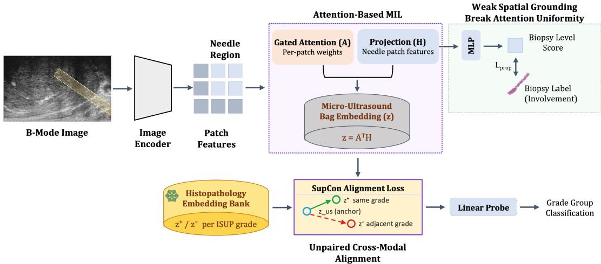

# Weakly Supervised Spatial Grounding for Discriminative Attention-Based Ultrasound-Histopathology Alignment in Prostate Cancer Grading

Obed Korshie Dzikunu1,2, Emma Willis2,3, Mohammad Mahdi Abootorabi1,2, Mohamed Harmanani2,3, Zhuoxin Guo2,3, Ferdinand Luger4, Adam Kinnaird5, Brian Wodlinger6, Parvin Mousavi2,3, and Purang Abolmaesumi1

1Department of Electrical and Computer Engineering, University of British Columbia, Vancouver, Canada 2Vector Institute, Toronto, Canada 3School of Computing, Queen’s University, Kingston, Canada 4Ordensklinikum Linz, Linz, Austria 5Department of Surgery, University of Alberta, Edmonton, Canada 6Exact Imaging, Markham, Canada

## ABSTRACT

Unpaired cross-modal distillation transfers grade structure from histopathology into a micro-ultrasound (micro-US) encoder by aligning a pooled needle-region embedding to a frozen histopathology teacher under grade-group correspondence alone. A single objective is thereby required to serve two distinct functions: rendering patch features discriminative of tissue state, and selecting which patches enter the pooled representation. We decouple them. Weak spatial supervision derived from percentage involvement, recorded routinely at biopsy, constrains the predicted proportion of malignant tissue within each core, acting on the encoder features independently of the alignment objective. The alignment loss then operates on features that difer across a core, and attention concentrates on a subset of patches rather than remaining near-uniform. On 7, 166 biopsy cores from 811 patients across seven centers under patient-level 5-fold cross-validation, the method reaches 67.1 macro AUC and 68.5 csPCa AUC, against 61.2 and 52.8 for the existing unpaired alignment method and 63.1 and 62.6 for the strongest unimodal baselines. Ablation against existing attention regularizers designed to prevent attention uniformity collapse shows that such regularizers do not substitute for label-derived supervision: they constrain the attention distribution, whereas the signal required acts on the features that attention reads.

Keywords: Prostate cancer, micro-ultrasound, grade group, cross-modal distillation, multiple instance learning, weak supervision

## 1. INTRODUCTION

Prostate cancer (PCa) is graded from histopathology, where nuclear architecture, glandular organization, and stromal disruption are resolved at cellular scale. But histopathology becomes available only after tissue is extracted and processed, so it cannot guide where to sample or how to triage during the procedure itself. Microultrasound (micro-US) is an intraoperative alternative: at roughly 70 µm it resolves tissue microstructure finely enough to be clinically useful, yet the acoustic signal does not directly encode cellular morphology, and encoders trained on micro-US labels alone struggle to learn the fine-grained distinctions that drive grading. Even heavily fine-tuned general-purpose foundation models fall short of specialist performance on this task, which motivates injecting additional domain knowledge into the micro-US encoder. ProstNFound and its successor ProstNFound+ do exactly this,4, 5 embedding ultrasound- and PCa-specific priors into a foundation-model detector, but neither draws on histopathological supervision during training.

Cross-modal distillation ofers a complementary source of that knowledge: if the structure a histopathology encoder has learned can be transferred into the micro-US encoder during training, the student can learn tissue distinctions it could not otherwise supervise, while remaining deployable on ultrasound alone at inference.

Where co-registered histopathology is available for the same patient, this is well established. CorrSigNet6 learns MRI signatures correlated with whole-mount histopathology and discards the histopathology at inference, and CorrSigNIA7 extends this to jointly localize indolent and aggressive disease. All such methods, however, require image registration between modalities, which micro-US cannot provide; micro-US frames and whole-slide histopathology difer too much in resolution and anatomical coverage for pixel- or patient-level registration at scale. GUIDE-US3 removes this requirement by distilling in the unpaired regime, aligning grade-conditioned distributions between a frozen histopathology teacher and a micro-US student. It anchors distillation to a shared clinical label (ISUP grade) rather than spatial correspondence, and uses attention-based multiple-instance learning (ABMIL)11 to pool needle-region patch tokens into a single bag embedding before alignment.

Motivation. In the unpaired alignment regime, the alignment objective is defined on the bag embedding alone, and is consequently asked to perform two functions at once: to make the patch features discriminative of tissue state, and to determine which patches the attention head selects. Neither is supervised directly. Attention weights receive gradient only through their efect on the pooled vector, and no per-patch target exists. Every token of a core inherits the same core-level label, regardless of how much of that core is involved by cancer. Many attention distributions therefore produce a pooled embedding that satisfies the alignment objective equally well, including distributions concentrated on tissue that is not malignant. The generic remedy is to regularize the attention distribution. ACMIL8 and AEM9 were both developed for whole-slide image classification to counteract attention concentrating on a small subset of instances, a pattern associated with overfitting. Both act on the attention distribution rather than on the features that attention reads, and neither supplies discriminative structure to the representation. In a needle-biopsy setting the fraction of the core that is malignant is moreover recorded rather than unknown, so a prior on the shape of the attention distribution discards information that is already available.

Contribution. We propose AlignUS (Fig. 1), a micro-US–histopathology alignment framework that supervises these two functions independently. The first, rendering patch features discriminative of tissue state, is supervised by a lightweight head that assigns a cancer score to each needle-region patch, with a proportion-matching loss constraining the mean of those scores to the percentage involvement recorded at biopsy. The second, selecting which patches enter the pooled representation, remains the responsibility of the alignment objective, which now operates over patch features that difer across a core rather than converging toward a common direction. We evaluate against four unimodal baselines and one cross-modal baseline, and ablate against unconstrained attention, mean pooling, and two attention regularizers.

## 2. MATERIALS AND METHODS

## 2.1 Data

Histopathology (PANDA). The histopathology dataset is derived from the Prostate Cancer Grade Assessment (PANDA) challenge,1 which contains 10,616 whole-slide images (WSIs) of prostate core needle biopsies. Each slide is annotated with an International Society of Urological Pathology (ISUP) grade. Preprocessing followed the protocol described in prior work,1 excluding slides with erroneous annotations, corrupted scans, or noisy labels. After filtering, 9,555 WSIs remained, stratified by ISUP grade and partitioned 80:10:10 into training, validation, and test splits.

Micro-US dataset. We use a multi-center micro-US dataset comprising 811 patients across two cohorts: 693 patients imaged between 2013 and 2016 at five institutions using an earlier ExactVu µUS system (Exact Imaging, Markham, Canada) under untargeted systematic biopsy, and 118 patients imaged between 2021 and 2024 at two sites using a newer ExactVu system under combined systematic and targeted biopsy. Sagittal B-mode images were acquired at 28 mm depth and 46.06 mm width during a 30-second cineloop per core capturing needle alignment and firing. The final frame immediately prior to needle entry, co-registered with an annotated needletrace mask (defined by tip position and insertion angle at firing), was selected as the representative, artefact-free image per core. Each core is paired with histopathology-derived cancer diagnosis, percentage involvement, and ISUP Grade Group (GG 0 − 5). Labels are assigned to the full needle-trace region, introducing minor spatial approximation for partially involved cores. Most patients contributed 10 − 12 systematic cores from standard sextant regions, yielding 7,166 biopsy cores in total, each with a corresponding needle-trace binary mask. No clinical metadata (PSA, age, prostate volume) was used; all predictions are derived from imaging alone.

  
Figure 1. AlignUS architecture. B-mode patches are split into needle-region and background regions using biopsy core geometry. Gated attention (A) and projection (H) form a bag embedding $( A ^ { \top } H )$ , which is aligned to histopathology embeddings via $\mathcal { L } _ { \mathrm { a l i g n } }$ for downstream ISUP grading. A parallel branch applies an MLP to H to predict per-patch cancer probability, constrained by $\mathcal { L } _ { \mathrm { s g } }$ to match known core involvement over needle-region patches, breaking attention-uniformity collapse by injecting a spatially informative gradient.

Preprocessing and evaluation protocol. B-mode images were resized from their native 1372×833 resolution to $5 1 2 \times 5 1 2$ via bilinear interpolation and normalized to [0, 1]. Each US frame was paired with a histopathology embedding sampled by matching ISUP grade and, loosely, percentage involvement. We performed label-stratified 5-fold cross-validation with splits defined at the patient level, so that all cores from a given patient fall exclusively within either the training or validation subset of a fold.

## 2.2 Method

Patch token extraction and aggregation. A DINOv3 ViT- $. \mathrm { L } / 1 6$ encoder12 produces a grid of patch tokens per B-mode frame, of which only those falling within the annotated needle-trace mask are retained, yielding $N _ { b }$ tokens for core b. Because $N _ { b }$ varies across cores, tokens are padded to the batch maximum and a validity mask $m _ { b } \in \{ 0 , 1 \} ^ { N }$ is propagated to every downstream term; all masked quantities below are computed over valid tokens only. Tokens are linearly projected to a shared dimension to obtain patch features $H _ { b } \in \mathbb { R } ^ { N \times d }$ . A gated attention mechanism11 takes $H _ { b }$ as input and computes weights $A _ { b }$ with the softmax normalized over valid positions only (via $m _ { b } )$ ; the bag embedding is $z _ { b } = A _ { b } ^ { \top } H _ { b }$ , ℓ -normalized.

Cross-modal alignment. Following prior unpaired work $, ^ { 3 } \ z _ { b }$ is aligned to a frozen histopathology embedding of the same grade group.2 We use a supervised contrastive objective10 in place of the triplet loss used previously: for anchor i with grade $y _ { i } ,$ , all same-grade elements form the positive set $P ( i )$ and all diferent-grade elements the negatives, and

$$
\mathcal { L } _ { \mathrm { a l i g n } } = - \frac { 1 } { | \mathcal { B } | } \sum _ { i } \frac { 1 } { | P ( i ) | } \sum _ { p \in P ( i ) } \log \frac { \exp ( s _ { i p } ) } { \sum _ { p ^ { \prime } \in P ( i ) } \exp ( s _ { i p ^ { \prime } } ) + \sum _ { n \in N ( i ) } w _ { i n } \exp ( s _ { i n } ) } , \qquad s _ { i j } = z _ { i } ^ { \top } z _ { j } / \tau ,\tag{1}
$$

where negatives are weighted by grade distance, $w _ { i j } = 1 + \beta | y _ { i } - y _ { j } | / d _ { \operatorname* { m a x } }$ with $d _ { \operatorname* { m a x } } = 5$ and $\beta = 1 ; \beta = 0$ recovers the standard supervised contrastive loss. The objective is applied both within micro-US and across the concatenated micro-US and histopathology batch. Histopathology embeddings are used at training time only; inference requires micro-US alone.

Involvement-supervised spatial grounding. Let $\iota _ { b } \in [ 0 , 1 ]$ be the fraction of core b involved by cancer, taken directly from the biopsy report. A two-layer head g maps each patch feature to a cancer logit, and the predicted involved fraction is the masked mean of the corresponding probabilities,

$$
\bar { p } _ { b } = \frac { 1 } { \sum _ { n } m _ { b n } } \sum _ { n } m _ { b n } \sigma \big ( g ( H _ { b n } ) \big ) ,\tag{2}
$$

Table 1. Per-grade one-vs-rest AUC (×100, mean±std over 5 patient-level folds). Best per column in bold. Cross-modal methods use histopathology at training time only.
<table><tr><td>Method</td><td>GG0</td><td>GG1</td><td>GG2</td><td>GG3</td><td>GG4</td><td>GG5</td><td>Macro</td><td> $\mathbf { c s P C a }$ </td></tr><tr><td colspan="9">Unimodal</td></tr><tr><td>DINO-FT</td><td> $6 4 . 5 { \pm } 2 . 0 \ $ </td><td> $6 9 . 2 { \pm } 4 . 6 $ </td><td> ${ \bf 5 9 . 2 \pm 3 . 2 }$ </td><td> $5 7 . 9 { \pm } 3 . 5 $ </td><td> $6 5 . 0 { \pm } 7 . 2 $ </td><td> $6 0 . 8 { \pm } 1 2 . 6 $ </td><td> $6 2 . 3 { \pm } 3 . 3 $ </td><td> $6 2 . 6 { \pm } 2 . 5 $ </td></tr><tr><td>MicroSegNet-FT</td><td> $6 8 . 1 { \pm } 4 . 4 $ </td><td> $9 0 . 8 { \pm } 1 . 4 $ </td><td> $5 1 . 6 { \pm } 4 . 7 $ </td><td> $5 0 . 1 { \pm } 5 . 8 $ </td><td> $6 2 . 4 { \pm } 1 2 . 9$ </td><td> $5 5 . 6 { \pm } 1 5 . 7 $ </td><td> $6 3 . 1 { \pm } 4 . 1 $ </td><td> $5 7 . 2 { \pm } 8 . 1 $ </td></tr><tr><td>MedSAM-FT</td><td>66.9±4.5</td><td> $\mathbf { 9 1 . 4 2 1 . 3 }$ </td><td> $5 2 . 2 { \pm } 3 . 1 $ </td><td> $5 0 . 4 { \pm } 7 . 2 $ </td><td> $5 9 . 4 { \pm } 1 1 . 2 $ </td><td> $5 4 . 0 { \pm } 1 4 . 3 $ </td><td> $6 2 . 3 { \pm } 3 . 8 $ </td><td> $5 5 . 9 { \pm } 5 . 9 $ </td></tr><tr><td>ProstNFound+</td><td> $6 1 . 1 { \pm } 6 . 7 $ </td><td> $9 0 . 6 { \pm } 2 . 0 \ $ </td><td> $5 1 . 4 { \pm } 5 . 0 $ </td><td> $4 9 . 2 { \pm } 6 . 5 $ </td><td> $5 9 . 5 { \pm } 1 . 2 $ </td><td> $6 1 . 1 { \pm } 8 . 1 $ </td><td> $6 2 . 2 { \pm } 2 . 2 $ </td><td> $5 5 . 7 { \pm } 7 . 1 $ </td></tr><tr><td colspan="9">Cross-modal alignment</td></tr><tr><td>GUIDE-US</td><td> $6 5 . 5 { \pm } 4 . 8 $ </td><td> $9 1 . 2 { \pm } 2 . 1 $ </td><td> $5 0 . 7 { \pm } 1 . 6 $ </td><td> $4 9 . 0 { \pm } 7 . 2 $ </td><td> $5 7 . 3 { \pm } 1 1 . 2 $ </td><td> $5 3 . 4 { \pm } 1 2 . 2 $ </td><td> $6 1 . 2 { \pm } 3 . 8 $ </td><td> $5 2 . 8 { \pm } 6 . 7 $ </td></tr><tr><td>Ours</td><td> ${ \bf 6 9 . 9 2 1 . 4 }$ </td><td> $8 3 . 7 { \pm } 6 . 7 $ </td><td> $5 9 . 0 { \pm } 6 . 2 $ </td><td> ${ \bf 5 9 . 8 \pm 5 . 4 }$ </td><td> ${ \bf 6 7 . 5 \pm 8 . 2 }$ </td><td> ${ \bf 6 2 . 7 { \pm } 1 0 . 5 }$ </td><td> ${ \bf 6 7 . 1 } { \pm 4 . 1 }$ </td><td> ${ \bf 6 8 . 5 \pm 2 . 7 }$ </td></tr></table>

Table 2. Pooling and supervision ablation (top); the bottom two rows test whether the gain from $\mathcal { L } _ { \mathrm { s g } }$ transfers to a second, unrelated alignment objective (triplet), rather than being specific to the contrastive loss used elsewhere. All rows share the DINOv3 backbone, batch construction, and evaluation protocol; unless noted, the alignment objective is contrastive (Eq. (1)).
<table><tr><td>Configuration</td><td>Macro AUC</td><td>csPCa AUC</td></tr><tr><td>Micro-US only (no alignment)</td><td> $6 2 . 3 { \pm } 3 . 3 $ </td><td>62.6±2.5</td></tr><tr><td> $\mathrm { M e a n \ p o o l i n g , \ w / o \ } \mathcal { L } _ { \mathrm { s g } }$ </td><td>63.4±1.3</td><td>65.2±3.4</td></tr><tr><td> $\mathrm { A B M I L } , \mathrm { w } / \mathrm { o } \ \mathcal { L } _ { \mathrm { s g } }$ </td><td> $6 5 . 0 { \pm } 2 . 9 $ </td><td> $6 6 . 9 { \pm } 3 . 1 \ $ </td></tr><tr><td> $\mathrm { A B M I L } + \mathrm { A E M }$ </td><td> $6 5 . 8 { \pm } 3 . 3 $ </td><td> $6 6 . 6 { \pm } 2 . 2 $ </td></tr><tr><td> $\mathrm { A B M I L } + \mathrm { A C M I L }$ </td><td> $6 5 . 8 { \pm } 3 . 9 $ </td><td> $6 6 . 4 { \pm } 2 . 6 $ </td></tr><tr><td> $\mathbf { A B M I L } + \mathcal { L } _ { \mathrm { s g } } \ ( \mathbf { o u r s } )$ </td><td> ${ \bf 6 7 . 1 } { \pm 4 . 1 }$ </td><td> ${ \bf 6 8 . 5 } \pm { \bf 2 . 7 }$ </td></tr><tr><td>ABMIL, triplet alignment,  $\mathrm { ~ w ~ } / \mathrm { o } \ \mathcal { L } _ { \mathrm { s g } }$ </td><td>63.9±4.2</td><td> $5 4 . 3 { \pm } 7 . 3 $ </td></tr><tr><td>ABMIL, triplet alignment  $+ \mathcal { L } _ { \mathrm { s g } }$ </td><td>64.2±5.4</td><td> $6 3 . 2 { \pm } 2 . 4 $ </td></tr></table>

which is matched to the reported involvement by a binary cross-entropy on proportions,

$$
{ \mathcal { L } } _ { \mathrm { s g } } ~ = ~ - \frac { 1 } { \sum _ { b } w _ { b } } \sum _ { b } w _ { b } \Big [ \iota _ { b } \log \bar { p } _ { b } + ( 1 - \iota _ { b } ) \log ( 1 - \bar { p } _ { b } ) \Big ] ,\tag{3}
$$

where $w _ { b }$ is a per-core weight that ofsets the benign majority and the grade imbalance. The total objective is $\mathcal { L } = \mathcal { L } _ { \mathrm { a l i g n } } + \lambda _ { \mathrm { s g } } \mathcal { L } _ { \mathrm { s g } } .$ Two properties give the objective its intended division of labour. First, the gradient of Eq. (3) reaches the shared patch features $H _ { b }$ and not the attention weights $A _ { b } \colon$ the term supplies discriminative structure to the representation without prescribing how that structure should be pooled, in contrast to ACMIL and AEM, which constrain the attention distribution directly. Second, Eq. (3) constrains only the mean of the patch scores and does not penalize a uniform solution, so within-core heterogeneity arises as a consequence of satisfying the proportion constraint rather than as a directly optimized target. Attention selection remains governed by $\mathcal { L } _ { \mathrm { a l i g n } }$ , which now operates on features that are weakly supervised to difer across patches in tissue state.

Implementation. $\lambda _ { \mathrm { s g } }$ is empirically set to 1 and $w _ { b }$ is selected on the validation split. All ablation configurations (Table 2) share the same backbone, pooling head, batch construction, and optimizer schedule; the unimodal baselines in Table 1 difer in backbone by construction and are trained with their published configurations.

Evaluation. No loss is applied to the classification head; all reported numbers come from a multinomial logistic regression probe fit on the frozen bag embedding, applied identically to every method. We report one-vs-rest AUC per grade group, macro AUC, and binary AUC for clinically significant cancer (csPCa, GG≥2).

## 3. RESULTS

Comparison to prior work. Table 1 shows performance across unimodal and cross-modal frameworks. GUIDE-US attains the lowest macro AUC in the comparison (61.2), below every unimodal baseline, and is at or near chance on clinically significant cancer (csPCa 52.8) and on the interior grades (GG3 49.0, GG5 53.4).

Table 3. Representation-level mechanism check, averaged over the evaluation set. Cosine dispersion is 1−mean pairwise cosine similarity between valid patch features within a core (post-projection $H )$ ; higher values indicate more within-core heterogeneity. Attention entropy is $H /$ ln $N _ { b } ,$ , the Shannon entropy of the attention distribution over a core’s $N _ { b }$ valid patches, normalized per core by ln $N _ { b }$ rather than a batch-wide maximum; values near 1 indicate uniform attention, values near 0 indicate concentration on a few patches.
<table><tr><td>Configuration</td><td>Cosine dispersion</td><td>Attention entropy</td></tr><tr><td> $\mathrm { A B M I L } , \mathrm { w } / \mathrm { o } \ \mathcal { L } _ { \mathrm { s g } }$ </td><td>0.07</td><td>0.93</td></tr><tr><td> $\mathrm { A B M I L } + \mathrm { A E M }$ </td><td>0.06</td><td>0.99</td></tr><tr><td> $\mathrm { A B M I L } + \mathrm { A C M I L }$ </td><td>0.07</td><td>0.97</td></tr><tr><td> $\mathbf { A B M I L } + \mathcal { L } _ { \mathrm { s g } } \ ( \mathbf { o u r s } )$ </td><td>0.12</td><td>0.30</td></tr></table>

The proposed method reaches 67.1 macro AUC and 68.5 csPCa AUC, exceeding GUIDE-US by 5.9 and 15.7 points respectively and the strongest unimodal baseline by 4.0 and 5.9. It is best on GG0, GG3, GG4, GG5, macro, and csPCa; GG2 is matched by DINO-FT (59.2 versus 59.0), within one standard deviation.

The three foundation-model fine-tunes that lead on GG1 (MicroSegNet-FT, MedSAM-FT, ProstNFound+, all above 90) fall to 55.7−57.2 on csPCa, and GUIDE-US to 52.8. This gap suggests that high GG1 performance under these methods may reflect separation of low-grade tissue from the remainder, rather than a representation that supports the clinically consequential distinction, though label noise near the GG1/GG2 boundary and prevalence efects on the csPCa estimate could also contribute to the drop. he proposed method reverses this trade-of: GG1 AUC drops to 83.7, well below the foundation-model fine-tunes’ (> 90), while csPCa AUC rises by 11–16 points over the same baselines. This is consistent with the behavior of $\mathcal { L } _ { \mathrm { s g } }$ which assigns GG1 cores a non-zero involvement target rather than treating them as negative. As a result, low-grade tissue is pulled toward the malignant end of the patch-score range, likely blurring its separability from higher-grade tissue and accounting for the drop in GG1 AUC.

Ablation. Table 2 isolates pooling and its supervision. Attention pooling accounts for 1.6 macro AUC points over mean pooling (65.0 versus 63.4), and adding the cross-modal term to micro-US-only training accounts for a further 2.7 (62.3 to 65.0). Neither generic attention regularizer improves on unconstrained attention: AEM and ACMIL both reach 65.8 macro against 65.0, and both reduce csPCa AUC (66.6 and 66.4 against 66.9). Supervising the patch features with $\mathcal { L } _ { \mathrm { s g } }$ instead yields 67.1 macro and 68.5 csPCa. The results thus suggest that constraining the attention distribution does not substitute for supplying discriminative structure to the features it reads.

Mechanism validation. Table 3 tests the two causal steps claimed in Section 2.2. Because ABMIL without $\mathcal { L } _ { \mathrm { s g } }$ shares every component with our full method except $\mathcal { L } _ { \mathrm { s g } }$ itself, the diference between these two rows isolates its efect. Without $\mathcal { L } _ { \mathrm { s g } } ,$ attention stays close to uniform (0.93), similar to ACMIL (0.97) and AEM (0.99); the alignment gradient alone gives attention no basis to discriminate. Adding $\mathcal { L } _ { \mathrm { s g } }$ increases within-core patch-feature dispersion by roughly 70% (0.07 to 0.12) and collapses attention entropy to 0.30, suggesting that the induced feature heterogeneity is what the alignment gradient subsequently reads out as concentrated attention. ACMIL and AEM, by contrast, hold entropy at or above the baseline. That is expected as they are both designed to resist attention concentration as a generic defence against overfitting in whole-slide classification, the opposite of what a needle-biopsy core with a genuinely partial, recorded involvement fraction calls for.

Interaction between the two terms. To test whether the gain depends specifically on the contrastive alignment objective used elsewhere in the paper, the bottom rows of the Table 2 pair $\mathcal { L } _ { \mathrm { s g } }$ with an with a diferent, alignment objective (triplet) and compare the results. On $\mathrm { c s } \mathrm { P C a } , \mathcal { L } _ { \mathrm { s g } }$ improves both objectives (+8.9 under triplet, +1.6 under contrastive), whereas on macro AUC the gain is negligible under triplet (+0.3) and substantial only under contrastive (+2.1). Detection therefore benefits under either alignment objective, while the gain in grade discrimination is seen to be better with the contrastive loss, consistent with $\mathcal { L } _ { \mathrm { s g } }$ supplying structure to the representation while the alignment term governs how much of it reaches the pooled embedding.

## 4. DISCUSSION AND CONCLUSION

In unpaired distillation, the alignment objective typically does two jobs at once: making patch features discrim inative and selecting among them. Separating these, supervising the first with percentage involvement already recorded at biopsy, adds no annotation cost and leaves attention selection to the alignment term alone. Because inference uses micro-US only, the method remains deployable intraoperatively, when histopathological grading is unavailable. The ablations localize the gain to supervision of the patch features rather than the attention distribution, and the crossing experiment confirms the two terms play distinct, separable roles.

Patch-level annotations however are unavailable in this cohort, so while Table 3 shows gains consistent with $\mathcal { L } _ { \mathrm { s g } }$ inducing feature level discrimination, we cannot verify that the patches this heterogeneity privilages correspond to the true spatial distribution of malignant tissue.

## REFERENCES

[1] W. Bulten et al., “Artificial intelligence for diagnosis and Gleason grading of prostate cancer: the PANDA challenge,” Nature Medicine 28, 154–163 (2022).

[2] R. J. Chen, T. Ding, M. Y. Lu, D. F. K. Williamson et al., “Towards a general-purpose foundation model for computational pathology,” Nature Medicine 30, 850–862 (2024).

[3] E. Willis, T. Elghareb, P. F. R. Wilson, M. N. N. To, M. M. Abootorabi, A. Jamzad, B. Wodlinger, P. Mousavi, and P. Abolmaesumi, “GUIDE-US: grade-informed unpaired distillation of encoder knowledge from histopathology to micro-ultrasound,” International Journal of Computer Assisted Radiology and Surgery (2026).

[4] P. F. R. Wilson, M. N. N. To, A. Jamzad, M. Gilany, M. Harmanani, T. Elghareb, F. Fooladgar, B. Wodlinger, P. Abolmaesumi, and P. Mousavi, “ProstNFound: integrating foundation models with ultrasound domain knowledge and clinical context for robust prostate cancer detection,” in MICCAI 2024, LNCS 15006, 499–509 (2024).

[5] P. F. R. Wilson, M. Harmanani, M. N. N. To, A. Jamzad, T. Elghareb, Z. Guo, A. Kinnaird, B. Wodlinger, P. Abolmaesumi, and P. Mousavi, “ProstNFound+: a prospective study using medical foundation models for prostate cancer detection,” International Journal of Computer Assisted Radiology and Surgery (2025).

[6] I. Bhattacharya, A. Seetharaman, W. Shao, R. Sood, C. A. Kunder, R. E. Fan, S. J. C. Soerensen, J. B. Wang, P. Ghanouni, N. C. Teslovich, J. D. Brooks, G. A. Sonn, and M. Rusu, “CorrSigNet: learning correlated prostate cancer signatures from radiology and pathology images for improved computer aided diagnosis,” in MICCAI 2020, LNCS 12262, 315–325 (2020).

[7] I. Bhattacharya, A. Seetharaman, C. Kunder et al., “Selective identification and localization of indolent and aggressive prostate cancers via CorrSigNIA: an MRI-pathology correlation and deep learning framework,” Medical Image Analysis 75, 102288 (2022).

[8] Y. Zhang, H. Li, Y. Sun, S. Zheng, C. Zhu, and L. Yang, “Attention-challenging multiple instance learning for whole slide image classification,” in ECCV 2024 (2024).

[9] Y. Zhang, H. Li, Y. Sun, Z. Shui, J. Li, C. Zhu, and L. Yang, “AEM: attention entropy maximization for multiple instance learning based whole slide image classification,” in MICCAI 2025, 45–55 (2025).

[10] P. Khosla et al., “Supervised contrastive learning,” NeurIPS (2020).

[11] M. Ilse, J. M. Tomczak, and M. Welling, “Attention-based deep multiple instance learning,” ICML (2018).

[12] O. Sim´eoni, H. V. Vo, M. Seitzer, F. Baldassarre, M. Oquab et al., “DINOv3,” arXiv:2508.10104 (2025).