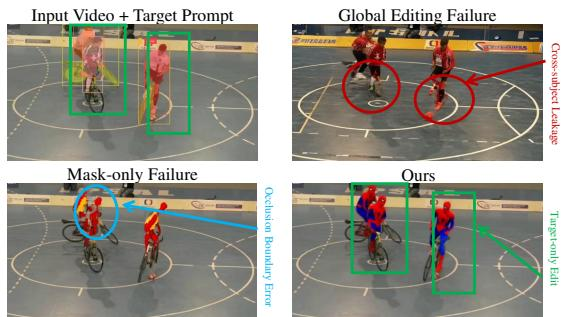
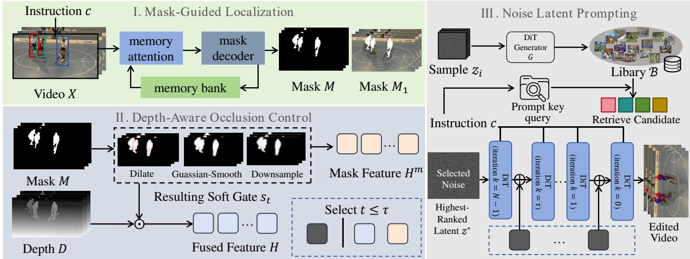
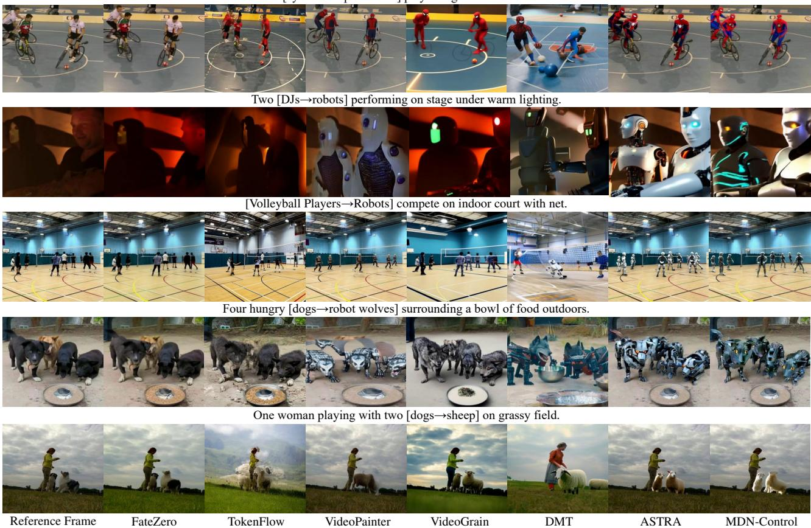

# MDN-CONTROL: MASK-DEPTH-NOISE GUIDED REGION CONTROL FOR MULTI-SUBJECT VIDEO EDITING

Jiayi Yu Xi Ye Lina Wang† Yunkun Xia

School of Cyber Science and Engineering, Wuhan University

## ABSTRACT

Multi subject video editing modifies designated subjects while preserving non target content, but faces cross subject attribute leakage, and occlusion ambiguity. Existing approaches rely on masks and struggle to distinguish overlapping subjects or ensure consistent generation. To address these limitations, we propose MDN-Control, a training free framework jointly controlling target localization, occlusion geometry, and appearance initialization. Specifically, maskguided localization provides consistent target localization, while depth-aware occlusion control resolves ambiguous boundaries between overlapping subjects. We further introduce noise latent prompting, which retrieves Gaussian initializations from a noise library for prompt relevant priors. Experiments on MSVBench show that MDN-Control achieves the lowest CM-Err and the highest Q-Edit, while maintaining competitive text alignment and temporal consistency, demonstrating the effectiveness of combining spatial, geometric, and latent priors for multi subject video editing.

Index Terms— Video Editing, Diffusion Models, Object Tracking, Video Object Segmentation

## 1. INTRODUCTION

Recent diffusion models have advanced visual generation and text guided video editing [1, 2, 3]. Video editing methods improve content preservation and temporal consistency through model adaptation, attention control, and feature propagation [4, 5, 6]. Other studies introduce depth, motion, and compositional conditions to preserve source structure [7, 8], while recent approaches support localized editing with spatial conditions and pretrained video priors [9, 10]. Conditional generation studies show that explicit spatial and subject guidance helps preserve geometric structure and subject attributes [11]. These advances make it practical to modify designated subjects while preserving unrelated content.

However, precise control remains difficult in multi subject videos, especially when subjects are adjacent or occluded. As illustrated in Fig. 1, an edit intended for one subject can unintentionally affect neighboring subjects, resulting in target drift and cross subject attribute leakage. Masks provide spatial constraints, but tracking errors and uncertain boundaries can degrade localization [12]. More importantly, binary masks do not encode the front and back ordering of overlapping subjects. Even accurate localization does not guarantee that the generated appearance is well aligned with the editing prompt, since different initial noise latents can lead to different visual outcomes. Therefore, robust multi subject editing requires coordinated control over target localization, occlusion geometry, and appearance initialization.

  
Fig. 1. Motivation of multi-subject target-region video editing. The designated subject should be edited despite occlusion and neighboring-subject interference, while non-target subjects and the background remain unchanged.

To address these challenges, we propose Mask-Depth-Noise Guided Region Control (MDN-Control), a training free framework for controllable multi subject video editing. First, text guided detection and video mask tracking localize the designated subject throughout the video. Second, depth cues are introduced within the target neighborhood to resolve ambiguous occlusion boundaries and distinguish overlapping subjects. Third, we introduce noise latent prompting, which retrieves Gaussian initializations from an offline noise appearance library according to the similarity between their recorded generation outcomes and the requested appearance. These three components provide complementary spatial, geometric, and latent guidance without updating the generation model. Our contributions are summarized as follows:

• We formulate multi subject video editing as a control problem involving target localization, occlusion geometry, and appearance initialization, and propose a training free framework that addresses these factors jointly.

• We combine mask based localization with depth guided occlusion reasoning to reduce target drift and cross subject interference, especially around ambiguous boundaries between overlapping subjects.

• We introduce noise latent prompting, which retrieves prompt relevant Gaussian initializations from an offline noise appearance library to provide controllable appearance priors without parameter updates.

• Experiments on MSVBench demonstrate that MDN-Control achieves the lowest CM-Err and the highest Q Edit among the evaluated methods, while maintaining competitive text alignment and temporal consistency.

## 2. METHODOLOGY

As illustrated in Fig. 2, MDN-Control combines maskguided localization, depth-aware occlusion control, and noise latent prompting. These components specify where to edit, provide local visibility cues, and initialize prompt-relevant appearance generation, respectively. All models remain frozen during editing.

Overview. Given a video $X = \{ x _ { t } \} _ { t = 1 } ^ { T }$ and an instruction $c$ specifying the target subject and desired appearance, we seek an edited video $\bar { X } = \{ \hat { x _ { t } } \} _ { t = 1 } ^ { T }$ satisfying

$$
\begin{array} { r } { m _ { t } \odot \hat { x } _ { t } \vert = c , \qquad } \\ { \left( 1 - m _ { t } \right) \odot \hat { x } _ { t } \approx \left( 1 - m _ { t } \right) \odot x _ { t } , } \end{array}\tag{1}
$$

where $m _ { t }$ is the target mask and $\hat { x } _ { t }$ is the edited frame. The first condition expresses target-text alignment, while the second requires preservation of non-target subjects and the background. Mask-guided localization restricts depth guidance to the target neighborhood, and retrieved noise initializes appearance generation under these spatial constraints.

Mask-Guided Localization. We first apply a text-guided detector [13] to the initial frame $x _ { 1 }$ and instruction c to obtain the target box $b _ { 1 }$ . The detector selects visual queries through their similarity to text features and decodes the queries into a bounding box. The box prompts a video segmentation model [12], which initializes the target mask and propagates it across frames through memory attention. The resulting sequence $M = \{ m _ { t } \} _ { t = 1 } ^ { T }$ provides instance-specific spatial support without repeating text-guided detection in every frame. This support also restricts subsequent depth guidance to the target neighborhood, reducing interference from unrelated subjects. However, masks alone do not explicitly represent the visibility ordering of overlapping instances, motivating the following depth-aware occlusion control.

Depth-Aware Occlusion Control. We estimate depth maps $D \stackrel { - } { = } \{ d _ { t } \} _ { t = 1 } ^ { T }$ using a pretrained depth estimator [14]. To accommodate uncertain mask boundaries, each binary mask is dilated, Gaussian-smoothed, and downsampled to the conditioning feature resolution:

$$
s _ { t } = \mathrm { D o w n } \bigl ( G _ { \sigma } * \mathrm { D i l a t e } _ { r } ( m _ { t } ) \bigr ) ,\tag{2}
$$

where $r$ is the dilation radius and σ controls smoothing. The resulting soft gate $s _ { t } \in [ 0 , 1 ]$ combines aligned mask features

$h _ { t } ^ { m }$ and depth features $h _ { t } ^ { d . }$

$$
h _ { t } = s _ { t } \odot h _ { t } ^ { d } + ( 1 - s _ { t } ) \odot h _ { t } ^ { m } .\tag{3}
$$

Depth features provide front–back cues within the softened target neighborhood, while mask features dominate elsewhere. Local gating associates geometric information with the selected instance, since depth alone does not identify which subject should be edited.

We use fused guidance during early denoising and maskonly guidance during later refinement, following the coarseto-fine behavior of diffusion generation [15]:

$$
{ C } _ { k } = \left\{ \begin{array} { l l } { { H , } } & { { 0 \leq k \leq \tau , } } \\ { { H ^ { m } , } } & { { \tau < k < N , } } \end{array} \right.\tag{4}
$$

where k counts denoising iterations sequentially, N is the step count, $H = \{ h _ { t } \} _ { t = 1 } ^ { T } , \bar { H ^ { m } } = \{ h _ { t } ^ { m } \} _ { t = 1 } ^ { T }$ , and τ is the switching step. We apply geometric cues during structural formation while retaining spatial constraints for detail refinement.

Noise Latent Prompting. Spatial guidance determines where to edit but does not uniquely determine the appearance. Different initial noise latents produce different shapes, colors, and textures under the same conditions [16, 17]. Independent Gaussian sampling is prompt-agnostic, and finding a suitable appearance through repeated generation incurs additional inference cost. Therefore, we evaluate candidate noises offline and construct a library that associates each initialization with its observed generation outcome. We sample $z _ { i } \sim \mathcal { N } ( 0 , I )$ and generate $y _ { i } = G ( z _ { i } , c _ { 0 } )$ using the frozen DiT [9] generator $G$ under an empty condition $c _ { 0 }$ . The library stores:

$$
B = \{ ( z _ { i } , \phi _ { i } ) \} _ { i = 1 } ^ { L } , \qquad \phi _ { i } = \Phi ( y _ { i } ) ,\tag{5}
$$

where L is the library size and Φ extracts CLIP image embeddings [18] and low-level color and texture descriptors. For an editing instruction $c ,$ the query $\psi ( c )$ combines its CLIP text embedding with the requested appearance attributes. We retrieve candidate indices by

$$
\mathcal { R } _ { K } ( c ) = \mathrm { T o p K } _ { i } \ S ( \psi ( c ) , \phi _ { i } ) ,\tag{6}
$$

where $S$ measures CLIP cosine similarity, low-level attribute similarity and their weighted combination. We further select the highest-ranked latent $z ^ { * }$ for an edit or candidates from $\mathcal { R } _ { K } ( c )$ for appearance variation. Retrieval uses recorded outputs and does not guarantee superiority over every random seed. The latent initializes generation, while the text instruction and $C _ { k }$ guide denoising, complementing mask and depth control without parameter updates.

## 3. EXPERIMENTS AND ANALYSIS

Implementation Details. We evaluate MDN-Control on MSVBench [10] against FateZero [5], TokenFlow [6], Video-Painter [19], VideoGrain [20], DMT [21], and ASTRA [10]. Experiments use one NVIDIA L40 GPU, Grounded SAM 2 masks [22, 12], and Depth Anything V2 maps [14]. Metrics include Warp-Err [23] for background temporal consistency, CLIP-T [18] for text alignment with non-target pixels blacked out, CLIP-F [18] for adjacent-frame CLIP similarity, CM-Err [10] for multi-subject layout preservation, and Q-Edit [24] for mean CLIP-T divided by mean Warp-Err.

  
Fig. 2. Overview of MDN-Control. Mask-guided localization localizes the target, depth-aware occlusion control guides editing near occlusions, and noise latent prompting initializes appearance generation. Denoising uses mask-depth guidance at early steps and mask-only guidance thereafter.

Table 1. Quantitative comparison on MSVBench.
<table><tr><td colspan="5">Method Warp-Err↓ CLIP-T↑ CLIP-F↑ Q-Edit↑ CM-Err↓</td></tr><tr><td>FateZero [5]</td><td>3.53</td><td>25.28</td><td>95.86 7.17</td><td>2.95</td></tr><tr><td>TokenFlow [6]</td><td>7.79</td><td>25.58</td><td>93.69 3.28</td><td>4.26</td></tr><tr><td>VideoPainter [19]</td><td>4.63</td><td>25.48 93.90</td><td>5.51</td><td>3.95</td></tr><tr><td>VideoGrain [20]</td><td>7.87</td><td>26.98</td><td>95.19 3.43</td><td>3.19</td></tr><tr><td>DMT [21]</td><td>5.77</td><td>26.35</td><td>95.34 4.56</td><td>4.30</td></tr><tr><td>ASTRA [10]</td><td>2.94</td><td>27.49</td><td>95.60 9.34</td><td>2.78</td></tr><tr><td>MDN-Control</td><td>2.87</td><td>27.09</td><td>95.72 9.43</td><td>2.75</td></tr></table>

Quantitative Comparison. As illustrated in table 1, MDN-Control obtains the lowest mean Warp-Err (2.87), highest mean Q-Edit (9.43), and lowest mean CM-Err (2.75), ranking second in CLIP-T and CLIP-F, which demonstrates a favorable balance between temporal consistency, text alignment, frame consistency and multi-subject layout preservation.

Qualitative Results. As illustrated in Fig. 3, most baselines suffer from incomplete editing, background damage, or cross-subject attribute leakage. MDN-Control edits the designated subject while keeping non-target regions nearly unchanged, illustrating the effectiveness of jointly combining mask, depth, and noise guidance for target-specific editing with plausible boundaries and prompt-aligned appearances.

User Study. We conduct a user study to evaluate subjective generation quality. For each method, we randomly select 20 videos and organize them into 20 comparison groups. Each group contains the results from MDN-Control and the six baseline methods for the same editing case. As shown in Table 2, MDN-Control obtains the highest scores in text alignment and subject diversity, and achieves competitive performance in background preservation and video quality.

Table 2. User study results. BG: background preservation; TA: text alignment; SD: subject diversity; VQ: video quality.
<table><tr><td>Method</td><td>BG</td><td>TA</td><td>SD</td><td>VQ</td></tr><tr><td>FateZero [5]</td><td>1.20</td><td>2.00</td><td>2.00</td><td>1.70</td></tr><tr><td>TokenFlow [6]</td><td>3.00</td><td>2.30</td><td>4.00</td><td>3.10</td></tr><tr><td>VideoPainter [19]</td><td>3.20</td><td>2.70</td><td>3.50</td><td>3.30</td></tr><tr><td>VideoGrain [20]</td><td>3.80</td><td>3.30</td><td>3.00</td><td>3.60</td></tr><tr><td>DMT [21]</td><td>4.20</td><td>4.10</td><td>4.10</td><td>4.40</td></tr><tr><td>ASTRA [10]</td><td>5.00</td><td>4.80</td><td>3.60</td><td>5.20</td></tr><tr><td>MDN-Control</td><td>4.90</td><td>4.90</td><td>5.20</td><td>5.10</td></tr></table>

Table 3. Module ablation on MSVBench.
<table><tr><td>Config.</td><td>Warp-Err↓</td><td>CLIP-T↑</td><td>CLIP-F↑</td><td>Q-Edit↑</td><td>CM-Err↓</td></tr><tr><td>Base</td><td>2.71</td><td>24.33</td><td>96.13</td><td>8.98</td><td>3.21</td></tr><tr><td>M</td><td>2.91</td><td>27.16</td><td>95.79</td><td>9.33</td><td>3.17</td></tr><tr><td>D</td><td>2.71</td><td>24.33</td><td>96.12</td><td>8.99</td><td>3.28</td></tr><tr><td>M+Ret.</td><td>2.91</td><td>27.11</td><td>95.63</td><td>9.31</td><td>3.23</td></tr><tr><td>D+Ret.</td><td>2.71</td><td>24.33</td><td>96.13</td><td>8.99</td><td>3.22</td></tr><tr><td>M+D+Rnd.</td><td>2.87</td><td>27.00</td><td>95.60</td><td>9.41</td><td>2.69</td></tr><tr><td>M+D+Ret.</td><td>2.87</td><td>27.09</td><td>95.72</td><td>9.43</td><td>2.75</td></tr></table>

Ablation Study. We evaluate seven module combinations on MSVBench. Base denotes the base DiT generator; M and D denote mask-guided localization and depth guidance, respectively. Rnd. denotes fixed Gaussian initialization, and Ret. denotes retrieved noise. M+D+Rnd. combines both spatial controls, while M+D+Ret. is the full model, MDN-Control. Table 3 shows complementary effects: mask guidance improves text alignment, while depth improves layout preservation. Retrieval further raises Q-Edit but slightly increases CM-Err, possibly reflecting a trade-off between appearance matching and layout preservation. The full model achieves the highest Q-Edit and lower CM-Err than either spatial component alone, supporting the benefit of joint control.

Three [cyclists→ Spider-Men] play ball game on indoor court.  
  
Fig. 3. Qualitative comparison on MSVBench. The proposed method better edits the target subject while preserving neighboring subjects and background regions in crowded and occluded scenes.

Table 4. Comparison of depth guidance. Both variants use mask guidance and retrieved noise.
<table><tr><td>Config.</td><td>Warp-Err↓</td><td>CLIP-T↑</td><td>CLIP-F↑</td><td>Q-Edit↑</td><td>CM-Err↓</td></tr><tr><td>w/o Depth</td><td>2.91</td><td>27.11</td><td>95.63</td><td>9.31</td><td>3.23</td></tr><tr><td>w/ Depth</td><td>2.87</td><td>27.09</td><td>95.72</td><td>9.43</td><td>2.75</td></tr></table>

Table 5. Comparison of fixed Gaussian seeds and retrieved initialization on MSVBench.
<table><tr><td>Noise</td><td>Warp-Err↓ CLIP-T↑</td><td></td><td>CLIP-F↑</td><td>Q-Edit↑</td><td>CM-Err↓</td></tr><tr><td>Seed 0</td><td>2.87</td><td>27.12</td><td>95.79</td><td>9.46</td><td>2.74</td></tr><tr><td>Seed 1</td><td>2.89</td><td>27.00</td><td>95.61</td><td>9.34</td><td>2.75</td></tr><tr><td>Seed 42</td><td>2.87</td><td>26.97</td><td>95.68</td><td>9.40</td><td>2.67</td></tr><tr><td>Seed 1234</td><td>2.86</td><td>27.03</td><td>95.72</td><td>9.45</td><td>2.65</td></tr><tr><td>Seed 2025</td><td>2.89</td><td>27.10</td><td>95.60</td><td>9.39</td><td>2.67</td></tr><tr><td>Fixed avg.</td><td>2.88</td><td>27.05</td><td>95.68</td><td>9.41</td><td>2.70</td></tr><tr><td>MDN-Control</td><td>2.87</td><td>27.09</td><td>95.72</td><td>9.43</td><td>2.75</td></tr></table>

Depth Contribution. We compare outputs generated with mask and retrieved noise, with and without depth guidance, to examine the effect of geometric conditioning. As shown in Table 4, the depth-enabled outputs have lower Warp-Err and CM-Err and higher CLIP-F and Q-Edit, indicating that depth guidance improves temporal coherence and multi-subject spatial preservation, with a minor trade-off in text alignment.

Noise Initialization Analysis. We compare retrieved initialization with five fixed Gaussian seeds to examine how noise selection affects editing performance. Table 5 shows relatively small variations across the tested seeds. Although individual fixed seeds achieve better scores, retrieval remains competitive across the reported metrics. These results suggest that prompt-conditioned noise selection maintains overall editing performance and offers modest gains over the tested seed average, with a trade-off in layout preservation.

## 4. CONCLUSION

This paper presented MDN-Control, a training free framework for multi subject video editing that jointly controls target localization, occlusion geometry, and appearance initialization. By combining mask-guided localization, depthaware occlusion control, and noise latent prompting, MDN-Control enables precise target editing while preserving neighboring subjects and background content. Experiments on MSVBench show that MDN-Control achieves the lowest mean Warp-Err and CM-Err and the highest Q Edit among the evaluated methods, while maintaining competitive CLIP-T and CLIP-F scores. These results demonstrate the effectiveness of coordinated spatial, geometric, and latent guidance for controllable multi subject video editing.

## 5. REFERENCES

[1] Jonathan Ho, Ajay Jain, and Pieter Abbeel, “Denoising diffusion probabilistic models,” Advances in neural information processing systems, vol. 33, pp. 6840–6851, 2020.

[2] Jonathan Ho, Tim Salimans, Alexey Gritsenko, William Chan, Mohammad Norouzi, and David J Fleet, “Video diffusion models,” Advances in neural information processing systems, vol. 35, pp. 8633–8646, 2022.

[3] Andreas Blattmann, Robin Rombach, Huan Ling, Tim Dockhorn, Seung Wook Kim, Sanja Fidler, and Karsten Kreis, “Align your latents: High-resolution video synthesis with latent diffusion models,” in 2023 IEEE/CVF Conference on Computer Vision and Pattern Recognition (CVPR). IEEE, 2023, pp. 22563–22575.

[4] Jay Zhangjie Wu, Yixiao Ge, Xintao Wang, Stan Weixian Lei, Yuchao Gu, Yufei Shi, Wynne Hsu, Ying Shan, Xiaohu Qie, and Mike Zheng Shou, “Tune-a-video: One-shot tuning of image diffusion models for text-to-video generation,” in 2023 IEEE/CVF International Conference on Computer Vision (ICCV). IEEE, 2023, pp. 7589–7599.

[5] Chenyang Qi, Xiaodong Cun, Yong Zhang, Chenyang Lei, Xintao Wang, Ying Shan, and Qifeng Chen, “Fatezero: Fusing attentions for zero-shot text-based video editing,” in 2023 IEEE/CVF International Conference on Computer Vision (ICCV). IEEE, 2023, pp. 15886–15896.

[6] Michal Geyer, Omer Bar Tal, Shai Bagon, and Tali Dekel, “Tokenflow: Consistent diffusion features for consistent video editing,” in International Conference on Learning Representations, 2024, vol. 2024, pp. 1608–1620.

[7] Patrick Esser, Johnathan Chiu, Parmida Atighehchian, Jonathan Granskog, and Anastasis Germanidis, “Structure and content-guided video synthesis with diffusion models,” in 2023 IEEE/CVF International Conference on Computer Vision (ICCV). IEEE, 2023, pp. 7312–7322.

[8] Xiang Wang, Hangjie Yuan, Shiwei Zhang, Dayou Chen, Jiuniu Wang, Yingya Zhang, Yujun Shen, Deli Zhao, and Jingren Zhou, “Videocomposer: Compositional video synthesis with motion controllability,” Advances in Neural Information Processing Systems, vol. 36, pp. 7594–7611, 2023.

[9] Zeyinzi Jiang, Zhen Han, Chaojie Mao, Jingfeng Zhang, Yulin Pan, and Yu Liu, “Vace: All-in-one video creation and editing,” in 2025 IEEE/CVF International Conference on Computer Vision (ICCV). IEEE, 2025, pp. 17191–17202.

[10] Fei Shen, Weihao Xu, Rui Yan, Dong Zhang, Xiangbo Shu, Jinhui Tang, and Maocheng Zhao, “Astra: Let arbitrary subjects transform in video editing,” arXiv preprint arXiv:2510.01186, 2025.

[11] Fei Shen and Jinhui Tang, “Imagpose: A unified conditional framework for pose-guided person generation,” Advances in neural information processing systems, vol. 37, pp. 6246– 6266, 2024.

[12] Nikhila Ravi, Valentin Gabeur, Yuan-Ting Hu, Ronghang Hu, Chaitanya Ryali, Tengyu Ma, Haitham Khedr, Roman Radle,¨ Chloe Rolland, Laura Gustafson, et al., “Sam 2: Segment anything in images and videos,” in International Conference on Learning Representations, 2025, vol. 2025, pp. 28085–28128.

[13] Shilong Liu, Zhaoyang Zeng, Tianhe Ren, Feng Li, Hao Zhang, Jie Yang, Qing Jiang, Chunyuan Li, Jianwei Yang,

Hang Su, et al., “Grounding dino: Marrying dino with grounded pre-training for open-set object detection,” in European conference on computer vision. Springer, 2024, pp. 38– 55.

[14] Lihe Yang, Bingyi Kang, Zilong Huang, Zhen Zhao, Xiaogang Xu, Jiashi Feng, and Hengshuang Zhao, “Depth anything v2,” Advances in neural information processing systems, vol. 37, pp. 21875–21911, 2024.

[15] Wei Wu, Qingnan Fan, Shuai Qin, Hong Gu, Ruoyu Zhao, and Antoni B Chan, “Freediff: Progressive frequency truncation for image editing with diffusion models,” in European Conference on Computer Vision. Springer, 2024, pp. 194–209.

[16] Songwei Ge, Seungjun Nah, Guilin Liu, Tyler Poon, Andrew Tao, Bryan Catanzaro, David Jacobs, Jia-Bin Huang, Ming-Yu Liu, and Yogesh Balaji, “Preserve your own correlation: A noise prior for video diffusion models,” in 2023 IEEE/CVF International Conference on Computer Vision (ICCV). IEEE, 2023, pp. 22873–22884.

[17] Ruoyu Wang, Huayang Huang, Ye Zhu, Olga Russakovsky, and Yu Wu, “The silent assistant: Noisequery as implicit guidance for goal-driven image generation,” in 2025 IEEE/CVF International Conference on Computer Vision (ICCV). IEEE, 2025, pp. 17618–17628.

[18] Alec Radford, Jong Wook Kim, Chris Hallacy, Aditya Ramesh, Gabriel Goh, Sandhini Agarwal, Girish Sastry, Amanda Askell, Pamela Mishkin, Jack Clark, et al., “Learning transferable visual models from natural language supervision,” in International conference on machine learning. PmLR, 2021, pp. 8748–8763.

[19] Yuxuan Bian, Zhaoyang Zhang, Xuan Ju, Mingdeng Cao, Liangbin Xie, Ying Shan, and Qiang Xu, “Videopainter: Anylength video inpainting and editing with plug-and-play context control,” in Proceedings of the Special Interest Group on Computer Graphics and Interactive Techniques Conference Conference Papers, 2025, pp. 1–12.

[20] Xiangpeng Yang, Linchao Zhu, Hehe Fan, and Yi Yang, “Videograin: Modulating space-time attention for multigrained video editing,” in The Thirteenth International Conference on Learning Representations, 2025.

[21] Danah Yatim, Rafail Fridman, Omer Bar-Tal, Yoni Kasten, and Tali Dekel, “Space-time diffusion features for zero-shot text-driven motion transfer,” in 2024 IEEE/CVF Conference on Computer Vision and Pattern Recognition (CVPR). IEEE, 2024, pp. 8466–8476.

[22] Tianhe Ren, Shilong Liu, Ailing Zeng, Jing Lin, Kunchang Li, He Cao, Jiayu Chen, Xinyu Huang, Yukang Chen, Feng Yan, et al., “Grounded sam: Assembling open-world models for diverse visual tasks,” arXiv preprint arXiv:2401.14159, 2024.

[23] Zachary Teed and Jia Deng, “Raft: Recurrent all-pairs field transforms for optical flow,” in European conference on computer vision. Springer, 2020, pp. 402–419.

[24] Yuren Cong, Mengmeng Xu, Christian Simon, Shoufa Chen, Jiawei Ren, Yanping Xie, Juan-Manuel Perez-Rua, Bodo Rosenhahn, Tao Xiang, and Sen He, “Flatten: optical flowguided attention for consistent text-to-video editing,” in International Conference on Learning Representations, 2024, vol. 2024, pp. 52086–52106.