# MEgoVista: Multi-view Ego-aware Motion Estimation for Metric 4D Hands and Head in the Wild

Jiangong Xiao∗† Northwestern Polytechnical University xiaojiangong@mail.nwpu.edu.cn

Chao Ma∗ Maniformer machao@maniformer.ai

Li Liu Maniformer liuli@maniformer.ai

Zhihao Zhang∗† Xi’an Jiaotong University zhangzh6031@stu.xjtu.edu.cn

Zhouyi Jin Maniformer jinzhouyi@maniformer.ai

Weihuang Chen Xi’an Jiaotong University chenwh@xjtu.edu.cn

Maoqing Yao‡ Maniformer yaomaoqing@agibot.com

Yifei Dong∗ Maniformer dongyifei@maniformer.ai

Zhiwen Hou Maniformer houzhiwen@maniformer.ai

Hongbin Sun Xi’an Jiaotong University hsun@mail.xjtu.edu.cn

## Abstract

Learning manipulation from human video requires high-fidelity hand-motion reconstruction in metric units. Today’s metric hand labels come from studio rigs and instrumented headsets, and both are confined in the same two ways: neither leaves a prepared setting, and neither is checked against an independent reference. Unconstrained head-worn recording promises the opposite trade-off, scaling with the number of people wearing a device. We therefore introduce MEgoVista, an offline pipeline that turns a single unprepared MEgo View recording into metric two-hand and head motion in one gravity-aligned world frame. Three properties set it apart from existing egocentric reconstruction systems: first, it reconstructs in settings studio volumes and tabletop rigs cannot reach, settling hand ownership at detection so bystander hands stay out of the wearer’s trajectory; second, it takes its metric gauge from calibrated stereo rather than a monocular prior, installing scale at initialisation so policies receive physical units, not arbitrary coordinates; third, both outputs are scored inside a motion-capture volume against independent Chingmu optical capture, under a protocol that audits its own reference and charges what a method declines to predict. MEgoVista is offered as a measured route from egocentric video to metric hand supervision, one that widens where such labels can be gathered.

Keywords: egocentric capture, hand reconstruction, motion-capture validation

## 1. Introduction

Egocentric video has become a central data source for embodied AI. Learning a manipulation policy requires observations paired with the physical states and actions that produced them, but collecting such pairs on a real robot is expensive: every hour of teleoperation consumes hardware, an operator, and an environment reset [1]. Human recording offers a different tradeoff. A head-mounted camera captures real contact physics, dexterous five-fingered hands, and the diversity of everyday environments, and it requires no robot in the collection loop, so the collection rate scales with the number of people wearing a device rather than the number of available robots [2, 3]. Egocentric datasets have grown accordingly, from hundreds of hours of passive activity capture to recent releases measured in thousands of hours [4, 5, 6], and egocentric data is now a standard component of the pretraining mixtures used by embodied foundation models [1]. Within such data, hand motion is the signal that matters most. Semantic annotations such as narrations and verb-noun labels describe what a person did, but not the motion that accomplished it. Every method that converts a human demonstration into a robot action space operates on the hand: the wrist trajectory is mapped through inverse kinematics, and finger articulation, typically parameterised by MANO [7], is transferred by morphologyaware retargeting [8, 9, 10]. The quality of the resulting supervision is therefore bounded by the accuracy of the estimated metric 3D hand pose.

Despite growing adoption, egocentric collections that carry metric 3D hand labels remain narrow. Studio rigs such as ARCTIC and Assembly101 deliver accurate poses under multi-view optical motion capture, but cannot leave their capture volume [11, 12]. Instrumented headsets extend that range through device-native inside-out tracking: EgoDex recorded 820 hours of bimanual manipulation using Apple Vision Pro [5], but remains confined to a prepared tabletop. Large-scale passive corpora such as Ego4D capture in-the-wild activity but ship no metric 3D supervision [2]. Where 3D labels are released, their accuracy is asserted from hardware specifications rather than established against an independent metric reference.

Recent work has advanced hand reconstruction through learned regressors and temporal optimisation. WiLoR and HaMeR predict MANO parameters from a single crop [13, 14], while HaWoR and Dyn-HaMR lift monocular sequences into world-frame trajectories [15, 16]. These methods obtain metric depth from monocular learned predictors such as UniDepthV2 [17], whose scale is a prior rather than a measurement, and the reprojection term cannot correct depth error along the viewing ray. Standard detectors distinguish only left from right, not wearer from bystander, corrupting both precision and recall when other people’s hands appear. Occlusion remains problematic: the object, forearm, and frame edge hide the hand during the contact phases that matter most.

Head motion tracking faces a related challenge. Head-worn capture is rotation-dominated, so translation over a keyframe interval is often negligible. Visual-inertial trackers such as ORB-SLAM3 recover metric scale from the inertial unit [18], but require a usable baseline between successive keyframes, and when rotation dominates, scale estimation degrades. Offline structure-from-motion pipelines such as COLMAP reconstruct more accurately [19], but cannot observe scale monocularly and produce trajectories whose metric scale is arbitrary.

To address these challenges, we present MEgoVista, a system that reconstructs metric 3D hand and head motion from egocentric video recorded in unconstrained real-world environments. Unlike prior methods that remain confined to prepared tabletops or studio volumes, our approach operates on footage captured during everyday occupational tasks. The system resolves multi-person ambiguity, recovers metric depth without monocular learned priors, handles occlusion across multiple manipulation phases, and maintains stable head tracking when the wearer turns or moves. We validate the reconstruction accuracy inside a motion-capture volume and report millimetre-scale error against an independent metric reference. Our contributions are:

• Robust reconstruction in unconstrained real-world settings. The system handles in-the-wild occupational environments where studio rigs and tabletop setups cannot operate. It addresses multi-person/multi-hand ambiguity, occlusion robustness, and rotation-dominated head motion, delivering supervision in settings that existing methods do not cover.

• Superior capture specifications and reconstruction accuracy. Our capture achieves a wider field of view than prior egocentric systems, and reconstruction accuracy reaches sub-centimetre scale: 0.65 to 2.83 mm for head trajectory and 4.29 mm for finger articulation, measured against an independent motion-capture reference.

• Trustworthy metric scale and coordinates. Our system recovers reliable metric scale and gravity-aligned coordinates, ensuring that downstream manipulation policies receive hand trajectories in physical units rather than arbitrary coordinates.

## 2. Related Work

Egocentric hand reconstruction. MANO makes hand recovery a fitting problem [7], and singlecrop regressors predict its parameters with no metric depth and no coupling between frames [14, 13] — our initialiser, not a competitor. HaWoR, Dyn-HaMR and HaPTIC lift monocular hand motion into a world frame [15, 16, 20] and produce the output shape we do; they estimate that frame from the same stream that supplies the hand evidence, whereas we take it from calibrated hardware. MS-MANO routes pose through a muscle-tendon simulator that cannot represent an impossible configuration [21, 22], and BioPR learns the equivalent priors [23]; we approximate the effect with differentiable barriers. Feed-forward geometry collapses the stages [24, 25, 26] and removes the point at which a known baseline can be injected. Learned depth, stereo and segmentation supply per-frame geometry [17, 27, 28, 29]; we consume these as initialisation and gate rather than trust them.

Stereo depth and multi-view geometry. Monocular depth estimation from learned predictors such as UniDepthV2 [17] and UniK3D [27] provides per-frame depth but produces scale as a prior rather than a measurement, and the scale varies across frames. Stereo methods recover metric depth from calibrated baselines. Classical approaches such as block matching and semi-global matching require rectification, which distorts wide-angle fisheye views at the image periphery where egocentric hands appear. Recent learned stereo methods such as FoundationStereo [28] operate on unrectified views and generalise across camera models, making them suitable for the high-vergence pairs formed by a fisheye camera and a lateral camera in a head-mounted rig. Multi-view geometry frameworks such as COLMAP [19] and generalised camera models [30, 31] treat rigidly mounted cameras as one sensor with known relative poses, reducing drift and enabling scale recovery from a fixed baseline. We adopt this constraint and additionally use the calibrated baseline as the gauge that fixes metric scale across the entire reconstruction.

Motion Tracking. Head-worn capture is rotation-dominated, often with negligible translation over a keyframe interval, and wide-angle; the useful sort of this literature is by what supplies metric scale. ORB-SLAM3 makes scale observable from acceleration [18] and is the online VIO pipeline we originally built MEgo View’s head-pose stage around, so it is at once a precursor of our system and our comparison point for the offline path — refined offline with a full-sequence bundle adjustment and per-camera-frame re-registration for that comparison, rather than scored as its raw real-time trajectory. Offline pipelines reconstruct more accurately than an online tracker can [19, 32, 33] but cannot observe scale monocularly, and learned-prior loops [34, 35] could in principle carry a fixed-scale edge as ours does — DROID-SLAM is our second baseline in Table 2. Treating rigidly mounted cameras as one generalised camera with known relative poses [31, 30] under a fisheye projection [36] is our head stage’s machinery; the literature adopts that constraint to reduce drift, and we additionally use the calibrated baseline as the gauge.

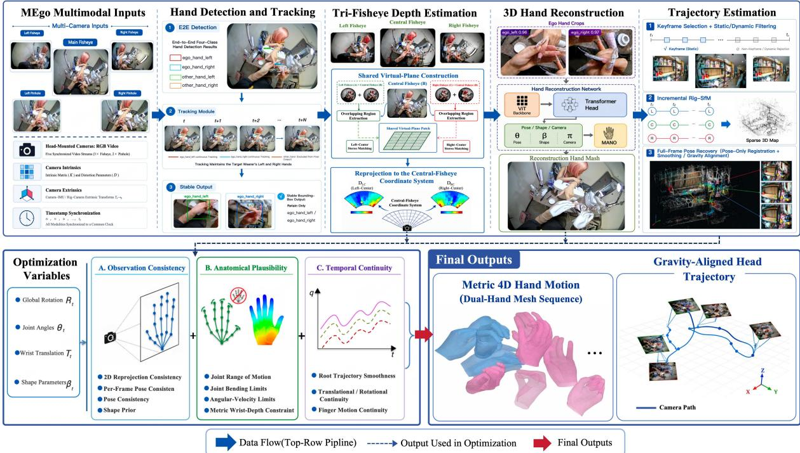  
Figure 1: The MEgoVista pipeline. A raw recording enters at the left. MEgoVista— generate the per-frame camera pose. HA NDSTAG E— hand detection, MANO regression, multi-view depth estimation, full-batch bundle adjustment. Outputs at the right: head trajectory and hand trajectory.

## 3. MEgoVista

## 3.1. Hardware

All data is collected using MEgo View1, a custom-designed head-mounted device for acquiring human manipulation behaviour in the wild. MEgo View carries fisheye cameras [36] whose wide field of view is analogous to human binocular vision, three of which are used below: a central camera and a calibrated stereo pair. The high resolution and 60 fps frame rate facilitate fine-grained and agile hand motion tracking, while the integrated Inertial Measurement Unit (IMU), sampled at 500 Hz, enables improved accuracy in camera pose estimation.

## 3.2. Hand Reconstruction

A. Ego-Aware Hand Detection and Initialization. In-the-wild egocentric videos frequently contain multiple visible hands from both the camera wearer and surrounding people. We therefore employ a trained end-to-end detector that jointly estimates hand location, ownership, and handedness, allowing the wearer’s left and right hands to be directly distinguished from other visible hands. A lightweight tracker further maintains temporally stable hand identities and consistent bounding boxes across the sequence. The tracked wearer-hand regions are then processed by models akin to WiLoR [13] and HaMeR [14] to obtain per-frame MANO [7] pose and shape estimates in the camera coordinate system, which serve as initialization for the subsequent metric reconstruction and sequence-level optimization.

B. Tri-Fisheye Virtual-Plane Metric Depth Estimation. To address the challenges posed by fisheye cameras on head-mounted devices—namely their large field of view, wide baselines, and mounting pose deviations—this paper proposes a stereo depth estimation and fusion method based on a triple-fisheye camera system. The central camera (MID) on the device forms two wide-baseline stereo pairs, MID×LEFT and MID×RIGHT, with the two side cameras (LEFT and

RIGHT). For each pair, we design a wide-baseline common-rotation rectification scheme: the rectified coordinate frame takes the baseline direction as its $e _ { 1 }$ axis to absorb arbitrary three-axis mounting offsets between the cameras, and the angle bisector of the two optical axes as its $e _ { 3 }$ axis, so that the common field of view is centered in the rectified images. This design guarantees row alignment while maximally preserving the effective field of view. The two rectified stereo pairs are then processed by the FoundationStereo [28] network, each producing a dense depth map together with a per-pixel confidence measure derived from the matching probability volume. The two depth maps are arbitrated and fused within the common field of view of the MID view. Finally, the fused depth is back-projected and analytically reprojected onto the MID fisheye pixel grid via the KB fisheye model, yielding a dense depth map that is pixel-aligned with the original fisheye image.

C. Full-Sequence Hand Motion Optimization. A per-frame regressor produces hands that may be individually plausible but are not necessarily consistent over time: they can jitter, drift in depth, or pass through configurations that a real hand cannot reach. We therefore optimize a single MANO trajectory over the complete episode, subject to three complementary requirements: consistency with the observations, continuity of the 3D motion, and anatomical plausibility.

Before optimization, we select reliable and informative observations to prevent erroneous per-frame estimates from contaminating the full-sequence trajectory. Each frame is evaluated according to detection confidence, depth validity and dispersion, joint spread, bone-ratio consistency, and left–right agreement. Observations that fail these checks are excluded from the corresponding optimization terms, while the remaining high-quality observations are used to constrain the full-sequence optimization.

The objective is organized accordingly:

1. Tight to the observations. $\mathcal { L } _ { \mathrm { r e p r o j } }$ is the 2D keypoint residual, normalized by hand boundingbox area so a distant hand retains a meaningful contribution rather than being dominated by a nearby one; $\mathcal { L } _ { \mathrm { s d e p t h } }$ constrains wrist camera-frame depth using the metric depth estimate from TriVP, providing the depth constraint that reprojection alone cannot reliably recover; and $\mathcal { L } _ { \mathrm { p o s e } }$ anchors finger pose to the per-frame regressor.

2. Continuous in 3D. Second-order smoothness $\mathcal { L } _ { \mathrm { { s m o o t h } } }$ acts on the root trajectory, while Huber terms $\mathcal { L } _ { \mathrm { w r o o t v e l } }$ and $\mathcal { L } _ { \mathrm { w r o o t a n g } }$ suppress translational and rotational drift without allowing a single large motion to dominate the residual. $\mathcal { L } _ { \mathrm { f i n g e r v e l } }$ further suppresses single-frame articulation jitter.

3. Anatomically correct. Differentiable $C ^ { 1 }$ relu2 barriers approximate, as soft penalties on a standard MANO solve, the anatomical constraints modeled explicitly by MS-MANO [21] and BioPR [23]. Specifically, $\mathcal { L } _ { \mathrm { r o m } }$ constrains the range of motion of individual joints, Lbend enforces bending limits in output space rather than parameter space, and $\mathcal { L } _ { \omega }$ limits angular velocity according to physiologically plausible bounds.

Both hands are jointly optimized over the complete episode rather than independently frame by frame, yielding temporally coherent MANO trajectories in the reconstructed metric world frame.

## 3.3. Motion Tracking

MEgoVista recovers a head pose at very nearly every frame, and with it the metric, gravityaligned world frame the hand stage is solved in (Section 3.2). A head pivots far more than it travels, and no scene carries the metre or the vertical, so each quantity comes from the instrument that determines it.

A. Rig-Constrained Incremental Reconstruction. Translation this weak is poor evidence about the camera model: a bundle adjustment free to move it trades a trusted calibration for lower reprojection error. The array is therefore one generalised camera [31, 30], images sharing a decode index forming one rig frame with a single head pose, all three fisheye under one Kannala–Brandt model [36] whose calibration stays frozen. Selection divides the labour: inertia finds motion cheaply, so gyroscope rotation and accelerometer energy nominate keyframes and no fast turn is missed, while only vision knows whether a candidate is informative, so Lucas–Kanade tracking against the last accepted keyframe rejects the poorly tracked and the static. Visibility is declared from the same rig layout, not left to a sequential matcher blind to time and camera arrays: keyframes match forward within each camera, the three at every shared timestamp, and non-keyframes match adjacent mapped keyframes for later PnP. Mapping and localisation are likewise split, a map dense enough for every frame being too large to bundleadjust: keyframes alone enter the incremental mapper [19], whose finished map is frozen and localised against by pose-only PnP.

B. Calibrated-Stereo Metric Initialisation. Scale can only be imposed at initialisation, and neither obvious seed carries it: the automatic choice is a near-pure-rotation pair whose scale can be wrong by orders of magnitude, and same-instant left and right images are one rig frame, degenerate in generalised relative pose. The seed is therefore constructed: left–right matches at a key timestamp, triangulated by DLT on the calibrated extrinsics and refined by Levenberg– Marquardt, give one registered rig frame at the true baseline to continue from. Scale thus comes from calibration rather than alignment — though only in the seed, leaving what grows from it free to drift.

C. Post-Hoc Inertial Gravity Alignment. A visual reconstruction has no preferred vertical, and supplying one by joint visual-inertial bundle adjustment would let inertial drift reach the geometry. Inertia therefore stays outside the optimisation, read only after vision is complete: gravity is propagated through the 500 Hz inertial stream, accelerometer contributions downweighted by |∥�∥ − �| so that violent motion is trusted less, smoothed by an RTS pass, and applied as one global rotation into the initial reading’s gravity-aligned frame.

## 4. Experiments

The order of what follows is the argument. Section 4.1 states the setup and the protocol in full; Section 4.2 then measures how good the reference itself is, before anything is measured against it; Section 4.3 and Section 4.4 score the two delivered quantities against that reference.

## 4.1. Experimental Setup

Dataset. Every episode was recorded with MEgo View at 60 fps inside a 26-camera, 120 Hz Chingmu motion-capture volume, with the rig worn normally, uninstrumented, and PTPsynced to the reference. The reference gives 6-DoF head pose from a rigid marker cluster on the headset shell and a hand skeleton from a 15-marker-per-hand vendor solve.

Metrics and alignment conventions. Because alignment is part of a metric’s definition, not an afterthought, Table 1 gives each metric with its convention: every head figure here uses hand-eye alignment with scale fixed at 1, so none is comparable to an ATE from evo’s default similarity fit.

## 4.2. Ground-Truth Construction and Validation

Spatial calibration puts both systems in one metric frame. From paired relative motions $A _ { i }$ and $B _ { i }$ of the rig camera and the head-mounted marker cluster, we solve $A _ { i } X _ { \mathrm { h c } } = X _ { \mathrm { h c } } B _ { i }$ for the constant cluster-to-camera transform $X _ { \mathrm { h c } } ,$ with intrinsics fixed. At time $t ,$ the measured cluster pose and $X _ { \mathrm { h c } }$ carry each motion-capture point into the camera frame. Calibration captures are disjoint from validation and evaluation, so $X _ { \mathrm { h c } }$ is never fitted to the hand predictions it is used to score.

Table 1: Metrics, each with the alignment that defines it. Jitter and violation rate, are referencefree and unaligned. Fitted scale is reported beside every trajectory figure but is not an error metric. Bold marks the primary hand metric, not a best result.
<table><tr><td>Metric</td><td>Aligned by</td><td>What it measures</td></tr><tr><td>PA-MPJPE-p</td><td></td><td>Procrustes similarity: R, t, s Primary. Finger articulation alone, with hand scale and wrist orientation removed</td></tr><tr><td>CT-p</td><td>none</td><td>absolute camera-frame wrist position; the depth-sensitive metric</td></tr><tr><td>ATE RMSE</td><td>hand-eye, scale fixed at 1</td><td>per-frame head position residual; RPE@1 s is the same residual over a 1 s interval</td></tr><tr><td>Fitted scale</td><td>similarity</td><td>metric gauge; not an error metric</td></tr></table>

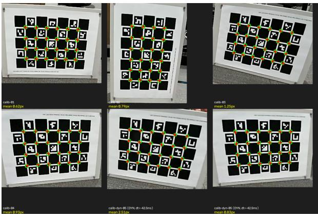  
(a) Held-out board poses.

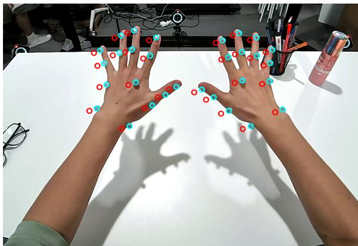  
(b) Hand points before (red) and after (cyan) calibration.  
Figure 2: Validation of the motion-capture-to-camera transform. Left: projected corners on held-out static and moving board frames; annotations are per-frame means. Right: projected hand points before (red) and after (cyan) calibration.

Held-out reprojection validates the chain end to end. The board is tracked by motion capture and imaged simultaneously by the rig, then transformed and projected exactly as the hand reference will be. Representative frames in Figure 2 show mean errors of 0.62–1.25 px when static and 0.83–2.51 px in motion. Static frames test geometry; moving frames additionally exercise PTP timestamp correspondence. These are illustrative single-frame means, not sequence-level statistics. The hand overlay confirms that the calibration transfers to the task domain.

The remaining limitation is the solved hand reference. Board reprojection validates the rigid transform, but not the vendor’s marker-to-skeleton solver. The shared screen of Section 4.1 therefore rejects observed failure signatures: frozen fingers below 0.02 mm/frame relative to the wrist (0.2–1.4 normally), solver spikes above 6× baseline, and fingertip–marker distances above 40 mm (10–20 normally). It catches discrete failures but not slow solver drift; any surviving reference error remains charged to the evaluated pipeline.

## 4.3. Motion-Tracking Accuracy

As shown in Table 2, ORB-SLAM3 and MEgoVista track the Chingmu reference to within a few millimetres and approximately 0.2◦ across both capture sessions, without tracking loss. Neither method consistently dominates: MEgoVista is more accurate on Session 2 (0.65 versus 0.92 mm steady-state), whereas ORB-SLAM3 is more accurate on Session 1 (2.12 versus 2.83 mm). Removing the first 5 s of each episode reduces ORB-SLAM3’s error by 1.15 mm, compared with only 0.04 mm for MEgoVista. This difference reflects the inertial initialisation required by ORB-

SLAM3 but absent from our offline reconstruction. It motivates the use of the offline stage in production, where episodes last approximately 30 s and a fixed initialisation transient occupies a substantially larger fraction of each sequence than of the longest evaluated clip (104.3 s).

On Session 1, DROID-W [37] and MASt3R-SLAM [35] are substantially less robust and exhibit different failure modes. DROID-W suffers severe scale failure on 4 of 22 episodes, with recovered scales of 0.80–2.68× and a mean SE(3) ATE of 395 mm. On the remaining 18 episodes, it achieves a mean hand-eye ATE of 26.18 mm at a mean fitted scale of 0.86×. MASt3R-SLAM loses tracking on one episode and underestimates scale on all remaining 21 (0.23–0.66×), yielding a mean hand-eye ATE of 121.59 mm. For MEgoVista, the mean scale deviation |� − 1| is 0.0120 on Session 1 and 0.0048 on Session 2, but fitted scale does not consistently predict episode-level accuracy (� = +0.30 and � = −0.44, respectively).

On episodes of comparable duration (approximately 40 s), MEgoVista requires an average of 206.0 s per episode, compared with 627.5 s for DROID-W and 715.4 s for MASt3R-SLAM. Under the same evaluation setting, these measurements correspond to approximately 3.0× and 3.5× reductions in per-episode wall-clock time, respectively.

Table 2: Head-trajectory accuracy against Chingmu 26-camera 120 Hz optical motion capture. Per-episode RMSE, averaged over episodes, hand-eye aligned per capture day (Table 1). ORB-SLAM3 rows score an offline-refined trajectory, not the raw online output (Section 4.1). Steady discards the first 5 s (not computed for DROID-W/MASt3R-SLAM, Session 1 only). DROID-W/MASt3R-SLAM rows exclude failure episodes; see Section 4.3. Fitted scale is not an error metric. Bold: lowest ATE per group.
<table><tr><td>Session</td><td>Head-pose source</td><td>n</td><td>Window</td><td>ATE RMSE mm</td><td>Rotation deg</td><td>RPE@1s mm / deg</td><td>Fitted scale</td></tr><tr><td rowspan="6">Session 1</td><td rowspan="2">ORB-SLAM3 (refined)</td><td>22</td><td>full</td><td>3.27</td><td>0.184</td><td>3.77 / 0.219</td><td>0.9923</td></tr><tr><td>22</td><td>steady</td><td>2.12</td><td>0.154</td><td>2.64 / 0.188</td><td>0.9945</td></tr><tr><td>DROID-W [37] (clean, excl. 4/22)</td><td>18</td><td>full</td><td>26.18</td><td></td><td>-/-</td><td>0.8608</td></tr><tr><td>MASt3R-SLAM [35] (excl. 1/22)</td><td>21</td><td>full</td><td>121.59</td><td></td><td>-/-</td><td>0.5268</td></tr><tr><td rowspan="2">MEgoVista (ours, offline)</td><td>22</td><td>full</td><td>2.87</td><td>0.158</td><td>3.66 / 0.194</td><td>1.0118</td></tr><tr><td>22</td><td>steady</td><td>2.83</td><td>0.160</td><td>3.67 / 0.196</td><td>1.0117</td></tr><tr><td rowspan="4">Session 2</td><td>ORB-SLAM3 (refined)</td><td>20</td><td>full</td><td>1.00</td><td>0.260</td><td>1.34 / 0.308</td><td>1.0008</td></tr><tr><td>MEgoVista (ours, offline)</td><td>20</td><td>steady</td><td>0.92</td><td>0.263</td><td>1.29 / 0.317</td><td>1.0026</td></tr><tr><td></td><td>20</td><td>full</td><td>0.75</td><td>0.258</td><td>1.06 / 0.307</td><td>0.9951</td></tr><tr><td>20</td><td>steady</td><td>0.65</td><td>0.262</td><td>1.04 / 0.316</td><td></td><td>0.9969</td></tr></table>

## 4.4. Hand-Reconstruction Accuracy

As shown in Table 3, EgoVista outperforms all open-source baselines on every metric.

For detection, EgoVista attains perfect Precision, Recall, and F1 (1.00), producing neither missed nor hallucinated hands across the entire evaluation set; in contrast, Dyn-HaMR hallucinates frequently under occlusion (Precision 0.73 despite full recall), and HaWoR still misses or spuriously detects hands occasionally (F1 0.98). Under the coverage-aware protocol, where missed detections incur a deterministic placeholder error, complete detection coverage also directly benefits the accuracy metrics below.

For 3D pose, EgoVista reduces PA-MPJPE-p to 4.29 mm, a 70% improvement over the strongest baseline HaWoR (16.30 mm) and an order-of-magnitude reduction relative to Dyn-HaMR (49.18 mm).

The margin is largest on orientation and position: EPE-P drops from 83.10 px (HaWoR) to 9.90 px (8.4×), and CT-p from 46.70 to 14.30 (69% reduction), indicating that our method recovers the absolute hand position far more accurately, which we attribute to the explicit geometric depth constraints provided by our multi-view depth estimation.

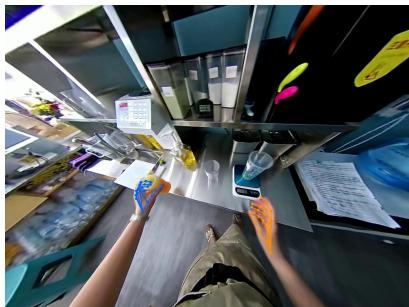

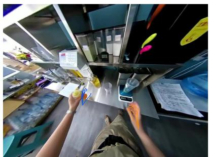

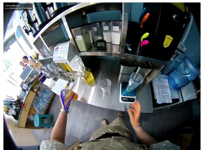

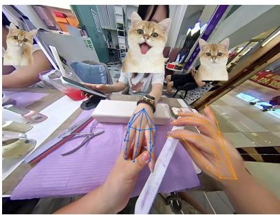

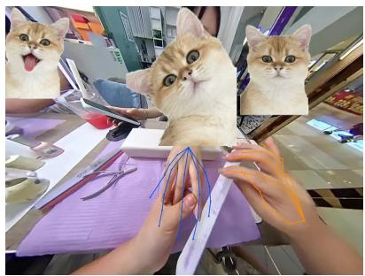

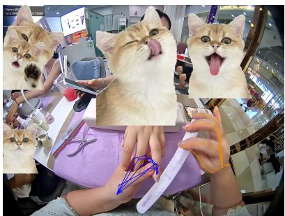

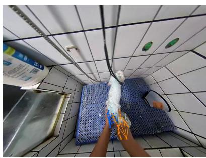  
Dyn-HaMR

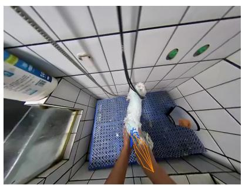  
HaWoR

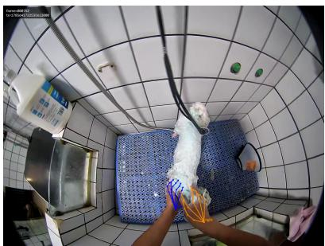  
EgoVista (Ours)  
Figure 3: Qualitative comparison on in-the-wild recordings. Top: rapid hand motion; middle: interaction with a bystander’s hand; bottom: soiled hands under fast motion. Baselines exhibit pose offsets (top, bottom) or misattribute the bystander’s hand to the wearer (middle), while EgoVista maintains tight alignment and correct hand identity throughout.

For temporal smoothness, EgoVista attains a jitter of 1.11 mm/frame2, 3.2× lower than the smoothest baseline (Dyn-HaMR, 3.50) and an order of magnitude below HaWoR (16.71), without any test-time optimization. Notably, HaPTIC fails entirely in our multi-person capture scenes—a practically significant limitation, as bystanders are common in real-world egocentric deployment. Overall, these results demonstrate that EgoVista delivers substantially more complete, accurate, and stable hand reconstruction than existing open-source methods.

Table 3: Comparison with open-source egocentric hand reconstruction methods against motion-capture ground truth. All methods are evaluated on identical segments of our motioncapture dataset. All baselines are re-run and rescored on our data. HaPTIC fails to produce valid output in our multi-person capture scenes. Bold marks the best result in each column.
<table><tr><td rowspan="2">Method</td><td colspan="3">Detection</td><td>3D Pose</td><td colspan="2">Orient. &amp; Position</td><td>Temporal</td></tr><tr><td>Precision ↑</td><td>Recall ↑</td><td>F1↑</td><td>PA-MPJPE-p ↓</td><td>CT-p↓</td><td>EPE-P↓</td><td>Jitter ↓</td></tr><tr><td>Dyn-HaMR[16]</td><td>0.73</td><td>1.00</td><td>0.84</td><td>49.18</td><td>184.38</td><td>96.42</td><td>3.50</td></tr><tr><td>HaWoR[15]</td><td>0.96</td><td>0.99</td><td>0.98</td><td>16.30</td><td>46.70</td><td>83.10</td><td>16.71</td></tr><tr><td>HaPTIC[20]</td><td></td><td></td><td></td><td></td><td></td><td></td><td></td></tr><tr><td>EgoVista (Ours)</td><td>1.00</td><td>1.00</td><td>1.00</td><td>4.29</td><td>14.30</td><td>9.90</td><td>1.11</td></tr></table>

## 4.5. Qualitative results in the wild

We further evaluate EgoVista on real-world recordings for which no motion-capture ground truth is available, and assess the results qualitatively by the alignment between the projected hand skeletons and the observed hands (Fig. 3). Three representative challenging scenarios are shown.

(i) Rapid hand motion (milk-tea preparation): both EgoVista and Dyn-HaMR produce skeletons that align well with the hands, whereas HaWoR exhibits a noticeable offset on the left hand; this is consistent with its order-of-magnitude higher jitter in Table 3 (16.71 vs. 1.11), as frame-wise instability manifests directly as misalignment under fast motion.

(ii) Interaction with another person’s hands (manicure): when the wearer’s left hand approaches and interacts with a bystander’s left hand, both Dyn-HaMR and HaWoR misattribute the bystander’s hand to the wearer, while EgoVista correctly disambiguates identities and reconstructs only the wearer’s hands. This failure mode explains the low detection precision of Dyn-HaMR (0.73) in Table 3 and echoes the complete failure of HaPTIC in multi-person scenes: distinguishing the wearer’s hands from bystanders’ hands remains an open challenge for existing egocentric methods.

(iii) Rapid motion with soiled hands (animal washing): although both EgoVista and Dyn-HaMR successfully detect the dirt-covered hands, HaWoR shows a slight offset on the left hand with an inaccurate wrist position, in line with its higher CT-p error (46.70) in the quantitative comparison. Overall, the qualitative results corroborate our quantitative findings: EgoVista achieves more complete detection, tighter image-plane alignment, and robust hand identity disambiguation, with the largest margins under fast motion and multi-person interference.

## 5. Conclusion

MEgoVista takes an unprepared egocentric recording and returns metric two-hand motion and a metric head trajectory in one world frame, and — unusually for this class of system — it has been held to a measured standard: both delivered quantities were scored against 26-camera optical motion capture under a protocol that charges missed detections and audits its own reference rather than assuming it. Head trajectory lands at 0.65 to 2.83 mm, finger articulation near 5 mm PA-MPJPE-p— the last being the figure a flattering summary would omit and a consumer of the labels most needs. What transfers beyond this particular system is narrower than the system itself: taking metric gauge from calibration at initialisation, rather than recovering it by alignment afterwards, is what makes such a measurement meaningful at all, and the quantity that exposes its failure is fitted scale rather than aligned error. Whether the next millimetre requires a better estimator or a better reference is genuinely undecided, and the board capture of Section 4.2 is the experiment that would decide it.

## References

[1] Yifan Ye, Yankai Fu, Yaoxu Lv, Bohan Hou, Jun Cen, Lingdong Kong, and Shanghang Zhang. Data pyramid for embodied manipulation: A survey, 2026. arXiv preprint arXiv:2607.24744.

[2] Kristen Grauman et al. Ego4D: Around the world in 3,000 hours of egocentric video. In Proceedings of the IEEE/CVF Conference on Computer Vision and Pattern Recognition (CVPR), pages 18973–18990, 2022. doi: 10.1109/CVPR52688.2022.01842.

[3] Dima Damen, Hazel Doughty, Giovanni Maria Farinella, Antonino Furnari, Evangelos Kazakos, Jian Ma, Davide Moltisanti, Jonathan Munro, Toby Perrett, Will Price, and Michael Wray. Rescaling egocentric vision: Collection, pipeline and challenges for EPIC-KITCHENS-100. International Journal of Computer Vision, 130(1):33–55, 2022. doi: 10.1007/s11263-021-0 1531-2.

[4] Kristen Grauman et al. Ego-Exo4D: Understanding skilled human activity from first- and third-person perspectives. In Proceedings of the IEEE/CVF Conference on Computer Vision and Pattern Recognition (CVPR), pages 19383–19400, 2024. doi: 10.1109/CVPR52733.2024.01834.

[5] Ryan Hoque, Peide Huang, David J. Yoon, Mouli Sivapurapu, and Jian Zhang. EgoDex: Learning dexterous manipulation from large-scale egocentric video. In International Conference on Learning Representations (ICLR), 2026.

[6] Build AI. Egocentric-10k, 2025. URL https://huggingface.co/datasets/builddot ai/Egocentric-10K.

[7] Javier Romero, Dimitrios Tzionas, and Michael J. Black. Embodied hands: Modeling and capturing hands and bodies together. ACM Transactions on Graphics, 36(6):245:1–245:17, 2017. doi: 10.1145/3130800.3130883.

[8] Ri-Zhao Qiu, Shiqi Yang, Xuxin Cheng, Chaitanya Chawla, Jialong Li, Tairan He, Ge Yan, David J. Yoon, Ryan Hoque, Lars Paulsen, Ge Yang, Jian Zhang, Sha Yi, Guanya Shi, and Xiaolong Wang. Humanoid policy human policy, 2025. URL https://arxiv.org/abs/ 2503.13441.

[9] Ruijie Zheng, Dantong Niu, Yuqi Xie, Jing Wang, Mengda Xu, Yunfan Jiang, Fernando Castañeda, Fengyuan Hu, You Liang Tan, Letian Fu, Trevor Darrell, Furong Huang, Yuke Zhu, Danfei Xu, and Linxi Fan. Egoscale: Scaling dexterous manipulation with diverse egocentric human data, 2026. URL https://arxiv.org/abs/2602.16710.

[10] Qixiu Li, Yu Deng, Yaobo Liang, Lin Luo, Lei Zhou, Chengtang Yao, Lingqi Zeng, Zhiyuan Feng, Huizhi Liang, Sicheng Xu, Yizhong Zhang, Xi Chen, Hao Chen, Lily Sun, Dong Chen, Jiaolong Yang, and Baining Guo. Scalable vision-language-action model pretraining for robotic manipulation with real-life human activity videos, 2025. URL https://arxiv.or g/abs/2510.21571.

[11] Zicong Fan, Omid Taheri, Dimitrios Tzionas, Muhammed Kocabas, Manuel Kaufmann, Michael J. Black, and Otmar Hilliges. ARCTIC: A dataset for dexterous bimanual handobject manipulation. In Proceedings of the IEEE/CVF Conference on Computer Vision and Pattern Recognition (CVPR), pages 12943–12954, 2023. doi: 10.1109/CVPR52729.2023.01244.

[12] Fadime Sener, Dibyadip Chatterjee, Daniel Shelepov, Kun He, Dipika Singhania, Robert Wang, et al. Assembly101: A large-scale multi-view video dataset for understanding procedural activities. In Proceedings of the IEEE/CVF Conference on Computer Vision and Pattern Recognition (CVPR), pages 21064–21074, 2022. doi: 10.1109/CVPR52688.2022.02042.

[13] Rolandos Alexandros Potamias, Jinglei Zhang, Jiankang Deng, and Stefanos Zafeiriou. WiLoR: End-to-end 3D hand localization and reconstruction in-the-wild. In Proceedings of the IEEE/CVF Conference on Computer Vision and Pattern Recognition (CVPR), pages 12242– 12254, 2025. doi: 10.1109/CVPR52734.2025.01143.

[14] Georgios Pavlakos, Dandan Shan, Ilija Radosavovic, Angjoo Kanazawa, David Fouhey, and Jitendra Malik. Reconstructing hands in 3D with transformers. In Proceedings of the IEEE/CVF Conference on Computer Vision and Pattern Recognition (CVPR), pages 9826–9836, 2024. doi: 10.1109/CVPR52733.2024.00938.

[15] Jinglei Zhang, Jiankang Deng, Chao Ma, and Rolandos Alexandros Potamias. HaWoR: World-space hand motion reconstruction from egocentric videos. In Proceedings of the IEEE/CVF Conference on Computer Vision and Pattern Recognition (CVPR), pages 1805–1815, 2025. doi: 10.1109/CVPR52734.2025.00175.

[16] Zhengdi Yu, Stefanos Zafeiriou, and Tolga Birdal. Dyn-HaMR: Recovering 4D interacting hand motion from a dynamic camera. In Proceedings ofthe IEEE/CVF Conference on Computer Vision and Pattern Recognition (CVPR), pages 27716–27726, 2025. doi: 10.1109/CVPR52734. 2025.02581.

[17] Luigi Piccinelli, Christos Sakaridis, Yung-Hsu Yang, Mattia Segù, Siyuan Li, Wim Abbeloos, and Luc Van Gool. UniDepthV2: Universal monocular metric depth estimation made simpler. IEEE Transactions on Pattern Analysis and Machine Intelligence, 48:2354–2367, 2026. doi: 10.1109/TPAMI.2025.3628473.

[18] Carlos Campos, Richard Elvira, Juan J. Gómez Rodríguez, José M. M. Montiel, and Juan D. Tardós. ORB-SLAM3: An accurate open-source library for visual, visual-inertial, and multimap SLAM. IEEE Transactions on Robotics, 37(6):1874–1890, 2021. doi: 10.1109/TRO. 2021.3075644.

[19] Johannes L. Schönberger and Jan-Michael Frahm. Structure-from-motion revisited. In Proceedings of the IEEE Conference on Computer Vision and Pattern Recognition (CVPR), pages 4104–4113, 2016. doi: 10.1109/CVPR.2016.445.

[20] Yufei Ye, Yao Feng, Omid Taheri, Haiwen Feng, Shubham Tulsiani, and Michael J. Black. Predicting 4D hand trajectory from monocular videos, 2025. arXiv preprint arXiv:2501.08329.

[21] Pengfei Xie, Wenqiang Xu, Tutian Tang, Zhenjun Yu, and Cewu Lu. MS-MANO: Enabling hand pose tracking with biomechanical constraints. In Proceedings of the IEEE/CVF Conference on Computer Vision and Pattern Recognition (CVPR), pages 2382–2392, 2024. doi: 10.1109/CV PR52733.2024.00231.

[22] Soshi Shimada, Vladislav Golyanik, Weipeng Xu, and Christian Theobalt. PhysCap: Physically plausible monocular 3D motion capture in real time. ACM Transactions on Graphics, 39 (6):235:1–235:16, 2020. doi: 10.1145/3414685.3417877.

[23] Tao Du et al. BioPR: Biomechanically plausible hand pose regression. In Proceedings of the IEEE/CVF International Conference on Computer Vision (ICCV), 2023.

[24] Shuzhe Wang, Vincent Leroy, Yohann Cabon, Boris Chidlovskii, and Jérôme Revaud. DUSt3R: Geometric 3D vision made easy. In Proceedings of the IEEE/CVF Conference on Computer Vision and Pattern Recognition (CVPR), pages 20697–20709, 2024. doi: 10.1109/CV PR52733.2024.01956.

[25] Vincent Leroy, Yohann Cabon, and Jérôme Revaud. Grounding image matching in 3D with MASt3R. In Proceedings of the European Conference on Computer Vision (ECCV), pages 71–91, 2024. doi: 10.1007/978-3-031-73220-1\_5.

[26] Jianyuan Wang, Minghao Chen, Nikita Karaev, Andrea Vedaldi, Christian Rupprecht, and David Novotný. VGGT: Visual geometry grounded transformer. In Proceedings of the IEEE/CVF Conference on Computer Vision and Pattern Recognition (CVPR), pages 5294–5306, 2025. doi: 10.1109/CVPR52734.2025.00499.

[27] Luigi Piccinelli, Christos Sakaridis, Mattia Segù, Yung-Hsu Yang, Siyuan Li, Wim Abbeloos, and Luc Van Gool. UniK3D: Universal camera monocular 3D estimation. In Proceedings of the IEEE/CVF Conference on Computer Vision and Pattern Recognition (CVPR), pages 1028–1039, 2025. doi: 10.1109/CVPR52734.2025.00104.

[28] Bowen Wen, Matthew Trepte, Joseph Aribido, Jan Kautz, Orazio Gallo, and Stan Birchfield. FoundationStereo: Zero-shot stereo matching. In Proceedings of the IEEE/CVF Conference on Computer Vision and Pattern Recognition (CVPR), pages 5249–5260, 2025. doi: 10.1109/CVPR 52734.2025.00495.

[29] Nikhila Ravi, Valentin Gabeur, Yuan-Ting Hu, Ronghang Hu, Chaitanya Ryali, Tengyu Ma, Haitham Khedr, Roman Rädle, et al. SAM 2: Segment anything in images and videos. In International Conference on Learning Representations (ICLR), 2025.

[30] Robert Pless. Using many cameras as one. In Proceedings of the IEEE Conference on Computer Vision and Pattern Recognition (CVPR), pages 587–593, 2003. doi: 10.1109/CVPR.2003.121152 0.

[31] Johannes L. Schönberger. Robust Methods for Accurate and Efficient 3D Modeling from Unstructured Imagery. PhD thesis, ETH Zürich, 2018.

[32] Linfei Pan, Dániel Baráth, Marc Pollefeys, and Johannes L. Schönberger. Global structurefrom-motion revisited. In Proceedings of the European Conference on Computer Vision (ECCV), pages 58–77, 2024. doi: 10.1007/978-3-031-73661-2\_4.

[33] Zhengqi Li, Richard Tucker, Forrester Cole, Qianqian Wang, Linyi Jin, Vickie Ye, Angjoo Kanazawa, Aleksander Holynski, and Noah Snavely. MegaSaM: Accurate, fast and robust structure and motion from casual dynamic videos. In Proceedings of the IEEE/CVF Conference on Computer Vision and Pattern Recognition (CVPR), pages 10486–10496, 2025. doi: 10.1109/ CVPR52734.2025.00981.

[34] Zachary Teed and Jia Deng. DROID-SLAM: Deep visual SLAM for monocular, stereo, and RGB-D cameras. In Advances in Neural Information Processing Systems (NeurIPS), pages 16558–16569, 2021.

[35] Riku Murai, Eric Dexheimer, and Andrew J. Davison. MASt3R-SLAM: Real-time dense SLAM with 3D reconstruction priors. In Proceedings of the IEEE/CVF Conference on Computer Vision and Pattern Recognition (CVPR), pages 16695–16705, 2025. doi: 10.1109/CVPR52734. 2025.01556.

[36] Juho Kannala and Sami S. Brandt. A generic camera model and calibration method for conventional, wide-angle, and fish-eye lenses. IEEE Transactions on Pattern Analysis and Machine Intelligence, 28(8):1335–1340, 2006. doi: 10.1109/TPAMI.2006.153.

[37] Moyang Li, Zihan Zhu, Marc Pollefeys, and Daniel Barath. Droid-slam in the wild. In Proceedings of the IEEE/CVF Conference on Computer Vision and Pattern Recognition (CVPR), 2026.