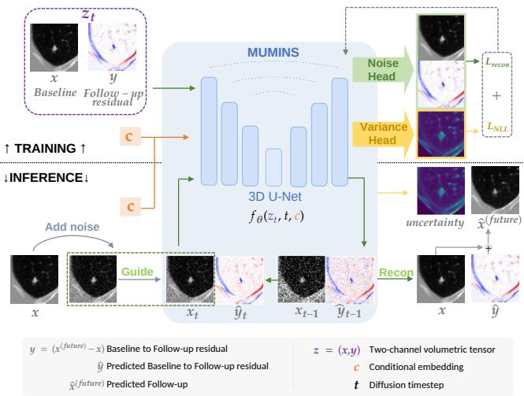
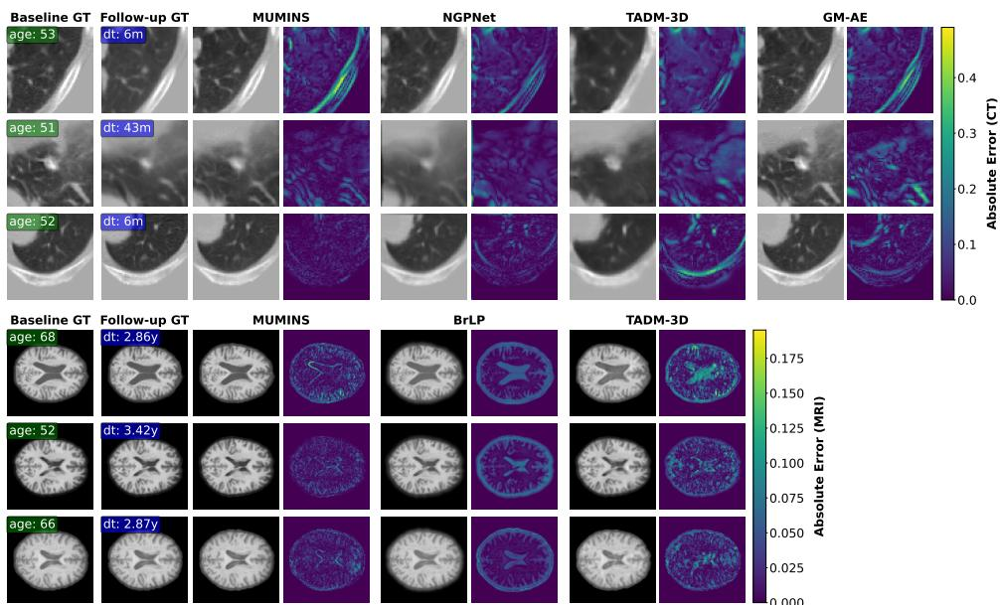
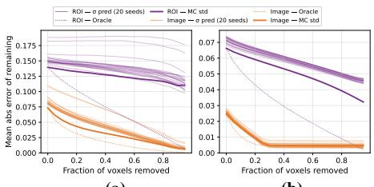
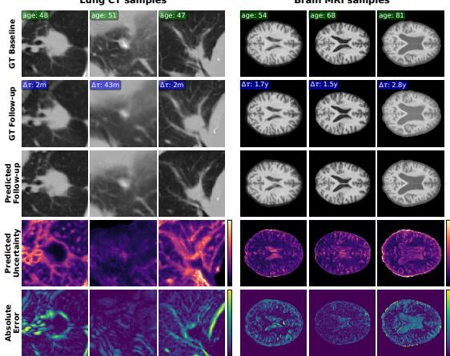

# MUMINS: Metadata-conditioned Uncertainty-aware Medical Image Next-state Synthesis

Anna Oliveras1,2, Roger Mar´ı1, Rafael Redondo1, Oriol Guardia-Olivella\` 1, Cynthia Ifeyinwa Ugwu1, Ana Tost1, Bhalaji Nagarajan3, Carolina Migliorelli1, Vicent Ribas1, Petia Radeva2,4

1Eurecat, Centre Tecnologic de Catalunya, Barcelona, Spain\` 2Dept. de Matematiques i Inform \` atica, Universitat de Barcelona, Barcelona, Spain \` 3Barcelona Supercomputing Center (BSC), Barcelona, Spain 4Institut de Neurociencies, Universitat de Barcelona, Barcelona, Spain\`

anna.oliveras@eurecat.org, roger.mari@eurecat.org, rafael.redondo@eurecat.org, oriol.guardia@eurecat.org, cynthia.ugwu@eurecat.org, ana.tost@eurecat.org, bhalaji.nagarajan@bsc.es, carolina.migliorelli@eurecat.org, vicent.ribas@eurecat.org, petia.radeva@ub.edu

## Abstract

Forecasting anatomical changes such as tumor growth and neurodegeneration is a challenging generative vision task. Morphological evolution is subtle relative to static anatomy, highly patient-specific, and inherently stochastic. Existing methods struggle with several issues: deterministic networks ignore biological stochasticity, while standard diffusion models require computationally prohibitive multi-pass sampling to quantify uncertainty. We propose MUMINS (Metadata-conditioned Uncertainty-aware Medical Image Next-state Synthesis), an efficient diffusion framework that jointly diffuses a baseline scan and its follow-up residual, summed to synthesize the follow-up scan, while concurrently predicting a spatial uncertainty map, in a single reverse diffusion process. Conditioned on the time interval and relevant metadata, it preserves fine-grained anatomy by dynamically re-injecting the baseline as a soft anchor at every denoising step, and a negative-log-likelihood head learns the uncertainty map to explicitly flag error-prone regions. Designed without organ-specific heuristics, the same architecture is reused across anatomies via separate, dataset-specific retraining. Extensive evaluations demonstrate that dataset-specific retraining of MUMINS matches or outperforms dedicated, domain-specific state-of-the-art methods on lung CT (PNG) and brain MRI (OASIS-3). Project page: https://github.com/aolivtous/MUMINS.

  
Figure 1. MUMINS overview. Training: the model learns to jointly generate the baseline image, the baseline-to-follow-up residual, and a voxel-wise uncertainty map via denoising diffusion. Inference: the real baseline is re-injected at every denoising step to guide residual generation. Joint state (baseline-residual) representation enhances consistency between scans, while predicted uncertainty highlights error-prone regions of the synthetic follow-up.

## 1. Introduction

Predicting how anatomy evolves over time is a clinical necessity. In lung cancer, Computed Tomography (CT) screening identifies millions of indeterminate pulmonary nodules yearly, and survival hinges on resolving the “waitand-watch” dilemma between benign, indolent lesions and early-stage malignancies [31]. In neurodegeneration, longitudinal brain Magnetic Resonance Imaging (MRI) underpins the tracking of Alzheimer’s disease progression, where patient-specific forecasts could accelerate trial stratification and treatment decisions [1]. In both modalities, forecasting a future scan (follow-up) from a starting scan (baseline) at an arbitrary interval is a prognostic necessity.

From a computer-vision standpoint, this is a hard conditional generation problem: the morphological change between scans is small relative to the static anatomy, highly patient-specific, and inherently stochastic [2, 11]. A generative model must therefore preserve fine baseline scan details while generating plausible changes, and, since a single deterministic output cannot capture the range of biologically plausible futures, should at least flag where its own prediction is most likely to diverge from the true outcome.

Progression modeling has evolved from classical analytical models [12, 22] to discriminative deep-learning predictors [8, 18, 36] and, recently, generative models [19, 29, 39, 42]. However, three limitations persist. First, determinism: the dominant deterministic and kinetic-model methods yield a single future for each input. Second, organ specificity: existing methods embed anatomy- or modalityspecific components (e.g., brain-age regularizers, growthkinetic priors), so each new setting demands a custom architecture [7, 9]. Third, uncertainty: recent diffusion models offer probabilistic synthesis [19, 29, 42], but extracting a per-voxel uncertainty map requires costly Monte Carlo aggregation over many reverse-diffusion passes [20, 41, 43].

We propose MUMINS (Metadata-conditioned Uncertainty-aware Medical Image Next-state Synthesis), a diffusion framework that forecasts a patient’s follow-up scan (next state) at an arbitrary future interval $\Delta \tau$ from their current one (baseline), along with a spatial uncertainty map, addressing all three limitations above. Fig. 1 gives an overview of the method. Our contributions are:

• Joint baseline-residual representation. MUMINS jointly denoises the baseline and baseline-to-follow-up residual, with baseline re-injection at each inference step to preserve patient-specific anatomy while synthesizing plausible morphological change.

• Single-pass per-voxel uncertainty prediction. We embed likelihood-based uncertainty learning to predict voxel-wise uncertainty from a single reverse-diffusion process. This bypasses the prohibitive cost of Monte Carlo sampling, which requires multiple inferences per sample, yielding uncertainty maps that correlate with reconstruction error.

• Domain-agnostic design. MUMINS uses a universal architecture with generic metadata conditioning, free of organ- or modality-specific components. After datasetspecific retraining, it matches or outperforms domainspecific state-of-the-art methods on PNG lung CT [35] and OASIS-3 brain MRI [17].

## 2. Related Work

Longitudinal medical image progression aims to forecast patient-specific anatomical change from baseline scans, with growing attention to the uncertainty associated with such forecasts [46]. In line with the experimental benchmarks considered in this work, we first discuss existing methods for pulmonary nodule evolution and neurodegenerative brain progression, then review recent diffusion-based approaches to uncertainty quantification.

## 2.1. Longitudinal Medical Image Progression

Deterministic and registration-based methods. Early progression models are deterministic regressors that learn a fixed mapping from baseline to follow-up. For lung nodules, NoFoNet [18] learns voxel-wise displacement fields to warp the baseline scan, refining intensities via a dedicated TextureNet branch, while Tao et al. [36] similarly warp a prior scan conditioned on the follow-up interval. LCTformer [21] instead couples a longitudinal Transformer with a ConvLSTM to capture spatiotemporal growth dynamics. A parallel line of work couples clinical kinetic growth models (e.g., Gompertz functions) with deep generative networks: GM-AE [8], LNGNet [38], and STGNet [10] all follow a two-stage paradigm, first predicting future nodule mass or volume via kinetic equations, then conditioning a downstream decoder to synthesize the final shape and texture. Recently, NGP-Net [35] introduced a lightweight growth architecture and released the longitudinal Pulmonary Nodule Growth (PNG) dataset, which, unlike fixed-interval datasets such as NLST [24], features irregular scan intervals handled via a dedicated spatiotemporal encoding module. Despite their differing mechanisms, deterministic approaches yield only a single predicted future without progression uncertainty, and kineticmodel variants are additionally vulnerable to error propagation, as downstream shape and texture generation depend on the accuracy of upstream growth predictions.

Adversarial and Flow Matching methods. GP-WGAN [39] proposed adversarial training for nodule progression by generating one-year follow-up scans, demonstrating that synthesized images could improve malignancy classification. To model continuous dynamics, CorrFlowNet [42] maps baseline CT embeddings to follow-up embeddings via a latent Neural ODE trained with flow matching, using a correlational autoencoder to isolate nodule progression from static lung anatomy. Similarly, IMMFM [14] employs piecewise-quadratic interpolation paths as smooth targets for flow matching in longitudinal neuroimaging. While these methods can model progression over continuous time, they mainly learn transitions from one state to another rather than capturing dense distributions of plausible follow-up scans, motivating diffusion-based approaches.

Diffusion-based progression. Denoising diffusion probabilistic models (DDPMs) have become a dominant paradigm for high-fidelity image generation [6, 23, 26, 27]. Recent methods leverage DDPMs for follow-up synthesis, but remain deeply anatomy-, disease-, or modality-specific. In pulmonary imaging, CIResDiff [15] predicts idiopathic pulmonary fibrosis progression by learning residual differences between scans, conditioned on Contrastive Language-Image Pretraining (CLIP) [30] embeddings. For brain MRI, TADM-3D [19] models volumetric progression as residual diffusion over intensity differences, enforcing temporal coherence via Brain-Age Estimator conditioning and Back-In-Time Regularization, while TaDiff [20] integrates treatment awareness into the diffusion process for diffuse glioma growth prediction, guided by sequential multi-parametric MRI and treatment plans. BrLP [29] operates in a compact latent space using a latent diffusion model, a Control-Net [45], an auxiliary volumetric network, and a patch discriminator for adversarial training, averaging multiple generation paths to improve spatiotemporal consistency and volumetric accuracy in Alzheimer’s disease.

## 2.2. Uncertainty Quantification in Diffusion Models

Quantifying uncertainty in diffusion-based synthesis is an active, clinically relevant area. The most direct approach is Monte Carlo (MC) sampling: running the reverse process N times and taking the per-voxel variance [20, 29, 41, 43]. This scales as $N \times T$ network evaluations per volume and is sensitive to N [32]. BayesDiff [16] reduces this cost via a post-hoc Last-Layer Laplace Approximation but still resamples weights every step, leaving the multi-pass bottleneck intact. A complementary line, from sports trajectory forecasting, instead learns uncertainty in a single forward pass: U2Diff [3] and its heteroscedastic extension U2Diffine [4] add a bivariate NLL term to the DDPM objective, jointly predicting the noise’s mean and variance. U2Diffine propagates this variance to the output via a firstorder Taylor expansion of the reverse update, linearizing the denoiser via its Jacobian; U2Diff forgoes this for speed.

## 3. Methodology

In this section, we describe MUMINS in four stages. First, follow-up synthesis is formulated as conditional generation of a joint baseline-residual state, separating static anatomy from longitudinal change. Second, a 3D temporally conditioned diffusion model learns this joint state and its associated uncertainty. Third, during sampling, the baseline scan is re-injected at every reverse step to anchor the generated residual to patient-specific anatomy. Finally, uncertainty estimates from the reverse steps are accumulated into a voxel-wise map of where the synthesized follow-up is less reliable. Fig. 1 gives an overview of the method.

## 3.1. Joint Baseline-Residual Representation

Let a patient’s baseline anatomical state be an observation $\mathbf { x } \in \bar { \mathcal { X } } \subset \mathbb { R } ^ { D \times H \times W }$ acquired at time $\tau _ { 0 }$ , and the follow-up state be $\mathbf { x } ^ { ( \mathrm { f u t u r e } ) }$ acquired at $\tau _ { f u t u r e } ,$ , with temporal interval $\Delta \tau = \tau _ { f u t u r e } - \tau _ { 0 }$ . Directly modeling $p ( \mathbf { x } ^ { ( \mathrm { f u t u r e } ) } \mid \mathbf { x } , \Delta \tau )$ often leads to shortcut learning, where the network ignores the temporal condition or fails to preserve patient-specific anatomy [19, 20]. We instead target the longitudinal residual $\textbf { y } = \textbf { x } ^ { ( \mathrm { f u t u r e } ) } - \textbf { x }$ , isolating disease progression and anatomical evolution from the static anatomy, and synthesize it jointly with the baseline as $\mathbf { z } = ( \mathbf { x } , \mathbf { y } )$ . This formulation is inspired by DiffAtlas [44], a segmentation method that jointly diffuses an image and its mask and, at inference, substitutes the known image at each reverse step to guide mask generation. We adapt this idea to progression along two axes. First, rather than an image-mask pair, our joint state pairs the static baseline x with the dynamic residual $\mathbf { y } ,$ so that substituting the known baseline at inference (Sec. 3.5) guides the generated residual. Second, we condition on clinical and acquisition variables c (Sec. 3.3) to further encourage patient- and time-specific synthesis. We therefore learn the conditional joint distribution $p _ { \theta } ( \mathbf { z } \mid \mathbf { c } ) ;$ modeling baseline and residual jointly keeps the generated progression structurally consistent with the baseline.

## 3.2. Forward Process and Noise Prediction

We construct a discrete-time Markovian diffusion process that progressively adds Gaussian noise to the joint data distribution ${ \bf z } _ { 0 } \sim p _ { d a t a } ( { \bf z } )$ [13]. Following [25], the noise is scheduled with a cosine variance profile $\beta _ { 1 } , \ldots , \beta _ { T }$ over T steps, defining the forward transitions as $q ( \mathbf { z } _ { t } \mid \mathbf { z } _ { t - 1 } ) =$ $\mathcal { N } ( \mathbf { z } _ { t } ; \sqrt { 1 - \beta _ { t } } \mathbf { z } _ { t - 1 } , \beta _ { t } \mathbf { I } )$ . Using the reparameterization $\begin{array} { r } { \bar { \alpha } _ { t } = \prod _ { s = 1 } ^ { t } ( 1 - \beta _ { s } ) } \end{array}$ , the marginal distribution at any diffusion timestep t is given in closed form:

$$
q ( \mathbf { z } _ { t } \mid \mathbf { z } _ { 0 } ) = \mathcal { N } ( \mathbf { z } _ { t } ; \sqrt { \bar { \alpha } _ { t } } \mathbf { z } _ { 0 } , ( 1 - \bar { \alpha } _ { t } ) \mathbf { I } ) .\tag{1}
$$

The reverse process is parameterized by a 3D U-Net [5] $f _ { \theta } ( \mathbf { z } _ { t } , t , \mathbf { c } )$ outputting four channels, split into a noiseprediction tensor $\hat { \bf \epsilon } _ { \theta } ( { \bf z } _ { t } , t , { \bf c } )$ (the noise-mean head) and a second tensor $\hat { \mathbf { \ b { s } } } _ { \theta } ( \mathbf { z } _ { t } , t , \mathbf { c } )$ passed through a sigmoid to produce a per-voxel standard deviation (the variance head):

$$
\hat { \sigma } _ { \boldsymbol { \theta } } ( \mathbf { z } _ { t } , t , \mathbf { c } ) = \mathrm { s i g m o i d } ( \hat { s } _ { \boldsymbol { \theta } } ( \mathbf { z } _ { t } , t , \mathbf { c } ) ) + \varepsilon ,\tag{2}
$$

with $\varepsilon ~ = ~ 1 0 ^ { - 6 }$ for numerical stability. Because $\mathbf { z } _ { t }$ is a joint variable, both outputs factorize into baseline and residual components, $\hat { \epsilon } _ { \theta } ~ = ~ ( \hat { \epsilon } _ { \theta } ^ { x } , \hat { \epsilon } _ { \theta } ^ { y } )$ and $\hat { \pmb { \sigma } } _ { \theta } = ( \hat { \pmb { \sigma } } _ { \theta } ^ { x } , \hat { \pmb { \sigma } } _ { \theta } ^ { y } )$ . For brevity, we henceforth write $\hat { \mathbf { \epsilon } } _ { \theta } \equiv \hat { \mathbf { \epsilon } } _ { \theta } ( \mathbf { z } _ { t } , t , \mathbf { c } )$ and $\hat { \pmb { \sigma } } _ { \pmb { \theta } } \equiv \qquad $ $\hat { \sigma } _ { \boldsymbol { \theta } } ( \mathbf { z } _ { t } , t , \mathbf { c } )$ , with the same convention applied to their perchannel components $\hat { \boldsymbol { \epsilon } } _ { \theta } ^ { k }$ and $\hat { \pmb { \sigma } } _ { \theta } ^ { k }$ for $k \in \{ x , y \}$ , suppressing dependence on $\left( \mathbf { z } _ { t } , t , \mathbf { c } \right)$ unless required for clarity.

## 3.3. Temporal and Metadata Conditioning

The conditioning vector $\mathbf { c } = ( \Delta \tau , a , \Delta b _ { x } , \Delta b _ { y } , \Delta b _ { z } )$ aggregates clinical and acquisition signals relevant to longitudinal modeling: the inter-scan interval $\Delta \tau .$ the patient’s age at $\tau _ { 0 } \ ( a )$ , and a triplet of acquisition-quality descriptors $( \Delta { b _ { x } } , \Delta { b _ { y } } , \Delta { b _ { z } } )$ encoding the per-axis change in image blur between scans, computed during training as the difference in gradient magnitude along axis i between paired scans. At inference, we report two settings: $\Delta b \ = \ 0$ which preserves the baseline’s own sharpness and requires no knowledge of the unseen follow-up, and $\Delta b = \mathbf { G } \mathbf { T }$ , an oracle upper bound computed directly from the true followup. The former is the only information-respecting choice in a genuine forecasting deployment; the latter is reported purely as a diagnostic ceiling (Table 1). Follow-up scans can otherwise exhibit global sharpness differences from acquisition variability rather than anatomical progression, as in the PNG benchmark [35]; blur conditioning disentangles these acquisition-related appearance changes from true anatomical change (See Supp. Sec. G). Each scalar is independently mapped through a sinusoidal positional embedding [37] and a two-layer MLP, then concatenated with the diffusion timestep embedding. This combined embedding modulates the network’s intermediate representations via the time-conditioned residual blocks, letting the noise estimator adapt its transition dynamics to the current noise scale, target longitudinal horizon, and acquisition context.

## 3.4. Hybrid Training Objective with Voxel-wise Uncertainty

We adapt the NLL-based uncertainty learning of U2Diff [3], originally developed for trajectory forecasting, to volumetric follow-up synthesis. The model predicts a per-voxel variance alongside each diffusion noise estimate, enabling uncertainty maps to be obtained from a single reversediffusion process. Training uses a hybrid objective that combines standard noise prediction with the NLL term.

Joint Noise Prediction. The primary objective trains the network to denoise the joint state. For each sample, we draw $\mathbf { \epsilon } \gets \mathcal { N } ( \mathbf { 0 } , \mathbf { I } )$ and $t \sim \mathcal { U } ( 1 , T )$ , and minimize a channel-wise reconstruction loss on the predicted noise mean:

$$
\mathcal { L } _ { r e c o n } = \mathbb { E } _ { \mathbf { z } _ { 0 } , \epsilon , t , \mathbf { c } } \left[ \lVert \boldsymbol { \epsilon } ^ { x } - \boldsymbol { \hat { \epsilon } } _ { \theta } ^ { x } \rVert _ { 1 } + \lVert \boldsymbol { \epsilon } ^ { y } - \boldsymbol { \hat { \epsilon } } _ { \theta } ^ { y } \rVert _ { 1 } \right] ,\tag{3}
$$

x and y channels are weighted equally so uncertainty in either branch is not absorbed by the other.

Uncertainty Loss. To learn predictive variances without destabilizing noise prediction, we add an NLL term where the predicted mean acts only as a target for the variance head (Sec. 3.2), whose per-voxel standard deviation $\hat { \sigma } _ { \theta } ^ { k } \left( \mathrm { E q } . 2 \right)$ is the predicted noise scale in the Gaussian NLL of Eq. (4). Following [3], we apply a stop-gradient $\mathrm { s g } [ \cdot ]$ to the noise mean so gradients from the NLL flow only through the un-

certainty head:

$$
\begin{array} { r l r } { \mathcal { L } _ { N L L } = \mathbb { E } _ { \mathbf { z } _ { 0 } , \epsilon , t , \mathbf { c } } \displaystyle \sum _ { k \in \{ x , y \} } \Bigg [ \log \left( \sqrt { 2 \pi } \hat { \sigma } _ { \theta } ^ { k } \right) } & { } & \\ { \displaystyle + \frac { \left\| \epsilon ^ { k } - \mathrm { s g } \left[ \hat { \epsilon } _ { \theta } ^ { k } \right] \right\| _ { 2 } ^ { 2 } } { 2 ( \hat { \sigma } _ { \theta } ^ { k } ) ^ { 2 } } \Bigg ] , } \end{array}\tag{4}
$$

This decomposition decouples optimizing the deterministic noise estimate (Eq. 3) from calibrating its uncertainty, preventing the network from trivially reducing $\mathcal { L } _ { N L L }$ by inflating $\scriptstyle { \hat { \sigma } } _ { \theta }$ at the cost of $\mathcal { L } _ { r e c o n }$ . The total objective is:

$$
\begin{array} { r } { \mathcal { L } _ { t o t a l } = \mathcal { L } _ { r e c o n } + \lambda _ { N L L } \mathcal { L } _ { N L L } , } \end{array}\tag{5}
$$

with $\lambda _ { N L L } = 0 . 0 1$ set empirically so the uncertainty term does not dominate denoising.

## 3.5. Baseline-Guided Conditional Synthesis

During inference, the objective is to sample from the conditional distribution $p _ { \theta } ( \mathbf { x } , \mathbf { y } \mid \mathbf { c } )$ given an observed baseline x and the conditioning vector c. Because our model is trained on this joint distribution, we perform conditional sampling via baseline injection. Starting from pure Gaussian noise ${ \bf z } _ { T } \sim \mathcal { N } ( { \bf 0 , I } )$ , at each reverse step t the network predicts the joint posterior parameters. To ground the generative process in the patient’s actual anatomy, prior to each network evaluation we overwrite the x-component of $z _ { t }$ with an exact sample from the forward marginal of the known baseline:

$$
x _ { t } \sim \mathcal { N } \big ( \sqrt { \bar { \alpha } _ { t } } x , \ ( 1 - \bar { \alpha } _ { t } ) I \big ) .\tag{6}
$$

We realize this by drawing a single noise realization $\epsilon \sim$ $\mathcal { N } ( 0 , I )$ once per sample and reusing it, unchanged, at every reverse step, i.e. $x _ { t } = \sqrt { \bar { \alpha } _ { t } } x + \sqrt { 1 - \bar { \alpha } _ { t } } \epsilon$ for all t: this satisfies the marginal of Eq. (6) at every step while tracing one coherent forward-diffusion trajectory of the known baseline, rather than resampling ϵ independently at each step. By iteratively projecting the baseline channel onto this fixed trajectory, the residual $y _ { t }$ is continually guided by accurate, temporally consistent anatomical context. We ablate this choice against per-step noise resampling in Supp. Sec. F Table F.5, finding the single-trajectory injection preferable. At the end of the reverse process, we get the denoised joint state $\hat { \bf z } _ { 0 } ~ = ~ ( \hat { \bf x } _ { 0 } , \hat { \bf y } _ { 0 } )$ We retain its residual channel and add it to the baseline to obtain the synthesized follow-up $\hat { \mathbf { x } } ^ { ( \mathrm { f u t u r e } ) } = \mathbf { x } + \hat { \mathbf { y } } _ { 0 }$

## 3.6. Uncertainty Propagation at Inference

Beyond a single volume, our framework yields a per-voxel uncertainty map by propagating the network’s predicted variance through the reverse process. Two approximations make this tractable at volumetric resolution. First, we adopt a diagonal predictive covariance, so the network outputs a per-voxel variance ${ \hat { \sigma } } _ { \theta } ^ { 2 } .$ Second, as in U2Diff [3], we set the Jacobian $\mathbf { J } _ { t } = \nabla _ { \mathbf { z } } \hat { \epsilon } _ { \theta }$ to zero, since retaining it requires a backward pass through the 3D denoiser at every reverse step, infeasible at our scale even under the diagonal approximation [4]. Our sampling uses the stochastic DDIM [33] update with skip interval ζ and stochasticity $\eta ,$ with perstep noise scale $\sigma _ { t }$ . Let $\mathbf { V } _ { t } = \mathrm { V a r } ( \mathbf { z } _ { t } )$ be the accumulated per-voxel variance $( \mathbf { V } _ { T } = \mathbf { 0 } )$ . Assuming $\mathbf { z } _ { t } , \hat { \epsilon } _ { \theta }$ , and the injected noise are mutually independent (diagonal assumption), a first-order variance decomposition yields:

$$
\mathbf { V } _ { t - \zeta } = r _ { t } ^ { 2 } \mathbf { V } _ { t } + c _ { t } ^ { 2 } \hat { \sigma } _ { \theta } ^ { 2 } ( \mathbf { z } _ { t } , t , \mathbf { c } ) + \sigma _ { t } ^ { 2 } ,\tag{7}
$$

with $r _ { t } ~ = ~ \sqrt { \bar { \alpha } _ { t - \zeta } / \bar { \alpha } _ { t } }$ and $c _ { t } ~ = ~ \sqrt { 1 - { \bar { \alpha } } _ { t - \zeta } - \sigma _ { t } ^ { 2 } } ~ -$ $r _ { t } \sqrt { 1 - \bar { \alpha } _ { t } }$ . The three terms propagate accumulated uncertainty along the trajectory, add the network’s predicted uncertainty at step t, and inject the sampler’s stochastic noise, respectively; the full derivation is in Supp. Sec. A. Setting $\mathbf { J } _ { t } = 0$ removes the stabilizing cross-term of the full formulation [4], leaving an unopposed homogeneous map with per-step amplification $r _ { t } ^ { 2 } > 1$ . Propagating from the start of the chain thus accumulates variance monotonically, yielding over-dispersed, poorly calibrated maps by $t = 0$ (shown to be structural, not numerical, in Supp. Sec. B). We therefore adopt the delayed variance propagation of U2Diff [3], activating the recursion only for $t \leq \hat { s }$ and holding $\mathbf { V } _ { t } ~ = ~ \mathbf { 0 }$ earlier, selecting sˆ by minimizing the NLL. Unlike U2Diff and U2Diffine, which sample deterministically, our baseline-anchored synthesis requires stochastic sampling: the injected term $\bar { \sigma _ { t } ^ { 2 } }$ enters the recursion only for $\eta > 0$ , and is needed both to calibrate uncertainty and, as our ablation shows, to maintain reconstruction quality (Supp. Sec. F, Table F.4).

From residual variance to follow-up uncertainty. The recursion above propagates variance over the two-channel joint state, so the final map $\mathbf { V } _ { 0 }$ contains a baseline component $\mathbf { V } _ { 0 } ^ { x }$ and a residual component $\mathbf { V } _ { 0 } ^ { y }$ . Since the synthesized follow-up is $\hat { \mathbf { x } } ^ { ( \mathrm { f u t u r e } ) } = \mathbf { x } + \hat { \mathbf { y } } _ { 0 }$ with the baseline x injected as a known measurement, its predictive variance reduces exactly to the residual component:

$$
\begin{array} { r l } & { \mathrm { V a r } \big ( \hat { \mathbf { x } } ^ { ( \mathrm { f u t u r e } ) } \big ) = \mathrm { V a r } ( \mathbf { x } + \hat { \mathbf { y } } _ { 0 } ) = \underbrace { \mathrm { V a r } ( \mathbf { x } ) } _ { = 0 } } \\ & { \qquad + \mathrm { V a r } ( \hat { \mathbf { y } } _ { 0 } ) + 2 \underbrace { \mathrm { C o v } ( \mathbf { x } , \hat { \mathbf { y } } _ { 0 } ) } _ { = 0 } = \mathbf { V } _ { 0 } ^ { y } , } \end{array}\tag{8}
$$

where $\mathrm { V a r } ( \mathbf { x } ) \ = \ 0$ because x is deterministic and fully observed, and $\mathrm { C o v } ( { \bf x } , \hat { \bf y } _ { 0 } ) = 0$ follows from the diagonal predictive covariance of Sec. 3.6. This holds regardless of which guide-noise scheme injects the baseline (Sec. 3.5): x itself is the same deterministic, fully-observed measurement under either injection variant, so the variance decomposition of Eq. (7) is unaffected by the single-trajectory-vsresampling choice. $\mathbf { V } _ { 0 } ^ { y }$ is thus the per-voxel predictive variance of the synthesized follow-up, discarding the baseline component. We report its element-wise square root as the final uncertainty map, $\pmb { \sigma } \triangleq \sqrt { \mathbf { V } _ { 0 } ^ { y } }$ , distinguishing it from the two quantities it is built from: the per-step network output $\hat { \pmb { \sigma } } _ { \theta } \left( \mathrm { E q . ~ } 2 \right)$ , and the accumulated variance $\mathbf { V } _ { t }$ it propagates into via the recursion of Eq. (7). The reverse chain concludes with a standard DDPM [13] step from $t _ { 1 }$ to $t = 0 ;$ following U2Diff [3], the accumulated variance is carried through unchanged, $\mathbf { V } _ { 0 } = \mathbf { V } _ { t _ { 1 } }$

## 4. Experiments and Results

## 4.1. Datasets and Preprocessing

Lung Nodule Progression. We use the Pulmonary Nodule Growth (PNG) dataset [35]: 378 chest CT scans from 103 patients, 226 longitudinal nodules with at least three time points (2–64 month intervals), radiologist-verified. We follow NGP’s [35] preprocessing and splits, converting longitudinal trios into pairs while keeping patients within a single split (full pipeline in Supp. Sec. C).

Alzheimer’s Disease Progression. We use OASIS-3 [17]: 1352 T1-weighted scans from 492 subjects (ages 42–97; CN/MCI/AD), spanning ∼10 years with a mean baselineto-follow-up interval of 3.7 years. We follow the Turboprep [28] preprocessing of [29] and use $1 2 8 ^ { 3 }$ volumes as in [19], split $7 0 / 1 5 / 1 5 \%$ with intra-patient pairs kept within a single split (full pipeline in Supp. Sec. C).

## 4.2. Implementation Details

MUMINS uses a 3D U-Net [5] with per-resolution attention factorized into in-plane and rotary-embedding depthaxis terms [34], adapted from the spatial/temporal split used in video diffusion models. We train with Adam $( 1 0 ^ { - 4 } )$ and EMA (decay 0.995) for 150k iterations, batch 2 (300k for brain at batch 1; Supp. D) on 2 NVIDIA H100 (64 GB) GPUs, using $T = 3 0 0$ diffusion steps with a cosine schedule [25] and $\lambda _ { \mathrm { N L L } } = 0 . 0 1$ . At inference we use stochastic DDIM [33] with skip interval ζ = 5 (60 steps), $\eta = 1$ , and variance start-step $\hat { s } = 1 5$ (selected on held-out validation; ablated in Supp. F). All baselines are retrained and evaluated on identical splits; extended details in Supp. D.

## 4.3. Evaluation metrics

As described in Sec. 4.1, samples are organized as longitudinal pairs; all metrics are averaged over pairs rather than subjects or nodules.

Synthesis quality. We compare each generated follow-up $\hat { \mathbf { x } } ^ { ( \mathrm { f u t u r e } ) }$ against the ground truth $\mathbf { x } ^ { ( \mathrm { f u t u r e } ) }$ using three complementary metrics: mean absolute error (MAE ↓), the average voxel-wise intensity error; peak signal-to-noise ratio (PSNR ↑), the reconstruction quality to the maximum signal; and structural similarity (SSIM ↑) [40], the perceptual and structural agreement beyond intensity.

  
Figure 2. Qualitative next-state synthesis on lung CT (top) and brain MRI (bottom): baseline (age, green), ground-truth follow-up $( \Delta \tau .$ blue; in years y or months m), and per-method predictions with absolute error maps. MUMINS inference with $\Delta b = 0$

Uncertainty evaluation. MUMINS outputs a per-voxel uncertainty map $\sigma$ in a single reverse-diffusion pass. We assess σ against the absolute error map e, with $\begin{array} { r l } { e _ { i } } & { { } = } \end{array}$ $| x _ { i } - \hat { x } _ { i } |$ , along two axes: localization, whether σ is high where error is large, and calibration, whether the predicted uncertainty magnitude matches the observed error scale. For localization, we report Spearman (ρ) correlation between σ and e, and the Area Under the Sparsification Error curve (AUSE); lower is better. For calibration, we report the 95% prediction-interval coverage probability $\mathrm { ( P I C P _ { 9 5 } , }$ , ideal 0.95) and the mean prediction-interval width $( \mathrm { M P I W } )$ , computed in normalized image-intensity units (Supp. Sec. D). Coverage at additional nominal levels is given in Supp. Sec. E. As a widely used uncertainty estimate in diffusion models [20, 29, 41, 43], we compute a Monte Carlo (MC) reference: for each input we draw $K =$ 20 stochastic generations from the same trained model and take their voxel-wise standard deviation. Since MC and our single-pass σ capture different uncertainty sources, we do not treat MC as ground truth; both are scored independently against the true error, and we report their cross-agreement $( \rho )$ . We discuss the compromise of this $K { = } 2 0$ choice, including MC’s own convergence behavior, in Supp. Sec. E.

## 4.4. Results

We evaluate MUMINS against GM-AE [8], NGP-Net [35], and TADM-3D [19] on PNG [35] lung CT, and BrLP [29] and TADM-3D on OASIS-3 [17] brain MRI, plus a nochange copy baseline $( \hat { \mathbf { x } } ^ { ( \mathrm { f u t u r e } ) } = \mathbf { x } , \mathrm { i . e . } \hat { \mathbf { y } } _ { 0 } = \mathbf { 0 } )$

Table 1 reports both blur-conditioning settings from Sec. 3.3. MUMINS faithfully follows whatever ∆b it is given $( r ~ = ~ 0 . 9 7 4  – 0 . 9 8 0$ in Supp. Fig. G.4), including $\Delta b = 0$ , which preserves the baseline’s own blur. These retrospective benchmarks, however, contain real inter-visit blur drift that $\Delta b = 0$ does not chase, which is why it trails $\Delta b = \mathrm { G T }$ below (See Supp. Sec. G). Unless stated otherwise, MUMINS refers to the deployable $\Delta b = 0$ setting, for parity with baselines that lack access to the true follow-up.

On PNG lung CT, MUMINS $( \Delta b = 0 )$ attains the best aggregate whole-image MAE, PSNR, and SSIM among lung baselines, narrowly edging out NGP-Net (23.53 vs. 22.85 dB PSNR) despite NGP-Net’s extra scan, and the best aggregate nodule-ROI PSNR (24.89 dB), with ROI MAE essentially tied with GM-AE. The $c o p y$ baseline trails all methods but TADM-3D on MAE/PSNR, confirming change is rewarded over copying. Whole-image gains mostly hold across subgroups at $\Delta b = 0 :$ SSIM trails NGP-Net in Stable/Shrink, MAE trails GM-AE in Stable. ROI-level accuracy is more sensitive: MUMINS clearly leads NGP-Net in Grow (26.12 vs. 23.38 dB PSNRROI) but trails it in Stable and, more narrowly, Shrink, where GM-AE’s kineticgrowth model tops both. In Shrink, this reflects acquisitionblur mismatch, fully resolved by $\Delta b \ = \ \mathrm { G T } \ ( 2 5 . 4 5 \ \mathrm { v s } .$ 24.56 dB $\mathrm { P S N R } _ { \mathrm { R O I } } ) ;$ in Stable, the gap persists even with the true blur, plausibly reflecting that NGP-Net’s extra scan helps on near-static nodules. Aggregated over all nodules, supplying the true drift $( \Delta b = \mathrm { G T }$ , an oracle diagnostic) recovers a uniform margin over NGP-Net (aggregate PSNR +2.65 dB; nodule-ROI PSNR +2.45 dB).

Table 1. Synthesis results on the PNG lung CT benchmark and OASIS-3 brain MRI; subgroups indicate nodule growth trend (lung) and cognitive status (brain). Metrics reported over the whole image and the ROI (nodule/brain). Copy is a no-change reference.
<table><tr><td>Subgroup</td><td>Method</td><td> $\mathbf { M A E } \left( \times 1 0 ^ { - 2 } \right) \downarrow$ </td><td>PSNR (dB) ↑</td><td>SSIM (%) ↑</td><td> $\mathbf { M A E _ { R O I } } \left( \times 1 0 ^ { - 2 } \right) \downarrow$ </td><td> $\mathbf { P S N R } _ { \mathbf { R O I } } \left( \mathbf { d B } \right) \uparrow$ </td></tr><tr><td rowspan="5">Grow</td><td>GM-AE [8]</td><td>4.03 ± 1.32</td><td> $2 2 . 8 3 \pm 2 . 6 1$ </td><td> $6 5 . 2 9 \pm 1 1 . 3 9$ </td><td> $4 . 4 7 \pm 2 . 5 1$ </td><td> $2 5 . 1 8 \pm 4 . 1 1$ </td></tr><tr><td> $\mathrm { T A D M } { \cdot } 3 \mathrm { D } \left[ 1 9 \right]$ </td><td> $4 . 9 3 \pm 1 . 5 7$ </td><td> $2 1 . 4 9 \pm 2 . 4 1$ </td><td> $6 8 . 3 3 \pm 1 0 . 1 0$ </td><td> $5 . 9 2 \pm 4 . 3 7$ </td><td> $2 3 . 8 7 \pm 5 . 2 8$ </td></tr><tr><td>NGP-Net [35]</td><td> $4 . 7 4 \pm 1 . 7 0$ </td><td> $2 1 . 8 7 \pm 2 . 7 5$ </td><td> $6 8 . 4 8 \pm 1 3 . 6 4$ </td><td> $6 . 0 5 \pm 3 . 8 0$ </td><td> $2 3 . 3 8 \pm 5 . 1 1$ </td></tr><tr><td> $\mathbf { M U M I N S } \Delta b = 0$ </td><td> ${ \bf 3 . 8 7 \pm 1 . 6 0 }$ </td><td> $2 3 . 6 5 \pm 3 . 8 7$ </td><td>71.66 ± 12.36</td><td> $4 . 2 3 \pm 2 . 7 1$ </td><td> ${ \bf 2 6 . 1 2 \pm 4 . 8 1 }$ </td></tr><tr><td> $M U M I N S \ : \Delta b = G T$ </td><td> $2 . 9 5 \pm I . 2 9$ </td><td> $2 6 . 2 2 \pm 4 . 4 I$ </td><td> $8 0 . 8 2 \pm I I . 2 I$ </td><td> $3 . 4 2 \pm 2 . I 6$ </td><td> $2 8 . 3 9 \pm 5 . 2 9$ </td></tr><tr><td rowspan="7">PNN   35s] Stable</td><td>GM-AE</td><td> ${ \bf 3 . 7 1 \pm 1 . 4 5 }$ </td><td> $2 3 . 7 5 \pm 2 . 9 3$ </td><td> $6 7 . 3 4 \pm 1 5 . 0 2$ </td><td> $7 . 0 2 \pm 5 . 4 7$ </td><td> $2 2 . 4 6 \pm 6 . 0 3$ </td></tr><tr><td>TADM-3D</td><td> $4 . 4 6 \pm 1 . 2 0$ </td><td> $2 2 . 1 2 \pm 2 . 1 4$ </td><td> $6 7 . 5 3 \pm 1 1 . 3 5$ </td><td> $8 . 3 4 \pm 6 . 4 0$ </td><td> $2 0 . 9 1 \pm 5 . 6 0$ </td></tr><tr><td>NGP-Net</td><td> $3 . 9 5 \pm 1 . 2 4$ </td><td> $2 3 . 2 2 \pm 2 . 5 6$ </td><td> $\mathbf { 7 2 . 8 1 \pm 9 . 5 7 }$ </td><td> ${ \bf 4 . 6 6 \pm 2 . 8 8 }$ </td><td> $2 5 . 1 5 \pm 4 . 4 1$ </td></tr><tr><td> $\mathbf { M U M I N S } \Delta b = 0$ </td><td> $3 . 7 9 \pm 1 . 9 0$ </td><td> ${ \pm 4 . 3 6 \pm 4 . 3 5 }$ </td><td> $7 2 . 4 1 \pm 1 5 . 0 6$ </td><td> $7 . 5 2 \pm 5 . 6 7$ </td><td> $2 2 . 4 3 \pm 7 . 4 3$ </td></tr><tr><td> $M U M I N S \ : \Delta b = G T$ </td><td> $3 . 0 6 \pm I . 7 I$ </td><td> $2 6 . I 6 \pm 4 . 9 4$ </td><td> $7 6 . 9 I \pm I 5 . 8 3$ </td><td> $6 . 0 0 \pm 5 . 8 0$ </td><td> $2 4 . 8 5 \pm 7 . 9 8$ </td></tr><tr><td>GM-AE</td><td> $4 . 1 8 \pm 1 . 4 6$ </td><td> $2 2 . 6 7 \pm 3 . 5 9$ </td><td> $6 5 . 6 1 \pm 1 3 . 5 5$ </td><td> $5 . 4 0 \pm 3 . 7 1$ </td><td> $2 4 . 7 5 \pm 5 . 9 6$ </td></tr><tr><td rowspan="5">Shrink</td><td>TADM-3D</td><td> $5 . 0 3 \pm 1 . 5 0$ </td><td> $2 1 . 0 3 \pm 2 . 7 2$ </td><td>64.69 ± 12.31</td><td> $6 . 6 0 \pm 4 . 0 8$ </td><td>22.24 ± 4.89</td></tr><tr><td>NGP-Net</td><td> $4 . 1 3 \pm 1 . 5 8$ </td><td> $2 2 . 8 5 \pm 3 . 7 2$ </td><td> ${ \bf 7 3 . 1 8 \pm 1 2 . 1 9 }$ </td><td> ${ \pm } . 3 4 \pm 4 . 9 3$ </td><td> $2 4 . 5 6 \pm 4 . 9 6$ </td></tr><tr><td> $\mathbf { M U M I N S } \Delta b = 0$ </td><td> ${ \bf 4 . 0 9 \pm 1 . 7 5 }$ </td><td> ${ \bf 2 3 . 1 2 } \pm { \bf 3 . 9 5 }$ </td><td> $7 0 . 7 6 \pm 1 4 . 3 8$ </td><td> $5 . 7 3 \pm 4 . 6 8$ </td><td> $2 4 . 2 6 \pm 5 . 7 5$ </td></tr><tr><td>MUMINS ∆b = GT</td><td>3.47 ± 1.73</td><td> $2 4 . 4 3 \pm 4 . 5 0$ </td><td>75.08 ± 14.90</td><td> $4 . 8 2 \pm 3 . 5 2$ </td><td>25.45±5.97</td></tr><tr><td> $C o p y ( \hat { \mathbf { x } } ^ { ( \mathrm { f u t u r e } ) } = \mathbf { x } )$ </td><td> $4 . 5 4 \pm I . 5 6$ </td><td> $2 I . 9 I \pm 3 . 0 7$ </td><td> $6 5 . 2 I \pm I 2 . 6 6$ </td><td> $5 . 8 2 \pm 4 . 0 2$ </td><td> $2 3 . 6 3 \pm 5 . 2 I$ </td></tr><tr><td rowspan="5">All above</td><td>GM-AE</td><td> $4 . 0 5 \pm 1 . 3 8$ </td><td> $2 2 . 8 8 \pm 3 . 0 6$ </td><td> $6 5 . 6 9 \pm 1 2 . 6 5$ </td><td> ${ \bf 5 . 1 7 \pm 3 . 5 6 }$ </td><td> $2 4 . 6 5 \pm 5 . 1 9$ </td></tr><tr><td>TADM-3D</td><td>4.91 ± 1.50</td><td> $2 1 . 3 9 \pm 2 . 5 2$ </td><td> $6 6 . 7 7 \pm 1 1 . 2 4$ </td><td> $6 . 5 1 \pm 4 . 6 0$ </td><td>22.83 ± 5.24</td></tr><tr><td>NGP-Net</td><td> $4 . 1 3 \pm 1 . 4 6$ </td><td> $2 2 . 8 5 \pm 2 . 9 4$ </td><td> $7 1 . 3 4 \pm 1 1 . 5 4$ </td><td> $5 . 3 7 \pm 3 . 7 4$ </td><td> $2 4 . 3 0 \pm 5 . 0 8$ </td></tr><tr><td> $\mathbf { M U M I N S } \Delta b = 0$ </td><td> ${ \bf 3 . 9 5 \pm 1 . 6 9 }$ </td><td> $2 3 . 5 3 \pm 3 . 9 6$ </td><td> ${ \bf 7 1 . 4 0 \pm 1 3 . 4 7 }$ </td><td> $5 . 2 6 \pm 4 . 1 6$ </td><td> $\pm 4 . 8 9 \pm 5 . 6 9$ </td></tr><tr><td> $M U M I N S \ : \Delta b = G T$ </td><td>3.18±1.55</td><td> $2 5 . 5 0 \pm 4 . 5 6$ </td><td>78.01 ±13.59</td><td> $4 . 3 2 \pm 3 . 4 8$ </td><td> $2 6 . 7 5 \pm 6 . I 2$ </td></tr><tr><td rowspan="4">CN</td><td>BrLP [29]</td><td> $1 . 5 7 \pm 0 . 2 4$ </td><td> $2 7 . 1 6 \pm 1 . 3 1$ </td><td> $9 4 . 1 5 \pm 1 . 1 9$ </td><td> $6 . 9 0 \pm 1 . 1 1$ </td><td> $2 0 . 5 9 \pm 1 . 3 4$ </td></tr><tr><td> $\mathrm { T A D M } { \cdot } 3 \mathrm { D } \left[ 1 9 \right]$ </td><td> $1 . 2 1 \pm 0 . 2 4$ </td><td> $3 0 . 1 2 \pm 1 . 7 3$ </td><td> $9 5 . 0 0 \pm 1 . 5 9$ </td><td> ${ \bf 3 . 8 2 \pm 0 . 8 0 }$ </td><td> ${ \pm 6 . 0 6 \pm 1 . 6 7 }$ </td></tr><tr><td>MUMINS ∆b = 0</td><td> ${ \bf 1 . 1 5 \pm 0 . 4 6 }$ </td><td> ${ \bf 3 0 . 7 8 \pm 2 . 8 7 }$ </td><td> ${ \bf 9 5 . 2 1 } \pm 2 . 8 2$ </td><td> $4 . 1 6 \pm 1 . 8 4$ </td><td> $2 5 . 6 6 \pm 3 . 2 2$ </td></tr><tr><td> $M U M I N S \ : \Delta b = G T$ </td><td> $I . O 6 \pm 0 . 3 4$ </td><td> $3 I . 3 4 \pm 2 . 4 0$ </td><td> $9 5 . 5 2 \pm 2 . 3 7$ </td><td> $3 . 6 9 \pm I . I 4$ </td><td> $2 6 . 3 7 \pm 2 . 4 7$ </td></tr><tr><td rowspan="4">OA Bn  -71 MCI</td><td>BrLP</td><td> $1 . 5 5 \pm 0 . 2 0$ </td><td> $2 7 . 1 7 \pm 1 . 1 0$ </td><td> $9 4 . 2 4 \pm 1 . 1 2$ </td><td> $6 . 8 8 \pm 0 . 9 1$ </td><td> $2 0 . 5 8 \pm 1 . 0 9$ </td></tr><tr><td>TADM-3D</td><td>1.19 ± 0.32</td><td> $3 0 . 1 9 \pm 1 . 9 5$ </td><td> $9 5 . 0 2 \pm 1 . 6 9$ </td><td> $3 . 6 9 \pm 1 . 0 2$ </td><td>26.47 ± 1.92</td></tr><tr><td> $\mathbf { M U M I N S } \Delta b = 0$ </td><td> ${ \bf 0 . 9 8 \pm 0 . 3 3 }$ </td><td> ${ \bf 3 1 . 7 2 \pm 2 . 1 7 }$ </td><td> ${ \bf 9 6 . 2 5 \pm 1 . 8 2 }$ </td><td> ${ \bf 3 . 4 2 \pm 1 . 2 1 }$ </td><td> ${ \bf 2 7 . 0 1 \pm 2 . 3 9 }$ </td></tr><tr><td> $M U M I N S \ : \Delta b = G T$ </td><td> $0 . 9 5 \pm 0 . 3 I$ </td><td> $3 I . 8 2 \pm 2 . I 7$ </td><td> $9 6 . 6 I \pm I . 4 I$ </td><td> $3 . 4 3 \pm I . 2 I$ </td><td> $2 7 . O O \pm 2 . 4 4$ </td></tr><tr><td rowspan="4">AD</td><td>BrLP</td><td> $1 . 7 3 \pm 0 . 2 5$ </td><td> $2 6 . 1 7 \pm 1 . 3 4$ </td><td> $9 3 . 4 7 \pm 1 . 3 6$ </td><td></td><td> $1 9 . 5 2 \pm 1 . 3 9$ </td></tr><tr><td>TADM-3D</td><td> $1 . 1 7 \pm 0 . 2 1$ </td><td> $3 0 . 0 1 \pm 1 . 6 0$ </td><td> $9 4 . 7 7 \pm 2 . 1 5$ </td><td> $7 . 7 4 \pm 1 . 1 9$   ${ \bf 3 . 7 9 \pm 0 . 7 3 }$ </td><td> ${ \bf 2 6 . 0 1 \pm 1 . 5 6 }$ </td></tr><tr><td> $\mathbf { M U M I N S } \Delta b = 0$ </td><td> ${ \bf 1 . 1 6 \pm 0 . 2 9 }$ </td><td> ${ \bf 3 0 . 4 4 \pm 1 . 9 7 }$ </td><td> ${ \pm } \thinspace \mathbf { 5 . 3 8 } \pm 2 . \mathbf { 0 3 }$ </td><td> $4 . 1 8 \pm 1 . 0 5$ </td><td></td></tr><tr><td>MUMINS ∆b = GT</td><td>1.17 ± 0.31</td><td> $3 0 . 4 4 \pm 2 . I 6$ </td><td>95.52 ± 1.74</td><td> $4 . 2 7 \pm I . 2 I$ </td><td> $2 5 . 3 5 \pm 2 . 0 6$  25.26 ± 2.31</td></tr><tr><td rowspan="5">All above</td><td> $C o p y ( \hat { \mathbf { x } } ^ { ( \mathrm { f u t u r e } ) } = \mathbf { x } )$ </td><td> $I . I 4 \pm 0 . 5 6$ </td><td> $3 0 . 9 I \pm 3 . 6 0$ </td><td> $9 5 . 5 5 \pm 3 . 3 7$ </td><td> $4 . 3 4 \pm 2 . 2 5$ </td><td> $2 5 . 6 I \pm 3 . 9 8$ </td></tr><tr><td>BrLP</td><td> $1 . 5 7 \pm 0 . 2 4$ </td><td> $2 7 . 1 2 \pm 1 . 3 0$ </td><td> $9 4 . 1 2 \pm 1 . 2 0$ </td><td> $6 . 9 4 \pm 1 . 1 0$ </td><td> $2 0 . 5 4 \pm 1 . 3 3$ </td></tr><tr><td>TADM-3D</td><td> $1 . 2 1 \pm 0 . 2 5$ </td><td> $3 0 . 1 2 \pm 1 . 7 5$ </td><td> $9 4 . 9 9 \pm 1 . 6 2 $ </td><td> ${ \bf 3 . 8 0 \pm 0 . 8 2 }$ </td><td>26.10 ± 1.69</td></tr><tr><td> $\mathbf { M U M I N S } \Delta b = 0$ </td><td> ${ \bf 1 . 1 3 \pm 0 . 4 4 }$ </td><td> ${ \bf 3 0 . 8 7 \pm 2 . 7 7 }$ </td><td> ${ \bf 9 5 . 3 4 \pm 2 . 7 1 }$ </td><td> $4 . 0 8 \pm 1 . 7 6$ </td><td> $2 5 . 8 0 \pm 3 . 1 2$ </td></tr><tr><td> $M U M I N S \ : \Delta b = G T$ </td><td> $I . O 5 \pm 0 . 3 4$ </td><td> $3 I . 3 5 \pm 2 . 3 7$ </td><td> $9 5 . 6 4 \pm 2 . 2 8$ </td><td> $3 . 6 9 \pm I . I 5$ </td><td> $2 6 . 3 8 \pm 2 . 4 7$ </td></tr></table>

On OASIS-3 brain MRI, MUMINS $( \Delta b \ = \ 0 )$ is essentially matched with the near-saturated copy baseline on whole-image metrics since baseline and follow-up differ subtly in most pairs, and ahead of TADM-3D and BrLP on all three (Table 1). At the ROI level, MUMINS and TADM-3D are closely matched: MUMINS edges TADM-3D on MCI $( 3 . 4 2 \mathrm { v s . 3 . 6 9 \times 1 0 ^ { - 2 } M A E _ { R O I } ) }$ but trails narrowly on CN (4.16 vs. $3 . 8 2 \times 1 0 ^ { - 2 } \mathrm { ~ M A E _ { R O I } ) }$ . Supplying $\Delta b = \mathrm { G T }$ lifts MUMINS’s aggregate ROI to its best reported scores, matching or leading TADM-3D on CN, MCI, and aggregate, with TADM-3D remaining stronger on AD (3.79 vs. $4 . 2 7 \times 1 0 ^ { - 2 } \mathrm { \ : M A E _ { R O I } } )$ , where atrophy produces the largest anatomical change.

lung CT, MUMINS yields the sparsest, lowest-amplitude error maps and shows little error over the nodule; TADM-3D spreads high error beyond the localized errors of GM-AE and NGP-Net. On brain MRI, all methods reconstruct well, so error maps use a much finer scale: MUMINS produces the cleanest maps overall, BrLP yields visibly blurrier follow-ups (likely from its latent-space compression) with error concentrated around the central ventricles and outer cortical boundary, and TADM-3D distributes error more diffusely. Supp. Sec. I shows failure cases, such as abrupt nodule growth that MUMINS under-predicts.

Fig. 2 shows qualitative results of all methods. On

Uncertainty. Table 2 scores the single-pass predicted σ against voxel-wise error, over the image and the ROI (nodule/brain). The meaningful measure differs by dataset. For lung, the $6 4 ^ { 3 }$ volumes are cropped around the nodule, so whole-image scores are anatomically meaningful: σ localizes error well $( \rho = 0 . 6 1 )$ and is reasonably calibrated $( \mathrm { P I C P _ { 9 5 } 0 . 9 1 } )$ , far cheaper than the 20×-costlier MC reference $( \rho \ : = \ : 0 . 7 0 , \ : \mathrm { P I C P } _ { 9 5 } \ : 0 . 7 8 )$ . The nodule ROI is a small sub-region, so its correlations are unstable for both σ $( \rho = 0 . 1 3 { \pm } 0 . 2 8 )$ and MC $( \rho = 0 . 1 7 { \pm } 0 . 2 9 )$ and not meaningfully interpretable. For the brain, volumes are skullstripped, inflating whole-image scores with the large zero background, so uncertainty inside the ROI is the meaningful measure. There, reconstruction is near-saturated, and error is small and diffuse, leaving little structure to localize: $\mathbf { M } \mathbf { C } \mathbf { \bar { s } }$ repeated sampling gives a modest localization edge $( \rho = 0 . 3 2$ vs. our 0.26), but calibration is the discriminating axis, where the single diffusion process uncertainty σ remains better calibrated $( \mathrm { P I C P _ { 9 5 } 0 . 9 7 } )$ while MC severely under-covers (0.59). Across both datasets, both estimates are correlated (cross-ρ 0.79 lung, 0.65 brain ROI), so a single pass recovers much of the uncertainty structure MC obtains only by repeated sampling. This structure could stem from the learned variance head or the sampler’s injected stochasticity; setting $\eta = 0$ removes the latter, yet σ remains error-correlated, confirming the variance head learns meaningful uncertainty on its own (Supp. Sec. F).

Table 2. Uncertainty evaluation on both test sets, for the image and the ROI (nodule for CT, brain for MRI). Rows compare singlepass σ and 20-seed MC std, each against voxel-wise error, and their agreement (X). ρ: Spearman; $\mathrm { P I C P _ { 9 5 } }  0 . 9 5 ;$ mean $\pm \operatorname { s t d } .$
<table><tr><td></td><td></td><td>Lung  $\mathbf { C T } _ { \mathrm { I m g } }$ </td><td> $\mathbf { L u n g C T _ { \mathrm { R O I } } }$ </td><td> $\mathbf { B r a i n \mathbf { M R I } } _ { \mathrm { I m g } }$ </td><td> $\mathbf { B r a i n \mathbf { M R I } _ { R O I } }$ </td></tr><tr><td>Prrrda</td><td> $\rho \uparrow$ </td><td> $0 . 6 1 { \pm } 0 . 1 5$ </td><td> $0 . 1 3 { \pm } 0 . 2 8 $ </td><td> $0 . 5 4 { \pm } 0 . 0 5$ </td><td> $0 . 2 6 { \pm } 0 . 0 7$ </td></tr><tr><td></td><td> $_ \mathrm { A U S E \downarrow }$ </td><td> $0 . 0 2 { \pm } 0 . 0 1$ </td><td> $0 . 0 6 { \pm } 0 . 0 5$ </td><td> $0 . 0 0 2 { \scriptstyle \pm 0 . 0 0 1 }$ </td><td> $0 . 0 3 { \pm } 0 . 0 1$ </td></tr><tr><td></td><td> $\mathrm { P I C P _ { 9 5 } }$ </td><td> $0 . 9 1 { \pm } 0 . 0 6 $ </td><td> $0 . 8 0 { \pm } 0 . 2 2$ </td><td> $0 . 9 8 { \pm } 0 . 0 2$ </td><td> $0 . 9 7 { \scriptstyle \pm 0 . 0 4 }$ </td></tr><tr><td></td><td> $\mathbf { M P I W }$ </td><td> $0 . 4 5 { \pm } 0 . 0 1$ </td><td> $0 . 4 6 { \pm } 0 . 0 2$ </td><td> $0 . 4 4 { \pm } 0 . 0 0$ </td><td> $0 . 4 7 { \pm } 0 . 0 1$ </td></tr><tr><td>Mc sd</td><td> $\rho \uparrow$ </td><td> $0 . 7 0 { \pm } 0 . 1 4$ </td><td> $0 . 1 7 { \pm } 0 . 2 9$ </td><td> $0 . 5 6 { \pm } 0 . 0 6$ </td><td> $0 . 3 2 { \pm } 0 . 0 8$ </td></tr><tr><td></td><td> $_ \mathrm { A U S E \downarrow }$ </td><td> $0 . 0 1 { \pm } 0 . 0 1$ </td><td> $0 . 0 5 { \pm } 0 . 0 5$ </td><td> $0 . 0 0 1 { \scriptstyle \pm 0 . 0 0 1 }$ </td><td> $0 . 0 2 { \pm } 0 . 0 1$ </td></tr><tr><td></td><td> $\mathrm { P I C P 9 5 }$ </td><td> $0 . 7 8 { \pm } 0 . 1 4$ </td><td> $0 . 6 1 { \pm } 0 . 2 3 $ </td><td> $0 . 2 0 { \pm } 0 . 0 5$ </td><td> $0 . 5 9 { \pm } 0 . 1 4 $ </td></tr><tr><td></td><td> $\mathbf { M P I W }$ </td><td> $0 . 2 2 { \pm } 0 . 0 8$ </td><td> $0 . 3 0 { \pm } 0 . 2 0 \ $ </td><td> $0 . 0 4 { \pm } 0 . 0 0$ </td><td> $0 . 1 2 { \pm } 0 . 0 1$ </td></tr><tr><td>X</td><td> $\rho \uparrow$ </td><td> $0 . 7 9 { \pm } 0 . 0 8 $ </td><td> $0 . 5 0 { \pm } 0 . 2 6 $ </td><td> $0 . 7 3 { \pm } 0 . 0 2$ </td><td> $0 . 6 5 { \pm } 0 . 0 3$ </td></tr></table>

Figure 3 shows predicted uncertainty and absolute-error maps for representative cases (axial, sagittal, and coronal views in Supp. Fig. H.6). Sparsification curves (Fig. 4) show both estimators’ MAE dropping monotonically toward the oracle as high-uncertainty voxels are removed first; the single-pass curve sits above the 20-seed MC reference, consistent with its higher AUSE (Table 2).

## 4.5. Ablation Studies

We ablate MUMINS on the PNG lung validation split [35]; the 8×-larger brain $( 1 2 8 ^ { 3 } )$ configuration precludes exhaustive sweeps. Table 3 isolates five components on a shared 3D U-Net backbone [5] and training iterations: joint diffusion (JD), residual prediction (RP), blur conditioning (BC), uncertainty prediction (UP), and baseline re-injection (BR), starting from a single-channel diffusion (JD-free) as in typical conditional DDPM models [19, 20, 29]. Predicting the image directly (rows 1–2) yields high variance but JD outperforms in all metrics the baseline; RP sharply tightens this spread (PSNR std $4 . 0 9  1 . 6 5 \mathrm { d B } )$ , and BC then lifts fidelity (PSNR $1 7 . 4 0 \to 2 0 . 6 9 \mathrm { d B } )$ , with UP adding a further, essentially cost-free gain (21.00 vs. 20.69 dB). BR, a parameter-free inference-time mechanism, gives the largest gains $( \mathrm { M A E } 5 . 5 5 \to 3 . 8 6 \times 1 0 ^ { - 2 }$ , PSNR 21.00→23.73 dB, SSIM $5 6 . 2 7 \% \to 7 2 . 3 8 \% )$ . Full analysis, qualitative examples, and sampler sweeps $( \zeta , \hat { s } , \eta )$ are in Supp. Sec. F.

Lung CT samples  
Brain MRI samples  
  
Figure 3. MUMINS follow-up and uncertainty predictions (test samples). $\Delta \tau$ denotes inter-scan interval (months m, years y).  
(a)  
(b)  
Figure 4. Sparsification curves on PNG lung CT (a) and OASIS brain MRI (b) test sets; ROI is the nodule (a) and brain (b).

Table 3. Ablation study of MUMINS variants on the PNG validation set [35]. Starting from an image-only conditional baseline (top row), we add joint diffusion (JD), residual prediction (RP), acquisition-blur difference conditioning (BC) with $\Delta b = 0$ inference, uncertainty prediction (UP) and baseline reinjection (BR).
<table><tr><td colspan="7">JD RP BC UP BR  $\mathbf { M A E } \left( \times 1 0 ^ { - 2 } \right) \downarrow$  PSNR (dB) ↑ SSIM (%) ↑</td></tr><tr><td>X x x x X</td><td></td><td></td><td></td><td></td><td> $1 9 . 7 6 \pm 1 0 . 8 2$ </td><td> $1 4 . 1 9 \pm 5 . 4 3$   $4 1 . 8 4 \pm 2 6 . 5 5$ </td></tr><tr><td></td><td></td><td>√ X x x X</td><td></td><td></td><td> $1 1 . 5 4 \pm 5 . 3 3$ </td><td> $1 6 . 9 8 \pm 4 . 0 9$   $5 4 . 2 8 \pm 1 9 . 8 4$ </td></tr><tr><td></td><td></td><td></td><td>√√X X X</td><td></td><td> $8 . 6 2 \pm 1 . 6 8$ </td><td> $1 7 . 4 0 \pm 1 . 6 5$   $4 5 . 4 5 \pm 1 0 . 1 5$ </td></tr><tr><td>√√√XX</td><td></td><td></td><td></td><td></td><td> $5 . 7 5 \pm 1 . 6 0$ </td><td> $2 0 . 6 9 \pm 2 . 2 9$   $5 4 . 6 4 \pm 1 1 . 4 2$ </td></tr><tr><td>√ √ √ √ X</td><td></td><td></td><td></td><td></td><td> $5 . 5 5 \pm 1 . 7 0$ </td><td> $2 1 . 0 0 \pm 2 . 5 9$   $5 6 . 2 7 \pm 1 2 . 4 9$ </td></tr><tr><td></td><td></td><td></td><td></td><td>√ √ √ √ √</td><td> ${ \bf 3 . 8 6 \pm 1 . 6 9 }$  一</td><td> ${ \bf 2 3 . 7 3 \pm 3 . 9 8 }$   ${ \bf 7 2 . 3 8 \pm 1 3 . 6 5 }$ </td></tr></table>

## 5. Conclusions

We presented MUMINS, a diffusion framework that synthesizes a follow-up scan and a voxel-wise uncertainty map in a single reverse diffusion process. Modeling a joint baseline-residual state with per-step baseline re-injection preserves fine anatomy while generating plausible change; a likelihood-based variance head yields uncertainty without Monte Carlo’s costlier repeated sampling. With no organ-specific components, MUMINS matches or outperforms domain-specific baselines on lung CT and brain MRI, with single-pass uncertainty correlating cheaply with the MC reference. Two limitations remain: localization trails MC on near-saturated brain MRI targets, and predictions queried at different $\Delta \tau$ from the same baseline are generated independently, with no explicit mechanism enforcing cross-horizon consistency. Efficient computation of the denoiser’s volumetric Jacobian for uncertainty estimation is a promising direction, as is extending MUMINS to further organs and modalities toward a general progression-synthesis model.

## References

[1] Christopher Bowles, Roger Gunn, Alexander Hammers, and Daniel Rueckert. Modelling the progression of alzheimer’s disease in mri using generative adversarial networks. In Medical Imaging 2018: Image Processing, page 105741K. SPIE, 2018. 2

[2] Thomas Buder, Andreas Deutsch, Barbara Klink, and Anja Voss-Bohme. Model-based evaluation of spontaneous tumor ¨ regression in pilocytic astrocytoma. PLoS computational biology, 11(12):e1004662, 2015. 2

[3] Guillem Capellera, Antonio Rubio, Luis Ferraz, and Antonio Agudo. Unified uncertainty-aware diffusion for multi-agent trajectory modeling. In CVPR, pages 22476–22486, 2025. 3, 4, 5

[4] Guillem Capellera, Antonio Rubio, Luis Ferraz, and Antonio Agudo. Heteroscedastic diffusion for multi-agent trajectory modeling. IEEE transactions on pattern analysis and machine intelligence, PP, 2026. 3, 5

[5] Ozg¨ un C¸ ic¸ek, Ahmed Abdulkadir, Soeren S Lienkamp,¨ Thomas Brox, and Olaf Ronneberger. 3d u-net: learning dense volumetric segmentation from sparse annotation. In International conference on medical image computing and computer-assisted intervention, pages 424–432. Springer, 2016. 3, 5, 8

[6] Prafulla Dhariwal and Alexander Nichol. Diffusion models beat gans on image synthesis. Advances in Neural Information Processing systems, 34:8780–8794, 2021. 3

[7] Yuheng Fan, Jianyang Xie, Yimin Luo, Yanda Meng, Savita Madhusudhan, Gregory YH Lip, Li Cheng, Yalin Zheng, and He Zhao. t hpm-ldm: Integrating individual historical record with population memory in latent diffusion-based glaucoma forecasting. In International Conference on Medical Image Computing and Computer-Assisted Intervention, pages 619– 629. Springer, 2025. 2

[8] Jiansheng Fang, Jingwen Wang, Anwei Li, Yuguang Yan, Hongbo Liu, Jiajian Li, Huifang Yang, Yonghe Hou, Xuen ing Yang, Ming Yang, and Jiang Liu. Parameterized gompertz-guided morphological autoencoder for predicting pulmonary nodule growth. IEEE Transactions on Medical Imaging, 42(12):3602–3613, 2023. 2, 6, 7

[9] Hao Guan and Mingxia Liu. Domain adaptation for medical image analysis: A survey. IEEE Transactions on Biomedical Engineering, 69(3):1173–1185, 2022. 2

[10] Shengjuan Guo, Ao Jiang, Hao Gui, Feng Liu, and Mei Yang. Two-stage prediction for pulmonary nodule growth based on growth kinetics model. Journal of Mechanics in Medicine and Biology, 25(02):2540003, 2025. 2

[11] Christoforos Hadjichrysanthou, Alison K Ower, Frank de Wolf, Roy M Anderson, and Alzheimer’s Disease Neuroimaging Initiative. The development of a stochastic mathematical model of alzheimer’s disease to help improve the design of clinical trials of potential treatments. PloS one, 13 (1):e0190615, 2018. 2

[12] Mark M Hammer, Sumit Gupta, and Suzanne C Byrne. Volume doubling times of benign and malignant nodules in lung cancer screening. Current problems in diagnostic radiology, 52(6):515–518, 2023. 2

[13] Jonathan Ho, Ajay Jain, and Pieter Abbeel. Denoising diffusion probabilistic models. Advances in neural information processing systems, 33:6840–6851, 2020. 3, 5

[14] Mohammad Mohaiminul Islam, Thijs P Kuipers, Sharvaree Vadgama, Coen de Vente, Afsana Khan, Clara I Sanchez, and´ Erik J Bekkers. Longitudinal flow matching for trajectory modeling. arXiv preprint arXiv:2510.03569, 2025. 2

[15] Caiwen Jiang, Xiaodan Xing, Zaixin Ou, Mianxin Liu, Walsh Simon, Guang Yang, and Dinggang Shen. Ciresdiff: A clinically-informed residual diffusion model for predicting idiopathic pulmonary fibrosis progression. In Machine Learning in Medical Imaging, pages 83–93, Cham, 2025. Springer Nature Switzerland. 3

[16] Siqi Kou, Lei Gan, Dequan Wang, Chongxuan Li, and Zhijie Deng. Bayesdiff: Estimating pixel-wise uncertainty in diffusion via bayesian inference. In ICLR, 2024. 3

[17] Pamela J LaMontagne, Tammie LS Benzinger, John C Morris, Sarah Keefe, Russ Hornbeck, Chengjie Xiong, Elizabeth Grant, Jason Hassenstab, Krista Moulder, Andrei Vlassenko, Marcus E Raichle, Carlos Cruchaga, and Daniel Marcus. Oasis-3: Longitudinal neuroimaging, clinical, and cognitive dataset for normal aging and alzheimer disease. medRxiv, 2019. 2, 5, 6, 7

[18] Yamin Li, Jiancheng Yang, Yi Xu, Jingwei Xu, Xiaodan Ye, Guangyu Tao, Xueqian Xie, and Guixue Liu. Learning tumor growth via follow-up volume prediction for lung nodules. In International Conference on Medical Image Com puting and Computer-Assisted Intervention, pages 508–517. Springer, 2020. 2

[19] Mattia Litrico, Francesco Guarnera, Mario Valerio Giuffrida, Daniele Rav\`ı, and Sebastiano Battiato. Temporally-aware diffusion model for brain progression modelling with bidi rectional temporal regularisation. Computerized Medical Imaging and Graphics, 127:102688, 2026. 2, 3, 5, 6, 7, 8

[20] Qinghui Liu, Elies Fuster-Garcia, Ivar Thokle Hovden, Bradley J. MacIntosh, Edvard O. S. Grødem, Petter Brandal, Carles Lopez-Mateu, Donatas Sederevicius, Karoline Sko-ˇ gen, Till Schellhorn, Atle Bjørnerud, and Kyrre Eeg Emblem. Treatment-aware diffusion probabilistic model for longitudinal mri generation and diffuse glioma growth prediction. IEEE Transactions on Medical Imaging, 44(6):2449– 2462, 2025. 2, 3, 6, 8

[21] Manfu Ma, Xiaoming Zhang, Yong Li, Xia Wang, Ruigen Zhang, Yang Wang, Penghui Sun, Xuegang Wang, and Xuan Sun. Convlstm coordinated longitudinal transformer under spatio-temporal features for tumor growth prediction. Computers in Biology and Medicine, 164:107313, 2023. 2

[22] John Mazziotta, Arthur Toga, Alan Evans, Peter Fox, Jack Lancaster, Karl Zilles, Roger Woods, Tomas Paus, Gregory Simpson, Bruce Pike, et al. A probabilistic atlas and reference system for the human brain: International consortium for brain mapping (icbm). Philosophical Transactions of the Royal Society ofLondon. Series B: Biological Sciences, 356 (1412):1293–1322, 2001. 2

[23] Gustav Muller-Franzes, Jan Moritz Niehues, Firas Khader,¨ et al. A multimodal comparison of latent denoising diffusion probabilistic models and generative adversarial networks for medical image synthesis. Scientific Reports, 13(1):12098, 2023. 3

[24] National Lung Screening Trial Research Team. Data from the national lung screening trial (NLST). The Cancer Imaging Archive, 2013. 2

[25] Alexander Quinn Nichol and Prafulla Dhariwal. Improved denoising diffusion probabilistic models. In International conference on machine learning, pages 8162–8171. PMLR, 2021. 3, 5

[26] Anna Oliveras, Roger Mar´ı, Rafael Redondo, Oriol Guardia,\` Cynthia Ifeyinwa Ugwu, Ana Tost, Bhalaji Nagarajan, Carolina Migliorelli, Vicent Ribas, and Petia Radeva. Anatomically guided latent diffusion for high-resolution 3D chest CT synthesis. Scientific Reports, 2026. 3

[27] Walter HL Pinaya, Petru-Daniel Tudosiu, Jessica Dafflon, Pedro F Da Costa, Virginia Fernandez, Parashkev Nachev, Sebastien Ourselin, and M Jorge Cardoso. Brain imaging generation with latent diffusion models. In MICCAI Workshop on Deep Generative Models, pages 117–126, 2022. 3

[28] Lemuel Puglisi. Turboprep, 2024. 5

[29] Lemuel Puglisi, Daniel C. Alexander, and Daniele Rav\`ı. Enhancing spatiotemporal disease progression models via latent diffusion and prior knowledge. In Medical Image Computing and Computer Assisted Intervention – MICCAI 2024, pages 173–183, Cham, 2024. Springer Nature Switzerland. 2, 3, 5, 6, 7, 8

[30] Alec Radford, Jong Wook Kim, Chris Hallacy, Aditya Ramesh, Gabriel Goh, Sandhini Agarwal, Girish Sastry, Amanda Askell, Pamela Mishkin, Jack Clark, Gretchen Krueger, and Ilya Sutskever. Learning transferable visual models from natural language supervision. In Proceedings of the 38th International Conference on Machine Learning (ICML), pages 8748–8763. PMLR, 2021. 3

[31] Luis M. Seijo and Javier J. Zulueta. The tip of the iceberg: a

plethora of lung nodules in the general population. European Respiratory Journal, 63(6), 2024. 2

[32] Luke Shaw, Abdul-Lateef Haji-Ali, Marcelo Pereyra, and Konstantinos Zygalakis. Bayesian computation with generative diffusion models by multilevel monte carlo. Philosoph ical Transactions A, 383(2299):20240333, 2025. 3

[33] Jiaming Song, Chenlin Meng, and Stefano Ermon. Denoising diffusion implicit models. arXiv preprint arXiv:2010.02502, 2020. 5

[34] Jianlin Su, Murtadha Ahmed, Yu Lu, Shengfeng Pan, Wen Bo, and Yunfeng Liu. Roformer: Enhanced transformer with rotary position embedding. Neurocomputing, 568:127063, 2024. 5

[35] X. Tang, Z. Luo, F. Liu, W. Huang, and J. Zou. Ngp-net: A lightweight growth prediction network for pulmonary nodules. IEEE Transactions on Medical Imaging, 45(5):2468– 2480, 2026. 2, 4, 5, 6, 7, 8

[36] Guangyu Tao, Li Zhu, Qunhui Chen, Lekang Yin, Yamin Li, Jiancheng Yang, Bingbing Ni, Zheng Zhang, Chi Wan Koo, Pradnya D. Patil, Yinan Chen, Hong Yu, Yi Xu, and Xiaodan Ye. Prediction of future imagery of lung nodule as growth modeling with follow-up computed tomography scans using deep learning: a retrospective cohort study. Translational Lung Cancer Research, 11(2), 2022. 2

[37] Ashish Vaswani, Noam Shazeer, Niki Parmar, Jakob Uszkoreit, Llion Jones, Aidan N Gomez, Ł ukasz Kaiser, and Illia Polosukhin. Attention is all you need. In Advances in Neural Information Processing Systems. Curran Associates, Inc., 2017. 4

[38] Ruobing Wang, Zehao Qi, Shengjuan Guo, Jia Ni Zou, Feng Liu, and Wen Cai Huang. Predicting lung nodule growth from follow-up ct scans with deep isotropic network. In 2024 IEEE International Conference on Bioinformatics and Biomedicine (BIBM), pages 2570–2576, 2024. 2

[39] Y. Wang, C. Zhou, L. Ying, H. P. Chan, E. Lee, A. Chugh tai, L. M. Hadjiiski, and E. A. Kazerooni. Enhancing early lung cancer diagnosis: Predicting lung nodule progression in follow-up low-dose ct scan with deep generative model. Cancers, 16(12):2229, 2024. 2

[40] Zhou Wang, Alan C Bovik, Hamid R Sheikh, and Eero P Simoncelli. Image quality assessment: from error visibility to structural similarity. IEEE transactions on image processing, 13(4):600–612, 2004. 6

[41] Julia Wolleb, Robin Sandkuhler, Florentin Bieder, Philippe ¨ Valmaggia, and Philippe C Cattin. Diffusion models for implicit image segmentation ensembles. In International conference on medical imaging with deep learning, pages 1336– 1348. PMLR, 2022. 2, 3, 6

[42] Yutong Wu, Yifan Wang, Qining Zhang, Chuan Zhou, and Lei Ying. Early lung cancer diagnosis from virtual followup ldct generation via correlational autoencoder and latent flow matching, 2025. 2

[43] Yutong Xie and Quanzheng Li. Measurement-conditioned denoising diffusion probabilistic model for under-sampled medical image reconstruction. In International Conference on Medical Image Computing and Computer-Assisted Intervention, pages 655–664. Springer, 2022. 2, 3, 6

[44] Hantao Zhang, Yuhe Liu, Jiancheng Yang, Weidong Guo, Xinyuan Wang, and Pascal Fua. Diffatlas: Genai-fying atlas segmentation via image-mask diffusion. In Medical Image Computing and Computer Assisted Intervention – MICCAI 2025, pages 161–172, Cham, 2026. Springer Nature Switzerland. 3

[45] Lvmin Zhang, Anyi Rao, and Maneesh Agrawala. Adding conditional control to text-to-image diffusion models. In Proceedings of the IEEE/CVF International Conference on Computer Vision (ICCV), pages 3836–3847, 2023. 3

[46] Ke Zou, Zhihao Chen, Xuedong Yuan, Xiaojing Shen, Meng Wang, and Huazhu Fu. A review of uncertainty estimation and its application in medical imaging. Meta-Radiology, 1 (1):100003, 2023. 2