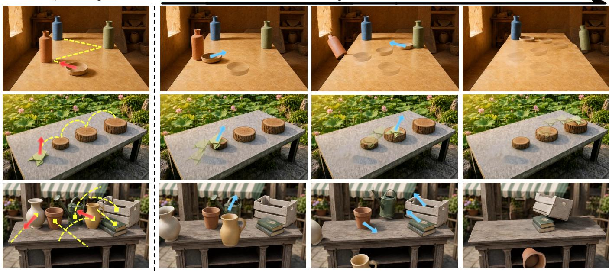
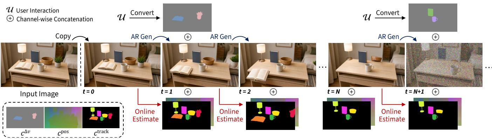
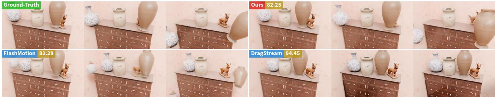
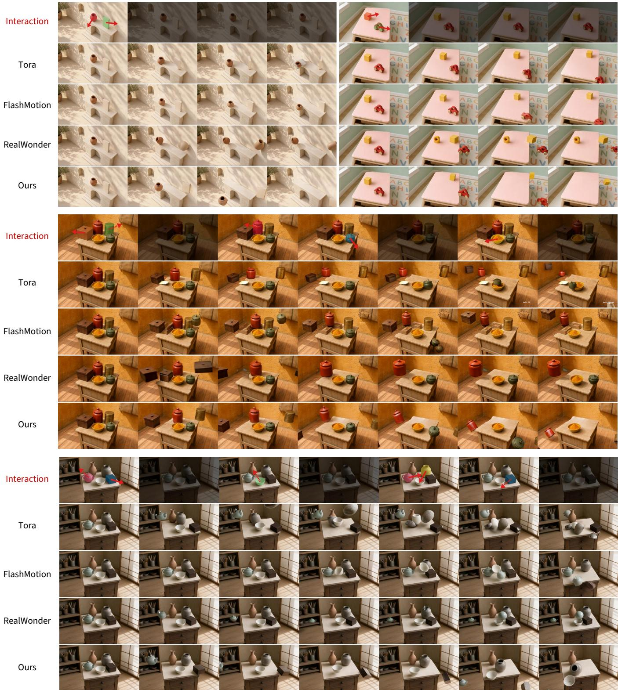
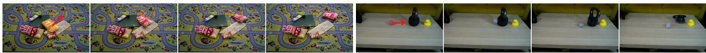
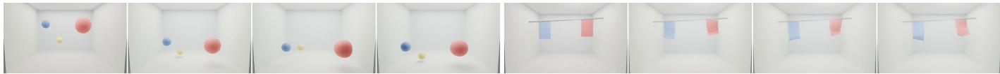
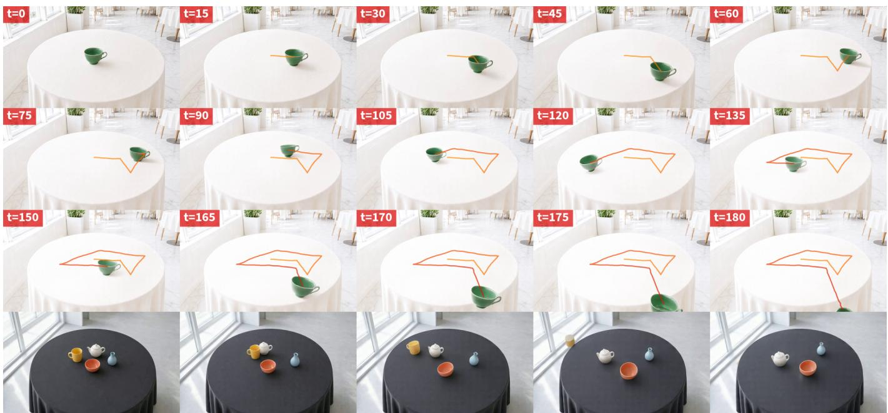
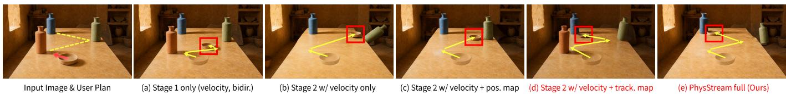
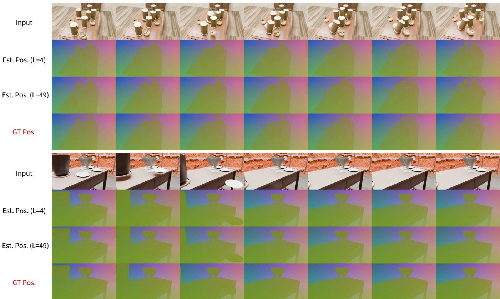
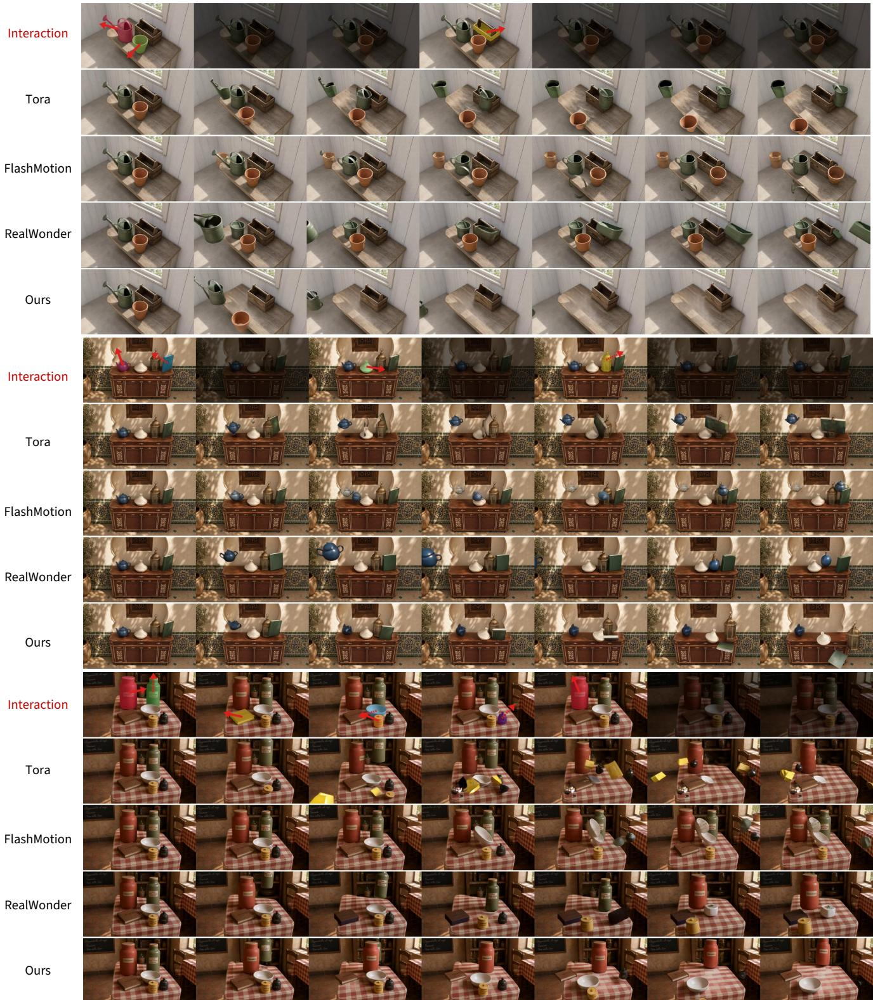

  
Fig. 1. PhysStream generates physics-grounded videos from a single image through sparse, interactive, scene-level velocity control: users specify per-object velocity directions at chosen timesteps, and the model autoregressively produces physically plausible multi-object dynamics. Top: a ceramic dish zig-zags across a tabletop, precisely striking and toppling vases near the edge. Middle: an origami frog leaps onto three successive wooden stumps on a stone table. Botom: assorted objects at a market stall are swept of the table one or several at a time.

# PhysStream: Streaming Physics-Grounded Video Generation with Structured Scene Memory and Fine-Grained Motion Control

CHUHAO CHEN, University of Pennsylvania, USA

PETER WONKA, Snap Inc., USA and KAUST, Saudi Arabia

CHAOYANG WANG, Snap Inc., USA

CHEN WANG, University of Pennsylvania, USA

QIAO FENG, University of Pennsylvania, USA

SERGEY TULYAKOV, Snap Inc., USA

Input Image  
Autoregressive Video Generation  
  
User Plan  
Initial Interaction  
Mid-frame Interaction

Authors’ Contact Information: Chuhao Chen, University of Pennsylvania, Philadelphia, USA, morphling233@gmail.com; Peter Wonka, Snap Inc., Santa Monica, USA and KAUST, Thuwal, Saudi Arabia, pwonka@gmail.com; Chaoyang Wang, Snap Inc., Santa Monica, USA, gordon.w.1991@gmail.com; Chen Wang, University of Pennsylvania, Philadelphia, USA, chenw30@seas.upenn.edu; Qiao Feng, University of Pennsylvania, Philadelphia, USA, fengqiao@seas.upenn.edu; Sergey Tulyakov, Snap Inc., Santa Monica, USA, stulyakov@snap.com; Lingjie Liu, University of Pennsylvania, Philadelphia, USA, lingjie.liu@seas.upenn.edu.

Interactive control for video generation is moving from coarse prompts toward fine-grained, physically meaningful manipulation of dynamic scenes. Yet existing controllable methods either require the full control schedule before generation starts, or use pixel-space signals that dictate object positions rather than physical dynamics. To address these limitations, we propose PhysStream, an autoregressive model for physics-grounded image-to-video synthesis that incorporates structured scene memory—positional maps and object tracking maps derived online from previously generated frames— and supports fine-grained motion control via sparse velocity-increment signals that encode physical quantities, letting the model learn the underlying dynamics. We train our model in two stages: a bidirectional model is first finetuned with motion-control conditioning, then a causal autoregressive model is trained with additional structured scene memory, further improving physical consistency. PhysStream enables interactive, midgeneration control over multi-object tabletop rigid-body scenes—a capability not supported by prior methods—reducing motion distribution distance (FVMD) by 33% and trajectory error by 12% over the strongest baselines on synthetic benchmarks, and is preferred by human evaluators in over 85% of in-the-wild comparisons. Please check our website for more details: https://czzzzh.github.io/PhysStream.

CCS Concepts: • Computing methodologies → Artificial intelligence;   
Computer vision.

Additional Key Words and Phrases: controllable video generation, physics grounded motion control, autoregressive video models

## ACM Reference Format:

Chuhao Chen, Peter Wonka, Chaoyang Wang, Chen Wang, Qiao Feng, Sergey Tulyakov, and Lingjie Liu. 2026. PhysStream: Streaming Physics-Grounded Video Generation with Structured Scene Memory and Fine-Grained Motion Control. In SIGGRAPH Asia 2026 Conference Papers (SA Conference Papers ’26), December 01–04, 2026, Kuala Lumpur, Malaysia. ACM, New York, NY, USA, 19 pages. https://doi.org/10.1145/3829340.3842176

## 1 Introduction

Video difusion models [Blattmann et al. 2023; Ho et al. 2022; Wan et al. 2025; Yang et al. 2024] have emerged as powerful tools for highfidelity video synthesis, with applications spanning simulation, robotics, and creative content generation. Building on these advances, controllable video generation leverages additional conditions—depth maps [Wang et al. 2023; Zhang et al. 2023b], camera trajectories [Bahmani et al. 2025; He et al. 2024, 2025b], object tracks or keypoints [Gu et al. 2025; Li et al. 2026b; Namekata et al. 2024; Niu et al. 2024; Zhang et al. 2025a], and physical interactions such as forces or velocities [Gillman et al. 2025, 2026; Romero et al. 2025; Wang et al. 2025] to steer the generated videos towards the given condition. These methods have achieved impressive results for manipulating foreground objects or camera movement, yet they predominantly operate in a non-autoregressive manner: the full control schedule must be specified before generation begins, and the entire clip is synthesized in one pass. This design precludes truly interactive use cases in which a user observes previously generated frames and decides the next intervention on the fly.

Recent advances in autoregressive video difusion [Chen et al. 2024; Huang et al. 2025a; Li et al. 2026a; Liu et al. 2025; Zhu et al. 2026] have enabled incremental, frame-by-frame generation that opens the door to interactive controllable video synthesis. Building on this progress, we identify four key properties for controllable video generation that simultaneously serve interactive creative workflows and physics-grounded simulation: (1) Sparse control— the signal should be easy for a user to construct (e.g., a drag trajectory or a velocity vector on an object), rather than a dense per-pixel map such as depth or optical flow; (2) Physics-grounded—the signal should encode a physical quantity (force, velocity) that lets the model learn the underlying dynamics, rather than directly dictating object positions along a prescribed path; (3) Interactive— generation should proceed frame-by-frame so users can observe partial results and intervene on the fly; we use the term in this control sense and do not require real-time throughput; (4) Scenelevel—control should target individual objects within a multi-object scene. Table 1 compares a selection of representative methods along these axes. Among them, only the concurrent work RealWonder [Liu et al. 2026] approaches all four; however, its interaction is mediated by an external 3D reconstruction and physics simulator whose scene state may diverge from the actual generated video—for instance, object positions in the reconstructed scene can drift from those in the synthesized frames, and unmodeled background objects cannot participate in physical interactions.

Table 1. Representative controllable video generation methods [Bahmani et al. 2025; Burgert et al. 2025; Gillman et al. 2025; Gu et al. 2025; He et al. 2025b,a; Li et al. 2026b; Liu et al. 2026; Niu et al. 2024; Romero et al. 2025; Shin et al. 2025; Wang et al. 2025; Wu et al. 2024; Yang et al. 2025; Zhang et al. 2023b, 2025a; Zhou et al. 2025] compared along the four properties. Sparse: easy-to-construct signal (not dense per-pixel); Phys.: physics-grounded; Inter.: interactive; Scene: scene-level. ∗RealWonder supports interaction and scene-level control through an intermediate 3D reconstruction and physics simulator, whose scene state may diverge from the generated video.
<table><tr><td>Method</td><td>Control</td><td>Sparse</td><td>Phys.</td><td>Inter.</td><td>Scene</td></tr><tr><td>ControlVideo</td><td>depth</td><td></td><td></td><td></td><td>√</td></tr><tr><td>Go-with-the-Flow</td><td>flow</td><td></td><td></td><td></td><td>√</td></tr><tr><td>DaS</td><td>dense track</td><td></td><td></td><td></td><td>√</td></tr><tr><td>AC3D</td><td>camera</td><td>√</td><td></td><td></td><td></td></tr><tr><td>CameraCtrl II</td><td>camera</td><td>√</td><td></td><td>√</td><td></td></tr><tr><td>DragAnything</td><td>drag</td><td>√</td><td></td><td></td><td>√</td></tr><tr><td>DragStream</td><td>drag</td><td>√</td><td></td><td>√</td><td>√</td></tr><tr><td>Tora</td><td>trajectory</td><td>√</td><td></td><td></td><td>√</td></tr><tr><td>MotionStream</td><td>trajectory</td><td>√</td><td></td><td>√</td><td>√</td></tr><tr><td>FlashMotion</td><td>mask track</td><td>√</td><td></td><td></td><td>√</td></tr><tr><td>MOFA-Video</td><td>keypoint</td><td>√</td><td></td><td></td><td>√</td></tr><tr><td>LongLIVE</td><td>text prompt</td><td>√</td><td></td><td>√</td><td>√</td></tr><tr><td>Matrix-Game 2.0</td><td>game action</td><td>√</td><td></td><td>√</td><td></td></tr><tr><td>Force Prompting</td><td>force</td><td>√</td><td>√</td><td></td><td></td></tr><tr><td>PhysCtrl</td><td>force</td><td>√</td><td>√</td><td></td><td></td></tr><tr><td>RealWonder*</td><td>force</td><td>√</td><td>√</td><td>√*</td><td>√</td></tr><tr><td>KineMask</td><td>velocity</td><td>√</td><td>√</td><td></td><td>√</td></tr><tr><td>PhysStream (Ours)</td><td>velocity</td><td>√</td><td>√</td><td>√</td><td>√</td></tr></table>

To satisfy all four properties through direct interaction with the generated video, we propose PhysStream, an autoregressive imageto-video model. At each autoregressive step, PhysStream conditions on (i) sparse velocity-increment maps that let the user apply localized interactions to selected objects, and (ii) a structured scene memory comprising positional maps (from monocular depth estimation) and object-tracking maps (from instance segmentation and tracking), both derived from previously generated frames and updated online after each generated frame. Adapting a pretrained bidirectional video model to this formulation involves three distribution shifts: the velocity-increment control, the structured scene memory, and the change from bidirectional to causal attention. They cannot all be learned at once: the scene memory records the full ob ject history, which may lead the model to partly ignore the historical velocity signals, and it cannot be learned under bidirectional attention at all, since per-frame memory maps would leak future scene state. We therefore train in two stages: a bidirectional backbone first learns the velocity-increment control alone, and a causal autoregres sive model is then trained on top of it, learning the scene memory and causal attention jointly—a recipe that keeps each transition small without multiplying training stages.

We conduct extensive experiments and demonstrate great improvements in both motion-control adherence and physical plausibility. Our main contributions are:

• We propose PhysStream, the first method that enables direct, end-to-end, scene-level physics-grounded interactive video control in multi-object tabletop rigid-body scenes, where the user’s physical input and the model’s scene memory both operate on the generated video itself.

• We introduce structured scene memory—positional maps and object-tracking maps updated online from previously generated frames—as a novel conditioning mechanism for autoregressive video generation, and show that it efectively improves geometric consistency and physical plausibility.

• We curate a dataset of 100k synthetic indoor scene videos with complex multi-object rigid-body motion, collisions, and multi-frame velocity perturbations, aiming to further improve the physical correctness of video generation models.

## 2 Related Work

Controllable Video Generation Controllable video generation conditions video models using auxiliary signals beyond text prompts to improve controllability and user intention. Depth-based methods [Wang et al. 2023; Zhang et al. 2023b] and camera-trajectory controllers [Bahmani et al. 2025; He et al. 2024, 2025b] guide global scene motion, while object-level approaches use drag points [Wu et al. 2024; Yin et al. 2023], bounding-box tracks [Ma et al. 2024; Wang et al. 2024b], mask tracks [Li et al. 2026b, 2025a], dense optical flow and point tracks [Burgert et al. 2025; Geng et al. 2025; Gu et al. 2025], or sparse keypoint trajectories [Fu et al. 2024; Namekata et al. 2024; Niu et al. 2024; Wang et al. 2024a; Zhang et al. 2025a] to manipulate individual entities. Most of these methods use Control-Net [Zhang et al. 2023a], cross-attention injection, or channel-wise concatenation to inject the control signals into a pretrained video model. While these approaches achieve strong controllability, they require control signals over all timesteps, rather than encoding a physical quantity that lets the model predict how objects move. In contrast, we target interactive, physics-grounded, scene-level control: users provide only a sparse velocity vector at chosen timesteps, and the model learns to produce physically consistent multi-object dynamics from that signal alone.

Physics-Grounded Video Generation A growing line of work seeks to improve the physical plausibility ofvideo generative models. One family of approaches obtains motion signals from physics sim ulators and injects them into video models, including PhysGen [Liu et al. 2024b] for rigid body dynamics, PhysGen3D and PhysMotion [Chen et al. 2025; Tan et al. 2024] for deformable bodies, and PhysAnimator [Xie et al. 2025] for cartoon animations. Wonder-Play [Li et al. 2025b], RealWonder [Liu et al. 2026] and PSIVG [Foo et al. 2026] study the interplay between physics solver and video difusion for better visual quality. However, these methods require calling physical simulators at inference time, which some other works try to avoid. PhysCtrl [Wang et al. 2025] trains a trajectory predictor given user actions to guide video generation. Force Prompt ing [Gillman et al. 2025] and Goal Force [Gillman et al. 2026] also curate action and video pairs from simulation to directly finetune a pretrained video model. The third family uses geometric consistency as an indirect physics proxy: depth/normal regularization [Ren et al. 2025; Zhang et al. 2025b] or 3D-aware world models [Team et al. 2026; Zhu et al. 2025]. Our work difers from prior works in that we do not rely on an external simulator or trajectory at inference time, nor do we impose any consistency loss in an implicit man ner. Instead, we explicitly condition on a structured scene memory estimated on-the-fly from the model’s own prediction for physicsgrounded generation.

Autoregressive and Streaming Video Generation Autoregressive video generation produces frames frame-by-frame or chunkby-chunk, naturally supporting streaming output and interactive feedback. Teacher-Forcing [Jin et al. 2024; Williams and Zipser 1989] and Difusion Forcing [Chen et al. 2024; Song et al. 2025] are wellestablished paradigms for training autoregressive video difusion models with clean-context as history. More recently, distillationbased approaches have emerged to distill strong pretrained bidirectional models into few-step causal models: CausVid [Yin et al. 2025] applies distribution matching distillation [Yin et al. 2024] to obtain a few-step causal generator, Self-Forcing [Huang et al. 2025a] further introduces training time rollout to bridge the train-inference gap, and Causal-Forcing [Zhu et al. 2026] finetunes a bidirectional model into a causal architecture to eliminate the architecture gap before distillation. Most related to our work, DragStream [Zhou et al. 2025] and MotionStream [Shin et al. 2025] concatenate motion-control channels to the autoregressive generator, demonstrating on-thefly trajectory-based and drag-based interaction during streaming generation. However, existing autoregressive methods treat each generated frame independently of the scene’s physical state: no history-derived geometric or object-tracking signal is fed back to the generator for future generation. We build on the autoregressive paradigm and introduce structured scene memory as a feedback loop, enabling the model to leverage its generation history to im prove physical consistency.

## 3 Method

## 3.1 Overview

Task Definition We consider physics-grounded image-to-video (I2V) generation under autoregressive sampling. A sample consists of an initial frame $x _ { 0 } \in \mathbb { R } ^ { H \times W \times 3 }$ , a sequence of � subsequent frames $\boldsymbol { x } _ { 1 : N } = \left( x _ { 1 } , \ldots , x _ { N } \right)$ to be generated, and an optional text prompt �. A causal model factorizes the joint distribution as

$$
p _ { \theta } ( x _ { 1 : N } \mid x _ { 0 } , y ) = \prod _ { i = 1 } ^ { N } p _ { \theta } ( x _ { i } \mid x _ { 0 } , x _ { < i } , y ) ,\tag{1}
$$

where $x _ { < i } : = ( x _ { 1 } , \dots , x _ { i - 1 } ) .$

Beyond the standard I2V conditioning, our model accepts two additional history-derived signals. The first is a structured scene memory, comprising a normalized positional map $c _ { t } ^ { \mathrm { p o s } } \in [ 0 , 1 ] ^ { H \times W \times 3 }$ that encodes per-pixel 3D camera-frame coordinates, and an objecttracking map $c _ { t } ^ { \mathrm { t r a c k } } \ \in \ [ 0 , 1 ] ^ { H \times W \times 3 }$ where each tracked object is painted with a distinct palette color on a black background. Both are estimated automatically from previously generated frames. The second is a user-specified velocity-increment map $c _ { t } ^ { \Delta v } \in [ 0 , 1 ] ^ { H \times W \times 3 }$ an object-level 3D velocity signal painted onto the spatial masks of selected objects (see Section 3.2) that the user may inject at any frame �. All three signals are strictly historical with respect to the frame being synthesized: the conditional distribution becomes

$$
x _ { i } \ \sim \ p _ { \theta } \left( x _ { i } \Big | x _ { 0 } , x _ { < i } , y , \ c _ { < i } ^ { \Delta v } , \ c _ { < i } ^ { \mathrm { p o s } } , \ c _ { < i } ^ { \mathrm { t r a c k } } \right) ,\tag{2}
$$

where $c _ { < i } : = \left( c _ { 0 } , \ldots , c _ { i - 1 } \right)$ collects all past frames for each condition (the user injects each velocity increment before the corresponding frame is generated).

We instantiate this formulation under rigid-body dynamics captured by a static camera, which provides a clean physical setting for studying multi-object scene-level interaction. To this end, we curate a 100k-scale synthetic dataset of indoor scenes augmented with rigid-body simulations; see Section 4.1 for details.

Two-Stage Training PhysStream is trained in two stages. Stage 1 (Section 3.2) finetunes the bidirectional Wan2.2-TI2V-5B [Wan et al. 2025] video difusion model to consume only the user-specified velocity-increment condition $c ^ { \Delta \upsilon }$ . Stage 2 (Section 3.3) converts this base into a causal autoregressive model in a Teacher-Forcing manner following Causal-Forcing [Zhu et al. 2026], generating frames frame-by-frame with KV caching, and additionally introduces the structured scene memory $( c ^ { \mathrm { p o s } } , c ^ { \mathrm { t r a c k } } )$ estimated online from the model’s own previously generated frames. Across both stages, every condition is injected via channel-wise concatenation of VAEencoded latents combined with a one-frame temporal shift, which, together with causal attention, guarantees that each noisy latent only sees conditions derived from previous-frame content. After two-stage training, our autoregressive video generation process is illustrated in Fig. 2.

3.2 Stage 1: Bidirectional Generation with Motion Control In Stage 1, we model the conditional distribution

$$
\begin{array} { r } { p _ { \theta } ^ { \mathrm { b i } } ( x _ { 1 : N } \vphantom { x _ { 0 : N } ^ { 1 : N } } | x _ { 0 } , y , c _ { 0 : N } ^ { \Delta v } ) , } \end{array}\tag{3}
$$

where the velocity-increment condition $c _ { 0 : N } ^ { \Delta v }$ is the sole user-provided motion signal and the model denoises all frames jointly.

Velocity-Increment Condition Let $o$ denote the set of dynamic rigid-body objects present in the first frame, and let $M ^ { ( o ) } \in$ $\{ 0 , 1 \} ^ { H \times \smile }$ be the binary instance mask of object $o \in O$ in $x _ { 0 } .$ . This mask is defined once on the first frame and reused for all velocityincrement events throughout the video, regardless of the object’s actual position at the time of each event (see Section 3.2 for the rationale). At training time, $M ^ { ( o ) }$ is read from the rendered groundtruth mask; at inference time, the user designates the target object � and $M ^ { ( o ) }$ is obtained with the help of an of-the-shelf segmentation model.

We assume that every user-specified velocity change is bounded along each camera axis by a fixed maximum input speed $V _ { \mathrm { m a x } } ,$ uniform across axes. The user provides a sparse set of velocity increment events

$$
\mathcal { U } ~ = ~ \left\{ ( t _ { j } , o _ { j } , \Delta \mathbf { v } _ { j } ) \right\} _ { j = 1 } ^ { J } ,\tag{4}
$$

where $t _ { j } \in \{ 0 , \ldots , N \} , o _ { j } \in O$ , and $\Delta \mathbf { v } _ { j } \in \lbrack - V _ { \mathrm { m a x } } , V _ { \mathrm { m a x } } \rbrack ^ { 3 }$ is the camera-frame velocity change applied uniformly across the rigid body of object $o _ { j }$ at frame $t _ { j } .$ . Each event is linearly mapped to a normalized value $\tilde { \mathbf { v } } _ { j } \in [ 0 , 1 ] ^ { 3 }$ , where ${ \textstyle \frac { 1 } { 2 } } 1$ encodes zero velocity change and the extremes 0 and 1 correspond $\mathrm { t o } - V _ { \mathrm { m a x } }$ and $+ V _ { \mathrm { m a x } }$ respectively.

The per-frame velocity-increment map $c _ { t } ^ { \Delta v } \in [ 0 , 1 ] ^ { H \times W \times 3 }$ is then obtained by painting each event onto the corresponding object’s first-frame mask $M ^ { ( \bar { o } _ { j } ) }$ , leaving all remaining pixels at the neutral value:

$$
c _ { t } ^ { \Delta v } ( p ) ~ = ~ \tilde { \bf v } _ { j } ~ \mathrm { i f } \exists j : t _ { j } { = } t , M ^ { ( o _ { j } ) } ( p ) { = } 1 ; ~ \mathrm { e l s e } ~ \frac { 1 } { 2 } \mathbf { 1 } .\tag{5}
$$

First-Frame Mask vs. Per-Frame Mask As shown in Fig. 2, we always anchor velocity-increment events to the object’s position in the first frame given by mask $M ^ { ( o ) }$ : even when an object has moved away from its initial position by frame $t _ { j } ,$ the velocity signal is painted at the first-frame location, not the current one. Note that this is purely a training-time convention; at inference time, the user can still visually select the object at its current position in the generated video, and the system internally maps the interaction back to the first-frame mask. A natural alternative to this design is to paint each event on the object’s mask at frame $t _ { j } .$ . While this signal is in principle more accurate, we find that under bidirectional training, it leaks the moving object’s spatial trajectory into the condition channel. This leakage is particularly harmful when transitioning from bidirectional to causal training in Stage 2: the causal model can no longer access future-frame masks, so the condition distribution shifts abruptly, widening the gap between the two stages and degrading generation quality. Anchoring every event to the frame-0 mask removes this leakage path and keeps the condition distribution consistent across both stages. For the same reason, we exclude the structured scene memory $( c ^ { \mathrm { p o s } } , c ^ { \mathrm { t r a c k } } )$ from Stage 1: per-frame positional and tracking maps would similarly leak the future scene state under bidirectional attention. The structured scene memory is introduced only in Stage 2, where causal masking together with the temporal shift in Section 3.4 prevents any future leakage. See Section C for more experimental evidence.

## 3.3 Stage 2: Autoregressive Generation with Structured Scene Memory

Stage 2 directly realizes Eq. (2) in causal autoregressive form: each frame $x _ { i }$ is sampled given the history $( x _ { 0 } , x _ { < i } , y )$ together with the three signals $c _ { < i } ^ { \bar { \Delta } v } , c _ { < i } ^ { \mathrm { p o s } } , c _ { < i } ^ { \mathrm { t r a c k } }$ . The motion-control condition $c ^ { \Delta \upsilon }$ retains the form of Eq. (5); the two scene-memory conditions are not user-supplied but produced online by two estimators that operate on the model’s previously generated frames.

Normalized Positional Map We adopt a normalized positional map similar to the one used in [Zhang et al. 2025b]. The estimator $\Phi _ { \mathrm { p o s } }$ runs Depth-Anything-3 [Lin et al. 2025] on the most recent � pixel frames to obtain per-frame metric depth $\hat { D } _ { t }$ and intrinsics $K _ { t }$ (we find �=4, i.e., one latent frame, suficient in practice). Each pixel $\boldsymbol { p } = \left( u , v \right)$ is back-projected into a 3D camera-frame coordinate

$$
\mathbf { P } _ { t } ( p ) \ = \ { \hat { D } } _ { t } ( p ) K _ { t } ^ { - 1 } \left[ u , v , 1 \right] ^ { \top } \ \in \ { \mathbb R } ^ { 3 } ,\tag{6}
$$

matching the camera-space convention of our training-data rendering (Section 4.1). The coordinates are then centered and uniformly normalized into [0, 1]3 using a normalization anchor computed once from the first frame: we define the per-axis extremes $\mathbf { P } _ { \operatorname* { m i n } } , \mathbf { P } _ { \operatorname* { m a x } } \in \mathbb { R } ^ { 3 }$ over all pixels in frame 0, and a uniform scale factor

  
Fig. 2. Autoregressive inference pipeline of PhysStream. Given an input image (�=0), the model autoregressively generates each subsequent latent frame by denoising a noisy latent conditioned on: (1) the user-specified velocity-increment map $c ^ { \Delta \upsilon }$ (channel-concatenated with a one-frame temporal shift), and (2) the structured scene memory $( c ^ { \mathrm { p o s } } , c ^ { \mathrm { t r a c k } } )$ , which is estimated online from the most recently decoded frames via a monocular depth estimator and SAM2. After each latent frame is commited, the decoded RGB frames are fed back to the online estimators to update the scene memory for the next step.

$$
\rho ~ = ~ { \textstyle { \frac { 1 } { 2 } } } \operatorname* { m a x } _ { \alpha \in \{ x , y , z \} } ( P _ { \operatorname* { m a x } , \alpha } - P _ { \operatorname* { m i n } , \alpha } ) ,\tag{7}
$$

which preserves the isotropic aspect ratio across all three axes. The normalized positional map is then

$$
c _ { t } ^ { \mathrm { p o s } } ( p ) \ = \ \frac { \mathbf { P } _ { t } ( \mathit { p } ) - \frac { 1 } { 2 } ( \mathbf { P } _ { \mathrm { m i n } } + \mathbf { P } _ { \mathrm { m a x } } ) } { 2 \rho } + \frac { 1 } { 2 } \ \mathbf { 1 } \ \in \ \lbrack 0 , 1 ] ^ { 3 } .\tag{8}
$$

Under our static-camera setting the depth range remains close to that of the first frame, so this anchor stays stable throughout generation. After obtaining � positional maps, we only append those for newly decoded frames to the condition sequence. Our design ensures the preservation of the KV cache $( \mathrm { i . e . , }$ committed positional maps remain unchanged) while maintaining temporal consistency as much as possible. More experimental evidence is provided in Section D.

Object-Tracking Map Given decoded frames together with the first-frame object masks $\{ M ^ { ( o ) } \} _ { o \in O }$ from Section 3.2, the estimator $\Phi _ { \mathrm { t r a c k } }$ propagates all masks jointly through the video using SAM2 [Ravi et al. 2024], which natively handles multi-object propagation and overlap resolution. Thanks to SAM2’s internal memory bank, all historical frames are processed incrementally with constant per-step cost. Each tracked object is then painted with a distinct color drawn without replacement from a fixed �-color palette of maximally separated RGB values (we use �=10), on a black background, yielding $c _ { t } ^ { \mathrm { t r a c k } } \in [ 0 , 1 ] ^ { H \times W \times 3 }$

Online Memory Update During Sampling During autoregressive sampling, the model generates one latent frame at a time, where each latent frame decodes to four pixel frames under the Wan VAE’s temporal upsampling. After each new latent frame ℓ is committed, we decode it to pixel space, run both estimators on the new frames, and encode the resulting condition maps back to latent space:

$$
\begin{array} { r } { c _ { \ell } ^ { \mathrm { p o s } } = \Phi _ { \mathrm { p o s } } ( \hat { x } _ { \le \ell } ) , { c } _ { \ell } ^ { \mathrm { t r a c k } } = \Phi _ { \mathrm { t r a c k } } ( \hat { x } _ { \le \ell } , \{ M ^ { ( o ) } \} ) , } \end{array}\tag{9}
$$

where $\hat { x } _ { \le \ell }$ denotes all decoded pixel frames up to and including latent frame ℓ. Although both estimators conceptually receive the full history, each component operates incrementally: the Wan VAE’s causal temporal convolutions decode and encode only the new latent frame using cached features from previous frames; $\Phi _ { \mathrm { p o s } }$ estimates depth from only the most recent � frames (Section 3.3); and $\Phi _ { \mathrm { t r a c k } }$ leverages SAM2’s memory bank. The per-step cost of the entire online memory update is therefore constant regardless of the total video length.

Teacher-Forcing Training Stage 2 is trained in a Teacher-Forcing manner with causal attention. At each training step, the model receives a ground-truth video $x _ { 0 : N }$ and the corresponding groundtruth conditions $c _ { 0 : N } ^ { \Delta v } , c _ { 0 : N } ^ { \mathrm { p o s } } , c _ { 0 : N } ^ { \mathrm { t r a c k } }$ . Each frame $x _ { i }$ is denoised while attending only to the clean ground-truth context of all preceding frames:

$$
\hat { v } _ { i } \ = \ v _ { \theta } \Big ( z _ { i } ^ { \mathrm { n o i s y } } , \tau , \ x _ { 0 } , x _ { 1 : i - 1 } ^ { \mathrm { g t } } , \ c _ { < i } ^ { \Delta v } , \ c _ { < i } ^ { \mathrm { p o s } } , \ c _ { < i } ^ { \mathrm { t r a c k } } \Big ) ,\tag{10}
$$

where $x _ { 1 : i - 1 } ^ { \mathrm { g t } }$ denotes clean ground-truth latents provided as context (not the model’s own predictions) and � is the difusion timestep. The causal attention mask ensures that frame � cannot attend to any frame $j > i ,$ while the temporal shift of the condition channels (Section 3.4) ensures that each condition slot carries information strictly from the previous frame.

We adopt Teacher-Forcing [Jin et al. 2024; Williams and Zipser 1989] with supervised finetuning rather than distillation [Huang et al. 2025a; Yin et al. 2025; Zhu et al. 2026] mainly for a practical reason: Stage 2 must learn two new condition branches $( c ^ { \mathrm { { p o s } } } , c ^ { \mathrm { { t r a c k } } } )$ that no bidirectional teacher has seen, and rollout-based objectives (e.g., Self-Forcing [Huang et al. 2025a]) would have to run the online estimators inside every training rollout. Teacher-Forcing is not irreplaceable, however: we compare it against Difusion-Forcing and Self-Forcing trained under the same budget and find it best overall (see Section F).

3.4 Condition Injection via Shifted Channel Concatenation Latent Preparation We encode each condition map with the pretrained Wan VAE E. The resulting condition latents $z ^ { \Delta \upsilon } , z ^ { \mathrm { p o s } }$ and $z ^ { \mathrm { t r a c k } }$ all share the spatio-temporal shape of the noisy video latent �noisy.

  
Fig. 3. Representative scenes from our curated rigid-body dataset.

Shifted Channel Concatenation The Wan2.2-TI2V-5B variant conditions on the first frame by fusing its clean VAE latent directly into the first temporal slot of the noisy latent: during the denoising process, the first latent frame is always held at the clean encoded value of $x _ { 0 } ,$ , ensuring that the generated video is anchored to the input image. The augmented DiT input concatenates all condition latents along the channel dimension after a one-frame forward shift (with the first slot zeroed):

$$
\tilde { z } = \mathrm { C o n c a t } \Big ( z ^ { \mathrm { n o i s y } } , \mathrm { S h i f t } ( z ^ { \Delta v } ) , \mathrm { S h i f t } ( z ^ { \mathrm { p o s } } ) , \mathrm { S h i f t } ( z ^ { \mathrm { t r a c k } } ) \Big ) ,\tag{11}
$$

where Shift(·) denotes the one-frame forward shift along the latent time axis. The temporal shift ensures that the condition aligned with latent frame ℓ is always derived from the previous latent frame’s content, so under causal attention, no in-frame information leaks from $x _ { \ell }$ into the conditioning at ℓ. The DiT’s patch-embedding layer is split into a pretrained branch on the original �noisy channels (initialized from the backbone weights) and zero-initialized branches on each new condition stream; their token-space outputs are summed before the stacked DiT blocks. Zero-initialization guarantees that the augmented model is numerically identical to the pretrained backbone at the start of finetuning, after which the conditional branches gradually grow to incorporate the new signals.

## 4 Experiments

## 4.1 Implementation Details

Datasets We curate our training and evaluation data on SAGE [Xia et al. 2026], a large-scale corpus of 10k pre-generated indoor scenes. We focus on tabletop rigid-body dynamics involving collisions, frictional contact, and tumbling of small objects. For each scene, dynamic objects are filtered to keep the resulting dynamics within a tractable complexity range, and the user-specified events U in Eq. (4) are randomly sampled by a fixed set of rules. Multi-body dynamics are simulated with a lightweight PyBullet [Coumans and Bai 2016] pipeline, and the frames are rendered with Blender [Community 2018]. Each video has 49 frames at 832×480 resolution. In total, we render approximately 100k videos, with 3k held out for validation and evaluation (primarily for constructing FVD reference distributions), and the remainder is used for training. Representative examples are shown in Fig. 3; we refer the reader to Section B for further dataset construction details.

## 4.2 Evaluation on Synthetic Data

We evaluate PhysStream on the proposed synthetic benchmark for physics-grounded image-to-video generation.

Baselines and Settings We select all methods from Table 1 that support image-to-video generation and whose control condition can be aligned with our velocity-increment signal, yielding seven baselines: Force Prompting [Gillman et al. 2025], PhysCtrl [Wang et al. 2025], DragAnything [Wu et al. 2024], Tora [Zhang et al. 2025a], FlashMotion [Li et al. 2026b], DragStream [Zhou et al. 2025], and RealWonder [Liu et al. 2026]. We organize the evaluation into two test sets: (i) 64 videos with a single velocity increment on one object at frame 0, for baselines that do not support scene-level or mid-frame control (DragAnything, Force Prompting and PhysCtrl); (ii) 64 videos sampled from the standard dataset with multi-object interactive control, for all remaining baselines.

Metrics We evaluate generation quality with eight metrics organized into three groups.

General physical correctness. We use FVD [Skorokhodov et al. 2022; Unterthiner et al. 2018] and FVMD [Liu et al. 2024a] to measure how well the distribution of generated videos matches the simulated ground truth. FVD embeds each video with an I3D network pretrained on Kinetics-400 and computes the Fréchet distance between the feature distributions of generated and ground-truth videos, capturing overall distributional similarity; FVMD replaces appearance features with motion features—velocity and acceleration histograms of tracked points—and therefore focuses specifically on motion-pattern similarity.

Fine-grained motion accuracy. We use CoTracker3 [Karaev et al. 2025] to track 32 query points sampled on each dynamic object in both the ground-truth and generated videos, and report three trajectory-level metrics: traj-ADE (average pixel-distance error between predicted and ground-truth tracks), traj-ADE-median (a more robust median variant), and failure rate (fraction of tracked points in the generated video that either lose track or deviate by more than 30 px from the ground truth—a deliberately strict threshold).

Consistency. We report three complementary consistency metrics. Scene consistency is the subject consistency metric from VBench++ [Huang et al. 2025b], capturing overall temporal coherence of the generated scene. Object consistency is our modified metric that uses SAM2 to track and crop each dynamic object individually, computing per-object appearance consistency—this is motivated by our static-camera setting where per-object motion quality is more informative than whole-frame metrics. Photometric consistency follows WorldScore [Duan et al. 2025] and measures forward–backward optical-flow agreement.

More details on metric choices and modifications are provided in Section G.

Results Quantitative results are shown in Table 2. On test set (ii), PhysStream outperforms all baselines on the physics-sensitive metrics: FVMD, traj-ADE, traj-ADE-median, and failure rate consistently show that our generated dynamics more closely follow the groundtruth physical motion, and consistency scores are near-optimal across the board.

Limitation of Consistency Metrics While consistency metrics are important for evaluating video generation quality, we note that they can be inflated by degenerate generations where objects remain nearly static or drift rigidly in pixel space without physically plausible dynamics: such outputs trivially preserve appearance consistency, leading to artificially high scores. This phenomenon is illustrated in Fig. 4.

Table 2. Quantitative comparison on synthetic data. (i): single-object with first-frame control; (ii): multi-object with interactive control. ∗Tora and FlashMotion do not support interactive control; we strengthen their seting by providing the ground-truth center-of-mass trajectory as control input. For RealWonder we skip scene reconstruction and directly use the ground-truth scene. Higher is beter (↑); lower is beter (↓). Here we include consistency-based metrics from VBench for completeness, we discuss their limitations at the end of Section 4.2.
<table><tr><td colspan="2"></td><td>FVD↓</td><td>FVMD↓</td><td>Traj-ADE↓</td><td>Traj-ADE-M ↓</td><td>Failure ↓</td><td>Scene Cons. ↑</td><td>Obj. Cons. ↑</td><td>Photo. Cons. ↑</td></tr><tr><td rowspan="4">(i)</td><td>DragAnything</td><td>1084</td><td>41315</td><td>97.47</td><td>81.78</td><td>69.70</td><td>88.00</td><td>94.11</td><td>35.65</td></tr><tr><td>Force Prompting</td><td>606.6</td><td>2142</td><td>105.3</td><td>94.59</td><td>74.13</td><td>94.65</td><td>87.70</td><td>80.72</td></tr><tr><td>PhysCtrl</td><td>626.8</td><td>3344</td><td>104.9</td><td>94.95</td><td>73.91</td><td>97.93</td><td>92.42</td><td>93.45</td></tr><tr><td>PhysStream (Ours)</td><td>492.9</td><td>846.0</td><td>49.37</td><td>33.78</td><td>48.11</td><td>96.30</td><td>87.80</td><td>83.24</td></tr><tr><td rowspan="5">(ii)</td><td>Tora*</td><td>428.1</td><td>1463</td><td>66.79</td><td>57.11</td><td>72.00</td><td>91.37</td><td>78.37</td><td>72.62</td></tr><tr><td>FlashMotion*</td><td>526.7</td><td>3751</td><td>45.67</td><td>39.11</td><td>44.28</td><td>96.79</td><td>86.34</td><td>83.25</td></tr><tr><td>DragStream</td><td>758.2</td><td>2662</td><td>70.27</td><td>63.56</td><td>64.67</td><td>90.46</td><td>91.09</td><td>30.22</td></tr><tr><td>RealWonder</td><td>438.8</td><td>1183</td><td>60.91</td><td>49.84</td><td>64.78</td><td>95.03</td><td>80.94</td><td>73.48</td></tr><tr><td>PhysStream (Ours)</td><td>413.7</td><td>787.0</td><td>40.24</td><td>32.00</td><td>43.15</td><td>96.57</td><td>85.29</td><td>81.72</td></tr></table>

  
Fig. 4. Limitation of consistency metrics. Numbers show the average of scene, object, and photometric consistency. FlashMotion scores comparably to ours but produces visible artifacts and hallucinated objects; DragStream generates a nearly static scene yet achieves the highest consistency score.

Table 3. Evaluation on in-the-wild data. SA/PC: Semantic Adherence / Physical Commonsense from VideoPhy [Bansal et al. 2024] (1–5 Likert); Phys./Motn./Vis.: human preference win rate (%).
<table><tr><td></td><td>|SA↑</td><td>PC↑ | Phys. ↑</td><td></td><td>Motn. ↑</td><td>Vis. ↑</td></tr><tr><td>Tora</td><td>4.35</td><td>3.30</td><td>1.8%</td><td>2.6%</td><td>2.2%</td></tr><tr><td>FlashMotion</td><td>4.85</td><td>3.65</td><td>4.8%</td><td>7.0%</td><td>4.6%</td></tr><tr><td>DragStream</td><td>4.35</td><td>2.45</td><td>0.4%</td><td>0.2%</td><td>0.4%</td></tr><tr><td>RealWonder</td><td>4.65</td><td>3.25</td><td>1.2%</td><td>1.8%</td><td>1.6%</td></tr><tr><td>PhysStream (Ours)</td><td>5.00</td><td>4.15</td><td>91.8%</td><td>88.4%</td><td>91.2%</td></tr></table>

## 4.3 Evaluation on In-the-Wild Data

To assess generalization beyond the synthetic training distribution, we evaluate PhysStream in three settings: (i) In-the-wild scenes: 20 input images paired with velocity-increment signals randomly generated under a fixed set of rules, compared against the four base lines that support full interactive control; (ii) Real-world captures: 16 cluttered indoor scenes from OCID [Suchi et al. 2019] and 10 real videos with ground truth from the Physics-IQ benchmark [Motamed et al. 2025]; and (iii) Non-rigid objects: Two kinds of scenes where the same control and scene-memory paradigm is applied to deformable balls and cloth.

Metrics Since no ground-truth video is available for in-the-wild inputs (except for the Physics-IQ benchmark), most metrics from Section 4.2 cannot be applied. We therefore adopt an MLLM evaluation for all settings: following VideoPhy [Bansal et al. 2024; Wang et al. 2025], we query GPT-4o for Semantic Adherence (SA) and Physical Commonsense (PC) scores on a 1–5 Likert scale. For setting (i), we additionally report human preference: evaluators are shown the five results (four baselines and ours) side by side and asked to select the best one along three axes: physical plausibility (Phys.), motion accuracy (Motn.), and visual quality (Vis.), reported as win rate (%). More details are provided in Section H.

Results (i) Table 3 reports quantitative results and Fig. 5 shows representative examples. PhysStream achieves a clear advantage across all five metrics: both MLLM scores are the highest, and human evaluators prefer our results in over 80% of comparisons on every axis—indicating that the quality gap over baselines is substantial and consistent in general in-the-wild scenarios. (ii) Table 6 and Fig. 6 show the results on real-world captures. SA and PC remain as high as in setting (i) on the heavily cluttered OCID scenes, and on Physics-IQ PhysStream additionally reaches an oficial score of 47.9 on the selected solid-mechanics subset, where the initial velocity of the moving object is derived from the real clip; the generated motion follows the real direction and collision timing, with the object speed as the main remaining discrepancy. (iii) Table 7 and Fig. 7 show that non-rigid materials transfer well under the same condition paradigm: the same velocity-increment control and structured scene memory, without any change to the method, drive deformable balls to bounce elastically and cloth to fold and flutter, with SA/PC on par with the rigid-body results. These results are obtained by finetuning our full model on a small synthetic dataset built for each material (10k clips each; 5k iterations), suggesting that extending PhysStream to richer materials mainly requires extending the dataset.

  
Fig. 5. Qualitative comparison on multi-object rigid-body scenes. Compared with baselines, our method achieves physics-grounded video generation with multi-object interactions, while baselines produce distorted geometries and inconsistent motions.

Table 4. Ablation results on test set (ii). See Section 4.5 for configuration definitions and Table 2 for column abbreviations.
<table><tr><td></td><td>FVD↓</td><td>FVMD↓</td><td>Traj-ADE ↓</td><td>Traj-ADE-M↓</td><td>Failure ↓</td><td>Scene Cons. ↑</td><td>Obj. Cons. ↑</td><td>Photo. Cons. ↑</td></tr><tr><td>(a) Stage 1 only (velocity, bidir.)</td><td>424.7</td><td>1015</td><td>48.78</td><td>41.96</td><td>53.92</td><td>94.59</td><td>82.90</td><td>65.81</td></tr><tr><td>(b) Stage 2 w/ velocity only</td><td>399.2</td><td>941.3</td><td>43.75</td><td>35.85</td><td>47.70</td><td>96.00</td><td>83.80</td><td>78.76</td></tr><tr><td>(c) Stage 2 w/ velocity + pos. map</td><td>399.7</td><td>924.7</td><td>45.04</td><td>36.79</td><td>48.95</td><td>96.04</td><td>83.78</td><td>78.66</td></tr><tr><td>(d) Stage 2 w/ velocity + track. map</td><td>399.5</td><td>910.5</td><td>44.54</td><td>36.56</td><td>49.50</td><td>96.02</td><td>83.72</td><td>79.56</td></tr><tr><td>(e) PhysStream full (Ours)</td><td>404.8</td><td>879.8</td><td>43.82</td><td>35.58</td><td>47.73</td><td>96.21</td><td>84.20</td><td>80.37</td></tr></table>

Fig. 6. Results on real-world captures. Left: a clutered indoor scene from OCID; the food package is pushed and correctly thrown across the cluter. Right: a Physics-IQ scenario where a rolling ball hits a weight placed in front of a duck; despite appearance drift on this out-of-distribution input, the ball–weight collision is modeled correctly and the duck is protected as in the real video. The first panel of each case shows the input with the applied velocity increment. Input frames © TU Wien ACIN (OCID) and Google DeepMind & INSAIT (Physics-IQ), CC BY 4.0.  
  
Fig. 7. Results of non-rigid dynamics generated by the finetuned models: Left: Elastically bouncing balls. Right: Flutering cloth

Table 5. Per-object best Traj-ADE grouped by GT depth displacement. Top-�% selects the � objects with the largest depth change.
<table><tr><td>一</td><td> ${ \mathrm { F u l l } } _ { n = 1 7 7 }$ </td><td> $\mathrm { T o p } 5 0 \% _ { n = 8 8 }$ </td><td> $\mathrm { T o p } 2 0 \% _ { n = 3 5 }$ </td><td> $\mathrm { T o p } 1 0 \% _ { n = 1 7 }$ </td></tr><tr><td>w/o pos. map</td><td>11.5</td><td>16.5</td><td>20.6</td><td>25.4</td></tr><tr><td>w/ pos. map</td><td>11.2</td><td>15.7</td><td>18.3</td><td>21.5</td></tr><tr><td>Gain</td><td>+2.1%</td><td>+4.9%</td><td>+11.5%</td><td>+15.5%</td></tr></table>

Table 6. Evaluation on real-world captures. P-IQ: the oficial Physics-IQ score on the solid-mechanics subset.  
Table 7. Evaluation on nonrigid dynamics tested for the finetuned models.
<table><tr><td></td><td>|SA↑ PC↑|P-IQ↑</td><td></td><td></td></tr><tr><td>OCID</td><td>5.00</td><td>4.06</td><td>N/A</td></tr><tr><td>Physics-IQ</td><td>4.80</td><td>3.70</td><td>47.86</td></tr></table>

<table><tr><td></td><td>SA↑</td><td>PC↑</td></tr><tr><td>Balls</td><td>4.20</td><td>4.20</td></tr><tr><td>Cloth</td><td>5.00</td><td>5.00</td></tr></table>

Table 8. Long-horizon control benchmark, evaluated per 100-frame segment: average consistency, the fraction of control events the target object responds to, and the directional agreement of the response with the command. Metric definitions are in Section G.10.
<table><tr><td>Frames</td><td></td><td>Avg. Consistency ↑ Successful Respond ↑ Control Accuracy ↑</td><td></td></tr><tr><td>1-100</td><td>95.53</td><td>100.0%</td><td>95.2%</td></tr><tr><td>101-200</td><td>92.29</td><td>92.5%</td><td>87.1%</td></tr><tr><td>201-300</td><td>87.18</td><td>87.7%</td><td>73.7%</td></tr></table>

## 4.4 Long Video Generation

Although PhysStream is trained on 49-frame clips for both stages, the autoregressive structure and the strict use of historical scene memory together permit straightforward extension to longer horizons without any architectural change. To quantify this, we build a long-horizon control benchmark of 5 multi-object tabletop scenes with 301 frames (6× the training horizon) and interactions throughout (see Section G.10 for details), and report per-segment results in Table 8. Consistency decreases gradually over the horizon due to accumulated appearance drift—the well-known failure mode of autoregressive generation—yet the response rate and control accuracy remain high throughout: drift degrades appearance, not the model’s ability to respond to control signals. Fig. 8 shows two representative sequences.

## 4.5 Ablation Study

Structured Scene Memory We conduct ablation experiments on the 64 test cases from test set (ii) in Section 4.2. To reduce variance across training checkpoints, we average results over the last

  
Fig. 8. Long-horizon generation well beyond the 49-frame training window. Top: a jade-colored teacup performs a random walk on a tabletop, consistently following the randomly injected velocity-increment interactions and preserving its appearance until it falls of the table edge at frame 180. Botom: a more complex multi-object case from our long-horizon benchmark, where every object receives periodic velocity increments.

10 saved checkpoints. We evaluate five configurations: (a) Stage 1 only (velocity-increment condition only, bidirectional); (b) Stage 2 with velocity only (the same condition, but in causal autoregressive form); (c) Stage 2 with velocity + positional map; (d) Stage 2 with velocity + tracking map; (e) PhysStream full (Stage 2 with velocity, positional map, and tracking map). Configuration (a) does not support on-the-fly interactive control: its motion control must be specified in advance. Table 4 reports the results. Our full model (e) achieves the best or near-best scores on nearly all metrics. The one exception is FVD, where fewer conditions yield slightly better scores; this is expected because FVD measures distributional similarity to the training set, and in our i.i.d. setting, the unconditional model fits this distribution most directly—additional conditions require longer convergence, so a small gap under equal training time is reasonable. Beyond the per-metric comparison, all autoregressive configurations (b–e) substantially outperform the bidirectional Stage-1 model (a), whose training has already converged, confirming that causal models are better suited to our task where physical dynamics are inherently causal. The benefit of structured scene memory extends well beyond the numeric margins in Table 4: our randomly sampled test set does not cover many challenging corner cases. To isolate the efect of the positional map, we identify the per-object subset most sensitive to 3D geometry—objects whose ground-truth depth displacement is largest—and compute the best per-object Traj-ADE across all checkpoints for configurations (b) and (c). As Table 5 shows, the positional map provides a steadily increasing advantage as depth motion grows, reaching 15.5% for the top-10% objects; on the full set the margin is modest (2.1%), confirming that the positional map primarily aids geometrically challenging motions.

Table 9. Per-component latency of the unaccelerated system for one 49- frame clip at 832 × 480 on a single B6000 GPU.
<table><tr><td></td><td>50-step Denoising</td><td>VAE</td><td>DA3</td><td>SAM2</td></tr><tr><td>Latency</td><td>45.2 s</td><td>5.5 s</td><td>12.7 s</td><td>2.9 s</td></tr><tr><td>Percentage</td><td>68.1%</td><td>8.3%</td><td>19.2%</td><td>4.4%</td></tr></table>

Fig. 9 further illustrates the efect of the tracking map on the zigzag test case from the teaser (Fig. 1, top row), where a ceramic dish must execute multiple sharp turns to strike successive vases. Using the same user interaction across all ablation configurations, we find that only models equipped with the tracking map—configurations (d) and (e)—successfully complete the full zig-zag trajectory. Configuration (a) produces imprecise control with the object drifting of course, while configurations (b) and (c) get stuck at the final turn, unable to redirect the object once it has moved far from its firstframe mask position. We further quantify the importance of the tracking map on the long-horizon benchmark of Section 4.4 by dropping the estimated tracking map at inference; see Section E for the quantitative results and analysis.

## 4.6 Runtime Analysis

Runtime is a crucial practical consideration for interactive video generation, especially since we add two online estimators to the generation loop. Table 9 breaks down the unaccelerated system: the

  
Fig. 9. Ablation on the zig-zag test case from Fig. 1 (top row). All five configurations receive the same user interaction (shown in the leftmost panel). Only configurations with the tracking map—(d) and (e)—complete the full zig-zag trajectory. (a) produces imprecise, drifting control; (b) and (c) get stuck at the fina turn, unable to redirect the object once it has moved far from its first-frame mask.

Table 10. System-level latency, throughput, and peak memory per 49-frame clip on a single B6000 GPU.
<table><tr><td></td><td>Latency ↓</td><td>FPS↑</td><td>Memory (GB) ↓</td></tr><tr><td>Ours</td><td>66.3 s</td><td>0.74</td><td>56.8</td></tr><tr><td>+ DMD</td><td>32.9 s</td><td>1.49</td><td>56.3</td></tr><tr><td>+ DMD &amp; faster depth</td><td>19.3 s</td><td>2.54</td><td>52.8</td></tr></table>

50-step denoising dominates (68%), followed by Depth-Anything-3 (19%), the VAE (8%; incremental decoding plus re-encoding of the two memory conditions), and SAM2 (4%). Both dominant costs are readily reducible: (a) we distill our model into a 4-step causal generator with distribution matching distillation [Yin et al. 2024], halving the end-to-end latency with less than 1% average metric degradation on the synthetic benchmark, and (b) we replace the depth estimator with a 4× smaller metric-depth model, estimating the intrinsics once on the first frame (the camera is static). Together with I/O-level engineering of the estimation loop, the system runs 3.4× faster at lower memory (Table 10). The remaining budget is dominated by the VAE round trips, which eficient or VAE-free video generators are designed to remove; combined with the trend towards real-time online estimators, real-time rates appear within reach and are left as future work.

## 5 Conclusion and Limitations

We presented PhysStream, an autoregressive image-to-video model for physics-grounded interactive generation in tabletop rigid-body scenes. PhysStream conditions on sparse, user-specified velocityincrement signals that encode physical quantities, together with a structured scene memory—positional maps and object-tracking maps derived online from previously generated frames. Across synthetic, real-world, and long-horizon settings, PhysStream consistently improves physics-related consistency and motion-control adherence over recent controllable baselines.

That said, PhysStream still struggles with extremely complex motion, particularly tumbling, and its validated scope is limited to rigid-body dynamics, with richer materials currently relying on additional finetuning data. We also leave real-time generation to future work.

## Acknowledgments

This work was funded in part by a gift from Snap Inc. We thank our collaborators at Snap Research for insightful discussions, and the anonymous reviewers for their constructive feedback.

## References

Sherwin Bahmani, Ivan Skorokhodov, Guocheng Qian, Aliaksandr Siarohin, Willi Menapace, Andrea Tagliasacchi, David B Lindell, and Sergey Tulyakov. 2025. Ac3d: Analyzing and improving 3d camera control in video difusion transformers. In Proceedings ofthe Computer Vision and Pattern Recognition Conference. 22875–22889.

Hritik Bansal, Zongyu Lin, Tianyi Xie, Zeshun Zong, Michal Yarom, Yonatan Bitton, Chenfanfu Jiang, Yizhou Sun, Kai-Wei Chang, and Aditya Grover. 2024. Videophy: Evaluating physical commonsense for video generation. arXiv preprint arXiv:2406.03520 (2024).

Andreas Blattmann, Tim Dockhorn, Sumith Kulal, Daniel Mendelevitch, Maciej Kilian, Dominik Lorenz, Yam Levi, Zion English, Vikram Voleti, Adam Letts, et al. 2023. Stable video difusion: Scaling latent video difusion models to large datasets. arXiv preprint arXiv:2311.15127 (2023).

Ryan Burgert, Yuancheng Xu, Wenqi Xian, Oliver Pilarski, Pascal Clausen, Mingming He, Li Ma, Yitong Deng, Lingxiao Li, Mohsen Mousavi, et al. 2025. Go-with-theflow: Motion-controllable video difusion models using real-time warped noise. In Proceedings of the Computer Vision and Pattern Recognition Conference. 13–23.

Mathilde Caron, Hugo Touvron, Ishan Misra, Hervé Jégou, Julien Mairal, Piotr Bojanowski, and Armand Joulin. 2021. Emerging Properties in Self-Supervised Vision Transformers. In Proceedings ofthe IEEE/CVF International Conference on Computer Vision (ICCV). 9650–9660.

Boyuan Chen, Hanxiao Jiang, Shaowei Liu, Saurabh Gupta, Yunzhu Li, Hao Zhao, and Shenlong Wang. 2025. Physgen3d: Crafting a miniature interactive world from a single image. In Proceedings ofthe IEEE/CVF Conference on Computer Vision and Pattern Recognition. 6178–6189.

Boyuan Chen, Diego Martí Monsó, Yilun Du, Max Simchowitz, Russ Tedrake, and Vin cent Sitzmann. 2024. Difusion forcing: Next-token prediction meets full-sequence difusion. Advances in Neural Information Processing Systems 37 (2024), 24081–24125.

Blender Online Community. 2018. Blender - a 3D modelling and rendering package. http://www.blender.org

Erwin Coumans and Yunfei Bai. 2016. Pybullet, a python module for physics simulation for games, robotics and machine learning.

Haoyi Duan, Hong-Xing Yu, Sirui Chen, Li Fei-Fei, and Jiajun Wu. 2025. Worldscore: A unified evaluation benchmark for world generation. In Proceedings ofthe IEEE/CVF International Conference on Computer Vision. 27713–27724.

Lin Geng Foo, Mark He Huang, Alexandros Lattas, Stylianos Moschoglou, Thabo Beeler, and Christian Theobalt. 2026. Physical Simulator In-the-Loop Video Generation. arXiv preprint arXiv:2603.06408 (2026).

Xiao Fu, Xian Liu, Xintao Wang, Sida Peng, Menghan Xia, Xiaoyu Shi, Ziyang Yuan, Pengfei Wan, Di Zhang, and Dahua Lin. 2024. 3dtrajmaster: Mastering 3d trajectory for multi-entity motion in video generation. arXiv preprint arXiv:2412.07759 (2024).

Daniel Geng, Charles Herrmann, Junhwa Hur, Forrester Cole, Serena Zhang, Tobias Pfaf, Tatiana Lopez-Guevara, Yusuf Aytar, Michael Rubinstein, Chen Sun, et al. 2025. Motion prompting: Controlling video generation with motion trajectories. In Proceedings ofthe Computer Vision and Pattern Recognition Conference. 1–12.

Nate Gillman, Charles Herrmann, Michael Freeman, Daksh Aggarwal, Evan Luo, Deqing Sun, and Chen Sun. 2025. Force prompting: Video generation models can learn and generalize physics-based control signals. arXiv preprint arXiv:2505.19386 (2025).

Nate Gillman, Yinghua Zhou, Zitian Tang, Evan Luo, Arjan Chakravarthy, Daksh Aggarwal, Michael Freeman, Charles Herrmann, and Chen Sun. 2026. Goal Force: Teaching Video Models To Accomplish Physics-Conditioned Goals. arXiv preprint arXiv:2601.05848 (2026).

Zekai Gu, Rui Yan, Jiahao Lu, Peng Li, Zhiyang Dou, Chenyang Si, Zhen Dong, Qifeng Liu, Cheng Lin, Ziwei Liu, et al. 2025. Difusion as shader: 3d-aware video difusion for versatile video generation control. In Proceedings ofthe Special Interest Group on Computer Graphics and Interactive Techniques Conference Papers. 1–12.

Hao He, Yinghao Xu, Yuwei Guo, Gordon Wetzstein, Bo Dai, Hongsheng Li, and Ceyuan Yang. 2024. Cameractrl: Enabling camera control for text-to-video generation. arXiv preprint arXiv:2404.02101 (2024).

Hao He, Ceyuan Yang, Shanchuan Lin, Yinghao Xu, Meng Wei, Liangke Gui, Qi Zhao, Gordon Wetzstein, Lu Jiang, and Hongsheng Li. 2025b. Cameractrl ii: Dynamic

scene exploration via camera-controlled video difusion models. In Proceedings of the IEEE/CVF International Conference on Computer Vision. 13416–13426.

Xianglong He, Chunli Peng, Zexiang Liu, Boyang Wang, Yifan Zhang, Qi Cui, Fei Kang, Biao Jiang, Mengyin An, Yangyang Ren, et al. 2025a. Matrix-game 2.0: An open-source real-time and streaming interactive world model. arXiv preprint arXiv:2508.13009 (2025).

Jonathan Ho, Tim Salimans, Alexey Gritsenko, William Chan, Mohammad Norouzi, and David J Fleet. 2022. Video difusion models. Advances in neural information processing systems 35 (2022), 8633–8646.

Xun Huang, Zhengqi Li, Guande He, Mingyuan Zhou, and Eli Shechtman. 2025a. Self forcing: Bridging the train-test gap in autoregressive video difusion. arXiv preprint arXiv:2506.08009 (2025).

Ziqi Huang, Fan Zhang, Xiaojie Xu, Yinan He, Jiashuo Yu, Ziyue Dong, Qianli Ma, Nattapol Chanpaisit, Chenyang Si, Yuming Jiang, et al. 2025b. Vbench++: Comprehensive and versatile benchmark suite for video generative models. IEEE Transactions on Pattern Analysis and Machine Intelligence (2025).

Yang Jin, Zhicheng Sun, Ningyuan Li, Kun Xu, Hao Jiang, Nan Zhuang, Quzhe Huang, Yang Song, Yadong Mu, and Zhouchen Lin. 2024. Pyramidal flow matching for eficient video generative modeling. arXiv preprint arXiv:2410.05954 (2024).

Nikita Karaev, Yuri Makarov, Jianyuan Wang, Natalia Neverova, Andrea Vedaldi, and Christian Rupprecht. 2025. Cotracker3: Simpler and better point tracking by pseudo labelling real videos. In Proceedings ofthe IEEE/CVF International Conference on Computer Vision. 6013–6022.

Haodong Li, Shaoteng Liu, Zhe Lin, and Manmohan Chandraker. 2026a. Rolling Sink: Bridging Limited-Horizon Training and Open-Ended Testing in Autoregressive Video Difusion. arXiv preprint arXiv:2602.07775 (2026).

Quanhao Li, Zhen Xing, Rui Wang, Haidong Cao, Qi Dai, Daoguo Dong, and Zuxuan Wu. 2026b. FlashMotion: Few-Step Controllable Video Generation with Trajectory Guidance. arXiv preprint arXiv:2603.12146 (2026).

Quanhao Li, Zhen Xing, Rui Wang, Hui Zhang, Qi Dai, and Zuxuan Wu. 2025a. Mag icmotion: Controllable video generation with dense-to-sparse trajectory guidance. In Proceedings of the IEEE/CVF International Conference on Computer Vision. 12112– 12123.

Zizhang Li, Hong-Xing Yu, Wei Liu, Yin Yang, Charles Herrmann, Gordon Wetzstein, and Jiajun Wu. 2025b. Wonderplay: Dynamic 3d scene generation from a single image and actions. In Proceedings of the IEEE/CVF International Conference on Computer Vision. 9080–9090.

Haotong Lin, Sili Chen, Junhao Liew, Donny Y Chen, Zhenyu Li, Guang Shi, Jiash Feng, and Bingyi Kang. 2025. Depth anything 3: Recovering the visual space from any views. arXiv preprint arXiv:2511.10647 (2025).

Yaron Lipman, Ricky TQ Chen, Heli Ben-Hamu, Maximilian Nickel, and Matt Le. 2022. Flow matching for generative modeling. arXiv preprint arXiv:2210.02747 (2022).

Jiahe Liu, Youran Qu, Qi Yan, Xiaohui Zeng, Lele Wang, and Renjie Liao. 2024a. Fr\’echet Video Motion Distance: A Metric for Evaluating Motion Consistency in Videos. arXiv preprint arXiv:2407.16124 (2024).

Kunhao Liu, Wenbo Hu, Jiale Xu, Ying Shan, and Shijian Lu. 2025. Rolling forcing: Autoregressive long video difusion in real time. arXiv preprint arXiv:2509.25161 (2025).

Shaowei Liu, Zhongzheng Ren, Saurabh Gupta, and Shenlong Wang. 2024b. Physgen: Rigid-body physics-grounded image-to-video generation. In European Conference on Computer Vision. Springer, 360–378.

Wei Liu, Ziyu Chen, Zizhang Li, Yue Wang, Hong-Xing Yu, and Jiajun Wu. 2026. RealWonder: Real-Time Physical Action-Conditioned Video Generation. arXiv preprint arXiv:2603.05449 (2026).

Wan-Duo Kurt Ma, John P Lewis, and W Bastiaan Kleijn. 2024. Trailblazer: Trajectory control for difusion-based video generation. In SIGGRAPH Asia 2024 Conference Papers. 1–11.

Saman Motamed, Laura Culp, Kevin Swersky, Priyank Jaini, and Robert Geirhos. 2025. Do generative video models learn physical principles from watching videos? arXiv preprint arXiv:2501.09038 (2025).

Koichi Namekata, Sherwin Bahmani, Ziyi Wu, Yash Kant, Igor Gilitschenski, and David B Lindell. 2024. Sg-i2v: Self-guided trajectory control in image-to-video generation. arXiv preprint arXiv:2411.04989 (2024).

Muyao Niu, Xiaodong Cun, Xintao Wang, Yong Zhang, Ying Shan, and Yinqiang Zheng. 2024. Mofa-video: Controllable image animation via generative motion field adaptions in frozen image-to-video difusion model. In European conference on computer vision. Springer, 111–128.

Nikhila Ravi, Valentin Gabeur, Yuan-Ting Hu, Ronghang Hu, Chaitanya Ryali, Tengyu Ma, Haitham Khedr, Roman Rädle, Chloe Rolland, Laura Gustafson, et al. 2024. Sam 2: Segment anything in images and videos. arXiv preprint arXiv:2408.00714 (2024).

Xuanchi Ren, Tianchang Shen, Jiahui Huang, Huan Ling, Yifan Lu, Merlin Nimier David, Thomas Müller, Alexander Keller, Sanja Fidler, and Jun Gao. 2025. Gen3c: 3d-informed world-consistent video generation with precise camera control. In Proceedings ofthe IEEE/CVF Conference on Computer Vision and Pattern Recognition. 6121–6132.

David Romero, Ariana Bermudez, Hao Li, Fabio Pizzati, and Ivan Laptev. 2025. Learning to Generate Object Interactions with Physics-Guided Video Difusion. arXiv e-prints (2025), arXiv–2510.

Joonghyuk Shin, Zhengqi Li, Richard Zhang, Jun-Yan Zhu, Jaesik Park, Eli Shechtman, and Xun Huang. 2025. Motionstream: Real-time video generation with interactive motion controls. arXiv preprint arXiv:2511.01266 (2025).

Ivan Skorokhodov, Sergey Tulyakov, and Mohamed Elhoseiny. 2022. Stylegan-v: A continuous video generator with the price, image quality and perks of stylegan2. In Proceedings of the IEEE/CVF conference on computer vision and pattern recognition. 3626–3636.

Kiwhan Song, Boyuan Chen, Max Simchowitz, Yilun Du, Russ Tedrake, and Vincen Sitzmann. 2025. History-guided video difusion. arXiv preprint arXiv:2502.06764 (2025).

Markus Suchi, Timothy Patten, David Fischinger, and Markus Vincze. 2019. EasyLabel: A semi-automatic pixel-wise object annotation tool for creating robotic RGB-D datasets. In IEEE International Conference on Robotics and Automation (ICRA). 6678– 6684.

Xiyang Tan, Ying Jiang, Xuan Li, Zeshun Zong, Tianyi Xie, Yin Yang, and Chenfanfu Jiang. 2024. Physmotion: Physics-grounded dynamics from a single image. arXiv preprint arXiv:2411.17189 (2024).

Robbyant Team, Zelin Gao, Qiuyu Wang, Yanhong Zeng, Jiapeng Zhu, Ka Leong Cheng, Yixuan Li, Hanlin Wang, Yinghao Xu, Shuailei Ma, et al. 2026. Advancing Opensource World Models. arXiv preprint arXiv:2601.20540 (2026).

Zachary Teed and Jia Deng. 2020. RAFT: Recurrent All-Pairs Field Transforms for Optical Flow. In Computer Vision – ECCV 2020. Springer, 402–419. doi:10.1007/978- 3-030-58536-5\_24

Thomas Unterthiner, Sjoerd Van Steenkiste, Karol Kurach, Raphael Marinier, Marcin Michalski, and Sylvain Gelly. 2018. Towards accurate generative models of video: A new metric & challenges. arXiv preprint arXiv:1812.01717 (2018).

Team Wan, Ang Wang, Baole Ai, Bin Wen, Chaojie Mao, Chen-Wei Xie, Di Chen, Feiwu Yu, Haiming Zhao, Jianxiao Yang, et al. 2025. Wan: Open and advanced large-scale video generative models. arXiv preprint arXiv:2503.20314 (2025).

Chen Wang, Chuhao Chen, Yiming Huang, Zhiyang Dou, Yuan Liu, Jiatao Gu, and Lingjie Liu. 2025. Physctrl: Generative physics for controllable and physics-grounded video generation. arXiv preprint arXiv:2509.20358 (2025).

Jiawei Wang, Yuchen Zhang, Jiaxin Zou, Yan Zeng, Guoqiang Wei, Liping Yuan, and Hang Li. 2024b. Boximator: Generating rich and controllable motions for video synthesis. arXiv preprint arXiv:2402.01566 (2024).

Xiang Wang, Hangjie Yuan, Shiwei Zhang, Dayou Chen, Jiuniu Wang, Yingya Zhang, Yujun Shen, Deli Zhao, and Jingren Zhou. 2023. Videocomposer: Compositional video synthesis with motion controllability. Advances in Neural Information Processing Systems 36 (2023), 7594–7611.

Zhouxia Wang, Ziyang Yuan, Xintao Wang, Yaowei Li, Tianshui Chen, Menghan Xia, Ping Luo, and Ying Shan. 2024a. Motionctrl: A unified and flexible motion controller for video generation. In ACM SIGGRAPH 2024 Conference Papers. 1–11

Ronald J Williams and David Zipser. 1989. A learning algorithm for continually running fully recurrent neural networks. Neural computation 1, 2 (1989), 270–280.

Weijia Wu, Zhuang Li, Yuchao Gu, Rui Zhao, Yefei He, David Junhao Zhang, Mike Zheng Shou, Yan Li, Tingting Gao, and Di Zhang. 2024. Draganything: Motion control for anything using entity representation. In European Conference on Computer Vision. Springer, 331–348.

Hongchi Xia, Xuan Li, Zhaoshuo Li, Qianli Ma, Jiashu Xu, Ming-Yu Liu, Yin Cui, Tsung-Yi Lin, Wei-Chiu Ma, Shenlong Wang, et al. 2026. Sage: Scalable agentic 3d scene generation for embodied ai. arXiv preprint arXiv:2602.10116 (2026).

Tianyi Xie, Yiwei Zhao, Ying Jiang, and Chenfanfu Jiang. 2025. Physanimator: Physicsguided generative cartoon animation. In Proceedings ofthe Computer Vision and Pattern Recognition Conference. 10793–10804.

Shuai Yang, Wei Huang, Ruihang Chu, Yicheng Xiao, Yuyang Zhao, Xianbang Wang, Muyang Li, Enze Xie, Yingcong Chen, Yao Lu, et al. 2025. Longlive: Real-time interactive long video generation. arXiv preprint arXiv:2509.22622 (2025).

Zhuoyi Yang, Jiayan Teng, Wendi Zheng, Ming Ding, Shiyu Huang, Jiazheng Xu, Yuan ming Yang, Wenyi Hong, Xiaohan Zhang, Guanyu Feng, et al. 2024. Cogvideox: Textto-video difusion models with an expert transformer. arXivpreprintarXiv:2408.06072 (2024).

Shengming Yin, Chenfei Wu, Jian Liang, Jie Shi, Houqiang Li, Gong Ming, and Nan Duan. 2023. Dragnuwa: Fine-grained control in video generation by integrating text, image, and trajectory. arXiv preprint arXiv:2308.08089 (2023).

Tianwei Yin, Michaël Gharbi, Richard Zhang, Eli Shechtman, Fredo Durand, William T Freeman, and Taesung Park. 2024. One-step difusion with distribution matching distillation. In Proceedings ofthe IEEE/CVF conference on computer vision and pattern recognition. 6613–6623.

Tianwei Yin, Qiang Zhang, Richard Zhang, William T Freeman, Fredo Durand, Eli Shechtman, and Xun Huang. 2025. From slow bidirectional to fast autoregressive video difusion models. In Proceedings of the IEEE/CVF Conference on Computer Vision and Pattern Recognition. 22963–22974.

Lvmin Zhang, Anyi Rao, and Maneesh Agrawala. 2023a. Adding conditional control to text-to-image difusion models. In Proceedings of the IEEE/CVF international conference on computer vision. 3836–3847.

Qihang Zhang, Shuangfei Zhai, Miguel Angel Bautista Martin, Kevin Miao, Alexander Toshev, Joshua Susskind, and Jiatao Gu. 2025b. World-consistent video difusion with explicit 3d modeling. In Proceedings ofthe Computer Vision and Pattern Recognition Conference. 21685–21695.

Yabo Zhang, Yuxiang Wei, Dongsheng Jiang, Xiaopeng Zhang, Wangmeng Zuo, and Qi Tian. 2023b. ControlVideo: Training-free Controllable Text-to-Video Generation. ArXiv abs/2305.13077 (2023). https://api.semanticscholar.org/CorpusID:258832670

Zhenghao Zhang, Junchao Liao, Menghao Li, Zuozhuo Dai, Bingxue Qiu, Siyu Zhu, Long Qin, and Weizhi Wang. 2025a. Tora: Trajectory-oriented difusion transformer for video generation. In Proceedings ofthe Computer Vision and Pattern Recognition Conference. 2063–2073.

Junbao Zhou, Yuan Zhou, Kesen Zhao, Qingshan Xu, Beier Zhu, Richang Hong, and Hanwang Zhang. 2025. Streaming Drag-Oriented Interactive Video Manipulation: Drag Anything, Anytime! arXiv preprint arXiv:2510.03550 (2025).

Haoyi Zhu, Yifan Wang, Jianjun Zhou, Wenzheng Chang, Yang Zhou, Zizun Li, Junyi Chen, Chunhua Shen, Jiangmiao Pang, and Tong He. 2025. Aether: Geometric-aware unified world modeling. In Proceedings ofthe IEEE/CVF International Conference on Computer Vision. 8535–8546.

Hongzhou Zhu, Min Zhao, Guande He, Hang Su, Chongxuan Li, and Jun Zhu. 2026. Causal Forcing: Autoregressive Difusion Distillation Done Right for High-Quality Real-Time Interactive Video Generation. arXiv preprint arXiv:2602.02214 (2026).

## Supplementary Material: PhysStream

## A Two-Stage Training Procedure

PhysStream is trained in two stages, both using the standard �- prediction flow-matching loss [Lipman et al. 2022].

Stage 1: Bidirectional Model with Motion Control. We perform full finetuning on the Wan2.2-TI2V-5B [Wan et al. 2025] backbone with a diferential learning-rate schedule. The new velocityincrement patch embedding layer is trained at 1×1 $0 ^ { - 4 } ;$ the pretrained attention blocks and time-projection layers at $5 \times 1 0 ^ { - 5 }$ ; and the pretrained patch embedding and output head at $2 \times 1 0 ^ { - 6 }$ . Cross-attention key, value, and normalization layers are kept frozen. The bidirectional model processes all � frames jointly with full self-attention, conditioned only on the velocity-increment map $c ^ { \Delta \upsilon }$

Stage 2: Causal Model with Structured Scene Memory. Starting from the Stage-1 checkpoint, we convert self-attention to causal block-wise attention (one latent frame per block) following Causal-Forcing [Zhu et al. 2026] and train in a Teacher-Forcing [Jin et al. 2024; Williams and Zipser 1989] manner: at each training step, frame � is denoised while attending only to the clean ground-truth latents of frames $0 , \ldots , i - 1$ . The pretrained patch embedding, the Stage-1 velocity-increment branch, and the output head are frozen. The two new structured-scene-memory patch embedding layers $( c ^ { \mathrm { p o s } } , c ^ { \mathrm { t r a c k } } )$ are trained at $1 \times 1 0 ^ { - 4 }$ , and the remaining DiT layers at $1 \times 1 0 ^ { - 5 }$ . Both stages are trained on 8× H100 GPUs for approximately 30 hours each, using AdamW with default parameters.

## B Dataset Construction Details

## B.1 Main Rigid-Body Dataset

Our dataset is built on top of SAGE [Xia et al. 2026], a corpus of 10k pre-generated indoor scenes from 3D-Front. For each scene, we run a three-stage pipeline: process (scene loading, object filtering, camera placement), simulate (PyBullet [Coumans and Bai 2016] multi-body physics), and render (Blender [Community 2018] Cycles with 8 spp + OIDN denoising).

Object Filtering. Dynamic objects resting on each tabletop or cabinet surface are sorted by bounding-box volume; up to 10 largest objects are kept per surface. Objects with a minimum bounding-box dimension below 0.15 m are excluded as noise.

Multi-Frame Kick System. Rather than a single initial impulse, we apply velocity perturbations at 12 evenly spaced frame nodes $( t \in \{ 0 , 4 , 8 , . . . , 4 4 \} )$ across the 49-frame video. At each node, 0, 1, or 2 kicks are sampled: at frame 0 the probability is [50%, 50%, 0%] for [1-kick, 2-kicks, skip]; at subsequent frames it is [20%, 10%, 70%], keeping most frames purely physics-driven. Two kick types are used: kick-A (horizontal only, ${ v _ { x y } } \in \left[ 0 . 5 , 1 . 0 \right]$ m/s) and kick-B (horizontal + upward vertical, $v _ { x y } \in \left[ 1 . 0 , 1 . 5 \right] , v _ { z } \in \left[ 1 . 0 , 1 . 5 \right] \mathrm { m } / \mathrm { s } )$ , with a 60%/40% selection probability when the object is on the floor surface. Each object may receive at most 3 kicks with a minimum interval of 8 frames between consecutive kicks.

Candidate Selection. Before applying a kick, we verify that the target object is (1) within the camera frustum (at least one AABB corner projects inside the FOV), and (2) at least 80% visible (via 1000-ray occlusion check in PyBullet).

Velocity Semantics. Kicks are additive velocity changes $\left( \mathbf { v } _ { \mathrm { n e w } } = \right.$ $\mathbf { v } _ { \mathrm { c u r r e n t } } + \Delta \mathbf { v } ) .$ so a second kick on an already-moving object compounds with existing momentum, producing complex trajectories including tumbling and multi-object collisions.

Rendering. Each frame is rendered at 832 × 480 with Blender Cycles (CPU, 8 samples, OIDN denoising). Six aligned modalities are produced per video: RGB, per-object instance mask, velocityincrement canvas (painted on frame-0 mask), normalized positional map (camera-frame coordinates), object-tracking map (palette-colored per-object masks), and inverse depth. All frames are encoded as lossless FFV1 MKV at 16 fps.

Camera Placement. For each qualifying floor object, 10 camera groups are sampled with depression angles in $[ 3 0 ^ { \circ } , 6 0 ^ { \circ } ]$ and distances in $[ 0 . 8 , 1 . 2 ] \times d _ { \mathrm { m i n } }$ , where $d _ { \mathrm { m i n } }$ is the minimum distance to fit the object group within $\textmd { a } 9 0 ^ { \textdegree }$ FOV. Cameras are reject-sampled to lie within room bounds (wall margin 1.0 m).

## B.2 Deformable-Ball and Cloth Datasets

For the non-rigid experiments (Section 4.3), we build two additional 10k-clip synthetic datasets with the same resolution, condition rendering, and kick sampling as the main dataset, replacing only the scenes and the simulator. Deformable balls: 2–3 elastic balls launched with random initial velocities in a plain box room, simulated with the material point method; Cloth: 2–3 cloth pieces hanging from a rod under a gusting wind, simulated with a mass–spring model. Each set holds out 100 clips for validation. The full model is finetuned on each set for ∼5k iterations (five epochs) from the final rigid-body checkpoint, with all condition patch-embedding branches frozen.

## C First-Frame Mask: Experimental Evidence

In Section 3.2 we state that using the per-frame (current-position) mask instead of the first-frame mask for the velocity-increment condition degrades generation quality due to information leakage during bidirectional training.

To quantify this efect, we train a lightweight rank-512 LoRA variant for each mask strategy (first-frame mask vs. per-frame mask) across both stages, and evaluate on a held-out set of 100 test videos using five metrics: Traj-ADE (↓), Traj-ADE-Median (↓), Failure Rate (↓), FVD (↓), and FVMD (↓).

Table 11. First-frame mask vs. per-frame mask across training stages.
<table><tr><td></td><td>Mask</td><td>ADE↓</td><td>ADE-M↓</td><td>Fail%↓</td><td>FVD↓</td><td>FVMD↓</td></tr><tr><td rowspan="2">Stage 1</td><td>first-frame</td><td>46.3</td><td>39.0</td><td>51.8</td><td>228.1</td><td>821</td></tr><tr><td>per-frame</td><td>30.8</td><td>24.8</td><td>37.4</td><td>183.1</td><td>439</td></tr><tr><td rowspan="2">Stage 2</td><td>first-frame</td><td>43.1</td><td>37.0</td><td>48.0</td><td>194.5</td><td>582</td></tr><tr><td>per-frame</td><td>47.8</td><td>38.6</td><td>54.4</td><td>206.9</td><td>563</td></tr></table>

Table 11 confirms the information-leakage mechanism described in Section 3.2. In Stage 1 (bidirectional), the per-frame mask is strictly superior across every metric, achieving a 33% lower ADE and nearly halved FVMD. This is expected: under bidirectional attention, the per-frame mask reveals the kicked object’s current spatial position at each frame where a velocity increment is applied, leaking partial trajectory information into the condition channel. However, when transitioning to causal autoregressive generation in Stage 2, this advantage reverses sharply. The per-frame-mask model degrades on four of five metrics, because the causal model can no longer access future-frame masks, so the condition distribution shifts abruptly between Stage 1 and Stage 2, widening the gap between the two training stages. In contrast, the first-frame-mask model improves consistently from Stage 1 to Stage 2, as its condition distribution remains unchanged across both training regimes. This validates our design choice of anchoring all velocity-increment events to the first-frame mask.

## D Positional Map: Window Size and Normalization Anchor

In Section 3.3 we estimate the normalized positional map using only the most recent �=4 pixel frames (one latent frame) and normalize with a scale factor � anchored to the first frame. A natural concern is that subsequent frames may contain position values outside the first frame’s range, causing clipping.

We evaluate this on our 64-video validation set by comparing the per-axis min/max of frame 0 against the full-sequence min/max for each video (Table 12). Only 0.90% of pixels are actually clipped, and the average scale-factor deviation is 0.42%, confirming that first-frame normalization introduces negligible distortion under our static-camera setting.

Table 12. First-frame normalization analysis on 64 validation videos.
<table><tr><td>Clipped pixels (%)</td><td>0.90</td></tr><tr><td>Scale-factor deviation (%)</td><td>0.42</td></tr></table>

We further compare the visual quality of the positional map estimated with a small window (�=4 pixel frames, i.e., one latent frame) against a full-sequence window (�=49, all frames). Fig. 10 shows two representative cases; each panel displays seven uniformly sampled frames, with rows corresponding to the generated RGB, the �=4 positional map, the �=49 positional map, and the groundtruth positional map. Visually, the �=4 and �=49 results are nearly indistinguishable, confirming that a minimal window of one latent frame is suficient for consistent positional-map estimation in our static-camera setting.

## E Tracking Map: Efect over Long Horizons

In Section 4.5 we quantify the importance of the tracking map on the long-horizon benchmark by dropping the estimated tracking map from the full model at inference, either entirely or after frame 100; the evaluation metrics are defined in Section G.10. As Table 13 shows, the response rate drops clearly without the tracking map, especially over long horizons (90.3% → 85.0% for events after frame 100), while control accuracy stays within noise; withdrawing the map midway (87.6%) sits in between, i.e., a mid-generation tracking failure degrades responsiveness gracefully rather than derailing generation. The tracking map is what keeps late control signals efective, complementing the qualitative zig-zag ablation in Section 4.5.

Table 13. Tracking-map ablation on the long-horizon benchmark: the estimated tracking map is kept (Default), dropped after frame 100, or dropped throughout, at inference; 1–100 / 101+ denote frame ranges.
<table><tr><td>Tracking map</td><td>Successful Respond ↑ 1-100</td><td>101+</td><td>Control Accuracy ↑ 1-100</td><td>101+</td></tr><tr><td>Default</td><td>100.0%</td><td>90.3%</td><td>95.2%</td><td>81.2%</td></tr><tr><td>Dropped after 100</td><td>100.0%</td><td>87.6%</td><td>95.3%</td><td>82.0%</td></tr><tr><td>Dropped entirely</td><td>97.4%</td><td>85.0%</td><td>96.4%</td><td>80.1%</td></tr></table>

## F Comparison of Autoregressive Training Paradigms

Teacher-Forcing is known to sufer from exposure bias, so we compare it against Difusion-Forcing [Chen et al. 2024] and Self-Forcing [Huang et al. 2025a] trained from the same Stage-1 model under the same compute budget (best checkpoint each; Table 14). Difusion-Forcing uses the identical architecture and conditions but denoises each frame with independently sampled noise instead of clean teacher context. Self-Forcing distills a 4-step causal student with distribution matching on its own rollouts; since the online estimators cannot run inside every training rollout, it is trained with the velocity condition only. Teacher-Forcing remains best overall (5/8 metrics): Difusion-Forcing shares the exposure-bias issue yet performs worse across the board, and Self-Forcing removes exposure bias but performs no better—its photometric consistency drops sharply (75.4 vs. 81.7), echoing configuration (a) in Table 4, which indicates that bidirectional-to-few-step-causal distillation transfers the distribution imperfectly. Teacher-Forcing is therefore the most suitable paradigm for our task, while a distilled few-step student remains attractive for speed (see Section 4.6).

## G Metric Details

We provide full definitions and implementation details for all metrics used in the main text.

## G.1 Object Consistency (ObjCon)

Per-object DINO ViT-B/16 [Caron et al. 2021] feature similarity across frames, adapted from VBench++ [Huang et al. 2025b]. Dynamic objects are identified via the GT trajectory palette; each object is tracked through the generated video using SAM2 [Ravi et al. 2024], and tight bounding-box crops (with 8 px padding) are extracted per frame. Only “interior” frames are counted: mask area ≥ 200 px and no mask pixel within 5 px of the image boundary (edge-exit cutof).

The per-object score is:

$$
\mathrm { O b j C o n } ^ { ( o ) } = 0 . 4 \cdot \overline { { s } } _ { \mathrm { r e f } } ^ { ( o ) } + 0 . 3 \cdot \overline { { s } } _ { \mathrm { c o n s e c } } ^ { ( o ) } + 0 . 3 \cdot \mathrm { m i n } ( s _ { \mathrm { c o n s e c } } ^ { ( o ) } ) ,\tag{12}
$$

where $s _ { \mathrm { r e f } , t } = \cos ( \phi ( c _ { t } ) , \phi ( c _ { 0 } ) )$ and $s _ { \mathrm { c o n s e c } , t } = \cos ( \phi ( c _ { t } ) , \phi ( c _ { t - 1 } ) )$ with $\phi$ denoting DINO ViT-B/16 features. The final ObjCon is the mean over all dynamic objects.

Modification from VBench: VBench computes consistency on full frames; we instead crop and mask each object individually, which prevents the static background from dominating the score.

  
Fig. 10. Positional map comparison across window sizes. Each panel shows 7 uniformly sampled frames. Rows from top to botom: generated RGB, Depth Anything-3 positional map with �=4 (one latent frame), Depth-Anything-3 positional map with �=49 (full sequence), and ground-truth positional map. The �=4 and �=49 results are visually indistinguishable.

Table 14. Comparison of autoregressive training paradigms on test set (ii). All variants start from the same Stage-1 model and are trained under the same compute budget (best checkpoint each); Self-Forcing is trained with the velocity condition only. Column abbreviations follow Table 2.
<table><tr><td></td><td>FVD↓</td><td>FVMD↓</td><td>Traj-ADE↓</td><td>Traj-ADE-M ↓</td><td>Failure ↓</td><td>Scene Cons. ↑</td><td>Obj. Cons. ↑</td><td>Photo. Cons. ↑</td></tr><tr><td>Diffusion-Forcing</td><td>397.9</td><td>799.7</td><td>41.05</td><td>31.76</td><td>45.95</td><td>96.13</td><td>83.83</td><td>80.78</td></tr><tr><td>Self-Forcing (velocity only)</td><td>387.0</td><td>937.3</td><td>40.19</td><td>31.32</td><td>46.55</td><td>95.94</td><td>85.16</td><td>75.40</td></tr><tr><td>Teacher-Forcing (Ours)</td><td>413.7</td><td>787.0</td><td>40.24</td><td>32.00</td><td>43.15</td><td>96.57</td><td>85.29</td><td>81.72</td></tr></table>

## G.2 Scene Consistency (ScnCon)

Same formula as ObjCon but computed on full 224×224 resized frames (no cropping/masking), directly from VBench++ [Huang et al. 2025b].

## G.3 Photometric Consistency (PhotoC)

Forward–backward optical-flow cycle consistency following World-Score [Duan et al. 2025]. We compute RAFT-Large [Teed and Deng 2020] forward and backward flow between consecutive frames and measure the average end-point error:

$$
\mathrm { A E P E } _ { f b } ( t ) = \frac { 1 } { | \Omega | } \sum _ { \mathbf { p } \in \Omega } \left\| \mathbf { F } _ { f w } ( \mathbf { p } ) + \mathbf { F } _ { b w } \big ( \mathbf { p } + \mathbf { F } _ { f w } ( \mathbf { p } ) \big ) \right\| _ { 2 } ,\tag{13}
$$

SA Conference Papers ’26, December 01–04, 2026, Kuala Lumpur, Malaysia.

where Ω excludes a 15-pixel border. The final score is normalized to [0, 100]: PhotoC = (1 − clamp(AEPE��/1.192, 0, 1)) × 100.

## G.4 Trajectory ADE and ADE-Median

We sample 32 query points per dynamic object uniformly within the GT mask at frame 0, then run CoTracker3 [Karaev et al. 2025] on both the GT and generated videos. Per-object scoring starts from the first frame where the GT object begins moving (mean displacement > 10 px over a 5-frame lookahead).

$$
\mathrm { A D E \_ r } = \frac { \sum _ { o } \boldsymbol { w } _ { o } \cdot \bar { \boldsymbol { e } } _ { o } } { \sum _ { o } \boldsymbol { w } _ { o } } , \quad \bar { \boldsymbol { e } } _ { o } = \frac { 1 } { | M _ { o } | } \sum _ { ( t , k ) \in M _ { o } } \| \hat { \mathbf { x } } _ { t , k } ^ { \mathrm { p r e d } } - \hat { \mathbf { x } } _ { t , k } ^ { \mathrm { g t } } \| _ { 2 } ,\tag{14}
$$

where $M _ { o }$ contains GT-visible frame-point pairs within the motion window and $w _ { o } = | M _ { o } |$ . ADE-Median replaces the per-object mean with the median for robustness to outliers.

## G.5 Failure Rate

Fraction of GT-visible tracked points where the generated video’s track is either lost (GT visible but prediction invisible) or deviates by more than 30 px:

$$
\mathrm { F a i l } \% = \frac { \sum _ { ( t , k ) \in M } \mathbb { k } \big [ ( \neg v _ { t , k } ^ { \mathrm { p r e d } } ) \vee ( \| e _ { t , k } \| > 3 0 ) \big ] } { | M | } \times 1 0 0 .\tag{15}
$$

The 30 px threshold is deliberately strict.

## G.6 FVD

Complementing the description in Section 4.2, we use the 400-dim logits output of the I3D network as the feature representation. We sample 16 frames evenly from each video, resize to 224×224, and compute the Fréchet distance between the GT and generated feature distributions. The GT reference set consists of 2500 videos rendered specifically for this purpose.

## G.7 FVMD

The motion features of FVMD are extracted with PIPs++ point tracking. Each 49-frame video yields 34 overlapping 16-frame windows (stride 1); 400 points are tracked per window at 256×256 resolution. The Fréchet distance is computed between concatenated velocity + acceleration histogram features of GT and generated sets. Over the 64-video evaluation set this yields 2,176 per-window motion samples for the Fréchet statistics.

## G.8 MLLM Evaluation (SA and PC)

Following VideoPhy [Bansal et al. 2024], we query GPT-4o with the input image (frame 0), 8 evenly spaced generated frames, and a JSON specification of the intended velocity-increment events. GPT-4o rates each video on two axes (1–5 Likert scale): Semantic Adherence (SA): how well the generated content and motion match the scene description and velocity directions. Physical Commonsense (PC): whether the resulting object motion is intuitively and physically plausible. We use temperature 0.3 and max 512 tokens. The full system prompt is shown below.

## G.9 Human Preference

We conduct a user study with 25 evaluators on 20 in-the-wild test cases (our method + 4 baselines = 5 videos per case). Videos are anonymized and randomly shufled via a Latin-square design. Each evaluator selects the best video for three criteria independently: Physical Plausibility (Phys.): most physically realistic motion; Motion Accuracy (Motn.): best match to the specified velocity directions and afected objects; Visual Quality (Vis.): best overall visual and temporal quality. Results are reported as win rate (%) per method per criterion; the uniform baseline is 20%. The full guidance shown to evaluators is reproduced below.

## MLLM System Prompt for SA/PC Evaluation

You are evaluating a physics-grounded image-to-video generation model.

You will receive:

(1) An input image showing a static indoor scene with rigid-body objects on a surface.

(2) A kick specification (JSON) describing instantaneous velocity impulses applied to objects at specific frames — this is the intended physical interaction.

(3) A sequence of evenly-spaced frames from the generated video. Kick Specification: Each kick has: frame (0–48), object\_id, type (“A” = horizontal only; $\mathbf { \vec { B } } ^ { \prime \prime }$ = includes upward component), $\mathsf { v \_ c a m } = [ v _ { x } , v _ { y } , v _ { z } ]$ in camera coordinates $( v _ { x } > 0 ; \mathrm { r i g h t } ; v _ { y } > 0 ; \mathrm { u p } ;$ ��>0: toward camera), and v\_scale (0.5–1.0, higher = faster). Evaluation Criteria (1–5 Likert): Evaluation Criteria (1–5 Likert)

(1) Semantic Adherence (SA): Does the video start from the input image with recognizable objects and preserved scene layout?

(2) Physical Commonsense (PC): Does the object motion follow physically plausible dynamics given the applied kicks? Consider: correct direction, realistic sliding/tumbling/bouncing, friction-based deceleration, plausible collisions, and gravity efects.

Output: Return exactly one line: SA=X, PC=Y where $\textstyle \mathrm { X } , \mathrm { Y } \in$ { 1, 2, 3, 4, 5 } .

## G.10 Metrics for the Long-Horizon Benchmark

The long-horizon benchmark (Section 4.4) contains 5 multi-object scenes of 301 frames; every object receives a velocity increment every 24 frames with the direction rotating by $4 5 ^ { \circ }$ per event (231 events in total), and all metrics are computed per 100-frame segment. Let $\mathbf { c } _ { o } ( t )$ denote the SAM2-tracked centroid of object � and $\mathbf { v } _ { o } ( t ) =$ $\mathbf { c } _ { o } ( t + 1 ) - \mathbf { c } _ { o } ( t )$ its per-frame velocity.

Average Consistency. The mean of the scene, object, and photometric consistency metrics defined above, computed over the frames of each segment, with the reference frame kept at frame 0 of the full video.

Successful Respond. For a control event $k = ( f _ { k } , o _ { k } , \mathbf { v } _ { k } ^ { \mathrm { c a m } } )$ , the mean-velocity change over a window �=5 is

$$
\begin{array} { r } { \Delta \bar { \mathbf { v } } _ { k } \ = \ \frac { 1 } { W } \sum _ { t = f _ { k } } ^ { f _ { k } + W - 1 } \mathbf { v } _ { o _ { k } } ( t ) \ - \ \frac { 1 } { W } \sum _ { t = f _ { k } - W } ^ { f _ { k } - 1 } \mathbf { v } _ { o _ { k } } ( t ) , } \end{array}\tag{16}
$$

where the second term is 0 for $f _ { k } { = } 0$ . The target object counts as responding if $\| \Delta \bar { \mathbf { v } } _ { k } \| \ge 0 . 3$ px/frame, or if its masked region shows an appearance discontinuity—the mean consecutive-frame SSIM before the event exceeds the post-event minimum by at least 0.05— which catches touching objects whose centroids barely move. Events whose object can no longer be tracked by SAM2 are excluded from the denominator; Successful Respond is the fraction of the remaining (verifiable) events with a response.

Control Accuracy. The commanded direction is the image-plane projection of the event velocity (the image �-axis points down), ${ \bf d } _ { k } \ = \ ( v _ { x , k } ^ { \mathrm { c a m } } , - v _ { y , k } ^ { \mathrm { c a m } } )$ , and cos $\theta _ { k } = \Delta \bar { \mathbf { v } } _ { k } \cdot \mathbf { d } _ { k } / \left( \lVert \Delta \bar { \mathbf { v } } _ { k } \rVert \lVert \mathbf { d } _ { k } \rVert \right)$ . For a segment S, let $\mathcal { R } _ { \mathcal { S } }$ be the responded events in $s$ whose direction is

## Human Preference Study Guidance

You will be presented with 20 questions, each involving a short video ofa tabletop scene in which everyday rigid objects are pushed by unseen forces—sliding, tumbling, bouncing, and colliding as solid bodies.

For each question, you will see an input image alongside a control video that visualizes the applied forces. In the control video, red arrows indicate forces acting within the horizontal plane, while blue arrows indicate forces that contain an upward component against gravity. Forces may be applied to multiple objects and may appear at any intermediate frame, indicating the moment at which the force begins to act.

Below the input image and control video are five generated videos $( \mathrm { A - E } ) .$ . Please evaluate them along three criteria:

(1) Physical Plausibility: Select the video in which the objects move, collide, and come to rest in the most physically realistic manner—obeying gravity, conservation of momentum, and rigid-body contact dynamics.

(2) Motion Accuracy: Select the video whose object motion best matches the forces depicted in the control video—correct direction, afected objects, and timing.

(3) Visual Quality: Select the video with the best overall visual and temporal quality—sharpness, consistency, and absence of artifacts.

For each criterion, click $\mathrm { ~ A ~ / ~ B ~ / ~ C ~ / ~ D ~ / ~ E ~ }$ to select your preferred video.

measurable $( \| \Delta \bar { \mathbf { v } } _ { k } \| \ge 0 . 3$ px/frame and $\| \mathbf { d } _ { k } \| \geq 0 . 1 5 \| \mathbf { v } _ { k } ^ { \mathrm { c a m } } \|$ ); then

$$
\mathrm { C o n t r o l \ A c c u r a c y } ( S ) = \frac { 1 0 0 } { | \mathcal { R } _ { S } | } \sum _ { k \in \mathcal { R } _ { S } } \frac { 1 + \cos \theta _ { k } } { 2 } ,\tag{17}
$$

i.e., 100 means the responded motion is perfectly aligned with the command, 50 orthogonal, and 0 opposite.

## H In-the-Wild Evaluation Details

The in-the-wild evaluation set consists of 20 input images sourced from real-world photographs and high-quality text-to-image generations. For each image, the user specifies a set of target objects (via point-click segmentation) and a sequence of velocity-increment events at chosen frames, following the same interface as the synthetic benchmark. The control signals are randomly generated under the same rules as the training data (kick-A/B types, bounded by $V _ { \mathrm { m a x } } )$ to avoid cherry-picking.

The MLLM evaluation and human preference study are described in detail in the metric sections above. The user study collected responses from 25 evaluators, each rating all 20 cases.

## I Additional In-the-Wild Results

Fig. 11 presents additional qualitative results on in-the-wild input images, demonstrating that PhysStream generalizes to diverse realworld scenes with physically plausible multi-object dynamics.

  
Fig. 11. Additional in-the-wild results. Each row shows an input image with user-specified velocity-increment interactions, followed by representative frames from the PhysStream generation.