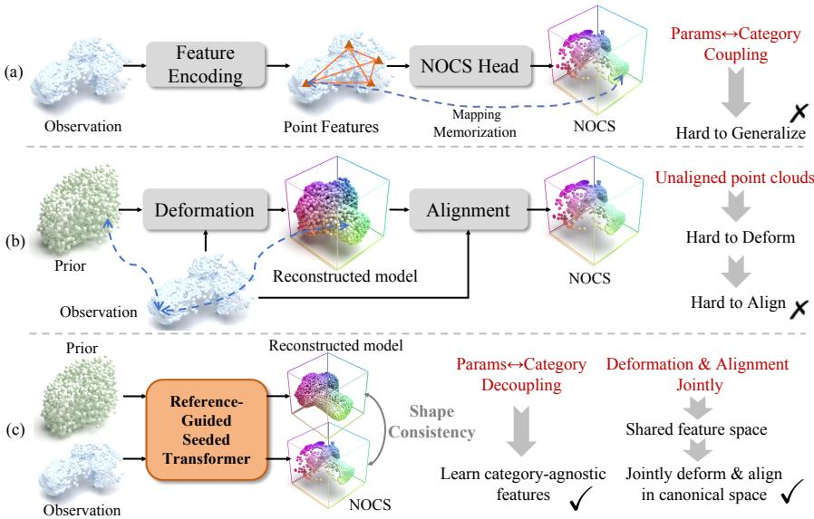
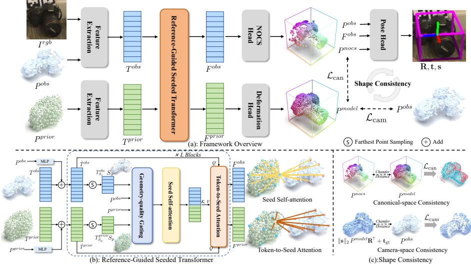
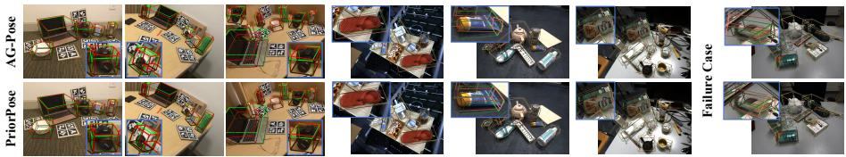

# PriorPose: Reference-Guided Joint Deformation and Alignment for Category-Level Object Pose Estimation

Yihan Chen1, Huan Ren1, Wenfei Yang ⋆1, Hang Du2, Tianzhu Zhang1, and Feng Wu1

1 School of Information Science and Technology / National Key Laboratory of Deep Space Exploration, University of Science and Technology of China 2 Beijing Institute of Control Engineering

Abstract. Category-level object pose estimation seeks to recover a similarity transform (R, t, s) for unseen instances without instance-specific CAD models. Most competitive methods are correspondence-based: priorfree variants regress canonical (NOCS) coordinates directly from local observations and implicitly memorize the canonical frame in the weights, which ties the parameters to category-typical orientations and hurts generalization under distribution shift; prior-based variants introduce a category prior but typically follow a serial deform-then-align pipeline, where underconstrained canonical completion can corrupt correspondences and induce error cascades in pose. We propose PriorPose, a referenceguided correspondence framework that keeps the category prior explicit and solves canonicalization and alignment jointly in a shared feature space. A reference-guided seeded transformer embeds the partial observation and the category prior as token sets and fuses them via geometryaware seeds, from which the network jointly predicts a per-point NOCS field for visible points and a canonical deformation of the prior that reconstructs a full canonical instance, while a deep pose head regresses (R, t, s) from the induced correspondences. A two-part shape consistency objective, with canonical-space and camera-space consistency losses, couples correspondence, deformation, and pose, reducing reliance on memorized canonical orientations and avoiding deform-then-align error cascades. Experiments on standard and larger-category benchmarks demonstrate that PriorPose sets new state-of-the-art results on most evaluated metrics, especially under strict pose thresholds, while remaining competitive on relaxed pose and IoU metrics and showing improved robustness under shape variation and domain shift.

## 1 Introduction

Category-level object pose estimation seeks to recover a similarity transform (R,ts) —rotation, translation, and metric size—for previously unseen instances within a category, without requiring instance-specific CAD models [19, 22, 32].

  
Fig. 1: Comparison of category-level correspondence-based methods. (a) Prior-free methods regress NOCS directly from local observations, which internalizes the canonical mapping in the weights and couples the parameters with category cues, hurting generalization. (b) Prior-based methods first deform a canonical instance model and then align by correspondences; unposed partial views make deformation ambiguous, coarse matches weaken alignment, and errors cascade. (c) Our method embeds the prior and the observation in a shared space, performs joint deformation and alignment in the canonical space, enforces shape consistency, and learns category-agnostic weights, yielding stable correspondences under large shape variation and distribution shift.

Compared with instance-level settings, it emphasizes intra-class generalization under unknown shape and scale, making it well suited to robotic manipulation, AR/VR, and mobile perception.

Prior work can be broadly categorized into two lines of approach: (1) direct regression, which learns a direct mapping from RGB-D or point cloud data to the pose (R,ts) in an end-to-end manner [4, 5, 7, 20, 21, 37, 39], yet often struggles under challenging conditions such as partial visibility, scene clutter, and object symmetries. (2) correspondence-based methods, which first establish dense correspondences by predicting per-point coordinates in a category-level canonical space (e.g., NOCS) [22, 23, 27–29, 32], and subsequently recover the object pose from these predicted correspondences. The latter typically achieves higher accuracy and robustness when correspondences are reliable.

Despite the success of existing correspondence-based methods, there are two factors that limit the performance. First, prior-free methods learn to regress canonical coordinates directly from local observed features, without an explicit shape reference, as shown in Figure 1(a) [22, 29]. This approach requires the model weights to memorize the mapping from local features to NOCS. A key challenge arises because the local features of the same part across diferent instances are highly similar while their NOCS coordinates difer. Consequently, the regression tends to bias towards category-typical averages, impairing generalization under significant shape variations. Moreover, since the model weights become tightly coupled with category-specific features, training independent NOCS prediction heads for each category restricts the model from leveraging cross-category data for improved generalization. Second, prior-based methods introduce a shape prior that helps decouple the weights from single-category cues and enables weight sharing [2, 3, 19, 30]. They usually first produce a canonical instance in the category’s canonical space and then estimate pose from pointto-canonical correspondences (NOCS), as shown in Figure 1(b). However, both stages are fundamentally correspondence problems: deformation needs prior-toinstance correspondence, and pose recovery relies on observation-to-canonical correspondence. Consequently, it is ill-posed to split deformation and correspondence estimation into two diferent stages. Besides, deformation errors can directly bias the correspondences derived from the deformed template and then harm pose estimation performance.

To address the above challenges, our key idea is to use a category prior point cloud as guidance and to extract and fuse observation–prior features with a transformer-based network [31], while jointly optimizing deformation and alignment rather than fixing their order. This directly targets the two issues above. First, introducing a category prior as an explicit canonical reference and fusing it with the partial observation gives the network a concrete “standard” orientation for each category, even when the current instance is only partially visible or geometrically diferent. Local features are interpreted relative to this shared canonical frame, rather than relying on implicit pose statistics stored in the weights, which reduces canonical pose memorization and makes it easier to share parameters across categories. Second, from the same fused representation we jointly predict two complementary outputs in the canonical space: a per-point NOCS field for the visible observations and a canonical deformation of the prior that reconstructs a full instance. During training, the NOCS head uses the prior as a pose-aware reference so that local features on similar parts (e.g., mug handles) are encouraged to align to consistent canonical locations, while the deformation head, in turn, learns how the prior should bend toward the instance as these parts are progressively aligned in the canonical frame. Since both predictions describe the same underlying geometry, we add lightweight shape-consistency terms that keep the NOCS field, the deformed prior, and the pose-aligned reconstruction in agreement with each other and with the observed points. This joint, mutually guided prediction keeps correspondences and the completed shape aligned over the course of training, indirectly regularizes the learned pose, and reduces error accumulation compared with serial deform-then-align pipelines that commit to an intermediate reconstruction before estimating pose.

To this end, we propose PriorPose, a single-stage model with categoryagnostic weights that keeps the canonical context external to the parameters. It solves canonicalization and alignment jointly in a shared feature space, as shown in Fig. 1(c). First, a reference-guided seeded transformer embeds the observation and the category prior as token sets and lets them interact through a compact seed pool. Seed self-attention preserves within-stream structure, while token-to-seed attention enables cross-stream exchange. Within-stream kNN gating imposes a locality prior during token interaction. Geometry-quality gating computes a parameter-free score from same-stream seed neighborhoods to suppress unreliable tokens and stabilize attention routing. Second, from the fused representation the network predicts two complementary outputs in a single forward pass: a per-point canonical correspondence field (NOCS) and a canonical deformation of the prior that reconstructs a full canonical instance. A shape-consistency objective couples these outputs via canonical-space consistency, which ties the correspondence field to the reconstructed canonical instance, and camera-space consistency, which requires the reconstructed canonical shape, placed by the predicted pose (R, t, s), to agree with the observed geometry. These designs reduce memorization of category-specific orientations, avoid deform–then–align error cascades, and yield more stable correspondences and poses under large shape variation and distribution shift.

The main contributions of this work can be summarized as follows: (1) We analyze correspondence-based category-level pose estimation and identify two failure modes: prior-free models internalize the canonical frame in the weights and overfit to category-typical orientations and shapes, while prior-based serial deform–then–align pipelines treat deformation and alignment as separate steps of the same correspondence problem, leading to circular dependence and error cascades under partial, unaligned observations. (2) We propose PriorPose, a reference-guided, single-stage model with category-agnostic weights. It jointly predicts a per-point canonical correspondence field and a canonical deformation of the prior, coupled by shape-consistency terms in canonical and camera space. The seeded transformer uses within-stream kNN gating and geometryquality gating to stabilize attention routing under sparse or corrupted depth. (3) Extensive experiments on standard, cross-dataset, and larger-category bench marks demonstrate state-of-the-art results on most metrics, consistent gains under strict pose criteria, and the efectiveness of the proposed joint deformationalignment formulation.

## 2 Related Work

Prior-free Correspondence Methods. NOCS [32] popularized learning a categoryshared canonical space and regressing dense correspondences for pose and size, and subsequent prior-free methods improve correspondence quality without explicit templates. IST-Net [23] learns an implicit space transformation into the canonical space. AG-Pose [22] detects instance-adaptive keypoints and aggregates local-to-global geometry. SpherePose [28] introduces shared proxies with rotation-aware features to reduce shape dependence. SpotPose [29] revisits correspondence with outlier suppression and robust fitting. These approaches are accurate and eficient, but because the canonical frame is internalized in the weights, predictions can drift toward training-set canonical modes under large shape variation or distribution shift.

Prior-based and Shape-Prior Methods. Another line leverages class priors such as mean shapes or prototypes as explicit canonical references to inject global semantics and complete missing geometry before alignment. Early deform–then–align pipelines include CASS [2], SPD [30], SGPA [3], and DPDN [19]. More recently, GCE-Pose [17] reconstructs global semantics and geometry from category prototypes and fuses them with partial observations to improve correspondence and pose recovery. However, single-view canonical reconstruction is highly underconstrained under partial views when the canonical alignment is unknown. Errors in the reconstructed model can bias correspondences and propagate to downstream pose estimation, making performance sensitive to prior quality and deformation accuracy. This serial separation can amplify errors and lead to cascades when observations are partial and unaligned.

Joint shape and pose estimation. Several works jointly estimate category-level shape and pose using object-centric latent or implicit representations, often in multi-object settings, and difer from NOCS-style correspondence learning in problem setup, output representation, and supervision. Examples include CenterSnap [14], ShAPO [15], CARTO [13], and FSD [24]. Related lines often regress canonical depth or shape representations and use them to facilitate pose recovery, e.g., ACR-Pose [9, 10], while SSP-Pose [38] designs symmetry-aware shape-prior deformation losses to mitigate pose ambiguity. Our work instead stays in the correspondence regime and uses an explicit mean-shape reference for token-level observation–prior interaction, with lightweight shape-consistency constraints in canonical and camera spaces.

Direct Regression. Direct regression methods predict category-level 6-DoF pose and metric size from RGB-D or point clouds without explicit correspondences, e.g., DualPoseNet [20], FS-Net [4], GPV-Pose [7], HS-Pose [39], GenPose [37], VI-Net [21], and SecondPose [5]. They are eficient but can degrade under partial views, heavy clutter, and strong symmetries. Our work instead targets the correspondence family and focuses on making the canonical reference explicit while jointly coupling partial NOCS with canonical deformation and pose.

## 3 Method

Task Definition. Given an RGB-D image, we first obtain instance masks with an of-the-shelf instance segmentation network [12] and crop the RGB to $I ^ { \mathrm { r g b } } \in$ $\mathbb { R } ^ { H \times W \times 3 }$ . Back-projecting the segmented depth yields an observed point cloud $P ^ { \mathrm { o b s } } \in \mathbb { R } ^ { N _ { \mathrm { o b s } } \times 3 }$ . With a category prior point set Pprior $\in \mathbb { R } ^ { N _ { \mathrm { p r i o r } } \times 3 }$ as canonical context, the goal is to estimate rotation $R \in \mathrm { S O ( 3 ) }$ , translation $t \in \mathbb { R } ^ { 3 }$ , and size $s \in \mathbb { R } ^ { 3 }$ of the instance.

  
Fig. 2: Overview of PriorPose. (a) We use a category prior, the mean shape, as an explicit canonical reference: features from the partial observation and the category prior are fused in a shared space by a reference-guided seeded transformer, which jointly predicts per-point NOCS, a canonical deformation, and the pose $( R , t , s )$ , trained with shape consistency. (b) Details of the reference-guided seeded transformer with geometry-aware seeds and kNN-gated attention for eficient observation–prior interaction. (c) Shape consistency, enforced by canonical-space and camera-space losses that jointly couple NOCS, deformation and pose.

Overview. As illustrated in Figure 2, our framework has three components: (1) Feature extraction from the cropped RGB image $I ^ { \mathrm { r g b } }$ , the observation point cloud $P ^ { \mathrm { o b s } }$ , and the category prior $P ^ { \mathrm { p r i o r } }$ (Sec. 3.1); (2) Reference-guided seeded fusion and prediction heads, where a seeded transformer fuses observation and prior tokens with within-stream kNN gating and geometry-quality gating (Sec. 3.2). The fused features are passed to a correspondence head that predicts per-point NOCS, a deformation head that reconstructs a canonical instance, and a deep pose head that regresses $( R , t , s )$ from the induced correspondences (Sec. 3.3). (3) Shape-consistent training objectives that couple correspondence, deformation, and pose via NOCS and pose losses, a canonical reconstruction loss, and two shape-consistency terms in canonical and camera space (Sec. 3.4).

## 3.1 Feature Extraction

Inputs. From a segmented RGB-D frame, we obtain a cropped RGB image $I ^ { \mathrm { r g \bar { b } } } \in \mathbb { R } ^ { H \times W \times 3 }$ and a partial object point cloud $P ^ { \mathrm { o b s } } = \{ p _ { i } \} _ { i = 1 } ^ { \hat { N } _ { \mathrm { o b s } } } \in \mathbb { R } ^ { N _ { \mathrm { o b s } } \times 3 }$ . For each category c, a canonical mean shape (prior) is represented by a point set $P ^ { \mathrm { p r i o r } } = \{ \bar { p } _ { j } \} _ { j = 1 } ^ { N _ { \mathrm { p r i o r } } } \in \mathbb { R } ^ { N _ { \mathrm { p r i o r } } \times 3 }$

Observation tokens. We extract pointwise geometric features with PointNet++ [26], $F ^ { \mathrm { g e o } } = \mathrm { P N } 2 ( P ^ { \mathrm { o b s } } ) \in \mathbb { R } ^ { N _ { \mathrm { o b s } } \times D _ { g } }$ . Semantic image features are produced by DI-$\mathrm { N O v 2 }$ [25] from $I ^ { \mathrm { r g b } }$ and associated with points via camera projection, Fimg ∈ R $N _ { \mathrm { o b s } } { \times } \mathbf { \bar { \mathit { D } } } _ { i }$ . We further encode 3D coordinates with an MLP, $F ^ { \mathrm { p o s } } = \mathrm { M L P } _ { \mathrm { p o s } } ^ { \mathrm { o b s } } ( P ^ { \mathrm { o b s } } ) \in$ $\mathbb { R } ^ { N _ { \mathrm { o b s } } \times D _ { p } }$ . After channel-wise concatenation and a linear projection, we form observation tokens:

$$
\begin{array} { r } { T ^ { \mathrm { o b s } } = \mathrm { P r o j } \big ( [ F ^ { \mathrm { g e o } } \| F ^ { \mathrm { i m g } } \| F ^ { \mathrm { p o s } } ] \big ) \in \mathbb { R } ^ { N _ { \mathrm { o b s } } \times D } . } \end{array}\tag{1}
$$

Prior tokens. For the category prior, we allocate a learnable token per prior point, $E ^ { \mathrm { l e a r n } } \in \mathbb { R } ^ { N _ { \mathrm { p r i o r } } \times D } .$ , and add a geometric embedding of the prior coordinates, $E ^ { \mathrm { g e o } } = \mathrm { M L P } _ { \mathrm { p o s } } ^ { \mathrm { p r i o r } } ( \dot { P } ^ { \mathrm { p r i o r } } ) \in \mathbb { R } ^ { N _ { \mathrm { p r i o r } } \times D }$ . The prior tokens are

$$
T ^ { \mathrm { p r i o r } } = \mathrm { P r o j } \big ( [ E ^ { \mathrm { l e a r n } } | | E ^ { \mathrm { g e o } } ] \big ) \in \mathbb { R } ^ { N _ { \mathrm { p r i o r } } \times D } .\tag{2}
$$

Token set. We use observation tokens $T ^ { \mathrm { o b s } } \in \mathbb { R } ^ { N _ { \mathrm { o b s } } \times D }$ and prior tokens $T ^ { \mathrm { p r i o r } } \in$ $\mathbb { R } ^ { N _ { \mathrm { p r i o r } } \times D }$ . We add learnable source tags $e ^ { \mathrm { o b s } } , e ^ { \mathrm { p r i o r } } \in \mathbb { R } ^ { D }$ to mark stream identity: $\tilde { T } ^ { \mathrm { o b s } } = T ^ { \mathrm { o b s } } + ( e ^ { \mathrm { o b s } } ) ^ { \top }$ and $\tilde { T } ^ { \mathrm { p r i o r } } = T ^ { \mathrm { p r i o r } } + ( e ^ { \mathrm { p r i o r } } ) ^ { \top }$ . The fused token sequence is $T = [ \tilde { T } ^ { \mathrm { o b s } } ; \tilde { T } ^ { \mathrm { p r i o r } } ] \in \mathbb { R } ^ { L \times D }$ with $L = N _ { \mathrm { o b s } } + N _ { \mathrm { p r i o r } }$

## 3.2 Reference-Guided Seeded Transformer

Overview. Starting from $T = [ \tilde { T } ^ { \mathrm { o b s } } ; \tilde { T } ^ { \mathrm { p r i o r } } ] \in \mathbb { R } ^ { L \times D }$ with source tags, we sample K seed indices once by FPS on $P ^ { \mathrm { o b s } }$ and $P ^ { \mathrm { p r i o r } }$ , gather the corresponding tokens to form $Z ~ \in ~ \mathbb { R } ^ { K \times D }$ , and reuse the seed indices across all blocks [40]. Each block alternates (i) seed self-attention to update Z with global context, and (ii) token-to-seed attention that routes messages from all tokens to seeds. In routing, we apply within-stream kNN gating to enforce geometric locality, while keeping cross-stream seeds visible, and add a geometry-quality gating as a logit bias to down-weight unreliable associations. This seeded design yields eficient observation–prior interaction with $O ( L K )$ attention cost where $K \ll L$

Seeded attention with an additive mask. With H heads and per-head dimension $d = D / H$ , we use masked dot-product attention:

$$
A t t n ( Q , K , V ; M ) = \ s o f t m a x \left( \frac { Q K ^ { \top } } { \sqrt { d } } + M \right) V .\tag{3}
$$

The additive mask M biases attention logits and uses -\infty to forbid connections.

Geometry-aware seed selection. We choose $K _ { o }$ observation seeds and $K _ { p }$ prior seeds by FPS on coordinates:

$$
S _ { o } = \mathrm { F P S } \bigl ( P ^ { \mathrm { o b s } } , K _ { o } \bigr ) , \qquad S _ { p } = \mathrm { F P S } \bigl ( P ^ { \mathrm { p r i o r } } , K _ { p } \bigr ) .
$$

We initialize the seed pool from tagged tokens:

$$
Z = [ \tilde { T } _ { S _ { o } } ^ { \mathrm { o b s } } ; \tilde { T } _ { S _ { p } } ^ { \mathrm { p r i o r } } ] \in \mathbb { R } ^ { K \times D } , \qquad K = K _ { o } + K _ { p } .
$$

Seed indices are fixed across blocks and only seed features are updated.

Within-stream kNN gating and cross-stream visibility. We apply kNN gating only within each stream to encode a geometric locality prior. Cross-stream Euclidean distances are not meaningful before pose is estimated. We therefore gate only same-source token–seed pairs and keep all cross-source seeds visible.

We view the seed pool as $Z = [ Z ^ { \mathrm { o b s } } ; Z ^ { \mathrm { p r i o r } } ]$ with $K = K _ { o } + K _ { p }$ . For an observation token $i ,$ let $\mathcal { N } _ { k } ( i ; S _ { o } ) \subseteq \left\{ 1 , \ldots , K _ { o } \right\}$ be its k nearest observation seeds in $P ^ { \mathrm { o b s } }$ , and allow attention to these seeds and all prior seeds:

$$
\mathcal { A } _ { i } = \mathcal { N } _ { k } ( i ; S _ { o } ) \cup \{ K _ { o } + 1 , \ldots , K \} .
$$

For a prior token $j ,$ we define $\mathcal { A } _ { N _ { \mathrm { o b s } } + j }$ symmetrically using kNN prior seeds in $P ^ { \mathrm { p r i o r } }$ and keep all observation seeds visible. We implement hard gating by an additive mask

$$
M ^ { \mathrm { k n n } } ( t , u ) = \left\{ \begin{array} { l l } { 0 , } & { u \in \mathcal { A } _ { t } , } \\ { - \infty , } & { \mathrm { o t h e r w i s e } . } \end{array} \right.
$$

Geometry-quality gating. We further suppress unreliable tokens by a parameterfree geometry-quality score computed from same-stream seed neighborhoods. For conciseness we describe the observation stream, and apply the same procedure to the prior stream. We define $\hat { q } _ { j }$ for each prior point ${ \bar { p } } _ { j }$ analogously using kNN prior seeds in $P ^ { \mathrm { p r i o r } }$

For an observation point $p _ { i } \in P ^ { \mathrm { o b s } }$ , let $\mathcal { N } _ { k } ( i ; S _ { o } )$ be its k nearest observation seeds. Let $\mathbf { s } _ { u } \in \mathbb { R } ^ { 3 }$ denote the 3D coordinate of the u-th observation seed in $P _ { S _ { o } } ^ { \mathrm { o b s } }$ . Here u indexes the observation seeds selected by $S _ { o } .$ and $\mathcal { N } _ { k } ( i ; S _ { o } )$ returns indices in this seed set. We define the average seed distance

$$
d _ { i } = \frac { 1 } { k } \sum _ { \substack { u \in \mathcal { N } _ { k } ( i ; S _ { o } ) } } \| p _ { i } - \mathbf { s } _ { u } \| _ { 2 } , \qquad \sigma = \frac { 1 } { N _ { \mathrm { o b s } } } \sum _ { i } d _ { i } , \qquad q _ { i } = \exp \Big ( - \frac { 1 } { 2 } ( d _ { i } / \sigma ) ^ { 2 } \Big ) ,
$$

and normalize it to [0,1] :

$$
\hat { q } _ { i } = \mathrm { c l i p } \Big ( { \frac { q _ { i } } { { \frac { 1 } { N _ { \mathrm { o b s } } } } \sum _ { i } q _ { i } + \epsilon } } , 0 , 1 \Big ) .
$$

We use $\hat { q }$ in two places. First, we gate tokens before token-to-seed attention:

$$
\tilde { T } _ { i } ^ { \mathrm { o b s } } \gets \hat { q } _ { i } \tilde { T } _ { i } ^ { \mathrm { o b s } } , \qquad \tilde { T } _ { j } ^ { \mathrm { p r i o r } } \gets \hat { q } _ { j } \tilde { T } _ { j } ^ { \mathrm { p r i o r } } .
$$

Second, we add a geometry-quality bias on attention logits:

$$
M ^ { \mathrm { g e o } } ( t , u ) = \gamma \big ( \hat { q } _ { t } + \hat { q } _ { u } \big ) , \qquad \hat { q } _ { t } , \hat { q } _ { u } \in [ 0 , 1 ] .\tag{4}
$$

Here $\gamma > 0$ controls the strength. For a seed key u, we set $\hat { q } _ { u }$ to the geometryquality score of the corresponding seed point $( \mathrm { i . e . , } \hat { q }$ evaluated at that seed) in the same stream. The total mask in Eq. (3) is $M = M ^ { \mathrm { k n n } } + M ^ { \mathrm { g e o } }$

Block updates. Each block updates seeds by self-attention and then updates all tokens by token-to-seed attention using the total mask M in Eq. (3). We use standard pre-norm Transformer blocks with residual MLPs.

## 3.3 Prediction Heads

NOCS and deformation heads. After seeded fusion we obtain updated features for the two streams. Let ${ \cal F } ^ { \mathrm { o b s } } = \{ { \cal F } _ { i } ^ { \mathrm { o b s } } \} _ { i = 1 } ^ { N _ { \mathrm { o b s } } }$ be the observation features and $F ^ { \mathrm { p r i o r } } ~ = ~ \{ F _ { j } ^ { \mathrm { p r i o r } } \} _ { j = 1 } ^ { N _ { \mathrm { p r i o r } } }$ be the prior features. The NOCS head predicts perobservation NOCS:

$$
\begin{array} { r } { P ^ { \mathrm { n o c s } } = \mathrm { M L P } _ { \mathrm { n o c s } } ( F ^ { \mathrm { o b s } } ) \in \mathbb { R } ^ { N _ { \mathrm { o b s } } \times 3 } . } \end{array}
$$

The deformation head predicts displacements for prior points and forms a canonical instance:

$$
\hat { \varDelta } = \mathrm { M L P } _ { \mathrm { d e f } } ( F ^ { \mathrm { p r i o r } } ) \in \mathbb { R } ^ { N _ { \mathrm { p r i o r } } \times 3 } , P ^ { \mathrm { m o d e l } } = P ^ { \mathrm { p r i o r } } + \hat { \varDelta } .
$$

Here $P ^ { \mathrm { n o c s } }$ are the NOCS coordinates and $P ^ { \mathrm { m o d e l } }$ is the reconstructed canonica instance.

Deep pose regressor. Given observation points $P ^ { \mathrm { o b s } }$ with fused features $F ^ { \mathrm { o b s } }$ and their predicted NOCS $P ^ { \mathrm { n o c s } }$ , we estimate pose and size following previous work [19, 22] using a deep estimator. Three MLP heads predict rotation, translation, and size:

$$
f _ { \mathrm { p o s e } } = \mathrm { c o n c a t } \big [ P ^ { \mathrm { n o c s } } , P ^ { \mathrm { o b s } } , F ^ { \mathrm { o b s } } \big ] .\tag{5}
$$

$$
\begin{array} { r } { { \bf R } , { \bf t } , { \bf s } = \mathrm { M L P } _ { R } ( f _ { \mathrm { p o s e } } ) , \mathrm { M L P } _ { t } ( f _ { \mathrm { p o s e } } ) , \mathrm { M L P } _ { s } ( f _ { \mathrm { p o s e } } ) . } \end{array}\tag{6}
$$

## 3.4 Shape-Consistent Training Objectives

We use three standard loss components together with two shape-consistency terms. First, we adopt a NOCS regression loss [32] and a symmetry-aware pose loss $( c f . \ [ 3 4 ] )$ . Second, we add a reconstruction loss on the canonical instance via the Chamfer distance $( c f . \ [ 1 , 8 ] )$ . Third, we impose the shape consistency: a canonical-space consistency term that ties the correspondence field to the reconstructed canonical instance, and a camera-space consistency term that enforces agreement between the reconstructed canonical shape, placed by the predicted pose, and the observed geometry.

NOCS regression. Let $P ^ { \mathrm { o b s } } \in \mathbb { R } ^ { N _ { \mathrm { o b s } } \times 3 }$ be the camera-space observations and Pnocs $\in \breve { \mathbb { R } } ^ { N _ { \mathrm { o b s } } \times 3 }$ the predicted NOCS. With ground-truth $T _ { \mathrm { g t } } = ( \mathbf { R } _ { \mathrm { g t } } , \mathbf { t } _ { \mathrm { g t } } , \mathbf { s } _ { \mathrm { g t } } )$ ， the NOCS targets are obtained by the inverse transform:

$$
P _ { g t } ^ { \mathrm { n o c s } } = \| \mathbf { s } _ { \mathrm { g t } } \| _ { 2 } ^ { - 1 } \big ( P ^ { \mathrm { o b s } } - \mathbf { 1 } \mathbf { t } _ { \mathrm { g t } } ^ { \top } \big ) \mathbf { R } _ { \mathrm { g t } } ,
$$

where 1 denotes an all-ones column vector for broadcasting. We supervise Pnocs with a point-wise Smooth- $. L _ { 1 }$ loss and reweight points to reduce the impact of noisy correspondences. Let $e _ { i }$ be the mean Smooth- $. L _ { 1 }$ error over the three NOCS coordinates for point $i ,$ and let $r _ { i } ~ \in ~ [ 0 , 1 ]$ be a predicted per-point reliability score. We compute stop-gradient, mean-normalized weights

$$
w _ { i } = \frac { \mathrm { s t o p g r a d } ( r _ { i } ) } { \frac { 1 } { N _ { \mathrm { o b s } } } \sum _ { j } \mathrm { s t o p g r a d } ( r _ { j } ) + \epsilon } .
$$

The weighted NOCS loss is

$$
\mathcal { L } _ { \mathrm { n o c s } } = \frac { \sum _ { i } w _ { i } e _ { i } } { \sum _ { i } w _ { i } + \epsilon } .\tag{7}
$$

This weighting follows prior robust correspondence learning with per-point reliability [6,29]. We include a lightweight self-calibration for $r _ { i }$ in the supplementary.

Symmetry-aware pose. Following [34], we measure rotation under category symmetries and use $\ell _ { 2 }$ terms for translation and size:

$$
{ \mathcal { L } } _ { \mathrm { p o s e } } = \lambda _ { R } \operatorname* { m i n } _ { \mathbf { R } _ { s } \in { \mathcal { R } } _ { s } } { \big \| } \mathbf { R } _ { \mathrm { g t } } \mathbf { R } _ { s } - \mathbf { R } { \big \| } _ { F } + \lambda _ { t } { \big \| } \mathbf { t } - \mathbf { t } _ { \mathrm { g t } } { \big \| } _ { 2 } + \lambda _ { s } { \big \| } \mathbf { s } - \mathbf { s } _ { \mathrm { g t } } { \big \| } _ { 2 } .\tag{8}
$$

Here $\mathbf { R } \in \mathrm { S O } ( 3 )$ , t, $\mathbf { s } \in \mathbb { R } ^ { 3 }$ are the predicted rotation, translation, and size; $( \mathbf { R } _ { \mathrm { g t } } , \mathbf { t } _ { \mathrm { g t } } , \mathbf { s } _ { \mathrm { g t } } )$ are ground truth; R is the discrete symmetry set (identity if none); $\| \cdot \| _ { F }$ and $\| \cdot \| _ { 2 }$ denote Frobenius and Euclidean norms; $\lambda _ { R } , \lambda _ { t } , \lambda _ { s }$ are weights.

Canonical reconstruction. We supervise the reconstructed canonical instance using the squared Chamfer distance [1, 8]:

$$
\mathcal { L } _ { \mathrm { r e c } } = \mathrm { C D } ( P ^ { \mathrm { m o d e l } } , P _ { \mathrm { g t } } ^ { \mathrm { m o d e l } } ) .\tag{9}
$$

Canonical-space consistency. Since $P ^ { \mathrm { n o c s } }$ and $P ^ { \mathrm { m o d e l } }$ lie in the same canonical space, we enforce their agreement while accounting for the fact that $P ^ { \mathrm { n o c s } }$ is partial and $P ^ { \mathrm { m o d e l } }$ is complete. During training we remove outliers in the predicted correspondences by a nearest-neighbor distance threshold to the ground-truth canonical model [22]. Specifically, we discard NOCS points whose nearest distance to $P _ { \mathrm { g t } } ^ { \mathrm { m o d e l } }$ exceeds $\tau _ { \mathrm { c a n } }$ and denote the remaining set as $P _ { \mathrm { \mathrm { f i t } } } ^ { \mathrm { n o c s } }$ . We then measure a one-sided Chamfer distance from the filtered NOCS points to the reconstructed canonical instance:

$$
\mathcal { L } _ { \mathrm { c a n } } = \frac { 1 } { | P _ { \mathrm { f l t } } ^ { \mathrm { n o c s } } | } \sum _ { \mathbf { a } \in P _ { \mathrm { f l t } } ^ { \mathrm { n o c s } } } \operatorname* { m i n } _ { \mathbf { b } \in P ^ { \mathrm { m o d e l } } } \| \mathbf { a } - \mathbf { b } \| _ { 2 } ^ { 2 } .\tag{10}
$$

Camera-space consistency. We enforce consistency in the camera space between the reconstructed canonical instance placed by the predicted pose and the observed geometry. We first place the ground-truth canonical model into the camera frame:

$$
\begin{array} { r } { \widetilde { P } _ { \mathrm { g t } } ^ { \mathrm { m o d e l } } = \| \mathbf { s } _ { \mathrm { g t } } \| _ { 2 } P _ { \mathrm { g t } } ^ { \mathrm { m o d e l } } \mathbf { R } _ { \mathrm { g t } } ^ { \intercal } + \mathbf { 1 } \mathbf { t } _ { \mathrm { g t } } ^ { \intercal } . } \end{array}
$$

At training time, we filter observations by retaining points whose nearest distance to $\tilde { P } _ { \mathrm { g t } } ^ { \mathrm { m o d e l } }$ is below $\tau _ { \mathrm { c a m } }$ , denoted as $P _ { \mathrm { f l t } } ^ { \mathrm { o b s } }$ . We then measure a one-sided Chamfer distance from the filtered observations to the reconstructed instance placed by the predicted pose:

$$
\mathcal { L } _ { \mathrm { c a m } } = \frac { 1 } { \vert P _ { \mathrm { f l t } } ^ { \mathrm { o b s } } \vert } \sum _ { \mathbf { a } \in P _ { \mathrm { f l t } } ^ { \mathrm { o b s } } } \mathbf { b } \in \Vert \mathbf { s } \Vert _ { 2 } P ^ { \mathrm { m i n } } \mathbf { R } ^ { \intercal } + \mathbf { 1 } \mathbf { t } ^ { \intercal } \mathbf { \Lambda } \Vert \mathbf { a } - \mathbf { b } \Vert _ { 2 } ^ { 2 } .\tag{11}
$$

Table 1: Performance comparison on REAL275 and CAMERA25. Each entry is reported as REAL275/CAMERA25. Best is in bold, second-best is underlined.
<table><tr><td>Method</td><td>Prior</td><td> $\mathrm { I o U } _ { 5 0 }$ </td><td> $\mathrm { I o U } _ { 7 5 }$ </td><td> $5 ^ { \circ } 2 \mathrm { { c m } }$ </td><td> $5 ^ { \circ } 5 \mathrm { c m }$ </td><td>10°2cm</td><td>10°5cm</td></tr><tr><td>Without prior</td><td></td><td></td><td></td><td></td><td></td><td></td><td></td></tr><tr><td>GenPose [37]</td><td>x</td><td>-/-</td><td>-/-</td><td>52.1/79.9</td><td>60.9/84.4</td><td>72.4/84.6</td><td>84.0/89.6</td></tr><tr><td>VI-Net [21]</td><td>x</td><td>-1-</td><td>-1-</td><td>50.0/74.1</td><td>57.6/81.4</td><td>70.8/79.3</td><td>82.1/87.3</td></tr><tr><td>SecondPose [5]</td><td>x</td><td>-/-</td><td>-/-</td><td>56.2/-</td><td>63.6/-</td><td>74.7/-</td><td>86.0/-</td></tr><tr><td>NOCS [32]</td><td>x</td><td>78.0 /83.9</td><td>30.1/69.5</td><td>7.2/32.3</td><td>10.0/40.9</td><td>13.8/48.2</td><td>25.2/64.4</td></tr><tr><td>IST-Net [23]</td><td>x</td><td>82.5 /93.7</td><td>76.6/90.8</td><td>47.5/71.3</td><td>53.4/79.9</td><td>72.1/79.4</td><td>80.5/ /89.9</td></tr><tr><td>Query6DoF [33]</td><td>x</td><td>82.5/91.9</td><td>76.1/88.1</td><td>49.0/78.0</td><td>58.9/83.1</td><td>68.7/83.9</td><td>83.0/90.0</td></tr><tr><td>AG-Pose [22]</td><td>x</td><td>83.7 /93.8</td><td>79.5 /91.3</td><td>54.7/77.8</td><td>61.7/82.8</td><td>74.7/85.5</td><td>83.1/91.6</td></tr><tr><td>SpherePose [28]</td><td>x</td><td>84.1 /94.8</td><td>81.2 /92.4</td><td>58.2/78.3</td><td>67.4 /84.3</td><td>76.2/84.8</td><td>88.2 /92.3</td></tr><tr><td>SpotPose [29]</td><td>x</td><td>84.1/94.3</td><td>81.2/92.5</td><td>59.7/80.4</td><td>64.8/83.8</td><td>81.5/87.7</td><td>88.2 /92.2</td></tr><tr><td>With prior</td><td></td><td></td><td></td><td></td><td></td><td></td><td></td></tr><tr><td>SPD [30]</td><td>√</td><td>77.3/93.2</td><td>53.2/83.1</td><td>19.3/54.3</td><td>21.4/59.0</td><td>43.2/73.3</td><td>54.1/81.5</td></tr><tr><td>SGPA [3]</td><td>√</td><td>80.1/93.2</td><td>61.9 /88.1</td><td>35.9/70.7</td><td>39.6/74.5</td><td>61.3/82.7</td><td>70.7/88.4</td></tr><tr><td>SAR-Net [18]</td><td>√</td><td>79.3/86.8</td><td>62.4/79.0</td><td>31.6/66.7</td><td>42.3/70.9</td><td>50.3/75.3</td><td>68.3/80.3</td></tr><tr><td>DPDN [19]</td><td>√√</td><td>83.4/-</td><td>76.0/-</td><td>46.0/-</td><td>50.7/-</td><td>70.4/-</td><td>78.4/-</td></tr><tr><td>GCE-Pose [17]</td><td></td><td>84.1/-</td><td>79.8/-</td><td>57.0/-</td><td>65.1/-</td><td>75.6/-</td><td>85.3/-</td></tr><tr><td>Ours</td><td></td><td></td><td></td><td></td><td></td><td></td><td></td></tr><tr><td>PriorPose</td><td>√</td><td>84.1/94.3</td><td></td><td></td><td>81.2/92.561.8/81.1 68.2/85.0 81.3/87.9 88.9/92.6</td><td></td><td></td></tr></table>

Total loss. The overall loss function is as follows:

$$
{ \mathcal { L } } = \lambda _ { 1 } { \mathcal { L } } _ { \mathrm { n o c s } } + \lambda _ { 2 } { \mathcal { L } } _ { \mathrm { p o s e } } + \lambda _ { 3 } { \mathcal { L } } _ { \mathrm { r e c } } + \lambda _ { 4 } { \mathcal { L } } _ { \mathrm { c a n } } + \lambda _ { 5 } { \mathcal { L } } _ { \mathrm { c a m } } .\tag{12}
$$

## 4 Experiments

## 4.1 Experimental Setup

Datasets and metrics. We evaluate on CAMERA25 and REAL275 from NOCS [32], HouseCat6D [16], Wild6D [11], and two larger-category benchmarks, Omni6DPose [36] and PACE [35]. CAMERA25/REAL275 are the standard synthetic-to-real NOCS benchmarks; HouseCat6D contains stronger occlusion and intra-class variation; Wild6D is used for zero-shot cross-dataset evaluation. Following prior work [22, 29], we report pose mAP under (5◦, 2cm), (5◦, 5cm), (10◦, 2cm), and $( 1 0 ^ { \circ }$ , 5cm), and 3D IoU mAP at 50% and 75%. Symmetric objects follow the standard symmetry-aware protocol. For Omni6DPose and PACE, we follow their oficial category-level metrics.

Implementation details. We use the same instance masks as prior work [22, 29]. Each observation contains $N _ { \mathrm { o b s } } { = } 1 0 2 4$ points and a 224×224 RGB crop; each category prior contains $N _ { \mathrm { p r i o r } } { = } 5 1 2$ points. Observation tokens concatenate PointNet++ features, DINOv2 image features, and coordinate embeddings into D=256 dimensions. We use 6 transformer blocks, 4 heads, $K _ { o } { = } 9 6 , K _ { p } { = } 6 4 , k { = } 3 2$ and $\gamma { = } 0 . 2 .$ . Training details and loss weights are in the supplementary material.

## 4.2 Comparison with State-of-the-Art Methods

REAL275 and CAMERA25. We use $5 ^ { \circ } 2$ cm and $5 ^ { \circ } 5$ cm as the main pose metrics, as they require accurate rotation and centimeter-level translation. On REAL275,

Table 2: Performance comparison with state-of-the-art methods on HouseCat6D. Best is in bold, second-best is underlined.
<table><tr><td>Method</td><td>Prior</td><td> $\mathrm { I o U } _ { 2 5 }$ </td><td> $\mathrm { I o U } _ { 5 0 }$ </td><td> $5 ^ { \circ } 2 \mathrm { { c m } }$ </td><td> $5 ^ { \circ } 5 \mathrm { c m }$ </td><td> $1 0 ^ { \circ } 2 \mathrm { { c m } }$ </td><td> $1 0 ^ { \circ } 5 \mathrm { { c m } }$ </td></tr><tr><td>VI-Net [21]</td><td>x</td><td>80.7</td><td>56.4</td><td>8.4</td><td>10.3</td><td>20.5</td><td>29.1</td></tr><tr><td>SecondPose [5]</td><td>x</td><td>83.7</td><td>66.1</td><td>11.0</td><td>13.4</td><td>25.3</td><td>35.7</td></tr><tr><td>AG-Pose [22]</td><td>x</td><td>81.8</td><td>62.5</td><td>11.5</td><td>12.0</td><td>32.7</td><td>35.8</td></tr><tr><td>SpherePose [28]</td><td>x</td><td>88.8</td><td>72.2</td><td>19.3</td><td>25.9</td><td>40.9</td><td>55.3</td></tr><tr><td>SpotPose [29]</td><td>x</td><td>89.1</td><td>77.0</td><td>23.8</td><td>24.5</td><td>52.3</td><td>54.8</td></tr><tr><td>DPDN [19]</td><td>√</td><td></td><td>56.2</td><td>6.4</td><td>6.9</td><td>22.2</td><td>25.8</td></tr><tr><td>GCE-Pose [17]</td><td>√</td><td></td><td>79.2</td><td>24.8</td><td>25.7</td><td>55.4</td><td>58.4</td></tr><tr><td>PriorPose</td><td>√</td><td>89.6</td><td>80.1</td><td>26.5</td><td>27.3</td><td>56.0</td><td>58.0</td></tr></table>

PriorPose achieves 61.8 and 68.2, improving over SpotPose [29] by +2.1 and +3.4 points at these thresholds. On CAMERA25, our method reaches 81.1 and 85.0 and remains competitive under more permissive criteria. The consistent gains on both synthetic and real domains suggest more stable correspondences under domain shift; on REAL275, the improvements under strict thresholds further indicate robustness to sensor noise and outliers. We attribute this to keeping the prior explicit and jointly optimizing deformation and alignment, which mitigates error cascades in serial deform–then–align pipelines.

HouseCat6D. HouseCat6D features larger intra-class variation, frequent occlusions, and category symmetries. As shown in Table 2, PriorPose achieves 26.5 and 27.3 mAP at 5◦2 cm and 5◦5 cm, improving over SpotPose [29] by +2.7 and +2.8 points, and over GCE-Pose [17] by +1.7 and +1.6 points at the same thresholds. The gains on strict pose mAP, together with improved $\mathrm { I o U _ { 2 5 } / I o U _ { 5 0 } }$ are consistent with our design for partial and noisy depth: geometry-quality gating stabilizes feature fusion under outliers, while shape-consistency losses couple correspondence, deformation, and pose to reduce error propagation.

## 4.3 Larger-Category Evaluation

We further evaluate PriorPose on Omni6DPose [36] and PACE [35] to test whether the reference-guided joint formulation remains efective beyond the standard NOCS-style setting. We follow the oficial category-level protocols and keep the core architecture unchanged. Table 3 reports representative metrics; full results are provided in the supplementary material.

For Omni6DPose, Strict/Relaxed denote VUS at $5 ^ { \circ } 5 \mathrm { c m } / 1 0 ^ { \circ }$ 5cm. For PACE, Strict/Relaxed denote $\mathrm { A P } _ { R , t } 2 0 / 5$ and $\mathrm { A P } _ { R , t } 6 0 / 1 5 $ . The results provide additional evidence under larger category diversity, while our conclusions remain limited to the evaluated RGB-D category-level protocols.

## 4.4 Cross-dataset Generalization on Wild6D

We evaluate zero-shot cross-dataset generalization on Wild6D [11]: all methods are trained on NOCS and tested on Wild6D without fine-tuning. As shown in

Table 3: Larger-category evaluation on Omni6DPose and PACE. We report representative oficial metrics for each benchmark.
<table><tr><td>Benchmark</td><td>Method</td><td> $\mathrm { I o U } _ { 2 5 }$ </td><td> $\mathrm { I o U } _ { 5 0 }$ </td><td>Strict</td><td>Relaxed</td></tr><tr><td>Omni6DPose</td><td>AG-Pose [22]</td><td>42.5</td><td>22.7</td><td>11.5</td><td>25.0</td></tr><tr><td>Omni6DPose</td><td>GenPose++ [36]</td><td>39.0</td><td>19.1</td><td>15.1</td><td>29.4</td></tr><tr><td>Omni6DPose</td><td>PriorPose</td><td>46.3</td><td>26.4</td><td>16.4</td><td>30.8</td></tr><tr><td>PACE</td><td> $\mathrm { C P P F + + \ B 5 | }$ </td><td>44.5</td><td>4.4</td><td>9.9</td><td>24.9</td></tr><tr><td>PACE</td><td> $\mathrm { A G } \mathrm { - P o s e ~ } [ \dot { 2 } 2 ]$ </td><td>69.4</td><td>28.1</td><td>19.5</td><td>39.7</td></tr><tr><td>PACE</td><td> $\mathbf { P r i o r P o s i }$ </td><td>75.1</td><td>35.5</td><td>21.8</td><td>43.3</td></tr></table>

Table 4: Zero-shot evaluation on Wild6D. All methods are trained on NOCS only and evaluated on Wild6D without fine-tuning.
<table><tr><td>Method</td><td>Prior</td><td> $\mathrm { I o U } _ { 5 0 }$ </td><td> $\mathrm { I o U } _ { 7 5 }$ </td><td> $5 ^ { \circ } 2 \mathrm { { c m } }$ </td><td> $5 ^ { \circ } 5 \mathrm { c m }$ </td><td> $1 0 ^ { \circ } 2 \mathrm { { c m } }$ </td><td> $1 0 ^ { \circ } 5 \mathrm { { c m } }$ </td></tr><tr><td> $_ \mathrm { A G - P o s e }$  [22]</td><td>x</td><td>86.0</td><td>57.0</td><td>41.8</td><td>44.9</td><td>49.0</td><td>54.2</td></tr><tr><td> $\mathbf { P r i o r P o s i }$ </td><td>√</td><td>87.2</td><td>62.4</td><td>43.1</td><td>46.3</td><td>52.6</td><td>56.2</td></tr></table>

Table 4, PriorPose improves over AG-Pose on both IoU and pose metrics, suggesting that explicit prior guidance helps stabilize correspondences under clutter and domain shift.

## 4.5 Ablation Studies

Protocol. All ablations are on REAL275 with the standard split and the same evaluation metrics as Table 1. Unless specified, we keep data, schedule, and heads fixed, and only toggle the prior branch, loss terms, or fusion settings.

A. Joint formulation and prior complexity. We isolate whether the gain comes from simply adding a prior or from jointly coupling deformation and alignment. No-Prior removes the prior branch. Serial D→A uses the same prior and seeded transformer, but first predicts a deformed prior and then treats it as a fixed reference for NOCS and pose estimation. Gauss. Prior replaces the structured mean-shape prior with a fixed category-wise full-covariance Gaussian prior. Joint w/o SC removes the shape-consistency losses from the joint model.

Observation. Serial D→A improves over No-Prior but remains below Joint $\mathrm { w / o ~ S C }$ , showing that the gain is not from the prior alone. Gauss. Prior also improves over No-Prior but underperforms the structured prior, suggesting that surface topology and part layout provide useful correspondence guidance. Full further improves over Joint w/o SC, confirming the benefit of shape consistency. B. Efect of the shape-consistency losses. We ablate the three shape-related losses that couple deformation, correspondence, and pose. All variants keep the same NOCS and pose supervision; we only change the reconstruction and consistency terms. $w / o$ Recon Loss disables the deformation branch and removes all shape-related losses. w/o Shape Consistency enables the deformation head and uses only the reconstruction loss $\mathcal { L } _ { \mathrm { r e c } }$ on the canonical instance. Canonical Consistency additionally applies the canonical-space loss $\mathcal { L } _ { \mathrm { c a n } }$ to tie the NOCS field to the reconstructed canonical instance. Camera Consistency instead uses the camera-space loss $\mathcal { L } _ { \mathrm { c a m } }$ to enforce agreement between the pose-placed reconstruction and the observed geometry. Full combines $\mathcal { L } _ { \mathrm { r e c } } , \mathcal { L } _ { \mathrm { c a n } }$ , and $\mathcal { L } _ { \mathrm { c a m } }$

Table 5: Controlled ablations on REAL275. SC denotes shape consistency.
<table><tr><td>Variant</td><td> $5 ^ { \circ } 2 \mathrm { { c m } }$ </td><td> $5 ^ { \circ } 5 \mathrm { c m }$ </td><td> $1 0 ^ { \circ } 2 \mathrm { c m }$ </td><td> $1 0 ^ { \circ } ~ 5 \mathrm { c m }$ </td></tr><tr><td>No-Prior</td><td>57.2</td><td>64.4</td><td>76.5</td><td>85.7</td></tr><tr><td>Serial D→A</td><td>58.1</td><td>64.5</td><td>78.2</td><td>86.7</td></tr><tr><td>Gauss. Prior</td><td>59.9</td><td>65.3</td><td>78.4</td><td>86.4</td></tr><tr><td>Joint w/o SC</td><td>60.2</td><td>65.5</td><td>80.7</td><td>87.3</td></tr><tr><td>Full</td><td>61.8</td><td>68.2</td><td>81.3</td><td>88.9</td></tr></table>

Table 6: Ablation studies on the reconstruction loss and shape consistency losses.
<table><tr><td>Variant</td><td> $\mathcal { L } _ { \mathrm { r e c } }$ </td><td> $\mathcal { L } _ { \mathrm { c a n } }$ </td><td> $\mathcal { L } _ { \mathrm { c a m } }$ </td><td> $5 ^ { \circ } 2 \mathrm { { c m } }$ </td><td> $5 ^ { \circ } 5 \mathrm { c m }$ </td><td> $1 0 ^ { \circ } 2 \mathrm { { c m } }$ </td><td> $1 0 ^ { \circ } 5 \mathrm { { c m } }$ </td></tr><tr><td>w/o Recon Loss</td><td>x</td><td>x</td><td>x</td><td>58.1</td><td>64.7</td><td>78.1</td><td>86.2</td></tr><tr><td>w/o Shape Consistency</td><td>√</td><td>x</td><td>x</td><td>60.2</td><td>65.5</td><td>80.7</td><td>87.3</td></tr><tr><td>+ Canonical Consistency</td><td>√</td><td>√</td><td>x</td><td>61.2</td><td>65.9</td><td>81.2</td><td>87.6</td></tr><tr><td>+ Camera Consistency</td><td>√</td><td>x</td><td>√</td><td>61.4</td><td>67.5</td><td>79.8</td><td>87.8</td></tr><tr><td>Full (ours)</td><td>√</td><td>√</td><td>√</td><td>61.8</td><td>68.2</td><td>81.3</td><td>88.9</td></tr></table>

Observation. Without reconstruction and consistency $( \mathrm { w } / \mathrm { o }$ Recon Loss), the model yields the lowest pose accuracy, indicating limited canonical regularization from NOCS and pose supervision alone. Adding reconstruction only $( \mathrm { w } / \mathrm { o }$ Shape Consistency) improves all thresholds by $+ 2 . 1 / + 0 . 8 / + 2 . 6 / + 1 . 1$ at $5 ^ { \circ } 2$ cm, $5 ^ { \circ } 5 \mathrm { c m } , \ 1 0 ^ { \circ } 2 \mathrm { c m }$ , and $1 0 ^ { \circ } 5$ cm. Canonical consistency improves most metrics, while camera-space consistency mainly improves $5 ^ { \circ } 5$ cm and $1 0 ^ { \circ } 5$ cm but slightly decreases $1 0 ^ { \circ } 2 \mathrm { c m }$ . Combining both yields the best overall performance. In particular, Full improves over $\mathrm { w / o }$ Shape Consistency by $+ 1 . 6 / + 2 . 7 / + 0 . 6 / + 1 . 6 ,$ supporting the complementarity of canonical-space and camera-space constraints for coupling deformation, correspondence, and pose.

C. Fusion type, neighborhood size, and geometry-quality bias. Finally, we compare dense versus seeded fusion and examine the sensitivity to the kNN size k and the score-bias weight γ used in seeded attention. Dense self-attn replaces the seeded transformer with a standard dense self-attention block over the concatenated observation and prior tokens. Seeded variants use geometryaware seeds as in Sec. 3.2, with diferent choices of k and γ; when $\gamma { = } 0$ , the geometry-quality bias is disabled.

Observation. Dense self-attention already gives strong performance, but seeded fusion achieves better accuracy with a compact seed pool. With the default configuration $( k { = } 3 2 , \gamma { = } 0 . 2 )$ , seeded fusion improves over dense self-attention by $+ 1 . 4 / + 1 . 7 / + 1 . 6 / + 1$ .4 at $5 ^ { \circ } 2 \mathrm { c m } , 5 ^ { \circ } 5$ cm, 10◦2 cm, and $1 0 ^ { \circ } 5$ cm. Disabling the geometry-quality bias reduces performance across most thresholds, indicating that geometry-quality routing helps suppress unreliable points in sparse depth observations. The neighborhood size also matters: both $k { = } 1 6$ and k=64 underperform $k { = } 3 2$ , suggesting that moderate local neighborhoods provide the best trade-of between locality and cross-stream information flow.

Table 7: Ablation studies on fusion type and neighborhood configuration.
<table><tr><td>Variant Fusion k γ</td><td colspan="5"> $5 ^ { \circ } 2 \mathrm { { c m } }$  5°5cm  $1 0 ^ { \circ } 2 \mathrm { { c m } }$  10°5cm</td></tr><tr><td>Dense self-attn</td><td>dense</td><td>60.4</td><td>66.5</td><td>79.7</td><td>87.5</td></tr><tr><td>Seeded (no score) seeded 32 0.0</td><td></td><td>61.2</td><td>66.4</td><td>79.4</td><td>87.2</td></tr><tr><td>Seeded (k=16)</td><td>seeded 16 0.2</td><td>61.0</td><td>66.6</td><td>79.5</td><td>86.2</td></tr><tr><td>Seeded (k=32)</td><td>seeded 32 0.2</td><td>61.8</td><td>68.2</td><td>81.3</td><td>88.9</td></tr><tr><td>Seeded (k=64)</td><td>seeded 64 0.2</td><td>61.2</td><td>67.1</td><td>80.2</td><td>88.3</td></tr></table>

## 4.6 Qualitative and Failure Analysis

Visualization. We visualize qualitative results on REAL275 and HouseCat6D. Figure 3 compares PriorPose with AG-Pose [22] and includes a failure case under heavy clutter and occlusion. Additional visualizations of reconstructed canonical instances are provided in the supplementary material.

  
Fig. 3: Qualitative comparison with AG-Pose on REAL275 and HouseCat6D (top: AG-Pose, bottom: PriorPose). Red and green boxes denote predicted and ground-truth poses, respectively. Blue insets highlight challenging regions. Right: a failure case on HouseCat6D, where both methods struggle under heavy clutter and occlusion.

## 5 Conclusion

In this paper, we present PriorPose, a reference-guided correspondence framework for category-level object pose estimation. By introducing an explicit category prior and a seeded transformer, our method fuses prior and partial observations in a shared feature space and jointly predicts per-point NOCS, canonical deformation, and pose. A shape-consistent training objective in canonical and camera space further couples deformation and alignment, leading to more stable correspondences under occlusion, symmetries, and large intra-class variation. Extensive experiments and ablations demonstrate the efectiveness of our design.

## 6 Acknowledgements

This work was supported by the Open Fund of National Key Laboratory of Deep Space Exploration (Grant NKDSEL2025008).

## References

1. Achlioptas, P., Diamanti, O., Mitliagkas, I., Guibas, L.: Learning representations and generative models for 3d point clouds. In: International conference on machine learning. pp. 40–49. PMLR (2018)

2. Chen, D., Li, J., Wang, Z., Xu, K.: Learning canonical shape space for categorylevel 6d object pose and size estimation. In: Proceedings of the IEEE/CVF conference on computer vision and pattern recognition. pp. 11973–11982 (2020)

3. Chen, K., Dou, Q.: Sgpa: Structure-guided prior adaptation for category-level 6d object pose estimation. In: Proceedings of the IEEE/CVF international conference on computer vision. pp. 2773–2782 (2021)

4. Chen, W., Jia, X., Chang, H.J., Duan, J., Shen, L., Leonardis, A.: Fs-net: Fast shape-based network for category-level 6d object pose estimation with decoupled rotation mechanism. In: Proceedings of the IEEE/CVF conference on computer vision and pattern recognition. pp. 1581–1590 (2021)

5. Chen, Y., Di, Y., Zhai, G., Manhardt, F., Zhang, C., Zhang, R., Tombari, F., Navab, N., Busam, B.: Secondpose: Se (3)-consistent dual-stream feature fusion for category-level pose estimation. In: Proceedings of the IEEE/CVF Conference on Computer Vision and Pattern Recognition. pp. 9959–9969 (2024)

6. Chen, Y., Yang, W., Ren, H., Zhang, S., Zhang, T., Wu, F.: Structure-aware correspondence learning for relative pose estimation. In: Proceedings of the Computer Vision and Pattern Recognition Conference. pp. 11611–11621 (2025)

7. Di, Y., Zhang, R., Lou, Z., Manhardt, F., Ji, X., Navab, N., Tombari, F.: Gpvpose: Category-level object pose estimation via geometry-guided point-wise voting. In: Proceedings of the IEEE/CVF Conference on Computer Vision and Pattern Recognition. pp. 6781–6791 (2022)

8. Fan, H., Su, H., Guibas, L.J.: A point set generation network for 3d object reconstruction from a single image. In: Proceedings of the IEEE conference on computer vision and pattern recognition. pp. 605–613 (2017)

9. Fan, Z., Song, Z., Wang, Z., Xu, J., Wu, K., Liu, H., He, J.: Acr-pose: Adversarial canonical representation reconstruction network for category level 6d object pose estimation. In: Proceedings of the 2024 International Conference on Multimedia Retrieval. pp. 55–63 (2024)

10. Fan, Z., Song, Z., Xu, J., Wang, Z., Wu, K., Liu, H., He, J.: Object level depth reconstruction for category level 6d object pose estimation from monocular rgb image. In: European Conference on Computer Vision. pp. 220–236. Springer (2022)

11. Fu, Y., Wang, X.: Category-level 6d object pose estimation in the wild: A semisupervised learning approach and a new dataset. Advances in Neural Information Processing Systems 35, 27469–27483 (2022)

12. He, K., Gkioxari, G., Dollár, P., Girshick, R.: Mask r-cnn. In: Proceedings of the IEEE international conference on computer vision. pp. 2961–2969 (2017)

13. Heppert, N., Irshad, M.Z., Zakharov, S., Liu, K., Ambrus, R.A., Bohg, J., Valada, A., Kollar, T.: Carto: Category and joint agnostic reconstruction of articulated objects. In: Proceedings of the IEEE/CVF Conference on Computer Vision and Pattern Recognition. pp. 21201–21210 (2023)

14. Irshad, M.Z., Kollar, T., Laskey, M., Stone, K., Kira, Z.: Centersnap: Single-shot multi-object 3d shape reconstruction and categorical 6d pose and size estimation. In: 2022 International Conference on Robotics and Automation (ICRA). pp. 10632– 10640. IEEE (2022)

15. Irshad, M.Z., Zakharov, S., Ambrus, R., Kollar, T., Kira, Z., Gaidon, A.: Shapo: Implicit representations for multi-object shape, appearance, and pose optimization. In: European Conference on Computer Vision. pp. 275–292. Springer (2022)

16. Jung, H., Wu, S.C., Ruhkamp, P., Zhai, G., Schieber, H., Rizzoli, G., Wang, P., Zhao, H., Garattoni, L., Meier, S., et al.: Housecat6d-a large-scale multi-modal category level 6d object perception dataset with household objects in realistic scenarios. In: Proceedings of the IEEE/CVF Conference on Computer Vision and Pattern Recognition. pp. 22498–22508 (2024)

17. Li, W., Xu, H., Huang, J., Jung, H., Yu, P.K., Navab, N., Busam, B.: Gce-pose: Global context enhancement for category-level object pose estimation. In: Proceedings of the Computer Vision and Pattern Recognition Conference. pp. 27154–27165 (2025)

18. Lin, H., Liu, Z., Cheang, C., Fu, Y., Guo, G., Xue, X.: Sar-net: Shape alignment and recovery network for category-level 6d object pose and size estimation. In: Proceedings of the IEEE/CVF conference on computer vision and pattern recognition. pp. 6707–6717 (2022)

19. Lin, J., Wei, Z., Ding, C., Jia, K.: Category-level 6d object pose and size estimation using self-supervised deep prior deformation networks. In: European Conference on Computer Vision. pp. 19–34. Springer (2022)

20. Lin, J., Wei, Z., Li, Z., Xu, S., Jia, K., Li, Y.: Dualposenet: Category-level 6d object pose and size estimation using dual pose network with refined learning of pose consistency. In: Proceedings of the IEEE/CVF international conference on computer vision. pp. 3560–3569 (2021)

21. Lin, J., Wei, Z., Zhang, Y., Jia, K.: Vi-net: Boosting category-level 6d object pose estimation via learning decoupled rotations on the spherical representations. In: Proceedings of the IEEE/CVF international conference on computer vision. pp. 14001–14011 (2023)

22. Lin, X., Yang, W., Gao, Y., Zhang, T.: Instance-adaptive and geometric-aware keypoint learning for category-level 6d object pose estimation. In: Proceedings of the IEEE/CVF Conference on Computer Vision and Pattern Recognition. pp. 21040–21049 (2024)

23. Liu, J., Chen, Y., Ye, X., Qi, X.: Ist-net: Prior-free category-level pose estimation with implicit space transformation. In: Proceedings of the IEEE/CVF International Conference on Computer Vision. pp. 13978–13988 (2023)

24. Lunayach, M., Zakharov, S., Chen, D., Ambrus, R., Kira, Z., Irshad, M.Z.: Fsd: Fast self-supervised single rgb-d to categorical 3d objects. In: 2024 IEEE International Conference on Robotics and Automation (ICRA). pp. 14630–14637. IEEE (2024)

25. Oquab, M., Darcet, T., Moutakanni, T., Vo, H., Szafraniec, M., Khalidov, V., Fernandez, P., Haziza, D., Massa, F., El-Nouby, A., et al.: Dinov2: Learning robust visual features without supervision. arXiv preprint arXiv:2304.07193 (2023)

26. Qi, C.R., Yi, L., Su, H., Guibas, L.J.: Pointnet++: Deep hierarchical feature learning on point sets in a metric space. Advances in neural information processing systems 30 (2017)

27. Ren, H., Chen, Y., Wang, C., Liu, N., Yang, W., Zhang, T.: Compose: A unified completion-pose framework for robust category-level object pose estimation. In: Proceedings of the IEEE/CVF Conference on Computer Vision and Pattern Recognition. pp. 14315–14324 (2026)

28. Ren, H., Yang, W., Liu, X., Zhang, S., Zhang, T.: Learning shape-independent transformation via spherical representations for category-level object pose estimation. arXiv preprint arXiv:2503.13926 (2025)

29. Ren, H., Yang, W., Zhang, S., Zhang, T.: Rethinking correspondence-based category-level object pose estimation. In: Proceedings of the Computer Vision and Pattern Recognition Conference. pp. 1170–1179 (2025)

30. Tian, M., Ang Jr, M.H., Lee, G.H.: Shape prior deformation for categorical 6d object pose and size estimation. In: European Conference on Computer Vision. pp. 530–546. Springer (2020)

31. Vaswani, A., Shazeer, N., Parmar, N., Uszkoreit, J., Jones, L., Gomez, A.N., Kaiser, Ł., Polosukhin, I.: Attention is all you need. Advances in neural information processing systems 30 (2017)

32. Wang, H., Sridhar, S., Huang, J., Valentin, J., Song, S., Guibas, L.J.: Normalized object coordinate space for category-level 6d object pose and size estimation. In: Proceedings of the IEEE/CVF conference on computer vision and pattern recognition. pp. 2642–2651 (2019)

33. Wang, R., Wang, X., Li, T., Yang, R., Wan, M., Liu, W.: Query6dof: Learning sparse queries as implicit shape prior for category-level 6dof pose estimation. In: Proceedings of the IEEE/CVF international conference on computer vision. pp. 14055–14064 (2023)

34. Yang, Y., Cui, Z., Zhang, Q., Liu, J.: Ps6d: Point cloud based symmetry-aware 6d object pose estimation in robot bin-picking. In: 2024 IEEE/RSJ International Conference on Intelligent Robots and Systems (IROS). pp. 7167–7174. IEEE (2024)

35. You, Y., Xiong, K., Yang, Z., Huang, Z., Zhou, J., Shi, R., Fang, Z., Harley, A.W., Guibas, L., Lu, C.: Pace: A large-scale dataset with pose annotations in cluttered environments. In: European Conference on Computer Vision. pp. 473–489. Springer (2024)

36. Zhang, J., Huang, W., Peng, B., Wu, M., Hu, F., Chen, Z., Zhao, B., Dong, H.: Omni6dpose: A benchmark and model for universal 6d object pose estimation and tracking. In: European Conference on Computer Vision. pp. 199–216. Springer (2024)

37. Zhang, J., Wu, M., Dong, H.: Genpose: Generative category-level object pose estimation via difusion models. arXiv preprint arXiv:2306.10531 (2023)

38. Zhang, R., Di, Y., Manhardt, F., Tombari, F., Ji, X.: Ssp-pose: Symmetry-aware shape prior deformation for direct category-level object pose estimation. In: 2022 IEEE/RSJ International Conference on Intelligent Robots and Systems (IROS). pp. 7452–7459. IEEE (2022)

39. Zheng, L., Wang, C., Sun, Y., Dasgupta, E., Chen, H., Leonardis, A., Zhang, W., Chang, H.J.: Hs-pose: Hybrid scope feature extraction for category-level object pose estimation. In: Proceedings of the IEEE/CVF conference on computer vision and pattern recognition. pp. 17163–17173 (2023)

40. Zhou, H., Cao, Y., Chu, W., Zhu, J., Lu, T., Tai, Y., Wang, C.: Seedformer: Patch seeds based point cloud completion with upsample transformer. In: European conference on computer vision. pp. 416–432. Springer (2022)